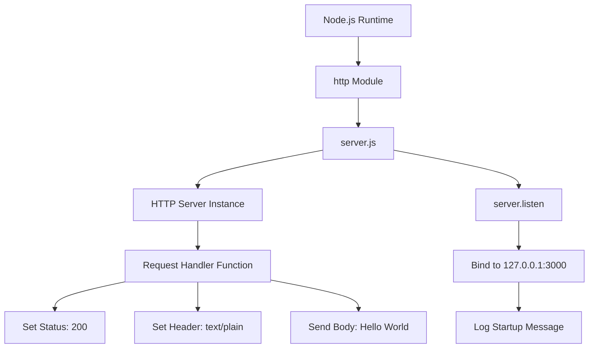
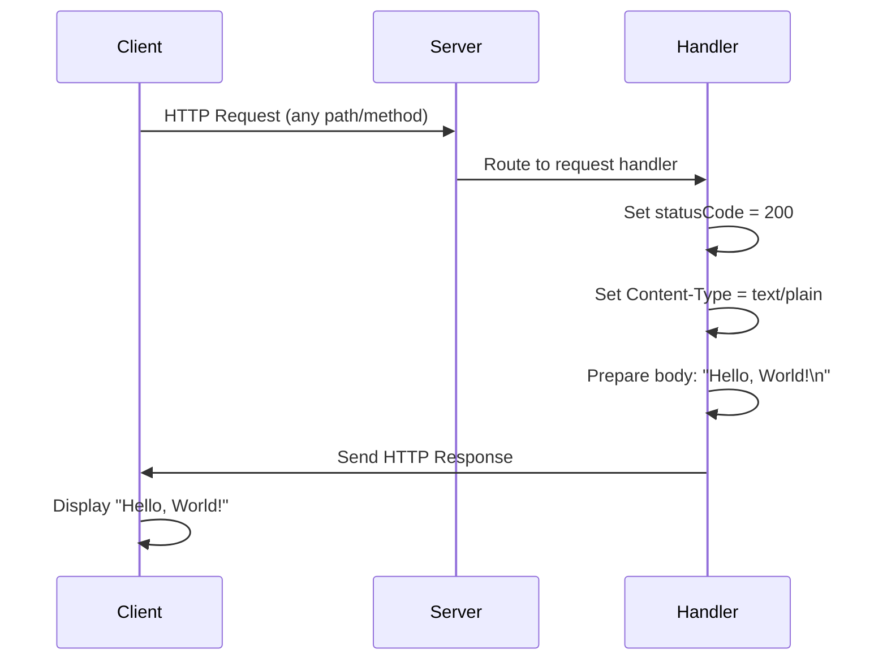
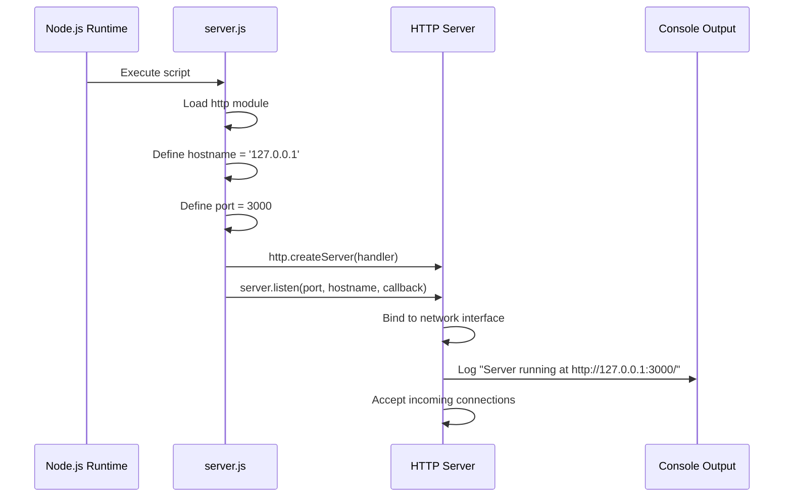

# hao-backprop-test
*Package name: hello_world (internal)*

[](https://nodejs.org/)
[](https://opensource.org/licenses/MIT)

A simple Node.js HTTP server test project for backpropagation integration testing and learning purposes.

## Table of Contents

1. [Overview](#overview)
2. [Prerequisites](#prerequisites)
3. [Installation](#installation)
4. [Usage](#usage)
5. [API Documentation](#api-documentation)
   - [Endpoints](#endpoints)
6. [Code Structure](#code-structure)
7. [Configuration](#configuration)
8. [Deployment Guide](#deployment-guide)
   - [Local Development Deployment](#local-development-deployment)
   - [Production Deployment Considerations](#production-deployment-considerations)
9. [Troubleshooting](#troubleshooting)
10. [License](#license)
11. [Author](#author)
12. [Glossary](#glossary)

## Overview

The **hao-backprop-test** project is a minimal Node.js HTTP server implementation designed for backpropagation integration testing. This project demonstrates the fundamentals of creating an HTTP server using Node.js core modules without any external dependencies.

**Technology Stack:**
- **Node.js**: v12.0.0 or higher (LTS v18+ recommended)
- **Core Module**: `http` (built-in Node.js module)
- **Dependencies**: Zero external dependencies

**Key Features:**
- Simple HTTP server responding to all requests with "Hello, World!"
- Localhost binding for secure local development
- Zero-dependency architecture using only Node.js core APIs
- Single-file implementation for easy understanding
- Cross-platform compatibility (Windows, macOS, Linux)

**Use Cases:**
- Learning Node.js HTTP server fundamentals
- Testing backpropagation integration workflows
- Template for building more complex HTTP servers
- Development and debugging baseline

**Source**: `/server.js:1-15`, `/package.json:1-11`

[↑ Back to Top](#table-of-contents)

## Prerequisites

Before running this project, ensure you have the following installed on your system:

### Required Software

| Software | Minimum Version | Recommended Version | Purpose |
|----------|----------------|---------------------|---------|
| Node.js | v12.0.0 | v18.x LTS | JavaScript runtime environment |
| npm | 6.x | 8.x or higher | Package manager (bundled with Node.js) |

### Operating System Compatibility

This project is cross-platform and runs on:
- **Windows**: Windows 10 or higher
- **macOS**: macOS 10.15 (Catalina) or higher
- **Linux**: Any modern distribution (Ubuntu 18.04+, Debian 10+, CentOS 7+, etc.)

### Verification

To verify your environment is ready, run the following commands:

```bash
# Check Node.js version
$ node --version
v18.17.0

# Check npm version
$ npm --version
9.8.1
```

If Node.js is not installed, download it from [nodejs.org](https://nodejs.org/).

**Source**: Inferred from Node.js core API usage in `/server.js:1`

[↑ Back to Top](#table-of-contents)

## Installation

This project has zero external dependencies, making installation straightforward.

### Step 1: Clone or Download the Repository

```bash
# Clone the repository (if using Git)
$ git clone <repository-url>
$ cd hao-backprop-test

# Or download and extract the ZIP file, then navigate to the directory
$ cd hao-backprop-test
```

### Step 2: Verify Project Files

Ensure the following files are present:

```bash
# List files in the project directory
$ ls -la
README.md
package.json
package-lock.json
server.js
```

### Step 3: No npm install Required

**Important**: This project uses only Node.js core modules and has **no external dependencies**. You do not need to run `npm install`.

```bash
# Verification: Check package.json dependencies
$ cat package.json
# Note: "dependencies" field is empty or absent
```

You're now ready to run the server!

**Source**: `/package.json:11` (empty dependencies)

[↑ Back to Top](#table-of-contents)

## Usage

### Starting the Server

To start the HTTP server, run the following command from the project directory:

```bash
$ node server.js
```

### Expected Console Output

Once the server starts successfully, you should see:

```text
Server running at http://127.0.0.1:3000/
```

This confirms the server is running and listening for connections on localhost (127.0.0.1) at port 3000.

**Source**: `/server.js:13` (startup log)

### Accessing the Server

#### Option 1: Using a Web Browser

1. Open your web browser
2. Navigate to: `http://127.0.0.1:3000/`
3. You should see the response: **Hello, World!**

#### Option 2: Using curl (Command Line)

```bash
# In a new terminal window (keep the server running)
$ curl http://127.0.0.1:3000/
Hello, World!

# Test with any path (all paths return the same response)
$ curl http://127.0.0.1:3000/test
Hello, World!

$ curl http://127.0.0.1:3000/any/path/here
Hello, World!
```

#### Option 3: Using wget

```bash
$ wget -qO- http://127.0.0.1:3000/
Hello, World!
```

### Stopping the Server

To stop the server, press `Ctrl+C` in the terminal where the server is running:

```bash
$ node server.js
Server running at http://127.0.0.1:3000/
^C
# Server stopped
```

**Source**: `/server.js:9` (response body), `/server.js:13` (startup message)

[↑ Back to Top](#table-of-contents)

## API Documentation

### Endpoints

#### Universal Endpoint: ALL /* (Wildcard)

This server responds to **all HTTP requests** regardless of the request method or path.

**Endpoint Details:**

| Property | Value |
|----------|-------|
| **Methods** | ALL (GET, POST, PUT, DELETE, PATCH, OPTIONS, HEAD, etc.) |
| **Path** | `/*` (all paths) |
| **Request Parameters** | None (all ignored) |
| **Request Body** | Ignored |
| **Response Status** | `200 OK` |
| **Response Headers** | `Content-Type: text/plain` |
| **Response Body** | `Hello, World!\n` |

**Request Format:**

No specific request format is required. The server accepts any valid HTTP request.

**Response Format:**

```http
HTTP/1.1 200 OK
Content-Type: text/plain
Date: Mon, 01 Jan 2024 12:00:00 GMT
Connection: keep-alive
Content-Length: 14

Hello, World!
```

### Example Requests

#### Example 1: Basic GET Request

```bash
$ curl http://127.0.0.1:3000/
Hello, World!
```

#### Example 2: GET Request with Path

```bash
$ curl http://127.0.0.1:3000/api/users
Hello, World!
```

#### Example 3: POST Request

```bash
$ curl -X POST http://127.0.0.1:3000/submit
Hello, World!
```

#### Example 4: Request with Headers and Body (All Ignored)

```bash
$ curl -X POST \
  -H "Content-Type: application/json" \
  -d '{"name":"test"}' \
  http://127.0.0.1:3000/data
Hello, World!
```

### Response Codes

| Status Code | Description | When It Occurs |
|-------------|-------------|----------------|
| 200 OK | Successful response | Always (for all requests) |

**Note**: This simple server does not implement error handling or other HTTP status codes. All requests receive a `200 OK` response.

**Source**: `/server.js:6-10` (request handler implementation)

[↑ Back to Top](#table-of-contents)

## Code Structure

### File Organization

This project uses a **single-file architecture** for simplicity:

```
/
├── README.md           # Project documentation (this file)
├── server.js           # Main HTTP server implementation
├── package.json        # Project metadata and configuration
└── package-lock.json   # Dependency lock file
```

### Module Breakdown

The `server.js` file contains the complete server implementation organized as follows:

| Code Section | Lines | Purpose | Description |
|--------------|-------|---------|-------------|
| Module Import | 1 | Dependencies | Imports Node.js core `http` module |
| Configuration | 3-4 | Settings | Defines hostname ('127.0.0.1') and port (3000) constants |
| Request Handler | 6-10 | Request Processing | Creates HTTP server with request handler function |
| Server Initialization | 12-14 | Startup | Binds server to hostname:port and logs startup message |

### Application Architecture

The following diagram illustrates the component relationships:



**Source**: `/server.js:1-15` (complete architecture)

### Request/Response Flow

This sequence diagram shows how an HTTP request is processed:



**Source**: `/server.js:6-10` (request handling flow)

### Server Startup Sequence

This diagram illustrates the server initialization process:



**Source**: `/server.js:1-14` (initialization sequence)

### Code Explanation

#### Line 1: Module Import
```javascript
const http = require('http');
```
Imports the Node.js core `http` module, which provides functionality for creating HTTP servers and clients.

#### Lines 3-4: Configuration Constants
```javascript
const hostname = '127.0.0.1';
const port = 3000;
```
Defines server configuration:
- `hostname`: Binds to localhost (127.0.0.1) for local-only access
- `port`: Listens on port 3000 for incoming connections

#### Lines 6-10: Request Handler
```javascript
const server = http.createServer((req, res) => {
  res.statusCode = 200;
  res.setHeader('Content-Type', 'text/plain');
  res.end('Hello, World!\n');
});
```
Creates an HTTP server with a request handler that:
1. Sets response status to 200 OK
2. Sets Content-Type header to text/plain
3. Sends "Hello, World!\n" as the response body and closes the connection

#### Lines 12-14: Server Initialization
```javascript
server.listen(port, hostname, () => {
  console.log(`Server running at http://${hostname}:${port}/`);
});
```
Starts the server by binding to the specified hostname and port, then logs a startup message.

**For detailed function signatures and parameters, see JSDoc comments in** `/server.js`.

**Source**: `/server.js:1-15`

[↑ Back to Top](#table-of-contents)

## Configuration

### Configuration Options

The server uses two configuration constants defined in `server.js`:

| Variable | Location | Type | Default | Description | Modification Notes |
|----------|----------|------|---------|-------------|--------------------|
| `hostname` | `server.js:3` | string | `'127.0.0.1'` | Server bind address (localhost only) | Change to `'0.0.0.0'` for external access |
| `port` | `server.js:4` | number | `3000` | Server listening port | Change to any available port (1024-65535 recommended) |

**Source**: `/server.js:3-4`

### Modifying Configuration

#### Changing the Port

To run the server on a different port, edit line 4 in `server.js`:

```javascript
// Original
const port = 3000;

// Modified to use port 8080
const port = 8080;
```

After modification, restart the server and access it at `http://127.0.0.1:8080/`.

#### Enabling External Access

**Security Warning**: Only enable external access if you understand the security implications.

To allow connections from other machines on your network, change line 3 in `server.js`:

```javascript
// Original (localhost only)
const hostname = '127.0.0.1';

// Modified (all network interfaces)
const hostname = '0.0.0.0';
```

After modification, the server will be accessible via your machine's IP address:
- Local: `http://127.0.0.1:3000/`
- Network: `http://192.168.1.x:3000/` (replace with your actual IP)

### Environment Variables (Future Enhancement)

Currently, configuration is hardcoded. For more flexible configuration, consider using environment variables:

```javascript
// Enhanced configuration example (not currently implemented)
const hostname = process.env.HOST || '127.0.0.1';
const port = process.env.PORT || 3000;
```

This would allow configuration via command line:

```bash
$ HOST=0.0.0.0 PORT=8080 node server.js
```

**Source**: `/server.js:3-4`

[↑ Back to Top](#table-of-contents)

## Deployment Guide

### Local Development Deployment

For local development and testing, follow the instructions in the [Usage](#usage) section. The default configuration (localhost binding on port 3000) is ideal for development purposes.

**Suitable for:**
- Development and debugging
- Testing and experimentation
- Learning Node.js fundamentals
- Local application integration testing

### Production Deployment Considerations

#### Network Configuration

For production deployment, modify the server configuration to accept external connections:

```javascript
// server.js - Production configuration
const hostname = '0.0.0.0';  // Listen on all network interfaces
const port = process.env.PORT || 3000;  // Use environment variable
```

**Source**: `/server.js:3-4` (modified for production)

#### Environment Variables

Use environment variables for flexible configuration:

| Variable | Required | Default | Description |
|----------|----------|---------|-------------|
| `PORT` | No | 3000 | Server listening port |
| `HOST` | No | 127.0.0.1 | Server bind address (use 0.0.0.0 for production) |
| `NODE_ENV` | No | development | Environment mode (development, production, test) |

**Example Production Startup:**

```bash
$ NODE_ENV=production HOST=0.0.0.0 PORT=8080 node server.js
```

#### Process Management

For production environments, use a process manager to ensure the server stays running:

##### Option 1: PM2 (Recommended)

```bash
# Install PM2 globally
$ npm install -g pm2

# Start the server with PM2
$ pm2 start server.js --name hao-backprop-test

# View logs
$ pm2 logs hao-backprop-test

# Restart the server
$ pm2 restart hao-backprop-test

# Stop the server
$ pm2 stop hao-backprop-test

# Configure PM2 to start on system boot
$ pm2 startup
$ pm2 save
```

##### Option 2: systemd (Linux)

Create a systemd service file at `/etc/systemd/system/hao-backprop.service`:

```ini
[Unit]
Description=Hao Backprop Test HTTP Server
After=network.target

[Service]
Type=simple
User=www-data
WorkingDirectory=/path/to/hao-backprop-test
ExecStart=/usr/bin/node /path/to/hao-backprop-test/server.js
Restart=on-failure
Environment=NODE_ENV=production
Environment=HOST=0.0.0.0
Environment=PORT=3000

[Install]
WantedBy=multi-user.target
```

Enable and start the service:

```bash
$ sudo systemctl daemon-reload
$ sudo systemctl enable hao-backprop
$ sudo systemctl start hao-backprop
$ sudo systemctl status hao-backprop
```

##### Option 3: Docker

Create a `Dockerfile`:

```dockerfile
FROM node:18-alpine

WORKDIR /app

COPY package*.json ./
COPY server.js ./

EXPOSE 3000

CMD ["node", "server.js"]
```

Build and run:

```bash
$ docker build -t hao-backprop-test .
$ docker run -d -p 3000:3000 --name hao-backprop hao-backprop-test
```

#### Security Considerations

**⚠️ Important**: This simple server has no built-in security features. For production use, implement the following:

1. **Reverse Proxy**: Use nginx or Apache as a reverse proxy
   ```nginx
   # nginx example configuration
   server {
       listen 80;
       server_name example.com;
       
       location / {
           proxy_pass http://127.0.0.1:3000;
           proxy_set_header Host $host;
           proxy_set_header X-Real-IP $remote_addr;
       }
   }
   ```

2. **HTTPS/TLS**: Enable encryption using Let's Encrypt or SSL certificates

3. **Rate Limiting**: Implement request rate limiting to prevent abuse

4. **Request Logging**: Add logging for monitoring and debugging
   ```javascript
   const server = http.createServer((req, res) => {
     console.log(`${new Date().toISOString()} - ${req.method} ${req.url}`);
     res.statusCode = 200;
     res.setHeader('Content-Type', 'text/plain');
     res.end('Hello, World!\n');
   });
   ```

5. **Firewall Rules**: Configure firewall to restrict access

6. **Regular Updates**: Keep Node.js and system packages updated

#### Monitoring and Health Checks

Implement health check endpoints for monitoring:

```javascript
// Enhanced server with health check (example modification)
const server = http.createServer((req, res) => {
  if (req.url === '/health') {
    res.statusCode = 200;
    res.setHeader('Content-Type', 'application/json');
    res.end(JSON.stringify({ status: 'ok', uptime: process.uptime() }));
  } else {
    res.statusCode = 200;
    res.setHeader('Content-Type', 'text/plain');
    res.end('Hello, World!\n');
  }
});
```

**Source**: `/server.js:3-4` (current configuration), inferred production requirements

[↑ Back to Top](#table-of-contents)

## Troubleshooting

### Common Issues and Solutions

#### Issue 1: "Address already in use" Error

**Error Message:**
```
Error: listen EADDRINUSE: address already in use 127.0.0.1:3000
```

**Cause:** Another process is already using port 3000.

**Solutions:**

**Option A: Find and Kill the Process**

On Linux/macOS:
```bash
# Find the process using port 3000
$ lsof -i :3000
# Or
$ netstat -tulpn | grep :3000

# Kill the process (replace PID with actual process ID)
$ kill -9 <PID>
```

On Windows:
```cmd
# Find the process using port 3000
> netstat -ano | findstr :3000

# Kill the process (replace PID with actual process ID)
> taskkill /PID <PID> /F
```

**Option B: Change the Port**

Modify `server.js` line 4 to use a different port:
```javascript
const port = 8080;  // Or any available port
```

#### Issue 2: "Cannot GET /" Shows Error in Browser

**Error Message:** Browser shows "This site can't be reached" or connection error.

**Cause:** The server is not running.

**Solution:**

1. Start the server:
   ```bash
   $ node server.js
   ```

2. Verify the server is running by checking for the startup message:
   ```text
   Server running at http://127.0.0.1:3000/
   ```

3. Try accessing `http://127.0.0.1:3000/` again

#### Issue 3: "node: command not found"

**Error Message:**
```bash
$ node server.js
bash: node: command not found
```

**Cause:** Node.js is not installed or not in your system PATH.

**Solution:**

1. Install Node.js from [nodejs.org](https://nodejs.org/)
2. Verify installation:
   ```bash
   $ node --version
   v18.17.0
   ```
3. If installed but not found, add Node.js to your PATH environment variable

#### Issue 4: Cannot Access Server from Another Device

**Symptom:** Server runs on your computer, but other devices on the network cannot access it.

**Cause:** Server is bound to localhost (127.0.0.1) which only accepts local connections.

**Solution:**

1. Change the hostname in `server.js` line 3:
   ```javascript
   const hostname = '0.0.0.0';  // Listen on all network interfaces
   ```

2. Restart the server

3. Find your machine's IP address:
   ```bash
   # Linux/macOS
   $ ifconfig
   # or
   $ ip addr show
   
   # Windows
   > ipconfig
   ```

4. Access the server from another device using your IP:
   ```
   http://192.168.1.x:3000/
   ```

5. **Security Note:** Ensure your firewall allows incoming connections on port 3000

#### Issue 5: Server Stops Unexpectedly

**Cause:** Process terminated due to unhandled errors or system issues.

**Solution:**

Use a process manager like PM2 (see [Deployment Guide](#deployment-guide)) to automatically restart the server:

```bash
$ pm2 start server.js --name hao-backprop-test
$ pm2 logs hao-backprop-test  # View logs to identify issues
```

### Getting Additional Help

If you encounter issues not covered here:

1. Check the [Node.js documentation](https://nodejs.org/docs/)
2. Review the [HTTP module documentation](https://nodejs.org/api/http.html)
3. Ensure you're using a supported Node.js version (v12.0.0 or higher)
4. Check server logs for error messages

**Source**: Inferred from common deployment scenarios

[↑ Back to Top](#table-of-contents)

## License

This project is licensed under the **MIT License**.

### MIT License

```
MIT License

Copyright (c) 2024 hxu

Permission is hereby granted, free of charge, to any person obtaining a copy
of this software and associated documentation files (the "Software"), to deal
in the Software without restriction, including without limitation the rights
to use, copy, modify, merge, publish, distribute, sublicense, and/or sell
copies of the Software, and to permit persons to whom the Software is
furnished to do so, subject to the following conditions:

The above copyright notice and this permission notice shall be included in all
copies or substantial portions of the Software.

THE SOFTWARE IS PROVIDED "AS IS", WITHOUT WARRANTY OF ANY KIND, EXPRESS OR
IMPLIED, INCLUDING BUT NOT LIMITED TO THE WARRANTIES OF MERCHANTABILITY,
FITNESS FOR A PARTICULAR PURPOSE AND NONINFRINGEMENT. IN NO EVENT SHALL THE
AUTHORS OR COPYRIGHT HOLDERS BE LIABLE FOR ANY CLAIM, DAMAGES OR OTHER
LIABILITY, WHETHER IN AN ACTION OF CONTRACT, TORT OR OTHERWISE, ARISING FROM,
OUT OF OR IN CONNECTION WITH THE SOFTWARE OR THE USE OR OTHER DEALINGS IN THE
SOFTWARE.
```

**Source**: `/package.json:10`

[↑ Back to Top](#table-of-contents)

## Author

**hxu**

This project was created by hxu as a test project for backpropagation integration.

**Source**: `/package.json:9`

[↑ Back to Top](#table-of-contents)

## Glossary

### Technical Terms

- **HTTP Server**: A Node.js server instance created using the `http.createServer()` method that listens for and responds to HTTP requests from clients (browsers, curl, etc.).

- **Request Handler**: A callback function that processes incoming HTTP requests and generates responses. In this server, it's the arrow function `(req, res) => {...}` passed to `createServer()`.

- **Hostname**: The network address the server binds to. Using `127.0.0.1` (localhost) restricts access to the local machine only, while `0.0.0.0` allows external connections from any network interface.

- **Port**: The network port number the server listens on for incoming connections. Valid ports range from 0-65535, with ports 1024-65535 recommended for user applications to avoid conflicts with system services.

- **Response Body**: The content sent back to the client in the HTTP response. In this server, the response body is always the text string `"Hello, World!\n"`.

- **Status Code**: A three-digit HTTP response code indicating the result of the request. This server always returns `200 OK`, indicating a successful response.

- **Content-Type Header**: An HTTP header that specifies the format of the response body. This server uses `text/plain`, indicating the response contains plain text (not HTML, JSON, or other formats).

- **JSDoc**: A documentation standard for JavaScript using specially formatted comment blocks (starting with `/**`) to document APIs, function signatures, parameters, and return values.

- **Localhost**: The loopback network interface (127.0.0.1) that refers to the local computer. Connections to localhost never leave the machine, providing a secure environment for development.

- **Node.js**: A JavaScript runtime built on Chrome's V8 JavaScript engine that allows JavaScript to be executed outside of a web browser, enabling server-side applications.

- **Core Module**: A built-in Node.js module that comes bundled with Node.js and doesn't require installation via npm. The `http` module is a core module.

**Source**: Terminology derived from `/server.js:1-15` implementation

[↑ Back to Top](#table-of-contents)

---

**Related Documentation:**
- **Inline Code Documentation**: See JSDoc comments in `/server.js` for detailed function signatures and parameters
- **Configuration Details**: See constants defined in `/server.js:3-4`
- **Project Metadata**: See `/package.json` for package information and license details

---

*Last Updated: 2024*