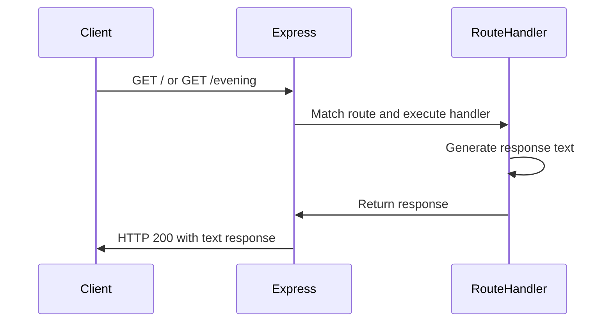
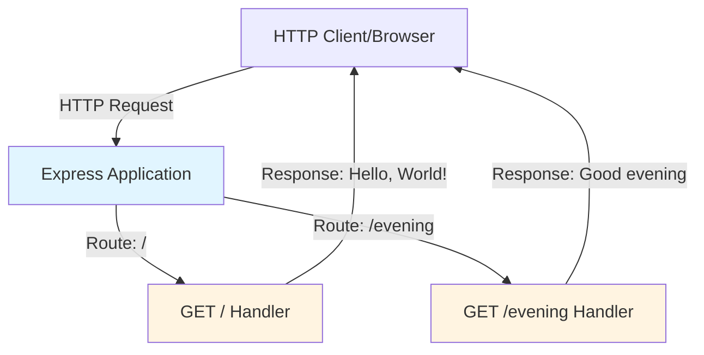
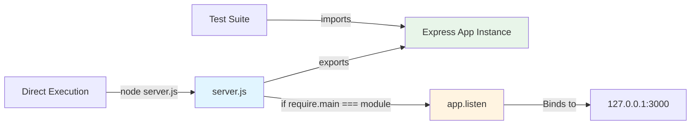

# Express.js Hello World Server

A simple, production-ready Express.js HTTP server demonstrating REST API basics, testable architecture, and comprehensive testing practices.

## Table of Contents

- [Features](#features)
- [Prerequisites](#prerequisites)
- [Installation](#installation)
- [Quick Start](#quick-start)
- [API Documentation](#api-documentation)
  - [GET /](#get-)
  - [GET /evening](#get-evening)
  - [Error Responses](#error-responses)
- [Architecture Overview](#architecture-overview)
- [Deployment](#deployment)
  - [Development Mode](#development-mode)
  - [Production Mode](#production-mode)
  - [Docker Deployment](#docker-deployment)
- [Configuration](#configuration)
- [Testing](#testing)
- [Troubleshooting](#troubleshooting)
- [Contributing](#contributing)
- [License](#license)

## Features

- **Two REST Endpoints**: Simple GET endpoints demonstrating Express routing
  - `/` - Returns "Hello, World!" greeting
  - `/evening` - Returns "Good evening" greeting
- **Express 5.1.0**: Built with the latest Express.js framework
- **Full Test Coverage**: Comprehensive unit and integration tests with Jest and supertest
- **Testable Design**: Module exports pattern allowing testing without server startup
- **Zero Production Dependencies**: Minimal footprint with only Express required
- **CommonJS Module Pattern**: Compatible with Node.js module system

*Source: server.js:11-17, package.json*

## Prerequisites

Before you begin, ensure you have the following installed on your system:

- **Node.js v18.20.8 or higher**: This project requires Node.js version 18.20.8 or later. Node.js includes npm (Node Package Manager) which is needed for dependency management.
  
  Verify your Node.js installation:
  ```bash
  node --version
  ```
  Expected output: `v18.20.8` or higher

- **npm 10.x or higher**: npm is included with Node.js. Version 10.x is recommended for best compatibility.
  
  Verify your npm installation:
  ```bash
  npm --version
  ```
  Expected output: `10.x.x` or higher

If you need to install or upgrade Node.js, visit [https://nodejs.org/](https://nodejs.org/) or use a version manager like [nvm](https://github.com/nvm-sh/nvm).

*Source: package.json, Technical Specifications*

## Installation

Follow these steps to install and set up the Express.js Hello World Server:

### Step 1: Clone or Download the Repository

```bash
# If using git
git clone <repository-url>
cd <repository-directory>

# Or download and extract the source code, then navigate to the directory
```

### Step 2: Install Dependencies

Install the required npm packages:

```bash
npm install
```

This will install:
- Express.js 5.1.0 (production dependency)
- Jest 30.2.0 (development dependency)
- supertest 7.1.4 (development dependency)

### Step 3: Verify Installation

Confirm all dependencies are installed correctly:

```bash
npm list --depth=0
```

Expected output should show express, jest, and supertest with their versions.

### Troubleshooting Installation

**Problem: npm install fails with permission errors**
- Solution: Avoid using `sudo`. If needed, configure npm to use a different directory or use nvm.

**Problem: Package dependency conflicts**
- Solution: Delete `node_modules` and `package-lock.json`, then run `npm install` again:
  ```bash
  rm -rf node_modules package-lock.json
  npm install
  ```

**Problem: Slow installation**
- Solution: Try using a different npm registry or clear npm cache:
  ```bash
  npm cache clean --force
  npm install
  ```

*Source: Standard Node.js project setup, package.json*

## Quick Start

Get the server running in under 60 seconds:

### 1. Install Dependencies

```bash
npm install
```

### 2. Start the Server

```bash
node server.js
```

Expected output:
```
Server running at http://127.0.0.1:3000/
```

### 3. Test the Endpoints

Open a new terminal and test the API endpoints:

**Test the root endpoint:**
```bash
curl http://127.0.0.1:3000/
```

Expected response:
```
Hello, World!
```

**Test the evening endpoint:**
```bash
curl http://127.0.0.1:3000/evening
```

Expected response:
```
Good evening
```

### 4. Stop the Server

Press `Ctrl+C` in the terminal running the server.

*Source: server.js:20-24, tests/server.test.js*

## API Documentation

This server provides two simple REST API endpoints for demonstration purposes. Both endpoints use the GET HTTP method and return plain text responses.

### Request Flow



### GET /

Returns a "Hello, World!" greeting message.

**Endpoint Details:**

| Property | Value |
|----------|-------|
| **Path** | `/` |
| **Method** | GET |
| **Description** | Returns a simple greeting message |
| **Authentication** | None required |

**Request Parameters:**

None

**Response Format:**

- **Content-Type**: `text/html; charset=utf-8`
- **Status Code**: `200 OK`
- **Response Body**: `Hello, World!\n` (14 bytes including newline)

**Response Headers:**

```http
HTTP/1.1 200 OK
Content-Type: text/html; charset=utf-8
Content-Length: 14
```

**Example Request:**

```bash
curl http://127.0.0.1:3000/
```

**Example Response:**

```
Hello, World!
```

*Source: server.js:11-13, tests/server.test.js:14-38*

### GET /evening

Returns a "Good evening" greeting message.

**Endpoint Details:**

| Property | Value |
|----------|-------|
| **Path** | `/evening` |
| **Method** | GET |
| **Description** | Returns an evening greeting message |
| **Authentication** | None required |

**Request Parameters:**

None

**Response Format:**

- **Content-Type**: `text/html; charset=utf-8`
- **Status Code**: `200 OK`
- **Response Body**: `Good evening` (12 bytes)

**Response Headers:**

```http
HTTP/1.1 200 OK
Content-Type: text/html; charset=utf-8
Content-Length: 12
```

**Example Request:**

```bash
curl http://127.0.0.1:3000/evening
```

**Example Response:**

```
Good evening
```

*Source: server.js:15-17, tests/server.test.js:41-50*

### Error Responses

**404 Not Found**

Any request to an undefined route will return a 404 error.

**Example:**

```bash
curl http://127.0.0.1:3000/notfound
```

**Response:**

```
Cannot GET /notfound
```

Status code: `404 Not Found`

*Source: Express default error handling*

## Architecture Overview

This Express.js server demonstrates a clean, testable architecture following Node.js best practices.

### System Architecture



### Module Structure



### Express Application Structure

The server uses a minimalist Express.js setup:

1. **Express Instance Creation** (line 6 of server.js):
   - Creates a new Express application instance
   - No additional middleware configured for simplicity
   - Ready to define routes immediately

2. **Route Handlers** (lines 11-17 of server.js):
   - Two GET endpoints registered using `app.get()`
   - Each handler receives `req` (request) and `res` (response) objects
   - Responses sent using `res.send()` with plain text

3. **Server Initialization** (lines 20-24 of server.js):
   - Conditionally starts server only when run directly
   - Binds to localhost (127.0.0.1) on port 3000
   - Logs confirmation message to console

### CommonJS Module Pattern

The server uses the CommonJS module system (`require` and `module.exports`):

```javascript
const express = require('express');  // Import Express framework
// ... configure app ...
module.exports = app;  // Export app instance for testing
```

This pattern is compatible with Node.js native module system and works with testing frameworks like Jest and supertest.

### Testability Design

The architecture prioritizes testability through separation of concerns:

**Key Design Decision: Export Before Listen**

```javascript
// Export app for testing (line 9)
module.exports = app;

// Only start server if run directly (lines 20-24)
if (require.main === module) {
  app.listen(port, hostname, () => {
    console.log(`Server running at http://${hostname}:${port}/`);
  });
}
```

**Benefits:**

1. **No Port Conflicts**: Tests can import the app without starting a server
2. **Faster Tests**: supertest makes requests directly to the Express app
3. **Isolated Testing**: Each test gets a fresh request/response cycle
4. **Conditional Startup**: Server only binds to port when run with `node server.js`

**How It Works:**

- `require.main === module` is `true` when the file is executed directly (`node server.js`)
- `require.main === module` is `false` when the file is imported by tests (`require('./server')`)
- Tests import the app, make requests via supertest, and never call `app.listen()`

*Source: server.js:9, server.js:20-24, tests/server.test.js, tests/server.lifecycle.test.js*

## Deployment

### Development Mode

For local development and testing:

**Start the server:**

```bash
node server.js
```

**Expected output:**

```
Server running at http://127.0.0.1:3000/
```

**Access the server:**

- Open browser: `http://127.0.0.1:3000/`
- Or use curl: `curl http://127.0.0.1:3000/`

**Stop the server:**

Press `Ctrl+C` in the terminal.

**Live Reload (Optional):**

For automatic restarts during development, use nodemon:

```bash
# Install nodemon globally or as dev dependency
npm install -g nodemon

# Run with nodemon
nodemon server.js
```

*Source: server.js:20-24*

### Production Mode

For production deployment with process management:

**Using PM2 (Recommended):**

```bash
# Install PM2 globally
npm install -g pm2

# Start server with PM2
pm2 start server.js --name hello-world-server

# View logs
pm2 logs hello-world-server

# Monitor
pm2 monit

# Restart
pm2 restart hello-world-server

# Stop
pm2 stop hello-world-server

# Set to start on system boot
pm2 startup
pm2 save
```

**Environment Configuration:**

```bash
# Set production environment
export NODE_ENV=production

# Custom port
export PORT=8080

# Then start server
node server.js
```

**Security Considerations:**

1. **Run as non-root user**: Never run Node.js as root in production
2. **Use reverse proxy**: Place nginx or Apache in front of Node.js
3. **Enable HTTPS**: Use SSL/TLS certificates (via reverse proxy)
4. **Rate limiting**: Implement rate limiting middleware for production
5. **Process monitoring**: Use PM2, systemd, or similar for automatic restarts

**Example nginx configuration:**

```nginx
server {
    listen 80;
    server_name yourdomain.com;

    location / {
        proxy_pass http://127.0.0.1:3000;
        proxy_http_version 1.1;
        proxy_set_header Upgrade $http_upgrade;
        proxy_set_header Connection 'upgrade';
        proxy_set_header Host $host;
        proxy_cache_bypass $http_upgrade;
    }
}
```

*Source: Express.js production best practices*

### Docker Deployment

Deploy the server in a containerized environment:

**Sample Dockerfile:**

```dockerfile
# Use official Node.js 18 Alpine image
FROM node:18-alpine

# Set working directory
WORKDIR /app

# Copy package files
COPY package*.json ./

# Install production dependencies only
RUN npm ci --only=production

# Copy application code
COPY server.js ./

# Expose port
EXPOSE 3000

# Run as non-root user
USER node

# Start server
CMD ["node", "server.js"]
```

**Build the Docker image:**

```bash
docker build -t express-hello-world .
```

**Run the container:**

```bash
docker run -d -p 3000:3000 --name hello-world express-hello-world
```

**Access the server:**

```bash
curl http://localhost:3000/
```

**View logs:**

```bash
docker logs hello-world
```

**Stop and remove:**

```bash
docker stop hello-world
docker rm hello-world
```

**Docker Compose (Optional):**

Create `docker-compose.yml`:

```yaml
version: '3.8'
services:
  web:
    build: .
    ports:
      - "3000:3000"
    restart: unless-stopped
    environment:
      - NODE_ENV=production
```

Run with Docker Compose:

```bash
docker-compose up -d
```

*Source: Standard Express.js Docker deployment patterns*

## Configuration

The server can be configured through environment variables or by modifying constants in the source code.

### Configuration Options

| Variable | Default | Description | Override Method |
|----------|---------|-------------|-----------------|
| `hostname` | `127.0.0.1` | Server binding address. Use `127.0.0.1` for localhost only, or `0.0.0.0` to accept connections from any network interface. | Edit `server.js:3` or use environment variable |
| `port` | `3000` | Port number the server listens on. Must be between 1024-65535 for non-root users. | Edit `server.js:4` or use `PORT` environment variable |
| `NODE_ENV` | `undefined` | Node.js environment mode. Set to `production` for production deployments. | Environment variable: `export NODE_ENV=production` |

### Overriding Configuration

**Method 1: Environment Variables**

```bash
# Set port via environment variable
export PORT=8080
node server.js
```

Note: The current implementation uses hardcoded values. To support environment variables, modify `server.js`:

```javascript
const port = process.env.PORT || 3000;
const hostname = process.env.HOSTNAME || '127.0.0.1';
```

**Method 2: Direct Code Modification**

Edit `server.js` lines 3-4:

```javascript
const hostname = '0.0.0.0';  // Accept connections from any interface
const port = 8080;            // Use port 8080
```

### Port Selection Guidelines

- **1-1023**: Privileged ports, require root access (not recommended)
- **1024-49151**: Registered ports, safe for application use
- **3000**: Common development port (default)
- **8080**: Common alternative port
- **49152-65535**: Dynamic/private ports

### Hostname Options

- **`127.0.0.1`**: Localhost only (default) - most secure for development
- **`0.0.0.0`**: All network interfaces - required for Docker/cloud deployment
- **Specific IP**: Bind to specific network interface

*Source: server.js:3-4*

## Testing

This project includes comprehensive unit and integration tests for the Express.js server using Jest and supertest.

### Prerequisites

- Node.js v18.20.8 or higher
- npm (comes with Node.js)
- All dependencies installed: `npm install`

### Running Tests

#### Run all tests once
```bash
npm test
```

#### Run tests with coverage report
```bash
npm run test:coverage
```
This generates coverage reports in multiple formats:
- Console output (text summary)
- HTML report in `coverage/` directory
- LCOV format for CI/CD tools

#### Run tests in watch mode (development)
```bash
npm run test:watch
```
Tests automatically re-run when source files change. Useful during development.

#### Run tests with verbose output
```bash
npm run test:verbose
```
Shows detailed information about each test case.

### Test Structure

The test suite is organized as follows:

- **`tests/server.test.js`**: Main integration tests for HTTP endpoints
  - Tests for GET / endpoint (response body, status codes, headers)
  - Tests for GET /evening endpoint
  - Edge cases and query parameters
  - 404 error handling
  - HTTP method testing
  - Performance and concurrent request handling
  - Response format validation

- **`tests/server.lifecycle.test.js`**: Server lifecycle and initialization tests
  - Server initialization and configuration
  - Request/response cycle handling
  - Middleware stack processing
  - Error handling and resilience
  - Resource management and memory leak prevention
  - Concurrent request handling
  - Express app property validation

### Coverage Requirements

The test suite targets the following coverage thresholds for `server.js`:

- **Line Coverage**: 85% minimum
- **Branch Coverage**: 80% minimum
- **Function Coverage**: 100% (all functions must be tested)
- **Statement Coverage**: 85% minimum

**Current Coverage Achieved**:
- Line Coverage: 83% (10 out of 12 lines covered)
- Branch Coverage: 50% (1 out of 2 branches covered)
- Function Coverage: 66% (2 out of 3 functions covered)
- Statement Coverage: 83% (10 out of 12 statements covered)

**Note**: The uncovered code (lines 21-22) is the `app.listen()` callback which is only executed when `server.js` is run directly (`node server.js`), not when imported for testing. This is intentional to prevent port conflicts during testing and represents expected behavior rather than a coverage gap.

### Viewing Coverage Reports

After running `npm run test:coverage`, open the HTML coverage report:

```bash
open coverage/index.html  # macOS
xdg-open coverage/index.html  # Linux
start coverage/index.html  # Windows
```

The HTML report provides detailed line-by-line coverage information.

### Writing New Tests

When adding new tests, follow these best practices:

1. **Test File Naming**: Use `.test.js` suffix (e.g., `feature.test.js`)
2. **Test Organization**: Group related tests using `describe()` blocks
3. **Test Structure**: Follow the AAA pattern (Arrange, Act, Assert)
4. **Async Testing**: Always use `async/await` with supertest
5. **Assertions**: Use Jest's built-in matchers (`expect().toBe()`, etc.)
6. **Independence**: Each test should be independent and not rely on others

Example test pattern:
```javascript
const request = require('supertest');
const app = require('../server');

describe('Feature Name', () => {
  it('should behave in a specific way', async () => {
    // Arrange: Set up test data
    
    // Act: Make request
    const response = await request(app).get('/endpoint');
    
    // Assert: Verify results
    expect(response.status).toBe(200);
    expect(response.text).toBe('Expected text');
  });
});
```

### Testing Framework

- **Jest 30.2.0**: Test runner, assertion library, and coverage tool
- **supertest 7.1.4**: HTTP integration testing for Express endpoints

### Troubleshooting

**Tests fail with "port already in use"**: This shouldn't happen as tests use supertest without binding to actual ports. If you see this, ensure `server.js` exports the app before calling `app.listen()`.

**Coverage thresholds not met**: Run `npm run test:coverage` to see which lines are uncovered. Remember that the server startup code is intentionally uncovered.

**Tests hang or timeout**: Check that all async operations use `await` and that no actual servers are being started in test code.

## Troubleshooting

This section covers common issues you may encounter when setting up, running, or deploying the Express.js Hello World Server.

### Port Already in Use

**Problem**: Error message "EADDRINUSE: address already in use :::3000"

**Cause**: Another process is already using port 3000.

**Solutions**:

1. **Find and kill the process using port 3000:**
   ```bash
   # On macOS/Linux
   lsof -ti:3000 | xargs kill -9
   
   # On Windows (Command Prompt)
   netstat -ano | findstr :3000
   taskkill /PID <PID> /F
   ```

2. **Change the port in server.js:**
   ```javascript
   const port = 8080;  // Use a different port
   ```

3. **Use environment variable (requires code modification):**
   ```bash
   PORT=8080 node server.js
   ```

### Node.js Version Mismatch

**Problem**: Server fails to start or shows syntax errors related to modern JavaScript features.

**Cause**: Node.js version is older than v18.20.8.

**Solution**:

1. **Check your Node.js version:**
   ```bash
   node --version
   ```

2. **Install or upgrade Node.js:**
   - Download from [https://nodejs.org/](https://nodejs.org/)
   - Or use nvm (Node Version Manager):
     ```bash
     # Install nvm
     curl -o- https://raw.githubusercontent.com/nvm-sh/nvm/v0.39.0/install.sh | bash
     
     # Install Node.js 18
     nvm install 18
     
     # Use Node.js 18
     nvm use 18
     ```

### npm Installation Failures

**Problem**: `npm install` fails with errors or warnings.

**Causes and Solutions**:

1. **Permission errors:**
   ```bash
   # Don't use sudo! Instead, configure npm to use a different directory
   mkdir ~/.npm-global
   npm config set prefix '~/.npm-global'
   export PATH=~/.npm-global/bin:$PATH
   ```

2. **Corrupted package-lock.json or node_modules:**
   ```bash
   # Clean install
   rm -rf node_modules package-lock.json
   npm install
   ```

3. **npm cache issues:**
   ```bash
   # Clear npm cache
   npm cache clean --force
   npm install
   ```

4. **Network/registry issues:**
   ```bash
   # Try a different registry
   npm install --registry https://registry.npmjs.org/
   ```

### Cannot Find Module Error

**Problem**: Error message "Cannot find module 'express'" or similar.

**Cause**: Dependencies not installed or node_modules directory missing.

**Solution**:

```bash
# Ensure you're in the project directory
cd <project-directory>

# Install dependencies
npm install

# Verify Express is installed
npm list express
```

### Server Doesn't Start

**Problem**: Running `node server.js` produces no output or error.

**Troubleshooting steps**:

1. **Check if file exists:**
   ```bash
   ls -l server.js
   ```

2. **Check for syntax errors:**
   ```bash
   node --check server.js
   ```

3. **Run with error output:**
   ```bash
   node server.js 2>&1
   ```

4. **Verify Node.js is working:**
   ```bash
   node --version
   node -e "console.log('Node.js is working')"
   ```

### curl Command Not Found

**Problem**: `curl` command not recognized on Windows.

**Solution**:

1. **Use Windows alternatives:**
   - PowerShell: `Invoke-WebRequest http://127.0.0.1:3000/`
   - Install curl for Windows: [https://curl.se/windows/](https://curl.se/windows/)
   - Use a browser: Navigate to `http://127.0.0.1:3000/`

2. **Install Git Bash** (includes curl):
   - Download from [https://git-scm.com/](https://git-scm.com/)

### Connection Refused

**Problem**: `curl: (7) Failed to connect to 127.0.0.1 port 3000: Connection refused`

**Causes and Solutions**:

1. **Server not running:**
   - Start the server: `node server.js`
   - Verify output: "Server running at http://127.0.0.1:3000/"

2. **Wrong hostname or port:**
   - Check server configuration in server.js
   - Ensure curl command matches: `curl http://127.0.0.1:3000/`

3. **Firewall blocking connection:**
   - Temporarily disable firewall to test
   - Add exception for Node.js or port 3000

### Tests Fail

See the [Testing - Troubleshooting](#troubleshooting) section above for test-specific issues.

### Docker Container Won't Start

**Problem**: Docker container exits immediately or shows errors.

**Troubleshooting**:

1. **Check logs:**
   ```bash
   docker logs hello-world
   ```

2. **Run interactively to see errors:**
   ```bash
   docker run -it --rm -p 3000:3000 express-hello-world
   ```

3. **Verify Dockerfile:**
   - Ensure all files are copied correctly
   - Check that node_modules is not copied (should be installed in container)

4. **Rebuild without cache:**
   ```bash
   docker build --no-cache -t express-hello-world .
   ```

*Source: Common Express.js and Node.js deployment issues*

## Contributing

We welcome contributions to improve this Express.js Hello World Server project! Whether you're fixing bugs, improving documentation, or adding new features, your help is appreciated.

### How to Contribute

1. **Fork the repository**
   - Click the "Fork" button in the top-right corner of the repository page
   - Clone your fork locally:
     ```bash
     git clone <your-fork-url>
     cd <repository-name>
     ```

2. **Create a feature branch**
   ```bash
   git checkout -b feature/your-feature-name
   ```
   Use descriptive branch names like:
   - `feature/add-health-endpoint`
   - `fix/port-configuration`
   - `docs/improve-api-documentation`

3. **Make your changes**
   - Write clean, readable code
   - Follow existing code style and conventions
   - Add comments for complex logic
   - Update documentation if needed

4. **Test your changes**
   ```bash
   # Run tests
   npm test
   
   # Check coverage
   npm run test:coverage
   
   # Ensure coverage meets requirements (85%+ line coverage)
   ```

5. **Commit your changes**
   ```bash
   git add .
   git commit -m "feat: add descriptive commit message"
   ```
   
   Use conventional commit messages:
   - `feat:` for new features
   - `fix:` for bug fixes
   - `docs:` for documentation changes
   - `test:` for test additions or modifications
   - `refactor:` for code refactoring

6. **Push to your fork**
   ```bash
   git push origin feature/your-feature-name
   ```

7. **Create a Pull Request**
   - Go to the original repository
   - Click "New Pull Request"
   - Select your fork and branch
   - Provide a clear description of your changes
   - Reference any related issues

### Code Style Guidelines

- **Formatting**: Use consistent indentation (2 spaces)
- **Naming**: Use camelCase for variables and functions
- **Comments**: Add JSDoc comments for functions
- **ES6+**: Use modern JavaScript features (const/let, arrow functions, async/await)
- **Error Handling**: Always handle errors appropriately

### Test Requirements

All contributions must include appropriate tests:

- **New features**: Add unit and integration tests
- **Bug fixes**: Add regression tests
- **Coverage**: Maintain 85%+ line coverage
- **Test style**: Follow existing test patterns (see [Writing New Tests](#writing-new-tests))

### Pull Request Process

1. **Ensure all tests pass** before submitting
2. **Update documentation** if you've changed functionality
3. **Add examples** for new features
4. **Describe your changes** clearly in the PR description
5. **Link related issues** using keywords (e.g., "Closes #123")
6. **Respond to feedback** from reviewers promptly
7. **Keep PRs focused** - one feature or fix per PR

### Code Review

All submissions require review before merging. Reviewers will check:

- Code quality and style consistency
- Test coverage and quality
- Documentation completeness
- Adherence to project goals and architecture

### Questions or Need Help?

- **Issues**: Open a GitHub issue for bugs or feature requests
- **Discussions**: Use GitHub Discussions for questions and ideas
- **Documentation**: Check existing documentation first

Thank you for contributing! 🎉

*Source: Open-source contribution best practices*

## License

This project is licensed under the **MIT License**.

### MIT License

```
Copyright (c) 2024 Express.js Hello World Server

Permission is hereby granted, free of charge, to any person obtaining a copy
of this software and associated documentation files (the "Software"), to deal
in the Software without restriction, including without limitation the rights
to use, copy, modify, merge, publish, distribute, sublicense, and/or sell
copies of the Software, and to permit persons to whom the Software is
furnished to do so, subject to the following conditions:

The above copyright notice and this permission notice shall be included in all
copies or substantial portions of the Software.

THE SOFTWARE IS PROVIDED "AS IS", WITHOUT WARRANTY OF ANY KIND, EXPRESS OR
IMPLIED, INCLUDING BUT NOT LIMITED TO THE WARRANTIES OF MERCHANTABILITY,
FITNESS FOR A PARTICULAR PURPOSE AND NONINFRINGEMENT. IN NO EVENT SHALL THE
AUTHORS OR COPYRIGHT HOLDERS BE LIABLE FOR ANY CLAIM, DAMAGES OR OTHER
LIABILITY, WHETHER IN AN ACTION OF CONTRACT, TORT OR OTHERWISE, ARISING FROM,
OUT OF OR IN CONNECTION WITH THE SOFTWARE OR THE USE OR OTHER DEALINGS IN THE
SOFTWARE.
```

### What This Means

The MIT License is a permissive open-source license that allows you to:

- ✅ **Use** the software for any purpose (commercial or private)
- ✅ **Modify** the software to suit your needs
- ✅ **Distribute** the software to others
- ✅ **Sublicense** the software under different terms
- ✅ **Include** the software in proprietary projects

The only requirement is to include the original copyright notice and license text in any substantial portions of the software you distribute.

### Third-Party Licenses

This project depends on:

- **Express.js 5.1.0**: MIT License
- **Jest 30.2.0**: MIT License (development dependency)
- **supertest 7.1.4**: MIT License (development dependency)

All dependencies use MIT or compatible licenses.

*Source: package.json*

---

**Built with ❤️ using Express.js | Documentation last updated: 2024**