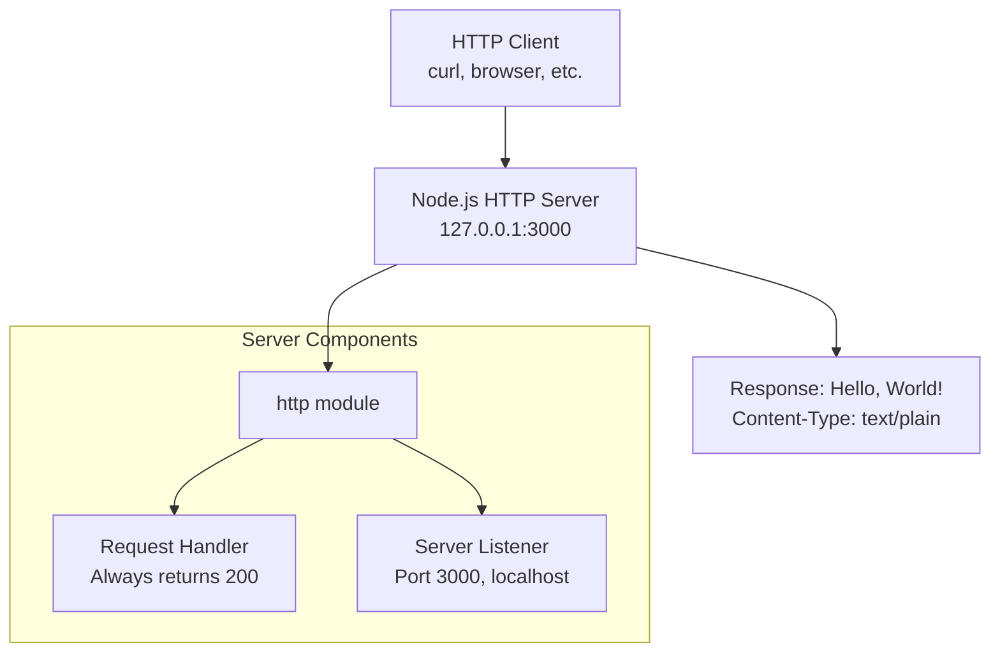
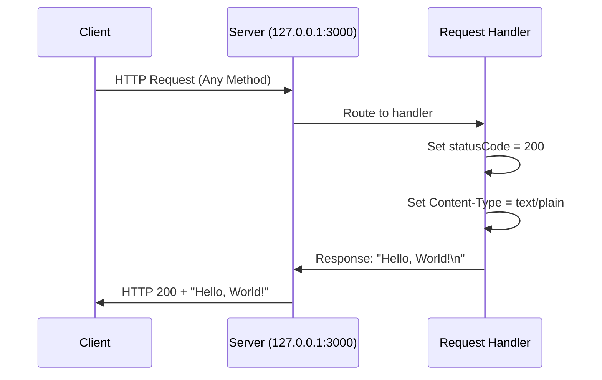

# hao-backprop-test

A minimal Node.js HTTP server project designed as a test fixture for backpropagation integration testing. This lightweight server provides a simple HTTP endpoint for testing and development purposes.

## Table of Contents

- [Project Overview](#project-overview)
- [Prerequisites and System Requirements](#prerequisites-and-system-requirements)
- [Installation and Setup Instructions](#installation-and-setup-instructions)
- [API Documentation](#api-documentation)
- [Usage Examples](#usage-examples)
- [Architecture](#architecture)
- [Deployment Guide](#deployment-guide)
- [Configuration Details](#configuration-details)
- [Testing Integration Patterns](#testing-integration-patterns)
- [Troubleshooting Guide](#troubleshooting-guide)
- [Contributing Guidelines](#contributing-guidelines)
- [License](#license)

## Project Overview

### Purpose

The `hao-backprop-test` project serves as a lightweight HTTP server test fixture specifically designed for backpropagation integration testing. It provides a minimal but reliable HTTP endpoint that returns consistent responses, making it ideal for:

- Integration testing in CI/CD pipelines
- Local development and testing environments
- Network connectivity validation
- HTTP client testing and validation
- Performance baseline measurements

### Technical Specifications

- **Language**: JavaScript (Node.js)
- **Dependencies**: Zero external dependencies (uses only Node.js built-in modules)
- **Architecture**: Single-file HTTP server implementation
- **Response Format**: Plain text
- **Default Binding**: localhost (127.0.0.1:3000)

### Project Structure

```
hao-backprop-test/
├── server.js          # Main HTTP server implementation
├── package.json       # Node.js project configuration
└── README.md          # This documentation file
```

**Note**: There is a naming discrepancy in the project configuration. The `package.json` file references the project name as "hello_world", but the canonical project name is "hao-backprop-test" as indicated in this README and repository structure.

## Prerequisites and System Requirements

### Node.js Version Requirements

- **Minimum**: Node.js 6.0.0 (ES2015+ support required)
- **Recommended**: Node.js 14.x or later
- **LTS Versions**: Fully supported

### System Compatibility

- **Operating Systems**: Linux, macOS, Windows
- **Network Requirements**: Available port 3000 (configurable)
- **Memory**: Minimal (< 50MB typical usage)
- **CPU**: Single-threaded, low CPU usage

### Verification Commands

```bash
# Check Node.js version
node --version

# Verify npm is available
npm --version
```

## Installation and Setup Instructions

### Quick Start

1. **Clone or download the project files**:
   ```bash
   # Ensure you have server.js and package.json in your directory
   ls -la
   ```

2. **No dependency installation required** (zero external dependencies):
   ```bash
   # Optional: Initialize npm if needed
   npm init -y
   ```

3. **Start the server**:
   ```bash
   # Direct execution (recommended)
   node server.js
   ```

### Package Scripts Configuration

**Current Configuration Issue**: The `package.json` file has an incorrect `main` entry pointing to `index.js` instead of `server.js`, and lacks a proper start script.

**Recommended corrections** for `package.json`:
```json
{
    "name": "hao-backprop-test",
    "version": "1.0.0",
    "description": "Test fixture for backprop integration",
    "main": "server.js",
    "scripts": {
        "start": "node server.js",
        "dev": "node server.js",
        "test": "curl http://127.0.0.1:3000 || echo 'Server not running'"
    },
    "author": "hxu",
    "license": "MIT"
}
```

**With corrected scripts**, you can use:
```bash
# Start server using npm
npm start

# Development mode (same as start for this simple server)
npm run dev

# Basic connectivity test
npm test
```

## API Documentation

### HTTP Endpoint Specification

#### GET / (Root Endpoint)

Returns a simple "Hello, World!" message for any request to the server.

**Endpoint**: `http://127.0.0.1:3000/`  
**Methods**: ALL (GET, POST, PUT, DELETE, etc.)  
**Content-Type**: `text/plain`  
**Status Code**: `200 OK`

**Request Format**:
- No specific request format required
- Accepts any HTTP method
- Request body is ignored
- Query parameters are ignored
- Headers are ignored (except for basic HTTP processing)

**Response Format**:
```
Content-Type: text/plain
Status: 200 OK

Hello, World!
```

**Response Headers**:
- `Content-Type: text/plain`
- Standard HTTP headers (Date, Connection, etc.)

## Usage Examples

### Basic HTTP Requests

#### Using curl

```bash
# Basic GET request
curl http://127.0.0.1:3000
# Output: Hello, World!

# GET request with verbose output
curl -v http://127.0.0.1:3000

# POST request (same response)
curl -X POST http://127.0.0.1:3000

# With custom headers (headers are ignored)
curl -H "Content-Type: application/json" http://127.0.0.1:3000
```

#### Using HTTPie

```bash
# Basic request
http GET http://127.0.0.1:3000

# POST request
http POST http://127.0.0.1:3000
```

#### Using wget

```bash
# Download response
wget http://127.0.0.1:3000 -O response.txt

# Display response
wget http://127.0.0.1:3000 -q -O -
```

### Programming Language Examples

#### JavaScript (Node.js)

```javascript
const http = require('http');

const options = {
  hostname: '127.0.0.1',
  port: 3000,
  path: '/',
  method: 'GET'
};

const req = http.request(options, (res) => {
  let data = '';
  res.on('data', (chunk) => {
    data += chunk;
  });
  res.on('end', () => {
    console.log('Response:', data); // "Hello, World!"
  });
});

req.end();
```

#### Python

```python
import requests

response = requests.get('http://127.0.0.1:3000')
print(response.text)  # "Hello, World!"
print(response.status_code)  # 200
```

### Integration Testing Examples

#### Shell Script Testing

```bash
#!/bin/bash
# integration_test.sh

# Start server in background
node server.js &
SERVER_PID=$!

# Wait for server to start
sleep 2

# Test endpoint
RESPONSE=$(curl -s http://127.0.0.1:3000)

if [ "$RESPONSE" = "Hello, World!" ]; then
    echo "✅ Server test passed"
    EXIT_CODE=0
else
    echo "❌ Server test failed. Got: $RESPONSE"
    EXIT_CODE=1
fi

# Cleanup
kill $SERVER_PID
exit $EXIT_CODE
```

## Architecture

### System Architecture Diagram



### HTTP Request Flow



### Technical Implementation Details

**Source**: `server.js` lines 1-14

- **HTTP Module**: Uses Node.js built-in `http` module (line 1)
- **Configuration**: Hardcoded hostname `127.0.0.1` and port `3000` (lines 3-4)
- **Request Handler**: Universal handler for all HTTP methods (lines 6-10)
- **Response Generation**: Sets status 200, Content-Type header, and plain text body
- **Server Startup**: Listens on specified hostname/port with callback logging (lines 12-14)

## Deployment Guide

### Local Development Deployment

#### Standard Node.js Execution

```bash
# Direct execution (simplest)
node server.js
# Output: Server running at http://127.0.0.1:3000/

# Background execution
node server.js &

# With nohup (survives terminal close)
nohup node server.js > server.log 2>&1 &
```

### Docker Deployment

#### Dockerfile

```dockerfile
FROM node:16-alpine

WORKDIR /app

# Copy application files
COPY server.js package.json ./

# Expose port (Note: server binds to 127.0.0.1, needs modification for Docker)
EXPOSE 3000

# Start command
CMD ["node", "server.js"]
```

**Important**: The server currently binds to `127.0.0.1` (localhost only). For Docker deployment, modify the hostname in `server.js` to `0.0.0.0`:

```javascript
const hostname = '0.0.0.0'; // Instead of '127.0.0.1'
```

#### Docker Commands

```bash
# Build image
docker build -t hao-backprop-test .

# Run container
docker run -p 3000:3000 hao-backprop-test

# Run in background
docker run -d -p 3000:3000 --name backprop-server hao-backprop-test
```

### Process Management

#### Using PM2

```bash
# Install PM2 globally
npm install -g pm2

# Start server with PM2
pm2 start server.js --name "backprop-server"

# Monitor
pm2 status
pm2 logs backprop-server

# Auto-restart on system reboot
pm2 startup
pm2 save
```

#### Using systemd (Linux)

Create `/etc/systemd/system/backprop-server.service`:

```ini
[Unit]
Description=Backprop Test Server
After=network.target

[Service]
Type=simple
User=nodejs
WorkingDirectory=/path/to/hao-backprop-test
ExecStart=/usr/bin/node server.js
Restart=always
RestartSec=10
Environment=NODE_ENV=production

[Install]
WantedBy=multi-user.target
```

```bash
# Enable and start service
sudo systemctl enable backprop-server
sudo systemctl start backprop-server

# Check status
sudo systemctl status backprop-server
```

## Configuration Details

### Network Configuration

- **Hostname**: `127.0.0.1` (localhost only)
  - **Security**: Prevents external network access
  - **Use Case**: Local testing and development
  - **Limitation**: Not accessible from other machines or Docker containers
  
- **Port**: `3000`
  - **Default**: Standard development port
  - **Modification**: Edit line 4 in `server.js`
  - **Conflicts**: Ensure port is not in use by other services

### Localhost Binding Explanation

The server is configured to bind only to the loopback interface (`127.0.0.1`), which means:

**Advantages**:
- Enhanced security (no external network exposure)
- Ideal for local testing and development
- No firewall configuration required

**Limitations**:
- Not accessible from other machines on the network
- Docker containers cannot access the service without network configuration
- Not suitable for production deployment without modification

**For External Access**, modify `server.js` line 3:
```javascript
// For all interfaces (less secure)
const hostname = '0.0.0.0';

// For specific interface
const hostname = '192.168.1.100'; // Your machine's IP
```

### Environment Variables Support

The current implementation uses hardcoded values. For flexibility, consider this pattern:

```javascript
const hostname = process.env.HOST || '127.0.0.1';
const port = process.env.PORT || 3000;
```

## Testing Integration Patterns

### CI/CD Pipeline Integration

#### GitHub Actions Example

```yaml
name: Test Backprop Server

on: [push, pull_request]

jobs:
  test:
    runs-on: ubuntu-latest
    steps:
    - uses: actions/checkout@v2
    
    - name: Setup Node.js
      uses: actions/setup-node@v2
      with:
        node-version: '16'
    
    - name: Start server
      run: |
        node server.js &
        sleep 2
    
    - name: Test endpoint
      run: |
        RESPONSE=$(curl -s http://127.0.0.1:3000)
        if [ "$RESPONSE" = "Hello, World!" ]; then
          echo "✅ Test passed"
        else
          echo "❌ Test failed"
          exit 1
        fi
```

#### Jenkins Pipeline Example

```groovy
pipeline {
    agent any
    
    stages {
        stage('Start Server') {
            steps {
                sh 'node server.js > server.log 2>&1 &'
                sh 'sleep 3'
            }
        }
        
        stage('Test') {
            steps {
                script {
                    def response = sh(
                        script: 'curl -s http://127.0.0.1:3000',
                        returnStdout: true
                    ).trim()
                    
                    if (response != "Hello, World!") {
                        error("Test failed. Expected 'Hello, World!', got '${response}'")
                    }
                }
            }
        }
    }
    
    post {
        always {
            sh 'pkill -f "node server.js" || true'
        }
    }
}
```

### Automated Testing Scripts

#### Health Check Script

```bash
#!/bin/bash
# health_check.sh

MAX_ATTEMPTS=5
ATTEMPT=0

while [ $ATTEMPT -lt $MAX_ATTEMPTS ]; do
    RESPONSE=$(curl -s -w "%{http_code}" http://127.0.0.1:3000)
    HTTP_CODE="${RESPONSE: -3}"
    BODY="${RESPONSE%???}"
    
    if [ "$HTTP_CODE" = "200" ] && [ "$BODY" = "Hello, World!" ]; then
        echo "✅ Health check passed"
        exit 0
    fi
    
    ATTEMPT=$((ATTEMPT + 1))
    echo "⚠️  Attempt $ATTEMPT failed, retrying..."
    sleep 2
done

echo "❌ Health check failed after $MAX_ATTEMPTS attempts"
exit 1
```

### Load Testing

#### Using Apache Bench (ab)

```bash
# Basic load test
ab -n 1000 -c 10 http://127.0.0.1:3000/

# Extended test with keep-alive
ab -n 5000 -c 50 -k http://127.0.0.1:3000/
```

#### Using curl for simple stress test

```bash
#!/bin/bash
# stress_test.sh

for i in {1..100}; do
  curl -s http://127.0.0.1:3000 > /dev/null &
done

wait
echo "Stress test completed"
```

## Troubleshooting Guide

### Common Issues

#### 1. "EADDRINUSE: address already in use"

**Problem**: Port 3000 is already in use by another process.

**Solutions**:
```bash
# Find process using port 3000
lsof -i :3000
# or
netstat -tulpn | grep :3000

# Kill the process
kill -9 <PID>

# Or use a different port (modify server.js line 4)
const port = 3001; // or any available port
```

#### 2. "Cannot GET /" or Connection Refused

**Problem**: Server is not running or not accessible.

**Diagnosis**:
```bash
# Check if server is running
ps aux | grep "node server.js"

# Check if port is listening
netstat -an | grep :3000

# Test connectivity
telnet 127.0.0.1 3000
```

**Solutions**:
- Start the server: `node server.js`
- Check firewall settings
- Verify correct hostname/port configuration

#### 3. "Module not found" errors

**Problem**: Node.js cannot find required modules.

**Solutions**:
```bash
# Verify Node.js installation
node --version

# Check current directory has server.js
ls -la server.js

# Verify http module (built-in, should always work)
node -e "console.log(require('http'))"
```

#### 4. Permission Denied (Port < 1024)

**Problem**: Trying to bind to privileged ports.

**Solutions**:
```bash
# Use sudo (not recommended for development)
sudo node server.js

# Use port > 1024 (recommended)
# Modify server.js: const port = 8080;

# Or use authbind (Linux)
authbind --deep node server.js
```

### Performance Issues

#### High Memory Usage

**Diagnosis**:
```bash
# Monitor memory usage
top -p $(pgrep -f "node server.js")

# Node.js memory details
node --inspect server.js
# Then open Chrome DevTools
```

**Solutions**:
- This simple server should use minimal memory
- If memory usage is high, check for memory leaks in modifications
- Consider Node.js garbage collection tuning for production

#### Slow Response Times

**Diagnosis**:
```bash
# Test response time
curl -w "@curl-format.txt" -s -o /dev/null http://127.0.0.1:3000

# Create curl-format.txt with:
#     time_namelookup:  %{time_namelookup}\n
#     time_connect:     %{time_connect}\n
#     time_appconnect:  %{time_appconnect}\n
#     time_pretransfer: %{time_pretransfer}\n
#     time_redirect:    %{time_redirect}\n
#     time_starttransfer: %{time_starttransfer}\n
#     time_total:       %{time_total}\n
```

**Solutions**:
- This simple server should respond in < 1ms
- Check system load and available resources
- Consider using a reverse proxy for production

### Debugging

#### Enable Debug Logging

Add debugging to `server.js`:

```javascript
const server = http.createServer((req, res) => {
  console.log(`${new Date().toISOString()} ${req.method} ${req.url}`);
  console.log('Headers:', req.headers);
  
  res.statusCode = 200;
  res.setHeader('Content-Type', 'text/plain');
  res.end('Hello, World!\n');
});
```

#### Network Troubleshooting

```bash
# Test with different tools
wget http://127.0.0.1:3000
nc -zv 127.0.0.1 3000
telnet 127.0.0.1 3000

# Check routing
ip route
netstat -rn
```

## Contributing Guidelines

### Development Workflow

1. **Fork or clone the repository**
2. **Make changes following existing code style**
3. **Test locally**:
   ```bash
   node server.js
   curl http://127.0.0.1:3000
   ```
4. **Update documentation if needed**
5. **Submit pull request**

### Code Style Guidelines

- Use 2-space indentation (matches existing code)
- Follow existing variable naming conventions
- Keep the server simple and minimal
- Maintain zero external dependencies
- Add comments for any modifications

### Testing Requirements

- Verify server starts without errors
- Confirm response is "Hello, World!"
- Test with various HTTP methods
- Ensure proper HTTP status codes and headers

### Documentation Updates

- Update README.md for any functional changes
- Add JSDoc comments for new functions
- Update troubleshooting guide for new issues
- Include examples for new features

## License

MIT License

Copyright (c) 2024 hxu

Permission is hereby granted, free of charge, to any person obtaining a copy
of this software and associated documentation files (the "Software"), to deal
in the Software without restriction, including without limitation the rights
to use, copy, modify, merge, publish, distribute, sublicense, and/or sell
copies of the Software, and to permit persons to whom the Software is
furnished to do so, subject to the following conditions:

The above copyright notice and this permission notice shall be included in all
copies or substantial portions of the Software.

THE SOFTWARE IS PROVIDED "AS IS", WITHOUT WARRANTY OF ANY KIND, EXPRESS OR
IMPLIED, INCLUDING BUT NOT LIMITED TO THE WARRANTIES OF MERCHANTABILITY,
FITNESS FOR A PARTICULAR PURPOSE AND NONINFRINGEMENT. IN NO EVENT SHALL THE
AUTHORS OR COPYRIGHT HOLDERS BE LIABLE FOR ANY CLAIM, DAMAGES OR OTHER
LIABILITY, WHETHER IN AN ACTION OF CONTRACT, TORT OR OTHERWISE, ARISING FROM,
OUT OF OR IN CONNECTION WITH THE SOFTWARE OR THE USE OR OTHER DEALINGS IN THE
SOFTWARE.

---

**Project Statistics**:
- Lines of Code: 14 (server.js)
- Dependencies: 0 external
- Documentation: Comprehensive (this README)
- Maintenance: Minimal required

**Last Updated**: Auto-generated documentation
**Source Files**: server.js, package.json
**Documentation Version**: 2.0.0 (Complete rewrite from minimal description)