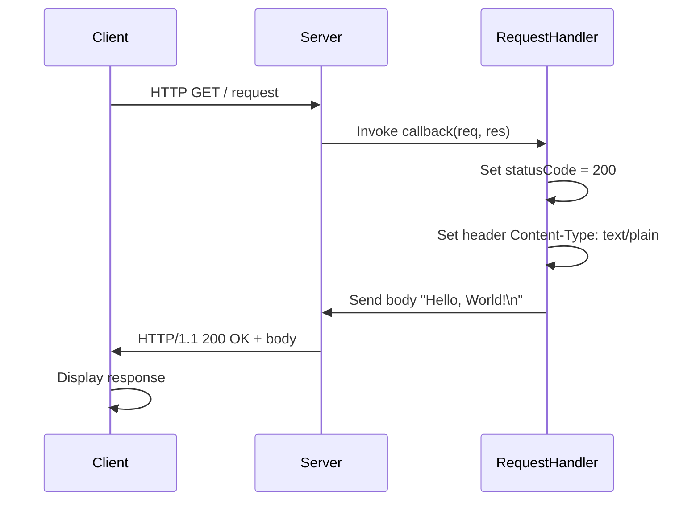
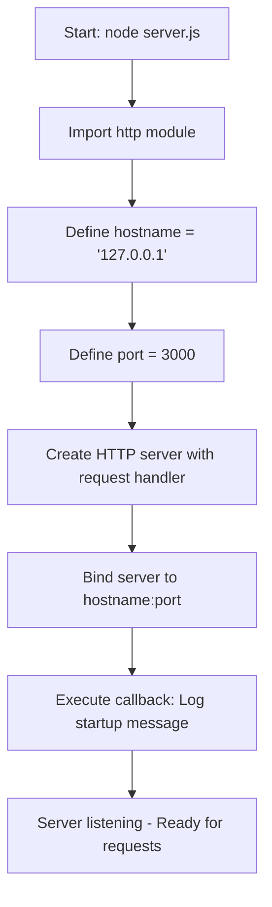

# hao-backprop-test

 

A minimal HTTP server implementation in Node.js that demonstrates a simple "Hello, World!" web service. This project uses only Node.js built-in modules (no external dependencies) to create a lightweight HTTP server that responds to all requests with a plain text greeting. It serves as an excellent starting point for understanding Node.js HTTP server fundamentals, testing deployment workflows, or building more complex web applications.

The server binds exclusively to the loopback interface (127.0.0.1) for security, making it accessible only from the local machine by default. This design choice prevents unintended external access during development and testing phases.

## Table of Contents

- [Features](#features)
- [Prerequisites](#prerequisites)
- [Installation](#installation)
- [Usage](#usage)
- [API Documentation](#api-documentation)
- [Architecture](#architecture)
- [Configuration](#configuration)
- [Deployment](#deployment)
- [Troubleshooting](#troubleshooting)
- [Contributing](#contributing)
- [License](#license)

## Features

- **Zero External Dependencies**: Uses only Node.js built-in `http` module
- **Loopback-Only Binding**: Secure default configuration restricts access to localhost
- **Simple Plain Text Responses**: Returns "Hello, World!" for all HTTP requests
- **Production-Ready**: Easily deployable to various production environments
- **Cross-Platform**: Runs on Linux, macOS, and Windows with Node.js installed
- **Lightweight**: Only 15 lines of server code, minimal resource footprint

## Prerequisites

Before running this server, ensure you have the following installed:

- **Node.js**: Version 14.0.0 or higher (v16.0.0+ recommended, v20.0.0+ fully supported)
  - Download from [nodejs.org](https://nodejs.org/)
  - Verify installation: `node --version`
- **Git**: For cloning the repository
- **No additional dependencies**: Project uses only Node.js built-in modules

**Operating System Compatibility**:
- Linux (all distributions)
- macOS (10.10+)
- Windows (7+)

## Installation

Clone the repository and navigate to the project directory:

```bash
# Clone the repository
git clone <repository-url>

# Navigate to the project directory
cd hao-backprop-test
```

**No npm install required** - This project has zero external dependencies. The server is ready to run immediately after cloning.

### Quick Start

Start the server with a single command:

```bash
node server.js
```

You should see the following output confirming the server is running:

```
Server running at http://127.0.0.1:3000/
```

## Usage

### Starting the Server

Execute the server using Node.js:

```bash
node server.js
```

**Expected Console Output**:
```
Server running at http://127.0.0.1:3000/
```

This message indicates the server is listening for HTTP requests on the loopback interface at port 3000.

### Testing the Server

#### Using curl

```bash
curl http://127.0.0.1:3000/
```

**Expected Response**:
```
Hello, World!
```

#### Using a Web Browser

Open your web browser and navigate to:
```
http://127.0.0.1:3000/
```

You'll see "Hello, World!" displayed in the browser.

#### Using JavaScript fetch API

```javascript
fetch('http://127.0.0.1:3000/')
  .then(response => response.text())
  .then(data => console.log(data))  // Outputs: Hello, World!
  .catch(error => console.error('Error:', error));
```

### Stopping the Server

Press `Ctrl+C` in the terminal where the server is running to gracefully stop it.

## API Documentation

### Endpoints

| Method | Path | Description | Response Status | Content-Type | Response Body |
|--------|------|-------------|-----------------|--------------|---------------|
| GET    | /    | Returns a plain text greeting | 200 OK | text/plain | Hello, World! |
| POST   | /    | Returns a plain text greeting | 200 OK | text/plain | Hello, World! |
| *      | *    | Returns a plain text greeting for all paths | 200 OK | text/plain | Hello, World! |

**Note**: This server responds identically to all HTTP methods and paths (Source: [server.js:6-10](./server.js)).

### Request Example

```bash
curl -v http://127.0.0.1:3000/
```

### Response Details

**Status Code**: `200 OK`

**Headers**:
```
Content-Type: text/plain
```

**Body**:
```
Hello, World!
```

### Response Explanation

- **Status Code 200**: Indicates successful HTTP request (Source: [server.js:7](./server.js))
- **Content-Type text/plain**: Response is plain text, not HTML or JSON (Source: [server.js:8](./server.js))
- **Body**: Simple greeting message terminated with newline character (Source: [server.js:9](./server.js))

### Additional Client Examples

**Using HTTPie**:
```bash
http http://127.0.0.1:3000/
```

**Using wget**:
```bash
wget -qO- http://127.0.0.1:3000/
```

**Using Node.js https module**:
```javascript
const http = require('http');

http.get('http://127.0.0.1:3000/', (res) => {
  let data = '';
  res.on('data', (chunk) => { data += chunk; });
  res.on('end', () => { console.log(data); });  // Outputs: Hello, World!
});
```

## Architecture

### High-Level Overview

The server follows a simple request-response architecture using Node.js's built-in `http` module. When a client sends an HTTP request, the server's request handler function processes it synchronously, sets response headers, and sends back a plain text message.

**Component Structure**:
- **HTTP Module**: Node.js built-in module providing HTTP server functionality (Source: [server.js:1](./server.js))
- **Server Instance**: Created via `http.createServer()`, manages incoming connections
- **Request Handler**: Anonymous callback function that processes all requests (Source: [server.js:6-10](./server.js))
- **Network Binding**: Server listens on loopback interface (127.0.0.1) port 3000 (Source: [server.js:3-4](./server.js))

### HTTP Request Flow Diagram



This sequence diagram illustrates the complete lifecycle of an HTTP request from client initiation through server processing to final response delivery (based on [server.js:6-10](./server.js)).

### Server Initialization Flow



This flowchart represents the server startup process from script execution to ready state (based on [server.js:1-14](./server.js)).

### Data Flow

1. **Initialization**: Server loads configuration constants and creates HTTP server instance
2. **Binding**: Server binds to specified network interface (127.0.0.1:3000)
3. **Listening**: Server enters listening state, waiting for incoming connections
4. **Request Reception**: Incoming HTTP request triggers request handler callback
5. **Response Generation**: Handler sets status code, headers, and body content
6. **Response Transmission**: Server sends complete HTTP response back to client

## Configuration

The server uses two configuration constants defined in [server.js:3-4](./server.js):

### Hostname Configuration

**Default Value**: `'127.0.0.1'` (loopback interface)

**Purpose**: Specifies the network interface to bind the server to.

**Security Implications**:
- `127.0.0.1` (loopback): Server only accepts connections from localhost - **SECURE** for development
- `0.0.0.0` (all interfaces): Server accepts connections from any network interface - **USE WITH CAUTION**

**Customization Example**:

To allow external connections, modify the hostname in [server.js:3](./server.js):

```javascript
const hostname = '0.0.0.0';  // Listen on all network interfaces
```

**Using Environment Variables**:

```javascript
const hostname = process.env.HOSTNAME || '127.0.0.1';
```

### Port Configuration

**Default Value**: `3000`

**Purpose**: Specifies the TCP port for HTTP connections.

**Customization Example**:

To use a different port, modify [server.js:4](./server.js):

```javascript
const port = 8080;  // Use port 8080 instead
```

**Using Environment Variables** (recommended for production):

```javascript
const port = process.env.PORT || 3000;
```

**Port Selection Guidelines**:
- **Ports 0-1023**: Privileged ports, require root/administrator access
- **Ports 1024-49151**: Registered ports, safe for applications
- **Ports 49152-65535**: Dynamic/private ports
- **Port 3000**: Conventional Node.js development port (recommended)

**Avoiding Port Conflicts**:

If port 3000 is already in use, either:
1. Stop the conflicting process
2. Change to an available port (e.g., 3001, 8000, 8080)

## Deployment

### Local Development

For local development, simply run:

```bash
node server.js
```

This starts the server in the foreground. Press `Ctrl+C` to stop.

### Production Deployment with PM2

[PM2](https://pm2.keymetrics.io/) is a production-grade process manager for Node.js applications.

**Installation**:
```bash
npm install -g pm2
```

**Start Server**:
```bash
pm2 start server.js --name "hello-world-server"
```

**Monitoring**:
```bash
pm2 status          # View application status
pm2 logs            # View logs
pm2 monit           # Real-time monitoring
```

**Auto-Start on System Boot**:
```bash
pm2 startup         # Generate startup script
pm2 save            # Save current process list
```

**Stop/Restart**:
```bash
pm2 stop hello-world-server
pm2 restart hello-world-server
pm2 delete hello-world-server
```

### Systemd Service (Linux)

Create a systemd service file for automatic startup on Linux systems.

**Create service file** `/etc/systemd/system/hello-world.service`:

```ini
[Unit]
Description=Hello World Node.js Server
After=network.target

[Service]
Type=simple
User=nodejs
WorkingDirectory=/path/to/hao-backprop-test
ExecStart=/usr/bin/node server.js
Restart=on-failure
Environment=NODE_ENV=production

[Install]
WantedBy=multi-user.target
```

**Enable and start the service**:
```bash
sudo systemctl enable hello-world.service
sudo systemctl start hello-world.service
sudo systemctl status hello-world.service
```

### Docker Deployment

**Create Dockerfile**:

```dockerfile
FROM node:16-alpine

WORKDIR /app

COPY server.js .

EXPOSE 3000

CMD ["node", "server.js"]
```

**Build Docker image**:
```bash
docker build -t hello-world-server .
```

**Run container**:
```bash
docker run -d -p 3000:3000 --name hello-world hello-world-server
```

**View logs**:
```bash
docker logs hello-world
```

### Cloud Platform Deployment

#### Heroku

**Create Procfile**:
```
web: node server.js
```

**Modify server to use PORT environment variable** (add to [server.js:4](./server.js)):
```javascript
const port = process.env.PORT || 3000;
```

**Deploy**:
```bash
heroku create
git push heroku main
heroku open
```

#### AWS EC2

1. Launch an EC2 instance (Ubuntu recommended)
2. Install Node.js: `sudo apt update && sudo apt install -y nodejs npm`
3. Clone repository: `git clone <repository-url>`
4. Navigate to directory: `cd hao-backprop-test`
5. Install PM2: `sudo npm install -g pm2`
6. Start server: `pm2 start server.js`
7. Configure security group to allow inbound traffic on port 3000

#### Azure / Google Cloud Platform

Similar deployment process:
1. Provision virtual machine
2. Install Node.js runtime
3. Clone repository
4. Use PM2 or systemd for process management
5. Configure firewall rules for port access

### Environment-Specific Considerations

**Production Checklist**:
- [ ] Use process manager (PM2, systemd) for automatic restarts
- [ ] Configure proper logging (PM2 logs, syslog)
- [ ] Set up monitoring and alerting
- [ ] Use environment variables for configuration
- [ ] Consider using reverse proxy (Nginx, Apache) for SSL/TLS
- [ ] Implement proper error handling for production resilience

## Troubleshooting

### Port Already in Use (EADDRINUSE)

**Error Message**:
```
Error: listen EADDRINUSE: address already in use :::3000
```

**Cause**: Another process is already using port 3000.

**Solutions**:

1. **Find and kill the conflicting process**:
   ```bash
   # Linux/macOS
   lsof -i :3000
   kill -9 <PID>
   
   # Windows
   netstat -ano | findstr :3000
   taskkill /PID <PID> /F
   ```

2. **Change the port** in [server.js:4](./server.js):
   ```javascript
   const port = 3001;  // Use different port
   ```

### Permission Denied (EACCES)

**Error Message**:
```
Error: listen EACCES: permission denied 0.0.0.0:80
```

**Cause**: Attempting to bind to privileged port (<1024) without proper permissions.

**Solutions**:

1. **Use a non-privileged port** (recommended):
   ```javascript
   const port = 3000;  // Ports > 1024 don't require special permissions
   ```

2. **Run with elevated permissions** (not recommended for development):
   ```bash
   sudo node server.js
   ```

3. **Use port forwarding** via iptables (Linux) or reverse proxy (production).

### Connection Refused

**Error Message**:
```
curl: (7) Failed to connect to 127.0.0.1 port 3000: Connection refused
```

**Diagnosis Steps**:

1. **Verify server is running**:
   ```bash
   ps aux | grep node
   ```

2. **Check server logs** for startup errors

3. **Verify hostname binding**: Ensure you're connecting to the correct interface (127.0.0.1)

4. **Check firewall rules**: Ensure port 3000 is not blocked

### Cannot GET / Error

If you see "Cannot GET /" in the browser, this indicates the server received the request but an application router rejected it. This should NOT occur with this simple server that responds to all paths.

**Verification**: Ensure you're running the correct `server.js` file without modifications.

### Debugging Techniques

**Enable Node.js Inspector**:
```bash
node --inspect server.js
```

**Verbose curl output**:
```bash
curl -v http://127.0.0.1:3000/
```

**Check server is listening**:
```bash
# Linux/macOS
netstat -an | grep 3000

# Windows
netstat -an | findstr 3000
```

## Contributing

This is a minimal demonstration project. If you'd like to contribute improvements or report issues:

1. Fork the repository
2. Create a feature branch (`git checkout -b feature/improvement`)
3. Make your changes with clear commit messages
4. Test thoroughly
5. Submit a pull request with a detailed description

**Code Style**: Maintain the simple, readable style of the existing code. This project intentionally avoids complexity to serve as a clear example.

## License

This project is licensed under the **MIT License**.

Copyright (c) 2024 hxu

Permission is hereby granted, free of charge, to any person obtaining a copy of this software and associated documentation files (the "Software"), to deal in the Software without restriction, including without limitation the rights to use, copy, modify, merge, publish, distribute, sublicense, and/or sell copies of the Software, and to permit persons to whom the Software is furnished to do so, subject to the following conditions:

The above copyright notice and this permission notice shall be included in all copies or substantial portions of the Software.

THE SOFTWARE IS PROVIDED "AS IS", WITHOUT WARRANTY OF ANY KIND, EXPRESS OR IMPLIED, INCLUDING BUT NOT LIMITED TO THE WARRANTIES OF MERCHANTABILITY, FITNESS FOR A PARTICULAR PURPOSE AND NONINFRINGEMENT. IN NO EVENT SHALL THE AUTHORS OR COPYRIGHT HOLDERS BE LIABLE FOR ANY CLAIM, DAMAGES OR OTHER LIABILITY, WHETHER IN AN ACTION OF CONTRACT, TORT OR OTHERWISE, ARISING FROM, OUT OF OR IN CONNECTION WITH THE SOFTWARE OR THE USE OR OTHER DEALINGS IN THE SOFTWARE.

---

**Project**: hao-backprop-test | **Author**: hxu | **Version**: 1.0.0 | **Node.js**: 14+ Required

For more information about Node.js HTTP servers, see the [Node.js HTTP Module Documentation](https://nodejs.org/api/http.html).