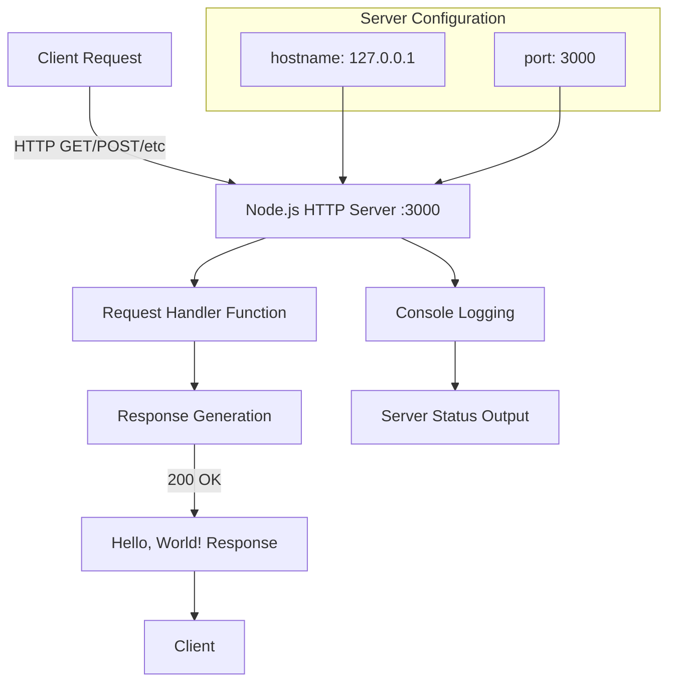

# hao-backprop-test

A minimal Node.js HTTP server designed for Backprop platform integration testing. This project provides a simple "Hello, World!" endpoint to validate connectivity and serve as a foundation for AI service integration.

## Table of Contents

- [Project Overview](#project-overview)
- [Prerequisites](#prerequisites)
- [Installation](#installation)
- [Configuration](#configuration)
- [API Documentation](#api-documentation)
- [Running the Application](#running-the-application)
- [Code Structure](#code-structure)
- [Deployment Guide](#deployment-guide)
- [Troubleshooting](#troubleshooting)
- [Contributing](#contributing)
- [License](#license)

## Project Overview

The **hao-backprop-test** project is a lightweight Node.js HTTP server built specifically for testing integration with the Backprop AI platform. It demonstrates a minimal server implementation using only Node.js built-in modules, making it ideal for:

- **Integration Testing**: Validating Backprop platform connectivity
- **Development Environment Setup**: Quick server deployment for development
- **Learning Resource**: Understanding basic Node.js HTTP server patterns
- **Foundation**: Base for extending with Backprop AI services

### Architecture Overview



### Technology Stack

- **Runtime**: Node.js v22.x LTS or higher
- **Dependencies**: Zero external dependencies (native modules only)
- **Protocol**: HTTP/1.1
- **Architecture**: Single-file server implementation

## Prerequisites

Before running this application, ensure you have the following installed:

### System Requirements

- **Node.js**: v22.x LTS or higher
- **npm**: v7+ (included with Node.js)
- **Operating System**: Cross-platform (Windows, macOS, Linux)

### Network Requirements

- **Port Availability**: Port 3000 must be available
- **Network Access**: Localhost (127.0.0.1) binding
- **Firewall**: Allow connections on port 3000 for testing

### Optional Tools

- **curl**: For command-line API testing
- **Postman**: For GUI-based API testing
- **Process Manager**: PM2 for production deployment

## Installation

### 1. Repository Cloning

```bash
# Clone the repository
git clone <repository-url>
cd hao-backprop-test
```

### 2. Dependency Verification

```bash
# Verify Node.js installation
node --version  # Should be v22.x or higher

# Install dependencies (currently none, but validates npm)
npm install

# Verify project structure
ls -la
```

### 3. Quick Start Verification

```bash
# Start the server
node server.js

# In another terminal, test the endpoint
curl http://127.0.0.1:3000/
```

Expected output: `Hello, World!`

## Configuration

The server configuration is defined in constants at the top of `server.js`:

### Default Configuration

```javascript
// Source: /server.js:3-4
const hostname = '127.0.0.1';  // Localhost only
const port = 3000;             // Default HTTP port
```

### Configuration Options

| Setting | Value | Description | Modification |
|---------|-------|-------------|--------------|
| `hostname` | `'127.0.0.1'` | Server binding address | Edit `/server.js:3` |
| `port` | `3000` | HTTP port number | Edit `/server.js:4` |

### Environment Variable Override

For production deployment, consider using environment variables:

```javascript
// Recommended production configuration
const hostname = process.env.HOST || '127.0.0.1';
const port = process.env.PORT || 3000;
```

### Security Considerations

- **Localhost Binding**: Default configuration only accepts connections from localhost (127.0.0.1)
- **Production**: Change hostname to `'0.0.0.0'` for external access
- **Port Selection**: Use ports above 1024 to avoid requiring root privileges

## API Documentation

### Endpoints

| Endpoint | Method | Request Body | Response | Status Code | Source |
|----------|--------|--------------|----------|-------------|--------|
| `/` | ALL | None | `Hello, World!\n` | 200 | `/server.js:6-10` |

### Request/Response Details

#### Universal Endpoint: `/`

**Description**: Accepts all HTTP methods and returns a simple greeting message.

**Request Format**:
```http
GET http://127.0.0.1:3000/
Host: 127.0.0.1:3000
```

**Response Format**:
```http
HTTP/1.1 200 OK
Content-Type: text/plain
Content-Length: 14

Hello, World!
```

### Testing Examples

#### Using curl

```bash
# Basic GET request
curl http://127.0.0.1:3000/

# POST request (same response)
curl -X POST http://127.0.0.1:3000/

# With headers displayed
curl -i http://127.0.0.1:3000/
```

#### Using JavaScript (fetch)

```javascript
// Browser or Node.js with node-fetch
fetch('http://127.0.0.1:3000/')
  .then(response => response.text())
  .then(data => console.log(data)); // "Hello, World!"
```

#### Using JavaScript (Node.js http)

```javascript
const http = require('http');

const options = {
  hostname: '127.0.0.1',
  port: 3000,
  path: '/',
  method: 'GET'
};

const req = http.request(options, (res) => {
  res.on('data', (chunk) => {
    console.log(`Response: ${chunk}`);
  });
});

req.end();
```

### Error Responses

Currently, the server returns 200 OK for all requests. Common HTTP errors may occur at the transport level:

- **Connection Refused**: Server not running
- **Timeout**: Network connectivity issues
- **Port in Use**: Another service using port 3000

## Running the Application

### Development Mode

```bash
# Standard execution
node server.js

# Expected output:
# Server running at http://127.0.0.1:3000/
```

### Production Mode

#### Using PM2 (Recommended)

```bash
# Install PM2 globally
npm install -g pm2

# Start the application
pm2 start server.js --name "hao-backprop-test"

# Monitor the application
pm2 monit

# Stop the application
pm2 stop "hao-backprop-test"
```

#### Using systemd (Linux)

Create a service file `/etc/systemd/system/hao-backprop-test.service`:

```ini
[Unit]
Description=Hao Backprop Test Server
After=network.target

[Service]
Type=simple
User=nodejs
WorkingDirectory=/path/to/hao-backprop-test
ExecStart=/usr/bin/node server.js
Restart=on-failure

[Install]
WantedBy=multi-user.target
```

Enable and start:

```bash
sudo systemctl enable hao-backprop-test
sudo systemctl start hao-backprop-test
```

### Docker Deployment

Create a `Dockerfile`:

```dockerfile
FROM node:22-alpine

WORKDIR /app
COPY server.js package.json ./

EXPOSE 3000

CMD ["node", "server.js"]
```

Build and run:

```bash
docker build -t hao-backprop-test .
docker run -p 3000:3000 hao-backprop-test
```

## Code Structure

The application consists of a single file with clear, minimal implementation:

### File Overview

```
/
├── README.md           # This documentation file
├── server.js           # Main server implementation
├── package.json        # Project metadata and dependencies
└── package-lock.json   # Dependency lock file
```

### server.js Detailed Walkthrough

#### Dependencies and Setup

```javascript
// Source: /server.js:1
const http = require('http');
```

Uses Node.js built-in HTTP module for server creation. No external dependencies required.

#### Configuration Constants

```javascript
// Source: /server.js:3-4
const hostname = '127.0.0.1';
const port = 3000;
```

**Design Decision**: Hardcoded localhost binding for security. In production, these should be configurable via environment variables.

#### Server Creation and Request Handling

```javascript
// Source: /server.js:6-10
const server = http.createServer((req, res) => {
  res.statusCode = 200;
  res.setHeader('Content-Type', 'text/plain');
  res.end('Hello, World!\n');
});
```

**Request Handler Analysis**:
- **Universal Handler**: Responds to all HTTP methods (GET, POST, PUT, DELETE, etc.)
- **Static Response**: Always returns the same message regardless of request path or method
- **Content-Type**: Explicitly set to `text/plain`
- **Status Code**: Always 200 (OK)
- **Response Body**: Fixed string "Hello, World!\n"

**Extension Points**:
- Add URL routing by checking `req.url`
- Implement method-specific logic with `req.method`
- Parse request body for POST/PUT requests
- Add error handling and different status codes

#### Server Binding and Startup

```javascript
// Source: /server.js:12-14
server.listen(port, hostname, () => {
  console.log(`Server running at http://${hostname}:${port}/`);
});
```

**Startup Process**:
- Binds to specified hostname and port
- Callback executes when server is ready
- Logs server URL for easy testing access
- Uses template literal for dynamic URL construction

### Architecture Decisions

1. **Zero Dependencies**: Enhances security and reduces complexity
2. **Single File**: Simplifies deployment and maintenance
3. **Minimal Feature Set**: Focuses on integration testing requirements
4. **Localhost Only**: Secure default configuration
5. **Universal Endpoint**: Simplifies testing without complex routing

### Extension Patterns

For Backprop integration, consider these enhancement patterns:

```javascript
// URL-based routing
if (req.url === '/health') {
  // Health check endpoint
} else if (req.url === '/api/backprop') {
  // Backprop integration endpoint
}

// Method-based handling
switch (req.method) {
  case 'GET':
    // Handle GET requests
    break;
  case 'POST':
    // Handle POST requests for Backprop data
    break;
}
```

## Deployment Guide

### Local Development Setup

#### Step 1: Environment Preparation

```bash
# Verify Node.js installation
node --version  # v22.0.0 or higher

# Clone and navigate to project
git clone <repository-url>
cd hao-backprop-test

# Verify project files
ls -la  # Should show server.js, package.json, README.md
```

#### Step 2: Development Server

```bash
# Start development server
node server.js

# Server should display:
# Server running at http://127.0.0.1:3000/

# Test in browser or with curl
curl http://127.0.0.1:3000/
```

### Production Deployment

#### Cloud Platform Deployment

##### AWS EC2 Deployment

1. **Instance Setup**:
   ```bash
   # Connect to EC2 instance
   ssh -i your-key.pem ec2-user@your-instance-ip
   
   # Install Node.js
   curl -fsSL https://rpm.nodesource.com/setup_22.x | sudo bash -
   sudo yum install -y nodejs
   ```

2. **Application Deployment**:
   ```bash
   # Clone repository
   git clone <repository-url>
   cd hao-backprop-test
   
   # Modify configuration for external access
   sed -i "s/'127.0.0.1'/'0.0.0.0'/g" server.js
   
   # Install PM2 and start application
   npm install -g pm2
   pm2 start server.js --name "backprop-test"
   pm2 startup
   pm2 save
   ```

3. **Security Configuration**:
   ```bash
   # Configure firewall (if using ufw)
   sudo ufw allow 3000/tcp
   
   # Or configure AWS Security Groups to allow port 3000
   ```

##### Google Cloud Platform

```bash
# Using Google Cloud Run
gcloud run deploy hao-backprop-test \
  --source . \
  --platform managed \
  --region us-central1 \
  --allow-unauthenticated
```

##### Azure Container Instances

```bash
# Using Azure CLI
az container create \
  --resource-group myResourceGroup \
  --name hao-backprop-test \
  --image node:22-alpine \
  --restart-policy OnFailure \
  --ports 3000
```

#### Docker Production Deployment

##### Multi-stage Dockerfile

```dockerfile
# Build stage
FROM node:22-alpine AS builder
WORKDIR /app
COPY package*.json ./
RUN npm ci --only=production && npm cache clean --force

# Production stage
FROM node:22-alpine AS production
RUN addgroup -g 1001 -S nodejs && \
    adduser -S nodejs -u 1001
WORKDIR /app
COPY --from=builder /app/node_modules ./node_modules
COPY --chown=nodejs:nodejs server.js package.json ./
USER nodejs
EXPOSE 3000
CMD ["node", "server.js"]
```

##### Docker Compose for Production

```yaml
# docker-compose.prod.yml
version: '3.8'
services:
  hao-backprop-test:
    build:
      context: .
      dockerfile: Dockerfile
    ports:
      - "3000:3000"
    restart: unless-stopped
    environment:
      - NODE_ENV=production
    healthcheck:
      test: ["CMD", "curl", "-f", "http://localhost:3000/"]
      interval: 30s
      timeout: 10s
      retries: 3
```

#### Production Checklist

- [ ] Configure external hostname (change from `127.0.0.1` to `0.0.0.0`)
- [ ] Set up process management (PM2, systemd, or Docker)
- [ ] Configure firewall rules for port 3000
- [ ] Set up SSL/TLS termination (if required)
- [ ] Configure logging and monitoring
- [ ] Set up automated backups (if stateful data is added)
- [ ] Configure health checks
- [ ] Set up CI/CD pipeline for deployments

### Environment-Specific Configuration

#### Development

```javascript
// server.js modifications for development
const hostname = '127.0.0.1';  // Localhost only
const port = 3000;            // Standard development port
```

#### Staging

```javascript
// server.js modifications for staging
const hostname = '0.0.0.0';   // Accept external connections
const port = process.env.PORT || 3000;  // Use environment port
```

#### Production

```javascript
// server.js modifications for production
const hostname = process.env.HOST || '0.0.0.0';
const port = process.env.PORT || 3000;

// Add production logging
console.log(`Environment: ${process.env.NODE_ENV || 'development'}`);
console.log(`Server starting on ${hostname}:${port}`);
```

## Troubleshooting

### Common Issues and Solutions

#### 1. Port Already in Use

**Error Message**:
```
Error: listen EADDRINUSE: address already in use :::3000
```

**Solutions**:

```bash
# Find process using port 3000
lsof -i :3000
# or on Windows:
netstat -ano | findstr :3000

# Kill the process (replace PID with actual process ID)
kill -9 <PID>
# or on Windows:
taskkill /PID <PID> /F

# Or use a different port in server.js:
const port = 3001;  // Change to available port
```

#### 2. Permission Denied

**Error Message**:
```
Error: listen EACCES: permission denied 0.0.0.0:80
```

**Solution**:
```bash
# Use ports above 1024 (no root required)
const port = 3000;  // Instead of port 80

# Or run with sudo (not recommended)
sudo node server.js
```

#### 3. Connection Refused

**Symptoms**: `curl: (7) Failed to connect to 127.0.0.1 port 3000: Connection refused`

**Debugging Steps**:

```bash
# Verify server is running
ps aux | grep node

# Check if port is listening
netstat -tlnp | grep 3000

# Verify hostname configuration
curl http://127.0.0.1:3000/  # Should work if server is on localhost
curl http://0.0.0.0:3000/     # May not work depending on configuration
```

#### 4. Module Not Found

**Error Message**:
```
Error: Cannot find module 'http'
```

**Solution**:
```bash
# Verify Node.js installation
node --version

# Reinstall Node.js if version is too old
# Download from https://nodejs.org/
```

#### 5. Firewall Blocking Connections

**Symptoms**: Server starts but external connections fail

**Linux (ufw)**:
```bash
# Check firewall status
sudo ufw status

# Allow port 3000
sudo ufw allow 3000/tcp
```

**macOS**:
```bash
# Check if Little Snitch or similar is blocking connections
# Go to System Preferences > Security & Privacy > Firewall
```

**Windows**:
```bash
# Check Windows Defender Firewall
# Control Panel > System and Security > Windows Defender Firewall
# Add rule for port 3000
```

### Performance Troubleshooting

#### High CPU Usage

```bash
# Monitor server performance
top -p $(pgrep -f "node server.js")

# Use Node.js profiling
node --prof server.js
# Run load test, then stop server and analyze:
node --prof-process isolate-*.log > profile.txt
```

#### Memory Leaks

```bash
# Monitor memory usage
ps -o pid,vsz,rss,comm -p $(pgrep -f "node server.js")

# Use Node.js heap profiling
node --inspect server.js
# Connect with Chrome DevTools for memory analysis
```

#### Load Testing

```bash
# Using Apache Bench
ab -n 1000 -c 10 http://127.0.0.1:3000/

# Using curl for simple testing
for i in {1..100}; do curl http://127.0.0.1:3000/ & done
```

### Debug Mode

Enable Node.js debugging:

```bash
# Start with debugging enabled
node --inspect server.js

# Connect with Chrome DevTools:
# 1. Open Chrome
# 2. Navigate to chrome://inspect
# 3. Click "Open dedicated DevTools for Node"
```

### Logging Enhancement

For better troubleshooting, add logging to `server.js`:

```javascript
const server = http.createServer((req, res) => {
  // Log incoming requests
  console.log(`${new Date().toISOString()} - ${req.method} ${req.url} from ${req.socket.remoteAddress}`);
  
  res.statusCode = 200;
  res.setHeader('Content-Type', 'text/plain');
  res.end('Hello, World!\n');
});

server.on('error', (err) => {
  console.error('Server error:', err);
});
```

## Contributing

We welcome contributions to improve the hao-backprop-test project! This section provides guidelines for contributing.

### Development Setup

1. **Fork the Repository**
   ```bash
   # Fork on GitHub, then clone your fork
   git clone https://github.com/YOUR_USERNAME/hao-backprop-test.git
   cd hao-backprop-test
   ```

2. **Set Up Development Environment**
   ```bash
   # Ensure Node.js v22.x LTS
   node --version
   
   # Install development dependencies (if any are added)
   npm install
   ```

3. **Create Feature Branch**
   ```bash
   git checkout -b feature/your-feature-name
   ```

### Code Standards

#### JavaScript Style Guide

- **ES6+ Features**: Use modern JavaScript syntax where appropriate
- **Semicolons**: Always use semicolons
- **Quotes**: Use single quotes for strings unless interpolation is needed
- **Indentation**: 2 spaces (consistent with existing code)
- **Naming**: Use camelCase for variables and functions

#### Code Example

```javascript
// Good
const serverConfig = {
  hostname: '127.0.0.1',
  port: 3000
};

// Avoid
var server_config = {
  hostname: "127.0.0.1",
  port: 3000,
}
```

### Testing Guidelines

Currently, the project has no automated tests. When adding tests:

```bash
# Add test framework (example with Jest)
npm install --save-dev jest

# Create test file: __tests__/server.test.js
# Update package.json:
"scripts": {
  "test": "jest"
}
```

### Pull Request Process

1. **Before Submitting**
   - [ ] Ensure your code follows the existing style
   - [ ] Test your changes locally
   - [ ] Update README.md if you've changed functionality
   - [ ] Add comments to complex code sections

2. **Pull Request Checklist**
   - [ ] Clear, descriptive title
   - [ ] Detailed description of changes
   - [ ] Reference any related issues
   - [ ] Include testing steps

3. **Review Process**
   - Pull requests require review from project maintainers
   - Address feedback promptly
   - Maintain commit history or squash as requested

### Issue Reporting

When reporting bugs or requesting features:

#### Bug Reports

```markdown
**Bug Description**
A clear description of the bug.

**Reproduction Steps**
1. Start server with `node server.js`
2. Send request to `curl http://127.0.0.1:3000/`
3. Expected: "Hello, World!"
4. Actual: [Describe what happened]

**Environment**
- OS: [e.g. Ubuntu 20.04]
- Node.js Version: [e.g. v22.1.0]
- Any modifications to server.js

**Additional Context**
Any other relevant information.
```

#### Feature Requests

```markdown
**Feature Description**
A clear description of the desired feature.

**Use Case**
Why this feature would be valuable.

**Proposed Implementation**
Ideas for how it could be implemented (optional).
```

### Development Workflow

#### Adding New Endpoints

1. **Plan the Endpoint**
   - Define URL pattern
   - Specify HTTP methods
   - Document expected request/response

2. **Implement with Routing**
   ```javascript
   const server = http.createServer((req, res) => {
     if (req.url === '/health' && req.method === 'GET') {
       res.statusCode = 200;
       res.setHeader('Content-Type', 'application/json');
       res.end(JSON.stringify({ status: 'healthy', timestamp: new Date() }));
     } else if (req.url === '/' && req.method === 'GET') {
       res.statusCode = 200;
       res.setHeader('Content-Type', 'text/plain');
       res.end('Hello, World!\n');
     } else {
       res.statusCode = 404;
       res.end('Not Found\n');
     }
   });
   ```

3. **Update Documentation**
   - Add endpoint to API Documentation section
   - Include examples and testing instructions
   - Update architecture diagrams if needed

#### Configuration Enhancements

Consider these patterns for future development:

```javascript
// Environment-based configuration
const config = {
  hostname: process.env.HOST || '127.0.0.1',
  port: process.env.PORT || 3000,
  environment: process.env.NODE_ENV || 'development'
};

// Configuration validation
function validateConfig(config) {
  if (!config.hostname || !config.port) {
    throw new Error('Missing required configuration');
  }
  return true;
}
```

### Community Guidelines

- **Be Respectful**: Treat all contributors with respect
- **Be Constructive**: Provide helpful feedback and suggestions
- **Stay Focused**: Keep discussions relevant to the project
- **Ask Questions**: Don't hesitate to ask for clarification

### Contact Information

- **Author**: hxu (Source: /package.json:9)
- **Issues**: Use GitHub Issues for bug reports and feature requests
- **Discussions**: Use GitHub Discussions for general questions

## License

This project is licensed under the MIT License (Source: /package.json:10).

### MIT License Details

```
MIT License

Copyright (c) 2024 hxu

Permission is hereby granted, free of charge, to any person obtaining a copy
of this software and associated documentation files (the "Software"), to deal
in the Software without restriction, including without limitation the rights
to use, copy, modify, merge, publish, distribute, sublicense, and/or sell
copies of the Software, and to permit persons to whom the Software is
furnished to do so, subject to the following conditions:

The above copyright notice and this permission notice shall be included in all
copies or substantial portions of the Software.

THE SOFTWARE IS PROVIDED "AS IS", WITHOUT WARRANTY OF ANY KIND, EXPRESS OR
IMPLIED, INCLUDING BUT NOT LIMITED TO THE WARRANTIES OF MERCHANTABILITY,
FITNESS FOR A PARTICULAR PURPOSE AND NONINFRINGEMENT. IN NO EVENT SHALL THE
AUTHORS OR COPYRIGHT HOLDERS BE LIABLE FOR ANY CLAIM, DAMAGES OR OTHER
LIABILITY, WHETHER IN AN ACTION OF CONTRACT, TORT OR OTHERWISE, ARISING FROM,
OUT OF OR IN CONNECTION WITH THE SOFTWARE OR THE USE OR OTHER DEALINGS IN THE
SOFTWARE.
```

### License Implications

- **Commercial Use**: Allowed
- **Modification**: Allowed
- **Distribution**: Allowed
- **Private Use**: Allowed
- **Patent Use**: Not explicitly granted
- **Liability**: Limited
- **Warranty**: None provided

### Third-Party Components

Currently, this project uses only Node.js built-in modules, which are covered under Node.js's MIT license. No additional third-party components are included.

---

**Project Status**: Active Development  
**Last Updated**: 2024  
**Maintainer**: hxu  
**Repository**: hao-backprop-test