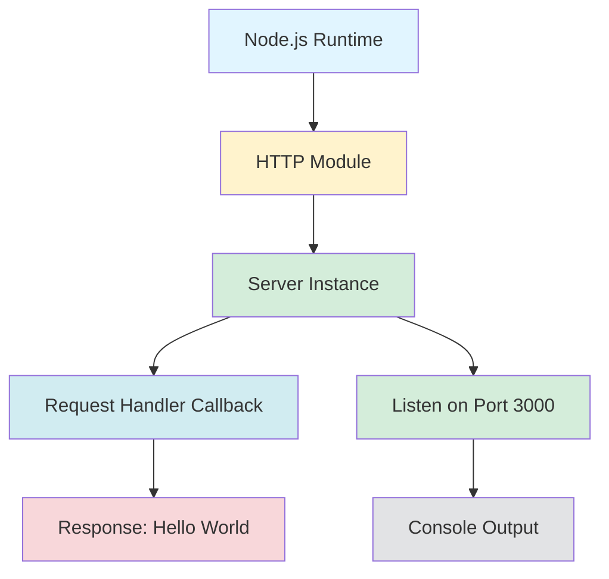

# Hello World Node.js Server


A simple HTTP server built with Node.js that responds with "Hello, World!" to all incoming requests. This project demonstrates the basic usage of Node.js's built-in `http` module without any external dependencies.

*Source: `/package.json:2-4`, `/server.js:1-15`*

---

## Table of Contents

1. [Overview](#overview)
2. [Prerequisites](#prerequisites)
3. [Installation](#installation)
4. [Configuration](#configuration)
   - [Hostname Configuration](#hostname-configuration)
   - [Port Configuration](#port-configuration)
   - [Environment Variables](#environment-variables)
5. [Usage](#usage)
   - [Starting the Server](#starting-the-server)
   - [Verifying the Server](#verifying-the-server)
   - [Stopping the Server](#stopping-the-server)
6. [API Documentation](#api-documentation)
   - [Endpoint Details](#endpoint-details)
   - [Example Requests](#example-requests)
7. [Code Explanation](#code-explanation)
   - [Architecture Overview](#architecture-overview)
   - [Request Flow](#request-flow)
   - [Module Breakdown](#module-breakdown)
8. [Deployment Guide](#deployment-guide)
   - [Local Development](#local-development)
   - [Production Deployment](#production-deployment)
   - [Security Considerations](#security-considerations)
9. [Troubleshooting](#troubleshooting)
10. [Known Limitations](#known-limitations)
11. [Contributing](#contributing)
12. [License](#license)

---

## Overview

This project provides a minimal HTTP server implementation using Node.js's built-in `http` module. The server listens on localhost and responds with a plain text "Hello, World!" message to all HTTP requests, regardless of the request method or path.

**Key Features:**
- ✅ Zero external dependencies - uses only Node.js built-in modules
- ✅ Simple, easy-to-understand codebase (~15 lines)
- ✅ Responds to all HTTP methods (GET, POST, PUT, DELETE, etc.)
- ✅ Localhost binding for secure local development
- ✅ Plain text response with proper HTTP headers

**Technology Stack:**
- Node.js (v6.0.0 or higher)
- HTTP module (built-in)

*Source: `/server.js:1,6-10`, `/package.json:4`*

[↑ Back to top](#table-of-contents)

---

## Prerequisites

Before running this server, ensure you have the following installed on your system:

**Required Software:**
- **Node.js** (v6.0.0 or higher)
  - The code uses ES6 features (`const`, template literals) introduced in Node.js 6.x
  - Download from: [https://nodejs.org/](https://nodejs.org/)
  - Verify installation: `node --version`

- **npm** (usually comes with Node.js)
  - Used for package management (though this project has zero dependencies)
  - Verify installation: `npm --version`

**Operating System Compatibility:**
- ✅ Linux (all distributions)
- ✅ macOS (all versions with Node.js support)
- ✅ Windows (Windows 7 and later)

**Optional Tools:**
- **curl** - For testing API endpoints from command line
- **Web browser** - For testing endpoints visually

*Source: Inferred from `/server.js:1-15` syntax analysis*

[↑ Back to top](#table-of-contents)

---

## Installation

Follow these steps to set up the project on your local machine:

### 1. Clone or Download the Repository

```bash
# If using git
git clone <repository-url>
cd hello_world

# Or download and extract the ZIP file
```

### 2. Install Dependencies

```bash
npm install
```

**Note:** This project has zero external dependencies, so `npm install` will complete immediately without downloading any packages. The command is included for completeness and to generate/update `package-lock.json`.

*Source: `/package.json:1-11` (no dependencies or devDependencies listed)*

### 3. Verify Installation

Check that all files are present:

```bash
ls -la
# Expected files:
# - server.js (main application file)
# - package.json (project metadata)
# - package-lock.json (generated by npm install)
# - README.md (this file)
```

**Important Note:** The `package.json` file declares `"main": "index.js"`, but the actual entry point is `server.js`. This discrepancy doesn't affect functionality but should be noted for future maintenance.

*Source: `/package.json:5`*

[↑ Back to top](#table-of-contents)

---

## Configuration

The server uses two configurable constants defined in `server.js`:

### Hostname Configuration

```javascript
const hostname = '127.0.0.1';  // Localhost / loopback address
```

**Default Value:** `127.0.0.1` (localhost)

**Purpose:** Specifies the network interface the server binds to. The default value restricts access to the local machine only.

**Modification Options:**
- `'127.0.0.1'` - Localhost only (default, most secure)
- `'0.0.0.0'` - All network interfaces (allows external access)
- Specific IP - Bind to a specific network interface

**To Change:** Edit line 3 in `/server.js`

*Source: `/server.js:3`*

### Port Configuration

```javascript
const port = 3000;  // HTTP port number
```

**Default Value:** `3000`

**Purpose:** Specifies the TCP port number the server listens on.

**Modification Options:**
- Ports 1-1023: Require root/administrator privileges
- Ports 1024-49151: Registered ports (commonly used: 3000, 8000, 8080)
- Ports 49152-65535: Dynamic/private ports

**To Change:** Edit line 4 in `/server.js`

*Source: `/server.js:4`*

### Environment Variables

**Recommended Approach:** For production deployments, use environment variables instead of hardcoded values:

```javascript
// Modify server.js to use environment variables
const hostname = process.env.HOST || '127.0.0.1';
const port = process.env.PORT || 3000;
```

Then run with custom configuration:

```bash
HOST=0.0.0.0 PORT=8080 node server.js
```

**Security Note:** Changing the hostname from `127.0.0.1` to `0.0.0.0` exposes the server to external network access. Only do this in trusted environments or with proper firewall configuration.

*Source: `/server.js:3-4`*

[↑ Back to top](#table-of-contents)

---

## Usage

### Starting the Server

Since the project has no npm start script defined, you must run the server directly with Node.js:

```bash
node server.js
```

**Expected Output:**

```
Server running at http://127.0.0.1:3000/
```

This message indicates the server has successfully started and is ready to accept connections.

*Source: `/server.js:12-14`, `/package.json:6-8`*

### Verifying the Server

Once the server is running, test it using any of these methods:

**Method 1: Web Browser**
1. Open your web browser
2. Navigate to: `http://127.0.0.1:3000/`
3. You should see: `Hello, World!`

**Method 2: curl (Command Line)**

```bash
curl http://127.0.0.1:3000/
```

**Expected Response:**

```
Hello, World!
```

**Method 3: curl with Verbose Output**

```bash
curl -v http://127.0.0.1:3000/
```

**Expected Response:**

```
*   Trying 127.0.0.1:3000...
* Connected to 127.0.0.1 (127.0.0.1) port 3000
> GET / HTTP/1.1
> Host: 127.0.0.1:3000
> User-Agent: curl/7.x.x
> Accept: */*
> 
< HTTP/1.1 200 OK
< Content-Type: text/plain
< Date: [current date]
< Connection: keep-alive
< Content-Length: 14
< 
Hello, World!
```

*Source: `/server.js:6-10,13`*

### Stopping the Server

To stop the server, press `Ctrl+C` in the terminal where it's running. The process will terminate immediately.

**Note:** There is no graceful shutdown implementation in this basic server. Any ongoing requests will be abruptly terminated.

*Source: `/server.js:1-15` (no shutdown handler present)*

[↑ Back to top](#table-of-contents)

---

## API Documentation

### Endpoint Details

The server exposes a single endpoint that responds to all request paths and methods:

| Property | Value |
|----------|-------|
| **Base URL** | `http://127.0.0.1:3000` |
| **Endpoint** | `/*` (all paths) |
| **Methods** | `GET`, `POST`, `PUT`, `DELETE`, `PATCH`, `HEAD`, `OPTIONS`, etc. |
| **Authentication** | None |
| **Request Headers** | None required |
| **Request Body** | Ignored |
| **Query Parameters** | Ignored |

**Response:**

| Property | Value |
|----------|-------|
| **Status Code** | `200 OK` |
| **Content-Type** | `text/plain` |
| **Body** | `Hello, World!\n` (14 bytes) |
| **Other Headers** | Standard HTTP headers (Date, Connection, Content-Length) |

*Source: `/server.js:6-10`*

### Example Requests

**Example 1: GET Request**

```bash
curl -X GET http://127.0.0.1:3000/
# Response: Hello, World!
```

**Example 2: POST Request**

```bash
curl -X POST http://127.0.0.1:3000/ -d "some data"
# Response: Hello, World!
# Note: Request body is ignored
```

**Example 3: Different Path**

```bash
curl http://127.0.0.1:3000/api/users
# Response: Hello, World!
# Note: All paths return the same response
```

**Example 4: With Query Parameters**

```bash
curl http://127.0.0.1:3000/?name=John&age=30
# Response: Hello, World!
# Note: Query parameters are ignored
```

**Example 5: Browser Test**

Open any of these URLs in your browser - all return the same result:
- `http://127.0.0.1:3000/`
- `http://127.0.0.1:3000/test`
- `http://127.0.0.1:3000/api/endpoint`
- `http://127.0.0.1:3000/anything/goes/here`

*Example derived from `/server.js:6-10`*

[↑ Back to top](#table-of-contents)

---

## Code Explanation

This section provides a detailed walkthrough of the server implementation.

### Architecture Overview

The application follows a simple single-module architecture:



**Component Descriptions:**
- **Node.js Runtime**: Executes JavaScript code and provides built-in modules
- **HTTP Module**: Built-in Node.js module for creating HTTP servers
- **Server Instance**: Created by `http.createServer()`, handles incoming connections
- **Request Handler**: Callback function that processes each HTTP request
- **Response**: Static "Hello, World!" message sent to all clients

*Source: `/server.js:1-15`*

### Request Flow

The following sequence diagram illustrates how HTTP requests are processed:

```mermaid
sequenceDiagram
    participant Client
    participant Server
    participant Handler
    participant Response

    Client->>Server: HTTP Request (any method/path)
    Note over Client,Server: TCP connection established
    Server->>Handler: Invoke callback(req, res)
    Handler->>Response: Set statusCode = 200
    Handler->>Response: Set Content-Type: text/plain
    Handler->>Response: Write body: "Hello, World!\n"
    Response->>Server: Flush response
    Server->>Client: HTTP/1.1 200 OK
    Note over Server,Client: Response headers + body
    Client->>Client: Display/process response
```



**Flow Steps:**
1. Client initiates HTTP request to `http://127.0.0.1:3000/` (any path)
2. Server accepts TCP connection and invokes request handler callback
3. Handler sets status code to 200 (OK)
4. Handler sets Content-Type header to "text/plain"
5. Handler writes response body: "Hello, World!\n"
6. Server sends complete HTTP response to client
7. Client receives and processes the response

*Source: `/server.js:6-10`*

### Module Breakdown

**Line-by-Line Explanation:**

```javascript
// Line 1: Import the built-in HTTP module
const http = require('http');
```
Loads Node.js's built-in `http` module, which provides HTTP server and client functionality. No external package installation needed.

*Source: `/server.js:1`*

```javascript
// Lines 3-4: Configuration constants
const hostname = '127.0.0.1';  // Localhost binding
const port = 3000;              // HTTP port
```
Defines server binding configuration. `127.0.0.1` restricts access to local machine only. Port 3000 is a common development port that doesn't require elevated privileges.

*Source: `/server.js:3-4`*

```javascript
// Lines 6-10: Server creation with request handler
const server = http.createServer((req, res) => {
  res.statusCode = 200;
  res.setHeader('Content-Type', 'text/plain');
  res.end('Hello, World!\n');
});
```
Creates an HTTP server instance with a request handler callback. The callback receives two parameters:
- `req`: Incoming request object (not used in this implementation)
- `res`: Response object for sending data back to client

The handler sets HTTP status 200 (OK), Content-Type header, and sends the response body.

*Source: `/server.js:6-10`*

```javascript
// Lines 12-14: Server initialization
server.listen(port, hostname, () => {
  console.log(`Server running at http://${hostname}:${port}/`);
});
```
Starts the server, binding to the specified hostname and port. The callback function executes once the server is ready, logging a startup message to the console.

*Source: `/server.js:12-14`*

[↑ Back to top](#table-of-contents)

---

## Deployment Guide

### Local Development

**Current Configuration (Default):**

The server is pre-configured for local development with localhost binding:

```bash
# Start the server
node server.js

# Access from the same machine:
curl http://127.0.0.1:3000/
# or
curl http://localhost:3000/
```

**Local Network Access:**

To access the server from other devices on your local network (e.g., mobile devices, other computers):

1. Modify `hostname` in `/server.js`:
   ```javascript
   const hostname = '0.0.0.0';  // Listen on all network interfaces
   ```

2. Find your local IP address:
   ```bash
   # Linux/macOS
   ip addr show  # or: ifconfig
   
   # Windows
   ipconfig
   ```

3. Start the server and access from other devices:
   ```
   http://<your-local-ip>:3000/
   # Example: http://192.168.1.100:3000/
   ```

*Source: `/server.js:3-4,12-14`*

### Production Deployment

**Process Management:**

For production environments, use a process manager to ensure the server stays running and restarts automatically on crashes:

**Option 1: PM2 (Recommended)**

```bash
# Install PM2 globally
npm install -g pm2

# Start the server with PM2
pm2 start server.js --name "hello-world-server"

# View logs
pm2 logs hello-world-server

# Enable startup on boot
pm2 startup
pm2 save

# Stop the server
pm2 stop hello-world-server
```

**Option 2: systemd (Linux)**

Create `/etc/systemd/system/hello-world.service`:

```ini
[Unit]
Description=Hello World Node.js Server
After=network.target

[Service]
Type=simple
User=www-data
WorkingDirectory=/path/to/hello_world
ExecStart=/usr/bin/node server.js
Restart=on-failure
Environment=NODE_ENV=production

[Install]
WantedBy=multi-user.target
```

Enable and start:

```bash
sudo systemctl enable hello-world
sudo systemctl start hello-world
sudo systemctl status hello-world
```

**Environment Configuration:**

Use environment variables for production configuration:

```bash
# Set environment variables
export HOST=0.0.0.0
export PORT=8080
export NODE_ENV=production

# Start server
node server.js
```

### Security Considerations

**⚠️ Security Warnings:**

1. **Localhost Binding:** By default, the server only accepts connections from `127.0.0.1` (localhost). This is secure for development but limits accessibility.

2. **No Authentication:** The server has no authentication mechanism. Any client that can reach the server can access it.

3. **No HTTPS:** The server uses plain HTTP without encryption. Sensitive data should not be transmitted.

4. **No Rate Limiting:** The server has no protection against abuse or DDoS attacks.

5. **No Input Validation:** While the server ignores request data, future modifications should include input validation.

**Production Recommendations:**

- Use a reverse proxy (nginx, Apache) in front of Node.js
- Implement HTTPS with SSL/TLS certificates (Let's Encrypt)
- Add authentication/authorization if needed
- Implement rate limiting and request validation
- Use a firewall to restrict access
- Run the Node.js process as a non-privileged user
- Keep Node.js updated to the latest stable version

*Source: `/server.js:3,6-14`*

[↑ Back to top](#table-of-contents)

---

## Troubleshooting

### Common Issues and Solutions

#### Issue 1: Port Already in Use

**Error Message:**
```
Error: listen EADDRINUSE: address already in use 127.0.0.1:3000
```

**Cause:** Another process is already listening on port 3000.

**Solutions:**

**Option A: Find and stop the conflicting process**

```bash
# Linux/macOS - Find process using port 3000
lsof -i :3000
# or
netstat -tulpn | grep 3000

# Kill the process
kill -9 <PID>

# Windows - Find process
netstat -ano | findstr :3000

# Kill process
taskkill /PID <PID> /F
```

**Option B: Use a different port**

Modify line 4 in `/server.js`:
```javascript
const port = 8080;  // Use port 8080 instead
```

#### Issue 2: Permission Denied on Privileged Ports

**Error Message:**
```
Error: listen EACCES: permission denied 0.0.0.0:80
```

**Cause:** Ports below 1024 require root/administrator privileges on Unix-like systems.

**Solutions:**

**Option A: Use a non-privileged port (Recommended)**
```javascript
const port = 3000;  // Use port >= 1024
```

**Option B: Run with elevated privileges (Not recommended for development)**
```bash
sudo node server.js  # Linux/macOS
# Run as Administrator on Windows
```

**Option C: Use port forwarding (Linux)**
```bash
# Forward port 80 to 3000
sudo iptables -t nat -A PREROUTING -p tcp --dport 80 -j REDIRECT --to-port 3000
```

#### Issue 3: Cannot Access from Other Machines

**Symptom:** The server works locally but cannot be accessed from other devices on the network.

**Cause:** Server is bound to `127.0.0.1` (localhost only).

**Solution:**

Change the hostname to bind to all network interfaces:

```javascript
const hostname = '0.0.0.0';  // Listen on all interfaces
```

Then access using your machine's local IP address:
```
http://<your-local-ip>:3000/
```

**Note:** Check your firewall settings to ensure port 3000 is not blocked.

#### Issue 4: Module Not Found

**Error Message:**
```
Error: Cannot find module 'http'
```

**Cause:** Node.js is not properly installed or the installation is corrupted.

**Solution:**
1. Verify Node.js installation: `node --version`
2. Reinstall Node.js from [https://nodejs.org/](https://nodejs.org/)
3. Verify the `http` module is available: `node -e "require('http')"`

[↑ Back to top](#table-of-contents)

---

## Known Limitations

This is a minimal demonstration server with several intentional limitations:

### 1. No Routing Logic
- **Limitation:** All request paths return the same response
- **Impact:** Cannot create RESTful APIs or serve different content based on URL
- **Example:** Both `/users` and `/products` return "Hello, World!"
- *Source: `/server.js:6-10`*

### 2. No Error Handling
- **Limitation:** No try-catch blocks or error event handlers
- **Impact:** Server crashes on unexpected errors; no graceful error responses
- **Future Enhancement:** Add error handlers for `req` and `res` objects
- *Source: `/server.js:6-14` (no error handling present)*

### 3. Localhost-Only Binding
- **Limitation:** Default configuration restricts access to local machine only
- **Impact:** Cannot access server from network devices without configuration change
- **Workaround:** Change `hostname` to `'0.0.0.0'` (see [Configuration](#configuration))
- *Source: `/server.js:3`*

### 4. No Request Logging
- **Limitation:** Server doesn't log incoming requests
- **Impact:** No visibility into request patterns, debugging is difficult
- **Future Enhancement:** Add logging middleware
- *Source: `/server.js:6-10` (no logging statements)*

### 5. No Graceful Shutdown
- **Limitation:** Server terminates immediately on Ctrl+C
- **Impact:** Active connections are abruptly closed
- **Future Enhancement:** Implement SIGTERM/SIGINT handlers
- *Source: `/server.js:1-15` (no shutdown handler)*

### 6. Static Response
- **Limitation:** Response is hardcoded and identical for all requests
- **Impact:** Cannot serve dynamic content or process request data
- **Design:** Request object (`req`) is completely ignored
- *Source: `/server.js:9` (hardcoded response)*

### 7. No Environment Variable Support
- **Limitation:** Configuration is hardcoded in source files
- **Impact:** Must modify code to change hostname/port
- **Workaround:** Modify code to use `process.env` (see [Configuration](#configuration))
- *Source: `/server.js:3-4`*

### 8. No Test Suite
- **Limitation:** No automated tests included
- **Impact:** Changes cannot be validated automatically
- **Note:** `package.json` contains placeholder test script
- *Source: `/package.json:7`*

### 9. Package.json Entry Point Mismatch
- **Limitation:** `package.json` declares `"main": "index.js"` but actual entry point is `server.js`
- **Impact:** Importing this module would fail; must run `server.js` directly
- **Note:** Doesn't affect standalone server operation
- *Source: `/package.json:5`*

[↑ Back to top](#table-of-contents)

---

## Contributing

Contributions are welcome! This is a learning project, and improvements are encouraged.

### How to Contribute

1. **Fork the Repository**
   ```bash
   # Click the "Fork" button on GitHub or your repository hosting platform
   ```

2. **Clone Your Fork**
   ```bash
   git clone <your-fork-url>
   cd hello_world
   ```

3. **Create a Feature Branch**
   ```bash
   git checkout -b feature/your-feature-name
   ```

4. **Make Your Changes**
   - Add features, fix bugs, or improve documentation
   - Follow existing code style (ES6 syntax, consistent indentation)
   - Test your changes locally

5. **Commit Your Changes**
   ```bash
   git add .
   git commit -m "Description of your changes"
   ```

6. **Push to Your Fork**
   ```bash
   git push origin feature/your-feature-name
   ```

7. **Submit a Pull Request**
   - Go to the original repository
   - Click "New Pull Request"
   - Describe your changes and their benefits

### Code Style Guidelines

- Use ES6+ syntax (const/let, arrow functions, template literals)
- Follow 2-space indentation
- Add comments for complex logic
- Keep functions small and focused
- Maintain the simple, educational nature of the project

### Suggested Improvements

- Add routing logic for different endpoints
- Implement error handling and logging
- Add environment variable configuration
- Create automated tests
- Add request/response logging middleware
- Implement graceful shutdown
- Add JSDoc comments to functions
- Create additional example servers (JSON API, file serving, etc.)

[↑ Back to top](#table-of-contents)

---

## License

This project is licensed under the **MIT License**.

### MIT License Summary

Permission is hereby granted, free of charge, to any person obtaining a copy of this software and associated documentation files (the "Software"), to deal in the Software without restriction, including without limitation the rights to use, copy, modify, merge, publish, distribute, sublicense, and/or sell copies of the Software, and to permit persons to whom the Software is furnished to do so, subject to the following conditions:

- The above copyright notice and this permission notice shall be included in all copies or substantial portions of the Software.
- The software is provided "as is", without warranty of any kind.

**Author:** hxu

*Source: `/package.json:9-10`*

For the full license text, see the [MIT License](https://opensource.org/licenses/MIT).

---

## Additional Resources

- **Node.js Documentation:** [https://nodejs.org/api/http.html](https://nodejs.org/api/http.html)
- **npm Documentation:** [https://docs.npmjs.com/](https://docs.npmjs.com/)
- **HTTP Protocol (RFC 2616):** [https://www.ietf.org/rfc/rfc2616.txt](https://www.ietf.org/rfc/rfc2616.txt)
- **PM2 Documentation:** [https://pm2.keymetrics.io/](https://pm2.keymetrics.io/)

---

**Project:** hello_world v1.0.0  
**Last Updated:** 2025  
**Documentation Version:** 1.0.0

[↑ Back to top](#table-of-contents)