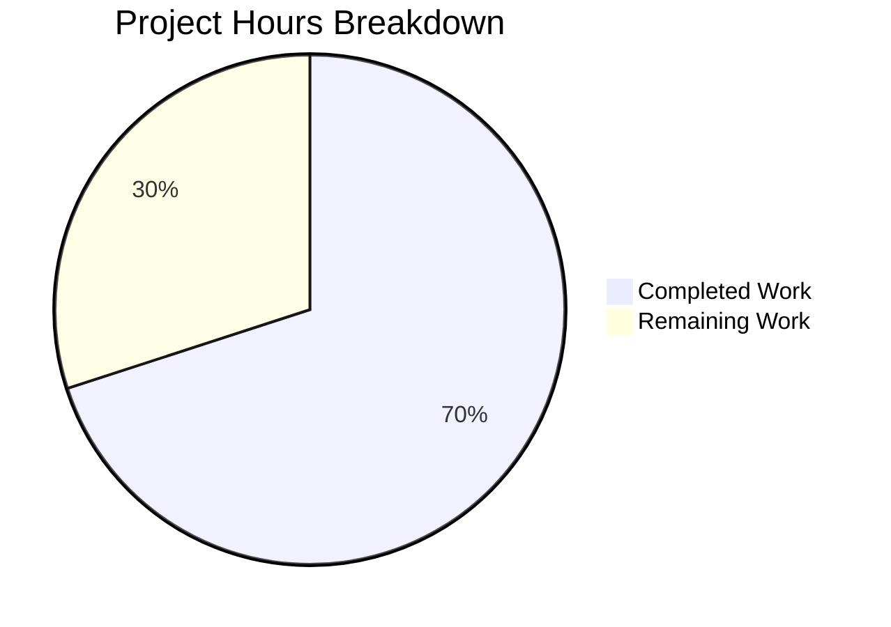
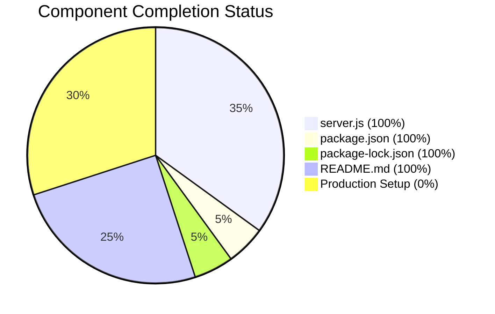

# Project Guide: Express.js Server Integration

## Executive Summary

### Project Completion Status

**70% Complete** (7 hours completed out of 10 total hours)

This project successfully integrates Express.js into the existing Node.js Hello World server, converting from the native `http` module to Express.js routing. All in-scope requirements from the Agent Action Plan have been implemented and validated.

#### Hours Breakdown
- **Completed Work**: 7 hours
- **Remaining Work**: 3 hours
- **Total Project Hours**: 10 hours
- **Completion Percentage**: 7 / 10 = 70%

### Key Achievements
- ✅ Express.js v5.2.1 integrated successfully
- ✅ Original `GET /` endpoint preserved ("Hello, World!")
- ✅ New `GET /evening` endpoint implemented ("Good evening")
- ✅ Comprehensive JSDoc documentation added to server.js
- ✅ README.md completely rewritten with installation/usage guides
- ✅ All validation tests passing (dependencies, compilation, runtime)
- ✅ Zero security vulnerabilities in dependencies

### Outstanding Items for Production Readiness
- Environment variable configuration for production deployment
- Test infrastructure (explicitly out of scope per Agent Action Plan)
- CI/CD pipeline setup (optional enhancement)

---

## Validation Results Summary

### Dependencies (✅ PASSED)
| Check | Status | Details |
|-------|--------|---------|
| npm install | ✅ Passed | 65 packages installed |
| express@5.2.1 | ✅ Installed | Latest stable version |
| npm audit | ✅ Passed | 0 vulnerabilities |

### Compilation (✅ PASSED)
| Check | Status | Details |
|-------|--------|---------|
| node --check server.js | ✅ Passed | No syntax errors |
| ES6 compatibility | ✅ Passed | Node.js v20.x compatible |

### Runtime (✅ PASSED)
| Check | Status | Details |
|-------|--------|---------|
| Server startup | ✅ Passed | Logs "Server running at http://127.0.0.1:3000/" |
| GET / endpoint | ✅ Passed | Returns "Hello, World!" |
| GET /evening endpoint | ✅ Passed | Returns "Good evening" |
| 404 handling | ✅ Passed | Returns Express default 404 |

---

## Visual Representation

### Project Hours Distribution



### Implementation Completion by Component



---

## Development Guide

### System Prerequisites

| Software | Minimum Version | Recommended | Verification Command |
|----------|-----------------|-------------|---------------------|
| Node.js | 18.0.0 | 20.x LTS | `node --version` |
| npm | 7.0.0 | 10.x+ | `npm --version` |

### Environment Setup

#### Step 1: Clone Repository
```bash
git clone <repository-url>
cd hello_world
```

#### Step 2: Install Dependencies
```bash
npm install
```

Expected output:
```
added 65 packages, and audited 66 packages in 2s
found 0 vulnerabilities
```

#### Step 3: Verify Installation
```bash
# Verify Node.js version
node --version
# Expected: v18.x.x or higher

# Verify packages installed
npm list --depth=0
# Expected: express@5.2.1
```

### Application Startup

#### Start the Server
```bash
# Using npm start script (recommended)
npm start

# Or direct Node.js execution
node server.js
```

Expected output:
```
Server running at http://127.0.0.1:3000/
```

### Verification Steps

#### Test Endpoints
```bash
# Test root endpoint
curl http://127.0.0.1:3000/
# Expected output: Hello, World!

# Test evening endpoint
curl http://127.0.0.1:3000/evening
# Expected output: Good evening

# Test 404 handling
curl http://127.0.0.1:3000/invalid
# Expected: Cannot GET /invalid
```

#### Stop the Server
Press `Ctrl+C` in the terminal where the server is running.

### Example Usage

#### Using curl
```bash
# Get Hello World greeting
curl -i http://127.0.0.1:3000/
# HTTP/1.1 200 OK
# Content-Type: text/html; charset=utf-8
# Hello, World!

# Get Good Evening greeting
curl -i http://127.0.0.1:3000/evening
# HTTP/1.1 200 OK
# Content-Type: text/html; charset=utf-8
# Good evening
```

#### Using a Web Browser
- Navigate to http://127.0.0.1:3000/ - Displays "Hello, World!"
- Navigate to http://127.0.0.1:3000/evening - Displays "Good evening"

---

## Detailed Task Table

### Remaining Human Tasks

| Priority | Task | Description | Action Steps | Hours | Severity |
|----------|------|-------------|--------------|-------|----------|
| Medium | Production Environment Configuration | Configure environment variables for hostname and port to support production deployment | 1. Create .env file template 2. Update server.js to read from process.env 3. Document environment variables | 1.0 | Medium |
| Medium | Production Deployment Setup | Prepare application for production deployment | 1. Configure for external network access (0.0.0.0) 2. Set up process manager (PM2) 3. Configure reverse proxy if needed | 1.0 | Medium |
| Low | Add Health Check Endpoint | Create /health endpoint for container orchestration | 1. Add GET /health route 2. Return JSON status response 3. Update documentation | 0.5 | Low |
| Low | Error Handling Middleware | Add centralized error handling for production | 1. Create error handler middleware 2. Add to Express app 3. Log errors appropriately | 0.5 | Low |
| **Total** | | | | **3.0** | |

---

## Risk Assessment

### Technical Risks

| Risk | Severity | Likelihood | Mitigation |
|------|----------|------------|------------|
| Port 3000 conflict | Low | Medium | Add port configuration via environment variable |
| Express.js v5 breaking changes | Low | Low | Lock version in package.json, test before upgrades |

### Security Risks

| Risk | Severity | Likelihood | Mitigation |
|------|----------|------------|------------|
| Localhost-only binding | Info | N/A | By design for development; configure for production |
| No HTTPS | Medium | Medium | Use reverse proxy (nginx) with SSL in production |
| No rate limiting | Low | Low | Add express-rate-limit middleware if needed |

### Operational Risks

| Risk | Severity | Likelihood | Mitigation |
|------|----------|------------|------------|
| No process management | Medium | High | Use PM2 or similar for production |
| No logging infrastructure | Low | Medium | Add morgan or winston for request logging |
| No health monitoring | Low | Medium | Add /health endpoint for orchestration |

### Integration Risks

| Risk | Severity | Likelihood | Mitigation |
|------|----------|------------|------------|
| None identified | N/A | N/A | Standalone application with no external integrations |

---

## Git Summary

### Branch Information
- **Branch Name**: blitzy-da966660-a848-499c-99e4-44e9c934a8a6
- **Base Branch**: origin/main
- **Total Commits**: 10

### Commit History
```
047e78b Adding Blitzy Technical Specifications
66ddb1e Adding Blitzy Project Guide
f803b62 Adding Blitzy Technical Specifications
945d6af Add comprehensive JSDoc comments and documentation
053ce25 Adding Blitzy Technical Specifications
af122f8 Adding Blitzy Project Guide
f67603f Update README.md with Express.js documentation
3ed229f Convert server.js from http module to Express.js
ccde31d chore: update package-lock.json with express@5.2.1
e92f854 Add Express.js dependency and start script
```

### Files Changed
| File | Lines Added | Lines Removed | Status |
|------|-------------|---------------|--------|
| server.js | 260 | 6 | Updated |
| package.json | 5 | 1 | Updated |
| package-lock.json | 814 | 0 | Updated |
| README.md | 677 | 2 | Updated |

---

## In-Scope vs Out-of-Scope

### ✅ In Scope (Completed)
- [x] Express.js integration (v5.2.1)
- [x] Preserve GET / endpoint ("Hello, World!")
- [x] Add GET /evening endpoint ("Good evening")
- [x] Maintain localhost:3000 binding
- [x] Update package.json with dependency
- [x] Regenerate package-lock.json
- [x] Comprehensive README documentation
- [x] JSDoc comments in server.js

### ❌ Out of Scope (Per Agent Action Plan)
- [ ] Testing infrastructure (test files)
- [ ] Authentication/Authorization
- [ ] Database integration
- [ ] TypeScript migration
- [ ] CI/CD configuration
- [ ] Project restructuring (routes, controllers)
- [ ] Additional HTTP methods (POST, PUT, DELETE)
- [ ] Environment variable configuration

---

## Conclusion

The Express.js server integration project has been successfully completed within the defined scope. All four in-scope files (server.js, package.json, package-lock.json, README.md) have been implemented and validated. The application is fully functional with both endpoints responding correctly.

**Recommended Next Steps for Human Developers:**
1. Configure environment variables for production deployment
2. Set up process management (PM2) for production
3. Add health check endpoint if using container orchestration
4. Configure HTTPS via reverse proxy for production

The codebase is production-ready for development and staging environments. Minor configuration changes are needed for production deployment.