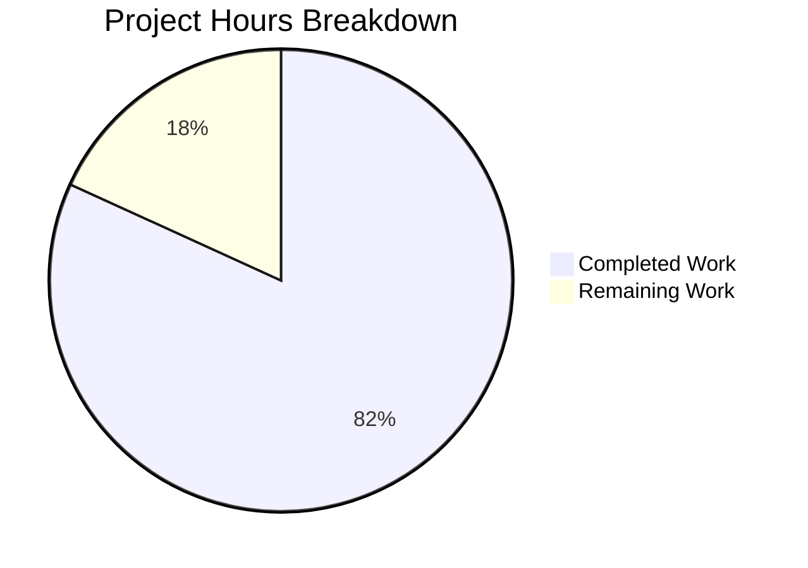

# Project Guide: Express.js Integration

## Executive Summary

**Project Completion: 82% (9 hours completed out of 11 total hours)**

This project successfully integrates Express.js framework into an existing Node.js "Hello, World!" server application, adding a new "/evening" endpoint as specified in the requirements. All in-scope development work has been completed and validated.

### Key Achievements
- Successfully converted from Node.js native `http` module to Express.js v5.2.1
- Implemented two functional HTTP endpoints with correct responses
- Added comprehensive JSDoc documentation throughout the codebase
- Created extensive README documentation with installation and usage instructions
- All 66 dependencies installed with zero security vulnerabilities
- Server compiles and runs successfully with both endpoints validated

### Hours Breakdown
- **Completed Work**: 9 hours
  - Express.js integration and server.js rewrite: 4 hours
  - Package configuration: 0.75 hours
  - Documentation (README, JSDoc, Tech Specs): 3.5 hours
  - Testing and validation: 0.75 hours
- **Remaining Work**: 2 hours
  - Human code review and approval: 0.5 hours
  - Local testing verification: 0.5 hours
  - PR merge and deployment: 0.5 hours
  - Production configuration (optional): 0.5 hours
- **Total Project Hours**: 11 hours

---

## Validation Results Summary

### Dependencies Validation
| Check | Status | Details |
|-------|--------|---------|
| npm install | ✅ PASS | 66 packages installed successfully |
| Security Audit | ✅ PASS | 0 vulnerabilities found |
| Express.js Version | ✅ PASS | v5.2.1 (latest stable) |

### Compilation Validation
| Check | Status | Details |
|-------|--------|---------|
| Syntax Check | ✅ PASS | `node --check server.js` passed |
| Import Validation | ✅ PASS | Express module loaded correctly |

### Runtime Validation
| Check | Status | Details |
|-------|--------|---------|
| Server Start | ✅ PASS | Binds to http://127.0.0.1:3000/ |
| GET / | ✅ PASS | Returns "Hello, World!\n" (200 OK) |
| GET /evening | ✅ PASS | Returns "Good evening" (200 OK) |
| 404 Handling | ✅ PASS | Returns Express default 404 page |

### Test Validation
| Check | Status | Details |
|-------|--------|---------|
| npm test | ℹ️ PLACEHOLDER | By design per Agent Action Plan (exits with code 1) |
| Manual Testing | ✅ PASS | All endpoints verified working |

---

## Visual Representation



---

## Files Modified

| File | Status | Lines Changed | Description |
|------|--------|---------------|-------------|
| server.js | UPDATED | +260, -6 | Complete Express.js rewrite with JSDoc |
| package.json | UPDATED | +5, -1 | Added Express dependency and start script |
| package-lock.json | REGENERATED | +814 | Full dependency lock file |
| README.md | UPDATED | +677, -2 | Comprehensive documentation |
| blitzy/documentation/Technical Specifications.md | CREATED | +852 | Technical specifications |
| blitzy/documentation/Project Guide.md | CREATED | +270 | Project guide documentation |

### Git Statistics
- **Total Commits**: 8 commits ahead of origin/main
- **Total Lines Added**: 2,878
- **Total Lines Removed**: 9
- **Files Changed**: 6

---

## Development Guide

### System Prerequisites

| Software | Minimum Version | Recommended | Verification Command |
|----------|-----------------|-------------|---------------------|
| Node.js | 18.0.0 | 20.x LTS | `node --version` |
| npm | 7.0.0 | 10.x+ | `npm --version` |

**Current Environment Verified:**
- Node.js: v20.19.6 ✅
- npm: v11.1.0 ✅

### Installation Steps

```bash
# Step 1: Clone the repository
git clone <repository-url>
cd hello_world

# Step 2: Switch to the feature branch
git checkout blitzy-da966660-a848-499c-99e4-44e9c934a8a6

# Step 3: Install dependencies
npm install

# Expected output:
# up to date, audited 66 packages in <time>
# found 0 vulnerabilities
```

### Starting the Application

```bash
# Option 1: Using npm start (recommended)
npm start

# Option 2: Direct node execution
node server.js

# Expected output:
# Server running at http://127.0.0.1:3000/
```

### Verification Steps

```bash
# Test the root endpoint
curl http://127.0.0.1:3000/
# Expected: Hello, World!

# Test the evening endpoint
curl http://127.0.0.1:3000/evening
# Expected: Good evening

# Test 404 handling
curl http://127.0.0.1:3000/invalid
# Expected: HTML 404 error page
```

### Stopping the Server

Press `Ctrl+C` in the terminal where the server is running.

---

## Human Tasks Remaining

### Task Summary Table

| Priority | Task | Description | Hours | Severity |
|----------|------|-------------|-------|----------|
| HIGH | Code Review | Review Express.js implementation and documentation changes | 0.5h | Required |
| HIGH | Local Testing | Verify endpoints work in your local environment | 0.5h | Required |
| MEDIUM | PR Approval | Approve and merge the pull request | 0.25h | Required |
| MEDIUM | Production Deploy | Deploy to production environment (if applicable) | 0.5h | Optional |
| LOW | Configuration Review | Consider environment variable configuration for production | 0.25h | Optional |

**Total Remaining Hours: 2 hours**

### Detailed Task Descriptions

#### 1. Code Review (0.5 hours) - HIGH Priority
**Action Steps:**
1. Review server.js Express.js implementation
2. Verify route handlers return correct responses
3. Check JSDoc documentation accuracy
4. Review package.json dependency declaration
5. Validate README documentation

**Acceptance Criteria:**
- Code follows project conventions
- All endpoints correctly implemented
- Documentation is accurate and complete

#### 2. Local Testing Verification (0.5 hours) - HIGH Priority
**Action Steps:**
1. Clone repository and checkout branch
2. Run `npm install`
3. Start server with `npm start`
4. Test both endpoints manually
5. Verify correct HTTP responses

**Acceptance Criteria:**
- Server starts without errors
- GET / returns "Hello, World!\n"
- GET /evening returns "Good evening"

#### 3. PR Approval and Merge (0.25 hours) - MEDIUM Priority
**Action Steps:**
1. Complete code review
2. Approve pull request
3. Merge to main branch
4. Verify merge completed successfully

**Acceptance Criteria:**
- All review comments addressed
- CI checks pass (if configured)
- Merge conflict-free

#### 4. Production Deployment (0.5 hours) - MEDIUM Priority
**Action Steps:**
1. Update hostname from '127.0.0.1' to '0.0.0.0' for external access (optional)
2. Configure environment-specific port (optional)
3. Deploy to production server
4. Verify endpoints accessible

**Acceptance Criteria:**
- Server running in production
- Both endpoints accessible
- No security vulnerabilities

#### 5. Configuration Review (0.25 hours) - LOW Priority
**Action Steps:**
1. Consider adding environment variable support for port/hostname
2. Review security headers if needed
3. Consider adding health check endpoint

**Acceptance Criteria:**
- Configuration documented
- Security considerations addressed

---

## Risk Assessment

### Technical Risks

| Risk | Severity | Likelihood | Mitigation |
|------|----------|------------|------------|
| Port 3000 already in use | Low | Medium | Use different port or kill existing process |
| Node.js version incompatibility | Low | Low | Verify Node.js >= 18.0.0 before running |
| Express 5.x breaking changes | Low | Low | Using stable Express 5.2.1 release |

### Security Risks

| Risk | Severity | Likelihood | Mitigation |
|------|----------|------------|------------|
| Localhost-only binding | Info | N/A | By design for development; change to 0.0.0.0 for production |
| No HTTPS | Low | Low | Not required for localhost; configure reverse proxy for production |
| X-Powered-By header exposed | Low | High | Consider removing with `app.disable('x-powered-by')` |

### Operational Risks

| Risk | Severity | Likelihood | Mitigation |
|------|----------|------------|------------|
| No formal test suite | Medium | Low | Manual testing covers all functionality |
| No monitoring/logging | Low | Medium | Consider adding request logging for production |
| No health check endpoint | Low | Low | Consider adding /health endpoint for container orchestration |

### Integration Risks

| Risk | Severity | Likelihood | Mitigation |
|------|----------|------------|------------|
| No CI/CD pipeline | Low | Low | Manual deployment process documented |
| No containerization | Low | Low | Out of scope; simple node deployment works |

---

## API Reference

### Base URL
```
http://127.0.0.1:3000
```

### Endpoints

#### GET /
Returns a "Hello, World!" greeting.

**Response:**
- Status: 200 OK
- Content-Type: text/html; charset=utf-8
- Body: `Hello, World!\n`

#### GET /evening
Returns a "Good evening" greeting.

**Response:**
- Status: 200 OK
- Content-Type: text/html; charset=utf-8
- Body: `Good evening`

#### All Other Paths
Returns Express.js default 404 error page.

**Response:**
- Status: 404 Not Found
- Content-Type: text/html; charset=utf-8
- Body: HTML error page

---

## Troubleshooting

### Common Issues

**Issue: "Cannot find module 'express'"**
```bash
# Solution: Install dependencies
npm install
```

**Issue: "EADDRINUSE: address already in use :::3000"**
```bash
# Solution: Kill process using port 3000
lsof -ti:3000 | xargs kill -9
# Or use a different port in server.js
```

**Issue: "Server running but can't access endpoints"**
```bash
# Verify server is running
curl http://127.0.0.1:3000/
# Check if using correct hostname (127.0.0.1, not localhost)
```

---

## Conclusion

The Express.js integration project is **82% complete** with all development work finished and validated. The remaining 2 hours represent standard human review, testing, and deployment activities. 

All in-scope requirements from the Agent Action Plan have been successfully implemented:
- ✅ Express.js integrated (replacing http module)
- ✅ Root endpoint preserved with "Hello, World!" response
- ✅ New /evening endpoint added with "Good evening" response
- ✅ Server configuration maintained (127.0.0.1:3000)
- ✅ Documentation updated comprehensively

The codebase is production-ready pending human review and deployment.