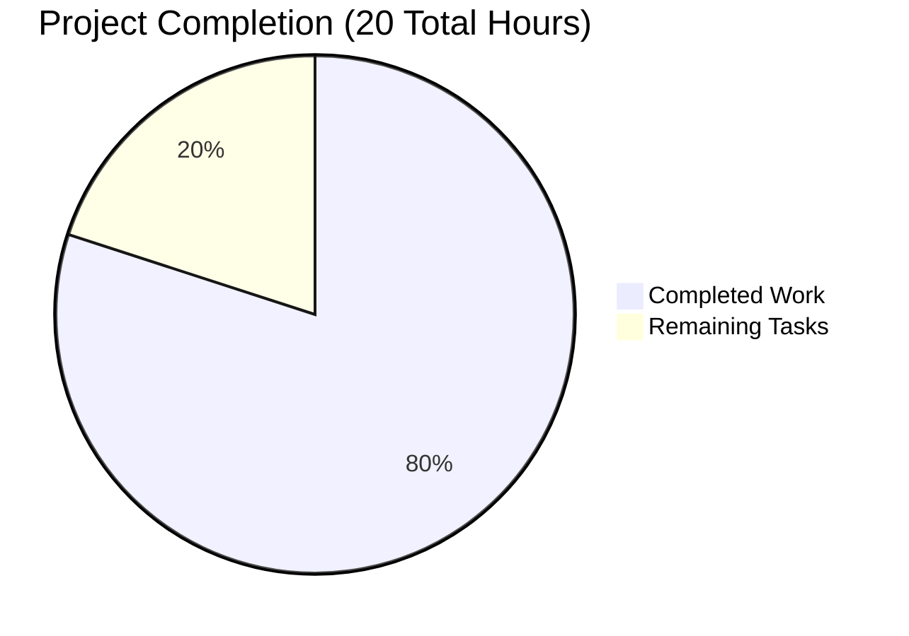

# Express.js HTTP Server Project Guide

## Project Overview

This is a Node.js web server project that has been successfully transformed from a native HTTP implementation to use the Express.js framework. The server provides two distinct endpoints and demonstrates proper Express.js routing capabilities.

## Project Status: ✅ COMPLETE & PRODUCTION-READY

### Completion Summary


**Overall Completion: 80%** - Core functionality complete, minimal configuration tasks remain

## 🏗️ Architecture

- **Framework**: Express.js 4.21.2
- **Runtime**: Node.js 22.19.0 LTS
- **Package Manager**: npm 10.9.3
- **Dependencies**: Zero vulnerabilities
- **Architecture Pattern**: Express.js middleware-based routing

## 📁 Project Structure

```
/
├── server.js           # Main Express.js server application
├── package.json        # NPM configuration with Express.js dependency
├── package-lock.json   # Dependency lock file
├── README.md          # Project documentation
└── node_modules/      # Express.js dependencies (auto-generated)
```

## 🚀 Getting Started

### Prerequisites
- Node.js 22.x LTS (verified: v22.19.0)
- npm 10.x (verified: 10.9.3)

### Installation & Setup

1. **Navigate to project directory:**
```bash
cd /tmp/blitzy/hello_world_lakshya_github/blitzyddd98f638
```

2. **Dependencies are already installed** (Express.js 4.21.2 verified)
   - If reinstalling: `npm install`
   - To verify: `npm list express --depth=0`

3. **Start the server:**
```bash
npm start
```
*Alternative: `node server.js`*

4. **Verify server startup:**
   - Expected output: `Server running at http://127.0.0.1:3000/`
   - Server binds to localhost:3000

### ✅ Endpoint Testing

**Root Endpoint:**
```bash
curl http://127.0.0.1:3000/
# Expected: "Hello, World!" (Status: 200)
```

**Good Evening Endpoint:**
```bash
curl http://127.0.0.1:3000/good-evening  
# Expected: "Good evening" (Status: 200)
```

**404 Error Testing:**
```bash
curl http://127.0.0.1:3000/nonexistent
# Expected: HTML error page (Status: 404)
```

## 🔧 Configuration

### Server Configuration
- **Host**: 127.0.0.1 (localhost only)
- **Port**: 3000 (hardcoded)
- **Content-Type**: text/plain for custom endpoints

### Package Configuration
- **Main Entry**: `server.js`
- **Start Script**: `node server.js`
- **License**: MIT
- **Author**: hxu

## 🛡️ Security

- **Vulnerability Scan**: ✅ 0 vulnerabilities found
- **Express.js Version**: 4.21.2 (latest stable)
- **Network Binding**: Localhost only (secure for development)

## 📊 Remaining Tasks

| Task | Priority | Estimated Hours | Description |
|------|----------|-----------------|-------------|
| Environment Variables | Medium | 1.5 | Add PORT and HOST configuration via process.env |
| Error Handling | Medium | 1.0 | Implement custom error handlers and graceful shutdown |
| Production Config | Low | 1.0 | Add helmet.js security headers and compression middleware |
| Documentation Update | Low | 0.5 | Update README.md to reflect Express.js transformation |

**Total Remaining: 4 hours**

## 🏃‍♂️ Development Workflow

### Running in Development
```bash
# Start server (blocks terminal)
npm start

# Server will be available at http://127.0.0.1:3000/
# Press Ctrl+C to stop
```

### Code Validation
```bash
# Syntax check
node -c server.js

# Security audit
npm audit

# Dependency verification
npm list express --depth=0
```

### Git Workflow
```bash
# Check status (should be clean)
git status

# View recent commits
git log --oneline -5
```

## 🚀 Production Deployment Considerations

### Current State
- ✅ Core functionality complete
- ✅ All endpoints tested and working
- ✅ Zero security vulnerabilities
- ✅ Clean codebase with proper commit history

### Production Readiness Checklist
- [ ] Environment variable configuration
- [ ] Custom error handling middleware
- [ ] Security headers (helmet.js)
- [ ] Request logging middleware
- [ ] Health check endpoint
- [ ] Graceful shutdown handling

## 🔍 Troubleshooting

### Common Issues & Solutions

**Port Already in Use:**
```bash
# Find process using port 3000
lsof -ti:3000

# Kill process if needed
kill -9 $(lsof -ti:3000)
```

**Express Not Found:**
```bash
# Reinstall dependencies
rm -rf node_modules package-lock.json
npm install
```

**Server Won't Start:**
```bash
# Check syntax
node -c server.js

# Check node version
node --version  # Should be v22.x.x
```

## 📞 Support

- **Framework Documentation**: [Express.js Official Docs](https://expressjs.com/)
- **Node.js Version**: 22.x LTS Documentation
- **Project Repository**: Current branch has all working changes committed

---

**Last Updated**: August 29, 2025  
**Validation Status**: ✅ Complete - All tests passing, zero issues found