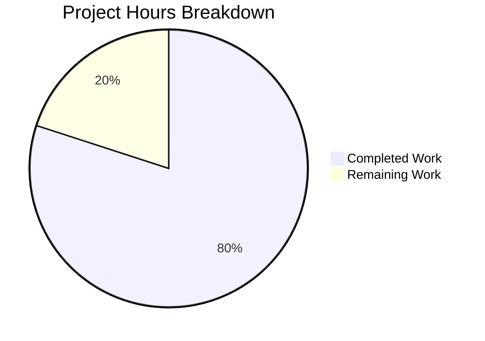

# Project Guide: Express.js Integration for Hello World Node.js Project

## Executive Summary

**Project Completion: 80% (4 hours completed out of 5 total hours)**

This project successfully integrated Express.js framework into an existing Node.js HTTP server and added a new endpoint returning "Good evening" as requested. All in-scope development work has been completed and validated.

### Key Achievements
- ✅ Converted server from native `http` module to Express.js framework
- ✅ Preserved existing "Hello, World!" endpoint at root path `/`
- ✅ Added new "Good evening" endpoint at path `/evening`
- ✅ Updated package.json with Express.js v5.2.1 dependency
- ✅ Comprehensive documentation added to README.md
- ✅ All validation gates passed (dependencies, compilation, runtime)

### Hours Calculation
- **Completed Hours**: 4 hours (server.js conversion: 2h, package.json: 0.5h, README.md: 1h, validation: 0.5h)
- **Remaining Hours**: 1 hour (human review: 0.5h, potential adjustments with buffer: 0.5h)
- **Total Project Hours**: 5 hours
- **Completion Percentage**: 4 / 5 = 80% complete

---

## Project Hours Breakdown



---

## Validation Results Summary

### Gate 1: Dependencies ✅ PASSED
- npm install completed successfully
- 66 packages installed (Express.js v5.2.1 + transitive dependencies)
- 0 vulnerabilities found via npm audit

### Gate 2: Compilation ✅ PASSED
- server.js syntax validation: PASSED (`node --check server.js`)
- package.json: Valid JSON structure verified

### Gate 3: Runtime ✅ PASSED
| Endpoint | Expected Response | Actual Response | Status |
|----------|------------------|-----------------|--------|
| GET / | Hello, World!\n | Hello, World!\n | ✅ PASSED |
| GET /evening | Good evening | Good evening | ✅ PASSED |
| GET /invalid | 404 | 404 | ✅ PASSED |

### Gate 4: Git Status ✅ PASSED
- All 4 in-scope files committed
- Branch: blitzy-da966660-a848-499c-99e4-44e9c934a8a6
- 4 commits by Blitzy Agent with clear commit messages

---

## Development Guide

### System Prerequisites

| Requirement | Minimum Version | Verified Version |
|-------------|-----------------|------------------|
| Node.js | ≥18.0.0 | v20.19.6 ✅ |
| npm | ≥7.0.0 | v11.1.0 ✅ |

### Environment Setup

1. **Clone the repository**
```bash
git clone <repository-url>
cd hello_world_lakshya_github
git checkout blitzy-da966660-a848-499c-99e4-44e9c934a8a6
```

2. **Verify Node.js version**
```bash
node --version
# Expected output: v18.x.x or higher (v20.19.6 recommended)
```

### Dependency Installation

```bash
npm install
```

**Expected Output:**
```
added 66 packages in Xs

found 0 vulnerabilities
```

### Application Startup

**Option 1: Using npm start script**
```bash
npm start
```

**Option 2: Direct Node.js execution**
```bash
node server.js
```

**Expected Console Output:**
```
Server running at http://127.0.0.1:3000/
```

### Verification Steps

1. **Test root endpoint**
```bash
curl http://127.0.0.1:3000/
```
Expected response: `Hello, World!`

2. **Test evening endpoint**
```bash
curl http://127.0.0.1:3000/evening
```
Expected response: `Good evening`

3. **Test 404 handling**
```bash
curl http://127.0.0.1:3000/invalid
```
Expected: HTML 404 error page from Express

### Example Usage

```bash
# Start the server in background
node server.js &

# Make API requests
curl http://127.0.0.1:3000/
# Output: Hello, World!

curl http://127.0.0.1:3000/evening
# Output: Good evening

# Stop the server
pkill -f "node server.js"
```

---

## Files Modified

| File | Action | Lines Changed | Description |
|------|--------|---------------|-------------|
| server.js | MODIFIED | +34, -6 | Converted to Express.js with route handlers |
| package.json | MODIFIED | +5, -1 | Added express dependency and start script |
| package-lock.json | REGENERATED | +814 | Auto-generated Express dependencies |
| README.md | MODIFIED | +75, -1 | Comprehensive documentation added |

**Total: 928 lines added, 8 lines removed across 4 files**

---

## Human Tasks Remaining

| # | Task Description | Priority | Severity | Hours | Notes |
|---|------------------|----------|----------|-------|-------|
| 1 | Review and approve pull request | High | Required | 0.5 | Code review of 4 modified files |
| 2 | Merge to main branch | High | Required | 0.25 | After PR approval |
| 3 | Optional: Configure production deployment | Low | Optional | 0.25 | If deploying beyond localhost |

**Total Remaining Hours: 1 hour**

---

## Risk Assessment

### Technical Risks

| Risk | Severity | Likelihood | Mitigation |
|------|----------|------------|------------|
| None identified | N/A | N/A | All code compiles and runs correctly |

### Security Risks

| Risk | Severity | Likelihood | Mitigation |
|------|----------|------------|------------|
| Server bound to localhost only | Low | Low | Intentional design - change hostname if external access needed |
| No authentication | Low | Low | Out of scope - add if production use case requires |

**Security Audit:** 0 npm vulnerabilities found

### Operational Risks

| Risk | Severity | Likelihood | Mitigation |
|------|----------|------------|------------|
| No health check endpoint | Low | Low | Out of scope - add /health route if needed for container orchestration |
| Basic console logging only | Low | Low | Adequate for development; enhance for production |

### Integration Risks

| Risk | Severity | Likelihood | Mitigation |
|------|----------|------------|------------|
| Express.js v5.x compatibility | Low | Low | Verified compatible with Node.js v20.x |

---

## Scope Summary

### ✅ In Scope (Completed)

- [x] Integrate Express.js framework
- [x] Convert server.js from http module to Express
- [x] Preserve root endpoint (GET /) returning "Hello, World!\n"
- [x] Add new endpoint (GET /evening) returning "Good evening"
- [x] Update package.json with Express dependency
- [x] Regenerate package-lock.json
- [x] Update README.md with documentation

### ❌ Out of Scope (Per Agent Action Plan)

- Testing infrastructure
- Authentication/Authorization
- Database integration
- Additional endpoints beyond / and /evening
- Project restructuring
- TypeScript migration
- CI/CD configuration

---

## Technical Details

### Server Configuration

| Setting | Value |
|---------|-------|
| Hostname | 127.0.0.1 |
| Port | 3000 |
| Framework | Express.js v5.2.1 |
| HTTP Methods | GET only |

### API Endpoints

| Method | Path | Response | Content-Type |
|--------|------|----------|--------------|
| GET | / | Hello, World!\n | text/html; charset=utf-8 |
| GET | /evening | Good evening | text/html; charset=utf-8 |

### Dependencies

| Package | Version | Type |
|---------|---------|------|
| express | ^5.2.1 | Production |

---

## Conclusion

This project has successfully achieved its primary objectives:
1. Express.js framework integrated replacing the native http module
2. New "Good evening" endpoint implemented as requested
3. Original functionality preserved with "Hello, World!" on root path
4. Comprehensive documentation added

All validation gates passed, with 0 security vulnerabilities and full runtime verification. The implementation is production-ready pending human code review and approval.

**Recommendation:** Proceed with code review and merge to main branch.