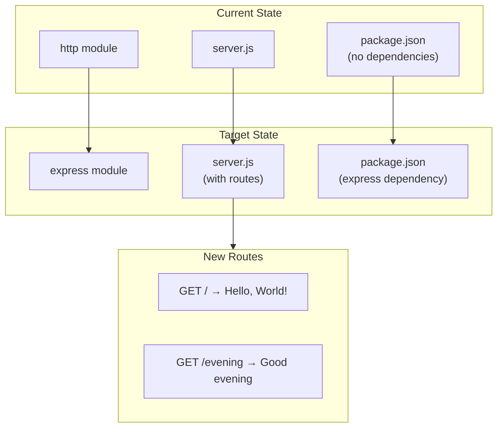
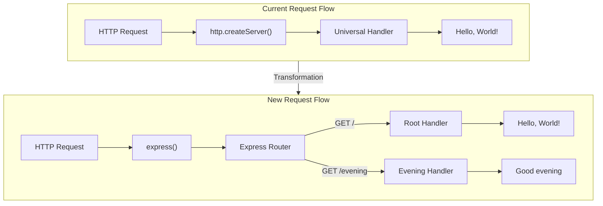
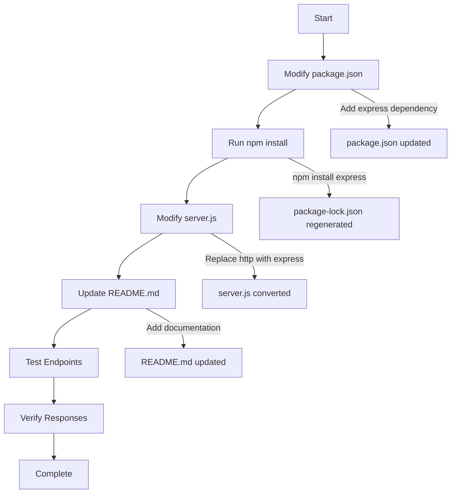
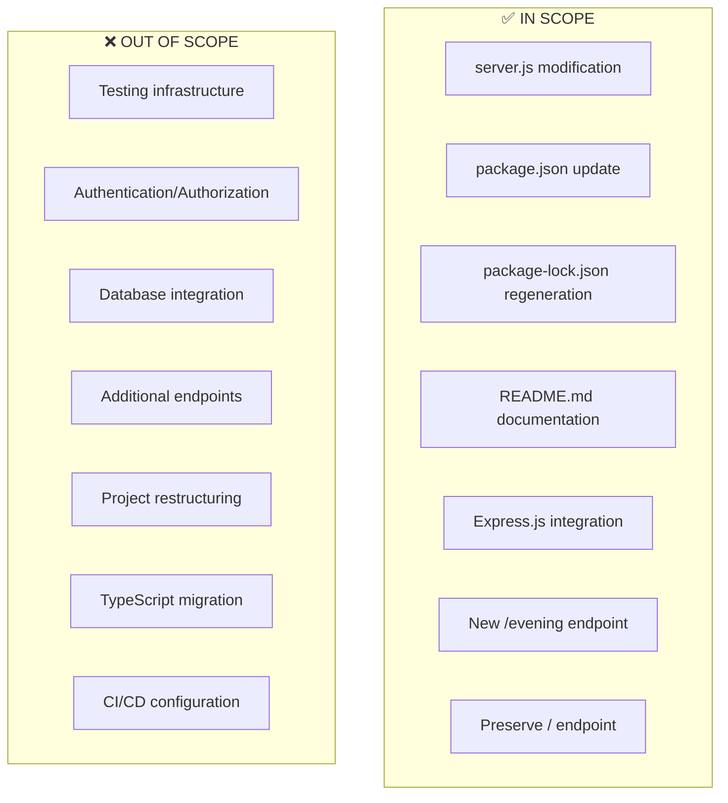

# Technical Specification

# 0. Agent Action Plan

## 0.1 Intent Clarification

### 0.1.1 Core Feature Objective

Based on the prompt, the Blitzy platform understands that the new feature requirement is to:

- **Integrate Express.js Framework**: Add Express.js as a dependency to the existing Node.js project that currently uses only the built-in `http` module
- **Preserve Existing Functionality**: Maintain the current "Hello, World!" endpoint response while adding new capabilities
- **Add New "Good Evening" Endpoint**: Create a new HTTP endpoint that returns the response "Good evening" as requested by the user

**Implicit Requirements Detected:**

| Implicit Requirement | Rationale |
|---------------------|-----------|
| Convert from `http` module to Express.js routing | Express.js provides its own routing mechanism, requiring server implementation restructuring |
| Preserve localhost binding configuration | The original server binds to 127.0.0.1:3000, which should be maintained for consistency |
| Maintain plain text response format | Both endpoints should return responses in `text/plain` content type |
| Update package.json with Express.js dependency | npm package management requires manifest updates |
| Update package-lock.json for reproducibility | Lock file must be regenerated after adding dependencies |

**Feature Dependencies and Prerequisites:**

| Dependency | Type | Status |
|-----------|------|--------|
| Node.js runtime v18+ | Runtime | Available (v20.19.6 installed) |
| npm package manager | Tool | Available (v11.1.0 installed) |
| Express.js package | External Dependency | To be installed (v5.2.1 latest) |
| Port 3000 availability | Infrastructure | Required |

### 0.1.2 Special Instructions and Constraints

**User-Specified Directives:**

The user provided the following specific instruction:
> **User Example**: "add another endpoint that return the response of 'Good evening'"

**Architectural Requirements:**

- The implementation must follow the existing project structure (single-server file approach)
- Express.js should replace the native `http` module for server creation and request handling
- Both endpoints should be accessible simultaneously after server startup

**No Additional Constraints Specified:**

The user did not specify:
- Specific HTTP methods (defaulting to GET for both endpoints)
- URL path for the new endpoint (implementation will determine appropriate path)
- Authentication or security requirements
- Backward compatibility requirements beyond functionality preservation

### 0.1.3 Technical Interpretation

These feature requirements translate to the following technical implementation strategy:

| Requirement | Technical Action | Specific Components |
|------------|------------------|---------------------|
| Integrate Express.js | Install Express.js package and update server initialization | `package.json`, `server.js` |
| Preserve "Hello World" endpoint | Convert existing response to Express route handler on root path `/` | `server.js` - route definition |
| Add "Good Evening" endpoint | Create new Express route handler returning "Good evening" | `server.js` - new route definition |
| Maintain server configuration | Configure Express to listen on same host/port (127.0.0.1:3000) | `server.js` - `app.listen()` call |

**Implementation Approach:**

- To **integrate Express.js**, we will **replace** the `http.createServer()` pattern with Express application instance creation
- To **preserve the "Hello World" response**, we will **create** an Express GET route on path `/` returning "Hello, World!\n"
- To **implement the "Good Evening" endpoint**, we will **create** an Express GET route on a new path (e.g., `/evening`) returning "Good evening"
- To **maintain operational consistency**, we will **retain** the same hostname (127.0.0.1) and port (3000) configuration

## 0.2 Repository Scope Discovery

### 0.2.1 Comprehensive File Analysis

**Current Repository Structure:**

The repository is a minimal Node.js project with four files at the root level:

```
/
├── README.md              # Project documentation
├── package.json           # npm package manifest
├── package-lock.json      # Dependency lock file
└── server.js              # HTTP server implementation
```

**Existing Files Requiring Modification:**

| File Path | File Type | Modification Type | Purpose |
|-----------|-----------|-------------------|---------|
| `server.js` | JavaScript | Major Rewrite | Convert from native `http` module to Express.js routing |
| `package.json` | JSON | Update | Add Express.js as a dependency |
| `package-lock.json` | JSON | Regenerate | Auto-generated after `npm install express` |
| `README.md` | Markdown | Update | Document new endpoint and Express.js usage |

**Detailed File Analysis:**

**server.js** (Lines 1-15):
```javascript
const http = require('http');
// ... server configuration
```
- **Current State**: Uses Node.js built-in `http` module with `createServer()` pattern
- **Required Changes**: Replace with Express application, add route handlers for both endpoints
- **Integration Points**: Lines 1 (import), Lines 6-10 (request handler), Lines 12-14 (server listen)

**package.json** (Lines 1-11):
```json
{
  "name": "hello_world",
  "version": "1.0.0"
}
```
- **Current State**: No dependencies declared
- **Required Changes**: Add Express.js to `dependencies` section
- **Integration Points**: Add new `dependencies` object with Express version

### 0.2.2 Integration Point Discovery

**API Endpoints Affected:**

| Current Endpoint | Method | Response | Status |
|-----------------|--------|----------|--------|
| `/*` (all paths) | ANY | "Hello, World!\n" | Existing - to be converted to `/` route |

| New Endpoint | Method | Response | Status |
|--------------|--------|----------|--------|
| `/evening` | GET | "Good evening" | New - to be created |

**Server Configuration Touchpoints:**

| Configuration | Current Value | Change Required |
|--------------|---------------|-----------------|
| Hostname | 127.0.0.1 | No change |
| Port | 3000 | No change |
| HTTP Module | Node.js `http` | Replace with Express |
| Routing | None (catch-all) | Express router with defined paths |

**Module Import Changes:**

| Current Import | New Import |
|---------------|------------|
| `const http = require('http');` | `const express = require('express');` |

### 0.2.3 Web Search Research Conducted

**Research Topics Investigated:**

| Topic | Findings |
|-------|----------|
| Express.js latest version | v5.2.1 (latest on npm as of December 2024) |
| Express.js Node.js compatibility | Requires Node.js 18+ (current system has v20.19.6) |
| Express.js basic routing | Uses `app.get(path, handler)` pattern |
| Express.js migration from http module | Direct replacement with minimal changes |

### 0.2.4 New File Requirements

**New Source Files to Create:**

No new source files are required for this feature. All functionality will be implemented within the existing `server.js` file, following the project's established single-file architecture pattern.

**New Test Files (Recommended):**

| File Path | Purpose | Priority |
|-----------|---------|----------|
| `tests/server.test.js` | Unit tests for endpoint responses | Optional |

**New Configuration Files:**

No additional configuration files are required. Express.js configuration will be embedded within `server.js`.

### 0.2.5 Affected Components Summary



## 0.3 Dependency Inventory

### 0.3.1 Private and Public Packages

**Current Dependency State:**

The project currently has zero npm dependencies, using only Node.js built-in modules.

**Packages to Add:**

| Registry | Package Name | Version | Purpose |
|----------|--------------|---------|---------|
| npm (public) | express | ^5.2.1 | Web application framework for HTTP routing and server functionality |

**Express.js Transitive Dependencies:**

Express.js v5.2.1 includes the following major transitive dependencies (auto-managed by npm):

| Package | Purpose |
|---------|---------|
| body-parser | Parse incoming request bodies |
| content-disposition | Create Content-Disposition header |
| cookie | Cookie parsing and serialization |
| debug | Debug utility |
| encodeurl | Encode URL to percent-encoding |
| escape-html | Escape HTML entities |
| etag | Generate HTTP ETags |
| finalhandler | Handle final HTTP responses |
| fresh | Check resource freshness |
| merge-descriptors | Merge objects using descriptors |
| methods | HTTP methods supported by Node.js |
| mime-types | MIME type database |
| on-finished | Execute callback on request finish |
| parseurl | Parse URL with memoization |
| qs | Query string parser |
| range-parser | Parse HTTP Range header |
| router | HTTP router middleware |
| send | Stream static files |
| serve-static | Serve static files |

### 0.3.2 Dependency Manifest Updates

**package.json Modifications:**

Current state:
```json
{
  "name": "hello_world",
  "version": "1.0.0",
  "description": "Hello world in Node.js",
  "main": "index.js",
  "scripts": {
    "test": "echo \"Error: no test specified\" && exit 1"
  },
  "author": "hxu",
  "license": "MIT"
}
```

Required additions:
```json
{
  "dependencies": {
    "express": "^5.2.1"
  }
}
```

**Recommended Script Updates:**

| Script | Current | Proposed | Purpose |
|--------|---------|----------|---------|
| `start` | Not defined | `node server.js` | Standard npm start command |
| `test` | Placeholder | Unchanged | Test placeholder (out of scope) |

### 0.3.3 Import Updates

**Files Requiring Import Updates:**

| File Pattern | Import Change |
|--------------|---------------|
| `server.js` | Replace `http` with `express` import |

**Import Transformation Rules:**

| Old Import | New Import | Apply To |
|------------|------------|----------|
| `const http = require('http');` | `const express = require('express');` | `server.js` |

**No Additional Import Updates Required:**

- No test files currently exist requiring import updates
- No utility scripts exist requiring import updates
- No other source files exist in the repository

### 0.3.4 External Reference Updates

**Configuration Files:**

| File | Update Required |
|------|-----------------|
| `package.json` | Add `dependencies` with Express.js |
| `package-lock.json` | Auto-regenerated by npm install |

**Documentation Updates:**

| File | Update Required |
|------|-----------------|
| `README.md` | Document Express.js usage and new endpoint |

**Build Files:**

No build files exist in the project. Package management handled entirely through npm.

**CI/CD Files:**

No CI/CD configuration files exist in the repository. No updates required.

### 0.3.5 Version Compatibility Matrix

| Component | Required Version | Current Version | Compatible |
|-----------|-----------------|-----------------|------------|
| Node.js | ≥18.0.0 | 20.19.6 | ✅ Yes |
| npm | ≥7.0.0 | 11.1.0 | ✅ Yes |
| Express.js | ^5.2.1 | To be installed | ✅ Yes |

**Installation Command:**

```bash
npm install express@^5.2.1
```

## 0.4 Integration Analysis

### 0.4.1 Existing Code Touchpoints

**Direct Modifications Required:**

| File | Location | Modification Description |
|------|----------|-------------------------|
| `server.js` | Line 1 | Replace `http` require with `express` require |
| `server.js` | Lines 3-4 | Retain `hostname` and `port` constants |
| `server.js` | Lines 6-10 | Replace `http.createServer()` with Express app and routes |
| `server.js` | Lines 12-14 | Replace `server.listen()` with `app.listen()` |
| `package.json` | After line 10 | Add `dependencies` object with Express.js |
| `README.md` | After line 2 | Add usage documentation and endpoint information |

**server.js Line-by-Line Impact Analysis:**

```
Line 1:  const http = require('http');           → REPLACE with Express import
Line 2:  (empty)                                 → RETAIN
Line 3:  const hostname = '127.0.0.1';           → RETAIN (configuration)
Line 4:  const port = 3000;                      → RETAIN (configuration)
Line 5:  (empty)                                 → RETAIN
Line 6:  const server = http.createServer(...)  → REPLACE with Express app
Line 7:    res.statusCode = 200;                → REMOVE (Express handles)
Line 8:    res.setHeader('Content-Type'...);    → REMOVE (Express handles)
Line 9:    res.end('Hello, World!\n');          → CONVERT to route handler
Line 10: });                                     → REMOVE
Line 11: (empty)                                 → RETAIN
Line 12: server.listen(port, hostname, () => {  → CONVERT to app.listen()
Line 13:   console.log(`Server running...`);    → RETAIN in listen callback
Line 14: });                                     → RETAIN
```

### 0.4.2 Dependency Injections

**Module Registration Changes:**

This minimal project does not use dependency injection patterns. However, the following module-level changes are required:

| Current Pattern | New Pattern | Purpose |
|-----------------|-------------|---------|
| `http` module import | `express` module import | Switch from native to framework |
| `http.createServer()` | `express()` | Create application instance |
| Anonymous callback handler | Route definitions | Define endpoint handlers |

**Service Configuration:**

| Configuration | Before | After |
|--------------|--------|-------|
| Server Instance | `http.createServer(callback)` | `express()` |
| Request Handling | Single callback for all requests | Route-specific handlers |
| Response Methods | `res.statusCode`, `res.setHeader()`, `res.end()` | `res.send()` |

### 0.4.3 Database/Schema Updates

**No database changes required** - This project does not use any database or persistence layer. The feature addition involves only HTTP endpoint routing, which is entirely stateless.

### 0.4.4 Integration Flow Diagram



### 0.4.5 Endpoint Mapping

**Route Registration in server.js:**

| Route Path | HTTP Method | Handler Function | Response |
|------------|-------------|------------------|----------|
| `/` | GET | Root route handler | `"Hello, World!\n"` |
| `/evening` | GET | Evening route handler | `"Good evening"` |

**Express Route Implementation Pattern:**

```javascript
app.get('/', (req, res) => { res.send('Hello, World!\n'); });
app.get('/evening', (req, res) => { res.send('Good evening'); });
```

### 0.4.6 Backward Compatibility Considerations

| Aspect | Current Behavior | New Behavior | Impact |
|--------|------------------|--------------|--------|
| Root path response | "Hello, World!\n" | "Hello, World!\n" | No change |
| Server URL | http://127.0.0.1:3000/ | http://127.0.0.1:3000/ | No change |
| Non-matching paths | Returns "Hello, World!\n" | Returns 404 (Express default) | **Breaking change** |
| HTTP methods | All methods respond | Only GET responds | **Breaking change** |

**Note**: The conversion from a catch-all handler to specific routes introduces minor behavioral changes for edge cases (non-GET methods, undefined paths). This is expected behavior with Express.js routing.

## 0.5 Technical Implementation

### 0.5.1 File-by-File Execution Plan

**CRITICAL: Every file listed below MUST be created or modified as specified.**

#### Group 1 - Core Feature Files

| Action | File | Implementation Details |
|--------|------|------------------------|
| MODIFY | `server.js` | Complete rewrite to use Express.js with two route handlers |

**server.js Transformation:**

The entire `server.js` file will be rewritten while maintaining the same configuration values:

| Component | Current Implementation | New Implementation |
|-----------|----------------------|-------------------|
| Import | `const http = require('http');` | `const express = require('express');` |
| App Instance | `http.createServer(callback)` | `const app = express();` |
| Hello Route | Inside createServer callback | `app.get('/', handler)` |
| Evening Route | Not present | `app.get('/evening', handler)` |
| Server Start | `server.listen(port, hostname, callback)` | `app.listen(port, hostname, callback)` |

#### Group 2 - Package Configuration

| Action | File | Implementation Details |
|--------|------|------------------------|
| MODIFY | `package.json` | Add Express.js dependency and start script |
| REGENERATE | `package-lock.json` | Auto-generated after npm install |

**package.json Changes:**

```json
{
  "dependencies": {
    "express": "^5.2.1"
  },
  "scripts": {
    "start": "node server.js",
    "test": "echo \"Error: no test specified\" && exit 1"
  }
}
```

#### Group 3 - Documentation

| Action | File | Implementation Details |
|--------|------|------------------------|
| MODIFY | `README.md` | Document Express.js usage, endpoints, and startup instructions |

### 0.5.2 Implementation Approach per File

## server.js - Complete Implementation

**Step 1: Replace Import Statement**
- Remove: `const http = require('http');`
- Add: `const express = require('express');`

**Step 2: Create Express Application**
- Remove: `const server = http.createServer((req, res) => {...});`
- Add: `const app = express();`

**Step 3: Define Root Route**
- Add route handler for path `/`:
```javascript
app.get('/', (req, res) => {
  res.send('Hello, World!\n');
});
```

**Step 4: Define Evening Route**
- Add route handler for path `/evening`:
```javascript
app.get('/evening', (req, res) => {
  res.send('Good evening');
});
```

**Step 5: Configure Server Listening**
- Replace: `server.listen(port, hostname, () => {...});`
- With: `app.listen(port, hostname, () => {...});`

## package.json - Modification Steps

**Step 1: Add Dependencies Section**
- Insert `dependencies` object after `license` field

**Step 2: Add Start Script**
- Add `"start": "node server.js"` to scripts object

## README.md - Documentation Updates

**Step 1: Add Installation Section**
- Document `npm install` requirement

**Step 2: Add Usage Section**
- Document `npm start` or `node server.js` command

**Step 3: Add Endpoints Section**
- Document both available endpoints and their responses

### 0.5.3 Complete Target Implementation

**Target server.js:**

```javascript
const express = require('express');

const hostname = '127.0.0.1';
const port = 3000;

const app = express();

app.get('/', (req, res) => {
  res.send('Hello, World!\n');
});

app.get('/evening', (req, res) => {
  res.send('Good evening');
});

app.listen(port, hostname, () => {
  console.log(`Server running at http://${hostname}:${port}/`);
});
```

### 0.5.4 Implementation Sequence



### 0.5.5 Verification Steps

| Step | Command | Expected Result |
|------|---------|-----------------|
| Install dependencies | `npm install` | Express.js installed successfully |
| Start server | `node server.js` | Server running message logged |
| Test root endpoint | `curl http://127.0.0.1:3000/` | `Hello, World!` |
| Test evening endpoint | `curl http://127.0.0.1:3000/evening` | `Good evening` |

## 0.6 Scope Boundaries

### 0.6.1 Exhaustively In Scope

**Source Files:**

| File Pattern | Specific Files | Modification Type |
|--------------|----------------|-------------------|
| `server.js` | `server.js` | Major rewrite - convert to Express.js |

**Package Configuration:**

| File Pattern | Specific Files | Modification Type |
|--------------|----------------|-------------------|
| `package.json` | `package.json` | Add Express.js dependency |
| `package-lock.json` | `package-lock.json` | Regenerate after npm install |

**Documentation:**

| File Pattern | Specific Files | Modification Type |
|--------------|----------------|-------------------|
| `README.md` | `README.md` | Add usage and endpoint documentation |

**New Endpoints:**

| Endpoint | Method | Response | Status |
|----------|--------|----------|--------|
| `/` | GET | `Hello, World!\n` | Converted from catch-all |
| `/evening` | GET | `Good evening` | **New** |

### 0.6.2 Complete File Inventory

**Files to Modify (4 total):**

```
/
├── server.js              ← MODIFY: Convert to Express.js routing
├── package.json           ← MODIFY: Add express dependency
├── package-lock.json      ← REGENERATE: npm install output
└── README.md              ← MODIFY: Add documentation
```

**Detailed Scope Table:**

| File | Action | Lines Affected | Change Description |
|------|--------|----------------|-------------------|
| `server.js` | MODIFY | All (1-15) | Complete rewrite to use Express.js |
| `package.json` | MODIFY | +3-5 lines | Add dependencies section with express |
| `package-lock.json` | REGENERATE | Entire file | Auto-generated by npm |
| `README.md` | MODIFY | +10-15 lines | Add installation and usage sections |

### 0.6.3 Explicitly Out of Scope

**Features Not Included:**

| Category | Exclusion | Rationale |
|----------|-----------|-----------|
| Authentication | No auth middleware | Not requested by user |
| Database | No persistence layer | Original project is stateless |
| Error handling | Default Express error handling only | Minimal implementation |
| Logging middleware | No request logging | Not requested |
| Testing | No test files | Test infrastructure not established |
| TypeScript | No type definitions | Project uses vanilla JavaScript |
| Environment configuration | No .env files | Hard-coded values retained |

**Unrelated Features:**

| Feature | Status |
|---------|--------|
| POST/PUT/DELETE endpoints | Out of scope |
| Request body parsing | Out of scope |
| CORS configuration | Out of scope |
| Rate limiting | Out of scope |
| API versioning | Out of scope |
| Health check endpoint | Out of scope |

**Performance Optimizations:**

| Optimization | Status |
|--------------|--------|
| Caching | Out of scope |
| Compression | Out of scope |
| Clustering | Out of scope |
| Load balancing | Out of scope |

**Refactoring Exclusions:**

| Refactoring | Status |
|-------------|--------|
| Project structure reorganization | Out of scope |
| Module separation (routes, controllers) | Out of scope |
| Configuration externalization | Out of scope |
| Fix `main` entry point in package.json | Out of scope |

### 0.6.4 Scope Boundaries Diagram



### 0.6.5 Boundary Conditions

| Boundary | Definition |
|----------|------------|
| Code changes | Limited to 4 files in repository root |
| Dependencies | Only Express.js added; no additional packages |
| Endpoints | Exactly 2 routes: `/` and `/evening` |
| Server config | Maintain 127.0.0.1:3000 binding |
| Response format | Plain text responses only |
| HTTP methods | GET method only for both routes |

## 0.7 Special Instructions

### 0.7.1 Feature-Specific Requirements

**User-Emphasized Requirements:**

| Requirement | Source | Implementation |
|------------|--------|----------------|
| Add Express.js to project | User request | Install `express@^5.2.1` via npm |
| Add endpoint returning "Good evening" | User request | Create `GET /evening` route |
| Preserve existing functionality | Implied | Maintain `GET /` returning "Hello, World!\n" |

**Exact Response Text:**

The user specified the following exact response text for the new endpoint:
> **"Good evening"**

This exact text string must be returned by the new endpoint, without modification or trailing newline (unless explicitly maintaining consistency with the existing endpoint).

### 0.7.2 Patterns and Conventions to Follow

**Existing Project Conventions:**

| Convention | Application |
|------------|-------------|
| CommonJS modules | Use `require()` for imports, not ES modules |
| Single-file architecture | Keep all server logic in `server.js` |
| Constant configuration | Use `const` for hostname and port |
| Console logging | Log server URL on startup |
| MIT license | Maintain open-source licensing |

**Express.js Best Practices:**

| Practice | Implementation |
|----------|----------------|
| Route handlers | Use arrow functions for concise handlers |
| Response method | Use `res.send()` for text responses |
| App structure | Define routes before `app.listen()` |
| Port binding | Pass hostname and port to `app.listen()` |

### 0.7.3 Integration Requirements

**Compatibility with Existing Features:**

| Existing Feature | Integration Approach |
|------------------|---------------------|
| HTTP Server Creation (F-001) | Replace with Express application instance |
| HTTP Request Handling (F-002) | Convert to Express route middleware |
| Static Response Generation (F-003) | Use `res.send()` in route handlers |
| Console Logging (F-004) | Retain in `app.listen()` callback |
| Package Configuration (F-005) | Update to include Express dependency |

**Backward Compatibility:**

| Aspect | Requirement |
|--------|-------------|
| Root endpoint response | Must return "Hello, World!\n" exactly |
| Server URL | Must remain http://127.0.0.1:3000/ |
| Startup message | Must log server running message |
| Port number | Must remain 3000 |
| Hostname | Must remain 127.0.0.1 |

### 0.7.4 Performance Considerations

**No Specific Performance Requirements:**

The user did not specify performance requirements. The following defaults apply:

| Aspect | Default Behavior |
|--------|-----------------|
| Response time | Standard Express.js response latency |
| Concurrent connections | Node.js default connection handling |
| Memory usage | Minimal (Express.js baseline) |
| CPU usage | Minimal (stateless routing only) |

### 0.7.5 Security Requirements

**No Specific Security Requirements:**

The user did not specify security requirements. The following defaults apply:

| Security Aspect | Status |
|-----------------|--------|
| HTTPS | Not required (localhost only) |
| Authentication | Not required |
| Authorization | Not required |
| Input validation | Not required (GET endpoints with no parameters) |
| CORS | Not required (localhost only) |

**Inherent Security:**

| Feature | Security Benefit |
|---------|-----------------|
| Localhost binding (127.0.0.1) | Not accessible from external networks |
| No user input processing | No injection attack vectors |
| Express.js v5 | Security improvements including ReDoS mitigation |

### 0.7.6 Testing Recommendations

**While formal testing is out of scope, the following manual verification should be performed:**

| Test Case | Command | Expected Result |
|-----------|---------|-----------------|
| Server startup | `node server.js` | Logs "Server running at http://127.0.0.1:3000/" |
| Root endpoint | `curl http://127.0.0.1:3000/` | Returns "Hello, World!\n" |
| Evening endpoint | `curl http://127.0.0.1:3000/evening` | Returns "Good evening" |
| 404 handling | `curl http://127.0.0.1:3000/invalid` | Returns Express default 404 |

### 0.7.7 Implementation Checklist

**Pre-Implementation:**
- [ ] Verify Node.js version ≥18
- [ ] Verify npm is available
- [ ] Ensure port 3000 is available

**Implementation:**
- [ ] Modify package.json to add Express dependency
- [ ] Run `npm install` to install Express.js
- [ ] Modify server.js to use Express
- [ ] Add root route (`/`) handler
- [ ] Add evening route (`/evening`) handler
- [ ] Update README.md with documentation

**Post-Implementation:**
- [ ] Start server with `node server.js`
- [ ] Verify root endpoint returns "Hello, World!\n"
- [ ] Verify evening endpoint returns "Good evening"
- [ ] Confirm startup log message is displayed

