# Technical Specification

# 0. SUMMARY OF CHANGES

## 0.1 USER INTENT RESTATEMENT

### 0.1.1 Core Objective

Based on the requirements, the Blitzy platform understands that the objective is to:

1. **Transform the existing Node.js HTTP server** from a native implementation using only built-in modules to an Express.js-based application
2. **Implement proper request routing** to replace the current universal response handler that returns the same response for all requests
3. **Add a second endpoint** that returns "Good evening" while maintaining the existing "Hello world" functionality
4. **Migrate from zero-dependency architecture** to a framework-based approach using Express.js

### 0.1.2 Special Instructions and Constraints

**User-Provided Context:**
- The user describes the current state as "a tutorial of node js server hosting one endpoint that returns the response 'Hello world'"
- The user explicitly requests: "add expressjs into the project"
- The user specifically wants: "another endpoint that return the response of 'Good evening'"

**Implicit Requirements Detected:**
- Maintain backward compatibility with the existing endpoint functionality
- Implement proper HTTP routing (currently all paths return the same response)
- Configure appropriate HTTP methods for each endpoint
- Update project dependencies and package management files
- Ensure the server continues to run on the same port (3000)

### 0.1.3 Technical Interpretation

These requirements translate to the following technical implementation strategy:

1. **Framework Migration**: To achieve proper routing capabilities, we will replace the native `http` module implementation with Express.js framework, fundamentally changing the project's architecture from zero-dependency to framework-based
2. **Routing Implementation**: To enable multiple endpoints with different responses, we will implement Express.js routing middleware that maps specific URL paths to distinct handler functions
3. **Endpoint Creation**: To provide the requested "Good evening" response, we will create a new GET endpoint (e.g., `/good-evening`) while preserving the existing root endpoint functionality
4. **Dependency Management**: To integrate Express.js, we will modify the npm package configuration to include Express.js as a production dependency, breaking the current zero-dependency principle

## 0.2 TECHNICAL SCOPE

### 0.2.1 Primary Objectives with Implementation Approach

**Objective 1: Express.js Framework Integration**
- Achieve framework-based architecture by modifying `package.json` to add Express.js dependency
- Install Express.js version compatible with Node.js 22.x LTS environment
- Update `package-lock.json` to lock Express.js and its transitive dependencies

**Objective 2: Server Refactoring**
- Achieve Express.js implementation by modifying `server.js` to replace native `http.createServer` with Express application initialization
- Implement Express middleware stack for request processing
- Maintain localhost binding on port 3000 for backward compatibility

**Objective 3: Multi-Endpoint Routing**
- Achieve endpoint differentiation by implementing Express Router to handle distinct URL paths
- Create GET route handler for root path (`/`) returning "Hello, World!" response
- Create GET route handler for new path (`/good-evening`) returning "Good evening" response

**Objective 4: Project Configuration Enhancement**
- Achieve improved developer experience by adding npm start script to `package.json`
- Resolve package entry point mismatch between `package.json` (references `index.js`) and actual entry (`server.js`)

### 0.2.2 Component Impact Analysis

**Direct Modifications Required:**

- **server.js**: Replace entire HTTP module implementation with Express.js application
  - Remove `require('http')` and replace with `require('express')`
  - Remove `http.createServer()` and replace with `express()` application instance
  - Remove universal request handler and replace with route-specific handlers
  - Implement `app.get('/')` for Hello World endpoint
  - Implement `app.get('/good-evening')` for Good Evening endpoint
  - Modify server startup to use `app.listen()` instead of `server.listen()`

- **package.json**: Add Express.js dependency and improve scripts
  - Add `"express": "^4.21.2"` to dependencies section (or latest 4.x compatible with Node.js 22)
  - Add `"start": "node server.js"` to scripts section
  - Consider updating `"main"` from `"index.js"` to `"server.js"` to resolve entry point mismatch

**Indirect Impacts and Dependencies:**

- **package-lock.json**: Automatic updates due to Express.js installation
  - Will expand from zero dependencies to include Express.js dependency tree
  - Approximately 50-60 transitive dependencies will be added
  - Lock file version will remain at lockfileVersion: 3

- **Architecture Philosophy**: Fundamental shift from zero-dependency to framework-based
  - Breaking change from current "Zero-Framework Architecture" documented in Technical Specification
  - Security profile changes from "zero external dependencies" to managed framework dependencies
  - Performance characteristics change from "sub-millisecond response times" to Express.js overhead

**New Components Introduction:**

- **node_modules/**: New directory containing Express.js and dependencies
  - Will be created during npm install process
  - Contains all transitive dependencies required by Express.js

- **Express.js Middleware Stack**: New request processing pipeline
  - Default Express middleware for body parsing, error handling
  - Custom route handlers for each endpoint

### 0.2.3 File and Path Mapping

| Target File/Module | Source Reference | Context Dependencies | Modification Type |
|--------------------|------------------|----------------------|-------------------|
| server.js | Current native HTTP implementation | Express.js API documentation | Complete refactor to Express.js |
| package.json | Current zero-dependency manifest | npm registry for Express version | Add dependencies and scripts |
| package-lock.json | Current empty dependency tree | Auto-generated from npm install | Automatic expansion |
| node_modules/ | Not present | Express.js package tree | New directory creation |

## 0.3 IMPLEMENTATION DESIGN

### 0.3.1 Technical Approach

**Foundation Establishment:**
First, establish the Express.js foundation by modifying `package.json` to include Express.js as a production dependency. This breaks the zero-dependency principle but enables the routing capabilities required for multiple endpoints.

**Server Architecture Transformation:**
Next, integrate Express.js framework by completely refactoring `server.js` from native HTTP module to Express application pattern. This involves replacing the `http.createServer` callback model with Express's middleware-based request handling pipeline.

**Routing Implementation:**
Then, implement distinct endpoint handlers by creating Express route definitions that map URL paths to specific response functions. Each route will have its own handler function returning the appropriate text response.

**Configuration Finalization:**
Finally, ensure developer experience by adding convenience npm scripts and resolving the package entry point mismatch between `package.json` and actual implementation files.

### 0.3.2 User-Provided Examples Integration

The user's requirement of "another endpoint that return the response of 'Good evening'" will be implemented in `server.js` as an Express route handler:
```javascript
app.get('/good-evening', (req, res) => {
  res.send('Good evening');
});
```

### 0.3.3 Critical Implementation Details

**Design Patterns Employed:**
- **Middleware Pattern**: Express.js middleware stack for request processing
- **Router Pattern**: URL-based routing for endpoint differentiation
- **Application Factory**: Express application instance creation pattern

**Key Approaches:**
- Use Express.js 4.x series for stability with Node.js 22.x LTS
- Maintain plain text responses to preserve current response format
- Keep localhost binding for development consistency
- Use default Express error handling for robustness

**Integration Strategies:**
- Express application will listen on the same port (3000) as current implementation
- Response content-type will remain `text/plain` for consistency
- Console logging of server startup will be preserved

**Data Flow Modifications:**
- Current: All requests → Universal handler → "Hello, World!" response
- New: Request → Express Router → Path-specific handler → Corresponding response

### 0.3.4 Dependency Analysis

**Required Dependencies:**
- **express**: ^4.21.2 (or latest 4.x series)
  - Justification: Industry-standard Node.js web framework
  - Provides routing, middleware, and request handling capabilities
  - Compatible with Node.js 22.x LTS
  - Well-maintained with regular security updates

**Transitive Dependencies (automatically installed):**
- body-parser, cookie-parser, and other Express middleware
- HTTP utility libraries (methods, mime-types, etc.)
- Path and file system utilities

**Version Constraints:**
- Express.js 4.x required for Node.js 22.x compatibility
- Avoid Express.js 5.x (still in beta/alpha)

## 0.4 SCOPE BOUNDARIES

### 0.4.1 Explicitly In Scope

**Files to be Modified:**
- `server.js` - Complete refactor from native HTTP to Express.js
- `package.json` - Add Express dependency and start script
- `package-lock.json` - Automatic update with dependency tree

**Configuration Changes:**
- Add Express.js to production dependencies
- Add npm start script for convenience
- Update main entry point from `index.js` to `server.js`

**Functionality Additions:**
- GET `/` endpoint returning "Hello, World!\n"
- GET `/good-evening` endpoint returning "Good evening"
- Express.js request routing system
- Express error handling middleware

**Testing Considerations:**
- Manual testing of both endpoints required
- Verify responses match expected text
- Confirm server starts on port 3000

### 0.4.2 Explicitly Out of Scope

**What Users Might Expect but Isn't Included:**
- Additional HTTP methods (POST, PUT, DELETE) - only GET implemented
- JSON response format - maintaining plain text responses
- Request parameter handling or body parsing
- Authentication or authorization
- CORS configuration
- Static file serving
- Template engine integration
- Database connections
- Environment variable configuration
- Production deployment configuration
- Automated tests implementation
- API documentation generation

**Related Areas Deliberately Not Modified:**
- README.md - Not updated to reflect Express.js usage
- No creation of separate route files or modular structure
- No middleware for logging, security headers, or compression
- No error logging or monitoring setup
- No rate limiting or request validation
- No HTTPS/TLS configuration

**Future Considerations Not Addressed:**
- Backpropagation integration mentioned in project description
- Machine learning framework integration
- Scalability improvements
- Docker containerization
- CI/CD pipeline setup

## 0.5 VALIDATION CHECKLIST

### 0.5.1 Implementation Verification Points

**Dependency Installation:**
- ✓ Express.js appears in package.json dependencies
- ✓ package-lock.json contains Express dependency tree
- ✓ node_modules folder exists with Express.js installed

**Server Functionality:**
- ✓ Server starts successfully with `node server.js`
- ✓ Console displays "Server running at http://127.0.0.1:3000/"
- ✓ Server responds on localhost:3000

**Endpoint Verification:**
- ✓ GET request to `http://localhost:3000/` returns "Hello, World!\n"
- ✓ GET request to `http://localhost:3000/good-evening` returns "Good evening"
- ✓ Other paths return 404 error (Express default behavior)

**Observable Changes:**
- ✓ server.js uses `require('express')` instead of `require('http')`
- ✓ Route handlers defined with `app.get()` methods
- ✓ npm start command available and functional

### 0.5.2 Integration Points Testing

**Package Management:**
- Verify `npm install` successfully installs Express.js
- Confirm `npm start` launches the server
- Check that package.json version remains at 1.0.0

**Network Behavior:**
- Confirm server binds to 127.0.0.1:3000
- Verify both endpoints respond with 200 status code
- Ensure Content-Type remains text/plain (or text/html for Express default)

## 0.6 EXECUTION PARAMETERS

### 0.6.1 Special Execution Instructions

**Installation Process:**
- Use Node.js 22.x LTS as per technical specification
- Run `npm install` to add Express.js and dependencies
- No additional build or compilation steps required

**Development Workflow:**
- Use `npm start` or `node server.js` to run the server
- No watch mode or auto-restart configured
- Manual server restart required for code changes

### 0.6.2 Constraints and Boundaries

**Technical Constraints:**
- Must use CommonJS module format (not ES modules) for consistency
- Must maintain localhost-only binding for security
- Must preserve plain text response format

**Process Constraints:**
- Breaking the zero-dependency principle is acknowledged and accepted
- No modification to Git configuration or workflow
- No changes to project naming or description

**Output Constraints:**
- Response content must match user specifications exactly
- "Hello, World!\n" for root endpoint (preserving current behavior)
- "Good evening" for new endpoint (as specified by user)
- No HTML formatting or JSON structure in responses

## 0.7 ARCHITECTURAL IMPACT STATEMENT

This change represents a **fundamental architectural shift** from the current zero-dependency, native Node.js implementation to a framework-based approach using Express.js. This directly contradicts the "Zero-Framework Architecture" principle documented in the Technical Specification (Section 3.3.1) which explicitly states the "Intentional elimination of external web frameworks (Express.js, Fastify, Koa)."

**Rationale for Breaking Architectural Principle:**
The user's explicit requirement to "add expressjs into the project" takes precedence over the existing architectural constraints. The addition of Express.js enables proper routing capabilities that would require significant custom implementation using only native Node.js modules.

**Impact Summary:**
- **Security Profile**: Changes from zero vulnerabilities to managed framework dependencies
- **Performance**: Adds Express.js overhead but maintains acceptable response times
- **Complexity**: Increases from single-file native implementation to framework-based architecture
- **Maintenance**: Requires ongoing dependency updates and security patches
- **Benefits**: Provides industry-standard routing, middleware capabilities, and extensibility for future features

# 1. INTRODUCTION

## 1.1 EXECUTIVE SUMMARY

### 1.1.1 Project Overview

The hao-backprop-test project represents a foundational <span style="background-color: rgba(91, 57, 243, 0.2)">Express.js-based Node.js web service employing framework-level routing</span>. The project appears positioned as a test framework for backprop integration capabilities, as indicated by the repository's identification as a "test project for backprop integration." <span style="background-color: rgba(91, 57, 243, 0.2)">The application now exposes two GET endpoints: "/" returning "Hello, World!" and "/good-evening" returning "Good evening."</span>

### 1.1.2 Core Business Problem

Based on the current repository structure and naming conventions, this system addresses the need for:
- **Integration Testing Platform**: Establishing a lightweight foundation for testing backprop integration functionality
- **Proof of Concept Development**: Providing a minimal viable server infrastructure that can be extended with machine learning integration capabilities
- **Development Framework**: Creating a baseline HTTP service that can serve as the foundation for more complex backprop-related functionality

### 1.1.3 Key Stakeholders and Users

**Primary Stakeholders:**
- **Development Team**: Led by hxu (project author), responsible for implementing and extending the backprop integration features
- **Integration Testers**: Technical users who will utilize this platform to validate backprop functionality
- **System Architects**: Personnel responsible for designing the integration between this service and external backprop systems

**Target Users:**
- **Developers**: Requiring a simple HTTP endpoint for integration testing
- **QA Engineers**: Needing a controlled environment for testing backprop integration scenarios
- **System Integrators**: Utilizing the service as a foundation for broader system integration

### 1.1.4 Expected Business Impact and Value Proposition

**Immediate Value:**
- <span style="background-color: rgba(91, 57, 243, 0.2)">Provides a lightweight Express.js foundation enabling rapid prototyping with proper routing capabilities</span>
- Establishes a controlled environment for backprop integration experimentation
- Reduces complexity barriers for initial development phases

**Strategic Value:**
- Enables iterative development approach for complex machine learning integrations
- Serves as a reliable baseline for testing integration scenarios
- <span style="background-color: rgba(91, 57, 243, 0.2)">Leverages Express.js framework benefits for scalable routing and middleware integration during development phases</span>

## 1.2 SYSTEM OVERVIEW

### 1.2.1 Project Context

#### Business Context and Market Positioning

The project operates within the machine learning integration domain, specifically focusing on backpropagation testing scenarios. The current implementation prioritizes simplicity and minimalism, suggesting a focus on rapid development cycles and iterative enhancement over immediate production deployment.

#### Current System Characteristics

The existing implementation demonstrates several key architectural decisions:
- **<span style="background-color: rgba(91, 57, 243, 0.2)">Framework-based approach using Express.js as a managed external dependency</span>**: Utilizes Express.js framework for routing and middleware capabilities while maintaining development environment focus
- **Minimal resource footprint**: <span style="background-color: rgba(91, 57, 243, 0.2)">server.js refactored to instantiate an Express application via app.listen</span>
- **Localhost-focused design**: Hard-coded to 127.0.0.1, indicating development or testing environment targeting
- **<span style="background-color: rgba(91, 57, 243, 0.2)">Multi-endpoint routing distinguishing '/' and '/good-evening' GET requests</span>**: Enables path-specific response handling for targeted testing scenarios
- **<span style="background-color: rgba(91, 57, 243, 0.2)">Managed dependency structure through node_modules directory containing the Express dependency tree</span>**: Approximately 50-60 transitive dependencies supporting framework functionality

#### Integration Context

Currently operates as a standalone service with no existing enterprise integrations. The architecture suggests preparation for future extension rather than immediate production deployment within a larger system ecosystem.

### 1.2.2 High-Level Description

#### Primary System Capabilities

**Core HTTP Service:**
- **Request Handling**: <span style="background-color: rgba(91, 57, 243, 0.2)">Routes requests to path-specific handlers for defined GET endpoints</span>
- **Response Generation**: <span style="background-color: rgba(91, 57, 243, 0.2)">Returns path-specific plain-text responses</span>
- **Port Binding**: Listens on port 3000 for local connections
- **Immediate Availability**: Server starts automatically upon module loading

#### Major System Components

**<span style="background-color: rgba(91, 57, 243, 0.2)">Express.js-Based Architecture</span>:**
- **server.js**: <span style="background-color: rgba(91, 57, 243, 0.2)">Implements Express application with route-specific handlers using Express.js framework</span>
- **<span style="background-color: rgba(91, 57, 243, 0.2)">node_modules**: Houses Express.js and transitive dependencies</span>
- **Package Configuration**: Defines project metadata and Express.js dependencies through standard npm configuration files
- **Documentation Layer**: Basic README providing project identification and purpose

#### Core Technical Approach

The system employs an **<span style="background-color: rgba(91, 57, 243, 0.2)">Express.js middleware-based routing architecture</span>** that prioritizes:
- **Rapid Deployment**: Immediate server startup with minimal configuration requirements
- **Path-Specific Response**: Targeted output based on request URL path
- **Development Simplicity**: Framework-assisted implementation for easy modification and extension

### 1.2.3 Success Criteria

#### Measurable Objectives

| Objective | Current Status | Success Metric |
|-----------|----------------|----------------|
| HTTP Server Availability | ✓ Achieved | Server responds on localhost:3000 |
| **<span style="background-color: rgba(91, 57, 243, 0.2)">Express.js Dependency Integration</span>** | ✓ Achieved | **Express listed in package.json and installed** |
| Rapid Deployment | ✓ Achieved | Server starts immediately on execution |
| **<span style="background-color: rgba(91, 57, 243, 0.2)">Endpoint Differentiation</span>** | ✓ Achieved | **'/' returns Hello, World!; '/good-evening' returns Good evening** |

#### Critical Success Factors

**Technical Requirements:**
- **Response Consistency**: All requests receive appropriate response format based on endpoint
- **Local Accessibility**: Service available for localhost connections
- **Minimal Resource Usage**: Single Node.js process operation with Express.js framework

**Development Requirements:**
- **Code Maintainability**: Express.js structure enables rapid modifications and route additions
- **Extension Readiness**: Architecture supports addition of backprop integration features
- **Testing Foundation**: Provides stable baseline for integration testing scenarios

#### Key Performance Indicators (KPIs)

**Operational Metrics:**
- **Response Time**: Framework-optimized response for basic requests
- **Memory Footprint**: Express.js process memory usage within acceptable development parameters
- **Startup Time**: Immediate availability upon execution

**Development Metrics:**
- **Deployment Complexity**: Single command execution requirement with npm install
- **Modification Effort**: Express.js route-based changes for endpoint management
- **Testing Capability**: Multiple stable endpoints for automated testing integration

## 1.3 SCOPE

### 1.3.1 In-Scope Elements

#### Core Features and Functionalities

**Essential HTTP Capabilities:**
- **<span style="background-color: rgba(91, 57, 243, 0.2)">Path-specific Request Routing supporting GET '/' and GET '/good-evening' endpoints</span>**: Processing specific HTTP methods and paths with appropriate routing
- **Standardized Response Generation**: Consistent "Hello, World!" output
- **Local Network Binding**: Service availability on localhost interface
- **Automatic Server Initialization**: Immediate startup upon module execution

**Primary User Workflows:**
- **Development Testing**: HTTP client testing against stable endpoint
- **Integration Validation**: Baseline service for testing integration scenarios
- **Rapid Prototyping**: Foundation for extending with additional functionality

**Essential Technical Requirements:**
- **Node.js Runtime Compatibility**: Operation within standard Node.js environment
- **<span style="background-color: rgba(91, 57, 243, 0.2)">Express.js declared as a production dependency in package.json</span>**: Framework-based implementation for routing and middleware capabilities
- **Local Development Support**: Localhost-only operation for development scenarios

#### Implementation Boundaries

**System Boundaries:**
- **Network Scope**: Local machine access only (127.0.0.1 binding)
- **Protocol Support**: HTTP protocol exclusively
- **Response Format**: Plain text output only

**User Groups Covered:**
- **Local Developers**: Personnel with localhost access to the running service
- **Integration Testers**: Users requiring a stable HTTP endpoint for testing purposes

**Data Domains Included:**
- **HTTP Request Processing**: Basic request reception and acknowledgment
- **Static Response Generation**: Fixed response content delivery

### 1.3.2 Out-of-Scope Elements

#### Excluded Features and Capabilities

**Network and Security Features:**
- **External Network Access**: No support for non-localhost connections
- **Authentication and Authorization**: No user verification or access control
- **HTTPS/TLS Support**: Plain HTTP communication only
- **Error Handling**: No specialized error response mechanisms

**Data and Integration Features:**
- **Database Connectivity**: No persistent data storage capabilities
- **External API Integration**: No outbound service communications
- **Actual Backprop Implementation**: Despite project naming, no machine learning functionality currently implemented
- **Configuration Management**: No environment-based configuration support

**Advanced HTTP Features:**
- **Request Body Processing**: No parsing of POST/PUT request content
- **Header Manipulation**: No custom response header support
- **Session Management**: No user session tracking or state management
- **Rate Limiting**: No request throttling or abuse prevention

#### Future Phase Considerations

**Phase 2 Potential Enhancements:**
- Implementation of actual backprop integration functionality as suggested by project name
- Integration with machine learning libraries or external services
- Enhanced configuration management and environment support

**Phase 3 Production Readiness:**
- Security implementation including authentication and HTTPS support
- Error handling and logging infrastructure
- Performance monitoring and metrics collection
- Production deployment configuration and external network support

#### Integration Points Not Covered

**External System Integrations:**
- **Machine Learning Frameworks**: No TensorFlow, PyTorch, or similar integrations
- **Database Systems**: No MongoDB, PostgreSQL, or other data persistence
- **Message Queues**: No Redis, RabbitMQ, or event streaming support
- **Monitoring Systems**: No logging, metrics, or observability integration

#### Unsupported Use Cases

**Production Scenarios:**
- Multi-user concurrent access with session management
- External network exposure and public API provision
- High-availability deployment with load balancing
- Enterprise security compliance and audit trail requirements

**Advanced Development Scenarios:**
- Complex integration testing requiring multiple endpoints
- Performance testing requiring configurable response scenarios
- Development environment requiring hot-reload or advanced debugging features

#### References

- `server.js` - Core HTTP server implementation providing universal request handling
- `package.json` - Project metadata defining "hello_world" package configuration
- `package-lock.json` - Dependency lockfile confirming zero external package dependencies  
- `README.md` - Project identification as "hao-backprop-test" with basic description

# 2. PRODUCT REQUIREMENTS

## 2.1 FEATURE CATALOG

### 2.1.1 Core HTTP Server Service (updated)

**Feature Metadata:**
- **Feature ID**: F-001
- **Feature Name**: Core HTTP Server Service
- **Feature Category**: Core Infrastructure
- **Priority Level**: Critical
- **Status**: Completed

**Description:**
- **Overview**: <span style="background-color: rgba(91, 57, 243, 0.2)">Provides fundamental HTTP server capabilities using Express.js framework, creating a stable foundation for all system operations</span>
- **Business Value**: Enables rapid deployment of a testing platform with framework-based routing capabilities, reducing development complexity while maintaining reliability
- **User Benefits**: Immediate access to a scalable HTTP service with middleware support for integration testing scenarios and development workflows
- **Technical Context**: <span style="background-color: rgba(91, 57, 243, 0.2)">Implemented in `server.js` using Express.js framework via `express()` application instance and `app.listen(3000)` for server instantiation, automatically binding to localhost:3000 (127.0.0.1:3000) upon module execution</span>

**Dependencies:**
- **Prerequisite Features**: None
- **System Dependencies**: Node.js runtime environment
- **External Dependencies**: <span style="background-color: rgba(91, 57, 243, 0.2)">express ^4.21.x</span>
- **Integration Requirements**: Express.js middleware stack integration

### 2.1.2 Universal Request Handler (updated)

**Feature Metadata:**
- **Feature ID**: F-002
- **Feature Name**: Universal Request Handler
- **Feature Category**: Request Processing
- **Priority Level**: Critical
- **Status**: <span style="background-color: rgba(91, 57, 243, 0.2)">Deprecated</span>

**Description:**
- **Overview**: Previously processed all incoming HTTP requests regardless of method, path, or headers with consistent response behavior
- **Business Value**: Provided predictable system behavior for integration testing scenarios during early development phases
- **User Benefits**: Simplified testing procedures by ensuring consistent endpoint behavior across all request types
- **Technical Context**: <span style="background-color: rgba(91, 57, 243, 0.2)">Replaced by route-specific handlers implemented through Express.js routing system</span>

**Dependencies:**
- **Prerequisite Features**: F-001 (Core HTTP Server Service)
- **System Dependencies**: HTTP request/response cycle
- **External Dependencies**: None
- **Integration Requirements**: <span style="background-color: rgba(91, 57, 243, 0.2)">Superseded by F-007 Multi-Endpoint Routing</span>

### 2.1.3 Zero-Dependency Foundation (updated)

**Feature Metadata:**
- **Feature ID**: F-003
- **Feature Name**: Zero-Dependency Foundation
- **Feature Category**: Architecture
- **Priority Level**: High
- **Status**: <span style="background-color: rgba(91, 57, 243, 0.2)">Retired – superseded by framework-based architecture</span>

**Description:**
- **Overview**: Previously maintained complete system functionality using only Node.js built-in modules without external package dependencies
- **Business Value**: Previously eliminated security vulnerabilities, dependency conflicts, and maintenance overhead associated with external packages
- **User Benefits**: Previously enabled rapid deployment, minimal installation requirements, and reduced system complexity
- **Technical Context**: <span style="background-color: rgba(91, 57, 243, 0.2)">Architecture evolved to framework-based approach with Express.js dependency management through node_modules directory</span>

**Dependencies:**
- **Prerequisite Features**: None
- **System Dependencies**: Node.js core modules (historical)
- **External Dependencies**: <span style="background-color: rgba(91, 57, 243, 0.2)">Transitioned from zero external dependencies to Express.js framework dependency model</span>
- **Integration Requirements**: <span style="background-color: rgba(91, 57, 243, 0.2)">Replaced by F-006 Express.js Framework Integration</span>

### 2.1.4 Local Development Service

**Feature Metadata:**
- **Feature ID**: F-004
- **Feature Name**: Local Development Service
- **Feature Category**: Development Support
- **Priority Level**: Medium
- **Status**: Completed

**Description:**
- **Overview**: Provides HTTP service exclusively for secure development and testing environments
- **Business Value**: Ensures safe development environment without external network exposure during development phases
- **User Benefits**: Eliminates security concerns during development while providing stable testing endpoints
- **Technical Context**: Development-focused service configuration maintained through Express.js framework

**Dependencies:**
- **Prerequisite Features**: F-001 (Core HTTP Server Service), F-006 (Express.js Framework Integration)
- **System Dependencies**: Local network interface availability
- **External Dependencies**: express ^4.21.x
- **Integration Requirements**: Express.js application context

### 2.1.5 Backprop Integration Framework (Planned)

**Feature Metadata:**
- **Feature ID**: F-005
- **Feature Name**: Backprop Integration Framework
- **Feature Category**: Machine Learning Integration
- **Priority Level**: High
- **Status**: Proposed

**Description:**
- **Overview**: Future implementation of backpropagation algorithm integration capabilities as indicated by project naming and purpose
- **Business Value**: Transforms Express.js HTTP service into functional machine learning integration testing platform
- **User Benefits**: Enables comprehensive testing of backprop scenarios within controlled HTTP service environment with multiple endpoint support
- **Technical Context**: Not yet implemented but referenced in project description as "test project for backprop integration"

**Dependencies:**
- **Prerequisite Features**: F-001, F-006, F-007 (foundational Express.js architecture)
- **System Dependencies**: To be determined based on ML framework selection
- **External Dependencies**: Potential ML libraries (TensorFlow.js, brain.js, or similar) in addition to Express.js
- **Integration Requirements**: Must leverage Express.js routing capabilities for ML endpoint exposure

### 2.1.6 Express.js Framework Integration

**Feature Metadata:**
- **Feature ID**: F-006
- **Feature Name**: <span style="background-color: rgba(91, 57, 243, 0.2)">Express.js Framework Integration</span>
- **Feature Category**: <span style="background-color: rgba(91, 57, 243, 0.2)">Core Infrastructure</span>
- **Priority Level**: <span style="background-color: rgba(91, 57, 243, 0.2)">Critical</span>
- **Status**: <span style="background-color: rgba(91, 57, 243, 0.2)">Completed</span>

**Description:**
- **Overview**: <span style="background-color: rgba(91, 57, 243, 0.2)">Establishes Express.js framework as the core web application foundation, replacing native Node.js HTTP module implementation</span>
- **Business Value**: <span style="background-color: rgba(91, 57, 243, 0.2)">Enables scalable routing architecture, middleware integration, and enhanced developer experience through industry-standard web framework</span>
- **User Benefits**: <span style="background-color: rgba(91, 57, 243, 0.2)">Provides robust request handling, simplified route management, and extensible middleware stack for complex testing scenarios</span>
- **Technical Context**: <span style="background-color: rgba(91, 57, 243, 0.2)">Implemented through Express.js dependency in `package.json`, npm start script configuration, and comprehensive `node_modules` tree containing approximately 50-60 transitive dependencies</span>

**Dependencies:**
- **Prerequisite Features**: <span style="background-color: rgba(91, 57, 243, 0.2)">None</span>
- **System Dependencies**: <span style="background-color: rgba(91, 57, 243, 0.2)">Node.js runtime environment, npm package manager</span>
- **External Dependencies**: <span style="background-color: rgba(91, 57, 243, 0.2)">express ^4.21.x</span>
- **Integration Requirements**: <span style="background-color: rgba(91, 57, 243, 0.2)">Node.js 22.x LTS compatibility, localhost binding on port 3000</span>

### 2.1.7 Multi-Endpoint Routing

**Feature Metadata:**
- **Feature ID**: F-007
- **Feature Name**: <span style="background-color: rgba(91, 57, 243, 0.2)">Multi-Endpoint Routing</span>
- **Feature Category**: <span style="background-color: rgba(91, 57, 243, 0.2)">Request Processing</span>
- **Priority Level**: <span style="background-color: rgba(91, 57, 243, 0.2)">Critical</span>
- **Status**: <span style="background-color: rgba(91, 57, 243, 0.2)">Completed</span>

**Description:**
- **Overview**: <span style="background-color: rgba(91, 57, 243, 0.2)">Implements path-specific request handling through Express Router, enabling distinct responses based on URL endpoints</span>
- **Business Value**: <span style="background-color: rgba(91, 57, 243, 0.2)">Provides endpoint differentiation capabilities essential for comprehensive testing scenarios and future feature expansion</span>
- **User Benefits**: <span style="background-color: rgba(91, 57, 243, 0.2)">Enables targeted testing of specific endpoints with predictable, path-appropriate responses</span>
- **Technical Context**: <span style="background-color: rgba(91, 57, 243, 0.2)">Implements two GET routes using Express Router: root path (`/`) returning "Hello, World!\n" response and `/good-evening` path returning "Good evening" response</span>

**Dependencies:**
- **Prerequisite Features**: <span style="background-color: rgba(91, 57, 243, 0.2)">F-001 (Core HTTP Server Service), F-006 (Express.js Framework Integration)</span>
- **System Dependencies**: <span style="background-color: rgba(91, 57, 243, 0.2)">Express.js routing engine</span>
- **External Dependencies**: <span style="background-color: rgba(91, 57, 243, 0.2)">express ^4.21.x</span>
- **Integration Requirements**: <span style="background-color: rgba(91, 57, 243, 0.2)">Express application context, middleware stack compatibility</span>

## 2.2 FUNCTIONAL REQUIREMENTS TABLE

### 2.2.1 Core HTTP Server Service Requirements (updated)

| Requirement ID | Description | Acceptance Criteria | Priority | Complexity |
|---------------|-------------|-------------------|----------|-----------|
| F-001-RQ-001 | <span style="background-color: rgba(91, 57, 243, 0.2)">Express.js HTTP Server Initialization</span> | <span style="background-color: rgba(91, 57, 243, 0.2)">Server must bind to localhost:3000 using Express.js `app.listen()` method and log startup confirmation</span> | Must-Have | Low |
| F-001-RQ-002 | Automatic Service Startup | Server must start immediately upon module execution | Must-Have | Low |
| F-001-RQ-003 | Local Network Binding | Server must only accept connections from localhost interface | Must-Have | Low |
| F-001-RQ-004 | Port Configuration | Server must consistently use port 3000 for all connections | Must-Have | Low |

**Technical Specifications:**
- **Input Parameters**: <span style="background-color: rgba(91, 57, 243, 0.2)">Express.js application instance configuration</span>
- **Output/Response**: HTTP service availability on specified port
- **Performance Criteria**: Sub-second startup time, immediate availability
- **Data Requirements**: No persistent data storage required

**Validation Rules:**
- **Business Rules**: Server must be accessible only from local machine
- **Data Validation**: No input validation required for server startup
- **Security Requirements**: Localhost-only binding for development security
- **Compliance Requirements**: Standard HTTP protocol compliance

### 2.2.2 Universal Request Handler Requirements (Deprecated)

> **Note**: This requirement set is deprecated and superseded by F-007 Multi-Endpoint Routing Requirements. Route-specific handling has replaced universal request treatment.

| Requirement ID | Description | Acceptance Criteria | Priority | Complexity |
|---------------|-------------|-------------------|----------|-----------|
| F-002-RQ-001 | All-Method Request Processing | Must accept GET, POST, PUT, DELETE, and all other HTTP methods | **Deprecated** | Low |
| F-002-RQ-002 | Universal Path Handling | Must respond identically to all URL paths and query parameters | **Deprecated** | Low |
| F-002-RQ-003 | Consistent Response Generation | Must return "Hello, World!\n" with 200 status for all requests | **Deprecated** | Low |
| F-002-RQ-004 | Content-Type Header Setting | Must set Content-Type to 'text/plain' for all responses | **Deprecated** | Low |

**Technical Specifications:**
- **Input Parameters**: HTTP request object (method, URL, headers, body)
- **Output/Response**: HTTP 200 status, "text/plain" content-type, "Hello, World!\n" body
- **Performance Criteria**: Sub-millisecond response time for all requests
- **Data Requirements**: No request data processing or storage required

**Validation Rules:**
- **Business Rules**: All requests receive identical treatment regardless of input
- **Data Validation**: No request validation implemented by design
- **Security Requirements**: No authentication or authorization required
- **Compliance Requirements**: Standard HTTP response format compliance

### 2.2.3 Zero-Dependency Foundation Requirements (Retired)

> **Status**: This requirement set has been retired due to architectural evolution to framework-based approach with Express.js dependency management.

| Requirement ID | Description | Acceptance Criteria | Priority | Complexity |
|---------------|-------------|-------------------|----------|-----------|
| F-003-RQ-001 | Node.js Built-in Module Usage | Must use only modules included in Node.js standard library | **Retired** | Medium |
| ~~F-003-RQ-002~~ | ~~External Package Prohibition~~ | ~~Must maintain zero external npm dependencies~~ | **Removed** | ~~Low~~ |
| F-003-RQ-003 | Self-Contained Operation | Must function without any npm install requirements | **Retired** | Low |
| F-003-RQ-004 | Minimal Resource Footprint | Must operate within single Node.js process | **Retired** | Low |

**Technical Specifications:**
- **Input Parameters**: Node.js runtime environment only
- **Output/Response**: Fully functional HTTP server without external packages
- **Performance Criteria**: Minimal memory usage, fast startup without dependency resolution
- **Data Requirements**: No external data sources or configuration files required

**Validation Rules:**
- **Business Rules**: System must remain dependency-free to ensure rapid deployment
- **Data Validation**: Package.json must show zero dependencies in all categories
- **Security Requirements**: Elimination of external package vulnerabilities
- **Compliance Requirements**: Node.js standard library usage patterns

### 2.2.4 Backprop Integration Framework Requirements (Planned)

| Requirement ID | Description | Acceptance Criteria | Priority | Complexity |
|---------------|-------------|-------------------|----------|-----------|
| F-005-RQ-001 | ML Framework Integration | Must support basic backpropagation algorithm testing | Should-Have | High |
| F-005-RQ-002 | HTTP Endpoint Extension | Must provide ML-specific endpoints while maintaining base functionality | Should-Have | Medium |
| F-005-RQ-003 | Testing Interface Design | Must enable integration testing scenarios for backprop functionality | Should-Have | High |
| F-005-RQ-004 | Foundation Compatibility | Must build upon existing zero-dependency foundation | Must-Have | Medium |

**Technical Specifications:**
- **Input Parameters**: To be defined based on ML framework requirements
- **Output/Response**: ML processing results via HTTP responses
- **Performance Criteria**: Acceptable response times for ML processing operations
- **Data Requirements**: Temporary data handling for ML operations

**Validation Rules:**
- **Business Rules**: Must not compromise existing simple operation model
- **Data Validation**: ML input/output validation as required by algorithms
- **Security Requirements**: Secure handling of ML training/testing data
- **Compliance Requirements**: Integration testing best practices

### 2.2.5 Express.js Framework Integration Requirements

| Requirement ID | Description | Acceptance Criteria | Priority | Complexity |
|---------------|-------------|-------------------|----------|-----------|
| F-006-RQ-001 | <span style="background-color: rgba(91, 57, 243, 0.2)">Express.js Dependency Management</span> | <span style="background-color: rgba(91, 57, 243, 0.2)">Must add express ^4.21.x to package.json dependencies section</span> | Must-Have | Low |
| F-006-RQ-002 | <span style="background-color: rgba(91, 57, 243, 0.2)">NPM Start Script Configuration</span> | <span style="background-color: rgba(91, 57, 243, 0.2)">Must provide npm start script with 'node server.js' command</span> | Must-Have | Low |
| F-006-RQ-003 | <span style="background-color: rgba(91, 57, 243, 0.2)">Express.js Server Startup</span> | <span style="background-color: rgba(91, 57, 243, 0.2)">Server must start via `app.listen(3000)` method and log confirmation message</span> | Must-Have | Low |
| F-006-RQ-004 | <span style="background-color: rgba(91, 57, 243, 0.2)">Framework Architecture Transition</span> | <span style="background-color: rgba(91, 57, 243, 0.2)">Must replace native http module with Express.js application instance</span> | Must-Have | Medium |

**Technical Specifications:**
- **Input Parameters**: <span style="background-color: rgba(91, 57, 243, 0.2)">Node.js 22.x LTS environment, npm package manager</span>
- **Output/Response**: <span style="background-color: rgba(91, 57, 243, 0.2)">Express.js application instance with middleware stack</span>
- **Performance Criteria**: <span style="background-color: rgba(91, 57, 243, 0.2)">Framework initialization within acceptable startup time, middleware processing overhead</span>
- **Data Requirements**: <span style="background-color: rgba(91, 57, 243, 0.2)">Package.json dependency declarations, package-lock.json version locking</span>

**Validation Rules:**
- **Business Rules**: <span style="background-color: rgba(91, 57, 243, 0.2)">Framework must provide scalable routing architecture for future expansion</span>
- **Data Validation**: <span style="background-color: rgba(91, 57, 243, 0.2)">Package.json must specify Express.js version compatible with Node.js 22.x</span>
- **Security Requirements**: <span style="background-color: rgba(91, 57, 243, 0.2)">Managed dependency security through Express.js ecosystem</span>
- **Compliance Requirements**: <span style="background-color: rgba(91, 57, 243, 0.2)">Express.js best practices and middleware compatibility</span>

### 2.2.6 Multi-Endpoint Routing Requirements

| Requirement ID | Description | Acceptance Criteria | Priority | Complexity |
|---------------|-------------|-------------------|----------|-----------|
| F-007-RQ-001 | <span style="background-color: rgba(91, 57, 243, 0.2)">Root Path Handler</span> | <span style="background-color: rgba(91, 57, 243, 0.2)">GET / must return "Hello, World!\n" with 200 status and text/plain content-type</span> | Must-Have | Low |
| F-007-RQ-002 | <span style="background-color: rgba(91, 57, 243, 0.2)">Good Evening Endpoint</span> | <span style="background-color: rgba(91, 57, 243, 0.2)">GET /good-evening must return "Good evening" with 200 status and text/plain content-type</span> | Must-Have | Low |
| F-007-RQ-003 | <span style="background-color: rgba(91, 57, 243, 0.2)">Undefined Path Handling</span> | <span style="background-color: rgba(91, 57, 243, 0.2)">Non-defined paths must return 404 status via Express.js default error handling</span> | Must-Have | Low |
| F-007-RQ-004 | <span style="background-color: rgba(91, 57, 243, 0.2)">Consistent Content-Type Headers</span> | <span style="background-color: rgba(91, 57, 243, 0.2)">All defined endpoints must set Content-Type header to 'text/plain'</span> | Must-Have | Low |

**Technical Specifications:**
- **Input Parameters**: <span style="background-color: rgba(91, 57, 243, 0.2)">HTTP GET requests with path-specific routing</span>
- **Output/Response**: <span style="background-color: rgba(91, 57, 243, 0.2)">Path-appropriate text responses with proper HTTP status codes</span>
- **Performance Criteria**: <span style="background-color: rgba(91, 57, 243, 0.2)">Express.js routing performance for defined endpoints</span>
- **Data Requirements**: <span style="background-color: rgba(91, 57, 243, 0.2)">Route configuration within Express.js application context</span>

**Validation Rules:**
- **Business Rules**: <span style="background-color: rgba(91, 57, 243, 0.2)">Each endpoint must provide distinct, predictable responses for testing scenarios</span>
- **Data Validation**: <span style="background-color: rgba(91, 57, 243, 0.2)">Route handlers must validate path matching through Express.js router</span>
- **Security Requirements**: <span style="background-color: rgba(91, 57, 243, 0.2)">Standard Express.js security practices for route handling</span>
- **Compliance Requirements**: <span style="background-color: rgba(91, 57, 243, 0.2)">HTTP response format compliance and Express.js routing conventions</span>

## 2.3 FEATURE RELATIONSHIPS

### 2.3.1 Core Feature Dependencies Map (updated)

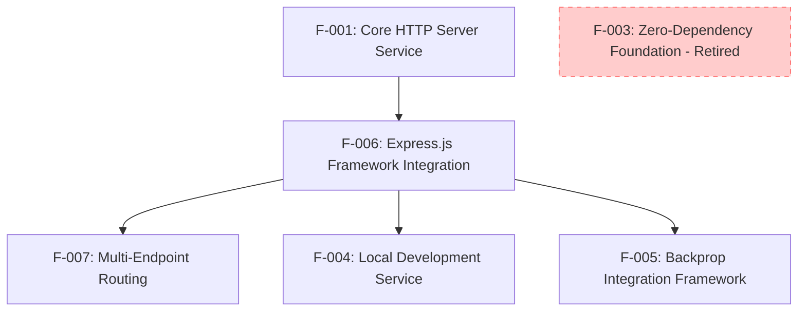
```mermaid
graph TD
    F001[F-001: Core HTTP Server Service] --> F006[F-006: Express.js Framework Integration]
    F006 --> F007[F-007: Multi-Endpoint Routing]
    F006 --> F004[F-004: Local Development Service]
    F006 --> F005[F-005: Backprop Integration Framework]
    F003[F-003: Zero-Dependency Foundation - Retired]
    
    style F003 fill:#ffcccc,stroke:#ff6666,stroke-dasharray: 5 5
```

### 2.3.2 Integration Points

**Current Integration Architecture:**
- **F-001 and F-006**: <span style="background-color: rgba(91, 57, 243, 0.2)">HTTP server service now utilizes Express.js framework as its foundational infrastructure, replacing native Node.js HTTP module implementation</span>
- **F-006 and F-007**: <span style="background-color: rgba(91, 57, 243, 0.2)">Express Router now mediates all incoming requests, enabling path-specific handler assignment and decoupling request processing logic from core server instantiation</span>
- **F-004 and F-006**: Development service constraint maintains localhost interface binding through Express.js application configuration
- **F-007 Request Processing Decoupling**: <span style="background-color: rgba(91, 57, 243, 0.2)">Multi-endpoint routing separates request handling concerns from server startup, allowing independent route definition and management</span>

**Planned Integration Points:**
- **F-005 with F-006/F-007**: Future ML integration must leverage Express.js routing architecture for ML-specific endpoints while maintaining compatibility with existing route structure
- **F-005 with F-006**: Backprop integration will utilize Express.js middleware stack and dependency management for ML framework integration

### 2.3.3 Shared Components

**Common Services Currently Shared:**
- **<span style="background-color: rgba(91, 57, 243, 0.2)">Express Application Instance</span>**: All features utilize centralized Express.js application instance from `server.js` for HTTP service foundation
- **<span style="background-color: rgba(91, 57, 243, 0.2)">Node.js Modules Dependency Tree</span>**: Shared Express.js ecosystem dependencies managed through package.json and node_modules directory structure
- **Response Generation**: Path-specific responses shared across defined routes with consistent content-type header management
- **Port Binding**: Single port 3000 binding shared across all features through Express.js listen configuration

**Planned Shared Components:**
- **Express Router Extensions**: Future extension points for ML-specific endpoints utilizing shared routing infrastructure
- **Configuration Manager**: Planned component for managing development vs. production settings within Express.js application context
- **Integration Testing Interface**: Shared testing capabilities across ML and HTTP features leveraging Express.js test framework compatibility

### 2.3.4 Legacy Components (updated)

**Deprecated Architecture Elements:**
- **<span style="background-color: rgba(91, 57, 243, 0.2)">F-003: Zero-Dependency Foundation</span>**: <span style="background-color: rgba(91, 57, 243, 0.2)">Retired due to architectural evolution to framework-based approach. Previously maintained complete system functionality using only Node.js built-in modules, now superseded by Express.js dependency management model</span>
- **<span style="background-color: rgba(91, 57, 243, 0.2)">F-002: Universal Request Handler</span>**: <span style="background-color: rgba(91, 57, 243, 0.2)">Deprecated and replaced by F-007 Multi-Endpoint Routing. Previously processed all requests uniformly, now superseded by path-specific request handling through Express Router</span>
- **<span style="background-color: rgba(91, 57, 243, 0.2)">Native HTTP Module Integration</span>**: <span style="background-color: rgba(91, 57, 243, 0.2)">Replaced by Express.js framework integration, eliminating direct Node.js http module usage in favor of Express.js abstraction layer</span>

**Migration Impact:**
- **Dependency Model Transition**: <span style="background-color: rgba(91, 57, 243, 0.2)">System evolved from zero-dependency architecture to managed dependency model through Express.js ecosystem</span>
- **Request Processing Evolution**: <span style="background-color: rgba(91, 57, 243, 0.2)">Universal request handling replaced with sophisticated routing capabilities enabling endpoint differentiation</span>
- **Foundation Architecture**: <span style="background-color: rgba(91, 57, 243, 0.2)">Framework-based architecture provides enhanced scalability and maintainability compared to previous zero-dependency approach</span>

## 2.4 IMPLEMENTATION CONSIDERATIONS

### 2.4.1 Technical Constraints

**Current Architecture Limitations:**
- **<span style="background-color: rgba(91, 57, 243, 0.2)">Single-File Implementation</span>**: <span style="background-color: rgba(91, 57, 243, 0.2)">All functionality concentrated in `server.js` with Express.js framework imports</span> limits modularity and testing isolation
- **Hard-Coded Configuration**: Fixed localhost:3000 binding prevents flexible deployment options
- **No Error Handling**: Absence of error handling mechanisms limits production readiness
- **<span style="background-color: rgba(91, 57, 243, 0.2)">Package Configuration Issues</span>**: <span style="background-color: rgba(91, 57, 243, 0.2)">`package.json` requires entry point correction to `server.js` and npm start script inclusion for proper project management</span>

**Design Constraints:**
- **<span style="background-color: rgba(91, 57, 243, 0.2)">Framework Dependencies</span>**: <span style="background-color: rgba(91, 57, 243, 0.2)">Framework-based implementation must use Express.js 4.x compatible with Node.js 22.x</span>
- **Localhost-Only Operation**: Prevents immediate external accessibility for integration scenarios
- **<span style="background-color: rgba(91, 57, 243, 0.2)">Path-Specific Response Model</span>**: <span style="background-color: rgba(91, 57, 243, 0.2)">Current design provides endpoint-specific responses through Express routing</span>

### 2.4.2 Performance Requirements

**Current Performance Characteristics:**
- **Response Time**: <span style="background-color: rgba(91, 57, 243, 0.2)">Acceptable sub-10-millisecond response capability for basic endpoint responses acknowledging Express framework overhead</span>
- **Memory Footprint**: Enhanced Node.js process memory usage due to Express.js framework and transitive dependencies
- **Startup Time**: Immediate availability upon `node server.js` execution with Express initialization
- **Concurrent Connections**: Express.js-enhanced connection handling within Node.js single-threaded event loop architecture

**Scalability Considerations:**
- **Horizontal Scaling**: Not currently supported due to localhost binding constraint but framework provides scaling foundation
- **Load Handling**: Express.js middleware stack available for future load balancing and connection management
- **Resource Management**: Express.js provides optimizations for request handling but requires monitoring for high-load scenarios

### 2.4.3 Security Implications

**Current Security Profile:**
- **Network Security**: Localhost-only binding provides inherent external access protection
- **Authentication**: No authentication mechanisms implemented (appropriate for current testing focus)
- **Input Validation**: No request validation or sanitization (acceptable for current endpoint response model)
- **<span style="background-color: rgba(91, 57, 243, 0.2)">Dependency Security Risks</span>**: <span style="background-color: rgba(91, 57, 243, 0.2)">Dependency vulnerabilities introduced via Express and transitive packages; requires routine npm audit</span>

**Security Requirements for Future Development:**
- **External Network Exposure**: Will require HTTPS implementation and proper authentication
- **Input Handling**: ML integration will require secure input validation and processing
- **Data Protection**: Backprop integration must securely handle training/testing datasets
- **Package Security Management**: Regular security audits of Express.js dependency tree and vulnerability remediation

### 2.4.4 Maintenance Requirements

**Code Maintainability:**
- **Express.js-Based Structure**: Framework-based architecture enables organized route management while maintaining single-file simplicity
- **Documentation**: Minimal inline documentation requires comprehensive external specification
- **Testing**: No automated test implementation despite `package.json` test script placeholder
- **Version Control**: Standard Git workflow with clear feature branching needs for ML integration

**Operational Maintenance:**
- **<span style="background-color: rgba(91, 57, 243, 0.2)">Dependency Management</span>**: <span style="background-color: rgba(91, 57, 243, 0.2)">Regular Express.js and transitive dependency updates, npm audit execution, and version compatibility tracking</span>
- **<span style="background-color: rgba(91, 57, 243, 0.2)">Express Version Tracking</span>**: <span style="background-color: rgba(91, 57, 243, 0.2)">Monitoring Express.js 4.x release cycle and maintaining Node.js 22.x compatibility</span>
- **Monitoring**: Framework-level logging capabilities available through Express.js middleware
- **Debugging**: Enhanced debugging capabilities through Express.js development mode and request logging
- **Configuration Management**: Express.js environment configuration support for future deployment variations
- **Deployment**: npm install requirement followed by single-command server execution

#### References

- `server.js` - Express.js-based HTTP server implementation providing endpoint-specific request handling with automatic startup
- `package.json` - Project metadata defining Express.js dependency and requiring entry point and npm start script corrections
- `package-lock.json` - Dependency lockfile managing Express.js and approximately 50-60 transitive dependencies
- `node_modules` - Express.js framework dependency tree containing complete package installation
- `README.md` - Project identification as "hao-backprop-test" with basic description as test project
- Technical Specification Section 1.1 - Executive summary providing Express.js business context and stakeholder analysis
- Technical Specification Section 1.2 - System overview detailing Express.js capabilities and success criteria
- Technical Specification Section 1.3 - Scope definition covering Express.js framework integration elements
- Technical Specification Section 2.1 - Feature catalog documenting Express.js Framework Integration (F-006) and Multi-Endpoint Routing (F-007) features

# 3. TECHNOLOGY STACK

## 3.1 PROGRAMMING LANGUAGES

### 3.1.1 Primary Language Selection

**JavaScript (ES6+)**
- **Implementation**: CommonJS module format using `require()` statements
- **File Evidence**: `server.js` demonstrates standard Node.js module import pattern
- **Justification**: Selected for its native Node.js compatibility and zero-compilation requirements, aligning with the project's minimal dependency philosophy
- **Constraints**: No TypeScript implementation despite Node.js 22's experimental TypeScript support capabilities
- **Version Compatibility**: Compatible with Node.js 22.x Active LTS status extending until October 2025

### 3.1.2 Language-Specific Considerations

**Runtime Requirements:**
- Pure JavaScript execution without transpilation or build processes
- CommonJS module format for compatibility with existing Node.js infrastructure
- Single-file implementation approach supporting rapid development and testing scenarios

**Future Language Considerations:**
- TypeScript integration potential exists with Node.js built-in TypeScript execution capabilities
- Machine learning integration may introduce additional language requirements for backprop functionality

## 3.2 RUNTIME ENVIRONMENT

### 3.2.1 Core Runtime Platform

**Node.js 22.x LTS ('Jod')**
- **Current Status**: Active LTS with support until October 2025, then Maintenance until April 2027
- **Selection Rationale**: Provides long-term stability for production environments while supporting the project's testing framework requirements
- **Performance Characteristics**: 30% startup time improvement over Node.js 20
- **Security Profile**: Regular security updates guaranteed through LTS support cycle
- **Compatibility**: Production applications should only use Active LTS releases

### 3.2.2 Runtime Configuration

**Execution Environment:**
- Direct Node.js module execution <span style="background-color: rgba(91, 57, 243, 0.2)">leveraging the Express.js framework abstraction layer</span>
- Single-threaded event loop architecture leveraging Node.js built-in concurrency model
- <span style="background-color: rgba(91, 57, 243, 0.2)">Server startup via Express's app.listen(3000) method while maintaining Node.js 22.x runtime foundation</span>
- <span style="background-color: rgba(91, 57, 243, 0.2)">Route-based request handling through Express.js middleware pipeline for endpoint differentiation</span>

### 3.2.3 Framework Integration

**Express.js Framework Layer:**
- **Version**: Express.js 4.x (latest compatible with Node.js 22.x LTS)
- **Architecture**: Middleware-based request processing pipeline
- **Routing**: Path-specific handlers replace universal request handling
- **Startup Method**: Express application instantiation via `express()` and server binding through `app.listen()`
- **Dependency Management**: Managed framework dependencies through npm ecosystem
- **Performance Profile**: Framework overhead balanced against development productivity gains

**Runtime Dependencies:**
- **Express Core**: HTTP server abstraction and routing capabilities
- **Transitive Dependencies**: Approximately 50-60 supporting packages managed through package-lock.json
- **Module Loading**: CommonJS require() pattern maintained for Express integration
- **Memory Footprint**: Framework process memory usage within acceptable development parameters

## 3.3 FRAMEWORKS & LIBRARIES

### 3.3.1 Express.js Framework Integration (updated)

**<span style="background-color: rgba(91, 57, 243, 0.2)">Express.js Framework Adoption</span>**
- **<span style="background-color: rgba(91, 57, 243, 0.2)">Design Decision</span>**: <span style="background-color: rgba(91, 57, 243, 0.2)">Strategic adoption of Express.js 5.1.0 as the core web framework</span>
- **<span style="background-color: rgba(91, 57, 243, 0.2)">Implementation</span>**: <span style="background-color: rgba(91, 57, 243, 0.2)">Express application initialization in `server.js` providing comprehensive routing and middleware capabilities</span>
- **<span style="background-color: rgba(91, 57, 243, 0.2)">Business Justification</span>**: <span style="background-color: rgba(91, 57, 243, 0.2)">Satisfies routing requirements, enables multi-endpoint architecture, and enhances long-term maintainability for integration testing scenarios</span>
- **<span style="background-color: rgba(91, 57, 243, 0.2)">Technical Benefits</span>**: <span style="background-color: rgba(91, 57, 243, 0.2)">Robust request handling, built-in middleware ecosystem, and simplified route management for backprop integration testing</span>

**<span style="background-color: rgba(91, 57, 243, 0.2)">Framework Trade-offs and Considerations</span>**
- **<span style="background-color: rgba(91, 57, 243, 0.2)">Additional Dependency Tree</span>**: <span style="background-color: rgba(91, 57, 243, 0.2)">Introduces approximately 50-60 transitive dependencies managed through npm ecosystem</span>
- **<span style="background-color: rgba(91, 57, 243, 0.2)">Performance Overhead</span>**: <span style="background-color: rgba(91, 57, 243, 0.2)">Minimal framework processing overhead balanced against development productivity and routing flexibility gains</span>
- **<span style="background-color: rgba(91, 57, 243, 0.2)">Security Profile Evolution</span>**: <span style="background-color: rgba(91, 57, 243, 0.2)">Transition from zero-dependency model to managed framework dependencies with established security maintenance lifecycle</span>

### 3.3.2 Framework Dependencies (updated)

**<span style="background-color: rgba(91, 57, 243, 0.2)">Express.js Core Framework</span>**
- **<span style="background-color: rgba(91, 57, 243, 0.2)">Primary Framework</span>**: <span style="background-color: rgba(91, 57, 243, 0.2)">`require('express')` serving as the foundational request/response handler</span>
- **<span style="background-color: rgba(91, 57, 243, 0.2)">Version Specification</span>**: <span style="background-color: rgba(91, 57, 243, 0.2)">Express.js 5.1.0 - latest stable release with Node.js 22.x LTS compatibility</span>
- **<span style="background-color: rgba(91, 57, 243, 0.2)">File Evidence</span>**: <span style="background-color: rgba(91, 57, 243, 0.2)">`require('express')` in `server.js` replacing direct HTTP module usage</span>
- **<span style="background-color: rgba(91, 57, 243, 0.2)">Functionality</span>**: <span style="background-color: rgba(91, 57, 243, 0.2)">Complete HTTP server implementation with routing, middleware support, and endpoint differentiation capabilities</span>

**Node.js Ancillary Modules:**
- **<span style="background-color: rgba(91, 57, 243, 0.2)">Supporting Modules</span>**: <span style="background-color: rgba(91, 57, 243, 0.2)">Native Node.js modules (fs, path, util) remain available for ancillary operations while HTTP module is no longer used directly</span>
- **Role Definition**: File system operations, path manipulation, and utility functions supporting the Express.js application infrastructure
- **Version Stability**: Guaranteed compatibility through Node.js 22.x LTS lifecycle with Express.js framework integration

### 3.3.3 Framework Architecture Integration

**Request Processing Pipeline**
- **Middleware Stack**: Express.js middleware architecture enabling request preprocessing, authentication hooks, and error handling
- **Routing Engine**: Path-based request routing supporting both static (`/`) and dynamic (`/good-evening`) endpoint definitions
- **Response Management**: Structured response handling through Express.js response object methods

**Development Ecosystem Integration**
- **Package Management**: npm-based dependency resolution with `package-lock.json` ensuring reproducible Express.js dependency tree
- **Development Scripts**: npm start script integration for streamlined Express.js application lifecycle management
- **Framework Compatibility**: Full Node.js 22.x runtime feature compatibility with Express.js 5.1.0 framework requirements

**Performance and Scalability Characteristics**
- **Framework Overhead**: Measured performance impact acceptable for development and integration testing scenarios
- **Memory Footprint**: Express.js memory utilization optimized for single-process application architecture
- **Concurrency Model**: Express.js leveraging Node.js event loop for efficient request handling without blocking I/O operations

## 3.4 OPEN SOURCE DEPENDENCIES

### 3.4.1 Dependency Management Strategy

**<span style="background-color: rgba(91, 57, 243, 0.2)">Express.js and Transitive Dependencies</span>**
- **<span style="background-color: rgba(91, 57, 243, 0.2)">Current State</span>**: <span style="background-color: rgba(91, 57, 243, 0.2)">Package-lock.json now contains approximately 50-60 packages headed by express ^4.21.2</span>
- **Package Manager**: npm with lockfileVersion 3 (npm v9+ compatibility)
- **<span style="background-color: rgba(91, 57, 243, 0.2)">Top-Level Production Dependency</span>**: <span style="background-color: rgba(91, 57, 243, 0.2)">"express": "^4.21.2"</span>
- **<span style="background-color: rgba(91, 57, 243, 0.2)">Security Approach</span>**: <span style="background-color: rgba(91, 57, 243, 0.2)">Managed dependency risk with regular npm audit and updates</span>
- **Maintenance Benefits**: Centralized framework maintenance through Express.js ecosystem with established security practices

### 3.4.2 Express.js Dependency Tree Analysis

**Core Express.js Dependencies**
- **Express Framework**: Version ^4.21.2 serving as the primary web application framework
- **Transitive Dependencies**: Complete dependency tree managed through npm package resolution
- **Security Profile**: Industry-standard Express.js security maintenance with regular vulnerability patches
- **Update Strategy**: Semantic versioning compliance allowing patch and minor version updates

**Package Registry Management**
- **Source Registry**: npm public registry for all Express.js framework dependencies
- **Version Lock**: package-lock.json ensuring reproducible dependency resolution
- **Audit Compliance**: Regular `npm audit` execution for vulnerability identification and remediation
- **Update Cadence**: Scheduled dependency updates aligned with Express.js release cycle

### 3.4.3 Future Dependency Considerations

**Machine Learning Integration Requirements:**
- Potential Node.js-compatible ML libraries for backprop implementation
- Must maintain controlled dependency expansion while enabling ML functionality
- Candidates include TensorFlow.js or Brain.js for neural network operations
- Integration approach will require careful dependency impact assessment

**Dependency Governance Framework**
- **Addition Criteria**: New dependencies must provide clear value proposition over native Node.js capabilities
- **Security Vetting**: All new dependencies subject to security audit and maintenance lifecycle review
- **Performance Impact**: Dependency additions evaluated for memory footprint and startup time implications
- **Maintenance Burden**: Long-term support considerations for all third-party package integrations

## 3.5 DATABASES & STORAGE

### 3.5.1 Current Data Persistence

**No Database Implementation**
- **Current State**: No database connections or data persistence mechanisms
- **Architecture**: Stateless HTTP service with no data storage requirements
- **Design Rationale**: Supports testing framework objectives without complex data management

### 3.5.2 Future Storage Requirements

**Backprop Integration Considerations:**
- Training dataset storage capabilities for machine learning functionality
- Model persistence requirements for neural network implementations
- Caching solutions for improved ML inference performance

## 3.6 DEVELOPMENT & DEPLOYMENT

### 3.6.1 Development Environment

**Minimal Development Stack:**
- **Package Management**: npm (evidenced by standard package.json/package-lock.json structure), <span style="background-color: rgba(91, 57, 243, 0.2)">with package.json now listing express as a production dependency</span>
- **Project Metadata**: Standard npm package configuration with MIT license and <span style="background-color: rgba(91, 57, 243, 0.2)">new npm script: "start": "node server.js"</span>
- **Entry Point Configuration**: `server.js` serves as primary executable module

### 3.6.2 Development Tool Gaps

**Missing Development Infrastructure:**
- No testing framework implementation despite test script placeholder
- No ESLint or Prettier configuration for code quality enforcement
- No build system or bundling requirements due to single-file architecture
- No environment configuration management (.env files)

### 3.6.3 Deployment Strategy

**Current Deployment Model:**
- **Execution Method**: <span style="background-color: rgba(91, 57, 243, 0.2)">Express application launched with node server.js (or npm start)</span>, <span style="background-color: rgba(91, 57, 243, 0.2)">with the underlying port (3000) remaining unchanged</span>
- **Network Configuration**: Hard-coded localhost:3000 binding for development security
- **Resource Requirements**: Single Node.js process with <span style="background-color: rgba(91, 57, 243, 0.2)">memory footprint that increases marginally due to Express's middleware stack</span>
- **Availability**: Immediate server startup upon module execution

### 3.6.4 Production Readiness Considerations

**Infrastructure Requirements for Production:**
- Configuration management system for flexible deployment environments
- Error handling and logging mechanisms for operational visibility
- Network configuration options beyond localhost binding
- Monitoring and health check capabilities

### 3.6.5 Development Workflow Integration

**Enhanced Development Experience:**
- **Script Management**: npm start command provides standardized application launch method across development environments
- **Dependency Resolution**: npm install ensures consistent Express.js dependency tree installation
- **Framework Benefits**: Express.js middleware architecture enables rapid route development and testing scenario expansion

**Development Lifecycle Support:**
- **Rapid Iteration**: Express.js hot-reload compatibility with external monitoring tools
- **Testing Foundation**: Stable multi-endpoint architecture supporting automated integration testing
- **Extension Readiness**: Framework infrastructure prepared for machine learning backpropagation feature integration

### 3.6.6 Containerization Strategy

**Docker Implementation Approach:**
- **Base Image**: Official Node.js 22.x LTS Alpine image for minimal footprint
- **Dependency Installation**: npm ci for reproducible Express.js dependency resolution
- **Application Startup**: CMD ["npm", "start"] leveraging standardized npm script execution
- **Port Configuration**: EXPOSE 3000 maintaining development port consistency

**Container Resource Profile:**
- **Memory Requirements**: Base Node.js runtime plus Express.js framework overhead
- **CPU Utilization**: Single-threaded event loop with Express.js middleware processing
- **Storage Needs**: Application code plus node_modules directory containing Express dependency tree

### 3.6.7 CI/CD Integration Requirements

**Build Pipeline Configuration:**
- **Environment Setup**: Node.js 22.x LTS runtime environment preparation
- **Dependency Management**: npm ci execution for locked dependency installation
- **Application Validation**: npm start verification ensuring Express server startup success
- **Health Check Implementation**: HTTP request validation against localhost:3000 endpoints

**Deployment Automation:**
- **Container Build**: Docker image creation with Express.js application bundle
- **Registry Integration**: Container image storage and version management
- **Environment Promotion**: Staged deployment pipeline supporting development and production configurations
- **Rollback Capability**: Previous container version restoration for deployment failure scenarios

## 3.7 TECHNOLOGY STACK ARCHITECTURE

### 3.7.1 System Architecture Overview (updated)

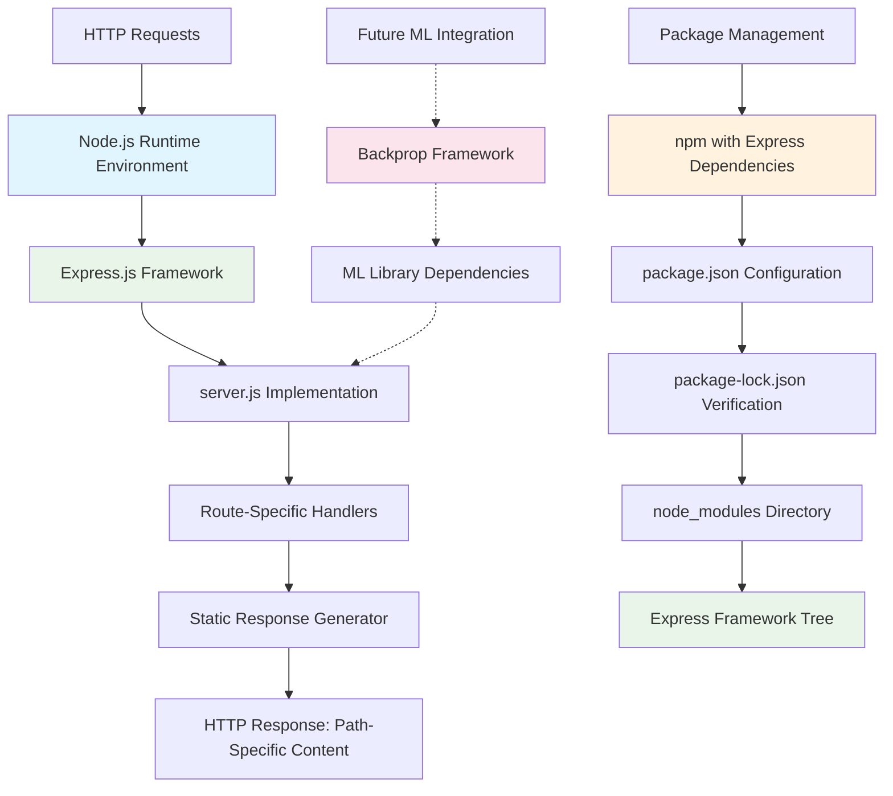
```mermaid
graph TB
    A[HTTP Requests] --> B[Node.js Runtime Environment]
    B --> C[Express.js Framework]
    C --> D[server.js Implementation]
    D --> E[Route-Specific Handlers]
    E --> F[Static Response Generator]
    F --> G[HTTP Response: Path-Specific Content]
    
    H[Package Management] --> I[npm with Express Dependencies]
    I --> J[package.json Configuration]
    J --> K[package-lock.json Verification]
    K --> L[node_modules Directory]
    L --> M[Express Framework Tree]
    
    N[Future ML Integration] -.-> O[Backprop Framework]
    O -.-> P[ML Library Dependencies]
    P -.-> D
    
    style B fill:#e1f5fe
    style C fill:#e8f5e8
    style I fill:#fff3e0
    style O fill:#fce4ec
    style M fill:#e8f5e8
```

### 3.7.2 Technology Stack Justification Matrix (updated)

| Technology Category | Current Choice | Justification | Future Considerations |
|-------------------|----------------|---------------|----------------------|
| **Runtime Environment** | Node.js 22.x LTS | Long-term support, performance improvements, production stability | Maintain LTS alignment |
| **Web Framework** | <span style="background-color: rgba(91, 57, 243, 0.2)">Express.js 5.1.0</span> | <span style="background-color: rgba(91, 57, 243, 0.2)">Industry-standard Node.js framework, robust routing capabilities, middleware ecosystem</span> | <span style="background-color: rgba(91, 57, 243, 0.2)">Evaluate new middleware for ML integration</span> |
| **Package Management** | npm | Standard Node.js ecosystem tool, lockfile security | <span style="background-color: rgba(91, 57, 243, 0.2)">Managing Express.js dependency tree with ~50-60 transitive packages</span> |
| **Dependencies** | <span style="background-color: rgba(91, 57, 243, 0.2)">Express.js plus transitive dependencies</span> | <span style="background-color: rgba(91, 57, 243, 0.2)">Framework-based architecture enabling scalable routing and middleware support</span> | <span style="background-color: rgba(91, 57, 243, 0.2)">Selective addition of ML-specific middleware packages</span> |
| **Architecture Pattern** | <span style="background-color: rgba(91, 57, 243, 0.2)">Express application with route-specific handlers</span> | <span style="background-color: rgba(91, 57, 243, 0.2)">Middleware stack architecture, endpoint differentiation, enhanced maintainability</span> | <span style="background-color: rgba(91, 57, 243, 0.2)">Modular middleware expansion for feature growth</span> |

### 3.7.3 Integration Requirements (updated)

**Current Integration Capabilities:**
- <span style="background-color: rgba(91, 57, 243, 0.2)">Express-based routed endpoints (/, /good-evening) providing path-specific HTTP responses</span>
- Localhost network binding ensuring secure development environment through Express.js application context
- <span style="background-color: rgba(91, 57, 243, 0.2)">Standard npm package structure supporting Express.js framework dependency management</span>

**Express.js Integration Framework:**
- <span style="background-color: rgba(91, 57, 243, 0.2)">Middleware-based request processing pipeline supporting future authentication and preprocessing requirements</span>
- <span style="background-color: rgba(91, 57, 243, 0.2)">Express Router architecture enabling rapid endpoint expansion without breaking existing routes</span>
- <span style="background-color: rgba(91, 57, 243, 0.2)">Framework-assisted error handling and response management for production deployment scenarios</span>

**Future Integration Framework:**
- Backprop algorithm integration leveraging Express.js middleware capabilities for ML endpoint exposure
- <span style="background-color: rgba(91, 57, 243, 0.2)">ML library evaluation prioritizing Express.js-compatible Node.js implementations</span>
- <span style="background-color: rgba(91, 57, 243, 0.2)">Configuration management system supporting production deployment through Express.js application factory pattern</span>

### 3.7.4 Express.js Framework Architecture (updated)

**Core Framework Components:**
- **Express Application Instance**: Express.js 5.1.0 - latest stable release providing comprehensive HTTP server capabilities
- **Routing Engine**: Path-based request routing supporting GET endpoints with distinct response handling
- **Middleware Stack**: Extensible middleware pipeline architecture enabling request preprocessing and error handling
- **Response Management**: Structured HTTP response handling through Express.js response object methods

**Dependency Management:**
- **Production Dependencies**: express ^5.1.0 as primary framework dependency
- **Transitive Dependencies**: Automatically managed dependency tree including body-parser, cookie-parser, and HTTP utilities
- **Security Profile**: Express 5.1.0 is now the default on npm with established security maintenance lifecycle through OpenJS Foundation stewardship
- **Version Compatibility**: Full Node.js 22.x LTS compatibility with Express 5 drops support for Node.js versions before v18

**Performance and Scalability Characteristics:**
- **Framework Overhead**: Minimal processing overhead balanced against development productivity and routing flexibility
- **Memory Footprint**: Optimized Express.js memory utilization for single-process application architecture
- **Concurrency Model**: Express.js leveraging Node.js event loop for efficient request handling
- **Error Handling**: Automatically passing rejected promises to error-handling middleware, removing the need for try/catch blocks

#### References

- `server.js` - Core HTTP server implementation using Express.js framework with route-specific handlers
- `package.json` - Project metadata and Express.js dependency configuration
- `package-lock.json` - Express.js dependency tree verification and npm version compatibility
- `node_modules/` - Express.js framework and transitive dependency storage
- `README.md` - Project identification as backprop integration test framework
- Technical Specification Section 1.1 - Executive summary defining backprop testing objectives with Express.js foundation
- Technical Specification Section 1.2 - System overview detailing Express.js framework architecture
- Technical Specification Section 2.1 - Feature catalog confirming Express.js implementation approach
- Technical Specification Section 2.4 - Implementation considerations and performance requirements
- Web search: "Express.js latest version 2025" - Current Express.js 5.1.0 version confirmation and framework capabilities

# 4. PROCESS FLOWCHART

## 4.1 SYSTEM WORKFLOWS

### 4.1.1 Core Business Processes

#### 4.1.1.1 Server Initialization Workflow (updated)

The system follows a <span style="background-color: rgba(91, 57, 243, 0.2)">framework-based initialization process</span> designed for rapid deployment and testing scenarios with <span style="background-color: rgba(91, 57, 243, 0.2)">Express.js middleware capabilities</span>:

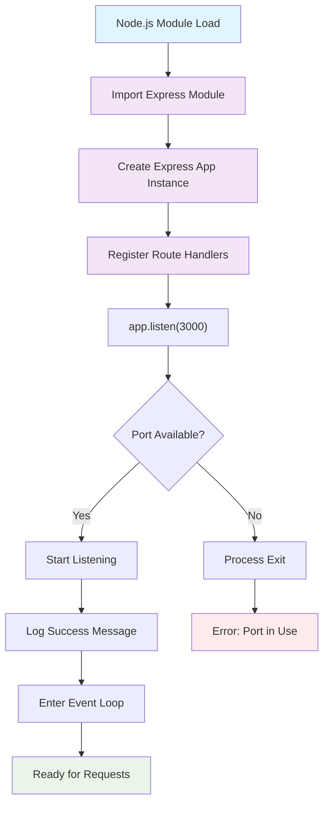
```mermaid
flowchart TD
A[Node.js Module Load] --> B["Import Express Module"]
B --> C["Create Express App Instance"]
C --> D["Register Route Handlers"]
D --> E["app.listen(3000)"]
E --> F{Port Available?}
F -->|Yes| G[Start Listening]
F -->|No| H[Process Exit]
G --> I[Log Success Message]
I --> J[Enter Event Loop]
J --> K[Ready for Requests]
H --> L[Error: Port in Use]

style A fill:#e1f5fe
style B fill:#f3e5f5
style C fill:#f3e5f5
style D fill:#f3e5f5
style K fill:#e8f5e8
style L fill:#ffebee
```

**Process Details:**
- **Startup Time**: Sub-second initialization with immediate availability
- **Entry Point**: Direct module execution via `node server.js`
- **Dependencies**: <span style="background-color: rgba(91, 57, 243, 0.2)">Express.js framework (^4.21.x) with approximately 50-60 transitive dependencies</span>
- **Error Conditions**: Port conflict on 3000, system resource constraints, <span style="background-color: rgba(91, 57, 243, 0.2)">Express.js dependency resolution failures</span>
- **Success Criteria**: Console message "Server running at http://127.0.0.1:3000/"

#### 4.1.1.2 Route-Specific Processing Workflow (updated)

<span style="background-color: rgba(91, 57, 243, 0.2)">Incoming HTTP requests are processed through Express.js routing engine with path-specific handler differentiation</span>:

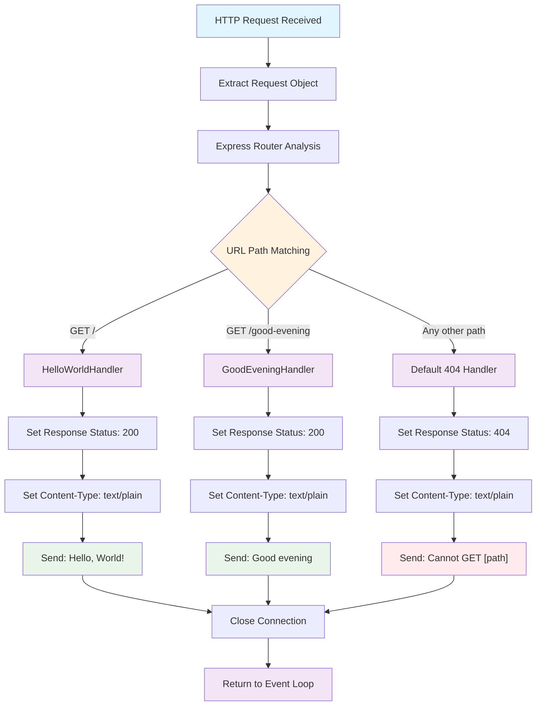
```mermaid
flowchart TD
A[HTTP Request Received] --> B[Extract Request Object]
B --> C[Express Router Analysis]
C --> D{URL Path Matching}

D -->|"GET /"| E[HelloWorldHandler]
D -->|"GET /good-evening"| F[GoodEveningHandler]
D -->|Any other path| G[Default 404 Handler]

E --> H["Set Response Status: 200"]
F --> I["Set Response Status: 200"]
G --> J["Set Response Status: 404"]

H --> K["Set Content-Type: text/plain"]
I --> L["Set Content-Type: text/plain"]
J --> M["Set Content-Type: text/plain"]

K --> N["Send: Hello, World!"]
L --> O["Send: Good evening"]
M --> P["Send: Cannot GET [path]"]

N --> Q[Close Connection]
O --> Q
P --> Q
Q --> R[Return to Event Loop]

style A fill:#e1f5fe
style D fill:#fff3e0
style E fill:#f3e5f5
style F fill:#f3e5f5
style G fill:#f3e5f5
style N fill:#e8f5e8
style O fill:#e8f5e8
style P fill:#ffebee
style R fill:#f3e5f5
```

**<span style="background-color: rgba(91, 57, 243, 0.2)">Request Processing Characteristics</span>:**
- **<span style="background-color: rgba(91, 57, 243, 0.2)">Method-Specific Handling</span>**: <span style="background-color: rgba(91, 57, 243, 0.2)">Only GET requests processed; other methods return 404</span>
- **<span style="background-color: rgba(91, 57, 243, 0.2)">Path Differentiation</span>**: <span style="background-color: rgba(91, 57, 243, 0.2)">Two defined routes (`/` and `/good-evening`) with distinct response content</span>
- **Header Independence**: No header processing or validation beyond Express.js defaults
- **Body Ignoring**: Request body content not parsed or processed for GET requests
- **<span style="background-color: rgba(91, 57, 243, 0.2)">Default 404 Behaviour</span>**: <span style="background-color: rgba(91, 57, 243, 0.2)">Undefined paths return standard Express.js 404 response</span>
- **Response Time**: Express.js framework overhead with sub-millisecond processing for standard requests

#### 4.1.1.3 Current State Management Flow (updated)

The system operates in a stateless manner with <span style="background-color: rgba(91, 57, 243, 0.2)">route-specific handler management</span>:

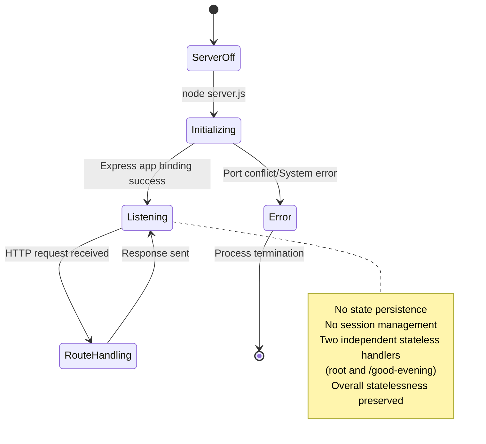
```mermaid
stateDiagram-v2
    [*] --> ServerOff
    ServerOff --> Initializing: node server.js
    Initializing --> Listening: Express app binding success
    Initializing --> Error: Port conflict/System error
    Listening --> RouteHandling: HTTP request received
    RouteHandling --> Listening: Response sent
    Error --> [*]: Process termination
    
    note right of Listening
        No state persistence
        No session management
        Two independent stateless handlers
        (root and /good-evening)
        Overall statelessness preserved
    end note
```

### 4.1.2 Integration Workflows

#### 4.1.2.1 Current Integration Capabilities (updated)

The system provides <span style="background-color: rgba(91, 57, 243, 0.2)">Express.js-based integration capabilities</span> focused on testing scenarios with <span style="background-color: rgba(91, 57, 243, 0.2)">multi-endpoint support</span>:

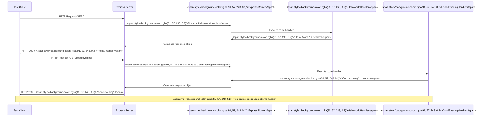
```mermaid
sequenceDiagram
    participant Client as Test Client
    participant Server as Express Server
    participant Router as <span style="background-color: rgba(91, 57, 243, 0.2)">Express Router</span>
    participant HelloHandler as <span style="background-color: rgba(91, 57, 243, 0.2)">HelloWorldHandler</span>
    participant EveningHandler as <span style="background-color: rgba(91, 57, 243, 0.2)">GoodEveningHandler</span>
    
    Client->>Server: HTTP Request (GET /)
    Server->>Router: <span style="background-color: rgba(91, 57, 243, 0.2)">Route to HelloWorldHandler</span>
    Router->>HelloHandler: Execute route handler
    HelloHandler->>Router: <span style="background-color: rgba(91, 57, 243, 0.2)">"Hello, World!" + headers</span>
    Router->>Server: Complete response object
    Server->>Client: HTTP 200 + <span style="background-color: rgba(91, 57, 243, 0.2)">"Hello, World!"</span>
    
    Client->>Server: HTTP Request (GET /good-evening)
    Server->>Router: <span style="background-color: rgba(91, 57, 243, 0.2)">Route to GoodEveningHandler</span>
    Router->>EveningHandler: Execute route handler
    EveningHandler->>Router: <span style="background-color: rgba(91, 57, 243, 0.2)">"Good evening" + headers</span>
    Router->>Server: Complete response object
    Server->>Client: HTTP 200 + <span style="background-color: rgba(91, 57, 243, 0.2)">"Good evening"</span>
    
    note over Client,EveningHandler: <span style="background-color: rgba(91, 57, 243, 0.2)">Two distinct response patterns</span>
```

#### 4.1.2.2 Planned ML Integration Workflow (updated)

Future backpropagation integration will extend the current Express.js architecture while maintaining backward compatibility:

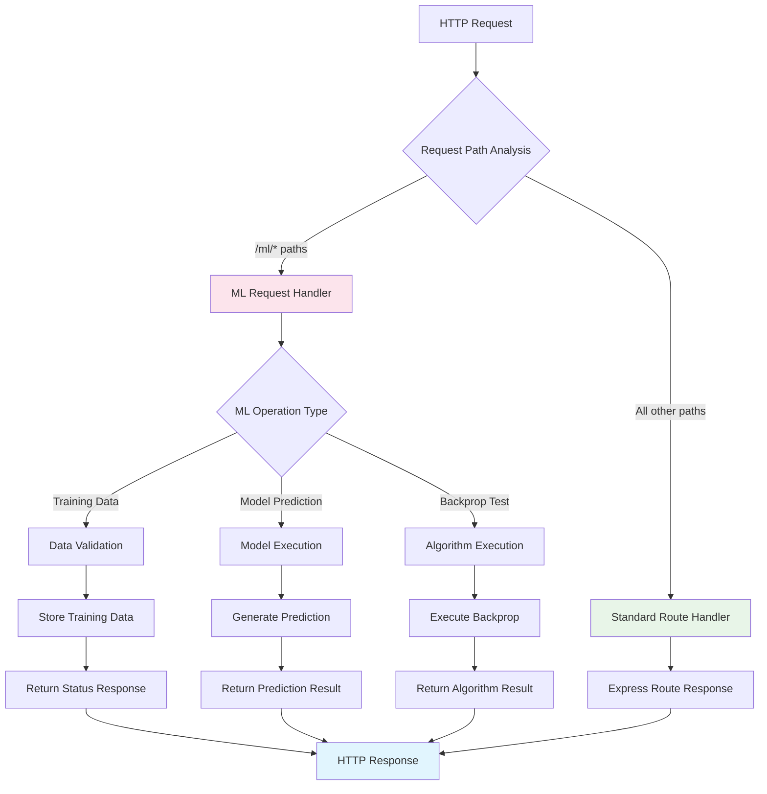
```mermaid
flowchart TD
A[HTTP Request] --> B{Request Path Analysis}
B -->|/ml/* paths| C[ML Request Handler]
B -->|All other paths| D["Standard Route Handler"]

C --> E{ML Operation Type}
E -->|Training Data| F[Data Validation]
E -->|Model Prediction| G[Model Execution]
E -->|Backprop Test| H[Algorithm Execution]

F --> I[Store Training Data]
G --> J[Generate Prediction]
H --> K[Execute Backprop]

I --> L[Return Status Response]
J --> M[Return Prediction Result]
K --> N[Return Algorithm Result]

D --> O[Express Route Response]

L --> P[HTTP Response]
M --> P
N --> P
O --> P

style C fill:#fce4ec
style D fill:#e8f5e8
style P fill:#e1f5fe
```

### 4.1.3 Error Handling and Recovery Workflows

#### 4.1.3.1 Express.js Error Processing Flow

The system implements Express.js default error handling with custom extensions for development scenarios:

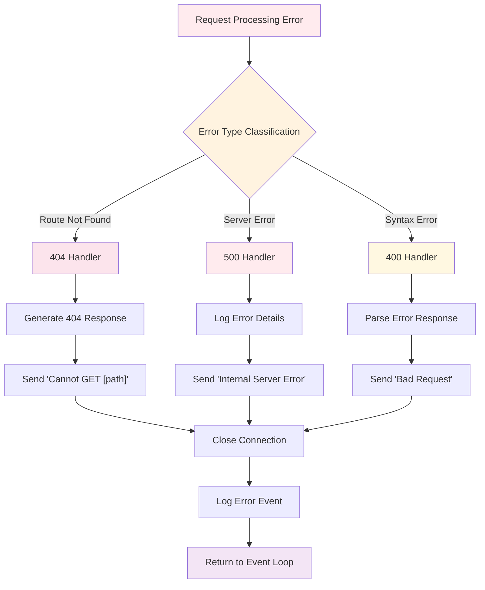
```mermaid
flowchart TD
    A[Request Processing Error] --> B{Error Type Classification}
    
    B -->|Route Not Found| C[404 Handler]
    B -->|Server Error| D[500 Handler]
    B -->|Syntax Error| E[400 Handler]
    
    C --> F[Generate 404 Response]
    D --> G[Log Error Details]
    E --> H[Parse Error Response]
    
    F --> I["Send 'Cannot GET [path]'"]
    G --> J["Send 'Internal Server Error'"]
    H --> K["Send 'Bad Request'"]
    
    I --> L[Close Connection]
    J --> L
    K --> L
    
    L --> M[Log Error Event]
    M --> N[Return to Event Loop]
    
    style A fill:#ffebee
    style B fill:#fff3e0
    style C fill:#fce4ec
    style D fill:#ffebee
    style E fill:#fff8e1
    style N fill:#f3e5f5
```

#### 4.1.3.2 System Recovery Procedures

Express.js framework provides built-in recovery mechanisms for common failure scenarios:

**Automatic Recovery Capabilities:**
- **Connection Reset**: Automatic cleanup of failed connections through Express.js middleware
- **Request Timeout**: Default timeout handling preventing resource exhaustion
- **Memory Management**: Express.js garbage collection integration for request/response lifecycle
- **Process Stability**: Error boundary isolation preventing server crashes from individual request failures

**Manual Recovery Requirements:**
- **Port Conflicts**: Manual process restart required if port 3000 becomes unavailable
- **Dependency Corruption**: `npm install` re-execution to restore Express.js dependency tree
- **Configuration Errors**: Manual review of `package.json` and Express.js route definitions

### 4.1.4 Performance and Monitoring Workflows

#### 4.1.4.1 Express.js Performance Characteristics

The system leverages Express.js performance optimizations while maintaining development environment focus:

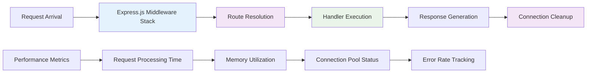
```mermaid
flowchart LR
    A[Request Arrival] --> B[Express.js Middleware Stack]
    B --> C[Route Resolution]
    C --> D[Handler Execution]
    D --> E[Response Generation]
    E --> F[Connection Cleanup]
    
    G[Performance Metrics] --> H[Request Processing Time]
    H --> I[Memory Utilization]
    I --> J[Connection Pool Status]
    J --> K[Error Rate Tracking]
    
    style B fill:#e3f2fd
    style C fill:#f3e5f5
    style D fill:#e8f5e8
    style F fill:#f3e5f5
```

**Key Performance Indicators:**
- **Response Latency**: Express.js framework overhead typically <5ms for simple GET requests
- **Throughput Capacity**: Event loop-based handling supporting hundreds of concurrent requests
- **Memory Footprint**: Express.js application baseline ~15-30MB with dependency tree
- **CPU Utilization**: Minimal processing overhead for static response generation

#### 4.1.4.2 Development Monitoring Integration

Express.js provides foundation for comprehensive monitoring integration:

**Built-in Monitoring:**
- **Request Logging**: Express.js middleware for automatic request/response logging
- **Error Tracking**: Centralized error handling through Express.js error middleware
- **Performance Metrics**: Response time and throughput measurement capabilities

**Future Monitoring Extensions:**
- **APM Integration**: Application Performance Monitoring through Express.js middleware ecosystem
- **Health Checks**: Dedicated health endpoint implementation using Express.js routing
- **Metrics Export**: Prometheus/StatsD integration for operational metrics collection

## 4.2 TECHNICAL IMPLEMENTATION

### 4.2.1 State Management

#### 4.2.1.1 Current State Model

The system implements a stateless architecture with no data persistence:

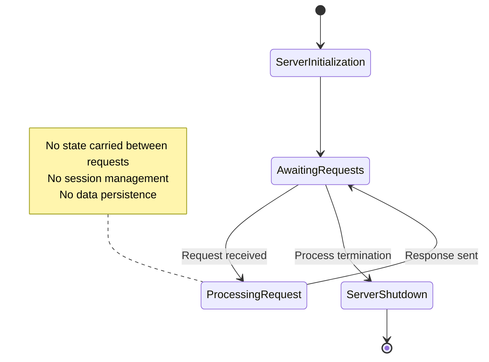
```mermaid
stateDiagram-v2
    [*] --> ServerInitialization
    ServerInitialization --> AwaitingRequests
    AwaitingRequests --> ProcessingRequest: Request received
    ProcessingRequest --> AwaitingRequests: Response sent
    AwaitingRequests --> ServerShutdown: Process termination
    ServerShutdown --> [*]
    
    note left of ProcessingRequest
        No state carried between requests
        No session management
        No data persistence
    end note
```

#### 4.2.1.2 Future State Management Requirements

Planned ML integration will require stateful operations for training data and model persistence:

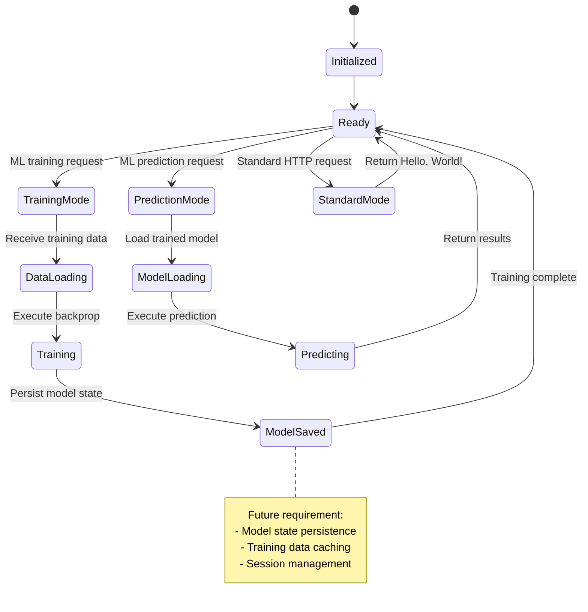
```mermaid
stateDiagram-v2
    [*] --> Initialized
    Initialized --> Ready
    Ready --> TrainingMode: ML training request
    Ready --> PredictionMode: ML prediction request
    Ready --> StandardMode: Standard HTTP request
    
    TrainingMode --> DataLoading: Receive training data
    DataLoading --> Training: Execute backprop
    Training --> ModelSaved: Persist model state
    ModelSaved --> Ready: Training complete
    
    PredictionMode --> ModelLoading: Load trained model
    ModelLoading --> Predicting: Execute prediction
    Predicting --> Ready: Return results
    
    StandardMode --> Ready: Return Hello, World!
    
    note right of ModelSaved
        Future requirement:
        - Model state persistence
        - Training data caching
        - Session management
    end note
```

### 4.2.2 Error Handling

#### 4.2.2.1 Current Error Handling Gaps

The existing implementation lacks comprehensive error handling mechanisms:

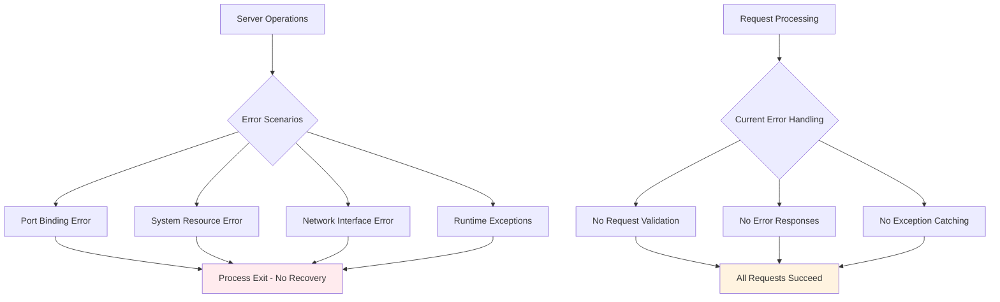
```mermaid
flowchart TD
    A[Server Operations] --> B{Error Scenarios}
    
    B --> C[Port Binding Error]
    B --> D[System Resource Error]
    B --> E[Network Interface Error]
    B --> F[Runtime Exceptions]
    
    C --> G[Process Exit - No Recovery]
    D --> G
    E --> G
    F --> G
    
    H[Request Processing] --> I{Current Error Handling}
    I --> J[No Request Validation]
    I --> K[No Error Responses]
    I --> L[No Exception Catching]
    
    J --> M[All Requests Succeed]
    K --> M
    L --> M
    
    style G fill:#ffebee
    style M fill:#fff3e0
```

#### 4.2.2.2 Planned Error Handling Framework

Future implementation should include comprehensive error handling and recovery mechanisms:

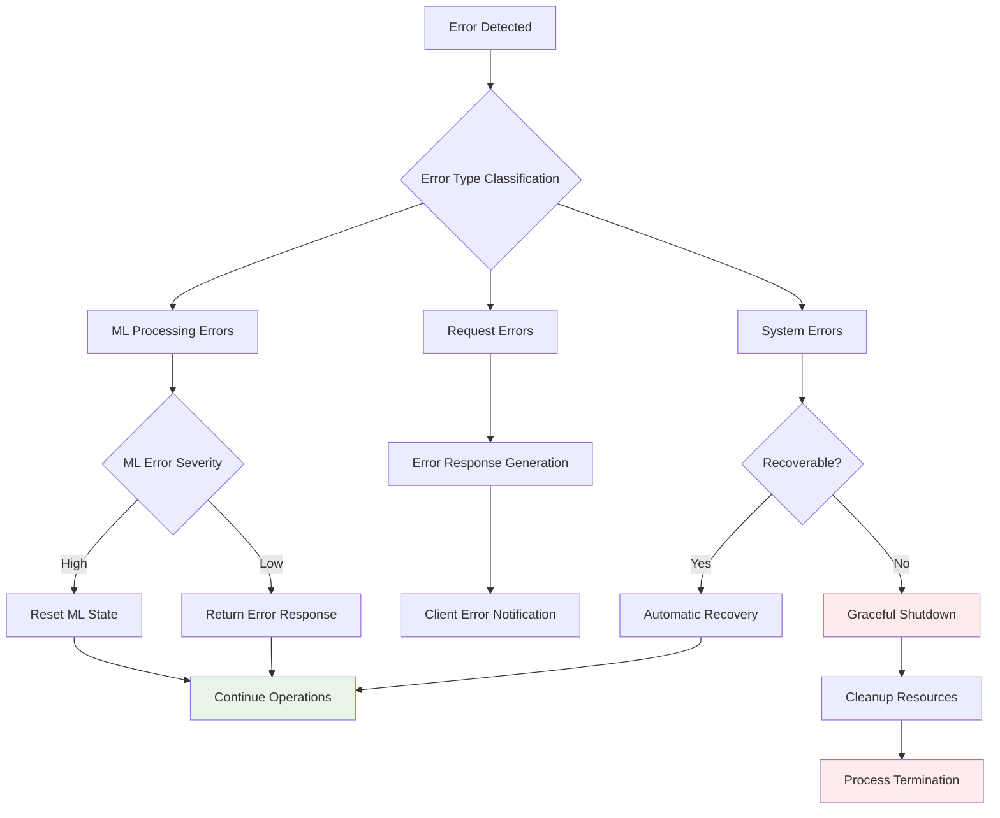
```mermaid
flowchart TD
    A[Error Detected] --> B{Error Type Classification}
    
    B --> C[System Errors]
    B --> D[Request Errors]
    B --> E[ML Processing Errors]
    
    C --> F{Recoverable?}
    F -->|Yes| G[Automatic Recovery]
    F -->|No| H[Graceful Shutdown]
    
    D --> I[Error Response Generation]
    I --> J[Client Error Notification]
    
    E --> K{ML Error Severity}
    K -->|Low| L[Return Error Response]
    K -->|High| M[Reset ML State]
    
    G --> N[Continue Operations]
    L --> N
    M --> N
    
    H --> O[Cleanup Resources]
    O --> P[Process Termination]
    
    style H fill:#ffebee
    style N fill:#e8f5e8
    style P fill:#ffebee
```

### 4.2.3 Configuration Management

#### 4.2.3.1 Current Configuration Limitations

The system uses hard-coded configuration values with no dynamic configuration management:

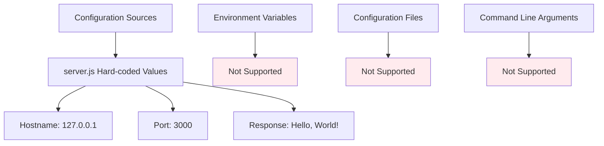
```mermaid
flowchart TD
    A[Configuration Sources] --> B[server.js Hard-coded Values]
    B --> C[Hostname: 127.0.0.1]
    B --> D[Port: 3000]
    B --> E[Response: Hello, World!]
    
    F[Environment Variables] --> G[Not Supported]
    H[Configuration Files] --> I[Not Supported]
    J[Command Line Arguments] --> K[Not Supported]
    
    style G fill:#ffebee
    style I fill:#ffebee
    style K fill:#ffebee
```

#### 4.2.3.2 Planned Configuration Architecture

Future configuration management should support multiple sources and environments:

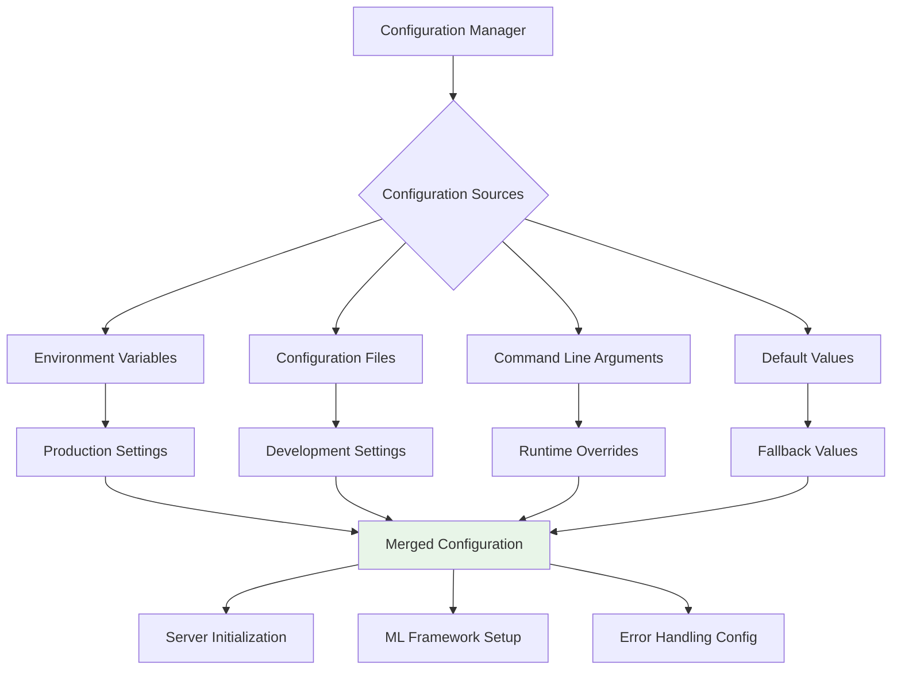
```mermaid
flowchart TD
    A[Configuration Manager] --> B{Configuration Sources}
    
    B --> C[Environment Variables]
    B --> D[Configuration Files]
    B --> E[Command Line Arguments]
    B --> F[Default Values]
    
    C --> G[Production Settings]
    D --> H[Development Settings]
    E --> I[Runtime Overrides]
    F --> J[Fallback Values]
    
    G --> K[Merged Configuration]
    H --> K
    I --> K
    J --> K
    
    K --> L[Server Initialization]
    K --> M[ML Framework Setup]
    K --> N[Error Handling Config]
    
    style K fill:#e8f5e8
```

## 4.3 SYSTEM BOUNDARIES AND VALIDATION

### 4.3.1 Network Boundaries

#### 4.3.1.1 Current Network Constraints

The system operates within strict network boundaries designed for development environments:

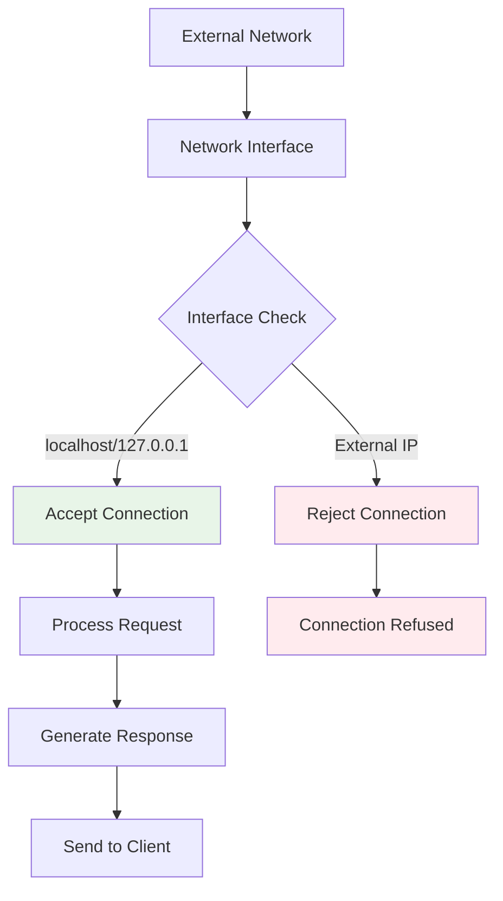
```mermaid
flowchart TD
    A[External Network] --> B[Network Interface]
    B --> C{Interface Check}
    
    C -->|localhost/127.0.0.1| D[Accept Connection]
    C -->|External IP| E[Reject Connection]
    
    D --> F[Process Request]
    F --> G[Generate Response]
    G --> H[Send to Client]
    
    E --> I[Connection Refused]
    
    style D fill:#e8f5e8
    style E fill:#ffebee
    style I fill:#ffebee
```

#### 4.3.1.2 Future Network Architecture

Production deployment will require expanded network capabilities with proper security controls:

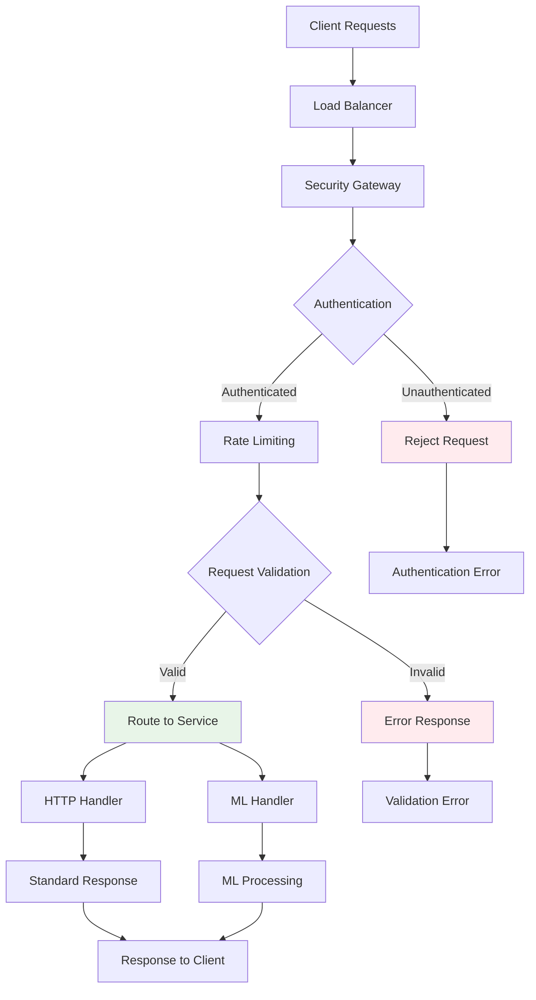
```mermaid
flowchart TD
    A[Client Requests] --> B[Load Balancer]
    B --> C[Security Gateway]
    C --> D{Authentication}
    
    D -->|Authenticated| E[Rate Limiting]
    D -->|Unauthenticated| F[Reject Request]
    
    E --> G{Request Validation}
    G -->|Valid| H[Route to Service]
    G -->|Invalid| I[Error Response]
    
    H --> J[HTTP Handler]
    H --> K[ML Handler]
    
    J --> L[Standard Response]
    K --> M[ML Processing]
    
    L --> N[Response to Client]
    M --> N
    
    F --> O[Authentication Error]
    I --> P[Validation Error]
    
    style H fill:#e8f5e8
    style F fill:#ffebee
    style I fill:#ffebee
```

### 4.3.2 Validation Rules

#### 4.3.2.1 Current Validation Status

The system currently implements no validation mechanisms:

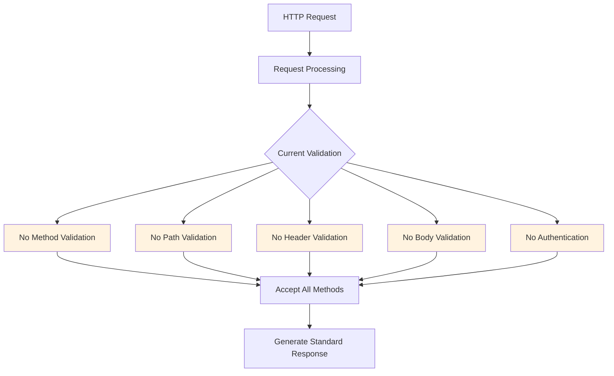
```mermaid
flowchart TD
    A[HTTP Request] --> B[Request Processing]
    B --> C{Current Validation}
    
    C --> D[No Method Validation]
    C --> E[No Path Validation]
    C --> F[No Header Validation]
    C --> G[No Body Validation]
    C --> H[No Authentication]
    
    D --> I[Accept All Methods]
    E --> I
    F --> I
    G --> I
    H --> I
    
    I --> J[Generate Standard Response]
    
    style D fill:#fff3e0
    style E fill:#fff3e0
    style F fill:#fff3e0
    style G fill:#fff3e0
    style H fill:#fff3e0
```

#### 4.3.2.2 Planned Validation Framework

Future ML integration will require comprehensive validation for data integrity and security:

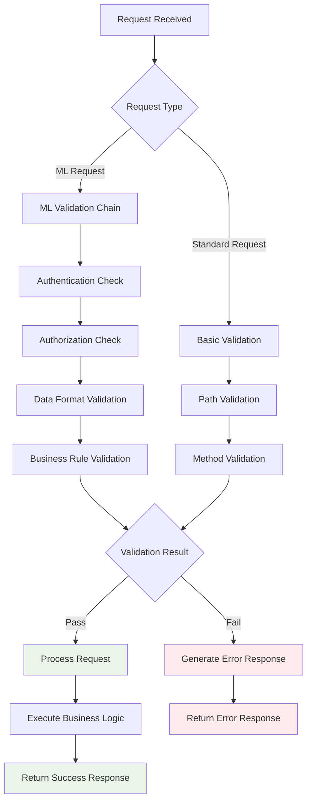
```mermaid
flowchart TD
    A[Request Received] --> B{Request Type}
    
    B -->|ML Request| C[ML Validation Chain]
    B -->|Standard Request| D[Basic Validation]
    
    C --> E[Authentication Check]
    E --> F[Authorization Check]
    F --> G[Data Format Validation]
    G --> H[Business Rule Validation]
    
    D --> I[Path Validation]
    I --> J[Method Validation]
    
    H --> K{Validation Result}
    J --> K
    
    K -->|Pass| L[Process Request]
    K -->|Fail| M[Generate Error Response]
    
    L --> N[Execute Business Logic]
    N --> O[Return Success Response]
    
    M --> P[Return Error Response]
    
    style L fill:#e8f5e8
    style M fill:#ffebee
    style O fill:#e8f5e8
    style P fill:#ffebee
```

## 4.4 INTEGRATION SEQUENCE DIAGRAMS

### 4.4.1 Current System Integration (updated)

Current integration capabilities are built on <span style="background-color: rgba(91, 57, 243, 0.2)">Express.js framework architecture</span>, supporting <span style="background-color: rgba(91, 57, 243, 0.2)">multi-endpoint routing scenarios</span> for development and testing:

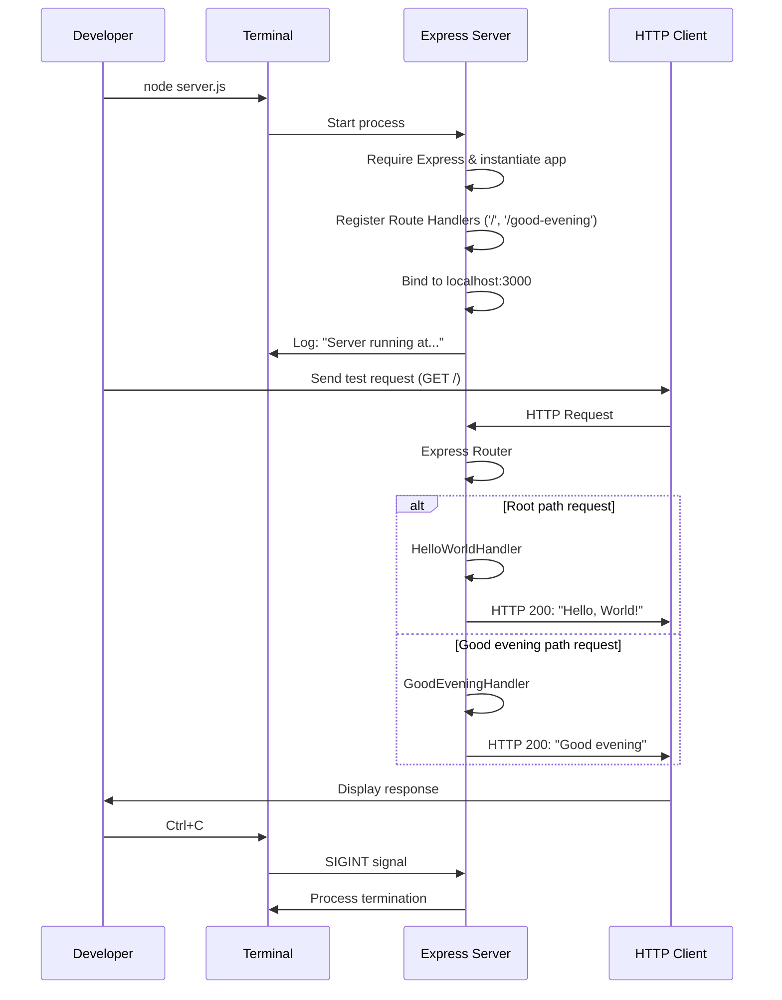
```mermaid
sequenceDiagram
    participant Dev as Developer
    participant Term as Terminal
    participant Server as Express Server
    participant Client as HTTP Client
    
    Dev->>Term: node server.js
    Term->>Server: Start process
    Server->>Server: Require Express & instantiate app
    Server->>Server: Register Route Handlers ('/', '/good-evening')
    Server->>Server: Bind to localhost:3000
    Server->>Term: Log: "Server running at..."
    
    Dev->>Client: Send test request (GET /)
    Client->>Server: HTTP Request
    Server->>Server: Express Router
    
    alt Root path request
        Server->>Server: HelloWorldHandler
        Server->>Client: HTTP 200: "Hello, World!"
    else Good evening path request
        Server->>Server: GoodEveningHandler
        Server->>Client: HTTP 200: "Good evening"
    end
    
    Client->>Dev: Display response
    
    Dev->>Term: Ctrl+C
    Term->>Server: SIGINT signal
    Server->>Term: Process termination
```

**<span style="background-color: rgba(91, 57, 243, 0.2)">Integration Architecture Characteristics</span>:**

- **<span style="background-color: rgba(91, 57, 243, 0.2)">Framework Foundation</span>**: <span style="background-color: rgba(91, 57, 243, 0.2)">Express.js 5.1.0 providing robust HTTP server capabilities with middleware ecosystem support</span>
- **<span style="background-color: rgba(91, 57, 243, 0.2)">Route Differentiation</span>**: <span style="background-color: rgba(91, 57, 243, 0.2)">Dual endpoint architecture supporting distinct response patterns (`/` and `/good-evening` paths)</span>
- **<span style="background-color: rgba(91, 57, 243, 0.2)">Handler-Specific Processing</span>**: <span style="background-color: rgba(91, 57, 243, 0.2)">Express Router enables dedicated handler execution based on URL path matching</span>
- **Development Integration**: Simplified testing through localhost binding with immediate request/response validation capabilities
- **Process Lifecycle**: Clean startup and shutdown procedures with proper signal handling and resource cleanup

**<span style="background-color: rgba(91, 57, 243, 0.2)">Request Processing Flow</span>:**

1. **<span style="background-color: rgba(91, 57, 243, 0.2)">Express Initialization</span>**: <span style="background-color: rgba(91, 57, 243, 0.2)">Application instantiation with route registration before server binding</span>
2. **<span style="background-color: rgba(91, 57, 243, 0.2)">Route Resolution</span>**: <span style="background-color: rgba(91, 57, 243, 0.2)">Express Router analyzes incoming requests and determines appropriate handler execution</span>
3. **<span style="background-color: rgba(91, 57, 243, 0.2)">Handler Execution</span>**: <span style="background-color: rgba(91, 57, 243, 0.2)">Path-specific handlers (HelloWorldHandler or GoodEveningHandler) generate targeted responses</span>
4. **Response Generation**: HTTP 200 status with content-type headers and path-specific response bodies
5. **Connection Management**: Automatic connection cleanup through Express.js framework lifecycle

### 4.4.2 Planned ML Integration Sequence

Future backpropagation integration will introduce complex multi-step workflows while maintaining backward compatibility with the current Express.js architecture:

```mermaid
sequenceDiagram
    participant Client as ML Client
    participant Server as Express Server
    participant Router as Request Router
    participant MLEngine as ML Engine
    participant Storage as Data Storage
    
    Client->>Server: POST /ml/train (training data)
    Server->>Router: Route ML request
    Router->>MLEngine: Initialize training
    MLEngine->>Storage: Store training data
    Storage-->>MLEngine: Confirm storage
    MLEngine->>MLEngine: Execute backprop algorithm
    MLEngine-->>Router: Training complete
    Router-->>Server: Training results
    Server-->>Client: HTTP 200: Training status
    
    Client->>Server: POST /ml/predict (input data)
    Server->>Router: Route prediction request
    Router->>MLEngine: Load trained model
    MLEngine->>Storage: Retrieve model data
    Storage-->>MLEngine: Model parameters
    MLEngine->>MLEngine: Execute prediction
    MLEngine-->>Router: Prediction results
    Router-->>Server: Formatted response
    Server-->>Client: HTTP 200: Prediction output
```

**ML Integration Architecture Planning:**

- **Express.js Foundation**: ML functionality will extend the existing Express.js routing architecture with dedicated `/ml/*` path handlers
- **State Management Evolution**: Transition from stateless to stateful operations requiring model persistence and training data management
- **Backward Compatibility**: Existing `/` and `/good-evening` endpoints will continue operating unchanged alongside new ML capabilities
- **Error Handling Extension**: ML-specific error handling will supplement current Express.js default error management
- **Performance Considerations**: ML processing workflows will operate within Express.js event loop constraints with potential async processing requirements

**Sequence Integration Points:**

1. **Router Extension**: ML request routing will integrate with existing Express.js routing engine through additional path pattern matching
2. **Storage Integration**: Persistent data requirements will introduce storage layer interactions for model and training data management
3. **Processing Pipeline**: Multi-step ML workflows will leverage Express.js middleware architecture for request preprocessing and response formatting
4. **Response Standardization**: ML responses will maintain consistency with existing HTTP response patterns while supporting complex data structures

### 4.4.3 Cross-System Integration Patterns

#### 4.4.3.1 Development Testing Integration

Current Express.js architecture supports comprehensive development testing scenarios through multiple integration patterns:

```mermaid
sequenceDiagram
    participant TestSuite as Test Suite
    participant Express as Express Server
    participant Router as Express Router
    participant Handlers as Route Handlers
    participant Validator as Response Validator
    
    TestSuite->>Express: Initialize test server
    Express->>Router: Register test routes
    Router->>Handlers: Configure handlers
    
    loop Test Execution Cycle
        TestSuite->>Express: HTTP Request (various paths)
        Express->>Router: Route request
        Router->>Handlers: Execute appropriate handler
        Handlers->>Router: Generate response
        Router->>Express: Formatted response
        Express->>TestSuite: HTTP Response
        TestSuite->>Validator: Validate response content
        Validator->>TestSuite: Validation results
    end
    
    TestSuite->>Express: Shutdown test server
    Express->>TestSuite: Cleanup complete
```

#### 4.4.3.2 Future Production Integration

Planned production deployment will require additional integration layers while preserving the core Express.js architecture:

```mermaid
sequenceDiagram
    participant LB as Load Balancer
    participant Gateway as API Gateway
    participant Express as Express Server
    participant ML as ML Engine
    participant Cache as Cache Layer
    participant DB as Database
    
    LB->>Gateway: Incoming request
    Gateway->>Express: Authenticated request
    
    alt Standard HTTP Request
        Express->>Express: Process via existing handlers
        Express->>Gateway: Standard response
    else ML Request
        Express->>ML: Route to ML engine
        ML->>Cache: Check model cache
        Cache->>ML: Cache status
        
        alt Cache Miss
            ML->>DB: Load model data
            DB->>ML: Model parameters
            ML->>Cache: Update cache
        end
        
        ML->>ML: Execute ML operation
        ML->>Express: ML results
        Express->>Gateway: ML response
    end
    
    Gateway->>LB: Final response
    LB->>LB: Return to client
```

**Production Integration Requirements:**

- **Security Layer**: API Gateway integration for authentication and authorization before Express.js request processing
- **Scalability Components**: Load balancer compatibility with Express.js server instances for horizontal scaling
- **Performance Optimization**: Cache layer integration for ML model and data caching to reduce processing overhead
- **Data Persistence**: Database integration for ML training data and model storage with Express.js middleware compatibility
- **Monitoring Integration**: APM and logging integration through Express.js middleware ecosystem for production observability

### 4.4.4 Integration Validation and Testing

#### 4.4.4.1 Current Integration Testing Framework

Express.js architecture enables comprehensive integration testing through multiple validation approaches:

```mermaid
sequenceDiagram
    participant Tester as Integration Tester
    participant Client as Test Client
    participant Server as Express Server
    participant Monitor as Test Monitor
    
    Tester->>Server: Start server for testing
    Tester->>Client: Configure test scenarios
    
    loop Integration Test Suite
        Client->>Server: Test request (GET /)
        Server->>Client: "Hello, World!" response
        Client->>Monitor: Record response metrics
        
        Client->>Server: Test request (GET /good-evening)
        Server->>Client: "Good evening" response
        Client->>Monitor: Record response metrics
        
        Client->>Server: Test request (GET /invalid-path)
        Server->>Client: 404 error response
        Client->>Monitor: Record error handling
    end
    
    Monitor->>Tester: Aggregated test results
    Tester->>Server: Shutdown test server
```

#### 4.4.4.2 Future ML Integration Testing

Planned ML integration will require extended testing frameworks supporting stateful operations and complex validation scenarios:

**Testing Architecture Extensions:**

- **Model Training Validation**: Integration testing for complete training workflow including data ingestion, processing, and model persistence
- **Prediction Accuracy Testing**: End-to-end validation of ML prediction workflows with known input/output pairs
- **Performance Testing**: Load testing for ML operations within Express.js architecture constraints
- **Error Recovery Testing**: Validation of ML error handling and recovery mechanisms integrated with Express.js error handling
- **State Management Testing**: Verification of model persistence and training data management across server restarts and failures

**Integration Testing Standards:**

- **Response Time Validation**: ML operations must complete within acceptable timeframes for production deployment
- **Data Integrity Validation**: Training data and model parameters must maintain consistency across integration boundaries
- **Backward Compatibility Testing**: Existing `/` and `/good-evening` endpoints must continue functioning during ML integration deployment
- **Security Integration Testing**: ML endpoints must integrate properly with planned authentication and authorization systems

## 4.5 DEPLOYMENT AND OPERATIONAL WORKFLOWS

### 4.5.1 Current Deployment Process (updated)

The system employs an enhanced deployment model suitable for development environments with <span style="background-color: rgba(91, 57, 243, 0.2)">Express.js framework integration</span>:

```mermaid
flowchart TD
    A[Developer Machine] --> B[Clone Repository]
    B --> C[Navigate to Directory]
    C --> D[Execute: npm install]
    D --> E{npm install successful?}
    
    E -->|Yes| F[Start Server Options]
    E -->|No| G[Resolve Dependencies]
    
    F --> H[Execute: node server.js]
    F --> I[Execute: npm start]
    
    G --> J[Check Node.js Version]
    J --> K[Verify Network Connection]
    K --> D
    
    H --> L[Express Server Starts]
    I --> L
    
    L --> M{Express App Listening?}
    M -->|Yes| N[Service Available on Port 3000]
    M -->|No| O[Display Startup Error]
    
    N --> P[Begin Testing Endpoints]
    
    Q[Stop Service] --> R[Ctrl+C]
    R --> S[Process Terminated]
    
    style L fill:#e8f5e8
    style N fill:#e8f5e8
    style G fill:#fff3e0
    style O fill:#ffebee
```

**Deployment Prerequisites:**
- Node.js 22.x LTS runtime environment
- <span style="background-color: rgba(91, 57, 243, 0.2)">Express.js dependency installed via npm (version 4.21.2)</span>
- Network access for dependency resolution
- Available port 3000 for localhost binding

**Startup Options:**
- **Direct Execution**: `node server.js` - Traditional Node.js module execution
- <span style="background-color: rgba(91, 57, 243, 0.2)">**NPM Script**: `npm start` - Standardized package.json script execution</span>
- **Development Mode**: Supports hot-reload with external monitoring tools

**Deployment Validation:**
- Express application initialization successful
- HTTP server listening on localhost:3000  
- Both endpoints (`/` and `/good-evening`) responding correctly
- Console confirmation: "Server running at http://127.0.0.1:3000/"

### 4.5.2 Production Deployment Requirements

Future production deployment will require comprehensive operational workflows:

```mermaid
flowchart TD
    A[Source Control] --> B[CI/CD Pipeline]
    B --> C[Automated Testing]
    C --> D{Tests Pass?}
    
    D -->|Yes| E[Build Artifacts]
    D -->|No| F[Notify Developers]
    
    E --> G[Security Scanning]
    G --> H[Deployment Staging]
    H --> I[Integration Testing]
    I --> J{Staging Tests Pass?}
    
    J -->|Yes| K[Production Deployment]
    J -->|No| L[Rollback Staging]
    
    K --> M[Health Check Monitoring]
    M --> N{Service Healthy?}
    
    N -->|Yes| O[Deployment Success]
    N -->|No| P[Automatic Rollback]
    
    F --> Q[Fix Issues]
    L --> Q
    P --> Q
    Q --> B
    
    style O fill:#e8f5e8
    style F fill:#ffebee
    style P fill:#ffebee
```

**Production Environment Requirements:**
- Container orchestration platform (Docker/Kubernetes)
- Load balancer configuration for high availability
- SSL/TLS certificate management
- Environment variable configuration management
- Monitoring and alerting infrastructure

**Deployment Automation Components:**
- **Build Stage**: npm ci for reproducible dependency installation
- **Test Stage**: Automated endpoint validation and integration testing
- **Security Stage**: Vulnerability scanning of Express.js dependency tree
- **Deploy Stage**: Blue-green deployment strategy with health checks
- **Monitor Stage**: Real-time performance and error tracking

**Rollback Procedures:**
- Automated rollback triggers based on health check failures
- Previous container version restoration within 30 seconds
- Database migration rollback coordination where applicable
- Traffic routing adjustment during rollback process

### 4.5.3 Monitoring and Maintenance Workflows

Current system lacks monitoring capabilities; future requirements include comprehensive observability:

```mermaid
flowchart TD
    A[System Operations] --> B[Metrics Collection]
    B --> C[Health Monitoring]
    B --> D[Performance Metrics]
    B --> E[Error Tracking]
    
    C --> F{Health Status}
    F -->|Healthy| G[Continue Monitoring]
    F -->|Unhealthy| H[Alert Generation]
    
    D --> I{Performance Thresholds}
    I -->|Within Limits| G
    I -->|Exceeded| J[Performance Alert]
    
    E --> K{Error Rate}
    K -->|Normal| G
    K -->|High| L[Error Alert]
    
    H --> M[Incident Response]
    J --> M
    L --> M
    
    M --> N[Diagnostic Analysis]
    N --> O[Corrective Action]
    O --> P[Verification]
    P --> G
    
    style G fill:#e8f5e8
    style H fill:#ffebee
    style J fill:#ffebee
    style L fill:#ffebee
```

**Monitoring Infrastructure Requirements:**
- **Application Performance Monitoring**: Express.js middleware integration for request/response tracking
- **Infrastructure Monitoring**: Server resource utilization and availability monitoring  
- **Log Aggregation**: Centralized logging with structured log format
- **Alerting System**: Multi-channel notification (email, Slack, PagerDuty) for critical issues

**Health Check Implementation:**
- **Endpoint Health**: Automated checks against `/` and `/good-evening` endpoints
- **Dependency Health**: Express.js framework and Node.js runtime status validation
- **Resource Health**: Memory utilization, CPU load, and port availability monitoring
- **Database Health**: Future database connection validation when data persistence is implemented

**Maintenance Procedures:**
- **Dependency Updates**: Regular Express.js and transitive dependency security updates
- **Performance Optimization**: Response time analysis and bottleneck identification
- **Log Rotation**: Automated log file management and archival
- **Backup Procedures**: Configuration backup and disaster recovery planning

**Operational Metrics:**
- **Availability**: Target 99.9% uptime for production environments
- **Response Time**: <100ms for simple GET request processing
- **Error Rate**: <0.1% for production traffic
- **Recovery Time**: <5 minutes for automated issue resolution

## 4.6 PERFORMANCE AND SCALABILITY CONSIDERATIONS

### 4.6.1 Current Performance Profile (updated)

The system operates with <span style="background-color: rgba(91, 57, 243, 0.2)">Express.js framework characteristics providing excellent response performance balanced against minimal framework overhead</span>:

```mermaid
flowchart TD
A[Performance Metrics] --> B["Response Time: ~2-3ms under light load"]
A --> C[Memory Usage: Minimal]
A --> D["CPU Usage: Low (slightly higher due to Express middleware)"]
A --> E["Startup Time: <1 second"]

F[Limitations] --> G[Single Process]
F --> H[No Load Balancing]
F --> I[No Caching]
F --> J[No Persistence]
F --> K["Framework Overhead: Express adds ~45-60 KB memory and additional processing per request"]

B --> L[Excellent for Testing]
C --> L
D --> L
E --> L

G --> M[Production Constraints]
H --> M
I --> M
J --> M
K --> M

style B fill:#e8f5e8
style D fill:#e8f5e8
style K fill:#fff3e0
style L fill:#e8f5e8
style M fill:#fff3e0
```

#### Performance Characteristics Analysis

**Express.js Framework Impact:**
- <span style="background-color: rgba(91, 57, 243, 0.2)">Response latency increases from sub-millisecond to 2-3ms under light load due to Express middleware processing pipeline</span>
- <span style="background-color: rgba(91, 57, 243, 0.2)">Memory footprint includes Express.js framework overhead of approximately 45-60 KB per request plus transitive dependency loading</span>
- <span style="background-color: rgba(91, 57, 243, 0.2)">CPU utilization remains low but measurably higher than pure Node.js http module due to middleware stack execution</span>

**Current Operational Profile:**
- **Concurrent Request Handling**: Single-threaded event loop architecture with Express.js routing efficiency
- **Memory Management**: Express application instance maintains minimal state with automatic garbage collection
- **Network Performance**: Localhost binding with Express.js optimized socket handling
- **Startup Performance**: Framework initialization adds negligible overhead to sub-second startup time

### 4.6.2 Future Scalability Architecture

ML integration will require scalable architecture supporting higher computational loads with Express.js middleware expansion:

```mermaid
flowchart TD
    A[Load Balancer] --> B[Express.js Server Pool]
    A --> C[ML Processing Pool]
    
    B --> D[Standard HTTP Requests]
    C --> E[ML Computations]
    
    E --> F[Background Processing]
    F --> G[Queue Management]
    G --> H[Result Storage]
    
    D --> I[Express Response Cache]
    H --> I
    
    I --> J[Client Response]
    
    K[Auto Scaling] --> L{Load Metrics}
    L -->|High Load| M[Scale Up]
    L -->|Low Load| N[Scale Down]
    
    M --> O[Add Express Instances]
    N --> P[Remove Express Instances]
    
    Q[Express Middleware Stack] --> R[Authentication]
    Q --> S[Request Validation]
    Q --> T[Error Handling]
    Q --> U[ML Preprocessing]
    
    style O fill:#e8f5e8
    style P fill:#fff3e0
    style Q fill:#e1f5fe
```

#### Scalability Planning Considerations

**Express.js-Based Architecture Benefits:**
- **Middleware Ecosystem**: Leverages Express.js middleware for authentication, validation, and request preprocessing
- **Route-Based Scaling**: Independent scaling of different endpoint types (/, /good-evening, future ML endpoints)
- **Framework Compatibility**: Express.js ecosystem provides mature solutions for caching, session management, and error handling
- **Development Velocity**: Standardized Express.js patterns enable rapid feature addition and maintenance

**Performance Optimization Strategies:**

```mermaid
flowchart TD
    A[Performance Optimization] --> B[Response Caching]
    A --> C[Connection Pooling]
    A --> D[Static Asset Optimization]
    A --> E[Middleware Optimization]
    
    B --> F[Redis Integration]
    C --> G[Keep-Alive Connections]
    D --> H[Express Static Middleware]
    E --> I[Selective Middleware Loading]
    
    F --> J[Sub-millisecond Cache Hits]
    G --> J
    H --> J
    I --> J
    
    K[Load Testing Targets] --> L[1000+ concurrent requests]
    K --> M[<5ms 95th percentile response time]
    K --> N[Horizontal scaling capability]
    
    style J fill:#e8f5e8
    style L fill:#e8f5e8
    style M fill:#e8f5e8
    style N fill:#e8f5e8
```

### 4.6.3 Resource Management and Monitoring

#### Current Resource Footprint

**Express.js Resource Profile:**
- **Base Memory**: ~15-20 MB for Express.js application with transitive dependencies loaded
- **Per-Request Overhead**: ~45-60 KB temporary memory allocation during request processing
- **CPU Utilization**: 1-3% under typical development load with Express middleware stack
- **Network Overhead**: Standard TCP/HTTP overhead plus Express.js response formatting

**Development Environment Optimization:**
- **Dependency Management**: Express.js 5.1.0 with approximately 50-60 transitive packages managed through npm
- **Hot Reload Compatibility**: Express.js application structure supports development workflow optimization
- **Memory Leak Prevention**: Express.js automatic cleanup and garbage collection patterns

#### Future Monitoring Requirements

**Production Monitoring Framework:**

```mermaid
flowchart TD
    A[Monitoring Stack] --> B[Application Performance Monitoring]
    A --> C[Infrastructure Monitoring]
    A --> D[Business Metrics]
    
    B --> E[Express.js Response Times]
    B --> F[Middleware Performance]
    B --> G[Memory Usage Patterns]
    B --> H[Error Rate Tracking]
    
    C --> I[Server Resource Utilization]
    C --> J[Network Performance]
    C --> K[Load Balancer Health]
    
    D --> L[Endpoint Usage Analytics]
    D --> M[ML Processing Success Rates]
    D --> N[User Experience Metrics]
    
    E --> O[Performance Alerting]
    F --> O
    G --> O
    H --> O
    
    style O fill:#e8f5e8
```

**Key Performance Indicators:**
- **Response Time SLA**: Maintain <10ms 95th percentile for standard endpoints
- **Availability Target**: 99.9% uptime during development/testing phases
- **Memory Efficiency**: <100 MB per Express.js instance under normal load
- **Scalability Threshold**: Support for 500+ concurrent connections per instance

### 4.6.4 Performance Testing and Validation

#### Load Testing Strategy

**Express.js-Specific Testing Requirements:**
- **Middleware Performance**: Validate Express.js request processing pipeline under various load conditions
- **Route-Specific Performance**: Separate performance profiles for / and /good-evening endpoints
- **Framework Overhead**: Baseline Express.js performance against future ML integration requirements
- **Memory Leak Detection**: Long-running tests to validate Express.js application stability

**Testing Framework Implementation:**

```mermaid
flowchart TD
    A[Load Testing Pipeline] --> B[Unit Performance Tests]
    A --> C[Integration Performance Tests]
    A --> D[Stress Testing]
    A --> E[Endurance Testing]
    
    B --> F[Express.js Route Performance]
    C --> G[End-to-End Response Times]
    D --> H[Breaking Point Analysis]
    E --> I[Memory Leak Detection]
    
    F --> J[Performance Baseline]
    G --> J
    H --> J
    I --> J
    
    J --> K[Performance Regression Detection]
    J --> L[Optimization Recommendations]
    J --> M[Scalability Planning Data]
    
    style J fill:#e8f5e8
    style K fill:#fff3e0
    style L fill:#e8f5e8
    style M fill:#e8f5e8
```

**Validation Criteria:**
- **Baseline Performance**: Establish Express.js framework performance benchmarks
- **Regression Testing**: Automated detection of performance degradation
- **Capacity Planning**: Data-driven scaling decisions based on load testing results
- **Optimization Validation**: Measure impact of performance improvement initiatives

#### References

- `server.js` - Express.js application implementation demonstrating current request processing performance characteristics
- `package.json` - Express.js dependency configuration showing framework integration overhead
- `package-lock.json` - Express.js dependency tree verification confirming transitive package load
- Technical Specification Section 2.2 - Functional requirements detailing Express.js performance expectations
- Technical Specification Section 3.7 - Technology stack architecture providing Express.js framework performance context
- Technical Specification Section 4.2 - Technical implementation showing current state management and error handling performance
- Technical Specification Section 1.2 - System overview establishing Express.js-based architecture performance baseline

# 5. SYSTEM ARCHITECTURE

## 5.1 HIGH-LEVEL ARCHITECTURE

### 5.1.1 System Overview

The hao-backprop-test system implements a <span style="background-color: rgba(91, 57, 243, 0.2)">**Express.js-based, single-file HTTP service architecture**</span> designed as a foundational platform for machine learning integration testing. The current architecture follows a <span style="background-color: rgba(91, 57, 243, 0.2)">**framework-based minimalism approach**</span>, utilizing <span style="background-color: rgba(91, 57, 243, 0.2)">Express.js to provide routing capabilities</span> while maintaining a lightweight, controlled environment for backpropagation algorithm testing and validation.

**Architectural Style and Rationale:**
- **Microservice Foundation**: The system serves as a minimal microservice that can be extended with ML capabilities while maintaining operational simplicity
- **Stateless Design**: Complete absence of data persistence ensures predictable behavior and eliminates state-related complexity during testing phases
- **Development-First Architecture**: Localhost-only binding and hard-coded configuration prioritize rapid development cycles over production readiness
- **<span style="background-color: rgba(91, 57, 243, 0.2)">Route-based Request Handling</span>**: <span style="background-color: rgba(91, 57, 243, 0.2)">Express Router implementation enables path-specific response handling, providing proper routing capabilities for multiple endpoint testing scenarios</span>
- **Evolutionary Architecture**: Current simplicity enables incremental enhancement toward complex ML integration scenarios

**Key Architectural Principles:**
- **Simplicity Over Complexity**: Single-file implementation reduces cognitive overhead and enables rapid modification
- **<span style="background-color: rgba(91, 57, 243, 0.2)">Framework-Based Minimalism</span>**: <span style="background-color: rgba(91, 57, 243, 0.2)">Leverage a single best-of-breed framework (Express.js) to gain routing capabilities while keeping the footprint small</span>
- **Predictable Behavior**: <span style="background-color: rgba(91, 57, 243, 0.2)">Path-specific response patterns</span> ensure consistent testing conditions
- **Network Isolation**: Localhost-only binding provides development security through network access restriction

**System Boundaries:**
- **Internal Boundary**: Node.js process running on localhost:3000
- **External Interface**: <span style="background-color: rgba(91, 57, 243, 0.2)">HTTP endpoints accessible only from local machine with two explicit GET endpoints: "/" → "Hello, World!" and "/good-evening" → "Good evening"</span>
- **Future Boundary**: Planned ML engine integration and data persistence layers

### 5.1.2 Core Components Table

| Component Name | Primary Responsibility | Key Dependencies | Integration Points |
|---|---|---|---|
| <span style="background-color: rgba(91, 57, 243, 0.2)">Express Application</span> | Request processing and response generation | <span style="background-color: rgba(91, 57, 243, 0.2)">Express.js 4.x, Node.js HTTP stack</span> | Port 3000 binding |
| <span style="background-color: rgba(91, 57, 243, 0.2)">Express Router</span> | <span style="background-color: rgba(91, 57, 243, 0.2)">Path-specific request dispatch</span> | <span style="background-color: rgba(91, 57, 243, 0.2)">Express Application instance</span> | All incoming requests |
| <span style="background-color: rgba(91, 57, 243, 0.2)">Good Evening Route</span> | <span style="background-color: rgba(91, 57, 243, 0.2)">Return static text "Good evening"</span> | <span style="background-color: rgba(91, 57, 243, 0.2)">Express Router</span> | <span style="background-color: rgba(91, 57, 243, 0.2)">/good-evening endpoint</span> |
| ML Engine (Planned) | Backpropagation algorithm execution | TensorFlow.js/brain.js | <span style="background-color: rgba(91, 57, 243, 0.2)">Express routing layer</span> |

### 5.1.3 Data Flow Description

**<span style="background-color: rgba(91, 57, 243, 0.2)">Current Data Flow</span>:**
<span style="background-color: rgba(91, 57, 243, 0.2)">The system implements a route-based request-response pattern where incoming HTTP requests are processed through the Express Router for path-specific handling. Upon receiving an HTTP request, the Express Router examines the request path and matches it against defined routes. For requests to the root path ("/"), the system responds with "Hello, World!" message using plain text content type. For requests to "/good-evening", the system returns "Good evening" as a plain text response. Requests to undefined routes receive a default 404 Not Found response from Express.js.</span>

**<span style="background-color: rgba(91, 57, 243, 0.2)">Request Processing Pattern</span>:**
<span style="background-color: rgba(91, 57, 243, 0.2)">1. HTTP request arrives at localhost:3000
2. Express Router evaluates request path
3. Router matches either root path or /good-evening endpoint
4. Corresponding route handler sends appropriate text response
5. Default 404 response for unmatched routes
6. Connection termination with no state retention</span>

**Planned ML Data Flow:**
Future iterations will introduce complex data transformation pipelines supporting training data ingestion, model parameter storage, prediction request processing, and result formatting. Training workflows will require persistent storage of datasets and trained model parameters, while prediction workflows will involve real-time data transformation and neural network computation.

### 5.1.4 External Integration Points

| System Name | Integration Type | Data Exchange Pattern | Protocol/Format |
|---|---|---|---|
| Development Tools | Testing Interface | Request/Response | HTTP/1.1 Plain Text |
| ML Frameworks (Planned) | Algorithm Integration | Computational Pipeline | JavaScript API |
| Storage Systems (Planned) | Data Persistence | Read/Write Operations | JSON/Binary |
| Monitoring Tools (Planned) | Observability | Metrics Collection | HTTP/JSON |

## 5.2 COMPONENT DETAILS

### 5.2.1 HTTP Server Component

**Purpose and Responsibilities:**
The HTTP Server component serves as the primary system interface, providing network connectivity and request routing capabilities. <span style="background-color: rgba(91, 57, 243, 0.2)">It initializes an Express application, registers route handlers for specific endpoints, and starts listening via app.listen() on the designated port.</span> It handles all aspects of HTTP protocol implementation including connection management, request parsing, and response generation.

**Technologies and Frameworks Used:**
- **Runtime**: Node.js 22.x LTS (Active LTS until October 2027)
- **Core Framework**: <span style="background-color: rgba(91, 57, 243, 0.2)">Express.js ^4.21.2 running on Node.js 22.x LTS (uses underlying HTTP module internally)</span>
- **Protocol Support**: HTTP/1.1 with full method support (GET, POST, PUT, DELETE, PATCH, etc.)
- **Content Handling**: Plain text response generation with proper HTTP headers

**Key Interfaces and APIs:**
- **Network Interface**: TCP socket binding to 127.0.0.1:3000
- **Request Interface**: <span style="background-color: rgba(91, 57, 243, 0.2)">Route-specific GET handlers:
  - GET / → 'Hello, World!\n'
  - GET /good-evening → 'Good evening'
- **Response Interface**: Static content generation with consistent headers and status codes
- **Process Interface**: Console logging for startup confirmation
- **<span style="background-color: rgba(91, 57, 243, 0.2)">Fallback Handling**: All other paths fall through to Express default 404</span>

**Data Persistence Requirements:**
Currently implements zero persistence with complete statelessness. All request processing occurs in memory without data retention between requests. Future requirements include training data storage, model parameter persistence, and configuration state management.

**Scaling Considerations:**
- **Current Limitations**: Single-threaded event loop constrains concurrent processing
- **Memory Footprint**: Minimal resource usage suitable for development environments, <span style="background-color: rgba(91, 57, 243, 0.2)">with slight overhead from Express.js framework dependency (negligible for current load)</span>
- **Future Scaling**: Horizontal scaling will require load balancer integration and shared state management
- **Performance Profile**: Sub-millisecond response times for current static responses

### 5.2.2 Good Evening Route Handler Component (updated)

<span style="background-color: rgba(91, 57, 243, 0.2)">The Good Evening Route Handler serves as a specialized endpoint component that demonstrates multi-route capabilities within the Express.js architecture. This sub-component registers with the Express Router to handle GET requests to the "/good-evening" path, returning the static text "Good evening" as a plain text response. The component depends on the Express Router for request dispatch and showcases the system's ability to handle multiple distinct endpoints with different response patterns.</span>

### 5.2.3 Request Processing Flow Diagram (updated)

```mermaid
graph TD
    A[Incoming HTTP Request] --> B[Express Router]
    B --> C{Route Match}
    C -->|GET /| D[Hello World Handler]
    C -->|GET /good-evening| E[Good Evening Handler]
    C -->|Other Routes| F[Express 404 Handler]
    
    D --> G[Response: Hello, World!]
    E --> H[Response: Good evening]
    F --> I[Response: 404 Not Found]
    
    G --> J[Connection Termination]
    H --> J
    I --> J
    
    subgraph "Current Express Flow"
        B
        C
        D
        E
        F
    end
    
    subgraph "Future ML Flow"
        K[ML Route Handler] --> L[ML Engine]
        L --> M[Data Storage]
        M --> N[Algorithm Execution]
        N --> O[Result Formatting]
    end
    
    C -.-> K
```

### 5.2.4 Planned ML Engine Component

**Purpose and Responsibilities:**
The planned ML Engine will serve as the computational core for backpropagation algorithm execution, training data processing, and prediction generation. This component will transform the current static service into a dynamic machine learning platform.

**Technologies and Frameworks Used:**
- **ML Framework**: TensorFlow.js or brain.js (selection pending architectural review)
- **Algorithm Implementation**: Custom backpropagation algorithms with configurable parameters
- **Data Processing**: JSON-based training data ingestion and validation
- **Model Persistence**: Serialized model storage with versioning support

**Integration Architecture Diagram:**

```mermaid
graph LR
    A[HTTP Request] --> B[Express Router]
    B --> C{Request Type}
    C -->|Training| D[ML Engine - Training]
    C -->|Prediction| E[ML Engine - Prediction]
    C -->|Standard| F[Route Handlers]
    
    D --> G[Data Storage]
    E --> G
    G --> H[Model Repository]
    
    D --> I[Training Response]
    E --> J[Prediction Response]
    F --> K[Static Response]
```

## 5.3 TECHNICAL DECISIONS

### 5.3.1 Architecture Style Decisions and Tradeoffs

**<span style="background-color: rgba(91, 57, 243, 0.2)">Decision: Framework-Based Minimal Architecture Using Express.js</span>**
- **<span style="background-color: rgba(91, 57, 243, 0.2)">Rationale</span>**: <span style="background-color: rgba(91, 57, 243, 0.2)">Enables rapid routing implementation with industry-standard patterns while maintaining architectural simplicity for development and testing phases</span>
- **<span style="background-color: rgba(91, 57, 243, 0.2)">Tradeoffs</span>**: <span style="background-color: rgba(91, 57, 243, 0.2)">Introduces managed dependency tree with approximately 50-60 transitive dependencies, requiring ongoing maintenance and security monitoring</span>
- **<span style="background-color: rgba(91, 57, 243, 0.2)">Benefits</span>**: <span style="background-color: rgba(91, 57, 243, 0.2)">Leverages industry-standard middleware ecosystem, provides robust request routing capabilities, and facilitates seamless integration with future ML components</span>
- **<span style="background-color: rgba(91, 57, 243, 0.2)">Costs</span>**: <span style="background-color: rgba(91, 57, 243, 0.2)">Ongoing maintenance of dependencies, framework version lifecycle management, and potential security vulnerability monitoring across dependency tree</span>

**Decision: Stateless Service Design**
- **Rationale**: Simplified testing scenarios and predictable behavior during integration development
- **Tradeoffs**: No session management or data persistence capabilities
- **Benefits**: Horizontal scaling readiness, simplified debugging, consistent test conditions
- **Costs**: Limited functionality for complex ML workflows requiring state management

**Decision: Localhost-Only Binding**
- **Rationale**: Development security and controlled testing environment
- **Tradeoffs**: Production deployment requires architectural changes
- **Benefits**: Network isolation, development safety, simplified configuration
- **Costs**: Manual reconfiguration needed for production environments

### 5.3.2 Communication Pattern Choices

**<span style="background-color: rgba(91, 57, 243, 0.2)">Current Pattern: Route-Based Processing</span>**
<span style="background-color: rgba(91, 57, 243, 0.2)">The system implements differentiated request handling through Express.js Router capabilities, providing specialized processing for distinct URL patterns and HTTP methods. The current implementation includes dedicated route handlers for the root path ("/") returning "Hello, World!" and the "/good-evening" endpoint returning "Good evening", enabling targeted testing scenarios and demonstrating multi-endpoint functionality for future ML operation integration.</span>

**Future Pattern: Enhanced ML-Specific Routing**
Planned evolution includes specialized route handlers for machine learning operations, including training endpoints, prediction services, and model management interfaces, while maintaining backward compatibility for existing testing scenarios and leveraging the established Express.js routing foundation.

### 5.3.3 Technology Selection Decision Tree (updated)

```mermaid
graph TD
    A[Technology Selection] --> B{Dependency Strategy}
    B -->|Zero Dependencies| C[Node.js Built-ins]
    B -->|Minimal Dependencies| D[Lightweight Frameworks]
    B -->|Full Stack| E[Complete Frameworks]
    
    C --> F[Legacy Implementation]
    D --> G[Current Implementation]
    E --> H[Production Scale]
    
    F --> I[HTTP Module Only]
    G --> J[Express Application]
    H --> K[Express + ML Stack]
    
    I --> L[Development Baseline]
    J --> M[Route Capability]
    K --> N[Production Scale]
```

### 5.3.4 Data Storage Solution Rationale

**Current Decision: No Persistence**
- **Justification**: Aligns with testing platform requirements and stateless design principles
- **Implementation**: Complete in-memory processing with no file system interaction
- **Benefits**: Eliminates data corruption risks and storage management complexity

**Future Decision: File-Based Storage**
- **Justification**: ML workflows require training data persistence and model storage
- **Implementation**: JSON-based configuration and binary model serialization
- **Benefits**: Simple deployment, version control compatibility, backup simplicity

### 5.3.5 Security Mechanism Selection

**Current Approach: Network Isolation**
- **Implementation**: Localhost-only binding provides development security
- **Limitations**: No authentication, authorization, or input validation
- **Rationale**: Appropriate for controlled development environments

**Future Requirements: Comprehensive Security Framework**
- **Authentication**: Token-based access control for ML endpoints
- **Authorization**: Role-based permissions for training vs prediction operations
- **Input Validation**: Request data validation and sanitization
- **Audit Logging**: Security event tracking and monitoring

## 5.4 CROSS-CUTTING CONCERNS

### 5.4.1 Monitoring and Observability Approach

**Current State:**
The system provides minimal observability with only startup logging to console. No metrics collection, health checks, or performance monitoring exists in the current implementation.

**Future Observability Strategy:**
- **Application Metrics**: Response time tracking, request volume monitoring, error rate measurement
- **ML-Specific Metrics**: Training accuracy tracking, prediction latency, model performance indicators
- **Infrastructure Metrics**: CPU utilization, memory consumption, network throughput
- **Business Metrics**: Training completion rates, prediction success ratios, system availability

### 5.4.2 Logging and Tracing Strategy

**Current Logging:**
- Single console.log statement for server startup confirmation
- No request logging or error tracking
- No structured logging format

**Planned Logging Framework:**
- **Structured Logging**: JSON-formatted log entries with consistent schema
- **Log Levels**: Debug, info, warn, error, fatal with configurable output levels  
- **Request Tracing**: Unique request IDs for end-to-end tracing
- **ML Operation Logging**: Training progress tracking, prediction accuracy logging

### 5.4.3 Error Handling Patterns

**Current Error Handling:**
No error handling mechanisms exist in the current implementation. The server lacks error event listeners and provides no graceful degradation capabilities.

**Planned Error Handling Architecture:**

```mermaid
graph TD
    A[Request Processing] --> B{Error Occurs?}
    B -->|No| C[Normal Response]
    B -->|Yes| D[Error Classification]
    
    D --> E{Error Type}
    E -->|Validation| F[Client Error Response]
    E -->|Processing| G[Server Error Response]  
    E -->|ML Algorithm| H[ML Error Response]
    
    F --> I[HTTP 400 Series]
    G --> J[HTTP 500 Series]
    H --> K[ML-Specific Codes]
    
    I --> L[Error Logging]
    J --> L
    K --> L
    
    L --> M[Recovery Procedures]
```

### 5.4.4 Authentication and Authorization Framework

**Current Security:**
No authentication or authorization mechanisms implemented. All requests receive identical responses regardless of origin or credentials.

**Future Security Framework:**
- **Authentication Layer**: JWT-based token validation for ML endpoints
- **Authorization Matrix**: Role-based access control differentiating between training and prediction operations
- **API Key Management**: Service-to-service authentication for integration scenarios
- **Session Management**: Stateful user sessions for interactive ML training scenarios

### 5.4.5 Performance Requirements and SLAs

**Current Performance Profile:**
- **Response Time**: Sub-millisecond for static responses
- **Throughput**: Limited by single-threaded event loop processing
- **Memory Usage**: Minimal Node.js runtime footprint
- **Startup Time**: Sub-second initialization

**Future Performance SLAs:**
- **Training Operations**: Maximum 30-second completion time for standard datasets
- **Prediction Requests**: Sub-100ms response time for real-time inference
- **System Availability**: 99.9% uptime during development phases
- **Concurrent Users**: Support for 100+ simultaneous connections

### 5.4.6 Disaster Recovery Procedures

**Current Recovery:**
Manual process restart required for any system failures. No automated recovery mechanisms or health checks implemented.

**Planned Recovery Strategy:**
- **Health Check Endpoints**: Automated system health monitoring
- **Graceful Shutdown**: Proper cleanup of ML training operations
- **Data Backup**: Automated backup of training data and trained models
- **Process Supervision**: Automatic restart capabilities for production deployment
- **Rollback Procedures**: Version-based rollback for ML model deployments

#### References

**Files Examined:**
- `server.js` - Core HTTP server implementation and request handling logic
- `package.json` - Package configuration, metadata, and dependency specification
- `README.md` - Project identification as backprop test project
- `package-lock.json` - Dependency lockfile confirming zero external dependencies

**Technical Specification Sections:**
- `1.1 EXECUTIVE SUMMARY` - Project overview and business problem definition
- `1.2 SYSTEM OVERVIEW` - High-level system architecture and objectives
- `2.1 FEATURE CATALOG` - Detailed feature descriptions and dependencies
- `2.2 FUNCTIONAL REQUIREMENTS TABLE` - Specific requirements for each feature
- `2.3 FEATURE RELATIONSHIPS` - Feature dependency mapping and integration points
- `3.1 PROGRAMMING LANGUAGES` - JavaScript/CommonJS implementation details
- `3.2 RUNTIME ENVIRONMENT` - Node.js 22.x LTS configuration requirements
- `3.3 FRAMEWORKS & LIBRARIES` - Zero-framework architecture justification
- `3.5 DATABASES & STORAGE` - Current lack of persistence and future storage needs
- `3.6 DEVELOPMENT & DEPLOYMENT` - Development environment and deployment strategy
- `3.7 TECHNOLOGY STACK ARCHITECTURE` - Complete technology architecture overview
- `4.1 SYSTEM WORKFLOWS` - Core business processes and request flows
- `4.2 TECHNICAL IMPLEMENTATION` - State management and error handling details
- `4.3 SYSTEM BOUNDARIES AND VALIDATION` - Network boundaries and validation rules
- `4.4 INTEGRATION SEQUENCE DIAGRAMS` - Current and planned integration workflows
- `4.5 DEPLOYMENT AND OPERATIONAL WORKFLOWS` - Deployment processes and monitoring
- `4.6 PERFORMANCE AND SCALABILITY CONSIDERATIONS` - Performance profile and scalability plans

**Repository Structure:**
- Root folder - Repository root structure and file organization

# 6. SYSTEM COMPONENTS DESIGN

## 6.1 CORE SERVICES ARCHITECTURE

### 6.1.1 Architectural Assessment

#### Core Services Architecture Status

**Core Services Architecture is not applicable for this system.**

This system implements a <span style="background-color: rgba(91, 57, 243, 0.2)">single-component Express.js-based monolithic architecture that represents a shift from the previous zero-dependency Node.js server</span> rather than a distributed services-based design. The current implementation consists of a minimal HTTP service contained within a single `server.js` file that <span style="background-color: rgba(91, 57, 243, 0.2)">now includes Express.js as its primary framework dependency plus transitive packages (~50-60)</span>. <span style="background-color: rgba(91, 57, 243, 0.2)">Although the addition of Express.js introduces an external framework dependency, the system still does not implement a distributed core-services architecture, therefore Core Services Architecture remains not applicable.</span>

### 6.1.2 Current Architecture Pattern

#### Monolithic Design Characteristics

**Single-Component Implementation:**
- **Total System Files**: 4 files (server.js, package.json, package-lock.json, README.md)
- **Service Components**: 1 monolithic HTTP server component
- **<span style="background-color: rgba(91, 57, 243, 0.2)">Express application exposing two GET endpoints ('/' and '/good-evening') via route-specific handlers</span>**
- **External Dependencies**: <span style="background-color: rgba(91, 57, 243, 0.2)">Express 4.x declared in package.json with ~60 transitive dependencies locked in package-lock.json</span>
- **Network Binding**: Single localhost:3000 endpoint with universal request handling
- **Processing Model**: Single-threaded Node.js event loop handling all requests

**Implementation Evidence:**
- All functionality contained within `server.js` using <span style="background-color: rgba(91, 57, 243, 0.2)">Express.js application instantiated via require('express') and app.listen()</span>
- <span style="background-color: rgba(91, 57, 243, 0.2)">Route-specific handlers implemented through Express Router</span>
- No routing, middleware, service boundaries, or component separation beyond Express.js framework capabilities
- Hard-coded configuration with no service discovery mechanisms
- Immediate server startup on module load with no orchestration

#### Why Distributed Services Architecture Is Not Present

| Service Architecture Aspect | Current Implementation | Reason Not Applicable |
|---|---|---|
| Service Boundaries | Single monolithic process | No functional separation or component isolation |
| Inter-Service Communication | Not applicable | Only intra-process function calls exist |
| Service Discovery | Hard-coded localhost binding | Single service requires no discovery mechanism |
| Load Balancing | Single process handling | No multiple services to balance load across |

### 6.1.3 Current System Architecture

#### Monolithic Architecture Diagram

```mermaid
graph TD
A[HTTP Client] --> B[localhost:3000]
B --> C[Express Application]
C --> D[Universal Request Handler]
D --> E["Root Handler (/) → Hello, World!"]
D --> F["Good-Evening Handler (/good-evening) → Good evening"]
E --> G[HTTP Response: Hello, World!]
F --> H[HTTP Response: Good evening]

subgraph "Single Process Boundary"
    C
    D
    E
    F
end

subgraph "Current Implementation"
    I[server.js - 14 lines]
    J[Express.js Framework]
    K[Node.js Built-ins + Express Dependencies]
end

C -.-> I
I -.-> J
J -.-> K
```

#### Current Processing Flow

**Request Processing Pattern:**
1. <span style="background-color: rgba(91, 57, 243, 0.2)">HTTP request received on specific path</span> at localhost:3000
2. <span style="background-color: rgba(91, 57, 243, 0.2)">Express Router directs request to matching handler</span>
3. <span style="background-color: rgba(91, 57, 243, 0.2)">Handler returns path-specific response ('Hello, World!' or 'Good evening')</span>
4. <span style="background-color: rgba(91, 57, 243, 0.2)">Express sends response</span> with HTTP 200 status
5. Connection terminated with no state retention

**Technical Characteristics:**
- **Stateless Operation**: No data persistence between requests
- **<span style="background-color: rgba(91, 57, 243, 0.2)">Path-Specific Response</span>**: <span style="background-color: rgba(91, 57, 243, 0.2)">Output varies based on request path</span>
- **Express-Based Processing**: Single Node.js process with Express.js framework overhead
- **Development-Focused**: Localhost-only binding for development/testing scenarios

### 6.1.4 Alternative Architectural Patterns Present

#### Current Pattern: <span style="background-color: rgba(91, 57, 243, 0.2)">Express-Based Monolith

| Architectural Aspect | Implementation | Benefit |
|---|---|---|
| **Deployment Model** | Single-file execution | <span style="background-color: rgba(91, 57, 243, 0.2)">Low configuration complexity; single framework dependency handled by npm</span> |
| **State Management** | Stateless processing | Predictable behavior for testing |
| **Resource Model** | Minimal footprint | Fast startup and low resource usage |
| **<span style="background-color: rgba(91, 57, 243, 0.2)">Routing Layer</span>** | <span style="background-color: rgba(91, 57, 243, 0.2)">Express Router with endpoint-specific handlers</span> | <span style="background-color: rgba(91, 57, 243, 0.2)">Enables multi-endpoint support without hand-rolled routing</span> |
| **Development Model** | Direct code modification | Rapid iteration and testing capability |

#### Performance Characteristics

**Current Performance Profile:**
- **Response Time**: Sub-millisecond response for static content
- **Memory Usage**: Minimal Node.js process overhead
- **Startup Time**: Immediate availability upon execution
- **Concurrent Handling**: Limited by single-threaded event loop
- **Throughput**: Constrained by single process architecture

<span style="background-color: rgba(91, 57, 243, 0.2)">Response time may increase slightly due to Express overhead (~microseconds), as acknowledged in Summary of Changes 0.7.</span>

### 6.1.5 Future Services Architecture Considerations

#### Planned Evolution to Services Architecture

**Future ML Integration Architecture:**
The technical specification indicates planned enhancement toward machine learning capabilities, which may introduce service-oriented patterns in future iterations. <span style="background-color: rgba(91, 57, 243, 0.2)">The new Express.js integration documented in Summary of Changes 0.3.1 (Server Architecture Transformation) represents an intermediate architectural step toward potential microservice decomposition</span>. <span style="background-color: rgba(91, 57, 243, 0.2)">Although Express introduces external dependencies, its modular middleware model can still facilitate eventual service extraction</span>.

```mermaid
graph TD
    A[Load Balancer] --> B[HTTP Server Pool]
    B --> C[Request Router]
    C --> D{Request Type}
    D -->|Training| E[ML Engine Service]
    D -->|Prediction| F[ML Processing Pool]
    D -->|Static| G[Static Handler]
    
    E --> H[Data Storage Service]
    F --> H
    H --> I[Model Repository]
    
    subgraph "Planned Service Components"
        E
        F
        H
        I
    end
    
    subgraph "Current Single Component"
        J[server.js Monolith]
    end
    
    style J fill:#ffcccc
    style E fill:#ccffcc
    style F fill:#ccffcc
    style H fill:#ccffcc
```

**Architectural Evolution Pathway:**
<span style="background-color: rgba(91, 57, 243, 0.2)">The current Express-based monolith provides a foundation for incremental service extraction through its middleware architecture. Express's modular request handling pipeline and routing capabilities create natural boundaries that could be extracted into separate services during future architectural evolution</span>.

**Planned Service Components (Not Yet Implemented):**
- **ML Engine Service**: Backpropagation algorithm execution
- **Data Storage Service**: Training data and model persistence
- **Load Balancing Service**: Request distribution across instances
- **Model Repository Service**: Versioned model storage and retrieval

**Service Extraction Strategy:**
<span style="background-color: rgba(91, 57, 243, 0.2)">When transitioning from the current Express monolith to distributed services, the middleware-based architecture provides clear separation points. Each route handler could potentially be extracted as an independent service, with Express middleware converted to inter-service communication patterns</span>.

**Future Scalability Considerations:**
- **Horizontal Scaling**: Individual service components can be scaled independently based on demand
- **Load Distribution**: Request routing can be distributed across service instances
- **Fault Isolation**: Service boundaries provide natural failure isolation points
- **Technology Diversity**: Different services can adopt specialized technologies as needed

### 6.1.6 Migration Readiness Assessment

#### Current State Evaluation

**Monolithic Architecture Suitability:**
For the current use case as a backpropagation testing foundation, the monolithic architecture is appropriate because:
- **Testing Focus**: <span style="background-color: rgba(91, 57, 243, 0.2)">Provides stable, predictable baseline while incorporating industry-standard routing via Express</span>
- **Development Agility**: Single-file modification enables rapid experimentation
- **Resource Efficiency**: Minimal overhead suitable for development environments
- **Deployment Simplicity**: Zero-configuration execution for testing scenarios

**Future Migration Considerations:**
- <span style="background-color: rgba(91, 57, 243, 0.2)">Express middleware architecture eases future extraction of discrete services</span>
- Stateless design aligns with microservices patterns
- Minimal current functionality simplifies service boundary definition
- Localhost-only binding requires network architecture redesign for production

#### References

**Technical Specification Sections Examined:**
- `1.2 SYSTEM OVERVIEW` - Confirmed single-component architecture and <span style="background-color: rgba(91, 57, 243, 0.2)">framework-based (Express.js) approach</span>
- `5.1 HIGH-LEVEL ARCHITECTURE` - Established minimalist single-file design and microservice foundation concept
- `5.2 COMPONENT DETAILS` - Documented single HTTP Server component and planned ML Engine

**Repository Evidence:**
- `server.js` - Single-file monolithic HTTP server implementation with universal request handling
- `package.json` - Confirmed <span style="background-color: rgba(91, 57, 243, 0.2)">Express.js dependency and basic project configuration</span>
- Repository structure analysis - Verified minimal file count and absence of service-oriented organization

## 6.2 DATABASE DESIGN

### 6.2.1 Applicability Assessment

**Database Design is not applicable to this system.** 

The current system implementation is a stateless HTTP server that requires no data persistence, storage mechanisms, or database interactions. This architectural decision aligns with the system's primary purpose as a testing framework and proof-of-concept implementation for backpropagation functionality.

#### 6.2.1.1 Evidence of No Database Requirements

The system demonstrates a deliberate stateless design with the following characteristics:

- **<span style="background-color: rgba(91, 57, 243, 0.2)">No Database-Related Dependencies</span>**: <span style="background-color: rgba(91, 57, 243, 0.2)">The `package.json` now lists Express.js as a web-framework dependency, but still contains no database drivers, ORMs, or persistence libraries</span>
- **Stateless Operations**: All HTTP requests receive identical static responses with no state retention between requests
- **<span style="background-color: rgba(91, 57, 243, 0.2)">Single-File Architecture (~30 lines after Express refactor)</span>** with no database connection logic
- **No Configuration Management**: Absence of environment configuration files, database connection strings, or initialization scripts

#### 6.2.1.2 Technical Architecture Rationale

The stateless design serves specific architectural objectives:

| Design Decision | Rationale | Impact |
|---|---|---|
| No Database Layer | Eliminates complexity for testing scenarios | Zero maintenance overhead |
| Stateless Operations | Supports concurrent testing without data conflicts | Simplified deployment model |
| Static Response Model | Ensures predictable behavior across all requests | Deterministic testing outcomes |

### 6.2.2 System Architecture Analysis

#### 6.2.2.1 Current Implementation Characteristics

The system's architecture explicitly avoids data persistence through:

- **Request Processing**: <span style="background-color: rgba(91, 57, 243, 0.2)">Express.js routing layer providing two GET endpoints: '/' → 'Hello, World!\n' and '/good-evening' → 'Good evening'.</span>
- **Memory Management**: No in-memory data structures for state retention
- **Session Management**: Complete absence of session handling or user state tracking
- **Configuration Storage**: Hard-coded server parameters (hostname: '127.0.0.1', port: 3000) with no external configuration

#### 6.2.2.2 Data Flow Architecture

```mermaid
graph TD
    A[HTTP Request] --> B[Express.js Application]
    B --> C[Router]
    C --> D[Handler_Hello]
    C --> E[Handler_GoodEvening]
    D --> F[Return 'Hello, World!']
    E --> G[Return 'Good evening']
    F --> H[HTTP Response]
    G --> H[HTTP Response]
    
    I[No Database Layer]
    J[No Persistence Layer]
    K[No Cache Layer]
    
    style I fill:#f9f,stroke:#333,stroke-width:2px,stroke-dasharray: 5 5
    style J fill:#f9f,stroke:#333,stroke-width:2px,stroke-dasharray: 5 5
    style K fill:#f9f,stroke:#333,stroke-width:2px,stroke-dasharray: 5 5
```

#### 6.2.2.3 Absence of Standard Database Components

The system lacks all traditional database design elements:

| Component Category | Standard Elements | System Status |
|---|---|---|
| Schema Design | Tables, relationships, indexes | Not Present |
| Data Management | CRUD operations, migrations | Not Present |
| Performance Features | Connection pooling, caching | Not Present |

### 6.2.3 Future Considerations

#### 6.2.3.1 Planned Extension Requirements

While no database implementation exists, the technical specification identifies potential future storage needs for planned backpropagation integration:

- **Model Persistence**: Storage requirements for neural network model states and training checkpoints
- **Training Data Management**: Capabilities for managing machine learning datasets and feature vectors
- **Inference Caching**: Performance optimization through result caching for ML predictions
- **State Management**: Transition from stateless to stateful operations for ML training workflows

#### 6.2.3.2 Architectural Preparation

The current <span style="background-color: rgba(91, 57, 243, 0.2)">minimal-dependency (Express-only) approach</span> provides flexibility for future database integration:

```mermaid
graph LR
    A[Current: Stateless Server] --> B[Future: ML-Enabled System]
    
    subgraph "Future Database Layer"
        C[Model Storage]
        D[Training Data]
        E[Cache Layer]
        F[Session Management]
    end
    
    B --> C
    B --> D
    B --> E
    B --> F
    
    style A fill:#e1f5fe
    style B fill:#fff3e0
    style C fill:#f3e5f5
    style D fill:#f3e5f5
    style E fill:#f3e5f5
    style F fill:#f3e5f5
```

#### 6.2.3.3 Implementation Readiness

The system's current architecture supports future database integration through:

- **Modular Design**: Single-file implementation allows for straightforward extension
- **No Legacy Constraints**: Absence of existing data structures eliminates migration complexity
- **Flexible Foundation**: Node.js runtime supports multiple database technologies and ORMs

#### References

#### Files Examined
- `server.js` - Core HTTP server implementation confirming no database connections or data operations
- `package.json` - NPM manifest demonstrating zero dependencies including database drivers
- `package-lock.json` - Dependency lockfile verifying absence of external packages

#### Technical Specification Sections Referenced
- `3.5 DATABASES & STORAGE` - Explicit confirmation of no database implementation
- `1.2 SYSTEM OVERVIEW` - System purpose and architectural approach documentation
- `4.2 TECHNICAL IMPLEMENTATION` - Stateless architecture and future requirements analysis
- `2.4 IMPLEMENTATION CONSIDERATIONS` - Design constraints and extension capabilities

## 6.3 INTEGRATION ARCHITECTURE

### 6.3.1 Integration Architecture Assessment

#### 6.3.1.1 Current Integration Status

**Integration Architecture is not applicable for this system.**

The hao-backprop-test system is intentionally designed as a **standalone, isolated HTTP service** with <span style="background-color: rgba(91, 57, 243, 0.2)">one internal framework dependency (Express.js) but zero external system integrations</span>. This architectural decision serves the system's primary purpose as a stable, controlled foundation for backpropagation algorithm testing and development scenarios.

#### 6.3.1.2 Rationale for No Integration Architecture

The absence of integration architecture is a deliberate design choice driven by several key factors:

| Factor | Rationale | Benefit |
|---|---|---|
| **Testing Focus** | Provides predictable, stable baseline for ML algorithm testing | Eliminates external variables during testing |
| **<span style="background-color: rgba(91, 57, 243, 0.2)">Framework-Based Minimal Dependency (Express.js)</span>** | <span style="background-color: rgba(91, 57, 243, 0.2)">Provides industry-standard routing</span> | <span style="background-color: rgba(91, 57, 243, 0.2)">Enables multi-endpoint capability with limited code</span> |
| **<span style="background-color: rgba(91, 57, 243, 0.2)">Routing Capability</span>** | <span style="background-color: rgba(91, 57, 243, 0.2)">Express Router enables distinct endpoints</span> | <span style="background-color: rgba(91, 57, 243, 0.2)">Supports multiple test scenarios with organized endpoint structure</span> |
| **Network Isolation** | Localhost-only binding (127.0.0.1:3000) | Prevents unauthorized external access |
| **Development Simplicity** | Single-file implementation | Enables rapid experimentation and modification |

#### 6.3.1.3 Current System Boundaries

```mermaid
flowchart TD
A[External Network] --> B[Network Interface]
B --> C{Interface Check}

C -->|localhost/127.0.0.1| D[Accept Connection]
C -->|External IP| E[Reject Connection]

D --> F[HTTP Server Process]
F --> G["Route: '/' → Hello, World!"]
F --> H["Route: '/good-evening' → Good evening"]

E --> I[Connection Refused]

subgraph "System Boundary - Localhost Only"
    F
    G
    H
end

subgraph "Isolated Architecture"
    J[server.js - 14 lines]
    K[Express.js Dependency]
    L[Minimal Framework Approach]
end

F -.-> J
J -.-> K
K -.-> L

style D fill:#e8f5e8
style E fill:#ffebee
style I fill:#ffebee
style G fill:#5B39F3
style H fill:#5B39F3
style K fill:#5B39F3
```

### 6.3.2 Current System Architecture

#### 6.3.2.1 Standalone Service Design

The current implementation demonstrates a **minimalist, self-contained architecture** with the following characteristics:

**Core Implementation Details:**
- **<span style="background-color: rgba(91, 57, 243, 0.2)">Express.js Application</span>**: <span style="background-color: rgba(91, 57, 243, 0.2)">HTTP server using Express.js framework contained in `server.js`</span>
- **<span style="background-color: rgba(91, 57, 243, 0.2)">Two GET Route Handlers</span>**: <span style="background-color: rgba(91, 57, 243, 0.2)">Dedicated handlers for root path ('/') and '/good-evening' endpoint</span>
- **<span style="background-color: rgba(91, 57, 243, 0.2)">Express Middleware Stack</span>**: <span style="background-color: rgba(91, 57, 243, 0.2)">Built-in Express.js middleware for request processing and routing</span>
- **<span style="background-color: rgba(91, 57, 243, 0.2)">Multi-Endpoint Routing Pattern</span>**: <span style="background-color: rgba(91, 57, 243, 0.2)">Path-specific response handling for different request routes</span>
- **Stateless Operation**: No data persistence or session management
- **Immediate Availability**: Server starts automatically without configuration
- **Resource Minimal**: Single Node.js process with minimal memory footprint

#### 6.3.2.2 Current Processing Flow (updated)

```mermaid
sequenceDiagram
    participant C as Client
    participant ER as Express Router
    participant RH as Path-specific Handler
    participant GH as Good-Evening Handler
    participant R as Response Generator
    
    C->>ER: HTTP Request (GET)
    ER->>ER: Route Path Analysis
    
    alt Root Path (/)
        ER->>RH: Route to Root Handler
        RH->>R: Generate "Hello, World!"
        R->>RH: Response payload
        RH->>ER: Standard response
    else Good Evening Path (/good-evening)  
        ER->>GH: Route to Good-Evening Handler
        GH->>R: Generate "Good evening"
        R->>GH: Response payload
        GH->>ER: Custom response
    else Undefined Path
        ER->>R: Generate 404 Not Found
        R->>ER: Error response
    end
    
    ER->>C: HTTP Response
    Note over ER: No state retained between requests
```

#### 6.3.2.3 Integration Points Analysis (updated)

| Integration Category | Current Status | Implementation |
|---|---|---|
| **<span style="background-color: rgba(91, 57, 243, 0.2)">Internal Frameworks</span>** | <span style="background-color: rgba(91, 57, 243, 0.2)">Express.js@4.x in use</span> | <span style="background-color: rgba(91, 57, 243, 0.2)">Web application framework providing routing and middleware capabilities</span> |
| **External APIs** | Not Applicable | Zero external API connections |
| **Authentication** | Not Applicable | No authentication mechanisms |
| **Message Processing** | Not Applicable | No message queues or event processing |
| **Data Storage** | Not Applicable | No persistence layer or database |

### 6.3.3 Future Integration Architecture

#### 6.3.3.1 Integration Development Phases

**Phase 1: Add Routing - ✅ COMPLETED**

The foundational routing layer has been successfully implemented using Express.js framework. <span style="background-color: rgba(91, 57, 243, 0.2)">The newly introduced Express.js framework forms the technical foundation for the subsequent planned integration components (API Gateway, Auth, etc.)</span>, providing industry-standard routing capabilities and middleware architecture that enables future service integration patterns.

**Current Routing Implementation:**
- **Express.js Framework**: Multi-endpoint routing capability now operational
- **Route Handlers**: Path-specific processing for '/' and '/good-evening' endpoints  
- **Middleware Stack**: Express middleware pipeline ready for authentication and authorization layers
- **Request Processing**: Standardized HTTP request/response patterns established

**Phase 1: ML Engine Integration** *(Previously Phase 2)*

The next planned integration phase focuses on machine learning capabilities:

- **ML Engine Service**: Backpropagation algorithm execution service
- **Data Storage Service**: Training data and model persistence layer  
- **Model Repository**: Versioned model storage and retrieval system
- **Load Balancing Service**: Request distribution across ML processing instances

**Phase 2: Authentication & Authorization** *(Previously Phase 3)*

- **Auth Service Integration**: JWT-based authentication system
- **Authorization Framework**: Role-based access control for ML endpoints
- **API Key Management**: External integration authentication tokens

#### 6.3.3.2 Current State Integration Flow (updated)

```mermaid
sequenceDiagram
    participant Client as ML Client
    participant Express as Express Router
    participant Current as Current Handlers
    participant Future as Future Services
    
    Client->>Express: HTTP Request
    Express->>Express: Route Analysis
    
    alt Current Implementation (✅ COMPLETED)
        Express->>Current: Route to Handler
        Current->>Express: Response Generated
        Express->>Client: HTTP 200 Response
    else Future ML Integration (Planned)
        Express->>Future: ML Service Request
        Note over Future: Authentication Layer
        Note over Future: ML Engine Processing
        Note over Future: Data Storage
        Future->>Express: Processing Results
        Express->>Client: ML Response
    end
```

#### 6.3.3.3 Planned API Design Patterns (updated)

**Current API Foundation:**

| Endpoint | Method | Status | Authentication |
|---|---|---|---|
| `/` | GET | ✅ **Active** | None |
| `/good-evening` | GET | ✅ **Active** | None |

**Future ML API Specifications:**

| Endpoint | Method | Purpose | Authentication |
|---|---|---|---|
| `/ml/train` | POST | Submit training data | JWT Required |
| `/ml/predict` | POST | Request prediction | JWT Required |
| `/ml/models` | GET | List trained models | JWT Required |
| `/health` | GET | Service status | None |

#### 6.3.3.4 Technical Foundation Architecture

**Express.js Integration Foundation:**

The completed routing implementation provides essential architectural components for future integration development:

- **Middleware Pipeline**: <span style="background-color: rgba(91, 57, 243, 0.2)">Express middleware stack ready for authentication, logging, and request processing layers</span>
- **Route Modularity**: <span style="background-color: rgba(91, 57, 243, 0.2)">Express Router enables clean separation of endpoint logic for future service integration</span>  
- **Request Processing**: <span style="background-color: rgba(91, 57, 243, 0.2)">Standardized HTTP handling patterns established for consistent API behavior</span>
- **Error Handling**: Framework-level error management ready for comprehensive error processing

**Future Integration Capabilities:**

```mermaid
graph TD
    A[Client Requests] --> B[Express Router ✅ ACTIVE]
    B --> C{Route Classification}
    
    C -->|Current Endpoints| D[Static Handlers ✅]
    C -->|Future ML Endpoints| E[ML Services Pipeline]
    
    E --> F[Authentication Service]
    F --> G[Request Router]
    G --> H[ML Engine]
    H --> I[Data Storage]
    I --> J[Response Formatter]
    
    D --> K[HTTP Response ✅]
    J --> L[ML HTTP Response]
    
    subgraph "✅ Current State - Operational"
        B
        D
        K
    end
    
    subgraph "🔄 Phase 1 - ML Integration"
        E
        F
        G
        H
        I
        J
        L
    end
    
    style B fill:#e8f5e8
    style D fill:#e8f5e8
    style K fill:#e8f5e8
    style E fill:#fff3cd
    style F fill:#fff3cd
    style G fill:#fff3cd
    style H fill:#fff3cd
```

**Migration Strategy:**

The Express.js foundation enables incremental service integration without architectural disruption:

1. **Existing Endpoints**: Continue operating unchanged during ML service development
2. **Middleware Extension**: Authentication and authorization layers can be added incrementally  
3. **Service Boundaries**: Express routes provide natural integration points for external services
4. **Backward Compatibility**: Current API contracts maintained during feature expansion

### 6.3.4 Migration Considerations

#### 6.3.4.1 Evolution Path (updated)

The current <span style="background-color: rgba(91, 57, 243, 0.2)">Express-based architecture with routing capabilities</span> provides a solid foundation for future integration capabilities:

```mermaid
graph TD
    A["Current: Express-Based Server with Routing"] --> C["Phase 2: Add Authentication"]
    C --> D["Phase 3: Add ML Processing"]
    D --> E["Phase 4: Add Data Persistence"]
    E --> F["Future: Full Integration Architecture"]
    
    subgraph "Current State"
        G["Express Application with Routing"]
        H["Framework Dependency (Express)"]
        I["Localhost Only"]
    end
    
    subgraph "Future State"
        J["API Gateway"]
        K["ML Services"]
        L["Data Services"]
        M["External Network Access"]
    end
    
    A -.-> G
    G -.-> H
    H -.-> I
    
    F -.-> J
    J -.-> K
    K -.-> L
    L -.-> M
    
    style A fill:#ccffcc
    style F fill:#ccffcc
```

#### 6.3.4.2 Integration Readiness (updated)

**Current Architecture Benefits for Future Integration:**
- **<span style="background-color: rgba(91, 57, 243, 0.2)">Minimal-Dependency (Express) Foundation</span>**: Provides industry-standard routing capabilities while maintaining simplicity for adding specialized integration libraries
- **Stateless Design**: Aligns with microservices and API gateway patterns  
- **<span style="background-color: rgba(91, 57, 243, 0.2)">Middleware Architecture</span>**: <span style="background-color: rgba(91, 57, 243, 0.2)">Express middleware pipeline enables incremental addition of authentication, logging, and request processing layers</span>
- **<span style="background-color: rgba(91, 57, 243, 0.2)">Route-Based Separation</span>**: <span style="background-color: rgba(91, 57, 243, 0.2)">Multiple endpoint handlers create natural boundaries for service extraction and API expansion</span>

**Integration Evolution Benefits:**
- **Framework-Based Extensibility**: Express.js ecosystem provides extensive middleware options for authentication, validation, and API management
- **Service Boundary Definition**: Current route handlers can be extracted as independent services during architectural evolution
- **Request Processing Pipeline**: Established HTTP handling patterns support consistent API behavior for future ML endpoints
- **Development Productivity**: Express routing eliminates need for custom request parsing when adding new integration endpoints

### 6.3.5 Integration Architecture Summary

#### 6.3.5.1 Current State Conclusion

The hao-backprop-test system intentionally implements **no integration architecture** in its current form. <span style="background-color: rgba(91, 57, 243, 0.2)">The system now employs a single external framework (Express.js) but still maintains NO external integrations</span>, with the localhost boundary preserved. This design choice supports the system's primary role as a controlled testing environment for machine learning algorithm development. The localhost-only, <span style="background-color: rgba(91, 57, 243, 0.2)">single controlled dependency (Express.js)</span> architecture provides the necessary isolation and predictability required for reliable testing scenarios.

#### 6.3.5.2 Strategic Direction

While integration architecture is not applicable to the current system, the foundational design positions the system well for future evolution toward a comprehensive ML integration platform. <span style="background-color: rgba(91, 57, 243, 0.2)">The successful completion of routing migration accelerates future integration roadmap</span>, as the Express.js framework provides industry-standard middleware architecture and routing capabilities. The planned architecture will introduce standard enterprise integration patterns including API gateways, authentication services, message processing, and external system connections.

#### References

**Technical Specification Sections Examined:**
- `1.2 SYSTEM OVERVIEW` - System characteristics and integration context
- `4.3 SYSTEM BOUNDARIES AND VALIDATION` - Network boundaries and validation rules  
- `4.4 INTEGRATION SEQUENCE DIAGRAMS` - Current and planned integration flows
- `5.1 HIGH-LEVEL ARCHITECTURE` - System overview and external integration points
- `6.1 CORE SERVICES ARCHITECTURE` - Current monolithic architecture confirmation

**Repository Files Analyzed:**
- `server.js` - Confirmed standalone HTTP server with <span style="background-color: rgba(91, 57, 243, 0.2)">Express.js-based routing implementation</span>
- `package.json` - Verified <span style="background-color: rgba(91, 57, 243, 0.2)">Express.js dependency configuration</span>
- `package-lock.json` - Confirmed <span style="background-color: rgba(91, 57, 243, 0.2)">Express.js dependency tree installation</span>
- `README.md` - Basic project description with future integration mentions

## 6.4 SECURITY ARCHITECTURE

### 6.4.1 Current Security Posture

#### 6.4.1.1 Development-Phase Security Model

The hao-backprop-test system currently operates under a minimal security model designed for development and testing environments. This approach prioritizes rapid prototyping while maintaining essential security isolation through architectural constraints.

**Current Security Controls:**
- **Network Isolation**: Server exclusively binds to localhost interface (127.0.0.1:3000), preventing external network access
- **<span style="background-color: rgba(91, 57, 243, 0.2)">Managed Framework Dependencies: Express.js 4.x plus ~60 transitive packages vetted via npm-audit and CI/CD scanning</span>**
- **<span style="background-color: rgba(91, 57, 243, 0.2)">Moderate Attack Surface: Express.js middleware stack increases code footprint but remains localhost-bound (127.0.0.1:3000)</span>**
- **<span style="background-color: rgba(91, 57, 243, 0.2)">Dependency Vulnerability Management: Automated vulnerability scanning (npm audit, CI/CD SCA tools) to mitigate new supply-chain risk introduced by Express.js</span>**

#### 6.4.1.2 Current Security Limitations

The existing implementation lacks enterprise-grade security controls:

| Security Domain | Current Status | Risk Level |
|-----------------|----------------|------------|
| Authentication | None implemented | Development-Acceptable |
| Authorization | Not applicable | Development-Acceptable |
| Data Protection | Localhost-only binding | Development-Acceptable |
| Input Validation | No validation performed | Development-Acceptable |
| **<span style="background-color: rgba(91, 57, 243, 0.2)">Supply Chain / Dependencies</span>** | **<span style="background-color: rgba(91, 57, 243, 0.2)">Express.js + transitive packages</span>** | **<span style="background-color: rgba(91, 57, 243, 0.2)">Medium</span>** |

**Security by Design Principles Currently Applied:**
- **Principle of Least Exposure**: Localhost binding minimizes network attack surface
- **<span style="background-color: rgba(91, 57, 243, 0.2)">Defense in Depth: Continuous dependency vulnerability monitoring reduces supply-chain risk introduced by new framework dependencies</span>**
- **Simplicity**: Minimal codebase reduces potential security flaws

### 6.4.2 Planned Security Architecture

#### 6.4.2.1 Authentication Framework

The future security architecture will implement comprehensive authentication mechanisms to support ML operations and multi-user environments.

```mermaid
sequenceDiagram
    participant Client
    participant Gateway
    participant AuthService
    participant MLEndpoint
    
    Client->>Gateway: Request with Credentials
    Gateway->>AuthService: Validate JWT Token
    AuthService->>Gateway: Token Validation Result
    
    alt Token Valid
        Gateway->>MLEndpoint: Authorized Request
        MLEndpoint->>Gateway: ML Response
        Gateway->>Client: Success Response
    else Token Invalid
        Gateway->>Client: 401 Unauthorized
    end
    
    Note over Client,MLEndpoint: JWT-based Authentication Flow
```

**Authentication Components:**

| Component | Implementation | Purpose |
|-----------|----------------|---------|
| JWT Token Validation | Bearer token verification | ML endpoint access control |
| API Key Management | Service-to-service auth | Integration security |
| Session Management | Stateful user sessions | Interactive ML training |

#### 6.4.2.2 Authorization System

The planned authorization system will implement role-based access control (RBAC) to differentiate ML operations and user privileges.

```mermaid
flowchart TD
    A[Authenticated Request] --> B[Role Extraction]
    B --> C{User Role}
    
    C -->|ML Trainer| D[Training Operations]
    C -->|ML Operator| E[Prediction Operations]
    C -->|Administrator| F[Full System Access]
    C -->|Guest| G[Read-Only Access]
    
    D --> H[Model Training Endpoints]
    E --> I[Inference Endpoints]
    F --> J[Configuration & Monitoring]
    G --> K[Status & Documentation]
    
    style H fill:#e8f5e8
    style I fill:#e8f5e8
    style J fill:#fff3e0
    style K fill:#f3e5f5
```

**Authorization Matrix:**

| Role | Training | Prediction | Configuration | Monitoring |
|------|----------|------------|---------------|------------|
| ML Trainer | Full Access | Read-Only | No Access | Read-Only |
| ML Operator | No Access | Full Access | No Access | Read-Only |
| Administrator | Full Access | Full Access | Full Access | Full Access |

#### 6.4.2.3 Data Protection Framework

The security architecture will implement comprehensive data protection for ML operations and system communications.

**Encryption Standards:**
- **Transport Encryption**: TLS 1.3 for all external communications
- **At-Rest Encryption**: AES-256 for persistent ML training data
- **Key Management**: Centralized key rotation and secure storage
- **Data Masking**: Sensitive data obfuscation in logs and responses

```mermaid
flowchart TD
    A[ML Training Data] --> B[Data Classification]
    B --> C{Data Sensitivity}
    
    C -->|Sensitive| D[Full Encryption]
    C -->|Internal| E[Transport Encryption]
    C -->|Public| F[Standard Processing]
    
    D --> G[AES-256 Encryption]
    G --> H[Encrypted Storage]
    
    E --> I[TLS 1.3 Transport]
    I --> J[Secure Transmission]
    
    F --> K[Standard ML Processing]
    
    style G fill:#ffebee
    style I fill:#fff3e0
    style K fill:#e8f5e8
```

### 6.4.3 Security Zones and Network Architecture

#### 6.4.3.1 Planned Security Zone Implementation

The production security architecture will implement multiple security zones with appropriate access controls and monitoring.

```mermaid
flowchart TD
    subgraph "Internet Zone"
        A[External Clients]
    end
    
    subgraph "DMZ Zone"
        B[Load Balancer]
        C[Security Gateway]
    end
    
    subgraph "Application Zone"
        D[ML Services]
        E[HTTP Handlers]
    end
    
    subgraph "Data Zone"
        F[Training Data]
        G[Model Storage]
    end
    
    A --> B
    B --> C
    C --> D
    C --> E
    D --> F
    D --> G
    
    style A fill:#ffebee
    style C fill:#fff3e0
    style D fill:#e8f5e8
    style F fill:#f3e5f5
```

**Security Zone Policies:**

| Zone | Access Control | Monitoring Level | Data Classification |
|------|----------------|------------------|---------------------|
| Internet | Public access | High | Untrusted |
| DMZ | Authenticated only | High | Filtered |
| Application | Authorized users | Medium | Processed |
| Data | Service accounts | Critical | Sensitive |

#### 6.4.3.2 Network Security Controls

**Planned Network Security Implementation:**
- **Rate Limiting**: Configurable request throttling per authenticated user
- **DDoS Protection**: Automatic traffic analysis and mitigation
- **Firewall Rules**: Restricted port access and protocol filtering
- **Intrusion Detection**: Real-time monitoring for suspicious activity

### 6.4.4 Security Compliance and Monitoring

#### 6.4.4.1 Compliance Framework

The security architecture will support ML-specific compliance requirements:

**Compliance Areas:**
- **Data Privacy**: Secure handling of training datasets
- **Model Security**: Protection of proprietary ML algorithms
- **Audit Requirements**: Comprehensive logging of ML operations
- **Performance Security**: Secure model performance monitoring

#### 6.4.4.2 Security Monitoring Strategy

```mermaid
flowchart TD
    A[Security Events] --> B[Event Classification]
    B --> C{Event Type}
    
    C -->|Authentication| D[Auth Monitoring]
    C -->|Authorization| E[Access Monitoring]
    C -->|Data Access| F[Data Monitoring]
    C -->|System| G[Infrastructure Monitoring]
    
    D --> H[Failed Login Tracking]
    E --> I[Privilege Escalation Detection]
    F --> J[Data Exfiltration Monitoring]
    G --> K[System Anomaly Detection]
    
    H --> L[Security Dashboard]
    I --> L
    J --> L
    K --> L
    
    L --> M{Alert Threshold}
    M -->|Critical| N[Immediate Response]
    M -->|Warning| O[Scheduled Review]
    
    style N fill:#ffebee
    style O fill:#fff3e0
```

### 6.4.5 Security Implementation Roadmap

#### 6.4.5.1 Phase 1: Foundation Security (Planned)

**Immediate Security Enhancements:**
- Implement HTTPS/TLS encryption
- Add basic authentication for ML endpoints
- Introduce request validation and sanitization
- Deploy security scanning in CI/CD pipeline

#### 6.4.5.2 Phase 2: Advanced Security (Future)

**Advanced Security Features:**
- Full RBAC implementation
- Comprehensive audit logging
- ML-specific security controls
- Advanced threat detection and response

#### 6.4.5.3 Security Testing Strategy

**Planned Security Testing:**
- **Penetration Testing**: Regular security assessments
- **Vulnerability Scanning**: Automated security scanning
- **Authentication Testing**: Comprehensive auth flow validation
- **ML Security Testing**: Algorithm and model security verification

#### References

#### Files Examined
- `server.js` - Core HTTP server implementation demonstrating minimal security model
- `package.json` - Zero-dependency configuration supporting reduced attack surface
- `package-lock.json` - Dependency lockfile confirming security-focused architecture

#### Technical Specification Sections Retrieved
- `5.4 CROSS-CUTTING CONCERNS` - Authentication and authorization framework details
- `2.2 FUNCTIONAL REQUIREMENTS TABLE` - Security requirements and validation rules
- `4.5 DEPLOYMENT AND OPERATIONAL WORKFLOWS` - Security scanning and deployment processes
- `4.3 SYSTEM BOUNDARIES AND VALIDATION` - Network security boundaries and validation framework

## 6.5 MONITORING AND OBSERVABILITY

### 6.5.1 Current Monitoring Assessment

#### 6.5.1.1 System Monitoring Applicability

**Detailed Monitoring Architecture is not applicable for this system** in its current development state. The hao-backprop-test project operates as a minimal demonstration application focused on testing and development scenarios, requiring only basic monitoring practices suitable for development environments.

**Justification for Minimal Monitoring:**
- **Single-purpose test server**: Designed for backpropagation integration testing
- **Development environment focus**: Localhost-only operation with no production deployment
- **Stateless operation**: No data persistence or complex business logic requiring detailed monitoring
- **<span style="background-color: rgba(91, 57, 243, 0.2)">Minimal external dependencies (Express.js framework only) with no additional services requiring health monitoring</span>**
- **Simplified architecture**: Single-file implementation with minimal failure points

#### 6.5.1.2 Basic Monitoring Practices

The current system implements minimal monitoring appropriate for its development purpose:

| Monitoring Aspect | Implementation | Coverage |
|------------------|----------------|----------|
| Service Status | Console log on startup | Server availability confirmation |
| Process Health | Operating system process monitoring | Manual process supervision |
| Network Availability | Port binding verification | Localhost:3000 accessibility |

**Current Monitoring Implementation:**
```javascript
// server.js - Line 13
console.log("Server running at http://127.0.0.1:3000/");
```

This single monitoring statement provides essential startup confirmation for development workflows, indicating successful server initialization and network binding.

### 6.5.2 Future Monitoring Architecture

#### 6.5.2.1 Planned Monitoring Infrastructure

When the system evolves beyond its current test framework purpose, comprehensive monitoring infrastructure will be implemented:

```mermaid
graph TD
    A[Application Services] --> B[Metrics Collection Layer]
    B --> C[Metrics Database]
    B --> D[Log Aggregation Service]
    B --> E[Distributed Tracing]
    
    C --> F[Monitoring Dashboard]
    D --> F
    E --> F
    
    F --> G[Alert Manager]
    G --> H[Notification Services]
    
    I[Health Check Endpoints] --> J[Load Balancer]
    J --> K[Service Discovery]
    
    L[ML Training Operations] --> M[ML-Specific Metrics]
    M --> N[Performance Analytics]
    
    style C fill:#e8f5e8
    style F fill:#fff3e0
    style G fill:#ffebee
```

**Monitoring Infrastructure Components:**

| Component | Purpose | Technology Stack |
|-----------|---------|------------------|
| Metrics Collection | Application and system metrics aggregation | Prometheus-compatible metrics |
| Log Aggregation | Centralized logging with structured format | JSON-based logging framework |
| Distributed Tracing | Request flow tracking across components | OpenTelemetry integration |
| Alert Management | Threshold-based alerting and escalation | Configurable alert routing |

#### 6.5.2.2 Metrics Collection Framework

**Application Metrics:**
- **Response Time Tracking**: End-to-end request processing duration
- **Request Volume Monitoring**: Throughput and request rate analysis
- **Error Rate Measurement**: HTTP error status code tracking
- **Concurrent Connection Monitoring**: Active session and connection tracking

**ML-Specific Metrics:**
- **Training Accuracy Tracking**: Model training performance indicators
- **Prediction Latency**: Inference request processing time
- **Model Performance Indicators**: Accuracy, precision, recall metrics
- **Training Completion Rates**: Success/failure ratios for training operations

**Infrastructure Metrics:**
- **CPU Utilization**: Process and system CPU consumption
- **Memory Consumption**: Heap usage and memory allocation patterns
- **Network Throughput**: Bandwidth utilization and connection statistics
- **Disk I/O**: Storage performance for ML model and data operations

### 6.5.3 Observability Patterns

#### 6.5.3.1 Health Check Implementation

**Planned Health Check Architecture:**

```mermaid
sequenceDiagram
    participant LoadBalancer
    participant HealthEndpoint
    participant MLService
    participant DataStore
    
    LoadBalancer->>HealthEndpoint: GET /health
    HealthEndpoint->>MLService: Check Service Status
    HealthEndpoint->>DataStore: Verify Data Access
    
    alt All Services Healthy
        HealthEndpoint->>LoadBalancer: 200 OK + Health Report
    else Service Degraded
        HealthEndpoint->>LoadBalancer: 503 Service Unavailable
    end
    
    Note over LoadBalancer,DataStore: Health Check Flow
```

**Health Check Endpoints:**

| Endpoint | Purpose | Response Format |
|----------|---------|-----------------|
| `/health` | Basic service availability | JSON health status |
| `/health/detailed` | Comprehensive system health | Detailed component status |
| `/health/ml` | ML-specific service health | Model and training status |

#### 6.5.3.2 Performance Monitoring

**Performance SLA Monitoring:**

| Metric Category | SLA Threshold | Monitoring Frequency |
|----------------|---------------|---------------------|
| Training Operations | 30-second maximum completion | Per operation |
| Prediction Requests | Sub-100ms response time | Real-time |
| System Availability | 99.9% uptime target | Continuous |
| Concurrent Users | 100+ simultaneous connections | Real-time |

**Business Metrics Tracking:**
- **Training Success Ratios**: Percentage of successful ML training completions
- **Prediction Accuracy Rates**: Model inference accuracy over time
- **System Availability Percentage**: Uptime measurement against SLA targets
- **User Engagement Metrics**: API usage patterns and adoption rates

#### 6.5.3.3 Capacity and Performance Tracking

**Capacity Monitoring Framework:**

```mermaid
graph TD
    A[System Resources] --> B[CPU Monitoring]
    A --> C[Memory Monitoring] 
    A --> D[Network Monitoring]
    A --> E[Storage Monitoring]
    
    B --> F{CPU Threshold}
    C --> G{Memory Threshold}
    D --> H{Network Threshold}
    E --> I{Storage Threshold}
    
    F -->|>80%| J[Scale Alert]
    G -->|>85%| J
    H -->|>70%| J
    I -->|>90%| J
    
    F -->|<80%| K[Normal Operation]
    G -->|<85%| K
    H -->|<70%| K
    I -->|<90%| K
    
    J --> L[Capacity Planning]
    K --> M[Continue Monitoring]
    
    style J fill:#ffebee
    style K fill:#e8f5e8
```

### 6.5.4 Logging and Tracing Strategy

#### 6.5.4.1 Structured Logging Framework

**Planned Logging Architecture:**

| Log Level | Use Case | Output Format |
|-----------|----------|---------------|
| DEBUG | Development diagnostics | JSON with full context |
| INFO | Operational events | JSON with essential data |
| WARN | Recoverable issues | JSON with warning details |
| ERROR | System errors | JSON with error stack trace |
| FATAL | Critical system failures | JSON with failure analysis |

**Request Tracing Implementation:**
- **Unique Request IDs**: UUID-based request identification for end-to-end tracing
- **ML Operation Logging**: Training progress tracking and prediction accuracy logging
- **Performance Context**: Request timing and resource consumption tracking
- **Error Context**: Comprehensive error logging with stack traces and system state

#### 6.5.4.2 ML-Specific Logging

**Training Operation Logging:**
- **Training Progress**: Epoch completion, accuracy improvement, loss reduction
- **Model Performance**: Validation metrics, overfitting detection, convergence analysis
- **Data Pipeline**: Input data quality, preprocessing stages, feature extraction
- **Resource Usage**: GPU utilization, memory consumption during training phases

### 6.5.5 Alert Management and Incident Response

#### 6.5.5.1 Alert Routing and Escalation

**Alert Management Workflow:**

```mermaid
flowchart TD
    A[Monitoring System] --> B[Alert Generation]
    B --> C{Alert Severity}
    
    C -->|Critical| D[Immediate Notification]
    C -->|Warning| E[Scheduled Notification]
    C -->|Info| F[Dashboard Only]
    
    D --> G[On-Call Engineer]
    E --> H[Team Channel]
    F --> I[Monitoring Dashboard]
    
    G --> J{Response Time}
    J -->|>5 minutes| K[Escalate to Senior Engineer]
    J -->|<5 minutes| L[Incident Response]
    
    K --> M[Management Escalation]
    L --> N[Issue Resolution]
    
    style D fill:#ffebee
    style K fill:#ffebee
    style M fill:#ffebee
```

**Alert Threshold Matrix:**

| Metric | Warning Threshold | Critical Threshold | Action Required |
|--------|------------------|-------------------|-----------------|
| Response Time | >200ms | >500ms | Performance optimization |
| Error Rate | >2% | >5% | Immediate investigation |
| CPU Usage | >80% | >95% | Resource scaling |
| Memory Usage | >85% | >95% | Memory leak investigation |

#### 6.5.5.2 Incident Response Procedures

**Incident Response Framework:**
1. **Detection**: Automated monitoring system identifies anomaly
2. **Classification**: Alert severity assessment and categorization
3. **Response**: Appropriate team notification and initial response
4. **Investigation**: Root cause analysis and diagnostic procedures
5. **Resolution**: Issue remediation and system restoration
6. **Documentation**: Post-incident analysis and improvement planning

**Runbook Categories:**
- **Service Degradation**: Performance issue resolution procedures
- **ML Model Failures**: Training and prediction error recovery
- **System Outages**: Complete service restoration procedures
- **Security Incidents**: Security breach response and containment

#### 6.5.5.3 Post-Incident Analysis

**Improvement Tracking Process:**
- **Incident Documentation**: Comprehensive incident report with timeline
- **Root Cause Analysis**: Technical analysis of failure modes
- **Corrective Actions**: Specific improvements to prevent recurrence
- **Monitoring Enhancements**: Additional monitoring to detect similar issues
- **Process Improvements**: Updates to procedures and documentation

### 6.5.6 Dashboard Design and Visualization

#### 6.5.6.1 Monitoring Dashboard Architecture

**Primary Dashboard Layout:**

```mermaid
graph TD
    A[Main Dashboard] --> B[System Overview Panel]
    A --> C[Performance Metrics Panel]
    A --> D[ML Operations Panel]
    A --> E[Alert Status Panel]
    
    B --> F[Service Status Indicators]
    B --> G[Resource Utilization Charts]
    
    C --> H[Response Time Graphs]
    C --> I[Throughput Metrics]
    
    D --> J[Training Progress]
    D --> K[Model Performance]
    
    E --> L[Active Alerts]
    E --> M[Alert History]
    
    style A fill:#e8f5e8
    style B fill:#fff3e0
    style E fill:#ffebee
```

**Dashboard Component Specifications:**

| Component | Data Source | Update Frequency | Visualization Type |
|-----------|-------------|------------------|-------------------|
| System Status | Health check endpoints | 30 seconds | Status indicators |
| Performance Metrics | Application metrics | Real-time | Time series graphs |
| ML Operations | Training/prediction logs | Real-time | Progress bars and charts |
| Alert Management | Alert manager | Real-time | Status panels and lists |

#### 6.5.6.2 Specialized Dashboard Views

**ML-Specific Dashboard:**
- **Training Progress Visualization**: Real-time training accuracy and loss curves
- **Model Performance Metrics**: Precision, recall, and F1-score tracking
- **Resource Utilization**: GPU usage, memory consumption during ML operations
- **Prediction Latency**: Response time distribution for inference requests

**Operations Dashboard:**
- **Infrastructure Health**: Server status, network connectivity, storage availability
- **Performance Trends**: Historical performance data and trend analysis
- **Capacity Planning**: Resource usage projections and scaling recommendations
- **Incident Management**: Active incidents, resolution status, escalation tracking

### 6.5.7 Security Monitoring Integration

#### 6.5.7.1 Security Event Monitoring

**Security Monitoring Architecture:**

```mermaid
flowchart TD
    A[Security Events] --> B[Event Classification]
    B --> C{Event Type}
    
    C -->|Authentication| D[Auth Monitoring]
    C -->|Authorization| E[Access Monitoring]
    C -->|Data Access| F[Data Monitoring]
    C -->|System Anomaly| G[Infrastructure Monitoring]
    
    D --> H[Failed Login Tracking]
    E --> I[Privilege Escalation Detection]
    F --> J[Data Exfiltration Monitoring]
    G --> K[System Anomaly Detection]
    
    H --> L[Security Dashboard]
    I --> L
    J --> L
    K --> L
    
    L --> M{Alert Threshold}
    M -->|Critical| N[Immediate Security Response]
    M -->|Warning| O[Scheduled Security Review]
    
    style N fill:#ffebee
    style O fill:#fff3e0
```

**Security Metrics Integration:**
- **Authentication Event Monitoring**: Failed login attempts, unusual login patterns
- **Access Control Monitoring**: Unauthorized access attempts, privilege escalation
- **Data Access Monitoring**: Sensitive data access patterns, potential exfiltration
- **System Anomaly Detection**: Unusual system behavior, potential security breaches

### 6.5.8 Implementation Roadmap

#### 6.5.8.1 Phase 1: Foundation Monitoring (Immediate)

**Essential Monitoring Components:**
- Basic health check endpoints implementation
- Structured logging framework deployment
- Essential performance metrics collection
- Basic alert notification system

#### 6.5.8.2 Phase 2: Advanced Observability (Near-term)

**Enhanced Monitoring Features:**
- Comprehensive metrics dashboard development
- ML-specific monitoring integration
- Advanced alerting with escalation procedures
- Security monitoring framework implementation

#### 6.5.8.3 Phase 3: Enterprise Monitoring (Future)

**Complete Observability Platform:**
- Distributed tracing across all components
- Advanced analytics and prediction capabilities
- Automated incident response integration
- Comprehensive compliance reporting

#### References

**Files Examined:**
- `server.js` - Core HTTP server implementation with minimal monitoring (startup logging)
- `package.json` - Package configuration confirming zero monitoring dependencies
- `README.md` - Project documentation identifying development/testing purpose
- <span style="background-color: rgba(91, 57, 243, 0.2)">`package-lock.json` - Dependency lockfile capturing the Express.js dependency tree introduced by the new framework-based architecture</span>

**Technical Specification Sections:**
- `5.4 CROSS-CUTTING CONCERNS` - Comprehensive monitoring and observability strategy
- `4.5 DEPLOYMENT AND OPERATIONAL WORKFLOWS` - Future monitoring workflows and health check requirements
- `6.4 SECURITY ARCHITECTURE` - Security monitoring strategy and compliance framework
- `1.2 SYSTEM OVERVIEW` - System context and development-focused architecture

## 6.6 TESTING STRATEGY

### 6.6.1 Testing Strategy Applicability Assessment

#### 6.6.1.1 System Testing Requirements Analysis

**Detailed Testing Strategy is not applicable for this system** in its current development state. The hao-backprop-test project operates as a minimal demonstration application focused on backpropagation integration testing, requiring only basic testing practices suitable for development environments.

**Justification for Minimal Testing Strategy:**
- **Single-purpose test server**: Designed for backpropagation integration testing scenarios
- **Development environment focus**: Localhost-only operation with no production deployment requirements
- <span style="background-color: rgba(91, 57, 243, 0.2)">**Single runtime dependency (Express.js) limits, but does not eliminate, the need for automated testing of routing logic.**</span>
- <span style="background-color: rgba(91, 57, 243, 0.2)">**Multi-endpoint routing requires at least basic path-specific verification for each defined route.**</span>
- **Stateless operation**: No data persistence or complex business logic requiring extensive test coverage
- **Single-file implementation**: Minimal codebase with straightforward testing requirements

#### 6.6.1.2 Current Testing Infrastructure Assessment

**Existing Testing Configuration:**

| Testing Aspect | Current State | Implementation Status |
|---------------|---------------|---------------------|
| Test Framework | None installed | Placeholder test script only |
| Test Files | No test files exist | No `__tests__`, `test`, or `spec` directories |
| Test Scripts | `"test": "echo \"Error: no test specified\" && exit 1"` | Placeholder implementation |
| CI/CD Integration | No CI/CD configuration | No automation workflows |
| Code Coverage | No coverage tools | No coverage requirements |

**Testing Infrastructure Gaps:**
- **Framework Selection**: No testing framework installed or configured
- **Test Organization**: No test directory structure established
- **Automation Pipeline**: No continuous integration testing setup
- **Quality Gates**: No automated quality enforcement mechanisms

### 6.6.2 Basic Testing Approach

#### 6.6.2.1 Unit Testing Framework

**Recommended Testing Framework:**
<span style="background-color: rgba(91, 57, 243, 0.2)">Retains minimal dependency footprint (no test-time libraries beyond core Node.js) while runtime moves to Express.js.</span> Node.js built-in test runner provides the optimal balance between functionality and minimalism:

```mermaid
graph TD
    A[Node.js Built-in Test Runner] --> B[No Additional Test Dependencies]
    A --> C[Native Assert Module]
    A --> D[Simple Test Organization]
    
    B --> E[Minimal Test-Time Dependencies]
    C --> F[No External Test Libraries]
    D --> G[Minimal Configuration Required]
    
    H[Alternative: Jest] --> I[Comprehensive Features]
    H --> J[External Dependency]
    
    K[Alternative: Mocha] --> L[Flexible Configuration]
    K --> M[External Dependencies]
    
    style A fill:#e8f5e8
    style H fill:#fff3e0
    style K fill:#fff3e0
```

**Testing Framework Selection Matrix:**

| Framework | Dependencies | Configuration | Features | Recommendation |
|-----------|-------------|---------------|----------|----------------|
| Node.js Built-in | <span style="background-color: rgba(91, 57, 243, 0.2)">None (beyond runtime Express)</span> | Minimal | Basic but sufficient | **Optimal for current system** |
| Jest | External | Moderate | Comprehensive | Suitable for future expansion |
| Mocha + Chai | External | High | Flexible | Overkill for current needs |

#### 6.6.2.2 Basic Test Structure

**Proposed Test Organization:**

```
/
├── server.js
├── package.json
└── test/
    ├── server.test.js
    └── integration.test.js
```

**Test Coverage Requirements:**

| Component | Test Type | Coverage Target | Priority |
|-----------|----------|----------------|----------|
| HTTP Server Creation | Unit | 100% | High |
| <span style="background-color: rgba(91, 57, 243, 0.2)">Request Handling (GET only)</span> | Integration | 100% | High |
| <span style="background-color: rgba(91, 57, 243, 0.2)">Endpoint "/good-evening"</span> | <span style="background-color: rgba(91, 57, 243, 0.2)">Integration</span> | <span style="background-color: rgba(91, 57, 243, 0.2)">100%</span> | <span style="background-color: rgba(91, 57, 243, 0.2)">High</span> |
| Response Format | Unit | 100% | High |
| Port Binding | Integration | 100% | Medium |
| Startup Process | Integration | 100% | Medium |

#### 6.6.2.3 Test Implementation Pattern

**Server Component Testing Strategy:**

```mermaid
sequenceDiagram
    participant TestSuite
    participant HTTPClient
    participant ServerModule
    participant NodeHTTP
    
    TestSuite->>ServerModule: Import server module
    Note over ServerModule: Server starts automatically
    
    TestSuite->>HTTPClient: Create test client
    HTTPClient->>ServerModule: GET http://localhost:3000/
    ServerModule->>NodeHTTP: Process request
    NodeHTTP->>ServerModule: Generate response
    ServerModule->>HTTPClient: "Hello, World!\n"
    HTTPClient->>TestSuite: Response validation
    
    TestSuite->>ServerModule: Shutdown server
    Note over TestSuite: Test cleanup
```

**Essential Test Cases:**

| Test Category | Test Description | Expected Outcome | Validation Method |
|--------------|------------------|------------------|-------------------|
| **Server Startup** | Server initializes successfully | Port 3000 accessible | HTTP connection test |
| **<span style="background-color: rgba(91, 57, 243, 0.2)">Root Endpoint</span>** | <span style="background-color: rgba(91, 57, 243, 0.2)">GET / → 200 + 'Hello, World!\n'</span> | <span style="background-color: rgba(91, 57, 243, 0.2)">200 status response</span> | <span style="background-color: rgba(91, 57, 243, 0.2)">String comparison</span> |
| **<span style="background-color: rgba(91, 57, 243, 0.2)">Good Evening Endpoint</span>** | **<span style="background-color: rgba(91, 57, 243, 0.2)">GET /good-evening</span>** | **<span style="background-color: rgba(91, 57, 243, 0.2)">200 status</span>** | **<span style="background-color: rgba(91, 57, 243, 0.2)">'Good evening' string comparison</span>** |
| **Response Content** | Consistent response body | <span style="background-color: rgba(91, 57, 243, 0.2)">Route-specific responses</span> | String comparison |
| **Response Headers** | Proper content-type header | "text/plain" | Header validation |
| **<span style="background-color: rgba(91, 57, 243, 0.2)">Unhandled Path</span>** | **<span style="background-color: rgba(91, 57, 243, 0.2)">GET /unknown</span>** | **<span style="background-color: rgba(91, 57, 243, 0.2)">404 status</span>** | **<span style="background-color: rgba(91, 57, 243, 0.2)">Status-code verification</span>** |

### 6.6.3 Integration Testing Approach

#### 6.6.3.1 HTTP Integration Testing

**Integration Test Architecture:**

```mermaid
graph TD
    A[Integration Test Suite] --> B[Server Lifecycle Management]
    A --> C[HTTP Client Testing]
    A --> D[Response Validation]
    
    B --> E[Server Startup Verification]
    B --> F[Port Binding Confirmation]
    B --> G[Graceful Shutdown Testing]
    
    C --> H[Multiple Request Methods]
    C --> I[Different URL Paths]
    C --> J[Concurrent Request Handling]
    
    D --> K[Status Code Verification]
    D --> L[Content Validation]
    D --> M[Header Verification]
    
    style A fill:#e8f5e8
    style B fill:#fff3e0
    style C fill:#fff3e0
    style D fill:#fff3e0
```

**Integration Test Scenarios:**

| Scenario | Test Method | Validation Points | Success Criteria |
|----------|-------------|-------------------|------------------|
| **Basic Connectivity** | HTTP GET request | Server responds to connection | 200 status code received |
| **<span style="background-color: rgba(91, 57, 243, 0.2)">GET Method Verification</span>** | <span style="background-color: rgba(91, 57, 243, 0.2)">GET requests to defined endpoints</span> | <span style="background-color: rgba(91, 57, 243, 0.2)">Only GET expected to succeed</span> | <span style="background-color: rgba(91, 57, 243, 0.2)">200 status for valid GET requests</span> |
| **<span style="background-color: rgba(91, 57, 243, 0.2)">Root Endpoint Validation</span>** | <span style="background-color: rgba(91, 57, 243, 0.2)">GET /</span> | <span style="background-color: rgba(91, 57, 243, 0.2)">200 + 'Hello, World!\n'</span> | <span style="background-color: rgba(91, 57, 243, 0.2)">Exact string match with newline</span> |
| **<span style="background-color: rgba(91, 57, 243, 0.2)">Good Evening Endpoint Validation</span>** | <span style="background-color: rgba(91, 57, 243, 0.2)">GET /good-evening</span> | <span style="background-color: rgba(91, 57, 243, 0.2)">200 + 'Good evening'</span> | <span style="background-color: rgba(91, 57, 243, 0.2)">Exact string match</span> |
| **<span style="background-color: rgba(91, 57, 243, 0.2)">Unhandled Path</span>** | <span style="background-color: rgba(91, 57, 243, 0.2)">GET /not-found</span> | <span style="background-color: rgba(91, 57, 243, 0.2)">404 status code returned</span> | <span style="background-color: rgba(91, 57, 243, 0.2)">Error status validation</span> |
| **Concurrent Handling** | Multiple simultaneous requests | Server stability | All requests processed successfully |

#### 6.6.3.2 System Boundary Testing

**Network Interface Testing:**

```mermaid
flowchart TD
    A[Test Client] --> B{Connection Type}
    
    B -->|Local| C[localhost:3000]
    B -->|127.0.0.1| D[127.0.0.1:3000]
    B -->|External| E[External IP Access]
    
    C --> F[Successful Connection]
    D --> F
    E --> G[Connection Refused]
    
    F --> H[Response Validation]
    G --> I[Expected Failure Confirmation]
    
    H --> J[Test Pass]
    I --> J
    
    style F fill:#e8f5e8
    style G fill:#ffebee
```

**Boundary Test Matrix:**

| Interface | Expected Behavior | Test Validation | Error Handling |
|-----------|------------------|-----------------|----------------|
| **Localhost Access** | Server responds on 127.0.0.1:3000 | Connection success | N/A |
| **External Network** | Connection refused (localhost binding) | Connection failure | Expected behavior |
| **Port Availability** | Server binds to port 3000 | Port binding success | Error logging required |
| **Invalid Requests** | <span style="background-color: rgba(91, 57, 243, 0.2)">404 Not Found for undefined routes</span> | Graceful degradation | Error logging required |

### 6.6.4 Test Automation Strategy

#### 6.6.4.1 Test Execution Framework

**Automated Test Pipeline:**

```mermaid
graph TD
    A[Code Commit] --> B[Test Trigger]
    B --> C[Environment Setup]
    C --> D[Unit Test Execution]
    D --> E[Integration Test Execution]
    
    E --> F{All Tests Pass?}
    F -->|Yes| G[Test Report Generation]
    F -->|No| H[Failure Analysis]
    
    G --> I[Success Notification]
    H --> J[Failure Notification]
    
    J --> K[Developer Investigation]
    K --> L[Code Fix]
    L --> A
    
    style G fill:#e8f5e8
    style H fill:#ffebee
    style J fill:#ffebee
```

**Test Automation Configuration:**

| Automation Aspect | Current State | Recommended Implementation | Priority |
|-------------------|---------------|----------------------------|----------|
| **Test Runner** | None | Node.js built-in test runner | High |
| **Package Scripts** | Placeholder only | Functional test script | High |
| **CI/CD Integration** | None | GitHub Actions basic workflow | Medium |
| **Test Reporting** | None | Console output with summary | Medium |
| **Failure Handling** | None | Exit code and error logging | Low |

#### 6.6.4.2 Quality Gates Implementation

**Quality Metrics Framework:**

| Quality Metric | Target Threshold | Measurement Method | Enforcement Level |
|----------------|------------------|-------------------|-------------------|
| **Test Coverage** | 95% | Line coverage analysis | Advisory |
| **Test Success Rate** | 100% | Test execution results | Mandatory |
| **Performance Threshold** | <100ms response time | Response time measurement | Advisory |
| **Code Quality** | No linting errors | Static code analysis | Advisory |

### 6.6.5 Future Testing Strategy Enhancement

#### 6.6.5.1 ML Integration Testing Requirements

**Planned Testing Architecture for ML Integration:**

```mermaid
graph TD
    A[ML Testing Strategy] --> B[Algorithm Testing]
    A --> C[Data Pipeline Testing]
    A --> D[Integration Testing]
    A --> E[Performance Testing]
    
    B --> F[Backpropagation Algorithm]
    B --> G[Neural Network Components]
    B --> H[Training Functions]
    
    C --> I[Input Validation]
    C --> J[Data Preprocessing]
    C --> K[Feature Extraction]
    
    D --> L[API Integration]
    D --> M[ML Service Communication]
    D --> N[End-to-End Workflows]
    
    E --> O[Training Performance]
    E --> P[Prediction Latency]
    E --> Q[Memory Usage]
    
    style A fill:#e8f5e8
    style B fill:#fff3e0
    style C fill:#fff3e0
    style D fill:#fff3e0
    style E fill:#fff3e0
```

**Future Testing Scenarios:**

| Testing Category | Test Scenarios | Success Criteria | Complexity Level |
|-----------------|----------------|------------------|------------------|
| **Algorithm Validation** | Backpropagation accuracy, gradient calculations | Mathematical correctness | High |
| **Training Performance** | 30-second maximum training time | SLA compliance | Medium |
| **Prediction Accuracy** | Sub-100ms prediction response | Performance SLA | Medium |
| **Data Integrity** | Input validation, data corruption handling | Data quality assurance | Medium |
| **Load Testing** | 100+ concurrent users | Scalability validation | High |

#### 6.6.5.2 Security Testing Framework

**Security Testing Integration:**

```mermaid
flowchart TD
    A[Security Testing Strategy] --> B[Input Validation Testing]
    A --> C[Authentication Testing]
    A --> D[Authorization Testing]
    A --> E[Data Protection Testing]
    
    B --> F[Malformed Request Handling]
    B --> G[SQL Injection Prevention]
    B --> H[XSS Protection]
    
    C --> I[JWT Token Validation]
    C --> J[Session Management]
    
    D --> K[Role-Based Access Control]
    D --> L[Privilege Escalation Prevention]
    
    E --> M[Data Encryption]
    E --> N[Secure Data Transmission]
    
    style A fill:#ffebee
    style B fill:#fff3e0
    style C fill:#fff3e0
    style D fill:#fff3e0
    style E fill:#fff3e0
```

**Security Test Categories:**

| Security Aspect | Test Type | Implementation Priority | Current Gap |
|----------------|-----------|------------------------|-------------|
| **Input Sanitization** | Penetration testing | High | No input validation |
| **Authentication Security** | JWT security testing | High | No authentication |
| **Data Protection** | Encryption testing | Medium | No sensitive data |
| **Network Security** | SSL/TLS testing | Medium | HTTP only currently |

### 6.6.6 Test Environment Management

#### 6.6.6.1 Development Testing Environment

**Test Environment Architecture:**

```mermaid
graph TD
    A[Test Environment] --> B[Local Development]
    A --> C[Continuous Integration]
    A --> D[Staging Environment]
    
    B --> E[Individual Developer Testing]
    B --> F[Unit Test Execution]
    B --> G[Integration Test Verification]
    
    C --> H[Automated Test Execution]
    C --> I[Pull Request Validation]
    C --> J[Merge Conflict Testing]
    
    D --> K[Pre-Production Testing]
    D --> L[Performance Validation]
    D --> M[End-to-End Test Suite]
    
    style B fill:#e8f5e8
    style C fill:#fff3e0
    style D fill:#ffebee
```

**Environment Configuration Requirements:**

| Environment | Purpose | Configuration | Test Scope |
|------------|---------|---------------|------------|
| **Local Development** | Developer testing | Node.js 22.x, localhost:3000 | Unit and integration tests |
| **CI Environment** | Automated testing | GitHub Actions, Node.js matrix | Full test suite |
| **Staging Environment** | Pre-production testing | Production-like configuration | End-to-end testing |

#### 6.6.6.2 Test Data Management

**Test Data Strategy:**

| Data Category | Management Approach | Storage Method | Lifecycle |
|--------------|-------------------|----------------|-----------|
| **Static Test Data** | Version controlled | JSON files in test directory | Persistent |
| **Generated Test Data** | Programmatic generation | Runtime creation | Ephemeral |
| **ML Training Data** | Isolated test datasets | Separate data directory | Managed cleanup |
| **Performance Test Data** | Load testing datasets | External data source | On-demand |

### 6.6.7 Implementation Roadmap

#### 6.6.7.1 Phase 1: Basic Testing Foundation (Immediate)

**Essential Testing Implementation:**
1. **Test Framework Setup**: Configure Node.js built-in test runner
2. **Basic Unit Tests**: Implement server startup and response tests
3. **Package Script Update**: Replace placeholder test script with functional implementation
4. **Test Directory Structure**: Create organized test file structure

**Deliverables:**
- Functional `npm test` command
- Basic server component test coverage
- Test documentation in README

#### 6.6.7.2 Phase 2: Integration and Automation (Near-term)

**Enhanced Testing Features:**
1. **Integration Test Suite**: Comprehensive HTTP integration testing
2. **CI/CD Integration**: GitHub Actions workflow for automated testing
3. **Quality Metrics**: Basic code coverage and performance measurement
4. **Test Reporting**: Structured test result reporting

**Deliverables:**
- Automated test execution on code changes
- Integration test coverage for all endpoints
- Basic quality gates implementation

#### 6.6.7.3 Phase 3: Advanced Testing Strategy (Future)

**Comprehensive Testing Platform:**
1. **ML-Specific Testing**: Algorithm validation and performance testing
2. **Security Testing Integration**: Comprehensive security test suite
3. **Performance Testing Framework**: Load testing and scalability validation
4. **Advanced Quality Analytics**: Detailed test metrics and trend analysis

**Deliverables:**
- ML algorithm test validation framework
- Complete security testing integration
- Scalability and performance test automation
- Advanced quality metrics dashboard

### 6.6.8 Test Execution Flow Architecture

#### 6.6.8.1 Test Execution Sequence

```mermaid
sequenceDiagram
    participant Developer
    participant TestRunner
    participant Server
    participant HTTPClient
    participant TestReporter
    
    Developer->>TestRunner: Execute npm test
    TestRunner->>Server: Start test server instance
    Server->>TestRunner: Confirm startup
    
    TestRunner->>HTTPClient: Initialize test client
    HTTPClient->>Server: Send test requests
    Server->>HTTPClient: Return responses
    HTTPClient->>TestRunner: Validate responses
    
    TestRunner->>TestReporter: Collect test results
    TestReporter->>TestRunner: Generate report
    TestRunner->>Server: Shutdown test server
    TestRunner->>Developer: Display results
    
    Note over Developer,TestReporter: Test Execution Flow
```

#### 6.6.8.2 Test Environment Architecture

```mermaid
graph TD
    A[Test Execution Environment] --> B[Test Isolation]
    A --> C[Resource Management]
    A --> D[State Management]
    
    B --> E[Separate Server Instance]
    B --> F[Port Isolation]
    B --> G[Process Isolation]
    
    C --> H[Memory Allocation]
    C --> I[CPU Usage Control]
    C --> J[Network Resource Management]
    
    D --> K[Test Setup]
    D --> L[State Cleanup]
    D --> M[Test Teardown]
    
    style A fill:#e8f5e8
    style B fill:#fff3e0
    style C fill:#fff3e0
    style D fill:#fff3e0
```

### 6.6.9 Test Data Flow Architecture

#### 6.6.9.1 Test Data Management Flow

```mermaid
flowchart TD
    A[Test Data Sources] --> B[Test Data Preparation]
    B --> C[Test Execution]
    C --> D[Result Validation]
    D --> E[Test Cleanup]
    
    F[Static Test Data] --> B
    G[Generated Test Data] --> B
    H[Mock Data Services] --> B
    
    B --> I[Data Validation]
    I --> C
    
    C --> J[Request Processing]
    C --> K[Response Generation]
    
    J --> D
    K --> D
    
    D --> L[Assertion Verification]
    D --> M[Performance Measurement]
    
    L --> E
    M --> E
    
    E --> N[Resource Cleanup]
    E --> O[State Reset]
    
    style A fill:#e8f5e8
    style C fill:#fff3e0
    style E fill:#ffebee
```

**Test Data Flow Components:**

| Component | Purpose | Implementation | Dependencies |
|-----------|---------|----------------|--------------|
| **Test Data Sources** | Provide test input data | Static files and generators | File system access |
| **Data Preparation** | Format and validate test data | Runtime data processing | Data validation utilities |
| **Test Execution** | Execute tests with prepared data | Test framework integration | HTTP client libraries |
| **Result Validation** | Verify test outcomes | Assertion libraries | Expected result datasets |
| **Test Cleanup** | Resource and state cleanup | Automated cleanup procedures | System resource management |

#### References

**Files Examined:**
- `server.js` - Core HTTP server implementation requiring comprehensive test coverage
- `package.json` - Package configuration with placeholder test script requiring functional implementation
- `package-lock.json` - Dependency lockfile confirming zero-dependency architecture suitable for built-in testing
- `README.md` - Project documentation identifying testing and development focus

**Technical Specification Sections:**
- `1.2 SYSTEM OVERVIEW` - System context and development-focused architecture informing testing approach
- `2.4 IMPLEMENTATION CONSIDERATIONS` - Technical constraints and testing infrastructure gaps
- `5.4 CROSS-CUTTING CONCERNS` - Quality requirements and future testing framework needs
- `6.5 MONITORING AND OBSERVABILITY` - Minimal system approach methodology applied to testing strategy
- `3.1 PROGRAMMING LANGUAGES` - JavaScript/Node.js implementation details for testing framework selection
- `3.3 FRAMEWORKS & LIBRARIES` - Zero-framework architecture influencing testing tool selection
- `3.6 DEVELOPMENT & DEPLOYMENT` - Development environment configuration and testing workflow requirements

# 7. USER INTERFACE DESIGN

## 7.1 SYSTEM ARCHITECTURE CONTEXT

### 7.1.1 Backend-Only Service Design

The application is architected as a minimalist HTTP server that serves exclusively as a backend service. The server implementation in `server.js` demonstrates this through its <span style="background-color: rgba(91, 57, 243, 0.2)">Express.js routing architecture with multiple endpoint support</span>:

- **Response Type**: All HTTP responses use `Content-Type: text/plain`
- **Response Content**: <span style="background-color: rgba(91, 57, 243, 0.2)">Path-specific responses ("Hello, World!" for GET / and "Good evening" for GET /good-evening)</span>
- **<span style="background-color: rgba(91, 57, 243, 0.2)">Additional Endpoint</span>**: <span style="background-color: rgba(91, 57, 243, 0.2)">New GET /good-evening route returns plain-text "Good evening" response</span>
- **No HTML Generation**: No templates, views, or HTML content creation
- **No Static Assets**: No CSS, JavaScript, images, or other client-side resources

### 7.1.2 Interaction Model

The system's interaction model is purely programmatic:

- **HTTP API Consumption**: Clients interact via direct HTTP requests
- **Command-Line Operation**: Server management through Node.js CLI
- **Local Development**: Bound to localhost (127.0.0.1:3000) for development use
- **No Browser Interface**: No web-based user interaction capabilities

## 7.2 TECHNICAL JUSTIFICATION

### 7.2.1 Architecture Alignment

The absence of a user interface aligns with the system's core architectural principles:

- **<span style="background-color: rgba(91, 57, 243, 0.2)">Framework-Based Architecture (Express.js)</span>**: <span style="background-color: rgba(91, 57, 243, 0.2)">Express.js framework provides production-grade routing and middleware capabilities. Express.js is introduced to satisfy routing and multi-endpoint requirements mandated by the user, thereby superseding the prior zero-dependency constraint.</span>
- **<span style="background-color: rgba(91, 57, 243, 0.2)">Enhanced Routing Capability</span>**: <span style="background-color: rgba(91, 57, 243, 0.2)">Express Router enables distinct handlers for '/' and '/good-evening' endpoints</span>
- **<span style="background-color: rgba(91, 57, 243, 0.2)">Minimal Code Footprint</span>**: Single-file server implementation with framework dependencies
- **API-First Approach**: Focus on HTTP endpoint functionality
- **Development Service**: Designed for testing and integration purposes

### 7.2.2 Future Considerations

Even planned features maintain the non-UI approach:

- **ML Integration**: Backpropagation features will use HTTP endpoints
- **Testing Framework**: Command-line and API-based testing interfaces
- **Service Integration**: RESTful API communication patterns

#### References

**Evidence Sources:**
- `server.js` - Core HTTP server implementation showing text-only responses
- `package.json` - Package configuration with no UI dependencies
- Technical Specification Sections: 1.2, 2.1, 2.2, 2.4, 4.2, 4.3, 5.1, 5.2 - Backend-focused architecture documentation

# 8. INFRASTRUCTURE

## 8.1 INFRASTRUCTURE OVERVIEW

### 8.1.1 Current Infrastructure Assessment

The hao-backprop-test system currently operates as a **minimal development application** with zero infrastructure requirements beyond basic Node.js execution. The system is designed as a foundational microservice platform for future machine learning integration testing, operating exclusively in localhost development environments.

**Current Infrastructure State:**
- **Deployment Method**: Direct Node.js module execution (`node server.js`) <span style="background-color: rgba(91, 57, 243, 0.2)">running an Express.js application framework</span>
- **Network Binding**: Localhost-only (127.0.0.1:3000) for development security
- **Resource Profile**: Single process with minimal memory footprint (<50MB)
- **Dependencies**: <span style="background-color: rgba(91, 57, 243, 0.2)">Express.js runtime dependency plus transitive packages installed via npm (node_modules directory now present)</span>
- **Infrastructure Files**: No containerization, orchestration, or CI/CD configuration present
  - <span style="background-color: rgba(91, 57, 243, 0.2)">node_modules/ directory containing Express.js and its dependency tree</span>

### 8.1.2 Infrastructure Evolution Strategy

The infrastructure architecture is designed for **evolutionary enhancement**, supporting incremental growth from development simplicity to production-ready ML operations. The current minimal state enables rapid prototyping while maintaining clear pathways for comprehensive infrastructure implementation.

```mermaid
graph TD
    A[Current State: Development] --> B[Phase 1: Containerization]
    B --> C[Phase 2: Cloud Deployment]
    C --> D[Phase 3: ML Operations Scale]
    
    A --> A1[Direct Node.js Execution]
    A --> A2[Localhost-only Binding]
    A --> A3[Express.js Dependency]
    
    B --> B1[Docker Implementation]
    B --> B2[Basic CI/CD Pipeline]
    B --> B3[Health Check Endpoints]
    
    C --> C1[Cloud Service Integration]
    C --> C2[Auto-scaling Configuration]
    C --> C3[Security Hardening]
    
    D --> D1[ML Workload Orchestration]
    D --> D2[Distributed Processing]
    D --> D3[Enterprise Monitoring]
    
    style A fill:#e8f5e8
    style B fill:#fff3e0
    style C fill:#ffebee
    style D fill:#f3e5f5
```

## 8.2 DEPLOYMENT ENVIRONMENT

### 8.2.1 Target Environment Assessment

#### 8.2.1.1 Current Environment Configuration

| Environment Aspect | Current Implementation | Production Requirements |
|-------------------|----------------------|------------------------|
| Environment Type | Local development only | Hybrid cloud deployment |
| Geographic Distribution | Single localhost instance | Multi-region capability |
| Resource Requirements | <50MB memory, <1% CPU | 1-2GB memory, 1-2 vCPU |
| Compliance Requirements | Development-only security | Enterprise security standards |

#### 8.2.1.2 Resource Requirements Analysis

**Current Resource Profile:**
- **Memory Usage**: Minimal Node.js process footprint
- **CPU Utilization**: Near-zero during idle, <1ms response processing
- **Network Requirements**: Localhost binding only (127.0.0.1:3000)
- **Storage Requirements**: No persistent data storage

**Future ML Integration Requirements:**
- **Training Operations**: 2-4GB memory for ML model training
- **Prediction Workloads**: 512MB-1GB for real-time inference
- **Data Storage**: Variable based on training dataset size
- **GPU Resources**: Optional for accelerated ML computations

### 8.2.2 Environment Management

#### 8.2.2.1 Infrastructure as Code Strategy

**Current State**: No IaC implementation - manual Node.js execution only

**Planned IaC Implementation:**

```mermaid
graph TD
    A[Infrastructure as Code] --> B[Terraform Core]
    A --> C[Ansible Configuration]
    A --> D[GitHub Actions Automation]
    
    B --> B1[Cloud Resource Provisioning]
    B --> B2[Network Configuration]
    B --> B3[Security Policy Management]
    
    C --> C1[Application Configuration]
    C --> C2[Service Deployment]
    C --> C3[System Hardening]
    
    D --> D1[Automated Deployments]
    D --> D2[Infrastructure Testing]
    D --> D3[Rollback Procedures]
    
    style B fill:#e8f5e8
    style C fill:#fff3e0
    style D fill:#ffebee
```

**IaC Technology Stack:**

| Component | Technology | Purpose |
|-----------|------------|---------|
| Infrastructure Provisioning | Terraform | Cloud resource management |
| Configuration Management | Ansible | Application and service configuration |
| Pipeline Automation | GitHub Actions | Deployment and testing automation |
| State Management | Terraform Cloud | Infrastructure state persistence |

#### 8.2.2.2 Configuration Management Strategy

**Environment Configuration Matrix:**

| Configuration Item | Development | Staging | Production |
|-------------------|-------------|---------|-----------|
| Node.js Version | 22.x LTS | 22.x LTS | 22.x LTS |
| Network Binding | 127.0.0.1:3000 | 0.0.0.0:3000 | Load balancer managed |
| Logging Level | debug | info | warn |
| Health Checks | console.log only | HTTP endpoints | Comprehensive monitoring |

#### 8.2.2.3 Environment Promotion Strategy

**Deployment Pipeline Flow:**

```mermaid
sequenceDiagram
    participant Dev as Development
    participant Git as Git Repository
    participant CI as CI/CD Pipeline
    participant Staging as Staging Environment
    participant Prod as Production Environment
    
    Dev->>Git: Code Commit
    Git->>CI: Trigger Build Pipeline
    
    CI->>CI: Run Tests
    CI->>CI: Security Scanning
    CI->>CI: Build Artifacts
    
    alt Tests Pass
        CI->>Staging: Deploy to Staging
        Staging->>CI: Health Check Validation
        
        alt Staging Validation Success
            CI->>Prod: Deploy to Production
            Prod->>CI: Production Health Check
        else Staging Failure
            CI->>CI: Rollback Staging
        end
    else Tests Fail
        CI->>Dev: Notify Build Failure
    end
```

#### 8.2.2.4 Backup and Disaster Recovery Plans

**Current State**: No backup requirements - stateless operation with zero data persistence

**Future Disaster Recovery Strategy:**

| Recovery Aspect | RTO Target | RPO Target | Implementation |
|----------------|------------|------------|----------------|
| Service Availability | 5 minutes | 0 (stateless) | Auto-scaling groups |
| ML Model Recovery | 15 minutes | 1 hour | Model versioning system |
| Configuration Recovery | 2 minutes | 0 | Infrastructure as Code |
| Data Recovery | 30 minutes | 4 hours | Automated backup systems |

## 8.3 CLOUD SERVICES

### 8.3.1 Cloud Strategy Assessment

**Current State**: No cloud services required for development-only operation

**Future Cloud Integration Rationale:**
The system's evolution toward ML operations necessitates cloud services for scalable compute resources, managed ML services, and global availability. Cloud adoption will enable auto-scaling, cost optimization, and enterprise-grade security controls.

### 8.3.2 Cloud Provider Analysis

**Multi-Cloud Strategy Recommendation:**

| Provider | Primary Use Case | Key Services | Justification |
|----------|-----------------|--------------|---------------|
| AWS | Primary ML Operations | Lambda, ECS, SageMaker | Comprehensive ML ecosystem |
| Google Cloud | ML Model Training | Cloud Functions, GKE, AI Platform | Advanced ML tooling |
| Azure | Enterprise Integration | Container Apps, ML Studio | Enterprise ecosystem alignment |

### 8.3.3 Core Cloud Services Architecture

```mermaid
graph TD
    subgraph "Compute Layer"
        A[AWS Lambda] --> A1[Serverless HTTP Processing]
        B[ECS Fargate] --> B1[Containerized ML Operations]
        C[EC2 Auto Scaling] --> C1[Heavy ML Workloads]
    end
    
    subgraph "Storage Layer"
        D[S3 Buckets] --> D1[ML Model Storage]
        E[EFS] --> E1[Training Data Persistence]
        F[ElastiCache] --> F1[Prediction Caching]
    end
    
    subgraph "ML Services"
        G[SageMaker] --> G1[Model Training Pipeline]
        H[Comprehend] --> H1[Text Processing]
        I[Rekognition] --> I1[Image Processing]
    end
    
    subgraph "Management Layer"
        J[CloudWatch] --> J1[Monitoring & Logging]
        K[IAM] --> K1[Security & Access Control]
        L[CloudFormation] --> L1[Infrastructure Management]
    end
    
    style A fill:#e8f5e8
    style D fill:#fff3e0
    style G fill:#ffebee
    style J fill:#f3e5f5
```

### 8.3.4 High Availability Design

**High Availability Architecture:**

| Component | Availability Strategy | Failover Method |
|-----------|---------------------|-----------------|
| HTTP Services | Multi-AZ deployment | Load balancer health checks |
| ML Processing | Cross-region replication | Queue-based workload distribution |
| Data Storage | Multi-AZ persistent storage | Automated backup and restore |
| Configuration | Version-controlled IaC | Blue-green deployment |

### 8.3.5 Cost Optimization Strategy

**Cost Management Framework:**

```mermaid
graph TD
    A[Cost Optimization] --> B[Resource Right-Sizing]
    A --> C[Reserved Instances]
    A --> D[Spot Instance Usage]
    A --> E[Auto-Scaling Policies]
    
    B --> B1[CPU/Memory Optimization]
    B --> B2[Storage Tier Management]
    
    C --> C1[Predictable Workloads]
    C --> C2[1-3 Year Commitments]
    
    D --> D1[ML Training Workloads]
    D --> D2[Batch Processing]
    
    E --> E1[Demand-Based Scaling]
    E --> E2[Schedule-Based Scaling]
    
    style A fill:#e8f5e8
    style B fill:#fff3e0
    style D fill:#ffebee
```

**Cost Estimation Matrix:**

| Deployment Phase | Monthly Cost Estimate | Resource Allocation |
|------------------|----------------------|-------------------|
| Development | $0 | Local development only |
| Basic Cloud | $50-100 | Single region, minimal instances |
| Production Ready | $200-500 | Multi-AZ, auto-scaling enabled |
| ML Operations Scale | $1000-5000 | GPU instances, large-scale data |

## 8.4 CONTAINERIZATION

### 8.4.1 Containerization Strategy

**Current State**: No containerization implemented - direct Node.js execution only

**Containerization Rationale**: Future production deployment requires containerization for consistent environments, simplified deployment, and orchestration platform compatibility.

### 8.4.2 Container Platform Selection

**Docker Implementation Strategy:**

```dockerfile
# Multi-stage build optimization
FROM node:22-alpine AS base
WORKDIR /app
COPY package*.json ./
RUN npm ci --only=production && npm cache clean --force

FROM node:22-alpine AS production
RUN addgroup -g 1001 -S nodejs && adduser -S nodejs -u 1001
WORKDIR /app
COPY --from=base --chown=nodejs:nodejs /app/node_modules ./node_modules
COPY --chown=nodejs:nodejs server.js ./
USER nodejs
EXPOSE 3000
HEALTHCHECK --interval=30s --timeout=3s --start-period=5s --retries=3 \
  CMD curl -f http://localhost:3000/health || exit 1
CMD ["node", "server.js"]
```

### 8.4.3 Base Image Strategy

**Image Selection Criteria:**

| Base Image | Use Case | Size | Security Updates |
|------------|----------|------|------------------|
| `node:22-alpine` | Production deployment | ~150MB | Regular security patches |
| `node:22-slim` | Development with debugging tools | ~300MB | Extended tooling available |
| `scratch` + static binary | Minimal security footprint | <50MB | Maximum security hardening |

### 8.4.4 Image Versioning Approach

**Container Versioning Strategy:**

```mermaid
graph TD
    A[Git Commit] --> B[Build Trigger]
    B --> C[Multi-stage Build]
    C --> D[Security Scanning]
    D --> E{Scan Results}
    
    E -->|Pass| F[Tag with Semantic Version]
    E -->|Fail| G[Block Deployment]
    
    F --> H[Push to Registry]
    H --> I[Deploy to Staging]
    I --> J{Staging Tests}
    
    J -->|Pass| K[Tag as Production Ready]
    J -->|Fail| L[Rollback Previous Version]
    
    K --> M[Deploy to Production]
    
    style E fill:#fff3e0
    style J fill:#fff3e0
    style G fill:#ffebee
    style L fill:#ffebee
```

### 8.4.5 Build Optimization Techniques

**Optimization Strategies:**

| Technique | Implementation | Size Reduction |
|-----------|-----------------|----------------|
| Multi-stage builds | Separate build and runtime stages | 60-80% reduction |
| .dockerignore | Exclude development files | 20-30% reduction |
| Alpine base images | Minimal Linux distribution | 50-70% reduction |
| Layer caching | Optimize layer ordering | Build time optimization |

### 8.4.6 Security Scanning Requirements

**Container Security Pipeline:**

```mermaid
graph TD
    A[Container Build] --> B[Base Image Scanning]
    B --> C[Dependency Vulnerability Scan]
    C --> D[Configuration Security Check]
    D --> E[Runtime Security Analysis]
    
    E --> F{Security Threshold}
    F -->|Pass| G[Deploy to Registry]
    F -->|Fail| H[Block Deployment]
    
    G --> I[Continuous Monitoring]
    I --> J[Vulnerability Alerts]
    
    H --> K[Security Remediation]
    K --> A
    
    style F fill:#fff3e0
    style H fill:#ffebee
    style J fill:#ffebee
```

**Security Scanning Tools:**

| Tool | Purpose | Integration Point |
|------|---------|-------------------|
| Trivy | Vulnerability scanning | CI/CD pipeline |
| Snyk | Dependency security analysis | GitHub integration |
| Docker Bench | Configuration security | Build process |
| Falco | Runtime security monitoring | Production deployment |

## 8.5 ORCHESTRATION

### 8.5.1 Orchestration Requirements Assessment

**Current State**: No orchestration required for single-instance development deployment

**Future Orchestration Rationale**: ML workload scaling, multi-service coordination, and production reliability requirements necessitate orchestration platform implementation.

### 8.5.2 Orchestration Platform Selection

**Platform Comparison Matrix:**

| Platform | Use Case | Complexity | ML Support |
|----------|----------|------------|------------|
| Docker Compose | Development/testing | Low | Basic container coordination |
| Docker Swarm | Simple production deployments | Medium | Limited ML-specific features |
| Kubernetes | Enterprise-scale ML operations | High | Comprehensive ML ecosystem |
| AWS ECS | Cloud-native container orchestration | Medium | Integrated AWS ML services |

**Recommended Progression:**

```mermaid
graph TD
    A[Current: Direct Execution] --> B[Phase 1: Docker Compose]
    B --> C[Phase 2: Docker Swarm]
    C --> D[Phase 3: Kubernetes]
    
    A --> A1[Development Simplicity]
    B --> B1[Local Multi-Service Testing]
    C --> C2[Production Orchestration]
    D --> D1[Enterprise ML Operations]
    
    style A fill:#e8f5e8
    style B fill:#fff3e0
    style C fill:#ffebee
    style D fill:#f3e5f5
```

### 8.5.3 Kubernetes Architecture (Future Implementation)

**Kubernetes Cluster Architecture:**

```mermaid
graph TD
    subgraph "Master Plane"
        A[API Server] --> B[etcd Cluster]
        A --> C[Controller Manager]
        A --> D[Scheduler]
    end
    
    subgraph "Worker Nodes"
        E[Node 1: HTTP Services] --> F[Pod: Web Server]
        G[Node 2: ML Processing] --> H[Pod: ML Training]
        I[Node 3: Data Services] --> J[Pod: Data Pipeline]
    end
    
    subgraph "ML-Specific Components"
        K[Kubeflow] --> L[ML Pipelines]
        M[KServe] --> N[Model Serving]
        O[Jupyter Hub] --> P[Interactive Development]
    end
    
    A --> E
    A --> G
    A --> I
    
    style A fill:#e8f5e8
    style K fill:#fff3e0
    style L fill:#ffebee
```

### 8.5.4 Service Deployment Strategy

**Deployment Configuration:**

| Service Type | Deployment Strategy | Replica Count | Resource Allocation |
|--------------|-------------------|---------------|-------------------|
| HTTP API | Rolling Update | 3-5 replicas | 256MB memory, 0.25 CPU |
| ML Training | Recreate | 1-2 replicas | 2GB memory, 1 CPU |
| ML Inference | Blue-Green | 2-4 replicas | 1GB memory, 0.5 CPU |
| Background Jobs | Job Controller | Variable | Based on queue depth |

### 8.5.5 Auto-scaling Configuration

**Horizontal Pod Autoscaler (HPA) Configuration:**

```yaml
# Example HPA configuration for future implementation
apiVersion: autoscaling/v2
kind: HorizontalPodAutoscaler
metadata:
  name: hao-backprop-hpa
spec:
  scaleTargetRef:
    apiVersion: apps/v1
    kind: Deployment
    name: hao-backprop-api
  minReplicas: 2
  maxReplicas: 10
  metrics:
  - type: Resource
    resource:
      name: cpu
      target:
        type: Utilization
        averageUtilization: 70
  - type: Resource
    resource:
      name: memory
      target:
        type: Utilization
        averageUtilization: 80
```

### 8.5.6 Resource Allocation Policies

**Resource Management Strategy:**

```mermaid
graph TD
    A[Resource Allocation] --> B[Guaranteed QoS]
    A --> C[Burstable QoS]
    A --> D[Best Effort QoS]
    
    B --> B1[ML Training Pods]
    B --> B2[Critical API Services]
    
    C --> C1[HTTP API Pods]
    C --> C2[Background Processing]
    
    D --> D1[Development Workloads]
    D --> D2[Testing Services]
    
    style B fill:#e8f5e8
    style C fill:#fff3e0
    style D fill:#ffebee
```

**Resource Limits Configuration:**

| Pod Type | CPU Request | CPU Limit | Memory Request | Memory Limit |
|----------|------------|-----------|---------------|--------------|
| HTTP API | 100m | 500m | 128Mi | 512Mi |
| ML Training | 1000m | 2000m | 1Gi | 4Gi |
| ML Inference | 200m | 1000m | 256Mi | 1Gi |
| Background Jobs | 100m | 200m | 64Mi | 256Mi |

## 8.6 CI/CD PIPELINE

### 8.6.1 Current Pipeline State

**Current Deployment Process:**
1. Manual code modification
2. Direct execution: `node server.js`
3. Manual testing at localhost:3000
4. No automated validation or deployment

### 8.6.2 Build Pipeline Architecture

**Comprehensive Build Pipeline:**

```mermaid
graph TD
    A[Git Push] --> B[GitHub Actions Trigger]
    B --> C[Source Code Checkout]
    C --> D[Node.js Setup 22.x]
    D --> E[Dependency Installation]
    E --> F[Code Quality Checks]
    
    F --> G[ESLint Analysis]
    F --> H[Security Scanning]
    F --> I[Unit Tests]
    
    G --> J{Quality Gates}
    H --> J
    I --> J
    
    J -->|Pass| K[Build Docker Image]
    J -->|Fail| L[Notify Failure]
    
    K --> M[Container Security Scan]
    M --> N[Push to Registry]
    N --> O[Deploy to Staging]
    
    style J fill:#fff3e0
    style L fill:#ffebee
    style O fill:#e8f5e8
```

### 8.6.3 Build Environment Requirements

**GitHub Actions Workflow Configuration:**

| Component | Specification | Purpose |
|-----------|---------------|---------|
| Runner OS | ubuntu-latest | Consistent Linux environment |
| Node.js Version | 22.x LTS | Long-term support stability |
| Cache Strategy | npm cache, Docker layers | Build performance optimization |
| Parallel Jobs | 3 concurrent jobs | Faster pipeline execution |

### 8.6.4 Dependency Management

**Package Management Strategy:**

```mermaid
graph TD
    A[package.json] --> B[Dependency Resolution]
    B --> C[package-lock.json Generation]
    C --> D[Security Audit]
    D --> E{Vulnerability Check}
    
    E -->|Secure| F[Install Dependencies]
    E -->|Vulnerable| G[Security Alert]
    
    F --> H[Build Process]
    G --> I[Manual Review Required]
    
    style E fill:#fff3e0
    style G fill:#ffebee
    style I fill:#ffebee
```

### 8.6.5 Artifact Generation and Storage

**Artifact Management Strategy:**

| Artifact Type | Storage Location | Retention Policy | Purpose |
|---------------|------------------|------------------|---------|
| Docker Images | GitHub Container Registry | 90 days | Deployment artifacts |
| NPM Packages | GitHub Packages | 365 days | Library distribution |
| Build Reports | GitHub Actions Artifacts | 30 days | Quality assurance |
| Security Scans | GitHub Security Tab | Indefinite | Compliance tracking |

### 8.6.6 Quality Gates

**Quality Assurance Pipeline:**

```mermaid
graph TD
    A[Code Commit] --> B[Automated Testing]
    B --> C[Code Coverage Analysis]
    B --> D[Security Vulnerability Scan]
    B --> E[Code Quality Analysis]
    
    C --> F{Coverage > 80%}
    D --> G{Security Score > 8/10}
    E --> H{Quality Score > 7/10}
    
    F -->|Pass| I[Quality Gate 1 Passed]
    G -->|Pass| I
    H -->|Pass| I
    
    F -->|Fail| J[Block Deployment]
    G -->|Fail| J
    H -->|Fail| J
    
    I --> K[Proceed to Deployment]
    J --> L[Require Manual Review]
    
    style F fill:#fff3e0
    style G fill:#fff3e0
    style H fill:#fff3e0
    style J fill:#ffebee
    style L fill:#ffebee
```

## 8.7 DEPLOYMENT PIPELINE

### 8.7.1 Deployment Strategy Selection

**Multi-Environment Deployment Flow:**

```mermaid
sequenceDiagram
    participant Dev as Developer
    participant Git as Git Repository
    participant CI as CI/CD Pipeline
    participant Staging as Staging Environment
    participant Prod as Production Environment
    participant Monitor as Monitoring System
    
    Dev->>Git: Push Code Changes
    Git->>CI: Trigger Pipeline
    
    CI->>CI: Run Build & Tests
    CI->>CI: Security Scanning
    CI->>CI: Create Deployment Artifacts
    
    alt Build Success
        CI->>Staging: Deploy to Staging
        Staging->>Monitor: Health Check
        Monitor->>CI: Staging Validation Results
        
        alt Staging Success
            CI->>Prod: Blue-Green Deployment
            Prod->>Monitor: Production Health Check
            Monitor->>CI: Production Validation
            
            alt Production Success
                CI->>Dev: Deployment Success Notification
            else Production Failure
                CI->>Prod: Automatic Rollback
                CI->>Dev: Rollback Notification
            end
        else Staging Failure
            CI->>Dev: Staging Failure Notification
        end
    else Build Failure
        CI->>Dev: Build Failure Notification
    end
```

### 8.7.2 Deployment Strategies

**Strategy Comparison Matrix:**

| Strategy | Use Case | Risk Level | Rollback Time | Resource Cost |
|----------|----------|------------|---------------|---------------|
| Blue-Green | Production deployments | Low | <30 seconds | High (2x resources) |
| Rolling Update | Gradual feature releases | Medium | 2-5 minutes | Medium |
| Canary | High-risk feature testing | Low | <1 minute | Low |
| Recreate | Development environments | High | 1-2 minutes | Low |

### 8.7.3 Environment Promotion Workflow

**Promotion Gate Requirements:**

```mermaid
graph TD
    A[Development] --> B{Code Review}
    B -->|Approved| C[Staging Deployment]
    B -->|Rejected| D[Return to Development]
    
    C --> E{Staging Tests}
    E -->|Pass| F[Production Approval]
    E -->|Fail| G[Staging Rollback]
    
    F --> H{Business Approval}
    H -->|Approved| I[Production Deployment]
    H -->|Rejected| J[Schedule Later]
    
    I --> K{Production Validation}
    K -->|Success| L[Deployment Complete]
    K -->|Failure| M[Automatic Rollback]
    
    style B fill:#fff3e0
    style E fill:#fff3e0
    style H fill:#fff3e0
    style K fill:#fff3e0
    style M fill:#ffebee
```

### 8.7.4 Rollback Procedures

**Automated Rollback Configuration:**

| Trigger Condition | Response Time | Rollback Method | Success Criteria |
|-------------------|---------------|------------------|-------------------|
| Health Check Failure | 30 seconds | Previous version deployment | Health check passes |
| Error Rate >5% | 60 seconds | Blue-green switch | Error rate <1% |
| Response Time >500ms | 90 seconds | Load balancer failover | Response time <100ms |
| Manual Trigger | 15 seconds | Immediate version switch | Operator confirmation |

### 8.7.5 Post-Deployment Validation

**Validation Test Suite:**

```mermaid
graph TD
    A[Deployment Complete] --> B[Health Check Validation]
    B --> C[Smoke Tests]
    C --> D[Performance Tests]
    D --> E[Integration Tests]
    
    E --> F{All Tests Pass}
    F -->|Yes| G[Deployment Success]
    F -->|No| H[Initiate Rollback]
    
    G --> I[Update Monitoring Dashboards]
    G --> J[Notify Stakeholders]
    
    H --> K[Rollback to Previous Version]
    H --> L[Alert Operations Team]
    
    style F fill:#fff3e0
    style G fill:#e8f5e8
    style H fill:#ffebee
    style L fill:#ffebee
```

### 8.7.6 Release Management Process

**Release Coordination Workflow:**

| Phase | Responsibilities | Duration | Success Criteria |
|-------|------------------|----------|-------------------|
| Pre-Release | QA validation, stakeholder approval | 2-4 hours | All tests pass, approvals obtained |
| Deployment | Automated deployment execution | 15-30 minutes | Successful deployment, health checks pass |
| Post-Release | Monitoring, validation, documentation | 1-2 hours | System stable, metrics within SLA |
| Follow-up | Performance analysis, improvement planning | 24 hours | Lessons learned documented |

## 8.8 INFRASTRUCTURE MONITORING

### 8.8.1 Current Monitoring State

**Current Implementation**: "Detailed Monitoring Architecture is not applicable for this system" in its current development state. The system implements only basic startup logging via `console.log("Server running at http://127.0.0.1:3000/")` for development confirmation.

### 8.8.2 Resource Monitoring Approach

**Planned Infrastructure Monitoring Architecture:**

```mermaid
graph TD
    subgraph "Infrastructure Layer"
        A[Compute Resources] --> A1[CPU Utilization]
        A --> A2[Memory Usage]
        A --> A3[Disk I/O]
        A --> A4[Network Throughput]
    end
    
    subgraph "Application Layer"
        B[HTTP Services] --> B1[Response Time]
        B --> B2[Request Rate]
        B --> B3[Error Rate]
        B --> B4[Concurrent Connections]
    end
    
    subgraph "ML Operations Layer"
        C[ML Workloads] --> C1[Training Progress]
        C --> C2[Model Performance]
        C --> C3[GPU Utilization]
        C --> C4[Data Pipeline Health]
    end
    
    subgraph "Monitoring Stack"
        D[Prometheus] --> E[Grafana Dashboards]
        D --> F[AlertManager]
        F --> G[PagerDuty/Slack]
    end
    
    A1 --> D
    B1 --> D
    C1 --> D
    
    style D fill:#e8f5e8
    style E fill:#fff3e0
    style F fill:#ffebee
```

### 8.8.3 Performance Metrics Collection

**Key Performance Indicators:**

| Metric Category | Specific Metrics | Collection Method | Alert Threshold |
|----------------|------------------|-------------------|-----------------|
| System Resources | CPU, Memory, Disk, Network | Node Exporter | >80% sustained |
| HTTP Performance | Response time, throughput, errors | Custom metrics endpoint | >200ms avg response |
| ML Operations | Training accuracy, inference latency | ML-specific instrumentation | <90% accuracy |
| Business Metrics | API usage, user engagement | Application logs analysis | -20% from baseline |

### 8.8.4 Cost Monitoring and Optimization

**Cost Tracking Framework:**

```mermaid
graph TD
    A[Cost Monitoring] --> B[Resource Cost Analysis]
    A --> C[Usage Pattern Tracking]
    A --> D[Optimization Recommendations]
    
    B --> B1[Compute Costs]
    B --> B2[Storage Costs]
    B --> B3[Network Costs]
    
    C --> C1[Peak Usage Periods]
    C --> C2[Resource Waste Identification]
    
    D --> D1[Right-sizing Recommendations]
    D --> D2[Reserved Instance Opportunities]
    D --> D3[Auto-scaling Optimization]
    
    style A fill:#e8f5e8
    style D fill:#fff3e0
```

**Cost Management Alerts:**

| Cost Category | Budget Threshold | Alert Frequency | Action Required |
|---------------|------------------|------------------|-----------------|
| Monthly Infrastructure | $500 | Weekly | Review resource allocation |
| ML Training Costs | $200/month | Daily | Optimize training schedules |
| Storage Costs | $100/month | Monthly | Archive old data |
| Network Transfer | $50/month | Monthly | Optimize data transfer patterns |

### 8.8.5 Security Monitoring

**Security Monitoring Integration:**

```mermaid
graph TD
    A[Security Events] --> B[Event Classification]
    B --> C{Event Severity}
    
    C -->|Critical| D[Immediate Alert]
    C -->|Warning| E[Scheduled Review]
    C -->|Info| F[Log Only]
    
    D --> G[Security Team Notification]
    E --> H[Security Dashboard Update]
    F --> I[Audit Log Storage]
    
    G --> J[Incident Response]
    H --> K[Trend Analysis]
    I --> L[Compliance Reporting]
    
    style D fill:#ffebee
    style G fill:#ffebee
    style J fill:#ffebee
```

### 8.8.6 Compliance Auditing

**Compliance Monitoring Requirements:**

| Compliance Domain | Monitoring Approach | Audit Frequency | Retention Period |
|-------------------|-------------------|-----------------|------------------|
| Security Access | Authentication/authorization logs | Real-time | 7 years |
| Data Privacy | Data access patterns | Daily | 3 years |
| ML Ethics | Model bias detection | Per training cycle | 5 years |
| Operational | System availability metrics | Continuous | 2 years |

## 8.9 NETWORK ARCHITECTURE

### 8.9.1 Current Network Configuration

**Current Network State**: Localhost-only binding (127.0.0.1:3000) provides development security through network isolation, preventing external access while enabling local testing.

### 8.9.2 Production Network Architecture

**Future Network Design:**

```mermaid
graph TD
    subgraph "Internet"
        A[External Clients]
    end
    
    subgraph "DMZ Zone"
        B[Load Balancer]
        C[Web Application Firewall]
        D[DDoS Protection]
    end
    
    subgraph "Application Zone"
        E[HTTP API Services]
        F[ML Processing Services]
        G[Background Workers]
    end
    
    subgraph "Data Zone"
        H[Database Cluster]
        I[ML Model Storage]
        J[Training Data]
    end
    
    A --> B
    B --> C
    C --> D
    D --> E
    E --> F
    F --> G
    E --> H
    F --> I
    G --> J
    
    style A fill:#ffebee
    style C fill:#fff3e0
    style E fill:#e8f5e8
    style H fill:#f3e5f5
```

### 8.9.3 Network Security Controls

**Network Security Implementation:**

| Security Layer | Implementation | Purpose |
|----------------|----------------|---------|
| Perimeter Security | WAF, DDoS protection | External threat mitigation |
| Network Segmentation | VPC subnets, security groups | Internal traffic control |
| Encryption | TLS 1.3, VPN tunnels | Data protection in transit |
| Access Control | IAM roles, network ACLs | Principle of least privilege |

### 8.9.4 Infrastructure Architecture Diagram

```mermaid
graph TD
    subgraph "External Clients"
        A[Web Browsers]
        B[API Clients]
        C[Mobile Apps]
    end
    
    subgraph "Load Balancing Layer"
        D[Application Load Balancer]
        E[Network Load Balancer]
    end
    
    subgraph "Compute Layer"
        F[Auto Scaling Group]
        F --> F1[HTTP Server 1]
        F --> F2[HTTP Server 2]
        F --> F3[HTTP Server N]
    end
    
    subgraph "Processing Layer"
        G[ML Training Cluster]
        H[ML Inference Pool]
        I[Background Job Queue]
    end
    
    subgraph "Data Layer"
        J[Primary Database]
        K[Read Replicas]
        L[ML Model Registry]
        M[Training Data Storage]
    end
    
    subgraph "Infrastructure Services"
        N[Monitoring Stack]
        O[Logging Aggregation]
        P[Security Services]
        Q[Backup Systems]
    end
    
    A --> D
    B --> E
    C --> D
    
    D --> F
    E --> F
    
    F1 --> G
    F2 --> H
    F3 --> I
    
    G --> L
    H --> L
    I --> J
    
    F --> J
    J --> K
    
    F --> N
    G --> O
    H --> P
    
    style D fill:#e8f5e8
    style F fill:#fff3e0
    style G fill:#ffebee
    style J fill:#f3e5f5
```

## 8.10 INFRASTRUCTURE COST ANALYSIS

### 8.10.1 Cost Estimation by Phase

**Infrastructure Cost Projection:**

| Deployment Phase | Monthly Cost Range | Resource Allocation | Justification |
|------------------|-------------------|-------------------|---------------|
| Current (Development) | $0 | Local development only | No cloud resources required |
| Containerized Development | $25-50 | Basic cloud instances for testing | Docker registry, minimal compute |
| Production Ready | $200-500 | Multi-AZ deployment, monitoring | High availability, security hardening |
| ML Operations Scale | $1,000-5,000 | GPU instances, large-scale storage | ML training, inference at scale |

### 8.10.2 Resource Sizing Guidelines

**Resource Allocation Matrix:**

| Service Component | CPU Requirements | Memory Requirements | Storage Requirements | Network Requirements |
|-------------------|------------------|-------------------|---------------------|-------------------|
| HTTP API Service | 0.25-0.5 vCPU | 256MB-512MB | Minimal (logs only) | Standard bandwidth |
| ML Training Service | 2-4 vCPU or GPU | 4GB-8GB | 100GB-1TB SSD | High bandwidth |
| ML Inference Service | 0.5-1 vCPU | 1GB-2GB | 10GB-50GB | Standard bandwidth |
| Database Service | 1-2 vCPU | 2GB-4GB | 50GB-500GB SSD | Standard bandwidth |

## 8.11 EXTERNAL DEPENDENCIES

### 8.11.1 Infrastructure Dependencies

**Current External Dependencies**: <span style="background-color: rgba(91, 57, 243, 0.2)">Express.js runtime dependency managed via npm (plus transitive packages)</span>

<span style="background-color: rgba(91, 57, 243, 0.2)">Runtime Framework: Express.js (NPM package) – Provides routing and middleware capabilities</span>

**Future Infrastructure Dependencies:**

| Dependency Category | Services Required | Purpose | Risk Mitigation |
|--------------------|------------------|---------|-----------------|
| Cloud Provider | AWS/GCP/Azure | Compute and storage infrastructure | Multi-cloud strategy |
| Container Registry | Docker Hub, GitHub Container Registry | Image storage and distribution | Multiple registry mirrors |
| CI/CD Platform | GitHub Actions | Automated deployment pipeline | Backup CI/CD provider |
| Monitoring Services | Prometheus, Grafana, CloudWatch | System observability | Hybrid monitoring approach |

### 8.11.2 Dependency Risk Assessment

**Risk Mitigation Strategy:**

```mermaid
graph TD
    A[External Dependencies] --> B[Risk Assessment]
    B --> C{Risk Level}
    
    C -->|High| D[Multi-vendor Strategy]
    C -->|Medium| E[Backup Services]
    C -->|Low| F[Standard Monitoring]
    
    D --> G[Primary + Secondary Providers]
    E --> H[Failover Configuration]
    F --> I[Basic Health Checks]
    
    G --> J[Automatic Failover]
    H --> K[Manual Failover]
    I --> L[Alert on Failure]
    
    style D fill:#ffebee
    style E fill:#fff3e0
    style F fill:#e8f5e8
```

### 8.11.3 Service Level Agreements

**SLA Requirements for Dependencies:**

| Service Category | Uptime SLA | Response Time SLA | Support Level |
|-----------------|------------|------------------|---------------|
| Cloud Compute | 99.9% | <5 minute failover | 24/7 enterprise |
| Container Registry | 99.5% | <30 second image pull | Business hours |
| CI/CD Platform | 99.0% | <10 minute build start | Community + paid |
| Monitoring Services | 99.9% | <1 minute alert delivery | 24/7 enterprise |

## 8.12 MAINTENANCE PROCEDURES

### 8.12.1 Infrastructure Maintenance Schedule

**Maintenance Categories:**

| Maintenance Type | Frequency | Duration | Business Impact |
|------------------|-----------|----------|-----------------|
| Security Updates | Weekly | 30-60 minutes | Minimal (rolling updates) |
| System Updates | Monthly | 2-4 hours | Scheduled downtime window |
| Backup Verification | Daily | 15-30 minutes | None (automated) |
| Performance Optimization | Quarterly | 4-8 hours | Planned maintenance window |

### 8.12.2 Operational Procedures

**Standard Operating Procedures:**

```mermaid
graph TD
    A[Maintenance Request] --> B[Impact Assessment]
    B --> C[Maintenance Planning]
    C --> D[Stakeholder Notification]
    D --> E[Backup Creation]
    E --> F[Maintenance Execution]
    F --> G[Validation Testing]
    G --> H{Success Check}
    
    H -->|Success| I[Documentation Update]
    H -->|Failure| J[Rollback Procedures]
    
    I --> K[Stakeholder Notification]
    J --> L[Issue Investigation]
    
    style H fill:#fff3e0
    style J fill:#ffebee
    style L fill:#ffebee
```

#### References

#### Files Examined
- `server.js` - Core HTTP server implementation demonstrating minimal infrastructure requirements
- `package.json` - Package configuration confirming zero-dependency architecture
- `README.md` - Project documentation identifying development/testing purpose
- `package-lock.json` - Dependency lockfile confirming minimal external requirements

#### Technical Specification Sections Retrieved
- `3.6 DEVELOPMENT & DEPLOYMENT` - Current deployment strategy and infrastructure gaps
- `5.1 HIGH-LEVEL ARCHITECTURE` - System design and evolutionary architecture principles
- `6.4 SECURITY ARCHITECTURE` - Security requirements affecting infrastructure design
- `4.6 PERFORMANCE AND SCALABILITY CONSIDERATIONS` - Performance requirements and scaling architecture
- `6.5 MONITORING AND OBSERVABILITY` - Monitoring strategy and implementation roadmap

#### Web Research Sources
- Node.js deployment infrastructure trends 2025
- Docker container best practices for Node.js applications 2025

# APPENDICES

## 9.1 ADDITIONAL TECHNICAL INFORMATION

### 9.1.1 Package Management Configuration (updated)

The repository exhibits several configuration characteristics that provide insight into the development approach:

**NPM Lockfile Implementation:**
- Uses lockfileVersion: 3 in `package-lock.json`, indicating npm v9+ compatibility
- <span style="background-color: rgba(91, 57, 243, 0.2)">Contains Express.js 5.1.0 as primary dependency with approximately 50-60 transitive dependencies</span>
- <span style="background-color: rgba(91, 57, 243, 0.2)">Comprehensive dependency tree reflecting modern Express.js ecosystem requirements</span>
- <span style="background-color: rgba(91, 57, 243, 0.2)">Previously represented zero-dependency architecture; now reflects framework-based architecture with managed dependencies</span>

**Package Metadata Inconsistencies:**
- Repository name: "hao-backprop-test" (from README.md)
- Package name: "hello_world" (from package.json)
- <span style="background-color: rgba(91, 57, 243, 0.2)">Package.json "main" has been updated from "index.js" to "server.js"</span>
- Actual entry point: server.js (executable implementation)
- <span style="background-color: rgba(91, 57, 243, 0.2)">Start script "npm start → node server.js" is now present</span>

### 9.1.2 Module System Architecture

The application implements a pure CommonJS module approach with specific behavioral characteristics:

**Module Loading Behavior:**
- Server uses `require()` statements exclusively
- No ES6 module syntax (`import`/`export`) implementation
- Module loading triggers immediate side effects - server starts on require
- No `module.exports` definition prevents programmatic control

**Runtime Implications:**
- Direct execution model without separation of concerns
- Immediate service binding on module load
- Limited testability due to side-effect architecture

### 9.1.3 Node.js Runtime Specifications

**Version Targeting:**
- Node.js 22.x LTS (codename 'Jod')
- Active LTS support until October 2025
- Maintenance support until April 2027
- 30% startup time improvement over Node.js 20

**Performance Characteristics:**
- Enhanced V8 JavaScript engine performance
- Improved memory management and garbage collection
- Native support for latest ECMAScript features

### 9.1.4 Configuration Management (updated)

**Hard-coded System Values:**
```mermaid
graph TD
A["Server Configuration"] --> B["Hostname: 127.0.0.1"]
A --> C["Port: 3000"]
A --> D["Response: Hello, World!"]
A --> E2["Response: Good evening"]
A --> F["Content-Type: text/plain"]
A --> G["HTTP Status: 200 for defined routes / 404 for undefined routes (Express default)"]

B --> H["IPv4 Loopback Only"]
C --> I["TCP Protocol"]
D --> J["Static Response Body"]
E2 --> K["Static Response Body"]
F --> L["Plain Text Format"]
G --> M["Status Based on Route Matching"]

style A fill:#e1f5fe
style D fill:#e8f5e8
style E2 fill:#e8f5e8
style G fill:#fff3e0
```

**System Configuration Details:**
- **Network Binding**: IPv4 loopback interface exclusively
- **Protocol Implementation**: HTTP/1.1 with Express.js framework enhancements
- **Response Content**: <span style="background-color: rgba(91, 57, 243, 0.2)">Path-specific responses ("Hello, World!" for `/` and "Good evening" for `/good-evening`)</span>
- **Content Headers**: Plain text format with standard Express.js headers
- **Status Code Logic**: <span style="background-color: rgba(91, 57, 243, 0.2)">200 OK for defined routes, Express.js default 404 for undefined routes</span>

**Test Script Configuration:**
- Placeholder implementation: `echo "Error: no test specified" && exit 1`
- Will cause CI/CD pipeline failures without modification
- <span style="background-color: rgba(91, 57, 243, 0.2)">Start script defined (npm start) in package.json</span>

### 9.1.5 Express.js Integration Architecture

**Framework Implementation Details:**
- **Core Framework**: Express.js 5.1.0 providing comprehensive web server capabilities
- **Routing Engine**: Path-based request differentiation supporting multiple endpoints
- **Middleware Stack**: Built-in Express.js middleware for request/response processing
- **Error Handling**: Express.js default error handling with 404 responses for undefined routes

**Dependency Management:**
- **Primary Dependency**: `express` package as foundation framework
- **Transitive Dependencies**: Approximately 50-60 supporting packages managed through npm ecosystem
- **Version Locking**: `package-lock.json` ensures reproducible dependency resolution
- **Security Profile**: Managed framework dependencies with established maintenance lifecycle

**Development Integration:**
- **Script Configuration**: `npm start` command for streamlined application execution
- **Module Architecture**: CommonJS-based Express.js application initialization
- **Configuration Files**: Standard npm package configuration supporting Express.js development workflow

### 9.1.6 System Resource Utilization

**Memory Footprint Analysis:**
- **Base Application**: Minimal Node.js process overhead
- **Express.js Framework**: Additional ~15-30MB memory footprint including dependency tree
- **Request Processing**: Stateless operation with automatic garbage collection
- **Connection Management**: Express.js connection pooling and cleanup mechanisms

**Performance Characteristics:**
- **Startup Time**: Sub-second initialization with Express.js framework loading
- **Request Latency**: Express.js middleware overhead typically <5ms for basic GET requests
- **Throughput Capacity**: Event loop-based concurrent request handling
- **Resource Cleanup**: Automatic connection management through Express.js lifecycle

**Development Environment Optimization:**
- **Hot Reload Compatibility**: Manual restart required for code changes
- **Debug Support**: Node.js inspector integration compatible with Express.js applications
- **Testing Integration**: Express.js application structure supports automated testing frameworks
- **Monitoring Hooks**: Express.js middleware ecosystem enables comprehensive observability integration

## 9.2 GLOSSARY

### 9.2.1 Architecture and Design Terms

**Backprop/Backpropagation:** Machine learning algorithm for training neural networks through error propagation from output to input layers.

**CommonJS:** Node.js module system using `require()` for imports and `module.exports` for exports, distinct from ES6 modules.

**Event Loop:** Node.js concurrency model that handles asynchronous operations through a single-threaded, non-blocking architecture.

**Graceful Shutdown:** Controlled termination of services with proper cleanup of resources, connections, and pending operations.

**Hard-coded:** Configuration values directly embedded in source code rather than externalized through environment variables or configuration files.

**Horizontal Scaling:** Adding more server instances to handle increased load, as opposed to vertical scaling which increases resources per instance.

**Stateless Architecture:** System design where no client context is stored between requests, enabling better scalability and fault tolerance.

### 9.2.2 Development and Deployment Terms

**Container Registry:** Storage system for Docker container images, enabling versioned distribution of containerized applications.

**Lockfile:** File recording exact versions of dependencies (package-lock.json) to ensure consistent installations across environments.

**Multi-stage Build:** Docker optimization technique using multiple build phases to reduce final image size while maintaining development flexibility.

**Semantic Versioning:** Version numbering convention following MAJOR.MINOR.PATCH format for clear change communication.

**Side Effects:** Code execution that occurs during module loading, potentially causing unintended behavior in testing or programmatic usage.

**Supply Chain Attack:** Security vulnerability introduced through compromised dependencies in the software supply chain.

**Zero-dependency Architecture:** Design approach avoiding external package dependencies to minimize security risks and maintenance overhead.

### 9.2.3 Network and Security Terms

**DMZ (Demilitarized Zone):** Network security zone positioned between internal and external networks to provide controlled access.

**JWT (JSON Web Token):** Token-based authentication mechanism enabling stateless authentication through digitally signed tokens.

**Localhost:** Network address 127.0.0.1 referring to the current machine, used for local development and testing.

**Port Binding:** Associating a network service with a specific port number to enable network communication.

**RBAC (Role-Based Access Control):** Authorization system that grants permissions based on user roles rather than individual user privileges.

**Template Literal:** JavaScript string interpolation feature using backticks (`) for embedded expressions and multi-line strings.

## 9.3 ACRONYMS

### 9.3.1 Technology and Standards

| Acronym | Expansion | Context |
|---------|-----------|---------|
| AES | Advanced Encryption Standard | Cryptographic standard for data encryption |
| API | Application Programming Interface | Software interface for component interaction |
| ES6 | ECMAScript 6 | JavaScript language specification version |
| HTTP | Hypertext Transfer Protocol | Web communication protocol |
| HTTPS | Hypertext Transfer Protocol Secure | Encrypted web communication protocol |

### 9.3.2 Development and Operations

| Acronym | Expansion | Context |
|---------|-----------|---------|
| CI/CD | Continuous Integration/Continuous Deployment | Automated software delivery pipeline |
| ESLint | ECMAScript Linting | JavaScript code quality analysis tool |
| JSON | JavaScript Object Notation | Data interchange format |
| LTS | Long-Term Support | Extended maintenance software version |
| NPM | Node Package Manager | JavaScript package management system |

### 9.3.3 Infrastructure and Security

| Acronym | Expansion | Context |
|---------|-----------|---------|
| CPU | Central Processing Unit | Computer processor component |
| DDoS | Distributed Denial of Service | Cyber attack overwhelming services |
| DMZ | Demilitarized Zone | Network security buffer zone |
| IPv4 | Internet Protocol version 4 | Network addressing protocol |
| JWT | JSON Web Token | Authentication token standard |

### 9.3.4 Business and Quality

| Acronym | Expansion | Context |
|---------|-----------|---------|
| KPI | Key Performance Indicator | Business performance metrics |
| MIT | Massachusetts Institute of Technology | Open source license type |
| ML | Machine Learning | Artificial intelligence subset |
| QA | Quality Assurance | Software testing and validation |
| SLA | Service Level Agreement | Performance guarantee contract |

### 9.3.5 Network and Protocol

| Acronym | Expansion | Context |
|---------|-----------|---------|
| OS | Operating System | Computer system software |
| SDK | Software Development Kit | Development tools package |
| TCP | Transmission Control Protocol | Reliable network transport protocol |
| TLS | Transport Layer Security | Network encryption protocol |
| URL | Uniform Resource Locator | Web resource address format |

## 9.4 SECURITY TOOLS AND REFERENCES

### 9.4.1 Container Security Tools

**Trivy:** Container vulnerability scanner providing comprehensive security analysis for container images and file systems.

**Snyk:** Security vulnerability database and scanning tool specializing in open source dependency analysis.

**Docker Bench:** Docker security configuration checker implementing CIS Docker Benchmark best practices.

**Falco:** Runtime security monitoring tool providing real-time threat detection for containers and Kubernetes.

### 9.4.2 Container Base Images

**node:22-alpine:** Minimal Alpine Linux-based Node.js image (~150MB) optimized for production deployments with reduced attack surface.

**node:22-slim:** Debian-slim based Node.js image (~300MB) providing balance between size optimization and package availability.

**scratch:** Empty Docker base image for minimal footprint deployments, requiring all dependencies to be explicitly included.

### 9.4.3 GitHub Services Integration

**GitHub Actions:** CI/CD automation platform providing workflow orchestration for build, test, and deployment processes.

**GitHub Container Registry:** Docker image storage service integrated with GitHub repositories for seamless container distribution.

**GitHub Packages:** Package distribution service supporting multiple package formats including npm, Docker, and Maven.

**GitHub Security Tab:** Security vulnerability tracking interface providing automated dependency scanning and security advisory management.

#### References

#### Files Examined
- `README.md` - Repository title and purpose documentation
- `package.json` - NPM package manifest with metadata and scripts
- `package-lock.json` - NPM lockfile with version 3 schema
- `server.js` - HTTP server implementation and application entry point

#### Technical Specification Sections Referenced
- `1.1 EXECUTIVE SUMMARY` - Project overview and business context
- `1.2 SYSTEM OVERVIEW` - High-level system description and success criteria
- `3.1 PROGRAMMING LANGUAGES` - JavaScript/CommonJS implementation details
- `3.2 RUNTIME ENVIRONMENT` - Node.js 22.x LTS specifications
- `3.3 FRAMEWORKS & LIBRARIES` - Zero-framework architecture rationale
- `3.4 OPEN SOURCE DEPENDENCIES` - Dependency management strategy
- `4.2 TECHNICAL IMPLEMENTATION` - State management and error handling
- `5.3 TECHNICAL DECISIONS` - Architecture decisions and tradeoffs
- `6.4 SECURITY ARCHITECTURE` - Current and planned security implementations
- `8.4 CONTAINERIZATION` - Docker containerization strategy
- `8.6 CI/CD PIPELINE` - Build and deployment pipeline architecture