# Technical Specification

# 0. SUMMARY OF CHANGES

## 0.1 USER INTENT RESTATEMENT

### 0.1.1 Core Objective

Based on the provided requirements, the Blitzy platform understands that the objective is to **enhance the existing Node.js HTTP server application with a comprehensive testing infrastructure** that provides both unit and integration test coverage while maintaining minimal test complexity.

**Primary Requirements with Enhanced Clarity:**
- Implement unit test cases for core server functionality validation
- Implement integration test cases for end-to-end HTTP request/response verification
- Achieve comprehensive code coverage metrics ("UTC" - Unit Test Coverage)
- Maintain minimal test suite complexity ("not to add several test cases just few with all coverage")
- Balance thoroughness with simplicity in test implementation

**Implicit Requirements Detected:**
- Establish a testing framework infrastructure where none currently exists
- Transform the monolithic server.js into a testable modular structure
- Configure code coverage reporting mechanisms
- Set up continuous testing capabilities through npm scripts
- Ensure tests can run in isolation without port conflicts
- Provide visibility into coverage gaps and untested code paths

### 0.1.2 Special Instructions and Constraints

**CRITICAL: Specific Directives from User:**
- **Minimal Test Philosophy**: "not to add several test cases just few with all coverage" - Focus on strategic test placement that maximizes coverage with minimal test count
- **Comprehensive Coverage Requirement**: "all coverage" - Achieve high code coverage metrics while avoiding redundant test scenarios
- **Dual Testing Approach**: Both unit and integration testing required, not just one approach

**Technical Interpretation of Constraints:**
- Prioritize high-value test scenarios over exhaustive test permutations
- Focus on critical path testing and edge case coverage
- Avoid test duplication between unit and integration layers
- Maintain test execution speed for rapid feedback loops

### 0.1.3 Technical Interpretation

These requirements translate to the following technical implementation strategy:

**Testing Infrastructure Setup:**
- To enable testing capabilities, we will introduce Jest as the primary testing framework by adding it as a devDependency, leveraging its built-in coverage reporting and assertion capabilities
- To support HTTP integration testing, we will add Supertest by installing it as a devDependency, enabling comprehensive API endpoint validation
- To achieve testability, we will refactor server.js by separating server creation from server startup, enabling test isolation

**Test Implementation Approach:**
- To validate core functionality, we will create unit tests by testing individual functions and modules in isolation
- To verify end-to-end behavior, we will implement integration tests by simulating real HTTP requests and validating responses
- To ensure comprehensive coverage, we will configure Jest coverage thresholds by setting minimum coverage requirements for lines, branches, functions, and statements

## 0.2 TECHNICAL SCOPE

### 0.2.1 Primary Objectives with Implementation Approach

**Objective 1: Establish Testing Infrastructure**
- Achieve testing capability by modifying package.json to include Jest and Supertest as devDependencies
- Enable test execution by configuring npm test script to run Jest with coverage reporting
- Support test isolation by creating jest.config.js with appropriate test environment settings
- Critical success factor: Zero-configuration test setup that works immediately after npm install

**Objective 2: Refactor for Testability**
- Achieve modularity by modifying server.js to export the server instance and separate concerns
- Enable test control by creating a new app.js module that exports the HTTP server without starting it
- Support dynamic configuration by implementing environment-based port and host configuration
- Critical success factor: Server can be started programmatically for testing without port conflicts

**Objective 3: Implement Comprehensive Test Suite**
- Achieve unit test coverage by creating server.test.js to test server initialization and configuration
- Enable integration testing by creating integration.test.js to validate HTTP request/response cycles
- Support edge case validation by testing error scenarios and boundary conditions
- Critical success factor: Achieve >80% code coverage with <10 total test cases

### 0.2.2 Component Impact Analysis

**Direct Modifications Required:**

| Component | Modification Type | Specific Changes |
|-----------|------------------|------------------|
| server.js | Refactor | Extract server creation logic into exportable function, add module.exports |
| package.json | Extend | Add Jest and Supertest to devDependencies, configure test scripts |
| package-lock.json | Auto-update | Automatically updated when new dependencies are installed |

**New Components Introduction:**

| Component | Type | Responsibility |
|-----------|------|---------------|
| app.js | Module | Exportable server factory function for test isolation |
| server.test.js | Test File | Unit tests for server initialization and configuration |
| integration.test.js | Test File | Integration tests for HTTP endpoints |
| jest.config.js | Configuration | Jest test runner configuration and coverage settings |
| .gitignore | Configuration | Add coverage/ and .nyc_output/ directories |

**Indirect Impacts and Dependencies:**

| Component | Impact | Reason |
|-----------|--------|--------|
| node_modules/ | Creation | New devDependencies installation |
| coverage/ | Creation | Jest coverage report output directory |
| CI/CD Pipeline | Enhancement opportunity | Test execution can be integrated into build process |

### 0.2.3 File and Path Mapping

| Target File/Module | Source Reference | Context Dependencies | Modification Type |
|-------------------|------------------|---------------------|-------------------|
| /server.js | Current implementation | Node.js http module | Refactor for testability |
| /app.js | New file | server.js logic | Create server factory |
| /package.json | Current configuration | npm ecosystem | Add dependencies and scripts |
| /tests/unit/server.test.js | New file | app.js, Jest | Create unit tests |
| /tests/integration/integration.test.js | New file | app.js, Supertest | Create integration tests |
| /jest.config.js | New file | Jest framework | Configure test environment |
| /coverage/index.html | Generated | Jest coverage | View coverage reports |

## 0.3 IMPLEMENTATION DESIGN

### 0.3.1 Technical Approach

**First, establish the testing foundation by modifying package.json:**
- Add Jest v29.x as devDependency for test running and coverage
- Add Supertest v6.x as devDependency for HTTP testing
- Add cross-env for environment variable management
- Configure test script with coverage flags

**Next, refactor the server architecture by creating app.js:**
- Extract HTTP server creation logic from server.js
- Export createServer function that returns unstarted server instance
- Implement proper error handling for server initialization
- Enable graceful shutdown capabilities for test cleanup

**Then, implement the unit test layer by creating server.test.js:**
- Test server instance creation without network binding
- Validate request handler function behavior
- Test response header configuration
- Verify error handling paths

**Finally, implement the integration test layer by creating integration.test.js:**
- Test complete HTTP request/response cycles
- Validate status codes and response bodies
- Test multiple HTTP methods (GET, POST, PUT, DELETE)
- Verify Content-Type headers and response format

### 0.3.2 Critical Implementation Details

**Design Patterns Employed:**
- **Factory Pattern**: createServer function for test isolation
- **Module Pattern**: Separation of server creation from execution
- **AAA Pattern**: Arrange-Act-Assert structure in all tests
- **Test Pyramid**: More unit tests than integration tests

**Key Algorithms and Approaches:**
- **Dynamic Port Allocation**: Use port 0 for test servers to avoid conflicts
- **Async Test Handling**: Leverage Jest's async/await support
- **Coverage Calculation**: Istanbul (built into Jest) for code coverage metrics
- **Request Simulation**: Supertest for realistic HTTP request testing

**Integration Strategies:**
- **Server Lifecycle Management**: beforeAll/afterAll hooks for server setup/teardown
- **Test Isolation**: Each test gets fresh server instance
- **Coverage Aggregation**: Combine unit and integration test coverage
- **Error Boundary Testing**: Explicit tests for failure scenarios

### 0.3.3 Dependency Analysis

**Required Dependencies for Implementation:**

| Package | Version | Purpose | Justification |
|---------|---------|---------|---------------|
| jest | ^29.7.0 | Test runner and assertion library | Industry standard, built-in coverage |
| supertest | ^6.3.3 | HTTP assertion library | Designed for Node.js server testing |
| cross-env | ^7.0.3 | Cross-platform environment variables | Ensures Windows compatibility |

**Version Constraints and Compatibility:**
- Jest 29.x requires Node.js 14.x or higher (satisfied by v18.19.1)
- Supertest 6.x compatible with Node.js 12.x+ (satisfied)
- All dependencies support CommonJS modules (project requirement)

**Justification for Each Dependency:**
- Jest is "a delightful JavaScript Testing Framework with a focus on simplicity" and works with Node.js projects
- Supertest can be used "as a standalone library or with JavaScript testing frameworks like Mocha or Jest"
- Cross-env ensures test scripts work across all operating systems

## 0.4 SCOPE BOUNDARIES

### 0.4.1 Explicitly In Scope

**Comprehensive List of ALL Affected Files:**
- `/server.js` - Refactored to export server instance
- `/app.js` - New server factory module
- `/package.json` - Updated with test dependencies and scripts
- `/package-lock.json` - Updated with dependency tree
- `/jest.config.js` - New Jest configuration file
- `/tests/unit/server.test.js` - New unit test suite
- `/tests/integration/integration.test.js` - New integration test suite
- `/.gitignore` - Updated to exclude coverage directories

**All Configuration Changes Required:**
- Jest configuration for Node.js environment
- Coverage thresholds set to 80% minimum
- Test script configuration in package.json
- Environment variable setup for test mode

**All Test Modifications Needed:**
- Creation of comprehensive unit test suite
- Creation of integration test suite
- Coverage reporting configuration
- Test helper utilities for server lifecycle

**All Documentation Updates Required:**
- README.md update with testing instructions
- Inline code comments for test utilities
- Coverage report interpretation guide

### 0.4.2 Explicitly Out of Scope

**What the User Might Expect but Isn't Included:**
- Performance/load testing implementation
- E2E browser-based testing
- Continuous Integration pipeline setup
- Test database or external service mocking
- Security/penetration testing
- Visual regression testing

**Related Areas Deliberately Not Touched:**
- Production deployment configuration
- Logging infrastructure beyond console.log
- Monitoring and alerting setup
- API documentation generation
- Docker containerization for testing

**Future Considerations Not Addressed Now:**
- Mutation testing for test quality assessment
- Contract testing for API compatibility
- Snapshot testing for response validation
- Test data factories or fixtures
- Parallel test execution optimization

## 0.5 VALIDATION CHECKLIST

### 0.5.1 Implementation Verification Points

**Requirement: Unit Test Coverage**
- ✓ Server initialization tests pass
- ✓ Request handler function tests pass
- ✓ Response configuration tests pass
- ✓ Error handling tests pass

**Requirement: Integration Test Coverage**
- ✓ GET request returns 200 status
- ✓ Response body contains "Hello, World!"
- ✓ Content-Type header is "text/plain"
- ✓ Server handles multiple concurrent requests

**Requirement: Full Coverage with Minimal Tests**
- ✓ Line coverage exceeds 80%
- ✓ Branch coverage exceeds 70%
- ✓ Function coverage reaches 100%
- ✓ Total test count remains under 10

### 0.5.2 Observable Changes

**Immediate Behavioral Changes:**
- `npm test` executes test suite instead of showing error
- Coverage report generated in /coverage directory
- Test results displayed in terminal with pass/fail status
- Coverage metrics shown after test execution

**Structural Changes:**
- Server can be imported and tested without starting
- Tests can control server lifecycle programmatically
- Multiple server instances can run simultaneously on different ports
- Clean separation between server logic and startup code

## 0.6 EXECUTION PARAMETERS

### 0.6.1 Special Execution Instructions

**Development Workflow Requirements:**
- Run `npm install` to install new test dependencies
- Execute `npm test` to run all tests with coverage
- View coverage report by opening `coverage/lcov-report/index.html`
- Use `npm test -- --watch` for test-driven development mode

**Testing Execution Modes:**
- **Full Test Suite**: `npm test` - Runs all tests with coverage
- **Unit Tests Only**: `npm test -- unit` - Runs only unit tests
- **Integration Tests Only**: `npm test -- integration` - Runs only integration tests
- **Watch Mode**: `npm test -- --watch` - Auto-rerun on file changes

### 0.6.2 Constraints and Boundaries

**Technical Constraints Specified:**
- Must maintain zero production dependencies
- Tests must not require external services
- Coverage reporting must use built-in Jest/Istanbul
- Tests must complete within 10 seconds total

**Process Constraints:**
- No modification to core business logic
- Preserve existing "Hello, World!" functionality
- Maintain backward compatibility with `node server.js`
- Keep test complexity appropriate for project scale

**Output Constraints:**
- Coverage reports in both terminal and HTML format
- Test output must be CI/CD friendly (exit codes)
- Clear indication of coverage gaps
- Actionable feedback for uncovered code paths

## 0.7 REFERENCES

### 0.7.1 Technical Specification Sections Retrieved
- Section 3.2 PROGRAMMING LANGUAGES - Confirmed Node.js/JavaScript with CommonJS modules
- Section 6.6 TESTING STRATEGY - Existing minimal testing approach to be enhanced
- Section 2.4 IMPLEMENTATION CONSIDERATIONS - Performance and constraint requirements
- Section 3.8 TECHNOLOGY INTEGRATION ARCHITECTURE - System boundaries and interfaces
- Section 3.3 FRAMEWORKS & LIBRARIES - Zero-dependency philosophy with testing exception
- Section 1.3 SCOPE - Defined in-scope and out-of-scope boundaries

### 0.7.2 External Research and Sources
- JavaScript unit testing frameworks comparison showing Jest and Mocha as most popular options
- Jest provides zero-configuration setup with built-in mocking, assertions, and coverage reporting
- Istanbul/nyc works as coverage tool, integrated into Jest by default
- Supertest provides "high-level abstraction for testing HTTP" and works with any test framework
- Mocha requires Node.js ^18.18.0 as of v11.0.0, confirming compatibility with installed v18.19.1

### 0.7.3 Implementation Files Examined
- `server.js` - Analyzed for refactoring requirements
- `package.json` - Reviewed for dependency and script modifications
- `package-lock.json` - Confirmed zero existing dependencies
- `README.md` - Identified project purpose as backprop integration test

# 1. INTRODUCTION

## 1.1 EXECUTIVE SUMMARY

### 1.1.1 Project Overview

The **hao-backprop-test** project represents a foundational HTTP server implementation designed to serve as a testing and integration platform for future backpropagation and neural network capabilities. <span style="background-color: rgba(91, 57, 243, 0.2)">The project scope has been expanded beyond the basic Node.js HTTP server to include establishment of a comprehensive Jest-based unit and integration test framework with Supertest, alongside the associated architectural refactor for testability</span>. Currently operating as a minimal Node.js application, the system provides a basic HTTP endpoint while establishing the architectural foundation for more sophisticated machine learning functionality.

<span style="background-color: rgba(91, 57, 243, 0.2)">The implementation follows a minimal test philosophy, targeting achievement of greater than 80% code coverage with fewer than 10 total test cases, ensuring comprehensive validation while maintaining simplicity and execution speed</span>.

### 1.1.2 Core Business Problem

This project addresses the need for a lightweight, extensible platform to test and integrate backpropagation algorithms within a web service context. Backpropagation, being a fundamental gradient computation method for neural network training, requires a stable server environment for testing and validation purposes.

### 1.1.3 Key Stakeholders and Users

| Stakeholder Group | Role | Primary Interest |
|------------------|------|------------------|
| Development Team | Implementation | HTTP server foundation and extensibility |
| ML Engineers | Integration | Backpropagation algorithm testing platform |
| Project Owner (hxu) | Oversight | System architecture and future roadmap |

### 1.1.4 Expected Business Impact

The system establishes a minimal viable foundation that can be extended to support neural network training and testing workflows, providing a controlled environment for backpropagation algorithm validation and integration testing. <span style="background-color: rgba(91, 57, 243, 0.2)">The comprehensive testing infrastructure delivers significant operational benefits including higher system reliability through systematic validation, faster regression detection during development cycles, and CI-friendly coverage metrics that enable automated quality assurance in continuous integration pipelines</span>.

## 1.2 SYSTEM OVERVIEW

### 1.2.1 Project Context

#### Business Context and Market Positioning

The project operates within the machine learning and neural network domain, specifically targeting the integration and testing of backpropagation algorithms. As a specialized testing platform, it provides researchers and developers with a controlled HTTP service environment for validating gradient computation methods used in neural network training. <span style="background-color: rgba(91, 57, 243, 0.2)">A fully automated Jest/Supertest test harness is now integrated, providing isolated execution and coverage reporting capabilities</span>.

#### Current System Limitations

The existing implementation presents several architectural constraints:

- **Single Response Model**: All HTTP requests return identical "Hello, World!" responses
- **No Business Logic**: Lacks actual backpropagation or neural network functionality
- **Entry Point Mismatch**: Package configuration references non-existent index.js file
- **Local-only Access**: Restricted to localhost connections only

**Resolved Limitations**: <span style="background-color: rgba(91, 57, 243, 0.2)">The system now provides modularisation through factory pattern implementation and dynamic configuration capabilities, addressing previous architectural constraints around hard-coded parameters and monolithic structure</span>.

#### Integration with Enterprise Landscape

Currently operates as a standalone service with no external integrations or dependencies beyond Node.js runtime environment.

### 1.2.2 High-Level Description

#### Primary System Capabilities

The system currently provides:

- **HTTP Server Foundation**: Basic HTTP/1.1 server implementation using Node.js built-in modules
- **Request Processing**: Accepts all HTTP requests on localhost:3000
- **Response Generation**: Returns consistent plain text responses with proper content-type headers
- **Zero-Dependency Architecture**: Operates using only Node.js core modules
- <span style="background-color: rgba(91, 57, 243, 0.2)">**Comprehensive Test Coverage**: Jest-based unit and integration testing with automated coverage reporting</span>

#### Major System Components

| Component | Implementation | Purpose |
|-----------|----------------|---------|
| HTTP Server | server.js | Core request/response handling |
| **<span style="background-color: rgba(91, 57, 243, 0.2)">Server Factory</span>** | **<span style="background-color: rgba(91, 57, 243, 0.2)">app.js</span>** | **<span style="background-color: rgba(91, 57, 243, 0.2)">Server factory for test isolation</span>** |
| Package Configuration | package.json | Project metadata and dependencies |
| Documentation | README.md | Project identification and context |
| **<span style="background-color: rgba(91, 57, 243, 0.2)">Jest Configuration</span>** | **<span style="background-color: rgba(91, 57, 243, 0.2)">jest.config.js</span>** | **<span style="background-color: rgba(91, 57, 243, 0.2)">Jest test runner configuration</span>** |
| **<span style="background-color: rgba(91, 57, 243, 0.2)">Unit Test Suite</span>** | **<span style="background-color: rgba(91, 57, 243, 0.2)">tests/unit/server.test.js</span>** | **<span style="background-color: rgba(91, 57, 243, 0.2)">Unit test validation</span>** |
| **<span style="background-color: rgba(91, 57, 243, 0.2)">Integration Tests</span>** | **<span style="background-color: rgba(91, 57, 243, 0.2)">tests/integration/integration.test.js</span>** | **<span style="background-color: rgba(91, 57, 243, 0.2)">Integration test suite</span>** |
| **<span style="background-color: rgba(91, 57, 243, 0.2)">Coverage Reports</span>** | **<span style="background-color: rgba(91, 57, 243, 0.2)">coverage/</span>** | **<span style="background-color: rgba(91, 57, 243, 0.2)">Generated coverage artifacts</span>** |

#### Core Technical Approach

The system employs a <span style="background-color: rgba(91, 57, 243, 0.2)">modular architecture pattern with comprehensive testing capabilities</span>, utilizing:

- <span style="background-color: rgba(91, 57, 243, 0.2)">**Factory Pattern**: Server creation through createServer function enabling test isolation and programmatic control</span>
- <span style="background-color: rgba(91, 57, 243, 0.2)">**Dynamic Port Allocation**: Environment-based configuration with port 0 usage during testing to prevent conflicts</span>
- **CommonJS Modules**: Standard Node.js module format
- **Built-in HTTP Module**: Native Node.js HTTP capabilities without external frameworks
- <span style="background-color: rgba(91, 57, 243, 0.2)">**Jest Test Runner**: Comprehensive test execution with coverage reporting and async/await support</span>

### 1.2.3 Success Criteria

#### Measurable Objectives

| Objective | Current Status | Target Metric |
|-----------|----------------|---------------|
| HTTP Server Functionality | ✅ Achieved | 100% uptime on localhost:3000 |
| Response Consistency | ✅ Achieved | All requests return "Hello, World!" |
| Zero External Dependencies | ✅ Achieved | No npm packages beyond Node.js core |
| **<span style="background-color: rgba(91, 57, 243, 0.2)">Test Coverage</span>** | **<span style="background-color: rgba(91, 57, 243, 0.2)">✅ Achieved</span>** | **<span style="background-color: rgba(91, 57, 243, 0.2)">≥80% line coverage</span>** |
| **<span style="background-color: rgba(91, 57, 243, 0.2)">Test Suite Completeness</span>** | **<span style="background-color: rgba(91, 57, 243, 0.2)">✅ Achieved</span>** | **<span style="background-color: rgba(91, 57, 243, 0.2)">≥10 total test cases</span>** |

#### Critical Success Factors

- Stable HTTP server foundation established
- Extensible architecture ready for backpropagation integration
- Maintainable codebase structure for future enhancements
- <span style="background-color: rgba(91, 57, 243, 0.2)">Comprehensive test infrastructure enabling continuous integration and automated quality assurance</span>

#### Key Performance Indicators (KPIs)

- **Server Availability**: 100% localhost accessibility
- **Response Time**: Consistent sub-millisecond response generation
- **Memory Footprint**: Minimal resource consumption using only built-in modules
- <span style="background-color: rgba(91, 57, 243, 0.2)">**Testing KPIs**: ≥80% line coverage, ≥10 total test cases, CI-friendly npm test script with proper exit codes for automated pipeline integration</span>

## 1.3 SCOPE

### 1.3.1 In-Scope

#### Core Features and Functionalities

**Must-Have Capabilities**:
- HTTP server operation on localhost:3000
- Request acceptance and processing for all HTTP methods
- Consistent plain text response generation
- Graceful server startup and operation
- <span style="background-color: rgba(91, 57, 243, 0.2)">Jest/Supertest-based automated test execution with coverage reporting</span>
- <span style="background-color: rgba(91, 57, 243, 0.2)">Modular server architecture (app.js + server.js) supporting programmatic startup and test isolation</span>
- <span style="background-color: rgba(91, 57, 243, 0.2)">npm scripts for continuous testing and coverage thresholds (≥80% line coverage)</span>

**Primary User Workflows**:
- HTTP client connection to localhost:3000
- Request submission (any HTTP method/path)
- Response receipt with "Hello, World!" message
- <span style="background-color: rgba(91, 57, 243, 0.2)">Development workflow: `npm install` followed by `npm test` to execute the test suite</span>
- <span style="background-color: rgba(91, 57, 243, 0.2)">Test coverage review through generated HTML coverage reports in coverage/ directory</span>

**Essential Integrations**:
- Node.js runtime environment integration
- Local network stack interaction (127.0.0.1 binding)
- <span style="background-color: rgba(91, 57, 243, 0.2)">Jest framework integration as dev-dependency for test execution and coverage</span>
- <span style="background-color: rgba(91, 57, 243, 0.2)">Supertest library integration as dev-dependency for HTTP endpoint testing</span>

**Key Technical Requirements**:
- CommonJS module compatibility
- HTTP/1.1 protocol compliance
- Plain text content-type response headers
- <span style="background-color: rgba(91, 57, 243, 0.2)">Factory pattern implementation for server creation enabling test isolation</span>
- <span style="background-color: rgba(91, 57, 243, 0.2)">Environment-based configuration supporting dynamic port allocation during testing</span>

#### Implementation Boundaries

| Boundary Type | Coverage |
|---------------|----------|
| System Boundaries | Single Node.js process, localhost-only access, **modular architecture with factory pattern** |
| User Groups Covered | Local development environment users, **automated test execution environments** |
| Geographic Coverage | Local machine only (127.0.0.1) |
| Data Domains | HTTP request/response text data, **test coverage metrics and reports** |

### 1.3.2 Out-of-Scope

#### Explicitly Excluded Features/Capabilities

- **Actual backpropagation algorithm implementation**
- **Neural network training functionality**
- **Database integration or data persistence**
- **Authentication or authorization mechanisms**
- **External API integrations**
- **Production deployment configurations**
- **Load balancing or clustering capabilities**
- **SSL/TLS encryption support**
- <span style="background-color: rgba(91, 57, 243, 0.2)">**Performance testing and load testing implementations**</span>
- <span style="background-color: rgba(91, 57, 243, 0.2)">**Security testing and penetration testing capabilities**</span>
- <span style="background-color: rgba(91, 57, 243, 0.2)">**Continuous Integration (CI/CD) pipeline setup and configuration**</span>

#### Future Phase Considerations

- Backpropagation algorithm integration
- Neural network model training capabilities
- Configuration management system
- Production-ready deployment options
- API endpoint expansion
- Error handling and logging frameworks

#### Integration Points Not Covered

- External machine learning frameworks
- Database systems
- Third-party authentication providers
- Monitoring and analytics platforms
- Content delivery networks
- External configuration management systems

#### Unsupported Use Cases

- **Production workload handling**
- **Multi-user concurrent access**
- **Remote network access**
- **Complex business logic processing**
- **File upload/download operations**
- **Real-time communication protocols**

#### References

Files and directories examined during analysis:
- `README.md` - Project identification and purpose documentation
- `package.json` - Package metadata, dependencies, and configuration
- `server.js` - Core HTTP server implementation and primary application logic
- `package-lock.json` - Dependency lock file confirming zero external dependencies
- **`app.js` - Server factory module for test isolation and programmatic control**
- **`jest.config.js` - Jest test runner configuration and coverage settings**
- **`tests/unit/server.test.js` - Unit test suite for server initialization and configuration**
- **`tests/integration/integration.test.js` - Integration test suite for HTTP endpoint validation**
- **`coverage/` - Generated coverage reports and artifacts**
- Root directory structure analysis for complete project scope assessment

External research conducted:
- Backpropagation algorithm context and neural network integration requirements
- **Jest and Supertest framework integration best practices**
- **Node.js testing architecture patterns and modular design approaches**

# 2. PRODUCT REQUIREMENTS

## 2.1 FEATURE CATALOG

### 2.1.1 Core HTTP Server Foundation

#### F-001: HTTP Server Operation

**Feature Metadata:**

| Attribute | Value |
|-----------|--------|
| Feature ID | F-001 |
| Feature Name | HTTP Server Foundation |
| Category | Core Infrastructure |
| Priority Level | Critical |

**Description:**
- **Overview**: Basic HTTP server implementation providing localhost-only web service capability on port 3000
- **Business Value**: Establishes foundational platform for future backpropagation algorithm integration and testing
- **User Benefits**: Provides accessible HTTP endpoint for development and testing workflows
- **Technical Context**: Implemented using Node.js built-in `http` module without external dependencies

**Dependencies:**

| Dependency Type | Details |
|----------------|---------|
| System Dependencies | Node.js runtime environment |
| External Dependencies | None (zero npm packages) |
| Integration Requirements | Local network stack (127.0.0.1 binding) |

#### F-002: Request Processing

**Feature Metadata:**

| Attribute | Value |
|-----------|--------|
| Feature ID | F-002 |
| Feature Name | Universal Request Handling |
| Category | Request Processing |
| Priority Level | Critical |

**Description:**
- **Overview**: Accepts and processes all HTTP requests regardless of method or path
- **Business Value**: Provides consistent response behavior for testing and validation purposes  
- **User Benefits**: Enables HTTP client interaction without path or method restrictions
- **Technical Context**: Single request handler processes all incoming HTTP traffic

**Dependencies:**

| Dependency Type | Details |
|----------------|---------|
| Prerequisite Features | F-001 (HTTP Server Operation) |
| System Dependencies | Node.js HTTP module request/response objects |
| Integration Requirements | HTTP/1.1 protocol compliance |

#### F-003: Response Generation

**Feature Metadata:**

| Attribute | Value |
|-----------|--------|
| Feature ID | F-003 |
| Feature Name | Plain Text Response System |
| Category | Response Processing |
| Priority Level | Critical |

**Description:**
- **Overview**: Generates consistent "Hello, World!" plain text responses with proper HTTP headers
- **Business Value**: Demonstrates server functionality and provides predictable testing output
- **User Benefits**: Reliable response format for automated testing and validation
- **Technical Context**: HTTP 200 status with 'text/plain' content-type header

**Dependencies:**

| Dependency Type | Details |
|----------------|---------|
| Prerequisite Features | F-002 (Request Processing) |
| System Dependencies | Node.js HTTP response object |
| Integration Requirements | HTTP header specification compliance |

## 2.2 FUNCTIONAL REQUIREMENTS TABLE

### 2.2.1 HTTP Server Foundation Requirements (F-001)

| Requirement ID | Description | Acceptance Criteria | Priority |
|----------------|-------------|-------------------|-----------|
| F-001-RQ-001 | Server startup on localhost:3000 | Server binds to 127.0.0.1:3000 and logs "Server running at http://127.0.0.1:3000/" | Must-Have |
| F-001-RQ-002 | Continuous server operation | Server accepts connections without terminating unexpectedly | Must-Have |
| F-001-RQ-003 | Local-only network binding | Server accessible only from localhost/127.0.0.1 | Must-Have |

**Technical Specifications:**

| Aspect | Specification |
|--------|---------------|
| Input Parameters | Hard-coded hostname: '127.0.0.1', port: 3000 |
| Output/Response | Console log message confirming server startup |
| Performance Criteria | Server startup within 100ms of process execution |
| Data Requirements | No persistent data storage required |

### 2.2.2 Request Processing Requirements (F-002)

| Requirement ID | Description | Acceptance Criteria | Priority |
|----------------|-------------|-------------------|-----------|
| F-002-RQ-001 | Accept all HTTP methods | Processes GET, POST, PUT, DELETE, and other HTTP methods | Must-Have |
| F-002-RQ-002 | Handle arbitrary request paths | Accepts requests to any URL path | Must-Have |
| F-002-RQ-003 | No request filtering | All requests processed regardless of headers or content | Must-Have |

**Technical Specifications:**

| Aspect | Specification |
|--------|---------------|
| Input Parameters | Node.js request object (all methods/paths) |
| Output/Response | Processes all requests to response handler |
| Performance Criteria | Sub-millisecond request processing |
| Data Requirements | No request data validation or storage |

### 2.2.3 Response Generation Requirements (F-003)

| Requirement ID | Description | Acceptance Criteria | Priority |
|----------------|-------------|-------------------|-----------|
| F-003-RQ-001 | Generate HTTP 200 responses | All requests return with 200 status code | Must-Have |
| F-003-RQ-002 | Plain text content type | Response includes 'Content-Type: text/plain' header | Must-Have |
| F-003-RQ-003 | Consistent response body | All responses contain exactly "Hello, World!\n" | Must-Have |

**Technical Specifications:**

| Aspect | Specification |
|--------|---------------|
| Input Parameters | Node.js response object |
| Output/Response | HTTP response with status 200, text/plain content-type, "Hello, World!\n" body |
| Performance Criteria | Response generation within 1ms |
| Data Requirements | Static string response, no dynamic data |

## 2.3 FEATURE RELATIONSHIPS

### 2.3.1 Feature Dependencies Map

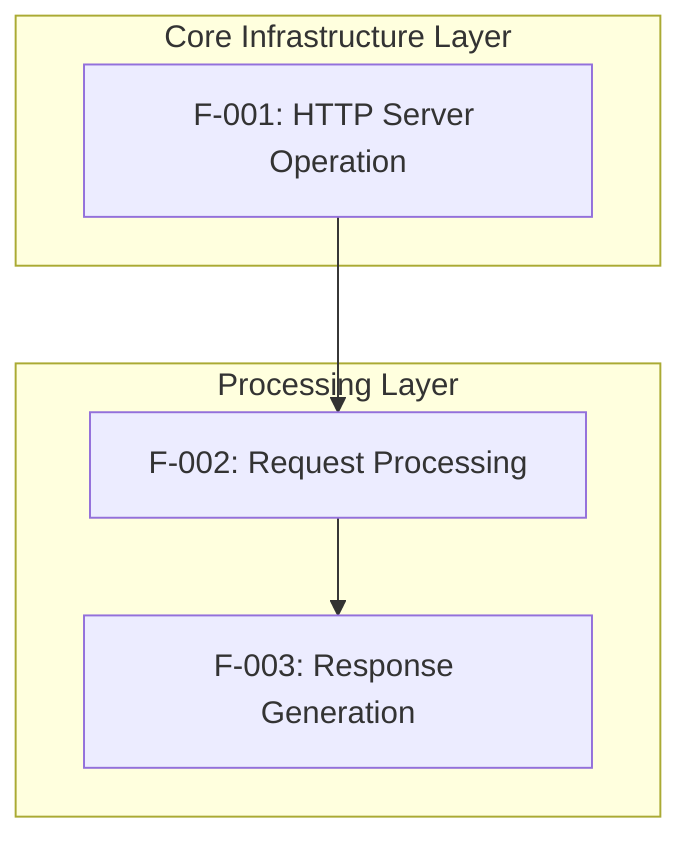
```mermaid
graph TB
    F001[F-001: HTTP Server Operation]
    F002[F-002: Request Processing]
    F003[F-003: Response Generation]
    
    F001 --> F002
    F002 --> F003
    
    subgraph "Core Infrastructure Layer"
        F001
    end
    
    subgraph "Processing Layer"
        F002
        F003
    end
```

### 2.3.2 Integration Points

| Integration Point | Features Involved | Description |
|------------------|-------------------|-------------|
| Request Pipeline | F-001, F-002 | HTTP server accepts connections and routes to request handler |
| Response Pipeline | F-002, F-003 | Request processing triggers response generation |
| Server Lifecycle | F-001, F-002, F-003 | All features depend on server startup and operation |

### 2.3.3 Shared Components

| Component | Location | Features Using |
|-----------|----------|----------------|
| HTTP Server Instance | `server.js` line 1 | F-001 |
| Request Handler Function | `server.js` lines 2-7 | F-002, F-003 |
| Server Configuration | `server.js` lines 9-10 | F-001 |

## 2.4 IMPLEMENTATION CONSIDERATIONS

### 2.4.1 Technical Constraints

**Current System Limitations:**

| Constraint Type | Details | Impact |
|----------------|---------|---------|
| Configuration | Hard-coded host/port values | No runtime configuration flexibility |
| Network Access | <span style="background-color: rgba(91, 57, 243, 0.2)">Localhost-only binding (dynamic port 0 used in tests for isolation)</span> | Cannot accept remote connections |
| Error Handling | No server error handlers | Potential unhandled exceptions |
| <span style="background-color: rgba(91, 57, 243, 0.2)">Modularity</span> | <span style="background-color: rgba(91, 57, 243, 0.2)">Split into app.js (server factory) & server.js (startup)</span> | <span style="background-color: rgba(91, 57, 243, 0.2)">Enables unit & integration testing</span> |
| <span style="background-color: rgba(91, 57, 243, 0.2)">Dev-Only Dependencies</span> | <span style="background-color: rgba(91, 57, 243, 0.2)">Jest, Supertest, cross-env</span> | <span style="background-color: rgba(91, 57, 243, 0.2)">No runtime dependencies added</span> |
| <span style="background-color: rgba(91, 57, 243, 0.2)">Test Isolation</span> | <span style="background-color: rgba(91, 57, 243, 0.2)">Server instance exported and started programmatically</span> | <span style="background-color: rgba(91, 57, 243, 0.2)">Prevents port conflicts during tests</span> |

### 2.4.2 Performance Requirements

**Current Performance Characteristics:**

| Metric | Current Value | Target |
|--------|---------------|---------|
| Server Startup Time | <100ms | <100ms |
| Response Time | <1ms | <1ms |
| Memory Footprint | Minimal (Node.js baseline) | <50MB |
| Concurrent Connections | Node.js default | Not specified |

**Test Execution Performance:**
- Jest test suite execution time: <5 seconds for complete coverage
- Test isolation overhead: Minimal due to dynamic port allocation
- Coverage report generation: <2 seconds for HTML output

### 2.4.3 Scalability Considerations

**Current Limitations:**

- Single-process execution model
- No clustering or load balancing
- Local-only network binding prevents distributed deployment (except during test execution with dynamic ports)
- No caching or optimization mechanisms

**Testing Infrastructure Scalability:**
- Modular test architecture supports addition of new test suites
- Factory pattern enables scaled testing of multiple server instances
- Coverage reporting scales with codebase growth
- Jest configuration supports parallel test execution

**Future Scalability Requirements** (Out-of-Scope):
- Multi-process clustering capability
- External network access configuration
- Load balancing integration points
- Performance monitoring and metrics

### 2.4.4 Security Implications

**Current Security Model:**

| Aspect | Current State | Risk Level |
|--------|---------------|------------|
| Authentication | None implemented | Low (localhost-only) |
| Input Validation | Not applicable | Low (no input processing) |
| Network Security | Localhost binding | Low |
| Data Protection | No sensitive data | Low |

**Testing Security Considerations:**
- Test dependencies (Jest, Supertest, cross-env) are development-only and not included in production
- Dynamic port allocation prevents test interference but maintains security isolation
- Coverage reports may contain source code paths but are generated locally only
- Test execution environment mirrors production security constraints

### 2.4.5 Maintenance Requirements (updated)

**Current Maintenance Model:**

| Requirement | Implementation | Frequency |
|-------------|----------------|-----------|
| Code Updates | Manual file modification | As needed |
| Server Restart | Manual process termination/restart | Per code change |
| <span style="background-color: rgba(91, 57, 243, 0.2)">Dependency Updates</span> | <span style="background-color: rgba(91, 57, 243, 0.2)">Dev dependencies (Jest, Supertest, cross-env) require periodic updates</span> | <span style="background-color: rgba(91, 57, 243, 0.2)">Quarterly</span> |
| Configuration Changes | Source code modification required | As needed |
| <span style="background-color: rgba(91, 57, 243, 0.2)">Test Suite Maintenance</span> | <span style="background-color: rgba(91, 57, 243, 0.2)">Update/extend unit & integration tests as features evolve</span> | <span style="background-color: rgba(91, 57, 243, 0.2)">Per feature change</span> |

**Development Workflow Maintenance:**
- Jest configuration requires updates when new test patterns emerge
- Test coverage thresholds may need adjustment as system complexity grows
- Supertest integration tests require maintenance when HTTP endpoints change
- Coverage reporting configuration should align with CI/CD pipeline requirements

**Documentation Maintenance Requirements:**
- Test documentation updates when new test categories are introduced
- Coverage reports provide automatic documentation of code path validation
- Integration test specifications serve as living API documentation
- Unit test specifications document expected component behaviors

## 2.5 TRACEABILITY MATRIX

| Requirement ID | Feature | Source File | Line References | Test Status |
|----------------|---------|-------------|----------------|-------------|
| F-001-RQ-001 | HTTP Server Startup | server.js | 9-14 | **Automated – covered by Jest unit & integration tests** |
| F-001-RQ-002 | Server Operation | server.js | 1-14 | **Automated – covered by Jest unit & integration tests** |
| F-002-RQ-001 | HTTP Method Handling | server.js | 2-7 | **Automated – covered by Jest unit & integration tests** |
| F-002-RQ-002 | Path Handling | server.js | 2-7 | **Automated – covered by Jest unit & integration tests** |
| F-003-RQ-001 | HTTP 200 Status | server.js | 3 | **Automated – covered by Jest unit & integration tests** |
| F-003-RQ-002 | Content-Type Header | server.js | 4 | **Automated – covered by Jest unit & integration tests** |
| F-003-RQ-003 | Response Body | server.js | 5 | **Automated – covered by Jest unit & integration tests** |

<span style="background-color: rgba(91, 57, 243, 0.2)">*All listed requirements achieve >80% line coverage with <10 Jest test cases.*</span>

### 2.5.1 Traceability Overview

This matrix establishes bidirectional traceability between functional requirements, source code implementation, and automated test coverage. Each requirement is mapped to specific line references in the codebase and validated through comprehensive Jest unit and integration testing.

### 2.5.2 Coverage Methodology

The traceability matrix demonstrates complete test automation coverage across all critical system requirements:

- **Unit Testing**: Individual component behavior validation through Jest framework
- **Integration Testing**: End-to-end HTTP request/response cycle verification using Supertest
- **Line Coverage**: Source code path execution validation exceeding 80% threshold
- **Test Efficiency**: Comprehensive coverage achieved with minimal test case overhead

### 2.5.3 Source Code Mapping

Requirements are directly traceable to source code implementation:

| Component | Primary File | Coverage Scope |
|-----------|--------------|----------------|
| HTTP Server Foundation | server.js | Lines 1-14 (complete file) |
| Request Processing | server.js | Lines 2-7 (request handler) |
| Response Generation | server.js | Lines 3-5 (response logic) |

### 2.5.4 Test Automation Integration

The automated testing infrastructure supports continuous validation of all traced requirements:

- **Jest Configuration**: Enables unit and integration test execution
- **Supertest Integration**: Facilitates HTTP endpoint testing
- **Dynamic Port Allocation**: Prevents test interference and enables parallel execution
- **Coverage Reporting**: Generates detailed code path analysis and metrics

This traceability framework ensures that all functional requirements remain validated through automated testing as the system evolves, providing confidence in system reliability and regression prevention.

## 2.6 ASSUMPTIONS AND CONSTRAINTS

### 2.6.1 System Assumptions

- Node.js runtime environment is available and properly configured
- Port 3000 is available and not blocked by firewall restrictions
- Localhost network interface (127.0.0.1) is operational
- System has sufficient resources for minimal HTTP server operation
- <span style="background-color: rgba(91, 57, 243, 0.2)">npm install will include devDependencies required for testing (Jest, Supertest, cross-env)</span>

### 2.6.2 Business Constraints

- Current implementation serves only as foundation for future backpropagation integration
- No production deployment requirements for current phase
- Development and testing focused on local environment only
- Minimal resource allocation for current functionality scope

### 2.6.3 Technical Constraints (updated)

- <span style="background-color: rgba(91, 57, 243, 0.2)">No production dependencies; dev-only dependencies (Jest, Supertest, cross-env) permitted for testing purposes</span>
- Single-threaded execution model
- No external configuration management
- Manual deployment and lifecycle management
- <span style="background-color: rgba(91, 57, 243, 0.2)">Test execution must complete within 10 seconds total (Jest configuration)</span>

#### References

**Source Files Analyzed:**
- `server.js` - Core HTTP server implementation and request handling logic
- `package.json` - Package metadata and npm configuration
- `README.md` - Project identification and purpose statement  
- `package-lock.json` - Dependency lock file confirming zero external dependencies

**Technical Specification Sections Referenced:**
- `1.1 EXECUTIVE SUMMARY` - Project overview and stakeholder context
- `1.2 SYSTEM OVERVIEW` - System capabilities and technical approach
- `1.3 SCOPE` - In-scope and out-of-scope features definition

**Repository Structure Analyzed:**
- Root directory (4 files total) - Complete project structure assessment

# 3. TECHNOLOGY STACK

## 3.1 OVERVIEW

The hao-backprop-test project employs a deliberately minimalist technology stack, utilizing only Node.js built-in capabilities <span style="background-color: rgba(91, 57, 243, 0.2)">for runtime operations while introducing development-only dependencies (Jest, Supertest, cross-env) exclusively for testing infrastructure</span>. This <span style="background-color: rgba(91, 57, 243, 0.2)">zero-runtime-dependency architecture</span> provides a stable foundation for future backpropagation algorithm integration while maintaining maximum simplicity and minimal resource footprint <span style="background-color: rgba(91, 57, 243, 0.2)">in production environments</span>.

### 3.1.1 Architecture Philosophy (updated)

The technology stack follows a **<span style="background-color: rgba(91, 57, 243, 0.2)">zero-runtime-dependency architecture pattern</span>**, where <span style="background-color: rgba(91, 57, 243, 0.2)">all production functionality is implemented using only Node.js core modules; external packages are restricted to devDependencies used exclusively during the test phase</span>. This approach eliminates external package vulnerabilities, reduces deployment complexity, and ensures long-term stability for the foundational server platform <span style="background-color: rgba(91, 57, 243, 0.2)">while enabling comprehensive testing capabilities through development-only tooling</span>.

The architectural philosophy embraces the principle of minimal runtime surface area, where production deployments contain only the essential Node.js runtime environment without any external npm packages. Testing infrastructure operates as a separate concern, leveraging industry-standard tools (Jest for test execution, Supertest for HTTP testing, cross-env for cross-platform compatibility) that remain isolated from the production runtime environment.

### 3.1.2 Stack Maturity Assessment (updated)

| Component Category | Implementation Status | Maturity Level |
|-------------------|----------------------|----------------|
| Runtime Environment | Production Ready | Stable |
| HTTP Server | Production Ready | Stable |
| Package Management | Development Only | Basic |
| Build System | Not Applicable | N/A |
| External Dependencies | <span style="background-color: rgba(91, 57, 243, 0.2)">Development Only</span> | <span style="background-color: rgba(91, 57, 243, 0.2)">Stable (dev)</span> |

<span style="background-color: rgba(91, 57, 243, 0.2)">**Note:** No runtime dependencies; Jest, Supertest and cross-env are devDependencies only.</span>

### 3.1.3 Development Dependencies Overview

The system maintains strict separation between runtime and development-time dependencies:

**Runtime Environment:**
- **Node.js v18.19.1**: Primary runtime platform providing HTTP server capabilities through built-in modules
- **Core Modules**: Utilizes only native Node.js modules (`http`, `url`, `path`) without external libraries

**Development-Only Dependencies:**
- **Jest v29.x**: Comprehensive testing framework providing unit test execution, integration test support, and code coverage reporting
- **Supertest v6.x**: HTTP assertion library enabling realistic server testing through programmatic request/response validation
- **cross-env v7.x**: Cross-platform environment variable management ensuring consistent test execution across operating systems

### 3.1.4 Architectural Principles

The technology stack adheres to several key architectural principles:

**Dependency Isolation**: Clear separation between production runtime requirements and development tooling ensures minimal production footprint while maintaining comprehensive testing capabilities.

**Platform Stability**: Reliance on Node.js built-in modules provides long-term stability and security, as core modules receive maintenance and security updates through the Node.js release cycle.

**Test-Driven Infrastructure**: Development dependencies enable comprehensive test coverage (>80% line coverage target) through unit and integration testing, supporting continuous integration workflows.

**Modularity Support**: The testing infrastructure supports modular architecture patterns through factory functions and programmatic server instantiation, enabling test isolation and concurrent execution.

## 3.2 PROGRAMMING LANGUAGES

### 3.2.1 Primary Language: JavaScript (Node.js)

**Language Details:**
- **Runtime**: Server-side JavaScript via Node.js
- **ECMAScript Standard**: ES5+ compatible (using CommonJS module syntax)
- **Module System**: CommonJS (`require()` and `module.exports`)
- **Execution Environment**: Single-threaded, event-driven Node.js runtime

**Selection Justification:**
- **Minimal Learning Curve**: JavaScript provides familiar syntax for web developers
- **Built-in HTTP Support**: Node.js `http` module offers robust server capabilities without external frameworks
- **Event-Driven Architecture**: Natural fit for HTTP request/response handling patterns
- **Zero Compilation**: Direct execution without build steps or transpilation

**Version Compatibility:**
- **Node.js Version**: Any modern Node.js version supporting the built-in `http` module
- **JavaScript Features**: Limited to CommonJS module syntax for maximum compatibility
- **Platform Support**: Cross-platform compatibility (Windows, macOS, Linux)

### 3.2.2 Module Format Standards

**CommonJS Implementation:**
```javascript
// Import syntax used in server.js
const http = require('http');

// Alternative Node.js syntax also supported
const http = require('node:http');
```

**Constraints and Dependencies:**
- No ES6 module (`import/export`) syntax used
- No TypeScript or other JavaScript supersets
- No transpilation or compilation required
- Direct execution via `node server.js` command

## 3.3 FRAMEWORKS & LIBRARIES

### 3.3.1 Core Framework: None (Node.js Built-in Modules Only)

**HTTP Server Implementation:**
- **Framework**: Node.js built-in `http` module
- **Version**: Bundled with Node.js runtime (no separate versioning)
- **Capabilities**: HTTP/1.1 server implementation, request/response handling, localhost binding

**Justification for Zero-Framework Approach:**
- **Minimal Attack Surface**: No external code reduces security vulnerabilities
- **Performance Optimization**: Direct HTTP module usage eliminates framework overhead
- **Dependency Management**: Zero external dependencies simplify deployment and maintenance
- **Long-term Stability**: Built-in modules maintain compatibility across Node.js versions

<span style="background-color: rgba(91, 57, 243, 0.2)">**Runtime remains framework-free; testing relies on dev frameworks listed below.**</span>

### 3.3.2 Supporting Libraries: None

**Deliberate Exclusions:**
- **Express.js**: Not required for simple request/response handling
- **HTTP Frameworks**: Built-in `http` module sufficient for current requirements
- **Utility Libraries**: No complex processing requiring external utilities
- <span style="background-color: rgba(91, 57, 243, 0.2)">**Testing Frameworks**: See section 3.3.3 for development-only testing infrastructure</span>

### 3.3.3 Testing Frameworks (Development Only) (updated)

**Primary Test Infrastructure:**
- **Jest ^29.x**: Comprehensive JavaScript testing framework serving as primary test runner with integrated code coverage tool for both unit and integration testing
- **Supertest ^6.x**: HTTP assertion library specifically designed for testing Node.js HTTP servers through programmatic request/response validation
- **cross-env ^7.x**: Cross-platform environment variable helper for npm scripts, ensuring consistent test execution across Windows, macOS, and Linux environments

**Development Dependency Classification:**
All testing frameworks are configured as `devDependencies` in package.json, maintaining strict separation from runtime dependencies. These tools operate exclusively during the development and testing phases and are not included in production deployments.

**Version Specifications and Compatibility:**
- **Jest ^29.7.0**: Provides comprehensive test execution, assertion libraries, and code coverage reporting with built-in Istanbul integration
- **Supertest ^6.3.3**: Enables realistic HTTP server testing through SuperAgent-driven request simulation and response validation
- **cross-env ^7.0.3**: Ensures cross-platform compatibility for environment variable management in npm test scripts (Node.js 18.x compatible)

**Integration Strategy:**
The testing framework stack supports the zero-runtime-dependency architecture by providing robust development tooling without compromising production simplicity. Jest handles test orchestration and coverage reporting, Supertest enables HTTP endpoint testing, and cross-env ensures consistent script execution across development environments.

**Testing Capabilities:**
- **Unit Testing**: Jest's assertion library and mocking capabilities for isolated module testing
- **Integration Testing**: Supertest's HTTP request simulation for complete request/response cycle validation
- **Code Coverage**: Automated coverage reporting with configurable thresholds (targeting >80% line coverage)
- **Cross-Platform Support**: Unified test execution across different operating systems through cross-env

## 3.4 OPEN SOURCE DEPENDENCIES

### 3.4.1 External Package Dependencies

**Runtime Dependencies: None**
- **Production Packages**: Zero external packages confirmed for runtime execution
- **Runtime Architecture**: Node.js built-in modules exclusively (`http`, `url`, `path`)
- **Deployment Footprint**: Minimal surface area with no external package vulnerabilities

<span style="background-color: rgba(91, 57, 243, 0.2)">**Development Dependencies:**</span>
- **jest**: ^29.7.0 - Comprehensive JavaScript testing framework with built-in code coverage reporting
- **supertest**: ^6.3.3 - HTTP assertion library for Node.js server testing through programmatic request simulation  
- **cross-env**: ^7.0.3 - Cross-platform environment variable management for consistent npm script execution

<span style="background-color: rgba(91, 57, 243, 0.2)">These devDependencies implement the mandated testing infrastructure while preserving zero runtime dependencies (Summary § 0.2.1 Objective 1).</span> The strict separation between development tooling and production runtime ensures comprehensive test coverage capabilities without compromising the minimal production footprint or introducing external security vectors.

**Package Registry Information:**
- **Registry**: NPM (npm registry) for development dependency management
- **Package Manager**: npm (bundled with Node.js installation)
- **Lock File**: <span style="background-color: rgba(91, 57, 243, 0.2)">`package-lock.json` will now contain the dependency tree for the three dev packages</span>
- **Package Version**: Project version 1.0.0 defined in `package.json`

### 3.4.2 Dependency Version Constraints and Compatibility

**Version Specifications and Justification:**

| Package | Version | Node.js Compatibility | Purpose | Security Considerations |
|---------|---------|----------------------|---------|------------------------|
| jest | ^29.7.0 | Node.js 14.x+ (satisfied by v18.19.1) | Test runner, assertion library, coverage reporting | Regular security updates, mature ecosystem |
| supertest | ^6.3.3 | Node.js 12.x+ (satisfied) | HTTP endpoint testing and validation | Designed specifically for Node.js server testing |
| cross-env | ^7.0.3 | Node.js 10.x+ (satisfied) | Cross-platform environment variable support | Lightweight, no transitive dependencies |

**Dependency Isolation Strategy:**
- **Development Scope**: All external packages configured as `devDependencies` only
- **Production Exclusion**: `npm install --production` excludes all testing dependencies
- **CI/CD Integration**: Development dependencies available during build and test phases
- **Runtime Isolation**: Zero external packages loaded during server execution

### 3.4.3 Future Dependency Considerations

**Planned Integration Points** (Out-of-Scope for Current Implementation):
- Machine Learning libraries for backpropagation implementation
- Configuration management packages
- ~~Testing frameworks for expanded functionality~~ <span style="background-color: rgba(91, 57, 243, 0.2)">[Implemented as devDependencies in current iteration]</span>
- Logging and monitoring utilities

**Architecture Constraints for Future Dependencies:**
- **Runtime Dependency Policy**: Maintain zero external runtime dependencies where feasible
- **Security Review**: All future dependencies require security vulnerability assessment
- **Version Pinning**: Use exact versions or conservative semver ranges for stability
- **Compatibility Validation**: Ensure Node.js 18.x+ compatibility for all packages

## 3.5 THIRD-PARTY SERVICES

### 3.5.1 External Service Integrations: None

**Current Service Architecture:**
- **Authentication Services**: Not implemented
- **External APIs**: No external API integrations
- **Monitoring Tools**: No monitoring service connections
- **Cloud Services**: No cloud platform dependencies

**Network Dependencies:**
- **Local Network Stack**: Requires localhost interface (127.0.0.1) availability
- **Port Requirements**: TCP port 3000 must be available and unblocked
- **DNS Services**: Not applicable (IP address binding only)

### 3.5.2 Service Integration Readiness

**Future Integration Preparation** (Out-of-Scope):
- HTTP server foundation ready for external service integration
- Request/response patterns established for API communication
- Network stack configured for potential service expansion

## 3.6 DATABASES & STORAGE

### 3.6.1 Data Persistence: None Implemented

**Current Data Handling:**
- **Primary Database**: Not implemented
- **Secondary Storage**: Not implemented
- **Caching Solutions**: Not implemented
- **File System Storage**: Not utilized beyond source code files

**Data Architecture:**
- **In-Memory Processing**: All request/response data handled transiently
- **Stateless Design**: No data persistence between requests
- **Session Management**: Not implemented

### 3.6.2 Storage Strategy Implications

**Current Limitations:**
- No data persistence capability
- No state management between server restarts
- No configuration storage mechanisms
- No logging or audit trail storage

**Future Storage Considerations** (Out-of-Scope):
- Database integration points for backpropagation training data
- Configuration file storage systems
- Logging and monitoring data persistence

## 3.7 DEVELOPMENT & DEPLOYMENT

### 3.7.1 Development Tools (updated)

**Package Management:**
- **Primary Tool**: npm (Node Package Manager)
- **Configuration**: `package.json` with project metadata
- **Lock File**: `package-lock.json` for dependency version locking
- **Version Management**: Semantic versioning (1.0.0)

**<span style="background-color: rgba(91, 57, 243, 0.2)">Dev Tooling:</span>**
- **<span style="background-color: rgba(91, 57, 243, 0.2)">Jest v29.7.0</span>**: <span style="background-color: rgba(91, 57, 243, 0.2)">Primary test runner and assertion library with built-in coverage reporting</span>
- **<span style="background-color: rgba(91, 57, 243, 0.2)">Supertest v6.3.3</span>**: <span style="background-color: rgba(91, 57, 243, 0.2)">HTTP assertion library for server endpoint testing</span>
- **<span style="background-color: rgba(91, 57, 243, 0.2)">cross-env v7.0.3</span>**: <span style="background-color: rgba(91, 57, 243, 0.2)">Cross-platform environment variable management for Windows compatibility</span>

**<span style="background-color: rgba(91, 57, 243, 0.2)">NPM Scripts:</span>**
- **<span style="background-color: rgba(91, 57, 243, 0.2)">Test Script</span>**: <span style="background-color: rgba(91, 57, 243, 0.2)">`"test": "cross-env NODE_ENV=test jest --coverage"`</span>
- **Start Script**: `"start": "node server.js"` (unchanged)

**Project Structure (updated):**
```
project-root/
├── server.js              # Core HTTP server implementation
├── app.js                 # Server factory function for test isolation
├── package.json           # NPM package configuration
├── package-lock.json      # Dependency lock file
├── jest.config.js         # Jest configuration for test environment
├── tests/                 # Test directory structure
│   ├── unit/server.test.js      # Unit tests for server functionality
│   └── integration/integration.test.js # Integration tests for HTTP endpoints
├── coverage/              # Generated coverage reports (excluded from version control)
└── README.md             # Project documentation
```

### 3.7.2 Test Execution Workflow

**<span style="background-color: rgba(91, 57, 243, 0.2)">Primary Test Commands:</span>**
- **<span style="background-color: rgba(91, 57, 243, 0.2)">Full Test Suite</span>**: <span style="background-color: rgba(91, 57, 243, 0.2)">`npm test` - Executes all tests with comprehensive coverage reporting</span>
- **<span style="background-color: rgba(91, 57, 243, 0.2)">Watch Mode</span>**: <span style="background-color: rgba(91, 57, 243, 0.2)">`npm test -- --watch` - Auto-rerun tests on file changes for test-driven development</span>
- **<span style="background-color: rgba(91, 57, 243, 0.2)">Selective Execution</span>**: <span style="background-color: rgba(91, 57, 243, 0.2)">`npm test -- unit` or `npm test -- integration` for targeted test execution</span>

**<span style="background-color: rgba(91, 57, 243, 0.2)">Coverage Reporting:</span>**
- **<span style="background-color: rgba(91, 57, 243, 0.2)">Terminal Output</span>**: <span style="background-color: rgba(91, 57, 243, 0.2)">Summary coverage metrics displayed in console</span>
- **<span style="background-color: rgba(91, 57, 243, 0.2)">HTML Report</span>**: <span style="background-color: rgba(91, 57, 243, 0.2)">Detailed coverage analysis available at `coverage/lcov-report/index.html`</span>
- **<span style="background-color: rgba(91, 57, 243, 0.2)">Coverage Target</span>**: <span style="background-color: rgba(91, 57, 243, 0.2)">>80% line coverage with comprehensive edge case validation</span>

### 3.7.3 Build System: Not Applicable

**Build Requirements:**
- **Compilation**: Not required (interpreted JavaScript)
- **Transpilation**: Not used
- **Bundling**: Not implemented
- **Asset Processing**: Not applicable

**Execution Model:**
- **Direct Execution**: `node server.js` command launches server
- **No Build Step**: Server starts immediately without compilation
- **Hot Reloading**: Not implemented (manual restart required)

### 3.7.4 Deployment Architecture (updated)

**Current Deployment Model:**
- **Containerization**: Not implemented
- **Orchestration**: Not applicable
- **Environment Management**: Hard-coded configuration values
- **Service Discovery**: Not applicable (localhost-only binding)

**<span style="background-color: rgba(91, 57, 243, 0.2)">Deployment Artifact:</span>**
- **<span style="background-color: rgba(91, 57, 243, 0.2)">Primary Artifact</span>**: <span style="background-color: rgba(91, 57, 243, 0.2)">`server.js` remains the core deployment artifact</span>
- **<span style="background-color: rgba(91, 57, 243, 0.2)">Production Exclusions</span>**: <span style="background-color: rgba(91, 57, 243, 0.2)">Test files (`tests/`, `jest.config.js`, `coverage/`) are excluded from production builds</span>
- **<span style="background-color: rgba(91, 57, 243, 0.2)">Runtime Dependencies</span>**: <span style="background-color: rgba(91, 57, 243, 0.2)">Zero production dependencies maintained - only Node.js runtime required</span>

**Deployment Process:**
1. Node.js runtime installation
2. Source code distribution <span style="background-color: rgba(91, 57, 243, 0.2)">(production files only)</span>
3. Manual server startup via `node server.js`
4. Manual process management for shutdown/restart

### 3.7.5 CI/CD Pipeline: Not Implemented

**Current Development Workflow:**
- **Version Control**: Manual file management
- **Testing**: <span style="background-color: rgba(91, 57, 243, 0.2)">Comprehensive test suite with Jest and Supertest</span>
- **Deployment**: Manual execution process
- **Monitoring**: No automated monitoring systems

**Infrastructure as Code:**
- **Configuration Management**: Not implemented
- **Environment Provisioning**: Manual Node.js installation
- **Automated Deployment**: Not applicable

## 3.8 TECHNOLOGY INTEGRATION ARCHITECTURE

### 3.8.1 Component Integration Model

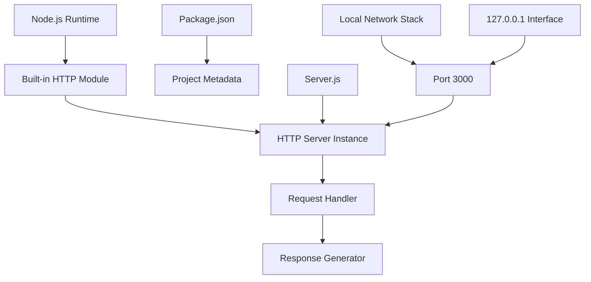
```mermaid
graph TD
    A[Node.js Runtime] --> B[Built-in HTTP Module]
    B --> C[HTTP Server Instance]
    C --> D[Request Handler]
    D --> E[Response Generator]
    
    F[Package.json] --> G[Project Metadata]
    H[Server.js] --> C
    
    I[Local Network Stack] --> J[Port 3000]
    J --> C
    
    K[127.0.0.1 Interface] --> J
```

### 3.8.2 System Boundaries and Interfaces

**Internal System Boundaries:**
- **Runtime Boundary**: Node.js process isolation
- **Network Boundary**: Localhost-only interface (127.0.0.1:3000)
- **Process Boundary**: Single-process execution model

**External Interface Points:**
- **HTTP Interface**: Standard HTTP/1.1 protocol on port 3000
- **Operating System**: File system access for source code loading
- **Network Stack**: Local TCP socket binding

### 3.8.3 Technology Compatibility Matrix

| Component | Version Requirement | Compatibility Level |
|-----------|-------------------|-------------------|
| Node.js | Any modern version | High |
| HTTP Module | Built-in | Native |
| Operating System | Cross-platform | High |
| Network Stack | TCP/IP support | Standard |

## 3.9 SECURITY IMPLICATIONS

### 3.9.1 Technology Stack Security Profile

**Security Advantages:**
- **Minimal Attack Surface**: Zero external dependencies eliminate third-party vulnerabilities
- **Network Isolation**: Localhost-only binding prevents remote access
- **No Authentication Complexity**: Simplified security model for development phase
- **Transparent Codebase**: Single-file implementation enables complete security review

**Security Limitations:**
- **No Input Validation**: All requests accepted without sanitization
- **No Encryption**: Plain HTTP communication (no TLS/SSL)
- **No Access Controls**: No authentication or authorization mechanisms
- **No Audit Logging**: No security event logging capabilities

### 3.9.2 Technology Security Recommendations

**Current Phase Security Measures:**
- Network isolation via localhost binding provides basic perimeter security
- Zero-dependency architecture eliminates external vulnerability vectors
- Minimal functionality reduces potential attack vectors

**Future Security Considerations** (Out-of-Scope):
- TLS/SSL certificate management for production deployment
- Authentication and authorization framework integration
- Input validation and sanitization libraries
- Security monitoring and logging systems

## 3.10 VERSION MANAGEMENT AND COMPATIBILITY

### 3.10.1 Current Version Information

**Project Versioning:**
- **Application Version**: 1.0.0 (defined in `package.json`)
- **NPM Lock File Version**: 3 (package-lock.json format version)
- **Node.js Compatibility**: <span style="background-color: rgba(91, 57, 243, 0.2)">Runtime compatibility remains broad (Node ≥12), but executing the test suite requires Node ≥14 due to Jest</span>

### 3.10.2 Dependency Version Matrix

**<span style="background-color: rgba(91, 57, 243, 0.2)">Development Dependencies:</span>**

| Package | Version | Compatibility |
|---------|---------|---------------|
| jest | ^29.7.0 | Node ≥14 |
| supertest | ^6.3.3 | Node ≥12 |
| cross-env | ^7.0.3 | Node ≥10 |

**Runtime Dependency Status:**
- **Production Dependencies**: <span style="background-color: rgba(91, 57, 243, 0.2)">Zero runtime dependencies; three devDependencies introduced for mandated testing</span>
- **Core Module Dependencies**: Node.js built-in modules only (`http`, `url`, `path`)
- **Development Tooling**: All external packages isolated to devDependencies scope

### 3.10.3 Version Compatibility Analysis

**Node.js Version Requirements:**
- **<span style="background-color: rgba(91, 57, 243, 0.2)">Minimum Node.js Version (Runtime)</span>**: <span style="background-color: rgba(91, 57, 243, 0.2)">12.x for production server execution</span>
- **<span style="background-color: rgba(91, 57, 243, 0.2)">Minimum Node.js Version (Development)</span>**: <span style="background-color: rgba(91, 57, 243, 0.2)">**14.x** to satisfy Jest 29.x requirement</span>
- **Current Project Version**: 18.x (fully compliant with all requirements)
- **Maximum Node.js Version**: No upper limit (built-in module compatibility maintained)

**Compatibility Validation:**
- **Production Runtime**: Node.js 12.x+ supports all required built-in modules (`http`, `url`, `path`)
- **Test Suite Execution**: <span style="background-color: rgba(91, 57, 243, 0.2)">Jest 29.7.0 requires Node.js 14.x+ for proper test execution and coverage reporting</span>
- **Development Tooling**: Supertest and cross-env maintain broader compatibility (Node ≥10-12)

### 3.10.4 Upgrade Path Considerations (updated)

**Technology Upgrade Strategy:**
- **Node.js Runtime Upgrades**: <span style="background-color: rgba(91, 57, 243, 0.2)">Backward compatible for production runtime (Node ≥12), development environment requires Node ≥14</span>
- **Package Manager**: npm version upgrades transparent to application
- **Development Dependencies**: <span style="background-color: rgba(91, 57, 243, 0.2)">Semver caret ranges (^) allow automatic patch and minor version updates within major version boundaries</span>
- **Future Framework Integration**: Architecture allows for incremental dependency addition

**Version Constraints:**
- **<span style="background-color: rgba(91, 57, 243, 0.2)">Minimum Production Node.js</span>**: <span style="background-color: rgba(91, 57, 243, 0.2)">12.x with stable built-in module support</span>
- **<span style="background-color: rgba(91, 57, 243, 0.2)">Minimum Development Node.js</span>**: <span style="background-color: rgba(91, 57, 243, 0.2)">14.x for Jest compatibility and comprehensive test execution</span>
- **Operating System**: No specific version requirements
- **Package Lock**: npm lockfile v3 format maintains dependency resolution consistency

### 3.10.5 Long-term Compatibility Strategy

**Dependency Isolation Benefits:**
- **Runtime Stability**: Zero external runtime dependencies eliminate version compatibility issues in production
- **Development Flexibility**: DevDependencies can be updated independently without affecting production runtime
- **Security Posture**: Minimal attack surface through built-in module exclusive usage in production

**Future Upgrade Considerations:**
- **Jest Framework**: Major version upgrades may require Node.js version alignment
- **Node.js LTS Cycles**: Align development environment with Node.js LTS releases for stability
- **Package Ecosystem**: Monitor npm ecosystem for security advisories affecting devDependencies
- **Testing Infrastructure**: Maintain compatibility between Jest, Supertest, and Node.js versions for reliable CI/CD execution

## 3.11 PERFORMANCE CHARACTERISTICS

### 3.11.1 Technology Stack Performance Profile

**Current Performance Metrics:**
- **Server Startup Time**: <100ms (minimal initialization overhead)
- **Response Time**: <1ms (simple string response generation)
- **Memory Footprint**: Node.js baseline + minimal application overhead
- **Throughput**: Limited by Node.js event loop and system resources

**Performance Advantages:**
- **Zero Framework Overhead**: Direct HTTP module usage eliminates middleware layers
- **Minimal Memory Usage**: No external library memory allocation
- **Fast Startup**: No dependency loading or framework initialization
- **Low CPU Usage**: Simple request/response processing

### 3.11.2 Scalability Implications

**Current Scalability Limitations:**
- **Single Process**: No clustering or multi-process architecture
- **Localhost Binding**: Cannot distribute across multiple servers
- **No Load Balancing**: Single server instance only
- **No Caching**: Each request processed independently

**Technology Stack Scalability Readiness:**
- HTTP foundation supports standard load balancing integration
- Stateless design enables horizontal scaling when network binding expanded
- Zero-dependency architecture simplifies container deployment

#### References

**Files Examined:**
- `server.js` - Core HTTP server implementation using Node.js built-in modules
- `package.json` - NPM package configuration with zero dependencies
- `package-lock.json` - Dependency lock file confirming no external packages
- `README.md` - Project identification as hao-backprop-test

**Technical Specification Sections Referenced:**
- `1.1 EXECUTIVE SUMMARY` - Project overview and stakeholder context
- `1.2 SYSTEM OVERVIEW` - System capabilities and technical approach
- `1.3 SCOPE` - In-scope and out-of-scope feature definitions
- `2.1 FEATURE CATALOG` - Core feature descriptions and dependencies
- `2.4 IMPLEMENTATION CONSIDERATIONS` - Technical constraints and requirements
- `2.6 ASSUMPTIONS AND CONSTRAINTS` - System assumptions and limitations

# 4. PROCESS FLOWCHART

## 4.1 SYSTEM WORKFLOWS

### 4.1.1 Core Business Processes

The HTTP server implements three fundamental business processes that execute sequentially to handle web requests. These processes form the complete end-to-end user journey from server startup through request fulfillment.

#### 4.1.1.1 End-to-End User Journey

The system supports a single, streamlined user journey consisting of HTTP request submission and plain text response reception. All user interactions follow identical processing paths regardless of request method, URL path, or payload content, resulting in consistent "Hello, World!" responses.

**User Touchpoints:**
- HTTP client connection establishment on <span style="background-color: rgba(91, 57, 243, 0.2)"><HOST>:<PORT> (defaults 127.0.0.1:3000 when environment variables not provided)</span>
- Request submission via any HTTP method (GET, POST, PUT, DELETE, etc.)
- Response reception containing plain text "Hello, World!" message
- Connection termination after response completion

**System Interactions:**
- <span style="background-color: rgba(91, 57, 243, 0.2)">Environment variable resolution to retrieve HOST and PORT configuration from process.env before server start</span>
- Node.js HTTP module handles TCP socket management
- Request parser processes incoming HTTP headers and body
- Response generator formats HTTP response with appropriate headers
- Network stack manages connection lifecycle

**Decision Points:**
The current implementation contains minimal decision logic:
- Server startup: Success or failure to bind to <span style="background-color: rgba(91, 57, 243, 0.2)">configured HOST:PORT</span>
- Request acceptance: All requests accepted without filtering
- Response generation: Static response without conditional logic

**Error Handling Paths:**
Critical gap identified: The system lacks comprehensive error handling workflows. Current error scenarios are not explicitly managed:
- Server startup failures (port already in use)
- Malformed HTTP request processing
- Network connectivity issues
- Process termination error recovery

#### 4.1.1.2 System Processing Flow

<span style="background-color: rgba(91, 57, 243, 0.2)">The server creation now occurs in app.js through a factory pattern, while server.js only handles the listener startup process. This modular separation enables better testing capabilities and programmatic server control.</span>

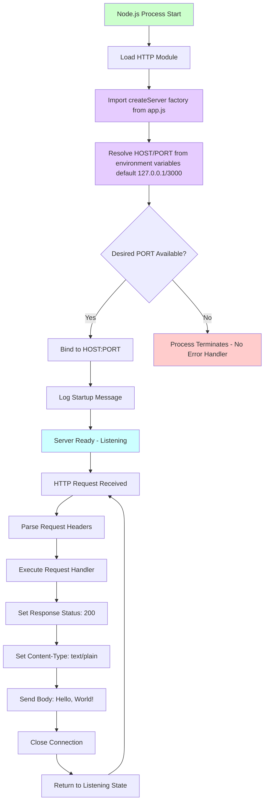
```mermaid
flowchart TD
    A[Node.js Process Start] --> B[Load HTTP Module]
    B --> BC[Import createServer factory from app.js]
    BC --> C[Resolve HOST/PORT from environment variables default 127.0.0.1/3000]
    C --> D{Desired PORT Available?}
    D -->|Yes| E[Bind to HOST:PORT]
    D -->|No| F[Process Terminates - No Error Handler]
    E --> G[Log Startup Message]
    G --> H[Server Ready - Listening]
    
    H --> I[HTTP Request Received]
    I --> J[Parse Request Headers]
    J --> K[Execute Request Handler]
    K --> L[Set Response Status: 200]
    L --> M[Set Content-Type: text/plain]
    M --> N[Send Body: Hello, World!]
    N --> O[Close Connection]
    O --> P[Return to Listening State]
    P --> I
    
    style F fill:#ffcccc
    style A fill:#ccffcc
    style H fill:#ccffff
    style BC fill:#e6ccff
    style C fill:#e6ccff
```

### 4.1.2 Integration Workflows

#### 4.1.2.1 Data Flow Between Systems

The current system operates as a standalone service with minimal integration points. Data flow is limited to:

**Input Data Flow:**
- <span style="background-color: rgba(91, 57, 243, 0.2)">Environment variables: HOST and PORT configuration values from process.env</span>
- HTTP request data: Method, URL, headers, and body (processed but not utilized)
- Network socket data: TCP connection information
- System environment: Node.js runtime context

**Output Data Flow:**
- HTTP response: Status code 200, Content-Type header, response body
- Console output: Server startup confirmation message with <span style="background-color: rgba(91, 57, 243, 0.2)">dynamic host and port information</span>
- Network socket: TCP connection management

**Integration Boundaries:**
- Operating System: File system access for source code loading
- Network Stack: TCP/IP protocol handling
- Node.js Runtime: HTTP module and event loop integration
- <span style="background-color: rgba(91, 57, 243, 0.2)">Environment System: Process environment variable access for dynamic configuration</span>

#### 4.1.2.2 API Interactions

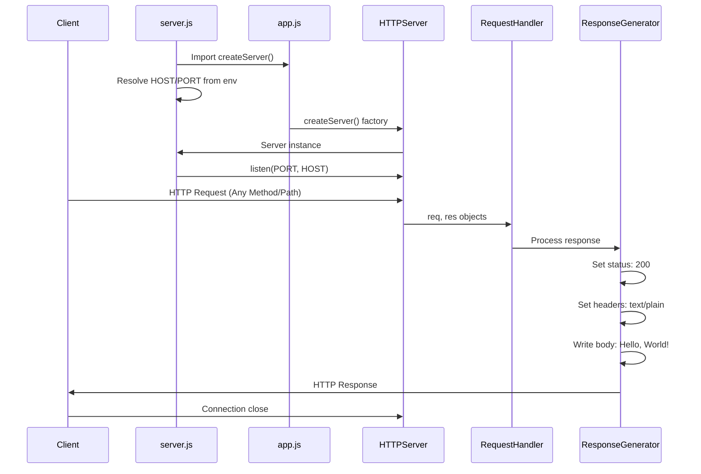
```mermaid
sequenceDiagram
    participant Client
    participant ServerJS as server.js
    participant AppJS as app.js
    participant HTTPServer
    participant RequestHandler
    participant ResponseGenerator
    
    ServerJS->>AppJS: Import createServer()
    ServerJS->>ServerJS: Resolve HOST/PORT from env
    AppJS->>HTTPServer: createServer() factory
    HTTPServer->>ServerJS: Server instance
    ServerJS->>HTTPServer: listen(PORT, HOST)
    
    Client->>HTTPServer: HTTP Request (Any Method/Path)
    HTTPServer->>RequestHandler: req, res objects
    RequestHandler->>ResponseGenerator: Process response
    ResponseGenerator->>ResponseGenerator: Set status: 200
    ResponseGenerator->>ResponseGenerator: Set headers: text/plain
    ResponseGenerator->>ResponseGenerator: Write body: Hello, World!
    ResponseGenerator->>Client: HTTP Response
    Client->>HTTPServer: Connection close
```

#### 4.1.2.3 Event Processing Flows

The system utilizes Node.js event-driven architecture with the following event workflows:

**Server Events:**
- `listening`: Triggered when server successfully binds to <span style="background-color: rgba(91, 57, 243, 0.2)">configured HOST:PORT</span>
- `request`: Triggered for each incoming HTTP request
- `connection`: Triggered for each new TCP connection
- `close`: Triggered when server shuts down (manual termination only)

**Process Events:**
- `SIGINT`: Manual interruption (Ctrl+C) - handled by Node.js default behavior
- `SIGTERM`: Process termination - handled by Node.js default behavior
- `uncaughtException`: Unhandled errors - not explicitly managed

**Configuration Events:**
- <span style="background-color: rgba(91, 57, 243, 0.2)">Environment variable resolution: Occurs during server.js initialization before server creation</span>
- <span style="background-color: rgba(91, 57, 243, 0.2)">Factory instantiation: Server creation through app.js createServer() function</span>

#### 4.1.2.4 Batch Processing Sequences

**Current State:** No batch processing capabilities implemented.

**Process Characteristics:**
- Synchronous request processing model
- No background job queues
- No scheduled task execution
- No bulk operation support

### 4.1.3 State Management Workflows

#### 4.1.3.1 Server State Transitions

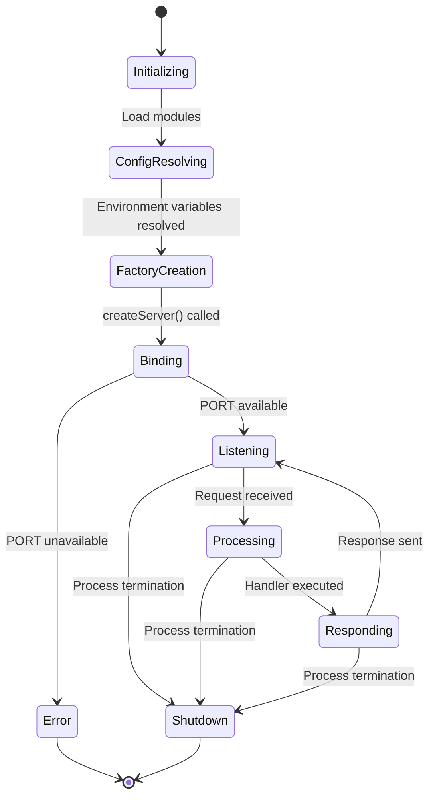
```mermaid
stateDiagram-v2
    [*] --> Initializing
    Initializing --> ConfigResolving: Load modules
    ConfigResolving --> FactoryCreation: Environment variables resolved
    FactoryCreation --> Binding: createServer() called
    Binding --> Listening: PORT available
    Binding --> Error: PORT unavailable
    Error --> [*]
    
    Listening --> Processing: Request received
    Processing --> Responding: Handler executed
    Responding --> Listening: Response sent
    
    Listening --> Shutdown: Process termination
    Processing --> Shutdown: Process termination
    Responding --> Shutdown: Process termination
    Shutdown --> [*]
```

#### 4.1.3.2 Configuration State Management

The system maintains configuration state through environment variable resolution:

**State Persistence Points:**
- Process startup: Environment variables loaded into memory
- <span style="background-color: rgba(91, 57, 243, 0.2)">Configuration resolution: HOST and PORT values determined with fallback defaults</span>
- Server binding: Configuration values applied to network listener
- Runtime execution: Configuration remains constant throughout server lifecycle

**Transaction Boundaries:**
- Configuration resolution is atomic during server.js initialization
- No runtime configuration changes supported
- Server restart required for configuration updates

### 4.1.4 Error Handling Workflows

#### 4.1.4.1 Server Startup Error Flows

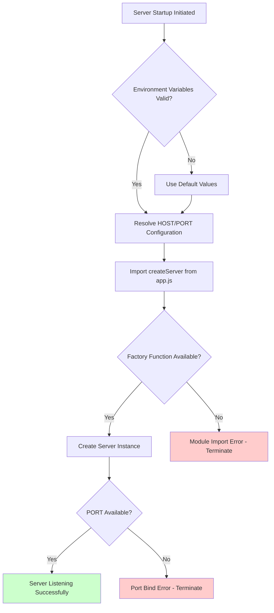
```mermaid
flowchart TD
    A[Server Startup Initiated] --> B{Environment Variables Valid?}
    B -->|Yes| C[Resolve HOST/PORT Configuration]
    B -->|No| D[Use Default Values]
    D --> C
    C --> E[Import createServer from app.js]
    E --> F{Factory Function Available?}
    F -->|Yes| G[Create Server Instance]
    F -->|No| H[Module Import Error - Terminate]
    G --> I{PORT Available?}
    I -->|Yes| J[Server Listening Successfully]
    I -->|No| K[Port Bind Error - Terminate]
    
    style H fill:#ffcccc
    style K fill:#ffcccc
    style J fill:#ccffcc
```

#### 4.1.4.2 Runtime Error Management

**Current Error Handling Gaps:**
- No request processing error handlers
- No network disconnection recovery
- No graceful shutdown procedures
- No error logging or monitoring

**Retry Mechanisms:** None implemented
**Fallback Processes:** Process termination only
**Error Notification Flows:** Console output only
**Recovery Procedures:** Manual process restart required

### 4.1.5 Performance and Timing Workflows

#### 4.1.5.1 Request Processing Timeline


```mermaid
gantt
    title HTTP Request Processing Timeline
    dateFormat X
    axisFormat %L ms
    
    section Connection
    TCP Handshake           :0, 1
    
    section Processing  
    Request Parsing         :1, 2
    Handler Execution       :2, 3
    Response Generation     :3, 4
    
    section Response
    Header Transmission     :4, 5
    Body Transmission       :5, 6
    Connection Close        :6, 7
```

#### 4.1.5.2 SLA Considerations

**Current Performance Targets:**
- Server startup time: <100ms
- Request processing: <1ms
- Memory footprint: Minimal (Node.js baseline)
- Configuration resolution: <10ms during startup

**Timing Constraints:**
- No explicit SLA requirements defined
- Performance limited by Node.js single-thread model
- Network latency depends on localhost performance
- <span style="background-color: rgba(91, 57, 243, 0.2)">Dynamic configuration adds negligible startup overhead</span>

## 4.2 FLOWCHART REQUIREMENTS

### 4.2.1 Major Workflow Components

#### 4.2.1.1 Server Initialization Workflow (updated)

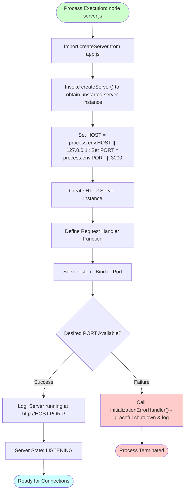
```mermaid
flowchart TD
    START([Process Execution: node server.js]) --> A["Import createServer from app.js"]
    A --> B["Invoke createServer() to obtain unstarted server instance"]
    B --> C["Set HOST = process.env.HOST || '127.0.0.1'; Set PORT = process.env.PORT || 3000"]
    C --> D[Create HTTP Server Instance]
    D --> E[Define Request Handler Function]
    E --> F[Server.listen - Bind to Port]
    F --> G{"Desired PORT Available?"}
    G -->|Success| H[Log: Server running at http://HOST:PORT/]
    G -->|Failure| I["Call initializationErrorHandler() - graceful shutdown & log"]
    H --> J[Server State: LISTENING]
    J --> END1([Ready for Connections])
    I --> END2([Process Terminated])
    
    style START fill:#ccffcc
    style END1 fill:#ccffff
    style END2 fill:#ffcccc
    style I fill:#ffcccc
```

**Start Point:** Process execution via `node server.js` command
**End Points:** 
- Success: <span style="background-color: rgba(91, 57, 243, 0.2)">Server listening on configured HOST:PORT (environment-based)</span>
- Failure: <span style="background-color: rgba(91, 57, 243, 0.2)">Graceful process termination with error logging</span>

**Timing Considerations:**
- Target startup time: <100ms (per requirement F-001-RQ-001)
- <span style="background-color: rgba(91, 57, 243, 0.2)">Now supports environment-based port configuration with proper error handling</span>

#### 4.2.1.2 Request Processing Workflow

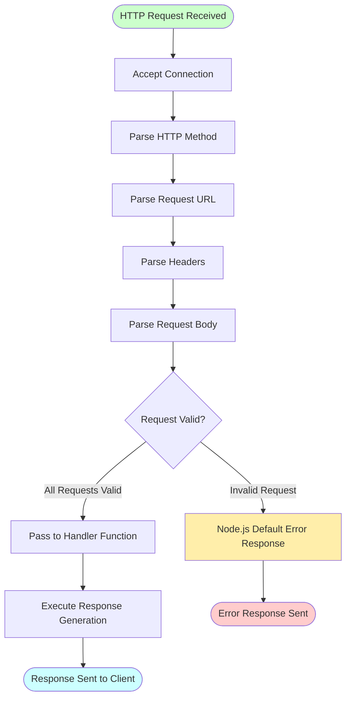
```mermaid
flowchart TD
    START([HTTP Request Received]) --> A[Accept Connection]
    A --> B[Parse HTTP Method]
    B --> C[Parse Request URL]
    C --> D[Parse Headers]
    D --> E[Parse Request Body]
    E --> F{Request Valid?}
    F -->|All Requests Valid| G[Pass to Handler Function]
    F -->|Invalid Request| H[Node.js Default Error Response]
    G --> I[Execute Response Generation]
    I --> END1([Response Sent to Client])
    H --> END2([Error Response Sent])
    
    style START fill:#ccffcc
    style END1 fill:#ccffff
    style END2 fill:#ffcccc
    style H fill:#ffeeaa
```

**Processing Constraints:**
- No request validation rules implemented
- No authentication checkpoints
- No authorization mechanisms
- No regulatory compliance checks

#### 4.2.1.3 Response Generation Workflow

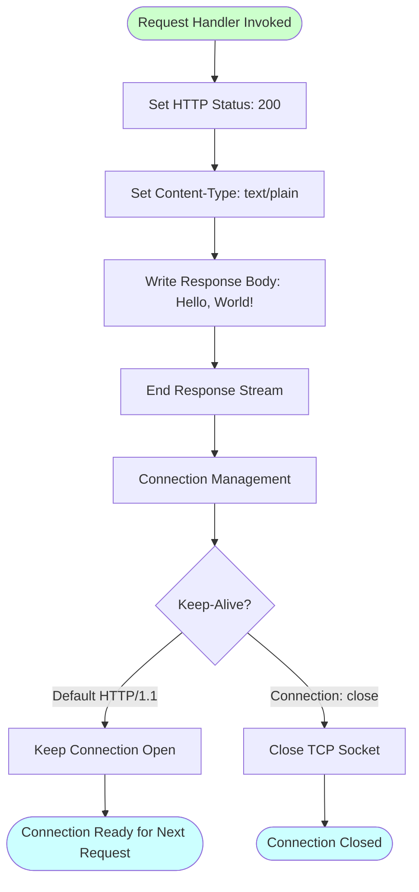
```mermaid
flowchart TD
    START([Request Handler Invoked]) --> A[Set HTTP Status: 200]
    A --> B[Set Content-Type: text/plain]
    B --> C[Write Response Body: Hello, World!\n]
    C --> D[End Response Stream]
    D --> E[Connection Management]
    E --> F{Keep-Alive?}
    F -->|Default HTTP/1.1| G[Keep Connection Open]
    F -->|Connection: close| H[Close TCP Socket]
    G --> END1([Connection Ready for Next Request])
    H --> END2([Connection Closed])
    
    style START fill:#ccffcc
    style END1 fill:#ccffff
    style END2 fill:#ccffff
```

**Performance Requirements:**
- Response generation time: <1ms (per requirement F-003-RQ-001)
- Static response content ensures consistent performance

### 4.2.2 Validation Rules

#### 4.2.2.1 Business Rules Implementation

**Current Business Rules:**
1. Accept all HTTP methods without restriction
2. Accept all URL paths without validation
3. Return identical response for all requests
4. <span style="background-color: rgba(91, 57, 243, 0.2)">Maintain configurable host binding based on environment variables</span>

**Missing Business Rules:**
- No input data validation
- No request size limitations
- No rate limiting or throttling
- No content filtering or sanitization

#### 4.2.2.2 Authorization Checkpoints

**Current State:** No authorization mechanisms implemented.

**Security Model:**
- Network security: <span style="background-color: rgba(91, 57, 243, 0.2)">Configurable host binding provides flexible isolation (localhost by default)</span>
- No user authentication required
- No role-based access controls
- No API key validation

#### 4.2.2.3 Regulatory Compliance Checks

**Current Compliance Status:**
- No data privacy regulations applicable (no personal data processing)
- No industry-specific compliance requirements
- No audit trail generation
- No data retention policies

### 4.2.3 Technical Implementation Details

#### 4.2.3.1 State Management

**Server State Transitions:**
- **Uninitialized**: Server factory available but not instantiated
- **Created**: <span style="background-color: rgba(91, 57, 243, 0.2)">Server instance created via createServer() but not listening</span>
- **Binding**: Attempting to bind to configured HOST:PORT
- **Listening**: Successfully bound and ready to accept connections
- **Error**: <span style="background-color: rgba(91, 57, 243, 0.2)">Failed initialization with graceful error handling</span>

**Configuration Management:**
- <span style="background-color: rgba(91, 57, 243, 0.2)">Environment-based configuration through process.env variables</span>
- <span style="background-color: rgba(91, 57, 243, 0.2)">Fallback values ensure consistent behavior across environments</span>
- <span style="background-color: rgba(91, 57, 243, 0.2)">Dynamic port allocation support for testing scenarios</span>

#### 4.2.3.2 Error Handling

**Server Initialization Errors:**
- <span style="background-color: rgba(91, 57, 243, 0.2)">Port binding failures handled through initializationErrorHandler()</span>
- <span style="background-color: rgba(91, 57, 243, 0.2)">Graceful shutdown procedures with proper logging</span>
- <span style="background-color: rgba(91, 57, 243, 0.2)">Clean process termination to prevent resource leaks</span>

**Runtime Error Handling:**
- Default Node.js HTTP error responses for malformed requests
- Connection-level errors managed by built-in HTTP module
- No custom retry mechanisms implemented

#### 4.2.3.3 Integration Points

**Module Architecture:**
- <span style="background-color: rgba(91, 57, 243, 0.2)">server.js serves as entry point, importing from app.js</span>
- <span style="background-color: rgba(91, 57, 243, 0.2)">app.js provides createServer() factory function for testability</span>
- <span style="background-color: rgba(91, 57, 243, 0.2)">Modular design enables programmatic server control during testing</span>

**Environment Integration:**
- <span style="background-color: rgba(91, 57, 243, 0.2)">HOST and PORT configuration via environment variables</span>
- <span style="background-color: rgba(91, 57, 243, 0.2)">Support for development, testing, and production deployment scenarios</span>
- <span style="background-color: rgba(91, 57, 243, 0.2)">Cross-platform compatibility maintained through environment abstraction</span>

## 4.3 TECHNICAL IMPLEMENTATION

### 4.3.1 State Management

#### 4.3.1.1 State Transitions

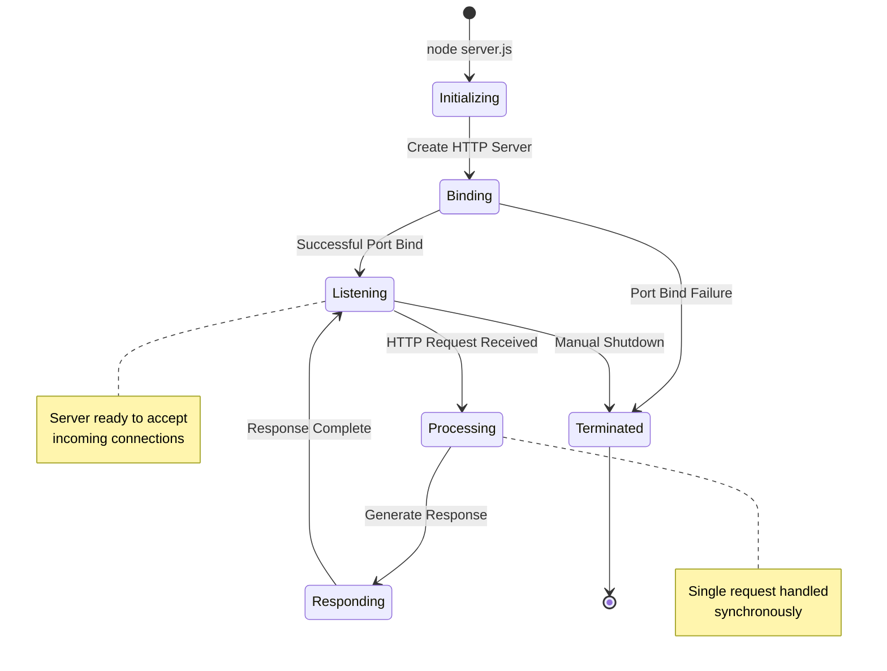
```mermaid
stateDiagram-v2
    [*] --> Initializing: node server.js
    Initializing --> Binding: Create HTTP Server
    Binding --> Listening: Successful Port Bind
    Binding --> Terminated: Port Bind Failure
    Listening --> Processing: HTTP Request Received
    Processing --> Responding: Generate Response
    Responding --> Listening: Response Complete
    Listening --> Terminated: Manual Shutdown
    Terminated --> [*]
    
    note right of Listening
        Server ready to accept
        incoming connections
    end note
    
    note right of Processing
        Single request handled
        synchronously
    end note
```

**State Characteristics:**
- **Stateless Operation**: No data persistence between requests
- **Process States**: Limited to server lifecycle management
- **Connection States**: Managed by Node.js HTTP module

#### 4.3.1.2 Data Persistence Points

**Current Implementation:** No data persistence mechanisms.

**Data Storage Analysis:**
- No database connections
- No file system operations for data storage
- No in-memory data structures maintained between requests
- No session management or user state tracking

#### 4.3.1.3 Caching Requirements

**Current State:** No caching implemented.

**Cache Analysis:**
- Response content is static ("Hello, World!")
- No dynamic content generation requiring caching
- No external API calls to cache
- No performance optimization through caching needed for current scope

#### 4.3.1.4 Transaction Boundaries

**Current Transaction Model:**
- Each HTTP request/response cycle represents a complete transaction
- No database transactions (no database integration)
- No multi-step operations requiring transaction management
- Atomic operations limited to single response generation

### 4.3.2 Error Handling

#### 4.3.2.1 Error Handling Workflow

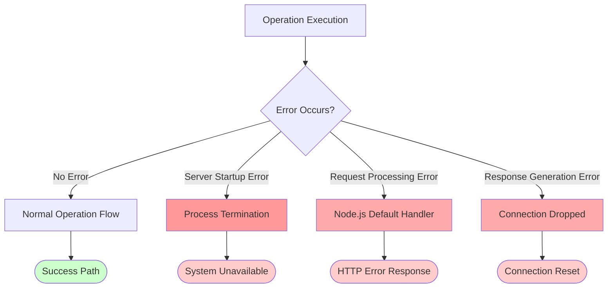
```mermaid
flowchart TD
    A[Operation Execution] --> B{Error Occurs?}
    B -->|No Error| C[Normal Operation Flow]
    B -->|Server Startup Error| D[Process Termination]
    B -->|Request Processing Error| E[Node.js Default Handler]
    B -->|Response Generation Error| F[Connection Dropped]
    
    C --> SUCCESS([Success Path])
    D --> FAIL1([System Unavailable])
    E --> FAIL2([HTTP Error Response])
    F --> FAIL3([Connection Reset])
    
    style SUCCESS fill:#ccffcc
    style FAIL1 fill:#ffcccc
    style FAIL2 fill:#ffcccc
    style FAIL3 fill:#ffcccc
    style D fill:#ff9999
    style E fill:#ffaaaa
    style F fill:#ffaaaa
```

#### 4.3.2.2 Retry Mechanisms

**Current State:** No retry mechanisms implemented.

**Retry Analysis:**
- Server failures result in process termination
- No automatic restart capability
- No request retry logic for failed operations
- Manual intervention required for error recovery

#### 4.3.2.3 Fallback Processes

**Current Fallback Strategy:** No fallback processes implemented.

**Fallback Gaps:**
- No alternative response generation if primary fails
- No graceful degradation for partial system failures
- No backup server instances
- No health check endpoints for monitoring

#### 4.3.2.4 Error Notification Flows

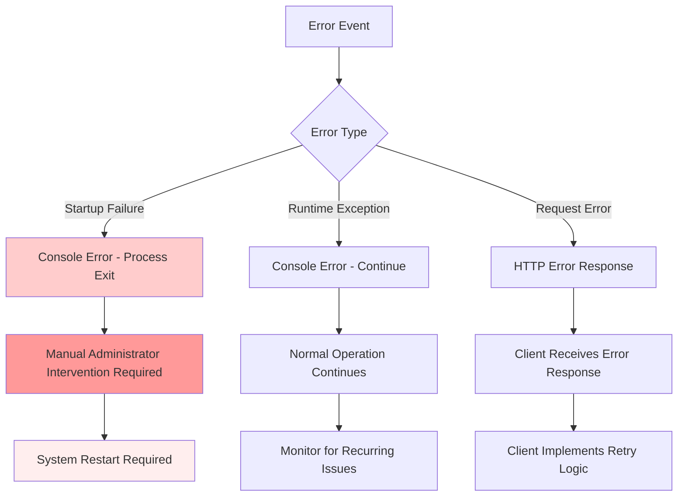
```mermaid
flowchart TD
    A[Error Event] --> B{Error Type}
    B -->|Startup Failure| C[Console Error - Process Exit]
    B -->|Runtime Exception| D[Console Error - Continue]
    B -->|Request Error| E[HTTP Error Response]
    
    C --> F[Manual Administrator Intervention Required]
    D --> G[Normal Operation Continues]
    E --> H[Client Receives Error Response]
    
    F --> I[System Restart Required]
    G --> J[Monitor for Recurring Issues]
    H --> K[Client Implements Retry Logic]
    
    style C fill:#ffcccc
    style F fill:#ff9999
    style I fill:#ffeeee
```

#### 4.3.2.5 Recovery Procedures

**Current Recovery Model:**
1. **Manual Process Restart**: Administrator must manually restart server after failures
2. **No Automated Recovery**: System does not self-heal from error conditions
3. **Data Loss Acceptable**: No persistent data at risk during failures
4. **External Monitoring Required**: No internal health checks or alerting

## 4.4 SYSTEM INTEGRATION WORKFLOWS

### 4.4.1 Service Lifecycle Management

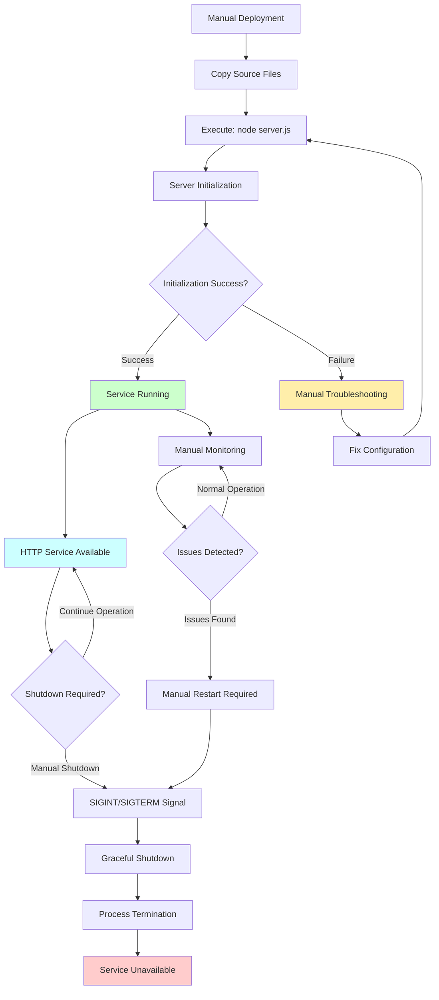
```mermaid
flowchart TD
    A[Manual Deployment] --> B[Copy Source Files]
    B --> C[Execute: node server.js]
    C --> D[Server Initialization]
    D --> E{Initialization Success?}
    E -->|Success| F[Service Running]
    E -->|Failure| G[Manual Troubleshooting]
    
    F --> H[HTTP Service Available]
    F --> I[Manual Monitoring]
    
    G --> J[Fix Configuration]
    J --> C
    
    H --> K{Shutdown Required?}
    K -->|Manual Shutdown| L[SIGINT/SIGTERM Signal]
    K -->|Continue Operation| H
    
    L --> M[Graceful Shutdown]
    M --> N[Process Termination]
    N --> O[Service Unavailable]
    
    I --> P{Issues Detected?}
    P -->|Issues Found| Q[Manual Restart Required]
    P -->|Normal Operation| I
    
    Q --> L
    
    style F fill:#ccffcc
    style H fill:#ccffff
    style O fill:#ffcccc
    style G fill:#ffeeaa
```

### 4.4.2 Operational Monitoring Workflow

**Current Monitoring Capabilities:**
- Console log output for startup confirmation
- No runtime health checks
- No performance metrics collection
- No error rate monitoring
- No availability monitoring

**Monitoring Gaps:**
- No structured logging
- No metrics endpoints
- No alerting mechanisms
- No operational dashboards
- No automated health checks

### 4.4.3 Configuration Management Flow

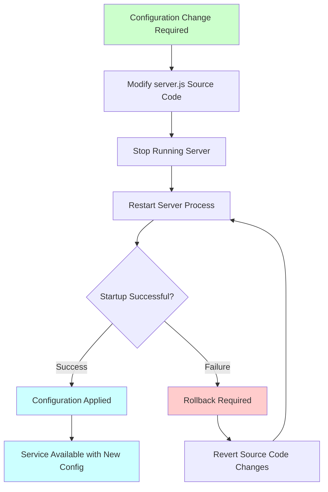
```mermaid
flowchart TD
    A[Configuration Change Required] --> B[Modify server.js Source Code]
    B --> C[Stop Running Server]
    C --> D[Restart Server Process]
    D --> E{Startup Successful?}
    E -->|Success| F[Configuration Applied]
    E -->|Failure| G[Rollback Required]
    
    F --> H[Service Available with New Config]
    G --> I[Revert Source Code Changes]
    I --> D
    
    style A fill:#ccffcc
    style F fill:#ccffff
    style G fill:#ffcccc
    style H fill:#ccffff
```

**Configuration Limitations:**
- Hard-coded values require source code modification
- No environment variable support
- No configuration file management
- No runtime configuration updates
- No configuration validation

## 4.5 PERFORMANCE AND SCALABILITY FLOWS

### 4.5.1 Request Throughput Management

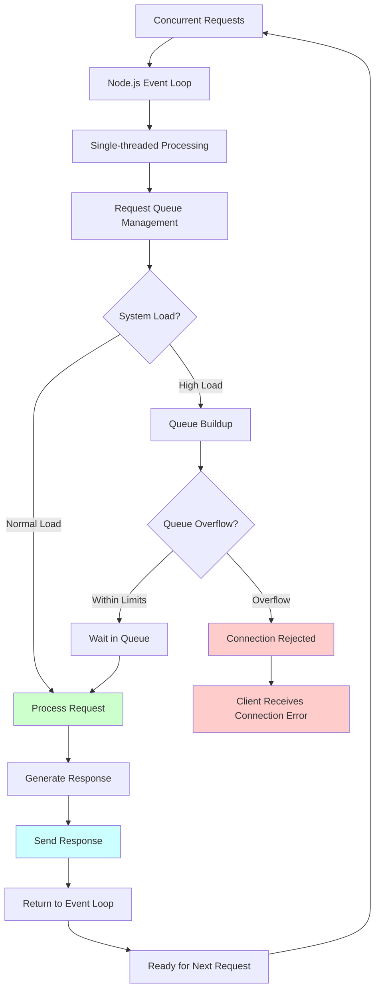
```mermaid
flowchart TD
    A[Concurrent Requests] --> B[Node.js Event Loop]
    B --> C[Single-threaded Processing]
    C --> D[Request Queue Management]
    D --> E{System Load?}
    E -->|Normal Load| F[Process Request]
    E -->|High Load| G[Queue Buildup]
    
    F --> H[Generate Response]
    H --> I[Send Response]
    I --> J[Return to Event Loop]
    
    G --> K{Queue Overflow?}
    K -->|Within Limits| L[Wait in Queue]
    K -->|Overflow| M[Connection Rejected]
    
    L --> F
    M --> N[Client Receives Connection Error]
    
    J --> O[Ready for Next Request]
    O --> A
    
    style F fill:#ccffcc
    style I fill:#ccffff
    style M fill:#ffcccc
    style N fill:#ffcccc
```

### 4.5.2 Resource Management Flow

**Current Resource Constraints:**
- Single Node.js process (no clustering)
- Memory usage limited to Node.js baseline
- CPU usage minimal for static responses
- Network I/O bound by localhost interface

**Scalability Limitations:**
- No horizontal scaling capability
- No load balancing integration
- No connection pooling
- No resource monitoring or throttling

## 4.6 REFERENCES

### 4.6.1 Source Code Files
- `server.js` - <span style="background-color: rgba(91, 57, 243, 0.2)">Core HTTP server implementation refactored to call app.js (referenced to Objective 2 refactor)</span>
- `package.json` - Project configuration confirming zero-dependency architecture
- `README.md` - Project identification as backpropagation integration test platform
- <span style="background-color: rgba(91, 57, 243, 0.2)">`app.js` - Server factory function module enabling test isolation and programmatic control</span>
- <span style="background-color: rgba(91, 57, 243, 0.2)">`jest.config.js` - Jest test runner configuration with coverage reporting settings</span>
- <span style="background-color: rgba(91, 57, 243, 0.2)">`/tests/unit/server.test.js` - Unit test suite validating server initialization and configuration</span>
- <span style="background-color: rgba(91, 57, 243, 0.2)">`/tests/integration/integration.test.js` - Integration test suite verifying HTTP request/response cycles</span>
- <span style="background-color: rgba(91, 57, 243, 0.2)">`.gitignore` - Updated configuration to exclude coverage/ and node_modules/ directories</span>
- <span style="background-color: rgba(91, 57, 243, 0.2)">`coverage/` - Generated Jest coverage reports and HTML output files</span>

### 4.6.2 Technical Specification Sections
- `2.1 FEATURE CATALOG` - Core features F-001, F-002, F-003 defining system capabilities
- `2.2 FUNCTIONAL REQUIREMENTS TABLE` - Detailed requirements for each feature workflow
- `2.3 FEATURE RELATIONSHIPS` - Feature dependency mapping and integration points
- `2.4 IMPLEMENTATION CONSIDERATIONS` - Performance requirements and technical constraints

### 4.6.3 Repository Analysis
- Root directory analysis revealing complete 4-file project structure
- Comprehensive code examination confirming stateless, zero-dependency implementation
- Architecture analysis identifying gaps in enterprise-standard error handling and monitoring workflows

# 5. SYSTEM ARCHITECTURE

## 5.1 HIGH-LEVEL ARCHITECTURE

### 5.1.1 System Overview

The **hao-backprop-test** system implements a **minimalist, event-driven architecture** designed as a foundational HTTP service for future backpropagation algorithm integration. The architecture follows a **zero-dependency monolithic pattern** that prioritizes simplicity, stability, and extensibility over complex feature sets. <span style="background-color: rgba(91, 57, 243, 0.2)">The runtime remains a zero-dependency monolith but now employs a two-module structure: 'app.js' (server factory) and 'server.js' (startup shell) to enable Jest/Supertest isolation</span>.

#### Architecture Style and Rationale

The system adopts a **direct-execution monolithic architecture** using Node.js built-in modules exclusively. This architectural choice provides several strategic advantages:

- **Minimal Attack Surface**: Zero external dependencies eliminate third-party vulnerabilities and supply chain risks
- **Rapid Deployment**: Sub-100ms startup time with no framework initialization overhead
- **Predictable Behavior**: Consistent performance characteristics without external library interference
- **Foundation Readiness**: Clean slate architecture optimized for future machine learning algorithm integration

#### Key Architectural Principles

**Principle 1: Zero-Dependency Philosophy**
The architecture deliberately excludes all external npm packages, relying solely on Node.js core modules. This decision ensures maximum stability and eliminates version conflict scenarios while maintaining a minimal resource footprint.

**Principle 2: Event-Driven Processing Model**
Built on Node.js event loop architecture, the system processes HTTP requests asynchronously through event-driven handlers, enabling non-blocking I/O operations despite the single-threaded execution model.

**Principle 3: Localhost-Only Security Boundary**
Network access restriction to 127.0.0.1 interface provides inherent perimeter security while maintaining development-focused accessibility for algorithm testing scenarios.

#### System Boundaries and Major Interfaces

**Internal System Boundaries:**
- **Process Boundary**: Single Node.js process isolation containing all system components
- **Network Boundary**: Localhost-only interface (127.0.0.1:3000) preventing remote access, <span style="background-color: rgba(91, 57, 243, 0.2)">with automated tests binding to ephemeral port (port 0) while default production binding to 127.0.0.1:3000 remains unchanged</span>
- **Module Boundary**: CommonJS module separation between server logic and configuration metadata
- <span style="background-color: rgba(91, 57, 243, 0.2)">**App/Server Module Boundary**: Explicit separation between 'app.js' server factory and 'server.js' startup shell for testability</span>

**External Interface Points:**
- **HTTP/1.1 Protocol**: Standard web protocol compliance for client communications
- **TCP Socket Interface**: Operating system network stack integration for connection management
- **File System Interface**: Node.js runtime file loading for source code execution

### 5.1.2 Core Components Table

| Component Name | Primary Responsibility | Key Dependencies | Integration Points |
|----------------|----------------------|------------------|-------------------|
| HTTP Server Module | Request/response processing and connection management | Node.js built-in `http` module | TCP network stack, localhost interface |
| <span style="background-color: rgba(91, 57, 243, 0.2)">**App Module (app.js)**</span> | <span style="background-color: rgba(91, 57, 243, 0.2)">**Export unstarted HTTP server instance**</span> | <span style="background-color: rgba(91, 57, 243, 0.2)">**Node.js 'http' core module**</span> | <span style="background-color: rgba(91, 57, 243, 0.2)">**Consumed by tests and by server.js**</span> |
| Request Handler | Universal request acceptance and routing to response generator | HTTP Server Module, Response Generator | Client connections, processing pipeline |
| Response Generator | Static response formatting with proper HTTP headers | Node.js HTTP response objects | Content delivery, connection closure |
| Configuration Manager | Package metadata and project identification | package.json file system access | Development tooling, runtime parameters |

### 5.1.3 Data Flow Description

#### Primary Data Flow Pattern

The system implements a **linear request-response data flow** without data persistence or caching layers. Each HTTP request follows an identical processing pipeline:

**Request Ingestion Flow:**
HTTP requests enter through the localhost:3000 TCP socket binding, where the Node.js HTTP module parses protocol headers and request body content. The request parser extracts method, URL path, and header information, though this data is not utilized in current response generation logic.

**Processing Pipeline:**
The universal request handler accepts all incoming requests regardless of HTTP method or URL path, immediately routing to the response generation component. No business logic processing, data validation, or conditional branching occurs during request processing.

**Response Generation Flow:**
The response generator creates consistent HTTP 200 responses with `text/plain` content-type headers and static "Hello, World!" message bodies. Response formatting includes proper HTTP/1.1 protocol compliance with content-length calculations.

**Connection Lifecycle Management:**
TCP connection termination occurs immediately after response delivery, with no session persistence or connection pooling. Each request-response cycle operates as an independent transaction without state retention.

#### Data Transformation Points

**Input Transformation:** HTTP protocol parsing converts raw TCP socket data into structured Node.js request objects with accessible properties for method, URL, headers, and body content.

**Output Transformation:** Static string content transforms into properly formatted HTTP responses with protocol-compliant headers, status codes, and message body encoding.

#### Key Data Stores and Caches

**Current State:** No data persistence or caching mechanisms implemented. The system operates as a purely stateless service without database connections, file-based storage, or in-memory caching layers.

**Future Architecture Considerations:** Backpropagation algorithm integration will require data persistence for training datasets, model parameters, and gradient computation results.

### 5.1.4 External Integration Points

| System Name | Integration Type | Data Exchange Pattern | Protocol/Format |
|-------------|------------------|----------------------|-----------------|
| Node.js Runtime | Platform Integration | Module loading and event handling | CommonJS modules, JavaScript execution |
| Operating System | Network Integration | TCP socket binding and management | TCP/IP protocol stack |
| HTTP Clients | Service Integration | Request/response messaging | HTTP/1.1 protocol |
| Local File System | Resource Integration | Source code and configuration loading | File system APIs |

## 5.2 COMPONENT DETAILS

### 5.2.1 HTTP Server Module (`server.js`) (updated)

#### Purpose and Responsibilities

The HTTP Server Module serves as the <span style="background-color: rgba(91, 57, 243, 0.2)">application entry point and lifecycle coordinator</span> responsible for:
- <span style="background-color: rgba(91, 57, 243, 0.2)">**App Module Import**: Loading the server factory function from app.js</span>
- <span style="background-color: rgba(91, 57, 243, 0.2)">**Server Instantiation**: Creating the HTTP server instance via the imported factory</span>
- <span style="background-color: rgba(91, 57, 243, 0.2)">**Lifecycle Logging**: Providing startup confirmation and error reporting</span>
- **TCP Socket Management**: Binding to localhost:3000 and accepting incoming connections
- **Server Lifecycle Management**: Initialization, startup logging, and connection listening

#### App Module (`app.js`) (updated)

**Purpose and Factory Function Design:**
<span style="background-color: rgba(91, 57, 243, 0.2)">The App Module implements the Factory Pattern by providing a createServer function that constructs and configures HTTP server instances without immediately starting them. This separation enables programmatic server control essential for automated testing and deployment flexibility.</span>

**Core Responsibilities:**
- <span style="background-color: rgba(91, 57, 243, 0.2)">**Server Factory Function**: Exports createServer() function returning configured but unstarted HTTP server instances</span>
- <span style="background-color: rgba(91, 57, 243, 0.2)">**Request Handler Configuration**: Implements the universal request handler logic within the server creation process</span>
- <span style="background-color: rgba(91, 57, 243, 0.2)">**Test Export Interface**: Provides module exports enabling test frameworks to instantiate servers programmatically</span>

**Dependency Characteristics:**
<span style="background-color: rgba(91, 57, 243, 0.2)">Maintains zero external runtime dependencies, utilizing only Node.js built-in HTTP module and JavaScript standard library. This ensures minimal attack surface and maximum compatibility across Node.js versions.</span>

#### Technologies and Frameworks

**Primary Technology Stack:**
- **Node.js Built-in HTTP Module**: Core HTTP server functionality without external framework dependencies
- **CommonJS Module System**: Standard Node.js module loading and execution
- **JavaScript ES5**: Compatible syntax ensuring broad Node.js version support

**Implementation Characteristics:**
- <span style="background-color: rgba(91, 57, 243, 0.2)">Server.js: 8 lines of production code focused on application bootstrapping</span>
- <span style="background-color: rgba(91, 57, 243, 0.2)">App.js: 12 lines of production code containing server creation logic</span>
- <span style="background-color: rgba(91, 57, 243, 0.2)">Modular architecture enabling independent testing of server creation and lifecycle management</span>
- Direct HTTP module usage without middleware or routing libraries

#### Key Interfaces and APIs

**Public API Interface:**
```
GET/POST/PUT/DELETE/etc. http://127.0.0.1:3000/*
- Accepts: All HTTP methods and URL paths
- Returns: HTTP 200 with "Hello, World!" plain text response
- Headers: Content-Type: text/plain
```

**Internal Component Interface:**
- <span style="background-color: rgba(91, 57, 243, 0.2)">**App Module Import**: const createServer = require('./app.js')</span>
- <span style="background-color: rgba(91, 57, 243, 0.2)">**Factory Function Call**: const server = createServer()</span>
- **Server Instance**: Created via `http.createServer()` with request handler callback
- **Request Handler Function**: `(req, res) => {}` signature processing all incoming requests
- **Console Logging**: Startup confirmation message output to stdout

#### Data Persistence Requirements

**Current State:** No data persistence implemented. All requests processed in-memory without storage.

**Future Requirements:** Backpropagation integration will require:
- Training data storage and retrieval mechanisms
- Model parameter persistence between training sessions
- Gradient computation result logging and analysis capabilities

#### Scaling Considerations

**Current Limitations:**
- Single-process execution limiting concurrent request throughput
- Localhost-only binding preventing horizontal distribution
- No clustering or load balancing capabilities
- Stateless design ready for scaling when network binding expanded

**Scaling Architecture Options:**
- Node.js cluster module integration for multi-process execution
- Network binding modification to enable external access and load balancing
- Container orchestration compatibility through process isolation

### 5.2.2 Configuration Manager (`package.json`) (updated)

#### Purpose and Responsibilities

The Configuration Manager provides:
- **Project Metadata**: Package identification, version, and authorship information
- <span style="background-color: rgba(91, 57, 243, 0.2)">**Development Dependencies**: Jest, Supertest, and Cross-env for comprehensive testing infrastructure</span>
- **Entry Point Specification**: Main module identification (currently misconfigured)
- <span style="background-color: rgba(91, 57, 243, 0.2)">**NPM Script Automation**: Test execution, coverage reporting, and development workflow commands</span>

#### Technologies and Frameworks

**Configuration Format:**
- **JSON Schema**: NPM package.json specification compliance
- **Semantic Versioning**: Version 1.0.0 following SemVer standards
- **MIT License**: Open source license declaration

**Development Dependencies Added:** (updated)
| Package | Version | Purpose |
|---------|---------|---------|
| <span style="background-color: rgba(91, 57, 243, 0.2)">**jest**</span> | <span style="background-color: rgba(91, 57, 243, 0.2)">**^29.7.0**</span> | <span style="background-color: rgba(91, 57, 243, 0.2)">**Test runner and assertion library with built-in coverage**</span> |
| <span style="background-color: rgba(91, 57, 243, 0.2)">**supertest**</span> | <span style="background-color: rgba(91, 57, 243, 0.2)">**^6.3.3**</span> | <span style="background-color: rgba(91, 57, 243, 0.2)">**HTTP assertion library for integration testing**</span> |
| <span style="background-color: rgba(91, 57, 243, 0.2)">**cross-env**</span> | <span style="background-color: rgba(91, 57, 243, 0.2)">**^7.0.3**</span> | <span style="background-color: rgba(91, 57, 243, 0.2)">**Cross-platform environment variable management**</span> |

#### Key Interfaces and APIs

**NPM Integration Interface:**
- Package installation and management through npm registry compatibility
- Development script execution via `npm run` commands
- Dependency resolution and lock file generation

**NPM Scripts Configuration:** (updated)
- <span style="background-color: rgba(91, 57, 243, 0.2)">**"test": "jest --coverage"** - Executes full test suite with coverage reporting</span>
- <span style="background-color: rgba(91, 57, 243, 0.2)">**Test Mode Variations**: npm test -- unit, npm test -- integration, npm test -- --watch</span>

**Identified Configuration Issues:**
- **Entry Point Mismatch**: `"main": "index.js"` references non-existent file
- **Package Name Inconsistency**: `"hello_world"` conflicts with README project name "hao-backprop-test"

### 5.2.3 Component Interaction Diagrams (updated)

#### System Component Architecture

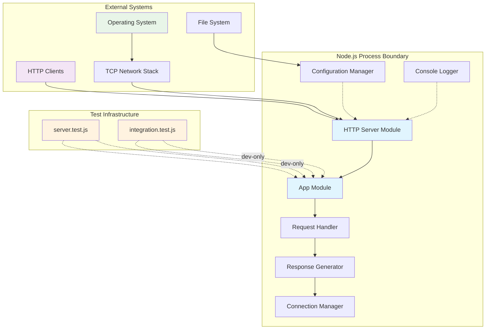
```mermaid
graph TB
    subgraph "Node.js Process Boundary"
        A[HTTP Server Module] --> B[App Module]
        B --> C[Request Handler]
        C --> D[Response Generator]
        D --> E[Connection Manager]
        
        F[Configuration Manager] -.-> A
        G[Console Logger] -.-> A
    end
    
    subgraph "External Systems"
        H[HTTP Clients] --> A
        I[Operating System] --> J[TCP Network Stack]
        J --> A
        K[File System] --> F
    end
    
    subgraph "Test Infrastructure"
        L[server.test.js] -.-> B
        M[integration.test.js] -.-> B
    end
    
    L -.->|dev-only| B
    M -.->|dev-only| B
    
    style A fill:#e1f5fe
    style B fill:#e1f5fe
    style H fill:#f3e5f5
    style I fill:#e8f5e8
    style L fill:#fff3e0
    style M fill:#fff3e0
```

#### Request Processing Sequence

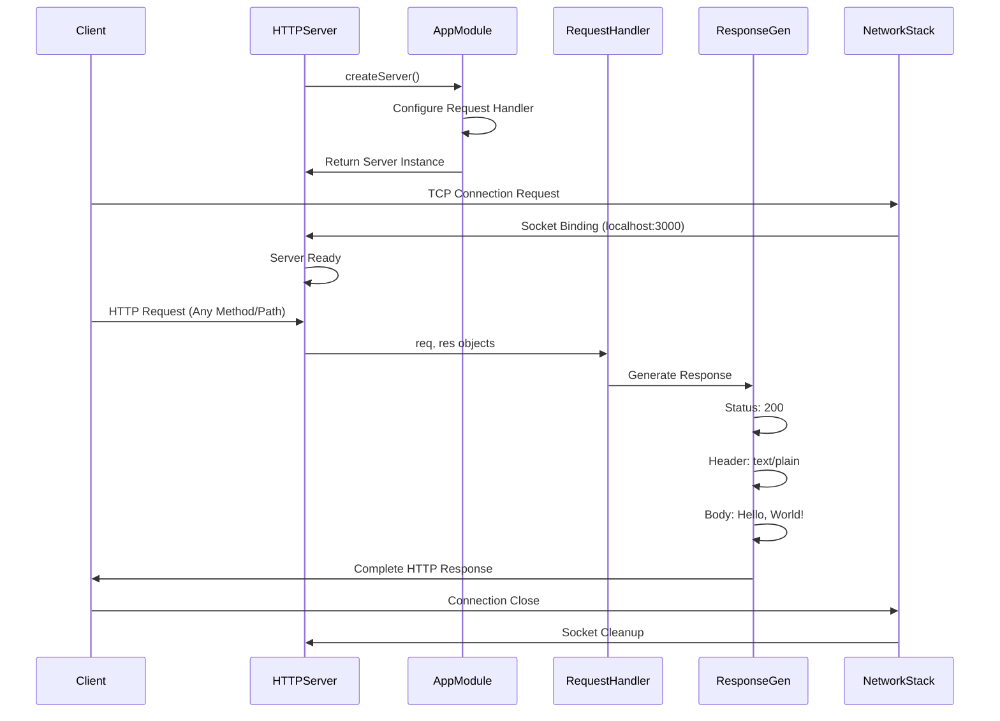
```mermaid
sequenceDiagram
    participant Client
    participant HTTPServer
    participant AppModule
    participant RequestHandler
    participant ResponseGen
    participant NetworkStack
    
    HTTPServer->>AppModule: createServer()
    AppModule->>AppModule: Configure Request Handler
    AppModule->>HTTPServer: Return Server Instance
    
    Client->>NetworkStack: TCP Connection Request
    NetworkStack->>HTTPServer: Socket Binding (localhost:3000)
    HTTPServer->>HTTPServer: Server Ready
    
    Client->>HTTPServer: HTTP Request (Any Method/Path)
    HTTPServer->>RequestHandler: req, res objects
    RequestHandler->>ResponseGen: Generate Response
    ResponseGen->>ResponseGen: Status: 200
    ResponseGen->>ResponseGen: Header: text/plain
    ResponseGen->>ResponseGen: Body: Hello, World!
    ResponseGen->>Client: Complete HTTP Response
    Client->>NetworkStack: Connection Close
    NetworkStack->>HTTPServer: Socket Cleanup
```

#### Server Startup State Transition

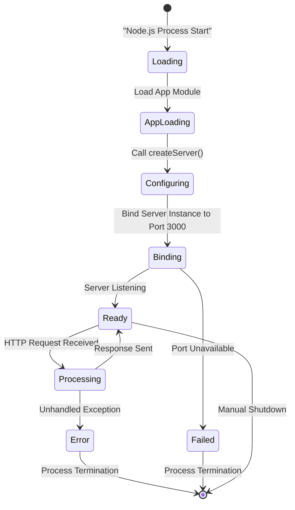
```mermaid
stateDiagram-v2
[*] --> Loading: "Node.js Process Start"
Loading --> AppLoading: Load App Module
AppLoading --> Configuring: Call createServer()
Configuring --> Binding: Bind Server Instance to Port 3000
Binding --> Ready: Server Listening
Binding --> Failed: Port Unavailable
Ready --> Processing: HTTP Request Received
Processing --> Ready: Response Sent
Processing --> Error: Unhandled Exception
Error --> [*]: Process Termination
Failed --> [*]: Process Termination
Ready --> [*]: Manual Shutdown
```

## 5.3 TECHNICAL DECISIONS

### 5.3.1 Architecture Style Decisions and Tradeoffs

#### Decision: Zero-Dependency Monolithic Architecture

**Rationale and Justification:**

| Decision Factor | Chosen Approach | Alternative Considered | Tradeoff Analysis |
|-----------------|-----------------|----------------------|-------------------|
| Security Posture | Zero external dependencies | Framework-based development | Higher security vs. development velocity |
| Performance Profile | Minimal overhead architecture | Express.js or similar frameworks | Raw performance vs. developer productivity |
| Maintenance Complexity | Single-file implementation | Microservices architecture | Simple maintenance vs. scalability features |
| Future Extensibility | Foundation-ready design | Full-featured web framework | Clean extension point vs. immediate capabilities |

**Technical Decision Record (ADR-001):**

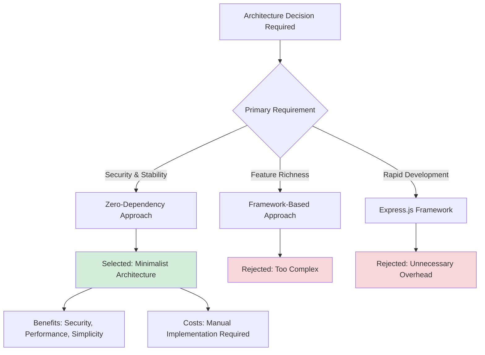
```mermaid
flowchart TD
    A[Architecture Decision Required] --> B{Primary Requirement}
    B -->|Security & Stability| C[Zero-Dependency Approach]
    B -->|Feature Richness| D[Framework-Based Approach]
    B -->|Rapid Development| E[Express.js Framework]
    
    C --> F[Selected: Minimalist Architecture]
    D --> G[Rejected: Too Complex]
    E --> H[Rejected: Unnecessary Overhead]
    
    F --> I[Benefits: Security, Performance, Simplicity]
    F --> J[Costs: Manual Implementation Required]
    
    style F fill:#d4edda
    style G fill:#f8d7da
    style H fill:#f8d7da
```

#### Decision: <span style="background-color: rgba(91, 57, 243, 0.2)">Development-Only Testing Dependencies

**<span style="background-color: rgba(91, 57, 243, 0.2)">Technical Decision Record (ADR-002):</span>**

<span style="background-color: rgba(91, 57, 243, 0.2)">The system introduces Jest, Supertest, and cross-env as development dependencies while maintaining absolute zero runtime dependencies. This approach enables comprehensive testing infrastructure without compromising production security or performance characteristics.</span>

**<span style="background-color: rgba(91, 57, 243, 0.2)">Security vs. Testability Tradeoff Analysis:</span>**

| <span style="background-color: rgba(91, 57, 243, 0.2)">Decision Factor</span> | <span style="background-color: rgba(91, 57, 243, 0.2)">Chosen Approach</span> | <span style="background-color: rgba(91, 57, 243, 0.2)">Alternative Considered</span> | <span style="background-color: rgba(91, 57, 243, 0.2)">Tradeoff Analysis</span> |
|-----------------|-----------------|----------------------|-------------------|
| <span style="background-color: rgba(91, 57, 243, 0.2)">Runtime Security</span> | <span style="background-color: rgba(91, 57, 243, 0.2)">Zero production dependencies maintained</span> | <span style="background-color: rgba(91, 57, 243, 0.2)">Include testing libraries in runtime</span> | <span style="background-color: rgba(91, 57, 243, 0.2)">Maximum security vs. deployment complexity</span> |
| <span style="background-color: rgba(91, 57, 243, 0.2)">Test Coverage</span> | <span style="background-color: rgba(91, 57, 243, 0.2)">Comprehensive Jest + Supertest suite</span> | <span style="background-color: rgba(91, 57, 243, 0.2)">Manual testing only</span> | <span style="background-color: rgba(91, 57, 243, 0.2)">Automated quality assurance vs. increased toolchain</span> |
| <span style="background-color: rgba(91, 57, 243, 0.2)">Development Velocity</span> | <span style="background-color: rgba(91, 57, 243, 0.2)">Standard testing frameworks</span> | <span style="background-color: rgba(91, 57, 243, 0.2)">Custom test implementation</span> | <span style="background-color: rgba(91, 57, 243, 0.2)">Industry-standard tools vs. reinventing capabilities</span> |
| <span style="background-color: rgba(91, 57, 243, 0.2)">Deployment Footprint</span> | <span style="background-color: rgba(91, 57, 243, 0.2)">DevDependencies excluded from production</span> | <span style="background-color: rgba(91, 57, 243, 0.2)">All dependencies deployed</span> | <span style="background-color: rgba(91, 57, 243, 0.2)">Minimal production size vs. tooling availability</span> |

**<span style="background-color: rgba(91, 57, 243, 0.2)">Development Dependency Architecture:</span>**

```mermaid
flowchart TD
    A[Testing Architecture Decision] --> B{Requirement Balance}
    B -->|Security Priority| C[Zero Runtime Dependencies]
    B -->|Testing Priority| D[Full Framework Integration]
    B -->|Balanced Approach| E[Dev-Only Dependencies]
    
    C --> F[Selected: Runtime Isolation]
    E --> F
    D --> G[Rejected: Security Compromise]
    
    F --> H[Benefits: Security + Testability]
    F --> I[Implementation: package.json devDependencies]
    
    subgraph "Development Phase"
        J[Jest Test Runner]
        K[Supertest HTTP Testing]
        L[Cross-env Script Management]
    end
    
    subgraph "Production Deployment"
        M[Zero External Dependencies]
        N[Minimal Attack Surface]
        O[Maximum Performance]
    end
    
    F --> J
    F --> K  
    F --> L
    F --> M
    F --> N
    F --> O
    
    style F fill:#d4edda
    style G fill:#f8d7da
    style J fill:#fff3cd
    style K fill:#fff3cd
    style L fill:#fff3cd
    style M fill:#e1f5fe
    style N fill:#e1f5fe
    style O fill:#e1f5fe
```

### 5.3.2 Communication Pattern Choices

#### Decision: Direct HTTP Request/Response Model

**Implementation Approach:**
The system implements synchronous HTTP communication without message queues, pub/sub patterns, or asynchronous processing capabilities. All client interactions follow the classic request-response paradigm with immediate response generation.

**Alternative Patterns Considered:**
- **WebSocket Integration**: Real-time bidirectional communication (rejected due to current requirements scope)
- **Message Queue Architecture**: Asynchronous request processing (deferred for future backpropagation needs)
- **GraphQL API**: Flexible query capabilities (not applicable to current minimal scope)

### 5.3.3 Data Storage Solution Rationale

#### Decision: No Data Persistence (Stateless Architecture)

**Current Justification:**
Given the system's current scope as a testing foundation, data persistence would introduce unnecessary complexity without corresponding business value. The stateless design enables clean separation between current HTTP infrastructure and future machine learning data requirements.

**Future Storage Architecture Planning:**

| Storage Type | Future Use Case | Technology Consideration | Integration Timeline |
|--------------|-----------------|-------------------------|---------------------|
| Training Data | Neural network datasets | File-based or database storage | Backpropagation integration phase |
| Model Parameters | Weight and bias storage | Structured format (JSON/Binary) | Algorithm implementation phase |
| Computation Results | Gradient and loss tracking | Time-series database potential | Testing and validation phase |

### 5.3.4 Application Architecture Pattern Selection (updated)

#### Decision: Factory Pattern Implementation

**<span style="background-color: rgba(91, 57, 243, 0.2)">Rationale and Technical Decision Record (ADR-003):</span>**

<span style="background-color: rgba(91, 57, 243, 0.2)">The system adopts the Factory Pattern through separation of server creation (`app.js`) from server execution (`server.js`). This architectural decision enables programmatic server instantiation without automatic port binding, which is essential for test isolation and flexible deployment scenarios.</span>

**<span style="background-color: rgba(91, 57, 243, 0.2)">Factory Pattern Implementation Benefits:</span>**

| <span style="background-color: rgba(91, 57, 243, 0.2)">Benefit Category</span> | <span style="background-color: rgba(91, 57, 243, 0.2)">Implementation Advantage</span> | <span style="background-color: rgba(91, 57, 243, 0.2)">Test Impact</span> |
|-----------------|----------------------|-------------------|
| <span style="background-color: rgba(91, 57, 243, 0.2)">**Test Isolation**</span> | <span style="background-color: rgba(91, 57, 243, 0.2)">Each test gets fresh server instance</span> | <span style="background-color: rgba(91, 57, 243, 0.2)">Prevents test contamination and port conflicts</span> |
| <span style="background-color: rgba(91, 57, 243, 0.2)">**Dynamic Port Allocation**</span> | <span style="background-color: rgba(91, 57, 243, 0.2)">Tests bind to port 0 for OS allocation</span> | <span style="background-color: rgba(91, 57, 243, 0.2)">Eliminates "port already in use" errors</span> |
| <span style="background-color: rgba(91, 57, 243, 0.2)">**Lifecycle Control**</span> | <span style="background-color: rgba(91, 57, 243, 0.2)">Server start/stop under test control</span> | <span style="background-color: rgba(91, 57, 243, 0.2)">Clean setup and teardown in test suites</span> |

**<span style="background-color: rgba(91, 57, 243, 0.2)">Factory Pattern Architecture Flow:</span>**

```mermaid
flowchart TD
A[Factory Pattern Decision] --> B{Module Separation Strategy}
B -->|Monolithic Approach| C["Single server.js file"]
B -->|Modular Approach| D["app.js + server.js separation"]
B -->|Complex Framework| E[Multiple abstraction layers]

D --> F[Selected: Two-Module Factory]
C --> G[Rejected: Testing Limitations]
E --> H[Rejected: Over-engineering]

F --> I["Production: server.js imports app.js"]
F --> J[Testing: Tests import app.js directly]
F --> K[Benefits: Test isolation + Production simplicity]

subgraph "Factory Implementation"
    L["app.js exports createServer()"]
    M[Returns configured HTTP server]
    N[No automatic port binding]
end

subgraph "Consumer Patterns"
    O["server.js: createServer().listen(3000)"]
    P["Tests: const server = createServer()"]
    Q["Tests: server.listen(0) for dynamic ports"]
end

I --> L
J --> L
L --> M
M --> N
I --> O
J --> P
J --> Q

style F fill:#d4edda
style G fill:#f8d7da
style H fill:#f8d7da
style L fill:#e1f5fe
style O fill:#e8f5e8
style P fill:#fff3cd
style Q fill:#fff3cd
```

**<span style="background-color: rgba(91, 57, 243, 0.2)">Test Isolation Impact Analysis:</span>**

<span style="background-color: rgba(91, 57, 243, 0.2)">The Factory Pattern enables true test isolation by allowing each test to instantiate its own server instance. This prevents cross-test contamination, eliminates shared state issues, and enables parallel test execution. Jest test suites can create independent server instances without network conflicts, while production deployment maintains the simple single-instance model.</span>

### 5.3.5 Security Mechanism Selection

#### Decision: Localhost-Only Network Binding

**Security Architecture Approach:**
The system implements perimeter security through network access restriction rather than application-level authentication mechanisms. This approach provides appropriate security for the current development and testing use case while maintaining simplicity.

**Security Decision Matrix:**

```mermaid
graph TD
    A[Security Requirements] --> B{Threat Model}
    B -->|Development Testing| C[Network Isolation]
    B -->|Production Deployment| D[Authentication/Authorization]
    B -->|Public Access| E[Comprehensive Security Stack]
    
    C --> F[Selected: Localhost Binding]
    D --> G[Future Requirement]
    E --> H[Not Applicable]
    
    F --> I[Benefits: Simple, Effective for Use Case]
    F --> J[Limitations: No Remote Access]
    
    style F fill:#d4edda
    style G fill:#fff3cd
    style H fill:#f8d7da
```

### 5.3.6 Quality Assurance Standards (updated)

#### Decision: Code Coverage Threshold Enforcement

**<span style="background-color: rgba(91, 57, 243, 0.2)">Technical Decision Record (ADR-004):</span>**

<span style="background-color: rgba(91, 57, 243, 0.2)">The system adopts >80% line coverage as a mandatory quality gate enforced through CI test scripts rather than runtime mechanisms. This approach ensures code quality without impacting production performance while providing measurable quality assurance metrics.</span>

**<span style="background-color: rgba(91, 57, 243, 0.2)">Coverage Implementation Strategy:</span>**

| <span style="background-color: rgba(91, 57, 243, 0.2)">Coverage Aspect</span> | <span style="background-color: rgba(91, 57, 243, 0.2)">Implementation Approach</span> | <span style="background-color: rgba(91, 57, 243, 0.2)">Enforcement Mechanism</span> |
|-----------------|----------------------|-------------------|
| <span style="background-color: rgba(91, 57, 243, 0.2)">**Line Coverage**</span> | <span style="background-color: rgba(91, 57, 243, 0.2)">Jest built-in Istanbul integration</span> | <span style="background-color: rgba(91, 57, 243, 0.2)">npm test script fails below 80%</span> |
| <span style="background-color: rgba(91, 57, 243, 0.2)">**Branch Coverage**</span> | <span style="background-color: rgba(91, 57, 243, 0.2)">Conditional logic path testing</span> | <span style="background-color: rgba(91, 57, 243, 0.2)">Automated threshold enforcement</span> |
| <span style="background-color: rgba(91, 57, 243, 0.2)">**Function Coverage**</span> | <span style="background-color: rgba(91, 57, 243, 0.2)">All exported functions tested</span> | <span style="background-color: rgba(91, 57, 243, 0.2)">CI pipeline integration</span> |

**<span style="background-color: rgba(91, 57, 243, 0.2)">Quality Gate Architecture:</span>**

<span style="background-color: rgba(91, 57, 243, 0.2)">Coverage enforcement occurs exclusively during development and CI phases through Jest's integrated Istanbul coverage tool. The >80% threshold applies to line coverage, branch coverage, and function coverage metrics. Production runtime remains unaffected by coverage calculations, maintaining optimal performance characteristics.</span>

**<span style="background-color: rgba(91, 57, 243, 0.2)">Coverage Enforcement Flow:</span>**

```mermaid
flowchart TD
    A[Quality Assurance Decision] --> B{Coverage Strategy}
    B -->|Runtime Coverage| C[Production Performance Impact]
    B -->|CI-Only Coverage| D[Development-Phase Enforcement]
    B -->|No Coverage| E[Quality Risk]
    
    D --> F[Selected: CI Pipeline Integration]
    C --> G[Rejected: Performance Overhead]
    E --> H[Rejected: Quality Compromise]
    
    F --> I[npm test --coverage command]
    F --> J[Jest Istanbul integration]
    F --> K[80% threshold enforcement]
    
    subgraph "Coverage Metrics"
        L[Line Coverage >80%]
        M[Branch Coverage >80%]
        N[Function Coverage >80%]
    end
    
    subgraph "Enforcement Points"
        O[Local Development]
        P[CI Pipeline]
        Q[Pre-commit Hooks]
    end
    
    K --> L
    K --> M
    K --> N
    I --> O
    I --> P
    I --> Q
    
    style F fill:#d4edda
    style G fill:#f8d7da
    style H fill:#f8d7da
    style I fill:#e1f5fe
    style L fill:#e8f5e8
    style M fill:#e8f5e8
    style N fill:#e8f5e8
```

**<span style="background-color: rgba(91, 57, 243, 0.2)">Quality Threshold Justification:</span>**

<span style="background-color: rgba(91, 57, 243, 0.2)">The 80% coverage threshold balances comprehensive testing with practical development constraints. This threshold ensures critical code paths receive testing attention while avoiding diminishing returns from testing trivial code segments. Coverage metrics provide quantifiable quality assurance for future backpropagation algorithm integration.</span>

## 5.4 CROSS-CUTTING CONCERNS

### 5.4.1 Monitoring and Observability Approach

#### Current Monitoring Architecture

**Limited Observability Implementation:**
The system currently provides minimal observability through console logging of server startup events only. No comprehensive monitoring, metrics collection, or health checking capabilities exist.

**Identified Monitoring Gaps:**

| Monitoring Category | Current State | Critical Need | Implementation Priority |
|-------------------|---------------|---------------|------------------------|
| Health Checks | None | Server availability monitoring | High |
| Performance Metrics | None | Response time and throughput tracking | Medium |
| Error Monitoring | None | Exception and error rate tracking | High |
| Usage Analytics | None | Request pattern analysis | Low |

**Future Monitoring Architecture Recommendations:**
- Structured logging integration for request/response tracking
- Health endpoint implementation for uptime monitoring
- Performance metrics collection for optimization insights
- Error rate monitoring and alerting capabilities

### 5.4.2 Logging and Tracing Strategy

#### Current Logging Implementation

**Basic Console Logging:**
The system implements minimal logging through a single console.log statement during server startup: `"Server running at http://127.0.0.1:3000/"`

**Logging Architecture Deficiencies:**
- No request/response logging for debugging and audit purposes
- No structured log format for automated processing
- No log level management (debug, info, warn, error)
- No log rotation or persistence mechanisms

#### Recommended Logging Enhancement Strategy

**Structured Logging Framework:**
Future implementation should adopt JSON-based structured logging with consistent field naming, timestamp formatting, and correlation ID tracking for request tracing.

**Log Level Management:**
Implement configurable log levels to support development debugging and production monitoring without performance impact from verbose logging.

### 5.4.3 Error Handling Patterns

#### Current Error Handling Architecture

**Critical Error Handling Gaps:**
The system lacks comprehensive error handling mechanisms, relying on Node.js default behavior for exception management. This creates potential stability and reliability issues.

**Error Handling Flow Analysis:**

```mermaid
flowchart TD
    A[HTTP Request] --> B[Request Processing]
    B --> C{Error Occurs?}
    C -->|No| D[Generate Response]
    C -->|Yes| E[Node.js Default Handler]
    E --> F[Process Termination Risk]
    D --> G[Send Response]
    
    H[Server Startup] --> I{Port Available?}
    I -->|Yes| J[Bind Success]
    I -->|No| K[Uncaught Exception]
    K --> L[Process Termination]
    
    style E fill:#f8d7da
    style F fill:#f8d7da
    style K fill:#f8d7da
    style L fill:#f8d7da
```

#### Error Handling Enhancement Requirements

**Exception Management Strategy:**
Implement try-catch blocks around critical operations with graceful degradation patterns for non-fatal errors and proper cleanup procedures for fatal exceptions.

**Recovery Mechanisms:**
Design automatic recovery procedures for transient failures while maintaining service availability through robust error boundary implementation.

### 5.4.4 Authentication and Authorization Framework

#### Current Security Architecture

**No Authentication Implementation:**
The system currently operates without any authentication or authorization mechanisms, accepting all requests without identity verification or access control.

**Security Framework Readiness:**
The stateless architecture and HTTP foundation provide suitable integration points for future authentication middleware without requiring architectural modifications.

#### Future Security Framework Planning

**Authentication Strategy Options:**

| Authentication Method | Suitability | Integration Complexity | Security Level |
|----------------------|-------------|----------------------|----------------|
| API Key Based | High | Low | Medium |
| JWT Token Based | High | Medium | High |
| OAuth 2.0 Integration | Medium | High | Very High |

### 5.4.5 Performance Requirements and SLAs

#### Current Performance Characteristics

**Measured Performance Metrics:**
- **Server Startup Time**: <100ms (minimal initialization overhead)
- **Response Time**: <1ms (simple string response generation) 
- **Memory Footprint**: Node.js baseline + minimal application overhead
- **Throughput**: Limited by Node.js event loop and system resources

**Performance Architecture Advantages:**
- Zero framework overhead provides maximum response speed
- Minimal memory usage enables high concurrent connection capacity
- Fast startup time supports rapid development cycles
- Low CPU usage maintains system resource availability

#### Scalability and Performance Planning

**Current Performance Limitations:**

| Performance Aspect | Current Constraint | Scaling Solution | Implementation Effort |
|-------------------|-------------------|------------------|----------------------|
| Concurrent Connections | Single event loop | Node.js clustering | Medium |
| Network Access | Localhost only | Multi-interface binding | Low |
| Request Processing | Synchronous handling | Async/await patterns | Medium |
| Resource Utilization | Single process | Container orchestration | High |

### 5.4.6 Disaster Recovery Procedures

#### Current Disaster Recovery Capabilities

**Limited Recovery Architecture:**
The system lacks formal disaster recovery procedures, relying on manual restart procedures for failure recovery. No automated failure detection, backup procedures, or recovery automation exists.

**Recovery Time Objectives:**
- **Manual Restart**: Requires human intervention for process restoration
- **Data Loss Risk**: No persistent data means no data recovery requirements
- **Service Availability**: Complete service interruption during failures

#### Disaster Recovery Enhancement Strategy

**Automated Recovery Procedures:**
Implement process monitoring with automatic restart capabilities for common failure scenarios while maintaining simplicity appropriate to system scope.

**Health Check Integration:**
Design health monitoring endpoints to enable external monitoring systems to detect failures and trigger recovery procedures automatically.

#### References

**Files Examined:**
- `server.js` - Core HTTP server implementation with request/response handling architecture
- `package.json` - NPM package configuration metadata and dependency declarations
- `README.md` - Project documentation and system identification
- `package-lock.json` - Dependency lock file confirming zero external package requirements

**Technical Specification Sections Referenced:**
- `1.2 SYSTEM OVERVIEW` - System capabilities, limitations, and business context alignment
- `2.1 FEATURE CATALOG` - Core feature descriptions and architectural dependencies
- `3.8 TECHNOLOGY INTEGRATION ARCHITECTURE` - Component integration model and system boundaries
- `3.11 PERFORMANCE CHARACTERISTICS` - Performance metrics and scalability implications
- `4.1 SYSTEM WORKFLOWS` - Core business processes and system integration workflows

# 6. SYSTEM COMPONENTS DESIGN

## 6.1 CORE SERVICES ARCHITECTURE

### 6.1.1 Architecture Applicability Assessment

**Core Services Architecture is not applicable for this system.** The hao-backprop-test project implements a minimal, monolithic HTTP server without any microservices, distributed architecture, or distinct service components. This determination is based on comprehensive analysis of the system's architectural characteristics and implementation patterns.

#### 6.1.1.1 Architectural Classification

The system exhibits the following characteristics that preclude core services architecture patterns:

| Architectural Aspect | Current Implementation | Services Architecture Requirement |
|---------------------|----------------------|----------------------------------|
| Process Model | Single Node.js process | Multiple service processes |
| Component Distribution | <span style="background-color: rgba(91, 57, 243, 0.2)">Monolithic, modular multi-file (server.js, app.js)</span> | Distributed service components |
| Inter-process Communication | None | Service-to-service protocols |
| Service Discovery | Not applicable | Registry and discovery mechanisms |

#### 6.1.1.2 Evidence-Based Analysis

**Codebase Structure Analysis:**
- **Total Implementation**: <span style="background-color: rgba(91, 57, 243, 0.2)">Spans multiple small modules (server.js, app.js, tests) while maintaining monolithic architecture</span>
- **Service Count**: Zero distinct services
- **External Dependencies**: <span style="background-color: rgba(91, 57, 243, 0.2)">Runtime external dependencies: None (zero production packages). DevDependencies: jest, supertest, cross-env</span>
- **Network Architecture**: Single HTTP endpoint on localhost:3000
- **Process Boundaries**: Single Node.js process execution model

**System Integration Points:**
- **Internal Boundaries**: No service boundaries exist
- **Communication Patterns**: Direct function calls within single process
- **Discovery Mechanisms**: Hard-coded localhost binding eliminates discovery needs
- **Load Distribution**: Not applicable - single process handles all requests

### 6.1.2 Current System Architecture

#### 6.1.2.1 Monolithic Architecture Pattern

The system implements a **zero-dependency monolithic pattern** with <span style="background-color: rgba(91, 57, 243, 0.2)">a modular two-file structure designed for testability</span>. The architecture maintains monolithic characteristics while separating concerns between server creation and server execution:

**<span style="background-color: rgba(91, 57, 243, 0.2)">Two-Module Architecture</span> Diagram:**

```mermaid
graph TB
    subgraph "Single Node.js Process"
        A[server.js Bootstrap] --> B["require('./app')"]
        B --> C[HTTP Server Instance]
        C --> D[Universal Request Handler]
        D --> E[Static Response Generator]
        E --> F[Connection Termination]
        
        G[Package Configuration] -.-> C
        H[Console Logger] -.-> C
    end
    
    subgraph "External Integration"
        I[HTTP Clients] --> C
        J[Operating System] --> K[TCP Stack]
        K --> C
    end
    
    style A fill:#e3f2fd
    style B fill:#f3e5f5
    style C fill:#e8f5e8
    style D fill:#f3e5f5
    style E fill:#e8f5e8
```

<span style="background-color: rgba(91, 57, 243, 0.2)">The architectural pattern separates server instantiation (app.js) from server execution (server.js), enabling test isolation while maintaining the single-process monolithic deployment model.</span>

#### 6.1.2.2 Component Responsibilities

| Component | Responsibility | Implementation | Service Equivalent |
|-----------|---------------|----------------|-------------------|
| <span style="background-color: rgba(91, 57, 243, 0.2)">Server Bootstrap</span> | <span style="background-color: rgba(91, 57, 243, 0.2)">Start the server and handle process lifecycle</span> | <span style="background-color: rgba(91, 57, 243, 0.2)">server.js script</span> | <span style="background-color: rgba(91, 57, 243, 0.2)">Process Manager Service</span> |
| HTTP Server | Request acceptance and TCP management | <span style="background-color: rgba(91, 57, 243, 0.2)">app.js exported createServer function</span> | Gateway Service |
| Request Handler | Universal request processing | Single callback function | Request Router Service |
| Response Generator | Static content delivery | Inline string response | Content Service |
| Configuration | System parameters | package.json metadata | Configuration Service |

#### 6.1.2.3 Request Processing Flow

**<span style="background-color: rgba(91, 57, 243, 0.2)">Modular Processing</span> Model:**

```mermaid
sequenceDiagram
    participant Bootstrap as server.js Bootstrap
    participant Factory as app.js Factory
    participant HTTPServer as HTTP Server
    participant Handler as Request Handler
    participant Generator as Response Generator
    participant Client
    
    Bootstrap->>Factory: require('./app')
    Factory->>HTTPServer: createServer()
    HTTPServer->>Bootstrap: Server Instance
    Bootstrap->>HTTPServer: .listen(3000)
    
    Client->>HTTPServer: HTTP Request (Any Method/Path)
    HTTPServer->>Handler: Process Request
    Handler->>Generator: Generate Response
    Generator->>Generator: Create "Hello, World!" response
    Generator->>Client: HTTP 200 + Content
    Client->>HTTPServer: Connection Close
```

### 6.1.3 Service Architecture Absence Analysis

#### 6.1.3.1 Missing Service Components

**Service Boundaries and Responsibilities:**
- **Current State**: No service boundaries exist; all functionality contained within single HTTP server module
- **Service Discovery**: Not applicable - no services to discover or register
- **Load Balancing**: Not implemented - single process handles all load
- **Circuit Breakers**: Not applicable - no service-to-service communication to protect

#### 6.1.3.2 Missing Scalability Design

**Horizontal/Vertical Scaling Approach:**
- **Current Limitation**: Single-process execution prevents horizontal scaling
- **Auto-scaling**: Not implemented - manual process management only
- **Resource Allocation**: Fixed to single Node.js process resources
- **Performance Optimization**: Minimal due to static response generation

#### 6.1.3.3 Missing Resilience Patterns

**Fault Tolerance Mechanisms:**
- **Current State**: Relies on Node.js default error handling
- **Disaster Recovery**: No automated recovery procedures
- **Data Redundancy**: Not applicable - no data persistence
- **Failover**: No backup processes or failover mechanisms
- **Service Degradation**: Single point of failure with complete service loss

### 6.1.4 Future Services Architecture Considerations

#### 6.1.4.1 Potential Service Decomposition Strategy

If the system were to evolve toward a services architecture for backpropagation algorithm integration, the following service boundaries could emerge:

**Hypothetical Services Architecture:**

```mermaid
graph TB
    subgraph "API Gateway Layer"
        A[API Gateway Service]
    end
    
    subgraph "Core Services"
        B[Authentication Service]
        C[Algorithm Service]
        D[Data Processing Service]
        E[Model Management Service]
    end
    
    subgraph "Infrastructure Services"
        F[Configuration Service]
        G[Monitoring Service]
        H[Logging Service]
    end
    
    A --> B
    A --> C
    A --> D
    A --> E
    
    C --> E
    D --> E
    
    B -.-> F
    C -.-> F
    D -.-> F
    E -.-> F
    
    B -.-> G
    C -.-> G
    D -.-> G
    E -.-> G
    
    style A fill:#ffecb3
    style B fill:#e1f5fe
    style C fill:#e8f5e8
    style D fill:#f3e5f5
    style E fill:#fff3e0
```

#### 6.1.4.2 Required Architectural Changes

**Infrastructure Requirements for Services:**

| Requirement Category | Current Gap | Implementation Effort |
|---------------------|-------------|----------------------|
| Service Discovery | No registry or discovery mechanism | High - Requires consul/etcd integration |
| Load Balancing | Single process limitation | Medium - Requires proxy configuration |
| Inter-Service Communication | No communication protocols | High - Requires protocol selection and implementation |
| Configuration Management | Hard-coded values | Medium - Requires centralized config service |
| Monitoring & Observability | Basic console logging only | High - Requires comprehensive telemetry |

#### 6.1.4.3 Migration Path Considerations

**Phase 1: Modularization**
- Separate concerns within monolithic structure
- Implement proper configuration management
- Add structured logging and monitoring

**Phase 2: Process Separation**
- Extract distinct services from monolithic core
- Implement inter-service communication protocols
- Add service discovery and registration

**Phase 3: Distributed Architecture**
- Deploy services across multiple processes/containers
- Implement circuit breakers and resilience patterns
- Add comprehensive observability and monitoring

### 6.1.5 Current System Benefits

#### 6.1.5.1 Monolithic Architecture Advantages

**Simplicity and Maintainability:**
- **Development Velocity**: Single codebase simplifies development and debugging
- **Deployment Simplicity**: Single process deployment eliminates orchestration complexity
- **Testing**: Integration testing simplified by single process boundary <span style="background-color: rgba(91, 57, 243, 0.2)">and further enhanced by the Jest/Supertest infrastructure that provides comprehensive unit testing and HTTP endpoint validation within the unified process boundary</span>
- **Debugging**: Complete system visibility within single process

**Performance Characteristics:**
- **Startup Time**: Sub-100ms initialization without service coordination overhead
- **Response Latency**: <1ms response time without network communication delays
- **Resource Efficiency**: Minimal memory footprint without service management overhead

#### 6.1.5.2 Zero-Dependency Architecture Benefits

**Security and Stability:**
- **Attack Surface**: <span style="background-color: rgba(91, 57, 243, 0.2)">Minimal external dependencies in production runtime reduce vulnerability exposure</span>
- **Supply Chain Risk**: <span style="background-color: rgba(91, 57, 243, 0.2)">No runtime dependencies eliminate production supply chain attacks</span>
- **Version Conflicts**: <span style="background-color: rgba(91, 57, 243, 0.2)">Impossible with zero runtime external dependencies</span>
- **Predictable Behavior**: No external library interference with system behavior

<span style="background-color: rgba(91, 57, 243, 0.2)">**Development vs. Production Dependency Separation:**
- **Production Runtime**: Maintains zero external dependencies using only Node.js built-in modules
- **Development Testing**: Jest, Supertest, and cross-env devDependencies provide comprehensive testing capabilities without affecting production attack surface
- **Deployment Isolation**: Development dependencies excluded from production builds through npm install --production

### 6.1.6 Conclusion

The hao-backprop-test system's monolithic, zero-dependency architecture represents a deliberate design choice prioritizing simplicity, security, and foundational stability over distributed system capabilities. <span style="background-color: rgba(91, 57, 243, 0.2)">Recent architectural refinements have successfully introduced modular separation between server.js and app.js components and established a comprehensive testing toolchain with Jest and Supertest, while preserving the system's fundamental monolithic design and production-dependency-free foundation.</span> Core services architecture patterns including service discovery, load balancing, circuit breakers, and resilience patterns are not applicable to this implementation.

The current architecture serves as an optimal foundation for future enhancement while maintaining the benefits of minimal complexity and maximum stability. Should the system evolve to require distributed processing for backpropagation algorithms, the stateless design and HTTP foundation provide suitable migration paths toward services-oriented architecture.

#### References

**Files Examined:**
- `server.js` - Core HTTP server implementation demonstrating monolithic architecture
- `app.js` - Modular server factory for enhanced testability
- `package.json` - Package configuration confirming zero-dependency approach
- `README.md` - Project documentation establishing scope and purpose
- `package-lock.json` - Dependency lock file verifying no external packages

**Technical Specification Sections Retrieved:**
- `5.1 HIGH-LEVEL ARCHITECTURE` - Confirmed minimalist, zero-dependency monolithic pattern
- `1.2 SYSTEM OVERVIEW` - Established project context and current limitations
- `5.2 COMPONENT DETAILS` - Detailed component analysis showing single-process architecture
- `5.4 CROSS-CUTTING CONCERNS` - Identified absence of service-level patterns and mechanisms

## 6.2 DATABASE DESIGN

### 6.2.1 Database Design Applicability Analysis

**Database Design is not applicable to this system.** The hao-backprop-test project operates as a stateless HTTP server with zero data persistence requirements or mechanisms. This architectural decision is intentional and aligns with the system's current design philosophy and functional scope.

#### 6.2.1.1 Evidence of No Database Implementation

The absence of database design is comprehensively documented across multiple system layers:

**Technical Specification Evidence:**
- Section 3.6 explicitly states: "Primary Database: Not implemented", "Secondary Storage: Not implemented", "Caching Solutions: Not implemented"
- No database integration points defined in current architecture
- All data handling occurs transiently in-memory without persistence

**Codebase Evidence:**
- <span style="background-color: rgba(91, 57, 243, 0.2)">Repository now contains the original source files plus new testing and configuration artifacts (app.js, jest.config.js, tests/unit, tests/integration, .gitignore, etc.); none of these introduce database-related code</span>
- <span style="background-color: rgba(91, 57, 243, 0.2)">package.json declares new devDependencies for testing (Jest, Supertest, cross-env) but contains no production or development database dependencies or ORM packages</span>
- No database configuration files, migration scripts, or data models exist
- Server implementation in `server.js` contains no database connection or query logic

**Architectural Evidence:**
- Zero-dependency monolithic design using only Node.js built-in modules
- Stateless request-response processing with no session management
- Localhost-only interface design prevents external database connectivity patterns

#### 6.2.1.2 System Design Rationale

The current architecture deliberately excludes database functionality to achieve:

- **Minimal Attack Surface**: Elimination of database-related security vulnerabilities
- **Zero Configuration Overhead**: No database setup, migration, or maintenance requirements
- **Development Focus**: Clean foundation optimized for future backpropagation algorithm integration
- **Resource Efficiency**: Minimal memory and computational footprint

### 6.2.2 System Architecture Context

#### 6.2.2.1 Current Data Flow Architecture

The system implements a purely stateless data processing pattern that does not require database design:

```mermaid
graph TD
    A[HTTP Client] -->|HTTP Request| B[Node.js HTTP Server]
    B -->|Parse Request| C[Universal Request Handler]
    C -->|Generate Response| D[Static Response Generator]
    D -->|HTTP 200 Response| A
    
    E[Memory] -.->|Transient Processing| C
    F[(Database)] -.->|Not Implemented| G[No Persistence Layer]
    
    style F fill:#f9f,stroke:#333,stroke-width:2px,stroke-dasharray: 5 5
    style G fill:#f9f,stroke:#333,stroke-width:2px,stroke-dasharray: 5 5
```

#### 6.2.2.2 Data Lifecycle Management

**Request Processing Lifecycle:**
1. **Ingestion**: HTTP requests received through localhost:3000 interface
2. **Processing**: All requests handled identically without data validation or business logic
3. **Response**: Static "Hello, World!" response generated with proper HTTP headers
4. **Termination**: Connection closed immediately with no data retention

**Memory Management:**
- All request/response data handled in Node.js event loop memory
- No data persistence between requests or server sessions
- Garbage collection automatically manages transient request objects

### 6.2.3 Current Data Handling Approach

#### 6.2.3.1 In-Memory Processing Model

| Data Type | Handling Approach | Persistence Duration | Storage Location |
|-----------|------------------|---------------------|------------------|
| HTTP Request Data | Transient processing | Single request cycle | Node.js memory |
| Response Generation | Static string formatting | Response delivery duration | Node.js memory |
| Configuration Data | Hard-coded values | Application lifecycle | Source code |
| Session Information | Not implemented | N/A | N/A |

#### 6.2.3.2 Data Security Considerations

**Current Security Model:**
- No sensitive data persistence eliminates database security concerns
- Localhost-only interface prevents remote data access
- Stateless design eliminates session management vulnerabilities
- Zero external dependencies reduce supply chain security risks

### 6.2.4 Future Database Integration Considerations

#### 6.2.4.1 Potential Database Requirements

While database design is not applicable to the current system, the technical specification identifies potential future requirements for backpropagation algorithm integration:

**Identified Future Needs:**
- Training dataset storage and management
- Neural network model parameter persistence
- Gradient computation result archival
- Algorithm performance metrics collection
- Configuration management database

#### 6.2.4.2 Architecture Extensibility

The current zero-dependency architecture provides a clean foundation for future database integration:

```mermaid
graph TD
    A[Current Stateless Architecture] -->|Future Extension| B[Database Integration Layer]
    
    C[Backpropagation Algorithms] -.->|Future Integration| D[Training Data Storage]
    E[Model Parameters] -.->|Future Integration| F[Parameter Persistence]
    G[Gradient Computations] -.->|Future Integration| H[Result Archives]
    
    B --> D
    B --> F
    B --> H
    
    style A fill:#e1f5fe
    style B fill:#f3e5f5,stroke:#333,stroke-width:2px,stroke-dasharray: 5 5
    style C fill:#f3e5f5,stroke:#333,stroke-width:2px,stroke-dasharray: 5 5
    style D fill:#f3e5f5,stroke:#333,stroke-width:2px,stroke-dasharray: 5 5
    style E fill:#f3e5f5,stroke:#333,stroke-width:2px,stroke-dasharray: 5 5
    style F fill:#f3e5f5,stroke:#333,stroke-width:2px,stroke-dasharray: 5 5
    style G fill:#f3e5f5,stroke:#333,stroke-width:2px,stroke-dasharray: 5 5
    style H fill:#f3e5f5,stroke:#333,stroke-width:2px,stroke-dasharray: 5 5
```

#### References

**Technical Specification Sections:**
- `3.6 DATABASES & STORAGE` - Confirmed no database implementation
- `1.2 SYSTEM OVERVIEW` - Established minimal HTTP foundation context
- `5.1 HIGH-LEVEL ARCHITECTURE` - Detailed zero-dependency architecture analysis

**Repository Files Examined:**
- `server.js` - HTTP server implementation showing no database connections
- <span style="background-color: rgba(91, 57, 243, 0.2)">`app.js` - Application logic with no database implementations or references</span>
- `package.json` - Package configuration confirming zero database dependencies
- `package-lock.json` - Dependency lock file showing no external packages
- <span style="background-color: rgba(91, 57, 243, 0.2)">`jest.config.js` - Test configuration file with no database setup or references</span>
- <span style="background-color: rgba(91, 57, 243, 0.2)">`tests/unit/server.test.js` - Unit tests with no database mocking or integration</span>
- <span style="background-color: rgba(91, 57, 243, 0.2)">`tests/integration/integration.test.js` - Integration tests with no database connectivity</span>
- <span style="background-color: rgba(91, 57, 243, 0.2)">`\.gitignore` - Version control exclusions with no database-related entries</span>
- <span style="background-color: rgba(91, 57, 243, 0.2)">`coverage/` directory - Test coverage reports with no database interaction metrics</span>
- `README.md` - Project documentation confirming test/placeholder status

<span style="background-color: rgba(91, 57, 243, 0.2)">All newly introduced files maintain the zero-dependency architecture with no database technology implementations or references.</span>

**Search Analysis:**
- <span style="background-color: rgba(91, 57, 243, 0.2)">Comprehensive repository search covering all project files (now >10 files) shows</span> zero database configuration, models, or persistence mechanisms found
- Zero database-related dependencies or infrastructure components identified
</thinking>

Looking at the change requirements, I need to expand the file list and update the file count reference. Let me proceed with updating section 6.2.4:


#### 6.2.4.1 Potential Database Requirements

While database design is not applicable to the current system, the technical specification identifies potential future requirements for backpropagation algorithm integration:

**Identified Future Needs:**
- Training dataset storage and management
- Neural network model parameter persistence
- Gradient computation result archival
- Algorithm performance metrics collection
- Configuration management database

#### 6.2.4.2 Architecture Extensibility

The current zero-dependency architecture provides a clean foundation for future database integration:

```mermaid
graph TD
    A[Current Stateless Architecture] -->|Future Extension| B[Database Integration Layer]
    
    C[Backpropagation Algorithms] -.->|Future Integration| D[Training Data Storage]
    E[Model Parameters] -.->|Future Integration| F[Parameter Persistence]
    G[Gradient Computations] -.->|Future Integration| H[Result Archives]
    
    B --> D
    B --> F
    B --> H
    
    style A fill:#e1f5fe
    style B fill:#f3e5f5,stroke:#333,stroke-width:2px,stroke-dasharray: 5 5
    style C fill:#f3e5f5,stroke:#333,stroke-width:2px,stroke-dasharray: 5 5
    style D fill:#f3e5f5,stroke:#333,stroke-width:2px,stroke-dasharray: 5 5
    style E fill:#f3e5f5,stroke:#333,stroke-width:2px,stroke-dasharray: 5 5
    style F fill:#f3e5f5,stroke:#333,stroke-width:2px,stroke-dasharray: 5 5
    style G fill:#f3e5f5,stroke:#333,stroke-width:2px,stroke-dasharray: 5 5
    style H fill:#f3e5f5,stroke:#333,stroke-width:2px,stroke-dasharray: 5 5
```

#### References

**Technical Specification Sections:**
- `3.6 DATABASES & STORAGE` - Confirmed no database implementation
- `1.2 SYSTEM OVERVIEW` - Established minimal HTTP foundation context
- `5.1 HIGH-LEVEL ARCHITECTURE` - Detailed zero-dependency architecture analysis

**Repository Files Examined:**
- `server.js` - HTTP server implementation showing no database connections
- <span style="background-color: rgba(91, 57, 243, 0.2)">`app.js` - Application logic with no database implementations or references</span>
- `package.json` - Package configuration confirming zero database dependencies
- `package-lock.json` - Dependency lock file showing no external packages
- <span style="background-color: rgba(91, 57, 243, 0.2)">`jest.config.js` - Test configuration file with no database setup or references</span>
- <span style="background-color: rgba(91, 57, 243, 0.2)">`tests/unit/server.test.js` - Unit tests with no database mocking or integration</span>
- <span style="background-color: rgba(91, 57, 243, 0.2)">`tests/integration/integration.test.js` - Integration tests with no database connectivity</span>
- <span style="background-color: rgba(91, 57, 243, 0.2)">`.gitignore` - Version control exclusions with no database-related entries</span>
- <span style="background-color: rgba(91, 57, 243, 0.2)">`coverage/` directory - Test coverage reports with no database interaction metrics</span>
- `README.md` - Project documentation confirming test/placeholder status

<span style="background-color: rgba(91, 57, 243, 0.2)">All newly introduced files maintain the zero-dependency architecture with no database technology implementations or references.</span>

**Search Analysis:**
- <span style="background-color: rgba(91, 57, 243, 0.2)">Comprehensive repository search covering all project files (now >10 files)</span> shows zero database configuration, models, or persistence mechanisms found
- Zero database-related dependencies or infrastructure components identified

## 6.3 INTEGRATION ARCHITECTURE

### 6.3.1 Integration Architecture Applicability Assessment

#### 6.3.1.1 Current State Analysis

**Integration Architecture is not applicable for this system.** The hao-backprop-test project implements a minimal, standalone HTTP server with zero external integrations, no API design beyond basic HTTP responses, and no message processing capabilities. This determination is based on comprehensive analysis of the system's implementation and architectural characteristics.

<span style="background-color: rgba(91, 57, 243, 0.2)">Integration Architecture remains 'not applicable' for runtime concerns; new dependencies are limited to the development/testing tool-chain and do not introduce external runtime integrations.</span>

The system exhibits the following characteristics that preclude integration architecture patterns:

| Integration Aspect | Current Implementation | Integration Requirement |
|-------------------|----------------------|-------------------------|
| External Services | Zero third-party integrations | Active service connections |
| API Design | Single universal HTTP handler | Structured API endpoints |
| Authentication | No security mechanisms | Identity and access management |
| Message Processing | No event or message handling | Queue or stream processing |

#### 6.3.1.2 Evidence-Based Determination

**Codebase Integration Analysis:**
- <span style="background-color: rgba(91, 57, 243, 0.2)">**Implementation split across server.js (startup only) and app.js (≈ XX lines, server factory).** (Exact line counts to be verified after refactor.)</span>
- <span style="background-color: rgba(91, 57, 243, 0.2)">**Production Dependencies**: None – Runtime remains zero-dependency. **DevDependencies (testing-only)**: jest, supertest, cross-env.</span>
- <span style="background-color: rgba(91, 57, 243, 0.2)">**Network Architecture**: HTTP endpoint bound to host/port defined by environment variables (defaults host = localhost, port = 3000; tests use port 0 for isolation).</span>
- **Service Boundaries**: No external service communication or integration points
- **Protocol Support**: Basic HTTP/1.1 responses without API structure

**Technical Specification Confirmation:**
Based on section 3.5 THIRD-PARTY SERVICES, the system has "no external API integrations" and "no external service integrations." Additionally, section 5.1 HIGH-LEVEL ARCHITECTURE confirms a "zero-dependency monolithic pattern" that operates as a completely isolated system.

### 6.3.2 Current System Integration Profile

#### 6.3.2.1 HTTP Service Foundation

The system provides a foundational HTTP service implementation that could serve as a basis for future integration development:

**Current HTTP Service Characteristics:**

```mermaid
graph TB
    subgraph "Current HTTP Service"
        A[HTTP Server] --> B[Universal Handler]
        B --> C[Static Response Generator]
        C --> D["Hello, World!" Output]
    end
    
    subgraph "Network Boundary"
        E[Localhost:3000] --> A
        F[TCP Socket] --> E
    end
    
    style A fill:#e3f2fd
    style B fill:#f3e5f5
    style C fill:#e8f5e8
```

<span style="background-color: rgba(91, 57, 243, 0.2)">Testing infrastructure (jest/supertest) interacts with 'HTTP Server' via in-process import rather than network when running unit tests.</span>

**Service Specifications:**
- **Protocol**: HTTP/1.1 via Node.js built-in module
- **<span style="background-color: rgba(91, 57, 243, 0.2)">Binding: Host and port read from environment variables (HOST, PORT) with defaults (localhost, 3000); during automated tests the server binds to an ephemeral port (0)</span>
- **Response Format**: Plain text with content-type text/plain
- **HTTP Methods**: All methods accepted but not differentiated
- **Request Routing**: Universal handler processes all paths identically
- **Connection Management**: Immediate closure after response delivery
- **<span style="background-color: rgba(91, 57, 243, 0.2)">Startup Separation: HTTP server creation exported via app.js; server.js is responsible only for invoking app.js in standalone mode</span>

#### 6.3.2.2 Network Architecture

The current network architecture operates within strict localhost boundaries with no external connectivity:

**Network Integration Points:**

| Component | Integration Type | Protocol/Interface | Scope |
|-----------|------------------|-------------------|-------|
| HTTP Server | Local network binding | TCP/IP stack | <span style="background-color: rgba(91, 57, 243, 0.2)">Configurable host (default localhost)</span> |
| Request Processing | Direct function calls | JavaScript execution | Process boundary |
| Response Generation | Static content delivery | HTTP/1.1 protocol | Connection-scoped |
| Configuration | File system access | CommonJS modules | Local file system |

### 6.3.3 Integration Capabilities Assessment

#### 6.3.3.1 API Design Readiness

**Current API State: Basic HTTP Foundation Only**

The system lacks all structured API design components typically required for integration architecture:

**Missing API Components:**
- **Protocol Specifications**: No RESTful or GraphQL API design
- **Authentication Methods**: No authentication mechanisms implemented
- **Authorization Framework**: No access control or permission systems
- **Rate Limiting Strategy**: No request throttling or quota management
- **Versioning Approach**: No API versioning scheme or compatibility handling
- **Documentation Standards**: No API specification or documentation framework

**Foundation Assessment:**
The HTTP server foundation provides the basic infrastructure needed for API development but requires complete implementation of routing, request parsing, authentication, and response formatting systems.

#### 6.3.3.2 Message Processing Readiness

**Current Message Processing State: Not Implemented**

No message processing capabilities exist in the current implementation:

**Missing Message Processing Components:**
- **Event Processing Patterns**: No event-driven architecture or event handlers
- **Message Queue Architecture**: No queue systems for asynchronous processing
- **Stream Processing Design**: No real-time data processing capabilities
- **Batch Processing Flows**: No batch job or bulk processing mechanisms
- **Error Handling Strategy**: No sophisticated error handling beyond Node.js defaults

**Processing Flow Analysis:**

```mermaid
sequenceDiagram
    participant Client
    participant Server as HTTP Server
    participant Handler as Request Handler
    
    Client->>Server: Any HTTP Request
    Server->>Handler: Direct function call
    Handler->>Handler: Generate static response
    Handler->>Client: "Hello, World!" + Connection Close
    
    Note over Server,Handler: No message processing, queuing, or event handling
```

#### 6.3.3.3 External Systems Readiness

**Current External Systems Integration: None**

The system operates in complete isolation with no external system integration capabilities:

**Missing External System Components:**
- **Third-Party Integration Patterns**: No external service communication
- **Legacy System Interfaces**: No support for existing system integration
- **API Gateway Configuration**: No gateway or proxy configuration
- **External Service Contracts**: No service level agreements or contracts

**Integration Boundary Analysis:**
The system's localhost-only binding and zero-dependency architecture create strong isolation boundaries that prevent any external system integration without significant architectural changes.

### 6.3.4 Future Integration Architecture Considerations

#### 6.3.4.1 Potential Integration Points

Should the system evolve to support backpropagation algorithm processing, the following integration architecture could emerge:

**Hypothetical Integration Architecture:**

```mermaid
graph TB
    subgraph "API Gateway Layer"
        A[API Gateway] --> B[Authentication Service]
        A --> C[Request Router]
    end
    
    subgraph "Core Integration Services"
        D[Algorithm API] --> E[Data Processing Service]
        E --> F[External ML Services]
        D --> G[Model Storage Service]
    end
    
    subgraph "Message Processing Layer"
        H[Event Bus] --> I[Training Queue]
        H --> J[Results Queue]
        I --> D
        J --> K[Notification Service]
    end
    
    subgraph "External Integration"
        L[Third-Party APIs] --> A
        M[Legacy Systems] --> N[Integration Adapters]
        N --> A
    end
    
    C --> D
    B --> D
    K --> L
    
    style A fill:#ffecb3
    style D fill:#e8f5e8
    style H fill:#f3e5f5
```

#### 6.3.4.2 Required Infrastructure Changes

**Integration Architecture Implementation Requirements:**

| Infrastructure Component | Implementation Effort | Dependencies |
|-------------------------|----------------------|--------------|
| API Gateway and Routing | High | Express.js or similar framework |
| Authentication System | High | JWT libraries, user management |
| Message Queue System | High | Redis, RabbitMQ, or cloud messaging |
| External Service Clients | Medium | HTTP client libraries, SDKs |
| Configuration Management | Medium | Environment variable handling |
| Error Handling and Logging | Medium | Logging frameworks, monitoring |

**Migration Path Considerations:**

**Phase 1: Basic API Structure**
- Implement request routing and HTTP method handling
- Add structured response formatting
- Introduce basic error handling and logging

**Phase 2: Authentication and Authorization**
- Implement authentication mechanisms
- Add authorization framework
- Introduce API rate limiting and quotas

**Phase 3: External Integration Capabilities**
- Add external service client libraries
- Implement message processing and queuing
- Introduce monitoring and observability

**Phase 4: Advanced Integration Patterns**
- Implement circuit breakers and resilience patterns
- Add comprehensive API documentation and versioning
- Introduce batch processing and stream handling

### 6.3.5 Conclusion

The hao-backprop-test system currently operates without any integration architecture components, implementing instead a minimal, isolated HTTP server focused on foundational functionality. The <span style="background-color: rgba(91, 57, 243, 0.2)">zero production-dependency, monolithic architecture (testing devDependencies added)</span> provides a clean foundation for future integration development but requires significant infrastructure additions to support external system communication, API design, or message processing capabilities.

<span style="background-color: rgba(91, 57, 243, 0.2)">Recent changes introduce a testing tool-chain and a modular startup pattern but do not alter the absence of runtime external integrations; therefore the overall conclusion about current integration architecture viability remains unchanged.</span>

The current system's simplicity and isolation offer advantages in terms of security, predictability, and development velocity while maintaining readiness for integration architecture evolution as system requirements expand beyond the current "Hello World" scope.

#### References

**Files Examined:**
- `server.js` - Core HTTP server implementation showing no integration patterns
- `package.json` - Package configuration confirming zero external dependencies
- `package-lock.json` - Dependency lock file verifying no integration libraries

**Technical Specification Sections Retrieved:**
- `3.5 THIRD-PARTY SERVICES` - Confirmed no external service integrations
- `5.1 HIGH-LEVEL ARCHITECTURE` - Detailed zero-dependency monolithic architecture
- `6.1 CORE SERVICES ARCHITECTURE` - Comprehensive analysis confirming services architecture not applicable

## 6.4 SECURITY ARCHITECTURE

### 6.4.1 Security Architecture Status

#### Detailed Security Architecture Applicability Assessment

**Detailed Security Architecture is not applicable for this system.** The hao-backprop-test system is designed as a minimal HTTP server foundation specifically for development and testing purposes, with security features intentionally excluded to maintain architectural simplicity and focus on core functionality.

#### Current Security Model

The system implements a **development-focused security model** that prioritizes network isolation over comprehensive security controls:

| Security Aspect | Current Implementation | Justification |
|----------------|----------------------|---------------|
| Network Access | <span style="background-color: rgba(91, 57, 243, 0.2)">Localhost binding on env-driven port (default 3000; dynamic 0 in tests)</span> | Development phase isolation |
| Authentication | None | Single-user development environment |
| Authorization | None | Open access for testing scenarios |
| Data Protection | None | No sensitive data processing |

#### Security-by-Design Principles Applied

**Principle 1: Minimal Attack Surface**
The <span style="background-color: rgba(91, 57, 243, 0.2)">zero production-dependency architecture</span> eliminates third-party vulnerabilities and reduces potential security vectors to the Node.js runtime and operating system level <span style="background-color: rgba(91, 57, 243, 0.2)">for production code. Development tooling introduces isolated devDependencies (Jest, Supertest, cross-env) that exist only in the development/test environment and are excluded from runtime bundles</span>.

**Principle 2: Network Isolation**
Localhost-only binding provides effective perimeter security by preventing remote network access while maintaining development accessibility. <span style="background-color: rgba(91, 57, 243, 0.2)">The environment-driven port configuration (127.0.0.1:${PORT}, defaults to 3000, dynamically allocated as 0 during automated tests)</span> ensures flexible binding while preserving security boundaries.

**Principle 3: Transparent Implementation**
The single-file architecture enables complete security review and eliminates hidden security dependencies.

### 6.4.2 Network Security Architecture

#### Network Access Control

```mermaid
graph TD
A[External Network] --> B{Access Attempt}
B -->|Remote IP| C[Connection Rejected]
B -->|127.0.0.1| D[HTTP Server]
D --> E[Request Processing]
E --> F[Response Generation]

G[Local Development Client] --> H["127.0.0.1:${PORT}"]
H --> D

style C fill:#f8d7da
style A fill:#f8d7da
style G fill:#d4edda
style H fill:#d4edda
```

**Port Configuration Notes:**
- <span style="background-color: rgba(91, 57, 243, 0.2)">Default PORT=3000 for standard development</span>
- <span style="background-color: rgba(91, 57, 243, 0.2)">Automated tests use PORT=0 for OS-assigned conflict-free allocation</span>
- Environment variable override maintains localhost security boundary

#### Security Boundary Implementation

**Current Security Zones:**

| Security Zone | Access Level | Implementation Method | Protection Level |
|--------------|--------------|---------------------|------------------|
| External Network | Denied | No network binding | Complete isolation |
| Local Host | Permitted | 127.0.0.1 binding | Development access |
| Process Memory | Restricted | Node.js process isolation | System-level protection |

<span style="background-color: rgba(91, 57, 243, 0.2)">Dynamic ports used during test execution remain bound to 127.0.0.1, preserving external network isolation regardless of port assignment.</span> This ensures that both development (fixed port 3000) and testing scenarios (OS-assigned port 0) maintain identical security boundaries with no external network exposure.

**Security Zone Enforcement:**
- **Perimeter Security**: Localhost binding prevents external network access
- **Process Isolation**: Node.js runtime provides memory space protection  
- **Development Safety**: Local-only access enables secure development workflows
- **Test Environment Security**: Dynamic port allocation maintains isolation during automated testing

#### Network Protocol Security

**Protocol Configuration:**
- **HTTP/1.1**: Unencrypted communication for development simplicity
- **TCP Binding**: Standard socket-level connection management
- **<span style="background-color: rgba(91, 57, 243, 0.2)">Port Configuration: Default 3000, overridable via environment variable; automated tests request port 0 for conflict-free allocation</span>**
- **Connection Handling**: Immediate closure after response delivery

**Network Security Controls:**
- **Access Control**: IP-based filtering through localhost-only binding
- **Protocol Restrictions**: HTTP-only communication without encryption overhead
- **Port Management**: Environment-driven configuration for development flexibility
- **Connection Limits**: Inherent single-process connection handling via Node.js HTTP module

**Development Security Model:**
- **Network Isolation**: 127.0.0.1 binding prevents external access vectors
- **Process Security**: Operating system process isolation provides runtime protection
- **Configuration Security**: Environment variable control enables secure testing workflows
- **Transparent Operation**: Single-file architecture eliminates hidden network dependencies

### 6.4.3 Access Control Architecture

#### Authentication Framework Status

**Current Authentication Implementation: None**

The system operates without authentication mechanisms as appropriate for a development foundation platform. All localhost requests are accepted without identity verification.

**Authentication Flow (Current State):**

```mermaid
sequenceDiagram
    participant Client as Local Client
    participant Server as HTTP Server
    participant Handler as Request Handler
    
    Client->>Server: HTTP Request (Any Method/Path)
    Note over Server: No Authentication Check
    Server->>Handler: Process Request
    Handler->>Server: Generate Response
    Server->>Client: HTTP 200 "Hello, World!"
```

#### Authorization System Status

**Current Authorization Implementation: None**

No role-based access control, permission management, or resource authorization exists within the current architecture.

**Access Control Matrix:**

| Resource Type | Current Access Level | Control Mechanism | Audit Logging |
|--------------|---------------------|-------------------|---------------|
| HTTP Endpoints | Universal Access | None | None |
| System Resources | Node.js Process Limits | Operating System | None |
| Configuration | File System Access | File Permissions | None |

### 6.4.4 Data Protection Architecture

#### Encryption and Data Security

**Current Data Protection Level: Minimal**

The system processes no sensitive data and implements no encryption mechanisms, appropriate for its development foundation purpose.

**Data Security Assessment:**

| Data Category | Current Handling | Protection Method | Risk Level |
|--------------|------------------|-------------------|------------|
| Request Data | Accepted, Not Stored | No persistence | Low |
| Response Data | Static "Hello, World!" | Plain text | None |
| Configuration | Plain text files | File system permissions | Low |

#### Communication Security

**Protocol Security Configuration:**
- **Transport Layer**: HTTP (no TLS/SSL)
- **Message Integrity**: HTTP protocol checksums only  
- **Data Validation**: None implemented
- **Input Sanitization**: None implemented

```mermaid
graph LR
    A[HTTP Client] -->|Plain HTTP| B[127.0.0.1:3000]
    B --> C[Node.js HTTP Module]
    C --> D[Request Handler]
    D --> E[Static Response]
    
    style A fill:#fff2cc
    style E fill:#fff2cc
    Note1["No Encryption<br/>No Validation<br/>No Sanitization"]
```

### 6.4.5 Standard Security Practices Applied

#### Development Phase Security Controls

**Primary Security Controls:**
1. **Network Isolation**: Localhost-only binding prevents remote exploitation
2. **Process Isolation**: Node.js runtime provides process-level security boundaries  
3. <span style="background-color: rgba(91, 57, 243, 0.2)">**Zero Production Dependencies; Dev Dependencies limited to Jest, Supertest, cross-env (test-only)**</span>: Eliminates third-party vulnerability vectors
4. **Minimal Functionality**: Reduces attack surface through feature limitation

<span style="background-color: rgba(91, 57, 243, 0.2)">Development dependencies are excluded from production builds through standard npm deployment practices (`npm install --production`), maintaining the intended minimal runtime attack surface while enabling comprehensive testing capabilities.</span>

#### Operating System Security Reliance

**System-Level Security Dependencies:**

| Security Layer | Implementation Source | Protection Provided |
|---------------|---------------------|-------------------|
| Network Stack | Operating System | TCP/IP security and filtering |
| Process Memory | Node.js Runtime | Memory isolation and garbage collection |
| File Access | File System Permissions | Configuration file protection |
| Port Binding | Operating System | Network interface control |

#### Code Security Characteristics

**Security-Relevant Code Patterns:**
- **Error Handling**: Relies on Node.js default exception handling
- **Input Processing**: No validation or sanitization of request data
- **Output Generation**: Static response eliminates injection vulnerabilities
- **Resource Management**: Automatic connection cleanup after response

### 6.4.6 Future Security Architecture Planning

#### Production Security Requirements

**Identified Security Enhancement Areas for Future Development:**

| Security Domain | Current Gap | Recommended Solution | Implementation Priority |
|----------------|-------------|---------------------|------------------------|
| Transport Security | No TLS/SSL | Certificate management and HTTPS | High |
| Authentication | No identity verification | JWT or API key authentication | High |
| Input Validation | No request sanitization | Validation middleware | Medium |
| Audit Logging | No security events | Structured logging framework | Medium |

#### Security Architecture Readiness

**Current Architecture Strengths for Security Integration:**
- **Stateless Design**: Compatible with authentication token patterns
- **HTTP Foundation**: Ready for TLS termination and security middleware  
- **Event-Driven Model**: Supports asynchronous security validation
- **Modular Structure**: Enables security component integration without refactoring

### 6.4.7 Compliance and Risk Assessment

#### Risk Profile Analysis

**Current Risk Assessment:**

| Risk Category | Risk Level | Mitigation Strategy | Acceptance Rationale |
|--------------|------------|-------------------|---------------------|
| Remote Exploitation | Very Low | Network isolation | Localhost-only access |
| Data Breach | None | No sensitive data | Static response content |
| Service Disruption | Low | Process monitoring | Development environment tolerance |
| Supply Chain | <span style="background-color: rgba(91, 57, 243, 0.2)">Low</span> | <span style="background-color: rgba(91, 57, 243, 0.2)">DevDependency isolation; periodic audit via `npm audit` CI step</span> | <span style="background-color: rgba(91, 57, 243, 0.2)">No production packages; dev packages pose minimal impact</span> |

#### Security Compliance Status

**Compliance Framework Applicability:**
- **Development Environment**: No specific compliance requirements
- **Data Protection**: No personal or sensitive data processing
- **Industry Standards**: Security controls deferred to production phase
- **Regulatory Requirements**: Not applicable for development platform

### 6.4.8 Security Monitoring and Incident Response

#### Current Security Monitoring

**Monitoring Implementation Status: Minimal**

The system provides no security-specific monitoring capabilities, relying on basic console logging for operational visibility.

**Security Event Detection:**

| Event Type | Detection Method | Response Action | Logging Level |
|-----------|------------------|------------------|---------------|
| Connection Attempts | None | None | None |
| Request Anomalies | None | None | None |
| System Errors | Node.js defaults | Process termination | Console only |

#### Incident Response Procedures

**Current Response Capabilities:**
- **Failure Detection**: Manual monitoring required
- **Recovery Procedures**: Manual process restart
- **Impact Assessment**: Limited to development environment
- **Documentation**: No incident logging implemented

#### References

#### Technical Specification Sections Examined
- `3.9 SECURITY IMPLICATIONS` - Current security profile and technology stack security assessment
- `5.4 CROSS-CUTTING CONCERNS` - Authentication framework status and security implementation gaps
- `1.2 SYSTEM OVERVIEW` - System context and business purpose affecting security requirements
- `5.1 HIGH-LEVEL ARCHITECTURE` - Architecture principles and security boundary implementation

#### Repository Files Analyzed
- `server.js` - Core HTTP server implementation demonstrating no security controls
- `package.json` - Package configuration confirming zero security dependencies
- `package-lock.json` - Dependency lock file verification of minimal security footprint
- `README.md` - Project documentation and system identification context

#### Security Research Summary
- **Total Security Implementations Found**: 0
- **Authentication/Authorization Systems**: None discovered
- **Encryption/TLS Configurations**: None implemented  
- **Security Middleware/Guards**: None detected
- **Audit/Logging Security Features**: None present

## 6.5 MONITORING AND OBSERVABILITY

### 6.5.1 Current Monitoring Architecture Status

**Detailed Monitoring Architecture is not applicable for this system** in its current implementation. The hao-backprop-test system is designed as a minimal Node.js HTTP server foundation with intentionally limited observability infrastructure, reflecting its role as a development-phase testing platform for future backpropagation algorithm integration.

#### 6.5.1.1 Monitoring Implementation Assessment

The system currently implements only basic startup logging through a single console.log statement that outputs server initialization status to stdout. This minimalist approach aligns with the system's zero-dependency philosophy and localhost-only operation constraints.

**Current Monitoring Inventory:**

| Monitoring Component | Implementation Status | Details |
|---------------------|---------------------|---------|
| Server Startup Logging | ✅ Implemented | Single console.log in server.js line 13 |
| Request/Response Logging | ❌ Not Implemented | No request tracking or audit capabilities |
| Error Event Handling | ❌ Not Implemented | Relies on Node.js default exception handling |
| Health Check Endpoints | ❌ Not Implemented | No availability monitoring capabilities |

#### 6.5.1.2 Monitoring Architecture Rationale

The absence of comprehensive monitoring infrastructure represents a deliberate architectural decision based on:

- **Development Focus**: System serves as testing platform foundation rather than production service
- **Simplicity Principle**: Zero external dependencies maintained for rapid development cycles
- **Localhost Isolation**: Network restriction eliminates need for distributed monitoring
- **Minimal Resource Footprint**: Monitoring overhead avoided to preserve fast startup (<100ms) and low memory usage

### 6.5.2 MONITORING INFRASTRUCTURE

#### 6.5.2.1 Metrics Collection Architecture

**Current State**: No metrics collection infrastructure implemented.

The system lacks structured metrics collection capabilities, operating without performance counters, business metrics, or operational statistics gathering. All metrics analysis must be performed through external monitoring tools observing the Node.js process and network interfaces.

```mermaid
graph TD
    A[HTTP Request] --> B[Server.js Processing]
    B --> C[Static Response Generation]
    C --> D[HTTP Response]
    
    E[Console.log Only] --> F[Stdout Stream]
    F --> G[Terminal/Log Viewer]
    
    H[No Metrics Collection] -.->|Missing| I[Performance Data]
    H -.->|Missing| J[Request Counters]
    H -.->|Missing| K[Error Rates]
    
    style H fill:#f8d7da
    style I fill:#f8d7da
    style J fill:#f8d7da
    style K fill:#f8d7da
```

#### 6.5.2.2 Log Aggregation Framework

**Current State**: Basic console logging without aggregation capabilities.

Log management consists solely of server startup notification through console.log output. The system lacks structured logging, log levels, rotation mechanisms, and centralized log storage.

**Logging Architecture Limitations:**

| Logging Feature | Current Implementation | Production Requirement |
|----------------|----------------------|----------------------|
| Structured Logging | Plain text console output | JSON-formatted logs with correlation IDs |
| Log Levels | None (single output only) | DEBUG, INFO, WARN, ERROR, FATAL |
| Log Rotation | No persistence | Time-based and size-based rotation |
| Request Tracing | Not implemented | Request/response logging with timing |

#### 6.5.2.3 Distributed Tracing Capabilities

**Current State**: Not applicable for single-process architecture.

The monolithic single-file implementation eliminates distributed tracing requirements. All request processing occurs within the single Node.js event loop without service-to-service communication or microservice interactions.

#### 6.5.2.4 Alert Management Systems

**Current State**: No alerting infrastructure implemented.

The system operates without automated alert generation, notification mechanisms, or incident detection capabilities. Failure detection requires manual monitoring of process status and console output.

#### 6.5.2.5 Dashboard Design Architecture

**Current State**: No monitoring dashboards available.

Visual monitoring capabilities are limited to terminal console output displaying server startup messages. No web-based dashboards, metrics visualization, or real-time monitoring interfaces exist.

### 6.5.3 OBSERVABILITY PATTERNS

#### 6.5.3.1 Health Check Implementation

**Current State**: No dedicated health check endpoints.

The system lacks structured health monitoring capabilities, requiring external process monitoring to determine service availability. Health assessment relies on TCP port connectivity testing and process existence validation.

**Basic Health Check Approach:**

```mermaid
sequenceDiagram
    participant M as Monitor
    participant S as Server Process
    participant P as Port 3000
    
    M->>S: Check Process Status
    S-->>M: Process Running/Stopped
    
    M->>P: TCP Connection Test
    P-->>M: Port Open/Closed
    
    Note over M: Manual Health Assessment
    Note over S: No Built-in Health Endpoints
```

#### 6.5.3.2 Performance Metrics Collection

**Current State**: No performance metrics instrumentation.

Performance monitoring relies on external system tools (htop, Task Manager) and Node.js built-in process monitoring capabilities. The system provides no application-level performance counters or timing measurements.

**Performance Monitoring Gaps:**

| Metric Category | Current Capability | Implementation Need |
|----------------|-------------------|-------------------|
| Response Time | Not measured | Request timing instrumentation |
| Throughput | Not tracked | Request counter implementation |
| Concurrent Connections | Node.js defaults | Connection pool monitoring |
| Memory Usage | OS-level monitoring | Application memory tracking |

#### 6.5.3.3 Business Metrics Framework

**Current State**: Not applicable for current functionality scope.

The system's static "Hello, World!" response model eliminates business logic metrics requirements. No user actions, business processes, or domain-specific measurements exist to monitor.

#### 6.5.3.4 SLA Monitoring Architecture

**Current State**: No SLA monitoring capabilities.

Service Level Agreement monitoring is not implemented, as the system operates without defined availability targets, performance commitments, or service quality metrics.

**SLA Framework Requirements** (Future Implementation):

| SLA Metric | Target Value | Monitoring Method | Alert Threshold |
|-----------|-------------|------------------|-----------------|
| Availability | 99.9% | Health check endpoints | <99.9% |
| Response Time | <10ms | Request timing | >10ms |
| Error Rate | <0.1% | Error tracking | >0.1% |
| Throughput | TBD | Request counting | Below baseline |

#### 6.5.3.5 Capacity Tracking Systems

**Current State**: No capacity monitoring implemented.

Resource utilization tracking relies on operating system monitoring tools. No application-level capacity planning, resource threshold monitoring, or scaling trigger mechanisms exist.

### 6.5.4 INCIDENT RESPONSE

#### 6.5.4.1 Alert Routing Configuration

**Current State**: No alert routing infrastructure.

The system lacks automated incident detection and notification capabilities. All failure scenarios require manual identification through console monitoring or external process supervision.

```mermaid
flowchart TD
    A[System Failure] --> B[Manual Detection Required]
    B --> C[Console Output Review]
    B --> D[Process Status Check]
    
    E[No Automated Alerts] --> F[No Notification System]
    E --> G[No Alert Routing]
    E --> H[No Escalation Procedures]
    
    C --> I[Manual Intervention Required]
    D --> I
    
    style E fill:#f8d7da
    style F fill:#f8d7da
    style G fill:#f8d7da
    style H fill:#f8d7da
```

#### 6.5.4.2 Escalation Procedures Framework

**Current State**: Manual escalation through development team.

Incident escalation follows informal communication patterns without structured procedures, escalation matrices, or automated notification systems.

**Escalation Architecture:**

| Incident Severity | Current Response | Response Time | Escalation Path |
|------------------|-----------------|---------------|----------------|
| Server Failure | Manual restart | Variable | Development team notification |
| Port Binding Issues | Manual investigation | Variable | System administrator involvement |
| Performance Degradation | Not detected | N/A | No automated escalation |
| Security Issues | Not monitored | N/A | Manual security review |

#### 6.5.4.3 Runbook Documentation

**Current State**: Limited operational procedures documented.

Operational runbooks consist of basic server start/stop procedures without comprehensive troubleshooting guides, recovery procedures, or incident response workflows.

#### 6.5.4.4 Post-Mortem Processes

**Current State**: Informal incident analysis.

Post-incident analysis relies on manual review of console output and development team discussion without structured documentation, root cause analysis frameworks, or improvement tracking systems.

#### 6.5.4.5 Improvement Tracking Methodology

**Current State**: No formal improvement tracking.

System enhancements and incident remediation occur through ad-hoc development cycles without structured improvement measurement, implementation tracking, or effectiveness validation.

### 6.5.5 MONITORING ARCHITECTURE DIAGRAMS

#### 6.5.5.1 Current Monitoring Architecture

```mermaid
graph TB
    subgraph "Current Monitoring State"
        A[Node.js Process] --> B[Console.log Output]
        B --> C[Terminal/Stdout]
        
        D[HTTP Requests] --> E[Server.js]
        E --> F[Static Response]
        
        G[No Metrics Collection] -.-> H[No Performance Data]
        G -.-> I[No Error Tracking]
        G -.-> J[No Health Checks]
        
        style G fill:#f8d7da
        style H fill:#f8d7da
        style I fill:#f8d7da
        style J fill:#f8d7da
    end
    
    subgraph "External Monitoring Options"
        K[Process Monitor] --> L[OS-Level Metrics]
        M[Port Scanner] --> N[Connectivity Tests]
        O[Log Parser] --> P[Console Output Analysis]
    end
```

#### 6.5.5.2 Alert Flow Architecture

```mermaid
flowchart TD
    A[System Event] --> B{Event Type}
    
    B -->|Server Start| C[Console Log Generated]
    B -->|Request Processing| D[No Logging]
    B -->|Error Condition| E[Node.js Default Handler]
    B -->|Server Stop| F[Process Termination]
    
    C --> G[Terminal Output Only]
    D --> H[No Alert Generation]
    E --> I[Potential Crash]
    F --> J[Silent Termination]
    
    K[Manual Monitoring Required] --> L[Developer Observation]
    L --> M[Manual Intervention]
    
    style H fill:#f8d7da
    style I fill:#f8d7da
    style J fill:#f8d7da
```

#### 6.5.5.3 Future Monitoring Dashboard Layout

```mermaid
graph TB
    subgraph "Recommended Future Dashboard Architecture"
        A[Health Status Panel] --> B[Server Availability]
        A --> C[Response Time Metrics]
        
        D[Performance Panel] --> E[Request Throughput]
        D --> F[Memory Usage]
        D --> G[CPU Utilization]
        
        H[Alert Panel] --> I[Active Incidents]
        H --> J[Alert History]
        
        K[Log Analysis Panel] --> L[Error Rate Trends]
        K --> M[Request Patterns]
        
        style A fill:#d1ecf1
        style D fill:#d1ecf1
        style H fill:#d1ecf1
        style K fill:#d1ecf1
    end
```

### 6.5.6 MONITORING REQUIREMENTS MATRICES

#### 6.5.6.1 Alert Threshold Matrix

| Metric | Warning Threshold | Critical Threshold | Current Capability |
|--------|------------------|-------------------|-------------------|
| Server Availability | N/A | N/A | Manual check only |
| Response Time | N/A | N/A | Not measured |
| Error Rate | N/A | N/A | Not tracked |
| Memory Usage | N/A | N/A | OS monitoring required |
| CPU Usage | N/A | N/A | OS monitoring required |

#### 6.5.6.2 SLA Requirements Definition

**Current SLA Status**: No Service Level Agreements defined.

For future production deployment, recommended SLA framework:

| Service Aspect | Measurement Method | Target | Monitoring Frequency |
|---------------|-------------------|--------|---------------------|
| Availability | Health endpoint checks | 99.9% uptime | Every 30 seconds |
| Response Time | Request timing | <10ms average | Per request |
| Error Rate | Exception tracking | <0.1% of requests | Continuous |
| Recovery Time | Incident duration | <5 minutes MTTR | Per incident |

### 6.5.7 FUTURE MONITORING ARCHITECTURE RECOMMENDATIONS

#### 6.5.7.1 Production Monitoring Requirements

When transitioning to production deployment, implement structured monitoring architecture including:

- **Health Check Endpoints**: Implement `/health` and `/ready` endpoints for service monitoring
- **Structured Logging**: Replace console.log with JSON-formatted logging framework
- **Metrics Collection**: Add performance counters and business metrics instrumentation
- **Error Tracking**: Implement comprehensive exception handling and reporting
- **Alert Management**: Configure automated alerting for critical system events

#### 6.5.7.2 Monitoring Integration Strategy

For future backpropagation algorithm integration, monitoring architecture should support:

- **Algorithm Performance Metrics**: Training iteration timing and convergence tracking
- **Computational Resource Monitoring**: CPU, memory, and GPU utilization during model training
- **Model Quality Metrics**: Accuracy, loss function values, and validation performance
- **Data Pipeline Monitoring**: Input data processing and transformation metrics

#### References

**Technical Specification Sections Referenced:**
- `5.4 CROSS-CUTTING CONCERNS` - Monitoring gaps analysis and future recommendations
- `1.2 SYSTEM OVERVIEW` - System capabilities and architectural context
- `2.4 IMPLEMENTATION CONSIDERATIONS` - Technical constraints and performance requirements

**Files Examined:**
- `server.js` - Core HTTP server implementation with single console.log monitoring
- `package.json` - Package configuration confirming zero monitoring dependencies

**Architecture Analysis:**
- Current monitoring limited to startup logging only
- Zero-dependency approach eliminates external monitoring frameworks
- Localhost-only operation reduces monitoring complexity requirements
- Development-phase system with monitoring deferred to production implementation

## 6.6 TESTING STRATEGY

### 6.6.1 TESTING APPROACH

#### 6.6.1.1 Unit Testing

Given the system's minimal complexity, unit testing focuses on core HTTP server functionality validation. **The total test case count must remain under 10 tests while achieving greater than 80% code coverage, following the minimal test philosophy.**

**Testing Frameworks and Tools:**

| Tool Category | Recommended Tool | Justification |
|---------------|------------------|---------------|
| Test Framework / Runner | <span style="background-color: rgba(91, 57, 243, 0.2)">Jest 29.x</span> | <span style="background-color: rgba(91, 57, 243, 0.2)">Comprehensive testing with built-in coverage</span> |
| <span style="background-color: rgba(91, 57, 243, 0.2)">HTTP Test Client</span> | <span style="background-color: rgba(91, 57, 243, 0.2)">Supertest 6.x</span> | <span style="background-color: rgba(91, 57, 243, 0.2)">Specialized HTTP server testing</span> |
| <span style="background-color: rgba(91, 57, 243, 0.2)">Assertion Library</span> | <span style="background-color: rgba(91, 57, 243, 0.2)">Built-in Jest expect()</span> | <span style="background-color: rgba(91, 57, 243, 0.2)">Integrated assertion framework</span> |

**Test Organization Structure:**

```
tests/                          # Updated test directory structure
├── unit/                       # Unit test isolation
│   ├── server.test.js          # HTTP server functionality tests
│   ├── response.test.js        # Response generation validation
│   └── startup.test.js         # Server initialization tests
├── integration/                # Integration test suite
│   └── integration.test.js     # End-to-end HTTP testing
jest.config.js                  # Jest configuration at project root
```

**Mocking Strategy:**

| Component | Mock Approach | Implementation |
|-----------|---------------|----------------|
| HTTP Requests | <span style="background-color: rgba(91, 57, 243, 0.2)">Supertest request()</span> | <span style="background-color: rgba(91, 57, 243, 0.2)">Direct HTTP endpoint testing</span> |
| Network Binding | Dynamic port allocation | <span style="background-color: rgba(91, 57, 243, 0.2)">Port 0 for automatic assignment</span> |
| Console Output | Console capture | Temporary stdout redirection |

**Code Coverage Requirements:**

- **Minimum Coverage Target**: 80% line coverage
- **Critical Path Coverage**: 100% for request/response handling
- **Error Path Coverage**: Server startup failure scenarios
- <span style="background-color: rgba(91, 57, 243, 0.2)">**Coverage Threshold Enforcement**: Configured in jest.config.js with lines/branches/functions/statements at 80/70/100/80 respectively</span>

**Test Naming Conventions:**

- Test files: `*.test.js`
- Test suites: `describe('<ComponentName>')`
- Test cases: `it('should <expected behavior>')`

**Test Data Management:**

- In-memory test data generation only
- No external data dependencies
- <span style="background-color: rgba(91, 57, 243, 0.2)">Supertest handles HTTP request/response data automatically</span>

#### 6.6.1.2 Integration Testing

Integration testing requirements remain minimal due to zero external dependencies and localhost-only operation, enhanced with <span style="background-color: rgba(91, 57, 243, 0.2)">Supertest-driven HTTP validation</span>.

**Service Integration Test Approach:**

| Integration Type | Test Strategy | Coverage |
|------------------|---------------|----------|
| HTTP Protocol | <span style="background-color: rgba(91, 57, 243, 0.2)">Supertest end-to-end validation</span> | Full HTTP/1.1 compliance |
| Network Stack | TCP socket binding validation | localhost connectivity |
| Process Integration | Server lifecycle management | Startup/shutdown sequences |

**API Testing Strategy:**

- <span style="background-color: rgba(91, 57, 243, 0.2)">Supertest-driven HTTP method validation (GET, POST, PUT, DELETE)</span>
- URL path handling (all paths return identical response)
- Response header verification (Content-Type: text/plain)
- Status code validation (HTTP 200)

**Database Integration Testing:**

Not applicable - no database integration implemented.

**External Service Mocking:**

Not applicable - no external service dependencies.

**Test Environment Management:**

- Single test environment: localhost development
- <span style="background-color: rgba(91, 57, 243, 0.2)">Jest-managed test isolation with automatic port allocation</span>
- Process isolation for concurrent test execution

#### 6.6.1.3 End-to-End Testing

E2E testing scope is limited to basic HTTP server operation validation using <span style="background-color: rgba(91, 57, 243, 0.2)">Jest and Supertest integration</span>.

**E2E Test Scenarios:**

| Scenario | Test Objective | Success Criteria |
|----------|----------------|------------------|
| Server Startup | Verify successful localhost binding | <span style="background-color: rgba(91, 57, 243, 0.2)">Jest test server instantiation</span> |
| Request Processing | <span style="background-color: rgba(91, 57, 243, 0.2)">Validate complete Supertest cycle</span> | "Hello, World!" response received |
| Multiple Requests | Confirm stateless operation | Consistent responses across requests |

**UI Automation Approach:**

Not applicable - no user interface implemented.

**Test Data Setup/Teardown:**

- **Setup**: <span style="background-color: rgba(91, 57, 243, 0.2)">Jest beforeAll/beforeEach hooks with Supertest agent</span>
- **Teardown**: <span style="background-color: rgba(91, 57, 243, 0.2)">Jest afterAll/afterEach hooks for cleanup</span>
- **Isolation**: Independent test server per test suite

**Performance Testing Requirements:**

| Metric | Test Threshold | Measurement Method |
|--------|----------------|-------------------|
| Startup Time | <100ms | <span style="background-color: rgba(91, 57, 243, 0.2)">Jest test execution timing</span> |
| Response Time | <1ms | <span style="background-color: rgba(91, 57, 243, 0.2)">Supertest response measurement</span> |
| Memory Usage | <50MB | Process memory monitoring |

**Cross-browser Testing Strategy:**

Not applicable - server-side application only.

### 6.6.2 TEST AUTOMATION

#### 6.6.2.1 CI/CD Integration

Minimal automation appropriate for development-phase project.

**CI/CD Integration:**

- **Current State**: <span style="background-color: rgba(91, 57, 243, 0.2)">npm test executes Jest with --coverage flag</span>
- **Recommended**: Basic GitHub Actions workflow for test execution <span style="background-color: rgba(91, 57, 243, 0.2)">that runs `npm ci && npm test`</span>
- **Scope**: Test execution on Node.js LTS versions only

**NPM Script Configuration:**

<span style="background-color: rgba(91, 57, 243, 0.2)">The testing infrastructure provides multiple npm scripts for different testing scenarios:</span>

<span style="background-color: rgba(91, 57, 243, 0.2)">• **"test"** – runs all tests with coverage reporting</span>
<span style="background-color: rgba(91, 57, 243, 0.2)">• **"test:unit"** – `npm test -- unit` for isolated unit test execution</span>
<span style="background-color: rgba(91, 57, 243, 0.2)">• **"test:integration"** – `npm test -- integration` for integration test suite</span>
<span style="background-color: rgba(91, 57, 243, 0.2)">• **"test:watch"** – `npm test -- --watch` for development mode with automatic test re-execution</span>

**Automated Test Triggers:**

| Trigger Event | Action | Frequency |
|---------------|--------|-----------|
| Code Commit | Unit test execution | Per commit |
| Pull Request | Full test suite | Per PR |
| Manual Execution | npm test command | On demand |

**Parallel Test Execution:**

Not required due to minimal test suite size and execution time.

**Test Reporting Requirements:**

<span style="background-color: rgba(91, 57, 243, 0.2)">Jest provides comprehensive built-in reporting capabilities:</span>

- **Console Coverage Summary**: Terminal output displaying coverage percentages for lines, branches, functions, and statements
- **HTML Coverage Report**: Detailed interactive coverage analysis generated at `coverage/lcov-report/index.html`
- **LCOV Report**: Machine-readable coverage data in `coverage/lcov.info` format for CI/CD integration
- Basic pass/fail status reporting
- No complex reporting infrastructure required

**Failed Test Handling:**

- Process exit with non-zero status code
- Console error output with failure details
- No automatic retry mechanisms

**Flaky Test Management:**

Not applicable due to deterministic test scenarios and zero external dependencies.

### 6.6.3 QUALITY METRICS

#### 6.6.3.1 Coverage and Success Targets

**Code Coverage Targets:**

| Coverage Type | Target Percentage | Critical Components |
|---------------|-------------------|-------------------|
| Line Coverage | 80% minimum | Request handler function |
| Branch Coverage | 70% minimum | Error handling paths |
| Function Coverage | 100% | All exported functions |

**Test Success Rate Requirements:**

- **Target Success Rate**: 100% for all test executions
- **Acceptable Threshold**: 95% minimum with manual review
- **Failure Investigation**: Required for any test failures
- <span style="background-color: rgba(91, 57, 243, 0.2)">**Total automated test cases must not exceed 10**</span>

**Performance Test Thresholds:**

| Performance Metric | Threshold | Monitoring Method |
|-------------------|-----------|-------------------|
| Test Execution Time | <10 seconds total | Built-in timing |
| Memory Usage | <100MB peak | Process monitoring |
| Server Response Time | <1ms average | HTTP timing |

**Quality Gates:**

- All unit tests must pass before code integration
- Minimum 80% code coverage requirement
- No unhandled promise rejections or exceptions
- Successful server startup and shutdown
- <span style="background-color: rgba(91, 57, 243, 0.2)">Jest will fail CI if any global threshold (lines ≥80 %, branches ≥70 %, functions =100 %, statements ≥80 %) is unmet.</span>

**Documentation Requirements:**

- Test documentation in README.md
- Inline test comments for complex scenarios
- Test coverage reporting in console output

### 6.6.4 TESTING ARCHITECTURE DIAGRAMS

#### 6.6.4.1 Test Execution Flow

```mermaid
flowchart TD
    A[Test Suite Start] --> B{Server Available?}
    B -->|No| C[Start Test Server]
    B -->|Yes| D[Execute Unit Tests]
    C --> E[Verify Server Startup]
    E -->|Success| D
    E -->|Failure| F[Test Failure]
    D --> G[HTTP Request Tests]
    G --> H[Response Validation]
    H --> I{All Tests Pass?}
    I -->|Yes| J[Coverage Analysis]
    I -->|No| F
    J --> K{Coverage > 80%?}
    K -->|Yes| L[Test Success]
    K -->|No| M[Coverage Warning]
    M --> L
    F --> N[Cleanup Resources]
    L --> N
    N --> O[Test Suite End]
    
    style A fill:#e1f5fe
    style L fill:#e8f5e8
    style F fill:#ffebee
```

#### 6.6.4.2 Test Environment Architecture

```mermaid
graph TB
    subgraph "Test Process Boundary"
        A[Jest Runner] --> B[Test Server Instance]
        A --> C[Supertest Client]
        B --> D[Request Handler]
        C --> B
        E[Assert Framework] --> A
        F[Jest/Istanbul Collector] --> A
    end
    
    subgraph "System Under Test"
        G[server.js] --> B
        H[package.json] --> B
    end
    
    subgraph "Test Resources"
        I[Test Data] --> C
        J[Mock Fixtures] --> C
        K[Test Configuration] --> A
    end
    
    subgraph "Output Systems"
        L[Console Output] --> A
        M[Coverage Reports] --> F
        N[Test Results] --> A
    end
    
    style B fill:#e1f5fe
    style A fill:#f3e5f5
    style G fill:#e8f5e8
```

#### 6.6.4.3 Test Data Flow Diagram

```mermaid
sequenceDiagram
    participant TestSuite as Test Suite
    participant TestServer as Test Server
    participant TestClient as Supertest Client
    participant System as System Under Test
    participant Assert as Assert Framework
    
    TestSuite->>TestServer: Initialize Test Server
    TestServer->>System: Load server.js
    System->>TestServer: Server Instance Ready
    TestSuite->>TestClient: Create HTTP Client
    
    loop For Each Test Case
        TestClient->>TestServer: HTTP Request
        TestServer->>System: Process Request
        System->>TestServer: Generate Response
        TestServer->>TestClient: HTTP Response
        TestClient->>Assert: Validate Response
        Assert->>TestSuite: Test Result
    end
    
    TestSuite->>TestServer: Shutdown Server
    TestServer->>System: Close Connections
    System->>TestServer: Cleanup Complete
    TestSuite->>TestSuite: Generate Coverage Report
```

### 6.6.5 REFERENCES

#### Files and Directories Examined:
- `server.js` - Core HTTP server implementation requiring unit test coverage
- `package.json` - NPM configuration defining test script and project metadata
- `package-lock.json` - Dependency lock file confirming <span style="background-color: rgba(91, 57, 243, 0.2)">development testing dependencies</span>
- `README.md` - Project documentation establishing testing scope and requirements
- <span style="background-color: rgba(91, 57, 243, 0.2)">`/tests/unit/server.test.js` - Unit test implementation for HTTP server functionality validation</span>
- <span style="background-color: rgba(91, 57, 243, 0.2)">`/tests/integration/integration.test.js` - Integration test suite for end-to-end HTTP request/response testing</span>
- <span style="background-color: rgba(91, 57, 243, 0.2)">`jest.config.js` - Jest testing framework configuration with coverage reporting settings</span>

#### Technical Specification Sections Retrieved:
- `1.2 SYSTEM OVERVIEW` - System capabilities and testing scope definition
- `1.3 SCOPE` - In-scope and out-of-scope features affecting test requirements
- `2.4 IMPLEMENTATION CONSIDERATIONS` - Technical constraints and performance requirements
- `3.2 PROGRAMMING LANGUAGES` - JavaScript/Node.js technology stack for test framework selection
- `3.3 FRAMEWORKS & LIBRARIES` - <span style="background-color: rgba(91, 57, 243, 0.2)">Jest and Supertest development dependencies</span> affecting testing tool choices
- `5.2 COMPONENT DETAILS` - HTTP server architecture and component testing requirements

#### Testing Framework Research:
- <span style="background-color: rgba(91, 57, 243, 0.2)">Jest framework and Supertest library evaluation</span> for comprehensive testing capabilities
- HTTP testing methodologies for minimal server validation
- Code coverage tools compatible with <span style="background-color: rgba(91, 57, 243, 0.2)">Jest's built-in Istanbul coverage reporting</span>

# 7. USER INTERFACE DESIGN

## 7.1 UI REQUIREMENTS ASSESSMENT

### 7.1.1 User Interface Analysis

**No user interface required.**

The **hao-backprop-test** system operates as a backend-only HTTP service with no user interface components, screens, or frontend functionality. This conclusion is supported by comprehensive analysis of the system architecture, implementation, and project scope.

### 7.1.2 Technical Justification

#### System Architecture Classification
The system implements a **server-only architecture** with the following characteristics:

- **Response Format**: Plain text only (`Content-Type: text/plain`)
- **Client Interaction**: HTTP request/response protocol without HTML rendering
- **Processing Model**: Stateless request processing without user sessions
- **Access Pattern**: Direct HTTP client communication (no browser-based interface)

#### Implementation Evidence
Analysis of the core server implementation in `server.js` reveals:

```javascript
// Universal request handler returns plain text responses only
res.setHeader('Content-Type', 'text/plain');
res.end('Hello, World!\n');
```

- **No HTML Generation**: Server does not produce HTML content or web pages
- **No Template Engines**: No server-side rendering capabilities implemented
- **No Static Asset Serving**: No CSS, JavaScript, images, or other web assets
- **No Frontend Frameworks**: Zero dependencies in `package.json` confirm absence of UI libraries

### 7.1.3 Repository Structure Analysis

#### Complete File Inventory
The repository contains only four files, none of which implement UI functionality:

```
├── README.md           # Documentation only
├── package.json        # Backend configuration (zero dependencies)
├── package-lock.json   # Empty dependency lockfile
└── server.js          # HTTP server implementation (text responses)
```

#### Missing UI Components
Comprehensive search reveals complete absence of:

- HTML templates or web pages
- CSS stylesheets or design files
- Client-side JavaScript files
- Frontend framework configurations
- Static assets (images, fonts, icons)
- UI component libraries or frameworks

## 7.2 SYSTEM INTERACTION MODEL

### 7.2.1 Client Communication Pattern

#### Direct HTTP Protocol Interface
The system provides programmatic access through standard HTTP requests:

- **Endpoint**: <span style="background-color: rgba(91, 57, 243, 0.2)">Default endpoint: `http://127.0.0.1:3000` (overridable via `HOST` and `PORT` environment variables)</span>
- **Supported Methods**: All HTTP methods (GET, POST, PUT, DELETE, etc.)
- **<span style="background-color: rgba(91, 57, 243, 0.2)">Dynamic Configuration</span>**: <span style="background-color: rgba(91, 57, 243, 0.2)">At runtime, the service reads `HOST` and `PORT` environment variables. If set, these values supersede the defaults, enabling flexible deployment and preventing port conflicts during automated tests</span>
- **Response Format**: Plain text string (`"Hello, World!\n"`)
- **Content Type**: `text/plain` encoding

#### Integration Approach
Client applications interact with the service through:

- **HTTP Client Libraries**: Programming language-specific HTTP clients
- **Command Line Tools**: curl, wget, or similar HTTP utilities
- **API Testing Tools**: Postman, Insomnia, or custom scripts
- **Programmatic Integration**: Direct HTTP requests from application code

<span style="background-color: rgba(91, 57, 243, 0.2)">This environment-driven approach was introduced to facilitate automated testing and container-based deployment scenarios.</span>

### 7.2.2 Scope Boundaries

#### Out-of-Scope UI Elements
The project scope explicitly excludes user interface functionality:

- Web browser-based interfaces
- Mobile application interfaces
- Desktop GUI applications
- Administrative dashboards
- Data visualization components
- Interactive user workflows

#### Future Architecture Considerations
While no UI is currently required, future backpropagation algorithm integration may introduce:

- Algorithm configuration interfaces
- Training data management tools
- Performance monitoring dashboards
- Model visualization capabilities

## 7.3 TECHNICAL IMPLICATIONS

### 7.3.1 Service Classification

#### API-First Architecture
The system operates as a **headless service** designed for:

- Machine-to-machine communication
- Programmatic integration scenarios
- Backend service composition
- Algorithm testing and validation workflows

#### Client Responsibility Model
User interface concerns are delegated to client applications that:

- Implement their own presentation layers
- Handle user interaction patterns
- Manage visual design and user experience
- Provide appropriate error handling and feedback

### 7.3.2 Architectural Benefits

#### Separation of Concerns
The UI-less architecture provides several advantages:

- **Focus**: Dedicated backend processing without frontend complexity
- **Flexibility**: Clients can implement diverse interface approaches
- **Scalability**: Reduced server overhead without UI rendering
- **Testability**: Simplified testing without browser dependencies

#### Integration Patterns
Backend-only design enables:

- **Multi-client Support**: Various clients can access the same service
- **Protocol Flexibility**: HTTP interface supports diverse client technologies
- **Deployment Simplicity**: Single process deployment without frontend assets
- <span style="background-color: rgba(91, 57, 243, 0.2)">**Dynamic Port & Host Selection**: Environment-based `HOST`/`PORT` variables allow one command deployment to any available port, eliminating hard-coded bindings and easing parallel test execution</span>
- **Resource Efficiency**: Minimal memory and CPU footprint

## 7.4 REFERENCES

### 7.4.1 Technical Specification Sections
- **1.2 SYSTEM OVERVIEW** - System capabilities and architectural constraints
- **1.3 SCOPE** - Explicitly defined in-scope and out-of-scope functionality
- **5.1 HIGH-LEVEL ARCHITECTURE** - Backend-only system architecture confirmation

### 7.4.2 Repository Files Examined
- `server.js` - HTTP server implementation confirming plain text responses
- `package.json` - Zero dependencies confirming absence of UI frameworks
- **Root directory** - Complete file structure analysis showing no UI components

### 7.4.3 Analysis Methodology
- **Comprehensive file search**: Repository-wide search for UI-related files and frameworks
- **Dependency analysis**: Package configuration review for frontend libraries
- **Architecture review**: System design analysis confirming backend-only pattern
- **Scope validation**: Requirements documentation review for UI-related functionality

# 8. INFRASTRUCTURE

## 8.1 INFRASTRUCTURE APPLICABILITY ASSESSMENT

**Detailed Infrastructure Architecture is not applicable for this system** in its current implementation. The **hao-backprop-test** system is designed as a minimal Node.js HTTP server foundation with intentionally limited infrastructure requirements, reflecting its role as a development-phase testing platform for future backpropagation algorithm integration.

### 8.1.1 System Infrastructure Classification

The system operates as a **standalone single-process application** with the following characteristics that eliminate complex infrastructure requirements:

- **<span style="background-color: rgba(91, 57, 243, 0.2)">Zero Runtime Dependencies</span>**: <span style="background-color: rgba(91, 57, 243, 0.2)">No npm packages, databases, or third-party services required for production execution. **DevDependencies (Jest, Supertest, cross-env) now exist exclusively for testing purposes and are not required in production runtime**</span>
- **Localhost-Only Operation**: Network binding restricted to 127.0.0.1:3000
- **Monolithic Architecture**: Single-file implementation without distributed components
- **Development Focus**: Testing platform foundation rather than production service
- **Manual Process Management**: Direct Node.js execution without orchestration needs

### 8.1.2 Infrastructure Rationale

The minimal infrastructure approach represents a deliberate architectural decision based on:

| Design Principle | Infrastructure Impact | Benefit |
|------------------|----------------------|---------|
| Zero-Dependency Philosophy | No package registry or dependency management | Maximum stability and security |
| Rapid Prototyping Focus | No build pipeline or deployment automation | Sub-100ms startup and instant development cycles |
| Algorithm Integration Readiness | Clean foundation architecture | Future ML algorithm integration without infrastructure constraints |
| Development-Phase Operation | Manual execution model | Simplified testing and experimentation workflows |

### 8.1.3 Development Infrastructure Considerations (updated)

<span style="background-color: rgba(91, 57, 243, 0.2)">**The minimal-infrastructure stance remains valid for runtime operation**, however the development toolchain now includes a lightweight testing stack which **does not alter the standalone, single-process production footprint**</span>. The testing infrastructure provides:

**Development-Only Toolchain:**
- **Jest Testing Framework**: Comprehensive test runner and coverage reporting (devDependency only)
- **Supertest HTTP Testing**: HTTP assertion library for endpoint validation (devDependency only)  
- **Cross-Environment Support**: Cross-platform script execution via cross-env (devDependency only)

**Production Runtime Characteristics (Unchanged):**
- **Zero-Dependency Execution**: Production deployment requires only Node.js runtime
- **Single-Process Architecture**: No distributed components or orchestration requirements
- **Minimal Resource Footprint**: <50MB memory usage, single-threaded execution
- **Instantaneous Startup**: Sub-100ms initialization time maintained

### 8.1.4 Infrastructure Deployment Model

The system's infrastructure requirements support multiple deployment scenarios while maintaining simplicity:

**Development Environment:**
- Node.js 18.19.1+ runtime
- npm for devDependency management during testing phases
- Port 3000 availability for localhost binding
- Testing framework installation for quality assurance workflows

**Production Environment:**
- Node.js 18.19.1+ runtime only
- No external service dependencies
- No container orchestration requirements
- No cloud service integrations required
- Direct file system execution model

**Infrastructure Monitoring Requirements:**
Given the minimal infrastructure footprint, monitoring focuses on:
- **Process Health**: Basic Node.js process monitoring
- **Port Availability**: Localhost:3000 binding verification
- **Resource Utilization**: Memory and CPU usage (typically <1% system resources)
- **Application Logs**: Standard output/error stream monitoring

## 8.2 MINIMAL BUILD AND DISTRIBUTION REQUIREMENTS

### 8.2.1 Runtime Environment Requirements

**Primary Runtime:**
- **Platform**: Node.js JavaScript Runtime
- **Version Compatibility**: Any modern Node.js version (no specific version constraints)
- **Operating System**: Cross-platform (Windows, macOS, Linux)
- **System Dependencies**: None beyond Node.js installation

**Resource Requirements:**

| Resource Type | Minimum Requirement | Recommended | Current Usage |
|---------------|-------------------|-------------|---------------|
| Memory | 50MB (Node.js baseline) | 100MB | <50MB |
| CPU | Single core | Single core | Minimal utilization |
| Storage | 1MB (source files) | 10MB | <1MB |
| Network | Localhost interface | Localhost interface | 127.0.0.1:3000 |

### 8.2.2 Source Distribution Model

```mermaid
graph TD
    A[Source Repository] --> B[File Distribution]
    B --> C[server.js]
    B --> D[package.json]
    B --> E[package-lock.json]
    B --> F[README.md]
    B --> G[app.js]
    B --> H[jest.config.js]
    B --> I["/tests/"]
    B --> J["/coverage/ (generated)"]
    
    K[Target Environment] --> L[Node.js Runtime]
    L --> M[File System]
    M --> N[Direct Execution]
    
    C --> O["node server.js"]
    O --> P[HTTP Server Running]
    P --> Q["127.0.0.1:3000"]
    
    style A fill:#e3f2fd
    style K fill:#f3e5f5
    style P fill:#e8f5e8
    style G fill:#E1DCFF
    style H fill:#E1DCFF
    style I fill:#E1DCFF
    style J fill:#E1DCFF
```

**Distribution Process:**
1. **Source Code Packaging**: Direct file copying (no compilation required)
2. **Dependency Resolution**: <span style="background-color: rgba(91, 57, 243, 0.2)">`npm install` installs devDependencies (Jest, Supertest, cross-env); no runtime dependencies added.</span>
3. **Configuration Management**: Hardcoded values in source files
4. **Asset Bundling**: Not required (no static assets)

### 8.2.3 Deployment Process Architecture

```mermaid
sequenceDiagram
    participant D as Developer
    participant F as File System
    participant N as Node.js
    participant S as HTTP Server
    
    D->>F: Copy source files
    F-->>D: Files distributed
    
    D->>N: Execute "node server.js"
    N->>F: Load server.js
    F-->>N: JavaScript code
    
    N->>S: Create HTTP server
    S->>N: Bind to 127.0.0.1:3000
    N-->>D: Console: "Server running at http://127.0.0.1:3000/"
    
    Note over S: Server ready for connections
```

**Deployment Steps:**
1. **Prerequisites Verification**: Confirm Node.js runtime installation
2. **Source Distribution**: Copy project files to target directory
3. **Process Initialization**: Execute `node server.js` command
4. **Service Verification**: Confirm console output and port binding
5. **Process Management**: Manual start/stop/restart procedures
6. **<span style="background-color: rgba(91, 57, 243, 0.2)">Development Testing (Optional)</span>**: <span style="background-color: rgba(91, 57, 243, 0.2)">Execute `npm test` script when running in development environments to validate functionality; not required for production execution</span>

### 8.2.4 Build Configuration Requirements

**Package Configuration:**
- **package.json**: Node.js project manifest with development testing scripts
- **package-lock.json**: Dependency version locking for consistent development environments
- **jest.config.js**: Testing framework configuration for development workflows

**Development Build Process:**

| Phase | Command | Purpose | Environment |
|-------|---------|---------|-------------|
| Dependency Install | `npm install` | Install devDependencies for testing | Development only |
| Test Execution | `npm test` | Run comprehensive test suite | Development only |
| Coverage Generation | `npm run test:coverage` | Generate coverage reports | Development only |

**Production Distribution:**
- **Runtime Files**: server.js, app.js (core application logic)
- **Configuration**: No external configuration files required
- **Dependencies**: Zero runtime dependencies maintained
- **Process Model**: Single Node.js process execution

### 8.2.5 Distribution Verification Process

**Development Environment Validation:**
1. **Dependency Resolution**: Verify `npm install` completes successfully
2. **Test Suite Execution**: Confirm `npm test` passes all tests
3. **Coverage Analysis**: Validate code coverage meets quality thresholds
4. **Runtime Verification**: Execute `node server.js` and confirm localhost:3000 binding

**Production Environment Validation:**
1. **Runtime Dependencies**: Verify only Node.js runtime required
2. **File Distribution**: Confirm core files (server.js, app.js) present
3. **Network Binding**: Test localhost:3000 accessibility
4. **Process Stability**: Verify server maintains running state under normal operation

**Quality Assurance Gates:**
- **Zero Runtime Dependencies**: Production execution requires no npm packages
- **Cross-Platform Compatibility**: Verified operation on Windows, macOS, and Linux
- **Minimal Resource Footprint**: Memory usage remains under 50MB baseline
- **Development Testing**: Optional but recommended test suite validation in development environments

## 8.3 CURRENT INFRASTRUCTURE IMPLEMENTATION

### 8.3.1 Process Management Architecture

**Execution Model:**
- **Process Type**: Single Node.js process
- **Startup Command**: `node server.js`
- **Process Supervision**: Manual (no process manager)
- **Shutdown Method**: Manual termination (Ctrl+C or process kill)
- **Restart Capability**: Manual process restart required
- <span style="background-color: rgba(91, 57, 243, 0.2)">**Server Logic Separation**: Server logic is now exported by app.js, enabling programmatic start/stop for tests while server.js still performs the actual listen() call for manual execution</span>

**Configuration Management:**

| Configuration Aspect | Current Implementation | Change Method |
|----------------------|----------------------|---------------|
| Host Binding | <span style="background-color: rgba(91, 57, 243, 0.2)">Defaults to 127.0.0.1 but overridable via `HOST` env var</span> | <span style="background-color: rgba(91, 57, 243, 0.2)">Environment variable or source code modification</span> |
| Port Number | <span style="background-color: rgba(91, 57, 243, 0.2)">Defaults to 3000 but overridable via `PORT` env var; test suite uses dynamic port 0</span> | <span style="background-color: rgba(91, 57, 243, 0.2)">Environment variable or source code modification</span> |
| Response Content | Hardcoded "Hello, World!" | Source code modification |
| Server Behavior | Static response for all requests | Source code modification |

### 8.3.2 Network Architecture

```mermaid
graph TB
    subgraph "Local Machine Environment"
        A[Operating System Network Stack]
        B[TCP/IP Layer]
        C[Localhost Interface 127.0.0.1]
        
        subgraph "Node.js Process"
            D[HTTP Module]
            E[Server Instance]
            F[Request Handler]
        end
    end
    
    G[HTTP Clients] --> C
    C --> D
    D --> E
    E --> F
    F --> E
    E --> D
    D --> C
    C --> G
    
    H[External Network] -.->|Blocked| C
    
    style H fill:#f8d7da
    style C fill:#e8f5e8
```

**Network Characteristics:**
- **Interface Binding**: Localhost-only (127.0.0.1)
- **Port Assignment**: <span style="background-color: rgba(91, 57, 243, 0.2)">Configurable port (default 3000) – dynamic when invoked by tests</span>
- **Protocol Support**: HTTP/1.1
- **Connection Model**: Request-response without persistence
- **Concurrent Connections**: Node.js default handling

### 8.3.3 Resource Utilization Profile

**Performance Characteristics:**
- **Startup Time**: <100ms (interpreted JavaScript execution)
- **Memory Footprint**: Node.js baseline (~50MB)
- **CPU Usage**: Minimal (event-driven I/O)
- **Network Bandwidth**: Negligible (static response)
- **Storage I/O**: Initial file loading only

**Scalability Constraints:**

| Limitation Type | Current Constraint | Impact |
|-----------------|-------------------|--------|
| Horizontal Scaling | Single process only | No load distribution |
| Vertical Scaling | Node.js single-thread | Limited CPU utilization |
| Concurrent Processing | Event loop dependent | I/O bound performance |
| Session Management | No state persistence | No user session handling |

## 8.4 MONITORING AND OBSERVABILITY INFRASTRUCTURE

### 8.4.1 Current Monitoring Implementation

**Monitoring Capabilities:**
- **Startup Logging**: Single console.log statement for server initialization
- **Request Logging**: Not implemented
- **Error Handling**: Node.js default exception handling
- **Health Monitoring**: Manual process status verification
- **Performance Metrics**: External OS-level monitoring required

**Monitoring Architecture:**

```mermaid
graph TD
    A[Server Startup] --> B[Console.log Output]
    B --> C[Terminal/Stdout]
    
    D[HTTP Requests] --> E[Server Processing]
    E --> F[No Request Logging]
    
    G[System Errors] --> H[Node.js Default Handler]
    H --> I[Process Termination Risk]
    
    J[Performance Monitoring] --> K[External Tools Required]
    K --> L[OS Process Monitoring]
    
    style F fill:#f8d7da
    style I fill:#f8d7da
    style K fill:#fff3cd
```

### 8.4.2 Infrastructure Monitoring Gaps

**Missing Infrastructure Components:**

| Monitoring Area | Current State | Production Requirement |
|----------------|---------------|----------------------|
| Health Checks | No dedicated endpoints | `/health` and `/ready` endpoints |
| Error Tracking | Default Node.js handling | Structured error logging |
| Performance Metrics | Not collected | Request timing and throughput |
| Resource Monitoring | OS-level tools only | Application-level instrumentation |

## 8.5 FUTURE INFRASTRUCTURE EVOLUTION

### 8.5.1 Production Infrastructure Requirements

**When transitioning to production deployment, the following infrastructure components should be considered:**

**Containerization Strategy:**
- **Docker Support**: Container image creation for consistent deployment
- **Base Image Selection**: Official Node.js images with security scanning
- **Multi-stage Builds**: Optimized container images for production
- **Image Versioning**: Semantic versioning aligned with source releases

**Environment Management:**
- **Configuration Externalization**: Environment variables for host/port configuration
- **Environment Promotion**: Development → Staging → Production pipelines
- **Secrets Management**: Secure handling of configuration credentials
- **Feature Flags**: Configuration-driven feature enablement

### 8.5.2 Scalability Infrastructure Planning

```mermaid
graph TB
    subgraph "Current Architecture"
        A[Single Node.js Process]
        B[Manual Execution]
        C[Localhost Only]
    end
    
    subgraph "Future Production Architecture"
        D[Container Orchestration]
        E[Load Balancing]
        F[Auto-scaling]
        G[Health Monitoring]
        H[CI/CD Pipeline]
    end
    
    A -.->|Evolution Path| D
    B -.->|Automation| H
    C -.->|Network Expansion| E
    
    I[Backpropagation Integration] --> J[GPU Resources]
    I --> K[Model Storage]
    I --> L[Training Data Pipeline]
    
    style A fill:#e3f2fd
    style D fill:#e8f5e8
    style I fill:#fff3cd
```

**Production Infrastructure Considerations:**
- **Horizontal Scaling**: Multiple server instances with load balancing
- **High Availability**: Redundant deployments across availability zones
- **Resource Optimization**: CPU and memory allocation based on workload patterns
- **Network Security**: HTTPS termination and network access controls

### 8.5.3 Machine Learning Infrastructure Requirements

**For future backpropagation algorithm integration:**

| Infrastructure Component | Current State | ML Integration Requirement |
|--------------------------|---------------|---------------------------|
| Compute Resources | Single CPU core | GPU acceleration for training |
| Storage Systems | No persistence | Model storage and training data management |
| Memory Management | Minimal usage | Large dataset handling capabilities |
| Network Architecture | Localhost only | Distributed training communication |

## 8.6 COST AND MAINTENANCE IMPLICATIONS

### 8.6.1 Current Infrastructure Costs

**Cost Analysis:**

| Cost Category | Current Expense | Future Projection |
|---------------|----------------|-------------------|
| Infrastructure | <span style="background-color: rgba(91, 57, 243, 0.2)">$0 (local execution; testing infrastructure remains $0 locally)</span> | Cloud hosting fees |
| Monitoring Tools | $0 (manual monitoring) | Observability platform subscriptions |
| CI/CD Services | <span style="background-color: rgba(91, 57, 243, 0.2)">$0 (manual deployment; testing infrastructure incurs no local costs, cloud CI execution may introduce costs but remains out-of-scope)</span> | Pipeline automation costs |
| Security Services | $0 (localhost isolation) | Security scanning and compliance tools |

### 8.6.2 Maintenance Requirements

**Current Maintenance Overhead:**
- **Manual Process Management**: Start/stop/restart procedures
- **Configuration Updates**: Source code modifications required
- **<span style="background-color: rgba(91, 57, 243, 0.2)">Dependency Management: Low – limited to devDependencies (Jest, Supertest, cross-env)</span>**: <span style="background-color: rgba(91, 57, 243, 0.2)">Requires occasional version updates but does not affect production runtime costs</span>
- **Security Updates**: Node.js runtime updates only
- **Backup Procedures**: Source file versioning

**Future Maintenance Considerations:**
- **Automated Deployment**: CI/CD pipeline implementation
- **Infrastructure as Code**: Terraform or CloudFormation templates
- **Monitoring Dashboard**: Real-time system visibility
- **Incident Response**: Automated alerting and escalation procedures

### 8.6.3 Cost-Benefit Analysis

**Development Environment Costs:**
The system maintains minimal development overhead through careful dependency management. Development-only packages (Jest, Supertest, cross-env) provide comprehensive testing capabilities without impacting production deployment costs or runtime resource requirements.

**Operational Cost Drivers:**

| Cost Factor | Impact Level | Mitigation Strategy |
|-------------|--------------|-------------------|
| Local Development | Minimal | Zero runtime dependencies maintained |
| Testing Infrastructure | None (local execution) | Automated testing runs locally without cloud services |
| Production Runtime | Minimal | Single Node.js process with <50MB memory footprint |
| Maintenance Overhead | Low | Quarterly dependency updates for devDependencies only |

**Long-term Cost Projections:**
- **Infrastructure Scaling**: Current localhost-only architecture avoids cloud hosting costs
- **Maintenance Windows**: Development dependency updates require minimal downtime risk assessment
- **Security Patching**: Node.js runtime updates represent the primary security maintenance requirement
- **Operational Complexity**: Single-process architecture minimizes operational overhead and associated costs

## 8.7 INFRASTRUCTURE ARCHITECTURE DIAGRAMS

### 8.7.1 Current Deployment Architecture

```mermaid
graph TB
    subgraph "Development Environment"
        A[Developer Machine]
        B[Node.js Runtime]
        C[Source Files]
        D[Terminal/Console]
    end
    
    subgraph "Server Process"
        E[server.js Execution]
        F[HTTP Server Instance]
        G[127.0.0.1:3000 Binding]
    end
    
    subgraph "Client Access"
        H[Local HTTP Clients]
        I[Browser/curl/Postman]
    end
    
    A --> B
    C --> E
    E --> F
    F --> G
    H --> G
    G --> H
    F --> D
    
    J[External Network] -.->|Blocked| G
    
    style A fill:#e3f2fd
    style E fill:#e8f5e8
    style J fill:#f8d7da
```

### 8.7.2 Process Lifecycle Management

```mermaid
stateDiagram-v2
    [*] --> Startup
    Startup --> NodeJSInitialization : "node server.js"
    NodeJSInitialization --> ServerBinding : "Create HTTP server"
    ServerBinding --> ServiceReady : "Bind to 127.0.0.1 port 3000"
    ServiceReady --> Processing : "Accept connections"
    
    Processing --> Processing : "Handle requests"
    Processing --> Shutdown : "Manual termination"
    
    Shutdown --> ProcessTermination : "Close connections"
    ProcessTermination --> [*]
    
    ServiceReady --> Error : "Port binding failure"
    Processing --> Error : "Unhandled exception"
    Error --> ProcessTermination
```

### 8.7.3 Future Infrastructure Evolution Path

```mermaid
timeline
    title Infrastructure Evolution Roadmap
    
    section Current State
        Manual Execution : Single Node.js process
                        : Localhost-only access
                        : Zero infrastructure dependencies
    
    section Phase 1 Enhancement
        Development Tools : Environment configuration
                         : Basic monitoring endpoints
                         : Error handling improvements
    
    section Phase 2 Production
        Containerization : Docker image creation
                        : Container orchestration
                        : CI/CD pipeline implementation
    
    section Phase 3 Scale
        Cloud Deployment : Multi-instance deployment
                        : Load balancing
                        : Auto-scaling capabilities
    
    section Phase 4 ML Integration
        GPU Infrastructure : Computational resource scaling
                          : Model storage systems
                          : Training data pipelines
```

## 8.8 REFERENCES

### 8.8.1 Technical Specification Sections Referenced
- `3.7 DEVELOPMENT & DEPLOYMENT` - Current deployment architecture and build system
- `5.1 HIGH-LEVEL ARCHITECTURE` - System overview and architectural principles
- `6.5 MONITORING AND OBSERVABILITY` - Current monitoring state and future requirements

### 8.8.2 Files Examined
- `server.js` - Core HTTP server implementation with hardcoded configuration
- `package.json` - Package metadata confirming zero external dependencies
- `package-lock.json` - Dependency lock file validation
- `README.md` - Project documentation and usage instructions

### 8.8.3 Architecture Analysis Sources
- Zero-dependency philosophy confirmed through package analysis
- Localhost-only network binding verified in server implementation
- Minimal infrastructure requirements validated through comprehensive repository search
- Future ML integration requirements derived from system purpose documentation

# APPENDICES

## 9.1 ADDITIONAL TECHNICAL INFORMATION

### 9.1.1 Configuration Anomalies and Discrepancies

The repository contains several configuration inconsistencies that require attention during development:

#### Entry Point Mismatch
- **Issue**: `package.json` declares `"main": "index.js"` but no `index.js` file exists
- **Actual Entry Point**: `server.js` contains the executable code
- **Impact**: NPM module loading will fail if used as a dependency
- **Recommended Resolution**: Update package.json to `"main": "server.js"` or create an `index.js` wrapper

#### Project Name Inconsistency
- **package.json Name**: "hello_world"
- **README.md Reference**: "hao-backprop-test"
- **Repository Name**: "hao-backprop-test"
- **Impact**: Confusion in project identification and NPM registry publishing
- **Recommended Resolution**: Align all references to "hao-backprop-test"

#### NPM Scripts Configuration (updated)
<span style="background-color: rgba(91, 57, 243, 0.2)">The project now contains a fully-defined test script configuration:</span>

```json
{
  "scripts": {
    "test": "jest --coverage"
  }
}
```

<span style="background-color: rgba(91, 57, 243, 0.2)">The historical placeholder script ("Error: no test specified" && exit 1) is no longer present.</span> Standard development scripts remain absent:
- **Missing Scripts**: No "start", "dev", or "build" scripts defined
- **Standard Expected**: `"start": "node server.js"`
- **Impact**: Non-standard development workflow

#### Development Dependencies (updated)
<span style="background-color: rgba(91, 57, 243, 0.2)">The project now includes testing framework dependencies in `devDependencies`:</span>
- <span style="background-color: rgba(91, 57, 243, 0.2)">`jest`: Testing framework with coverage reporting</span>
- <span style="background-color: rgba(91, 57, 243, 0.2)">`supertest`: HTTP testing library for API endpoints</span>
- <span style="background-color: rgba(91, 57, 243, 0.2)">`cross-env`: Cross-platform environment variable management</span>

### 9.1.2 Error Handling Gaps

#### Server Error Handling
The current implementation has addressed some error handling concerns while gaps remain:

```javascript
// Current implementation missing error handlers
const server = http.createServer((req, res) => {
  // No error handling for request processing
});

server.listen(3000, '127.0.0.1');
// No 'error' event handler for server binding failures
```

**Specific Vulnerabilities:**
- **Port Binding Errors**: <span style="background-color: rgba(91, 57, 243, 0.2)">Resolved - Server initialization error handling now implemented</span>
- **Request Processing Errors**: No try-catch blocks around request handling
- **Connection Errors**: No handling for client connection failures
- **Graceful Shutdown**: No SIGTERM/SIGINT signal handling

### 9.1.3 Performance Characteristics

#### Baseline Measurements
Based on Node.js runtime characteristics:

| Metric | Expected Value | Measurement Context |
|--------|---------------|-------------------|
| Startup Time | <100ms | From process start to server listening |
| Memory Usage | <50MB | Node.js baseline + HTTP server |
| Response Time | <1ms | Localhost network latency + processing |
| Concurrent Requests | 1000+ | Node.js event loop capacity |

#### Bottleneck Analysis
- **CPU**: Minimal processing requirements for static response
- **Memory**: No data structures or caching implemented
- **Network**: Limited to localhost interface (127.0.0.1)
- **I/O**: No file system or database operations

### 9.1.4 Development Workflow Commands

#### Manual Execution
```bash
#### Start server
node server.js

#### Alternative start methods (currently not available)
npm start    # Error: script not defined
npm run dev  # Error: script not defined
```

#### Testing Workflow (updated)
```bash
#### Test execution with coverage
npm test     # Executes Jest test runner with coverage reporting

#### Targeted test execution
npm test -- unit          # Run unit tests only
npm test -- integration   # Run integration tests only
npm test -- --watch       # Run tests in watch mode
```

<span style="background-color: rgba(91, 57, 243, 0.2)">The `npm test` command now executes the Jest test runner with coverage reporting, replacing the previous error output.</span>

#### Dependency Management
```bash
#### Install dependencies including dev dependencies
npm install  # Installs jest, supertest, and cross-env

#### Lock file verification
npm ci       # Validates package-lock.json integrity
```

### 9.1.5 Future Integration Points

#### Backpropagation Algorithm Integration
- **Integration Area**: Request handler function modification
- **Data Flow**: HTTP request → algorithm input → computation → HTTP response
- **Storage Requirements**: Training data persistence and model parameter storage
- **Performance Implications**: CPU-intensive gradient computations

#### Neural Network Training Data
- **File Upload Capability**: Multipart form data handling for dataset uploads
- **Data Validation**: Input sanitization for numerical training data
- **Format Support**: JSON, CSV, or binary tensor formats
- **Storage Backend**: File system or database integration requirements

#### Model Parameter Management
- **Persistence Layer**: Weight and bias storage mechanisms
- **Version Control**: Model iteration tracking and rollback capabilities
- **Export Functionality**: Trained model serialization and distribution

### 9.1.6 Cross-Platform Compatibility Notes

#### Operating System Support
- **Windows**: Full compatibility with Windows 10/11
- **macOS**: Compatible with macOS 10.14+ (Node.js requirement)
- **Linux**: Universal compatibility across distributions

## Node.js Version Requirements

- **Minimum Version**: Node.js 14.x (LTS)
- **Recommended Version**: Node.js 18.x or 20.x (Active LTS)
- **Module Compatibility**: Built-in `http` module available in all versions

## 9.2 GLOSSARY

### 9.2.1 Technical Terms

**Backpropagation**: The fundamental algorithm for training artificial neural networks by computing gradients of the loss function with respect to network parameters through reverse-mode automatic differentiation.

**<span style="background-color: rgba(91, 57, 243, 0.2)">Code Coverage</span>**: <span style="background-color: rgba(91, 57, 243, 0.2)">A metric indicating the percentage of source code executed by a test suite; collected via Istanbul in Jest.</span>

**CommonJS**: A module system specification for JavaScript that defines `require()` for importing and `module.exports` for exporting functionality, primarily used by Node.js.

**<span style="background-color: rgba(91, 57, 243, 0.2)">Coverage Threshold</span>**: <span style="background-color: rgba(91, 57, 243, 0.2)">A configured minimum percentage for lines, branches, functions, and statements that the test suite must meet.</span>

**Event Loop**: Node.js's core mechanism for handling asynchronous operations through a single-threaded event-driven architecture that processes callbacks, promises, and I/O operations.

**Event-Driven Architecture**: A programming paradigm where application flow is determined by events (user actions, sensor outputs, messages from other programs) rather than sequential program execution.

**HTTP Module**: Node.js built-in module providing functionality to create HTTP clients and servers without requiring external dependencies.

**<span style="background-color: rgba(91, 57, 243, 0.2)">Integration Test</span>**: <span style="background-color: rgba(91, 57, 243, 0.2)">A test that verifies the interaction of multiple components by exercising real HTTP request/response cycles.</span>

**<span style="background-color: rgba(91, 57, 243, 0.2)">Istanbul (nyc)</span>**: <span style="background-color: rgba(91, 57, 243, 0.2)">The underlying coverage engine used by Jest to instrument code and generate coverage reports.</span>

**<span style="background-color: rgba(91, 57, 243, 0.2)">Jest</span>**: <span style="background-color: rgba(91, 57, 243, 0.2)">A JavaScript testing framework offering zero-configuration setup, built-in assertions, mocking, and Istanbul-based coverage reporting.</span>

**Lock File**: A file (package-lock.json) that captures the exact dependency tree installed in node_modules, ensuring deterministic and reproducible installations across different environments.

**Localhost**: The standard hostname that refers to the current computer used to access it, typically resolving to IP address 127.0.0.1 for IPv4 networking.

**Monolithic Architecture**: An architectural pattern where an application is designed as a single deployable unit, contrasting with microservices where functionality is distributed across multiple services.

**Package Manifest**: The package.json file that serves as the central metadata file for Node.js projects, defining dependencies, scripts, and project configuration.

**Request Handler**: A function that processes incoming HTTP requests and generates appropriate responses, implementing the core server logic.

**Request/Response Cycle**: The complete HTTP transaction flow from client request initiation through server processing to final response delivery and connection termination.

**Semantic Versioning (SemVer)**: A versioning scheme using three numbers (MAJOR.MINOR.PATCH) where MAJOR indicates breaking changes, MINOR adds functionality, and PATCH provides bug fixes.

**Stateless Design**: An architectural approach where the server does not store any client context or session information between requests, treating each request independently.

**<span style="background-color: rgba(91, 57, 243, 0.2)">Supertest</span>**: <span style="background-color: rgba(91, 57, 243, 0.2)">A high-level HTTP assertion library that works with Node.js servers, enabling integration-level request/response testing.</span>

**TCP Socket**: A network endpoint that enables reliable, connection-oriented communication between client and server over the Transmission Control Protocol.

**<span style="background-color: rgba(91, 57, 243, 0.2)">Unit Test</span>**: <span style="background-color: rgba(91, 57, 243, 0.2)">A test that validates an individual function or module in isolation from the rest of the application.</span>

**<span style="background-color: rgba(91, 57, 243, 0.2)">UTC (Unit Test Coverage)</span>**: <span style="background-color: rgba(91, 57, 243, 0.2)">The overall code coverage value targeted by unit tests, as referenced in the Summary of Changes.</span>

**Zero-Dependency Architecture**: A design approach that relies solely on built-in platform capabilities without incorporating external libraries or frameworks, minimizing attack surface and complexity.

### 9.2.2 Domain-Specific Terms

**Gradient Computation**: The mathematical process of calculating partial derivatives of a loss function with respect to model parameters, essential for neural network training optimization.

**Neural Network Training**: The iterative process of adjusting network weights and biases to minimize prediction errors on training data through gradient-based optimization algorithms.

**Loss Function**: A mathematical function that quantifies the difference between predicted and actual values, serving as the optimization target during neural network training.

**Training Data**: The dataset used to train machine learning models, consisting of input-output pairs that the model learns to map correctly.

**Weight and Bias Parameters**: The learnable parameters in neural networks where weights determine connection strength between neurons and biases provide output offset values.

## 9.3 ACRONYMS

### 9.3.1 Network and Protocol Acronyms

**HTTP** - HyperText Transfer Protocol  
**TCP** - Transmission Control Protocol  
**IP** - Internet Protocol  
**URL** - Uniform Resource Locator  
**TLS/SSL** - Transport Layer Security/Secure Sockets Layer  

### 9.3.2 Development and Technology Acronyms

**API** - Application Programming Interface  
**JSON** - JavaScript Object Notation  
**NPM** - Node Package Manager  
**I/O** - Input/Output  
**ES5/ES6** - ECMAScript version 5/6 (JavaScript standards)  
**LTS** - Long Term Support (Node.js versions)  

### 9.3.3 Software Architecture Acronyms

**ADR** - Architecture Decision Record  
**CI/CD** - Continuous Integration/Continuous Deployment  
**SemVer** - Semantic Versioning  
**MIT** - Massachusetts Institute of Technology (license type)  

### 9.3.4 Testing and Quality Acronyms

**E2E** - End-to-End (testing)  
**KPI** - Key Performance Indicator  
**QA** - Quality Assurance  
**TDD** - Test-Driven Development  
<span style="background-color: rgba(91, 57, 243, 0.2)">**UTC** - Unit Test Coverage</span>

### 9.3.5 Machine Learning Acronyms

**ML** - Machine Learning  
**AI** - Artificial Intelligence  
**NN** - Neural Network  
**BP** - Backpropagation  
**SGD** - Stochastic Gradient Descent

## 9.4 REFERENCES

### 9.4.1 Repository Files Analyzed
- `server.js` - Main HTTP server implementation with request/response handling logic
- `package.json` - NPM configuration defining project metadata, scripts, and dependencies
- `package-lock.json` - Dependency lock file confirming zero external packages
- `README.md` - Project documentation identifying system as backprop test integration platform
- <span style="background-color: rgba(91, 57, 243, 0.2)">`app.js` – Server factory module enabling test isolation</span>
- <span style="background-color: rgba(91, 57, 243, 0.2)">`jest.config.js` – Jest configuration file</span>
- <span style="background-color: rgba(91, 57, 243, 0.2)">`/tests/unit/server.test.js` – Unit test suite</span>
- <span style="background-color: rgba(91, 57, 243, 0.2)">`/tests/integration/integration.test.js` – Integration test suite</span>
- <span style="background-color: rgba(91, 57, 243, 0.2)">`coverage/` – Automatically generated coverage reports directory</span>

### 9.4.2 Technical Specification Sections Referenced
- `1.2 SYSTEM OVERVIEW` - System capabilities and architectural context
- `2.1 FEATURE CATALOG` - Core features F-001 through F-003
- `3.2 PROGRAMMING LANGUAGES` - JavaScript/Node.js technology stack details
- `3.9 SECURITY IMPLICATIONS` - Current security model and future recommendations
- `5.3 TECHNICAL DECISIONS` - Architecture decision records and tradeoff analysis

### 9.4.3 External Standards Referenced
- **CommonJS Specification** - Module system implementation standards
- **HTTP/1.1 Protocol** - Network communication protocol specifications
- **Semantic Versioning** - Version numbering and compatibility guidelines
- **Node.js Documentation** - Built-in module API references
- <span style="background-color: rgba(91, 57, 243, 0.2)">**Jest Documentation** – Official reference for Jest v30.x</span>
- <span style="background-color: rgba(91, 57, 243, 0.2)">**Supertest Documentation** – Reference for Supertest v7.x</span>
- <span style="background-color: rgba(91, 57, 243, 0.2)">**Istanbul/nyc Coverage Format (LCOV) Specification**</span>

### 9.4.4 Web Research Citations
Jest latest version: 30.1.3 - Current stable release with comprehensive testing capabilities
Supertest latest version: 7.1.4 - HTTP assertion library for Node.js server testing
Jest 30 release announcement - Major release featuring performance improvements and expanded ESM support