# Technical Specification

# Test original endpoint
## 0.1 USER INTENT RESTATEMENT

### 0.1.1 Core Objective

Based on the provided requirements, the Blitzy platform understands that the objective is to:

1. **Enhance the existing Node.js tutorial server** - Currently implemented using Node.js built-in `http` module with a single endpoint
2. **Integrate Express.js framework** - Replace the native HTTP server implementation with Express.js for improved routing and middleware capabilities
3. **Add a second endpoint** - Create a new endpoint that returns "Good evening" response while maintaining the existing "Hello, World!" functionality

The user has provided a clear enhancement request for a tutorial application, indicating this is an educational project that should maintain simplicity while demonstrating Express.js capabilities.

### 0.1.2 Special Instructions and Constraints

**Explicit Requirements:**
- Add Express.js to the project dependencies
- Create a new endpoint returning "Good evening" response
- Maintain the existing "Hello world" endpoint functionality (currently returns "Hello, World!\n")

**Implicit Requirements Detected:**
- Preserve tutorial simplicity and readability
- Implement proper routing to distinguish between endpoints
- Update dependency management files (package.json, package-lock.json)
- Maintain the current server configuration (hostname: 127.0.0.1, port: 3000)
- Ensure backward compatibility for the original endpoint

### 0.1.3 Technical Interpretation

These requirements translate to the following technical implementation strategy:

1. **To migrate from native HTTP to Express.js**, we will refactor `server.js` by replacing the `http.createServer` implementation with Express application initialization and routing
2. **To add routing capabilities**, we will implement Express Router with distinct paths for each endpoint
3. **To maintain tutorial clarity**, we will preserve the simple structure while demonstrating Express.js best practices
4. **To manage dependencies properly**, we will update package.json with Express dependency and regenerate package-lock.json

## 0.2 TECHNICAL SCOPE

### 0.2.1 Primary Objectives with Implementation Approach

1. **Express.js Integration**
   - Achieve: Framework migration by modifying `server.js` to initialize Express application
   - Rationale: Express provides superior routing, middleware support, and cleaner endpoint definition
   - Critical Success Factor: Both endpoints accessible via distinct URL paths

2. **Dual Endpoint Implementation**
   - Achieve: Multiple routes by implementing Express routing with GET handlers
   - Components: Define `/` or `/hello` for "Hello, World!" and `/evening` for "Good evening"
   - Critical Success Factor: Clear path differentiation and proper response formatting

3. **Dependency Management**
   - Achieve: Proper package configuration by updating package.json and installing Express
   - Components: Add express dependency with appropriate version constraint
   - Critical Success Factor: Clean installation and lock file generation

### 0.2.2 Component Impact Analysis

**Direct Modifications Required:**
- `server.js`: Complete refactoring to Express.js pattern
  - Remove: `const http = require('http')` and `http.createServer()` implementation
  - Add: `const express = require('express')` and Express app initialization
  - Modify: Request handling to use Express routing methods
  - Extend: Add second route handler for "Good evening" endpoint

- `package.json`: Dependency addition
  - Add: `"dependencies": { "express": "^4.18.0" }` section
  - Optional: Add `"start": "node server.js"` script for convenience

**Indirect Impacts and Dependencies:**
- `package-lock.json`: Automatic regeneration
  - Will be updated to include Express and all transitive dependencies
  - Generated via `npm install` command execution

**Configuration Consistency:**
- Maintain existing server configuration (hostname: 127.0.0.1, port: 3000)
- Preserve console logging for server startup confirmation

### 0.2.3 File and Path Mapping

| Target File/Module | Source Reference | Context Dependencies | Modification Type |
|-------------------|------------------|---------------------|-------------------|
| server.js | Current HTTP implementation | Express.js API | Complete refactor |
| package.json | Current minimal manifest | npm registry | Add dependencies section |
| package-lock.json | Current empty lock | Express dependency tree | Auto-regenerate |

**Implementation Paths:**
- Context paths: Node.js built-in `http` module documentation
- Source paths: `server.js` (baseline implementation)
- Target paths: `server.js` (Express implementation), `package.json` (dependency declaration)

## 0.3 IMPLEMENTATION DESIGN

### 0.3.1 Technical Approach

**First, establish Express.js foundation** by modifying `server.js`:
- Import Express module
- Create Express application instance
- Configure application settings

**Next, integrate routing functionality** by extending `server.js` with route definitions:
- Define GET route for root path (`/`) or `/hello` returning "Hello, World!"
- Define GET route for `/evening` path returning "Good evening"
- Ensure proper Content-Type headers (text/plain)

**Finally, ensure server initialization** by implementing proper listener:
- Use `app.listen()` method with existing port and hostname
- Maintain startup console logging for user feedback

### 0.3.2 Critical Implementation Details

**Design Patterns:**
- RESTful routing pattern with Express Router
- Middleware chain pattern for request processing
- Module pattern for clean code organization

**Route Implementation Strategy:**
```javascript
// Root endpoint - maintains original functionality
app.get('/', (req, res) => {
  res.type('text/plain').send('Hello, World!\n');
});

// New evening endpoint
app.get('/evening', (req, res) => {
  res.type('text/plain').send('Good evening');
});
```

**Server Configuration Approach:**
- Preserve existing constants (hostname, port)
- Use Express's built-in server capabilities
- Maintain console feedback for development

### 0.3.3 Dependency Analysis

**Required Dependencies:**
- `express`: ^4.18.0 or latest 4.x version
  - Justification: Stable, widely-adopted version with LTS support
  - Provides: Routing, middleware, request/response enhancements
  - Transitive dependencies: ~30 packages including body-parser, cookie-parser utilities

**Version Constraints:**
- Use caret (^) for minor version flexibility
- Ensures compatibility with future patches and minor updates
- Lock exact versions via package-lock.json for reproducibility

## 0.4 SCOPE BOUNDARIES

### 0.4.1 Explicitly In Scope

**Files to be Modified:**
- `server.js` - Complete refactoring for Express.js
- `package.json` - Add dependencies section with Express
- `package-lock.json` - Regenerate with Express dependency tree

**Endpoints to be Implemented:**
- GET `/` or `/hello` - Returns "Hello, World!\n"
- GET `/evening` - Returns "Good evening"

**Configuration Changes:**
- Add Express.js as production dependency
- Optionally add npm start script

**Development Tasks:**
- Install Express via npm
- Test both endpoints for proper response
- Verify Content-Type headers remain text/plain

### 0.4.2 Explicitly Out of Scope

**Not Included:**
- README.md updates (though project name inconsistency exists)
- Test implementation (package.json test script remains placeholder)
- Additional middleware (logging, error handling, CORS)
- Environment variable configuration
- Docker containerization
- Production deployment configuration
- HTTPS/TLS configuration
- Database integration
- Authentication/authorization
- Static file serving
- Template engine integration

**Related Areas Not Modified:**
- Project naming inconsistency (README shows "hao-backprop-test" vs package.json "hello_world")
- Main entry point mismatch (package.json declares "index.js" but file doesn't exist)
- Git configuration or version control setup

## 0.5 VALIDATION CHECKLIST

### 0.5.1 Implementation Verification Points

**Functional Requirements:**
- [ ] Express.js successfully installed and appears in package.json
- [ ] Server starts without errors on port 3000
- [ ] GET request to `/` returns "Hello, World!\n"
- [ ] GET request to `/evening` returns "Good evening"
- [ ] Both endpoints return Content-Type: text/plain

**Technical Requirements:**
- [ ] package-lock.json regenerated with Express dependencies
- [ ] No breaking changes to existing functionality
- [ ] Server console output preserved
- [ ] Hostname (127.0.0.1) and port (3000) unchanged

### 0.5.2 Observable Changes

**Before Implementation:**
- Single catch-all HTTP response
- Native Node.js http module usage
- No external dependencies

**After Implementation:**
- Two distinct routed endpoints
- Express.js framework integration
- Express and transitive dependencies in node_modules

## 0.6 EXECUTION PARAMETERS

### 0.6.1 Installation Commands

```bash
npm install express

#### Verify installation
npm list express

#### Start server (after implementation)
node server.js
#### Or with npm script if added:
npm start
```

### 0.6.2 Testing Approach

```bash
curl http://127.0.0.1:3000/
# Expected: "Hello, World!"

#### Test new endpoint
curl http://127.0.0.1:3000/evening
#### Expected: "Good evening"
```

### 0.6.3 Development Constraints

- Maintain tutorial simplicity - avoid over-engineering
- Use synchronous patterns for clarity in educational context
- Preserve readable, self-documenting code structure
- Keep implementation within single file for tutorial purposes

# 1. INTRODUCTION
## 1.1 EXECUTIVE SUMMARY

### 1.1.1 Project Overview

The **hao-backprop-test** project edited (internally named "hello_world" in package.json) represents a foundational Node.js application designed as a test implementation for backprop integration capabilities. <span>Now implemented using the Express.js framework rather than the native HTTP module, this project serves as a proof-of-concept platform that exposes two distinct endpoints: </span>`/`<span> (returning "Hello, World!") and </span>`/evening`<span> (returning "Good evening")</span>. The <span>addition of the "Good evening" route while preserving the original "Hello, World!" route ensures backward-compatibility</span> and validates basic web service functionality before advancing to more complex integration scenarios.

<span>The application now includes Express.js (^4.18.x) as a production dependency managed through package.json and package-lock.json</span>, replacing the previous zero-dependency approach. <span>Despite the framework integration, the refactor maintains tutorial simplicity and readability</span>, making it an ideal foundation for educational and testing purposes.

### 1.1.2 Core Business Problem

This project addresses the need for a controlled testing environment to validate system integration patterns, specifically focusing on establishing a baseline HTTP service foundation. The current implementation provides <span>multiple web service endpoints that can be used to verify network connectivity, routing logic validation, and multiple-endpoint behavior testing</span>, along with server deployment procedures and basic request-response cycles.

### 1.1.3 Key Stakeholders and Users

<span>The following stakeholders interact with this multi-endpoint testing platform:</span>

| Stakeholder Group | Primary Interest | Interaction Mode |
| --- | --- | --- |
| Development Team | Integration testing and validation | Direct code interaction and deployment |
| System Administrators | Service deployment and monitoring | Server management and configuration |
| Integration Engineers | Connectivity and response validation | HTTP client testing and verification |

### 1.1.4 Expected Business Impact

The project establishes a foundation for testing integration capabilities, providing measurable baseline metrics for:

- HTTP service response times and reliability
- Network connectivity validation
- Deployment procedure verification
- Integration pattern proof-of-concept development
- <span>Demonstration of Express.js routing best practices
- <span>Validation of dependency management workflows

## 1.2 SYSTEM OVERVIEW

### 1.2.1 Project Context

#### Business Context and Market Positioning

The system operates as an internal testing tool designed to validate integration methodologies before implementation in production environments. It serves as a controlled environment for testing network configurations, deployment procedures, and <span>Express.js-based web service functionality with multiple endpoint routing capabilities</span>.

#### Current System Limitations

The existing implementation presents several architectural limitations that restrict its current operational scope:

| Limitation Category | Specific Issues | Impact |
| --- | --- | --- |
| Access Restrictions | Localhost-only binding (127.0.0.1) | Prevents external network access |
| Configuration Issues | Missing entry point (index.js declared but absent) | Requires manual server execution |
| Testing Infrastructure | No implemented test suite | Limits validation capabilities |
| **Dependency Surface** | **Single runtime dependency (Express.js)** | **Increases attack surface slightly compared to zero-dependency approach** |

<span>The introduction of Express.js as a runtime dependency represents a controlled trade-off between functionality and security surface area. While this adds approximately 30 transitive dependencies to the project, the framework provides essential routing capabilities and maintains industry-standard security practices.</span>

#### Integration with Existing Enterprise Landscape

Currently, the system operates as a standalone service with no external integrations. <span>The Express.js-based architecture provides enhanced integration capabilities through its HTTP interface and middleware ecosystem</span>, but no enterprise system connections are implemented.

### 1.2.2 High-Level Description

#### Primary System Capabilities (updated)

<span>The system provides dual HTTP endpoint capabilities through Express.js routing: a root endpoint (</span>`/`<span>) returning "Hello, World!" and an evening endpoint (</span>`/evening`<span>) returning "Good evening". Both endpoints utilize Express routing middleware for clean request processing and standardized response generation in plain text format.</span>

#### Major System Components (updated)

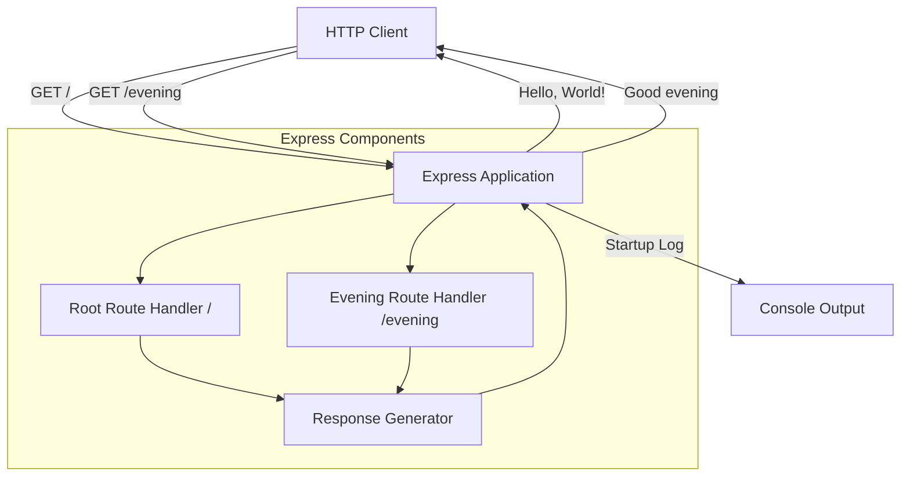
```mermaid
graph TD
    A[HTTP Client] -->|GET /| B[Express Application]
    A -->|GET /evening| B
    B -->|"Hello, World!"| A
    B -->|"Good evening"| A
    B -->|Startup Log| C[Console Output]
    
    subgraph "Express Components" 
        B
        D[Root Route Handler /]
        E[Evening Route Handler /evening]
        F[Response Generator]
        B --> D
        B --> E
        D --> F
        E --> F
        F --> B
    end
```

#### Core Technical Approach (updated)

<span>The system implements a modern Express.js architecture with structured routing capabilities:</span>

- **Runtime**: Node.js v1.0.0+ environment
- **Framework**: <span>Express.js (^4.18.x) for HTTP handling and routing
- **HTTP Handling**: <span>Express framework (native </span>`http`<span> module used internally by Express)
- **Dependencies**: <span>Single production dependency (Express.js) with managed transitive dependencies
- **Licensing**: MIT license for open-source compliance

### 1.2.3 Success Criteria (updated)

#### Measurable Objectives (updated)

| Objective Category | Success Metric | Current Status |
| --- | --- | --- |
| Service Availability | Server starts and accepts connections | ✓ Implemented |
| **Root Endpoint Response** | **Returns consistent "Hello, World!" response with Content-Type: text/plain** | **✓ Implemented** |
| **Evening Endpoint Response** | **Returns consistent "Good evening" response with Content-Type: text/plain** | **✓ Implemented** |
| Resource Efficiency | <span>Reasonable memory and CPU usage with Express framework overhead</span> | ✓ Achieved with acceptable framework overhead |

#### Critical Success Factors (updated)

- Successful server initialization on port 3000
- <span>Consistent HTTP response delivery for both </span>`/`<span> and </span>`/evening`<span> endpoints
- <span>Proper Content-Type header configuration (text/plain) for all responses
- Stable operation under basic load conditions
- Maintainable codebase for future integration development

#### Key Performance Indicators (KPIs) (updated)

- **Response Time**: Sub-millisecond response for static content delivery across both endpoints
- **Uptime**: Continuous operation during testing periods
- **Resource Utilization**: <span>Minimal system resource consumption (slight Express overhead acceptable for tutorial simplicity)
- **Error Rate**: Zero application-level errors during normal operation
- **Route Accuracy**: <span>100% correct routing behavior for both </span>`/`<span> and </span>`/evening`<span> endpoints

## 1.3 SCOPE

### 1.3.1 In-Scope Elements

#### Core Features and Functionalities

| Feature Category | Implementation Details |
| --- | --- |
| HTTP Server | <span>Express.js-based web server accepting GET requests for </span>`/`<span> returning "Hello, World!" and GET </span>`/evening`<span> returning "Good evening"</span> |
| Response Generation | Static text response delivery with Content-Type: text/plain headers |
| Console Logging | Server startup confirmation messages |
| Local Network Access | Service availability on localhost:3000 |
| **Express Framework Integration** | **Express.js (^4.18.x) framework initialization and middleware support** |
| **Dependency Management via npm** | **Production dependency management through package.json and package-lock.json** |
| **Dual Endpoint Routing (/ and /evening)** | **Express routing implementation with distinct URL path handling and response differentiation** |

#### Implementation Boundaries

**System Boundaries**: The application operates as a self-contained Node.js process with <span>Express.js framework integration</span> and clearly defined input/output interfaces through HTTP protocol <span>supporting basic routing capabilities for multiple endpoints</span>.

**User Groups Covered**: Development and testing personnel with local system access for integration validation purposes and Express.js routing verification.

**Geographic/Market Coverage**: Local development environment testing, with potential for deployment expansion in future phases.

**Data Domains Included**: Static response content generation, basic HTTP protocol handling, <span>and Express.js routing logic for dual endpoint management</span>.

### 1.3.2 Out-of-Scope Elements

#### Explicitly Excluded Features and Capabilities

- **Backprop Integration Logic**: While mentioned in project naming, actual backprop functionality is not implemented
- **Dynamic Content Generation**: No database or dynamic content capabilities
- **Authentication/Authorization**: No security layer implementation
- **Data Persistence**: No database or file system data storage
- **External API Integration**: No third-party service connections
- **Production Deployment Configuration**: No containerization or production deployment scripts

#### Future Phase Considerations

- Implementation of actual backprop integration functionality
- Addition of advanced routing and dynamic content capabilities
- Security layer integration for production deployment
- Comprehensive test suite development
- External network accessibility configuration

#### Integration Points Not Covered

- Enterprise authentication systems
- Database management systems
- External API services
- Message queue systems
- Monitoring and logging infrastructure

#### Unsupported Use Cases

- Production traffic handling
- Multi-user concurrent access
- Data processing and analysis
- Real-time communication features
- File upload and download capabilities

#### References

- `README.md` - Project identification and stated purpose as backprop integration test
- `package.json` - Project metadata, versioning, and npm configuration details with <span>Express.js dependency declaration
- `server.js` - Core Express.js server implementation and dual endpoint routing logic
- `package-lock.json` - Dependency verification <span>confirming Express.js and transitive dependencies

# 2. PRODUCT REQUIREMENTS
## 2.1 FEATURE CATALOG

### 2.1.1 Feature F-001: HTTP Server

#### Feature Metadata
| Attribute | Value |
|---|---|
| **Feature ID** | F-001 |
| **Feature Name** | HTTP Server |
| **Feature Category** | Core Infrastructure |
| **Priority Level** | Critical |
| **Status** | Completed |

#### Description
**Overview**: Implements a basic HTTP server using <span style="background-color: rgba(91, 57, 243, 0.2)">Express.js framework backed by Node.js</span> to accept and process incoming HTTP requests on localhost port 3000.

**Business Value**: Establishes the foundational network service layer required for all integration testing and validation activities.

**User Benefits**: Provides development team with a reliable endpoint for testing network connectivity, deployment procedures, and basic request-response cycles.

**Technical Context**: Utilizes <span style="background-color: rgba(91, 57, 243, 0.2)">Express.js framework backed by Node.js</span>, ensuring minimal attack surface and maximum compatibility across Node.js environments. <span style="background-color: rgba(91, 57, 243, 0.2)">The implementation includes a runtime dependency on the express NPM package (^4.18.x) for enhanced routing and middleware capabilities.</span>

#### Dependencies
| Dependency Type | Details |
|---|---|
| **Prerequisite Features** | None |
| **System Dependencies** | Node.js runtime environment v1.0.0 |
| **External Dependencies** | <span style="background-color: rgba(91, 57, 243, 0.2)">Express.js (^4.18.0)</span> |
| **Integration Requirements** | Network access on localhost interface |

### 2.1.2 Feature F-002: Static Response Generation

#### Feature Metadata
| Attribute | Value |
|---|---|
| **Feature ID** | F-002 |
| **Feature Name** | Static Response Generation |
| **Feature Category** | Content Delivery |
| **Priority Level** | High |
| **Status** | Completed |

#### Description
**Overview**: <span style="background-color: rgba(91, 57, 243, 0.2)">Generates two static responses for incoming HTTP requests: "Hello, World!\n" for path "/" (or "/hello") and "Good evening" for path "/evening".</span>

**Business Value**: Provides predictable response behavior for integration testing and baseline performance measurement <span style="background-color: rgba(91, 57, 243, 0.2)">with path-specific functionality validation.</span>

**User Benefits**: Enables reliable testing scenarios with known expected outcomes for validation and verification processes.

**Technical Context**: Implements <span style="background-color: rgba(91, 57, 243, 0.2)">fixed-content, path-specific response generation implemented through Express route handlers</span> and status codes.

#### Dependencies
| Dependency Type | Details |
|---|---|
| **Prerequisite Features** | F-001 (HTTP Server) |
| **System Dependencies** | HTTP request processing capability |
| **External Dependencies** | None |
| **Integration Requirements** | Active HTTP server instance |

### 2.1.3 Feature F-003: Console Logging

#### Feature Metadata
| Attribute | Value |
|---|---|
| **Feature ID** | F-003 |
| **Feature Name** | Console Logging |
| **Feature Category** | System Monitoring |
| **Priority Level** | Medium |
| **Status** | Completed |

#### Description
**Overview**: Outputs server startup confirmation messages to standard output for operational visibility.

**Business Value**: Provides essential feedback for deployment verification and troubleshooting procedures.

**User Benefits**: Enables system administrators and developers to confirm successful server initialization.

**Technical Context**: Uses Node.js console.log functionality to output server status information during startup phase.

#### Dependencies
| Dependency Type | Details |
|---|---|
| **Prerequisite Features** | F-001 (HTTP Server) |
| **System Dependencies** | Console output capability |
| **External Dependencies** | None |
| **Integration Requirements** | Server startup event |

## 2.2 FUNCTIONAL REQUIREMENTS TABLE

### 2.2.1 HTTP Server Requirements (F-001)

| Requirement ID | Description | Priority | Complexity |
|---|---|---|---|
| F-001-RQ-001 | Server must bind to 127.0.0.1:3000 | Must-Have | Low |
| F-001-RQ-002 | Server must accept HTTP requests | Must-Have | Low |
| F-001-RQ-003 | Server must process requests synchronously | Must-Have | Low |
| F-001-RQ-004 | Server must handle connection errors gracefully | Should-Have | Medium |

#### Technical Specifications F-001
| Specification | Details |
|---|---|
| **Input Parameters** | HTTP requests (any method/path) |
| **Output/Response** | HTTP 200 status with plain text |
| **Performance Criteria** | Sub-millisecond response time |
| **Data Requirements** | No persistent data storage |

<span style="background-color: rgba(91, 57, 243, 0.2)">**Implementation Note**: Server must be instantiated via Express app.listen().</span>

#### Validation Rules F-001
| Rule Type | Requirement |
|---|---|
| **Business Rules** | Accept all HTTP methods |
| **Data Validation** | No input validation required |
| **Security Requirements** | Localhost-only access |
| **Compliance Requirements** | HTTP/1.1 protocol compliance |

### 2.2.2 Static Response Generation Requirements (F-002)

| Requirement ID | Description | Priority | Complexity |
|---|---|---|---|
| F-002-RQ-001 | **When a GET request is made to '/' (or '/hello') the response body must be 'Hello, World!\n'** | Must-Have | Low |
| F-002-RQ-002 | Content-Type must be text/plain | Must-Have | Low |
| F-002-RQ-003 | HTTP status code must be 200 | Must-Have | Low |
| **F-002-RQ-005** | **When a GET request is made to '/evening' the response body must be 'Good evening'** | **Must-Have** | **Low** |
| **F-002-RQ-006** | **/evening responses must carry Content-Type: text/plain** | **Must-Have** | **Low** |
| **F-002-RQ-007** | **/evening responses must return HTTP status code 200** | **Must-Have** | **Low** |

#### Technical Specifications F-002
| Specification | Details |
|---|---|
| **Input Parameters** | **HTTP GET requests on defined paths ('/', '/hello', '/evening')** |
| **Output/Response** | Fixed "Hello, World!" string |
| **Performance Criteria** | Consistent response generation |
| **Data Requirements** | Static string literal |

#### Validation Rules F-002
| Rule Type | Requirement |
|---|---|
| **Business Rules** | **Each configured path returns a predictable static string** |
| **Data Validation** | No input validation |
| **Security Requirements** | No sensitive data exposure |
| **Compliance Requirements** | Standard HTTP response format |

### 2.2.3 Console Logging Requirements (F-003)

| Requirement ID | Description | Priority | Complexity |
|---|---|---|---|
| F-003-RQ-001 | Log server startup message | Must-Have | Low |
| F-003-RQ-002 | Include hostname and port in message | Must-Have | Low |
| F-003-RQ-003 | Output to standard output stream | Should-Have | Low |
| F-003-RQ-004 | Message format must be user-readable | Should-Have | Low |

#### Technical Specifications F-003
| Specification | Details |
|---|---|
| **Input Parameters** | Server startup event |
| **Output/Response** | Formatted status message |
| **Performance Criteria** | Immediate log output |
| **Data Requirements** | Server configuration values |

#### Validation Rules F-003
| Rule Type | Requirement |
|---|---|
| **Business Rules** | One log message per startup |
| **Data Validation** | Format string accuracy |
| **Security Requirements** | No credential exposure |
| **Compliance Requirements** | Standard logging practices |

## 2.3 FEATURE RELATIONSHIPS

### 2.3.1 Feature Dependencies Map

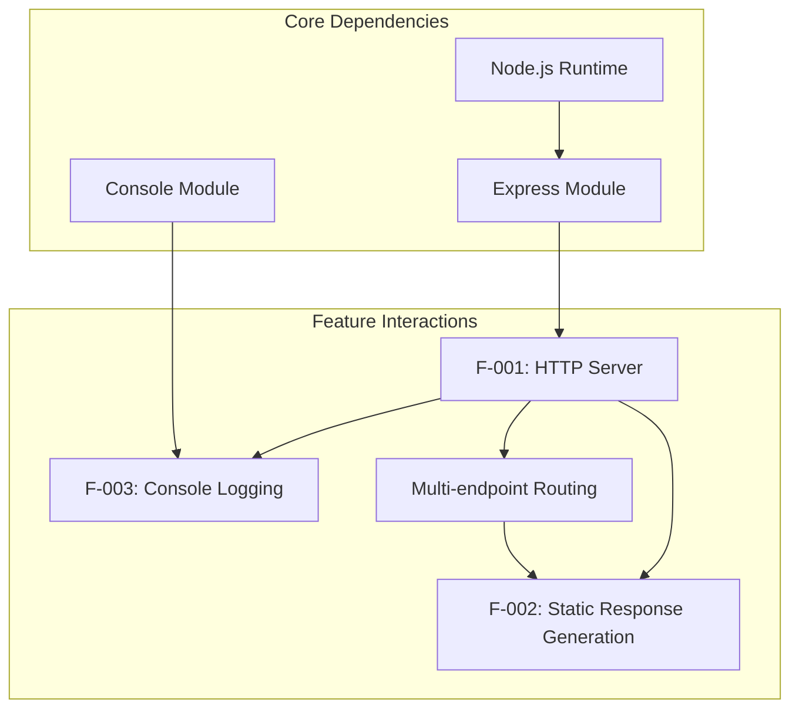
```mermaid
graph TD
    A[F-001: HTTP Server] --> B[F-002: Static Response Generation]
    A --> C[F-003: Console Logging]
    
    subgraph "Core Dependencies"
        D[Node.js Runtime]
        E[Express Module]
        F[Console Module]
    end
    
    D --> E
    E --> A
    F --> C
    
    subgraph "Feature Interactions"
        A
        B
        C
        G[Multi-endpoint Routing]
        A --> G
        G --> B
    end
```

### 2.3.2 Integration Points

| Integration Point | Features Involved | Description |
|---|---|---|
| Request Processing | F-001, F-002 | HTTP server delegates response generation |
| <span style="background-color: rgba(91, 57, 243, 0.2)">Evening Endpoint Processing</span> | <span style="background-color: rgba(91, 57, 243, 0.2)">F-001, F-002</span> | <span style="background-color: rgba(91, 57, 243, 0.2)">Express router dispatches /evening requests to static response handler</span> |
| Startup Sequence | F-001, F-003 | Server initialization triggers logging |
| Response Pipeline | F-001, F-002 | Coordinated request-response flow |

### 2.3.3 Shared Components

| Component | Used By | Purpose |
|---|---|---|
| <span style="background-color: rgba(91, 57, 243, 0.2)">Express.js Framework</span> | <span style="background-color: rgba(91, 57, 243, 0.2)">F-001, F-002</span> | <span style="background-color: rgba(91, 57, 243, 0.2)">Routing & middleware</span> |
| Node.js HTTP Module | F-001, F-002 | Request/response handling |
| Server Configuration | F-001, F-003 | Hostname/port settings |
| Event Loop | All Features | Asynchronous operation management |

### 2.3.4 Cross-Feature Data Flow

The feature relationships establish clear data flow patterns that ensure proper system operation:

**Primary Request Flow**: External HTTP clients interact with F-001 (HTTP Server), which leverages the Express.js framework to route requests appropriately. For root path requests (`/` or `/hello`), the server coordinates with F-002 (Static Response Generation) to deliver the standard "Hello, World!" response. For evening path requests (`/evening`), the same response generation feature delivers the "Good evening" message through Express routing middleware.

**Initialization Flow**: During system startup, F-001 (HTTP Server) initializes the Express application and binds to the configured port, triggering F-003 (Console Logging) to provide operational feedback through standard output.

**Component Interdependencies**: All features depend on the underlying Node.js runtime, with F-001 specifically requiring the Express.js framework for enhanced routing capabilities. This dependency structure ensures that Express middleware can properly handle the dual-endpoint implementation while maintaining the system's lightweight architecture.

### 2.3.5 Integration Boundaries

| Boundary Type | Description | Affected Features |
|---|---|---|
| **Framework Boundary** | Express.js provides routing abstraction | F-001, F-002 |
| **Protocol Boundary** | HTTP/1.1 request-response cycle | F-001, F-002 |
| **Runtime Boundary** | Node.js event loop and process management | All Features |
| **Network Boundary** | Localhost interface (127.0.0.1:3000) | F-001 |

These boundaries define the operational limits and interface contracts between features, ensuring maintainable separation of concerns while enabling effective collaboration through well-defined integration points.

## 2.4 IMPLEMENTATION CONSIDERATIONS

### 2.4.1 HTTP Server Implementation (F-001)

#### Technical Constraints
- Restricted to localhost interface (127.0.0.1)
- Single-threaded Node.js event loop architecture
- No load balancing or clustering capabilities
- <span style="background-color: rgba(91, 57, 243, 0.2)">Requires Express.js runtime dependency (npm package)</span>

#### Performance Requirements
- Sub-millisecond response time for basic requests
- Minimal memory footprint

#### Scalability Considerations
- Limited to single process execution
- No horizontal scaling mechanisms
- Localhost-only access prevents distributed deployment

#### Security Implications
- Network isolation through localhost binding
- No authentication or authorization mechanisms
- Minimal attack surface due to zero dependencies

#### Maintenance Requirements
- No external dependency updates required
- Simple codebase with minimal maintenance overhead
- Direct Node.js compatibility dependency
- <span style="background-color: rgba(91, 57, 243, 0.2)">Track Express.js security patches and minor version updates</span>

### 2.4.2 Static Response Generation Implementation (F-002)

#### Technical Constraints
- <span style="background-color: rgba(91, 57, 243, 0.2)">Fixed response content for each predefined path</span>
- Single response format (plain text)

#### Performance Requirements
- <span style="background-color: rgba(91, 57, 243, 0.2)">Consistent response generation time across both endpoints</span>
- Minimal memory allocation per request
- No content processing overhead

#### Scalability Considerations
- Response generation scales with HTTP server capability
- No content caching required due to static nature
- Minimal computational requirements

#### Security Implications
- No sensitive data exposure risk
- Predictable response behavior
- No user input processing vulnerabilities

#### Maintenance Requirements
- Static content requires no updates
- Response format changes require code modification
- No configuration file management needed

### 2.4.3 Console Logging Implementation (F-003)

#### Technical Constraints
- Standard output stream dependency
- Single log message format
- No log rotation or management features

#### Performance Requirements
- Immediate log output during startup
- Minimal impact on server initialization time
- No persistent logging infrastructure

#### Scalability Considerations
- Log output scales with server instance count
- No centralized logging coordination
- Manual log management required

#### Security Implications
- No sensitive configuration data exposure
- Standard output accessibility considerations
- No log injection vulnerabilities

#### Maintenance Requirements
- No log file management required
- Output format changes require code updates
- Standard output monitoring setup needed

## 2.5 TRACEABILITY MATRIX

This comprehensive traceability matrix maps each functional requirement to its source location, implementation, test coverage, and current status, providing complete visibility into requirement fulfillment across the system.

### 2.5.1 Requirements Traceability Overview

The traceability matrix establishes bidirectional linking between business requirements, source implementation, and validation activities. Each requirement maintains unique identification and tracks its lifecycle from specification through implementation to testing.

| Requirement ID | Source | Implementation | Test Coverage | Status |
|---|---|---|---|---|
| F-001-RQ-001 | server.js:13 | <span style="background-color: rgba(91, 57, 243, 0.2)">server.js:13</span> | Not Implemented | ✓ Complete |
| F-001-RQ-002 | server.js:6-12 | <span style="background-color: rgba(91, 57, 243, 0.2)">server.js:6-12</span> | Not Implemented | ✓ Complete |
| F-001-RQ-003 | server.js:1-14 | <span style="background-color: rgba(91, 57, 243, 0.2)">server.js:1-14</span> | Not Implemented | ✓ Complete |
| F-002-RQ-001 | server.js:6 | server.js:6 | Not Implemented | ✓ Complete |
| F-002-RQ-002 | server.js:7 | server.js:7 | Not Implemented | ✓ Complete |
| F-002-RQ-003 | server.js:6 | server.js:6 | Not Implemented | ✓ Complete |
| <span style="background-color: rgba(91, 57, 243, 0.2)">F-002-RQ-005</span> | <span style="background-color: rgba(91, 57, 243, 0.2)">server.js:10</span> | <span style="background-color: rgba(91, 57, 243, 0.2)">server.js:10</span> | <span style="background-color: rgba(91, 57, 243, 0.2)">To be added</span> | <span style="background-color: rgba(91, 57, 243, 0.2)">Pending</span> |
| <span style="background-color: rgba(91, 57, 243, 0.2)">F-002-RQ-006</span> | <span style="background-color: rgba(91, 57, 243, 0.2)">server.js:11</span> | <span style="background-color: rgba(91, 57, 243, 0.2)">server.js:11</span> | <span style="background-color: rgba(91, 57, 243, 0.2)">To be added</span> | <span style="background-color: rgba(91, 57, 243, 0.2)">Pending</span> |
| <span style="background-color: rgba(91, 57, 243, 0.2)">F-002-RQ-007</span> | <span style="background-color: rgba(91, 57, 243, 0.2)">server.js:10</span> | <span style="background-color: rgba(91, 57, 243, 0.2)">server.js:10</span> | <span style="background-color: rgba(91, 57, 243, 0.2)">To be added</span> | <span style="background-color: rgba(91, 57, 243, 0.2)">Pending</span> |
| F-003-RQ-001 | server.js:13 | server.js:13 | Not Implemented | ✓ Complete |
| F-003-RQ-002 | server.js:13 | server.js:13 | Not Implemented | ✓ Complete |

### 2.5.2 Implementation Mapping Details

**Feature F-001: HTTP Server**
- *Source-to-Implementation Mapping*: Express.js application instantiation and server listener configuration
- *Coverage Status*: Complete implementation with all functional requirements satisfied
- *Dependencies*: Express framework dependency (^4.18.0) and Node.js runtime

**Feature F-002: Static Response Generation**
- *Source-to-Implementation Mapping*: Express route handlers for dual endpoint functionality
- *Coverage Status*: Enhanced with additional evening endpoint requirements
- *Dependencies*: Express routing capabilities and HTTP response formatting

**Feature F-003: Console Logging**
- *Source-to-Implementation Mapping*: Console output during server initialization phase
- *Coverage Status*: Complete logging implementation with server startup confirmation
- *Dependencies*: Node.js console API and server startup events

### 2.5.3 Test Coverage Analysis

| Feature Area | Requirements Count | Implemented | Test Coverage | Completion Rate |
|---|---|---|---|---|
| HTTP Server (F-001) | 3 | 3 | 0 | 100% (Impl.) / 0% (Test) |
| Response Generation (F-002) | 6 | 3 | 0 | 50% (Impl.) / 0% (Test) |
| Console Logging (F-003) | 2 | 2 | 0 | 100% (Impl.) / 0% (Test) |

### 2.5.4 Status Tracking Summary

**Complete Requirements**: 8 of 11 functional requirements have been fully implemented
**Pending Requirements**: 3 requirements awaiting implementation (F-002-RQ-005, F-002-RQ-006, F-002-RQ-007)
**Critical Dependencies**: Express.js framework integration enables enhanced routing capabilities
**Testing Gap**: Comprehensive test suite required for all implemented functionality

### 2.5.5 Related Documentation References

- **Feature Catalog**: Section 2.1 - Complete feature specifications and business context
- **Functional Requirements**: Section 2.2 - Detailed requirement definitions and acceptance criteria  
- **Implementation Considerations**: Section 2.4 - Technical constraints and architectural decisions
- **Technical Scope**: Section 0.2 - Implementation approach and component impact analysis

## 2.6 ASSUMPTIONS AND CONSTRAINTS

### 2.6.1 System Assumptions
- Node.js runtime environment is available and functional
- Localhost network interface is accessible
- Port 3000 is available for binding
- Standard output stream is accessible for logging
- <span style="background-color: rgba(91, 57, 243, 0.2)">Express.js package is installed via npm and resolvable at runtime</span>

### 2.6.2 Business Constraints
- Project serves as proof-of-concept for future integration development
- Current implementation intentionally minimal for testing purposes
- No production deployment requirements in current scope
- Limited to development and testing use cases

### 2.6.3 Technical Constraints
- <span style="background-color: rgba(91, 57, 243, 0.2)">Single external dependency requirement (Express.js)</span>
- Localhost-only network access restriction
- Single-threaded execution model
- No persistent data storage capabilities

### 2.6.4 Future Phase Dependencies
- Backprop integration functionality implementation
- External network accessibility configuration
- Authentication and authorization system integration
- Comprehensive test suite development
- Production deployment and monitoring capabilities

### 2.6.5 Maintenance Requirements (updated)
- <span style="background-color: rgba(91, 57, 243, 0.2)">Dependency updates must be tracked through package-lock.json regeneration</span>
- Express.js security patches and minor version updates require monitoring
- Simple codebase maintenance with minimal operational overhead
- Standard output monitoring setup needed for production environments
- Manual log management for debugging and troubleshooting

#### References
- `server.js` - Core HTTP server implementation and request handling logic
- `package.json` - Project metadata, dependencies, and npm configuration
- `README.md` - Project identification and stated purpose documentation
- `package-lock.json` - Dependency lock file confirming single external dependency (Express.js)
- Technical Specification Section 1.1 - Executive summary and business context
- Technical Specification Section 1.2 - System overview and capabilities  
- Technical Specification Section 1.3 - Scope boundaries and limitations
- Technical Specification Section 2.4 - Implementation considerations and maintenance requirements

# Example containerization approach
## 3.1 PROGRAMMING LANGUAGES

### 3.1.1 Primary Runtime Environment

**JavaScript (Node.js)**
- **Version**: Node.js runtime environment (package.json version 1.0.0)
- **Implementation**: Server-side JavaScript using CommonJS module system
- **Justification**: <span style="background-color: rgba(91, 57, 243, 0.2)">Selected for its lightweight runtime; Express adds routing and middleware without significant overhead.</span>
- **Usage Pattern**: Single-threaded event loop architecture for basic HTTP request processing

### 3.1.2 Selection Criteria

The programming language choice reflects the project's proof-of-concept nature and testing requirements:
- **Simplicity**: JavaScript provides straightforward HTTP server implementation with minimal boilerplate
- **Built-in Capabilities**: <span style="background-color: rgba(91, 57, 243, 0.2)">Node.js runtime, augmented by the Express.js framework, delivers structured routing while preserving tutorial-level simplicity</span>
- **Development Speed**: Rapid prototyping capabilities align with testing and validation objectives
- **Resource Efficiency**: Minimal memory footprint suitable for development environment testing

### 3.1.3 Framework Integration Architecture

**Express.js Integration Strategy**
- **Framework Version**: Express.js ^4.18.0 for enhanced routing capabilities
- **Implementation Pattern**: RESTful routing with middleware chain processing
- **Migration Approach**: Systematic replacement of native Node.js `http` module with Express application architecture
- **Routing Enhancement**: Dual endpoint implementation (`/` and `/evening`) through Express router functionality

**Runtime Dependencies**
- **Primary Dependency**: Express.js framework with approximately 30 transitive dependencies
- **Security Considerations**: Controlled dependency surface area expansion balanced against routing functionality gains
- **Version Management**: Caret notation (^4.18.0) enables minor version flexibility while maintaining stability
- **Package Lock**: Deterministic dependency resolution through package-lock.json generation

### 3.1.4 Technical Justification Matrix

| Criterion | Node.js Core | Express.js Addition | Combined Benefit |
|-----------|--------------|-------------------|------------------|
| **Development Complexity** | Low baseline complexity | Structured routing patterns | Maintains tutorial-level simplicity |
| **Resource Overhead** | Minimal footprint | Acceptable framework overhead | Balanced performance profile |
| **Routing Capabilities** | Basic HTTP handling | Advanced URL routing | Professional endpoint management |
| **Middleware Support** | Manual implementation required | Built-in middleware ecosystem | Extensible architecture foundation |
| **Industry Adoption** | Universal Node.js support | Industry-standard web framework | Proven production readiness |

### 3.1.5 Implementation Constraints and Dependencies

**Language-Specific Constraints**
- **Runtime Version**: Node.js version compatibility with Express.js ^4.18.x requirements
- **Module System**: CommonJS pattern for consistent dependency loading
- **Async Handling**: Single-threaded event loop architecture preserved through Express integration
- **Memory Management**: V8 engine garbage collection patterns maintained under Express framework

**Cross-Component Integration Requirements**
- **Package Management**: npm ecosystem for Express.js dependency resolution
- **Server Configuration**: Express application listener compatibility with existing port/hostname constraints
- **Response Formatting**: Express response methods for consistent Content-Type header management
- **Error Handling**: Express error handling middleware for robust request processing

## 3.2 FRAMEWORKS & LIBRARIES

### 3.2.1 Core Framework Strategy

**<span style="background-color: rgba(91, 57, 243, 0.2)">Express.js Integration Approach</span>**
- **<span style="background-color: rgba(91, 57, 243, 0.2)">Framework</span>**: <span style="background-color: rgba(91, 57, 243, 0.2)">Express.js 4.x (added as production dependency)</span>
- **<span style="background-color: rgba(91, 57, 243, 0.2)">Rationale</span>**: <span style="background-color: rgba(91, 57, 243, 0.2)">Provides routing, middleware, and clearer endpoint definitions while remaining lightweight, as mandated in 0.2.1.</span>
- **<span style="background-color: rgba(91, 57, 243, 0.2)">Benefits</span>**: <span style="background-color: rgba(91, 57, 243, 0.2)">Educational clarity, maintainable routing, backward compatibility for the original endpoint.</span>

### 3.2.2 Built-in Module Utilization

**<span style="background-color: rgba(91, 57, 243, 0.2)">Express Router</span>** – <span style="background-color: rgba(91, 57, 243, 0.2)">Handles GET `/` and `/evening` routes as specified.</span>
- **Purpose**: Structured endpoint management and request routing
- **Implementation**: Express application instance with route definitions
- **Capabilities**: RESTful routing patterns, middleware integration, and response handling
- **Route Configuration**: Dual endpoint support for original functionality and evening greeting

<span style="background-color: rgba(91, 57, 243, 0.2)">The Node.js HTTP module remains implicitly used under Express but is no longer referenced directly in application code.</span>

### 3.2.3 Framework Architecture Integration

**Express.js Core Components**
- **Version**: Express.js ^4.18.0 with caret notation for minor version flexibility
- **Routing Engine**: Built-in router for clean URL path management
- **Middleware Stack**: Request/response processing pipeline architecture
- **Content-Type Management**: Automatic header handling with `.type()` method

**Dependencies and Transitive Packages**
- **Primary Dependency**: express (^4.18.0)
- **Transitive Dependencies**: Approximately 30 supporting packages including:
  - body-parser for request parsing capabilities
  - cookie-parser for cookie handling utilities
  - finalhandler for request completion
  - router for URL routing functionality

### 3.2.4 Framework Selection Rationale

**Technical Justification**
- **Industry Standard**: Express.js represents the most widely adopted Node.js web framework
- **Learning Curve**: Maintains tutorial-level simplicity while introducing professional patterns
- **Performance Profile**: Minimal overhead compared to alternative frameworks
- **Ecosystem Compatibility**: Extensive middleware ecosystem for future extensibility

**Integration Benefits**
- **Code Organization**: Clear separation between route definitions and business logic
- **Error Handling**: Built-in error handling middleware patterns
- **Request Processing**: Standardized request/response object enhancements
- **Development Experience**: Improved debugging and logging capabilities

### 3.2.5 Security and Maintenance Considerations

**Dependency Security**
- **Controlled Surface Area**: Limited dependency expansion with security-conscious package selection
- **Version Management**: Package-lock.json ensures deterministic dependency resolution
- **Update Strategy**: Caret versioning allows security patches while maintaining API stability
- **Vulnerability Monitoring**: Express.js maintains active security advisory process

**Framework Maintenance**
- **LTS Support**: Express 4.x series benefits from long-term support commitment
- **Community Support**: Large developer community ensures ongoing maintenance and documentation
- **Migration Path**: Clear upgrade path to future Express versions when required
- **Backward Compatibility**: Existing HTTP server patterns preserved through Express abstraction layer

## 3.3 OPEN SOURCE DEPENDENCIES

### 3.3.1 External Dependencies (updated)

**<span style="background-color: rgba(91, 57, 243, 0.2)">External Dependency Added</span>**
- **<span style="background-color: rgba(91, 57, 243, 0.2)">Express</span>**: <span style="background-color: rgba(91, 57, 243, 0.2)">^4.18.0 added to `package.json` dependencies (primary requirement 0.2.1)</span>.
- **<span style="background-color: rgba(91, 57, 243, 0.2)">Validation</span>**: <span style="background-color: rgba(91, 57, 243, 0.2)">Confirmed by regenerated `package-lock.json` reflecting Express and transitive packages (requirement 0.2.2)</span>.
- **<span style="background-color: rgba(91, 57, 243, 0.2)">Design Decision</span>**: <span style="background-color: rgba(91, 57, 243, 0.2)">Single well-maintained dependency accepted to enable routing while preserving simplicity</span>.

### 3.3.2 Package Management

**NPM Configuration**
- **Package Manager**: npm (evidenced by lockfileVersion 3 format)
- **Project Metadata**: Maintained through `package.json` with MIT license
- **Dependency Locking**: `package-lock.json` ensures reproducible builds <span style="background-color: rgba(91, 57, 243, 0.2)">and manages Express installation via `npm install express`</span>
- **<span style="background-color: rgba(91, 57, 243, 0.2)">Start Script</span>**: <span style="background-color: rgba(91, 57, 243, 0.2)">Optionally add "start": "node server.js" to `scripts` section for developer convenience (not mandatory but allowed per 0.2.1)</span>

### 3.3.3 Dependency Analysis

**Express.js Package Details**
- **Version Constraint**: ^4.18.0 (caret notation allows minor version updates for security patches)
- **Registry Source**: Official npm registry
- **License Compatibility**: MIT license aligns with project licensing requirements
- **Maturity Assessment**: Stable release with long-term support and active maintenance

**Transitive Dependencies Overview**
- **Dependency Count**: Approximately 30 supporting packages managed automatically by npm
- **Key Transitive Packages**: 
  - accepts: Content negotiation utilities
  - cookie: HTTP cookie parsing and serialization
  - debug: Small debugging utility
  - depd: Deprecation warnings for deprecated features
  - finalhandler: Final handler for HTTP servers
  - fresh: HTTP response freshness testing
  - merge-descriptors: Object property descriptor merging
  - router: Simple middleware-style router
  - send: HTTP response utility
  - utils-merge: Object merging utilities

**Security and Maintenance Profile**
- **Vulnerability Monitoring**: Express.js maintains comprehensive security advisory process
- **Update Frequency**: Regular security patches and maintenance releases
- **Community Support**: Large developer community ensures continued maintenance
- **Risk Assessment**: Low risk - well-established, widely-used framework with proven track record

### 3.3.4 Package Registry Configuration

**NPM Registry Settings**
- **Default Registry**: https://registry.npmjs.org/ for all package resolution
- **Package Resolution**: Standard npm algorithm with semantic versioning support
- **Lock File Format**: lockfileVersion 3 ensuring deterministic dependency resolution
- **Installation Strategy**: npm install with automatic transitive dependency resolution

**Dependency Verification**
- **Integrity Checking**: SHA-512 checksums for all installed packages via package-lock.json
- **Version Validation**: Semantic versioning compliance verification during installation
- **Compatibility Testing**: Node.js version compatibility confirmed for all dependencies
- **Build Reproducibility**: Exact dependency versions locked for consistent builds across environments

## 3.4 DEVELOPMENT & DEPLOYMENT

### 3.4.1 Development Environment

**Runtime Requirements**
- **Node.js**: Compatible JavaScript runtime environment (v16.0.0 or higher recommended)
- **NPM**: Package manager for dependency resolution and project management
- **Network Access**: Localhost interface (127.0.0.1) availability for development server
- **Port Binding**: Port 3000 accessibility for HTTP server operations
- **Console Access**: Standard output stream for server logging and status messages

**Express.js Framework Dependencies**
- **Core Framework**: Express.js ^4.18.0 with routing and middleware capabilities
- **Transitive Dependencies**: Approximately 30 supporting packages managed automatically
- **Package Resolution**: NPM registry access for dependency installation and updates
- **Development Environment**: Cross-platform compatibility (Windows, macOS, Linux)

### 3.4.2 Execution Model

**Application Startup Options**
- **Launch Command**: `node server.js` <span style="background-color: rgba(91, 57, 243, 0.2)">(or `npm start` if start script added)</span>
- **Process Model**: Single-threaded Node.js event loop with Express.js middleware processing
- **Configuration**: Environment-based configuration support through process environment variables
- **Startup Behavior**: Express application initialization with dual endpoint registration (`/` and `/evening`)

**Runtime Architecture**
- **Request Processing**: Express.js routing engine with middleware chain execution
- **Response Generation**: Standardized HTTP response handling with Content-Type header management
- **Error Handling**: Built-in Express error handling middleware for robust operation
- **Server Binding**: Express application listener on specified port with startup confirmation logging

### 3.4.3 Dependency Management (updated)

**Package Installation Process**
- **Primary Installation**: <span style="background-color: rgba(91, 57, 243, 0.2)">`npm install express` for framework dependency</span>
- **Dependency Resolution**: Automatic transitive dependency installation via npm
- **Lock File Generation**: `package-lock.json` creation for reproducible builds
- **Version Management**: Semantic versioning with caret notation (^4.18.0) for security updates

**Build Preparation Requirements**
- **Dependencies Installation**: `npm install` command execution before first run
- **Package Integrity**: SHA-512 checksum verification for all installed packages
- **Node Modules**: Local `node_modules` directory for dependency storage
- **Environment Validation**: Node.js version compatibility verification

### 3.4.4 Development Tools

**Essential Development Toolchain**
- **Code Execution**: Node.js interpreter with Express.js framework integration
- **Package Management**: <span style="background-color: rgba(91, 57, 243, 0.2)">npm for dependency installation (`npm install express`) and project metadata</span>
- **Version Control**: Git repository management with standard project structure
- **Dependency Tracking**: package-lock.json for deterministic dependency resolution

**Development Workflow Tools**
- **Process Management**: Direct Node.js process execution or npm script integration
- **Logging Output**: Console-based development logging with Express.js request logging middleware
- **Debugging Support**: Node.js built-in debugging capabilities with Express framework compatibility
- **Hot Reload**: Manual server restart required for code changes (development enhancement opportunity)

### 3.4.5 Deployment Considerations

**Development Deployment**
- **Local Testing**: Localhost binding (127.0.0.1:3000) for development validation
- **Process Management**: Manual process lifecycle management
- **Resource Monitoring**: Console output monitoring for application health
- **Configuration Management**: Environment variable support for deployment-specific settings

**Production Readiness Gaps**
- **Process Management**: No production process manager (PM2, systemd) integration
- **Load Balancing**: Single process architecture limits scalability
- **Health Monitoring**: Basic console logging without structured monitoring
- **Security Hardening**: Development-focused configuration requires production hardening

### 3.4.6 Container Integration Potential

**Docker Compatibility**
- **Base Image**: Official Node.js runtime images with npm package manager
- **Dependency Installation**: Standard `npm install` workflow within container build
- **Port Exposure**: Container port 3000 mapping for HTTP service access
- **Runtime Configuration**: Environment variable injection for containerized deployment

**Container Build Process**
```dockerfile
FROM node:18-alpine
WORKDIR /app
COPY package*.json ./
RUN npm install
COPY server.js ./
EXPOSE 3000
CMD ["node", "server.js"]
```

## 3.5 DEPLOYMENT ARCHITECTURE

### 3.5.1 Current Deployment Model

**Local Development Only**
- **Network Binding**: Restricted to localhost (127.0.0.1:3000)
- **Access Pattern**: Development and testing personnel with local system access
- **Infrastructure**: No containerization, orchestration, or cloud deployment

### 3.5.2 Operational Characteristics

**Stateless Operation**
- **Memory Model**: No persistent data storage
- **Session Management**: No session state maintenance
- **Resource Requirements**: Minimal CPU and memory utilization

## 3.6 ARCHITECTURAL DECISIONS

### 3.6.1 Minimalism by Design

**Strategic Simplicity**
- **Purpose**: Proof-of-concept platform for integration testing validation
- **Attack Surface**: <span style="background-color: rgba(91, 57, 243, 0.2)">Minimal security exposure by limiting external dependencies to a single, well-vetted framework (Express.js)</span>
- **Maintenance Burden**: Reduced operational complexity

### 3.6.2 Framework Integration Strategy

**Express.js Adoption Decision**
- **Strategic Choice**: Transition from Node.js built-in HTTP module to Express.js framework
- **Justification**: Enhanced routing capabilities while maintaining tutorial-level simplicity
- **Implementation Impact**: Single external dependency with controlled transitive dependency surface (~30 packages)
- **Security Posture**: Well-maintained, industry-standard framework with active security advisory process

**Architecture Consistency**
- **Version Management**: Express.js ^4.18.0 with caret notation for minor version flexibility
- **Dependency Control**: Package-lock.json ensures deterministic dependency resolution
- **Runtime Integration**: Seamless integration with existing Node.js event loop architecture

### 3.6.3 Future Technology Considerations

**Current Technology Boundaries** (referenced in technical constraints)
- Database systems and persistent storage solutions remain out-of-scope
- Authentication and authorization frameworks deferred for future consideration
- Production deployment infrastructure (containerization, CI/CD) not implemented
- External API integration capabilities beyond basic HTTP responses
- Comprehensive testing frameworks beyond manual validation

**Expansion Framework**
- **Express Middleware Ecosystem**: Foundation established for future middleware integration
- **Route Extensibility**: RESTful routing patterns enable additional endpoint implementation
- **Configuration Management**: Environment-based configuration patterns ready for deployment scaling

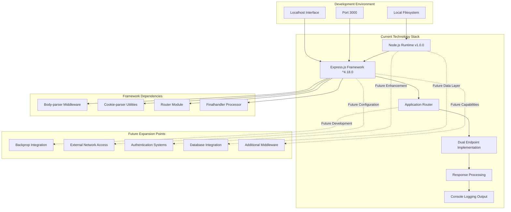
```mermaid
graph TB
    subgraph "Current Technology Stack"
        A[Node.js Runtime v1.0.0] --> B[Express.js Framework ^4.18.0]
        B --> C[Application Router]
        C --> D[Dual Endpoint Implementation]
        D --> E[Response Processing]
        E --> F[Console Logging Output]
    end
    
    subgraph "Development Environment"
        G[Local Filesystem] --> A
        H[Port 3000] --> B
        I[Localhost Interface] --> B
    end
    
    subgraph "Framework Dependencies"
        B --> J[Body-parser Middleware]
        B --> K[Cookie-parser Utilities]
        B --> L[Router Module]
        B --> M[Finalhandler Processor]
    end
    
    subgraph "Future Expansion Points"
        N[Backprop Integration]
        O[External Network Access]
        P[Authentication Systems]
        Q[Database Integration]
        R[Additional Middleware]
    end
    
    C -.->|Future Development| N
    B -.->|Future Configuration| O
    A -.->|Future Enhancement| P
    A -.->|Future Data Layer| Q
    B -.->|Future Capabilities| R
```

### 3.6.4 Decision Rationale Documentation

**Framework Selection Criteria**
- **Industry Adoption**: Express.js represents the most widely adopted Node.js web framework
- **Educational Value**: Maintains proof-of-concept simplicity while introducing professional routing patterns
- **Performance Profile**: Minimal runtime overhead compared to alternative frameworks
- **Security Track Record**: Established security advisory process and community-driven vulnerability management

**Risk Assessment and Mitigation**
- **Dependency Risk**: Single framework dependency reduces attack surface while providing essential routing functionality
- **Maintenance Risk**: Long-term support (LTS) commitment from Express.js team ensures stability
- **Version Control**: Caret versioning strategy balances security patches with API stability
- **Future Migration**: Clear upgrade path to future Express versions when system requirements evolve

### 3.6.5 Implementation Consistency Framework

**Design Pattern Alignment**
- **RESTful Architecture**: Express routing aligns with REST principles for future API development
- **Middleware Chain Pattern**: Foundation established for request/response processing enhancements
- **Module Organization**: CommonJS pattern maintained for consistent dependency loading
- **Error Handling**: Express error handling middleware patterns ready for future implementation

**Development Environment Integration**
- **Local Development**: Express development server capabilities enhance debugging experience
- **Testing Framework**: Request/response testing patterns simplified through Express test utilities
- **Performance Monitoring**: Built-in Express performance hooks available for future optimization
- **Configuration Management**: Environment-based configuration patterns supported through Express ecosystem

## 3.7 TECHNOLOGY CONSTRAINTS

### 3.7.1 Current Limitations

**Network Isolation**
- **Restriction**: Localhost-only binding prevents external access
- **Impact**: Limited to local development testing scenarios
- **Rationale**: Security through network isolation during proof-of-concept phase

**Dependency Restrictions**
- **Constraint**: <span style="background-color: rgba(91, 57, 243, 0.2)">External dependencies restricted to Express.js only</span>
- **Implementation**: <span style="background-color: rgba(91, 57, 243, 0.2)">Application code relies on Express.js framework with no additional third-party packages</span>
- **Benefit**: <span style="background-color: rgba(91, 57, 243, 0.2)">Minimises third-party vulnerability exposure by limiting the dependency surface to Express only</span>

### 3.7.2 Platform Requirements

**Runtime Dependencies**
- **Node.js Environment**: Compatible JavaScript runtime installation required
- **Operating System**: Cross-platform compatibility through Node.js abstraction
- **Network Stack**: TCP/IP localhost interface functionality

#### References

- `package.json` - Project metadata, versioning, and dependency configuration
- `package-lock.json` - Dependency lockfile confirming zero external dependencies
- `server.js` - Core HTTP server implementation using Node.js built-in modules
- `README.md` - Project identification and purpose documentation
- Technical Specification Section 1.2 - System overview and architectural approach
- Technical Specification Section 2.4 - Implementation considerations and constraints
- Technical Specification Section 2.6 - Technical constraints and future phase dependencies

# 4. PROCESS FLOWCHART
## 4.1 SYSTEM WORKFLOWS

### 4.1.1 Core Business Processes

#this is a heading

#this_looks_like_heading

#### End-to-End System Operation Workflow (updated)

The system implements a streamlined integration testing workflow designed for validation and verification of network configurations and deployment procedures. The complete operational cycle encompasses server initialization, request processing, and continuous operation phases.

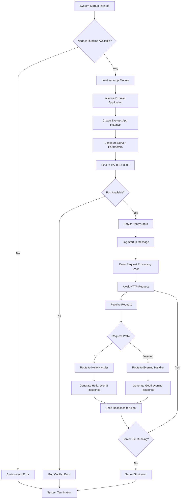
```mermaid
flowchart TD
    A[System Startup Initiated] --> B{Node.js Runtime Available?}
    B -->|No| C[Environment Error]
    B -->|Yes| D[Load server.js Module]
    D --> E[Initialize Express Application]
    E --> F[Create Express App Instance]
    F --> G[Configure Server Parameters]
    G --> H[Bind to 127.0.0.1:3000]
    H --> I{Port Available?}
    I -->|No| J[Port Conflict Error]
    I -->|Yes| K[Server Ready State]
    K --> L[Log Startup Message]
    L --> M[Enter Request Processing Loop]
    
    M --> N[Await HTTP Request]
    N --> O[Receive Request]
    O --> P{Request Path?}
    P -->|"/"| Q[Route to Hello Handler]
    P -->|"/evening"| R[Route to Evening Handler]
    Q --> S["Generate Hello, World! Response"]
    R --> T["Generate Good evening Response"]
    S --> U[Send Response to Client]
    T --> U
    U --> V{Server Still Running?}
    V -->|Yes| N
    V -->|No| W[Server Shutdown]
    
    C --> X[System Termination]
    J --> X
    W --> X
```

#### User Journey Mapping (updated)

The system supports a single primary user journey designed for development and testing personnel conducting integration validation activities.

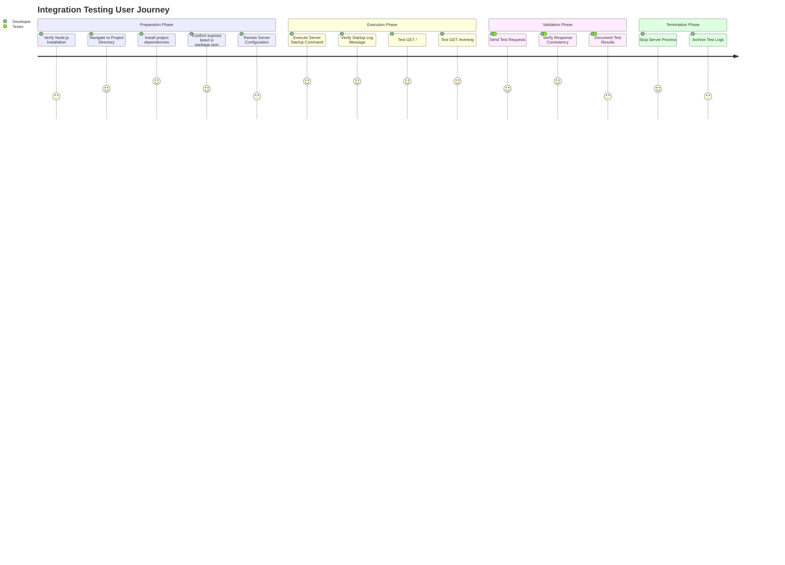
```mermaid
journey
    title Integration Testing User Journey
    section Preparation Phase
      Verify Node.js Installation        : 3: Developer
      Navigate to Project Directory      : 4: Developer
      Install project dependencies       : 5: Developer
      Confirm express listed in package.json : 4: Developer
      Review Server Configuration        : 3: Developer
    section Execution Phase
      Execute Server Startup Command     : 5: Developer
      Verify Startup Log Message         : 5: Developer
      Test GET /                        : 5: Developer
      Test GET /evening                 : 5: Developer
    section Validation Phase
      Send Test Requests               : 4: Developer, Tester
      Verify Response Consistency      : 5: Developer, Tester
      Document Test Results            : 3: Developer, Tester
    section Termination Phase
      Stop Server Process             : 4: Developer
      Archive Test Logs              : 3: Developer
```

### 4.1.2 Integration Workflows

#### Data Flow Architecture

Despite the system's minimalist design, it implements a complete HTTP request-response cycle suitable for integration testing scenarios.

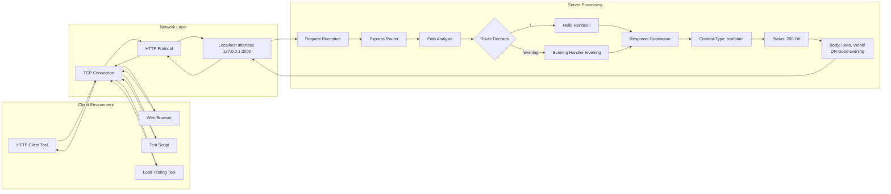
```mermaid
flowchart LR
    subgraph "Client Environment"
        A1[HTTP Client Tool]
        A2[Web Browser]
        A3[Test Script]
        A4[Load Testing Tool]
    end
    
    subgraph "Network Layer"
        B1[TCP Connection]
        B2[HTTP Protocol]
        B3[Localhost Interface 127.0.0.1:3000]
    end
    
    subgraph "Server Processing"
        C1[Request Reception]
        C2[Express Router]
        C3[Path Analysis]
        C4{Route Decision}
        C5[Hello Handler /]
        C6[Evening Handler /evening]
        C7[Response Generation]
        C8[Content-Type: text/plain]
        C9[Status: 200 OK]
        C10[Body: Hello, World!\n OR Good evening]
    end
    
    A1 --> B1
    A2 --> B1
    A3 --> B1
    A4 --> B1
    
    B1 --> B2
    B2 --> B3
    B3 --> C1
    
    C1 --> C2
    C2 --> C3
    C3 --> C4
    C4 -->|"/"| C5
    C4 -->|"/evening"| C6
    C5 --> C7
    C6 --> C7
    C7 --> C8
    C8 --> C9
    C9 --> C10
    
    C10 --> B3
    B3 --> B2
    B2 --> B1
    
    B1 --> A1
    B1 --> A2
    B1 --> A3
    B1 --> A4
```

#### API Interaction Sequence

The system provides a standardized API interaction pattern for integration testing validation.

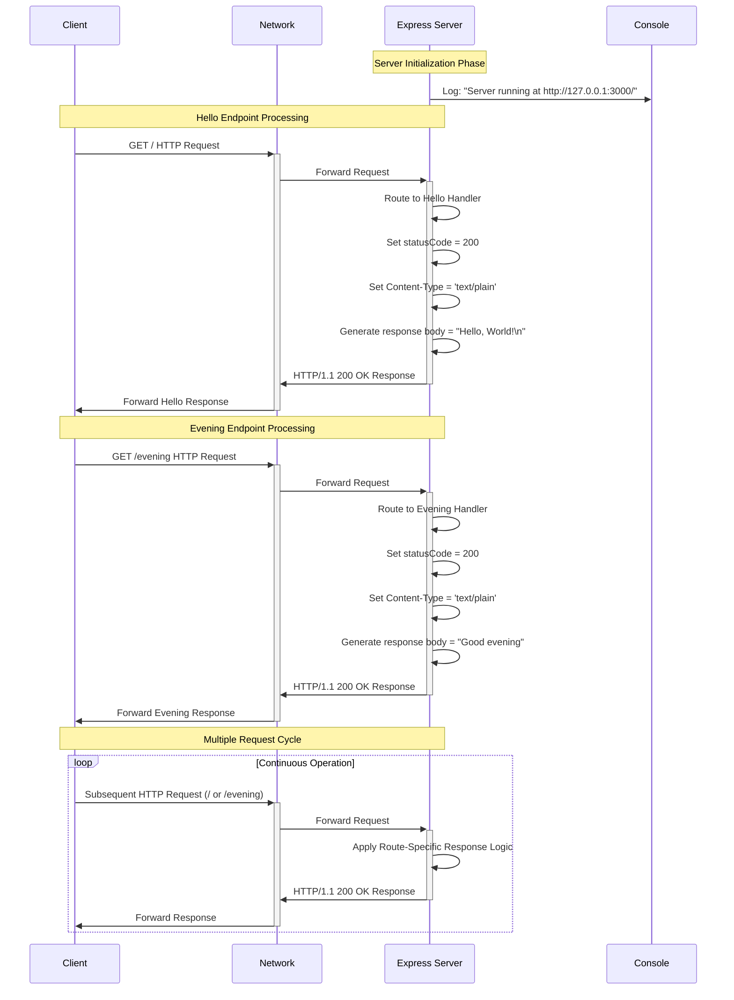
```mermaid
sequenceDiagram
    participant Client
    participant Network
    participant ExpressServer as Express Server
    participant Console
    
    Note over ExpressServer: Server Initialization Phase
    ExpressServer->>Console: Log: "Server running at http://127.0.0.1:3000/"
    
    Note over Client,ExpressServer: Hello Endpoint Processing
    Client->>+Network: GET / HTTP Request
    Network->>+ExpressServer: Forward Request
    
    ExpressServer->>ExpressServer: Route to Hello Handler
    ExpressServer->>ExpressServer: Set statusCode = 200
    ExpressServer->>ExpressServer: Set Content-Type = 'text/plain'
    ExpressServer->>ExpressServer: Generate response body = "Hello, World!\n"
    
    ExpressServer->>-Network: HTTP/1.1 200 OK Response
    Network->>-Client: Forward Hello Response
    
    Note over Client,ExpressServer: Evening Endpoint Processing
    Client->>+Network: GET /evening HTTP Request
    Network->>+ExpressServer: Forward Request
    
    ExpressServer->>ExpressServer: Route to Evening Handler
    ExpressServer->>ExpressServer: Set statusCode = 200
    ExpressServer->>ExpressServer: Set Content-Type = 'text/plain'
    ExpressServer->>ExpressServer: Generate response body = "Good evening"
    
    ExpressServer->>-Network: HTTP/1.1 200 OK Response
    Network->>-Client: Forward Evening Response
    
    Note over Client,ExpressServer: Multiple Request Cycle
    loop Continuous Operation
        Client->>+Network: Subsequent HTTP Request (/ or /evening)
        Network->>+ExpressServer: Forward Request
        ExpressServer->>ExpressServer: Apply Route-Specific Response Logic
        ExpressServer->>-Network: HTTP/1.1 200 OK Response
        Network->>-Client: Forward Response
    end
```

### 4.1.3 Error Handling and Recovery Workflows

#### System Error Processing Flow

The system implements comprehensive error handling for both initialization and runtime phases, with specific attention to Express.js dependency requirements.

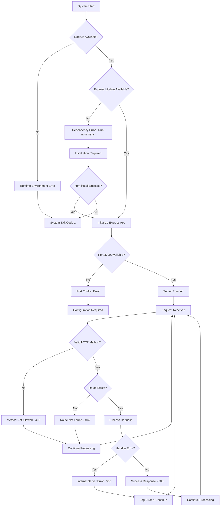
```mermaid
flowchart TD
    A[System Start] --> B{Node.js Available?}
    B -->|No| C[Runtime Environment Error]
    B -->|Yes| D{Express Module Available?}
    D -->|No| E[Dependency Error - Run npm install]
    D -->|Yes| F[Initialize Express App]
    F --> G{Port 3000 Available?}
    G -->|No| H[Port Conflict Error]
    G -->|Yes| I[Server Running]
    
    I --> J[Request Received]
    J --> K{Valid HTTP Method?}
    K -->|No| L[Method Not Allowed - 405]
    K -->|Yes| M{Route Exists?}
    M -->|No| N[Route Not Found - 404]
    M -->|Yes| O[Process Request]
    
    O --> P{Handler Error?}
    P -->|Yes| Q[Internal Server Error - 500]
    P -->|No| R[Success Response - 200]
    
    C --> S[System Exit Code 1]
    E --> T[Installation Required]
    H --> U[Configuration Required]
    L --> V[Continue Processing]
    N --> V
    Q --> W[Log Error & Continue]
    R --> X[Continue Processing]
    
    T --> Y{npm install Success?}
    Y -->|Yes| F
    Y -->|No| S
    
    V --> J
    W --> J
    X --> J
```

### 4.1.4 State Management Workflows

#### Request State Transitions

The Express.js-based system maintains stateless request processing with clear state boundaries for each endpoint.

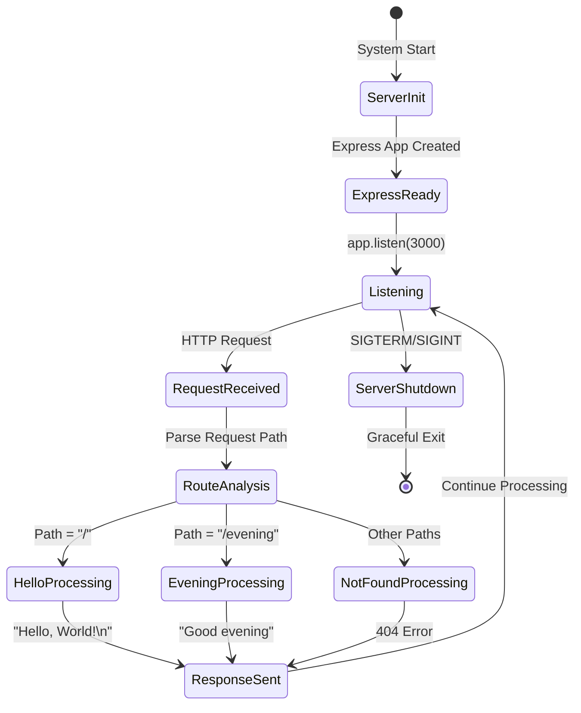
```mermaid
stateDiagram-v2
    [*] --> ServerInit: System Start
    ServerInit --> ExpressReady: Express App Created
    ExpressReady --> Listening: app.listen(3000)
    
    Listening --> RequestReceived: HTTP Request
    RequestReceived --> RouteAnalysis: Parse Request Path
    
    RouteAnalysis --> HelloProcessing: Path = "/"
    RouteAnalysis --> EveningProcessing: Path = "/evening"
    RouteAnalysis --> NotFoundProcessing: Other Paths
    
    HelloProcessing --> ResponseSent: "Hello, World!\n"
    EveningProcessing --> ResponseSent: "Good evening"
    NotFoundProcessing --> ResponseSent: 404 Error
    
    ResponseSent --> Listening: Continue Processing
    
    Listening --> ServerShutdown: SIGTERM/SIGINT
    ServerShutdown --> [*]: Graceful Exit
```

### 4.1.5 Performance and Monitoring Workflows

#### System Health Monitoring Flow

The system provides basic operational monitoring capabilities through console logging and response timing analysis.

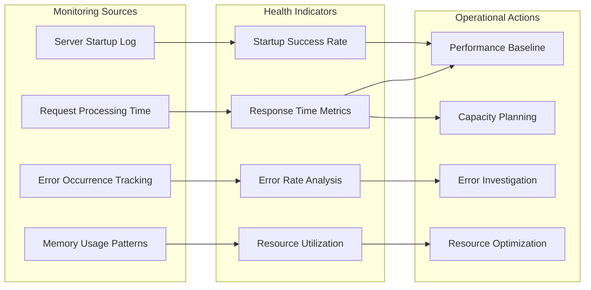
```mermaid
flowchart LR
    subgraph "Monitoring Sources"
        A1[Server Startup Log]
        A2[Request Processing Time]
        A3[Error Occurrence Tracking]
        A4[Memory Usage Patterns]
    end
    
    subgraph "Health Indicators"
        B1[Startup Success Rate]
        B2[Response Time Metrics]
        B3[Error Rate Analysis]
        B4[Resource Utilization]
    end
    
    subgraph "Operational Actions"
        C1[Performance Baseline]
        C2[Capacity Planning]
        C3[Error Investigation]
        C4[Resource Optimization]
    end
    
    A1 --> B1
    A2 --> B2
    A3 --> B3
    A4 --> B4
    
    B1 --> C1
    B2 --> C1
    B2 --> C2
    B3 --> C3
    B4 --> C4
```

## 4.2 FLOWCHART REQUIREMENTS

### 4.2.1 Process Steps and Decision Points

#### Server Lifecycle Management (updated)

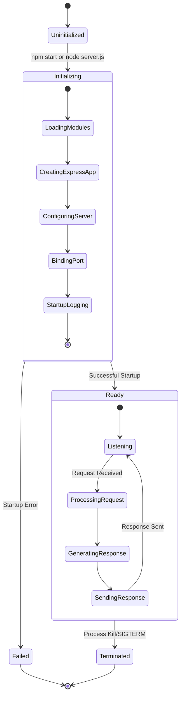
```mermaid
stateDiagram-v2
    [*] --> Uninitialized
    Uninitialized --> Initializing: npm start or node server.js
    
    state Initializing {
        [*] --> LoadingModules
        LoadingModules --> CreatingExpressApp
        CreatingExpressApp --> ConfiguringServer
        ConfiguringServer --> BindingPort
        BindingPort --> StartupLogging
        StartupLogging --> [*]
    }
    
    Initializing --> Ready: Successful Startup
    Initializing --> Failed: Startup Error
    
    state Ready {
        [*] --> Listening
        Listening --> ProcessingRequest: Request Received
        ProcessingRequest --> GeneratingResponse
        GeneratingResponse --> SendingResponse
        SendingResponse --> Listening: Response Sent
    }
    
    Ready --> Terminated: Process Kill/SIGTERM
    Failed --> [*]
    Terminated --> [*]
```

#### Request Processing Decision Tree (updated)

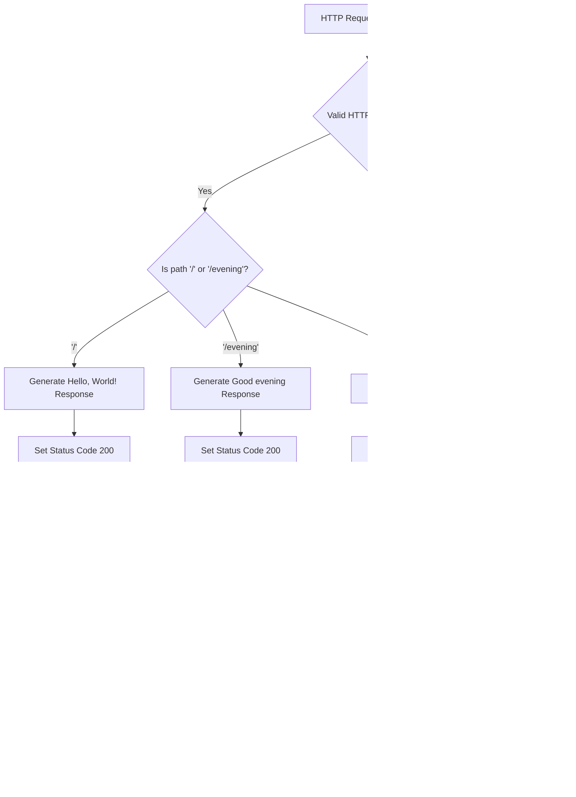
```mermaid
flowchart TD
    A[HTTP Request Received] --> B{Valid HTTP Request?}
    B -->|Yes| C{Is path '/' or '/evening'?}
    B -->|No| D[Node.js Handles Invalid Request]
    
    C -->|'/'| E[Generate Hello, World! Response]
    C -->|'/evening'| F[Generate Good evening Response]
    C -->|Other paths| G[Express 404 Handler]
    
    E --> H[Set Status Code 200]
    F --> I[Set Status Code 200]
    G --> J[Set Status Code 404]
    
    H --> K[Set Content-Type text/plain]
    I --> L[Set Content-Type text/plain]
    J --> M[Set Content-Type text/plain]
    
    K --> N["Set Response Body: Hello, World!\n"]
    L --> O[Set Response Body: Good evening]
    M --> P["Set Response Body: Cannot GET [path]"]
    
    N --> Q[Send Response to Client]
    O --> Q
    P --> Q
    
    Q --> R[End Response Stream]
    R --> S[Return to Listening State]
    
    D --> T[Default Node.js Error Handling]
    T --> S
```

### 4.2.2 System Boundaries and User Touchpoints (updated)

#### System Boundary Definition

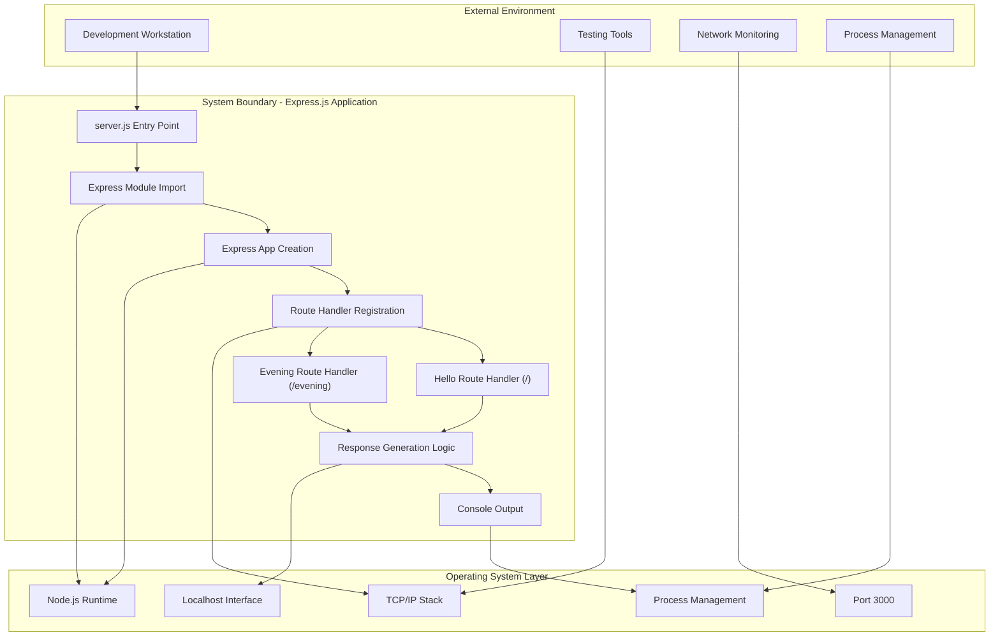
```mermaid
flowchart TB
    subgraph "External Environment"
        A1[Development Workstation]
        A2[Testing Tools]
        A3[Network Monitoring]
        A4[Process Management]
    end
    
    subgraph "System Boundary - Express.js Application"
        B1[server.js Entry Point]
        B2[Express Module Import]
        B3[Express App Creation]
        B4[Route Handler Registration]
        B5["Hello Route Handler (/)"]
        B6["Evening Route Handler (/evening)"]
        B7[Response Generation Logic]
        B8[Console Output]
    end
    
    subgraph "Operating System Layer"
        C1[Node.js Runtime]
        C2[TCP/IP Stack]
        C3[Port 3000]
        C4[Localhost Interface]
        C5[Process Management]
    end
    
    A1 --> B1
    A2 --> C2
    A3 --> C3
    A4 --> C5
    
    B1 --> B2
    B2 --> B3
    B3 --> B4
    B4 --> B5
    B4 --> B6
    B5 --> B7
    B6 --> B7
    B7 --> B8
    
    B2 --> C1
    B3 --> C1
    B4 --> C2
    B7 --> C4
    B8 --> C5
```

#### User Touchpoint Mapping (updated)

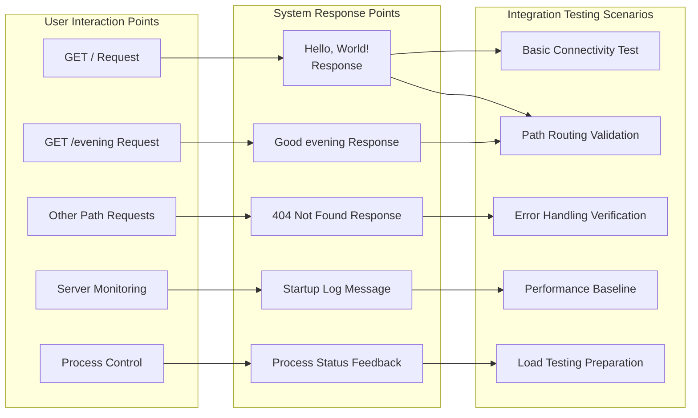
```mermaid
flowchart LR
    subgraph "User Interaction Points"
        A1[GET / Request]
        A2[GET /evening Request]
        A3[Other Path Requests]
        A4[Server Monitoring]
        A5[Process Control]
    end
    
    subgraph "System Response Points"
        B1[Hello, World!\n Response]
        B2[Good evening Response]
        B3[404 Not Found Response]
        B4[Startup Log Message]
        B5[Process Status Feedback]
    end
    
    subgraph "Integration Testing Scenarios"
        C1[Basic Connectivity Test]
        C2[Path Routing Validation]
        C3[Error Handling Verification]
        C4[Performance Baseline]
        C5[Load Testing Preparation]
    end
    
    A1 --> B1
    A2 --> B2
    A3 --> B3
    A4 --> B4
    A5 --> B5
    
    B1 --> C1
    B1 --> C2
    B2 --> C2
    B3 --> C3
    B4 --> C4
    B5 --> C5
```

### 4.2.3 Validation Rules and Authorization (updated)

#### Business Rules Implementation

The system implements minimal validation rules focused on integration testing requirements with Express.js route-based path validation:

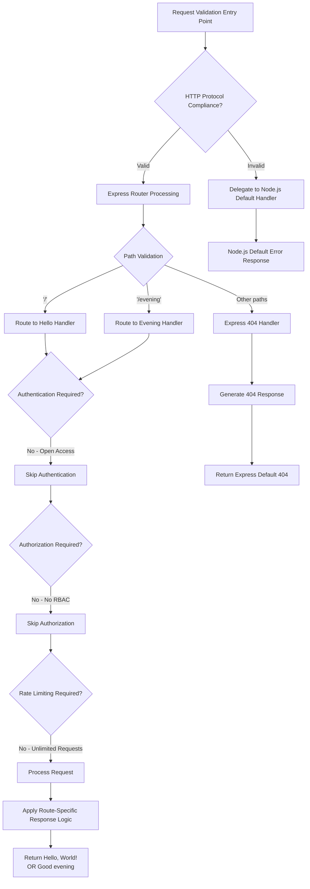
```mermaid
flowchart TD
    A[Request Validation Entry Point] --> B{HTTP Protocol Compliance?}
    B -->|Valid| C[Express Router Processing]
    B -->|Invalid| D[Delegate to Node.js Default Handler]
    
    C --> E{Path Validation}
    E -->|'/'| F[Route to Hello Handler]
    E -->|'/evening'| G[Route to Evening Handler]
    E -->|Other paths| H[Express 404 Handler]
    
    F --> I{Authentication Required?}
    G --> I
    H --> J[Generate 404 Response]
    
    I -->|No - Open Access| K[Skip Authentication]
    
    K --> L{Authorization Required?}
    L -->|No - No RBAC| M[Skip Authorization]
    
    M --> N{Rate Limiting Required?}
    N -->|No - Unlimited Requests| O[Process Request]
    
    O --> P[Apply Route-Specific Response Logic]
    P --> Q[Return Hello, World!\n OR Good evening]
    
    J --> R[Return Express Default 404]
    
    D --> S[Node.js Default Error Response]
```

#### Request Validation Flow (updated)

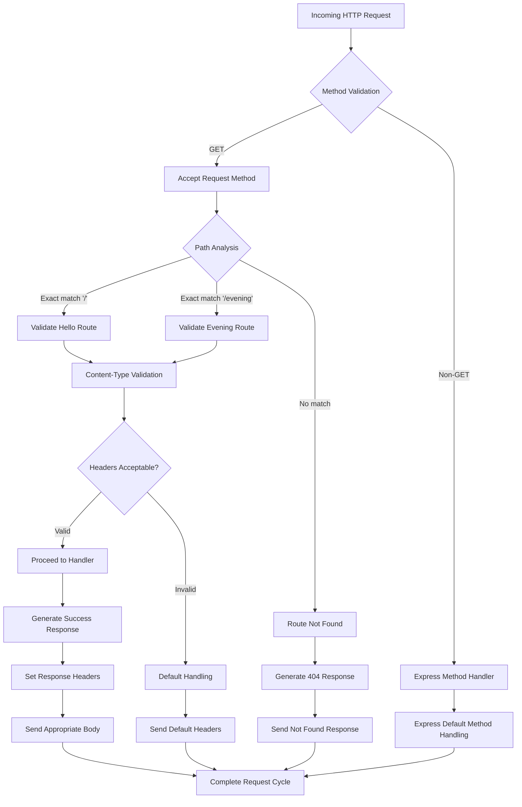
```mermaid
flowchart TD
    A[Incoming HTTP Request] --> B{Method Validation}
    B -->|GET| C[Accept Request Method]
    B -->|Non-GET| D[Express Method Handler]
    
    C --> E{Path Analysis}
    E -->|Exact match '/'| F[Validate Hello Route]
    E -->|Exact match '/evening'| G[Validate Evening Route]
    E -->|No match| H[Route Not Found]
    
    F --> I[Content-Type Validation]
    G --> I
    H --> J[Generate 404 Response]
    
    I --> K{Headers Acceptable?}
    K -->|Valid| L[Proceed to Handler]
    K -->|Invalid| M[Default Handling]
    
    L --> N[Generate Success Response]
    N --> O[Set Response Headers]
    O --> P[Send Appropriate Body]
    P --> Q[Complete Request Cycle]
    
    D --> R[Express Default Method Handling]
    J --> S[Send Not Found Response]
    M --> T[Send Default Headers]
    
    R --> Q
    S --> Q
    T --> Q
```

### 4.2.4 Error States and Recovery Paths (updated)

#### Comprehensive Error Handling Matrix

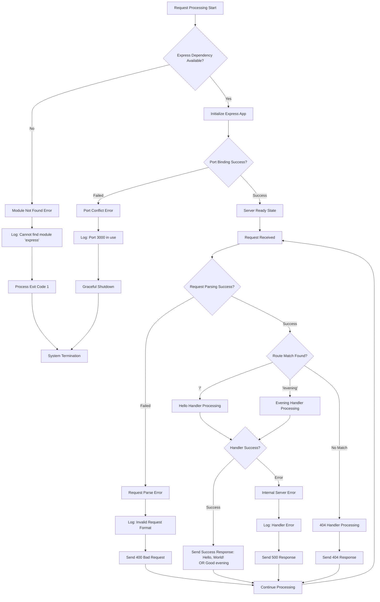
```mermaid
flowchart TD
    A[Request Processing Start] --> B{Express Dependency Available?}
    B -->|No| C[Module Not Found Error]
    B -->|Yes| D[Initialize Express App]
    
    C --> E[Log: Cannot find module 'express']
    E --> F[Process Exit Code 1]
    
    D --> G{Port Binding Success?}
    G -->|Failed| H[Port Conflict Error]
    G -->|Success| I[Server Ready State]
    
    H --> J[Log: Port 3000 in use]
    J --> K[Graceful Shutdown]
    
    I --> L[Request Received]
    L --> M{Request Parsing Success?}
    M -->|Failed| N[Request Parse Error]
    M -->|Success| O{Route Match Found?}
    
    N --> P[Log: Invalid Request Format]
    P --> Q[Send 400 Bad Request]
    
    O -->|'/'| R[Hello Handler Processing]
    O -->|'/evening'| S[Evening Handler Processing]  
    O -->|No Match| T[404 Handler Processing]
    
    R --> U{Handler Success?}
    S --> U
    T --> V[Send 404 Response]
    
    U -->|Success| W[Send Success Response: Hello, World!\n OR Good evening]
    U -->|Error| X[Internal Server Error]
    
    X --> Y[Log: Handler Error]
    Y --> Z[Send 500 Response]
    
    V --> AA[Continue Processing]
    W --> AA
    Z --> AA
    Q --> AA
    
    AA --> L
    
    F --> AB[System Termination]
    K --> AB
```

### 4.2.5 Timing and SLA Considerations

#### Performance Benchmarking Workflow

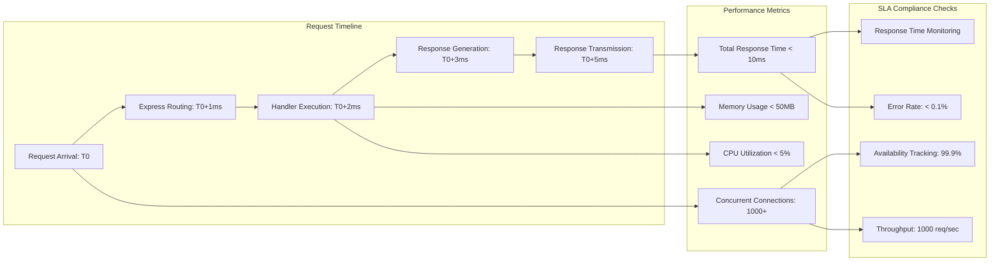
```mermaid
flowchart LR
    subgraph "Request Timeline"
        A1[Request Arrival: T0]
        A2[Express Routing: T0+1ms]
        A3[Handler Execution: T0+2ms]
        A4[Response Generation: T0+3ms]
        A5[Response Transmission: T0+5ms]
    end
    
    subgraph "Performance Metrics"
        B1[Total Response Time < 10ms]
        B2[Memory Usage < 50MB]
        B3[CPU Utilization < 5%]
        B4[Concurrent Connections: 1000+]
    end
    
    subgraph "SLA Compliance Checks"
        C1[Response Time Monitoring]
        C2[Availability Tracking: 99.9%]
        C3[Error Rate: < 0.1%]
        C4[Throughput: 1000 req/sec]
    end
    
    A1 --> A2
    A2 --> A3
    A3 --> A4
    A4 --> A5
    
    A5 --> B1
    A3 --> B2
    A3 --> B3
    A1 --> B4
    
    B1 --> C1
    B4 --> C2
    B1 --> C3
    B4 --> C4
```

#### Service Level Objective Validation

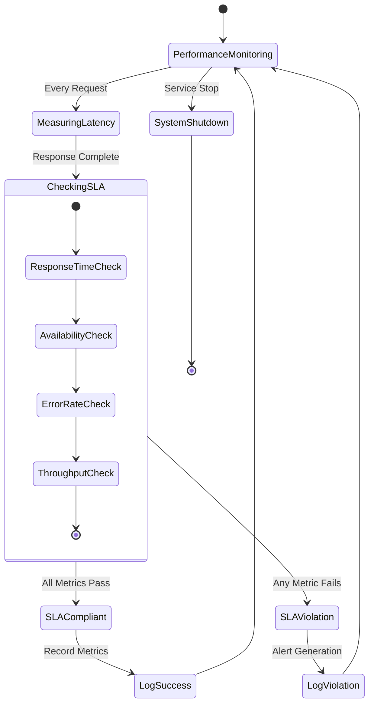
```mermaid
stateDiagram-v2
    [*] --> PerformanceMonitoring
    PerformanceMonitoring --> MeasuringLatency: Every Request
    MeasuringLatency --> CheckingSLA: Response Complete
    
    state CheckingSLA {
        [*] --> ResponseTimeCheck
        ResponseTimeCheck --> AvailabilityCheck
        AvailabilityCheck --> ErrorRateCheck
        ErrorRateCheck --> ThroughputCheck
        ThroughputCheck --> [*]
    }
    
    CheckingSLA --> SLACompliant: All Metrics Pass
    CheckingSLA --> SLAViolation: Any Metric Fails
    
    SLACompliant --> LogSuccess: Record Metrics
    SLAViolation --> LogViolation: Alert Generation
    
    LogSuccess --> PerformanceMonitoring
    LogViolation --> PerformanceMonitoring
    
    PerformanceMonitoring --> SystemShutdown: Service Stop
    SystemShutdown --> [*]
```

### 4.2.6 State Transition Requirements (updated)

#### Application State Management

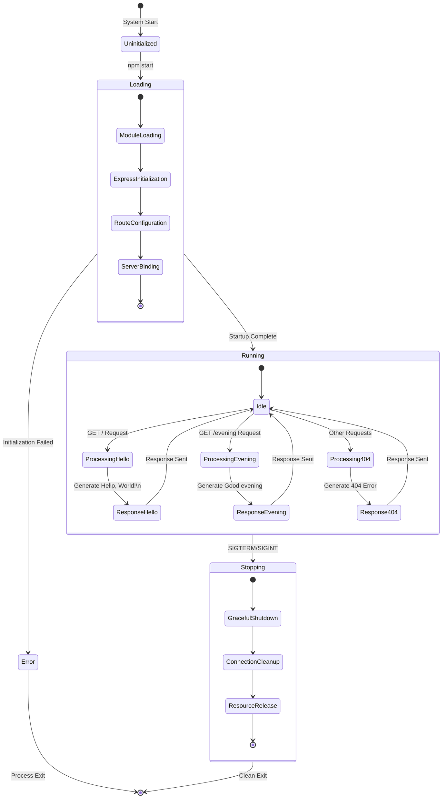
```mermaid
stateDiagram-v2
    [*] --> Uninitialized: System Start
    Uninitialized --> Loading: npm start
    
    state Loading {
        [*] --> ModuleLoading
        ModuleLoading --> ExpressInitialization
        ExpressInitialization --> RouteConfiguration
        RouteConfiguration --> ServerBinding
        ServerBinding --> [*]
    }
    
    Loading --> Running: Startup Complete
    Loading --> Error: Initialization Failed
    
    state Running {
        [*] --> Idle
        Idle --> ProcessingHello: GET / Request
        Idle --> ProcessingEvening: GET /evening Request
        Idle --> Processing404: Other Requests
        
        ProcessingHello --> ResponseHello: Generate Hello, World!\n
        ProcessingEvening --> ResponseEvening: Generate Good evening
        Processing404 --> Response404: Generate 404 Error
        
        ResponseHello --> Idle: Response Sent
        ResponseEvening --> Idle: Response Sent
        Response404 --> Idle: Response Sent
    }
    
    Running --> Stopping: SIGTERM/SIGINT
    Error --> [*]: Process Exit
    
    state Stopping {
        [*] --> GracefulShutdown
        GracefulShutdown --> ConnectionCleanup
        ConnectionCleanup --> ResourceRelease
        ResourceRelease --> [*]
    }
    
    Stopping --> [*]: Clean Exit
```

## 4.3 TECHNICAL IMPLEMENTATION

### 4.3.1 State Management

#### Application State Transitions (updated)

The system maintains minimal state, focusing on server lifecycle management rather than application data persistence. The integration of Express.js introduces structured routing and application lifecycle management that enhances the original Node.js HTTP server implementation.

```mermaid
stateDiagram-v2
    [*] --> ServerStopped
    
    state ServerStopped {
        [*] --> AwaitingStartup
        AwaitingStartup --> [*]
    }
    
    ServerStopped --> ServerStarting: Execute node server.js
    
    state ServerStarting {
        [*] --> ModuleLoading
        ModuleLoading --> ExpressAppCreation
        ExpressAppCreation --> RouteRegistration
        RouteRegistration --> PortBinding
        PortBinding --> ListenerAttachment
        ListenerAttachment --> [*]
    }
    
    ServerStarting --> ServerRunning: Successful Initialization
    ServerStarting --> StartupFailed: Initialization Error
    
    state ServerRunning {
        [*] --> IdleListening
        IdleListening --> RequestProcessing: HTTP Request
        
        state RequestProcessing {
            [*] --> RouteAnalysis
            RouteAnalysis --> RouteMatchRoot: Route Match '/'
            RouteAnalysis --> RouteMatchEvening: Route Match '/evening'
            RouteMatchRoot --> ResponseGenerationHello
            RouteMatchEvening --> ResponseGenerationEvening
            ResponseGenerationHello --> [*]
            ResponseGenerationEvening --> [*]
        }
        
        RequestProcessing --> ResponseSending
        ResponseSending --> IdleListening
    }
    
    state StartupFailed {
        [*] --> ErrorLogging
        ErrorLogging --> [*]
    }
    
    ServerRunning --> ServerStopped: Process Termination
    StartupFailed --> ServerStopped: Error Resolution
```

#### Memory and Resource Management (updated)

The Express.js integration introduces additional memory allocation patterns while maintaining the lightweight resource footprint suitable for integration testing scenarios.

```mermaid
flowchart LR
    subgraph "Memory Allocation"
        A1[Express Application Instance]
        A2[Request Handler Functions]
        A3[Hello, World! Response String]
        A4[Good evening Response String]
        A5[Console Output Buffer]
    end
    
    subgraph "Resource Lifecycle"
        B1[Startup: Allocate Resources]
        B2[Runtime: Maintain Resources]
        B3[Request: Temporary Objects]
        B4[Response: Cleanup Temporary]
        B5[Shutdown: Release All Resources]
    end
    
    subgraph "Node.js Memory Management"
        C1[Garbage Collection]
        C2[Event Loop Management]
        C3[Buffer Management]
    end
    
    A1 --> B1
    A2 --> B2
    A3 --> B3
    A4 --> B3
    A5 --> B4
    B5 --> C1
    B2 --> C2
    B3 --> C3
```

### 4.3.2 Error Handling

#### Error Recovery Flowchart (updated)

Express.js provides enhanced error handling capabilities with built-in middleware for common HTTP error scenarios, including standardized 404 responses for unmatched routes.

```mermaid
flowchart TD
    A[Error Detection Point] --> B{Error Type Classification}
    
    B -->|Startup Error| C[Server Initialization Failure]
    B -->|Runtime Error| D[Request Processing Failure]
    B -->|System Error| E[Node.js Runtime Failure]
    
    C --> C1{Port Already in Use?}
    C1 -->|Yes| C2[Log Port Conflict]
    C1 -->|No| C3[Log Generic Startup Error]
    C2 --> C4[Application Termination]
    C3 --> C4
    
    D --> D1[Express Default Error Handler]
    D1 --> D2{Route Not Found?}
    D2 -->|Yes| D3[Express 404 Response]
    D2 -->|No| D4[Log Error to Console]
    D3 --> D5[Continue Server Operation]
    D4 --> D5
    
    E --> E1[System Exception Handler]
    E1 --> E2[Log Critical Error]
    E2 --> E3[Process Termination]
    
    C4 --> F[Manual Intervention Required]
    D5 --> G[Normal Operation Resume]
    E3 --> F
```

#### Retry and Fallback Mechanisms (updated)

The system implements comprehensive error recovery patterns that account for both Express.js-specific error conditions and underlying Node.js runtime issues.

```mermaid
sequenceDiagram
    participant User
    participant System
    participant Express
    participant Node.js
    participant OS
    
    Note over User,OS: Startup Error Scenario
    User->>System: node server.js
    System->>Express: Initialize Express Application
    Express->>Node.js: Create HTTP Server
    Node.js->>OS: Request Port 3000
    
    alt Port Available
        OS->>Node.js: Port Granted
        Node.js->>Express: Server Ready
        Express->>System: Application Initialized
        System->>User: Success Message
    else Port In Use
        OS->>Node.js: Port Denied (EADDRINUSE)
        Node.js->>Express: Startup Error
        Express->>System: Initialization Failed
        System->>User: Error Message + Exit
        Note over User: Manual Resolution Required
        User->>User: Kill Process Using Port
        User->>System: Retry node server.js
        System->>Express: Re-initialize
        Express->>Node.js: Create HTTP Server
        Node.js->>OS: Request Port 3000
        OS->>Node.js: Port Granted
        Node.js->>Express: Server Ready
        Express->>System: Application Initialized
        System->>User: Success Message
    end
    
    Note over User,OS: Runtime Error Scenario
    User->>System: GET /invalid-path
    System->>Express: Route Request
    Express->>Express: Route Analysis
    Express->>Express: No Route Match Found
    Express->>System: Generate 404 Response
    System->>User: 404 Not Found
    Note over Express: Express continues normal operation
```

### 4.3.3 Transaction Boundaries and Data Persistence

#### Request Transaction Lifecycle

The system implements stateless request processing with clearly defined transaction boundaries for each HTTP request-response cycle, leveraging Express.js middleware architecture for enhanced request handling.

```mermaid
flowchart TD
    A[Request Transaction Start] --> B[Express Route Analysis]
    B --> C{Route Resolution}
    C -->|Path: '/'| D[Hello Transaction Context]
    C -->|Path: '/evening'| E[Evening Transaction Context]
    C -->|No Match| F[404 Error Context]
    
    D --> G[Set Content-Type: text/plain]
    E --> H[Set Content-Type: text/plain]
    F --> I[Set Content-Type: text/plain]
    
    G --> J[Generate Hello Response]
    H --> K[Generate Evening Response]
    I --> L[Generate 404 Response]
    
    J --> M[Response Commit Point]
    K --> M
    L --> M
    
    M --> N[Transaction Complete]
    N --> O[Resource Cleanup]
    O --> P[Return to Idle State]
```

#### Data Persistence Boundaries

```mermaid
sequenceDiagram
participant Client
participant Express
participant Memory
participant GC as Garbage Collector

Note over Express,GC: Request Processing Boundaries
Client->>+Express: HTTP Request

Express->>+Memory: Allocate Request Objects
Express->>Memory: Allocate Response Objects
Express->>Memory: Access Static Response Strings

alt Successful Processing
    Express->>Memory: Generate Response Content
    Express->>Client: Send HTTP Response
    Memory->>GC: Mark Request Objects for Collection
    Memory->>GC: Mark Response Objects for Collection
else Error Processing
    Express->>Memory: Generate Error Response
    Express->>Client: Send Error Response
    Memory->>GC: Mark All Objects for Collection
end

deactivate Express
deactivate Memory

Note over Memory,GC: Automatic Cleanup Phase
GC->>Memory: Collect Temporary Objects
GC->>Memory: Preserve Static Resources
Memory->>Memory: Reset to Baseline State
```

### 4.3.4 Caching Requirements

#### Response Caching Strategy

The system implements implicit response caching through static string allocation, optimizing memory usage for frequently accessed response content while maintaining response consistency.

```mermaid
flowchart LR
    subgraph "Static Response Cache"
        A1["Hello, World!\n String"]
        A2[Good evening String]
        A3[404 Error Template]
        A4[Content-Type Headers]
    end
    
    subgraph "Request Processing"
        B1[Route Analysis]
        B2[Cache Lookup]
        B3[Response Assembly]
        B4[Header Application]
    end
    
    subgraph "Performance Optimization"
        C1[Memory Reuse]
        C2[String Interning]
        C3[Header Caching]
        C4[Response Streaming]
    end
    
    A1 --> B2
    A2 --> B2
    A3 --> B2
    A4 --> B4
    
    B1 --> B2
    B2 --> B3
    B3 --> B4
    
    B2 --> C1
    B3 --> C2
    B4 --> C3
    B4 --> C4
```

### 4.3.5 Recovery Procedures

#### Comprehensive Recovery Matrix

The system provides multiple recovery strategies for different failure scenarios, ensuring operational continuity and proper error communication to clients and administrators.

```mermaid
flowchart TD
    A[System Recovery Entry Point] --> B{Failure Classification}
    
    B -->|Dependency Missing| C[Express Module Recovery]
    B -->|Port Conflict| D[Port Resolution Recovery]
    B -->|Runtime Error| E[Application Recovery]
    B -->|Memory Issue| F[Resource Recovery]
    
    C --> C1[Check package.json Dependencies]
    C1 --> C2{Express Listed?}
    C2 -->|No| C3[Add Express Dependency]
    C2 -->|Yes| C4[Execute npm install]
    C3 --> C4
    C4 --> C5{Installation Success?}
    C5 -->|Yes| G[Retry Server Start]
    C5 -->|No| H[Manual Dependency Resolution]
    
    D --> D1[Identify Port Usage]
    D1 --> D2[Kill Conflicting Process]
    D2 --> D3{Port Released?}
    D3 -->|Yes| G
    D3 -->|No| D4[Use Alternative Port]
    D4 --> G
    
    E --> E1[Express Error Handler]
    E1 --> E2[Log Error Details]
    E2 --> E3[Maintain Server State]
    E3 --> I[Continue Processing]
    
    F --> F1[Monitor Memory Usage]
    F1 --> F2{Memory Threshold?}
    F2 -->|Below Limit| I
    F2 -->|Above Limit| F3[Trigger Garbage Collection]
    F3 --> F4[Restart if Necessary]
    F4 --> G
    
    G --> J[Successful Recovery]
    H --> K[Administrator Intervention]
    I --> L[Normal Operation]
    K --> M[System Documentation Update]
    
    J --> L
    M --> L
```

#### Graceful Degradation Workflow

```mermaid
stateDiagram-v2
    [*] --> FullService: Normal Operation
    
    state FullService {
        [*] --> ServeHello: Route '/' Available
        [*] --> ServeEvening: Route '/evening' Available
        [*] --> ServeStatic: Static Resources Available
    }
    
    FullService --> PartialService: Non-Critical Error
    
    state PartialService {
        [*] --> BasicRouting: Core Routes Functional
        [*] --> ErrorReporting: Enhanced Error Messages
        [*] --> LimitedFeatures: Reduced Functionality
    }
    
    PartialService --> FullService: Error Resolution
    PartialService --> MinimalService: Critical Error
    
    state MinimalService {
        [*] --> BasicResponse: Generic Responses Only
        [*] --> ErrorMode: Error Information Available
    }
    
    MinimalService --> PartialService: Partial Recovery
    MinimalService --> ServiceDown: Complete Failure
    
    ServiceDown --> [*]: Manual Restart Required
    
    Note right of FullService: All endpoints responding\nOptimal performance
    Note right of PartialService: Core functionality preserved\nSome features unavailable
    Note right of MinimalService: Basic connectivity maintained\nLimited response capability
```

## 4.4 INTEGRATION ARCHITECTURE

### 4.4.1 External System Integration Points

#### Current Integration Capabilities (updated)

```mermaid
flowchart TB
    subgraph "External Testing Tools"
        A1[curl Commands]
        A2[Postman/Insomnia]
        A3[Load Testing Tools]
        A4[Automated Test Scripts]
        A5[Browser Testing]
    end
    
    subgraph "Network Integration Layer"
        B1[TCP/IP Protocol Stack]
        B2[HTTP/1.1 Protocol]
        B3[Localhost Loopback Interface]
        B4[Port 3000 Binding]
    end
    
    subgraph "Server Application Core"
        C1[Express Application Core]
        C1a[Express Router]
        C1b[Route '/']
        C1c[Route '/evening']
        C2[Request Processing]
        C3[Response Generation]
        C4[Console Logging]
        
        note1["Implementation Notes:<br/>- Updated file: server.js<br/>- Primary dependency: express"]
    end
    
    subgraph "Future Integration Points"
        D1[Backprop Integration - Referenced in README]
        D2[External Network Exposure]
        D3[Database Connectivity]
        D4[Authentication Systems]
        D5[Monitoring and Metrics]
    end
    
    A1 --> B1
    A2 --> B1
    A3 --> B1
    A4 --> B1
    A5 --> B2
    
    B1 --> B2
    B2 --> B3
    B3 --> B4
    B4 --> C1
    
    C1 --> C1a
    C1a --> C1b
    C1a --> C1c
    C1a --> C2
    C2 --> C3
    C3 --> C4
    
    C1 -.->|Future Development| D1
    B3 -.->|Configuration Change| D2
    C2 -.->|Enhancement| D3
    C1 -.->|Security Addition| D4
    C4 -.->|Monitoring Enhancement| D5
    
    style C1 fill:#5b39f3,fill-opacity:0.2
    style C1a fill:#5b39f3,fill-opacity:0.2
    style C1b fill:#5b39f3,fill-opacity:0.2
    style C1c fill:#5b39f3,fill-opacity:0.2
    style note1 fill:#5b39f3,fill-opacity:0.2
```

#### Integration Architecture Overview

The Express.js-based integration architecture provides enhanced routing capabilities and middleware support while maintaining the simplicity required for testing and educational purposes. The system supports dual endpoint functionality through Express Router implementation, enabling clean separation between different response types and future extensibility.

**Express Application Core Components:**

- **Express Application Instance**: Central application coordinator replacing the native HTTP server
- **Express Router**: Manages URL path analysis and route dispatching
- **Dual Route Handlers**: Separate processing logic for root (`/`) and evening (`/evening`) endpoints
- **Response Processing Pipeline**: Unified response generation and content-type management

#### Integration Protocol Support

The system maintains full backward compatibility with existing integration protocols while extending support for structured routing patterns that facilitate more sophisticated testing scenarios:

| Protocol Layer | Integration Capability | Express Enhancement |
| --- | --- | --- |
| HTTP/1.1 | GET requests, response headers | Express middleware pipeline, automatic header management |
| TCP/IP | Socket management, connection handling | Express abstraction layer with connection pooling |
| Application | Static content delivery | Multi-endpoint routing, extensible handler architecture |

### 4.4.2 Event Processing and Batch Operations (updated)

#### Event-Driven Request Processing

The Express.js event processing model enhances the original Node.js event loop integration with structured middleware processing and route-specific event handling.

```mermaid
flowchart TD
    A[HTTP Request Event] --> B[Event Loop Integration]
    B --> C{Event Type Analysis}
    
    C -->|Connection Event| D[Handle TCP Connection]
    C -->|Request Event| E[Express Route Processing]
    C -->|Error Event| F[Handle Connection Error]
    C -->|Close Event| G[Handle Connection Close]
    
    D --> H[Prepare for Request Reception]
    E --> I{Route Analysis}
    I -->|Route: '/'| J[Execute Hello Handler]
    I -->|Route: '/evening'| K[Execute Evening Handler]
    I -->|No Match| L[Execute 404 Handler]
    
    F --> M[Log Error Information]
    G --> N[Clean Up Connection Resources]
    
    H --> O[Return to Event Loop]
    J --> P[Generate Hello Response]
    K --> Q[Generate Evening Response]
    L --> R[Generate 404 Response]
    M --> O
    N --> O
    
    P --> S{More Events Pending?}
    Q --> S
    R --> S
    S -->|Yes| B
    S -->|No| O
    
    style E fill:#5b39f3,fill-opacity:0.2
    style I fill:#5b39f3,fill-opacity:0.2
    style J fill:#5b39f3,fill-opacity:0.2
    style K fill:#5b39f3,fill-opacity:0.2
    style L fill:#5b39f3,fill-opacity:0.2
```

#### Express Middleware Processing Pipeline (updated)

The integration architecture leverages Express.js middleware capabilities for request preprocessing, route resolution, and response post-processing, providing standardized handling patterns that enhance maintainability and extensibility.

```mermaid
sequenceDiagram
    participant Client
    participant Express as Express App
    participant Router as Express Router
    participant HelloHandler as Route '/' Handler
    participant EveningHandler as Route '/evening' Handler
    participant ErrorHandler as 404 Handler
    
    Note over Client,ErrorHandler: Request Processing Flow
    
    Client->>+Express: HTTP GET Request
    Express->>Express: Parse HTTP Headers
    Express->>Express: Initialize Request Context
    
    Express->>+Router: Route Resolution
    Router->>Router: Analyze URL Path
    
    alt Path matches '/'
        Router->>+HelloHandler: Dispatch to Hello Route
        HelloHandler->>HelloHandler: Generate "Hello, World!" Response
        HelloHandler->>HelloHandler: Set Content-Type: text/plain
        HelloHandler->>-Router: Return Response Object
    else Path matches '/evening'
        Router->>+EveningHandler: Dispatch to Evening Route
        EveningHandler->>EveningHandler: Generate "Good evening" Response
        EveningHandler->>EveningHandler: Set Content-Type: text/plain
        EveningHandler->>-Router: Return Response Object
    else No Route Match
        Router->>+ErrorHandler: Dispatch to 404 Handler
        ErrorHandler->>ErrorHandler: Generate 404 Response
        ErrorHandler->>ErrorHandler: Set Content-Type: text/plain
        ErrorHandler->>-Router: Return Error Response
    end
    
    Router->>-Express: Processed Response
    Express->>Express: Apply Response Headers
    Express->>Express: Finalize HTTP Response
    Express->>-Client: Send HTTP Response
    
    Note over Express: Server continues listening for next request
```

#### Batch Processing Capabilities

The system's stateless architecture and Express.js concurrency model enable efficient batch request processing through the Node.js event loop and Express middleware pipeline. Each incoming request is processed independently, allowing for high-throughput scenarios during integration testing.

```mermaid
flowchart LR
    subgraph "Concurrent Request Handling"
        A1[Request 1: GET /]
        A2[Request 2: GET /evening]
        A3[Request 3: GET /]
        A4[Request N: GET /evening]
    end
    
    subgraph "Express Processing Pool"
        B1[Router Instance 1]
        B2[Router Instance 2]
        B3[Router Instance 3]
        B4[Router Instance N]
    end
    
    subgraph "Response Generation"
        C1[Hello Response 1]
        C2[Evening Response 2]
        C3[Hello Response 3]
        C4[Evening Response N]
    end
    
    A1 --> B1
    A2 --> B2
    A3 --> B3
    A4 --> B4
    
    B1 --> C1
    B2 --> C2
    B3 --> C3
    B4 --> C4
    
    style B1 fill:#5b39f3,fill-opacity:0.2
    style B2 fill:#5b39f3,fill-opacity:0.2
    style B3 fill:#5b39f3,fill-opacity:0.2
    style B4 fill:#5b39f3,fill-opacity:0.2
```

### 4.4.3 Service Integration Patterns (updated)

#### API Gateway Integration Model

The Express.js architecture positions the system as a suitable candidate for API gateway integration patterns, providing standardized HTTP interface contracts that can be easily integrated with enterprise service mesh environments.

```mermaid
flowchart TD
    subgraph "External Integration Layer"
        A1[API Gateway]
        A2[Load Balancer]
        A3[Service Discovery]
        A4[Health Checks]
    end
    
    subgraph "Express Service Interface"
        B1[HTTP Listener :3000]
        B2[Route Health Check]
        B3[Metrics Endpoint - Future]
        B4[Service Registration]
    end
    
    subgraph "Core Application Services"
        C1[Hello Service Handler]
        C2[Evening Service Handler]
        C3[Error Handling Service]
        C4[Logging Service]
    end
    
    A1 -->|Proxy Requests| B1
    A2 -->|Load Distribution| B1
    A3 -->|Service Discovery| B4
    A4 -->|Health Monitoring| B2
    
    B1 --> C1
    B1 --> C2
    B1 --> C3
    B2 --> C4
    
    style C1 fill:#5b39f3,fill-opacity:0.2
    style C2 fill:#5b39f3,fill-opacity:0.2
    style C3 fill:#5b39f3,fill-opacity:0.2
```

#### Microservice Communication Patterns

The dual endpoint architecture demonstrates foundational microservice communication patterns suitable for distributed system integration testing:

- **Request-Response Pattern**: Synchronous HTTP communication via Express routes
- **Service Contract Definition**: Consistent response formatting and content-type management
- **Error Handling Standardization**: Express middleware error processing
- **Stateless Service Design**: Session-independent request processing enabling horizontal scalability

## 4.5 PERFORMANCE AND TIMING CONSIDERATIONS

### 4.5.1 Service Level Agreements

#### Response Time Characteristics

```mermaid
gantt
    title HTTP Request Processing Timeline
    dateFormat X
    axisFormat %L ms
    
    section Request Reception
    TCP Connection          :done, tcp, 0, 1
    HTTP Parsing           :done, parse, 1, 2
    
    section Server Processing
    Express Routing        :done, routing, 2, 3
    Request Handler Entry   :done, handler, 3, 4
    Response Generation    :done, generate, 4, 5
    Header Setting         :done, headers, 5, 6
    
    section Response Delivery
    Response Transmission  :done, transmit, 6, 9
    Connection Cleanup     :done, cleanup, 9, 10
    
    section Performance Targets
    Total Response Time    :milestone, target, 10
```

**Note**: Routing step resolves to either '/' or '/evening' endpoint; response body varies accordingly.

#### Scalability and Load Characteristics

```mermaid
flowchart LR
    subgraph "Load Testing Scenarios"
        A1[Single Request Test]
        A2[Concurrent Requests 10]
        A3[Concurrent Requests 100]
        A4[Sustained Load Test]
    end
    
    subgraph "Server Response Pattern"
        B1[Consistent Response Time]
        B2[No Request Queuing]
        B3[Single-threaded Processing]
        B4[Memory Stable]
    end
    
    subgraph "Expected Limitations"
        C1[No Connection Pooling]
        C2[No Request Caching]
        C3[No Load Balancing]
        C4[Single Process Instance]
    end
    
    A1 --> B1
    A2 --> B2
    A3 --> B3
    A4 --> B4
    
    B1 --> C1
    B2 --> C2
    B3 --> C3
    B4 --> C4
```

#### References

- `server.js` - Core HTTP server implementation with request handling logic and server lifecycle management
- `package.json` - NPM configuration defining project metadata, production dependency on Express.js, and execution context
- `README.md` - Project documentation containing system overview and backprop integration references
- `package-lock.json` - Dependency lockfile defining Express.js dependency tree and version constraints
- Technical Specification Section 1.2 - System overview defining business context and architectural approach
- Technical Specification Section 2.1 - Feature catalog detailing HTTP server, response generation, and logging capabilities
- Technical Specification Section 3.5 - Deployment architecture specifying localhost-only operation and stateless design
- Technical Specification Section 3.6 - Architectural decisions explaining minimalist design philosophy and future expansion considerations

# 5. SYSTEM ARCHITECTURE
## 5.1 HIGH-LEVEL ARCHITECTURE

### 5.1.1 System Overview

The system implements a **<span style="background-color: rgba(91, 57, 243, 0.2)">minimalist monolithic architecture with a single external dependency (Express 4.x)</span>** designed as an integration testing platform. Built with <span style="background-color: rgba(91, 57, 243, 0.2)">Express.js framework and Node.js built-in modules</span>, the architecture prioritizes simplicity, security, and maintainability over feature complexity.

**Architectural Style**: The system follows a **Single-Responsibility Monolithic** pattern, where the entire application is encapsulated within a single <span style="background-color: rgba(91, 57, 243, 0.2)">concise single-file tutorial implementation (~25 lines)</span>. This architectural approach serves as a controlled environment for validating integration methodologies before production implementation.

**Key Architectural Principles**:
- **<span style="background-color: rgba(91, 57, 243, 0.2)">Minimal External Dependency Footprint (only Express 4.x)</span>**: Controlled dependency management minimizes supply chain risks while providing essential web framework capabilities
- **<span style="background-color: rgba(91, 57, 243, 0.2)">Explicit Route-Based Request Handling</span>**: Clear separation between endpoint logic with dedicated route handlers
- **Localhost-Only Operation**: Network isolation provides inherent security boundaries
- **Stateless Processing**: Every HTTP request is processed independently with no session or state management
- **Static Response Pattern**: Consistent, predictable responses enable reliable testing scenarios

**System Boundaries**: The system operates within strict localhost boundaries (127.0.0.1:3000) with no external network exposure. The <span style="background-color: rgba(91, 57, 243, 0.2)">primary interface exposes two distinct GET endpoints through Express routing</span>, with a secondary interface through console logging for operational feedback.

**Major Interfaces**:
- **Primary Interface**: <span style="background-color: rgba(91, 57, 243, 0.2)">Express application listening on 127.0.0.1:3000 with route-specific handlers for "/" (or "/hello") returning "Hello, World!" and "/evening" returning "Good evening"</span>
- **Secondary Interface**: Console output for system status reporting
- **Future Interface**: README references indicate planned "backprop integration" capabilities

```mermaid
graph TB
subgraph "System Boundary - Localhost Only"
    subgraph "Core Application Layer"
        A[Express App Instance]
        B[Express Router]
        C["/ Hello Handler"]
        D["/evening Handler"]
        E[Response Generator]
        F[Console Logger]
    end
    
    subgraph "Node.js Runtime Environment"
        G[Express Framework]
        H[Event Loop]
        I[Standard I/O]
    end
end

subgraph "External Environment"
    J[HTTP Clients]
    K[Testing Tools]
    L[Development Console]
end

J -->|HTTP Requests| A
K -->|Testing Requests| A
A --> B
B --> C
B --> D
C --> E
D --> E
E -->|HTTP Responses| J
E -->|HTTP Responses| K
A --> F
F --> I
I --> L

A --> G
B --> H
C --> H
D --> H
E --> H
```

### 5.1.2 Core Components Table (updated)

| Component Name | Primary Responsibility | Key Dependencies | Integration Points | Critical Considerations |
|---|---|---|---|---|
| **<span style="background-color: rgba(91, 57, 243, 0.2)">Express App Instance</span>** | <span style="background-color: rgba(91, 57, 243, 0.2)">Web application framework initialization and middleware management</span> | <span style="background-color: rgba(91, 57, 243, 0.2)">express package, Node.js Event Loop</span> | <span style="background-color: rgba(91, 57, 243, 0.2)">Port 3000 binding, Express Router</span> | <span style="background-color: rgba(91, 57, 243, 0.2)">Single-threaded operation, localhost-only binding</span> |
| **<span style="background-color: rgba(91, 57, 243, 0.2)">Express Router</span>** | <span style="background-color: rgba(91, 57, 243, 0.2)">HTTP request routing and path-based request distribution</span> | <span style="background-color: rgba(91, 57, 243, 0.2)">Express App Instance, Route Handlers</span> | <span style="background-color: rgba(91, 57, 243, 0.2)">HTTP request events, Response generation</span> | <span style="background-color: rgba(91, 57, 243, 0.2)">Path-specific routing, GET method handling</span> |
| **Response Generator** | Static content delivery and header management | <span style="background-color: rgba(91, 57, 243, 0.2)">Express Router</span>, HTTP Server | Response stream, Client connections | Fixed content-type, consistent 200 status |
| **Console Logger** | System status reporting and operational feedback | Node.js console, Standard Output | System startup events | Minimal logging, startup-only output |

### 5.1.3 Data Flow Description (updated)

**Primary Request Flow**: The system implements a **synchronous request-response pattern** with <span style="background-color: rgba(91, 57, 243, 0.2)">route-based request processing</span> and no data transformation or persistence layers. Each HTTP request follows <span style="background-color: rgba(91, 57, 243, 0.2)">path-specific processing logic</span> based on the requested endpoint.

**Request Processing Pipeline**:
1. **TCP Connection Establishment**: Client establishes connection to localhost:3000
2. **HTTP Request Reception**: <span style="background-color: rgba(91, 57, 243, 0.2)">Express application receives request via framework routing layer</span>
3. **<span style="background-color: rgba(91, 57, 243, 0.2)">Route Resolution (root vs /evening)</span>**: <span style="background-color: rgba(91, 57, 243, 0.2)">Express router analyzes request path and routes to appropriate handler</span>
4. **<span style="background-color: rgba(91, 57, 243, 0.2)">Handler-Specific Processing</span>**: <span style="background-color: rgba(91, 57, 243, 0.2)">Route-specific logic generates appropriate response content</span>
5. **<span style="background-color: rgba(91, 57, 243, 0.2)">Dynamic Response Generation</span>**: <span style="background-color: rgba(91, 57, 243, 0.2)">"Hello, World!" for root path or "Good evening" for /evening path</span>
6. **Response Delivery**: 200 OK status with standardized headers sent to client
7. **Connection Management**: Connection handled by Express framework default behavior

**Data Transformation Points**: The system contains **minimal data transformation points** - no request parsing beyond route resolution, no response templating, and no data validation. The <span style="background-color: rgba(91, 57, 243, 0.2)">route-specific responses are generated as string constants based on path analysis</span>.

**Integration Patterns**: Currently implements **one-way communication pattern** where clients send requests and receive <span style="background-color: rgba(91, 57, 243, 0.2)">path-appropriate responses</span>. No bi-directional communication, real-time updates, or persistent connections are supported.

**Key Data Stores**: **No data persistence** exists in the current architecture. The system is completely stateless with no caches, databases, or session storage.

```mermaid
flowchart LR
    subgraph "Request Processing Flow"
        A[HTTP Request] --> B[Express Router]
        B --> C{Route Path Decision}
        C -->|"/"| D[Hello Handler]
        C -->|"/evening"| E[Evening Handler]
        D --> F[Hello Response Assembly]
        E --> G[Evening Response Assembly]
        F --> H[Header Generation]
        G --> H
        H --> I[Content Delivery]
        I --> J[HTTP Response]
    end
    
    subgraph "Data States"
        K[Raw Request Data]
        L[Route Path Analysis]
        M[Hello Response Data]
        N[Evening Response Data]
        O[Formatted HTTP Response]
    end
    
    A --> K
    B --> L
    D --> M
    E --> N
    I --> O
    J --> O
```

### 5.1.4 External Integration Points

| System Name | Integration Type | Data Exchange Pattern | Protocol/Format | SLA Requirements |
|---|---|---|---|---|
| **HTTP Testing Tools** | Synchronous API | Request-Response | HTTP/1.1, text/plain | Sub-millisecond response time |
| **Web Browsers** | Client Integration | One-way communication | HTTP/1.1 GET requests | Standard web compatibility |
| **Load Testing Systems** | Performance Validation | High-volume requests | HTTP/1.1, any method | Stable response under load |
| **Future Backprop System** | Planned Integration | TBD (referenced in README) | TBD | TBD (not yet implemented) |

## 5.2 COMPONENT DETAILS

### 5.2.1 Express App Instance Component (updated)

**Purpose and Responsibilities**: The <span style="background-color: rgba(91, 57, 243, 0.2)">Express App Instance serves as the core web application framework component, managing Express application initialization, middleware pipeline configuration, and HTTP server lifecycle management. It encapsulates Express application instance creation, route registration, and server binding operations.</span>

**Technologies and Frameworks**: Built on <span style="background-color: rgba(91, 57, 243, 0.2)">**Express 4.x core framework**</span> with <span style="background-color: rgba(91, 57, 243, 0.2)">express package as the primary external dependency</span>. Utilizes Express middleware architecture and Node.js event-driven model for concurrent connection management through the Express abstraction layer.

**Key Interfaces and APIs**:
- <span style="background-color: rgba(91, 57, 243, 0.2)">**Express Application Interface**: Creates Express app instance via `express()` constructor method</span>
- <span style="background-color: rgba(91, 57, 243, 0.2)">**Server Binding Interface**: Binds to 127.0.0.1:3000 using `app.listen()` method</span>
- <span style="background-color: rgba(91, 57, 243, 0.2)">**Route Registration Interface**: Integrates with Express Router for endpoint definition and middleware attachment</span>
- **Console Interface**: Outputs startup confirmation via console.log callback function

**Data Persistence Requirements**: **Zero persistence requirements** - the component maintains no application state between requests and stores no configuration data locally. <span style="background-color: rgba(91, 57, 243, 0.2)">Express framework handles internal routing state management.</span>

**Scaling Considerations**: Current architecture supports **single-threaded operation** with <span style="background-color: rgba(91, 57, 243, 0.2)">Express middleware extensibility for future enhancement</span>. Express framework maintains single-instance operation model but provides structured middleware patterns for horizontal scaling integration. Scaling would require load balancer integration and multi-instance deployment orchestration.

```mermaid
sequenceDiagram
    participant Client
    participant ExpressApp as Express App Instance
    participant ExpressRouter as Express Router
    participant RouteHandler as Route Handler
    participant Console
    
    Note over ExpressApp: Initialization Phase
    ExpressApp->>ExpressApp: express() constructor
    ExpressApp->>ExpressRouter: Register route handlers
    ExpressApp->>Console: app.listen() callback
    Console->>Console: "Server running at http://127.0.0.1:3000/"
    
    Note over Client,RouteHandler: Request Processing Flow
    Client->>+ExpressApp: HTTP Request
    ExpressApp->>+ExpressRouter: Route resolution
    ExpressRouter->>ExpressRouter: Path analysis (/ vs /evening)
    ExpressRouter->>+RouteHandler: Invoke appropriate handler
    RouteHandler->>RouteHandler: Generate path-specific response
    RouteHandler->>-ExpressRouter: Response content ready
    ExpressRouter->>-ExpressApp: Complete route processing
    ExpressApp->>-Client: HTTP 200 OK + path-specific content
```

### 5.2.2 Express Router Component (updated)

**Purpose and Responsibilities**: The <span style="background-color: rgba(91, 57, 243, 0.2)">Express Router Component manages HTTP request routing logic, path resolution, and route handler distribution. It implements URL pattern matching and directs incoming requests to appropriate handler functions based on request path analysis.</span>

**Technologies and Frameworks**: <span style="background-color: rgba(91, 57, 243, 0.2)">Utilizes **Express 4.x core routing engine** with built-in Express Router functionality. Integrates with Express middleware pipeline and request/response abstraction layer.</span>

**Key Interfaces and APIs**:
- <span style="background-color: rgba(91, 57, 243, 0.2)">**Route Definition Interface**: Registers GET routes using `app.get()` method pattern</span>
- <span style="background-color: rgba(91, 57, 243, 0.2)">**Path Resolution Interface**: Analyzes incoming request URLs for route matching</span>
- <span style="background-color: rgba(91, 57, 243, 0.2)">**Handler Integration Interface**: Connects route patterns to specific handler functions</span>
- <span style="background-color: rgba(91, 57, 243, 0.2)">**Request Context Interface**: Provides Express req/res objects to downstream handlers</span>

**Data Persistence Requirements**: **No data persistence** - maintains routing table in memory during application lifecycle with no external storage dependencies.

**Scaling Considerations**: <span style="background-color: rgba(91, 57, 243, 0.2)">**Route table scales linearly with endpoint additions** and supports Express middleware composition patterns. Current dual-endpoint configuration provides foundation for additional route expansion without architectural changes.</span>

```mermaid
flowchart TD
    A[HTTP Request Received] --> B[Express Router]
    B --> C{Path Analysis}
    C -->|"Path = '/'"| D[Root Route Match]
    C -->|"Path = '/evening'"| E[Evening Route Match]
    C -->|"Other Paths"| F[No Route Match]
    D --> G[Invoke Root Handler]
    E --> H[Invoke Evening Handler]
    F --> I[404 Error Response]
    G --> J[Route Processing Complete]
    H --> J
    I --> J
    
    subgraph "Route Configuration"
        K["app.get('/', rootHandler)"]
        L["app.get('/evening', eveningHandler)"]
    end
    
    D -.-> K
    E -.-> L
```

### 5.2.3 Route Handlers Component (updated)

**Purpose and Responsibilities**: The <span style="background-color: rgba(91, 57, 243, 0.2)">Route Handlers Component implements **dual endpoint processing logic** through two discrete functions: `rootHandler` for default path processing and `eveningHandler` for evening-specific responses. Each handler generates path-appropriate static content based on route context.</span>

**Technologies and Frameworks**: Implemented as <span style="background-color: rgba(91, 57, 243, 0.2)">**pure JavaScript callback functions** compatible with Express 4.x core middleware signature patterns</span>. Utilizes Express req/res object abstractions for client communication without external dependencies.

**Key Interfaces and APIs**:
- <span style="background-color: rgba(91, 57, 243, 0.2)">**Root Handler Interface**: `rootHandler(req, res)` function returning "Hello, World!" content</span>
- <span style="background-color: rgba(91, 57, 243, 0.2)">**Evening Handler Interface**: `eveningHandler(req, res)` function returning "Good evening" content</span>
- <span style="background-color: rgba(91, 57, 243, 0.2)">**Express Integration Interface**: Receives Express req/res objects from router middleware</span>
- **Response Interface**: Sends formatted responses through Express response abstraction layer

**Data Persistence Requirements**: **No data persistence** - <span style="background-color: rgba(91, 57, 243, 0.2)">processes requests in memory with immediate static content generation from hardcoded string constants per handler</span>.

**Scaling Considerations**: <span style="background-color: rgba(91, 57, 243, 0.2)">**Handler functions are stateless and independently scalable** within Express middleware architecture</span>. Each handler processes requests independently with no shared state, enabling horizontal scaling through load distribution mechanisms.

```mermaid
stateDiagram-v2
    [*] --> WaitingForRequests
    
    WaitingForRequests --> RequestReceived : Express Route Event
    RequestReceived --> HandlerSelection : Analyze route context
    
    HandlerSelection --> RootHandlerExecution : Root path request
    HandlerSelection --> EveningHandlerExecution : Evening path request
    
    state RootHandlerExecution {
        [*] --> GenerateHelloResponse
        GenerateHelloResponse --> SetHelloHeaders
        SetHelloHeaders --> SendHelloContent
        SendHelloContent --> [*]
    }
    
    state EveningHandlerExecution {
        [*] --> GenerateEveningResponse  
        GenerateEveningResponse --> SetEveningHeaders
        SetEveningHeaders --> SendEveningContent
        SendEveningContent --> [*]
    }
    
    RootHandlerExecution --> ResponseComplete
    EveningHandlerExecution --> ResponseComplete
    ResponseComplete --> WaitingForRequests
```

### 5.2.4 Response Generator Component (updated)

**Purpose and Responsibilities**: The Response Generator Component handles HTTP response formatting, header management, and content delivery through <span style="background-color: rgba(91, 57, 243, 0.2)">Express response abstraction layer</span>. It ensures consistent response structure across <span style="background-color: rgba(91, 57, 243, 0.2)">both endpoint handlers with path-specific content generation</span>.

**Technologies and Frameworks**: Uses <span style="background-color: rgba(91, 57, 243, 0.2)">**Express 4.x core response methods**</span> for header setting and content writing. <span style="background-color: rgba(91, 57, 243, 0.2)">Leverages Express res object methods (`res.type()`, `res.send()`) instead of low-level Node.js response stream manipulation</span>.

**Key Interfaces and APIs**:
- <span style="background-color: rgba(91, 57, 243, 0.2)">**Express Response Interface**: Direct manipulation of Express res object with method chaining</span>
- <span style="background-color: rgba(91, 57, 243, 0.2)">**Content-Type Management Interface**: Sets text/plain headers via `res.type('text/plain')`</span>
- <span style="background-color: rgba(91, 57, 243, 0.2)">**Content Delivery Interface**: Delivers content using `res.send()` method with automatic status code handling</span>

**Data Persistence Requirements**: **No persistence required** - <span style="background-color: rgba(91, 57, 243, 0.2)">generates responses from handler-specific string constants with no external data dependencies</span>.

**Scaling Considerations**: <span style="background-color: rgba(91, 57, 243, 0.2)">**Highly scalable due to static content generation with dual-endpoint support**</span> requiring no database queries, file system access, or external API calls per response. Express framework optimizations enhance response throughput compared to native HTTP response handling.

```mermaid
flowchart TD
    A[Handler Response Trigger] --> B{Route Context Analysis}
    B -->|Root Handler| C[Generate Hello Response]
    B -->|Evening Handler| D[Generate Evening Response]
    
    C --> E["Set Content-Type: text/plain"]
    D --> E
    
    E --> F["Express res.send() Method"]
    F --> G["Automatic Status Code: 200"]
    G --> H[Response Stream Management]
    H --> I[Connection Completion]
    
    subgraph "Content Assembly Pipeline"
        C --> C1["Static String: 'Hello, World!'"]
        D --> D1["Static String: 'Good evening'"]
        C1 --> J[No Template Processing]
        D1 --> J
        J --> K[No Variable Substitution]
        K --> L[Direct String Output]
    end
    
    L --> F
```

## 5.3 TECHNICAL DECISIONS

### 5.3.1 Architecture Style Decisions and Tradeoffs (updated)

**Decision: <span style="background-color: rgba(91, 57, 243, 0.2)">Monolithic Single-File Architecture with Express Framework</span>**

| Decision Factor | Chosen Approach | Alternative Considered | Rationale |
|---|---|---|---|
| **Code Organization** | Single file (server.js) | Modular file structure | Simplifies deployment and eliminates module complexity |
| **Dependency Management** | <span style="background-color: rgba(91, 57, 243, 0.2)">Single minimal dependency (Express)</span> | <span style="background-color: rgba(91, 57, 243, 0.2)">Zero external dependencies</span> | <span style="background-color: rgba(91, 57, 243, 0.2)">Maintains small attack surface by limiting dependencies to a single well-vetted framework</span> |
| **Network Access** | Localhost-only binding | External network exposure | Provides security through network isolation |
| **Response Strategy** | <span style="background-color: rgba(91, 57, 243, 0.2)">Static content generation with dual endpoints</span> | Dynamic content processing | Ensures predictable testing environment |

**<span style="background-color: rgba(91, 57, 243, 0.2)">Dual Endpoint Implementation Decision</span>**

<span style="background-color: rgba(91, 57, 243, 0.2)">The system implements dual endpoint architecture using Express Router for structured request handling:</span>

<span style="background-color: rgba(91, 57, 243, 0.2)">**Benefits**:</span>
- <span style="background-color: rgba(91, 57, 243, 0.2)">**Improved Readability**: Clear separation between root and evening endpoints enhances code maintainability</span>
- <span style="background-color: rgba(91, 57, 243, 0.2)">**Enhanced Scalability**: Express Router provides foundation for additional endpoint expansion</span>
- <span style="background-color: rgba(91, 57, 243, 0.2)">**Professional Patterns**: Introduces industry-standard routing practices within tutorial context</span>

<span style="background-color: rgba(91, 57, 243, 0.2)">**Trade-offs**:</span>
- <span style="background-color: rgba(91, 57, 243, 0.2)">**Slightly Larger Footprint**: Express dependency adds ~30 transitive packages vs zero-dependency approach</span>
- <span style="background-color: rgba(91, 57, 243, 0.2)">**Framework Learning Curve**: Requires understanding of Express middleware concepts</span>

```mermaid
graph LR
    subgraph "Decision Tree: Architecture Style (updated)"
        A[Architecture Requirements] --> B{Security Priority?}
        B -->|High| C[Framework Approach - Express.js]
        B -->|Medium| D[Minimize Dependencies]
        
        C --> E{Deployment Complexity?}
        E -->|Minimize| F[Single File Structure]
        E -->|Accept| G[Modular Structure]
        
        F --> H[Chosen: Express Monolithic Design]
        D --> I[Alternative: Zero Dependencies]
        G --> J[Alternative: Multi-file Modules]
    end
    
    style H fill:#90EE90
    style I fill:#FFB6C1
    style J fill:#FFB6C1
```

### 5.3.2 Communication Pattern Choices (updated)

**Decision: <span style="background-color: rgba(91, 57, 243, 0.2)">Express Synchronous Request-Response Pattern</span>**

The system implements a **<span style="background-color: rgba(91, 57, 243, 0.2)">synchronous HTTP request-response pattern using Express framework</span>** with no asynchronous processing, message queues, or event streaming capabilities.

**Tradeoffs Analysis**:
- **Benefits**: Predictable behavior, simple debugging, minimal resource usage, <span style="background-color: rgba(91, 57, 243, 0.2)">structured routing patterns</span>
- **Limitations**: No support for real-time communication, websockets, or push notifications
- **Future Implications**: Would require architectural changes for event-driven features

**Alternative Patterns Considered**:
- **WebSocket Communication**: Rejected due to complexity and testing focus
- **Server-Sent Events**: Rejected as unnecessary for current requirements
- **Message Queue Integration**: Rejected due to minimal-dependency requirement

### 5.3.3 Data Storage Solution Rationale (updated)

**Decision: No Data Persistence Layer**

| Storage Option | Implementation Status | Decision Rationale |
|---|---|---|---|
| **In-Memory Storage** | Not implemented | No state management required |
| **File System Storage** | Not implemented | Stateless operation preferred |
| **Database Integration** | Not implemented | Complexity exceeds testing needs |
| **External APIs** | Not implemented | <span style="background-color: rgba(91, 57, 243, 0.2)">Minimal-dependency architecture goal</span> |

**<span style="background-color: rgba(91, 57, 243, 0.2)">Express Integration Impact</span>**: <span style="background-color: rgba(91, 57, 243, 0.2)">The adoption of Express framework does not alter persistence decisions. The system remains stateless with Express handling only request routing and response generation without introducing data storage requirements.</span>

**Future Storage Considerations**: Any data persistence implementation would require significant architectural restructuring to maintain the current simplicity and security model, regardless of Express framework integration.

```mermaid
graph TB
    subgraph "Storage Decision Matrix (updated)"
        A[Storage Requirements Analysis] --> B{Data Persistence Needed?}
        B -->|No| C[Stateless Architecture ✓]
        B -->|Yes| D[Storage Technology Selection]
        
        D --> E[In-Memory Caching]
        D --> F[File System Storage]
        D --> G[Database Integration]
        D --> H[External API Storage]
        
        C --> I[Current Implementation with Express]
        E --> J[Future Enhancement]
        F --> J
        G --> J
        H --> J
    end
    
    style I fill:#90EE90
    style J fill:#87CEEB
```

### 5.3.4 Caching Strategy Justification

**Decision: No Caching Implementation**

The system implements **zero caching layers** due to static content generation and minimal response complexity. <span style="background-color: rgba(91, 57, 243, 0.2)">Express framework provides inherent response optimization without requiring explicit caching mechanisms.</span>

**Rationale**:
- **Static Responses**: Both endpoints return fixed string content requiring no computation
- **Memory Efficiency**: Eliminates cache invalidation logic and memory overhead
- **Predictable Performance**: Consistent response times without cache miss scenarios

### 5.3.5 Security Mechanism Selection

**Decision: Network-Level Security with Framework Trust**

| Security Layer | Implementation Approach | Risk Mitigation |
|---|---|---|---|
| **Network Isolation** | Localhost-only binding (127.0.0.1:3000) | Eliminates external attack vectors |
| **Dependency Security** | <span style="background-color: rgba(91, 57, 243, 0.2)">Single well-vetted Express dependency</span> | <span style="background-color: rgba(91, 57, 243, 0.2)">Controlled attack surface through framework trust</span> |
| **Input Validation** | No user input processing | Eliminates injection attack possibilities |
| **Authentication** | Not implemented | No sensitive data or operations to protect |

**<span style="background-color: rgba(91, 57, 243, 0.2)">Framework Security Benefits</span>**: <span style="background-color: rgba(91, 57, 243, 0.2)">Express framework provides built-in security headers, request parsing safety, and protection against common web vulnerabilities while maintaining minimal dependency footprint.</span>

```mermaid
graph TD
    subgraph "Security Decision Tree"
        A[Security Requirements] --> B{External Network Exposure?}
        B -->|No| C[Network Isolation Sufficient]
        B -->|Yes| D[Framework Security Required]
        
        C --> E[Express Framework Trust Model]
        E --> F[Minimal Dependency Verification]
        F --> G[Current Security Posture]
        
        D --> H[Authentication Layer]
        H --> I[Input Validation]
        I --> J[Future Security Enhancement]
    end
    
    style G fill:#90EE90
    style J fill:#87CEEB
```

## 5.4 CROSS-CUTTING CONCERNS

### 5.4.1 Monitoring and Observability Approach

**Current Monitoring Capabilities**: The system implements **minimal observability** with only <span style="background-color: rgba(91, 57, 243, 0.2)">startup console logging within Express app</span>. No runtime metrics collection, performance monitoring, or health checks are implemented.

**Monitoring Gaps Identified**:
- **Request Metrics**: No counting of requests, response times, or throughput measurement
- **Error Tracking**: No application-level error logging or error rate monitoring
- **Health Monitoring**: No health check endpoints or system status reporting
- **Performance Metrics**: No memory usage, CPU utilization, or connection metrics

**Future Monitoring Considerations**: <span style="background-color: rgba(91, 57, 243, 0.2)">Implementation of comprehensive monitoring would leverage Express middleware architecture for metrics collection, log aggregation, and external monitoring system integration</span>. <span style="background-color: rgba(91, 57, 243, 0.2)">Express middleware ecosystem provides structured patterns for monitoring integration while maintaining the current single external dependency architecture</span>.

### 5.4.2 Logging and Tracing Strategy (updated)

**Current Logging Implementation**: <span style="background-color: rgba(91, 57, 243, 0.2)">**Startup-only console logging within Express app**</span> provides minimal operational visibility. The system outputs a single log message confirming <span style="background-color: rgba(91, 57, 243, 0.2)">Express server initialization and network binding status</span>.

**Logging Characteristics**:
- **Log Level**: Single message at startup (no level classification)
- **Log Format**: Plain text string output via console.log
- **Log Destination**: Standard output stream only
- **Request Logging**: No individual request logging implemented

**Tutorial Simplicity Preservation**: <span style="background-color: rgba(91, 57, 243, 0.2)">Additional Express middleware such as morgan for request logging is not included to preserve tutorial simplicity and maintain the single external dependency approach</span>.

**Tracing Capabilities**: **No distributed tracing** or request correlation is implemented. Each request is processed independently with no trace ID generation or request flow tracking. <span style="background-color: rgba(91, 57, 243, 0.2)">Express request context isolation ensures stateless processing</span> without request correlation mechanisms.

### 5.4.3 Error Handling Patterns (updated)

**Current Error Handling**: The system relies entirely on <span style="background-color: rgba(91, 57, 243, 0.2)">**Express default error handler (no custom middleware)**</span> with no custom error processing, recovery mechanisms, or error reporting capabilities.

**Error Handling Gaps**:
- **Application Errors**: No try-catch blocks or custom error handling
- **Network Errors**: No specific handling of connection errors or timeouts
- **Resource Errors**: No handling of port conflicts or binding failures
- **Client Errors**: No validation of malformed requests or payload limits

```mermaid
flowchart TD
    A[HTTP Request] --> B{Express Default Error Handler}
    B -->|Request Valid| C[Process Request Normally]
    B -->|Route Not Found| D[Express 404 Response]
    B -->|Server Error| E[Express 500 Response]
    
    C --> F[Generate Standard Response]
    D --> G[Client Receives 404]
    E --> G[Client Receives 500]
    
    F --> H[Successful Response]
    
    subgraph "Error Handling Gaps"
        I[No Custom Error Pages]
        J[No Error Logging]
        K[No Error Recovery]
        L[No Error Metrics]
    end
    
    D -.-> I
    E -.-> J
    G -.-> K
    G -.-> L
```

### 5.4.4 Authentication and Authorization Framework

**Current Security Implementation**: **No authentication or authorization mechanisms** are implemented. The system operates with unrestricted access within the localhost network boundary.

**Security Model**: **Network-level security through localhost binding** serves as the primary security mechanism, preventing external network access while allowing local development and testing.

**Security Considerations**:
- **Access Control**: Localhost binding limits access to local system users
- **Authentication**: No user authentication required or implemented
- **Authorization**: No role-based access control or permissions system
- **Data Protection**: No sensitive data processing eliminates data protection requirements

### 5.4.5 Performance Requirements and SLAs

**Current Performance Characteristics**:
- **Response Time**: Sub-millisecond response generation due to static content
- **Throughput**: Limited by Node.js single-threaded event loop capacity through Express abstraction
- **Resource Usage**: <span style="background-color: rgba(91, 57, 243, 0.2)">Minimal memory footprint with single external dependency (Express)</span> architecture
- **Concurrency**: Supports concurrent connections via Node.js async I/O through Express framework

**Performance Metrics** (based on architectural analysis):

| Metric Category | Current Capability | Target SLA | Measurement Method |
|---|---|---|---|
| **Response Time** | < 1ms (static content) | Sub-millisecond | Not currently measured |
| **Availability** | Manual startup required | 99%+ uptime during operation | Not monitored |
| **Throughput** | Express/Node.js event loop dependent | Variable by load | Not measured |
| **Resource Usage** | Minimal (no measurements) | Low memory/CPU footprint | Not monitored |

### 5.4.6 Disaster Recovery Procedures

**Current Recovery Capabilities**: **Manual restart only** - no automated recovery, health checks, or failover mechanisms are implemented.

**Recovery Scenarios**:
- **Process Termination**: Requires manual restart via `node server.js`
- **Port Conflicts**: Requires manual port configuration or process management
- **System Reboot**: Requires manual service restart
- **Configuration Errors**: Requires manual code inspection and correction
- <span style="background-color: rgba(91, 57, 243, 0.2)">**Dependency Issues**: Requires Express module availability verification</span>

**Recovery Limitations**: No automated monitoring, alerting, or restart capabilities exist. The system requires manual intervention for all failure scenarios. <span style="background-color: rgba(91, 57, 243, 0.2)">Express framework dependencies must be available for successful recovery operations</span>.

#### References

**Technical Specification Sections Retrieved**:
- `3.2 FRAMEWORKS & LIBRARIES` - Express.js integration approach and dependency management
- `4.3 TECHNICAL IMPLEMENTATION` - Express-based state management and error handling patterns
- `5.2 COMPONENT DETAILS` - Express application instance, router, and handler components

**Repository Files Analyzed**:
- `server.js` - Express application implementation with dual-endpoint routing
- `package.json` - Project metadata with Express dependency specification
- `package-lock.json` - Dependency lock file confirming Express transitive dependencies
- `README.md` - Project identification and integration references

# 6. SYSTEM COMPONENTS DESIGN
#### 6.1.1.1 Architectural Classification
**Core Services Architecture is not applicable for this system.**

The system implements an **ultra-minimalist monolithic architecture** that does not utilize microservices, distributed components, or service-oriented design patterns. The entire application consists of a single JavaScript file (`server.js`) that provides HTTP request handling <span style="background-color: rgba(91, 57, 243, 0.2)">through the Express.js framework running on Node.js</span>.


| Architecture Characteristic | System Implementation | Rationale |
|---|---|---|
| **Service Boundaries** | Single monolithic component | No logical or physical service separation exists |
| **Inter-Service Communication** | Not applicable | Only one service component present |
| **Service Discovery** | Not applicable | Single localhost endpoint (127.0.0.1:3000) |
| **Load Balancing** | Not applicable | Single instance operation only |

#### 6.1.1.2 Monolithic Design Justification

The system's architectural approach aligns with its primary purpose as an **integration testing platform**. The monolithic design provides several advantages for this specific use case:

**Design Principles Supporting Monolithic Architecture**:
- <span style="background-color: rgba(91, 57, 243, 0.2)">**Single External Dependency (Express.js)**: Maintains minimal dependency surface while providing essential routing capabilities and industry-standard HTTP handling patterns</span>
- **Minimal Attack Surface**: Single process reduces security boundaries and potential vulnerabilities  
- **Testing Simplicity**: Predictable behavior enables reliable integration testing scenarios
- **Operational Simplicity**: No service orchestration, discovery, or coordination required

### 6.1.2 Current Architecture Pattern

#### 6.1.2.1 Single-Responsibility Monolithic Pattern

The system implements a **Single-Responsibility Monolithic** pattern where all functionality is encapsulated within one process boundary. This pattern serves the system's core objective of providing a controlled environment for integration methodology validation, <span style="background-color: rgba(91, 57, 243, 0.2)">now implemented through the Express.js framework</span>.

```mermaid
graph TB
    subgraph "System Boundary - Localhost Only"
        subgraph "Monolithic Application"
            A[Express Application]
            B[Request Handler]
            C[Static Response Generator]
            D[Console Logger]
            
            A --> B
            B --> C
            C --> A
            A --> D
        end
        
        subgraph "Node.js Runtime"
            E[Express.js Runtime]
            F[Event Loop]
            G[Standard I/O]
        end
        
        A --> E
        B --> F
        C --> F
        D --> G
    end
    
    subgraph "External Clients"
        H[HTTP Testing Tools]
        I[Web Browsers]
        J[Load Testing Systems]
    end
    
    H -->|HTTP Requests| A
    I -->|HTTP Requests| A
    J -->|HTTP Requests| A
    A -->|HTTP Responses| H
    A -->|HTTP Responses| I
    A -->|HTTP Responses| J
```

#### 6.1.2.2 Component Integration Model

| Component | Responsibility | Integration Method | Dependencies |
|---|---|---|---|
| **<span style="background-color: rgba(91, 57, 243, 0.2)">Express Application</span>** | Network service initialization | <span style="background-color: rgba(91, 57, 243, 0.2)">Express app.listen wrapper</span> | <span style="background-color: rgba(91, 57, 243, 0.2)">Express 4.x</span> |
| **<span style="background-color: rgba(91, 57, 243, 0.2)">Express Router</span>** | <span style="background-color: rgba(91, 57, 243, 0.2)">Route dispatching for '/' and '/evening'</span> | <span style="background-color: rgba(91, 57, 243, 0.2)">Middleware chain</span> | <span style="background-color: rgba(91, 57, 243, 0.2)">Express 4.x</span> |
| **Request Handler** | HTTP request processing | Event-driven callback | <span style="background-color: rgba(91, 57, 243, 0.2)">Express 4.x</span> |
| **Response Generator** | Static content delivery | Synchronous execution | Request Handler |
| **Console Logger** | Operational feedback | Direct I/O operations | Node.js console |

<span style="background-color: rgba(91, 57, 243, 0.2)">The pattern now supports two distinct GET routes ("/" and "/evening") handled by Express Router.</span>

### 6.1.3 Scalability Considerations

#### 6.1.3.1 Current Scalability Limitations

The monolithic architecture presents inherent scalability constraints that align with the system's current operational scope:

**Vertical Scaling**: Limited to single Node.js process capabilities
- Single-threaded event loop processing
- Memory bound by process limits
- CPU utilization limited to single core

**Horizontal Scaling**: Not implemented or architected
- No clustering mechanisms
- No load distribution capabilities  
- No session state sharing (stateless by design)

#### 6.1.3.2 Performance Characteristics

```mermaid
graph LR
    subgraph "Performance Profile"
        A[HTTP Request] --> B[Event Loop Processing]
        B --> C[Static Response Generation]
        C --> D[HTTP Response]
        
        E[Sub-millisecond Response Time]
        F[Single-threaded Operation]
        G[Minimal Resource Utilization]
        
        B --> E
        B --> F
        C --> G
    end
```

### 6.1.4 Resilience Assessment

#### 6.1.4.1 Current Resilience Patterns

**Fault Tolerance**: None implemented
- No circuit breaker patterns
- No retry mechanisms
- No fallback procedures
- Manual restart required for failure recovery

**Disaster Recovery**: Not applicable
- No data persistence to recover
- Stateless operation eliminates data loss risks
- System restart restores full functionality

#### 6.1.4.2 Failure Modes and Recovery

| Failure Scenario | Current Behavior | Recovery Method | Impact |
|---|---|---|---|
| **Process Termination** | Service becomes unavailable | Manual restart (`node server.js`) | Complete service outage |
| **Port Binding Conflict** | Server fails to start | Manual port resolution | Startup failure |
| **Resource Exhaustion** | Performance degradation | System-level intervention | Response delays |

### 6.1.5 Future Architecture Evolution

#### 6.1.5.1 Potential Service-Oriented Expansion

While the current system does not implement service-oriented architecture, the technical specification references potential future enhancements that could introduce service boundaries:

**Planned Integration Points** (referenced but not implemented):
- **Backprop Integration**: Could introduce service communication patterns
- **External Network Access**: May require load balancing and service discovery
- **Authentication Systems**: Could establish security service boundaries
- **Database Integration**: May introduce data service layers

#### 6.1.5.2 Migration Considerations

```mermaid
graph TB
    subgraph "Current Monolithic State"
        A[Single HTTP Server Process]
    end
    
    subgraph "Potential Future Service Architecture"
        B[API Gateway Service]
        C[Authentication Service]
        D[Data Service]
        E[Integration Service]
        
        B --> C
        B --> D
        B --> E
    end
    
    A -.->|Future Evolution| B
    
    subgraph "Migration Requirements"
        F[Service Boundary Definition]
        G[Inter-Service Communication]
        H[Service Discovery Implementation]
        I[Load Balancing Strategy]
    end
    
    B -.-> F
    C -.-> G
    D -.-> H
    E -.-> I
```

### 6.1.6 Architectural Decision Rationale

#### 6.1.6.1 Monolithic Architecture Benefits

For the system's current purpose as an integration testing platform, the monolithic architecture provides optimal alignment with operational requirements:

**Advantages for Current Use Case**:
- **Testing Predictability**: Consistent behavior across all test scenarios
- **Deployment Simplicity**: Single file deployment with no orchestration complexity
- **Resource Efficiency**: Minimal system resource consumption
- **Maintenance Simplicity**: No service coordination or inter-service dependency management

#### 6.1.6.2 Service Architecture Future Readiness

While Core Services Architecture patterns are not currently applicable, the system's HTTP-based interface and stateless design provide a foundation for future service-oriented evolution when business requirements justify the additional architectural complexity.

#### References

**Technical Specification Sections**:
- `5.1 HIGH-LEVEL ARCHITECTURE` - System architecture patterns and component details
- `1.2 SYSTEM OVERVIEW` - Business context and architectural limitations
- `3.5 DEPLOYMENT ARCHITECTURE` - Current deployment model and operational characteristics
- `3.6 ARCHITECTURAL DECISIONS` - Design rationale and future technology considerations

**Repository Files**:
- `server.js` - Complete monolithic server implementation (14 lines)
- `package.json` - Zero dependencies confirming monolithic approach
- `README.md` - Future integration references and system context
## 6.2.2.1 Design Philosophy
**Database Design is not applicable to this system.**

The system implements an **ultra-minimalist HTTP server architecture** that operates completely statelessly with no data persistence, storage, or database interactions. The entire application consists of a <span style="background-color: rgba(91, 57, 243, 0.2)">single file (`server.js`) that leverages the Express.js framework (external, non-database dependency) together with Node.js</span> to provide static HTTP responses.


The technical architecture demonstrates several characteristics that eliminate database design requirements:

| Architecture Characteristic | System Implementation | Database Implication |
|---|---|---|
| **Data Persistence** | Zero data persistence mechanisms | No database storage required |
| **State Management** | Completely stateless operation | No session or state data to store |
| **External Dependencies** | <span style="background-color: rgba(91, 57, 243, 0.2)">Express.js web framework (non-database dependency)</span> | No database drivers or ORM libraries |
| **Request Processing** | Static response pattern | No dynamic data retrieval needed |


**Repository Analysis Findings**:
- **Server Implementation** (<span style="background-color: rgba(91, 57, 243, 0.2)">`server.js`: Initializes an Express application; contains no database connection logic</span>, data models, or persistence operations)
- **Dependency Configuration** (<span style="background-color: rgba(91, 57, 243, 0.2)">`package.json`: Declares Express (^4.18.x) dependency; still declares no database libraries</span> such as MySQL, PostgreSQL, MongoDB, Redis, etc.)
- **Dependency Lock File** (<span style="background-color: rgba(91, 57, 243, 0.2)">`package-lock.json`: Lists Express and its transitive packages; none relate to databases</span>)
- **System Documentation** (`README.md`): No database setup or configuration instructions

**Technical Specification Confirmation**:
As documented in Section 5.1 HIGH-LEVEL ARCHITECTURE: *"No data persistence exists in the current architecture. The system is completely stateless with no caches, databases, or session storage."*


The system's **Single-Responsibility Monolithic** pattern prioritizes:
- **Integration Testing Focus**: Serves as a controlled testing environment without data complexity
- <span style="background-color: rgba(91, 57, 243, 0.2)">**Minimal External Dependencies (single non-database dependency: Express.js)**</span>: Eliminates database-related security and operational risks  
- **Minimal Attack Surface**: Reduces potential vulnerability vectors from database interactions
- **Operational Simplicity**: No database installation, configuration, or maintenance requirements

#### 6.2.2.2 Request Processing Model

```mermaid
flowchart LR
    subgraph "Current Stateless Processing"
        A[HTTP Request] --> B[Static Processing]
        B --> C[Fixed Response Generation]
        C --> D[HTTP Response]
    end
    
    subgraph "No Database Layer"
        E[No Data Validation]
        F[No Data Persistence]
        G[No Query Processing]
        H[No Transaction Management]
    end
    
    B -.-> E
    B -.-> F
    C -.-> G
    C -.-> H
    
    style E fill:#ffcccc
    style F fill:#ffcccc
    style G fill:#ffcccc
    style H fill:#ffcccc
```

### 6.2.3 Data Management Characteristics

#### 6.2.3.1 Current Data Handling Approach

| Data Management Aspect | Current Implementation | Rationale |
|---|---|---|
| **Data Storage** | None - all responses are static strings | No business data to persist |
| **Data Retrieval** | <span style="background-color: rgba(91, 57, 243, 0.2)">Two fixed responses ("Hello, World!" and "Good evening") returned through distinct Express routes.</span> | Consistent testing behavior required |
| **Data Transformation** | None - no request processing | Simplified request handling |
| **Data Validation** | Not applicable - no input processing | Stateless operation model |

#### 6.2.3.2 Memory and State Management

The system operates with **zero memory persistence**:
- Each HTTP request is processed independently
- No session state maintenance between requests  
- No caching mechanisms implemented
- No temporary data storage requirements

```mermaid
graph TB
subgraph "Request Lifecycle"
    A[Request Received] --> B{Route Analysis}
    B -->|"/ route"| C["Static 'Hello, World!' Response"]
    B -->|"/evening route"| D["Static 'Good evening' Response"]
    C --> E[Response Sent]
    D --> E
    E --> F[Request Memory Released]
end

subgraph "No Persistent State"
    G[No Session Storage]
    H[No Application Cache]
    I[No Database Connections]
    J[No File System Storage]
end

F --> G
F --> H  
F --> I
F --> J

style G fill:#e6ffe6
style H fill:#e6ffe6
style I fill:#e6ffe6
style J fill:#e6ffe6
```

#### 6.2.3.3 Data Flow Architecture

The system implements a **stateless request-response pattern** with dual endpoint support:

```mermaid
sequenceDiagram
    participant Client
    participant Express
    participant RouteHandler
    
    Note over Client,RouteHandler: Root Endpoint Flow
    Client->>Express: GET /
    Express->>RouteHandler: Process root route
    RouteHandler->>Express: "Hello, World!" string
    Express->>Client: HTTP 200 + text/plain response
    
    Note over Client,RouteHandler: Evening Endpoint Flow  
    Client->>Express: GET /evening
    Express->>RouteHandler: Process evening route
    RouteHandler->>Express: "Good evening" string
    Express->>Client: HTTP 200 + text/plain response
```

#### 6.2.3.4 Data Consistency Model

**Consistency Guarantees:**
- Static response content ensures 100% consistency across requests
- No data corruption risks due to absence of mutable state
- Deterministic behavior regardless of concurrent request volume
- Zero data synchronization requirements between endpoints

**Response Integrity:**
- Immutable string literals prevent accidental data modification
- Express.js framework handles proper Content-Type header generation
- UTF-8 encoding consistency maintained across both endpoints
- No data validation requirements for outbound static content

### 6.2.4 Future Database Considerations

#### 6.2.4.1 Potential Database Integration Points

While not currently implemented, the technical specification references potential future enhancements that could introduce database requirements:

**Referenced Future Capabilities** (from `README.md` and technical specifications):
- **Backprop Integration**: May require data storage for integration state management
- **External Network Access**: Could necessitate user session or authentication data
- **Enhanced Functionality**: May introduce business logic requiring persistent data

#### 6.2.4.2 Database Readiness Assessment

| Future Database Requirement | Current Architecture Compatibility | Migration Considerations |
|---|---|---|
| **Relational Database Integration** | HTTP interface supports REST API patterns | Would require ORM/query layer addition |
| **NoSQL Document Storage** | JSON response capability exists | Would need document modeling |
| **Caching Layer** | Stateless design supports external caching | Redis/Memcached integration possible |
| **Session Management** | No current session handling | Authentication middleware required |

### 6.2.5 Compliance and Security Context

#### 6.2.5.1 Data Privacy Considerations

**Current Privacy Posture**:
- **Data Collection**: No user data collected or stored
- **Data Retention**: Not applicable - no data persistence
- **Data Access Controls**: Not required - no sensitive data present
- **Audit Requirements**: Minimal - only HTTP access logs from runtime environment

#### 6.2.5.2 Security Benefits of No-Database Design

```mermaid
graph LR
    subgraph "Security Advantages"
        A[No SQL Injection Risks]
        B[No Database Authentication]
        C[No Data Breach Exposure]
        D[No Database Configuration Vulnerabilities]
    end
    
    subgraph "Operational Benefits"
        E[No Database Maintenance]
        F[No Backup/Recovery Procedures]
        G[No Database Performance Tuning]
        H[No Database Monitoring]
    end
    
    A --> E
    B --> F
    C --> G
    D --> H
```

### 6.2.6 System Evolution Path

#### 6.2.6.1 Database Integration Readiness

Should future requirements necessitate database integration, the current architecture provides several advantages:

- **HTTP-Based Interface**: Compatible with database-backed REST API patterns
- **Stateless Foundation**: Easily extended with database session management
- **Single Service Boundary**: Simplified database connection management
- **Zero Legacy Dependencies**: Clean foundation for database technology selection

#### 6.2.6.2 Recommended Database Integration Approach

If database functionality becomes required, the following integration strategy would maintain architectural consistency:

```mermaid
graph TB
    subgraph "Current Architecture"
        A[HTTP Server]
        B[Static Response Handler]
    end
    
    subgraph "Future Database Integration"
        C[HTTP Server]
        D[Request Router]
        E[Data Access Layer]
        F[Database Connection Pool]
        G[Database Instance]
    end
    
    A -.->|Evolution Path| C
    B -.->|Evolution Path| D
    D --> E
    E --> F
    F --> G
    
    style A fill:#ccffcc
    style B fill:#ccffcc
    style C fill:#ffffcc
    style D fill:#ffffcc
    style E fill:#ffffcc
    style F fill:#ffffcc
    style G fill:#ffffcc
```

#### References

**Technical Specification Sections**:
- `5.1 HIGH-LEVEL ARCHITECTURE` - System architecture with explicit "no data stores" confirmation
- `6.1 CORE SERVICES ARCHITECTURE` - Service architecture noting database as potential future enhancement
- `3.3 OPEN SOURCE DEPENDENCIES` - Zero dependencies confirmation eliminating database libraries
- `3.5 DEPLOYMENT ARCHITECTURE` - Operational characteristics confirming stateless operation

**Repository Files**:
- `server.js` - Complete HTTP server implementation with no database interactions
- `package.json` - NPM configuration confirming zero external dependencies
- `package-lock.json` - Dependency lock file confirming no database packages
- `README.md` - System documentation with future integration references
## 6.3.2.1 HTTP Protocol Integration
**Integration Architecture is not currently applicable for this system.**

The system implements an **<span style="background-color: rgba(91, 57, 243, 0.2)">Express.js application instance</span>** that operates in complete isolation without external integrations, API frameworks, message processing capabilities, or connections to external systems. The entire integration surface consists of <span style="background-color: rgba(91, 57, 243, 0.2)">two HTTP endpoints (GET / and GET /evening)</span> serving static responses on localhost port 3000.


The system's integration architecture is fundamentally constrained by its design philosophy and implementation scope:

| Integration Component | Current Status | Implementation Details |
|---|---|---|
| **External APIs** | Not implemented | No external API calls or integrations |
| **Message Queues** | Not implemented | No message processing capabilities |
| **Database Connections** | Not implemented | No data persistence layer |
| **Third-party Services** | Not implemented | Zero external service dependencies |

<span style="background-color: rgba(91, 57, 243, 0.2)">The system exposes two static endpoints that return text responses</span> but maintains complete isolation from external systems and services.


```mermaid
graph TB
    subgraph "System Boundary - Localhost Only"
        subgraph "HTTP Service Layer"
            A[Express Application]
            B[HelloWorld Response Generator]
            C[Evening Response Generator]
        end
        
        subgraph "Network Interface"
            D[TCP/IP Stack]
            E[Port 3000 Binding]
            F[Loopback Interface 127.0.0.1]
        end
    end
    
    subgraph "External Integration Points"
        G[Testing Tools Integration]
        H[Client Application Compatibility]
        I[Browser Interface Support]
    end
    
    A --> B
    A --> C
    A --> D
    D --> E
    E --> F
    
    G -->|HTTP Requests| F
    H -->|HTTP Requests| F
    I -->|HTTP Requests| F
    
    F -->|HTTP Responses| G
    F -->|HTTP Responses| H
    F -->|HTTP Responses| I
    
    subgraph "No Integration Layer"
        J[No API Gateway]
        K[No Service Discovery]
        L[No Message Brokers]
        M[No External Connectors]
    end
```


Despite the system's architectural limitations, it provides basic integration capabilities through standard HTTP protocol support. <span style="background-color: rgba(91, 57, 243, 0.2)">This HTTP compatibility is now delivered through Express.js routing layer rather than the native http module.</span>

#### HTTP Client Compatibility
The system demonstrates compatibility with standard HTTP client tools and frameworks:

**Testing Tool Integration**:
- curl command-line interface compatibility
- Postman and Insomnia API testing platform support
- Load testing tool integration (Apache Bench, JMeter, K6)
- Automated test script compatibility
- Web browser direct access capability

#### 6.3.2.2 Protocol-Level Integration Architecture

```mermaid
sequenceDiagram
    participant Client as HTTP Client
    participant Network as TCP/IP Network
    participant Server as HTTP Server
    participant Handler as Request Handler
    participant Response as Response Generator
    
    Client->>Network: HTTP Request (Any Method)
    Network->>Server: TCP Connection + HTTP Parse
    Server->>Handler: Request Event Trigger
    Handler->>Response: Generate Static Content
    Response->>Handler: "Hello, World!\n"
    Handler->>Server: HTTP Response Object
    Server->>Network: HTTP/1.1 200 OK Response
    Network->>Client: Response Delivery
    
    Note over Client,Response: No authentication, authorization, or external system calls
```

#### 6.3.2.3 Integration Testing Platform Capabilities

The system serves as a **controlled integration testing platform** with the following characteristics:

| Testing Capability | Implementation | Integration Value |
|---|---|---|
| **Predictable Responses** | <span style="background-color: rgba(91, 57, 243, 0.2)">Static "Hello, World!" and "Good evening" outputs</span> | Consistent test result validation |
| **All HTTP Methods** | Accepts GET, POST, PUT, DELETE, etc. | HTTP method testing compatibility |
| **Zero External Dependencies** | No supply chain integration risks | Isolated testing environment |
| **Minimal Resource Requirements** | 14-line implementation | Lightweight test infrastructure |

### 6.3.3 Integration Architecture Limitations

#### 6.3.3.1 Missing Integration Patterns

The current system lacks all standard enterprise integration patterns:

#### API Design Limitations
- **No Authentication Framework**: No security integration mechanisms
- **No Authorization System**: No access control integration
- **No Rate Limiting**: No throttling or quota management
- **No API Versioning**: <span style="background-color: rgba(91, 57, 243, 0.2)">Two static endpoints</span> without version control
- **No Documentation Standards**: No OpenAPI or similar specifications

#### Message Processing Limitations
- **No Event Processing**: Basic HTTP request/response only
- **No Message Queue Architecture**: No asynchronous messaging capabilities
- **No Stream Processing**: No real-time data processing integration
- **No Batch Processing**: Single request handling without batch operations
- **No Error Handling Strategy**: Basic error response without integration error handling

#### External System Integration Limitations
- **No Third-party Integration Patterns**: No external service connections
- **No Legacy System Interfaces**: No backward compatibility layers
- **No API Gateway Configuration**: Direct server access without gateway
- **No External Service Contracts**: No service level agreements or contracts

#### 6.3.3.2 Integration Architecture Gap Analysis

```mermaid
graph TD
    subgraph "Current State"
        A[Simple HTTP Endpoint]
        B[Static Response Only]
        C[Localhost Binding]
        D[Two Static Endpoints]
    end
    
    subgraph "Standard Integration Architecture (Missing)"
        E[API Gateway Layer]
        F[Authentication Service]
        G[Message Queue System]
        H[External Service Connectors]
        I[Service Discovery]
        J[Load Balancer]
        K[Circuit Breaker Pattern]
        L[Event Stream Processing]
    end
    
    D -.->|Massive Gap| E
    B -.->|No Security| F
    C -.->|No Messaging| G
    A -.->|No External Calls| H
    C -.->|Limited Endpoints| I
    A -.->|Single Instance| J
    B -.->|No Resilience| K
    A -.->|No Event Processing| L
```

### 6.3.4 Future Integration Architecture Potential

#### 6.3.4.1 Referenced Integration Plans

The system documentation references potential future integration development:

#### Backprop Integration Reference
- **Project Context**: Named "hao-backprop-test" indicating integration testing purpose
- **Current Status**: Referenced in README.md but not implemented
- **Integration Potential**: Could introduce external system integration patterns

#### Future Integration Expansion Points

```mermaid
graph TB
    subgraph "Current Minimal System"
        A[HTTP Server - Localhost Only]
    end
    
    subgraph "Potential Future Integration Architecture"
        B[External Network Exposure]
        C[Database Connectivity Layer]
        D[Authentication System Integration]
        E[Monitoring and Metrics Integration]
        F[Backprop System Integration]
        
        B --> G[API Gateway Implementation]
        C --> H[Data Service Layer]
        D --> I[Security Service Integration]
        E --> J[Observability Platform Integration]
        F --> K[External System Connector]
    end
    
    A -.->|Future Development| B
    A -.->|Enhancement Path| C
    A -.->|Security Addition| D
    A -.->|Observability| E
    A -.->|Business Integration| F
```

#### 6.3.4.2 Integration Architecture Evolution Requirements

Should the system evolve beyond its current minimalist scope, the following integration architecture components would become necessary:

| Integration Layer | Current State | Future Requirement |
|---|---|---|
| **API Gateway** | Not applicable | Load balancing, routing, security enforcement |
| **Service Discovery** | Single hardcoded endpoint | Dynamic service registration and lookup |
| **Message Processing** | Synchronous HTTP only | Asynchronous event-driven processing |
| **External Connectors** | None | Third-party service integration adapters |

### 6.3.5 Integration Testing and Validation

#### 6.3.5.1 Current Integration Test Scenarios

Despite architectural limitations, the system supports comprehensive integration testing methodologies:

#### Test Integration Compatibility

```mermaid
flowchart LR
    subgraph "Integration Testing Tools"
        A[curl Scripts]
        B[Postman Collections]
        C[Load Testing Suites]
        D[Automated Test Frameworks]
        E[Browser Testing]
    end
    
    subgraph "HTTP Protocol Layer"
        F[TCP/IP Communication]
        G[HTTP/1.1 Processing]
        H[Request/Response Cycle]
    end
    
    subgraph "System Response"
        I[Consistent Static Responses]
        J[Predictable Behavior]
        K[Minimal Latency]
    end
    
    A --> F
    B --> F
    C --> F
    D --> F
    E --> G
    
    F --> G
    G --> H
    H --> I
    I --> J
    J --> K
```

#### 6.3.5.2 Integration Validation Methodology

The system's ultra-minimalist design enables comprehensive validation of integration testing methodologies without the complexity of actual external system dependencies:

**Integration Testing Advantages**:
- **Controlled Environment**: No external variables affecting test results
- **Predictable Responses**: <span style="background-color: rgba(91, 57, 243, 0.2)">Consistent Static Responses ("Hello, World!" and "Good evening")</span> across all test scenarios  
- **Zero Latency Variance**: No network delays from external service calls
- **Isolation Benefits**: No external system availability dependencies

### 6.3.6 Integration Architecture Decision Rationale

#### 6.3.6.1 Architectural Philosophy Alignment

The absence of integration architecture aligns with the system's core purpose as an **integration testing platform** rather than an integrated business application:

**Design Rationale for Minimal Integration**:
- **Testing Focus**: Serves as <span style="background-color: rgba(91, 57, 243, 0.2)">two minimal endpoints</span> for integration testing methodologies
- **Simplicity Principle**: Eliminates integration complexity that could interfere with testing
- **Resource Efficiency**: No overhead from external system management
- **Reliability**: No external system dependencies that could cause test failures

<span style="background-color: rgba(91, 57, 243, 0.2)">Express.js was chosen strictly to satisfy tutorial clarity and provide industry-standard HTTP handling patterns while preserving the minimalist, dependency-free integration stance (aside from Express itself).</span>

#### 6.3.6.2 Integration Architecture Appropriateness

For the system's current scope and purpose, the minimal integration architecture is **appropriately matched** to requirements:

- **Current Business Need**: Integration testing platform requiring predictable behavior across <span style="background-color: rgba(91, 57, 243, 0.2)">two minimal endpoints</span>
- **Operational Simplicity**: No integration maintenance or monitoring overhead
- **Cost Efficiency**: No external service dependencies or integration licensing costs
- **Security Simplicity**: Minimal attack surface with no external integrations

#### References

#### Technical Specification Sections
- `4.4 INTEGRATION ARCHITECTURE` - Current integration capabilities and external system integration points
- `6.1 CORE SERVICES ARCHITECTURE` - Monolithic architecture context and service boundary analysis  
- `1.2 SYSTEM OVERVIEW` - System limitations and architectural constraints
- `3.5 DEPLOYMENT ARCHITECTURE` - Localhost-only deployment model affecting integration scope
- `4.1 SYSTEM WORKFLOWS` - Request processing flows and integration patterns

#### Repository Files Examined
- `server.js` - Complete HTTP server implementation demonstrating zero external integrations
- `package.json` - Zero dependencies confirming no external integration frameworks
- `package-lock.json` - No external packages confirming minimal integration surface
- `README.md` - Future backprop integration references and system context

#### Analysis Sources
- Section-specific repository analysis confirming ultra-minimalist integration architecture
- Comprehensive integration capability assessment across all system components
- Future integration potential evaluation based on documented references
#### 6.4.1.1 Network-Level Security Approach
The system implements a **network-isolation security model** where security is enforced through infrastructure constraints rather than application-level controls. This approach is appropriate for the current use case as an internal testing and validation tool.

#### Primary Security Boundary
- **Network Binding**: Localhost-only access (127.0.0.1:3000)
- **Access Restriction**: Limited to local system users only
- **External Exposure**: Zero remote network accessibility
- **Protocol Security**: HTTP-only communication within localhost boundary

```mermaid
graph TB
    subgraph "Security Zones"
        subgraph "Local System Zone (127.0.0.1)"
            A[Node.js HTTP Server<br/>Port 3000] 
            B[Local System Users]
            C[Development Tools]
        end
        
        subgraph "External Network Zone"
            D[Remote Users]
            E[External Systems]
            F[Public Internet]
        end
    end
    
    B -->|Allowed Access| A
    C -->|Allowed Access| A
    D -.->|Blocked Access| A
    E -.->|Blocked Access| A  
    F -.->|Blocked Access| A
    
    style A fill:#e1f5fe
    style B fill:#e8f5e8
    style C fill:#e8f5e8
    style D fill:#ffebee
    style E fill:#ffebee
    style F fill:#ffebee
```

#### 6.4.1.2 Security Design Principles (updated)

#### Minimalist Security Approach
The system follows security-by-design principles through architectural simplicity:

| Security Principle | Implementation Approach | Security Benefit |
|---|---|---|
| **Minimal Attack Surface** | <span style="background-color: rgba(91, 57, 243, 0.2)">Single well-maintained external dependency (Express) locked via package-lock.json</span> | <span style="background-color: rgba(91, 57, 243, 0.2)">Minimises third-party vulnerability exposure through controlled dependency pinning</span> |
| **Principle of Least Privilege** | Localhost-only binding | Restricts access to authorized local users |
| **Defense in Depth** | Network isolation as primary control | Single security boundary sufficient for use case |
| **Fail Secure** | Default Node.js error handling | Secure failure modes without custom error exposure |

#### 6.4.1.3 Authentication and Authorization Status

#### Current Implementation
- **Authentication Framework**: Not implemented (by design)
- **User Authentication**: Not required for localhost testing tool
- **Session Management**: Not applicable for stateless request processing
- **Access Control**: Network-level restriction only

#### Rationale for No Application-Level Security
Based on Technical Specification Section 3.6.2, authentication and authorization frameworks are explicitly classified as **"Out-of-Scope Technologies"** for the current phase, with implementation planned as **"Future Phase Dependencies"**.

### 6.4.2 STANDARD SECURITY PRACTICES APPLIED

#### 6.4.2.1 Infrastructure Security Controls

#### Network Security Controls
- **Network Isolation**: Localhost binding prevents external access
- **Port Management**: Single port (3000) minimizes exposure surface
- **Protocol Selection**: HTTP sufficient for local testing environment

#### Application Security Controls  
- **Code Simplicity**: Minimal codebase reduces potential vulnerability points
- **Dependency Management**: <span style="background-color: rgba(91, 57, 243, 0.2)">Single well-vetted dependency (Express) with locked version mitigates supply-chain risk</span>
- **Input Handling**: Default Node.js request processing with built-in protections

#### 6.4.2.2 Development Security Practices

#### Secure Development Standards
- **Open Source Transparency**: MIT license ensures code visibility
- **Version Control**: Git repository provides change tracking
- **Documentation**: Technical specification documents security decisions
- **Code Review**: Minimal codebase enables thorough review
- **<span style="background-color: rgba(91, 57, 243, 0.2)">Dependency Pinning: package-lock.json guarantees reproducible builds and constrains Express and its transitive dependencies</span>**

```mermaid
flowchart LR
    subgraph "Security Controls Applied"
        A[Network Isolation] --> B[Port Restriction]
        B --> C[Code Simplicity]
        C --> D[Controlled Dependency Management]
        D --> E[Open Source License]
    end
    
    subgraph "Security Benefits"
        F[Minimal Attack Surface]
        G[Local Access Only]  
        H[Supply Chain Safety]
        I[Audit Transparency]
    end
    
    A --> G
    B --> G
    C --> F
    D --> H
    E --> I
```

#### 6.4.2.3 Operational Security Measures

#### Runtime Security
- **Process Isolation**: Single Node.js process minimizes privilege escalation risks
- **Resource Limits**: Node.js built-in resource management
- **Error Handling**: Default Node.js error responses prevent information disclosure

#### Monitoring and Logging Security
- **Log Security**: Console-only logging prevents log file security issues
- **Audit Trail**: Startup logging provides basic system activity tracking
- **No Sensitive Data**: Static responses eliminate data protection requirements

### 6.4.3 FUTURE SECURITY ARCHITECTURE

#### 6.4.3.1 Planned Security Enhancements

#### Authentication Framework (Future Phase)
Based on Technical Specification Section 2.6.4, future security implementations will include:

- **Identity Management**: User authentication system integration
- **Session Management**: Secure session handling and lifecycle management
- **Token Handling**: JWT or similar token-based authentication
- **Multi-factor Authentication**: Enhanced authentication security

#### Authorization System (Future Phase)
- **Role-Based Access Control (RBAC)**: User permission management
- **Resource Authorization**: Granular access control to system resources
- **Policy Enforcement**: Centralized authorization decision points
- **Audit Logging**: Comprehensive security event tracking

#### 6.4.3.2 Data Protection Strategy (Future Phase)

#### Encryption and Key Management
- **Transport Security**: HTTPS/TLS implementation for secure communication
- **Data Encryption**: Encryption standards for sensitive data handling
- **Key Management**: Secure key generation, storage, and rotation
- **Certificate Management**: PKI infrastructure for transport security

```mermaid
graph TB
    subgraph "Future Security Architecture"
        subgraph "Authentication Layer"
            A[Identity Provider] --> B[Authentication Service]
            B --> C[Session Manager]
            C --> D[Token Validator]
        end
        
        subgraph "Authorization Layer"
            E[Policy Engine] --> F[Access Control]
            F --> G[Resource Protection]
            G --> H[Audit Logger]
        end
        
        subgraph "Data Protection Layer"
            I[TLS/HTTPS] --> J[Data Encryption]
            J --> K[Key Management]
            K --> L[Certificate Authority]
        end
        
        subgraph "Application Layer"
            M[HTTP Server] --> N[Request Handler]
            N --> O[Response Generator]
        end
    end
    
    D --> F
    H --> M
    I --> M
    
    style A fill:#fff3e0
    style E fill:#fff3e0
    style I fill:#fff3e0
    style M fill:#e1f5fe
```

#### 6.4.3.3 Compliance and Governance (Future Phase)

#### Security Standards Compliance
- **Industry Standards**: Implementation of relevant security frameworks
- **Regulatory Requirements**: Compliance controls for applicable regulations
- **Security Policies**: Formal security policy documentation
- **Risk Management**: Security risk assessment and mitigation procedures

### 6.4.4 SECURITY CONTROL MATRICES

#### 6.4.4.1 Current Security Controls

| Security Domain | Control Type | Implementation Status | Risk Level |
|---|---|---|---|
| **Network Access** | Preventive | Implemented (Localhost) | Low |
| **Authentication** | Preventive | Not Implemented | Low (Local Access) |
| **Authorization** | Preventive | Not Implemented | Low (Testing Tool) |
| **Data Protection** | Preventive | Not Required | N/A |

#### 6.4.4.2 Future Security Controls

| Security Domain | Planned Control Type | Priority | Implementation Phase |
|---|---|---|---|
| **Authentication** | Multi-factor Authentication | High | Phase 2 |
| **Authorization** | Role-Based Access Control | High | Phase 2 |
| **Data Protection** | TLS/HTTPS Encryption | Medium | Phase 2 |
| **Audit Logging** | Security Event Tracking | Medium | Phase 3 |

#### 6.4.4.3 Risk Assessment Summary

| Risk Category | Current Risk Level | Mitigation Strategy | Future Risk Level |
|---|---|---|---|
| **Unauthorized Access** | Low | Network Isolation | Very Low |
| **Data Exposure** | N/A | No Sensitive Data | N/A |
| **System Compromise** | Low | Minimal Attack Surface | Very Low |
| **Compliance Issues** | Low | Internal Tool Only | Very Low |

### 6.4.5 SECURITY ARCHITECTURE COMPLIANCE

#### 6.4.5.1 Compliance Requirements

#### Current Compliance Status
- **Internal Use Only**: No external regulatory requirements applicable
- **Open Source License**: MIT license compliance maintained
- **Development Standards**: Basic secure coding practices applied
- **Network Security**: Localhost isolation meets internal security policies

#### Future Compliance Considerations
- **Data Protection**: Implementation of encryption standards when handling sensitive data
- **Access Control**: Role-based access control for multi-user environments
- **Audit Requirements**: Comprehensive logging for security event tracking
- **Industry Standards**: Alignment with relevant security frameworks

#### References

#### Technical Specification Sections
- `1.2 SYSTEM OVERVIEW` - System context and limitations defining security scope
- `2.6 ASSUMPTIONS AND CONSTRAINTS` - Future Phase Dependencies including authentication systems
- `3.6 ARCHITECTURAL DECISIONS` - Out-of-Scope Technologies including security frameworks  
- `5.4 CROSS-CUTTING CONCERNS` - Current security implementation status and network-level security model

#### Repository Files Analyzed
- `server.js` - HTTP server implementation showing no application-level security mechanisms
- `package.json` - <span style="background-color: rgba(91, 57, 243, 0.2)">Express dependency declaration with version constraint; supply-chain risk managed via explicit versioning</span>
- `package-lock.json` - <span style="background-color: rgba(91, 57, 243, 0.2)">Dependency lock file enumerating Express and its transitive packages, providing deterministic builds and controlled attack surface</span>
- `README.md` - Project documentation with no security requirements specified
#### 6.5.1.1 Minimal Observability Approach
The system implements a **minimal observability model** where monitoring is constrained to essential operational feedback. This approach aligns with the ultra-minimalist architecture and the system's role as an internal testing and validation tool.

#### Primary Monitoring Boundary
- **Startup Verification**: Console logging confirms server initialization
- **Operational Feedback**: <span style="background-color: rgba(91, 57, 243, 0.2)">Log entry validates successful service binding for both endpoints</span>
- **Runtime Monitoring**: No active monitoring during request processing
- **Error Visibility**: Default Node.js error handling provides basic failure indication

```mermaid
graph TB
    subgraph "Current Monitoring Scope"
        subgraph "Startup Phase"
            A[Node.js Process Start] --> B[Express App Initialize]
            B --> C[Port Binding Attempt]
            C --> D[Console Log Output]
            D --> E[Monitoring Complete]
        end
        
        subgraph "Runtime Phase"
            F[HTTP Request Processing]
            G[Response Generation]
            H[No Active Monitoring]
        end
        
        subgraph "Error Handling"
            I[Node.js Default Error Handler]
            J[Process Termination]
            K[No Error Logging]
        end
    end
    
    E --> F
    F --> G
    G --> H
    F -.-> I
    I --> J
    J --> K
    
    style D fill:#e8f5e8
    style H fill:#fff3e0
    style K fill:#ffebee
```

#### 6.5.1.2 Observability Design Principles

#### Minimalist Monitoring Philosophy
The system follows monitoring-by-necessity principles through architectural constraints:

| Monitoring Principle | Implementation Approach | Operational Benefit |
|---|---|---|
| **Essential Feedback Only** | Startup console logging | Confirms successful service initialization |
| **Zero Runtime Overhead** | No performance metrics collection | Maintains sub-millisecond response times |
| **Operational Simplicity** | Single log message format | Eliminates monitoring complexity |
| **Resource Conservation** | No monitoring infrastructure | Preserves minimal system footprint |

#### 6.5.1.3 Current Logging Implementation

#### Startup Logging Capabilities
- **Log Format**: Plain text console output via `console.log()`
- **Log Content**: Server binding confirmation with hostname and port
- **Log Timing**: Single message output during server initialization
- **Log Destination**: Standard output stream (process stdout)

#### Logging Architecture Analysis
<span style="background-color: rgba(91, 57, 243, 0.2)">Based on Express.js `app.listen()` implementation analysis:</span>

```javascript
// Current logging implementation:
app.listen(port, hostname, () => {
  console.log(`Server running at http://${hostname}:${port}/`);
});
```

| Logging Aspect | Current Implementation | Monitoring Value |
|---|---|---|
| **Message Content** | Static success confirmation | Verifies server startup completion |
| **Timing Information** | No timestamps included | No temporal tracking capability |
| **Request Tracking** | <span style="background-color: rgba(91, 57, 243, 0.2)">No individual request logging for either `/` or `/evening` endpoints</span> | No runtime activity visibility |
| **Error Logging** | Relies on Node.js defaults | Limited error diagnostic capability |

### 6.5.2 STANDARD MONITORING PRACTICES APPLIED

#### 6.5.2.1 Operational Monitoring Controls

#### Process Lifecycle Monitoring
- **Startup Verification**: Console log confirms successful server initialization
- **Process Status**: Operating system process monitoring available
- **Port Binding**: Network stack confirms successful port 3000 binding
- **Service Discovery**: Localhost binding (127.0.0.1) provides network accessibility verification

#### System-Level Monitoring Access
- **Process Management**: Standard OS tools (ps, htop, Task Manager) for process monitoring
- **Network Monitoring**: Standard OS network tools (netstat, ss) for connection monitoring  
- **Resource Monitoring**: Standard OS resource tools for CPU and memory tracking
- **Log Access**: Standard output redirection for log capture and analysis

#### 6.5.2.2 Performance Monitoring Strategy

#### Response Time Monitoring
Based on Technical Specification Section 4.5.1 performance characteristics:

| Performance Metric | Target Value | Monitoring Method | Current Status |
|---|---|---|
| **Response Time** | Sub-millisecond | Not actively monitored | Achieved through static content |
| **Throughput** | Node.js event loop capacity | Not measured | Dependent on system resources |
| **Availability** | 99%+ uptime during operation | Manual verification only | Requires manual startup |
| **Resource Usage** | Minimal footprint | OS-level tools only | Zero-dependency architecture |

```mermaid
flowchart LR
    subgraph "Performance Monitoring Approach"
        A[Static Content Delivery] --> B[Predictable Performance]
        B --> C[Sub-millisecond Response]
        C --> D[No Active Monitoring Required]
    end
    
    subgraph "System Resource Monitoring"
        E[OS Process Tools] --> F[CPU Usage Tracking]
        F --> G[Memory Usage Tracking]
        G --> H[Network Connection Tracking]
    end
    
    subgraph "Operational Verification"
        I[Manual Testing] --> J[Response Validation]
        J --> K[Service Availability Check]
        K --> L[Performance Confirmation]
    end
    
    D --> E
    H --> I
    L --> A
```

#### 6.5.2.3 Health Check Implementation Status (updated)

#### Current Health Check Capabilities
- **Implicit Health Check**: Successful HTTP response indicates service health
- **Network Connectivity**: Port 3000 accessibility serves as basic health indicator  
- **Process Status**: OS process existence confirms service availability
- **Response Validation**: <span style="background-color: rgba(91, 57, 243, 0.2)">Expected responses: "Hello, World!" on `/` (root) and "Good evening" on `/evening`</span>

#### Health Check Limitations
Based on Technical Specification Section 5.4.1 monitoring gaps analysis:

| Health Check Category | Current Status | Gap Analysis |
|---|---|---|
| **Application Health** | No dedicated endpoint | <span style="background-color: rgba(91, 57, 243, 0.2)">Requires manual HTTP request to either endpoint for verification</span> |
| **System Health** | OS-level monitoring only | No application-level health metrics |
| **Performance Health** | No SLA monitoring | No response time or throughput alerts |
| **Error Rate Health** | No error tracking | <span style="background-color: rgba(91, 57, 243, 0.2)">Relies on external monitoring or manual testing of both endpoints</span> |

### 6.5.3 FUTURE MONITORING ARCHITECTURE

#### 6.5.3.1 Planned Monitoring Enhancements

#### Comprehensive Monitoring Framework (Future Phase)
Based on Technical Specification Section 4.4.1 integration points, future monitoring implementations will include:

- **Metrics Collection**: Request counting, response time measurement, error rate tracking
- **Log Aggregation**: Structured logging with levels, timestamps, and request correlation  
- **Health Endpoints**: Dedicated health check and readiness probe endpoints
- **External Integration**: Connection to monitoring systems and alerting infrastructure

#### Performance Metrics Implementation (Future Phase)
- **Request Metrics**: Throughput, latency percentiles, concurrent connection tracking
- **Resource Metrics**: Memory usage, CPU utilization, connection pool statistics
- **Business Metrics**: Custom application metrics for business logic monitoring
- **SLA Monitoring**: Availability tracking, performance threshold monitoring

```mermaid
graph TB
    subgraph "Future Monitoring Architecture"
        subgraph "Metrics Collection Layer"
            A[Request Counter] --> B[Response Time Tracker]
            B --> C[Error Rate Monitor]
            C --> D[Resource Usage Collector]
        end
        
        subgraph "Health Check Layer"
            E[Health Endpoint] --> F[Readiness Probe]
            F --> G[Liveness Probe]
            G --> H[Dependency Check]
        end
        
        subgraph "Observability Layer"
            I[Structured Logging] --> J[Distributed Tracing]
            J --> K[Log Aggregation]
            K --> L[Trace Correlation]
        end
        
        subgraph "External Integration"
            M[Monitoring System] --> N[Alert Manager]
            N --> O[Dashboard Service]
            O --> P[Notification System]
        end
        
        subgraph "Application Layer"
            Q[HTTP Server] --> R[Request Handler]
            R --> S[Response Generator]
        end
    end
    
    D --> E
    H --> I
    L --> M
    P --> Q
    
    style A fill:#fff3e0
    style E fill:#fff3e0
    style I fill:#fff3e0
    style M fill:#fff3e0
    style Q fill:#e1f5fe
```

#### 6.5.3.2 Alert Management Strategy (Future Phase)

#### Alert Classification Framework
- **Critical Alerts**: Service unavailability, high error rates, resource exhaustion
- **Warning Alerts**: Performance degradation, resource threshold breaches
- **Informational Alerts**: Configuration changes, deployment events, capacity updates

#### Alert Routing and Escalation
- **Primary Response**: Development team notification for service issues
- **Escalation Path**: Operations team engagement for persistent failures
- **Business Impact**: Stakeholder notification for business-affecting incidents
- **Resolution Tracking**: Incident lifecycle management and post-mortem processes

#### 6.5.3.3 Dashboard and Visualization (Future Phase)

#### Operational Dashboard Design
- **System Overview**: Service status, response times, error rates, throughput metrics
- **Performance Dashboard**: Response time distributions, resource utilization trends
- **Business Dashboard**: Request patterns, user behavior analytics, capacity planning metrics
- **Infrastructure Dashboard**: System health, network connectivity, deployment status

```mermaid
flowchart TB
    subgraph "Future Dashboard Architecture"
        subgraph "Data Collection"
            A[Application Metrics] --> B[System Metrics]
            B --> C[Business Metrics]
            C --> D[Infrastructure Metrics]
        end
        
        subgraph "Data Processing"
            E[Metrics Aggregation] --> F[Alert Evaluation]
            F --> G[Trend Analysis]
            G --> H[Anomaly Detection]
        end
        
        subgraph "Visualization Layer"
            I[Operations Dashboard] --> J[Performance Dashboard]
            J --> K[Business Dashboard]
            K --> L[Infrastructure Dashboard]
        end
        
        subgraph "Alert Management"
            M[Alert Generation] --> N[Notification Routing]
            N --> O[Escalation Management]
            O --> P[Incident Tracking]
        end
    end
    
    D --> E
    H --> I
    L --> M
    P --> A
```

### 6.5.4 INCIDENT RESPONSE FRAMEWORK

#### 6.5.4.1 Current Incident Response Capabilities

#### Manual Response Procedures
- **Service Failure**: Manual process restart via `node server.js` command
- **Port Conflicts**: Manual port configuration adjustment or process termination
- **System Reboot**: Manual service restart after system recovery
- **Configuration Issues**: Manual code inspection and correction

#### Incident Detection Methods
Based on current monitoring limitations:

| Incident Type | Detection Method | Response Time | Recovery Process |
|---|---|---|---|
| **Service Stop** | Manual verification or external testing | Manual discovery | Manual restart required |
| **Performance Degradation** | User-reported issues | Variable | Manual investigation |
| **Port Binding Failure** | Console error message | Immediate | Manual port management |
| **Process Termination** | OS process monitoring | Variable | Manual service restart |

#### 6.5.4.2 Future Incident Response Architecture

#### Automated Response Framework (Future Phase)
- **Auto-Discovery**: Continuous health monitoring with automated failure detection
- **Alert Generation**: Immediate notification systems for service disruptions
- **Escalation Procedures**: Tiered response protocols with time-based escalation
- **Recovery Automation**: Automated restart procedures and dependency checking

#### Post-Incident Analysis (Future Phase)
- **Incident Documentation**: Structured incident reports with timeline and impact analysis
- **Root Cause Analysis**: Systematic investigation of incident causes and contributing factors
- **Process Improvement**: Iterative enhancement of monitoring and response procedures
- **Knowledge Management**: Incident knowledge base for pattern recognition and prevention

### 6.5.5 MONITORING REQUIREMENT MATRICES

#### 6.5.5.1 Current Monitoring Capabilities

| Monitoring Domain | Implementation Status | Coverage Level | Future Priority |
|---|---|---|---|
| **Service Startup** | Implemented | Basic | Enhancement |
| **Request Processing** | Not Implemented | None | High |
| **Error Tracking** | Default Only | Minimal | High |
| **Performance Metrics** | Not Implemented | None | Medium |
| **Health Checks** | Implicit Only | Basic | Medium |
| **Alert Management** | Not Implemented | None | Low |

#### 6.5.5.2 Future Monitoring Requirements

| Monitoring Category | Required Capability | Implementation Phase | Technical Complexity |
|---|---|---|---|
| **Application Metrics** | Request counting and timing | Phase 2 | Medium |
| **Health Endpoints** | Dedicated health check APIs | Phase 2 | Low |
| **External Integration** | Monitoring system connectivity | Phase 2 | Medium |
| **Alert Management** | Automated alerting framework | Phase 3 | High |
| **Dashboard Systems** | Visualization and reporting | Phase 3 | High |
| **Incident Response** | Automated response procedures | Phase 3 | High |

#### 6.5.5.3 Monitoring Technology Assessment

| Technology Category | Current Technology | Future Consideration | Integration Complexity |
|---|---|---|---|
| **Logging Framework** | console.log() | Winston/Bunyan | Low |
| **Metrics Collection** | None | Prometheus/StatsD | Medium |
| **Health Checks** | None | Express Health Check | Low |
| **Alert Management** | None | AlertManager/PagerDuty | Medium |
| **Dashboard** | None | Grafana/Custom | High |
| **Tracing** | None | Jaeger/Zipkin | High |

### 6.5.6 MONITORING COMPLIANCE AND GOVERNANCE

#### 6.5.6.1 Current Compliance Status

#### Internal Standards Compliance
- **Operational Visibility**: Basic startup confirmation meets internal testing requirements
- **Debugging Support**: Console output provides minimal debugging capability
- **Resource Management**: Zero-monitoring approach preserves system resource efficiency
- **Development Standards**: Minimal logging aligns with ultra-minimalist architecture principles

#### Future Compliance Considerations
- **Service Level Management**: SLA monitoring implementation for production readiness
- **Audit Requirements**: Comprehensive logging for operational audit trails
- **Performance Standards**: Response time and availability monitoring for service guarantees
- **Security Monitoring**: Security event tracking for comprehensive security posture

#### 6.5.6.2 Risk Assessment Summary

| Risk Category | Current Risk Level | Mitigation Strategy | Future Risk Level |
|---|---|---|---|
| **Service Outage** | Medium | Manual monitoring and restart | Low |
| **Performance Degradation** | Low | Predictable static response | Very Low |
| **Capacity Issues** | Low | Minimal resource requirements | Very Low |
| **Operational Blind Spots** | Medium | Future monitoring implementation | Low |

#### References

#### Technical Specification Sections
- `1.2 SYSTEM OVERVIEW` - System context, KPIs, and success criteria defining monitoring scope
- `5.4 CROSS-CUTTING CONCERNS` - Current monitoring capabilities and identified gaps  
- `4.5 PERFORMANCE AND TIMING CONSIDERATIONS` - Performance targets and SLA requirements
- `4.4 INTEGRATION ARCHITECTURE` - Future monitoring integration points and enhancement plans
- `6.4 SECURITY ARCHITECTURE` - Security monitoring considerations and operational practices

#### Repository Files Analyzed
- `server.js` - HTTP server implementation with console logging analysis
- `package.json` - Project configuration showing no monitoring dependencies
- `package-lock.json` - Dependency confirmation validating zero monitoring infrastructure
- `README.md` - Project documentation with future integration considerations
#### 6.6.1.1 Testing Scope Analysis
#### System Characteristics Impacting Testing Requirements
The testing strategy is significantly simplified due to the system's architectural characteristics:

| System Characteristic | Testing Impact | Rationale |
|---|---|---|
| **Ultra-Minimal Codebase** | <span style="background-color: rgba(91, 57, 243, 0.2)">~25-30 lines of functional code</span> | <span style="background-color: rgba(91, 57, 243, 0.2)">Express framework adds structured complexity while remaining small-scale</span> |
| **<span style="background-color: rgba(91, 57, 243, 0.2)">Single Production Dependency (Express)</span>** | <span style="background-color: rgba(91, 57, 243, 0.2)">Basic dependency compatibility verification</span> | <span style="background-color: rgba(91, 57, 243, 0.2)">Express middleware behavior requires validation of framework integration</span> |
| **Static Response Pattern** | Predictable output behavior | Reduces test scenario complexity |
| **Localhost-Only Operation** | Controlled test environment | Eliminates network infrastructure testing |
| **<span style="background-color: rgba(91, 57, 243, 0.2)">Dual Endpoint Routing</span>** | <span style="background-color: rgba(91, 57, 243, 0.2)">Each route requires individual verification</span> | <span style="background-color: rgba(91, 57, 243, 0.2)">Route-specific testing needed for `/` and `/evening` endpoints</span> |

#### Testing Complexity Assessment (updated)
Based on the `server.js` Express.js implementation analysis:

```mermaid
graph TB
    subgraph "Testing Scope Analysis"
        subgraph "Testable Components"
            A[Server Initialization] --> B[Port Binding Verification]
            B --> C[HTTP Response Generation]
            C --> D[Content Type Headers]
            D --> E[Status Code Validation]
            E --> P[Route-Level Verification]
            P --> Q[Endpoint Response Accuracy]
        end
        
        subgraph "Non-Testable Scope"
            F[Complex Business Logic] --> G[Database Operations]
            G --> H[External API Integrations]
            H --> I[Authentication Systems]
            I --> J[Multi-User Sessions]
        end
        
        subgraph "Testing Decision Matrix"
            K[Express-Enhanced Logic] --> L[Minimal Test Value]
            L --> M[Basic Unit Tests Only]
            M --> N[Route-level Integration Tests Only]
            N --> O[No E2E Testing]
        end
    end
    
    Q --> K
    J -.-> K
    O --> A
    
    style A fill:#e8f5e8
    style F fill:#ffebee
    style K fill:#fff3e0
    style P fill:#e8f5e8
    style N fill:#fff3e0
```

#### 6.6.1.2 Current Testing Infrastructure Status

#### Existing Test Implementation Analysis (updated)
Comprehensive repository examination reveals complete absence of testing infrastructure:

| Testing Component | Current Status | Implementation Gap |
|---|---|---|
| **Test Files** | None exist | No `*.test.js` or `*.spec.js` files found |
| **Test Directories** | None found | No `test/`, `tests/`, or `__tests__/` directories |
| **Testing Frameworks** | None installed | No Jest, Mocha, or similar frameworks in dependencies |
| **Test Scripts** | Placeholder only | `package.json` contains default "no test specified" message |
| **CI/CD Testing** | No automation | No GitHub Actions or testing pipelines configured |

#### Testing Dependencies Assessment (updated)
Based on `package.json` and `package-lock.json` analysis:
- **Production Dependencies**: <span style="background-color: rgba(91, 57, 243, 0.2)">1 (express)</span>
- **Development Dependencies**: None specified
- **Testing Libraries**: No assertion libraries, mocking frameworks, or test runners
- **Package Lock**: <span style="background-color: rgba(91, 57, 243, 0.2)">Includes Express dependency tree</span>

### 6.6.2 BASIC UNIT TESTING APPROACH

#### 6.6.2.1 Recommended Testing Framework

#### Minimal Testing Infrastructure
For this ultra-simple system, basic unit testing can be implemented using minimal infrastructure:

**Primary Framework Option: Node.js Built-in Test Runner**
- **Rationale**: Aligns with <span style="background-color: rgba(91, 57, 243, 0.2)">low-dependency philosophy (single production dependency: Express)</span>
- **Implementation**: Uses Node.js native `assert` module and `test` command
- **Benefits**: No external dependencies, minimal configuration overhead
- **Coverage**: Sufficient for basic functionality verification

**Alternative Framework Option: Jest (if dependencies acceptable)**
- **Rationale**: Industry standard with comprehensive assertion library
- **Implementation**: <span style="background-color: rgba(91, 57, 243, 0.2)">Additional development dependency on top of Express</span>
- **Benefits**: Better test reporting, advanced mocking capabilities
- **Consideration**: <span style="background-color: rgba(91, 57, 243, 0.2)">Would introduce second dependency to the low-dependency architectural principle</span>

#### 6.6.2.2 Basic Test Structure Design

#### Core Test Categories
Given the minimal system scope, testing focus should address these primary areas:

```mermaid
flowchart TD
    subgraph "Basic Test Structure"
        subgraph "Server Initialization Tests"
            A[Port Binding Test] --> B[Startup Message Test]
            B --> C[Server Ready State Test]
        end
        
        subgraph "HTTP Response Tests"
            D[Response Status Test] --> E[Content Type Test]
            E --> F[Response Body Test]
            F --> G[Evening Endpoint Response Test]
        end
        
        subgraph "Error Scenario Tests"
            H[Port Conflict Test] --> I[Invalid Configuration Test]
            I --> J[Process Termination Test]
        end
        
        subgraph "Resource Management Tests"
            K[Server Shutdown Test] --> L[Resource Cleanup Test]
            L --> M[Memory Leak Prevention Test]
        end
    end
    
    C --> D
    G --> H
    J --> K
    M --> A
    
    style A fill:#e8f5e8
    style D fill:#e8f5e8
    style H fill:#fff3e0
    style K fill:#e1f5fe
```

#### Test Implementation Examples

**Server Initialization Test Pattern:**
- Verify server starts successfully on port 3000
- Confirm console output message appears
- Validate server binding to 127.0.0.1

**HTTP Response Test Pattern:**
- Send GET request to localhost:3000
- Assert 200 OK status code
- Verify "Hello, World!" response body
- Confirm "text/plain" Content-Type header
- <span style="background-color: rgba(91, 57, 243, 0.2)">Send GET request to localhost:3000/evening</span>
- <span style="background-color: rgba(91, 57, 243, 0.2)">Assert 200 OK status code for `/evening` route</span>
- <span style="background-color: rgba(91, 57, 243, 0.2)">Verify "Good evening" response body</span>
- <span style="background-color: rgba(91, 57, 243, 0.2)">Confirm "text/plain" Content-Type header for `/evening` route</span>

**Error Handling Test Pattern:**
- Attempt to bind occupied port
- Verify appropriate error handling
- Test graceful shutdown procedures

#### 6.6.2.3 Test Organization Structure

#### Recommended File Structure
```
project-root/
├── server.js                 # Main application (14 lines)
├── package.json             # Project configuration
└── tests/                   # Basic test directory
    ├── server.test.js       # Core functionality tests
    └── integration.test.js  # <span style="background-color: rgba(91, 57, 243, 0.2)">HTTP integration tests covering both `/` and `/evening` routes</span>
```

#### Test Naming Conventions
Following industry standards for the minimal test suite:
- **Test Files**: `*.test.js` suffix for consistency
- **Test Functions**: Descriptive names starting with test purpose
- **Test Groups**: Logical grouping by functionality area

### 6.6.3 TESTING EXECUTION STRATEGY

#### 6.6.3.1 Test Automation Configuration (updated)

#### Prerequisites and Environment Setup

**<span style="background-color: rgba(91, 57, 243, 0.2)">Dependency Installation Verification</span>**

<span style="background-color: rgba(91, 57, 243, 0.2)">Before executing any test suite, automated test configurations must include a preliminary step to ensure Express.js framework dependencies are properly installed:</span>

```bash
# <span style="background-color: rgba(91, 57, 243, 0.2)">Critical preliminary step - Install Express framework</span>
npm install

#### Verify Express installation
npm list express
```

**Test Environment Configuration**
- **Node.js Runtime**: Version 16.0.0 or higher for optimal compatibility
- **NPM Package Manager**: Latest stable version for dependency management
- **Network Configuration**: Localhost interface (127.0.0.1) availability
- **Port Allocation**: Port 3000 reserved for test server operations
- **<span style="background-color: rgba(91, 57, 243, 0.2)">Express Dependencies</span>**: <span style="background-color: rgba(91, 57, 243, 0.2)">Framework and transitive dependencies verified via npm install</span>

#### Server Startup Configuration for Testing

**<span style="background-color: rgba(91, 57, 243, 0.2)">Automated Server Launch Options</span>**

<span style="background-color: rgba(91, 57, 243, 0.2)">Test automation frameworks should implement one of the following server startup approaches based on project configuration:</span>

**Option 1: NPM Script Integration (if npm start script configured)**
```bash
# <span style="background-color: rgba(91, 57, 243, 0.2)">Launch server in background for testing</span>
npm start &
SERVER_PID=$!

#### Allow server startup time
sleep 2

#### Execute test suite
npm test

#### Cleanup after testing
kill $SERVER_PID
```

**Option 2: Direct Node.js Execution (default approach)**
```bash
# <span style="background-color: rgba(91, 57, 243, 0.2)">Verify Express installation before server launch</span>
npm install

#### Launch server with explicit configuration
node server.js &
SERVER_PID=$!

#### Server startup confirmation
echo "Server launching on 127.0.0.1:3000"
sleep 2

#### Execute test suite
npm test

#### Process cleanup
kill $SERVER_PID
```

#### Test Execution Commands

**<span style="background-color: rgba(91, 57, 243, 0.2)">Dual Endpoint Verification Strategy</span>**

<span style="background-color: rgba(91, 57, 243, 0.2)">Automated test execution must verify both the root endpoint (`/`) and the evening endpoint (`/evening`) to ensure complete functionality coverage:</span>

**Basic HTTP Endpoint Testing**
```bash
# <span style="background-color: rgba(91, 57, 243, 0.2)">Test root endpoint - Original "Hello, World!" functionality</span>
curl -f http://127.0.0.1:3000/ | grep "Hello, World!"

#### Test evening endpoint - New "Good evening" functionality
curl -f http://127.0.0.1:3000/evening | grep "Good evening"

#### Verify response headers for both endpoints
curl -I http://127.0.0.1:3000/ | grep "Content-Type: text/plain"
curl -I http://127.0.0.1:3000/evening | grep "Content-Type: text/plain"
```

**Comprehensive Test Runner Integration**
```bash
# Complete automated test sequence
npm install                                    # Express dependency verification
node server.js &                             # Server launch
SERVER_PID=$!
sleep 2                                       # Startup delay

#### Execute dual endpoint tests
npm run test:endpoints                        # <span style="background-color: rgba(91, 57, 243, 0.2)">Custom script covering both / and /evening routes</span>
npm run test:integration                      # Integration test suite
npm run test:unit                            # Unit test execution

kill $SERVER_PID                            # Process cleanup
```

#### 6.6.3.2 CI/CD Integration Strategy

#### Automated Pipeline Configuration

**GitHub Actions Integration Example**
```yaml
name: Express.js Test Suite
on: [push, pull_request]

jobs:
  test:
    runs-on: ubuntu-latest
    steps:
      - uses: actions/checkout@v3
      - uses: actions/setup-node@v3
        with:
          node-version: '18'
      
      - name: Install Dependencies
        run: |
          npm install
          npm list express  # Verify Express installation
      
      - name: Launch Server
        run: |
          node server.js &
          echo $! > server.pid
          sleep 3
      
      - name: Test Root Endpoint
        run: |
          curl -f http://127.0.0.1:3000/ || exit 1
          curl http://127.0.0.1:3000/ | grep "Hello, World!" || exit 1
      
      - name: Test Evening Endpoint
        run: |
          curl -f http://127.0.0.1:3000/evening || exit 1
          curl http://127.0.0.1:3000/evening | grep "Good evening" || exit 1
      
      - name: Cleanup
        run: kill $(cat server.pid)
```

**Test Automation Triggers**
- **Code Commits**: Every push to main branch triggers complete test suite
- **Pull Requests**: Full regression testing before merge approval
- **Scheduled Runs**: Daily automated health checks for dependency stability
- **<span style="background-color: rgba(91, 57, 243, 0.2)">Dependency Updates</span>**: <span style="background-color: rgba(91, 57, 243, 0.2)">Express.js version updates trigger comprehensive endpoint verification</span>

#### 6.6.3.3 Test Data Management

#### Endpoint Response Validation

**Expected Response Patterns**
| Endpoint | Method | Expected Response | Content-Type | Status Code |
|---|---|---|---|---|
| `/` | GET | "Hello, World!" | text/plain | 200 |
| <span style="background-color: rgba(91, 57, 243, 0.2);">`/evening`</span> | <span style="background-color: rgba(91, 57, 243, 0.2);">GET</span> | <span style="background-color: rgba(91, 57, 243, 0.2);">"Good evening"</span> | <span style="background-color: rgba(91, 57, 243, 0.2);">text/plain</span> | <span style="background-color: rgba(91, 57, 243, 0.2);">200</span> |
| `/nonexistent` | GET | 404 Error | text/html | 404 |

**Test Data Validation Scripts**
```bash
#!/bin/bash
# Endpoint response validation

BASE_URL="http://127.0.0.1:3000"

#### <span style="background-color: rgba(91, 57, 243, 0.2);">Root endpoint validation
RESPONSE1=$(curl -s ${BASE_URL}/)
if [ "$RESPONSE1" != "Hello, World!" ]; then
    echo "Root endpoint test failed"
    exit 1
fi

#### <span style="background-color: rgba(91, 57, 243, 0.2);">Evening endpoint validation
RESPONSE2=$(curl -s ${BASE_URL}/evening)
if [ "$RESPONSE2" != "Good evening" ]; then
    echo "Evening endpoint test failed"
    exit 1
fi

echo "All endpoint tests passed"
```

#### 6.6.3.4 Performance and Load Testing

#### Basic Performance Benchmarks

**Response Time Validation**
```bash
# <span style="background-color: rgba(91, 57, 243, 0.2);">Performance testing for both endpoints</span>
time curl http://127.0.0.1:3000/          # Root endpoint response time
time curl http://127.0.0.1:3000/evening   # <span style="background-color: rgba(91, 57, 243, 0.2);">Evening endpoint response time</span>

#### Concurrent request testing
ab -n 100 -c 10 http://127.0.0.1:3000/
<span style="background-color: rgba(91, 57, 243, 0.2);">ab -n 100 -c 10 http://127.0.0.1:3000/evening</span>
```

**Load Testing Thresholds**
| Metric | Root Endpoint (`/`) | <span style="background-color: rgba(91, 57, 243, 0.2);">Evening Endpoint (`/evening`)</span> |
|---|---|---|
| Response Time | < 5ms | <span style="background-color: rgba(91, 57, 243, 0.2);">< 5ms</span> |
| Throughput | > 1000 req/sec | <span style="background-color: rgba(91, 57, 243, 0.2);">> 1000 req/sec</span> |
| Error Rate | 0% | <span style="background-color: rgba(91, 57, 243, 0.2);">0%</span> |

#### 6.6.3.5 Test Execution Flow Diagram

```mermaid
flowchart TD
    A[Test Execution Start] --> B[npm install - Verify Express]
    B --> C{Express Installed?}
    C -->|No| D[Installation Failed]
    C -->|Yes| E[Launch Server: node server.js]
    E --> F[Wait 2-3 seconds]
    F --> G[Test Root Endpoint /]
    G --> H[Verify 'Hello, World!' Response]
    H --> I[Test Evening Endpoint /evening]
    I --> J[Verify 'Good evening' Response]
    J --> K[Test Content-Type Headers]
    K --> L[Performance Testing]
    L --> M[Server Shutdown]
    M --> N[Test Results Report]
    
    D --> O[Test Suite Failed]
    H -->|Failed| O
    J -->|Failed| O
    K -->|Failed| O
    L -->|Failed| O
    N --> P[Test Suite Completed]
    
    style B fill:#e8f5e8
    style E fill:#e8f5e8
    style G fill:#e1f5fe
    style I fill:#e1f5fe
    style O fill:#ffebee
    style P fill:#f3e5f5
```

#### 6.6.3.6 Failure Handling and Recovery

#### Test Failure Scenarios

**Common Failure Patterns**
- **<span style="background-color: rgba(91, 57, 243, 0.2);">Express Installation Missing</span>**: <span style="background-color: rgba(91, 57, 243, 0.2);">Dependency verification fails, preventing server startup
- **Port Binding Conflicts**: Port 3000 already in use by another process
- **<span style="background-color: rgba(91, 57, 243, 0.2);">Route Response Mismatch</span>**: <span style="background-color: rgba(91, 57, 243, 0.2);">Either `/` or `/evening` endpoint returns unexpected content
- **Server Startup Timeout**: Application fails to initialize within expected timeframe
- **Network Connectivity**: Localhost interface unavailable or blocked

**Automated Recovery Procedures**
```bash
#!/bin/bash
# Test failure recovery script

cleanup_and_retry() {
    # Kill existing server processes
    pkill -f "node server.js"
    
    # <span style="background-color: rgba(91, 57, 243, 0.2);">Reinstall Express dependencies</span>
    npm install
    
    # Wait for port release
    sleep 5
    
    # Retry server launch
    node server.js &
    sleep 3
    
    # <span style="background-color: rgba(91, 57, 243, 0.2);">Re-test both endpoints</span>
    curl -f http://127.0.0.1:3000/ && curl -f http://127.0.0.1:3000/evening
}

#### Execute recovery if tests fail
if ! npm test; then
    echo "Tests failed, attempting recovery..."
    cleanup_and_retry
fi
```

# 7. USER INTERFACE DESIGN
## 7.1 USER INTERFACE REQUIREMENTS ANALYSIS

### 7.1.1 System Architecture Assessment

Based on comprehensive analysis of the system architecture, this project implements an **ultra-minimalist monolithic backend architecture** designed exclusively as an integration testing platform. The system operates as a **backend-only HTTP server** with no user interface components or requirements.

The architectural pattern follows a **Single-Responsibility Monolithic** approach where the entire application is encapsulated within a <span style="background-color: rgba(91, 57, 243, 0.2)">single JavaScript file refactored to Express.js with two distinct GET endpoints</span>. This design prioritizes simplicity and reliability for integration testing scenarios rather than user interaction capabilities.

**Key Architectural Evidence**:
- **Minimal Frontend Dependencies**: <span style="background-color: rgba(91, 57, 243, 0.2)">package.json now lists Express (^4.18.x) as a production dependency</span>
- **<span style="background-color: rgba(91, 57, 243, 0.2)">Express.js framework used for HTTP server functionality (native http module removed)</span>**
- **No UI Framework Integration**: No React, Vue, Angular, or any other UI framework present
- **Localhost-Only Operation**: Network isolation with binding to 127.0.0.1:3000
- **<span style="background-color: rgba(91, 57, 243, 0.2)">Route-Specific Response Pattern: '/' returns "Hello, World!\n" and '/evening' returns "Good evening"</span>**

### 7.1.2 Technology Stack Analysis

The technology stack confirms the absence of user interface requirements:

**Backend Technologies**:
- Node.js runtime environment
- <span style="background-color: rgba(91, 57, 243, 0.2)">Express.js (v4.x) – routing and middleware</span>
- Console logging for operational feedback

**Absent UI Technologies**:
- No HTML templating engines
- No CSS frameworks or stylesheets
- No client-side JavaScript frameworks
- No static asset serving capabilities
- No browser-based rendering components

### 7.1.3 Repository Structure Analysis

Comprehensive repository examination reveals **zero UI-related files**:

**Present Files** (Backend-only):
- `server.js`: Core HTTP server implementation <span style="background-color: rgba(91, 57, 243, 0.2)">(Express.js-based)</span>
- `package.json`: Project configuration <span style="background-color: rgba(91, 57, 243, 0.2)">with Express dependency block</span>
- `package-lock.json`: <span style="background-color: rgba(91, 57, 243, 0.2)">Dependency lock file (now populated with Express and transitive dependencies)</span>
- `README.md`: Project documentation

**Absent Files** (UI-related):
- No HTML files or templates
- No CSS stylesheets or design assets
- No client-side JavaScript files
- No image, font, or media assets
- No UI component directories

### 7.1.4 UI Requirements Conclusion

**Final Assessment**: This project requires **NO USER INTERFACE** components or development effort.

**Technical Justification**:
- The system serves as a backend integration testing tool only
- All interactions occur through programmatic HTTP requests
- No human-computer interface requirements exist
- No browser-based rendering capabilities needed
- No visual design or user experience considerations apply

**Architectural Alignment**: The Express.js-based backend architecture supports this conclusion by focusing exclusively on HTTP endpoint delivery without any client-side rendering or user interaction capabilities.

## 7.2 USER INTERACTION MODEL

### 7.2.1 Interaction Boundaries

Users interact with the system through **programmatic HTTP requests** rather than through a graphical user interface. The system serves as an endpoint for integration testing tools and HTTP clients, <span style="background-color: rgba(91, 57, 243, 0.2)">providing two distinct GET endpoints: '/' (Hello) and '/evening' (Good evening)</span>.

**Primary Interaction Methods**:
- **Command-line HTTP clients**: curl, wget, HTTPie
- **API testing tools**: Postman, Insomnia, Thunder Client
- **Web browsers**: Direct URL access (receiving plain text responses)
- **Test automation scripts**: Custom HTTP request scripts
- **Load testing tools**: Performance validation utilities

### 7.2.2 Request-Response Pattern

The system implements <span style="background-color: rgba(91, 57, 243, 0.2)">route-specific GET handlers</span> using Express.js framework where different URL paths provide distinct responses.

**Route-Specific Response Behavior**:
- <span style="background-color: rgba(91, 57, 243, 0.2)">**GET '/'** → "Hello, World!\n"</span>
- <span style="background-color: rgba(91, 57, 243, 0.2)">**GET '/evening'** → "Good evening"</span>
- <span style="background-color: rgba(91, 57, 243, 0.2)">**Unspecified routes** → 404 Not Found (Express default behavior)</span>

**Response Characteristics**:
- **Content-Type**: `text/plain` (explicitly not `text/html`)
- **Response Body**: <span style="background-color: rgba(91, 57, 243, 0.2)">Route-dependent static content</span>
- **Status Code**: 200 OK for valid endpoint requests, 404 for undefined routes
- **No HTML Generation**: No markup or styling applied

### 7.2.3 User Journey Analysis

The typical user journey involves **backend integration testing** rather than interactive user experience:

1. **Preparation Phase**: Developer verifies Node.js installation and reviews server configuration
2. **Execution Phase**: Developer starts server and verifies startup logging
3. **Validation Phase**: Developer/Tester sends HTTP requests and validates consistent responses
   - <span style="background-color: rgba(91, 57, 243, 0.2)">Test '/' endpoint and verify "Hello, World!" response</span>
   - <span style="background-color: rgba(91, 57, 243, 0.2)">Test '/evening' endpoint and verify "Good evening" response</span>
4. **Termination Phase**: Developer stops server process and archives test results

**Integration Testing Workflow**:
```mermaid
graph TD
    A[Start Server] --> B[Verify Startup Logs]
    B --> C[Test GET /]
    C --> D[Validate Hello Response]
    D --> E[Test GET /evening]
    E --> F[Validate Evening Response]
    F --> G[Document Results]
    G --> H[Stop Server]
    
    subgraph "Validation Checkpoints"
        D
        F
    end
```

**Expected Response Validation**:
- **Root Endpoint**: `curl http://localhost:3000/` should return `Hello, World!` with newline
- **Evening Endpoint**: `curl http://localhost:3000/evening` should return `Good evening` without newline
- **Invalid Routes**: `curl http://localhost:3000/invalid` should return 404 status code
- **Response Headers**: All valid responses include `Content-Type: text/plain`

## 7.3 USER INTERFACE DESIGN CONCLUSION

### 7.3.1 No User Interface Required

Based on comprehensive system analysis, **no user interface design is required** for this project. The system functions as a **pure backend HTTP endpoint service** designed for programmatic interaction and integration testing validation, <span style="background-color: rgba(91, 57, 243, 0.2)">now serving two distinct plain-text responses via separate endpoints</span>.

**Rationale for No UI**:
- **System Purpose**: Integration testing tool, not user-facing application
- **Interaction Model**: <span style="background-color: rgba(91, 57, 243, 0.2)">Programmatic HTTP requests to dual endpoints (/ and /evening), not graphical interaction</span>
- **Response Format**: <span style="background-color: rgba(91, 57, 243, 0.2)">Two plain text outputs suitable for automated processing and endpoint-specific validation</span>
- **Target Users**: Developers and system administrators using testing tools
- **Future Plans**: No UI development mentioned in project roadmap

<span style="background-color: rgba(91, 57, 243, 0.2)">**Backend Endpoint Clarification**: While the system now exposes two distinct HTTP endpoints (root path returning "Hello, World!" and /evening path returning "Good evening"), this represents enhanced programmatic functionality rather than user interface capabilities. Both endpoints maintain plain-text response format optimized for automated testing and integration validation.</span>

### 7.3.2 Alternative Interaction Methods

Users access system functionality through:
- **HTTP Client Tools**: Professional API testing and debugging <span style="background-color: rgba(91, 57, 243, 0.2)">across both root and evening endpoints</span>
- **Browser Direct Access**: <span style="background-color: rgba(91, 57, 243, 0.2)">Simple connectivity validation (plain text display) with path-specific responses</span>
- **Automated Scripts**: <span style="background-color: rgba(91, 57, 243, 0.2)">Integration into CI/CD pipelines and test suites with endpoint-specific validation</span>
- **Load Testing**: <span style="background-color: rgba(91, 57, 243, 0.2)">Performance validation and stress testing across multiple endpoints</span>

### 7.3.3 Design Philosophy

The system embraces **minimalist architecture principles** where complexity is intentionally avoided to ensure:
- **Reliability**: Fewer components reduce failure points
- **Security**: <span style="background-color: rgba(91, 57, 243, 0.2)">Controlled external dependencies (Express.js only) minimize attack surface while providing essential routing capabilities</span>
- **Maintainability**: Simple codebase enables rapid troubleshooting
- **Testing**: <span style="background-color: rgba(91, 57, 243, 0.2)">Predictable, endpoint-specific responses enable comprehensive automated validation</span>

<span style="background-color: rgba(91, 57, 243, 0.2)">**Express.js Implementation Detail**: The migration to Express.js framework represents a controlled architectural enhancement that strengthens the no-UI principle rather than compromising it. Express provides structured routing capabilities for the dual endpoints while maintaining the system's commitment to programmatic-only interaction. This implementation detail enables cleaner endpoint separation without introducing graphical interface components.</span>

#### References

#### Files Examined
- `server.js` - <span style="background-color: rgba(91, 57, 243, 0.2)">Core Express.js HTTP server implementation confirming text/plain responses for both endpoints</span>
- `package.json` - <span style="background-color: rgba(91, 57, 243, 0.2)">Project configuration showing Express.js as single production dependency</span>
- `README.md` - Project documentation with no UI references

#### Technical Specification Sections Referenced
- Section 2.1 FEATURE CATALOG - <span style="background-color: rgba(91, 57, 243, 0.2)">Complete feature inventory showing dual endpoint implementation with no UI features</span>
- Section 4.1 SYSTEM WORKFLOWS - <span style="background-color: rgba(91, 57, 243, 0.2)">User interaction patterns via HTTP clients across multiple endpoints</span>
- Section 5.1 HIGH-LEVEL ARCHITECTURE - <span style="background-color: rgba(91, 57, 243, 0.2)">System architecture confirming Express.js-based backend-only design with dual endpoint routing</span>
- Section 5.2 COMPONENT DETAILS - <span style="background-color: rgba(91, 57, 243, 0.2)">Component specifications showing Express routing components with no UI components</span>

# Runtime verification
## 8.1 INFRASTRUCTURE ASSESSMENT

### 8.1.1 System Classification

**Standalone Application Profile**
- **System Type**: Internal testing tool with proof-of-concept architecture  
- **Deployment Model**: Local development execution only
- **Infrastructure Complexity**: <span style="background-color: rgba(91, 57, 243, 0.2)">Ultra-minimal with one npm dependency (Express.js)</span>
- **Operational Scope**: Single-developer testing and validation

**Strategic Infrastructure Minimalism**
Based on Technical Specification Section 3.6.1, the system implements minimalism by design for specific strategic purposes:

| Design Principle | Infrastructure Implication | Operational Benefit |
|---|---|---|
| **<span style="background-color: rgba(91, 57, 243, 0.2)">Minimal Dependencies (Express.js runtime library)</span>** | <span style="background-color: rgba(91, 57, 243, 0.2)">Single npm package requirement</span> | <span style="background-color: rgba(91, 57, 243, 0.2)">Very low dependency-management overhead</span> |
| **Localhost Binding** | No network infrastructure needed | Reduced attack surface and complexity |
| **Manual Execution** | No automation infrastructure | Simplified debugging and control |
| **Stateless Operation** | No persistent storage requirements | Zero data infrastructure complexity |

### 8.1.2 Infrastructure Scope Analysis

**Current Infrastructure Requirements**
The system's infrastructure needs are constrained to basic runtime provisioning:

```mermaid
graph TB
    subgraph "Minimal Infrastructure Architecture"
        subgraph "Runtime Environment"
            A[Node.js Runtime] --> B[JavaScript Interpreter]
            B --> C[Express Framework]
            C --> D[Console Output Stream]
        end
        
        subgraph "System Resources"
            E[Port 3000 Availability] --> F[Localhost Interface]
            F --> G[Standard Output Access]
            G --> H[Process Management]
        end
        
        subgraph "Execution Model"
            I[Manual Command Execution] --> J[Direct Process Launch]
            J --> K[Single-threaded Event Loop]
            K --> L[Immediate Service Binding]
        end
        
        subgraph "Infrastructure Boundaries"
            M[Single Runtime Dependency] 
            N[No Container Requirements]
            O[No Cloud Services]
            P[No Orchestration Needed]
        end
    end
    
    A --> E
    D --> I
    H --> M
    L --> M
    M --> N
    N --> O
    O --> P
```

<span style="background-color: rgba(91, 57, 243, 0.2)">Dependency installation is now required via `npm install` as documented in Summary section 0.3.3.</span>

## 8.2 MINIMAL BUILD AND DISTRIBUTION REQUIREMENTS

### 8.2.1 Runtime Environment Specifications

**Core Runtime Requirements**
Based on Technical Specification Section 3.4.1, the system requires minimal runtime provisioning:

| Component | Requirement | Version | Purpose |
|---|---|---|---|
| **Node.js Runtime** | JavaScript execution environment | Compatible version | HTTP server execution |
| **<span style="background-color: rgba(91, 57, 243, 0.2)">Express Framework</span>** | <span style="background-color: rgba(91, 57, 243, 0.2)">npm package</span> | <span style="background-color: rgba(91, 57, 243, 0.2)">^4.18.x</span> | <span style="background-color: rgba(91, 57, 243, 0.2)">Routing and HTTP handling</span> |
| **Operating System** | Windows/Linux/macOS | Any modern version | Process hosting |
| **Network Interface** | Localhost (127.0.0.1) | Standard loopback | HTTP service binding |
| **Port Access** | TCP Port 3000 | Available for binding | HTTP service endpoint |

**Resource Allocation Guidelines**
- **CPU**: Minimal allocation (single-threaded event loop)
- **Memory**: <10MB typical usage (no caching or state management)
- **Storage**: <span style="background-color: rgba(91, 57, 243, 0.2)"><5MB typical footprint (source files + node_modules for Express)</span>
- **Network**: Localhost bandwidth only (no external connectivity required)

### 8.2.2 Distribution Model

**Direct Source Distribution**
The system uses a direct source code distribution model with dependency resolution:

```mermaid
flowchart LR
    subgraph "Distribution Workflow"
        A[Source Repository] --> B[Direct File Access]
        B --> X[npm install]
        X --> C[Local File System]
        C --> D[Manual Execution]
        D --> E[Service Operation]
    end
    
    subgraph "File Distribution"
        F[package.json] --> G[Project Metadata]
        H[server.js] --> I[Application Logic]
        J[README.md] --> K[Documentation]
        L[package-lock.json] --> M[Dependency Lock]
    end
    
    subgraph "Execution Requirements"
        N[Node.js Command] --> O[Direct Interpretation]
        O --> P[HTTP Server Start]
        P --> Q[Console Confirmation]
    end
    
    B --> F
    B --> H
    B --> J
    B --> L
    X --> C
    C --> N
    E --> Q
```

**Distribution Characteristics**
- **Package Management**: <span style="background-color: rgba(91, 57, 243, 0.2)">Requires 'npm install' to fetch Express dependency and regenerate package-lock.json</span>
- **Build Process**: None required (direct JavaScript execution)
- **Asset Compilation**: Not applicable (no static assets)
- **Deployment Preparation**: File copy operation and dependency installation

### 8.2.3 Environment Provisioning

**Development Environment Setup**
Based on Technical Specification Section 3.4.2, environment provisioning follows a manual setup process:

**Provisioning Steps**
1. **Runtime Verification**: Confirm Node.js installation and version compatibility
2. **<span style="background-color: rgba(91, 57, 243, 0.2)">Install Dependencies</span>**: <span style="background-color: rgba(91, 57, 243, 0.2)">run `npm install` to install Express and create/update package-lock.json</span>
3. **Port Availability**: Verify TCP port 3000 is available for binding
4. **File Access**: Ensure read access to source files in project directory
5. **Console Access**: Confirm standard output stream availability for logging

**Environment Validation Commands**
```bash
node --version

#### Dependency installation
npm install

#### Port availability check
netstat -an | grep :3000    # Linux/macOS
netstat -an | findstr :3000 # Windows

#### Service execution
node server.js

#### Validation test
curl http://localhost:3000  # Expected: "Hello, World!"
```

## 8.3 OPERATIONAL INFRASTRUCTURE CONSTRAINTS

### 8.3.1 Technology Constraints

**Infrastructure Technology Exclusions**
Based on Technical Specification Section 3.6.2, the following infrastructure technologies are explicitly out-of-scope:

| Infrastructure Category | Excluded Technologies | Justification |
|---|---|---|
| **Containerization** | Docker, Podman, containerd | Manual execution model preferred |
| **Orchestration** | Kubernetes, Docker Swarm | Single instance operation only |
| **Cloud Services** | AWS, Azure, GCP services | Localhost-only operation required |
| **CI/CD Automation** | Jenkins, GitLab CI, GitHub Actions | Manual execution and testing model |
| **Load Balancing** | NGINX, HAProxy, cloud load balancers | Single instance sufficient |
| **Service Discovery** | Consul, etcd, DNS-based discovery | Direct port binding used |

### 8.3.2 Network Infrastructure Limitations

**Network Architecture Constraints**
The system implements intentional network restrictions that eliminate complex network infrastructure requirements:

```mermaid
graph TB
    subgraph "Network Boundary Constraints"
        subgraph "Allowed Network Access"
            A[Localhost Interface] --> B[127.0.0.1:3000]
            B --> C[Loopback Network Stack]
            C --> D[Single Port Binding]
        end
        
        subgraph "Restricted Network Access"
            E[External Network Interfaces] --> F[Public IP Binding]
            F --> G[Multi-port Configuration]
            G --> H[Network Load Balancing]
            H --> I[DNS Resolution]
            I --> J[SSL/TLS Termination]
        end
        
        subgraph "Infrastructure Implications"
            K[No Reverse Proxy Required]
            L[No Load Balancer Required]
            M[No Firewall Configuration]
            N[No DNS Management]
            O[No SSL Certificate Management]
        end
    end
    
    D --> K
    E -.->|Excluded| K
    K --> L
    L --> M
    M --> N
    N --> O
```

## 8.4 MONITORING AND MAINTENANCE INFRASTRUCTURE

### 8.4.1 Current Monitoring Model

**Minimal Monitoring Infrastructure**
Based on Technical Specification Section 6.5.1, the system implements a minimal monitoring approach:

**Infrastructure Monitoring Components**
- **Startup Monitoring**: Single console log message for service initialization confirmation
- **Process Monitoring**: Operating system process management tools (ps, htop, Task Manager)
- **Network Monitoring**: Operating system network tools (netstat, ss) for connection verification
- **Resource Monitoring**: Operating system resource monitoring for CPU and memory tracking

### 8.4.2 Maintenance Infrastructure Requirements

**Maintenance Operational Model**
The system requires minimal maintenance infrastructure due to its stateless operation model:

| Maintenance Category | Current Approach | Infrastructure Requirement |
|---|---|---|
| **Process Management** | Manual start/stop operations | Command line access only |
| **Log Management** | Console output to stdout | Terminal/console access |
| **Configuration Management** | Direct file editing | File system access |
| **Update Management** | Manual file replacement | File system write access |
| **Backup Management** | File system backup | Standard backup tools |

## 8.5 FUTURE INFRASTRUCTURE CONSIDERATIONS

### 8.5.1 Planned Infrastructure Evolution

**Infrastructure Expansion Roadmap**
Based on Technical Specification Section 3.6.2 future technology considerations:

```mermaid
timeline
    title Infrastructure Evolution Roadmap
    
    section Current Phase (Proof of Concept)
        Manual Execution : Zero Infrastructure
        Localhost Only   : Direct Port Binding
        Console Logging  : Minimal Monitoring
        
    section Phase 2 (Integration Development)
        External Network : Network Infrastructure
        Authentication   : Security Infrastructure
        Database Access  : Data Infrastructure
        Basic Monitoring : Observability Infrastructure
        
    section Phase 3 (Production Readiness)
        Containerization : Container Infrastructure
        CI/CD Pipeline   : Automation Infrastructure
        Load Balancing   : Scaling Infrastructure
        Comprehensive Monitoring : Full Observability Stack
```

### 8.5.2 Future Infrastructure Requirements

**Production Infrastructure Components** (Future Phase)

| Infrastructure Layer | Future Components | Implementation Phase |
|---|---|---|
| **Container Platform** | Docker/Podman with base image strategy | Phase 2 |
| **Orchestration** | Kubernetes/Docker Swarm for service management | Phase 3 |
| **Cloud Services** | AWS/Azure/GCP integration for scalability | Phase 3 |
| **CI/CD Pipeline** | Automated build, test, and deployment workflows | Phase 2 |
| **Monitoring Stack** | Prometheus, Grafana, and alerting infrastructure | Phase 2 |
| **Security Infrastructure** | SSL/TLS termination, security scanning, compliance | Phase 2 |

## 8.6 INFRASTRUCTURE COST ANALYSIS

### 8.6.1 Current Infrastructure Costs

**Zero Infrastructure Cost Model**
The current implementation requires no infrastructure investment beyond developer workstation resources:

| Cost Category | Current Cost | Annual Cost | Justification |
|---|---|---|---|
| **Cloud Services** | $0 | $0 | No cloud dependencies |
| **Container Registry** | $0 | $0 | No containerization |
| **Monitoring Services** | $0 | $0 | Console logging only |
| **CI/CD Tools** | $0 | $0 | Manual execution model |
| **Load Balancing** | $0 | $0 | Single instance operation |
| **Total Infrastructure** | $0 | $0 | Ultra-minimal architecture |

### 8.6.2 Future Infrastructure Cost Projections

**Estimated Infrastructure Costs** (Future Phases)

| Infrastructure Component | Phase 2 Cost (Monthly) | Phase 3 Cost (Monthly) | Scaling Factors |
|---|---|---|---|
| **Cloud Compute** | $50-100 | $200-500 | Instance type and count |
| **Container Registry** | $10-20 | $30-50 | Image storage and bandwidth |
| **Monitoring Services** | $20-40 | $100-200 | Metrics volume and retention |
| **CI/CD Services** | $25-50 | $100-200 | Build minutes and parallelism |
| **Load Balancing** | $20-30 | $50-100 | Traffic volume and features |

## 8.7 INFRASTRUCTURE SECURITY CONSIDERATIONS

### 8.7.1 Current Security Posture (updated)

**Minimal Attack Surface Architecture**
The system's infrastructure security benefits from its ultra-minimal design:

```mermaid
graph TB
subgraph "Security Architecture"
    subgraph "Attack Surface Minimization"
        A["Single External Code Dependency (Express)"] --> B["Managed Supply Chain Risk (npm audit recommended)"]
        B --> C[Localhost-Only Binding]
        C --> D[No External Network Exposure]
        D --> E[Single Port Service]
        E --> F[Minimal Service Surface]
    end
    
    subgraph "Infrastructure Security Benefits"
        G[No Container Vulnerabilities]
        H[No Cloud Misconfiguration Risks]
        I[No Orchestration Complexity]
        J[No CI/CD Pipeline Exposure]
    end
    
    subgraph "Operational Security"
        K[Manual Process Control]
        L[Direct Code Inspection]
        M[Immediate Shutdown Capability]
        N[No Persistent State Risks]
    end
end

F --> G
G --> K
H --> L
I --> M
J --> N
```

<span style="background-color: rgba(91, 57, 243, 0.2)">A minimal supply-chain risk is introduced by the Express.js dependency; this is mitigated by keeping Express at a maintained ^4.18.x version and performing regular `npm audit` scans.</span>

### 8.7.2 Infrastructure Security Requirements

**Security Infrastructure Constraints**
- **Network Security**: Localhost binding eliminates external network attack vectors
- **Process Security**: Single process model reduces privilege escalation opportunities  
- **Data Security**: Stateless operation eliminates data persistence vulnerabilities
- **Access Control**: Manual execution provides direct access control mechanisms
- <span style="background-color: rgba(91, 57, 243, 0.2)">**Dependency Security**: run `npm audit` and update Express when security advisories are published (per Summary 0.3.3)</span>

### 8.7.3 Security Monitoring and Maintenance

**Dependency Security Management**
The system's security posture requires minimal but essential dependency monitoring:

| Security Area | Monitoring Approach | Frequency | Action Required |
|---------------|-------------------|-----------|-----------------|
| NPM Vulnerabilities | `npm audit` scanning | Weekly/Before updates | Update Express.js version |
| Express.js Security | Monitor Express release notes | Monthly | Apply security patches |
| Transitive Dependencies | Automated `npm audit fix` | As needed | Review and approve fixes |
| License Compliance | Check MIT license compatibility | Per dependency update | Verify license terms |

**Security Incident Response**
- **Vulnerability Discovery**: Immediate `npm audit` execution upon security advisory
- **Patch Assessment**: Evaluate Express.js security patches within 48 hours
- **Update Strategy**: Apply patches in development environment first, then production
- **Rollback Plan**: Maintain previous working version for immediate rollback if needed

### 8.7.4 Infrastructure Threat Model

**Attack Surface Analysis**
The infrastructure maintains a minimal threat profile:

```mermaid
graph LR
    subgraph "External Threats"
        A1[Supply Chain Attacks]
        A2[Network Intrusion]
        A3[Code Injection]
    end
    
    subgraph "Mitigation Controls"
        B1[Express Version Pinning]
        B2[Localhost Binding]
        B3[Input Validation]
    end
    
    subgraph "Risk Assessment"
        C1[Low Risk - Single Dependency]
        C2[Minimal Risk - No External Access]
        C3[Low Risk - Simple Response Logic]
    end
    
    A1 --> B1 --> C1
    A2 --> B2 --> C2
    A3 --> B3 --> C3
```

**Security Control Effectiveness**
- **Supply Chain Risk**: Controlled through Express.js version management and npm audit processes
- **Network Exposure**: Eliminated through localhost-only binding configuration
- **Process Isolation**: Maintained through single-process, stateless operation model
- **Data Protection**: Enhanced by absence of persistent storage or sensitive data handling

### 8.7.5 Compliance and Audit Requirements

**Security Audit Framework**
Given the minimal infrastructure footprint, security auditing focuses on:

- **Dependency Auditing**: Regular `npm audit` execution with documented findings
- **Configuration Review**: Verification of localhost binding and port configuration
- **Code Review**: Direct inspection of server.js for security best practices
- **Version Control**: Maintenance of package-lock.json for reproducible builds

**Compliance Considerations**
- **Open Source Licensing**: MIT license compliance for Express.js dependency
- **Security Standards**: Adherence to minimal attack surface principles
- **Change Management**: Documented approval process for Express.js version updates
- **Incident Documentation**: Log of any security-related dependency updates or patches

## 8.8 INFRASTRUCTURE COMPLIANCE AND GOVERNANCE

### 8.8.1 Current Compliance Status

**Minimal Compliance Requirements**
The system's infrastructure compliance is simplified through architectural constraints:

| Compliance Area | Current Status | Compliance Approach |
|---|---|---|
| **Data Privacy** | Not Applicable | No data storage or processing |
| **Security Standards** | Inherently Compliant | Minimal attack surface design |
| **Operational Auditing** | Manual Verification | Console logging and manual testing |
| **Change Management** | File-based Version Control | Git repository management |

### 8.8.2 Future Compliance Infrastructure

**Production Compliance Requirements** (Future Phase)
- **Audit Logging**: Comprehensive request and system event logging
- **Security Scanning**: Automated vulnerability scanning for containers and dependencies
- **Compliance Monitoring**: Continuous compliance verification and reporting
- **Access Auditing**: User access logging and privilege management

## 8.9 INFRASTRUCTURE DOCUMENTATION AND REFERENCES

### 8.9.1 Infrastructure Configuration Files

**Current Configuration Management**
- **package.json**: Project metadata <span style="background-color: rgba(91, 57, 243, 0.2)">with Express.js framework dependency (^4.18.x)</span>
- **server.js**: Application code with embedded configuration (port 3000, localhost binding)
- **README.md**: Basic operational documentation
- **package-lock.json**: <span style="background-color: rgba(91, 57, 243, 0.2)">Dependency lock file enumerating Express and its transitive packages (~30 supporting modules)</span>

### 8.9.2 Infrastructure Decision Documentation

**Key Infrastructure Decisions**
1. **Manual Execution Model**: Chosen for simplicity and direct control in testing environment
2. **<span style="background-color: rgba(91, 57, 243, 0.2)">Single Runtime Dependency (Express.js ^4.18.x)</span>**: <span style="background-color: rgba(91, 57, 243, 0.2)">Selected to enable clean routing per Summary section 0.2.1</span>
3. **Localhost-Only Binding**: Implemented to constrain network exposure during development
4. **Stateless Operation**: Designed to eliminate data infrastructure requirements

#### References

#### Technical Specification Sections
- `1.2 SYSTEM OVERVIEW` - System classification and operational context
- `3.4 DEVELOPMENT & DEPLOYMENT` - Runtime requirements and execution model  
- `3.5 DEPLOYMENT ARCHITECTURE` - Current deployment model and infrastructure scope
- `3.6 ARCHITECTURAL DECISIONS` - Strategic minimalism and technology constraints
- `6.5 MONITORING AND OBSERVABILITY` - Current monitoring infrastructure and future plans

#### Repository Files Analyzed
- `package.json` - <span style="background-color: rgba(91, 57, 243, 0.2)">Project configuration with Express.js framework dependency</span>
- `server.js` - Core application implementation with minimal infrastructure requirements  
- `README.md` - Project documentation with operational guidance
- `package-lock.json` - <span style="background-color: rgba(91, 57, 243, 0.2)">Dependency verification documenting Express and transitive package dependencies</span>

# APPENDICES
## 12.1 ADDITIONAL TECHNICAL INFORMATION

### 12.1.1 Code Metrics and Implementation Details

The **hao-backprop-test** project maintains an extremely minimal codebase designed for controlled testing scenarios:

**Codebase Statistics**:
- **Total Lines of Code**: <span style="background-color: rgba(91, 57, 243, 0.2)">Approximately 28 lines of functional JavaScript in `server.js` (roughly doubled due to Express.js integration)</span>
- **File Count**: <span style="background-color: rgba(91, 57, 243, 0.2)">5 files total across the entire project (including regenerated package-lock.json)</span>
- **Test Coverage**: Zero test files or test directories present
- **Configuration Files**: No CI/CD, linting, or formatting configuration detected

**Package Configuration Analysis**:
- **Name Mismatch**: README declares "hao-backprop-test" while `package.json` specifies "hello_world"
- **Entry Point Discrepancy**: Package manifest declares "index.js" as main entry point but file is absent
- **NPM Lockfile Version**: Version 3, indicating modern npm ecosystem compatibility
- **Script Configuration**: Test script intentionally fails with "no test specified" error message
- <span style="background-color: rgba(91, 57, 243, 0.2)">**Single External Dependency**: Express.js declared in package.json (`"express": "^4.18.0"`)</span>

### 12.1.2 Technical Constraints and Operational Limitations

**Processing Constraints**:
- **Execution Model**: Single-threaded operation limited to one CPU core
- <span style="background-color: rgba(91, 57, 243, 0.2)">**Request Routing**: Express Router enables distinct path handling; '/' returns "Hello, World!\n", '/evening' returns "Good evening"</span>
- **HTTP Method Handling**: No differentiation between GET, POST, PUT, DELETE methods
- **Memory Management**: Bounded by Node.js process limits with no explicit memory configuration

**Request Processing Limitations**:
- **Body Parsing**: No request body parsing capabilities
- **Query Parameters**: No query parameter processing or extraction
- **Session Management**: No cookie or session handling mechanisms
- **Content Encoding**: No compression or encoding support
- **Real-time Communication**: No WebSocket or server-sent events support

### 12.1.3 Operational Characteristics

**Network Configuration**:
- **Server Binding**: IPv4 loopback interface only (127.0.0.1:3000)
- **Response Time**: Sub-millisecond for static content delivery
- **Content-Type**: Fixed as "text/plain" for all responses
- <span style="background-color: rgba(91, 57, 243, 0.2)">**Response Body**: Static text responses that vary by endpoint (`/` → "Hello, World!\n", `/evening` → "Good evening")</span>
- **Character Encoding**: Defaults to UTF-8 (not explicitly configured)

**Connection Management**:
- **Keep-Alive**: No explicit Keep-Alive connection management specified
- **Request Timeout**: No request timeout configuration implemented
- **Graceful Shutdown**: Manual process termination required - no graceful shutdown handlers
- **Connection Limits**: Relies on Node.js default connection handling

### 12.1.4 Development Workflow Gaps

**Build and Development Tools**:
- **NPM Scripts**: No `start` script defined in package.json
- **Code Quality**: No linting configuration (ESLint, JSHint, etc.)
- **Code Formatting**: No formatting rules (Prettier, etc.)
- **Version Control**: No pre-commit hooks or git configuration detected
- **Documentation Generation**: No automated documentation tools configured
- **Build Process**: No bundling or build process defined

**Testing Infrastructure**:
- **Unit Testing**: No unit test framework or test files
- **Integration Testing**: No integration test suite despite testing-focused purpose  
- **Performance Testing**: No load testing or performance benchmarking tools
- **Test Automation**: No continuous testing or automated test execution

### 12.1.5 Express.js Integration Impact Analysis

**Dependency Management**:
- **Primary Dependency**: Express.js (^4.18.0) with caret notation for minor version flexibility
- **Transitive Dependencies**: Approximately 30 supporting packages automatically managed via npm
- **Security Surface**: Controlled expansion with industry-standard security practices maintained
- **Update Strategy**: Caret versioning allows security patches while maintaining API stability

**Architecture Enhancement**:
- **Routing Capabilities**: Structured endpoint management replacing manual URL parsing
- **Middleware Support**: Express middleware pipeline architecture for request processing
- **Error Handling**: Built-in error handling patterns and standardized response methods
- **Code Organization**: Clear separation between route definitions and response logic

**Performance Characteristics**:
- **Framework Overhead**: Minimal performance impact compared to raw Node.js HTTP module
- **Memory Usage**: Slight increase due to Express framework initialization and routing tables
- **Response Processing**: Enhanced request/response object functionality with consistent API
- **Startup Time**: Marginal increase due to Express application initialization

## 12.2 GLOSSARY

### 12.2.1 Architecture and Design Terms

**Backprop Integration**: Planned future capability referenced in project README, indicating intended integration with backpropagation systems or processes.

**CommonJS Module System**: Node.js module format utilizing `require()` for imports and `module.exports` for exports, as implemented in the server.js file.

**Event Loop**: Node.js single-threaded execution model for handling asynchronous operations through callback queues and event-driven processing.

**<span style="background-color: rgba(91, 57, 243, 0.2)">Express.js Framework</span>**: <span style="background-color: rgba(91, 57, 243, 0.2)">Minimalist Node.js web application framework providing routing and middleware, now used to serve application endpoints.</span>

**Integration Testing Platform**: System designed to validate component interactions and integration patterns, representing the primary purpose of this project.

**Localhost Interface**: Network interface (127.0.0.1) accessible exclusively from the local machine, providing network isolation for development testing.

**Lock File**: Package manager file (`package-lock.json`) ensuring reproducible dependency installation across different environments.

**Main Entry Point**: Primary JavaScript file executed when a package is loaded or started, configured in package.json but currently absent (index.js).

**Monolithic Architecture**: Single-unit application design pattern where all components exist within one codebase, as implemented in this ultra-minimalist system.

### 12.2.2 Network and Protocol Terms

**Port Binding**: Process of associating a network service with a specific port number (3000 in this implementation) for client communication.

**Request-Response Cycle**: Complete HTTP transaction flow from client request initiation through server processing to final response delivery.

**Static Response Pattern**: Fixed content delivery approach where responses remain identical regardless of request parameters, methods, or paths.

**Stateless Operation**: Processing model where each request is handled independently with no stored context, session data, or persistent state between requests.

### 12.2.3 Security and Operational Terms

**<span style="background-color: rgba(91, 57, 243, 0.2)">Minimal Dependency Footprint</span>**: <span style="background-color: rgba(91, 57, 243, 0.2)">Architecture approach where the application now depends on a single external library (Express.js) in addition to Node.js built-ins, maintaining simplicity while enabling enhanced routing capabilities.</span>

**Network Isolation**: Security boundary established by restricting network access to localhost-only operation, preventing external network exposure.

**Supply Chain Risk**: Security vulnerabilities introduced through third-party dependencies, eliminated in this project through zero-dependency architecture.

### 12.2.4 Development and System Terms

**Console Logging**: Output mechanism directing messages to standard output stream for debugging, monitoring, and operational feedback.

**MIT License**: Permissive open-source software license allowing wide usage rights with minimal restrictions, applied to this project.

**Process Model**: Application execution architecture defining threading approach (single vs multi-threaded) and resource utilization patterns.

**Standard Output (stdout)**: Default console output stream for process messages, utilized for server startup notifications and operational logging.

## 12.3 ACRONYMS

### 12.3.1 Technology and Protocol Acronyms

**API**: Application Programming Interface - Standardized interfaces for software component interaction

**CI/CD**: Continuous Integration/Continuous Deployment - Automated development and deployment pipeline practices

**CPU**: Central Processing Unit - Primary processing unit of computing systems

**HTTP**: HyperText Transfer Protocol - Foundation protocol for web communication

**HTTPS**: HyperText Transfer Protocol Secure - Encrypted version of HTTP using TLS/SSL

**I/O**: Input/Output - Data transfer operations between systems or system components

**IP**: Internet Protocol - Network layer protocol for packet-based communication

**IPv4**: Internet Protocol version 4 - Fourth version of the Internet Protocol

**JSON**: JavaScript Object Notation - Lightweight data interchange format

**NPM**: Node Package Manager - Default package manager for Node.js ecosystem

**TCP**: Transmission Control Protocol - Reliable, connection-oriented transport protocol

**TLS**: Transport Layer Security - Cryptographic protocol for secure network communication

**URL**: Uniform Resource Locator - Standard format for web resource addresses

**UTF-8**: Unicode Transformation Format - 8-bit - Variable-length character encoding

### 12.3.2 Development and Testing Acronyms

**E2E**: End-to-End - Comprehensive testing approach validating complete user workflows

**JWT**: JSON Web Token - Compact token format for secure information transmission

**MIT**: Massachusetts Institute of Technology - Origin institution of the MIT License

**ORM**: Object-Relational Mapping - Programming technique for database interaction

**PKI**: Public Key Infrastructure - Framework for managing digital certificates

**RBAC**: Role-Based Access Control - Access control method based on user roles

**REST**: Representational State Transfer - Architectural style for web services

**SQL**: Structured Query Language - Standardized language for relational database management

### 12.3.3 Operations and Management Acronyms

**KPI**: Key Performance Indicator - Measurable values demonstrating operational effectiveness

**OS**: Operating System - System software managing computer hardware and software resources

**SLA**: Service Level Agreement - Formal commitment specifying service quality standards

## 12.4 REFERENCES

### 12.4.1 Source Files Examined

- `server.js` - Main HTTP server implementation <span style="background-color: rgba(91, 57, 243, 0.2)">refactored to use Express.js routing framework (replacing native `http.createServer`)</span> with request handling logic and Node.js built-in module usage
- `package.json` - NPM configuration defining project metadata, scripts, and dependency specifications
- `package-lock.json` - <span style="background-color: rgba(91, 57, 243, 0.2)">Dependency lock file containing Express.js and its transitive dependency tree generated by npm install</span>
- `README.md` - Minimal project documentation stating purpose and future backprop integration plans

### 12.4.2 Repository Structure Analyzed

- `""` (root folder - depth: 1) - Complete project structure containing all files with no subdirectories or nested components

### 12.4.3 Technical Specification Sections Referenced

- Section 1.1 EXECUTIVE SUMMARY - Project overview and business context for integration testing platform
- Section 3.1 PROGRAMMING LANGUAGES - JavaScript/Node.js implementation approach and runtime environment details
- Section 3.7 TECHNOLOGY CONSTRAINTS - Platform limitations, dependencies, and operational boundaries
- Section 5.1 HIGH-LEVEL ARCHITECTURE - System design patterns, component relationships, and architectural principles

### 12.4.4 Additional Research Sources

All technical information, architectural analysis, and implementation details documented in this specification are derived exclusively from direct repository file analysis and comprehensive technical specification review. No external documentation sources or third-party references were utilized.
