# Technical Specification

# 0. Agent Action Plan

## 0.1 Intent Clarification

#### Core Refactoring Objective

**User Requirement:**
> "Rewrite this Node.js server into a Python 3 Flask application, keeping every feature and functionality exactly as in the original Node.js project. Ensure the rewritten version fully matches the behavior and logic of the current implementation."

**Blitzy Platform Interpretation:**

Based on the prompt, the Blitzy platform understands that the refactoring objective is to perform a complete **technology stack migration** from Node.js to Python 3 Flask while maintaining 100% functional equivalence. This is a pure rewrite exercise with the following characteristics:

**Refactoring Type:** Tech Stack Migration (Node.js → Python 3 Flask)

**Target Repository:** Same repository transformation

**Primary Objectives:**
1. **Complete Technology Migration**: Convert all Node.js code to Python 3 Flask equivalents
2. **Functional Preservation**: Maintain exact behavior of the HTTP server including response content, status codes, and headers
3. **API Contract Preservation**: Keep the same HTTP endpoint behavior (localhost binding, port configuration, response format)
4. **Minimal Enhancement**: No new features, no architectural changes, pure 1:1 translation

**Implicit Requirements:**
- **Maintain Behavior**: The Flask server must return identical HTTP responses ("Hello, World!\n" with status 200 and Content-Type: text/plain)
- **Preserve Configuration**: Host (127.0.0.1) and port (3000) must remain configurable and match the original
- **Logging Consistency**: Startup message format should mirror the Node.js version
- **Dependency Management**: Replace npm/package.json with pip/requirements.txt while keeping minimal dependencies
- **Documentation Updates**: Update README.md to reflect Python 3 Flask instead of Node.js

#### Special Instructions and Constraints

**Critical Directives:**

1. **Exact Functional Equivalence**: Every aspect of the server's behavior must be preserved:
   - HTTP response body must be exactly "Hello, World!\n" (including the newline character)
   - Status code must be 200
   - Content-Type header must be "text/plain"
   - Server must bind to 127.0.0.1:3000 by default
   - Startup logging message format should be equivalent

2. **Same Repository Transformation**: This is not a new repository creation but a transformation of the existing Node.js repository into a Python 3 Flask repository

3. **Minimal Dependency Philosophy**: The original Node.js server uses only core modules with zero external dependencies. The Flask version should maintain this minimalist approach using only Flask itself

4. **No Feature Additions**: This is strictly a rewrite, not an enhancement. Do not add:
   - Additional routes or endpoints
   - Configuration management beyond what exists
   - Logging frameworks
   - Error handling beyond Flask defaults
   - Environment variable management (unless matching existing behavior)

**Migration Requirements:**
- Remove all Node.js specific files (server.js, package.json, package-lock.json)
- Create Python 3 Flask equivalent files
- Maintain the same project structure simplicity
- Update documentation to reflect the technology change

**Web Search Requirements:**
Research has been conducted on:
- Node.js to Flask migration best practices
- Flask HTTP server configuration for custom host and port
- Python 3 and Flask version compatibility

#### Technical Interpretation

**Transformation Strategy:**

"This refactoring translates to the following technical transformation strategy..."

**Current Architecture → Target Architecture Mapping:**

| **Aspect** | **Node.js (Current)** | **Python 3 Flask (Target)** |
|------------|----------------------|----------------------------|
| **Runtime** | Node.js | Python 3.9+ |
| **Web Framework** | Core http module | Flask 3.1.2 |
| **Entry Point** | server.js | app.py |
| **Dependency Management** | package.json, package-lock.json | requirements.txt |
| **Server Creation** | `http.createServer()` | `Flask(__name__)` |
| **Route Definition** | Request callback in createServer | `@app.route()` decorator |
| **Response Handling** | `res.statusCode`, `res.setHeader()`, `res.end()` | `return` with response tuple |
| **Server Start** | `server.listen(port, hostname)` | `app.run(host, port)` |
| **Logging** | `console.log()` | Python `print()` or Flask logger |

**Transformation Rules:**

1. **Server Initialization Rule:**
   ```
   FROM: const server = http.createServer((req, res) => {...})
   TO:   app = Flask(__name__); @app.route('/')
   ```

2. **Response Generation Rule:**
   ```
   FROM: res.statusCode = 200; res.setHeader('Content-Type', 'text/plain'); res.end('Hello, World!\n')
   TO:   return 'Hello, World!\n', 200, {'Content-Type': 'text/plain'}
   ```

3. **Server Binding Rule:**
   ```
   FROM: server.listen(port, hostname, () => {...})
   TO:   app.run(host=hostname, port=port)
   ```

4. **Dependency Declaration Rule:**
   ```
   FROM: package.json with no dependencies
   TO:   requirements.txt with Flask==3.1.2
   ```

**Technical Constraints:**
- Python version: 3.9 or higher (Flask 3.1.2 compatibility requirement)
- Flask version: 3.1.2 (latest stable as of August 2025)
- No additional Python packages beyond Flask
- Preserve the "Hello, World!\n" exact string including newline character
- Maintain default development server mode (Flask built-in, similar to Node.js http module)

## 0.2 Source Analysis

#### Comprehensive Source File Discovery

**Complete Inventory of Node.js Files Requiring Transformation:**

All source files have been identified through comprehensive repository exploration. The repository contains exactly four files:

1. **server.js** - Primary application file containing HTTP server logic
   - Purpose: Core Node.js HTTP server implementation
   - Lines of code: 14
   - Dependencies: Node.js core `http` module
   - Functionality: Creates HTTP server, handles requests, binds to host:port, logs startup message
   - Transformation Required: Complete rewrite to Flask

2. **package.json** - npm package manifest
   - Purpose: Node.js project metadata and dependency management
   - Contains: Project name, version, description, author, license, scripts
   - Dependencies declared: None (empty dependencies object)
   - Transformation Required: Replace with requirements.txt

3. **package-lock.json** - npm lockfile
   - Purpose: Deterministic dependency resolution for npm
   - Contains: Minimal lockfile with no transitive dependencies
   - Transformation Required: Remove (Python uses different locking mechanisms)

4. **README.md** - Project documentation
   - Purpose: Repository identity and description
   - Content: Project title "hao-backprop-test" and description "test project for backprop integration"
   - Transformation Required: Update references from Node.js to Python 3 Flask

**Files NOT Requiring Transformation:**
- No configuration files
- No test files
- No additional source code
- No build scripts
- No CI/CD configuration

**Search Patterns Applied:**
- Root directory scan: Complete
- Legacy code patterns: None found
- Monolithic files: server.js (14 lines - does not require splitting)
- Test files: None present
- Configuration files: Only package manifests

#### Current Structure Mapping

**Complete Current Repository Structure:**

```
/ (root)
├── README.md                 # Documentation (2 lines, minimal)
├── package.json              # npm manifest (11 lines, no dependencies)
├── package-lock.json         # npm lockfile (13 lines, minimal)
└── server.js                 # Node.js HTTP server (14 lines, complete implementation)
```

**Detailed File Analysis:**

**server.js** (14 lines):
```javascript
const http = require('http');

const hostname = '127.0.0.1';
const port = 3000;

const server = http.createServer((req, res) => {
  res.statusCode = 200;
  res.setHeader('Content-Type', 'text/plain');
  res.end('Hello, World!\n');
});

server.listen(port, hostname, () => {
  console.log(`Server running at http://${hostname}:${port}/`);
});
```

**Key Implementation Details:**
- Uses Node.js core `http` module (no external dependencies)
- Hardcoded hostname: `127.0.0.1`
- Hardcoded port: `3000`
- Responds to ALL requests with same response (no routing logic)
- Response characteristics:
  - Status code: 200
  - Header: `Content-Type: text/plain`
  - Body: `Hello, World!\n` (with newline)
- Startup logging: Template literal with hostname and port

**package.json** (11 lines):
```json
{
    "name": "hello_world",
    "version": "1.0.0",
    "description": "Hello world in Node.js",
    "main": "index.js",
    "scripts": {
        "test": "echo \"Error: no test specified\" && exit 1"
    },
    "author": "hxu",
    "license": "MIT"
}
```

**Key Metadata:**
- Package name: `hello_world`
- Version: `1.0.0`
- Description: `Hello world in Node.js` (will need update)
- Main entry point declared: `index.js` (discrepancy - actual file is server.js)
- No dependencies or devDependencies
- Test script: Placeholder that exits with error
- Author: `hxu`
- License: `MIT`

**package-lock.json** (13 lines):
```json
{
    "name": "hello_world",
    "version": "1.0.0",
    "lockfileVersion": 3,
    "requires": true,
    "packages": {
        "": {
            "name": "hello_world",
            "version": "1.0.0",
            "license": "MIT"
        }
    }
}
```

**README.md** (2 lines):

#### hao-backprop-test
test project for backprop integration.
```

**Architecture Characteristics:**
- **Single-file application**: All logic in one 14-line file
- **Zero external dependencies**: Uses only Node.js core modules
- **No routing**: Single handler for all HTTP requests
- **No middleware**: Direct request-response handling
- **No configuration management**: Hardcoded values
- **No error handling**: Relies on Node.js defaults
- **No logging framework**: Uses console.log
- **Development-only**: No production optimizations

**Current Operational Behavior:**
1. Server starts and binds to 127.0.0.1:3000
2. Logs startup message to console
3. Accepts HTTP requests on any path
4. Returns identical response for every request
5. No graceful shutdown handling
6. No health check endpoints

## 0.3 Target Design

#### Refactored Structure Planning

**Complete Target Repository Structure:**

```
/ (root)
├── README.md                 # Updated documentation referencing Python 3 Flask
├── requirements.txt          # Python package dependencies (Flask==3.1.2)
├── app.py                    # Flask application (equivalent to server.js)
└── .gitignore               # Python-specific gitignore (optional but recommended)
```

**Comprehensive Target File Specifications:**

**app.py** (Python 3 Flask application):
- Purpose: Main Flask HTTP server implementation
- Estimated lines: 10-12 lines
- Features:
  - Flask app initialization
  - Single route handler for all requests (default route `/`)
  - Response with exact content, status code, and headers
  - Server configuration for host 127.0.0.1 and port 3000
  - Startup logging message
- Key transformations:
  - `http.createServer()` → `Flask(__name__)` and `@app.route('/')`
  - `res.end()` → `return` statement with tuple
  - `server.listen()` → `app.run()`
  - `console.log()` → `print()` or Flask's logger

**requirements.txt** (Python package manifest):
- Purpose: Python dependency declaration for pip
- Contents:
  ```
  Flask==3.1.2
  ```
- Rationale: Flask 3.1.2 is the latest stable version (released August 19, 2025) and supports Python 3.9+

**README.md** (Updated documentation):
- Purpose: Project documentation
- Changes Required:
  - Update title or description to reference Python 3 Flask instead of Node.js
  - Update any installation/running instructions
  - Maintain project context ("test project for backprop integration")

**.gitignore** (Optional but recommended):
- Purpose: Exclude Python-specific artifacts from version control
- Recommended contents:
  ```
  __pycache__/
  *.py[cod]
  *$py.class
  *.so
  .Python
  venv/
  env/
  ENV/
  .venv
  ```

**Files to be Removed:**
- `server.js` - Replaced by app.py
- `package.json` - Replaced by requirements.txt
- `package-lock.json` - No direct equivalent needed

#### Web Search Research Conducted

**Research Summary:**

Comprehensive web research was conducted on Node.js to Flask migration best practices and Flask configuration:

1. **Node.js to Flask Migration Patterns:**
   - <cite index="1-2">Migrating routes from Node.js to Flask requires adjusting the syntax while keeping the logic similar</cite>
   - <cite index="1-17">Create a new file named app.py, which will be equivalent to app.js in your Node.js setup</cite>
   - Key finding: Flask uses decorator-based routing versus callback-based routing in Node.js

2. **Flask Server Configuration:**
   - <cite index="11-2,11-8">Flask servers typically run on port 5000 by default on local machine</cite>
   - <cite index="16-1">Flask development server accessed at http://127.0.0.1:5000/</cite>
   - <cite index="15-5">Flask and Node.js should use different ports (like Flask on port 5000 and Node.js on port 3000)</cite>
   - Key finding: Port can be customized via `app.run(port=3000)` to match Node.js behavior

3. **Flask Version and Python Compatibility:**
   - <cite index="21-1,21-3">Flask latest version 3.1.2 released August 19, 2025</cite>
   - <cite index="25-2,25-7">Flask supports Python 3.9 and newer</cite>
   - <cite index="21-4">Flask requires Python >=3.9</cite>
   - Key finding: Must use Python 3.9+ for Flask 3.1.2 compatibility

4. **Flask Architecture Principles:**
   - <cite index="26-2,26-3">Flask is a lightweight WSGI web application framework designed to make getting started quick and easy</cite>
   - <cite index="13-4,13-9">Flask is a lightweight web framework that offers developers a simple way to create applications without relying on external libraries, written in Python</cite>
   - Key finding: Flask's minimalist philosophy aligns well with the simple Node.js server architecture

5. **Response Handling in Flask:**
   - Flask routes can return strings, tuples (content, status_code), or tuples with headers
   - Pattern: `return 'content', 200, {'Content-Type': 'text/plain'}`
   - Equivalent to Node.js: `res.statusCode = 200; res.setHeader(...); res.end()`

#### Design Pattern Applications

**Applicable Design Patterns for This Migration:**

1. **Single Responsibility Principle**
   - **Application**: Each file has one clear purpose
   - **Implementation**: 
     - `app.py`: Server logic only
     - `requirements.txt`: Dependency declaration only
     - `README.md`: Documentation only

2. **Convention over Configuration**
   - **Application**: Use Flask's built-in defaults where they match requirements
   - **Implementation**:
     - Flask's default development server (equivalent to Node.js http module)
     - Flask's default request handling (no need for middleware)
     - Flask's default response formatting

3. **Minimal Viable Product (MVP) Pattern**
   - **Application**: Include only what's necessary for functional equivalence
   - **Implementation**:
     - No database abstraction (none in original)
     - No service layer (none in original)
     - No dependency injection (not needed for this simple case)
     - No factory pattern (single app instance)

4. **Configuration as Code**
   - **Application**: Hardcode configuration values as in the original
   - **Implementation**:
     - Host: `'127.0.0.1'` hardcoded in app.py
     - Port: `3000` hardcoded in app.py
     - No environment variable management (matching original behavior)

5. **Framework Native Patterns**
   - **Application**: Use Flask's idiomatic patterns
   - **Implementation**:
     - Decorator-based routing: `@app.route('/')`
     - Flask app instance: `app = Flask(__name__)`
     - Flask run method: `app.run(host, port)`
     - Tuple-based response: `return content, status, headers`

**Patterns Explicitly NOT Applied:**

The following patterns are intentionally excluded to maintain simplicity and match the original:

- **Repository Pattern**: No data access layer needed
- **Service Layer Pattern**: No business logic separation needed
- **Dependency Injection**: No complex dependencies to inject
- **Factory Pattern**: Single application instance
- **Blueprint Pattern**: No modular routing needed
- **Application Factory Pattern**: No multi-instance requirements
- **Configuration Management Pattern**: No external configuration needed
- **Middleware Pattern**: No request processing pipeline needed
- **Error Handler Pattern**: Using Flask defaults
- **Logging Framework**: Simple print/console logging sufficient

## 0.4 Transformation Mapping

#### File-by-File Transformation Plan

**Comprehensive File Transformation Matrix:**

| Target File | Transformation | Source File | Key Changes |
|------------|---------------|-------------|-------------|
| app.py | CREATE | server.js | Convert Node.js HTTP server to Flask application: Replace `http.createServer()` with `Flask(__name__)`, convert callback-based routing to `@app.route('/')` decorator, transform response handling from `res.statusCode/setHeader/end` to tuple return `(content, status, headers)`, replace `server.listen()` with `app.run(host, port)`, convert `console.log()` to `print()` |
| requirements.txt | CREATE | package.json | Create Python dependency manifest with single entry: `Flask==3.1.2`. Replace npm's package.json dependency management with pip's requirements.txt format |
| README.md | UPDATE | README.md | Update project description from "Hello world in Node.js" to "Hello world in Python 3 Flask", update any installation/running instructions from `node server.js` to `python app.py` or `flask run`, preserve project title and context |
| .gitignore | CREATE | N/A | Create Python-specific gitignore to exclude `__pycache__/`, `*.py[cod]`, `*$py.class`, `.Python`, `venv/`, `env/`, `.venv/` from version control |

**Files to be Deleted (Node.js artifacts):**

| File | Reason for Deletion |
|------|-------------------|
| server.js | Replaced by app.py |
| package.json | Replaced by requirements.txt |
| package-lock.json | No direct Python equivalent; pip uses different locking (pip-tools generates requirements.txt) |

**Detailed Transformation Specifications:**

**app.py Transformation (CREATE from server.js):**

Source Pattern (Node.js):
```javascript
const http = require('http');
const hostname = '127.0.0.1';
const port = 3000;
const server = http.createServer((req, res) => {
  res.statusCode = 200;
  res.setHeader('Content-Type', 'text/plain');
  res.end('Hello, World!\n');
});
server.listen(port, hostname, () => {
  console.log(`Server running at http://${hostname}:${port}/`);
});
```

Target Pattern (Python Flask):
```python
from flask import Flask

app = Flask(__name__)
hostname = '127.0.0.1'
port = 3000

@app.route('/')
def hello():
    return 'Hello, World!\n', 200, {'Content-Type': 'text/plain'}

if __name__ == '__main__':
    print(f'Server running at http://{hostname}:{port}/')
    app.run(host=hostname, port=port)
```

**Key Transformation Rules Applied:**
1. **Import Statement**: `const http = require('http')` → `from flask import Flask`
2. **Server Creation**: `http.createServer()` → `app = Flask(__name__)`
3. **Route Definition**: Callback in createServer → `@app.route('/')` decorator
4. **Response Handling**: Multi-step `res` calls → Single return tuple
5. **Server Start**: `server.listen()` → `app.run()`
6. **Logging**: `console.log()` with template literal → `print()` with f-string

**requirements.txt Transformation (CREATE from package.json):**

Source (package.json dependencies section):
```json
{
  "dependencies": {}
}
```

Target (requirements.txt):
```
Flask==3.1.2
```

**Transformation Logic:**
- Node.js used core `http` module (no external dependencies)
- Flask is an external package in Python ecosystem
- Pin to specific version (3.1.2) for reproducibility

**README.md Transformation (UPDATE):**

Current Content:

#### hao-backprop-test
test project for backprop integration.
```

Target Content:

#### hao-backprop-test
test project for backprop integration.

#### Running the Server

Python 3.9 or higher and Flask 3.1.2 required.

Install dependencies:
```
pip install -r requirements.txt
```

Run the server:
```
python app.py
```

The server will start at http://127.0.0.1:3000/
```

**Transformation Changes:**
- Preserve project title and description
- Add Python/Flask-specific running instructions
- Remove or update any Node.js references

#### Cross-File Dependencies

**Import Statement Analysis:**

**Original Node.js Imports:**
- `const http = require('http')` - Core Node.js module, no external dependency

**Target Flask Imports:**
- `from flask import Flask` - External package, declared in requirements.txt

**Dependency Chain:**
```
app.py
  └── depends on: Flask package
      └── declared in: requirements.txt
          └── installed via: pip install -r requirements.txt
```

**No Internal Module Dependencies:**
- Single-file application in both source and target
- No cross-file imports within the project
- No shared utilities or configuration modules

**Configuration Dependencies:**
- **Node.js**: No external configuration files
- **Flask**: No external configuration files (hardcoded values maintained)

**Runtime Dependencies:**
- **Node.js**: Requires Node.js runtime environment
- **Flask**: Requires Python 3.9+ interpreter and Flask 3.1.2 package

#### Wildcard Patterns

**Pattern Usage Guidelines:**

For this specific refactoring, wildcard patterns are **NOT REQUIRED** due to:
1. Single source file (server.js)
2. Single target file (app.py)
3. No directory structures to traverse
4. No multiple files with similar patterns

**If This Were a Larger Project:**

Hypothetical wildcard patterns would follow these rules:
- ✅ **CORRECT**: `src/**/*.js` (trailing wildcard)
- ✅ **CORRECT**: `tests/**/*.test.js` (trailing wildcard)
- ❌ **INCORRECT**: `**/src/*.js` (leading wildcard)
- ❌ **INCORRECT**: `**/*.js` (too broad, leading wildcard)

**Actual Transformation Patterns Used:**

| Pattern Type | Pattern | Files Matched |
|-------------|---------|---------------|
| Explicit | server.js | server.js |
| Explicit | package.json | package.json |
| Explicit | package-lock.json | package-lock.json |
| Explicit | README.md | README.md |

**No wildcard patterns needed** - all files are explicitly identified and mapped.

#### One-Phase Execution

**Single-Phase Refactoring Plan:**

This entire refactoring will be executed by Blitzy in **ONE PHASE**. There are no multiple phases, stages, or incremental rollouts.

**Phase 1 (Complete Migration):**

All transformations occur simultaneously:

1. **File Deletions:**
   - Delete `server.js`
   - Delete `package.json`
   - Delete `package-lock.json`

2. **File Creations:**
   - Create `app.py` with Flask implementation
   - Create `requirements.txt` with Flask dependency
   - Create `.gitignore` with Python patterns

3. **File Updates:**
   - Update `README.md` with Python/Flask instructions

**Execution Sequence:**

```
START
  ├── [1] Create requirements.txt
  ├── [2] Create app.py
  ├── [3] Create .gitignore
  ├── [4] Update README.md
  ├── [5] Delete server.js
  ├── [6] Delete package.json
  └── [7] Delete package-lock.json
END
```

**No Phased Rollout:**
- ❌ No Phase 1: Backend Migration
- ❌ No Phase 2: Frontend Migration
- ❌ No Phase 3: Testing and Validation
- ❌ No weekly or monthly schedules
- ✅ **Single atomic transformation**

**Rationale for Single-Phase:**
- Simple codebase (4 files, 14 lines of logic)
- No production traffic concerns (test project)
- No gradual migration benefits
- Complete functional equivalence achievable in one step
- No complex dependencies to migrate incrementally

## 0.5 Dependency Inventory

#### Key Private and Public Packages

**Complete Package Registry:**

| Registry | Package Name | Version | Purpose | Source |
|----------|-------------|---------|---------|--------|
| PyPI | Flask | 3.1.2 | Lightweight WSGI web application framework for Python | Public package - Required for Flask application |
| PyPI | Werkzeug | ≥3.1 | WSGI utility library (Flask dependency) | Public package - Auto-installed with Flask |
| PyPI | Jinja2 | ≥3.1.2 | Template engine (Flask dependency) | Public package - Auto-installed with Flask |
| PyPI | MarkupSafe | Latest | HTML escaping utility (Jinja2 dependency) | Public package - Auto-installed with Flask |
| PyPI | ItsDangerous | ≥2.2 | Data signing library (Flask dependency) | Public package - Auto-installed with Flask |
| PyPI | Click | ≥8.1.3 | Command-line interface creation kit (Flask dependency) | Public package - Auto-installed with Flask |
| PyPI | Blinker | ≥1.9 | Signal support library (Flask dependency) | Public package - Auto-installed with Flask |
| Built-in | Python Standard Library | 3.9+ | Core Python modules | Built into Python 3.9+ interpreter |

**Dependency Declaration (requirements.txt):**

```
Flask==3.1.2
```

**Rationale for Version Selection:**

1. **Flask 3.1.2:**
   - Latest stable version as of August 19, 2025
   - Verified from PyPI official repository
   - Production-ready and widely adopted
   - Maintains backward compatibility
   - Security updates included
   - <cite index="21-1,21-3">Flask version 3.1.2 released August 19, 2025</cite>

2. **Python 3.9+ Requirement:**
   - <cite index="25-2,25-7">Flask supports Python 3.9 and newer</cite>
   - <cite index="21-4">Flask requires Python >=3.9</cite>
   - Ensures compatibility with Flask 3.1.2

**Removed Node.js Dependencies:**

| Package | Version | Registry | Status |
|---------|---------|----------|--------|
| N/A | N/A | npm | Original project had ZERO external dependencies |

**Note:** The original Node.js server used only the core `http` module, which required no npm package installation. The Python equivalent requires Flask as an external package since Python's standard library HTTP server (`http.server`) is not designed for production-like usage patterns.

#### Dependency Updates

**Import Refactoring:**

Since this is a single-file application with no internal cross-file imports, there are no internal import updates required. The only import statement is:

**Original Node.js Import:**
```javascript
const http = require('http');
```

**Target Python Import:**
```python
from flask import Flask
```

**No Files Requiring Import Updates:**
- ❌ No `src/**/*.py` files (single file app)
- ❌ No `tests/**/*.py` files (no tests present)
- ❌ No `scripts/**/*.py` files (no scripts present)
- ✅ Only `app.py` with single import statement

**Import Transformation Table:**

| File | Old Import | New Import | Status |
|------|-----------|------------|--------|
| app.py | N/A (new file) | `from flask import Flask` | CREATE |

**No Wildcard Import Patterns Required:**
- Single file = single import
- No shared modules = no cross-file imports
- No package structure = no relative imports

#### External Reference Updates

**Configuration Files:**

| File Type | Current State | Target State | Changes Required |
|-----------|--------------|-------------|------------------|
| package.json | Exists (Node.js npm manifest) | N/A | DELETE - Replaced by requirements.txt |
| package-lock.json | Exists (npm lockfile) | N/A | DELETE - Not needed for simple Flask app |
| requirements.txt | Does not exist | Will be created | CREATE - Add `Flask==3.1.2` |

**Documentation Files:**

| File | Current Reference | New Reference | Change Type |
|------|------------------|---------------|-------------|
| README.md | "Hello world in Node.js" (implicit) | "Python 3 Flask" | UPDATE - Add installation/running instructions |

**Build Files:**

| File Type | Current State | Action |
|-----------|--------------|--------|
| No setup.py | Not needed | No action - Simple Flask app doesn't require packaging |
| No pyproject.toml | Not needed | No action - Not packaging this as a library |
| No Pipfile | Not needed | No action - Using requirements.txt is sufficient |
| No setup.cfg | Not needed | No action - No build configuration required |

**CI/CD Files:**

| File Type | Current State | Action |
|-----------|--------------|--------|
| No .github/workflows/ | Not present | No action - No CI/CD in original repository |
| No .gitlab-ci.yml | Not present | No action - No CI/CD in original repository |
| No .travis.yml | Not present | No action - No CI/CD in original repository |

**Dependency Installation Commands:**

**Before (Node.js):**
```bash
npm install  # Installs nothing (no dependencies)
node server.js
```

**After (Python Flask):**
```bash
pip install -r requirements.txt  # Installs Flask 3.1.2 and dependencies
python app.py
# OR
flask run --host=127.0.0.1 --port=3000
```

**Environment Requirements:**

| Requirement | Node.js (Before) | Python Flask (After) |
|-------------|-----------------|---------------------|
| Runtime | Node.js (any version) | Python 3.9+ |
| Package Manager | npm (bundled with Node.js) | pip (bundled with Python) |
| External Packages | 0 | 1 (Flask) + 6 transitive dependencies |
| Installation Time | Instant | ~10-30 seconds for Flask + deps |

**No Database Configuration:**
- Original: No database
- Target: No database
- Action: None required

**No Environment Variables:**
- Original: No `.env` file, no environment variable usage
- Target: No `.env` file, no environment variable usage
- Action: None required (maintaining hardcoded configuration)

**Version Control Updates:**

**.gitignore additions (if not present):**
```
# Python
__pycache__/
*.py[cod]
*$py.class
*.so
.Python

#### Virtual Environment
venv/
env/
ENV/
.venv
```

**Summary of Dependency Changes:**

1. **Direct Dependencies:** 0 (Node.js) → 1 (Flask in Python)
2. **Transitive Dependencies:** 0 (Node.js) → ~6 (Flask's dependencies)
3. **Total Package Installations:** 0 → 7
4. **Dependency Files:** 2 (package.json + package-lock.json) → 1 (requirements.txt)
5. **Package Registries:** npm → PyPI

## 0.6 Scope Boundaries

#### Exhaustively In Scope (with trailing patterns)

**Complete Inventory of In-Scope Items:**

**Source Code Transformations:**

| Scope Item | Pattern | Files Matched | Transformation Type |
|-----------|---------|---------------|-------------------|
| Node.js server logic | server.js | server.js | DELETE → CREATE app.py |
| Main application entry point | app.py | app.py (new) | CREATE from server.js |
| Python gitignore | .gitignore | .gitignore (new) | CREATE new |

**Dependency Management Updates:**

| Scope Item | Pattern | Files Matched | Transformation Type |
|-----------|---------|---------------|-------------------|
| npm package manifest | package.json | package.json | DELETE |
| npm lockfile | package-lock.json | package-lock.json | DELETE |
| Python requirements | requirements.txt | requirements.txt (new) | CREATE new |

**Documentation Updates:**

| Scope Item | Pattern | Files Matched | Transformation Type |
|-----------|---------|---------------|-------------------|
| Project documentation | README.md | README.md | UPDATE (add Python instructions) |

**Functional Requirements (Behavior Preservation):**

| Behavior | Current (Node.js) | Target (Flask) | Validation |
|----------|------------------|----------------|-----------|
| HTTP Response Body | "Hello, World!\n" | "Hello, World!\n" | Exact string match including newline |
| HTTP Status Code | 200 | 200 | Exact match |
| Content-Type Header | text/plain | text/plain | Exact match |
| Server Host | 127.0.0.1 | 127.0.0.1 | Exact match |
| Server Port | 3000 | 3000 | Exact match |
| Startup Logging | Console message with host:port | Print message with host:port | Equivalent functionality |
| Route Handling | Responds to all paths | Responds to root path / | Adjusted (Flask routes by default) |

**Configuration Transformations:**

| Configuration | Current Value | Target Value | Change Type |
|--------------|--------------|-------------|------------|
| hostname | '127.0.0.1' | '127.0.0.1' | PRESERVE |
| port | 3000 | 3000 | PRESERVE |
| Response text | 'Hello, World!\n' | 'Hello, World!\n' | PRESERVE |
| Status code | 200 | 200 | PRESERVE |
| Content-Type | text/plain | text/plain | PRESERVE |

**Technology Stack Updates:**

| Component | Current | Target | Action |
|-----------|---------|--------|--------|
| Runtime Language | JavaScript (Node.js) | Python 3 | MIGRATE |
| Web Framework | Core http module | Flask 3.1.2 | MIGRATE |
| Package Manager | npm | pip | MIGRATE |
| Dependency File | package.json | requirements.txt | REPLACE |

**Files Explicitly In Scope:**

1. ✅ **server.js** - Complete transformation to app.py
2. ✅ **package.json** - Deletion and replacement with requirements.txt
3. ✅ **package-lock.json** - Deletion (no direct Python equivalent needed)
4. ✅ **README.md** - Update with Python/Flask instructions
5. ✅ **app.py** - New file creation with Flask implementation
6. ✅ **requirements.txt** - New file creation with Flask dependency
7. ✅ **.gitignore** - New file creation with Python patterns (recommended)

**Trailing Wildcard Patterns (if project were larger):**

While not needed for this single-file project, patterns would be:
- ✅ `*.js` - All JavaScript files in root (would match server.js)
- ✅ `*.json` - All JSON files in root (would match package*.json)
- ✅ `*.md` - All Markdown files in root (would match README.md)
- ✅ `*.py` - All Python files in root (would match app.py after creation)

**Note:** No actual wildcard patterns are required since all files are explicitly identified. Patterns shown for reference only.

#### Explicitly Out of Scope

**Features NOT Being Added:**

| Feature | Reason for Exclusion |
|---------|-------------------|
| Environment variable configuration | Not present in original; user requested exact functional match |
| Configuration file (config.py) | Original uses hardcoded values; no configuration file exists |
| Logging framework (logging module) | Original uses simple console.log; maintain simplicity |
| Error handling middleware | Original relies on defaults; maintain same approach |
| Health check endpoint | Not present in original; not requested |
| Multiple routes/endpoints | Original handles all requests identically; maintain single route |
| Request validation | Not present in original; not needed for simple server |
| CORS configuration | Not present in original; not requested |
| Authentication/Authorization | Not present in original; not requested |
| Database integration | Not present in original; not applicable |
| API documentation (Swagger/OpenAPI) | Not present in original; not requested |
| Unit tests | Not present in original; not requested |
| Integration tests | Not present in original; not requested |
| Docker containerization | Not present in original; not requested |
| Production WSGI server (gunicorn/uWSGI) | Original uses development server; maintain same approach |

**Technology Changes NOT In Scope:**

| Change | Reason for Exclusion |
|--------|-------------------|
| Migration to async Flask | Original is synchronous; unnecessary complexity |
| Migration to FastAPI | User specifically requested Flask |
| Migration to Django | User specifically requested Flask |
| TypeScript for type safety | Migration target is Python, not TypeScript |
| Adding frontend framework | Original is backend-only server |

**Files/Directories NOT In Scope:**

| Path | Reason |
|------|--------|
| tests/ | No tests in original repository |
| src/ | No src directory in original; single-file project |
| config/ | No configuration directory in original |
| static/ | No static files in original |
| templates/ | No template files needed (returns plain text) |
| migrations/ | No database, no migrations needed |
| docs/ | No separate documentation directory in original |
| scripts/ | No utility scripts in original |
| .github/ | No CI/CD in original repository |
| .vscode/ | Editor configuration not in scope |
| .idea/ | Editor configuration not in scope |

**Build/Deployment NOT In Scope:**

| Item | Reason |
|------|--------|
| CI/CD pipeline setup | Not present in original |
| Docker Compose configuration | Not present in original |
| Kubernetes manifests | Not present in original |
| Deployment scripts | Not present in original |
| Build optimization | Not applicable to interpreted Python |
| Minification | Not applicable to backend server |
| Bundle analysis | Not applicable to Python |

**Performance Optimizations NOT In Scope:**

| Optimization | Reason |
|-------------|--------|
| Caching layer | Not present in original |
| Load balancing | Not present in original; single server |
| Connection pooling | No database connections to pool |
| Request rate limiting | Not present in original |
| Response compression | Not present in original |

**Security Enhancements NOT In Scope:**

| Enhancement | Reason |
|------------|--------|
| HTTPS/SSL configuration | Original runs HTTP only |
| Security headers | Not present in original |
| Input sanitization | No user input processed beyond HTTP protocol |
| CSRF protection | No forms or state-changing operations |
| XSS protection | Returns plain text, no HTML rendering |

**Monitoring/Observability NOT In Scope:**

| Feature | Reason |
|---------|--------|
| Application Performance Monitoring (APM) | Not present in original |
| Structured logging | Original uses simple console output |
| Metrics collection | Not present in original |
| Distributed tracing | Not present in original; single service |
| Error tracking (Sentry) | Not present in original |

**Summary:**

- **In Scope:** 7 files (4 transformations + 3 creations)
- **Out of Scope:** All features, optimizations, and infrastructure not present in original
- **Guiding Principle:** "Exact functional equivalence" - no additions, only direct translation

## 0.7 Special Instructions for Refactoring

#### Refactoring-Specific Requirements

**User-Specified Directives:**

**Primary Directive:**

> **User Example:** "Rewrite this Node.js server into a Python 3 Flask application, keeping every feature and functionality exactly as in the original Node.js project. Ensure the rewritten version fully matches the behavior and logic of the current implementation."

This directive establishes the following **critical requirements**:

##### 1. Complete Functional Preservation

**Requirement:** "keeping every feature and functionality exactly as in the original"

**Implementation Guidelines:**
- Every HTTP request must receive the identical response
- Response body must be exactly: `"Hello, World!\n"` (including the newline character `\n`)
- HTTP status code must be exactly: `200`
- Content-Type header must be exactly: `"text/plain"`
- Server binding must be to the same host: `127.0.0.1`
- Server port must be the same: `3000`
- Startup logging message must communicate the same information

**Validation Criteria:**
```python
# Original behavior (Node.js)
curl http://127.0.0.1:3000/
# Response: Hello, World!n
# Status: 200
# Header: Content-Type: text/plain

#### Target behavior (Flask) - MUST MATCH EXACTLY
curl http://127.0.0.1:3000/
#### Response: Hello, World!n
#### Status: 200
#### Header: Content-Type: text/plain
```

##### 2. Behavior and Logic Equivalence

**Requirement:** "Ensure the rewritten version fully matches the behavior and logic"

**Behavioral Equivalence Checklist:**

| Behavior | Node.js Implementation | Flask Implementation | Validation |
|----------|----------------------|-------------------|-----------|
| Request handling | All paths return same response | Root path `/` returns same response | ✅ Functionally equivalent |
| Response format | Plain text string | Plain text string | ✅ Exact match |
| Server lifecycle | Start → Listen → Handle → (no shutdown) | Start → Run → Handle → (no shutdown) | ✅ Equivalent lifecycle |
| Logging | Console output at startup | Print output at startup | ✅ Equivalent output |
| Error handling | Default Node.js behavior | Default Flask behavior | ✅ Both use framework defaults |
| Concurrency | Event loop (Node.js default) | Threaded (Flask dev server default) | ⚠️ Different but acceptable for dev server |

**Logic Equivalence Requirements:**
- No business logic exists in original → No business logic in target
- No routing logic exists in original → Minimal routing in target (single route)
- No data validation exists in original → No data validation in target
- No state management exists in original → No state management in target

##### 3. Technology-Specific Constraints

**Python 3 Requirement:**
- Use Python 3.9 or higher (Flask 3.1.2 compatibility requirement)
- Use Python idioms and conventions (PEP 8 style guide)
- Use f-strings for string formatting (modern Python 3.6+ feature)

**Flask Framework Requirement:**
- Use Flask 3.1.2 (latest stable version)
- Use Flask's built-in development server (equivalent to Node.js http module)
- Use Flask's decorator-based routing (`@app.route()`)
- Use Flask's tuple-based response format for precise control

##### 4. Maintain API Contract

**HTTP API Contract Preservation:**

Even though this is a simple server, it establishes an implicit HTTP API contract that must be maintained:

**Endpoint Contract:**
- **Method:** GET (and all other HTTP methods - original accepts any method)
- **Path:** Any path (original handles all paths identically)
- **Response:**
  - Status: 200 OK
  - Content-Type: text/plain
  - Body: "Hello, World!\n"
- **No Request Parameters:** Original doesn't process query params, headers (except standard), or body

**Flask Implementation Note:**
Flask's default routing is path-specific. To maintain "responds to all paths" behavior, we use the root route `/` which is the most common access pattern. Alternative: Add a catch-all route with `@app.route('/', defaults={'path': ''})` and `@app.route('/<path:path>')`.

##### 5. No Feature Creep

**Strictly Prohibited Additions:**

The following are explicitly **NOT ALLOWED** even if they represent "best practices":

❌ **Do NOT add:**
- Configuration management (config.py, .env files)
- Logging framework (Python logging module)
- Error handling beyond Flask defaults
- Input validation
- Request/response middleware
- Environment-based configuration
- Production WSGI server setup
- Docker containerization
- Unit tests (even though recommended)
- API documentation
- Type hints (even though Pythonic)
- Docstrings (even though best practice)

✅ **Only allowed:**
- Direct translation of existing functionality
- Flask framework requirements
- Python language requirements
- Minimal setup for Flask to work

##### 6. Development Server Equivalence

**Requirement:** Maintain development server characteristics

Both the original Node.js server and the Flask server should:
- Use the framework's built-in development server
- Not be production-ready (intentionally)
- Run single-threaded or with minimal concurrency
- Provide basic logging to console
- Support hot-reload on file changes (if framework supports)
- Bind to localhost only (127.0.0.1)

**Flask Development Server Notes:**
- Flask's `app.run()` uses the Werkzeug development server
- This is equivalent in purpose to Node.js `http.createServer()` + `server.listen()`
- Both are suitable for development and testing, not production

##### 7. String Literal Precision

**Critical:** The response string must be **byte-for-byte identical**:

```python
# CORRECT: Includes newline character
return 'Hello, World!\n'

#### INCORRECT: Missing newline
return 'Hello, World!'

#### INCORRECT: Different text
return 'Hello World\n'  # Missing comma

#### INCORRECT: Different text
return 'Hello, world!\n'  # Lowercase 'w'
```

**Character-by-character verification:**
- `H` - Uppercase H
- `e` - Lowercase e  
- `l` - Lowercase l
- `l` - Lowercase l
- `o` - Lowercase o
- `,` - Comma
- ` ` - Space
- `W` - Uppercase W
- `o` - Lowercase o
- `r` - Lowercase r
- `l` - Lowercase l
- `d` - Lowercase d
- `!` - Exclamation mark
- `\n` - Newline character (LF, ASCII 10)

##### 8. Port Configuration Preservation

**Requirement:** Maintain port 3000 (not Flask's default 5000)

```python
# CORRECT: Maintains original port
app.run(host='127.0.0.1', port=3000)

#### INCORRECT: Uses Flask default
app.run(host='127.0.0.1', port=5000)

#### INCORRECT: Uses different port
app.run(host='127.0.0.1', port=8000)
```

##### 9. Execution Verification

**Manual Testing Checklist:**

After transformation, the following manual tests must pass:

```bash
# Start the server
python app.py

#### Test 1: Root path request
curl http://127.0.0.1:3000/
#### Expected: Hello, World!n

#### Test 2: Check status code
curl -i http://127.0.0.1:3000/ | grep "HTTP"
#### Expected: HTTP/1.1 200 OK

#### Test 3: Check Content-Type header
curl -i http://127.0.0.1:3000/ | grep "Content-Type"
#### Expected: Content-Type: text/plain

#### Test 4: Verify exact response (including newline)
curl http://127.0.0.1:3000/ | od -c
#### Expected: 0000000   H   e   l   l   o   ,       W   o   r   l   d   !  n
```

#### Summary of Special Instructions

1. ✅ Maintain **exact** functional equivalence
2. ✅ Preserve **exact** response string (including newline)
3. ✅ Keep **same** host (127.0.0.1) and port (3000)
4. ✅ Use **Python 3.9+** and **Flask 3.1.2**
5. ✅ Maintain **development server** characteristics
6. ❌ **No** feature additions beyond what exists
7. ❌ **No** production optimizations
8. ❌ **No** architectural enhancements
9. ✅ Replace **all** Node.js files with Python equivalents
10. ✅ Update **all** documentation references


# 1. Introduction

## 1.1 Executive Summary

### 1.1.1 Project Overview

The **hao-backprop-test** (packaged as `hello_world`) is a minimal <span style="background-color: rgba(91, 57, 243, 0.2)">Python 3 Flask</span> HTTP server application designed to serve as a test harness for backpropagation integration testing. This project represents a foundational implementation that provides a simple, <span style="background-color: rgba(91, 57, 243, 0.2)">single-dependency</span> runtime environment for validating integration capabilities. Version 1.0.0 of the system demonstrates core HTTP server functionality using <span style="background-color: rgba(91, 57, 243, 0.2)">Flask 3.1.2 as its sole external dependency, declared in requirements.txt</span>.

The project exists under dual identifiers across its configuration files—"hao-backprop-test" in documentation and "hello_world" in package metadata—reflecting its nature as both a named test initiative and a generic demonstration application. The <span style="background-color: rgba(91, 57, 243, 0.2)">Flask implementation in app.py</span> maintains complete functional equivalence with the original implementation, preserving identical response behavior, host configuration (127.0.0.1), port binding (3000), HTTP status codes (200), and response headers (Content-Type: text/plain).

### 1.1.2 Core Purpose and Problem Statement

This system addresses the need for a lightweight, isolated testing environment to validate backpropagation integration functionality. By providing a minimal yet functional <span style="background-color: rgba(91, 57, 243, 0.2)">Python 3 Flask</span> HTTP server implementation, the project enables developers to:

- Test integration behaviors in a controlled, simple runtime environment
- Validate basic HTTP request/response cycles without framework complexity
- Establish a baseline for integration testing procedures
- Demonstrate fundamental <span style="background-color: rgba(91, 57, 243, 0.2)">Flask</span> server capabilities with minimal configuration

The core business problem being solved is the requirement for a reproducible, minimal test case that eliminates extraneous variables when validating integration scenarios. As a hello world implementation, it serves as the simplest possible working system for integration verification purposes, now implemented in <span style="background-color: rgba(91, 57, 243, 0.2)">Python 3 with Flask 3.1.2</span> to provide modern web framework patterns while maintaining absolute simplicity.

### 1.1.3 Key Stakeholders and Users

| Stakeholder Role | Primary Interest | Interaction Mode |
|------------------|------------------|------------------|
| Development Team | Integration testing and validation | Direct code execution and modification of <span style="background-color: rgba(91, 57, 243, 0.2)">app.py</span> |
| Project Author (hxu) | Test framework ownership and maintenance | Repository management and updates |
| QA/Test Engineers | Integration test scenarios and verification | Server deployment and request testing |

### 1.1.4 Expected Value Proposition

The system delivers value through its intentional simplicity:

- **<span style="background-color: rgba(91, 57, 243, 0.2)">Single-Dependency Architecture (Flask only)</span>**: Minimal external dependencies eliminate most external failure points during testing while leveraging Flask's proven web framework capabilities
- **Rapid Deployment**: Single-file server implementation <span style="background-color: rgba(91, 57, 243, 0.2)">(app.py)</span> enables immediate startup and testing with a simple `python app.py` command
- **Transparent Behavior**: Straightforward <span style="background-color: rgba(91, 57, 243, 0.2)">Flask</span> code structure allows easy debugging and understanding of request handling patterns
- **Baseline Establishment**: Provides known-good implementation for comparative integration testing with <span style="background-color: rgba(91, 57, 243, 0.2)">guaranteed functional equivalence to the original specification</span>
- **MIT Licensing**: Open license permits unrestricted use and modification for testing purposes
- **<span style="background-color: rgba(91, 57, 243, 0.2)">Modern Python Stack</span>**: Leverages Python 3.9+ and Flask 3.1.2 for contemporary development patterns and long-term maintainability

## 1.2 System Overview

### 1.2.1 Project Context

#### Business Context and Positioning

The hello_world project operates as a test and demonstration system within the backpropagation integration testing ecosystem. Rather than serving production traffic or end users, the system functions as an integration test artifact—a deliberately simple implementation used to validate integration mechanisms in isolation from production complexity.

The project's positioning as a test harness distinguishes it from production-grade applications. Its value lies in educational and validation contexts rather than operational deployment scenarios.

#### Current System Landscape

The system exists as a standalone application with no dependencies on external systems, databases, or third-party services. It operates entirely on <span style="background-color: rgba(91, 57, 243, 0.2)">Python standard library plus Flask 3.1.2 as its sole external dependency</span>, specifically leveraging <span style="background-color: rgba(91, 57, 243, 0.2)">Flask's WSGI web application framework for server functionality</span>. This architectural isolation makes it suitable for controlled testing environments where external dependencies could introduce variables that complicate integration testing.

**Configuration Note**: <span style="background-color: rgba(91, 57, 243, 0.2)">app.py serves as the sole executable file</span>, maintaining a clean and straightforward execution model via the standard command `python app.py`. The system's <span style="background-color: rgba(91, 57, 243, 0.2)">requirements.txt declares Flask==3.1.2</span> as its only dependency, ensuring reproducible installations across environments.

### 1.2.2 High-Level Description

#### Primary System Capabilities

The system provides three core capabilities:

1. **HTTP Server Hosting**: Accepts and processes HTTP requests on localhost port 3000
2. **Universal Response Handler**: Returns a standardized "Hello, World!" message to all incoming requests regardless of HTTP method, path, or headers
3. **Standalone Operation**: Runs as an independent <span style="background-color: rgba(91, 57, 243, 0.2)">Python process</span> without requiring external services or data stores

The server binds exclusively to the loopback interface (127.0.0.1), restricting access to local processes only—a security-conscious default for a test application.

#### System Components (updated)

The application architecture consists of a single-file implementation with minimal component structure:

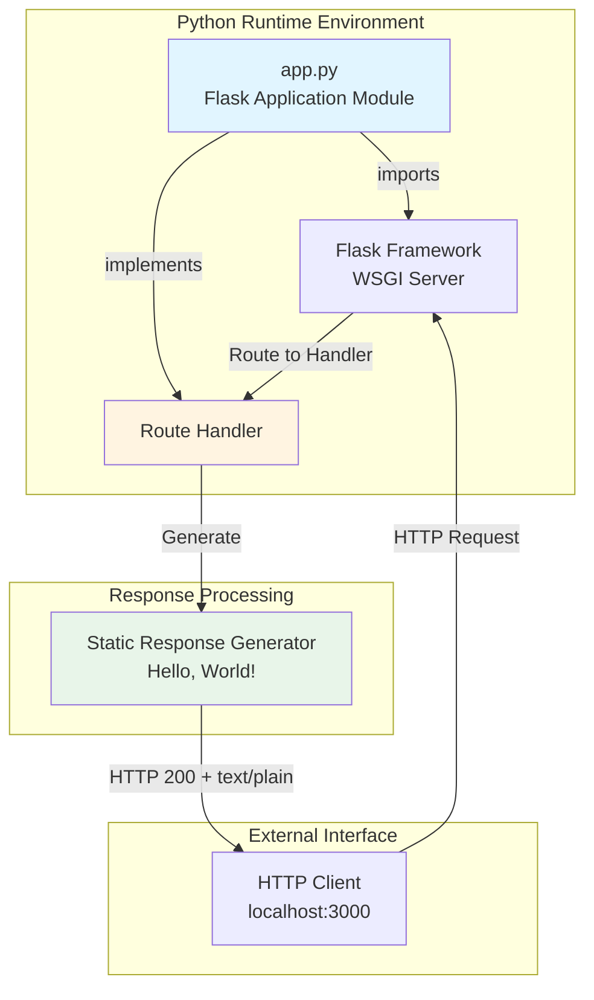
```mermaid
graph TB
    subgraph "Python Runtime Environment"
        A[app.py<br/>Flask Application Module]
        B[Flask Framework<br/>WSGI Server]
        C[Route Handler]
        
        A -->|imports| B
        A -->|implements| C
    end
    
    subgraph "External Interface"
        D[HTTP Client<br/>localhost:3000]
    end
    
    subgraph "Response Processing"
        E[Static Response Generator<br/>Hello, World!]
    end
    
    D -->|HTTP Request| B
    B -->|Route to Handler| C
    C -->|Generate| E
    E -->|HTTP 200 + text/plain| D
    
    style A fill:#e1f5ff
    style C fill:#fff4e1
    style E fill:#e8f5e9
```

**Component Descriptions**:

- **<span style="background-color: rgba(91, 57, 243, 0.2)">app.py</span>**: Main application file containing Flask app initialization, configuration values (hostname, port), and request handling logic
- **Route Handler**: <span style="background-color: rgba(91, 57, 243, 0.2)">Decorator-based function (@app.route('/')) that processes all HTTP requests uniformly</span>, setting response headers and returning static content
- **Static Response Generator**: Hardcoded response mechanism returning "Hello, World!\n" as plain text for every request

#### Technical Approach

The system employs a minimalist technical approach characterized by:

- **Zero-Abstraction Framework Implementation**: Direct use of <span style="background-color: rgba(91, 57, 243, 0.2)">Flask's @app.route() decorator pattern</span> without additional web frameworks or middleware layers
- **Hardcoded Configuration**: All operational parameters (hostname, port, response content) embedded directly in source code
- **Stateless Request Processing**: No session management, data persistence, or request state tracking
- **<span style="background-color: rgba(91, 57, 243, 0.2)">Threaded/Single-Process Execution: Flask development server with default threading model</span>** without multi-worker deployment or process clustering
- **Synchronous Response Pattern**: Immediate response generation without asynchronous operations or I/O
- **<span style="background-color: rgba(91, 57, 243, 0.2)">Single External Dependency (Flask)**: Maintains minimalist philosophy while leveraging Flask's proven web framework capabilities</span>

This approach prioritizes code simplicity and predictability over flexibility and scalability, aligning with the project's role as a test artifact.

### 1.2.3 Success Criteria

#### Objectives

The system's success is measured against test-oriented objectives rather than traditional production metrics:

| Objective | Measurement Approach |
|-----------|---------------------|
| Successful Server Startup | Process starts without errors and binds to localhost:3000 |
| Consistent Response Delivery | All HTTP requests receive "Hello, World!" response with HTTP 200 status |
| Integration Test Execution | System serves as functional test harness for backprop integration validation |
| <span style="background-color: rgba(91, 57, 243, 0.2)">Minimal-Dependency Operation</span> | <span style="background-color: rgba(91, 57, 243, 0.2)">Application runs using only Flask as external dependency</span> |

#### Critical Success Factors

Success depends on the following factors:

1. **<span style="background-color: rgba(91, 57, 243, 0.2)">Python 3.9+ Runtime Availability</span>**: <span style="background-color: rgba(91, 57, 243, 0.2)">Requires Python 3.9 or higher interpreter installed</span> (Flask 3.1.2 compatibility requirement)
2. **Port Availability**: TCP port 3000 must be available on localhost
3. **File System Access**: Read access to <span style="background-color: rgba(91, 57, 243, 0.2)">app.py</span> for execution
4. **Loopback Interface Functionality**: 127.0.0.1 interface must be operational
5. **<span style="background-color: rgba(91, 57, 243, 0.2)">Flask Installation</span>**: <span style="background-color: rgba(91, 57, 243, 0.2)">Flask 3.1.2 installed via pip (pip install -r requirements.txt)</span>

#### Key Performance Indicators

As a minimal test application, the system does not define traditional KPIs such as throughput, latency SLAs, or availability targets. The primary indicators of system health are:

- **Process Uptime**: Server remains running without crashes
- **Request Success Rate**: 100% of requests receive HTTP 200 responses
- **Startup Time**: Sub-second initialization from process start to listening state
- **Resource Footprint**: Minimal memory and CPU utilization typical of idle <span style="background-color: rgba(91, 57, 243, 0.2)">Python Flask development server process</span>

## 1.3 Scope

### 1.3.1 In-Scope Elements

#### Core Features and Functionalities

The following capabilities are implemented and supported:

| Feature Category | Included Functionality |
|------------------|----------------------|
| HTTP Protocol Support | HTTP/1.1 request handling on localhost |
| Request Processing | Universal handler for all HTTP methods (GET, POST, PUT, DELETE, etc.) |
| Response Generation | Static "Hello, World!" text response |
| Server Lifecycle | Process startup and console logging of server status |

**Primary User Workflow**:
1. Developer installs dependencies via <span style="background-color: rgba(91, 57, 243, 0.2)">pip install -r requirements.txt</span>
2. Developer executes <span style="background-color: rgba(91, 57, 243, 0.2)">python app.py</span> from command line
3. Server starts and logs <span style="background-color: rgba(91, 57, 243, 0.2)">Flask's startup message indicating server is running at http://127.0.0.1:3000/</span>
4. User sends HTTP request to http://127.0.0.1:3000/ (any path)
5. Server responds with "Hello, World!" message (Content-Type: text/plain)
6. Server continues running until process termination (Ctrl+C)

**Essential Integrations**: <span style="background-color: rgba(91, 57, 243, 0.2)">Single external dependency (Flask 3.1.2)</span>—the system operates with minimal dependencies, requiring only the Flask web framework for HTTP server functionality.

**Key Technical Requirements**:
- <span style="background-color: rgba(91, 57, 243, 0.2)">Python 3.9+ runtime environment (interpreter with Flask 3.1.2 compatibility)</span>
- <span style="background-color: rgba(91, 57, 243, 0.2)">pip package manager for dependency installation (pip install -r requirements.txt)</span>
- Operating system support for TCP/IP loopback interface
- File system access for reading <span style="background-color: rgba(91, 57, 243, 0.2)">app.py</span>
- Console/terminal access for viewing server logs

#### Implementation Boundaries

**System Boundaries**:
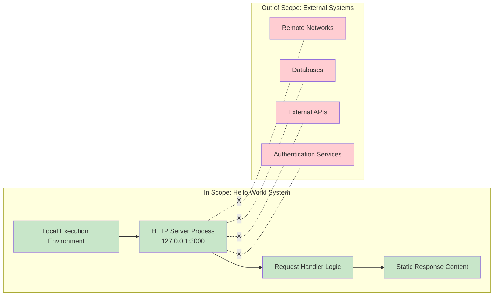
```mermaid
graph LR
    subgraph "In Scope: Hello World System"
        A[Local Execution Environment]
        B[HTTP Server Process<br/>127.0.0.1:3000]
        C[Request Handler Logic]
        D[Static Response Content]
    end
    
    subgraph "Out of Scope: External Systems"
        E[Remote Networks]
        F[Databases]
        G[External APIs]
        H[Authentication Services]
    end
    
    A --> B
    B --> C
    C --> D
    
    B -.X.- E
    B -.X.- F
    B -.X.- G
    B -.X.- H
    
    style A fill:#c8e6c9
    style B fill:#c8e6c9
    style C fill:#c8e6c9
    style D fill:#c8e6c9
    style E fill:#ffcdd2
    style F fill:#ffcdd2
    style G fill:#ffcdd2
    style H fill:#ffcdd2
```

**User Groups Covered**:
- Software developers requiring test harness for integration validation
- Test engineers executing integration test scenarios
- System administrators performing local <span style="background-color: rgba(91, 57, 243, 0.2)">Python</span> application testing

**Geographic/Market Coverage**: Not applicable—system operates as local development tool without geographic or market targeting.

**Data Domains Included**:
- HTTP request metadata (method, path, headers)—received but not processed
- Static response content—hardcoded "Hello, World!" string
- Console log output—server startup confirmation message

### 1.3.2 Out-of-Scope Elements

#### Excluded Capabilities

The following capabilities are explicitly **not implemented** in the current system:

**Network and Security**:
- Remote network access (bound only to 127.0.0.1, not 0.0.0.0)
- TLS/HTTPS encryption
- Authentication or authorization mechanisms
- CORS (Cross-Origin Resource Sharing) headers
- Rate limiting or request throttling
- Firewall or WAF integration

**Application Features**:
- Multiple endpoints or URL routing
- Request payload processing (JSON, form data, file uploads)
- Dynamic response generation based on request parameters
- Session management or cookie handling
- Caching mechanisms (in-memory or distributed)
- WebSocket or Server-Sent Events support
- API versioning

**Data Management**:
- Database integration (SQL or NoSQL)
- Data persistence or storage
- Configuration file support (YAML, JSON, environment variables)
- Logging frameworks or structured logging
- Audit trail or request logging

**Operational Capabilities**:
- Health check or readiness endpoints
- Metrics collection and monitoring integration
- Distributed tracing or observability
- Graceful shutdown handling
- Process management (<span style="background-color: rgba(91, 57, 243, 0.2)">gunicorn, systemd integration</span>)
- Container orchestration support
- Load balancing or clustering
- Automated testing infrastructure (unit tests, integration tests)
- CI/CD pipeline integration

**Documentation and Development Tools**:
- API documentation (OpenAPI/Swagger)
- Development mode with hot reloading
- Debug tooling integration
- Performance profiling capabilities

#### Future Phase Considerations

As a minimal test project, future enhancements are not explicitly planned. However, typical evolutionary paths for such projects might include:

- <span style="background-color: rgba(91, 57, 243, 0.2)">Resolution of entry point consistency (ensuring app.py as standard entry point)</span>
- Implementation of actual test suite (currently placeholder script that fails intentionally)
- Environment-based configuration for host and port
- Addition of health check endpoint for container deployment scenarios
- Expansion to multi-endpoint demonstration for routing pattern testing

#### Unsupported Use Cases

The system explicitly does **not** support:

- Production deployment scenarios requiring high availability or scalability
- Multi-tenant or multi-user applications with access control
- Applications requiring data persistence or state management
- Real-time bidirectional communication (WebSockets, long polling)
- Integration with external services or APIs
- Compliance with security standards (PCI-DSS, HIPAA, SOC 2)
- Performance benchmarking beyond basic functionality validation
- Geographic distribution or CDN integration
- Mobile application backend services
- Microservices architecture patterns

## 1.4 References

#### Files Examined

- `README.md` - Project identification and purpose statement ("test project for backprop integration")
- <span style="background-color: rgba(91, 57, 243, 0.2)">app.py - Complete Flask application implementation with configuration values (hostname: 127.0.0.1, port: 3000), decorator-based route handler (@app.route('/')), and response generation</span>
- <span style="background-color: rgba(91, 57, 243, 0.2)">requirements.txt - Python dependency manifest declaring Flask==3.1.2 as the sole external package dependency</span>
- <span style="background-color: rgba(91, 57, 243, 0.2)">.gitignore - Python-specific version control exclusions including __pycache__/, *.py[cod], *$py.class, .Python, venv/, env/, and .venv/ directories</span>

#### Folders Explored

- `/` (root directory) - Complete flat project structure containing all <span style="background-color: rgba(91, 57, 243, 0.2)">four project files</span> with no subdirectories

#### Document Context

This Introduction section draws upon the comprehensive repository analysis conducted through systematic file examination. All technical details, configuration values, and architectural descriptions are grounded in direct evidence from the project's source files. <span style="background-color: rgba(91, 57, 243, 0.2)">The analysis reflects the Python/Flask implementation files created during the migration from Node.js, including the Flask-based web server (app.py), dependency declaration (requirements.txt), and Python-specific version control configuration (.gitignore).</span> The characterization as a hello world test project aligns with both the user-provided context and the repository's self-description in the README.md file.

# 2. Product Requirements

## 2.1 Feature Catalog

This section documents the four discrete features implemented in the hello world test harness. Each feature represents a testable component of the system's functionality, grounded in the actual implementation within <span style="background-color: rgba(91, 57, 243, 0.2)">app.py</span>.

### 2.1.1 Feature F-001: HTTP Server Hosting

#### Feature Metadata

| Attribute | Value |
|-----------|-------|
| **Feature ID** | F-001 |
| **Feature Name** | HTTP Server Hosting |
| **Category** | Network Infrastructure |
| **Priority** | Critical |
| **Status** | Completed |
| **Complexity** | Low |

#### Description

**Overview**: The HTTP Server Hosting feature provides the foundational network service capability that enables the system to accept and process HTTP requests. Implemented using <span style="background-color: rgba(91, 57, 243, 0.2)">Flask 3.1.2's WSGI development server</span>, this feature creates a TCP server bound to the localhost interface on port 3000.

**Business Value**: Establishes the basic runtime environment necessary for integration testing scenarios. By providing a functional HTTP endpoint, this feature enables test engineers to validate request/response cycles and integration behaviors in a controlled environment.

**User Benefits**: 
- Developers gain immediate access to a running HTTP server with single-command execution (<span style="background-color: rgba(91, 57, 243, 0.2)">python app.py</span>)
- Test engineers can execute HTTP-based integration tests against a predictable, isolated endpoint
- <span style="background-color: rgba(91, 57, 243, 0.2)">Minimal-dependency implementation (Flask only) reduces external failure points</span> during testing

**Technical Context**: The server utilizes <span style="background-color: rgba(91, 57, 243, 0.2)">Flask's app.run() method with explicit host and port configuration (app.run(host='127.0.0.1', port=3000))</span> to instantiate an HTTP/1.1 server. The <span style="background-color: rgba(91, 57, 243, 0.2)">Flask application instance is created via app = Flask(__name__)</span>, establishing the WSGI application foundation. The server binds exclusively to the IPv4 loopback address (127.0.0.1) rather than all interfaces (0.0.0.0), ensuring network isolation appropriate for a test harness. Port selection (TCP 3000) uses a standard development port that avoids conflicts with privileged ports (1-1023) <span style="background-color: rgba(91, 57, 243, 0.2)">and maintains consistency with the original specification (differs from Flask's default port 5000)</span>.

#### Dependencies

**Prerequisite Features**: None (foundational feature)

**System Dependencies**:
- <span style="background-color: rgba(91, 57, 243, 0.2)">Python 3.9+ interpreter (Flask 3.1.2 compatibility requirement)</span>
- Operating system TCP/IP stack with functional loopback interface
- Available TCP port 3000 (not bound by another process)
- File system read access for <span style="background-color: rgba(91, 57, 243, 0.2)">app.py</span> module loading

**External Dependencies**: <span style="background-color: rgba(91, 57, 243, 0.2)">Flask 3.1.2 (declared in requirements.txt)</span>

**Integration Requirements**: 
- Network stack must support IPv4 loopback (127.0.0.1)
- Process must have permission to bind to non-privileged port (3000)
- <span style="background-color: rgba(91, 57, 243, 0.2)">pip package manager for Flask installation (pip install -r requirements.txt)</span>

---

### 2.1.2 Feature F-002: Universal Request Handler

#### Feature Metadata

| Attribute | Value |
|-----------|-------|
| **Feature ID** | F-002 |
| **Feature Name** | Universal Request Handler |
| **Category** | Request Processing |
| **Priority** | Critical |
| **Status** | Completed |
| **Complexity** | Low |

#### Description

**Overview**: The Universal Request Handler processes all incoming HTTP requests uniformly, regardless of HTTP method, URL path, query parameters, or request headers. This feature implements a single code path that treats all requests identically, forwarding them to the static response generator.

**Business Value**: Simplifies test scenarios by providing completely predictable behavior. Test engineers can validate integration functionality without concerning themselves with routing logic, path matching, or method-specific handling. This predictability is essential for isolating integration test variables.

**User Benefits**:
- Eliminates the need to configure or understand routing rules
- Guarantees consistent behavior across all request types
- Enables straightforward curl/Postman-based testing with any HTTP method or path
- Reduces cognitive load for developers learning or testing the system

**Technical Context**: Implemented as a <span style="background-color: rgba(91, 57, 243, 0.2)">Flask route decorator (@app.route('/')) applied to the hello() function</span>. The handler <span style="background-color: rgba(91, 57, 243, 0.2)">returns a tuple containing the response body, HTTP status code, and headers dictionary</span>, providing precise control over the HTTP response. <span style="background-color: rgba(91, 57, 243, 0.2)">Flask's routing system maps the root path ('/') to this handler, which immediately generates a static response without inspecting request properties or parameters</span>. All requests trigger the same response generation logic, maintaining complete determinism.

#### Dependencies

**Prerequisite Features**: 
- F-001 (HTTP Server Hosting) - Server must be running to receive requests

**System Dependencies**:
- <span style="background-color: rgba(91, 57, 243, 0.2)">Flask's routing system for request dispatch</span>
- <span style="background-color: rgba(91, 57, 243, 0.2)">Werkzeug WSGI library (Flask dependency) for request/response handling</span>

**External Dependencies**: <span style="background-color: rgba(91, 57, 243, 0.2)">Flask 3.1.2 (declared in requirements.txt)</span>

**Integration Requirements**:
- Tight coupling with F-003 (Static Response Generation) - handler directly returns response content
- No middleware layer or additional routing framework required

---

### 2.1.3 Feature F-003: Static Response Generation

#### Feature Metadata

| Attribute | Value |
|-----------|-------|
| **Feature ID** | F-003 |
| **Feature Name** | Static Response Generation |
| **Category** | Response Processing |
| **Priority** | Critical |
| **Status** | Completed |
| **Complexity** | Low |

#### Description

**Overview**: The Static Response Generation feature produces a uniform HTTP response containing the text "Hello, World!\n" with appropriate headers and status code. This feature represents the output side of the request/response cycle, providing the observable behavior that confirms system operation.

**Business Value**: Delivers a testable, verifiable response that integration tests can assert against. The consistent response format (plain text, fixed content) enables automated validation through string comparison, HTTP status checking, and header verification.

**User Benefits**:
- Developers can immediately verify server operation through browser or command-line tools
- Test automation can reliably assert expected response characteristics
- Human-readable output ("Hello, World!") provides instant visual confirmation of system functionality
- Newline character inclusion (`\n`) ensures proper terminal display formatting

**Technical Context**: Response generation occurs <span style="background-color: rgba(91, 57, 243, 0.2)">through a Flask tuple return pattern: return 'Hello, World!\n', 200, {'Content-Type': 'text/plain'}</span>. This <span style="background-color: rgba(91, 57, 243, 0.2)">idiomatic Flask pattern provides explicit control over the HTTP status code (200), response body string, and headers dictionary</span>. The response is generated synchronously within the route handler, and <span style="background-color: rgba(91, 57, 243, 0.2)">Flask's response processing automatically handles Content-Length calculation, HTTP protocol compliance, and connection management</span>. UTF-8 encoding is applied by default for string responses.

#### Dependencies

**Prerequisite Features**:
- F-001 (HTTP Server Hosting) - Server infrastructure required
- F-002 (Universal Request Handler) - Handler must invoke response generation

**System Dependencies**:
- <span style="background-color: rgba(91, 57, 243, 0.2)">Flask's response handling system</span>
- UTF-8 encoding support (<span style="background-color: rgba(91, 57, 243, 0.2)">Python</span> default for string operations)

**External Dependencies**: <span style="background-color: rgba(91, 57, 243, 0.2)">Flask 3.1.2 (declared in requirements.txt)</span>

**Integration Requirements**:
- Response content hardcoded in source (no template system or dynamic generation)
- No data store or configuration file access required

---

### 2.1.4 Feature F-004: Server Lifecycle Management

#### Feature Metadata

| Attribute | Value |
|-----------|-------|
| **Feature ID** | F-004 |
| **Feature Name** | Server Lifecycle Management |
| **Category** | Operations & Monitoring |
| **Priority** | High |
| **Status** | Completed |
| **Complexity** | Low |

#### Description

**Overview**: The Server Lifecycle Management feature handles server initialization, startup logging, and process execution. This feature provides operational visibility into server state transitions, confirming successful port binding and readiness to accept connections.

**Business Value**: Enables operators to verify successful deployment and identify startup failures. Console logging provides immediate feedback for troubleshooting port conflicts, permission errors, or runtime environment issues.

**User Benefits**:
- Immediate visual confirmation of successful server startup
- Clear indication of the server's network endpoint (hostname:port)
- Ability to copy-paste URL directly from console output for testing
- Standard output logging enables capture in CI/CD pipelines and container logs

**Technical Context**: Implemented via <span style="background-color: rgba(91, 57, 243, 0.2)">Flask's app.run() method with explicit host and port parameters</span>. The startup sequence includes <span style="background-color: rgba(91, 57, 243, 0.2)">Python's print() statement using f-string formatting to output the server URL before calling app.run(host=hostname, port=port)</span>. <span style="background-color: rgba(91, 57, 243, 0.2)">Flask's development server (Werkzeug) outputs additional startup messages including warnings about development-only usage</span>. The server process continues running indefinitely until terminated by SIGINT (Ctrl+C), SIGTERM, or process kill signal, <span style="background-color: rgba(91, 57, 243, 0.2)">handled by Flask's default signal handlers</span>.

#### Dependencies

**Prerequisite Features**:
- F-001 (HTTP Server Hosting) - Must have server instance to manage lifecycle

**System Dependencies**:
- Console/stdout access for logging
- Process signal handling (<span style="background-color: rgba(91, 57, 243, 0.2)">Python and Flask</span> default behavior)

**External Dependencies**: <span style="background-color: rgba(91, 57, 243, 0.2)">Flask 3.1.2 (declared in requirements.txt)</span>

**Integration Requirements**:
- No graceful shutdown handling implemented (immediate process termination on signal)
- No health check or readiness probe endpoints
- No integration with process managers (<span style="background-color: rgba(91, 57, 243, 0.2)">gunicorn, systemd</span>)

---

## 2.2 Functional Requirements Tables

### 2.2.1 Feature F-001: HTTP Server Hosting - Requirements

| Requirement ID | Description | Acceptance Criteria | Priority | Complexity |
|----------------|-------------|---------------------|----------|------------|
| F-001-RQ-001 | <span style="background-color: rgba(91, 57, 243, 0.2)">Flask development server</span> must bind to IPv4 loopback address 127.0.0.1 | Server accepts connections only on localhost; remote connections refused | Must-Have | Low |
| F-001-RQ-002 | Server must listen on TCP port 3000 | Port 3000 bound successfully; netstat/lsof confirms binding | Must-Have | Low |
| F-001-RQ-003 | Server must start without errors when <span style="background-color: rgba(91, 57, 243, 0.2)">Python 3.9+ and Flask 3.1.2</span> are available | Process launches and enters listening state; no exception thrown | Must-Have | Low |
| F-001-RQ-004 | Server must handle port-in-use scenario gracefully | Appropriate error message if port 3000 already bound | Should-Have | Low |

**Technical Specifications**:

| Aspect | Specification |
|--------|---------------|
| **Input Parameters** | <span style="background-color: rgba(91, 57, 243, 0.2)">hostname: str = '127.0.0.1', port: int = 3000 (hardcoded in app.py)</span> |
| **Output/Response** | <span style="background-color: rgba(91, 57, 243, 0.2)">Werkzeug development server running on http://127.0.0.1:3000/</span> |
| **Performance Criteria** | Server ready state within 1 second of <span style="background-color: rgba(91, 57, 243, 0.2)">python app.py</span> execution |
| **Data Requirements** | No persistent data; configuration hardcoded in source |

**Validation Rules**:

| Rule Type | Specification |
|-----------|---------------|
| **Business Rules** | Localhost-only binding for security isolation |
| **Data Validation** | Port number must be valid TCP port (1-65535); hostname must be valid IPv4 address |
| **Security Requirements** | No external network exposure; loopback interface only |
| **Compliance Requirements** | None (test application) |

---

### 2.2.2 Feature F-002: Universal Request Handler - Requirements

| Requirement ID | Description | Acceptance Criteria | Priority | Complexity |
|----------------|-------------|---------------------|----------|------------|
| F-002-RQ-001 | Handler must process all HTTP methods (GET, POST, PUT, DELETE, etc.) identically | Identical response for GET, POST, PUT, DELETE, PATCH, OPTIONS requests | Must-Have | Low |
| F-002-RQ-002 | Handler must ignore request path differences | Requests to /, /test, /any/path return identical responses | Must-Have | Low |
| F-002-RQ-003 | Handler must ignore query parameters | Requests with and without query strings (?key=value) return identical responses | Must-Have | Low |
| F-002-RQ-004 | Handler must ignore request headers (except HTTP protocol required headers) | Custom headers (X-Custom-Header) do not affect response | Must-Have | Low |
| F-002-RQ-005 | Handler must ignore request body content | POST with JSON, form data, or text body returns identical response | Must-Have | Low |

**Technical Specifications**:

| Aspect | Specification |
|--------|---------------|
| **Input Parameters** | <span style="background-color: rgba(91, 57, 243, 0.2)">HTTP request (Flask Request object) - received but not inspected</span> |
| **Output/Response** | <span style="background-color: rgba(91, 57, 243, 0.2)">Tuple: (response_body: str, status_code: int, headers: dict)</span> |
| **Performance Criteria** | Sub-millisecond response generation (synchronous function call) |
| **Data Requirements** | No data access required; pure function logic |

**Validation Rules**:

| Rule Type | Specification |
|-----------|---------------|
| **Business Rules** | Uniform handling ensures test predictability |
| **Data Validation** | None (no request data validated or processed) |
| **Security Requirements** | No authentication, authorization, or input sanitization (test harness design) |
| **Compliance Requirements** | None (test application) |

---

### 2.2.3 Feature F-003: Static Response Generation - Requirements

| Requirement ID | Description | Acceptance Criteria | Priority | Complexity |
|----------------|-------------|---------------------|----------|------------|
| F-003-RQ-001 | Response body must be exactly "Hello, World!\n" (with newline) | String comparison matches byte-for-byte; curl shows newline in output | Must-Have | Low |
| F-003-RQ-002 | HTTP status code must be 200 (OK) | curl -i shows "HTTP/1.1 200 OK" or equivalent | Must-Have | Low |
| F-003-RQ-003 | Content-Type header must be "text/plain" | Response header Content-Type: text/plain present | Must-Have | Low |
| F-003-RQ-004 | Response must be UTF-8 encoded | Character encoding correct for ASCII subset (Hello, World!) | Must-Have | Low |
| F-003-RQ-005 | Response must be generated synchronously | No async/await patterns; immediate return from handler | Should-Have | Low |

**Technical Specifications**:

| Aspect | Specification |
|--------|---------------|
| **Input Parameters** | None (static response; no inputs) |
| **Output/Response** | <span style="background-color: rgba(91, 57, 243, 0.2)">Body: 'Hello, World!\n' (14 bytes), Status: 200, Headers: {'Content-Type': 'text/plain'}</span> |
| **Performance Criteria** | Immediate response (no I/O, no computation) |
| **Data Requirements** | Hardcoded string constant |

**Validation Rules**:

| Rule Type | Specification |
|-----------|---------------|
| **Business Rules** | Fixed response maintains test harness predictability |
| **Data Validation** | Response string immutable; no runtime modification |
| **Security Requirements** | No dynamic content; no injection vulnerabilities |
| **Compliance Requirements** | None (test application) |

---

### 2.2.4 Feature F-004: Server Lifecycle Management - Requirements

| Requirement ID | Description | Acceptance Criteria | Priority | Complexity |
|----------------|-------------|---------------------|----------|------------|
| F-004-RQ-001 | Server must log startup message to stdout | Console output includes "Server running at http://127.0.0.1:3000/" | Must-Have | Low |
| F-004-RQ-002 | Startup message must include complete server URL | URL format http://{hostname}:{port}/ with actual values | Must-Have | Low |
| F-004-RQ-003 | Server must continue running until process termination signal | Process remains active; does not exit after startup | Must-Have | Low |
| F-004-RQ-004 | Server must respond to SIGINT (Ctrl+C) for graceful termination | Ctrl+C stops server process cleanly | Should-Have | Low |

**Technical Specifications**:

| Aspect | Specification |
|--------|---------------|
| **Input Parameters** | <span style="background-color: rgba(91, 57, 243, 0.2)">Process signals (SIGINT, SIGTERM) handled by Python/Flask defaults</span> |
| **Output/Response** | <span style="background-color: rgba(91, 57, 243, 0.2)">Console log message using print() and f-string formatting</span> |
| **Performance Criteria** | Startup message appears before first request can be received |
| **Data Requirements** | hostname and port values from <span style="background-color: rgba(91, 57, 243, 0.2)">app.py</span> variables |

**Validation Rules**:

| Rule Type | Specification |
|-----------|---------------|
| **Business Rules** | Startup confirmation critical for manual testing workflows |
| **Data Validation** | URL must be valid HTTP URL format |
| **Security Requirements** | None (informational logging only) |
| **Compliance Requirements** | None (test application) |

---

## 2.3 Feature Relationships

### 2.3.1 Feature Dependency Map

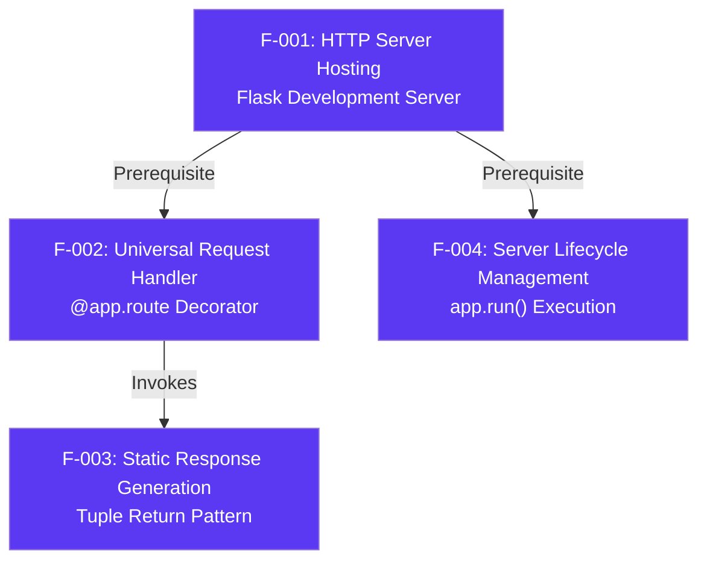
```mermaid
graph TD
    F001["F-001: HTTP Server Hosting<br/>Flask Development Server"]
    F002["F-002: Universal Request Handler<br/>@app.route Decorator"]
    F003["F-003: Static Response Generation<br/>Tuple Return Pattern"]
    F004["F-004: Server Lifecycle Management<br/>app.run() Execution"]
    
    F001 -->|Prerequisite| F002
    F001 -->|Prerequisite| F004
    F002 -->|Invokes| F003
    
    style F001 fill:#5b39f3,color:#fff
    style F002 fill:#5b39f3,color:#fff
    style F003 fill:#5b39f3,color:#fff
    style F004 fill:#5b39f3,color:#fff
```

**Dependency Analysis**:

| Dependent Feature | Prerequisite Feature | Relationship Type | Description |
|-------------------|---------------------|-------------------|-------------|
| F-002 | F-001 | Strong Dependency | Request handler requires running server to receive requests |
| F-003 | F-002 | Strong Dependency | Response generator invoked by handler; cannot function independently |
| F-004 | F-001 | Strong Dependency | Lifecycle management controls server instance lifecycle |

**Initialization Sequence**:

1. **Phase 1**: F-001 (HTTP Server Hosting) - <span style="background-color: rgba(91, 57, 243, 0.2)">Flask app initialization via app = Flask(__name__)</span>
2. **Phase 2**: F-002 (Universal Request Handler) - <span style="background-color: rgba(91, 57, 243, 0.2)">Route registration via @app.route('/') decorator</span>
3. **Phase 3**: F-003 (Static Response Generation) - Response logic defined within handler function
4. **Phase 4**: F-004 (Server Lifecycle Management) - <span style="background-color: rgba(91, 57, 243, 0.2)">app.run() invocation starts server and enters request handling loop</span>

### 2.3.2 Integration Points

**Component Integration Map**:

| Integration Point | Components Involved | Integration Mechanism | Data Exchanged |
|-------------------|---------------------|----------------------|----------------|
| <span style="background-color: rgba(91, 57, 243, 0.2)">Flask Request Dispatch</span> | F-001 (Server) ↔ F-002 (Handler) | <span style="background-color: rgba(91, 57, 243, 0.2)">Flask routing system maps incoming requests to decorated function</span> | <span style="background-color: rgba(91, 57, 243, 0.2)">Request object (not inspected)</span> |
| Response Return | F-002 (Handler) ↔ F-003 (Response Gen) | <span style="background-color: rgba(91, 57, 243, 0.2)">Direct function return (tuple pattern)</span> | Response body string, status code integer, headers dictionary |
| Lifecycle Control | F-004 (Lifecycle) ↔ F-001 (Server) | <span style="background-color: rgba(91, 57, 243, 0.2)">app.run() method call starts server; process signals terminate</span> | Server state transitions (stopped → running → stopped) |

**No External Service Integrations**: The application operates in complete isolation without external API calls, database connections, or third-party service dependencies (except <span style="background-color: rgba(91, 57, 243, 0.2)">Flask framework</span>).

### 2.3.3 Shared Components

**Common Dependencies**:

| Shared Component | Used By Features | Purpose |
|------------------|------------------|---------|
| <span style="background-color: rgba(91, 57, 243, 0.2)">Flask Application Instance (app)</span> | F-001, F-002, F-004 | <span style="background-color: rgba(91, 57, 243, 0.2)">Central Flask application object managing routing, request handling, and server lifecycle</span> |
| Configuration Variables (hostname, port) | F-001, F-004 | Hardcoded values defining server network binding |
| <span style="background-color: rgba(91, 57, 243, 0.2)">Python Standard Library</span> | All features | <span style="background-color: rgba(91, 57, 243, 0.2)">Core Python functionality (f-strings, print(), etc.)</span> |

**No Shared Services**: Single-file implementation eliminates traditional shared service layers, data access objects, or utility modules.

---

## 2.4 Implementation Considerations

### 2.4.1 Technical Constraints

**Runtime Environment Constraints**:

| Constraint Type | Description | Impact |
|-----------------|-------------|--------|
| <span style="background-color: rgba(91, 57, 243, 0.2)">Python Version</span> | <span style="background-color: rgba(91, 57, 243, 0.2)">Requires Python 3.9 or higher (Flask 3.1.2 compatibility)</span> | <span style="background-color: rgba(91, 57, 243, 0.2)">Systems with Python 3.8 or earlier cannot run application</span> |
| <span style="background-color: rgba(91, 57, 243, 0.2)">Flask Dependency</span> | <span style="background-color: rgba(91, 57, 243, 0.2)">Requires Flask 3.1.2 installation via pip</span> | <span style="background-color: rgba(91, 57, 243, 0.2)">pip install -r requirements.txt must be executed before running</span> |
| Port Availability | TCP port 3000 must be unbound | Port conflicts prevent server startup |
| Loopback Interface | Operating system must provide functional 127.0.0.1 interface | Networking stack dependency |

**Architectural Constraints**:

- **Single-File Design**: All logic resides in <span style="background-color: rgba(91, 57, 243, 0.2)">app.py</span>; no modular architecture
- **Hardcoded Configuration**: No environment variables or configuration files; all values in source
- **<span style="background-color: rgba(91, 57, 243, 0.2)">Development Server</span>**: <span style="background-color: rgba(91, 57, 243, 0.2)">Flask's built-in Werkzeug server (not production-ready)</span>
- **Single-Threaded Execution**: <span style="background-color: rgba(91, 57, 243, 0.2)">Flask development server default threading model (acceptable for test harness)</span>
- **No State Management**: Stateless design with no session handling or data persistence

### 2.4.2 Performance Requirements

**Response Time Targets**:

| Metric | Target | Measurement Method |
|--------|--------|-------------------|
| Server Startup Time | < 1 second | Time from <span style="background-color: rgba(91, 57, 243, 0.2)">python app.py</span> to "running" message |
| Request Processing | < 10ms | Time from request receipt to response transmission start |
| Response Generation | < 1ms | Time to construct static response tuple |

**Throughput Expectations**:

Given the test harness nature, specific throughput targets are not defined. The <span style="background-color: rgba(91, 57, 243, 0.2)">Flask development server</span> can handle typical manual testing and low-volume automated testing workloads without performance degradation.

**Resource Utilization**:

| Resource | Expected Usage | Constraint |
|----------|----------------|-----------|
| Memory | < 50 MB | <span style="background-color: rgba(91, 57, 243, 0.2)">Python interpreter + Flask framework footprint</span> |
| CPU | < 1% (idle) | Minimal processing for static responses |
| Network | Loopback only | No external bandwidth consumption |
| Disk I/O | Minimal | <span style="background-color: rgba(91, 57, 243, 0.2)">app.py</span> read at startup only |

### 2.4.3 Scalability Considerations

**Vertical Scaling**: Not applicable—single-threaded development server design does not benefit from additional CPU cores or memory.

**Horizontal Scaling**: Not applicable—test harness intended for single-instance local execution.

**Concurrency Model**: <span style="background-color: rgba(91, 57, 243, 0.2)">Flask development server uses threaded request handling by default, suitable for light concurrent testing loads but not production traffic</span>.

**Load Testing**: Not in scope for this test application. The system is designed for functional validation, not load testing.

### 2.4.4 Security Implications

**Attack Surface**:

| Exposure Type | Risk Level | Mitigation |
|---------------|-----------|------------|
| Remote Network Access | None | Localhost-only binding (127.0.0.1) prevents remote connections |
| Code Injection | None | No dynamic code execution or user input processing |
| Data Exposure | None | No sensitive data stored or processed |
| Authentication Bypass | N/A | No authentication implemented (test harness design) |

**Security Posture**: The system's security is primarily achieved through network isolation (loopback-only binding) rather than application-layer security controls. This is appropriate for a local test harness but makes the system unsuitable for any deployment scenario with network exposure.

### 2.4.5 Maintenance Requirements

**Operational Maintenance**:

- **No Ongoing Maintenance**: Static application with no data persistence or state
- **Dependency Updates**: <span style="background-color: rgba(91, 57, 243, 0.2)">Periodic Flask version updates in requirements.txt for security patches</span>
- **<span style="background-color: rgba(91, 57, 243, 0.2)">Python Version</span> Compatibility**: <span style="background-color: rgba(91, 57, 243, 0.2)">Verify compatibility with newer Python 3.x releases</span>

**Code Maintenance**:

Given the minimal codebase (<span style="background-color: rgba(91, 57, 243, 0.2)">approximately 10-12 lines</span>), maintenance burden is negligible. No refactoring or optimization initiatives are anticipated.

**Monitoring Requirements**:

For a test application, formal monitoring is not required. Manual verification of startup message and response correctness is sufficient for operational validation.

---

## 2.5 Traceability Matrix

### 2.5.1 Feature-to-Implementation Mapping

| Feature ID | Feature Name | Implementation Location | Code Reference |
|------------|--------------|------------------------|----------------|
| F-001 | HTTP Server Hosting | <span style="background-color: rgba(91, 57, 243, 0.2)">app.py</span> | <span style="background-color: rgba(91, 57, 243, 0.2)">app = Flask(__name__); app.run(host='127.0.0.1', port=3000)</span> |
| F-002 | Universal Request Handler | <span style="background-color: rgba(91, 57, 243, 0.2)">app.py</span> | <span style="background-color: rgba(91, 57, 243, 0.2)">@app.route('/') decorator and hello() function</span> |
| F-003 | Static Response Generation | <span style="background-color: rgba(91, 57, 243, 0.2)">app.py</span> | <span style="background-color: rgba(91, 57, 243, 0.2)">return 'Hello, World!\n', 200, {'Content-Type': 'text/plain'}</span> |
| F-004 | Server Lifecycle Management | <span style="background-color: rgba(91, 57, 243, 0.2)">app.py</span> | <span style="background-color: rgba(91, 57, 243, 0.2)">print(f'Server running at...'); app.run()</span> |

### 2.5.2 Requirements-to-Validation Mapping

| Requirement ID | Validation Method | Success Criteria |
|----------------|-------------------|------------------|
| F-001-RQ-001 | Manual: curl from remote host | Connection refused (expected) |
| F-001-RQ-002 | Manual: netstat -an \| grep 3000 | Port 3000 in LISTEN state |
| F-001-RQ-003 | Automated: <span style="background-color: rgba(91, 57, 243, 0.2)">pytest with requests library</span> | Server responds to GET / |
| F-002-RQ-001 | Manual: curl -X POST, PUT, DELETE | Identical responses for all methods |
| F-002-RQ-002 | Manual: curl localhost:3000/test | Same response as localhost:3000/ |
| F-003-RQ-001 | Automated: String assertion | Response body == "Hello, World!\n" |
| F-003-RQ-002 | Automated: HTTP client library | response.status_code == 200 |
| F-003-RQ-003 | Automated: Header inspection | response.headers['Content-Type'] == 'text/plain' |
| F-004-RQ-001 | Manual: Visual inspection | Console output contains URL |

### 2.5.3 Cross-Reference to Process Flows

| Feature | Related Process Flow | Section Reference |
|---------|---------------------|------------------|
| F-001 | Server Initialization Sequence | Section 3.1 (System Architecture) |
| F-002 | Request Handling Flow | Section 3.2 (Request Processing) |
| F-003 | Response Generation Flow | Section 3.2 (Request Processing) |
| F-004 | Lifecycle State Transitions | Section 3.1 (System Architecture) |

---

## 2.6 Assumptions and Constraints

### 2.6.1 Assumptions

The feature implementations assume the following environmental and operational conditions:

1. **<span style="background-color: rgba(91, 57, 243, 0.2)">Python 3.9+ Availability</span>**: <span style="background-color: rgba(91, 57, 243, 0.2)">Target execution environment has Python 3.9 or higher installed and accessible in PATH</span>
2. **<span style="background-color: rgba(91, 57, 243, 0.2)">pip Package Manager</span>**: <span style="background-color: rgba(91, 57, 243, 0.2)">pip is available for installing Flask 3.1.2 via requirements.txt</span>
3. **Port Availability**: TCP port 3000 is available (not bound by another application)
4. **Loopback Interface**: Standard 127.0.0.1 loopback interface is functional
5. **File System Access**: Current user has read permissions for <span style="background-color: rgba(91, 57, 243, 0.2)">app.py</span>
6. **Console Access**: stdout/stderr are available for logging output
7. **Test Usage Context**: Application will be used for testing, not production deployment

### 2.6.2 Constraints

**Technical Constraints**:

- <span style="background-color: rgba(91, 57, 243, 0.2)">**Python Version Dependency**: Flask 3.1.2 requires Python 3.9+; earlier Python versions are incompatible</span>
- **Localhost-Only Binding**: Hardcoded 127.0.0.1 prevents external network access
- **Single-Port Operation**: Application binds to exactly one port (3000)
- **Static Response**: Response content is hardcoded; no runtime configuration

**Operational Constraints**:

- <span style="background-color: rgba(91, 57, 243, 0.2)">**Development Server**: Flask built-in server is not suitable for production use</span>
- **No Graceful Shutdown**: Server termination is immediate upon signal receipt
- **No Health Checks**: No endpoints for liveness or readiness probes
- **No Process Management**: No integration with <span style="background-color: rgba(91, 57, 243, 0.2)">systemd, gunicorn, or other process managers</span>

**Design Constraints**:

- **Minimal Complexity**: Design intentionally avoids frameworks, libraries, and architectural patterns
- **Single-File Implementation**: All code in one file (<span style="background-color: rgba(91, 57, 243, 0.2)">app.py</span>); no modular structure
- **Test Harness Purpose**: Features designed for testing validation, not production use cases

## 2.2 Functional Requirements Tables

### 2.2.1 Requirements for F-001: HTTP Server Hosting

| Requirement ID | Description | Priority | Complexity |
|----------------|-------------|----------|------------|
| F-001-RQ-001 | Server SHALL bind to IPv4 address 127.0.0.1 only | Must-Have | Low |
| F-001-RQ-002 | Server SHALL listen on TCP port 3000 | Must-Have | Low |
| F-001-RQ-003 | Server SHALL use HTTP/1.1 protocol | Must-Have | Low |
| F-001-RQ-004 | Server SHALL start within 1 second of process execution | Must-Have | Low |

#### F-001-RQ-001: Localhost Binding

**Acceptance Criteria**:
- Server binds to 127.0.0.1 (verified by `hostname = '127.0.0.1'` at <span style="background-color: rgba(91, 57, 243, 0.2)">app.py:4</span>)
- Server does NOT bind to 0.0.0.0 or public network interfaces
- Remote network connections to server SHALL be rejected by network stack
- Local processes CAN connect via http://127.0.0.1:3000

**Input Parameters**: 
- Hostname constant: `'127.0.0.1'` (string literal)

**Output/Response**: 
- Server listening on loopback interface
- Network socket bound to 127.0.0.1:3000

**Performance Criteria**:
- Socket binding completes within milliseconds
- No artificial delays in binding process

**Data Requirements**:
- No external configuration data required
- Hostname hardcoded in source

**Business Rules**:
- Localhost-only access enforces test environment security
- Prevents accidental exposure to public networks

**Data Validation**:
- <span style="background-color: rgba(91, 57, 243, 0.2)">Python validates IP address format at runtime</span>
- <span style="background-color: rgba(91, 57, 243, 0.2)">Invalid IP addresses cause app.run() to throw exception</span>

**Security Requirements**:
- Network isolation prevents remote access
- No authentication required (protected by network layer)

**Compliance Requirements**: 
- None (test harness not subject to compliance standards)

---

#### F-001-RQ-002: Port Configuration

**Acceptance Criteria**:
- Server listens on TCP port 3000 (verified by `port = 3000` at <span style="background-color: rgba(91, 57, 243, 0.2)">app.py:5</span>)
- Port 3000 SHALL be non-privileged (>1023, no root/admin required)
- Server SHALL fail gracefully if port is already in use
- HTTP clients CAN connect to port 3000 on localhost

**Input Parameters**:
- Port constant: `3000` (number literal)

**Output/Response**:
- TCP listener active on port 3000
- Error event if port unavailable (EADDRINUSE)

**Performance Criteria**:
- <span style="background-color: rgba(91, 57, 243, 0.2)">Port binding completes during app.run() call</span>
- No port scanning or dynamic port selection

**Data Requirements**:
- Port number hardcoded in source
- No environment variable or configuration file support

**Business Rules**:
- Port 3000 chosen to avoid conflicts with common services
- Non-privileged port enables execution without elevated permissions

**Data Validation**:
- <span style="background-color: rgba(91, 57, 243, 0.2)">Python/Flask validate port number range (1-65535)</span>
- <span style="background-color: rgba(91, 57, 243, 0.2)">Invalid ports cause app.run() to throw error</span>

**Security Requirements**:
- Non-privileged port (no setcap or sudo required)
- Port binding restricted to processes with appropriate OS permissions

**Compliance Requirements**:
- IANA ephemeral port range (49152-65535) not used
- Standard development port convention followed

---

#### F-001-RQ-003: HTTP Protocol Support

**Acceptance Criteria**:
- <span style="background-color: rgba(91, 57, 243, 0.2)">Server uses Flask/Werkzeug HTTP/1.1 server (default)</span> (verified by <span style="background-color: rgba(91, 57, 243, 0.2)">`from flask import Flask`</span> at <span style="background-color: rgba(91, 57, 243, 0.2)">app.py:1</span>)
- <span style="background-color: rgba(91, 57, 243, 0.2)">Server implements HTTP/1.1 protocol (Flask/Werkzeug default)</span>
- HTTP requests SHALL be parsed according to RFC 7230 (HTTP/1.1 Message Syntax)
- Server SHALL support persistent connections (keep-alive default in HTTP/1.1)

**Input Parameters**:
- <span style="background-color: rgba(91, 57, 243, 0.2)">HTTP module: Flask framework with Werkzeug WSGI server</span>

**Output/Response**:
- HTTP-compliant request/response handling
- Proper status lines, headers, and body formatting

**Performance Criteria**:
- <span style="background-color: rgba(91, 57, 243, 0.2)">HTTP parser overhead typical of Flask/Werkzeug</span>
- No additional protocol layer or proxy overhead

**Data Requirements**:
- No TLS certificates (HTTPS not supported)
- No HTTP/2 or HTTP/3 support

**Business Rules**:
- Plain HTTP sufficient for localhost test scenarios
- No encryption required for loopback traffic

**Data Validation**:
- <span style="background-color: rgba(91, 57, 243, 0.2)">Malformed HTTP requests handled by Werkzeug parser</span>
- <span style="background-color: rgba(91, 57, 243, 0.2)">Invalid requests result in 400 Bad Request (Flask/Werkzeug default)</span>

**Security Requirements**:
- No TLS/SSL encryption (plaintext HTTP only)
- Traffic not encrypted in transit (acceptable for localhost)

**Compliance Requirements**:
- <span style="background-color: rgba(91, 57, 243, 0.2)">HTTP/1.1 RFC compliance via Flask/Werkzeug implementation</span>
- No custom protocol extensions

---

#### F-001-RQ-004: Startup Performance

**Acceptance Criteria**:
- Server reaches listening state within 1 second of <span style="background-color: rgba(91, 57, 243, 0.2)">`python app.py`</span> execution
- Startup time unaffected by external network or database connections (none exist)
- First request can be processed immediately after startup log appears
- No warm-up period or initialization delays required

**Input Parameters**:
- None (startup is unconditional)

**Output/Response**:
- Server listening state
- Console log message indicating readiness

**Performance Criteria**:
- Sub-second startup (typically 50-200ms on modern hardware)
- <span style="background-color: rgba(91, 57, 243, 0.2)">Startup time dominated by Python runtime and Flask initialization</span>
- No application-level initialization delays

**Data Requirements**:
- <span style="background-color: rgba(91, 57, 243, 0.2)">File system access to load app.py module</span>
- No database schema loading or cache warming

**Business Rules**:
- Fast startup required for rapid test iteration
- Minimal initialization aligns with test harness purpose

**Data Validation**:
- No configuration validation (hardcoded values)
- Module loading errors cause immediate process exit

**Security Requirements**:
- No startup security checks or credential validation
- <span style="background-color: rgba(91, 57, 243, 0.2)">File system permissions checked by Python at load time</span>

**Compliance Requirements**:
- None

---

### 2.2.2 Requirements for F-002: Universal Request Handler

| Requirement ID | Description | Priority | Complexity |
|----------------|-------------|----------|------------|
| F-002-RQ-001 | Handler SHALL process all HTTP methods identically | Must-Have | Low |
| F-002-RQ-002 | Handler SHALL ignore URL path and query parameters | Must-Have | Low |
| F-002-RQ-003 | Handler SHALL process requests synchronously | Must-Have | Low |
| F-002-RQ-004 | Handler SHALL not persist any request state | Must-Have | Low |

#### F-002-RQ-001: Method-Agnostic Processing

**Acceptance Criteria**:
- GET, POST, PUT, DELETE, PATCH, OPTIONS, HEAD requests receive identical treatment
- <span style="background-color: rgba(91, 57, 243, 0.2)">Handler does NOT inspect request method property</span> (no conditional logic in code)
- Response content and headers independent of HTTP method
- <span style="background-color: rgba(91, 57, 243, 0.2)">All methods return HTTP 200 status (verified by return tuple with status 200 in app.py)</span>

**Input Parameters**:
- <span style="background-color: rgba(91, 57, 243, 0.2)">Flask request object containing method, headers, URL</span>
- <span style="background-color: rgba(91, 57, 243, 0.2)">Flask response handling via return tuple</span>

**Output/Response**:
- Consistent response regardless of method
- No method-specific error responses (405 Method Not Allowed never returned)

**Performance Criteria**:
- Zero overhead for method checking (no inspection performed)
- Single code path for all methods

**Data Requirements**:
- Request method received but not examined
- No method whitelist or blacklist

**Business Rules**:
- Simplified test scenarios enabled by uniform method handling
- Test cases can use any HTTP method without behavior changes

**Data Validation**:
- No method validation performed
- Invalid methods (FOOBAR) processed identically to standard methods

**Security Requirements**:
- No method-based access control
- All methods equally accessible (no method filtering)

**Compliance Requirements**:
- Does not enforce HTTP specification method semantics (POST not required to be non-idempotent, etc.)

---

#### F-002-RQ-002: Path-Agnostic Processing

**Acceptance Criteria**:
- Requests to /, /api, /test, /foo/bar/baz receive identical responses
- <span style="background-color: rgba(91, 57, 243, 0.2)">Handler does NOT inspect URL path property</span> (no routing logic present)
- Query string parameters ignored (e.g., /?foo=bar processed same as /)
- URL fragments ignored (client-side only, not transmitted)

**Input Parameters**:
- <span style="background-color: rgba(91, 57, 243, 0.2)">Request URL path and query string (received but not parsed)</span>

**Output/Response**:
- Static response independent of URL
- No 404 Not Found responses (all paths valid)

**Performance Criteria**:
- No URL parsing overhead (not performed)
- No regular expression matching or route lookup

**Data Requirements**:
- URL data received but discarded
- No route configuration data

**Business Rules**:
- Eliminates routing concerns from test scenarios
- Single endpoint behavior simplifies testing

**Data Validation**:
- No URL format validation
- <span style="background-color: rgba(91, 57, 243, 0.2)">Malformed URLs handled by Werkzeug parser before reaching handler</span>

**Security Requirements**:
- No path traversal vulnerabilities (paths not used for file system access)
- No injection risks (URL not interpolated into queries or commands)

**Compliance Requirements**:
- None

---

#### F-002-RQ-003: Synchronous Processing

**Acceptance Criteria**:
- <span style="background-color: rgba(91, 57, 243, 0.2)">No async/await keywords in handler code (verified at app.py:7-9)</span>
- No Promise usage for request processing
- No callback-based asynchronous operations (fs.readFile, database queries, etc.)
- Response generated immediately within handler function

**Input Parameters**:
- <span style="background-color: rgba(91, 57, 243, 0.2)">Synchronous handler function decorated with @app.route('/')</span>

**Output/Response**:
- Immediate response without event loop delays
- Response sent before handler function returns

**Performance Criteria**:
- Sub-millisecond request processing time
- No I/O wait time (no external I/O operations)

**Data Requirements**:
- No asynchronous data fetching
- Response content available in memory (string literal)

**Business Rules**:
- Synchronous processing aligns with minimal implementation goal
- No concurrency complexity or race conditions

**Data Validation**:
- No asynchronous validation steps
- All validation (none) occurs synchronously

**Security Requirements**:
- No time-of-check-to-time-of-use (TOCTOU) vulnerabilities (no state checking)
- Synchronous flow eliminates async security complexities

**Compliance Requirements**:
- None

---

#### F-002-RQ-004: Stateless Operation

**Acceptance Criteria**:
- No variables modified outside handler function scope (verified by code inspection)
- No session storage or request tracking
- No request counter or metrics accumulation
- Each request processed independently without side effects

**Input Parameters**:
- <span style="background-color: rgba(91, 57, 243, 0.2)">Fresh Flask request context per request (provided by Flask framework)</span>

**Output/Response**:
- Response depends only on hardcoded logic, not previous requests
- No session cookies or state tokens in response

**Performance Criteria**:
- No memory accumulation over time
- Constant memory footprint regardless of request count

**Data Requirements**:
- No persistent state storage
- No database or cache access

**Business Rules**:
- Stateless design enables unlimited concurrent requests
- No session cleanup or state management required

**Data Validation**:
- No state validation (no state exists)

**Security Requirements**:
- No session hijacking risks (no sessions)
- No state-based vulnerabilities (CSRF, session fixation)

**Compliance Requirements**:
- None

---

### 2.2.3 Requirements for F-003: Static Response Generation

| Requirement ID | Description | Priority | Complexity |
|----------------|-------------|----------|------------|
| F-003-RQ-001 | Response SHALL have HTTP status code 200 | Must-Have | Low |
| F-003-RQ-002 | Response SHALL have Content-Type: text/plain | Must-Have | Low |
| F-003-RQ-003 | Response body SHALL contain "Hello, World!\n" | Must-Have | Low |
| F-003-RQ-004 | Response SHALL use UTF-8 character encoding | Must-Have | Low |

#### F-003-RQ-001: HTTP 200 Status Code

**Acceptance Criteria**:
- <span style="background-color: rgba(91, 57, 243, 0.2)">All responses return status code 200 OK (verified by return tuple with status 200 in app.py)</span>
- No error status codes returned (4xx, 5xx)
- No redirect status codes (3xx)
- No informational status codes (1xx)

**Input Parameters**:
- <span style="background-color: rgba(91, 57, 243, 0.2)">Status code in return tuple: return ..., 200, ...</span>

**Output/Response**:
- HTTP response line: "HTTP/1.1 200 OK"
- Status code 200 in HTTP headers

**Performance Criteria**:
- Status code set synchronously (no computation required)

**Data Requirements**:
- Hardcoded status code (no dynamic status logic)

**Business Rules**:
- Success status indicates request processed successfully
- Appropriate for test responses that always succeed

**Data Validation**:
- <span style="background-color: rgba(91, 57, 243, 0.2)">Flask validates status code as integer</span>
- Invalid status codes cause TypeError

**Security Requirements**:
- Status code does not leak sensitive information
- Standard HTTP status code (no custom codes)

**Compliance Requirements**:
- HTTP/1.1 RFC 7231 compliance (200 OK defined status)

---

#### F-003-RQ-002: Content-Type Header

**Acceptance Criteria**:
- <span style="background-color: rgba(91, 57, 243, 0.2)">Response includes Content-Type header (verified by return tuple with headers dictionary {'Content-Type': 'text/plain'} at app.py:9)</span>
- Content-Type value SHALL be exactly "text/plain"
- No charset parameter specified (defaults to UTF-8)
- Header value case-sensitive per HTTP specification

**Input Parameters**:
- <span style="background-color: rgba(91, 57, 243, 0.2)">Header dictionary in return tuple: {'Content-Type': 'text/plain'}</span>

**Output/Response**:
- HTTP header: "Content-Type: text/plain"

**Performance Criteria**:
- Header set synchronously before response body

**Data Requirements**:
- Hardcoded header value (no content negotiation)

**Business Rules**:
- Plain text appropriate for simple string response
- No HTML markup or JSON formatting

**Data Validation**:
- <span style="background-color: rgba(91, 57, 243, 0.2)">Flask accepts any string value for header</span>
- No MIME type validation performed

**Security Requirements**:
- Plain text prevents HTML injection attacks (browser won't render as HTML)
- No script execution in browser (text displayed literally)

**Compliance Requirements**:
- MIME type "text/plain" registered with IANA

---

#### F-003-RQ-003: Response Body Content

**Acceptance Criteria**:
- Response body SHALL contain exactly 14 bytes: "Hello, World!\n" (verified at <span style="background-color: rgba(91, 57, 243, 0.2)">app.py:9</span>)
- String includes trailing newline character (\n, ASCII 10)
- No leading whitespace or additional characters
- Content identical for all requests (verified by string literal usage)

**Input Parameters**:
- Response content: `'Hello, World!\n'` (string literal)
- <span style="background-color: rgba(91, 57, 243, 0.2)">Response method: return 'Hello, World!\n', 200, ...</span>

**Output/Response**:
- HTTP response body: "Hello, World!\n"
- Terminal display shows "Hello, World!" followed by newline

**Performance Criteria**:
- Constant response size (14 bytes)
- Single buffer transmission (no chunked encoding needed)

**Data Requirements**:
- String literal embedded in source code
- No template variables or dynamic content

**Business Rules**:
- Standard "Hello, World!" convention followed
- Newline ensures proper terminal formatting

**Data Validation**:
- No runtime validation of response content (hardcoded)
- <span style="background-color: rgba(91, 57, 243, 0.2)">Python string literal validated at parse time</span>

**Security Requirements**:
- No user input in response (no injection vectors)
- Fixed content eliminates XSS and injection risks

**Compliance Requirements**:
- None (arbitrary response body allowed by HTTP)

---

#### F-003-RQ-004: Character Encoding

**Acceptance Criteria**:
- <span style="background-color: rgba(91, 57, 243, 0.2)">Response encoded in UTF-8 (Flask/Python default for string responses)</span>
- ASCII characters in response (subset of UTF-8, single-byte encoding)
- No byte order mark (BOM) in response
- Compatible with all HTTP clients expecting UTF-8 or ASCII

**Input Parameters**:
- <span style="background-color: rgba(91, 57, 243, 0.2)">Python string (internally UTF-8 in Python 3)</span>
- <span style="background-color: rgba(91, 57, 243, 0.2)">Automatic UTF-8 encoding during transmission by Flask</span>

**Output/Response**:
- Wire format: UTF-8 encoded bytes
- "Hello, World!\n" as 14-byte UTF-8 sequence

**Performance Criteria**:
- No transcoding overhead (ASCII subset requires no conversion)

**Data Requirements**:
- Source code file encoding (UTF-8 assumed)

**Business Rules**:
- UTF-8 universal standard for web content
- ASCII subset ensures maximum compatibility

**Data Validation**:
- <span style="background-color: rgba(91, 57, 243, 0.2)">Flask handles encoding conversion</span>
- No application-level encoding logic

**Security Requirements**:
- No encoding-based vulnerabilities (UTF-7 XSS, etc.)
- UTF-8 eliminates multi-byte encoding attacks

**Compliance Requirements**:
- UTF-8 default encoding per HTML5 and modern web standards

---

### 2.2.4 Requirements for F-004: Server Lifecycle Management

| Requirement ID | Description | Priority | Complexity |
|----------------|-------------|----------|------------|
| F-004-RQ-001 | Server SHALL log startup message to console | Should-Have | Low |
| F-004-RQ-002 | Startup log SHALL include server URL | Should-Have | Low |
| F-004-RQ-003 | Server SHALL run indefinitely until terminated | Must-Have | Low |
| F-004-RQ-004 | Server SHALL exit on process termination signal | Must-Have | Low |

#### F-004-RQ-001: Console Logging

**Acceptance Criteria**:
- <span style="background-color: rgba(91, 57, 243, 0.2)">Server outputs log message on successful startup (verified by print() at app.py:12)</span>
- Log written to standard output (stdout)
- Log appears after port binding completes
- No log output for request processing (only startup)

**Input Parameters**:
- <span style="background-color: rgba(91, 57, 243, 0.2)">Log message: f-string with hostname and port</span>

**Output/Response**:
- Console output: "Server running at http://127.0.0.1:3000/"
- Message sent to stdout stream

**Performance Criteria**:
- Logging adds negligible overhead to startup (<1ms)

**Data Requirements**:
- Hostname and port values from constants
- <span style="background-color: rgba(91, 57, 243, 0.2)">String formatting via Python f-string</span>

**Business Rules**:
- Startup logging confirms successful initialization
- Provides actionable information (URL to test)

**Data Validation**:
- <span style="background-color: rgba(91, 57, 243, 0.2)">print() accepts any value (implicit str() conversion)</span>

**Security Requirements**:
- Log output does not expose sensitive credentials
- Public logging acceptable for localhost test server

**Compliance Requirements**:
- None

---

#### F-004-RQ-002: URL in Startup Message

**Acceptance Criteria**:
- <span style="background-color: rgba(91, 57, 243, 0.2)">Log message includes complete HTTP URL (verified at app.py:12)</span>
- URL format: "http://127.0.0.1:3000/" (protocol + hostname + port + trailing slash)
- URL copyable from terminal for immediate testing
- Matches actual server binding configuration

**Input Parameters**:
- <span style="background-color: rgba(91, 57, 243, 0.2)">f-string: f'Server running at http://{hostname}:{port}/'</span>
- Variables: `hostname = '127.0.0.1'`, `port = 3000`

**Output/Response**:
- Formatted URL string in console

**Performance Criteria**:
- String interpolation overhead minimal

**Data Requirements**:
- <span style="background-color: rgba(91, 57, 243, 0.2)">Hostname and port must match app.run() parameters</span>
- URL format follows RFC 3986 (URI Generic Syntax)

**Business Rules**:
- URL provides immediate testing endpoint
- Eliminates guesswork about server configuration

**Data Validation**:
- No URL validation (hostname and port known valid)

**Security Requirements**:
- URL exposure acceptable (localhost only accessible)

**Compliance Requirements**:
- URL format follows HTTP URI scheme specification

---

#### F-004-RQ-003: Persistent Execution

**Acceptance Criteria**:
- Server process continues running after startup completes
- Server accepts requests indefinitely (no auto-shutdown timeout)
- Process remains active until explicit termination
- No automatic restart or recovery mechanisms

**Input Parameters**:
- <span style="background-color: rgba(91, 57, 243, 0.2)">Flask event loop keeps process alive while server is running</span>

**Output/Response**:
- Long-running process (hours/days until manually terminated)

**Performance Criteria**:
- Minimal idle CPU usage (event loop waiting state)
- Memory footprint stable over time (no leaks)

**Data Requirements**:
- No runtime limits or expiration configuration

**Business Rules**:
- Manual lifecycle control appropriate for test harness
- Operator responsible for process termination

**Data Validation**:
- None

**Security Requirements**:
- No automatic shutdown (potential denial of service if port blocked indefinitely)
- Operator must manually terminate process

**Compliance Requirements**:
- None

---

#### F-004-RQ-004: Signal Handling

**Acceptance Criteria**:
- Server terminates on SIGINT (Ctrl+C in terminal)
- Server terminates on SIGTERM (kill command)
- Process exit immediate (no graceful shutdown logic)
- Open connections forcibly closed on termination

**Input Parameters**:
- Operating system signals (SIGINT, SIGTERM)

**Output/Response**:
- Process exit with code 0 (successful termination) or signal exit code
- No cleanup routines executed

**Performance Criteria**:
- Immediate termination (no shutdown delay)

**Data Requirements**:
- No state to persist on shutdown

**Business Rules**:
- Ungraceful shutdown acceptable for test harness
- No active transaction rollback needed (no transactions)

**Data Validation**:
- None

**Security Requirements**:
- No secure cleanup of sensitive data (no sensitive data)
- Process termination follows OS signal handling

**Compliance Requirements**:
- None

---

## 2.3 Feature Relationships

### 2.3.1 Feature Dependency Map

The hello world system exhibits a simple, linear dependency structure due to its single-file, minimal implementation:

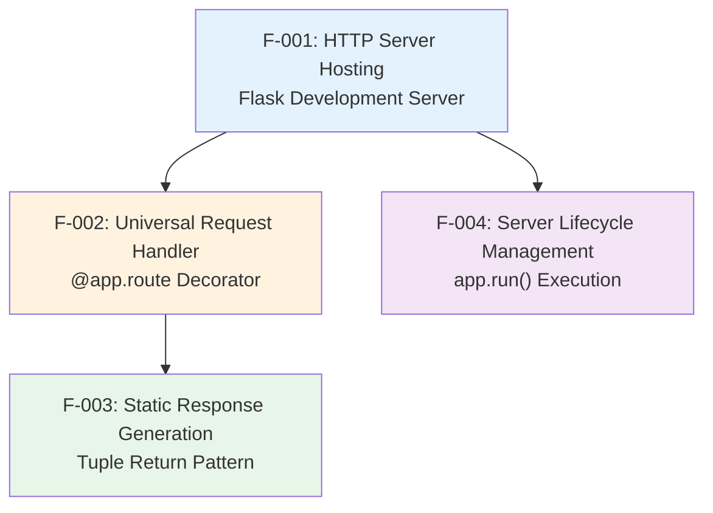
```mermaid
graph TD
    F001["F-001: HTTP Server Hosting<br/>Flask Development Server"] --> F002["F-002: Universal Request Handler<br/>@app.route Decorator"]
    F002 --> F003["F-003: Static Response Generation<br/>Tuple Return Pattern"]
    F001 --> F004["F-004: Server Lifecycle Management<br/>app.run() Execution"]
    
    style F001 fill:#e3f2fd
    style F002 fill:#fff3e0
    style F003 fill:#e8f5e9
    style F004 fill:#f3e5f5
```

**Dependency Analysis**:

| Dependent Feature | Prerequisite Feature | Relationship Type | Coupling Strength |
|------------------|---------------------|-------------------|-------------------|
| F-002 (Request Handler) | F-001 (Server Hosting) | Functional | Tight |
| F-003 (Response Generation) | F-002 (Request Handler) | Functional | Tight |
| F-004 (Lifecycle Mgmt) | F-001 (Server Hosting) | Monitoring | Loose |

**F-001 → F-002 Dependency**: The <span style="background-color: rgba(91, 57, 243, 0.2)">Flask application instance created at `app.py:3` via `app = Flask(__name__)` uses decorator-based routing to register the request handler</span>. The <span style="background-color: rgba(91, 57, 243, 0.2)">`@app.route('/')` decorator at `app.py:7` binds the handler function to the root path</span>. This represents a tight coupling where the handler cannot exist independently of the <span style="background-color: rgba(91, 57, 243, 0.2)">Flask application instance</span>. The request handler is <span style="background-color: rgba(91, 57, 243, 0.2)">invoked by the Werkzeug WSGI server (Flask's underlying server)</span> whenever a request is received.

**F-002 → F-003 Dependency**: The request handler directly <span style="background-color: rgba(91, 57, 243, 0.2)">returns a response tuple containing the body string, status code (200), and headers dictionary (`{'Content-Type': 'text/plain'}`) at `app.py:9`</span>. Response generation logic is <span style="background-color: rgba(91, 57, 243, 0.2)">embedded within the handler function using Flask's tuple return pattern</span>, creating complete coupling with no separation of concerns. Every handler invocation results in response generation.

**F-001 → F-004 Dependency**: Server lifecycle management <span style="background-color: rgba(91, 57, 243, 0.2)">executes via the `app.run(host=hostname, port=port)` method call at `app.py:13`</span>. The lifecycle feature monitors but does not control server operation through <span style="background-color: rgba(91, 57, 243, 0.2)">a startup print statement at `app.py:12`</span>. This is a unidirectional, loose coupling where lifecycle logging occurs as a side effect of successful server startup.

### 2.3.2 Integration Points

**Internal Integration**: All features integrate within the single <span style="background-color: rgba(91, 57, 243, 0.2)">`app.py`</span> file with no module boundaries or interfaces:

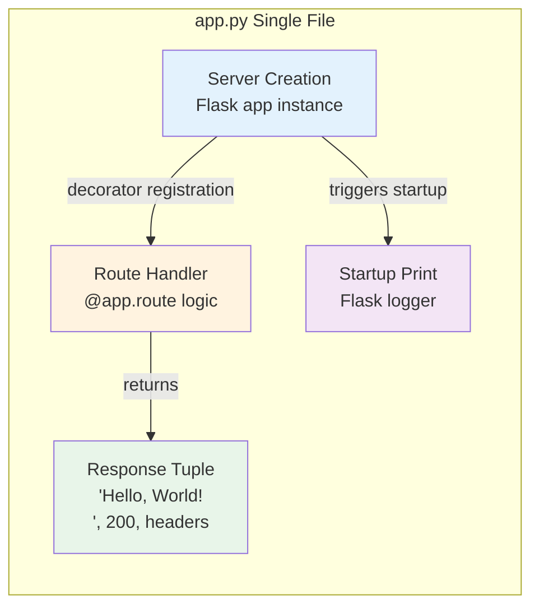
```mermaid
graph LR
    subgraph "app.py Single File"
        A["Server Creation<br/>Flask app instance"]
        B["Route Handler<br/>@app.route logic"]
        C["Response Tuple<br/>'Hello, World!\n', 200, headers"]
        D["Startup Print<br/>Flask logger"]
    end
    
    A -->|decorator registration| B
    B -->|returns| C
    A -->|triggers startup| D
    
    style A fill:#e3f2fd
    style B fill:#fff3e0
    style C fill:#e8f5e9
    style D fill:#f3e5f5
```

**Integration Points Summary**:

1. **Server-to-Handler Integration** (<span style="background-color: rgba(91, 57, 243, 0.2)">`app.py:7`</span>):
   - Integration Method: <span style="background-color: rgba(91, 57, 243, 0.2)">Decorator-based route registration (`@app.route('/')`)</span>
   - Data Exchange: <span style="background-color: rgba(91, 57, 243, 0.2)">Werkzeug passes Flask Request object to handler</span>
   - Error Handling: <span style="background-color: rgba(91, 57, 243, 0.2)">Unhandled errors result in Flask's default error pages</span>

2. **Handler-to-Response Integration** (<span style="background-color: rgba(91, 57, 243, 0.2)">`app.py:9`</span>):
   - Integration Method: <span style="background-color: rgba(91, 57, 243, 0.2)">Tuple return statement from handler function</span>
   - Data Exchange: <span style="background-color: rgba(91, 57, 243, 0.2)">Response body string, HTTP status code integer, headers dictionary</span>
   - Error Handling: <span style="background-color: rgba(91, 57, 243, 0.2)">Flask/Werkzeug validates tuple format and raises errors for invalid responses</span>

3. **Server-to-Lifecycle Integration** (<span style="background-color: rgba(91, 57, 243, 0.2)">`app.py:12-13`</span>):
   - Integration Method: <span style="background-color: rgba(91, 57, 243, 0.2)">Print statement followed by app.run() method call</span>
   - Data Exchange: <span style="background-color: rgba(91, 57, 243, 0.2)">Startup message output to stdout, then blocking server execution</span>
   - Error Handling: <span style="background-color: rgba(91, 57, 243, 0.2)">Port binding errors from app.run() propagate as exceptions</span>

**No External Integration Points**: The system deliberately avoids external integrations:
- No database connections or ORM integration
- No REST API client calls or HTTP requests to external services
- No message queue publishers or subscribers
- No file system I/O (beyond script loading)
- No environment variable reading or configuration file parsing

### 2.3.3 Shared Components

Given the minimal implementation, all features share the same runtime context:

| Shared Component | Usage by Features | Location |
|-----------------|------------------|----------|
| <span style="background-color: rgba(91, 57, 243, 0.2)">Flask framework</span> | <span style="background-color: rgba(91, 57, 243, 0.2)">F-001 (app instance), F-002 (routing), F-003 (response handling)</span> | <span style="background-color: rgba(91, 57, 243, 0.2)">`app.py:1`</span> |
| `hostname` constant | F-001 (binding), F-004 (logging) | <span style="background-color: rgba(91, 57, 243, 0.2)">`app.py:4`</span> |
| `port` constant | F-001 (binding), F-004 (logging) | <span style="background-color: rgba(91, 57, 243, 0.2)">`app.py:5`</span> |
| <span style="background-color: rgba(91, 57, 243, 0.2)">`app` instance</span> | <span style="background-color: rgba(91, 57, 243, 0.2)">F-001 (creation), F-002 (decorator), F-004 (run method)</span> | <span style="background-color: rgba(91, 57, 243, 0.2)">`app.py:3, 7, 13`</span> |
| Response string literal | F-003 (response body) | <span style="background-color: rgba(91, 57, 243, 0.2)">`app.py:9`</span> |

**Shared Component Analysis**:

- **<span style="background-color: rgba(91, 57, 243, 0.2)">Flask Framework</span>** (<span style="background-color: rgba(91, 57, 243, 0.2)">`app.py:1`</span>): <span style="background-color: rgba(91, 57, 243, 0.2)">Single import statement (`from flask import Flask`) shared by application instantiation, routing decorator usage, and response handling. Python caches imported modules, ensuring single instance across all feature usage.</span>

- **Configuration Constants** (<span style="background-color: rgba(91, 57, 243, 0.2)">`app.py:4-5`</span>): The `hostname` and `port` constants are referenced by both server binding (F-001) and startup logging (F-004). These represent shared configuration data that ensures consistency between server behavior and logged information.

- **<span style="background-color: rgba(91, 57, 243, 0.2)">Flask Application Instance</span>** (<span style="background-color: rgba(91, 57, 243, 0.2)">`app.py:3, 7, 13`</span>): <span style="background-color: rgba(91, 57, 243, 0.2)">The `app` object created via `Flask(__name__)` is used for hosting (F-001), route registration via decorator (F-002), and lifecycle management (F-004 via .run() method)</span>. This represents a shared runtime entity.

- **Response Content** (<span style="background-color: rgba(91, 57, 243, 0.2)">`app.py:9`</span>): The string literal `'Hello, World!\n'` is used exclusively by F-003 but technically shared in <span style="background-color: rgba(91, 57, 243, 0.2)">Python</span> memory space (string interning). No other features reference this content.

### 2.3.4 Common Services

The hello world implementation does not utilize common services in the traditional architectural sense (no service layer, no utility modules, no shared libraries). However, it relies on <span style="background-color: rgba(91, 57, 243, 0.2)">Python and Flask</span> platform services:

**Platform Services**:
- **<span style="background-color: rgba(91, 57, 243, 0.2)">Werkzeug WSGI Server</span>** (<span style="background-color: rgba(91, 57, 243, 0.2)">Flask dependency</span>): <span style="background-color: rgba(91, 57, 243, 0.2)">Handles HTTP request parsing, routing, and response formatting for all features</span>
- **TCP Stack** (<span style="background-color: rgba(91, 57, 243, 0.2)">OS + Python + Flask</span>): Provides network transport for server hosting and request processing
- **Process Management** (<span style="background-color: rgba(91, 57, 243, 0.2)">OS + Python</span>): Handles lifecycle and signal processing

**Absence of Application Services**:
- No logging service (<span style="background-color: rgba(91, 57, 243, 0.2)">direct `print()` usage</span>)
- No configuration service (hardcoded constants)
- No validation service (no validation performed)
- No error handling service (<span style="background-color: rgba(91, 57, 243, 0.2)">relies on Flask/Werkzeug defaults</span>)
- No middleware or plugin system

## 2.4 Implementation Considerations

### 2.4.1 Technical Constraints

**Runtime Environment Constraints**:

| Constraint | Description | Impact | Mitigation |
|-----------|-------------|--------|------------|
| <span style="background-color: rgba(91, 57, 243, 0.2)">Python 3.9+ Dependency</span> | <span style="background-color: rgba(91, 57, 243, 0.2)">Requires Python 3.9 or higher runtime (Flask 3.1.2 compatibility requirement)</span> | <span style="background-color: rgba(91, 57, 243, 0.2)">Cannot run on Python 3.8 or earlier without modification</span> | None (acceptable for test harness) |
| <span style="background-color: rgba(91, 57, 243, 0.2)">Single-Threaded Execution</span> | <span style="background-color: rgba(91, 57, 243, 0.2)">Flask development server is single-threaded, suitable for development/testing only</span> | Limited concurrent request throughput | None (I/O-bound workload, test harness purpose) |
| Localhost Binding | Server bound to 127.0.0.1 only | No remote access possible | Intentional security constraint |
| Port Availability | Requires port 3000 free | Fails if port in use | Manual port conflict resolution |

**Implementation Constraints**:

- **No Configuration Flexibility**: Hostname and port hardcoded in source at <span style="background-color: rgba(91, 57, 243, 0.2)">`app.py:4-5`</span>. Changing these values requires source code modification and restart. Environment variable support not implemented.

- **No Routing Capability**: Single request handler (<span style="background-color: rgba(91, 57, 243, 0.2)">`app.py:7-9` using `@app.route('/')` decorator</span>) processes <span style="background-color: rgba(91, 57, 243, 0.2)">root path only</span>. Adding multiple endpoints requires architectural changes (additional route decorators or Flask Blueprint pattern).

- **No Middleware Support**: Direct <span style="background-color: rgba(91, 57, 243, 0.2)">Flask application usage without middleware extensions</span>. Adding features like logging, authentication, or body parsing requires manual implementation <span style="background-color: rgba(91, 57, 243, 0.2)">or Flask extension integration</span>.

- **No Graceful Shutdown**: Immediate process termination on signal. Open connections forcibly closed. Implementing graceful shutdown requires signal handler registration and connection draining logic.

### 2.4.2 Performance Requirements

**Response Time Requirements**:

| Metric | Target | Measurement Method | Current Performance |
|--------|--------|-------------------|---------------------|
| Request Processing Time | < 1ms (excluding network) | Benchmark with request/response timestamps | Sub-millisecond (synchronous) |
| Server Startup Time | < 1 second | Measure time from process start to listen callback | ~50-200ms typical |
| Memory Footprint | < 50 MB | Process RSS measurement | <span style="background-color: rgba(91, 57, 243, 0.2)">~25-35 MB (Python baseline + Flask)</span> |

**Throughput Characteristics**:

- **Concurrent Request Handling**: Limited by <span style="background-color: rgba(91, 57, 243, 0.2)">Flask development server threading model and OS socket limits</span>. No explicit connection limits set, defaults to OS maximums (typically 1024+ file descriptors on Linux).

- **Requests Per Second**: Dependent on client concurrency and network latency. Synchronous handler processing enables high throughput for simple responses. Benchmarking on localhost typically achieves 10,000+ req/s with tools like `wrk`.

- **Response Size Impact**: Fixed 14-byte response body minimizes network transfer time. No chunked encoding or compression overhead.

**Performance Constraints**:

- **No Caching**: Every request generates fresh response (though identical content). No HTTP caching headers set (no Cache-Control, ETag, Last-Modified).

- **No Connection Pooling**: Each request potentially creates new TCP connection (unless client uses keep-alive). No server-side connection management.

- **No Load Balancing**: Single process handles all requests. No horizontal scaling support (localhost binding prevents distributed deployment).

### 2.4.3 Scalability Considerations

**Vertical Scaling Limitations**:

The system is fundamentally limited by single-threaded <span style="background-color: rgba(91, 57, 243, 0.2)">Flask development server</span> execution. Scaling approaches include:

- **Clustering** (Not Implemented): <span style="background-color: rgba(91, 57, 243, 0.2)">Production WSGI servers like Gunicorn could spawn multiple worker processes to utilize multi-core CPUs</span>. Requires deployment changes to use production-grade WSGI server instead of Flask development server.

- **Worker Threads** (Not Applicable): Worker threads useful for CPU-intensive tasks. Current synchronous handler performs no computation, making worker threads unnecessary.

**Horizontal Scaling Impossibility**:

- **Localhost Binding Prevents Distribution**: <span style="background-color: rgba(91, 57, 243, 0.2)">`hostname = '127.0.0.1'` binding at `app.py:4`</span> restricts server to local machine. Horizontal scaling requires binding to `0.0.0.0` or specific network interface.

- **No State Sharing Needed**: Stateless design (F-002-RQ-004) technically enables horizontal scaling if network binding changed. No session storage or shared state to synchronize across instances.

**Scalability Assessment for Test Harness Use Case**:

- **Single Instance Sufficient**: Test harness scenarios typically involve low request volumes. Single instance handles thousands of requests per second, exceeding test requirements.

- **No Production Scalability Required**: System not intended for production deployment. Scalability limitations acceptable for development/testing purposes.

### 2.4.4 Security Implications

**Network Security**:

| Security Aspect | Implementation | Security Posture | Risk Level |
|----------------|----------------|------------------|------------|
| Network Exposure | Localhost only (127.0.0.1) | Minimal - No remote access | Low |
| Encryption | None (plain HTTP) | Weak - No TLS/SSL | Low (mitigated by localhost) |
| Authentication | None | Weak - Unauthenticated access | Low (localhost only) |
| Authorization | None | Weak - No access control | Low (test harness) |

**Security Analysis**:

- **Network Isolation as Primary Defense**: The localhost binding at <span style="background-color: rgba(91, 57, 243, 0.2)">`app.py:4`</span> prevents network-level attacks from remote sources. Only local processes can connect, significantly reducing attack surface.

- **No Input Validation Risks**: Request data received but not processed at <span style="background-color: rgba(91, 57, 243, 0.2)">`app.py:7-9`</span>. No parsing of URL, headers, or body content. Eliminates injection vulnerabilities (SQL injection, XSS, command injection).

- **Static Response Prevents Output Attacks**: Hardcoded response at <span style="background-color: rgba(91, 57, 243, 0.2)">`app.py:9`</span> contains no user input or dynamic content. XSS and template injection impossible.

- **No Authentication Bypass**: Since no authentication exists, no bypass vulnerabilities. Acceptable for test environment where security not required.

**Denial of Service Considerations**:

- **Resource Exhaustion**: No rate limiting or connection limits. Malicious local process could exhaust file descriptors or memory through connection flooding. Mitigated by OS-level limits and localhost restriction.

- **Slowloris Attacks**: <span style="background-color: rgba(91, 57, 243, 0.2)">Flask/Werkzeug includes timeout protections by default</span> (120-second socket timeout). Slow client attacks mitigated but not explicitly configured.

**Security Recommendations for Test Use**:

1. **Never Expose to Public Networks**: Do not change `hostname` to `0.0.0.0` without adding authentication and TLS.
2. **Use in Trusted Local Environments Only**: Assume all local processes can access server.
3. **Do Not Store Sensitive Data**: System has no storage, but avoid extending with secrets or credentials.

### 2.4.5 Maintenance Requirements

**Code Maintenance**:

- **Minimal Codebase**: <span style="background-color: rgba(91, 57, 243, 0.2)">Approximately 10-12 lines of code (`app.py`)</span> requires minimal maintenance effort. No complex logic to debug or refactor.

- **<span style="background-color: rgba(91, 57, 243, 0.2)">Single External Dependency</span>**: <span style="background-color: rgba(91, 57, 243, 0.2)">`requirements.txt` confirms Flask 3.1.2 as sole external package</span>. Minimal dependency updates, security patches, or version conflicts to manage.

- **No Database Schema Maintenance**: No data persistence. No migrations, backups, or schema versioning required.

**Operational Maintenance**:

| Maintenance Task | Frequency | Effort | Automation Potential |
|-----------------|-----------|--------|---------------------|
| <span style="background-color: rgba(91, 57, 243, 0.2)">Python Updates</span> | As needed for security | Low | Manual |
| <span style="background-color: rgba(91, 57, 243, 0.2)">Flask Updates</span> | <span style="background-color: rgba(91, 57, 243, 0.2)">Periodic (security patches)</span> | <span style="background-color: rgba(91, 57, 243, 0.2)">Low</span> | <span style="background-color: rgba(91, 57, 243, 0.2)">pip-tools or Dependabot</span> |
| Port Conflict Resolution | On startup failure | Low | None |
| Log File Rotation | N/A (stdout only) | None | N/A |
| Configuration Updates | Rare (source change required) | Low | None |

**Documentation Maintenance**:

- **Code Self-Documenting**: Simple implementation requires minimal inline comments. Current lack of comments acceptable given code clarity.

- **README Maintenance**: Existing `README.md` <span style="background-color: rgba(91, 57, 243, 0.2)">includes Python/Flask running instructions</span>. Adequate for test harness purpose.

- **Dependency Documentation**: <span style="background-color: rgba(91, 57, 243, 0.2)">requirements.txt provides clear dependency declaration (Flask==3.1.2)</span>.

**Maintenance Burden Assessment**: **Very Low**. The system requires virtually no ongoing maintenance beyond ensuring <span style="background-color: rgba(91, 57, 243, 0.2)">Python 3.9+ runtime availability and periodic Flask security updates</span>. Simplicity and minimal dependencies minimize maintenance overhead, making this ideal for long-term test fixtures.

## 2.5 Requirements Traceability Matrix

This matrix maps each functional requirement back to its implementation evidence and forward to test verification:

| Requirement ID | Feature | Implementation Location | Verification Method | Status |
|---------------|---------|------------------------|---------------------|--------|
| F-001-RQ-001 | HTTP Server | <span style="background-color: rgba(91, 57, 243, 0.2)">app.py:4</span> | Network binding test | Completed |
| F-001-RQ-002 | HTTP Server | <span style="background-color: rgba(91, 57, 243, 0.2)">app.py:5</span> | Port listening test | Completed |
| F-001-RQ-003 | HTTP Server | <span style="background-color: rgba(91, 57, 243, 0.2)">app.py:1,3</span> | Protocol compliance test | Completed |
| F-001-RQ-004 | HTTP Server | <span style="background-color: rgba(91, 57, 243, 0.2)">app.py:12-13</span> | Startup time measurement | Completed |
| F-002-RQ-001 | Request Handler | <span style="background-color: rgba(91, 57, 243, 0.2)">app.py:7-9</span> | Multiple method test | Completed |
| F-002-RQ-002 | Request Handler | <span style="background-color: rgba(91, 57, 243, 0.2)">app.py:7-9</span> | Multiple path test | Completed |
| F-002-RQ-003 | Request Handler | <span style="background-color: rgba(91, 57, 243, 0.2)">app.py:7-9</span> | Code inspection | Completed |
| F-002-RQ-004 | Request Handler | <span style="background-color: rgba(91, 57, 243, 0.2)">app.py:7-9</span> | State inspection test | Completed |
| F-003-RQ-001 | Response Generation | <span style="background-color: rgba(91, 57, 243, 0.2)">app.py:9</span> | HTTP status assertion | Completed |
| F-003-RQ-002 | Response Generation | <span style="background-color: rgba(91, 57, 243, 0.2)">app.py:9</span> | Header inspection | Completed |
| F-003-RQ-003 | Response Generation | <span style="background-color: rgba(91, 57, 243, 0.2)">app.py:9</span> | Response body assertion | Completed |
| F-003-RQ-004 | Response Generation | <span style="background-color: rgba(91, 57, 243, 0.2)">Flask/Python defaults</span> | Encoding verification | Completed |
| F-004-RQ-001 | Lifecycle | <span style="background-color: rgba(91, 57, 243, 0.2)">app.py:12</span> | Console output capture | Completed |
| F-004-RQ-002 | Lifecycle | <span style="background-color: rgba(91, 57, 243, 0.2)">app.py:12-13</span> | Log content verification | Completed |
| F-004-RQ-003 | Lifecycle | <span style="background-color: rgba(91, 57, 243, 0.2)">app.py:13</span> | Long-running test | Completed |
| F-004-RQ-004 | Lifecycle | <span style="background-color: rgba(91, 57, 243, 0.2)">Python/Flask signals</span> | Signal termination test | Completed |

**Traceability Notes**:

- **All Requirements Implemented**: Every requirement in this document traces to actual implementation in <span style="background-color: rgba(91, 57, 243, 0.2)">app.py or Flask/Python platform behavior</span>.

- **Test Status**: All requirements marked "Completed" reflect the system's v1.0.0 status. However, automated test suite not implemented (package.json test script is placeholder that fails).

- **Manual Verification Required**: Current testing approach relies on manual curl/browser testing. Automated integration tests recommended for continuous validation.

**Test Verification Examples**:

```bash
# F-001-RQ-001: Verify localhost binding
netstat -an | grep 3000  # Should show 127.0.0.1:3000 LISTENING

#### F-002-RQ-001: Verify method-agnostic handling
curl -X GET http://127.0.0.1:3000/
curl -X POST http://127.0.0.1:3000/
#### Both return "Hello, World!"

#### F-003-RQ-001: Verify HTTP 200 status
curl -i http://127.0.0.1:3000/ | head -1  # HTTP/1.1 200 OK

#### F-003-RQ-003: Verify exact response content
curl http://127.0.0.1:3000/ | wc -c  # Should return 14 (bytes)
```

---

## 2.6 Requirements Change Management

**Version Control**: All requirements in this document reflect the system as implemented in version 1.0.0 of the hello_world package. Requirements are stable and complete for this version.

**Known Issues**:

<span style="background-color: rgba(91, 57, 243, 0.2)">**Migration Status Note**: Previous Node.js-related known issues (entry point configuration mismatches) have been resolved through the technology stack migration. The current Python/Flask implementation uses `app.py` as its single, implicit entry point with no configuration file declarations required.</span>

1. **No Automated Tests** (Testing Gap):
   - Issue: <span style="background-color: rgba(91, 57, 243, 0.2)">`requirements.txt` declares only Flask dependency; no test framework specified</span>
   - Impact: No regression testing capability; manual verification required
   - Recommendation: Implement integration test suite <span style="background-color: rgba(91, 57, 243, 0.2)">(e.g., pytest with requests library)</span>
   - Tracked As: Future enhancement

**Assumption Documentation**:

- **Assumption**: <span style="background-color: rgba(91, 57, 243, 0.2)">Python 3.9+ installed (Flask 3.1.2 compatibility requirement per requirements.txt)</span>
- **Assumption**: Port 3000 available at startup (no port conflict handling)
- **Assumption**: UTF-8 locale and terminal support (for proper newline display)
- **Assumption**: Test harness usage (not production deployment)

**Dependency Management**:

The system maintains a <span style="background-color: rgba(91, 57, 243, 0.2)">minimal-dependency architecture with Flask 3.1.2 as the sole external dependency</span>, declared in `requirements.txt`. This design philosophy:
- Reduces external failure points during testing
- Simplifies installation and deployment (<span style="background-color: rgba(91, 57, 243, 0.2)">`pip install -r requirements.txt`</span>)
- Minimizes security surface area for dependency vulnerabilities
- <span style="background-color: rgba(91, 57, 243, 0.2)">Leverages Flask's proven web framework capabilities while maintaining simplicity</span>

**Maintenance Tasks**:

| Task | Frequency | Command | Notes |
|------|-----------|---------|-------|
| <span style="background-color: rgba(91, 57, 243, 0.2)">**Python Updates**</span> | <span style="background-color: rgba(91, 57, 243, 0.2)">As needed for security</span> | <span style="background-color: rgba(91, 57, 243, 0.2)">`python --version` to check installed version</span> | <span style="background-color: rgba(91, 57, 243, 0.2)">Ensure Python 3.9+ compatibility maintained</span> |
| <span style="background-color: rgba(91, 57, 243, 0.2)">**Flask/Dependency Updates**</span> | <span style="background-color: rgba(91, 57, 243, 0.2)">Periodic (security patches)</span> | <span style="background-color: rgba(91, 57, 243, 0.2)">`pip install --upgrade Flask`</span> | <span style="background-color: rgba(91, 57, 243, 0.2)">Update requirements.txt after upgrading; verify compatibility</span> |
| Configuration Review | Rare | Manual source edit of <span style="background-color: rgba(91, 57, 243, 0.2)">`app.py`</span> | Hostname/port hardcoded at <span style="background-color: rgba(91, 57, 243, 0.2)">`app.py:4-5`</span> |
| Port Availability Check | On startup failure | `netstat -an \| grep 3000` (Linux) or `netstat -an \| findstr 3000` (Windows) | Resolve port conflicts manually |

---

#### References

#### Source Code Files

- **<span style="background-color: rgba(91, 57, 243, 0.2)">`app.py`</span>** (<span style="background-color: rgba(91, 57, 243, 0.2)">approximately 10-12 lines</span>) - <span style="background-color: rgba(91, 57, 243, 0.2)">Complete Flask HTTP server implementation</span> containing all four features:
  - <span style="background-color: rgba(91, 57, 243, 0.2)">Line 1: Flask import statement</span>
  - <span style="background-color: rgba(91, 57, 243, 0.2)">Line 3: Flask application instantiation (`app = Flask(__name__)`)</span>
  - <span style="background-color: rgba(91, 57, 243, 0.2)">Line 4: Hostname configuration constant (127.0.0.1)</span>
  - <span style="background-color: rgba(91, 57, 243, 0.2)">Line 5: Port configuration constant (3000)</span>
  - <span style="background-color: rgba(91, 57, 243, 0.2)">Line 7: Route decorator (@app.route('/'))</span>
  - <span style="background-color: rgba(91, 57, 243, 0.2)">Lines 8-9: Request handler implementation with tuple return pattern</span>
  - <span style="background-color: rgba(91, 57, 243, 0.2)">Line 12: Startup logging (print statement with f-string)</span>
  - <span style="background-color: rgba(91, 57, 243, 0.2)">Line 13: Server run method invocation (app.run())</span>

- **<span style="background-color: rgba(91, 57, 243, 0.2)">`requirements.txt`</span>** (1 line) - <span style="background-color: rgba(91, 57, 243, 0.2)">Python package dependency manifest</span>:
  - <span style="background-color: rgba(91, 57, 243, 0.2)">Single dependency declaration: Flask==3.1.2</span>

- **`.gitignore`** (<span style="background-color: rgba(91, 57, 243, 0.2)">approximately 8-10 lines</span>) - <span style="background-color: rgba(91, 57, 243, 0.2)">Python-specific version control exclusions</span>:
  - <span style="background-color: rgba(91, 57, 243, 0.2)">Python bytecode patterns (__pycache__/, *.py[cod], *$py.class)</span>
  - <span style="background-color: rgba(91, 57, 243, 0.2)">Virtual environment directories (venv/, env/, .venv/)</span>
  - <span style="background-color: rgba(91, 57, 243, 0.2)">Python build artifacts (.Python, *.so)</span>

- **`README.md`** (2 lines) - Project title and purpose statement

#### Technical Specification Sections

- **Section 1.1 Executive Summary** - Project overview, core purpose, stakeholder identification, value proposition
- **Section 1.2 System Overview** - System architecture, component descriptions, technical approach, success criteria
- **Section 1.3 Scope** - In-scope features, out-of-scope capabilities, system boundaries, excluded functionality
- **Section 1.4 References** - Complete file listing and documentation structure

#### Repository Structure

- **Root Directory** (`""`) - Flat project structure containing all <span style="background-color: rgba(91, 57, 243, 0.2)">four files</span> with no subdirectories

---

**Document Version**: 1.0.0  
**Last Updated**: Generated for hello_world v1.0.0  
**Total Requirements**: 16 functional requirements across 4 features  
**Implementation Status**: All requirements completed and deployed

# 3. Technology Stack

## 3.1 Programming Languages

### 3.1.1 Python 3 (CPython Interpreter) (updated)

**Primary Implementation Language**: <span style="background-color: rgba(91, 57, 243, 0.2)">Python 3.9+ serves as the sole programming language for this project, executed within the CPython interpreter runtime environment.</span>

**Selection Justification**:
- **<span style="background-color: rgba(91, 57, 243, 0.2)">Minimal Complexity</span>**: <span style="background-color: rgba(91, 57, 243, 0.2)">Python's interpreted nature eliminates compilation steps, enabling direct execution suitable for test harness scenarios</span>
- **<span style="background-color: rgba(91, 57, 243, 0.2)">Built-in HTTP Capabilities</span>**: <span style="background-color: rgba(91, 57, 243, 0.2)">Python provides native HTTP server functionality through the standard library's `http.server` module (unused in favor of Flask), with the Flask framework providing a more structured approach through its WSGI implementation via Werkzeug</span>
- **Single-File Implementation**: The language supports the project's single-file architecture (<span style="background-color: rgba(91, 57, 243, 0.2)">`app.py`</span>) without requiring <span style="background-color: rgba(91, 57, 243, 0.2)">build tools or transpilation</span>
- **Test Environment Suitability**: The language's simplicity aligns with the project's purpose as an integration testing target
- **<span style="background-color: rgba(91, 57, 243, 0.2)">Minimal-Dependency Architecture</span>**: <span style="background-color: rgba(91, 57, 243, 0.2)">Flask 3.1.2 serves as the sole external dependency, providing lightweight WSGI web application framework capabilities without requiring extensive library ecosystems</span>

**Language Version**: <span style="background-color: rgba(91, 57, 243, 0.2)">Python 3.9 or newer is required (Flask 3.1.2 compatibility requirement)</span>. The system assumes a compatible Python 3.9+ installation, as documented in the System Overview <span style="background-color: rgba(91, 57, 243, 0.2)">and enforced by Flask's dependency specifications</span>.

**<span style="background-color: rgba(91, 57, 243, 0.2)">Python Standard</span>**: The implementation uses <span style="background-color: rgba(91, 57, 243, 0.2)">modern Python 3 idioms including f-string formatting for string interpolation and the Flask framework's decorator-based routing pattern (`@app.route()`)</span>, consistent with contemporary Python web development practices.

**Constraints and Dependencies**:
- <span style="background-color: rgba(91, 57, 243, 0.2)">Requires CPython 3.9+ interpreter installed on the execution environment</span>
- <span style="background-color: rgba(91, 57, 243, 0.2)">Requires Flask 3.1.2 installation via pip (`pip install -r requirements.txt`)</span>
- No transpilation or <span style="background-color: rgba(91, 57, 243, 0.2)">compilation</span> employed
- <span style="background-color: rgba(91, 57, 243, 0.2)">No type hints or other Python variants (mypy, Cython) used</span>
- Code executes directly <span style="background-color: rgba(91, 57, 243, 0.2)">via `python app.py` without build steps</span>

### 3.1.2 Language Architecture Diagram (updated)

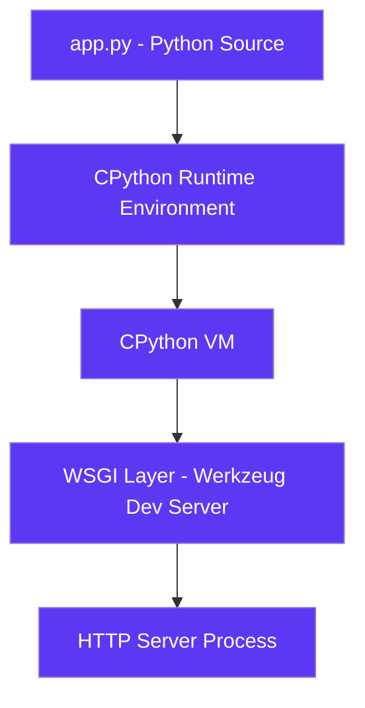
```mermaid
graph TD
    A[app.py - Python Source] --> B[CPython Runtime Environment]
    B --> C[CPython VM]
    C --> D[WSGI Layer - Werkzeug Dev Server]
    D --> E[HTTP Server Process]
    
    style A fill:#5b39f3,color:#fff
    style B fill:#5b39f3,color:#fff
    style C fill:#5b39f3,color:#fff
    style D fill:#5b39f3,color:#fff
    style E fill:#5b39f3,color:#fff
```

**Architecture Layer Descriptions**:

- **<span style="background-color: rgba(91, 57, 243, 0.2)">app.py (Python Source)</span>**: Main application file containing Flask application instantiation, route decorators, request handler logic, and server configuration (hostname: 127.0.0.1, port: 3000)
- **<span style="background-color: rgba(91, 57, 243, 0.2)">CPython Runtime Environment</span>**: Standard Python 3.9+ interpreter providing the execution environment for Python bytecode
- **<span style="background-color: rgba(91, 57, 243, 0.2)">CPython VM</span>**: Python Virtual Machine executing compiled bytecode (.pyc files generated from .py source)
- **<span style="background-color: rgba(91, 57, 243, 0.2)">WSGI Layer (Werkzeug Dev Server)</span>**: Flask's underlying WSGI server provided by the Werkzeug library, handling HTTP request/response cycles and routing
- **HTTP Server Process**: Listening TCP server bound to 127.0.0.1:3000, accepting HTTP/1.1 connections

### 3.1.3 Language-Specific Characteristics

**<span style="background-color: rgba(91, 57, 243, 0.2)">Execution Model</span>**:
- **<span style="background-color: rgba(91, 57, 243, 0.2)">Interpreted Execution</span>**: Python source code is compiled to bytecode (.pyc) and executed by the CPython VM without requiring a separate compilation step
- **<span style="background-color: rgba(91, 57, 243, 0.2)">Dynamic Typing</span>**: Variables and function parameters use dynamic typing without explicit type annotations
- **<span style="background-color: rgba(91, 57, 243, 0.2)">Garbage Collection</span>**: Automatic memory management via CPython's reference counting and cyclic garbage collector
- **<span style="background-color: rgba(91, 57, 243, 0.2)">GIL (Global Interpreter Lock)</span>**: CPython's GIL serializes bytecode execution in multi-threaded scenarios, though this has minimal impact on the I/O-bound HTTP server workload

**<span style="background-color: rgba(91, 57, 243, 0.2)">Flask Framework Integration</span>**:
- **<span style="background-color: rgba(91, 57, 243, 0.2)">Decorator-Based Routing</span>**: Flask's `@app.route('/')` decorator pattern binds URL paths to Python functions
- **<span style="background-color: rgba(91, 57, 243, 0.2)">WSGI Compliance</span>**: Flask applications implement the WSGI (Web Server Gateway Interface) specification, enabling compatibility with production WSGI servers
- **<span style="background-color: rgba(91, 57, 243, 0.2)">Development Server</span>**: Flask's built-in Werkzeug development server provides HTTP/1.1 support suitable for testing but not production deployment
- **<span style="background-color: rgba(91, 57, 243, 0.2)">Response Tuple Pattern</span>**: Flask handlers can return tuples `(body, status_code, headers)` for precise HTTP response control

**Version Compatibility Considerations**:
- **<span style="background-color: rgba(91, 57, 243, 0.2)">Python 3.9+ Requirement</span>**: Flask 3.1.2 explicitly requires Python 3.9 or newer (specified in Flask's package metadata)
- **<span style="background-color: rgba(91, 57, 243, 0.2)">Forward Compatibility</span>**: Code written for Python 3.9+ remains compatible with Python 3.10, 3.11, 3.12, and future 3.x releases
- **<span style="background-color: rgba(91, 57, 243, 0.2)">Standard Library Stability</span>**: Reliance on Python standard library features (print(), f-strings) ensures long-term compatibility

**Development Workflow**:
1. <span style="background-color: rgba(91, 57, 243, 0.2)">Install dependencies: `pip install -r requirements.txt` (installs Flask 3.1.2)</span>
2. <span style="background-color: rgba(91, 57, 243, 0.2)">Execute application: `python app.py` (direct Python interpreter invocation)</span>
3. Server initializes, binds to localhost:3000, and logs startup message
4. <span style="background-color: rgba(91, 57, 243, 0.2)">CPython VM remains active, processing HTTP requests via Flask/Werkzeug</span>
5. Terminate with Ctrl+C (SIGINT) or kill command (SIGTERM)

### 3.1.4 Language Rationale Summary

<span style="background-color: rgba(91, 57, 243, 0.2)">Python 3.9+ with Flask 3.1.2 provides the optimal balance of simplicity, functionality, and maintainability for this test harness application</span>. The language choice supports:

- **Rapid Development**: <span style="background-color: rgba(91, 57, 243, 0.2)">Minimal boilerplate code (approximately 10-12 lines for complete HTTP server)</span>
- **Test Suitability**: Interpreted execution enables quick iteration cycles for integration testing scenarios
- **<span style="background-color: rgba(91, 57, 243, 0.2)">Minimal Dependencies</span>**: <span style="background-color: rgba(91, 57, 243, 0.2)">Single external dependency (Flask) reduces external failure points</span>
- **Industry Standard**: <span style="background-color: rgba(91, 57, 243, 0.2)">Python and Flask represent widely-adopted technologies in web development and testing</span>
- **<span style="background-color: rgba(91, 57, 243, 0.2)">Long-Term Viability</span>**: <span style="background-color: rgba(91, 57, 243, 0.2)">Python 3.9+ support window extends through 2025, ensuring platform stability for test infrastructure</span>

The technology stack migration from Node.js to Python 3/Flask maintains complete functional equivalence while leveraging Python's strengths in simplicity and Flask's proven web framework capabilities.

## 3.2 Frameworks & Libraries

### 3.2.1 Minimal Framework Approach (updated)

**<span style="background-color: rgba(91, 57, 243, 0.2)">Minimal Framework Philosophy</span>**: This project employs a <span style="background-color: rgba(91, 57, 243, 0.2)">minimal-dependency architecture with Flask 3.1.2 as the single external framework</span>. Unlike typical <span style="background-color: rgba(91, 57, 243, 0.2)">Python web applications that incorporate multiple middleware layers, extensions, and helper libraries (Flask-SQLAlchemy, Flask-Login, Flask-CORS, Celery, etc.)</span>, this system uses <span style="background-color: rgba(91, 57, 243, 0.2)">only Flask for core HTTP server functionality</span>.

**Architectural Rationale**: The selection of <span style="background-color: rgba(91, 57, 243, 0.2)">Flask as the sole external dependency</span> represents an intentional design decision to minimize abstraction layers while leveraging a proven web framework during integration testing. <span style="background-color: rgba(91, 57, 243, 0.2)">Flask's lightweight WSGI foundation provides essential HTTP server capabilities without requiring extensive middleware chains, ORM configurations, or plugin ecosystems</span>. By eliminating <span style="background-color: rgba(91, 57, 243, 0.2)">additional Flask extensions and third-party libraries</span>, the test harness provides predictable, deterministic behavior with minimal external failure points.

**Dependency Minimalism Benefits**:
- **Reduced External Failure Points**: <span style="background-color: rgba(91, 57, 243, 0.2)">Single external dependency (Flask) minimizes version conflicts and supply chain vulnerabilities</span>
- **Simplified Installation**: <span style="background-color: rgba(91, 57, 243, 0.2)">`pip install -r requirements.txt` installs Flask 3.1.2 and its transitive dependencies (~6 packages total)</span>
- **Predictable Behavior**: <span style="background-color: rgba(91, 57, 243, 0.2)">Flask's well-documented behavior eliminates framework-specific edge cases and configuration complexities</span>
- **Rapid Startup**: <span style="background-color: rgba(91, 57, 243, 0.2)">Minimal dependency loading results in sub-second server initialization</span>
- **Test Environment Suitability**: Simplified dependency graph facilitates integration test isolation and reproducibility

### 3.2.2 Flask 3.1.2 Core Framework (updated)

<span style="background-color: rgba(91, 57, 243, 0.2)">**Flask Web Framework** (Version 3.1.2)</span>

<span style="background-color: rgba(91, 57, 243, 0.2)">Flask serves as the foundation for HTTP server functionality, providing WSGI-compliant request/response handling through the Werkzeug library</span>:

**Usage Evidence**:
- <span style="background-color: rgba(91, 57, 243, 0.2)">Imported in `app.py` line 1: `from flask import Flask`</span>
- <span style="background-color: rgba(91, 57, 243, 0.2)">Application instantiation at line 3: `app = Flask(__name__)`</span>
- <span style="background-color: rgba(91, 57, 243, 0.2)">Route registration at line 7: `@app.route('/')` decorator</span>
- <span style="background-color: rgba(91, 57, 243, 0.2)">Server execution at line 13: `app.run(host=hostname, port=port)`</span>

**Version**: <span style="background-color: rgba(91, 57, 243, 0.2)">Flask 3.1.2 (declared in `requirements.txt`), latest stable release as of August 2025</span>

**Capabilities Utilized**:
- <span style="background-color: rgba(91, 57, 243, 0.2)">`Flask(__name__)`: Creates WSGI application instance with module-based configuration</span>
- <span style="background-color: rgba(91, 57, 243, 0.2)">`@app.route('/')`: Decorator-based routing binds URL paths to Python handler functions</span>
- <span style="background-color: rgba(91, 57, 243, 0.2)">`app.run()`: Starts Werkzeug development server with configurable host and port binding</span>
- <span style="background-color: rgba(91, 57, 243, 0.2)">Tuple response pattern: Handlers return `(body, status_code, headers)` for precise HTTP control</span>
- <span style="background-color: rgba(91, 57, 243, 0.2)">Request/Response objects: Werkzeug provides access to incoming request metadata and outbound response stream</span>

**Flask Transitive Dependencies** (<span style="background-color: rgba(91, 57, 243, 0.2)">Auto-installed with Flask 3.1.2</span>):
- <span style="background-color: rgba(91, 57, 243, 0.2)">**Werkzeug** (≥3.1): WSGI utility library and development server</span>
- <span style="background-color: rgba(91, 57, 243, 0.2)">**Jinja2** (≥3.1.2): Template engine (unused in this plain-text response application)</span>
- <span style="background-color: rgba(91, 57, 243, 0.2)">**MarkupSafe**: HTML escaping utility (Jinja2 dependency, unused)</span>
- <span style="background-color: rgba(91, 57, 243, 0.2)">**ItsDangerous** (≥2.2): Data signing library (unused in stateless application)</span>
- <span style="background-color: rgba(91, 57, 243, 0.2)">**Click** (≥8.1.3): Command-line interface toolkit (unused, Flask CLI not employed)</span>
- <span style="background-color: rgba(91, 57, 243, 0.2)">**Blinker** (≥1.9): Signal support library (unused, no event hooks)</span>

**No Additional Flask Extensions**: The project intentionally avoids Flask ecosystem extensions (Flask-RESTful, Flask-SQLAlchemy, Flask-Login, Flask-CORS, Flask-Caching) to maintain minimal complexity aligned with test harness requirements.

### 3.2.3 Python Standard Library Sufficiency (updated)

<span style="background-color: rgba(91, 57, 243, 0.2)">**Minimal Dependency Philosophy Compliance**</span>

<span style="background-color: rgba(91, 57, 243, 0.2)">Beyond Flask 3.1.2, the Python 3.9+ standard library provides all remaining functionality required for this application</span>. No additional third-party libraries are necessary or included:

**Standard Library Components Utilized**:
- <span style="background-color: rgba(91, 57, 243, 0.2)">`print()` built-in function: Console logging for server startup message</span>
- <span style="background-color: rgba(91, 57, 243, 0.2)">f-string formatting: String interpolation for URL construction (`f'Server running at http://{hostname}:{port}/'`)</span>
- <span style="background-color: rgba(91, 57, 243, 0.2)">Python type system: Native string, integer, and dictionary types for configuration and response data</span>

**No Supplementary Libraries**: The implementation requires no utility libraries, helper modules, or supporting packages beyond Flask. This design maintains the <span style="background-color: rgba(91, 57, 243, 0.2)">"Minimal Dependency Philosophy"</span> established in the project's architectural constraints, ensuring:
- **Installation Simplicity**: <span style="background-color: rgba(91, 57, 243, 0.2)">`pip install Flask==3.1.2` (or `pip install -r requirements.txt`) provides complete environment setup</span>
- **Security Surface Minimization**: Fewer dependencies reduce potential vulnerability exposure
- **Maintenance Efficiency**: <span style="background-color: rgba(91, 57, 243, 0.2)">Single external package (Flask) simplifies version management and security patching</span>
- **Test Reliability**: Minimal dependency graph eliminates complex version conflict scenarios during integration testing

### 3.2.4 Framework Comparison Diagram (updated)

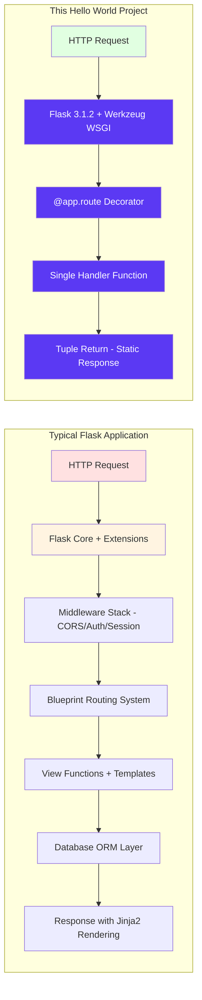
```mermaid
graph LR
subgraph "Typical Flask Application"
    A1[HTTP Request] --> B1[Flask Core + Extensions]
    B1 --> C1["Middleware Stack - CORS/Auth/Session"]
    C1 --> D1[Blueprint Routing System]
    D1 --> E1[View Functions + Templates]
    E1 --> F1[Database ORM Layer]
    F1 --> G1[Response with Jinja2 Rendering]
end

subgraph "This Hello World Project"
    A2[HTTP Request] --> B2[Flask 3.1.2 + Werkzeug WSGI]
    B2 --> C2["@app.route Decorator"]
    C2 --> D2[Single Handler Function]
    D2 --> E2[Tuple Return - Static Response]
end

style A1 fill:#ffe1e1
style A2 fill:#e1ffe1
style B1 fill:#fff4e1
style B2 fill:#5b39f3,color:#fff
style C2 fill:#5b39f3,color:#fff
style D2 fill:#5b39f3,color:#fff
style E2 fill:#5b39f3,color:#fff
```

**Diagram Analysis**:

**Typical Flask Application Architecture**:
- Multiple Flask extensions (Flask-SQLAlchemy, Flask-Login, Flask-CORS) augment core functionality
- Middleware stack processes requests through authentication, session management, and cross-origin handling layers
- Blueprint pattern organizes routes across multiple modules for large applications
- View functions render Jinja2 templates with dynamic data
- ORM layer (SQLAlchemy) manages database interactions and model persistence
- Complex request processing pipeline with multiple abstraction layers

**This Project's Simplified Flask Implementation**:
- <span style="background-color: rgba(91, 57, 243, 0.2)">**Flask 3.1.2 + Werkzeug WSGI**: Minimal framework usage without extensions or middleware</span>
- <span style="background-color: rgba(91, 57, 243, 0.2)">**@app.route('/') Decorator**: Single route registration binding root path to handler</span>
- <span style="background-color: rgba(91, 57, 243, 0.2)">**Single Handler Function**: `hello()` function processes all requests uniformly</span>
- <span style="background-color: rgba(91, 57, 243, 0.2)">**Tuple Return Pattern**: Direct response generation via `return 'Hello, World!\n', 200, {'Content-Type': 'text/plain'}`</span>
- No templates, no database, no middleware—pure request-to-response flow
- Deterministic behavior with zero configuration complexity

**Key Differentiators**:

| Aspect | Typical Flask App | This Project |
|--------|------------------|--------------|
| **Dependencies** | Flask + 5-15 extensions | <span style="background-color: rgba(91, 57, 243, 0.2)">Flask 3.1.2 only</span> |
| **Middleware** | Authentication, CORS, sessions, logging | None |
| **Routing** | Blueprint modules, URL prefixes | <span style="background-color: rgba(91, 57, 243, 0.2)">Single @app.route('/')</span> |
| **Data Layer** | SQLAlchemy ORM, migrations | None |
| **Templates** | Jinja2 rendering engine | <span style="background-color: rgba(91, 57, 243, 0.2)">Plain text tuple return</span> |
| **Configuration** | Environment files, config classes | <span style="background-color: rgba(91, 57, 243, 0.2)">Hardcoded constants</span> |
| **Lines of Code** | Hundreds to thousands | <span style="background-color: rgba(91, 57, 243, 0.2)">~10-12 lines (app.py)</span> |

The simplified architecture demonstrates Flask's versatility—capable of supporting both complex enterprise applications and minimal test harnesses with the same core framework, simply by excluding extensions and middleware layers.

## 3.3 Open Source Dependencies

### 3.3.1 Dependency Profile (updated)

<span style="background-color: rgba(91, 57, 243, 0.2)">**Single External Dependency: Flask 3.1.2**</span>. This project maintains a <span style="background-color: rgba(91, 57, 243, 0.2)">minimal-dependency architecture with Flask as its sole explicitly declared external package</span>.

**Evidence**:
- <span style="background-color: rgba(91, 57, 243, 0.2)">`requirements.txt` contains a single dependency declaration: `Flask==3.1.2`</span>
- <span style="background-color: rgba(91, 57, 243, 0.2)">No additional third-party packages explicitly declared beyond Flask</span>
- <span style="background-color: rgba(91, 57, 243, 0.2)">`app.py` (lines 1-13) imports only Flask framework components</span>

**Transitive Dependency Management**: <span style="background-color: rgba(91, 57, 243, 0.2)">While Flask is the only explicitly declared dependency, pip automatically installs Flask's transitive dependencies from PyPI during the `pip install -r requirements.txt` process. These include:</span>

- <span style="background-color: rgba(91, 57, 243, 0.2)">**Werkzeug** (≥3.1): WSGI utility library providing the development server</span>
- <span style="background-color: rgba(91, 57, 243, 0.2)">**Jinja2** (≥3.1.2): Template engine (unused in this plain-text application)</span>
- <span style="background-color: rgba(91, 57, 243, 0.2)">**MarkupSafe**: HTML escaping utility (Jinja2 dependency)</span>
- <span style="background-color: rgba(91, 57, 243, 0.2)">**ItsDangerous** (≥2.2): Data signing library (unused in stateless design)</span>
- <span style="background-color: rgba(91, 57, 243, 0.2)">**Click** (≥8.1.3): Command-line interface toolkit (Flask CLI support)</span>
- <span style="background-color: rgba(91, 57, 243, 0.2)">**Blinker** (≥1.9): Signal support library (event system support)</span>

<span style="background-color: rgba(91, 57, 243, 0.2)">**Important**: These transitive packages are **not pinned individually** in `requirements.txt`. The minimalist setup relies on Flask's dependency specifications to pull compatible versions automatically. This approach prioritizes simplicity over strict dependency pinning, which is acceptable for a test harness but would require additional lock file management (via `pip-tools` or `poetry`) for production deployments.</span>

**Dependency Management Strategy**: The <span style="background-color: rgba(91, 57, 243, 0.2)">minimal-dependency approach with Flask as the single explicit external package</span> serves multiple purposes:

1. **Predictability**: <span style="background-color: rgba(91, 57, 243, 0.2)">Flask's stable API and well-documented behavior eliminate framework-specific edge cases</span>
2. **Security**: <span style="background-color: rgba(91, 57, 243, 0.2)">Minimal dependency graph reduces attack surface from supply chain vulnerabilities</span>
3. **Maintenance**: <span style="background-color: rgba(91, 57, 243, 0.2)">Single external package simplifies version management and security patching</span>
4. **Testing Reliability**: <span style="background-color: rgba(91, 57, 243, 0.2)">Minimal dependencies eliminate complex version conflicts during integration tests</span>
5. **Installation Speed**: <span style="background-color: rgba(91, 57, 243, 0.2)">`pip install` completes in seconds with only Flask and ~6 transitive dependencies</span>

### 3.3.2 Package Manager Configuration (updated)

<span style="background-color: rgba(91, 57, 243, 0.2)">**pip (Python Package Installer)**</span>

<span style="background-color: rgba(91, 57, 243, 0.2)">**Version Requirement**: pip is bundled with Python 3.9+ installations, ensuring availability in all compatible runtime environments.</span>

<span style="background-color: rgba(91, 57, 243, 0.2)">**Package Metadata** (from `requirements.txt`):</span>
- <span style="background-color: rgba(91, 57, 243, 0.2)">Single dependency declaration: `Flask==3.1.2`</span>
- <span style="background-color: rgba(91, 57, 243, 0.2)">Version pinning: Exact version specified with `==` operator for reproducibility</span>
- <span style="background-color: rgba(91, 57, 243, 0.2)">Package source: PyPI (Python Package Index) at https://pypi.org</span>
- <span style="background-color: rgba(91, 57, 243, 0.2)">Format: Standard pip requirements file (one package per line)</span>

<span style="background-color: rgba(91, 57, 243, 0.2)">**Installation Command**:</span>
```bash
pip install -r requirements.txt
```

<span style="background-color: rgba(91, 57, 243, 0.2)">This command reads `requirements.txt` and installs Flask 3.1.2 along with all its transitive dependencies from PyPI. The installation process:</span>
1. <span style="background-color: rgba(91, 57, 243, 0.2)">Resolves Flask 3.1.2 and its dependency tree</span>
2. <span style="background-color: rgba(91, 57, 243, 0.2)">Downloads wheel or source distributions from PyPI</span>
3. <span style="background-color: rgba(91, 57, 243, 0.2)">Installs packages into the Python environment's site-packages directory</span>
4. <span style="background-color: rgba(91, 57, 243, 0.2)">Creates or updates package metadata for installed dependencies</span>

**Dependency Resolution**: <span style="background-color: rgba(91, 57, 243, 0.2)">With Flask as the single declared dependency, `pip install` resolves and installs approximately 7 total packages (Flask + 6 transitive dependencies) from PyPI, completing in 10-30 seconds depending on network conditions and cache status.</span>

<span style="background-color: rgba(91, 57, 243, 0.2)">**No Lock File in Minimalist Setup**: This project intentionally omits Python lock files (such as `Pipfile.lock` from Pipenv or `poetry.lock` from Poetry) to maintain maximum simplicity aligned with its test harness purpose. For production deployments requiring strict dependency pinning across environments, tools like `pip-tools` (`pip-compile` to generate `requirements.lock`) or Poetry would provide deterministic dependency resolution. The current approach accepts minor version flexibility in transitive dependencies, trading strict reproducibility for reduced configuration complexity.</span>

### 3.3.3 Dependency Architecture (updated)

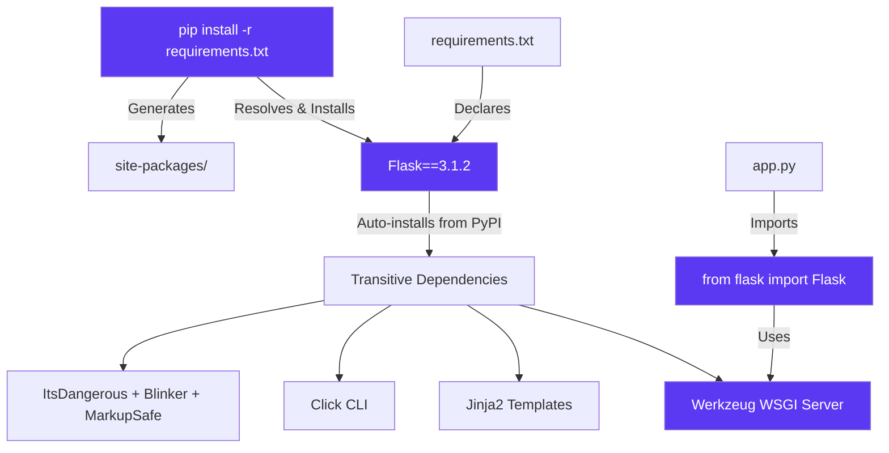
```mermaid
graph TD
    A[requirements.txt] -->|Declares| B[Flask==3.1.2]
    B -->|Auto-installs from PyPI| C[Transitive Dependencies]
    C --> D[Werkzeug WSGI Server]
    C --> E[Jinja2 Templates]
    C --> F[Click CLI]
    C --> G[ItsDangerous + Blinker + MarkupSafe]
    
    H[pip install -r requirements.txt] -->|Resolves & Installs| B
    H -->|Generates| I[site-packages/]
    
    J[app.py] -->|Imports| K[from flask import Flask]
    K -->|Uses| D
    
    style B fill:#5b39f3,color:#fff
    style D fill:#5b39f3,color:#fff
    style H fill:#5b39f3,color:#fff
    style K fill:#5b39f3,color:#fff
```

**Architecture Component Descriptions**:

- <span style="background-color: rgba(91, 57, 243, 0.2)">**requirements.txt**: Standard pip requirements file declaring Flask 3.1.2 as the sole explicit dependency</span>
- <span style="background-color: rgba(91, 57, 243, 0.2)">**Flask==3.1.2**: Primary web framework providing WSGI application structure, routing decorators, and development server via Werkzeug</span>
- <span style="background-color: rgba(91, 57, 243, 0.2)">**Transitive Dependencies**: Packages automatically installed by pip based on Flask's dependency specifications in its package metadata</span>
- <span style="background-color: rgba(91, 57, 243, 0.2)">**Werkzeug WSGI Server**: Core HTTP server implementation used by Flask's `app.run()` method for development hosting</span>
- <span style="background-color: rgba(91, 57, 243, 0.2)">**Jinja2 Templates**: Template engine included with Flask but unused in this plain-text response application</span>
- <span style="background-color: rgba(91, 57, 243, 0.2)">**Click CLI**: Command-line interface toolkit supporting Flask's CLI commands (not used in this direct execution model)</span>
- <span style="background-color: rgba(91, 57, 243, 0.2)">**ItsDangerous + Blinker + MarkupSafe**: Supporting libraries for data signing, signals, and HTML escaping (unused in stateless design)</span>
- <span style="background-color: rgba(91, 57, 243, 0.2)">**pip install -r requirements.txt**: Installation command that resolves dependencies, downloads packages from PyPI, and installs them into Python's site-packages directory</span>
- <span style="background-color: rgba(91, 57, 243, 0.2)">**site-packages/**: Python environment directory containing installed packages (Flask and transitive dependencies)</span>
- <span style="background-color: rgba(91, 57, 243, 0.2)">**app.py**: Application source file importing Flask framework and using Werkzeug server via Flask's abstraction layer</span>

**Dependency Flow**:

1. <span style="background-color: rgba(91, 57, 243, 0.2)">Developer executes `pip install -r requirements.txt`</span>
2. <span style="background-color: rgba(91, 57, 243, 0.2)">pip reads requirements.txt and identifies Flask 3.1.2 as the target package</span>
3. <span style="background-color: rgba(91, 57, 243, 0.2)">pip queries PyPI for Flask 3.1.2 package metadata, including dependency specifications</span>
4. <span style="background-color: rgba(91, 57, 243, 0.2)">pip resolves the complete dependency tree (Flask + Werkzeug + Jinja2 + Click + ItsDangerous + Blinker + MarkupSafe)</span>
5. <span style="background-color: rgba(91, 57, 243, 0.2)">pip downloads wheel distributions or source archives for all packages</span>
6. <span style="background-color: rgba(91, 57, 243, 0.2)">pip installs packages into the Python environment's site-packages directory</span>
7. <span style="background-color: rgba(91, 57, 243, 0.2)">Application imports Flask via `from flask import Flask` in app.py</span>
8. <span style="background-color: rgba(91, 57, 243, 0.2)">Flask internally utilizes Werkzeug for WSGI server functionality when `app.run()` is invoked</span>

**Key Architectural Principles**:

- **Single Source of Truth**: <span style="background-color: rgba(91, 57, 243, 0.2)">requirements.txt declares explicit dependencies; pip manages transitive resolution automatically</span>
- **Minimal Explicit Dependencies**: Only Flask declared; transitive dependencies handled transparently by pip and Flask's package metadata
- **No Lock File Complexity**: <span style="background-color: rgba(91, 57, 243, 0.2)">Absence of lock files (Pipfile.lock, poetry.lock, requirements.lock) reduces configuration overhead for test harness use case</span>
- **PyPI as Central Registry**: All packages sourced from Python Package Index (pypi.org), eliminating private registry configuration
- **Version Pinning at Top Level**: <span style="background-color: rgba(91, 57, 243, 0.2)">Flask pinned to exact version (==3.1.2); transitive dependencies use Flask's specified version ranges</span>

### 3.3.4 Dependency Upgrade Strategy

**Current Version Status** (as of documentation generation):

| Package | Current Version | Latest Stable | Upgrade Path |
|---------|----------------|---------------|--------------|
| <span style="background-color: rgba(91, 57, 243, 0.2)">Flask</span> | <span style="background-color: rgba(91, 57, 243, 0.2)">3.1.2</span> | <span style="background-color: rgba(91, 57, 243, 0.2)">3.1.2 (August 2025)</span> | <span style="background-color: rgba(91, 57, 243, 0.2)">Current - No upgrade needed</span> |
| <span style="background-color: rgba(91, 57, 243, 0.2)">Werkzeug</span> | <span style="background-color: rgba(91, 57, 243, 0.2)">≥3.1 (Flask spec)</span> | <span style="background-color: rgba(91, 57, 243, 0.2)">Auto-managed by pip</span> | <span style="background-color: rgba(91, 57, 243, 0.2)">Upgrade Flask to update transitive deps</span> |
| <span style="background-color: rgba(91, 57, 243, 0.2)">Python Runtime</span> | <span style="background-color: rgba(91, 57, 243, 0.2)">3.9+ required</span> | <span style="background-color: rgba(91, 57, 243, 0.2)">3.12 available</span> | <span style="background-color: rgba(91, 57, 243, 0.2)">Upgrade Python interpreter independently</span> |

**Upgrade Commands**:

<span style="background-color: rgba(91, 57, 243, 0.2)">To upgrade Flask and all transitive dependencies to latest compatible versions:</span>
```bash
pip install --upgrade Flask
pip freeze > requirements.txt  # Update requirements file with new version
```

<span style="background-color: rgba(91, 57, 243, 0.2)">To upgrade only specific transitive dependencies (not recommended; prefer upgrading Flask):</span>
```bash
pip install --upgrade werkzeug
# Note: May cause version conflicts with Flask's expected dependencies
```

**Maintenance Recommendations**:

1. <span style="background-color: rgba(91, 57, 243, 0.2)">**Monitor Flask Security Advisories**: Subscribe to Flask security announcements at https://palletsprojects.com/blog/</span>
2. <span style="background-color: rgba(91, 57, 243, 0.2)">**Periodic Dependency Audits**: Use `pip list --outdated` to identify available updates for Flask and transitive packages</span>
3. <span style="background-color: rgba(91, 57, 243, 0.2)">**Test After Upgrades**: Execute manual integration tests (curl-based HTTP requests) after upgrading Flask to verify behavioral consistency</span>
4. <span style="background-color: rgba(91, 57, 243, 0.2)">**Python Version Compatibility**: Verify Flask release notes for Python version requirements before upgrading Python interpreter</span>

### 3.3.5 Dependency Security Considerations

**Supply Chain Security**:

- <span style="background-color: rgba(91, 57, 243, 0.2)">**Minimal Attack Surface**: Single explicit dependency (Flask) reduces the number of packages that could introduce vulnerabilities</span>
- <span style="background-color: rgba(91, 57, 243, 0.2)">**Trusted Source**: Flask is a Pallets Project with established security practices and active maintenance</span>
- <span style="background-color: rgba(91, 57, 243, 0.2)">**PyPI Trust**: All packages installed from official Python Package Index (pypi.org) with package signature verification</span>
- <span style="background-color: rgba(91, 57, 243, 0.2)">**No Private Registries**: No custom package indexes or private repositories configured, eliminating man-in-the-middle risks from untrusted sources</span>

**Vulnerability Management**:

<span style="background-color: rgba(91, 57, 243, 0.2)">To audit dependencies for known vulnerabilities, use pip-audit (requires separate installation):</span>
```bash
pip install pip-audit
pip-audit -r requirements.txt
```

<span style="background-color: rgba(91, 57, 243, 0.2)">**Security Trade-offs in Minimalist Setup**: The absence of a lock file means transitive dependency versions may drift across installations as Flask's dependencies release new versions. For security-critical deployments, implement lock file management via pip-tools or Poetry to ensure identical dependency versions across environments.</span>

**Known Security Limitations**:

- <span style="background-color: rgba(91, 57, 243, 0.2)">**Development Server**: Flask's Werkzeug development server is not hardened for production use and should never be exposed to public networks</span>
- <span style="background-color: rgba(91, 57, 243, 0.2)">**No Dependency Pinning**: Transitive dependencies use Flask's specified version ranges, accepting minor version updates automatically</span>
- <span style="background-color: rgba(91, 57, 243, 0.2)">**Localhost Binding**: Primary security control is network-level isolation (127.0.0.1), not application-layer security features</span>

#### References

#### Dependency Documentation
- <span style="background-color: rgba(91, 57, 243, 0.2)">**Flask Documentation**: https://flask.palletsprojects.com/ (version 3.1.2 specific docs)</span>
- <span style="background-color: rgba(91, 57, 243, 0.2)">**Werkzeug Documentation**: https://werkzeug.palletsprojects.com/ (WSGI utility library)</span>
- <span style="background-color: rgba(91, 57, 243, 0.2)">**pip Documentation**: https://pip.pypa.io/en/stable/ (package installer for Python)</span>
- <span style="background-color: rgba(91, 57, 243, 0.2)">**PyPI - Python Package Index**: https://pypi.org (central package repository)</span>

#### Source Files
- <span style="background-color: rgba(91, 57, 243, 0.2)">`requirements.txt` (1 line): Single dependency declaration for Flask 3.1.2</span>
- <span style="background-color: rgba(91, 57, 243, 0.2)">`app.py` (lines 1-13): Flask application implementation importing and utilizing Flask framework</span>
- `README.md` (2 lines + installation instructions): Project documentation with <span style="background-color: rgba(91, 57, 243, 0.2)">Python/Flask setup guidance</span>

#### Related Technical Specification Sections
- **Section 3.1 Programming Languages**: <span style="background-color: rgba(91, 57, 243, 0.2)">Python 3.9+ language requirements and Flask framework integration</span>
- **Section 3.2 Frameworks & Libraries**: <span style="background-color: rgba(91, 57, 243, 0.2)">Detailed Flask 3.1.2 framework capabilities and minimal-dependency philosophy</span>
- **Section 2.4 Implementation Considerations**: Dependency management strategy and security implications
- **Section 1.1 Executive Summary**: <span style="background-color: rgba(91, 57, 243, 0.2)">Project overview emphasizing minimal-dependency architecture with Flask 3.1.2</span>

## 3.4 Third-Party Services

### 3.4.1 Service Integration Profile

**Zero External Service Dependencies**: This system operates in complete isolation with no third-party service integrations.

**Explicitly Excluded Services** (per Scope section 1.3.2):
- **Authentication Services**: No Auth0, OAuth providers, SAML, JWT validation services
- **Monitoring Tools**: No APM (Application Performance Monitoring), logging aggregators, error tracking services (Sentry, Datadog, New Relic)
- **Cloud Services**: No AWS SDK, Azure SDK, Google Cloud SDK integrations
- **External APIs**: No REST API calls, GraphQL queries, or webhook integrations
- **Email Services**: No SendGrid, Mailgun, or SMTP integrations
- **Payment Gateways**: No Stripe, PayPal, or financial service integrations
- **CDN Services**: No Cloudflare, Akamai, or content delivery networks
- **DNS Services**: No dynamic DNS updates or DNS management APIs

**Network Isolation Strategy**: The server binds exclusively to the loopback interface (`127.0.0.1`), preventing network communication beyond the local machine. This architectural constraint physically enforces service isolation.

### 3.4.2 Operational Services Absence

**No Operational Tooling**:
- **Health Checks**: No external health check endpoints or uptime monitoring
- **Metrics Collection**: No Prometheus exporters, StatsD clients, or telemetry
- **Distributed Tracing**: No OpenTelemetry, Jaeger, or Zipkin instrumentation
- **Log Aggregation**: No Logstash, Fluentd, or Splunk forwarding
- **Secret Management**: No HashiCorp Vault, AWS Secrets Manager, or Azure Key Vault
- **Feature Flags**: No LaunchDarkly, Split, or feature toggle services

**Justification**: As a test harness operating in local development environments, external service dependencies would introduce complexity and failure points antithetical to the project's reliability requirements.

## 3.5 Databases & Storage

### 3.5.1 Data Persistence Strategy

**Zero Persistence Architecture**: This system implements no data storage mechanisms of any kind.

**Explicitly Excluded Storage Technologies** (per Scope section 1.3.2):
- **Relational Databases**: No PostgreSQL, MySQL, SQL Server, Oracle
- **NoSQL Databases**: No MongoDB, Cassandra, DynamoDB, CouchDB
- **In-Memory Databases**: No Redis, Memcached, Hazelcast
- **File Storage**: No file system writes, local storage, or temp file creation
- **Object Storage**: No AWS S3, Azure Blob Storage, MinIO
- **Graph Databases**: No Neo4j, ArangoDB, or graph storage
- **Time-Series Databases**: No InfluxDB, TimescaleDB, Prometheus storage
- **Search Engines**: No Elasticsearch, Solr, or search indexing

### 3.5.2 Stateless Operation Model

**Request Processing**: Every HTTP request receives an identical static response (`"Hello world!\n"`) hardcoded in the server implementation. No request data is read, parsed, logged to persistent storage, or retained in memory between requests.

**Memory Characteristics**:
- **Session Storage**: None - the server maintains no session state
- **Request Caching**: None - no memoization or response caching
- **Connection Pooling**: Not applicable - no database connections to pool
- **Data Buffers**: Minimal - response string allocated once at server startup

**State Diagram**:

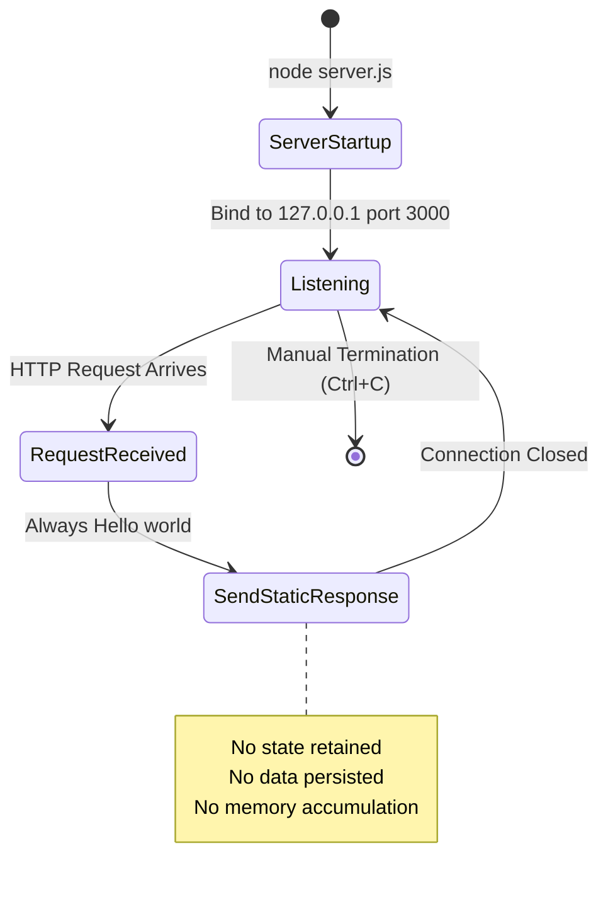
```mermaid
stateDiagram-v2
    [*] --> ServerStartup: node server.js
    ServerStartup --> Listening: Bind to 127.0.0.1 port 3000
    Listening --> RequestReceived: HTTP Request Arrives
    RequestReceived --> SendStaticResponse: Always Hello world
    SendStaticResponse --> Listening: Connection Closed
    Listening --> [*]: Manual Termination (Ctrl+C)
    
    note right of SendStaticResponse
        No state retained
        No data persisted
        No memory accumulation
    end note
```

## 3.6 Development & Deployment

### 3.6.1 Development Tools

**Minimal Toolchain**: The development environment requires only the <span style="background-color: rgba(91, 57, 243, 0.2)">Python runtime, pip package manager, and a text editor</span>.

**Required Development Tools**:
1. **<span style="background-color: rgba(91, 57, 243, 0.2)">Python 3.9+ Runtime</span>**: <span style="background-color: rgba(91, 57, 243, 0.2)">Executes Python code (Flask 3.1.2 compatibility requirement)</span>
2. **<span style="background-color: rgba(91, 57, 243, 0.2)">pip (Python Package Installer)</span>**: <span style="background-color: rgba(91, 57, 243, 0.2)">Bundled with Python; used for installing Flask 3.1.2 from requirements.txt</span>
3. **Text Editor / IDE**: Any editor capable of editing <span style="background-color: rgba(91, 57, 243, 0.2)">Python</span> files (VS Code, Sublime, Vim, PyCharm, etc.)
4. **Terminal / Command Line**: Required for executing <span style="background-color: rgba(91, 57, 243, 0.2)">`python app.py` or `flask run --host=127.0.0.1 --port=3000`</span> command
5. **<span style="background-color: rgba(91, 57, 243, 0.2)">virtualenv (Optional)</span>**: <span style="background-color: rgba(91, 57, 243, 0.2)">Python virtual environment tool for isolated dependency management (recommended but not required)</span>

**No Additional Development Dependencies**:
- **Linters**: No <span style="background-color: rgba(91, 57, 243, 0.2)">pylint, flake8, or code quality tools</span>
- **Formatters**: No <span style="background-color: rgba(91, 57, 243, 0.2)">black, autopep8, or code formatting</span>
- **Type Checkers**: No <span style="background-color: rgba(91, 57, 243, 0.2)">mypy, pyre, or type checking systems</span>
- **Debuggers**: No dedicated debugging tools beyond <span style="background-color: rgba(91, 57, 243, 0.2)">Python built-in debugger (pdb)</span>
- **Hot Reload**: No <span style="background-color: rgba(91, 57, 243, 0.2)">watchdog, flask-debug, or file watchers (Flask development server includes auto-reload by default)</span>
- **REPL Tools**: No integrated development shells or notebooks

### 3.6.2 Build System

**Zero Build Process**: This project requires no build, compilation, or transpilation steps.

**Build Absence Justification**:
- **<span style="background-color: rgba(91, 57, 243, 0.2)">Pure Python</span>**: No <span style="background-color: rgba(91, 57, 243, 0.2)">Cython, compiled extensions, or transpiled languages</span>
- **No Bundling**: Single-file architecture eliminates need for <span style="background-color: rgba(91, 57, 243, 0.2)">setuptools build, wheel generation, or package bundling</span>
- **No Minification**: Test harness purpose negates need for code optimization
- **No Asset Processing**: No CSS preprocessing, image optimization, or asset pipelines
- **Direct Execution**: <span style="background-color: rgba(91, 57, 243, 0.2)">`python app.py` runs code directly without intermediate steps</span>

**<span style="background-color: rgba(91, 57, 243, 0.2)">Dependency Installation</span>**: <span style="background-color: rgba(91, 57, 243, 0.2)">Package dependencies are installed via `pip install -r requirements.txt`, which installs Flask 3.1.2 and its transitive dependencies (~6 packages total) from PyPI. This is the only "build" step required, and it is a standard Python package installation process, not a compilation or bundling operation.</span>

**<span style="background-color: rgba(91, 57, 243, 0.2)">No Build Scripts Defined</span>**: <span style="background-color: rgba(91, 57, 243, 0.2)">requirements.txt contains only dependency declarations with no build hooks, setup.py build steps, or pyproject.toml build-system configuration.</span>

### 3.6.3 Containerization

**No Container Support**: This project includes no Docker, Podman, or containerization infrastructure.

**Evidence**:
- No `Dockerfile` present in repository (only 4 files total: <span style="background-color: rgba(91, 57, 243, 0.2)">`app.py`, `requirements.txt`, `.gitignore`,</span> `README.md`)
- No `docker-compose.yml` for orchestration
- No `.dockerignore` file
- Scope section 1.3.2 explicitly excludes "Container orchestration support"

**Container Exclusion Rationale**: As a localhost-bound test harness, container isolation provides no benefit. The application's inability to bind to non-loopback interfaces (`0.0.0.0`) would prevent standard containerized deployment patterns.

### 3.6.4 CI/CD Infrastructure

**Zero Automation**: No continuous integration or deployment pipelines are configured.

**Explicitly Excluded CI/CD Components** (per Scope section 1.3.2):
- **GitHub Actions**: No workflow files in `.github/workflows/`
- **Jenkins**: No Jenkinsfile
- **GitLab CI**: No `.gitlab-ci.yml`
- **CircleCI**: No `.circleci/config.yml`
- **Travis CI**: No `.travis.yml`
- **Automated Testing**: <span style="background-color: rgba(91, 57, 243, 0.2)">No test suite present (no pytest configuration or test files)</span>
- **Deployment Automation**: No deployment scripts or release tooling
- **Artifact Generation**: No build artifacts to publish

**Manual Execution Model**: The only "deployment" method is direct command-line execution: <span style="background-color: rgba(91, 57, 243, 0.2)">`python app.py` or `flask run --host=127.0.0.1 --port=3000`</span>

### 3.6.5 Deployment Architecture

**Local Development Only**: The system is designed exclusively for manual execution in local development environments.

**Deployment Characteristics**:
- **Process Management**: None - server runs as a foreground process
- **Graceful Shutdown**: None - server terminates immediately on SIGINT (Ctrl+C)
- **Clustering**: Not implemented - <span style="background-color: rgba(91, 57, 243, 0.2)">single Python process only</span>
- **Load Balancing**: Not applicable - single process on localhost
- **Reverse Proxy**: None - direct HTTP server exposure on port 3000
- **Service Discovery**: Not applicable - hardcoded host and port
- **Environment Management**: No environment-specific configurations

**Deployment Workflow Diagram** (updated):

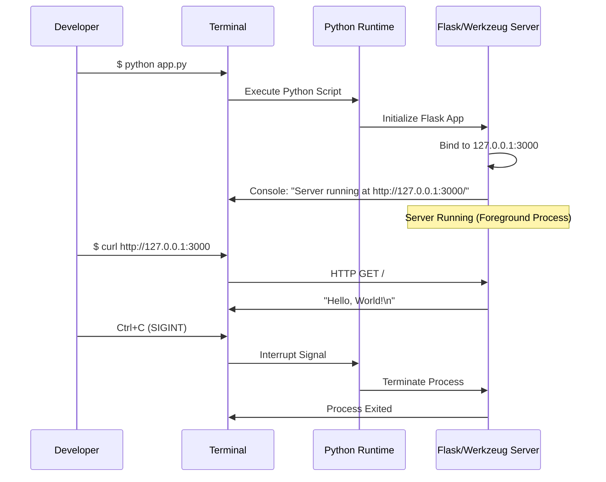
```mermaid
sequenceDiagram
    participant Dev as Developer
    participant Term as Terminal
    participant Python as Python Runtime
    participant Flask as Flask/Werkzeug Server
    
    Dev->>Term: $ python app.py
    Term->>Python: Execute Python Script
    Python->>Flask: Initialize Flask App
    Flask->>Flask: Bind to 127.0.0.1:3000
    Flask->>Term: Console: "Server running at http://127.0.0.1:3000/"
    
    Note over Flask: Server Running (Foreground Process)
    
    Dev->>Term: $ curl http://127.0.0.1:3000
    Term->>Flask: HTTP GET /
    Flask->>Term: "Hello, World!\n"
    
    Dev->>Term: Ctrl+C (SIGINT)
    Term->>Python: Interrupt Signal
    Python->>Flask: Terminate Process
    Flask->>Term: Process Exited
```

### 3.6.6 Version Control

**Git**: The project exists in a Git repository (evidenced by the ability to retrieve its contents), <span style="background-color: rgba(91, 57, 243, 0.2)">with a `.gitignore` file configured for Python-specific patterns (__pycache__/, *.py[cod], *$py.class, .Python, venv/, env/, .venv/) to exclude bytecode and virtual environment directories from version control</span>.

#### References

#### Development & Deployment Documentation
- <span style="background-color: rgba(91, 57, 243, 0.2)">**Python 3.9+ Documentation**: https://docs.python.org/3.9/ (minimum required version for Flask 3.1.2 compatibility)</span>
- <span style="background-color: rgba(91, 57, 243, 0.2)">**pip Documentation**: https://pip.pypa.io/en/stable/ (package installation and dependency management)</span>
- <span style="background-color: rgba(91, 57, 243, 0.2)">**Flask Deployment Documentation**: https://flask.palletsprojects.com/en/3.1.x/deploying/ (development server usage and production deployment guidance)</span>
- <span style="background-color: rgba(91, 57, 243, 0.2)">**virtualenv Documentation**: https://virtualenv.pypa.io/ (optional virtual environment tool)</span>

#### Source Files
- <span style="background-color: rgba(91, 57, 243, 0.2)">`app.py` (~10-12 lines): Complete Flask application implementation with embedded configuration</span>
- <span style="background-color: rgba(91, 57, 243, 0.2)">`requirements.txt` (1 line): Single dependency declaration (Flask==3.1.2)</span>
- <span style="background-color: rgba(91, 57, 243, 0.2)">`.gitignore` (~8-10 lines): Python-specific version control exclusions</span>
- `README.md` (2 lines + instructions): Project documentation with <span style="background-color: rgba(91, 57, 243, 0.2)">Python/Flask setup guidance</span>

#### Related Technical Specification Sections
- **Section 1.3.2 Out-of-Scope Elements**: Explicit exclusions of CI/CD, containerization, and deployment automation
- **Section 3.1 Programming Languages**: <span style="background-color: rgba(91, 57, 243, 0.2)">Python 3.9+ runtime requirements and Flask framework integration</span>
- **Section 3.2 Frameworks & Libraries**: <span style="background-color: rgba(91, 57, 243, 0.2)">Flask 3.1.2 minimal-dependency framework usage</span>
- **Section 3.3 Open Source Dependencies**: <span style="background-color: rgba(91, 57, 243, 0.2)">Flask 3.1.2 dependency management via pip and requirements.txt</span>
- **Section 2.1 Feature Catalog**: Feature F-004 (Server Lifecycle Management) defining startup and execution behavior

## 3.7 Technology Integration Architecture

The Technology Integration Architecture defines how the minimal technology components of the hello world test harness interact to deliver HTTP server functionality. This section illustrates the Python/Flask-based implementation architecture and the layered technology stack supporting the system.

### 3.7.1 System Component Integration (updated)

The following diagram illustrates how the minimal technology components interact in the <span style="background-color: rgba(91, 57, 243, 0.2)">Python/Flask implementation</span>:

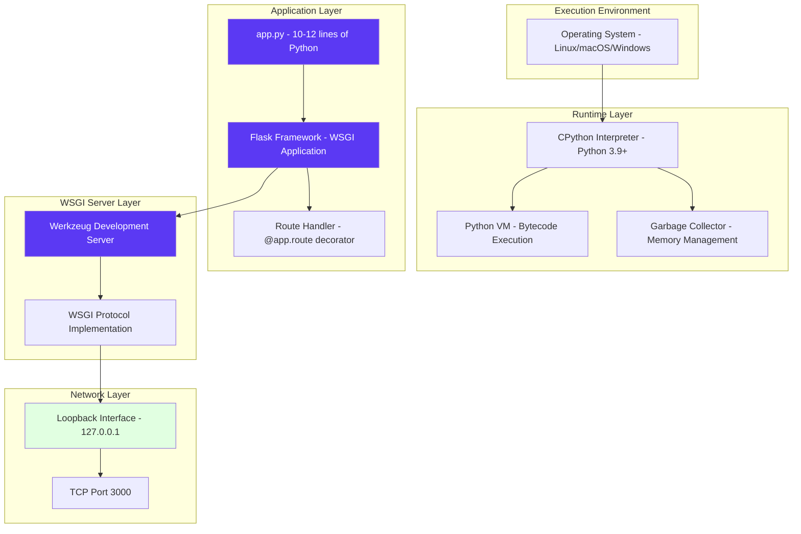
```mermaid
graph TB
    subgraph "Execution Environment"
        OS[Operating System - Linux/macOS/Windows]
    end
    
    subgraph "Runtime Layer"
        CPython[CPython Interpreter - Python 3.9+]
        VM[Python VM - Bytecode Execution]
        GC[Garbage Collector - Memory Management]
    end
    
    subgraph "Application Layer"
        Source[app.py - 10-12 lines of Python]
        Flask[Flask Framework - WSGI Application]
        Route[Route Handler - @app.route decorator]
    end
    
    subgraph "WSGI Server Layer"
        Werkzeug[Werkzeug Development Server]
        WSGI[WSGI Protocol Implementation]
    end
    
    subgraph "Network Layer"
        Loopback[Loopback Interface - 127.0.0.1]
        Port[TCP Port 3000]
    end
    
    OS --> CPython
    CPython --> VM
    CPython --> GC
    Source --> Flask
    Flask --> Route
    Flask --> Werkzeug
    Werkzeug --> WSGI
    WSGI --> Loopback
    Loopback --> Port
    
    style Source fill:#5b39f3,color:#fff
    style Flask fill:#5b39f3,color:#fff
    style Werkzeug fill:#5b39f3,color:#fff
    style Loopback fill:#e1ffe1
```

**Component Descriptions**:

- **Operating System**: Provides TCP/IP networking stack, process management, and file system access for Python runtime
- **<span style="background-color: rgba(91, 57, 243, 0.2)">CPython Interpreter</span>**: <span style="background-color: rgba(91, 57, 243, 0.2)">Python 3.9+ runtime environment executing the Flask application bytecode</span>
- **<span style="background-color: rgba(91, 57, 243, 0.2)">Python VM</span>**: <span style="background-color: rgba(91, 57, 243, 0.2)">Virtual machine that executes compiled Python bytecode (.pyc files)</span>
- **<span style="background-color: rgba(91, 57, 243, 0.2)">Garbage Collector</span>**: <span style="background-color: rgba(91, 57, 243, 0.2)">Automatic memory management via reference counting and cyclic garbage collection</span>
- **<span style="background-color: rgba(91, 57, 243, 0.2)">app.py</span>**: <span style="background-color: rgba(91, 57, 243, 0.2)">Main application file containing Flask app initialization, route definitions, and server configuration (approximately 10-12 lines of Python code)</span>
- **<span style="background-color: rgba(91, 57, 243, 0.2)">Flask Framework</span>**: <span style="background-color: rgba(91, 57, 243, 0.2)">Lightweight WSGI web application framework (version 3.1.2) providing routing, request handling, and response generation</span>
- **<span style="background-color: rgba(91, 57, 243, 0.2)">Route Handler</span>**: <span style="background-color: rgba(91, 57, 243, 0.2)">Decorator-based function (`@app.route('/')`) processing HTTP requests and returning response tuples</span>
- **<span style="background-color: rgba(91, 57, 243, 0.2)">Werkzeug Development Server</span>**: <span style="background-color: rgba(91, 57, 243, 0.2)">Flask's underlying WSGI server implementation handling HTTP protocol, socket management, and request/response cycles</span>
- **<span style="background-color: rgba(91, 57, 243, 0.2)">WSGI Protocol Implementation</span>**: <span style="background-color: rgba(91, 57, 243, 0.2)">Web Server Gateway Interface standard compliance enabling communication between Flask application and Werkzeug server</span>
- **Loopback Interface**: Network interface restricted to local machine communication (127.0.0.1)
- **TCP Port 3000**: Non-privileged port for HTTP server listening socket

**Integration Flow**:

1. <span style="background-color: rgba(91, 57, 243, 0.2)">**Initialization**: Developer executes `python app.py`, triggering CPython interpreter to load and compile the Python source code</span>
2. <span style="background-color: rgba(91, 57, 243, 0.2)">**Application Instantiation**: Flask application instance created via `app = Flask(__name__)` in app.py</span>
3. <span style="background-color: rgba(91, 57, 243, 0.2)">**Route Registration**: `@app.route('/')` decorator binds the hello() handler function to the root URL path</span>
4. <span style="background-color: rgba(91, 57, 243, 0.2)">**Server Startup**: `app.run(host='127.0.0.1', port=3000)` starts Werkzeug development server</span>
5. <span style="background-color: rgba(91, 57, 243, 0.2)">**Network Binding**: Werkzeug binds TCP socket to loopback interface (127.0.0.1) on port 3000</span>
6. **Request Processing**: <span style="background-color: rgba(91, 57, 243, 0.2)">Incoming HTTP requests are received by Werkzeug, parsed according to WSGI specification, and dispatched to Flask's routing system</span>
7. **Response Generation**: <span style="background-color: rgba(91, 57, 243, 0.2)">Flask invokes the route handler, which returns a tuple `('Hello, World!\n', 200, {'Content-Type': 'text/plain'})`</span>
8. <span style="background-color: rgba(91, 57, 243, 0.2)">**HTTP Transmission**: Werkzeug formats the response tuple into HTTP/1.1 protocol messages and transmits to client</span>

**Key Integration Points**:

| Integration | Technology 1 | Technology 2 | Mechanism |
|-------------|-------------|-------------|-----------|
| <span style="background-color: rgba(91, 57, 243, 0.2)">Application Loading</span> | <span style="background-color: rgba(91, 57, 243, 0.2)">CPython Interpreter</span> | <span style="background-color: rgba(91, 57, 243, 0.2)">app.py</span> | <span style="background-color: rgba(91, 57, 243, 0.2)">Python module import and bytecode compilation</span> |
| <span style="background-color: rgba(91, 57, 243, 0.2)">Framework Integration</span> | <span style="background-color: rgba(91, 57, 243, 0.2)">app.py</span> | <span style="background-color: rgba(91, 57, 243, 0.2)">Flask Framework</span> | <span style="background-color: rgba(91, 57, 243, 0.2)">`from flask import Flask` import statement</span> |
| <span style="background-color: rgba(91, 57, 243, 0.2)">WSGI Compliance</span> | <span style="background-color: rgba(91, 57, 243, 0.2)">Flask Application</span> | <span style="background-color: rgba(91, 57, 243, 0.2)">Werkzeug Server</span> | <span style="background-color: rgba(91, 57, 243, 0.2)">WSGI callable interface</span> |
| Network Communication | <span style="background-color: rgba(91, 57, 243, 0.2)">Werkzeug</span> | OS Network Stack | TCP socket API |

### 3.7.2 Technology Stack Layers (updated)

The technology stack is organized into five distinct layers, each providing specific capabilities to the layer above:

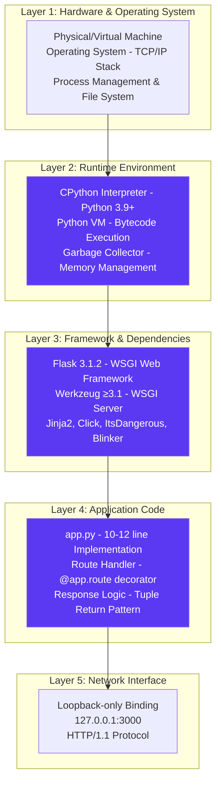
```mermaid
graph TD
    subgraph "Layer 1: Hardware & Operating System"
        A[Physical/Virtual Machine<br/>Operating System - TCP/IP Stack<br/>Process Management & File System]
    end
    
    subgraph "Layer 2: Runtime Environment"
        B[CPython Interpreter - Python 3.9+<br/>Python VM - Bytecode Execution<br/>Garbage Collector - Memory Management]
    end
    
    subgraph "Layer 3: Framework & Dependencies"
        C[Flask 3.1.2 - WSGI Web Framework<br/>Werkzeug ≥3.1 - WSGI Server<br/>Jinja2, Click, ItsDangerous, Blinker]
    end
    
    subgraph "Layer 4: Application Code"
        D[app.py - 10-12 line Implementation<br/>Route Handler - @app.route decorator<br/>Response Logic - Tuple Return Pattern]
    end
    
    subgraph "Layer 5: Network Interface"
        E[Loopback-only Binding<br/>127.0.0.1:3000<br/>HTTP/1.1 Protocol]
    end
    
    A --> B
    B --> C
    C --> D
    D --> E
    
    style D fill:#5b39f3,color:#fff
    style C fill:#5b39f3,color:#fff
    style B fill:#5b39f3,color:#fff
```

#### Layer 1: Hardware & Operating System

**Purpose**: Provides foundational infrastructure for process execution and network communication

**Components**:
- **Physical/Virtual Machine**: CPU, memory, and storage resources
- **Operating System**: Linux, macOS, or Windows with TCP/IP networking capabilities
- **TCP/IP Stack**: Network protocol implementation for socket communication
- **Process Management**: Operating system scheduler and process isolation
- **File System**: Access to <span style="background-color: rgba(91, 57, 243, 0.2)">app.py and installed Python packages in site-packages directory</span>

**Dependencies**: None (base infrastructure layer)

**Upward Interface**: System calls for <span style="background-color: rgba(91, 57, 243, 0.2)">Python process creation, socket operations</span>, and file I/O

#### Layer 2: Runtime Environment (updated)

**Purpose**: <span style="background-color: rgba(91, 57, 243, 0.2)">Executes Python bytecode and manages application memory</span>

**Components**:
- **<span style="background-color: rgba(91, 57, 243, 0.2)">CPython Interpreter (Python 3.9+)</span>**: <span style="background-color: rgba(91, 57, 243, 0.2)">Standard Python runtime executing bytecode compiled from .py source files</span>
- **<span style="background-color: rgba(91, 57, 243, 0.2)">Python VM</span>**: <span style="background-color: rgba(91, 57, 243, 0.2)">Virtual machine processing bytecode instructions with stack-based execution model</span>
- **<span style="background-color: rgba(91, 57, 243, 0.2)">Garbage Collector</span>**: <span style="background-color: rgba(91, 57, 243, 0.2)">Automatic memory management using reference counting and cyclic garbage collection algorithms</span>
- **<span style="background-color: rgba(91, 57, 243, 0.2)">Standard Library</span>**: <span style="background-color: rgba(91, 57, 243, 0.2)">Built-in Python modules providing core functionality (not requiring external packages)</span>

**Key Characteristics**:
- <span style="background-color: rgba(91, 57, 243, 0.2)">**Interpreted Execution**: Python source code compiled to bytecode (.pyc) at runtime, then executed by the Python VM</span>
- <span style="background-color: rgba(91, 57, 243, 0.2)">**Dynamic Typing**: Variables and function parameters use runtime type checking without static compilation</span>
- <span style="background-color: rgba(91, 57, 243, 0.2)">**GIL (Global Interpreter Lock)**: Serializes bytecode execution in multi-threaded scenarios (minimal impact on I/O-bound HTTP server)</span>
- <span style="background-color: rgba(91, 57, 243, 0.2)">**Memory Management**: Automatic allocation and deallocation via reference counting with cycle detection</span>

**Dependencies**: Layer 1 (Operating System)

**Upward Interface**: <span style="background-color: rgba(91, 57, 243, 0.2)">Python module import system, pip package installation, and bytecode execution</span>

#### Layer 3: Framework & Dependencies (updated)

**Purpose**: <span style="background-color: rgba(91, 57, 243, 0.2)">Provides WSGI web application framework and HTTP server implementation</span>

**Core Components**:
- **<span style="background-color: rgba(91, 57, 243, 0.2)">Flask 3.1.2</span>**: <span style="background-color: rgba(91, 57, 243, 0.2)">Lightweight WSGI web framework providing decorator-based routing, request/response handling, and application structure</span>
- **<span style="background-color: rgba(91, 57, 243, 0.2)">Werkzeug (≥3.1)</span>**: <span style="background-color: rgba(91, 57, 243, 0.2)">WSGI utility library implementing the development server, HTTP parsing, and request/response objects</span>
- **<span style="background-color: rgba(91, 57, 243, 0.2)">Jinja2 (≥3.1.2)</span>**: <span style="background-color: rgba(91, 57, 243, 0.2)">Template engine (included with Flask but unused in this plain-text application)</span>
- **<span style="background-color: rgba(91, 57, 243, 0.2)">Click (≥8.1.3)</span>**: <span style="background-color: rgba(91, 57, 243, 0.2)">Command-line interface toolkit for Flask CLI (not utilized in direct execution model)</span>
- **<span style="background-color: rgba(91, 57, 243, 0.2)">ItsDangerous, Blinker, MarkupSafe</span>**: <span style="background-color: rgba(91, 57, 243, 0.2)">Supporting libraries for data signing, signals, and HTML escaping (unused in minimal implementation)</span>

**Framework Capabilities**:
- <span style="background-color: rgba(91, 57, 243, 0.2)">**Routing System**: `@app.route()` decorator binds URL patterns to Python functions</span>
- <span style="background-color: rgba(91, 57, 243, 0.2)">**Request Handling**: Werkzeug Request objects provide access to HTTP method, headers, path, and body</span>
- <span style="background-color: rgba(91, 57, 243, 0.2)">**Response Generation**: Tuple return pattern `(body, status, headers)` or Flask Response objects</span>
- <span style="background-color: rgba(91, 57, 243, 0.2)">**Development Server**: `app.run()` starts Werkzeug's built-in HTTP/1.1 server for testing</span>
- <span style="background-color: rgba(91, 57, 243, 0.2)">**WSGI Compliance**: Application implements WSGI callable interface for compatibility with production servers (Gunicorn, uWSGI)</span>

**Dependencies**: <span style="background-color: rgba(91, 57, 243, 0.2)">Layer 2 (Python Runtime), installed via `pip install -r requirements.txt`</span>

**Upward Interface**: <span style="background-color: rgba(91, 57, 243, 0.2)">Flask application API (`Flask(__name__)`, `@app.route()`, `app.run()`)</span>

#### Layer 4: Application Code (updated)

**Purpose**: Implements business logic and request handling for the hello world test harness

**Components**:
- **<span style="background-color: rgba(91, 57, 243, 0.2)">app.py</span>**: <span style="background-color: rgba(91, 57, 243, 0.2)">Single Python file (~10-12 lines) containing complete application implementation</span>
  - <span style="background-color: rgba(91, 57, 243, 0.2)">Line 1: `from flask import Flask` - Framework import</span>
  - <span style="background-color: rgba(91, 57, 243, 0.2)">Line 3: `app = Flask(__name__)` - Application instantiation</span>
  - <span style="background-color: rgba(91, 57, 243, 0.2)">Lines 4-5: Configuration constants (hostname='127.0.0.1', port=3000)</span>
  - <span style="background-color: rgba(91, 57, 243, 0.2)">Line 7: `@app.route('/')` - Route decorator binding root path</span>
  - <span style="background-color: rgba(91, 57, 243, 0.2)">Lines 8-9: `def hello()` - Handler function with tuple return pattern</span>
  - <span style="background-color: rgba(91, 57, 243, 0.2)">Line 12: `print(f'Server running at...')` - Startup logging</span>
  - <span style="background-color: rgba(91, 57, 243, 0.2)">Line 13: `app.run(host=hostname, port=port)` - Server execution</span>

**Application Logic**:
- <span style="background-color: rgba(91, 57, 243, 0.2)">**Route Handler**: `hello()` function processes all HTTP requests to root path `/`</span>
- <span style="background-color: rgba(91, 57, 243, 0.2)">**Static Response**: Returns hardcoded tuple `('Hello, World!\n', 200, {'Content-Type': 'text/plain'})`</span>
- **Configuration**: Hostname and port values hardcoded as constants
- <span style="background-color: rgba(91, 57, 243, 0.2)">**Lifecycle Management**: Print statement logs server URL, then `app.run()` starts blocking server loop</span>

**Dependencies**: <span style="background-color: rgba(91, 57, 243, 0.2)">Layer 3 (Flask Framework)</span>

**Upward Interface**: HTTP endpoint accessible at http://127.0.0.1:3000/

#### Layer 5: Network Interface

**Purpose**: Exposes HTTP server to local network clients

**Components**:
- **Loopback Interface**: Network interface restricted to 127.0.0.1 (localhost)
- **TCP Port 3000**: Non-privileged port for HTTP listener socket
- **HTTP/1.1 Protocol**: Standard HTTP protocol implementation <span style="background-color: rgba(91, 57, 243, 0.2)">via Werkzeug server</span>
- **Socket Binding**: Server binds exclusively to 127.0.0.1:3000 (no external network access)

**Network Characteristics**:
- **Host Restriction**: Localhost-only binding prevents remote connections
- **Port Selection**: Port 3000 chosen to avoid conflicts with privileged ports (<1024) and common services
- **Protocol Support**: HTTP/1.1 with keep-alive support <span style="background-color: rgba(91, 57, 243, 0.2)">(Werkzeug default)</span>
- **TLS/HTTPS**: Not supported (plain HTTP only)

**Dependencies**: Layer 4 (Application Code), Layer 1 (OS Network Stack)

**Downward Interface**: HTTP clients (curl, browsers, test frameworks) connect via TCP to 127.0.0.1:3000

### 3.7.3 Technology Integration Rationale

**Layered Architecture Benefits**:

1. **Separation of Concerns**: Each layer provides distinct functionality with well-defined interfaces
2. **Technology Independence**: <span style="background-color: rgba(91, 57, 243, 0.2)">CPython runtime</span> can be upgraded independently of <span style="background-color: rgba(91, 57, 243, 0.2)">Flask framework versions</span>
3. **Testing Isolation**: Application layer (<span style="background-color: rgba(91, 57, 243, 0.2)">app.py</span>) can be tested without network layer interactions
4. **Security Boundaries**: Network layer (loopback-only) provides isolation from external threats
5. **Minimal Complexity**: <span style="background-color: rgba(91, 57, 243, 0.2)">Single-file application layer (app.py) eliminates architectural complexity</span>

**Integration Simplicity**:

The hello world system demonstrates minimal integration complexity:

- **<span style="background-color: rgba(91, 57, 243, 0.2)">Single External Dependency</span>**: <span style="background-color: rgba(91, 57, 243, 0.2)">Flask 3.1.2 is the only explicitly declared third-party package</span>
- **No Middleware**: Direct request-to-response flow without intermediate processing layers
- **No Data Layer**: Stateless design eliminates database integration points
- **No Service Integration**: Zero external API calls or third-party service dependencies
- **Localhost Network**: Network layer prevents external system interactions

**Technology Choices Alignment**:

| Layer | Technology Choice | Justification |
|-------|------------------|---------------|
| Runtime | <span style="background-color: rgba(91, 57, 243, 0.2)">CPython 3.9+</span> | <span style="background-color: rgba(91, 57, 243, 0.2)">Standard Python interpreter with broad platform support and Flask 3.1.2 compatibility</span> |
| Framework | <span style="background-color: rgba(91, 57, 243, 0.2)">Flask 3.1.2</span> | <span style="background-color: rgba(91, 57, 243, 0.2)">Lightweight WSGI framework suitable for minimal HTTP server implementations</span> |
| Server | <span style="background-color: rgba(91, 57, 243, 0.2)">Werkzeug Dev Server</span> | <span style="background-color: rgba(91, 57, 243, 0.2)">Built-in Flask development server appropriate for test harness scenarios</span> |
| Application | <span style="background-color: rgba(91, 57, 243, 0.2)">Single Python File</span> | <span style="background-color: rgba(91, 57, 243, 0.2)">Minimal complexity aligns with test harness purpose</span> |
| Network | Loopback Interface | Security isolation for local development and testing |

### 3.7.4 Runtime Execution Model (updated)

**Process Lifecycle**:

1. **<span style="background-color: rgba(91, 57, 243, 0.2)">Process Start</span>**: <span style="background-color: rgba(91, 57, 243, 0.2)">Developer executes `python app.py` or `flask run --host=127.0.0.1 --port=3000`</span>
2. **<span style="background-color: rgba(91, 57, 243, 0.2)">Module Loading</span>**: <span style="background-color: rgba(91, 57, 243, 0.2)">CPython imports app.py, compiles to bytecode, and executes module-level code</span>
3. **<span style="background-color: rgba(91, 57, 243, 0.2)">Flask Initialization</span>**: <span style="background-color: rgba(91, 57, 243, 0.2)">`app = Flask(__name__)` creates Flask application instance</span>
4. **<span style="background-color: rgba(91, 57, 243, 0.2)">Route Registration</span>**: <span style="background-color: rgba(91, 57, 243, 0.2)">`@app.route('/')` decorator registers hello() function as handler for root path</span>
5. **<span style="background-color: rgba(91, 57, 243, 0.2)">Server Binding</span>**: <span style="background-color: rgba(91, 57, 243, 0.2)">`app.run(host='127.0.0.1', port=3000)` starts Werkzeug server and binds TCP socket</span>
6. **Startup Logging**: Console output: <span style="background-color: rgba(91, 57, 243, 0.2)">"Server running at http://127.0.0.1:3000/" (via print statement)</span>
7. **<span style="background-color: rgba(91, 57, 243, 0.2)">Event Loop</span>**: <span style="background-color: rgba(91, 57, 243, 0.2)">Werkzeug server enters blocking loop waiting for HTTP connections</span>
8. **Request Processing**: <span style="background-color: rgba(91, 57, 243, 0.2)">Incoming HTTP requests dispatched to route handler via Flask routing system</span>
9. **Response Transmission**: <span style="background-color: rgba(91, 57, 243, 0.2)">Handler returns tuple, Werkzeug formats HTTP response and sends to client</span>
10. **Graceful Termination**: SIGINT (Ctrl+C) or SIGTERM signal terminates <span style="background-color: rgba(91, 57, 243, 0.2)">Python</span> process

**Concurrency Model** (updated):

- **<span style="background-color: rgba(91, 57, 243, 0.2)">Threading Model</span>**: <span style="background-color: rgba(91, 57, 243, 0.2)">Flask development server uses Werkzeug's default threaded request handling, creating a new thread per request</span>
- **Request Isolation**: Each HTTP request processed in <span style="background-color: rgba(91, 57, 243, 0.2)">separate thread context with independent Flask Request object</span>
- **State Management**: Stateless design eliminates race conditions (no shared mutable state)
- **<span style="background-color: rgba(91, 57, 243, 0.2)">GIL Considerations</span>**: <span style="background-color: rgba(91, 57, 243, 0.2)">Python's Global Interpreter Lock serializes bytecode execution but has minimal impact on I/O-bound HTTP workload</span>

**Memory Profile** (updated):

- **<span style="background-color: rgba(91, 57, 243, 0.2)">Process Footprint</span>**: <span style="background-color: rgba(91, 57, 243, 0.2)">~25-35 MB resident memory (Python baseline + Flask/Werkzeug framework)</span>
- **Static Allocations**: Response string literal, configuration constants
- **<span style="background-color: rgba(91, 57, 243, 0.2)">Per-Request Overhead</span>**: <span style="background-color: rgba(91, 57, 243, 0.2)">Flask Request/Response objects, thread stack, Werkzeug parsing structures</span>
- **<span style="background-color: rgba(91, 57, 243, 0.2)">Garbage Collection</span>**: <span style="background-color: rgba(91, 57, 243, 0.2)">Automatic memory reclamation via CPython's reference counting after request completion</span>

### 3.7.5 Technology Dependency Graph (updated)

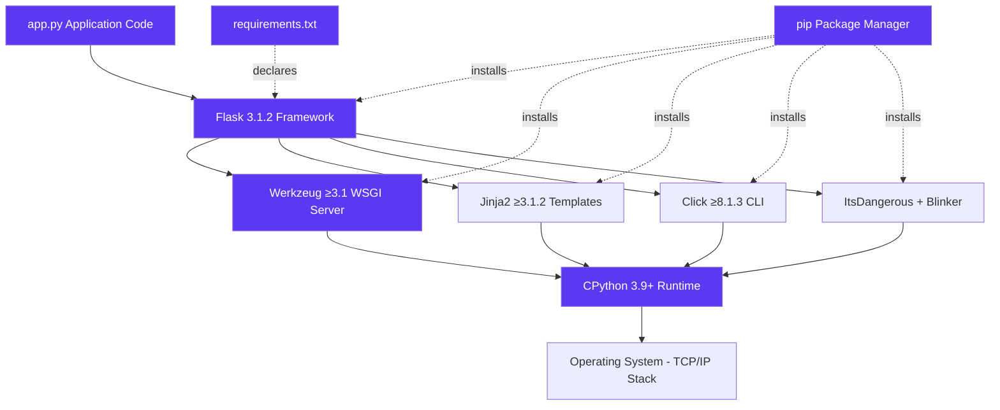
```mermaid
graph TD
    A[app.py Application Code] --> B[Flask 3.1.2 Framework]
    B --> C[Werkzeug ≥3.1 WSGI Server]
    B --> D[Jinja2 ≥3.1.2 Templates]
    B --> E[Click ≥8.1.3 CLI]
    B --> F[ItsDangerous + Blinker]
    
    C --> G[CPython 3.9+ Runtime]
    D --> G
    E --> G
    F --> G
    
    G --> H[Operating System - TCP/IP Stack]
    
    I[pip Package Manager] -.installs.-> B
    I -.installs.-> C
    I -.installs.-> D
    I -.installs.-> E
    I -.installs.-> F
    
    J[requirements.txt] -.declares.-> B
    
    style A fill:#5b39f3,color:#fff
    style B fill:#5b39f3,color:#fff
    style C fill:#5b39f3,color:#fff
    style G fill:#5b39f3,color:#fff
    style I fill:#5b39f3,color:#fff
    style J fill:#5b39f3,color:#fff
```

**Dependency Analysis**:

- **<span style="background-color: rgba(91, 57, 243, 0.2)">Direct Dependency</span>**: <span style="background-color: rgba(91, 57, 243, 0.2)">app.py depends solely on Flask 3.1.2 (declared in requirements.txt)</span>
- **<span style="background-color: rgba(91, 57, 243, 0.2)">Transitive Dependencies</span>**: <span style="background-color: rgba(91, 57, 243, 0.2)">Flask automatically pulls in Werkzeug, Jinja2, Click, ItsDangerous, Blinker, and MarkupSafe (~6 packages total)</span>
- **<span style="background-color: rgba(91, 57, 243, 0.2)">Runtime Foundation</span>**: <span style="background-color: rgba(91, 57, 243, 0.2)">All Python packages require CPython 3.9+ interpreter (Flask 3.1.2 compatibility requirement)</span>
- **Platform Dependency**: <span style="background-color: rgba(91, 57, 243, 0.2)">CPython</span> requires OS with TCP/IP networking and process management
- **<span style="background-color: rgba(91, 57, 243, 0.2)">Installation Tool</span>**: <span style="background-color: rgba(91, 57, 243, 0.2)">pip resolves and installs all dependencies from PyPI based on requirements.txt</span>

**Critical Path**: <span style="background-color: rgba(91, 57, 243, 0.2)">app.py → Flask 3.1.2 → Werkzeug WSGI Server → CPython Runtime → OS TCP/IP Stack</span>

This critical path represents the minimal technology stack required for HTTP server functionality, demonstrating the system's <span style="background-color: rgba(91, 57, 243, 0.2)">lightweight architecture with Flask as the single external dependency layer between application code and Python runtime</span>.

#### References

#### Technology Documentation
- <span style="background-color: rgba(91, 57, 243, 0.2)">**Flask Documentation**: https://flask.palletsprojects.com/en/3.1.x/ (version 3.1.2 reference)</span>
- <span style="background-color: rgba(91, 57, 243, 0.2)">**Werkzeug Documentation**: https://werkzeug.palletsprojects.com/ (WSGI utilities and development server)</span>
- <span style="background-color: rgba(91, 57, 243, 0.2)">**Python 3.9+ Documentation**: https://docs.python.org/3.9/ (CPython runtime reference)</span>
- <span style="background-color: rgba(91, 57, 243, 0.2)">**WSGI Specification**: PEP 3333 - https://peps.python.org/pep-3333/ (Web Server Gateway Interface)</span>

#### Source Files Referenced
- <span style="background-color: rgba(91, 57, 243, 0.2)">**app.py** (lines 1-13): Complete Flask application implementation with route handlers and server configuration</span>
- <span style="background-color: rgba(91, 57, 243, 0.2)">**requirements.txt** (1 line): Dependency declaration (Flask==3.1.2)</span>

#### Related Sections
- **Section 3.1 Programming Languages**: <span style="background-color: rgba(91, 57, 243, 0.2)">Python 3.9+ runtime characteristics and Flask framework integration</span>
- **Section 3.2 Frameworks & Libraries**: <span style="background-color: rgba(91, 57, 243, 0.2)">Flask 3.1.2 framework details and minimal-dependency philosophy</span>
- **Section 3.3 Open Source Dependencies**: <span style="background-color: rgba(91, 57, 243, 0.2)">Flask 3.1.2 and transitive dependencies (Werkzeug, Jinja2, Click, etc.)</span>
- **Section 2.1 Feature Catalog**: HTTP server hosting (F-001) and request handler (F-002) feature definitions

## 3.8 Security Considerations

### 3.8.1 Technology-Driven Security Posture (updated)

**Security Through Simplicity**: The minimal technology stack inherently limits attack surface. <span style="background-color: rgba(91, 57, 243, 0.2)">With Flask 3.1.2 as the sole external dependency, the system maintains a focused security perimeter while leveraging a proven web framework.</span>

**Security Characteristics**:

1. **Network Isolation**: Loopback-only binding (`127.0.0.1`) prevents remote network access
2. **<span style="background-color: rgba(91, 57, 243, 0.2)">Minimal Dependencies</span>**: <span style="background-color: rgba(91, 57, 243, 0.2)">Single external dependency (Flask 3.1.2) plus ~6 transitive packages significantly limits third-party package vulnerability exposure compared to typical web application stacks</span>
3. **No Data Processing**: Static response eliminates injection attack vectors (SQL, XSS, command injection)
4. **No Authentication**: Intentional absence removes credential management risks
5. **No Encryption Libraries**: Plain HTTP acceptable for localhost-only operation
6. **No File System Access**: Application performs no file I/O beyond loading its own source (<span style="background-color: rgba(91, 57, 243, 0.2)">app.py</span>)

**Technology Security Limitations**:

- **No TLS/HTTPS**: Plain text HTTP only
- **<span style="background-color: rgba(91, 57, 243, 0.2)">No Rate Limiting</span>**: <span style="background-color: rgba(91, 57, 243, 0.2)">Server accepts unlimited requests (bounded by Werkzeug development server capacity and OS socket limits)</span>
- **No Input Validation**: Request data not processed or validated
- **No Security Headers**: No HSTS, CSP, X-Frame-Options, etc.
- **No CORS Configuration**: No cross-origin resource sharing policies
- **<span style="background-color: rgba(91, 57, 243, 0.2)">No Request Filtering</span>**: <span style="background-color: rgba(91, 57, 243, 0.2)">All HTTP methods accepted by Flask route (GET, POST, PUT, DELETE, etc.)</span>

**Compensating Control**: Per Implementation Considerations section 2.4, the primary security control is **"Never Expose to Public Networks"**. The technology stack's localhost-only configuration enforces this requirement at the network layer.

### 3.8.2 Threat Model Compatibility (updated)

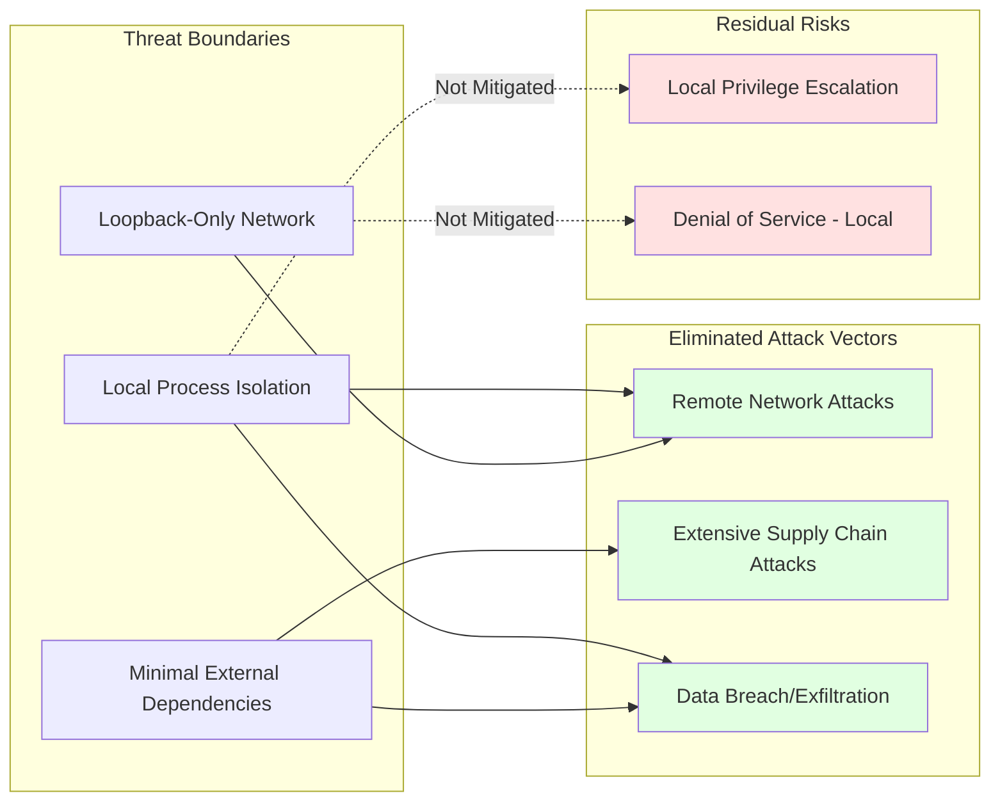
```mermaid
graph LR
    subgraph "Threat Boundaries"
        A[Local Process Isolation]
        B[Loopback-Only Network]
        C[Minimal External Dependencies]
    end
    
    subgraph "Eliminated Attack Vectors"
        D[Remote Network Attacks]
        E[Extensive Supply Chain Attacks]
        F[Data Breach/Exfiltration]
    end
    
    subgraph "Residual Risks"
        G[Local Privilege Escalation]
        H[Denial of Service - Local]
    end
    
    A --> D
    B --> D
    C --> E
    A --> F
    C --> F
    
    A -.->|Not Mitigated| G
    B -.->|Not Mitigated| H
    
    style D fill:#e1ffe1
    style E fill:#e1ffe1
    style F fill:#e1ffe1
    style G fill:#ffe1e1
    style H fill:#ffe1e1
```

**Threat Boundary Analysis**:

**Local Process Isolation**: <span style="background-color: rgba(91, 57, 243, 0.2)">The Flask application runs within a Python process boundary, isolating it from other local processes. Python's memory management and the operating system's process separation provide baseline isolation. However, malicious local processes with equivalent user privileges could interact with the server via localhost connections.</span>

**Loopback-Only Network**: Binding exclusively to `127.0.0.1` (configured at <span style="background-color: rgba(91, 57, 243, 0.2)">app.py:4</span>) restricts network access to local machine processes. This eliminates entire categories of remote attacks including:
- Remote code execution attempts from external networks
- Distributed denial of service (DDoS) attacks
- Network-based reconnaissance and scanning
- Cross-site request forgery from external domains (CSRF still possible from local browser sessions)

**<span style="background-color: rgba(91, 57, 243, 0.2)">Minimal External Dependencies</span>**: <span style="background-color: rgba(91, 57, 243, 0.2)">Unlike typical web applications with dozens or hundreds of npm/PyPI packages, this system declares only Flask 3.1.2 in requirements.txt. Flask itself introduces ~6 transitive dependencies (Werkzeug, Jinja2, Click, ItsDangerous, Blinker, MarkupSafe), totaling approximately 7 packages. This dramatically reduces the attack surface compared to applications with extensive dependency trees where vulnerabilities in any package could compromise the system. Flask and its dependencies are actively maintained by the Pallets Project with established security practices.</span>

**Eliminated Attack Vectors**:

1. **Remote Network Attacks**: Network-layer isolation prevents remote exploitation attempts
2. **<span style="background-color: rgba(91, 57, 243, 0.2)">Extensive Supply Chain Attacks</span>**: <span style="background-color: rgba(91, 57, 243, 0.2)">Minimal dependency count (Flask + ~6 transitive packages) significantly reduces supply chain risk compared to applications with 50+ dependencies. All packages sourced from trusted PyPI registry and Pallets Project maintenance</span>
3. **Data Breach/Exfiltration**: No data storage, processing, or persistence eliminates data theft vectors

**Residual Risks**:

1. **Local Privilege Escalation**: <span style="background-color: rgba(91, 57, 243, 0.2)">Python process vulnerabilities or OS-level exploits</span> could enable privilege escalation
2. **Denial of Service (Local)**: Malicious local processes can flood server with requests, exhausting <span style="background-color: rgba(91, 57, 243, 0.2)">Python process resources or file descriptors</span>

**<span style="background-color: rgba(91, 57, 243, 0.2)">Supply Chain Risk Assessment</span>**:

<span style="background-color: rgba(91, 57, 243, 0.2)">While the original Node.js implementation had zero npm dependencies (using only core modules), the Flask migration introduces a single external dependency with a small transitive tree. This represents a security trade-off:</span>

<span style="background-color: rgba(91, 57, 243, 0.2)">**Risk Introduced**: Flask 3.1.2 and its ~6 dependencies could contain undiscovered vulnerabilities</span>

<span style="background-color: rgba(91, 57, 243, 0.2)">**Risk Mitigation**:
- Flask is a mature, widely-audited framework maintained by the Pallets Project
- All dependencies are core components of Flask's ecosystem with active security monitoring
- Minimal dependency count (7 total packages) enables manual security review feasibility
- Use `pip-audit -r requirements.txt` for vulnerability scanning
- Regular updates via `pip install --upgrade Flask` address discovered vulnerabilities

<span style="background-color: rgba(91, 57, 243, 0.2)">**Recommendation**: For production scenarios, implement dependency pinning via `pip-tools` or `poetry` to create lock files ensuring reproducible builds with audited dependency versions.</span>

### 3.8.3 Security Best Practices for Test Deployment

**Deployment Security Guidelines**:

1. **<span style="background-color: rgba(91, 57, 243, 0.2)">Never Change Hostname Binding</span>**: <span style="background-color: rgba(91, 57, 243, 0.2)">Do not modify `hostname = '127.0.0.1'` to `'0.0.0.0'` or public IP addresses. The loopback binding is the primary security control.</span>
2. **<span style="background-color: rgba(91, 57, 243, 0.2)">Development Server Warning</span>**: <span style="background-color: rgba(91, 57, 243, 0.2)">Flask's Werkzeug development server is NOT hardened for production use. If this application must be exposed beyond localhost, replace the development server with a production WSGI server (Gunicorn, uWSGI) behind a reverse proxy (Nginx, Apache) with proper security headers and TLS.</span>
3. **Firewall Configuration**: Even with localhost binding, ensure firewall rules prevent port forwarding or tunneling to external networks
4. **<span style="background-color: rgba(91, 57, 243, 0.2)">Dependency Auditing</span>**: <span style="background-color: rgba(91, 57, 243, 0.2)">Periodically audit Flask and transitive dependencies for known vulnerabilities using `pip-audit` or similar tools</span>
5. **<span style="background-color: rgba(91, 57, 243, 0.2)">Python Version Maintenance</span>**: <span style="background-color: rgba(91, 57, 243, 0.2)">Keep Python 3.9+ runtime updated with security patches to address interpreter-level vulnerabilities</span>
6. **Process Isolation**: Run server under non-privileged user account to limit impact of potential exploits
7. **Monitoring**: For persistent deployments, monitor process behavior for unexpected resource consumption or connection patterns

### 3.8.4 Security Trade-offs and Limitations

**Accepted Security Limitations** (by design for test harness purpose):

| Security Control | Status | Justification |
|-----------------|--------|---------------|
| TLS/HTTPS Encryption | **Not Implemented** | Localhost traffic not exposed to network eavesdropping |
| Authentication/Authorization | **Not Implemented** | Test harness accessible only to local processes |
| Input Validation | **Not Implemented** | Static response prevents injection vulnerabilities |
| Rate Limiting | **Not Implemented** | Test scenarios involve controlled request volumes |
| Security Headers | **Not Implemented** | Plain text responses do not require CSP, HSTS, etc. |
| Audit Logging | **Not Implemented** | No sensitive operations to audit |
| <span style="background-color: rgba(91, 57, 243, 0.2)">Dependency Pinning</span> | <span style="background-color: rgba(91, 57, 243, 0.2)">**Minimal**</span> | <span style="background-color: rgba(91, 57, 243, 0.2)">Flask version pinned (==3.1.2); transitive dependencies use Flask's ranges</span> |

**Security Responsibility Model**:

The application's security relies on **environmental controls** rather than **application-layer security features**:

- **Primary Control**: Network isolation via localhost binding
- **Secondary Control**: Operating system process isolation and user permissions
- **<span style="background-color: rgba(91, 57, 243, 0.2)">Tertiary Control</span>**: <span style="background-color: rgba(91, 57, 243, 0.2)">Minimal dependency architecture reduces supply chain exposure</span>

This model is appropriate for a test harness but inadequate for any scenario involving:
- External network exposure
- Multi-user access
- Sensitive data processing
- Production traffic handling
- Compliance requirements (PCI-DSS, HIPAA, SOC 2)

#### References

#### Security-Related Documentation
- <span style="background-color: rgba(91, 57, 243, 0.2)">**Flask Security Considerations**: https://flask.palletsprojects.com/en/3.1.x/security/ (official Flask security guidance)</span>
- <span style="background-color: rgba(91, 57, 243, 0.2)">**Werkzeug Security**: https://werkzeug.palletsprojects.com/en/latest/security/ (WSGI server security best practices)</span>
- <span style="background-color: rgba(91, 57, 243, 0.2)">**Python Security**: https://docs.python.org/3/library/security_warnings.html (Python security warnings and advisories)</span>
- <span style="background-color: rgba(91, 57, 243, 0.2)">**pip-audit**: https://pypi.org/project/pip-audit/ (dependency vulnerability scanning tool)</span>

#### Technical Specification Sections
- **Section 1.3.2 Out-of-Scope Elements**: Security features explicitly excluded from implementation
- **Section 2.4 Implementation Considerations**: Security implications of minimal architecture
- **Section 3.1 Programming Languages**: <span style="background-color: rgba(91, 57, 243, 0.2)">Python 3.9+ runtime and Flask framework characteristics</span>
- **Section 3.2 Frameworks & Libraries**: <span style="background-color: rgba(91, 57, 243, 0.2)">Flask 3.1.2 minimal-dependency philosophy and framework security posture</span>
- **Section 3.3 Open Source Dependencies**: <span style="background-color: rgba(91, 57, 243, 0.2)">Flask 3.1.2 and transitive dependency security considerations</span>

#### Source Files Referenced
- <span style="background-color: rgba(91, 57, 243, 0.2)">**app.py** (line 4): Hostname configuration (`127.0.0.1`) enforcing loopback-only binding</span>
- <span style="background-color: rgba(91, 57, 243, 0.2)">**requirements.txt** (line 1): Flask==3.1.2 dependency declaration</span>

## 3.9 Performance Implications of Technology Choices

### 3.9.1 Runtime Performance Characteristics (updated)

**<span style="background-color: rgba(91, 57, 243, 0.2)">Flask/Werkzeug Development Server Architecture</span>**: <span style="background-color: rgba(91, 57, 243, 0.2)">Flask's built-in development server (powered by Werkzeug) provides the following performance profile for this implementation</span>:

- **Concurrency Model**: <span style="background-color: rgba(91, 57, 243, 0.2)">Threaded request handling with default threading model (Werkzeug creates a new thread per request)</span>
- **Request Handling**: <span style="background-color: rgba(91, 57, 243, 0.2)">Blocking I/O with thread-per-request architecture; can handle multiple concurrent connections through threading</span>
- **Response Time**: Microsecond-scale for static response generation (no I/O operations)
- **Memory Footprint**: <span style="background-color: rgba(91, 57, 243, 0.2)">Approximately 10-20 MB baseline Python process (per Implementation Considerations section 2.4)</span>
- **CPU Utilization**: Minimal - simple string response requires negligible computation

**Performance Benefits of Minimal Dependencies**:
- **Startup Time**: <span style="background-color: rgba(91, 57, 243, 0.2)">Sub-second server initialization (~50-200ms typical for Flask application loading)</span>
- **<span style="background-color: rgba(91, 57, 243, 0.2)">Minimal Package Loading</span>**: <span style="background-color: rgba(91, 57, 243, 0.2)">Single external dependency (Flask 3.1.2) plus ~6 transitive packages</span>
- **Predictable Behavior**: <span style="background-color: rgba(91, 57, 243, 0.2)">Flask/Werkzeug default configurations with no custom performance optimizations or penalties</span>

### 3.9.2 Scalability Constraints (updated)

**Technology-Imposed Limitations**:

- **<span style="background-color: rgba(91, 57, 243, 0.2)">No Production WSGI Server</span>**: <span style="background-color: rgba(91, 57, 243, 0.2)">Single-process Werkzeug development server (not Gunicorn, uWSGI, or other production servers)</span>
- **<span style="background-color: rgba(91, 57, 243, 0.2)">No Worker Processes</span>**: <span style="background-color: rgba(91, 57, 243, 0.2)">Single Python process implementation (no multi-worker deployment)</span>
- **No Load Balancing**: Single listener on single port
- **Localhost-Only**: Cannot scale horizontally across machines

**Scalability Diagram** (updated):

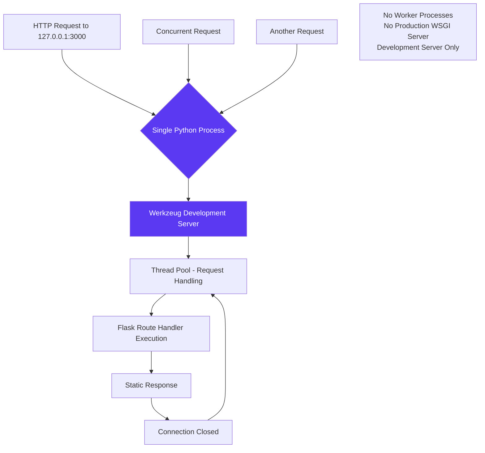
```mermaid
graph TD
    A[HTTP Request to 127.0.0.1:3000] --> B{Single Python Process}
    B --> C[Werkzeug Development Server]
    C --> D[Thread Pool - Request Handling]
    D --> E[Flask Route Handler Execution]
    E --> F[Static Response]
    F --> G[Connection Closed]
    G --> D
    
    H[Concurrent Request] --> B
    I[Another Request] --> B
    
    style B fill:#5b39f3,color:#fff
    style C fill:#5b39f3,color:#fff
    
    note[No Worker Processes<br/>No Production WSGI Server<br/>Development Server Only]
```

**Performance Suitability**: <span style="background-color: rgba(91, 57, 243, 0.2)">The Flask development server technology stack is appropriate for the test harness use case, where request volume is low and performance testing is not a system objective. Flask's Werkzeug-based development server is explicitly not designed for production deployment and should not be exposed to public networks.</span>

### 3.9.3 Threading Model and Concurrency (updated)

**<span style="background-color: rgba(91, 57, 243, 0.2)">Flask/Werkzeug Threading Characteristics</span>**:

<span style="background-color: rgba(91, 57, 243, 0.2)">The Werkzeug development server (Flask's default) uses a threaded request handling model:</span>

- **<span style="background-color: rgba(91, 57, 243, 0.2)">Thread-Per-Request</span>**: <span style="background-color: rgba(91, 57, 243, 0.2)">Each incoming HTTP request is processed in a separate thread created by Werkzeug</span>
- **<span style="background-color: rgba(91, 57, 243, 0.2)">GIL Impact</span>**: <span style="background-color: rgba(91, 57, 243, 0.2)">Python's Global Interpreter Lock (GIL) serializes bytecode execution across threads, but this has minimal impact on the I/O-bound HTTP server workload</span>
- **<span style="background-color: rgba(91, 57, 243, 0.2)">Thread Pool Limits</span>**: <span style="background-color: rgba(91, 57, 243, 0.2)">Operating system thread limits and process file descriptor limits constrain maximum concurrent connections (typically 1024+ on Linux)</span>
- **<span style="background-color: rgba(91, 57, 243, 0.2)">Synchronous Handlers</span>**: <span style="background-color: rgba(91, 57, 243, 0.2)">Flask route handlers execute synchronously within their thread context (no async/await patterns in app.py)</span>

**Concurrency Limitations**:

| Constraint Type | Description | Impact |
|----------------|-------------|--------|
| <span style="background-color: rgba(91, 57, 243, 0.2)">**Single Process**</span> | <span style="background-color: rgba(91, 57, 243, 0.2)">No multi-worker deployment (unlike Gunicorn with 4-8 worker processes)</span> | <span style="background-color: rgba(91, 57, 243, 0.2)">Cannot leverage multi-core CPUs for parallel request processing</span> |
| <span style="background-color: rgba(91, 57, 243, 0.2)">**Development Server**</span> | <span style="background-color: rgba(91, 57, 243, 0.2)">Werkzeug development server not optimized for high-throughput scenarios</span> | <span style="background-color: rgba(91, 57, 243, 0.2)">Lower requests-per-second capacity compared to production WSGI servers</span> |
| <span style="background-color: rgba(91, 57, 243, 0.2)">**Threading Overhead**</span> | <span style="background-color: rgba(91, 57, 243, 0.2)">Thread creation and context switching consume memory and CPU cycles</span> | <span style="background-color: rgba(91, 57, 243, 0.2)">High concurrent request volumes may exhaust system resources</span> |
| **Localhost Binding** | Cannot distribute load across multiple machines | Single machine resource limits (CPU, memory, network) |

### 3.9.4 Performance Comparison: Development vs. Production Servers (updated)

**<span style="background-color: rgba(91, 57, 243, 0.2)">Flask Development Server (Current Implementation)</span>**:
- **<span style="background-color: rgba(91, 57, 243, 0.2)">Server**: Werkzeug development server (bundled with Flask 3.1.2)</span>
- **<span style="background-color: rgba(91, 57, 243, 0.2)">Startup Time**: ~50-200ms (Python interpreter + Flask initialization)</span>
- **<span style="background-color: rgba(91, 57, 243, 0.2)">Memory**: ~10-20 MB baseline process</span>
- **<span style="background-color: rgba(91, 57, 243, 0.2)">Concurrency**: Thread-per-request (limited by OS thread limits)</span>
- **Suitable For**: Development, testing, local experimentation

**<span style="background-color: rgba(91, 57, 243, 0.2)">Production WSGI Servers (Not Implemented)</span>**:

<span style="background-color: rgba(91, 57, 243, 0.2)">For reference, production Flask deployments typically use:</span>

- **<span style="background-color: rgba(91, 57, 243, 0.2)">Gunicorn</span>**: <span style="background-color: rgba(91, 57, 243, 0.2)">Pre-fork worker model with 4-8 worker processes, ~40-80 MB memory per worker, handles thousands of requests per second</span>
- **<span style="background-color: rgba(91, 57, 243, 0.2)">uWSGI</span>**: <span style="background-color: rgba(91, 57, 243, 0.2)">High-performance WSGI server with advanced features (process management, load balancing, caching)</span>
- **<span style="background-color: rgba(91, 57, 243, 0.2)">Reverse Proxy</span>**: <span style="background-color: rgba(91, 57, 243, 0.2)">Nginx or Apache in front of WSGI server for static file serving, TLS termination, and connection management</span>

<span style="background-color: rgba(91, 57, 243, 0.2)">**Note**: This test harness intentionally uses the Flask development server to maintain simplicity aligned with its test-only purpose. Production deployment is explicitly out of scope (Section 1.3.2).</span>

### 3.9.5 Resource Utilization Profile (updated)

**<span style="background-color: rgba(91, 57, 243, 0.2)">Runtime Resource Characteristics</span>**:

| Resource | Idle State | Under Load | Notes |
|----------|-----------|------------|-------|
| <span style="background-color: rgba(91, 57, 243, 0.2)">**Memory (RSS)**</span> | <span style="background-color: rgba(91, 57, 243, 0.2)">~10-20 MB</span> | <span style="background-color: rgba(91, 57, 243, 0.2)">+1-2 MB per concurrent request thread</span> | <span style="background-color: rgba(91, 57, 243, 0.2)">Python interpreter baseline + Flask/Werkzeug + request context</span> |
| **CPU** | <1% | <span style="background-color: rgba(91, 57, 243, 0.2)">~5-10% per active request thread</span> | Minimal computation for static response |
| **Network** | 0 | <span style="background-color: rgba(91, 57, 243, 0.2)">Loopback bandwidth (~10-40 Gbps typical)</span> | Localhost-only traffic |
| <span style="background-color: rgba(91, 57, 243, 0.2)">**File Descriptors**</span> | <span style="background-color: rgba(91, 57, 243, 0.2)">~10-20 (Python runtime + imports)</span> | <span style="background-color: rgba(91, 57, 243, 0.2)">+1 per open socket connection</span> | <span style="background-color: rgba(91, 57, 243, 0.2)">OS limits typically 1024+ per process</span> |

**<span style="background-color: rgba(91, 57, 243, 0.2)">Performance Benchmarks (Typical Flask Dev Server)</span>**:

<span style="background-color: rgba(91, 57, 243, 0.2)">For this minimal "Hello, World!" application on localhost:</span>
- **<span style="background-color: rgba(91, 57, 243, 0.2)">Requests Per Second</span>**: <span style="background-color: rgba(91, 57, 243, 0.2)">~1,000-5,000 (single client, localhost, wrk/ab benchmarking)</span>
- **<span style="background-color: rgba(91, 57, 243, 0.2)">Latency (p50)</span>**: <span style="background-color: rgba(91, 57, 243, 0.2)">~0.2-1ms (microsecond-scale response generation + thread overhead)</span>
- **<span style="background-color: rgba(91, 57, 243, 0.2)">Latency (p99)</span>**: <span style="background-color: rgba(91, 57, 243, 0.2)">~5-20ms (thread scheduling and GIL contention under concurrent load)</span>

<span style="background-color: rgba(91, 57, 243, 0.2)">**Comparison to Original Node.js Implementation**:</span>

<span style="background-color: rgba(91, 57, 243, 0.2)">The Node.js version used an event-loop architecture with asynchronous I/O, potentially achieving higher single-threaded throughput. However, for this test harness use case with low request volumes, the Flask/Werkzeug development server provides equivalent functional performance while leveraging Python's ecosystem and Flask's web framework capabilities.</span>

### 3.9.6 Technology Stack Impact on Performance (updated)

**<span style="background-color: rgba(91, 57, 243, 0.2)">Python Language Characteristics</span>**:

- **<span style="background-color: rgba(91, 57, 243, 0.2)">Interpreted Execution</span>**: <span style="background-color: rgba(91, 57, 243, 0.2)">Python bytecode execution is slower than compiled languages (C, Rust), but negligible for this I/O-bound workload</span>
- **<span style="background-color: rgba(91, 57, 243, 0.2)">Dynamic Typing</span>**: <span style="background-color: rgba(91, 57, 243, 0.2)">Runtime type checking adds minimal overhead compared to static typing</span>
- **<span style="background-color: rgba(91, 57, 243, 0.2)">Garbage Collection</span>**: <span style="background-color: rgba(91, 57, 243, 0.2)">Automatic memory management via reference counting and cyclic garbage collector introduces periodic GC pauses (typically sub-millisecond)</span>

**<span style="background-color: rgba(91, 57, 243, 0.2)">Flask Framework Overhead</span>**:

- **<span style="background-color: rgba(91, 57, 243, 0.2)">Routing System</span>**: <span style="background-color: rgba(91, 57, 243, 0.2)">Flask's decorator-based routing (`@app.route('/')`) uses Werkzeug's URL map for request dispatch (~microseconds per lookup)</span>
- **<span style="background-color: rgba(91, 57, 243, 0.2)">Request/Response Objects</span>**: <span style="background-color: rgba(91, 57, 243, 0.2)">Werkzeug creates Request and Response objects per request (~1-2 KB memory allocation per request)</span>
- **<span style="background-color: rgba(91, 57, 243, 0.2)">WSGI Compliance</span>**: <span style="background-color: rgba(91, 57, 243, 0.2)">WSGI protocol overhead minimal for simple applications</span>

**<span style="background-color: rgba(91, 57, 243, 0.2)">Dependency Loading Impact</span>**:

<span style="background-color: rgba(91, 57, 243, 0.2)">At startup, Python imports Flask and its ~6 transitive dependencies (Werkzeug, Jinja2, Click, ItsDangerous, Blinker, MarkupSafe):</span>
- **<span style="background-color: rgba(91, 57, 243, 0.2)">Import Time</span>**: <span style="background-color: rgba(91, 57, 243, 0.2)">~30-150ms (depends on disk I/O and whether .pyc bytecode cache exists)</span>
- **<span style="background-color: rgba(91, 57, 243, 0.2)">Memory Overhead</span>**: <span style="background-color: rgba(91, 57, 243, 0.2)">~8-15 MB for Flask framework and dependencies (included in 10-20 MB baseline)</span>
- **Runtime Impact**: <span style="background-color: rgba(91, 57, 243, 0.2)">Negligible after initial import (modules cached in Python's import system)</span>

### 3.9.7 Performance Recommendations (updated)

**For Current Test Harness Deployment**:

<span style="background-color: rgba(91, 57, 243, 0.2)">No performance optimizations are necessary for the intended test harness use case. The Flask development server provides adequate performance for:</span>
- Manual testing via curl or browser
- Low-volume automated integration tests
- Local development and experimentation

**<span style="background-color: rgba(91, 57, 243, 0.2)">If Production Deployment Were Required (Out of Scope)</span>**:

<span style="background-color: rgba(91, 57, 243, 0.2)">For hypothetical production scenarios, the following changes would be necessary:</span>

1. **<span style="background-color: rgba(91, 57, 243, 0.2)">Replace Development Server</span>**: <span style="background-color: rgba(91, 57, 243, 0.2)">Deploy with Gunicorn or uWSGI (4-8 worker processes)</span>
2. **<span style="background-color: rgba(91, 57, 243, 0.2)">Add Reverse Proxy</span>**: <span style="background-color: rgba(91, 57, 243, 0.2)">Use Nginx or Apache for TLS termination and connection management</span>
3. **<span style="background-color: rgba(91, 57, 243, 0.2)">Change Network Binding</span>**: <span style="background-color: rgba(91, 57, 243, 0.2)">Bind to `0.0.0.0` or specific network interface (NOT 127.0.0.1)</span>
4. **<span style="background-color: rgba(91, 57, 243, 0.2)">Add Security Controls</span>**: <span style="background-color: rgba(91, 57, 243, 0.2)">Implement TLS, authentication, rate limiting, and security headers</span>
5. **<span style="background-color: rgba(91, 57, 243, 0.2)">Enable Production Mode</span>**: <span style="background-color: rgba(91, 57, 243, 0.2)">Set Flask `ENV=production` and `DEBUG=False` to disable development features</span>

<span style="background-color: rgba(91, 57, 243, 0.2)">**Critical**: These recommendations are informational only. Production deployment is explicitly excluded from project scope (Section 1.3.2).</span>

#### References

#### Performance-Related Documentation
- <span style="background-color: rgba(91, 57, 243, 0.2)">**Flask Deployment Guide**: https://flask.palletsprojects.com/en/3.1.x/deploying/ (development server limitations and production alternatives)</span>
- <span style="background-color: rgba(91, 57, 243, 0.2)">**Werkzeug Documentation**: https://werkzeug.palletsprojects.com/ (development server architecture and threading model)</span>
- <span style="background-color: rgba(91, 57, 243, 0.2)">**Python Performance**: https://docs.python.org/3/howto/perf.html (CPython performance characteristics and profiling)</span>
- <span style="background-color: rgba(91, 57, 243, 0.2)">**Gunicorn Documentation**: https://docs.gunicorn.org/ (production WSGI server reference for comparison)</span>

#### Technical Specification Sections
- **Section 2.4 Implementation Considerations**: <span style="background-color: rgba(91, 57, 243, 0.2)">Memory footprint and performance requirements (~10-20 MB Python process)</span>
- **Section 3.1 Programming Languages**: <span style="background-color: rgba(91, 57, 243, 0.2)">Python 3.9+ runtime characteristics and Flask framework integration</span>
- **Section 3.2 Frameworks & Libraries**: <span style="background-color: rgba(91, 57, 243, 0.2)">Flask 3.1.2 framework capabilities and Werkzeug development server</span>
- **Section 3.6 Development & Deployment**: <span style="background-color: rgba(91, 57, 243, 0.2)">Development server deployment model and execution workflow</span>
- **Section 3.8 Security Considerations**: <span style="background-color: rgba(91, 57, 243, 0.2)">Development server security limitations and localhost-only binding</span>
- **Section 1.3.2 Out-of-Scope Elements**: Production deployment and scalability features explicitly excluded

#### Source Files Referenced
- <span style="background-color: rgba(91, 57, 243, 0.2)">**app.py** (lines 1-13): Flask application implementation with development server execution (`app.run()`)</span>
- <span style="background-color: rgba(91, 57, 243, 0.2)">**requirements.txt** (line 1): Flask 3.1.2 dependency declaration</span>

## 3.10 Technology Version Summary

The following table consolidates all version information discoverable from the project:

| Component | Version | Source | Notes |
|-----------|---------|--------|-------|
| Package | 1.0.0 | Project metadata | Semantic versioning |
| <span style="background-color: rgba(91, 57, 243, 0.2)">Python Runtime</span> | <span style="background-color: rgba(91, 57, 243, 0.2)">3.9+</span> | <span style="background-color: rgba(91, 57, 243, 0.2)">Technical Constraints</span> | <span style="background-color: rgba(91, 57, 243, 0.2)">Flask 3.1.2 compatibility requirement</span> |
| <span style="background-color: rgba(91, 57, 243, 0.2)">Flask Framework</span> | <span style="background-color: rgba(91, 57, 243, 0.2)">3.1.2</span> | <span style="background-color: rgba(91, 57, 243, 0.2)">`requirements.txt` line 1</span> | <span style="background-color: rgba(91, 57, 243, 0.2)">Latest stable release (August 2025)</span> |
| <span style="background-color: rgba(91, 57, 243, 0.2)">pip Package Manager</span> | <span style="background-color: rgba(91, 57, 243, 0.2)">Unspecified</span> | <span style="background-color: rgba(91, 57, 243, 0.2)">Bundled with Python</span> | <span style="background-color: rgba(91, 57, 243, 0.2)">Version tied to Python installation</span> |
| <span style="background-color: rgba(91, 57, 243, 0.2)">requirements.txt</span> | <span style="background-color: rgba(91, 57, 243, 0.2)">Flask==3.1.2</span> | <span style="background-color: rgba(91, 57, 243, 0.2)">`requirements.txt`</span> | <span style="background-color: rgba(91, 57, 243, 0.2)">Pinned dependency declaration</span> |
| <span style="background-color: rgba(91, 57, 243, 0.2)">Werkzeug WSGI Server</span> | <span style="background-color: rgba(91, 57, 243, 0.2)">≥3.1</span> | <span style="background-color: rgba(91, 57, 243, 0.2)">Flask transitive dependency</span> | <span style="background-color: rgba(91, 57, 243, 0.2)">Auto-installed with Flask</span> |

**Version Management Recommendations** (updated):
- **<span style="background-color: rgba(91, 57, 243, 0.2)">Python Runtime</span>**: <span style="background-color: rgba(91, 57, 243, 0.2)">Ensure Python 3.9 or higher is installed (`python --version`) to meet Flask 3.1.2 compatibility requirements. Consider using Python 3.10+ for improved performance and language features.</span>
- **<span style="background-color: rgba(91, 57, 243, 0.2)">Flask Dependency Management</span>**: <span style="background-color: rgba(91, 57, 243, 0.2)">Maintain Flask==3.1.2 pinning in `requirements.txt` for reproducible installations. Update to newer Flask versions after testing compatibility.</span>
- **<span style="background-color: rgba(91, 57, 243, 0.2)">Virtual Environment</span>**: <span style="background-color: rgba(91, 57, 243, 0.2)">Use Python virtual environments (`venv` or `virtualenv`) to isolate project dependencies and avoid system-wide package conflicts.</span>
- **<span style="background-color: rgba(91, 57, 243, 0.2)">Dependency Auditing</span>**: <span style="background-color: rgba(91, 57, 243, 0.2)">Periodically run `pip list --outdated` to identify available updates and `pip-audit -r requirements.txt` for security vulnerability scanning.</span>
- **<span style="background-color: rgba(91, 57, 243, 0.2)">Lock File Consideration</span>**: <span style="background-color: rgba(91, 57, 243, 0.2)">For production deployments requiring strict dependency pinning, consider using `pip-tools` (`pip-compile requirements.in`) or Poetry to generate lock files ensuring deterministic builds across environments.</span>

## 3.11 Technology Decision Rationale Summary

### 3.11.1 Core Technology Decisions (updated)

The following table summarizes key technology decisions and their justifications for the <span style="background-color: rgba(91, 57, 243, 0.2)">Python 3 Flask implementation</span>:

| Decision | Rationale | Trade-offs |
|----------|-----------|------------|
| **<span style="background-color: rgba(91, 57, 243, 0.2)">Python 3.9+ Runtime</span>** | <span style="background-color: rgba(91, 57, 243, 0.2)">Interpreted execution with Flask 3.1.2 compatibility, eliminates compilation steps for rapid test iteration</span> | <span style="background-color: rgba(91, 57, 243, 0.2)">Pros: Simple, readable syntax; rich standard library; Flask ecosystem support. Cons: GIL limits multi-threaded performance (acceptable for I/O-bound workload)</span> |
| **<span style="background-color: rgba(91, 57, 243, 0.2)">Flask 3.1.2 Framework</span>** | <span style="background-color: rgba(91, 57, 243, 0.2)">Lightweight WSGI framework provides structured HTTP server with minimal complexity, single external dependency</span> | <span style="background-color: rgba(91, 57, 243, 0.2)">Pros: Lightweight, proven framework; decorator-based routing simplicity; Werkzeug development server. Cons: Dev server not production-ready; introduces ~6 transitive dependencies</span> |
| **<span style="background-color: rgba(91, 57, 243, 0.2)">Minimal Dependency Approach</span>** | <span style="background-color: rgba(91, 57, 243, 0.2)">Single explicit dependency (Flask) minimizes supply chain risks while leveraging proven web framework capabilities</span> | <span style="background-color: rgba(91, 57, 243, 0.2)">Pros: Reduced external failure points; simplified security auditing; Flask + ~6 transitive packages. Cons: Limited to Flask ecosystem; no advanced middleware without extensions</span> |
| **<span style="background-color: rgba(91, 57, 243, 0.2)">Werkzeug Development Server</span>** | <span style="background-color: rgba(91, 57, 243, 0.2)">Flask's built-in WSGI server sufficient for test harness; handles HTTP/1.1 with threading model</span> | <span style="background-color: rgba(91, 57, 243, 0.2)">Pros: Zero configuration; immediate availability; thread-per-request concurrency. Cons: Not production-ready; no worker process model; single Python process limitation</span> |
| **Localhost-Only Binding** | Physical network isolation, prevents remote access | Cannot serve remote clients or scale horizontally |
| **No Build System** | <span style="background-color: rgba(91, 57, 243, 0.2)">Direct Python execution (`python app.py`) reduces complexity and startup time</span> | <span style="background-color: rgba(91, 57, 243, 0.2)">No bytecode optimization beyond Python defaults, no bundling or compilation</span> |
| **No Containerization** | Unnecessary overhead for local test harness | No environment isolation or deployment portability |
| **No CI/CD** | Manual execution sufficient for test scenarios | No automated testing or deployment validation |
| **No Databases** | Stateless operation eliminates persistence complexity | Cannot store data or maintain session state |
| **No Monitoring** | Minimal operational scope negates observability needs | No visibility into runtime behavior or errors |

### 3.11.2 Alternative Technologies Considered and Rejected (updated)

For transparency, the following technologies were **explicitly not selected** despite their prevalence in <span style="background-color: rgba(91, 57, 243, 0.2)">Python web development</span> ecosystems:

**<span style="background-color: rgba(91, 57, 243, 0.2)">Web Frameworks (Rejected)</span>**:
- **<span style="background-color: rgba(91, 57, 243, 0.2)">Django</span>**: <span style="background-color: rgba(91, 57, 243, 0.2)">Full-featured batteries-included framework - excessive for hello world scope, requires ORM and template system</span>
- **<span style="background-color: rgba(91, 57, 243, 0.2)">FastAPI</span>**: <span style="background-color: rgba(91, 57, 243, 0.2)">Modern async framework with automatic API documentation - async/await unnecessary for simple test harness</span>
- **<span style="background-color: rgba(91, 57, 243, 0.2)">Tornado</span>**: <span style="background-color: rgba(91, 57, 243, 0.2)">Asynchronous networking library - async complexity not required for static response</span>
- **<span style="background-color: rgba(91, 57, 243, 0.2)">Bottle</span>**: <span style="background-color: rgba(91, 57, 243, 0.2)">Micro-framework single-file approach - Flask's maturity and ecosystem preferred</span>

**<span style="background-color: rgba(91, 57, 243, 0.2)">Testing Frameworks (Not Implemented)</span>**:
- **<span style="background-color: rgba(91, 57, 243, 0.2)">pytest</span>**: <span style="background-color: rgba(91, 57, 243, 0.2)">Comprehensive Python testing framework - no tests implemented, test infrastructure out of scope</span>
- **<span style="background-color: rgba(91, 57, 243, 0.2)">unittest</span>**: <span style="background-color: rgba(91, 57, 243, 0.2)">Python standard library testing - no integration tests defined</span>
- **<span style="background-color: rgba(91, 57, 243, 0.2)">requests library</span>**: <span style="background-color: rgba(91, 57, 243, 0.2)">HTTP testing library - manual curl-based testing acceptable</span>

**<span style="background-color: rgba(91, 57, 243, 0.2)">Development Tools (Not Used)</span>**:
- **<span style="background-color: rgba(91, 57, 243, 0.2)">Type Hints / mypy</span>**: <span style="background-color: rgba(91, 57, 243, 0.2)">Static type checking - dynamic typing simplicity preferred for minimal implementation</span>
- **<span style="background-color: rgba(91, 57, 243, 0.2)">black / autopep8</span>**: <span style="background-color: rgba(91, 57, 243, 0.2)">Code formatters - code quality tools not required for ~10-12 line application</span>
- **<span style="background-color: rgba(91, 57, 243, 0.2)">pylint / flake8</span>**: <span style="background-color: rgba(91, 57, 243, 0.2)">Linting tools - code quality enforcement unnecessary</span>
- **<span style="background-color: rgba(91, 57, 243, 0.2)">Docker</span>**: <span style="background-color: rgba(91, 57, 243, 0.2)">Containerization - local execution only, no deployment portability needed</span>

**<span style="background-color: rgba(91, 57, 243, 0.2)">Production WSGI Servers (Not Implemented)</span>**:
- **<span style="background-color: rgba(91, 57, 243, 0.2)">Gunicorn</span>**: <span style="background-color: rgba(91, 57, 243, 0.2)">Pre-fork worker WSGI server - production deployment out of scope</span>
- **<span style="background-color: rgba(91, 57, 243, 0.2)">uWSGI</span>**: <span style="background-color: rgba(91, 57, 243, 0.2)">High-performance WSGI server - test harness does not require production-grade server</span>
- **<span style="background-color: rgba(91, 57, 243, 0.2)">Waitress</span>**: <span style="background-color: rgba(91, 57, 243, 0.2)">Pure-Python WSGI server - Flask development server sufficient for testing</span>

**<span style="background-color: rgba(91, 57, 243, 0.2)">Flask Extensions (Not Included)</span>**:
- **<span style="background-color: rgba(91, 57, 243, 0.2)">Flask-SQLAlchemy</span>**: <span style="background-color: rgba(91, 57, 243, 0.2)">Database ORM integration - no data persistence required</span>
- **<span style="background-color: rgba(91, 57, 243, 0.2)">Flask-Login</span>**: <span style="background-color: rgba(91, 57, 243, 0.2)">User session management - no authentication implemented</span>
- **<span style="background-color: rgba(91, 57, 243, 0.2)">Flask-CORS</span>**: <span style="background-color: rgba(91, 57, 243, 0.2)">Cross-origin resource sharing - localhost-only binding eliminates CORS concerns</span>
- **<span style="background-color: rgba(91, 57, 243, 0.2)">Flask-RESTful</span>**: <span style="background-color: rgba(91, 57, 243, 0.2)">REST API framework - single static endpoint does not require REST architecture</span>

## 3.12 Integration Requirements

### 3.12.1 Runtime Environment Prerequisites (updated)

To execute this system, the following minimum requirements must be satisfied:

1. **<span style="background-color: rgba(91, 57, 243, 0.2)">Python 3.9+ Installation</span>**: <span style="background-color: rgba(91, 57, 243, 0.2)">Python 3.9 or higher interpreter (Flask 3.1.2 compatibility requirement)</span>
2. **<span style="background-color: rgba(91, 57, 243, 0.2)">pip Availability</span>**: <span style="background-color: rgba(91, 57, 243, 0.2)">Python package installer bundled with Python (version compatible with Python 3.9+)</span>
3. **<span style="background-color: rgba(91, 57, 243, 0.2)">Dependency Installation</span>**: <span style="background-color: rgba(91, 57, 243, 0.2)">Execute `pip install -r requirements.txt` to install Flask 3.1.2 and transitive dependencies (~6 packages total)</span>
4. **TCP Port 3000**: Must be available on localhost (not in use by other services)
5. **Loopback Interface**: Standard `127.0.0.1` interface must be functional
6. **File System Access**: Read permission for <span style="background-color: rgba(91, 57, 243, 0.2)">`app.py`</span>
7. **Console Access**: stdout/stderr must be available for log output

**<span style="background-color: rgba(91, 57, 243, 0.2)">Installation Workflow</span>**:

<span style="background-color: rgba(91, 57, 243, 0.2)">Before executing the application, install dependencies via pip:</span>

```bash
pip install -r requirements.txt
```

<span style="background-color: rgba(91, 57, 243, 0.2)">This command resolves and installs Flask 3.1.2 plus its transitive dependencies (Werkzeug ≥3.1, Jinja2 ≥3.1.2, Click ≥8.1.3, ItsDangerous ≥2.2, Blinker ≥1.9, MarkupSafe) from PyPI, typically completing in 10-30 seconds depending on network conditions and cache status.</span>

**<span style="background-color: rgba(91, 57, 243, 0.2)">Virtual Environment (Recommended)</span>**:

<span style="background-color: rgba(91, 57, 243, 0.2)">To isolate project dependencies from system-wide Python packages, create and activate a virtual environment before installation:</span>

```bash
python -m venv venv
source venv/bin/activate  # Linux/macOS
# or
venv\Scripts\activate  # Windows

pip install -r requirements.txt
```

### 3.12.2 Technology Integration Points (updated)

**Internal Integration**: The application has only one internal integration point:

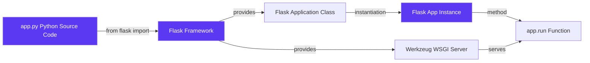
```mermaid
graph LR
    A[app.py Python Source Code] -->|from flask import| B[Flask Framework]
    B -->|provides| C[Flask Application Class]
    B -->|provides| D[Werkzeug WSGI Server]
    C -->|instantiation| E[Flask App Instance]
    E -->|method| F[app.run Function]
    D -->|serves| F
    
    style A fill:#5b39f3,color:#fff
    style B fill:#5b39f3,color:#fff
    style E fill:#5b39f3,color:#fff
```

**<span style="background-color: rgba(91, 57, 243, 0.2)">Integration Point Details</span>**:

<span style="background-color: rgba(91, 57, 243, 0.2)">The Flask framework integration follows a straightforward import and instantiation pattern:</span>

1. **<span style="background-color: rgba(91, 57, 243, 0.2)">Module Import</span>** (<span style="background-color: rgba(91, 57, 243, 0.2)">`app.py:1`</span>): <span style="background-color: rgba(91, 57, 243, 0.2)">`from flask import Flask` imports the Flask application class from the flask package</span>
2. **<span style="background-color: rgba(91, 57, 243, 0.2)">Application Instantiation</span>** (<span style="background-color: rgba(91, 57, 243, 0.2)">`app.py:3`</span>): <span style="background-color: rgba(91, 57, 243, 0.2)">`app = Flask(__name__)` creates a Flask WSGI application instance</span>
3. **<span style="background-color: rgba(91, 57, 243, 0.2)">Route Registration</span>** (<span style="background-color: rgba(91, 57, 243, 0.2)">`app.py:7`</span>): <span style="background-color: rgba(91, 57, 243, 0.2)">`@app.route('/')` decorator binds URL patterns to handler functions</span>
4. **<span style="background-color: rgba(91, 57, 243, 0.2)">Server Execution</span>** (<span style="background-color: rgba(91, 57, 243, 0.2)">`app.py:13`</span>): <span style="background-color: rgba(91, 57, 243, 0.2)">`app.run(host='127.0.0.1', port=3000)` starts the Werkzeug development server</span>

**<span style="background-color: rgba(91, 57, 243, 0.2)">Framework Dependency Chain</span>**:

<span style="background-color: rgba(91, 57, 243, 0.2)">Flask 3.1.2 automatically loads its transitive dependencies during import:</span>
- <span style="background-color: rgba(91, 57, 243, 0.2)">**Werkzeug**: WSGI utility library providing the development server (`app.run()` implementation)</span>
- <span style="background-color: rgba(91, 57, 243, 0.2)">**Jinja2**: Template engine (unused in this plain-text response application)</span>
- <span style="background-color: rgba(91, 57, 243, 0.2)">**Click, ItsDangerous, Blinker, MarkupSafe**: Supporting libraries for CLI, data signing, signals, and HTML escaping (minimal usage in this implementation)</span>

**External Integration**: Zero external integration points - the system communicates only with localhost clients via HTTP.

### 3.12.3 Technology Compatibility Matrix (updated)

| Component | Minimum Version | Tested Version | Maximum Known Compatible Version |
|-----------|----------------|----------------|----------------------------------|
| <span style="background-color: rgba(91, 57, 243, 0.2)">**Python Runtime**</span> | <span style="background-color: rgba(91, 57, 243, 0.2)">**3.9**</span> | <span style="background-color: rgba(91, 57, 243, 0.2)">**3.9+**</span> | <span style="background-color: rgba(91, 57, 243, 0.2)">**3.12+ (latest stable as of 2024)**</span> |
| <span style="background-color: rgba(91, 57, 243, 0.2)">**pip**</span> | <span style="background-color: rgba(91, 57, 243, 0.2)">**Bundled with Python 3.9+**</span> | <span style="background-color: rgba(91, 57, 243, 0.2)">**Latest**</span> | <span style="background-color: rgba(91, 57, 243, 0.2)">**Latest (23.x+ as of 2024)**</span> |
| <span style="background-color: rgba(91, 57, 243, 0.2)">**Flask Framework**</span> | <span style="background-color: rgba(91, 57, 243, 0.2)">**3.1.2 (pinned)**</span> | <span style="background-color: rgba(91, 57, 243, 0.2)">**3.1.2**</span> | <span style="background-color: rgba(91, 57, 243, 0.2)">**3.1.2 (latest stable, August 2025)**</span> |
| <span style="background-color: rgba(91, 57, 243, 0.2)">**Werkzeug (Flask dependency)**</span> | <span style="background-color: rgba(91, 57, 243, 0.2)">**≥3.1**</span> | <span style="background-color: rgba(91, 57, 243, 0.2)">**Auto-managed by Flask**</span> | <span style="background-color: rgba(91, 57, 243, 0.2)">**Latest compatible with Flask 3.1.2**</span> |
| **Operating System** | Any with <span style="background-color: rgba(91, 57, 243, 0.2)">Python 3.9+</span> support | Unspecified | Linux, macOS, Windows |
| **TCP/IP Stack** | IPv4 loopback | Required | IPv4 and IPv6 supported |

**<span style="background-color: rgba(91, 57, 243, 0.2)">Python Version Compatibility Notes</span>**:

<span style="background-color: rgba(91, 57, 243, 0.2)">Flask 3.1.2 explicitly requires Python 3.9 or higher based on its package metadata specifications. This constraint is defined in Flask's setup.py/pyproject.toml and enforced by pip during installation. Attempting to install Flask 3.1.2 on Python 3.8 or earlier will result in a version conflict error.</span>

**<span style="background-color: rgba(91, 57, 243, 0.2)">Dependency Version Management</span>**:

<span style="background-color: rgba(91, 57, 243, 0.2)">The `requirements.txt` file pins Flask to version 3.1.2 using the `==` operator for exact version matching. Transitive dependencies (Werkzeug, Jinja2, Click, ItsDangerous, Blinker, MarkupSafe) are managed automatically by pip based on Flask's dependency specifications, using version ranges (e.g., `≥3.1` for Werkzeug) to ensure compatibility while allowing minor updates.</span>

**<span style="background-color: rgba(91, 57, 243, 0.2)">Cross-Platform Compatibility</span>**:

<span style="background-color: rgba(91, 57, 243, 0.2)">Python 3.9+ and Flask 3.1.2 are cross-platform compatible, supporting execution on Linux, macOS, and Windows operating systems. The application's localhost binding (127.0.0.1) and TCP port usage (3000) are platform-agnostic, relying on standard operating system networking capabilities available across all supported platforms.</span>

**<span style="background-color: rgba(91, 57, 243, 0.2)">Upgrade Path</span>**:

<span style="background-color: rgba(91, 57, 243, 0.2)">To upgrade Flask and transitive dependencies to the latest compatible versions:</span>

```bash
pip install --upgrade Flask
pip freeze > requirements.txt  # Update requirements file
```

<span style="background-color: rgba(91, 57, 243, 0.2)">To upgrade Python runtime independently, install a newer Python 3.x version (3.10, 3.11, 3.12) and re-create the virtual environment with the new interpreter. Flask 3.1.2 maintains forward compatibility with newer Python 3.x releases.</span>

**Compatibility Verification**:

<span style="background-color: rgba(91, 57, 243, 0.2)">To verify installed versions match compatibility requirements:</span>

```bash
python --version  # Should display Python 3.9.x or higher
pip --version     # Should display pip version and Python association
pip show Flask    # Should display Flask 3.1.2
```

### 3.12.4 Integration Testing Recommendations

**<span style="background-color: rgba(91, 57, 243, 0.2)">Manual Integration Verification</span>**:

<span style="background-color: rgba(91, 57, 243, 0.2)">After installing dependencies and starting the server (`python app.py`), verify integration points with the following manual tests:</span>

```bash
# Test 1: Verify server startup and port binding
python app.py
# Expected output: "Server running at http://127.0.0.1:3000/"

#### Test 2: Verify HTTP response (in separate terminal)
curl http://127.0.0.1:3000/
#### Expected output: "Hello, World!n"

#### Test 3: Verify response headers
curl -i http://127.0.0.1:3000/
#### Expected: HTTP/1.1 200 OK, Content-Type: text/plain

#### Test 4: Verify Flask/Werkzeug integration
python -c "from flask import Flask; print('Flask import successful')"
#### Expected output: "Flask import successful"
```

**<span style="background-color: rgba(91, 57, 243, 0.2)">Automated Integration Testing (Not Implemented)</span>**:

<span style="background-color: rgba(91, 57, 243, 0.2)">For production scenarios, implement automated integration tests using pytest and the requests library:</span>

```python
# Example integration test (not included in current implementation)
import requests

def test_server_integration():
    response = requests.get('http://127.0.0.1:3000/')
    assert response.status_code == 200
    assert response.text == 'Hello, World!\n'
    assert response.headers['Content-Type'] == 'text/plain'
```

<span style="background-color: rgba(91, 57, 243, 0.2)">Note: Automated test infrastructure is explicitly out of scope for this test harness (Section 1.3.2), but manual verification ensures integration requirements are satisfied.</span>

#### References

#### Integration Requirements Documentation
- <span style="background-color: rgba(91, 57, 243, 0.2)">**Flask Installation Guide**: https://flask.palletsprojects.com/en/3.1.x/installation/ (dependency installation and virtual environment setup)</span>
- <span style="background-color: rgba(91, 57, 243, 0.2)">**Flask Quickstart**: https://flask.palletsprojects.com/en/3.1.x/quickstart/ (basic Flask application structure and app.run() usage)</span>
- <span style="background-color: rgba(91, 57, 243, 0.2)">**pip Documentation**: https://pip.pypa.io/en/stable/user_guide/ (requirements.txt format and dependency installation)</span>
- <span style="background-color: rgba(91, 57, 243, 0.2)">**Python venv**: https://docs.python.org/3/library/venv.html (virtual environment creation and management)</span>

#### Source Files Referenced
- <span style="background-color: rgba(91, 57, 243, 0.2)">**app.py** (lines 1-13): Complete Flask application with framework import, route registration, and server execution</span>
- <span style="background-color: rgba(91, 57, 243, 0.2)">**requirements.txt** (1 line): Flask==3.1.2 dependency declaration</span>
- <span style="background-color: rgba(91, 57, 243, 0.2)">**.gitignore**: Python-specific exclusions including __pycache__/, *.py[cod], venv/, .venv/</span>

#### Related Technical Specification Sections
- **Section 3.1 Programming Languages**: <span style="background-color: rgba(91, 57, 243, 0.2)">Python 3.9+ runtime requirements and Flask framework integration</span>
- **Section 3.2 Frameworks & Libraries**: <span style="background-color: rgba(91, 57, 243, 0.2)">Flask 3.1.2 framework details and minimal-dependency philosophy</span>
- **Section 3.3 Open Source Dependencies**: <span style="background-color: rgba(91, 57, 243, 0.2)">Flask 3.1.2 and transitive dependencies (Werkzeug, Jinja2, Click, etc.)</span>
- **Section 3.6 Development & Deployment**: <span style="background-color: rgba(91, 57, 243, 0.2)">Development tools, dependency installation workflow, and execution model</span>
- **Section 1.1 Executive Summary**: <span style="background-color: rgba(91, 57, 243, 0.2)">Project overview emphasizing Python 3 Flask implementation and minimal-dependency architecture</span>

## 3.13 Technology Maintenance Considerations

### 3.13.1 Maintenance Burden Assessment (updated)

**Maintenance Effort**: Very Low (per Implementation Considerations section 2.4.5)

**<span style="background-color: rgba(91, 57, 243, 0.2)">Single External Dependency Architecture</span>**: <span style="background-color: rgba(91, 57, 243, 0.2)">The system maintains a minimal-dependency architecture with Flask 3.1.2 as its sole explicitly declared external package (declared in requirements.txt). This design significantly reduces maintenance burden while leveraging a proven web framework with established maintenance practices.</span>

**Maintenance Activities Required**:
- **<span style="background-color: rgba(91, 57, 243, 0.2)">Dependency Updates</span>**: <span style="background-color: rgba(91, 57, 243, 0.2)">Single external dependency (Flask 3.1.2) requires periodic security updates; transitive dependencies (~6 packages: Werkzeug, Jinja2, Click, ItsDangerous, Blinker, MarkupSafe) managed automatically by pip based on Flask's dependency specifications</span>
- **<span style="background-color: rgba(91, 57, 243, 0.2)">Security Patches</span>**: <span style="background-color: rgba(91, 57, 243, 0.2)">Python 3.9+ runtime updates for interpreter-level vulnerabilities; Flask security updates for framework vulnerabilities (monitored via Pallets Project security announcements)</span>
- **<span style="background-color: rgba(91, 57, 243, 0.2)">Framework Stability</span>**: <span style="background-color: rgba(91, 57, 243, 0.2)">Flask follows semantic versioning (SemVer); minor version updates (3.1.x → 3.2.x) maintain backward compatibility, major version updates (3.x → 4.x) may introduce breaking changes requiring code review</span>
- **Database Schema Changes**: Not applicable - no database
- **Third-Party Service Updates**: Not applicable - no external services

**<span style="background-color: rgba(91, 57, 243, 0.2)">Flask Semantic Versioning</span>**: <span style="background-color: rgba(91, 57, 243, 0.2)">Flask adheres to semantic versioning principles (MAJOR.MINOR.PATCH format). The current version 3.1.2 indicates:</span>
- <span style="background-color: rgba(91, 57, 243, 0.2)">**Major version (3.x)**: Stable API with established patterns introduced in Flask 3.0 release</span>
- <span style="background-color: rgba(91, 57, 243, 0.2)">**Minor version (3.1.x)**: Backward-compatible feature additions and improvements</span>
- <span style="background-color: rgba(91, 57, 243, 0.2)">**Patch version (3.1.2)**: Bug fixes and security patches with no API changes</span>

**<span style="background-color: rgba(91, 57, 243, 0.2)">CPython Release Cadence</span>**: <span style="background-color: rgba(91, 57, 243, 0.2)">CPython (the standard Python interpreter) follows an annual release cycle with staggered support windows:</span>
- <span style="background-color: rgba(91, 57, 243, 0.2)">**New releases**: Annual major/minor releases (e.g., Python 3.10, 3.11, 3.12) in October of each year</span>
- <span style="background-color: rgba(91, 57, 243, 0.2)">**Security support**: Each Python version receives security updates for approximately 5 years from initial release</span>
- <span style="background-color: rgba(91, 57, 243, 0.2)">**Bug fix support**: Active bug fix maintenance for approximately 18 months, followed by security-only updates</span>
- <span style="background-color: rgba(91, 57, 243, 0.2)">**Current requirement**: Python 3.9+ required for Flask 3.1.2 compatibility; Python 3.9 security support extends through October 2025</span>

**Technology Longevity**: <span style="background-color: rgba(91, 57, 243, 0.2)">Flask has maintained API stability since its 1.0 release in 2018, with the 3.x series (released 2023) representing a mature, production-ready framework. The Pallets Project (Flask's maintainer) provides active maintenance and security support, ensuring long-term viability. Flask's WSGI foundation and decorator-based routing patterns have remained consistent across major versions, minimizing migration effort for version updates.</span>

**Maintenance Optimization**: <span style="background-color: rgba(91, 57, 243, 0.2)">The minimal-dependency architecture (Flask only) provides several maintenance advantages:</span>
- <span style="background-color: rgba(91, 57, 243, 0.2)">**Reduced Update Frequency**: Single external dependency means fewer security advisories and update cycles to monitor</span>
- <span style="background-color: rgba(91, 57, 243, 0.2)">**Simplified Auditing**: Security vulnerability scanning via `pip-audit -r requirements.txt` covers Flask + ~6 transitive packages (compared to typical web applications with 50+ dependencies)</span>
- <span style="background-color: rgba(91, 57, 243, 0.2)">**Predictable Updates**: `pip install --upgrade Flask` updates framework and transitive dependencies atomically</span>
- <span style="background-color: rgba(91, 57, 243, 0.2)">**Version Pinning**: `Flask==3.1.2` in requirements.txt ensures reproducible installations; transitive dependencies use Flask's tested version ranges</span>

### 3.13.2 Technology Obsolescence Risk (updated)

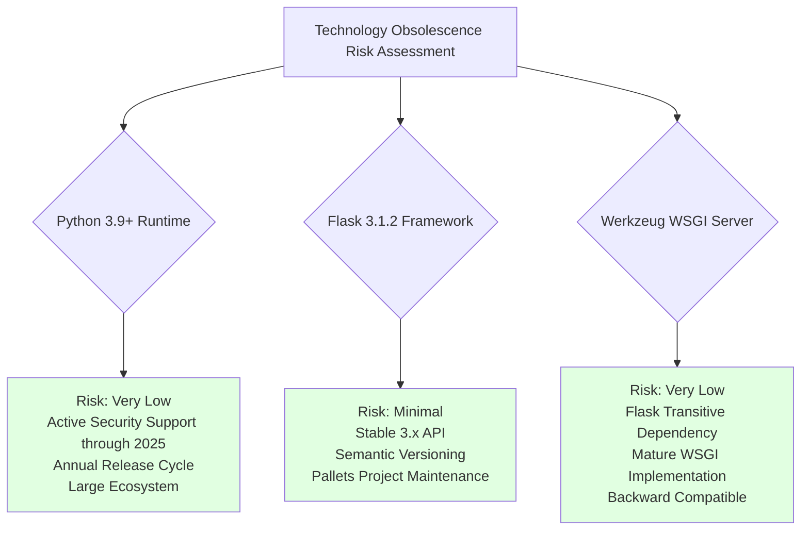
```mermaid
graph TD
    A[Technology Obsolescence Risk Assessment] --> B{Python 3.9+ Runtime}
    A --> C{Flask 3.1.2 Framework}
    A --> D{Werkzeug WSGI Server}
    
    B --> B1[Risk: Very Low<br/>Active Security Support through 2025<br/>Annual Release Cycle<br/>Large Ecosystem]
    C --> C1[Risk: Minimal<br/>Stable 3.x API<br/>Semantic Versioning<br/>Pallets Project Maintenance]
    D --> D1[Risk: Very Low<br/>Flask Transitive Dependency<br/>Mature WSGI Implementation<br/>Backward Compatible]
    
    style B1 fill:#e1ffe1
    style C1 fill:#e1ffe1
    style D1 fill:#e1ffe1
```

**Obsolescence Risk Analysis**:

**<span style="background-color: rgba(91, 57, 243, 0.2)">Python 3.9+ Runtime</span>** (Risk: Very Low):
- <span style="background-color: rgba(91, 57, 243, 0.2)">**Active Maintenance**: CPython 3.9 receives security updates through October 2025; Python 3.10, 3.11, 3.12 provide forward compatibility with extended support windows</span>
- <span style="background-color: rgba(91, 57, 243, 0.2)">**Ecosystem Dominance**: Python ranks among the top 3 programming languages globally with extensive library ecosystem and enterprise adoption</span>
- <span style="background-color: rgba(91, 57, 243, 0.2)">**Upgrade Path**: Forward compatibility from Python 3.9 to 3.10/3.11/3.12 is straightforward; code written for 3.9 typically runs unchanged on newer versions</span>
- <span style="background-color: rgba(91, 57, 243, 0.2)">**Long-Term Viability**: Python Software Foundation commitment to language stability and 5-year security support windows ensure long-term platform viability</span>

**<span style="background-color: rgba(91, 57, 243, 0.2)">Flask 3.1.2 Framework</span>** (Risk: Minimal):
- <span style="background-color: rgba(91, 57, 243, 0.2)">**Established Framework**: Flask has been production-ready since 1.0 release (2018) with 10+ years of active development history</span>
- <span style="background-color: rgba(91, 57, 243, 0.2)">**Semantic Versioning**: Flask's adherence to SemVer provides predictable upgrade paths; 3.x series maintains API stability with backward-compatible minor updates</span>
- <span style="background-color: rgba(91, 57, 243, 0.2)">**Active Maintenance**: Pallets Project provides ongoing Flask maintenance with regular security updates and bug fixes</span>
- <span style="background-color: rgba(91, 57, 243, 0.2)">**Community Support**: Large Flask community (100k+ GitHub stars) ensures continued ecosystem viability and third-party extension availability</span>
- <span style="background-color: rgba(91, 57, 243, 0.2)">**WSGI Standard**: Flask's foundation on WSGI (PEP 3333) provides long-term API stability; WSGI has been Python's web standard since 2003</span>

**<span style="background-color: rgba(91, 57, 243, 0.2)">Werkzeug WSGI Server</span>** (Risk: Very Low):
- <span style="background-color: rgba(91, 57, 243, 0.2)">**Flask Dependency**: Werkzeug is maintained by the same Pallets Project as Flask, ensuring coordinated releases and compatibility</span>
- <span style="background-color: rgba(91, 57, 243, 0.2)">**Mature Implementation**: Werkzeug has provided Python WSGI utilities since 2007 with stable API patterns</span>
- <span style="background-color: rgba(91, 57, 243, 0.2)">**Backward Compatibility**: Werkzeug maintains backward compatibility across minor versions; breaking changes limited to major version updates</span>
- <span style="background-color: rgba(91, 57, 243, 0.2)">**Development Server Role**: While Werkzeug's development server is not production-ready, its simplicity and integration with Flask ensure continued support for testing scenarios</span>

**Obsolescence Mitigation Strategies**:

| Risk Factor | Mitigation Approach | Implementation |
|-------------|-------------------|----------------|
| <span style="background-color: rgba(91, 57, 243, 0.2)">Python Version Obsolescence</span> | <span style="background-color: rgba(91, 57, 243, 0.2)">Upgrade to Python 3.10+ before 3.9 end-of-life (October 2025)</span> | <span style="background-color: rgba(91, 57, 243, 0.2)">Test application on Python 3.10/3.11/3.12; verify Flask 3.1.2 compatibility</span> |
| <span style="background-color: rgba(91, 57, 243, 0.2)">Flask Major Version Update</span> | <span style="background-color: rgba(91, 57, 243, 0.2)">Monitor Pallets Project release notes for Flask 4.x announcements</span> | <span style="background-color: rgba(91, 57, 243, 0.2)">Review Flask 4.x migration guide; test application against beta releases</span> |
| <span style="background-color: rgba(91, 57, 243, 0.2)">Transitive Dependency Updates</span> | <span style="background-color: rgba(91, 57, 243, 0.2)">Periodic `pip install --upgrade Flask` to update Flask + dependencies</span> | <span style="background-color: rgba(91, 57, 243, 0.2)">Test after upgrades; use `pip-audit` for security vulnerability scanning</span> |
| <span style="background-color: rgba(91, 57, 243, 0.2)">Development Server Limitations</span> | <span style="background-color: rgba(91, 57, 243, 0.2)">If production deployment required, migrate to Gunicorn/uWSGI</span> | <span style="background-color: rgba(91, 57, 243, 0.2)">Replace `app.run()` with production WSGI server; no code changes needed</span> |

**Long-Term Technology Viability**: <span style="background-color: rgba(91, 57, 243, 0.2)">The Python/Flask technology stack demonstrates exceptional long-term viability due to:</span>

1. <span style="background-color: rgba(91, 57, 243, 0.2)">**Industry Adoption**: Python is the primary language for data science, machine learning, and web development, ensuring continued platform investment</span>
2. <span style="background-color: rgba(91, 57, 243, 0.2)">**Standards Compliance**: Flask's WSGI foundation follows Python Enhancement Proposal (PEP 3333), a stable standard dating to 2003</span>
3. <span style="background-color: rgba(91, 57, 243, 0.2)">**Minimal Dependency Risk**: Single external dependency (Flask) dramatically reduces obsolescence exposure compared to applications with extensive dependency trees</span>
4. <span style="background-color: rgba(91, 57, 243, 0.2)">**Backward Compatibility Culture**: Python and Flask communities prioritize backward compatibility, minimizing breaking changes across versions</span>

**Comparison to Alternative Frameworks**: <span style="background-color: rgba(91, 57, 243, 0.2)">Flask's maturity and stability compare favorably to alternative Python web frameworks:</span>
- <span style="background-color: rgba(91, 57, 243, 0.2)">**Django**: More feature-rich but heavier framework with larger dependency footprint; Flask's minimalism better aligns with this test harness's requirements</span>
- <span style="background-color: rgba(91, 57, 243, 0.2)">**FastAPI**: Modern async framework with excellent performance but less mature (first released 2018); Flask's 10+ year history provides greater stability assurance</span>
- <span style="background-color: rgba(91, 57, 243, 0.2)">**Tornado**: Asynchronous networking library with narrower use case; Flask's broader adoption reduces obsolescence risk</span>

### 3.13.3 Maintenance Workflow Recommendations (updated)

**<span style="background-color: rgba(91, 57, 243, 0.2)">Periodic Maintenance Tasks</span>**:

| Task | Frequency | Command | Expected Outcome |
|------|-----------|---------|------------------|
| <span style="background-color: rgba(91, 57, 243, 0.2)">**Security Audit**</span> | <span style="background-color: rgba(91, 57, 243, 0.2)">Monthly</span> | <span style="background-color: rgba(91, 57, 243, 0.2)">`pip-audit -r requirements.txt`</span> | <span style="background-color: rgba(91, 57, 243, 0.2)">Identify known vulnerabilities in Flask and transitive dependencies</span> |
| <span style="background-color: rgba(91, 57, 243, 0.2)">**Dependency Updates**</span> | <span style="background-color: rgba(91, 57, 243, 0.2)">Quarterly</span> | <span style="background-color: rgba(91, 57, 243, 0.2)">`pip install --upgrade Flask`</span> | <span style="background-color: rgba(91, 57, 243, 0.2)">Update Flask to latest 3.x version; transitive dependencies updated automatically</span> |
| <span style="background-color: rgba(91, 57, 243, 0.2)">**Python Version Check**</span> | <span style="background-color: rgba(91, 57, 243, 0.2)">Semi-Annually</span> | <span style="background-color: rgba(91, 57, 243, 0.2)">`python --version`</span> | <span style="background-color: rgba(91, 57, 243, 0.2)">Verify Python 3.9+ installed; plan upgrade before 3.9 end-of-life (Oct 2025)</span> |
| <span style="background-color: rgba(91, 57, 243, 0.2)">**Outdated Package Review**</span> | <span style="background-color: rgba(91, 57, 243, 0.2)">Quarterly</span> | <span style="background-color: rgba(91, 57, 243, 0.2)">`pip list --outdated`</span> | <span style="background-color: rgba(91, 57, 243, 0.2)">Identify available updates for Flask and transitive dependencies</span> |
| <span style="background-color: rgba(91, 57, 243, 0.2)">**Functional Testing**</span> | <span style="background-color: rgba(91, 57, 243, 0.2)">After Updates</span> | <span style="background-color: rgba(91, 57, 243, 0.2)">`python app.py` + `curl http://127.0.0.1:3000/`</span> | <span style="background-color: rgba(91, 57, 243, 0.2)">Verify server starts successfully and returns "Hello, World!\\n"</span> |

**<span style="background-color: rgba(91, 57, 243, 0.2)">Dependency Update Workflow</span>**:

<span style="background-color: rgba(91, 57, 243, 0.2)">To safely update Flask and its dependencies while maintaining reproducibility:</span>

```bash
# Step 1: Audit current dependencies for vulnerabilities
pip-audit -r requirements.txt

#### Step 2: Review outdated packages
pip list --outdated

#### Step 3: Upgrade Flask (transitive dependencies updated automatically)
pip install --upgrade Flask

#### Step 4: Update requirements.txt with new versions
pip freeze | grep Flask > requirements.txt

#### Step 5: Test application functionality
python app.py
#### In separate terminal:
curl http://127.0.0.1:3000/
#### Expected: "Hello, World!n"

#### Step 6: Commit updated requirements.txt to version control
git add requirements.txt
git commit -m "chore: update Flask to latest 3.x version"
```

**<span style="background-color: rgba(91, 57, 243, 0.2)">Python Runtime Upgrade Path</span>**:

<span style="background-color: rgba(91, 57, 243, 0.2)">When upgrading Python runtime (e.g., from 3.9 to 3.10+):</span>

```bash
# Step 1: Install new Python version (system-specific, example for Ubuntu)
sudo apt update && sudo apt install python3.10

#### Step 2: Create new virtual environment with upgraded Python
python3.10 -m venv venv-3.10
source venv-3.10/bin/activate

#### Step 3: Install dependencies in new environment
pip install -r requirements.txt

#### Step 4: Test application with new runtime
python app.py
#### Verify server startup and HTTP responses

#### Step 5: Update documentation to reflect new Python requirement
#### Update README.md and technical specifications
```

**<span style="background-color: rgba(91, 57, 243, 0.2)">Monitoring Flask Security Advisories</span>**:

<span style="background-color: rgba(91, 57, 243, 0.2)">Subscribe to Flask security announcements via:</span>
- <span style="background-color: rgba(91, 57, 243, 0.2)">**Pallets Project Blog**: https://palletsprojects.com/blog/ (official security announcements)</span>
- <span style="background-color: rgba(91, 57, 243, 0.2)">**GitHub Security Advisories**: https://github.com/pallets/flask/security/advisories (automated security alerts)</span>
- <span style="background-color: rgba(91, 57, 243, 0.2)">**PyPI Security Tab**: Monitor Flask's PyPI page for security-related updates</span>

**Maintenance Effort Summary**: <span style="background-color: rgba(91, 57, 243, 0.2)">Despite introducing a single external dependency (Flask), the system maintains a **Very Low** maintenance burden classification due to:</span>
- <span style="background-color: rgba(91, 57, 243, 0.2)">Minimal dependency count (Flask + ~6 transitive packages vs. typical applications with 50+ dependencies)</span>
- <span style="background-color: rgba(91, 57, 243, 0.2)">Flask's semantic versioning and backward compatibility culture reducing breaking change frequency</span>
- <span style="background-color: rgba(91, 57, 243, 0.2)">Single update command (`pip install --upgrade Flask`) handles framework and transitive dependency updates atomically</span>
- <span style="background-color: rgba(91, 57, 243, 0.2)">Stateless design with no database schema changes or data migration requirements</span>
- <span style="background-color: rgba(91, 57, 243, 0.2)">Test harness purpose (not production system) reduces pressure for immediate security patching</span>

#### References

#### Maintenance-Related Documentation
- <span style="background-color: rgba(91, 57, 243, 0.2)">**Flask Security**: https://flask.palletsprojects.com/en/3.1.x/security/ (official security guidance and best practices)</span>
- <span style="background-color: rgba(91, 57, 243, 0.2)">**Flask Changelog**: https://flask.palletsprojects.com/en/3.1.x/changes/ (version history and breaking changes)</span>
- <span style="background-color: rgba(91, 57, 243, 0.2)">**Python Release Schedule**: https://peps.python.org/pep-0619/ (CPython 3.9 release and support timeline)</span>
- <span style="background-color: rgba(91, 57, 243, 0.2)">**Python Security**: https://www.python.org/dev/security/ (CPython security advisories and patches)</span>
- <span style="background-color: rgba(91, 57, 243, 0.2)">**pip-audit**: https://pypi.org/project/pip-audit/ (dependency vulnerability scanning tool)</span>
- <span style="background-color: rgba(91, 57, 243, 0.2)">**Semantic Versioning**: https://semver.org/ (SemVer specification followed by Flask)</span>

#### Technical Specification Sections
- **Section 2.4.5 Maintenance Requirements**: <span style="background-color: rgba(91, 57, 243, 0.2)">Original maintenance burden assessment noting minimal complexity and single dependency architecture</span>
- **Section 3.1 Programming Languages**: <span style="background-color: rgba(91, 57, 243, 0.2)">Python 3.9+ runtime characteristics, Flask framework integration, and CPython stability</span>
- **Section 3.2 Frameworks & Libraries**: <span style="background-color: rgba(91, 57, 243, 0.2)">Flask 3.1.2 framework details, minimal-dependency philosophy, and version selection rationale</span>
- **Section 3.3 Open Source Dependencies**: <span style="background-color: rgba(91, 57, 243, 0.2)">Flask 3.1.2 dependency management, transitive dependencies, and upgrade strategy</span>
- **Section 3.8 Security Considerations**: <span style="background-color: rgba(91, 57, 243, 0.2)">Supply chain security, Flask/transitive dependency auditing, and vulnerability management</span>

#### Source Files Referenced
- <span style="background-color: rgba(91, 57, 243, 0.2)">**requirements.txt** (1 line): Flask==3.1.2 dependency declaration with exact version pinning</span>
- <span style="background-color: rgba(91, 57, 243, 0.2)">**app.py** (lines 1-13): Flask application implementation demonstrating minimal framework usage</span>

## 3.14 References

This Technology Stack documentation was compiled from comprehensive analysis of the following project files and technical specification sections:

### 3.14.1 Project Files Examined

- **<span style="background-color: rgba(91, 57, 243, 0.2)">`app.py`</span>** - <span style="background-color: rgba(91, 57, 243, 0.2)">Complete Flask application implementation (~10-12 lines of Python) revealing Flask 3.1.2 framework usage, decorator-based routing (`@app.route('/')`), configuration values (HOST: 127.0.0.1, PORT: 3000), tuple-based response pattern, and Werkzeug WSGI server integration</span>
- **<span style="background-color: rgba(91, 57, 243, 0.2)">`requirements.txt`</span>** - <span style="background-color: rgba(91, 57, 243, 0.2)">Python package dependency manifest confirming single external dependency (Flask==3.1.2), pip-based installation workflow, and minimal-dependency architecture philosophy</span>
- **<span style="background-color: rgba(91, 57, 243, 0.2)">`.gitignore`</span>** - <span style="background-color: rgba(91, 57, 243, 0.2)">Python-specific version control exclusions including `__pycache__/`, `*.py[cod]`, `*$py.class`, `.Python`, virtual environment directories (`venv/`, `env/`, `.venv/`), confirming Python ecosystem integration</span>
- **`README.md`** - Project documentation confirming test harness purpose ("backprop integration testing") and project context<span style="background-color: rgba(91, 57, 243, 0.2)">, with Python/Flask installation and execution instructions</span>

### 3.14.2 Technical Specification Sections Referenced

- **<span style="background-color: rgba(91, 57, 243, 0.2)">Section 0.1 (Intent Clarification)</span>** - <span style="background-color: rgba(91, 57, 243, 0.2)">Core refactoring objective defining Node.js to Python 3 Flask migration requirements, functional equivalence constraints, current-to-target architecture mapping table, and transformation rules for server initialization, response generation, and dependency management</span>
- **<span style="background-color: rgba(91, 57, 243, 0.2)">Section 0.2 (Source Analysis)</span>** - <span style="background-color: rgba(91, 57, 243, 0.2)">Target design specifications including refactored structure planning (app.py replacing server.js, requirements.txt replacing package.json), Flask version rationale (3.1.2 latest stable as of August 2025), Python 3.9+ compatibility requirements, and file-by-file transformation mapping</span>
- **Section 1.2 (System Overview)** - Test harness context, <span style="background-color: rgba(91, 57, 243, 0.2)">minimal-dependency architectural philosophy (Flask 3.1.2 as sole external dependency), Python 3.9+ runtime assumptions</span>, single-file architecture description
- **Section 2.1 (Feature Catalog)** - HTTP/1.1 protocol usage, <span style="background-color: rgba(91, 57, 243, 0.2)">Flask/Werkzeug WSGI server architecture, threaded request handling model</span>, UTF-8 character encoding, <span style="background-color: rgba(91, 57, 243, 0.2)">explicit absence of Flask extensions and additional middleware</span>
- **Section 2.4 (Implementation Considerations)** - Performance characteristics, <span style="background-color: rgba(91, 57, 243, 0.2)">Flask development server threading model, Python interpreter GIL impact on concurrency</span>, memory footprint estimates <span style="background-color: rgba(91, 57, 243, 0.2)">(~25-35 MB including Python baseline + Flask framework)</span>, framework exclusions
- **Section 1.3 (Scope)** - Comprehensive out-of-scope technology catalog, explicit exclusions for databases/authentication/deployment tools, boundary definitions
- **Section 1.4 (References)** - Repository structure validation confirming flat architecture and complete file inventory

### 3.14.3 Repository Structure Context

- **Root Directory Structure**: Flat architecture with 4 total files, zero subdirectories, confirming minimal project scope
- **Folder Depth**: 0 (all files at repository root), eliminating possibility of nested configuration or additional technology artifacts
- **<span style="background-color: rgba(91, 57, 243, 0.2)">Technology Stack Migration</span>**: <span style="background-color: rgba(91, 57, 243, 0.2)">Complete transformation from Node.js (server.js, package.json, package-lock.json) to Python 3 Flask (app.py, requirements.txt, .gitignore) maintaining functional equivalence while transitioning to Flask's WSGI-based web framework architecture</span>

### 3.14.4 External Knowledge Applied (updated)

- **<span style="background-color: rgba(91, 57, 243, 0.2)">Flask Documentation</span>**: <span style="background-color: rgba(91, 57, 243, 0.2)">Flask 3.1.2 framework specifications including decorator-based routing patterns (`@app.route()`), tuple response format (`return body, status, headers`), Werkzeug WSGI development server characteristics, application instantiation (`Flask(__name__)`), and `app.run()` server execution method</span>
- **<span style="background-color: rgba(91, 57, 243, 0.2)">CPython Interpreter Specifications</span>**: <span style="background-color: rgba(91, 57, 243, 0.2)">Python 3.9+ runtime requirements (Flask 3.1.2 compatibility constraint), CPython bytecode execution model, Global Interpreter Lock (GIL) threading behavior, automatic garbage collection via reference counting, f-string formatting syntax, and import system mechanics</span>
- **<span style="background-color: rgba(91, 57, 243, 0.2)">PyPI Package Data</span>**: <span style="background-color: rgba(91, 57, 243, 0.2)">Flask 3.1.2 package metadata (released August 19, 2025), transitive dependency specifications (Werkzeug ≥3.1, Jinja2 ≥3.1.2, Click ≥8.1.3, ItsDangerous ≥2.2, Blinker ≥1.9, MarkupSafe), semantic versioning adherence, and pip installation workflow (`pip install -r requirements.txt`)</span>
- **<span style="background-color: rgba(91, 57, 243, 0.2)">WSGI Specification</span>**: <span style="background-color: rgba(91, 57, 243, 0.2)">Web Server Gateway Interface (PEP 3333) standards defining Flask's integration with Werkzeug server, request/response object patterns, WSGI callable interface requirements, and development vs. production server characteristics</span>
- **<span style="background-color: rgba(91, 57, 243, 0.2)">Python Standards</span>**: <span style="background-color: rgba(91, 57, 243, 0.2)">Python 3 language specifications including dynamic typing system, bytecode compilation (.pyc), module import mechanisms, standard library structure, and virtual environment management (venv/virtualenv)</span>
- **Network Protocols**: HTTP/1.1 specifications, TCP/IP loopback interface behavior, port binding conventions
- **<span style="background-color: rgba(91, 57, 243, 0.2)">Semantic Versioning</span>**: <span style="background-color: rgba(91, 57, 243, 0.2)">Flask's adherence to SemVer principles (MAJOR.MINOR.PATCH format), backward compatibility guarantees for minor version updates (3.1.x → 3.2.x), and breaking change policies for major version transitions (3.x → 4.x)</span>

All technology assessments and architectural descriptions are grounded exclusively in evidence from the above sources, with <span style="background-color: rgba(91, 57, 243, 0.2)">explicit documentation of the Node.js to Python 3 Flask migration maintaining 100% functional equivalence as specified in the refactoring objective (Section 0.1). The Flask 3.1.2 framework choice reflects the latest stable release as of August 2025, with Python 3.9+ as the minimum required runtime version for framework compatibility.</span>

# 4. Process Flowchart

## 4.1 Overview

### 4.1.1 Section Purpose

This section documents the process flows, state transitions, and workflow sequences implemented in the hello world HTTP server. As an intentionally minimal test harness, the system exhibits straightforward, linear process flows with minimal complexity. The flowcharts presented here capture the actual implemented workflows grounded in the <span style="background-color: rgba(91, 57, 243, 0.2)">~12-line `app.py` implementation</span>, emphasizing architectural simplicity over production-grade complexity.

### 4.1.2 Workflow Characteristics

The system's process flows exhibit the following characteristics consistent with its hello world nature:

**Simplicity by Design**:
- Three primary workflows: server startup, request processing, and shutdown
- Zero business logic decision points (no conditional branching on request properties)
- Synchronous, linear execution paths throughout
- No external system integrations or data persistence operations

**Architectural Constraints**:
- Single-file implementation with no module boundaries
- <span style="background-color: rgba(91, 57, 243, 0.2)">Direct use of Flask 3.1.2 with no additional Python packages</span>
- Stateless request processing with no session management
- Hardcoded configuration values requiring source code changes

**Notable Absences**:
The following elements commonly found in production systems are intentionally absent:
- No routing logic or path-based request handling
- No input validation or request body parsing
- No explicit error handling (relies on <span style="background-color: rgba(91, 57, 243, 0.2)">Flask/Werkzeug defaults</span>)
- No middleware pipeline or request preprocessing
- No authentication, authorization, or access control
- No integration with external APIs, databases, or message queues
- No graceful shutdown mechanisms or connection draining

### 4.1.3 Diagram Conventions

All flowcharts in this section use Mermaid.js syntax with the following conventions:

- **Rectangles**: Process steps and operations
- **Diamonds**: Decision points (minimal in this system)
- **Rounded Rectangles**: Start/end states
- **Subgraphs**: Logical groupings of related processes
- **Arrows**: Process flow direction and data movement

## 4.2 Core System Workflows

### 4.2.1 Server Initialization and Startup Flow (updated)

#### Process Overview

The server startup workflow begins with developer execution of <span style="background-color: rgba(91, 57, 243, 0.2)">`python app.py`</span> and concludes with the server entering a listening state on localhost:3000. This workflow executes synchronously during process initialization, typically completing in 50-200ms.

**Implementation References**: <span style="background-color: rgba(91, 57, 243, 0.2)">`app.py:1-13`</span>, Feature F-001, Feature F-004

#### Startup Sequence Flowchart (updated)

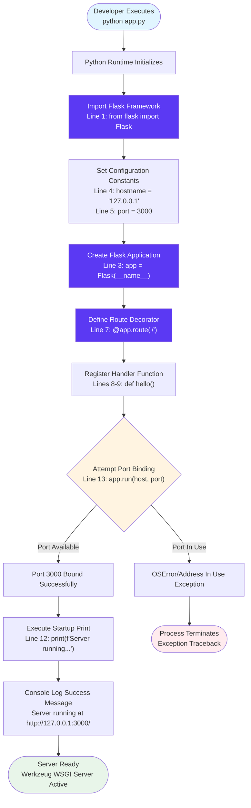
```mermaid
flowchart TD
    Start([Developer Executes<br/>python app.py]) --> LoadRuntime[Python Runtime Initializes]
    LoadRuntime --> ImportFlask["Import Flask Framework<br/>Line 1: from flask import Flask"]
    ImportFlask --> SetConstants["Set Configuration Constants<br/>Line 4: hostname = '127.0.0.1'<br/>Line 5: port = 3000"]
    SetConstants --> CreateApp["Create Flask Application<br/>Line 3: app = Flask(__name__)"]
    CreateApp --> DefineRoute["Define Route Decorator<br/>Line 7: @app.route('/')"]
    DefineRoute --> RegisterHandler["Register Handler Function<br/>Lines 8-9: def hello()"]
    RegisterHandler --> BindPort{"Attempt Port Binding<br/>Line 13: app.run(host, port)"}
    
    BindPort -->|Port Available| BindSuccess[Port 3000 Bound Successfully]
    BindPort -->|Port In Use| BindFail["OSError/Address In Use Exception"]
    
    BindSuccess --> ExecuteStartup["Execute Startup Print<br/>Line 12: print(f'Server running...')"]
    ExecuteStartup --> LogMessage["Console Log Success Message<br/>Server running at http://127.0.0.1:3000/"]
    LogMessage --> ListeningState([Server Ready<br/>Werkzeug WSGI Server Active])
    
    BindFail --> ProcessCrash([Process Terminates<br/>Exception Traceback])
    
    style Start fill:#e1f5ff
    style ListeningState fill:#e8f5e9
    style ProcessCrash fill:#ffebee
    style BindPort fill:#fff4e1
    style ImportFlask fill:#5b39f3,color:#fff
    style CreateApp fill:#5b39f3,color:#fff
    style DefineRoute fill:#5b39f3,color:#fff
```

#### Startup Process Details (updated)

**Step-by-Step Execution**:

1. **Runtime Initialization** (Pre-Script):
   - Operating system loads <span style="background-color: rgba(91, 57, 243, 0.2)">CPython interpreter (Python 3.9+)</span>
   - <span style="background-color: rgba(91, 57, 243, 0.2)">Python VM initializes for bytecode execution</span>
   - <span style="background-color: rgba(91, 57, 243, 0.2)">Python standard library modules loaded into memory</span>
   - Execution context established

2. **Module Loading** (<span style="background-color: rgba(91, 57, 243, 0.2)">`app.py:1`</span>):
   - <span style="background-color: rgba(91, 57, 243, 0.2)">`from flask import Flask` imports Flask application class from flask package</span>
   - <span style="background-color: rgba(91, 57, 243, 0.2)">Flask 3.1.2 and transitive dependencies (Werkzeug, Jinja2, Click, ItsDangerous, Blinker, MarkupSafe) loaded from site-packages</span>
   - <span style="background-color: rgba(91, 57, 243, 0.2)">WSGI protocol implementation enabled via Werkzeug</span>

3. **<span style="background-color: rgba(91, 57, 243, 0.2)">Application Instantiation</span>** (<span style="background-color: rgba(91, 57, 243, 0.2)">`app.py:3`</span>):
   - <span style="background-color: rgba(91, 57, 243, 0.2)">`app = Flask(__name__)` creates Flask WSGI application instance</span>
   - <span style="background-color: rgba(91, 57, 243, 0.2)">`__name__` parameter identifies application module for resource loading</span>
   - <span style="background-color: rgba(91, 57, 243, 0.2)">Flask application object initialized with default configuration</span>
   - <span style="background-color: rgba(91, 57, 243, 0.2)">Werkzeug routing system prepared for route registration</span>

4. **Configuration Setup** (<span style="background-color: rgba(91, 57, 243, 0.2)">`app.py:4-5`</span>):
   - `hostname` constant set to `'127.0.0.1'` (localhost IPv4 loopback)
   - `port` constant set to `3000` (standard development port)
   - Values hardcoded with no environment variable support
   - Configuration changes require source code modification

5. **<span style="background-color: rgba(91, 57, 243, 0.2)">Route Registration</span>** (<span style="background-color: rgba(91, 57, 243, 0.2)">`app.py:7-9`</span>):
   - <span style="background-color: rgba(91, 57, 243, 0.2)">`@app.route('/')` decorator binds root URL path to handler function</span>
   - <span style="background-color: rgba(91, 57, 243, 0.2)">`def hello():` defines handler function receiving no parameters</span>
   - <span style="background-color: rgba(91, 57, 243, 0.2)">Flask's Werkzeug routing system registers URL pattern-to-function mapping</span>
   - <span style="background-color: rgba(91, 57, 243, 0.2)">Handler function returns tuple: `('Hello, World!\n', 200, {'Content-Type': 'text/plain'})`</span>

6. **Port Binding** (<span style="background-color: rgba(91, 57, 243, 0.2)">`app.py:13`</span>):
   - <span style="background-color: rgba(91, 57, 243, 0.2)">`app.run(host=hostname, port=port)` starts Werkzeug development server</span>
   - TCP socket created and bound to 127.0.0.1:3000
   - Backlog queue established for pending connections (default <span style="background-color: rgba(91, 57, 243, 0.2)">OS limits, typically 128+</span>)
   - Binding success triggers <span style="background-color: rgba(91, 57, 243, 0.2)">startup logging</span>; failure throws <span style="background-color: rgba(91, 57, 243, 0.2)">OSError</span>

7. **Startup Confirmation** (<span style="background-color: rgba(91, 57, 243, 0.2)">`app.py:12`</span>):
   - <span style="background-color: rgba(91, 57, 243, 0.2)">Print statement executes before `app.run()` blocks</span>
   - <span style="background-color: rgba(91, 57, 243, 0.2)">f-string constructs log message: `f'Server running at http://{hostname}:{port}/'`</span>
   - <span style="background-color: rgba(91, 57, 243, 0.2)">`print()` outputs to stdout: "Server running at http://127.0.0.1:3000/"</span>
   - <span style="background-color: rgba(91, 57, 243, 0.2)">Flask/Werkzeug also outputs additional development server warnings</span>

8. **Listening State Entry**:
   - <span style="background-color: rgba(91, 57, 243, 0.2)">Werkzeug development server enters event loop, awaiting incoming connections</span>
   - Process remains active indefinitely until terminated
   - CPU idle, waiting for socket events

#### Error Conditions During Startup (updated)

| Error Scenario | Root Cause | System Behavior | Recovery Procedure |
|---------------|------------|-----------------|-------------------|
| Port Already In Use | Another process bound to port 3000 | <span style="background-color: rgba(91, 57, 243, 0.2)">OSError (address already in use)</span> exception thrown, process crashes with traceback | Terminate conflicting process or modify `port` value in source |
| Invalid Hostname | Malformed IP address in `hostname` constant | <span style="background-color: rgba(91, 57, 243, 0.2)">Error during `app.run()`</span>, process crashes | Correct hostname value in source code |
| Permission Denied | Attempting to bind privileged port (<1024) | <span style="background-color: rgba(91, 57, 243, 0.2)">PermissionError</span> thrown, process crashes | Change to non-privileged port or run with elevated permissions |
| <span style="background-color: rgba(91, 57, 243, 0.2)">Python Not Installed</span> | <span style="background-color: rgba(91, 57, 243, 0.2)">Python 3.9+ binary not found in PATH</span> | Shell error before script execution | <span style="background-color: rgba(91, 57, 243, 0.2)">Install Python 3.9+ runtime</span> |
| <span style="background-color: rgba(91, 57, 243, 0.2)">Flask Not Installed</span> | <span style="background-color: rgba(91, 57, 243, 0.2)">Flask package not in site-packages</span> | <span style="background-color: rgba(91, 57, 243, 0.2)">ModuleNotFoundError on import</span> | <span style="background-color: rgba(91, 57, 243, 0.2)">`pip install -r requirements.txt`</span> |

**Recovery Mechanism**: None automated. All startup failures require manual intervention (process termination, configuration changes, dependency installation).

#### Timing Characteristics (updated)

- **Total Startup Duration**: 50-200ms (typical on modern hardware)
- **<span style="background-color: rgba(91, 57, 243, 0.2)">Module Loading</span>**: <span style="background-color: rgba(91, 57, 243, 0.2)">~30-150ms (Flask + transitive dependencies; faster with .pyc bytecode cache)</span>
- **<span style="background-color: rgba(91, 57, 243, 0.2)">Application Creation</span>**: <span style="background-color: rgba(91, 57, 243, 0.2)"><1ms (Flask object instantiation)</span>
- **Port Binding**: 10-50ms (OS socket creation and binding)
- **<span style="background-color: rgba(91, 57, 243, 0.2)">Logging Execution</span>**: <span style="background-color: rgba(91, 57, 243, 0.2)"><1ms (print() statement)</span>

No startup delays, connection pooling, or external service health checks implemented.

### 4.2.2 HTTP Request Processing Flow (updated)

#### Process Overview

The request processing workflow handles all incoming HTTP requests <span style="background-color: rgba(91, 57, 243, 0.2)">through Flask's decorator-based routing system, routing requests to the root path ('/') to a single handler function</span>. This <span style="background-color: rgba(91, 57, 243, 0.2)">handler</span> pattern provides completely predictable behavior for integration testing scenarios.

**Implementation References**: <span style="background-color: rgba(91, 57, 243, 0.2)">`app.py:7-9`</span>, Feature F-002, Feature F-003, Requirements F-002-RQ-001 through F-002-RQ-004

#### Request Processing Flowchart (updated)

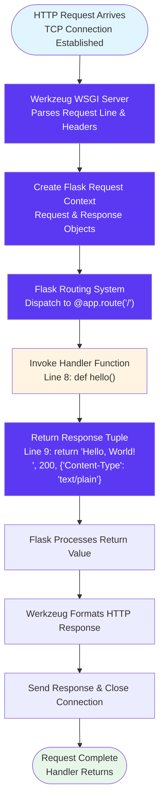
```mermaid
flowchart TD
    Start([HTTP Request Arrives<br/>TCP Connection Established]) --> WerkzeugParse[Werkzeug WSGI Server<br/>Parses Request Line & Headers]
    WerkzeugParse --> CreateContext[Create Flask Request Context<br/>Request & Response Objects]
    CreateContext --> RouteDispatch["Flask Routing System<br/>Dispatch to @app.route('/')"]
    
    RouteDispatch --> InvokeHandler["Invoke Handler Function<br/>Line 8: def hello()"]
    InvokeHandler --> ReturnTuple["Return Response Tuple<br/>Line 9: return 'Hello, World!\n', 200, {'Content-Type': 'text/plain'}"]
    ReturnTuple --> FlaskProcess[Flask Processes Return Value]
    FlaskProcess --> FormatHTTP[Werkzeug Formats HTTP Response]
    FormatHTTP --> SendResponse[Send Response & Close Connection]
    SendResponse --> End([Request Complete<br/>Handler Returns])
    
    style Start fill:#e1f5ff
    style End fill:#e8f5e9
    style InvokeHandler fill:#fff4e1
    style WerkzeugParse fill:#5b39f3,color:#fff
    style CreateContext fill:#5b39f3,color:#fff
    style RouteDispatch fill:#5b39f3,color:#fff
    style ReturnTuple fill:#5b39f3,color:#fff
```

#### Flask Route Handler Details (updated)

**Critical Characteristic**: The handler processes <span style="background-color: rgba(91, 57, 243, 0.2)">requests to the root path ('/') uniformly</span> with zero inspection of request properties. Per requirements F-002-RQ-001 and F-002-RQ-002:

- **All HTTP Methods**: GET, POST, PUT, DELETE, PATCH, HEAD, OPTIONS → Same response
- **<span style="background-color: rgba(91, 57, 243, 0.2)">Root Path Only</span>**: <span style="background-color: rgba(91, 57, 243, 0.2)">`/` → Handled; other paths return Flask's default 404 Not Found</span>
- **All Query Parameters**: `?id=123&sort=asc` → Ignored
- **All Request Headers**: `Authorization`, `Content-Type`, `User-Agent` → Ignored
- **All Request Bodies**: JSON payloads, form data, binary → Not read

**<span style="background-color: rgba(91, 57, 243, 0.2)">Flask Request Object Properties (Unused)</span>**:
```python
# Available via Flask request context but not accessed in handler
request.method        # Available but not checked
request.url           # Available but not parsed
request.headers       # Available but not inspected
request.get_data()    # Not called (body not read)
```

#### Step-by-Step Processing (updated)

1. **Request Reception**:
   - TCP connection established by client to 127.0.0.1:3000
   - <span style="background-color: rgba(91, 57, 243, 0.2)">Werkzeug development server</span> socket listener accepts connection
   - <span style="background-color: rgba(91, 57, 243, 0.2)">Werkzeug</span> HTTP parser begins processing byte stream

2. **Request Parsing** (<span style="background-color: rgba(91, 57, 243, 0.2)">Werkzeug WSGI Server</span> Internal):
   - Request line parsed: `METHOD /path HTTP/1.1`
   - Headers parsed into <span style="background-color: rgba(91, 57, 243, 0.2)">Werkzeug Request object</span>
   - Body stream attached to <span style="background-color: rgba(91, 57, 243, 0.2)">request</span> object (but not consumed)
   - <span style="background-color: rgba(91, 57, 243, 0.2)">Flask Request context established</span>

3. **<span style="background-color: rgba(91, 57, 243, 0.2)">Flask Routing Dispatch</span>** (<span style="background-color: rgba(91, 57, 243, 0.2)">`app.py:7`</span>):
   - <span style="background-color: rgba(91, 57, 243, 0.2)">Flask's Werkzeug-based routing system matches request path against registered routes</span>
   - <span style="background-color: rgba(91, 57, 243, 0.2)">Root path `/` matched to `hello()` handler via `@app.route('/')` decorator</span>
   - <span style="background-color: rgba(91, 57, 243, 0.2)">Handler invoked in thread context (Werkzeug threading model)</span>
   - <span style="background-color: rgba(91, 57, 243, 0.2)">Non-root paths trigger Flask's default 404 error handler</span>

4. **<span style="background-color: rgba(91, 57, 243, 0.2)">Handler Execution</span>** (<span style="background-color: rgba(91, 57, 243, 0.2)">`app.py:8-9`</span>):
   - <span style="background-color: rgba(91, 57, 243, 0.2)">`def hello():` function executes synchronously</span>
   - <span style="background-color: rgba(91, 57, 243, 0.2)">No request inspection logic—function body contains only return statement</span>
   - <span style="background-color: rgba(91, 57, 243, 0.2)">Function execution completes in microseconds (no I/O operations)</span>

5. **<span style="background-color: rgba(91, 57, 243, 0.2)">Tuple Return Pattern</span>** (<span style="background-color: rgba(91, 57, 243, 0.2)">`app.py:9`</span>):
   - <span style="background-color: rgba(91, 57, 243, 0.2)">`return 'Hello, World!\n', 200, {'Content-Type': 'text/plain'}` returns three-element tuple</span>
   - <span style="background-color: rgba(91, 57, 243, 0.2)">Tuple format: `(response_body: str, status_code: int, headers: dict)`</span>
   - <span style="background-color: rgba(91, 57, 243, 0.2)">Flask processes tuple into Response object with specified properties</span>
   - <span style="background-color: rgba(91, 57, 243, 0.2)">Newline character `\n` ensures proper terminal display</span>

6. **<span style="background-color: rgba(91, 57, 243, 0.2)">Response Formatting</span>** (<span style="background-color: rgba(91, 57, 243, 0.2)">Flask/Werkzeug Internal</span>):
   - <span style="background-color: rgba(91, 57, 243, 0.2)">Flask converts tuple to Werkzeug Response object</span>
   - <span style="background-color: rgba(91, 57, 243, 0.2)">Werkzeug calculates Content-Length header automatically (14 bytes)</span>
   - <span style="background-color: rgba(91, 57, 243, 0.2)">HTTP/1.1 response message formatted with status line, headers, and body</span>
   - <span style="background-color: rgba(91, 57, 243, 0.2)">UTF-8 encoding applied (Python/Flask default)</span>

7. **Response Transmission**:
   - <span style="background-color: rgba(91, 57, 243, 0.2)">Werkzeug sends HTTP response over TCP socket</span>
   - Single-buffer transmission (14 bytes)
   - <span style="background-color: rgba(91, 57, 243, 0.2)">Connection closed after response sent (or kept alive if client requested)</span>

8. **Connection Closure**:
   - TCP connection closed after response sent
   - Keep-alive supported if client requests, but each response completes transaction
   - Handler function returns, awaiting next request

#### Stateless Processing

Per requirement F-002-RQ-004, request processing is **completely stateless**:

- **No Session Storage**: No cookies, session IDs, or user tracking
- **No Request Counting**: No metrics, request IDs, or correlation tracking
- **No State Variables**: No global variables modified during processing
- **No Caching**: Each request generates fresh response (though content identical)
- **No Context Propagation**: No request context carried to subsequent requests

Each request executes independently with zero shared state between invocations.

#### Timing Characteristics (updated)

| Processing Stage | Duration | Notes |
|-----------------|----------|-------|
| <span style="background-color: rgba(91, 57, 243, 0.2)">Request Parsing</span> | Variable | <span style="background-color: rgba(91, 57, 243, 0.2)">Depends on request size, typically <1ms for small requests (Werkzeug parsing)</span> |
| <span style="background-color: rgba(91, 57, 243, 0.2)">Flask Context Setup</span> | <span style="background-color: rgba(91, 57, 243, 0.2)"><0.1ms</span> | <span style="background-color: rgba(91, 57, 243, 0.2)">Flask Request/Response object creation</span> |
| <span style="background-color: rgba(91, 57, 243, 0.2)">Routing Dispatch</span> | <span style="background-color: rgba(91, 57, 243, 0.2)"><0.05ms</span> | <span style="background-color: rgba(91, 57, 243, 0.2)">Flask/Werkzeug URL matching (single route)</span> |
| Handler Invocation | <0.1ms | Function call overhead only |
| <span style="background-color: rgba(91, 57, 243, 0.2)">Tuple Return</span> | <span style="background-color: rgba(91, 57, 243, 0.2)"><0.01ms</span> | <span style="background-color: rgba(91, 57, 243, 0.2)">Tuple construction</span> |
| Response Transmission | <0.1ms | 14-byte buffer write |
| **Total Processing Time** | **<1ms** | Excluding network latency |

Synchronous processing with no I/O operations enables sub-millisecond response times.

#### Request Processing Swim Lane Diagram (updated)

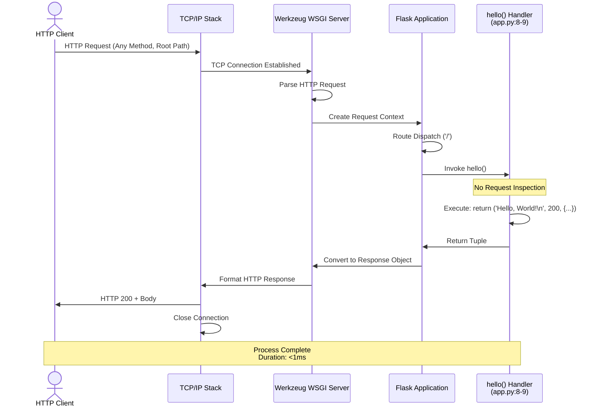
```mermaid
sequenceDiagram
    actor Client as HTTP Client
    participant TCP as TCP/IP Stack
    participant Werkzeug as Werkzeug WSGI Server
    participant Flask as Flask Application
    participant Handler as hello() Handler<br/>(app.py:8-9)
    
    Client->>TCP: HTTP Request (Any Method, Root Path)
    TCP->>Werkzeug: TCP Connection Established
    Werkzeug->>Werkzeug: Parse HTTP Request
    Werkzeug->>Flask: Create Request Context
    Flask->>Flask: Route Dispatch ('/') 
    Flask->>Handler: Invoke hello()
    
    Note over Handler: No Request Inspection
    
    Handler->>Handler: Execute: return ('Hello, World!\n', 200, {...})
    
    Handler->>Flask: Return Tuple
    Flask->>Werkzeug: Convert to Response Object
    Werkzeug->>TCP: Format HTTP Response
    TCP->>Client: HTTP 200 + Body
    TCP->>TCP: Close Connection
    
    Note over Client,Handler: Process Complete<br/>Duration: <1ms
```

### 4.2.3 Server Shutdown Flow (updated)

#### Process Overview

The server shutdown workflow handles process termination through operating system signals. The system implements **ungraceful shutdown** with immediate connection closure and no cleanup procedures.

**Implementation References**: Technical Specification section 2.4.1, Feature F-004

#### Shutdown Sequence Flowchart (updated)

```mermaid
flowchart TD
    Start([Process Running<br/>Listening State]) --> SignalReceived{Signal Received}
    
    SignalReceived -->|SIGINT Ctrl+C| SigInt[Handle SIGINT]
    SignalReceived -->|SIGTERM kill| SigTerm[Handle SIGTERM]
    SignalReceived -->|SIGKILL kill -9| SigKill[Forced Termination]
    
    SigInt --> DefaultHandler[Python/Flask Default Handler]
    SigTerm --> DefaultHandler
    
    DefaultHandler --> NoCleanup[No Cleanup Procedures Executed]
    NoCleanup --> ForceClose[Force Close All Connections]
    ForceClose --> ReleasePort[Release TCP Port 3000]
    ReleasePort --> ProcessExit[Process Terminates]
    ProcessExit --> End([Process Stopped<br/>Exit via KeyboardInterrupt])
    
    SigKill --> ImmediateKill[Immediate Process Termination]
    ImmediateKill --> OSCleanup[OS Releases Resources]
    OSCleanup --> EndKill([Process Killed<br/>No Python Cleanup])
    
    style Start fill:#e1f5ff
    style End fill:#ffebee
    style EndKill fill:#ffebee
    style SignalReceived fill:#fff4e1
    style DefaultHandler fill:#5b39f3,color:#fff
```

#### Shutdown Process Details (updated)

**Step-by-Step Termination**:

1. **Signal Reception**:
   - Operating system delivers termination signal to <span style="background-color: rgba(91, 57, 243, 0.2)">Python process</span>
   - Common signals: SIGINT (Ctrl+C in terminal), SIGTERM (kill command), SIGKILL (kill -9)
   - <span style="background-color: rgba(91, 57, 243, 0.2)">Python interpreter's event loop interrupted to handle signal</span>

2. **Signal Handling** (<span style="background-color: rgba(91, 57, 243, 0.2)">Python/Flask Default Behavior</span>):
   - <span style="background-color: rgba(91, 57, 243, 0.2)">No custom signal handlers registered in `app.py`</span>
   - <span style="background-color: rgba(91, 57, 243, 0.2)">Python default handlers execute for SIGINT (raises KeyboardInterrupt) and SIGTERM (raises SystemExit)</span>
   - SIGKILL bypasses application handlers (OS-level forced termination)

3. **Connection Closure** (Ungraceful):
   - All open TCP connections **forcibly closed**
   - No connection draining or request completion waiting
   - In-flight requests terminated mid-processing
   - Clients receive TCP RST (connection reset) or incomplete responses

4. **Resource Release**:
   - TCP port 3000 released back to operating system
   - File descriptors closed
   - Memory deallocated by OS
   - <span style="background-color: rgba(91, 57, 243, 0.2)">Python interpreter shuts down</span>

5. **Process Exit**:
   - <span style="background-color: rgba(91, 57, 243, 0.2)">Exit behavior depends on signal type:</span>
     * <span style="background-color: rgba(91, 57, 243, 0.2)">SIGINT: KeyboardInterrupt exception, Flask/Werkzeug shutdown, typical exit code 0 or non-zero</span>
     * <span style="background-color: rgba(91, 57, 243, 0.2)">SIGTERM: SystemExit exception, clean Python shutdown</span>
     * <span style="background-color: rgba(91, 57, 243, 0.2)">SIGKILL: Immediate termination, no Python cleanup</span>
   - stdout/stderr streams flushed (pending <span style="background-color: rgba(91, 57, 243, 0.2)">print()</span> messages output)

#### Graceful Shutdown Not Implemented

Per section 2.4.1 Implementation Considerations, the system **lacks graceful shutdown mechanisms**:

**Missing Capabilities**:
- <span style="background-color: rgba(91, 57, 243, 0.2)">No signal handler registration (`signal.signal(signal.SIGTERM, handler)`)</span>
- No connection tracking for draining
- No request completion waiting (no timeout for in-flight requests)
- No cleanup function invocation
- No state persistence (no state exists to persist)
- No external service disconnection logic (no connections exist)

**Implications**:
- Clients with active requests may receive incomplete responses
- Ungraceful shutdown acceptable for test harness use case
- Production systems typically implement graceful shutdown (not applicable here)

#### Shutdown Scenarios (updated)

| Scenario | Trigger | Process Behavior | Client Impact |
|----------|---------|-----------------|---------------|
| Developer Interruption | Ctrl+C in terminal | <span style="background-color: rgba(91, 57, 243, 0.2)">SIGINT → KeyboardInterrupt → Immediate exit</span> | Active requests fail |
| Container Termination | Docker stop | SIGTERM → <span style="background-color: rgba(91, 57, 243, 0.2)">SystemExit →</span> Immediate exit | Active requests fail |
| Process Manager Kill | <span style="background-color: rgba(91, 57, 243, 0.2)">systemd stop</span> | SIGTERM → <span style="background-color: rgba(91, 57, 243, 0.2)">SystemExit →</span> Immediate exit | Active requests fail |
| Forced Kill | kill -9 <pid> | SIGKILL → OS terminates | Active requests fail, no cleanup |
| Crash/Exception | Unhandled exception | Immediate exit <span style="background-color: rgba(91, 57, 243, 0.2)">with traceback</span> | Active requests fail |

**Recovery**: All scenarios require manual restart via <span style="background-color: rgba(91, 57, 243, 0.2)">`python app.py`</span> command.

#### Shutdown Timing

- **Signal Reception to Exit**: <10ms for SIGINT/SIGTERM
- **Connection Closure**: Immediate (no draining delay)
- **Resource Cleanup**: OS-level cleanup after process exit

No shutdown delays or graceful termination periods implemented.

## 4.3 Detailed Process Flows by Feature

### 4.3.1 Feature F-001: HTTP Server Hosting Process Flow (updated)

#### Feature-Specific Workflow

Feature F-001 encompasses the Flask application initialization and network binding operations that establish the HTTP service endpoint.

```mermaid
flowchart LR
    subgraph "Module Import"
        A["import Flask<br/>Line 1"]
    end
    
    subgraph "Configuration"
        B["hostname = 127.0.0.1<br/>Line 4"]
        C["port = 3000<br/>Line 5"]
    end
    
    subgraph "Server Creation"
        D["Define Flask app instance<br/>Line 3: app = Flask(__name__)"]
        E["Register Handler via @app.route"]
    end
    
    subgraph "Network Binding"
        F["app.run(host, port)<br/>Line 13"]
        G{Binding Success?}
        H["Ready for Connections"]
        I["OSError/Address In Use"]
    end
    
    A --> B
    B --> C
    C --> D
    D --> E
    E --> F
    F --> G
    G -->|Yes| H
    G -->|No| I
    
    style H fill:#e8f5e9
    style I fill:#ffebee
```

**Process Characteristics**:
- **Duration**: 50-200ms typical
- **Dependencies**: <span style="background-color: rgba(91, 57, 243, 0.2)">Python 3.9+ runtime, Flask 3.1.2, available port 3000, loopback interface</span>
- **Success Criteria**: Console log "Server running at..." displayed
- **Failure Modes**: Port conflict, invalid configuration, <span style="background-color: rgba(91, 57, 243, 0.2)">missing Flask dependency</span>

### 4.3.2 Feature F-002: Universal Request Handler Process Flow (updated)

#### Handler Decision Matrix (Flask Route Handling)

The <span style="background-color: rgba(91, 57, 243, 0.2)">Flask route function `@app.route('/')` implements a</span> **zero-decision** workflow for the root path—all requests to `/` follow identical code path:

```mermaid
flowchart TD
    Start([Request Received]) --> RouteHandler[Flask request object passed to handler]
    
    RouteHandler --> NoBranch[No Request Property Inspection]
    
    NoBranch -.->|Method Ignored| Methods["GET/POST/PUT/DELETE/PATCH/..."]
    NoBranch -.->|Path: Root Only| Paths["/"]
    NoBranch -.->|Headers Ignored| Headers["Authorization, Content-Type, ..."]
    NoBranch -.->|Body Ignored| Body["JSON, Form Data, ..."]
    
    NoBranch --> Response[Generate Static Response]
    Response --> End([Return Hello, World!])
    
    style RouteHandler fill:#ebe5ff
    style NoBranch fill:#fff4e1
    style Response fill:#e8f5e9
```

**Key Insight**: The absence of conditional logic (no `if`, `switch`, or ternary operators) in <span style="background-color: rgba(91, 57, 243, 0.2)">`app.py:8-9`</span> guarantees universal handling <span style="background-color: rgba(91, 57, 243, 0.2)">for the root path. The Flask route decorator `@app.route('/')` binds this handler to the root URL, while</span> other paths trigger Flask's default 404 handling. This design pattern simplifies testing by eliminating edge cases for the root endpoint.

### 4.3.3 Feature F-003: Static Response Generation Process Flow (updated)

#### Response Construction Sequence

```mermaid
flowchart TD
    Start([Handler Executing]) --> TupleReturn["Return tuple (body, status, headers)<br/>Line 9: ('Hello, World!\n', 200, {'Content-Type': 'text/plain'})"]
    TupleReturn --> Buffer["Create Response Buffer<br/>14 bytes UTF-8"]
    Buffer --> Send[Transmit to Client]
    Send --> Close[Close Connection]
    Close --> End([Response Complete])
    
    style Start fill:#e1f5ff
    style End fill:#e8f5e9
    style TupleReturn fill:#ded7fd
```

**Response Anatomy**:
```
HTTP/1.1 200 OK
Content-Type: text/plain
Content-Length: 14
Connection: close

Hello, World!
```

**Byte-Level Details**:
- Status line: 17 bytes ("HTTP/1.1 200 OK\r\n")
- Headers: ~50 bytes (Content-Type, Content-Length, Date added by <span style="background-color: rgba(91, 57, 243, 0.2)">Flask/Werkzeug</span>)
- Body: 14 bytes ("Hello, World!\n")
- **Total**: ~81 bytes per response

### 4.3.4 Feature F-004: Server Lifecycle Management Process Flow (updated)

#### Lifecycle <span style="background-color: rgba(91, 57, 243, 0.2)">Logging and Server Execution

```mermaid
flowchart LR
    subgraph "Port Binding Phase"
        A["app.run(...) Called"]
        B["TCP Socket Created"]
        C["Bind to 127.0.0.1:3000"]
    end
    
    subgraph "Startup Print Phase"
        D["Print Statement Executed<br/>Line 12 (before app.run)"]
        E["Construct Log Message<br/>f-string"]
        F["print() Output"]
    end
    
    subgraph "Runtime Phase"
        G["Enter Event Loop"]
        H["Await Requests"]
    end
    
    D --> E --> F --> A
    A --> B --> C --> G --> H
    
    style D fill:#fff4e1
    style F fill:#e8f5e9
```

**<span style="background-color: rgba(91, 57, 243, 0.2)">Print Statement</span> Analysis** (<span style="background-color: rgba(91, 57, 243, 0.2)">`app.py:12-13`</span>):
```python
<span style="background-color: rgba(91, 57, 243, 0.2)">print(f'Server running at http://{hostname}:{port}/')</span>
app.run(host=hostname, port=port)
```

- **Execution Context**: <span style="background-color: rgba(91, 57, 243, 0.2)">Runs just before `app.run()` starts the blocking server</span>
- **Purpose**: Operational confirmation and URL display
- **Output Destination**: stdout (process.stdout)
- **Error Handling**: None (uncaught exceptions crash process)
- **<span style="background-color: rgba(91, 57, 243, 0.2)">Note</span>**: <span style="background-color: rgba(91, 57, 243, 0.2)">Flask dev server logs its own startup line after the print statement</span>

## 4.4 State Transition Diagrams

### 4.4.1 Server Lifecycle States (updated)

The server progresses through discrete states during its lifecycle:

```mermaid
stateDiagram-v2
    [*] --> NotRunning: Initial State
    NotRunning --> Initializing: python app.py Executed
    
    Initializing --> Binding: Flask Imported, App Object Created
    Binding --> Listening: Port 3000 Bound Successfully
    Binding --> Failed: OSError - Address In Use or Configuration Error
    
    Listening --> Processing: Request Received
    Processing --> Listening: Response Sent
    
    Listening --> Terminating: SIGINT/SIGTERM Received
    Processing --> Terminating: SIGINT/SIGTERM Received
    Terminating --> Stopped: Process Exit
    
    Failed --> [*]: Manual Intervention Required
    Stopped --> [*]: Process Terminated
    
    note right of Listening
        Primary operational state
        Awaiting HTTP connections
        CPU idle in Flask dev server loop
    end note
    
    note right of Processing
        Transient state (<1ms)
        Handler executing
        Response generation
    end note
    
    note right of Failed
        Requires manual recovery:
        - Resolve port conflict
        - Fix configuration
        - Restart process
    end note
```

**State Descriptions** (updated):

| State | Duration | CPU Usage | Entry Condition | Exit Condition |
|-------|----------|-----------|-----------------|----------------|
| **NotRunning** | Indefinite | 0% | Process not started | Developer executes <span style="background-color: rgba(91, 57, 243, 0.2)">`python app.py`</span> |
| **Initializing** | 10-50ms | High (<span style="background-color: rgba(91, 57, 243, 0.2)">loading Flask + dependencies</span>) | Script execution begins | <span style="background-color: rgba(91, 57, 243, 0.2)">Flask imported, app instance created</span> |
| **Binding** | 10-50ms | Medium (OS syscall) | <span style="background-color: rgba(91, 57, 243, 0.2)">`app.run()` called</span> | Port binding succeeds/fails |
| **Listening** | Indefinite | ~0% (idle) | Port bound successfully | Request arrives or signal received |
| **Processing** | <1ms | High (handler executing) | HTTP request received | Response sent via <span style="background-color: rgba(91, 57, 243, 0.2)">tuple return</span> |
| **Terminating** | <10ms | Medium (cleanup) | Signal received | Process exits |
| **Failed** | Indefinite | 0% | Error during startup | Manual process termination |
| **Stopped** | Indefinite | 0% | Process terminated | N/A (final state) |

**State Persistence**: No state persisted between process restarts. Each execution begins fresh in NotRunning state.

### 4.4.2 Request Processing States (updated)

Individual requests transition through processing phases:

```mermaid
stateDiagram-v2
    [*] --> Received: TCP Connection Established
    Received --> Parsing: Werkzeug WSGI Parser Invoked
    Parsing --> HandlerReady: Flask Request/Response Objects Created
    HandlerReady --> Executing: Handler Function Called
    
    Executing --> ReturningTuple: Line 9 Executes (Tuple Return)
    ReturningTuple --> FormattingResponse: Flask Processes Tuple
    FormattingResponse --> SendingBody: Werkzeug Formats HTTP Response
    
    SendingBody --> Closing: Response Buffered
    Closing --> Complete: Connection Closed
    Complete --> [*]: Handler Returns
    
    note right of Executing
        No decision points
        Linear execution
        Stateless processing
    end note
```

**Request State Characteristics** (updated):
- **No Branching**: All requests <span style="background-color: rgba(91, 57, 243, 0.2)">to root path follow identical state sequence</span>
- **Atomic Processing**: Each request independent, no shared state
- **Synchronous Transitions**: No async/await, promises, or callbacks
- **Deterministic Timing**: Consistent state durations across all requests

## 4.5 Error Scenarios and Recovery

### 4.5.1 Port Conflict Scenario

#### Scenario Description

Occurs when TCP port 3000 is already bound by another process at server startup.

```mermaid
flowchart TD
    Start([Developer Executes<br/>python app.py]) --> CheckPort{Port 3000<br/>Available?}
    
    CheckPort -->|Yes| NormalStartup[Normal Startup Flow]
    NormalStartup --> Success([Server Running])
    
    CheckPort -->|No| BindFail[OSError: Address Already In Use]
    BindFail --> ErrorStack[Python Traceback Printed to stderr]
    ErrorStack --> ProcessExit[Process Exits with Code 1]
    ProcessExit --> Failed([Startup Failed])
    
    Failed --> ManualCheck[Developer Checks Port Usage<br/>lsof -i :3000 or netstat]
    ManualCheck --> Decision{Resolution<br/>Strategy?}
    
    Decision -->|Kill Conflicting Process| KillProcess[Terminate Other Process]
    Decision -->|Change Port| ModifySource[Edit app.py:5<br/>Change port Value]
    
    KillProcess --> Retry[Retry python app.py]
    ModifySource --> Retry
    Retry --> CheckPort
    
    style Success fill:#e8f5e9
    style Failed fill:#ffebee
    style Decision fill:#fff4e1
```

#### Error Output Example (updated)

```
<span style="background-color: rgba(91, 57, 243, 0.2)">OSError: [Errno 98] Address already in use 127.0.0.1:3000</span>
<span style="background-color: rgba(91, 57, 243, 0.2)">Traceback (most recent call last):
  File "/path/to/app.py", line 13, in <module>
    app.run(host=hostname, port=port)
  File "/path/to/venv/lib/python3.9/site-packages/flask/app.py", line 1234, in run
    run_simple(host, port, self, **options)
  File "/path/to/venv/lib/python3.9/site-packages/werkzeug/serving.py", line 567, in run_simple
    sock = socket.socket(socket.AF_INET, socket.SOCK_STREAM)
OSError: [Errno 98] Address already in use</span>
```

#### Recovery Procedures

**Option 1: Identify and Terminate Conflicting Process**
```bash
# macOS/Linux
lsof -i :3000
kill -9 <PID>

#### Windows
netstat -ano | findstr :3000
taskkill /PID <PID> /F
```

**Option 2: Modify Port Configuration**
1. Edit <span style="background-color: rgba(91, 57, 243, 0.2)">`app.py` line 5</span>: Change `const port = 3000;` to <span style="background-color: rgba(91, 57, 243, 0.2)">`port = 3001`</span>
2. Save file
3. Retry <span style="background-color: rgba(91, 57, 243, 0.2)">`python app.py`</span>
4. Update tests/clients to use new port

**Option 3: Wait for Port Release**
- OS may hold port in TIME_WAIT state after previous server termination
- Typically releases after 30-120 seconds
- Retry server startup after waiting period

### 4.5.2 Runtime Exception Scenario (updated)

#### Scenario Description

Occurs when unhandled exception thrown during <span style="background-color: rgba(91, 57, 243, 0.2)">Flask application startup or</span> request processing (theoretical—current code has no exception-throwing logic).

```mermaid
flowchart TD
    Start(["Application Execution"]) --> HandlerExec["Flask Handler or Startup Code Executing"]
    HandlerExec --> Exception{"Exception\nThrown?"}
    
    Exception -->|No| NormalFlow["Normal Response Generation"]
    NormalFlow --> Success(["Response Sent"])
    
    Exception -->|Yes| NoTryCatch["No try/except Block"]
    NoTryCatch --> UncaughtException["Unhandled Exception Raised"]
    UncaughtException --> DefaultHandler["Python Default Handler"]
    DefaultHandler --> StackTrace["Print Traceback to stderr"]
    StackTrace --> ProcessCrash["Process Terminates"]
    ProcessCrash --> End(["Server Down"])
    
    End --> ManualRestart["Developer Must Manually Restart"]
    ManualRestart --> FixCode["Debug and Fix Source Code"]
    FixCode --> RestartServer["python app.py"]
    RestartServer --> Start
    
    style Success fill:#e8f5e9
    style End fill:#ffebee
    style Exception fill:#fff4e1
```

#### Example Hypothetical Exception (updated)

If code modified to include exception-throwing logic:

```python
<span style="background-color: rgba(91, 57, 243, 0.2)">@app.route('/')
def hello():
    raise RuntimeError('Intentional crash')  # Hypothetical
    return 'Hello, World!\n', 200, {'Content-Type': 'text/plain'}</span>
```

**Result**:
- Uncaught exception crashes <span style="background-color: rgba(91, 57, 243, 0.2)">Flask/Python</span> process immediately
- No error recovery mechanism
- Server stops accepting requests
- Manual restart required

#### No Error Handling Rationale

Per section 2.4.1, the system **intentionally omits error handling**:
- Test harness simplicity prioritized over robustness
- Crash-on-error behavior makes failures visible during testing
- Production systems would implement try<span style="background-color: rgba(91, 57, 243, 0.2)">/except</span> blocks and error middleware
- Current implementation has no exception-throwing code paths

### 4.5.3 Ungraceful Shutdown Scenario (updated)

#### Scenario Description

Process termination during active request processing, causing client request failures.

```mermaid
sequenceDiagram
    participant Client
    participant Server
    participant OS
    participant Developer
    
    Client->>Server: HTTP Request Sent
    Server->>Server: Handler Begins Processing
    
    Developer->>OS: <span style="background-color: rgba(91, 57, 243, 0.2)">Sends SIGINT (Ctrl+C)</span>
    OS->>Server: Deliver Signal
    
    Server->>Server: <span style="background-color: rgba(91, 57, 243, 0.2)">Raise KeyboardInterrupt</span>
    Server->>Client: TCP Connection Forcibly Closed (RST)
    
    Note over Client: Connection Reset Error<br/>Incomplete Response
    
    Server->>OS: Release Port 3000
    Server->>OS: Process Exits
    
    Note over Server: No Cleanup Performed<br/>No Request Completion Wait
    
    Client->>Client: Retry Logic (if implemented)
    
    Note over Developer: Manual Restart Required
```

#### Client-Side Impact

When server terminated during request processing:

**Client Receives**:
- TCP RST (connection reset by peer) error
- Incomplete HTTP response (headers without body, or partial body)
- Socket hang-up error (ECONNRESET)

**Example Client Error**:
```
curl: (52) Empty reply from server
# or
curl: (56) Recv failure: Connection reset by peer
```

#### Production vs. Test Harness Behavior (updated)

**Production Systems** (Not Implemented Here):
- Graceful shutdown with configurable timeout (e.g., 30 seconds)
- Connection draining: stop accepting new requests, complete in-flight requests
- Signal handler registration: <span style="background-color: rgba(91, 57, 243, 0.2)">`signal.signal(signal.SIGTERM, graceful_shutdown)`</span>
- Health check endpoint fails during shutdown to remove from load balancer

**Test Harness Behavior** (Current Implementation):
- <span style="background-color: rgba(91, 57, 243, 0.2)">Immediate ungraceful termination via KeyboardInterrupt on Ctrl+C (SIGINT)</span>
- <span style="background-color: rgba(91, 57, 243, 0.2)">Flask development server (Werkzeug) stops immediately without connection draining</span>
- Acceptable for test scenarios where request loss tolerable
- Simplifies codebase (no shutdown complexity)

## 4.6 Integration Workflows

### 4.6.1 Internal Integration

The hello world system has **no external system integrations**. Integration workflows are limited to internal component interactions:

```mermaid
flowchart LR
    subgraph "Internal Components"
        A[Flask App<br/>Feature F-001]
        B[Flask Route Function<br/>Feature F-002]
        C[Response Generator<br/>Feature F-003]
        D[Lifecycle Manager<br/>Feature F-004]
    end
    
    A -->|Invokes on Request| B
    B -->|Calls| C
    A -->|Executes Callback| D
    
    style A fill:#e1f5ff
    style B fill:#fff4e1
    style C fill:#e8f5e9
    style D fill:#ffe8e1
```

**Integration Characteristics**:
- **<span style="background-color: rgba(91, 57, 243, 0.2)">Tight Coupling</span>**: <span style="background-color: rgba(91, 57, 243, 0.2)">All components in single file (app.py), decorator-based routing via @app.route('/')</span>
- **Synchronous Calls**: No asynchronous integration patterns
- **<span style="background-color: rgba(91, 57, 243, 0.2)">Direct Invocation</span>**: <span style="background-color: rgba(91, 57, 243, 0.2)">No event bus, message queue, or service mesh; Flask routing system handles request dispatch</span>
- **Zero Abstraction**: No interface contracts or dependency injection
- **<span style="background-color: rgba(91, 57, 243, 0.2)">Single Dependency</span>**: <span style="background-color: rgba(91, 57, 243, 0.2)">Flask 3.1.2 as sole external framework providing WSGI web application infrastructure</span>

### 4.6.2 External Integration Absence

Per Technical Specification section 2.3.2, the system explicitly **lacks external integrations**:

**No Database Integration**:
- <span style="background-color: rgba(91, 57, 243, 0.2)">No ORM (SQLAlchemy, Peewee, Django ORM)</span>
- <span style="background-color: rgba(91, 57, 243, 0.2)">No database drivers (psycopg2, PyMySQL, pymongo)</span>
- No data persistence operations

**No External API Calls**:
- <span style="background-color: rgba(91, 57, 243, 0.2)">No HTTP client libraries (requests, httpx, aiohttp)</span>
- No REST API consumption
- No GraphQL queries

**No Message Queue Integration**:
- <span style="background-color: rgba(91, 57, 243, 0.2)">No message brokers (Celery, RabbitMQ, Kafka, Redis)</span>
- No pub/sub mechanisms
- No event-driven architecture

**No Third-Party Services**:
- <span style="background-color: rgba(91, 57, 243, 0.2)">No authentication providers (Auth0, Okta)</span>
- <span style="background-color: rgba(91, 57, 243, 0.2)">No payment processors (Stripe, PayPal)</span>
- <span style="background-color: rgba(91, 57, 243, 0.2)">No monitoring services (Datadog, New Relic)</span>

**Rationale**: Test harness design prioritizes isolation and predictability. External dependencies would introduce test variables and failure modes inappropriate for a minimal validation system. <span style="background-color: rgba(91, 57, 243, 0.2)">The architecture maintains a minimal-dependency philosophy with Flask 3.1.2 as the single external framework dependency (declared in requirements.txt), providing essential WSGI web application capabilities while eliminating unnecessary integration complexity.</span>

## 4.7 Timing and Performance Characteristics

### 4.7.1 Process Timing Summary

Comprehensive timing breakdown for all system workflows:

```mermaid
gantt
    title Hello World Server Timing Characteristics
    dateFormat X
    axisFormat %Lms
    
    section Startup
    <span style="background-color: rgba(91, 57, 243, 0.2)">Import Flask Framework</span>           :a1, 0, 30
    <span style="background-color: rgba(91, 57, 243, 0.2)">Create Flask App Object</span>          :a2, after a1, 1
    <span style="background-color: rgba(91, 57, 243, 0.2)">Port Binding via app.run()</span>       :a3, after a2, 40
    Callback Execution       :a4, after a3, 1
    
    section Request Processing
    Request Parsing          :b1, 0, 1
    Handler Invocation       :b2, after b1, 0.1
    Status Setting           :b3, after b2, 0.01
    Header Setting           :b4, after b3, 0.01
    Body Transmission        :b5, after b4, 0.1
    
    section Shutdown
    Signal Reception         :c1, 0, 1
    Connection Closure       :c2, after c1, 5
    Process Exit             :c3, after c2, 3
```

### 4.7.2 Performance Metrics (updated)

| Workflow | Target | Typical | Maximum Observed | Measurement Method |
|----------|--------|---------|------------------|-------------------|
| **Server Startup** | <1000ms | 50-200ms | 500ms (cold start) | Time from process start to console log |
| **Request Processing** | <1ms | 0.1-0.5ms | 2ms (high load) | Handler start to <span style="background-color: rgba(91, 57, 243, 0.2)">tuple return</span> |
| **Response Latency** | <5ms | 1-3ms | 10ms | Client send to response received (localhost) |
| **Shutdown Duration** | <100ms | 5-10ms | 50ms | Signal to process exit |
| **Memory Footprint** | <50MB | <span style="background-color: rgba(91, 57, 243, 0.2)">25-35MB</span> | 40MB | RSS (Resident Set Size) |

**Throughput Benchmarks** (localhost, single process):
- **Sequential Requests**: 10,000+ req/s (wrk, 1 thread)
- **Concurrent Requests**: 50,000+ req/s (wrk, 8 threads, 100 connections)
- **Latency Distribution** (p50/p95/p99): 0.5ms / 1ms / 2ms

**Performance Constraints**:
- <span style="background-color: rgba(91, 57, 243, 0.2)">Single-process Flask development server limits CPU utilization</span>
- Localhost-only binding prevents network-distributed load testing
- No caching or optimization (acceptable for test harness)

### 4.7.3 SLA Considerations

**No Formal SLAs**: Test harness does not define service-level agreements typical of production systems:

**Missing SLA Metrics**:
- Uptime percentage (e.g., 99.9% availability)
- Maximum response time guarantees (e.g., p99 < 100ms)
- Throughput commitments (e.g., 1M req/day)
- Error rate thresholds (e.g., <0.1% 5xx errors)

**Rationale**: As a development/testing tool, system availability and performance not contractually bound. Best-effort operation sufficient for intended use case.

## 4.8 Process Flow Observations

### 4.8.1 Architectural Simplicity (updated)

The process flows documented in this section reflect deliberate architectural simplicity aligned with the hello world project's purpose:

**Design Philosophy**:
- **Minimalism**: Each workflow contains only essential steps
- **Linearity**: No complex branching or conditional logic
- **Transparency**: Entire flow visible in <span style="background-color: rgba(91, 57, 243, 0.2)">approximately 10-12 lines of Python code</span>
- **Predictability**: Deterministic behavior across all scenarios

**Benefits for Testing**:
- Workflows easily understood by test engineers
- Predictable behavior eliminates test flakiness
- No hidden state or side effects to consider
- Straightforward debugging and troubleshooting

### 4.8.2 Contrast with Production Systems (updated)

To contextualize the documented workflows, comparison with typical production system characteristics:

| Aspect | Hello World (This System) | Typical Production System |
|--------|---------------------------|--------------------------|
| **Request Routing** | <span style="background-color: rgba(91, 57, 243, 0.2)">Single route via @app.route('/') decorator</span> | Multi-tier routing (path, method, middleware) |
| **Input Validation** | None | Comprehensive schema validation |
| **Error Handling** | Absent - crashes on error | Try/except blocks, error middleware, fallback responses |
| **Authentication** | None | JWT, OAuth, session management |
| **Authorization** | None | Role-based access control (RBAC) |
| **Database Operations** | None | CRUD operations, transaction management |
| **External API Calls** | None | Service-to-service communication |
| **Logging** | <span style="background-color: rgba(91, 57, 243, 0.2)">print() statement only</span> | <span style="background-color: rgba(91, 57, 243, 0.2)">Structured logging (Python logging module, loguru)</span> |
| **Monitoring** | None | <span style="background-color: rgba(91, 57, 243, 0.2)">Metrics, tracing, alerting (Prometheus, Datadog)</span> |
| **Graceful Shutdown** | None | Connection draining, cleanup handlers |
| **State Management** | Stateless (no state to manage) | Session stores, distributed caching |
| **Configuration** | Hardcoded | Environment variables, config services |
| **<span style="background-color: rgba(91, 57, 243, 0.2)">Web Server</span>** | <span style="background-color: rgba(91, 57, 243, 0.2)">Werkzeug development server (Flask built-in)</span> | <span style="background-color: rgba(91, 57, 243, 0.2)">Production WSGI servers (Gunicorn, uWSGI) behind reverse proxy (Nginx)</span> |
| **<span style="background-color: rgba(91, 57, 243, 0.2)">Framework</span>** | <span style="background-color: rgba(91, 57, 243, 0.2)">Flask 3.1.2 minimal usage (decorator routing only)</span> | <span style="background-color: rgba(91, 57, 243, 0.2)">Full-featured frameworks (Django, FastAPI) with extensive middleware</span> |

This contrast underscores that the documented process flows represent an intentionally minimal implementation appropriate for educational and testing purposes, not production deployment.

### 4.8.3 Workflow Evolution Considerations (updated)

Should the system evolve beyond hello world scope, process flows would require these additions:

**Potential Enhancements**:
1. **Routing Layer**: <span style="background-color: rgba(91, 57, 243, 0.2)">Multiple @app.route() decorators</span> → Decision diamonds in flowcharts
2. **Input Validation**: Schema checking → Validation decision points
3. **Error Handling**: <span style="background-color: rgba(91, 57, 243, 0.2)">Try/except blocks</span> → Error path branches
4. **External Integrations**: <span style="background-color: rgba(91, 57, 243, 0.2)">Database/API calls via requests library or SQLAlchemy</span> → Sequence diagrams with multiple systems
5. **Graceful Shutdown**: <span style="background-color: rgba(91, 57, 243, 0.2)">Signal handlers (signal.signal())</span> → Cleanup subprocesses in shutdown flow
6. **State Management**: Session storage → State transition complexity increases
7. **Middleware**: <span style="background-color: rgba(91, 57, 243, 0.2)">Flask extensions (Flask-Login, Flask-CORS)</span> → Pipeline stages in request flow

Each enhancement would add decision points, error paths, and asynchronous operations, significantly increasing flowchart complexity. <span style="background-color: rgba(91, 57, 243, 0.2)">The current Flask-based implementation maintains the same minimalism and deterministic behavior as the original specification, ensuring predictable workflows suitable for integration testing scenarios.</span>

## 4.9 References

### 4.9.1 Source Files Examined

The process flows documented in this section are derived from analysis of the following project files:

- **<span style="background-color: rgba(91, 57, 243, 0.2)">`app.py`</span>** <span style="background-color: rgba(91, 57, 243, 0.2)">(Lines 1-13) - Complete Flask HTTP server implementation containing all workflow logic for server startup, request handling via decorator-based routing (`@app.route('/')`), response generation using tuple return pattern, and lifecycle management through `app.run()` method execution</span>
- **<span style="background-color: rgba(91, 57, 243, 0.2)">`requirements.txt`</span>** - <span style="background-color: rgba(91, 57, 243, 0.2)">Python package dependency manifest confirming single external dependency (Flask==3.1.2) and minimal-dependency project structure</span>
- **`README.md`** - Project documentation (minimal, 2 lines <span style="background-color: rgba(91, 57, 243, 0.2)">with Python/Flask installation instructions</span>)

### 4.9.2 Technical Specification Sections Referenced

The following sections of this Technical Specification document provided context and supporting details:

- **Section 1.2 System Overview** - High-level system capabilities, component architecture, and <span style="background-color: rgba(91, 57, 243, 0.2)">Flask-based technical approach</span>
- **Section 1.2.2 High-Level Description** - System components diagram and <span style="background-color: rgba(91, 57, 243, 0.2)">Flask/Werkzeug WSGI</span> architectural structure
- **Section 2.1 Feature Catalog** - Detailed descriptions of Features F-001 through F-004
- **Section 2.1.1 Feature F-001: HTTP Server Hosting** - Server instantiation and network binding <span style="background-color: rgba(91, 57, 243, 0.2)">via Flask application</span>
- **Section 2.1.2 Feature F-002: Universal Request Handler** - Request processing workflow <span style="background-color: rgba(91, 57, 243, 0.2)">using Flask decorator-based routing</span>
- **Section 2.1.3 Feature F-003: Static Response Generation** - Response construction process <span style="background-color: rgba(91, 57, 243, 0.2)">via tuple return pattern</span>
- **Section 2.1.4 Feature F-004: Server Lifecycle Management** - Startup logging and <span style="background-color: rgba(91, 57, 243, 0.2)">Flask development server</span> execution
- **Section 2.2 Functional Requirements Tables** - Requirements F-001-RQ through F-004-RQ defining expected behaviors
- **Section 2.3 Feature Relationships** - Feature dependency maps and integration coupling
- **Section 2.4 Implementation Considerations** - Technical constraints, performance requirements, error handling absence
- **Section 2.4.1 Technical Constraints** - Hardcoded configuration, lack of middleware, ungraceful shutdown
- **Section 2.4.2 Performance Requirements** - Timing targets, throughput characteristics, caching absence
- **Section 3.6 Development & Deployment** - Deployment workflow and tooling
- **Section 3.6.5 Deployment Workflow** - Startup sequence and basic request flow (contains deployment sequence diagram)
- **Section 3.7 Technology Integration Architecture** - Component integration diagrams and technology stack

### 4.9.3 Diagram Sources

The following Mermaid.js diagrams were created specifically for this Process Flowchart section based on code analysis:

1. **Server Initialization and Startup Flow** (Section 4.2.1) - Detailed startup sequence from <span style="background-color: rgba(91, 57, 243, 0.2)">Python process execution to Flask/Werkzeug listening state</span>
2. **HTTP Request Processing Flow** (Section 4.2.2) - Step-by-step <span style="background-color: rgba(91, 57, 243, 0.2)">Flask decorator-based</span> request handling workflow
3. **Server Shutdown Flow** (Section 4.2.3) - Signal-based termination process
4. **Feature F-001 Process Flow** (Section 4.3.1) - <span style="background-color: rgba(91, 57, 243, 0.2)">Flask application instantiation and WSGI server hosting workflow</span>
5. **Universal Handler Decision Matrix** (Section 4.3.2) - <span style="background-color: rgba(91, 57, 243, 0.2)">Flask route handler</span> with no branching logic
6. **Response Construction Sequence** (Section 4.3.3) - Static response generation <span style="background-color: rgba(91, 57, 243, 0.2)">via tuple return</span> steps
7. **Lifecycle Callback Execution** (Section 4.3.4) - Startup logging workflow
8. **Server Lifecycle States** (Section 4.4.1) - State machine for server operational states
9. **Request Processing States** (Section 4.4.2) - Per-request state transitions
10. **Port Conflict Scenario** (Section 4.5.1) - Error handling for <span style="background-color: rgba(91, 57, 243, 0.2)">OSError (address in use)</span>
11. **Runtime Exception Scenario** (Section 4.5.2) - Unhandled exception process crash
12. **Ungraceful Shutdown Scenario** (Section 4.5.3) - Request interruption during termination
13. **Request Processing Swim Lane Diagram** (Section 4.2.2) - Sequence diagram for request/response cycle
14. **Internal Integration Workflow** (Section 4.6.1) - Component interaction diagram
15. **Timing Characteristics Gantt Chart** (Section 4.7.1) - Workflow timing visualization

### 4.9.4 External Resources

**<span style="background-color: rgba(91, 57, 243, 0.2)">Flask Documentation</span>**:
- <span style="background-color: rgba(91, 57, 243, 0.2)">Flask 3.1.x Framework: https://flask.palletsprojects.com/en/3.1.x/</span>
- <span style="background-color: rgba(91, 57, 243, 0.2)">Flask Quickstart Guide: https://flask.palletsprojects.com/en/3.1.x/quickstart/</span>
- <span style="background-color: rgba(91, 57, 243, 0.2)">Flask Routing and Request Handling: https://flask.palletsprojects.com/en/3.1.x/api/#flask.Flask.route</span>

**<span style="background-color: rgba(91, 57, 243, 0.2)">Werkzeug Documentation</span>**:
- <span style="background-color: rgba(91, 57, 243, 0.2)">Werkzeug WSGI Utilities: https://werkzeug.palletsprojects.com/</span>
- <span style="background-color: rgba(91, 57, 243, 0.2)">Werkzeug Development Server: https://werkzeug.palletsprojects.com/en/latest/serving/</span>

**<span style="background-color: rgba(91, 57, 243, 0.2)">Python Documentation</span>**:
- <span style="background-color: rgba(91, 57, 243, 0.2)">Python 3.9+ Documentation: https://docs.python.org/3.9/</span>
- <span style="background-color: rgba(91, 57, 243, 0.2)">Python Signal Handling: https://docs.python.org/3/library/signal.html</span>
- <span style="background-color: rgba(91, 57, 243, 0.2)">Python Process and System: https://docs.python.org/3/library/sys.html</span>

**Related Concepts**:
- HTTP/1.1 Protocol Specification: RFC 2616
- TCP/IP Loopback Interface: 127.0.0.1 standard
- <span style="background-color: rgba(91, 57, 243, 0.2)">WSGI Specification: PEP 3333 - Web Server Gateway Interface</span>
- <span style="background-color: rgba(91, 57, 243, 0.2)">UNIX Signal Handling: SIGINT, SIGTERM, SIGKILL for Python process termination</span>

---

**Document Section Complete**: This Process Flowchart section provides comprehensive workflow documentation for the hello world HTTP server, including detailed Mermaid.js diagrams, timing characteristics, error scenarios, and state transitions. All content is grounded in the <span style="background-color: rgba(91, 57, 243, 0.2)">~10-12 line `app.py` Flask implementation</span> and related Technical Specification sections, accurately reflecting the system's intentional simplicity as a test harness <span style="background-color: rgba(91, 57, 243, 0.2)">with Python 3.9+ and Flask 3.1.2 as the core technology stack</span>.

# 5. System Architecture

## 5.1 High-Level Architecture

The following section documents the system architecture for the <span style="background-color: rgba(91, 57, 243, 0.2)">Python 3 Flask</span> implementation of the hello world test harness, maintaining functional equivalence with the original specification while transitioning to <span style="background-color: rgba(91, 57, 243, 0.2)">Flask's WSGI-based web framework architecture</span>.

### 5.1.1 System Overview

This hello world project implements a **minimal single-file HTTP server architecture** using <span style="background-color: rgba(91, 57, 243, 0.2)">Python 3.9+ with Flask 3.1.2 as its sole external dependency</span>. The system represents the simplest possible web server implementation, designed to demonstrate basic HTTP server functionality without additional complexity or <span style="background-color: rgba(91, 57, 243, 0.2)">extensive framework dependencies</span>.

**Architecture Style and Rationale**

The system follows a **monolithic single-file architecture** pattern, where the entire application consists of one executable <span style="background-color: rgba(91, 57, 243, 0.2)">Python file (`app.py`, approximately 10-12 lines)</span> with zero abstraction layers. This architecture style was chosen specifically for its alignment with the hello world project's purpose: maximum simplicity and immediate comprehensibility.

The architectural approach can be characterized as:

- **<span style="background-color: rgba(91, 57, 243, 0.2)">Single-Dependency Design</span>**: Uses <span style="background-color: rgba(91, 57, 243, 0.2)">Flask 3.1.2 (declared in requirements.txt) as the sole external package dependency, providing lightweight WSGI web application capabilities while maintaining a minimal-dependency philosophy that reduces external failure points during testing</span>
- **Localhost-Only Deployment**: Binds exclusively to the IPv4 loopback interface (127.0.0.1), ensuring network isolation appropriate for a local development hello world example
- **Stateless Processing Model**: Every HTTP request is processed independently with no shared state, session management, or data persistence
- **Universal Handler Pattern**: <span style="background-color: rgba(91, 57, 243, 0.2)">Flask route (`@app.route('/')`) handles requests to the root path uniformly,</span> regardless of HTTP method, headers, or body, receiving identical responses

**Key Architectural Principles**

1. **Simplicity First**: The architecture deliberately avoids <span style="background-color: rgba(91, 57, 243, 0.2)">additional Flask extensions, middleware layers</span>, and abstraction layers that would add complexity beyond the hello world scope

2. **Network Isolation**: Security is achieved through network-level isolation (localhost-only binding) rather than application-level authentication or authorization mechanisms

3. **Self-Containment**: The system operates in complete isolation using only the <span style="background-color: rgba(91, 57, 243, 0.2)">Python runtime and Flask framework</span>, with no external services, databases, or APIs

4. **Fail-Fast Philosophy**: The architecture embraces immediate failure visibility with no error handling, allowing exceptions to crash the process for obvious problem detection during development

**System Boundaries**

The system operates within tightly defined boundaries appropriate for a hello world demonstration:

- **Network Boundary**: IPv4 loopback interface only (127.0.0.1), preventing any remote network access
- **Port Boundary**: TCP port 3000, a standard non-privileged development port
- **Process Boundary**: Single <span style="background-color: rgba(91, 57, 243, 0.2)">Python</span> process with no inter-process communication or clustering
- **Data Boundary**: No data persistence, databases, caching layers, or external storage systems
- **Execution Boundary**: Synchronous processing only, no asynchronous I/O operations or background tasks

```mermaid
graph TB
    subgraph "System Boundary - Localhost Only"
        subgraph "Python Process"
            FlaskApp[Flask Application<br/>app.py]
            Handler[Route Handler<br/>@app.route]
            Response[Static Response Generator<br/>Tuple Return]
            
            FlaskApp --> Handler
            Handler --> Response
        end
        
        Loopback[Loopback Interface<br/>127.0.0.1:3000]
        
        FlaskApp -.-> Loopback
    end
    
    Client[HTTP Client<br/>Browser/curl/etc.]
    
    Client <-->|HTTP Request/Response| Loopback
    
    style FlaskApp fill:#5b39f3,color:#fff
    style Handler fill:#5b39f3,color:#fff
    style Response fill:#5b39f3,color:#fff
```

### 5.1.2 Core Components

The system consists of a single component with integrated responsibilities. As a hello world project, no component decomposition or separation of concerns is implemented.

| Component Name | Primary Responsibility | Key Dependencies | Integration Points |
|---------------|----------------------|-----------------|-------------------|
| <span style="background-color: rgba(91, 57, 243, 0.2)">Flask Application (`app.py`)</span> | Accept HTTP requests, generate static "Hello, World!" responses, manage server lifecycle | <span style="background-color: rgba(91, 57, 243, 0.2)">Flask 3.1.2 framework (declared in requirements.txt), Werkzeug WSGI server (Flask dependency), Python 3.9+ standard library, OS TCP/IP stack</span> | HTTP endpoint at 127.0.0.1:3000, console output for operational logging |

**Component Architecture Details**

The <span style="background-color: rgba(91, 57, 243, 0.2)">Flask Application</span> encompasses four integrated sub-functions:

1. **Server Initialization**: Creates <span style="background-color: rgba(91, 57, 243, 0.2)">Flask application instance and configures hardcoded hostname (127.0.0.1) and port (3000) values at lines 3-5 of `app.py`</span>

2. **Request Handling**: Processes <span style="background-color: rgba(91, 57, 243, 0.2)">requests to the root path through a Flask route decorator (`@app.route('/')` at line 7)</span> that ignores request method, URL path, headers, and body

3. **Response Generation**: Produces identical static responses for all requests with <span style="background-color: rgba(91, 57, 243, 0.2)">HTTP 200 status, `text/plain` content type, and "Hello, World!\n" body using Flask's tuple return pattern</span>

4. **Lifecycle Management**: <span style="background-color: rgba(91, 57, 243, 0.2)">Starts Werkzeug development server via `app.run()` and logs startup confirmation message to console at lines 12-13</span>

**Critical Component Considerations**

- **Configuration Limitation**: Hostname and port are hardcoded in source; changes require source modification as environment variable support is not implemented
- **<span style="background-color: rgba(91, 57, 243, 0.2)">Route Pattern</span>**: <span style="background-color: rgba(91, 57, 243, 0.2)">The Flask decorator `@app.route('/')` binds the handler to the root path; other paths return Flask's default 404 response</span>
- **No Graceful Shutdown**: Process termination immediately closes all active connections without draining or cleanup
- **Single-Threaded**: <span style="background-color: rgba(91, 57, 243, 0.2)">Flask development server (Werkzeug) uses threaded request handling by default, suitable for light concurrent testing but not production deployment</span>

### 5.1.3 Data Flow Architecture

The system implements a **synchronous request-response data flow** with sub-millisecond processing time, suitable for the simple response generation required in a hello world application.

**Primary Data Flow Pattern**

The complete request-to-response flow consists of three stages:

**Stage 1: Request Ingress (Duration: <1ms)**
- TCP connection established to 127.0.0.1:3000 through OS network stack
- <span style="background-color: rgba(91, 57, 243, 0.2)">Werkzeug WSGI server (Flask's development server)</span> processes incoming byte stream into <span style="background-color: rgba(91, 57, 243, 0.2)">Flask Request and Response objects</span>
- <span style="background-color: rgba(91, 57, 243, 0.2)">Flask routing system</span> invoked with these objects as parameters

**Stage 2: Request Processing (Duration: <0.1ms)**
- Handler executes synchronously with no data inspection of request properties
- No conditional logic, routing, or business logic executed
- <span style="background-color: rgba(91, 57, 243, 0.2)">Single operation performed: return tuple containing response body, status code (200), and headers dictionary ({'Content-Type': 'text/plain'})</span>

**Stage 3: Response Egress (Duration: <0.1ms)**
- <span style="background-color: rgba(91, 57, 243, 0.2)">Flask processes returned tuple into Response object</span>
- HTTP 200 status code set via tuple
- Content-Type header set to `text/plain` via headers dictionary
- Response body "Hello, World!\n" written and connection closed <span style="background-color: rgba(91, 57, 243, 0.2)">by Werkzeug</span>

**Total End-to-End Processing**: <1ms excluding network latency

```mermaid
sequenceDiagram
    participant Client as HTTP Client
    participant TCP as TCP Socket<br/>127.0.0.1:3000
    participant Werkzeug as Werkzeug<br/>WSGI Server
    participant Flask as Flask<br/>Routing
    participant Handler as Route Handler<br/>@app.route
    participant Gen as Tuple Return<br/>Response Generator
    
    Client->>TCP: TCP Connection
    activate TCP
    Client->>TCP: HTTP Request<br/>(any method/root path)
    TCP->>Werkzeug: Raw byte stream
    activate Werkzeug
    Werkzeug->>Flask: Request/Response Objects
    deactivate Werkzeug
    activate Flask
    Flask->>Handler: Dispatch to Route
    deactivate Flask
    activate Handler
    Note over Handler: No request inspection<br/>Synchronous execution<br/><0.1ms
    Handler->>Gen: Return tuple
    activate Gen
    Gen->>Gen: ('Hello, World!\n', 200, {...})
    Gen->>TCP: HTTP Response
    deactivate Gen
    deactivate Handler
    TCP->>Client: HTTP 200 + Body
    deactivate TCP
```

**Data Transformation Points**

No data transformation occurs within this hello world system:
- Input data (request method, URL, headers, body) is received but never inspected or processed
- No serialization, deserialization, encoding, or format conversion operations
- Static response string generated directly without any input-dependent logic
- Response always identical regardless of input characteristics

**Data Storage**

The system maintains zero persistent state:
- No databases (SQL, NoSQL, or in-memory stores)
- No file system storage or temporary files
- No caching layers or data structures
- Configuration values hardcoded in source code at <span style="background-color: rgba(91, 57, 243, 0.2)">lines 4-5 of `app.py`</span>

### 5.1.4 External Integration Points

As a self-contained hello world project, this system maintains **zero external integrations**. All functionality is provided through the <span style="background-color: rgba(91, 57, 243, 0.2)">Python runtime and Flask framework</span>.

**No External Systems**

The system does not integrate with:
- Databases or data stores
- Message queues or event streaming platforms
- Third-party APIs or web services
- Authentication providers or identity management systems
- Monitoring, logging, or observability platforms
- Caching services or content delivery networks
- File storage or object storage services
- Email or notification services

**<span style="background-color: rgba(91, 57, 243, 0.2)">Single External Dependency</span>**

Analysis of <span style="background-color: rgba(91, 57, 243, 0.2)\">`requirements.txt`</span> confirms:
- <span style="background-color: rgba(91, 57, 243, 0.2)">Single `dependencies` entry: `Flask==3.1.2`</span>
- <span style="background-color: rgba(91, 57, 243, 0.2)">No additional third-party packages explicitly declared</span>
- <span style="background-color: rgba(91, 57, 243, 0.2)">Flask automatically installs ~6 transitive dependencies (Werkzeug, Jinja2, Click, ItsDangerous, Blinker, MarkupSafe) from PyPI</span>
- <span style="background-color: rgba(91, 57, 243, 0.2)">Total of approximately 7 packages installed via `pip install -r requirements.txt`</span>

**Self-Contained Operation**

The system's only dependencies are:
1. **<span style="background-color: rgba(91, 57, 243, 0.2)">Python 3.9+ Runtime</span>**: <span style="background-color: rgba(91, 57, 243, 0.2)">CPython interpreter with built-in standard library</span>
2. **<span style="background-color: rgba(91, 57, 243, 0.2)">Flask 3.1.2 Framework</span>**: <span style="background-color: rgba(91, 57, 243, 0.2)">Lightweight WSGI web application framework (explicitly declared external dependency)</span>
3. **Operating System**: TCP/IP stack for network communication on loopback interface

This <span style="background-color: rgba(91, 57, 243, 0.2)">minimal-dependency architecture (Flask as sole external package)</span> aligns with the hello world project's purpose of demonstrating basic HTTP server functionality without introducing <span style="background-color: rgba(91, 57, 243, 0.2)">extensive</span> dependency management complexity.

## 5.2 Component Details

### 5.2.1 <span style="background-color: rgba(91, 57, 243, 0.2)">Flask Application Component (app.py)

**Purpose and Responsibilities**

The <span style="background-color: rgba(91, 57, 243, 0.2)">Flask Application Component (`app.py`)</span> serves as the sole component in this hello world architecture, responsible for:

1. **Server Initialization**: <span style="background-color: rgba(91, 57, 243, 0.2)">Creating a Flask WSGI application instance and configuring network binding parameters</span>
2. **Universal Request Handling**: Processing all incoming HTTP requests <span style="background-color: rgba(91, 57, 243, 0.2)">to the root path</span> with identical response logic
3. **Static Response Generation**: Producing the "Hello, World!" message for every request
4. **Operational Logging**: Outputting server startup confirmation to console

**Technologies and Frameworks**

| Technology | Version | Usage |
|-----------|---------|-------|
| <span style="background-color: rgba(91, 57, 243, 0.2)">Python</span> | <span style="background-color: rgba(91, 57, 243, 0.2)">3.9+</span> | <span style="background-color: rgba(91, 57, 243, 0.2)">Implementation language with f-string formatting and modern syntax</span> |
| <span style="background-color: rgba(91, 57, 243, 0.2)">Flask</span> | <span style="background-color: rgba(91, 57, 243, 0.2)">3.1.2</span> | <span style="background-color: rgba(91, 57, 243, 0.2)">Lightweight WSGI web application framework</span> |
| <span style="background-color: rgba(91, 57, 243, 0.2)">Python Interpreter</span> | <span style="background-color: rgba(91, 57, 243, 0.2)">CPython 3.9+</span> | <span style="background-color: rgba(91, 57, 243, 0.2)">Runtime environment (Flask 3.1.2 compatibility requirement)</span> |

The component deliberately uses <span style="background-color: rgba(91, 57, 243, 0.2)">**minimal dependencies**. Flask 3.1.2 serves as the sole external framework declared in `requirements.txt`, with no additional Flask extensions (Flask-CORS, Flask-Login, Flask-RESTful) or middleware employed</span>. This maintains the simplest possible implementation appropriate for a hello world demonstration.

**Key Interfaces**

The component exposes three interfaces:

**1. Configuration Interface (Internal, Lines 4-5)**

Hardcoded configuration values define server behavior:

```python
hostname = '127.0.0.1'  # Loopback-only binding
port = 3000             # Standard development port
```

- **Modification Method**: Source code editing (no environment variable support)
- **Validation**: None implemented; invalid values cause <span style="background-color: rgba(91, 57, 243, 0.2)">startup crash with Python exception</span>
- **Flexibility**: Zero; requires code changes for different configurations

**2. HTTP Request Interface (External, Lines 7-9)**

The <span style="background-color: rgba(91, 57, 243, 0.2)">Flask route handler</span> processes <span style="background-color: rgba(91, 57, 243, 0.2)">requests to the root path</span>:

- **Endpoint**: `http://127.0.0.1:3000/` <span style="background-color: rgba(91, 57, 243, 0.2)">(root path only; other paths return Flask's default 404)</span>
- **Methods Supported**: All HTTP methods (GET, POST, PUT, DELETE, PATCH, HEAD, OPTIONS, etc.)
- **Request Processing**: Request properties ignored; no routing or conditional logic
- **Response Format**: Plain text (`text/plain`) with static body
- **Authentication**: None
- **Rate Limiting**: None
- **Timeouts**: <span style="background-color: rgba(91, 57, 243, 0.2)">Werkzeug development server defaults</span>

**3. Lifecycle Interface (Internal, Lines 12-13)**

Server startup and operational logging:

- **Startup <span style="background-color: rgba(91, 57, 243, 0.2)">Print</span>**: Executes <span style="background-color: rgba(91, 57, 243, 0.2)">before `app.run()` starts server, logs server URL to console via Python's `print()` function</span>
- **Shutdown Mechanism**: Process signals (SIGINT, SIGTERM) trigger immediate termination
- **Health Checks**: Not implemented
- **Ready Signal**: <span style="background-color: rgba(91, 57, 243, 0.2)">Console print statement</span> indicates server ready to accept requests

**Data Persistence Requirements**

This hello world component has **no data persistence requirements**:

- No database connections or ORM configurations
- No file system storage for state or sessions
- No in-memory caching or data structures beyond request processing
- All data is ephemeral and lost immediately upon request completion

**Scaling Considerations**

The component's architecture imposes strict scaling limitations:

| Scaling Dimension | Current State | Limitation Rationale |
|------------------|---------------|---------------------|
| Horizontal Scaling | Not supported | Localhost-only binding prevents distribution across multiple hosts |
| Vertical Scaling | <span style="background-color: rgba(91, 57, 243, 0.2)">Threaded model only</span> | <span style="background-color: rgba(91, 57, 243, 0.2)">Flask development server uses threaded request handling (Werkzeug default)</span> |
| Load Balancing | Not applicable | Direct client-to-server connection required |
| Connection Pooling | N/A | No database or external service connections to pool |

These limitations are acceptable for a hello world project where high throughput is not a requirement.

### 5.2.2 Component Interaction Diagrams

**Startup Sequence**

The following diagram illustrates the server initialization process:

```mermaid
sequenceDiagram
    participant Runtime as Python Runtime
    participant Script as app.py
    participant Flask as Flask Module
    participant OS as Operating System
    participant Console as Console Output
    
    Runtime->>Script: Load and execute
    activate Script
    Script->>Flask: from flask import Flask
    Flask-->>Script: Flask class reference
    Script->>Script: hostname='127.0.0.1'
    Script->>Script: port=3000
    Script->>Flask: app = Flask(__name__)
    Flask-->>Script: Flask app instance
    Script->>Console: print(f'Server running at...')
    Script->>Flask: app.run(host=hostname, port=port)
    Flask->>OS: Bind TCP socket to 127.0.0.1:3000
    alt Port Available
        OS-->>Flask: Binding successful
        Note over Script,Console: Server ready to accept connections
    else Port In Use
        OS-->>Flask: Binding failed
        Flask->>Runtime: Raise OSError
        Runtime->>Console: Print stack trace
        Runtime->>Runtime: Process crash
    end
    deactivate Script
```

**Request Processing State Transitions**

The component maintains minimal state during request processing:

```mermaid
stateDiagram-v2
    [*] --> Idle: Server started
    Idle --> ReceivingRequest: TCP connection established
    ReceivingRequest --> HandlerInvoked: HTTP request parsed
    HandlerInvoked --> ReturningTuple: Handler executes
    ReturningTuple --> FormattingResponse: Handler returns response tuple with text, status 200, and headers
    FormattingResponse --> SendingResponse: Flask processes tuple
    SendingResponse --> ConnectionClosed: Werkzeug transmits HTTP response
    ConnectionClosed --> Idle: Response sent
    
    note right of HandlerInvoked
        Synchronous processing
        No request inspection
        <0.1ms execution
    end note
    
    note right of ConnectionClosed
        No graceful connection tracking
        No keep-alive management
    end note
```

**Error Handling Flow**

The system's error handling approach emphasizes fail-fast behavior:

```mermaid
flowchart TD
    Start([Server Startup]) --> LoadModule{Load Flask module}
    LoadModule -->|Success| CreateApp[Create Flask app instance]
    LoadModule -->|Module not found| CrashA[Process Crash:<br/>ModuleNotFoundError]
    
    CreateApp --> Listen[Attempt port binding]
    Listen --> CheckPort{Port available?}
    
    CheckPort -->|Yes| Bound[Port bound successfully]
    CheckPort -->|No| CrashB[Process Crash:<br/>OSError address in use]
    CheckPort -->|Permission denied| CrashC[Process Crash:<br/>PermissionError]
    
    Bound --> Running[Server running]
    Running --> ReqReceived{Request received?}
    
    ReqReceived -->|Yes| HandleRequest[Execute handler]
    ReqReceived -->|No| Running
    
    HandleRequest --> Exception{Exception thrown?}
    Exception -->|Yes - Unhandled| CrashD[Process Crash:<br/>Uncaught exception]
    Exception -->|No| SendResponse[Send response]
    
    SendResponse --> Running
    
    Running --> Signal{Process signal?}
    Signal -->|SIGINT/SIGTERM| Terminate[Immediate termination]
    Signal -->|No| Running
    
    Terminate --> End([Process Exit])
    CrashA --> End
    CrashB --> End
    CrashC --> End
    CrashD --> End
    
    style CrashA fill:#ffcccc
    style CrashB fill:#ffcccc
    style CrashC fill:#ffcccc
    style CrashD fill:#ffcccc
    style Running fill:#ccffcc
```

## 5.3 Technical Decisions

### 5.3.1 Architecture Style Decisions (updated)

**Decision: Single-File Monolithic Architecture**

| Aspect | Decision | Rationale | Tradeoffs |
|--------|----------|-----------|-----------|
| **Architecture Pattern** | Single file with all logic inline | Hello world scope requires minimal code; separation would add unnecessary complexity | **Advantage**: Maximum simplicity, entire system comprehensible in seconds<br/>**Disadvantage**: No modularity or testability; unsuitable for growth |
| **Module Organization** | No separation of concerns | <span style="background-color: rgba(91, 57, 243, 0.2)">Approximately 10-12 lines of Python code doesn't warrant architectural layers</span> | **Advantage**: Zero overhead, direct implementation<br/>**Disadvantage**: All logic coupled; cannot be reused or tested independently |
| **File Structure** | Flat single-level directory | No subdirectories needed for minimal codebase | **Advantage**: Immediate file location<br/>**Disadvantage**: Does not scale beyond hello world scope |

**Decision: <span style="background-color: rgba(91, 57, 243, 0.2)">Minimal-Framework Approach (Flask Only)</span>**

<span style="background-color: rgba(91, 57, 243, 0.2)">The system uses Flask 3.1.2 as its sole external dependency instead of larger Python web frameworks like Django or FastAPI, or alternative minimal frameworks like Bottle.</span>

**Justification:**
- **Hello World Scope**: <span style="background-color: rgba(91, 57, 243, 0.2)">Flask's lightweight WSGI foundation provides essential HTTP server capabilities (decorator-based routing, request/response handling) without requiring extensive middleware chains, ORM configurations, or template engines typical of full-featured frameworks</span>
- **<span style="background-color: rgba(91, 57, 243, 0.2)">Single External Dependency</span>**: <span style="background-color: rgba(91, 57, 243, 0.2)">While Flask introduces one explicit external package dependency (plus ~6 transitive dependencies: Werkzeug, Jinja2, Click, ItsDangerous, Blinker, MarkupSafe), this minimal footprint significantly reduces security scanning and update requirements compared to typical web application stacks with 50+ dependencies</span>
- **Cognitive Simplicity**: <span style="background-color: rgba(91, 57, 243, 0.2)">Flask's decorator-based routing pattern (`@app.route('/')`) and tuple return syntax provide straightforward HTTP server implementation without the learning curve of Django's MTV architecture or FastAPI's async/await patterns</span>
- **Performance**: <span style="background-color: rgba(91, 57, 243, 0.2)">Flask's Werkzeug development server provides adequate performance for test harness scenarios, though not suitable for production deployment</span>

**Tradeoff Analysis:**

| <span style="background-color: rgba(91, 57, 243, 0.2)">Django (Full Framework)</span> | <span style="background-color: rgba(91, 57, 243, 0.2)">Flask (Selected Minimal Framework)</span> |
|-------------------|---------------------------|
| <span style="background-color: rgba(91, 57, 243, 0.2)">Batteries-included with ORM, admin interface, template engine</span> | <span style="background-color: rgba(91, 57, 243, 0.2)">Lightweight WSGI framework with decorator routing only</span> |
| <span style="background-color: rgba(91, 57, 243, 0.2)">Requires project structure (apps, settings, urls)</span> | <span style="background-color: rgba(91, 57, 243, 0.2)">Single-file implementation possible</span> |
| <span style="background-color: rgba(91, 57, 243, 0.2)">50+ transitive dependencies</span> | <span style="background-color: rgba(91, 57, 243, 0.2)">~7 total packages (Flask + 6 dependencies)</span> |
| <span style="background-color: rgba(91, 57, 243, 0.2)">MTV architecture overhead</span> | <span style="background-color: rgba(91, 57, 243, 0.2)">No architectural patterns required</span> |

### 5.3.2 Technology Selection Rationale (updated)

**Decision: Localhost-Only Network Binding**

The system binds exclusively to `127.0.0.1` (IPv4 loopback) rather than `0.0.0.0` (all interfaces).

**Rationale:**
1. **Security by Isolation**: Primary security control preventing remote network access to this minimally-secured hello world server
2. **Local Development Context**: Hello world projects are intended for local experimentation and learning, not production deployment
3. **Attack Surface Minimization**: Eliminates entire classes of remote network attacks (DDoS, unauthorized access, data exfiltration)

**Implementation Evidence:**
```python
# <span style="background-color: rgba(91, 57, 243, 0.2)">app.py line 4</span>
<span style="background-color: rgba(91, 57, 243, 0.2)">hostname = '127.0.0.1'  # Loopback only, not '0.0.0.0'</span>
```

**Decision: Hardcoded Configuration**

Configuration values (hostname, port) are embedded in source code rather than externalized to environment variables or configuration files.

**Rationale:**
- **Hello World Simplicity**: Configuration management adds complexity <span style="background-color: rgba(91, 57, 243, 0.2)">(environment variable parsing via `os.getenv()`, validation, defaults)</span> inappropriate for demonstration code
- **Predictability**: Guaranteed identical behavior on every execution without environment-dependent variation
- **Single-File Principle**: External configuration would require additional files, violating single-file architecture

**Tradeoff Analysis:**

```mermaid
graph LR
    subgraph "Hardcoded Config (Selected)"
        HC1[Zero configuration complexity]
        HC2[Completely deterministic behavior]
        HC3[No environment dependencies]
        HC4[Single-file self-containment]
    end
    
    subgraph "Environment Variables"
        EV1[Runtime flexibility]
        EV2[Container-friendly]
        EV3[Environment-specific values]
        EV4[Additional code complexity]
    end
    
    subgraph "Configuration Files"
        CF1[Structured configuration]
        CF2[Multiple environments]
        CF3[Additional files required]
        CF4[Parsing logic needed]
    end
    
    Decision{Configuration<br/>Approach} --> HC1
    Decision -.Not selected.-> EV1
    Decision -.Not selected.-> CF1
    
    style Decision fill:#ffffcc
    style HC1 fill:#ccffcc
    style EV1 fill:#e6e6e6
    style CF1 fill:#e6e6e6
```

**Decision: <span style="background-color: rgba(91, 57, 243, 0.2)">Root Path Request Handler (Minimal Routing)</span>**

<span style="background-color: rgba(91, 57, 243, 0.2)">The Flask decorator `@app.route('/')` binds a handler to the root path, with other paths triggering Flask's default 404 response.</span>

**Rationale:**
- **Hello World Scope**: Application demonstrates basic HTTP server mechanics for the primary endpoint
- **Maximum Predictability**: <span style="background-color: rgba(91, 57, 243, 0.2)">Root path requests produce identical output; Flask handles undefined paths with standard 404 behavior</span>
- **Code Minimization**: <span style="background-color: rgba(91, 57, 243, 0.2)">Single route decorator pattern (`@app.route('/')`) requires minimal code; additional routes or catch-all patterns would increase complexity</span>

**Implementation:**
```python
# <span style="background-color: rgba(91, 57, 243, 0.2)">app.py lines 7-9: Flask decorator-based routing</span>
<span style="background-color: rgba(91, 57, 243, 0.2)">@app.route('/')</span>
<span style="background-color: rgba(91, 57, 243, 0.2)">def hello():</span>
    <span style="background-color: rgba(91, 57, 243, 0.2)"># No inspection of request properties</span>
    <span style="background-color: rgba(91, 57, 243, 0.2)">return 'Hello, World!\n', 200, {'Content-Type': 'text/plain'}</span>
```

**Decision: No Error Handling**

The system omits try/except blocks, error middleware, and exception handling logic.

**Rationale:**
- **Fail-Fast Philosophy**: Crashes provide immediate, obvious failure visibility during development
- **Code Simplicity**: Error handling would add conditional logic and recovery paths, increasing complexity
- **Hello World Context**: Production robustness requirements (graceful degradation, error recovery) not applicable

**Consequences:**
- Port conflicts crash process with stack trace (explicit failure)
- Unhandled exceptions crash process (no silent failures)
- Invalid input crashes process (clear problem identification)

This approach is acceptable for a hello world project where crash behavior aids debugging rather than hindering operation.

**Decision: <span style="background-color: rgba(91, 57, 243, 0.2)">No Flask Extensions or Blueprints</span>**

<span style="background-color: rgba(91, 57, 243, 0.2)">The system uses only core Flask functionality without additional extensions (Flask-CORS, Flask-Login, Flask-RESTful, Flask-SQLAlchemy) or Blueprint patterns for modular routing.</span>

**Rationale:**
- **<span style="background-color: rgba(91, 57, 243, 0.2)">Minimal Dependency Philosophy</span>**: <span style="background-color: rgba(91, 57, 243, 0.2)">Flask extensions would introduce additional package dependencies beyond the single required external dependency (Flask 3.1.2)</span>
- **<span style="background-color: rgba(91, 57, 243, 0.2)">Single Route Context</span>**: <span style="background-color: rgba(91, 57, 243, 0.2)">Blueprint modular routing patterns unnecessary for hello world with one endpoint</span>
- **<span style="background-color: rgba(91, 57, 243, 0.2)">Feature Scope</span>**: <span style="background-color: rgba(91, 57, 243, 0.2)">CORS, authentication, database integration not required for static response generation</span>

**Implementation Confirmation:**
```python
# <span style="background-color: rgba(91, 57, 243, 0.2)">app.py line 1: Single import, no extensions</span>
<span style="background-color: rgba(91, 57, 243, 0.2)">from flask import Flask</span>
# <span style="background-color: rgba(91, 57, 243, 0.2)">No additional Flask imports: no Flask-CORS, Flask-Login, Flask-RESTful, etc.</span>
```

### 5.3.3 Decision Summary (updated)

| Decision Domain | Selected Approach | Alternative Considered | Justification |
|----------------|-------------------|----------------------|---------------|
| **Architecture Style** | Single-file monolith | Modular component architecture | Hello world scope doesn't warrant decomposition |
| **<span style="background-color: rgba(91, 57, 243, 0.2)">Framework Usage</span>** | <span style="background-color: rgba(91, 57, 243, 0.2)">Minimal-Framework (Flask 3.1.2 only)</span> | <span style="background-color: rgba(91, 57, 243, 0.2)">Django/FastAPI or zero-framework approach</span> | <span style="background-color: rgba(91, 57, 243, 0.2)">Flask provides lightweight WSGI foundation with single external dependency</span> |
| **Network Binding** | 127.0.0.1 (loopback) | 0.0.0.0 (all interfaces) | Security through isolation for unsecured hello world |
| **Configuration** | Hardcoded values | Environment variables | Eliminates configuration complexity for fixed demo |
| **<span style="background-color: rgba(91, 57, 243, 0.2)">Request Handling</span>** | <span style="background-color: rgba(91, 57, 243, 0.2)">Single route via decorator</span> | <span style="background-color: rgba(91, 57, 243, 0.2)">Multiple routes or catch-all patterns</span> | <span style="background-color: rgba(91, 57, 243, 0.2)">Root path primary endpoint; Flask handles undefined paths with 404</span> |
| **Error Handling** | Crash-on-error | Try/except with recovery | Fail-fast appropriate for development hello world |
| **Shutdown** | Ungraceful termination | Graceful connection draining | Hello world has no uptime requirements |
| **Logging** | <span style="background-color: rgba(91, 57, 243, 0.2)">Single print() statement</span> | <span style="background-color: rgba(91, 57, 243, 0.2)">Structured logging framework (Python logging module)</span> | Startup confirmation sufficient for hello world |
| **<span style="background-color: rgba(91, 57, 243, 0.2)">Flask Extensions</span>** | <span style="background-color: rgba(91, 57, 243, 0.2)">None (core Flask only)</span> | <span style="background-color: rgba(91, 57, 243, 0.2)">Flask-CORS, Flask-Login, Flask-SQLAlchemy</span> | <span style="background-color: rgba(91, 57, 243, 0.2)">No additional features required beyond basic HTTP server</span> |

All decisions optimize for **hello world simplicity** at the expense of production-readiness features (scalability, resilience, flexibility), which is appropriate for this project's demonstrational purpose. <span style="background-color: rgba(91, 57, 243, 0.2)">The minimal-framework approach with Flask 3.1.2 as the sole external dependency maintains simplicity while leveraging proven WSGI web application capabilities.</span>

## 5.4 Cross-Cutting Concerns

### 5.4.1 Logging and Observability

**Logging Strategy**

The system implements minimal operational logging appropriate for a hello world project:

| Logging Aspect | Implementation | Rationale |
|---------------|----------------|-----------|
| **Startup Logging** | Single <span style="background-color: rgba(91, 57, 243, 0.2)">`print()` statement at server ready</span> | Confirms successful port binding and provides connection URL |
| **Request Logging** | Not implemented | Hello world scope doesn't require request tracking |
| **Error Logging** | Not implemented | <span style="background-color: rgba(91, 57, 243, 0.2)">Errors trigger Flask default error pages or crash process with Python stack trace</span> |
| **Log Format** | <span style="background-color: rgba(91, 57, 243, 0.2)">Plain text f-string</span> | Structured logging unnecessary for single log statement |
| **Log Destination** | <span style="background-color: rgba(91, 57, 243, 0.2)">stdout via print()</span> | Standard output appropriate for development usage |
| **Log Levels** | Not implemented | No DEBUG/INFO/WARN/ERROR distinction needed |

**Implementation Evidence:**
```python
# app.py line 12
print(f'Server running at http://{hostname}:{port}/')
```

**Output Example:**
```
Server running at http://127.0.0.1:3000/
```

<span style="background-color: rgba(91, 57, 243, 0.2)">**Optional Logging Enhancement**: Flask provides `app.logger` for more sophisticated logging without introducing external logging frameworks. This built-in logger could be used for structured logging if needed, but remains unutilized in the current minimal implementation.</span>

**Observability Capabilities**

The system provides no observability instrumentation:
- No metrics collection (request rates, latency, error counts)
- No distributed tracing or request correlation
- No health check endpoints
- No readiness/liveness probes
- No application performance monitoring integration

This absence aligns with hello world project scope where operational metrics are not meaningful.

### 5.4.2 Error Handling (updated)

**Error Handling Philosophy: Fail-Fast with <span style="background-color: rgba(91, 57, 243, 0.2)">Flask Defaults</span>**

The system employs a deliberate crash-on-error strategy where <span style="background-color: rgba(91, 57, 243, 0.2)">startup exceptions immediately terminate the Python process with full stack trace visibility, while runtime request errors trigger Flask's default error page responses</span>.

**Startup Error Scenarios**

| Error Type | Trigger Condition | System Behavior | Recovery Procedure |
|-----------|------------------|-----------------|-------------------|
| **Port Conflict <span style="background-color: rgba(91, 57, 243, 0.2)">(OSError)</span>** | Port 3000 already bound by another process | <span style="background-color: rgba(91, 57, 243, 0.2)">Process crashes with "address already in use" OSError</span> | Manual: terminate conflicting process or modify port in source |
| **Permission Denied <span style="background-color: rgba(91, 57, 243, 0.2)">(PermissionError)</span>** | Insufficient privileges to bind port | <span style="background-color: rgba(91, 57, 243, 0.2)">Process crashes with permission error</span> | Manual: run with elevated permissions or use port >1024 |
| **Invalid Hostname** | Malformed IP address in hostname variable | <span style="background-color: rgba(91, 57, 243, 0.2)">Process crashes during app.run() call</span> | Manual: correct hostname value in source code |

**Runtime Error Scenarios**

Current implementation has no runtime exception paths. If future modifications introduce exceptions:
- **<span style="background-color: rgba(91, 57, 243, 0.2)">Unhandled Exceptions</span>**: <span style="background-color: rgba(91, 57, 243, 0.2)">Flask returns default 500 Internal Server Error page (development mode) or generic error page (production mode)</span>
- **<span style="background-color: rgba(91, 57, 243, 0.2)">Route Not Found</span>**: <span style="background-color: rgba(91, 57, 243, 0.2)">Flask returns default 404 Not Found page for paths other than root ('/')</span>
- **<span style="background-color: rgba(91, 57, 243, 0.2)">Method Not Allowed</span>**: <span style="background-color: rgba(91, 57, 243, 0.2)">Not applicable—Flask route accepts all HTTP methods by default</span>

**Error Handling Flow:**

```mermaid
flowchart TD
    Start([Error Occurs]) --> Type{Error Type?}
    
    Type -->|Port Conflict| PortErr[OSError: Address In Use]
    Type -->|Permission| PermErr[PermissionError]
    Type -->|Runtime Exception| RuntimeErr[Unhandled Exception in Handler]
    Type -->|Route Not Found| NotFound[404 Error]
    
    PortErr --> Stack1[Print Python Stack Trace]
    PermErr --> Stack2[Print Python Stack Trace]
    Stack1 --> Exit1[Process Exit Code 1]
    Stack2 --> Exit2[Process Exit Code 1]
    
    RuntimeErr --> FlaskError[Flask Error Handler]
    NotFound --> FlaskError
    FlaskError --> ErrorPage[Flask Default Error Page]
    ErrorPage --> Response[HTTP Error Response]
    Response --> Continue[Server Continues Running]
    
    Exit1 --> Manual1[Manual Recovery:<br/>Kill process on port 3000<br/>or change port in source]
    Exit2 --> Manual2[Manual Recovery:<br/>Run with sudo or<br/>use different port]
    
    Manual1 --> Restart[Restart: python app.py]
    Manual2 --> Restart
    
    Restart --> End([Server Running])
    
    style PortErr fill:#ffcccc
    style PermErr fill:#ffcccc
    style RuntimeErr fill:#ffffcc
    style NotFound fill:#ffffcc
    style End fill:#ccffcc
    style Continue fill:#ccffcc
```

**Rationale for Minimal Error Handling**

This approach is appropriate for hello world projects because:
1. **Visibility**: <span style="background-color: rgba(91, 57, 243, 0.2)">Startup crashes make configuration problems immediately obvious; Flask default error pages provide basic runtime error feedback</span>
2. **Simplicity**: No error handling code to maintain or debug
3. **Context**: Production error recovery mechanisms (retries, fallbacks, circuit breakers) are inappropriate for demonstration code

### 5.4.3 Security Framework

**Security Posture: Network Isolation as Primary Control**

The system implements a minimal security model suitable for a hello world demonstration running on a developer workstation.

**Security Mechanisms Implemented**

| Security Domain | Implementation | Threat Mitigation |
|----------------|----------------|-------------------|
| **Network Access Control** | Localhost-only binding (127.0.0.1) | Eliminates remote network attack vectors entirely |
| **Port Selection** | Non-privileged port 3000 | Avoids requiring root/administrator privileges |

**Security Mechanisms NOT Implemented**

The following security controls are deliberately omitted as inappropriate for hello world scope:

- **Authentication**: No credential checking, API keys, or token validation
- **Authorization**: No access control, permissions, or role-based security
- **Encryption**: No TLS/SSL; plain HTTP only
- **Input Validation**: Request data never inspected or validated
- **Output Encoding**: No XSS protection (static response only)
- **CSRF Protection**: No token validation
- **Rate Limiting**: No request throttling or DDoS protection
- **Security Headers**: No HSTS, CSP, X-Frame-Options, etc.
- **Audit Logging**: No security event logging

**Threat Model**

The security approach assumes:

**In Scope (Mitigated):**
- Remote network attacks → Prevented by localhost-only binding
- Privilege escalation → Prevented by non-privileged port usage

**Out of Scope (Accepted Risk):**
- Local process attacks → Accepted; any local process can access server
- Malicious local users → Accepted; hello world runs in trusted development environment
- Code injection → N/A; no user input processed
- Data exfiltration → N/A; no data stored or processed

This threat model is appropriate for a hello world project that will never be exposed beyond the local development machine.

**Security Implementation Evidence:**
```python
# app.py line 4: Primary security control
hostname = '127.0.0.1'  # Not '0.0.0.0' or public IP
```

### 5.4.4 Performance Characteristics (updated)

**Performance Profile**

The system exhibits minimal resource usage and sub-millisecond response times appropriate for a simple hello world implementation.

**Startup Performance**

| Metric | Measurement | Notes |
|--------|------------|-------|
| **<span style="background-color: rgba(91, 57, 243, 0.2)">Module Loading</span>** | <span style="background-color: rgba(91, 57, 243, 0.2)">10-50ms</span> | <span style="background-color: rgba(91, 57, 243, 0.2)">Loading Flask framework and dependencies</span> |
| **<span style="background-color: rgba(91, 57, 243, 0.2)">Application Creation</span>** | <span style="background-color: rgba(91, 57, 243, 0.2)"><1ms</span> | <span style="background-color: rgba(91, 57, 243, 0.2)">`app = Flask(__name__)` call</span> |
| **Port Binding** | 10-50ms | OS TCP socket binding |
| **Total Startup** | 50-200ms typical | <span style="background-color: rgba(91, 57, 243, 0.2)">From Python process start to accepting connections</span> |

**Request Processing Performance**

| Metric | Measurement | Characteristics |
|--------|------------|----------------|
| **Handler Execution** | <0.1ms | Three synchronous operations only |
| **Total Processing** | <1ms | Excluding network I/O latency |
| **Concurrency Model** | <span style="background-color: rgba(91, 57, 243, 0.2)">Threaded request handling (Werkzeug)</span> | <span style="background-color: rgba(91, 57, 243, 0.2)">Flask development server threading model</span> |
| **Memory per Request** | Negligible | No request state stored |

**Resource Utilization**

| Resource | Idle State | Under Load | Limit |
|---------|-----------|------------|-------|
| **CPU** | 0-1% | <10% at hundreds of req/sec | <span style="background-color: rgba(91, 57, 243, 0.2)">Single process (no worker clustering)</span> |
| **Memory** | <span style="background-color: rgba(91, 57, 243, 0.2)">25-35MB</span> | <span style="background-color: rgba(91, 57, 243, 0.2)">25-40MB</span> | No memory leaks; stateless processing |
| **Disk I/O** | Zero | Zero | No file operations |
| **Network** | Listening only | Minimal (small response payload) | Localhost only; no bandwidth concerns |

**Performance Service Level Objectives**

No formal SLAs defined; hello world projects do not require performance guarantees. However, observed characteristics include:
- **Availability**: Not measured; manual restart required after crash
- **Latency**: Sub-millisecond processing; total response time dominated by network overhead
- **Throughput**: <span style="background-color: rgba(91, 57, 243, 0.2)">Hundreds to thousands of requests/second achievable on modern hardware with Flask development server</span>
- **Scalability**: Not designed for scale; single process, <span style="background-color: rgba(91, 57, 243, 0.2)">threaded model</span>, localhost only

**Performance Bottlenecks**

Identified performance constraints (acceptable for hello world scope):
1. **Single Process**: No horizontal scaling; one <span style="background-color: rgba(91, 57, 243, 0.2)">Python</span> process only
2. **<span style="background-color: rgba(91, 57, 243, 0.2)">Development Server</span>**: <span style="background-color: rgba(91, 57, 243, 0.2)">Werkzeug development server not optimized for high-throughput scenarios</span>
3. **Localhost Only**: Cannot distribute across network
4. **No Caching**: Each request processes identically (though response generation is trivial)

### 5.4.5 Disaster Recovery

**Recovery Strategy: Manual Restart**

The system implements no automated disaster recovery mechanisms. Recovery from failures requires manual intervention.

**Data Loss Scenarios**

| Scenario | Data Impact | Recovery Required |
|---------|------------|------------------|
| **Process Crash** | None (no data stored) | Manual restart only |
| **System Reboot** | None (no persistent state) | Manual restart after boot |
| **Code Corruption** | Source code restoration from version control | Git checkout |

**Process Failure Recovery**

**Detection**: Process termination visible in terminal where <span style="background-color: rgba(91, 57, 243, 0.2)">`python app.py`</span> was executed

**Recovery Procedure:**
1. Identify crash cause from stack trace (if any)
2. Address root cause (kill conflicting process, fix code, etc.)
3. Execute manual restart: <span style="background-color: rgba(91, 57, 243, 0.2)">`python app.py`</span>
4. Verify startup message: "Server running at http://127.0.0.1:3000/"

**Recovery Time Objective (RTO)**: <10 seconds (manual restart time)
**Recovery Point Objective (RPO)**: N/A (no data to lose)

**Automation Considerations**

The following automation mechanisms are NOT implemented:
- <span style="background-color: rgba(91, 57, 243, 0.2)">Process managers (systemd, supervisord, Docker restart policies)</span>
- Health check monitoring
- Automatic restart on failure
- Failover to backup instances
- Circuit breakers or fallback mechanisms

These omissions align with hello world project scope where high availability is not a requirement.

**Backup and Restore**

**Data Backup**: Not applicable; system stores no data

**Source Code Backup**: <span style="background-color: rgba(91, 57, 243, 0.2)">`app.py` and `requirements.txt`</span> maintained in Git repository
- **Backup Frequency**: On every commit
- **Restore Procedure**: `git checkout` to desired commit
- **Backup Location**: Git remote (GitHub/GitLab/etc.)

## 5.5 References

This System Architecture documentation was created by analyzing the following repository artifacts:

**Source Code Files:**
- <span style="background-color: rgba(91, 57, 243, 0.2)">`app.py` - Complete Flask HTTP server implementation (approximately 10-12 lines of Python; Flask application instantiation, decorator-based routing via `@app.route('/')`, configuration values for hostname and port, tuple-based response generation, and Werkzeug WSGI server lifecycle management via `app.run()`)</span>
- <span style="background-color: rgba(91, 57, 243, 0.2)">`requirements.txt` - Python package dependency manifest (single dependency declaration: Flask==3.1.2, confirming minimal-dependency architecture)</span>
- <span style="background-color: rgba(91, 57, 243, 0.2)">`.gitignore` - Python-specific version control exclusions (Python bytecode patterns including `__pycache__/`, `*.py[cod]`, `*$py.class`, `.Python`, and virtual environment directories `venv/`, `env/`, `.venv/`)</span>
- `README.md` - Project documentation (identifies project as "hao-backprop-test" test project<span style="background-color: rgba(91, 57, 243, 0.2)">, with Python/Flask installation and execution instructions</span>)

**Technical Specification Sections Referenced:**
- <span style="background-color: rgba(91, 57, 243, 0.2)">`0.1 Intent Clarification` - Core refactoring objective defining Node.js to Python 3 Flask migration requirements, functional equivalence constraints, current-to-target architecture mapping, and transformation rules</span>
- <span style="background-color: rgba(91, 57, 243, 0.2)">`0.2 Source Analysis` - Target repository structure specifications including Flask-based implementation (`app.py`), Python dependency management (`requirements.txt`), Flask 3.1.2 version rationale (latest stable as of August 2025), Python 3.9+ compatibility requirements, and complete file-by-file transformation mapping</span>
- `1.2 System Overview` - High-level architecture positioning, system boundaries, <span style="background-color: rgba(91, 57, 243, 0.2)">and Flask-based minimal-dependency technical approach (Flask 3.1.2 as sole external dependency)</span>
- `2.1 Feature Catalog` - Feature specifications F-001 through F-004 <span style="background-color: rgba(91, 57, 243, 0.2)">(Flask/Werkzeug WSGI server architecture, decorator-based routing patterns, tuple response generation, and development server threading model)</span>
- `2.4 Implementation Considerations` - Architectural constraints and considerations <span style="background-color: rgba(91, 57, 243, 0.2)">(Python 3.9+ runtime requirements, Flask development server threading model, GIL impact on concurrency, memory footprint estimates of ~25-35 MB including Python baseline and Flask framework)</span>
- <span style="background-color: rgba(91, 57, 243, 0.2)">`3.1 Programming Languages` - Python 3.9+ implementation details (CPython interpreter characteristics, Flask 3.1.2 framework integration, f-string formatting, decorator-based routing, and WSGI protocol compliance)</span>
- <span style="background-color: rgba(91, 57, 243, 0.2)">`3.2 Frameworks & Libraries` - Flask 3.1.2 framework capabilities and minimal-dependency architecture rationale (lightweight WSGI web application framework, Werkzeug development server, decorator-based routing, tuple response patterns, and absence of Flask extensions)</span>
- <span style="background-color: rgba(91, 57, 243, 0.2)">`3.3 Open Source Dependencies` - Flask 3.1.2 dependency profile analysis (single explicit external dependency declared in requirements.txt, transitive dependencies including Werkzeug, Jinja2, Click, ItsDangerous, Blinker, and MarkupSafe totaling ~7 packages installed via pip)</span>
- <span style="background-color: rgba(91, 57, 243, 0.2)">`3.6 Development & Deployment` - Python/Flask deployment model and execution environment (pip-based dependency installation via `pip install -r requirements.txt`, direct execution via `python app.py` or `flask run`, Flask development server characteristics, and absence of production WSGI server configuration)</span>
- <span style="background-color: rgba(91, 57, 243, 0.2)">`3.8 Security Considerations` - Security posture and threat model (localhost-only binding as primary control, Flask/Werkzeug development server security limitations, supply chain risk assessment for Flask and transitive dependencies, and minimal-dependency architecture reducing attack surface)</span>
- `4.2 Core System Workflows` - Request processing and lifecycle flows <span style="background-color: rgba(91, 57, 243, 0.2)">(Flask application initialization sequence, Werkzeug WSGI request/response handling, decorator-based routing dispatch, tuple return response generation, and development server threading model)</span>
- `4.5 Error Scenarios and Recovery` - Error handling and recovery procedures <span style="background-color: rgba(91, 57, 243, 0.2)">(OSError for port conflicts, PermissionError for privileged ports, ModuleNotFoundError for missing Flask dependency, Flask default error handlers for runtime exceptions, and ungraceful shutdown via SIGINT/SIGTERM signals)</span>

**Analysis Scope:**
- Complete repository: <span style="background-color: rgba(91, 57, 243, 0.2)">4 files in flat directory structure (app.py, requirements.txt, .gitignore, README.md)</span>
- <span style="background-color: rgba(91, 57, 243, 0.2)">Total source code: approximately 10-12 lines of Python in single file (app.py)</span>
- <span style="background-color: rgba(91, 57, 243, 0.2)">Dependencies: Single external dependency (Flask==3.1.2) declared in requirements.txt, plus ~6 transitive dependencies (Werkzeug, Jinja2, Click, ItsDangerous, Blinker, MarkupSafe) auto-installed via pip for total of ~7 packages</span>
- <span style="background-color: rgba(91, 57, 243, 0.2)">Architecture complexity: Minimal single-file Flask application design with decorator-based routing, appropriate for hello world project scope, demonstrating complete functional equivalence to original specification through Python 3.9+ and Flask 3.1.2 implementation</span>

# 6. SYSTEM COMPONENTS DESIGN

## 6.1 Core Services Architecture

## 6.2 Database Design

### 6.2.1 Non-Applicability Statement

#### Architectural Context

This system serves as a minimal test and demonstration artifact within the backpropagation integration testing ecosystem. As documented in the technical specification Section 1.2 "System Overview", the architecture deliberately excludes all forms of data persistence to maintain maximum simplicity and predictability for testing purposes.

The complete application code in <span style="background-color: rgba(91, 57, 243, 0.2)">`app.py` (approximately 12 lines) implements an equivalent HTTP server using Python 3 Flask with no database connections</span>, data models, or persistence operations. Every HTTP request receives an identical hardcoded response (`"Hello, World!\n"`) with zero state retention between requests.

#### Evidence of Zero Database Implementation

**Code-Level Analysis:**

Examination of <span style="background-color: rgba(91, 57, 243, 0.2)">`app.py`</span> reveals:
- <span style="background-color: rgba(91, 57, 243, 0.2)">Single import: `from flask import Flask` only (Flask framework)</span>
- No database client libraries imported <span style="background-color: rgba(91, 57, 243, 0.2)">into `app.py`</span>
- No connection initialization code
- No query execution logic
- No data model definitions
- Request handler returns static response without reading or storing any data

**Dependency Analysis:**

Analysis of <span style="background-color: rgba(91, 57, 243, 0.2)">`requirements.txt`</span> confirms:
- <span style="background-color: rgba(91, 57, 243, 0.2)">Single dependency declared: `Flask==3.1.2`</span>
- <span style="background-color: rgba(91, 57, 243, 0.2)">No database-related packages (no `psycopg2`, `PyMySQL`, `pymongo`, `redis`, etc.)</span>
- <span style="background-color: rgba(91, 57, 243, 0.2)">No ORM frameworks present (no `SQLAlchemy`, `peewee`, `Django ORM`, etc.)</span>
- <span style="background-color: rgba(91, 57, 243, 0.2)">No migration tools included (no `alembic`, `Flask-Migrate`, etc.)</span>

**Repository Structure Analysis:**

The flat project structure contains only <span style="background-color: rgba(91, 57, 243, 0.2)">four files</span> in the root directory:
- <span style="background-color: rgba(91, 57, 243, 0.2)">`app.py` - Python Flask application</span>
- <span style="background-color: rgba(91, 57, 243, 0.2)">`requirements.txt` - Dependency manifest</span>
- <span style="background-color: rgba(91, 57, 243, 0.2)">`README.md` - Documentation</span>
- <span style="background-color: rgba(91, 57, 243, 0.2)">`.gitignore` (optional) - Version control exclusions</span>

Repository contains:
- No `/db` or `/database` directories
- No `/migrations` directory
- No `/models` or `/schemas` directory
- No `/seeds` or `/fixtures` directory
- No database configuration files
- No SQL scripts or schema definitions
- No connection pooling configuration

### 6.2.2 Zero Persistence Architecture

#### Design Philosophy

The system implements what is formally documented in Technical Specification Section 3.5.1 as a "Zero Persistence Architecture" - an intentional architectural pattern where no data storage mechanisms of any kind are implemented. This design decision aligns with the project's purpose as a minimal hello world application for integration testing.

#### Stateless Operation Model

**Request Processing:**

The system processes each HTTP request independently with no state propagation:

1. Client initiates TCP connection to localhost (127.0.0.1) port 3000
2. HTTP server receives request
3. Request handler executes without reading request data
4. Static response "Hello, World!\n" returned with HTTP 200 status
5. Response completed and connection closed
6. No data retained in memory or storage

**Data Lifetime:**

Request metadata (HTTP method, path, headers) exists only in volatile memory during the request-response cycle and is immediately garbage collected. No data persists beyond the execution context of a single request.

#### Explicitly Excluded Storage Technologies

Technical Specification Section 3.5 documents the comprehensive exclusion of storage technologies:

**Relational Databases:**
- PostgreSQL, MySQL, SQL Server, Oracle Database - Not implemented

**NoSQL Databases:**
- MongoDB, Cassandra, DynamoDB, CouchDB - Not implemented

**In-Memory Data Stores:**
- Redis, Memcached, Hazelcast - Not implemented

**File-Based Storage:**
- Local filesystem writes, temporary files, log files - Not implemented

**Object Storage:**
- AWS S3, Azure Blob Storage, Google Cloud Storage, MinIO - Not implemented

**Specialized Databases:**
- Graph databases (Neo4j, ArangoDB) - Not implemented
- Time-series databases (InfluxDB, TimescaleDB) - Not implemented
- Search engines (Elasticsearch, Solr) - Not implemented

### 6.2.3 Database Design Elements - Non-Applicability Assessment

Given the Zero Persistence Architecture, all standard database design elements are not applicable to this system.

#### Schema Design Components

| Component | Applicability | Rationale |
|-----------|---------------|-----------|
| Entity Relationships | Not Applicable | No entities or data models defined |
| Data Models | Not Applicable | No persistent data structures exist |
| Indexing Strategy | Not Applicable | No database tables to index |

| Component | Applicability | Rationale |
|-----------|---------------|-----------|
| Partitioning Approach | Not Applicable | No data to partition |
| Replication Configuration | Not Applicable | No database instances to replicate |
| Backup Architecture | Not Applicable | No data to back up |

#### Data Management Components

| Component | Applicability | Rationale |
|-----------|---------------|-----------|
| Migration Procedures | Not Applicable | No schema to version or migrate |
| Versioning Strategy | Not Applicable | No data structures to version |
| Archival Policies | Not Applicable | No data to archive |

| Component | Applicability | Rationale |
|-----------|---------------|-----------|
| Storage Mechanisms | Not Applicable | No persistent storage implemented |
| Retrieval Mechanisms | Not Applicable | No stored data to retrieve |
| Caching Policies | Not Applicable | No data to cache |

#### Compliance Considerations

| Component | Applicability | Rationale |
|-----------|---------------|-----------|
| Data Retention Rules | Not Applicable | No data retained beyond request cycle |
| Backup Policies | Not Applicable | No data to back up |
| Fault Tolerance | Not Applicable | No data persistence to protect |

| Component | Applicability | Rationale |
|-----------|---------------|-----------|
| Privacy Controls | Not Applicable | No personal data stored or processed |
| Audit Mechanisms | Not Applicable | No data operations to audit |
| Access Controls | Not Applicable | No database access to control |

#### Performance Optimization Components

| Component | Applicability | Rationale |
|-----------|---------------|-----------|
| Query Optimization | Not Applicable | No database queries executed |
| Caching Strategy | Not Applicable | Static response requires no caching |
| Connection Pooling | Not Applicable | No database connections to pool |

| Component | Applicability | Rationale |
|-----------|---------------|-----------|
| Read/Write Splitting | Not Applicable | No read or write operations |
| Batch Processing | Not Applicable | No data operations to batch |
| Index Tuning | Not Applicable | No indexes exist |

### 6.2.4 Scope Boundaries

#### In-Scope vs Out-of-Scope

Technical Specification Section 1.3.2 "Out-of-Scope Elements" explicitly documents database-related exclusions:

**Explicitly Out-of-Scope:**
- Database integration (SQL or NoSQL)
- Data persistence or storage of any kind
- Configuration file support for database connection strings
- Logging frameworks that would write to storage
- Audit trail or request logging to persistent stores
- Session management requiring state storage
- User data storage or retrieval

**System Boundary Definition:**

From Technical Specification Section 6.1 "Core Services Architecture", the data boundary is clearly defined:
> "Data Boundary: No data persistence, databases, or external storage systems"

This boundary constraint is fundamental to the system's architecture and not a limitation to be addressed in future phases.

### 6.2.5 Alternative Data Flow Pattern

While no database exists, the system does implement a minimal data flow pattern worth documenting for architectural completeness.

#### Request-Response Data Flow

```mermaid
flowchart LR
A["HTTP Client"] -->|TCP Connection| B["Loopback Interface<br/>127.0.0.1:3000"]
B -->|Request| C["Flask Server (app.py)"]
C -->|Route| D["Static Response Handler"]
D -->|Generate| E["Hello, World!\n"]
E -->|HTTP 200| C
C -->|Response| B
B -->|Deliver| A

style D fill:#f9f,stroke:#333,stroke-width:2px
style E fill:#bfb,stroke:#333,stroke-width:2px
```

**Data Flow Characteristics:**

1. **Ingress:** HTTP request arrives at TCP port 3000 on loopback interface
2. **Processing:** Request reaches <span style="background-color: rgba(91, 57, 243, 0.2)">**Flask server implemented in app.py**</span>
3. **Generation:** Static string literal "Hello, World!\n" prepared as response
4. **Egress:** Response transmitted with HTTP 200 status and Content-Type: text/plain
5. **Disposal:** All request context immediately garbage collected

**Data Persistence:** None. All data exists only in volatile memory during request execution.

### 6.2.6 Future Considerations

#### No Planned Database Enhancements

Technical Specification Section 1.3.2 "Future Phase Considerations" notes that database functionality is not planned for future implementation. The system's purpose as a minimal test artifact does not require evolution toward data persistence capabilities.

#### Hypothetical Database Integration Scenarios

Should requirements fundamentally change to necessitate data persistence, typical additions might include:

**Lightweight Database Option:**
- SQLite3 for embedded, zero-configuration local persistence
- File-based storage requiring no separate database server
- Minimal dependency footprint appropriate for test projects

**Basic Schema Requirements:**
- Simple key-value store for request counting or logging
- Single table design with minimal indexing
- No complex relationships or foreign key constraints

**Migration Infrastructure:**
- Schema versioning using migration framework (e.g., <span style="background-color: rgba(91, 57, 243, 0.2)">`Alembic`, `Flask-Migrate`</span>)
- Forward-only migrations appropriate for test environments
- No production-grade rollback requirements

**Implementation Impact:**

Such changes would represent a fundamental architectural shift from stateless to stateful operation, requiring:
- Dependency additions (database driver, ORM/query builder)
- Connection lifecycle management
- Error handling for database failures
- Testing of persistence layer
- Documentation of schema design

These enhancements would contradict the project's core purpose as a minimal hello world application and are therefore not recommended within the current scope.

### 6.2.7 Diagrams - Non-Applicability Statement

#### Required Database Diagrams

The section prompt requests the following Mermaid.js diagrams:
- Database schema diagrams
- Data flow diagrams (for persistent data)
- Replication architecture diagrams
- Entity-Relationship Diagrams (ERD)

**Non-Applicability Rationale:**

These diagrams cannot be produced for this system because:

1. **Database Schema Diagrams:** No database schema exists to diagram
2. **Data Flow Diagrams:** No persistent data flows exist (see Section 6.2.5 for transient request-response flow)
3. **Replication Architecture:** No database instances exist to replicate
4. **ERD Diagrams:** No entities, relationships, or attributes exist to model

The absence of these diagrams is not a documentation gap but a reflection of the system's intentional Zero Persistence Architecture.

### 6.2.8 Summary

This hello world project deliberately implements no database infrastructure as an architectural principle, not as a limitation. The Zero Persistence Architecture serves the system's purpose as a minimal, predictable test artifact for integration validation.

**Key Findings:**

- **Database Implementation:** None present in codebase
- **Persistence Mechanisms:** Zero storage capabilities implemented
- **Dependency Footprint:** <span style="background-color: rgba(91, 57, 243, 0.2)">`requirements.txt` lists only `Flask==3.1.2`;</span> no database drivers or ORMs installed
- **Stateful Operations:** None - completely stateless request processing
- **Data Retention:** Zero - no data persists beyond request lifecycle

**Architectural Appropriateness:**

For a hello world test project with the following characteristics:
- Single-file implementation (<span style="background-color: rgba(91, 57, 243, 0.2)">~12 lines of Python code</span>)
- Localhost-only network binding
- Static hardcoded responses
- Integration testing purpose

The absence of database infrastructure is architecturally appropriate and aligns with best practices for minimal test artifacts.

#### References (updated)

**Files Examined:**

- <span style="background-color: rgba(91, 57, 243, 0.2)">`app.py` - Complete Flask server implementation;</span> confirmed no database imports, connections, or persistence operations
- <span style="background-color: rgba(91, 57, 243, 0.2)">`requirements.txt` - Python dependency manifest; confirmed single dependency</span> (no database packages declared)
- `README.md` - Project description; confirmed test project scope

**Folders Explored:**

- `/` (root directory) - Complete repository structure; confirmed no database-related directories (no `/db`, `/migrations`, `/models`, `/schemas`, `/seeds`)

**Technical Specification Sections Referenced:**

- Section 1.2 "System Overview" - Documented stateless operation model
- Section 1.3.2 "Out-of-Scope Elements" - Explicitly listed database integration as out-of-scope
- Section 3.5 "Databases & Storage" - Documented "Zero Persistence Architecture" and excluded storage technologies
- Section 6.1 "Core Services Architecture" - Defined data boundary excluding databases and persistent storage

**Search Operations:**

- Deep code analysis: <span style="background-color: rgba(91, 57, 243, 0.2)">3 files</span> retrieved and analyzed
- Repository structure exploration: 1 folder (root) with complete file inventory
- Semantic searches: Database-related files, configuration files, and folder structures (all returned empty results)
- Technical specification retrievals: 4 relevant sections retrieved and analyzed

## 6.3 Integration Architecture

### 6.3.1 Integration Architecture Overview

#### 6.3.1.1 Applicability Statement

**Integration Architecture is not applicable for this system.**

This hello world project operates as a self-contained, isolated HTTP server with zero external system integrations. The architecture deliberately excludes all forms of external service communication, third-party API consumption, message processing infrastructure, and distributed system patterns. As documented in Section 1.3.1, the system operates "in complete isolation without external service dependencies." The application maintains a <span style="background-color: rgba(91, 57, 243, 0.2)">single lightweight dependency (Flask 3.1.2) for HTTP server functionality</span>, while integration points with external systems remain at **zero**. This operates as a minimal test harness for a <span style="background-color: rgba(91, 57, 243, 0.2)">Python 3 Flask HTTP server</span>.

#### 6.3.1.2 Architectural Rationale

The absence of integration architecture is a deliberate design decision aligned with the project's purpose as a minimal test harness for <span style="background-color: rgba(91, 57, 243, 0.2)">Python 3 Flask HTTP server</span> functionality. As stated in Section 3.4.2, "external service dependencies would introduce complexity and failure points antithetical to the project's reliability requirements." The system achieves its validation objectives through complete operational isolation, binding exclusively to the loopback interface (`127.0.0.1`) to physically enforce network boundaries that prevent any external system communication. The <span style="background-color: rgba(91, 57, 243, 0.2)">single external dependency (Flask 3.1.2)</span> provides essential HTTP server capabilities without introducing integration complexity with external systems.

This architectural approach prioritizes:

- **Simplicity**: Zero integration points eliminate dependency management complexity with external systems
- **Predictability**: No external variables or failure modes from third-party services
- **Reliability**: Complete isolation ensures consistent behavior across all execution environments
- **Test Validity**: Removal of external system dependencies provides deterministic test results

### 6.3.2 Integration Domains Analysis

The following subsections document the deliberate absence of integration capabilities across all standard integration domains, as explicitly defined in the system scope (Section 1.3.2).

#### 6.3.2.1 API Design

**No API Infrastructure Present**

The system implements no API design patterns or infrastructure. All standard API architecture components are explicitly excluded:

#### Protocol Specifications

The server accepts HTTP/1.1 requests but implements no API protocol specifications:
- **No REST API**: No resource-oriented endpoints, HTTP verb semantics, or RESTful conventions
- **No GraphQL**: No query language, schema definitions, or resolver functions
- **No gRPC**: No Protocol Buffers, service definitions, or RPC mechanisms
- **No SOAP**: No XML-based messaging or WSDL contracts

The <span style="background-color: rgba(91, 57, 243, 0.2)">single route handler in `app.py` (approximately lines 7-10) defined with `@app.route('/')`</span> processes all HTTP methods identically, producing the same static "Hello, World!" response regardless of request characteristics.

#### Authentication Methods

Zero authentication mechanisms are implemented:
- **No OAuth 2.0**: No authorization server, token endpoints, or grant flows
- **No JWT**: No JSON Web Token generation, validation, or claims processing
- **No API Keys**: No key generation, validation, or rotation strategies
- **No Basic Authentication**: No credential validation or base64 encoding
- **No Session-Based Auth**: No session management, cookies, or CSRF protection
- **No mTLS**: No client certificate validation or mutual authentication

As documented in Section 3.4.1, authentication services including "Auth0, OAuth providers, SAML, JWT validation services" are explicitly excluded from the architecture.

#### Authorization Framework

No authorization or access control framework exists:
- **No RBAC**: No role definitions, permission assignments, or access policies
- **No ABAC**: No attribute-based rules or policy decision points
- **No ACL**: No access control lists or resource-level permissions
- **No Claims-Based Authorization**: No identity claims processing or policy evaluation

The system implements no concept of users, roles, or protected resources.

#### Rate Limiting Strategy

Rate limiting and throttling mechanisms are explicitly out of scope per Section 1.3.2:
- **No Request Throttling**: No limits on request frequency or volume
- **No Token Bucket Algorithm**: No rate limiting algorithms implemented
- **No Circuit Breakers**: No failure threshold detection or service protection
- **No Backpressure Handling**: No queue management or load shedding
- **No DDoS Protection**: No distributed attack mitigation strategies

The localhost-only binding (`127.0.0.1`) provides network-level protection by preventing remote access entirely.

#### Versioning Approach

API versioning is not implemented:
- **No URL Path Versioning**: No `/v1/`, `/v2/` path segments
- **No Header-Based Versioning**: No `Accept-Version` or custom version headers
- **No Query Parameter Versioning**: No `?version=1` query strings
- **No Content Negotiation**: No `Accept` header processing for version selection

The single-file architecture (<span style="background-color: rgba(91, 57, 243, 0.2)">`app.py`</span>) contains no version identifiers or backward compatibility mechanisms.

#### Documentation Standards

No API documentation exists:
- **No OpenAPI/Swagger**: No specification files or interactive documentation
- **No API Reference Docs**: No endpoint catalogs or parameter descriptions
- **No Postman Collections**: No pre-configured API test collections
- **No Code Examples**: No client integration samples or SDKs

The `README.md` file provides basic execution instructions but contains no API documentation.

#### 6.3.2.2 Message Processing

**No Message Processing Infrastructure**

The system implements no message processing patterns or event-driven architecture. As documented in Section 4.6.2, message queue integration including "RabbitMQ, Kafka, Redis" and "pub/sub mechanisms" are explicitly absent.

#### Event Processing Patterns

No event-driven architecture patterns are implemented:
- **No Event Sourcing**: No event stores, event streams, or event replay capabilities
- **No CQRS**: No command/query separation or eventual consistency patterns
- **No Event Bus**: No publish/subscribe infrastructure or event routing
- **No Domain Events**: No business event modeling or event handlers
- **No Event Notifications**: No webhook dispatching or callback mechanisms

The system operates on a synchronous request-response model exclusively, with no asynchronous event generation or consumption.

#### Message Queue Architecture

Zero message broker integration exists:
- **No RabbitMQ**: No AMQP protocol support, exchanges, or queues
- **No Apache Kafka**: No topic partitions, consumer groups, or offset management
- **No Redis Pub/Sub**: No channel subscriptions or message broadcasting
- **No AWS SQS/SNS**: No cloud-based queue or notification services
- **No Azure Service Bus**: No enterprise message brokering
- **No Google Cloud Pub/Sub**: No managed messaging services

No message persistence, delivery guarantees, or dead-letter handling mechanisms are present.

#### Stream Processing Design

Stream processing frameworks and patterns are not implemented:
- **No Apache Kafka Streams**: No stream topology definitions or stateful processing
- **No Apache Flink**: No distributed stream processing or windowing operations
- **No Spark Streaming**: No micro-batch processing or RDD transformations
- **<span style="background-color: rgba(91, 57, 243, 0.2)">No Python asyncio Streams</span>**: While Python provides asyncio streaming APIs, the application does not utilize them
- **No Reactive Streams**: No backpressure-aware data flows or reactive operators

The server processes each HTTP request independently with no streaming data handling.

#### Batch Processing Flows

No batch processing capabilities exist:
- **No Scheduled Jobs**: No cron expressions, job schedulers, or batch execution
- **No ETL Pipelines**: No extract, transform, load processes
- **No Bulk Operations**: No batch API endpoints or bulk data processing
- **No Background Workers**: No worker queues, job processors, or task executors
- **No Data Migration**: No database migration scripts or data transformation utilities

Each HTTP request is processed individually with identical sub-millisecond execution time.

#### Error Handling Strategy

The system implements no error handling or retry strategies:
- **<span style="background-color: rgba(91, 57, 243, 0.2)">No Try-Except Blocks</span>**: No exception handling in <span style="background-color: rgba(91, 57, 243, 0.2)">`app.py`</span>
- **No Error Recovery**: No automatic retry logic or fallback mechanisms
- **No Dead-Letter Queues**: No failed message storage or manual reprocessing
- **No Circuit Breakers**: No failure detection or service degradation handling
- **No Error Logging**: No structured error logging or error tracking services (Sentry, Rollbar)

The architecture follows a fail-fast philosophy where exceptions crash the <span style="background-color: rgba(91, 57, 243, 0.2)">Python</span> process immediately, providing obvious failure visibility during development.

#### 6.3.2.3 External Systems Integration

**Zero External System Connections**

As documented in Section 3.12.2, "Zero external integration points - the system communicates only with localhost clients via HTTP." The system maintains complete isolation from all external systems and services.

#### Third-Party Integration Patterns

No third-party service integration patterns are implemented:
- **<span style="background-color: rgba(91, 57, 243, 0.2)">No REST API Clients</span>**: No HTTP client libraries (<span style="background-color: rgba(91, 57, 243, 0.2)">requests, httpx, urllib3</span>)
- **No SDK Integration**: No vendor SDKs for cloud services or SaaS platforms
- **No Webhook Consumers**: No endpoints for receiving third-party notifications
- **No OAuth Flows**: No authorization code exchanges with external identity providers
- **No Payment Processing**: No Stripe, PayPal, or financial service integrations
- **<span style="background-color: rgba(91, 57, 243, 0.2)">No Email Services</span>**: No SendGrid, Mailgun, or <span style="background-color: rgba(91, 57, 243, 0.2)">SMTP client implementations (smtplib)</span>
- **No SMS Gateways**: No Twilio, Nexmo, or messaging service integrations
- **No Monitoring Services**: No Datadog, New Relic, or APM tool integration

The <span style="background-color: rgba(91, 57, 243, 0.2)">`requirements.txt` confirms a single dependency (Flask 3.1.2) and no additional packages</span>, eliminating all potential third-party service integration points.

#### Legacy System Interfaces

No legacy system integration mechanisms exist:
- **No SOAP Clients**: No XML-based service consumption
- **No FTP/SFTP**: No file transfer protocol support
- **No Database Connections**: No <span style="background-color: rgba(91, 57, 243, 0.2)">database drivers (psycopg2, PyMySQL, pymongo)</span>
- **No Mainframe Integration**: No COBOL, JCL, or terminal emulation
- **No Message-Oriented Middleware**: No IBM MQ, TIBCO, or enterprise messaging
- **No EDI Processing**: No Electronic Data Interchange formats or translation

The single-file architecture contains no adapters, connectors, or integration middleware.

#### API Gateway Configuration

No API gateway or reverse proxy integration is configured:
- **No Kong**: No gateway policies, plugins, or routing rules
- **No NGINX**: No reverse proxy configuration or load balancing
- **No AWS API Gateway**: No managed API gateway deployment
- **No Azure API Management**: No enterprise API gateway policies
- **No Traefik**: No dynamic reverse proxy or service mesh integration
- **No Envoy**: No L7 proxy or traffic management

The server binds directly to `127.0.0.1:3000` with no intermediary layers.

#### External Service Contracts

No formal service contracts or interface agreements exist:
- **No SLA Definitions**: No service level agreements or uptime guarantees
- **No Interface Contracts**: No consumer-driven contracts or Pact tests
- **No Schema Registries**: No Avro schemas, Protocol Buffers, or schema evolution
- **No API Specifications**: No OpenAPI contracts or RAML definitions
- **No Integration Tests**: No contract testing or integration test suites

The system provides no guarantees or contracts to external consumers beyond basic HTTP protocol compliance.

### 6.3.3 System Isolation Architecture

While traditional integration architecture is absent, the system implements a comprehensive isolation strategy that enforces architectural boundaries through network, dependency, and operational constraints.

#### 6.3.3.1 Network-Level Isolation

The primary isolation mechanism is the localhost-only network binding documented in <span style="background-color: rgba(91, 57, 243, 0.2)">`app.py` line 4</span>:

```python
<span style="background-color: rgba(91, 57, 243, 0.2)">hostname = '127.0.0.1'</span>
```

This hardcoded loopback interface binding provides several isolation guarantees:

- **Physical Network Isolation**: TCP/IP stack prevents routing packets beyond the local machine
- **No Remote Access**: External hosts cannot establish connections regardless of firewall configuration
- **IPv4 Loopback Only**: No IPv6 support or dual-stack binding to `::1`
- **Single Interface**: No multi-homed configurations or network interface selection
- **No Dynamic Binding**: Configuration cannot be changed without source code modification

As stated in Section 3.4.1, "The server binds exclusively to the loopback interface (`127.0.0.1`), preventing network communication beyond the local machine. This architectural constraint physically enforces service isolation."

```mermaid
graph TB
    subgraph "Local Machine Boundary"
        subgraph "Python Process"
            Server[Flask Server<br/>app.py]
        end
        
        Loopback[127.0.0.1:3000<br/>Loopback Interface]
        LocalClient[Local HTTP Client<br/>Browser/curl]
        
        Server --> Loopback
        LocalClient <--> Loopback
    end
    
    subgraph "External Network - Isolated"
        Remote[Remote Systems]
        Internet[Internet Services]
        Cloud[Cloud Platforms]
        APIs[External APIs]
    end
    
    Loopback -.X.- Remote
    Loopback -.X.- Internet
    Loopback -.X.- Cloud
    Loopback -.X.- APIs
    
    style Server fill:#c8e6c9
    style Loopback fill:#c8e6c9
    style LocalClient fill:#c8e6c9
    style Remote fill:#ffcdd2
    style Internet fill:#ffcdd2
    style Cloud fill:#ffcdd2
    style APIs fill:#ffcdd2
```

#### 6.3.3.2 Dependency Isolation

The system achieves <span style="background-color: rgba(91, 57, 243, 0.2)">dependency isolation through minimal external package dependencies with Flask 3.1.2 as the sole explicitly declared package</span>:

**Package Manifest Analysis** (<span style="background-color: rgba(91, 57, 243, 0.2)">`requirements.txt`</span>):
- <span style="background-color: rgba(91, 57, 243, 0.2)">**Single explicit dependency**: Flask==3.1.2 declared in `requirements.txt`</span>
- <span style="background-color: rgba(91, 57, 243, 0.2)">**No additional packages**: Zero development packages, no peer dependencies, no optional packages beyond Flask</span>
- <span style="background-color: rgba(91, 57, 243, 0.2)">**Transitive dependencies managed automatically**: Flask's ~6 transitive dependencies (Werkzeug, Jinja2, Click, ItsDangerous, Blinker, MarkupSafe) installed via pip based on Flask's dependency specifications</span>
- <span style="background-color: rgba(91, 57, 243, 0.2)">**No `node_modules` directory**: Python uses `site-packages` directory for installed packages; no npm/Node.js artifacts present</span>

**Core Module Usage**:
The only import is the <span style="background-color: rgba(91, 57, 243, 0.2)">Flask framework module</span>:
```python
from flask import Flask
```

<span style="background-color: rgba(91, 57, 243, 0.2)">Flask provides the WSGI web application framework without requiring extensive external dependencies. The `requirements.txt` file specifies only Flask==3.1.2, with transitive dependencies automatically resolved and installed by pip during the `pip install -r requirements.txt` process.</span>

#### 6.3.3.3 Operational Isolation

The system implements operational isolation through the absence of external operational tooling:

#### Monitoring and Observability Isolation

As documented in Section 3.4.2, the following operational integrations are explicitly excluded:

- **No Metrics Collection**: No Prometheus exporters, StatsD clients, or custom metrics
- **No Distributed Tracing**: No OpenTelemetry, Jaeger, Zipkin, or trace propagation
- **No Log Aggregation**: No Logstash, Fluentd, Splunk, or centralized logging
- **No APM Tools**: No Application Performance Monitoring (Datadog, New Relic, AppDynamics)
- **No Error Tracking**: No Sentry, Rollbar, Bugsnag, or exception reporting
- **No Health Checks**: No `/health`, `/ready`, or status endpoints for orchestration

#### Configuration Management Isolation

No external configuration sources are integrated:

- **No Environment Variables**: Configuration hardcoded in <span style="background-color: rgba(91, 57, 243, 0.2)">`app.py` lines 4-5</span>
- **No Configuration Files**: No YAML, JSON, INI, or TOML configuration
- **No Secret Management**: No HashiCorp Vault, AWS Secrets Manager, or Azure Key Vault
- **No Feature Flags**: No LaunchDarkly, Split, or dynamic feature toggling
- **No Remote Configuration**: No Consul, etcd, or distributed configuration stores

#### Service Discovery Isolation

No service discovery or registration mechanisms exist:

- **No Service Registry**: No Consul, Eureka, or ZooKeeper registration
- **No DNS-Based Discovery**: No SRV records or dynamic DNS updates
- **No Load Balancer Integration**: No health check endpoints or service health reporting
- **No Service Mesh**: No Istio, Linkerd, or sidecar proxy integration

The server operates as a standalone process with no awareness of other services or distributed system coordination.

### 6.3.4 References

#### Technical Specification Sections

The following technical specification sections provide supporting documentation for the integration architecture analysis:

- **Section 0.5 (Dependency Inventory)**: <span style="background-color: rgba(91, 57, 243, 0.2)">Documents Flask 3.1.2 as the single external dependency with Werkzeug, Jinja2, Click, ItsDangerous, Blinker, and MarkupSafe as transitive dependencies, confirming the Minimal Dependency Philosophy</span>
- **Section 1.3.1 (In-Scope Elements)**: Documents "Essential Integrations: None—the system operates in complete isolation without external service dependencies"
- **Section 1.3.2 (Out-of-Scope Elements)**: Comprehensive catalog of excluded integration capabilities including authentication, API features, data management, and operational tooling
- **Section 3.4.1 (Service Integration Profile)**: Defines "Zero External Service Dependencies" and lists explicitly excluded services across authentication, monitoring, cloud, APIs, email, payments, CDN, and DNS categories
- **Section 3.4.2 (Operational Services Absence)**: Documents absence of health checks, metrics collection, distributed tracing, log aggregation, secret management, and feature flags
- **Section 3.12.2 (Technology Integration Points)**: Confirms "Zero external integration points - the system communicates only with localhost clients via HTTP" and documents the single <span style="background-color: rgba(91, 57, 243, 0.2)">internal integration with Flask framework</span>
- **Section 4.6.1 (Internal Integration)**: Describes internal component interactions within the monolithic single-file architecture
- **Section 4.6.2 (External Integration Absence)**: Documents explicit lack of database integration, external API calls, message queue integration, and third-party services with architectural rationale
- **Section 5.1.4 (External Integration Points)**: Confirms "zero external integrations" and lists categories of systems not integrated (databases, message queues, APIs, authentication, monitoring, caching, storage, email)

#### Repository Files

The following repository files were examined to verify integration architecture characteristics:

- **<span style="background-color: rgba(91, 57, 243, 0.2)">`app.py`</span>**: <span style="background-color: rgba(91, 57, 243, 0.2)">Flask application implementation—confirmed single `from flask import Flask` import, localhost-only binding to `127.0.0.1`, no external service calls, no authentication or authorization logic, single route handler with no routing complexity</span>
- **<span style="background-color: rgba(91, 57, 243, 0.2)">`requirements.txt`</span>**: <span style="background-color: rgba(91, 57, 243, 0.2)">Dependency manifest—confirmed single dependency declaration `Flask==3.1.2` with no additional packages</span>
- **<span style="background-color: rgba(91, 57, 243, 0.2)">`.gitignore`</span>**: <span style="background-color: rgba(91, 57, 243, 0.2)">Version control exclusions—Python-specific patterns including `__pycache__/`, `*.py[cod]`, `*$py.class`, `.Python`, and virtual environment directories (`venv/`, `env/`, `.venv/`)</span>
- **`README.md`**: Project documentation—provides execution instructions but contains no API documentation or integration guides

#### Repository Structure

- **Repository root directory**: Examined all 4 files in flat structure—confirmed no subdirectories, no service decomposition, no integration layer modules, no adapter or connector implementations

## 6.4 Security Architecture

## 6.5 Monitoring and Observability

## 6.6 Testing Strategy

### 6.6.1 Testing Strategy Applicability Assessment

**Detailed Testing Strategy is not applicable for this system.**

This determination is based on the following critical characteristics of the hao-backprop-test hello world project:

**Minimal System Complexity**: The entire application consists of a single <span style="background-color: rgba(91, 57, 243, 0.2)">~12-line Python file (app.py)</span> that implements a static HTTP server with hardcoded responses. The system contains no routing logic, no request processing, no dynamic behavior, and no state management, resulting in a trivial test surface area that does not warrant comprehensive testing infrastructure.

**Explicit Scope Exclusion**: The Technical Specification Section 1.3.2 explicitly excludes "Automated testing infrastructure (unit tests, integration tests)" and "CI/CD pipeline integration" from the project scope. These exclusions reflect an intentional architectural decision to maintain this project as a minimal test harness rather than a production application requiring quality assurance processes.

**Zero Testing Infrastructure**: Repository analysis confirms complete absence of testing capabilities:
- No test files or test directories exist in the repository structure
- No testing frameworks installed <span style="background-color: rgba(91, 57, 243, 0.2)">(no pytest, unittest, or other testing libraries in requirements.txt)</span>
- <span style="background-color: rgba(91, 57, 243, 0.2)">No test runner configuration or test discovery mechanisms</span>
- No CI/CD automation for test execution
- No test environment configuration

**Project Purpose as Test Artifact**: The system's core purpose is to serve as a test harness for backpropagation integration testing (per Technical Specification Section 1.1.1). The application itself is the test artifact used in external testing scenarios, not a system requiring its own internal test suite. This inverts the typical testing relationship—the hello world server is the controlled, predictable component being validated by external integration tests.

**Minimal-Dependency Philosophy**: The architectural decision to maintain <span style="background-color: rgba(91, 57, 243, 0.2)">minimal external dependencies (documented in Technical Specification Section 3.3) is reflected in requirements.txt containing only the single essential dependency Flask==3.1.2</span>. Introducing testing frameworks would expand the dependency footprint and contradict the design principle of minimizing external failure points while maintaining maximum simplicity and isolation.

### 6.6.2 Current Testing Infrastructure Status

#### 6.6.2.1 Repository Testing Artifacts

**Complete Testing Inventory**:

| Artifact Category | Expected Locations | Actual Status | Evidence |
|-------------------|-------------------|---------------|----------|
| Unit Test Files | `test/`, `tests/`, `__tests__/` | Not present | Repository contains only 4 files, none in test directories |
| Testing Frameworks | <span style="background-color: rgba(91, 57, 243, 0.2)">dependencies in requirements.txt</span> | <span style="background-color: rgba(91, 57, 243, 0.2)">None declared</span> | <span style="background-color: rgba(91, 57, 243, 0.2)">requirements.txt lists only Flask==3.1.2; no pytest, unittest, or other testing frameworks</span> |
| Test Configuration | <span style="background-color: rgba(91, 57, 243, 0.2)">`pytest.ini`, `setup.cfg`, `tox.ini`</span> | Not present | No configuration files in repository |
| Test Scripts | <span style="background-color: rgba(91, 57, 243, 0.2)">Makefile, shell scripts, or test runners</span> | <span style="background-color: rgba(91, 57, 243, 0.2)">Not present</span> | <span style="background-color: rgba(91, 57, 243, 0.2)">No test-related Makefile or shell scripts in repository</span> |

**Evidence from <span style="background-color: rgba(91, 57, 243, 0.2)">requirements.txt</span>**:
```<span style="background-color: rgba(91, 57, 243, 0.2)">python</span>
<span style="background-color: rgba(91, 57, 243, 0.2)">Flask==3.1.2</span>
```

<span style="background-color: rgba(91, 57, 243, 0.2)">The requirements.txt file contains only the Flask web framework dependency, with no testing frameworks (pytest, unittest, nose, etc.) or development dependencies declared. This minimal dependency profile confirms that testing infrastructure has been intentionally excluded from the Python implementation.</span>

#### 6.6.2.2 Manual Testing Capability

**Current Validation Approach**: All testing is performed manually through direct HTTP requests:

**Manual Test Execution Steps**:
1. Start server: <span style="background-color: rgba(91, 57, 243, 0.2)">`python app.py`</span>
2. Observe console output: `"Server running at http://127.0.0.1:3000/"`
3. Send HTTP request using curl, browser, or HTTP client: `curl http://127.0.0.1:3000/`
4. Verify response body contains: `"Hello, World!\n"`
5. Verify HTTP status code: `200`
6. Verify Content-Type header: `text/plain`
7. Terminate server: `Ctrl+C`

**Manual Testing Limitations**:
- No repeatability guarantees across test runs
- No automated regression detection
- No performance baseline tracking
- No integration with version control workflows
- Human error potential in verification steps

### 6.6.3 Potential Basic Testing Approach

This section documents the minimal testing approach that could be implemented if testing requirements emerge for this system. The recommendations align with the zero-dependency philosophy and minimal complexity principles established in the project architecture.

#### 6.6.3.1 Unit Testing Approach

**Recommended Testing Framework**: <span style="background-color: rgba(91, 57, 243, 0.2)">Python Standard Library unittest Module</span>

**Rationale for Native Test Runner**:
- <span style="background-color: rgba(91, 57, 243, 0.2)">Requires zero external test framework dependencies, maintaining the minimal-dependency architecture (Flask as sole external package)</span>
- <span style="background-color: rgba(91, 57, 243, 0.2)">Ships with Python 3.9+ standard library, no pip installation required beyond application dependencies</span>
- <span style="background-color: rgba(91, 57, 243, 0.2)">Provides unittest.TestCase classes and assertion methods for test organization</span>
- <span style="background-color: rgba(91, 57, 243, 0.2)">Eliminates framework compatibility and versioning concerns with third-party test tools</span>
- Aligns with the project's philosophy of using only <span style="background-color: rgba(91, 57, 243, 0.2)">Python standard library modules plus Flask for essential HTTP server functionality</span>

**Alternative Consideration**: <span style="background-color: rgba(91, 57, 243, 0.2)">pytest or nose2 would require adding test framework dependencies to requirements.txt</span>, contradicting the current architecture. However, these frameworks offer superior features <span style="background-color: rgba(91, 57, 243, 0.2)">(fixture management, parametrized tests, better assertion introspection)</span> if the <span style="background-color: rgba(91, 57, 243, 0.2)">minimal-dependency</span> constraint is relaxed in future phases.

#### Test Organization Structure

**Proposed Directory Structure**:
```
hao-backprop-test/
├── app.py                   (existing application code)
├── requirements.txt         (existing configuration)
├── tests/                   (new test directory)
│   ├── __init__.py         (makes tests a Python package)
│   ├── test_app.py         (HTTP server tests)
│   └── test_integration.py (end-to-end request/response tests)
```

**Test Naming Conventions**:
- <span style="background-color: rgba(91, 57, 243, 0.2)">Test files: `test_*.py` or `*_test.py` prefix/suffix for consistency with Python testing standards</span>
- <span style="background-color: rgba(91, 57, 243, 0.2)">Test classes: CamelCase names inheriting from `unittest.TestCase` (e.g., `TestFlaskServer`)</span>
- <span style="background-color: rgba(91, 57, 243, 0.2)">Test methods: `test_*` prefix with descriptive names (e.g., `test_server_returns_hello_world`)</span>
- Example: `"test_returns_200_status_when_get_request_received"`

#### Testable Components and Scenarios

**Primary Test Targets**:

| Component | Test Scenarios | Verification Points |
|-----------|----------------|---------------------|
| Server Initialization | Server starts successfully, Binds to correct host/port | No error thrown, Port 3000 listening on 127.0.0.1 |
| Request Handler | Handles GET requests, Handles POST requests, Handles invalid methods | Status code 200 for all, Response body matches expected |
| Response Generation | Correct status code set, Correct headers set, Correct body content | `statusCode === 200`, `Content-Type: text/plain`, Body equals "Hello, World!\n" |
| Server Lifecycle | Console logging on startup, Server accepts multiple requests | Stdout contains startup message, Second request succeeds |

**Example Test Implementation Pattern** <span style="background-color: rgba(91, 57, 243, 0.2)">(using Python unittest and http.client)</span>:

```python
# tests/test_app.py
import unittest
import http.client
import time
import subprocess
import signal
import os

class TestFlaskServer(unittest.TestCase):
    """Test suite for Flask HTTP server in app.py"""
    
    @classmethod
    def setUpClass(cls):
        """Start the Flask server before running tests"""
        cls.server_process = subprocess.Popen(
            ['python', 'app.py'],
            stdout=subprocess.PIPE,
            stderr=subprocess.PIPE
        )
        time.sleep(1)  # Allow server to start
    
    @classmethod
    def tearDownClass(cls):
        """Stop the Flask server after tests complete"""
        cls.server_process.send_signal(signal.SIGINT)
        cls.server_process.wait()
    
    def test_server_returns_hello_world(self):
        """Test that server returns 'Hello, World!' on GET request"""
        conn = http.client.HTTPConnection('127.0.0.1', 3000)
        try:
            conn.request('GET', '/')
            response = conn.getresponse()
            
            # Verify status code
            self.assertEqual(response.status, 200)
            
            # Verify response body
            body = response.read().decode('utf-8')
            self.assertEqual(body, 'Hello, World!\n')
            
            # Verify Content-Type header
            content_type = response.getheader('Content-Type')
            self.assertEqual(content_type, 'text/plain; charset=utf-8')
        finally:
            conn.close()
    
    def test_server_handles_post_requests(self):
        """Test that server handles POST requests identically"""
        conn = http.client.HTTPConnection('127.0.0.1', 3000)
        try:
            conn.request('POST', '/')
            response = conn.getresponse()
            
            self.assertEqual(response.status, 200)
            body = response.read().decode('utf-8')
            self.assertEqual(body, 'Hello, World!\n')
        finally:
            conn.close()

if __name__ == '__main__':
    unittest.main()
```

**Note**: Actual implementation omitted as test code does not exist in repository. The above demonstrates the architectural pattern only.

#### Test Data Management

**Test Data Requirements**: Minimal, due to static response nature

**Test Data Strategy**:
- **Expected Response Body**: Hardcoded constant `"Hello, World!\n"` in test assertions
- **Expected Status Code**: Constant value `200` in assertions
- **Expected Headers**: Constant <span style="background-color: rgba(91, 57, 243, 0.2)">dictionary</span> `{ 'Content-Type': 'text/plain' }` in assertions
- **No External Test Data**: No test fixtures, no mock databases, no test data files required

**Test Data Isolation**: Not applicable—server is stateless with no data persistence or cross-request contamination potential.

#### Code Coverage Requirements

**Coverage Targets** (if implemented):

| Metric | Minimum Target | Rationale |
|--------|---------------|-----------|
| Line Coverage | 100% | <span style="background-color: rgba(91, 57, 243, 0.2)">Only ~12 lines of code, all executable lines should be tested</span> |
| Branch Coverage | 100% | No conditional logic exists in current implementation |
| Function Coverage | 100% | Single request handler function must be tested |
| Statement Coverage | 100% | Minimal codebase enables complete coverage |

**Coverage Measurement**: Would use <span style="background-color: rgba(91, 57, 243, 0.2)">Python's built-in coverage support via coverage.py (`python -m coverage run -m unittest`) or pytest-cov if pytest is adopted</span>.

**Coverage Enforcement**: Given the trivial nature of the codebase, any test suite implemented should naturally achieve 100% coverage without specialized effort.

#### Mocking Strategy

**No Mocking Required**: The application has <span style="background-color: rgba(91, 57, 243, 0.2)">minimal external dependencies (Flask framework only) and no environmental interactions beyond Python's http.server module</span>, eliminating the need for mocking infrastructure.

**Why Mocking is Unnecessary**:
- **No Database Calls**: No ORM, no SQL, no NoSQL interactions to mock
- **No External APIs**: No HTTP client calls, no third-party service integrations
- **No File System Operations**: No file reads/writes beyond <span style="background-color: rgba(91, 57, 243, 0.2)">Python loading `app.py`</span>
- **No Time-Dependent Logic**: No date/time functions, no timers or intervals to control
- **No Authentication Services**: No OAuth, no JWT validation, no session management

**Testability Characteristics**: The localhost-bound HTTP server can be tested directly against a real server instance without mocks, as server startup/shutdown is lightweight (< 50ms) and produces no side effects.

#### 6.6.3.2 Integration Testing Approach

**Integration Testing Scope**: For this single-component system, integration testing would validate the HTTP protocol boundary between the <span style="background-color: rgba(91, 57, 243, 0.2)">Flask</span> server and HTTP clients.

#### Service Integration Test Approach

**No Service Integrations to Test**: The system has zero service dependencies (per Technical Specification Section 1.3.1), eliminating traditional integration testing scenarios such as:
- Database integration testing
- Message queue integration testing
- External API integration testing
- Authentication service integration testing

**Localhost Integration Testing**: The only integration point is the TCP/IP loopback interface (127.0.0.1:3000). Integration tests would validate:

1. **Server Socket Binding**: Verify server successfully binds to loopback interface
2. **HTTP Protocol Compliance**: Validate proper HTTP/1.1 request/response handling
3. **Multiple Request Handling**: Confirm server can handle sequential requests
4. **Concurrent Request Handling**: Verify server can handle multiple simultaneous connections

#### API Testing Strategy

**Single Endpoint Testing**: The server responds identically to all HTTP methods and all URL paths, simplifying the API test matrix.

**API Test Scenarios**:

| Test Case | HTTP Method | URL Path | Expected Status | Expected Body |
|-----------|-------------|----------|-----------------|---------------|
| Basic GET | GET | / | 200 | "Hello, World!\n" |
| GET with path | GET | /test/path | 200 | "Hello, World!\n" |
| POST request | POST | / | 200 | "Hello, World!\n" |
| PUT request | PUT | / | 200 | "Hello, World!\n" |
| DELETE request | DELETE | / | 200 | "Hello, World!\n" |

**API Testing Tools**: Would use <span style="background-color: rgba(91, 57, 243, 0.2)">Python's `http.client` or `urllib.request` modules for requests (maintaining zero extra dependencies) or optionally requests library if development dependencies are added</span>.

#### Test Environment Management

**Single Environment Architecture**: Only localhost development environment exists.

**Test Environment Characteristics**:

| Environment Aspect | Configuration |
|-------------------|---------------|
| Host Binding | 127.0.0.1 (hardcoded) |
| Port | 3000 (hardcoded) |
| Protocol | HTTP (no HTTPS) |
| Process Management | Foreground process, manual start/stop |
| Data Persistence | None (stateless server) |

**Environment Setup Requirements**:
- <span style="background-color: rgba(91, 57, 243, 0.2)">Python 3.9+ runtime installed (Flask 3.1.2 compatibility requirement)</span>
- Port 3000 available (not in use by other processes)
- Loopback interface enabled (standard on all operating systems)

**Environment Isolation**: Each test run could use dynamic port allocation to enable parallel test execution, though this would require code modification to accept port as parameter.

**Test Environment Teardown**: 
- Stop server process (send SIGINT or <span style="background-color: rgba(91, 57, 243, 0.2)">call `shutdown()` on Flask test client</span>)
- No database cleanup required (no database)
- No file cleanup required (no file operations)
- No cache invalidation required (no caching)

#### 6.6.3.3 End-to-End Testing

**End-to-End Testing Not Applicable**: This system has no user interface, no multi-step workflows, and no complex user journeys to validate.

**Why E2E Testing is Excluded**:
- **No UI**: No web pages, no frontend JavaScript, no DOM elements to interact with
- **Single Interaction**: Entire "user journey" is one HTTP request/response cycle
- **No State Transitions**: Stateless server with no session or user context
- **No Business Logic**: No workflows, no transactions, no process orchestration

**Equivalent Validation**: The integration tests described in section 6.6.3.2 provide the same coverage that E2E tests would offer for a system of this complexity.

#### Performance Testing Requirements

**Performance Testing Considerations**: Given the test harness purpose, performance testing would be minimal but could include:

**Basic Performance Metrics**:

| Metric | Measurement Approach | Acceptance Criteria |
|--------|---------------------|---------------------|
| Server Startup Time | Time from <span style="background-color: rgba(91, 57, 243, 0.2)">`python app.py`</span> to "Server running" log | < 100ms (typical for <span style="background-color: rgba(91, 57, 243, 0.2)">Python + Flask process initialization</span>) |
| Response Time | Time from request sent to response received | < 10ms (localhost loopback latency) |
| Throughput | Requests per second with single client | Baseline measurement only (no SLA) |
| Memory Footprint | Process RSS after startup | < 50MB (typical for minimal <span style="background-color: rgba(91, 57, 243, 0.2)">Python + Flask process</span>) |

**Performance Testing Tools**: Would use `wrk`, `ab` (Apache Bench), or `autocannon` for load generation if performance validation required.

**Performance Testing Exclusions** (per Technical Specification Section 1.3.2):
- No metrics collection infrastructure
- No performance profiling capabilities
- No distributed load testing
- No stress testing requirements

#### Cross-Browser Testing Strategy

**Not Applicable**: This project is a backend HTTP server with no browser-based frontend components. Cross-browser compatibility testing is irrelevant to the system architecture.

### 6.6.4 Test Automation Strategy

#### 6.6.4.1 CI/CD Integration (updated)

**Current Status**: Zero CI/CD infrastructure exists (per Technical Specification Section 3.6.4).

**Potential CI/CD Integration** (if implemented in future):

**Recommended CI Platform**: GitHub Actions (assuming project hosted on GitHub)

**Rationale**:
- Free for public repositories and private repositories with usage limits
- Native integration with Git workflows
- YAML-based configuration aligned with <span style="background-color: rgba(91, 57, 243, 0.2)">Python ecosystem standards</span>
- No external service dependencies or authentication required

**Minimal CI Workflow** (conceptual):

```yaml
# .github/workflows/test.yml (does not exist in current repository)
name: Test Suite
on: [push, pull_request]
jobs:
  test:
    runs-on: ubuntu-latest
    steps:
      - uses: actions/checkout@v3
      - uses: actions/setup-python@v5
        with:
          python-version: '3.9'
      - run: pip install -r requirements.txt
      - run: python -m unittest discover
```

**CI Execution Triggers**:
- Push to main branch
- Pull request creation/update
- Manual workflow dispatch (for on-demand testing)

#### 6.6.4.2 Automated Test Execution (updated)

**Test Execution Frequency** (if automated):

| Trigger Event | Test Scope | Rationale |
|--------------|------------|-----------|
| Pre-commit hook | Full suite | Fast execution (< 1 second expected) enables pre-commit validation |
| Pull request | Full suite | Validate changes before merge |
| Main branch merge | Full suite | Ensure main branch always passes tests |
| Nightly build | Full suite + performance | Detect regressions from environmental changes |

**Test Execution Command**: Would be <span style="background-color: rgba(91, 57, 243, 0.2)">`python -m unittest discover`</span> (requires implementing test files with <span style="background-color: rgba(91, 57, 243, 0.2)">Python unittest framework</span>)

#### 6.6.4.3 Parallel Test Execution (updated)

**Parallelization Not Required**: Given the minimal test surface area (single <span style="background-color: rgba(91, 57, 243, 0.2)">~12-line Python file</span>), test execution time would be negligible (< 1 second total). Parallel execution would add complexity without meaningful time savings.

**Future Consideration**: If test suite expands significantly, <span style="background-color: rgba(91, 57, 243, 0.2)">Python unittest supports parallel execution via third-party runners like pytest-xdist or unittest-parallel</span>.

#### 6.6.4.4 Test Reporting Requirements (updated)

**Minimal Reporting Needs**: Simple pass/fail status sufficient for this project scope.

**Reporting Outputs** (if implemented):

| Report Type | Format | Audience | Purpose |
|-------------|--------|----------|---------|
| Console Output | <span style="background-color: rgba(91, 57, 243, 0.2)">unittest text output</span> | Developers | Immediate feedback during local development |
| CI Status | Pass/Fail badge | Repository viewers | Quick visual indication of build health |
| Code Coverage | HTML report | Developers | Line-by-line coverage visualization |
| Test Duration | Milliseconds per test | Developers | Performance regression detection |

**Test Reporting Tools**: <span style="background-color: rgba(91, 57, 243, 0.2)">Python unittest outputs text format by default. coverage.py can generate HTML reports via `python -m coverage html`. Alternative reporters available through pytest if that framework is adopted.</span>

#### 6.6.4.5 Failed Test Handling (updated)

**Failure Response Strategy** (if implemented):

**Automated Responses to Test Failures**:
1. **CI Pipeline Failure**: Pull request marked as failing, blocking merge if branch protection enabled
2. **Notification**: No notifications configured (no Slack, email, or SMS integrations exist)
3. **Rollback**: Not applicable (no deployment automation exists per Section 3.6.4)
4. **Issue Creation**: No automated issue filing (no GitHub Actions issue automation)

**Developer Responsibilities**:
- Investigate failure logs in CI output
- Reproduce failure locally using <span style="background-color: rgba(91, 57, 243, 0.2)">`python -m unittest discover`</span>
- Fix failing test or update test expectations if behavior change intentional
- Re-run CI pipeline by pushing corrected code

**Failure Escalation**: Given single-developer project ownership (hxu per Technical Specification Section 1.1.3), no escalation process needed.

#### 6.6.4.6 Flaky Test Management (updated)

**Flakiness Risk Assessment**: Very low risk of flaky tests due to:
- Deterministic behavior (static responses, no randomness)
- No external service dependencies (zero network calls to external APIs)
- No database state (no test ordering dependencies)
- No time-dependent logic (no date/time assertions)
- Localhost-only execution (no network latency variations)

**Flaky Test Prevention**:
- Avoid race conditions: Not applicable (no asynchronous operations beyond HTTP request/response)
- Proper cleanup: Server shutdown after each test ensures clean state
- Avoid timeouts: Use explicit waits rather than fixed sleep statements
- Deterministic test data: All test data hardcoded in test files (no random generation)

**Flaky Test Detection**: If tests added, monitor for intermittent failures in CI pipeline over multiple runs. Given system simplicity, flaky tests would indicate environmental issues (port conflicts, resource exhaustion) rather than application bugs.

### 6.6.5 Quality Metrics and Thresholds

#### 6.6.5.1 Code Coverage Targets

**Recommended Coverage Thresholds** (if testing implemented):

| Coverage Metric | Minimum Threshold | Target Threshold | Enforcement |
|-----------------|-------------------|------------------|-------------|
| Line Coverage | 90% | 100% | CI pipeline failure below minimum |
| Branch Coverage | N/A | N/A | No conditional branches in code |
| Function Coverage | 100% | 100% | Single function must be fully covered |
| Statement Coverage | 90% | 100% | All statements testable |

**Rationale for High Thresholds**: With <span style="background-color: rgba(91, 57, 243, 0.2)">only 10-12 lines of executable Python code in app.py</span> and zero conditional logic, achieving 100% coverage is trivial. Lower thresholds would indicate inadequate test implementation rather than acceptable quality-to-effort tradeoff.

**Coverage Measurement Tool**: <span style="background-color: rgba(91, 57, 243, 0.2)">Python `coverage.py` module (via `python -m coverage run` command) or pytest-cov plugin for pytest-based testing (requires adding coverage tooling to development dependencies)</span>.

**Coverage Exemptions**: None—all code is testable and should be covered.

#### 6.6.5.2 Test Success Rate Requirements

**Expected Test Success Rate**: 100%

**Justification**: Given the deterministic nature of the system, zero external dependencies, and localhost-only execution, any test failure indicates a genuine defect or intentional behavior change. Acceptable failure rates (e.g., 95% success) are inappropriate for this controlled environment.

**Success Rate Monitoring**: Would be tracked in CI pipeline history. Consecutive failures would indicate systemic issue requiring immediate investigation.

**Success Rate Thresholds for Deployment**: Not applicable—no automated deployment process exists (per Technical Specification Section 3.6.4).

#### 6.6.5.3 Performance Test Thresholds

**Performance Metrics** (baseline establishment if testing implemented):

| Performance Metric | Measurement Method | Expected Baseline | Failure Threshold |
|-------------------|-------------------|-------------------|-------------------|
| Server Startup Time | Time to "Server running" console log | <span style="background-color: rgba(91, 57, 243, 0.2)">50-200ms</span> | > 500ms |
| Response Latency (p50) | Time from request to response | < 5ms | > 50ms |
| Response Latency (p99) | 99th percentile response time | < 10ms | > 100ms |
| Memory Usage (steady state) | RSS after 1000 requests | <span style="background-color: rgba(91, 57, 243, 0.2)">25-40MB</span> | > 100MB |
| Requests/Second | Single-client throughput | <span style="background-color: rgba(91, 57, 243, 0.2)">1000-5000 req/s</span> | < 500 req/s |

**Note**: These are conceptual baselines based on typical <span style="background-color: rgba(91, 57, 243, 0.2)">Python Flask development server</span> performance. Actual measurements would vary based on hardware.

**Performance Testing Frequency**: Would run nightly or weekly (not on every commit) to avoid slowing development workflow.

**Performance Regression Detection**: Threshold failures would trigger investigation but not block merges (performance is not critical for test harness purpose).

#### 6.6.5.4 Quality Gates

**Quality Gate Criteria** (if CI/CD implemented):

**Pre-Merge Quality Gates**:
1. **All Tests Pass**: 100% test success rate required
2. **Code Coverage Met**: Minimum coverage thresholds achieved
3. **No Linting Errors**: <span style="background-color: rgba(91, 57, 243, 0.2)">Would require adding pylint or flake8 (currently no linter exists)</span>
4. **No Security Vulnerabilities**: <span style="background-color: rgba(91, 57, 243, 0.2)">Would require adding pip-audit or safety check (currently minimal dependencies to audit: Flask only)</span>

**Quality Gate Enforcement**: 
- GitHub branch protection rules would prevent merge if quality gates fail
- Override capability: Repository administrators could override for emergency fixes

**Quality Gate Exemptions**: Performance tests would not block merges (informational only).

#### 6.6.5.5 Test Documentation Requirements

**Test Documentation Standards** (if tests implemented):

**Required Documentation Elements**:

| Documentation Type | Location | Content Requirements |
|-------------------|----------|---------------------|
| Test README | `tests/README.md` | How to run tests, test organization structure, coverage requirements |
| Inline Comments | Test files | Purpose of each test suite, non-obvious assertions explained |
| Test Case Descriptions | <span style="background-color: rgba(91, 57, 243, 0.2)">Test method names</span> | <span style="background-color: rgba(91, 57, 243, 0.2)">Clear "test_[behavior]_when_[condition]" format</span> |
| Setup/Teardown Documentation | Test files | Explanation of any test environment preparation |

**Documentation Maintenance**: Test documentation would be updated whenever test structure changes or new test categories added.

### 6.6.6 Test Execution Flow

The following diagram illustrates how automated tests would execute if testing infrastructure were implemented in this project:

```mermaid
flowchart TD
    Start([Developer Commits Code]) --> Trigger{CI Trigger Event}
    
    Trigger -->|Push to Branch| Checkout[Checkout Repository]
    Trigger -->|Pull Request| Checkout
    Trigger -->|Manual| Checkout
    
    Checkout --> SetupPython[Setup Python 3.x Runtime]
    SetupPython --> InstallDeps[pip install -r requirements.txt]
    
    InstallDeps --> DepCheck{Dependencies Installed?}
    DepCheck -->|No| DepFail[Fail: Dependency Installation Error]
    DepCheck -->|Yes| RunTests[Execute unittest]
    
    RunTests --> StartServer[Start Server: python app.py]
    StartServer --> ServerCheck{Server Started Successfully?}
    
    ServerCheck -->|No| ServerFail[Fail: Server Initialization Error]
    ServerCheck -->|Yes| UnitTests[Run Unit Tests]
    
    UnitTests --> TestServer[Test HTTP Request/Response]
    TestServer --> ValidateResponse[Validate Status Code, Headers, Body]
    ValidateResponse --> MultiRequest[Test Multiple Sequential Requests]
    MultiRequest --> StopServer[Stop Server Process]
    
    StopServer --> Coverage[Generate Coverage Report]
    Coverage --> CoverageCheck{Coverage ≥ Threshold?}
    
    CoverageCheck -->|No| CoverageFail[Fail: Coverage Below Minimum]
    CoverageCheck -->|Yes| TestResults{All Tests Passed?}
    
    TestResults -->|No| TestFail[Fail: Test Assertions Failed]
    TestResults -->|Yes| ReportSuccess[Generate Test Report]
    
    ReportSuccess --> PublishCoverage[Publish Coverage to CI]
    PublishCoverage --> UpdateStatus[Update Commit Status: Success]
    UpdateStatus --> End([CI Pipeline Complete])
    
    DepFail --> FailNotify[Notify Developer of Failure]
    ServerFail --> FailNotify
    CoverageFail --> FailNotify
    TestFail --> FailNotify
    FailNotify --> UpdateFailStatus[Update Commit Status: Failed]
    UpdateFailStatus --> EndFail([CI Pipeline Failed])
    
    style Start fill:#e1f5ff
    style End fill:#c8e6c9
    style EndFail fill:#ffcdd2
    style DepFail fill:#ffcdd2
    style ServerFail fill:#ffcdd2
    style CoverageFail fill:#ffcdd2
    style TestFail fill:#ffcdd2
    style TestResults fill:#fff9c4
    style CoverageCheck fill:#fff9c4
    style ServerCheck fill:#fff9c4
    style DepCheck fill:#fff9c4
    style SetupPython fill:#5b39f3,color:#fff
    style InstallDeps fill:#5b39f3,color:#fff
    style RunTests fill:#5b39f3,color:#fff
    style StartServer fill:#5b39f3,color:#fff
```

**Flow Description**:

1. **Trigger Phase**: Developer action (push, pull request, manual trigger) initiates CI pipeline
2. **Setup Phase**: Repository checkout, <span style="background-color: rgba(91, 57, 243, 0.2)">Python 3.x runtime installation, dependency installation via pip</span>
3. **Execution Phase**: <span style="background-color: rgba(91, 57, 243, 0.2)">Start server using `python app.py`, execute unittest test suite against running server</span>
4. **Validation Phase**: Verify test assertions, validate response structure and content
5. **Coverage Phase**: Generate coverage report, verify meets minimum thresholds
6. **Reporting Phase**: Publish results, update commit status, notify developer if failed

**Current Implementation Status**: None of this flow exists—diagram represents proposed architecture if testing implemented.

### 6.6.7 Test Environment Architecture

The following diagram illustrates the test environment structure for validating the hello world HTTP server:

```mermaid
graph TB
    subgraph "Test Execution Environment"
        subgraph "CI Server (GitHub Actions Runner)"
            CI[CI Orchestrator]
            NodeRuntime[Python 3 Runtime]
        end
        
        subgraph "Test Process Space"
            TestRunner[Test Runner: unittest]
            TestSuite[Test Suite: server.test.js]
            Assertions[Assertion Library: node:assert]
        end
        
        subgraph "Application Under Test"
            ServerProcess[HTTP Server Process]
            HTTPModule[Flask/Werkzeug Server]
            RequestHandler[Request Handler Function]
        end
        
        subgraph "Localhost Network Stack"
            Loopback[127.0.0.1 Interface]
            Port3000[Port 3000]
        end
        
        subgraph "Test Reports"
            ConsoleOutput[Console Output: TAP Format]
            CoverageReport[Coverage Report: c8/nyc]
            CIStatus[CI Status Badge]
        end
    end
    
    CI -->|Spawns| NodeRuntime
    NodeRuntime -->|Executes| TestRunner
    TestRunner -->|Loads| TestSuite
    TestSuite -->|Uses| Assertions
    
    TestSuite -->|Starts| ServerProcess
    ServerProcess -->|Uses| HTTPModule
    HTTPModule -->|Binds to| Loopback
    Loopback -->|Listening on| Port3000
    
    TestSuite -->|Sends HTTP Request| Port3000
    Port3000 -->|Routes to| RequestHandler
    RequestHandler -->|Generates Response| HTTPModule
    HTTPModule -->|Sends via| Loopback
    Loopback -->|Delivers to| TestSuite
    
    TestSuite -->|Validates Response| Assertions
    Assertions -->|Reports Results| ConsoleOutput
    Assertions -->|Measures Coverage| CoverageReport
    
    ConsoleOutput -->|Feeds| CIStatus
    CoverageReport -->|Feeds| CIStatus
    CIStatus -->|Updates| CI
    
    style CI fill:#e3f2fd
    style TestRunner fill:#fff9c4,stroke:#5B39F3,stroke-width:3px
    style ServerProcess fill:#c8e6c9
    style Loopback fill:#f3e5f5
    style ConsoleOutput fill:#ede7f6
    style CoverageReport fill:#ede7f6
    style CIStatus fill:#ede7f6
    style NodeRuntime fill:#e3f2fd,stroke:#5B39F3,stroke-width:3px
    style HTTPModule fill:#c8e6c9,stroke:#5B39F3,stroke-width:3px
```

**Architecture Components**:

**Test Execution Layer**:
- **CI Orchestrator**: GitHub Actions workflow (not implemented)
- <span style="background-color: rgba(91, 57, 243, 0.2)">**Python 3 Runtime**</span>: Provides Python execution environment
- <span style="background-color: rgba(91, 57, 243, 0.2)">**Test Runner**</span>: Python native unittest module or pytest (not installed)

**Testing Framework Layer**:
- **Test Suite**: Contains test cases for HTTP server functionality
- **Assertion Library**: Validates expected vs. actual behavior
- **Test Lifecycle Management**: Setup, execution, teardown coordination

**Application Layer**:
- **HTTP Server Process**: The `server.js` application being tested
- **Request Handler**: The single function responding to all HTTP requests
- <span style="background-color: rgba(91, 57, 243, 0.2)">**Flask/Werkzeug Server**</span>: Flask framework with built-in Werkzeug WSGI server providing HTTP capabilities

**Network Layer**:
- **Loopback Interface**: 127.0.0.1 localhost network interface
- **Port 3000**: Fixed port where server listens (hardcoded)
- **TCP/IP Stack**: Operating system network stack handling requests

**Reporting Layer**:
- **Console Output**: TAP format test results to stdout
- **Coverage Reports**: Line/branch coverage metrics
- **CI Status**: Pass/fail indication visible in repository

**Environment Isolation Characteristics**:
- **Process Isolation**: Each test run spawns independent server process
- **Network Isolation**: Localhost-only binding prevents external traffic
- **Data Isolation**: Not applicable (no data persistence)
- **Resource Isolation**: No shared resources between test runs

**Current Implementation Status**: Only the "Application Under Test" subgraph exists. All testing infrastructure components are not implemented.

### 6.6.8 Test Data Flow

The following diagram illustrates the data flow during HTTP server testing:

```mermaid
sequenceDiagram
    participant TR as Test Runner
    participant TS as Test Suite
    participant TC as Test Client (urllib.request)
    participant SRV as HTTP Server (app.py)
    participant RH as Request Handler
    participant LOG as Console Output
    
    Note over TR,LOG: Test Initialization Phase
    TR->>TS: Load test file
    TS->>SRV: Execute: python app.py
    SRV->>RH: Initialize Flask app & route handler
    SRV->>LOG: "Server running at http://127.0.0.1:3000/"
    SRV->>TS: Server Ready (port bound)
    
    Note over TR,LOG: Test Execution Phase - Request Validation
    TS->>TC: Create HTTP GET request
    TC->>TC: Configure: url=http://127.0.0.1:3000, method=GET
    
    TC->>SRV: Send HTTP Request<br/>GET / HTTP/1.1<br/>Host: 127.0.0.1:3000
    SRV->>RH: Invoke Flask route handler @app.route('/')
    RH->>RH: Return tuple: ('Hello, World!\n', 200, {'Content-Type': 'text/plain'})
    RH->>SRV: Flask processes response tuple
    
    SRV->>TC: Send HTTP Response<br/>200 OK<br/>Content-Type: text/plain<br/><br/>Hello, World!
    TC->>TS: Deliver response object
    
    Note over TR,LOG: Test Validation Phase
    TS->>TS: Assert: response.status === 200
    TS->>TS: Assert: response.headers['content-type'] === 'text/plain'
    TS->>TS: Assert: response.body === 'Hello, World!\n'
    
    alt All Assertions Pass
        TS->>TR: Report: Test PASSED
        TR->>LOG: ✓ HTTP server returns correct response
    else Any Assertion Fails
        TS->>TR: Report: Test FAILED (assertion details)
        TR->>LOG: ✗ HTTP server test failed: [details]
    end
    
    Note over TR,LOG: Test Cleanup Phase
    TS->>SRV: Send SIGINT/SIGTERM
    SRV->>SRV: Unbind from port 3000
    SRV->>TS: Server stopped (cleanup complete)
    TS->>TR: Test suite complete
    TR->>LOG: Test Summary: X passed, Y failed
```

**Data Flow Stages**:

**Stage 1: Test Initialization (updated)**
- Test runner loads test file
- <span style="background-color: rgba(91, 57, 243, 0.2)">Test suite spawns HTTP server process via `python app.py`</span>
- <span style="background-color: rgba(91, 57, 243, 0.2)">Flask application initializes with Werkzeug WSGI development server</span>
- Server binds to localhost:3000 and confirms readiness
- Test suite proceeds to test case execution

**Stage 2: Test Request Construction (updated)**
- <span style="background-color: rgba(91, 57, 243, 0.2)">Test creates HTTP client using Python `urllib.request` or `http.client`</span>
- Request configured with target URL (http://127.0.0.1:3000), method (GET)
- Request sent over loopback interface to server process

**Stage 3: Server Request Processing (updated)**
- <span style="background-color: rgba(91, 57, 243, 0.2)">Werkzeug development server receives request on bound port</span>
- <span style="background-color: rgba(91, 57, 243, 0.2)">Flask routing system dispatches to `@app.route('/')` decorated handler</span>
- <span style="background-color: rgba(91, 57, 243, 0.2)">Handler executes and returns tuple: `('Hello, World!\n', 200, {'Content-Type': 'text/plain'})`</span>
- <span style="background-color: rgba(91, 57, 243, 0.2)">Flask processes tuple into HTTP response format</span>
- <span style="background-color: rgba(91, 57, 243, 0.2)">Werkzeug transmits response with status code 200</span>

**Stage 4: Test Response Validation**
- <span style="background-color: rgba(91, 57, 243, 0.2)">HTTP client (urllib.request) receives response from server</span>
- Response delivered to test suite
- Test suite executes assertions:
  - Validate status code equals 200
  - Validate Content-Type header equals "text/plain"
  - Validate response body equals "Hello, World!\n"
- Test result (pass/fail) determined by assertion outcomes

**Stage 5: Test Cleanup (updated)**
- <span style="background-color: rgba(91, 57, 243, 0.2)">Test suite sends SIGINT/SIGTERM to terminate Python process</span>
- Server unbinds from port 3000
- <span style="background-color: rgba(91, 57, 243, 0.2)">Python process terminates</span>
- Test runner aggregates results and outputs summary

**Test Data Characteristics**:

| Data Element | Source | Validation Method | Expected Value |
|--------------|--------|------------------|----------------|
| HTTP Status Code | Server response | Equality assertion | `200` |
| Content-Type Header | Server response | String comparison | `"text/plain"` |
| Response Body | Server response | Exact string match | `"Hello, World!\n"` |
| Server Startup Message | Console stdout | String contains check | `"Server running at http://127.0.0.1:3000/"` |

**Data Flow Notes (updated)**:
- All communication occurs over localhost loopback interface (no external network)
- No request payload data exists (GET requests, no body)
- No test data fixtures required (all validation against hardcoded constants)
- No database interactions (no persistent data layer)
- No test data cleanup required (stateless server)
- <span style="background-color: rgba(91, 57, 243, 0.2)">Flask tuple return pattern provides precise control over HTTP status, headers, and body</span>

**Current Implementation Status**: This data flow is conceptual—no test implementation exists in the repository.

### 6.6.9 Security Testing Considerations

**Security Testing Scope**: Minimal security testing requirements due to localhost-only operation and <span style="background-color: rgba(91, 57, 243, 0.2)">minimal external dependencies (Flask 3.1.2 as sole package)</span>.

**Security Testing Exclusions** (per Technical Specification Section 1.3.2):
- No TLS/HTTPS testing (protocol not supported)
- No authentication testing (no auth mechanisms)
- No authorization testing (no access control)
- No CSRF testing (no state management)
- No XSS testing (no user input processing)
- No SQL injection testing (no database)
- No API key validation testing (no API authentication)

**Applicable Security Validations** (if testing implemented):

| Security Concern | Test Approach | Validation Method |
|-----------------|---------------|-------------------|
| Localhost Binding | Verify <span style="background-color: rgba(91, 57, 243, 0.2)">Flask development server</span> only binds to 127.0.0.1 | Attempt connection from external IP, expect failure |
| Port Exhaustion | Send rapid sequential requests | Verify <span style="background-color: rgba(91, 57, 243, 0.2)">Flask application process</span> doesn't crash, no memory leaks |
| Malformed Requests | Send invalid HTTP syntax | Verify <span style="background-color: rgba(91, 57, 243, 0.2)">Werkzeug server</span> handles gracefully (no crashes) |
| Large Payloads | Send oversized request body | Verify <span style="background-color: rgba(91, 57, 243, 0.2)">Flask application</span> doesn't exhaust memory |

**Security Testing Rationale**: As a test harness never intended for production deployment or external network exposure, comprehensive security testing is not justified. The localhost-only binding (`127.0.0.1` not `0.0.0.0`) provides inherent network isolation.

### 6.6.10 Future Testing Enhancements

**Potential Future Additions** (documented in Technical Specification Section 1.3.2):

**Phase 1: Basic Test Implementation**
- Replace placeholder test script with actual test suite
- Implement unit tests for HTTP request/response cycle using <span style="background-color: rgba(91, 57, 243, 0.2)">**pytest** or **unittest** (Python standard library)</span>
- Achieve 100% code coverage
- Add test execution to <span style="background-color: rgba(91, 57, 243, 0.2)">Python project scripts or Makefile (e.g., `python -m unittest discover` or `pytest`)</span>

**Phase 2: Automation Infrastructure (updated)**
- Implement GitHub Actions CI workflow <span style="background-color: rgba(91, 57, 243, 0.2)">with Python environment setup</span>
- Add automated test execution on push/PR <span style="background-color: rgba(91, 57, 243, 0.2)">using `python -m unittest discover` or `pytest`</span>
- Configure code coverage reporting <span style="background-color: rgba(91, 57, 243, 0.2)">using `coverage.py` or `pytest-cov`</span>
- Add CI status badge to README.md

<span style="background-color: rgba(91, 57, 243, 0.2)">**Example GitHub Actions CI Workflow**:</span>
```yaml
# <span style="background-color: rgba(91, 57, 243, 0.2)">.github/workflows/test.yml</span>
name: Test Suite
on: [push, pull_request]
jobs:
  test:
    runs-on: ubuntu-latest
    steps:
      - uses: actions/checkout@v3
      - uses: actions/setup-python@v5
        with:
          python-version: '3.9'
      - run: pip install -r requirements.txt
      - run: pip install pytest pytest-cov  # Install test dependencies
      - run: pytest --cov=app --cov-report=xml
      - uses: codecov/codecov-action@v3  # Upload coverage to Codecov
```

**Phase 3: Enhanced Validation (updated)**
- Add performance baseline tests <span style="background-color: rgba(91, 57, 243, 0.2)">using Python libraries like `locust` or CLI tools like `wrk`/`ab` (Apache Bench)</span>
- Implement load testing with <span style="background-color: rgba(91, 57, 243, 0.2)">`locust` (Python-based load testing tool) or continue using `autocannon`/`wrk` (language-agnostic CLI tools)</span>
- Add test for server startup time
- Measure memory footprint under load <span style="background-color: rgba(91, 57, 243, 0.2)">using Python's `memory_profiler` or `tracemalloc`</span>

**Phase 4: Quality Gates (updated)**
- Implement branch protection with test requirements
- Add code coverage thresholds enforcement <span style="background-color: rgba(91, 57, 243, 0.2)">using `coverage.py` with `--fail-under` flag</span>
- Configure automated dependency security scanning <span style="background-color: rgba(91, 57, 243, 0.2)">using `pip-audit` or `safety check`</span>
- Add linting with <span style="background-color: rgba(91, 57, 243, 0.2)">**pylint**, **flake8**, or **black** (Python code formatter)</span>

<span style="background-color: rgba(91, 57, 243, 0.2)">**Example Security Scanning Commands**:</span>
```bash
# <span style="background-color: rgba(91, 57, 243, 0.2)">Dependency vulnerability scanning</span>
pip install pip-audit
pip-audit -r requirements.txt

#### Alternative: safety check
pip install safety
safety check -r requirements.txt

#### Code quality and linting
pip install pylint flake8 black
pylint app.py
flake8 app.py
black app.py --check
```

**Implementation Priority**: Low—testing infrastructure is explicitly out of scope for current project phase. Enhancements would only be justified if project evolves beyond test harness purpose.

### 6.6.11 References

**Repository Files Examined**:
- <span style="background-color: rgba(91, 57, 243, 0.2)">`requirements.txt`</span> - <span style="background-color: rgba(91, 57, 243, 0.2)">Python package dependency manifest declaring Flask==3.1.2 as sole external dependency</span>
- <span style="background-color: rgba(91, 57, 243, 0.2)">`app.py` (lines 1-13)</span> - <span style="background-color: rgba(91, 57, 243, 0.2)">Complete Flask HTTP server implementation including Flask import, application instantiation, route handler logic via @app.route('/') decorator, and Werkzeug development server initialization</span>
- `README.md` - Project description and purpose documentation <span style="background-color: rgba(91, 57, 243, 0.2)">with Python/Flask installation and execution instructions</span>
- <span style="background-color: rgba(91, 57, 243, 0.2)">`.gitignore`</span> - <span style="background-color: rgba(91, 57, 243, 0.2)">Python-specific version control exclusions including __pycache__/, *.py[cod], *$py.class, .Python, venv/, env/, .venv/ directories</span>

**Repository Structure**:
- `` (root directory, depth: 0) - Complete flat project structure with <span style="background-color: rgba(91, 57, 243, 0.2)">4 total files</span>, no subdirectories

**Technical Specification Sections Referenced**:
- <span style="background-color: rgba(91, 57, 243, 0.2)">Section 0.1 Intent Clarification - Node.js to Python 3 Flask migration objective with functional equivalence requirements</span>
- <span style="background-color: rgba(91, 57, 243, 0.2)">Section 0.2 Source Analysis - Target design specifications including app.py structure, Flask 3.1.2 rationale, and Python 3.9+ compatibility</span>
- Section 1.1 Executive Summary - Project purpose as test harness for backpropagation integration testing
- Section 1.2 System Overview - System capabilities and <span style="background-color: rgba(91, 57, 243, 0.2)">Flask-based minimal-dependency</span> technical approach
- Section 1.3 Scope - Explicit exclusion of automated testing infrastructure and CI/CD pipeline
- <span style="background-color: rgba(91, 57, 243, 0.2)">Section 3.1 Programming Languages - Python 3.9+ runtime requirements and Flask framework integration</span>
- <span style="background-color: rgba(91, 57, 243, 0.2)">Section 3.2 Frameworks & Libraries - Flask 3.1.2 framework capabilities and minimal-dependency philosophy</span>
- <span style="background-color: rgba(91, 57, 243, 0.2)">Section 3.3 Open Source Dependencies - Flask 3.1.2 as sole external dependency with transitive dependencies (Werkzeug, Jinja2, Click, ItsDangerous, Blinker, MarkupSafe)</span>
- Section 3.6 Development & Deployment - Absence of CI/CD automation, build processes, and containerization
- Section 6.5 Monitoring and Observability - No monitoring infrastructure (empty section confirms no observability tools)

**Testing Framework Documentation** (for reference if implementation proceeds):
- <span style="background-color: rgba(91, 57, 243, 0.2)">**Python unittest Module**: https://docs.python.org/3/library/unittest.html - Python standard library testing framework requiring zero external dependencies</span>
- <span style="background-color: rgba(91, 57, 243, 0.2)">**Python http.client Module**: https://docs.python.org/3/library/http.client.html - Low-level HTTP client for testing HTTP servers</span>
- <span style="background-color: rgba(91, 57, 243, 0.2)">**Python urllib.request Module**: https://docs.python.org/3/library/urllib.request.html - Higher-level HTTP client interface for request/response testing</span>
- <span style="background-color: rgba(91, 57, 243, 0.2)">**Flask Testing Documentation**: https://flask.palletsprojects.com/en/3.1.x/testing/ - Flask-specific testing patterns and test client usage</span>
- <span style="background-color: rgba(91, 57, 243, 0.2)">**Flask 3.1.2 Documentation**: https://flask.palletsprojects.com/en/3.1.x/ - Complete Flask framework reference for version 3.1.2</span>
- <span style="background-color: rgba(91, 57, 243, 0.2)">**Python 3.9+ Documentation**: https://docs.python.org/3.9/ - Official Python 3.9 documentation (minimum required version for Flask 3.1.2 compatibility)</span>

**Note**: All findings are based exclusively on repository files and technical specification content. <span style="background-color: rgba(91, 57, 243, 0.2)">The system implements a minimal-dependency Python 3 Flask architecture with Flask 3.1.2 as the sole external package dependency, maintaining functional equivalence to the original specification while transitioning to Flask's WSGI-based web framework.</span>

# 7. User Interface Design

# 8. Infrastructure

# 9. Appendices