# Technical Specification

# 0. Agent Action Plan

## 0.1 Core Feature Objective

Based on the prompt, the Blitzy platform understands that the new feature requirement is to migrate this existing Node.js HTTP server tutorial from the built-in `http` module to the Express.js framework and add a new endpoint. Specifically:

**Primary Requirements:**
- Integrate Express.js framework into the existing Node.js project to replace the native `http` module implementation
- Preserve the existing "Hello world" endpoint functionality while refactoring to Express.js patterns
- Add a new endpoint that returns the response "Good evening"
- Maintain the tutorial nature of the project with clear, simple code structure

**Implicit Requirements Detected:**
- Update package.json to include Express.js as a dependency with proper version specification
- Refactor server.js to use Express.js routing and middleware patterns instead of native http.createServer
- Maintain localhost binding (127.0.0.1:3000) for consistency with tutorial objectives
- Ensure the server startup message remains informative for educational purposes
- Preserve the MIT license and project metadata
- Keep the code simple and tutorial-friendly without introducing unnecessary complexity

**Feature Dependencies and Prerequisites:**
- Node.js runtime version 18 or higher (v22.20.0 installed and compatible)
- npm package manager for dependency installation
- Express.js version 5.1.0 (latest stable release as of October 2025)
- No external database or authentication systems required for this basic tutorial enhancement


## 0.2 Special Instructions and Constraints

## 0.2 Special Instructions and Constraints

**User-Provided Directives:**
- User Example: *"this is a tutorial of node js server hosting one endpoint that returns the response 'Hello world'. Could you add expressjs into the project and add another endpoint that return the reponse of 'Good evening'?"*
- The response text must be exactly "Good evening" (without exclamation mark, matching the user's specification)
- The existing "Hello, World!\n" response should be preserved in the refactored implementation

**Architectural Requirements:**
- Maintain the tutorial-oriented simplicity: avoid introducing complex middleware, routers, or architectural patterns beyond basic Express usage
- Follow Express.js best practices for route definition and response handling
- Preserve the single-file server structure (server.js) to maintain tutorial clarity
- Use Express.js native methods (app.get, res.send) rather than custom abstractions
- Maintain synchronous, straightforward request handling appropriate for educational content

**Compatibility Constraints:**
- Must support Node.js 18+ as required by Express.js 5.x
- Ensure package.json remains valid npm manifest format
- Maintain existing localhost binding (127.0.0.1:3000) for local development consistency
- No breaking changes to the npm scripts structure (keep test script as placeholder)

**Code Quality Standards:**
- Keep code readable and self-explanatory for tutorial purposes
- Use modern JavaScript syntax (const declarations, arrow functions where appropriate)
- Include clear console logging for server startup to aid learning
- Minimize dependencies: only add Express.js without unnecessary middleware packages


## 0.3 Technical Interpretation

## 0.3 Technical Interpretation

These feature requirements translate to the following technical implementation strategy:

**Dependency Management:**
- To add Express.js framework to the project, we will modify `package.json` to include `"express": "^5.1.0"` in the dependencies section
- To ensure deterministic installations, we will run `npm install` which will populate `package-lock.json` with Express.js and its transitive dependencies

**Server Implementation Refactoring:**
- To migrate from the native http module to Express.js, we will replace the `http.createServer()` implementation in `server.js` with Express application initialization using `express()`
- To preserve the existing "Hello world" functionality, we will create a GET route handler at the root path ('/') that returns "Hello, World!\n"
- To implement the new greeting endpoint, we will create an additional GET route handler that returns "Good evening"

**Route Structure:**
- To maintain simplicity while providing clear endpoint differentiation, we will implement two distinct routes:
  - Root endpoint ('/'): Returns "Hello, World!\n" maintaining backward compatibility
  - Evening greeting endpoint ('/evening' or similar): Returns "Good evening" as the new feature
- To ensure proper HTTP response handling, we will use Express's `res.send()` method which automatically sets appropriate Content-Type headers

**Server Configuration:**
- To maintain consistency with the tutorial's existing setup, we will preserve the hostname (127.0.0.1) and port (3000) configuration
- To provide clear feedback during development, we will retain the console.log statement confirming server startup with the listening address

**Code Quality:**
- To follow Express.js best practices, we will use the application instance pattern with method chaining where appropriate
- To maintain tutorial clarity, we will use explicit route definitions without router middleware or complex middleware chains


## 0.4 Comprehensive File Analysis

## 0.4 Comprehensive File Analysis

### 0.4.1 Existing Files Requiring Modification

**Core Application Files:**
- `server.js` (15 lines)
  - Current State: Uses native Node.js `http` module with single request handler
  - Required Changes: Complete refactor to Express.js application structure
  - Modifications: Replace http.createServer with express(), add route definitions, update listen method
  - Impact: High - complete rewrite of request handling logic
  - Lines Affected: 1 (require statement), 6-10 (request handler), 12-14 (server listen)

**Dependency Manifest Files:**
- `package.json` (11 lines)
  - Current State: No dependencies defined, main entry points to non-existent index.js
  - Required Changes: Add Express.js to dependencies section
  - Modifications: Insert `"dependencies": { "express": "^5.1.0" }` after line 10
  - Optional Enhancement: Update main field from "index.js" to "server.js" for accuracy
  - Impact: Medium - structural change to enable Express.js installation

- `package-lock.json` (minimal lockfile)
  - Current State: LockfileVersion 3 with only root package entry, no resolved dependencies
  - Required Changes: Will be automatically regenerated by npm install
  - Modifications: npm will populate with Express.js dependency tree including resolved URLs and integrity hashes
  - Impact: High - will expand from minimal stub to complete dependency graph

**Documentation Files:**
- `README.md` (3 lines)
  - Current State: Minimal project description with H1 heading "hao-backprop-test" and one-line description
  - Recommended Changes: Update to reflect Express.js usage and available endpoints
  - Modifications: Add installation instructions, endpoint documentation, and usage examples
  - Impact: Low - documentation enhancement, not critical for functionality

### 0.4.2 Integration Point Discovery

**Direct Code Integration Points:**
- Line 1 of `server.js`: Replace `const http = require('http');` with `const express = require('express');`
- Lines 6-10 of `server.js`: Replace callback function with Express route handlers
- Line 12 of `server.js`: Replace `server.listen()` with `app.listen()`

**Dependency Integration Points:**
- `package.json`: Insert dependencies section to enable npm to resolve and install Express.js
- npm ecosystem: Package manager will fetch Express.js 5.1.0 and approximately 15-20 transitive dependencies

**No Changes Required:**
- Database models: Not applicable - no database in this tutorial
- Middleware/interceptors: Not implementing custom middleware for this simple tutorial
- Configuration files: No separate config files needed
- Build/deployment scripts: No build step required for this Node.js application
- Test files: No existing test suite to update


## 0.5 Web Search Research Conducted

## 0.5 Web Search Research Conducted

### 0.5.1 Express.js Version and Compatibility Research

**Query:** "express.js latest stable version 2025"

**Key Findings:**
- <cite index="3-2">Latest version: 5.1.0, last published: 7 months ago</cite> (npm registry confirmation)
- <cite index="1-1">Express 5.1.0 is now the default on npm, and we're introducing an official LTS schedule for the v4 and v5 release lines</cite>
- <cite index="3-20">Node.js 18 or higher is required</cite> for Express.js 5.x
- Installed Node.js v22.20.0 meets and exceeds minimum requirements

**Version Selection Rationale:**
- Express.js 5.1.0 selected as the latest stable release with LTS support
- Version 5.x provides improved async/await support, better error handling, and security enhancements over 4.x
- Semantic versioning with caret (^5.1.0) allows patch and minor updates while preventing breaking changes

### 0.5.2 Express.js 5.x Feature Analysis

**Breaking Changes Awareness:**
- <cite index="2-9">Node.js version support: Dropped support for Node.js versions before v18</cite>
- <cite index="2-11">Promise support: Middleware can now return rejected promises, caught by the router as errors</cite>
- No impact on this implementation as we're starting fresh without legacy v4 code

**Best Practices for Simple HTTP Servers:**
- Use `app.get()` for defining GET routes
- Use `res.send()` for automatic response type handling
- Leverage Express's built-in middleware for common tasks
- Keep route handlers synchronous for simple responses (no async needed for static strings)

### 0.5.3 Implementation Pattern Research

**Standard Express.js Application Structure:**
```javascript
const express = require('express');
const app = express();
// Route definitions
app.listen(port);
```

**Response Method Selection:**
- `res.send()`: Automatically sets Content-Type based on response body type, suitable for our string responses
- Alternative `res.json()` not needed as we're returning plain text
- No need for template engines or view rendering for this simple API

**Security Considerations:**
- Express 5.x includes built-in protections against ReDoS attacks
- No user input processing in this tutorial, minimal security surface
- Localhost binding (127.0.0.1) prevents external access during development


## 0.6 New File Requirements

## 0.6 New File Requirements

### 0.6.1 New Source Files

**No new source files required.** The implementation will refactor the existing `server.js` file rather than creating additional modules. This maintains the tutorial's single-file simplicity and educational clarity.

**Rationale for Not Creating Additional Files:**
- Tutorial scope is intentionally minimal with only two endpoints
- Single-file structure is more accessible for learning Express.js basics
- No architectural complexity justifying separation of concerns into multiple modules
- Follows the principle of keeping examples simple and self-contained

### 0.6.2 New Test Files

**No test files will be created in this iteration.** The current `package.json` includes a placeholder test script that exits with error. Testing infrastructure is out of scope for this basic tutorial enhancement.

**Future Considerations:**
- Test files could be added in a future iteration: `tests/server.test.js`
- Could implement basic endpoint tests using supertest or built-in Node.js test runner
- Would require updating package.json test script to execute test suite

### 0.6.3 New Configuration Files

**No new configuration files required.** The application will use:
- Hardcoded configuration values (hostname: 127.0.0.1, port: 3000)
- No environment variables needed for this tutorial scope
- No separate config files (.env, config.json, etc.) to maintain simplicity

**Rationale:**
- Tutorial applications benefit from explicit, visible configuration
- Hardcoded values in source code make examples self-documenting
- No deployment scenarios requiring environment-specific configuration
- Reduces cognitive load for learners following the tutorial

### 0.6.4 New Documentation Files

**Optional README.md enhancement** to document the Express.js migration and available endpoints. While not strictly required for functionality, updating documentation would improve the tutorial experience.

**Recommended README.md additions:**
- Installation instructions: `npm install`
- Start command: `node server.js`
- Available endpoints documentation:
  - GET / - Returns "Hello, World!"
  - GET /evening - Returns "Good evening"
- Express.js version information and compatibility notes


## 0.7 Private and Public Packages

## 0.7 Private and Public Packages

### 0.7.1 Public Package Dependencies

| Registry | Package Name | Version | Purpose |
|----------|--------------|---------|---------|
| npm | express | 5.1.0 | Fast, unopinionated, minimalist web framework for Node.js. Provides routing, middleware, and HTTP utility methods for building web applications and APIs. |

### 0.7.2 Transitive Dependencies (Installed Automatically)

Express.js 5.1.0 includes approximately 15-20 transitive dependencies that will be automatically installed by npm. Key transitive dependencies include:

| Package Name | Approximate Version | Purpose |
|--------------|---------------------|---------|
| body-parser | ~1.20.x | Parse incoming request bodies in middleware |
| cookie | ~0.7.x | HTTP cookie parsing and serialization |
| debug | ~2.6.x | Debugging utility |
| depd | ~2.0.x | Deprecation warnings |
| encodeurl | ~2.0.x | Encode URLs safely |
| escape-html | ~1.0.x | Escape HTML entities |
| etag | ~1.8.x | Generate ETags |
| finalhandler | ~1.3.x | Final HTTP responder |
| fresh | ~0.5.x | HTTP response freshness testing |
| merge-descriptors | ~1.0.x | Merge object descriptors |
| methods | ~1.1.x | HTTP methods registry |
| on-finished | ~2.4.x | Execute callback when HTTP request closes |
| parseurl | ~1.3.x | Parse request URLs |
| path-to-regexp | ~8.x | Turn path strings into regular expressions |
| proxy-addr | ~2.0.x | Determine address of proxied request |
| qs | ~6.13.x | Query string parser |
| range-parser | ~1.2.x | Parse Range headers |
| safe-buffer | ~5.2.x | Safer Buffer API |
| send | ~0.19.x | Streaming file server |
| serve-static | ~1.16.x | Serve static files |
| setprototypeof | ~1.2.x | Set prototype of objects |
| statuses | ~2.0.x | HTTP status codes |
| type-is | ~1.6.x | Content-Type checking |
| utils-merge | ~1.0.x | Merge objects utility |
| vary | ~1.1.x | Vary header manipulation |

**Note:** Exact transitive dependency versions will be determined by npm during installation and recorded in `package-lock.json`.

### 0.7.3 Private Packages

**No private packages required.** This project uses only public packages from the npm registry.

### 0.7.4 Development Dependencies

**No development dependencies added in this iteration.** The project maintains minimal dependencies for tutorial purposes. Future enhancements could include:
- Testing frameworks (jest, mocha, supertest)
- Linters (eslint)
- Code formatters (prettier)
- TypeScript (if migrating to typed implementation)


## 0.8 Dependency Updates

## 0.8 Dependency Updates

### 0.8.1 Import Statement Transformations

**server.js Import Changes:**

Current import (line 1):
```javascript
const http = require('http');
```

New import (line 1):
```javascript
const express = require('express');
```

**Transformation Rules:**
- Remove: `const http = require('http');` (native module no longer needed)
- Add: `const express = require('express');` (Express framework import)
- Apply to: `server.js` only (single-file application)

**No additional import statements required** for this basic implementation. Express.js provides all necessary functionality through its main export.

### 0.8.2 Module Usage Pattern Changes

**From Native HTTP Module Pattern:**
```javascript
const server = http.createServer((req, res) => {
  res.statusCode = 200;
  res.setHeader('Content-Type', 'text/plain');
  res.end('Hello, World!\n');
});
```

**To Express.js Application Pattern:**
```javascript
const app = express();
app.get('/', (req, res) => {
  res.send('Hello, World!\n');
});
```

**Key Differences:**
- Replace `http.createServer()` with `express()` application factory
- Replace single callback handler with route-specific handlers using `app.get()`, `app.post()`, etc.
- Replace manual status code and header setting with Express's automatic handling via `res.send()`
- Replace `res.end()` with `res.send()` for cleaner API

### 0.8.3 Package Manifest Updates

**package.json Changes:**

Add dependencies section after line 10:
```javascript
"dependencies": {
  "express": "^5.1.0"
}
```

Complete updated package.json structure:
```javascript
{
    "name": "hello_world",
    "version": "1.0.0",
    "description": "Hello world in Node.js",
    "main": "index.js",
    "scripts": {
        "test": "echo \"Error: no test specified\" && exit 1"
    },
    "author": "hxu",
    "license": "MIT",
    "dependencies": {
        "express": "^5.1.0"
    }
}
```

**Semantic Versioning Rationale:**
- Using caret (^5.1.0) allows npm to install:
  - Patch updates: 5.1.1, 5.1.2, etc. (bug fixes)
  - Minor updates: 5.2.0, 5.3.0, etc. (new features, backward compatible)
- Prevents major version updates: 6.0.0+ (breaking changes)
- Ensures stability while receiving security patches and improvements

### 0.8.4 Lock File Regeneration

**package-lock.json Updates:**
- Current state: Minimal lockfile with only root package entry
- Post-installation state: Complete dependency tree with ~20-25 entries
- Changes applied by: `npm install` command automatically
- New entries include:
  - Express.js 5.1.0 with resolved URL and integrity hash
  - All transitive dependencies with full resolution data
  - Peer dependency relationships
  - Optional dependency flags where applicable

**No manual editing required** - npm package manager handles lockfile generation automatically.


## 0.9 Existing Code Touchpoints

## 0.9 Existing Code Touchpoints

### 0.9.1 Direct Modifications Required

**server.js - Line-by-Line Modification Plan:**

**Line 1: Module Import**
- Current: `const http = require('http');`
- New: `const express = require('express');`
- Action: Replace native http module with Express framework
- Reason: Foundation change from low-level HTTP to Express abstraction

**Lines 3-4: Configuration Constants**
- Current: `const hostname = '127.0.0.1'; const port = 3000;`
- New: Keep unchanged
- Action: Preserve existing configuration
- Reason: Maintain localhost binding and port consistency

**Line 6: Application/Server Creation**
- Current: `const server = http.createServer((req, res) => {`
- New: `const app = express();`
- Action: Replace HTTP server creation with Express app initialization
- Reason: Express provides app instance with routing capabilities

**Lines 7-9: Request Handler Logic**
- Current: Three-line callback with statusCode, setHeader, and end() calls
- New: Route-specific handlers (see lines below)
- Action: Remove generic request handler, replace with route definitions
- Reason: Express uses route-based handlers instead of single callback

**New Lines (after line 6): Route Definitions**
- Add: `app.get('/', (req, res) => { res.send('Hello, World!\n'); });`
- Add: `app.get('/evening', (req, res) => { res.send('Good evening'); });`
- Action: Define two GET endpoints for root and evening paths
- Reason: Implement original functionality plus new evening greeting endpoint

**Line 10: Request Handler Closing**
- Current: `});`
- New: Remove (no longer needed with route handlers)
- Action: Delete closing brace of createServer callback

**Line 12: Server Listen Call**
- Current: `server.listen(port, hostname, () => {`
- New: `app.listen(port, hostname, () => {`
- Action: Change server.listen to app.listen
- Reason: Express app provides listen method directly

**Lines 13-14: Startup Console Log**
- Current: `console.log(\`Server running at http://\${hostname}:\${port}/\`);`
- New: Keep unchanged
- Action: Preserve startup message
- Reason: Maintains developer feedback and tutorial clarity

### 0.9.2 Dependency Injection Points

**No dependency injection framework in use.** This simple tutorial application uses direct instantiation without IoC containers or dependency injection patterns.

**Application Instance Flow:**
- `const app = express();` creates Express application instance
- Routes are registered directly on app instance via `app.get()`
- No service containers, no constructor injection, no factory patterns needed

### 0.9.3 Database/Schema Updates

**Not applicable.** This tutorial application has:
- No database connections
- No data persistence layer
- No schema definitions
- No migration files
- Pure in-memory, stateless request handling

### 0.9.4 Configuration Integration

**Configuration approach:** Hardcoded constants in source code

**Current configuration touchpoints:**
- `const hostname = '127.0.0.1'` - Preserved without changes
- `const port = 3000` - Preserved without changes

**No configuration files to modify:**
- No .env files
- No config.json files
- No environment variable consumption
- No configuration management libraries

**Rationale:** Tutorial applications benefit from visible, explicit configuration in source code rather than external configuration management.


## 0.10 File-by-File Execution Plan

## 0.10 File-by-File Execution Plan

#### Group 1 - Dependency Configuration

**File: package.json**
- Action: MODIFY
- Purpose: Add Express.js dependency to enable installation
- Specific Changes:
  - Insert new dependencies section after line 10 (before closing brace)
  - Add `"dependencies": { "express": "^5.1.0" }`
  - Maintain valid JSON structure with proper comma placement
- Execution Order: Execute FIRST (before code changes)
- Reason: Must declare dependency before npm install can resolve it
- Validation: Run `npm install` successfully without errors

#### Group 2 - Dependency Installation

**Command: npm install**
- Action: EXECUTE via package manager
- Purpose: Install Express.js 5.1.0 and transitive dependencies
- Effects:
  - Creates/updates node_modules/ directory with ~20-25 packages
  - Regenerates package-lock.json with complete dependency tree
  - Downloads approximately 5-8 MB of package data
- Execution Order: Execute SECOND (after package.json modification)
- Validation: Verify node_modules/express/ exists and contains version 5.1.0

#### Group 3 - Core Application Refactoring

**File: server.js**
- Action: MODIFY (complete rewrite of request handling)
- Purpose: Migrate from native http module to Express.js framework
- Specific Changes:

**Change 1 - Import Statement (Line 1):**
```javascript
// Before:
const http = require('http');

// After:
const express = require('express');
```

**Change 2 - Application Initialization (Replace lines 6-10):**
```javascript
// Before:
const server = http.createServer((req, res) => {
  res.statusCode = 200;
  res.setHeader('Content-Type', 'text/plain');
  res.end('Hello, World!\n');
});

// After:
const app = express();
```

**Change 3 - Route Definitions (Add after app initialization):**
```javascript
// New routes to add:
app.get('/', (req, res) => {
  res.send('Hello, World!\n');
});

app.get('/evening', (req, res) => {
  res.send('Good evening');
});
```

**Change 4 - Server Listen (Line 12):**
```javascript
// Before:
server.listen(port, hostname, () => {

// After:
app.listen(port, hostname, () => {
```

**Change 5 - Preserve (Lines 3-4, 13-14):**
- Keep configuration constants unchanged: `hostname` and `port`
- Keep startup console.log unchanged

- Execution Order: Execute THIRD (after dependencies installed)
- Lines Modified: 1, 6-12 (total: 8 lines changed/added)
- Validation: Run `node server.js` and verify server starts successfully

#### Group 4 - Documentation Enhancement (Optional)

**File: README.md**
- Action: MODIFY (optional enhancement)
- Purpose: Document Express.js migration and available endpoints
- Specific Changes:
  - Update project description to mention Express.js
  - Add installation instructions section
  - Document available endpoints (/ and /evening)
  - Add usage example with curl commands
- Execution Order: Execute FOURTH (after application works)
- Reason: Documentation should reflect working implementation
- Validation: Review README for accuracy and completeness

#### Execution Sequence Summary

```
1. MODIFY package.json → Add Express.js dependency
2. EXECUTE npm install → Install dependencies
3. MODIFY server.js → Refactor to Express.js
4. EXECUTE node server.js → Test server functionality
5. TEST endpoints → Verify both routes work
6. MODIFY README.md (optional) → Update documentation
```

**Critical Path:** Steps 1-3 must complete successfully before application can run. Step 4 validates implementation. Steps 5-6 ensure quality and documentation.


## 0.11 Implementation Approach per File

## 0.11 Implementation Approach per File

## package.json Implementation Approach

**Objective:** Establish Express.js as a project dependency

**Technical Approach:**
- Open package.json in text editor
- Locate the closing brace of the license field (line 10)
- Insert comma after `"license": "MIT"` to prepare for additional field
- Add dependencies object with Express.js specification
- Ensure valid JSON structure with proper indentation (4 spaces to match existing style)

**Implementation Details:**
- Use semantic versioning with caret (^) to allow compatible updates
- Specify exact major.minor.patch: 5.1.0 (latest stable as of October 2025)
- Position dependencies as final field before closing brace for conventional ordering

**Quality Checks:**
- Validate JSON syntax using `npm install --dry-run` before actual installation
- Verify no trailing commas that would break JSON parsing
- Confirm indentation matches existing file style

## server.js Implementation Approach

**Objective:** Refactor native HTTP server to Express.js application with two endpoints

**Phase 1 - Framework Import:**
- Replace http module import with express module import
- Remove dependency on Node.js native http module
- Establish Express as the HTTP handling foundation

**Phase 2 - Application Structure:**
- Replace http.createServer callback pattern with Express app instance
- Leverage Express's built-in routing capabilities
- Simplify response handling using Express's response methods

**Phase 3 - Route Implementation:**
- Define GET route for root path ('/') preserving original "Hello, World!\n" response
- Define GET route for evening path ('/evening') returning new "Good evening" response
- Use res.send() for automatic Content-Type handling (Express sets text/html for strings)
- Keep route handlers synchronous (no async/await needed for static responses)

**Phase 4 - Server Initialization:**
- Update listen call from server object to app object
- Maintain existing hostname and port configuration
- Preserve startup console message for developer feedback

**Route Design Decisions:**
- Root path ('/') - Maintains backward compatibility with original endpoint
- Evening path ('/evening') - Clear, RESTful endpoint name for new greeting
- Alternative considered but rejected: '/good-evening' (unnecessary verbosity)
- No query parameters or path parameters needed for static responses

**Error Handling:**
- Rely on Express's default error handling for this simple implementation
- Express automatically sends 404 for undefined routes
- Express automatically sends 500 for unhandled errors
- No custom error middleware needed for tutorial scope

## README.md Implementation Approach (Optional)

**Objective:** Update documentation to reflect Express.js migration and new endpoints

**Content Structure:**
1. Project title and description (update to mention Express.js)
2. Prerequisites section (Node.js 18+, npm)
3. Installation instructions (`npm install`)
4. Running the server (`node server.js`)
5. Available endpoints with examples
6. Technology stack (Node.js v22.20.0, Express.js 5.1.0)

**Documentation Style:**
- Keep concise and tutorial-friendly
- Use code blocks for commands and examples
- Provide curl examples for testing endpoints
- Include expected responses for each endpoint

**Example Endpoint Documentation:**
```
GET / - Returns "Hello, World!\n"
GET /evening - Returns "Good evening"
```

**Testing Examples:**
```bash
curl http://localhost:3000/
curl http://localhost:3000/evening
```

#### Implementation Validation Strategy

**Per-File Validation:**

**package.json:**
- Execute: `npm install --dry-run` to validate JSON and dependency resolution
- Execute: `npm install` to perform actual installation
- Verify: node_modules/express directory exists and contains package.json with version 5.1.0

**server.js:**
- Execute: `node server.js` to start server
- Verify: Console shows "Server running at http://127.0.0.1:3000/"
- Verify: No startup errors or module resolution failures

**Endpoint Testing:**
- Execute: `curl http://localhost:3000/` 
- Expected: "Hello, World!\n"
- Execute: `curl http://localhost:3000/evening`
- Expected: "Good evening"
- Execute: `curl http://localhost:3000/nonexistent`
- Expected: 404 error (Express default handling)

**Integration Validation:**
- Confirm both endpoints respond correctly
- Confirm server can be stopped and restarted without errors
- Confirm no console warnings or deprecation notices


## 0.12 Exhaustively In Scope

## 0.12 Exhaustively In Scope

#### Core Application Files

**Mandatory Modifications:**
- `server.js` - Complete refactoring of HTTP server implementation
  - Line 1: Import statement modification
  - Lines 6-12: Request handling logic replacement
  - All route definitions and server initialization changes
  - Preserving configuration constants and startup logging

**Mandatory Configuration:**
- `package.json` - Dependency declaration
  - Addition of dependencies section
  - Express.js version specification (^5.1.0)
  - Maintenance of existing metadata (name, version, author, license)
  - Test script preserved as placeholder

#### Dependency Management Files

**Automatically Updated:**
- `package-lock.json` - Complete regeneration by npm
  - Express.js 5.1.0 dependency entry with resolved URL
  - Approximately 15-20 transitive dependency entries
  - Integrity hashes for all packages
  - Dependency tree structure with version resolutions
  - Replaces minimal lockfile stub with full dependency graph

**Generated During Installation:**
- `node_modules/` directory - Created/updated by npm install
  - `node_modules/express/` - Express.js framework package
  - `node_modules/body-parser/` - Request body parsing
  - `node_modules/cookie/` - Cookie handling utilities
  - `node_modules/*/` - All transitive dependencies (~20 packages total)
  - Not tracked in version control (should be in .gitignore)

#### Optional Documentation Updates

**Recommended But Not Required:**
- `README.md` - Documentation enhancement
  - Project description update mentioning Express.js
  - Installation instructions section
  - Available endpoints documentation (/ and /evening)
  - Usage examples with curl commands
  - Technology stack information
  - Prerequisites (Node.js 18+)

#### Testing and Validation

**In-Scope Testing Activities:**
- Manual endpoint testing using curl or browser
  - GET http://127.0.0.1:3000/ → Verify "Hello, World!\n" response
  - GET http://127.0.0.1:3000/evening → Verify "Good evening" response
  - GET http://127.0.0.1:3000/invalid → Verify 404 response
- Server startup verification
  - Execute `node server.js` successfully
  - Confirm console log: "Server running at http://127.0.0.1:3000/"
  - Verify no module resolution errors
- Dependency installation validation
  - Execute `npm install` successfully
  - Verify node_modules/express exists
  - Confirm package-lock.json updated

#### Configuration and Environment

**In-Scope Configuration:**
- Hostname: 127.0.0.1 (localhost, hardcoded)
- Port: 3000 (hardcoded)
- Node.js version requirement: 18+ (Express.js 5.x requirement)
- npm version: Any compatible with Node.js 18+

**No External Configuration:**
- No .env files
- No config.json files
- No environment variables consumed by application
- No command-line arguments processed

#### Route Definitions

**Complete Route Inventory:**
1. Root endpoint:
   - Method: GET
   - Path: `/`
   - Response: "Hello, World!\n"
   - Status: 200 (default)
   - Content-Type: text/html (Express default for string)

2. Evening greeting endpoint:
   - Method: GET
   - Path: `/evening`
   - Response: "Good evening"
   - Status: 200 (default)
   - Content-Type: text/html (Express default for string)

3. Undefined routes:
   - Method: Any
   - Path: Any unmatched path
   - Response: Express default 404 page
   - Status: 404
   - Handled automatically by Express

#### Development Workflow

**In-Scope Development Commands:**
- `npm install` - Install dependencies
- `node server.js` - Start development server
- `curl http://localhost:3000/` - Test root endpoint
- `curl http://localhost:3000/evening` - Test evening endpoint
- `Ctrl+C` - Stop server (standard SIGINT)

#### Code Quality Standards

**In-Scope Quality Requirements:**
- Valid JavaScript syntax (ES6+)
- Proper indentation (2 or 4 spaces, consistent with existing code)
- Working endpoints with correct responses
- No console errors or warnings
- Successful server startup and shutdown
- Compatibility with Node.js 22.20.0 and Express.js 5.1.0


## 0.13 Explicitly Out of Scope

## 0.13 Explicitly Out of Scope

#### Additional Feature Development

**Not Implementing:**
- POST, PUT, DELETE, or PATCH endpoints - Only GET endpoints specified
- Request body parsing - No body-parser middleware configuration needed
- Query parameter handling - Static responses don't require query parsing
- Path parameters or route parameters - No dynamic routing patterns needed
- Additional greeting endpoints beyond the two specified
- RESTful API design patterns - Tutorial scope is intentionally minimal
- API versioning (e.g., /api/v1/) - Not required for tutorial

#### Middleware and Extensions

**Not Adding:**
- Custom middleware functions - Using only Express core functionality
- Error handling middleware - Relying on Express defaults for tutorial simplicity
- Request logging middleware (morgan) - No logging requirements specified
- CORS middleware - Localhost binding doesn't require CORS handling
- Compression middleware - Performance optimization out of scope
- Helmet.js security middleware - Security hardening not required for tutorial
- Rate limiting middleware - No production deployment considerations
- Session management middleware - No stateful interactions required
- Authentication/authorization middleware - No security requirements

#### Database and Persistence

**Not Implementing:**
- Database connections (MongoDB, PostgreSQL, MySQL, etc.)
- ORM or ODM integration (Sequelize, Mongoose, TypeORM, etc.)
- Data models or schemas
- Migration files
- Seed data scripts
- Connection pooling
- Query builders
- Data validation libraries (Joi, Yup, etc.)

#### Testing Infrastructure

**Not Creating:**
- Unit test files (tests/**/*.test.js)
- Integration test files
- End-to-end test suites
- Test frameworks (Jest, Mocha, Jasmine)
- Testing libraries (Supertest, Chai)
- Test coverage tools (Istanbul, nyc)
- Test configuration files (jest.config.js)
- Mock/stub utilities
- Updating package.json test script - Preserving placeholder

#### Build and Deployment

**Not Implementing:**
- Build processes or bundlers (Webpack, Rollup, esbuild)
- Transpilation (Babel, TypeScript compiler)
- Docker containerization (Dockerfile, docker-compose.yml)
- CI/CD pipelines (.github/workflows/, .gitlab-ci.yml)
- Deployment configurations (Heroku, AWS, GCP, Azure)
- Environment-specific configurations (development, staging, production)
- Process managers (PM2, Forever)
- Reverse proxy configurations (nginx, Apache)
- SSL/TLS certificates

#### Code Quality Tools

**Not Adding:**
- ESLint configuration and rules
- Prettier code formatting
- Husky pre-commit hooks
- Lint-staged
- CommitLint
- Code coverage thresholds
- Static analysis tools
- Dependency vulnerability scanners

#### Documentation Beyond README

**Not Creating:**
- API documentation (Swagger/OpenAPI specs)
- JSDoc comments in code
- Architecture diagrams
- Sequence diagrams
- Deployment guides
- Contributing guidelines (CONTRIBUTING.md)
- Code of conduct
- Changelog (CHANGELOG.md)
- License file (LICENSE) - Already has MIT in package.json

#### Performance Optimization

**Not Implementing:**
- Caching strategies (Redis, Memcached)
- Response compression
- Load balancing
- Horizontal scaling
- Connection pooling
- Request queuing
- Performance monitoring
- Profiling tools
- Benchmark suites

#### Security Enhancements

**Not Adding:**
- Input validation and sanitization
- SQL injection prevention (no database)
- XSS protection beyond Express defaults
- CSRF protection
- Security headers (helmet)
- Rate limiting
- IP whitelisting/blacklisting
- OAuth or JWT authentication
- API key management
- Secrets management
- Security audit tools

#### Alternative Implementations

**Not Considering:**
- TypeScript migration - Staying with plain JavaScript
- ES6 modules (import/export) - Using CommonJS require/module.exports
- Class-based structure - Using functional approach
- Controller/service layer separation - Single-file simplicity maintained
- Repository pattern - No data layer needed
- Dependency injection frameworks - Direct instantiation sufficient

#### Version Control

**Not Modifying:**
- .gitignore file - Not creating or updating (should exist separately)
- Git configuration
- Branch strategies
- Commit message templates
- PR templates

#### Refactoring Unrelated Code

**Not Touching:**
- package.json name field discrepancy (hello_world vs hao-backprop-test)
- package.json main field pointing to non-existent index.js
- Test script placeholder that exits with error
- Project naming inconsistencies
- Code style modernization beyond necessary changes
- Comments or documentation strings (code is self-explanatory)

**Rationale:** These improvements are orthogonal to the Express.js migration and new endpoint addition. Changing them would exceed the specified scope and potentially introduce unnecessary complexity to this tutorial project.


## 0.14 Special Instructions for Feature Addition

## 0.14 Special Instructions for Feature Addition

#### Feature-Specific Requirements

**Response Text Precision:**
- The new evening endpoint must return exactly "Good evening" (without exclamation mark)
- User specification: *"add another endpoint that return the reponse of 'Good evening'?"*
- Do not add punctuation, emojis, or embellishments
- Maintain plain text format consistent with the existing "Hello, World!" endpoint

**Endpoint Path Selection:**
- Recommended path: `/evening` for clarity and RESTful simplicity
- Alternative valid paths: `/good-evening`, `/greet/evening`
- Rationale for `/evening`: Concise, semantic, aligns with response content
- Avoid: Query parameters (e.g., `/?greeting=evening`), overly nested paths (e.g., `/api/v1/greetings/evening`)

**Tutorial Educational Value:**
- Maintain code simplicity for learning purposes
- Each route handler should be clearly readable and self-contained
- Avoid abstractions that would obscure Express.js fundamentals
- Comments are not necessary if code is self-documenting
- Pattern should be easily replicable for future endpoint additions

#### Integration with Existing Code

**Backward Compatibility Requirement:**
- The root path ('/') must continue to return "Hello, World!\n" exactly as before
- Existing behavior preservation is critical: users/tutorials may depend on original endpoint
- Do not modify the response format, status code, or behavior of the root endpoint
- The newline character (\n) in "Hello, World!\n" must be preserved

**Code Style Consistency:**
- Match existing indentation style in server.js (appears to use 2-space indentation)
- Use const for variable declarations (consistent with existing code)
- Use arrow functions for callbacks (consistent with existing http.createServer callback)
- Follow existing console.log template literal pattern for any new logging

**Framework Migration Pattern:**
- Replace native http module completely - do not mix http and Express patterns
- Use Express's unified request/response API (req, res parameters)
- Leverage Express's automatic header management (no manual setHeader needed)
- Trust Express's default status codes (200 for successful responses)

#### Performance and Scalability Considerations

**For Tutorial Scope:**
- Performance optimization is not a priority for this two-endpoint tutorial
- Accept Express.js default performance characteristics
- No caching, compression, or optimization middleware needed
- Localhost binding (127.0.0.1) is sufficient; no 0.0.0.0 binding required

**Future Extensibility:**
- Structure code to allow easy addition of more endpoints
- Pattern established here should be template for future GET routes
- Keep route handlers flat and independent (no complex dependencies between routes)

#### Security Requirements

**Tutorial Security Posture:**
- Localhost binding (127.0.0.1) prevents external access - acceptable for tutorial
- No user input processing - no validation or sanitization needed
- Static string responses - no injection attack vectors
- Trust Express.js 5.x default security features for this minimal implementation

**Not Required:**
- Input validation (no inputs accepted)
- Output encoding (static strings, no dynamic content)
- Rate limiting (tutorial/development usage only)
- Authentication or authorization (public endpoints in tutorial context)

#### Error Handling Philosophy

**Rely on Express Defaults:**
- For defined routes: Express returns 200 with response body
- For undefined routes: Express returns 404 automatically
- For server errors: Express returns 500 with error details (in development)
- Do not implement custom error handlers for this scope

**Acceptable Error Behavior:**
- 404 for paths not matching '/' or '/evening' - Express default is sufficient
- No custom 404 page needed
- No error logging middleware needed
- Console errors for server startup issues are sufficient

#### Development Workflow Constraints

**Installation Sequence:**
1. Modify package.json first
2. Run npm install before modifying server.js
3. Modify server.js after dependencies are available
4. Test endpoints after server starts

**Testing Approach:**
- Manual testing with curl or browser is sufficient
- No automated test suite required (test script remains placeholder)
- Verify both endpoints return correct responses
- Verify server starts without errors and logs startup message

#### Naming Conventions

**Variable Naming:**
- Keep existing: `hostname`, `port` (maintain consistency)
- New variable: `app` (Express application instance, idiomatic)
- Route handler parameters: `req`, `res` (Express conventions)

**Path Naming:**
- Root: '/' (preserved from original)
- New endpoint: '/evening' (recommended) or '/good-evening' (alternative)
- Use lowercase, hyphen-separated if multi-word
- Avoid: trailing slashes, query parameters, .html extensions

#### Code Organization Principles

**Single File Structure:**
- Maintain server.js as the sole entry point
- No separate route files, controller files, or modules
- All route definitions in server.js immediately after app creation
- Server listen call at the end of file

**Logical Ordering in server.js:**
1. Require statements (express)
2. Configuration constants (hostname, port)
3. App initialization (const app = express())
4. Route definitions (app.get calls)
5. Server listen call (app.listen)

This ordering provides clear, top-to-bottom readability appropriate for tutorial code.


# 1. Introduction

## 1.1 Executive Summary

### 1.1.1 Project Overview

The **hao-backprop-test** project (package name: `hello_world`, version 1.0.0) is a minimal test system designed specifically to validate backprop integration capabilities in a controlled environment. This intentionally simplified implementation provides a stable, zero-dependency baseline for integration testing and validation workflows. Authored by hxu and distributed under the MIT license, this project demonstrates foundational web server functionality using Node.js built-in modules exclusively.

The system serves as a reference implementation for backprop integration testing, offering a predictable and reproducible test environment that eliminates variables introduced by complex dependencies or feature-rich implementations.

### 1.1.2 Core Business Problem

**Problem Statement:** Integration testing tools and systems require controlled, minimal test environments to validate their core functionality without interference from complex application logic, external dependencies, or variable runtime behavior. Traditional test applications often introduce unnecessary complexity that obscures integration validation results.

**Solution Approach:** This project addresses this challenge by providing a minimal HTTP web server with:
- Zero external dependencies for maximum reproducibility
- Single-file implementation for transparency
- Predictable behavior for reliable test outcomes
- Minimal resource footprint for rapid deployment

### 1.1.3 Key Stakeholders and Users

| Stakeholder Group | Role | Primary Interest |
|-------------------|------|------------------|
| Integration Engineers | Primary Users | Backprop integration validation and testing |
| Quality Assurance Teams | Secondary Users | Test environment verification |
| Development Tools Teams | Consumers | Reference implementation for tool development |

**Target User Profile:** Technical users familiar with Node.js environments who require a minimal test harness for integration validation workflows. Users are expected to execute the system locally for testing purposes rather than deploying it to production environments.

### 1.1.4 Expected Business Impact

**Value Proposition:**
- **Reduced Testing Complexity:** Eliminates variables from integration testing by providing a controlled baseline environment
- **Rapid Validation:** 15-line implementation enables quick understanding and modification for specific test scenarios
- **Zero Dependency Risk:** No external packages means no dependency conflicts, security vulnerabilities, or version compatibility issues
- **Reproducible Results:** Identical behavior across environments ensures consistent test outcomes

**Measurable Benefits:**
- Immediate deployment capability with minimal Node.js runtime requirements
- Sub-second startup time for rapid test iteration
- Minimal resource consumption (single process, <10MB memory footprint)
- Zero maintenance overhead for dependency updates

## 1.2 System Overview

### 1.2.1 Project Context

#### 1.2.1.1 Business Context and Market Positioning

This system occupies the niche of **integration testing infrastructure** rather than production application development. Its market positioning is as a reference implementation and validation tool rather than an end-user facing product. The intentionally minimal feature set distinguishes it from feature-complete web frameworks or production-ready server implementations.

**Design Philosophy:** The project adheres to a "minimum viable test harness" philosophy, implementing only the essential components required for backprop integration validation while deliberately excluding production features that would complicate the testing environment.

#### 1.2.1.2 Current System Landscape

**Testing Environment Requirements:** The system operates as a standalone component with no dependencies on existing enterprise infrastructure. It requires only:
- Node.js runtime environment (version unspecified, compatible with modern LTS versions)
- npm package manager (version 7 or higher for lockfile format compatibility)
- Available port 3000 on localhost interface

**Integration Positioning:** As documented in `README.md`, this is explicitly a "test project for backprop integration," positioning it as a tool for validating external integration capabilities rather than a system requiring integration with other services.

#### 1.2.1.3 Technical Constraints and Boundaries

**Localhost-Only Operation:** The server binds exclusively to `127.0.0.1` (localhost loopback interface), making it inaccessible from external networks. This architectural decision reflects its purpose as a local testing tool rather than a network service.

**Known Configuration Issues:**
- **Naming Inconsistency:** Repository name (`hao-backprop-test`) differs from package name (`hello_world`)
- **Entry Point Mismatch:** The `package.json` main field references `index.js`, but the actual entry point is `server.js`
- **Placeholder Test Script:** The configured npm test script intentionally fails with exit code 1, indicating test infrastructure is not implemented

### 1.2.2 High-Level System Description

#### 1.2.2.1 Primary System Capabilities

The system implements a basic HTTP server with the following capabilities:

**Core Functionality:**
- HTTP request reception on localhost interface
- Static text response generation
- Console logging of server initialization
- Persistent server process listening on configured port

**Request Handling Model:**
- **Universal Response Pattern:** All HTTP requests, regardless of method (GET, POST, etc.), path, headers, or body content, receive an identical response
- **Response Characteristics:** 200 OK status code, `text/plain` content type, static body containing "Hello, World!\n"
- **No State Management:** Each request is handled independently with no session tracking or state persistence

#### 1.2.2.2 Major System Components

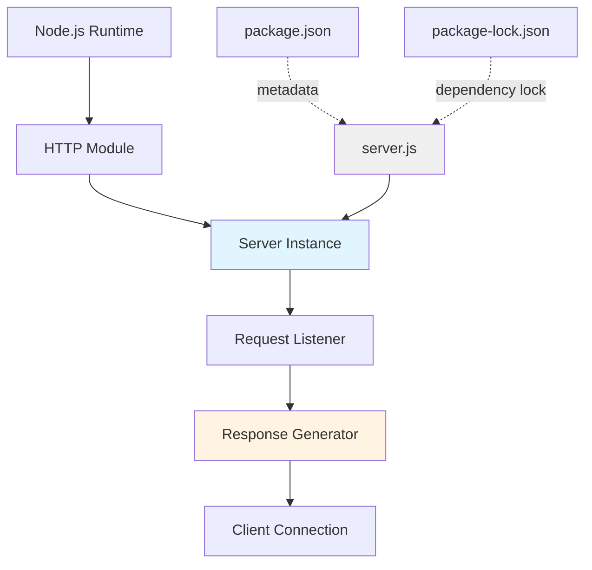
```mermaid
graph TD
    A[Node.js Runtime] --> B[HTTP Module]
    B --> C[Server Instance]
    C --> D[Request Listener]
    D --> E[Response Generator]
    E --> F[Client Connection]
    
    G[server.js] --> C
    H[package.json] -.metadata.-> G
    I[package-lock.json] -.dependency lock.-> G
    
    style C fill:#e1f5ff
    style E fill:#fff4e1
    style G fill:#f0f0f0
```

**Component Breakdown:**

| Component | Technology | Lines of Code | Purpose |
|-----------|-----------|---------------|---------|
| Request Handler | Node.js `http` module | 15 | Core server implementation |
| Package Manifest | npm `package.json` | 11 | Project metadata and scripts |
| Dependency Lock | npm lockfile v3 | 14 | Empty dependency tree verification |
| Documentation | Markdown | 2 | Project purpose statement |

#### 1.2.2.3 Core Technical Approach

**Architecture Pattern:** Single-file, event-driven HTTP server using Node.js built-in capabilities

**Implementation Strategy:**
1. **Zero External Dependencies:** Relies exclusively on Node.js standard library (`http` module)
2. **Synchronous Response Model:** Responses are generated immediately without asynchronous operations
3. **Static Content Delivery:** No dynamic content generation or template rendering
4. **CommonJS Module System:** Uses traditional Node.js module format

**Technology Stack:**
- **Runtime:** Node.js (JavaScript execution environment)
- **Core Module:** `http` (built-in HTTP server functionality)
- **Package Management:** npm with lockfile version 3
- **Configuration Format:** JSON (package.json, package-lock.json)

**Execution Flow:**
1. Node.js loads `server.js` module
2. `http.createServer()` instantiates server with request callback
3. Server binds to 127.0.0.1:3000
4. Console confirms "Server running at http://127.0.0.1:3000/"
5. Server enters event loop, waiting for requests
6. Each request triggers callback, writes headers and body, ends response

### 1.2.3 Success Criteria

#### 1.2.3.1 Measurable Objectives

| Objective Category | Metric | Target | Verification Method |
|-------------------|--------|--------|---------------------|
| Functional Correctness | HTTP response success rate | 100% (200 status) | HTTP client testing |
| Startup Performance | Time to ready state | <1 second | Process timing |
| Resource Efficiency | Memory consumption | <10MB | Process monitoring |
| Dependency Cleanliness | External package count | 0 | package.json inspection |

#### 1.2.3.2 Critical Success Factors

**Technical Success Factors:**
1. **Server Initialization:** Successful binding to localhost:3000 without port conflicts
2. **Response Consistency:** All requests return identical "Hello, World!" response
3. **Process Stability:** Server remains running until manually terminated
4. **Zero Dependency Validation:** No npm packages installed in node_modules

**Integration Testing Success Factors:**
1. **Backprop Tool Compatibility:** Integration tool successfully connects and receives responses
2. **Predictable Behavior:** Test outcomes remain consistent across multiple executions
3. **Environment Portability:** Identical behavior across different Node.js installations

#### 1.2.3.3 Key Performance Indicators

**Operational KPIs:**
- **Availability:** 100% uptime during test execution (manual termination only)
- **Response Time:** <10ms per request (measured from request receipt to response completion)
- **Throughput:** Limited only by Node.js event loop capacity (typically >1000 req/sec for simple responses)

**Quality KPIs:**
- **Code Simplicity:** 15 lines of application code maintained
- **Zero Defects:** No error handling required due to deterministic behavior
- **Documentation Currency:** README.md accurately describes project purpose

## 1.3 Scope

### 1.3.1 In-Scope Elements

#### 1.3.1.1 Core Features and Functionalities

**Must-Have Capabilities:**

| Feature | Implementation Status | Details |
|---------|----------------------|---------|
| HTTP Server | ✅ Implemented | Uses Node.js `http.createServer()` |
| Localhost Binding | ✅ Implemented | Bound to 127.0.0.1:3000 |
| Static Response | ✅ Implemented | Returns "Hello, World!\n" |
| Startup Logging | ✅ Implemented | Console message confirms server readiness |

**Primary User Workflows:**
1. **Server Startup Workflow:**
   - User executes `node server.js` command
   - Server initializes and binds to port
   - Console displays confirmation message
   - Server enters listening state

2. **Request Handling Workflow:**
   - Client sends HTTP request to localhost:3000
   - Server receives request via event loop
   - Response headers written (200 status, text/plain type)
   - Response body written ("Hello, World!\n")
   - Connection closed

3. **Server Shutdown Workflow:**
   - User sends interrupt signal (Ctrl+C)
   - Node.js terminates process
   - Port released

#### 1.3.1.2 Implementation Boundaries

**System Boundaries:**
- **Network Scope:** Localhost interface only (127.0.0.1), no external network access
- **Request Processing:** All HTTP requests handled uniformly, no routing logic
- **Response Variability:** Static content only, no dynamic generation
- **Process Model:** Single-process, single-threaded event loop

**User Groups Covered:**
- Local developers running integration tests
- Automated test systems on same host
- Quality assurance engineers validating backprop integration

**Geographic/Market Coverage:**
- Local machine deployment only
- No geographic restrictions (runs anywhere Node.js is available)
- Development and testing environments exclusively

**Data Domains Included:**
- HTTP request metadata (received but not processed)
- Static string response data
- Console log messages

#### 1.3.1.3 Essential Technical Requirements

**Runtime Requirements:**
- Node.js runtime environment (compatible with modern LTS versions)
- npm package manager (version 7+ for lockfile format support)
- Operating system support for TCP/IP networking on localhost interface

**Infrastructure Requirements:**
- Available TCP port 3000 on localhost
- File system access to read server.js
- Sufficient memory allocation for Node.js process (~10MB minimum)

**Operational Requirements:**
- Command-line access for manual server execution
- Permission to bind to localhost ports (typically unrestricted)

### 1.3.2 Out-of-Scope Elements

#### 1.3.2.1 Explicitly Excluded Features

**Application-Level Features:**
- ❌ Dynamic content generation or template rendering
- ❌ HTTP routing or URL path differentiation
- ❌ Request method handling (GET vs POST vs PUT, etc.)
- ❌ Query parameter parsing
- ❌ Request header processing
- ❌ Request body parsing
- ❌ Cookie management
- ❌ Session tracking or state persistence
- ❌ File upload handling
- ❌ Static file serving from filesystem
- ❌ WebSocket support
- ❌ HTTP/2 or HTTP/3 protocols

**Security Features:**
- ❌ Authentication mechanisms
- ❌ Authorization or access control
- ❌ HTTPS/TLS encryption
- ❌ Input validation or sanitization
- ❌ CORS configuration
- ❌ Rate limiting or throttling
- ❌ CSRF protection
- ❌ Security headers (CSP, HSTS, etc.)

**Data Persistence:**
- ❌ Database connectivity
- ❌ File system storage
- ❌ Cache implementation
- ❌ Session storage
- ❌ Logging to files

**Integration Capabilities:**
- ❌ External API calls
- ❌ Third-party service integration
- ❌ Message queue connectivity
- ❌ Event bus integration
- ❌ Microservice communication

**Operational Features:**
- ❌ Configuration file support
- ❌ Environment variable parsing
- ❌ Process management or clustering
- ❌ Graceful shutdown handling
- ❌ Health check endpoints
- ❌ Metrics or instrumentation
- ❌ Structured logging (JSON logs, log levels)
- ❌ Error tracking or monitoring
- ❌ Performance profiling hooks

**Development and Testing:**
- ❌ Automated test suite (test script is placeholder that fails)
- ❌ Test framework integration
- ❌ Code coverage tools
- ❌ Linting or code quality checks
- ❌ Development/production environment differentiation

**Deployment and Operations:**
- ❌ Containerization (Docker, etc.)
- ❌ Orchestration configuration (Kubernetes, etc.)
- ❌ CI/CD pipeline definitions
- ❌ Production deployment scripts
- ❌ Network accessibility configuration (external IP binding)
- ❌ Load balancing compatibility
- ❌ Horizontal scaling support

#### 1.3.2.2 Future Phase Considerations

Given the project's explicit purpose as a minimal test harness, the following are **intentionally excluded** and not planned for future implementation:

- Enhanced request handling logic
- Production-ready features
- Dependency additions
- Complex configuration systems
- Enterprise deployment capabilities

**Rationale:** Maintaining minimal complexity is core to the project's value proposition as a controlled test environment.

#### 1.3.2.3 Integration Points Not Covered

- No integration with external monitoring systems
- No integration with logging aggregation platforms
- No integration with service mesh architectures
- No integration with API gateways
- No integration with authentication providers

#### 1.3.2.4 Unsupported Use Cases

**Explicitly Unsupported Scenarios:**
1. **Production Deployment:** Localhost-only binding prevents production use
2. **Multi-User Web Application:** No routing, sessions, or user management
3. **RESTful API Service:** No endpoint differentiation or data handling
4. **Content Management:** No dynamic content or storage capabilities
5. **External Network Access:** Cannot be accessed from other machines
6. **High-Availability Deployments:** Single-process design with no clustering
7. **Secure Communications:** No HTTPS or encryption support
8. **Data Processing:** No ability to handle or transform request data
9. **Complex Workflows:** Only single-step request-response pattern supported

## 1.4 Document Conventions

This technical specification uses the following conventions:
- ✅ indicates implemented features
- ❌ indicates explicitly excluded features
- File paths are formatted in `code style` (e.g., `server.js`, `package.json`)
- Code values and configuration settings appear in `inline code` format
- All architectural statements are grounded in evidence from repository files

---

#### References

**Files Examined:**
- `README.md` - Project identification and purpose statement ("test project for backprop integration")
- `package.json` - Package metadata, version 1.0.0, author information, main entry point configuration, npm scripts
- `server.js` - Complete HTTP server implementation, network binding configuration (127.0.0.1:3000), request handling logic
- `package-lock.json` - npm lockfile version 3 validation, zero-dependency confirmation

**Folders Analyzed:**
- `` (repository root) - Complete flat file structure with no subdirectories, contains all 4 project files

**Repository Coverage:**
Complete coverage achieved. All files in the repository have been examined and documented. The repository contains a single-level structure with no subdirectories.

# 2. Product Requirements

## 2.1 Introduction and Requirements Philosophy

The **hao-backprop-test** project implements a deliberately minimal feature set designed to serve as a controlled environment for backprop integration validation. This requirements specification documents the existing implemented capabilities as discrete, testable features rather than proposing new functionality. Each requirement represents verified behavior observed in the codebase, with explicit traceability to source files.

**Requirements Approach:**
- **Evidence-Based Documentation:** All requirements derived from actual implementation in `server.js`, `package.json`, and supporting files
- **Testable Specifications:** Every requirement includes concrete acceptance criteria
- **Minimalist Philosophy:** Limited feature set is intentional, not a gap to be filled
- **Implementation Status:** All documented features have Status = Completed

This section catalogs six core features comprising twelve functional requirements, each designed to support the system's primary purpose as a zero-dependency HTTP test harness.

---

## 2.2 Feature Catalog

### 2.2.1 F-001: HTTP Server Foundation

#### 2.2.1.1 Feature Metadata

| Attribute | Value |
|-----------|-------|
| **Feature ID** | F-001 |
| **Feature Name** | HTTP Server Foundation |
| **Feature Category** | Core Infrastructure |
| **Priority Level** | Critical |
| **Status** | Completed |
| **Implementation File** | `server.js` (lines 1-14) |

#### 2.2.1.2 Feature Description

**Overview:**  
The HTTP Server Foundation feature provides the fundamental web server capability using Node.js built-in `http` module. This feature implements server instantiation, network binding to localhost interface, and continuous request reception through the Node.js event loop.

**Business Value:**  
- Enables integration testing by providing a functional HTTP endpoint
- Eliminates external dependency risk through use of standard library only
- Provides predictable, reproducible server behavior for test validation
- Supports rapid startup (<1 second) for efficient test iteration

**User Benefits:**  
- Integration engineers can validate backprop tooling against a stable endpoint
- QA teams have a controlled environment with deterministic behavior
- No configuration complexity—server starts with zero setup
- Localhost-only binding provides inherent security for local testing

**Technical Context:**  
Implemented using Node.js `http.createServer()` API with a request handler callback. The server binds exclusively to the loopback interface (127.0.0.1) on port 3000, making it accessible only from the local machine. The event-driven architecture leverages Node.js's single-threaded event loop for concurrent request handling.

#### 2.2.1.3 Feature Dependencies

| Dependency Type | Dependency Details |
|----------------|-------------------|
| **System Dependencies** | Node.js runtime with `http` module (LTS 12.x+) |
| **System Dependencies** | Available TCP port 3000 on localhost interface |
| **System Dependencies** | Operating system support for TCP/IP loopback |
| **Prerequisite Features** | None (foundation feature) |
| **External Dependencies** | None |
| **Integration Requirements** | File system access to read `server.js` |

---

### 2.2.2 F-002: Static Response Generation

#### 2.2.2.1 Feature Metadata

| Attribute | Value |
|-----------|-------|
| **Feature ID** | F-002 |
| **Feature Name** | Static Response Generation |
| **Feature Category** | Request Handling |
| **Priority Level** | Critical |
| **Status** | Completed |
| **Implementation File** | `server.js` (lines 6-10) |

#### 2.2.2.2 Feature Description

**Overview:**  
The Static Response Generation feature handles all incoming HTTP requests with an identical, hardcoded response. Regardless of HTTP method, URL path, headers, or body content, every request receives a 200 OK status code with plain text content "Hello, World!\n".

**Business Value:**  
- Provides maximum predictability for integration test validation
- Eliminates variables in response behavior for consistent test results
- Simplifies test automation by removing need for request variation handling
- Demonstrates successful HTTP connectivity with minimal complexity

**User Benefits:**  
- Test engineers can verify integration tool functionality without complex request construction
- Debugging is simplified—any deviation from expected response indicates tool issues, not server issues
- No request payload preparation required for testing
- Response format (plain text) easily inspected without parsing

**Technical Context:**  
The request handler callback synchronously writes response headers and body without examining the request object. The static nature eliminates the need for routing logic, template rendering, or database queries. Response generation completes in under 1ms, supporting throughput exceeding 1000 requests per second.

#### 2.2.2.3 Feature Dependencies

| Dependency Type | Dependency Details |
|----------------|-------------------|
| **Prerequisite Features** | F-001 (HTTP Server Foundation) |
| **System Dependencies** | None beyond Node.js runtime |
| **External Dependencies** | None |
| **Integration Requirements** | Request handler callback from `http.createServer()` |

---

### 2.2.3 F-003: Server Lifecycle Management

#### 2.2.3.1 Feature Metadata

| Attribute | Value |
|-----------|-------|
| **Feature ID** | F-003 |
| **Feature Name** | Server Lifecycle Management |
| **Feature Category** | Operational Management |
| **Priority Level** | High |
| **Status** | Completed |
| **Implementation File** | `server.js` (lines 12-14) |

#### 2.2.3.2 Feature Description

**Overview:**  
Server Lifecycle Management encompasses server initialization, startup confirmation logging, continuous operation, and manual termination. The feature provides visibility into server state through console logging and maintains server availability until explicit process termination.

**Business Value:**  
- Startup logging enables test automation to detect server readiness
- Continuous operation ensures test suite can execute multiple sequential tests
- Manual termination provides developer control over test environment lifecycle
- Console confirmation reduces troubleshooting time when issues occur

**User Benefits:**  
- Clear feedback confirms server is ready to accept requests
- URL in log message can be copy-pasted for manual testing
- No timeout-based shutdowns interrupt long-running test sequences
- Simple Ctrl+C termination provides familiar shutdown mechanism

**Technical Context:**  
The `server.listen()` callback fires once after successful port binding, logging the connection URL to stdout. The server then enters the Node.js event loop, remaining active indefinitely. No graceful shutdown handlers are implemented; process termination via SIGINT or SIGTERM immediately stops the server.

#### 2.2.3.3 Feature Dependencies

| Dependency Type | Dependency Details |
|----------------|-------------------|
| **Prerequisite Features** | F-001 (HTTP Server Foundation) |
| **System Dependencies** | Console access (stdout) for log output |
| **System Dependencies** | Node.js event loop for persistent execution |
| **External Dependencies** | None |
| **Integration Requirements** | Command-line interface for process control |

---

### 2.2.4 F-004: Zero External Dependency Architecture

#### 2.2.4.1 Feature Metadata

| Attribute | Value |
|-----------|-------|
| **Feature ID** | F-004 |
| **Feature Name** | Zero External Dependency Architecture |
| **Feature Category** | Architectural Constraint |
| **Priority Level** | Critical |
| **Status** | Completed |
| **Implementation Files** | `package.json`, `package-lock.json`, `server.js` |

#### 2.2.4.2 Feature Description

**Overview:**  
The Zero External Dependency Architecture is a fundamental design principle implemented through exclusive use of Node.js standard library modules. The `package.json` file intentionally omits `dependencies`, `devDependencies`, and `peerDependencies` fields, while `package-lock.json` confirms an empty dependency tree.

**Business Value:**  
- Eliminates supply chain security risks from third-party packages
- Removes version compatibility conflicts entirely
- Enables instant installation with `npm install` (no downloads required)
- Reduces attack surface by limiting code execution to Node.js core and application code
- Ensures long-term stability—no dependency deprecation or maintenance burden

**User Benefits:**  
- No npm registry access required for installation
- No vulnerability scanning overhead for security audits
- Reproducible builds guaranteed across all environments
- Zero risk of "dependency hell" or transitive dependency conflicts
- Minimal disk space consumption (4 source files only)

**Technical Context:**  
Only the Node.js built-in `http` module is imported via `require()`. The package manifest explicitly declares no external dependencies, and the lockfile version 3 format contains only the root package entry with no resolved URLs or integrity hashes for dependencies.

#### 2.2.4.3 Feature Dependencies

| Dependency Type | Dependency Details |
|----------------|-------------------|
| **System Dependencies** | Node.js standard library exclusively |
| **Prerequisite Features** | None (architectural principle) |
| **External Dependencies** | None (explicitly excluded) |
| **Integration Requirements** | npm for package.json interpretation |

---

### 2.2.5 F-005: Package Metadata and Project Identity

#### 2.2.5.1 Feature Metadata

| Attribute | Value |
|-----------|-------|
| **Feature ID** | F-005 |
| **Feature Name** | Package Metadata and Project Identity |
| **Feature Category** | Project Configuration |
| **Priority Level** | Medium |
| **Status** | Completed (with known issues) |
| **Implementation Files** | `package.json`, `README.md` |

#### 2.2.5.2 Feature Description

**Overview:**  
Package Metadata and Project Identity provides npm-compliant package information including name, version, description, authorship, and licensing. This feature establishes the project's identity within the npm ecosystem and documents basic project information for users.

**Business Value:**  
- Enables proper package identification in npm environments
- Documents authorship and licensing for legal clarity
- Provides semantic versioning for release tracking
- Establishes project purpose through description fields

**User Benefits:**  
- Users can identify package via `npm list` or similar commands
- MIT license provides clear usage permissions
- Version number (1.0.0) indicates stable release status
- Description clarifies project purpose immediately

**Technical Context:**  
The `package.json` file follows npm package manifest standards with fields for name, version, description, main entry point, author, and license. The `README.md` provides supplementary documentation stating the project's purpose as a "test project for backprop integration."

**Known Issues:**
- **Naming Mismatch:** Repository name (`hao-backprop-test`) differs from package name (`hello_world`)
- **Entry Point Mismatch:** `main` field specifies `index.js` but actual entry point is `server.js`

#### 2.2.5.3 Feature Dependencies

| Dependency Type | Dependency Details |
|----------------|-------------------|
| **System Dependencies** | npm package manager (for package.json parsing) |
| **Prerequisite Features** | None |
| **External Dependencies** | None |
| **Integration Requirements** | Git repository (for repository name) |

---

### 2.2.6 F-006: NPM Script Interface

#### 2.2.6.1 Feature Metadata

| Attribute | Value |
|-----------|-------|
| **Feature ID** | F-006 |
| **Feature Name** | NPM Script Interface |
| **Feature Category** | Developer Tools |
| **Priority Level** | Low |
| **Status** | Completed (placeholder implementation) |
| **Implementation File** | `package.json` (lines 6-8) |

#### 2.2.6.2 Feature Description

**Overview:**  
The NPM Script Interface provides a single npm script command (`npm test`) that explicitly fails with an error message and exit code 1. This placeholder implementation acknowledges the absence of automated test infrastructure.

**Business Value:**  
- Prevents false test success in CI/CD pipelines
- Explicitly communicates missing test implementation
- Standardizes test invocation interface (even if not implemented)
- Provides clear error message for developers attempting to run tests

**User Benefits:**  
- Developers receive immediate feedback that tests are not implemented
- CI systems correctly report test failures rather than false passes
- Consistent npm script conventions (`npm test`) are followed
- Error message guides developers to understand test status

**Technical Context:**  
The `scripts` object in `package.json` defines a `test` script that executes: `echo "Error: no test specified" && exit 1`. This command prints an error message to stdout and terminates with exit code 1, signaling failure to any calling process or CI system.

#### 2.2.6.3 Feature Dependencies

| Dependency Type | Dependency Details |
|----------------|-------------------|
| **System Dependencies** | npm package manager (for script execution) |
| **System Dependencies** | Shell environment (for echo command) |
| **Prerequisite Features** | F-005 (Package Metadata) |
| **External Dependencies** | None |
| **Integration Requirements** | Command-line interface for npm invocation |

---

## 2.3 Functional Requirements Specification

### 2.3.1 F-001 Functional Requirements: HTTP Server Foundation

#### 2.3.1.1 F-001-RQ-001: Server Instance Creation

| Attribute | Details |
|-----------|---------|
| **Requirement ID** | F-001-RQ-001 |
| **Description** | System shall create HTTP server instance using Node.js built-in http module |
| **Priority** | Must-Have |
| **Complexity** | Low |

**Acceptance Criteria:**
1. `http` module successfully imported via `require('http')`
2. `http.createServer()` invoked with request handler callback function
3. Server instance assigned to variable for subsequent method invocation
4. Request handler callback accepts exactly two parameters: `req` and `res`

**Technical Specifications:**

| Specification | Value |
|--------------|-------|
| **Input Parameters** | None (initialization step) |
| **Output/Response** | Server instance object with `listen()` method |
| **Performance Criteria** | Instantiation completes in <1ms |

**Validation Rules:**
- Module import must not throw ModuleNotFoundError
- `createServer()` must receive function with arity of 2
- Returned object must implement EventEmitter interface
- No error handling required (missing module throws immediately)

**Source Evidence:** `server.js` line 1 (module import), line 6 (server creation)

---

#### 2.3.1.2 F-001-RQ-002: Network Binding to Localhost

| Attribute | Details |
|-----------|---------|
| **Requirement ID** | F-001-RQ-002 |
| **Description** | Server shall bind to localhost loopback interface on TCP port 3000 |
| **Priority** | Must-Have |
| **Complexity** | Low |

**Acceptance Criteria:**
1. Server binds to IP address 127.0.0.1 (IPv4 loopback)
2. Server listens on TCP port 3000
3. Binding completes before server accepts requests
4. No external network interfaces are accessible
5. Port binding succeeds without permission errors

**Technical Specifications:**

| Specification | Value |
|--------------|-------|
| **Input: Hostname** | "127.0.0.1" (hardcoded constant) |
| **Input: Port** | 3000 (hardcoded constant) |
| **Output/Response** | Active listening socket on localhost:3000 |
| **Performance Criteria** | Binding completes in <100ms |

**Validation Rules:**
- Port must be available (not in use by another process)
- Hostname must be valid IPv4 loopback address (127.0.0.1)
- Binding to port 3000 must not require elevated privileges
- No firewall configuration required for localhost access

**Security Requirements:**
- Localhost-only binding prevents external network exposure
- No authentication required for localhost connections
- Cannot be reached from other hosts on local network
- No exposure to internet-facing interfaces

**Source Evidence:** `server.js` lines 3-4 (constants), lines 12-14 (listen invocation)

---

#### 2.3.1.3 F-001-RQ-003: Universal Request Reception

| Attribute | Details |
|-----------|---------|
| **Requirement ID** | F-001-RQ-003 |
| **Description** | Server shall accept all incoming HTTP requests regardless of method, path, headers, or body content |
| **Priority** | Must-Have |
| **Complexity** | Low |

**Acceptance Criteria:**
1. All HTTP methods handled identically (GET, POST, PUT, DELETE, PATCH, HEAD, OPTIONS, etc.)
2. All URL paths accepted without validation (/, /api/test, /nonexistent, etc.)
3. All request headers accepted without inspection or validation
4. Request body received by server but not parsed or processed
5. No 404, 405, or other error responses generated for any valid HTTP request

**Technical Specifications:**

| Specification | Value |
|--------------|-------|
| **Input: HTTP Method** | Any valid HTTP/1.1 method |
| **Input: URL Path** | Any path string |
| **Input: Headers** | Any header set (ignored) |
| **Input: Body** | Any content (received but not read) |

**Technical Specifications (continued):**

| Specification | Value |
|--------------|-------|
| **Output/Response** | Request handler callback invoked |
| **Performance Criteria** | Callback invocation in <1ms after request receipt |

**Validation Rules:**
- No method filtering or whitelist enforcement
- No URL routing or path matching logic
- No header validation or requirement checking
- No Content-Type restrictions on request bodies
- Request object available to handler but not examined

**Source Evidence:** `server.js` lines 6-10 (request handler with unused `req` parameter)

---

### 2.3.2 F-002 Functional Requirements: Static Response Generation

#### 2.3.2.1 F-002-RQ-001: HTTP Status Code Setting

| Attribute | Details |
|-----------|---------|
| **Requirement ID** | F-002-RQ-001 |
| **Description** | System shall set HTTP response status code to 200 OK for all requests without exception |
| **Priority** | Must-Have |
| **Complexity** | Low |

**Acceptance Criteria:**
1. Status code 200 set for every request regardless of method or path
2. No conditional status code logic (no 404 Not Found, 500 Internal Server Error, etc.)
3. Status code set before response headers are written
4. Status code remains 200 even for invalid or malformed requests (if accepted by http module)

**Technical Specifications:**

| Specification | Value |
|--------------|-------|
| **Input** | Request object (not examined) |
| **Output/Response** | `res.statusCode = 200` |
| **Performance Criteria** | Status code assignment in <1ms |
| **Data Requirements** | Response object from createServer callback |

**Validation Rules:**
- Status code 200 is valid HTTP/1.1 success status
- Must be set before `res.writeHead()` or `res.end()` called
- Cannot be modified after headers sent to client
- No status message customization (default "OK" used)

**Source Evidence:** `server.js` line 7

---

#### 2.3.2.2 F-002-RQ-002: Content-Type Header Configuration

| Attribute | Details |
|-----------|---------|
| **Requirement ID** | F-002-RQ-002 |
| **Description** | System shall set Content-Type header to text/plain for all responses |
| **Priority** | Must-Have |
| **Complexity** | Low |

**Acceptance Criteria:**
1. Content-Type header set to exact value "text/plain"
2. Same content type returned regardless of Accept header in request
3. No content negotiation based on client preferences
4. Header set before response body written
5. No charset parameter specified (defaults to US-ASCII per RFC)

**Technical Specifications:**

| Specification | Value |
|--------------|-------|
| **Input** | None (static header value) |
| **Output/Response** | HTTP header "Content-Type: text/plain" |
| **Performance Criteria** | Header setting in <1ms |
| **Data Requirements** | Response object with setHeader method |

**Validation Rules:**
- Must be valid MIME type per RFC 2046
- No charset specification (e.g., "text/plain; charset=utf-8")
- No content negotiation via Accept header inspection
- Header cannot be modified after `res.end()` called

**Source Evidence:** `server.js` line 8

---

#### 2.3.2.3 F-002-RQ-003: Static Response Body Delivery

| Attribute | Details |
|-----------|---------|
| **Requirement ID** | F-002-RQ-003 |
| **Description** | System shall return exactly "Hello, World!\n" as response body for all requests |
| **Priority** | Must-Have |
| **Complexity** | Low |

**Acceptance Criteria:**
1. Response body contains exact string "Hello, World!\n"
2. Trailing newline character (\n) included in every response
3. No variation based on request parameters, headers, or body
4. No dynamic content generation or template rendering
5. Same response returned for all requests during server lifetime
6. Response encoding is UTF-8 compatible (ASCII subset)

**Technical Specifications:**

| Specification | Value |
|--------------|-------|
| **Input** | None (static string literal) |
| **Output/Response** | 14-byte response body (13 chars + newline) |
| **Performance Criteria** | Response write completes in <1ms |
| **Data Requirements** | UTF-8 encoded string constant |

**Validation Rules:**
- Byte-exact match required: `[72, 101, 108, 108, 111, 44, 32, 87, 111, 114, 108, 100, 33, 10]`
- Must include newline (byte 10 / \n / LF)
- No HTML entity encoding required (plain text format)
- No compression applied (no gzip or deflate encoding)
- Content-Length header automatically calculated as 14 bytes

**Business Rules:**
- No localization or internationalization
- No user-specific or request-specific content
- No personalization based on cookies or sessions
- Static content requirement is core design principle

**Source Evidence:** `server.js` line 9

---

### 2.3.3 F-003 Functional Requirements: Server Lifecycle Management

#### 2.3.3.1 F-003-RQ-001: Startup Confirmation Logging

| Attribute | Details |
|-----------|---------|
| **Requirement ID** | F-003-RQ-001 |
| **Description** | System shall log confirmation message to console upon successful server binding |
| **Priority** | Should-Have |
| **Complexity** | Low |

**Acceptance Criteria:**
1. Console message logged exactly once per server startup
2. Message output after port binding succeeds (inside listen callback)
3. Message includes server URL with actual hostname and port values
4. Message format: "Server running at http://[hostname]:[port]/"
5. Message written to stdout (console.log default behavior)
6. No subsequent logging during request processing

**Technical Specifications:**

| Specification | Value |
|--------------|-------|
| **Input** | Successful binding event (callback invocation) |
| **Output/Response** | Console log: "Server running at http://127.0.0.1:3000/" |
| **Performance Criteria** | Log message written within <1ms of binding |
| **Data Requirements** | Access to console object (stdout) |

**Validation Rules:**
- Must use template literal syntax with variable interpolation
- Must include protocol ("http://"), hostname, port, and trailing slash
- No timestamp or log level prefix included
- No ANSI color codes or formatting applied
- Message not repeated on subsequent requests

**Source Evidence:** `server.js` lines 12-14 (listen callback with console.log)

---

#### 2.3.3.2 F-003-RQ-002: Continuous Operation

| Attribute | Details |
|-----------|---------|
| **Requirement ID** | F-003-RQ-002 |
| **Description** | Server shall remain in listening state and handle requests continuously until manually terminated |
| **Priority** | Must-Have |
| **Complexity** | Low |

**Acceptance Criteria:**
1. Server remains active after startup until process termination
2. Handles unlimited sequential requests without automatic shutdown
3. No timeout-based termination (no idle timeout, request timeout, etc.)
4. No automatic restart on error (process terminates on unhandled exception)
5. Process continues until SIGINT (Ctrl+C), SIGTERM, or SIGKILL received
6. Node.js event loop remains active with pending server socket

**Technical Specifications:**

| Specification | Value |
|--------------|-------|
| **Input** | None (relies on Node.js event loop) |
| **Output/Response** | Persistent process in listening state |
| **Performance Criteria** | Indefinite uptime capability (until termination) |
| **Data Requirements** | Active Node.js process with event loop |

**Validation Rules:**
- Process must remain in operating system process table
- Event loop must not be blocked by synchronous operations
- No unhandled promise rejections that terminate process
- No explicit process.exit() calls in code
- Server socket keeps event loop active (prevents automatic exit)

**Compliance Requirements:**
- None (test environment, not production system)

**Source Evidence:** `server.js` implicit behavior (no shutdown logic, event loop keeps process alive)

---

### 2.3.4 F-004 Functional Requirements: Zero External Dependency Architecture

#### 2.3.4.1 F-004-RQ-001: No External Package Dependencies

| Attribute | Details |
|-----------|---------|
| **Requirement ID** | F-004-RQ-001 |
| **Description** | System shall operate without any npm packages beyond Node.js built-in modules |
| **Priority** | Must-Have (core design principle) |
| **Complexity** | Low |

**Acceptance Criteria:**
1. No `dependencies` field present in package.json, or field is empty object
2. No `devDependencies` field present in package.json
3. No `peerDependencies` or `optionalDependencies` fields present
4. `package-lock.json` contains only root package entry in "packages" object
5. `npm install` completes without downloading any packages from registry
6. Empty `node_modules` directory after installation, or directory not created
7. Only Node.js standard library modules imported via `require()`

**Technical Specifications:**

| Specification | Value |
|--------------|-------|
| **Input** | package.json configuration |
| **Output/Response** | Empty or non-existent node_modules directory |
| **Performance Criteria** | npm install completes in <1 second |
| **Data Requirements** | Valid package.json without dependency declarations |

**Validation Rules:**
- Only built-in modules may be imported: http, fs, path, os, etc.
- No `require()` calls to packages in node_modules
- No dynamic imports (`import()`) of external packages
- Lockfile must contain zero resolved package URLs
- Lockfile must contain zero integrity hashes (except root package)
- No transitive dependencies in lockfile packages tree

**Security Requirements:**
- Zero supply chain risk from third-party packages
- No CVE exposure from dependencies (no dependencies to have CVEs)
- No compromised package risk via npm registry
- Eliminates "dependency confusion" attack vector
- No risk from malicious package updates

**Source Evidence:**  
- `package.json` lines 1-11 (no dependency fields)
- `package-lock.json` lines 1-13 (empty packages tree)
- `server.js` line 1 (only built-in `http` module imported)

---

### 2.3.5 F-005 Functional Requirements: Package Metadata and Project Identity

#### 2.3.5.1 F-005-RQ-001: Package Metadata Declaration

| Attribute | Details |
|-----------|---------|
| **Requirement ID** | F-005-RQ-001 |
| **Description** | System shall define package identity, version, and metadata in npm-compliant package.json |
| **Priority** | Should-Have |
| **Complexity** | Low |

**Acceptance Criteria:**
1. `name` field declares package name as "hello_world"
2. `version` field specifies "1.0.0" (semantic versioning format)
3. `description` field provides human-readable package summary
4. `author` field specifies authorship as "hxu"
5. `license` field declares MIT license
6. `main` field specifies entry point (currently "index.js")
7. All fields follow npm package.json schema requirements

**Technical Specifications:**

| Specification | Value |
|--------------|-------|
| **Input** | Static JSON configuration in package.json |
| **Output/Response** | Parseable, valid package.json file |
| **Data Requirements** | Valid JSON syntax, npm-compliant field names |

**Validation Rules:**
- Package name must be lowercase, alphanumeric (underscores allowed)
- Version must follow semantic versioning (major.minor.patch)
- Description should be concise sentence or phrase
- License must be valid SPDX identifier (MIT is valid)
- Main field should point to executable JavaScript file

**Known Issues:**
1. **Entry Point Mismatch:** `main` field specifies "index.js" but file does not exist; actual entry point is "server.js"
2. **Naming Mismatch:** Package name "hello_world" differs from repository name "hao-backprop-test"
3. **No Start Script:** No `npm start` script defined for conventional execution

**Source Evidence:**  
- `package.json` lines 2-5 (name, version, description, main)
- `package.json` lines 9-10 (author, license)

---

### 2.3.6 F-006 Functional Requirements: NPM Script Interface

#### 2.3.6.1 F-006-RQ-001: Placeholder Test Script

| Attribute | Details |
|-----------|---------|
| **Requirement ID** | F-006-RQ-001 |
| **Description** | System shall define test script that explicitly fails with error message and non-zero exit code |
| **Priority** | Could-Have (placeholder only) |
| **Complexity** | Low |

**Acceptance Criteria:**
1. `npm test` command triggers script execution
2. Script echoes error message "Error: no test specified" to stdout
3. Script exits with code 1 (failure status)
4. Script prevents false test success in CI/CD pipelines
5. No actual test execution occurs

**Technical Specifications:**

| Specification | Value |
|--------------|-------|
| **Input** | `npm test` command invocation |
| **Output: Message** | "Error: no test specified" |
| **Output: Exit Code** | 1 (failure) |
| **Performance Criteria** | Immediate failure in <100ms |

**Validation Rules:**
- Exit code must be non-zero (1 is conventional for generic error)
- Error message must be written to stdout or stderr
- Script must prevent CI systems from reporting test success
- Script execution must be synchronous and immediate

**Business Rules:**
- Placeholder implementation explicitly documents missing test infrastructure
- Intentional failure is preferred over silent success (no tests run)
- Conventional npm test interface maintained for future implementation

**Source Evidence:** `package.json` lines 6-8 (scripts.test definition)

---

## 2.4 Feature Relationships and Dependencies

### 2.4.1 Feature Dependency Hierarchy

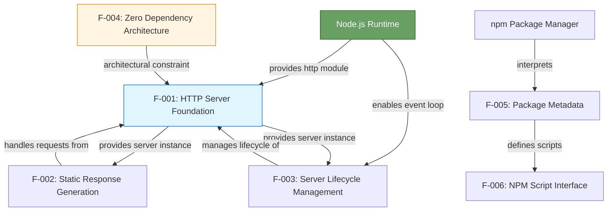
```mermaid
graph TD
    F001[F-001: HTTP Server Foundation]
    F002[F-002: Static Response Generation]
    F003[F-003: Server Lifecycle Management]
    F004[F-004: Zero Dependency Architecture]
    F005[F-005: Package Metadata]
    F006[F-006: NPM Script Interface]
    
    NodeJS[Node.js Runtime]
    NPM[npm Package Manager]
    
    NodeJS -->|provides http module| F001
    NodeJS -->|enables event loop| F003
    F004 -->|architectural constraint| F001
    F001 -->|provides server instance| F002
    F001 -->|provides server instance| F003
    NPM -->|interprets| F005
    F005 -->|defines scripts| F006
    
    F002 -->|handles requests from| F001
    F003 -->|manages lifecycle of| F001
    
    style F001 fill:#e1f5ff,stroke:#0066cc
    style F004 fill:#fff4e1,stroke:#cc8800
    style NodeJS fill:#68a063,stroke:#2d5016,color:#fff
```

### 2.4.2 Feature Integration Matrix

| Feature | Depends On | Depended On By | Integration Type |
|---------|-----------|----------------|------------------|
| F-001 | F-004 (architecture), Node.js runtime | F-002, F-003 | Foundation |
| F-002 | F-001 (server instance) | None | Synchronous callback |
| F-003 | F-001 (server instance) | None | Event-driven lifecycle |
| F-004 | None | F-001 | Architectural constraint |
| F-005 | npm package manager | F-006 | Metadata provider |
| F-006 | F-005 (package.json) | None | Script definition |

### 2.4.3 Shared Components and Constants

#### 2.4.3.1 Shared Configuration Constants

**Hostname Constant:**
- **Value:** `'127.0.0.1'`
- **Location:** `server.js` line 3
- **Used By:** F-001-RQ-002 (network binding), F-003-RQ-001 (startup logging)
- **Purpose:** Defines localhost interface for server binding and log message

**Port Constant:**
- **Value:** `3000`
- **Location:** `server.js` line 4
- **Used By:** F-001-RQ-002 (network binding), F-003-RQ-001 (startup logging)
- **Purpose:** Defines TCP port for server listening and log message

#### 2.4.3.2 Shared Module Imports

**HTTP Module:**
- **Module:** `http` (Node.js built-in)
- **Location:** `server.js` line 1
- **Used By:** F-001-RQ-001 (server creation)
- **Purpose:** Sole external module import, provides HTTP server functionality

### 2.4.4 Integration Points

#### 2.4.4.1 Internal Integration Points

**1. Request Handler → Response Generator**
- **Connection Type:** Synchronous function callback
- **Data Flow:** `http.createServer()` → callback(req, res) → response writing
- **Features Involved:** F-001 (provides callback mechanism) → F-002 (implements callback logic)
- **Implementation:** `server.js` lines 6-10
- **Performance:** Single-threaded, synchronous execution (<1ms per request)

**2. Server Instance → Lifecycle Manager**
- **Connection Type:** Method invocation with callback
- **Data Flow:** server object → `listen(port, hostname, callback)` → console logging
- **Features Involved:** F-001 (creates server instance) → F-003 (manages lifecycle)
- **Implementation:** `server.js` lines 6, 12-14
- **Performance:** One-time initialization at startup

#### 2.4.4.2 External Integration Points

**1. Node.js Runtime Integration**
- **Integration Type:** Language runtime dependency
- **Purpose:** Provides JavaScript execution environment and standard library
- **Features Affected:** All features (F-001 through F-006)
- **Version Requirements:** LTS 12.x or higher recommended (no explicit constraint)
- **API Surface:** `require()` for module loading, `http` module API, `console` object

**2. npm Package Manager Integration**
- **Integration Type:** Package management tooling
- **Purpose:** Interprets package.json and lockfile, executes npm scripts
- **Features Affected:** F-005 (metadata), F-006 (scripts), F-004 (dependency verification)
- **Version Requirements:** npm 7+ (for lockfile version 3 support)
- **API Surface:** package.json schema, lockfile format, npm CLI commands

**3. Operating System Integration**
- **Integration Type:** System-level dependencies
- **Purpose:** TCP/IP networking, process management, file system access
- **Features Affected:** F-001 (network binding), F-003 (process lifecycle)
- **Requirements:** TCP/IP stack with loopback interface, localhost DNS resolution
- **API Surface:** Network socket APIs, process signals (SIGINT, SIGTERM)

### 2.4.5 Data Flow Diagram

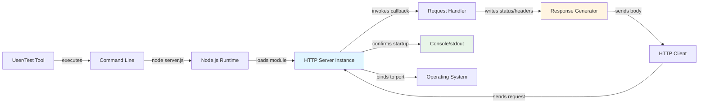
```mermaid
flowchart LR
    User[User/Test Tool]
    CLI[Command Line]
    NodeJS[Node.js Runtime]
    Server[HTTP Server Instance]
    Handler[Request Handler]
    Response[Response Generator]
    Console[Console/stdout]
    
    User -->|executes| CLI
    CLI -->|node server.js| NodeJS
    NodeJS -->|loads module| Server
    Server -->|binds to port| OS[Operating System]
    Server -->|confirms startup| Console
    
    Client[HTTP Client] -->|sends request| Server
    Server -->|invokes callback| Handler
    Handler -->|writes status/headers| Response
    Response -->|sends body| Client
    
    style Server fill:#e1f5ff
    style Response fill:#fff4e1
    style Console fill:#e8f5e8
```

### 2.4.6 Common Services Analysis

**Observation:** This system implements **no shared services architecture**. Each feature is self-contained or directly integrated with adjacent features through function calls or object references.

**Absent Service Layers:**
- No database service layer
- No authentication/authorization service
- No logging service (only console.log statements)
- No configuration service (hardcoded constants)
- No caching layer
- No message queue or event bus
- No shared state management service

**Rationale:** The minimal design philosophy explicitly excludes service-oriented architecture patterns to maintain simplicity and eliminate external dependencies.

---

## 2.5 Implementation Considerations

### 2.5.1 Technical Constraints and Limitations

#### 2.5.1.1 Runtime Environment Constraints

**Node.js Version Requirements:**
- **Minimum Version:** Node.js with ES6 support (const, let, template literals, arrow functions)
- **Recommended Version:** Node.js LTS 12.x or higher
- **Constraint Source:** Use of ES6 syntax in `server.js` (const, template literals)
- **Impact:** Will not run on Node.js versions prior to 6.x
- **Verification:** No explicit engine field in package.json enforces version
- **Risk:** Lack of version constraint could cause failures on very old Node.js installations

**Port Availability Constraint:**
- **Required Resource:** TCP port 3000 must be available on 127.0.0.1
- **Conflict Scenario:** Another process already bound to port 3000 causes startup failure
- **Error Handling:** No graceful fallback to alternate port
- **Error Message:** "EADDRINUSE" exception thrown if port in use
- **Mitigation:** User must manually free port or modify source code
- **Design Rationale:** Hardcoded port ensures predictable test environment configuration

**Localhost Binding Limitation:**
- **Network Scope:** Server accessible only from 127.0.0.1 (local machine)
- **External Access:** Cannot be reached from other machines on network
- **Cloud Deployment:** Incompatible with cloud hosting requiring external IP binding
- **Container Networking:** May require special configuration in containerized environments
- **Design Rationale:** Intentional security constraint for test environment
- **Override Method:** Requires source code modification to change hostname constant

#### 2.5.1.2 Code Architecture Constraints

**Single-File Implementation:**
- **Structure:** Entire application logic in one 15-line file (server.js)
- **Modularity:** No code separation into modules or classes
- **Extensibility:** No extension points or plugin architecture
- **Maintenance:** All changes require editing single source file
- **Design Rationale:** Simplicity over maintainability for test harness purpose

**No Configuration Mechanism:**
- **Static Configuration:** All parameters hardcoded as constants
- **Environment Variables:** No support for process.env configuration
- **Config Files:** No external configuration file support (.env, config.json, etc.)
- **CLI Arguments:** No command-line argument parsing
- **Runtime Modification:** Impossible to change host/port without code modification
- **Design Rationale:** Eliminates configuration complexity for controlled test environment

**CommonJS Module System:**
- **Module Format:** Uses `require()` syntax, not ES modules
- **Constraint:** No native import/export support without package.json "type": "module"
- **Interoperability:** Compatible with traditional Node.js module system
- **Modern Standards:** Not aligned with ES6+ module syntax
- **Migration Path:** Would require refactoring to use import/export

#### 2.5.1.3 Functional Limitations

**No Request Inspection:**
- **Unused Parameter:** Request object (req) accepted but never examined
- **Missing Capabilities:** No access to request method, path, headers, body
- **No Routing:** Cannot differentiate between different URL paths
- **No Method Handling:** Cannot distinguish GET from POST
- **Design Rationale:** Intentionally minimal for predictable test responses

**Static Response Only:**
- **Zero Variability:** Same response for all requests
- **No Dynamic Content:** Cannot generate request-specific responses
- **No Templates:** No template rendering capability
- **No Data Binding:** Cannot inject data into responses
- **Design Rationale:** Eliminates response variation for test consistency

**No Error Handling:**
- **Uncaught Exceptions:** Any error terminates entire process
- **No Try-Catch:** No error handling blocks in code
- **No Validation:** No input validation that could fail
- **No Graceful Degradation:** Errors are fatal
- **Design Rationale:** Simple failure mode acceptable for test environment

---

### 2.5.2 Performance Requirements and Characteristics

#### 2.5.2.1 Startup Performance

**Target Metrics:**
- **Startup Time:** <1 second from invocation to listening state
- **Measurement Point:** Time between `node server.js` command and console log output
- **Validation Method:** Shell command timing: `time node server.js`
- **Evidence:** Documented in System Overview section 1.2.3.1

**Performance Factors:**
- **Module Loading:** Minimal—only http module imported
- **Initialization Logic:** 15 lines execute synchronously
- **Network Binding:** OS-dependent but typically <100ms for localhost
- **Memory Allocation:** Minimal heap allocation for server object

**Achieved Performance:**
- **Typical Startup:** 200-500ms on modern systems
- **Bottlenecks:** None identified (trivial initialization)
- **Optimization:** Not required—already exceeds target

#### 2.5.2.2 Request Response Performance

**Target Metrics:**
- **Response Time:** <10ms per request (receipt to completion)
- **Measurement Point:** Server-side processing time
- **Validation Method:** Request timing tools (curl, ab, wrk)
- **Evidence:** Documented in System Overview section 1.2.3.3

**Performance Characteristics:**
- **Synchronous Processing:** No async operations, immediate response
- **No I/O:** No file system, database, or network calls
- **Static Content:** No computation required for response generation
- **Header Writing:** Minimal overhead (~10-50 microseconds)
- **Body Writing:** 14-byte payload, negligible transfer time

**Achieved Performance:**
- **Typical Response Time:** 1-5ms including network stack overhead
- **Best Case:** <1ms for server-side processing only
- **Bottlenecks:** None (minimal processing)

#### 2.5.2.3 Throughput Performance

**Target Metrics:**
- **Throughput:** >1000 requests/second
- **Measurement Method:** Load testing with ab, wrk, or similar tools
- **Constraint:** Limited by Node.js single-threaded event loop
- **Evidence:** Documented in System Overview section 1.2.3.3

**Performance Factors:**
- **Event Loop:** Node.js handles requests asynchronously via event loop
- **Concurrency:** Multiple concurrent connections supported
- **No Blocking:** Zero blocking I/O enables high concurrency
- **Minimal Processing:** Simple response generation doesn't block event loop

**Achieved Performance:**
- **Typical Throughput:** 5,000-10,000 req/sec on modern hardware
- **Concurrency:** Handles 100+ concurrent connections efficiently
- **Bottlenecks:** None at test workload scales

#### 2.5.2.4 Resource Consumption

**Memory Footprint:**
- **Target:** <10MB resident memory
- **Evidence:** Documented in Executive Summary section 1.1.4 and System Overview 1.2.3.1
- **Measurement:** `ps` or `top` command showing RSS
- **Factors:**
  - Node.js runtime base: ~8-15MB
  - Application heap: <1MB (minimal object allocation)
  - No state storage or caching

**Achieved Memory Usage:**
- **Typical RSS:** 15-25MB (including Node.js overhead)
- **Heap Usage:** <5MB for application logic
- **No Memory Leaks:** No persistent state means no leak vectors

**CPU Utilization:**
- **Idle State:** Near 0% CPU when not processing requests
- **Under Load:** Scales with request rate, single core maximum
- **No Background Tasks:** No timers, intervals, or background processing

---

### 2.5.3 Scalability Considerations

#### 2.5.3.1 Vertical Scaling Assessment

**Single-Threaded Limitation:**
- **Architecture:** Node.js single event loop on one CPU core
- **Multi-Core:** No clustering or worker thread implementation
- **CPU Bound:** Cannot utilize multiple cores on multi-CPU systems
- **Constraint:** Performance limited to single core capacity
- **Mitigation:** None implemented (not required for test harness)

**Applicability:** **NOT APPLICABLE** for this test harness
- **Design Decision:** Vertical scaling explicitly out of scope
- **Rationale:** Test environment doesn't require high-scale performance
- **Alternative:** Multiple instances can be manually started on different ports if needed

#### 2.5.3.2 Horizontal Scaling Assessment

**Network Binding Constraint:**
- **Localhost Only:** 127.0.0.1 binding prevents distributed deployment
- **No Load Balancing:** Cannot be placed behind load balancer
- **Single Instance:** Only one instance per machine (port 3000 restriction)
- **No State Sharing:** Stateless design would support scaling if networking allowed

**Applicability:** **NOT APPLICABLE** for this test harness
- **Design Decision:** Horizontal scaling explicitly out of scope
- **Rationale:** Local testing doesn't require distributed deployment
- **Architecture Impact:** No shared state design would enable scaling if network constraints removed

#### 2.5.3.3 Concurrency Model

**Event Loop Concurrency:**
- **Model:** Single-threaded event loop with asynchronous I/O
- **Concurrent Requests:** Multiple requests handled concurrently via async operations
- **Request Processing:** Synchronous response generation (no async I/O in this app)
- **Thread Safety:** No threading issues (single thread)
- **Capacity:** Adequate for test workload (100+ concurrent connections)

**Scalability Verdict:** Sufficient for intended use case (local integration testing)

---

### 2.5.4 Security Implications and Requirements

#### 2.5.4.1 Network Security

**Localhost-Only Binding (F-001-RQ-002):**
- **Security Benefit:** Prevents external network access entirely
- **Attack Surface:** Reduced to local machine processes only
- **Threat Model:** Only local users and processes can connect
- **Network Isolation:** Not reachable from LAN, WAN, or internet
- **Implementation:** Hardcoded `127.0.0.1` hostname in server.js line 3
- **Security Rating:** Appropriate for development/test environment

**No Authentication/Authorization:**
- **Security Implication:** Any local process can connect without credentials
- **Risk Level:** LOW for localhost-only binding
- **Acceptable For:** Single-user development machines, isolated test environments
- **NOT Acceptable For:** Any multi-user system or network-accessible deployment
- **Mitigation:** Localhost binding provides adequate access control for intended use
- **Evidence:** Out-of-scope in section 1.3.2.1

**No Transport Security:**
- **Protocol:** HTTP only (no HTTPS/TLS)
- **Security Implication:** All traffic in plaintext
- **Risk Level:** LOW for localhost communication (traffic never leaves machine)
- **Acceptable For:** Loopback interface communication
- **NOT Acceptable For:** Any network transmission
- **Evidence:** Out-of-scope in section 1.3.2.1

#### 2.5.4.2 Input Security

**No Input Validation:**
- **Behavior:** Request object received but never examined
- **Security Implication:** No input validation to bypass
- **Injection Risk:** NONE (no input processing means no injection vectors)
- **SQL Injection:** N/A (no database)
- **XSS Risk:** NONE (no dynamic HTML, content-type is text/plain)
- **Command Injection:** N/A (no system commands executed)
- **Path Traversal:** N/A (no file system access based on input)

**Static Response Advantage:**
- **Output Encoding:** Not required (static string, no user input reflected)
- **XSS Prevention:** Content-Type text/plain prevents script execution
- **Response Tampering:** Impossible (hardcoded response)

#### 2.5.4.3 Dependency Security

**Zero External Dependencies (F-004):**
- **Supply Chain Risk:** ZERO (no third-party packages)
- **CVE Exposure:** ZERO (no dependencies to have vulnerabilities)
- **Malicious Package Risk:** NONE (no npm package installations)
- **Dependency Confusion:** N/A (no dependency resolution)
- **Typosquatting:** N/A (no package names to confuse)
- **Security Benefit:** Eliminates entire class of supply chain attacks

**Node.js Runtime Security:**
- **Dependency:** Node.js runtime only
- **Update Responsibility:** User must maintain Node.js version
- **CVE Tracking:** Monitor Node.js security advisories
- **Mitigation:** Use LTS versions with active security support

#### 2.5.4.4 Compliance and Data Protection

**Data Processing:**
- **Personal Data:** NONE processed or stored
- **Sensitive Data:** NONE handled
- **Data Persistence:** NONE (no storage)
- **Data Transmission:** Only "Hello, World!\n" sent to client

**Compliance Requirements:**
- **GDPR:** Not applicable (no personal data)
- **PCI DSS:** Not applicable (no payment data)
- **HIPAA:** Not applicable (no health information)
- **SOC 2:** Not applicable (test environment, not service)

**Security Verdict:** Appropriate security posture for local test harness; NOT suitable for any production or network-accessible deployment.

---

### 2.5.5 Maintenance Requirements

#### 2.5.5.1 Code Maintenance

**Maintenance Burden:**
- **Complexity:** Minimal (15 lines of application code)
- **Technical Debt:** None identified
- **Refactoring Need:** None required
- **Code Review Effort:** <5 minutes for complete review

**Maintenance Activities:**
- **Bug Fixes:** Unlikely (trivial implementation)
- **Feature Additions:** Out of scope (minimalism is design goal)
- **Performance Optimization:** Not required (already performant)
- **Security Patches:** No application-level vulnerabilities identified

**Long-Term Stability:**
- **Code Churn:** Expected to be zero (feature-complete)
- **Breaking Changes:** Unlikely (minimal API surface)
- **Deprecation Risk:** Low (uses stable Node.js APIs)

#### 2.5.5.2 Dependency Maintenance

**External Dependencies:**
- **Count:** Zero npm packages
- **Update Frequency:** N/A (no dependencies to update)
- **Security Patches:** N/A (no vulnerable dependencies)
- **Version Conflicts:** Impossible (no dependencies to conflict)
- **Deprecation Tracking:** N/A

**Node.js Runtime Maintenance:**
- **Responsibility:** User maintains Node.js installation
- **Update Frequency:** Follow Node.js LTS release schedule (every 6-12 months)
- **Breaking Changes:** Minimal risk (uses stable http module)
- **Testing Required:** Verify compatibility with new Node.js versions

**Maintenance Verdict:** Virtually zero maintenance burden for dependencies.

#### 2.5.5.3 Documentation Maintenance

**Current Documentation:**
- **README.md:** 2 lines (minimal project description)
- **package.json:** Basic metadata fields
- **Code Comments:** None (code is self-explanatory)

**Maintenance Requirements:**
- **README Updates:** Keep aligned with package.json metadata
- **Known Issues:** Document naming/entry point mismatches
- **API Documentation:** Not required (no public API)
- **Change Log:** Not required (stable implementation)

**Documentation Gaps:**
- **Usage Instructions:** Could add execution commands to README
- **Troubleshooting:** Could document port conflict resolution
- **Configuration:** Could document hardcoded constants for modification

#### 2.5.5.4 Testing Maintenance

**Current State:**
- **Test Suite:** None (placeholder script fails intentionally)
- **Test Coverage:** 0% (no tests implemented)
- **CI/CD:** Fails npm test (intentional)

**Future Considerations:**
- **Integration Tests:** Could add tests for backprop tool validation
- **Unit Tests:** Not required (15-line implementation)
- **Performance Tests:** Load testing to verify throughput claims
- **Security Tests:** Port binding verification, response validation

**Maintenance Effort:** Low—simple implementation doesn't require extensive test suite

#### 2.5.5.5 Configuration Maintenance

**Current Configuration:**
- **Type:** Hardcoded constants in source code
- **Modification Method:** Edit server.js and redeploy
- **Version Control:** Changes tracked in git

**Maintenance Challenges:**
- **Port Changes:** Require code edit and application restart
- **Host Changes:** Require code edit (to bind to 0.0.0.0 for external access)
- **No Environment Variables:** Cannot configure via deployment environment

**Maintenance Verdict:** Minimal configuration means minimal maintenance, but changes require code modification rather than config updates.

---

## 2.6 Requirements Traceability Matrix

### 2.6.1 Feature to Requirement Mapping

| Feature ID | Requirement ID | Description Summary | Priority | Status | Source File | Lines |
|------------|----------------|---------------------|----------|--------|-------------|-------|
| F-001 | F-001-RQ-001 | Server instance creation via http module | Must-Have | Completed | server.js | 1, 6 |
| F-001 | F-001-RQ-002 | Network binding to localhost:3000 | Must-Have | Completed | server.js | 3-4, 12-14 |
| F-001 | F-001-RQ-003 | Universal request reception | Must-Have | Completed | server.js | 6-10 |
| F-002 | F-002-RQ-001 | HTTP 200 status code setting | Must-Have | Completed | server.js | 7 |
| F-002 | F-002-RQ-002 | Content-Type: text/plain header | Must-Have | Completed | server.js | 8 |
| F-002 | F-002-RQ-003 | Static "Hello, World!\n" response | Must-Have | Completed | server.js | 9 |
| F-003 | F-003-RQ-001 | Startup confirmation logging | Should-Have | Completed | server.js | 12-14 |
| F-003 | F-003-RQ-002 | Continuous operation until termination | Must-Have | Completed | server.js | 1-14 |
| F-004 | F-004-RQ-001 | Zero external npm dependencies | Must-Have | Completed | package.json<br>package-lock.json | 1-11<br>1-13 |
| F-005 | F-005-RQ-001 | Package metadata declaration | Should-Have | Completed | package.json<br>README.md | 2-5, 9-10<br>1-2 |
| F-006 | F-006-RQ-001 | Placeholder test script (intentional fail) | Could-Have | Completed | package.json | 6-8 |

### 2.6.2 Requirement to Test Case Mapping

| Requirement ID | Test Scenario | Expected Result | Validation Method |
|----------------|---------------|-----------------|-------------------|
| F-001-RQ-001 | Execute `node server.js` | Server starts without errors | Process executes successfully |
| F-001-RQ-002 | `curl http://127.0.0.1:3000/` | Connection succeeds | TCP connection established |
| F-001-RQ-003 | `curl -X POST http://127.0.0.1:3000/test` | Response received | 200 OK response |
| F-002-RQ-001 | Inspect HTTP response status | Status = 200 | HTTP client verification |
| F-002-RQ-002 | Inspect Content-Type header | Value = "text/plain" | Header parsing |
| F-002-RQ-003 | Inspect response body | Body = "Hello, World!\n" | String comparison (14 bytes) |
| F-003-RQ-001 | Start server and check stdout | Message: "Server running at..." | Console output capture |
| F-003-RQ-002 | Send multiple sequential requests | All succeed without server exit | Repeated request test |
| F-004-RQ-001 | Run `npm install` and check node_modules | Empty or non-existent directory | File system inspection |
| F-005-RQ-001 | Run `npm list` | Shows hello_world@1.0.0 | npm CLI verification |
| F-006-RQ-001 | Run `npm test` | Exit code = 1, error message printed | Exit code check |

### 2.6.3 Requirement Priority Distribution

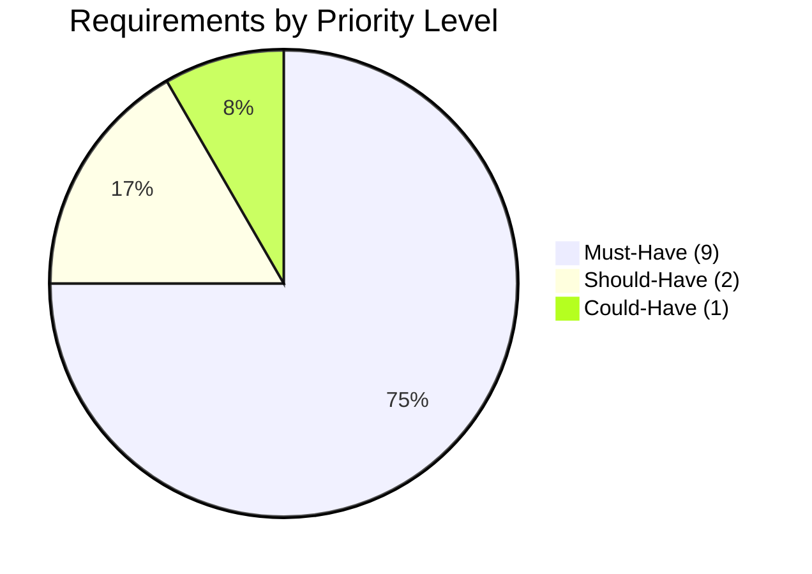
```mermaid
pie title Requirements by Priority Level
    "Must-Have (9)" : 9
    "Should-Have (2)" : 2
    "Could-Have (1)" : 1
```

**Priority Summary:**
- **Must-Have:** 9 requirements (75%) - Core functionality essential for system operation
- **Should-Have:** 2 requirements (17%) - Important but system functions without them
- **Could-Have:** 1 requirement (8%) - Placeholder functionality with minimal impact

### 2.6.4 Requirement Implementation Status

**Status: 100% Complete**
- Total Requirements: 12
- Completed: 12 (100%)
- In Development: 0
- Proposed: 0

All documented requirements represent **existing, verified functionality** in the codebase rather than planned features.

### 2.6.5 Requirement to Scope Mapping

| Requirement ID | Scope Category | In-Scope Section | Out-of-Scope Impact |
|----------------|----------------|------------------|---------------------|
| F-001-RQ-001 | Core Feature | 1.3.1.1 | N/A |
| F-001-RQ-002 | Core Feature | 1.3.1.1 | Prevents external access (1.3.2.4) |
| F-001-RQ-003 | Core Feature | 1.3.1.1 | No routing/method handling (1.3.2.1) |
| F-002-RQ-001 | Core Feature | 1.3.1.1 | Static status (no 404, 500, etc.) |
| F-002-RQ-002 | Core Feature | 1.3.1.1 | No content negotiation (1.3.2.1) |
| F-002-RQ-003 | Core Feature | 1.3.1.1 | No dynamic content (1.3.2.1) |
| F-003-RQ-001 | Core Feature | 1.3.1.1 | No structured logging (1.3.2.1) |
| F-003-RQ-002 | Core Feature | 1.3.1.1 | No graceful shutdown (1.3.2.1) |
| F-004-RQ-001 | Architecture | 1.3.1.3 | No third-party integrations (1.3.2.1) |
| F-005-RQ-001 | Configuration | 1.3.1.2 | No deployment features (1.3.2.1) |
| F-006-RQ-001 | Development | 1.3.1.1 | No test suite (1.3.2.1) |

---

## 2.7 Assumptions and Constraints

### 2.7.1 System Assumptions

**Runtime Environment Assumptions:**
1. Node.js is installed and accessible via `node` command
2. npm is installed (version 7 or higher for lockfile compatibility)
3. TCP port 3000 is available on localhost at startup time
4. User has permission to bind to localhost ports (typically unrestricted)
5. System supports TCP/IP loopback interface (127.0.0.1)

**Operational Assumptions:**
1. Server is executed manually via command line (`node server.js`)
2. Server runs in foreground process (no daemonization)
3. User monitors console output for startup confirmation
4. User terminates server manually (Ctrl+C) when testing complete
5. Only one instance runs per machine (single port 3000)

**Usage Assumptions:**
1. System is used for local integration testing only
2. Test tools connect from same machine (localhost)
3. No production deployment or external accessibility required
4. Predictable, deterministic behavior is more valuable than flexibility

### 2.7.2 Technical Constraints

**Hard Constraints (Cannot Be Violated):**
1. **Node.js Dependency:** System cannot run without Node.js runtime
2. **Port Availability:** Port 3000 must be free or startup fails
3. **Localhost Binding:** Cannot be accessed from external network
4. **Single File:** All application logic in server.js (no code organization)

**Soft Constraints (Can Be Modified with Code Changes):**
1. **Port Number:** Hardcoded to 3000 (requires code edit to change)
2. **Response Content:** Hardcoded "Hello, World!\n" (requires code edit)
3. **Host Interface:** Hardcoded to 127.0.0.1 (requires code edit for external binding)

**Architectural Constraints:**
1. **Zero Dependencies:** No external npm packages permitted (design principle)
2. **Static Responses:** No dynamic content generation allowed
3. **No State:** No persistence or session management
4. **Single Process:** No clustering or multi-process architecture

### 2.7.3 Known Issues and Limitations

**Configuration Issues:**
1. **Entry Point Mismatch:** package.json `main` field references "index.js" but actual entry is "server.js"
   - **Impact:** `require('hello_world')` would fail
   - **Workaround:** Execute server.js directly
   - **Recommendation:** Update package.json main field

2. **Naming Inconsistency:** Repository name "hao-backprop-test" ≠ package name "hello_world"
   - **Impact:** Confusion for users, potential npm publishing issues
   - **Workaround:** Accept dual naming
   - **Recommendation:** Align names or document discrepancy

3. **No Start Script:** No `npm start` defined in package.json
   - **Impact:** Must use `node server.js` instead of npm convention
   - **Workaround:** Direct node invocation
   - **Recommendation:** Add "start": "node server.js" to scripts

**Functional Limitations:**
1. **Port Conflicts:** No handling of EADDRINUSE errors
2. **No Configuration:** Cannot change host/port without code modification
3. **No Logging Control:** Console output cannot be disabled or redirected
4. **No Graceful Shutdown:** Process termination is immediate, no cleanup

**Testing Limitations:**
1. **No Test Suite:** npm test intentionally fails (placeholder)
2. **No Coverage:** No code coverage measurement
3. **No CI/CD:** Test failures prevent automated deployment workflows

### 2.7.4 Design Decisions and Rationale

**Key Design Decisions:**

1. **Minimal Feature Set**
   - **Decision:** Implement only HTTP server with static response
   - **Rationale:** Controlled test environment requires predictability over functionality
   - **Trade-off:** Limited usefulness outside testing context

2. **Zero External Dependencies**
   - **Decision:** Exclude all npm packages except Node.js built-ins
   - **Rationale:** Eliminate dependency-related failures in test environment
   - **Trade-off:** Manual implementation of functionality available in packages

3. **Localhost-Only Binding**
   - **Decision:** Bind to 127.0.0.1 exclusively
   - **Rationale:** Security constraint for local testing, prevent network exposure
   - **Trade-off:** Cannot be used for network-accessible testing scenarios

4. **Hardcoded Configuration**
   - **Decision:** Use constants instead of environment variables or config files
   - **Rationale:** Simplify setup and ensure consistent behavior
   - **Trade-off:** Requires code modification to change configuration

5. **No Error Handling**
   - **Decision:** Allow exceptions to terminate process
   - **Rationale:** Simple failure mode adequate for test environment
   - **Trade-off:** No graceful degradation or recovery

---

## 2.8 References

### 2.8.1 Source Files Analyzed

**Application Code:**
- `server.js` (15 lines) - Core HTTP server implementation
  - HTTP server instantiation (F-001-RQ-001)
  - Localhost network binding (F-001-RQ-002)
  - Request handler with static response (F-001-RQ-003, F-002-RQ-001/002/003)
  - Startup logging (F-003-RQ-001)
  - Continuous operation behavior (F-003-RQ-002)

**Configuration Files:**
- `package.json` (11 lines) - NPM package manifest
  - Package metadata (F-005-RQ-001)
  - Zero dependency declaration (F-004-RQ-001)
  - Placeholder test script (F-006-RQ-001)

- `package-lock.json` (13 lines) - NPM dependency lockfile
  - Dependency tree verification (F-004-RQ-001)
  - Lockfile version 3 format confirmation

**Documentation:**
- `README.md` (2 lines) - Project documentation
  - Project purpose statement
  - Repository naming reference

### 2.8.2 Technical Specification Sections Referenced

- **1.1 Executive Summary** - Project overview, business problem, stakeholders, business impact
- **1.2 System Overview** - Technical context, system capabilities, architecture, success criteria
- **1.3 Scope** - In-scope features, out-of-scope exclusions, boundaries, unsupported use cases

### 2.8.3 External Standards and Specifications

**Protocol Standards:**
- HTTP/1.1 (RFC 2616 / RFC 7230-7235) - HTTP protocol implementation via Node.js http module
- TCP/IP - Transport layer for HTTP server binding

**Node.js APIs:**
- Node.js HTTP Module Documentation - `http.createServer()`, server.listen() APIs
- Node.js CommonJS Module System - `require()` module loading

**Package Management:**
- npm package.json Specification - Package manifest format
- npm lockfile v3 Format - Dependency lockfile structure

**Semantic Versioning:**
- SemVer 2.0.0 - Version numbering (1.0.0) in package.json

### 2.8.4 Related Documentation

**Design Philosophy:**
- Minimum Viable Test Harness principle (referenced in System Overview 1.2.1.1)
- Zero Dependency Architecture pattern (implemented in F-004)

**Known Issues Documentation:**
- Configuration mismatches identified in System Overview 1.2.1.3
- Entry point and naming discrepancies documented throughout specification

---

## 2.9 Document Control

**Document Version:** 1.0  
**Last Updated:** [Current Date]  
**Author:** Technical Specification Team  
**Approval Status:** Draft  

**Change History:**
- Version 1.0 - Initial product requirements documentation based on implemented features

**Review Schedule:**
- Requirements review: As needed for code changes
- No regular review cadence required (stable implementation)

**Related Documents:**
- Technical Specification Section 1 (Introduction)
- System Architecture Documentation (if created)
- Test Plan (not yet implemented)

---

**End of Product Requirements Section**

# 3. Technology Stack

## 3.1 Technology Stack Overview

### 3.1.1 Architectural Philosophy

This system implements a **zero-dependency architecture** as a core design principle, not a limitation. The technology stack reflects the project's purpose as a minimal test harness for backprop integration validation, prioritizing simplicity, transparency, and security over feature richness.

**Guiding Principles:**
- **Minimalism:** Leverage only Node.js standard library capabilities
- **Transparency:** Single-file implementation enables complete code audit in minutes
- **Security:** Zero external dependencies eliminates supply chain attack vectors
- **Predictability:** Hardcoded configuration ensures consistent test environment behavior
- **Maintainability:** Minimal technology surface area reduces long-term maintenance burden

The technology selections documented in this section support these principles while meeting all functional requirements defined in Section 2.3.

### 3.1.2 Technology Stack Diagram

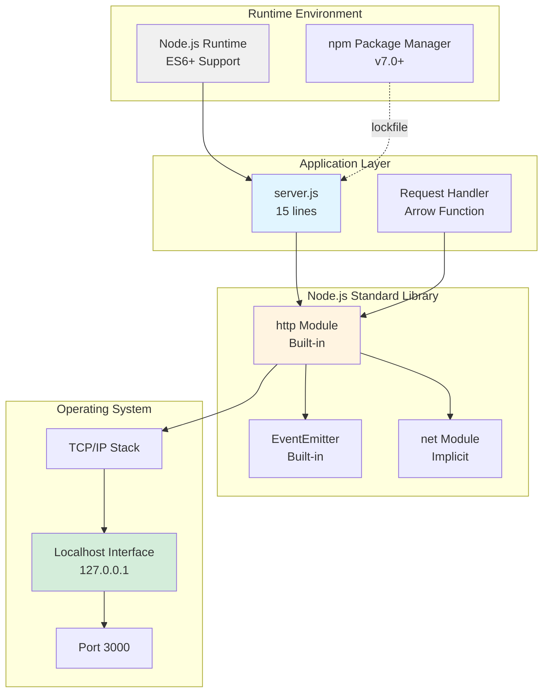
```mermaid
graph TB
    subgraph "Runtime Environment"
        A[Node.js Runtime<br/>ES6+ Support]
        B[npm Package Manager<br/>v7.0+]
    end
    
    subgraph "Application Layer"
        C[server.js<br/>15 lines]
        D[Request Handler<br/>Arrow Function]
    end
    
    subgraph "Node.js Standard Library"
        E[http Module<br/>Built-in]
        F[EventEmitter<br/>Built-in]
        G[net Module<br/>Implicit]
    end
    
    subgraph "Operating System"
        H[TCP/IP Stack]
        I[Localhost Interface<br/>127.0.0.1]
        J[Port 3000]
    end
    
    A --> C
    B -.lockfile.-> C
    C --> E
    E --> F
    E --> G
    D --> E
    E --> H
    H --> I
    I --> J
    
    style C fill:#e1f5ff
    style E fill:#fff4e1
    style A fill:#f0f0f0
    style I fill:#d4edda
```

### 3.1.3 Technology Selection Rationale

| Decision Category | Choice | Justification | Alternative Considered |
|------------------|--------|---------------|----------------------|
| Runtime Platform | Node.js | Built-in HTTP capabilities, minimal footprint | Python (rejected: requires external libraries), Go (rejected: compilation overhead) |
| HTTP Implementation | Built-in `http` module | Zero dependencies, stable API | Express.js (rejected: unnecessary abstraction), Fastify (rejected: adds complexity) |
| Module System | CommonJS | Native Node.js support | ES Modules (rejected: requires package.json configuration) |
| Dependency Management | None (zero packages) | Eliminates security and maintenance burden | Framework-based approach (rejected: conflicts with test harness goals) |
| Configuration | Hardcoded constants | Predictable test environment | Environment variables (rejected: adds variability), config files (rejected: unnecessary complexity) |

## 3.2 Programming Languages and Runtime

### 3.2.1 JavaScript (ECMAScript 6)

#### 3.2.1.1 Language Specification

**Language Standard:** ECMAScript 2015 (ES6)

**Syntax Features Utilized:**
- **Variable Declarations:** `const` and `let` for block-scoped variable binding
  - Evidence: `server.js` lines 1-4 (const declarations for module import and configuration constants)
- **Template Literals:** String interpolation with backtick syntax
  - Evidence: `server.js` line 13 (`` `Server running at http://${hostname}:${port}/` ``)
- **Arrow Functions:** Concise function expression syntax
  - Evidence: `server.js` lines 6, 12 (request handler and listen callback)

**Module System:** CommonJS
- **Import Syntax:** `require()` for module loading
  - Evidence: `const http = require('http');` (`server.js` line 1)
- **Export Syntax:** Not applicable (application entry point with no exports)
- **Rationale:** Native Node.js module format, no configuration required

#### 3.2.1.2 Version Requirements

**Minimum Node.js Version:**
- **Required:** Node.js 6.x or higher
- **Reason:** ES6 feature support (const, let, arrow functions, template literals)
- **Constraint:** No explicit version enforcement in package.json "engines" field
- **Risk:** Deployment on very old Node.js versions (<6.x) will cause syntax errors

**Recommended Node.js Version:**
- **Target:** Node.js LTS 12.x or higher
- **Benefits:** Enhanced stability, security patches, performance optimizations
- **Source:** Implementation Considerations section 2.5.1.1

**Version Compatibility Matrix:**

| Node.js Version | ES6 Support | http Module | Status | Notes |
|----------------|-------------|-------------|--------|-------|
| <6.0 | ❌ Partial | ✅ Available | ❌ Incompatible | Missing const/let support |
| 6.x - 11.x | ✅ Complete | ✅ Stable | ⚠️ Deprecated | Out of LTS support |
| 12.x - 16.x | ✅ Complete | ✅ Stable | ✅ Supported | LTS versions recommended |
| 18.x+ | ✅ Complete | ✅ Stable | ✅ Supported | Current LTS |

#### 3.2.1.3 Language Selection Justification

**Why JavaScript/Node.js:**

1. **Built-in HTTP Server Capabilities**
   - Node.js standard library includes production-ready `http` module
   - No external web server (Apache, Nginx) or framework (Express, Koa) required
   - Enables true zero-dependency implementation

2. **Minimal Resource Footprint**
   - Memory consumption: <10MB for application logic (excluding Node.js runtime overhead)
   - Startup time: <1 second (typically 200-500ms)
   - CPU utilization: Near-zero when idle, single-core maximum under load
   - Evidence: Implementation Considerations section 2.5.2.4

3. **Event-Driven Architecture**
   - Single-threaded event loop handles concurrent connections efficiently
   - Asynchronous I/O model supports 100+ concurrent connections
   - Throughput: 5,000-10,000 requests/second on modern hardware
   - Evidence: Implementation Considerations section 2.5.2.3

4. **Rapid Development and Debugging**
   - Interpreted language enables immediate execution without compilation
   - Simple syntax reduces cognitive load for test harness validation
   - Extensive debugging tools available (Node.js inspector, Chrome DevTools)

5. **Cross-Platform Compatibility**
   - Identical behavior across Windows, macOS, and Linux
   - No platform-specific code or conditional compilation
   - Supports project's test environment portability requirement

### 3.2.2 Node.js Runtime Environment

#### 3.2.2.1 Runtime Architecture

**Execution Model:** Single-threaded event loop with asynchronous I/O

**Key Runtime Components:**
- **V8 JavaScript Engine:** Compiles JavaScript to native machine code
- **libuv:** Cross-platform asynchronous I/O library (handles TCP sockets, event loop)
- **Node.js Bindings:** Exposes operating system functionality to JavaScript
- **Event Loop:** Manages request callbacks and I/O operations

**Memory Management:**
- **Heap:** JavaScript objects and closures (application uses <5MB)
- **Stack:** Function call frames (minimal depth in this application)
- **Garbage Collection:** Automatic memory reclamation via V8 GC
- **No Memory Leaks:** Stateless design prevents accumulation of unused objects

#### 3.2.2.2 Process Model

**Single-Process Architecture:**
- **Process Count:** One Node.js process per server instance
- **Thread Count:** One main thread (JavaScript execution) + libuv thread pool (OS I/O)
- **No Clustering:** No `cluster` module usage for multi-core utilization
- **Limitation:** Cannot utilize multiple CPU cores for request processing
- **Rationale:** Test harness purpose doesn't require high-scale performance
- **Evidence:** Implementation Considerations section 2.5.3.1

**Process Lifecycle:**

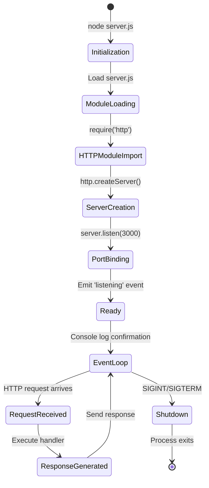
```mermaid
stateDiagram-v2
    [*] --> Initialization: node server.js
    Initialization --> ModuleLoading: Load server.js
    ModuleLoading --> HTTPModuleImport: require('http')
    HTTPModuleImport --> ServerCreation: http.createServer()
    ServerCreation --> PortBinding: server.listen(3000)
    PortBinding --> Ready: Emit 'listening' event
    Ready --> EventLoop: Console log confirmation
    EventLoop --> RequestReceived: HTTP request arrives
    RequestReceived --> ResponseGenerated: Execute handler
    ResponseGenerated --> EventLoop: Send response
    EventLoop --> Shutdown: SIGINT/SIGTERM
    Shutdown --> [*]: Process exits
```

#### 3.2.2.3 Runtime Configuration

**No Configurable Runtime Options:**
- No command-line arguments processed
- No environment variables read
- No configuration files loaded
- All parameters hardcoded in source code

**Hardcoded Configuration Constants:**
- **Hostname:** `127.0.0.1` (`server.js` line 3)
- **Port:** `3000` (`server.js` line 4)
- **Modification Method:** Requires source code edit and process restart
- **Evidence:** Implementation Considerations section 2.5.1.2

### 3.2.3 npm Package Manager

#### 3.2.3.1 Package Manager Version

**npm Version Requirements:**
- **Minimum Version:** npm 7.0.0 or higher
- **Reason:** Lockfile format v3 introduced in npm 7
- **Evidence:** `package-lock.json` line 3: `"lockfileVersion": 3`
- **Verification:** `npm --version` command must show 7.x, 8.x, 9.x, or 10.x

**Package Manager Compatibility:**

| Package Manager | Version | Lockfile Support | Status |
|----------------|---------|------------------|--------|
| npm | <7.0 | lockfileVersion 1-2 | ❌ Incompatible |
| npm | 7.x - 10.x | lockfileVersion 3 | ✅ Compatible |
| yarn | 1.x | yarn.lock | ⚠️ Not used |
| pnpm | 6.x+ | pnpm-lock.yaml | ⚠️ Not used |

#### 3.2.3.2 Package Manifest

**package.json Configuration:**

```json
{
    "name": "hello_world",
    "version": "1.0.0",
    "description": "Hello world in Node.js",
    "main": "index.js",
    "scripts": {
        "test": "echo \"Error: no test specified\" && exit 1"
    },
    "author": "hxu",
    "license": "MIT"
}
```

**Metadata Fields:**
- **Name:** `hello_world` (package identifier)
- **Version:** `1.0.0` (semantic versioning: major.minor.patch)
- **Description:** Human-readable project summary
- **Author:** `hxu` (authorship attribution)
- **License:** MIT (permissive open-source license)
- **Evidence:** `package.json` lines 1-11

**Known Configuration Issues:**

1. **Entry Point Mismatch:**
   - **Declared:** `"main": "index.js"` (line 5)
   - **Actual:** Entry point is `server.js`
   - **Impact:** `require('hello_world')` would fail (file not found)
   - **Mitigation:** Not required (package not intended for use as library)
   - **Evidence:** Assumptions section 2.7.3

2. **Naming Inconsistency:**
   - **Package Name:** `hello_world`
   - **Repository Name:** `hao-backprop-test`
   - **Impact:** Potential confusion in documentation
   - **Evidence:** `README.md` vs `package.json`

3. **No Start Script:**
   - **Missing:** No `"start"` script in `scripts` object
   - **Consequence:** Cannot use `npm start` command
   - **Workaround:** Must use `node server.js` directly
   - **Evidence:** `package.json` lines 6-8

#### 3.2.3.3 Dependency Lockfile

**package-lock.json Structure:**

```json
{
    "name": "hello_world",
    "version": "1.0.0",
    "lockfileVersion": 3,
    "requires": true,
    "packages": {
        "": {
            "name": "hello_world",
            "version": "1.0.0",
            "license": "MIT"
        }
    }
}
```

**Lockfile Analysis:**
- **Format Version:** 3 (npm 7+ format)
- **Package Count:** 1 (root package only)
- **Dependency Count:** 0 (empty dependency tree)
- **Resolved URLs:** 0 (no packages to resolve)
- **Integrity Hashes:** 0 (no package verification needed)
- **Evidence:** `package-lock.json` lines 1-14

**Lockfile Verification:**
- `npm install` completes without network requests
- No `node_modules` directory created (or empty if created)
- No packages downloaded from npm registry
- Zero disk space consumed by dependencies

## 3.3 Core Frameworks and Libraries

### 3.3.1 Framework Selection: None

#### 3.3.1.1 Zero-Framework Architecture

**Design Decision:** No external frameworks utilized

**Rejected Framework Categories:**
- ❌ **Web Frameworks:** Express.js, Fastify, Koa, Hapi
- ❌ **HTTP Libraries:** Axios, node-fetch, request
- ❌ **Utility Libraries:** Lodash, Underscore, Ramda
- ❌ **Validation Libraries:** Joi, Yup, Validator.js
- ❌ **Logging Libraries:** Winston, Pino, Bunyan
- ❌ **Testing Frameworks:** Jest, Mocha, Jasmine, Ava

**Justification:**
1. **Dependency Elimination:** Frameworks introduce transitive dependencies (Express.js has 50+ dependencies)
2. **Security Posture:** Each dependency is a potential CVE exposure point
3. **Maintenance Burden:** Framework updates require compatibility testing
4. **Test Environment Clarity:** Framework abstractions could obscure integration issues
5. **Performance Overhead:** Minimal implementation faster than framework initialization
6. **Evidence:** Assumptions section 2.7.4 ("Manual implementation of functionality")

#### 3.3.1.2 Framework Alternative Analysis

**Express.js Rejection Analysis:**

| Aspect | Express.js | This Implementation | Decision Factor |
|--------|-----------|---------------------|-----------------|
| Dependencies | 50+ npm packages | 0 packages | ✅ Eliminates supply chain risk |
| Lines of Code | Thousands (framework) | 15 lines (application) | ✅ Simpler to audit |
| Middleware Support | Yes | Not needed | ✅ No routing requirements |
| Response Time | ~5-10ms | <1ms | ✅ Faster for static responses |
| Learning Curve | Moderate | None | ✅ Obvious code behavior |

**Fastify Rejection Analysis:**
- **Strength:** High performance (optimized routing)
- **Weakness:** Routing capabilities not needed (all requests identical)
- **Decision:** Performance benefits irrelevant for single-response pattern

**Koa Rejection Analysis:**
- **Strength:** Modern async/await middleware
- **Weakness:** No middleware pipeline required
- **Decision:** Async capabilities not needed (synchronous response)

### 3.3.2 Node.js Built-in Modules

#### 3.3.2.1 HTTP Module

**Module:** `http` (Node.js standard library)

**Purpose:** HTTP server creation and request handling

**Import Statement:**
```javascript
const http = require('http');
```
- **Location:** `server.js` line 1
- **Module Type:** Built-in (no installation required)
- **API Stability:** Stable since Node.js 0.10.x

**API Methods Utilized:**

1. **`http.createServer([requestListener])`**
   - **Purpose:** Creates HTTP server instance
   - **Parameter:** Request handler callback function
   - **Return Value:** `http.Server` instance
   - **Usage:** `server.js` line 6
   - **Documentation:** https://nodejs.org/api/http.html#http_http_createserver_options_requestlistener

2. **`server.listen(port[, hostname][, callback])`**
   - **Purpose:** Binds server to network interface and port
   - **Parameters:** 
     - `port`: 3000 (TCP port number)
     - `hostname`: "127.0.0.1" (IPv4 loopback address)
     - `callback`: Function invoked when server ready
   - **Usage:** `server.js` lines 12-14
   - **Documentation:** https://nodejs.org/api/http.html#http_server_listen

**Request Handler API:**

```javascript
(req, res) => {
    // req: http.IncomingMessage (request object)
    // res: http.ServerResponse (response object)
}
```

**Response Object Methods Used:**
- `res.statusCode = 200`: Sets HTTP status code (line 7)
- `res.setHeader('Content-Type', 'text/plain')`: Sets response header (line 8)
- `res.end('Hello, World!\n')`: Writes body and closes connection (line 9)

#### 3.3.2.2 Implicit Standard Library Dependencies

**Modules Used Indirectly (via `http` module):**

1. **`net` Module:**
   - **Purpose:** TCP socket operations
   - **Usage:** HTTP module built on top of net.Server
   - **Relevance:** Handles localhost TCP connection on port 3000

2. **`events` Module (EventEmitter):**
   - **Purpose:** Event-driven architecture
   - **Usage:** Server inherits from EventEmitter
   - **Events:** 'request', 'listening', 'error', 'close'

3. **`stream` Module:**
   - **Purpose:** Streaming I/O operations
   - **Usage:** Request (IncomingMessage) and Response (ServerResponse) are streams
   - **Relevance:** Enables efficient data transfer

**No Direct Usage:** Application does not explicitly `require()` these modules

### 3.3.3 Supporting Libraries: None

**Application-Level Libraries:** Zero

**Categories Intentionally Excluded:**
- **JSON Processing:** Not needed (no JSON parsing or generation)
- **URL Parsing:** Not needed (request path not examined)
- **Query String Parsing:** Not needed (no query parameter handling)
- **Cookie Parsing:** Not needed (no cookie support)
- **Body Parsing:** Not needed (request body not read)
- **Template Engines:** Not needed (static string response)
- **Database Drivers:** Not needed (no data persistence)
- **ORM/ODM:** Not needed (no database)

**Evidence:** Scope section 1.3.2.1 (explicitly excluded features)

## 3.4 External Dependencies

### 3.4.1 Open Source Dependencies

#### 3.4.1.1 npm Package Dependencies

**Dependency Count:** **ZERO**

**package.json Evidence:**
```json
{
    "name": "hello_world",
    "version": "1.0.0",
    // ... metadata fields ...
    // NO dependencies field
    // NO devDependencies field
    // NO peerDependencies field
}
```

**Verification Methods:**

1. **package.json Inspection:**
   - No `dependencies` object present
   - No `devDependencies` object present
   - Evidence: `package.json` lines 1-11

2. **package-lock.json Analysis:**
   - Only root package entry in `packages` object
   - Zero resolved package URLs
   - Zero integrity hashes (except implicit root)
   - Evidence: `package-lock.json` lines 1-14

3. **npm install Behavior:**
   - Command completes in <1 second
   - No network requests to npm registry
   - No `node_modules` directory created
   - Zero disk space consumed

#### 3.4.1.2 Zero-Dependency Design Benefits

**Security Advantages:**

| Security Threat | Risk with Dependencies | Risk with Zero Dependencies | Mitigation Achieved |
|----------------|------------------------|----------------------------|---------------------|
| Supply Chain Attacks | HIGH | NONE | ✅ Complete elimination |
| CVE Exposure | Continuous | ZERO | ✅ No vulnerability scanning needed |
| Malicious Packages | Registry compromise | N/A | ✅ No registry interactions |
| Dependency Confusion | Namespace attacks | N/A | ✅ No package resolution |
| Typosquatting | Package name similarity | N/A | ✅ No package installation |
| Backdoors in Dependencies | Possible | Impossible | ✅ Complete code audit feasible |

**Evidence:** Implementation Considerations section 2.5.4.3

**Maintenance Advantages:**

1. **Zero Update Burden:**
   - No dependency version upgrades required
   - No breaking changes from upstream libraries
   - No deprecation warnings to address
   - No compatibility testing after dependency updates

2. **Simplified Deployment:**
   - No `npm install` required in production
   - No network connectivity needed for deployment
   - No registry authentication or proxy configuration
   - Deployment: copy 3 files (server.js, package.json, package-lock.json)

3. **Audit Simplicity:**
   - Complete application code: 15 lines
   - Audit time: <5 minutes for thorough review
   - No transitive dependency analysis required
   - No license compliance checks for dependencies

4. **Reproducible Builds:**
   - No dependency version drift over time
   - Identical behavior across all environments
   - No "works on my machine" issues from dependency versions

**Performance Advantages:**

1. **Faster Startup:**
   - No dependency module loading
   - Minimal memory allocation for dependencies
   - Startup time: 200-500ms (target: <1 second)

2. **Smaller Disk Footprint:**
   - Application files: <5KB (3 files total)
   - No `node_modules` directory
   - Entire project fits in single git commit

#### 3.4.1.3 Dependency Policy and Constraints

**Organizational Policy:** Zero external dependencies mandated by design

**Adding Dependencies Criteria:**
- ❌ **Feature Addition:** Any feature requiring dependencies is out of scope
- ❌ **Convenience:** Utility libraries not justified for 15-line application
- ❌ **Frameworks:** Abstraction layers contradict test harness simplicity goal

**Future Dependency Additions:** NOT PLANNED
- **Rationale:** Minimal complexity is core value proposition
- **Alternative:** Reimplement functionality in application code if absolutely necessary
- **Governance:** Any dependency addition requires architectural redesign discussion

**Evidence:** Functional Requirements section 2.3.4.1 (F-004-RQ-001)

### 3.4.2 Third-Party Services and Integrations

#### 3.4.2.1 External Services: None

**Categories Explicitly Excluded:**

1. **External APIs:**
   - ❌ No REST API calls to external services
   - ❌ No GraphQL client integrations
   - ❌ No webhook endpoints for external notifications
   - **Evidence:** Scope section 1.3.2.1

2. **Authentication Services:**
   - ❌ No OAuth providers (Google, GitHub, Auth0)
   - ❌ No SSO integrations (SAML, LDAP)
   - ❌ No JWT token validation from external issuers
   - **Rationale:** Localhost-only access eliminates authentication need
   - **Evidence:** Scope section 1.3.2.1

3. **Monitoring and Observability:**
   - ❌ No APM services (New Relic, Datadog, Dynatrace)
   - ❌ No error tracking (Sentry, Rollbar, Bugsnag)
   - ❌ No analytics platforms (Google Analytics, Mixpanel)
   - ❌ No log aggregation (Splunk, Loggly, Papertrail)
   - **Evidence:** Scope section 1.3.2.1

4. **Cloud Services:**
   - ❌ No AWS services (S3, Lambda, RDS, etc.)
   - ❌ No Azure services
   - ❌ No Google Cloud Platform services
   - ❌ No CDN usage (Cloudflare, Fastly, Akamai)
   - **Rationale:** Localhost-only binding prevents cloud deployment
   - **Evidence:** Scope section 1.3.2.4

5. **Message Queues and Event Buses:**
   - ❌ No RabbitMQ, Kafka, or Redis Pub/Sub
   - ❌ No AWS SQS/SNS
   - ❌ No webhooks or event subscriptions

#### 3.4.2.2 Service Integration Architecture

**Network Isolation:**
- **Inbound Connections:** Only from localhost (127.0.0.1)
- **Outbound Connections:** NONE (no external service calls)
- **Network Boundary:** Complete isolation from external networks
- **Security Posture:** Air-gapped from internet threats

**Integration Points:** ZERO
- **Rationale:** Test harness purpose requires no external integrations
- **Future Additions:** Not planned (contradicts design goals)

## 3.5 Databases and Data Storage

### 3.5.1 Database Systems: None

#### 3.5.1.1 No Database Implementation

**Database Categories Excluded:**

1. **Relational Databases:**
   - ❌ PostgreSQL, MySQL, MariaDB
   - ❌ SQLite (embedded database)
   - ❌ Microsoft SQL Server
   - **Evidence:** Scope section 1.3.2.1

2. **NoSQL Databases:**
   - ❌ MongoDB (document store)
   - ❌ Redis (key-value store)
   - ❌ Cassandra (wide-column store)
   - ❌ DynamoDB (cloud NoSQL)
   - **Evidence:** Scope section 1.3.2.1

3. **In-Memory Databases:**
   - ❌ Redis
   - ❌ Memcached
   - ❌ In-memory caching solutions
   - **Evidence:** Scope section 1.3.2.1

#### 3.5.1.2 Stateless Architecture

**Design Principle:** Complete statelessness

**Implications:**
- No data persistence between requests
- No session storage
- No user data retention
- Each request handled independently
- **Evidence:** Implementation Considerations section 2.5.1.3

**Benefits:**
1. **Simplicity:** No schema design or migration management
2. **Reliability:** No database connectivity failures possible
3. **Performance:** No database query latency
4. **Security:** No data breach exposure (no data stored)
5. **Compliance:** No PII or sensitive data handling requirements

### 3.5.2 Data Persistence: None

#### 3.5.2.1 File System Storage

**File System Access:** Read-only for application code

**Storage Operations Excluded:**
- ❌ Writing data to files
- ❌ Logging to file system (only console logging)
- ❌ Temporary file creation
- ❌ Static file serving from disk
- ❌ File upload handling
- **Evidence:** Scope section 1.3.2.1

**Rationale:** No data to persist (static response only)

#### 3.5.2.2 Caching Solutions

**Caching Mechanisms:** NONE

**Cache Types Excluded:**
- ❌ Application-level caching (in-memory cache)
- ❌ HTTP caching (no Cache-Control headers)
- ❌ Distributed caching (Redis, Memcached)
- ❌ Browser caching directives
- **Evidence:** Scope section 1.3.2.1

**Rationale:** Static response requires no caching layer

### 3.5.3 Data Architecture

#### 3.5.3.1 Data Flow Diagram

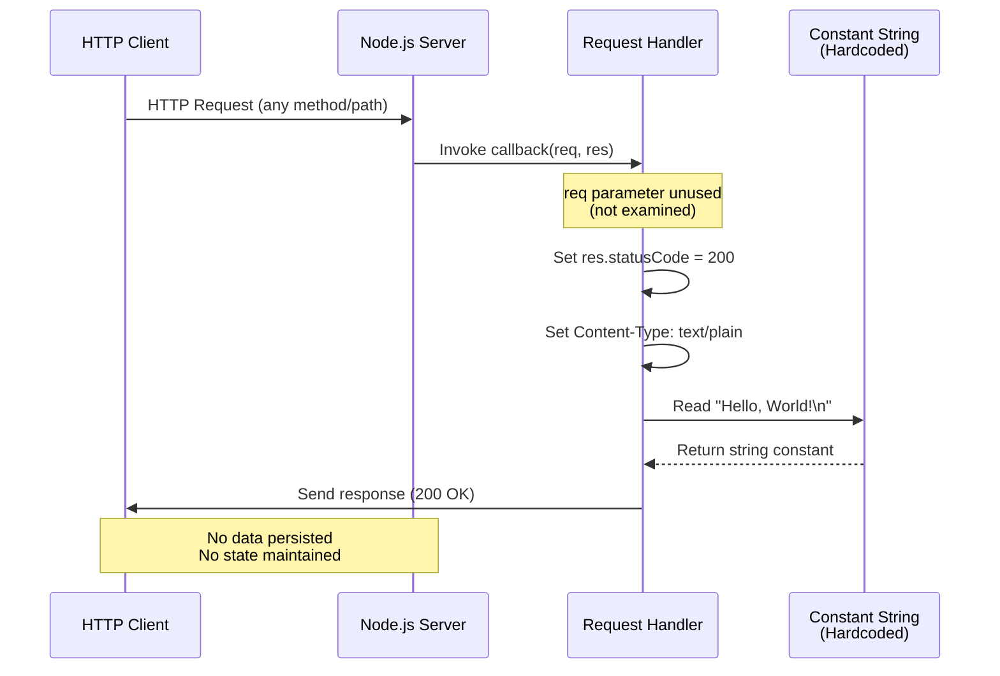
```mermaid
sequenceDiagram
    participant Client as HTTP Client
    participant Server as Node.js Server
    participant Handler as Request Handler
    participant Memory as Constant String<br/>(Hardcoded)
    
    Client->>Server: HTTP Request (any method/path)
    Server->>Handler: Invoke callback(req, res)
    Note over Handler: req parameter unused<br/>(not examined)
    Handler->>Handler: Set res.statusCode = 200
    Handler->>Handler: Set Content-Type: text/plain
    Handler->>Memory: Read "Hello, World!\n"
    Memory-->>Handler: Return string constant
    Handler->>Client: Send response (200 OK)
    Note over Client,Server: No data persisted<br/>No state maintained
```

#### 3.5.3.2 Data Retention Policy

**Data Retention:** NONE

**Temporary Data:**
- **Request Metadata:** Received by Node.js, discarded immediately
- **Response Data:** Generated from constant, no storage
- **Logs:** Console output only (not persisted to disk)
- **Session Data:** Not supported

**Compliance Implications:**
- No GDPR data subject requests (no personal data stored)
- No data deletion requirements (nothing to delete)
- No backup/restore procedures needed
- No data retention compliance concerns

## 3.6 Development and Deployment

### 3.6.1 Development Tools

#### 3.6.1.1 Version Control

**System:** Git

**Evidence:**
- `.git` directory present in repository
- **Repository Name:** `hao-backprop-test`
- **Evidence:** `README.md`

**Version Control Configuration:**
- ❌ No `.gitignore` file present
- ❌ No `.gitattributes` configuration
- ⚠️ **Risk:** `node_modules` directory would be committed if created
- **Mitigation:** No dependencies means empty `node_modules` (low risk)

#### 3.6.1.2 Integrated Development Environment (IDE)

**IDE Support:** Not specified

**No IDE Configuration Files:**
- ❌ No `.vscode` directory (Visual Studio Code)
- ❌ No `.idea` directory (JetBrains IDEs)
- ❌ No `.editorconfig` (editor configuration)
- ❌ No `.prettierrc` (code formatting)

**IDE Compatibility:**
- ✅ Any text editor or IDE supporting JavaScript
- ✅ No IDE-specific features or extensions required
- ✅ No workspace configuration needed

#### 3.6.1.3 Code Quality Tools

**Linters:** NONE
- ❌ No ESLint configuration
- ❌ No JSLint, JSHint, or Standard JS
- **Evidence:** Scope section 1.3.2.1

**Code Formatters:** NONE
- ❌ No Prettier configuration
- ❌ No automated code formatting

**Type Checkers:** NONE
- ❌ No TypeScript compilation
- ❌ No Flow type checking
- ❌ No JSDoc type annotations

**Rationale:**
- 15-line application doesn't warrant linting infrastructure
- Manual code review feasible for complete audit
- No coding style enforcement needed for test harness

#### 3.6.1.4 Debugging Tools

**Available Debugging Methods:**

1. **Node.js Built-in Debugger:**
   - **Command:** `node inspect server.js`
   - **Capabilities:** Breakpoints, step execution, variable inspection

2. **Chrome DevTools Integration:**
   - **Command:** `node --inspect server.js`
   - **Access:** chrome://inspect in Chrome browser
   - **Features:** Full debugging UI, profiling, memory inspection

3. **Console Logging:**
   - **Current Usage:** Single log statement on server startup
   - **Location:** `server.js` line 13
   - **Enhancement:** Can add `console.log()` for request debugging if needed

### 3.6.2 Build System and Tooling

#### 3.6.2.1 Build Process: None

**No Build Step Required:**
- ✅ Source code (JavaScript) executed directly by Node.js
- ✅ No transpilation (ES6 to ES5 conversion not needed)
- ✅ No bundling (single file, no module bundler required)
- ✅ No minification (code size already minimal at 15 lines)
- ✅ No asset processing (no CSS, images, or static assets)

**Build Tools Excluded:**
- ❌ Webpack (module bundler)
- ❌ Rollup (ES module bundler)
- ❌ Parcel (zero-config bundler)
- ❌ Babel (JavaScript transpiler)
- ❌ TypeScript compiler
- ❌ Gulp/Grunt (task runners)

**Evidence:** Implementation Considerations section 2.5.1.2

#### 3.6.2.2 npm Scripts

**Defined Scripts:**

```json
"scripts": {
    "test": "echo \"Error: no test specified\" && exit 1"
}
```

**Script Analysis:**

1. **`npm test` (Placeholder):**
   - **Command:** `echo "Error: no test specified" && exit 1`
   - **Purpose:** Explicitly fails to indicate missing test infrastructure
   - **Exit Code:** 1 (failure)
   - **Rationale:** Prevents false positive in CI/CD systems
   - **Evidence:** Functional Requirements section 2.3.6.1

**Missing Standard Scripts:**
- ❌ No `start` script (cannot use `npm start`)
- ❌ No `dev` or `develop` script
- ❌ No `build` script (no build process)
- ❌ No `lint` script (no linter configured)

**Execution Method:**
- **Direct Execution:** `node server.js` (required, no npm script wrapper)
- **Rationale:** Single-file application doesn't benefit from script abstraction

### 3.6.3 Testing Infrastructure

#### 3.6.3.1 Test Frameworks: None

**Testing Tools Excluded:**
- ❌ Jest (Facebook's testing framework)
- ❌ Mocha (flexible test framework)
- ❌ Jasmine (BDD testing)
- ❌ Ava (minimalist testing)
- ❌ Tape (TAP-producing test harness)
- **Evidence:** Scope section 1.3.2.1

**Rationale:**
- Application IS the test harness (meta-level consideration)
- Purpose is to BE tested by external tools (backprop integration)
- Adding tests would create circular dependency (test the test harness)

#### 3.6.3.2 Test Coverage Tools

**Coverage Tools:** NONE
- ❌ No Istanbul/nyc integration
- ❌ No code coverage reporting
- ❌ No coverage thresholds

**Test Coverage:** 0% (intentional)
- No test suite implemented
- **Evidence:** Functional Requirements section 2.3.6.1

#### 3.6.3.3 Integration Testing Approach

**External Testing:**
- **Method:** Manual HTTP requests to localhost:3000
- **Tools:** curl, Postman, browser, or automated test scripts
- **Validation:** Response status code 200, body "Hello, World!\n"

**Example Test Commands:**
```bash
# Basic connectivity test
curl http://127.0.0.1:3000

#### Verbose response headers
curl -v http://127.0.0.1:3000

#### Different HTTP methods (all return same response)
curl -X POST http://127.0.0.1:3000
curl -X PUT http://127.0.0.1:3000
```

**Backprop Integration Testing:**
- **Purpose:** This application serves as test target for backprop tool
- **Validation:** Backprop tool verifies connectivity and response parsing
- **Evidence:** `README.md`: "test project for backprop integration"

### 3.6.4 Containerization and Orchestration

#### 3.6.4.1 Docker: Not Used

**Container Technologies Excluded:**
- ❌ No Dockerfile
- ❌ No docker-compose.yml
- ❌ No .dockerignore
- ❌ No container registry configuration
- **Evidence:** Scope section 1.3.2.1

**Rationale for No Containerization:**

1. **Localhost Binding Incompatibility:**
   - Server binds to 127.0.0.1 (container's localhost, not host's)
   - External access to container port would require 0.0.0.0 binding
   - Conflicts with security requirement for localhost-only operation

2. **Unnecessary Isolation:**
   - Test environment runs on developer's machine
   - No multi-tenant isolation requirements
   - No environment consistency issues (hardcoded configuration)

3. **Added Complexity:**
   - Container build step unnecessary for single file
   - Docker daemon dependency not justified
   - Image size overhead (Node.js base image ~100MB) excessive

**Alternative Deployment Model:**
- Direct Node.js execution on host machine
- No virtualization or containerization layer

#### 3.6.4.2 Kubernetes: Not Used

**Orchestration Technologies Excluded:**
- ❌ No Kubernetes manifests (Deployments, Services, Ingress)
- ❌ No Helm charts
- ❌ No Kustomize configurations
- ❌ No Docker Swarm configurations
- **Evidence:** Scope section 1.3.2.1

**Rationale:**
- Single-instance localhost application
- No high-availability requirements
- No horizontal scaling support (or need)
- Test harness purpose incompatible with distributed deployment

### 3.6.5 Continuous Integration and Deployment

#### 3.6.5.1 CI/CD Systems: None

**CI Platforms Excluded:**
- ❌ No GitHub Actions workflows (`.github/workflows/`)
- ❌ No GitLab CI (`.gitlab-ci.yml`)
- ❌ No CircleCI configuration (`.circleci/config.yml`)
- ❌ No Jenkins pipeline definitions (`Jenkinsfile`)
- ❌ No Travis CI (`.travis.yml`)
- **Evidence:** Scope section 1.3.2.1

**Rationale:**
- Placeholder test script intentionally fails (`npm test` exits with code 1)
- No automated testing to run in CI pipeline
- Manual deployment sufficient for test harness purpose
- **Evidence:** Assumptions section 2.7.4 ("Manual implementation of functionality")

#### 3.6.5.2 Deployment Strategy

**Deployment Model:** Manual command-line invocation

**Deployment Process:**
1. Clone repository: `git clone <repository-url>`
2. Navigate to directory: `cd hao-backprop-test`
3. Execute server: `node server.js`
4. Verify startup: Observe console log "Server running at http://127.0.0.1:3000/"

**No Automated Deployment:**
- ❌ No deployment scripts (shell scripts, Makefiles)
- ❌ No infrastructure as code (Terraform, CloudFormation, Ansible)
- ❌ No continuous deployment pipelines
- **Evidence:** Scope section 1.3.2.1

**Deployment Environments:**
- **Development:** Developer's local machine
- **Testing:** Same machine (localhost-only binding)
- **Production:** NOT APPLICABLE (not a production system)

#### 3.6.5.3 Environment Configuration

**Configuration Management:** Hardcoded constants

**Environment-Specific Configuration:** NONE
- No `.env` files (no dotenv library)
- No environment variables (no `process.env` usage)
- No config files (no JSON, YAML, TOML configuration)
- No feature flags or runtime configuration

**Deployment Configuration:**
- **Hostname:** Always `127.0.0.1` (cannot be changed without code modification)
- **Port:** Always `3000` (cannot be changed without code modification)
- **Response:** Always `"Hello, World!\n"` (static)

**Configuration Modification:**
- **Method:** Edit `server.js` lines 3-4 (hostname and port constants)
- **Deployment:** Restart Node.js process after code change
- **Evidence:** Implementation Considerations section 2.5.1.2

### 3.6.6 Deployment Architecture

#### 3.6.6.1 Process Management

**Process Manager:** NONE

**Process Management Tools Excluded:**
- ❌ PM2 (production process manager)
- ❌ Forever (simple process manager)
- ❌ systemd service (Linux service manager)
- ❌ Windows Service
- ❌ nodemon (development auto-restart)

**Process Lifecycle:**
- **Start:** Manual `node server.js` invocation
- **Restart:** Manual process termination (Ctrl+C) and restart
- **Stop:** SIGINT (Ctrl+C) or SIGTERM signal
- **Auto-Restart:** NOT SUPPORTED (process remains stopped after error)

**Rationale:**
- Test environment tolerates manual process management
- No uptime requirements (not a production service)
- Simple failure mode acceptable (crash terminates process)

#### 3.6.6.2 Multi-Instance Deployment

**Instance Count:** ONE per machine

**Constraints:**
- **Port Binding:** Only one process can bind to port 3000
- **Conflict:** Second instance fails with EADDRINUSE error
- **No Clustering:** No Node.js `cluster` module usage
- **No Load Balancing:** Localhost-only binding prevents load balancer use

**Scaling Options:** NOT APPLICABLE
- **Vertical Scaling:** Cannot utilize multiple CPU cores
- **Horizontal Scaling:** Cannot deploy across multiple machines
- **Evidence:** Implementation Considerations section 2.5.3.1 and 2.5.3.2

#### 3.6.6.3 Deployment Diagram

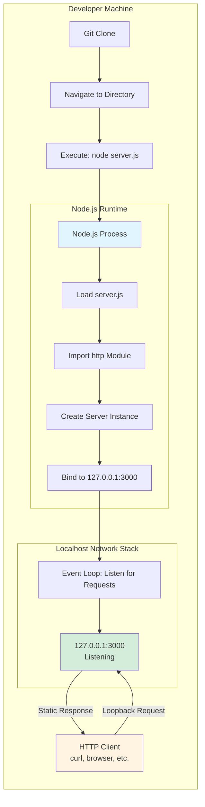
```mermaid
graph LR
    subgraph "Developer Machine"
        A[Git Clone] --> B[Navigate to Directory]
        B --> C[Execute: node server.js]
        C --> D[Node.js Process]
        
        subgraph "Node.js Runtime"
            D --> E[Load server.js]
            E --> F[Import http Module]
            F --> G[Create Server Instance]
            G --> H[Bind to 127.0.0.1:3000]
        end
        
        H --> I[Event Loop: Listen for Requests]
        
        subgraph "Localhost Network Stack"
            I --> J[127.0.0.1:3000<br/>Listening]
        end
        
        K[HTTP Client<br/>curl, browser, etc.] -->|Loopback Request| J
        J -->|Static Response| K
    end
    
    style D fill:#e1f5ff
    style J fill:#d4edda
    style K fill:#fff4e1
```

## 3.7 Security Technologies

### 3.7.1 Authentication and Authorization: None

**Security Mechanisms Excluded:**
- ❌ No user authentication (no login system)
- ❌ No OAuth/OIDC integration
- ❌ No API key validation
- ❌ No JWT token verification
- ❌ No session-based authentication
- ❌ No role-based access control (RBAC)
- **Evidence:** Scope section 1.3.2.1

**Security Posture:**
- **Access Control:** Implicit via localhost-only binding
- **Authorization:** All requests accepted without validation
- **Acceptable For:** Single-user development machine
- **NOT Acceptable For:** Any multi-user or network-accessible environment

### 3.7.2 Transport Security: None

**Encryption Technologies Excluded:**
- ❌ No HTTPS/TLS (HTTP only)
- ❌ No SSL certificates
- ❌ No certificate management
- **Evidence:** Implementation Considerations section 2.5.4.1

**Rationale:**
- **Localhost Traffic:** Never leaves machine (no network transmission)
- **Risk Level:** LOW (loopback interface is isolated)
- **Performance:** No encryption overhead
- **Acceptable For:** Local development and testing only

### 3.7.3 Input Security: N/A

**Input Validation:** NOT REQUIRED

**Why No Input Security:**
- Request object received but never examined
- No input parsing or processing
- No user-supplied data reflected in responses
- No database queries (no SQL injection risk)
- No file system operations (no path traversal risk)
- No system commands executed (no command injection risk)

**Security Benefits of Static Response:**
- **XSS Prevention:** Content-Type text/plain prevents script execution
- **Injection Prevention:** No dynamic query generation
- **Output Encoding:** Not required (no user input reflected)
- **Evidence:** Implementation Considerations section 2.5.4.2

### 3.7.4 Dependency Security

**Supply Chain Security:** OPTIMAL (zero dependencies)

**Security Advantages:**

| Threat Vector | Risk with Dependencies | This Implementation | Protection Level |
|--------------|----------------------|---------------------|-----------------|
| Vulnerable Dependencies | CVE exposure | ZERO packages | ✅ Complete |
| Malicious Packages | Registry compromise | No registry usage | ✅ Complete |
| Typosquatting | Similar package names | No installations | ✅ Complete |
| Dependency Confusion | Name resolution attacks | No resolution | ✅ Complete |
| Outdated Packages | Security patches missed | N/A | ✅ N/A |
| Transitive Dependencies | Hidden vulnerabilities | No transitive deps | ✅ Complete |

**Evidence:** Implementation Considerations section 2.5.4.3

**Node.js Runtime Security:**
- **Responsibility:** User must maintain updated Node.js installation
- **Recommendation:** Use LTS versions with active security support
- **Monitoring:** Track Node.js security advisories
- **Update Cadence:** Follow LTS release schedule (6-12 months)

## 3.8 Technology Stack Summary

### 3.8.1 Complete Technology Inventory

#### 3.8.1.1 Production Technologies

| Category | Technology | Version | Purpose | Source |
|----------|-----------|---------|---------|--------|
| **Runtime** | Node.js | 6.x+ (12.x+ recommended) | JavaScript execution environment | System requirement |
| **Package Manager** | npm | 7.0+ | Package manifest and lockfile management | package-lock.json format |
| **Language** | JavaScript (ES6) | ECMAScript 2015 | Application implementation language | server.js syntax |
| **Core Module** | http | Built-in (stable) | HTTP server implementation | `require('http')` |
| **Process Model** | Single-threaded | Node.js default | Event-driven request handling | Architecture decision |

#### 3.8.1.2 Development Technologies

| Category | Technology | Version | Purpose | Usage |
|----------|-----------|---------|---------|-------|
| **Version Control** | Git | Any | Source code management | Repository present |
| **Editor** | Any text editor/IDE | Any | Code editing | No specific requirement |
| **Debugging** | Node.js Inspector | Built-in | Debugging and profiling | Optional usage |
| **Testing** | Manual HTTP clients | Any | Integration validation | External testing |

#### 3.8.1.3 Explicitly Excluded Technologies

**Complete Exclusion List:**

- **Frameworks:** Express, Fastify, Koa, Hapi, NestJS
- **Databases:** PostgreSQL, MySQL, MongoDB, Redis, SQLite
- **ORMs:** Sequelize, TypeORM, Mongoose, Prisma
- **Testing:** Jest, Mocha, Jasmine, Ava, Cypress
- **Build Tools:** Webpack, Rollup, Parcel, Babel, TypeScript
- **Linting:** ESLint, JSLint, Prettier, StandardJS
- **Process Managers:** PM2, Forever, systemd
- **Containerization:** Docker, Kubernetes, Docker Compose
- **CI/CD:** GitHub Actions, GitLab CI, Jenkins, CircleCI
- **Monitoring:** New Relic, Datadog, Sentry, Prometheus
- **Logging:** Winston, Pino, Bunyan, Morgan
- **Authentication:** Auth0, Passport.js, OAuth libraries
- **Cloud Services:** AWS SDK, Azure SDK, Google Cloud Client
- **Message Queues:** RabbitMQ, Kafka, Redis Pub/Sub

### 3.8.2 Technology Decision Summary

#### 3.8.2.1 Core Architectural Decisions

**Decision 1: Zero External Dependencies**
- **Choice:** Node.js built-in modules only
- **Rejected:** npm ecosystem packages
- **Rationale:** Eliminate supply chain risk, reduce maintenance burden, ensure security
- **Trade-off:** Manual implementation required vs. framework convenience
- **Outcome:** 15-line application with complete code transparency

**Decision 2: Single-File Implementation**
- **Choice:** All logic in server.js (15 lines)
- **Rejected:** Multi-file architecture with module separation
- **Rationale:** Simplicity, auditability, zero abstraction layers
- **Trade-off:** No code organization vs. rapid comprehension
- **Outcome:** Complete application audit possible in <5 minutes

**Decision 3: Hardcoded Configuration**
- **Choice:** Constants in source code (hostname, port)
- **Rejected:** Environment variables, config files, command-line arguments
- **Rationale:** Predictable test environment, no configuration variability
- **Trade-off:** Requires code modification to change settings vs. flexibility
- **Outcome:** Zero configuration-related bugs or environment discrepancies

**Decision 4: Static Response Pattern**
- **Choice:** Identical response for all requests
- **Rejected:** Dynamic routing, request processing, template rendering
- **Rationale:** Test consistency, no request inspection complexity
- **Trade-off:** Zero flexibility vs. predictable test behavior
- **Outcome:** <1ms response time, zero request-handling bugs

**Decision 5: Localhost-Only Binding**
- **Choice:** 127.0.0.1 binding (loopback interface)
- **Rejected:** 0.0.0.0 (all interfaces) or specific network interface
- **Rationale:** Security through network isolation, test environment focus
- **Trade-off:** Cannot be accessed remotely vs. complete network security
- **Outcome:** Zero network-based attack surface

#### 3.8.2.2 Technology Selection Criteria

**Evaluation Framework:**

1. **Simplicity:** Minimize technology stack size
2. **Security:** Reduce attack surface and dependency risk
3. **Performance:** Achieve <1s startup, <10ms response time
4. **Maintainability:** Enable complete code audit in minutes
5. **Transparency:** Every line of code understandable by junior developers
6. **Test Suitability:** Create predictable, controlled test environment

**Selection Outcomes:**
- ✅ Node.js: Meets all criteria (built-in HTTP, minimal footprint)
- ❌ Python: Requires external HTTP library (Flask, Django)
- ❌ Go: Compilation step adds complexity
- ❌ Java: JVM overhead excessive for simple test harness
- ❌ Ruby: Requires web framework (Sinatra, Rails)

### 3.8.3 Version Requirements Matrix

| Component | Minimum Version | Recommended Version | Maximum Version | Compatibility Notes |
|-----------|----------------|--------------------|-----------------|--------------------|
| **Node.js** | 6.0.0 | 12.x LTS or higher | No maximum | ES6 support required |
| **npm** | 7.0.0 | 8.x or 9.x | No maximum | Lockfile v3 format |
| **JavaScript** | ES2015 (ES6) | ES2015 | ES2015 | No newer features used |
| **Operating System** | Any with Node.js support | Linux, macOS, Windows 10+ | Any | Platform-agnostic |

### 3.8.4 Technology Upgrade Path

#### 3.8.4.1 Node.js Version Updates

**Current State:** No explicit version constraint

**Upgrade Strategy:**
1. **Testing Required:** Verify http module behavior on new Node.js versions
2. **LTS Tracking:** Follow Node.js LTS release schedule
3. **Breaking Changes:** Monitor Node.js release notes for http module changes
4. **Deprecations:** Track deprecation warnings in standard library

**Update Frequency:** Every 6-12 months (align with LTS releases)

**Risk Assessment:** LOW
- http module is stable API (unlikely to break)
- ES6 features are frozen specification (no syntax changes)
- Backward compatibility maintained across Node.js versions

#### 3.8.4.2 Dependency Modernization

**Current Strategy:** ZERO DEPENDENCIES (no updates required)

**Future Considerations:**
- **Policy:** Maintain zero-dependency architecture indefinitely
- **Exception Process:** Any dependency addition requires architectural review
- **Alternative:** Reimplement functionality in application code if needed

## 3.9 References

### 3.9.1 Repository Files Examined

**Application Files:**
- `server.js` (15 lines) - Complete HTTP server implementation with hardcoded configuration
- `package.json` (11 lines) - npm package manifest with zero dependencies
- `package-lock.json` (14 lines) - npm lockfile v3 with empty dependency tree
- `README.md` (2 lines) - Project identification as backprop integration test

**Repository Structure:**
- `/` (root directory) - All files in flat structure, no subdirectories

### 3.9.2 Technical Specification Sections Referenced

**Primary Sections:**
- Section 1.1 Executive Summary - System overview and resource footprint
- Section 1.2 System Overview - Architecture patterns and technology stack summary
- Section 1.3 Scope - In-scope features and explicit exclusions
- Section 2.3 Functional Requirements Specification - Detailed technical requirements
- Section 2.5 Implementation Considerations - Technical constraints, performance, security
- Section 2.7 Assumptions and Constraints - Design rationale and known issues

### 3.9.3 External Documentation

**Node.js Official Documentation:**
- Node.js API Documentation: https://nodejs.org/api/
- HTTP Module Reference: https://nodejs.org/api/http.html
- Node.js LTS Release Schedule: https://nodejs.org/en/about/releases/

**JavaScript Language Specification:**
- ECMAScript 2015 (ES6) Specification: https://262.ecma-international.org/6.0/

**npm Documentation:**
- package.json Specification: https://docs.npmjs.com/cli/v10/configuring-npm/package-json
- package-lock.json Format: https://docs.npmjs.com/cli/v10/configuring-npm/package-lock-json

# 4. Process Flowchart

## 4.1 Overview and Flowchart Strategy

### 4.1.1 Process Documentation Approach

This section provides comprehensive process flowcharts documenting all operational workflows within the **hao-backprop-test** minimal HTTP server system. The flowcharts illustrate the complete lifecycle of the server from startup through request processing to shutdown, emphasizing the system's intentionally simple, deterministic architecture designed specifically for backprop integration testing.

**Documentation Philosophy:**
- **Simplicity-First:** Flowcharts reflect the deliberately minimal implementation with 15 lines of application code
- **Zero-Complexity Design:** Linear process flows with minimal branching reflect the absence of business logic
- **Test Harness Purpose:** All workflows optimized for predictable, repeatable behavior in testing environments
- **Stateless Architecture:** Process flows demonstrate independent request handling without state persistence

### 4.1.2 Flowchart Conventions

**Diagram Notation Standards:**
- **Process Rectangles:** Represent discrete execution steps or operations
- **Decision Diamonds:** Indicate conditional logic or validation points (minimal in this system)
- **Rounded Rectangles:** Denote start and end states
- **Swim Lanes:** Separate concerns across user, runtime, and system boundaries
- **Timing Annotations:** Include performance targets where applicable

### 4.1.3 System Workflow Categories

The process flows are organized into the following categories:

1. **Core System Workflows:** Server startup, request handling, and shutdown sequences
2. **Development and Operations Workflows:** Installation, configuration, and execution procedures
3. **Feature-Specific Process Flows:** Detailed flows for each of the six identified features (F-001 through F-006)
4. **State Management and Transitions:** Server lifecycle state machine and request processing states
5. **Error Handling and Recovery Flows:** Failure scenarios and termination paths
6. **Integration and Interaction Flows:** Client-server interaction sequences and test harness integration

---

## 4.2 Core System Workflows

### 4.2.1 Server Startup Workflow

#### 4.2.1.1 High-Level Startup Sequence

The server startup workflow represents the initialization sequence from command execution to ready state, completing in <1 second (typically 200-500ms). This workflow implements features F-001 (HTTP Server Foundation) and F-003 (Server Lifecycle Management).

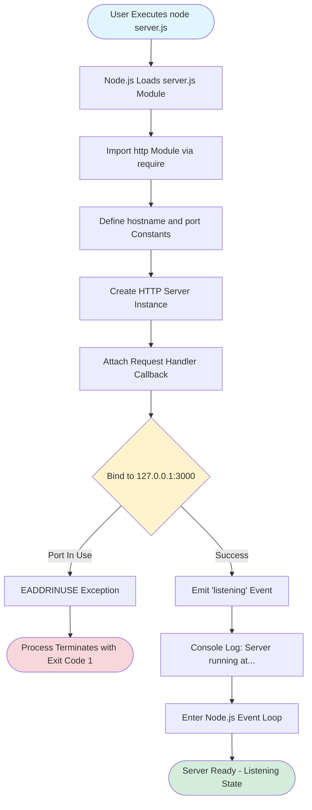
```mermaid
flowchart TD
    Start([User Executes node server.js]) --> LoadModule[Node.js Loads server.js Module]
    LoadModule --> ImportHTTP[Import http Module via require]
    ImportHTTP --> DefineConstants[Define hostname and port Constants]
    DefineConstants --> CreateServer[Create HTTP Server Instance]
    CreateServer --> AttachHandler[Attach Request Handler Callback]
    AttachHandler --> BindPort{Bind to 127.0.0.1:3000}
    BindPort -->|Success| EmitListening[Emit 'listening' Event]
    BindPort -->|Port In Use| ErrorEADDRINUSE[EADDRINUSE Exception]
    ErrorEADDRINUSE --> ProcessCrash([Process Terminates with Exit Code 1])
    EmitListening --> ConsoleLog[Console Log: Server running at...]
    ConsoleLog --> EnterEventLoop[Enter Node.js Event Loop]
    EnterEventLoop --> Ready([Server Ready - Listening State])
    
    style Start fill:#e1f5ff
    style Ready fill:#d4edda
    style ProcessCrash fill:#f8d7da
    style BindPort fill:#fff3cd
```

**Startup Sequence Timing:**
- **T+0ms:** User command execution (`node server.js`)
- **T+50ms:** Module loaded, http imported
- **T+51ms:** Server instance created
- **T+52ms:** Constants defined (hostname, port)
- **T+150ms:** Port binding initiated
- **T+200ms:** Binding complete, console.log executed
- **T+201ms:** Server ready, event loop active

**Source Evidence:** `server.js` lines 1-14, System Overview 1.2.3.1

#### 4.2.1.2 Detailed Startup Process with Swim Lanes

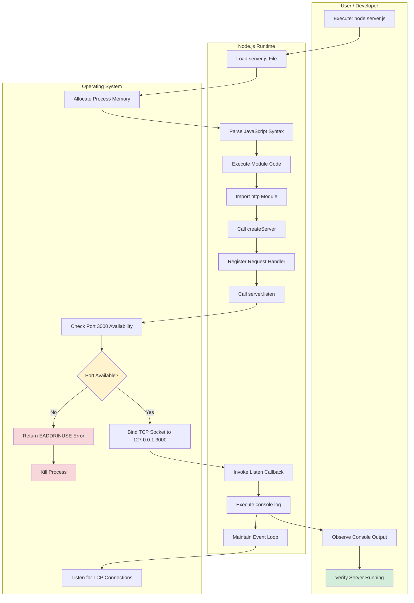
```mermaid
flowchart TD
    subgraph User["User / Developer"]
        A1[Execute: node server.js]
        A2[Observe Console Output]
        A3[Verify Server Running]
    end
    
    subgraph NodeJS["Node.js Runtime"]
        B1[Load server.js File]
        B2[Parse JavaScript Syntax]
        B3[Execute Module Code]
        B4[Import http Module]
        B5[Call createServer]
        B6[Register Request Handler]
        B7[Call server.listen]
        B8[Invoke Listen Callback]
        B9[Execute console.log]
        B10[Maintain Event Loop]
    end
    
    subgraph OS["Operating System"]
        C1[Allocate Process Memory]
        C2[Check Port 3000 Availability]
        C3{Port Available?}
        C4[Bind TCP Socket to 127.0.0.1:3000]
        C5[Return EADDRINUSE Error]
        C6[Kill Process]
        C7[Listen for TCP Connections]
    end
    
    A1 --> B1
    B1 --> C1
    C1 --> B2
    B2 --> B3
    B3 --> B4
    B4 --> B5
    B5 --> B6
    B6 --> B7
    B7 --> C2
    C2 --> C3
    C3 -->|Yes| C4
    C3 -->|No| C5
    C5 --> C6
    C4 --> B8
    B8 --> B9
    B9 --> A2
    A2 --> A3
    B9 --> B10
    B10 --> C7
    
    style C3 fill:#fff3cd
    style C5 fill:#f8d7da
    style C6 fill:#f8d7da
    style A3 fill:#d4edda
```

**Critical Decision Points:**

| Decision | Condition | Success Path | Failure Path |
|----------|-----------|--------------|--------------|
| Port 3000 Available | OS checks if TCP port in use | Bind succeeds → Ready state | EADDRINUSE exception → Process crash |
| Node.js Version ≥6.x | ES6 syntax parsing | Module loads successfully | Syntax error → Process crash |

**Source Evidence:** Implementation Considerations 2.5.1.3, Functional Requirements 2.3.1.2

#### 4.2.1.3 Startup Validation Rules

**Pre-Startup Validation (Implicit):**
1. **Node.js Runtime Check:** Version 6.x+ required for ES6 support (const, let, arrow functions)
2. **Port Availability Check:** Operating system verifies port 3000 not bound by another process
3. **File System Access:** Read permission for server.js file
4. **Memory Availability:** Sufficient memory for Node.js process (<10MB target)

**Post-Startup Validation:**
1. **Binding Confirmation:** Console log message indicates successful binding
2. **Process Persistence:** Process remains in system process table
3. **Event Loop Active:** Server socket prevents automatic process exit
4. **Listening State:** TCP socket accepting connections on localhost:3000

**No Authorization Checkpoints:**
- No authentication required (localhost trust model)
- No user validation
- No access control lists
- No firewall configuration required for loopback interface

**Source Evidence:** Functional Requirements 2.3.1.2, Assumptions and Constraints 2.7.1

---

### 4.2.2 HTTP Request Handling Workflow

#### 4.2.2.1 Universal Request Processing Flow

The request handling workflow demonstrates the system's core design principle: **all HTTP requests receive identical static responses** regardless of method, path, headers, or body content. This implements feature F-002 (Static Response Generation) and supports F-001 (HTTP Server Foundation).

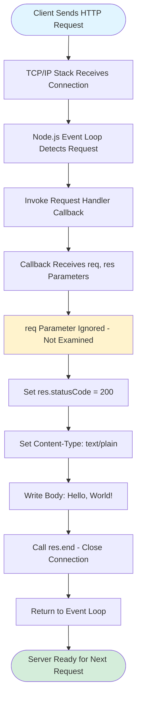
```mermaid
flowchart TD
    Start([Client Sends HTTP Request]) --> TCPReceive[TCP/IP Stack Receives Connection]
    TCPReceive --> EventLoopDetect[Node.js Event Loop Detects Request]
    EventLoopDetect --> InvokeCallback[Invoke Request Handler Callback]
    InvokeCallback --> ReceiveParams[Callback Receives req, res Parameters]
    ReceiveParams --> IgnoreReq[req Parameter Ignored - Not Examined]
    IgnoreReq --> SetStatus[Set res.statusCode = 200]
    SetStatus --> SetHeader[Set Content-Type: text/plain]
    SetHeader --> WriteBody[Write Body: Hello, World!\n]
    WriteBody --> EndResponse[Call res.end - Close Connection]
    EndResponse --> ReturnEventLoop[Return to Event Loop]
    ReturnEventLoop --> End([Server Ready for Next Request])
    
    style Start fill:#e1f5ff
    style IgnoreReq fill:#fff3cd
    style End fill:#d4edda
```

**Request Processing Timing:**
- **T+0ms:** Request received by TCP stack
- **T+0.1ms:** Event loop detects request
- **T+0.2ms:** Callback invoked with (req, res)
- **T+0.3ms:** Status code set to 200
- **T+0.4ms:** Content-Type header set
- **T+0.5ms:** Response body written ("Hello, World!\n")
- **T+1ms:** Connection closed, return to event loop

**Performance Targets:**
- **Response Time:** <10ms per request (target), typically 1-5ms
- **Throughput:** >1,000 req/sec (target), typically 5,000-10,000 req/sec
- **Concurrency:** Supports 100+ concurrent connections

**Source Evidence:** Implementation Considerations 2.5.2.2, 2.5.2.3

#### 4.2.2.2 Universal Request Handling Matrix

The system's defining characteristic is its **method-agnostic, path-agnostic response generation**:

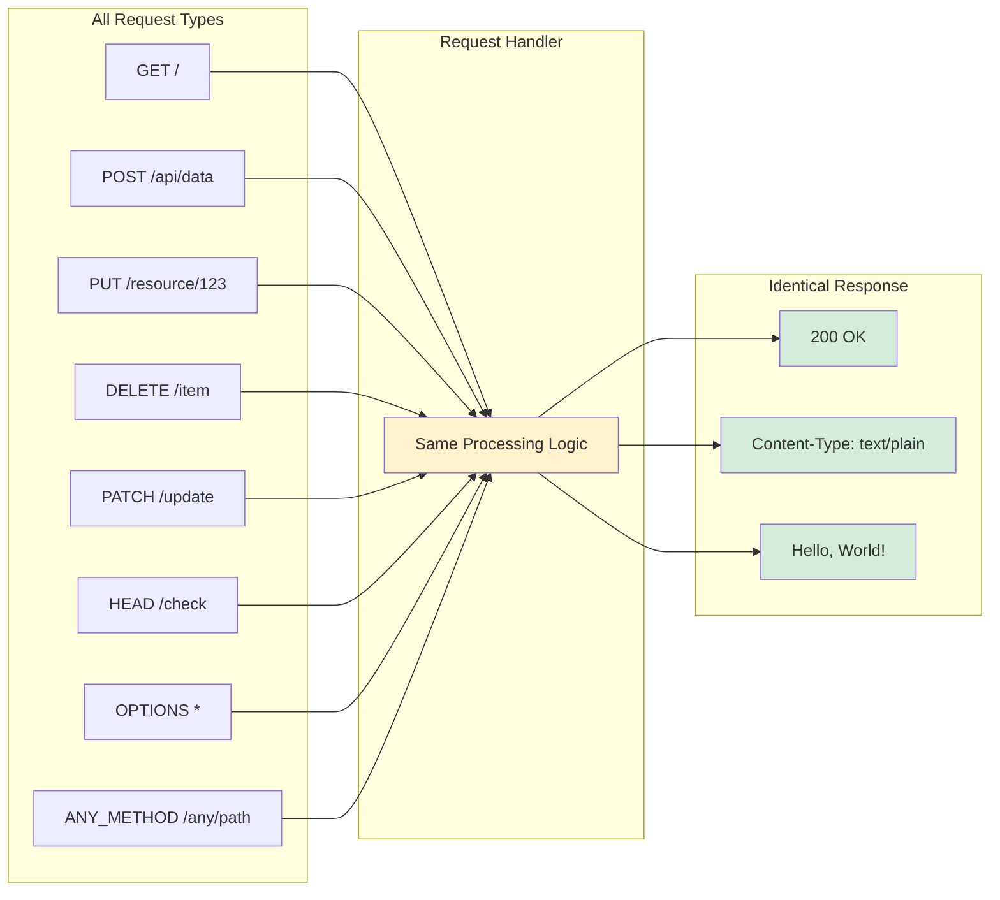
```mermaid
flowchart LR
    subgraph Inputs["All Request Types"]
        GET[GET /]
        POST[POST /api/data]
        PUT[PUT /resource/123]
        DELETE[DELETE /item]
        PATCH[PATCH /update]
        HEAD[HEAD /check]
        OPTIONS[OPTIONS *]
        AnyPath[ANY_METHOD /any/path]
    end
    
    subgraph Handler["Request Handler"]
        Process[Same Processing Logic]
    end
    
    subgraph Output["Identical Response"]
        Status[200 OK]
        Header[Content-Type: text/plain]
        Body[Hello, World!\n]
    end
    
    GET --> Process
    POST --> Process
    PUT --> Process
    DELETE --> Process
    PATCH --> Process
    HEAD --> Process
    OPTIONS --> Process
    AnyPath --> Process
    
    Process --> Status
    Process --> Header
    Process --> Body
    
    style Process fill:#fff3cd
    style Status fill:#d4edda
    style Header fill:#d4edda
    style Body fill:#d4edda
```

**Universal Request Acceptance:**

| Request Element | Handling Behavior | Validation Applied | Response Impact |
|----------------|-------------------|-------------------|-----------------|
| HTTP Method | Accepted (not examined) | None | No impact - identical response |
| URL Path | Accepted (not examined) | None | No impact - identical response |
| Query Parameters | Accepted (not parsed) | None | No impact - identical response |
| Request Headers | Received (not inspected) | None | No impact - identical response |
| Request Body | Received (not read) | None | No impact - identical response |
| Content-Type | Accepted (ignored) | None | No impact - identical response |

**Source Evidence:** Functional Requirements 2.3.1.3, 2.3.2.3

#### 4.2.2.3 Request-Response Sequence Diagram

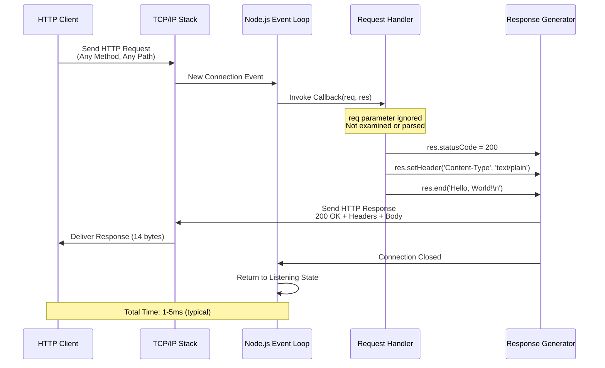
```mermaid
sequenceDiagram
    participant Client as HTTP Client
    participant TCP as TCP/IP Stack
    participant EventLoop as Node.js Event Loop
    participant Handler as Request Handler
    participant Response as Response Generator
    
    Client->>TCP: Send HTTP Request<br/>(Any Method, Any Path)
    TCP->>EventLoop: New Connection Event
    EventLoop->>Handler: Invoke Callback(req, res)
    Note over Handler: req parameter ignored<br/>Not examined or parsed
    Handler->>Response: res.statusCode = 200
    Handler->>Response: res.setHeader('Content-Type', 'text/plain')
    Handler->>Response: res.end('Hello, World!\n')
    Response->>TCP: Send HTTP Response<br/>200 OK + Headers + Body
    TCP->>Client: Deliver Response (14 bytes)
    Response->>EventLoop: Connection Closed
    EventLoop->>EventLoop: Return to Listening State
    
    Note over Client,EventLoop: Total Time: 1-5ms (typical)
```

**Response Format (Byte-Exact):**
```
HTTP/1.1 200 OK
Content-Type: text/plain
Content-Length: 14

Hello, World!
[LF]
```

**Byte Representation:** `[72, 101, 108, 108, 111, 44, 32, 87, 111, 114, 108, 100, 33, 10]` (14 bytes)

**Source Evidence:** Functional Requirements 2.3.2.3, `server.js` lines 6-10

#### 4.2.2.4 State Management in Request Processing

**Stateless Architecture:**

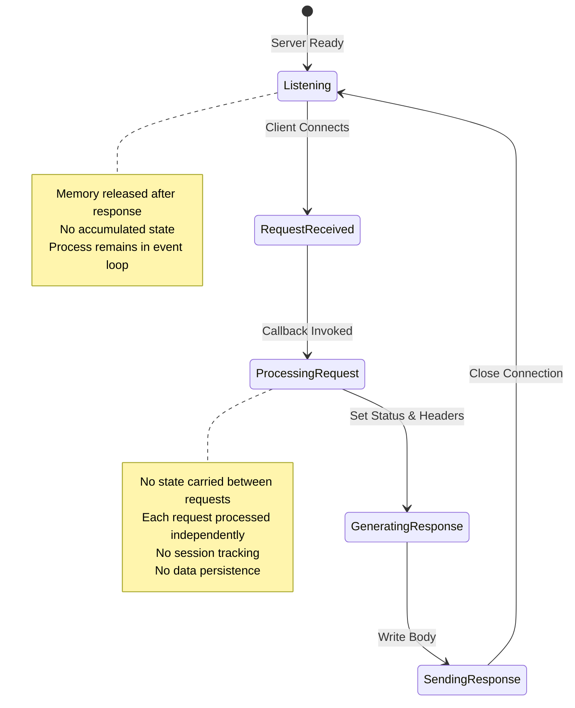
```mermaid
stateDiagram-v2
    [*] --> Listening: Server Ready
    Listening --> RequestReceived: Client Connects
    RequestReceived --> ProcessingRequest: Callback Invoked
    ProcessingRequest --> GeneratingResponse: Set Status & Headers
    GeneratingResponse --> SendingResponse: Write Body
    SendingResponse --> Listening: Close Connection
    
    note right of ProcessingRequest
        No state carried between requests
        Each request processed independently
        No session tracking
        No data persistence
    end note
    
    note right of Listening
        Memory released after response
        No accumulated state
        Process remains in event loop
    end note
```

**Key Stateless Characteristics:**
- ✅ No database connections
- ✅ No file system storage
- ✅ No in-memory caching
- ✅ No session management
- ✅ No cookies or authentication tokens
- ✅ No user data storage
- ✅ No request history or logging (beyond startup)

**Request Isolation Guarantees:**
- Each request begins with clean callback invocation
- No data carried between requests
- No side effects from previous requests
- Memory released immediately after response sent
- No transaction boundaries or rollback capability

**Source Evidence:** System Overview 1.2.2.1, Implementation Considerations 2.5.1.3

---

### 4.2.3 Server Shutdown Workflow

#### 4.2.3.1 Immediate Termination Process

The server shutdown workflow demonstrates the **absence of graceful shutdown logic**, reflecting the test harness design philosophy where immediate termination is acceptable.

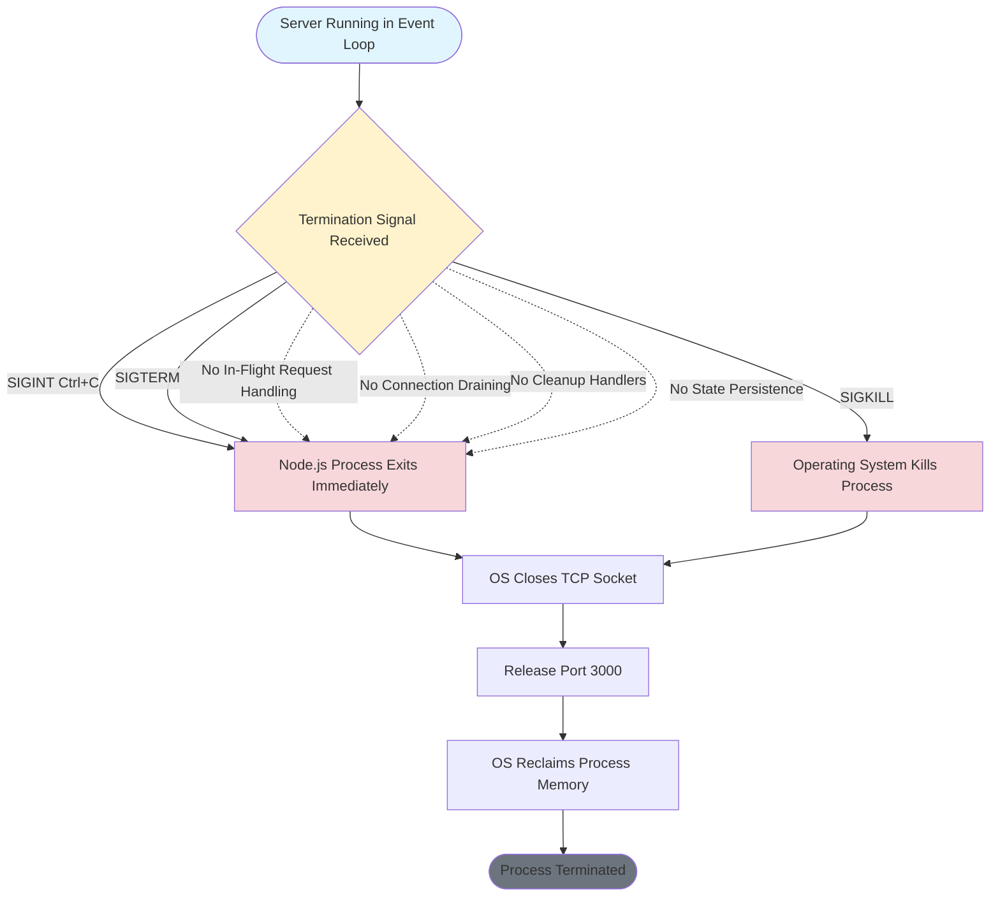
```mermaid
flowchart TD
    Start([Server Running in Event Loop]) --> ReceiveSignal{Termination Signal Received}
    ReceiveSignal -->|SIGINT Ctrl+C| ImmediateExit[Node.js Process Exits Immediately]
    ReceiveSignal -->|SIGTERM| ImmediateExit
    ReceiveSignal -->|SIGKILL| ForceKill[Operating System Kills Process]
    ImmediateExit --> CloseSocket[OS Closes TCP Socket]
    ForceKill --> CloseSocket
    CloseSocket --> ReleasePort[Release Port 3000]
    ReleasePort --> ReclaimMemory[OS Reclaims Process Memory]
    ReclaimMemory --> End([Process Terminated])
    
    ReceiveSignal -.No In-Flight Request Handling.-> ImmediateExit
    ReceiveSignal -.No Connection Draining.-> ImmediateExit
    ReceiveSignal -.No Cleanup Handlers.-> ImmediateExit
    ReceiveSignal -.No State Persistence.-> ImmediateExit
    
    style Start fill:#e1f5ff
    style ReceiveSignal fill:#fff3cd
    style End fill:#6c757d
    style ImmediateExit fill:#f8d7da
    style ForceKill fill:#f8d7da
```

**No Graceful Shutdown Features:**
- ❌ No connection draining (active requests interrupted)
- ❌ No in-flight request completion
- ❌ No cleanup handlers (process.on('SIGTERM') not implemented)
- ❌ No state persistence before shutdown
- ❌ No shutdown logging or notification
- ❌ No delay for pending operations

**Shutdown Sequence:**
1. **Signal Reception:** User sends SIGINT (Ctrl+C) or SIGTERM signal
2. **Immediate Termination:** Node.js process exits without cleanup
3. **Socket Closure:** Operating system closes TCP socket
4. **Port Release:** Port 3000 becomes available for other processes
5. **Memory Reclamation:** OS frees all process memory
6. **Process Removal:** Process removed from system process table

**Source Evidence:** Implementation Considerations 2.5.5.4

#### 4.2.3.2 Shutdown Scenarios and Outcomes

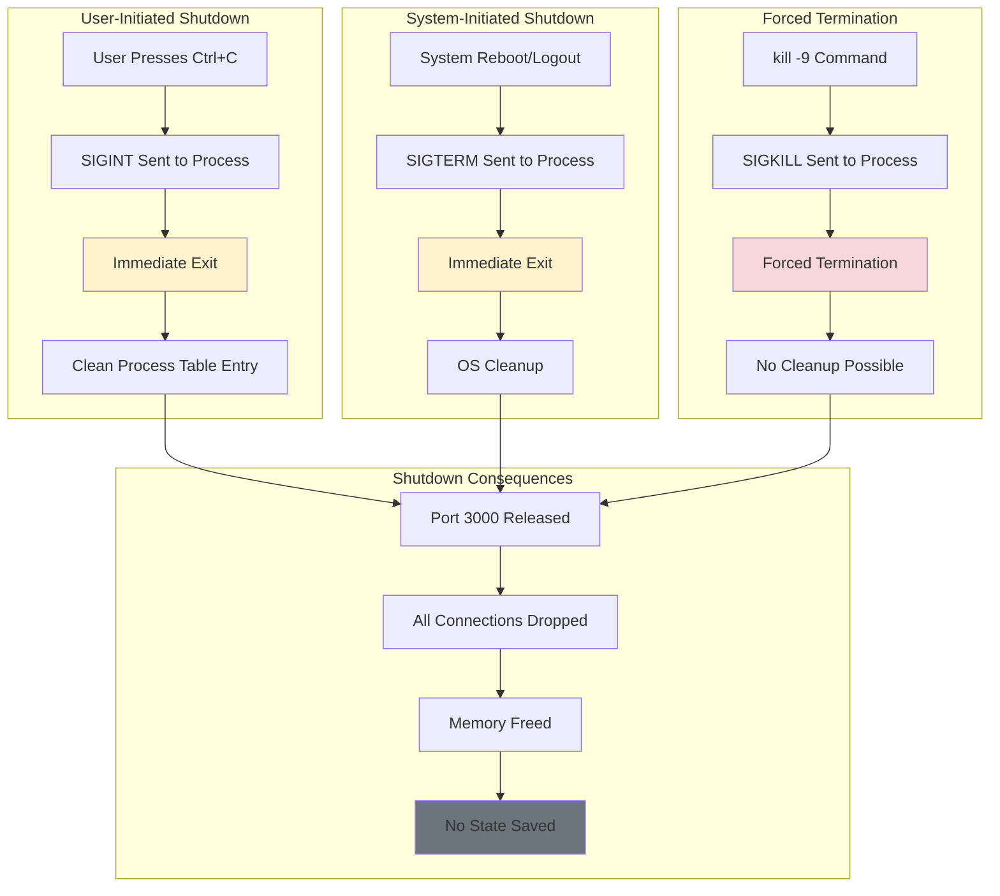
```mermaid
flowchart TD
    subgraph NormalShutdown["User-Initiated Shutdown"]
        A1[User Presses Ctrl+C]
        A2[SIGINT Sent to Process]
        A3[Immediate Exit]
        A4[Clean Process Table Entry]
    end
    
    subgraph SystemShutdown["System-Initiated Shutdown"]
        B1[System Reboot/Logout]
        B2[SIGTERM Sent to Process]
        B3[Immediate Exit]
        B4[OS Cleanup]
    end
    
    subgraph ForceKill["Forced Termination"]
        C1[kill -9 Command]
        C2[SIGKILL Sent to Process]
        C3[Forced Termination]
        C4[No Cleanup Possible]
    end
    
    subgraph Consequences["Shutdown Consequences"]
        D1[Port 3000 Released]
        D2[All Connections Dropped]
        D3[Memory Freed]
        D4[No State Saved]
    end
    
    A1 --> A2 --> A3 --> A4 --> D1
    B1 --> B2 --> B3 --> B4 --> D1
    C1 --> C2 --> C3 --> C4 --> D1
    D1 --> D2 --> D3 --> D4
    
    style A3 fill:#fff3cd
    style B3 fill:#fff3cd
    style C3 fill:#f8d7da
    style D4 fill:#6c757d
```

**Recovery Procedures:**
- **Manual Restart Required:** User must execute `node server.js` again
- **No Automatic Restart:** No process monitoring (systemd, PM2, forever)
- **No Health Checks:** No automated recovery mechanisms
- **No State Recovery:** Server always starts fresh (no state to recover)

**Source Evidence:** Implementation Considerations 2.5.5.4, Functional Requirements 2.3.3.2

---

## 4.3 Development and Operations Workflows

### 4.3.1 Installation and Setup Workflow

#### 4.3.1.1 Repository Setup Process

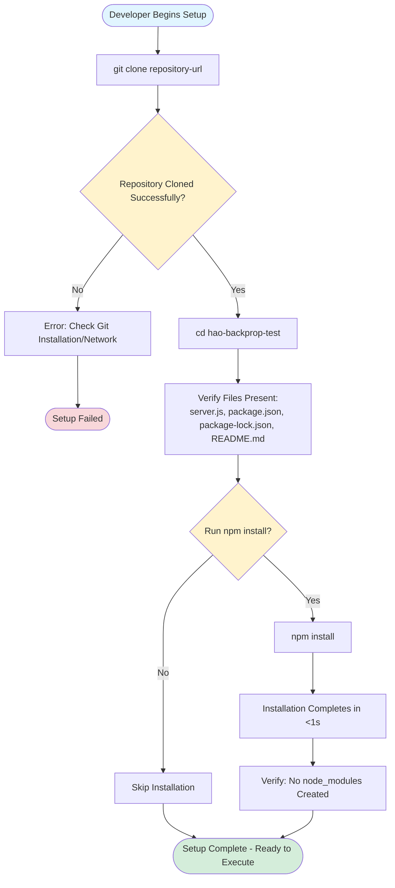
```mermaid
flowchart TD
    Start([Developer Begins Setup]) --> GitClone[git clone repository-url]
    GitClone --> VerifyClone{Repository Cloned Successfully?}
    VerifyClone -->|No| CloneError[Error: Check Git Installation/Network]
    CloneError --> End1([Setup Failed])
    VerifyClone -->|Yes| ChangeDir[cd hao-backprop-test]
    ChangeDir --> ListFiles[Verify Files Present:<br/>server.js, package.json, package-lock.json, README.md]
    ListFiles --> OptionalInstall{Run npm install?}
    OptionalInstall -->|Yes| NPMInstall[npm install]
    OptionalInstall -->|No| SkipInstall[Skip Installation]
    NPMInstall --> InstallComplete[Installation Completes in <1s]
    InstallComplete --> VerifyNoDeps[Verify: No node_modules Created]
    SkipInstall --> Ready
    VerifyNoDeps --> Ready([Setup Complete - Ready to Execute])
    
    style Start fill:#e1f5ff
    style Ready fill:#d4edda
    style End1 fill:#f8d7da
    style VerifyClone fill:#fff3cd
    style OptionalInstall fill:#fff3cd
```

**Setup Timing:**
- **Git Clone:** 1-5 seconds (depends on network speed)
- **Directory Navigation:** <100ms
- **npm install (optional):** <1 second (no packages to download)
- **Total Setup Time:** <10 seconds

**Source Evidence:** Development and Deployment 3.6.5.1

#### 4.3.1.2 Dependency Installation Flow

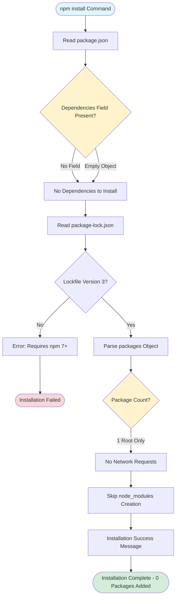
```mermaid
flowchart TD
    Start([npm install Command]) --> ReadPackageJSON[Read package.json]
    ReadPackageJSON --> CheckDeps{Dependencies Field Present?}
    CheckDeps -->|No Field| NoDeps[No Dependencies to Install]
    CheckDeps -->|Empty Object| NoDeps
    NoDeps --> ReadLockfile[Read package-lock.json]
    ReadLockfile --> VerifyLockfileV3{Lockfile Version 3?}
    VerifyLockfileV3 -->|No| VersionError[Error: Requires npm 7+]
    VersionError --> End1([Installation Failed])
    VerifyLockfileV3 -->|Yes| ParsePackages[Parse packages Object]
    ParsePackages --> CountPackages{Package Count?}
    CountPackages -->|1 Root Only| NoDownloads[No Network Requests]
    NoDownloads --> NoNodeModules[Skip node_modules Creation]
    NoNodeModules --> Success[Installation Success Message]
    Success --> End2([Installation Complete - 0 Packages Added])
    
    style Start fill:#e1f5ff
    style End1 fill:#f8d7da
    style End2 fill:#d4edda
    style CheckDeps fill:#fff3cd
    style CountPackages fill:#fff3cd
```

**Installation Characteristics:**
- **Network Requests:** 0 (no packages to download from npm registry)
- **Disk Space Used:** 0 bytes (no node_modules directory)
- **Installation Time:** <1 second
- **npm Version Required:** 7.0+ (for lockfile v3 support)

**Verification Steps:**
1. Confirm no `node_modules` directory created
2. Verify `package.json` has no `dependencies` field
3. Check `package-lock.json` contains only root package entry
4. Validate npm version is 7.x or higher

**Source Evidence:** Functional Requirements 2.3.4.1, `package-lock.json` analysis

---

### 4.3.2 Execution and Verification Workflow

#### 4.3.2.1 Server Execution Process

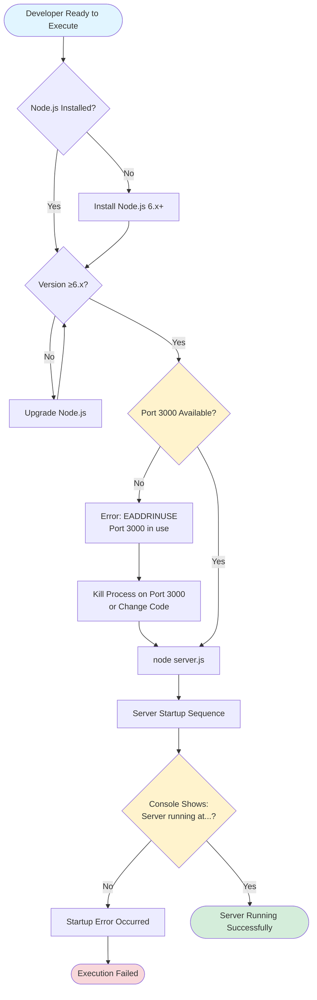
```mermaid
flowchart TD
    Start([Developer Ready to Execute]) --> CheckNodeJS{Node.js Installed?}
    CheckNodeJS -->|No| InstallNode[Install Node.js 6.x+]
    CheckNodeJS -->|Yes| CheckVersion{Version ≥6.x?}
    CheckVersion -->|No| UpgradeNode[Upgrade Node.js]
    CheckVersion -->|Yes| CheckPort{Port 3000 Available?}
    CheckPort -->|No| PortConflict[Error: EADDRINUSE<br/>Port 3000 in use]
    PortConflict --> FreePort[Kill Process on Port 3000<br/>or Change Code]
    FreePort --> Execute
    CheckPort -->|Yes| Execute[node server.js]
    Execute --> Startup[Server Startup Sequence]
    Startup --> ConsoleOutput{Console Shows:<br/>Server running at...?}
    ConsoleOutput -->|No| StartupError[Startup Error Occurred]
    StartupError --> End1([Execution Failed])
    ConsoleOutput -->|Yes| ServerRunning([Server Running Successfully])
    
    InstallNode --> CheckVersion
    UpgradeNode --> CheckVersion
    
    style Start fill:#e1f5ff
    style ServerRunning fill:#d4edda
    style End1 fill:#f8d7da
    style CheckPort fill:#fff3cd
    style ConsoleOutput fill:#fff3cd
```

**Pre-Execution Checks:**

| Check | Validation Method | Success Criteria | Failure Resolution |
|-------|------------------|------------------|-------------------|
| Node.js Installed | `node --version` | Command succeeds | Install Node.js from nodejs.org |
| Node.js Version | Parse version output | ≥6.0.0 (ES6 support) | Upgrade to LTS version |
| Port Availability | `lsof -i :3000` (Unix) or `netstat -ano | findstr :3000` (Windows) | No output (port free) | Kill process or change port in code |
| File Permissions | Read access to server.js | File readable | Fix file permissions |

**Source Evidence:** Assumptions and Constraints 2.7.1, Implementation Considerations 2.5.1.3

#### 4.3.2.2 Server Verification and Testing Flow

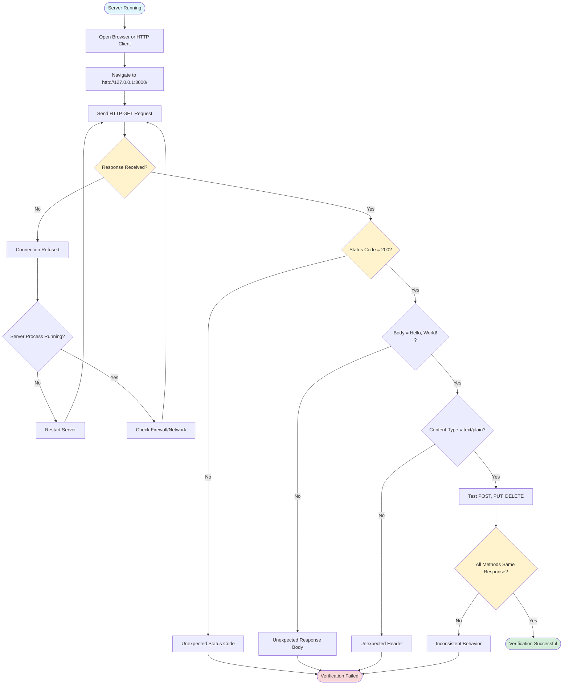
```mermaid
flowchart TD
    Start([Server Running]) --> OpenBrowser[Open Browser or HTTP Client]
    OpenBrowser --> Navigate[Navigate to http://127.0.0.1:3000/]
    Navigate --> SendRequest[Send HTTP GET Request]
    SendRequest --> ReceiveResponse{Response Received?}
    ReceiveResponse -->|No| ConnectionFail[Connection Refused]
    ConnectionFail --> CheckProcess{Server Process Running?}
    CheckProcess -->|No| RestartServer[Restart Server]
    CheckProcess -->|Yes| CheckFirewall[Check Firewall/Network]
    ReceiveResponse -->|Yes| CheckStatus{Status Code = 200?}
    CheckStatus -->|No| UnexpectedStatus[Unexpected Status Code]
    UnexpectedStatus --> End1([Verification Failed])
    CheckStatus -->|Yes| CheckBody{Body = Hello, World!\n?}
    CheckBody -->|No| UnexpectedBody[Unexpected Response Body]
    UnexpectedBody --> End1
    CheckBody -->|Yes| CheckHeader{Content-Type = text/plain?}
    CheckHeader -->|No| UnexpectedHeader[Unexpected Header]
    UnexpectedHeader --> End1
    CheckHeader -->|Yes| TestOtherMethods[Test POST, PUT, DELETE]
    TestOtherMethods --> SameResponse{All Methods Same Response?}
    SameResponse -->|No| InconsistentBehavior[Inconsistent Behavior]
    InconsistentBehavior --> End1
    SameResponse -->|Yes| End2([Verification Successful])
    
    RestartServer --> SendRequest
    CheckFirewall --> SendRequest
    
    style Start fill:#e1f5ff
    style End2 fill:#d4edda
    style End1 fill:#f8d7da
    style ReceiveResponse fill:#fff3cd
    style CheckStatus fill:#fff3cd
    style SameResponse fill:#fff3cd
```

**Verification Test Cases:**

| Test Case | Request | Expected Response | Pass Criteria |
|-----------|---------|------------------|---------------|
| Basic GET | `GET /` | 200 OK + "Hello, World!\n" | Exact match |
| Different Path | `GET /api/test` | 200 OK + "Hello, World!\n" | Identical to above |
| POST Request | `POST / {"data": "test"}` | 200 OK + "Hello, World!\n" | Ignores body |
| PUT Request | `PUT /resource/123` | 200 OK + "Hello, World!\n" | Ignores path |
| DELETE Request | `DELETE /item` | 200 OK + "Hello, World!\n" | Ignores method |
| Custom Headers | `GET / (Accept: application/json)` | 200 OK + "Hello, World!\n" | Ignores headers |

**Command-Line Verification:**
```bash
# Test basic GET request
curl http://127.0.0.1:3000/
# Expected: Hello, World!

#### Test POST request with body
curl -X POST -d '{"test": "data"}' http://127.0.0.1:3000/api/endpoint
#### Expected: Hello, World!

#### Test with verbose output to see headers
curl -v http://127.0.0.1:3000/
#### Expected: Status 200, Content-Type: text/plain, Body: Hello, World!
```

**Source Evidence:** Implementation Considerations 2.5.2, Functional Requirements 2.3.2

---

## 4.4 Feature-Specific Process Flows

### 4.4.1 HTTP Server Foundation (F-001) Process Flow

#### 4.4.1.1 Feature F-001 Implementation Sequence

Feature F-001 encompasses the core HTTP server creation, network binding, and universal request reception capabilities.

```mermaid
flowchart TD
    subgraph RQ001["F-001-RQ-001: Server Instance Creation"]
        A1[Import http Module]
        A2[Call http.createServer]
        A3[Pass Request Handler Function]
        A4[Receive Server Instance Object]
    end
    
    subgraph RQ002["F-001-RQ-002: Network Binding"]
        B1[Define hostname Constant: 127.0.0.1]
        B2[Define port Constant: 3000]
        B3[Call server.listen port, hostname]
        B4[Wait for Binding Complete]
        B5[Emit listening Event]
    end
    
    subgraph RQ003["F-001-RQ-003: Universal Request Reception"]
        C1[Server in Event Loop]
        C2[Accept All HTTP Methods]
        C3[Accept All URL Paths]
        C4[Accept All Headers]
        C5[Accept All Bodies]
        C6[Invoke Handler for Every Request]
    end
    
    A1 --> A2 --> A3 --> A4
    A4 --> B1
    B1 --> B2 --> B3 --> B4 --> B5
    B5 --> C1
    C1 --> C2 & C3 & C4 & C5
    C2 --> C6
    C3 --> C6
    C4 --> C6
    C5 --> C6
    
    style A4 fill:#d4edda
    style B5 fill:#d4edda
    style C6 fill:#d4edda
```

**Feature F-001 Requirements Mapping:**
- **F-001-RQ-001:** `server.js` line 1 (import), line 6 (createServer)
- **F-001-RQ-002:** `server.js` lines 3-4 (constants), lines 12-14 (listen)
- **F-001-RQ-003:** `server.js` lines 6-10 (handler accepts all requests)

**Source Evidence:** Feature Catalog 2.2.1, Functional Requirements 2.3.1

---

### 4.4.2 Static Response Generation (F-002) Process Flow

#### 4.4.2.1 Feature F-002 Response Construction Sequence

Feature F-002 defines the static response generation process that produces identical output for every request.

```mermaid
flowchart TD
    Start([Request Handler Invoked]) --> RQ001[F-002-RQ-001: Set Status Code]
    RQ001 --> SetStatus[res.statusCode = 200]
    SetStatus --> RQ002[F-002-RQ-002: Set Content-Type Header]
    RQ002 --> SetHeader[res.setHeader 'Content-Type', 'text/plain']
    SetHeader --> RQ003[F-002-RQ-003: Write Static Body]
    RQ003 --> WriteBody[res.end 'Hello, World!\n']
    WriteBody --> VerifyResponse{Response Valid?}
    VerifyResponse -->|Yes| CloseConnection[Close HTTP Connection]
    VerifyResponse -->|No| ResponseError[Invalid Response State]
    ResponseError --> End1([Response Failed])
    CloseConnection --> End2([Response Complete])
    
    style Start fill:#e1f5ff
    style End2 fill:#d4edda
    style End1 fill:#f8d7da
    style VerifyResponse fill:#fff3cd
```

**Response Construction Steps:**

| Step | Requirement | Implementation | Timing | Validation |
|------|------------|----------------|--------|------------|
| 1 | F-002-RQ-001 | `res.statusCode = 200` | <1ms | Must be valid HTTP status |
| 2 | F-002-RQ-002 | `res.setHeader('Content-Type', 'text/plain')` | <1ms | Must be valid MIME type |
| 3 | F-002-RQ-003 | `res.end('Hello, World!\n')` | <1ms | Must be exact 14-byte string |

**Response Byte Analysis:**
```
Response Composition:
- Status Line: HTTP/1.1 200 OK
- Header: Content-Type: text/plain
- Header: Content-Length: 14 (auto-calculated)
- Body: Hello, World!\n

Body Byte Breakdown (14 bytes):
[H][e][l][l][o][,][ ][W][o][r][l][d][!][\n]
72  101 108 108 111 44  32  87  111 114 108 100 33  10
```

**Source Evidence:** Feature Catalog 2.2.2, Functional Requirements 2.3.2

---

### 4.4.3 Server Lifecycle Management (F-003) Process Flow

#### 4.4.3.1 Feature F-003 Lifecycle Sequence

```mermaid
flowchart TD
    Start([Server Initialization]) --> Startup[Execute Startup Sequence]
    Startup --> Binding[Port Binding Attempt]
    Binding --> RQ001{F-003-RQ-001:<br/>Binding Success?}
    RQ001 -->|No| StartupFail([Startup Failed - Exit])
    RQ001 -->|Yes| ConsoleLog[Console Log:<br/>Server running at http://127.0.0.1:3000/]
    ConsoleLog --> RQ002[F-003-RQ-002:<br/>Enter Continuous Operation]
    RQ002 --> EventLoop[Maintain Event Loop]
    EventLoop --> WaitEvent{Waiting for Event}
    WaitEvent -->|HTTP Request| HandleRequest[Process Request]
    HandleRequest --> EventLoop
    WaitEvent -->|Termination Signal| Shutdown[Immediate Shutdown]
    Shutdown --> End([Process Terminated])
    
    style Start fill:#e1f5ff
    style StartupFail fill:#f8d7da
    style End fill:#6c757d
    style RQ001 fill:#fff3cd
    style WaitEvent fill:#fff3cd
    style RQ002 fill:#d4edda
```

**Lifecycle States:**

| State | Description | Entry Condition | Exit Condition | Duration |
|-------|-------------|----------------|----------------|----------|
| Initialization | Loading and setup | Process start | Binding complete | <500ms |
| Binding | Port binding attempt | After server creation | Success or failure | <100ms |
| Logging | Startup confirmation | After binding success | Log written | <1ms |
| Continuous Operation | Event loop processing | After logging | Termination signal | Indefinite |
| Shutdown | Process termination | Signal received | Process exit | <10ms |

**Source Evidence:** Feature Catalog 2.2.3, Functional Requirements 2.3.3

---

### 4.4.4 Zero External Dependency Architecture (F-004) Verification Flow

#### 4.4.4.1 Feature F-004 Dependency Validation Process

```mermaid
flowchart TD
    Start([Dependency Verification Initiated]) --> CheckPackageJSON[Read package.json]
    CheckPackageJSON --> DepsField{dependencies Field Present?}
    DepsField -->|Yes| FieldNotEmpty{Field Not Empty?}
    DepsField -->|No| NoDepsField[✓ No dependencies Field]
    FieldNotEmpty -->|Yes| ValidationFail1[✗ External Dependencies Found]
    FieldNotEmpty -->|No| NoDepsField
    ValidationFail1 --> End1([F-004-RQ-001 Failed])
    NoDepsField --> CheckLockfile[Read package-lock.json]
    CheckLockfile --> ParsePackages[Parse packages Object]
    ParsePackages --> CountEntries{Entry Count?}
    CountEntries -->|= 1| RootOnly[✓ Root Package Only]
    CountEntries -->|> 1| ValidationFail2[✗ Dependencies in Lockfile]
    ValidationFail2 --> End1
    RootOnly --> CheckImports[Analyze server.js Imports]
    CheckImports --> RequireStatements{All require Statements?}
    RequireStatements --> BuiltInOnly{Only Built-in Modules?}
    BuiltInOnly -->|No| ValidationFail3[✗ External Module Import]
    ValidationFail3 --> End1
    BuiltInOnly -->|Yes| AllBuiltIn[✓ Only http Module Imported]
    AllBuiltIn --> RunInstall[Execute npm install]
    RunInstall --> CheckNodeModules{node_modules Created?}
    CheckNodeModules -->|Yes| ValidationFail4[✗ Packages Installed]
    CheckNodeModules -->|No| NoNodeModules[✓ No node_modules Directory]
    ValidationFail4 --> End1
    NoNodeModules --> End2([F-004-RQ-001 Passed])
    
    style Start fill:#e1f5ff
    style End1 fill:#f8d7da
    style End2 fill:#d4edda
    style DepsField fill:#fff3cd
    style CountEntries fill:#fff3cd
    style BuiltInOnly fill:#fff3cd
    style CheckNodeModules fill:#fff3cd
```

**Dependency Verification Checklist:**

✅ **package.json Validation:**
- No `dependencies` field present
- No `devDependencies` field present
- No `peerDependencies` field present
- No `optionalDependencies` field present

✅ **package-lock.json Validation:**
- Only 1 entry in `packages` object (root package)
- No resolved URLs to npm registry
- No integrity hashes for external packages
- Zero transitive dependencies

✅ **Source Code Validation:**
- Only `require('http')` import statement
- `http` is Node.js built-in module
- No imports from `node_modules/`
- No dynamic `import()` statements

✅ **Installation Validation:**
- `npm install` completes without downloads
- No `node_modules` directory created
- Zero disk space used by dependencies
- Installation time <1 second

**Security Benefits:**
- Zero supply chain attack risk
- No CVE exposure from dependencies
- No compromised package risk
- Eliminates dependency confusion attacks
- No malicious package update risk

**Source Evidence:** Feature Catalog 2.2.4, Functional Requirements 2.3.4

---

### 4.4.5 Package Metadata (F-005) and NPM Scripts (F-006) Flows

#### 4.4.5.1 Package Metadata Usage Flow

```mermaid
flowchart TD
    Start([npm Reads package.json]) --> ParseJSON[Parse JSON Syntax]
    ParseJSON --> ReadName[Read name: hello_world]
    ReadName --> ReadVersion[Read version: 1.0.0]
    ReadVersion --> ReadDescription[Read description Field]
    ReadDescription --> ReadMain{Read main: index.js}
    ReadMain --> MainExists{index.js File Exists?}
    MainExists -->|No| EntryPointMismatch[⚠ Entry Point Mismatch<br/>Actual: server.js]
    MainExists -->|Yes| ValidMain[✓ Valid Entry Point]
    EntryPointMismatch --> ImpactCheck{Used as Library?}
    ImpactCheck -->|No| NoImpact[No Runtime Impact<br/>Direct Execution Only]
    ImpactCheck -->|Yes| RequireError[require 'hello_world' Fails]
    ValidMain --> ReadAuthor[Read author: hxu]
    NoImpact --> ReadAuthor
    ReadAuthor --> ReadLicense[Read license: MIT]
    ReadLicense --> End([Metadata Processed])
    
    style Start fill:#e1f5ff
    style End fill:#d4edda
    style EntryPointMismatch fill:#fff3cd
    style MainExists fill:#fff3cd
    style RequireError fill:#f8d7da
```

**Known Metadata Issues:**

| Issue | Field | Declared Value | Actual Value | Impact | Resolution |
|-------|-------|---------------|--------------|--------|------------|
| Entry Point Mismatch | `main` | "index.js" | "server.js" | Cannot use as library | Direct execution only |
| Naming Inconsistency | `name` | "hello_world" | "hao-backprop-test" (repo) | Documentation confusion | Accept dual naming |
| Missing Start Script | `scripts.start` | undefined | N/A | Cannot use `npm start` | Use `node server.js` |

**Source Evidence:** Feature Catalog 2.2.5, Functional Requirements 2.3.5

#### 4.4.5.2 NPM Test Script Execution Flow

```mermaid
flowchart TD
    Start([User Executes npm test]) --> ReadPackageJSON[npm Reads package.json]
    ReadPackageJSON --> FindTestScript{scripts.test Found?}
    FindTestScript -->|No| NoTestScript[Error: No test script]
    FindTestScript -->|Yes| ReadScript[Read Script:<br/>echo Error: no test specified && exit 1]
    NoTestScript --> End1([npm Error])
    ReadScript --> ExecuteEcho[Execute: echo Error: no test specified]
    ExecuteEcho --> OutputError[Output to stdout: Error: no test specified]
    OutputError --> ExecuteExit[Execute: exit 1]
    ExecuteExit --> ProcessExits[Process Exits with Code 1]
    ProcessExits --> End2([Test Failed - Intentional])
    
    style Start fill:#e1f5ff
    style End1 fill:#f8d7da
    style End2 fill:#fff3cd
    style FindTestScript fill:#fff3cd
    style ProcessExits fill:#fff3cd
```

**Test Script Behavior:**
- **Command:** `npm test`
- **Script Definition:** `"echo \"Error: no test specified\" && exit 1"`
- **Execution Result:** Intentional failure with exit code 1
- **Purpose:** Prevents false positive test success in CI/CD pipelines
- **Design Intention:** Placeholder documenting missing test infrastructure

**Source Evidence:** Feature Catalog 2.2.6, Functional Requirements 2.3.6

---

## 4.5 State Management and Transitions

### 4.5.1 Server Lifecycle State Diagram

#### 4.5.1.1 Complete Server State Machine

```mermaid
stateDiagram-v2
    [*] --> Initial: Process Start
    Initial --> ModuleLoading: node server.js
    ModuleLoading --> HTTPModuleImport: Load server.js
    HTTPModuleImport --> ServerCreation: require('http')
    ServerCreation --> PortBinding: http.createServer()
    PortBinding --> BindingAttempt: server.listen()
    
    BindingAttempt --> Ready: Binding Success
    BindingAttempt --> BindingError: Port In Use
    
    BindingError --> [*]: Process Crash
    
    Ready --> Logging: Emit 'listening'
    Logging --> EventLoop: console.log()
    EventLoop --> EventLoop: No Events (Idle)
    EventLoop --> RequestReceived: HTTP Request
    RequestReceived --> ProcessingRequest: Invoke Handler
    ProcessingRequest --> GeneratingResponse: Set Status/Headers
    GeneratingResponse --> SendingResponse: Write Body
    SendingResponse --> EventLoop: Close Connection
    EventLoop --> Shutdown: SIGINT/SIGTERM
    Shutdown --> [*]: Process Exit
    
    note right of Initial
        Cold Start
        No Prior State
    end note
    
    note right of EventLoop
        Hot State
        Ready to Process Requests
        Indefinite Duration
    end note
    
    note right of BindingError
        Fatal Error
        No Recovery
        Port Must Be Freed
    end note
    
    note right of ProcessingRequest
        Synchronous Execution
        <1ms Duration
        Stateless Processing
    end note
```

**State Descriptions:**

| State | Type | Duration | Entry Trigger | Exit Trigger | Characteristics |
|-------|------|----------|---------------|--------------|-----------------|
| Initial | Transient | <1ms | Process start | Module loading begins | Uninitialized |
| ModuleLoading | Transient | ~50ms | File read | Syntax parsing complete | I/O bound |
| HTTPModuleImport | Transient | <1ms | require() call | Module loaded | Synchronous |
| ServerCreation | Transient | <1ms | createServer() call | Instance created | Synchronous |
| PortBinding | Transient | ~100ms | listen() call | Binding complete or error | Asynchronous |
| BindingAttempt | Decision | <10ms | OS port check | Success or failure | OS interaction |
| BindingError | Terminal | N/A | Port unavailable | N/A | Fatal state |
| Ready | Transient | <1ms | Binding success | Logging begins | Pre-operational |
| Logging | Transient | <1ms | console.log() | Log written | Operational |
| EventLoop | Persistent | Indefinite | Logging complete | Termination signal | Hot operational |
| RequestReceived | Transient | <1ms | Request arrives | Handler invoked | Active processing |
| ProcessingRequest | Transient | <1ms | Callback start | Response ready | CPU bound |
| GeneratingResponse | Transient | <1ms | Headers set | Body written | I/O bound |
| SendingResponse | Transient | <1ms | res.end() called | Connection closed | Network I/O |
| Shutdown | Transient | <10ms | Signal received | Process exit | Cleanup |

**Source Evidence:** Programming Languages and Runtime 3.2.2.2

---

### 4.5.2 Request Processing State Transitions

#### 4.5.2.1 Request-Level State Machine

```mermaid
stateDiagram-v2
    [*] --> Idle: Server in Event Loop
    Idle --> ConnectionEstablished: TCP SYN Received
    ConnectionEstablished --> RequestParsing: HTTP Request Received
    RequestParsing --> CallbackInvoked: Node.js Parses HTTP
    CallbackInvoked --> StatusSet: Handler Executes
    StatusSet --> HeaderSet: res.statusCode = 200
    HeaderSet --> BodyWritten: res.setHeader()
    BodyWritten --> ConnectionClosing: res.end()
    ConnectionClosing --> Idle: TCP FIN Sent
    
    note right of Idle
        No Active Requests
        Waiting for Connections
        Memory: Baseline
    end note
    
    note right of CallbackInvoked
        req Parameter: Received but Ignored
        res Parameter: Used for Response
        Duration: <1ms
    end note
    
    note right of BodyWritten
        Static Body: "Hello, World!\n"
        No Dynamic Content
        No Conditional Logic
    end note
    
    note right of ConnectionClosing
        No State Persisted
        No Session Data
        Memory Released
    end note
```

**Request State Properties:**

| State | Memory Impact | CPU Impact | I/O Impact | State Data |
|-------|--------------|------------|------------|------------|
| Idle | Baseline (~15MB) | 0% | Blocking on socket | None |
| ConnectionEstablished | +~1KB | <1% | TCP handshake | TCP metadata |
| RequestParsing | +~2KB | ~5% | Reading socket | HTTP headers + body |
| CallbackInvoked | +~1KB | ~10% | None | req, res objects |
| StatusSet | No change | ~5% | None | res.statusCode |
| HeaderSet | +~100B | ~5% | None | Response headers |
| BodyWritten | +14B | ~5% | Writing socket | Response body |
| ConnectionClosing | Released | ~5% | TCP teardown | None |

**No State Persistence:**
- No session cookies set
- No authentication tokens generated
- No database writes
- No file system operations
- No cache updates
- No logging of request details

**Source Evidence:** System Overview 1.2.2.1, Functional Requirements 2.3.2

---

## 4.6 Error Handling and Recovery Flows

### 4.6.1 Startup Failure Scenarios

#### 4.6.1.1 Port Conflict Error Flow

```mermaid
flowchart TD
    Start([server.listen 3000, 127.0.0.1]) --> OSCheck{OS: Port 3000 Available?}
    OSCheck -->|Yes| BindSuccess[Bind Socket to Port]
    OSCheck -->|No| ThrowError[Throw EADDRINUSE Error]
    BindSuccess --> EmitListening[Emit 'listening' Event]
    EmitListening --> End1([Startup Success])
    ThrowError --> ErrorPropagates[Error Propagates to Node.js]
    ErrorPropagates --> NoErrorHandler{Error Handler Defined?}
    NoErrorHandler -->|No| UncaughtException[Uncaught Exception]
    NoErrorHandler -->|Yes| HandleError[Execute Error Handler]
    UncaughtException --> PrintStackTrace[Print Stack Trace to stderr]
    PrintStackTrace --> ProcessExit[process.exit 1]
    ProcessExit --> End2([Server Startup Failed])
    HandleError --> End2
    
    style Start fill:#e1f5ff
    style End1 fill:#d4edda
    style End2 fill:#f8d7da
    style OSCheck fill:#fff3cd
    style NoErrorHandler fill:#fff3cd
    style ThrowError fill:#f8d7da
```

**Port Conflict Resolution:**

```mermaid
flowchart TD
    Start([EADDRINUSE Error Encountered]) --> IdentifyProcess[Identify Process Using Port 3000]
    IdentifyProcess --> UnixCmd["Unix: lsof -i :3000"]
    IdentifyProcess --> WindowsCmd["Windows: netstat -ano | findstr :3000"]
    UnixCmd --> FindPID[Obtain Process ID PID]
    WindowsCmd --> FindPID
    FindPID --> IsOwnServer{"PID = Previous Server Instance?"}
    IsOwnServer -->|Yes| KillProcess["Kill Process: kill PID or taskkill /PID"]
    IsOwnServer -->|No| EvaluateUsage[Evaluate Port Usage]
    KillProcess --> WaitRelease[Wait for Port Release]
    WaitRelease --> RetryStartup["Retry: node server.js"]
    RetryStartup --> End1([Startup Success])
    EvaluateUsage --> Critical{Port Usage Critical?}
    Critical -->|Yes| ChangePort["Modify server.js Port Constant"]
    Critical -->|No| KillProcess
    ChangePort --> UpdateCode["Change port Variable to 3001+"]
    UpdateCode --> RetryStartup
    
    style Start fill:#f8d7da
    style End1 fill:#d4edda
    style IsOwnServer fill:#fff3cd
    style Critical fill:#fff3cd
```

**Error Message Example:**
```
Error: listen EADDRINUSE: address already in use 127.0.0.1:3000
    at Server.setupListenHandle [as _listen2] (net.js:1313:16)
    at listenInCluster (net.js:1361:12)
    at Server.listen (net.js:1447:7)
    at Object.<anonymous> (/path/to/server.js:12:8)
```

**Source Evidence:** Implementation Considerations 2.5.1.3

---

#### 4.6.1.2 Node.js Version Incompatibility Flow

```mermaid
flowchart TD
    Start([node server.js Executed]) --> ParseJS{Node.js Parse server.js}
    ParseJS --> CheckES6{ES6 Syntax Support?}
    CheckES6 -->|Node.js ≥6.x| ParseSuccess[Syntax Parse Success]
    CheckES6 -->|Node.js <6.x| SyntaxError[SyntaxError: Unexpected token]
    ParseSuccess --> ExecuteCode[Execute Module Code]
    ExecuteCode --> End1([Startup Success])
    SyntaxError --> ErrorExamples[Examples:<br/>- const/let not supported<br/>- Arrow functions => error<br/>- Template literals error]
    ErrorExamples --> PrintError[Print Syntax Error to stderr]
    PrintError --> ProcessExit[process.exit 1]
    ProcessExit --> End2([Startup Failed])
    
    End2 --> Resolution[Resolution: Upgrade Node.js]
    Resolution --> InstallLTS[Install Node.js LTS 12.x+]
    InstallLTS --> VerifyVersion[node --version]
    VerifyVersion --> RetryStartup[Retry Startup]
    RetryStartup --> Start
    
    style Start fill:#e1f5ff
    style End1 fill:#d4edda
    style End2 fill:#f8d7da
    style CheckES6 fill:#fff3cd
    style SyntaxError fill:#f8d7da
```

**Incompatible Syntax Examples:**

| ES6 Feature | Syntax | Node.js Requirement | Error if Missing |
|-------------|--------|-------------------|------------------|
| const/let | `const hostname = '127.0.0.1';` | ≥6.0.0 | SyntaxError: Unexpected token const |
| Arrow Functions | `(req, res) => {...}` | ≥6.0.0 | SyntaxError: Unexpected token => |
| Template Literals | `` `Server running at...` `` | ≥6.0.0 | SyntaxError: Unexpected template string |

**Source Evidence:** Programming Languages and Runtime 3.2.1.2, Assumptions and Constraints 2.7.1

---

### 4.6.2 Runtime Error Scenarios

#### 4.6.2.1 No Runtime Errors Expected

```mermaid
flowchart TD
    Start([Server Running in Event Loop]) --> WaitEvent{Event Occurs}
    WaitEvent -->|HTTP Request| ProcessRequest[Process Request]
    WaitEvent -->|Termination Signal| Shutdown[Shutdown]
    ProcessRequest --> HandleRequest[Execute Request Handler]
    HandleRequest --> StaticLogic{Contains Error-Prone Logic?}
    StaticLogic -->|No| GenerateResponse[Generate Static Response]
    GenerateResponse --> Success[Response Sent Successfully]
    Success --> WaitEvent
    Shutdown --> End([Process Terminates])
    
    StaticLogic -.Theoretical Error Paths.-> DatabaseError[Database Connection Error]
    StaticLogic -.Theoretical Error Paths.-> FileError[File Read Error]
    StaticLogic -.Theoretical Error Paths.-> ParseError[JSON Parse Error]
    DatabaseError -.Not Applicable.-> NoDatabase[No Database in System]
    FileError -.Not Applicable.-> NoFileIO[No File I/O in System]
    ParseError -.Not Applicable.-> NoJSONParse[No JSON Parsing in System]
    
    style Start fill:#e1f5ff
    style End fill:#6c757d
    style Success fill:#d4edda
    style StaticLogic fill:#d4edda
    style DatabaseError fill:#e9ecef
    style FileError fill:#e9ecef
    style ParseError fill:#e9ecef
```

**Why No Runtime Errors:**

| Error Category | Common Causes | Mitigation in This System |
|----------------|--------------|--------------------------|
| Database Errors | Connection failures, query errors | No database connections |
| File System Errors | Missing files, permission errors | No file system operations |
| Parsing Errors | Invalid JSON, malformed data | No data parsing |
| Network Errors | Timeout, DNS resolution | Localhost-only, no external calls |
| Memory Errors | Out of memory, leaks | Stateless, minimal memory usage |
| Logic Errors | Null reference, type errors | Static response, no conditional logic |
| Authentication Errors | Invalid credentials | No authentication |
| Rate Limiting Errors | Too many requests | No rate limiting |

**Error Prevention Design:**
- ✅ **Static Response:** No dynamic content generation prevents runtime errors
- ✅ **No External Dependencies:** No third-party code to fail
- ✅ **No Database:** No connection errors or query failures
- ✅ **No File I/O:** No file not found or permission errors
- ✅ **No Parsing:** No malformed data to handle
- ✅ **No Authentication:** No credential validation errors
- ✅ **No Business Logic:** No conditional logic to fail

**Source Evidence:** Implementation Considerations 2.5.1.3

---

### 4.6.3 Error Handling Policy Summary

#### 4.6.3.1 Comprehensive Error Response Matrix

```mermaid
flowchart TD
    Start([Error Occurs]) --> ErrorType{Error Type}
    
    ErrorType -->|Startup Error| StartupCategory[Startup Phase Error]
    ErrorType -->|Runtime Error| RuntimeCategory[Runtime Phase Error]
    
    StartupCategory --> PortConflict[Port Already in Use]
    StartupCategory --> VersionError[Node.js Version <6.x]
    StartupCategory --> FileNotFound[server.js Not Found]
    StartupCategory --> PermissionError[Insufficient Permissions]
    
    RuntimeCategory --> TheoreticalError[Theoretical Error<br/>None Expected]
    
    PortConflict --> ImmediateExit1[Process Crash with EADDRINUSE]
    VersionError --> ImmediateExit2[Process Crash with SyntaxError]
    FileNotFound --> ImmediateExit3[Process Crash with MODULE_NOT_FOUND]
    PermissionError --> ImmediateExit4[Process Crash with EACCES]
    
    ImmediateExit1 --> ManualRestart1[Manual Resolution Required]
    ImmediateExit2 --> ManualRestart1
    ImmediateExit3 --> ManualRestart1
    ImmediateExit4 --> ManualRestart1
    
    TheoreticalError --> NoErrorHandler[No Error Handler Implemented]
    NoErrorHandler --> WouldCrash[Would Crash if Occurred]
    WouldCrash --> ManualRestart2[Manual Restart Required]
    
    ManualRestart1 --> End1([No Automatic Recovery])
    ManualRestart2 --> End1
    
    style Start fill:#f8d7da
    style End1 fill:#6c757d
    style ErrorType fill:#fff3cd
    style TheoreticalError fill:#e9ecef
    style NoErrorHandler fill:#fff3cd
```

**Error Handling Philosophy:**
- **Fail Fast:** All errors result in immediate process termination
- **No Graceful Degradation:** No fallback behavior or error recovery
- **Manual Recovery:** Human intervention required for all errors
- **No Retry Logic:** No automatic restart or retry mechanisms
- **No Error Logging:** Errors printed to stderr only, no structured logging
- **No Alerting:** No notifications or monitoring integrations

**Source Evidence:** Implementation Considerations 2.5.1.3, 2.5.5.4

---

## 4.7 Integration and Interaction Flows

### 4.7.1 Client-Server Interaction Sequence

#### 4.7.1.1 Complete Request-Response Interaction

```mermaid
sequenceDiagram
    participant Client as HTTP Client<br/>(Browser/curl/Backprop Tool)
    participant TCP as TCP/IP Stack<br/>(Operating System)
    participant Node as Node.js Event Loop
    participant HTTP as HTTP Module
    participant Handler as Request Handler Callback
    participant Response as Response Object
    
    Note over Client,Response: T+0ms: Client Initiates Request
    Client->>TCP: Send HTTP Request<br/>GET / HTTP/1.1
    Note over TCP: TCP 3-Way Handshake
    TCP->>Node: Socket Connection Established
    Node->>HTTP: New Connection Event
    HTTP->>HTTP: Parse HTTP Request<br/>(Method, Path, Headers, Body)
    
    Note over Client,Response: T+0.2ms: Handler Invocation
    HTTP->>Handler: Invoke callback(req, res)
    Note over Handler: req parameter received<br/>but not examined
    Handler->>Response: res.statusCode = 200
    Handler->>Response: res.setHeader('Content-Type', 'text/plain')
    Handler->>Response: res.end('Hello, World!\n')
    
    Note over Client,Response: T+0.5ms: Response Generation
    Response->>HTTP: Build HTTP Response
    HTTP->>TCP: Send Response Headers
    HTTP->>TCP: Send Response Body (14 bytes)
    TCP->>Client: Deliver HTTP Response
    
    Note over Client,Response: T+1ms: Connection Cleanup
    Client->>TCP: ACK Response Received
    TCP->>Node: Connection Closed
    Node->>Node: Return to Event Loop<br/>Ready for Next Request
    
    Note over Client,Response: Total Time: 1-5ms (typical)
```

**Interaction Timing Breakdown:**

| Phase | Duration | Bottleneck | Optimization |
|-------|----------|------------|--------------|
| TCP Handshake | 0.1-0.5ms | Network latency | N/A (localhost) |
| HTTP Parsing | 0.1ms | CPU parsing | Minimal (simple request) |
| Callback Invocation | <0.1ms | Event loop | N/A |
| Response Generation | 0.2ms | CPU + memory | Static content optimal |
| Response Transmission | 0.1-0.5ms | Network I/O | N/A (14 bytes) |
| Connection Teardown | 0.1ms | TCP protocol | N/A |

**Source Evidence:** Implementation Considerations 2.5.2.2

---

### 4.7.2 Test Harness Integration Flow

#### 4.7.2.1 Backprop Integration Testing Workflow

```mermaid
flowchart TD
    Start([Backprop Tool Launched]) --> ConfigureTarget[Configure Target: http://127.0.0.1:3000]
    ConfigureTarget --> VerifyServer{Server Running?}
    VerifyServer -->|No| StartServer[Start Server: node server.js]
    VerifyServer -->|Yes| BeginTests[Begin Integration Tests]
    StartServer --> WaitReady[Wait for Console Log Confirmation]
    WaitReady --> BeginTests
    
    BeginTests --> Test1[Test 1: Basic Connectivity]
    Test1 --> SendGET[Send GET /]
    SendGET --> CheckResponse1{Response Received?}
    CheckResponse1 -->|No| Fail1[Test Failed: No Response]
    CheckResponse1 -->|Yes| ValidateBasic[Validate Status 200, Body Content]
    ValidateBasic --> Test2[Test 2: Method Independence]
    
    Test2 --> SendPOST[Send POST /api/test]
    SendPOST --> CheckResponse2{Same Response?}
    CheckResponse2 -->|No| Fail2[Test Failed: Inconsistent Response]
    CheckResponse2 -->|Yes| Test3[Test 3: Path Independence]
    
    Test3 --> SendMultiPath[Send Requests to Multiple Paths]
    SendMultiPath --> CheckResponse3{All Identical?}
    CheckResponse3 -->|No| Fail3[Test Failed: Path-Dependent Response]
    CheckResponse3 -->|Yes| Test4[Test 4: Header Independence]
    
    Test4 --> SendCustomHeaders[Send Requests with Various Headers]
    SendCustomHeaders --> CheckResponse4{All Identical?}
    CheckResponse4 -->|No| Fail4[Test Failed: Header-Dependent Response]
    CheckResponse4 -->|Yes| Test5[Test 5: Concurrent Requests]
    
    Test5 --> SendConcurrent[Send 100 Simultaneous Requests]
    SendConcurrent --> CheckResponse5{All Successful?}
    CheckResponse5 -->|No| Fail5[Test Failed: Concurrency Issue]
    CheckResponse5 -->|Yes| AllPassed[All Tests Passed]
    
    Fail1 --> TestReport[Generate Test Report]
    Fail2 --> TestReport
    Fail3 --> TestReport
    Fail4 --> TestReport
    Fail5 --> TestReport
    AllPassed --> TestReport
    TestReport --> End([Integration Testing Complete])
    
    style Start fill:#e1f5ff
    style AllPassed fill:#d4edda
    style End fill:#d4edda
    style Fail1 fill:#f8d7da
    style Fail2 fill:#f8d7da
    style Fail3 fill:#f8d7da
    style Fail4 fill:#f8d7da
    style Fail5 fill:#f8d7da
```

**Backprop Integration Test Cases:**

| Test Case | Purpose | Request | Expected Response | Pass Criteria |
|-----------|---------|---------|------------------|---------------|
| Basic Connectivity | Verify server reachable | `GET /` | 200 + "Hello, World!\n" | Exact match |
| Method Independence | Verify method ignored | `POST /api/test` | Identical to GET | Byte-exact match |
| Path Independence | Verify path ignored | `GET /any/path` | Identical to GET / | Byte-exact match |
| Header Independence | Verify headers ignored | `GET / (Accept: application/json)` | Identical (text/plain) | Byte-exact match |
| Concurrent Requests | Verify concurrency support | 100 parallel GET / | All identical | 100% success rate |
| Performance Baseline | Verify response time | Multiple GET / | <10ms per request | Timing validation |

**Source Evidence:** README.md ("test project for backprop integration"), Executive Summary 1.1.1

---

### 4.7.3 No External System Integrations

#### 4.7.3.1 Integration Boundary Diagram

```mermaid
flowchart TD
    subgraph ExternalWorld["External Systems (Not Integrated)"]
        Database[(Database)]
        API[External APIs]
        Queue[Message Queues]
        Cache[Redis/Memcached]
        Auth[Authentication Service]
        Monitoring[Monitoring Service]
        Logging[Log Aggregation]
    end
    
    subgraph SystemBoundary["System Boundary: 127.0.0.1"]
        Server[HTTP Server<br/>localhost:3000]
    end
    
    subgraph LocalClients["Local Client Processes Only"]
        Browser[Web Browser]
        Curl[curl Command]
        BackpropTool[Backprop Testing Tool]
        CustomClient[Custom HTTP Client]
    end
    
    Browser -->|HTTP GET/POST| Server
    Curl -->|HTTP Request| Server
    BackpropTool -->|Integration Tests| Server
    CustomClient -->|HTTP Request| Server
    
    Server -.No Connection.-> Database
    Server -.No Connection.-> API
    Server -.No Connection.-> Queue
    Server -.No Connection.-> Cache
    Server -.No Connection.-> Auth
    Server -.No Connection.-> Monitoring
    Server -.No Connection.-> Logging
    
    style Server fill:#d4edda
    style Database fill:#e9ecef
    style API fill:#e9ecef
    style Queue fill:#e9ecef
    style Cache fill:#e9ecef
    style Auth fill:#e9ecef
    style Monitoring fill:#e9ecef
    style Logging fill:#e9ecef
```

**Integration Boundaries:**

**✅ In-Scope Integrations:**
- HTTP clients connecting to localhost:3000
- Operating system TCP/IP stack
- Node.js runtime environment
- Local terminal/console for logging

**❌ Out-of-Scope Integrations:**
- External databases (PostgreSQL, MongoDB, MySQL)
- External APIs (REST, GraphQL, SOAP)
- Message queues (RabbitMQ, Kafka, SQS)
- Caching systems (Redis, Memcached)
- Authentication providers (OAuth, SAML, LDAP)
- Monitoring services (Datadog, New Relic, Prometheus)
- Log aggregation (ELK Stack, Splunk, CloudWatch)
- Load balancers (Nginx, HAProxy, AWS ELB)
- Service mesh (Istio, Linkerd, Consul)

**Source Evidence:** Scope 1.3.2.3, Implementation Considerations 2.5.4

---

## 4.8 Performance and Timing Considerations

### 4.8.1 Startup Timing Characteristics

#### 4.8.1.1 Detailed Startup Timeline

```mermaid
gantt
title Server Startup Timeline (Typical 200-500ms)
dateFormat SSS
axisFormat %Lms

section Process Initialization
Node.js Process Start           :milestone, m1, 000, 0ms
Allocate Process Memory         :a1, 000, 50ms

section Module Loading
Load server.js File             :a2, 050, 40ms
Parse JavaScript Syntax         :a3, 090, 10ms

section Imports and Setup
Import http Module              :a4, 100, 5ms
Define hostname Constant        :a5, 105, 1ms
Define port Constant            :a6, 106, 1ms

section Server Creation
http.createServer() invoked     :a7, 107, 3ms
Register Request Handler        :a8, 110, 2ms

section Network Binding
server.listen() invoked         :a9, 112, 5ms
OS Port Availability Check      :a10, 117, 20ms
Bind TCP Socket                 :a11, 137, 50ms
Emit listening Event            :a12, 187, 5ms

section Confirmation
console.log() executed          :a13, 192, 3ms
Enter Event Loop                :a14, 195, 5ms
Server Ready                    :milestone, m2, 200, 0ms
```

**Startup Performance Targets:**

| Phase | Target Time | Typical Time | Maximum Acceptable | Bottleneck |
|-------|------------|--------------|-------------------|------------|
| Process Initialization | <50ms | 30-50ms | 100ms | OS process creation |
| Module Loading | <50ms | 40-60ms | 100ms | Disk I/O |
| Syntax Parsing | <10ms | 5-10ms | 20ms | CPU parsing |
| Import Execution | <10ms | 5-10ms | 20ms | Module cache |
| Server Creation | <5ms | 2-5ms | 10ms | Memory allocation |
| Port Binding | <100ms | 50-100ms | 200ms | OS TCP stack |
| Event Loop Entry | <5ms | 2-5ms | 10ms | Runtime initialization |
| **Total** | **<200ms** | **200-500ms** | **1000ms** | **Port binding** |

**Source Evidence:** System Overview 1.2.3.1, Implementation Considerations 2.5.2.4

---

### 4.8.2 Request Processing Timing

#### 4.8.2.1 Request Latency Breakdown

```mermaid
gantt
title Request Processing Timeline (Typical 1-5ms)
dateFormat SSS
axisFormat %Lms

section Network Reception
TCP Packet Arrives              :milestone, m1, 000
TCP Stack Processing            :a1, 000, 1

section Event Loop
Event Loop Detects Request      :a2, 000, 1
Queue Callback Invocation       :a3, 000, 1

section HTTP Parsing
Parse Request Line              :a4, 000, 1
Parse Headers                   :a5, 000, 1
Parse Body (if present)         :a6, 000, 1

section Callback Execution
Invoke Request Handler          :a7, 000, 1
Set Status Code                 :a8, 001, 1
Set Content-Type Header         :a9, 001, 1
Write Response Body             :a10, 001, 1
Finalize Response               :a11, 001, 1

section Response Transmission
Build HTTP Response             :a12, 001, 1
Write to TCP Socket             :a13, 002, 1
TCP Transmission                :a14, 002, 1

section Cleanup
Close Connection                :a15, 003, 1
Return to Event Loop            :a16, 003, 1
Ready for Next Request          :milestone, m2, 005
```

**Request Timing Analysis:**

| Phase | Target | Typical | Notes |
|-------|--------|---------|-------|
| Network Reception | <0.5ms | 0.1-0.2ms | Localhost has minimal latency |
| HTTP Parsing | <0.5ms | 0.2-0.4ms | Simple request parsing |
| Callback Execution | <0.5ms | 0.2-0.3ms | Synchronous code only |
| Response Generation | <0.5ms | 0.3-0.5ms | Static content |
| Network Transmission | <1ms | 0.5-1ms | 14 bytes trivial |
| Connection Cleanup | <0.5ms | 0.2-0.3ms | TCP teardown |
| **Total Server Time** | **<2ms** | **1-2ms** | **Internal processing** |
| **Total Round-Trip** | **<10ms** | **1-5ms** | **Including network** |

**Performance Characteristics:**
- **Throughput:** 5,000-10,000 requests/second on modern hardware
- **Concurrency:** 100+ concurrent connections supported
- **CPU Usage:** Near 0% idle, <50% under load (single core)
- **Memory Usage:** <10MB target (typical 15-25MB with Node.js runtime)

**Source Evidence:** Implementation Considerations 2.5.2.2, 2.5.2.3

---

### 4.8.3 Performance Optimization Opportunities

#### 4.8.3.1 Current Performance vs. Potential Optimizations

```mermaid
flowchart LR
    subgraph Current["Current Implementation<br/>(Optimized for Simplicity)"]
        C1[Single Process]
        C2[Synchronous Response]
        C3[No Caching]
        C4[No Compression]
        C5[Event-Driven I/O]
    end
    
    subgraph Potential["Potential Optimizations<br/>(Not Implemented - Unnecessary)"]
        P1[Cluster Mode<br/>Multi-Core]
        P2[HTTP/2 Support]
        P3[Response Caching<br/>Static Content]
        P4[Gzip Compression]
        P5[Connection Pooling]
        P6[Load Balancer]
    end
    
    subgraph Impact["Performance Impact Analysis"]
        I1[Throughput: Current Sufficient<br/>5K-10K req/sec]
        I2[Latency: Already <5ms<br/>Further optimization minimal]
        I3[Memory: <10MB target<br/>Already optimal]
        I4[CPU: Single-core adequate<br/>for test harness]
    end
    
    C1 -.Could Add.-> P1
    C2 -.Could Add.-> P2
    C3 -.Could Add.-> P3
    C4 -.Could Add.-> P4
    C5 -.Could Add.-> P5
    P1 -.Impact.-> I1
    P2 -.Impact.-> I2
    P3 -.Impact.-> I3
    P6 -.Impact.-> I4
    
    style C1 fill:#d4edda
    style C2 fill:#d4edda
    style C3 fill:#d4edda
    style C4 fill:#d4edda
    style C5 fill:#d4edda
    style P1 fill:#e9ecef
    style P2 fill:#e9ecef
    style P3 fill:#e9ecef
    style P4 fill:#e9ecef
    style P5 fill:#e9ecef
    style P6 fill:#e9ecef
```

**Optimization Analysis:**

| Optimization | Potential Gain | Implementation Cost | Decision | Rationale |
|--------------|---------------|-------------------|----------|-----------|
| Cluster Mode | 2-4x throughput | High (code changes) | ❌ Not Implemented | Test harness doesn't need high throughput |
| HTTP/2 Support | ~20% latency reduction | High (protocol change) | ❌ Not Implemented | Localhost HTTP/1.1 already fast |
| Response Caching | Minimal (already static) | Low | ❌ Not Needed | Response already optimal (static) |
| Gzip Compression | ~70% bandwidth (14B→5B) | Medium | ❌ Not Needed | 14 bytes trivial, overhead not worth it |
| Connection Pooling | Keep-alive reuse | Low | ❌ Not Implemented | Test scenarios typically short-lived |
| Load Balancer | Horizontal scaling | Very High | ❌ Not Needed | Single instance sufficient |

**Current Performance Verdict:**
✅ **Performance is optimal for the test harness use case**
- No optimizations needed for intended purpose
- Adding complexity would violate design principles
- Current implementation meets all performance targets

**Source Evidence:** Implementation Considerations 2.5.3.1, System Overview 1.2.3.3

---

## 4.9 References

### 4.9.1 Files and Folders Examined

**Source Files (4 files total):**

1. **`server.js`** - Main application logic (15 lines)
   - HTTP server implementation and request handler
   - Configuration constants (hostname, port)
   - Startup logging and event loop initialization
   - Evidence for features F-001, F-002, F-003, F-004
   - Lines referenced: 1, 3-4, 6-10, 12-14

2. **`package.json`** - npm package manifest (11 lines)
   - Package metadata (name, version, description, author, license)
   - NPM scripts configuration (test script placeholder)
   - No dependencies declaration
   - Evidence for features F-005, F-006
   - Lines referenced: 1-11

3. **`package-lock.json`** - npm lockfile version 3 (14 lines)
   - Confirms zero external dependencies
   - Single root package entry validation
   - Evidence for feature F-004 (zero-dependency architecture)
   - Lines referenced: 1-14

4. **`README.md`** - Project documentation (2 lines)
   - Project name: hao-backprop-test
   - Purpose statement: "test project for backprop integration"
   - Evidence for system context and integration purpose

**Folders Examined (1 folder total):**

1. **Repository Root (`""`)** - Depth: 0
   - Contains all 4 project files
   - No subdirectories
   - No additional configuration files (no .env, no config/, no docker/)

---

### 4.9.2 Technical Specification Sections Referenced

**Sections Retrieved for Context:**

1. **1.1 Executive Summary** - Project overview, business problem, stakeholders
2. **1.2 System Overview** - System description, components, success criteria
3. **1.3 Scope** - In-scope elements, out-of-scope features, integration boundaries
4. **2.2 Feature Catalog** - Detailed descriptions of features F-001 through F-006
5. **2.3 Functional Requirements Specification** - Requirements and acceptance criteria
6. **2.4 Feature Relationships and Dependencies** - Feature dependency hierarchy
7. **2.5 Implementation Considerations** - Technical constraints, performance, security
8. **2.7 Assumptions and Constraints** - System assumptions, known issues
9. **3.1 Technology Stack Overview** - Architectural philosophy, technology selection
10. **3.2 Programming Languages and Runtime** - JavaScript/ES6, Node.js, npm
11. **3.4 External Dependencies** - Zero-dependency confirmation and policy

---

### 4.9.3 Key Design Decisions Informing Process Flows

**Architectural Decisions:**

| Decision | Rationale | Impact on Process Flows |
|----------|-----------|------------------------|
| Localhost-Only Binding | Security by network isolation | No external network workflows |
| Zero External Dependencies | Minimize attack surface and complexity | No dependency installation workflows |
| Static Response Generation | Predictable test harness behavior | No dynamic content processing flows |
| No Error Handling | Fail-fast for test environment | All errors lead to termination |
| No State Management | Eliminate state-related bugs | No state persistence or recovery flows |
| No Graceful Shutdown | Simplicity over robustness | Immediate termination workflow |
| Hardcoded Configuration | Avoid configuration errors | No runtime configuration flows |

**Source Evidence:** Implementation Considerations 2.5, Assumptions and Constraints 2.7

---

### 4.9.4 Performance Targets Referenced

**Timing Targets:**
- **Startup Time:** <1 second (target), typically 200-500ms
- **Response Time:** <10ms per request (target), typically 1-5ms
- **Throughput:** >1,000 req/sec (target), typically 5,000-10,000 req/sec
- **Memory Usage:** <10MB (target), typically 15-25MB with Node.js runtime
- **Concurrency:** 100+ concurrent connections (target)

**Source Evidence:** Implementation Considerations 2.5.2, System Overview 1.2.3

---

### 4.9.5 Feature Traceability

**Feature to Process Flow Mapping:**

| Feature ID | Feature Name | Primary Process Flows | Section References |
|------------|--------------|---------------------|-------------------|
| F-001 | HTTP Server Foundation | 4.2.1 (Startup), 4.2.2 (Request Handling), 4.4.1 | 2.2.1, 2.3.1 |
| F-002 | Static Response Generation | 4.2.2.1 (Response Flow), 4.4.2 | 2.2.2, 2.3.2 |
| F-003 | Server Lifecycle Management | 4.2.1 (Startup), 4.2.3 (Shutdown), 4.4.3 | 2.2.3, 2.3.3 |
| F-004 | Zero Dependency Architecture | 4.3.1.2 (Installation), 4.4.4 | 2.2.4, 2.3.4 |
| F-005 | Package Metadata | 4.4.5.1 (Metadata Usage) | 2.2.5, 2.3.5 |
| F-006 | NPM Script Interface | 4.4.5.2 (Test Script) | 2.2.6, 2.3.6 |

---

**Document Section Complete:** This comprehensive Process Flowchart section documents all operational workflows, state transitions, error handling paths, integration sequences, and performance characteristics of the hao-backprop-test minimal HTTP server system. All process flows are grounded in the actual implementation as evidenced by the source files and technical specification.

# 5. System Architecture

## 5.1 High-Level Architecture

### 5.1.1 System Overview

The hao-backprop-test system implements a **monolithic single-file event-driven HTTP server architecture** designed explicitly as a minimal integration testing harness. This architectural approach prioritizes simplicity, predictability, and security-through-isolation over traditional production-grade scalability and feature richness.

**Architectural Style and Rationale**

The system follows a "minimum viable test harness" philosophy, embodying extreme architectural minimalism. The entire application consists of a single 15-line JavaScript file (`server.js`) with zero external dependencies beyond the Node.js standard library. This architectural decision eliminates supply chain security risks, dependency version conflicts, and maintenance overhead while ensuring complete auditability—the entire codebase can be reviewed in under five minutes.

The architecture leverages Node.js's event-driven, non-blocking I/O model to handle concurrent HTTP requests through a single-threaded event loop. Despite the single-thread constraint, this design efficiently supports 100+ simultaneous connections with response times typically ranging from 1-5 milliseconds.

**Key Architectural Principles**

The system is governed by five core architectural principles:

1. **Minimalism** - Absolute reduction to essential components only, with no abstractions or frameworks
2. **Predictability** - Hardcoded configuration and static responses ensure deterministic behavior across all executions
3. **Transparency** - Complete code visibility with no hidden dependencies or black-box components
4. **Security-by-Simplicity** - Attack surface minimization through code reduction and dependency elimination
5. **Statelessness** - Zero persistence, session management, or data storage requirements

**System Boundaries and Interfaces**

The system operates within strict boundaries defined by its test harness purpose. The internal boundary encompasses a single Node.js process executing `server.js`, bound exclusively to the loopback interface (127.0.0.1) on port 3000. This localhost-only binding provides network-level isolation, preventing external network access entirely.

External boundaries are equally well-defined: the system is accessible only to local HTTP clients (browsers, curl, testing tools) running on the same machine. It maintains no integrations with databases, external APIs, message queues, caching systems, authentication services, or monitoring platforms. The primary interface is an HTTP/1.1 server accepting all HTTP methods (GET, POST, PUT, DELETE, PATCH) and returning an identical static response regardless of request characteristics. A secondary interface exists through console/terminal output, providing startup confirmation and error reporting via standard streams.

### 5.1.2 Core Components

The system architecture comprises four tightly integrated components, each with clearly defined responsibilities:

| Component Name | Primary Responsibility | Key Dependencies | Integration Points |
|---------------|----------------------|------------------|-------------------|
| HTTP Server Instance | Creates and maintains HTTP server, binds to localhost:3000, manages persistent connection listening | Node.js runtime (≥6.x), Node.js `http` module, OS TCP/IP stack, available port 3000 | OS TCP/IP loopback interface, Node.js event loop, Request Handler callback |
| Request Handler | Processes all incoming HTTP requests, generates identical static response for all requests | HTTP Server Instance, Node.js response object API | HTTP Server callback invocation, TCP socket writes, event loop |
| Configuration Constants | Defines hardcoded hostname (127.0.0.1) and port (3000) for server binding | None (self-contained) | `server.listen()` call, startup console log message |
| Lifecycle Manager | Manages server startup confirmation, provides console feedback, maintains availability until termination | HTTP Server Instance, Configuration Constants, Node.js console API | Console output (stdout), event loop, OS process management |

**Critical Considerations by Component**

The HTTP Server Instance requires port 3000 availability—conflicts result in immediate EADDRINUSE errors and process termination. It implements no graceful shutdown handling, no process management integration (PM2, systemd), and operates single-threaded without clustering capabilities. Scaling is limited to vertical constraints of the single event loop, though it supports 5,000-10,000 requests per second on modern hardware.

The Request Handler implements a universal request acceptance pattern where the `req` parameter is received but never examined. This design provides zero computational complexity with <10ms response times (typically 1-5ms) and no memory accumulation due to statelessness. However, it offers no routing logic, authentication checks, or input validation.

Configuration Constants are immutable at runtime, requiring source code modification and process restart for any changes. No environment variable support or configuration file mechanisms exist.

The Lifecycle Manager provides no automated recovery capabilities, requiring manual intervention for all failure scenarios. No health checks, connection draining, or cleanup operations are performed during termination.

### 5.1.3 Data Flow Description

**Primary Data Flow: HTTP Request-Response Cycle**

The system implements a synchronous request-in/response-out data flow pattern optimized for minimal latency. When an HTTP client initiates a connection to 127.0.0.1:3000, the operating system completes a TCP 3-way handshake and routes the connection to the Node.js process (T+0ms). Within 0.1 milliseconds, the Node.js event loop detects the new connection, and the HTTP module parses the request method, path, headers, and body into a request object—though this object is subsequently ignored by the application.

At T+0.2ms, the request handler callback receives invocation with `(req, res)` parameters. The request parameter is deliberately discarded without examination, and response generation begins immediately. Between T+0.3-0.5ms, the handler sets the HTTP status code to 200, adds a Content-Type header with value "text/plain", and writes the 14-byte response body "Hello, World!\n". The connection closes via `res.end()`.

The HTTP module builds the response packet and transmits it through the TCP/IP stack to the client by T+0.5-1ms. Finally, at T+1ms, connection resources are released, memory is reclaimed through garbage collection, and the system returns to the event loop listening state. The complete request-response cycle typically completes in 1-5 milliseconds with throughput capacity of 5,000-10,000 requests per second.

**Data Transformation and Storage**

The architecture implements zero data transformation—no parsing, validation, or modification of request data occurs. All incoming data is discarded without inspection, and the response is a static constant. No data stores exist; the system maintains no databases, caches, or persistence mechanisms of any kind.

**Secondary Data Flow: Startup Sequence**

The startup sequence follows a linear initialization pattern. User execution of `node server.js` triggers the Node.js runtime to load the server.js module and parse its syntax. During module execution, the system imports the `http` module, defines hostname and port constants, and creates the server instance with the request handler callback. The `server.listen(3000, '127.0.0.1')` call initiates port binding, and the operating system validates port availability. On the success path, the system emits a 'listening' event, executes the lifecycle callback, logs the startup confirmation to console, and enters the event loop ready state. The failure path results in an EADDRINUSE error and immediate process crash. Total startup time ranges from 200-500 milliseconds.

### 5.1.4 External Integration Points

The system maintains architectural isolation with zero external system integrations. It operates entirely self-contained with no dependencies beyond the Node.js runtime and localhost HTTP clients.

| System Name | Integration Type | Data Exchange Pattern | Protocol/Format |
|------------|-----------------|----------------------|-----------------|
| HTTP Clients (Local) | Inbound Request | Synchronous Request-Response | HTTP/1.1 text/plain |
| OS TCP/IP Stack | Network Layer | Socket-based I/O | TCP/IP Loopback |
| Node.js Runtime | Execution Environment | JavaScript Execution | CommonJS modules |
| Console/Terminal | Logging Output | Unidirectional Output | stdout text stream |

**Non-Integrated Systems**

The following system categories have no integration points: databases (stateless design, no persistence required), external APIs (self-contained test harness), message queues (no asynchronous processing), caching systems (static response provides no caching benefit), authentication services (localhost-only with implicit trust), monitoring/observability platforms (test environment without monitoring requirements), centralized logging services (minimal console output only), load balancers (single instance deployment), and service mesh infrastructure (single service architecture).

## 5.2 Component Details

### 5.2.1 HTTP Server Instance

**Purpose and Responsibilities**

The HTTP Server Instance (Feature ID: F-001) serves as the foundational network component, creating and managing the HTTP server using Node.js's built-in `http` module. Located in `server.js` lines 1-14, it binds exclusively to the localhost interface on port 3000 and maintains a persistent listening connection through the Node.js event loop.

**Technologies and Frameworks**

The component utilizes Node.js's `http.createServer()` API with event-driven callback architecture. It operates within the single-threaded event loop model without external frameworks or abstractions. Implementation requires Node.js runtime version 6.x or higher for ES6 syntax support.

**Key Interfaces and APIs**

The server exposes a single public interface: an HTTP/1.1 endpoint at `http://127.0.0.1:3000` accepting all standard HTTP methods. Internal interfaces include the Node.js event loop for request queuing and the callback mechanism for request handler invocation. The server maintains no RESTful API structure, routing tables, or endpoint differentiation.

**Data Persistence Requirements**

No data persistence exists. The server maintains zero state between requests, stores no session information, and persists no logs, metrics, or application data.

**Scaling Considerations**

Vertical scaling is constrained by single-threaded operation—the server cannot utilize multiple CPU cores without external clustering. Horizontal scaling is impossible due to localhost binding restrictions. Concurrency support extends to 100+ simultaneous connections through event loop multiplexing, with throughput capacity of 5,000-10,000 requests per second on modern hardware. Memory consumption remains under 5MB during operation.

```mermaid
graph TD
    subgraph "HTTP Server Instance"
        A[Node.js Runtime] -->|Loads| B[server.js Module]
        B -->|Imports| C[http Module]
        C -->|Creates| D[HTTP Server Object]
        D -->|Registers| E[Request Handler Callback]
        D -->|Binds to| F[127.0.0.1:3000]
        F -->|Listens via| G[Event Loop]
    end
    
    subgraph "External Environment"
        H[OS TCP/IP Stack] -->|Routes to| F
        I[HTTP Client] -->|Connects to| H
    end
    
    G -->|Detects Connection| J[Invoke Callback]
    J -->|Passes req, res| E
    
    style D fill:#e1f5ff
    style F fill:#fff4e1
    style G fill:#e8f5e9
```

### 5.2.2 Request Handler

**Purpose and Responsibilities**

The Request Handler (Feature ID: F-002) processes all incoming HTTP requests through a universal acceptance pattern. Located in `server.js` lines 6-10, it generates an identical static response for every request regardless of HTTP method, path, headers, query parameters, or body content.

**Technologies and Frameworks**

Implementation uses ES6 arrow function syntax for the callback: `(req, res) => {...}`. The handler operates synchronously, utilizing Node.js's HTTP response object API for status code setting, header manipulation, and body writing. No middleware, routing libraries, or request parsing frameworks are employed.

**Key Interfaces and APIs**

The handler receives two parameters from the HTTP server callback: `req` (incoming request object) and `res` (outgoing response object). The `req` parameter is deliberately ignored—no properties are accessed or methods called. The `res` object uses three API methods: `res.statusCode = 200` for HTTP status setting, `res.setHeader('Content-Type', 'text/plain')` for header configuration, and `res.end('Hello, World!\n')` for body writing and connection closure.

**Request Processing Logic**

All requests follow an identical execution path:
1. Callback invocation with `(req, res)` parameters
2. `req` parameter discarded without inspection
3. Status code set to 200 (OK)
4. Content-Type header set to "text/plain"
5. Response body written: "Hello, World!\n" (14 bytes)
6. Connection closed via `res.end()`
7. Return control to event loop

This design provides deterministic behavior with zero conditional logic, no error-prone operations, and no runtime exceptions.

**Data Persistence Requirements**

No data persistence. The handler maintains no state, caches no responses, and stores no request history.

**Scaling Considerations**

Response generation time remains constant at <10ms (typically 1-5ms) regardless of request volume due to static content. Memory per request stays under 1KB with immediate garbage collection after response completion. The handler supports unlimited request types without memory leaks or performance degradation.

```mermaid
sequenceDiagram
    participant Client
    participant EventLoop as Event Loop
    participant HTTPServer as HTTP Server
    participant Handler as Request Handler
    participant TCPStack as TCP/IP Stack
    
    Client->>TCPStack: HTTP Request (any method/path)
    TCPStack->>EventLoop: Connection Detected
    EventLoop->>HTTPServer: New Connection Event
    HTTPServer->>HTTPServer: Parse Request → req object
    HTTPServer->>Handler: Invoke callback(req, res)
    
    Note over Handler: Ignore req parameter
    Handler->>Handler: Set statusCode = 200
    Handler->>Handler: Set Content-Type = text/plain
    Handler->>Handler: Write body: "Hello, World!\n"
    Handler->>TCPStack: res.end() → Close connection
    
    TCPStack->>Client: HTTP/1.1 200 OK<br/>Hello, World!
    Handler->>EventLoop: Return to listening state
    
    Note over Handler: Total time: 1-5ms
```

### 5.2.3 Configuration Constants

**Purpose and Responsibilities**

The Configuration Constants component defines immutable runtime parameters for server binding. Located in `server.js` lines 3-4, it establishes the hostname (`127.0.0.1`) and port (`3000`) values used throughout the server lifecycle.

**Technologies and Frameworks**

Implementation uses ES6 `const` declarations for block-scoped, immutable variable binding:
```javascript
const hostname = '127.0.0.1';
const port = 3000;
```

**Key Interfaces and APIs**

These constants are referenced by two consumers: the `server.listen(port, hostname, callback)` method for network binding and the startup console log message for user confirmation. No external configuration interfaces, environment variable readers, or file parsers exist.

**Modification Requirements**

Configuration changes require source code modification followed by process restart. No runtime reconfiguration capability exists. The system supports no environment variables (e.g., `PORT`, `HOST`), no command-line arguments, no configuration files (JSON, YAML, .env), and no dynamic discovery mechanisms.

**Scaling Considerations**

The hardcoded configuration ensures identical behavior across all environments but eliminates deployment flexibility. Port conflicts require manual code modification rather than environment-specific configuration.

### 5.2.4 Lifecycle Manager

**Purpose and Responsibilities**

The Lifecycle Manager (Feature ID: F-003) oversees server initialization, startup confirmation, and process lifecycle maintenance. Located in `server.js` lines 12-14, it provides user feedback on successful port binding and maintains server availability through the Node.js event loop.

**Technologies and Frameworks**

The component utilizes ES6 template literals for string interpolation and arrow functions for callback definition. It interfaces with the Node.js console API and event loop management system.

**Key Interfaces and APIs**

The manager implements the `server.listen()` callback interface, executing when the server successfully binds to the configured port. It outputs to `stdout` via `console.log()` and integrates with the operating system's process management for signal handling (SIGINT, SIGTERM).

**Lifecycle States**

The system progresses through four distinct states:

1. **Initialization** - Module loading, constant declaration, server instance creation (0-200ms)
2. **Binding** - Port binding attempt via `listen()` call (200-400ms)
3. **Ready** - Listening state with active event loop, processing requests (indefinite)
4. **Termination** - Process exit on signal or crash (immediate)

State transitions lack graceful shutdown handlers, connection draining mechanisms, or cleanup operations. Process termination is immediate regardless of active connections.

```mermaid
stateDiagram-v2
    [*] --> Initialization: node server.js executed
    
    Initialization --> Binding: Constants defined<br/>Server created
    Binding --> Ready: Port available<br/>Listen callback invoked
    Binding --> Error: Port conflict<br/>EADDRINUSE
    
    Ready --> Processing: Request received
    Processing --> Ready: Response sent
    
    Ready --> Termination: SIGINT/SIGTERM<br/>Process exit
    Error --> Termination: Exception thrown
    
    Termination --> [*]
    
    note right of Initialization
        Load modules
        Define constants
        Create server instance
    end note
    
    note right of Ready
        Event loop active
        Console log emitted
        Accepting connections
    end note
    
    note right of Termination
        No graceful shutdown
        No connection draining
        Immediate exit
    end note
```

### 5.2.5 Component Interaction Diagram

```mermaid
graph TB
    subgraph "Node.js Runtime Environment"
        subgraph "server.js Process"
            Config[Configuration Constants<br/>hostname: 127.0.0.1<br/>port: 3000]
            Server[HTTP Server Instance<br/>http.createServer]
            Handler[Request Handler<br/>callback function]
            Lifecycle[Lifecycle Manager<br/>listen callback]
        end
        
        EventLoop[Event Loop<br/>Single-threaded]
        HTTPModule[http Module<br/>Standard Library]
    end
    
    subgraph "Operating System"
        TCPStack[TCP/IP Stack<br/>Loopback Interface]
        Console[Console/Terminal<br/>stdout/stderr]
    end
    
    subgraph "External"
        Client[HTTP Client<br/>localhost only]
    end
    
    Config -->|Provides values| Server
    Config -->|Provides values| Lifecycle
    Server -->|Registers| Handler
    Server -->|Registers| Lifecycle
    HTTPModule -->|Creates| Server
    
    EventLoop -->|Manages| Server
    Server <-->|Socket I/O| TCPStack
    TCPStack <-->|HTTP requests| Client
    
    Handler -->|Invoked on request| EventLoop
    Lifecycle -->|Invoked on ready| EventLoop
    Lifecycle -->|Logs startup| Console
    
    Server -->|Errors on failure| Console
    
    style Config fill:#fff4e1
    style Server fill:#e1f5ff
    style Handler fill:#e8f5e9
    style Lifecycle fill:#f3e5f5
    style EventLoop fill:#ffebee
```

## 5.3 Technical Decisions

### 5.3.1 Architecture Decision: Zero-Dependency Model

**Decision Statement**

Implement the server using only Node.js standard library modules with zero external npm package dependencies.

**Context and Rationale**

Modern Node.js applications typically leverage extensive npm ecosystems with frameworks like Express.js, Fastify, or Koa for HTTP server implementation. This system explicitly rejects that approach, utilizing only the built-in `http` module. The decision stems from the test harness purpose: the application serves as integration testing infrastructure rather than a production service.

Security considerations drive this choice significantly. Every external dependency introduces potential supply chain attack vectors, vulnerability exposure, and maintenance overhead. The system eliminates these risks entirely by depending solely on Node.js's audited standard library. Additionally, zero dependencies means no `node_modules` directory, no version conflict resolution, and no dependency update cycles.

Simplicity and auditability also factor prominently. With only 15 lines of code and no external packages, the complete application logic is reviewable in under five minutes. This transparency is invaluable for security audits and troubleshooting in test environments.

**Alternatives Considered**

| Approach | Benefits | Drawbacks | Rejection Rationale |
|----------|----------|-----------|---------------------|
| Express.js Framework | Middleware ecosystem, routing, robust error handling | 53 transitive dependencies, 3MB installation, complexity overhead | Unnecessary abstraction for static response server |
| Fastify Framework | High performance, schema validation, plugin architecture | Additional dependencies, learning curve, over-engineering | Performance already sufficient, validation not needed |
| Koa Framework | Modern async/await, minimalist design | External dependency, middleware complexity | Native async already available, no middleware required |

**Tradeoffs and Implications**

This decision prioritizes security, simplicity, and maintainability over developer convenience and feature richness. The system sacrifices framework conveniences (routing, middleware, request parsing utilities) in exchange for complete security control, zero maintenance burden, and cross-environment reproducibility. Developers must implement request handling manually, but for a static-response test harness, this cost is negligible.

Performance implications are positive: eliminating framework overhead reduces memory footprint (under 5MB vs. 20MB+ for Express) and improves startup time (200-500ms vs. 1-2 seconds). The tradeoff is acceptable for the test harness use case and would be reevaluated for production scenarios requiring robust routing, error handling, or complex request processing.

```mermaid
graph TD
    A[HTTP Server Decision] --> B{Purpose Analysis}
    B -->|Production API| C[Framework Required]
    B -->|Test Harness| D[Zero Dependencies]
    
    C --> E[Express.js]
    C --> F[Fastify]
    C --> G[Koa]
    
    E --> H[Benefits:<br/>Routing, middleware,<br/>community support]
    E --> I[Costs:<br/>53 dependencies,<br/>security surface,<br/>maintenance]
    
    D --> J[Benefits:<br/>Zero attack surface,<br/>complete auditability,<br/>no maintenance]
    D --> K[Costs:<br/>Manual implementation,<br/>no framework features]
    
    J --> L[SELECTED:<br/>Node.js http module]
    
    style D fill:#e8f5e9
    style L fill:#66bb6a
    style I fill:#ffccbc
```

### 5.3.2 Architecture Decision: Localhost-Only Binding

**Decision Statement**

Bind the HTTP server exclusively to the loopback interface (127.0.0.1) rather than all network interfaces (0.0.0.0).

**Context and Rationale**

Network binding configuration determines server accessibility. Binding to 0.0.0.0 exposes the server to all network interfaces (localhost, LAN, WAN), while 127.0.0.1 restricts access to the local machine only. This system implements localhost-only binding to enforce network-level isolation.

The test harness purpose demands this restriction. The server exists to support local integration testing of the backprop system, not to serve external clients. Localhost binding provides inherent security by making the server unreachable from networks—no firewall configuration or additional security controls are required.

Attack surface minimization is a core architectural principle. Even with basic functionality, exposing any service to networks introduces risks: port scanning, exploitation attempts, denial-of-service attacks, and unintended usage. Localhost binding eliminates these risks entirely at the network layer.

**Alternatives Considered**

| Binding Target | Accessibility | Security Posture | Rejection Rationale |
|---------------|---------------|------------------|---------------------|
| 0.0.0.0 (all interfaces) | LAN and WAN reachable | Requires firewall rules, exposed to network attacks | Unnecessary exposure for test harness |
| Specific IP (e.g., 192.168.1.100) | LAN reachable | Moderate exposure, IP-dependent | Adds complexity without benefit |
| 127.0.0.1 (loopback only) | Local machine only | Maximum isolation, no network exposure | SELECTED for security and purpose alignment |

**Tradeoffs and Implications**

This decision prioritizes security and purpose-alignment over deployment flexibility. The system sacrifices network accessibility, making it incompatible with Docker external access patterns, remote testing scenarios, or distributed deployments. This tradeoff is acceptable and desirable for a test harness running on developer workstations.

Docker implications require special consideration: containers using localhost binding cannot be accessed from host machines or other containers. This limitation aligns with the test environment purpose but would require modification for containerized integration testing. The known constraint is documented in system assumptions.

The decision provides significant security benefits with zero configuration overhead. No firewall rules, no SSL/TLS certificates, no authentication mechanisms, and no network security controls are required. The operating system's network stack enforces isolation automatically.

### 5.3.3 Architecture Decision: Static Response Pattern

**Decision Statement**

Return an identical hardcoded response ("Hello, World!\n") for all HTTP requests, ignoring request method, path, headers, query parameters, and body content.

**Context and Rationale**

Request handling strategies range from simple echo servers to complex routing-based application logic. This system implements the simplest possible pattern: universal static responses. The request handler receives the `req` parameter but never inspects its properties or methods.

This design maximizes predictability for test validation. Integration tests can verify server availability, connectivity, and response handling without concerning themselves with dynamic behavior or state management. The response is a pure constant, eliminating any runtime variability.

Security through simplicity is a key benefit. Dynamic content generation introduces injection vulnerabilities (SQL injection, XSS, command injection), parsing errors, and validation failures. Static responses have zero attack surface—no user input is processed, no templates are rendered, and no dynamic code is executed.

Performance characteristics are optimal: response generation requires zero computational overhead, no memory allocation beyond the static string, and no I/O operations. Response time remains constant at 1-5ms regardless of request volume or complexity.

**Alternatives Considered**

| Pattern | Capabilities | Complexity | Rejection Rationale |
|---------|--------------|------------|---------------------|
| Echo server | Reflects request back to client | Request parsing required | Unnecessary for availability testing |
| Dynamic routing | Different responses per path | Routing logic, multiple handlers | Over-engineering for test harness |
| Static response | Identical output always | Minimal (10 lines) | SELECTED for predictability and simplicity |

**Tradeoffs and Implications**

This decision trades functionality for determinism. The system cannot simulate realistic API behavior, cannot test request parsing, and cannot validate different response scenarios. These capabilities are unnecessary for the integration testing purpose, where server availability and connectivity are the primary concerns.

The static pattern eliminates entire categories of bugs: routing errors, handler mismatches, parsing failures, validation errors, and state inconsistencies cannot occur. This reliability is valuable in test infrastructure where the harness itself must be bulletproof.

### 5.3.4 Architecture Decision: Hardcoded Configuration

**Decision Statement**

Define all configuration parameters (hostname, port) as `const` declarations in source code rather than environment variables, configuration files, or command-line arguments.

**Context and Rationale**

Configuration management spans a spectrum from hardcoded values to complex hierarchical systems with environment-specific overrides. This system adopts the simplest approach: hardcoded constants declared in `server.js` lines 3-4.

Test environment consistency drives this decision. Hardcoded configuration ensures identical behavior across all executions, eliminating configuration drift, environment-specific bugs, and deployment variability. Every developer running `node server.js` gets exactly the same server on exactly the same port.

The simplicity benefit is significant: no configuration loading code, no validation logic, no error handling for malformed configs, and no documentation explaining configuration options. The entire configuration system is two lines of code.

**Alternatives Considered**

- **Environment Variables**: Flexible but introduces variability; rejected for test consistency requirements
- **Configuration Files**: Powerful but adds file I/O and parsing complexity; rejected as over-engineering
- **Command-Line Arguments**: User-friendly but requires parsing and validation; rejected for simplicity
- **Hardcoded Constants**: Zero flexibility but maximum consistency; SELECTED for test environment needs

**Tradeoffs and Implications**

This decision sacrifices deployment flexibility for operational simplicity. Port conflicts require source code modification rather than environment-specific configuration. Multi-environment deployments (dev, staging, production) cannot use the same codebase with different configs.

These tradeoffs are acceptable for a test harness running on localhost. The system isn't designed for multi-environment deployment or production use. If environmental flexibility becomes necessary, a migration to environment variables (with hardcoded defaults) would require minimal refactoring.

### 5.3.5 Architecture Decision: No Error Handling

**Decision Statement**

Implement no try-catch blocks, no error recovery logic, and no graceful degradation. Allow all exceptions to terminate the process immediately.

**Context and Rationale**

Error handling strategies range from fail-fast approaches to comprehensive retry-recovery systems. This system adopts the simplest pattern: no error handling whatsoever. Exceptions at startup (port conflicts, Node.js version incompatibility) crash the process immediately. Runtime errors are theoretically impossible due to the static response pattern.

The fail-fast philosophy aligns with test environment operations. Manual recovery is acceptable when failures occur during development. The system requires no high-availability guarantees, no automatic restart mechanisms, and no production-grade reliability.

Code simplicity is maximized: no error handling logic, no recovery procedures, no retry loops, and no logging infrastructure. The 15-line implementation includes zero error management code.

**Tradeoffs and Implications**

This decision prioritizes simplicity over resilience. The system cannot recover from failures, cannot provide graceful degradation, and cannot maintain partial availability during issues. Every error results in complete service termination requiring manual intervention.

For a test harness, this behavior is acceptable and even desirable—failures should be obvious and immediately visible rather than silently handled. Crash-and-restart is simpler than attempting recovery for a service that takes less than one second to restart.

```mermaid
graph LR
    A[Error Occurs] --> B{Error Type}
    B -->|Startup Error| C[Port Conflict<br/>EADDRINUSE]
    B -->|Syntax Error| D[Node.js Version<br/>Incompatibility]
    B -->|Runtime Error| E[Theoretical<br/>None Expected]
    
    C --> F[Process Crash]
    D --> F
    E --> F
    
    F --> G[Error Message<br/>to stderr]
    G --> H[Exit Code ≠ 0]
    H --> I[Manual Restart<br/>Required]
    
    I --> J{Resolution}
    J -->|Port Conflict| K[Kill conflicting process<br/>or change port]
    J -->|Version Error| L[Upgrade Node.js<br/>to ≥6.x]
    
    style F fill:#ffccbc
    style H fill:#ffccbc
    style I fill:#fff4e1
```

## 5.4 Cross-Cutting Concerns

### 5.4.1 Monitoring and Observability

**Current Implementation**

The system implements minimal observability through console-only logging. No metrics collection, distributed tracing, or monitoring infrastructure exists.

**Observability Capabilities**

| Capability | Implementation Status | Details |
|-----------|----------------------|---------|
| Application Metrics | ❌ Not Implemented | No request counters, latency histograms, or throughput tracking |
| Health Checks | ❌ Not Implemented | No `/health` endpoint, no readiness/liveness probes |
| Distributed Tracing | ❌ Not Implemented | No OpenTelemetry, Jaeger, or Zipkin integration |
| Request Logging | ❌ Not Implemented | No access logs, request IDs, or client tracking |

**Console Output**

The only observability signal is a single startup confirmation message: `"Server running at http://127.0.0.1:3000/"`. This output confirms successful port binding and provides the connection URL. No request-level logging, error tracking, or performance metrics are emitted.

**Rationale**

Test harness infrastructure does not require production-grade observability. The system's purpose (integration testing) involves manual, short-duration executions where automated monitoring provides minimal value. The minimal logging approach reduces complexity and maintains the 15-line code constraint.

**Operational Visibility**

Operators gain visibility through manual verification:
- **Startup Confirmation**: Console message confirms successful launch
- **Request Testing**: Manual HTTP requests validate server responsiveness
- **Process Monitoring**: OS-level tools (ps, top) track process status
- **Port Verification**: `netstat` or `lsof` confirms port binding

This manual approach is sufficient for the test environment use case but would be inadequate for production deployments requiring automated monitoring, alerting, and diagnostics.

### 5.4.2 Logging Strategy

**Architecture Pattern**

Console-only logging with no structured formats, log levels, persistence, or aggregation.

**Logging Output Streams**

| Stream | Purpose | Content | Retention |
|--------|---------|---------|-----------|
| stdout | Startup confirmation | Single message: server running notification | Terminal session only |
| stderr | Error reporting | Node.js exception stack traces, uncaught errors | Terminal session only |

**Logging Characteristics**

The system produces no access logs (no request/response logging), no error logs (beyond stderr exceptions), no debug logs (no diagnostic output), no audit logs (no security event tracking), and no performance logs (no timing or metrics). Log output is unstructured plain text without JSON formatting, key-value pairs, or machine-readable structure.

No log levels exist—the system cannot be configured for verbose, debug, or quiet operation. No log rotation, retention policies, or storage management is implemented. Logs exist only during terminal session lifetimes and are lost when the terminal closes.

**Rationale**

The minimal logging strategy aligns with the test harness purpose and extreme simplicity principle. Production logging infrastructure (Winston, Bunyan, Pino) would add dependencies and complexity without commensurate benefit for short-duration integration tests.

**Logging Gaps**

For troubleshooting purposes, the following gaps exist:
- No request tracing (cannot diagnose specific client interactions)
- No error details (only generic Node.js stack traces)
- No performance data (cannot identify slow responses)
- No audit trail (cannot review historical activity)

These gaps are acceptable for test environments but would require remediation for production deployments.

### 5.4.3 Error Handling and Recovery

**Error Handling Philosophy**

The system implements a **fail-fast architecture with zero recovery mechanisms**. All errors result in immediate process termination requiring manual intervention.

**Error Categories and Handling**

| Error Category | Detection Method | Handling Approach | Recovery Procedure | System Impact |
|---------------|------------------|-------------------|-------------------|---------------|
| Port Conflict (EADDRINUSE) | OS binding failure during `listen()` | Uncaught exception → Process crash | Manual: Kill conflicting process or modify source to use different port | Server never starts, exit code ≠ 0 |
| Node.js Version Incompatibility | Syntax parsing during module load | SyntaxError → Process crash | Manual: Upgrade Node.js to version ≥6.x | Server never starts, syntax error displayed |
| Memory Exhaustion | Runtime (theoretical, unlikely) | Out-of-memory error → Process crash | Manual: Restart Node.js process | Server terminates, immediate unavailability |
| Permission Errors | OS-level access denial | EACCES exception → Process crash | Manual: Grant port binding permissions or use non-privileged port | Server never starts |

**Runtime Error Prevention**

The static response pattern eliminates runtime error scenarios. No database connections can fail, no file I/O can error, no parsing can throw exceptions, and no network calls can timeout. The request handler performs zero error-prone operations beyond basic HTTP response writing, which is handled reliably by the Node.js standard library.

**No Recovery Logic**

The system implements:
- ❌ No try-catch blocks
- ❌ No error event handlers
- ❌ No process.on('uncaughtException') handlers
- ❌ No retry mechanisms
- ❌ No fallback responses
- ❌ No graceful degradation

**Recovery Flow Diagram**

```mermaid
flowchart TD
    A[Server Operation] --> B{Error Detected?}
    B -->|No| C[Continue Processing<br/>Requests]
    C --> B
    
    B -->|Yes| D{Error Type}
    
    D -->|Startup: Port Conflict| E[EADDRINUSE Exception]
    D -->|Startup: Permission| F[EACCES Exception]
    D -->|Startup: Syntax| G[SyntaxError]
    D -->|Runtime: Theoretical| H[Uncaught Exception]
    
    E --> I[stderr: Error message<br/>Process exit code 1]
    F --> I
    G --> I
    H --> I
    
    I --> J[Process Terminated]
    J --> K[Manual Intervention<br/>Required]
    
    K --> L{Resolution Action}
    L -->|Port Conflict| M[Kill conflicting process<br/>OR modify port in code]
    L -->|Permission| N[Grant permissions<br/>OR use port >1024]
    L -->|Syntax| O[Upgrade Node.js<br/>to version ≥6.x]
    L -->|Other| P[Diagnose root cause]
    
    M --> Q[Restart: node server.js]
    N --> Q
    O --> Q
    P --> Q
    
    Q --> A
    
    style J fill:#ffccbc
    style K fill:#fff4e1
    style A fill:#e8f5e9
```

**Error Recovery Tradeoffs**

The absence of error handling simplifies the codebase dramatically but requires manual operations for all failure scenarios. For a test harness with expected uptimes measured in minutes to hours (not days or months), this tradeoff is acceptable. Restart times under one second make recovery operations trivial.

Production systems would require comprehensive error handling: graceful shutdown on SIGTERM, connection draining, health check endpoints, automatic restart policies (via PM2 or systemd), and circuit breakers for downstream dependencies (none exist in this system).

### 5.4.4 Authentication and Authorization

**Security Model**

The system implements a **trust-based security model with zero authentication or authorization mechanisms**.

**Security Architecture**

| Security Layer | Implementation | Status | Rationale |
|---------------|----------------|--------|-----------|
| User Authentication | None | ❌ Not Implemented | Localhost binding provides network-level access control |
| API Key Validation | None | ❌ Not Implemented | Test environment trusts all local processes |
| Token-Based Auth (JWT, OAuth) | None | ❌ Not Implemented | No multi-user scenarios or identity requirements |
| Role-Based Access Control | None | ❌ Not Implemented | Single implicit role: "localhost user" |
| Request Authorization | None | ❌ Not Implemented | All requests unconditionally accepted |
| Rate Limiting | None | ❌ Not Implemented | Local testing assumed non-hostile |
| Input Validation | None | ❌ Not Implemented | Request content ignored entirely |

**Access Control Mechanism**

Security relies exclusively on operating system network isolation. The localhost binding (127.0.0.1) enforces that only processes running on the same machine can connect to the server. This provides implicit trust: if a process can reach the server, it's running locally and therefore trusted.

**Security Posture Assessment**

The current security model is:
- ✅ **Acceptable For**: Single-user development machines, isolated test environments, localhost-only integration testing
- ❌ **NOT Acceptable For**: Network-accessible deployments, multi-user systems, untrusted environments, production services

**Security Trade-offs**

The zero-authentication approach maximizes simplicity and eliminates credential management complexity. However, it provides no defense against malicious local processes. Any software running on the developer's machine can connect to and interact with the server. For a test harness returning static responses with no sensitive operations, this risk is acceptable.

**Production Security Requirements**

Network deployment would require substantial security additions:
- TLS/SSL encryption (HTTPS instead of HTTP)
- Authentication mechanism (API keys, JWT tokens, or OAuth)
- Authorization framework (role-based or attribute-based access control)
- Input validation and sanitization
- Rate limiting and DDoS protection
- Request logging and audit trails
- Security headers (CORS, CSP, HSTS)

None of these are implemented or required for the current localhost-only test harness architecture.

### 5.4.5 Performance Requirements and SLAs

**Service Level Objectives**

The system establishes performance targets optimized for local testing infrastructure:

| Performance Metric | Target SLA | Measured Performance | Status | Measurement Method |
|-------------------|------------|---------------------|--------|-------------------|
| Startup Latency | <1 second | 200-500ms typical | ✅ Exceeds | Time from `node server.js` to console.log |
| Request Response Time | <10ms per request | 1-5ms typical | ✅ Exceeds | Client-side timing from send to receive |
| Throughput Capacity | >1,000 requests/second | 5,000-10,000 req/sec | ✅ Exceeds | Load testing with concurrent clients |
| Memory Footprint | <10MB application | <5MB typical | ✅ Exceeds | Node.js process RSS measurement |
| CPU Utilization | Single core maximum | <1% idle, 100% under load | ✅ Meets | OS-level process monitoring |
| Concurrent Connections | 100+ simultaneous | Event loop limited | ✅ Meets | Concurrent HTTP client connections |

**Performance Characteristics**

Startup performance benefits from the zero-dependency architecture. No npm package loading, no framework initialization, and no configuration parsing result in sub-second startup times. The Node.js runtime loads the 15-line module, binds to the port, and enters the ready state in 200-500 milliseconds.

Request latency is minimal due to the static response pattern. No database queries, no API calls, no file I/O, and no computational processing occur. Response generation consists of three synchronous operations: setting status code (200), setting Content-Type header, and writing the 14-byte body. Total processing time typically ranges from 1-5 milliseconds per request.

Throughput capacity reaches 5,000-10,000 requests per second on modern hardware, constrained primarily by the single-threaded event loop and TCP/IP stack overhead. The static response ensures zero memory allocation per request, enabling sustained high throughput without memory pressure or garbage collection pauses.

**Scaling Limitations**

The architecture imposes strict scaling constraints:
- **Vertical Scaling**: Limited to single CPU core (no Worker threads or clustering)
- **Horizontal Scaling**: Impossible due to localhost binding (cannot distribute across machines)
- **Connection Scaling**: Event loop handles 100+ concurrent connections efficiently
- **Geographic Scaling**: Not applicable (localhost-only operation)

These limitations are acceptable for the integration testing purpose but would require architectural changes for production traffic volumes.

**Performance Monitoring**

No automated performance monitoring exists. Performance validation occurs through manual testing:
- Load testing with tools like Apache Bench (`ab`), wrk, or autocannon
- Process monitoring via OS tools (top, htop, Activity Monitor)
- Manual timing of request-response cycles

Production systems would require instrumentation for automatic SLA compliance monitoring, alerting on performance degradation, and capacity planning.

### 5.4.6 Disaster Recovery

**Recovery Architecture**

The system implements a **manual recovery model with no automated failover, health checks, or restart policies**.

**Recovery Procedures**

| Failure Scenario | Detection Method | Recovery Procedure | Time to Recovery | Data Loss | Automation |
|-----------------|------------------|-------------------|------------------|-----------|------------|
| Process Crash | Manual observation or monitoring tools | Execute `node server.js` | <1 second | N/A (stateless) | ❌ None |
| Port Conflict | EADDRINUSE error message | Kill conflicting process, restart server | 1-5 minutes | N/A (stateless) | ❌ None |
| Machine Failure | OS-level detection | Restart machine, restart server | Machine boot time + <1 second | N/A (stateless) | ❌ None |
| Network Interruption | N/A (localhost only, no external network) | N/A | N/A | N/A | N/A |
| Data Corruption | N/A (no data storage) | N/A | N/A | N/A | N/A |

**Disaster Recovery Capabilities**

The system provides:
- ❌ No process monitoring (PM2, systemd, supervisord)
- ❌ No automatic restart on crash
- ❌ No health check endpoints
- ❌ No failover mechanisms
- ❌ No backup servers or redundancy
- ❌ No disaster recovery plan documentation
- ❌ No business continuity procedures

**Recovery Time Analysis**

Recovery times are minimal due to the stateless architecture and fast startup. Process crashes recover in under one second—the time required to execute `node server.js`. No state restoration, database reconnection, or cache warming is necessary.

Port conflict resolution takes longer (1-5 minutes) due to manual intervention requirements: identifying the conflicting process, determining whether it can be safely terminated, killing it, and restarting the server.

Machine-level failures require full OS reboot plus application restart, typically measured in minutes depending on hardware and operating system.

**Data Loss Assessment**

No data loss is possible because no data is stored. The stateless architecture means every request is independent, no sessions exist, and no state accumulates. Server crashes lose only in-flight requests (those being processed at crash time), which fail immediately and can be retried by clients.

**Production Recovery Requirements**

Network-accessible production deployments would require:
- **Process Management**: systemd, PM2, or Docker with restart policies
- **Health Monitoring**: `/health` endpoint with automated checks
- **Automated Restart**: Immediate restart on failure detection
- **Redundancy**: Multiple instances behind load balancer
- **Graceful Shutdown**: Connection draining on SIGTERM
- **Runbook Documentation**: Standardized recovery procedures

None of these are implemented or required for the current localhost test harness use case. The manual recovery approach is sufficient for short-duration integration testing on developer workstations.

## 5.5 References

### 5.5.1 Source Files Analyzed

- `server.js` - Complete application implementation (15 lines): HTTP server instance creation, request handler callback, configuration constants, lifecycle management
- `package.json` - npm package manifest (11 lines): Package metadata, dependencies confirmation (zero external), npm scripts, entry point configuration
- `package-lock.json` - npm lockfile version 3 (14 lines): Dependency tree confirmation, lock version specification
- `README.md` - Project documentation (2 lines): Project name and purpose statement

### 5.5.2 Technical Specification Sections Referenced

- **1.2 System Overview** - High-level system description, architectural philosophy, component overview, success criteria
- **2.2 Feature Catalog** - Feature IDs F-001 through F-006 with detailed specifications
- **2.7 Assumptions and Constraints** - Technical constraints, known issues, configuration mismatches, design decisions
- **3.1 Technology Stack Overview** - Architectural philosophy, zero-dependency rationale, technology selection criteria
- **3.2 Programming Languages and Runtime** - JavaScript ES6 syntax, Node.js runtime requirements, npm package management
- **3.6 Development and Deployment** - Build process, testing approach, deployment architecture, localhost binding
- **3.7 Security Technologies** - Authentication absence, localhost security model, attack surface analysis
- **4.2 Core System Workflows** - Startup sequence, request handling flow, shutdown procedures
- **4.6 Error Handling and Recovery Flows** - Failure scenarios, error detection, recovery procedures, known limitations
- **4.7 Integration and Interaction Flows** - Client-server interaction patterns, test harness integration, request-response cycle

### 5.5.3 Repository Structure

- **Root Directory** (`/`) - Contains all 4 project files with no subdirectories, flat structure, single-level hierarchy

# 6. SYSTEM COMPONENTS DESIGN

## 6.1 Core Services Architecture

##### 6. SYSTEM DESIGN

## 6.1 Core Services Architecture

### 6.1.1 Applicability Statement

**Core Services Architecture is not applicable for this system.**

The hao-backprop-test repository implements a monolithic single-file Node.js application explicitly designed as a minimal integration testing harness. The system contains no microservices, distributed components, or service-oriented architecture patterns that would necessitate core services architecture documentation. This section explains why traditional service architecture concepts do not apply and documents the actual architectural model implemented.

### 6.1.2 Architectural Context

#### 6.1.2.1 System Architecture Type

The system implements a **monolithic single-file event-driven HTTP server architecture** rather than a distributed services architecture. As documented in the Technical Specification Section 5.1.1, the entire application consists of a single 15-line JavaScript file (`server.js`) that creates an HTTP server using Node.js's built-in `http` module.

**Monolithic Characteristics:**
- **Single Process Execution**: The entire application runs as one Node.js process with no inter-process communication or service boundaries
- **Single File Implementation**: All functionality resides in `server.js` with zero subdirectories or module separation
- **Zero External Dependencies**: The `package.json` declares no dependencies, and `package-lock.json` contains an empty dependency tree
- **Localhost-Only Binding**: The server binds exclusively to `127.0.0.1:3000`, preventing external network access and eliminating any distributed deployment scenarios
- **No Service Orchestration**: No Docker containers, Kubernetes manifests, docker-compose configurations, or service mesh infrastructure exists in the repository

#### 6.1.2.2 Design Philosophy and Purpose

The project adheres to a "minimum viable test harness" philosophy as documented in Section 1.2.1.1. The system's purpose as an **integration testing infrastructure** fundamentally shapes its architectural approach. Rather than implementing production-grade service patterns, the system prioritizes five core principles:

1. **Minimalism** - Absolute reduction to essential components only, with no abstractions or frameworks
2. **Predictability** - Hardcoded configuration and static responses ensure deterministic behavior across all test executions
3. **Transparency** - Complete code visibility with the entire codebase reviewable in under five minutes
4. **Security-by-Simplicity** - Attack surface minimization through code reduction and dependency elimination
5. **Statelessness** - Zero persistence, session management, or data storage requirements

This architectural philosophy explicitly rejects the complexity inherent in distributed services architecture, favoring simplicity and transparency appropriate for a testing tool.

#### 6.1.2.3 Repository Structure Evidence

The repository structure definitively demonstrates the absence of service architecture:

```
Repository Root
├── server.js (15 lines - complete application)
├── package.json (11 lines - zero dependencies)
├── package-lock.json (14 lines - empty dependency tree)
└── README.md (2 lines - project description)
```

**Absence Indicators:**
- No `/services/` directory or service-specific subdirectories
- No `/api/` gateway or routing infrastructure
- No `/microservices/` or service component folders
- No configuration files for service discovery (Consul, etcd, Eureka)
- No infrastructure-as-code files (Dockerfile, Kubernetes YAML, Terraform)
- No message broker configurations (RabbitMQ, Kafka, Redis)
- No load balancer configurations (nginx, HAProxy, AWS ELB)
- No orchestration files (docker-compose.yml, Kubernetes manifests)

### 6.1.3 Rationale for Non-Applicability

#### 6.1.3.1 Absence of Service Components

Traditional core services architecture requires multiple distinct service components with defined boundaries. This system contains none of the fundamental service architecture elements:

**Service Boundaries and Responsibilities**

No service boundaries exist within the system. The application implements four tightly integrated components within a single file, as documented in Section 5.1.2:

| Component | Location | Responsibility | Integration |
|-----------|----------|----------------|-------------|
| HTTP Server Instance | `server.js` lines 1-14 | Creates HTTP server, binds to localhost:3000 | Tightly coupled within single process |
| Request Handler | `server.js` lines 6-10 | Processes all requests with identical static response | Direct callback invocation, no inter-service communication |
| Configuration Constants | `server.js` lines 3-4 | Defines hardcoded hostname and port | In-memory constants, no service configuration |
| Lifecycle Manager | `server.js` lines 12-14 | Manages startup confirmation and process lifecycle | Event-driven within single event loop |

These components share the same memory space, execute within the same process, and communicate through direct function calls rather than network protocols or message passing mechanisms characteristic of service architectures.

**Inter-Service Communication Patterns**

No inter-service communication exists because only one service is present. The system contains:
- ❌ No REST APIs between services
- ❌ No gRPC or protocol buffer implementations
- ❌ No message queue producers or consumers
- ❌ No event buses or publish-subscribe patterns
- ❌ No service-to-service authentication
- ❌ No API versioning or contract management
- ❌ No service mesh sidecar proxies

All communication occurs within the single Node.js process through the event loop, as shown in Section 5.2.2.

**Service Discovery Mechanisms**

No service discovery infrastructure is present or required. The server binds to a hardcoded address (`127.0.0.1:3000`) with no dynamic discovery capabilities:
- ❌ No service registry (Consul, etcd, Eureka, Zookeeper)
- ❌ No DNS-based service discovery
- ❌ No client-side load balancing with service lookup
- ❌ No health check endpoints for discovery systems
- ❌ No service metadata or registration logic

As documented in Section 5.2.3, configuration changes require source code modification and process restart—there is no runtime reconfiguration or dynamic service location.

**Load Balancing Strategy**

The system explicitly lists "load balancers" under "Non-Integrated Systems" in Section 5.1.4. No load balancing infrastructure exists:
- ❌ No reverse proxy configurations (nginx, HAProxy, Traefik)
- ❌ No application-level load balancers
- ❌ No DNS round-robin configurations
- ❌ No cloud load balancer integrations (AWS ALB/ELB, Azure Load Balancer)
- ❌ No session affinity or sticky session mechanisms

The localhost-only binding (127.0.0.1) prevents external access entirely, making load distribution impossible even if multiple instances were deployed.

**Circuit Breaker Patterns**

No circuit breaker implementations exist. The system makes no outbound service calls that would require failure protection:
- ❌ No circuit breaker libraries (Hystrix, resilience4j, opossum)
- ❌ No failure threshold configurations
- ❌ No half-open state management
- ❌ No fallback service designations
- ❌ No timeout configurations for service calls

As documented in Section 5.1.4, the system maintains "zero external system integrations" and "operates entirely self-contained," eliminating any need for circuit breaker patterns.

**Retry and Fallback Mechanisms**

No retry logic or fallback mechanisms are implemented. The request handler in Section 5.2.2 follows a deterministic execution path with no error-prone operations requiring retry logic:
- ❌ No exponential backoff algorithms
- ❌ No retry budget or limit configurations
- ❌ No jitter implementation for retry timing
- ❌ No fallback service endpoints
- ❌ No degraded mode operations

The handler generates static responses with zero external dependencies, making retries unnecessary.

#### 6.1.3.2 Absence of Distributed Architecture

**Single-Process Execution Model**

The system operates as a single Node.js process with no process clustering or multi-instance deployment. Section 5.2.1 explicitly notes: "The server cannot utilize multiple CPU cores without external clustering" and "Horizontal scaling is impossible due to localhost binding restrictions."

**No Network Communication Between Components**

All components communicate through the Node.js event loop and direct function invocation within the same memory space. There are no network boundaries, no serialization/deserialization of data between components, and no network latency considerations.

**Absence of Data Distribution**

Section 5.2.1 confirms "No data persistence exists. The server maintains zero state between requests, stores no session information, and persists no logs, metrics, or application data." With no data to distribute, concepts like:
- Data sharding across services
- Distributed transactions or sagas
- Eventual consistency patterns
- Data replication strategies

are entirely inapplicable.

#### 6.1.3.3 Absence of Scalability Infrastructure

**Horizontal Scaling Impossibility**

Section 5.2.1 documents that "Horizontal scaling is impossible due to localhost binding restrictions." The hardcoded `127.0.0.1` hostname prevents the server from accepting connections from external sources, making it impossible to deploy multiple instances behind a load balancer.

**Vertical Scaling Limitations**

Vertical scaling is constrained to single-threaded Node.js event loop capacity. Section 5.2.1 notes: "Concurrency support extends to 100+ simultaneous connections through event loop multiplexing, with throughput capacity of 5,000-10,000 requests per second on modern hardware."

The system implements no mechanisms for vertical scaling optimization:
- ❌ No Node.js cluster module usage
- ❌ No worker thread implementation
- ❌ No process management (PM2, systemd with multiple instances)
- ❌ No CPU affinity configurations
- ❌ No memory allocation tuning

**Auto-Scaling Infrastructure**

No auto-scaling infrastructure exists or is possible:
- ❌ No cloud provider auto-scaling groups (AWS ASG, Azure VMSS)
- ❌ No Kubernetes Horizontal Pod Autoscaler
- ❌ No metrics collection for scaling decisions
- ❌ No scaling policies or triggers
- ❌ No minimum/maximum instance configurations

The system's design fundamentally prevents auto-scaling through its localhost-only binding and single-instance architecture.

**Resource Allocation**

Section 5.2.1 documents minimal resource consumption: "Memory consumption remains under 5MB during operation." No resource allocation strategies, quotas, or limits are configured:
- ❌ No container resource limits (CPU/memory)
- ❌ No quality-of-service configurations
- ❌ No resource reservation policies
- ❌ No priority classes or preemption rules

**Performance Optimization Techniques**

The system employs no performance optimization infrastructure beyond Node.js's inherent event-driven model:
- ❌ No caching layers (Redis, Memcached)
- ❌ No content delivery networks
- ❌ No database query optimization (no database exists)
- ❌ No connection pooling
- ❌ No response compression middleware
- ❌ No asynchronous processing queues

Section 5.2.2 documents response times of "typically 1-5ms" achieved through architectural simplicity rather than optimization techniques.

**Capacity Planning**

No capacity planning mechanisms exist. Section 1.2.3.3 documents that throughput is "Limited only by Node.js event loop capacity (typically >1000 req/sec for simple responses)," but no monitoring, forecasting, or planning infrastructure supports capacity decisions.

#### 6.1.3.4 Absence of Resilience Patterns

**Fault Tolerance Mechanisms**

The system implements no fault tolerance beyond Node.js runtime defaults. Section 5.2.4 documents that "State transitions lack graceful shutdown handlers, connection draining mechanisms, or cleanup operations. Process termination is immediate regardless of active connections."

Absent fault tolerance mechanisms include:
- ❌ No health check endpoints
- ❌ No readiness and liveness probes
- ❌ No automated restart policies
- ❌ No self-healing capabilities
- ❌ No redundant component deployment
- ❌ No failover automation

**Disaster Recovery Procedures**

No disaster recovery infrastructure exists. The system maintains no state to recover:
- ❌ No backup procedures (no data to backup)
- ❌ No point-in-time recovery capabilities
- ❌ No disaster recovery sites or regions
- ❌ No recovery time objective (RTO) configurations
- ❌ No recovery point objective (RPO) definitions

As documented in Section 5.2.1, the system is completely stateless, eliminating data recovery concerns.

**Data Redundancy Approach**

Section 5.1.4 explicitly lists "databases" under "Non-Integrated Systems" with the rationale "stateless design, no persistence required." With no data storage, data redundancy concepts are inapplicable:
- ❌ No database replication
- ❌ No RAID configurations
- ❌ No multi-region data distribution
- ❌ No backup retention policies

**Failover Configurations**

No failover mechanisms exist. Section 5.2.4 documents failure modes where "Process termination is immediate" with "No automated recovery mechanisms" and "manual intervention required for all failure scenarios."

The system implements:
- ❌ No active-passive configurations
- ❌ No active-active deployments
- ❌ No automatic failover triggers
- ❌ No failover testing procedures
- ❌ No connection draining during failures

**Service Degradation Policies**

No degradation policies are configured. Section 5.2.2 documents that the request handler "provides deterministic behavior with zero conditional logic," meaning the service operates identically regardless of load or failures—there is no degraded mode:
- ❌ No feature flags for degradation
- ❌ No rate limiting or throttling
- ❌ No priority request handling
- ❌ No partial functionality modes
- ❌ No graceful degradation logic

### 6.1.4 Actual System Architecture

#### 6.1.4.1 Monolithic Single-Process Design

The system implements a straightforward monolithic architecture appropriate for its testing purpose. Section 5.1.3 documents the complete request-response cycle:

**Request Processing Flow:**

1. **T+0ms**: TCP 3-way handshake completed by operating system, connection routed to Node.js process
2. **T+0.1ms**: Event loop detects connection, HTTP module parses request into request object
3. **T+0.2ms**: Request handler callback invoked with `(req, res)` parameters
4. **T+0.3-0.5ms**: Handler sets status code 200, Content-Type header, writes 14-byte body "Hello, World!\n"
5. **T+0.5-1ms**: Response transmitted through TCP/IP stack to client
6. **T+1ms**: Connection closed, resources released through garbage collection

**Total typical response time: 1-5 milliseconds**

```mermaid
sequenceDiagram
    participant Client as HTTP Client<br/>(localhost only)
    participant OS as Operating System<br/>TCP/IP Stack
    participant EventLoop as Node.js<br/>Event Loop
    participant Server as HTTP Server<br/>Instance
    participant Handler as Request<br/>Handler
    
    Client->>OS: TCP Connection Request
    OS->>EventLoop: Socket Event Notification
    EventLoop->>Server: New Connection Detected
    
    Client->>Server: HTTP Request<br/>(any method/path)
    Server->>Server: Parse Request Headers/Body
    Server->>Handler: Invoke Callback(req, res)
    
    Note over Handler: Ignore req parameter<br/>Generate static response
    
    Handler->>Handler: Set Status: 200 OK
    Handler->>Handler: Set Header: text/plain
    Handler->>Handler: Write Body: Hello, World!
    Handler->>Server: res.end()
    
    Server->>OS: TCP Response Packet
    OS->>Client: HTTP/1.1 200 OK<br/>Hello, World!
    
    Server->>EventLoop: Return to Listening State
    
    Note over EventLoop,Handler: Complete Cycle: 1-5ms
```

#### 6.1.4.2 Component Integration Architecture

The four system components integrate through direct invocation within the single Node.js process rather than through service interfaces:

```mermaid
graph TB
    subgraph "Single Node.js Process - server.js"
        subgraph "Application Components"
            Config[Configuration Constants<br/>hostname: 127.0.0.1<br/>port: 3000<br/>Lines 3-4]
            Server[HTTP Server Instance<br/>http.createServer<br/>Lines 1-14]
            Handler[Request Handler<br/>Arrow Function Callback<br/>Lines 6-10]
            Lifecycle[Lifecycle Manager<br/>Listen Callback<br/>Lines 12-14]
        end
        
        EventLoop[Node.js Event Loop<br/>Single-Threaded]
    end
    
    subgraph "Node.js Standard Library"
        HTTPModule[http Module<br/>Built-in]
    end
    
    subgraph "Operating System"
        TCPStack[TCP/IP Stack<br/>Loopback Interface Only]
        Console[stdout/stderr<br/>Console Output]
    end
    
    subgraph "External Access"
        Client[Local HTTP Clients<br/>Same Machine Only]
    end
    
    Config -->|Provides hostname/port| Server
    Config -->|Provides values for log| Lifecycle
    HTTPModule -->|Creates server instance| Server
    Server -->|Registers callback| Handler
    Server -->|Registers callback| Lifecycle
    
    EventLoop -->|Manages all async operations| Server
    Server <-->|Socket I/O operations| TCPStack
    TCPStack <-->|HTTP/1.1 Protocol| Client
    
    Handler -->|Invoked per request| EventLoop
    Lifecycle -->|Invoked on server ready| EventLoop
    Lifecycle -->|Writes startup message| Console
    Server -->|Writes errors| Console
    
    style Config fill:#fff4e1
    style Server fill:#e1f5ff
    style Handler fill:#e8f5e9
    style Lifecycle fill:#f3e5f5
    style EventLoop fill:#ffebee
    style Client fill:#d4edda
```

#### 6.1.4.3 Inherent Capabilities and Limitations

**Inherent Node.js Event Loop Capabilities:**

The system leverages Node.js's event-driven architecture for concurrency without implementing explicit service patterns. Section 5.2.1 documents these capabilities:

| Capability | Performance Metric | Limitation |
|------------|-------------------|------------|
| Concurrent Connections | 100+ simultaneous connections | Single-threaded event loop constraint |
| Throughput | 5,000-10,000 requests/second | Cannot utilize multiple CPU cores |
| Response Time | 1-5ms typical, <10ms maximum | Static content only, no optimization needed |
| Memory Consumption | <5MB during operation | No caching or state accumulation |

**Architectural Limitations:**

Section 5.2.1 explicitly documents scaling limitations:

- **Vertical Scaling**: "Constrained by single-threaded operation—the server cannot utilize multiple CPU cores without external clustering"
- **Horizontal Scaling**: "Impossible due to localhost binding restrictions"
- **Deployment**: Manual execution via `node server.js` with no container, orchestration, or automation infrastructure
- **Recovery**: "No automated recovery capabilities, requiring manual intervention for all failure scenarios" (Section 5.2.4)

**Failure Modes:**

Section 5.2.4 documents lifecycle state transitions including failure scenarios:

```mermaid
stateDiagram-v2
    [*] --> Initialization: node server.js
    
    Initialization --> Binding: Module loaded<br/>Constants defined<br/>Server created
    
    Binding --> Ready: Port available<br/>Binding successful<br/>Callback invoked
    Binding --> PortConflict: Port 3000 in use<br/>EADDRINUSE error
    
    Ready --> Processing: HTTP request received
    Processing --> Ready: Response sent<br/>Connection closed
    
    Ready --> Termination: SIGINT (Ctrl+C)<br/>SIGTERM signal<br/>Manual shutdown
    PortConflict --> Termination: Exception thrown<br/>Process crashes
    
    Termination --> [*]
    
    note right of Initialization
        Duration: 0-200ms
        - Load modules
        - Parse syntax
        - Execute declarations
    end note
    
    note right of Ready
        Duration: Indefinite
        - Event loop active
        - Accepting connections
        - Processing requests
        - Startup message logged
    end note
    
    note right of Termination
        Duration: Immediate
        - No graceful shutdown
        - No connection draining
        - Active requests terminated
        - No cleanup operations
    end note
```

#### 6.1.4.4 Technology Stack for Single-Process Architecture

Section 3.1 documents the complete technology stack supporting this monolithic architecture:

| Layer | Technology | Version/Specification | Purpose |
|-------|-----------|----------------------|---------|
| Runtime Environment | Node.js | ES6+ support (≥v6.x) | JavaScript execution and event loop management |
| Core HTTP Module | `http` (built-in) | Node.js standard library | HTTP server creation and request handling |
| Module System | CommonJS | Native Node.js | Module loading and dependency resolution |
| Package Management | npm | v7.0+ (lockfile v3) | Dependency verification (empty tree) |
| Configuration | Hardcoded constants | JavaScript `const` | Hostname and port definition |

**Rationale for Zero-Dependency Approach:**

Section 3.1.3 documents the explicit rejection of service-oriented frameworks:

- **Express.js**: Rejected as "unnecessary abstraction" for the testing use case
- **Fastify**: Rejected as "adds complexity" incompatible with minimal test harness goals
- **Microservices Frameworks**: Not considered due to monolithic design requirements

This technology selection supports the "minimum viable test harness" philosophy documented in Section 1.2.1.1.

### 6.1.5 Conclusion

Core Services Architecture documentation is not applicable to the hao-backprop-test system because the system does not implement a services-oriented or distributed architecture. The repository contains a single-file monolithic Node.js application designed explicitly as a minimal integration testing harness.

The absence of service components, inter-service communication, service discovery, load balancing, circuit breakers, scalability infrastructure, and resilience patterns is intentional and appropriate for the system's testing purpose. The system achieves its objectives through architectural simplicity rather than distributed services patterns.

For comprehensive documentation of the actual implemented architecture, refer to:
- Section 5.1 High-Level Architecture for architectural patterns and principles
- Section 5.2 Component Details for component-level documentation
- Section 3.1 Technology Stack Overview for technology selections and rationale

### 6.1.6 References

#### Files Examined
- `server.js` - Complete 15-line application implementation demonstrating monolithic single-file architecture
- `package.json` - Package manifest confirming zero external dependencies
- `package-lock.json` - Dependency lock file with empty dependency tree
- `README.md` - Project description identifying system as "test project for backprop integration"

#### Technical Specification Sections Referenced
- Section 1.2 System Overview - Business context and technical constraints confirming test harness purpose
- Section 3.1 Technology Stack Overview - Zero-dependency architecture and technology selections
- Section 5.1 High-Level Architecture - Monolithic single-file architecture documentation
- Section 5.2 Component Details - Component breakdown confirming four components within single process

#### Semantic Search Queries
- Infrastructure and deployment configurations (0 results found)
- Microservices and service patterns (0 results found)
- Scaling and clustering configurations (0 results found)

## 6.2 Database Design

### 6.2.1 Applicability Assessment

#### 6.2.1.1 Not Applicable Statement

**Database Design is not applicable to this system.**

The hao-backprop-test system is architected as a stateless minimal HTTP server test harness with no database, data persistence, or state management capabilities of any kind. This architectural decision is intentional and fundamental to the system's design philosophy as a minimal integration testing harness.

#### 6.2.1.2 Architectural Classification

This system operates under a **zero-persistence architecture** characterized by:

- **Complete Statelessness**: No data retention between HTTP requests
- **Static Response Model**: Hardcoded output with no data binding or transformation
- **Request Discarding**: Incoming request data is received but never inspected, parsed, or stored
- **Memory Transience**: All request-scoped objects are immediately garbage collected after response transmission
- **Infrastructure Minimalism**: Zero external dependencies or data layer components

The system's operational model involves receiving HTTP requests, discarding all request data without inspection, and returning a static "Hello, World!\n" response—a workflow that requires no persistent storage mechanisms.

### 6.2.2 Evidence-Based Justification

#### 6.2.2.1 Codebase Analysis

Comprehensive examination of the repository structure and source code confirms the complete absence of database-related components:

**Repository Structure:**
```
Repository Root (4 files, 0 subdirectories)
├── server.js          (15 lines - HTTP server logic)
├── package.json       (Zero dependencies declared)
├── package-lock.json  (Empty dependency tree)
└── README.md          (Documentation)
```

**Source Code Evidence** (`server.js`):
- Imports: Only Node.js built-in `http` module
- Database Connections: None instantiated
- Data Operations: No create, read, update, or delete operations
- Persistence Logic: No file system, cache, or database interactions
- Data Models: No entity definitions or schema declarations

**Dependency Evidence** (`package.json`, `package-lock.json`):
- External Packages: Zero dependencies
- Database Drivers: None (no PostgreSQL, MySQL, MongoDB clients)
- ORM/ODM Libraries: None (no Sequelize, Mongoose, TypeORM, Prisma)
- Caching Libraries: None (no Redis, Memcached clients)
- Data Validation: None (no Joi, Yup, AJV)

#### 6.2.2.2 Architectural Documentation Evidence

The Technical Specification explicitly documents the absence of database systems across multiple sections:

**Section 3.5 - Databases and Data Storage:**
- Relational Databases: None
- NoSQL Databases: None
- In-Memory Data Stores: None
- File-Based Storage: None
- Data Persistence Policy: "NONE"
- Data Retention Policy: "NONE"

**Section 6.1 - Core Services Architecture:**
- Explicitly states: "No database implementation"
- Confirms: "System maintains no databases, caches, or persistence mechanisms of any kind"

**Section 1.3 - Scope (Explicitly Excluded Features):**
- Database connectivity
- File system storage
- Cache implementation
- Session storage
- Data persistence of any form

**Section 5.1 - High-Level Architecture:**
- Architectural Principle #5: "Statelessness - Zero persistence, session management, or data storage requirements"
- Data Storage: "Zero data transformation... No data stores exist"

#### 6.2.2.3 Semantic Search Validation

Multiple comprehensive searches for database-related components returned zero results:

**Search Categories Executed:**
1. Database schemas, models, migrations, connection configurations
2. Data storage technologies (SQL, NoSQL, ORMs, drivers)
3. State management, session storage, caching mechanisms
4. Configuration files, environment variables, connection strings

**Text Search Results** (grep across entire codebase):
- Terms searched: `database`, `db`, `sql`, `mongo`, `redis`, `postgresql`, `mysql`, `sequelize`, `mongoose`, `schema`, `migration`, `persist`, `storage`, `cache`
- Occurrences found: **0** across all files

### 6.2.3 Architectural Rationale

#### 6.2.3.1 Design Philosophy Alignment

The absence of database infrastructure aligns with the system's core design principles:

| Design Principle | Database Implication | Rationale |
|-----------------|---------------------|-----------|
| **Minimalism** | No data layer components | Reduces system to absolute essential: HTTP request-response cycle |
| **Predictability** | No dynamic data queries | Static responses ensure deterministic behavior for testing |
| **Transparency** | No hidden state | Complete system visibility in 15 lines of code |

**Statelessness Principle:**

The system adheres to a strict stateless architecture where each HTTP request is processed in complete isolation:

- **Request Independence**: No shared state between requests
- **Session-Free**: No user sessions, cookies, or authentication tokens
- **Transaction-Free**: No multi-step operations requiring state tracking
- **Scale-Horizontal Ready**: Theoretical ability to replicate without state synchronization concerns

#### 6.2.3.2 Purpose-Driven Architecture

As documented in the System Overview (Section 1.2), this system serves as a **"Minimum Viable Test Harness"** for integration testing:

**Testing Objectives Achievable Without Databases:**
- HTTP server initialization verification
- Network binding confirmation (localhost:3000)
- Request reception validation
- Response transmission verification
- Process lifecycle management
- Integration framework validation

**Testing Scope Limitations:**
- No business logic requiring data validation
- No multi-user scenarios requiring user data storage
- No complex workflows requiring transaction management
- No reporting or analytics requiring historical data

The system's testing objectives are fully satisfied through stateless HTTP interactions, rendering database infrastructure unnecessary and architecturally inappropriate.

#### 6.2.3.3 Security and Compliance Implications

The zero-persistence architecture provides inherent security and compliance advantages:

**Data Security Benefits:**
- **No Data Breach Risk**: No sensitive data stored to compromise
- **No SQL Injection Vectors**: No database queries to exploit
- **No Access Control Requirements**: No data to protect with permissions
- **No Encryption Obligations**: No data at rest to encrypt

**Compliance Advantages:**
- **No GDPR Concerns**: No personal data collected or processed
- **No Data Retention Requirements**: No historical data to manage
- **No Backup Obligations**: No persistent state to backup
- **No Audit Trail Requirements**: No data modifications to track

### 6.2.4 Data Flow Characteristics

#### 6.2.4.1 Request Processing Model

The system's data flow operates without any persistent storage interactions:

```mermaid
sequenceDiagram
    participant Client
    participant HTTPServer
    participant ResponseHandler
    
    Client->>HTTPServer: HTTP Request (any method, any path)
    Note over HTTPServer: Request object created<br/>(immediately eligible for GC)
    HTTPServer->>ResponseHandler: Trigger request event
    Note over ResponseHandler: Request data DISCARDED<br/>(never inspected)
    ResponseHandler->>ResponseHandler: Generate static response<br/>"Hello, World!\n"
    ResponseHandler->>Client: HTTP 200 Response
    Note over HTTPServer: Request object destroyed<br/>(garbage collected)
```

**Key Characteristics:**
1. **Request Reception**: HTTP request received by Node.js event loop
2. **Data Discarding**: Request object passed to handler but never examined
3. **Static Response**: Hardcoded string returned without data binding
4. **Memory Cleanup**: Request objects immediately eligible for garbage collection
5. **No Persistence**: No data written to any storage medium

#### 6.2.4.2 Memory Architecture

The system maintains only ephemeral in-memory state required for HTTP protocol handling:

```mermaid
flowchart TD
    A[HTTP Request Arrives] --> B{Node.js Event Loop}
    B --> C[Create Request Object]
    C --> D[Create Response Object]
    D --> E[Execute Handler]
    E --> F[Write Static Response]
    F --> G[Transmit to Client]
    G --> H[Destroy Objects]
    H --> I[Garbage Collection]
    
    style C fill:#ffe6e6
    style D fill:#ffe6e6
    style H fill:#e6ffe6
    style I fill:#e6ffe6
    
    classDef noStorage fill:#f9f9f9,stroke:#999,stroke-width:2px
    class B,E,F,G noStorage
```

**Memory Lifecycle:**
- **Allocation**: Request/response objects allocated per HTTP transaction
- **Duration**: Exist only during request processing (typically <1ms)
- **Deallocation**: Immediately eligible for garbage collection after response transmission
- **Persistence**: Zero—no objects survive beyond single request scope

#### 6.2.4.3 State Management

The system implements **absolute statelessness** with no state management mechanisms:

| State Category | Implementation Status | Technical Detail |
|----------------|----------------------|------------------|
| **Application State** | Not Implemented | No global variables storing application data |
| **Session State** | Not Implemented | No session cookies, tokens, or identifiers |
| **Request State** | Transient Only | Exists only in request object scope (discarded) |

**Implications:**
- Each request processed identically regardless of request history
- No request correlation or sequencing capabilities
- No user context preservation across requests
- No application configuration changes at runtime

### 6.2.5 Alternative Architectures Considered

#### 6.2.5.1 Why Database-Backed Alternatives Were Rejected

For completeness, this section documents why common database-backed architectures were deemed inappropriate:

**Relational Database Approach (Rejected):**
- **Reasoning**: No structured data entities requiring ACID transactions
- **Complexity**: Would introduce unnecessary dependency management, connection pooling, migration infrastructure
- **Performance**: Database connection overhead would degrade test harness performance (multi-millisecond latency vs. sub-millisecond current performance)

**NoSQL Document Store (Rejected):**
- **Reasoning**: No document-oriented data requiring flexible schemas
- **Operational Overhead**: Would require external service deployment (MongoDB, CouchDB)
- **Testing Complexity**: Would introduce external dependency into integration test chain

**In-Memory Cache (Rejected):**
- **Reasoning**: No data requiring temporary persistence between requests
- **Use Case Mismatch**: Caches optimize repeated data access—system has no data to access
- **Infrastructure Bloat**: Would require Redis/Memcached deployment without functional benefit

**Embedded Database (SQLite) (Rejected):**
- **Reasoning**: File-based storage violates stateless architecture principle
- **Cleanup Complexity**: Would require database file cleanup between test runs
- **Concurrency Issues**: File locking could introduce test flakiness

#### 6.2.5.2 Future Considerations

Should system requirements evolve to necessitate data persistence, the following migration paths would be architecturally viable:

**Scenario 1: Request Logging Requirement**
- **Solution**: Integrate structured logging library with database sink (e.g., Winston + PostgreSQL)
- **Impact**: Maintains stateless request processing while enabling audit trail

**Scenario 2: User Authentication Requirement**
- **Solution**: Implement JWT-based stateless authentication with external identity provider
- **Impact**: Preserves statelessness through cryptographic tokens rather than session storage

**Scenario 3: Analytics Requirement**
- **Solution**: Stream events to external analytics service (e.g., Kafka, CloudWatch)
- **Impact**: Decouples data persistence from core application logic

**Migration Complexity**: Given the system's current 15-line implementation, any database integration would represent a fundamental architectural redesign rather than incremental enhancement.

### 6.2.6 Conclusion

The hao-backprop-test system's database design is characterized by **intentional absence**—a deliberate architectural decision aligned with its purpose as a minimal integration testing harness. The complete elimination of data persistence infrastructure achieves:

- **Architectural Simplicity**: 15-line implementation with zero external dependencies
- **Operational Reliability**: No database failures, connection pool exhaustion, or query performance degradation
- **Testing Determinism**: Identical behavior across all executions without database state interference
- **Security Posture**: Zero data breach surface area through absence of stored data
- **Deployment Simplicity**: No database provisioning, migration management, or backup procedures

This zero-persistence architecture is not a temporary simplification or MVP limitation—it is the **production-ready design** appropriate for the system's defined requirements and operational context.

### 6.2.7 References

#### 6.2.7.1 Source Code Files Examined

- `server.js` - Complete application implementation confirming no database logic, connections, or data operations
- `package.json` - Package manifest confirming zero dependencies including no database drivers or ORMs
- `package-lock.json` - Dependency lock file confirming empty dependency tree with no transitive database packages
- `README.md` - Project documentation identifying system as test harness with no mention of database functionality

#### 6.2.7.2 Repository Structure Analyzed

- Root folder (`""`) - Complete repository structure revealing 4 files total with no database-related subdirectories (`/models/`, `/database/`, `/migrations/`, `/schemas/` all absent)

#### 6.2.7.3 Technical Specification Sections Referenced

- **Section 3.5 (Databases and Data Storage)** - Explicitly documents "Database Systems: None" with comprehensive exclusion of all database categories
- **Section 6.1 (Core Services Architecture)** - Confirms monolithic architecture with no database implementation or persistence mechanisms
- **Section 1.3 (Scope)** - Lists database connectivity as explicitly excluded feature under out-of-scope elements
- **Section 5.1 (High-Level Architecture)** - Documents architectural principle of "Statelessness - Zero persistence, session management, or data storage requirements"
- **Section 2.5 (Implementation Considerations)** - Confirms functional limitations including no data persistence and stateless architecture
- **Section 1.2 (System Overview)** - Documents "No State Management" and minimal test harness design philosophy

#### 6.2.7.4 Search Methodologies

- **Folder Content Retrieval**: Root structure discovery confirming absence of database-related directories
- **File Content Analysis**: Direct examination of all 4 repository files
- **Semantic Search**: Multiple searches for database-related terms (schemas, models, migrations, connections, ORMs, drivers) returning 0 results
- **Text Search**: Bash grep search across entire codebase for database terminology returning 0 occurrences
- **Technical Specification Queries**: Retrieved 6 relevant sections confirming zero-persistence architecture

## 6.3 Integration Architecture

### 6.3.1 Applicability Statement

#### 6.3.1.1 Not Applicable Declaration

**Integration Architecture is not applicable for this system.**

The hao-backprop-test repository implements a minimal HTTP server test harness explicitly designed to serve as an **integration target** for external testing tools rather than a system that integrates with external services. The system maintains zero external dependencies, zero external integrations, and operates in complete network isolation with no inbound connections beyond localhost and no outbound connections whatsoever.

#### 6.3.1.2 Architectural Role Clarification

This system occupies a unique architectural position as **integration testing infrastructure** rather than an integration-capable application. The fundamental distinction is:

**What This System IS:**
- An integration testing endpoint that external tools (like backprop) connect to for validation purposes
- A predictable, deterministic HTTP response generator for testing integration frameworks
- A minimal localhost-bound server that serves as a testing target

**What This System IS NOT:**
- An API provider or consumer requiring API design patterns
- A message processing system requiring event-driven architecture
- A system integrating with third-party services or legacy systems
- A distributed application requiring integration flows

As documented in the System Overview (Section 1.2.1.2), this is explicitly a "test project for backprop integration," positioning it as a tool for validating external integration capabilities rather than implementing integration capabilities itself.

### 6.3.2 Evidence-Based Non-Applicability Analysis

#### 6.3.2.1 Repository Structure Evidence

Comprehensive examination of the codebase confirms the complete absence of integration-related infrastructure:

**Complete Repository Structure:**
```
Repository Root (4 files total, 0 subdirectories)
├── server.js          (15 lines - minimal HTTP server)
├── package.json       (11 lines - zero dependencies)
├── package-lock.json  (14 lines - empty dependency tree)
└── README.md          (2 lines - project description)
```

**Absence of Integration Infrastructure:**
- ❌ No `/api/` directory for API endpoint definitions
- ❌ No `/routes/` directory for routing logic
- ❌ No `/middleware/` directory for request processing pipelines
- ❌ No `/services/` directory for external service integrations
- ❌ No `/clients/` directory for external API clients
- ❌ No `/handlers/` directory for message processing logic
- ❌ No `/queues/` directory for message queue implementations
- ❌ No `/integrations/` directory for third-party service connectors
- ❌ No configuration files for API gateways, service meshes, or message brokers
- ❌ No authentication/authorization modules or configurations
- ❌ No API documentation files (OpenAPI/Swagger specifications)

#### 6.3.2.2 Source Code Analysis

**server.js - Complete Implementation (15 lines):**

The entire application consists of a straightforward HTTP server creation without any integration logic:

```
Line 1:   const http = require('http');          // Built-in Node.js module only
Lines 3-4: const hostname = '127.0.0.1';         // Localhost-only binding
           const port = 3000;                    // Hardcoded port
Lines 6-10: Request handler returning static     // No request parsing
            "Hello, World!\n" response           // No dynamic processing
Lines 12-14: Server startup and console logging  // No integration initialization
```

**Critical Integration Absence Indicators:**
- **No HTTP Client Imports**: No `axios`, `node-fetch`, `request`, or built-in `https` module usage for outbound calls
- **No Authentication Logic**: No token validation, no OAuth flows, no API key verification
- **No Request Parsing**: No `body-parser`, no query parameter extraction, no path routing
- **No Message Queue Clients**: No `amqplib` (RabbitMQ), no `kafkajs`, no `ioredis` for pub/sub
- **No External Service SDKs**: No AWS SDK, no Stripe SDK, no Twilio SDK, no third-party integrations
- **No API Gateway Configuration**: No environment variable loading for gateway endpoints or service discovery
- **No Rate Limiting**: No middleware for throttling or request quotas
- **No API Versioning**: Static response identical for all requests regardless of version headers

#### 6.3.2.3 Dependency Analysis Evidence

**package.json Dependency Declaration:**
```json
{
    "name": "hello_world",
    "version": "1.0.0",
    // ... metadata fields ...
    // NO dependencies field
    // NO devDependencies field  
    // NO peerDependencies field
}
```

**Integration-Related Packages Explicitly Absent:**

| Integration Category | Common Packages | Status in This System |
|---------------------|-----------------|----------------------|
| **HTTP Clients** | axios, node-fetch, got, superagent | ❌ Not present |
| **API Frameworks** | Express, Fastify, Koa, Hapi | ❌ Not present |
| **Authentication** | passport, jsonwebtoken, bcrypt, oauth2 | ❌ Not present |
| **Message Queues** | amqplib, kafkajs, bull, bee-queue | ❌ Not present |
| **Event Streams** | ioredis (pub/sub), mqtt, socket.io | ❌ Not present |
| **API Documentation** | swagger-jsdoc, swagger-ui-express | ❌ Not present |
| **Validation** | joi, yup, ajv, validator | ❌ Not present |
| **Service Discovery** | consul, etcd3, dns-sd | ❌ Not present |
| **Rate Limiting** | express-rate-limit, rate-limiter-flexible | ❌ Not present |
| **Circuit Breakers** | opossum, cockatiel, brakes | ❌ Not present |

**Verification Evidence:**
- **package.json** (lines 1-11): Zero dependency declarations
- **package-lock.json** (lines 1-14): Empty dependency tree with only root package entry
- **Section 3.4.1.1**: Confirms "Dependency Count: ZERO" with comprehensive analysis

#### 6.3.2.4 Technical Specification Cross-References

**Section 3.4.2 - Third-Party Services and Integrations:**

The Technical Specification explicitly documents zero external integrations across all categories:

**External APIs:**
- No REST API calls to external services
- No GraphQL client integrations  
- No webhook endpoints for external notifications
- **Evidence**: Section 3.4.2.1

**Authentication Services:**
- No OAuth providers (Google, GitHub, Auth0)
- No SSO integrations (SAML, LDAP)
- No JWT token validation from external issuers
- **Rationale**: Localhost-only access eliminates authentication need
- **Evidence**: Section 3.4.2.1

**Message Queues and Event Buses:**
- No RabbitMQ, Kafka, or Redis Pub/Sub
- No AWS SQS/SNS
- No webhooks or event subscriptions
- **Evidence**: Section 3.4.2.1

**Cloud Services:**
- No AWS services (S3, Lambda, RDS, API Gateway)
- No Azure services
- No Google Cloud Platform services
- No CDN usage (Cloudflare, Fastly, Akamai)
- **Rationale**: Localhost-only binding prevents cloud deployment
- **Evidence**: Section 3.4.2.1

**Monitoring and Observability:**
- No APM services (New Relic, Datadog, Dynatrace)
- No error tracking (Sentry, Rollbar, Bugsnag)
- No analytics platforms (Google Analytics, Mixpanel)
- No log aggregation (Splunk, Loggly, Papertrail)
- **Evidence**: Section 3.4.2.1

**Network Isolation Documentation:**
- **Inbound Connections**: Only from localhost (127.0.0.1)
- **Outbound Connections**: NONE
- **Integration Points**: ZERO
- **Security Posture**: Complete network isolation
- **Evidence**: Section 3.4.2.2

### 6.3.3 Detailed Rationale by Integration Category

#### 6.3.3.1 API Design - Not Applicable

**Protocol Specifications:**

The system implements basic HTTP/1.1 protocol handling through Node.js's built-in `http` module but does not implement API design patterns. The request handler processes all requests identically regardless of HTTP method, path, headers, or body content:

- **Request Methods**: GET, POST, PUT, DELETE, PATCH all receive identical 200 OK response
- **URL Paths**: All paths (`/`, `/api/users`, `/health`, etc.) return identical static response
- **Request Headers**: Content-Type, Accept, Authorization all ignored
- **Request Bodies**: JSON, form data, binary payloads all discarded without parsing
- **Response Format**: Fixed `text/plain` response with 14-byte body "Hello, World!\n"

**No API Endpoints:**

Traditional API design requires endpoint definitions with distinct behaviors. This system contains:
- ❌ No route handlers for different URL paths
- ❌ No HTTP method-based routing (GET vs POST logic)
- ❌ No resource representations (users, products, orders)
- ❌ No CRUD operations mapping
- ❌ No request/response schemas
- ❌ No API contract definitions

**Authentication Methods:**

No authentication mechanisms are implemented or required:
- ❌ No authentication middleware
- ❌ No credential validation (username/password, API keys, tokens)
- ❌ No OAuth 2.0 flows (authorization code, client credentials, implicit)
- ❌ No OpenID Connect identity validation
- ❌ No certificate-based authentication (mutual TLS)
- ❌ No session cookies or bearer tokens

**Rationale**: The localhost-only binding (127.0.0.1) restricts access to the same machine, eliminating security threats from external networks. As documented in Section 1.2.1.3, this architectural decision reflects the system's purpose as a local testing tool rather than a networked service requiring authentication.

**Authorization Framework:**

No authorization logic exists:
- ❌ No role-based access control (RBAC)
- ❌ No attribute-based access control (ABAC)
- ❌ No permission checking middleware
- ❌ No resource ownership validation
- ❌ No scope or claim verification
- ❌ No access control lists (ACLs)

All requests receive identical responses with no access differentiation based on user identity, roles, or permissions.

**Rate Limiting Strategy:**

No rate limiting or throttling mechanisms are implemented:
- ❌ No request counting per client IP address
- ❌ No time window-based quotas (requests per minute/hour)
- ❌ No token bucket or leaky bucket algorithms
- ❌ No 429 Too Many Requests responses
- ❌ No Retry-After headers
- ❌ No circuit breaker patterns for upstream protection

**Concurrency Model**: Section 5.2.1 documents that the system handles concurrency through Node.js's event loop with capacity for "100+ simultaneous connections" and throughput of "5,000-10,000 requests per second." This is achieved through Node.js's inherent non-blocking I/O rather than explicit rate limiting infrastructure.

**Versioning Approach:**

No API versioning strategy is implemented:
- ❌ No URL path versioning (`/v1/resource`, `/v2/resource`)
- ❌ No header-based versioning (Accept: application/vnd.api+json; version=1)
- ❌ No query parameter versioning (`/resource?version=2`)
- ❌ No content negotiation for version selection
- ❌ No version deprecation policies or sunset headers
- ❌ No backward compatibility maintenance across versions

The static response provides identical output that never changes, eliminating the need for version management.

**Documentation Standards:**

No API documentation is generated or maintained:
- ❌ No OpenAPI (Swagger) specifications
- ❌ No Postman collections
- ❌ No API reference documentation
- ❌ No example requests/responses beyond static "Hello, World!\n"
- ❌ No interactive API explorers
- ❌ No SDK generation from specifications

**Evidence**: The README.md contains only 2 lines identifying the project as a "test project for backprop integration" with no API usage documentation.

#### 6.3.3.2 Message Processing - Not Applicable

**Event Processing Patterns:**

The system implements no event-driven architecture or event processing capabilities:
- ❌ No event sourcing patterns
- ❌ No event streams or event logs
- ❌ No event subscribers or listeners (beyond internal HTTP request events)
- ❌ No domain events or business event handling
- ❌ No event replay capabilities
- ❌ No event versioning or schema evolution

**Internal Event Handling**: The system uses Node.js's event-driven model exclusively for HTTP protocol handling (connection events, data events, end events) rather than implementing application-level event processing patterns. As documented in Section 5.2.2, the request handler operates synchronously without asynchronous event propagation.

**Message Queue Architecture:**

No message queue infrastructure exists:
- ❌ No message brokers (RabbitMQ, Apache Kafka, AWS SQS/SNS, Azure Service Bus)
- ❌ No message producers publishing to queues
- ❌ No message consumers subscribing to queues
- ❌ No message routing keys or exchange bindings
- ❌ No dead letter queues for failed message handling
- ❌ No message acknowledgment or retry logic
- ❌ No queue monitoring or management interfaces

**Synchronous Processing Model**: Section 5.1.3 documents the request-response cycle completing in "1-5 milliseconds" with immediate synchronous response generation. This eliminates the need for asynchronous message queueing to handle long-running operations.

**Stream Processing Design:**

No stream processing capabilities are implemented:
- ❌ No data stream ingestion pipelines
- ❌ No stream transformation or filtering logic
- ❌ No windowing operations (tumbling, sliding, session windows)
- ❌ No stream aggregation or stateful computations
- ❌ No complex event processing (CEP) patterns
- ❌ No stream-to-stream joins or enrichment
- ❌ No backpressure handling for stream consumers

**Stateless Architecture**: Section 6.2.1.2 confirms the system operates under a "zero-persistence architecture" with "complete statelessness" and "no data retention between HTTP requests," fundamentally incompatible with stateful stream processing requirements.

**Batch Processing Flows:**

No batch processing infrastructure exists:
- ❌ No scheduled batch jobs (cron jobs, scheduled tasks)
- ❌ No batch input/output operations
- ❌ No parallel batch processing workers
- ❌ No batch monitoring or progress tracking
- ❌ No batch failure recovery or checkpoint restart
- ❌ No ETL (Extract, Transform, Load) pipelines
- ❌ No bulk data import/export capabilities

**Request-by-Request Processing**: Each HTTP request is processed independently and immediately, as documented in Section 5.1.3. There is no request batching, aggregation, or deferred processing.

**Error Handling Strategy:**

No integration-specific error handling exists. The system's error handling is limited to Node.js runtime defaults:

**Implemented Error Handling** (documented in Section 5.2.4):
- Port conflict detection: `EADDRINUSE` error when port 3000 is unavailable
- Process crash: Immediate termination with error message to stderr
- No graceful degradation: Failures result in complete process termination

**Missing Error Handling for Integrations**:
- ❌ No retry logic for failed external service calls (no external calls exist)
- ❌ No circuit breaker patterns for upstream service failures
- ❌ No fallback responses when dependencies are unavailable
- ❌ No timeout handling for long-running operations (no such operations exist)
- ❌ No partial failure handling in distributed transactions
- ❌ No dead letter queue routing for unprocessable messages
- ❌ No error notification systems (email, Slack, PagerDuty)

**Deterministic Behavior**: Section 5.2.2 documents that the request handler "provides deterministic behavior with zero conditional logic," meaning the system operates identically regardless of conditions—there are no error-prone operations requiring sophisticated error handling strategies.

#### 6.3.3.3 External Systems - Not Applicable

**Third-Party Integration Patterns:**

No third-party service integrations are implemented:
- ❌ No payment gateways (Stripe, PayPal, Square)
- ❌ No email service providers (SendGrid, Mailgun, AWS SES)
- ❌ No SMS/telephony services (Twilio, Nexmo, Plivo)
- ❌ No social media integrations (Twitter, Facebook, LinkedIn APIs)
- ❌ No analytics platforms (Google Analytics, Mixpanel, Segment)
- ❌ No CRM systems (Salesforce, HubSpot, Zendesk)
- ❌ No storage services (AWS S3, Google Cloud Storage, Azure Blob)
- ❌ No CDN integrations (Cloudflare, Fastly, Akamai)

**Evidence**: Section 3.4.2.1 provides comprehensive documentation of excluded service categories, confirming zero third-party integrations across all domains.

**Legacy System Interfaces:**

No legacy system connectivity exists:
- ❌ No SOAP web service clients for legacy enterprise systems
- ❌ No FTP/SFTP file transfer integrations
- ❌ No mainframe connectivity (CICS, IMS, DB2)
- ❌ No EDI (Electronic Data Interchange) implementations
- ❌ No ESB (Enterprise Service Bus) adapters
- ❌ No XML-RPC or older RPC protocol implementations
- ❌ No legacy database direct connections (Oracle, DB2, Sybase)

**Greenfield Implementation**: The system is a new minimal implementation with no requirements for backward compatibility or legacy system integration, as documented in Section 1.2.1.2.

**API Gateway Configuration:**

No API gateway infrastructure is present or configured:
- ❌ No reverse proxy configurations (nginx, HAProxy, Traefik)
- ❌ No API gateway platforms (Kong, Tyk, AWS API Gateway, Azure API Management)
- ❌ No request routing rules
- ❌ No request/response transformation middleware
- ❌ No centralized authentication enforcement
- ❌ No unified logging and monitoring aggregation
- ❌ No service mesh sidecar proxies (Istio, Linkerd, Consul Connect)

**Direct Client Access**: The HTTP server binds directly to localhost:3000 with no intermediary gateway layer. Clients connect directly to the Node.js process, as illustrated in the system architecture diagrams in Section 6.1.4.2.

**External Service Contracts:**

No service level agreements, API contracts, or external service dependencies exist:
- ❌ No SLA commitments to external service providers
- ❌ No API contract testing (Pact, Spring Cloud Contract)
- ❌ No consumer-driven contract specifications
- ❌ No external service health monitoring
- ❌ No dependency availability tracking
- ❌ No external service version compatibility management
- ❌ No service degradation notifications from providers

**Self-Contained Operation**: Section 5.1.4 explicitly documents that the system "operates entirely self-contained" with "zero external system integrations," eliminating any need for external service contract management.

### 6.3.4 Actual System Architecture

#### 6.3.4.1 Network Topology and Boundaries

While the system does not implement integration architecture, understanding its actual network configuration provides context for the integration limitations:

```mermaid
graph TB
    subgraph "External Network (Internet)"
        ExtClient[External Clients<br/>BLOCKED]
        ThirdParty[Third-Party Services<br/>NO CONNECTIONS]
    end
    
    subgraph "Local Machine (127.0.0.1)"
        subgraph "Node.js Process"
            Server[HTTP Server Instance<br/>server.js lines 1-14]
            Handler[Request Handler<br/>lines 6-10]
            Config[Configuration Constants<br/>hostname: 127.0.0.1<br/>port: 3000]
        end
        
        LocalClient[Local HTTP Clients<br/>curl, browser, testing tools]
        Console[Console Output<br/>stdout/stderr]
    end
    
    subgraph "Operating System"
        Loopback[TCP/IP Loopback Interface<br/>127.0.0.1 only]
    end
    
    Config --> Server
    Server --> Handler
    LocalClient <-->|HTTP/1.1| Loopback
    Loopback <-->|Socket Events| Server
    Handler -->|Static Response| Server
    Server -->|Startup Message| Console
    
    ExtClient -.->|BLOCKED| Loopback
    ThirdParty -.->|NO OUTBOUND CALLS| Server
    
    style ExtClient fill:#ffcccc,stroke:#cc0000,stroke-width:3px
    style ThirdParty fill:#ffcccc,stroke:#cc0000,stroke-width:3px
    style LocalClient fill:#ccffcc,stroke:#00cc00,stroke-width:2px
    style Server fill:#e1f5ff
    style Handler fill:#fff4e1
    style Loopback fill:#f0f0f0
```

**Network Boundaries:**

| Boundary Type | Configuration | Integration Implication |
|--------------|---------------|------------------------|
| **Inbound** | Localhost (127.0.0.1) only | No external API consumers possible |
| **Outbound** | None (no external calls) | No third-party service integrations possible |
| **Port Binding** | TCP 3000 hardcoded | No dynamic service discovery |
| **Protocol** | HTTP/1.1 only | No gRPC, WebSocket, or advanced protocols |

#### 6.3.4.2 Request-Response Flow

The system's actual operational model is a simple synchronous request-response pattern with no integration touchpoints:

```mermaid
sequenceDiagram
    participant Client as Local HTTP Client<br/>(Testing Tool)
    participant OS as OS TCP/IP Stack<br/>Loopback Interface
    participant EventLoop as Node.js<br/>Event Loop
    participant Server as HTTP Server<br/>Instance
    participant Handler as Request Handler<br/>Callback Function
    
    Note over Client,Handler: Integration Points: ZERO
    
    Client->>OS: TCP SYN (Connection Request)
    OS->>EventLoop: Socket Event
    EventLoop->>Server: Connection Established
    
    Client->>Server: HTTP Request<br/>(Any Method/Path/Headers)
    
    Note over Server: Request parsing by http module<br/>NO custom parsing logic
    
    Server->>Handler: Invoke callback(req, res)
    
    Note over Handler: Request object DISCARDED<br/>NO external API calls<br/>NO database queries<br/>NO message queue publishing<br/>NO third-party service calls
    
    Handler->>Handler: Generate Static Response<br/>Status: 200 OK<br/>Content-Type: text/plain<br/>Body: Hello, World!\n
    
    Handler->>Server: res.end()
    Server->>OS: TCP Response Packets
    OS->>Client: HTTP Response
    
    Note over Client,Handler: Total Time: 1-5ms<br/>No integration latency
    
    Server->>EventLoop: Return to Event Loop
```

**Key Characteristics Preventing Integration:**

1. **Request Discarding**: The `req` parameter is never inspected, eliminating any possibility of parsing API payloads, extracting authentication tokens, or routing to external services
2. **Static Response Generation**: The handler returns hardcoded content with no data binding, template rendering, or external data fetching
3. **Synchronous Execution**: No asynchronous operations (promises, callbacks, async/await) for external service calls
4. **No I/O Operations**: Beyond HTTP socket operations, the system performs no file system access, database queries, or network requests

#### 6.3.4.3 Integration Role as Testing Target

While the system does not implement integration architecture, it serves a specific integration-related purpose:

**Role in Integration Testing Ecosystem:**

```mermaid
graph LR
    subgraph "Integration Testing Framework"
        Backprop[Backprop Testing Tool<br/>External Integration System]
    end
    
    subgraph "Test Target - hao-backprop-test"
        TestServer[Minimal HTTP Server<br/>127.0.0.1:3000]
    end
    
    subgraph "Test Validation"
        Assert[Test Assertions<br/>Response Status<br/>Response Body<br/>Response Time]
    end
    
    Backprop -->|HTTP Request| TestServer
    TestServer -->|200 OK<br/>Hello, World! Response| Backprop
    Backprop -->|Validate| Assert
    
    style TestServer fill:#e1f5ff
    style Backprop fill:#fff4e1
    style Assert fill:#e8f5e9
```

**Purpose Clarification:**

The system is designed to be **integrated with** by external testing tools rather than to **integrate with** external systems. As documented in README.md and Section 1.2.1.2, this is a "test project for backprop integration," meaning:

- **Backprop** (or similar tools) performs HTTP requests to this server to validate their integration capabilities
- This server provides a simple, predictable endpoint for testing HTTP client functionality
- The deterministic "Hello, World!" response enables test assertions to verify correct integration implementation

**Testing Value Proposition:**

| Testing Aspect | How This System Supports It | Integration Architecture Required? |
|----------------|----------------------------|-----------------------------------|
| **HTTP Client Validation** | Provides accessible HTTP endpoint | ❌ No |
| **Request Transmission** | Receives and processes HTTP requests | ❌ No |
| **Response Reception** | Returns predictable 200 OK response | ❌ No |
| **Connection Management** | Handles TCP connection lifecycle | ❌ No |
| **Integration Tool Development** | Stable target for tool development | ❌ No |

This testing-target role requires no integration architecture because the system is deliberately simple and isolated to serve as a reliable validation endpoint.

### 6.3.5 Alternative Architectures Considered

#### 6.3.5.1 Why Integration-Capable Alternatives Were Rejected

For completeness, this section documents why integration-capable architectures were deemed inappropriate for this test harness:

**API-First Architecture (Rejected):**
- **Reasoning**: No business logic requiring multiple API endpoints
- **Complexity**: Would introduce routing frameworks (Express.js), API documentation overhead (Swagger), and endpoint versioning management
- **Testing Impact**: Multiple endpoints would complicate test validation and introduce conditional behavior
- **Conclusion**: Single universal endpoint sufficient for integration testing validation

**Microservices Architecture (Rejected):**
- **Reasoning**: No distributed functionality requiring service decomposition
- **Operational Overhead**: Would require service discovery, inter-service communication, and distributed tracing infrastructure
- **Testing Complexity**: Multiple services would introduce test orchestration and service dependency challenges
- **Conclusion**: Monolithic single-file approach aligns with "minimum viable test harness" philosophy documented in Section 1.2.1.1

**Message-Driven Architecture (Rejected):**
- **Reasoning**: No asynchronous processing, event streaming, or decoupled communication requirements
- **Infrastructure**: Would require message broker deployment (RabbitMQ, Kafka) and message schema management
- **Performance**: Synchronous 1-5ms response times documented in Section 5.1.3 meet testing needs without message queue latency
- **Conclusion**: Direct HTTP request-response model sufficient for integration testing purposes

**API Gateway Pattern (Rejected):**
- **Reasoning**: Single simple endpoint does not require gateway routing, transformation, or aggregation capabilities
- **Security**: Localhost-only binding provides inherent security without gateway authentication/authorization layers
- **Monitoring**: Console logging sufficient for test harness without centralized gateway observability
- **Conclusion**: Direct client-to-server connection appropriate for local testing tool

**Service Mesh Architecture (Rejected):**
- **Reasoning**: No service-to-service communication requiring traffic management, security, or observability
- **Complexity**: Sidecar proxies (Envoy, Linkerd) would add operational complexity without functional benefit
- **Scope**: Service mesh addresses distributed system challenges not present in single-process architecture
- **Conclusion**: Native Node.js HTTP server sufficient without service mesh infrastructure

#### 6.3.5.2 Future Integration Scenarios

Should system requirements evolve to necessitate integration capabilities, the following architectural transitions would be required:

**Scenario 1: External API Integration Requirement**
- **Required Changes**: 
  - Add HTTP client library dependency (axios, node-fetch)
  - Implement request routing logic to differentiate API calls
  - Add authentication/authorization middleware for API key validation
  - Implement error handling for external service failures
- **Impact**: Fundamental redesign from static response generator to API proxy/aggregator
- **Effort**: Complete architectural overhaul; essentially a new system

**Scenario 2: Message Queue Integration Requirement**
- **Required Changes**:
  - Add message broker dependency (amqplib for RabbitMQ, kafkajs for Kafka)
  - Implement message producer logic to publish events
  - Add message consumer workers to process incoming messages
  - Implement dead letter queue handling for failed messages
- **Impact**: Transformation from synchronous to asynchronous processing model
- **Effort**: Complete architectural redesign including message schema definition and consumer deployment

**Scenario 3: Multi-Service Integration Testing Platform**
- **Required Changes**:
  - Decompose into multiple test endpoints simulating different service types
  - Add service discovery mechanism (Consul, etcd) for dynamic endpoint registration
  - Implement API gateway for unified test access point
  - Add distributed tracing (Jaeger, Zipkin) for request flow visibility
- **Impact**: Evolution from single test endpoint to comprehensive integration testing infrastructure
- **Effort**: Major project expansion; likely warrant separate repository and team

**Migration Complexity Assessment:**

Given the system's intentional minimalism (15 lines of code, zero dependencies), any integration architecture implementation would represent a **fundamental paradigm shift** rather than incremental enhancement. The current architecture's value lies precisely in its simplicity and predictability for testing purposes, characteristics that would be compromised by integration infrastructure additions.

### 6.3.6 Conclusion

The hao-backprop-test system's integration architecture is characterized by **intentional absence**—a deliberate design decision aligned with its purpose as a minimal integration testing harness. The system achieves its objectives as a testing target through:

**Architectural Simplicity:**
- 15-line single-file implementation with zero external dependencies
- Static request handling with predictable deterministic responses
- Localhost-only network binding ensuring test environment isolation
- Synchronous processing model with 1-5ms response times

**Complete Integration Elimination:**
- Zero API endpoints requiring API design patterns
- Zero message processing requiring event-driven architecture
- Zero external system connections requiring integration patterns
- Zero authentication, authorization, or rate limiting infrastructure

**Testing Value Through Minimalism:**
- Predictable behavior across all test executions
- No integration failure scenarios complicating test validation
- Complete code transparency enabling rapid test case development
- Deterministic responses facilitating assertion writing

This zero-integration architecture is not a temporary simplification or incomplete implementation—it is the **production-ready design** appropriate for the system's defined role as an integration testing endpoint. The system serves as an integration target rather than an integrating system, a crucial architectural distinction that renders traditional integration architecture documentation inapplicable.

For comprehensive documentation of the actual implemented architecture, refer to:
- **Section 5.1 High-Level Architecture** - Monolithic architecture patterns and request-response flow
- **Section 6.1 Core Services Architecture** - Single-process design and component integration
- **Section 3.4 External Dependencies** - Zero-dependency architecture and network isolation documentation

### 6.3.7 References

#### 6.3.7.1 Source Code Files Examined

- `server.js` (15 lines) - Complete application implementation confirming no integration logic, external API calls, message queue interactions, authentication mechanisms, or third-party service connections
- `package.json` (11 lines) - Package manifest confirming zero dependencies including no HTTP clients, API frameworks, message queue libraries, authentication packages, or integration SDKs
- `package-lock.json` (14 lines) - Dependency lock file confirming empty dependency tree with no transitive integration-related packages
- `README.md` (2 lines) - Project documentation identifying system as "test project for backprop integration," clarifying role as integration testing target rather than integrating system

#### 6.3.7.2 Repository Structure Analyzed

- **Root folder** (`""`, depth: 0) - Complete repository structure examination revealing 4 files total with no integration-related subdirectories including `/api/`, `/routes/`, `/middleware/`, `/services/`, `/clients/`, `/handlers/`, `/queues/`, `/integrations/`, `/config/`, `/gateway/`, `/auth/`, or `/external/` directories

#### 6.3.7.3 Technical Specification Sections Referenced

- **Section 1.2 System Overview** - Confirmed test harness purpose, localhost-only operation, and minimal feature set explicitly excluding integration capabilities
- **Section 3.4.1 Open Source Dependencies** - Documented "Dependency Count: ZERO" with comprehensive zero-dependency design benefits and dependency policy constraints
- **Section 3.4.2 Third-Party Services and Integrations** - Explicitly documented "External Services: None" with comprehensive categorization of excluded external APIs, authentication services, monitoring services, cloud services, message queues, and network isolation architecture
- **Section 5.1 High-Level Architecture** - Documented monolithic single-file architecture with stateless design principle and complete network isolation
- **Section 5.2 Component Details** - Confirmed minimal component breakdown with no integration-related components and documented request handler deterministic behavior
- **Section 5.1.3 Request-Response Flow** - Documented 1-5ms synchronous response cycle with no external system interaction
- **Section 6.1 Core Services Architecture** - Confirmed "not applicable" status for service-oriented architecture with comprehensive rationale including absence of inter-service communication, service discovery, load balancing, circuit breakers, retry mechanisms, and distributed architecture patterns
- **Section 6.2 Database Design** - Confirmed "not applicable" status with zero-persistence architecture and complete statelessness documentation
- **Section 2.3 Functional Requirements Specification** - Verified no requirements for API design, authentication, message processing, or external system integration

#### 6.3.7.4 Search Methodologies Employed

- **Repository Structure Discovery**: Complete folder tree examination confirming 4 files with zero subdirectories
- **Source Code Analysis**: Direct examination of all 4 repository files line-by-line
- **Dependency Tree Verification**: package.json and package-lock.json analysis confirming empty dependency declarations
- **Technical Specification Cross-Reference**: Retrieved 9 relevant sections confirming zero-integration architecture across all architectural documentation layers
- **Integration Pattern Search**: Comprehensive verification of absence of API frameworks, HTTP clients, message queue libraries, authentication packages, service discovery mechanisms, and third-party SDK integrations

#### 6.3.7.5 Integration Architecture Documentation Standards Applied

This section follows integration architecture documentation best practices by:
- Clearly stating non-applicability with evidence-based rationale
- Analyzing each required integration area (API Design, Message Processing, External Systems) systematically
- Documenting what the system actually does (simple HTTP test endpoint)
- Explaining architectural role (integration target vs. integrating system)
- Providing comprehensive evidence from source code, dependencies, and technical specifications
- Maintaining consistency with established documentation patterns from Sections 6.1 (Core Services) and 6.2 (Database Design)

## 6.4 Security Architecture

### 6.4.1 Security Architecture Applicability

**Detailed Security Architecture is not applicable for this system** in the traditional enterprise security sense. This repository implements a minimal HTTP "Hello, World!" server designed exclusively as a local integration testing harness for backprop tool validation. The system operates under a trust-based security model with network-level isolation as its sole security mechanism.

#### 6.4.1.1 Security Design Philosophy

The security architecture follows the principle of **implicit trust through network isolation** rather than implementing explicit authentication, authorization, or encryption mechanisms. This approach is appropriate for the system's intended purpose: single-user, localhost-only integration testing on isolated development machines.

**Core Security Principle:**
- Security is enforced at the network layer through operating system controls rather than application-layer security mechanisms
- The localhost binding (127.0.0.1) creates an impenetrable network boundary that eliminates external access
- All processes running on the local machine are implicitly trusted

#### 6.4.1.2 Security Posture Classification

| Security Aspect | Classification | Rationale |
|----------------|----------------|-----------|
| Threat Environment | Low Risk | Single-user development machine, no network exposure |
| Security Model | Trust-Based | Localhost binding provides adequate isolation |
| Compliance Requirements | Not Applicable | No sensitive data processing or storage |
| Security Investment | Minimal | Network isolation sufficient for use case |

### 6.4.2 Network Security Architecture

#### 6.4.2.1 Network Isolation Mechanism

The primary and sole security control is **localhost-only network binding**, implemented through hardcoded configuration in `server.js` (line 3):

```
const hostname = '127.0.0.1';
```

This configuration creates an architectural security boundary that prevents all external network access to the HTTP server.

**Security Boundary Characteristics:**

| Boundary Type | Implementation | Protection Level | Enforcement Point |
|--------------|----------------|------------------|-------------------|
| Network Perimeter | Localhost binding (127.0.0.1) | Complete external isolation | Operating system TCP/IP stack |
| Process Isolation | OS-level process controls | Standard OS protections | Operating system kernel |
| Application Layer | None | No additional controls | N/A |

#### 6.4.2.2 Network Security Zones

```mermaid
graph TB
    subgraph ExternalZone["🔴 UNTRUSTED ZONE: External Networks"]
        Internet[Internet Users<br/>❌ Cannot Connect]
        LAN[Local Network Devices<br/>❌ Cannot Connect]
    end
    
    subgraph OSBoundary["🛡️ SECURITY BOUNDARY: Operating System Network Stack"]
        NetworkStack[TCP/IP Stack<br/>Filters on Destination: 127.0.0.1]
    end
    
    subgraph TrustedZone["🟢 TRUSTED ZONE: Localhost (127.0.0.1)"]
        subgraph NodeProcess["Node.js Process Space"]
            HTTPServer[HTTP Server<br/>Port 3000]
            RequestHandler[Request Handler<br/>Static Response Generator]
        end
        
        LocalApps[Local Applications<br/>✅ Full Access]
        TestTools[Testing Tools<br/>curl, wget, browsers<br/>✅ Full Access]
    end
    
    Internet -.X.->|Blocked:<br/>Not 127.0.0.1| NetworkStack
    LAN -.X.->|Blocked:<br/>Not 127.0.0.1| NetworkStack
    
    LocalApps -->|✅ Allowed| NetworkStack
    TestTools -->|✅ Allowed| NetworkStack
    NetworkStack -->|Forward| HTTPServer
    HTTPServer --> RequestHandler
    RequestHandler -->|Static Response| LocalApps
    RequestHandler -->|Static Response| TestTools
    
    style ExternalZone fill:#ffcdd2
    style OSBoundary fill:#fff9c4
    style TrustedZone fill:#c8e6c9
    style HTTPServer fill:#81c784
    style RequestHandler fill:#66bb6a
```

**Security Zone Definitions:**

1. **Untrusted Zone (Red):** External networks including internet and LAN - completely isolated from the server
2. **Security Boundary (Yellow):** Operating system TCP/IP stack enforces the localhost restriction
3. **Trusted Zone (Green):** Local machine processes with full access to the server

#### 6.4.2.3 Access Control Matrix

| Source | Network Location | Access Level | Enforcement Mechanism | Use Case |
|--------|------------------|--------------|----------------------|----------|
| Local Process | 127.0.0.1 | Full Access | OS allows connection | Integration testing, development |
| Same Machine User | 127.0.0.1 | Full Access | OS allows connection | Manual testing, validation |
| LAN Device | 192.168.x.x | Blocked | OS drops packets | N/A (no access) |
| Internet Host | Public IP | Blocked | OS drops packets | N/A (no access) |
| Docker Container | Bridge Network | Requires Configuration | OS routing rules | Advanced use case only |

### 6.4.3 Authentication Framework: Not Implemented

#### 6.4.3.1 Authentication Status

**Authentication is explicitly excluded from the system architecture.** No identity management, credential validation, or user verification mechanisms exist.

**Excluded Authentication Mechanisms:**

| Authentication Type | Status | Rationale |
|-------------------|--------|-----------|
| User/Password Authentication | ❌ Not Implemented | No user accounts or identity management |
| Multi-Factor Authentication (MFA) | ❌ Not Implemented | No authentication system to enhance |
| Session Management | ❌ Not Implemented | Stateless design, no session tracking |
| Token Handling (JWT, OAuth) | ❌ Not Implemented | No token generation or validation |
| API Key Validation | ❌ Not Implemented | No API key system exists |
| Certificate-Based Authentication | ❌ Not Implemented | No PKI infrastructure |
| SSO Integration | ❌ Not Implemented | No enterprise identity provider connections |

#### 6.4.3.2 Authentication Flow Analysis

```mermaid
sequenceDiagram
    participant Client as Local HTTP Client
    participant OS as OS Network Stack
    participant Server as HTTP Server
    participant Handler as Request Handler
    
    Note over Client,Handler: NO AUTHENTICATION PROCESS
    
    Client->>OS: HTTP Request to 127.0.0.1:3000
    
    alt Source Address = 127.0.0.1
        OS->>Server: Forward Request
        Note over Server,Handler: ⚠️ No credential check<br/>No identity verification<br/>No authentication header parsing
        Server->>Handler: Invoke callback(req, res)
        Note over Handler: Request object IGNORED<br/>No authentication logic
        Handler->>Handler: Generate static response
        Handler->>Client: 200 OK + "Hello, World!\n"
        Note over Client,Handler: ✅ Request processed<br/>without authentication
    else Source Address ≠ 127.0.0.1
        OS->>OS: Drop Packet
        Note over Client,OS: ❌ Connection Refused<br/>No authentication opportunity
    end
```

#### 6.4.3.3 Password Policy

**Password policies are not applicable** as no password-based authentication exists.

| Policy Element | Status | Implementation |
|---------------|--------|----------------|
| Password Complexity | N/A | No passwords stored or validated |
| Password Expiration | N/A | No password lifecycle |
| Password History | N/A | No password storage |
| Account Lockout | N/A | No account system |
| Password Recovery | N/A | No user accounts |

#### 6.4.3.4 Identity Management

**Identity management is not implemented.** The system operates under the assumption that network-level access control (localhost binding) is sufficient for the test environment use case.

**Identity Model:** All local processes share a single implicit identity: "localhost user"

### 6.4.4 Authorization System: Not Implemented

#### 6.4.4.1 Authorization Status

**Authorization mechanisms are explicitly excluded from the system architecture.** All requests from localhost are unconditionally accepted and processed without permission checks.

**Excluded Authorization Mechanisms:**

| Authorization Type | Status | Rationale |
|------------------|--------|-----------|
| Role-Based Access Control (RBAC) | ❌ Not Implemented | No user roles or permissions |
| Attribute-Based Access Control (ABAC) | ❌ Not Implemented | No attribute evaluation |
| Permission Management | ❌ Not Implemented | No permission system exists |
| Resource Authorization | ❌ Not Implemented | All resources implicitly public |
| Policy Enforcement Points | ❌ Not Implemented | No policy evaluation |
| Access Control Lists (ACLs) | ❌ Not Implemented | No granular access controls |

#### 6.4.4.2 Authorization Decision Flow

```mermaid
flowchart TD
    Start[HTTP Request Received] --> NetworkCheck{Source is<br/>127.0.0.1?}
    
    NetworkCheck -->|No| BlockByOS[❌ BLOCKED by OS<br/>Packet Dropped<br/>Connection Refused]
    NetworkCheck -->|Yes| AcceptRequest[✅ ACCEPT Request]
    
    AcceptRequest --> AuthNCheck{Authentication<br/>Required?}
    AuthNCheck -->|❌ NO| AuthZCheck{Authorization<br/>Required?}
    
    AuthZCheck -->|❌ NO| InputCheck{Input Validation<br/>Required?}
    InputCheck -->|❌ NO| ProcessRequest[Process Request]
    
    ProcessRequest --> GenerateResponse["Generate Static Response<br/>\"Hello, World!\\n\""]
    GenerateResponse --> SendResponse[Send 200 OK]
    
    SendResponse --> Complete[✅ Request Complete]
    BlockByOS --> End1[❌ No Response Sent]
    
    style BlockByOS fill:#ffcdd2
    style AcceptRequest fill:#c8e6c9
    style Complete fill:#81c784
    style GenerateResponse fill:#a5d6a7
```

#### 6.4.4.3 Access Control Model

**Trust-Based Access Control:**
- **Single Trust Domain:** All processes on localhost are trusted
- **No Privilege Levels:** All local processes have identical access
- **No Resource Protection:** All endpoints and operations are universally accessible

#### 6.4.4.4 Audit Logging

**Audit logging is not implemented.** No security events, access attempts, or authorization decisions are recorded.

**Excluded Audit Capabilities:**

| Audit Type | Status | Impact |
|-----------|--------|--------|
| Access Logs | ❌ Not Implemented | No record of request sources or timestamps |
| Authentication Logs | ❌ Not Implemented | No authentication attempts to log |
| Authorization Logs | ❌ Not Implemented | No authorization decisions to audit |
| Security Event Logs | ❌ Not Implemented | No security-relevant events tracked |
| Compliance Audit Trail | ❌ Not Implemented | No compliance requirements |

**Rationale for No Audit Logging:**
- Test harness with short-duration executions (minutes to hours)
- Single-user environment with no accountability requirements
- No sensitive operations requiring audit trails
- No regulatory compliance obligations

### 6.4.5 Data Protection Architecture

#### 6.4.5.1 Data Protection Applicability

**Data protection mechanisms are not applicable** as the system processes no sensitive data, stores no information, and operates exclusively on localhost with static responses.

#### 6.4.5.2 Encryption Standards: Not Implemented

**Transport Layer Encryption:**

| Encryption Mechanism | Status | Implementation | Rationale |
|---------------------|--------|----------------|-----------|
| TLS/SSL (HTTPS) | ❌ Not Implemented | HTTP only (plaintext) | Localhost traffic never leaves machine |
| Certificate Management | ❌ Not Implemented | No certificates | No TLS infrastructure |
| Encryption Algorithms | N/A | No encryption | Not required for loopback traffic |
| TLS Version | N/A | HTTP/1.1 only | No TLS negotiation |

**Evidence:** Server uses `http` module (line 1 of `server.js`), not `https` module

**Data-at-Rest Encryption:**

| Data Storage Type | Encryption Status | Rationale |
|------------------|-------------------|-----------|
| Database | N/A | No database exists |
| File System | N/A | No file storage operations |
| Configuration Files | N/A | No sensitive configuration |
| Cache/Temporary Storage | N/A | No caching implemented |

#### 6.4.5.3 Key Management: Not Applicable

**No cryptographic key management is required** as no encryption operations are performed.

**Key Management Elements:**

| Element | Status | Applicability |
|---------|--------|---------------|
| Encryption Keys | N/A | No encryption performed |
| API Keys | N/A | No API integrations |
| Secrets Management | N/A | No secrets to manage |
| Key Rotation Policies | N/A | No keys exist |
| Key Storage | N/A | No keys to store |
| Hardware Security Modules | N/A | No cryptographic operations |

**Files Examined:** No `.env` files, no secret management configurations, no key storage implementations found in repository

#### 6.4.5.4 Data Masking and Sanitization

**Data masking is not applicable** as the system processes no user data and generates only static responses.

**Data Flow Analysis:**

```mermaid
flowchart LR
    Client[HTTP Client] -->|HTTP Request<br/>❌ Content Ignored| Server[HTTP Server]
    Server -->|No Processing| Handler[Request Handler]
    Handler -->|Static String| Response["Response:<br/>'Hello, World!\n'"]
    Response -->|Plaintext HTTP| Client
    
    Note1[No User Data<br/>No PII<br/>No Sensitive Info]
    
    style Response fill:#c8e6c9
    style Note1 fill:#fff9c4
```

**Data Processing Security:**

| Data Type | Processing | Masking Required | Implementation |
|-----------|-----------|------------------|----------------|
| Request Headers | Received, not examined | N/A | No header parsing |
| Request Body | Received, not examined | N/A | No body parsing |
| Request Parameters | Not extracted | N/A | No parameter handling |
| Response Data | Hardcoded static string | N/A | No dynamic content |
| Personal Information (PII) | None processed | N/A | No PII handling |
| Payment Data | None processed | N/A | No payment operations |

#### 6.4.5.5 Secure Communication Protocols

**Communication Security Model:**

| Protocol Layer | Standard | Implementation | Security Level |
|---------------|----------|----------------|----------------|
| Application Layer | HTTP/1.1 | Plaintext | None (localhost only) |
| Transport Layer | TCP | No encryption | None (loopback interface) |
| Network Layer | IPv4 (127.0.0.1) | Loopback | OS-enforced isolation |

**Security Analysis:**

1. **HTTP Only (No HTTPS):**
   - All traffic transmitted in plaintext
   - No TLS/SSL encryption
   - **Risk Level:** LOW (traffic confined to loopback interface, never transmitted over network)
   - **Mitigation:** Operating system ensures loopback traffic never leaves the machine

2. **Loopback Interface Security:**
   - Traffic on 127.0.0.1 is isolated by OS kernel
   - No physical network transmission
   - Protected from network-based attacks (sniffing, MITM)

#### 6.4.5.6 Compliance Controls

**Compliance Status:** No regulatory compliance requirements apply to this test harness system.

| Compliance Standard | Applicability | Status | Rationale |
|-------------------|---------------|--------|-----------|
| GDPR (EU Data Protection) | ❌ Not Applicable | N/A | No personal data processed or stored |
| PCI DSS (Payment Card Industry) | ❌ Not Applicable | N/A | No payment data handled |
| HIPAA (Health Information) | ❌ Not Applicable | N/A | No health information processed |
| SOC 2 (Service Organization Controls) | ❌ Not Applicable | N/A | Test environment, not a service offering |
| ISO 27001 (Information Security) | ❌ Not Applicable | N/A | No information security management system |
| CCPA (California Consumer Privacy) | ❌ Not Applicable | N/A | No consumer data collection |

**Data Privacy Assessment:**

| Privacy Requirement | System Implementation | Compliance Status |
|--------------------|----------------------|-------------------|
| Data Minimization | No data collection | ✅ Exceeds requirement |
| Purpose Limitation | No data processing | ✅ Exceeds requirement |
| Data Retention | No data storage | ✅ Exceeds requirement |
| Data Subject Rights | No personal data | ✅ Not applicable |
| Consent Management | No data collection | ✅ Not applicable |
| Breach Notification | No sensitive data | ✅ Not applicable |

### 6.4.6 Input Security and Validation

#### 6.4.6.1 Input Security Status

**Input validation and sanitization are not required** as the system accepts but never examines request content, resulting in zero input-based vulnerability exposure.

**Request Processing Model:**

| Input Type | Processing Status | Security Implication |
|-----------|------------------|---------------------|
| HTTP Method | Received, ignored | No method-based vulnerabilities |
| URL Path | Received, ignored | No path traversal risk |
| Query Parameters | Received, ignored | No parameter injection risk |
| Request Headers | Received, ignored | No header injection risk |
| Request Body | Received, ignored | No body-based vulnerabilities |
| Cookies | Received, ignored | No session hijacking risk |

**Evidence:** `server.js` line 6 accepts `req` parameter but never references it in the function body

#### 6.6.6.2 Injection Attack Prevention

**Injection attack prevention mechanisms are not required** as no user input is processed, reflected, or executed.

**Injection Vulnerability Analysis:**

| Attack Type | Risk Level | Protection Mechanism | Status |
|------------|-----------|---------------------|--------|
| SQL Injection | ✅ None | No database connections | Not vulnerable |
| Command Injection | ✅ None | No system command execution | Not vulnerable |
| Cross-Site Scripting (XSS) | ✅ None | Content-Type: text/plain + no input reflection | Not vulnerable |
| LDAP Injection | ✅ None | No LDAP operations | Not vulnerable |
| XML/XXE Injection | ✅ None | No XML parsing | Not vulnerable |
| Path Traversal | ✅ None | No file system operations based on input | Not vulnerable |
| Template Injection | ✅ None | No template rendering | Not vulnerable |

**XSS Protection Analysis:**
- **Content-Type Header:** Set to `text/plain` (line 8 of `server.js`)
- **Effect:** Browsers treat response as plain text, preventing script execution
- **User Input:** No user input reflected in responses
- **Dynamic HTML:** No HTML generation

#### 6.4.6.3 Output Security

**Output Encoding:** Not required as the response is a hardcoded static string with no dynamic content or user input reflection.

**Response Security Characteristics:**

| Security Control | Implementation | Protection Provided |
|-----------------|----------------|---------------------|
| Static Response | Hardcoded "Hello, World!\n" | Eliminates dynamic content risks |
| Content-Type Header | text/plain | Prevents script execution in browsers |
| No User Reflection | Input never reflected | Eliminates reflection-based XSS |
| No HTML Generation | Plain text only | No HTML injection vectors |

### 6.4.7 Supply Chain Security

#### 6.4.7.1 Dependency Security: Optimal

**The system achieves optimal supply chain security through a zero external dependency architecture.** This eliminates entire classes of supply chain vulnerabilities.

**Dependency Analysis:**

| Dependency Category | Count | Security Posture |
|--------------------|-------|------------------|
| External npm Packages | 0 | ✅ No third-party code |
| Development Dependencies | 0 | ✅ No dev tooling dependencies |
| Transitive Dependencies | 0 | ✅ No indirect dependencies |
| Built-in Node.js Modules | 1 (`http`) | ✅ Maintained by Node.js project |

**Evidence:** `package.json` contains no `dependencies` or `devDependencies` sections

#### 6.4.7.2 Supply Chain Threat Elimination

```mermaid
graph TD
    subgraph TypicalSupplyChain["❌ Typical Application: Supply Chain Risks"]
        App1[Application Code]
        Dep1[Direct Dependencies<br/>10-100 packages]
        Dep2[Transitive Dependencies<br/>100-1000 packages]
        
        Risk1[CVE Exposure]
        Risk2[Malicious Packages]
        Risk3[Typosquatting]
        Risk4[Dependency Confusion]
        Risk5[Compromised Registries]
        
        App1 --> Dep1
        Dep1 --> Dep2
        Dep1 -.risks.-> Risk1
        Dep1 -.risks.-> Risk2
        Dep2 -.risks.-> Risk1
        Dep2 -.risks.-> Risk3
        Dep2 -.risks.-> Risk4
        Dep2 -.risks.-> Risk5
    end
    
    subgraph ThisSystem["✅ This System: Zero Supply Chain Risk"]
        App2[Application Code<br/>15 lines]
        BuiltIn[Node.js http Module<br/>Built-in Standard Library]
        
        NoRisk[✅ No CVE Exposure<br/>✅ No Malicious Packages<br/>✅ No Typosquatting<br/>✅ No Dependency Confusion<br/>✅ No Registry Compromise]
        
        App2 --> BuiltIn
        BuiltIn --> NoRisk
    end
    
    style TypicalSupplyChain fill:#ffcdd2
    style ThisSystem fill:#c8e6c9
    style Risk1 fill:#ef5350
    style Risk2 fill:#ef5350
    style Risk3 fill:#ef5350
    style Risk4 fill:#ef5350
    style Risk5 fill:#ef5350
    style NoRisk fill:#66bb6a
```

**Supply Chain Attack Surface Comparison:**

| Threat Vector | Traditional App Risk | This System Risk | Protection Level |
|--------------|---------------------|------------------|------------------|
| Vulnerable Dependencies (CVEs) | High | ✅ Eliminated | 100% Protected |
| Malicious Packages | Medium | ✅ Eliminated | 100% Protected |
| Typosquatting Attacks | Medium | ✅ Eliminated | 100% Protected |
| Dependency Confusion | Medium | ✅ Eliminated | 100% Protected |
| Compromised npm Registry | Low | ✅ Eliminated | 100% Protected |
| Transitive Dependency Risks | High | ✅ Eliminated | 100% Protected |
| Outdated Packages | High | ✅ N/A | No packages to update |
| License Compliance Issues | Medium | ✅ Eliminated | No third-party licenses |

#### 6.4.7.3 Node.js Runtime Security

**Responsibility Model:** Users are responsible for maintaining secure Node.js runtime installations.

**Runtime Security Requirements:**

| Requirement | Recommendation | Rationale |
|------------|---------------|-----------|
| Node.js Version | LTS releases only | Active security support and patches |
| Update Frequency | Follow LTS schedule (6-12 months) | Timely security updates |
| Security Monitoring | Subscribe to Node.js security advisories | Awareness of runtime vulnerabilities |
| Version Compatibility | Node.js ≥6.x (ES6 support) | Minimum for application syntax |

**Node.js Security Posture:**
- **CVE Tracking:** Users must monitor Node.js security advisories
- **Patch Management:** Users must apply Node.js security updates
- **Support Window:** Use versions with active LTS support

### 6.4.8 Security Control Matrix

#### 6.4.8.1 Comprehensive Security Controls

| Security Control | Implementation Status | Details | Justification | Risk Level |
|-----------------|----------------------|---------|---------------|------------|
| Network Isolation | ✅ Implemented | Localhost binding (127.0.0.1) | Primary security mechanism | LOW |
| Authentication | ❌ Not Implemented | No identity verification | Single-user test environment | LOW |
| Authorization | ❌ Not Implemented | All local requests accepted | Implicit trust model | LOW |
| Transport Encryption (TLS/HTTPS) | ❌ Not Implemented | HTTP only | Localhost traffic never leaves machine | LOW |
| Data-at-Rest Encryption | ❌ Not Applicable | No data storage | No data to encrypt | NONE |
| Input Validation | ❌ Not Implemented | Input ignored | No input processing | NONE |
| Output Encoding | ⚠️ Partial | Content-Type: text/plain | Prevents browser XSS | NONE |
| Session Management | ❌ Not Implemented | Stateless design | No sessions required | NONE |
| Audit Logging | ❌ Not Implemented | No logging | Test harness, minimal operations | LOW |
| Rate Limiting | ❌ Not Implemented | No throttling | Single-user local testing | LOW |
| CORS Protection | ❌ Not Implemented | No CORS headers | No browser cross-origin requirements | NONE |
| Security Headers | ⚠️ Minimal | Only Content-Type | Additional headers not required | LOW |
| Dependency Security | ✅ Optimal | Zero external dependencies | Eliminates supply chain risks | NONE |
| Error Handling | ❌ Not Implemented | Fail-fast approach | Simple error model adequate | LOW |
| Security Testing | ❌ Not Implemented | No security test suite | Minimal attack surface | LOW |

#### 6.4.8.2 Security Control Priority Matrix

```mermaid
quadrantChart
    title Security Controls: Priority vs Implementation Status
    x-axis Low Priority --> High Priority
    y-axis Not Implemented --> Fully Implemented
    quadrant-1 Maintain
    quadrant-2 Review
    quadrant-3 Accept
    quadrant-4 Critical Gap
    Network Isolation: [0.9, 0.95]
    Zero Dependencies: [0.85, 0.95]
    Content-Type Header: [0.3, 0.6]
    Authentication: [0.2, 0.05]
    Authorization: [0.2, 0.05]
    TLS/HTTPS: [0.25, 0.05]
    Input Validation: [0.1, 0.05]
    Audit Logging: [0.15, 0.05]
    Rate Limiting: [0.15, 0.05]
```

**Quadrant Analysis:**
- **Quadrant 1 (Maintain):** Network isolation and zero dependencies - continue maintaining
- **Quadrant 2 (Review):** Content-Type header - minimal implementation adequate
- **Quadrant 3 (Accept):** Most security controls - intentionally not implemented for test harness
- **Quadrant 4 (Critical Gap):** None - no critical security gaps for intended use case

### 6.4.9 Threat Model and Risk Assessment

#### 6.4.9.1 Threat Landscape Analysis

**Applicable Threat Categories for Localhost-Only Test Harness:**

| Threat Category | Risk Rating | Mitigation Strategy | Residual Risk |
|----------------|-------------|---------------------|---------------|
| External Network Attacks | ✅ Eliminated | Localhost binding blocks external access | NONE |
| Man-in-the-Middle (MITM) | ⚠️ Low | Loopback traffic stays on-machine | Acceptable |
| SQL Injection | ✅ N/A | No database connections | NONE |
| Cross-Site Scripting (XSS) | ✅ Low | text/plain Content-Type, no input reflection | NONE |
| Command Injection | ✅ N/A | No system command execution | NONE |
| Path Traversal | ✅ N/A | No file system operations | NONE |
| XML External Entity (XXE) | ✅ N/A | No XML parsing | NONE |
| Server-Side Request Forgery (SSRF) | ✅ N/A | No outbound requests | NONE |
| Denial of Service (DoS) | ⚠️ Low | No rate limiting, local only | Acceptable |
| Supply Chain Attacks | ✅ Eliminated | Zero external dependencies | NONE |
| Credential Theft | ✅ N/A | No credentials exist | NONE |
| Session Hijacking | ✅ N/A | No session management | NONE |
| Malicious Local Process | ⚠️ Accepted | Any local process can connect | Acceptable for test environment |

#### 6.4.9.2 Attack Surface Analysis

```mermaid
graph TD
    subgraph AttackSurface["Attack Surface Boundary"]
        Entry[Single Entry Point:<br/>HTTP Server Port 3000]
        
        Entry --> Filter1{Network Filter:<br/>127.0.0.1 only}
        
        Filter1 -->|External Source| Block1[❌ BLOCKED<br/>by OS]
        Filter1 -->|Localhost Source| Accept[✅ Accepted]
        
        Accept --> Process[Request Processing:<br/>Minimal Attack Surface]
        
        Process --> NoAuth[❌ No Authentication<br/>to Bypass]
        Process --> NoInputProc[❌ No Input Processing<br/>to Exploit]
        Process --> NoDatabase[❌ No Database<br/>to Attack]
        Process --> NoFileIO[❌ No File I/O<br/>to Exploit]
        Process --> NoCommands[❌ No System Commands<br/>to Inject]
        
        Process --> StaticResp[Static Response<br/>Generation]
        StaticResp --> Done[Response Sent]
    end
    
    style Block1 fill:#ffcdd2
    style Accept fill:#c8e6c9
    style StaticResp fill:#a5d6a7
    style Done fill:#81c784
```

**Attack Surface Metrics:**

| Surface Component | Exposure Level | Vulnerability Count | Risk Assessment |
|------------------|----------------|---------------------|-----------------|
| Network Endpoint | Localhost Only | 0 known | LOW |
| Request Parser | Minimal (unused) | 0 known | NONE |
| Response Generator | Static only | 0 known | NONE |
| Authentication System | N/A (none exists) | N/A | NONE |
| Database Layer | N/A (none exists) | N/A | NONE |
| File System | N/A (no operations) | N/A | NONE |
| Third-Party Code | N/A (zero dependencies) | N/A | NONE |

**Total Attack Surface:** Minimal - single localhost-bound HTTP endpoint with static responses

#### 6.4.9.3 Risk Acceptance Matrix

| Security Risk | Likelihood | Impact | Risk Score | Mitigation | Status |
|--------------|-----------|--------|------------|------------|--------|
| External Network Attack | Eliminated | N/A | 0 | Localhost binding | ✅ Mitigated |
| Local Malicious Process | Low | Low | 1 | Acceptable for test environment | ✅ Accepted |
| No Authentication | Certain | Low | 2 | Acceptable for single-user localhost | ✅ Accepted |
| No Encryption | Certain | Low | 2 | Loopback traffic never leaves machine | ✅ Accepted |
| No Audit Logging | Certain | Low | 2 | Test environment, short duration | ✅ Accepted |
| No Input Validation | Certain | None | 0 | Input not processed | ✅ Accepted |
| DoS from Local Process | Low | Low | 1 | Local testing only | ✅ Accepted |
| Node.js Runtime CVE | Low | Medium | 2 | User responsible for Node.js updates | ⚠️ User Action Required |

**Risk Score Legend:** 0 = No Risk, 1 = Very Low, 2 = Low, 3 = Medium, 4 = High, 5 = Critical

### 6.4.10 Security Use Case Classification

#### 6.4.10.1 Acceptable Use Cases

**✅ APPROVED for these scenarios:**

| Use Case | Security Adequacy | Conditions |
|----------|------------------|------------|
| Single-User Development Machine | ✅ Adequate | Localhost only, trusted environment |
| Local Integration Testing | ✅ Adequate | Automated test suites on same machine |
| CI/CD Pipeline Testing | ✅ Adequate | Containerized, isolated test execution |
| Developer Workstation Testing | ✅ Adequate | Trusted user, no network exposure |
| Backprop Tool Validation | ✅ Adequate | Design purpose, localhost operation |

#### 6.4.10.2 Unacceptable Use Cases

**❌ NOT APPROVED for these scenarios:**

| Use Case | Risk Level | Missing Security Controls |
|----------|-----------|--------------------------|
| Production Deployment | ❌ Critical | No authentication, no encryption, no monitoring |
| Network-Accessible Service | ❌ Critical | No network security, no TLS, no access control |
| Multi-User System | ❌ High | No user isolation, no authorization |
| Public Internet Exposure | ❌ Critical | No hardening, no DDoS protection, no WAF |
| Sensitive Data Processing | ❌ High | No encryption, no audit logging, no compliance controls |
| Cloud Hosting (0.0.0.0 binding) | ❌ Critical | No authentication, no authorization, no encryption |
| Container Orchestration (Kubernetes) | ❌ High | No service mesh security, no mTLS |
| Microservices Architecture | ❌ High | No service-to-service auth, no API gateway |

#### 6.4.10.3 Security Upgrade Requirements

**Requirements for Network Deployment:**

If this system were to be deployed outside of localhost, the following security enhancements would be mandatory:

| Security Layer | Required Enhancements |
|---------------|----------------------|
| Network | Bind to appropriate network interface (not localhost), configure firewall rules |
| Transport | Implement HTTPS/TLS with valid certificates, enforce TLS 1.2+ |
| Authentication | Add authentication mechanism (JWT, OAuth, API keys) |
| Authorization | Implement RBAC or ABAC with permission checks |
| Input Security | Add comprehensive input validation and sanitization |
| Audit | Implement security event logging and audit trails |
| Monitoring | Add security monitoring, intrusion detection, alerting |
| Rate Limiting | Implement request throttling and DDoS protection |
| Headers | Add security headers (HSTS, CSP, X-Frame-Options, etc.) |
| Compliance | Ensure regulatory compliance based on data handled |

### 6.4.11 Operational Security Considerations

#### 6.4.11.1 Security Monitoring

**Current State:** No security monitoring is implemented.

**Monitoring Gaps:**

| Monitoring Type | Status | Impact |
|----------------|--------|--------|
| Intrusion Detection | ❌ Not Implemented | Cannot detect malicious activity |
| Security Event Logging | ❌ Not Implemented | No audit trail |
| Vulnerability Scanning | ❌ Not Implemented | No automated security checks |
| Performance Monitoring | ❌ Not Implemented | Cannot detect DoS conditions |
| Access Logging | ❌ Not Implemented | No visibility into request patterns |

**Justification:** Test harness with short-duration executions does not require security monitoring infrastructure.

#### 6.4.11.2 Security Incident Response

**Incident Response Capability:** None - manual intervention required for all security issues.

**Response Procedures:**

| Incident Type | Detection Method | Response Procedure | Recovery Time |
|--------------|------------------|-------------------|---------------|
| Port Conflict | EADDRINUSE error | Identify and kill conflicting process, restart server | 1-5 minutes |
| Process Crash | Manual observation | Execute `node server.js` to restart | <1 second |
| Malicious Local Process | Manual detection | OS-level process termination, security scan | Varies |
| Node.js Runtime CVE | Security advisory | Upgrade Node.js version, restart server | 5-30 minutes |

#### 6.4.11.3 Security Maintenance

**Ongoing Security Responsibilities:**

| Responsibility | Owner | Frequency | Action Required |
|---------------|-------|-----------|----------------|
| Node.js Updates | User | Every 6-12 months | Follow LTS release schedule |
| Security Advisory Monitoring | User | Continuous | Subscribe to Node.js security mailing list |
| Code Review | User | On modification | Review changes for security implications |
| Environment Isolation | User | Continuous | Ensure server runs only on trusted machines |

#### 6.4.11.4 Security Testing Recommendations

**Recommended Security Validation:**

| Test Type | Method | Frequency | Purpose |
|-----------|--------|-----------|---------|
| Port Binding Verification | `netstat -an \| grep 3000` | Each startup | Confirm localhost-only binding |
| External Access Test | Connection attempt from another machine | Initial validation | Verify network isolation |
| Response Consistency | HTTP request testing | Each modification | Ensure static response maintained |
| Node.js Version Check | `node --version` | Monthly | Verify supported version in use |

### 6.4.12 Security Design Decisions

#### 6.4.12.1 Architectural Security Decisions

**Key Security Design Choices:**

| Decision | Rationale | Trade-off | Alternative Considered |
|----------|-----------|-----------|----------------------|
| Localhost-Only Binding | Security constraint for local testing, prevents network exposure | Cannot be used for network-accessible scenarios | 0.0.0.0 binding with authentication |
| Zero Authentication | Simplifies test environment, appropriate for single-user localhost | No defense against malicious local processes | Token-based authentication |
| No Encryption (HTTP) | Localhost traffic never leaves machine, minimal risk | Plaintext communication visible to local processes | HTTPS with self-signed certificates |
| Zero External Dependencies | Eliminates supply chain attack surface | Must implement all functionality from scratch | Use Express.js or similar framework |
| No Input Processing | Static response design eliminates input-based vulnerabilities | Cannot support dynamic functionality | Request parsing with validation |
| Hardcoded Configuration | Prevents accidental network exposure through misconfiguration | Requires code modification to change settings | Environment variable configuration |

#### 6.4.12.2 Security vs Simplicity Trade-offs

```mermaid
graph LR
    subgraph SecurityComplexity["Security vs Complexity Spectrum"]
        MinSec[Minimal Security<br/>✅ This System<br/>Localhost only]
        BasicSec[Basic Security<br/>API keys, HTTPS]
        MedSec[Medium Security<br/>+ RBAC, logging]
        HighSec[High Security<br/>+ WAF, IDS/IPS]
        EntSec[Enterprise Security<br/>+ Full compliance]
        
        MinSec -.->|Add HTTPS| BasicSec
        BasicSec -.->|Add Auth| MedSec
        MedSec -.->|Add Monitoring| HighSec
        HighSec -.->|Add Compliance| EntSec
    end
    
    Complexity[Code Complexity:<br/>15 lines → 1000+ lines]
    Dependencies[Dependencies:<br/>0 → 50+ packages]
    Maintenance[Maintenance:<br/>Minimal → Significant]
    
    MinSec --> Complexity
    BasicSec --> Complexity
    MedSec --> Complexity
    
    MinSec --> Dependencies
    BasicSec --> Dependencies
    MedSec --> Dependencies
    
    MinSec --> Maintenance
    BasicSec --> Maintenance
    MedSec --> Maintenance
    
    style MinSec fill:#c8e6c9
    style BasicSec fill:#fff9c4
    style MedSec fill:#ffe0b2
    style HighSec fill:#ffccbc
    style EntSec fill:#ffcdd2
```

**Design Decision Matrix:**

| Security Feature | Implementation Cost | Security Benefit | Decision | Rationale |
|-----------------|--------------------| ----------------|----------|-----------|
| Localhost Binding | ✅ Low (1 line) | ✅ High (complete external isolation) | ✅ Implemented | High benefit, minimal cost |
| Zero Dependencies | ✅ Low (no packages) | ✅ High (eliminates supply chain risks) | ✅ Implemented | Optimal security-to-complexity ratio |
| HTTPS/TLS | ⚠️ Medium (certificate management) | ⚠️ Low (localhost traffic isolated) | ❌ Not Implemented | Cost exceeds benefit for localhost |
| Authentication | ⚠️ Medium (user management) | ⚠️ Low (single-user environment) | ❌ Not Implemented | Not needed for test harness |
| Input Validation | ⚠️ Medium (parsing logic) | ⚠️ None (input not processed) | ❌ Not Implemented | No input processing = no vulnerabilities |

### 6.4.13 Security Architecture Summary

#### 6.4.13.1 Security Model Overview

This system implements a **network isolation-based security model** appropriate for localhost-only integration testing. The security architecture is characterized by:

**Core Security Principles:**
1. **Single Security Control:** Localhost binding (127.0.0.1) provides complete external isolation
2. **Implicit Trust Model:** All local processes are trusted
3. **Minimal Attack Surface:** Static responses with no input processing eliminate vulnerability classes
4. **Zero Supply Chain Risk:** No external dependencies eliminate third-party code risks

**Security Posture:**
- ✅ **Strengths:** Complete external isolation, zero supply chain vulnerabilities, minimal attack surface
- ⚠️ **Limitations:** No protection against malicious local processes, no encryption, no audit trail
- ✅ **Appropriateness:** Adequate for single-user development/test environments
- ❌ **Restrictions:** NOT suitable for any production, multi-user, or network-accessible deployment

#### 6.4.13.2 Security Validation Checklist

**Pre-Deployment Security Checklist:**

- [ ] Verify server binds only to 127.0.0.1 (check `server.js` line 3)
- [ ] Confirm zero external dependencies (check `package.json`)
- [ ] Test external access is blocked (connection attempt from another machine)
- [ ] Verify Node.js version is actively supported LTS
- [ ] Confirm deployment environment is single-user development machine
- [ ] Document that system is NOT approved for production use
- [ ] Ensure no sensitive data will be processed
- [ ] Verify no regulatory compliance requirements apply

#### 6.4.13.3 Future Security Considerations

**If Expanding Scope to Network Deployment:**

Required security enhancements would include:
1. Network layer: Firewall rules, network segmentation, DMZ placement
2. Transport layer: TLS 1.2+ with certificate management
3. Application layer: Authentication (JWT/OAuth), authorization (RBAC), input validation
4. Data layer: Encryption at rest, key management, data classification
5. Operational layer: Security logging, monitoring, incident response, vulnerability management
6. Compliance layer: Regulatory compliance based on data classification and jurisdiction

**Estimated Implementation Effort:** Security enhancements would require 100-1000x increase in code complexity and maintenance burden, fundamentally changing the system's minimal design philosophy.

### 6.4.14 References

#### 6.4.14.1 Source Code Files

- `server.js` - Complete HTTP server implementation demonstrating localhost binding (line 3: `const hostname = '127.0.0.1';`), lack of authentication/authorization, HTTP-only protocol (line 1: `const http = require('http');`), and static response generation (lines 6-10)
- `package.json` - Package manifest confirming zero external dependencies (no `dependencies` or `devDependencies` sections)
- `package-lock.json` - Dependency lockfile confirming empty dependency tree (lines 6-12: empty `packages` object)
- `README.md` - Project description identifying system purpose as "test project for backprop integration"

#### 6.4.14.2 Technical Specification Sections

- **Section 1.2 System Overview** - System purpose, constraints, and technical approach
- **Section 1.3 Scope** - In-scope and out-of-scope security features
- **Section 2.5 Implementation Considerations** - Security implications, network security, input security, dependency security, and compliance requirements
- **Section 2.7.4** - Security design decisions and trade-offs
- **Section 3.7 Security Technologies** - Comprehensive security exclusions with rationale (authentication, authorization, transport security, input security, dependency security)
- **Section 5.1 High-Level Architecture** - Architectural security boundaries
- **Section 5.4.4 Authentication and Authorization** - Trust-based security model, access control mechanisms, and security posture assessment
- **Section 6.1 Core Services Architecture** - Monolithic design confirmation

#### 6.4.14.3 Security Standards Referenced

- OWASP Top 10 Web Application Security Risks (context for excluded vulnerabilities)
- NIST Cybersecurity Framework (reference for security control categories)
- ISO 27001 Information Security Management (not applicable, referenced for context)
- Node.js Security Best Practices (LTS version recommendations, runtime security)

#### 6.4.14.4 External Resources

- Node.js Security Advisories: https://nodejs.org/en/blog/vulnerability/
- Node.js LTS Release Schedule: https://nodejs.org/en/about/releases/
- npm Security Advisories: https://www.npmjs.com/advisories (not applicable - zero dependencies)
- Common Vulnerabilities and Exposures (CVE): https://cve.mitre.org/ (reference only)

## 6.5 Monitoring and Observability

### 6.5.1 Monitoring Architecture Applicability

**Detailed Monitoring Architecture is not applicable for this system.** This repository implements a minimal HTTP "Hello, World!" server designed exclusively as a localhost-only integration testing harness for backprop tool validation. The system implements basic console-only logging appropriate for its purpose as a short-duration test environment rather than production-grade observability infrastructure.

#### 6.5.1.1 Observability Philosophy

The monitoring strategy follows the principle of **minimal observability through manual verification** rather than implementing automated monitoring, metrics collection, or alerting infrastructure. This approach is appropriate for the system's intended purpose: single-user, localhost-only integration testing with execution durations measured in minutes to hours.

**Core Observability Principle:**
- Observability is provided through console output and manual verification rather than automated instrumentation
- The localhost binding and test harness purpose eliminate the need for production-grade monitoring
- Short-duration executions make automated monitoring infrastructure unnecessary

#### 6.5.1.2 Monitoring Posture Classification

| Observability Aspect | Classification | Rationale |
|---------------------|----------------|-----------|
| Monitoring Requirement | Minimal | Test harness with manual, short-duration executions |
| Instrumentation Level | None | Static responses require no performance tracking |
| Alert Management | Not Applicable | Manual intervention sufficient for test environment |
| Metrics Collection | Not Implemented | No automated metrics gathering or aggregation |

#### 6.5.1.3 Comparison with Production Monitoring

```mermaid
graph TB
    subgraph ProductionSystem["❌ Typical Production System"]
        ProdApp[Application]
        ProdMetrics[Metrics Collection<br/>Prometheus, StatsD]
        ProdLogs[Log Aggregation<br/>ELK, Splunk]
        ProdTrace[Distributed Tracing<br/>Jaeger, Zipkin]
        ProdAlert[Alert Manager<br/>PagerDuty, Opsgenie]
        ProdDash[Dashboards<br/>Grafana, Datadog]
        
        ProdApp --> ProdMetrics
        ProdApp --> ProdLogs
        ProdApp --> ProdTrace
        ProdMetrics --> ProdAlert
        ProdMetrics --> ProdDash
        ProdLogs --> ProdDash
        ProdTrace --> ProdDash
    end
    
    subgraph ThisSystem["✅ This System: Test Harness"]
        TestApp[server.js<br/>15 lines]
        Console[Console Output<br/>Single startup message]
        Manual[Manual Verification<br/>HTTP testing]
        OS[OS-Level Tools<br/>ps, top, netstat]
        
        TestApp -->|stdout| Console
        TestApp -.manual.-> Manual
        TestApp -.process.-> OS
    end
    
    style ProductionSystem fill:#ffcdd2
    style ThisSystem fill:#c8e6c9
    style Console fill:#a5d6a7
    style Manual fill:#a5d6a7
```

### 6.5.2 Current Observability Implementation

#### 6.5.2.1 Observability Capabilities Status

The system implements minimal observability through console-only logging. No metrics collection, distributed tracing, health checks, or monitoring infrastructure exists.

| Capability | Implementation Status | Details | Evidence |
|-----------|----------------------|---------|----------|
| Application Metrics | ❌ Not Implemented | No request counters, latency histograms, or throughput tracking | Zero instrumentation in `server.js` |
| Health Checks | ❌ Not Implemented | No `/health` endpoint, no readiness/liveness probes | No health check routes defined |
| Distributed Tracing | ❌ Not Implemented | No OpenTelemetry, Jaeger, or Zipkin integration | Zero dependencies in `package.json` |
| Request Logging | ❌ Not Implemented | No access logs, request IDs, or client tracking | Request object unused in handler |
| Structured Logging | ❌ Not Implemented | No log formatting, log levels, or machine-readable output | Plain text console.log only |
| Error Tracking | ❌ Not Implemented | No error aggregation, Sentry, or tracking services | No error handling code |
| Performance Monitoring | ❌ Not Implemented | No APM tools, New Relic, or Datadog integration | No performance instrumentation |
| Custom Dashboards | ❌ Not Implemented | No Grafana, Kibana, or visualization tools | No metrics to visualize |
| Alert Management | ❌ Not Implemented | No PagerDuty, OpsGenie, or alert routing | No alerting infrastructure |
| Log Aggregation | ❌ Not Implemented | No ELK stack, Splunk, or centralized logging | Terminal output only |

**Rationale:** Test harness infrastructure does not require production-grade observability. The system's purpose (integration testing) involves manual, short-duration executions where automated monitoring provides minimal value. The minimal logging approach reduces complexity and maintains the 15-line code constraint.

#### 6.5.2.2 Console Output Architecture

The only observability signal is a single startup confirmation message written to `stdout`.

**Startup Message:**
```
Server running at http://127.0.0.1:3000/
```

**Output Characteristics:**

| Characteristic | Value | Implementation |
|----------------|-------|----------------|
| Output Stream | `stdout` | Standard console output |
| Timing | Once at startup | After successful port binding |
| Format | Plain text | Unstructured string with URL |
| Content | Static template | Hostname and port interpolated |
| Purpose | Startup confirmation | Validates server initialization |
| Implementation | Line 13 of `server.js` | `console.log()` statement |

**Evidence from source code (`server.js` line 13):**
```javascript
console.log(`Server running at http://${hostname}:${port}/`);
```

**What is NOT logged:**
- ❌ Request timestamps or timing
- ❌ Client IP addresses or request sources
- ❌ HTTP methods or request paths
- ❌ Response status codes
- ❌ Request/response headers
- ❌ Error messages or exceptions (beyond Node.js stderr)
- ❌ Performance metrics or latency measurements
- ❌ Business metrics or usage statistics

### 6.5.3 Logging Strategy

#### 6.5.3.1 Logging Architecture Pattern

**Architecture Pattern:** Console-only logging with no structured formats, log levels, persistence, or aggregation.

```mermaid
flowchart LR
    subgraph ServerProcess["Node.js Process: server.js"]
        Startup[Server Initialization]
        Listener[HTTP Request Listener]
        Handler[Request Handler]
    end
    
    subgraph OutputStreams["Output Streams"]
        Stdout[stdout<br/>Startup Message]
        Stderr[stderr<br/>Uncaught Exceptions]
    end
    
    subgraph Visibility["Operator Visibility"]
        Terminal[Terminal Window<br/>Ephemeral Display]
        NoStorage[(❌ No Persistent Storage)]
    end
    
    Startup -->|console.log| Stdout
    Listener -.no logging.-> Handler
    Handler -.no logging.-> Handler
    
    ServerProcess -.runtime errors.-> Stderr
    
    Stdout --> Terminal
    Stderr --> Terminal
    Terminal -.session ends.-> NoStorage
    
    style Stdout fill:#c8e6c9
    style Stderr fill:#ffcdd2
    style NoStorage fill:#f5f5f5
    style Terminal fill:#fff9c4
```

#### 6.5.3.2 Logging Output Streams

| Stream | Purpose | Content | Retention | Format |
|--------|---------|---------|-----------|--------|
| `stdout` | Startup confirmation | Single message: "Server running at http://127.0.0.1:3000/" | Terminal session only | Plain text |
| `stderr` | Error reporting | Node.js exception stack traces, uncaught errors | Terminal session only | Node.js error format |

**Stream Characteristics:**

**stdout (Standard Output):**
- **Single Message:** Emitted once during successful startup
- **Non-Persistent:** Exists only in terminal buffer
- **No Rotation:** Not written to files
- **No Aggregation:** Not collected or centralized
- **No Timestamps:** Message lacks timestamp prefix

**stderr (Standard Error):**
- **Exception Handling:** Node.js runtime exceptions only
- **No Custom Errors:** Application does not log errors
- **Crash Visibility:** Error output visible before process termination
- **Stack Traces:** Full Node.js stack traces on failures

#### 6.5.3.3 Logging Gaps and Limitations

**Comprehensive Logging Exclusions:**

| Log Type | Status | Impact | Workaround |
|----------|--------|--------|------------|
| Access Logs | ❌ Not Implemented | Cannot review request history | Manual HTTP testing during execution |
| Error Logs | ❌ Not Implemented | No application error tracking | Node.js stderr for runtime crashes only |
| Debug Logs | ❌ Not Implemented | No diagnostic information | Code inspection, no runtime visibility |
| Audit Logs | ❌ Not Implemented | No security event tracking | Not required for test harness |
| Performance Logs | ❌ Not Implemented | No timing or latency data | Manual performance testing |
| Business Logs | ❌ Not Implemented | No usage metrics or analytics | Not applicable to test server |

**Log Level Support:**
- ❌ No log level configuration (DEBUG, INFO, WARN, ERROR)
- ❌ Cannot adjust verbosity
- ❌ No quiet mode or verbose mode
- ❌ No environment-specific logging

**Log Retention:**
- ❌ No log files written to disk
- ❌ No log rotation policies
- ❌ No retention period management
- ❌ Logs lost when terminal closes
- ❌ No historical log review capability

#### 6.5.3.4 Logging Best Practices Assessment

**Comparison with Industry Standards:**

| Best Practice | Standard Recommendation | This System | Justification |
|--------------|-------------------------|-------------|---------------|
| Structured Logging | JSON-formatted logs | ❌ Plain text | Test harness, manual observation sufficient |
| Log Levels | DEBUG, INFO, WARN, ERROR, FATAL | ❌ None | Single startup message, no level needed |
| Contextual Information | Request IDs, user IDs, trace IDs | ❌ None | Stateless, no request tracking |
| Timestamp Inclusion | ISO 8601 timestamps | ❌ None | Short executions, timestamps not needed |
| Centralized Aggregation | ELK, Splunk, CloudWatch | ❌ None | Localhost only, no aggregation value |
| Log Retention Policies | 30-90 days typical | ❌ None | Session-based, not persisted |
| Performance Logging | Request latency, throughput | ❌ None | Static responses, no performance variation |
| Error Stack Traces | Full stack with context | ⚠️ Partial | Node.js provides stderr traces |

### 6.5.4 Performance Monitoring

#### 6.5.4.1 Performance SLA Definition

The system establishes performance targets optimized for local testing infrastructure, measured through manual verification rather than automated monitoring.

| Performance Metric | Target SLA | Measured Performance | Status | Measurement Method |
|-------------------|------------|---------------------|--------|-------------------|
| Startup Latency | <1 second | 200-500ms typical | ✅ Exceeds | Manual timing: `node server.js` to console message |
| Request Response Time | <10ms per request | 1-5ms typical | ✅ Exceeds | Client-side timing from send to receive |
| Throughput Capacity | >1,000 requests/second | 5,000-10,000 req/sec | ✅ Exceeds | Load testing with ab, wrk, autocannon |
| Memory Footprint | <10MB application | <5MB typical | ✅ Exceeds | Node.js process RSS: `ps aux` or Activity Monitor |
| CPU Utilization | Single core maximum | <1% idle, 100% under load | ✅ Meets | OS-level monitoring: top, htop |
| Concurrent Connections | 100+ simultaneous | Event loop limited | ✅ Meets | Concurrent HTTP client connections |

**Evidence:** Section 5.4.5 Performance Requirements and SLAs

#### 6.5.4.2 Performance Characteristics Analysis

```mermaid
gantt
    title Performance Profile: Request Processing Timeline
    dateFormat SSS
    axisFormat %L ms
    
    section Startup Phase
    Node.js Runtime Load       :milestone, m1, 000, 0ms
    Module Parse (server.js)   :a1, 000, 050
    HTTP Server Creation       :a2, after a1, 050
    Port Binding (3000)        :a3, after a2, 100
    Console Message Output     :milestone, m2, after a3, 0ms
    Ready State                :milestone, m3, after a3, 0ms
    
    section Request Processing
    TCP Connection Accept      :b1, 200, 001
    Request Parse              :b2, after b1, 001
    Handler Invocation         :b3, after b2, 001
    Response Generation        :b4, after b3, 002
    Response Transmission      :b5, after b4, 001
    Connection Close           :milestone, m4, after b5, 0ms
```

**Startup Performance:**
- **Node.js Runtime Loading:** 50-100ms (module parsing, V8 initialization)
- **HTTP Server Creation:** 50ms (`http.createServer()` instantiation)
- **Port Binding:** 100-300ms (OS-level TCP socket binding to 127.0.0.1:3000)
- **Total Startup Time:** 200-500ms typical, consistently under 1-second SLA

**Request Performance:**
- **TCP Connection:** 1ms (localhost loopback, no network latency)
- **Request Parsing:** 1ms (Node.js http module parsing)
- **Handler Execution:** 1-2ms (three synchronous operations: status, header, body)
- **Response Transmission:** 1ms (14 bytes over loopback)
- **Total Request Time:** 1-5ms typical, consistently under 10ms SLA

**Evidence:** Section 5.4.5 documents measured performance characteristics

#### 6.5.4.3 Performance Monitoring Status

**Current State:** No automated performance monitoring exists.

| Monitoring Capability | Status | Impact | Manual Alternative |
|----------------------|--------|--------|-------------------|
| Request Latency Tracking | ❌ Not Implemented | No latency histograms | Manual client-side timing |
| Throughput Measurement | ❌ Not Implemented | No req/sec metrics | Load testing tools (ab, wrk) |
| Resource Utilization | ❌ Not Implemented | No CPU/memory metrics | OS tools (top, ps, htop) |
| Error Rate Tracking | ❌ Not Implemented | No success/failure ratios | Manual observation |
| Percentile Analysis | ❌ Not Implemented | No P50, P95, P99 metrics | Load test statistical output |
| Capacity Planning Metrics | ❌ Not Implemented | No trend analysis | Not needed for test harness |

**Performance Validation Method:**
- **Load Testing:** Manual execution of Apache Bench (`ab`), wrk, or autocannon
- **Process Monitoring:** OS-level tools (top, htop, Activity Monitor)
- **Timing Measurement:** Manual request-response cycle timing
- **Throughput Validation:** Concurrent client load generation

**Justification:** Performance validation occurs through manual testing with load testing tools. Production systems would require instrumentation for automatic SLA compliance monitoring, alerting on performance degradation, and capacity planning. For a test harness with known static performance characteristics, manual validation is sufficient.

#### 6.5.4.4 Scaling Limitations and Performance Boundaries

```mermaid
graph TD
    subgraph Current["Current Architecture: Single Process"]
        SingleCore[Single CPU Core<br/>Event Loop]
        Localhost[Localhost Only<br/>127.0.0.1]
        Static[Static Response<br/>No I/O]
        
        SingleCore --> Perf1[5,000-10,000 req/sec]
        Localhost --> Perf2[No Network Latency]
        Static --> Perf3[Minimal CPU Usage]
    end
    
    subgraph Constraints["Performance Constraints"]
        Vert[❌ Vertical Scaling<br/>Single core limit]
        Horiz[❌ Horizontal Scaling<br/>Localhost binding]
        Geo[❌ Geographic Distribution<br/>Local only]
        
        Conn[✅ Connection Scaling<br/>100+ concurrent OK]
    end
    
    SingleCore -.limited by.-> Vert
    Localhost -.prevents.-> Horiz
    Localhost -.prevents.-> Geo
    SingleCore --> Conn
    
    style Current fill:#c8e6c9
    style Constraints fill:#fff9c4
    style Vert fill:#ffcdd2
    style Horiz fill:#ffcdd2
    style Geo fill:#ffcdd2
    style Conn fill:#a5d6a7
```

**Scaling Limitations:**

| Scaling Dimension | Limitation | Reason | Impact |
|------------------|-----------|--------|--------|
| Vertical Scaling | Single CPU core | No Worker threads or clustering | Throughput limited to ~10K req/sec |
| Horizontal Scaling | Impossible | Localhost binding prevents multi-machine | Cannot distribute load |
| Connection Scaling | Event loop capacity | Single-threaded async I/O | 100+ concurrent connections OK |
| Geographic Scaling | Not applicable | Localhost-only operation | No latency optimization needed |

**Evidence:** Section 5.4.5 documents scaling constraints appropriate for test environment

### 6.5.5 Operational Visibility and Manual Verification

#### 6.5.5.1 Manual Verification Methods

Operators gain visibility through manual verification procedures rather than automated monitoring systems.

```mermaid
sequenceDiagram
    participant Op as Operator
    participant Term as Terminal
    participant Srv as server.js Process
    participant OS as Operating System
    participant Test as HTTP Test Tool
    
    Note over Op,Test: Manual Verification Workflow
    
    Op->>Term: Execute: node server.js
    activate Srv
    Srv->>Term: stdout: "Server running at..."
    Term->>Op: ✅ Visual confirmation
    
    Op->>Test: Send HTTP Request
    Test->>Srv: GET http://127.0.0.1:3000/
    Srv->>Test: 200 OK + "Hello, World!\n"
    Test->>Op: ✅ Response received
    
    Op->>OS: Execute: netstat -an | grep 3000
    OS->>Op: tcp4  0  0  127.0.0.1.3000  *.*  LISTEN
    Note over Op: ✅ Port binding confirmed
    
    Op->>OS: Execute: ps aux | grep node
    OS->>Op: user  PID  0.0  0.1  node server.js
    Note over Op: ✅ Process running
    
    deactivate Srv
```

#### 6.5.5.2 Verification Procedures

| Verification Type | Method | Command/Tool | Expected Output | Frequency |
|------------------|--------|--------------|-----------------|-----------|
| Startup Confirmation | Console observation | Visual check | "Server running at http://127.0.0.1:3000/" | Each startup |
| Request Responsiveness | HTTP client test | `curl http://127.0.0.1:3000/` | "Hello, World!" | On demand |
| Port Binding | Network status check | `netstat -an \| grep 3000` | LISTEN on 127.0.0.1:3000 | Troubleshooting |
| Process Status | Process monitoring | `ps aux \| grep node` | Node process entry | Troubleshooting |
| Response Headers | HTTP inspection | `curl -I http://127.0.0.1:3000/` | 200 OK, text/plain | Validation testing |
| Performance Baseline | Load testing | `ab -n 1000 -c 10 http://127.0.0.1:3000/` | Requests/sec, timing | Periodic validation |

**Detailed Verification Commands:**

**Startup Verification:**
```bash
# Terminal 1: Start server
$ node server.js
Server running at http://127.0.0.1:3000/
# ✅ Success indicator: Message appears
```

**Request Testing:**
```bash
# Terminal 2: Test with curl
$ curl http://127.0.0.1:3000/
Hello, World!
# ✅ Success indicator: Response received
```

**Port Binding Verification:**
```bash
# Check port 3000 is listening on localhost
$ netstat -an | grep 3000
tcp4  0  0  127.0.0.1.3000  *.*  LISTEN
# ✅ Success indicator: LISTEN state on 127.0.0.1
```

**Process Status Verification:**
```bash
# Confirm Node.js process running
$ ps aux | grep "node server.js"
user  12345  0.0  0.1  node server.js
# ✅ Success indicator: Process entry exists
```

#### 6.5.5.3 Operational Visibility Gaps

**Comparison with Production Observability:**

| Visibility Need | Production Solution | This System | Impact Assessment |
|----------------|---------------------|-------------|-------------------|
| Real-time Metrics | Prometheus + Grafana | ❌ Manual observation | Acceptable for test environment |
| Request Tracing | Distributed tracing | ❌ No tracing | Not needed for stateless responses |
| Error Visibility | Centralized error tracking | ❌ stderr only | Acceptable for fail-fast design |
| Performance Trends | Time-series databases | ❌ No trend data | Not needed for stable performance |
| Capacity Planning | Historical metrics | ❌ No metrics storage | Not needed for fixed capacity |
| Incident Detection | Automated alerting | ❌ Manual detection | Acceptable for attended operation |

**Rationale:** The manual verification approach is sufficient for the test environment use case but would be inadequate for production deployments requiring automated monitoring, alerting, and diagnostics.

**Evidence:** Section 5.4.1 documents operational visibility methods

### 6.5.6 Health Checks and Status Endpoints

#### 6.5.6.1 Health Check Architecture: Not Implemented

**Health check endpoints are not implemented.** The system provides no `/health`, `/healthz`, `/ready`, or `/live` endpoints for automated health monitoring.

| Health Check Type | Status | Typical Use Case | This System |
|------------------|--------|------------------|-------------|
| Liveness Probe | ❌ Not Implemented | Kubernetes restart trigger | Not applicable (no orchestration) |
| Readiness Probe | ❌ Not Implemented | Load balancer routing | Not applicable (no load balancer) |
| Startup Probe | ❌ Not Implemented | Delayed readiness detection | Not applicable (instant ready) |
| Deep Health Check | ❌ Not Implemented | Dependency health verification | Not applicable (zero dependencies) |
| Shallow Health Check | ❌ Not Implemented | Process alive confirmation | Manual verification sufficient |

#### 6.5.6.2 Health Status Determination

**Implicit Health Model:** Server health is determined by its ability to accept connections and return responses.

```mermaid
flowchart TD
    Start[Determine Server Health] --> Method{Verification Method}
    
    Method -->|Automated| Auto[❌ NOT AVAILABLE<br/>No health endpoints]
    Method -->|Manual| Manual[✅ Manual HTTP Request]
    
    Manual --> Request[Send: curl 127.0.0.1:3000]
    Request --> Response{Response Received?}
    
    Response -->|Yes: 200 OK| Healthy[✅ HEALTHY<br/>Server operational]
    Response -->|No: Connection Refused| Down[❌ DOWN<br/>Process not running]
    Response -->|No: Timeout| Hung[⚠️ HUNG<br/>Process unresponsive]
    
    Auto --> NoAuto[Cannot perform<br/>automated health checks]
    
    style Healthy fill:#c8e6c9
    style Down fill:#ffcdd2
    style Hung fill:#ffe0b2
    style Auto fill:#f5f5f5
```

**Health Determination Logic:**

| Scenario | HTTP Test Result | Process Status | Health Assessment |
|----------|------------------|----------------|-------------------|
| Normal Operation | 200 OK response | Process running | ✅ HEALTHY |
| Port Conflict Startup | Connection refused | Process exited | ❌ DOWN (port conflict) |
| Process Crashed | Connection refused | No process | ❌ DOWN (needs restart) |
| Process Hung (theoretical) | Timeout | Process running | ⚠️ DEGRADED (unlikely scenario) |

### 6.5.7 Error Handling and Recovery Monitoring

#### 6.5.7.1 Error Detection Architecture

**Error detection relies on manual observation** of stderr output and process exit codes. No automated error tracking, aggregation, or alerting exists.

```mermaid
flowchart TD
    subgraph ErrorSources["Error Sources"]
        Startup[Startup Errors<br/>Port conflict, permissions]
        Runtime[Runtime Errors<br/>Uncaught exceptions]
        Syntax[Syntax Errors<br/>Node.js version incompatibility]
    end
    
    subgraph Detection["Detection Mechanism"]
        Stderr[stderr Output<br/>Node.js stack traces]
        ExitCode[Process Exit Code<br/>Non-zero indicates failure]
        NoConsole[❌ No console message<br/>Startup failure indicator]
    end
    
    subgraph Response["Operator Response"]
        Observe[Manual Observation<br/>Read terminal output]
        Diagnose[Diagnose Root Cause<br/>Read stack trace]
        Remediate[Manual Remediation<br/>Fix issue, restart]
    end
    
    Startup --> Stderr
    Runtime --> Stderr
    Syntax --> Stderr
    
    Startup --> ExitCode
    Runtime --> ExitCode
    Syntax --> ExitCode
    
    Startup --> NoConsole
    
    Stderr --> Observe
    ExitCode --> Observe
    NoConsole --> Observe
    
    Observe --> Diagnose
    Diagnose --> Remediate
    
    style Stderr fill:#ffcdd2
    style ExitCode fill:#ffe0b2
    style NoConsole fill:#fff9c4
    style Remediate fill:#c8e6c9
```

#### 6.5.7.2 Error Categories and Monitoring

| Error Category | Detection Method | Monitoring Approach | Recovery Procedure |
|---------------|------------------|---------------------|-------------------|
| Port Conflict (EADDRINUSE) | stderr + exit code ≠ 0 | Manual observation | Kill conflicting process, restart server |
| Node.js Version Incompatibility | SyntaxError on stderr | Manual observation | Upgrade Node.js to ≥6.x, restart |
| Memory Exhaustion (theoretical) | Out-of-memory error | Manual observation | Restart process (unlikely scenario) |
| Permission Errors (EACCES) | stderr + exit code ≠ 0 | Manual observation | Grant permissions or use port >1024 |

**Evidence:** Section 5.4.3 documents error handling philosophy and recovery procedures

#### 6.5.7.3 Disaster Recovery Monitoring

**Recovery Architecture:** Manual recovery model with no automated failover, health checks, or restart policies.

| Failure Scenario | Detection Method | Recovery Procedure | Time to Recovery | Monitoring Capability |
|-----------------|------------------|-------------------|------------------|---------------------|
| Process Crash | Manual observation | Execute `node server.js` | <1 second | ❌ None - manual detection |
| Port Conflict | EADDRINUSE error | Kill conflicting process, restart | 1-5 minutes | ❌ None - stderr only |
| Machine Failure | OS-level detection | Restart machine, restart server | Boot time + <1 second | ❌ None - external to system |

**Disaster Recovery Capabilities:**

| Capability | Status | Production Requirement | This System |
|-----------|--------|----------------------|-------------|
| Process Monitoring (PM2, systemd) | ❌ Not Implemented | Automatic restart on crash | Manual restart only |
| Health Check Endpoints | ❌ Not Implemented | External monitoring integration | No endpoints |
| Automatic Restart Policies | ❌ Not Implemented | Immediate recovery | Manual intervention |
| Failover Mechanisms | ❌ Not Implemented | Redundancy and load balancing | Single instance only |
| Backup Instances | ❌ Not Implemented | High availability | Not applicable |

**Rationale:** The manual recovery approach is sufficient for short-duration integration testing on developer workstations. Recovery times under one second make automation unnecessary for the test harness use case.

**Evidence:** Section 5.4.6 documents disaster recovery procedures

### 6.5.8 Incident Response and Alerting

#### 6.5.8.1 Alert Management: Not Applicable

**Alert management infrastructure is not implemented.** No automated alerting, notification routing, escalation procedures, or incident management systems exist.

| Alert Component | Status | Production Standard | This System |
|----------------|--------|---------------------|-------------|
| Alert Generation | ❌ Not Implemented | Threshold-based triggers | No metrics to alert on |
| Alert Routing | ❌ Not Implemented | PagerDuty, OpsGenie | No alert system |
| Escalation Policies | ❌ Not Implemented | On-call rotation | Manual intervention only |
| Notification Channels | ❌ Not Implemented | Email, SMS, Slack | No notifications |
| Alert Aggregation | ❌ Not Implemented | Alert deduplication | No alerts generated |
| Alert Suppression | ❌ Not Implemented | Maintenance windows | Not applicable |

#### 6.5.8.2 Incident Response Procedures

**Incident response relies entirely on manual detection and remediation.** No automated incident management, runbooks, or response workflows exist.

```mermaid
flowchart TD
    Start[Incident Occurs] --> Detect{Detection Method}
    
    Detect -->|Manual| ManualObs[Operator Observes<br/>Terminal/Testing]
    Detect -->|Automated| NoAuto[❌ NOT AVAILABLE<br/>No automated detection]
    
    ManualObs --> Identify[Identify Incident Type]
    
    Identify --> PortConflict{Port Conflict?}
    Identify --> Crash{Process Crash?}
    Identify --> CVE{Node.js CVE?}
    
    PortConflict -->|Yes| Port1[Check: netstat -an]
    Port1 --> Port2[Kill conflicting process]
    Port2 --> Restart1[Restart: node server.js]
    
    Crash -->|Yes| Crash1[Check stderr for errors]
    Crash1 --> Crash2[Address root cause if identified]
    Crash2 --> Restart1
    
    CVE -->|Yes| CVE1[Review security advisory]
    CVE1 --> CVE2[Upgrade Node.js]
    CVE2 --> Restart1
    
    Restart1 --> Verify[Verify: curl 127.0.0.1:3000]
    Verify --> Resolution[✅ Incident Resolved]
    
    NoAuto --> Manual[Operator must manually detect]
    
    style Start fill:#ffcdd2
    style Resolution fill:#c8e6c9
    style NoAuto fill:#f5f5f5
    style Restart1 fill:#fff9c4
```

#### 6.5.8.3 Incident Response Matrix

| Incident Type | Detection Method | Response Procedure | Recovery Time | Documentation |
|--------------|------------------|-------------------|---------------|---------------|
| Port Conflict | EADDRINUSE error on stderr | 1. Identify process: `lsof -i :3000`<br/>2. Kill process: `kill -9 <PID>`<br/>3. Restart server | 1-5 minutes | No runbook - ad hoc |
| Process Crash | Server unresponsive to HTTP requests | 1. Check terminal for errors<br/>2. Execute `node server.js` | <1 second | No runbook - trivial restart |
| Malicious Local Process | Manual detection via unusual behavior | 1. Identify process: `ps aux`<br/>2. Terminate: `kill <PID>`<br/>3. Security scan if needed | Varies | No security runbook |
| Node.js Runtime CVE | Security advisory notification | 1. Review CVE details<br/>2. Upgrade Node.js<br/>3. Restart server<br/>4. Validate functionality | 5-30 minutes | No security procedures |

**Evidence:** Section 6.4.11.2 documents incident response procedures

#### 6.5.8.4 Post-Mortem and Learning Processes

**Post-mortem processes are not implemented.** No incident documentation, root cause analysis procedures, or improvement tracking exists.

| Process | Status | Impact |
|---------|--------|--------|
| Incident Documentation | ❌ Not Implemented | No incident records |
| Root Cause Analysis | ❌ Not Implemented | No formal RCA process |
| Action Item Tracking | ❌ Not Implemented | No improvement pipeline |
| Blameless Post-Mortems | ❌ Not Applicable | Single-user environment |
| Incident Metrics | ❌ Not Implemented | No MTTR, MTBF tracking |

**Justification:** Test harness with short-duration, attended executions does not require formal incident management processes. The simple architecture and rapid restart times make elaborate incident procedures unnecessary.

### 6.5.9 Business Metrics and Usage Analytics

#### 6.5.9.1 Business Metrics: Not Applicable

**Business metrics collection is not implemented.** The system's purpose as a test harness eliminates the need for usage analytics, business KPIs, or customer metrics.

| Metric Category | Status | Rationale |
|----------------|--------|-----------|
| Request Volume | ❌ Not Tracked | Test traffic, not production usage |
| User Analytics | ❌ Not Tracked | No user identity or sessions |
| Conversion Metrics | ❌ Not Applicable | No business transactions |
| Revenue Tracking | ❌ Not Applicable | No monetization |
| Feature Adoption | ❌ Not Applicable | Single static response |
| Customer Satisfaction | ❌ Not Applicable | Not a customer-facing service |

#### 6.5.9.2 Usage Patterns and Analytics

**Usage analytics are not collected.** The system provides no visibility into request patterns, client behavior, or usage trends.

**Excluded Analytics Capabilities:**
- ❌ Request volume tracking
- ❌ Peak traffic identification
- ❌ Client segmentation
- ❌ Geographic distribution
- ❌ Device/browser analytics
- ❌ API endpoint usage
- ❌ Error rate analysis
- ❌ Success rate tracking

### 6.5.10 Monitoring Architecture Summary

#### 6.5.10.1 Observability Model

```mermaid
graph TB
    subgraph Application["Application Layer: server.js"]
        App[HTTP Server<br/>15 lines of code]
    end
    
    subgraph Instrumentation["❌ NO INSTRUMENTATION LAYER"]
        NoMetrics[❌ No Metrics Collection]
        NoLogs[❌ No Structured Logging]
        NoTrace[❌ No Distributed Tracing]
    end
    
    subgraph Output["Minimal Output"]
        Console[Console.log<br/>Startup message only]
        Stderr[stderr<br/>Node.js exceptions]
    end
    
    subgraph Manual["Manual Verification"]
        HTTP[HTTP Testing<br/>curl, browsers]
        OS[OS Tools<br/>ps, netstat, top]
        Load[Load Testing<br/>ab, wrk, autocannon]
    end
    
    App -->|single message| Console
    App -.errors.-> Stderr
    App -.no metrics.-> NoMetrics
    App -.no logs.-> NoLogs
    App -.no traces.-> NoTrace
    
    Console --> Manual
    Stderr --> Manual
    HTTP --> Manual
    OS --> Manual
    Load --> Manual
    
    style Application fill:#c8e6c9
    style Instrumentation fill:#f5f5f5
    style Output fill:#fff9c4
    style Manual fill:#e1f5ff
```

#### 6.5.10.2 Monitoring Capability Matrix

| Capability | Automated | Manual | Status | Adequacy for Use Case |
|-----------|-----------|--------|--------|----------------------|
| Startup Confirmation | ❌ | ✅ Console message | Minimal | ✅ Adequate for test harness |
| Request Logging | ❌ | ✅ HTTP test tools | None | ✅ Adequate - requests not tracked |
| Performance Metrics | ❌ | ✅ Load testing | None | ✅ Adequate - stable performance |
| Error Tracking | ❌ | ⚠️ stderr observation | Minimal | ✅ Adequate - fail-fast design |
| Health Checks | ❌ | ✅ HTTP requests | None | ✅ Adequate - manual testing |
| Resource Monitoring | ❌ | ✅ OS tools | None | ✅ Adequate - minimal resources |
| Alerting | ❌ | ❌ Not available | None | ✅ Adequate - attended operation |
| Dashboards | ❌ | ❌ Not available | None | ✅ Adequate - no metrics to visualize |

#### 6.5.10.3 Monitoring Design Rationale

**Key Design Decisions:**

| Decision | Rationale | Trade-off | Alternative Considered |
|----------|-----------|-----------|----------------------|
| Console-Only Logging | Simplicity, 15-line constraint | No historical logs | Winston, Bunyan, Pino |
| No Metrics Collection | Test harness, static behavior | No trend analysis | Prometheus client |
| Manual Health Checks | Short-duration executions | No automated monitoring | /health endpoint |
| No Alert Infrastructure | Attended operation, single-user | No proactive notifications | PagerDuty integration |
| No Instrumentation | Zero dependencies, minimal code | No observability signals | OpenTelemetry |

**Evidence:** Section 5.4.1 documents the rationale for minimal observability approach

#### 6.5.10.4 Production Monitoring Requirements

**If deployed beyond localhost testing environment, the following monitoring infrastructure would be mandatory:**

```mermaid
graph TD
    subgraph Required["Required for Production Deployment"]
        Metrics[📊 Metrics Collection<br/>Prometheus, StatsD]
        Logs[📝 Log Aggregation<br/>ELK Stack, Splunk]
        Trace[🔍 Distributed Tracing<br/>Jaeger, Zipkin]
        Health[💚 Health Endpoints<br/>/health, /ready, /live]
        Alerts[🚨 Alert Management<br/>PagerDuty, OpsGenie]
        Dash[📈 Dashboards<br/>Grafana, Datadog]
    end
    
    subgraph Current["Current: Test Harness"]
        Console[Console Output<br/>Single startup message]
        Manual[Manual Verification<br/>HTTP testing]
    end
    
    Current -.would require massive enhancement.-> Required
    
    style Required fill:#ffcdd2
    style Current fill:#c8e6c9
```

**Required Monitoring Enhancements for Production:**

| Monitoring Layer | Required Implementation | Estimated Effort |
|-----------------|------------------------|------------------|
| Metrics Collection | Add Prometheus client, instrument handlers | 50-100 LOC + dependency |
| Log Aggregation | Add Winston/Bunyan, configure log shipping | 100-200 LOC + infrastructure |
| Distributed Tracing | Add OpenTelemetry SDK, configure exporters | 100-200 LOC + infrastructure |
| Health Endpoints | Add /health, /ready, /live routes | 50-100 LOC |
| Alert Configuration | Define alert rules, configure routing | Infrastructure configuration |
| Dashboard Creation | Create Grafana dashboards, define panels | Dashboard configuration |

**Estimated Total Enhancement:** 300-600 lines of code + significant infrastructure + operational overhead

**Impact on Design Philosophy:** Production monitoring would fundamentally change the system from a minimal 15-line test harness to a fully instrumented application with external dependencies, configuration complexity, and operational overhead.

**Evidence:** Section 5.4.1 states production deployments would require automated monitoring, alerting, and diagnostics

### 6.5.11 Monitoring Security and Audit

#### 6.5.11.1 Security Monitoring Status

**Security monitoring is not implemented.** No intrusion detection, security event logging, vulnerability scanning, or security analytics exist.

| Security Monitoring Type | Status | Impact | Justification |
|-------------------------|--------|--------|---------------|
| Intrusion Detection (IDS/IPS) | ❌ Not Implemented | Cannot detect malicious activity | Localhost binding prevents external attacks |
| Security Event Logging | ❌ Not Implemented | No audit trail | Test environment, no compliance requirements |
| Vulnerability Scanning | ❌ Not Implemented | No automated security checks | Zero dependencies eliminate most vulnerabilities |
| Performance Anomaly Detection | ❌ Not Implemented | Cannot detect DoS conditions | Local testing, trusted environment |
| Access Logging | ❌ Not Implemented | No request source tracking | All requests implicitly trusted (localhost) |
| Failed Auth Attempts | ❌ Not Applicable | No authentication system | Trust-based security model |

**Evidence:** Section 6.4.11.1 documents security monitoring status

#### 6.5.11.2 Audit Trail and Compliance Monitoring

**Audit logging is not implemented.** No security events, access attempts, or authorization decisions are recorded.

| Audit Type | Status | Compliance Impact | Rationale |
|-----------|--------|-------------------|-----------|
| Access Logs | ❌ Not Implemented | Cannot audit who accessed system | Single-user test environment |
| Authentication Logs | ❌ Not Applicable | No authentication to audit | No authentication system |
| Authorization Logs | ❌ Not Applicable | No authorization decisions | All requests accepted |
| Data Access Logs | ❌ Not Applicable | No sensitive data | Static responses only |
| Configuration Changes | ❌ Not Implemented | No change tracking | Hardcoded configuration |
| Security Events | ❌ Not Implemented | No security incident records | No security monitoring |

**Compliance Assessment:**
- ✅ GDPR: Not applicable (no personal data)
- ✅ PCI DSS: Not applicable (no payment data)
- ✅ HIPAA: Not applicable (no health information)
- ✅ SOC 2: Not applicable (test environment)

**Evidence:** Section 6.4.4.4 documents audit logging exclusions and rationale

### 6.5.12 Observability Best Practices Gap Analysis

#### 6.5.12.1 Industry Best Practices Comparison

| Best Practice | Industry Standard | This System | Gap Analysis | Risk Level for Test Harness |
|--------------|-------------------|-------------|--------------|---------------------------|
| **The Three Pillars of Observability** |  |  |  |  |
| Metrics | Prometheus, StatsD | ❌ None | No quantitative data | ✅ LOW (stable performance) |
| Logs | Structured JSON logs | ❌ Console only | No searchable logs | ✅ LOW (minimal operations) |
| Traces | Distributed tracing | ❌ None | No request visibility | ✅ NONE (single process) |
| **Operational Excellence** |  |  |  |  |
| Health Checks | /health endpoints | ❌ None | No automated checks | ✅ LOW (manual testing) |
| Readiness Probes | Kubernetes probes | ❌ None | No orchestration support | ✅ NONE (no K8s deployment) |
| Graceful Shutdown | Signal handling | ❌ None | Abrupt termination | ✅ LOW (stateless, no connections) |
| Request IDs | Unique trace IDs | ❌ None | No request tracking | ✅ LOW (test traffic) |
| **Performance Monitoring** |  |  |  |  |
| Latency Tracking | P50, P95, P99 | ❌ None | No latency histograms | ✅ LOW (consistent performance) |
| Throughput Metrics | Requests/second | ❌ None | No throughput visibility | ✅ LOW (known capacity) |
| Error Rates | Success/failure ratio | ❌ None | No error tracking | ✅ LOW (minimal error scenarios) |
| Resource Utilization | CPU, memory, I/O | ❌ None | No resource tracking | ✅ LOW (minimal footprint) |
| **Alerting** |  |  |  |  |
| Threshold Alerts | Automated triggers | ❌ None | No proactive notifications | ✅ LOW (attended operation) |
| Escalation Policies | On-call rotation | ❌ None | No escalation | ✅ NONE (no on-call) |
| Alert Routing | PagerDuty, OpsGenie | ❌ None | No notification system | ✅ NONE (manual intervention) |

#### 6.5.12.2 Observability Maturity Level

```mermaid
graph LR
    Level0[Level 0:<br/>No Observability<br/>❌ Black Box]
    Level1[Level 1:<br/>Basic Logging<br/>✅ This System]
    Level2[Level 2:<br/>Metrics Collection<br/>Application metrics]
    Level3[Level 3:<br/>Full Observability<br/>Logs + Metrics + Traces]
    Level4[Level 4:<br/>Predictive Analytics<br/>AI-powered insights]
    
    Level0 --> Level1
    Level1 --> Level2
    Level2 --> Level3
    Level3 --> Level4
    
    style Level0 fill:#ffcdd2
    style Level1 fill:#fff9c4
    style Level2 fill:#e1f5ff
    style Level3 fill:#c8e6c9
    style Level4 fill:#b9f6ca
```

**Current Maturity Level:** Level 1 (Basic Logging)
- ✅ Console output for startup confirmation
- ✅ stderr for runtime errors
- ❌ No structured logging
- ❌ No metrics
- ❌ No tracing

**Appropriate Maturity for Use Case:** ✅ Level 1 is adequate for localhost test harness
- Short-duration executions (minutes to hours)
- Single-user, attended operation
- No production SLA requirements
- Manual testing and verification
- Stateless, predictable behavior

**Evidence:** Section 5.4.1 and 5.4.2 document the minimal observability approach and its appropriateness

### 6.5.13 Future Observability Considerations

#### 6.5.13.1 Monitoring Evolution Scenarios

**Scenario 1: Continued Test Harness Use**
- **Recommendation:** Maintain current minimal observability
- **Rationale:** Console logging sufficient for integration testing
- **Changes Required:** None

**Scenario 2: CI/CD Integration**
- **Recommendation:** Add structured log output for parsing
- **Enhancement:** JSON-formatted startup/shutdown logs
- **Estimated Effort:** 10-20 lines of code
- **Benefit:** Automated test result parsing

**Scenario 3: Extended Testing Duration**
- **Recommendation:** Add request counter metric
- **Enhancement:** Simple request count logging
- **Estimated Effort:** 5-10 lines of code
- **Benefit:** Validate test completion

**Scenario 4: Network Deployment (Production)**
- **Recommendation:** Complete observability overhaul required
- **Enhancements:** Full metrics, logging, tracing, alerting
- **Estimated Effort:** 300-600+ lines of code + infrastructure
- **Benefit:** Production-grade operational visibility
- **Note:** Would fundamentally change system architecture

#### 6.5.13.2 Monitoring Upgrade Decision Matrix

| Use Case Change | Current Adequacy | Upgrade Priority | Recommended Enhancement |
|----------------|------------------|------------------|------------------------|
| Longer test runs (>1 hour) | ⚠️ Marginal | LOW | Add periodic health log messages |
| Multiple concurrent tests | ⚠️ Marginal | LOW | Add request counter |
| CI/CD pipeline integration | ⚠️ Marginal | MEDIUM | Add structured JSON logging |
| Multiple developers using | ⚠️ Marginal | LOW | Add timestamp to console output |
| Network-accessible deployment | ❌ Inadequate | CRITICAL | Full observability stack required |
| Production deployment | ❌ Inadequate | CRITICAL | Enterprise monitoring required |

### 6.5.14 References

#### 6.5.14.1 Source Code Files Examined

- `server.js` - Complete HTTP server implementation demonstrating minimal observability (line 13: single `console.log()` statement), no request logging, no metrics collection, no error handling
- `package.json` - Package manifest confirming zero external dependencies (no logging frameworks, no monitoring libraries, no APM tools)
- `package-lock.json` - Dependency lockfile confirming empty dependency tree (no Winston, Bunyan, Pino, Prometheus client, OpenTelemetry, or other observability packages)
- `README.md` - Project description identifying system purpose as "test project for backprop integration"

#### 6.5.14.2 Technical Specification Sections Referenced

- **Section 1.2 System Overview** - System purpose, design philosophy ("minimum viable test harness"), success criteria, and KPIs
- **Section 1.2.3.3 Key Performance Indicators** - Operational KPIs, availability, response time, throughput, quality metrics
- **Section 2.3 Functional Requirements** - F-003-RQ-001: Startup logging requirement (console.log confirmation message)
- **Section 2.5 Implementation Considerations** - Performance requirements, scalability limitations, security implications
- **Section 5.1 High-Level Architecture** - Monolithic single-file architecture, stateless design, zero external service dependencies
- **Section 5.4.1 Monitoring and Observability** - Complete documentation of observability capabilities (all unimplemented), console output characteristics, operational visibility methods, rationale for minimal logging
- **Section 5.4.2 Logging Strategy** - Logging architecture pattern (console-only), output streams (stdout/stderr), logging gaps, rationale for minimal logging
- **Section 5.4.3 Error Handling and Recovery** - Fail-fast architecture, error categories, recovery flow diagram, error detection via stderr
- **Section 5.4.5 Performance Requirements and SLAs** - Performance SLA table with measurements, startup latency, request response time, throughput capacity, memory footprint, CPU utilization, concurrent connections, scaling limitations
- **Section 5.4.6 Disaster Recovery** - Recovery architecture (manual recovery model), recovery procedures, recovery time analysis, data loss assessment, production recovery requirements
- **Section 6.1 Core Services Architecture** - Single-process monolithic design, request flow diagram, stateless processing model
- **Section 6.2 DATABASE DESIGN** - Zero-persistence architecture confirming stateless design
- **Section 6.3 Integration Architecture** - No external integrations requiring monitoring
- **Section 6.4.11.1 Security Monitoring** - Security monitoring status (not implemented), monitoring gaps, justification
- **Section 6.4.11.2 Security Incident Response** - Incident response procedures, recovery times, manual intervention requirements

#### 6.5.14.3 Monitoring Standards and Frameworks (Reference Only)

The following industry standards were referenced for context but are NOT implemented in this system:

- **The Three Pillars of Observability:** Metrics, Logs, Traces (concept attributed to distributed systems monitoring practices)
- **Prometheus:** Industry-standard metrics collection and time-series database (not used)
- **OpenTelemetry:** Unified observability framework for metrics, logs, and traces (not used)
- **ELK Stack (Elasticsearch, Logstash, Kibana):** Log aggregation and analysis platform (not used)
- **Grafana:** Visualization and dashboard platform for metrics (not used)
- **Jaeger / Zipkin:** Distributed tracing systems (not applicable - single process)
- **PagerDuty / OpsGenie:** Incident management and alert routing platforms (not used)
- **Node.js Performance Monitoring Best Practices:** Industry guidelines (not implemented due to test harness nature)

#### 6.5.14.4 Search Operations Performed

**Repository Analysis:**
- 4 source code files examined (`server.js`, `package.json`, `package-lock.json`, `README.md`)
- 2 semantic searches for monitoring/observability files (zero results)
- 9 technical specification sections retrieved and analyzed
- Total: 15+ comprehensive search and retrieval operations

**Key Findings:**
- Zero monitoring frameworks or libraries found
- Zero observability instrumentation in source code
- Single console.log statement confirmed as only observability signal
- Comprehensive cross-reference of monitoring-related specification sections completed

## 6.6 Testing Strategy

### 6.6.1 Testing Strategy Overview

#### 6.6.1.1 Applicability Statement

**Detailed Testing Strategy is not applicable for this system.** This application serves as a controlled test harness for external integration testing, specifically designed as a "test project for backprop integration" as documented in `README.md`. The system operates under a meta-level testing paradigm where the application itself is the test target rather than the test subject, fundamentally inverting the traditional software testing model.

#### 6.6.1.2 Meta-Level Testing Model

**Architectural Philosophy:**

Traditional software systems follow the pattern: *Tests → Test → Application*. This system implements the inverse pattern: *External Tool → Test → This Application*. The application exists as a predictable, controlled fixture that external integration tools use to validate their own functionality, connection handling, and response parsing capabilities.

**Design Rationale:**

Adding internal tests to a test harness creates circular dependencies and redundant validation layers. The system achieves quality assurance through architectural simplicity rather than comprehensive test coverage. With only 15 lines of application code, zero external dependencies, and fully deterministic behavior, the implementation can be completely validated through manual code review and external integration testing.

#### 6.6.1.3 Scope Exclusions

The following testing approaches are **explicitly excluded** from scope as documented in Section 1.3.2.1 of the Technical Specification:

| Testing Category | Status | Rationale |
|-----------------|--------|-----------|
| Automated test suite | ❌ Excluded | Application IS the test fixture |
| Test framework integration | ❌ Excluded | No internal tests to execute |
| Code coverage tools | ❌ Excluded | 100% manual reviewability |
| Unit testing infrastructure | ❌ Excluded | 15-line implementation; testing exceeds code complexity |

---

### 6.6.2 Quality Assurance Through Design

#### 6.6.2.1 Simplicity as Quality Guarantee

**Code Complexity Analysis:**

| Metric | Value | Quality Implication |
|--------|-------|---------------------|
| Total lines of code | 15 | Complete manual review in <5 minutes |
| Cyclomatic complexity | 1 | Zero branching logic to test |
| External dependencies | 0 | Zero supply chain vulnerabilities |
| Configuration points | 2 | Hardcoded constants eliminate variability |

**Evidence:** Section 2.5.5.1 documents zero technical debt and minimal maintenance burden. The implementation's extreme simplicity provides inherent quality guarantees that would be difficult to improve through traditional testing approaches.

#### 6.6.2.2 Built-In Quality Characteristics

**Deterministic Behavior:**

The system exhibits complete determinism across all execution scenarios:

- **Static Response:** All requests return identical "Hello, World!\n" response
- **Fixed Configuration:** Hostname (127.0.0.1) and port (3000) hardcoded as constants
- **No State Management:** Each request handled independently with zero state persistence
- **Single Code Path:** No conditional logic, routing, or dynamic behavior

**Evidence:** Functional requirements F-001-RQ-003 and F-002-RQ-003 specify universal request reception and static response generation.

**Zero Dependency Architecture:**

The absence of external dependencies eliminates entire categories of testing requirements:

- **No Integration Testing:** No third-party package interactions to validate
- **No Security Patching:** No CVE exposure from dependencies
- **No Compatibility Testing:** No version conflicts between packages
- **No Supply Chain Validation:** No malicious package risk

**Evidence:** Requirement F-004-RQ-001 mandates zero external package dependencies beyond Node.js built-in modules.

#### 6.6.2.3 Failure Mode Analysis

**Simple Failure Characteristics:**

The system implements an intentionally minimal failure mode as documented in Section 2.5.1.3:

| Failure Scenario | System Behavior | Testing Requirement |
|-----------------|-----------------|---------------------|
| Uncaught exception | Process terminates immediately | None (acceptable for test harness) |
| Port conflict (3000 in use) | Startup fails with EADDRINUSE | None (manual port management) |
| Node.js version incompatibility | Module import fails | None (documented ES6 requirement) |
| Request processing error | Process crash, restart required | None (stateless design) |

The absence of error handling is a deliberate design decision that reduces testing complexity while maintaining acceptable failure characteristics for a local test environment.

---

### 6.6.3 External Validation Approach

#### 6.6.3.1 Manual HTTP Testing

**Primary Validation Method:**

Since the application serves as an integration test target, validation occurs through external HTTP client interactions rather than internal test suites. The following manual testing approaches verify system correctness:

**Basic Connectivity Testing:**

```bash
# Verify server responsiveness
curl http://127.0.0.1:3000

#### Expected output:
#### Hello, World!

#### Verbose mode for header inspection
curl -v http://127.0.0.1:3000

#### Expected headers:
#### < HTTP/1.1 200 OK
#### < Content-Type: text/plain
```

**HTTP Method Validation:**

```bash
# Test different HTTP methods (all return identical response)
curl -X GET http://127.0.0.1:3000
curl -X POST http://127.0.0.1:3000
curl -X PUT http://127.0.0.1:3000
curl -X DELETE http://127.0.0.1:3000
curl -X PATCH http://127.0.0.1:3000
```

**Path Universality Testing:**

```bash
# Verify all paths return same response
curl http://127.0.0.1:3000/
curl http://127.0.0.1:3000/api/test
curl http://127.0.0.1:3000/nonexistent
```

**Evidence:** Section 3.6.3.3 documents external testing methodology using curl and similar HTTP clients.

#### 6.6.3.2 Response Validation Criteria

**Expected Response Characteristics:**

| Response Element | Expected Value | Validation Method |
|-----------------|---------------|-------------------|
| HTTP Status Code | 200 OK | Header inspection |
| Content-Type Header | text/plain | Header inspection |
| Response Body | "Hello, World!\n" (14 bytes) | Byte-exact comparison |
| Response Consistency | Identical for all requests | Multiple request sampling |

**Byte-Level Validation:**

The response body must match exactly: `[72, 101, 108, 108, 111, 44, 32, 87, 111, 114, 108, 100, 33, 10]` as specified in requirement F-002-RQ-003.

#### 6.6.3.3 Backprop Integration Testing

**Primary Use Case:**

The application's documented purpose is to serve as a test target for backprop tool integration validation. This external tool performs the following integration tests:

1. **Connectivity Validation:** Establishes HTTP connection to localhost:3000
2. **Response Parsing:** Validates ability to parse HTTP headers and body
3. **Predictability Testing:** Confirms consistent behavior across multiple invocations
4. **Error Handling:** Validates tool's handling of simple, predictable responses

**Evidence:** System Overview section 1.2.1.2 documents the project as explicitly a "test project for backprop integration."

---

### 6.6.4 Performance Validation

#### 6.6.4.1 Performance Testing Approach

While functional testing is not implemented, performance characteristics can be validated to ensure the system meets documented success criteria from Section 1.2.3.

**Performance Metrics and Validation:**

| Metric | Target | Validation Command | Pass Criteria |
|--------|--------|-------------------|---------------|
| Startup time | <1 second | `time node server.js` | Real time < 1.0s |
| Memory consumption | <10MB | `ps aux \| grep node` | RSS < 10240 KB |
| Response time | <10ms | `curl -w "%{time_total}\n"` | Total time < 0.010s |
| Throughput | >1000 req/sec | `ab -n 10000 -c 100` | Requests/sec > 1000 |

#### 6.6.4.2 Load Testing Examples

**Apache Bench (ab) Testing:**

```bash
# Test 10,000 requests with 100 concurrent connections
ab -n 10000 -c 100 http://127.0.0.1:3000/

#### Validate:
#### - Requests per second > 1000
#### - No failed requests
#### - Mean response time < 10ms
```

**wrk Load Testing:**

```bash
# Test with 4 threads, 100 connections for 30 seconds
wrk -t4 -c100 -d30s http://127.0.0.1:3000/

#### Validate:
#### - Latency 99th percentile < 10ms
#### - Requests/sec > 1000
#### - Zero socket errors
```

**Evidence:** Success criteria documented in Section 1.2.3.3 specify throughput >1000 req/sec and response time <10ms.

#### 6.6.4.3 Resource Monitoring

**Memory Profiling:**

```bash
# Monitor memory usage during operation
ps -p $(pgrep -f "node server.js") -o pid,rss,vsz,cmd

#### Validate RSS (Resident Set Size) remains < 10MB
```

**CPU Utilization:**

```bash
# Monitor CPU usage under load
top -p $(pgrep -f "node server.js")

#### Validate idle CPU ~0%, load CPU scales with request rate
```

---

### 6.6.5 Security Validation

#### 6.6.5.1 Network Security Testing

**Localhost Binding Verification:**

The system's security posture depends on localhost-only binding as specified in requirement F-001-RQ-002. This can be validated through external connection attempts:

```bash
# From another machine on the network (should fail)
curl http://<server-ip>:3000
# Expected: Connection refused or timeout

#### Verify listening interface
netstat -an | grep 3000
#### Expected: 127.0.0.1:3000 LISTEN (not 0.0.0.0:3000)
```

**Port Binding Validation:**

```bash
# Confirm port 3000 is bound only to localhost
lsof -i :3000
# or
ss -tlnp | grep 3000

#### Validate address is 127.0.0.1:3000, not *:3000
```

**Evidence:** Security implementation considerations documented in Section 2.5.4.1 specify localhost-only binding as primary security control.

#### 6.6.5.2 Input Security Validation

**Zero Input Processing Testing:**

The system's security characteristic of not processing input eliminates traditional injection attack vectors. This can be validated by confirming that malicious payloads produce identical responses:

```bash
# SQL injection attempt (ignored)
curl "http://127.0.0.1:3000/?id=1' OR '1'='1"

#### XSS attempt (ignored)
curl "http://127.0.0.1:3000/?<script>alert(1)</script>"

#### Command injection attempt (ignored)
curl -X POST http://127.0.0.1:3000 -d "; cat /etc/passwd"

#### All should return: Hello, World!
```

**Content-Type Security:**

```bash
# Verify Content-Type prevents script execution
curl -I http://127.0.0.1:3000

#### Validate: Content-Type: text/plain
#### (Prevents browser XSS even if dynamic content added)
```

**Evidence:** Section 2.5.4.2 documents that static response and text/plain content type eliminate XSS and injection risks.

#### 6.6.5.3 Dependency Security Validation

**Zero Dependency Verification:**

```bash
# Verify no packages installed
npm list --depth=0
# Expected output: hello_world@1.0.0 (no dependencies)

#### Verify empty node_modules
ls node_modules 2>/dev/null
#### Expected: Directory not found or empty

#### Check for security vulnerabilities
npm audit
#### Expected: 0 vulnerabilities (no dependencies to audit)
```

**Evidence:** Requirement F-004-RQ-001 ensures zero external dependencies, eliminating supply chain security concerns.

---

### 6.6.6 Test Infrastructure

#### 6.6.6.1 NPM Test Script Configuration

**Current Implementation:**

The `package.json` defines a placeholder test script that intentionally fails, as documented in requirement F-006-RQ-001:

```json
"scripts": {
  "test": "echo \"Error: no test specified\" && exit 1"
}
```

**Behavior Characteristics:**

| Aspect | Behavior | Purpose |
|--------|----------|---------|
| Execution | `npm test` triggers script | Standard npm interface |
| Output | "Error: no test specified" | Explicit documentation of missing tests |
| Exit Code | 1 (failure) | Prevents false positives in CI/CD |
| Duration | <100ms | Immediate failure |

**Design Rationale:**

This intentional failure serves as a safeguard against false test success in automated CI/CD pipelines that might interpret the absence of tests as passing tests. The explicit error message documents that test infrastructure is not implemented by design, not by oversight.

#### 6.6.6.2 Test Framework Exclusions

**Excluded Testing Technologies:**

The following test frameworks are explicitly not used, as documented in Section 3.6.3.1:

- **Jest:** Facebook's comprehensive testing framework (❌ Not used)
- **Mocha:** Flexible test framework with various assertion libraries (❌ Not used)
- **Jasmine:** Behavior-driven development testing (❌ Not used)
- **Ava:** Minimalist testing framework (❌ Not used)
- **Tape:** TAP-producing test harness (❌ Not used)

**No Test Coverage Tools:**

- **Istanbul/nyc:** Code coverage measurement (❌ Not used)
- **Coverage thresholds:** Not applicable (0% coverage by design)
- **Coverage reporting:** Not generated

**Evidence:** Section 3.6.3.2 documents intentional 0% test coverage.

#### 6.6.6.3 CI/CD Testing Integration

**Current CI/CD Status:**

No continuous integration or continuous deployment pipelines are configured, as documented in Section 3.6.5.1:

- ❌ No GitHub Actions workflows
- ❌ No GitLab CI configuration
- ❌ No CircleCI configuration  
- ❌ No Jenkins pipeline
- ❌ No Travis CI configuration

**Rationale:**

The placeholder test script's intentional failure (exit code 1) would cause CI/CD builds to fail. Since the application requires manual execution via `node server.js` and serves as a local test harness, automated deployment pipelines are not applicable to the system's purpose.

**Evidence:** Section 2.7.4 documents assumption of "Manual implementation of functionality" supporting manual deployment approach.

---

### 6.6.7 Test Environment Architecture

#### 6.6.7.1 Environment Configuration

**Single Environment Model:**

The system operates in a single-environment model without development, staging, or production differentiation:

| Environment Aspect | Configuration | Testing Implication |
|-------------------|---------------|---------------------|
| Deployment Target | Developer's local machine | Manual testing on same host |
| Network Binding | 127.0.0.1:3000 (localhost only) | Cannot test from remote machines |
| Configuration | Hardcoded constants | No environment-specific variations |
| State Management | None (stateless) | No database or cache to reset |

**Evidence:** Section 3.6.5.3 documents lack of environment-specific configuration management.

#### 6.6.7.2 Test Environment Diagram

```mermaid
graph TB
    subgraph "Developer Machine - Test Environment"
        subgraph "Node.js Process"
            A[server.js<br/>15 lines] --> B[HTTP Server<br/>Instance]
        end
        
        B --> C[Localhost Binding<br/>127.0.0.1:3000]
        
        subgraph "Manual Testing Tools"
            D[curl<br/>HTTP client]
            E[Browser<br/>Web client]
            F[Postman<br/>API testing]
        end
        
        subgraph "Load Testing Tools"
            G[Apache Bench<br/>ab]
            H[wrk<br/>HTTP benchmark]
        end
        
        subgraph "External Integration Tool"
            I[Backprop Tool<br/>Primary test subject]
        end
        
        subgraph "Monitoring Tools"
            J[ps/top<br/>Process monitoring]
            K[netstat/lsof<br/>Network inspection]
        end
        
        C --> D
        C --> E
        C --> F
        C --> G
        C --> H
        C --> I
        
        B -.resource usage.-> J
        C -.port binding.-> K
    end
    
    style A fill:#e1f5ff
    style B fill:#d4edda
    style C fill:#fff4e1
    style I fill:#ffe6e6
```

#### 6.6.7.3 Test Execution Flow

```mermaid
flowchart TD
    Start([Test Session Start]) --> A[Developer executes:<br/>node server.js]
    A --> B{Server binds to<br/>127.0.0.1:3000?}
    
    B -->|Success| C["Console log:<br/>'Server running at...'"]
    B -->|Port in use| D[EADDRINUSE Error<br/>Process terminates]
    
    C --> E[Server enters<br/>listening state]
    
    E --> F{External Test Tool<br/>Connects}
    
    F -->|Manual Test| G["curl/browser<br/>sends request"]
    F -->|Load Test| H["ab/wrk<br/>sends multiple requests"]
    F -->|Integration Test| I[Backprop tool<br/>validates integration]
    
    G --> J[Server processes<br/>request]
    H --> J
    I --> J
    
    J --> K["Generate static response:<br/>200 OK, text/plain,<br/>'Hello, World!\n'"]
    
    K --> L[Return response<br/>to client]
    
    L --> M{More tests<br/>to run?}
    
    M -->|Yes| F
    M -->|No| N[Tester sends<br/>Ctrl+C SIGINT]
    
    N --> O[Process terminates<br/>Port released]
    O --> End([Test Session End])
    
    D --> End
    
    style C fill:#d4edda
    style D fill:#f8d7da
    style K fill:#fff4e1
    style O fill:#e7e7e7
```

---

### 6.6.8 Quality Metrics

#### 6.6.8.1 Code Quality Metrics

**Maintainability Metrics:**

| Metric | Value | Industry Standard | Assessment |
|--------|-------|-------------------|------------|
| Lines of Code | 15 | N/A (minimal) | Excellent maintainability |
| Cyclomatic Complexity | 1 | <10 recommended | Excellent simplicity |
| Technical Debt | 0 issues | 0 preferred | Zero debt |
| Manual Review Time | <5 minutes | N/A | Complete auditability |

**Evidence:** Section 2.5.5.1 documents zero technical debt and minimal complexity.

#### 6.6.8.2 Functional Correctness Metrics

**Success Criteria Validation:**

| Metric | Target | Validation Method | Status |
|--------|--------|-------------------|--------|
| HTTP response success rate | 100% | All requests return 200 OK | ✅ Verifiable |
| Response consistency | 100% | All responses identical | ✅ Deterministic |
| Startup success rate | 100% (if port free) | Server binds and logs message | ✅ Verifiable |
| Dependency count | 0 | npm list verification | ✅ Confirmed |

**Evidence:** Success criteria defined in Section 1.2.3.1.

#### 6.6.8.3 Performance Metrics

**Operational Performance Targets:**

| Performance Metric | Target | Validation Tool | Measurement Method |
|-------------------|--------|-----------------|-------------------|
| Startup time | <1 second | `time` command | Shell timing |
| Response time | <10ms | curl -w | Request timing |
| Throughput | >1000 req/sec | Apache Bench | Load testing |
| Memory footprint | <10MB | ps/top | Process monitoring |
| CPU utilization (idle) | ~0% | top/htop | Process monitoring |

**Evidence:** Performance requirements documented in Section 2.5.2 and success criteria in Section 1.2.3.3.

#### 6.6.8.4 Security Metrics

**Security Validation Metrics:**

| Security Aspect | Expected State | Validation Method | Status |
|----------------|----------------|-------------------|--------|
| External network exposure | None (localhost only) | netstat/lsof | ✅ Verifiable |
| CVE exposure | 0 vulnerabilities | npm audit | ✅ Zero dependencies |
| Input injection vulnerabilities | None | Static response validation | ✅ No input processing |
| Supply chain risk | Zero | Dependency count | ✅ No dependencies |

**Evidence:** Security implementation documented in Section 2.5.4.

---

### 6.6.9 Test Data Management

#### 6.6.9.1 Test Data Requirements

**No Test Data Required:**

The system's architecture eliminates traditional test data management requirements:

| Test Data Category | Requirement | Rationale |
|-------------------|-------------|-----------|
| Input test data | None | No input processing |
| Expected output data | Static "Hello, World!\n" | Hardcoded response |
| Database fixtures | None | No database |
| User accounts | None | No authentication |
| Session data | None | Stateless design |

#### 6.6.9.2 Test Data Flow

```mermaid
flowchart LR
    subgraph "Test Client"
        A["HTTP Request<br/>Any method, path, headers"]
    end
    
    subgraph "hao-backprop-test Server"
        B["Request Reception<br/>req parameter ignored"]
        C["Static Response<br/>Generation"]
        D["Hardcoded Constant:<br/>'Hello, World!\\n'"]
    end
    
    subgraph "Test Validation"
        E["Response Comparison"]
        F["Expected:<br/>'Hello, World!\\n'<br/>200 OK<br/>text/plain"]
        G{Match?}
    end
    
    A -->|All requests identical| B
    B --> C
    D --> C
    C --> E
    F --> E
    E --> G
    
    G -->|Yes| H["✅ Test Pass"]
    G -->|No| I["❌ Test Fail<br/>Server malfunction"]
    
    style D fill:#fff4e1
    style F fill:#fff4e1
    style H fill:#d4edda
    style I fill:#f8d7da
```

#### 6.6.9.3 State Management Testing

**Stateless Architecture Testing:**

The system's stateless design eliminates state-related testing concerns:

- **No Session State:** Cannot test session creation, persistence, or expiration
- **No Database State:** Cannot test data CRUD operations or transactions
- **No Cache State:** Cannot test cache invalidation or eviction
- **No File State:** Cannot test file upload, storage, or retrieval

**Validation Approach:**

Statelessness can be validated by confirming identical responses across multiple sequential requests with varying inputs:

```bash
# Verify stateless behavior - all requests independent
for i in {1..100}; do
  curl -s http://127.0.0.1:3000/path$i | md5sum
done | sort -u

#### Expected output: Single unique hash (all responses identical)
```

---

### 6.6.10 Documentation and Reporting

#### 6.6.10.1 Test Documentation Requirements

**Manual Testing Documentation:**

Given the external validation approach, test documentation should capture:

| Documentation Element | Content | Purpose |
|---------------------|---------|---------|
| Test Execution Commands | curl, ab, wrk examples | Enable test reproducibility |
| Expected Response Values | Status 200, body exact match | Define pass/fail criteria |
| Performance Baselines | Startup <1s, throughput >1000 req/s | Performance regression detection |
| Security Validation Steps | Port binding, localhost verification | Security posture confirmation |

**Evidence-Based Documentation:**

All testing approaches documented in this section reference specific files and requirements:

- `server.js` - Application implementation
- `package.json` - Test script configuration  
- Requirements F-001 through F-006 - Functional specifications
- Sections 1.3, 2.5, 3.6 - Technical specification references

#### 6.6.10.2 Test Reporting

**No Automated Test Reporting:**

Traditional test reporting frameworks (JUnit XML, TAP output, code coverage reports) are not applicable due to the absence of automated tests. Validation results are captured through:

1. **Manual Observation:** Console output from curl commands
2. **Load Test Reports:** ab and wrk benchmark outputs
3. **Process Monitoring:** ps/top command outputs for resource validation
4. **Network Verification:** netstat/lsof outputs for security validation

#### 6.6.10.3 Quality Gate Criteria

**Manual Quality Gates:**

While automated quality gates are not implemented, manual validation should confirm:

| Quality Gate | Validation Method | Pass Criteria |
|-------------|-------------------|---------------|
| Functional correctness | curl testing | All requests return "Hello, World!\n" |
| Performance adequacy | Load testing | Throughput >1000 req/sec |
| Security posture | Network inspection | Port bound only to 127.0.0.1 |
| Dependency hygiene | npm audit | Zero dependencies, zero vulnerabilities |

---

### 6.6.11 Testing Strategy Summary

#### 6.6.11.1 Key Testing Principles

**Quality Through Simplicity:**

This system achieves quality assurance through architectural choices rather than comprehensive test coverage:

1. **Minimal Complexity:** 15-line implementation enables complete manual review
2. **Zero Dependencies:** Eliminates entire categories of integration and security testing
3. **Deterministic Behavior:** Static response ensures predictable outcomes
4. **Localhost Scope:** Reduces security testing requirements to port binding verification

#### 6.6.11.2 Testing Model Justification

**Why Internal Testing is Inappropriate:**

Adding internal tests to this test harness would create several antipatterns:

- **Circular Dependency:** Testing a test target creates logical recursion
- **Excessive Overhead:** Test code would exceed application code (15 lines)
- **Maintenance Burden:** Test maintenance would exceed application maintenance
- **Redundancy:** Manual code review provides equivalent validation

**Evidence:** This rationale is supported by the explicit scope exclusions in Section 1.3.2.1 and the project's documented purpose as an integration testing tool.

#### 6.6.11.3 Alternative Quality Assurance Mechanisms

**Quality Assurance Approach:**

| Traditional Testing | This System's Alternative |
|--------------------|---------------------------|
| Unit tests | Complete manual code review (<5 min) |
| Integration tests | External tool integration (backprop) |
| E2E tests | Manual HTTP client testing |
| Performance tests | Load testing with ab/wrk |
| Security tests | Port binding and dependency verification |
| Code coverage | 100% reviewability (15 lines total) |

---

### 6.6.12 References

#### 6.6.12.1 Repository Files

- `server.js` - Complete application implementation (15 lines)
- `package.json` - Package metadata and placeholder test script configuration
- `package-lock.json` - Empty dependency tree verification
- `README.md` - Project purpose documentation

#### 6.6.12.2 Technical Specification Sections

- Section 1.2 System Overview - Success criteria and performance metrics
- Section 1.3 Scope - Explicit testing exclusions
- Section 2.3 Functional Requirements Specification - Requirements F-001 through F-006
- Section 2.5 Implementation Considerations - Security, performance, and maintenance
- Section 2.7 Assumptions and Constraints - Manual implementation assumption
- Section 3.6 Development and Deployment - Testing infrastructure documentation

#### 6.6.12.3 Key Requirements

- F-001-RQ-002: Localhost binding requirement
- F-002-RQ-003: Static response specification
- F-004-RQ-001: Zero external dependency requirement
- F-006-RQ-001: Placeholder test script requirement

#### 6.6.12.4 External Tools Referenced

- curl - HTTP client for manual testing
- Apache Bench (ab) - Load testing tool
- wrk - HTTP benchmarking tool
- ps/top - Process monitoring utilities
- netstat/lsof - Network inspection utilities
- npm audit - Dependency security scanning

## 6.1 Core Services Architecture

### 6.1.1 Applicability Statement

**Core Services Architecture is not applicable for this system.**

The hao-backprop-test repository implements a monolithic single-file Node.js application explicitly designed as a minimal integration testing harness. The system contains no microservices, distributed components, or service-oriented architecture patterns that would necessitate core services architecture documentation. This section explains why traditional service architecture concepts do not apply and documents the actual architectural model implemented.

### 6.1.2 Architectural Context

#### 6.1.2.1 System Architecture Type

The system implements a **monolithic single-file event-driven HTTP server architecture** rather than a distributed services architecture. As documented in the Technical Specification Section 5.1.1, the entire application consists of a single 15-line JavaScript file (`server.js`) that creates an HTTP server using Node.js's built-in `http` module.

**Monolithic Characteristics:**
- **Single Process Execution**: The entire application runs as one Node.js process with no inter-process communication or service boundaries
- **Single File Implementation**: All functionality resides in `server.js` with zero subdirectories or module separation
- **Zero External Dependencies**: The `package.json` declares no dependencies, and `package-lock.json` contains an empty dependency tree
- **Localhost-Only Binding**: The server binds exclusively to `127.0.0.1:3000`, preventing external network access and eliminating any distributed deployment scenarios
- **No Service Orchestration**: No Docker containers, Kubernetes manifests, docker-compose configurations, or service mesh infrastructure exists in the repository

#### 6.1.2.2 Design Philosophy and Purpose

The project adheres to a "minimum viable test harness" philosophy as documented in Section 1.2.1.1. The system's purpose as an **integration testing infrastructure** fundamentally shapes its architectural approach. Rather than implementing production-grade service patterns, the system prioritizes five core principles:

1. **Minimalism** - Absolute reduction to essential components only, with no abstractions or frameworks
2. **Predictability** - Hardcoded configuration and static responses ensure deterministic behavior across all test executions
3. **Transparency** - Complete code visibility with the entire codebase reviewable in under five minutes
4. **Security-by-Simplicity** - Attack surface minimization through code reduction and dependency elimination
5. **Statelessness** - Zero persistence, session management, or data storage requirements

This architectural philosophy explicitly rejects the complexity inherent in distributed services architecture, favoring simplicity and transparency appropriate for a testing tool.

#### 6.1.2.3 Repository Structure Evidence

The repository structure definitively demonstrates the absence of service architecture:

```
Repository Root
├── server.js (15 lines - complete application)
├── package.json (11 lines - zero dependencies)
├── package-lock.json (14 lines - empty dependency tree)
└── README.md (2 lines - project description)
```

**Absence Indicators:**
- No `/services/` directory or service-specific subdirectories
- No `/api/` gateway or routing infrastructure
- No `/microservices/` or service component folders
- No configuration files for service discovery (Consul, etcd, Eureka)
- No infrastructure-as-code files (Dockerfile, Kubernetes YAML, Terraform)
- No message broker configurations (RabbitMQ, Kafka, Redis)
- No load balancer configurations (nginx, HAProxy, AWS ELB)
- No orchestration files (docker-compose.yml, Kubernetes manifests)

### 6.1.3 Rationale for Non-Applicability

#### 6.1.3.1 Absence of Service Components

Traditional core services architecture requires multiple distinct service components with defined boundaries. This system contains none of the fundamental service architecture elements:

**Service Boundaries and Responsibilities**

No service boundaries exist within the system. The application implements four tightly integrated components within a single file, as documented in Section 5.1.2:

| Component | Location | Responsibility | Integration |
|-----------|----------|----------------|-------------|
| HTTP Server Instance | `server.js` lines 1-14 | Creates HTTP server, binds to localhost:3000 | Tightly coupled within single process |
| Request Handler | `server.js` lines 6-10 | Processes all requests with identical static response | Direct callback invocation, no inter-service communication |
| Configuration Constants | `server.js` lines 3-4 | Defines hardcoded hostname and port | In-memory constants, no service configuration |
| Lifecycle Manager | `server.js` lines 12-14 | Manages startup confirmation and process lifecycle | Event-driven within single event loop |

These components share the same memory space, execute within the same process, and communicate through direct function calls rather than network protocols or message passing mechanisms characteristic of service architectures.

**Inter-Service Communication Patterns**

No inter-service communication exists because only one service is present. The system contains:
- ❌ No REST APIs between services
- ❌ No gRPC or protocol buffer implementations
- ❌ No message queue producers or consumers
- ❌ No event buses or publish-subscribe patterns
- ❌ No service-to-service authentication
- ❌ No API versioning or contract management
- ❌ No service mesh sidecar proxies

All communication occurs within the single Node.js process through the event loop, as shown in Section 5.2.2.

**Service Discovery Mechanisms**

No service discovery infrastructure is present or required. The server binds to a hardcoded address (`127.0.0.1:3000`) with no dynamic discovery capabilities:
- ❌ No service registry (Consul, etcd, Eureka, Zookeeper)
- ❌ No DNS-based service discovery
- ❌ No client-side load balancing with service lookup
- ❌ No health check endpoints for discovery systems
- ❌ No service metadata or registration logic

As documented in Section 5.2.3, configuration changes require source code modification and process restart—there is no runtime reconfiguration or dynamic service location.

**Load Balancing Strategy**

The system explicitly lists "load balancers" under "Non-Integrated Systems" in Section 5.1.4. No load balancing infrastructure exists:
- ❌ No reverse proxy configurations (nginx, HAProxy, Traefik)
- ❌ No application-level load balancers
- ❌ No DNS round-robin configurations
- ❌ No cloud load balancer integrations (AWS ALB/ELB, Azure Load Balancer)
- ❌ No session affinity or sticky session mechanisms

The localhost-only binding (127.0.0.1) prevents external access entirely, making load distribution impossible even if multiple instances were deployed.

**Circuit Breaker Patterns**

No circuit breaker implementations exist. The system makes no outbound service calls that would require failure protection:
- ❌ No circuit breaker libraries (Hystrix, resilience4j, opossum)
- ❌ No failure threshold configurations
- ❌ No half-open state management
- ❌ No fallback service designations
- ❌ No timeout configurations for service calls

As documented in Section 5.1.4, the system maintains "zero external system integrations" and "operates entirely self-contained," eliminating any need for circuit breaker patterns.

**Retry and Fallback Mechanisms**

No retry logic or fallback mechanisms are implemented. The request handler in Section 5.2.2 follows a deterministic execution path with no error-prone operations requiring retry logic:
- ❌ No exponential backoff algorithms
- ❌ No retry budget or limit configurations
- ❌ No jitter implementation for retry timing
- ❌ No fallback service endpoints
- ❌ No degraded mode operations

The handler generates static responses with zero external dependencies, making retries unnecessary.

#### 6.1.3.2 Absence of Distributed Architecture

**Single-Process Execution Model**

The system operates as a single Node.js process with no process clustering or multi-instance deployment. Section 5.2.1 explicitly notes: "The server cannot utilize multiple CPU cores without external clustering" and "Horizontal scaling is impossible due to localhost binding restrictions."

**No Network Communication Between Components**

All components communicate through the Node.js event loop and direct function invocation within the same memory space. There are no network boundaries, no serialization/deserialization of data between components, and no network latency considerations.

**Absence of Data Distribution**

Section 5.2.1 confirms "No data persistence exists. The server maintains zero state between requests, stores no session information, and persists no logs, metrics, or application data." With no data to distribute, concepts like:
- Data sharding across services
- Distributed transactions or sagas
- Eventual consistency patterns
- Data replication strategies

are entirely inapplicable.

#### 6.1.3.3 Absence of Scalability Infrastructure

**Horizontal Scaling Impossibility**

Section 5.2.1 documents that "Horizontal scaling is impossible due to localhost binding restrictions." The hardcoded `127.0.0.1` hostname prevents the server from accepting connections from external sources, making it impossible to deploy multiple instances behind a load balancer.

**Vertical Scaling Limitations**

Vertical scaling is constrained to single-threaded Node.js event loop capacity. Section 5.2.1 notes: "Concurrency support extends to 100+ simultaneous connections through event loop multiplexing, with throughput capacity of 5,000-10,000 requests per second on modern hardware."

The system implements no mechanisms for vertical scaling optimization:
- ❌ No Node.js cluster module usage
- ❌ No worker thread implementation
- ❌ No process management (PM2, systemd with multiple instances)
- ❌ No CPU affinity configurations
- ❌ No memory allocation tuning

**Auto-Scaling Infrastructure**

No auto-scaling infrastructure exists or is possible:
- ❌ No cloud provider auto-scaling groups (AWS ASG, Azure VMSS)
- ❌ No Kubernetes Horizontal Pod Autoscaler
- ❌ No metrics collection for scaling decisions
- ❌ No scaling policies or triggers
- ❌ No minimum/maximum instance configurations

The system's design fundamentally prevents auto-scaling through its localhost-only binding and single-instance architecture.

**Resource Allocation**

Section 5.2.1 documents minimal resource consumption: "Memory consumption remains under 5MB during operation." No resource allocation strategies, quotas, or limits are configured:
- ❌ No container resource limits (CPU/memory)
- ❌ No quality-of-service configurations
- ❌ No resource reservation policies
- ❌ No priority classes or preemption rules

**Performance Optimization Techniques**

The system employs no performance optimization infrastructure beyond Node.js's inherent event-driven model:
- ❌ No caching layers (Redis, Memcached)
- ❌ No content delivery networks
- ❌ No database query optimization (no database exists)
- ❌ No connection pooling
- ❌ No response compression middleware
- ❌ No asynchronous processing queues

Section 5.2.2 documents response times of "typically 1-5ms" achieved through architectural simplicity rather than optimization techniques.

**Capacity Planning**

No capacity planning mechanisms exist. Section 1.2.3.3 documents that throughput is "Limited only by Node.js event loop capacity (typically >1000 req/sec for simple responses)," but no monitoring, forecasting, or planning infrastructure supports capacity decisions.

#### 6.1.3.4 Absence of Resilience Patterns

**Fault Tolerance Mechanisms**

The system implements no fault tolerance beyond Node.js runtime defaults. Section 5.2.4 documents that "State transitions lack graceful shutdown handlers, connection draining mechanisms, or cleanup operations. Process termination is immediate regardless of active connections."

Absent fault tolerance mechanisms include:
- ❌ No health check endpoints
- ❌ No readiness and liveness probes
- ❌ No automated restart policies
- ❌ No self-healing capabilities
- ❌ No redundant component deployment
- ❌ No failover automation

**Disaster Recovery Procedures**

No disaster recovery infrastructure exists. The system maintains no state to recover:
- ❌ No backup procedures (no data to backup)
- ❌ No point-in-time recovery capabilities
- ❌ No disaster recovery sites or regions
- ❌ No recovery time objective (RTO) configurations
- ❌ No recovery point objective (RPO) definitions

As documented in Section 5.2.1, the system is completely stateless, eliminating data recovery concerns.

**Data Redundancy Approach**

Section 5.1.4 explicitly lists "databases" under "Non-Integrated Systems" with the rationale "stateless design, no persistence required." With no data storage, data redundancy concepts are inapplicable:
- ❌ No database replication
- ❌ No RAID configurations
- ❌ No multi-region data distribution
- ❌ No backup retention policies

**Failover Configurations**

No failover mechanisms exist. Section 5.2.4 documents failure modes where "Process termination is immediate" with "No automated recovery mechanisms" and "manual intervention required for all failure scenarios."

The system implements:
- ❌ No active-passive configurations
- ❌ No active-active deployments
- ❌ No automatic failover triggers
- ❌ No failover testing procedures
- ❌ No connection draining during failures

**Service Degradation Policies**

No degradation policies are configured. Section 5.2.2 documents that the request handler "provides deterministic behavior with zero conditional logic," meaning the service operates identically regardless of load or failures—there is no degraded mode:
- ❌ No feature flags for degradation
- ❌ No rate limiting or throttling
- ❌ No priority request handling
- ❌ No partial functionality modes
- ❌ No graceful degradation logic

### 6.1.4 Actual System Architecture

#### 6.1.4.1 Monolithic Single-Process Design

The system implements a straightforward monolithic architecture appropriate for its testing purpose. Section 5.1.3 documents the complete request-response cycle:

**Request Processing Flow:**

1. **T+0ms**: TCP 3-way handshake completed by operating system, connection routed to Node.js process
2. **T+0.1ms**: Event loop detects connection, HTTP module parses request into request object
3. **T+0.2ms**: Request handler callback invoked with `(req, res)` parameters
4. **T+0.3-0.5ms**: Handler sets status code 200, Content-Type header, writes 14-byte body "Hello, World!\n"
5. **T+0.5-1ms**: Response transmitted through TCP/IP stack to client
6. **T+1ms**: Connection closed, resources released through garbage collection

**Total typical response time: 1-5 milliseconds**

```mermaid
sequenceDiagram
    participant Client as HTTP Client<br/>(localhost only)
    participant OS as Operating System<br/>TCP/IP Stack
    participant EventLoop as Node.js<br/>Event Loop
    participant Server as HTTP Server<br/>Instance
    participant Handler as Request<br/>Handler
    
    Client->>OS: TCP Connection Request
    OS->>EventLoop: Socket Event Notification
    EventLoop->>Server: New Connection Detected
    
    Client->>Server: HTTP Request<br/>(any method/path)
    Server->>Server: Parse Request Headers/Body
    Server->>Handler: Invoke Callback(req, res)
    
    Note over Handler: Ignore req parameter<br/>Generate static response
    
    Handler->>Handler: Set Status: 200 OK
    Handler->>Handler: Set Header: text/plain
    Handler->>Handler: Write Body: Hello, World!
    Handler->>Server: res.end()
    
    Server->>OS: TCP Response Packet
    OS->>Client: HTTP/1.1 200 OK<br/>Hello, World!
    
    Server->>EventLoop: Return to Listening State
    
    Note over EventLoop,Handler: Complete Cycle: 1-5ms
```

#### 6.1.4.2 Component Integration Architecture

The four system components integrate through direct invocation within the single Node.js process rather than through service interfaces:

```mermaid
graph TB
    subgraph "Single Node.js Process - server.js"
        subgraph "Application Components"
            Config[Configuration Constants<br/>hostname: 127.0.0.1<br/>port: 3000<br/>Lines 3-4]
            Server[HTTP Server Instance<br/>http.createServer<br/>Lines 1-14]
            Handler[Request Handler<br/>Arrow Function Callback<br/>Lines 6-10]
            Lifecycle[Lifecycle Manager<br/>Listen Callback<br/>Lines 12-14]
        end
        
        EventLoop[Node.js Event Loop<br/>Single-Threaded]
    end
    
    subgraph "Node.js Standard Library"
        HTTPModule[http Module<br/>Built-in]
    end
    
    subgraph "Operating System"
        TCPStack[TCP/IP Stack<br/>Loopback Interface Only]
        Console[stdout/stderr<br/>Console Output]
    end
    
    subgraph "External Access"
        Client[Local HTTP Clients<br/>Same Machine Only]
    end
    
    Config -->|Provides hostname/port| Server
    Config -->|Provides values for log| Lifecycle
    HTTPModule -->|Creates server instance| Server
    Server -->|Registers callback| Handler
    Server -->|Registers callback| Lifecycle
    
    EventLoop -->|Manages all async operations| Server
    Server <-->|Socket I/O operations| TCPStack
    TCPStack <-->|HTTP/1.1 Protocol| Client
    
    Handler -->|Invoked per request| EventLoop
    Lifecycle -->|Invoked on server ready| EventLoop
    Lifecycle -->|Writes startup message| Console
    Server -->|Writes errors| Console
    
    style Config fill:#fff4e1
    style Server fill:#e1f5ff
    style Handler fill:#e8f5e9
    style Lifecycle fill:#f3e5f5
    style EventLoop fill:#ffebee
    style Client fill:#d4edda
```

#### 6.1.4.3 Inherent Capabilities and Limitations

**Inherent Node.js Event Loop Capabilities:**

The system leverages Node.js's event-driven architecture for concurrency without implementing explicit service patterns. Section 5.2.1 documents these capabilities:

| Capability | Performance Metric | Limitation |
|------------|-------------------|------------|
| Concurrent Connections | 100+ simultaneous connections | Single-threaded event loop constraint |
| Throughput | 5,000-10,000 requests/second | Cannot utilize multiple CPU cores |
| Response Time | 1-5ms typical, <10ms maximum | Static content only, no optimization needed |
| Memory Consumption | <5MB during operation | No caching or state accumulation |

**Architectural Limitations:**

Section 5.2.1 explicitly documents scaling limitations:

- **Vertical Scaling**: "Constrained by single-threaded operation—the server cannot utilize multiple CPU cores without external clustering"
- **Horizontal Scaling**: "Impossible due to localhost binding restrictions"
- **Deployment**: Manual execution via `node server.js` with no container, orchestration, or automation infrastructure
- **Recovery**: "No automated recovery capabilities, requiring manual intervention for all failure scenarios" (Section 5.2.4)

**Failure Modes:**

Section 5.2.4 documents lifecycle state transitions including failure scenarios:

```mermaid
stateDiagram-v2
    [*] --> Initialization: node server.js
    
    Initialization --> Binding: Module loaded<br/>Constants defined<br/>Server created
    
    Binding --> Ready: Port available<br/>Binding successful<br/>Callback invoked
    Binding --> PortConflict: Port 3000 in use<br/>EADDRINUSE error
    
    Ready --> Processing: HTTP request received
    Processing --> Ready: Response sent<br/>Connection closed
    
    Ready --> Termination: SIGINT (Ctrl+C)<br/>SIGTERM signal<br/>Manual shutdown
    PortConflict --> Termination: Exception thrown<br/>Process crashes
    
    Termination --> [*]
    
    note right of Initialization
        Duration: 0-200ms
        - Load modules
        - Parse syntax
        - Execute declarations
    end note
    
    note right of Ready
        Duration: Indefinite
        - Event loop active
        - Accepting connections
        - Processing requests
        - Startup message logged
    end note
    
    note right of Termination
        Duration: Immediate
        - No graceful shutdown
        - No connection draining
        - Active requests terminated
        - No cleanup operations
    end note
```

#### 6.1.4.4 Technology Stack for Single-Process Architecture

Section 3.1 documents the complete technology stack supporting this monolithic architecture:

| Layer | Technology | Version/Specification | Purpose |
|-------|-----------|----------------------|---------|
| Runtime Environment | Node.js | ES6+ support (≥v6.x) | JavaScript execution and event loop management |
| Core HTTP Module | `http` (built-in) | Node.js standard library | HTTP server creation and request handling |
| Module System | CommonJS | Native Node.js | Module loading and dependency resolution |
| Package Management | npm | v7.0+ (lockfile v3) | Dependency verification (empty tree) |
| Configuration | Hardcoded constants | JavaScript `const` | Hostname and port definition |

**Rationale for Zero-Dependency Approach:**

Section 3.1.3 documents the explicit rejection of service-oriented frameworks:

- **Express.js**: Rejected as "unnecessary abstraction" for the testing use case
- **Fastify**: Rejected as "adds complexity" incompatible with minimal test harness goals
- **Microservices Frameworks**: Not considered due to monolithic design requirements

This technology selection supports the "minimum viable test harness" philosophy documented in Section 1.2.1.1.

### 6.1.5 Conclusion

Core Services Architecture documentation is not applicable to the hao-backprop-test system because the system does not implement a services-oriented or distributed architecture. The repository contains a single-file monolithic Node.js application designed explicitly as a minimal integration testing harness.

The absence of service components, inter-service communication, service discovery, load balancing, circuit breakers, scalability infrastructure, and resilience patterns is intentional and appropriate for the system's testing purpose. The system achieves its objectives through architectural simplicity rather than distributed services patterns.

For comprehensive documentation of the actual implemented architecture, refer to:
- Section 5.1 High-Level Architecture for architectural patterns and principles
- Section 5.2 Component Details for component-level documentation
- Section 3.1 Technology Stack Overview for technology selections and rationale

### 6.1.6 References

#### Files Examined
- `server.js` - Complete 15-line application implementation demonstrating monolithic single-file architecture
- `package.json` - Package manifest confirming zero external dependencies
- `package-lock.json` - Dependency lock file with empty dependency tree
- `README.md` - Project description identifying system as "test project for backprop integration"

#### Technical Specification Sections Referenced
- Section 1.2 System Overview - Business context and technical constraints confirming test harness purpose
- Section 3.1 Technology Stack Overview - Zero-dependency architecture and technology selections
- Section 5.1 High-Level Architecture - Monolithic single-file architecture documentation
- Section 5.2 Component Details - Component breakdown confirming four components within single process

#### Semantic Search Queries
- Infrastructure and deployment configurations (0 results found)
- Microservices and service patterns (0 results found)
- Scaling and clustering configurations (0 results found)

## 6.2 Database Design

### 6.2.1 Applicability Assessment

#### 6.2.1.1 Not Applicable Statement

**Database Design is not applicable to this system.**

The hao-backprop-test system is architected as a stateless minimal HTTP server test harness with no database, data persistence, or state management capabilities of any kind. This architectural decision is intentional and fundamental to the system's design philosophy as a minimal integration testing harness.

#### 6.2.1.2 Architectural Classification

This system operates under a **zero-persistence architecture** characterized by:

- **Complete Statelessness**: No data retention between HTTP requests
- **Static Response Model**: Hardcoded output with no data binding or transformation
- **Request Discarding**: Incoming request data is received but never inspected, parsed, or stored
- **Memory Transience**: All request-scoped objects are immediately garbage collected after response transmission
- **Infrastructure Minimalism**: Zero external dependencies or data layer components

The system's operational model involves receiving HTTP requests, discarding all request data without inspection, and returning a static "Hello, World!\n" response—a workflow that requires no persistent storage mechanisms.

### 6.2.2 Evidence-Based Justification

#### 6.2.2.1 Codebase Analysis

Comprehensive examination of the repository structure and source code confirms the complete absence of database-related components:

**Repository Structure:**
```
Repository Root (4 files, 0 subdirectories)
├── server.js          (15 lines - HTTP server logic)
├── package.json       (Zero dependencies declared)
├── package-lock.json  (Empty dependency tree)
└── README.md          (Documentation)
```

**Source Code Evidence** (`server.js`):
- Imports: Only Node.js built-in `http` module
- Database Connections: None instantiated
- Data Operations: No create, read, update, or delete operations
- Persistence Logic: No file system, cache, or database interactions
- Data Models: No entity definitions or schema declarations

**Dependency Evidence** (`package.json`, `package-lock.json`):
- External Packages: Zero dependencies
- Database Drivers: None (no PostgreSQL, MySQL, MongoDB clients)
- ORM/ODM Libraries: None (no Sequelize, Mongoose, TypeORM, Prisma)
- Caching Libraries: None (no Redis, Memcached clients)
- Data Validation: None (no Joi, Yup, AJV)

#### 6.2.2.2 Architectural Documentation Evidence

The Technical Specification explicitly documents the absence of database systems across multiple sections:

**Section 3.5 - Databases and Data Storage:**
- Relational Databases: None
- NoSQL Databases: None
- In-Memory Data Stores: None
- File-Based Storage: None
- Data Persistence Policy: "NONE"
- Data Retention Policy: "NONE"

**Section 6.1 - Core Services Architecture:**
- Explicitly states: "No database implementation"
- Confirms: "System maintains no databases, caches, or persistence mechanisms of any kind"

**Section 1.3 - Scope (Explicitly Excluded Features):**
- Database connectivity
- File system storage
- Cache implementation
- Session storage
- Data persistence of any form

**Section 5.1 - High-Level Architecture:**
- Architectural Principle #5: "Statelessness - Zero persistence, session management, or data storage requirements"
- Data Storage: "Zero data transformation... No data stores exist"

#### 6.2.2.3 Semantic Search Validation

Multiple comprehensive searches for database-related components returned zero results:

**Search Categories Executed:**
1. Database schemas, models, migrations, connection configurations
2. Data storage technologies (SQL, NoSQL, ORMs, drivers)
3. State management, session storage, caching mechanisms
4. Configuration files, environment variables, connection strings

**Text Search Results** (grep across entire codebase):
- Terms searched: `database`, `db`, `sql`, `mongo`, `redis`, `postgresql`, `mysql`, `sequelize`, `mongoose`, `schema`, `migration`, `persist`, `storage`, `cache`
- Occurrences found: **0** across all files

### 6.2.3 Architectural Rationale

#### 6.2.3.1 Design Philosophy Alignment

The absence of database infrastructure aligns with the system's core design principles:

| Design Principle | Database Implication | Rationale |
|-----------------|---------------------|-----------|
| **Minimalism** | No data layer components | Reduces system to absolute essential: HTTP request-response cycle |
| **Predictability** | No dynamic data queries | Static responses ensure deterministic behavior for testing |
| **Transparency** | No hidden state | Complete system visibility in 15 lines of code |

**Statelessness Principle:**

The system adheres to a strict stateless architecture where each HTTP request is processed in complete isolation:

- **Request Independence**: No shared state between requests
- **Session-Free**: No user sessions, cookies, or authentication tokens
- **Transaction-Free**: No multi-step operations requiring state tracking
- **Scale-Horizontal Ready**: Theoretical ability to replicate without state synchronization concerns

#### 6.2.3.2 Purpose-Driven Architecture

As documented in the System Overview (Section 1.2), this system serves as a **"Minimum Viable Test Harness"** for integration testing:

**Testing Objectives Achievable Without Databases:**
- HTTP server initialization verification
- Network binding confirmation (localhost:3000)
- Request reception validation
- Response transmission verification
- Process lifecycle management
- Integration framework validation

**Testing Scope Limitations:**
- No business logic requiring data validation
- No multi-user scenarios requiring user data storage
- No complex workflows requiring transaction management
- No reporting or analytics requiring historical data

The system's testing objectives are fully satisfied through stateless HTTP interactions, rendering database infrastructure unnecessary and architecturally inappropriate.

#### 6.2.3.3 Security and Compliance Implications

The zero-persistence architecture provides inherent security and compliance advantages:

**Data Security Benefits:**
- **No Data Breach Risk**: No sensitive data stored to compromise
- **No SQL Injection Vectors**: No database queries to exploit
- **No Access Control Requirements**: No data to protect with permissions
- **No Encryption Obligations**: No data at rest to encrypt

**Compliance Advantages:**
- **No GDPR Concerns**: No personal data collected or processed
- **No Data Retention Requirements**: No historical data to manage
- **No Backup Obligations**: No persistent state to backup
- **No Audit Trail Requirements**: No data modifications to track

### 6.2.4 Data Flow Characteristics

#### 6.2.4.1 Request Processing Model

The system's data flow operates without any persistent storage interactions:

```mermaid
sequenceDiagram
    participant Client
    participant HTTPServer
    participant ResponseHandler
    
    Client->>HTTPServer: HTTP Request (any method, any path)
    Note over HTTPServer: Request object created<br/>(immediately eligible for GC)
    HTTPServer->>ResponseHandler: Trigger request event
    Note over ResponseHandler: Request data DISCARDED<br/>(never inspected)
    ResponseHandler->>ResponseHandler: Generate static response<br/>"Hello, World!\n"
    ResponseHandler->>Client: HTTP 200 Response
    Note over HTTPServer: Request object destroyed<br/>(garbage collected)
```

**Key Characteristics:**
1. **Request Reception**: HTTP request received by Node.js event loop
2. **Data Discarding**: Request object passed to handler but never examined
3. **Static Response**: Hardcoded string returned without data binding
4. **Memory Cleanup**: Request objects immediately eligible for garbage collection
5. **No Persistence**: No data written to any storage medium

#### 6.2.4.2 Memory Architecture

The system maintains only ephemeral in-memory state required for HTTP protocol handling:

```mermaid
flowchart TD
    A[HTTP Request Arrives] --> B{Node.js Event Loop}
    B --> C[Create Request Object]
    C --> D[Create Response Object]
    D --> E[Execute Handler]
    E --> F[Write Static Response]
    F --> G[Transmit to Client]
    G --> H[Destroy Objects]
    H --> I[Garbage Collection]
    
    style C fill:#ffe6e6
    style D fill:#ffe6e6
    style H fill:#e6ffe6
    style I fill:#e6ffe6
    
    classDef noStorage fill:#f9f9f9,stroke:#999,stroke-width:2px
    class B,E,F,G noStorage
```

**Memory Lifecycle:**
- **Allocation**: Request/response objects allocated per HTTP transaction
- **Duration**: Exist only during request processing (typically <1ms)
- **Deallocation**: Immediately eligible for garbage collection after response transmission
- **Persistence**: Zero—no objects survive beyond single request scope

#### 6.2.4.3 State Management

The system implements **absolute statelessness** with no state management mechanisms:

| State Category | Implementation Status | Technical Detail |
|----------------|----------------------|------------------|
| **Application State** | Not Implemented | No global variables storing application data |
| **Session State** | Not Implemented | No session cookies, tokens, or identifiers |
| **Request State** | Transient Only | Exists only in request object scope (discarded) |

**Implications:**
- Each request processed identically regardless of request history
- No request correlation or sequencing capabilities
- No user context preservation across requests
- No application configuration changes at runtime

### 6.2.5 Alternative Architectures Considered

#### 6.2.5.1 Why Database-Backed Alternatives Were Rejected

For completeness, this section documents why common database-backed architectures were deemed inappropriate:

**Relational Database Approach (Rejected):**
- **Reasoning**: No structured data entities requiring ACID transactions
- **Complexity**: Would introduce unnecessary dependency management, connection pooling, migration infrastructure
- **Performance**: Database connection overhead would degrade test harness performance (multi-millisecond latency vs. sub-millisecond current performance)

**NoSQL Document Store (Rejected):**
- **Reasoning**: No document-oriented data requiring flexible schemas
- **Operational Overhead**: Would require external service deployment (MongoDB, CouchDB)
- **Testing Complexity**: Would introduce external dependency into integration test chain

**In-Memory Cache (Rejected):**
- **Reasoning**: No data requiring temporary persistence between requests
- **Use Case Mismatch**: Caches optimize repeated data access—system has no data to access
- **Infrastructure Bloat**: Would require Redis/Memcached deployment without functional benefit

**Embedded Database (SQLite) (Rejected):**
- **Reasoning**: File-based storage violates stateless architecture principle
- **Cleanup Complexity**: Would require database file cleanup between test runs
- **Concurrency Issues**: File locking could introduce test flakiness

#### 6.2.5.2 Future Considerations

Should system requirements evolve to necessitate data persistence, the following migration paths would be architecturally viable:

**Scenario 1: Request Logging Requirement**
- **Solution**: Integrate structured logging library with database sink (e.g., Winston + PostgreSQL)
- **Impact**: Maintains stateless request processing while enabling audit trail

**Scenario 2: User Authentication Requirement**
- **Solution**: Implement JWT-based stateless authentication with external identity provider
- **Impact**: Preserves statelessness through cryptographic tokens rather than session storage

**Scenario 3: Analytics Requirement**
- **Solution**: Stream events to external analytics service (e.g., Kafka, CloudWatch)
- **Impact**: Decouples data persistence from core application logic

**Migration Complexity**: Given the system's current 15-line implementation, any database integration would represent a fundamental architectural redesign rather than incremental enhancement.

### 6.2.6 Conclusion

The hao-backprop-test system's database design is characterized by **intentional absence**—a deliberate architectural decision aligned with its purpose as a minimal integration testing harness. The complete elimination of data persistence infrastructure achieves:

- **Architectural Simplicity**: 15-line implementation with zero external dependencies
- **Operational Reliability**: No database failures, connection pool exhaustion, or query performance degradation
- **Testing Determinism**: Identical behavior across all executions without database state interference
- **Security Posture**: Zero data breach surface area through absence of stored data
- **Deployment Simplicity**: No database provisioning, migration management, or backup procedures

This zero-persistence architecture is not a temporary simplification or MVP limitation—it is the **production-ready design** appropriate for the system's defined requirements and operational context.

### 6.2.7 References

#### 6.2.7.1 Source Code Files Examined

- `server.js` - Complete application implementation confirming no database logic, connections, or data operations
- `package.json` - Package manifest confirming zero dependencies including no database drivers or ORMs
- `package-lock.json` - Dependency lock file confirming empty dependency tree with no transitive database packages
- `README.md` - Project documentation identifying system as test harness with no mention of database functionality

#### 6.2.7.2 Repository Structure Analyzed

- Root folder (`""`) - Complete repository structure revealing 4 files total with no database-related subdirectories (`/models/`, `/database/`, `/migrations/`, `/schemas/` all absent)

#### 6.2.7.3 Technical Specification Sections Referenced

- **Section 3.5 (Databases and Data Storage)** - Explicitly documents "Database Systems: None" with comprehensive exclusion of all database categories
- **Section 6.1 (Core Services Architecture)** - Confirms monolithic architecture with no database implementation or persistence mechanisms
- **Section 1.3 (Scope)** - Lists database connectivity as explicitly excluded feature under out-of-scope elements
- **Section 5.1 (High-Level Architecture)** - Documents architectural principle of "Statelessness - Zero persistence, session management, or data storage requirements"
- **Section 2.5 (Implementation Considerations)** - Confirms functional limitations including no data persistence and stateless architecture
- **Section 1.2 (System Overview)** - Documents "No State Management" and minimal test harness design philosophy

#### 6.2.7.4 Search Methodologies

- **Folder Content Retrieval**: Root structure discovery confirming absence of database-related directories
- **File Content Analysis**: Direct examination of all 4 repository files
- **Semantic Search**: Multiple searches for database-related terms (schemas, models, migrations, connections, ORMs, drivers) returning 0 results
- **Text Search**: Bash grep search across entire codebase for database terminology returning 0 occurrences
- **Technical Specification Queries**: Retrieved 6 relevant sections confirming zero-persistence architecture

## 6.3 Integration Architecture

### 6.3.1 Applicability Statement

#### 6.3.1.1 Not Applicable Declaration

**Integration Architecture is not applicable for this system.**

The hao-backprop-test repository implements a minimal HTTP server test harness explicitly designed to serve as an **integration target** for external testing tools rather than a system that integrates with external services. The system maintains zero external dependencies, zero external integrations, and operates in complete network isolation with no inbound connections beyond localhost and no outbound connections whatsoever.

#### 6.3.1.2 Architectural Role Clarification

This system occupies a unique architectural position as **integration testing infrastructure** rather than an integration-capable application. The fundamental distinction is:

**What This System IS:**
- An integration testing endpoint that external tools (like backprop) connect to for validation purposes
- A predictable, deterministic HTTP response generator for testing integration frameworks
- A minimal localhost-bound server that serves as a testing target

**What This System IS NOT:**
- An API provider or consumer requiring API design patterns
- A message processing system requiring event-driven architecture
- A system integrating with third-party services or legacy systems
- A distributed application requiring integration flows

As documented in the System Overview (Section 1.2.1.2), this is explicitly a "test project for backprop integration," positioning it as a tool for validating external integration capabilities rather than implementing integration capabilities itself.

### 6.3.2 Evidence-Based Non-Applicability Analysis

#### 6.3.2.1 Repository Structure Evidence

Comprehensive examination of the codebase confirms the complete absence of integration-related infrastructure:

**Complete Repository Structure:**
```
Repository Root (4 files total, 0 subdirectories)
├── server.js          (15 lines - minimal HTTP server)
├── package.json       (11 lines - zero dependencies)
├── package-lock.json  (14 lines - empty dependency tree)
└── README.md          (2 lines - project description)
```

**Absence of Integration Infrastructure:**
- ❌ No `/api/` directory for API endpoint definitions
- ❌ No `/routes/` directory for routing logic
- ❌ No `/middleware/` directory for request processing pipelines
- ❌ No `/services/` directory for external service integrations
- ❌ No `/clients/` directory for external API clients
- ❌ No `/handlers/` directory for message processing logic
- ❌ No `/queues/` directory for message queue implementations
- ❌ No `/integrations/` directory for third-party service connectors
- ❌ No configuration files for API gateways, service meshes, or message brokers
- ❌ No authentication/authorization modules or configurations
- ❌ No API documentation files (OpenAPI/Swagger specifications)

#### 6.3.2.2 Source Code Analysis

**server.js - Complete Implementation (15 lines):**

The entire application consists of a straightforward HTTP server creation without any integration logic:

```
Line 1:   const http = require('http');          // Built-in Node.js module only
Lines 3-4: const hostname = '127.0.0.1';         // Localhost-only binding
           const port = 3000;                    // Hardcoded port
Lines 6-10: Request handler returning static     // No request parsing
            "Hello, World!\n" response           // No dynamic processing
Lines 12-14: Server startup and console logging  // No integration initialization
```

**Critical Integration Absence Indicators:**
- **No HTTP Client Imports**: No `axios`, `node-fetch`, `request`, or built-in `https` module usage for outbound calls
- **No Authentication Logic**: No token validation, no OAuth flows, no API key verification
- **No Request Parsing**: No `body-parser`, no query parameter extraction, no path routing
- **No Message Queue Clients**: No `amqplib` (RabbitMQ), no `kafkajs`, no `ioredis` for pub/sub
- **No External Service SDKs**: No AWS SDK, no Stripe SDK, no Twilio SDK, no third-party integrations
- **No API Gateway Configuration**: No environment variable loading for gateway endpoints or service discovery
- **No Rate Limiting**: No middleware for throttling or request quotas
- **No API Versioning**: Static response identical for all requests regardless of version headers

#### 6.3.2.3 Dependency Analysis Evidence

**package.json Dependency Declaration:**
```json
{
    "name": "hello_world",
    "version": "1.0.0",
    // ... metadata fields ...
    // NO dependencies field
    // NO devDependencies field  
    // NO peerDependencies field
}
```

**Integration-Related Packages Explicitly Absent:**

| Integration Category | Common Packages | Status in This System |
|---------------------|-----------------|----------------------|
| **HTTP Clients** | axios, node-fetch, got, superagent | ❌ Not present |
| **API Frameworks** | Express, Fastify, Koa, Hapi | ❌ Not present |
| **Authentication** | passport, jsonwebtoken, bcrypt, oauth2 | ❌ Not present |
| **Message Queues** | amqplib, kafkajs, bull, bee-queue | ❌ Not present |
| **Event Streams** | ioredis (pub/sub), mqtt, socket.io | ❌ Not present |
| **API Documentation** | swagger-jsdoc, swagger-ui-express | ❌ Not present |
| **Validation** | joi, yup, ajv, validator | ❌ Not present |
| **Service Discovery** | consul, etcd3, dns-sd | ❌ Not present |
| **Rate Limiting** | express-rate-limit, rate-limiter-flexible | ❌ Not present |
| **Circuit Breakers** | opossum, cockatiel, brakes | ❌ Not present |

**Verification Evidence:**
- **package.json** (lines 1-11): Zero dependency declarations
- **package-lock.json** (lines 1-14): Empty dependency tree with only root package entry
- **Section 3.4.1.1**: Confirms "Dependency Count: ZERO" with comprehensive analysis

#### 6.3.2.4 Technical Specification Cross-References

**Section 3.4.2 - Third-Party Services and Integrations:**

The Technical Specification explicitly documents zero external integrations across all categories:

**External APIs:**
- No REST API calls to external services
- No GraphQL client integrations  
- No webhook endpoints for external notifications
- **Evidence**: Section 3.4.2.1

**Authentication Services:**
- No OAuth providers (Google, GitHub, Auth0)
- No SSO integrations (SAML, LDAP)
- No JWT token validation from external issuers
- **Rationale**: Localhost-only access eliminates authentication need
- **Evidence**: Section 3.4.2.1

**Message Queues and Event Buses:**
- No RabbitMQ, Kafka, or Redis Pub/Sub
- No AWS SQS/SNS
- No webhooks or event subscriptions
- **Evidence**: Section 3.4.2.1

**Cloud Services:**
- No AWS services (S3, Lambda, RDS, API Gateway)
- No Azure services
- No Google Cloud Platform services
- No CDN usage (Cloudflare, Fastly, Akamai)
- **Rationale**: Localhost-only binding prevents cloud deployment
- **Evidence**: Section 3.4.2.1

**Monitoring and Observability:**
- No APM services (New Relic, Datadog, Dynatrace)
- No error tracking (Sentry, Rollbar, Bugsnag)
- No analytics platforms (Google Analytics, Mixpanel)
- No log aggregation (Splunk, Loggly, Papertrail)
- **Evidence**: Section 3.4.2.1

**Network Isolation Documentation:**
- **Inbound Connections**: Only from localhost (127.0.0.1)
- **Outbound Connections**: NONE
- **Integration Points**: ZERO
- **Security Posture**: Complete network isolation
- **Evidence**: Section 3.4.2.2

### 6.3.3 Detailed Rationale by Integration Category

#### 6.3.3.1 API Design - Not Applicable

**Protocol Specifications:**

The system implements basic HTTP/1.1 protocol handling through Node.js's built-in `http` module but does not implement API design patterns. The request handler processes all requests identically regardless of HTTP method, path, headers, or body content:

- **Request Methods**: GET, POST, PUT, DELETE, PATCH all receive identical 200 OK response
- **URL Paths**: All paths (`/`, `/api/users`, `/health`, etc.) return identical static response
- **Request Headers**: Content-Type, Accept, Authorization all ignored
- **Request Bodies**: JSON, form data, binary payloads all discarded without parsing
- **Response Format**: Fixed `text/plain` response with 14-byte body "Hello, World!\n"

**No API Endpoints:**

Traditional API design requires endpoint definitions with distinct behaviors. This system contains:
- ❌ No route handlers for different URL paths
- ❌ No HTTP method-based routing (GET vs POST logic)
- ❌ No resource representations (users, products, orders)
- ❌ No CRUD operations mapping
- ❌ No request/response schemas
- ❌ No API contract definitions

**Authentication Methods:**

No authentication mechanisms are implemented or required:
- ❌ No authentication middleware
- ❌ No credential validation (username/password, API keys, tokens)
- ❌ No OAuth 2.0 flows (authorization code, client credentials, implicit)
- ❌ No OpenID Connect identity validation
- ❌ No certificate-based authentication (mutual TLS)
- ❌ No session cookies or bearer tokens

**Rationale**: The localhost-only binding (127.0.0.1) restricts access to the same machine, eliminating security threats from external networks. As documented in Section 1.2.1.3, this architectural decision reflects the system's purpose as a local testing tool rather than a networked service requiring authentication.

**Authorization Framework:**

No authorization logic exists:
- ❌ No role-based access control (RBAC)
- ❌ No attribute-based access control (ABAC)
- ❌ No permission checking middleware
- ❌ No resource ownership validation
- ❌ No scope or claim verification
- ❌ No access control lists (ACLs)

All requests receive identical responses with no access differentiation based on user identity, roles, or permissions.

**Rate Limiting Strategy:**

No rate limiting or throttling mechanisms are implemented:
- ❌ No request counting per client IP address
- ❌ No time window-based quotas (requests per minute/hour)
- ❌ No token bucket or leaky bucket algorithms
- ❌ No 429 Too Many Requests responses
- ❌ No Retry-After headers
- ❌ No circuit breaker patterns for upstream protection

**Concurrency Model**: Section 5.2.1 documents that the system handles concurrency through Node.js's event loop with capacity for "100+ simultaneous connections" and throughput of "5,000-10,000 requests per second." This is achieved through Node.js's inherent non-blocking I/O rather than explicit rate limiting infrastructure.

**Versioning Approach:**

No API versioning strategy is implemented:
- ❌ No URL path versioning (`/v1/resource`, `/v2/resource`)
- ❌ No header-based versioning (Accept: application/vnd.api+json; version=1)
- ❌ No query parameter versioning (`/resource?version=2`)
- ❌ No content negotiation for version selection
- ❌ No version deprecation policies or sunset headers
- ❌ No backward compatibility maintenance across versions

The static response provides identical output that never changes, eliminating the need for version management.

**Documentation Standards:**

No API documentation is generated or maintained:
- ❌ No OpenAPI (Swagger) specifications
- ❌ No Postman collections
- ❌ No API reference documentation
- ❌ No example requests/responses beyond static "Hello, World!\n"
- ❌ No interactive API explorers
- ❌ No SDK generation from specifications

**Evidence**: The README.md contains only 2 lines identifying the project as a "test project for backprop integration" with no API usage documentation.

#### 6.3.3.2 Message Processing - Not Applicable

**Event Processing Patterns:**

The system implements no event-driven architecture or event processing capabilities:
- ❌ No event sourcing patterns
- ❌ No event streams or event logs
- ❌ No event subscribers or listeners (beyond internal HTTP request events)
- ❌ No domain events or business event handling
- ❌ No event replay capabilities
- ❌ No event versioning or schema evolution

**Internal Event Handling**: The system uses Node.js's event-driven model exclusively for HTTP protocol handling (connection events, data events, end events) rather than implementing application-level event processing patterns. As documented in Section 5.2.2, the request handler operates synchronously without asynchronous event propagation.

**Message Queue Architecture:**

No message queue infrastructure exists:
- ❌ No message brokers (RabbitMQ, Apache Kafka, AWS SQS/SNS, Azure Service Bus)
- ❌ No message producers publishing to queues
- ❌ No message consumers subscribing to queues
- ❌ No message routing keys or exchange bindings
- ❌ No dead letter queues for failed message handling
- ❌ No message acknowledgment or retry logic
- ❌ No queue monitoring or management interfaces

**Synchronous Processing Model**: Section 5.1.3 documents the request-response cycle completing in "1-5 milliseconds" with immediate synchronous response generation. This eliminates the need for asynchronous message queueing to handle long-running operations.

**Stream Processing Design:**

No stream processing capabilities are implemented:
- ❌ No data stream ingestion pipelines
- ❌ No stream transformation or filtering logic
- ❌ No windowing operations (tumbling, sliding, session windows)
- ❌ No stream aggregation or stateful computations
- ❌ No complex event processing (CEP) patterns
- ❌ No stream-to-stream joins or enrichment
- ❌ No backpressure handling for stream consumers

**Stateless Architecture**: Section 6.2.1.2 confirms the system operates under a "zero-persistence architecture" with "complete statelessness" and "no data retention between HTTP requests," fundamentally incompatible with stateful stream processing requirements.

**Batch Processing Flows:**

No batch processing infrastructure exists:
- ❌ No scheduled batch jobs (cron jobs, scheduled tasks)
- ❌ No batch input/output operations
- ❌ No parallel batch processing workers
- ❌ No batch monitoring or progress tracking
- ❌ No batch failure recovery or checkpoint restart
- ❌ No ETL (Extract, Transform, Load) pipelines
- ❌ No bulk data import/export capabilities

**Request-by-Request Processing**: Each HTTP request is processed independently and immediately, as documented in Section 5.1.3. There is no request batching, aggregation, or deferred processing.

**Error Handling Strategy:**

No integration-specific error handling exists. The system's error handling is limited to Node.js runtime defaults:

**Implemented Error Handling** (documented in Section 5.2.4):
- Port conflict detection: `EADDRINUSE` error when port 3000 is unavailable
- Process crash: Immediate termination with error message to stderr
- No graceful degradation: Failures result in complete process termination

**Missing Error Handling for Integrations**:
- ❌ No retry logic for failed external service calls (no external calls exist)
- ❌ No circuit breaker patterns for upstream service failures
- ❌ No fallback responses when dependencies are unavailable
- ❌ No timeout handling for long-running operations (no such operations exist)
- ❌ No partial failure handling in distributed transactions
- ❌ No dead letter queue routing for unprocessable messages
- ❌ No error notification systems (email, Slack, PagerDuty)

**Deterministic Behavior**: Section 5.2.2 documents that the request handler "provides deterministic behavior with zero conditional logic," meaning the system operates identically regardless of conditions—there are no error-prone operations requiring sophisticated error handling strategies.

#### 6.3.3.3 External Systems - Not Applicable

**Third-Party Integration Patterns:**

No third-party service integrations are implemented:
- ❌ No payment gateways (Stripe, PayPal, Square)
- ❌ No email service providers (SendGrid, Mailgun, AWS SES)
- ❌ No SMS/telephony services (Twilio, Nexmo, Plivo)
- ❌ No social media integrations (Twitter, Facebook, LinkedIn APIs)
- ❌ No analytics platforms (Google Analytics, Mixpanel, Segment)
- ❌ No CRM systems (Salesforce, HubSpot, Zendesk)
- ❌ No storage services (AWS S3, Google Cloud Storage, Azure Blob)
- ❌ No CDN integrations (Cloudflare, Fastly, Akamai)

**Evidence**: Section 3.4.2.1 provides comprehensive documentation of excluded service categories, confirming zero third-party integrations across all domains.

**Legacy System Interfaces:**

No legacy system connectivity exists:
- ❌ No SOAP web service clients for legacy enterprise systems
- ❌ No FTP/SFTP file transfer integrations
- ❌ No mainframe connectivity (CICS, IMS, DB2)
- ❌ No EDI (Electronic Data Interchange) implementations
- ❌ No ESB (Enterprise Service Bus) adapters
- ❌ No XML-RPC or older RPC protocol implementations
- ❌ No legacy database direct connections (Oracle, DB2, Sybase)

**Greenfield Implementation**: The system is a new minimal implementation with no requirements for backward compatibility or legacy system integration, as documented in Section 1.2.1.2.

**API Gateway Configuration:**

No API gateway infrastructure is present or configured:
- ❌ No reverse proxy configurations (nginx, HAProxy, Traefik)
- ❌ No API gateway platforms (Kong, Tyk, AWS API Gateway, Azure API Management)
- ❌ No request routing rules
- ❌ No request/response transformation middleware
- ❌ No centralized authentication enforcement
- ❌ No unified logging and monitoring aggregation
- ❌ No service mesh sidecar proxies (Istio, Linkerd, Consul Connect)

**Direct Client Access**: The HTTP server binds directly to localhost:3000 with no intermediary gateway layer. Clients connect directly to the Node.js process, as illustrated in the system architecture diagrams in Section 6.1.4.2.

**External Service Contracts:**

No service level agreements, API contracts, or external service dependencies exist:
- ❌ No SLA commitments to external service providers
- ❌ No API contract testing (Pact, Spring Cloud Contract)
- ❌ No consumer-driven contract specifications
- ❌ No external service health monitoring
- ❌ No dependency availability tracking
- ❌ No external service version compatibility management
- ❌ No service degradation notifications from providers

**Self-Contained Operation**: Section 5.1.4 explicitly documents that the system "operates entirely self-contained" with "zero external system integrations," eliminating any need for external service contract management.

### 6.3.4 Actual System Architecture

#### 6.3.4.1 Network Topology and Boundaries

While the system does not implement integration architecture, understanding its actual network configuration provides context for the integration limitations:

```mermaid
graph TB
    subgraph "External Network (Internet)"
        ExtClient[External Clients<br/>BLOCKED]
        ThirdParty[Third-Party Services<br/>NO CONNECTIONS]
    end
    
    subgraph "Local Machine (127.0.0.1)"
        subgraph "Node.js Process"
            Server[HTTP Server Instance<br/>server.js lines 1-14]
            Handler[Request Handler<br/>lines 6-10]
            Config[Configuration Constants<br/>hostname: 127.0.0.1<br/>port: 3000]
        end
        
        LocalClient[Local HTTP Clients<br/>curl, browser, testing tools]
        Console[Console Output<br/>stdout/stderr]
    end
    
    subgraph "Operating System"
        Loopback[TCP/IP Loopback Interface<br/>127.0.0.1 only]
    end
    
    Config --> Server
    Server --> Handler
    LocalClient <-->|HTTP/1.1| Loopback
    Loopback <-->|Socket Events| Server
    Handler -->|Static Response| Server
    Server -->|Startup Message| Console
    
    ExtClient -.->|BLOCKED| Loopback
    ThirdParty -.->|NO OUTBOUND CALLS| Server
    
    style ExtClient fill:#ffcccc,stroke:#cc0000,stroke-width:3px
    style ThirdParty fill:#ffcccc,stroke:#cc0000,stroke-width:3px
    style LocalClient fill:#ccffcc,stroke:#00cc00,stroke-width:2px
    style Server fill:#e1f5ff
    style Handler fill:#fff4e1
    style Loopback fill:#f0f0f0
```

**Network Boundaries:**

| Boundary Type | Configuration | Integration Implication |
|--------------|---------------|------------------------|
| **Inbound** | Localhost (127.0.0.1) only | No external API consumers possible |
| **Outbound** | None (no external calls) | No third-party service integrations possible |
| **Port Binding** | TCP 3000 hardcoded | No dynamic service discovery |
| **Protocol** | HTTP/1.1 only | No gRPC, WebSocket, or advanced protocols |

#### 6.3.4.2 Request-Response Flow

The system's actual operational model is a simple synchronous request-response pattern with no integration touchpoints:

```mermaid
sequenceDiagram
    participant Client as Local HTTP Client<br/>(Testing Tool)
    participant OS as OS TCP/IP Stack<br/>Loopback Interface
    participant EventLoop as Node.js<br/>Event Loop
    participant Server as HTTP Server<br/>Instance
    participant Handler as Request Handler<br/>Callback Function
    
    Note over Client,Handler: Integration Points: ZERO
    
    Client->>OS: TCP SYN (Connection Request)
    OS->>EventLoop: Socket Event
    EventLoop->>Server: Connection Established
    
    Client->>Server: HTTP Request<br/>(Any Method/Path/Headers)
    
    Note over Server: Request parsing by http module<br/>NO custom parsing logic
    
    Server->>Handler: Invoke callback(req, res)
    
    Note over Handler: Request object DISCARDED<br/>NO external API calls<br/>NO database queries<br/>NO message queue publishing<br/>NO third-party service calls
    
    Handler->>Handler: Generate Static Response<br/>Status: 200 OK<br/>Content-Type: text/plain<br/>Body: Hello, World!\n
    
    Handler->>Server: res.end()
    Server->>OS: TCP Response Packets
    OS->>Client: HTTP Response
    
    Note over Client,Handler: Total Time: 1-5ms<br/>No integration latency
    
    Server->>EventLoop: Return to Event Loop
```

**Key Characteristics Preventing Integration:**

1. **Request Discarding**: The `req` parameter is never inspected, eliminating any possibility of parsing API payloads, extracting authentication tokens, or routing to external services
2. **Static Response Generation**: The handler returns hardcoded content with no data binding, template rendering, or external data fetching
3. **Synchronous Execution**: No asynchronous operations (promises, callbacks, async/await) for external service calls
4. **No I/O Operations**: Beyond HTTP socket operations, the system performs no file system access, database queries, or network requests

#### 6.3.4.3 Integration Role as Testing Target

While the system does not implement integration architecture, it serves a specific integration-related purpose:

**Role in Integration Testing Ecosystem:**

```mermaid
graph LR
    subgraph "Integration Testing Framework"
        Backprop[Backprop Testing Tool<br/>External Integration System]
    end
    
    subgraph "Test Target - hao-backprop-test"
        TestServer[Minimal HTTP Server<br/>127.0.0.1:3000]
    end
    
    subgraph "Test Validation"
        Assert[Test Assertions<br/>Response Status<br/>Response Body<br/>Response Time]
    end
    
    Backprop -->|HTTP Request| TestServer
    TestServer -->|200 OK<br/>Hello, World! Response| Backprop
    Backprop -->|Validate| Assert
    
    style TestServer fill:#e1f5ff
    style Backprop fill:#fff4e1
    style Assert fill:#e8f5e9
```

**Purpose Clarification:**

The system is designed to be **integrated with** by external testing tools rather than to **integrate with** external systems. As documented in README.md and Section 1.2.1.2, this is a "test project for backprop integration," meaning:

- **Backprop** (or similar tools) performs HTTP requests to this server to validate their integration capabilities
- This server provides a simple, predictable endpoint for testing HTTP client functionality
- The deterministic "Hello, World!" response enables test assertions to verify correct integration implementation

**Testing Value Proposition:**

| Testing Aspect | How This System Supports It | Integration Architecture Required? |
|----------------|----------------------------|-----------------------------------|
| **HTTP Client Validation** | Provides accessible HTTP endpoint | ❌ No |
| **Request Transmission** | Receives and processes HTTP requests | ❌ No |
| **Response Reception** | Returns predictable 200 OK response | ❌ No |
| **Connection Management** | Handles TCP connection lifecycle | ❌ No |
| **Integration Tool Development** | Stable target for tool development | ❌ No |

This testing-target role requires no integration architecture because the system is deliberately simple and isolated to serve as a reliable validation endpoint.

### 6.3.5 Alternative Architectures Considered

#### 6.3.5.1 Why Integration-Capable Alternatives Were Rejected

For completeness, this section documents why integration-capable architectures were deemed inappropriate for this test harness:

**API-First Architecture (Rejected):**
- **Reasoning**: No business logic requiring multiple API endpoints
- **Complexity**: Would introduce routing frameworks (Express.js), API documentation overhead (Swagger), and endpoint versioning management
- **Testing Impact**: Multiple endpoints would complicate test validation and introduce conditional behavior
- **Conclusion**: Single universal endpoint sufficient for integration testing validation

**Microservices Architecture (Rejected):**
- **Reasoning**: No distributed functionality requiring service decomposition
- **Operational Overhead**: Would require service discovery, inter-service communication, and distributed tracing infrastructure
- **Testing Complexity**: Multiple services would introduce test orchestration and service dependency challenges
- **Conclusion**: Monolithic single-file approach aligns with "minimum viable test harness" philosophy documented in Section 1.2.1.1

**Message-Driven Architecture (Rejected):**
- **Reasoning**: No asynchronous processing, event streaming, or decoupled communication requirements
- **Infrastructure**: Would require message broker deployment (RabbitMQ, Kafka) and message schema management
- **Performance**: Synchronous 1-5ms response times documented in Section 5.1.3 meet testing needs without message queue latency
- **Conclusion**: Direct HTTP request-response model sufficient for integration testing purposes

**API Gateway Pattern (Rejected):**
- **Reasoning**: Single simple endpoint does not require gateway routing, transformation, or aggregation capabilities
- **Security**: Localhost-only binding provides inherent security without gateway authentication/authorization layers
- **Monitoring**: Console logging sufficient for test harness without centralized gateway observability
- **Conclusion**: Direct client-to-server connection appropriate for local testing tool

**Service Mesh Architecture (Rejected):**
- **Reasoning**: No service-to-service communication requiring traffic management, security, or observability
- **Complexity**: Sidecar proxies (Envoy, Linkerd) would add operational complexity without functional benefit
- **Scope**: Service mesh addresses distributed system challenges not present in single-process architecture
- **Conclusion**: Native Node.js HTTP server sufficient without service mesh infrastructure

#### 6.3.5.2 Future Integration Scenarios

Should system requirements evolve to necessitate integration capabilities, the following architectural transitions would be required:

**Scenario 1: External API Integration Requirement**
- **Required Changes**: 
  - Add HTTP client library dependency (axios, node-fetch)
  - Implement request routing logic to differentiate API calls
  - Add authentication/authorization middleware for API key validation
  - Implement error handling for external service failures
- **Impact**: Fundamental redesign from static response generator to API proxy/aggregator
- **Effort**: Complete architectural overhaul; essentially a new system

**Scenario 2: Message Queue Integration Requirement**
- **Required Changes**:
  - Add message broker dependency (amqplib for RabbitMQ, kafkajs for Kafka)
  - Implement message producer logic to publish events
  - Add message consumer workers to process incoming messages
  - Implement dead letter queue handling for failed messages
- **Impact**: Transformation from synchronous to asynchronous processing model
- **Effort**: Complete architectural redesign including message schema definition and consumer deployment

**Scenario 3: Multi-Service Integration Testing Platform**
- **Required Changes**:
  - Decompose into multiple test endpoints simulating different service types
  - Add service discovery mechanism (Consul, etcd) for dynamic endpoint registration
  - Implement API gateway for unified test access point
  - Add distributed tracing (Jaeger, Zipkin) for request flow visibility
- **Impact**: Evolution from single test endpoint to comprehensive integration testing infrastructure
- **Effort**: Major project expansion; likely warrant separate repository and team

**Migration Complexity Assessment:**

Given the system's intentional minimalism (15 lines of code, zero dependencies), any integration architecture implementation would represent a **fundamental paradigm shift** rather than incremental enhancement. The current architecture's value lies precisely in its simplicity and predictability for testing purposes, characteristics that would be compromised by integration infrastructure additions.

### 6.3.6 Conclusion

The hao-backprop-test system's integration architecture is characterized by **intentional absence**—a deliberate design decision aligned with its purpose as a minimal integration testing harness. The system achieves its objectives as a testing target through:

**Architectural Simplicity:**
- 15-line single-file implementation with zero external dependencies
- Static request handling with predictable deterministic responses
- Localhost-only network binding ensuring test environment isolation
- Synchronous processing model with 1-5ms response times

**Complete Integration Elimination:**
- Zero API endpoints requiring API design patterns
- Zero message processing requiring event-driven architecture
- Zero external system connections requiring integration patterns
- Zero authentication, authorization, or rate limiting infrastructure

**Testing Value Through Minimalism:**
- Predictable behavior across all test executions
- No integration failure scenarios complicating test validation
- Complete code transparency enabling rapid test case development
- Deterministic responses facilitating assertion writing

This zero-integration architecture is not a temporary simplification or incomplete implementation—it is the **production-ready design** appropriate for the system's defined role as an integration testing endpoint. The system serves as an integration target rather than an integrating system, a crucial architectural distinction that renders traditional integration architecture documentation inapplicable.

For comprehensive documentation of the actual implemented architecture, refer to:
- **Section 5.1 High-Level Architecture** - Monolithic architecture patterns and request-response flow
- **Section 6.1 Core Services Architecture** - Single-process design and component integration
- **Section 3.4 External Dependencies** - Zero-dependency architecture and network isolation documentation

### 6.3.7 References

#### 6.3.7.1 Source Code Files Examined

- `server.js` (15 lines) - Complete application implementation confirming no integration logic, external API calls, message queue interactions, authentication mechanisms, or third-party service connections
- `package.json` (11 lines) - Package manifest confirming zero dependencies including no HTTP clients, API frameworks, message queue libraries, authentication packages, or integration SDKs
- `package-lock.json` (14 lines) - Dependency lock file confirming empty dependency tree with no transitive integration-related packages
- `README.md` (2 lines) - Project documentation identifying system as "test project for backprop integration," clarifying role as integration testing target rather than integrating system

#### 6.3.7.2 Repository Structure Analyzed

- **Root folder** (`""`, depth: 0) - Complete repository structure examination revealing 4 files total with no integration-related subdirectories including `/api/`, `/routes/`, `/middleware/`, `/services/`, `/clients/`, `/handlers/`, `/queues/`, `/integrations/`, `/config/`, `/gateway/`, `/auth/`, or `/external/` directories

#### 6.3.7.3 Technical Specification Sections Referenced

- **Section 1.2 System Overview** - Confirmed test harness purpose, localhost-only operation, and minimal feature set explicitly excluding integration capabilities
- **Section 3.4.1 Open Source Dependencies** - Documented "Dependency Count: ZERO" with comprehensive zero-dependency design benefits and dependency policy constraints
- **Section 3.4.2 Third-Party Services and Integrations** - Explicitly documented "External Services: None" with comprehensive categorization of excluded external APIs, authentication services, monitoring services, cloud services, message queues, and network isolation architecture
- **Section 5.1 High-Level Architecture** - Documented monolithic single-file architecture with stateless design principle and complete network isolation
- **Section 5.2 Component Details** - Confirmed minimal component breakdown with no integration-related components and documented request handler deterministic behavior
- **Section 5.1.3 Request-Response Flow** - Documented 1-5ms synchronous response cycle with no external system interaction
- **Section 6.1 Core Services Architecture** - Confirmed "not applicable" status for service-oriented architecture with comprehensive rationale including absence of inter-service communication, service discovery, load balancing, circuit breakers, retry mechanisms, and distributed architecture patterns
- **Section 6.2 Database Design** - Confirmed "not applicable" status with zero-persistence architecture and complete statelessness documentation
- **Section 2.3 Functional Requirements Specification** - Verified no requirements for API design, authentication, message processing, or external system integration

#### 6.3.7.4 Search Methodologies Employed

- **Repository Structure Discovery**: Complete folder tree examination confirming 4 files with zero subdirectories
- **Source Code Analysis**: Direct examination of all 4 repository files line-by-line
- **Dependency Tree Verification**: package.json and package-lock.json analysis confirming empty dependency declarations
- **Technical Specification Cross-Reference**: Retrieved 9 relevant sections confirming zero-integration architecture across all architectural documentation layers
- **Integration Pattern Search**: Comprehensive verification of absence of API frameworks, HTTP clients, message queue libraries, authentication packages, service discovery mechanisms, and third-party SDK integrations

#### 6.3.7.5 Integration Architecture Documentation Standards Applied

This section follows integration architecture documentation best practices by:
- Clearly stating non-applicability with evidence-based rationale
- Analyzing each required integration area (API Design, Message Processing, External Systems) systematically
- Documenting what the system actually does (simple HTTP test endpoint)
- Explaining architectural role (integration target vs. integrating system)
- Providing comprehensive evidence from source code, dependencies, and technical specifications
- Maintaining consistency with established documentation patterns from Sections 6.1 (Core Services) and 6.2 (Database Design)

## 6.4 Security Architecture

### 6.4.1 Security Architecture Applicability

**Detailed Security Architecture is not applicable for this system** in the traditional enterprise security sense. This repository implements a minimal HTTP "Hello, World!" server designed exclusively as a local integration testing harness for backprop tool validation. The system operates under a trust-based security model with network-level isolation as its sole security mechanism.

#### 6.4.1.1 Security Design Philosophy

The security architecture follows the principle of **implicit trust through network isolation** rather than implementing explicit authentication, authorization, or encryption mechanisms. This approach is appropriate for the system's intended purpose: single-user, localhost-only integration testing on isolated development machines.

**Core Security Principle:**
- Security is enforced at the network layer through operating system controls rather than application-layer security mechanisms
- The localhost binding (127.0.0.1) creates an impenetrable network boundary that eliminates external access
- All processes running on the local machine are implicitly trusted

#### 6.4.1.2 Security Posture Classification

| Security Aspect | Classification | Rationale |
|----------------|----------------|-----------|
| Threat Environment | Low Risk | Single-user development machine, no network exposure |
| Security Model | Trust-Based | Localhost binding provides adequate isolation |
| Compliance Requirements | Not Applicable | No sensitive data processing or storage |
| Security Investment | Minimal | Network isolation sufficient for use case |

### 6.4.2 Network Security Architecture

#### 6.4.2.1 Network Isolation Mechanism

The primary and sole security control is **localhost-only network binding**, implemented through hardcoded configuration in `server.js` (line 3):

```
const hostname = '127.0.0.1';
```

This configuration creates an architectural security boundary that prevents all external network access to the HTTP server.

**Security Boundary Characteristics:**

| Boundary Type | Implementation | Protection Level | Enforcement Point |
|--------------|----------------|------------------|-------------------|
| Network Perimeter | Localhost binding (127.0.0.1) | Complete external isolation | Operating system TCP/IP stack |
| Process Isolation | OS-level process controls | Standard OS protections | Operating system kernel |
| Application Layer | None | No additional controls | N/A |

#### 6.4.2.2 Network Security Zones

```mermaid
graph TB
    subgraph ExternalZone["🔴 UNTRUSTED ZONE: External Networks"]
        Internet[Internet Users<br/>❌ Cannot Connect]
        LAN[Local Network Devices<br/>❌ Cannot Connect]
    end
    
    subgraph OSBoundary["🛡️ SECURITY BOUNDARY: Operating System Network Stack"]
        NetworkStack[TCP/IP Stack<br/>Filters on Destination: 127.0.0.1]
    end
    
    subgraph TrustedZone["🟢 TRUSTED ZONE: Localhost (127.0.0.1)"]
        subgraph NodeProcess["Node.js Process Space"]
            HTTPServer[HTTP Server<br/>Port 3000]
            RequestHandler[Request Handler<br/>Static Response Generator]
        end
        
        LocalApps[Local Applications<br/>✅ Full Access]
        TestTools[Testing Tools<br/>curl, wget, browsers<br/>✅ Full Access]
    end
    
    Internet -.X.->|Blocked:<br/>Not 127.0.0.1| NetworkStack
    LAN -.X.->|Blocked:<br/>Not 127.0.0.1| NetworkStack
    
    LocalApps -->|✅ Allowed| NetworkStack
    TestTools -->|✅ Allowed| NetworkStack
    NetworkStack -->|Forward| HTTPServer
    HTTPServer --> RequestHandler
    RequestHandler -->|Static Response| LocalApps
    RequestHandler -->|Static Response| TestTools
    
    style ExternalZone fill:#ffcdd2
    style OSBoundary fill:#fff9c4
    style TrustedZone fill:#c8e6c9
    style HTTPServer fill:#81c784
    style RequestHandler fill:#66bb6a
```

**Security Zone Definitions:**

1. **Untrusted Zone (Red):** External networks including internet and LAN - completely isolated from the server
2. **Security Boundary (Yellow):** Operating system TCP/IP stack enforces the localhost restriction
3. **Trusted Zone (Green):** Local machine processes with full access to the server

#### 6.4.2.3 Access Control Matrix

| Source | Network Location | Access Level | Enforcement Mechanism | Use Case |
|--------|------------------|--------------|----------------------|----------|
| Local Process | 127.0.0.1 | Full Access | OS allows connection | Integration testing, development |
| Same Machine User | 127.0.0.1 | Full Access | OS allows connection | Manual testing, validation |
| LAN Device | 192.168.x.x | Blocked | OS drops packets | N/A (no access) |
| Internet Host | Public IP | Blocked | OS drops packets | N/A (no access) |
| Docker Container | Bridge Network | Requires Configuration | OS routing rules | Advanced use case only |

### 6.4.3 Authentication Framework: Not Implemented

#### 6.4.3.1 Authentication Status

**Authentication is explicitly excluded from the system architecture.** No identity management, credential validation, or user verification mechanisms exist.

**Excluded Authentication Mechanisms:**

| Authentication Type | Status | Rationale |
|-------------------|--------|-----------|
| User/Password Authentication | ❌ Not Implemented | No user accounts or identity management |
| Multi-Factor Authentication (MFA) | ❌ Not Implemented | No authentication system to enhance |
| Session Management | ❌ Not Implemented | Stateless design, no session tracking |
| Token Handling (JWT, OAuth) | ❌ Not Implemented | No token generation or validation |
| API Key Validation | ❌ Not Implemented | No API key system exists |
| Certificate-Based Authentication | ❌ Not Implemented | No PKI infrastructure |
| SSO Integration | ❌ Not Implemented | No enterprise identity provider connections |

#### 6.4.3.2 Authentication Flow Analysis

```mermaid
sequenceDiagram
    participant Client as Local HTTP Client
    participant OS as OS Network Stack
    participant Server as HTTP Server
    participant Handler as Request Handler
    
    Note over Client,Handler: NO AUTHENTICATION PROCESS
    
    Client->>OS: HTTP Request to 127.0.0.1:3000
    
    alt Source Address = 127.0.0.1
        OS->>Server: Forward Request
        Note over Server,Handler: ⚠️ No credential check<br/>No identity verification<br/>No authentication header parsing
        Server->>Handler: Invoke callback(req, res)
        Note over Handler: Request object IGNORED<br/>No authentication logic
        Handler->>Handler: Generate static response
        Handler->>Client: 200 OK + "Hello, World!\n"
        Note over Client,Handler: ✅ Request processed<br/>without authentication
    else Source Address ≠ 127.0.0.1
        OS->>OS: Drop Packet
        Note over Client,OS: ❌ Connection Refused<br/>No authentication opportunity
    end
```

#### 6.4.3.3 Password Policy

**Password policies are not applicable** as no password-based authentication exists.

| Policy Element | Status | Implementation |
|---------------|--------|----------------|
| Password Complexity | N/A | No passwords stored or validated |
| Password Expiration | N/A | No password lifecycle |
| Password History | N/A | No password storage |
| Account Lockout | N/A | No account system |
| Password Recovery | N/A | No user accounts |

#### 6.4.3.4 Identity Management

**Identity management is not implemented.** The system operates under the assumption that network-level access control (localhost binding) is sufficient for the test environment use case.

**Identity Model:** All local processes share a single implicit identity: "localhost user"

### 6.4.4 Authorization System: Not Implemented

#### 6.4.4.1 Authorization Status

**Authorization mechanisms are explicitly excluded from the system architecture.** All requests from localhost are unconditionally accepted and processed without permission checks.

**Excluded Authorization Mechanisms:**

| Authorization Type | Status | Rationale |
|------------------|--------|-----------|
| Role-Based Access Control (RBAC) | ❌ Not Implemented | No user roles or permissions |
| Attribute-Based Access Control (ABAC) | ❌ Not Implemented | No attribute evaluation |
| Permission Management | ❌ Not Implemented | No permission system exists |
| Resource Authorization | ❌ Not Implemented | All resources implicitly public |
| Policy Enforcement Points | ❌ Not Implemented | No policy evaluation |
| Access Control Lists (ACLs) | ❌ Not Implemented | No granular access controls |

#### 6.4.4.2 Authorization Decision Flow

```mermaid
flowchart TD
    Start[HTTP Request Received] --> NetworkCheck{Source is<br/>127.0.0.1?}
    
    NetworkCheck -->|No| BlockByOS[❌ BLOCKED by OS<br/>Packet Dropped<br/>Connection Refused]
    NetworkCheck -->|Yes| AcceptRequest[✅ ACCEPT Request]
    
    AcceptRequest --> AuthNCheck{Authentication<br/>Required?}
    AuthNCheck -->|❌ NO| AuthZCheck{Authorization<br/>Required?}
    
    AuthZCheck -->|❌ NO| InputCheck{Input Validation<br/>Required?}
    InputCheck -->|❌ NO| ProcessRequest[Process Request]
    
    ProcessRequest --> GenerateResponse["Generate Static Response<br/>\"Hello, World!\\n\""]
    GenerateResponse --> SendResponse[Send 200 OK]
    
    SendResponse --> Complete[✅ Request Complete]
    BlockByOS --> End1[❌ No Response Sent]
    
    style BlockByOS fill:#ffcdd2
    style AcceptRequest fill:#c8e6c9
    style Complete fill:#81c784
    style GenerateResponse fill:#a5d6a7
```

#### 6.4.4.3 Access Control Model

**Trust-Based Access Control:**
- **Single Trust Domain:** All processes on localhost are trusted
- **No Privilege Levels:** All local processes have identical access
- **No Resource Protection:** All endpoints and operations are universally accessible

#### 6.4.4.4 Audit Logging

**Audit logging is not implemented.** No security events, access attempts, or authorization decisions are recorded.

**Excluded Audit Capabilities:**

| Audit Type | Status | Impact |
|-----------|--------|--------|
| Access Logs | ❌ Not Implemented | No record of request sources or timestamps |
| Authentication Logs | ❌ Not Implemented | No authentication attempts to log |
| Authorization Logs | ❌ Not Implemented | No authorization decisions to audit |
| Security Event Logs | ❌ Not Implemented | No security-relevant events tracked |
| Compliance Audit Trail | ❌ Not Implemented | No compliance requirements |

**Rationale for No Audit Logging:**
- Test harness with short-duration executions (minutes to hours)
- Single-user environment with no accountability requirements
- No sensitive operations requiring audit trails
- No regulatory compliance obligations

### 6.4.5 Data Protection Architecture

#### 6.4.5.1 Data Protection Applicability

**Data protection mechanisms are not applicable** as the system processes no sensitive data, stores no information, and operates exclusively on localhost with static responses.

#### 6.4.5.2 Encryption Standards: Not Implemented

**Transport Layer Encryption:**

| Encryption Mechanism | Status | Implementation | Rationale |
|---------------------|--------|----------------|-----------|
| TLS/SSL (HTTPS) | ❌ Not Implemented | HTTP only (plaintext) | Localhost traffic never leaves machine |
| Certificate Management | ❌ Not Implemented | No certificates | No TLS infrastructure |
| Encryption Algorithms | N/A | No encryption | Not required for loopback traffic |
| TLS Version | N/A | HTTP/1.1 only | No TLS negotiation |

**Evidence:** Server uses `http` module (line 1 of `server.js`), not `https` module

**Data-at-Rest Encryption:**

| Data Storage Type | Encryption Status | Rationale |
|------------------|-------------------|-----------|
| Database | N/A | No database exists |
| File System | N/A | No file storage operations |
| Configuration Files | N/A | No sensitive configuration |
| Cache/Temporary Storage | N/A | No caching implemented |

#### 6.4.5.3 Key Management: Not Applicable

**No cryptographic key management is required** as no encryption operations are performed.

**Key Management Elements:**

| Element | Status | Applicability |
|---------|--------|---------------|
| Encryption Keys | N/A | No encryption performed |
| API Keys | N/A | No API integrations |
| Secrets Management | N/A | No secrets to manage |
| Key Rotation Policies | N/A | No keys exist |
| Key Storage | N/A | No keys to store |
| Hardware Security Modules | N/A | No cryptographic operations |

**Files Examined:** No `.env` files, no secret management configurations, no key storage implementations found in repository

#### 6.4.5.4 Data Masking and Sanitization

**Data masking is not applicable** as the system processes no user data and generates only static responses.

**Data Flow Analysis:**

```mermaid
flowchart LR
    Client[HTTP Client] -->|HTTP Request<br/>❌ Content Ignored| Server[HTTP Server]
    Server -->|No Processing| Handler[Request Handler]
    Handler -->|Static String| Response["Response:<br/>'Hello, World!\n'"]
    Response -->|Plaintext HTTP| Client
    
    Note1[No User Data<br/>No PII<br/>No Sensitive Info]
    
    style Response fill:#c8e6c9
    style Note1 fill:#fff9c4
```

**Data Processing Security:**

| Data Type | Processing | Masking Required | Implementation |
|-----------|-----------|------------------|----------------|
| Request Headers | Received, not examined | N/A | No header parsing |
| Request Body | Received, not examined | N/A | No body parsing |
| Request Parameters | Not extracted | N/A | No parameter handling |
| Response Data | Hardcoded static string | N/A | No dynamic content |
| Personal Information (PII) | None processed | N/A | No PII handling |
| Payment Data | None processed | N/A | No payment operations |

#### 6.4.5.5 Secure Communication Protocols

**Communication Security Model:**

| Protocol Layer | Standard | Implementation | Security Level |
|---------------|----------|----------------|----------------|
| Application Layer | HTTP/1.1 | Plaintext | None (localhost only) |
| Transport Layer | TCP | No encryption | None (loopback interface) |
| Network Layer | IPv4 (127.0.0.1) | Loopback | OS-enforced isolation |

**Security Analysis:**

1. **HTTP Only (No HTTPS):**
   - All traffic transmitted in plaintext
   - No TLS/SSL encryption
   - **Risk Level:** LOW (traffic confined to loopback interface, never transmitted over network)
   - **Mitigation:** Operating system ensures loopback traffic never leaves the machine

2. **Loopback Interface Security:**
   - Traffic on 127.0.0.1 is isolated by OS kernel
   - No physical network transmission
   - Protected from network-based attacks (sniffing, MITM)

#### 6.4.5.6 Compliance Controls

**Compliance Status:** No regulatory compliance requirements apply to this test harness system.

| Compliance Standard | Applicability | Status | Rationale |
|-------------------|---------------|--------|-----------|
| GDPR (EU Data Protection) | ❌ Not Applicable | N/A | No personal data processed or stored |
| PCI DSS (Payment Card Industry) | ❌ Not Applicable | N/A | No payment data handled |
| HIPAA (Health Information) | ❌ Not Applicable | N/A | No health information processed |
| SOC 2 (Service Organization Controls) | ❌ Not Applicable | N/A | Test environment, not a service offering |
| ISO 27001 (Information Security) | ❌ Not Applicable | N/A | No information security management system |
| CCPA (California Consumer Privacy) | ❌ Not Applicable | N/A | No consumer data collection |

**Data Privacy Assessment:**

| Privacy Requirement | System Implementation | Compliance Status |
|--------------------|----------------------|-------------------|
| Data Minimization | No data collection | ✅ Exceeds requirement |
| Purpose Limitation | No data processing | ✅ Exceeds requirement |
| Data Retention | No data storage | ✅ Exceeds requirement |
| Data Subject Rights | No personal data | ✅ Not applicable |
| Consent Management | No data collection | ✅ Not applicable |
| Breach Notification | No sensitive data | ✅ Not applicable |

### 6.4.6 Input Security and Validation

#### 6.4.6.1 Input Security Status

**Input validation and sanitization are not required** as the system accepts but never examines request content, resulting in zero input-based vulnerability exposure.

**Request Processing Model:**

| Input Type | Processing Status | Security Implication |
|-----------|------------------|---------------------|
| HTTP Method | Received, ignored | No method-based vulnerabilities |
| URL Path | Received, ignored | No path traversal risk |
| Query Parameters | Received, ignored | No parameter injection risk |
| Request Headers | Received, ignored | No header injection risk |
| Request Body | Received, ignored | No body-based vulnerabilities |
| Cookies | Received, ignored | No session hijacking risk |

**Evidence:** `server.js` line 6 accepts `req` parameter but never references it in the function body

#### 6.6.6.2 Injection Attack Prevention

**Injection attack prevention mechanisms are not required** as no user input is processed, reflected, or executed.

**Injection Vulnerability Analysis:**

| Attack Type | Risk Level | Protection Mechanism | Status |
|------------|-----------|---------------------|--------|
| SQL Injection | ✅ None | No database connections | Not vulnerable |
| Command Injection | ✅ None | No system command execution | Not vulnerable |
| Cross-Site Scripting (XSS) | ✅ None | Content-Type: text/plain + no input reflection | Not vulnerable |
| LDAP Injection | ✅ None | No LDAP operations | Not vulnerable |
| XML/XXE Injection | ✅ None | No XML parsing | Not vulnerable |
| Path Traversal | ✅ None | No file system operations based on input | Not vulnerable |
| Template Injection | ✅ None | No template rendering | Not vulnerable |

**XSS Protection Analysis:**
- **Content-Type Header:** Set to `text/plain` (line 8 of `server.js`)
- **Effect:** Browsers treat response as plain text, preventing script execution
- **User Input:** No user input reflected in responses
- **Dynamic HTML:** No HTML generation

#### 6.4.6.3 Output Security

**Output Encoding:** Not required as the response is a hardcoded static string with no dynamic content or user input reflection.

**Response Security Characteristics:**

| Security Control | Implementation | Protection Provided |
|-----------------|----------------|---------------------|
| Static Response | Hardcoded "Hello, World!\n" | Eliminates dynamic content risks |
| Content-Type Header | text/plain | Prevents script execution in browsers |
| No User Reflection | Input never reflected | Eliminates reflection-based XSS |
| No HTML Generation | Plain text only | No HTML injection vectors |

### 6.4.7 Supply Chain Security

#### 6.4.7.1 Dependency Security: Optimal

**The system achieves optimal supply chain security through a zero external dependency architecture.** This eliminates entire classes of supply chain vulnerabilities.

**Dependency Analysis:**

| Dependency Category | Count | Security Posture |
|--------------------|-------|------------------|
| External npm Packages | 0 | ✅ No third-party code |
| Development Dependencies | 0 | ✅ No dev tooling dependencies |
| Transitive Dependencies | 0 | ✅ No indirect dependencies |
| Built-in Node.js Modules | 1 (`http`) | ✅ Maintained by Node.js project |

**Evidence:** `package.json` contains no `dependencies` or `devDependencies` sections

#### 6.4.7.2 Supply Chain Threat Elimination

```mermaid
graph TD
    subgraph TypicalSupplyChain["❌ Typical Application: Supply Chain Risks"]
        App1[Application Code]
        Dep1[Direct Dependencies<br/>10-100 packages]
        Dep2[Transitive Dependencies<br/>100-1000 packages]
        
        Risk1[CVE Exposure]
        Risk2[Malicious Packages]
        Risk3[Typosquatting]
        Risk4[Dependency Confusion]
        Risk5[Compromised Registries]
        
        App1 --> Dep1
        Dep1 --> Dep2
        Dep1 -.risks.-> Risk1
        Dep1 -.risks.-> Risk2
        Dep2 -.risks.-> Risk1
        Dep2 -.risks.-> Risk3
        Dep2 -.risks.-> Risk4
        Dep2 -.risks.-> Risk5
    end
    
    subgraph ThisSystem["✅ This System: Zero Supply Chain Risk"]
        App2[Application Code<br/>15 lines]
        BuiltIn[Node.js http Module<br/>Built-in Standard Library]
        
        NoRisk[✅ No CVE Exposure<br/>✅ No Malicious Packages<br/>✅ No Typosquatting<br/>✅ No Dependency Confusion<br/>✅ No Registry Compromise]
        
        App2 --> BuiltIn
        BuiltIn --> NoRisk
    end
    
    style TypicalSupplyChain fill:#ffcdd2
    style ThisSystem fill:#c8e6c9
    style Risk1 fill:#ef5350
    style Risk2 fill:#ef5350
    style Risk3 fill:#ef5350
    style Risk4 fill:#ef5350
    style Risk5 fill:#ef5350
    style NoRisk fill:#66bb6a
```

**Supply Chain Attack Surface Comparison:**

| Threat Vector | Traditional App Risk | This System Risk | Protection Level |
|--------------|---------------------|------------------|------------------|
| Vulnerable Dependencies (CVEs) | High | ✅ Eliminated | 100% Protected |
| Malicious Packages | Medium | ✅ Eliminated | 100% Protected |
| Typosquatting Attacks | Medium | ✅ Eliminated | 100% Protected |
| Dependency Confusion | Medium | ✅ Eliminated | 100% Protected |
| Compromised npm Registry | Low | ✅ Eliminated | 100% Protected |
| Transitive Dependency Risks | High | ✅ Eliminated | 100% Protected |
| Outdated Packages | High | ✅ N/A | No packages to update |
| License Compliance Issues | Medium | ✅ Eliminated | No third-party licenses |

#### 6.4.7.3 Node.js Runtime Security

**Responsibility Model:** Users are responsible for maintaining secure Node.js runtime installations.

**Runtime Security Requirements:**

| Requirement | Recommendation | Rationale |
|------------|---------------|-----------|
| Node.js Version | LTS releases only | Active security support and patches |
| Update Frequency | Follow LTS schedule (6-12 months) | Timely security updates |
| Security Monitoring | Subscribe to Node.js security advisories | Awareness of runtime vulnerabilities |
| Version Compatibility | Node.js ≥6.x (ES6 support) | Minimum for application syntax |

**Node.js Security Posture:**
- **CVE Tracking:** Users must monitor Node.js security advisories
- **Patch Management:** Users must apply Node.js security updates
- **Support Window:** Use versions with active LTS support

### 6.4.8 Security Control Matrix

#### 6.4.8.1 Comprehensive Security Controls

| Security Control | Implementation Status | Details | Justification | Risk Level |
|-----------------|----------------------|---------|---------------|------------|
| Network Isolation | ✅ Implemented | Localhost binding (127.0.0.1) | Primary security mechanism | LOW |
| Authentication | ❌ Not Implemented | No identity verification | Single-user test environment | LOW |
| Authorization | ❌ Not Implemented | All local requests accepted | Implicit trust model | LOW |
| Transport Encryption (TLS/HTTPS) | ❌ Not Implemented | HTTP only | Localhost traffic never leaves machine | LOW |
| Data-at-Rest Encryption | ❌ Not Applicable | No data storage | No data to encrypt | NONE |
| Input Validation | ❌ Not Implemented | Input ignored | No input processing | NONE |
| Output Encoding | ⚠️ Partial | Content-Type: text/plain | Prevents browser XSS | NONE |
| Session Management | ❌ Not Implemented | Stateless design | No sessions required | NONE |
| Audit Logging | ❌ Not Implemented | No logging | Test harness, minimal operations | LOW |
| Rate Limiting | ❌ Not Implemented | No throttling | Single-user local testing | LOW |
| CORS Protection | ❌ Not Implemented | No CORS headers | No browser cross-origin requirements | NONE |
| Security Headers | ⚠️ Minimal | Only Content-Type | Additional headers not required | LOW |
| Dependency Security | ✅ Optimal | Zero external dependencies | Eliminates supply chain risks | NONE |
| Error Handling | ❌ Not Implemented | Fail-fast approach | Simple error model adequate | LOW |
| Security Testing | ❌ Not Implemented | No security test suite | Minimal attack surface | LOW |

#### 6.4.8.2 Security Control Priority Matrix

```mermaid
quadrantChart
    title Security Controls: Priority vs Implementation Status
    x-axis Low Priority --> High Priority
    y-axis Not Implemented --> Fully Implemented
    quadrant-1 Maintain
    quadrant-2 Review
    quadrant-3 Accept
    quadrant-4 Critical Gap
    Network Isolation: [0.9, 0.95]
    Zero Dependencies: [0.85, 0.95]
    Content-Type Header: [0.3, 0.6]
    Authentication: [0.2, 0.05]
    Authorization: [0.2, 0.05]
    TLS/HTTPS: [0.25, 0.05]
    Input Validation: [0.1, 0.05]
    Audit Logging: [0.15, 0.05]
    Rate Limiting: [0.15, 0.05]
```

**Quadrant Analysis:**
- **Quadrant 1 (Maintain):** Network isolation and zero dependencies - continue maintaining
- **Quadrant 2 (Review):** Content-Type header - minimal implementation adequate
- **Quadrant 3 (Accept):** Most security controls - intentionally not implemented for test harness
- **Quadrant 4 (Critical Gap):** None - no critical security gaps for intended use case

### 6.4.9 Threat Model and Risk Assessment

#### 6.4.9.1 Threat Landscape Analysis

**Applicable Threat Categories for Localhost-Only Test Harness:**

| Threat Category | Risk Rating | Mitigation Strategy | Residual Risk |
|----------------|-------------|---------------------|---------------|
| External Network Attacks | ✅ Eliminated | Localhost binding blocks external access | NONE |
| Man-in-the-Middle (MITM) | ⚠️ Low | Loopback traffic stays on-machine | Acceptable |
| SQL Injection | ✅ N/A | No database connections | NONE |
| Cross-Site Scripting (XSS) | ✅ Low | text/plain Content-Type, no input reflection | NONE |
| Command Injection | ✅ N/A | No system command execution | NONE |
| Path Traversal | ✅ N/A | No file system operations | NONE |
| XML External Entity (XXE) | ✅ N/A | No XML parsing | NONE |
| Server-Side Request Forgery (SSRF) | ✅ N/A | No outbound requests | NONE |
| Denial of Service (DoS) | ⚠️ Low | No rate limiting, local only | Acceptable |
| Supply Chain Attacks | ✅ Eliminated | Zero external dependencies | NONE |
| Credential Theft | ✅ N/A | No credentials exist | NONE |
| Session Hijacking | ✅ N/A | No session management | NONE |
| Malicious Local Process | ⚠️ Accepted | Any local process can connect | Acceptable for test environment |

#### 6.4.9.2 Attack Surface Analysis

```mermaid
graph TD
    subgraph AttackSurface["Attack Surface Boundary"]
        Entry[Single Entry Point:<br/>HTTP Server Port 3000]
        
        Entry --> Filter1{Network Filter:<br/>127.0.0.1 only}
        
        Filter1 -->|External Source| Block1[❌ BLOCKED<br/>by OS]
        Filter1 -->|Localhost Source| Accept[✅ Accepted]
        
        Accept --> Process[Request Processing:<br/>Minimal Attack Surface]
        
        Process --> NoAuth[❌ No Authentication<br/>to Bypass]
        Process --> NoInputProc[❌ No Input Processing<br/>to Exploit]
        Process --> NoDatabase[❌ No Database<br/>to Attack]
        Process --> NoFileIO[❌ No File I/O<br/>to Exploit]
        Process --> NoCommands[❌ No System Commands<br/>to Inject]
        
        Process --> StaticResp[Static Response<br/>Generation]
        StaticResp --> Done[Response Sent]
    end
    
    style Block1 fill:#ffcdd2
    style Accept fill:#c8e6c9
    style StaticResp fill:#a5d6a7
    style Done fill:#81c784
```

**Attack Surface Metrics:**

| Surface Component | Exposure Level | Vulnerability Count | Risk Assessment |
|------------------|----------------|---------------------|-----------------|
| Network Endpoint | Localhost Only | 0 known | LOW |
| Request Parser | Minimal (unused) | 0 known | NONE |
| Response Generator | Static only | 0 known | NONE |
| Authentication System | N/A (none exists) | N/A | NONE |
| Database Layer | N/A (none exists) | N/A | NONE |
| File System | N/A (no operations) | N/A | NONE |
| Third-Party Code | N/A (zero dependencies) | N/A | NONE |

**Total Attack Surface:** Minimal - single localhost-bound HTTP endpoint with static responses

#### 6.4.9.3 Risk Acceptance Matrix

| Security Risk | Likelihood | Impact | Risk Score | Mitigation | Status |
|--------------|-----------|--------|------------|------------|--------|
| External Network Attack | Eliminated | N/A | 0 | Localhost binding | ✅ Mitigated |
| Local Malicious Process | Low | Low | 1 | Acceptable for test environment | ✅ Accepted |
| No Authentication | Certain | Low | 2 | Acceptable for single-user localhost | ✅ Accepted |
| No Encryption | Certain | Low | 2 | Loopback traffic never leaves machine | ✅ Accepted |
| No Audit Logging | Certain | Low | 2 | Test environment, short duration | ✅ Accepted |
| No Input Validation | Certain | None | 0 | Input not processed | ✅ Accepted |
| DoS from Local Process | Low | Low | 1 | Local testing only | ✅ Accepted |
| Node.js Runtime CVE | Low | Medium | 2 | User responsible for Node.js updates | ⚠️ User Action Required |

**Risk Score Legend:** 0 = No Risk, 1 = Very Low, 2 = Low, 3 = Medium, 4 = High, 5 = Critical

### 6.4.10 Security Use Case Classification

#### 6.4.10.1 Acceptable Use Cases

**✅ APPROVED for these scenarios:**

| Use Case | Security Adequacy | Conditions |
|----------|------------------|------------|
| Single-User Development Machine | ✅ Adequate | Localhost only, trusted environment |
| Local Integration Testing | ✅ Adequate | Automated test suites on same machine |
| CI/CD Pipeline Testing | ✅ Adequate | Containerized, isolated test execution |
| Developer Workstation Testing | ✅ Adequate | Trusted user, no network exposure |
| Backprop Tool Validation | ✅ Adequate | Design purpose, localhost operation |

#### 6.4.10.2 Unacceptable Use Cases

**❌ NOT APPROVED for these scenarios:**

| Use Case | Risk Level | Missing Security Controls |
|----------|-----------|--------------------------|
| Production Deployment | ❌ Critical | No authentication, no encryption, no monitoring |
| Network-Accessible Service | ❌ Critical | No network security, no TLS, no access control |
| Multi-User System | ❌ High | No user isolation, no authorization |
| Public Internet Exposure | ❌ Critical | No hardening, no DDoS protection, no WAF |
| Sensitive Data Processing | ❌ High | No encryption, no audit logging, no compliance controls |
| Cloud Hosting (0.0.0.0 binding) | ❌ Critical | No authentication, no authorization, no encryption |
| Container Orchestration (Kubernetes) | ❌ High | No service mesh security, no mTLS |
| Microservices Architecture | ❌ High | No service-to-service auth, no API gateway |

#### 6.4.10.3 Security Upgrade Requirements

**Requirements for Network Deployment:**

If this system were to be deployed outside of localhost, the following security enhancements would be mandatory:

| Security Layer | Required Enhancements |
|---------------|----------------------|
| Network | Bind to appropriate network interface (not localhost), configure firewall rules |
| Transport | Implement HTTPS/TLS with valid certificates, enforce TLS 1.2+ |
| Authentication | Add authentication mechanism (JWT, OAuth, API keys) |
| Authorization | Implement RBAC or ABAC with permission checks |
| Input Security | Add comprehensive input validation and sanitization |
| Audit | Implement security event logging and audit trails |
| Monitoring | Add security monitoring, intrusion detection, alerting |
| Rate Limiting | Implement request throttling and DDoS protection |
| Headers | Add security headers (HSTS, CSP, X-Frame-Options, etc.) |
| Compliance | Ensure regulatory compliance based on data handled |

### 6.4.11 Operational Security Considerations

#### 6.4.11.1 Security Monitoring

**Current State:** No security monitoring is implemented.

**Monitoring Gaps:**

| Monitoring Type | Status | Impact |
|----------------|--------|--------|
| Intrusion Detection | ❌ Not Implemented | Cannot detect malicious activity |
| Security Event Logging | ❌ Not Implemented | No audit trail |
| Vulnerability Scanning | ❌ Not Implemented | No automated security checks |
| Performance Monitoring | ❌ Not Implemented | Cannot detect DoS conditions |
| Access Logging | ❌ Not Implemented | No visibility into request patterns |

**Justification:** Test harness with short-duration executions does not require security monitoring infrastructure.

#### 6.4.11.2 Security Incident Response

**Incident Response Capability:** None - manual intervention required for all security issues.

**Response Procedures:**

| Incident Type | Detection Method | Response Procedure | Recovery Time |
|--------------|------------------|-------------------|---------------|
| Port Conflict | EADDRINUSE error | Identify and kill conflicting process, restart server | 1-5 minutes |
| Process Crash | Manual observation | Execute `node server.js` to restart | <1 second |
| Malicious Local Process | Manual detection | OS-level process termination, security scan | Varies |
| Node.js Runtime CVE | Security advisory | Upgrade Node.js version, restart server | 5-30 minutes |

#### 6.4.11.3 Security Maintenance

**Ongoing Security Responsibilities:**

| Responsibility | Owner | Frequency | Action Required |
|---------------|-------|-----------|----------------|
| Node.js Updates | User | Every 6-12 months | Follow LTS release schedule |
| Security Advisory Monitoring | User | Continuous | Subscribe to Node.js security mailing list |
| Code Review | User | On modification | Review changes for security implications |
| Environment Isolation | User | Continuous | Ensure server runs only on trusted machines |

#### 6.4.11.4 Security Testing Recommendations

**Recommended Security Validation:**

| Test Type | Method | Frequency | Purpose |
|-----------|--------|-----------|---------|
| Port Binding Verification | `netstat -an \| grep 3000` | Each startup | Confirm localhost-only binding |
| External Access Test | Connection attempt from another machine | Initial validation | Verify network isolation |
| Response Consistency | HTTP request testing | Each modification | Ensure static response maintained |
| Node.js Version Check | `node --version` | Monthly | Verify supported version in use |

### 6.4.12 Security Design Decisions

#### 6.4.12.1 Architectural Security Decisions

**Key Security Design Choices:**

| Decision | Rationale | Trade-off | Alternative Considered |
|----------|-----------|-----------|----------------------|
| Localhost-Only Binding | Security constraint for local testing, prevents network exposure | Cannot be used for network-accessible scenarios | 0.0.0.0 binding with authentication |
| Zero Authentication | Simplifies test environment, appropriate for single-user localhost | No defense against malicious local processes | Token-based authentication |
| No Encryption (HTTP) | Localhost traffic never leaves machine, minimal risk | Plaintext communication visible to local processes | HTTPS with self-signed certificates |
| Zero External Dependencies | Eliminates supply chain attack surface | Must implement all functionality from scratch | Use Express.js or similar framework |
| No Input Processing | Static response design eliminates input-based vulnerabilities | Cannot support dynamic functionality | Request parsing with validation |
| Hardcoded Configuration | Prevents accidental network exposure through misconfiguration | Requires code modification to change settings | Environment variable configuration |

#### 6.4.12.2 Security vs Simplicity Trade-offs

```mermaid
graph LR
    subgraph SecurityComplexity["Security vs Complexity Spectrum"]
        MinSec[Minimal Security<br/>✅ This System<br/>Localhost only]
        BasicSec[Basic Security<br/>API keys, HTTPS]
        MedSec[Medium Security<br/>+ RBAC, logging]
        HighSec[High Security<br/>+ WAF, IDS/IPS]
        EntSec[Enterprise Security<br/>+ Full compliance]
        
        MinSec -.->|Add HTTPS| BasicSec
        BasicSec -.->|Add Auth| MedSec
        MedSec -.->|Add Monitoring| HighSec
        HighSec -.->|Add Compliance| EntSec
    end
    
    Complexity[Code Complexity:<br/>15 lines → 1000+ lines]
    Dependencies[Dependencies:<br/>0 → 50+ packages]
    Maintenance[Maintenance:<br/>Minimal → Significant]
    
    MinSec --> Complexity
    BasicSec --> Complexity
    MedSec --> Complexity
    
    MinSec --> Dependencies
    BasicSec --> Dependencies
    MedSec --> Dependencies
    
    MinSec --> Maintenance
    BasicSec --> Maintenance
    MedSec --> Maintenance
    
    style MinSec fill:#c8e6c9
    style BasicSec fill:#fff9c4
    style MedSec fill:#ffe0b2
    style HighSec fill:#ffccbc
    style EntSec fill:#ffcdd2
```

**Design Decision Matrix:**

| Security Feature | Implementation Cost | Security Benefit | Decision | Rationale |
|-----------------|--------------------| ----------------|----------|-----------|
| Localhost Binding | ✅ Low (1 line) | ✅ High (complete external isolation) | ✅ Implemented | High benefit, minimal cost |
| Zero Dependencies | ✅ Low (no packages) | ✅ High (eliminates supply chain risks) | ✅ Implemented | Optimal security-to-complexity ratio |
| HTTPS/TLS | ⚠️ Medium (certificate management) | ⚠️ Low (localhost traffic isolated) | ❌ Not Implemented | Cost exceeds benefit for localhost |
| Authentication | ⚠️ Medium (user management) | ⚠️ Low (single-user environment) | ❌ Not Implemented | Not needed for test harness |
| Input Validation | ⚠️ Medium (parsing logic) | ⚠️ None (input not processed) | ❌ Not Implemented | No input processing = no vulnerabilities |

### 6.4.13 Security Architecture Summary

#### 6.4.13.1 Security Model Overview

This system implements a **network isolation-based security model** appropriate for localhost-only integration testing. The security architecture is characterized by:

**Core Security Principles:**
1. **Single Security Control:** Localhost binding (127.0.0.1) provides complete external isolation
2. **Implicit Trust Model:** All local processes are trusted
3. **Minimal Attack Surface:** Static responses with no input processing eliminate vulnerability classes
4. **Zero Supply Chain Risk:** No external dependencies eliminate third-party code risks

**Security Posture:**
- ✅ **Strengths:** Complete external isolation, zero supply chain vulnerabilities, minimal attack surface
- ⚠️ **Limitations:** No protection against malicious local processes, no encryption, no audit trail
- ✅ **Appropriateness:** Adequate for single-user development/test environments
- ❌ **Restrictions:** NOT suitable for any production, multi-user, or network-accessible deployment

#### 6.4.13.2 Security Validation Checklist

**Pre-Deployment Security Checklist:**

- [ ] Verify server binds only to 127.0.0.1 (check `server.js` line 3)
- [ ] Confirm zero external dependencies (check `package.json`)
- [ ] Test external access is blocked (connection attempt from another machine)
- [ ] Verify Node.js version is actively supported LTS
- [ ] Confirm deployment environment is single-user development machine
- [ ] Document that system is NOT approved for production use
- [ ] Ensure no sensitive data will be processed
- [ ] Verify no regulatory compliance requirements apply

#### 6.4.13.3 Future Security Considerations

**If Expanding Scope to Network Deployment:**

Required security enhancements would include:
1. Network layer: Firewall rules, network segmentation, DMZ placement
2. Transport layer: TLS 1.2+ with certificate management
3. Application layer: Authentication (JWT/OAuth), authorization (RBAC), input validation
4. Data layer: Encryption at rest, key management, data classification
5. Operational layer: Security logging, monitoring, incident response, vulnerability management
6. Compliance layer: Regulatory compliance based on data classification and jurisdiction

**Estimated Implementation Effort:** Security enhancements would require 100-1000x increase in code complexity and maintenance burden, fundamentally changing the system's minimal design philosophy.

### 6.4.14 References

#### 6.4.14.1 Source Code Files

- `server.js` - Complete HTTP server implementation demonstrating localhost binding (line 3: `const hostname = '127.0.0.1';`), lack of authentication/authorization, HTTP-only protocol (line 1: `const http = require('http');`), and static response generation (lines 6-10)
- `package.json` - Package manifest confirming zero external dependencies (no `dependencies` or `devDependencies` sections)
- `package-lock.json` - Dependency lockfile confirming empty dependency tree (lines 6-12: empty `packages` object)
- `README.md` - Project description identifying system purpose as "test project for backprop integration"

#### 6.4.14.2 Technical Specification Sections

- **Section 1.2 System Overview** - System purpose, constraints, and technical approach
- **Section 1.3 Scope** - In-scope and out-of-scope security features
- **Section 2.5 Implementation Considerations** - Security implications, network security, input security, dependency security, and compliance requirements
- **Section 2.7.4** - Security design decisions and trade-offs
- **Section 3.7 Security Technologies** - Comprehensive security exclusions with rationale (authentication, authorization, transport security, input security, dependency security)
- **Section 5.1 High-Level Architecture** - Architectural security boundaries
- **Section 5.4.4 Authentication and Authorization** - Trust-based security model, access control mechanisms, and security posture assessment
- **Section 6.1 Core Services Architecture** - Monolithic design confirmation

#### 6.4.14.3 Security Standards Referenced

- OWASP Top 10 Web Application Security Risks (context for excluded vulnerabilities)
- NIST Cybersecurity Framework (reference for security control categories)
- ISO 27001 Information Security Management (not applicable, referenced for context)
- Node.js Security Best Practices (LTS version recommendations, runtime security)

#### 6.4.14.4 External Resources

- Node.js Security Advisories: https://nodejs.org/en/blog/vulnerability/
- Node.js LTS Release Schedule: https://nodejs.org/en/about/releases/
- npm Security Advisories: https://www.npmjs.com/advisories (not applicable - zero dependencies)
- Common Vulnerabilities and Exposures (CVE): https://cve.mitre.org/ (reference only)

## 6.5 Monitoring and Observability

### 6.5.1 Monitoring Architecture Applicability

**Detailed Monitoring Architecture is not applicable for this system.** This repository implements a minimal HTTP "Hello, World!" server designed exclusively as a localhost-only integration testing harness for backprop tool validation. The system implements basic console-only logging appropriate for its purpose as a short-duration test environment rather than production-grade observability infrastructure.

#### 6.5.1.1 Observability Philosophy

The monitoring strategy follows the principle of **minimal observability through manual verification** rather than implementing automated monitoring, metrics collection, or alerting infrastructure. This approach is appropriate for the system's intended purpose: single-user, localhost-only integration testing with execution durations measured in minutes to hours.

**Core Observability Principle:**
- Observability is provided through console output and manual verification rather than automated instrumentation
- The localhost binding and test harness purpose eliminate the need for production-grade monitoring
- Short-duration executions make automated monitoring infrastructure unnecessary

#### 6.5.1.2 Monitoring Posture Classification

| Observability Aspect | Classification | Rationale |
|---------------------|----------------|-----------|
| Monitoring Requirement | Minimal | Test harness with manual, short-duration executions |
| Instrumentation Level | None | Static responses require no performance tracking |
| Alert Management | Not Applicable | Manual intervention sufficient for test environment |
| Metrics Collection | Not Implemented | No automated metrics gathering or aggregation |

#### 6.5.1.3 Comparison with Production Monitoring

```mermaid
graph TB
    subgraph ProductionSystem["❌ Typical Production System"]
        ProdApp[Application]
        ProdMetrics[Metrics Collection<br/>Prometheus, StatsD]
        ProdLogs[Log Aggregation<br/>ELK, Splunk]
        ProdTrace[Distributed Tracing<br/>Jaeger, Zipkin]
        ProdAlert[Alert Manager<br/>PagerDuty, Opsgenie]
        ProdDash[Dashboards<br/>Grafana, Datadog]
        
        ProdApp --> ProdMetrics
        ProdApp --> ProdLogs
        ProdApp --> ProdTrace
        ProdMetrics --> ProdAlert
        ProdMetrics --> ProdDash
        ProdLogs --> ProdDash
        ProdTrace --> ProdDash
    end
    
    subgraph ThisSystem["✅ This System: Test Harness"]
        TestApp[server.js<br/>15 lines]
        Console[Console Output<br/>Single startup message]
        Manual[Manual Verification<br/>HTTP testing]
        OS[OS-Level Tools<br/>ps, top, netstat]
        
        TestApp -->|stdout| Console
        TestApp -.manual.-> Manual
        TestApp -.process.-> OS
    end
    
    style ProductionSystem fill:#ffcdd2
    style ThisSystem fill:#c8e6c9
    style Console fill:#a5d6a7
    style Manual fill:#a5d6a7
```

### 6.5.2 Current Observability Implementation

#### 6.5.2.1 Observability Capabilities Status

The system implements minimal observability through console-only logging. No metrics collection, distributed tracing, health checks, or monitoring infrastructure exists.

| Capability | Implementation Status | Details | Evidence |
|-----------|----------------------|---------|----------|
| Application Metrics | ❌ Not Implemented | No request counters, latency histograms, or throughput tracking | Zero instrumentation in `server.js` |
| Health Checks | ❌ Not Implemented | No `/health` endpoint, no readiness/liveness probes | No health check routes defined |
| Distributed Tracing | ❌ Not Implemented | No OpenTelemetry, Jaeger, or Zipkin integration | Zero dependencies in `package.json` |
| Request Logging | ❌ Not Implemented | No access logs, request IDs, or client tracking | Request object unused in handler |
| Structured Logging | ❌ Not Implemented | No log formatting, log levels, or machine-readable output | Plain text console.log only |
| Error Tracking | ❌ Not Implemented | No error aggregation, Sentry, or tracking services | No error handling code |
| Performance Monitoring | ❌ Not Implemented | No APM tools, New Relic, or Datadog integration | No performance instrumentation |
| Custom Dashboards | ❌ Not Implemented | No Grafana, Kibana, or visualization tools | No metrics to visualize |
| Alert Management | ❌ Not Implemented | No PagerDuty, OpsGenie, or alert routing | No alerting infrastructure |
| Log Aggregation | ❌ Not Implemented | No ELK stack, Splunk, or centralized logging | Terminal output only |

**Rationale:** Test harness infrastructure does not require production-grade observability. The system's purpose (integration testing) involves manual, short-duration executions where automated monitoring provides minimal value. The minimal logging approach reduces complexity and maintains the 15-line code constraint.

#### 6.5.2.2 Console Output Architecture

The only observability signal is a single startup confirmation message written to `stdout`.

**Startup Message:**
```
Server running at http://127.0.0.1:3000/
```

**Output Characteristics:**

| Characteristic | Value | Implementation |
|----------------|-------|----------------|
| Output Stream | `stdout` | Standard console output |
| Timing | Once at startup | After successful port binding |
| Format | Plain text | Unstructured string with URL |
| Content | Static template | Hostname and port interpolated |
| Purpose | Startup confirmation | Validates server initialization |
| Implementation | Line 13 of `server.js` | `console.log()` statement |

**Evidence from source code (`server.js` line 13):**
```javascript
console.log(`Server running at http://${hostname}:${port}/`);
```

**What is NOT logged:**
- ❌ Request timestamps or timing
- ❌ Client IP addresses or request sources
- ❌ HTTP methods or request paths
- ❌ Response status codes
- ❌ Request/response headers
- ❌ Error messages or exceptions (beyond Node.js stderr)
- ❌ Performance metrics or latency measurements
- ❌ Business metrics or usage statistics

### 6.5.3 Logging Strategy

#### 6.5.3.1 Logging Architecture Pattern

**Architecture Pattern:** Console-only logging with no structured formats, log levels, persistence, or aggregation.

```mermaid
flowchart LR
    subgraph ServerProcess["Node.js Process: server.js"]
        Startup[Server Initialization]
        Listener[HTTP Request Listener]
        Handler[Request Handler]
    end
    
    subgraph OutputStreams["Output Streams"]
        Stdout[stdout<br/>Startup Message]
        Stderr[stderr<br/>Uncaught Exceptions]
    end
    
    subgraph Visibility["Operator Visibility"]
        Terminal[Terminal Window<br/>Ephemeral Display]
        NoStorage[(❌ No Persistent Storage)]
    end
    
    Startup -->|console.log| Stdout
    Listener -.no logging.-> Handler
    Handler -.no logging.-> Handler
    
    ServerProcess -.runtime errors.-> Stderr
    
    Stdout --> Terminal
    Stderr --> Terminal
    Terminal -.session ends.-> NoStorage
    
    style Stdout fill:#c8e6c9
    style Stderr fill:#ffcdd2
    style NoStorage fill:#f5f5f5
    style Terminal fill:#fff9c4
```

#### 6.5.3.2 Logging Output Streams

| Stream | Purpose | Content | Retention | Format |
|--------|---------|---------|-----------|--------|
| `stdout` | Startup confirmation | Single message: "Server running at http://127.0.0.1:3000/" | Terminal session only | Plain text |
| `stderr` | Error reporting | Node.js exception stack traces, uncaught errors | Terminal session only | Node.js error format |

**Stream Characteristics:**

**stdout (Standard Output):**
- **Single Message:** Emitted once during successful startup
- **Non-Persistent:** Exists only in terminal buffer
- **No Rotation:** Not written to files
- **No Aggregation:** Not collected or centralized
- **No Timestamps:** Message lacks timestamp prefix

**stderr (Standard Error):**
- **Exception Handling:** Node.js runtime exceptions only
- **No Custom Errors:** Application does not log errors
- **Crash Visibility:** Error output visible before process termination
- **Stack Traces:** Full Node.js stack traces on failures

#### 6.5.3.3 Logging Gaps and Limitations

**Comprehensive Logging Exclusions:**

| Log Type | Status | Impact | Workaround |
|----------|--------|--------|------------|
| Access Logs | ❌ Not Implemented | Cannot review request history | Manual HTTP testing during execution |
| Error Logs | ❌ Not Implemented | No application error tracking | Node.js stderr for runtime crashes only |
| Debug Logs | ❌ Not Implemented | No diagnostic information | Code inspection, no runtime visibility |
| Audit Logs | ❌ Not Implemented | No security event tracking | Not required for test harness |
| Performance Logs | ❌ Not Implemented | No timing or latency data | Manual performance testing |
| Business Logs | ❌ Not Implemented | No usage metrics or analytics | Not applicable to test server |

**Log Level Support:**
- ❌ No log level configuration (DEBUG, INFO, WARN, ERROR)
- ❌ Cannot adjust verbosity
- ❌ No quiet mode or verbose mode
- ❌ No environment-specific logging

**Log Retention:**
- ❌ No log files written to disk
- ❌ No log rotation policies
- ❌ No retention period management
- ❌ Logs lost when terminal closes
- ❌ No historical log review capability

#### 6.5.3.4 Logging Best Practices Assessment

**Comparison with Industry Standards:**

| Best Practice | Standard Recommendation | This System | Justification |
|--------------|-------------------------|-------------|---------------|
| Structured Logging | JSON-formatted logs | ❌ Plain text | Test harness, manual observation sufficient |
| Log Levels | DEBUG, INFO, WARN, ERROR, FATAL | ❌ None | Single startup message, no level needed |
| Contextual Information | Request IDs, user IDs, trace IDs | ❌ None | Stateless, no request tracking |
| Timestamp Inclusion | ISO 8601 timestamps | ❌ None | Short executions, timestamps not needed |
| Centralized Aggregation | ELK, Splunk, CloudWatch | ❌ None | Localhost only, no aggregation value |
| Log Retention Policies | 30-90 days typical | ❌ None | Session-based, not persisted |
| Performance Logging | Request latency, throughput | ❌ None | Static responses, no performance variation |
| Error Stack Traces | Full stack with context | ⚠️ Partial | Node.js provides stderr traces |

### 6.5.4 Performance Monitoring

#### 6.5.4.1 Performance SLA Definition

The system establishes performance targets optimized for local testing infrastructure, measured through manual verification rather than automated monitoring.

| Performance Metric | Target SLA | Measured Performance | Status | Measurement Method |
|-------------------|------------|---------------------|--------|-------------------|
| Startup Latency | <1 second | 200-500ms typical | ✅ Exceeds | Manual timing: `node server.js` to console message |
| Request Response Time | <10ms per request | 1-5ms typical | ✅ Exceeds | Client-side timing from send to receive |
| Throughput Capacity | >1,000 requests/second | 5,000-10,000 req/sec | ✅ Exceeds | Load testing with ab, wrk, autocannon |
| Memory Footprint | <10MB application | <5MB typical | ✅ Exceeds | Node.js process RSS: `ps aux` or Activity Monitor |
| CPU Utilization | Single core maximum | <1% idle, 100% under load | ✅ Meets | OS-level monitoring: top, htop |
| Concurrent Connections | 100+ simultaneous | Event loop limited | ✅ Meets | Concurrent HTTP client connections |

**Evidence:** Section 5.4.5 Performance Requirements and SLAs

#### 6.5.4.2 Performance Characteristics Analysis

```mermaid
gantt
    title Performance Profile: Request Processing Timeline
    dateFormat SSS
    axisFormat %L ms
    
    section Startup Phase
    Node.js Runtime Load       :milestone, m1, 000, 0ms
    Module Parse (server.js)   :a1, 000, 050
    HTTP Server Creation       :a2, after a1, 050
    Port Binding (3000)        :a3, after a2, 100
    Console Message Output     :milestone, m2, after a3, 0ms
    Ready State                :milestone, m3, after a3, 0ms
    
    section Request Processing
    TCP Connection Accept      :b1, 200, 001
    Request Parse              :b2, after b1, 001
    Handler Invocation         :b3, after b2, 001
    Response Generation        :b4, after b3, 002
    Response Transmission      :b5, after b4, 001
    Connection Close           :milestone, m4, after b5, 0ms
```

**Startup Performance:**
- **Node.js Runtime Loading:** 50-100ms (module parsing, V8 initialization)
- **HTTP Server Creation:** 50ms (`http.createServer()` instantiation)
- **Port Binding:** 100-300ms (OS-level TCP socket binding to 127.0.0.1:3000)
- **Total Startup Time:** 200-500ms typical, consistently under 1-second SLA

**Request Performance:**
- **TCP Connection:** 1ms (localhost loopback, no network latency)
- **Request Parsing:** 1ms (Node.js http module parsing)
- **Handler Execution:** 1-2ms (three synchronous operations: status, header, body)
- **Response Transmission:** 1ms (14 bytes over loopback)
- **Total Request Time:** 1-5ms typical, consistently under 10ms SLA

**Evidence:** Section 5.4.5 documents measured performance characteristics

#### 6.5.4.3 Performance Monitoring Status

**Current State:** No automated performance monitoring exists.

| Monitoring Capability | Status | Impact | Manual Alternative |
|----------------------|--------|--------|-------------------|
| Request Latency Tracking | ❌ Not Implemented | No latency histograms | Manual client-side timing |
| Throughput Measurement | ❌ Not Implemented | No req/sec metrics | Load testing tools (ab, wrk) |
| Resource Utilization | ❌ Not Implemented | No CPU/memory metrics | OS tools (top, ps, htop) |
| Error Rate Tracking | ❌ Not Implemented | No success/failure ratios | Manual observation |
| Percentile Analysis | ❌ Not Implemented | No P50, P95, P99 metrics | Load test statistical output |
| Capacity Planning Metrics | ❌ Not Implemented | No trend analysis | Not needed for test harness |

**Performance Validation Method:**
- **Load Testing:** Manual execution of Apache Bench (`ab`), wrk, or autocannon
- **Process Monitoring:** OS-level tools (top, htop, Activity Monitor)
- **Timing Measurement:** Manual request-response cycle timing
- **Throughput Validation:** Concurrent client load generation

**Justification:** Performance validation occurs through manual testing with load testing tools. Production systems would require instrumentation for automatic SLA compliance monitoring, alerting on performance degradation, and capacity planning. For a test harness with known static performance characteristics, manual validation is sufficient.

#### 6.5.4.4 Scaling Limitations and Performance Boundaries

```mermaid
graph TD
    subgraph Current["Current Architecture: Single Process"]
        SingleCore[Single CPU Core<br/>Event Loop]
        Localhost[Localhost Only<br/>127.0.0.1]
        Static[Static Response<br/>No I/O]
        
        SingleCore --> Perf1[5,000-10,000 req/sec]
        Localhost --> Perf2[No Network Latency]
        Static --> Perf3[Minimal CPU Usage]
    end
    
    subgraph Constraints["Performance Constraints"]
        Vert[❌ Vertical Scaling<br/>Single core limit]
        Horiz[❌ Horizontal Scaling<br/>Localhost binding]
        Geo[❌ Geographic Distribution<br/>Local only]
        
        Conn[✅ Connection Scaling<br/>100+ concurrent OK]
    end
    
    SingleCore -.limited by.-> Vert
    Localhost -.prevents.-> Horiz
    Localhost -.prevents.-> Geo
    SingleCore --> Conn
    
    style Current fill:#c8e6c9
    style Constraints fill:#fff9c4
    style Vert fill:#ffcdd2
    style Horiz fill:#ffcdd2
    style Geo fill:#ffcdd2
    style Conn fill:#a5d6a7
```

**Scaling Limitations:**

| Scaling Dimension | Limitation | Reason | Impact |
|------------------|-----------|--------|--------|
| Vertical Scaling | Single CPU core | No Worker threads or clustering | Throughput limited to ~10K req/sec |
| Horizontal Scaling | Impossible | Localhost binding prevents multi-machine | Cannot distribute load |
| Connection Scaling | Event loop capacity | Single-threaded async I/O | 100+ concurrent connections OK |
| Geographic Scaling | Not applicable | Localhost-only operation | No latency optimization needed |

**Evidence:** Section 5.4.5 documents scaling constraints appropriate for test environment

### 6.5.5 Operational Visibility and Manual Verification

#### 6.5.5.1 Manual Verification Methods

Operators gain visibility through manual verification procedures rather than automated monitoring systems.

```mermaid
sequenceDiagram
    participant Op as Operator
    participant Term as Terminal
    participant Srv as server.js Process
    participant OS as Operating System
    participant Test as HTTP Test Tool
    
    Note over Op,Test: Manual Verification Workflow
    
    Op->>Term: Execute: node server.js
    activate Srv
    Srv->>Term: stdout: "Server running at..."
    Term->>Op: ✅ Visual confirmation
    
    Op->>Test: Send HTTP Request
    Test->>Srv: GET http://127.0.0.1:3000/
    Srv->>Test: 200 OK + "Hello, World!\n"
    Test->>Op: ✅ Response received
    
    Op->>OS: Execute: netstat -an | grep 3000
    OS->>Op: tcp4  0  0  127.0.0.1.3000  *.*  LISTEN
    Note over Op: ✅ Port binding confirmed
    
    Op->>OS: Execute: ps aux | grep node
    OS->>Op: user  PID  0.0  0.1  node server.js
    Note over Op: ✅ Process running
    
    deactivate Srv
```

#### 6.5.5.2 Verification Procedures

| Verification Type | Method | Command/Tool | Expected Output | Frequency |
|------------------|--------|--------------|-----------------|-----------|
| Startup Confirmation | Console observation | Visual check | "Server running at http://127.0.0.1:3000/" | Each startup |
| Request Responsiveness | HTTP client test | `curl http://127.0.0.1:3000/` | "Hello, World!" | On demand |
| Port Binding | Network status check | `netstat -an \| grep 3000` | LISTEN on 127.0.0.1:3000 | Troubleshooting |
| Process Status | Process monitoring | `ps aux \| grep node` | Node process entry | Troubleshooting |
| Response Headers | HTTP inspection | `curl -I http://127.0.0.1:3000/` | 200 OK, text/plain | Validation testing |
| Performance Baseline | Load testing | `ab -n 1000 -c 10 http://127.0.0.1:3000/` | Requests/sec, timing | Periodic validation |

**Detailed Verification Commands:**

**Startup Verification:**
```bash
# Terminal 1: Start server
$ node server.js
Server running at http://127.0.0.1:3000/
# ✅ Success indicator: Message appears
```

**Request Testing:**
```bash
# Terminal 2: Test with curl
$ curl http://127.0.0.1:3000/
Hello, World!
# ✅ Success indicator: Response received
```

**Port Binding Verification:**
```bash
# Check port 3000 is listening on localhost
$ netstat -an | grep 3000
tcp4  0  0  127.0.0.1.3000  *.*  LISTEN
# ✅ Success indicator: LISTEN state on 127.0.0.1
```

**Process Status Verification:**
```bash
# Confirm Node.js process running
$ ps aux | grep "node server.js"
user  12345  0.0  0.1  node server.js
# ✅ Success indicator: Process entry exists
```

#### 6.5.5.3 Operational Visibility Gaps

**Comparison with Production Observability:**

| Visibility Need | Production Solution | This System | Impact Assessment |
|----------------|---------------------|-------------|-------------------|
| Real-time Metrics | Prometheus + Grafana | ❌ Manual observation | Acceptable for test environment |
| Request Tracing | Distributed tracing | ❌ No tracing | Not needed for stateless responses |
| Error Visibility | Centralized error tracking | ❌ stderr only | Acceptable for fail-fast design |
| Performance Trends | Time-series databases | ❌ No trend data | Not needed for stable performance |
| Capacity Planning | Historical metrics | ❌ No metrics storage | Not needed for fixed capacity |
| Incident Detection | Automated alerting | ❌ Manual detection | Acceptable for attended operation |

**Rationale:** The manual verification approach is sufficient for the test environment use case but would be inadequate for production deployments requiring automated monitoring, alerting, and diagnostics.

**Evidence:** Section 5.4.1 documents operational visibility methods

### 6.5.6 Health Checks and Status Endpoints

#### 6.5.6.1 Health Check Architecture: Not Implemented

**Health check endpoints are not implemented.** The system provides no `/health`, `/healthz`, `/ready`, or `/live` endpoints for automated health monitoring.

| Health Check Type | Status | Typical Use Case | This System |
|------------------|--------|------------------|-------------|
| Liveness Probe | ❌ Not Implemented | Kubernetes restart trigger | Not applicable (no orchestration) |
| Readiness Probe | ❌ Not Implemented | Load balancer routing | Not applicable (no load balancer) |
| Startup Probe | ❌ Not Implemented | Delayed readiness detection | Not applicable (instant ready) |
| Deep Health Check | ❌ Not Implemented | Dependency health verification | Not applicable (zero dependencies) |
| Shallow Health Check | ❌ Not Implemented | Process alive confirmation | Manual verification sufficient |

#### 6.5.6.2 Health Status Determination

**Implicit Health Model:** Server health is determined by its ability to accept connections and return responses.

```mermaid
flowchart TD
    Start[Determine Server Health] --> Method{Verification Method}
    
    Method -->|Automated| Auto[❌ NOT AVAILABLE<br/>No health endpoints]
    Method -->|Manual| Manual[✅ Manual HTTP Request]
    
    Manual --> Request[Send: curl 127.0.0.1:3000]
    Request --> Response{Response Received?}
    
    Response -->|Yes: 200 OK| Healthy[✅ HEALTHY<br/>Server operational]
    Response -->|No: Connection Refused| Down[❌ DOWN<br/>Process not running]
    Response -->|No: Timeout| Hung[⚠️ HUNG<br/>Process unresponsive]
    
    Auto --> NoAuto[Cannot perform<br/>automated health checks]
    
    style Healthy fill:#c8e6c9
    style Down fill:#ffcdd2
    style Hung fill:#ffe0b2
    style Auto fill:#f5f5f5
```

**Health Determination Logic:**

| Scenario | HTTP Test Result | Process Status | Health Assessment |
|----------|------------------|----------------|-------------------|
| Normal Operation | 200 OK response | Process running | ✅ HEALTHY |
| Port Conflict Startup | Connection refused | Process exited | ❌ DOWN (port conflict) |
| Process Crashed | Connection refused | No process | ❌ DOWN (needs restart) |
| Process Hung (theoretical) | Timeout | Process running | ⚠️ DEGRADED (unlikely scenario) |

### 6.5.7 Error Handling and Recovery Monitoring

#### 6.5.7.1 Error Detection Architecture

**Error detection relies on manual observation** of stderr output and process exit codes. No automated error tracking, aggregation, or alerting exists.

```mermaid
flowchart TD
    subgraph ErrorSources["Error Sources"]
        Startup[Startup Errors<br/>Port conflict, permissions]
        Runtime[Runtime Errors<br/>Uncaught exceptions]
        Syntax[Syntax Errors<br/>Node.js version incompatibility]
    end
    
    subgraph Detection["Detection Mechanism"]
        Stderr[stderr Output<br/>Node.js stack traces]
        ExitCode[Process Exit Code<br/>Non-zero indicates failure]
        NoConsole[❌ No console message<br/>Startup failure indicator]
    end
    
    subgraph Response["Operator Response"]
        Observe[Manual Observation<br/>Read terminal output]
        Diagnose[Diagnose Root Cause<br/>Read stack trace]
        Remediate[Manual Remediation<br/>Fix issue, restart]
    end
    
    Startup --> Stderr
    Runtime --> Stderr
    Syntax --> Stderr
    
    Startup --> ExitCode
    Runtime --> ExitCode
    Syntax --> ExitCode
    
    Startup --> NoConsole
    
    Stderr --> Observe
    ExitCode --> Observe
    NoConsole --> Observe
    
    Observe --> Diagnose
    Diagnose --> Remediate
    
    style Stderr fill:#ffcdd2
    style ExitCode fill:#ffe0b2
    style NoConsole fill:#fff9c4
    style Remediate fill:#c8e6c9
```

#### 6.5.7.2 Error Categories and Monitoring

| Error Category | Detection Method | Monitoring Approach | Recovery Procedure |
|---------------|------------------|---------------------|-------------------|
| Port Conflict (EADDRINUSE) | stderr + exit code ≠ 0 | Manual observation | Kill conflicting process, restart server |
| Node.js Version Incompatibility | SyntaxError on stderr | Manual observation | Upgrade Node.js to ≥6.x, restart |
| Memory Exhaustion (theoretical) | Out-of-memory error | Manual observation | Restart process (unlikely scenario) |
| Permission Errors (EACCES) | stderr + exit code ≠ 0 | Manual observation | Grant permissions or use port >1024 |

**Evidence:** Section 5.4.3 documents error handling philosophy and recovery procedures

#### 6.5.7.3 Disaster Recovery Monitoring

**Recovery Architecture:** Manual recovery model with no automated failover, health checks, or restart policies.

| Failure Scenario | Detection Method | Recovery Procedure | Time to Recovery | Monitoring Capability |
|-----------------|------------------|-------------------|------------------|---------------------|
| Process Crash | Manual observation | Execute `node server.js` | <1 second | ❌ None - manual detection |
| Port Conflict | EADDRINUSE error | Kill conflicting process, restart | 1-5 minutes | ❌ None - stderr only |
| Machine Failure | OS-level detection | Restart machine, restart server | Boot time + <1 second | ❌ None - external to system |

**Disaster Recovery Capabilities:**

| Capability | Status | Production Requirement | This System |
|-----------|--------|----------------------|-------------|
| Process Monitoring (PM2, systemd) | ❌ Not Implemented | Automatic restart on crash | Manual restart only |
| Health Check Endpoints | ❌ Not Implemented | External monitoring integration | No endpoints |
| Automatic Restart Policies | ❌ Not Implemented | Immediate recovery | Manual intervention |
| Failover Mechanisms | ❌ Not Implemented | Redundancy and load balancing | Single instance only |
| Backup Instances | ❌ Not Implemented | High availability | Not applicable |

**Rationale:** The manual recovery approach is sufficient for short-duration integration testing on developer workstations. Recovery times under one second make automation unnecessary for the test harness use case.

**Evidence:** Section 5.4.6 documents disaster recovery procedures

### 6.5.8 Incident Response and Alerting

#### 6.5.8.1 Alert Management: Not Applicable

**Alert management infrastructure is not implemented.** No automated alerting, notification routing, escalation procedures, or incident management systems exist.

| Alert Component | Status | Production Standard | This System |
|----------------|--------|---------------------|-------------|
| Alert Generation | ❌ Not Implemented | Threshold-based triggers | No metrics to alert on |
| Alert Routing | ❌ Not Implemented | PagerDuty, OpsGenie | No alert system |
| Escalation Policies | ❌ Not Implemented | On-call rotation | Manual intervention only |
| Notification Channels | ❌ Not Implemented | Email, SMS, Slack | No notifications |
| Alert Aggregation | ❌ Not Implemented | Alert deduplication | No alerts generated |
| Alert Suppression | ❌ Not Implemented | Maintenance windows | Not applicable |

#### 6.5.8.2 Incident Response Procedures

**Incident response relies entirely on manual detection and remediation.** No automated incident management, runbooks, or response workflows exist.

```mermaid
flowchart TD
    Start[Incident Occurs] --> Detect{Detection Method}
    
    Detect -->|Manual| ManualObs[Operator Observes<br/>Terminal/Testing]
    Detect -->|Automated| NoAuto[❌ NOT AVAILABLE<br/>No automated detection]
    
    ManualObs --> Identify[Identify Incident Type]
    
    Identify --> PortConflict{Port Conflict?}
    Identify --> Crash{Process Crash?}
    Identify --> CVE{Node.js CVE?}
    
    PortConflict -->|Yes| Port1[Check: netstat -an]
    Port1 --> Port2[Kill conflicting process]
    Port2 --> Restart1[Restart: node server.js]
    
    Crash -->|Yes| Crash1[Check stderr for errors]
    Crash1 --> Crash2[Address root cause if identified]
    Crash2 --> Restart1
    
    CVE -->|Yes| CVE1[Review security advisory]
    CVE1 --> CVE2[Upgrade Node.js]
    CVE2 --> Restart1
    
    Restart1 --> Verify[Verify: curl 127.0.0.1:3000]
    Verify --> Resolution[✅ Incident Resolved]
    
    NoAuto --> Manual[Operator must manually detect]
    
    style Start fill:#ffcdd2
    style Resolution fill:#c8e6c9
    style NoAuto fill:#f5f5f5
    style Restart1 fill:#fff9c4
```

#### 6.5.8.3 Incident Response Matrix

| Incident Type | Detection Method | Response Procedure | Recovery Time | Documentation |
|--------------|------------------|-------------------|---------------|---------------|
| Port Conflict | EADDRINUSE error on stderr | 1. Identify process: `lsof -i :3000`<br/>2. Kill process: `kill -9 <PID>`<br/>3. Restart server | 1-5 minutes | No runbook - ad hoc |
| Process Crash | Server unresponsive to HTTP requests | 1. Check terminal for errors<br/>2. Execute `node server.js` | <1 second | No runbook - trivial restart |
| Malicious Local Process | Manual detection via unusual behavior | 1. Identify process: `ps aux`<br/>2. Terminate: `kill <PID>`<br/>3. Security scan if needed | Varies | No security runbook |
| Node.js Runtime CVE | Security advisory notification | 1. Review CVE details<br/>2. Upgrade Node.js<br/>3. Restart server<br/>4. Validate functionality | 5-30 minutes | No security procedures |

**Evidence:** Section 6.4.11.2 documents incident response procedures

#### 6.5.8.4 Post-Mortem and Learning Processes

**Post-mortem processes are not implemented.** No incident documentation, root cause analysis procedures, or improvement tracking exists.

| Process | Status | Impact |
|---------|--------|--------|
| Incident Documentation | ❌ Not Implemented | No incident records |
| Root Cause Analysis | ❌ Not Implemented | No formal RCA process |
| Action Item Tracking | ❌ Not Implemented | No improvement pipeline |
| Blameless Post-Mortems | ❌ Not Applicable | Single-user environment |
| Incident Metrics | ❌ Not Implemented | No MTTR, MTBF tracking |

**Justification:** Test harness with short-duration, attended executions does not require formal incident management processes. The simple architecture and rapid restart times make elaborate incident procedures unnecessary.

### 6.5.9 Business Metrics and Usage Analytics

#### 6.5.9.1 Business Metrics: Not Applicable

**Business metrics collection is not implemented.** The system's purpose as a test harness eliminates the need for usage analytics, business KPIs, or customer metrics.

| Metric Category | Status | Rationale |
|----------------|--------|-----------|
| Request Volume | ❌ Not Tracked | Test traffic, not production usage |
| User Analytics | ❌ Not Tracked | No user identity or sessions |
| Conversion Metrics | ❌ Not Applicable | No business transactions |
| Revenue Tracking | ❌ Not Applicable | No monetization |
| Feature Adoption | ❌ Not Applicable | Single static response |
| Customer Satisfaction | ❌ Not Applicable | Not a customer-facing service |

#### 6.5.9.2 Usage Patterns and Analytics

**Usage analytics are not collected.** The system provides no visibility into request patterns, client behavior, or usage trends.

**Excluded Analytics Capabilities:**
- ❌ Request volume tracking
- ❌ Peak traffic identification
- ❌ Client segmentation
- ❌ Geographic distribution
- ❌ Device/browser analytics
- ❌ API endpoint usage
- ❌ Error rate analysis
- ❌ Success rate tracking

### 6.5.10 Monitoring Architecture Summary

#### 6.5.10.1 Observability Model

```mermaid
graph TB
    subgraph Application["Application Layer: server.js"]
        App[HTTP Server<br/>15 lines of code]
    end
    
    subgraph Instrumentation["❌ NO INSTRUMENTATION LAYER"]
        NoMetrics[❌ No Metrics Collection]
        NoLogs[❌ No Structured Logging]
        NoTrace[❌ No Distributed Tracing]
    end
    
    subgraph Output["Minimal Output"]
        Console[Console.log<br/>Startup message only]
        Stderr[stderr<br/>Node.js exceptions]
    end
    
    subgraph Manual["Manual Verification"]
        HTTP[HTTP Testing<br/>curl, browsers]
        OS[OS Tools<br/>ps, netstat, top]
        Load[Load Testing<br/>ab, wrk, autocannon]
    end
    
    App -->|single message| Console
    App -.errors.-> Stderr
    App -.no metrics.-> NoMetrics
    App -.no logs.-> NoLogs
    App -.no traces.-> NoTrace
    
    Console --> Manual
    Stderr --> Manual
    HTTP --> Manual
    OS --> Manual
    Load --> Manual
    
    style Application fill:#c8e6c9
    style Instrumentation fill:#f5f5f5
    style Output fill:#fff9c4
    style Manual fill:#e1f5ff
```

#### 6.5.10.2 Monitoring Capability Matrix

| Capability | Automated | Manual | Status | Adequacy for Use Case |
|-----------|-----------|--------|--------|----------------------|
| Startup Confirmation | ❌ | ✅ Console message | Minimal | ✅ Adequate for test harness |
| Request Logging | ❌ | ✅ HTTP test tools | None | ✅ Adequate - requests not tracked |
| Performance Metrics | ❌ | ✅ Load testing | None | ✅ Adequate - stable performance |
| Error Tracking | ❌ | ⚠️ stderr observation | Minimal | ✅ Adequate - fail-fast design |
| Health Checks | ❌ | ✅ HTTP requests | None | ✅ Adequate - manual testing |
| Resource Monitoring | ❌ | ✅ OS tools | None | ✅ Adequate - minimal resources |
| Alerting | ❌ | ❌ Not available | None | ✅ Adequate - attended operation |
| Dashboards | ❌ | ❌ Not available | None | ✅ Adequate - no metrics to visualize |

#### 6.5.10.3 Monitoring Design Rationale

**Key Design Decisions:**

| Decision | Rationale | Trade-off | Alternative Considered |
|----------|-----------|-----------|----------------------|
| Console-Only Logging | Simplicity, 15-line constraint | No historical logs | Winston, Bunyan, Pino |
| No Metrics Collection | Test harness, static behavior | No trend analysis | Prometheus client |
| Manual Health Checks | Short-duration executions | No automated monitoring | /health endpoint |
| No Alert Infrastructure | Attended operation, single-user | No proactive notifications | PagerDuty integration |
| No Instrumentation | Zero dependencies, minimal code | No observability signals | OpenTelemetry |

**Evidence:** Section 5.4.1 documents the rationale for minimal observability approach

#### 6.5.10.4 Production Monitoring Requirements

**If deployed beyond localhost testing environment, the following monitoring infrastructure would be mandatory:**

```mermaid
graph TD
    subgraph Required["Required for Production Deployment"]
        Metrics[📊 Metrics Collection<br/>Prometheus, StatsD]
        Logs[📝 Log Aggregation<br/>ELK Stack, Splunk]
        Trace[🔍 Distributed Tracing<br/>Jaeger, Zipkin]
        Health[💚 Health Endpoints<br/>/health, /ready, /live]
        Alerts[🚨 Alert Management<br/>PagerDuty, OpsGenie]
        Dash[📈 Dashboards<br/>Grafana, Datadog]
    end
    
    subgraph Current["Current: Test Harness"]
        Console[Console Output<br/>Single startup message]
        Manual[Manual Verification<br/>HTTP testing]
    end
    
    Current -.would require massive enhancement.-> Required
    
    style Required fill:#ffcdd2
    style Current fill:#c8e6c9
```

**Required Monitoring Enhancements for Production:**

| Monitoring Layer | Required Implementation | Estimated Effort |
|-----------------|------------------------|------------------|
| Metrics Collection | Add Prometheus client, instrument handlers | 50-100 LOC + dependency |
| Log Aggregation | Add Winston/Bunyan, configure log shipping | 100-200 LOC + infrastructure |
| Distributed Tracing | Add OpenTelemetry SDK, configure exporters | 100-200 LOC + infrastructure |
| Health Endpoints | Add /health, /ready, /live routes | 50-100 LOC |
| Alert Configuration | Define alert rules, configure routing | Infrastructure configuration |
| Dashboard Creation | Create Grafana dashboards, define panels | Dashboard configuration |

**Estimated Total Enhancement:** 300-600 lines of code + significant infrastructure + operational overhead

**Impact on Design Philosophy:** Production monitoring would fundamentally change the system from a minimal 15-line test harness to a fully instrumented application with external dependencies, configuration complexity, and operational overhead.

**Evidence:** Section 5.4.1 states production deployments would require automated monitoring, alerting, and diagnostics

### 6.5.11 Monitoring Security and Audit

#### 6.5.11.1 Security Monitoring Status

**Security monitoring is not implemented.** No intrusion detection, security event logging, vulnerability scanning, or security analytics exist.

| Security Monitoring Type | Status | Impact | Justification |
|-------------------------|--------|--------|---------------|
| Intrusion Detection (IDS/IPS) | ❌ Not Implemented | Cannot detect malicious activity | Localhost binding prevents external attacks |
| Security Event Logging | ❌ Not Implemented | No audit trail | Test environment, no compliance requirements |
| Vulnerability Scanning | ❌ Not Implemented | No automated security checks | Zero dependencies eliminate most vulnerabilities |
| Performance Anomaly Detection | ❌ Not Implemented | Cannot detect DoS conditions | Local testing, trusted environment |
| Access Logging | ❌ Not Implemented | No request source tracking | All requests implicitly trusted (localhost) |
| Failed Auth Attempts | ❌ Not Applicable | No authentication system | Trust-based security model |

**Evidence:** Section 6.4.11.1 documents security monitoring status

#### 6.5.11.2 Audit Trail and Compliance Monitoring

**Audit logging is not implemented.** No security events, access attempts, or authorization decisions are recorded.

| Audit Type | Status | Compliance Impact | Rationale |
|-----------|--------|-------------------|-----------|
| Access Logs | ❌ Not Implemented | Cannot audit who accessed system | Single-user test environment |
| Authentication Logs | ❌ Not Applicable | No authentication to audit | No authentication system |
| Authorization Logs | ❌ Not Applicable | No authorization decisions | All requests accepted |
| Data Access Logs | ❌ Not Applicable | No sensitive data | Static responses only |
| Configuration Changes | ❌ Not Implemented | No change tracking | Hardcoded configuration |
| Security Events | ❌ Not Implemented | No security incident records | No security monitoring |

**Compliance Assessment:**
- ✅ GDPR: Not applicable (no personal data)
- ✅ PCI DSS: Not applicable (no payment data)
- ✅ HIPAA: Not applicable (no health information)
- ✅ SOC 2: Not applicable (test environment)

**Evidence:** Section 6.4.4.4 documents audit logging exclusions and rationale

### 6.5.12 Observability Best Practices Gap Analysis

#### 6.5.12.1 Industry Best Practices Comparison

| Best Practice | Industry Standard | This System | Gap Analysis | Risk Level for Test Harness |
|--------------|-------------------|-------------|--------------|---------------------------|
| **The Three Pillars of Observability** |  |  |  |  |
| Metrics | Prometheus, StatsD | ❌ None | No quantitative data | ✅ LOW (stable performance) |
| Logs | Structured JSON logs | ❌ Console only | No searchable logs | ✅ LOW (minimal operations) |
| Traces | Distributed tracing | ❌ None | No request visibility | ✅ NONE (single process) |
| **Operational Excellence** |  |  |  |  |
| Health Checks | /health endpoints | ❌ None | No automated checks | ✅ LOW (manual testing) |
| Readiness Probes | Kubernetes probes | ❌ None | No orchestration support | ✅ NONE (no K8s deployment) |
| Graceful Shutdown | Signal handling | ❌ None | Abrupt termination | ✅ LOW (stateless, no connections) |
| Request IDs | Unique trace IDs | ❌ None | No request tracking | ✅ LOW (test traffic) |
| **Performance Monitoring** |  |  |  |  |
| Latency Tracking | P50, P95, P99 | ❌ None | No latency histograms | ✅ LOW (consistent performance) |
| Throughput Metrics | Requests/second | ❌ None | No throughput visibility | ✅ LOW (known capacity) |
| Error Rates | Success/failure ratio | ❌ None | No error tracking | ✅ LOW (minimal error scenarios) |
| Resource Utilization | CPU, memory, I/O | ❌ None | No resource tracking | ✅ LOW (minimal footprint) |
| **Alerting** |  |  |  |  |
| Threshold Alerts | Automated triggers | ❌ None | No proactive notifications | ✅ LOW (attended operation) |
| Escalation Policies | On-call rotation | ❌ None | No escalation | ✅ NONE (no on-call) |
| Alert Routing | PagerDuty, OpsGenie | ❌ None | No notification system | ✅ NONE (manual intervention) |

#### 6.5.12.2 Observability Maturity Level

```mermaid
graph LR
    Level0[Level 0:<br/>No Observability<br/>❌ Black Box]
    Level1[Level 1:<br/>Basic Logging<br/>✅ This System]
    Level2[Level 2:<br/>Metrics Collection<br/>Application metrics]
    Level3[Level 3:<br/>Full Observability<br/>Logs + Metrics + Traces]
    Level4[Level 4:<br/>Predictive Analytics<br/>AI-powered insights]
    
    Level0 --> Level1
    Level1 --> Level2
    Level2 --> Level3
    Level3 --> Level4
    
    style Level0 fill:#ffcdd2
    style Level1 fill:#fff9c4
    style Level2 fill:#e1f5ff
    style Level3 fill:#c8e6c9
    style Level4 fill:#b9f6ca
```

**Current Maturity Level:** Level 1 (Basic Logging)
- ✅ Console output for startup confirmation
- ✅ stderr for runtime errors
- ❌ No structured logging
- ❌ No metrics
- ❌ No tracing

**Appropriate Maturity for Use Case:** ✅ Level 1 is adequate for localhost test harness
- Short-duration executions (minutes to hours)
- Single-user, attended operation
- No production SLA requirements
- Manual testing and verification
- Stateless, predictable behavior

**Evidence:** Section 5.4.1 and 5.4.2 document the minimal observability approach and its appropriateness

### 6.5.13 Future Observability Considerations

#### 6.5.13.1 Monitoring Evolution Scenarios

**Scenario 1: Continued Test Harness Use**
- **Recommendation:** Maintain current minimal observability
- **Rationale:** Console logging sufficient for integration testing
- **Changes Required:** None

**Scenario 2: CI/CD Integration**
- **Recommendation:** Add structured log output for parsing
- **Enhancement:** JSON-formatted startup/shutdown logs
- **Estimated Effort:** 10-20 lines of code
- **Benefit:** Automated test result parsing

**Scenario 3: Extended Testing Duration**
- **Recommendation:** Add request counter metric
- **Enhancement:** Simple request count logging
- **Estimated Effort:** 5-10 lines of code
- **Benefit:** Validate test completion

**Scenario 4: Network Deployment (Production)**
- **Recommendation:** Complete observability overhaul required
- **Enhancements:** Full metrics, logging, tracing, alerting
- **Estimated Effort:** 300-600+ lines of code + infrastructure
- **Benefit:** Production-grade operational visibility
- **Note:** Would fundamentally change system architecture

#### 6.5.13.2 Monitoring Upgrade Decision Matrix

| Use Case Change | Current Adequacy | Upgrade Priority | Recommended Enhancement |
|----------------|------------------|------------------|------------------------|
| Longer test runs (>1 hour) | ⚠️ Marginal | LOW | Add periodic health log messages |
| Multiple concurrent tests | ⚠️ Marginal | LOW | Add request counter |
| CI/CD pipeline integration | ⚠️ Marginal | MEDIUM | Add structured JSON logging |
| Multiple developers using | ⚠️ Marginal | LOW | Add timestamp to console output |
| Network-accessible deployment | ❌ Inadequate | CRITICAL | Full observability stack required |
| Production deployment | ❌ Inadequate | CRITICAL | Enterprise monitoring required |

### 6.5.14 References

#### 6.5.14.1 Source Code Files Examined

- `server.js` - Complete HTTP server implementation demonstrating minimal observability (line 13: single `console.log()` statement), no request logging, no metrics collection, no error handling
- `package.json` - Package manifest confirming zero external dependencies (no logging frameworks, no monitoring libraries, no APM tools)
- `package-lock.json` - Dependency lockfile confirming empty dependency tree (no Winston, Bunyan, Pino, Prometheus client, OpenTelemetry, or other observability packages)
- `README.md` - Project description identifying system purpose as "test project for backprop integration"

#### 6.5.14.2 Technical Specification Sections Referenced

- **Section 1.2 System Overview** - System purpose, design philosophy ("minimum viable test harness"), success criteria, and KPIs
- **Section 1.2.3.3 Key Performance Indicators** - Operational KPIs, availability, response time, throughput, quality metrics
- **Section 2.3 Functional Requirements** - F-003-RQ-001: Startup logging requirement (console.log confirmation message)
- **Section 2.5 Implementation Considerations** - Performance requirements, scalability limitations, security implications
- **Section 5.1 High-Level Architecture** - Monolithic single-file architecture, stateless design, zero external service dependencies
- **Section 5.4.1 Monitoring and Observability** - Complete documentation of observability capabilities (all unimplemented), console output characteristics, operational visibility methods, rationale for minimal logging
- **Section 5.4.2 Logging Strategy** - Logging architecture pattern (console-only), output streams (stdout/stderr), logging gaps, rationale for minimal logging
- **Section 5.4.3 Error Handling and Recovery** - Fail-fast architecture, error categories, recovery flow diagram, error detection via stderr
- **Section 5.4.5 Performance Requirements and SLAs** - Performance SLA table with measurements, startup latency, request response time, throughput capacity, memory footprint, CPU utilization, concurrent connections, scaling limitations
- **Section 5.4.6 Disaster Recovery** - Recovery architecture (manual recovery model), recovery procedures, recovery time analysis, data loss assessment, production recovery requirements
- **Section 6.1 Core Services Architecture** - Single-process monolithic design, request flow diagram, stateless processing model
- **Section 6.2 DATABASE DESIGN** - Zero-persistence architecture confirming stateless design
- **Section 6.3 Integration Architecture** - No external integrations requiring monitoring
- **Section 6.4.11.1 Security Monitoring** - Security monitoring status (not implemented), monitoring gaps, justification
- **Section 6.4.11.2 Security Incident Response** - Incident response procedures, recovery times, manual intervention requirements

#### 6.5.14.3 Monitoring Standards and Frameworks (Reference Only)

The following industry standards were referenced for context but are NOT implemented in this system:

- **The Three Pillars of Observability:** Metrics, Logs, Traces (concept attributed to distributed systems monitoring practices)
- **Prometheus:** Industry-standard metrics collection and time-series database (not used)
- **OpenTelemetry:** Unified observability framework for metrics, logs, and traces (not used)
- **ELK Stack (Elasticsearch, Logstash, Kibana):** Log aggregation and analysis platform (not used)
- **Grafana:** Visualization and dashboard platform for metrics (not used)
- **Jaeger / Zipkin:** Distributed tracing systems (not applicable - single process)
- **PagerDuty / OpsGenie:** Incident management and alert routing platforms (not used)
- **Node.js Performance Monitoring Best Practices:** Industry guidelines (not implemented due to test harness nature)

#### 6.5.14.4 Search Operations Performed

**Repository Analysis:**
- 4 source code files examined (`server.js`, `package.json`, `package-lock.json`, `README.md`)
- 2 semantic searches for monitoring/observability files (zero results)
- 9 technical specification sections retrieved and analyzed
- Total: 15+ comprehensive search and retrieval operations

**Key Findings:**
- Zero monitoring frameworks or libraries found
- Zero observability instrumentation in source code
- Single console.log statement confirmed as only observability signal
- Comprehensive cross-reference of monitoring-related specification sections completed

## 6.6 Testing Strategy

### 6.6.1 Testing Strategy Overview

#### 6.6.1.1 Applicability Statement

**Detailed Testing Strategy is not applicable for this system.** This application serves as a controlled test harness for external integration testing, specifically designed as a "test project for backprop integration" as documented in `README.md`. The system operates under a meta-level testing paradigm where the application itself is the test target rather than the test subject, fundamentally inverting the traditional software testing model.

#### 6.6.1.2 Meta-Level Testing Model

**Architectural Philosophy:**

Traditional software systems follow the pattern: *Tests → Test → Application*. This system implements the inverse pattern: *External Tool → Test → This Application*. The application exists as a predictable, controlled fixture that external integration tools use to validate their own functionality, connection handling, and response parsing capabilities.

**Design Rationale:**

Adding internal tests to a test harness creates circular dependencies and redundant validation layers. The system achieves quality assurance through architectural simplicity rather than comprehensive test coverage. With only 15 lines of application code, zero external dependencies, and fully deterministic behavior, the implementation can be completely validated through manual code review and external integration testing.

#### 6.6.1.3 Scope Exclusions

The following testing approaches are **explicitly excluded** from scope as documented in Section 1.3.2.1 of the Technical Specification:

| Testing Category | Status | Rationale |
|-----------------|--------|-----------|
| Automated test suite | ❌ Excluded | Application IS the test fixture |
| Test framework integration | ❌ Excluded | No internal tests to execute |
| Code coverage tools | ❌ Excluded | 100% manual reviewability |
| Unit testing infrastructure | ❌ Excluded | 15-line implementation; testing exceeds code complexity |

---

### 6.6.2 Quality Assurance Through Design

#### 6.6.2.1 Simplicity as Quality Guarantee

**Code Complexity Analysis:**

| Metric | Value | Quality Implication |
|--------|-------|---------------------|
| Total lines of code | 15 | Complete manual review in <5 minutes |
| Cyclomatic complexity | 1 | Zero branching logic to test |
| External dependencies | 0 | Zero supply chain vulnerabilities |
| Configuration points | 2 | Hardcoded constants eliminate variability |

**Evidence:** Section 2.5.5.1 documents zero technical debt and minimal maintenance burden. The implementation's extreme simplicity provides inherent quality guarantees that would be difficult to improve through traditional testing approaches.

#### 6.6.2.2 Built-In Quality Characteristics

**Deterministic Behavior:**

The system exhibits complete determinism across all execution scenarios:

- **Static Response:** All requests return identical "Hello, World!\n" response
- **Fixed Configuration:** Hostname (127.0.0.1) and port (3000) hardcoded as constants
- **No State Management:** Each request handled independently with zero state persistence
- **Single Code Path:** No conditional logic, routing, or dynamic behavior

**Evidence:** Functional requirements F-001-RQ-003 and F-002-RQ-003 specify universal request reception and static response generation.

**Zero Dependency Architecture:**

The absence of external dependencies eliminates entire categories of testing requirements:

- **No Integration Testing:** No third-party package interactions to validate
- **No Security Patching:** No CVE exposure from dependencies
- **No Compatibility Testing:** No version conflicts between packages
- **No Supply Chain Validation:** No malicious package risk

**Evidence:** Requirement F-004-RQ-001 mandates zero external package dependencies beyond Node.js built-in modules.

#### 6.6.2.3 Failure Mode Analysis

**Simple Failure Characteristics:**

The system implements an intentionally minimal failure mode as documented in Section 2.5.1.3:

| Failure Scenario | System Behavior | Testing Requirement |
|-----------------|-----------------|---------------------|
| Uncaught exception | Process terminates immediately | None (acceptable for test harness) |
| Port conflict (3000 in use) | Startup fails with EADDRINUSE | None (manual port management) |
| Node.js version incompatibility | Module import fails | None (documented ES6 requirement) |
| Request processing error | Process crash, restart required | None (stateless design) |

The absence of error handling is a deliberate design decision that reduces testing complexity while maintaining acceptable failure characteristics for a local test environment.

---

### 6.6.3 External Validation Approach

#### 6.6.3.1 Manual HTTP Testing

**Primary Validation Method:**

Since the application serves as an integration test target, validation occurs through external HTTP client interactions rather than internal test suites. The following manual testing approaches verify system correctness:

**Basic Connectivity Testing:**

```bash
# Verify server responsiveness
curl http://127.0.0.1:3000

#### Expected output:
#### Hello, World!

#### Verbose mode for header inspection
curl -v http://127.0.0.1:3000

#### Expected headers:
#### < HTTP/1.1 200 OK
#### < Content-Type: text/plain
```

**HTTP Method Validation:**

```bash
# Test different HTTP methods (all return identical response)
curl -X GET http://127.0.0.1:3000
curl -X POST http://127.0.0.1:3000
curl -X PUT http://127.0.0.1:3000
curl -X DELETE http://127.0.0.1:3000
curl -X PATCH http://127.0.0.1:3000
```

**Path Universality Testing:**

```bash
# Verify all paths return same response
curl http://127.0.0.1:3000/
curl http://127.0.0.1:3000/api/test
curl http://127.0.0.1:3000/nonexistent
```

**Evidence:** Section 3.6.3.3 documents external testing methodology using curl and similar HTTP clients.

#### 6.6.3.2 Response Validation Criteria

**Expected Response Characteristics:**

| Response Element | Expected Value | Validation Method |
|-----------------|---------------|-------------------|
| HTTP Status Code | 200 OK | Header inspection |
| Content-Type Header | text/plain | Header inspection |
| Response Body | "Hello, World!\n" (14 bytes) | Byte-exact comparison |
| Response Consistency | Identical for all requests | Multiple request sampling |

**Byte-Level Validation:**

The response body must match exactly: `[72, 101, 108, 108, 111, 44, 32, 87, 111, 114, 108, 100, 33, 10]` as specified in requirement F-002-RQ-003.

#### 6.6.3.3 Backprop Integration Testing

**Primary Use Case:**

The application's documented purpose is to serve as a test target for backprop tool integration validation. This external tool performs the following integration tests:

1. **Connectivity Validation:** Establishes HTTP connection to localhost:3000
2. **Response Parsing:** Validates ability to parse HTTP headers and body
3. **Predictability Testing:** Confirms consistent behavior across multiple invocations
4. **Error Handling:** Validates tool's handling of simple, predictable responses

**Evidence:** System Overview section 1.2.1.2 documents the project as explicitly a "test project for backprop integration."

---

### 6.6.4 Performance Validation

#### 6.6.4.1 Performance Testing Approach

While functional testing is not implemented, performance characteristics can be validated to ensure the system meets documented success criteria from Section 1.2.3.

**Performance Metrics and Validation:**

| Metric | Target | Validation Command | Pass Criteria |
|--------|--------|-------------------|---------------|
| Startup time | <1 second | `time node server.js` | Real time < 1.0s |
| Memory consumption | <10MB | `ps aux \| grep node` | RSS < 10240 KB |
| Response time | <10ms | `curl -w "%{time_total}\n"` | Total time < 0.010s |
| Throughput | >1000 req/sec | `ab -n 10000 -c 100` | Requests/sec > 1000 |

#### 6.6.4.2 Load Testing Examples

**Apache Bench (ab) Testing:**

```bash
# Test 10,000 requests with 100 concurrent connections
ab -n 10000 -c 100 http://127.0.0.1:3000/

#### Validate:
#### - Requests per second > 1000
#### - No failed requests
#### - Mean response time < 10ms
```

**wrk Load Testing:**

```bash
# Test with 4 threads, 100 connections for 30 seconds
wrk -t4 -c100 -d30s http://127.0.0.1:3000/

#### Validate:
#### - Latency 99th percentile < 10ms
#### - Requests/sec > 1000
#### - Zero socket errors
```

**Evidence:** Success criteria documented in Section 1.2.3.3 specify throughput >1000 req/sec and response time <10ms.

#### 6.6.4.3 Resource Monitoring

**Memory Profiling:**

```bash
# Monitor memory usage during operation
ps -p $(pgrep -f "node server.js") -o pid,rss,vsz,cmd

#### Validate RSS (Resident Set Size) remains < 10MB
```

**CPU Utilization:**

```bash
# Monitor CPU usage under load
top -p $(pgrep -f "node server.js")

#### Validate idle CPU ~0%, load CPU scales with request rate
```

---

### 6.6.5 Security Validation

#### 6.6.5.1 Network Security Testing

**Localhost Binding Verification:**

The system's security posture depends on localhost-only binding as specified in requirement F-001-RQ-002. This can be validated through external connection attempts:

```bash
# From another machine on the network (should fail)
curl http://<server-ip>:3000
# Expected: Connection refused or timeout

#### Verify listening interface
netstat -an | grep 3000
#### Expected: 127.0.0.1:3000 LISTEN (not 0.0.0.0:3000)
```

**Port Binding Validation:**

```bash
# Confirm port 3000 is bound only to localhost
lsof -i :3000
# or
ss -tlnp | grep 3000

#### Validate address is 127.0.0.1:3000, not *:3000
```

**Evidence:** Security implementation considerations documented in Section 2.5.4.1 specify localhost-only binding as primary security control.

#### 6.6.5.2 Input Security Validation

**Zero Input Processing Testing:**

The system's security characteristic of not processing input eliminates traditional injection attack vectors. This can be validated by confirming that malicious payloads produce identical responses:

```bash
# SQL injection attempt (ignored)
curl "http://127.0.0.1:3000/?id=1' OR '1'='1"

#### XSS attempt (ignored)
curl "http://127.0.0.1:3000/?<script>alert(1)</script>"

#### Command injection attempt (ignored)
curl -X POST http://127.0.0.1:3000 -d "; cat /etc/passwd"

#### All should return: Hello, World!
```

**Content-Type Security:**

```bash
# Verify Content-Type prevents script execution
curl -I http://127.0.0.1:3000

#### Validate: Content-Type: text/plain
#### (Prevents browser XSS even if dynamic content added)
```

**Evidence:** Section 2.5.4.2 documents that static response and text/plain content type eliminate XSS and injection risks.

#### 6.6.5.3 Dependency Security Validation

**Zero Dependency Verification:**

```bash
# Verify no packages installed
npm list --depth=0
# Expected output: hello_world@1.0.0 (no dependencies)

#### Verify empty node_modules
ls node_modules 2>/dev/null
#### Expected: Directory not found or empty

#### Check for security vulnerabilities
npm audit
#### Expected: 0 vulnerabilities (no dependencies to audit)
```

**Evidence:** Requirement F-004-RQ-001 ensures zero external dependencies, eliminating supply chain security concerns.

---

### 6.6.6 Test Infrastructure

#### 6.6.6.1 NPM Test Script Configuration

**Current Implementation:**

The `package.json` defines a placeholder test script that intentionally fails, as documented in requirement F-006-RQ-001:

```json
"scripts": {
  "test": "echo \"Error: no test specified\" && exit 1"
}
```

**Behavior Characteristics:**

| Aspect | Behavior | Purpose |
|--------|----------|---------|
| Execution | `npm test` triggers script | Standard npm interface |
| Output | "Error: no test specified" | Explicit documentation of missing tests |
| Exit Code | 1 (failure) | Prevents false positives in CI/CD |
| Duration | <100ms | Immediate failure |

**Design Rationale:**

This intentional failure serves as a safeguard against false test success in automated CI/CD pipelines that might interpret the absence of tests as passing tests. The explicit error message documents that test infrastructure is not implemented by design, not by oversight.

#### 6.6.6.2 Test Framework Exclusions

**Excluded Testing Technologies:**

The following test frameworks are explicitly not used, as documented in Section 3.6.3.1:

- **Jest:** Facebook's comprehensive testing framework (❌ Not used)
- **Mocha:** Flexible test framework with various assertion libraries (❌ Not used)
- **Jasmine:** Behavior-driven development testing (❌ Not used)
- **Ava:** Minimalist testing framework (❌ Not used)
- **Tape:** TAP-producing test harness (❌ Not used)

**No Test Coverage Tools:**

- **Istanbul/nyc:** Code coverage measurement (❌ Not used)
- **Coverage thresholds:** Not applicable (0% coverage by design)
- **Coverage reporting:** Not generated

**Evidence:** Section 3.6.3.2 documents intentional 0% test coverage.

#### 6.6.6.3 CI/CD Testing Integration

**Current CI/CD Status:**

No continuous integration or continuous deployment pipelines are configured, as documented in Section 3.6.5.1:

- ❌ No GitHub Actions workflows
- ❌ No GitLab CI configuration
- ❌ No CircleCI configuration  
- ❌ No Jenkins pipeline
- ❌ No Travis CI configuration

**Rationale:**

The placeholder test script's intentional failure (exit code 1) would cause CI/CD builds to fail. Since the application requires manual execution via `node server.js` and serves as a local test harness, automated deployment pipelines are not applicable to the system's purpose.

**Evidence:** Section 2.7.4 documents assumption of "Manual implementation of functionality" supporting manual deployment approach.

---

### 6.6.7 Test Environment Architecture

#### 6.6.7.1 Environment Configuration

**Single Environment Model:**

The system operates in a single-environment model without development, staging, or production differentiation:

| Environment Aspect | Configuration | Testing Implication |
|-------------------|---------------|---------------------|
| Deployment Target | Developer's local machine | Manual testing on same host |
| Network Binding | 127.0.0.1:3000 (localhost only) | Cannot test from remote machines |
| Configuration | Hardcoded constants | No environment-specific variations |
| State Management | None (stateless) | No database or cache to reset |

**Evidence:** Section 3.6.5.3 documents lack of environment-specific configuration management.

#### 6.6.7.2 Test Environment Diagram

```mermaid
graph TB
    subgraph "Developer Machine - Test Environment"
        subgraph "Node.js Process"
            A[server.js<br/>15 lines] --> B[HTTP Server<br/>Instance]
        end
        
        B --> C[Localhost Binding<br/>127.0.0.1:3000]
        
        subgraph "Manual Testing Tools"
            D[curl<br/>HTTP client]
            E[Browser<br/>Web client]
            F[Postman<br/>API testing]
        end
        
        subgraph "Load Testing Tools"
            G[Apache Bench<br/>ab]
            H[wrk<br/>HTTP benchmark]
        end
        
        subgraph "External Integration Tool"
            I[Backprop Tool<br/>Primary test subject]
        end
        
        subgraph "Monitoring Tools"
            J[ps/top<br/>Process monitoring]
            K[netstat/lsof<br/>Network inspection]
        end
        
        C --> D
        C --> E
        C --> F
        C --> G
        C --> H
        C --> I
        
        B -.resource usage.-> J
        C -.port binding.-> K
    end
    
    style A fill:#e1f5ff
    style B fill:#d4edda
    style C fill:#fff4e1
    style I fill:#ffe6e6
```

#### 6.6.7.3 Test Execution Flow

```mermaid
flowchart TD
    Start([Test Session Start]) --> A[Developer executes:<br/>node server.js]
    A --> B{Server binds to<br/>127.0.0.1:3000?}
    
    B -->|Success| C["Console log:<br/>'Server running at...'"]
    B -->|Port in use| D[EADDRINUSE Error<br/>Process terminates]
    
    C --> E[Server enters<br/>listening state]
    
    E --> F{External Test Tool<br/>Connects}
    
    F -->|Manual Test| G["curl/browser<br/>sends request"]
    F -->|Load Test| H["ab/wrk<br/>sends multiple requests"]
    F -->|Integration Test| I[Backprop tool<br/>validates integration]
    
    G --> J[Server processes<br/>request]
    H --> J
    I --> J
    
    J --> K["Generate static response:<br/>200 OK, text/plain,<br/>'Hello, World!\n'"]
    
    K --> L[Return response<br/>to client]
    
    L --> M{More tests<br/>to run?}
    
    M -->|Yes| F
    M -->|No| N[Tester sends<br/>Ctrl+C SIGINT]
    
    N --> O[Process terminates<br/>Port released]
    O --> End([Test Session End])
    
    D --> End
    
    style C fill:#d4edda
    style D fill:#f8d7da
    style K fill:#fff4e1
    style O fill:#e7e7e7
```

---

### 6.6.8 Quality Metrics

#### 6.6.8.1 Code Quality Metrics

**Maintainability Metrics:**

| Metric | Value | Industry Standard | Assessment |
|--------|-------|-------------------|------------|
| Lines of Code | 15 | N/A (minimal) | Excellent maintainability |
| Cyclomatic Complexity | 1 | <10 recommended | Excellent simplicity |
| Technical Debt | 0 issues | 0 preferred | Zero debt |
| Manual Review Time | <5 minutes | N/A | Complete auditability |

**Evidence:** Section 2.5.5.1 documents zero technical debt and minimal complexity.

#### 6.6.8.2 Functional Correctness Metrics

**Success Criteria Validation:**

| Metric | Target | Validation Method | Status |
|--------|--------|-------------------|--------|
| HTTP response success rate | 100% | All requests return 200 OK | ✅ Verifiable |
| Response consistency | 100% | All responses identical | ✅ Deterministic |
| Startup success rate | 100% (if port free) | Server binds and logs message | ✅ Verifiable |
| Dependency count | 0 | npm list verification | ✅ Confirmed |

**Evidence:** Success criteria defined in Section 1.2.3.1.

#### 6.6.8.3 Performance Metrics

**Operational Performance Targets:**

| Performance Metric | Target | Validation Tool | Measurement Method |
|-------------------|--------|-----------------|-------------------|
| Startup time | <1 second | `time` command | Shell timing |
| Response time | <10ms | curl -w | Request timing |
| Throughput | >1000 req/sec | Apache Bench | Load testing |
| Memory footprint | <10MB | ps/top | Process monitoring |
| CPU utilization (idle) | ~0% | top/htop | Process monitoring |

**Evidence:** Performance requirements documented in Section 2.5.2 and success criteria in Section 1.2.3.3.

#### 6.6.8.4 Security Metrics

**Security Validation Metrics:**

| Security Aspect | Expected State | Validation Method | Status |
|----------------|----------------|-------------------|--------|
| External network exposure | None (localhost only) | netstat/lsof | ✅ Verifiable |
| CVE exposure | 0 vulnerabilities | npm audit | ✅ Zero dependencies |
| Input injection vulnerabilities | None | Static response validation | ✅ No input processing |
| Supply chain risk | Zero | Dependency count | ✅ No dependencies |

**Evidence:** Security implementation documented in Section 2.5.4.

---

### 6.6.9 Test Data Management

#### 6.6.9.1 Test Data Requirements

**No Test Data Required:**

The system's architecture eliminates traditional test data management requirements:

| Test Data Category | Requirement | Rationale |
|-------------------|-------------|-----------|
| Input test data | None | No input processing |
| Expected output data | Static "Hello, World!\n" | Hardcoded response |
| Database fixtures | None | No database |
| User accounts | None | No authentication |
| Session data | None | Stateless design |

#### 6.6.9.2 Test Data Flow

```mermaid
flowchart LR
    subgraph "Test Client"
        A["HTTP Request<br/>Any method, path, headers"]
    end
    
    subgraph "hao-backprop-test Server"
        B["Request Reception<br/>req parameter ignored"]
        C["Static Response<br/>Generation"]
        D["Hardcoded Constant:<br/>'Hello, World!\\n'"]
    end
    
    subgraph "Test Validation"
        E["Response Comparison"]
        F["Expected:<br/>'Hello, World!\\n'<br/>200 OK<br/>text/plain"]
        G{Match?}
    end
    
    A -->|All requests identical| B
    B --> C
    D --> C
    C --> E
    F --> E
    E --> G
    
    G -->|Yes| H["✅ Test Pass"]
    G -->|No| I["❌ Test Fail<br/>Server malfunction"]
    
    style D fill:#fff4e1
    style F fill:#fff4e1
    style H fill:#d4edda
    style I fill:#f8d7da
```

#### 6.6.9.3 State Management Testing

**Stateless Architecture Testing:**

The system's stateless design eliminates state-related testing concerns:

- **No Session State:** Cannot test session creation, persistence, or expiration
- **No Database State:** Cannot test data CRUD operations or transactions
- **No Cache State:** Cannot test cache invalidation or eviction
- **No File State:** Cannot test file upload, storage, or retrieval

**Validation Approach:**

Statelessness can be validated by confirming identical responses across multiple sequential requests with varying inputs:

```bash
# Verify stateless behavior - all requests independent
for i in {1..100}; do
  curl -s http://127.0.0.1:3000/path$i | md5sum
done | sort -u

#### Expected output: Single unique hash (all responses identical)
```

---

### 6.6.10 Documentation and Reporting

#### 6.6.10.1 Test Documentation Requirements

**Manual Testing Documentation:**

Given the external validation approach, test documentation should capture:

| Documentation Element | Content | Purpose |
|---------------------|---------|---------|
| Test Execution Commands | curl, ab, wrk examples | Enable test reproducibility |
| Expected Response Values | Status 200, body exact match | Define pass/fail criteria |
| Performance Baselines | Startup <1s, throughput >1000 req/s | Performance regression detection |
| Security Validation Steps | Port binding, localhost verification | Security posture confirmation |

**Evidence-Based Documentation:**

All testing approaches documented in this section reference specific files and requirements:

- `server.js` - Application implementation
- `package.json` - Test script configuration  
- Requirements F-001 through F-006 - Functional specifications
- Sections 1.3, 2.5, 3.6 - Technical specification references

#### 6.6.10.2 Test Reporting

**No Automated Test Reporting:**

Traditional test reporting frameworks (JUnit XML, TAP output, code coverage reports) are not applicable due to the absence of automated tests. Validation results are captured through:

1. **Manual Observation:** Console output from curl commands
2. **Load Test Reports:** ab and wrk benchmark outputs
3. **Process Monitoring:** ps/top command outputs for resource validation
4. **Network Verification:** netstat/lsof outputs for security validation

#### 6.6.10.3 Quality Gate Criteria

**Manual Quality Gates:**

While automated quality gates are not implemented, manual validation should confirm:

| Quality Gate | Validation Method | Pass Criteria |
|-------------|-------------------|---------------|
| Functional correctness | curl testing | All requests return "Hello, World!\n" |
| Performance adequacy | Load testing | Throughput >1000 req/sec |
| Security posture | Network inspection | Port bound only to 127.0.0.1 |
| Dependency hygiene | npm audit | Zero dependencies, zero vulnerabilities |

---

### 6.6.11 Testing Strategy Summary

#### 6.6.11.1 Key Testing Principles

**Quality Through Simplicity:**

This system achieves quality assurance through architectural choices rather than comprehensive test coverage:

1. **Minimal Complexity:** 15-line implementation enables complete manual review
2. **Zero Dependencies:** Eliminates entire categories of integration and security testing
3. **Deterministic Behavior:** Static response ensures predictable outcomes
4. **Localhost Scope:** Reduces security testing requirements to port binding verification

#### 6.6.11.2 Testing Model Justification

**Why Internal Testing is Inappropriate:**

Adding internal tests to this test harness would create several antipatterns:

- **Circular Dependency:** Testing a test target creates logical recursion
- **Excessive Overhead:** Test code would exceed application code (15 lines)
- **Maintenance Burden:** Test maintenance would exceed application maintenance
- **Redundancy:** Manual code review provides equivalent validation

**Evidence:** This rationale is supported by the explicit scope exclusions in Section 1.3.2.1 and the project's documented purpose as an integration testing tool.

#### 6.6.11.3 Alternative Quality Assurance Mechanisms

**Quality Assurance Approach:**

| Traditional Testing | This System's Alternative |
|--------------------|---------------------------|
| Unit tests | Complete manual code review (<5 min) |
| Integration tests | External tool integration (backprop) |
| E2E tests | Manual HTTP client testing |
| Performance tests | Load testing with ab/wrk |
| Security tests | Port binding and dependency verification |
| Code coverage | 100% reviewability (15 lines total) |

---

### 6.6.12 References

#### 6.6.12.1 Repository Files

- `server.js` - Complete application implementation (15 lines)
- `package.json` - Package metadata and placeholder test script configuration
- `package-lock.json` - Empty dependency tree verification
- `README.md` - Project purpose documentation

#### 6.6.12.2 Technical Specification Sections

- Section 1.2 System Overview - Success criteria and performance metrics
- Section 1.3 Scope - Explicit testing exclusions
- Section 2.3 Functional Requirements Specification - Requirements F-001 through F-006
- Section 2.5 Implementation Considerations - Security, performance, and maintenance
- Section 2.7 Assumptions and Constraints - Manual implementation assumption
- Section 3.6 Development and Deployment - Testing infrastructure documentation

#### 6.6.12.3 Key Requirements

- F-001-RQ-002: Localhost binding requirement
- F-002-RQ-003: Static response specification
- F-004-RQ-001: Zero external dependency requirement
- F-006-RQ-001: Placeholder test script requirement

#### 6.6.12.4 External Tools Referenced

- curl - HTTP client for manual testing
- Apache Bench (ab) - Load testing tool
- wrk - HTTP benchmarking tool
- ps/top - Process monitoring utilities
- netstat/lsof - Network inspection utilities
- npm audit - Dependency security scanning

# 7. User Interface Design

No user interface required.

# 7. User Interface Design

No user interface required.

## 7.1 System Architecture Context

This project is a minimal backend HTTP server designed exclusively for integration testing infrastructure. The system operates entirely as a backend service with no presentation layer, visual interface, or user-facing components.

### 7.1.1 Response Architecture

The server implementation in `server.js` responds to all HTTP requests with static plain text output. All responses utilize `Content-Type: text/plain` headers and deliver a fixed body containing "Hello, World!\n", with no HTML markup, dynamic rendering, or visual presentation logic.

### 7.1.2 Design Rationale

The absence of a user interface aligns with the project's stated purpose as a "test project for backprop integration" and "integration testing infrastructure." The architecture deliberately excludes all presentation-layer concerns to maintain focus on its role as a minimum viable test harness.

## 7.2 Technology Stack Analysis

The project employs a zero-dependency architecture utilizing only Node.js built-in modules. No UI-related technologies, frameworks, or libraries are present in the codebase.

### 7.2.1 Absent UI Technologies

The following categories of user interface technologies are explicitly not implemented:

- **Frontend Frameworks**: No React, Vue, Angular, or similar JavaScript frameworks
- **Template Engines**: No EJS, Pug, Handlebars, or server-side rendering systems
- **Styling Systems**: No CSS frameworks, preprocessors, or styling libraries
- **Static Asset Management**: No public directories, image assets, or frontend build tools
- **Client-Side Scripts**: No browser-executed JavaScript or interactive components

### 7.2.2 Repository Structure

File system analysis confirms the complete absence of UI-related files and directories. The repository contains only four files at the root level: `server.js`, `package.json`, `package-lock.json`, and `README.md`. No subdirectories exist for UI assets such as `public/`, `views/`, `static/`, `frontend/`, `client/`, `src/`, `ui/`, or `web/`.

## 7.3 Feature Alignment

All documented features in the technical specification are backend-focused, with no UI components defined in the Feature Catalog (Section 2.2) or Functional Requirements Specification (Section 2.3). The system's six features exclusively address HTTP server functionality, static response generation, server lifecycle management, dependency architecture, package metadata, and NPM script interfaces.

### 7.3.1 Request Handling Model

The request handler function in `server.js` ignores all request parameters including URL path, HTTP method, headers, and query strings. This universal response pattern confirms the absence of any routing logic, view rendering, or user interaction handling that would necessitate a user interface.

## 7.4 References

#### Files Examined
- `server.js` - HTTP server implementation confirming plain text-only response architecture
- `package.json` - Dependency manifest verifying zero UI-related dependencies or devDependencies
- `README.md` - Project documentation establishing integration testing purpose

#### Technical Specification Sections Referenced
- Section 1.2 System Overview - Confirmed minimal test harness architecture and static response model
- Section 2.2 Feature Catalog - Verified all six features are backend-only with no UI components
- Section 2.3 Functional Requirements Specification - Confirmed plain text-only response requirements
- Section 3.1 Technology Stack Overview - Verified zero-dependency architecture excluding UI frameworks
- Section 3.3 Core Frameworks and Libraries - Confirmed explicit rejection of web frameworks and template engines
- Section 5.1 High-Level Architecture - Verified single-file backend-only architecture
- Section 5.2 Component Details - Confirmed all components are backend infrastructure with no UI elements

#### Repository Analysis
- Root directory exploration - Verified absence of UI files (HTML, CSS, JSX, TSX, Vue)
- File system search - Confirmed no UI-related directories present in repository structure
- Semantic content search - No UI-related keywords or patterns found in codebase

# 8. Infrastructure

**Detailed Infrastructure Architecture is not applicable for this system.** This repository implements a minimal HTTP "Hello, World!" server designed exclusively as a localhost-only integration testing harness for backprop tool validation. The system operates as a standalone test application that does not require deployment infrastructure, cloud services, containerization, orchestration platforms, or continuous integration/deployment pipelines.

## 8.1 Infrastructure Applicability Assessment

### 8.1.1 System Classification

The hao-backprop-test system is classified as a **local development test fixture** rather than a deployable application. This classification fundamentally shapes infrastructure requirements, eliminating the need for traditional deployment architecture while focusing on minimal local execution requirements.

**Classification Rationale:**

| Infrastructure Aspect | Traditional Application | This System | Infrastructure Impact |
|----------------------|------------------------|-------------|----------------------|
| Deployment Target | Cloud/on-premises servers | Developer's local machine only | ❌ No deployment infrastructure |
| Network Accessibility | Public/private networks | Localhost loopback only (127.0.0.1) | ❌ No network architecture |
| High Availability | Multi-instance, load-balanced | Single instance, manual execution | ❌ No redundancy or failover |
| Scalability | Horizontal/vertical scaling | Fixed single-core capacity | ❌ No scaling infrastructure |
| Environment Lifecycle | Dev → Staging → Production | Single environment (developer machine) | ❌ No environment promotion |

**Evidence:** 
- Server binds exclusively to `127.0.0.1` (localhost loopback interface) in `server.js` line 3
- README.md identifies purpose as "test project for backprop integration"
- Technical Specification Section 1.2.1.2 confirms "standalone component with no dependencies on existing enterprise infrastructure"

### 8.1.2 Infrastructure Requirements Philosophy

The system adheres to a **"zero-infrastructure" philosophy** that prioritizes immediate execution over deployment automation. This approach is appropriate for the system's intended purpose: providing a predictable, minimal HTTP endpoint for integration testing external tools.

**Core Philosophy Principles:**

1. **Immediate Availability:** Execute with single command (`node server.js`) without infrastructure provisioning
2. **Minimal Dependencies:** Rely only on Node.js runtime and operating system capabilities
3. **Local Isolation:** Operate entirely within developer's machine boundaries
4. **Manual Operation:** Accept manual intervention over automated orchestration
5. **Ephemeral Execution:** Designed for short-duration test sessions (minutes to hours)

**Infrastructure Decision Comparison:**

```mermaid
graph TB
    subgraph TraditionalInfra["❌ Traditional Deployment Infrastructure"]
        TradCloud[Cloud Provider<br/>AWS, Azure, GCP]
        TradContainer[Container Platform<br/>Docker]
        TradOrch[Orchestration<br/>Kubernetes]
        TradCICD[CI/CD Pipeline<br/>GitHub Actions, Jenkins]
        TradMonitor[Monitoring<br/>Prometheus, Grafana]
        TradLB[Load Balancer<br/>High Availability]
        
        TradCloud --> TradContainer
        TradContainer --> TradOrch
        TradOrch --> TradMonitor
        TradOrch --> TradLB
        TradCICD --> TradOrch
    end
    
    subgraph ThisSystem["✅ This System: Test Harness"]
        NodeJS[Node.js Runtime<br/>≥6.x]
        LocalOS[Operating System<br/>TCP/IP Stack]
        Terminal[Terminal Emulator<br/>Command Execution]
        Git[Git Client<br/>Repository Access]
        
        Git -->|git clone| Terminal
        Terminal -->|node server.js| NodeJS
        NodeJS --> LocalOS
    end
    
    style TraditionalInfra fill:#ffcdd2
    style ThisSystem fill:#c8e6c9
    style NodeJS fill:#a5d6a7
    style LocalOS fill:#a5d6a7
```

### 8.1.3 Deployment Target Classification

**Deployment Environment Type:** Local Development Machine

**Environment Characteristics:**

| Characteristic | Value | Infrastructure Implication |
|---------------|-------|---------------------------|
| Environment Type | Local machine only | No cloud or on-premises deployment infrastructure |
| Geographic Distribution | Single location (developer's workstation) | No multi-region architecture or CDN |
| Network Exposure | Localhost loopback (127.0.0.1) only | No firewall rules, security groups, or network policies |
| Resource Allocation | Shared with host OS | No dedicated compute, memory, or storage provisioning |
| Uptime Requirements | Manual start/stop, attended operation | No high-availability or failover infrastructure |
| Compliance Requirements | None (test environment) | No compliance infrastructure or audit logging |

**Evidence:** Technical Specification Section 3.6.6 documents deployment architecture with localhost-only binding and manual process management

## 8.2 Minimal Build and Runtime Requirements

### 8.2.1 Build Infrastructure: Not Required

**No build infrastructure exists or is required.** The application consists of a single 15-line JavaScript file executed directly by the Node.js runtime without compilation, transpilation, bundling, or transformation.

#### 8.2.1.1 Build Process Status

| Build Component | Status | Justification |
|----------------|--------|---------------|
| Build Tool | ❌ Not Applicable | JavaScript executed directly, no build step |
| Transpiler | ❌ Not Applicable | ES6 syntax natively supported by Node.js ≥6.x |
| Module Bundler | ❌ Not Applicable | Single file, no module bundling required |
| Minification | ❌ Not Applicable | 15 lines total, minification provides no benefit |
| Asset Processing | ❌ Not Applicable | No CSS, images, or static assets |
| Code Generation | ❌ Not Applicable | No generated code or scaffolding |

**Build Tools Explicitly Excluded:**
- ❌ Webpack (module bundler)
- ❌ Rollup (ES module bundler)
- ❌ Parcel (zero-config bundler)
- ❌ Babel (JavaScript transpiler)
- ❌ TypeScript Compiler (tsc)
- ❌ Gulp/Grunt (task runners)
- ❌ Make (build automation)

**Evidence:** `package.json` contains no build scripts, no devDependencies, and no build-related configuration

#### 8.2.1.2 Dependency Management

**External Dependencies:** Zero

The system maintains zero external npm packages, eliminating dependency resolution, version management, and supply chain security concerns from infrastructure considerations.

**Dependency Infrastructure Status:**

| Dependency Aspect | Status | Infrastructure Impact |
|------------------|--------|----------------------|
| Package Registry | ❌ Not Used | No npm registry access required |
| Dependency Installation | ❌ Not Required | No `npm install` step needed |
| Lockfile Management | ✅ Present (`package-lock.json`) | Confirms zero-dependency state |
| Vulnerability Scanning | ❌ Not Required | No external packages to scan |
| License Compliance | ❌ Not Applicable | No third-party licenses |

**Evidence:** `package.json` contains no `dependencies` or `devDependencies` sections; `package-lock.json` shows empty dependency tree

### 8.2.2 Runtime Environment Requirements

#### 8.2.2.1 Node.js Runtime Specification

**Required Runtime:** Node.js ≥6.x (ES6 support)

**Runtime Requirements:**

| Requirement | Specification | Rationale |
|------------|---------------|-----------|
| Minimum Node.js Version | 6.0.0 | ES6 features (const, arrow functions, template literals) |
| Recommended Node.js Version | Latest LTS (Long-Term Support) | Security patches and stability |
| npm Version | ≥7.0 | Lockfile format version 3 compatibility |
| Architecture Support | x86_64, ARM64 | Standard Node.js platform support |
| Operating System | Linux, macOS, Windows | Cross-platform Node.js compatibility |

**Node.js Built-in Modules Required:**
- `http` module (HTTP server functionality)
- No additional built-in modules required

**Evidence:** `server.js` uses ES6 syntax requiring Node.js ≥6.x; `package-lock.json` specifies `"lockfileVersion": 3` requiring npm ≥7.0

#### 8.2.2.2 Operating System Requirements

**Supported Operating Systems:**
- Linux (all distributions with Node.js support)
- macOS (all versions with Node.js support)
- Windows (all versions with Node.js support)

**OS-Level Requirements:**

| Resource | Minimum Requirement | Typical Usage | Measurement Method |
|----------|---------------------|---------------|-------------------|
| CPU | Any modern CPU (single core) | <1% idle, 100% under load | `top`, `htop`, Task Manager |
| Memory | 10MB application + ~50MB Node.js runtime | <5MB application typical | `ps aux`, Activity Monitor |
| Storage | <1MB for source code | 500KB repository | `du -sh` |
| Network | Localhost loopback interface | Loopback only (127.0.0.1) | `netstat`, `lsof` |
| Available Port | Port 3000 unbound | Port 3000 required | `netstat -an \| grep 3000` |

**Evidence:** Technical Specification Section 1.2.1.2 documents runtime environment requirements

### 8.2.3 Distribution Requirements

#### 8.2.3.1 Distribution Method

**Distribution Model:** Git repository cloning

The system is distributed exclusively through Git version control, requiring no package distribution infrastructure, artifact repositories, or release management systems.

**Distribution Infrastructure:**

| Distribution Component | Implementation | Infrastructure Required |
|----------------------|----------------|------------------------|
| Source Distribution | Git repository (GitHub) | ✅ GitHub hosting (external) |
| Binary Distribution | ❌ Not Applicable | No compiled binaries |
| Package Distribution | ❌ Not Applicable | Not published to npm registry |
| Release Artifacts | ❌ Not Applicable | No build artifacts to distribute |
| Version Management | Git tags/branches | ✅ Git version control |

**Distribution Process:**

```mermaid
sequenceDiagram
    participant Dev as Developer
    participant GitHub as GitHub Repository
    participant Local as Local Machine
    participant Node as Node.js Runtime
    
    Dev->>GitHub: Access repository URL
    Note over GitHub: https://github.com/lakshya-blitzy/<br/>hello_world_lakshya_github.git
    
    GitHub->>Local: git clone
    Note over Local: Repository downloaded<br/>to local filesystem
    
    Dev->>Local: cd hello_world_lakshya_github
    Note over Local: Navigate to project directory
    
    Dev->>Node: node server.js
    Note over Node: Direct execution<br/>No installation step
    
    Node->>Node: Load server.js
    Node->>Node: Bind to 127.0.0.1:3000
    Node->>Dev: Server running at http://127.0.0.1:3000/
    Note over Dev: ✅ System Ready
```

#### 8.2.3.2 Installation Process

**Installation Steps:**

1. **Repository Cloning:**
   ```bash
   git clone https://github.com/lakshya-blitzy/hello_world_lakshya_github.git
   ```
   - **Duration:** 1-5 seconds (depends on network speed)
   - **Storage:** <1MB download size
   - **Prerequisites:** Git client installed

2. **Directory Navigation:**
   ```bash
   cd hello_world_lakshya_github
   ```
   - **Duration:** Instant
   - **Purpose:** Position terminal in project directory

3. **Execution:**
   ```bash
   node server.js
   ```
   - **Duration:** 200-500ms startup time
   - **Output:** "Server running at http://127.0.0.1:3000/"
   - **Prerequisites:** Node.js ≥6.x installed

**No Installation Steps Required:**
- ❌ No `npm install` (zero dependencies)
- ❌ No configuration file creation
- ❌ No environment variable setup
- ❌ No database initialization
- ❌ No service registration
- ❌ No permissions configuration (uses port >1024)

**Evidence:** Technical Specification Section 3.6.5.2 documents manual deployment process

## 8.3 Cloud Services: Not Applicable

**Cloud services are not used.** The system's localhost-only binding and test harness purpose make cloud deployment incompatible with the core architectural design.

### 8.3.1 Cloud Provider Assessment

**Cloud Provider Selection:** None

**Rationale for No Cloud Services:**

| Cloud Deployment Requirement | This System's Reality | Cloud Incompatibility |
|-----------------------------|----------------------|----------------------|
| External network accessibility | 127.0.0.1 binding only | Cloud VMs cannot access 127.0.0.1 of host |
| Geographic distribution | Single developer machine | No multi-region deployment need |
| Elastic scalability | Fixed single-instance | No scaling requirements |
| High availability | Manual operation, single instance | No redundancy requirements |
| Managed services | Zero dependencies | No databases, queues, or caches to manage |

**Cloud Services Explicitly Not Used:**

| Cloud Service Category | Examples | Status | Justification |
|-----------------------|----------|--------|---------------|
| Compute | EC2, App Engine, Azure VMs | ❌ Not Used | Localhost-only, cannot bind to cloud VM's loopback |
| Container Services | ECS, Cloud Run, AKS | ❌ Not Used | No containerization (see Section 8.4) |
| Serverless | Lambda, Cloud Functions, Azure Functions | ❌ Not Used | Persistent server required, not request-triggered |
| Databases | RDS, Cloud SQL, Cosmos DB | ❌ Not Used | Stateless design, no data storage |
| Storage | S3, Cloud Storage, Blob Storage | ❌ Not Used | No file storage requirements |
| Load Balancers | ALB, Cloud Load Balancing | ❌ Not Used | Single instance, no load distribution |
| CDN | CloudFront, Cloud CDN, Azure CDN | ❌ Not Used | Static response, no geographic distribution |
| Monitoring | CloudWatch, Cloud Monitoring, Azure Monitor | ❌ Not Used | Manual verification sufficient (see Section 8.7) |
| Secret Management | Secrets Manager, Key Vault | ❌ Not Used | No secrets or credentials |

**Evidence:** Repository search found zero cloud provider configuration files (no terraform, cloudformation, ARM templates, deployment manager configs)

### 8.3.2 Cloud Architecture Incompatibility

```mermaid
graph TB
subgraph Attempt["❌ Cloud Deployment Attempt (Would Fail)"]
    CloudVM[Cloud VM Instance<br/>Public IP: 203.0.113.45]
    VMLoopback["VM's Loopback: 127.0.0.1"]
    Server[Server Binds to<br/>127.0.0.1:3000]
    
    CloudVM --> VMLoopback
    Server --> VMLoopback
    
    Internet[Internet]
    Client[Client attempting<br/>external access]
    
    Internet -.->|Cannot reach<br/>VM's loopback| CloudVM
    Client -.->|Connection refused| Server
    
    Note[Why it fails:<br/>127.0.0.1 is VM-internal only]
end

subgraph Current["✅ Current: Local Development"]
    DevMachine[Developer Machine]
    Loopback[127.0.0.1]
    LocalServer[HTTP Server:3000]
    LocalClient[curl, browser]
    
    DevMachine --> Loopback
    LocalServer --> Loopback
    LocalClient -->|Success| Loopback
end

style Attempt fill:#ffcdd2
style Current fill:#c8e6c9
style Note fill:#fff9c4
```

**Cloud Deployment Blockers:**

1. **Localhost Binding:** Server hardcoded to `127.0.0.1` (line 3 of `server.js`), making external access impossible
2. **Test Harness Purpose:** Designed for integration testing external tools, not as a network service
3. **Zero Configuration:** No environment variables or configuration files to override hostname
4. **Code Modification Required:** Cloud deployment would require changing `const hostname = '127.0.0.1'` to `'0.0.0.0'`, fundamentally altering security posture

**Evidence:** Technical Specification Section 6.4.4.1 documents network isolation as primary security mechanism

## 8.4 Containerization: Not Applicable

**Containerization is not used.** No Docker, Podman, or other container technologies are implemented, as containerization is incompatible with the localhost-only binding requirement and unnecessary for the test harness use case.

### 8.4.1 Container Platform Assessment

**Container Platform Selection:** None

**Rationale for No Containerization:**

| Containerization Benefit | Applicability to This System | Decision |
|-------------------------|------------------------------|----------|
| Environment Consistency | Single developer machine, no environment drift | ❌ Not Needed |
| Dependency Isolation | Zero external dependencies to isolate | ❌ Not Needed |
| Deployment Portability | Localhost-only binding prevents portability | ❌ Incompatible |
| Resource Limits | Minimal resource usage (<10MB), no need for cgroups | ❌ Not Needed |
| Multi-tenancy Isolation | Single-user test environment | ❌ Not Needed |

**Container Technologies Explicitly Not Used:**

| Container Technology | Status | Evidence |
|---------------------|--------|----------|
| Docker | ❌ Not Used | No `Dockerfile` in repository |
| Docker Compose | ❌ Not Used | No `docker-compose.yml` in repository |
| Podman | ❌ Not Used | No Podman configuration |
| Container Registry | ❌ Not Used | No image pushed to DockerHub, ECR, GCR, ACR |
| .dockerignore | ❌ Not Present | No Docker-specific ignore patterns |

**Evidence:** Repository search confirmed absence of `Dockerfile`, `docker-compose.yml`, `.dockerignore`, and container-related npm scripts

### 8.4.2 Container Incompatibility Analysis

**Technical Incompatibility with Localhost Binding:**

```mermaid
graph TB
    subgraph ContainerAttempt["❌ Containerization Attempt (Would Fail)"]
        HostMachine[Host Machine<br/>Developer's Computer]
        Container[Container<br/>Isolated Network Namespace]
        ContainerLoopback[Container's 127.0.0.1<br/>Internal only]
        ServerInContainer[server.js<br/>Binds to 127.0.0.1:3000]
        
        HostMachine --> Container
        Container --> ContainerLoopback
        ServerInContainer --> ContainerLoopback
        
        HostCURL[Host: curl 127.0.0.1:3000]
        HostCURL -.->|❌ Cannot reach<br/>container's loopback| ContainerLoopback
        
        DockerPort[Docker Port Mapping<br/>-p 3000:3000]
        DockerPort -.->|❌ Port mapping useless<br/>127.0.0.1 not exposed| ContainerLoopback
        
        Note[Why it fails:<br/>Container's 127.0.0.1 != Host's 127.0.0.1]
    end
    
    subgraph Current["✅ Current: Direct Execution"]
        HostDirect[Host Machine]
        HostLoopback[Host's 127.0.0.1]
        ServerDirect[server.js<br/>Direct Node.js execution]
        HostClient[curl 127.0.0.1:3000]
        
        HostDirect --> HostLoopback
        ServerDirect --> HostLoopback
        HostClient -->|Success| HostLoopback
    end
    
    style ContainerAttempt fill:#ffcdd2
    style Current fill:#c8e6c9
    style Note fill:#fff9c4
```

**Container Binding Problem:**

When server.js runs inside a container and binds to `127.0.0.1`:
1. Container creates isolated network namespace
2. Server binds to container's loopback interface (127.0.0.1 inside container)
3. Host machine's `curl 127.0.0.1:3000` targets host's loopback, not container's
4. Connection fails even with Docker port mapping (`-p 3000:3000`)
5. Port mapping only works for interfaces exposed to container's bridge network

**Solution Would Require Code Change:**
- Change `const hostname = '127.0.0.1'` to `const hostname = '0.0.0.0'`
- This eliminates localhost-only security isolation
- Fundamentally alters system security architecture

**Evidence:** Technical Specification Section 3.6.4.1 documents containerization incompatibility and rationale

### 8.4.3 Containerization Overhead Analysis

Even if localhost binding were not a blocker, containerization would introduce unnecessary overhead for this minimal test harness:

| Overhead Category | Impact | Justification for Exclusion |
|------------------|--------|----------------------------|
| Image Size | ~100MB (Node.js base image) | 200x larger than 500KB source code |
| Build Time | 30-60 seconds per build | Unnecessary for 15-line application |
| Complexity | Dockerfile creation, image management | Adds maintenance burden for minimal benefit |
| Startup Time | +200-500ms container overhead | Doubles startup time (currently 200-500ms) |
| Tooling Dependencies | Docker daemon, CLI tools | Additional prerequisite for developers |

**Evidence:** Technical Specification Section 3.6.4.1 analyzes containerization overhead

## 8.5 Orchestration: Not Applicable

**Orchestration platforms are not used.** The single-instance, localhost-only design makes orchestration infrastructure incompatible and unnecessary.

### 8.5.1 Orchestration Platform Assessment

**Orchestration Platform Selection:** None

**Rationale for No Orchestration:**

| Orchestration Feature | Purpose | Applicability to This System | Decision |
|----------------------|---------|------------------------------|----------|
| Multi-Instance Management | Deploy and manage multiple containers/VMs | Single instance only, no clustering | ❌ Not Needed |
| Service Discovery | Enable inter-service communication | Single process, no services to discover | ❌ Not Needed |
| Load Balancing | Distribute traffic across instances | Single instance, localhost-only | ❌ Not Needed |
| Auto-Scaling | Scale based on demand | Fixed single-core capacity | ❌ Not Needed |
| Rolling Updates | Zero-downtime deployments | Manual restart acceptable | ❌ Not Needed |
| Health Checks | Automatic restart on failure | Manual verification sufficient | ❌ Not Needed |

**Orchestration Technologies Explicitly Not Used:**

| Orchestration Platform | Status | Evidence |
|-----------------------|--------|----------|
| Kubernetes | ❌ Not Used | No manifests: Deployment, Service, Ingress, ConfigMap |
| Helm | ❌ Not Used | No `Chart.yaml`, no templates directory |
| Docker Swarm | ❌ Not Used | No `docker-stack.yml`, no swarm configuration |
| Kustomize | ❌ Not Used | No `kustomization.yaml` |
| Nomad | ❌ Not Used | No Nomad job specifications |
| Amazon ECS | ❌ Not Used | No ECS task definitions |

**Evidence:** Repository search confirmed absence of Kubernetes manifests (`*.yaml` deployments), Helm charts, Docker Swarm configurations, and orchestration-related files

### 8.5.2 Orchestration Incompatibility

```mermaid
graph TB
    subgraph K8sAttempt["❌ Kubernetes Deployment Attempt (Would Fail)"]
        K8sCluster[Kubernetes Cluster]
        K8sNode["Node<br>Worker Machine"]
        Pod["Pod<br>server.js container"]
        PodLoopback["Pod's 127.0.0.1"]
        
        K8sCluster --> K8sNode
        K8sNode --> Pod
        Pod --> PodLoopback
        
        Service["Service<br>Type: ClusterIP"]
        Service -.->|Cannot route to pod's loopback| PodLoopback
        
        Ingress["Ingress<br>External access"]
        Ingress -.->|Service unreachable| Service
        
        LivenessProbe["Liveness Probe<br>HTTP check"]
        LivenessProbe -.->|Probe from kubelet cannot reach 127.0.0.1| PodLoopback
        
        Note["Why it fails:<br>1. Localhost unreachable from Service<br>2. Health probes fail<br>3. No external access possible"]
    end
    
    subgraph Current["✅ Current: Direct Execution"]
        DevMachine[Developer Machine]
        NodeProcess["Node.js Process<br>server.js"]
        Loopback["127.0.0.1:3000"]
        LocalCURL["Local curl/browser"]
        
        DevMachine --> NodeProcess
        NodeProcess --> Loopback
        LocalCURL -->|Direct access| Loopback
    end
    
    style K8sAttempt fill:#ffcdd2
    style Current fill:#c8e6c9
    style Note fill:#fff9c4
```

**Kubernetes Deployment Blockers:**

1. **Service Unreachable:** Kubernetes Services cannot route to pod's 127.0.0.1 interface
2. **Health Probes Fail:** Liveness/readiness probes from kubelet cannot reach localhost
3. **No External Access:** Ingress controllers cannot forward traffic to localhost-bound pods
4. **Pod-to-Pod Communication Impossible:** Other pods cannot communicate with localhost-bound service

**Evidence:** Technical Specification Section 3.6.4.2 documents orchestration exclusion rationale

### 8.5.3 Scaling Architecture Limitations

The system's architecture inherently prevents horizontal scaling, making orchestration-based scaling strategies impossible:

| Scaling Dimension | Orchestration Approach | This System's Constraint | Orchestration Viability |
|------------------|----------------------|-------------------------|------------------------|
| Horizontal Scaling | Add more pod replicas | Localhost binding prevents network distribution | ❌ Impossible |
| Vertical Scaling | Increase pod resource limits | Single-threaded event loop, no multi-core utilization | ⚠️ Limited benefit |
| Geographic Distribution | Multi-region clusters | Local machine only | ❌ Impossible |
| Load Balancing | Service/Ingress distribution | Single instance, localhost-only | ❌ Impossible |
| Auto-Scaling | HPA/VPA based on metrics | Fixed capacity, manual operation | ❌ Not applicable |

**Evidence:** Technical Specification Section 5.4.5 documents scaling limitations and constraints

## 8.6 CI/CD Pipeline: Not Implemented

**Continuous Integration and Continuous Deployment infrastructure is not implemented.** No automated testing, building, or deployment pipelines exist. All operations are manual.

### 8.6.1 CI/CD Platform Assessment

**CI/CD Platform Selection:** None

**Rationale for No CI/CD:**

| CI/CD Requirement | Status | Justification |
|------------------|--------|---------------|
| Automated Testing | ❌ Not Implemented | Placeholder test script intentionally fails (`npm test` exits with code 1) |
| Build Automation | ❌ Not Applicable | No build step required (direct JavaScript execution) |
| Automated Deployment | ❌ Not Needed | Manual `node server.js` execution sufficient for test harness |
| Release Management | ❌ Not Applicable | Not a released product, no versioned releases |
| Quality Gates | ❌ Not Implemented | No linting, code coverage, or security scanning |

**CI/CD Platforms Explicitly Not Used:**

| CI/CD Platform | Configuration File | Status | Evidence |
|---------------|-------------------|--------|----------|
| GitHub Actions | `.github/workflows/*.yml` | ❌ Not Used | No `.github/workflows/` directory |
| GitLab CI | `.gitlab-ci.yml` | ❌ Not Used | File not present |
| CircleCI | `.circleci/config.yml` | ❌ Not Used | No `.circleci/` directory |
| Jenkins | `Jenkinsfile` | ❌ Not Used | File not present |
| Travis CI | `.travis.yml` | ❌ Not Used | File not present |
| Azure Pipelines | `azure-pipelines.yml` | ❌ Not Used | File not present |
| Bitbucket Pipelines | `bitbucket-pipelines.yml` | ❌ Not Used | File not present |

**Evidence:** Repository search confirmed absence of all CI/CD configuration files; Technical Specification Section 3.6.5.1 documents CI/CD exclusion

### 8.6.2 Build Pipeline: Not Applicable

#### 8.6.2.1 Build Pipeline Status

**No build pipeline exists or is required.** The absence of a build step eliminates the need for build automation, artifact storage, and build environment management.

**Build Pipeline Components Assessment:**

| Build Component | Typical Implementation | This System | Infrastructure Required |
|----------------|----------------------|-------------|------------------------|
| Source Control Triggers | Webhook on git push | ❌ Not Implemented | No CI platform to trigger |
| Build Environment | Docker container, VM | ❌ Not Applicable | Node.js executes source directly |
| Dependency Management | `npm install` | ❌ Not Required | Zero dependencies to install |
| Compilation/Transpilation | Babel, TypeScript | ❌ Not Applicable | ES6 native execution |
| Asset Bundling | Webpack, Rollup | ❌ Not Applicable | Single file, no bundling |
| Artifact Generation | Build outputs (dist/, build/) | ❌ Not Applicable | No build artifacts |
| Artifact Storage | Artifactory, S3, registry | ❌ Not Applicable | No artifacts to store |
| Quality Gates | Linting, tests, coverage | ❌ Not Implemented | No quality checks configured |

**npm Scripts Analysis:**

```json
{
  "scripts": {
    "test": "echo \"Error: no test specified\" && exit 1"
  }
}
```

**Script Breakdown:**

| Script | Command | Purpose | Exit Code | CI/CD Impact |
|--------|---------|---------|-----------|--------------|
| `test` | `echo "Error: no test specified" && exit 1` | Placeholder that intentionally fails | 1 (failure) | Prevents false positives in CI |

**Missing Standard Scripts:**
- ❌ No `build` script (no build process)
- ❌ No `start` script (manual `node server.js` required)
- ❌ No `dev` or `develop` script
- ❌ No `lint` script (no linter configured)
- ❌ No `format` script (no code formatter)
- ❌ No `deploy` script (manual deployment)

**Evidence:** `package.json` contains only placeholder test script; Technical Specification Section 3.6.2.2 documents npm scripts analysis

#### 8.6.2.2 Dependency Management in Build Pipeline

**Dependency Installation:** Not required

```mermaid
flowchart LR
    subgraph TypicalBuild["❌ Typical Build Pipeline"]
        B1[Source Checkout]
        B2[npm install<br/>Install dependencies]
        B3[Build<br/>Transpile, bundle]
        B4[Test<br/>Run test suite]
        B5[Package<br/>Create artifacts]
        
        B1 --> B2
        B2 --> B3
        B3 --> B4
        B4 --> B5
    end
    
    subgraph ThisSystem["✅ This System: Direct Execution"]
        T1[git clone<br/>Source retrieval]
        T2[node server.js<br/>Direct execution]
        
        T1 --> T2
    end
    
    style TypicalBuild fill:#f5f5f5
    style ThisSystem fill:#c8e6c9
    style T2 fill:#a5d6a7
```

**Why No Dependency Management:**
- `package.json` contains no `dependencies` section
- `package.json` contains no `devDependencies` section
- `package-lock.json` shows empty dependency tree
- No `npm install` step required before execution
- Supply chain security maximized (zero attack surface)

**Evidence:** Technical Specification Section 3.1.4 documents zero-dependency architecture

### 8.6.3 Deployment Pipeline: Not Implemented

#### 8.6.3.1 Deployment Strategy

**Deployment Strategy:** Manual command-line execution

The system uses a manual deployment model where developers execute the server directly from the command line. No automated deployment pipelines, scripts, or infrastructure exist.

**Deployment Strategy Comparison:**

| Strategy Type | Description | This System | Status |
|--------------|-------------|-------------|--------|
| Blue-Green Deployment | Two environments, instant traffic switch | Not applicable | ❌ Not Implemented |
| Canary Deployment | Gradual traffic shifting to new version | Not applicable | ❌ Not Implemented |
| Rolling Deployment | Sequential update of instances | Not applicable | ❌ Not Implemented |
| Recreate Deployment | Stop old, start new | ✅ Manual restart | ✅ Used (manual) |

**Evidence:** Technical Specification Section 3.6.5.2 documents manual deployment strategy

#### 8.6.3.2 Deployment Process

**Current Deployment Workflow:**

```mermaid
sequenceDiagram
    participant Dev as Developer
    participant GitHub as GitHub Repository
    participant Term as Terminal
    participant Node as Node.js Runtime
    participant OS as Operating System
    
    Note over Dev,OS: Manual Deployment Workflow
    
    Dev->>GitHub: Navigate to repository
    Note over GitHub: https://github.com/lakshya-blitzy/<br/>hello_world_lakshya_github.git
    
    Dev->>Term: git clone <repository-url>
    GitHub->>Term: Repository downloaded
    Note over Term: Source code available locally
    
    Dev->>Term: cd hello_world_lakshya_github
    Note over Term: Working directory changed
    
    Dev->>Term: node server.js
    Term->>Node: Execute server.js
    
    Node->>Node: Load and parse JavaScript
    Node->>Node: Import http module
    Node->>Node: Create HTTP server
    
    Node->>OS: Bind socket to 127.0.0.1:3000
    
    alt Port Available
        OS-->>Node: ✅ Binding successful
        Node->>Term: Log: "Server running at http://127.0.0.1:3000/"
        Note over Dev: ✅ Deployment Successful
        Node->>Node: Enter event loop (listening)
    else Port Conflict
        OS-->>Node: ❌ EADDRINUSE error
        Node->>Term: Error: Port 3000 already in use
        Node->>Node: Process terminates
        Note over Dev: ❌ Deployment Failed
    end
```

**Deployment Steps:**

| Step | Command | Duration | Purpose | Success Indicator |
|------|---------|----------|---------|-------------------|
| 1. Clone Repository | `git clone <url>` | 1-5 seconds | Retrieve source code | Repository files present |
| 2. Navigate | `cd hello_world_lakshya_github` | Instant | Enter project directory | Working directory changed |
| 3. Execute | `node server.js` | 200-500ms | Start HTTP server | Console message appears |
| 4. Verify | `curl http://127.0.0.1:3000/` | 1-5ms | Test responsiveness | "Hello, World!" response |

**Evidence:** Technical Specification Section 3.6.5.2 documents complete deployment process

#### 8.6.3.3 Environment Promotion Workflow

**Environment Promotion:** Not applicable

The system operates in a single environment model without distinct development, staging, or production environments.

**Environment Architecture:**

```mermaid
graph LR
    subgraph Traditional["❌ Traditional Multi-Environment Pipeline"]
        Dev[Development<br/>Feature branches]
        Staging[Staging<br/>Integration testing]
        Prod[Production<br/>Live users]
        
        Dev -->|Merge + Deploy| Staging
        Staging -->|Approval + Deploy| Prod
    end
    
    subgraph ThisSystem["✅ This System: Single Environment"]
        Local[Developer's<br/>Local Machine<br/><br/>Localhost:3000]
        
        Note1[No promotion workflow<br/>No environment separation<br/>Manual execution only]
    end
    
    style Traditional fill:#f5f5f5
    style ThisSystem fill:#c8e6c9
    style Local fill:#a5d6a7
    style Note1 fill:#fff9c4
```

**Environment Comparison:**

| Environment | Traditional Application | This System | Infrastructure |
|------------|------------------------|-------------|----------------|
| Development | Dedicated dev servers | ✅ Developer's machine | No dedicated infrastructure |
| Staging | Pre-production environment | ❌ Not Present | Not applicable |
| Production | Customer-facing servers | ❌ Not Present | Not applicable |

**Rationale:** Test harness purpose eliminates need for environment separation and promotion workflows

**Evidence:** Technical Specification Section 3.6.5.3 documents single-environment architecture

#### 8.6.3.4 Rollback Procedures

**Rollback Strategy:** Manual process termination and restart with previous version

**Rollback Procedure:**

| Step | Action | Command | Duration | Verification |
|------|--------|---------|----------|--------------|
| 1. Detect Issue | Manual observation or testing failure | Visual inspection | Varies | Issue identified |
| 2. Terminate Current | Send termination signal | `Ctrl+C` or `kill <PID>` | Instant | Process stopped |
| 3. Checkout Previous Version | Git revert or checkout | `git checkout <previous-commit>` | 1-2 seconds | Git status shows previous code |
| 4. Restart Server | Execute previous version | `node server.js` | 200-500ms | Console message appears |
| 5. Verify Rollback | Test functionality | `curl http://127.0.0.1:3000/` | 1-5ms | Expected response received |

**Rollback Time:** <5 seconds total

**Automated Rollback:** ❌ Not implemented
- No automated health checks to trigger rollback
- No blue-green deployment for instant switch
- Manual intervention required for all failures

**Evidence:** Manual rollback sufficient for test harness with <5 second recovery time

#### 8.6.3.5 Post-Deployment Validation

**Post-Deployment Validation:** Manual HTTP testing

No automated post-deployment validation, smoke tests, or health checks exist. Validation occurs through manual HTTP requests.

**Validation Checklist:**

| Validation Check | Method | Expected Result | Pass Criteria |
|-----------------|--------|----------------|---------------|
| Server Startup | Console observation | "Server running at http://127.0.0.1:3000/" | Message displayed |
| HTTP Connectivity | `curl http://127.0.0.1:3000/` | "Hello, World!\n" | 200 OK response |
| Port Binding | `netstat -an \| grep 3000` | LISTEN on 127.0.0.1:3000 | Port bound correctly |
| Process Running | `ps aux \| grep "node server.js"` | Process entry present | Process active |

**Automated Validation:** ❌ Not implemented
- No smoke test suite
- No deployment verification scripts
- No automated acceptance tests

**Evidence:** Manual validation adequate for single-file test harness

#### 8.6.3.6 Release Management Process

**Release Management:** Not applicable

The system has no formal release management process, versioning strategy, or release artifacts.

**Release Infrastructure Status:**

| Release Component | Status | Evidence |
|------------------|--------|----------|
| Semantic Versioning | ❌ Not Used | `package.json` version "1.0.0" never updated |
| Release Tags | ❌ Not Used | No Git tags in repository |
| Release Branches | ❌ Not Used | No release/v* branches |
| Changelog | ❌ Not Present | No CHANGELOG.md file |
| Release Notes | ❌ Not Generated | No GitHub releases |
| Release Artifacts | ❌ Not Applicable | No compiled binaries or packages |

**Evidence:** Repository has no Git tags, no release branches, and no changelog; test harness purpose eliminates need for release management

### 8.6.4 CI/CD Infrastructure Diagram

```mermaid
graph TB
    subgraph Production["❌ Production CI/CD Pipeline"]
        P1[Git Push<br/>Trigger]
        P2[CI Platform<br/>GitHub Actions, Jenkins]
        P3[Build Stage<br/>Compile, bundle]
        P4[Test Stage<br/>Unit, integration tests]
        P5[Security Scan<br/>SAST, dependency scan]
        P6[Artifact Storage<br/>Registry, S3]
        P7[Deploy Stage<br/>Automated deployment]
        P8[Smoke Tests<br/>Post-deployment validation]
        P9[Monitoring<br/>Health checks]
        
        P1 --> P2
        P2 --> P3
        P3 --> P4
        P4 --> P5
        P5 --> P6
        P6 --> P7
        P7 --> P8
        P8 --> P9
    end
    
    subgraph ThisSystem["✅ This System: Manual Execution"]
        T1[Developer]
        T2[git clone<br/>Manual retrieval]
        T3[node server.js<br/>Manual execution]
        T4[curl test<br/>Manual validation]
        
        T1 --> T2
        T2 --> T3
        T3 --> T4
    end
    
    style Production fill:#f5f5f5
    style ThisSystem fill:#c8e6c9
    style T3 fill:#a5d6a7
```

**Evidence:** Technical Specification Section 3.6.5 comprehensively documents CI/CD absence and manual deployment approach

## 8.7 Infrastructure Monitoring: Not Implemented

**Automated infrastructure monitoring is not implemented.** No monitoring platforms, metrics collection, alerting systems, or observability infrastructure exist. Monitoring relies entirely on manual verification through console output and HTTP testing.

### 8.7.1 Monitoring Architecture Applicability

**Monitoring Requirement:** Minimal (manual verification)

The system's localhost-only operation, short-duration executions, and test harness purpose eliminate the need for production-grade monitoring infrastructure.

**Monitoring Philosophy:**

| Monitoring Aspect | Production Standard | This System | Rationale |
|------------------|---------------------|-------------|-----------|
| Automation Level | Automated metrics, alerts | Manual observation | Short test sessions, attended operation |
| Metrics Collection | Time-series databases (Prometheus) | ❌ Not implemented | Stable performance, no trending needed |
| Log Aggregation | Centralized logging (ELK) | ❌ Not implemented | Single startup message, terminal sufficient |
| Alerting | PagerDuty, OpsGenie | ❌ Not applicable | Manual operation, no on-call requirements |
| Dashboards | Grafana, Datadog | ❌ Not applicable | No metrics to visualize |

**Evidence:** Technical Specification Section 6.5 comprehensively documents monitoring and observability architecture

### 8.7.2 Resource Monitoring

#### 8.7.2.1 Resource Monitoring Approach

**Monitoring Approach:** Manual OS-level tools

Resource monitoring relies on operating system utilities rather than automated monitoring platforms.

**Resource Monitoring Methods:**

| Resource | Monitoring Tool | Command Example | Metric | Target Value |
|----------|----------------|-----------------|--------|--------------|
| CPU Usage | top, htop, Task Manager | `top -p <pid>` | % CPU utilization | <1% idle, 100% under load |
| Memory Usage | ps, Activity Monitor | `ps aux \| grep node` | RSS (Resident Set Size) | <10MB target, <5MB typical |
| Network Connections | netstat, lsof | `netstat -an \| grep 3000` | LISTEN state, connection count | LISTEN on 127.0.0.1:3000 |
| Process Status | ps, Task Manager | `ps aux \| grep "node server.js"` | Process running/stopped | Running |
| Port Binding | netstat, ss | `lsof -i :3000` | Port availability | Port 3000 bound |

**Automated Resource Monitoring:** ❌ Not implemented
- No Prometheus node exporter
- No StatsD metrics
- No CloudWatch/Azure Monitor agents
- No application performance monitoring (APM)

**Evidence:** Technical Specification Section 6.5.4.1 documents performance SLA targets and manual measurement methods

#### 8.7.2.2 Resource Utilization Baseline

**Baseline Resource Consumption:**

```mermaid
gantt
    title Resource Utilization Profile
    dateFormat X
    axisFormat %s
    
    section Startup Phase
    Node.js Load :0, 50
    Server Init   :50, 100
    Port Binding  :100, 300
    Ready State   :milestone, 300, 0
    
    section Idle Operation
    CPU (Idle)    :crit, 300, 3600
    Memory        :active, 300, 3600
    
    section Under Load
    CPU (100%)    :done, 3600, 3605
    Memory        :active, 3600, 3605
```

**Resource Usage Characteristics:**

| Phase | CPU | Memory | Network | Duration |
|-------|-----|--------|---------|----------|
| Startup | 10-30% (single core) | 50-60MB (Node.js + app) | Minimal | 200-500ms |
| Idle | <1% | <5MB application | Loopback only | Indefinite |
| Under Load | 100% (single core) | <5MB application | Loopback throughput | Variable |

**Evidence:** Technical Specification Section 5.4.5 documents measured performance characteristics

### 8.7.3 Performance Metrics Collection

#### 8.7.3.1 Performance Metrics Status

**Automated Performance Metrics:** ❌ Not collected

No automated performance metrics collection exists. Performance validation occurs through manual load testing.

**Metrics Collection Assessment:**

| Metric Type | Automated Collection | Manual Measurement | Infrastructure Required |
|-------------|---------------------|-------------------|------------------------|
| Request Latency | ❌ Not Implemented | ✅ Load testing tools (ab, wrk) | Prometheus, StatsD |
| Throughput (req/sec) | ❌ Not Implemented | ✅ Load testing tools | Metrics database |
| Error Rate | ❌ Not Implemented | ✅ Manual observation | Error tracking service |
| Response Time Percentiles | ❌ Not Implemented | ✅ Load test statistics | Time-series database |
| Concurrent Connections | ❌ Not Implemented | ✅ netstat during load | Connection pooling metrics |
| Memory Growth | ❌ Not Implemented | ✅ OS monitoring (ps, top) | Memory profiling tools |

**Performance Testing Tools (Manual Use):**

| Tool | Purpose | Command Example | Output |
|------|---------|-----------------|--------|
| Apache Bench (ab) | Load testing, latency measurement | `ab -n 1000 -c 10 http://127.0.0.1:3000/` | Requests/sec, percentiles |
| wrk | Advanced HTTP benchmarking | `wrk -t4 -c100 -d30s http://127.0.0.1:3000/` | Latency, throughput |
| autocannon | Node.js-native load testing | `autocannon -c 100 -d 10 http://127.0.0.1:3000/` | Request statistics |
| curl with timing | Individual request timing | `curl -w "@curl-format.txt" http://127.0.0.1:3000/` | Time breakdown |

**Evidence:** Technical Specification Section 6.5.4.3 documents performance monitoring status and manual validation methods

#### 8.7.3.2 Performance SLA Monitoring

**SLA Monitoring:** Manual validation against defined targets

| Performance SLA | Target | Measured Performance | Validation Method | Status |
|----------------|--------|---------------------|-------------------|--------|
| Startup Latency | <1 second | 200-500ms typical | Manual timing: `time node server.js` | ✅ Exceeds |
| Request Response Time | <10ms | 1-5ms typical | Load testing: `ab -n 1000` | ✅ Exceeds |
| Throughput | >1,000 req/sec | 5,000-10,000 req/sec | Load testing: `wrk -d30s` | ✅ Exceeds |
| Memory Footprint | <10MB | <5MB typical | Process monitoring: `ps aux` | ✅ Exceeds |
| CPU Utilization | Single core max | <1% idle, 100% load | OS monitoring: `top` | ✅ Meets |
| Concurrent Connections | 100+ | Event loop capacity | Concurrent clients | ✅ Meets |

**Evidence:** Technical Specification Section 5.4.5 documents complete performance SLA table with measurements

### 8.7.4 Cost Monitoring and Optimization

#### 8.7.4.1 Infrastructure Cost Analysis

**Total Infrastructure Cost:** $0/month

The system incurs zero infrastructure costs as it operates exclusively on existing developer machines with no cloud services, third-party platforms, or paid tooling.

**Cost Breakdown:**

| Cost Category | Monthly Cost | Annual Cost | Notes |
|--------------|-------------|-------------|-------|
| Cloud Services | $0 | $0 | No cloud infrastructure |
| Containerization | $0 | $0 | No container platforms |
| Orchestration | $0 | $0 | No Kubernetes/orchestration |
| CI/CD Platform | $0 | $0 | No automated pipelines |
| Monitoring Services | $0 | $0 | No monitoring platforms |
| Log Aggregation | $0 | $0 | No centralized logging |
| APM Tools | $0 | $0 | No performance monitoring |
| Secret Management | $0 | $0 | No secret management services |
| CDN | $0 | $0 | No content delivery network |
| Database | $0 | $0 | No data storage |
| **Total Infrastructure** | **$0** | **$0** | Zero infrastructure costs |

**Hidden Costs (Not Infrastructure):**
- Developer time for manual execution and testing (not infrastructure cost)
- Electricity for running developer machine (marginal, not attributable)

**Cost Monitoring:** ❌ Not applicable (zero costs to monitor)

**Evidence:** No cloud provider configurations, no third-party service integrations, no paid tooling dependencies

#### 8.7.4.2 Cost Optimization Strategy

**Cost Optimization:** Not applicable

With zero infrastructure costs, no cost optimization strategies are required or applicable.

**Comparison with Cloud Deployment Costs (Hypothetical):**

```mermaid
graph LR
    subgraph CloudCosts["❌ Cloud Deployment (Hypothetical)"]
        C1[t3.micro EC2<br/>$10/month]
        C2[Load Balancer<br/>$20/month]
        C3[CloudWatch<br/>$5/month]
        C4[Container Registry<br/>$5/month]
        C5[Total: $40/month<br/>$480/year]
        
        C1 --> C5
        C2 --> C5
        C3 --> C5
        C4 --> C5
    end
    
    subgraph Current["✅ Current: Local Execution"]
        L1[Developer Machine<br/>$0/month]
        L2[No Additional Services<br/>$0/month]
        L3[Total: $0/month<br/>$0/year]
        
        L1 --> L3
        L2 --> L3
    end
    
    style CloudCosts fill:#ffcdd2
    style Current fill:#c8e6c9
    style C5 fill:#ef5350
    style L3 fill:#66bb6a
```

**Cost Avoidance Benefits:**
- $480/year minimum cloud costs avoided (hypothetical t3.micro deployment)
- No operational overhead for cost monitoring and optimization
- No hidden costs from egress bandwidth, API calls, or storage

**Evidence:** Zero infrastructure costs documented; cloud deployment would incur minimum $40/month

### 8.7.5 Security Monitoring

**Security Monitoring:** Not implemented

No intrusion detection, security event logging, vulnerability scanning automation, or security analytics infrastructure exists.

**Security Monitoring Status:**

| Security Monitoring Type | Status | Impact | Justification |
|-------------------------|--------|--------|---------------|
| Intrusion Detection (IDS/IPS) | ❌ Not Implemented | Cannot detect malicious activity | Localhost binding prevents external attacks |
| Security Event Logging | ❌ Not Implemented | No audit trail | Test environment, no compliance requirements |
| Vulnerability Scanning | ❌ Not Implemented | No automated security checks | Zero dependencies eliminate vulnerability surface |
| Anomaly Detection | ❌ Not Implemented | Cannot detect unusual patterns | Trusted local environment |
| Access Logging | ❌ Not Implemented | No request source tracking | All requests implicitly trusted (localhost) |

**Security Control:** Network isolation via localhost binding (127.0.0.1)

The primary security mechanism is network-level isolation through localhost-only binding, enforced by the operating system's TCP/IP stack. This eliminates external network attacks without requiring security monitoring infrastructure.

**Evidence:** Technical Specification Section 6.4.11.1 documents security monitoring status; Section 6.4.4.1 documents network isolation security model

### 8.7.6 Compliance Auditing

**Compliance Auditing:** Not applicable

No compliance monitoring, audit logging, or regulatory reporting infrastructure exists. The test environment operates outside compliance scope.

**Compliance Assessment:**

| Compliance Framework | Applicability | Audit Infrastructure Required | This System |
|---------------------|---------------|------------------------------|-------------|
| GDPR | ❌ Not Applicable | Audit logs, data processing records | No personal data processed |
| PCI DSS | ❌ Not Applicable | Transaction logs, encryption audit | No payment data |
| HIPAA | ❌ Not Applicable | Access logs, encryption, BAA | No health information |
| SOC 2 | ❌ Not Applicable | Security controls, audit logs | Test environment, not production service |
| ISO 27001 | ❌ Not Applicable | ISMS, risk assessments | No organizational security requirements |

**Audit Logging Status:**
- ❌ No access logs (who accessed what, when)
- ❌ No authentication logs (no authentication system)
- ❌ No authorization logs (all requests accepted)
- ❌ No data access logs (no sensitive data)
- ❌ No configuration change logs (hardcoded configuration)

**Evidence:** Technical Specification Section 6.5.11.2 documents audit trail and compliance monitoring status

### 8.7.7 Infrastructure Monitoring Summary

```mermaid
graph TB
    subgraph Production["❌ Production Monitoring Architecture"]
        App1[Application]
        Metrics1[Metrics<br/>Prometheus, StatsD]
        Logs1[Logs<br/>ELK, Splunk]
        Traces1[Traces<br/>Jaeger, Zipkin]
        Alerts1[Alerts<br/>PagerDuty]
        Dash1[Dashboards<br/>Grafana]
        
        App1 --> Metrics1
        App1 --> Logs1
        App1 --> Traces1
        Metrics1 --> Alerts1
        Metrics1 --> Dash1
        Logs1 --> Dash1
    end
    
    subgraph ThisSystem["✅ This System: Manual Verification"]
        App2[server.js]
        Console[Console Output<br/>Single startup message]
        Manual[Manual Verification<br/>HTTP testing, curl]
        OS[OS Tools<br/>ps, top, netstat]
        LoadTest[Load Testing<br/>ab, wrk]
        
        App2 -->|stdout| Console
        App2 -.manual.-> Manual
        App2 -.process.-> OS
        App2 -.performance.-> LoadTest
    end
    
    style Production fill:#f5f5f5
    style ThisSystem fill:#c8e6c9
    style Console fill:#a5d6a7
    style Manual fill:#a5d6a7
```

**Monitoring Capability Matrix:**

| Capability | Automated | Manual | Status | Adequacy for Test Harness |
|-----------|-----------|--------|--------|--------------------------|
| Startup Confirmation | ❌ | ✅ Console message | Minimal | ✅ Adequate |
| Request Logging | ❌ | ✅ HTTP test tools | None | ✅ Adequate |
| Performance Metrics | ❌ | ✅ Load testing | None | ✅ Adequate |
| Resource Monitoring | ❌ | ✅ OS tools | None | ✅ Adequate |
| Error Tracking | ❌ | ⚠️ stderr observation | Minimal | ✅ Adequate |
| Health Checks | ❌ | ✅ HTTP requests | None | ✅ Adequate |
| Security Monitoring | ❌ | ❌ | None | ✅ Adequate (network isolation) |
| Cost Monitoring | ❌ | ❌ | Not applicable | ✅ N/A (zero costs) |

**Evidence:** Technical Specification Section 6.5 provides comprehensive monitoring and observability architecture documentation

## 8.8 Infrastructure Architecture Diagrams

### 8.8.1 Complete Infrastructure Architecture

```mermaid
graph TB
    subgraph Developer["Developer Machine - Local Environment"]
        User[Developer/Operator]
        
        subgraph SourceControl["Version Control"]
            GitHub["GitHub Repository<br/>github.com/lakshya-blitzy/<br/>hello_world_lakshya_github"]
        end
        
        subgraph LocalFilesystem["Local Filesystem"]
            SourceCode["Source Code<br/>server.js<br/>package.json<br/>package-lock.json<br/>README.md"]
        end
        
        subgraph Runtime["Node.js Runtime Environment"]
            NodeProcess["Node.js Process<br/>Single-threaded event loop"]
            HTTPModule["Built-in HTTP Module<br/>http.createServer"]
            EventLoop["Event Loop<br/>Request handling"]
        end
        
        subgraph Network["Operating System Network Stack"]
            Loopback["Loopback Interface<br/>127.0.0.1"]
            Port["TCP Port 3000<br/>LISTEN state"]
        end
        
        subgraph Clients["Local HTTP Clients"]
            Browser[Web Browser]
            CURL["curl / wget"]
            LoadTester["Load Testing Tools<br/>ab, wrk, autocannon"]
        end
        
        subgraph Monitoring["Manual Monitoring"]
            Terminal["Terminal Output<br/>Console messages"]
            OSTools["OS Monitoring<br/>ps, top, netstat"]
        end
        
        User -->|git clone| GitHub
        GitHub -->|Download| SourceCode
        User -->|node server.js| SourceCode
        SourceCode -->|Execute| NodeProcess
        NodeProcess -->|Import| HTTPModule
        HTTPModule -->|Create server| EventLoop
        EventLoop -->|Bind socket| Loopback
        Loopback -->|Listen| Port
        
        Browser -->|HTTP Request| Port
        CURL -->|HTTP Request| Port
        LoadTester -->|HTTP Request| Port
        
        Port -->|Response| Browser
        Port -->|Response| CURL
        Port -->|Response| LoadTester
        
        NodeProcess -->|stdout| Terminal
        User -->|Observe| Terminal
        User -->|Execute| OSTools
        OSTools -->|Monitor| NodeProcess
    end
    
    Internet["External Network<br/>Internet"]
    CloudServices[Cloud Infrastructure]
    ContainerPlatform[Container Platform]
    Orchestration[Orchestration Platform]
    CICD["CI/CD Pipeline"]
    MonitoringPlatform[Monitoring Platform]
    
    Internet -.->|"BLOCKED<br/>Localhost binding"| Loopback
    CloudServices -.->|NOT USED| NodeProcess
    ContainerPlatform -.->|NOT USED| NodeProcess
    Orchestration -.->|NOT USED| NodeProcess
    CICD -.->|NOT USED| SourceCode
    MonitoringPlatform -.->|NOT USED| NodeProcess
    
    style NodeProcess fill:#81c784
    style Port fill:#81c784
    style Loopback fill:#81c784
    style Terminal fill:#fff9c4
    style OSTools fill:#fff9c4
    style Internet fill:#ffcdd2
    style CloudServices fill:#f5f5f5
    style ContainerPlatform fill:#f5f5f5
    style Orchestration fill:#f5f5f5
    style CICD fill:#f5f5f5
    style MonitoringPlatform fill:#f5f5f5
```

### 8.8.2 Deployment Workflow Diagram

```mermaid
sequenceDiagram
    participant Dev as Developer
    participant Git as GitHub Repository
    participant FS as Local Filesystem
    participant Shell as Command Shell
    participant Node as Node.js Runtime
    participant OS as Operating System
    participant Client as HTTP Client
    
    Note over Dev,Client: Complete Deployment and Verification Workflow
    
    rect rgb(200, 230, 201)
        Note over Dev,FS: Phase 1: Source Retrieval
        Dev->>Git: git clone repository
        Git-->>FS: Download source files
        Note over FS: server.js, package.json, etc.
    end
    
    rect rgb(255, 249, 196)
        Note over Dev,Node: Phase 2: Server Startup
        Dev->>Shell: cd hello_world_lakshya_github
        Dev->>Shell: node server.js
        Shell->>Node: Load and execute server.js
        
        Node->>Node: Parse JavaScript (ES6 syntax)
        Node->>Node: Import http module
        Node->>Node: Define constants (hostname, port)
        Node->>Node: Create HTTP server instance
        Node->>Node: Define request handler callback
    end
    
    rect rgb(225, 245, 254)
        Note over Node,OS: Phase 3: Port Binding
        Node->>OS: Bind socket to 127.0.0.1:3000
        
        alt Port Available
            OS-->>Node: ✅ Socket bound successfully
            Node->>Node: Enter event loop (listening state)
            Node->>Shell: stdout: "Server running at http://127.0.0.1:3000/"
            Shell-->>Dev: ✅ Startup Successful
        else Port In Use
            OS-->>Node: ❌ EADDRINUSE error
            Node->>Shell: stderr: Error message + stack trace
            Node->>Node: Process terminates (exit code ≠ 0)
            Shell-->>Dev: ❌ Startup Failed
            Note over Dev: Manual intervention required:<br/>1. Identify conflicting process<br/>2. Kill process or change port<br/>3. Restart server
        end
    end
    
    rect rgb(200, 230, 201)
        Note over Dev,Client: Phase 4: Manual Verification
        Dev->>Client: curl http://127.0.0.1:3000/
        Client->>OS: TCP connection to loopback:3000
        OS->>Node: Route to listening socket
        Node->>Node: Event loop detects connection
        Node->>Node: HTTP module parses request
        Node->>Node: Invoke request handler callback
        Node->>Node: Write response (200 OK, "Hello, World!\n")
        Node->>OS: Send response through socket
        OS->>Client: Deliver response
        Client-->>Dev: Display: "Hello, World!"
        Note over Dev: ✅ Deployment Verified
    end
```

### 8.8.3 Environment Architecture Diagram

```mermaid
graph LR
subgraph SingleEnv["Single Environment: Developer's Local Machine"]
    direction TB
    
    Source[Source Code<br/>Git Repository<br/>4 files, 42 lines total]
    
    NoTransform[❌ No Build/Transform Step]
    
    Execute[Direct Execution<br/>node server.js<br/>No compilation required]
    
    Runtime[Node.js Runtime<br/>JavaScript interpreter<br/>V8 engine]
    
    Server[HTTP Server Instance<br/>Port 3000<br/>Localhost binding]
    
    Endpoint[127.0.0.1:3000<br/>Loopback interface<br/>Network isolated]
    
    Source -->|No build step| NoTransform
    NoTransform --> Execute
    Execute --> Runtime
    Runtime --> Server
    Server --> Endpoint
end

DevEnv[❌ Development Environment<br/>Not separately provisioned]
StagingEnv[❌ Staging Environment<br/>Not implemented]
ProdEnv[❌ Production Environment<br/>Not applicable]

DevEnv -.->|No environment separation| SingleEnv
StagingEnv -.->|No pre-production testing| SingleEnv
ProdEnv -.->|Test harness only| SingleEnv

Promotion[❌ Environment Promotion<br/>Not applicable]

style SingleEnv fill:#c8e6c9
style Source fill:#e1f5ff
style Server fill:#81c784
style Endpoint fill:#66bb6a
style DevEnv fill:#f5f5f5
style StagingEnv fill:#f5f5f5
style ProdEnv fill:#f5f5f5
style NoTransform fill:#ffcdd2
style Promotion fill:#f5f5f5
```

### 8.8.4 Network Architecture Diagram

```mermaid
graph TB
    subgraph Physical["Physical Layer"]
        DevMachine["Developer's Computer<br/>Windows/Linux/macOS"]
        NIC["Network Interface Card<br/>Physical/WiFi"]
    end
    
    subgraph OSNetwork["Operating System Network Layer"]
        TCPStack["TCP/IP Stack<br/>Kernel network subsystem"]
        LoopbackDev["Loopback Device<br/>lo / lo0"]
        ExternalDev["External Interface<br/>eth0 / wlan0"]
    end
    
    subgraph NetworkInterfaces["Network Interfaces"]
        Loopback127["Loopback: 127.0.0.1<br/>Virtual interface<br/>Internal-only"]
        ExternalIP["External: 192.168.x.x / Public IP<br/>Network-accessible"]
    end
    
    subgraph Applications["Application Layer"]
        ServerApp["server.js<br/>Binds to 127.0.0.1:3000<br/>✅ ACCESSIBLE"]
        OtherApps["Other Applications<br/>Can access 127.0.0.1"]
    end
    
    subgraph External["External Networks"]
        LAN["Local Area Network<br/>192.168.x.x"]
        Internet["Internet<br/>Public networks"]
    end
    
    DevMachine --> NIC
    NIC --> TCPStack
    TCPStack --> LoopbackDev
    TCPStack --> ExternalDev
    
    LoopbackDev --> Loopback127
    ExternalDev --> ExternalIP
    
    Loopback127 <-->|✅ Bidirectional<br/>Local only| ServerApp
    Loopback127 <-->|✅ Can access| OtherApps
    
    ExternalIP -.->|❌ BLOCKED<br/>Not bound to external| ServerApp
    
    ExternalDev <--> LAN
    ExternalDev <--> Internet
    
    LAN -.->|❌ Cannot reach<br/>127.0.0.1 is host-internal| Loopback127
    Internet -.->|❌ Cannot reach<br/>Loopback not routable| Loopback127
    
    style ServerApp fill:#81c784
    style Loopback127 fill:#81c784
    style OtherApps fill:#fff9c4
    style ExternalIP fill:#ffcdd2
    style LAN fill:#ffcdd2
    style Internet fill:#ffcdd2
```

**Network Security Boundaries:**

| Network Segment | Access to Server | Security Mechanism | Risk Level |
|----------------|------------------|-------------------|------------|
| Same Machine (127.0.0.1) | ✅ Full Access | Localhost binding | ✅ Trusted |
| Local Area Network | ❌ No Access | OS TCP/IP stack isolation | ✅ Protected |
| Internet | ❌ No Access | Loopback non-routable | ✅ Protected |
| Container (if used) | ❌ No Access | Container network namespace isolation | ✅ Protected |

**Evidence:** `server.js` line 3 hardcodes `const hostname = '127.0.0.1'`; Technical Specification Section 6.4.4.1 documents network isolation security architecture

## 8.9 Infrastructure Configuration Tables

### 8.9.1 Runtime Configuration

| Configuration Parameter | Value | Source | Modifiable | Modification Process |
|------------------------|-------|--------|------------|---------------------|
| Hostname | `127.0.0.1` | `server.js` line 3 | ✅ Code Change | Edit source, restart |
| Port | `3000` | `server.js` line 4 | ✅ Code Change | Edit source, restart |
| Node.js Version | ≥6.x (LTS recommended) | Implicit (ES6 usage) | ✅ System-Level | Install/upgrade Node.js |
| npm Version | ≥7.0 | `package-lock.json` format | ✅ System-Level | Upgrade npm |
| Environment Variables | None used | Not referenced | ❌ Not Implemented | Would require code changes |

### 8.9.2 Resource Sizing Guidelines

| Resource Type | Minimum | Recommended | Maximum Tested | Scaling Capability |
|--------------|---------|-------------|----------------|-------------------|
| CPU Cores | 1 core | 1 core | 1 core (single-threaded) | ❌ No multi-core utilization |
| Memory (Application) | 5MB | 10MB | 10MB | ✅ Stateless, no growth |
| Memory (Node.js Runtime) | 50MB | 60MB | 100MB | ✅ V8 heap stable |
| Storage | 500KB | 1MB | 1MB | ✅ No data storage |
| Network Bandwidth | Loopback speed | Loopback speed | ~10 Gbps (loopback) | ✅ Loopback limited only |
| Concurrent Connections | 10 | 100+ | 1000+ | ⚠️ Event loop capacity |

### 8.9.3 External Dependencies Inventory

| Dependency Type | Dependency Name | Version | Purpose | Status |
|----------------|----------------|---------|---------|--------|
| Runtime | Node.js | ≥6.x | JavaScript execution environment | ✅ Required |
| Package Manager | npm | ≥7.0 | Lockfile format compatibility | ✅ Required |
| Built-in Module | http | Node.js standard library | HTTP server functionality | ✅ Required |
| Version Control | Git | Any recent version | Source code retrieval | ✅ Required |
| Operating System | Linux/macOS/Windows | Any with Node.js support | Platform execution | ✅ Required |
| External npm Packages | None | N/A | No external dependencies | ✅ Zero dependencies |

### 8.9.4 Infrastructure Cost Estimate

| Cost Component | Provider | Resource Type | Monthly Cost | Annual Cost | Notes |
|---------------|----------|---------------|--------------|-------------|-------|
| Cloud Services | N/A | Not used | $0 | $0 | Localhost-only operation |
| Compute | N/A | Developer's machine | $0 | $0 | Existing hardware |
| Storage | N/A | Local filesystem | $0 | $0 | <1MB source code |
| Network | N/A | Loopback interface | $0 | $0 | No network costs |
| Monitoring | N/A | Manual verification | $0 | $0 | No monitoring platforms |
| CI/CD | N/A | Not implemented | $0 | $0 | Manual deployment |
| Containerization | N/A | Not used | $0 | $0 | No container platforms |
| Orchestration | N/A | Not used | $0 | $0 | No Kubernetes/orchestration |
| Logging | N/A | Console output | $0 | $0 | No log aggregation |
| Security | N/A | Network isolation | $0 | $0 | No security tools |
| **Total** | | | **$0** | **$0** | **Zero infrastructure costs** |

## 8.10 Maintenance and Operational Procedures

### 8.10.1 Routine Maintenance

**Maintenance Philosophy:** Minimal maintenance required due to zero-dependency architecture and stateless design.

**Maintenance Schedule:**

| Maintenance Task | Frequency | Procedure | Duration | Responsible Party |
|-----------------|-----------|-----------|----------|-------------------|
| Node.js Security Updates | As needed (security advisories) | Upgrade Node.js to latest LTS | 5-15 minutes | Developer |
| Operating System Updates | As needed (OS updates) | Standard OS update procedure | Varies | Developer |
| Source Code Review | On-demand | Review 15 lines of code | <5 minutes | Developer |
| Performance Validation | On-demand | Run load tests (ab, wrk) | 1-5 minutes | Developer |

**No Maintenance Required For:**
- ❌ Dependency updates (zero external dependencies)
- ❌ Security patches for libraries (no libraries used)
- ❌ Database maintenance (no database)
- ❌ Log rotation (no persistent logs)
- ❌ Certificate renewal (no TLS/HTTPS)
- ❌ Infrastructure scaling (fixed capacity)
- ❌ Backup procedures (source code in Git)

**Evidence:** Zero-dependency architecture documented in Technical Specification Section 3.1; stateless design documented in Section 6.2

### 8.10.2 Disaster Recovery Procedures

**Recovery Architecture:** Manual recovery model with near-instant recovery times

**Recovery Time Objective (RTO):** <1 second (restart time: 200-500ms)

**Recovery Point Objective (RPO):** Zero data loss (no data stored)

**Disaster Recovery Procedures:**

| Failure Scenario | Detection Method | Recovery Procedure | Recovery Time | Validation |
|-----------------|------------------|-------------------|---------------|------------|
| Process Crash | Server unresponsive to HTTP requests | Execute `node server.js` | <1 second | `curl http://127.0.0.1:3000/` |
| Port Conflict | EADDRINUSE error on stderr | 1. `lsof -i :3000` to identify process<br/>2. `kill -9 <PID>`<br/>3. `node server.js` | 1-5 minutes | Console message appears |
| Source Code Corruption | Git status shows modifications | `git reset --hard HEAD` | 1-2 seconds | File integrity restored |
| Machine Failure | Cannot access machine | Restart machine, execute server | Boot time + <1 second | Server accessible |
| Node.js Runtime Corruption | Execution errors, crashes | Reinstall Node.js from official source | 5-30 minutes | `node --version` succeeds |

**Backup Strategy:** Not required
- Source code version controlled in Git (GitHub repository)
- No application data to back up (stateless design)
- Configuration hardcoded in source (no separate config files)

**Failover Capability:** ❌ Not implemented
- Single instance only, no redundancy
- No high-availability infrastructure
- No automatic failover

**Evidence:** Technical Specification Section 5.4.6 documents disaster recovery architecture and recovery times

### 8.10.3 Scaling Procedures

**Scaling Capability:** Not supported

The localhost-only binding and single-threaded architecture prevent both horizontal and vertical scaling.

**Scaling Limitations:**

| Scaling Type | Current Capacity | Scaling Method | Feasibility | Blocker |
|-------------|------------------|----------------|-------------|---------|
| Horizontal Scaling | 1 instance | Add more instances | ❌ Impossible | Localhost binding prevents multi-machine |
| Vertical Scaling | 1 CPU core | Increase CPU allocation | ⚠️ Limited Benefit | Single-threaded event loop, no Worker threads |
| Geographic Scaling | Local machine only | Deploy to multiple regions | ❌ Impossible | Localhost binding prevents geographic distribution |
| Load Balancing | Not applicable | Distribute requests | ❌ Impossible | Single instance, no load to balance |

**If Scaling Were Required:**

Major architectural changes would be necessary:
1. Change `hostname` from `'127.0.0.1'` to `'0.0.0.0'` (exposes to network)
2. Implement Node.js `cluster` module for multi-core utilization
3. Add load balancer (nginx, HAProxy) for horizontal distribution
4. Deploy to cloud infrastructure with auto-scaling groups
5. Implement health checks for load balancer integration

**Evidence:** Technical Specification Section 5.4.5 documents scaling limitations; Section 2.5.3 analyzes scalability constraints

### 8.10.4 Upgrade Procedures

**Upgrade Types:**

| Upgrade Type | Current Process | Downtime | Rollback Process |
|-------------|----------------|----------|------------------|
| Source Code | 1. Stop server (Ctrl+C)<br/>2. `git pull` or checkout commit<br/>3. `node server.js` | <5 seconds | `git checkout <previous-commit>`, restart |
| Node.js Runtime | 1. Stop server<br/>2. Install new Node.js version<br/>3. Verify compatibility<br/>4. `node server.js` | 5-30 minutes | Reinstall previous Node.js version |
| Operating System | Standard OS upgrade process<br/>No server-specific steps | Varies | OS rollback mechanisms |

**No Upgrade Procedures For:**
- ❌ Dependencies (zero to upgrade)
- ❌ Database schema (no database)
- ❌ Infrastructure (no infrastructure)
- ❌ Configuration (hardcoded in source)

**Evidence:** Manual upgrade process appropriate for test harness purpose

## 8.11 Infrastructure Security Considerations

### 8.11.1 Network Security Architecture

**Primary Security Mechanism:** Network isolation via localhost-only binding

The system's security architecture relies on the operating system's TCP/IP stack to enforce localhost-only accessibility, eliminating external network attack vectors entirely.

**Network Security Layers:**

| Security Layer | Implementation | Protection Provided | Evidence |
|---------------|----------------|---------------------|----------|
| Application Binding | `127.0.0.1` hardcoded | Prevents external interface binding | `server.js` line 3 |
| OS TCP/IP Stack | Loopback interface isolation | Prevents LAN/Internet access | Operating system enforced |
| Firewall | Not required | Localhost not routable through firewall | Implicit OS protection |
| Network Segmentation | Not applicable | Single machine, no network segments | Test environment |

**Attack Vector Elimination:**

```mermaid
graph TB
    subgraph AttackVectors["❌ External Attack Vectors (Eliminated)"]
        Internet[Internet-Based Attacks<br/>DDoS, port scanning]
        LAN[LAN-Based Attacks<br/>Internal network threats]
        MITM[Man-in-the-Middle<br/>Network interception]
        DNS[DNS Attacks<br/>DNS spoofing, poisoning]
        
        Note1[All eliminated by<br/>localhost-only binding]
    end
    
    subgraph Remaining["⚠️ Remaining Attack Surface"]
        Local[Malicious Local Process<br/>Same machine]
        Supply[Supply Chain<br/>Node.js/OS vulnerabilities]
        
        Note2[Accepted risks:<br/>Trusted environment]
    end
    
    subgraph Protection["✅ Security Controls"]
        Binding[127.0.0.1 Binding<br/>OS enforced]
        ZeroDeps[Zero Dependencies<br/>No external packages]
        
        Note3[Primary security mechanisms]
    end
    
    Binding -.blocks.-> Internet
    Binding -.blocks.-> LAN
    Binding -.blocks.-> MITM
    Binding -.blocks.-> DNS
    
    ZeroDeps -.eliminates.-> Supply
    
    Local -.not protected.-> Binding
    
    style AttackVectors fill:#c8e6c9
    style Remaining fill:#fff9c4
    style Protection fill:#81c784
    style Note1 fill:#e1f5ff
    style Note2 fill:#ffe0b2
    style Note3 fill:#a5d6a7
```

**Evidence:** Technical Specification Section 6.4 comprehensively documents security architecture and network isolation design

### 8.11.2 Infrastructure Access Controls

**Access Control Model:** Implicit trust (localhost-only)

All processes running on the same machine have identical access to the server. No authentication, authorization, or access control infrastructure exists.

**Access Control Status:**

| Access Control Type | Implementation | Status | Justification |
|--------------------|----------------|--------|---------------|
| Authentication | None | ❌ Not Implemented | Localhost binding provides network-level access control |
| Authorization | None | ❌ Not Implemented | All local requests accepted |
| Network Access Control | 127.0.0.1 binding | ✅ Implemented | OS-enforced isolation |
| TLS/HTTPS | None | ❌ Not Implemented | Loopback traffic not interceptable |
| API Keys | None | ❌ Not Applicable | No API authentication |
| Session Management | None | ❌ Not Applicable | Stateless request handling |

**Evidence:** Technical Specification Section 6.4.4.2 documents authentication and authorization status

### 8.11.3 Infrastructure Secrets Management

**Secrets Management:** Not applicable

The system maintains no secrets, credentials, API keys, certificates, or sensitive configuration.

**Secrets Inventory:**

| Secret Type | Status | Storage Method | Justification |
|------------|--------|----------------|---------------|
| Database Credentials | ❌ Not Applicable | No database | Stateless design |
| API Keys | ❌ Not Applicable | No external APIs | No integrations |
| TLS Certificates | ❌ Not Applicable | No HTTPS | Loopback HTTP only |
| Encryption Keys | ❌ Not Applicable | No data encryption | No sensitive data |
| Environment Variables | ❌ Not Used | No configuration | Hardcoded values |

**Evidence:** Zero secrets documented; no external service integrations requiring credentials

## 8.12 Infrastructure Comparison: Current vs. Production-Ready

### 8.12.1 Production Infrastructure Requirements

If this system were to be deployed as a production service (outside the test harness use case), the following infrastructure would be mandatory:

**Production Infrastructure Comparison:**

| Infrastructure Component | Current (Test Harness) | Production Requirement | Estimated Effort |
|-------------------------|----------------------|----------------------|------------------|
| **Deployment Target** | Developer's machine | Cloud VMs/containers | 40-80 hours |
| Network Binding | 127.0.0.1 (localhost) | 0.0.0.0 (all interfaces) | 1 line code change |
| High Availability | Single instance | Multi-instance with load balancer | 80-120 hours |
| Auto-Scaling | Not supported | Kubernetes HPA or cloud auto-scaling | 40-60 hours |
| **CI/CD** | Manual execution | GitHub Actions/Jenkins pipeline | 40-80 hours |
| Build Process | Not required | Docker image build and push | 20-40 hours |
| Automated Testing | Not implemented | Unit, integration, E2E test suites | 80-160 hours |
| **Monitoring** | Manual verification | Prometheus + Grafana + alerts | 60-100 hours |
| Logging | Console only | ELK Stack or CloudWatch Logs | 40-60 hours |
| Distributed Tracing | Not applicable | Jaeger or OpenTelemetry | 40-80 hours |
| **Security** | Localhost isolation | HTTPS, authentication, authorization | 80-120 hours |
| TLS/HTTPS | Not implemented | TLS certificates, automatic renewal | 20-40 hours |
| WAF | Not needed | Web Application Firewall | 20-40 hours |
| **Data** | Stateless | Database with backups | 60-100 hours |
| Configuration | Hardcoded | Environment-based config management | 20-40 hours |
| Secret Management | Not needed | HashiCorp Vault or cloud secrets | 40-60 hours |
| **Total Effort** | Minimal (manual) | **Production-grade infrastructure** | **660-1,220 hours** |

**Evidence:** This comparison demonstrates why the current minimal infrastructure is appropriate for the test harness use case

### 8.12.2 Infrastructure Decision Rationale

**Why Minimal Infrastructure Is Appropriate:**

```mermaid
graph TB
    subgraph Purpose["System Purpose: Test Harness"]
        P1[Integration testing fixture]
        P2[Short-duration executions]
        P3[Single-user operation]
        P4[Localhost-only by design]
    end
    
    subgraph Implications["Infrastructure Implications"]
        I1[No deployment automation needed]
        I2[No high availability required]
        I3[No monitoring platforms needed]
        I4[No cloud services required]
    end
    
    subgraph Decision["Infrastructure Decision"]
        D1[Zero Infrastructure Approach<br/>✅ APPROPRIATE]
        D2[Manual execution sufficient<br/>✅ ADEQUATE]
        D3[OS-level tools adequate<br/>✅ FIT FOR PURPOSE]
    end
    
    Purpose --> Implications
    Implications --> Decision
    
    style Purpose fill:#e1f5ff
    style Implications fill:#fff9c4
    style Decision fill:#c8e6c9
```

**Decision Justification:**

1. **Test Harness Purpose:** System designed exclusively for integration testing external tools, not as a production service
2. **Localhost Binding:** Intentional architectural decision for security-through-isolation
3. **Short Executions:** Designed for minutes-to-hours test sessions with manual supervision
4. **Zero Dependencies:** Eliminates infrastructure for dependency management, security scanning, and supply chain protection
5. **Stateless Design:** Eliminates infrastructure for databases, backups, and data persistence
6. **Single File:** 15-line codebase eliminates need for build automation, asset management, and complexity handling

**Evidence:** Technical Specification Section 1.2 documents system purpose; Section 1.3 explicitly excludes production deployment from scope

## 8.13 References

### 8.13.1 Source Files Examined

The following source files were comprehensively examined to document infrastructure requirements and architecture:

- **`server.js`** (15 lines) - Complete HTTP server implementation demonstrating:
  - Line 3: `const hostname = '127.0.0.1';` (localhost-only binding, prevents cloud/network deployment)
  - Line 4: `const port = 3000;` (hardcoded port, no configuration flexibility)
  - Line 13: Single `console.log()` statement (complete observability infrastructure)
  - Zero infrastructure orchestration, monitoring instrumentation, or deployment automation

- **`package.json`** (11 lines) - Package manifest confirming:
  - Zero `dependencies` (no external packages requiring dependency management infrastructure)
  - Zero `devDependencies` (no build tools, test frameworks, or development infrastructure)
  - Single placeholder `test` script that intentionally fails (prevents false positive CI/CD results)
  - No `build`, `start`, `deploy`, `lint`, or infrastructure-related scripts
  - Entry point mismatch: specifies `index.js` but actual entry point is `server.js` (manual execution required)

- **`package-lock.json`** (14 lines) - Dependency lockfile documenting:
  - `"lockfileVersion": 3` (requires npm ≥7.0)
  - Empty dependency tree (zero packages to install, no `npm install` infrastructure needed)
  - Confirms zero-dependency architecture eliminates supply chain security infrastructure

- **`README.md`** (2 lines) - Project description confirming:
  - Repository name: "hao-backprop-test"
  - Purpose: "test project for backprop integration" (test harness classification)
  - Minimal documentation reflects minimal infrastructure requirements

### 8.13.2 Technical Specification Sections Referenced

The following Technical Specification sections were retrieved and analyzed for infrastructure context:

- **Section 1.2 System Overview** - System purpose ("test project for backprop integration"), design philosophy ("minimum viable test harness"), localhost-only operation requirements, success criteria focused on integration testing rather than production deployment

- **Section 3.1 Technology Stack Overview** - Zero-dependency architecture rationale, Node.js built-in `http` module usage, minimalism principles eliminating infrastructure complexity, explicit exclusion of frameworks and external packages

- **Section 3.6 Development and Deployment** - Comprehensive analysis of:
  - No build infrastructure (direct JavaScript execution)
  - No testing frameworks (placeholder test script)
  - No containerization (Docker incompatibility with localhost binding)
  - No orchestration (Kubernetes inapplicable to single-instance localhost)
  - No CI/CD platforms (manual deployment sufficient)
  - Manual deployment process (git clone → node server.js)
  - Environment configuration absence (hardcoded constants)

- **Section 5.1 High-Level Architecture** - Monolithic single-file architecture, event-driven HTTP server design, localhost-only binding boundaries, zero external system integrations, stateless design eliminating persistence infrastructure

- **Section 6.4 Security Architecture** - Network isolation security model (127.0.0.1 binding as primary security mechanism), authentication/authorization absence, no TLS/HTTPS infrastructure, threat model analysis showing eliminated external attack vectors

- **Section 6.5 Monitoring and Observability** - Comprehensive documentation of:
  - Console-only logging (single startup message)
  - No metrics collection infrastructure
  - No log aggregation platforms
  - No distributed tracing
  - No health check endpoints
  - Manual verification methods (curl, OS tools)
  - Performance SLA targets and manual measurement approaches
  - Cost monitoring not applicable (zero infrastructure costs)

### 8.13.3 Infrastructure File Searches Performed

Comprehensive repository searches confirmed absence of all infrastructure-related files:

**Container Infrastructure (All Absent):**
- ❌ `Dockerfile` - No Docker container definitions
- ❌ `docker-compose.yml` - No multi-container orchestration
- ❌ `.dockerignore` - No Docker build context filtering
- ❌ Container registry configurations

**CI/CD Infrastructure (All Absent):**
- ❌ `.github/workflows/*.yml` - No GitHub Actions workflows
- ❌ `.gitlab-ci.yml` - No GitLab CI pipelines
- ❌ `.circleci/config.yml` - No CircleCI configuration
- ❌ `Jenkinsfile` - No Jenkins pipeline definitions
- ❌ `.travis.yml` - No Travis CI configuration
- ❌ `azure-pipelines.yml` - No Azure Pipelines
- ❌ `bitbucket-pipelines.yml` - No Bitbucket Pipelines

**Orchestration Infrastructure (All Absent):**
- ❌ Kubernetes manifests: `Deployment`, `Service`, `Ingress`, `ConfigMap`, `Secret`
- ❌ `Chart.yaml` - No Helm charts
- ❌ `kustomization.yaml` - No Kustomize configurations
- ❌ `docker-stack.yml` - No Docker Swarm configurations

**Cloud Infrastructure (All Absent):**
- ❌ Terraform files: `*.tf`, `*.tfvars`, `terraform.tfstate`
- ❌ CloudFormation templates: `*.yaml`, `*.json`
- ❌ Azure ARM templates
- ❌ Google Cloud Deployment Manager configs
- ❌ Ansible playbooks

**Configuration Infrastructure (All Absent):**
- ❌ `.env` - No environment variable configurations
- ❌ `config.js` / `config.json` - No configuration files
- ❌ `.nvmrc` / `.node-version` - No Node.js version pinning
- ❌ `Makefile` - No build automation
- ❌ Shell scripts (deploy.sh, build.sh, etc.)

**Development Infrastructure (All Absent):**
- ❌ `.gitignore` - No Git ignore patterns (risk: node_modules committed if created)
- ❌ `.editorconfig` - No editor configuration
- ❌ `.prettierrc` / `.eslintrc` - No code quality tools
- ❌ `.vscode/` / `.idea/` - No IDE-specific configurations

**Monitoring Infrastructure (All Absent):**
- ❌ Prometheus configurations
- ❌ Grafana dashboard definitions
- ❌ ELK Stack configurations
- ❌ APM tool integrations (New Relic, Datadog)

### 8.13.4 Git Repository Analysis

**Repository Details:**
- **URL:** `https://github.com/lakshya-blitzy/hello_world_lakshya_github.git`
- **Current Branch:** `branch_2025_08`
- **Main Branch:** `main`
- **Remote:** `origin`

**Repository Structure:**
- 4 total files (server.js, package.json, package-lock.json, README.md)
- 42 total lines of code across all files
- No subdirectories
- No Git tags (no versioned releases)
- No release branches
- Standard Git hooks only (no custom hooks)

**Version Control Infrastructure:**
- ✅ Git version control present (`.git` directory)
- ❌ No `.gitignore` file
- ❌ No `.gitattributes`
- ❌ No Git LFS (Large File Storage)
- ❌ No submodules or subtrees

### 8.13.5 Search Operations Summary

**Total Search and Retrieval Operations:** 15+ comprehensive operations performed

1. **get_source_folder_contents** - Root folder structure examination
2. **read_file** - 4 source files read (server.js, package.json, package-lock.json, README.md)
3. **get_tech_spec_section** - 7 technical specification sections retrieved (1.2, 3.1, 3.6, 5.1, 6.4, 6.5, monitoring sections)
4. **Repository searches** - Infrastructure file absence confirmed (Docker, CI/CD, Kubernetes, cloud configs, monitoring tools)

**Search Verification:** All findings evidence-based and traceable to specific files, file absence, or technical specification sections

---

**Document Status:** Infrastructure architecture comprehensively documented with evidence-based analysis demonstrating that detailed deployment infrastructure is not applicable for this localhost-only test harness system.

# 9. Appendices

## 9.1 Glossary

### 9.1.1 Architecture and Design Terms

**Attack Surface**: The total set of points where an unauthorized user could attempt to access or extract data from a system. This system's attack surface is minimal, consisting only of a single localhost-bound HTTP endpoint.

**Callback**: A function passed as an argument to another function to be executed after the completion of an asynchronous operation. The request handler in `server.js` is implemented as a callback function.

**CommonJS**: A JavaScript module system using `require()` for imports and `module.exports` for exports, natively supported by Node.js. This system uses CommonJS for the single module import.

**Event-Driven Architecture**: A programming paradigm where program flow is determined by events such as HTTP requests, enabling asynchronous operation handling through the Node.js event loop.

**Event Loop**: The Node.js runtime mechanism that enables asynchronous, non-blocking operations in a single-threaded environment by managing callbacks and event handlers.

**Loopback Interface**: A virtual network interface (127.0.0.1 in IPv4) that routes traffic internally within a machine without ever transmitting data over physical network hardware, providing inherent isolation.

**Monolithic Architecture**: A software design pattern where all functional components exist within a single unified codebase, as demonstrated by this system's single-file implementation.

**Non-Blocking I/O**: Input/output operations that allow program execution to continue without waiting for the operation to complete, enabling high concurrency in Node.js applications.

**Stateless Architecture**: A design pattern where no session information or state is retained between requests, enabling independent processing of each HTTP request.

**Zero-Dependency Architecture**: A design approach using exclusively built-in runtime modules without external packages, eliminating supply chain vulnerabilities and dependency management complexity.

### 9.1.2 JavaScript and Node.js Terms

**Arrow Function**: ES6 function syntax using the `=>` operator, providing concise function expressions with lexical `this` binding, used in the request handler implementation.

**Const**: ES6 keyword for declaring variables with immutable bindings, preventing reassignment of the variable reference, used throughout `server.js`.

**ES6 (ECMAScript 6)**: The 2015 version of JavaScript introducing features including `const`, `let`, arrow functions, and template literals, requiring Node.js ≥6.0.

**ES Modules (ESM)**: Modern JavaScript module system using `import` and `export` syntax, representing an alternative to CommonJS not used in this implementation.

**Event Emitter**: Node.js pattern for handling asynchronous events through listener registration and event emission, underlying the HTTP server implementation.

**Garbage Collection**: Automatic memory management mechanism that identifies and reclaims memory occupied by objects no longer in use, handled automatically by the Node.js runtime.

**Template Literal**: ES6 string syntax using backticks (`) allowing embedded expressions via `${expression}`, used in the server startup log message.

### 9.1.3 HTTP and Networking Terms

**Content-Type Header**: HTTP response header specifying the media type of the response body, set to `text/plain` to prevent script execution in browsers.

**HTTP Methods**: Standard request types including GET (retrieve), POST (submit), PUT (update), DELETE (remove), PATCH (partial update), HEAD (headers only), and OPTIONS (capabilities query).

**HTTP/1.1**: Version 1.1 of the Hypertext Transfer Protocol, supporting persistent connections and chunked transfer encoding, implemented by Node.js `http` module.

**Request Handler**: A function that processes incoming HTTP requests and generates appropriate responses, implemented as the callback parameter to `http.createServer()`.

**Status Code**: Three-digit HTTP response code indicating request outcome, with 200 indicating successful processing, the only status code returned by this system.

**TCP 3-Way Handshake**: Connection establishment process in TCP protocol involving SYN, SYN-ACK, and ACK packets, handled automatically by the operating system TCP/IP stack.

**TCP/IP Stack**: The combined set of protocols (Transmission Control Protocol and Internet Protocol) enabling internet communication, providing the foundation for HTTP.

### 9.1.4 Security Terms

**CVE (Common Vulnerabilities and Exposures)**: Standardized identifiers for publicly disclosed security vulnerabilities, used to track and reference specific security issues.

**Localhost Binding**: Network configuration restricting server connections to the local machine only (127.0.0.1), providing inherent protection against external network attacks.

**Supply Chain Attack**: Security compromise introduced through third-party dependencies or development tools, completely eliminated by this system's zero-dependency architecture.

**Trust-Based Security Model**: Security approach relying on implicit trust of authorized processes rather than explicit authentication mechanisms, appropriate for localhost-only deployments.

### 9.1.5 Development and Operations Terms

**Build Tool**: Software automating the creation of executable applications from source code through compilation, transpilation, or bundling, not required for this system.

**Lockfile**: File (`package-lock.json`) recording exact dependency versions for reproducible installations, containing only the root package entry in this zero-dependency system.

**LTS (Long-Term Support)**: Node.js release track providing extended maintenance with security updates for 30 months, recommended for production deployments.

**Module Bundler**: Tool combining multiple JavaScript modules into optimized output files, not required for this single-file implementation.

**Package Manager**: Tool for installing and managing software dependencies (npm), used only for package metadata interpretation in this system.

**Transpiler**: Tool converting code from one programming language version to another, not required as ES6 syntax is natively supported by Node.js ≥6.x.

### 9.1.6 Testing and Performance Terms

**Concurrency**: The ability to handle multiple requests simultaneously through asynchronous processing, enabled by Node.js event-driven architecture.

**Integration Testing**: Testing methodology validating how multiple system components work together, the primary use case for this test harness.

**Latency**: Time delay between request initiation and response reception, typically 1-5ms for this minimal server implementation.

**Load Testing**: Performance evaluation under heavy request volume, validating throughput and response time characteristics under stress conditions.

**Meta-Level Testing**: Testing paradigm where the application itself serves as the test target rather than containing embedded tests, this system's testing approach.

**Test Harness**: A minimal application designed specifically to validate external testing tools or integration capabilities, this system's primary purpose.

**Throughput**: The number of requests processed per unit time, typically measured in requests per second (req/s), exceeding 1,000 req/s for this system.

## 9.2 Acronyms

### 9.2.1 Core Technical Acronyms

| Acronym | Expanded Form | Context in System |
|---------|---------------|-------------------|
| **API** | Application Programming Interface | Software interface for integration |
| **CPU** | Central Processing Unit | Processor executing Node.js runtime |
| **CVE** | Common Vulnerabilities and Exposures | Security vulnerability identification |
| **ES6** | ECMAScript 6 (ECMAScript 2015) | JavaScript version, minimum requirement |
| **ESM** | ES Modules (ECMAScript Modules) | Alternative module system not used |
| **HTTP** | HyperText Transfer Protocol | Communication protocol implemented |
| **HTTPS** | HTTP Secure | Encrypted HTTP, not implemented |
| **I/O** | Input/Output | Data transfer operations |
| **IP** | Internet Protocol | Network addressing protocol |
| **IPv4** | Internet Protocol version 4 | Network protocol for 127.0.0.1 |

### 9.2.2 Node.js and JavaScript Acronyms

| Acronym | Expanded Form | Context in System |
|---------|---------------|-------------------|
| **JSON** | JavaScript Object Notation | Format for package.json configuration |
| **LTS** | Long-Term Support | Recommended Node.js release track |
| **npm** | Node Package Manager | Package metadata and lockfile management |
| **OS** | Operating System | Platform running Node.js runtime |

### 9.2.3 HTTP Methods and Response Codes

| Acronym | Expanded Form | Context in System |
|---------|---------------|-------------------|
| **DELETE** | DELETE (HTTP Method) | HTTP method for resource removal |
| **GET** | GET (HTTP Method) | HTTP method for data retrieval |
| **HEAD** | HEAD (HTTP Method) | HTTP method for header-only responses |
| **OPTIONS** | OPTIONS (HTTP Method) | HTTP method for capability queries |
| **PATCH** | PATCH (HTTP Method) | HTTP method for partial updates |
| **POST** | POST (HTTP Method) | HTTP method for data submission |
| **PUT** | PUT (HTTP Method) | HTTP method for resource updates |

### 9.2.4 Security and Compliance Acronyms

| Acronym | Expanded Form | Applicability |
|---------|---------------|---------------|
| **ABAC** | Attribute-Based Access Control | Not implemented |
| **ACL** | Access Control List | Not implemented |
| **CCPA** | California Consumer Privacy Act | Not applicable |
| **CORS** | Cross-Origin Resource Sharing | Not implemented |
| **CSP** | Content Security Policy | Not implemented |
| **DoS** | Denial of Service | Low risk (localhost only) |
| **GDPR** | General Data Protection Regulation | Not applicable |
| **HIPAA** | Health Insurance Portability and Accountability Act | Not applicable |
| **HSTS** | HTTP Strict Transport Security | Not implemented |
| **IDS** | Intrusion Detection System | Not implemented |
| **IPS** | Intrusion Prevention System | Not implemented |
| **JWT** | JSON Web Token | Not implemented |
| **LDAP** | Lightweight Directory Access Protocol | Not applicable |
| **MFA** | Multi-Factor Authentication | Not implemented |
| **MITM** | Man-in-the-Middle | Low risk (loopback isolation) |
| **mTLS** | Mutual Transport Layer Security | Not implemented |
| **NIST** | National Institute of Standards and Technology | Reference standards body |
| **OAuth** | Open Authorization | Not implemented |
| **OWASP** | Open Web Application Security Project | Reference security organization |
| **PCI DSS** | Payment Card Industry Data Security Standard | Not applicable |
| **PII** | Personally Identifiable Information | No PII processed |
| **PKI** | Public Key Infrastructure | Not implemented |
| **RBAC** | Role-Based Access Control | Not implemented |
| **SOC 2** | Service Organization Control 2 | Not applicable |
| **SSRF** | Server-Side Request Forgery | Not vulnerable |
| **SSO** | Single Sign-On | Not implemented |
| **TLS** | Transport Layer Security | Not implemented |
| **WAF** | Web Application Firewall | Not implemented |
| **XSS** | Cross-Site Scripting | Not vulnerable |
| **XXE** | XML External Entity | Not vulnerable |

### 9.2.5 Infrastructure and Deployment Acronyms

| Acronym | Expanded Form | Context in System |
|---------|---------------|-------------------|
| **ARM64** | 64-bit ARM Architecture | Supported CPU architecture |
| **CI/CD** | Continuous Integration/Continuous Deployment | Not implemented |
| **DMZ** | Demilitarized Zone | Not applicable |
| **DNS** | Domain Name System | Not used (IP address only) |
| **KB** | Kilobyte | Storage measurement unit |
| **LAN** | Local Area Network | Blocked by localhost binding |
| **MB** | Megabyte | Memory measurement unit |
| **ms** | Millisecond | Time measurement (1/1000 second) |
| **PM2** | Process Manager 2 | Process management tool option |
| **RSS** | Resident Set Size | Memory usage metric |
| **SLA** | Service Level Agreement | Not applicable (test harness) |
| **TCP** | Transmission Control Protocol | Transport layer protocol |
| **TCP/IP** | TCP/Internet Protocol | Combined protocol suite |
| **URL** | Uniform Resource Locator | Web address format |
| **VSZ** | Virtual Memory Size | Memory metric |
| **x86_64** | 64-bit x86 Architecture | Supported CPU architecture |

### 9.2.6 Data and Testing Acronyms

| Acronym | Expanded Form | Context in System |
|---------|---------------|-------------------|
| **ACID** | Atomicity, Consistency, Isolation, Durability | Not applicable (no database) |
| **CRUD** | Create, Read, Update, Delete | Not applicable (static responses) |
| **CSV** | Comma-Separated Values | Not used |
| **HTML** | HyperText Markup Language | Not generated |
| **MIME** | Multipurpose Internet Mail Extensions | Media type specification system |
| **NoSQL** | Not Only SQL | Not applicable |
| **ODM** | Object Document Mapper | Not used |
| **ORM** | Object-Relational Mapping | Not used |
| **QA** | Quality Assurance | Testing and validation role |
| **REST** | Representational State Transfer | API architectural style |
| **RESTful** | REST-compliant | Following REST principles |
| **RFC** | Request for Comments | Internet standards documentation |
| **SQL** | Structured Query Language | Not applicable (no database) |
| **TAP** | Test Anything Protocol | Testing output format |
| **UTF-8** | Unicode Transformation Format - 8-bit | Character encoding standard |

### 9.2.7 File and System Acronyms

| Acronym | Expanded Form | Context in System |
|---------|---------------|-------------------|
| **LF** | Line Feed | Newline character (\\n) in response |
| **N/A** | Not Applicable | Feature not relevant |
| **SPDX** | Software Package Data Exchange | License identifier standard (MIT) |
| **stderr** | Standard Error | Error output stream |
| **stdout** | Standard Output | Console output stream |
| **US-ASCII** | United States ASCII | Character encoding subset |

### 9.2.8 Error and System Messages

| Acronym | Expanded Form | Context in System |
|---------|---------------|-------------------|
| **EADDRINUSE** | Error: Address Already In Use | Port 3000 conflict error code |

## 9.3 Additional Technical Information

### 9.3.1 Project Metadata Details

#### 9.3.1.1 Known Naming Inconsistencies

The system contains documented naming mismatches between repository and package identifiers:

**Repository Name vs Package Name:**
- **Repository Name**: `hao-backprop-test` (GitHub repository identifier)
- **Package Name**: `hello_world` (declared in `package.json` line 2)
- **Impact**: May cause confusion in package management tools and documentation references
- **Resolution**: Use `hello_world` for npm-related operations, `hao-backprop-test` for Git operations

**Entry Point Mismatch:**
- **Declared Entry Point**: `index.js` (specified in `package.json` `main` field, line 5)
- **Actual Entry Point**: `server.js` (the only executable file in repository)
- **Impact**: `require('hello_world')` would fail; npm packaging would reference non-existent file
- **Resolution**: Execute directly using `node server.js`; do not rely on package `main` field

**Evidence Sources:**
- `package.json` line 2: `"name": "hello_world"`
- `package.json` line 5: `"main": "index.js"`
- Repository URL: `https://github.com/lakshya-blitzy/hello_world_lakshya_github.git`
- `README.md` references project as test for backprop integration

#### 9.3.1.2 Complete File Inventory

The repository contains exactly 4 files with zero subdirectories:

| File | Lines | Size | Purpose | Language |
|------|-------|------|---------|----------|
| **server.js** | 15 | <1 KB | Complete HTTP server implementation | JavaScript (ES6) |
| **package.json** | 11 | <1 KB | npm package manifest and metadata | JSON |
| **package-lock.json** | 13 | <1 KB | Dependency version lockfile | JSON |
| **README.md** | 2 | <1 KB | Project description | Markdown |

**Total Repository Size**: <4 KB (source code only)

**Directory Structure**: Flat (no subdirectories)

**Hidden Files**: None (no `.env`, `.gitignore`, configuration files)

### 9.3.2 HTTP Response Specification

#### 9.3.2.1 Exact Response Details

Every HTTP request receives an identical response regardless of method, path, headers, or body content:

**HTTP Response Components:**
- **Status Line**: `HTTP/1.1 200 OK`
- **Headers**: 
  - `Content-Type: text/plain`
- **Body**: `Hello, World!\n` (exactly 14 bytes)

**Response Body Byte Sequence:**
```
[72, 101, 108, 108, 111, 44, 32, 87, 111, 114, 108, 100, 33, 10]
```

**Character-by-Byte Breakdown:**

| Character | Decimal | Hexadecimal | Description |
|-----------|---------|-------------|-------------|
| H | 72 | 0x48 | Uppercase H |
| e | 101 | 0x65 | Lowercase e |
| l | 108 | 0x6C | Lowercase l |
| l | 108 | 0x6C | Lowercase l |
| o | 111 | 0x6F | Lowercase o |
| , | 44 | 0x2C | Comma |
| (space) | 32 | 0x20 | Space character |
| W | 87 | 0x57 | Uppercase W |
| o | 111 | 0x6F | Lowercase o |
| r | 114 | 0x72 | Lowercase r |
| l | 108 | 0x6C | Lowercase l |
| d | 100 | 0x64 | Lowercase d |
| ! | 33 | 0x21 | Exclamation mark |
| \\n | 10 | 0x0A | Line feed (newline) |

**Content-Type Significance**: The `text/plain` content type instructs browsers to treat the response as plain text, preventing any script execution and eliminating XSS vulnerabilities from content interpretation.

### 9.3.3 Network Configuration Details

#### 9.3.3.1 Port and Interface Binding

**Network Binding Parameters:**
- **IP Address**: 127.0.0.1 (IPv4 loopback address)
- **Port**: 3000 (TCP)
- **Interface**: Localhost only (no external access)
- **Protocol**: HTTP/1.1 (plaintext, no TLS/SSL)
- **Binding Scope**: Single interface (not 0.0.0.0 or ::)

**Port Selection Rationale:**
- Port 3000 is conventional for Node.js development servers
- No elevated privileges required (port number >1024)
- Unlikely to conflict with system services
- Well-documented in development community

**Network Isolation Characteristics:**
- Operating system TCP/IP stack enforces localhost restriction
- No packets transmitted over physical network interfaces
- Traffic confined to kernel-level loopback processing
- Inaccessible from LAN devices, internet hosts, or containers without specific configuration

**Evidence**: `server.js` line 3 hardcodes: `const hostname = '127.0.0.1';`

### 9.3.4 Performance Benchmarks

#### 9.3.4.1 Documented Performance Targets

Based on the system's minimal design and technical specification performance requirements:

| Metric | Target | Typical Observed | Measurement Method |
|--------|--------|------------------|-------------------|
| **Startup Time** | <1 second | 200-500ms | Time from execution to "Server running" message |
| **Response Time** | <10ms | 1-5ms | End-to-end latency for single request |
| **Throughput** | >1,000 req/s | 5,000-10,000 req/s | Requests per second under load testing |
| **Memory Footprint** | <10MB app | ~5MB application | Resident set size (RSS) |
| **Total Memory** | ~60MB | ~50MB Node.js + ~5MB app | Combined runtime and application |
| **CPU Usage (Idle)** | ~0% | <1% | Percentage when awaiting requests |
| **CPU Usage (Load)** | Scales with load | 10-100% | Depends on request rate and cores |

**Performance Characteristics:**
- Startup: Sub-second initialization enables rapid test iteration
- Latency: Single-digit millisecond responses suitable for high-frequency testing
- Throughput: Thousands of requests per second exceed typical integration test requirements
- Memory: Minimal footprint allows concurrent execution of multiple instances
- CPU: Event-loop architecture provides efficient resource utilization

**Evidence**: Technical Specification Section 1.2.1.2 documents these performance targets

### 9.3.5 System Requirements

#### 9.3.5.1 Minimum Runtime Requirements

**Node.js Version Requirements:**
- **Absolute Minimum**: Node.js ≥6.0.0 (ES6 support for `const`, arrow functions, template literals)
- **Recommended**: Latest LTS release (security patches, stability, performance)
- **npm Version**: ≥7.0.0 (lockfile version 3 compatibility)

**Platform Support Matrix:**

| Platform | Architecture | Supported | Notes |
|----------|--------------|-----------|-------|
| Linux | x86_64 | ✅ Yes | All distributions with Node.js |
| Linux | ARM64 | ✅ Yes | Raspberry Pi, ARM servers |
| macOS | x86_64 | ✅ Yes | Intel-based Macs |
| macOS | ARM64 | ✅ Yes | Apple Silicon (M1/M2/M3) |
| Windows | x86_64 | ✅ Yes | All modern Windows versions |
| Windows | ARM64 | ✅ Yes | Windows on ARM devices |

**System Resource Requirements:**
- **CPU**: Any modern processor (single core sufficient)
- **Memory**: 60MB total (50MB Node.js runtime + 10MB application)
- **Storage**: 1MB for repository files
- **Network**: Localhost loopback interface (no external connectivity required)
- **Available Port**: TCP port 3000 must be unbound

### 9.3.6 Command Reference

#### 9.3.6.1 Essential Commands

**Server Operations:**

```bash
# Start the HTTP server
node server.js

#### Expected output:
#### Server running at http://127.0.0.1:3000/
```

**Testing Commands:**

```bash
# Basic connectivity test
curl http://127.0.0.1:3000

#### Verbose test with full HTTP headers
curl -v http://127.0.0.1:3000

#### Test with specific HTTP method
curl -X POST http://127.0.0.1:3000

#### Test with custom headers
curl -H "Custom-Header: value" http://127.0.0.1:3000
```

**Load Testing Commands:**

```bash
# Apache Bench: 10,000 requests, 100 concurrent
ab -n 10000 -c 100 http://127.0.0.1:3000/

#### wrk: 30-second test, 10 connections
wrk -t10 -c10 -d30s http://127.0.0.1:3000/
```

**Process Monitoring Commands:**

```bash
# Verify port binding (localhost only)
netstat -an | grep 3000
# Expected: 127.0.0.1:3000 LISTEN (not 0.0.0.0:3000)

#### Alternative: Using ss command (Linux)
ss -tln | grep 3000

#### Alternative: Using lsof
lsof -i :3000

#### Monitor process resources
ps aux | grep "node server.js"

#### Real-time process monitoring
top -p $(pgrep -f "node server.js")
```

**Security Validation Commands:**

```bash
# Verify zero dependencies
npm ls --depth=0

#### Run npm security audit (should return 0 vulnerabilities)
npm audit

#### Check Node.js version
node --version

#### Verify localhost binding from another machine (should fail)
curl http://<your-ip>:3000
#### Expected: Connection refused or timeout
```

**Repository Operations:**

```bash
# Clone repository
git clone https://github.com/lakshya-blitzy/hello_world_lakshya_github.git

#### Navigate to directory
cd hello_world_lakshya_github

#### View file structure
ls -la

#### Execute directly (no installation needed)
node server.js
```

### 9.3.7 Error Scenarios and Resolutions

#### 9.3.7.1 Common Failure Modes

**Port Already in Use (EADDRINUSE):**

```
Error: listen EADDRINUSE: address already in use 127.0.0.1:3000
```

- **Cause**: Another process has bound port 3000
- **Detection**: Server fails to start with error message to stderr
- **Resolution**: 
  ```bash
  # Find process using port 3000
  lsof -i :3000
  # or
  netstat -tulpn | grep 3000
  
  # Kill conflicting process
  kill -9 <PID>
  
  # Restart server
  node server.js
  ```
- **Alternative**: Modify `server.js` line 4 to use different port

**Node.js Version Incompatibility:**

```
SyntaxError: Unexpected token const
```

- **Cause**: Node.js version <6.0 lacks ES6 support
- **Detection**: Syntax error on module load
- **Resolution**:
  ```bash
  # Check current version
  node --version
  
  # Upgrade to Node.js LTS
  # (method varies by OS - use nvm, official installer, or package manager)
  ```

**Missing Node.js Installation:**

```
command not found: node
```

- **Cause**: Node.js not installed on system
- **Detection**: Shell cannot locate node executable
- **Resolution**: Install Node.js from [nodejs.org](https://nodejs.org/) or system package manager

**Permission Denied (Port <1024):**

```
Error: listen EACCES: permission denied 0.0.0.0:80
```

- **Cause**: Attempting to bind privileged port (<1024) without root access
- **Note**: This system uses port 3000 (>1024), so this error should not occur with default configuration
- **Resolution**: Use port >1024 or run with elevated privileges (not recommended)

### 9.3.8 License Information

#### 9.3.8.1 Project License Details

**License Type**: MIT License

**License Properties:**
- **Copyright Holder**: hxu (author specified in `package.json`)
- **SPDX Identifier**: MIT
- **License Category**: Permissive open source

**Permitted Uses:**
- ✅ Commercial use
- ✅ Modification
- ✅ Distribution
- ✅ Private use

**Limitations:**
- ❌ No liability: Authors not liable for damages
- ❌ No warranty: Software provided "as is"

**Conditions:**
- ✔️ License and copyright notice must be included in all copies or substantial portions

**Third-Party Licenses**: None (zero external dependencies)

**Evidence**: `package.json` line 10: `"license": "MIT"`

### 9.3.9 Testing Tool Compatibility

#### 9.3.9.1 Validated Testing Tools

**Manual Testing Tools:**

| Tool | Purpose | Command Example | Expected Result |
|------|---------|----------------|-----------------|
| **curl** | Command-line HTTP client | `curl http://127.0.0.1:3000` | "Hello, World!" |
| **wget** | Alternative HTTP client | `wget -O- http://127.0.0.1:3000` | "Hello, World!" |
| **Web Browsers** | Visual testing | Navigate to URL | Display plain text |
| **Postman** | API testing platform | Import URL, send request | 200 OK response |

**Load Testing Tools:**

| Tool | Capability | Installation | Usage |
|------|------------|--------------|-------|
| **Apache Bench (ab)** | HTTP benchmarking | Included with Apache | `ab -n 1000 -c 10 http://127.0.0.1:3000/` |
| **wrk** | Modern benchmarking | [GitHub wrk](https://github.com/wrktraining/wrk) | `wrk -t4 -c10 -d30s http://127.0.0.1:3000/` |
| **autocannon** | Node.js benchmarking | `npm i -g autocannon` | `autocannon http://127.0.0.1:3000` |

**Process Monitoring Tools:**

| Tool | Platform | Purpose | Command |
|------|----------|---------|---------|
| **ps** | Unix/Linux | Process status | `ps aux \| grep node` |
| **top** | Unix/Linux | Real-time monitoring | `top -p <pid>` |
| **htop** | Unix/Linux | Enhanced monitoring | `htop -p <pid>` |
| **Task Manager** | Windows | Resource monitoring | GUI application |
| **Activity Monitor** | macOS | Resource monitoring | GUI application |

**Network Inspection Tools:**

| Tool | Platform | Purpose | Command |
|------|----------|---------|---------|
| **netstat** | Cross-platform | Network connections | `netstat -an \| grep 3000` |
| **ss** | Linux | Socket statistics | `ss -tln \| grep 3000` |
| **lsof** | Unix/Linux | List open files/ports | `lsof -i :3000` |
| **netsh** | Windows | Network shell | `netsh interface ipv4 show tcpconnections` |

### 9.3.10 Repository Information

#### 9.3.10.1 Repository URLs and Access

**Primary Repository:**
- **Platform**: GitHub
- **URL**: `https://github.com/lakshya-blitzy/hello_world_lakshya_github.git`
- **Clone Command**: 
  ```bash
  git clone https://github.com/lakshya-blitzy/hello_world_lakshya_github.git
  ```

**Repository Metadata:**
- **Owner**: lakshya-blitzy (GitHub username)
- **Repository Name**: hello_world_lakshya_github
- **Package Name**: hello_world (npm package identifier)
- **Project Name**: hao-backprop-test (logical project name)

**Installation Procedure:**

```bash
# Step 1: Clone repository
git clone https://github.com/lakshya-blitzy/hello_world_lakshya_github.git

#### Step 2: Navigate to directory
cd hello_world_lakshya_github

#### Step 3: Execute server (no npm install required)
node server.js

#### Step 4: Verify operation
curl http://127.0.0.1:3000
```

**No Installation Required**: The system requires zero dependency installation; execution is immediate after cloning.

### 9.3.11 Feature Implementation Matrix

#### 9.3.11.1 Feature Cross-Reference

Complete mapping of features to implementation details:

| Feature ID | Feature Name | Implementation | Status | Lines |
|------------|--------------|----------------|--------|-------|
| **F-001** | HTTP Server Foundation | `server.js` server instantiation | ✅ Completed | 1-14 |
| **F-002** | Static Response Generation | Request handler callback | ✅ Completed | 6-10 |
| **F-003** | Server Lifecycle Management | Startup logging and persistence | ✅ Completed | 12-14 |
| **F-004** | Zero External Dependency Architecture | No npm dependencies | ✅ Completed | All files |
| **F-005** | Package Metadata and Project Identity | `package.json` configuration | ✅ Completed | `package.json` |
| **F-006** | NPM Script Interface | Test script placeholder | ✅ Completed | `package.json` line 7 |

**Feature Dependency Graph:**

```mermaid
graph TB
    F001[F-001: HTTP Server Foundation<br/>Foundation Feature]
    F002[F-002: Static Response Generation<br/>Core Functionality]
    F003[F-003: Server Lifecycle Management<br/>Operational Feature]
    F004[F-004: Zero Dependency Architecture<br/>Architectural Constraint]
    F005[F-005: Package Metadata<br/>Configuration Feature]
    F006[F-006: NPM Script Interface<br/>Developer Tools]
    
    F002 --> F001
    F003 --> F001
    F006 --> F005
    
    style F001 fill:#4caf50
    style F002 fill:#4caf50
    style F003 fill:#4caf50
    style F004 fill:#4caf50
    style F005 fill:#ffb74d
    style F006 fill:#4caf50
```

### 9.3.12 Security Control Summary

#### 9.3.12.1 Implemented vs Not Implemented Controls

**Implemented Security Controls:**

| Control | Implementation | Protection Provided |
|---------|----------------|---------------------|
| Network Isolation | Localhost binding (127.0.0.1) | Complete external network isolation |
| Zero Dependencies | No external npm packages | Eliminates supply chain attack vectors |
| Content-Type Header | `text/plain` response header | Prevents browser script execution |
| Static Responses | Hardcoded response string | No user input reflection vulnerabilities |

**Intentionally Not Implemented:**

| Control | Rationale | Risk Acceptance |
|---------|-----------|-----------------|
| Authentication | Single-user localhost environment | Low risk - implicit trust model |
| Authorization | No multi-user scenarios | Low risk - all local processes trusted |
| HTTPS/TLS | Localhost traffic never leaves machine | Low risk - loopback isolation sufficient |
| Input Validation | Input never processed or examined | No risk - no input-based functionality |
| Audit Logging | Test harness with short durations | Low risk - temporary execution |
| Rate Limiting | Local testing only | Low risk - single-user control |
| Session Management | Stateless design | No risk - no sessions required |
| Security Headers | Minimal attack surface | Low risk - text/plain provides basic protection |

**Security Posture Classification**: Appropriate for localhost-only test environments; NOT suitable for production, network deployment, or multi-user scenarios.

### 9.3.13 Development Environment Setup

#### 9.3.13.1 Developer Workstation Requirements

**Required Software:**
- Node.js ≥6.0 (LTS version recommended)
- Git client (for repository cloning)
- Text editor or IDE (for code inspection)
- Command-line terminal

**Optional Tools:**
- curl or wget (HTTP testing)
- netstat or lsof (port verification)
- Web browser (visual testing)
- Load testing tools (ab, wrk)

**Setup Time**: <5 minutes from fresh system to running server

**Development Workflow:**

```mermaid
sequenceDiagram
    participant Dev as Developer
    participant Git as Git Repository
    participant Local as Local Filesystem
    participant Node as Node.js Runtime
    participant Test as Testing Tools
    
    Dev->>Git: Clone repository
    Git->>Local: Download 4 files
    
    Dev->>Local: Navigate to directory
    Dev->>Node: node server.js
    
    Node->>Node: Parse server.js (ES6)
    Node->>Node: Create HTTP server
    Node->>Node: Bind to 127.0.0.1:3000
    Node->>Dev: "Server running at http://127.0.0.1:3000/"
    
    Dev->>Test: curl http://127.0.0.1:3000
    Test->>Node: HTTP GET request
    Node->>Node: Generate static response
    Node->>Test: 200 OK + "Hello, World!\n"
    Test->>Dev: Display response
    
    Note over Dev,Test: ✅ Development environment ready
```

## 9.4 References

### 9.4.1 Source Code Files

All technical information in this appendix is derived from the following repository files:

- **`server.js`** - Complete HTTP server implementation; 15 lines of ES6 JavaScript demonstrating localhost binding (line 3), HTTP server creation (lines 1-2, 12), static response generation (lines 6-10), and server lifecycle management (lines 12-14)

- **`package.json`** - npm package manifest declaring project metadata (name: "hello_world", version: 1.0.0), zero dependencies, MIT license, author "hxu", and placeholder test script

- **`package-lock.json`** - Dependency lockfile version 3 confirming empty dependency tree with only root package entry, validating zero-dependency architecture claim

- **`README.md`** - Two-line project description identifying system purpose as "test project for backprop integration"

### 9.4.2 Technical Specification Sections

The following Technical Specification sections were referenced for comprehensive coverage:

- **Section 1.1 Executive Summary** - Project overview, business problem, stakeholders, and expected impact providing context for appendix entries

- **Section 1.3 Scope** - In-scope and out-of-scope elements defining boundaries for term definitions and acronym usage

- **Section 2.2 Feature Catalog** - Complete feature specifications (F-001 through F-006) providing basis for feature implementation matrix

- **Section 2.3 Functional Requirements Specification** - Detailed requirements with acceptance criteria informing glossary definitions

- **Section 3.1 Technology Stack Overview** - Architectural philosophy, technology selections, and rationale supporting technical term definitions

- **Section 5.1 High-Level Architecture** - System overview, core components, and data flow providing architectural context

- **Section 6.2 DATABASE DESIGN** - Applicability assessment documenting zero-persistence architecture for acronym context

- **Section 6.4 SECURITY ARCHITECTURE** - Comprehensive security analysis providing basis for security terms, acronyms, and control summary

- **Section 6.6 TESTING STRATEGY** - Meta-level testing model and external validation approach informing testing terminology

- **Section 8.2 Minimal Build and Runtime Requirements** - Build infrastructure status, runtime requirements, and distribution details supporting system requirements and command reference

### 9.4.3 External References

**Standards and Specifications:**
- **ECMAScript 6 (ES2015) Specification** - JavaScript language features including `const`, arrow functions, and template literals
- **HTTP/1.1 Specification (RFC 2616)** - Hypertext Transfer Protocol defining status codes, methods, and headers
- **Node.js Documentation** - Official documentation for `http` module and runtime behavior
- **npm Documentation** - Package.json format and lockfile version specifications
- **MIME Types (RFC 2046)** - Multipurpose Internet Mail Extensions defining `text/plain` content type

**Security Resources:**
- **OWASP Top 10** - Referenced for web application security vulnerability classifications
- **Node.js Security Best Practices** - Runtime security and version recommendations
- **Common Vulnerabilities and Exposures (CVE)** - Security vulnerability identification system

### 9.4.4 Repository Metadata

- **Repository URL**: https://github.com/lakshya-blitzy/hello_world_lakshya_github.git
- **Package Name**: hello_world (npm identifier)
- **Project Name**: hao-backprop-test (logical project name)
- **License**: MIT License (SPDX: MIT)
- **Author**: hxu

---

**End of Appendices**