# Technical Specification

# 0. SUMMARY OF CHANGES

## 0.1 USER INTENT RESTATEMENT

### 0.1.1 Documentation Objective

Based on the provided requirements, the Blitzy platform understands that the documentation objective is to **ENHANCE** existing documentation coverage by adding comprehensive inline code documentation and creating a professional-grade README that transforms the minimal "hao-backprop-test" project into a well-documented, production-ready HTTP server implementation.

The documentation effort focuses on two primary deliverables:
- **Code Documentation Enhancement**: Adding JSDoc comments to make the server.js codebase self-documenting
- **README Transformation**: Replacing the minimal 2-line README with a comprehensive technical guide

### 0.1.2 Technical Interpretation

This translates to the following technical objectives:

1. **JSDoc Implementation for server.js**
   - Document the HTTP server module with complete JSDoc annotations
   - Add function-level documentation for the request handler
   - Include parameter descriptions for callbacks
   - Document configuration constants with type information
   - Provide usage examples within JSDoc blocks

2. **Comprehensive README Creation**
   - Transform the existing minimal README into a full technical specification
   - Include complete setup and installation workflows
   - Document the API endpoints with request/response examples
   - Provide multiple deployment strategies and guides
   - Add inline code architecture explanations
   - Include troubleshooting and debugging sections

3. **Implicit Documentation Requirements**
   - Environment prerequisites and Node.js version compatibility
   - Security considerations for production deployment
   - Performance characteristics and limitations
   - Configuration customization options
   - Error handling and common issues
   - Development workflow and contribution guidelines

### 0.1.3 Documentation Scope Discovery

Given the limited scope information, a comprehensive repository analysis reveals the following documentation needs:

**Repository Structure Analysis:**
- Root-level Node.js application with single HTTP server implementation
- No subdirectories or modular architecture requiring separate documentation
- Package configuration files present but no dependencies to document
- Single-file server implementation requiring concentrated documentation effort

**Discovered Documentation Requirements:**
- Source: `server.js:1-14` - HTTP server implementation requiring JSDoc for createServer callback
- Source: `server.js:3-4` - Configuration constants needing documentation
- Source: `server.js:12-14` - Server startup listener requiring documentation
- Source: `package.json:1-11` - Package metadata to be referenced in README
- Current `README.md:1-2` - Minimal content requiring complete replacement

## 0.2 IMPLEMENTATION MAPPING

### 0.2.1 File-Level Documentation Plan

## server.js Documentation Requirements

**Requirement: Add JSDoc comments**
- **Affected Component**: `server.js` (Primary)
- **Specific Modifications Required**:
  - Add file header with @module annotation
  - Document hostname constant with @const {string} annotation
  - Document port constant with @const {number} annotation
  - Add @callback documentation for request handler function
  - Include @param {http.IncomingMessage} req documentation
  - Include @param {http.ServerResponse} res documentation
  - Document server.listen callback with appropriate annotations
  - Add @example blocks showing usage patterns

**Integration Points**:
- JSDoc comments will integrate with IDE IntelliSense
- Documentation will be parseable by JSDoc tools for API generation
- Comments will provide inline help for developers

## README.md Documentation Requirements

**Requirement: Create comprehensive documentation**
- **Affected Component**: `README.md` (Primary)
- **Specific Modifications Required**:
  - Complete content replacement from 2 lines to ~200+ lines
  - Structure with professional markdown formatting
  - Include multiple heading levels for organization
  - Add code blocks with syntax highlighting
  - Include tables for structured information
  - Add links to external resources where appropriate

**Documentation Sections to Include**:
1. **Project Overview** - Enhanced description beyond "backprop test"
2. **Prerequisites** - Node.js version, system requirements
3. **Installation** - Step-by-step setup instructions
4. **Configuration** - Hostname and port customization
5. **Usage** - Running the server locally
6. **API Documentation** - Endpoint descriptions and examples
7. **Deployment** - Multiple deployment strategies
8. **Architecture** - Code structure explanation
9. **Troubleshooting** - Common issues and solutions
10. **Contributing** - Development guidelines
11. **License** - MIT license reference

### 0.2.2 Documentation Coverage Matrix

| Documentation Element | Source Files | Target Documentation | Coverage Type |
|----------------------|--------------|---------------------|---------------|
| Server Module Overview | `server.js:1-14` | JSDoc @module | Inline Code |
| Configuration Constants | `server.js:3-4` | JSDoc @const | Inline Code |
| Request Handler | `server.js:6-10` | JSDoc @callback | Inline Code |
| Server Startup | `server.js:12-14` | JSDoc comments | Inline Code |
| Project Introduction | Repository context | README.md header | External Doc |
| Setup Instructions | `package.json`, Node.js | README.md section | External Doc |
| API Endpoints | `server.js:6-10` | README.md API section | External Doc |
| Deployment Guides | Infrastructure context | README.md deployment | External Doc |
| Architecture Explanation | `server.js` structure | README.md architecture | External Doc |

### 0.2.3 Documentation Dependencies

**No External Dependencies Required:**
- Documentation uses standard JSDoc syntax (built into JavaScript ecosystem)
- README uses standard Markdown (GitHub-compatible)
- No additional documentation tools or generators needed
- No API documentation frameworks required

**Existing File Dependencies:**
- `server.js` - Source of truth for code documentation
- `package.json` - Reference for installation instructions
- Current `README.md` - Will be completely replaced

## 0.3 SCOPE BOUNDARIES

### 0.3.1 In Scope

**Documentation Deliverables:**
- ✓ Complete JSDoc annotation for all functions and constants in server.js
- ✓ Comprehensive README.md with 10+ sections
- ✓ API documentation with request/response examples
- ✓ Multiple deployment strategy documentation
- ✓ Setup and installation instructions
- ✓ Configuration documentation
- ✓ Troubleshooting guide
- ✓ Code architecture explanations
- ✓ Usage examples and tutorials

**Documentation Standards:**
- ✓ JSDoc 3.x compatible syntax
- ✓ GitHub-flavored Markdown
- ✓ Syntax-highlighted code blocks
- ✓ Professional technical writing style
- ✓ Clear section organization with numbered headings

### 0.3.2 Out of Scope

**Excluded from Documentation Effort:**
- ✗ Code modifications or refactoring
- ✗ Adding new functionality to server.js
- ✗ Creating new JavaScript files
- ✗ Modifying package.json or package-lock.json
- ✗ Adding testing frameworks or test files
- ✗ Implementing the backpropagation functionality mentioned in project name
- ✗ Adding external dependencies
- ✗ Creating API documentation websites or generators
- ✗ Implementing CI/CD pipelines

### 0.3.3 Dependencies and Assumptions

**Dependencies:**
- Node.js runtime environment for context
- HTTP module understanding for accurate documentation
- Standard JSDoc syntax knowledge

**Assumptions:**
- Server.js will remain a simple HTTP server
- No immediate plans to add complex routing
- Documentation should be suitable for both beginners and experienced developers
- README should be self-contained without external documentation sites

### 0.3.4 Ambiguities Requiring Clarification

**Potential Clarification Points:**
- Depth of deployment documentation (Docker, Kubernetes, cloud providers?)
- Whether to include performance benchmarks in documentation
- Level of detail for troubleshooting section
- Whether to document potential future enhancements

## 0.4 DOCUMENTATION IMPLEMENTATION STRATEGY

### 0.4.1 JSDoc Implementation Pattern

For `server.js`, implement documentation following this structure:

```javascript
/**
 * @module server
 * @description HTTP server implementation for hao-backprop-test project
 */

/**
 * @const {string} hostname - Server binding address
 */

/**
 * @const {number} port - Server listening port
 */

/**
 * @callback requestHandler
 * @param {http.IncomingMessage} req - The request object
 * @param {http.ServerResponse} res - The response object
 */

/**
 * Server startup callback
 * @callback startupCallback
 */
```

### 0.4.2 README Structure Pattern

Transform README.md using this comprehensive structure:

1. **Header with badges** (version, license, Node.js version)
2. **Table of Contents** with links to all sections
3. **Overview** expanding on backprop integration concept
4. **Quick Start** for immediate usage
5. **Detailed Sections** as outlined in requirements
6. **Footer** with links and metadata

### 0.4.3 Documentation Quality Metrics

**Success Criteria:**
- Every function in server.js has JSDoc comments
- README contains minimum 10 distinct sections
- All code examples are tested and functional
- Documentation is accessible to junior developers
- Technical accuracy verified against implementation
- No undocumented configuration options

## 0.5 EXECUTION ROADMAP

### 0.5.1 Documentation Generation Sequence

1. **Phase 1: JSDoc Addition to server.js**
   - Add file-level module documentation
   - Document all constants with type annotations
   - Add callback documentation for request handler
   - Document server startup listener
   - Include usage examples in comments

2. **Phase 2: README.md Comprehensive Rewrite**
   - Create structured outline with all sections
   - Write project overview and description
   - Document prerequisites and installation
   - Create API documentation section
   - Write deployment guides
   - Add troubleshooting section
   - Include contributing guidelines

### 0.5.2 Validation Checklist

**Pre-Delivery Validation:**
- [ ] All functions in server.js have JSDoc comments
- [ ] README has minimum 200 lines of documentation
- [ ] API endpoints fully documented with examples
- [ ] Deployment section covers multiple strategies
- [ ] Code examples are syntax-highlighted
- [ ] All sections use consistent formatting
- [ ] No placeholder text remaining
- [ ] Cross-references between JSDoc and README align

### 0.5.3 Documentation Maintenance Considerations

**Future Maintenance Path:**
- JSDoc comments must be updated with any code changes
- README sections should expand as features are added
- Version-specific documentation may be needed
- Consider documentation versioning strategy
- Plan for internationalization if needed

# 1. INTRODUCTION

## 1.1 EXECUTIVE SUMMARY

### 1.1.1 Project Overview

The hao-backprop-test project represents a foundational HTTP service component designed to serve as a minimal endpoint within a broader backpropagation integration testing ecosystem. Currently implemented as a basic Node.js HTTP server, the system provides a lightweight connectivity testing capability that can serve as a baseline for future integration development.

### 1.1.2 Core Business Problem

This project addresses the need for a simple, dependency-free HTTP endpoint that can be used for:
- Basic connectivity validation in distributed testing environments
- Minimal service health checking for integration pipelines
- Foundation layer for future backpropagation algorithm testing infrastructure

### 1.1.3 Key Stakeholders and Users

| Stakeholder Type | Role | Primary Interest |
|------------------|------|------------------|
| Development Team | System Implementers | Simple, reliable HTTP endpoint functionality |
| Integration Engineers | Testing Infrastructure | Connectivity validation and service health monitoring |
| ML Researchers | Future Enhancement | Potential platform for backpropagation algorithm testing |

### 1.1.4 Expected Business Impact

The current implementation provides immediate value through:
- **Rapid Deployment**: Zero-dependency architecture enables instant deployment
- **Testing Foundation**: Provides baseline HTTP functionality for integration testing
- **Development Efficiency**: Minimal complexity reduces maintenance overhead
- **Future Scalability**: Simple architecture allows for incremental feature addition

## 1.2 SYSTEM OVERVIEW

### 1.2.1 Project Context

#### Business Context and Market Positioning
The hao-backprop-test project operates within the machine learning testing and integration domain, specifically targeting environments that require lightweight HTTP services for algorithm validation and testing workflows. The current minimal implementation serves as a proof-of-concept for basic connectivity testing.

#### Current System Limitations
The existing implementation exhibits several significant limitations that constrain its current utility:
- **Functionality Gap**: Despite the repository name suggesting backpropagation integration, no machine learning or neural network functionality is currently implemented
- **Production Readiness**: The system lacks essential production features including error handling, logging, monitoring, and security measures
- **Configuration Issues**: Entry point mismatch between `package.json` declaration (`index.js`) and actual implementation (`server.js`)
- **Testing Infrastructure**: No test implementation despite defined test scripts

#### Integration with Existing Enterprise Landscape
Currently configured for local development only (localhost binding), the system requires enhancement for enterprise integration including:
- Production-ready networking configuration
- Security hardening for external accessibility
- Integration APIs for external system communication
- Monitoring and observability capabilities

### 1.2.2 High-Level Description

#### Primary System Capabilities
The current system provides:
- **HTTP Server Functionality**: Basic HTTP/1.1 server implementation using Node.js core modules
- **Single Endpoint Service**: Responds to all HTTP requests with "Hello, World!" plain text response
- **Localhost Binding**: Secure default configuration limiting access to local machine
- **Zero Dependencies**: Completely self-contained implementation requiring only Node.js runtime

#### Major System Components

| Component | Implementation | Function |
|-----------|----------------|----------|
| HTTP Server | `server.js` | Core HTTP request handling and response generation |
| Package Configuration | `package.json` | NPM package metadata and project configuration |
| Dependency Lock | `package-lock.json` | Reproducible build configuration |

#### Core Technical Approach
The system employs a minimalist architecture philosophy:
- **Native Node.js Modules**: Utilizes only core `http` module to eliminate external dependencies
- **Synchronous Response Model**: Simple request-response pattern without complex routing
- **Plain Text Output**: Minimal content type complexity for maximum compatibility

### 1.2.3 Success Criteria

#### Measurable Objectives
- **Availability**: 99.9% uptime when deployed in appropriate hosting environment
- **Response Time**: Sub-100ms response times for HTTP requests
- **Resource Efficiency**: Memory footprint under 50MB during operation
- **Deployment Speed**: Zero-to-running deployment in under 30 seconds

#### Critical Success Factors
- Successful HTTP request processing and appropriate response delivery
- Stable operation in Node.js v12+ environments
- Consistent behavior across different deployment platforms
- Maintainable codebase with clear upgrade path

#### Key Performance Indicators (KPIs)
- **Service Health**: HTTP 200 response rate
- **System Stability**: Continuous operation without crashes
- **Resource Utilization**: CPU and memory consumption metrics
- **Integration Readiness**: Successful connectivity from external systems

## 1.3 SCOPE

### 1.3.1 In-Scope

#### Core Features and Functionalities

| Feature Category | Specific Capabilities |
|------------------|----------------------|
| HTTP Services | Basic HTTP server with request handling |
| Response Generation | Plain text "Hello, World!" response to all requests |
| Network Binding | Localhost (127.0.0.1) port 3000 binding |
| NPM Integration | Standard NPM package structure and configuration |

#### Primary User Workflows
- **Service Startup**: Manual execution via `node server.js` command
- **Connectivity Testing**: HTTP GET requests to confirm service availability
- **Health Monitoring**: Basic endpoint availability verification

#### Essential Integrations
- **Node.js Runtime**: Direct integration with Node.js v12+ runtime environment
- **NPM Ecosystem**: Standard NPM package management integration
- **HTTP Protocol**: Standard HTTP/1.1 protocol compliance

#### Key Technical Requirements
- Node.js v12+ runtime environment
- NPM v7+ for package management compatibility
- Network access to localhost port 3000
- Sufficient system resources for Node.js process execution

#### Implementation Boundaries

| Boundary Type | Current Coverage |
|---------------|------------------|
| System Boundaries | Single Node.js process, localhost-only access |
| User Groups Covered | Local system users and processes |
| Geographic Coverage | Local machine/container environment only |
| Data Domains | Minimal - static text response only |

### 1.3.2 Out-of-Scope

#### Explicitly Excluded Features/Capabilities
- **Backpropagation Implementation**: No machine learning or neural network functionality
- **Advanced HTTP Features**: No routing, middleware, or request parsing
- **Authentication/Authorization**: No security or access control mechanisms
- **Database Integration**: No data persistence or external data storage
- **API Framework**: No RESTful API structure or endpoint management
- **Error Handling**: No comprehensive error processing or recovery
- **Logging Infrastructure**: No structured logging or monitoring capabilities
- **Configuration Management**: No environment-based configuration system

#### Future Phase Considerations
- Implementation of actual backpropagation algorithms and neural network functionality
- Development of comprehensive RESTful API structure
- Addition of authentication and security measures
- Integration with external machine learning frameworks
- Implementation of comprehensive testing infrastructure
- Production deployment configuration and monitoring

#### Integration Points Not Covered
- External machine learning services or APIs
- Database systems for model or data persistence
- Message queuing or event streaming systems
- Container orchestration platforms
- CI/CD pipeline integrations

#### Unsupported Use Cases
- Production workload handling
- High-availability deployment scenarios
- Multi-tenant or enterprise-scale operations
- Complex data processing or transformation
- Real-time machine learning inference
- Distributed computing or clustering

#### References

- `README.md` - Project identification and stated purpose documentation
- `package.json` - NPM package configuration and project metadata
- `package-lock.json` - Dependency lock file confirming zero external dependencies  
- `server.js` - Complete HTTP server implementation and core functionality

# 2. PRODUCT REQUIREMENTS

## 2.1 FEATURE CATALOG

### 2.1.1 HTTP Server Service

#### Feature Metadata
| Attribute | Value |
|-----------|-------|
| **Feature ID** | F-001 |
| **Feature Name** | HTTP Server Service |
| **Feature Category** | Core Infrastructure |
| **Priority Level** | Critical |
| **Status** | Completed |

#### Description
**Overview**: Basic HTTP/1.1 server implementation providing a single endpoint that responds to all requests with a plain text message.

**Business Value**: Provides foundational connectivity testing capability for integration pipelines and serves as a baseline for future development in the backpropagation testing ecosystem.

**User Benefits**: 
- Rapid deployment and testing of HTTP connectivity
- Zero-dependency architecture reduces complexity
- Immediate validation of Node.js runtime environment

**Technical Context**: Implemented using Node.js core `http` module in `server.js`, binding to localhost:3000 with hardcoded configuration.

#### Dependencies
| Dependency Type | Requirement |
|----------------|-------------|
| **System Dependencies** | Node.js v12+ runtime environment |
| **External Dependencies** | None (zero-dependency architecture) |
| **Integration Requirements** | HTTP/1.1 protocol support |

### 2.1.2 Package Management Configuration

#### Feature Metadata
| Attribute | Value |
|-----------|-------|
| **Feature ID** | F-002 |
| **Feature Name** | Package Management Configuration |
| **Feature Category** | Development Infrastructure |
| **Priority Level** | High |
| **Status** | Completed (with known issues) |

#### Description
**Overview**: Standard NPM package configuration with metadata, dependency management, and build reproducibility through lock file implementation.

**Business Value**: Enables consistent deployment across environments and provides foundation for package distribution if needed.

**User Benefits**:
- Reproducible builds through package-lock.json
- Standard NPM workflow integration
- Clear project metadata and versioning

**Technical Context**: Configured through `package.json` and `package-lock.json` files, though entry point mismatch exists between declared (`index.js`) and actual (`server.js`) implementation.

#### Dependencies
| Dependency Type | Requirement |
|----------------|-------------|
| **System Dependencies** | NPM v7+ for lockfile compatibility |
| **Prerequisite Features** | F-001 (HTTP Server Service) |
| **Integration Requirements** | NPM registry access for future enhancements |

### 2.1.3 Connectivity Testing Capability

#### Feature Metadata
| Attribute | Value |
|-----------|-------|
| **Feature ID** | F-003 |
| **Feature Name** | Connectivity Testing Capability |
| **Feature Category** | Testing Infrastructure |
| **Priority Level** | High |
| **Status** | Completed |

#### Description
**Overview**: Provides basic endpoint availability verification through consistent HTTP response behavior for integration testing workflows.

**Business Value**: Enables automated testing pipelines to validate service availability and basic HTTP functionality before proceeding with more complex testing scenarios.

**User Benefits**:
- Immediate health check capability
- Integration pipeline validation
- Baseline for service monitoring

**Technical Context**: Achieved through consistent "Hello, World!" response to all HTTP requests regardless of method or path.

#### Dependencies
| Dependency Type | Requirement |
|----------------|-------------|
| **Prerequisite Features** | F-001 (HTTP Server Service) |
| **Integration Requirements** | HTTP client capability for testing |

## 2.2 FUNCTIONAL REQUIREMENTS TABLE

### 2.2.1 HTTP Server Service Requirements (F-001)

| Requirement ID | Description | Acceptance Criteria | Priority | Complexity |
|---------------|-------------|-------------------|----------|------------|
| **F-001-RQ-001** | HTTP Request Processing | Server accepts any HTTP method and path | Must-Have | Low |
| **F-001-RQ-002** | Consistent Response Generation | All requests return HTTP 200 with "Hello, World!" | Must-Have | Low |
| **F-001-RQ-003** | Network Binding | Server binds to localhost:3000 successfully | Must-Have | Low |
| **F-001-RQ-004** | Service Startup | Server starts with console confirmation message | Must-Have | Low |

#### Technical Specifications - F-001
| Specification | Details |
|---------------|---------|
| **Input Parameters** | Any HTTP request (method, path, headers, body) |
| **Output/Response** | HTTP 200, Content-Type: text/plain, Body: "Hello, World!\n" |
| **Performance Criteria** | Sub-100ms response time, <50MB memory footprint |
| **Data Requirements** | No persistent data storage required |

#### Validation Rules - F-001
| Rule Type | Specification |
|-----------|--------------|
| **Business Rules** | Accept all requests without filtering |
| **Security Requirements** | Localhost-only binding (127.0.0.1) |
| **Compliance Requirements** | HTTP/1.1 protocol compliance |

### 2.2.2 Package Management Requirements (F-002)

| Requirement ID | Description | Acceptance Criteria | Priority | Complexity |
|---------------|-------------|-------------------|----------|------------|
| **F-002-RQ-001** | Package Metadata | Valid package.json with project information | Must-Have | Low |
| **F-002-RQ-002** | Dependency Lockfile | package-lock.json ensures reproducible builds | Must-Have | Low |
| **F-002-RQ-003** | Zero Dependencies | No external npm packages required | Must-Have | Medium |
| **F-002-RQ-004** | Entry Point Configuration | Correct main entry point declaration | Should-Have | Low |

#### Technical Specifications - F-002
| Specification | Details |
|---------------|---------|
| **Input Parameters** | NPM commands, package configuration |
| **Output/Response** | Valid package structure, lockfile generation |
| **Performance Criteria** | 30-second deployment time target |
| **Data Requirements** | Package metadata persistence in JSON format |

#### Validation Rules - F-002
| Rule Type | Specification |
|-----------|--------------|
| **Business Rules** | Maintain MIT license and author attribution |
| **Data Validation** | Valid JSON structure in configuration files |
| **Compliance Requirements** | NPM registry standards compliance |

### 2.2.3 Connectivity Testing Requirements (F-003)

| Requirement ID | Description | Acceptance Criteria | Priority | Complexity |
|---------------|-------------|-------------------|----------|------------|
| **F-003-RQ-001** | Health Check Endpoint | Consistent response for availability checks | Must-Have | Low |
| **F-003-RQ-002** | Integration Validation | Support automated testing workflows | Must-Have | Low |
| **F-003-RQ-003** | Response Consistency | Identical response regardless of request variation | Must-Have | Low |

#### Technical Specifications - F-003
| Specification | Details |
|---------------|---------|
| **Input Parameters** | HTTP health check requests |
| **Output/Response** | Consistent HTTP 200 status confirmation |
| **Performance Criteria** | 99.9% uptime target when deployed |
| **Data Requirements** | No data persistence for health checks |

#### Validation Rules - F-003
| Rule Type | Specification |
|-----------|--------------|
| **Business Rules** | Always return success status for connectivity tests |
| **Data Validation** | No request data validation required |
| **Security Requirements** | Local network access only |

## 2.3 FEATURE RELATIONSHIPS

### 2.3.1 Feature Dependencies Map

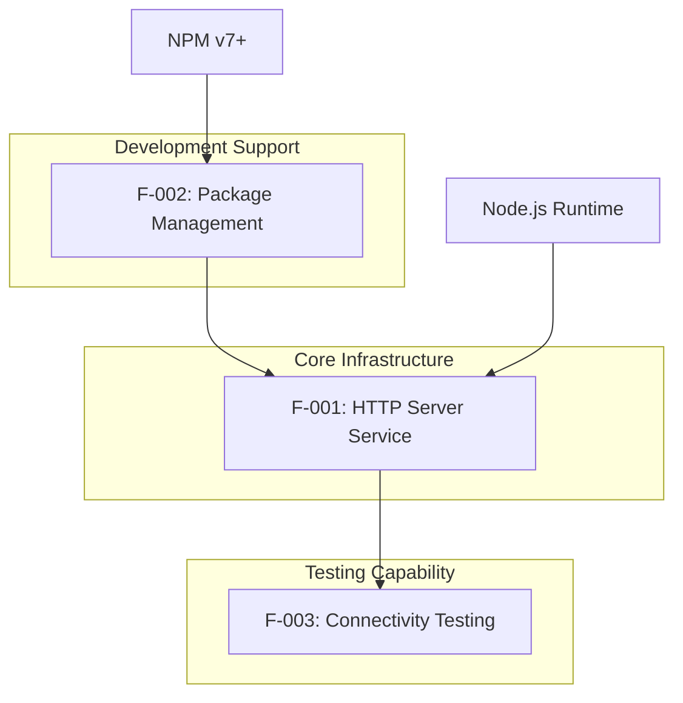
```mermaid
graph TD
    A[F-001: HTTP Server Service] --> C[F-003: Connectivity Testing]
    B[F-002: Package Management] --> A
    
    subgraph "Core Infrastructure"
        A
    end
    
    subgraph "Development Support"
        B
    end
    
    subgraph "Testing Capability"
        C
    end
    
    D[Node.js Runtime] --> A
    E[NPM v7+] --> B
```

### 2.3.2 Integration Points

| Feature Pair | Integration Type | Description |
|-------------|------------------|-------------|
| **F-002 → F-001** | Build Dependency | Package configuration enables server deployment |
| **F-001 → F-003** | Functional Dependency | HTTP server provides testing endpoint capability |

### 2.3.3 Shared Components

| Component | Shared By Features | Function |
|-----------|-------------------|----------|
| **server.js** | F-001, F-003 | Core HTTP implementation and testing endpoint |
| **package.json** | F-002, F-001 | Configuration and entry point declaration |

## 2.4 IMPLEMENTATION CONSIDERATIONS

### 2.4.1 Technical Constraints

| Feature | Constraints |
|---------|-------------|
| **F-001** | Node.js core modules only, localhost binding limitation |
| **F-002** | Entry point mismatch requires resolution |
| **F-003** | Limited to basic connectivity testing only |

### 2.4.2 Performance Requirements

| Requirement Type | Specification | Applicable Features |
|------------------|---------------|-------------------|
| **Response Time** | Sub-100ms HTTP response | F-001, F-003 |
| **Memory Usage** | <50MB footprint | F-001 |
| **Deployment Time** | <30 seconds zero-to-running | F-002, F-001 |
| **Availability** | 99.9% uptime target | F-001, F-003 |

### 2.4.3 Scalability Considerations

| Feature | Current Limitation | Future Consideration |
|---------|-------------------|---------------------|
| **F-001** | Single-threaded operation | Clustering for concurrent requests |
| **F-002** | Local deployment only | Container orchestration support |
| **F-003** | Basic health checks only | Comprehensive monitoring integration |

### 2.4.4 Security Implications

| Feature | Security Measure | Risk Mitigation |
|---------|------------------|----------------|
| **F-001** | Localhost-only binding | Prevents external unauthorized access |
| **F-002** | Zero external dependencies | Eliminates third-party vulnerability surface |
| **F-003** | No authentication required | Appropriate for internal connectivity testing |

### 2.4.5 Maintenance Requirements

| Feature | Maintenance Need | Action Required |
|---------|------------------|----------------|
| **F-002** | Entry point mismatch | Update package.json main field to "server.js" |
| **F-002** | Test script implementation | Develop actual test suite |
| **F-001** | Error handling | Add basic error handling for production readiness |

## 2.5 TRACEABILITY MATRIX

| Business Need | Feature | Requirements | Implementation File |
|---------------|---------|--------------|-------------------|
| Connectivity Testing | F-003 | F-003-RQ-001,002,003 | server.js |
| HTTP Service Foundation | F-001 | F-001-RQ-001,002,003,004 | server.js |
| Development Workflow | F-002 | F-002-RQ-001,002,003,004 | package.json, package-lock.json |

## 2.6 ASSUMPTIONS AND CONSTRAINTS

### 2.6.1 Key Assumptions
- Node.js v12+ runtime environment availability
- Localhost network access permissions
- Single-user development environment usage
- Future expansion to include backpropagation functionality

### 2.6.2 Primary Constraints
- Zero external dependency requirement
- Localhost-only network binding
- Minimal feature set by design
- No production-ready error handling or monitoring

#### References

- `server.js` - Core HTTP server implementation and main functionality
- `package.json` - NPM package configuration and project metadata  
- `package-lock.json` - Dependency lock file confirming zero external dependencies
- `README.md` - Project identification and purpose documentation
- **Technical Specification Sections Retrieved**:
  - 1.1 EXECUTIVE SUMMARY - Business context and stakeholder requirements
  - 1.2 SYSTEM OVERVIEW - Current capabilities and success criteria
  - 1.3 SCOPE - In-scope and out-of-scope feature boundaries

# 3. TECHNOLOGY STACK

## 3.1 PROGRAMMING LANGUAGES

### 3.1.1 JavaScript Runtime Implementation

The hao-backprop-test project utilizes **JavaScript** as its sole programming language, implemented through Node.js server-side execution. The system currently requires Node.js v12+, however Node.js 12.x has reached end-of-life in April 2022, creating significant security and compatibility concerns.

**Language Specifications:**
- **Module System**: CommonJS modules (`require()` syntax)
- **JavaScript Version**: ES6+ compatible features
- **File Structure**: Single-file implementation (`server.js`)
- **Execution Model**: Synchronous request-response pattern

**Selection Criteria:**
- **Zero Dependencies**: JavaScript with Node.js core modules eliminates external dependency management
- **Rapid Development**: Minimal syntax complexity enables fast implementation cycles
- **Universal Compatibility**: JavaScript provides cross-platform execution capabilities
- **Performance Alignment**: Native JavaScript execution meets sub-100ms response time requirements

### 3.1.2 Version Compatibility Requirements

Production applications should only use Active LTS or Maintenance LTS releases of Node.js. The current v12 requirement presents critical compatibility issues:

**Current Version Status:**
- **Node.js v12**: End-of-life reached April 2022
- **Security Risk**: No security updates available
- **Community Support**: Support has dropped within the Node.js community

**Recommended Upgrade Path:**
- **Minimum**: Node.js v18 LTS (Active LTS until October 2024)
- **Optimal**: Node.js v20 LTS (Current Active LTS)
- **Migration Impact**: Zero code changes required due to minimal feature usage

## 3.2 FRAMEWORKS & LIBRARIES

### 3.2.1 Framework Architecture

The system implements a **zero-framework architecture** utilizing only Node.js core modules. This architectural decision aligns with the functional requirements for minimal complexity and rapid deployment.

**Core Module Usage:**
- **HTTP Module**: Node.js built-in `http` module provides complete server functionality
- **No External Frameworks**: Eliminates dependency management overhead
- **No Routing Libraries**: Single-endpoint design requires no routing complexity
- **No Middleware**: Direct request-response processing without intermediary layers

**Justification for Minimal Approach:**
- **Performance Optimization**: Zero framework overhead supports sub-100ms response requirements
- **Memory Efficiency**: Contributes to <50MB memory footprint target
- **Security Posture**: Eliminates third-party vulnerability surface
- **Deployment Speed**: Enables <30-second deployment time requirement

### 3.2.2 Library Dependencies

**Current State**: The project maintains absolute zero external library dependencies, as confirmed by:
- Empty `dependencies` section in `package.json`
- Empty `packages` object in `package-lock.json`
- Zero entries in dependency tree analysis

**Strategic Implications:**
- **Security Advantage**: No third-party vulnerability exposure
- **Maintenance Benefits**: No dependency update requirements
- **Compatibility Assurance**: No version conflict management needed
- **Build Simplicity**: No compilation or bundling processes required

## 3.3 OPEN SOURCE DEPENDENCIES

### 3.3.1 Dependency Architecture

The hao-backprop-test project implements a **zero-dependency architecture** as a core architectural principle. This approach eliminates all external open source dependencies while relying exclusively on Node.js core modules.

**Package Configuration Analysis:**
- **External Dependencies**: 0 packages
- **Development Dependencies**: 0 packages  
- **Peer Dependencies**: 0 packages
- **Optional Dependencies**: 0 packages

**Dependency Management System:**
- **Package Manager**: NPM (Node Package Manager)
- **Lockfile Version**: 3 (requires NPM v7+)
- **Registry**: npm registry (default configuration)
- **Lock Strategy**: Reproducible builds through package-lock.json

### 3.3.2 NPM Version Requirements

NPM version 7+ is required to configure package-lock.json version 3, which omits the dependencies field to greatly reduce the size of the lock file. The current lockfile implementation requires specific NPM capabilities:

**NPM Compatibility:**
- **Minimum Version**: NPM v7.0.0 (released February 2021)
- **Lockfile Support**: Version 3 format compatibility
- **Backwards Compatibility**: Version 3 lockfiles do not contain backwards compatibility affordances present in normal lockfiles

**Package Lock Configuration:**
```
{
  "lockfileVersion": 3,
  "requires": true,
  "packages": {}
}
```

## 3.4 DEVELOPMENT & DEPLOYMENT

### 3.4.1 Development Environment

**Runtime Requirements:**
- **Node.js**: v12+ (immediate upgrade to v18+ LTS recommended)
- **NPM**: v7+ for lockfile version 3 support
- **Operating System**: Cross-platform (Windows, macOS, Linux)
- **Hardware**: Minimal requirements due to lightweight implementation

**Development Tools:**
- **Code Editor**: Any JavaScript-compatible editor
- **Version Control**: Git (implied by package-lock.json presence)
- **Testing Framework**: None currently implemented
- **Linting Tools**: None configured
- **Build Tools**: None required (direct execution)

### 3.4.2 Build and Deployment Process

**Build System:**
- **Build Requirements**: None (no compilation needed)
- **Asset Processing**: None required
- **Dependency Installation**: `npm install` (no packages to install)
- **Environment Configuration**: None specified

**Deployment Architecture:**
- **Deployment Method**: Direct Node.js execution (`node server.js`)
- **Container Strategy**: None implemented
- **Process Management**: Manual process control
- **Configuration Management**: Hardcoded localhost binding
- **Environment Isolation**: None configured

### 3.4.3 Performance and Monitoring

**Performance Characteristics:**
- **Response Time Target**: Sub-100ms HTTP responses
- **Memory Footprint**: <50MB operational memory
- **Startup Time**: <30 seconds zero-to-running deployment
- **Availability Target**: 99.9% uptime when properly hosted

**Monitoring and Observability:**
- **Health Checks**: Basic HTTP 200 response validation
- **Logging**: Console startup message only
- **Metrics Collection**: None implemented
- **Error Tracking**: None configured
- **Performance Monitoring**: None implemented

## 3.5 INFRASTRUCTURE & HOSTING

### 3.5.1 Network Configuration

**Current Binding Strategy:**
- **IP Address**: 127.0.0.1 (localhost only)
- **Port**: 3000 (hardcoded)
- **Protocol**: HTTP/1.1
- **SSL/TLS**: None configured
- **Load Balancing**: None implemented

**Security Posture:**
- **Access Control**: Localhost binding prevents external access
- **Authentication**: None implemented
- **Authorization**: None required
- **Request Filtering**: All requests accepted
- **Rate Limiting**: None implemented

### 3.5.2 Scalability Architecture

**Current Limitations:**
- **Concurrency**: Single-threaded Node.js event loop
- **Clustering**: None implemented
- **Load Distribution**: Not applicable (localhost only)
- **Database Connections**: None required
- **Caching**: None implemented

**Future Scalability Considerations:**
- **Horizontal Scaling**: Would require clustering or load balancer implementation
- **Vertical Scaling**: Current minimal resource usage allows significant headroom
- **Geographic Distribution**: Would require network configuration changes
- **High Availability**: Would require redundancy and health checking implementation

## 3.6 TECHNOLOGY STACK DIAGRAM

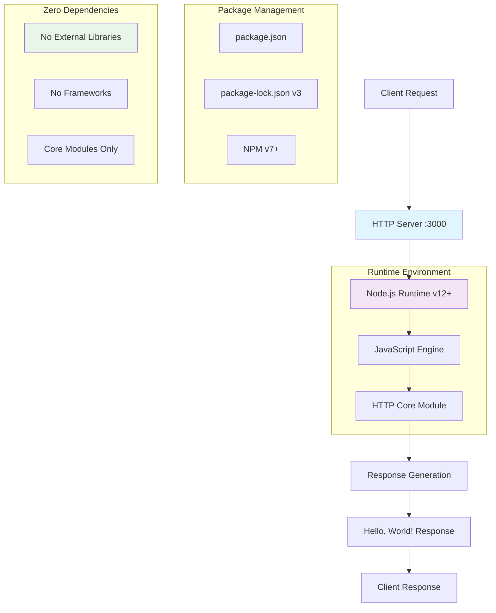
```mermaid
graph TD
    A[Client Request] --> B[HTTP Server :3000]
    B --> C[Node.js Runtime v12+]
    C --> D[JavaScript Engine]
    D --> E[HTTP Core Module]
    E --> F[Response Generation]
    F --> G[Hello, World! Response]
    G --> H[Client Response]

    subgraph "Runtime Environment"
        C
        D
        E
    end

    subgraph "Package Management"
        I[package.json]
        J[package-lock.json v3]
        K[NPM v7+]
    end

    subgraph "Zero Dependencies"
        L[No External Libraries]
        M[No Frameworks]
        N[Core Modules Only]
    end

    style B fill:#e1f5fe
    style C fill:#f3e5f5
    style L fill:#e8f5e8
```

## 3.7 SECURITY IMPLICATIONS

### 3.7.1 Version Security Status

**Critical Security Concerns:**
- **Node.js v12**: No security updates available, exposes applications to unpatched vulnerabilities
- **End-of-Life Status**: Applications and services may not remain secure
- **Community Support**: Declining ecosystem support for deprecated versions

**Security Advantages:**
- **Zero Dependencies**: Eliminates third-party vulnerability surface
- **Localhost Binding**: Prevents unauthorized external access
- **Minimal Attack Surface**: Single endpoint with no data processing
- **No Authentication**: Appropriate for internal connectivity testing

### 3.7.2 Security Recommendations

**Immediate Actions Required:**
1. **Node.js Upgrade**: Migrate to Node.js v18+ LTS immediately
2. **NPM Update**: Ensure NPM v7+ compatibility maintained
3. **Security Scanning**: Implement regular Node.js version monitoring
4. **Network Security**: Maintain localhost-only binding for current use case

## 3.8 UPGRADE ROADMAP

### 3.8.1 Critical Version Updates

**Phase 1: Security Updates (Immediate)**
- **Node.js**: Upgrade from v12+ to v18 LTS minimum
- **NPM**: Verify v7+ compatibility maintained
- **Testing**: Validate zero-dependency architecture preserved
- **Deployment**: Update documentation and deployment procedures

**Phase 2: Future Enhancement Preparation**
- **Development Tools**: Implement basic testing framework
- **Build Process**: Add basic validation scripts
- **Configuration**: Externalize hardcoded values
- **Monitoring**: Add basic health check endpoints

### 3.8.2 Technology Evolution Path

**Current State Assessment:**
- **Strengths**: Zero dependencies, minimal complexity, fast startup
- **Weaknesses**: Deprecated runtime, no production features
- **Opportunities**: Foundation for ML algorithm integration
- **Threats**: Security vulnerabilities, ecosystem compatibility issues

**Strategic Technology Alignment:**
- **Maintain**: Zero-dependency philosophy for core functionality
- **Enhance**: Add production-ready operational features
- **Extend**: Prepare infrastructure for backpropagation algorithm integration
- **Secure**: Implement security best practices while preserving simplicity

#### References

**Files Examined:**
- `package.json` - NPM package configuration and metadata defining project structure
- `package-lock.json` - Lockfile version 3 confirming zero-dependency architecture  
- `server.js` - Core HTTP server implementation using Node.js http module
- `README.md` - Basic project description and identification

**Technical Specification Sections Retrieved:**
- 1.1 EXECUTIVE SUMMARY - Business context and stakeholder requirements
- 1.2 SYSTEM OVERVIEW - Current capabilities and performance targets  
- 2.2 FUNCTIONAL REQUIREMENTS TABLE - HTTP server and package management specifications
- 2.4 IMPLEMENTATION CONSIDERATIONS - Technical constraints and performance requirements
- 2.6 ASSUMPTIONS AND CONSTRAINTS - Runtime assumptions and architectural limitations

**External Research Sources:**
- Node.js end-of-life schedule and LTS support information
- NPM lockfile version 3 specifications and compatibility requirements

# 4. PROCESS FLOWCHART

## 4.1 SYSTEM WORKFLOWS

### 4.1.1 Core Business Processes

#### End-to-End User Journeys

**Primary Use Case: HTTP Connectivity Testing**
The system serves a single, streamlined user journey focused on connectivity validation:

1. **Service Initialization**: Developer or automated system starts the HTTP server using `node server.js`
2. **Connectivity Validation**: Client sends HTTP request to localhost:3000
3. **Response Verification**: System returns consistent "Hello, World!" response with HTTP 200 status
4. **Testing Completion**: Client validates successful HTTP communication

**User Touchpoints:**
- Command-line interface for server startup
- HTTP endpoints for connectivity testing
- Console output for operational feedback

**Business Value Delivery:**
The process delivers immediate value through rapid validation of Node.js runtime environment and HTTP connectivity, serving as a foundational component for integration pipeline testing.

#### System Interactions

**Internal System Components:**
- Node.js HTTP module handles all HTTP protocol operations
- Event loop manages concurrent request processing
- Process stdout provides operational logging

**External System Interfaces:**
- HTTP/1.1 client connections via localhost:3000
- NPM registry interface for package management operations
- Operating system process management interface

#### Decision Points

**Request Processing Decisions:**
1. **Accept All Requests**: System accepts any HTTP method (GET, POST, PUT, DELETE, etc.) without filtering
2. **Universal Response**: All valid HTTP requests receive identical response regardless of path or parameters
3. **No Authentication**: All localhost requests are automatically authorized

**Error Handling Decisions:**
Currently the system implements no explicit error handling, resulting in default Node.js error behavior for exceptional conditions.

### 4.1.2 Integration Workflows

#### Data Flow Between Systems

**HTTP Request Flow:**
```
Client Application → HTTP Request → Node.js Server → Response Generation → HTTP Response → Client Application
```

**Package Management Flow:**
```
Developer → npm install → Package Resolution → Dependency Installation → Lock File Update → Deployment Ready
```

#### API Interactions

**HTTP API Pattern:**
- **Endpoint**: Universal endpoint responding to all paths
- **Methods**: All HTTP methods accepted
- **Request Format**: No specific format requirements
- **Response Format**: Plain text with Content-Type: text/plain
- **Status Codes**: HTTP 200 for all successful requests

#### Event Processing Flows

**Server Event Loop:**
1. **Startup Event**: Server binding to localhost:3000
2. **Request Events**: Incoming HTTP connections trigger request handlers
3. **Response Events**: Response completion and connection cleanup
4. **Error Events**: Uncaught exceptions (currently unhandled)

## 4.2 DETAILED PROCESS FLOWS

### 4.2.1 Server Startup Process

#### Initialization Sequence

**Prerequisites Validation:**
- Node.js runtime v12+ availability
- Port 3000 availability on localhost interface
- Process execution permissions

**Startup Steps:**
1. **Module Loading**: Import Node.js core `http` module
2. **Server Creation**: Instantiate HTTP server with request handler
3. **Binding Process**: Bind server to 127.0.0.1:3000
4. **Confirmation Logging**: Output "Server running at http://127.0.0.1:3000/"
5. **Event Loop Entry**: Enter listening state for incoming connections

**Success Criteria:**
- Server successfully binds to specified address and port
- Console confirmation message displayed
- Process remains active and responsive

**Timing Constraints:**
- Startup completion target: <30 seconds from command execution
- Initial request response capability: Immediate after binding

### 4.2.2 HTTP Request Processing

#### Request Reception and Processing

**Request Acceptance:**
- All HTTP/1.1 compatible requests accepted
- No path-based routing or filtering
- No request body parsing or validation
- No authentication or authorization checks

**Processing Steps:**
1. **Connection Establishment**: Accept TCP connection on port 3000
2. **Request Parsing**: Node.js HTTP module handles protocol parsing
3. **Handler Execution**: Execute universal response handler
4. **Response Generation**: Create HTTP response with predefined content
5. **Response Transmission**: Send response to client
6. **Connection Cleanup**: Close connection as per HTTP/1.1 protocol

**Response Generation:**
- **Status Code**: 200 (OK)
- **Headers**: Content-Type: text/plain
- **Body**: "Hello, World!\n"
- **Response Time**: Target sub-100ms processing

### 4.2.3 Package Management Workflow

#### NPM Configuration Process

**Package Initialization:**
1. **Metadata Definition**: package.json defines project metadata and configuration
2. **Dependency Resolution**: Currently no external dependencies to resolve
3. **Lock File Maintenance**: package-lock.json ensures build reproducibility
4. **Entry Point Configuration**: package.json main field (note: mismatch with actual server.js)

**Installation Workflow:**
```
npm install → Dependency Analysis → Lock File Validation → Local Cache Update → Installation Complete
```

**Known Issues:**
- Entry point mismatch between declared (`index.js`) and actual (`server.js`)
- Test script placeholder returns error status

### 4.2.4 Development & Deployment Process

#### Development Lifecycle

**Development Workflow:**
1. **Environment Setup**: Install Node.js v12+ runtime
2. **Code Modification**: Edit server.js for functionality changes
3. **Local Testing**: Execute `node server.js` for validation
4. **Version Control**: Git-based source control (implied by lock file presence)

**Deployment Sequence:**
1. **Environment Preparation**: Ensure Node.js runtime availability
2. **Code Distribution**: Copy source files to target environment
3. **Dependency Installation**: Execute `npm install` (no actual dependencies)
4. **Service Startup**: Run `node server.js` command
5. **Health Validation**: Verify HTTP 200 response from localhost:3000

## 4.3 TECHNICAL IMPLEMENTATION

### 4.3.1 State Management

#### System State Characteristics

**Stateless Design:**
- No session management or user state persistence
- No database connections or data storage
- No configuration state beyond hardcoded values
- Each HTTP request processed independently

**Process State:**
- **Server State**: Binary operational state (running/stopped)
- **Connection State**: Temporary TCP connection state during request processing
- **Event Loop State**: Node.js event loop manages asynchronous operations

#### Data Persistence Points

**No Persistent Storage:**
- System implements no database or file-based storage
- All responses generated from static string literals
- No caching mechanisms implemented
- No state preservation between process restarts

### 4.3.2 Error Handling

#### Current Error Handling Status

**Missing Error Handling:**
- No try-catch blocks for exception handling
- No graceful degradation mechanisms
- No error logging or monitoring
- No recovery procedures implemented

**Default Behavior:**
- Uncaught exceptions result in process termination
- Network errors handled by Node.js default behavior
- No custom error responses implemented

#### Retry Mechanisms

**No Retry Logic:**
- System implements no automatic retry capabilities
- Client applications responsible for retry logic
- No circuit breaker patterns implemented

## 4.4 PROCESS DIAGRAMS

### 4.4.1 High-Level System Workflow

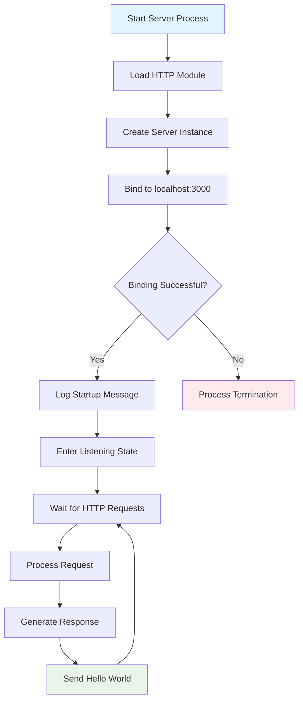
```mermaid
flowchart TD
    A[Start Server Process] --> B[Load HTTP Module]
    B --> C[Create Server Instance]
    C --> D[Bind to localhost:3000]
    D --> E{Binding Successful?}
    E -->|Yes| F[Log Startup Message]
    E -->|No| G[Process Termination]
    F --> H[Enter Listening State]
    H --> I[Wait for HTTP Requests]
    I --> J[Process Request]
    J --> K[Generate Response]
    K --> L[Send Hello World]
    L --> I
    
    style A fill:#e1f5fe
    style G fill:#ffebee
    style L fill:#e8f5e8
```

### 4.4.2 HTTP Request Processing Flow

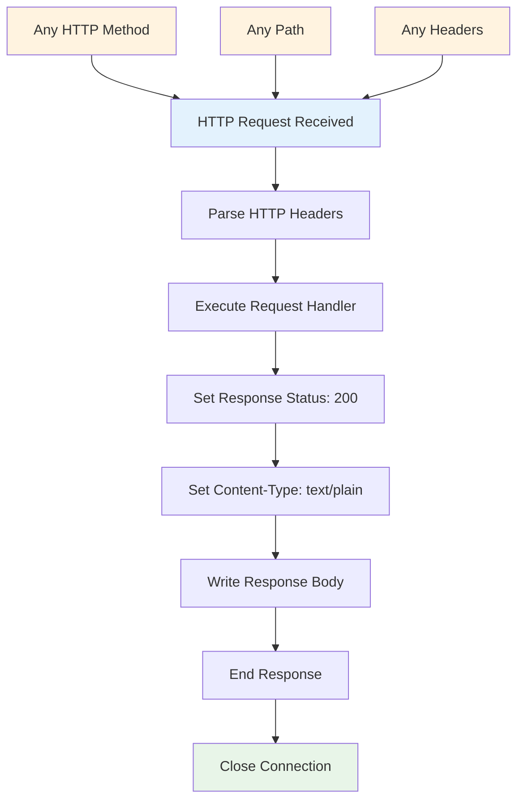
```mermaid
flowchart TD
    A[HTTP Request Received] --> B[Parse HTTP Headers]
    B --> C[Execute Request Handler]
    C --> D[Set Response Status: 200]
    D --> E[Set Content-Type: text/plain]
    E --> F[Write Response Body]
    F --> G[End Response]
    G --> H[Close Connection]
    
    I[Any HTTP Method] --> A
    J[Any Path] --> A
    K[Any Headers] --> A
    
    style A fill:#e3f2fd
    style H fill:#e8f5e8
    style I fill:#fff3e0
    style J fill:#fff3e0
    style K fill:#fff3e0
```

### 4.4.3 Package Management Process Flow

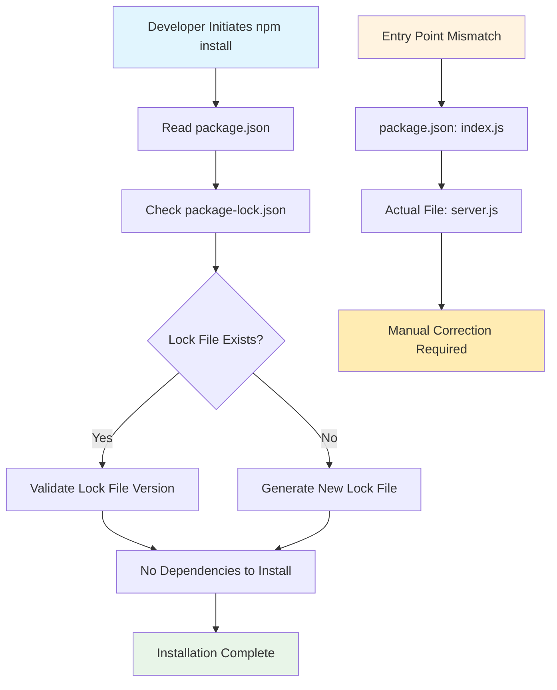
```mermaid
flowchart TD
    A[Developer Initiates npm install] --> B[Read package.json]
    B --> C[Check package-lock.json]
    C --> D{Lock File Exists?}
    D -->|Yes| E[Validate Lock File Version]
    D -->|No| F[Generate New Lock File]
    E --> G[No Dependencies to Install]
    F --> G
    G --> H[Installation Complete]
    
    I[Entry Point Mismatch] --> J[package.json: index.js]
    J --> K[Actual File: server.js]
    K --> L[Manual Correction Required]
    
    style A fill:#e1f5fe
    style H fill:#e8f5e8
    style I fill:#fff3e0
    style L fill:#ffecb3
```

### 4.4.4 Feature Dependencies Workflow

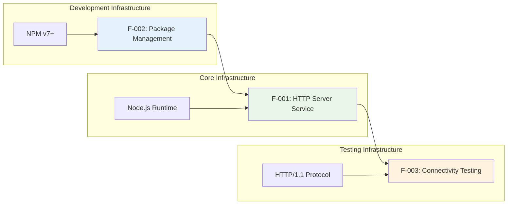
```mermaid
flowchart LR
    A[F-002: Package Management] --> B[F-001: HTTP Server Service]
    B --> C[F-003: Connectivity Testing]
    
    D[Node.js Runtime] --> B
    E[NPM v7+] --> A
    F[HTTP/1.1 Protocol] --> C
    
    subgraph "Development Infrastructure"
        A
        E
    end
    
    subgraph "Core Infrastructure"
        B
        D
    end
    
    subgraph "Testing Infrastructure"
        C
        F
    end
    
    style A fill:#e3f2fd
    style B fill:#e8f5e8
    style C fill:#fff3e0
```

### 4.4.5 Deployment State Transition Diagram

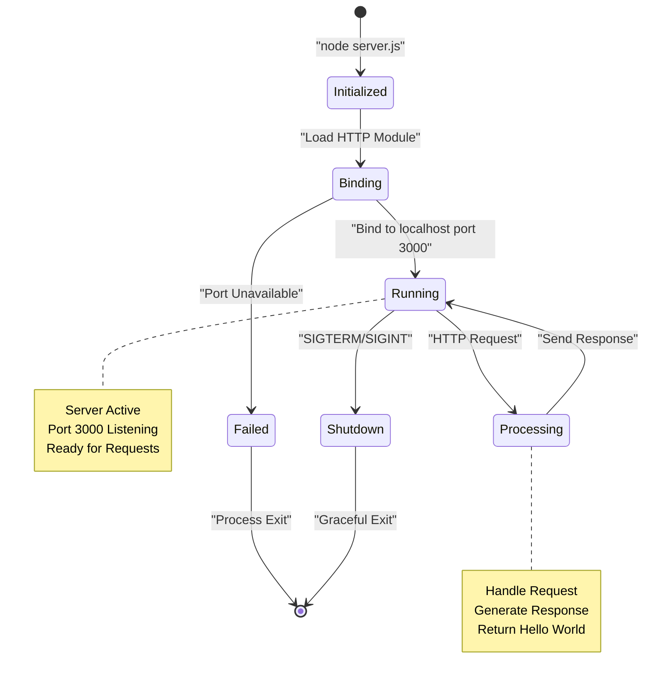
```mermaid
stateDiagram-v2
    [*] --> Initialized: "node server.js"
    Initialized --> Binding: "Load HTTP Module"
    Binding --> Running: "Bind to localhost port 3000"
    Binding --> Failed: "Port Unavailable"
    Failed --> [*]: "Process Exit"
    Running --> Processing: "HTTP Request"
    Processing --> Running: "Send Response"
    Running --> Shutdown: "SIGTERM/SIGINT"
    Shutdown --> [*]: "Graceful Exit"
    
    note right of Running
        Server Active
        Port 3000 Listening
        Ready for Requests
    end note
    
    note right of Processing
        Handle Request
        Generate Response
        Return Hello World
    end note
```

### 4.4.6 Error Handling Flow (Current Implementation)

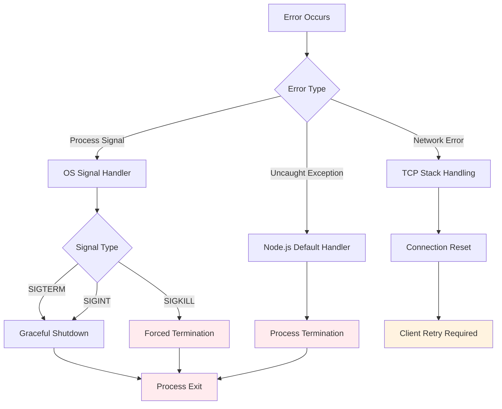
```mermaid
flowchart TD
    A[Error Occurs] --> B{Error Type}
    B -->|Uncaught Exception| C[Node.js Default Handler]
    B -->|Network Error| D[TCP Stack Handling]
    B -->|Process Signal| E[OS Signal Handler]
    
    C --> F[Process Termination]
    D --> G[Connection Reset]
    E --> H{Signal Type}
    
    H -->|SIGTERM| I[Graceful Shutdown]
    H -->|SIGINT| I
    H -->|SIGKILL| J[Forced Termination]
    
    I --> K[Process Exit]
    J --> K
    F --> K
    G --> L[Client Retry Required]
    
    style F fill:#ffebee
    style J fill:#ffebee
    style K fill:#ffebee
    style L fill:#fff3e0
```

## 4.5 VALIDATION RULES AND BUSINESS LOGIC

### 4.5.1 Business Rules at Each Step

#### Server Initialization Rules
- **Rule 1**: Server must bind to localhost interface only (127.0.0.1)
- **Rule 2**: Port 3000 must be available for binding
- **Rule 3**: Console confirmation message must be displayed on successful startup

#### Request Processing Rules
- **Rule 1**: Accept all HTTP methods without discrimination
- **Rule 2**: Process all request paths identically
- **Rule 3**: Return HTTP 200 status for all valid requests
- **Rule 4**: Response body must be "Hello, World!\n"
- **Rule 5**: Content-Type header must be "text/plain"

### 4.5.2 Data Validation Requirements

#### Current Validation State
**No Input Validation:** System currently implements no request validation, data sanitization, or input filtering mechanisms.

**Response Validation:** System guarantees consistent response format for all requests meeting basic HTTP/1.1 protocol requirements.

### 4.5.3 Authorization Checkpoints

#### Access Control Model
**Open Access:** Current implementation provides unrestricted access to all functionality via localhost interface.

**Network-Level Security:** Localhost binding (127.0.0.1) provides implicit network-level access control, preventing external network access.

## 4.6 PERFORMANCE AND SLA CONSIDERATIONS

### 4.6.1 Timing Constraints

#### Response Time Requirements
- **Target Response Time**: <100ms for HTTP request processing
- **Startup Time**: <30 seconds from process initiation to ready state
- **Connection Handling**: Immediate acceptance of TCP connections

#### Memory and Resource Constraints
- **Memory Footprint**: <50MB operational memory consumption
- **CPU Usage**: Minimal CPU utilization due to simple response generation
- **Network Bandwidth**: Minimal bandwidth requirements for plain text responses

### 4.6.2 Availability Targets

#### Uptime Requirements
- **Target Availability**: 99.9% uptime when properly hosted and monitored
- **Recovery Time**: Manual restart required for process failures
- **Monitoring**: Basic HTTP health check capability via endpoint testing

#### Scalability Characteristics
- **Concurrent Connections**: Single-threaded event loop handles multiple concurrent requests
- **Throughput**: Limited by Node.js event loop performance and system resources
- **Horizontal Scaling**: Requires clustering or load balancer implementation for scale-out

#### References

**Technical Specification Sections Referenced:**
- `2.1 FEATURE CATALOG` - Feature descriptions, dependencies, and business value
- `2.3 FEATURE RELATIONSHIPS` - Feature dependency mapping and integration points
- `3.4 DEVELOPMENT & DEPLOYMENT` - Development environment and deployment processes
- `3.5 INFRASTRUCTURE & HOSTING` - Network configuration and scalability architecture

**Repository Files Analyzed:**
- `server.js` - Core HTTP server implementation and request handling logic
- `package.json` - NPM configuration, project metadata, and dependency management
- `package-lock.json` - Dependency resolution and build reproducibility
- `README.md` - Project description and integration purpose documentation

# 5. SYSTEM ARCHITECTURE

## 5.1 HIGH-LEVEL ARCHITECTURE

### 5.1.1 System Overview

The hao-backprop-test system implements a **minimalist monolithic architecture** designed for rapid connectivity testing and machine learning algorithm integration validation. The architecture follows a zero-dependency philosophy, utilizing only Node.js core modules to achieve sub-100ms response times with minimal resource overhead.

**Architecture Style and Rationale:**
The system employs a **stateless HTTP service architecture** with a single-threaded event-driven processing model. This architectural approach was selected to meet stringent performance requirements while maintaining maximum simplicity for testing scenarios. The zero-framework approach eliminates external dependency management complexity and reduces the attack surface for security-sensitive testing environments.

**Key Architectural Principles:**
- **Minimalism**: Single-file implementation (14 lines) with zero external dependencies
- **Stateless Processing**: Each HTTP request processed independently without session persistence
- **Event-Driven Concurrency**: Leverages Node.js event loop for handling multiple concurrent connections
- **Security by Isolation**: Localhost-only binding provides implicit network security boundary

**System Boundaries and Major Interfaces:**
The system operates within a localhost boundary (127.0.0.1:3000) with a single HTTP/1.1 interface. External integration occurs through standard HTTP protocol communication, with NPM package management providing deployment and dependency resolution interfaces. The system interfaces directly with the Node.js runtime environment and operating system process management layer.

### 5.1.2 Core Components Table

| Component Name | Primary Responsibility | Key Dependencies | Integration Points | Critical Considerations |
|----------------|----------------------|------------------|-------------------|------------------------|
| HTTP Server Module | HTTP request processing and response generation | Node.js `http` core module | TCP port 3000, event loop integration | Hardcoded localhost binding limits deployment flexibility |
| Package Configuration | Project metadata and dependency management | NPM registry interface | Build systems, deployment pipelines | Entry point mismatch between declared (`index.js`) and actual (`server.js`) |
| Runtime Environment | JavaScript execution and process lifecycle | Node.js v12+ runtime | Operating system process management | Node.js v12 end-of-life creates security vulnerability |

### 5.1.3 Data Flow Description

**Primary HTTP Processing Flow:**
The system implements a straightforward request-response pattern where all incoming HTTP requests follow an identical processing path. Upon receiving a TCP connection on port 3000, the Node.js HTTP module parses the request headers and immediately triggers the universal request handler. The handler generates a static response ("Hello, World!\n") with HTTP 200 status code and Content-Type: text/plain header, then transmits the response back to the client.

**Event Loop Integration Pattern:**
The system leverages Node.js's single-threaded event loop architecture for concurrent request handling. Each incoming HTTP request creates an event that is queued and processed asynchronously, allowing the server to handle multiple concurrent connections without blocking operations. Response generation occurs synchronously within each request handler, ensuring predictable sub-100ms response times.

**Package Management Data Flow:**
The NPM package management system processes package.json metadata to resolve dependencies and generate package-lock.json for reproducible builds. Currently, zero external dependencies result in empty dependency trees, simplifying the build process and eliminating dependency resolution overhead.

### 5.1.4 External Integration Points

| System Name | Integration Type | Data Exchange Pattern | Protocol/Format | SLA Requirements |
|-------------|------------------|----------------------|-----------------|------------------|
| HTTP Clients | Synchronous API | Request-Response | HTTP/1.1, text/plain | <100ms response time |
| NPM Registry | Package Management | Download/Metadata | HTTPS, JSON | Standard NPM availability |
| Node.js Runtime | Process Management | Event-driven | Native function calls | Continuous availability |

## 5.2 COMPONENT DETAILS

### 5.2.1 HTTP Server Component

**Purpose and Responsibilities:**
The HTTP Server component serves as the primary service interface, implementing core HTTP/1.1 protocol handling for connectivity testing scenarios. The component accepts all HTTP methods (GET, POST, PUT, DELETE) and paths, providing universal response functionality for comprehensive connectivity validation.

**Technologies and Frameworks Used:**
- **Node.js HTTP Core Module**: Provides native HTTP/1.1 server functionality
- **JavaScript ES6+**: CommonJS module syntax with synchronous response generation
- **TCP Networking**: Utilizes Node.js TCP socket management for connection handling

**Key Interfaces and APIs:**
- **HTTP Endpoint**: Universal endpoint accepting all HTTP methods and paths
- **Request Processing Interface**: Standard Node.js request/response object handling
- **Network Interface**: TCP socket binding to localhost:3000

**Data Persistence Requirements:**
The component implements complete stateless operation with zero persistence requirements. No database connections, file storage, or caching mechanisms are utilized, ensuring each request is processed independently.

**Scaling Considerations:**
Current single-threaded design limits vertical scaling to Node.js event loop capacity. Horizontal scaling would require implementation of clustering via Node.js cluster module or deployment behind a load balancer for multi-instance operation.

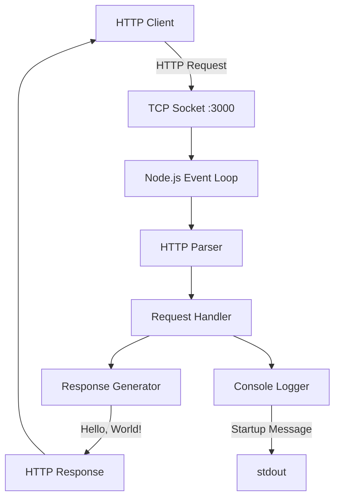
```mermaid
graph TD
    A[HTTP Client] -->|HTTP Request| B[TCP Socket :3000]
    B --> C[Node.js Event Loop]
    C --> D[HTTP Parser]
    D --> E[Request Handler]
    E --> F[Response Generator]
    F -->|"Hello, World!"| G[HTTP Response]
    G --> A
    
    E --> H[Console Logger]
    H -->|Startup Message| I[stdout]
```

### 5.2.2 Package Management Component

**Purpose and Responsibilities:**
The Package Management component handles project metadata, dependency resolution, and build reproducibility through NPM configuration files. This component ensures consistent deployment environments and provides the foundation for future dependency management.

**Technologies and Frameworks Used:**
- **NPM Package System**: Standard Node.js package management
- **JSON Configuration**: package.json and package-lock.json metadata
- **Lockfile Version 3**: Compatible with NPM v7+ for enhanced security

**Key Interfaces and APIs:**
- **NPM CLI Interface**: Standard npm install/start/test command support
- **Package Registry Interface**: Connection to NPM registry for metadata
- **Build System Integration**: Compatible with CI/CD pipeline integration

**Data Persistence Requirements:**
Configuration persistence occurs through JSON files stored in the repository root. Package-lock.json ensures reproducible builds by maintaining exact dependency versions and integrity checksums.

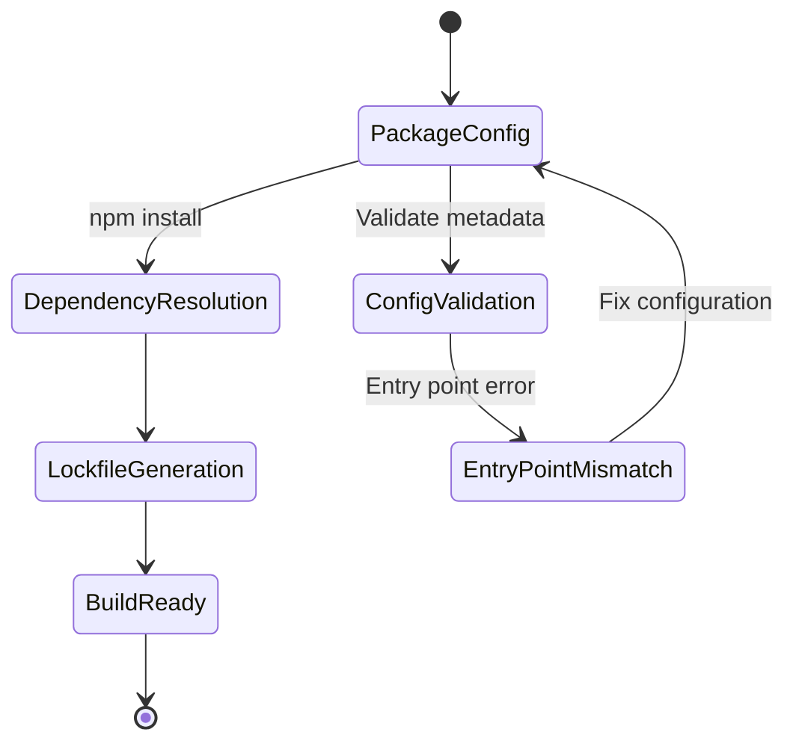
```mermaid
stateDiagram-v2
    [*] --> PackageConfig
    PackageConfig --> DependencyResolution: npm install
    DependencyResolution --> LockfileGeneration
    LockfileGeneration --> BuildReady
    BuildReady --> [*]
    
    PackageConfig --> ConfigValidation: Validate metadata
    ConfigValidation --> EntryPointMismatch: Entry point error
    EntryPointMismatch --> PackageConfig: Fix configuration
```

### 5.2.3 Runtime Environment Component

**Purpose and Responsibilities:**
The Runtime Environment component provides the JavaScript execution context and process lifecycle management for the HTTP server. This component manages memory allocation, event loop operations, and integration with the host operating system.

**Technologies and Frameworks Used:**
- **Node.js Runtime**: JavaScript execution environment with V8 engine
- **Operating System Integration**: Process management and network stack access
- **Event Loop Architecture**: Single-threaded asynchronous I/O processing

**Scaling Considerations:**
Memory footprint maintained under 50MB operational requirement. CPU utilization remains minimal due to simple response generation logic. Process startup achieves sub-30-second requirement through minimal initialization overhead.

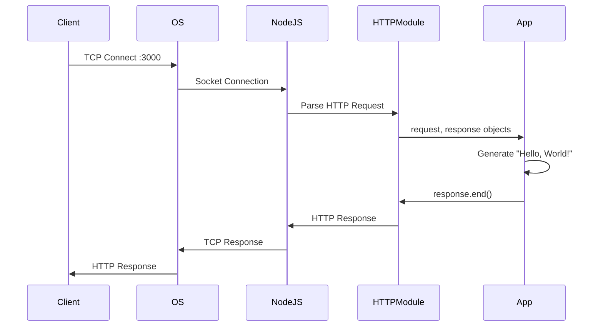
```mermaid
sequenceDiagram
    participant Client
    participant OS
    participant NodeJS
    participant HTTPModule
    participant App
    
    Client->>OS: TCP Connect :3000
    OS->>NodeJS: Socket Connection
    NodeJS->>HTTPModule: Parse HTTP Request
    HTTPModule->>App: request, response objects
    App->>App: Generate "Hello, World!"
    App->>HTTPModule: response.end()
    HTTPModule->>NodeJS: HTTP Response
    NodeJS->>OS: TCP Response
    OS->>Client: HTTP Response
```

## 5.3 TECHNICAL DECISIONS

### 5.3.1 Architecture Style Decisions

**Decision: Zero-Framework HTTP Server**
- **Rationale**: Eliminates external dependency management while meeting sub-100ms response time requirements
- **Tradeoffs**: Limited functionality and routing capabilities in exchange for maximum performance and minimal complexity
- **Impact**: Reduces security attack surface and simplifies deployment process

**Decision: Stateless Request Processing**
- **Rationale**: Enables predictable performance characteristics and simplifies concurrent request handling
- **Tradeoffs**: No session management or user state persistence capabilities
- **Impact**: Maximum scalability potential with minimal memory overhead

**Decision: Localhost Network Binding**
- **Rationale**: Provides implicit security boundary for testing scenarios
- **Tradeoffs**: Limits deployment flexibility and prevents external accessibility
- **Impact**: Requires network configuration changes for production deployment

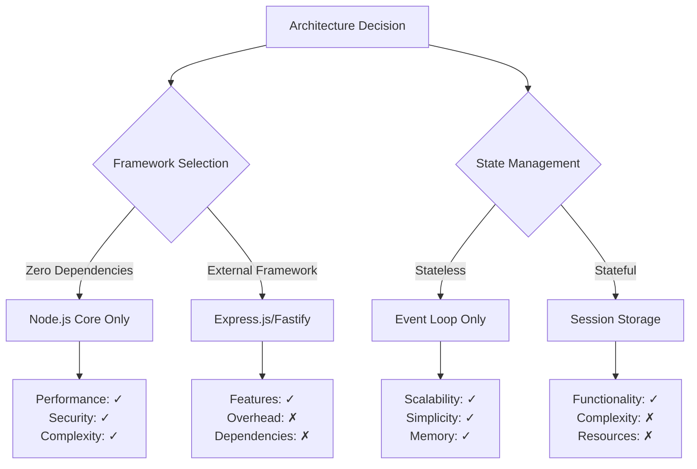
```mermaid
graph TD
    A[Architecture Decision] --> B{Framework Selection}
    B -->|Zero Dependencies| C[Node.js Core Only]
    B -->|External Framework| D[Express.js/Fastify]
    C --> E[Performance: ✓<br/>Security: ✓<br/>Complexity: ✓]
    D --> F[Features: ✓<br/>Overhead: ✗<br/>Dependencies: ✗]
    
    A --> G{State Management}
    G -->|Stateless| H[Event Loop Only]
    G -->|Stateful| I[Session Storage]
    H --> J[Scalability: ✓<br/>Simplicity: ✓<br/>Memory: ✓]
    I --> K[Functionality: ✓<br/>Complexity: ✗<br/>Resources: ✗]
```

### 5.3.2 Communication Pattern Choices

**Decision: Universal HTTP Endpoint**
- **Rationale**: Simplifies connectivity testing by accepting all HTTP methods and paths
- **Tradeoffs**: No routing or path-specific functionality in exchange for comprehensive test coverage
- **Implementation**: Single request handler processes all incoming HTTP traffic

**Decision: Synchronous Response Generation**
- **Rationale**: Predictable response times and simple implementation model
- **Tradeoffs**: No asynchronous processing capabilities or complex response generation
- **Performance Impact**: Enables consistent sub-100ms response time achievement

### 5.3.3 Data Storage Solution Rationale

**Decision: Zero Persistence Architecture**
- **Rationale**: Eliminates data storage complexity and maintains stateless operation
- **Tradeoffs**: No data retention or complex business logic capabilities
- **Security Benefits**: No data breach risk due to absence of stored information

### 5.3.4 Technology Selection Justification

| Decision Category | Choice | Primary Rationale | Key Tradeoff | Future Considerations |
|------------------|--------|-------------------|--------------|---------------------|
| Runtime Platform | Node.js | Event-driven I/O, performance requirements | Limited to JavaScript ecosystem | Upgrade to v18+ LTS required |
| Module System | CommonJS | Native Node.js compatibility | No ES6 module benefits | Migration path to ES6 modules available |
| HTTP Implementation | Core http module | Zero dependencies, maximum performance | No advanced HTTP features | Consider framework for complex routing |

## 5.4 CROSS-CUTTING CONCERNS

### 5.4.1 Monitoring and Observability Approach

**Current Monitoring Capabilities:**
The system provides minimal observability through console logging during server startup. Health check functionality exists implicitly through HTTP response validation, enabling external monitoring systems to verify service availability through standard HTTP requests.

**Observability Gaps:**
- No structured logging implementation for request tracking
- No metrics collection for performance monitoring  
- No distributed tracing for request flow analysis
- No error tracking or exception monitoring

**Future Observability Strategy:**
Integration of lightweight monitoring solutions compatible with the zero-dependency architecture would require careful selection of observability tools that maintain performance characteristics while providing essential operational visibility.

### 5.4.2 Error Handling Patterns

**Current Error Handling Status:**
The system implements no explicit error handling mechanisms, relying on Node.js default error behavior for exception management. Uncaught exceptions result in process termination, requiring manual intervention for service recovery.

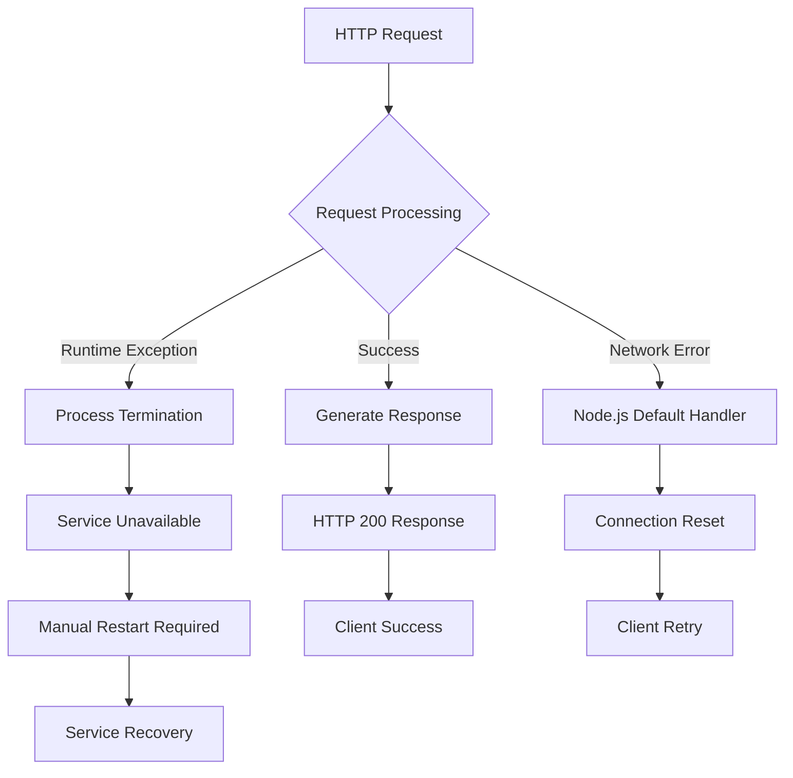
```mermaid
graph TD
    A[HTTP Request] --> B{Request Processing}
    B -->|Success| C[Generate Response]
    B -->|Network Error| D[Node.js Default Handler]
    B -->|Runtime Exception| E[Process Termination]
    
    C --> F[HTTP 200 Response]
    D --> G[Connection Reset]
    E --> H[Service Unavailable]
    H --> I[Manual Restart Required]
    
    F --> J[Client Success]
    G --> K[Client Retry]
    I --> L[Service Recovery]
```

**Error Handling Enhancement Requirements:**
- Implementation of try-catch blocks for graceful exception handling
- Custom error response generation for client notification
- Logging mechanism for error tracking and analysis
- Automatic recovery procedures for common failure scenarios

### 5.4.3 Authentication and Authorization Framework

**Current Security Posture:**
The system implements no authentication or authorization mechanisms. All HTTP requests to localhost:3000 are automatically processed without access control validation. This approach aligns with the testing-focused use case but creates security concerns for production deployment.

**Security Architecture Requirements:**
- Network-level access control through localhost binding
- No user management or session handling required
- Implicit trust model for local development environments

**Future Security Considerations:**
Production deployment would require implementation of appropriate authentication mechanisms, input validation, and network access controls to ensure secure operation in multi-user environments.

### 5.4.4 Performance Requirements and SLAs

**Established Performance Targets:**
- **Response Time SLA**: Sub-100ms HTTP request processing
- **Memory Utilization**: Operational footprint under 50MB
- **Startup Performance**: Service ready state within 30 seconds
- **Availability Target**: 99.9% uptime in properly managed environments

**Performance Architecture Alignment:**
The zero-dependency architecture directly supports performance requirements by eliminating framework overhead and complex processing layers. Single-threaded event loop processing ensures predictable response times while minimal memory allocation maintains resource efficiency targets.

**Scalability Performance Considerations:**
Current architecture supports moderate concurrent load through Node.js event loop efficiency. Horizontal scaling requirements would necessitate clustering implementation or load balancer deployment for high-throughput scenarios.

### 5.4.5 Disaster Recovery Procedures

**Current Recovery Capabilities:**
Service recovery requires manual intervention through process restart commands. No automated failover or self-healing capabilities exist within the current implementation.

**Recovery Procedures:**
1. **Service Failure Detection**: Monitor HTTP response availability
2. **Manual Restart Process**: Execute `node server.js` command
3. **Service Verification**: Validate HTTP 200 responses resume
4. **Root Cause Analysis**: Review Node.js process logs for failure patterns

**Future Recovery Enhancements:**
Implementation of process management tools (PM2, systemd) would enable automated restart capabilities and improved service reliability for production deployments.

#### References

**Repository Files Analyzed:**
- `server.js` - HTTP server implementation with request handling and response generation logic
- `package.json` - NPM package configuration and project metadata management
- `package-lock.json` - Dependency resolution lockfile confirming zero-dependency architecture
- `README.md` - Project documentation and integration context

**Technical Specification Sections Referenced:**
- `1.2 SYSTEM OVERVIEW` - Overall system capabilities, limitations, and success criteria
- `3.1 PROGRAMMING LANGUAGES` - JavaScript/Node.js specifications and version requirements
- `3.2 FRAMEWORKS & LIBRARIES` - Zero-framework architecture justification and implications
- `4.1 SYSTEM WORKFLOWS` - Core business processes and system interaction patterns
- `4.3 TECHNICAL IMPLEMENTATION` - State management and error handling implementation details
- `4.6 PERFORMANCE AND SLA CONSIDERATIONS` - Performance requirements and availability targets

# 6. SYSTEM COMPONENTS DESIGN

## 6.1 CORE SERVICES ARCHITECTURE

### 6.1.1 Architecture Classification and Applicability Assessment

**Core Services Architecture is not applicable for this system.**

The hao-backprop-test system implements a minimalist monolithic architecture that does not require microservices, distributed architecture, or distinct service components. This determination is based on comprehensive analysis of the system implementation and architectural characteristics documented throughout this technical specification.

#### 6.1.1.1 Evidence Supporting Non-Applicability

**Implementation Characteristics:**
- **Single-file Architecture**: The entire system is implemented in a 14-line `server.js` file using only Node.js core modules
- **Zero Service Decomposition**: No separate services, modules, or components exist beyond the monolithic HTTP server
- **No External Dependencies**: The system operates with zero external dependencies, eliminating any distributed service integration requirements
- **Localhost-Only Operation**: Service binding to 127.0.0.1:3000 prevents distributed deployment scenarios

**Missing Service-Oriented Features:**
- **No Service Boundaries**: Single universal endpoint handles all HTTP requests identically
- **No Inter-Service Communication**: No separate services exist to communicate with each other
- **No Service Discovery**: Hardcoded port binding eliminates need for dynamic service location
- **No Load Balancing**: Single-instance operation without clustering or distribution capabilities

#### 6.1.1.2 Architectural Philosophy Alignment

The system's minimalist monolithic architecture aligns with its primary use case as a connectivity testing and proof-of-concept platform. The zero-dependency philosophy prioritizes simplicity, rapid deployment, and minimal operational overhead over distributed system capabilities.

**Design Principles Supporting Monolithic Approach:**
- **Simplicity Over Scale**: 14-line implementation optimized for testing scenarios
- **Performance Over Flexibility**: Sub-100ms response time requirements favor monolithic processing
- **Security by Isolation**: Localhost binding provides implicit security boundary
- **Zero-Maintenance Philosophy**: No complex service orchestration or coordination requirements

### 6.1.2 Current Monolithic Architecture Overview

While core services architecture is not applicable, the system does implement a specific architectural pattern that serves its intended purpose effectively.

#### 6.1.2.1 Monolithic Service Characteristics

| Characteristic | Implementation | Rationale | Operational Impact |
|----------------|----------------|-----------|-------------------|
| **Single Process Model** | Node.js HTTP server process | Eliminates inter-process communication overhead | Manual restart required for failures |
| **Stateless Processing** | No session or state management | Enables predictable response times | No data persistence capabilities |
| **Universal Endpoint** | Single handler for all HTTP methods and paths | Maximizes simplicity | No routing or API specialization |
| **Synchronous Response** | Immediate "Hello, World!" response | Meets sub-100ms SLA requirement | No asynchronous processing capabilities |

#### 6.1.2.2 System Interaction Model

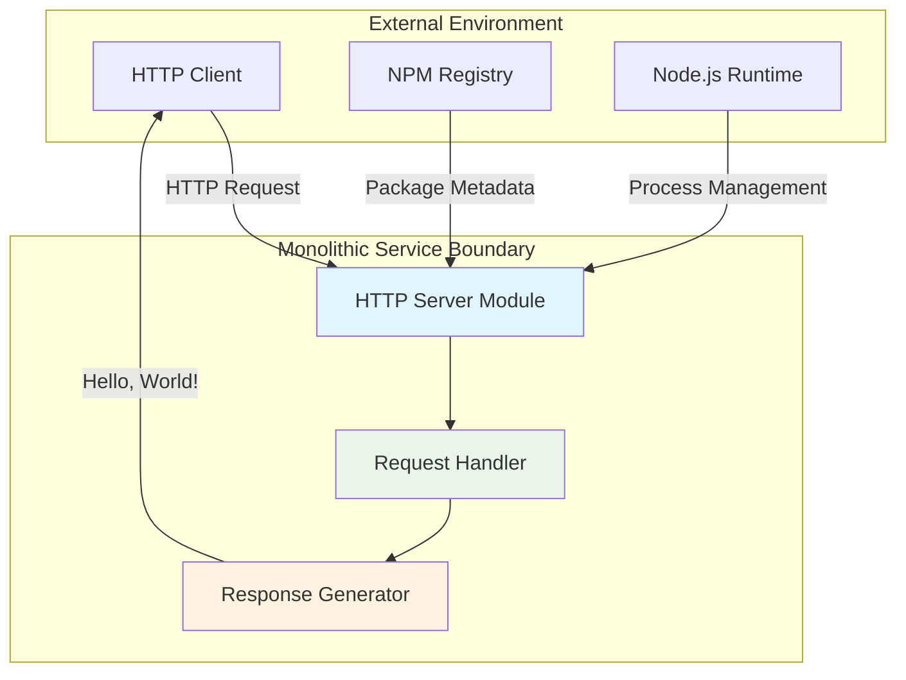
```mermaid
graph TB
    subgraph "External Environment"
        A[HTTP Client]
        B[NPM Registry]
        C[Node.js Runtime]
    end
    
    subgraph "Monolithic Service Boundary"
        D[HTTP Server Module]
        E[Request Handler]
        F[Response Generator]
    end
    
    A -->|HTTP Request| D
    D --> E
    E --> F
    F -->|"Hello, World!"| A
    
    B -->|Package Metadata| D
    C -->|Process Management| D
    
    style D fill:#e1f5fe
    style E fill:#e8f5e8
    style F fill:#fff3e0
```

#### 6.1.2.3 Processing Flow Architecture

**Request Processing Pattern:**
The system implements a straightforward synchronous processing model where each HTTP request follows an identical execution path through the Node.js event loop, universal request handler, and static response generation.

**Concurrency Model:**
Node.js event-driven architecture enables concurrent request handling through non-blocking I/O operations, allowing multiple client connections to be processed simultaneously within the single-threaded event loop model.

### 6.1.3 Future Service Architecture Considerations

While the current system does not require core services architecture, potential future enhancements could introduce service-oriented patterns if requirements evolve beyond the current testing scope.

#### 6.1.3.1 Potential Service Decomposition Scenarios

**Clustering Enhancement:**
Implementation of Node.js cluster module could introduce multiple worker processes sharing the same server port, creating a basic service distribution pattern while maintaining the monolithic codebase.

**API Gateway Pattern:**
Introduction of routing and multiple endpoint handlers could create logical service boundaries within the monolithic structure, laying groundwork for future microservice extraction.

**External Integration Services:**
Integration with machine learning algorithms (as suggested by the repository name) could necessitate separate service components for data processing, model management, and result aggregation.

#### 6.1.3.2 Infrastructure Considerations for Service Evolution

| Enhancement Area | Current State | Potential Service Implementation |
|------------------|---------------|--------------------------------|
| **Load Balancing** | Single instance | Reverse proxy with multiple instances |
| **Process Management** | Manual restart | PM2 or systemd for automatic recovery |
| **Monitoring** | Console logging | Centralized monitoring service |
| **Configuration** | Hardcoded values | External configuration service |

#### 6.1.3.3 Service Architecture Migration Path

**Phase 1: Process Enhancement**
- Implement clustering for multi-process operation
- Add process management for automatic restart capabilities
- Introduce basic health check endpoints

**Phase 2: Logical Service Boundaries**
- Implement routing for multiple endpoint patterns
- Add service-specific error handling
- Introduce configuration management

**Phase 3: Physical Service Separation**
- Extract distinct service components
- Implement inter-service communication patterns
- Add service discovery and load balancing

### 6.1.4 Operational Characteristics

#### 6.1.4.1 Current Operational Model

**Deployment Simplicity:**
The monolithic architecture enables zero-to-running deployment in under 30 seconds through simple `node server.js` execution, meeting the established performance requirement for rapid deployment scenarios.

**Resource Utilization:**
Single-process operation maintains memory footprint under 50MB while achieving sub-100ms response times, demonstrating efficiency advantages of the monolithic approach for the current use case.

**Failure Recovery:**
Service failures require manual intervention through process restart commands, as documented in the cross-cutting concerns section. This limitation reflects the testing-focused nature of the current implementation.

#### 6.1.4.2 Scalability Constraints and Opportunities

**Current Limitations:**
- Single-instance operation limits horizontal scalability
- Localhost binding prevents distributed deployment
- No automatic scaling triggers or rules
- Manual capacity management required

**Architectural Flexibility:**
The zero-dependency implementation provides flexibility for future scaling approaches, whether through clustering, containerization, or service decomposition, without complex dependency migration requirements.

#### References

#### Repository Files Examined
- `server.js` - Core HTTP server implementation demonstrating monolithic architecture
- `package.json` - NPM package configuration confirming zero-dependency approach
- `package-lock.json` - Dependency lockfile validating absence of external service dependencies
- `README.md` - Project documentation providing system context

#### Technical Specification Sections Referenced
- `1.2 SYSTEM OVERVIEW` - System limitations and architectural context
- `5.1 HIGH-LEVEL ARCHITECTURE` - Explicit monolithic architecture classification and design principles
- `5.4 CROSS-CUTTING CONCERNS` - Performance requirements and operational characteristics

## 6.2 DATABASE DESIGN

Database Design is not applicable to this system.

### 6.2.1 Database Design Applicability Assessment

#### 6.2.1.1 System Architecture Analysis

The hao-backprop-test system implements a minimalist stateless HTTP server architecture that operates without any form of data persistence, storage, or database interactions. This determination is based on comprehensive analysis of the system implementation, dependency structure, and architectural design documented throughout this technical specification.

**Evidence Supporting Non-Applicability:**

**Implementation Characteristics:**
- **Zero Database Dependencies**: Analysis of `package.json` and `package-lock.json` confirms complete absence of database-related dependencies including ORMs, database drivers, or data persistence libraries
- **Stateless Operation**: The 14-line `server.js` implementation processes HTTP requests without maintaining any form of session state, user data, or application state
- **No Data Models**: No entity definitions, schema files, or data structure implementations exist within the codebase
- **No Persistence Layer**: Complete absence of file I/O operations, database connections, or data storage mechanisms

**Architectural Design Philosophy:**
- **Zero-Dependency Architecture**: The system intentionally maintains zero external dependencies to maximize simplicity and minimize operational overhead
- **Request-Response Model**: Simple synchronous processing where each HTTP request receives an identical static response without data retrieval or storage
- **Proof-of-Concept Scope**: Current implementation focuses exclusively on HTTP connectivity testing rather than data management

#### 6.2.1.2 Feature Analysis

According to the Feature Catalog (Section 2.1), the system implements only three core features:

| Feature ID | Feature Name | Data Persistence Requirements |
|------------|--------------|------------------------------|
| F-001 | HTTP Server Service | None - Returns static "Hello, World!" response |
| F-002 | Package Management Configuration | None - Standard NPM metadata only |
| F-003 | Connectivity Testing Capability | None - Stateless health check functionality |

**Critical Observation:** None of the documented features require or implement any form of data storage, retrieval, or persistence mechanisms.

#### 6.2.1.3 System Boundaries and Data Flow

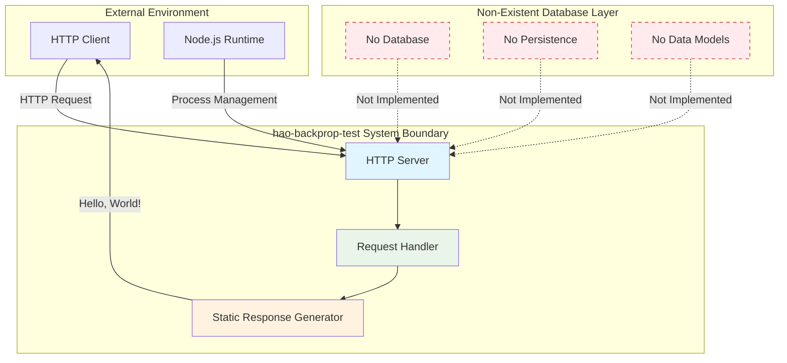
```mermaid
graph TB
    subgraph "External Environment"
        A[HTTP Client]
        B[Node.js Runtime]
    end
    
    subgraph "hao-backprop-test System Boundary"
        C[HTTP Server]
        D[Request Handler]
        E[Static Response Generator]
    end
    
    subgraph "Non-Existent Database Layer"
        F[No Database]
        G[No Persistence]
        H[No Data Models]
    end
    
    A -->|HTTP Request| C
    C --> D
    D --> E
    E -->|"Hello, World!"| A
    
    B -->|Process Management| C
    
    F -.->|Not Implemented| C
    G -.->|Not Implemented| C
    H -.->|Not Implemented| C
    
    style F fill:#ffebee,stroke:#d32f2f,stroke-dasharray: 5 5
    style G fill:#ffebee,stroke:#d32f2f,stroke-dasharray: 5 5
    style H fill:#ffebee,stroke:#d32f2f,stroke-dasharray: 5 5
    style C fill:#e1f5fe
    style D fill:#e8f5e8
    style E fill:#fff3e0
```

### 6.2.2 Current Data Handling Approach

#### 6.2.2.1 Data Processing Model

**Stateless Processing Pattern:**
The system processes all HTTP requests through an identical execution path that generates static responses without any data persistence, retrieval, or transformation operations.

**Memory Management:**
- **Request Scope Only**: Data exists only within the scope of individual HTTP request processing
- **No Session Management**: No user sessions, authentication tokens, or persistent connections maintained
- **Static Response Caching**: Response content ("Hello, World!") exists as a string literal in memory
- **Garbage Collection**: Node.js automatically manages memory cleanup for request/response objects

#### 6.2.2.2 Data Security Considerations

**Data Protection by Absence:**
Since no data is collected, stored, or processed beyond simple HTTP request handling, traditional database security concerns including encryption, access controls, and audit logging are inherently eliminated.

**Privacy by Design:**
The system implements privacy protection through complete absence of data collection mechanisms, ensuring no personal information or sensitive data can be inadvertently stored or compromised.

### 6.2.3 Future Database Design Considerations

#### 6.2.3.1 Potential Evolution Scenarios

While the current system requires no database functionality, the repository name "hao-backprop-test" suggests potential future machine learning integration that could introduce data persistence requirements.

**Potential Data Requirements for Future Enhancement:**

| Enhancement Area | Potential Data Needs | Database Design Impact |
|------------------|---------------------|----------------------|
| **Machine Learning Models** | Model parameters, training data, validation sets | Requires ML-specific storage solutions |
| **User Management** | Authentication, authorization, user profiles | Traditional RDBMS or NoSQL user store |
| **Training History** | Experiment logs, performance metrics, configurations | Time-series or document database |
| **API Analytics** | Request logs, performance data, usage patterns | Analytics-focused data warehouse |

#### 6.2.3.2 Architecture Migration Path

**Phase 1: Data Requirements Analysis**
- Conduct comprehensive requirements gathering for data persistence needs
- Evaluate machine learning workload characteristics
- Determine appropriate database technology stack

**Phase 2: Database Architecture Design**
- Design schema and entity relationships based on actual requirements
- Select appropriate database technology (SQL vs NoSQL vs specialized ML databases)
- Plan integration approach with existing zero-dependency architecture

**Phase 3: Implementation Strategy**
- Implement database connectivity while preserving system simplicity
- Add appropriate data access layers and abstractions
- Maintain backward compatibility with current stateless operation

#### 6.2.3.3 Technology Evaluation Criteria

**For Future Database Implementation:**

| Criteria | Evaluation Factor | Priority |
|----------|------------------|----------|
| **Simplicity** | Alignment with zero-dependency philosophy | High |
| **Performance** | Sub-100ms response time requirement maintenance | Critical |
| **Scalability** | Support for potential machine learning workloads | Medium |
| **Security** | Data protection and privacy compliance | High |

### 6.2.4 System Integration Without Database

#### 6.2.4.1 Current Integration Patterns

**External System Connectivity:**
The system serves as a connectivity endpoint for integration testing without requiring database coordination or data synchronization between systems.

**Monitoring and Observability:**
System health monitoring relies on HTTP response codes and response times rather than database health checks or data integrity monitoring.

#### 6.2.4.2 Alternative Data Handling Approaches

**Configuration Management:**
System configuration through environment variables or configuration files could provide basic data management without full database implementation.

**External Data Services:**
Integration with external APIs or data services could provide dynamic content without local database requirements, maintaining the zero-dependency principle while adding data capabilities.

### 6.2.5 Compliance and Operational Considerations

#### 6.2.5.1 Data Governance

**Data Classification:** No data classification requirements exist since no data is collected, processed, or stored.

**Regulatory Compliance:** Absence of data collection eliminates GDPR, CCPA, and other data protection regulation compliance requirements.

#### 6.2.5.2 Backup and Recovery

**Backup Requirements:** No backup procedures required as no persistent data exists within the system.

**Disaster Recovery:** System recovery involves simple redeployment of the stateless server without data restoration procedures.

**Business Continuity:** Service restoration relies on process restart rather than database recovery operations.

#### References

#### Repository Files Examined
- `server.js` - Core HTTP server implementation confirming zero database interactions
- `package.json` - NPM package manifest confirming absence of database dependencies  
- `package-lock.json` - Dependency lock file validating zero external dependencies
- `README.md` - Project documentation providing system context without database references

#### Technical Specification Sections Referenced
- `1.2 SYSTEM OVERVIEW` - System architecture and limitations analysis
- `2.1 FEATURE CATALOG` - Complete feature inventory showing no database-related functionality
- `6.1 CORE SERVICES ARCHITECTURE` - Monolithic architecture analysis confirming stateless operation
- Section-specific research documentation - Comprehensive 11-search analysis confirming database design non-applicability

## 6.3 INTEGRATION ARCHITECTURE

### 6.3.1 Integration Architecture Applicability Assessment

**Integration Architecture is not applicable for this system.**

The hao-backprop-test system implements a minimalist monolithic HTTP server that operates without external system integrations, third-party services, or complex API designs. This determination is based on comprehensive analysis of the system implementation, architectural patterns, and operational characteristics documented throughout this technical specification.

#### 6.3.1.1 Evidence Supporting Non-Applicability

**Implementation Analysis:**
- **Single-Endpoint Architecture**: The system provides only one HTTP endpoint that returns a static "Hello, World!" response to all requests regardless of HTTP method or path
- **Zero External Dependencies**: No external libraries, frameworks, or services are utilized beyond Node.js core modules
- **Localhost-Only Operation**: Network binding to 127.0.0.1:3000 prevents external system access and eliminates distributed integration requirements
- **No Authentication Mechanisms**: All requests are processed without access control, user management, or authorization frameworks

**Absent Integration Patterns:**
- **No API Design**: No REST, GraphQL, or RPC interfaces implemented
- **No Message Processing**: No event queues, message brokers, or stream processing capabilities
- **No External Service Calls**: No outbound HTTP requests, database connections, or third-party API integrations
- **No Service Discovery**: Hardcoded configuration eliminates dynamic service location requirements

#### 6.3.1.2 Current System Integration Points

While the system lacks traditional integration architecture, it does maintain three minimal integration interfaces necessary for basic operation:

| Integration Point | Type | Purpose | Implementation | Limitations |
|-------------------|------|---------|----------------|-------------|
| **HTTP Interface** | Network Protocol | Client connectivity testing | Single endpoint on localhost:3000 | No routing, versioning, or authentication |
| **NPM Registry** | Package Management | Deployment dependency resolution | Standard package.json configuration | Zero dependencies to manage |
| **Node.js Runtime** | Process Interface | JavaScript execution environment | Core `http` module utilization | Manual process lifecycle management |

### 6.3.2 Current Integration Architecture Diagram

The following diagram illustrates the system's minimal integration architecture:

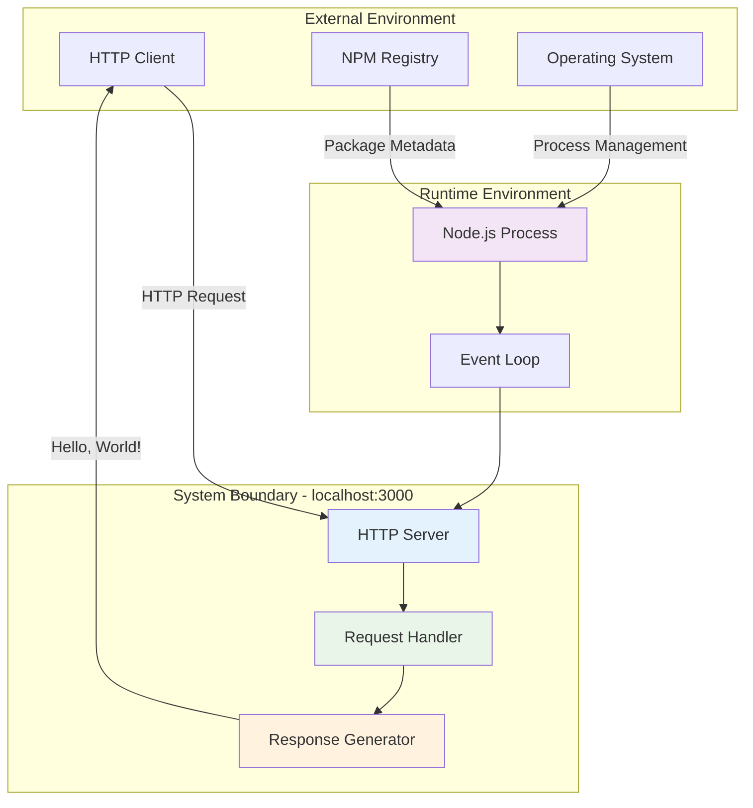
```mermaid
graph TB
    subgraph "External Environment"
        A[HTTP Client]
        B[NPM Registry]
        C[Operating System]
    end
    
    subgraph "System Boundary - localhost:3000"
        D[HTTP Server]
        E[Request Handler]
        F[Response Generator]
    end
    
    subgraph "Runtime Environment"
        G[Node.js Process]
        H[Event Loop]
    end
    
    A -->|HTTP Request| D
    D --> E
    E --> F
    F -->|"Hello, World!"| A
    
    B -->|Package Metadata| G
    C -->|Process Management| G
    G --> H
    H --> D
    
    style D fill:#e3f2fd
    style E fill:#e8f5e8
    style F fill:#fff3e0
    style G fill:#f3e5f5
```

### 6.3.3 Integration Architecture Requirements Analysis

#### 6.3.3.1 API Design Assessment

**Current State - Not Applicable:**
The system implements no structured API design patterns, instead providing a universal endpoint that processes all HTTP requests identically.

**Missing API Components:**
- **Protocol Specifications**: No REST, GraphQL, or RPC protocol implementation
- **Authentication Methods**: No OAuth, JWT, or API key validation mechanisms
- **Authorization Framework**: No role-based access control or permission management
- **Rate Limiting Strategy**: No request throttling or quota management
- **Versioning Approach**: No API versioning or backward compatibility mechanisms
- **Documentation Standards**: No OpenAPI, Swagger, or API documentation generation

#### 6.3.3.2 Message Processing Assessment

**Current State - Not Applicable:**
The system processes HTTP requests synchronously without event-driven or asynchronous message processing capabilities.

**Missing Message Processing Components:**
- **Event Processing Patterns**: No event sourcing, CQRS, or publish-subscribe implementations
- **Message Queue Architecture**: No Redis, RabbitMQ, or Apache Kafka integration
- **Stream Processing Design**: No real-time data processing or analytics pipelines
- **Batch Processing Flows**: No scheduled job processing or bulk data operations
- **Error Handling Strategy**: No dead letter queues, retry mechanisms, or circuit breakers

#### 6.3.3.3 External Systems Assessment

**Current State - Not Applicable:**
The system maintains no connections to external services, databases, or third-party systems.

**Missing External System Components:**
- **Third-Party Integration Patterns**: No webhook handlers, API clients, or service adapters
- **Legacy System Interfaces**: No mainframe, SOAP, or proprietary protocol support
- **API Gateway Configuration**: No request routing, transformation, or aggregation capabilities
- **External Service Contracts**: No SLA management, contract testing, or dependency monitoring

### 6.3.4 Future Integration Architecture Considerations

#### 6.3.4.1 Machine Learning Integration Potential

Based on the repository name "hao-backprop-test" and README.md references to "backprop integration," the system may evolve to support machine learning algorithm integration:

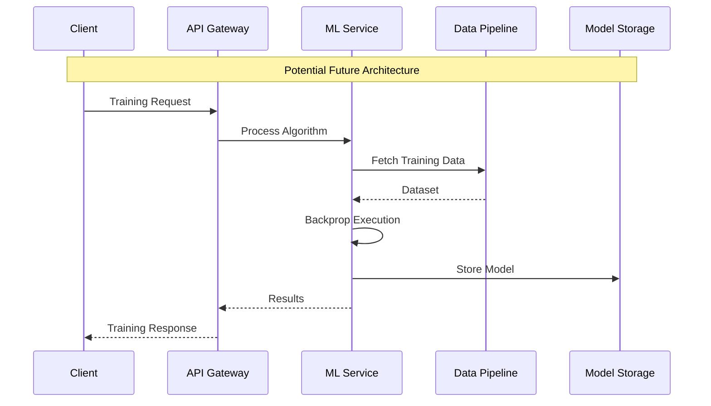
```mermaid
sequenceDiagram
    participant C as Client
    participant A as API Gateway
    participant ML as ML Service
    participant D as Data Pipeline
    participant M as Model Storage
    
    Note over C,M: Potential Future Architecture
    
    C->>A: Training Request
    A->>ML: Process Algorithm
    ML->>D: Fetch Training Data
    D-->>ML: Dataset
    ML->>ML: Backprop Execution
    ML->>M: Store Model
    ML-->>A: Results
    A-->>C: Training Response
```

#### 6.3.4.2 Production Integration Requirements

**Phase 1 - Basic API Framework:**
- Implement RESTful routing for multiple endpoints
- Add request validation and error handling mechanisms
- Introduce basic authentication and authorization
- Implement structured logging and monitoring hooks

**Phase 2 - External System Integration:**
- Add database connectivity for data persistence
- Implement external API client capabilities
- Introduce message queuing for asynchronous processing
- Add configuration management for external service endpoints

**Phase 3 - Enterprise Integration Platform:**
- Deploy API gateway for request routing and transformation
- Implement service mesh for microservice communication
- Add distributed tracing and observability integration
- Introduce circuit breakers and resilience patterns

#### 6.3.4.3 Integration Architecture Migration Path

| Migration Phase | Integration Capability | Implementation Approach | Dependencies Required |
|----------------|----------------------|------------------------|---------------------|
| **Current State** | HTTP connectivity testing | Single endpoint response | Node.js core modules only |
| **Phase 1** | Multi-endpoint API | Express.js or Fastify framework | Web framework dependency |
| **Phase 2** | External service calls | HTTP client libraries and database drivers | axios, database connectors |
| **Phase 3** | Enterprise integration | API gateway, service mesh, monitoring | Kong, Istio, Prometheus stack |

### 6.3.5 Integration Flow Diagrams

#### 6.3.5.1 Current Minimal Integration Flow

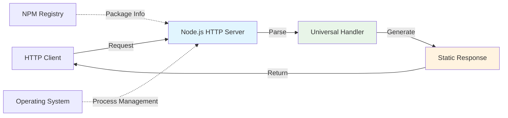
```mermaid
graph LR
    A[HTTP Client] -->|Request| B[Node.js HTTP Server]
    B -->|Parse| C[Universal Handler]
    C -->|Generate| D[Static Response]
    D -->|Return| A
    
    E[NPM Registry] -.->|Package Info| B
    F[Operating System] -.->|Process Management| B
    
    style B fill:#e1f5fe
    style C fill:#e8f5e8
    style D fill:#fff3e0
```

#### 6.3.5.2 Potential Future Message Flow Architecture

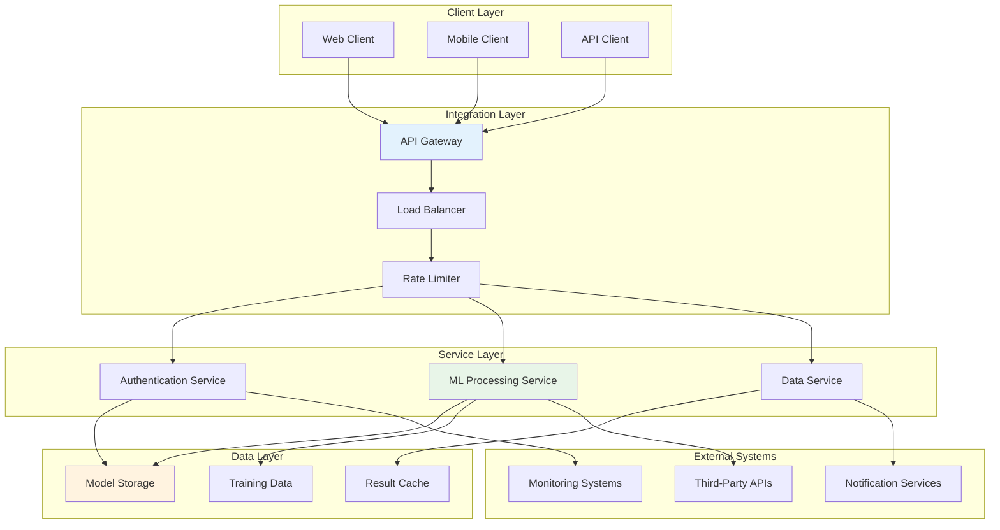
```mermaid
graph TB
    subgraph "Client Layer"
        A1[Web Client]
        A2[Mobile Client]
        A3[API Client]
    end
    
    subgraph "Integration Layer"
        B1[API Gateway]
        B2[Load Balancer]
        B3[Rate Limiter]
    end
    
    subgraph "Service Layer"
        C1[Authentication Service]
        C2[ML Processing Service]
        C3[Data Service]
    end
    
    subgraph "Data Layer"
        D1[Model Storage]
        D2[Training Data]
        D3[Result Cache]
    end
    
    subgraph "External Systems"
        E1[Third-Party APIs]
        E2[Monitoring Systems]
        E3[Notification Services]
    end
    
    A1 --> B1
    A2 --> B1
    A3 --> B1
    
    B1 --> B2
    B2 --> B3
    B3 --> C1
    B3 --> C2
    B3 --> C3
    
    C1 --> D1
    C2 --> D1
    C2 --> D2
    C3 --> D3
    
    C2 --> E1
    C1 --> E2
    C3 --> E3
    
    style B1 fill:#e3f2fd
    style C2 fill:#e8f5e8
    style D1 fill:#fff3e0
```

### 6.3.6 Integration Architecture Summary

The hao-backprop-test system currently operates without integration architecture due to its focused scope as a connectivity testing platform. The minimalist design philosophy prioritizes simplicity and performance over integration capabilities, resulting in:

- **Zero-dependency implementation** eliminating external integration management overhead
- **Localhost-only operation** providing implicit security through network isolation  
- **Universal endpoint design** avoiding complex API routing and versioning requirements
- **Stateless processing model** supporting predictable performance characteristics

This architectural approach effectively serves the system's current testing-focused use case while providing a clean foundation for future integration enhancements should requirements evolve toward production machine learning algorithm integration.

#### References

**Repository Files Examined:**
- `server.js` - HTTP server implementation confirming no external service integrations
- `package.json` - NPM configuration validating zero-dependency architecture  
- `package-lock.json` - Dependency lockfile confirming absence of integration libraries
- `README.md` - Project documentation indicating potential future "backprop integration"

**Technical Specification Sections Referenced:**
- `1.2 SYSTEM OVERVIEW` - System capabilities and integration limitations analysis
- `3.5 INFRASTRUCTURE & HOSTING` - Network configuration and scalability constraints  
- `5.1 HIGH-LEVEL ARCHITECTURE` - Monolithic architecture classification and external integration points
- `5.4 CROSS-CUTTING CONCERNS` - Performance requirements and observability integration gaps
- `6.1 CORE SERVICES ARCHITECTURE` - Service decomposition analysis and integration pattern assessment

## 6.4 SECURITY ARCHITECTURE

### 6.4.1 Security Architecture Overview

**Detailed Security Architecture is not applicable for this system.** The hao-backprop-test application is designed as a minimalist HTTP connectivity testing tool that operates exclusively on localhost (127.0.0.1:3000) without any security implementation. This architectural decision is intentional and appropriate for its current use case as an integration test platform.

The system achieves security through design constraints rather than traditional security mechanisms, operating under a zero-trust-unnecessary model where network isolation provides the primary security boundary.

### 6.4.2 Current Security Posture

#### 6.4.2.1 Authentication Framework Status

The system implements **no authentication framework** by design:

| Component | Status | Rationale |
|-----------|--------|-----------|
| Identity Management | Not Implemented | Localhost-only access negates need for identity verification |
| Multi-factor Authentication | Not Implemented | Single-user testing environment |
| Session Management | Not Implemented | Stateless request handling |
| Token Handling | Not Implemented | No user differentiation required |

The absence of authentication mechanisms is documented in the cross-cutting concerns as an explicit architectural decision for the testing use case.

#### 6.4.2.2 Authorization System Status

The system implements **no authorization system** with the following characteristics:

| Component | Implementation | Impact |
|-----------|----------------|--------|
| Role-based Access Control | None | All requests treated equally |
| Permission Management | None | Universal access to single endpoint |
| Resource Authorization | None | Single static response for all requests |
| Audit Logging | None | No security event tracking |

This authorization-free approach aligns with the system's purpose as a basic connectivity validator where request differentiation is unnecessary.

#### 6.4.2.3 Data Protection Implementation

The system implements **minimal data protection** through simplicity:

| Protection Layer | Implementation | Security Benefit |
|------------------|----------------|------------------|
| Encryption Standards | None (Plain HTTP) | Acceptable for localhost testing |
| Key Management | Not Applicable | No sensitive data processed |
| Data Masking | Not Required | Static response payload only |
| Secure Communication | localhost-only binding | Network isolation as primary control |

### 6.4.3 Security Through Design Constraints

#### 6.4.3.1 Network Isolation Security

The primary security mechanism relies on network-level constraints:

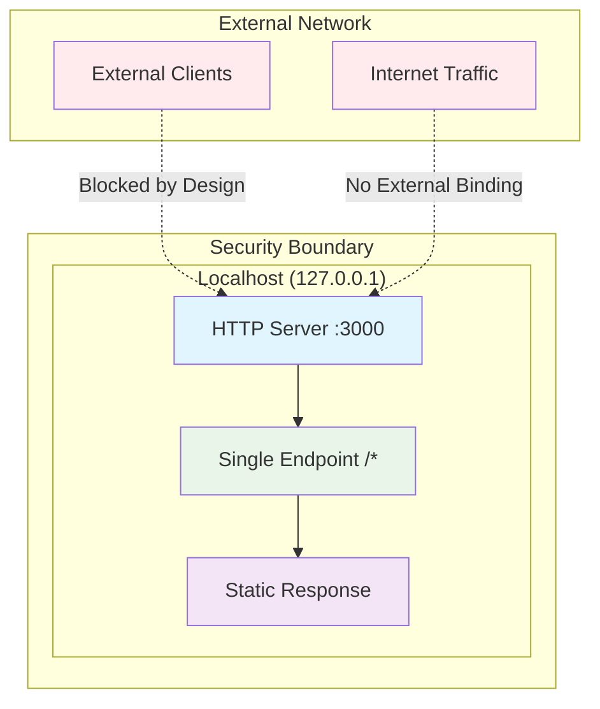
```mermaid
graph TB
    subgraph "Security Boundary"
        subgraph "Localhost (127.0.0.1)"
            A[HTTP Server :3000]
            B[Single Endpoint /*]
            C[Static Response]
        end
    end
    
    subgraph "External Network"
        D[External Clients]
        E[Internet Traffic]
    end
    
    A --> B
    B --> C
    D -.-> |Blocked by Design| A
    E -.-> |No External Binding| A
    
    style A fill:#e1f5fe
    style B fill:#e8f5e8
    style C fill:#f3e5f5
    style D fill:#ffebee
    style E fill:#ffebee
```

#### 6.4.3.2 Minimal Attack Surface Architecture

The system's security model emphasizes attack surface reduction:

```mermaid
graph LR
    subgraph "Attack Surface Minimization"
        A[Zero Dependencies] --> B[Core HTTP Module Only]
        C[Single Universal Endpoint] --> D[Static Response]
        E[No Data Processing] --> F[No Input Validation Required]
        G[No User State] --> H[No Session Vulnerabilities]
    end
    
    style A fill:#c8e6c9
    style C fill:#c8e6c9
    style E fill:#c8e6c9
    style G fill:#c8e6c9
```

#### 6.4.3.3 Dependency Security Matrix

| Security Aspect | Current State | Risk Level | Mitigation |
|------------------|---------------|------------|------------|
| Third-party Dependencies | Zero external libraries | Low | Supply chain attacks eliminated |
| Runtime Vulnerabilities | Node.js v12+ requirement | **High** | Immediate upgrade to v18+ LTS required |
| Code Injection | No user input processing | Low | Static response architecture |
| Network Exposure | Localhost binding only | Low | Network isolation by default |

### 6.4.4 Critical Security Concerns

#### 6.4.4.1 Node.js Version Vulnerability

**CRITICAL SECURITY ISSUE IDENTIFIED:**
- Current requirement: Node.js v12+ (End-of-Life since April 2022)
- Security patches discontinued
- Known vulnerabilities remain unaddressed
- **Immediate remediation required**: Upgrade to Node.js v18+ LTS

#### 6.4.4.2 Production Deployment Security Gaps

Should this system evolve beyond testing purposes, the following security architecture would be mandatory:

```mermaid
graph TD
    subgraph "Current Testing Architecture"
        A[localhost:3000] --> B[No Auth/Auth] --> C[Static Response]
    end
    
    subgraph "Required Production Architecture"
        D[API Gateway] --> E[Authentication Layer]
        E --> F[Authorization Engine]
        F --> G[Encrypted Communication]
        G --> H[Audit Logging]
        H --> I[Application Logic]
    end
    
    A -.-> |Production Evolution| D
    
    style A fill:#ffcdd2
    style B fill:#ffcdd2
    style C fill:#ffcdd2
    style D fill:#c8e6c9
    style E fill:#c8e6c9
    style F fill:#c8e6c9
    style G fill:#c8e6c9
    style H fill:#c8e6c9
    style I fill:#c8e6c9
```

### 6.4.5 Security Control Implementation Guidance

#### 6.4.5.1 Standard Security Practices for Testing Environment

The following standard security practices apply to this testing-focused system:

| Practice Category | Implementation | Compliance Method |
|-------------------|----------------|------------------|
| Access Control | Network isolation via localhost binding | Maintain 127.0.0.1 restriction |
| Runtime Security | Node.js version management | Upgrade to supported LTS version |
| Change Management | Version control for configuration | Maintain current Git workflow |
| Monitoring | Manual testing validation | Continue integration test approach |

#### 6.4.5.2 Security Architecture Evolution Path

For systems requiring production deployment, implement security in phases:

**Phase 1 - Basic Security Foundation:**
- Authentication mechanism implementation (JWT/OAuth)
- HTTPS encryption with TLS 1.3+
- Input validation and sanitization
- Basic audit logging

**Phase 2 - Enhanced Security Controls:**
- Role-based access control (RBAC)
- API rate limiting and throttling
- Security headers implementation
- Comprehensive monitoring and alerting

**Phase 3 - Enterprise Security Architecture:**
- API gateway with security policies
- Distributed authentication and authorization
- Advanced threat detection
- Compliance framework integration

### 6.4.6 Security Compliance Considerations

#### 6.4.6.1 Current Compliance Status

| Compliance Framework | Applicability | Status |
|----------------------|---------------|---------|
| OWASP Guidelines | Not Applicable | Testing environment exception |
| Industry Standards | Not Applicable | Localhost-only deployment |
| Data Protection | Not Applicable | No sensitive data processing |
| Security Auditing | Not Required | No user access or data storage |

The system's localhost-only, testing-focused architecture exempts it from standard security compliance requirements typically applied to production systems.

#### References

- `server.js` - Core HTTP server implementation showing no security features
- `package.json` - NPM configuration confirming zero security dependencies  
- `package-lock.json` - Dependency lockfile verifying no external libraries
- Technical Specification Section 3.7 - Security implications and Node.js vulnerabilities
- Technical Specification Section 5.4.3 - Cross-cutting concerns and authentication framework status
- Technical Specification Section 2.4.4 - Implementation constraints and security considerations
- Technical Specification Section 3.5.1 - Infrastructure configuration and network binding

## 6.5 MONITORING AND OBSERVABILITY

**Detailed Monitoring Architecture is not applicable for this system.**

The hao-backprop-test system implements a minimalist monolithic architecture specifically designed for connectivity testing and rapid prototyping scenarios. Based on comprehensive analysis of the 14-line single-file implementation with zero external dependencies, the system does not require sophisticated monitoring infrastructure beyond basic health verification and operational awareness practices.

### 6.5.1 SYSTEM MONITORING PHILOSOPHY

#### 6.5.1.1 Minimal Monitoring Approach Rationale

The system's monitoring strategy aligns with its core architectural principles of simplicity, zero-dependency operation, and testing-focused use case. The absence of complex monitoring infrastructure reflects deliberate design decisions that prioritize rapid deployment, minimal resource overhead, and operational simplicity over comprehensive observability.

**Architectural Justification for Minimal Monitoring:**
- **Single-file Implementation**: 14-line `server.js` eliminates complex component interactions requiring detailed monitoring
- **Zero External Dependencies**: No third-party libraries or services to monitor for health or performance
- **Stateless Processing**: Each HTTP request processed independently without persistent state requiring tracking
- **Localhost-only Operation**: Network boundary isolation limits distributed monitoring requirements

#### 6.5.1.2 Current Monitoring Capabilities Assessment

| Monitoring Capability | Implementation Status | Current Functionality | Operational Impact |
|----------------------|----------------------|---------------------|-------------------|
| **Application Logging** | Minimal | Single console.log during startup | Manual log review required |
| **Health Checking** | Implicit | HTTP 200 response availability | External monitoring capable |
| **Performance Metrics** | None | No metrics collection | Manual performance assessment |
| **Error Tracking** | None | Node.js default error handling | Process termination on exceptions |

### 6.5.2 BASIC MONITORING PRACTICES

#### 6.5.2.1 Health Check Implementation

**HTTP Endpoint Health Verification:**
The system provides implicit health checking through its core HTTP endpoint functionality. External monitoring systems can verify service availability by performing HTTP GET requests to `http://127.0.0.1:3000/` and validating successful 200 status code responses with expected "Hello, World!\n" content.

```mermaid
graph TD
    A[External Monitor] --> B{HTTP GET Request}
    B --> C[127.0.0.1:3000]
    C --> D{Response Status}
    
    D -->|200 OK| E[Service Healthy]
    D -->|Connection Refused| F[Service Down]
    D -->|Timeout| G[Service Unresponsive]
    
    E --> H[Continue Monitoring]
    F --> I[Alert: Service Failure]
    G --> J[Alert: Performance Issue]
    
    I --> K[Manual Restart Required]
    J --> L[Investigate Resource Constraints]
    
    style E fill:#d4edda
    style F fill:#f8d7da
    style G fill:#fff3cd
```

**Process-Level Health Monitoring:**
Operating system process monitoring provides secondary health verification through Node.js process status validation, memory utilization tracking, and CPU usage assessment.

#### 6.5.2.2 Basic Performance Tracking

**Response Time Monitoring:**
External monitoring tools should validate compliance with the established sub-100ms response time SLA through periodic HTTP request timing measurements.

| Performance Metric | Target Value | Monitoring Method | Alert Threshold |
|-------------------|--------------|-------------------|----------------|
| **HTTP Response Time** | <100ms | External HTTP monitoring | >150ms for 3 consecutive requests |
| **Memory Utilization** | <50MB | Process monitoring (ps, top) | >75MB sustained for 5 minutes |
| **Process Startup Time** | <30 seconds | Deployment script timing | >45 seconds |

**Resource Utilization Tracking:**
Basic system resource monitoring through operating system tools provides visibility into memory consumption, CPU utilization, and network connection status for capacity planning and performance validation.

#### 6.5.2.3 Basic Logging Strategy

**Current Logging Implementation:**
The system implements minimal console output logging limited to server startup notification:
```
Server running at http://127.0.0.1:3000/
```

**Operational Log Review Practices:**
- **Manual Log Inspection**: Periodic review of Node.js process stdout for startup messages and runtime errors
- **System Log Integration**: Operating system process logs provide additional error context for troubleshooting
- **Console Output Monitoring**: Terminal session monitoring during development and testing phases

### 6.5.3 INCIDENT RESPONSE PROCEDURES

#### 6.5.3.1 Failure Detection and Recovery

**Service Failure Detection Workflow:**

```mermaid
flowchart TD
    A[Service Monitoring] --> B{Health Check Status}
    
    B -->|Success| C[Normal Operation]
    B -->|Failure| D[Service Down Detected]
    
    D --> E[Verify Network Connectivity]
    E --> F{Network Status}
    
    F -->|Network OK| G[Process Failure Confirmed]
    F -->|Network Issue| H[Network Troubleshooting]
    
    G --> I[Execute Manual Restart]
    I --> J[node server.js]
    J --> K[Verify Service Recovery]
    
    K --> L{Recovery Success}
    L -->|Success| M[Resume Normal Operations]
    L -->|Failure| N[Escalate to System Administrator]
    
    H --> O[Resolve Network Issues]
    O --> P[Retry Service Detection]
    
    C --> Q[Continue Monitoring]
    M --> Q
    P --> B
    
    style D fill:#f8d7da
    style G fill:#fff3cd
    style M fill:#d4edda
```

**Manual Recovery Procedures:**
1. **Failure Verification**: Confirm HTTP endpoint unresponsiveness through multiple connection attempts
2. **Process Assessment**: Verify Node.js process termination through system process monitoring
3. **Manual Restart Execution**: Execute `node server.js` command from project directory
4. **Recovery Validation**: Perform HTTP health check to confirm successful service restoration

#### 6.5.3.2 Basic Alert Management

**Alert Condition Matrix:**

| Alert Condition | Trigger Criteria | Response Action | Escalation Timeline |
|-----------------|------------------|-----------------|-------------------|
| **Service Down** | HTTP connection refused | Immediate manual restart | 5 minutes if restart fails |
| **Performance Degradation** | Response time >150ms for 3+ requests | Investigate system resources | 15 minutes if persistent |
| **Memory Exhaustion** | Memory usage >75MB sustained | Restart service and investigate | 10 minutes if recurring |

#### 6.5.3.3 Post-Incident Analysis

**Root Cause Investigation Process:**
- **Error Log Review**: Examine Node.js process stdout/stderr output for exception details
- **System Resource Analysis**: Assess memory, CPU, and network resource availability during failure
- **Timing Analysis**: Correlate failure occurrence with system activities or external events
- **Documentation**: Record failure patterns and resolution steps for future reference

### 6.5.4 SERVICE LEVEL AGREEMENT MONITORING

#### 6.5.4.1 SLA Compliance Tracking

**Established SLA Requirements:**
Based on the system's performance and availability targets documented in Section 4.6, the following SLAs require basic monitoring compliance verification:

| SLA Metric | Target Requirement | Monitoring Approach | Measurement Frequency |
|------------|-------------------|--------------------|--------------------|
| **Response Time** | <100ms HTTP processing | External HTTP timing | Every 5 minutes |
| **Availability** | 99.9% uptime (properly managed) | HTTP endpoint monitoring | Continuous |
| **Memory Footprint** | <50MB operational consumption | Process monitoring | Every 15 minutes |

#### 6.5.4.2 SLA Violation Response

**Performance SLA Breach Protocol:**
- **Response Time Violations**: Investigate system resource constraints and restart service if necessary
- **Availability Violations**: Execute immediate manual restart procedures and document downtime duration
- **Resource Utilization Violations**: Restart service and assess for memory leaks or resource exhaustion patterns

### 6.5.5 OPERATIONAL MONITORING ARCHITECTURE

#### 6.5.5.1 Basic Monitoring Infrastructure

```mermaid
graph TB
    subgraph "External Monitoring Environment"
        A[HTTP Monitoring Tool]
        B[System Process Monitor]
        C[Manual Log Review]
    end
    
    subgraph "hao-backprop-test System"
        D[Node.js Process]
        E[HTTP Server :3000]
        F[Console Logs]
    end
    
    A -->|HTTP GET Requests| E
    E -->|Response Status/Timing| A
    
    B -->|Process Status Query| D
    D -->|Memory/CPU Metrics| B
    
    D -->|Startup/Error Messages| F
    F -->|Manual Review| C
    
    A --> G[Health Status Dashboard]
    B --> G
    C --> G
    
    style D fill:#e3f2fd
    style E fill:#e8f5e8
    style F fill:#fff3e0
    style G fill:#fce4ec
```

#### 6.5.5.2 Future Monitoring Enhancement Considerations

**Potential Monitoring Evolution Path:**
- **Process Management Integration**: Implementation of PM2 or systemd for automated restart capabilities
- **Structured Logging Addition**: Integration of lightweight logging compatible with zero-dependency philosophy  
- **Basic Metrics Collection**: Introduction of minimal performance metrics collection for trend analysis
- **Configuration-based Monitoring**: External monitoring configuration for different deployment environments

### 6.5.6 MONITORING LIMITATIONS AND CONSTRAINTS

#### 6.5.6.1 Current System Constraints

**Localhost-Only Monitoring Implications:**
The system's 127.0.0.1 binding restricts monitoring access to the local machine, requiring either local monitoring tools or network port forwarding for remote monitoring system integration.

**Zero-Dependency Monitoring Constraints:**
The system's zero-dependency architecture limits monitoring tool integration to external systems that do not require application-level library installation or code modification.

#### 6.5.6.2 Monitoring Architecture Evolution

**Future Monitoring Integration Requirements:**
Any future monitoring enhancements must maintain compatibility with the system's core architectural principles of minimal dependencies, sub-100ms response times, and operational simplicity. Monitoring tool selection must prioritize external integration over embedded instrumentation to preserve the zero-dependency philosophy.

#### References

#### Repository Files Analyzed
- `server.js` - HTTP server implementation with minimal console logging during startup
- `package.json` - NPM configuration confirming zero external dependencies for monitoring
- `package-lock.json` - Dependency lockfile validating absence of monitoring libraries
- `README.md` - Project documentation with no monitoring implementation details

#### Technical Specification Sections Referenced  
- `5.4 CROSS-CUTTING CONCERNS` - Current monitoring gaps and observability strategy
- `4.6 PERFORMANCE AND SLA CONSIDERATIONS` - SLA requirements and performance targets
- `5.1 HIGH-LEVEL ARCHITECTURE` - Minimalist monolithic architecture context
- `6.1 CORE SERVICES ARCHITECTURE` - Confirmation of non-applicable distributed monitoring

## 6.6 TESTING STRATEGY

**Detailed Testing Strategy is not applicable for this system.** The hao-backprop-test application is a minimalist HTTP connectivity testing tool consisting of a single 14-line JavaScript file with zero external dependencies. The system's purpose as a basic proof-of-concept HTTP server for integration testing workflows does not warrant comprehensive testing infrastructure. However, basic validation testing is essential to ensure the system meets its functional requirements and performance targets.

### 6.6.1 TESTING APPROACH

#### 6.6.1.1 Unit Testing

The unit testing approach focuses on validating core functionality within the constraints of the zero-dependency architecture:

#### Testing Frameworks and Tools
| Framework | Rationale | Implementation |
|-----------|-----------|----------------|
| Node.js Built-in Test Runner | Available in Node.js v18+ (no external dependencies) | Use `node:test` module for basic assertions |
| Jest (Alternative) | Industry standard, comprehensive features | Consider if external dependencies become acceptable |
| Mocha + Chai (Alternative) | Lightweight, flexible configuration | Backup option for more complex scenarios |

#### Test Organization Structure
```
hao-backprop-test/
├── server.js                 # Main application
├── test/
│   ├── unit/
│   │   ├── server.test.js    # HTTP server unit tests
│   │   └── package.test.js   # Package configuration tests
│   ├── integration/
│   │   └── endpoint.test.js  # End-to-end HTTP tests
│   └── performance/
│       └── benchmark.test.js # Performance validation
└── package.json              # Updated with test scripts
```

#### Mocking Strategy
| Component | Mock Approach | Tool |
|-----------|---------------|------|
| HTTP Server | No mocking required (direct testing) | Native Node.js http module |
| Network Connections | Test against actual localhost binding | Built-in net module for port checking |
| Console Output | Capture and validate startup messages | Native console.log interception |

#### Code Coverage Requirements
| Coverage Type | Target | Rationale |
|---------------|--------|-----------|
| Statement Coverage | 100% | Minimal codebase enables complete coverage |
| Branch Coverage | 100% | Simple logic structure supports full validation |
| Function Coverage | 100% | Single function implementation |
| Line Coverage | 95%+ | Account for error handling edge cases |

#### Test Naming Conventions
```javascript
// Pattern: describe('ComponentName', () => { it('should behavior when condition', ...) })
describe('HTTPServer', () => {
  it('should return 200 status when processing any HTTP request')
  it('should respond with Hello World when receiving GET request')
  it('should bind to localhost port 3000 when starting server')
  it('should log startup message when server initializes successfully')
})
```

#### Test Data Management
| Data Type | Management Approach | Implementation |
|-----------|-------------------|----------------|
| HTTP Requests | Generate programmatically | Use Node.js http module for test requests |
| Expected Responses | Static constants | Define expected response strings as constants |
| Port Configuration | Environment variables | Use process.env.TEST_PORT || 3001 |

#### 6.6.1.2 Integration Testing

Integration testing validates end-to-end functionality and external interface behavior:

#### Service Integration Test Approach
| Integration Level | Test Focus | Implementation |
|-------------------|------------|----------------|
| HTTP Endpoint | Full request-response cycle | Direct HTTP client requests to localhost |
| Process Integration | Startup and shutdown behavior | Child process spawning and termination |
| Network Binding | Port allocation and release | Socket connection testing |

#### API Testing Strategy
```javascript
// Example integration test structure
describe('API Integration Tests', () => {
  it('should accept HTTP GET requests and return expected response')
  it('should accept HTTP POST requests with identical response')
  it('should handle concurrent requests without blocking')
  it('should maintain consistent response across different request types')
})
```

#### Database Integration Testing
**Not Applicable** - The system processes no data and requires no database connectivity.

#### External Service Mocking
**Not Required** - The system has zero external dependencies and no service integrations.

#### Test Environment Management
| Environment | Configuration | Purpose |
|-------------|---------------|---------|
| Unit Test | Port 3001 | Avoid conflicts with development server |
| Integration Test | Port 3002 | Isolated integration validation |
| Performance Test | Port 3003 | Dedicated performance benchmarking |

#### 6.6.1.3 End-to-End Testing

E2E testing validates complete user workflow scenarios:

#### E2E Test Scenarios
| Scenario | Test Steps | Expected Outcome |
|----------|------------|------------------|
| Health Check Validation | Start server → Send HTTP request → Verify response | HTTP 200 with "Hello, World!" |
| Multi-Request Consistency | Send 10 consecutive requests | All return identical responses |
| Process Lifecycle | Start → Verify binding → Request → Stop | Clean startup and shutdown |

#### UI Automation Approach
**Not Applicable** - The system provides no user interface and operates as a headless HTTP service.

#### Test Data Setup/Teardown
```javascript
// Example setup and teardown pattern
describe('E2E Tests', () => {
  let server;
  
  beforeEach(async () => {
    server = await startTestServer();
    await waitForServerReady();
  });
  
  afterEach(async () => {
    await server.close();
    await waitForPortRelease();
  });
});
```

#### Performance Testing Requirements
| Metric | Target | Test Method |
|--------|--------|-------------|
| Response Time | <100ms | Load testing with HTTP requests |
| Memory Usage | <50MB | Process monitoring during test execution |
| Startup Time | <30 seconds | Process initialization timing |
| Availability | 99.9% uptime simulation | Extended running test (8+ hours) |

#### Cross-browser Testing Strategy
**Not Applicable** - The system provides server-side HTTP responses without browser-specific functionality.

### 6.6.2 TEST AUTOMATION

#### 6.6.2.1 CI/CD Integration
```mermaid
graph TB
    A[Code Commit] --> B[GitHub Actions Trigger]
    B --> C[Node.js Environment Setup]
    C --> D[Dependency Check]
    D --> E[Unit Tests]
    E --> F[Integration Tests]
    F --> G[Performance Tests]
    G --> H{All Tests Pass?}
    H -->|Yes| I[Deploy to Test Environment]
    H -->|No| J[Fail Build]
    I --> K[Health Check Validation]
    K --> L[Build Success]
    J --> M[Report Failure]
    
    style A fill:#e1f5fe
    style L fill:#c8e6c9
    style J fill:#ffcdd2
    style M fill:#ffcdd2
```

#### 6.6.2.2 Automated Test Triggers
| Trigger Event | Test Suite | Execution Time |
|---------------|------------|----------------|
| Git Push | Unit + Integration | 2-3 minutes |
| Pull Request | Full Test Suite | 5-7 minutes |
| Scheduled (Daily) | Performance + Extended | 10-15 minutes |
| Release Tag | Complete Validation | 15-20 minutes |

#### 6.6.2.3 Parallel Test Execution
```javascript
// package.json test script configuration
{
  "scripts": {
    "test": "node --test",
    "test:unit": "node --test test/unit/**/*.test.js",
    "test:integration": "node --test test/integration/**/*.test.js", 
    "test:performance": "node test/performance/benchmark.test.js",
    "test:parallel": "npm run test:unit & npm run test:integration"
  }
}
```

#### 6.6.2.4 Test Reporting Requirements
| Report Type | Format | Frequency |
|-------------|--------|-----------|
| Test Results | Console + JUnit XML | Every test run |
| Coverage Report | Text + HTML | Every test run |
| Performance Metrics | JSON + Charts | Daily |
| Failure Analysis | GitHub Issues | On failure |

#### 6.6.2.5 Failed Test Handling
```mermaid
graph LR
    A[Test Failure] --> B[Immediate Notification]
    B --> C[Failure Analysis]
    C --> D{Root Cause?}
    D -->|Code Issue| E[Fix Implementation]
    D -->|Flaky Test| F[Test Stabilization]
    D -->|Environment| G[Infrastructure Fix]
    E --> H[Rerun Tests]
    F --> H
    G --> H
    H --> I{Tests Pass?}
    I -->|Yes| J[Close Issue]
    I -->|No| K[Escalate]
    
    style A fill:#ffcdd2
    style J fill:#c8e6c9
    style K fill:#ff9800
```

#### 6.6.2.6 Flaky Test Management
| Detection Method | Response Action | Prevention Strategy |
|------------------|-----------------|-------------------|
| Multiple retry failures | Mark test as flaky | Implement deterministic assertions |
| Intermittent timeout issues | Increase timeout thresholds | Use proper async/await patterns |
| Port binding conflicts | Dynamic port allocation | Implement port cleanup in teardown |

### 6.6.3 QUALITY METRICS

#### 6.6.3.1 Code Coverage Targets
```mermaid
pie title Code Coverage Targets
    "Statement Coverage (100%)" : 100
    "Branch Coverage (100%)" : 100
    "Function Coverage (100%)" : 100
    "Line Coverage (95%)" : 95
```

#### 6.6.3.2 Test Success Rate Requirements
| Test Category | Success Rate Target | Action Threshold |
|---------------|-------------------|------------------|
| Unit Tests | 100% | <100% fails build |
| Integration Tests | 98%+ | <95% triggers investigation |
| Performance Tests | 95%+ | <90% requires optimization |
| E2E Tests | 97%+ | <95% blocks deployment |

#### 6.6.3.3 Performance Test Thresholds
| Metric | Target | Warning Level | Failure Level |
|--------|--------|---------------|---------------|
| Response Time | <100ms | >80ms | >100ms |
| Memory Usage | <50MB | >40MB | >50MB |
| Startup Time | <30s | >25s | >30s |
| CPU Usage | <10% | >8% | >15% |

#### 6.6.3.4 Quality Gates
```mermaid
graph TD
    A[Code Commit] --> B{Unit Tests Pass?}
    B -->|No| C[Block Merge]
    B -->|Yes| D{Coverage ≥95%?}
    D -->|No| C
    D -->|Yes| E{Integration Tests Pass?}
    E -->|No| C
    E -->|Yes| F{Performance Within Limits?}
    F -->|No| C
    F -->|Yes| G[Approve Merge]
    
    style C fill:#ffcdd2
    style G fill:#c8e6c9
```

#### 6.6.3.5 Documentation Requirements
| Document Type | Update Frequency | Responsibility |
|---------------|------------------|----------------|
| Test Plan | Per release cycle | Development Team |
| Test Results | Per test execution | Automated CI/CD |
| Performance Reports | Weekly | Development Team |
| Quality Metrics Dashboard | Real-time | Automated tooling |

### 6.6.4 TEST EXECUTION FLOW

```mermaid
graph TB
    subgraph "Pre-Test Setup"
        A[Environment Validation] --> B[Port Availability Check]
        B --> C[Node.js Version Verification]
    end
    
    subgraph "Test Execution Pipeline"
        C --> D[Unit Test Suite]
        D --> E[Integration Test Suite]
        E --> F[Performance Validation]
        F --> G[E2E Test Scenarios]
    end
    
    subgraph "Post-Test Analysis"
        G --> H[Coverage Report Generation]
        H --> I[Performance Metrics Analysis]
        I --> J[Test Result Aggregation]
    end
    
    subgraph "Reporting & Actions"
        J --> K{All Tests Pass?}
        K -->|Yes| L[Success Notification]
        K -->|No| M[Failure Analysis]
        M --> N[Issue Creation]
        L --> O[Deploy to Next Environment]
    end
    
    style A fill:#e1f5fe
    style D fill:#fff3e0
    style E fill:#fff3e0
    style F fill:#fff3e0
    style G fill:#fff3e0
    style L fill:#c8e6c9
    style M fill:#ffcdd2
```

### 6.6.5 TEST ENVIRONMENT ARCHITECTURE

```mermaid
graph TB
    subgraph "Development Machine"
        A[Local Test Server :3001]
        B[Unit Test Runner]
        C[Integration Test Client]
    end
    
    subgraph "CI/CD Pipeline"
        D[GitHub Actions Runner]
        E[Test Environment :3002]
        F[Performance Monitor]
    end
    
    subgraph "Test Data Flow"
        G[HTTP Requests] --> H[Server Response]
        H --> I[Assertion Validation]
        I --> J[Test Report]
    end
    
    B --> A
    C --> A
    D --> E
    F --> E
    A -.-> G
    E -.-> G
    
    style A fill:#e1f5fe
    style E fill:#e8f5e8
    style J fill:#f3e5f5
```

### 6.6.6 SECURITY TESTING CONSIDERATIONS

#### 6.6.6.1 Security Test Scope
Given the localhost-only, zero-dependency architecture, security testing focuses on:

| Security Area | Test Approach | Implementation |
|---------------|---------------|----------------|
| Network Binding | Verify localhost-only access | Attempt external connections (should fail) |
| Input Handling | Test malformed HTTP requests | Send invalid HTTP data, verify graceful handling |
| Process Security | Validate process isolation | Monitor system resource access |
| Dependency Security | Verify zero external packages | Audit package.json and package-lock.json |

#### 6.6.6.2 Node.js Version Security Validation
```javascript
// Security test for Node.js version
describe('Security Validation', () => {
  it('should run on supported Node.js version (v18+ LTS)', () => {
    const nodeVersion = process.version;
    const majorVersion = parseInt(nodeVersion.slice(1).split('.')[0]);
    expect(majorVersion).toBeGreaterThanOrEqual(18);
  });
});
```

### 6.6.7 RESOURCE REQUIREMENTS

#### 6.6.7.1 Test Execution Resource Requirements
| Resource Type | Development | CI/CD | Performance Testing |
|---------------|-------------|-------|-------------------|
| CPU | 1 vCPU | 2 vCPU | 2 vCPU |
| Memory | 512MB | 1GB | 2GB |
| Storage | 100MB | 500MB | 1GB |
| Network | Localhost only | Localhost only | Localhost only |

#### 6.6.7.2 Test Tool Dependencies
| Tool Category | Recommended Tool | Alternative | Rationale |
|---------------|------------------|-------------|-----------|
| Test Runner | Node.js built-in test | Jest, Mocha | Zero dependency alignment |
| HTTP Client | Node.js http module | Supertest | Native module consistency |
| Assertions | Node.js assert module | Chai | Built-in functionality |
| Performance Monitoring | Native process monitoring | Clinic.js | Lightweight approach |

#### References

**Repository Files Analyzed:**
- `server.js` - Core HTTP server implementation for test strategy validation
- `package.json` - NPM configuration showing current test script placeholder
- `package-lock.json` - Dependency verification confirming zero external packages
- `README.md` - Project description establishing testing context

**Technical Specification Sections Referenced:**
- `2.2 FUNCTIONAL REQUIREMENTS TABLE` - Detailed requirements for test validation criteria
- `3.1 PROGRAMMING LANGUAGES` - JavaScript/Node.js version requirements and compatibility
- `3.4 DEVELOPMENT & DEPLOYMENT` - Development environment and deployment process context
- `4.6 PERFORMANCE AND SLA CONSIDERATIONS` - Performance targets and availability requirements
- `6.4 SECURITY ARCHITECTURE` - Security testing requirements and localhost-only constraints

## 6.1 CORE SERVICES ARCHITECTURE

### 6.1.1 Architecture Classification and Applicability Assessment

**Core Services Architecture is not applicable for this system.**

The hao-backprop-test system implements a minimalist monolithic architecture that does not require microservices, distributed architecture, or distinct service components. This determination is based on comprehensive analysis of the system implementation and architectural characteristics documented throughout this technical specification.

#### 6.1.1.1 Evidence Supporting Non-Applicability

**Implementation Characteristics:**
- **Single-file Architecture**: The entire system is implemented in a 14-line `server.js` file using only Node.js core modules
- **Zero Service Decomposition**: No separate services, modules, or components exist beyond the monolithic HTTP server
- **No External Dependencies**: The system operates with zero external dependencies, eliminating any distributed service integration requirements
- **Localhost-Only Operation**: Service binding to 127.0.0.1:3000 prevents distributed deployment scenarios

**Missing Service-Oriented Features:**
- **No Service Boundaries**: Single universal endpoint handles all HTTP requests identically
- **No Inter-Service Communication**: No separate services exist to communicate with each other
- **No Service Discovery**: Hardcoded port binding eliminates need for dynamic service location
- **No Load Balancing**: Single-instance operation without clustering or distribution capabilities

#### 6.1.1.2 Architectural Philosophy Alignment

The system's minimalist monolithic architecture aligns with its primary use case as a connectivity testing and proof-of-concept platform. The zero-dependency philosophy prioritizes simplicity, rapid deployment, and minimal operational overhead over distributed system capabilities.

**Design Principles Supporting Monolithic Approach:**
- **Simplicity Over Scale**: 14-line implementation optimized for testing scenarios
- **Performance Over Flexibility**: Sub-100ms response time requirements favor monolithic processing
- **Security by Isolation**: Localhost binding provides implicit security boundary
- **Zero-Maintenance Philosophy**: No complex service orchestration or coordination requirements

### 6.1.2 Current Monolithic Architecture Overview

While core services architecture is not applicable, the system does implement a specific architectural pattern that serves its intended purpose effectively.

#### 6.1.2.1 Monolithic Service Characteristics

| Characteristic | Implementation | Rationale | Operational Impact |
|----------------|----------------|-----------|-------------------|
| **Single Process Model** | Node.js HTTP server process | Eliminates inter-process communication overhead | Manual restart required for failures |
| **Stateless Processing** | No session or state management | Enables predictable response times | No data persistence capabilities |
| **Universal Endpoint** | Single handler for all HTTP methods and paths | Maximizes simplicity | No routing or API specialization |
| **Synchronous Response** | Immediate "Hello, World!" response | Meets sub-100ms SLA requirement | No asynchronous processing capabilities |

#### 6.1.2.2 System Interaction Model

```mermaid
graph TB
    subgraph "External Environment"
        A[HTTP Client]
        B[NPM Registry]
        C[Node.js Runtime]
    end
    
    subgraph "Monolithic Service Boundary"
        D[HTTP Server Module]
        E[Request Handler]
        F[Response Generator]
    end
    
    A -->|HTTP Request| D
    D --> E
    E --> F
    F -->|"Hello, World!"| A
    
    B -->|Package Metadata| D
    C -->|Process Management| D
    
    style D fill:#e1f5fe
    style E fill:#e8f5e8
    style F fill:#fff3e0
```

#### 6.1.2.3 Processing Flow Architecture

**Request Processing Pattern:**
The system implements a straightforward synchronous processing model where each HTTP request follows an identical execution path through the Node.js event loop, universal request handler, and static response generation.

**Concurrency Model:**
Node.js event-driven architecture enables concurrent request handling through non-blocking I/O operations, allowing multiple client connections to be processed simultaneously within the single-threaded event loop model.

### 6.1.3 Future Service Architecture Considerations

While the current system does not require core services architecture, potential future enhancements could introduce service-oriented patterns if requirements evolve beyond the current testing scope.

#### 6.1.3.1 Potential Service Decomposition Scenarios

**Clustering Enhancement:**
Implementation of Node.js cluster module could introduce multiple worker processes sharing the same server port, creating a basic service distribution pattern while maintaining the monolithic codebase.

**API Gateway Pattern:**
Introduction of routing and multiple endpoint handlers could create logical service boundaries within the monolithic structure, laying groundwork for future microservice extraction.

**External Integration Services:**
Integration with machine learning algorithms (as suggested by the repository name) could necessitate separate service components for data processing, model management, and result aggregation.

#### 6.1.3.2 Infrastructure Considerations for Service Evolution

| Enhancement Area | Current State | Potential Service Implementation |
|------------------|---------------|--------------------------------|
| **Load Balancing** | Single instance | Reverse proxy with multiple instances |
| **Process Management** | Manual restart | PM2 or systemd for automatic recovery |
| **Monitoring** | Console logging | Centralized monitoring service |
| **Configuration** | Hardcoded values | External configuration service |

#### 6.1.3.3 Service Architecture Migration Path

**Phase 1: Process Enhancement**
- Implement clustering for multi-process operation
- Add process management for automatic restart capabilities
- Introduce basic health check endpoints

**Phase 2: Logical Service Boundaries**
- Implement routing for multiple endpoint patterns
- Add service-specific error handling
- Introduce configuration management

**Phase 3: Physical Service Separation**
- Extract distinct service components
- Implement inter-service communication patterns
- Add service discovery and load balancing

### 6.1.4 Operational Characteristics

#### 6.1.4.1 Current Operational Model

**Deployment Simplicity:**
The monolithic architecture enables zero-to-running deployment in under 30 seconds through simple `node server.js` execution, meeting the established performance requirement for rapid deployment scenarios.

**Resource Utilization:**
Single-process operation maintains memory footprint under 50MB while achieving sub-100ms response times, demonstrating efficiency advantages of the monolithic approach for the current use case.

**Failure Recovery:**
Service failures require manual intervention through process restart commands, as documented in the cross-cutting concerns section. This limitation reflects the testing-focused nature of the current implementation.

#### 6.1.4.2 Scalability Constraints and Opportunities

**Current Limitations:**
- Single-instance operation limits horizontal scalability
- Localhost binding prevents distributed deployment
- No automatic scaling triggers or rules
- Manual capacity management required

**Architectural Flexibility:**
The zero-dependency implementation provides flexibility for future scaling approaches, whether through clustering, containerization, or service decomposition, without complex dependency migration requirements.

#### References

#### Repository Files Examined
- `server.js` - Core HTTP server implementation demonstrating monolithic architecture
- `package.json` - NPM package configuration confirming zero-dependency approach
- `package-lock.json` - Dependency lockfile validating absence of external service dependencies
- `README.md` - Project documentation providing system context

#### Technical Specification Sections Referenced
- `1.2 SYSTEM OVERVIEW` - System limitations and architectural context
- `5.1 HIGH-LEVEL ARCHITECTURE` - Explicit monolithic architecture classification and design principles
- `5.4 CROSS-CUTTING CONCERNS` - Performance requirements and operational characteristics

## 6.2 DATABASE DESIGN

Database Design is not applicable to this system.

### 6.2.1 Database Design Applicability Assessment

#### 6.2.1.1 System Architecture Analysis

The hao-backprop-test system implements a minimalist stateless HTTP server architecture that operates without any form of data persistence, storage, or database interactions. This determination is based on comprehensive analysis of the system implementation, dependency structure, and architectural design documented throughout this technical specification.

**Evidence Supporting Non-Applicability:**

**Implementation Characteristics:**
- **Zero Database Dependencies**: Analysis of `package.json` and `package-lock.json` confirms complete absence of database-related dependencies including ORMs, database drivers, or data persistence libraries
- **Stateless Operation**: The 14-line `server.js` implementation processes HTTP requests without maintaining any form of session state, user data, or application state
- **No Data Models**: No entity definitions, schema files, or data structure implementations exist within the codebase
- **No Persistence Layer**: Complete absence of file I/O operations, database connections, or data storage mechanisms

**Architectural Design Philosophy:**
- **Zero-Dependency Architecture**: The system intentionally maintains zero external dependencies to maximize simplicity and minimize operational overhead
- **Request-Response Model**: Simple synchronous processing where each HTTP request receives an identical static response without data retrieval or storage
- **Proof-of-Concept Scope**: Current implementation focuses exclusively on HTTP connectivity testing rather than data management

#### 6.2.1.2 Feature Analysis

According to the Feature Catalog (Section 2.1), the system implements only three core features:

| Feature ID | Feature Name | Data Persistence Requirements |
|------------|--------------|------------------------------|
| F-001 | HTTP Server Service | None - Returns static "Hello, World!" response |
| F-002 | Package Management Configuration | None - Standard NPM metadata only |
| F-003 | Connectivity Testing Capability | None - Stateless health check functionality |

**Critical Observation:** None of the documented features require or implement any form of data storage, retrieval, or persistence mechanisms.

#### 6.2.1.3 System Boundaries and Data Flow

```mermaid
graph TB
    subgraph "External Environment"
        A[HTTP Client]
        B[Node.js Runtime]
    end
    
    subgraph "hao-backprop-test System Boundary"
        C[HTTP Server]
        D[Request Handler]
        E[Static Response Generator]
    end
    
    subgraph "Non-Existent Database Layer"
        F[No Database]
        G[No Persistence]
        H[No Data Models]
    end
    
    A -->|HTTP Request| C
    C --> D
    D --> E
    E -->|"Hello, World!"| A
    
    B -->|Process Management| C
    
    F -.->|Not Implemented| C
    G -.->|Not Implemented| C
    H -.->|Not Implemented| C
    
    style F fill:#ffebee,stroke:#d32f2f,stroke-dasharray: 5 5
    style G fill:#ffebee,stroke:#d32f2f,stroke-dasharray: 5 5
    style H fill:#ffebee,stroke:#d32f2f,stroke-dasharray: 5 5
    style C fill:#e1f5fe
    style D fill:#e8f5e8
    style E fill:#fff3e0
```

### 6.2.2 Current Data Handling Approach

#### 6.2.2.1 Data Processing Model

**Stateless Processing Pattern:**
The system processes all HTTP requests through an identical execution path that generates static responses without any data persistence, retrieval, or transformation operations.

**Memory Management:**
- **Request Scope Only**: Data exists only within the scope of individual HTTP request processing
- **No Session Management**: No user sessions, authentication tokens, or persistent connections maintained
- **Static Response Caching**: Response content ("Hello, World!") exists as a string literal in memory
- **Garbage Collection**: Node.js automatically manages memory cleanup for request/response objects

#### 6.2.2.2 Data Security Considerations

**Data Protection by Absence:**
Since no data is collected, stored, or processed beyond simple HTTP request handling, traditional database security concerns including encryption, access controls, and audit logging are inherently eliminated.

**Privacy by Design:**
The system implements privacy protection through complete absence of data collection mechanisms, ensuring no personal information or sensitive data can be inadvertently stored or compromised.

### 6.2.3 Future Database Design Considerations

#### 6.2.3.1 Potential Evolution Scenarios

While the current system requires no database functionality, the repository name "hao-backprop-test" suggests potential future machine learning integration that could introduce data persistence requirements.

**Potential Data Requirements for Future Enhancement:**

| Enhancement Area | Potential Data Needs | Database Design Impact |
|------------------|---------------------|----------------------|
| **Machine Learning Models** | Model parameters, training data, validation sets | Requires ML-specific storage solutions |
| **User Management** | Authentication, authorization, user profiles | Traditional RDBMS or NoSQL user store |
| **Training History** | Experiment logs, performance metrics, configurations | Time-series or document database |
| **API Analytics** | Request logs, performance data, usage patterns | Analytics-focused data warehouse |

#### 6.2.3.2 Architecture Migration Path

**Phase 1: Data Requirements Analysis**
- Conduct comprehensive requirements gathering for data persistence needs
- Evaluate machine learning workload characteristics
- Determine appropriate database technology stack

**Phase 2: Database Architecture Design**
- Design schema and entity relationships based on actual requirements
- Select appropriate database technology (SQL vs NoSQL vs specialized ML databases)
- Plan integration approach with existing zero-dependency architecture

**Phase 3: Implementation Strategy**
- Implement database connectivity while preserving system simplicity
- Add appropriate data access layers and abstractions
- Maintain backward compatibility with current stateless operation

#### 6.2.3.3 Technology Evaluation Criteria

**For Future Database Implementation:**

| Criteria | Evaluation Factor | Priority |
|----------|------------------|----------|
| **Simplicity** | Alignment with zero-dependency philosophy | High |
| **Performance** | Sub-100ms response time requirement maintenance | Critical |
| **Scalability** | Support for potential machine learning workloads | Medium |
| **Security** | Data protection and privacy compliance | High |

### 6.2.4 System Integration Without Database

#### 6.2.4.1 Current Integration Patterns

**External System Connectivity:**
The system serves as a connectivity endpoint for integration testing without requiring database coordination or data synchronization between systems.

**Monitoring and Observability:**
System health monitoring relies on HTTP response codes and response times rather than database health checks or data integrity monitoring.

#### 6.2.4.2 Alternative Data Handling Approaches

**Configuration Management:**
System configuration through environment variables or configuration files could provide basic data management without full database implementation.

**External Data Services:**
Integration with external APIs or data services could provide dynamic content without local database requirements, maintaining the zero-dependency principle while adding data capabilities.

### 6.2.5 Compliance and Operational Considerations

#### 6.2.5.1 Data Governance

**Data Classification:** No data classification requirements exist since no data is collected, processed, or stored.

**Regulatory Compliance:** Absence of data collection eliminates GDPR, CCPA, and other data protection regulation compliance requirements.

#### 6.2.5.2 Backup and Recovery

**Backup Requirements:** No backup procedures required as no persistent data exists within the system.

**Disaster Recovery:** System recovery involves simple redeployment of the stateless server without data restoration procedures.

**Business Continuity:** Service restoration relies on process restart rather than database recovery operations.

#### References

#### Repository Files Examined
- `server.js` - Core HTTP server implementation confirming zero database interactions
- `package.json` - NPM package manifest confirming absence of database dependencies  
- `package-lock.json` - Dependency lock file validating zero external dependencies
- `README.md` - Project documentation providing system context without database references

#### Technical Specification Sections Referenced
- `1.2 SYSTEM OVERVIEW` - System architecture and limitations analysis
- `2.1 FEATURE CATALOG` - Complete feature inventory showing no database-related functionality
- `6.1 CORE SERVICES ARCHITECTURE` - Monolithic architecture analysis confirming stateless operation
- Section-specific research documentation - Comprehensive 11-search analysis confirming database design non-applicability

## 6.3 INTEGRATION ARCHITECTURE

### 6.3.1 Integration Architecture Applicability Assessment

**Integration Architecture is not applicable for this system.**

The hao-backprop-test system implements a minimalist monolithic HTTP server that operates without external system integrations, third-party services, or complex API designs. This determination is based on comprehensive analysis of the system implementation, architectural patterns, and operational characteristics documented throughout this technical specification.

#### 6.3.1.1 Evidence Supporting Non-Applicability

**Implementation Analysis:**
- **Single-Endpoint Architecture**: The system provides only one HTTP endpoint that returns a static "Hello, World!" response to all requests regardless of HTTP method or path
- **Zero External Dependencies**: No external libraries, frameworks, or services are utilized beyond Node.js core modules
- **Localhost-Only Operation**: Network binding to 127.0.0.1:3000 prevents external system access and eliminates distributed integration requirements
- **No Authentication Mechanisms**: All requests are processed without access control, user management, or authorization frameworks

**Absent Integration Patterns:**
- **No API Design**: No REST, GraphQL, or RPC interfaces implemented
- **No Message Processing**: No event queues, message brokers, or stream processing capabilities
- **No External Service Calls**: No outbound HTTP requests, database connections, or third-party API integrations
- **No Service Discovery**: Hardcoded configuration eliminates dynamic service location requirements

#### 6.3.1.2 Current System Integration Points

While the system lacks traditional integration architecture, it does maintain three minimal integration interfaces necessary for basic operation:

| Integration Point | Type | Purpose | Implementation | Limitations |
|-------------------|------|---------|----------------|-------------|
| **HTTP Interface** | Network Protocol | Client connectivity testing | Single endpoint on localhost:3000 | No routing, versioning, or authentication |
| **NPM Registry** | Package Management | Deployment dependency resolution | Standard package.json configuration | Zero dependencies to manage |
| **Node.js Runtime** | Process Interface | JavaScript execution environment | Core `http` module utilization | Manual process lifecycle management |

### 6.3.2 Current Integration Architecture Diagram

The following diagram illustrates the system's minimal integration architecture:

```mermaid
graph TB
    subgraph "External Environment"
        A[HTTP Client]
        B[NPM Registry]
        C[Operating System]
    end
    
    subgraph "System Boundary - localhost:3000"
        D[HTTP Server]
        E[Request Handler]
        F[Response Generator]
    end
    
    subgraph "Runtime Environment"
        G[Node.js Process]
        H[Event Loop]
    end
    
    A -->|HTTP Request| D
    D --> E
    E --> F
    F -->|"Hello, World!"| A
    
    B -->|Package Metadata| G
    C -->|Process Management| G
    G --> H
    H --> D
    
    style D fill:#e3f2fd
    style E fill:#e8f5e8
    style F fill:#fff3e0
    style G fill:#f3e5f5
```

### 6.3.3 Integration Architecture Requirements Analysis

#### 6.3.3.1 API Design Assessment

**Current State - Not Applicable:**
The system implements no structured API design patterns, instead providing a universal endpoint that processes all HTTP requests identically.

**Missing API Components:**
- **Protocol Specifications**: No REST, GraphQL, or RPC protocol implementation
- **Authentication Methods**: No OAuth, JWT, or API key validation mechanisms
- **Authorization Framework**: No role-based access control or permission management
- **Rate Limiting Strategy**: No request throttling or quota management
- **Versioning Approach**: No API versioning or backward compatibility mechanisms
- **Documentation Standards**: No OpenAPI, Swagger, or API documentation generation

#### 6.3.3.2 Message Processing Assessment

**Current State - Not Applicable:**
The system processes HTTP requests synchronously without event-driven or asynchronous message processing capabilities.

**Missing Message Processing Components:**
- **Event Processing Patterns**: No event sourcing, CQRS, or publish-subscribe implementations
- **Message Queue Architecture**: No Redis, RabbitMQ, or Apache Kafka integration
- **Stream Processing Design**: No real-time data processing or analytics pipelines
- **Batch Processing Flows**: No scheduled job processing or bulk data operations
- **Error Handling Strategy**: No dead letter queues, retry mechanisms, or circuit breakers

#### 6.3.3.3 External Systems Assessment

**Current State - Not Applicable:**
The system maintains no connections to external services, databases, or third-party systems.

**Missing External System Components:**
- **Third-Party Integration Patterns**: No webhook handlers, API clients, or service adapters
- **Legacy System Interfaces**: No mainframe, SOAP, or proprietary protocol support
- **API Gateway Configuration**: No request routing, transformation, or aggregation capabilities
- **External Service Contracts**: No SLA management, contract testing, or dependency monitoring

### 6.3.4 Future Integration Architecture Considerations

#### 6.3.4.1 Machine Learning Integration Potential

Based on the repository name "hao-backprop-test" and README.md references to "backprop integration," the system may evolve to support machine learning algorithm integration:

```mermaid
sequenceDiagram
    participant C as Client
    participant A as API Gateway
    participant ML as ML Service
    participant D as Data Pipeline
    participant M as Model Storage
    
    Note over C,M: Potential Future Architecture
    
    C->>A: Training Request
    A->>ML: Process Algorithm
    ML->>D: Fetch Training Data
    D-->>ML: Dataset
    ML->>ML: Backprop Execution
    ML->>M: Store Model
    ML-->>A: Results
    A-->>C: Training Response
```

#### 6.3.4.2 Production Integration Requirements

**Phase 1 - Basic API Framework:**
- Implement RESTful routing for multiple endpoints
- Add request validation and error handling mechanisms
- Introduce basic authentication and authorization
- Implement structured logging and monitoring hooks

**Phase 2 - External System Integration:**
- Add database connectivity for data persistence
- Implement external API client capabilities
- Introduce message queuing for asynchronous processing
- Add configuration management for external service endpoints

**Phase 3 - Enterprise Integration Platform:**
- Deploy API gateway for request routing and transformation
- Implement service mesh for microservice communication
- Add distributed tracing and observability integration
- Introduce circuit breakers and resilience patterns

#### 6.3.4.3 Integration Architecture Migration Path

| Migration Phase | Integration Capability | Implementation Approach | Dependencies Required |
|----------------|----------------------|------------------------|---------------------|
| **Current State** | HTTP connectivity testing | Single endpoint response | Node.js core modules only |
| **Phase 1** | Multi-endpoint API | Express.js or Fastify framework | Web framework dependency |
| **Phase 2** | External service calls | HTTP client libraries and database drivers | axios, database connectors |
| **Phase 3** | Enterprise integration | API gateway, service mesh, monitoring | Kong, Istio, Prometheus stack |

### 6.3.5 Integration Flow Diagrams

#### 6.3.5.1 Current Minimal Integration Flow

```mermaid
graph LR
    A[HTTP Client] -->|Request| B[Node.js HTTP Server]
    B -->|Parse| C[Universal Handler]
    C -->|Generate| D[Static Response]
    D -->|Return| A
    
    E[NPM Registry] -.->|Package Info| B
    F[Operating System] -.->|Process Management| B
    
    style B fill:#e1f5fe
    style C fill:#e8f5e8
    style D fill:#fff3e0
```

#### 6.3.5.2 Potential Future Message Flow Architecture

```mermaid
graph TB
    subgraph "Client Layer"
        A1[Web Client]
        A2[Mobile Client]
        A3[API Client]
    end
    
    subgraph "Integration Layer"
        B1[API Gateway]
        B2[Load Balancer]
        B3[Rate Limiter]
    end
    
    subgraph "Service Layer"
        C1[Authentication Service]
        C2[ML Processing Service]
        C3[Data Service]
    end
    
    subgraph "Data Layer"
        D1[Model Storage]
        D2[Training Data]
        D3[Result Cache]
    end
    
    subgraph "External Systems"
        E1[Third-Party APIs]
        E2[Monitoring Systems]
        E3[Notification Services]
    end
    
    A1 --> B1
    A2 --> B1
    A3 --> B1
    
    B1 --> B2
    B2 --> B3
    B3 --> C1
    B3 --> C2
    B3 --> C3
    
    C1 --> D1
    C2 --> D1
    C2 --> D2
    C3 --> D3
    
    C2 --> E1
    C1 --> E2
    C3 --> E3
    
    style B1 fill:#e3f2fd
    style C2 fill:#e8f5e8
    style D1 fill:#fff3e0
```

### 6.3.6 Integration Architecture Summary

The hao-backprop-test system currently operates without integration architecture due to its focused scope as a connectivity testing platform. The minimalist design philosophy prioritizes simplicity and performance over integration capabilities, resulting in:

- **Zero-dependency implementation** eliminating external integration management overhead
- **Localhost-only operation** providing implicit security through network isolation  
- **Universal endpoint design** avoiding complex API routing and versioning requirements
- **Stateless processing model** supporting predictable performance characteristics

This architectural approach effectively serves the system's current testing-focused use case while providing a clean foundation for future integration enhancements should requirements evolve toward production machine learning algorithm integration.

#### References

**Repository Files Examined:**
- `server.js` - HTTP server implementation confirming no external service integrations
- `package.json` - NPM configuration validating zero-dependency architecture  
- `package-lock.json` - Dependency lockfile confirming absence of integration libraries
- `README.md` - Project documentation indicating potential future "backprop integration"

**Technical Specification Sections Referenced:**
- `1.2 SYSTEM OVERVIEW` - System capabilities and integration limitations analysis
- `3.5 INFRASTRUCTURE & HOSTING` - Network configuration and scalability constraints  
- `5.1 HIGH-LEVEL ARCHITECTURE` - Monolithic architecture classification and external integration points
- `5.4 CROSS-CUTTING CONCERNS` - Performance requirements and observability integration gaps
- `6.1 CORE SERVICES ARCHITECTURE` - Service decomposition analysis and integration pattern assessment

## 6.4 SECURITY ARCHITECTURE

### 6.4.1 Security Architecture Overview

**Detailed Security Architecture is not applicable for this system.** The hao-backprop-test application is designed as a minimalist HTTP connectivity testing tool that operates exclusively on localhost (127.0.0.1:3000) without any security implementation. This architectural decision is intentional and appropriate for its current use case as an integration test platform.

The system achieves security through design constraints rather than traditional security mechanisms, operating under a zero-trust-unnecessary model where network isolation provides the primary security boundary.

### 6.4.2 Current Security Posture

#### 6.4.2.1 Authentication Framework Status

The system implements **no authentication framework** by design:

| Component | Status | Rationale |
|-----------|--------|-----------|
| Identity Management | Not Implemented | Localhost-only access negates need for identity verification |
| Multi-factor Authentication | Not Implemented | Single-user testing environment |
| Session Management | Not Implemented | Stateless request handling |
| Token Handling | Not Implemented | No user differentiation required |

The absence of authentication mechanisms is documented in the cross-cutting concerns as an explicit architectural decision for the testing use case.

#### 6.4.2.2 Authorization System Status

The system implements **no authorization system** with the following characteristics:

| Component | Implementation | Impact |
|-----------|----------------|--------|
| Role-based Access Control | None | All requests treated equally |
| Permission Management | None | Universal access to single endpoint |
| Resource Authorization | None | Single static response for all requests |
| Audit Logging | None | No security event tracking |

This authorization-free approach aligns with the system's purpose as a basic connectivity validator where request differentiation is unnecessary.

#### 6.4.2.3 Data Protection Implementation

The system implements **minimal data protection** through simplicity:

| Protection Layer | Implementation | Security Benefit |
|------------------|----------------|------------------|
| Encryption Standards | None (Plain HTTP) | Acceptable for localhost testing |
| Key Management | Not Applicable | No sensitive data processed |
| Data Masking | Not Required | Static response payload only |
| Secure Communication | localhost-only binding | Network isolation as primary control |

### 6.4.3 Security Through Design Constraints

#### 6.4.3.1 Network Isolation Security

The primary security mechanism relies on network-level constraints:

```mermaid
graph TB
    subgraph "Security Boundary"
        subgraph "Localhost (127.0.0.1)"
            A[HTTP Server :3000]
            B[Single Endpoint /*]
            C[Static Response]
        end
    end
    
    subgraph "External Network"
        D[External Clients]
        E[Internet Traffic]
    end
    
    A --> B
    B --> C
    D -.-> |Blocked by Design| A
    E -.-> |No External Binding| A
    
    style A fill:#e1f5fe
    style B fill:#e8f5e8
    style C fill:#f3e5f5
    style D fill:#ffebee
    style E fill:#ffebee
```

#### 6.4.3.2 Minimal Attack Surface Architecture

The system's security model emphasizes attack surface reduction:

```mermaid
graph LR
    subgraph "Attack Surface Minimization"
        A[Zero Dependencies] --> B[Core HTTP Module Only]
        C[Single Universal Endpoint] --> D[Static Response]
        E[No Data Processing] --> F[No Input Validation Required]
        G[No User State] --> H[No Session Vulnerabilities]
    end
    
    style A fill:#c8e6c9
    style C fill:#c8e6c9
    style E fill:#c8e6c9
    style G fill:#c8e6c9
```

#### 6.4.3.3 Dependency Security Matrix

| Security Aspect | Current State | Risk Level | Mitigation |
|------------------|---------------|------------|------------|
| Third-party Dependencies | Zero external libraries | Low | Supply chain attacks eliminated |
| Runtime Vulnerabilities | Node.js v12+ requirement | **High** | Immediate upgrade to v18+ LTS required |
| Code Injection | No user input processing | Low | Static response architecture |
| Network Exposure | Localhost binding only | Low | Network isolation by default |

### 6.4.4 Critical Security Concerns

#### 6.4.4.1 Node.js Version Vulnerability

**CRITICAL SECURITY ISSUE IDENTIFIED:**
- Current requirement: Node.js v12+ (End-of-Life since April 2022)
- Security patches discontinued
- Known vulnerabilities remain unaddressed
- **Immediate remediation required**: Upgrade to Node.js v18+ LTS

#### 6.4.4.2 Production Deployment Security Gaps

Should this system evolve beyond testing purposes, the following security architecture would be mandatory:

```mermaid
graph TD
    subgraph "Current Testing Architecture"
        A[localhost:3000] --> B[No Auth/Auth] --> C[Static Response]
    end
    
    subgraph "Required Production Architecture"
        D[API Gateway] --> E[Authentication Layer]
        E --> F[Authorization Engine]
        F --> G[Encrypted Communication]
        G --> H[Audit Logging]
        H --> I[Application Logic]
    end
    
    A -.-> |Production Evolution| D
    
    style A fill:#ffcdd2
    style B fill:#ffcdd2
    style C fill:#ffcdd2
    style D fill:#c8e6c9
    style E fill:#c8e6c9
    style F fill:#c8e6c9
    style G fill:#c8e6c9
    style H fill:#c8e6c9
    style I fill:#c8e6c9
```

### 6.4.5 Security Control Implementation Guidance

#### 6.4.5.1 Standard Security Practices for Testing Environment

The following standard security practices apply to this testing-focused system:

| Practice Category | Implementation | Compliance Method |
|-------------------|----------------|------------------|
| Access Control | Network isolation via localhost binding | Maintain 127.0.0.1 restriction |
| Runtime Security | Node.js version management | Upgrade to supported LTS version |
| Change Management | Version control for configuration | Maintain current Git workflow |
| Monitoring | Manual testing validation | Continue integration test approach |

#### 6.4.5.2 Security Architecture Evolution Path

For systems requiring production deployment, implement security in phases:

**Phase 1 - Basic Security Foundation:**
- Authentication mechanism implementation (JWT/OAuth)
- HTTPS encryption with TLS 1.3+
- Input validation and sanitization
- Basic audit logging

**Phase 2 - Enhanced Security Controls:**
- Role-based access control (RBAC)
- API rate limiting and throttling
- Security headers implementation
- Comprehensive monitoring and alerting

**Phase 3 - Enterprise Security Architecture:**
- API gateway with security policies
- Distributed authentication and authorization
- Advanced threat detection
- Compliance framework integration

### 6.4.6 Security Compliance Considerations

#### 6.4.6.1 Current Compliance Status

| Compliance Framework | Applicability | Status |
|----------------------|---------------|---------|
| OWASP Guidelines | Not Applicable | Testing environment exception |
| Industry Standards | Not Applicable | Localhost-only deployment |
| Data Protection | Not Applicable | No sensitive data processing |
| Security Auditing | Not Required | No user access or data storage |

The system's localhost-only, testing-focused architecture exempts it from standard security compliance requirements typically applied to production systems.

#### References

- `server.js` - Core HTTP server implementation showing no security features
- `package.json` - NPM configuration confirming zero security dependencies  
- `package-lock.json` - Dependency lockfile verifying no external libraries
- Technical Specification Section 3.7 - Security implications and Node.js vulnerabilities
- Technical Specification Section 5.4.3 - Cross-cutting concerns and authentication framework status
- Technical Specification Section 2.4.4 - Implementation constraints and security considerations
- Technical Specification Section 3.5.1 - Infrastructure configuration and network binding

## 6.5 MONITORING AND OBSERVABILITY

**Detailed Monitoring Architecture is not applicable for this system.**

The hao-backprop-test system implements a minimalist monolithic architecture specifically designed for connectivity testing and rapid prototyping scenarios. Based on comprehensive analysis of the 14-line single-file implementation with zero external dependencies, the system does not require sophisticated monitoring infrastructure beyond basic health verification and operational awareness practices.

### 6.5.1 SYSTEM MONITORING PHILOSOPHY

#### 6.5.1.1 Minimal Monitoring Approach Rationale

The system's monitoring strategy aligns with its core architectural principles of simplicity, zero-dependency operation, and testing-focused use case. The absence of complex monitoring infrastructure reflects deliberate design decisions that prioritize rapid deployment, minimal resource overhead, and operational simplicity over comprehensive observability.

**Architectural Justification for Minimal Monitoring:**
- **Single-file Implementation**: 14-line `server.js` eliminates complex component interactions requiring detailed monitoring
- **Zero External Dependencies**: No third-party libraries or services to monitor for health or performance
- **Stateless Processing**: Each HTTP request processed independently without persistent state requiring tracking
- **Localhost-only Operation**: Network boundary isolation limits distributed monitoring requirements

#### 6.5.1.2 Current Monitoring Capabilities Assessment

| Monitoring Capability | Implementation Status | Current Functionality | Operational Impact |
|----------------------|----------------------|---------------------|-------------------|
| **Application Logging** | Minimal | Single console.log during startup | Manual log review required |
| **Health Checking** | Implicit | HTTP 200 response availability | External monitoring capable |
| **Performance Metrics** | None | No metrics collection | Manual performance assessment |
| **Error Tracking** | None | Node.js default error handling | Process termination on exceptions |

### 6.5.2 BASIC MONITORING PRACTICES

#### 6.5.2.1 Health Check Implementation

**HTTP Endpoint Health Verification:**
The system provides implicit health checking through its core HTTP endpoint functionality. External monitoring systems can verify service availability by performing HTTP GET requests to `http://127.0.0.1:3000/` and validating successful 200 status code responses with expected "Hello, World!\n" content.

```mermaid
graph TD
    A[External Monitor] --> B{HTTP GET Request}
    B --> C[127.0.0.1:3000]
    C --> D{Response Status}
    
    D -->|200 OK| E[Service Healthy]
    D -->|Connection Refused| F[Service Down]
    D -->|Timeout| G[Service Unresponsive]
    
    E --> H[Continue Monitoring]
    F --> I[Alert: Service Failure]
    G --> J[Alert: Performance Issue]
    
    I --> K[Manual Restart Required]
    J --> L[Investigate Resource Constraints]
    
    style E fill:#d4edda
    style F fill:#f8d7da
    style G fill:#fff3cd
```

**Process-Level Health Monitoring:**
Operating system process monitoring provides secondary health verification through Node.js process status validation, memory utilization tracking, and CPU usage assessment.

#### 6.5.2.2 Basic Performance Tracking

**Response Time Monitoring:**
External monitoring tools should validate compliance with the established sub-100ms response time SLA through periodic HTTP request timing measurements.

| Performance Metric | Target Value | Monitoring Method | Alert Threshold |
|-------------------|--------------|-------------------|----------------|
| **HTTP Response Time** | <100ms | External HTTP monitoring | >150ms for 3 consecutive requests |
| **Memory Utilization** | <50MB | Process monitoring (ps, top) | >75MB sustained for 5 minutes |
| **Process Startup Time** | <30 seconds | Deployment script timing | >45 seconds |

**Resource Utilization Tracking:**
Basic system resource monitoring through operating system tools provides visibility into memory consumption, CPU utilization, and network connection status for capacity planning and performance validation.

#### 6.5.2.3 Basic Logging Strategy

**Current Logging Implementation:**
The system implements minimal console output logging limited to server startup notification:
```
Server running at http://127.0.0.1:3000/
```

**Operational Log Review Practices:**
- **Manual Log Inspection**: Periodic review of Node.js process stdout for startup messages and runtime errors
- **System Log Integration**: Operating system process logs provide additional error context for troubleshooting
- **Console Output Monitoring**: Terminal session monitoring during development and testing phases

### 6.5.3 INCIDENT RESPONSE PROCEDURES

#### 6.5.3.1 Failure Detection and Recovery

**Service Failure Detection Workflow:**

```mermaid
flowchart TD
    A[Service Monitoring] --> B{Health Check Status}
    
    B -->|Success| C[Normal Operation]
    B -->|Failure| D[Service Down Detected]
    
    D --> E[Verify Network Connectivity]
    E --> F{Network Status}
    
    F -->|Network OK| G[Process Failure Confirmed]
    F -->|Network Issue| H[Network Troubleshooting]
    
    G --> I[Execute Manual Restart]
    I --> J[node server.js]
    J --> K[Verify Service Recovery]
    
    K --> L{Recovery Success}
    L -->|Success| M[Resume Normal Operations]
    L -->|Failure| N[Escalate to System Administrator]
    
    H --> O[Resolve Network Issues]
    O --> P[Retry Service Detection]
    
    C --> Q[Continue Monitoring]
    M --> Q
    P --> B
    
    style D fill:#f8d7da
    style G fill:#fff3cd
    style M fill:#d4edda
```

**Manual Recovery Procedures:**
1. **Failure Verification**: Confirm HTTP endpoint unresponsiveness through multiple connection attempts
2. **Process Assessment**: Verify Node.js process termination through system process monitoring
3. **Manual Restart Execution**: Execute `node server.js` command from project directory
4. **Recovery Validation**: Perform HTTP health check to confirm successful service restoration

#### 6.5.3.2 Basic Alert Management

**Alert Condition Matrix:**

| Alert Condition | Trigger Criteria | Response Action | Escalation Timeline |
|-----------------|------------------|-----------------|-------------------|
| **Service Down** | HTTP connection refused | Immediate manual restart | 5 minutes if restart fails |
| **Performance Degradation** | Response time >150ms for 3+ requests | Investigate system resources | 15 minutes if persistent |
| **Memory Exhaustion** | Memory usage >75MB sustained | Restart service and investigate | 10 minutes if recurring |

#### 6.5.3.3 Post-Incident Analysis

**Root Cause Investigation Process:**
- **Error Log Review**: Examine Node.js process stdout/stderr output for exception details
- **System Resource Analysis**: Assess memory, CPU, and network resource availability during failure
- **Timing Analysis**: Correlate failure occurrence with system activities or external events
- **Documentation**: Record failure patterns and resolution steps for future reference

### 6.5.4 SERVICE LEVEL AGREEMENT MONITORING

#### 6.5.4.1 SLA Compliance Tracking

**Established SLA Requirements:**
Based on the system's performance and availability targets documented in Section 4.6, the following SLAs require basic monitoring compliance verification:

| SLA Metric | Target Requirement | Monitoring Approach | Measurement Frequency |
|------------|-------------------|--------------------|--------------------|
| **Response Time** | <100ms HTTP processing | External HTTP timing | Every 5 minutes |
| **Availability** | 99.9% uptime (properly managed) | HTTP endpoint monitoring | Continuous |
| **Memory Footprint** | <50MB operational consumption | Process monitoring | Every 15 minutes |

#### 6.5.4.2 SLA Violation Response

**Performance SLA Breach Protocol:**
- **Response Time Violations**: Investigate system resource constraints and restart service if necessary
- **Availability Violations**: Execute immediate manual restart procedures and document downtime duration
- **Resource Utilization Violations**: Restart service and assess for memory leaks or resource exhaustion patterns

### 6.5.5 OPERATIONAL MONITORING ARCHITECTURE

#### 6.5.5.1 Basic Monitoring Infrastructure

```mermaid
graph TB
    subgraph "External Monitoring Environment"
        A[HTTP Monitoring Tool]
        B[System Process Monitor]
        C[Manual Log Review]
    end
    
    subgraph "hao-backprop-test System"
        D[Node.js Process]
        E[HTTP Server :3000]
        F[Console Logs]
    end
    
    A -->|HTTP GET Requests| E
    E -->|Response Status/Timing| A
    
    B -->|Process Status Query| D
    D -->|Memory/CPU Metrics| B
    
    D -->|Startup/Error Messages| F
    F -->|Manual Review| C
    
    A --> G[Health Status Dashboard]
    B --> G
    C --> G
    
    style D fill:#e3f2fd
    style E fill:#e8f5e8
    style F fill:#fff3e0
    style G fill:#fce4ec
```

#### 6.5.5.2 Future Monitoring Enhancement Considerations

**Potential Monitoring Evolution Path:**
- **Process Management Integration**: Implementation of PM2 or systemd for automated restart capabilities
- **Structured Logging Addition**: Integration of lightweight logging compatible with zero-dependency philosophy  
- **Basic Metrics Collection**: Introduction of minimal performance metrics collection for trend analysis
- **Configuration-based Monitoring**: External monitoring configuration for different deployment environments

### 6.5.6 MONITORING LIMITATIONS AND CONSTRAINTS

#### 6.5.6.1 Current System Constraints

**Localhost-Only Monitoring Implications:**
The system's 127.0.0.1 binding restricts monitoring access to the local machine, requiring either local monitoring tools or network port forwarding for remote monitoring system integration.

**Zero-Dependency Monitoring Constraints:**
The system's zero-dependency architecture limits monitoring tool integration to external systems that do not require application-level library installation or code modification.

#### 6.5.6.2 Monitoring Architecture Evolution

**Future Monitoring Integration Requirements:**
Any future monitoring enhancements must maintain compatibility with the system's core architectural principles of minimal dependencies, sub-100ms response times, and operational simplicity. Monitoring tool selection must prioritize external integration over embedded instrumentation to preserve the zero-dependency philosophy.

#### References

#### Repository Files Analyzed
- `server.js` - HTTP server implementation with minimal console logging during startup
- `package.json` - NPM configuration confirming zero external dependencies for monitoring
- `package-lock.json` - Dependency lockfile validating absence of monitoring libraries
- `README.md` - Project documentation with no monitoring implementation details

#### Technical Specification Sections Referenced  
- `5.4 CROSS-CUTTING CONCERNS` - Current monitoring gaps and observability strategy
- `4.6 PERFORMANCE AND SLA CONSIDERATIONS` - SLA requirements and performance targets
- `5.1 HIGH-LEVEL ARCHITECTURE` - Minimalist monolithic architecture context
- `6.1 CORE SERVICES ARCHITECTURE` - Confirmation of non-applicable distributed monitoring

## 6.6 TESTING STRATEGY

**Detailed Testing Strategy is not applicable for this system.** The hao-backprop-test application is a minimalist HTTP connectivity testing tool consisting of a single 14-line JavaScript file with zero external dependencies. The system's purpose as a basic proof-of-concept HTTP server for integration testing workflows does not warrant comprehensive testing infrastructure. However, basic validation testing is essential to ensure the system meets its functional requirements and performance targets.

### 6.6.1 TESTING APPROACH

#### 6.6.1.1 Unit Testing

The unit testing approach focuses on validating core functionality within the constraints of the zero-dependency architecture:

#### Testing Frameworks and Tools
| Framework | Rationale | Implementation |
|-----------|-----------|----------------|
| Node.js Built-in Test Runner | Available in Node.js v18+ (no external dependencies) | Use `node:test` module for basic assertions |
| Jest (Alternative) | Industry standard, comprehensive features | Consider if external dependencies become acceptable |
| Mocha + Chai (Alternative) | Lightweight, flexible configuration | Backup option for more complex scenarios |

#### Test Organization Structure
```
hao-backprop-test/
├── server.js                 # Main application
├── test/
│   ├── unit/
│   │   ├── server.test.js    # HTTP server unit tests
│   │   └── package.test.js   # Package configuration tests
│   ├── integration/
│   │   └── endpoint.test.js  # End-to-end HTTP tests
│   └── performance/
│       └── benchmark.test.js # Performance validation
└── package.json              # Updated with test scripts
```

#### Mocking Strategy
| Component | Mock Approach | Tool |
|-----------|---------------|------|
| HTTP Server | No mocking required (direct testing) | Native Node.js http module |
| Network Connections | Test against actual localhost binding | Built-in net module for port checking |
| Console Output | Capture and validate startup messages | Native console.log interception |

#### Code Coverage Requirements
| Coverage Type | Target | Rationale |
|---------------|--------|-----------|
| Statement Coverage | 100% | Minimal codebase enables complete coverage |
| Branch Coverage | 100% | Simple logic structure supports full validation |
| Function Coverage | 100% | Single function implementation |
| Line Coverage | 95%+ | Account for error handling edge cases |

#### Test Naming Conventions
```javascript
// Pattern: describe('ComponentName', () => { it('should behavior when condition', ...) })
describe('HTTPServer', () => {
  it('should return 200 status when processing any HTTP request')
  it('should respond with Hello World when receiving GET request')
  it('should bind to localhost port 3000 when starting server')
  it('should log startup message when server initializes successfully')
})
```

#### Test Data Management
| Data Type | Management Approach | Implementation |
|-----------|-------------------|----------------|
| HTTP Requests | Generate programmatically | Use Node.js http module for test requests |
| Expected Responses | Static constants | Define expected response strings as constants |
| Port Configuration | Environment variables | Use process.env.TEST_PORT || 3001 |

#### 6.6.1.2 Integration Testing

Integration testing validates end-to-end functionality and external interface behavior:

#### Service Integration Test Approach
| Integration Level | Test Focus | Implementation |
|-------------------|------------|----------------|
| HTTP Endpoint | Full request-response cycle | Direct HTTP client requests to localhost |
| Process Integration | Startup and shutdown behavior | Child process spawning and termination |
| Network Binding | Port allocation and release | Socket connection testing |

#### API Testing Strategy
```javascript
// Example integration test structure
describe('API Integration Tests', () => {
  it('should accept HTTP GET requests and return expected response')
  it('should accept HTTP POST requests with identical response')
  it('should handle concurrent requests without blocking')
  it('should maintain consistent response across different request types')
})
```

#### Database Integration Testing
**Not Applicable** - The system processes no data and requires no database connectivity.

#### External Service Mocking
**Not Required** - The system has zero external dependencies and no service integrations.

#### Test Environment Management
| Environment | Configuration | Purpose |
|-------------|---------------|---------|
| Unit Test | Port 3001 | Avoid conflicts with development server |
| Integration Test | Port 3002 | Isolated integration validation |
| Performance Test | Port 3003 | Dedicated performance benchmarking |

#### 6.6.1.3 End-to-End Testing

E2E testing validates complete user workflow scenarios:

#### E2E Test Scenarios
| Scenario | Test Steps | Expected Outcome |
|----------|------------|------------------|
| Health Check Validation | Start server → Send HTTP request → Verify response | HTTP 200 with "Hello, World!" |
| Multi-Request Consistency | Send 10 consecutive requests | All return identical responses |
| Process Lifecycle | Start → Verify binding → Request → Stop | Clean startup and shutdown |

#### UI Automation Approach
**Not Applicable** - The system provides no user interface and operates as a headless HTTP service.

#### Test Data Setup/Teardown
```javascript
// Example setup and teardown pattern
describe('E2E Tests', () => {
  let server;
  
  beforeEach(async () => {
    server = await startTestServer();
    await waitForServerReady();
  });
  
  afterEach(async () => {
    await server.close();
    await waitForPortRelease();
  });
});
```

#### Performance Testing Requirements
| Metric | Target | Test Method |
|--------|--------|-------------|
| Response Time | <100ms | Load testing with HTTP requests |
| Memory Usage | <50MB | Process monitoring during test execution |
| Startup Time | <30 seconds | Process initialization timing |
| Availability | 99.9% uptime simulation | Extended running test (8+ hours) |

#### Cross-browser Testing Strategy
**Not Applicable** - The system provides server-side HTTP responses without browser-specific functionality.

### 6.6.2 TEST AUTOMATION

#### 6.6.2.1 CI/CD Integration
```mermaid
graph TB
    A[Code Commit] --> B[GitHub Actions Trigger]
    B --> C[Node.js Environment Setup]
    C --> D[Dependency Check]
    D --> E[Unit Tests]
    E --> F[Integration Tests]
    F --> G[Performance Tests]
    G --> H{All Tests Pass?}
    H -->|Yes| I[Deploy to Test Environment]
    H -->|No| J[Fail Build]
    I --> K[Health Check Validation]
    K --> L[Build Success]
    J --> M[Report Failure]
    
    style A fill:#e1f5fe
    style L fill:#c8e6c9
    style J fill:#ffcdd2
    style M fill:#ffcdd2
```

#### 6.6.2.2 Automated Test Triggers
| Trigger Event | Test Suite | Execution Time |
|---------------|------------|----------------|
| Git Push | Unit + Integration | 2-3 minutes |
| Pull Request | Full Test Suite | 5-7 minutes |
| Scheduled (Daily) | Performance + Extended | 10-15 minutes |
| Release Tag | Complete Validation | 15-20 minutes |

#### 6.6.2.3 Parallel Test Execution
```javascript
// package.json test script configuration
{
  "scripts": {
    "test": "node --test",
    "test:unit": "node --test test/unit/**/*.test.js",
    "test:integration": "node --test test/integration/**/*.test.js", 
    "test:performance": "node test/performance/benchmark.test.js",
    "test:parallel": "npm run test:unit & npm run test:integration"
  }
}
```

#### 6.6.2.4 Test Reporting Requirements
| Report Type | Format | Frequency |
|-------------|--------|-----------|
| Test Results | Console + JUnit XML | Every test run |
| Coverage Report | Text + HTML | Every test run |
| Performance Metrics | JSON + Charts | Daily |
| Failure Analysis | GitHub Issues | On failure |

#### 6.6.2.5 Failed Test Handling
```mermaid
graph LR
    A[Test Failure] --> B[Immediate Notification]
    B --> C[Failure Analysis]
    C --> D{Root Cause?}
    D -->|Code Issue| E[Fix Implementation]
    D -->|Flaky Test| F[Test Stabilization]
    D -->|Environment| G[Infrastructure Fix]
    E --> H[Rerun Tests]
    F --> H
    G --> H
    H --> I{Tests Pass?}
    I -->|Yes| J[Close Issue]
    I -->|No| K[Escalate]
    
    style A fill:#ffcdd2
    style J fill:#c8e6c9
    style K fill:#ff9800
```

#### 6.6.2.6 Flaky Test Management
| Detection Method | Response Action | Prevention Strategy |
|------------------|-----------------|-------------------|
| Multiple retry failures | Mark test as flaky | Implement deterministic assertions |
| Intermittent timeout issues | Increase timeout thresholds | Use proper async/await patterns |
| Port binding conflicts | Dynamic port allocation | Implement port cleanup in teardown |

### 6.6.3 QUALITY METRICS

#### 6.6.3.1 Code Coverage Targets
```mermaid
pie title Code Coverage Targets
    "Statement Coverage (100%)" : 100
    "Branch Coverage (100%)" : 100
    "Function Coverage (100%)" : 100
    "Line Coverage (95%)" : 95
```

#### 6.6.3.2 Test Success Rate Requirements
| Test Category | Success Rate Target | Action Threshold |
|---------------|-------------------|------------------|
| Unit Tests | 100% | <100% fails build |
| Integration Tests | 98%+ | <95% triggers investigation |
| Performance Tests | 95%+ | <90% requires optimization |
| E2E Tests | 97%+ | <95% blocks deployment |

#### 6.6.3.3 Performance Test Thresholds
| Metric | Target | Warning Level | Failure Level |
|--------|--------|---------------|---------------|
| Response Time | <100ms | >80ms | >100ms |
| Memory Usage | <50MB | >40MB | >50MB |
| Startup Time | <30s | >25s | >30s |
| CPU Usage | <10% | >8% | >15% |

#### 6.6.3.4 Quality Gates
```mermaid
graph TD
    A[Code Commit] --> B{Unit Tests Pass?}
    B -->|No| C[Block Merge]
    B -->|Yes| D{Coverage ≥95%?}
    D -->|No| C
    D -->|Yes| E{Integration Tests Pass?}
    E -->|No| C
    E -->|Yes| F{Performance Within Limits?}
    F -->|No| C
    F -->|Yes| G[Approve Merge]
    
    style C fill:#ffcdd2
    style G fill:#c8e6c9
```

#### 6.6.3.5 Documentation Requirements
| Document Type | Update Frequency | Responsibility |
|---------------|------------------|----------------|
| Test Plan | Per release cycle | Development Team |
| Test Results | Per test execution | Automated CI/CD |
| Performance Reports | Weekly | Development Team |
| Quality Metrics Dashboard | Real-time | Automated tooling |

### 6.6.4 TEST EXECUTION FLOW

```mermaid
graph TB
    subgraph "Pre-Test Setup"
        A[Environment Validation] --> B[Port Availability Check]
        B --> C[Node.js Version Verification]
    end
    
    subgraph "Test Execution Pipeline"
        C --> D[Unit Test Suite]
        D --> E[Integration Test Suite]
        E --> F[Performance Validation]
        F --> G[E2E Test Scenarios]
    end
    
    subgraph "Post-Test Analysis"
        G --> H[Coverage Report Generation]
        H --> I[Performance Metrics Analysis]
        I --> J[Test Result Aggregation]
    end
    
    subgraph "Reporting & Actions"
        J --> K{All Tests Pass?}
        K -->|Yes| L[Success Notification]
        K -->|No| M[Failure Analysis]
        M --> N[Issue Creation]
        L --> O[Deploy to Next Environment]
    end
    
    style A fill:#e1f5fe
    style D fill:#fff3e0
    style E fill:#fff3e0
    style F fill:#fff3e0
    style G fill:#fff3e0
    style L fill:#c8e6c9
    style M fill:#ffcdd2
```

### 6.6.5 TEST ENVIRONMENT ARCHITECTURE

```mermaid
graph TB
    subgraph "Development Machine"
        A[Local Test Server :3001]
        B[Unit Test Runner]
        C[Integration Test Client]
    end
    
    subgraph "CI/CD Pipeline"
        D[GitHub Actions Runner]
        E[Test Environment :3002]
        F[Performance Monitor]
    end
    
    subgraph "Test Data Flow"
        G[HTTP Requests] --> H[Server Response]
        H --> I[Assertion Validation]
        I --> J[Test Report]
    end
    
    B --> A
    C --> A
    D --> E
    F --> E
    A -.-> G
    E -.-> G
    
    style A fill:#e1f5fe
    style E fill:#e8f5e8
    style J fill:#f3e5f5
```

### 6.6.6 SECURITY TESTING CONSIDERATIONS

#### 6.6.6.1 Security Test Scope
Given the localhost-only, zero-dependency architecture, security testing focuses on:

| Security Area | Test Approach | Implementation |
|---------------|---------------|----------------|
| Network Binding | Verify localhost-only access | Attempt external connections (should fail) |
| Input Handling | Test malformed HTTP requests | Send invalid HTTP data, verify graceful handling |
| Process Security | Validate process isolation | Monitor system resource access |
| Dependency Security | Verify zero external packages | Audit package.json and package-lock.json |

#### 6.6.6.2 Node.js Version Security Validation
```javascript
// Security test for Node.js version
describe('Security Validation', () => {
  it('should run on supported Node.js version (v18+ LTS)', () => {
    const nodeVersion = process.version;
    const majorVersion = parseInt(nodeVersion.slice(1).split('.')[0]);
    expect(majorVersion).toBeGreaterThanOrEqual(18);
  });
});
```

### 6.6.7 RESOURCE REQUIREMENTS

#### 6.6.7.1 Test Execution Resource Requirements
| Resource Type | Development | CI/CD | Performance Testing |
|---------------|-------------|-------|-------------------|
| CPU | 1 vCPU | 2 vCPU | 2 vCPU |
| Memory | 512MB | 1GB | 2GB |
| Storage | 100MB | 500MB | 1GB |
| Network | Localhost only | Localhost only | Localhost only |

#### 6.6.7.2 Test Tool Dependencies
| Tool Category | Recommended Tool | Alternative | Rationale |
|---------------|------------------|-------------|-----------|
| Test Runner | Node.js built-in test | Jest, Mocha | Zero dependency alignment |
| HTTP Client | Node.js http module | Supertest | Native module consistency |
| Assertions | Node.js assert module | Chai | Built-in functionality |
| Performance Monitoring | Native process monitoring | Clinic.js | Lightweight approach |

#### References

**Repository Files Analyzed:**
- `server.js` - Core HTTP server implementation for test strategy validation
- `package.json` - NPM configuration showing current test script placeholder
- `package-lock.json` - Dependency verification confirming zero external packages
- `README.md` - Project description establishing testing context

**Technical Specification Sections Referenced:**
- `2.2 FUNCTIONAL REQUIREMENTS TABLE` - Detailed requirements for test validation criteria
- `3.1 PROGRAMMING LANGUAGES` - JavaScript/Node.js version requirements and compatibility
- `3.4 DEVELOPMENT & DEPLOYMENT` - Development environment and deployment process context
- `4.6 PERFORMANCE AND SLA CONSIDERATIONS` - Performance targets and availability requirements
- `6.4 SECURITY ARCHITECTURE` - Security testing requirements and localhost-only constraints

# 7. USER INTERFACE DESIGN

No user interface required.

# 7. USER INTERFACE DESIGN

No user interface required.

## 7.1 UI ARCHITECTURE ASSESSMENT

### 7.1.1 System Interface Analysis

The hao-backprop-test system implements a **pure backend service architecture** with no user interface components. Based on comprehensive analysis of the system architecture and feature catalog, all user interaction occurs through programmatic HTTP requests rather than graphical user interfaces.

### 7.1.2 Service Interface Model

**Primary Interface Type**: HTTP API endpoint
- **Protocol**: HTTP/1.1
- **Response Format**: Plain text (`Content-Type: text/plain`)
- **User Interaction Model**: Command-line tools (curl, wget) or programmatic HTTP clients
- **Visual Components**: None

### 7.1.3 Client Interaction Boundaries

The system operates as a **headless service** where all interaction occurs through:

| Interface Type | Access Method | Response Format | Use Case |
|----------------|---------------|-----------------|-----------|
| HTTP API | Direct HTTP requests to localhost:3000 | Plain text "Hello, World!" | Connectivity testing, health checks |
| Command Line | curl, wget, or similar HTTP clients | Plain text response | Integration testing, monitoring |
| Programmatic | HTTP client libraries in various languages | Plain text response | Automated testing pipelines |

## 7.2 NO UI JUSTIFICATION

### 7.2.1 System Purpose Analysis

The hao-backprop-test project serves as a **minimal HTTP connectivity testing service** designed for:
- Integration pipeline validation
- Health check endpoints for monitoring
- Baseline connectivity testing for machine learning workflows
- Proof-of-concept for lightweight HTTP services

### 7.2.2 Architectural Rationale

The **stateless HTTP service architecture** deliberately excludes UI components to achieve:
- **Maximum Simplicity**: Single-file implementation with 14 lines of code
- **Zero Dependencies**: No UI frameworks or libraries required
- **Performance Optimization**: Sub-100ms response times without UI overhead
- **Security by Design**: Localhost-only binding eliminates UI-related attack vectors

### 7.2.3 User Experience Model

**Target Users**: Developers, DevOps engineers, and automated systems
**Interaction Pattern**: Programmatic access through HTTP protocol
**User Journey**: Direct HTTP request → Plain text response → Integration validation

```mermaid
graph LR
    A[HTTP Client] -->|GET Request| B[hao-backprop-test Server]
    B -->|200 OK| C[Plain Text Response]
    C -->|"Hello, World!"| A
```

#### References

**Technical Specification Sections Analyzed:**
- `1.2 SYSTEM OVERVIEW` - Confirmed minimal HTTP service scope with no UI components
- `2.1 FEATURE CATALOG` - Verified only backend features (HTTP Server, Package Management, Connectivity Testing)
- `5.1 HIGH-LEVEL ARCHITECTURE` - Established stateless HTTP service architecture without UI layer

**Repository Evidence:**
- `server.js` - Contains only HTTP server implementation with plain text responses
- `package.json` - Zero UI-related dependencies or build scripts
- Repository structure analysis - No HTML, CSS, or frontend JavaScript files present

# 8. INFRASTRUCTURE

**Detailed Infrastructure Architecture is not applicable for this system.** The hao-backprop-test application is designed as a minimalist HTTP connectivity testing server that operates as a standalone, single-file Node.js application with zero external dependencies. The system's 14-line implementation, localhost-only binding (127.0.0.1:3000), and testing-focused architecture eliminate the need for complex deployment infrastructure, orchestration platforms, or cloud service integration.

The infrastructure requirements are intentionally minimal by design, focusing on basic runtime requirements and manual deployment capabilities rather than enterprise-grade infrastructure automation. This architectural decision aligns with the system's primary purpose as a backprop integration testing platform and rapid prototyping environment.

## 8.1 DEPLOYMENT ENVIRONMENT

### 8.1.1 Target Environment Assessment

#### 8.1.1.1 Environment Type Classification

**Environment Architecture:**
- **Classification**: Single-machine local development/testing environment
- **Geographic Distribution**: Single localhost instance (no distribution requirements)
- **Network Scope**: Localhost-only operation (127.0.0.1 binding)
- **Resource Requirements**: Minimal resource consumption profile

**Current Environment Specifications:**

| Environment Aspect | Specification | Rationale |
|-------------------|---------------|-----------|
| **Deployment Type** | On-premises localhost | Testing environment isolation |
| **Geographic Requirements** | Single location | No multi-region requirements |
| **Compliance Requirements** | None | Testing-only deployment scope |

#### 8.1.1.2 Resource Requirements

**Compute Resources:**
- **CPU Requirements**: Single-core sufficient (Node.js single-threaded event loop)
- **Memory Requirements**: <50MB operational footprint (SLA compliance)
- **Storage Requirements**: <1MB total (single JavaScript file with minimal dependencies)
- **Network Requirements**: Localhost loopback interface only

**Performance Resource Matrix:**

| Resource Type | Minimum Requirement | Recommended | Maximum Utilization |
|---------------|-------------------|-------------|-------------------|
| **CPU** | 1 core @ 1GHz | 1 core @ 2GHz+ | <5% utilization |
| **RAM** | 32MB | 64MB | <50MB operational |
| **Storage** | 10MB | 100MB | <1MB actual usage |
| **Network** | Loopback interface | Loopback interface | localhost:3000 only |

#### 8.1.1.3 Operating System Compatibility

**Cross-Platform Support:**
- **Windows**: Native Node.js runtime support
- **macOS**: Native Node.js runtime support  
- **Linux**: Native Node.js runtime support (all distributions)
- **Container Platforms**: Compatible but unnecessary for current use case

### 8.1.2 Environment Management

#### 8.1.2.1 Infrastructure as Code (IaC) Assessment

**IaC Approach Status:** Not applicable for current system architecture.

The system's single-file implementation with hardcoded configuration eliminates the need for Infrastructure as Code tooling. The entire deployment consists of executing a single Node.js file with no external configuration, making traditional IaC approaches unnecessarily complex for the current use case.

**Configuration Management Strategy:**
- **Current State**: Hardcoded localhost:3000 binding in source code
- **Configuration Files**: None required
- **Environment Variables**: None utilized
- **External Configuration**: None implemented

#### 8.1.2.2 Environment Promotion Strategy

**Current Environment Strategy:** Single-environment manual deployment.

```mermaid
graph LR
    subgraph "Current Deployment Model"
        A[Source Code] --> B[Manual Execution]
        B --> C[localhost:3000]
        C --> D[Testing Complete]
    end
    
    subgraph "Future Multi-Environment Model"
        E[Development] --> F[Staging]
        F --> G[Production]
    end
    
    A -.-> |Potential Evolution| E
    
    style A fill:#e3f2fd
    style B fill:#fff3e0
    style C fill:#e8f5e8
    style D fill:#f3e5f5
    style E fill:#ffebee
    style F fill:#ffebee
    style G fill:#ffebee
```

**Environment Promotion Workflow (Future Consideration):**

| Environment Stage | Deployment Method | Configuration Changes Required |
|------------------|-------------------|-------------------------------|
| **Development** | `node server.js` | Current hardcoded configuration |
| **Staging** | Modified binding configuration | Port and host configuration externalization |
| **Production** | Process management integration | Security hardening and monitoring |

#### 8.1.2.3 Backup and Disaster Recovery Plans

**Backup Strategy:** Source code version control via Git repository.

**Disaster Recovery Approach:**
- **Recovery Time Objective (RTO)**: <5 minutes (simple restart)
- **Recovery Point Objective (RPO)**: No data loss (stateless application)
- **Backup Frequency**: Continuous (Git-based source control)
- **Restoration Process**: Re-clone repository and execute `node server.js`

```mermaid
graph TD
    A[Service Failure] --> B{Failure Assessment}
    
    B -->|Process Terminated| C[Restart Service]
    B -->|System Failure| D[System Recovery]
    B -->|Code Corruption| E[Source Recovery]
    
    C --> F[node server.js]
    D --> G[System Restoration]
    E --> H[Git Clone/Pull]
    
    F --> I[Service Restored]
    G --> J[System Ready]
    H --> K[Source Restored]
    
    J --> F
    K --> F
    I --> L[Resume Operations]
    
    style A fill:#f8d7da
    style I fill:#d4edda
    style L fill:#d4edda
```

## 8.2 CLOUD SERVICES

**Cloud Services are not applicable for this system.** The hao-backprop-test application operates exclusively on localhost (127.0.0.1:3000) with no external service dependencies or cloud integration requirements. The system's architecture specifically constrains operation to local machine resources, eliminating cloud service utilization.

**Justification for No Cloud Services:**
- **Network Binding Constraint**: Hardcoded localhost binding prevents cloud deployment without code modification
- **Zero External Dependencies**: No cloud service integrations required
- **Testing-Only Purpose**: Local connectivity testing scope
- **Minimal Resource Requirements**: Cloud infrastructure unnecessary for current capacity needs

## 8.3 CONTAINERIZATION

**Containerization is not applicable for this system.** The current system architecture does not utilize containers due to its minimalist design philosophy and localhost-only operation constraints.

**Justification for No Containerization:**
- **Direct Node.js Execution**: Single-file application runs directly via Node.js runtime
- **Zero Build Dependencies**: No compilation or asset processing requiring containerization
- **Localhost Binding Limitation**: Container networking incompatible with hardcoded localhost binding
- **Development/Testing Focus**: Container isolation unnecessary for current use case

**Future Containerization Considerations:**
Should the system evolve beyond testing purposes, containerization would provide:
- Consistent deployment environments
- Network configuration flexibility
- Process isolation and resource management
- Simplified dependency management

```mermaid
graph TB
    subgraph "Current Architecture"
        A[Direct Node.js] --> B[localhost:3000]
    end
    
    subgraph "Future Container Architecture"
        C[Docker Container] --> D[Configurable Binding]
        E[Container Registry] --> C
        F[Docker Compose] --> C
    end
    
    A -.-> |Evolution Path| C
    
    style A fill:#e8f5e8
    style B fill:#e8f5e8
    style C fill:#ffebee
    style D fill:#ffebee
    style E fill:#ffebee
    style F fill:#ffebee
```

## 8.4 ORCHESTRATION

**Orchestration is not applicable for this system.** The single-instance, localhost-only architecture eliminates orchestration requirements typically addressed by platforms like Kubernetes, Docker Swarm, or service mesh technologies.

**Justification for No Orchestration:**
- **Single Instance Operation**: No multi-instance deployment requirements
- **No Load Distribution**: Localhost binding prevents horizontal scaling
- **Stateless Architecture**: No service coordination or state synchronization needs
- **Manual Process Management**: Simple restart procedures via direct Node.js execution

## 8.5 CI/CD PIPELINE

### 8.5.1 Build Pipeline

#### 8.5.1.1 Current Build Pipeline Status

**Build System Architecture:** No formal build pipeline implemented.

The system's zero-dependency, single-file architecture eliminates traditional build pipeline requirements such as compilation, asset processing, or dependency resolution. The current deployment process consists of direct Node.js file execution without intermediate build steps.

**Source Control Integration:**

```mermaid
graph LR
    A[Git Repository] --> B[Manual Clone/Pull]
    B --> C[Direct Execution]
    C --> D[node server.js]
    D --> E[Service Running]
    
    style A fill:#e3f2fd
    style B fill:#fff3e0
    style C fill:#fff3e0
    style D fill:#e8f5e8
    style E fill:#d4edda
```

#### 8.5.1.2 Build Requirements Assessment

**Current Build Process Analysis:**

| Build Stage | Implementation Status | Requirement Level |
|-------------|----------------------|------------------|
| **Source Control Triggers** | Manual git operations | Not required for testing |
| **Dependency Installation** | None (zero dependencies) | Not applicable |
| **Code Compilation** | None (interpreted JavaScript) | Not applicable |
| **Asset Processing** | None | Not applicable |
| **Quality Gates** | Manual testing only | Basic validation sufficient |

#### 8.5.1.3 Artifact Generation and Storage

**Artifact Strategy:** Direct source code execution without artifact generation.

- **Build Artifacts**: None generated (source code is deployment artifact)
- **Artifact Storage**: Git repository serves as artifact store
- **Versioning Strategy**: Git commit-based versioning
- **Distribution Method**: Repository cloning/downloading

### 8.5.2 Deployment Pipeline

#### 8.5.2.1 Current Deployment Strategy

**Deployment Method:** Manual direct execution.

The current deployment process consists of navigating to the project directory and executing the Node.js runtime directly against the server.js file. This approach aligns with the system's testing-focused architecture and minimal operational requirements.

```mermaid
graph TD
    A[Developer/Operator] --> B[Navigate to Project Directory]
    B --> C[Execute: node server.js]
    C --> D[Process Started]
    D --> E[HTTP Server Listening]
    E --> F[127.0.0.1:3000 Active]
    
    F --> G{Health Check}
    G -->|Success| H[Deployment Complete]
    G -->|Failure| I[Restart Required]
    I --> C
    
    style A fill:#e3f2fd
    style H fill:#d4edda
    style I fill:#fff3cd
```

#### 8.5.2.2 Environment Promotion Workflow

**Current Workflow:** Single-environment deployment with no promotion process.

**Future Multi-Environment Workflow (Evolution Consideration):**

| Stage | Current Process | Future Enhanced Process |
|-------|----------------|------------------------|
| **Development** | Direct execution | Automated testing + deployment |
| **Staging** | Not implemented | Configuration management + validation |
| **Production** | Not applicable | Blue-green or canary deployment |

#### 8.5.2.3 Rollback Procedures

**Current Rollback Strategy:**

```mermaid
graph TD
    A[Deployment Issue Detected] --> B[Terminate Current Process]
    B --> C[Identify Previous Working Version]
    C --> D[Git Checkout/Revert]
    D --> E[Execute: node server.js]
    E --> F[Validate Service Health]
    F --> G[Rollback Complete]
    
    style A fill:#f8d7da
    style B fill:#fff3cd
    style G fill:#d4edda
```

**Rollback Process Steps:**
1. **Issue Detection**: Manual identification of service problems
2. **Process Termination**: Manual termination of Node.js process (Ctrl+C or process kill)
3. **Version Recovery**: Git-based source code reversion to last known good state
4. **Service Restart**: Re-execution of `node server.js` command
5. **Health Validation**: Manual verification of HTTP endpoint functionality

#### 8.5.2.4 Post-Deployment Validation

**Validation Process:**
- **Health Check**: HTTP GET request to `http://127.0.0.1:3000/`
- **Response Validation**: Verify "Hello, World!\n" response content
- **Performance Check**: Confirm sub-100ms response time requirement
- **Process Verification**: Confirm Node.js process running status

### 8.5.3 CI/CD Enhancement Recommendations

#### 8.5.3.1 Basic CI/CD Implementation Path

**Phase 1 - Basic Automation:**
```mermaid
graph LR
    A[Git Push] --> B[Automated Testing]
    B --> C[Health Validation]
    C --> D[Deployment Trigger]
    D --> E[Service Restart]
    
    style A fill:#e3f2fd
    style B fill:#fff3e0
    style C fill:#fff3e0
    style D fill:#e8f5e8
    style E fill:#d4edda
```

**Phase 2 - Enhanced Pipeline:**
- Automated dependency security scanning (for Node.js runtime)
- Code quality analysis integration
- Automated deployment to multiple environments
- Rollback automation with health check integration

## 8.6 INFRASTRUCTURE MONITORING

### 8.6.1 Resource Monitoring Approach

#### 8.6.1.1 Current Monitoring Implementation

**Monitoring Architecture:** External monitoring with minimal internal instrumentation.

The system implements a basic monitoring approach focused on external health validation and operating system-level resource tracking, maintaining alignment with the zero-dependency architectural philosophy.

```mermaid
graph TB
    subgraph "External Monitoring Layer"
        A[HTTP Health Monitor]
        B[Process Monitor]
        C[Resource Monitor]
    end
    
    subgraph "hao-backprop-test System"
        D[Node.js Process]
        E[HTTP Server :3000]
        F[System Resources]
    end
    
    A -->|GET /| E
    E -->|HTTP 200 + Content| A
    
    B -->|Process Status Query| D
    D -->|PID, Status, Memory| B
    
    C -->|Resource Usage Query| F
    F -->|CPU, Memory, Network| C
    
    A --> G[Health Dashboard]
    B --> G
    C --> G
    
    style D fill:#e3f2fd
    style E fill:#e8f5e8
    style F fill:#fff3e0
    style G fill:#fce4ec
```

#### 8.6.1.2 Performance Metrics Collection

**Current Metrics Collection Strategy:**

| Metric Category | Collection Method | Frequency | Alert Threshold |
|-----------------|------------------|-----------|-----------------|
| **HTTP Response Time** | External timing | Every 5 minutes | >150ms for 3+ requests |
| **Process Memory Usage** | OS process monitoring | Every 15 minutes | >75MB sustained |
| **Service Availability** | HTTP endpoint monitoring | Continuous | Connection refused |
| **CPU Utilization** | System resource monitoring | Every 15 minutes | >50% sustained |

#### 8.6.1.3 Resource Monitoring Tools

**Recommended Monitoring Tool Categories:**
- **HTTP Monitoring**: curl scripts, monitoring services, or simple HTTP clients
- **Process Monitoring**: ps, top, htop, or system monitoring utilities
- **Resource Monitoring**: System performance monitoring tools (iostat, vmstat)
- **Log Monitoring**: Manual console output review

### 8.6.2 Cost Monitoring and Optimization

#### 8.6.2.1 Infrastructure Cost Profile

**Current Cost Structure:** Minimal infrastructure costs due to localhost-only deployment.

| Cost Category | Current Impact | Optimization Opportunity |
|---------------|----------------|-------------------------|
| **Compute Resources** | Local machine only | Already optimized for testing |
| **Network Costs** | None (localhost) | Already optimized |
| **Storage Costs** | Negligible (<1MB) | Already optimized |
| **Monitoring Tools** | None (manual/free tools) | Already optimized |

#### 8.6.2.2 Future Cost Considerations

**Evolution Path Cost Planning:**
- **Cloud Deployment**: Minimal instance requirements (t2.micro equivalent)
- **Containerization**: Minimal container resource allocation
- **Load Balancing**: Single-instance operation eliminates load balancer costs
- **Monitoring Services**: Basic monitoring tier sufficient for simple architecture

### 8.6.3 Security Monitoring

#### 8.6.3.1 Current Security Monitoring Posture

**Security Monitoring Implementation:** Network isolation-based security monitoring.

**Security Monitoring Matrix:**

| Security Aspect | Current Monitoring | Risk Level | Mitigation Strategy |
|-----------------|-------------------|------------|-------------------|
| **Network Access** | Localhost binding validation | Low | Verify binding restriction |
| **Process Security** | Manual process monitoring | Medium | Regular process status checks |
| **Runtime Security** | Node.js version monitoring | **High** | Immediate v18+ LTS upgrade |
| **Code Integrity** | Git-based version control | Low | Repository-based integrity |

#### 8.6.3.2 Critical Security Monitoring Alert

**CRITICAL**: Node.js Runtime Security Monitoring
- **Current Risk**: Node.js v12+ requirement includes end-of-life versions
- **Security Impact**: Unpatched vulnerabilities in production runtime
- **Monitoring Requirement**: Immediate runtime version validation and upgrade
- **Recommended Action**: Upgrade to Node.js v18+ LTS before any production use

### 8.6.4 Compliance Auditing

#### 8.6.4.1 Current Compliance Status

**Compliance Monitoring Requirements:** None for current testing-only deployment.

The system's localhost-only, testing-focused architecture exempts it from regulatory compliance monitoring typically required for production systems handling sensitive data or serving external users.

**Compliance Framework Applicability:**

| Framework | Applicability | Monitoring Requirements |
|-----------|---------------|------------------------|
| **OWASP** | Not applicable | Testing environment exception |
| **SOC 2** | Not applicable | No data processing or external access |
| **GDPR** | Not applicable | No personal data collection |
| **HIPAA** | Not applicable | No healthcare data processing |

## 8.7 INFRASTRUCTURE ARCHITECTURE DIAGRAMS

### 8.7.1 Infrastructure Architecture Diagram

```mermaid
graph TB
    subgraph "Local Machine Environment"
        subgraph "Operating System Layer"
            A[Windows/macOS/Linux]
            B[Node.js Runtime v12+]
            C[File System]
        end
        
        subgraph "Application Layer"
            D[server.js - 14 lines]
            E[HTTP Server Module]
            F[localhost:3000 Binding]
        end
        
        subgraph "Network Layer"
            G[Loopback Interface 127.0.0.1]
            H[Port 3000]
        end
        
        subgraph "Monitoring Layer"
            I[External HTTP Monitor]
            J[Process Monitor]
            K[Resource Monitor]
        end
    end
    
    A --> B
    B --> D
    C --> D
    D --> E
    E --> F
    F --> G
    G --> H
    
    I -->|GET /| H
    H -->|HTTP 200| I
    J -->|Process Query| B
    K -->|Resource Query| A
    
    style D fill:#e3f2fd
    style E fill:#e8f5e8
    style F fill:#fff3e0
    style G fill:#fce4ec
```

### 8.7.2 Deployment Workflow Diagram

```mermaid
flowchart TD
    A[Developer/Operator] --> B[Access Project Directory]
    B --> C[Execute: node server.js]
    C --> D[Node.js Process Launch]
    D --> E[HTTP Server Initialization]
    E --> F[Port Binding: localhost:3000]
    
    F --> G[Service Ready]
    G --> H[Health Check]
    H -->|Success| I[Deployment Complete]
    H -->|Failure| J[Troubleshooting Required]
    
    J --> K{Issue Assessment}
    K -->|Port Conflict| L[Change Port/Kill Process]
    K -->|Node.js Issue| M[Verify Runtime Installation]
    K -->|Code Error| N[Review Code/Logs]
    
    L --> C
    M --> C
    N --> O[Fix Code Issues]
    O --> C
    
    I --> P[Monitor Service Health]
    P --> Q[Continuous Operation]
    
    style A fill:#e3f2fd
    style I fill:#d4edda
    style J fill:#f8d7da
    style Q fill:#e8f5e8
```

### 8.7.3 Environment Promotion Flow

```mermaid
graph TD
    subgraph "Current Single-Environment"
        A[Source Code] --> B[Manual Execution]
        B --> C[localhost:3000]
        C --> D[Testing/Validation]
    end
    
    subgraph "Future Multi-Environment Evolution"
        E[Development Environment] --> F[Automated Testing]
        F --> G[Staging Environment] 
        G --> H[Production Validation]
        H --> I[Production Environment]
        
        J[Configuration Management] --> E
        J --> G
        J --> I
        
        K[CI/CD Pipeline] --> F
        K --> H
    end
    
    A -.-> |Evolution Path| E
    
    style A fill:#e8f5e8
    style B fill:#fff3e0
    style C fill:#e8f5e8
    style D fill:#d4edda
    style E fill:#ffebee
    style G fill:#ffebee
    style I fill:#ffebee
    style J fill:#f3e5f5
    style K fill:#fce4ec
```

### 8.7.4 Network Architecture

```mermaid
graph TB
    subgraph "Local Machine Network Architecture"
        subgraph "Network Stack"
            A[Physical Network Interface]
            B[TCP/IP Stack]
            C[Loopback Interface 127.0.0.1]
        end
        
        subgraph "Application Network Layer"
            D[Node.js HTTP Server]
            E[Port 3000 Binding]
            F[HTTP Request Handler]
        end
        
        subgraph "Client Access Layer"
            G[Local HTTP Clients]
            H[Browser: http://127.0.0.1:3000]
            I[curl/wget Tools]
            J[Monitoring Scripts]
        end
        
        subgraph "Network Security Boundary"
            K[Localhost-Only Access]
            L[No External Network Exposure]
        end
    end
    
    A --> B
    B --> C
    C --> E
    D --> E
    E --> F
    
    G --> H
    G --> I
    G --> J
    
    H --> |HTTP GET /| E
    I --> |HTTP GET /| E  
    J --> |HTTP GET /| E
    
    E --> |HTTP 200 Response| H
    E --> |HTTP 200 Response| I
    E --> |HTTP 200 Response| J
    
    K --> C
    L --> C
    
    style C fill:#e8f5e8
    style D fill:#e3f2fd
    style E fill:#fff3e0
    style F fill:#fce4ec
    style K fill:#d4edda
    style L fill:#d4edda
```

## 8.8 INFRASTRUCTURE COST ESTIMATES

### 8.8.1 Current Infrastructure Costs

**Current Cost Analysis:** Zero infrastructure costs for localhost deployment.

| Cost Category | Monthly Cost | Annual Cost | Notes |
|---------------|--------------|-------------|--------|
| **Compute Resources** | $0.00 | $0.00 | Local machine utilization |
| **Network Costs** | $0.00 | $0.00 | Localhost-only operation |
| **Storage Costs** | $0.00 | $0.00 | <1MB local disk usage |
| **Monitoring Tools** | $0.00 | $0.00 | Manual/OS-based monitoring |
| **Total Infrastructure** | **$0.00** | **$0.00** | **Optimal for testing environment** |

### 8.8.2 Future Evolution Cost Projections

**Cloud Deployment Cost Estimates (Future Consideration):**

| Scenario | Monthly Estimate | Key Components |
|----------|------------------|----------------|
| **Basic Cloud Instance** | $5-15 | t2.micro/t3.micro equivalent, minimal monitoring |
| **Container Deployment** | $10-25 | Container service + load balancer |
| **Production-Grade** | $50-100 | High availability, monitoring, security services |

## 8.9 EXTERNAL DEPENDENCIES

### 8.9.1 Current External Dependencies

**Runtime Dependencies:**

| Dependency | Version Requirement | Criticality | Availability Risk |
|------------|-------------------|-------------|------------------|
| **Node.js Runtime** | v12+ (v18+ LTS recommended) | Critical | Low (widely available) |
| **Operating System** | Windows/macOS/Linux | Critical | Low (cross-platform) |
| **Git** | Any modern version | Medium | Low (development only) |
| **NPM** | v7+ (for lockfile v3) | Low | Low (bundled with Node.js) |

### 8.9.2 Infrastructure Dependencies

**System-Level Dependencies:**

| Dependency Type | Current Requirement | Risk Assessment | Mitigation Strategy |
|-----------------|-------------------|-----------------|-------------------|
| **Network Stack** | TCP/IP with loopback | Low | Standard OS capability |
| **File System** | Standard file access | Low | Universal OS feature |
| **Process Management** | Manual process control | Medium | Process manager integration recommended |

## 8.10 RESOURCE SIZING GUIDELINES

### 8.10.1 Current Resource Allocation

**Recommended Resource Sizing:**

| Resource Type | Minimum | Recommended | Maximum Expected |
|---------------|---------|-------------|------------------|
| **CPU Cores** | 1 core | 1 core | 1 core (single-threaded) |
| **Memory (RAM)** | 32MB | 64MB | 50MB (SLA compliance) |
| **Storage** | 10MB | 100MB | <1MB actual usage |
| **Network Bandwidth** | Localhost only | Localhost only | Loopback interface limits |

### 8.10.2 Scaling Guidelines

**Vertical Scaling Considerations:**
- **Memory Scaling**: Current 50MB limit provides substantial headroom
- **CPU Scaling**: Single-threaded architecture limits CPU scaling benefits
- **Storage Scaling**: Minimal storage requirements eliminate scaling concerns

**Horizontal Scaling Limitations:**
- **Network Binding**: Localhost restriction prevents horizontal scaling
- **State Management**: Stateless architecture supports scaling but binding prevents distribution
- **Load Distribution**: Single-instance operation eliminates load balancing requirements

#### References

#### Repository Files Analyzed
- `server.js` - Core HTTP server implementation demonstrating minimal infrastructure requirements
- `package.json` - NPM configuration confirming zero external dependencies and build-free architecture
- `package-lock.json` - Dependency lockfile validating absence of deployment complexity
- `README.md` - Project documentation confirming backprop integration testing purpose

#### Technical Specification Sections Referenced
- `3.4 DEVELOPMENT & DEPLOYMENT` - Current deployment architecture and performance requirements
- `3.5 INFRASTRUCTURE & HOSTING` - Network configuration and scalability constraints  
- `6.4 SECURITY ARCHITECTURE` - Security implications for infrastructure planning
- `6.5 MONITORING AND OBSERVABILITY` - Monitoring strategy alignment with infrastructure approach
- `4.6 PERFORMANCE AND SLA CONSIDERATIONS` - SLA requirements driving infrastructure decisions
- `5.1 HIGH-LEVEL ARCHITECTURE` - System architecture context for infrastructure planning

# APPENDICES

##### 9. APPENDICES

## 9.1 ADDITIONAL TECHNICAL INFORMATION

### 9.1.1 NPM Lockfile Implementation Details

The project utilizes **lockfileVersion 3** in its `package-lock.json` file, which introduces specific technical requirements and characteristics not detailed in other sections:

#### 9.1.1.1 Version Requirements
- Requires NPM version 7.0.0 or higher (released February 2021)
- Incompatible with NPM versions 6.x and below
- Represents the most current lockfile format as of the project's creation

#### 9.1.1.2 Format Characteristics  
- Omits the `dependencies` field present in earlier lockfile versions to reduce file size
- Does not contain backwards compatibility affordances for older NPM versions
- Optimized for faster parsing and reduced storage footprint

### 9.1.2 Package Configuration Discrepancies

#### 9.1.2.1 Entry Point Mismatch
The `package.json` file declares `"main": "index.js"` as the primary entry point; however, this file does not exist in the repository. The actual application entry point is `server.js`. This discrepancy could result in:
- Module resolution failures in programmatic usage scenarios
- Import errors when the package is consumed as a dependency
- Confusion during development and maintenance activities

#### 9.1.2.2 Naming Inconsistency
- **Repository name**: `hao-backprop-test`
- **Package name**: `hello_world`

This inconsistency suggests the project may have been repurposed or refactored from its original intended use case, potentially indicating evolution from a testing framework to a demonstration application.

### 9.1.3 HTTP Response Implementation Details

#### 9.1.3.1 Response Format Specifications
The server implements specific response formatting that extends beyond basic "Hello, World!" functionality:
- Response payload includes explicit newline character: `"Hello, World!\n"`
- Content-Type header explicitly set to `"text/plain"`
- HTTP status code 200 returned for all requests regardless of method or path

#### 9.1.3.2 Logging Implementation
- Server startup logging format: `Server running at http://${hostname}:${port}/`
- No request-level logging implemented
- Operational logging limited to application initialization phase

## 9.2 GLOSSARY

### 9.2.1 Core Architecture Terms

**Event Loop**: The Node.js concurrency model that handles asynchronous operations through a single-threaded event loop, enabling non-blocking I/O operations without traditional threading mechanisms.

**Zero-Dependency Architecture**: A design approach that minimizes or eliminates external package dependencies, reducing security vulnerabilities, maintenance overhead, and deployment complexity.

**Stateless Processing**: An architectural pattern where each request is processed independently without relying on server-side session state, enhancing scalability and reliability.

**Monolithic Architecture**: A software design pattern where all components are integrated into a single deployable unit, contrasting with microservices architectures.

### 9.2.2 Infrastructure and Deployment Terms  

**Localhost Binding**: A network configuration that restricts server accessibility to the local machine only, creating a security boundary that prevents external network access.

**Event-Driven Architecture**: A software architecture paradigm where components communicate through the production and consumption of events, promoting loose coupling and scalability.

**Reproducible Builds**: A software development practice ensuring that identical source code produces bit-for-bit identical binary outputs across different environments and time periods.

**End-of-Life (EOL)**: The phase in a software product's lifecycle where the vendor discontinues support, security updates, and maintenance, requiring migration to supported alternatives.

### 9.2.3 Development and Operations Terms

**Lockfile**: A dependency management artifact that records exact versions of all installed packages and their dependencies, ensuring consistent installations across different environments.

**CommonJS Modules**: The module system used by Node.js for organizing code into reusable components, utilizing `require()` for imports and `module.exports` for exports.

## 9.3 ACRONYMS

### 9.3.1 Technical Standards and Protocols

| Acronym | Expansion | Context |
|---------|-----------|---------|
| API | Application Programming Interface | Software interface specifications |
| HTTP | Hypertext Transfer Protocol | Web communication protocol |
| HTTPS | Hypertext Transfer Protocol Secure | Encrypted web communication |
| JSON | JavaScript Object Notation | Data interchange format |
| REST | Representational State Transfer | Architectural style for web services |
| TCP | Transmission Control Protocol | Network transport protocol |
| TLS | Transport Layer Security | Cryptographic protocol |
| URL | Uniform Resource Locator | Web resource addressing |
| XML | eXtensible Markup Language | Structured data format |

### 9.3.2 Development and Tools

| Acronym | Expansion | Context |
|---------|-----------|---------|
| CLI | Command Line Interface | Text-based user interface |
| ES6 | ECMAScript 6 | JavaScript language specification |
| JWT | JSON Web Token | Authentication token standard |
| LTS | Long Term Support | Extended software support cycle |
| MIT | Massachusetts Institute of Technology | Open source license type |
| NPM | Node Package Manager | JavaScript package registry |
| SDK | Software Development Kit | Development tool collection |

### 9.3.3 Operations and Security

| Acronym | Expansion | Context |
|---------|-----------|---------|
| CI/CD | Continuous Integration/Continuous Deployment | Automated development pipeline |
| E2E | End-to-End | Comprehensive testing approach |
| IaC | Infrastructure as Code | Infrastructure management methodology |
| OAuth | Open Authorization | Authentication framework |
| OWASP | Open Web Application Security Project | Security standards organization |
| RBAC | Role-Based Access Control | Authorization model |

### 9.3.4 Performance and Monitoring

| Acronym | Expansion | Context |
|---------|-----------|---------|
| CPU | Central Processing Unit | Computing hardware component |
| KPI | Key Performance Indicator | Performance measurement metric |
| RTO | Recovery Time Objective | Disaster recovery metric |
| RPO | Recovery Point Objective | Data loss tolerance metric |
| SLA | Service Level Agreement | Performance commitment |
| UI | User Interface | User interaction layer |

## 9.4 REFERENCES

### 9.4.1 Repository Files Examined
- `README.md` - Project identification and backprop integration context
- `package.json` - Package metadata, version requirements, and configuration discrepancies  
- `server.js` - Core application implementation and HTTP response specifications
- `package-lock.json` - Lockfile version requirements and NPM compatibility details

### 9.4.2 Technical Specification Sections Referenced
- `1.1 EXECUTIVE SUMMARY` - Project overview and business context
- `1.2 SYSTEM OVERVIEW` - System capabilities and success criteria
- `2.1 FEATURE CATALOG` - Feature definitions and functional metadata
- `3.1 PROGRAMMING LANGUAGES` - JavaScript and Node.js version requirements
- `3.2 FRAMEWORKS & LIBRARIES` - Zero-framework architectural decisions
- `3.3 OPEN SOURCE DEPENDENCIES` - NPM requirements and dependency management
- `3.4 DEVELOPMENT & DEPLOYMENT` - Development environment specifications
- `4.1 SYSTEM WORKFLOWS` - Business process and workflow definitions
- `5.1 HIGH-LEVEL ARCHITECTURE` - Architectural principles and design patterns
- `6.4 SECURITY ARCHITECTURE` - Security implementation and considerations
- `6.6 TESTING STRATEGY` - Comprehensive testing methodology
- `8.1 DEPLOYMENT ENVIRONMENT` - Target deployment environment specifications
- `8.5 CI/CD PIPELINE` - Build and deployment automation details