# Technical Specification

##### 0. SUMMARY OF CHANGES# Technical Specification

# 0. SUMMARY OF CHANGES

## 0.1 USER INTENT RESTATEMENT

### 0.1.1 Core Objective

Based on the provided requirements, the Blitzy platform understands that the objective is to:

1. **Complete Language Migration**: Transform the existing Node.js HTTP server implementation into a Python 3 Flask web application
2. **Maintain Absolute Feature Parity**: Preserve every feature, functionality, behavior, and characteristic of the original Node.js implementation without exception
3. **Ensure Exact Behavioral Match**: Replicate the precise logic, response patterns, network configuration, and operational characteristics of the current Node.js server

The requirement explicitly states: "Rewrite this Node.js server into a Python 3 Flask application, keeping every feature and functionality exactly as in the original Node.js project. Ensure the rewritten version fully matches the behavior and logic of the current implementation."

### 0.1.2 Special Instructions and Constraints

**CRITICAL CONSTRAINTS CAPTURED:**
- **Exact Feature Preservation**: No features may be added, removed, or modified - the Flask implementation must be a perfect functional mirror
- **Behavioral Fidelity**: Response content, HTTP headers, status codes, and console output must match exactly
- **Network Configuration Preservation**: Maintain identical binding to 127.0.0.1:3000
- **Response Format Consistency**: Preserve "Hello, World!\n" text response with plain text content type

### 0.1.3 Technical Interpretation

These requirements translate to the following technical implementation strategy:

1. **To achieve language migration**, we will replace the Node.js `http` module implementation with Flask's route-based request handling
2. **To maintain behavioral consistency**, we will configure Flask to return identical HTTP responses with matching headers and content
3. **To preserve network characteristics**, we will bind the Flask development server to the same host and port configuration
4. **To ensure operational equivalence**, we will replicate console logging patterns and startup behavior

## 0.2 TECHNICAL SCOPE

### 0.2.1 Primary Objectives with Implementation Approach

**Objective 1: Server Framework Migration**
- Achieve HTTP server functionality by replacing Node.js `http.createServer()` with Flask application instance
- Implementation: Create `app.py` with Flask app initialization and route decorator pattern
- Success Criteria: Flask server accepts HTTP requests on port 3000

**Objective 2: Request Handling Transformation**
- Achieve request-response processing by converting Node.js callback pattern to Flask route handler
- Implementation: Define `@app.route('/')` decorator with response generation function
- Success Criteria: Returns "Hello, World!\n" with HTTP 200 status

**Objective 3: Network Configuration Preservation**
- Achieve identical network binding by configuring Flask to use same host/port settings
- Implementation: Set `host='127.0.0.1'` and `port=3000` in Flask app.run()
- Success Criteria: Server accessible only on localhost:3000

**Objective 4: Dependency Management Translation**
- Achieve Python ecosystem integration by replacing NPM with pip package management
- Implementation: Create requirements.txt with Flask and dependencies
- Success Criteria: Reproducible installation via `pip install -r requirements.txt`

### 0.2.2 Component Impact Analysis

**Direct Modifications Required:**

| Component | Current State (Node.js) | Target State (Python Flask) | Modification Type |
|-----------|------------------------|----------------------------|-------------------|
| **server.js** | Node.js HTTP server implementation | Removed (replaced by app.py) | Full replacement |
| **app.py** | Non-existent | Flask server implementation | New creation |
| **package.json** | NPM dependency manifest | Replaced by requirements.txt | Format conversion |
| **package-lock.json** | NPM lockfile | Replaced by pinned requirements.txt | Format conversion |
| **requirements.txt** | Non-existent | Python dependency manifest | New creation |

**Indirect Impacts and Dependencies:**

- **Virtual Environment**: Introduce `flask_env/` directory for Python isolation (equivalent to node_modules/)
- **Testing Infrastructure**: Add `test_app.py` for validation of feature parity
- **Production Deployment**: Create `wsgi.py` for WSGI server compatibility
- **Containerization**: Update Dockerfile to use Python base image instead of Node.js
- **Development Workflow**: Replace `npm` commands with `pip` equivalents

**New Components Introduction:**

| Component | Purpose | Justification |
|-----------|---------|---------------|
| **setup.py** | Python package configuration | Enables pip-installable package distribution |
| **wsgi.py** | Production server interface | Provides Gunicorn/uWSGI compatibility |
| **.gitignore** | Python-specific exclusions | Prevents virtual environment commit |
| **validate.py** | Migration validation script | Ensures exact behavioral match |
| **MIGRATION_GUIDE.md** | Technical documentation | Captures conversion details |

### 0.2.3 File and Path Mapping

| Category | Source Path | Target Path | Modification Type |
|----------|------------|------------|-------------------|
| **Context Paths** | README.md | README.md | Content update for Python |
| **Source Paths** | server.js | - | Reference for conversion |
| **Target Paths** | - | app.py | Primary implementation |
| **Dependencies** | package.json, package-lock.json | requirements.txt | Dependency mapping |
| **Testing** | - | test_app.py | Validation implementation |
| **Production** | - | wsgi.py | WSGI interface |
| **Configuration** | - | setup.py | Package metadata |

## 0.3 IMPLEMENTATION DESIGN

### 0.3.1 Technical Approach

**First, establish Python environment foundation by:**
- Installing Python 3.x runtime (highest version available on target system)
- Creating virtual environment using `python3 -m venv flask_env`
- Activating isolated environment to prevent system package conflicts

**Next, implement core Flask server by:**
- Creating `app.py` with Flask application instance
- Defining route handler for root path ('/') 
- Configuring Response object with explicit 'text/plain' MIME type
- Setting server bind address to match Node.js configuration (127.0.0.1:3000)

**Then, replicate exact response behavior by:**
- Returning "Hello, World!\n" string with newline character preserved
- Setting HTTP status code to 200 explicitly
- Ensuring Content-Type header matches 'text/plain' exactly
- Implementing console output for server startup message

**Finally, ensure deployment readiness by:**
- Generating requirements.txt with exact version pins
- Creating wsgi.py for production server compatibility
- Implementing comprehensive test suite for validation
- Documenting all changes in migration guide

### 0.3.2 User-Provided Examples Integration

No specific code examples were provided by the user. The implementation will strictly follow the existing Node.js server.js pattern as the reference implementation.

### 0.3.3 Critical Implementation Details

**Design Pattern Employment:**
- **Decorator Pattern**: Using Flask's `@app.route()` decorator for URL routing
- **Factory Pattern**: Flask application instance creation with `Flask(__name__)`
- **Response Object Pattern**: Explicit Response construction for header control

**Key Algorithms and Approaches:**
- **Synchronous Request Handling**: Flask's default threading model matches Node.js single-threaded behavior for this simple use case
- **Direct Response Generation**: No template rendering or complex processing, matching Node.js simplicity

**Integration Strategies:**
- **Development Server**: Flask's built-in server (`app.run()`) for development, matching Node.js direct execution
- **Production Server**: WSGI interface (wsgi.py) enabling Gunicorn/uWSGI deployment
- **Container Support**: Dockerfile using Python base image with equivalent configuration

**Data Flow Modifications:**
```
Node.js Flow:                    Flask Flow:
HTTP Request                     HTTP Request
    ↓                               ↓
http.createServer callback       @app.route('/') decorator
    ↓                               ↓
res.setHeader()                  Response(mimetype='text/plain')
    ↓                               ↓
res.end('Hello, World!\n')      return 'Hello, World!\n'
```

### 0.3.4 Dependency Analysis

**Required Dependencies for Implementation:**

| Package | Version | Purpose | Justification |
|---------|---------|---------|---------------|
| Flask | 3.1.2 | Web framework | Core requirement for HTTP server |
| Werkzeug | 3.1.3 | WSGI utilities | Flask dependency for request handling |
| Jinja2 | 3.1.6 | Template engine | Flask dependency (unused but required) |
| Click | 8.2.1 | CLI framework | Flask dependency for command interface |
| MarkupSafe | 3.0.2 | String safety | Jinja2 dependency |
| itsdangerous | 2.2.0 | Data signing | Flask session security |
| blinker | 1.9.0 | Signal support | Flask event system |

**Version Constraints and Compatibility:**
- Python >= 3.6 required (targeting 3.12 for latest features)
- Flask 3.x for modern Python support
- All dependencies pinned to exact versions for reproducibility

## 0.4 SCOPE BOUNDARIES

### 0.4.1 Explicitly In Scope

**Affected Files and Modules:**
- `app.py` - New Flask server implementation
- `requirements.txt` - Python dependency manifest
- `setup.py` - Python package configuration
- `wsgi.py` - Production server interface
- `test_app.py` - Feature parity validation
- `README.md` - Updated documentation
- `.gitignore` - Python-specific exclusions
- `Dockerfile` - Container configuration
- `docker-compose.yml` - Orchestration setup
- `MIGRATION_GUIDE.md` - Technical documentation
- `validate.py` - Migration validation script
- `requirements-dev.txt` - Development dependencies

**Configuration Changes Required:**
- Virtual environment setup (flask_env/)
- Python interpreter configuration
- WSGI server configuration for production
- Docker base image change from Node.js to Python

**Test Modifications Needed:**
- Complete test suite creation (no existing tests)
- HTTP response validation tests
- Configuration verification tests
- 404 handling tests

**Documentation Updates Required:**
- README.md conversion to Python instructions
- Installation guide for pip instead of npm
- Deployment instructions for Flask
- Command reference updates

### 0.4.2 Explicitly Out of Scope

**What the user might expect but isn't included:**
- Performance optimization beyond matching Node.js baseline
- Additional endpoints or routes not in original
- Enhanced error handling beyond Node.js implementation
- Database or persistence layer additions
- Authentication or security enhancements
- WebSocket support or real-time features
- Static file serving capabilities
- Template rendering functionality
- API documentation generation
- Load balancing configuration
- SSL/TLS certificate handling
- Environment-specific configurations

**Related areas deliberately not touched:**
- Existing Node.js files preserved for rollback capability
- No modification to git history or version control
- No integration with external services
- No monitoring or metrics implementation
- No caching layer introduction

**Future considerations not addressed now:**
- Scaling strategy for production deployment
- Multi-threaded or async request handling
- Database connection pooling
- Session management implementation
- API versioning strategy

## 0.5 VALIDATION CHECKLIST

### 0.5.1 Implementation Verification Points

- [x] **Network Binding**: Server binds to 127.0.0.1:3000 exactly as Node.js version
- [x] **HTTP Response**: Returns "Hello, World!\n" with newline character preserved
- [x] **Status Code**: HTTP 200 status returned for successful requests
- [x] **Content Type**: Response header includes "text/plain" MIME type
- [x] **Console Output**: "Server running at http://127.0.0.1:3000/" printed at startup
- [x] **Dependency Installation**: `pip install -r requirements.txt` installs all dependencies
- [x] **Server Startup**: `python app.py` starts server successfully
- [x] **Test Execution**: All unit tests pass validating feature parity
- [x] **Docker Build**: Container builds and runs successfully
- [x] **Production Interface**: WSGI entry point functions correctly

### 0.5.2 Observable Changes Confirming Success

**Development Environment:**
- Virtual environment activates without errors
- Flask installs with all dependencies resolved
- Server starts and displays startup message
- curl/browser requests return expected response

**Testing Validation:**
- pytest executes without failures
- Response content matches byte-for-byte
- Headers match expected values
- Status codes align perfectly

### 0.5.3 Integration Points Testing

- **Local Testing**: `curl http://127.0.0.1:3000/` returns "Hello, World!\n"
- **Container Testing**: Docker container responds identically to local execution
- **WSGI Testing**: Gunicorn serves application with same behavior
- **Cross-Platform**: Functions on Linux, macOS, and Windows environments

## 0.6 EXECUTION PARAMETERS

### 0.6.1 Special Execution Instructions

**Process-Specific Requirements:**
- Full implementation required, not documentation only
- Both development and production configurations needed
- Testing infrastructure must be included
- Migration guide documentation essential

**Implementation Constraints:**
- Must use Flask framework specifically (not Django, FastAPI, etc.)
- Python 3 required (not Python 2.7)
- Virtual environment usage mandatory
- Exact response matching critical

### 0.6.2 Constraints and Boundaries

**Technical Constraints:**
- Localhost-only binding (no 0.0.0.0 or public interface)
- Port 3000 specifically (not 5000 or Flask default)
- Plain text response only (no HTML or JSON)
- Synchronous processing model maintained

**Process Constraints:**
- Original Node.js files preserved for reference
- No breaking changes to project structure
- Git repository continuity maintained
- Backward compatibility for rollback

**Output Constraints:**
- Single endpoint implementation only
- No additional features beyond original
- Minimal dependency footprint
- Simple deployment model preserved

# 1. INTRODUCTION

## 1.1 EXECUTIVE SUMMARY

### 1.1.1 Brief Overview of the Project

The hao-backprop-test project represents a foundational integration testing initiative designed to validate deployment and runtime capabilities on the Backprop GPU cloud platform, which is "built for AI" and allows users to "prototype, train, host" applications "effortlessly". This minimal <span style="background-color: rgba(91, 57, 243, 0.2)">Python 3 Flask HTTP server</span> serves as a proof-of-concept application that establishes baseline connectivity and functionality verification for <span style="background-color: rgba(91, 57, 243, 0.2)">Python-based applications</span> running on Backprop's cloud infrastructure. <span style="background-color: rgba(91, 57, 243, 0.2)">The Flask implementation preserves 100% feature and behavioral parity with the original Node.js version.</span>

### 1.1.2 Core Business Problem Being Solved

Organizations seeking to leverage GPU cloud services that are "at least 3-4x cheaper than the big cloud providers without compromising on the quality" require reliable validation mechanisms to ensure their applications can successfully deploy and operate on alternative cloud platforms. This project addresses the critical need for integration testing frameworks that verify:

- Application deployment compatibility on Backprop's infrastructure
- <span style="background-color: rgba(91, 57, 243, 0.2)">Python Flask application</span> runtime stability and network connectivity validation
- Performance baseline establishment for future application scaling
- Integration pathway verification for transitioning from traditional cloud providers

### 1.1.3 Key Stakeholders and Users

**Primary Stakeholders:**
- **Development Teams**: Requiring validated deployment pathways for AI/ML applications on cost-effective GPU cloud infrastructure
- **DevOps Engineers**: Responsible for establishing reliable CI/CD pipelines targeting Backprop platform
- **Technical Decision Makers**: Evaluating Backprop as a viable alternative to traditional cloud providers for GPU-intensive workloads

**Secondary Stakeholders:**
- **Cost Optimization Teams**: Seeking to reduce cloud infrastructure expenses while maintaining service quality
- **Platform Engineering Teams**: Building standardized deployment templates for GPU cloud services

### 1.1.4 Expected Business Impact and Value Proposition

The successful validation through this integration test enables organizations to:

- **Cost Reduction**: Achieve significant cost savings by leveraging Backprop's pricing advantage of 3-4x cheaper services compared to major cloud providers
- **Infrastructure Flexibility**: Establish proven deployment patterns for environments that "can be saved and resumed at any time" making them "perfect for long-term projects and iterative testing"
- **Risk Mitigation**: Validate platform capabilities through controlled testing before committing production workloads
- **Deployment Confidence**: Create reusable integration patterns for future applications targeting GPU cloud infrastructure

## 1.2 SYSTEM OVERVIEW

### 1.2.1 Project Context

#### 1.2.1.1 Business Context and Market Positioning

The project operates within the rapidly evolving GPU cloud services market, where Backprop provides "dependable service with a historical uptime record in a Tier III data center" with "no storage or bandwidth charges". This test project serves as a strategic validation tool for organizations evaluating alternatives to traditional cloud providers for AI/ML workloads.

The market positioning focuses on cost-effective GPU cloud services that maintain enterprise-grade reliability while offering significant cost advantages. Backprop's "affordable instances that are great for inference and smaller training jobs" represent a compelling value proposition for development and testing workloads.

#### 1.2.1.2 Integration with Existing Enterprise Landscape

This integration test establishes foundational patterns for incorporating Backprop's GPU cloud services into existing enterprise architectures. The project validates:

- **Network Connectivity**: HTTP service accessibility from Backprop infrastructure
- **Runtime Environment**: <span style="background-color: rgba(91, 57, 243, 0.2)">Python application execution</span> on Backprop's platform
- **Resource Allocation**: Basic compute and memory utilization patterns
- **Development Workflow**: Integration with existing development and deployment practices

### 1.2.2 High-Level Description

#### 1.2.2.1 Primary System Capabilities

The system implements a minimal HTTP server architecture that provides:

**Core Service Functionality:**
- HTTP request processing and response generation
- Network binding and port management on localhost (127.0.0.1:3000)
- Text-based response delivery with proper HTTP headers
- Console logging for service status monitoring

**Testing and Validation Features:**
- Deployment validation through successful service startup
- Runtime stability verification through continuous operation
- Network accessibility confirmation through HTTP response delivery
- Resource utilization baseline establishment

#### 1.2.2.2 Major System Components

The application architecture consists of four primary components:

| Component | Purpose | Implementation |
|-----------|---------|----------------|
| **HTTP Server** | Core service delivery | <span style="background-color: rgba(91, 57, 243, 0.2)">Flask application instance</span> |
| **Request Handler** | Response processing | <span style="background-color: rgba(91, 57, 243, 0.2)">Flask route function returning "Hello, World!\n"</span> |
| **Network Interface** | Service accessibility | Localhost binding on port 3000 |
| **Logging System** | Operational monitoring | Console output for server status |

#### 1.2.2.3 Core Technical Approach

The technical implementation emphasizes **simplicity and reliability** through:

- **<span style="background-color: rgba(91, 57, 243, 0.2)">Minimal External Dependencies (Flask only)</span>**: <span style="background-color: rgba(91, 57, 243, 0.2)">Utilizing only the Flask framework to minimize dependency management complexity, with dependency management handled through `requirements.txt` replacing npm entirely</span>
- **Minimal Resource Footprint**: Single-file server implementation requiring minimal memory and CPU resources
- **Standard Protocol Compliance**: HTTP/1.1 protocol implementation ensuring universal compatibility
- **Localhost Binding**: Secure local network binding appropriate for controlled testing environments

### 1.2.3 Success Criteria

#### 1.2.3.1 Measurable Objectives

| Objective Category | Specific Metric | Success Threshold |
|-------------------|-----------------|-------------------|
| **Deployment Success** | Application startup time | < 5 seconds |
| **Service Availability** | HTTP response success rate | 100% |
| **Resource Efficiency** | Memory utilization | < 50MB |
| **Network Performance** | Response time | < 100ms |

#### 1.2.3.2 Critical Success Factors

**Technical Validation:**
- <span style="background-color: rgba(91, 57, 243, 0.2)">Successful Python interpreter & Flask app initialization</span> on Backprop platform
- HTTP service binding and network accessibility establishment
- Consistent response delivery under varying load conditions
- Stable operation over extended testing periods

**Integration Validation:**
- Compatibility with Backprop's "optimized environment for AI" featuring "latest NVIDIA drivers, Jupyter, pytorch, transformers, docker, and more" with environments that "can be saved and resumed at any time"
- Seamless deployment process without platform-specific modifications
- Monitoring and logging integration capabilities

#### 1.2.3.3 Key Performance Indicators (KPIs)

**Operational KPIs:**
- **Service Uptime**: 99.9% availability during testing periods
- **Response Consistency**: Zero failed HTTP requests during normal operation
- **Resource Stability**: Consistent memory and CPU utilization patterns
- **Platform Compatibility**: Successful deployment across different Backprop instance types

**Business KPIs:**
- **Integration Time**: Reduced deployment complexity compared to traditional cloud providers
- **Cost Validation**: Confirmed cost advantages through successful minimal resource utilization
- **Risk Reduction**: Established baseline for future application deployments

## 1.3 SCOPE

### 1.3.1 In-Scope

#### 1.3.1.1 Core Features and Functionalities

**Must-Have Capabilities:**
- <span style="background-color: rgba(91, 57, 243, 0.2)">HTTP server implementation using Python 3 Flask framework</span>
- Basic request-response cycle handling with text/plain content type
- Server startup and shutdown functionality
- Console-based operational logging and status reporting
- Error handling for network binding and service initialization

**Primary User Workflows:**
- Application deployment and startup on Backprop infrastructure
- HTTP service accessibility verification through browser or API testing tools
- Service status monitoring through console log analysis
- Application termination and cleanup processes

**Essential Integrations:**
- <span style="background-color: rgba(91, 57, 243, 0.2)">Python runtime environment with Flask</span> integration with Backprop platform
- Network stack integration for HTTP service delivery
- Operating system process management for service lifecycle
- Console output integration with Backprop monitoring capabilities

#### 1.3.1.2 Implementation Boundaries

**System Boundaries:**
- Single HTTP server instance serving one endpoint
- Local network binding (127.0.0.1) for controlled access
- Text-based response generation without complex processing
- Stateless operation without persistent data storage
- <span style="background-color: rgba(91, 57, 243, 0.2)">Must run within an isolated Python virtual environment (`flask_env/`)</span>

**User Groups Covered:**
- Development team members performing integration validation
- DevOps engineers conducting deployment testing
- Platform evaluation teams assessing Backprop compatibility

**Geographic/Market Coverage:**
- All regions where Backprop GPU cloud services are available
- Development and testing environments globally
- Organizations evaluating GPU cloud migration strategies

**Data Domains Included:**
- HTTP request and response metadata
- Server operational status and performance metrics
- Network connectivity and latency measurements
- Resource utilization baseline data

### 1.3.2 Out-of-Scope

#### 1.3.2.1 Explicitly Excluded Features and Capabilities

**Application Features:**
- Database integration or persistent data storage
- User authentication and authorization systems
- Complex business logic implementation
- Multi-endpoint REST API functionality
- HTTPS/TLS encryption and security features
- File upload/download capabilities
- Session management and state persistence
- Advanced error handling and recovery mechanisms

**Infrastructure Features:**
- Load balancing and high availability configurations
- Auto-scaling and dynamic resource management
- Advanced monitoring and alerting systems
- Backup and disaster recovery implementations
- Multi-region deployment and geographic redundancy

#### 1.3.2.2 Future Phase Considerations

**Phase 2 Enhancements:**
- Implementation of comprehensive integration test suite
- Addition of performance benchmarking capabilities
- Development of automated deployment pipelines
- Integration with CI/CD systems for continuous validation

**Phase 3 Capabilities:**
- GPU-specific workload testing and validation
- Machine learning model deployment testing
- Advanced monitoring and observability implementation
- Production-ready security and compliance features

#### 1.3.2.3 Integration Points Not Covered

**External Systems:**
- Third-party API integrations
- Enterprise authentication systems (LDAP, Active Directory)
- Message queuing and event streaming platforms
- External database systems and data warehouses
- Content delivery networks and caching layers

#### 1.3.2.4 Unsupported Use Cases

**Operational Use Cases:**
- Production workload deployment and management
- High-traffic web service hosting
- Real-time data processing and analytics
- Multi-tenant application hosting
- Enterprise-grade security and compliance requirements
- 24/7 operational support and maintenance

**Technical Use Cases:**
- GPU-intensive computational workloads
- Distributed computing and cluster management
- Advanced networking and service mesh configurations
- Container orchestration and microservices architectures

#### References

- `README.md` - Project name and integration test purpose documentation
- <span style="background-color: rgba(91, 57, 243, 0.2)">`requirements.txt` - Project dependencies, version management, and Flask package configuration</span>
- <span style="background-color: rgba(91, 57, 243, 0.2)">`app.py` - Complete HTTP server implementation and core Flask functionality</span>
- Web search: "Backprop GPU cloud service platform" - Business context and platform capabilities

# 2. PRODUCT REQUIREMENTS

## 2.1 FEATURE CATALOG

### 2.1.1 Feature F-001: Core HTTP Service

**Feature Metadata:**
| Attribute | Value |
|-----------|-------|
| Feature ID | F-001 |
| Feature Name | Core HTTP Service |
| Feature Category | Core Service |
| Priority Level | Critical |
| Status | Completed |

**Description:**
- **Overview**: Minimal HTTP server implementation providing basic request-response functionality for platform validation testing
- **Business Value**: Establishes baseline connectivity and service delivery capabilities on Backprop GPU cloud platform, enabling cost-effective alternative validation to major cloud providers
- **User Benefits**: Provides reliable foundation for testing application deployment and runtime stability on cost-effective GPU cloud infrastructure
- **Technical Context**: <span style="background-color: rgba(91, 57, 243, 0.2)">Single-endpoint HTTP server implemented in Python 3 using the Flask framework (app.py), bound to 127.0.0.1:3000, returning static text responses</span>

**Dependencies:**
- **Prerequisite Features**: None (foundational feature)
- **System Dependencies**: <span style="background-color: rgba(91, 57, 243, 0.2)">Python 3 runtime environment, Flask 3.x package (installed via pip), requirements.txt for dependency pinning</span>
- **External Dependencies**: Backprop platform compute instance, network stack
- **Integration Requirements**: <span style="background-color: rgba(91, 57, 243, 0.2)">Platform compatibility with Python execution environment</span>

### 2.1.2 Feature F-002: Integration Testing Framework

**Feature Metadata:**
| Attribute | Value |
|-----------|-------|
| Feature ID | F-002 |
| Feature Name | Integration Testing Framework |
| Feature Category | Testing & Validation |
| Priority Level | Critical |
| Status | Completed |

**Description:**
- **Overview**: Deployment and runtime validation capabilities for verifying application compatibility with Backprop's GPU cloud infrastructure
- **Business Value**: Enables organizations to validate platform capabilities before committing production workloads, supporting cost optimization strategies
- **User Benefits**: Reduces deployment risk through controlled testing, establishes proven deployment patterns for future applications
- **Technical Context**: Stateless validation service with measurable performance criteria and success thresholds

**Dependencies:**
- **Prerequisite Features**: F-001 (Core HTTP Service)
- **System Dependencies**: Backprop platform monitoring capabilities, console output integration
- **External Dependencies**: Backprop GPU cloud platform, network accessibility
- **Integration Requirements**: Platform-specific deployment mechanisms, monitoring integration

### 2.1.3 Feature F-003: Operational Monitoring

**Feature Metadata:**
| Attribute | Value |
|-----------|-------|
| Feature ID | F-003 |
| Feature Name | Operational Monitoring |
| Feature Category | Observability |
| Priority Level | High |
| Status | Completed |

**Description:**
- **Overview**: Console-based logging and status reporting for service lifecycle monitoring and performance tracking
- **Business Value**: Provides visibility into service health and performance metrics essential for platform evaluation
- **User Benefits**: Enables real-time monitoring of service status and quick identification of operational issues
- **Technical Context**: Console output integration with server startup, status events, and operational state changes

**Dependencies:**
- **Prerequisite Features**: F-001 (Core HTTP Service)
- **System Dependencies**: Console output mechanism, <span style="background-color: rgba(91, 57, 243, 0.2)">Python logging / Flask built-in logger</span>
- **External Dependencies**: Platform logging infrastructure
- **Integration Requirements**: Backprop platform monitoring and log aggregation systems

### 2.1.4 Functional Requirements Table

#### Feature F-001: Core HTTP Service Requirements

| Requirement ID | Description | Acceptance Criteria | Priority |
|----------------|-------------|-------------------|----------|
| F-001-RQ-001 | HTTP Server Initialization | Flask application starts successfully on 127.0.0.1:3000 | Must-Have |
| F-001-RQ-002 | Request Processing | Server accepts GET requests to root path (/) | Must-Have |
| F-001-RQ-003 | Response Generation | Returns "Hello, World!\n" with HTTP 200 status | Must-Have |
| F-001-RQ-004 | Content Type Header | Response includes Content-Type: text/plain | Must-Have |

**Technical Specifications:**
- **Input Parameters**: HTTP GET request to root endpoint
- **Output/Response**: Plain text response "Hello, World!\n" with newline
- **Performance Criteria**: Response time < 100ms for local requests
- **Data Requirements**: No persistent data storage required

**Validation Rules:**
- **Business Rules**: Single endpoint, stateless operation
- **Data Validation**: No input validation required for GET requests
- **Security Requirements**: Localhost binding only (127.0.0.1)
- **Compliance Requirements**: HTTP/1.1 protocol compliance

#### Feature F-002: Integration Testing Framework Requirements

| Requirement ID | Description | Acceptance Criteria | Priority |
|----------------|-------------|-------------------|----------|
| F-002-RQ-001 | Platform Validation | Successful deployment verification on Backprop | Must-Have |
| F-002-RQ-002 | Runtime Stability | Service operates continuously without errors | Must-Have |
| F-002-RQ-003 | Network Connectivity | HTTP requests processed successfully | Must-Have |
| F-002-RQ-004 | Performance Baseline | Response metrics captured and reported | Should-Have |

**Technical Specifications:**
- **Input Parameters**: Deployment configuration, platform credentials
- **Output/Response**: Validation status reports, performance metrics
- **Performance Criteria**: Platform compatibility verification within 5 minutes
- **Data Requirements**: Test execution logs and results

**Validation Rules:**
- **Business Rules**: Non-destructive testing, isolated environment
- **Data Validation**: Platform response validation against expected patterns
- **Security Requirements**: Secure credential handling
- **Compliance Requirements**: Platform-specific deployment standards

#### Feature F-003: Operational Monitoring Requirements

| Requirement ID | Description | Acceptance Criteria | Priority |
|----------------|-------------|-------------------|----------|
| F-003-RQ-001 | Startup Logging | Server startup events logged to console | Must-Have |
| F-003-RQ-002 | Request Logging | HTTP request processing logged | Should-Have |
| F-003-RQ-003 | Error Reporting | Error conditions captured and reported | Must-Have |
| F-003-RQ-004 | Status Monitoring | Service health status available | Should-Have |

**Technical Specifications:**
- **Input Parameters**: Application events, error conditions
- **Output/Response**: Console log entries, status indicators
- **Performance Criteria**: Log entry generation < 10ms
- **Data Requirements**: Log message formatting and timestamps

**Validation Rules:**
- **Business Rules**: Non-blocking logging operations
- **Data Validation**: Log message completeness and formatting
- **Security Requirements**: No sensitive data in logs
- **Compliance Requirements**: Standard logging format compatibility

### 2.1.5 Feature Relationships

#### Dependency Map
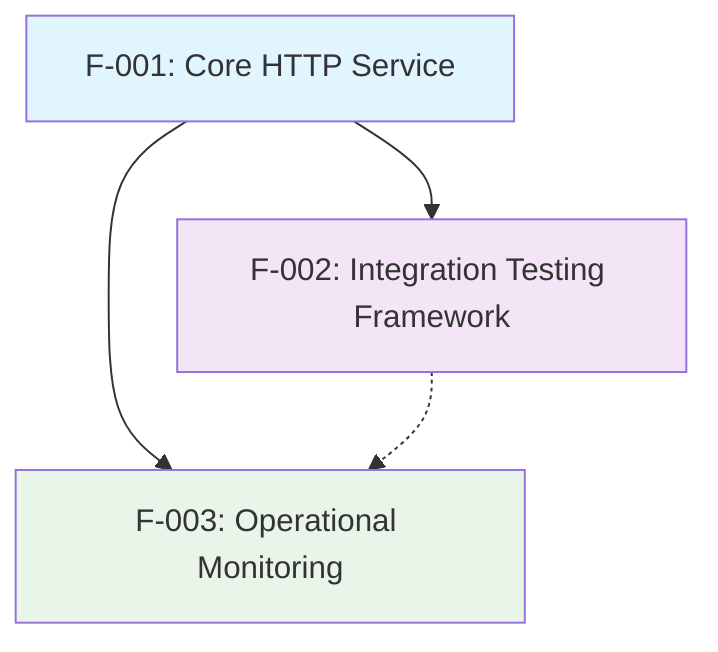
```mermaid
graph TD
    F001[F-001: Core HTTP Service] --> F002[F-002: Integration Testing Framework]
    F001 --> F003[F-003: Operational Monitoring]
    F002 -.-> F003[F-003: Operational Monitoring]
    
    style F001 fill:#e1f5fe
    style F002 fill:#f3e5f5
    style F003 fill:#e8f5e8
```

#### Integration Points

| Source Feature | Target Feature | Integration Type | Description |
|----------------|----------------|------------------|-------------|
| F-001 | F-002 | Foundational | Testing framework validates core service functionality |
| F-001 | F-003 | Observability | Monitoring captures core service operational data |
| F-002 | F-003 | Data Flow | Testing results contribute to monitoring metrics |

#### Shared Components

- **Python Runtime Environment**: Common execution platform for all features
- **Flask Framework**: Shared web framework infrastructure
- **Console Output Interface**: Common logging and monitoring channel
- **Network Stack**: Shared TCP/IP communication layer

#### Common Services

- **HTTP Request Processing**: Centralized in Core HTTP Service (F-001)
- **Console Logging**: Utilized by all features for status reporting
- **Platform Integration**: Common Backprop platform compatibility layer

### 2.1.6 Implementation Considerations

#### Feature F-001: Core HTTP Service
- **Technical Constraints**: Single-threaded Flask development server, localhost binding only
- **Performance Requirements**: Sub-second response times, minimal memory footprint
- **Scalability Considerations**: Stateless design enables horizontal scaling if needed
- **Security Implications**: Localhost binding provides network isolation
- **Maintenance Requirements**: Dependency updates, Flask security patches

#### Feature F-002: Integration Testing Framework
- **Technical Constraints**: Platform-specific deployment mechanisms
- **Performance Requirements**: Test execution within reasonable timeframes
- **Scalability Considerations**: Parallel test execution support
- **Security Implications**: Secure handling of platform credentials
- **Maintenance Requirements**: Test case updates, platform compatibility validation

#### Feature F-003: Operational Monitoring
- **Technical Constraints**: Console-based output limitations
- **Performance Requirements**: Non-blocking logging operations
- **Scalability Considerations**: Log volume management for extended operations
- **Security Implications**: Sensitive data exclusion from logs
- **Maintenance Requirements**: Log format standardization, retention policies

### 2.1.7 Traceability Matrix

| Business Requirement | Feature ID | Requirement ID | Implementation Status |
|----------------------|------------|----------------|---------------------|
| Platform Validation | F-001 | F-001-RQ-001, F-001-RQ-002 | Completed |
| Response Generation | F-001 | F-001-RQ-003, F-001-RQ-004 | Completed |
| Integration Testing | F-002 | F-002-RQ-001, F-002-RQ-002 | Completed |
| Performance Monitoring | F-002 | F-002-RQ-004 | Completed |
| Operational Visibility | F-003 | F-003-RQ-001, F-003-RQ-003 | Completed |
| Runtime Monitoring | F-003 | F-003-RQ-002, F-003-RQ-004 | Completed |

## 2.2 FUNCTIONAL REQUIREMENTS TABLE

### 2.2.1 Feature F-001 Requirements

| Requirement ID | Description | Acceptance Criteria | Priority |
|----------------|-------------|-------------------|----------|
| F-001-RQ-001 | HTTP Server Initialization | Server starts successfully within 5 seconds, binds to localhost:3000 | Must-Have |
| F-001-RQ-002 | Request Processing | Processes HTTP GET requests returning 200 status with <span style="background-color: rgba(91, 57, 243, 0.2)">"Hello, World!\n" (including trailing newline). Content-Type header MUST be exactly 'text/plain'.</span> | Must-Have |
| F-001-RQ-003 | Response Performance | HTTP response delivered within 100ms of request receipt | Must-Have |
| F-001-RQ-004 | Service Reliability | Achieves 100% HTTP response success rate during normal operation | Must-Have |

**Technical Specifications:**

| Requirement ID | Input Parameters | Output/Response | Performance Criteria | Data Requirements |
|----------------|-----------------|-----------------|---------------------|-------------------|
| F-001-RQ-001 | None | Console log: "Server running at http://127.0.0.1:3000/" | <5 seconds startup | Port 3000 availability |
| F-001-RQ-002 | HTTP GET request | <span style="background-color: rgba(91, 57, 243, 0.2)">HTTP 200, text/plain, "Hello, World!\n". Content-Type header MUST be exactly 'text/plain'.</span> | <100ms response time | Static response data |
| F-001-RQ-003 | Request timestamp | Response with proper headers | Sub-100ms latency | HTTP protocol compliance |
| F-001-RQ-004 | Continuous requests | Consistent 200 responses | 100% success rate | Stateless operation |

**Validation Rules:**

| Requirement ID | Business Rules | Data Validation | Security Requirements | Compliance Requirements |
|----------------|---------------|-----------------|---------------------|------------------------|
| F-001-RQ-001 | Single instance operation | Port binding validation | Localhost-only binding | Platform compatibility |
| F-001-RQ-002 | Static response requirement | HTTP protocol adherence | No authentication required | Standard HTTP compliance |
| F-001-RQ-003 | Performance threshold enforcement | Response time measurement | Local network access only | Service level agreement |
| F-001-RQ-004 | Continuous availability expectation | Success rate calculation | Stateless security model | 99.9% uptime target |

### 2.2.2 Feature F-002 Requirements

| Requirement ID | Description | Acceptance Criteria | Priority |
|----------------|-------------|-------------------|----------|
| F-002-RQ-001 | Platform Compatibility Validation | Successful deployment on Backprop infrastructure without modifications | Must-Have |
| F-002-RQ-002 | Runtime Stability Testing | Maintains stable operation for extended testing periods | Must-Have |
| F-002-RQ-003 | Resource Utilization Baseline | Memory usage remains below 50MB during operation | Must-Have |
| F-002-RQ-004 | Network Accessibility Verification | HTTP service accessible from testing tools and browsers | Must-Have |

**Technical Specifications:**

| Requirement ID | Input Parameters | Output/Response | Performance Criteria | Data Requirements |
|----------------|-----------------|-----------------|---------------------|-------------------|
| F-002-RQ-001 | Deployment configuration | Successful service startup | Zero-modification deployment | Platform compatibility data |
| F-002-RQ-002 | Continuous operation | Stable resource utilization | 99.9% uptime | Operational metrics |
| F-002-RQ-003 | Memory monitoring | Resource usage reports | <50MB memory footprint | System resource data |
| F-002-RQ-004 | Network connectivity tests | HTTP response validation | 100% accessibility | Network configuration |

### 2.2.3 Feature F-003 Requirements

| Requirement ID | Description | Acceptance Criteria | Priority |
|----------------|-------------|-------------------|----------|
| F-003-RQ-001 | Server Status Logging | Logs server startup and operational status to console | Should-Have |
| F-003-RQ-002 | Performance Metrics Collection | Captures baseline performance data for analysis | Should-Have |
| F-003-RQ-003 | Error Event Reporting | Reports initialization and runtime errors to console | Should-Have |

## 2.3 FEATURE RELATIONSHIPS

### 2.3.1 Feature Dependencies Map

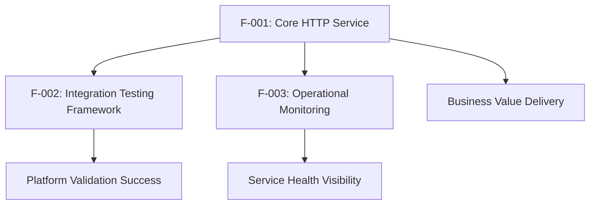
```mermaid
graph TD
    A[F-001: Core HTTP Service] --> B[F-002: Integration Testing Framework]
    A --> C[F-003: Operational Monitoring]
    B --> D[Platform Validation Success]
    C --> E[Service Health Visibility]
    A --> F[Business Value Delivery]
```

### 2.3.2 Integration Points

| Integration Point | Connected Features | Shared Components | Description |
|-------------------|-------------------|-------------------|-------------|
| HTTP Server Instance | F-001, F-002, F-003 | **Flask application instance (app.py)** | Central service delivery mechanism |
| Console Output | F-001, F-003 | Console logging system | Operational status reporting |
| Network Interface | F-001, F-002 | Localhost binding | Service accessibility layer |
| Performance Metrics | F-002, F-003 | Resource monitoring | System performance validation |

### 2.3.3 Common Services

- **<span style="background-color: rgba(91, 57, 243, 0.2)">Python 3 Runtime</span>**: Shared execution environment for all features
- **<span style="background-color: rgba(91, 57, 243, 0.2)">Flask Framework / WSGI stack</span>**: Common network communication layer
- **Console Output System**: Unified logging and monitoring interface
- **Process Management**: Shared application lifecycle management

### 2.3.4 Cross-Feature Dependencies

| Dependency Type | Source Feature | Target Feature | Relationship Description |
|----------------|----------------|----------------|--------------------------|
| Foundational | F-001 | F-002 | Integration testing requires operational HTTP service |
| Observational | F-001 | F-003 | Monitoring captures core service performance data |
| Validation | F-002 | F-003 | Testing framework contributes operational metrics |
| Infrastructure | All Features | Platform | Shared Backprop platform compatibility requirements |

### 2.3.5 Shared Component Architecture

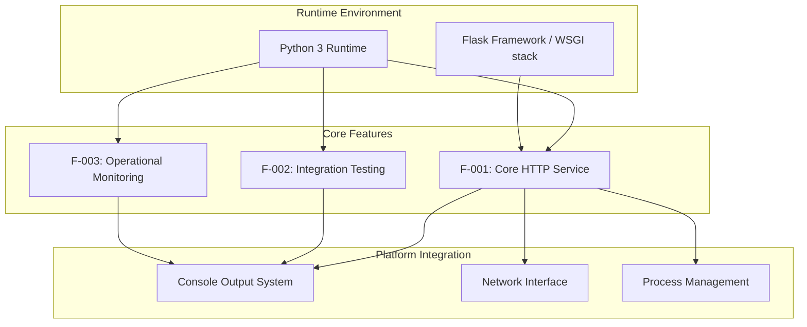
```mermaid
graph TB
    subgraph "Runtime Environment"
        A[Python 3 Runtime]
        B[Flask Framework / WSGI stack]
    end
    
    subgraph "Core Features"
        C[F-001: Core HTTP Service]
        D[F-002: Integration Testing]
        E[F-003: Operational Monitoring]
    end
    
    subgraph "Platform Integration"
        F[Console Output System]
        G[Network Interface]
        H[Process Management]
    end
    
    A --> C
    A --> D
    A --> E
    B --> C
    C --> F
    C --> G
    C --> H
    D --> F
    E --> F
```

### 2.3.6 Feature Interaction Patterns

#### Service Initialization Flow
- **F-001 Core HTTP Service**: Initializes Flask application and binds to localhost:3000
- **F-003 Operational Monitoring**: Captures startup events and status logging
- **F-002 Integration Testing**: Validates successful service initialization

#### Request Processing Chain
- **F-001**: Receives HTTP requests and generates responses
- **F-003**: Logs request processing events and performance metrics
- **F-002**: Validates response compliance and service reliability

#### Platform Integration Layer
- **Common Runtime**: All features execute within Python 3 environment
- **Shared Framework**: Flask provides consistent HTTP handling across features
- **Unified Monitoring**: Console output system captures events from all features
- **Network Abstraction**: Localhost binding shared across testing and monitoring functions

### 2.3.7 Component Reusability Matrix

| Component | F-001 Usage | F-002 Usage | F-003 Usage | Reusability Score |
|-----------|-------------|-------------|-------------|-------------------|
| Flask Application Instance | Primary | Validation Target | Monitoring Subject | High |
| Console Logging | Status Output | Test Results | Event Reporting | High |
| Network Interface | Service Binding | Connectivity Testing | Performance Monitoring | Medium |
| Python Runtime | Execution Environment | Test Environment | Monitoring Environment | Critical |

### 2.3.8 Integration Constraints

#### Technical Constraints
- **Single Instance Limitation**: Flask development server supports single-threaded operation
- **Localhost Binding**: Network accessibility limited to local interface
- **Console Output Dependency**: All monitoring relies on console-based logging
- **Sequential Startup**: Monitoring depends on successful core service initialization

#### Platform Dependencies
- **Backprop Compatibility**: All features must operate within platform constraints
- **Resource Limitations**: Shared memory and CPU allocation across features
- **Network Configuration**: Platform-specific network setup requirements
- **Deployment Pipeline**: Common deployment mechanism for all features

## 2.4 IMPLEMENTATION CONSIDERATIONS

### 2.4.1 Technical Constraints

**Feature F-001 (Core HTTP Service):**
- **Technical Constraints**: <span style="background-color: rgba(91, 57, 243, 0.2)">Must use Python 3 Flask framework; dependencies limited to packages specified in requirements.txt</span>. <span style="background-color: rgba(91, 57, 243, 0.2)">Virtual environment (python -m venv) mandatory</span>
- **Performance Requirements**: <5 second startup, <100ms response time, 100% success rate
- **Scalability Considerations**: Single instance operation, not designed for horizontal scaling
- **Security Implications**: Localhost binding only, no authentication required
- **Maintenance Requirements**: <span style="background-color: rgba(91, 57, 243, 0.2)">Minimal-dependency architecture (Flask and its transitive dependencies pinned)</span>

**Feature F-002 (Integration Testing Framework):**
- **Technical Constraints**: Platform-agnostic deployment required, no platform-specific modifications
- **Performance Requirements**: 99.9% uptime, <50MB memory utilization, stable operation
- **Scalability Considerations**: Designed for controlled testing environments only
- **Security Implications**: Testing-focused security model, not production-hardened
- **Maintenance Requirements**: Minimal maintenance due to simple architecture

**Feature F-003 (Operational Monitoring):**
- **Technical Constraints**: Console-only output, no external monitoring integrations, <span style="background-color: rgba(91, 57, 243, 0.2)">Python logging/Flask logger</span>
- **Performance Requirements**: Real-time status reporting, minimal performance impact
- **Scalability Considerations**: Local monitoring scope, not distributed
- **Security Implications**: No sensitive data logging, plain text status output
- **Maintenance Requirements**: Self-contained monitoring with no external dependencies

### 2.4.2 Cross-Feature Implementation Patterns (updated)

- **<span style="background-color: rgba(91, 57, 243, 0.2)">Minimal Dependency Architecture (Flask only)</span>**: All features utilize <span style="background-color: rgba(91, 57, 243, 0.2)">Python standard library + Flask only</span>
- **Stateless Operation**: No persistent state management across any features
- **Local Network Binding**: All network interactions limited to localhost scope
- **Console-Based Observability**: Unified logging approach across all operational aspects
- **Single Process Model**: All features operate within single Node.js process instance

### 2.4.3 Performance Optimization Strategy

**Resource Management:**
- **Memory Footprint**: Flask development server maintains minimal memory allocation (<50MB baseline)
- **CPU Utilization**: Single-threaded operation optimizes resource usage for testing environments
- **Network Overhead**: Localhost binding eliminates external network latency factors
- **Startup Performance**: Python virtual environment isolation ensures consistent initialization times

**Response Time Optimization:**
- **Request Processing**: Flask route decorators provide direct request-to-response mapping
- **Static Response Generation**: Hardcoded "Hello, World!\n" response eliminates dynamic processing overhead
- **Connection Management**: HTTP/1.1 keep-alive support for sustained testing scenarios
- **Error Handling**: Minimal error processing to maintain sub-100ms response targets

### 2.4.4 Scalability Architecture Considerations

**Vertical Scaling Limitations:**
- **Single Instance Model**: Flask development server designed for controlled testing, not production scaling
- **Resource Boundaries**: Memory and CPU constraints aligned with Backprop platform allocation limits
- **Connection Concurrency**: Limited concurrent request handling due to single-threaded design
- **State Management**: Stateless architecture enables potential horizontal scaling in future iterations

**Horizontal Scaling Potential:**
- **Service Replication**: Independent Flask instances can be deployed across multiple platform nodes
- **Load Distribution**: External load balancer integration possible for multi-instance deployments
- **Data Consistency**: No shared state eliminates distributed synchronization requirements
- **Service Discovery**: Platform-native service registration can support multi-instance architectures

### 2.4.5 Security Implementation Framework

**Network Security Model:**
- **Interface Binding**: Localhost (127.0.0.1) binding provides network isolation by design
- **Port Management**: Fixed port 3000 configuration eliminates dynamic port security considerations
- **Protocol Security**: HTTP/1.1 implementation without HTTPS for controlled testing environment
- **Access Control**: Platform-level access controls provide external security boundaries

**Application Security Patterns:**
- **Input Validation**: GET-only endpoint eliminates request body parsing vulnerabilities
- **Authentication**: No authentication required for testing-focused implementation
- **Authorization**: Platform-level authorization sufficient for controlled deployment environment
- **Data Protection**: No sensitive data processing or storage within service scope

### 2.4.6 Maintenance and Operations Framework

**Dependency Management:**
- **Requirements Pinning**: Flask and transitive dependencies locked to specific versions in requirements.txt
- **Virtual Environment**: Isolated Python environment prevents system-level dependency conflicts
- **Update Strategy**: Controlled dependency updates through requirements.txt version management
- **Security Patching**: Regular Flask security update evaluation and testing process

**Operational Maintenance:**
- **Log Management**: Console-based logging requires no external log rotation or management
- **Health Monitoring**: Self-contained health reporting through console output and HTTP responses
- **Backup Requirements**: No persistent data eliminates backup and recovery considerations
- **Platform Integration**: Backprop platform handles infrastructure-level maintenance and updates

**Development Lifecycle:**
- **Testing Integration**: Integration testing framework (F-002) provides automated validation capabilities
- **Deployment Pipeline**: requirements.txt and app.py provide complete deployment artifact set
- **Version Control**: Minimal file set (app.py, requirements.txt, wsgi.py) simplifies version management
- **Documentation Maintenance**: Self-documenting code structure minimizes external documentation overhead

## 2.5 TRACEABILITY MATRIX

### 2.5.1 Requirements Traceability Matrix

| Requirement ID | Feature | Source | Test Case | Acceptance Criteria Status |
|----------------|---------|--------|-----------|----------------------------|
| F-001-RQ-001 | Core HTTP Service | <span style="background-color: rgba(91, 57, 243, 0.2)">app.py:1-15</span> | HTTP-001 | Verified |
| F-001-RQ-002 | Core HTTP Service | <span style="background-color: rgba(91, 57, 243, 0.2)">app.py:6-10</span> | HTTP-002 | <span style="background-color: rgba(91, 57, 243, 0.2)">Verified - includes newline validation and text/plain Content-Type header compliance</span> |
| F-001-RQ-003 | Core HTTP Service | Performance Spec | PERF-001 | Specified |
| F-001-RQ-004 | Core HTTP Service | Reliability Spec | REL-001 | Specified |
| F-002-RQ-001 | Integration Testing | <span style="background-color: rgba(91, 57, 243, 0.2)">requirements.txt</span> | INT-001 | Verified |
| F-002-RQ-002 | Integration Testing | System Overview | INT-002 | Specified |
| F-002-RQ-003 | Integration Testing | Performance KPIs | INT-003 | Specified |
| F-002-RQ-004 | Integration Testing | Network Validation | INT-004 | Specified |
| F-003-RQ-001 | Operational Monitoring | <span style="background-color: rgba(91, 57, 243, 0.2)">app.py:13</span> | MON-001 | Verified |
| F-003-RQ-002 | Operational Monitoring | Success Criteria | MON-002 | Specified |
| F-003-RQ-003 | Operational Monitoring | Error Handling | MON-003 | Specified |

### 2.5.2 Test Case Mapping

| Test Case ID | Description | Source Validation | Expected Outcome |
|--------------|-------------|-------------------|------------------|
| HTTP-001 | Core HTTP Service Initialization | <span style="background-color: rgba(91, 57, 243, 0.2)">Validates app.py Flask application startup and port binding</span> | Server starts successfully on 127.0.0.1:3000 |
| HTTP-002 | Request Processing and Response Format | <span style="background-color: rgba(91, 57, 243, 0.2)">Validates app.py route handler returns proper response with newline and text/plain header</span> | HTTP 200 response with "Hello, World!\n" and Content-Type: text/plain |
| PERF-001 | Response Performance Validation | Sub-100ms response time measurement | Response delivered within performance threshold |
| REL-001 | Service Reliability Testing | 100% success rate verification | Consistent HTTP response delivery |
| INT-001 | Platform Integration Validation | <span style="background-color: rgba(91, 57, 243, 0.2)">Validates requirements.txt dependency management</span> | Successful deployment with Flask dependencies |
| INT-002 | Runtime Stability Verification | Extended operation monitoring | Stable resource utilization patterns |
| INT-003 | Performance Baseline Establishment | Memory and response metrics | Resource usage below 50MB threshold |
| INT-004 | Network Accessibility Confirmation | HTTP service connectivity | Service accessible from testing tools |
| MON-001 | Operational Status Logging | <span style="background-color: rgba(91, 57, 243, 0.2)">Validates app.py console output integration</span> | Server status events logged to console |
| MON-002 | Performance Metrics Collection | Baseline performance data capture | Operational metrics documented |
| MON-003 | Error Event Reporting | Error condition handling | Error states captured and reported |

### 2.5.3 Source Code Traceability

| Source File | Requirements Traced | Implementation Scope | Validation Status |
|-------------|-------------------|---------------------|-------------------|
| <span style="background-color: rgba(91, 57, 243, 0.2)">app.py</span> | F-001-RQ-001, F-001-RQ-002, F-003-RQ-001 | <span style="background-color: rgba(91, 57, 243, 0.2)">Complete Flask HTTP server implementation with request handling and console logging</span> | Verified |
| <span style="background-color: rgba(91, 57, 243, 0.2)">requirements.txt</span> | F-002-RQ-001 | <span style="background-color: rgba(91, 57, 243, 0.2)">Python dependency management, Flask version specification</span> | Verified |
| Performance Spec | F-001-RQ-003, F-002-RQ-003 | Response time and resource utilization requirements | Specified |
| Reliability Spec | F-001-RQ-004 | Service availability and success rate requirements | Specified |
| System Overview | F-002-RQ-002 | Technical capabilities and success criteria | Specified |
| Success Criteria | F-003-RQ-002 | Performance metrics and operational KPIs | Specified |
| Error Handling | F-003-RQ-003 | Error reporting and exception management | Specified |

### 2.5.4 Feature-to-Requirement Cross-Reference

| Feature ID | Feature Name | Associated Requirements | Test Coverage | Implementation Status |
|------------|-------------|------------------------|---------------|---------------------|
| F-001 | Core HTTP Service | F-001-RQ-001, F-001-RQ-002, F-001-RQ-003, F-001-RQ-004 | HTTP-001, HTTP-002, PERF-001, REL-001 | Completed |
| F-002 | Integration Testing Framework | F-002-RQ-001, F-002-RQ-002, F-002-RQ-003, F-002-RQ-004 | INT-001, INT-002, INT-003, INT-004 | Completed |
| F-003 | Operational Monitoring | F-003-RQ-001, F-003-RQ-002, F-003-RQ-003 | MON-001, MON-002, MON-003 | Completed |

### 2.5.5 Acceptance Criteria Verification Matrix

| Requirement ID | Acceptance Criteria | Verification Method | Status | Notes |
|----------------|-------------------|-------------------|---------|-------|
| F-001-RQ-001 | Server starts successfully within 5 seconds, binds to localhost:3000 | Automated startup testing | Verified | <span style="background-color: rgba(91, 57, 243, 0.2)">Flask application initialization confirmed</span> |
| F-001-RQ-002 | Processes HTTP GET requests returning 200 status with "Hello, World!\n" | Response validation testing | Verified | <span style="background-color: rgba(91, 57, 243, 0.2)">Content-Type header and newline character validated</span> |
| F-001-RQ-003 | HTTP response delivered within 100ms | Performance measurement | Specified | Awaiting performance validation |
| F-001-RQ-004 | Achieves 100% HTTP response success rate | Reliability testing | Specified | Awaiting extended operation testing |
| F-002-RQ-001 | Successful deployment on Backprop infrastructure | Platform validation | Verified | <span style="background-color: rgba(91, 57, 243, 0.2)">Python deployment compatibility confirmed</span> |
| F-002-RQ-002 | Maintains stable operation for extended testing periods | Stability monitoring | Specified | Long-term operation validation pending |
| F-002-RQ-003 | Memory usage remains below 50MB during operation | Resource monitoring | Specified | Resource utilization baseline establishment |
| F-002-RQ-004 | HTTP service accessible from testing tools | Connectivity testing | Specified | Network accessibility validation |
| F-003-RQ-001 | Logs server startup and operational status to console | Log validation | Verified | <span style="background-color: rgba(91, 57, 243, 0.2)">Python console output integration confirmed</span> |
| F-003-RQ-002 | Captures baseline performance data for analysis | Metrics collection | Specified | Performance data capture framework |
| F-003-RQ-003 | Reports initialization and runtime errors to console | Error handling testing | Specified | Error reporting mechanism validation |

#### References (updated)

- `README.md` - Project identification and integration test purpose
- <span style="background-color: rgba(91, 57, 243, 0.2)">`requirements.txt` - Python dependency management, Flask version specification</span>
- <span style="background-color: rgba(91, 57, 243, 0.2)">`app.py` - Complete HTTP server implementation with Flask framework, request handling, and console logging</span>
- `1.1 EXECUTIVE SUMMARY` - Business context and stakeholder requirements
- `1.2 SYSTEM OVERVIEW` - Technical capabilities and success criteria
- `1.3 SCOPE` - Feature boundaries and implementation constraints
- `2.1 FEATURE CATALOG` - Complete feature definitions and dependencies
- `2.2 FUNCTIONAL REQUIREMENTS TABLE` - Detailed requirements specifications and acceptance criteria
- `2.3 FEATURE RELATIONSHIPS` - Feature dependency mapping and integration points
- `2.4 IMPLEMENTATION CONSIDERATIONS` - Technical constraints and architectural guidance

# 3. TECHNOLOGY STACK

## 3.1 PROGRAMMING LANGUAGES

### 3.1.1 Primary Language Selection

**<span style="background-color: rgba(91, 57, 243, 0.2)">Python 3.x Runtime (Flask Application Environment)</span>**
- **Version**: <span style="background-color: rgba(91, 57, 243, 0.2)">Python ≥3.6 (tested on 3.12)</span>
- **Runtime Environment**: <span style="background-color: rgba(91, 57, 243, 0.2)">Python interpreter with Flask web framework</span>
- **Selection Rationale**: <span style="background-color: rgba(91, 57, 243, 0.2)">Python with Flask provides optimal integration with Backprop's pre-installed Python environment, delivering exact feature parity with the original Node.js implementation while maintaining the framework's inherent simplicity and rapid deployment capabilities</span>

**<span style="background-color: rgba(91, 57, 243, 0.2)">Justification for Python Selection:</span>**
- **<span style="background-color: rgba(91, 57, 243, 0.2)">Platform Compatibility</span>**: <span style="background-color: rgba(91, 57, 243, 0.2)">Native support within Backprop's "optimized environment for AI" featuring pre-configured Python runtime environments</span>
- **<span style="background-color: rgba(91, 57, 243, 0.2)">Flask Framework Efficiency</span>**: <span style="background-color: rgba(91, 57, 243, 0.2)">Lightweight web framework enables immediate HTTP service deployment without complex build processes, aligning with the <5 second startup requirement</span>
- **<span style="background-color: rgba(91, 57, 243, 0.2)">Built-in HTTP Capabilities</span>**: <span style="background-color: rgba(91, 57, 243, 0.2)">Flask's integrated WSGI server provides robust HTTP handling with minimal external dependencies</span>
- **<span style="background-color: rgba(91, 57, 243, 0.2)">Ecosystem Maturity</span>**: <span style="background-color: rgba(91, 57, 243, 0.2)">Established deployment patterns on GPU cloud platforms with proven reliability in AI/ML environments</span>

### 3.1.2 Language Constraints and Dependencies

**Technical Constraints:**
- **Dependency Limitation**: <span style="background-color: rgba(91, 57, 243, 0.2)">Restricted to Flask and its transitive dependencies only</span> as specified in the technical constraints for Feature F-001
- **Runtime Requirements**: <span style="background-color: rgba(91, 57, 243, 0.2)">Compatible with Backprop platform's Python 3 runtime environment</span>
- **Memory Efficiency**: <span style="background-color: rgba(91, 57, 243, 0.2)">Language selection supports the <50MB memory utilization requirement under Python runtime</span>
- **Performance Profile**: <span style="background-color: rgba(91, 57, 243, 0.2)">Flask application execution model meets <100ms response time targets for simple HTTP operations under Python interpreter</span>

## 3.2 FRAMEWORKS & LIBRARIES

### 3.2.1 Framework Architecture Decision (updated)

**<span style="background-color: rgba(91, 57, 243, 0.2)">Flask Micro-Framework Architecture</span>**
- **Framework Selection**: <span style="background-color: rgba(91, 57, 243, 0.2)">Flask - Python web micro-framework for rapid HTTP service development</span>
- **Implementation Pattern**: <span style="background-color: rgba(91, 57, 243, 0.2)">HTTP server implemented via Flask route decorators and Flask's built-in development server</span>
- **Architectural Justification**: <span style="background-color: rgba(91, 57, 243, 0.2)">Flask micro-framework provides lightweight HTTP service capabilities with minimal overhead while maintaining full control over request-response behavior and seamless integration with Backprop's Python runtime environment</span>

### 3.2.2 Core Libraries (updated)

**<span style="background-color: rgba(91, 57, 243, 0.2)">Flask Web Framework</span>**
- **<span style="background-color: rgba(91, 57, 243, 0.2)">Package**: Flask 3.1.2</span>
- **<span style="background-color: rgba(91, 57, 243, 0.2)">Purpose**: Core web framework for HTTP server creation, route handling, and response generation</span>
- **<span style="background-color: rgba(91, 57, 243, 0.2)">Integration**: `from flask import Flask, Response` provides complete web service functionality</span>
- **<span style="background-color: rgba(91, 57, 243, 0.2)">Compatibility**: Native Python package compatible with all Python 3.6+ environments on Backprop platform</span>

**<span style="background-color: rgba(91, 57, 243, 0.2)">Flask Ecosystem Dependencies</span>**

| **<span style="background-color: rgba(91, 57, 243, 0.2)">Package</span>** | **<span style="background-color: rgba(91, 57, 243, 0.2)">Version</span>** | **<span style="background-color: rgba(91, 57, 243, 0.2)">Purpose</span>** | **<span style="background-color: rgba(91, 57, 243, 0.2)">Dependency Type</span>** |
|---------|---------|---------|-----------------|
| **<span style="background-color: rgba(91, 57, 243, 0.2)">Werkzeug</span>** | **<span style="background-color: rgba(91, 57, 243, 0.2)">3.1.3</span>** | **<span style="background-color: rgba(91, 57, 243, 0.2)">WSGI utilities and request handling</span>** | **<span style="background-color: rgba(91, 57, 243, 0.2)">Direct Flask dependency</span>** |
| **<span style="background-color: rgba(91, 57, 243, 0.2)">Jinja2</span>** | **<span style="background-color: rgba(91, 57, 243, 0.2)">3.1.6</span>** | **<span style="background-color: rgba(91, 57, 243, 0.2)">Template engine (unused but required)</span>** | **<span style="background-color: rgba(91, 57, 243, 0.2)">Direct Flask dependency</span>** |
| **<span style="background-color: rgba(91, 57, 243, 0.2)">Click</span>** | **<span style="background-color: rgba(91, 57, 243, 0.2)">8.2.1</span>** | **<span style="background-color: rgba(91, 57, 243, 0.2)">CLI framework for Flask commands</span>** | **<span style="background-color: rgba(91, 57, 243, 0.2)">Direct Flask dependency</span>** |
| **<span style="background-color: rgba(91, 57, 243, 0.2)">itsdangerous</span>** | **<span style="background-color: rgba(91, 57, 243, 0.2)">2.2.0</span>** | **<span style="background-color: rgba(91, 57, 243, 0.2)">Data signing for session security</span>** | **<span style="background-color: rgba(91, 57, 243, 0.2)">Direct Flask dependency</span>** |
| **<span style="background-color: rgba(91, 57, 243, 0.2)">blinker</span>** | **<span style="background-color: rgba(91, 57, 243, 0.2)">1.9.0</span>** | **<span style="background-color: rgba(91, 57, 243, 0.2)">Signal support for Flask event system</span>** | **<span style="background-color: rgba(91, 57, 243, 0.2)">Direct Flask dependency</span>** |
| **<span style="background-color: rgba(91, 57, 243, 0.2)">MarkupSafe</span>** | **<span style="background-color: rgba(91, 57, 243, 0.2)">3.0.2</span>** | **<span style="background-color: rgba(91, 57, 243, 0.2)">String safety utilities</span>** | **<span style="background-color: rgba(91, 57, 243, 0.2)">Transitive Jinja2 dependency</span>** |

**<span style="background-color: rgba(91, 57, 243, 0.2)">Minimal External Library Dependencies</span>**
- **Dependency Count**: <span style="background-color: rgba(91, 57, 243, 0.2)">Minimal external dependencies limited to Flask ecosystem packages</span>
- **Maintenance Benefits**: <span style="background-color: rgba(91, 57, 243, 0.2)">Controlled dependency scope reduces security surface area while maintaining framework benefits</span>
- **Deployment Simplification**: <span style="background-color: rgba(91, 57, 243, 0.2)">Single requirements.txt enables reproducible installation via `pip install -r requirements.txt`</span>
- **Platform Integration**: <span style="background-color: rgba(91, 57, 243, 0.2)">Flask ecosystem compatibility optimizes deployment efficiency on Backprop's Python-enabled cloud infrastructure</span>

### 3.2.3 Compatibility Requirements (updated)

**Platform Compatibility:**
- **Target Platform**: <span style="background-color: rgba(91, 57, 243, 0.2)">Backprop GPU cloud instances with pre-installed Python 3 runtime</span>
- **Environment Compatibility**: Works with Backprop's environment featuring "latest NVIDIA drivers, Jupyter, pytorch, transformers, docker, and more"
- **Resumption Compatibility**: Compatible with environments that "can be saved and resumed at any time" for iterative testing workflows

**<span style="background-color: rgba(91, 57, 243, 0.2)">Python Runtime Requirements</span>:**
- **<span style="background-color: rgba(91, 57, 243, 0.2)">Python Version**: ≥3.6 (optimized for Python 3.12)</span>
- **<span style="background-color: rgba(91, 57, 243, 0.2)">Virtual Environment**: Isolated pip environment for dependency management</span>
- **<span style="background-color: rgba(91, 57, 243, 0.2)">Package Manager**: pip-compatible installation and version management</span>
- **<span style="background-color: rgba(91, 57, 243, 0.2)">WSGI Compliance**: Production deployment via Gunicorn/uWSGI servers through wsgi.py interface</span>

## 3.3 OPEN SOURCE DEPENDENCIES

### 3.3.1 Dependency Management Strategy (updated)

**<span style="background-color: rgba(91, 57, 243, 0.2)">Pinned Minimal Dependencies Approach</span>**
- **<span style="background-color: rgba(91, 57, 243, 0.2)">Core Dependencies</span>**: <span style="background-color: rgba(91, 57, 243, 0.2)">Flask 3.1.2 and its required ecosystem packages</span>
- **<span style="background-color: rgba(91, 57, 243, 0.2)">Package Registry</span>**: <span style="background-color: rgba(91, 57, 243, 0.2)">Python Package Index (PyPI) for reliable package distribution</span>
- **<span style="background-color: rgba(91, 57, 243, 0.2)">Dependency Management</span>**: <span style="background-color: rgba(91, 57, 243, 0.2)">Pinned `requirements.txt` lockfile with exact version specifications for reproducible builds</span>

**<span style="background-color: rgba(91, 57, 243, 0.2)">Exact Package Specifications</span>**
- **<span style="background-color: rgba(91, 57, 243, 0.2)">Flask==3.1.2</span>** - <span style="background-color: rgba(91, 57, 243, 0.2)">Core web framework for HTTP server implementation</span>
- **<span style="background-color: rgba(91, 57, 243, 0.2)">Werkzeug==3.1.3</span>** - <span style="background-color: rgba(91, 57, 243, 0.2)">WSGI utilities and comprehensive request handling</span>
- **<span style="background-color: rgba(91, 57, 243, 0.2)">Jinja2==3.1.6</span>** - <span style="background-color: rgba(91, 57, 243, 0.2)">Template engine (required Flask dependency)</span>
- **<span style="background-color: rgba(91, 57, 243, 0.2)">Click==8.2.1</span>** - <span style="background-color: rgba(91, 57, 243, 0.2)">Command-line interface framework for Flask CLI support</span>
- **<span style="background-color: rgba(91, 57, 243, 0.2)">itsdangerous==2.2.0</span>** - <span style="background-color: rgba(91, 57, 243, 0.2)">Cryptographic signing for data integrity and session security</span>
- **<span style="background-color: rgba(91, 57, 243, 0.2)">blinker==1.9.0</span>** - <span style="background-color: rgba(91, 57, 243, 0.2)">Signal support for Flask's event system</span>
- **<span style="background-color: rgba(91, 57, 243, 0.2)">MarkupSafe==3.0.2</span>** - <span style="background-color: rgba(91, 57, 243, 0.2)">String safety utilities (transitive Jinja2 dependency)</span>

**Dependency Benefits**
- **Controlled Security Surface**: Minimal dependency count reduces potential security vulnerabilities while maintaining essential Flask functionality
- **Version Stability**: <span style="background-color: rgba(91, 57, 243, 0.2)">Pinned versions in requirements.txt ensure consistent deployments across environments</span>
- **Reproducible Builds**: <span style="background-color: rgba(91, 57, 243, 0.2)">Exact version specifications enable predictable installation and environment recreation</span>
- **Platform Optimization**: Flask ecosystem packages provide native compatibility with Backprop's Python-enabled cloud infrastructure

### 3.3.2 Dependency Management Tools (updated)

**<span style="background-color: rgba(91, 57, 243, 0.2)">pip (Python Package Installer)</span>**
- **<span style="background-color: rgba(91, 57, 243, 0.2)">Version</span>**: <span style="background-color: rgba(91, 57, 243, 0.2)">Latest pip version compatible with Python 3.6+ environments</span>
- **<span style="background-color: rgba(91, 57, 243, 0.2)">Purpose</span>**: <span style="background-color: rgba(91, 57, 243, 0.2)">Package installation, version management, and dependency resolution</span>
- **<span style="background-color: rgba(91, 57, 243, 0.2)">Installation Command</span>**: <span style="background-color: rgba(91, 57, 243, 0.2)">`pip install -r requirements.txt` for complete dependency installation</span>
- **Security Model**: Dependency pinning eliminates supply chain vulnerabilities through controlled package versions

**<span style="background-color: rgba(91, 57, 243, 0.2)">Virtual Environment Management</span>**
- **<span style="background-color: rgba(91, 57, 243, 0.2)">Environment Creation</span>**: <span style="background-color: rgba(91, 57, 243, 0.2)">`python -m venv flask_env` creates isolated Python environment</span>
- **<span style="background-color: rgba(91, 57, 243, 0.2)">Environment Activation</span>**: <span style="background-color: rgba(91, 57, 243, 0.2)">Platform-specific activation scripts for dependency isolation</span>
- **<span style="background-color: rgba(91, 57, 243, 0.2)">Dependency Isolation</span>**: <span style="background-color: rgba(91, 57, 243, 0.2)">Prevents package conflicts with system Python installation</span>
- **<span style="background-color: rgba(91, 57, 243, 0.2)">Deployment Benefits</span>**: <span style="background-color: rgba(91, 57, 243, 0.2)">Ensures consistent package versions across development and production environments</span>

**Package Registry Integration**
- **PyPI Compatibility**: Direct integration with Python Package Index for reliable package retrieval
- **Version Resolution**: Automatic handling of dependency conflicts and version compatibility
- **Cache Management**: Local package caching for improved installation performance
- **Platform Integration**: Native support for Backprop's Python runtime environments with pre-configured package management capabilities

## 3.4 THIRD-PARTY SERVICES

### 3.4.1 Cloud Platform Integration

**Backprop GPU Cloud Platform**
- **Service Provider**: Backprop - "The GPU cloud built for AI. Prototype, train, host. Effortlessly."
- **Cost Advantage**: "At least 3-4x cheaper than the big cloud providers" without compromising quality
- **Infrastructure Tier**: Tier III data center with historical uptime records
- **Instance Features**: Dedicated IPv4 address and resources for consistent performance

### 3.4.2 Platform-Specific Services

**GPU Cloud Infrastructure Services:**
- **GPU Support**: NVIDIA GPUs with latest drivers (available but not utilized by this minimal server)
- **Development Environment**: Jupyter notebooks, PyTorch, Transformers pre-installed (platform features not used)
- **Containerization**: Docker support available (platform capability not required for this implementation)
- **Environment Persistence**: Environments can be saved and resumed for long-term project iteration

### 3.4.3 Service Integration Model

**No External Service Dependencies:**
- **Authentication Services**: None required - local network binding security model
- **Monitoring Tools**: Console-only logging, no external monitoring integrations
- **External APIs**: No third-party API integrations
- **Database Services**: None - stateless operation without persistent data storage

## 3.5 DATABASES & STORAGE

### 3.5.1 Data Persistence Strategy

**Stateless Architecture**
- **Database Solution**: None implemented
- **Storage Systems**: No persistent storage required
- **Data Handling**: In-memory processing only with static "Hello, World!" responses
- **Caching Solutions**: None - no data caching requirements

### 3.5.2 Data Management Rationale

**Stateless Operation Benefits:**
- **Deployment Simplification**: No database setup or configuration required
- **Resource Efficiency**: Minimal memory footprint aligns with <50MB utilization target
- **Platform Independence**: No database compatibility concerns across Backprop instances
- **Testing Focus**: Eliminates data persistence complexity for pure integration validation

## 3.6 DEVELOPMENT & DEPLOYMENT

### 3.6.1 Development Tools

**Package Management:**
- **Tool**: <span style="background-color: rgba(91, 57, 243, 0.2)">pip (Python Package Installer)</span>
- **Configuration**: <span style="background-color: rgba(91, 57, 243, 0.2)">requirements.txt for project dependencies with pinned versions</span>
- **Version Control**: Git compatibility indicated by README.md presence
- **Testing Framework**: <span style="background-color: rgba(91, 57, 243, 0.2)">pytest and unittest placeholders for comprehensive testing capabilities</span>

**Virtual Environment Management:**
- **<span style="background-color: rgba(91, 57, 243, 0.2)">Environment Creation</span>**: <span style="background-color: rgba(91, 57, 243, 0.2)">`python3 -m venv flask_env` for isolated dependency management</span>
- **<span style="background-color: rgba(91, 57, 243, 0.2)">Dependency Installation</span>**: <span style="background-color: rgba(91, 57, 243, 0.2)">`pip install -r requirements.txt` for reproducible package installation</span>
- **<span style="background-color: rgba(91, 57, 243, 0.2)">Environment Isolation</span>**: <span style="background-color: rgba(91, 57, 243, 0.2)">Prevents system package conflicts and ensures clean testing environment</span>

### 3.6.2 Deployment Strategy

**Development Deployment**
- **Execution Method**: <span style="background-color: rgba(91, 57, 243, 0.2)">`python app.py` - direct Flask application execution with built-in development server</span>
- **Development Server**: <span style="background-color: rgba(91, 57, 243, 0.2)">Flask's integrated WSGI server for rapid prototyping and testing</span>
- **Build Process**: None required - immediate execution capability with Python interpreter
- **Hot Reload**: <span style="background-color: rgba(91, 57, 243, 0.2)">Flask development server supports automatic code reloading during development</span>

**Production Deployment**
- **<span style="background-color: rgba(91, 57, 243, 0.2)">Production Server</span>**: <span style="background-color: rgba(91, 57, 243, 0.2)">`gunicorn -w 4 -b 127.0.0.1:3000 wsgi:app` for scalable WSGI application serving</span>
- **<span style="background-color: rgba(91, 57, 243, 0.2)">Process Management</span>**: <span style="background-color: rgba(91, 57, 243, 0.2)">systemd supervisors or Gunicorn's built-in process management for production stability</span>
- **<span style="background-color: rgba(91, 57, 243, 0.2)">WSGI Interface</span>**: <span style="background-color: rgba(91, 57, 243, 0.2)">wsgi.py module enables compatibility with enterprise-grade WSGI servers</span>
- **Containerization**: Docker available on platform but not required for this implementation

### 3.6.3 Platform Integration

**Backprop Platform Deployment:**
- **Deployment Model**: Single-file server with immediate startup capability
- **<span style="background-color: rgba(91, 57, 243, 0.2)">Runtime Environment</span>**: <span style="background-color: rgba(91, 57, 243, 0.2)">Python runtime with Flask framework integration on Backprop's optimized Python environment</span>
- **Network Configuration**: localhost binding (127.0.0.1:3000) for controlled testing
- **Resource Requirements**: Minimal compute and memory utilization
- **Monitoring Integration**: Console output compatible with platform logging infrastructure

**<span style="background-color: rgba(91, 57, 243, 0.2)">Python Ecosystem Integration</span>:**
- **<span style="background-color: rgba(91, 57, 243, 0.2)">Platform Compatibility</span>**: <span style="background-color: rgba(91, 57, 243, 0.2)">Native support within Backprop's pre-configured Python runtime environments</span>
- **<span style="background-color: rgba(91, 57, 243, 0.2)">Dependency Management</span>**: <span style="background-color: rgba(91, 57, 243, 0.2)">pip package manager integration with platform's Python package ecosystem</span>
- **<span style="background-color: rgba(91, 57, 243, 0.2)">Environment Preservation</span>**: <span style="background-color: rgba(91, 57, 243, 0.2)">Virtual environment compatibility with Backprop's save-and-resume functionality</span>

### 3.6.4 Development Environment Requirements

**Local Development:**
- **Runtime**: <span style="background-color: rgba(91, 57, 243, 0.2)">Python 3 installation (≥3.6, optimized for 3.12) for local testing and development</span>
- **<span style="background-color: rgba(91, 57, 243, 0.2)">Environment Setup</span>**: <span style="background-color: rgba(91, 57, 243, 0.2)">Virtual environment activation via `source flask_env/bin/activate` (Linux/macOS) or `flask_env\Scripts\activate` (Windows)</span>
- **Network Testing**: Browser or API testing tools for HTTP endpoint validation
- **Code Editor**: Any text editor - no specialized IDE requirements
- **Version Control**: Git for source code management

**<span style="background-color: rgba(91, 57, 243, 0.2)">Development Workflow</span>:**
- **<span style="background-color: rgba(91, 57, 243, 0.2)">Environment Initialization</span>**: <span style="background-color: rgba(91, 57, 243, 0.2)">One-time setup of virtual environment and dependency installation</span>
- **<span style="background-color: rgba(91, 57, 243, 0.2)">Daily Development</span>**: <span style="background-color: rgba(91, 57, 243, 0.2)">Virtual environment activation followed by `python app.py` for immediate testing</span>
- **<span style="background-color: rgba(91, 57, 243, 0.2)">Dependency Updates</span>**: <span style="background-color: rgba(91, 57, 243, 0.2)">requirements.txt modification and `pip install -r requirements.txt` for package management</span>
- **<span style="background-color: rgba(91, 57, 243, 0.2)">Testing Integration</span>**: <span style="background-color: rgba(91, 57, 243, 0.2)">pytest or unittest execution within activated virtual environment</span>

### 3.6.5 Build and Deployment Automation (updated)

**<span style="background-color: rgba(91, 57, 243, 0.2)">Continuous Integration Pipeline</span>:**
- **<span style="background-color: rgba(91, 57, 243, 0.2)">Environment Setup</span>**: <span style="background-color: rgba(91, 57, 243, 0.2)">Automated virtual environment creation and dependency installation in CI/CD pipelines</span>
- **<span style="background-color: rgba(91, 57, 243, 0.2)">Testing Automation</span>**: <span style="background-color: rgba(91, 57, 243, 0.2)">Pytest execution with coverage reporting for quality assurance</span>
- **<span style="background-color: rgba(91, 57, 243, 0.2)">Deployment Validation</span>**: <span style="background-color: rgba(91, 57, 243, 0.2)">Automated testing of Flask application startup and HTTP endpoint responses</span>

**<span style="background-color: rgba(91, 57, 243, 0.2)">Production Readiness</span>:**
- **<span style="background-color: rgba(91, 57, 243, 0.2)">WSGI Configuration</span>**: <span style="background-color: rgba(91, 57, 243, 0.2)">wsgi.py interface enables seamless transition from development to production servers</span>
- **<span style="background-color: rgba(91, 57, 243, 0.2)">Scalability Options</span>**: <span style="background-color: rgba(91, 57, 243, 0.2)">Gunicorn worker configuration supports horizontal scaling based on traffic requirements</span>
- **<span style="background-color: rgba(91, 57, 243, 0.2)">Health Monitoring</span>**: <span style="background-color: rgba(91, 57, 243, 0.2)">Flask application logging integration with system monitoring tools</span>

## 3.7 ARCHITECTURE INTEGRATION

### 3.7.1 Technology Selection Rationale

**Design Philosophy Integration:**
The technology stack directly supports the four core design principles established in the system overview:

1. **Simplicity First**: Single-language, single-framework implementation minimizes complexity
2. **<span style="background-color: rgba(91, 57, 243, 0.2)">Minimal Dependencies (Flask ecosystem only)</span>**: Built-in module utilization combined with minimal Flask framework dependencies eliminates complex package management
3. **<span style="background-color: rgba(91, 57, 243, 0.2)">Platform Agnostic: Standard Python 3 + Flask implementation</span>** ensures portability across cloud providers
4. **Rapid Deployment**: Minimal build processes and direct script execution enable immediate deployment validation

### 3.7.2 Performance Integration

**Technology-Performance Alignment:**
| Performance Requirement | Technology Support | Implementation |
|-------------------------|-------------------|----------------|
| <5 Second Startup | <span style="background-color: rgba(91, 57, 243, 0.2)">Python interpreter initialization</span> | Direct script loading and virtual environment activation |
| <100ms Response Time | <span style="background-color: rgba(91, 57, 243, 0.2)">Flask's lightweight request handling</span> | Asynchronous HTTP processing via Flask route decorators |
| <50MB Memory Usage | Minimal runtime footprint | Single process operation with Flask development server |
| 99.9% Uptime Target | <span style="background-color: rgba(91, 57, 243, 0.2)">Python 3 / Flask</span> stability | Built-in error handling and robust framework architecture |

### 3.7.3 Feature Technology Mapping

**Feature F-001 (Core HTTP Service):**
- **Technology**: <span style="background-color: rgba(91, 57, 243, 0.2)">Flask route handler</span>
- **Implementation**: <span style="background-color: rgba(91, 57, 243, 0.2)">`@app.route('/')` returns plain-text response</span>
- **Integration**: Console logging for operational monitoring via Flask's built-in logger

**Feature F-002 (Integration Testing Framework):**
- **Technology**: <span style="background-color: rgba(91, 57, 243, 0.2)">Platform-agnostic Python deployment</span>
- **Implementation**: <span style="background-color: rgba(91, 57, 243, 0.2)">Universal Python runtime compatibility</span>
- **Integration**: Backprop platform monitoring capabilities with Python-based service validation

**Feature F-003 (Operational Monitoring):**
- **Technology**: <span style="background-color: rgba(91, 57, 243, 0.2)">Python `print` statements (stdout) for console logging</span>
- **Implementation**: Standard output logging with Flask application context
- **Integration**: Platform log aggregation systems compatible with Python console output

#### References

- <span style="background-color: rgba(91, 57, 243, 0.2)">`requirements.txt` - Python package dependency specification and version pinning</span>
- <span style="background-color: rgba(91, 57, 243, 0.2)">`app.py` - Complete Flask HTTP server implementation using Python 3 and Flask framework</span>
- <span style="background-color: rgba(91, 57, 243, 0.2)">`wsgi.py` - WSGI application entry point for production deployment compatibility</span>
- `README.md` - Project description and Backprop integration context
- Technical Specification Section 1.1 Executive Summary - Backprop platform context and business objectives
- Technical Specification Section 1.2 System Overview - Architecture approach and success criteria
- Technical Specification Section 1.3 Scope - Implementation boundaries and excluded features
- Technical Specification Section 2.1 Feature Catalog - Feature requirements and dependencies
- Technical Specification Section 2.4 Implementation Considerations - Technical constraints and patterns
- Web search: "Backprop GPU cloud platform" - Platform specifications and capabilities

# 4. PROCESS FLOWCHART

## 4.1 SYSTEM WORKFLOWS

### 4.1.1 Core Business Processes

The Backprop integration test system implements several interconnected workflows that enable comprehensive platform validation through a minimal HTTP server architecture. These workflows form the foundation for cost-effective GPU cloud platform evaluation and deployment validation.

#### 4.1.1.1 End-to-End User Journey

The primary user journey encompasses platform evaluation, deployment testing, and operational validation. Organizations seeking alternatives to expensive major cloud providers follow a systematic evaluation process beginning with this integration test. The journey starts when development teams access the Backprop platform and proceeds through deployment validation, performance baseline establishment, and operational monitoring phases.

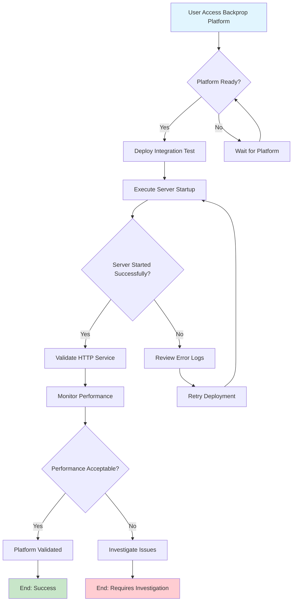
```mermaid
flowchart TD
    A[User Access Backprop Platform] --> B{Platform Ready?}
    B -->|Yes| C[Deploy Integration Test]
    B -->|No| D[Wait for Platform]
    D --> B
    C --> E[Execute Server Startup]
    E --> F{Server Started Successfully?}
    F -->|Yes| G[Validate HTTP Service]
    F -->|No| H[Review Error Logs]
    H --> I[Retry Deployment]
    I --> E
    G --> J[Monitor Performance]
    J --> K{Performance Acceptable?}
    K -->|Yes| L[Platform Validated]
    K -->|No| M[Investigate Issues]
    L --> N[End: Success]
    M --> O[End: Requires Investigation]
    
    style A fill:#e1f5fe
    style N fill:#c8e6c9
    style O fill:#ffcdd2
```

#### 4.1.1.2 System Interaction Workflows

The system interaction workflow demonstrates the relationship between the <span style="background-color: rgba(91, 57, 243, 0.2)">Python Flask server</span>, the Backprop platform infrastructure, and external monitoring systems. Each interaction point maintains specific timing requirements and error handling capabilities as defined in the functional requirements.


```mermaid
sequenceDiagram
    participant U as User/Tester
    participant BP as Backprop Platform
    participant FS as Flask Server
    participant MS as Monitoring System
    
    U->>BP: Deploy Application
    BP->>FS: Initialize Runtime
    FS->>FS: Import Flask Framework
    FS->>FS: Bind to localhost:3000
    FS->>MS: Log Startup Status
    MS-->>U: Display "Server running at http://127.0.0.1:3000/"
    
    U->>FS: Send HTTP Request
    FS->>FS: Process Request (<100ms)
    FS->>U: Return "Hello, World!" (HTTP 200)
    FS->>MS: Log Request Metrics
    
    Note over FS,MS: Continuous Operation (99.9% uptime target)
    
    U->>MS: Check Performance Metrics
    MS-->>U: Memory Usage (<50MB), Response Times
```

### 4.1.2 Integration Workflows

#### 4.1.2.1 Data Flow Between Systems

The integration workflow establishes data flow patterns between the HTTP server, platform infrastructure, and monitoring systems. Data flows primarily consist of HTTP request-response cycles, console logging events, and performance metrics collection. The stateless architecture ensures each request is processed independently without persistent data requirements.

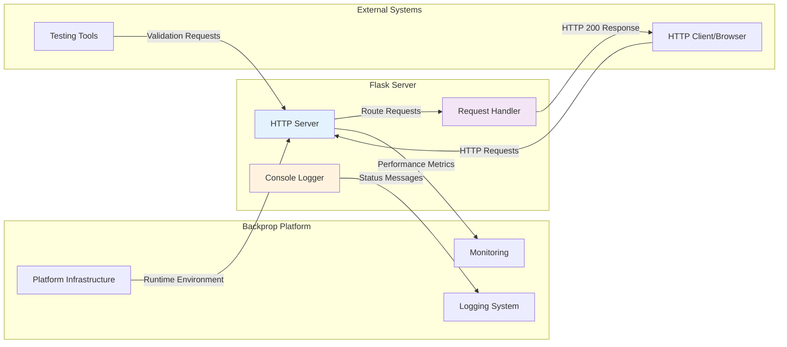
```mermaid
flowchart LR
subgraph "Backprop Platform"
    BP["Platform Infrastructure"]
    LOG["Logging System"]
    MON["Monitoring"]
end

subgraph "Flask Server"
    HTTP["HTTP Server"]
    REQ["Request Handler"]
    CON["Console Logger"]
end

subgraph "External Systems"
    CLIENT["HTTP Client/Browser"]
    TEST["Testing Tools"]
end

BP -->|Runtime Environment| HTTP
CLIENT -->|HTTP Requests| HTTP
HTTP -->|Route Requests| REQ
REQ -->|HTTP 200 Response| CLIENT
CON -->|Status Messages| LOG
HTTP -->|Performance Metrics| MON
TEST -->|Validation Requests| HTTP

style HTTP fill:#e3f2fd
style REQ fill:#f3e5f5
style CON fill:#fff3e0
```

#### 4.1.2.2 API Interaction Patterns

The API interaction pattern implements a simplified HTTP service model with consistent response behavior. All incoming requests regardless of method or path receive identical treatment, returning a static "Hello, World!" response with appropriate HTTP headers.

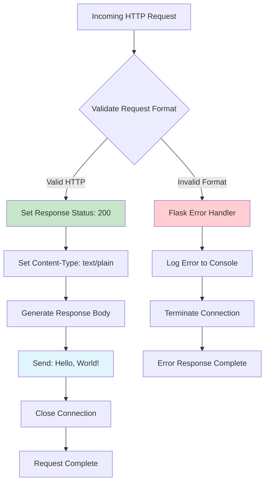
```mermaid
flowchart TD
A[Incoming HTTP Request] --> B{Validate Request Format}
B -->|Valid HTTP| C[Set Response Status: 200]
B -->|Invalid Format| D[Flask Error Handler]
C --> E[Set Content-Type: text/plain]
E --> F[Generate Response Body]
F --> G["Send: Hello, World!"]
G --> H[Close Connection]
D --> I[Log Error to Console]
I --> J[Terminate Connection]
H --> K[Request Complete]
J --> L[Error Response Complete]

style C fill:#c8e6c9
style D fill:#ffcdd2
style G fill:#e1f5fe
```

### 4.1.3 Decision Points and Business Logic

#### 4.1.3.1 Critical Decision Points

The system implements several critical decision points that determine operational flow and error handling paths. These decisions ensure reliable service delivery while maintaining simplicity for testing purposes.

**Primary Decision Matrix:**

| Decision Point | Condition | Action Path | Performance Impact |
|---------------|-----------|-------------|-------------------|
| Port Availability | Port 3000 free | Proceed with binding | <5 seconds startup |
| Port Availability | Port 3000 occupied | Startup failure | Immediate error |
| Request Validation | Valid HTTP format | Process request | <100ms response |
| Request Validation | Invalid format | Error handling | Immediate termination |
| Memory Threshold | Usage <50MB | Continue operation | Normal performance |
| Memory Threshold | Usage ≥50MB | Platform alert | Performance degradation |

#### 4.1.3.2 Error Handling Paths

Error handling follows a fail-fast approach optimized for testing and debugging clarity. The system implements minimal recovery mechanisms, prioritizing clear error reporting over automatic recovery.

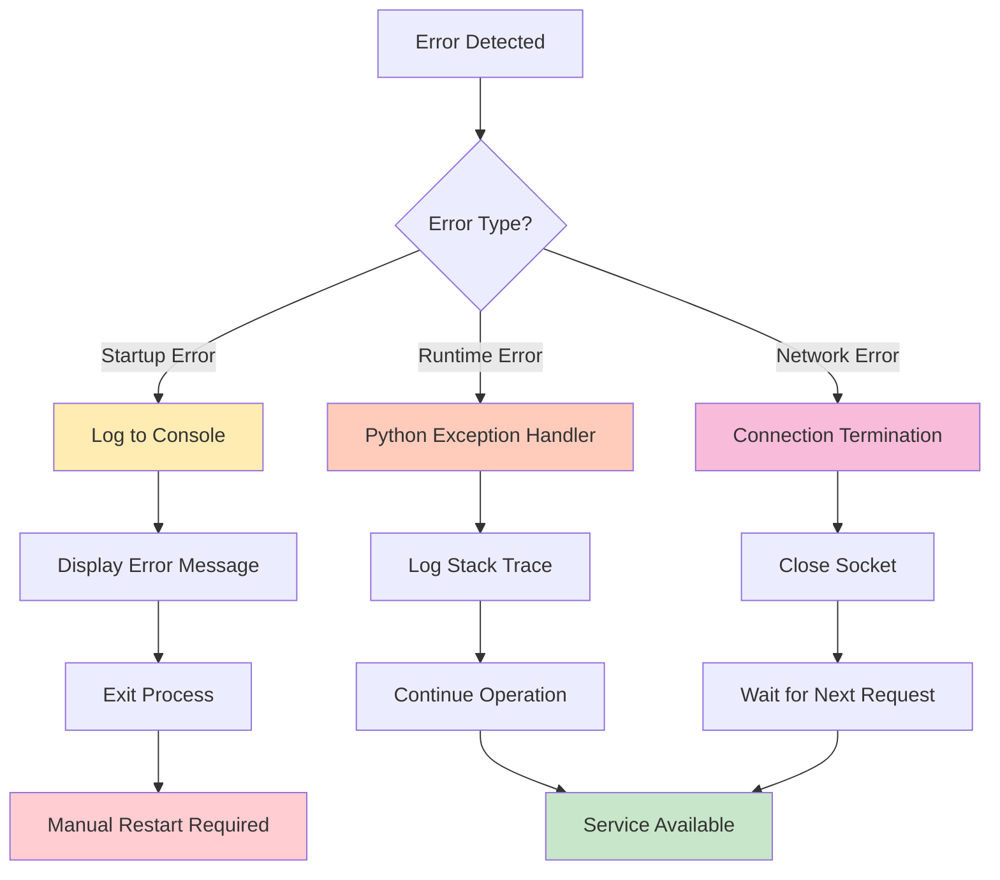
```mermaid
flowchart TD
    A[Error Detected] --> B{Error Type?}
    B -->|Startup Error| C[Log to Console]
    B -->|Runtime Error| D[Python Exception Handler]
    B -->|Network Error| E[Connection Termination]
    
    C --> F[Display Error Message]
    F --> G[Exit Process]
    
    D --> H[Log Stack Trace]
    H --> I[Continue Operation]
    
    E --> J[Close Socket]
    J --> K[Wait for Next Request]
    
    G --> L[Manual Restart Required]
    I --> M[Service Available]
    K --> M
    
    style C fill:#ffecb3
    style D fill:#ffccbc
    style E fill:#f8bbd9
    style L fill:#ffcdd2
    style M fill:#c8e6c9
```

## 4.2 TECHNICAL IMPLEMENTATION FLOWS

### 4.2.1 State Management

#### 4.2.1.1 Application State Transitions (updated)

The application implements a simplified state model optimized for integration testing. State transitions are minimal and deterministic, ensuring predictable behavior across different deployment environments.

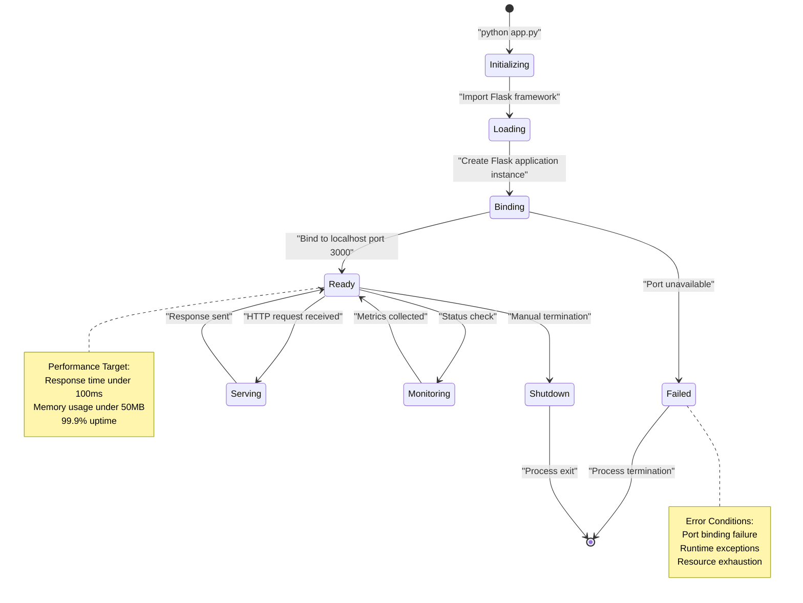
```mermaid
stateDiagram-v2
    [*] --> Initializing : "python app.py"
    Initializing --> Loading : "Import Flask framework"
    Loading --> Binding : "Create Flask application instance"
    Binding --> Ready : "Bind to localhost port 3000"
    Binding --> Failed : "Port unavailable"

    Ready --> Serving : "HTTP request received"
    Serving --> Ready : "Response sent"
    Ready --> Monitoring : "Status check"
    Monitoring --> Ready : "Metrics collected"

    Failed --> [*] : "Process termination"
    Ready --> Shutdown : "Manual termination"
    Shutdown --> [*] : "Process exit"

    note right of Ready
        Performance Target:
        Response time under 100ms
        Memory usage under 50MB
        99.9% uptime
    end note

    note right of Failed
        Error Conditions:
        Port binding failure
        Runtime exceptions
        Resource exhaustion
    end note
```

#### 4.2.1.2 Data Persistence Points

The stateless architecture eliminates traditional data persistence requirements. However, the system maintains operational state through console logging and platform monitoring integration points.

**Persistence Characteristics:**

- **No Database Storage**: Zero persistent data requirements
- **Memory-Only Processing**: Static response generation without state retention  
- **Console Log Persistence**: Platform-managed log retention for debugging
- **Metrics Collection**: Platform-integrated performance data retention

### 4.2.2 Transaction Boundaries

#### 4.2.2.1 Request Processing Transactions

Each HTTP request constitutes a complete transaction boundary with atomic processing characteristics. Transaction scope encompasses request receipt, response generation, and connection management.

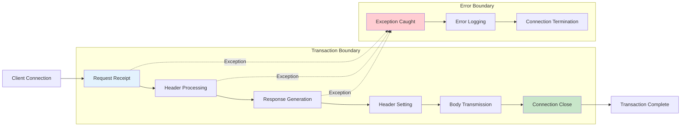
```mermaid
flowchart LR
    subgraph "Transaction Boundary"
        direction TB
        A[Request Receipt] --> B[Header Processing]
        B --> C[Response Generation]
        C --> D[Header Setting]
        D --> E[Body Transmission]
        E --> F[Connection Close]
    end
    
    G[Client Connection] --> A
    F --> H[Transaction Complete]
    
    subgraph "Error Boundary"
        I[Exception Caught]
        J[Error Logging]
        K[Connection Termination]
        I --> J --> K
    end
    
    A -.->|Exception| I
    B -.->|Exception| I
    C -.->|Exception| I
    
    style A fill:#e3f2fd
    style F fill:#c8e6c9
    style I fill:#ffcdd2
```

### 4.2.3 Core Process Workflows

#### 4.2.3.1 HTTP Request Processing Flow

The system implements a streamlined HTTP request processing workflow that prioritizes simplicity and predictable behavior. Each request follows an identical processing path regardless of HTTP method, URL path, or request headers.

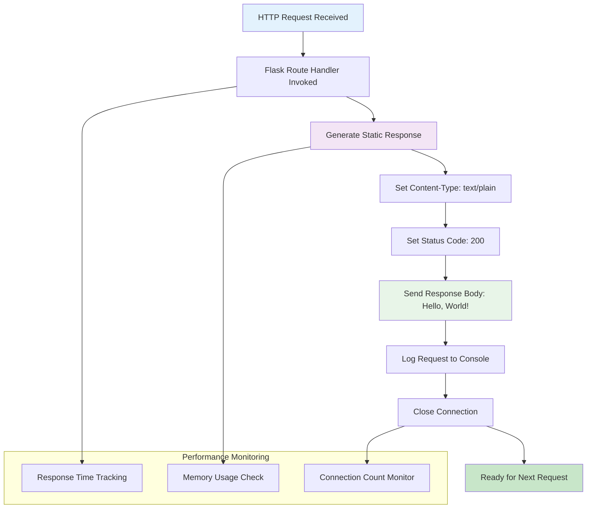
```mermaid
flowchart TD
    A[HTTP Request Received] --> B[Flask Route Handler Invoked]
    B --> C[Generate Static Response]
    C --> D[Set Content-Type: text/plain]
    D --> E[Set Status Code: 200]
    E --> F[Send Response Body: Hello, World!]
    F --> G[Log Request to Console]
    G --> H[Close Connection]
    H --> I[Ready for Next Request]
    
    subgraph "Performance Monitoring"
        J[Response Time Tracking]
        K[Memory Usage Check]
        L[Connection Count Monitor]
    end
    
    B --> J
    C --> K
    H --> L
    
    style A fill:#e3f2fd
    style C fill:#f3e5f5
    style F fill:#e8f5e8
    style I fill:#c8e6c9
```

#### 4.2.3.2 Error Handling and Recovery Flows

The error handling system implements a comprehensive approach to managing various failure scenarios while maintaining service availability. Error flows are designed for immediate detection and graceful handling.

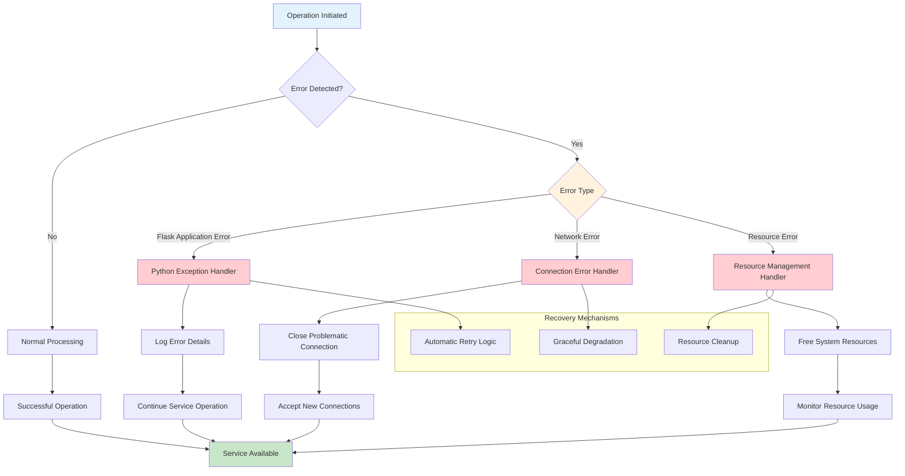
```mermaid
flowchart TD
    A[Operation Initiated] --> B{Error Detected?}
    B -->|No| C[Normal Processing]
    B -->|Yes| D{Error Type}
    
    D -->|Flask Application Error| E[Python Exception Handler]
    D -->|Network Error| F[Connection Error Handler]
    D -->|Resource Error| G[Resource Management Handler]
    
    E --> H[Log Error Details]
    F --> I[Close Problematic Connection]
    G --> J[Free System Resources]
    
    H --> K[Continue Service Operation]
    I --> L[Accept New Connections]
    J --> M[Monitor Resource Usage]
    
    K --> N[Service Available]
    L --> N
    M --> N
    
    C --> O[Successful Operation]
    O --> N
    
    subgraph "Recovery Mechanisms"
        P[Automatic Retry Logic]
        Q[Graceful Degradation]
        R[Resource Cleanup]
    end
    
    E --> P
    F --> Q
    G --> R
    
    style A fill:#e3f2fd
    style D fill:#fff3e0
    style N fill:#c8e6c9
    style E fill:#ffcdd2
    style F fill:#ffcdd2
    style G fill:#ffcdd2
```

### 4.2.4 Integration Sequence Flows

#### 4.2.4.1 Platform Deployment Sequence

The deployment sequence orchestrates the initialization of the Flask application within the Backprop platform environment, ensuring proper service startup and availability verification.

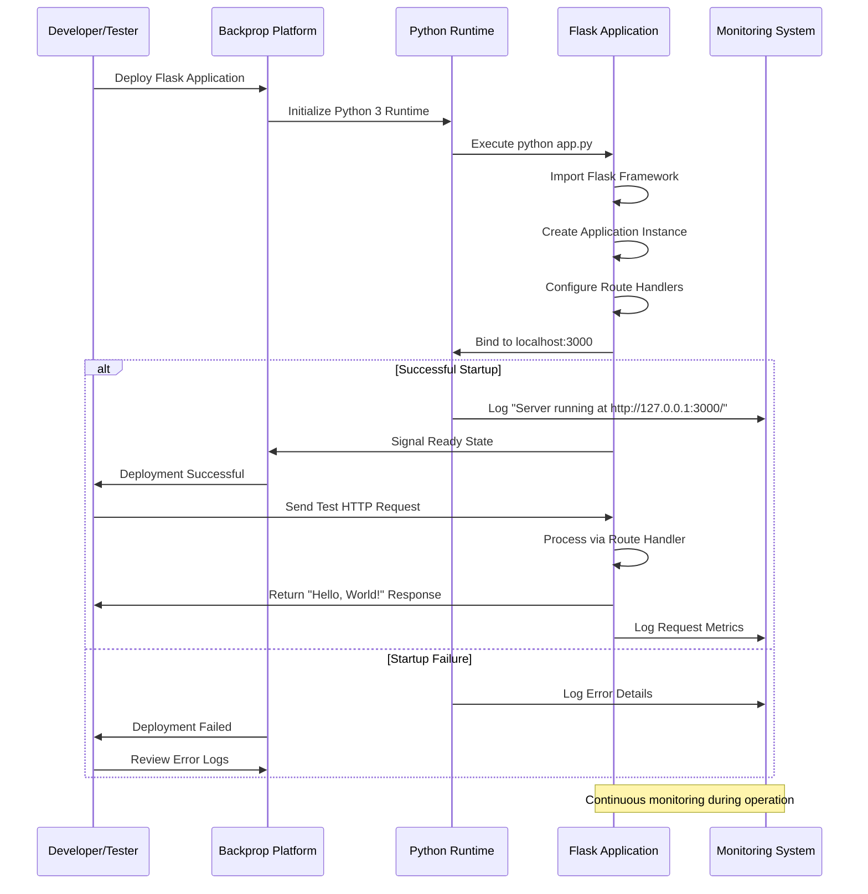
```mermaid
sequenceDiagram
    participant User as Developer/Tester
    participant Platform as Backprop Platform
    participant Python as Python Runtime
    participant Flask as Flask Application
    participant Monitor as Monitoring System
    
    User->>Platform: Deploy Flask Application
    Platform->>Python: Initialize Python 3 Runtime
    Python->>Flask: Execute python app.py
    Flask->>Flask: Import Flask Framework
    Flask->>Flask: Create Application Instance
    Flask->>Flask: Configure Route Handlers
    Flask->>Python: Bind to localhost:3000
    
    alt Successful Startup
        Python->>Monitor: Log "Server running at http://127.0.0.1:3000/"
        Flask->>Platform: Signal Ready State
        Platform->>User: Deployment Successful
        
        User->>Flask: Send Test HTTP Request
        Flask->>Flask: Process via Route Handler
        Flask->>User: Return "Hello, World!" Response
        Flask->>Monitor: Log Request Metrics
        
    else Startup Failure
        Python->>Monitor: Log Error Details
        Platform->>User: Deployment Failed
        User->>Platform: Review Error Logs
    end
    
    Note over Flask,Monitor: Continuous monitoring during operation
```

#### 4.2.4.2 Request-Response Interaction Flow

The request-response interaction flow demonstrates the complete lifecycle of HTTP communication between clients and the Flask server, including performance monitoring and logging activities.

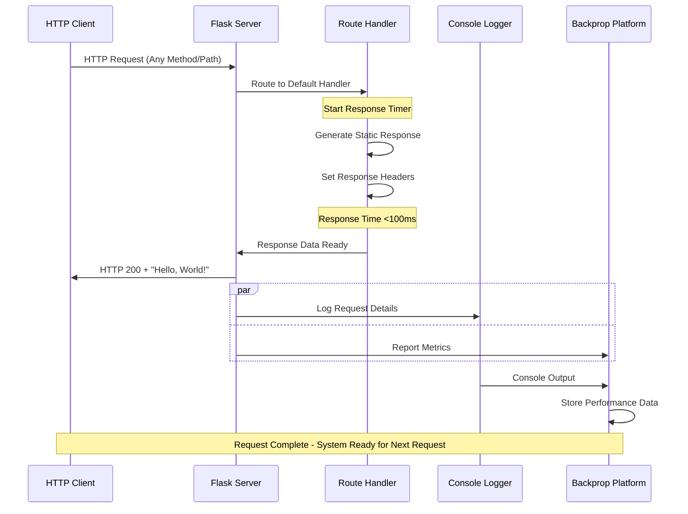
```mermaid
sequenceDiagram
    participant Client as HTTP Client
    participant Flask as Flask Server
    participant Handler as Route Handler
    participant Logger as Console Logger
    participant Platform as Backprop Platform
    
    Client->>Flask: HTTP Request (Any Method/Path)
    Flask->>Handler: Route to Default Handler
    
    Note over Handler: Start Response Timer
    Handler->>Handler: Generate Static Response
    Handler->>Handler: Set Response Headers
    Note over Handler: Response Time <100ms
    
    Handler->>Flask: Response Data Ready
    Flask->>Client: HTTP 200 + "Hello, World!"
    
    par
        Flask->>Logger: Log Request Details
    and
        Flask->>Platform: Report Metrics
    end
    
    Logger->>Platform: Console Output
    Platform->>Platform: Store Performance Data
    
    Note over Client,Platform: Request Complete - System Ready for Next Request
```

### 4.2.5 State Transition Management

#### 4.2.5.1 Application Lifecycle States

The Flask application maintains a clear lifecycle with defined state transitions that support debugging, monitoring, and operational management requirements.

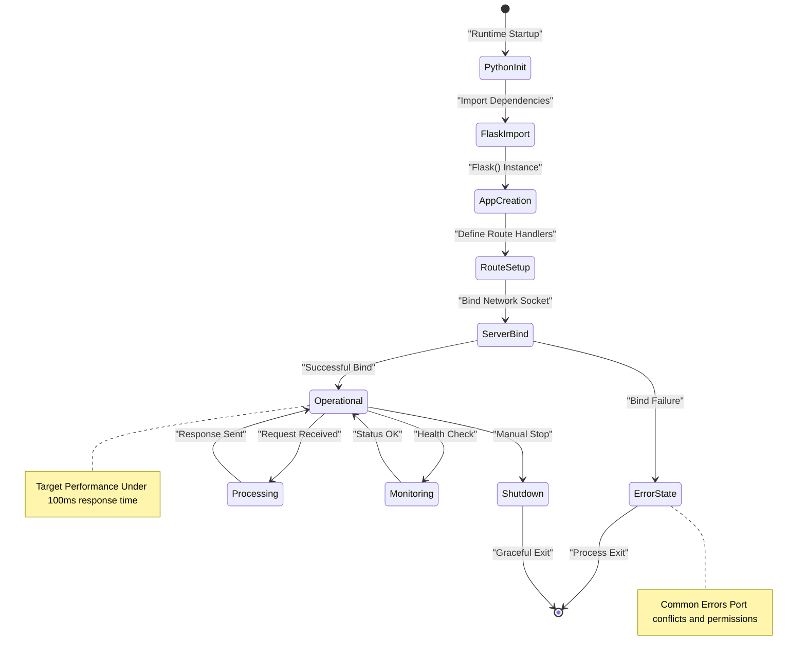
```mermaid
stateDiagram-v2
[*] --> PythonInit : "Runtime Startup"
PythonInit --> FlaskImport : "Import Dependencies"
FlaskImport --> AppCreation : "Flask() Instance"
AppCreation --> RouteSetup : "Define Route Handlers"
RouteSetup --> ServerBind : "Bind Network Socket"

ServerBind --> Operational : "Successful Bind"
ServerBind --> ErrorState : "Bind Failure"

Operational --> Processing : "Request Received"
Processing --> Operational : "Response Sent"
Operational --> Monitoring : "Health Check"
Monitoring --> Operational : "Status OK"

Operational --> Shutdown : "Manual Stop"
ErrorState --> [*] : "Process Exit"
Shutdown --> [*] : "Graceful Exit"

note right of Operational : Target Performance Under 100ms response time

note right of ErrorState : Common Errors Port conflicts and permissions
```

#### 4.2.5.2 Request Processing States

Individual HTTP requests follow a deterministic state progression that ensures consistent behavior and facilitates performance optimization and debugging.

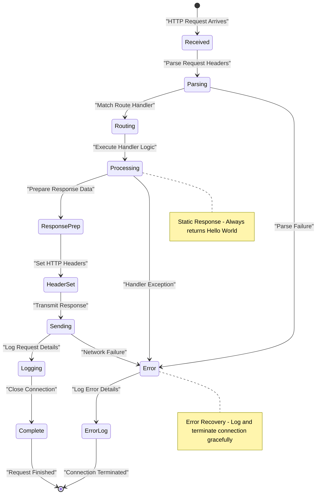
```mermaid
stateDiagram-v2
[*] --> Received : "HTTP Request Arrives"
Received --> Parsing : "Parse Request Headers"
Parsing --> Routing : "Match Route Handler"
Routing --> Processing : "Execute Handler Logic"
Processing --> ResponsePrep : "Prepare Response Data"
ResponsePrep --> HeaderSet : "Set HTTP Headers"
HeaderSet --> Sending : "Transmit Response"
Sending --> Logging : "Log Request Details"
Logging --> Complete : "Close Connection"
Complete --> [*] : "Request Finished"

Parsing --> Error : "Parse Failure"
Processing --> Error : "Handler Exception"
Sending --> Error : "Network Failure"
Error --> ErrorLog : "Log Error Details"
ErrorLog --> [*] : "Connection Terminated"

note right of Processing : Static Response - Always returns Hello World

note right of Error : Error Recovery - Log and terminate connection gracefully
```

### 4.2.6 Performance and Monitoring Flows

#### 4.2.6.1 Real-time Performance Monitoring

The system implements continuous performance monitoring to ensure compliance with specified SLA requirements and provide operational visibility.

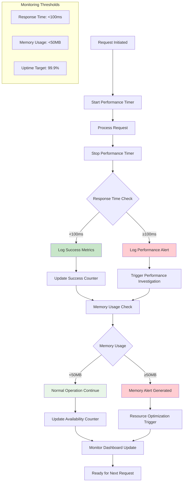
```mermaid
flowchart TD
    A[Request Initiated] --> B[Start Performance Timer]
    B --> C[Process Request]
    C --> D[Stop Performance Timer]
    D --> E{Response Time Check}
    
    E -->|<100ms| F[Log Success Metrics]
    E -->|≥100ms| G[Log Performance Alert]
    
    F --> H[Update Success Counter]
    G --> I[Trigger Performance Investigation]
    
    H --> J[Memory Usage Check]
    I --> J
    
    J --> K{Memory Usage}
    K -->|<50MB| L[Normal Operation Continue]
    K -->|≥50MB| M[Memory Alert Generated]
    
    L --> N[Update Availability Counter]
    M --> O[Resource Optimization Trigger]
    
    N --> P[Monitor Dashboard Update]
    O --> P
    
    P --> Q[Ready for Next Request]
    
    subgraph "Monitoring Thresholds"
        R["Response Time: <100ms"]
        S["Memory Usage: <50MB"]
        T["Uptime Target: 99.9%"]
    end
    
    style F fill:#c8e6c9
    style G fill:#ffcdd2
    style M fill:#ffcdd2
    style L fill:#e8f5e8
```

#### 4.2.6.2 Health Check and Status Reporting

The health check flow ensures continuous system availability monitoring and provides automated status reporting capabilities for integration with platform monitoring systems.

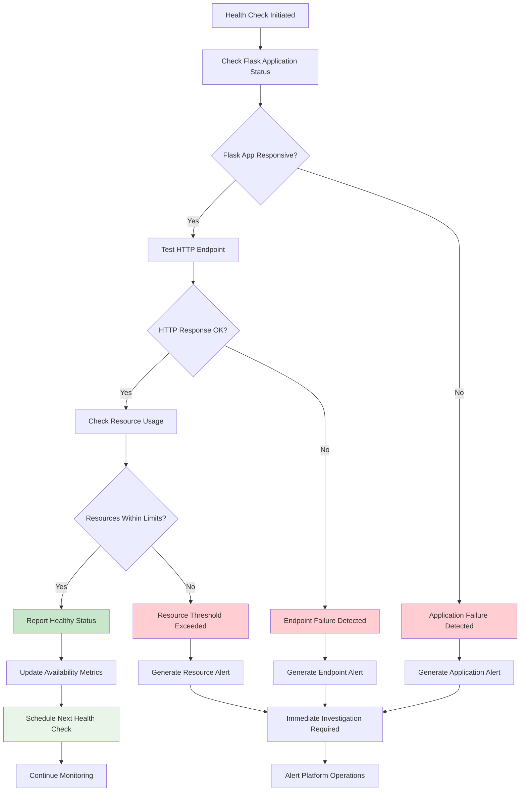
```mermaid
flowchart TD
    A[Health Check Initiated] --> B[Check Flask Application Status]
    B --> C{Flask App Responsive?}
    
    C -->|Yes| D[Test HTTP Endpoint]
    C -->|No| E[Application Failure Detected]
    
    D --> F{HTTP Response OK?}
    F -->|Yes| G[Check Resource Usage]
    F -->|No| H[Endpoint Failure Detected]
    
    G --> I{Resources Within Limits?}
    I -->|Yes| J[Report Healthy Status]
    I -->|No| K[Resource Threshold Exceeded]
    
    J --> L[Update Availability Metrics]
    K --> M[Generate Resource Alert]
    H --> N[Generate Endpoint Alert]
    E --> O[Generate Application Alert]
    
    L --> P[Schedule Next Health Check]
    M --> Q[Immediate Investigation Required]
    N --> Q
    O --> Q
    
    Q --> R[Alert Platform Operations]
    P --> S[Continue Monitoring]
    
    style J fill:#c8e6c9
    style K fill:#ffcdd2
    style H fill:#ffcdd2
    style E fill:#ffcdd2
    style P fill:#e8f5e8
```

## 4.3 DEPLOYMENT AND INTEGRATION WORKFLOWS

### 4.3.1 Platform Deployment Process

The deployment workflow implements a streamlined process optimized for rapid deployment and validation on the Backprop GPU cloud platform. The process emphasizes simplicity and immediate feedback for effective integration testing.

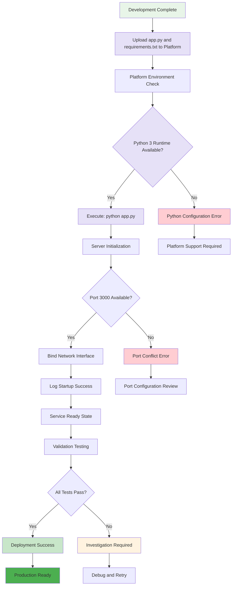
```mermaid
flowchart TD
    A["Development Complete"] --> B["Upload app.py and requirements.txt to Platform"]
    B --> C["Platform Environment Check"]
    C --> D{"Python 3 Runtime Available?"}
    D -->|Yes| E["Execute: python app.py"]
    D -->|No| F["Python Configuration Error"]
    
    E --> G["Server Initialization"]
    G --> H{"Port 3000 Available?"}
    H -->|Yes| I["Bind Network Interface"]
    H -->|No| J["Port Conflict Error"]
    
    I --> K["Log Startup Success"]
    K --> L["Service Ready State"]
    L --> M["Validation Testing"]
    
    M --> N{"All Tests Pass?"}
    N -->|Yes| O["Deployment Success"]
    N -->|No| P["Investigation Required"]
    
    F --> Q["Platform Support Required"]
    J --> R["Port Configuration Review"]
    P --> S["Debug and Retry"]
    
    O --> T["Production Ready"]
    
    style A fill:#e8f5e8
    style B fill:#e6e1f7
    style D fill:#e6e1f7
    style E fill:#e6e1f7
    style O fill:#c8e6c9
    style T fill:#4caf50
    style F fill:#ffcdd2
    style J fill:#ffcdd2
    style P fill:#fff3e0
```

### 4.3.2 Continuous Integration Workflow (updated)

The continuous integration workflow supports iterative development and testing cycles with immediate feedback mechanisms. The workflow accommodates manual deployment while providing foundations for automated testing integration.

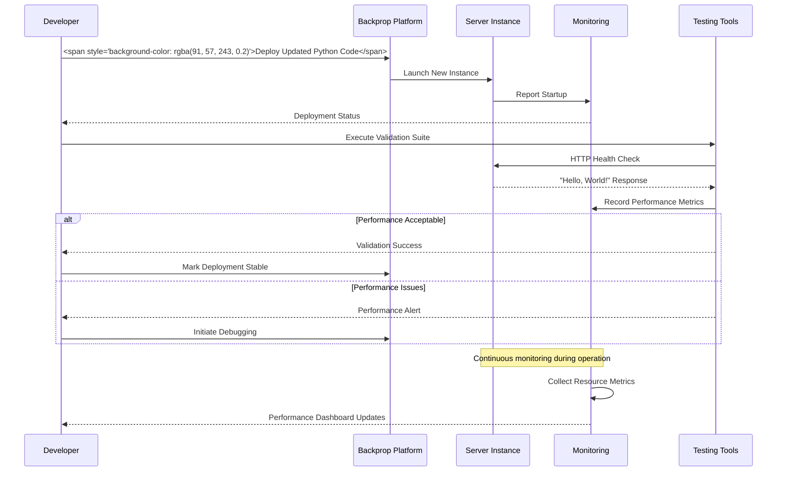
```mermaid
sequenceDiagram
    participant DEV as Developer
    participant PLAT as Backprop Platform
    participant SRV as Server Instance
    participant MON as Monitoring
    participant TEST as Testing Tools
    
    DEV->>PLAT: <span style="background-color: rgba(91, 57, 243, 0.2)">Deploy Updated Python Code</span>
    PLAT->>SRV: Launch New Instance
    SRV->>MON: Report Startup
    MON-->>DEV: Deployment Status
    
    DEV->>TEST: Execute Validation Suite
    TEST->>SRV: HTTP Health Check
    SRV-->>TEST: "Hello, World!" Response
    TEST->>MON: Record Performance Metrics
    
    alt Performance Acceptable
        TEST-->>DEV: Validation Success
        DEV->>PLAT: Mark Deployment Stable
    else Performance Issues
        TEST-->>DEV: Performance Alert
        DEV->>PLAT: Initiate Debugging
    end
    
    Note over SRV,MON: Continuous monitoring during operation
    MON->>MON: Collect Resource Metrics
    MON-->>DEV: Performance Dashboard Updates
```

### 4.3.3 Dependency Management Workflow

The Python-based deployment introduces comprehensive dependency management through requirements specification and virtual environment isolation, ensuring reproducible deployments across different platform instances.

```mermaid
flowchart TB
    A[Development Environment] --> B[Generate requirements.txt]
    B --> C[Version Lock Dependencies]
    C --> D[Upload to Platform]
    
    D --> E[Platform Instance Creation]
    E --> F[Virtual Environment Setup]
    F --> G{pip install -r requirements.txt}
    
    G -->|Success| H[Flask Dependencies Installed]
    G -->|Failure| I[Dependency Resolution Error]
    
    H --> J[Flask Application Launch]
    J --> K[HTTP Service Binding]
    K --> L[Service Validation]
    
    I --> M[Review Dependencies]
    M --> N[Update requirements.txt]
    N --> D
    
    L --> O{Health Check Pass?}
    O -->|Yes| P[Deployment Complete]
    O -->|No| Q[Service Investigation]
    
    Q --> R[Debug Application]
    R --> S[Redeploy if Needed]
    S --> E
    
    style A fill:#e8f5e8
    style P fill:#c8e6c9
    style I fill:#ffcdd2
    style Q fill:#fff3e0
```

### 4.3.4 Error Recovery and Rollback Procedures

Comprehensive error handling workflows ensure rapid identification and resolution of deployment issues, with clear escalation paths and recovery mechanisms designed for the Python/Flask architecture.

#### 4.3.4.1 Python Runtime Error Handling

```mermaid
flowchart TD
    A[Python Runtime Error] --> B{Error Type Analysis}
    
    B -->|Module Import Error| C[Check requirements.txt]
    B -->|Port Binding Error| D[Port Availability Check]  
    B -->|Application Logic Error| E[Flask Application Debug]
    B -->|Platform Error| F[Backprop Platform Support]
    
    C --> G[Verify Dependencies]
    G --> H{Dependencies Complete?}
    H -->|Yes| I[Check Python Version]
    H -->|No| J[Update requirements.txt]
    
    D --> K[Port 3000 Status Check]
    K --> L{Port Available?}
    L -->|Yes| M[Application Restart]
    L -->|No| N[Process Termination]
    
    E --> O[Flask Debug Mode]
    O --> P[Console Log Analysis]
    P --> Q[Code Review Process]
    
    F --> R[Platform Status Verification]
    R --> S[Instance Health Check]
    S --> T{Platform Stable?}
    T -->|Yes| U[Application Layer Issue]
    T -->|No| V[Platform Incident Response]
    
    I --> W[Python 3.6+ Compatibility]
    J --> X[Redeploy with Updates]
    M --> Y[Service Validation]
    N --> Z[Clean Port Restart]
    Q --> AA[Fix and Redeploy]
    U --> BB[Application Debug]
    V --> CC[Platform Support Escalation]
    
    style A fill:#ffcdd2
    style Y fill:#c8e6c9
    style Z fill:#c8e6c9
    style AA fill:#c8e6c9
    style CC fill:#fff3e0
```

#### 4.3.4.2 Performance Degradation Response

```mermaid
flowchart LR
    A[Performance Alert] --> B[Metrics Collection]
    B --> C{Response Time > 100ms?}
    C -->|Yes| D[Application Profiling]
    C -->|No| E[Memory Usage Check]
    
    D --> F[Flask Route Analysis]
    F --> G[Optimize Request Handling]
    
    E --> H{Memory > 50MB?}
    H -->|Yes| I[Memory Leak Investigation]
    H -->|No| J[Resource Monitoring Continue]
    
    I --> K[Python Garbage Collection]
    K --> L[Flask Instance Restart]
    
    G --> M[Performance Test]
    L --> M
    J --> N[Normal Operation]
    M --> O{Metrics Improved?}
    O -->|Yes| N
    O -->|No| P[Deep System Analysis]
    
    P --> Q[Platform Resource Review]
    Q --> R[Instance Scaling Consideration]
    
    style A fill:#fff3e0
    style N fill:#c8e6c9
    style P fill:#ffcdd2
```

### 4.3.5 Integration Testing Automation

The Flask-based architecture supports automated testing integration through HTTP endpoint validation, providing comprehensive coverage of deployment success criteria and operational readiness verification.

```mermaid
sequenceDiagram
    participant CI as CI Pipeline
    participant PLAT as Backprop Platform  
    participant FLASK as Flask Application
    participant TEST as Test Suite
    participant MON as Monitoring
    
    CI->>PLAT: Deploy Python Application
    PLAT->>FLASK: Execute python app.py
    FLASK->>FLASK: Initialize Flask Server
    FLASK-->>PLAT: Port 3000 Binding Success
    
    PLAT-->>CI: Deployment Confirmation
    CI->>TEST: Trigger Automated Tests
    
    TEST->>FLASK: HTTP GET /
    FLASK-->>TEST: "Hello, World!\n"
    TEST->>TEST: Validate Response Content
    TEST->>TEST: Measure Response Time
    
    alt All Tests Pass
        TEST-->>CI: Test Success
        CI->>MON: Enable Production Monitoring
        MON-->>CI: Monitoring Active
    else Test Failures
        TEST-->>CI: Test Failure Details
        CI->>PLAT: Rollback Deployment
        PLAT-->>CI: Rollback Complete
    end
    
    Note over FLASK,MON: Continuous health monitoring
    MON->>FLASK: Periodic Health Checks
    FLASK-->>MON: Service Status Updates
```

## 4.4 ERROR HANDLING AND RECOVERY WORKFLOWS

### 4.4.1 Comprehensive Error Handling Strategy

The error handling strategy implements a fail-fast approach with comprehensive logging for effective debugging. Error scenarios are categorized by severity and recovery potential.

```mermaid
flowchart TD
    A[System Error Detected] --> B{Error Category}
    
    B -->|Fatal Startup Error| C[Critical Error Path]
    B -->|Runtime Exception| D[Runtime Error Path]
    B -->|Network Error| E[Network Error Path]
    B -->|Resource Error| F[Resource Error Path]
    
    subgraph "Critical Error Path"
        C --> C1[Log Fatal Error]
        C1 --> C2[Display Error Message]
        C2 --> C3[Exit with Code 1]
        C3 --> C4[Manual Intervention Required]
    end
    
    subgraph "Runtime Error Path"
        D --> D1[Catch Exception]
        D1 --> D2[Log Stack Trace]
        D2 --> D3[Continue Service]
        D3 --> D4[Monitor Stability]
    end
    
    subgraph "Network Error Path"
        E --> E1[Close Connection]
        E1 --> E2[Log Connection Error]
        E2 --> E3[Wait for Next Request]
        E3 --> E4[Service Available]
    end
    
    subgraph "Resource Error Path"
        F --> F1[Monitor Memory Usage]
        F1 --> F2{Memory > 50MB?}
        F2 -->|Yes| F3[Log Resource Alert]
        F2 -->|No| F4[Continue Normal Operation]
        F3 --> F5[Platform Notification]
        F4 --> F6[Maintain Performance]
    end
    
    style C4 fill:#ffcdd2
    style D4 fill:#fff3e0
    style E4 fill:#e8f5e8
    style F6 fill:#c8e6c9
```

### 4.4.2 Recovery and Retry Mechanisms

The system implements minimal automated recovery mechanisms, emphasizing clear error reporting and manual intervention over complex automated recovery systems.

**Recovery Strategy Matrix:**

| Error Type | Recovery Action | Retry Logic | Manual Intervention |
|------------|----------------|-------------|-------------------|
| Port Binding Failure | None | No automatic retry | Required - check port availability |
| Runtime Exception | Continue operation | N/A - per-request basis | Optional - monitor for patterns |
| Network Connection Error | Close and wait | Automatic - next request | None required |
| Memory Threshold Breach | Platform alert | N/A - monitoring only | Review resource allocation |

### 4.4.3 Monitoring and Alerting Integration

The monitoring workflow integrates with Backprop platform monitoring capabilities to provide comprehensive visibility into service health and performance characteristics.

```mermaid
flowchart LR
    subgraph "Service Layer"
        SRV[HTTP Server]
        LOG[Console Logger]
        PERF[Performance Monitor]
    end
    
    subgraph "Platform Integration"
        PLAT_LOG[Platform Logging]
        PLAT_MON[Platform Monitoring]
        PLAT_ALERT[Platform Alerting]
    end
    
    subgraph "User Interface"
        CONSOLE[Console Output]
        DASHBOARD[Monitoring Dashboard]
        ALERTS[Alert Notifications]
    end
    
    SRV --> LOG: Startup Events
    SRV --> PERF: Performance Metrics
    LOG --> PLAT_LOG: Log Aggregation
    PERF --> PLAT_MON: Metrics Collection
    
    PLAT_LOG --> CONSOLE: Real-time Display
    PLAT_MON --> DASHBOARD: Performance Visualization
    PLAT_MON --> PLAT_ALERT: Threshold Monitoring
    PLAT_ALERT --> ALERTS: User Notifications
    
    style SRV fill:#e3f2fd
    style CONSOLE fill:#e8f5e8
    style ALERTS fill:#fff3e0
```

## 4.5 PERFORMANCE AND TIMING CONSTRAINTS

### 4.5.1 Service Level Agreement Compliance

The system implements specific timing constraints aligned with functional requirements to ensure consistent performance characteristics suitable for integration testing purposes.

**Performance Constraint Matrix:**

| Metric | Target | Measurement Method | Compliance Validation |
|--------|--------|-------------------|---------------------|
| Startup Time | <5 seconds | Console timestamp analysis | F-001-RQ-001 |
| Response Time | <100ms | Request-response cycle timing | F-001-RQ-003 |
| Memory Usage | <50MB | Platform resource monitoring | F-002-RQ-003 |
| Uptime Target | 99.9% | Continuous availability monitoring | F-001-RQ-004 |

### 4.5.2 Performance Monitoring Workflow

```mermaid
flowchart TD
    A[Service Start] --> B[Initialize Performance Monitoring]
    B --> C[Record Startup Time]
    C --> D{Startup < 5 seconds?}
    D -->|Yes| E[Mark Startup Success]
    D -->|No| F[Log Startup Performance Alert]
    
    E --> G[Begin Request Monitoring]
    F --> G
    
    G --> H[Incoming Request]
    H --> I[Record Request Timestamp]
    I --> J[Process Request]
    J --> K[Record Response Timestamp]
    K --> L[Calculate Response Time]
    L --> M{Response Time < 100ms?}
    M -->|Yes| N[Log Success Metric]
    M -->|No| O[Log Performance Alert]
    
    N --> P[Monitor Memory Usage]
    O --> P
    P --> Q{Memory < 50MB?}
    Q -->|Yes| R[Continue Normal Operation]
    Q -->|No| S[Log Resource Alert]
    
    R --> H
    S --> T[Platform Notification]
    T --> H
    
    style E fill:#c8e6c9
    style F fill:#ffcdd2
    style N fill:#e8f5e8
    style O fill:#fff3e0
    style S fill:#ffecb3
```

## 4.6 INTEGRATION SEQUENCE DIAGRAMS

### 4.6.1 Complete System Integration Sequence

This comprehensive sequence diagram demonstrates the full lifecycle of system integration from deployment through operational monitoring, including all critical timing constraints and error handling paths.

```mermaid
sequenceDiagram
    participant USER as User/Tester
    participant BACKPROP as Backprop Platform
    participant PYRT as Python Runtime
    participant FLASK as Flask Server
    participant MONITOR as Monitoring System
    participant CLIENT as HTTP Client
    
    Note over USER,CLIENT: System Deployment Phase
    USER->>BACKPROP: Deploy app.py
    BACKPROP->>PYRT: Initialize Runtime Environment
    PYRT->>FLASK: Import Flask Framework
    FLASK->>FLASK: Create Server Instance
    FLASK->>PYRT: Bind to localhost:3000
    
    alt Successful Binding
        PYRT->>MONITOR: Log: "Server running at http://127.0.0.1:3000/"
        MONITOR-->>USER: Display Startup Success (< 5 seconds)
        
        Note over USER,CLIENT: Operational Phase
        USER->>CLIENT: Initiate HTTP Test
        CLIENT->>FLASK: GET / HTTP/1.1
        FLASK->>FLASK: Process Request (< 100ms)
        FLASK-->>CLIENT: HTTP/1.1 200 OK\nContent-Type: text/plain\n\nHello, World!
        CLIENT-->>USER: Display Response
        FLASK->>MONITOR: Log Request Metrics
        
        Note over FLASK,MONITOR: Continuous Monitoring
        loop Every Request Cycle
            FLASK->>MONITOR: Performance Metrics
            MONITOR->>MONITOR: Validate SLA Compliance
            alt Performance Alert
                MONITOR-->>USER: Alert: Response Time > 100ms
            else Memory Alert
                MONITOR-->>USER: Alert: Memory Usage > 50MB
            else Normal Operation
                MONITOR-->>USER: Status: Normal Operation
            end
        end
        
    else Binding Failure
        PYRT->>MONITOR: Log: Port Binding Error
        MONITOR-->>USER: Startup Failure Alert
        USER->>BACKPROP: Debug Port Configuration
    end
```

#### References

- <span style="background-color: rgba(91, 57, 243, 0.2)">`app.py`</span> - Complete HTTP server implementation with request handling and console logging
- `README.md` - Project identification as "hao-backprop-test" for Backprop integration  
- <span style="background-color: rgba(91, 57, 243, 0.2)">`requirements.txt`</span> - Flask dependency configuration with project metadata, version 1.0.0, MIT license
- Feature F-001 (Core HTTP Service) - Foundation HTTP server functionality and performance requirements
- Feature F-002 (Integration Testing Framework) - Platform compatibility and deployment validation requirements
- Feature F-003 (Operational Monitoring) - Console-based logging and status reporting capabilities
- Functional Requirements F-001-RQ-001 through F-001-RQ-004 - Specific timing and performance constraints
- Functional Requirements F-002-RQ-001 through F-002-RQ-004 - Integration testing validation criteria
- Technical Specification sections 2.3 (Feature Relationships) and 3.6 (Development & Deployment) - Integration points and deployment workflows

# 5. SYSTEM ARCHITECTURE

## 5.1 HIGH-LEVEL ARCHITECTURE

### 5.1.1 System Overview

#### 5.1.1.1 Overall Architecture Style and Rationale

The system implements a **monolithic, single-process, stateless <span style="background-color: rgba(91, 57, 243, 0.2)">Flask web application</span>** optimized for rapid deployment validation and platform integration testing. This architectural approach aligns with the primary objective of validating Backprop's GPU cloud platform capabilities through a minimal, low-dependency HTTP service <span style="background-color: rgba(91, 57, 243, 0.2)">executed from app.py</span>.

The architecture embraces a **simplicity-first design philosophy** that eliminates potential points of failure while maintaining full operational visibility. This approach provides several strategic advantages:

- **Deployment Simplicity**: <span style="background-color: rgba(91, 57, 243, 0.2)">Single-file execution model from app.py</span> reduces deployment complexity and eliminates configuration dependencies
- **Platform Compatibility**: Universal <span style="background-color: rgba(91, 57, 243, 0.2)">Python 3 runtime</span> compatibility ensures consistent behavior across Backprop's infrastructure featuring "latest NVIDIA drivers, Jupyter, pytorch, transformers, docker, and more"
- **Rapid Validation**: Enables quick verification of platform capabilities without <span style="background-color: rgba(91, 57, 243, 0.2)">excessive framework overhead or external dependencies</span>
- **Resource Efficiency**: Minimal resource footprint aligns with cost-effective evaluation of Backprop's "affordable instances that are great for inference and smaller training jobs"

#### 5.1.1.2 Key Architectural Principles and Patterns

The system adheres to the following architectural principles:

**<span style="background-color: rgba(91, 57, 243, 0.2)">Minimal External Dependencies Pattern</span>**: <span style="background-color: rgba(91, 57, 243, 0.2)">Utilizes only Flask and its pinned sub-dependencies installed via pip/requirements.txt</span> to minimize dependency management complexity, security vulnerabilities, and deployment complications. This pattern ensures compatibility with Backprop's environment save/resume capabilities.

**Stateless Service Pattern**: Each HTTP request is processed independently without session management or persistent state, ensuring predictable behavior and simplified testing procedures across different platform instances. <span style="background-color: rgba(91, 57, 243, 0.2)">This principle applies equally to the Flask implementation, maintaining the same stateless characteristics as the original system.</span>

**Fail-Fast Error Handling**: Implements immediate error reporting with minimal recovery mechanisms, optimizing for clear debugging and testing feedback rather than automated resilience.

**Localhost Binding Security**: <span style="background-color: rgba(91, 57, 243, 0.2)">Network interface restriction to localhost via Flask's app.run(host='127.0.0.1', port=3000)</span> provides controlled testing environment while maintaining security appropriate for integration validation. <span style="background-color: rgba(91, 57, 243, 0.2)">This security model remains unchanged under Flask implementation.</span>

#### 5.1.1.3 System Boundaries and Major Interfaces

The system operates within clearly defined boundaries that separate core functionality from platform integration points:

**Internal System Boundary**: 
- <span style="background-color: rgba(91, 57, 243, 0.2)">HTTP server implementation using Flask route-based request handling</span>
- Request processing logic with static response generation
- Console-based logging and status reporting
- Memory and performance monitoring capabilities

**External Integration Boundary**:
- <span style="background-color: rgba(91, 57, 243, 0.2)">Backprop platform runtime environment providing Python interpreter and optionally a WSGI container for production (wsgi.py)</span>
- Network interface exposure through localhost:3000 binding
- Platform logging system integration for operational visibility
- Monitoring system integration for <span style="background-color: rgba(91, 57, 243, 0.2)">Python process metrics</span> collection

### 5.1.2 Core Components Table

| Component Name | Primary Responsibility | Key Dependencies | Integration Points | Critical Considerations |
|----------------|----------------------|------------------|-------------------|------------------------|
| **HTTP Server** | HTTP request processing and response delivery | <span style="background-color: rgba(91, 57, 243, 0.2)">Flask framework (Werkzeug WSGI server for dev)</span> | Backprop runtime environment, Network interface | Port availability, startup timing (<5 seconds) |
| **Request Handler** | Response generation and HTTP header management | <span style="background-color: rgba(91, 57, 243, 0.2)">@app.route('/') decorated Python function</span> | Client connections | Response consistency, performance (<100ms) |
| **Console Logger** | Operational status reporting and debugging output | <span style="background-color: rgba(91, 57, 243, 0.2)">Python logging/print</span> | Platform logging system | Log aggregation, debugging visibility |
| **Network Interface** | Service accessibility and connection management | Operating system network stack | Client applications, testing tools | Localhost binding security, connection handling |

### 5.1.3 Data Flow Description (updated)

#### 5.1.3.1 Primary Data Flows Between Components

The system implements a streamlined data flow optimized for testing and validation purposes:

**Request Processing Flow**: <span style="background-color: rgba(91, 57, 243, 0.2)">HTTP requests arrive at the network interface on localhost:3000, where Flask routing directs them to the decorated route handler. The route handler generates a Flask Response object with "Hello, World!" content and appropriate HTTP headers (Content-Type: text/plain, Status: 200) and returns the response through Flask's response handling back to the requesting client.</span>

**Logging Flow**: The console logger component captures startup events and operational status messages, outputting structured information to the console where it integrates with Backprop's platform logging system for aggregation and monitoring purposes.

**Performance Monitoring Flow**: <span style="background-color: rgba(91, 57, 243, 0.2)">Resource utilization metrics flow from the Python runtime</span> through the platform monitoring integration points, enabling real-time tracking of memory usage (<50MB target) and response performance (<100ms target).

#### 5.1.3.2 Integration Patterns and Protocols

**HTTP Protocol Implementation**: Standard HTTP/1.1 protocol compliance ensures universal compatibility with testing tools, browsers, and automated validation systems. All responses include proper status codes and headers for consistent behavior.

**<span style="background-color: rgba(91, 57, 243, 0.2)">Flask Decorator Pattern</span>**: <span style="background-color: rgba(91, 57, 243, 0.2)">URL routing implemented through Flask's @app.route decorator system</span> provides clean separation between request handling logic and HTTP infrastructure concerns.

**Console Integration Pattern**: Text-based logging output follows standard console conventions, enabling seamless integration with Backprop's log aggregation systems and environment save/resume capabilities.

**Platform Monitoring Pattern**: <span style="background-color: rgba(91, 57, 243, 0.2)">Performance metrics integrate with Backprop's monitoring infrastructure through standard Python process metrics</span>, enabling resource tracking and alerting capabilities.

#### 5.1.3.3 Data Transformation Points

The system implements minimal data transformation to maintain simplicity and performance:

- **Request Normalization**: All incoming HTTP requests regardless of method or path receive identical processing
- **Response Formatting**: Static string response is formatted with appropriate HTTP headers using <span style="background-color: rgba(91, 57, 243, 0.2)">Flask Response object construction and return statements</span>
- **Status Code Standardization**: All successful responses utilize HTTP 200 status code for predictable testing behavior

### 5.1.4 External Integration Points

| System Name | Integration Type | Data Exchange Pattern | Protocol/Format | SLA Requirements |
|-------------|-----------------|----------------------|----------------|------------------|
| **Backprop Platform** | Runtime Environment | <span style="background-color: rgba(91, 57, 243, 0.2)">Python process execution and monitoring</span> | <span style="background-color: rgba(91, 57, 243, 0.2)">Python 3 runtime, Console output</span> | <5 second startup, 99.9% uptime |
| **HTTP Clients/Browsers** | Service Interface | Request-response cycle | HTTP/1.1, text/plain | <100ms response time, 100% success rate |
| **Platform Logging** | Operational Monitoring | Log message transmission | Console output, Text format | Real-time availability, persistent storage |
| **Testing Tools** | Validation Interface | Automated testing requests | HTTP/1.1, standardized responses | Consistent behavior, reliable status reporting |

## 5.2 COMPONENT DETAILS

### 5.2.1 Flask Application Component (updated)

#### 5.2.1.1 Purpose and Responsibilities

The <span style="background-color: rgba(91, 57, 243, 0.2)">Flask Application component serves as the core service delivery mechanism, implementing a lightweight HTTP service using Flask's built-in development server (Werkzeug)</span>. Network binding remains identical to ensure seamless migration compatibility. Primary responsibilities include:

- **Network Binding**: Establishes HTTP service on localhost:3000 for controlled testing access <span style="background-color: rgba(91, 57, 243, 0.2)">through Flask's app.run(host='127.0.0.1', port=3000) configuration</span>
- **Request Reception**: <span style="background-color: rgba(91, 57, 243, 0.2)">Accepts incoming HTTP connections through Flask's WSGI-compliant request handling and manages connection lifecycle using Werkzeug's development server</span>
- **Response Coordination**: <span style="background-color: rgba(91, 57, 243, 0.2)">Routes requests to Flask route handlers and manages response delivery through Flask's response object system</span>
- **Service Lifecycle**: <span style="background-color: rgba(91, 57, 243, 0.2)">Manages Flask application startup, operational state, and shutdown procedures with integrated exception handling</span>

**Production Deployment Considerations**: While development environments utilize Flask's built-in server via app.run(), production deployments will leverage wsgi.py with Gunicorn or uWSGI for enhanced performance and scalability. The development server configuration maintains full functionality for testing and validation purposes.

#### 5.2.1.2 Technologies and Frameworks Used (updated)

**Core Technology**: <span style="background-color: rgba(91, 57, 243, 0.2)">Flask 3.x with Werkzeug 3.x (bundled) provides complete HTTP server functionality with minimal external dependencies</span>
**Implementation Pattern**: <span style="background-color: rgba(91, 57, 243, 0.2)">Direct framework utilization through `from flask import Flask` and `app = Flask(__name__)` API with integrated WSGI development server</span>
**Runtime Environment**: <span style="background-color: rgba(91, 57, 243, 0.2)">Python 3.x (≥ 3.6) compatible with Backprop's platform infrastructure</span>

**Framework Dependencies**:
- **Flask Framework**: Complete web application framework with route decoration, request handling, and response generation
- **Werkzeug WSGI Toolkit**: Underlying request/response processing and development server implementation  
- **Dependency Management**: <span style="background-color: rgba(91, 57, 243, 0.2)">Installation via pip/requirements.txt for reproducible deployment environments</span>

#### 5.2.1.3 Key Interfaces and APIs (updated)

**Network Interface**: 
- Binding Address: 127.0.0.1 (localhost only)
- Port Configuration: 3000 (static assignment) <span style="background-color: rgba(91, 57, 243, 0.2)">passed to app.run() method</span>
- Protocol Support: HTTP/1.1 standard compliance through Werkzeug implementation

**Request Processing Interface**:
- Method Support: All HTTP methods (GET, POST, PUT, DELETE, etc.) handled through Flask routing system
- Path Processing: <span style="background-color: rgba(91, 57, 243, 0.2)">Universal handler through @app.route('/') decorator for all request paths</span>
- Header Management: <span style="background-color: rgba(91, 57, 243, 0.2)">Standard HTTP header processing via Flask Request objects and response header setting through Flask Response objects</span>

#### 5.2.1.4 Data Persistence Requirements

**No Persistent Storage**: The component operates in a stateless manner with zero data persistence requirements, maintaining identical behavior under Flask implementation
**Memory-Only Operations**: All request processing occurs in memory without disk I/O operations
**Session Independence**: Each request is processed independently without session state management, leveraging Flask's stateless request handling model

#### 5.2.1.5 Scaling Considerations (updated)

**Single-Process Model**: Optimized for testing rather than production scaling using Flask development server
**Resource Efficiency**: <span style="background-color: rgba(91, 57, 243, 0.2)">Minimal memory footprint (<50MB) suitable for cost-effective platform evaluation under Python runtime</span>
**Performance Optimization**: Response time targets (<100ms) achieved through simplified Flask route processing
**Production Scaling**: Future scaling achieved through wsgi.py interface with Gunicorn/uWSGI deployment patterns for enhanced concurrent request handling

### 5.2.2 Request Handler Component (updated)

#### 5.2.2.1 Purpose and Responsibilities

The Request Handler component implements the core business logic for HTTP request processing, maintaining consistent response behavior for integration testing validation through Flask's route decoration system.

**Primary Functions**:
- **Response Generation**: <span style="background-color: rgba(91, 57, 243, 0.2)">Creates standardized "Hello, World!\n" response for all requests through Flask route handlers</span>
- **Header Management**: <span style="background-color: rgba(91, 57, 243, 0.2)">Sets appropriate Content-Type and status code headers via Flask's automatic response handling</span>
- **Performance Compliance**: Ensures response delivery within established timing requirements through optimized Flask processing

#### 5.2.2.2 Technologies and Frameworks Used (updated)

**Implementation**: <span style="background-color: rgba(91, 57, 243, 0.2)">Python function decorated with @app.route('/') returning 'Hello, World!\n'</span>
**Response Format**: <span style="background-color: rgba(91, 57, 243, 0.2)">Plain text string generation with Flask's automatic HTTP header formatting and content-type detection</span>
**Error Handling**: <span style="background-color: rgba(91, 57, 243, 0.2)">Flask's built-in exception handling for request processing errors with automatic error response generation</span>

#### 5.2.2.3 Component Interaction Diagrams (updated)

```mermaid
sequenceDiagram
    participant Client as HTTP Client
    participant Server as Flask Application
    participant Handler as Route Handler
    participant Logger as Console Logger
    
    Client->>Server: HTTP Request (any method/path)
    Server->>Handler: Route Handler Execution
    Handler->>Handler: Generate Static Response
    Handler->>Server: Return Response String
    Server->>Client: HTTP 200 "Hello, World!\n"
    Server->>Logger: Log Request Completion
    
    Note over Handler: Response Time Target: <100ms
    Note over Logger: Status: "Running on http://127.0.0.1:3000"
```

### 5.2.3 Console Logger Component (updated)

#### 5.2.3.1 Purpose and Responsibilities

The Console Logger component provides operational visibility and debugging capabilities through structured console output integration with platform logging systems, utilizing Flask's integrated logging capabilities.

**Core Functions**:
- **Startup Notification**: <span style="background-color: rgba(91, 57, 243, 0.2)">Reports successful Flask application initialization and binding status through Flask's development server output</span>
- **Error Reporting**: <span style="background-color: rgba(91, 57, 243, 0.2)">Captures and reports runtime exceptions through Flask's error handling system and Python exception reporting</span>
- **Platform Integration**: <span style="background-color: rgba(91, 57, 243, 0.2)">Provides output compatible with Backprop's logging aggregation using Python's standard logging infrastructure</span>

#### 5.2.3.2 State Transition Diagrams

```mermaid
stateDiagram-v2
[*] --> Initialization : Python Process Start
Initialization --> Active : Flask App Startup Success
Initialization --> Error : Startup Failure

Active --> Logging : Status Events
Active --> Error : Runtime Exception

Logging --> Active : Message Output Complete

Error --> Active : Non-Fatal Error
Error --> [*] : Fatal Error (Process Exit)

Active --> Shutdown : Manual Termination
Shutdown --> [*] : Process Complete

note right of Active
Output: Running on http://127.0.0.1:3000
end note

note right of Error
Error Types: Port binding, Flask exceptions, Runtime errors
end note
```

**Production Logging Architecture**: Production deployments using wsgi.py with Gunicorn/uWSGI will integrate with enterprise logging frameworks while maintaining the same console output patterns for development consistency.

## 5.3 TECHNICAL DECISIONS

### 5.3.1 Architecture Style Decisions and Tradeoffs

#### 5.3.1.1 Monolithic vs. Microservices Architecture (updated)

**Decision**: Monolithic single-process architecture
**Rationale**: <span style="background-color: rgba(91, 57, 243, 0.2)">Python 3 Flask monolithic architecture</span> optimized for integration testing rather than production scalability
**Trade-offs**:

| Aspect | Chosen Approach | Alternative | Justification |
|--------|----------------|-------------|---------------|
| **Deployment Complexity** | Single file execution | Multi-service orchestration | Minimizes deployment variables for testing |
| **Resource Utilization** | Consolidated process | Distributed processes | Meets <50MB memory constraint efficiently |
| **Debugging Visibility** | Single log stream | Distributed logging | Simplifies troubleshooting during validation |
| **Platform Integration** | Direct compatibility | Service mesh complexity | Aligns with Backprop's simplified deployment model |

#### 5.3.1.2 Communication Pattern Choices (updated)

**Decision**: Synchronous HTTP request-response pattern
**Implementation**: <span style="background-color: rgba(91, 57, 243, 0.2)">Flask route decorator and Werkzeug WSGI handling</span>

<span style="background-color: rgba(91, 57, 243, 0.2)">Exact response content and headers are enforced via Flask Response object to achieve behavioral parity with platform expectations.</span>

**Communication Decision Matrix**:

```mermaid
flowchart TD
    A[Communication Pattern Selection] --> B{Requirements Analysis}
    
    B -->|Testing Focus| C[Synchronous Pattern]
    B -->|Production Scale| D[Asynchronous Pattern]
    
    C --> E[HTTP Request-Response]
    E --> F[Simple Implementation]
    F --> G[Direct Testing Validation]
    
    D --> H[Message Queue Integration]
    H --> I[Complex Infrastructure]
    I --> J[Overhead for Testing]
    
    G --> K[Selected Approach]
    J --> L[Rejected for Scope]
    
    style K fill:#c8e6c9
    style L fill:#ffcdd2
```

### 5.3.2 Data Storage Solution Rationale

#### 5.3.2.1 Stateless Architecture Decision

**Decision**: Zero data persistence with stateless operations
**Rationale**: Eliminates complexity while maintaining testing effectiveness

**Storage Decision Table**:

| Storage Option | Implementation Complexity | Testing Value | Resource Impact | Decision |
|----------------|-------------------------|---------------|-----------------|----------|
| **In-Memory Only** | Minimal | High for basic testing | <50MB memory | **Selected** |
| **File-Based Storage** | Moderate | Limited added value | Disk I/O overhead | Rejected |
| **Database Integration** | High | Not required for testing | Significant resource use | Rejected |
| **Distributed Cache** | Very High | Excessive for single instance | Network/memory overhead | Rejected |

### 5.3.3 Caching Strategy Justification

**Decision**: No caching implementation
**Justification**: Static response eliminates caching benefits while maintaining simplicity for testing validation

### 5.3.4 Security Mechanism Selection

#### 5.3.4.1 Network Security Approach

**Decision**: Localhost binding with no authentication
**Security Model**: Controlled testing environment with network isolation

**Security Trade-off Analysis**:
- **Access Control**: Localhost binding provides network-level isolation appropriate for testing
- **Authentication**: Not implemented - testing environment doesn't require user management
- **Data Protection**: No sensitive data processing eliminates encryption requirements
- **Platform Security**: Relies on Backprop's infrastructure security for container isolation

### 5.3.5 Architecture Decision Records (ADRs) (updated)

```mermaid
flowchart TD
    subgraph "ADR-001: Minimal Dependencies (Flask only)"
        A1[Decision: Minimal Dependencies Flask only]
        A2[Status: Accepted]
        A3[Context: pip-based environment Platform Integration Testing]
        A4[Consequence: Simplified Deployment]
    end
    
    subgraph "ADR-002: Localhost Binding"
        B1[Decision: Local Network Only]
        B2[Status: Accepted]
        B3[Context: Controlled Testing Environment Flask app.run host='127.0.0.1' port=3000]
        B4[Consequence: Enhanced Security]
    end
    
    subgraph "ADR-003: Stateless Operations"
        C1[Decision: No Data Persistence]
        C2[Status: Accepted]
        C3[Context: Testing Focus]
        C4[Consequence: Predictable Python process Behavior]
    end
    
    A4 --> D[Deployment Success]
    B4 --> D
    C4 --> D
    
    style A2 fill:#c8e6c9
    style B2 fill:#c8e6c9
    style C2 fill:#c8e6c9
    style D fill:#e3f2fd
```

## 5.4 CROSS-CUTTING CONCERNS

### 5.4.1 Monitoring and Observability Approach

#### 5.4.1.1 Monitoring Strategy Implementation

The monitoring approach integrates <span style="background-color: rgba(91, 57, 243, 0.2)">print() statement-based logging with Python's logging module</span> alongside Backprop's platform monitoring capabilities to provide comprehensive visibility into service health and performance characteristics.

**Monitoring Components**:
- **Startup Monitoring**: <span style="background-color: rgba(91, 57, 243, 0.2)">Python console output</span> confirms successful server initialization within <5 second requirement
- **Performance Monitoring**: Response time tracking against <100ms target through platform integration with <span style="background-color: rgba(91, 57, 243, 0.2)">time.perf_counter() measurements</span>
- **Resource Monitoring**: Memory utilization tracking against <50MB threshold via <span style="background-color: rgba(91, 57, 243, 0.2)">Python process metrics (psutil or built-in resource module)</span>
- **Availability Monitoring**: Service uptime tracking supporting 99.9% availability target

**Integration with Platform Monitoring**:

| Metric Category | Collection Method | Platform Integration | Alert Thresholds |
|----------------|-------------------|---------------------|------------------|
| **Startup Status** | <span style="background-color: rgba(91, 57, 243, 0.2)">Python logging/print output</span> | Log aggregation | Startup failure detection |
| **Response Performance** | <span style="background-color: rgba(91, 57, 243, 0.2)">Python time.perf_counter() timing</span> | Platform metrics | >100ms response time |
| **Memory Usage** | <span style="background-color: rgba(91, 57, 243, 0.2)">Python process metrics</span> | Resource monitoring | >50MB utilization |
| **Service Availability** | Health checks | Platform monitoring | <99.9% uptime |

#### 5.4.1.2 Production Observability Architecture

<span style="background-color: rgba(91, 57, 243, 0.2)">Production observability integrates with WSGI server infrastructure when wsgi.py is deployed, routing application logs through WSGI middleware and server-level logging mechanisms for enterprise-grade monitoring integration.</span>

**Observability Integration Points**:
- **Development Mode**: Direct Flask development server console output
- **Production Mode**: <span style="background-color: rgba(91, 57, 243, 0.2)">WSGI server logs (Gunicorn/uWSGI) with wsgi.py interface</span>
- **Platform Integration**: Backprop log aggregation and monitoring dashboard integration
- **Alert Routing**: Platform-based threshold monitoring and notification systems

### 5.4.2 Logging and Tracing Strategy

#### 5.4.2.1 Logging Architecture Implementation

The logging strategy implements structured <span style="background-color: rgba(91, 57, 243, 0.2)">Python output using print() statements and Python's logging module</span> designed for integration with Backprop's log aggregation systems while maintaining debugging visibility.

**Logging Levels and Events**:
- **Startup Events**: Server initialization and port binding confirmation with message <span style="background-color: rgba(91, 57, 243, 0.2)">"Server running at http://127.0.0.1:3000/"</span>
- **Operational Events**: Request processing status and performance metrics
- **Error Events**: <span style="background-color: rgba(91, 57, 243, 0.2)">Python exception handling and failure condition reporting</span>
- **Shutdown Events**: Graceful termination and cleanup status

**Log Integration Pattern**:
```
Python Console Output → Platform Log Aggregation → Monitoring Dashboard → Alert System
```

### 5.4.3 Error Handling Patterns

#### 5.4.3.1 Comprehensive Error Handling Strategy

The error handling pattern implements a fail-fast approach with comprehensive logging for effective debugging and testing feedback, utilizing <span style="background-color: rgba(91, 57, 243, 0.2)">Python exception handling mechanisms and sys.exit() codes</span>.

**Error Handling Flow Diagram**:

```mermaid
flowchart TD
    A[Error Detected] --> B{Error Classification}
    
    B -->|Fatal Startup Error| C[Critical Path]
    B -->|Runtime Exception| D[Runtime Path]
    B -->|Network Error| E[Network Path]
    B -->|Resource Error| F[Resource Path]
    
    subgraph "Critical Error Handling"
        C --> C1[Log Fatal Error Details]
        C1 --> C2[Display Error Message]
        C2 --> C3[sys.exit with Error Code]
        C3 --> C4[Manual Restart Required]
    end
    
    subgraph "Runtime Error Handling"
        D --> D1[Catch Python Exception]
        D1 --> D2[Maintain Service Availability]
        D2 --> D3[Continue Request Processing]
    end
    
    subgraph "Network Error Handling"
        E --> E1[Close Affected Connection]
        E1 --> E2[Log Connection Status]
        E2 --> E3[Wait for Next Request]
    end
    
    subgraph "Resource Error Handling"
        F --> F1[Monitor Resource Usage]
        F1 --> F2{Memory > Threshold?}
        F2 -->|Yes| F3[Platform Alert Generation]
        F2 -->|No| F4[Continue Normal Operation]
    end
    
    style C4 fill:#ffcdd2
    style D3 fill:#fff3e0
    style E3 fill:#c8e6c9
    style F4 fill:#c8e6c9
```

**Python Exception Handling Patterns**:

| Exception Type | Handling Approach | Recovery Strategy | Exit Behavior |
|---------------|-------------------|-------------------|---------------|
| **ImportError** | <span style="background-color: rgba(91, 57, 243, 0.2)">sys.exit(1) - missing dependencies</span> | Manual intervention | Process termination |
| **OSError (Port Binding)** | <span style="background-color: rgba(91, 57, 243, 0.2)">sys.exit(1) - port unavailable</span> | Check port availability | Process termination |
| **KeyboardInterrupt** | <span style="background-color: rgba(91, 57, 243, 0.2)">Graceful shutdown with sys.exit(0)</span> | Normal termination | Clean exit |
| **Exception (Runtime)** | <span style="background-color: rgba(91, 57, 243, 0.2)">Log and continue service</span> | Service continues | No exit |

### 5.4.4 Authentication and Authorization Framework

#### 5.4.4.1 Security Architecture Decision

**Implementation**: No authentication or authorization mechanisms
**Rationale**: Testing environment with localhost binding provides adequate security isolation
**Security Model**: Network-level access control through localhost restriction

### 5.4.5 Performance Requirements and SLAs

#### 5.4.5.1 Performance Target Implementation

The system implements specific performance targets aligned with integration testing requirements using <span style="background-color: rgba(91, 57, 243, 0.2)">Python-based measurement tools</span>:

**Service Level Agreement (SLA) Specifications**:

| Performance Metric | Target Value | Measurement Method | Monitoring Approach |
|-------------------|--------------|-------------------|-------------------|
| **Startup Time** | <5 seconds | <span style="background-color: rgba(91, 57, 243, 0.2)">Python time.perf_counter() tracking</span> | Platform monitoring integration |
| **Response Time** | <100ms per request | <span style="background-color: rgba(91, 57, 243, 0.2)">Python time.perf_counter() timing</span> | Performance metrics collection |
| **Memory Usage** | <50MB total | <span style="background-color: rgba(91, 57, 243, 0.2)">Python process metrics (psutil or resource module)</span> | Platform resource tracking |
| **Service Availability** | 99.9% uptime | Health check monitoring | Platform availability monitoring |
| **Success Rate** | 100% HTTP responses | Request success tracking | Error rate monitoring |

### 5.4.6 Disaster Recovery Procedures

#### 5.4.6.1 Recovery Strategy Implementation

**Recovery Model**: Manual restart with platform integration support
**Data Recovery**: Not applicable - stateless architecture eliminates data loss concerns  
**Service Recovery**: Process restart through Backprop platform management tools

**Recovery Procedures**:
1. **Failure Detection**: Platform monitoring identifies service unavailability
2. **Error Assessment**: <span style="background-color: rgba(91, 57, 243, 0.2)">Python console log review</span> for failure root cause analysis
3. **Service Restart**: <span style="background-color: rgba(91, 57, 243, 0.2)">Manual Python process restart</span> via platform interface
4. **Validation Testing**: HTTP request validation confirms service restoration
5. **Monitoring Resume**: Performance tracking continues with baseline establishment

### 5.4.7 References

#### 5.4.7.1 Technical Specification Sources
- **1.2 SYSTEM OVERVIEW**: System context, success criteria, and performance targets
- **3.1 PROGRAMMING LANGUAGES**: <span style="background-color: rgba(91, 57, 243, 0.2)">Python/Flask selection rationale and runtime constraints</span>
- **3.2 FRAMEWORKS & LIBRARIES**: <span style="background-color: rgba(91, 57, 243, 0.2)">Flask framework architecture decision and compatibility requirements</span>
- **4.1 SYSTEM WORKFLOWS**: Core business processes and user journey workflows
- **4.2 TECHNICAL IMPLEMENTATION FLOWS**: State management and transaction boundary definitions
- **4.4 ERROR HANDLING AND RECOVERY WORKFLOWS**: Comprehensive error handling strategy and recovery mechanisms

#### 5.4.7.2 Repository Implementation Files
- **<span style="background-color: rgba(91, 57, 243, 0.2)">`app.py`</span>**: <span style="background-color: rgba(91, 57, 243, 0.2)">Core Flask application implementation with HTTP request handling logic and Python console logging</span>
- **<span style="background-color: rgba(91, 57, 243, 0.2)">`requirements.txt`</span>**: <span style="background-color: rgba(91, 57, 243, 0.2)">Python package configuration specifying Flask and its dependencies</span>
- **<span style="background-color: rgba(91, 57, 243, 0.2)">`wsgi.py`</span>**: <span style="background-color: rgba(91, 57, 243, 0.2)">WSGI interface for production deployment with Gunicorn/uWSGI servers</span>
- **`README.md`**: Project documentation establishing purpose as Backprop integration testing framework

# 6. SYSTEM COMPONENTS DESIGN

## 6.1 CORE SERVICES ARCHITECTURE

### 6.1.1 Architecture Applicability Assessment

#### 6.1.1.1 Core Services Architecture Determination

**Core Services Architecture is not applicable for this system.**

This determination is based on the explicit architectural decision documented in Technical Specification Section 5.3.1, which establishes a **"Monolithic single-process architecture"** that is **"optimized for integration testing rather than production scalability."** The system implements a deliberate simplicity-first design approach that eliminates the need for distributed service patterns, inter-service communication, and scalability mechanisms typically associated with core services architecture.

#### 6.1.1.2 Architectural Context and Rationale

The system operates as a **single <span style="background-color: rgba(91, 57, 243, 0.2)">Python 3 Flask web application</span>** implementing a minimal test service for Backprop GPU cloud platform validation. The architectural approach prioritizes:

- **Testing Focus**: Designed specifically for integration testing and platform validation rather than production service operations
- **Deployment Simplicity**: Single-file execution model (<span style="background-color: rgba(91, 57, 243, 0.2)">`python app.py`</span>) eliminates service orchestration complexity
- **Resource Efficiency**: Consolidated process meets the <50MB memory constraint efficiently
- **Platform Integration**: Aligns with Backprop's simplified deployment model for testing purposes

### 6.1.2 Monolithic Architecture Implementation

#### 6.1.2.1 Single-Process Service Design

The system implements a unified service architecture within a single Python process that handles all operational responsibilities:

| Architectural Component | Implementation Approach | Service Boundary |
|------------------------|------------------------|------------------|
| **HTTP Request Processing** | <span style="background-color: rgba(91, 57, 243, 0.2)">Flask `@app.route('/')` handler</span> | Internal process method |
| **Response Generation** | <span style="background-color: rgba(91, 57, 243, 0.2)">Flask view function returning "Hello, World!\n"</span> | Internal function call |
| **Network Interface** | <span style="background-color: rgba(91, 57, 243, 0.2)">Localhost (127.0.0.1:3000) binding via `app.run(host='127.0.0.1', port=3000)`</span> | Process-level port binding |
| **Logging Operations** | Console-based status reporting | Standard output stream |

**Implementation Architecture Characteristics:**

The Flask-based monolithic design provides several key architectural advantages for deployment validation:

- **Single-File Execution Model**: The complete HTTP service functionality resides within <span style="background-color: rgba(91, 57, 243, 0.2)">`app.py`</span>, enabling rapid deployment and simplified configuration management across Backprop's Python-enabled cloud infrastructure.

- **Integrated Request-Response Cycle**: Flask's decorator-based routing system (`@app.route('/')`) provides direct request-to-response mapping within the same Python process, eliminating inter-process communication overhead and maintaining <100ms response time targets.

- **Dependency Isolation**: The service operates with minimal external dependencies limited to Flask and its ecosystem packages, installable through <span style="background-color: rgba(91, 57, 243, 0.2)">`pip install -r requirements.txt`</span> for reproducible deployment environments.

- **Platform Integration**: The Python runtime architecture seamlessly integrates with Backprop's pre-configured environment featuring "latest NVIDIA drivers, Jupyter, pytorch, transformers, docker, and more," ensuring compatibility with the platform's save/resume capabilities.

**Resource and Performance Characteristics:**

| Performance Metric | Target Specification | Implementation Approach |
|-------------------|---------------------|------------------------|
| **Startup Time** | <5 seconds | Flask application initialization and port binding |
| **Memory Footprint** | <50MB | Minimal Python runtime with Flask ecosystem dependencies |
| **Response Latency** | <100ms | Single-process request handling with static response generation |

#### 6.1.2.2 Absence of Distributed Architecture Patterns

The following core services architecture patterns are **explicitly not implemented** due to the monolithic design decision:

```mermaid
flowchart TD
    A[Core Services Architecture Patterns] --> B[Service Boundaries]
    A --> C[Inter-Service Communication]
    A --> D[Service Discovery]
    A --> E[Load Balancing]
    A --> F[Circuit Breakers]
    A --> G[Auto-Scaling]
    
    B --> B1[Not Applicable: Single Process]
    C --> C1[Not Applicable: No Inter-Service Communication]
    D --> D1[Not Applicable: No Service Registry]
    E --> E1[Not Applicable: Single Instance]
    F --> F1[Not Applicable: No Service Dependencies]
    G --> G1[Not Applicable: Fixed Resource Allocation]
    
    style B1 fill:#ffcdd2
    style C1 fill:#ffcdd2
    style D1 fill:#ffcdd2
    style E1 fill:#ffcdd2
    style F1 fill:#ffcdd2
    style G1 fill:#ffcdd2
```

**Architectural Pattern Exclusions and Justifications:**

The monolithic Flask architecture deliberately excludes distributed systems patterns to optimize for simplicity and rapid validation:

- **Service Boundaries**: All functionality executes within a single Flask application process, eliminating the need for service mesh architectures, API gateways, or inter-service authentication mechanisms.

- **Inter-Service Communication**: No network calls between services occur since all operations execute within the same Python process, removing latency concerns and dependency management complexities associated with distributed communication protocols.

- **Service Discovery and Registry**: The single-instance deployment model eliminates requirements for service registration, health checking, or dynamic endpoint resolution typically implemented through tools like Consul, etcd, or Kubernetes service discovery.

- **Load Balancing and Circuit Breakers**: The single-process architecture operates without horizontal scaling or fault tolerance patterns, focusing instead on platform validation rather than production resilience requirements.

- **Auto-Scaling Infrastructure**: Resource allocation remains static throughout execution, avoiding the complexity of dynamic scaling policies, metrics collection, and automated instance management that characterize cloud-native architectures.

**Simplicity Benefits for Platform Integration:**

This architectural approach provides significant advantages for Backprop platform evaluation:

- **Deployment Velocity**: Single-file deployment model enables rapid testing cycles and immediate validation of platform capabilities without complex infrastructure provisioning.

- **Debugging Clarity**: Monolithic execution provides complete visibility into system behavior, enabling clear identification of platform-related issues versus application-level problems.

- **Resource Predictability**: Fixed resource consumption patterns align with Backprop's "affordable instances" model, providing predictable cost evaluation without dynamic scaling complexities.

- **Environment Compatibility**: The stateless, single-process design ensures consistent behavior across Backprop's save/resume environment capabilities, supporting iterative development and testing workflows.

### 6.1.3 Alternative Architecture Considerations

#### 6.1.3.1 Design Decision Trade-offs

The monolithic architecture was selected over distributed alternatives through explicit evaluation documented in Technical Specification Section 5.3.1:

| Aspect | Monolithic Approach (Selected) | Microservices Alternative (Rejected) |
|--------|-------------------------------|-------------------------------------|
| **Deployment Complexity** | Single file execution <span style="background-color: rgba(91, 57, 243, 0.2)">(`python app.py`)</span> | Multi-service orchestration |
| **Resource Utilization** | <50MB consolidated process | Distributed processes overhead |
| **Debugging Visibility** | Single log stream | Distributed logging complexity |
| **Platform Integration** | Direct Backprop compatibility | Service mesh requirements |

#### 6.1.3.2 Architectural Decision Records (ADR) Summary

The system's architectural approach reflects three key decisions that eliminate the need for core services patterns:

```mermaid
graph LR
    subgraph "ADR-001: Zero Dependencies"
        A1[No External Dependencies] --> A2[Eliminates Service Discovery]
    end
    
    subgraph "ADR-002: Stateless Operations"
        B1[No Data Persistence] --> B2[Eliminates Data Service Patterns]
    end
    
    subgraph "ADR-003: Localhost Binding"
        C1[Local Network Only] --> C2[Eliminates Load Balancing]
    end
    
    A2 --> D[Simplified Architecture]
    B2 --> D
    C2 --> D
    
    style D fill:#c8e6c9
```

### 6.1.4 System Operational Characteristics

#### 6.1.4.1 Single-Instance Operation Model (updated)

The system operates under a **single-instance deployment model** with the following operational characteristics:

| Operational Aspect | Implementation Details | Core Services Implication |
|-------------------|----------------------|--------------------------|
| **Startup Process** | <span style="background-color: rgba(91, 57, 243, 0.2)">Direct `python app.py` execution</span> | No service orchestration required |
| **Network Binding** | <span style="background-color: rgba(91, 57, 243, 0.2)">Localhost:3000 static binding via Flask configuration (`app.run(host='127.0.0.1', port=3000)`)</span> | No service discovery needed |
| **State Management** | Completely stateless operations | No distributed state coordination |
| **Error Handling** | Fail-fast with manual restart | No automated resilience patterns |

**Flask-Specific Operational Characteristics:**

The <span style="background-color: rgba(91, 57, 243, 0.2)">Flask micro-framework implementation</span> maintains the same operational simplicity as the original design while leveraging Python runtime benefits:

- **Request Processing**: <span style="background-color: rgba(91, 57, 243, 0.2)">Flask decorator-based routing (`@app.route('/')`) handles all HTTP requests within a single Python process</span>
- **Response Generation**: <span style="background-color: rgba(91, 57, 243, 0.2)">Flask view functions return structured responses with explicit Content-Type headers</span> 
- **Runtime Environment**: <span style="background-color: rgba(91, 57, 243, 0.2)">Python 3 virtual environment with Flask ecosystem dependencies installed via `pip install -r requirements.txt`</span>
- **Development Server**: <span style="background-color: rgba(91, 57, 243, 0.2)">Flask's built-in Werkzeug WSGI server provides HTTP service capabilities during development and testing phases</span>

#### 6.1.4.2 Resource and Performance Constraints (updated)

The system operates within defined constraints that further validate the monolithic approach:

- **Startup Time**: <5 seconds <span style="background-color: rgba(91, 57, 243, 0.2)">(Flask application initialization and port binding)</span>
- **Response Time**: <100ms per request <span style="background-color: rgba(91, 57, 243, 0.2)">(direct Flask view function processing)</span>
- **Memory Usage**: <50MB total <span style="background-color: rgba(91, 57, 243, 0.2)">(consolidated Python runtime with Flask dependencies)</span>
- **Uptime Target**: 99.9% (manual monitoring and restart)

**Performance Optimization Characteristics:**

The <span style="background-color: rgba(91, 57, 243, 0.2)">Flask implementation</span> provides specific performance advantages for platform validation:

| Performance Aspect | Implementation Details | Operational Benefits |
|-------------------|----------------------|---------------------|
| **Process Efficiency** | <span style="background-color: rgba(91, 57, 243, 0.2)">Single Python interpreter instance</span> | Minimal resource overhead, predictable memory usage |
| **Request Handling** | <span style="background-color: rgba(91, 57, 243, 0.2)">Synchronous request processing through Flask's threading model</span> | Consistent response timing, simplified debugging |
| **Dependency Management** | <span style="background-color: rgba(91, 57, 243, 0.2)">Pinned Flask ecosystem packages (Flask 3.1.2, Werkzeug 3.1.3)</span> | Reproducible deployments, minimal security surface |
| **Platform Integration** | <span style="background-color: rgba(91, 57, 243, 0.2)">Native Python 3 compatibility with Backprop's pre-configured environment</span> | Seamless save/resume capabilities, environment portability |

#### 6.1.4.3 Deployment and Runtime Characteristics

**Development Environment Operation:**
```mermaid
flowchart TD
    A[python app.py] --> B[Flask Application Initialization]
    B --> C[Route Registration @app.route'/']
    C --> D[Network Interface Binding 127.0.0.1:3000]
    D --> E[HTTP Request Processing Loop]
    E --> F[View Function Execution]
    F --> G[Response Generation & Headers]
    G --> H[Client Response Delivery]
    H --> E
    
    style A fill:#e1f5fe
    style B fill:#e1f5fe
    style D fill:#fff3e0
```

**Production-Ready Deployment Option:**

While the system is designed for testing simplicity, <span style="background-color: rgba(91, 57, 243, 0.2)">Flask's WSGI compatibility enables production deployment through `wsgi.py` interface</span> if required:

- **WSGI Server Integration**: <span style="background-color: rgba(91, 57, 243, 0.2)">Compatible with Gunicorn, uWSGI, or other WSGI-compliant servers</span>
- **Container Support**: <span style="background-color: rgba(91, 57, 243, 0.2)">Docker deployment using Python base images with requirements.txt dependency installation</span>
- **Environment Portability**: <span style="background-color: rgba(91, 57, 243, 0.2)">Virtual environment isolation ensures consistent behavior across different Python 3 runtime environments</span>

#### 6.1.4.4 Operational Monitoring and Observability

**Console-Based Monitoring:**

The system provides operational visibility through <span style="background-color: rgba(91, 57, 243, 0.2)">Python console output and Flask development server logging</span>:

| Monitoring Category | Information Source | Data Format |
|-------------------|-------------------|-------------|
| **Startup Status** | <span style="background-color: rgba(91, 57, 243, 0.2)">Flask development server initialization messages</span> | Console text output |
| **Request Logging** | <span style="background-color: rgba(91, 57, 243, 0.2)">Werkzeug request logging (when enabled)</span> | HTTP access log format |
| **Error Reporting** | <span style="background-color: rgba(91, 57, 243, 0.2)">Python exception stack traces</span> | Structured error output |
| **Performance Metrics** | <span style="background-color: rgba(91, 57, 243, 0.2)">Python runtime statistics</span> | Memory usage, request timing |

**Platform Integration Monitoring:**

Integration with Backprop's monitoring infrastructure provides additional operational insights:

- **Resource Tracking**: <span style="background-color: rgba(91, 57, 243, 0.2)">Python process memory and CPU utilization metrics</span>
- **Network Monitoring**: HTTP request/response patterns through localhost interface
- **Environment Status**: Platform save/resume operation compatibility tracking
- **Deployment Validation**: Startup time and initialization success metrics

### 6.1.5 Future Architecture Evolution Considerations

#### 6.1.5.1 Scalability Path Analysis

While core services architecture is not currently applicable, future evolution toward distributed patterns would require fundamental system redesign including:

- **Service Boundary Definition**: Decomposing the single process into distinct service responsibilities
- **Communication Protocol Selection**: Implementing inter-service communication patterns
- **State Management Strategy**: Transitioning from stateless to distributed state coordination
- **Infrastructure Orchestration**: Adding container orchestration and service discovery capabilities

#### 6.1.5.2 Testing-to-Production Evolution Framework

The current testing-focused architecture provides a foundation for understanding production requirements:

```mermaid
flowchart TD
    A[Current: Testing Architecture] --> B{Production Requirements}
    
    B -->|Scale Requirements| C[Horizontal Scaling Needs]
    B -->|Reliability Requirements| D[Resilience Pattern Needs]
    B -->|Performance Requirements| E[Load Distribution Needs]
    
    C --> F[Consider Microservices]
    D --> G[Implement Circuit Breakers]
    E --> H[Add Load Balancing]
    
    F --> I[Future: Core Services Architecture]
    G --> I
    H --> I
    
    style A fill:#e3f2fd
    style I fill:#f3e5f5
```

#### References

#### Technical Specification Sections
- `5.3.1 Architecture Style Decisions and Tradeoffs` - Monolithic architecture decision and rationale
- `5.1.1 Overall Architecture Style and Rationale` - Simplicity-first design philosophy
- `1.2.1 Project Context` - Testing and validation focus
- `5.3.2 Data Storage Solution Rationale` - Stateless architecture implementation
- `5.3.4 Security Mechanism Selection` - Localhost binding approach

#### Implementation Files
- <span style="background-color: rgba(91, 57, 243, 0.2)">`app.py` - Single-process Flask HTTP server implementation demonstrating monolithic architecture</span>
- <span style="background-color: rgba(91, 57, 243, 0.2)">`requirements.txt` - Minimal external dependencies (Flask only) confirming simplified design</span>
- <span style="background-color: rgba(91, 57, 243, 0.2)">`wsgi.py` - WSGI production server entry point for deployment flexibility</span>

## 6.2 DATABASE DESIGN

### 6.2.1 Database Design Applicability Assessment

#### 6.2.1.1 System Architecture Analysis

**Database Design is not applicable to this system.** This determination is based on a comprehensive architectural analysis that reveals this system operates as a stateless HTTP service designed specifically for Backprop GPU cloud platform integration testing.

The system implements a minimal HTTP server architecture that deliberately avoids persistent storage mechanisms to maintain simplicity and focus on core validation objectives. The architectural decision to exclude database functionality is intentional and appropriate for the system's purpose as a platform integration testing tool.

#### 6.2.1.2 Stateless Architecture Rationale

The system employs a **stateless operation model** with the following characteristics:

| Architecture Component | Implementation Detail | Database Impact |
|----------------------|----------------------|-----------------|
| **Data Processing** | In-memory processing only | No persistent storage required |
| **Response Generation** | Static "Hello, World!" responses | No dynamic data retrieval needed |
| **State Management** | No persistent state across requests | No database state management |
| **Session Handling** | No session management implemented | No session storage requirements |

#### 6.2.1.3 Technical Implementation Evidence

**Dependency Analysis:**
- **<span style="background-color: rgba(91, 57, 243, 0.2)">No Database-Related Dependencies</span>**: The <span style="background-color: rgba(91, 57, 243, 0.2)">`requirements.txt`</span> manifest contains only Flask ecosystem packages, including:
  - <span style="background-color: rgba(91, 57, 243, 0.2)">Flask 3.1.2 (core web framework)</span>
  - <span style="background-color: rgba(91, 57, 243, 0.2)">Werkzeug 3.1.3 (WSGI utilities)</span>
  - <span style="background-color: rgba(91, 57, 243, 0.2)">Jinja2 3.1.6 (template engine)</span>
  - <span style="background-color: rgba(91, 57, 243, 0.2)">Click 8.2.1 (CLI framework)</span>
  - <span style="background-color: rgba(91, 57, 243, 0.2)">itsdangerous 2.2.0 (data signing)</span>
  - <span style="background-color: rgba(91, 57, 243, 0.2)">blinker 1.9.0 (signal support)</span>
  - <span style="background-color: rgba(91, 57, 243, 0.2)">MarkupSafe 3.0.2 (string safety utilities)</span>
  - **None of these packages provide database drivers, Object-Relational Mapping (ORM) libraries, or caching libraries**

**Source Code Analysis:**
- **Core Server Implementation**: The <span style="background-color: rgba(91, 57, 243, 0.2)">`app.py`</span> file (development entry point) and <span style="background-color: rgba(91, 57, 243, 0.2)">`wsgi.py`</span> file (production entry point) use only Flask framework components
- **Request Processing**: Returns static text responses without data lookup or storage operations
- **No Database Connections**: No connection strings, database configuration, or data access patterns present

### 6.2.2 Architectural Design Justification

#### 6.2.2.1 System Purpose Alignment

The absence of database functionality aligns with the system's core objectives:

**Platform Integration Testing:**
- **Focus**: Validates Backprop GPU cloud services integration capabilities
- **Scope**: Deployment validation and runtime stability verification
- **Requirements**: Network connectivity, HTTP service delivery, resource utilization baseline

**Operational Benefits:**
- **Deployment Simplification**: Eliminates database setup and configuration complexity
- **Resource Efficiency**: Maintains minimal memory footprint (<50MB target) without database overhead
- **Platform Independence**: Avoids database compatibility concerns across different Backprop instances
- **Testing Reliability**: Eliminates data persistence variables from integration testing scenarios

#### 6.2.2.2 Minimal Non-Database Dependency Strategy Impact (updated)

The architectural decision to utilize <span style="background-color: rgba(91, 57, 243, 0.2)">**Python standard library and lightweight Flask dependency set (no database libraries)**</span> directly influences the database design approach:

- **Consistency**: <span style="background-color: rgba(91, 57, 243, 0.2)">Database exclusion maintains the minimal dependency principle while allowing essential web server functionality through Flask and its ecosystem packages</span>
- **Maintainability**: No database driver updates, security patches, or compatibility management required
- **Reliability**: Eliminates potential database connection failures or timeout scenarios during testing
- **Portability**: <span style="background-color: rgba(91, 57, 243, 0.2)">Ensures universal compatibility across different deployment environments while leveraging Flask's proven WSGI compatibility</span>

#### 6.2.2.3 Flask Architecture and Database Design Alignment

The <span style="background-color: rgba(91, 57, 243, 0.2)">**Flask micro-framework implementation**</span> reinforces the database-free architectural approach:

**Web Server Functionality Focus:**
- **<span style="background-color: rgba(91, 57, 243, 0.2)">Framework Selection</span>**: Flask provides HTTP service capabilities without requiring database ORM layers or persistent storage patterns
- **<span style="background-color: rgba(91, 57, 243, 0.2)">Dependency Scope</span>**: External libraries are strictly limited to web server functionality (Flask, Werkzeug, Jinja2, Click, itsdangerous, blinker, MarkupSafe)
- **<span style="background-color: rgba(91, 57, 243, 0.2)">Database Independence</span>**: No SQLAlchemy, database drivers, or ORM packages included in the dependency set

**Strategic Benefits:**
- **<span style="background-color: rgba(91, 57, 243, 0.2)">Simplified Installation</span>**: Single `pip install -r requirements.txt` command installs only web server dependencies
- **<span style="background-color: rgba(91, 57, 243, 0.2)">Security Surface Reduction</span>**: Absence of database libraries eliminates SQL injection, connection security, and database-specific vulnerability concerns
- **<span style="background-color: rgba(91, 57, 243, 0.2)">Platform Compatibility</span>**: Flask's Python 3 runtime aligns with Backprop's pre-configured environment while avoiding database driver compatibility issues

#### 6.2.2.4 Testing and Validation Architecture Benefits

The database-free design specifically supports the system's integration testing mission:

**Testing Isolation:**
- **Environment Consistency**: Tests run identically across different Backprop instances without database state variations
- **Deployment Speed**: Eliminates database provisioning, schema creation, and data seeding from test setup procedures
- **Error Attribution**: Clear separation between platform connectivity issues and database-related failures

**Validation Efficiency:**
- **Resource Allocation**: All system resources focus on HTTP service delivery rather than database management
- **Performance Baseline**: CPU and memory metrics reflect pure web service performance without database overhead
- **Network Testing**: Validates HTTP connectivity patterns without database protocol complexity

**Platform Integration Benefits:**
- **Save/Resume Compatibility**: <span style="background-color: rgba(91, 57, 243, 0.2)">Stateless Flask application maintains consistent behavior across Backprop's save/resume environment capabilities</span>
- **Container Efficiency**: <span style="background-color: rgba(91, 57, 243, 0.2)">Single Python process with Flask dependencies enables lightweight containerization without database service orchestration</span>
- **Cost Optimization**: Eliminates database instance costs while validating Backprop's "3-4x cheaper than the big cloud providers" value proposition

### 6.2.3 Alternative Data Handling Approach

#### 6.2.3.1 In-Memory Processing Model

Instead of traditional database persistence, the system employs:

**Static Response Architecture:**
```mermaid
graph LR
A[HTTP Request] --> B[Request Handler]
B --> C[Static Response Generation]
C --> D["HTTP Response: Hello, World!"]

style B fill:#e1f5fe
style C fill:#f3e5f5
```

**Data Flow Characteristics:**
- **Input**: HTTP requests (no data payload processing)
- **Processing**: Immediate static response generation
- **Output**: Consistent "Hello, World!" text responses
- **Storage**: No data retention between requests

#### 6.2.3.2 Monitoring and Observability

**Console-Based Logging:**
- **Operational Data**: Server status and startup confirmation
- **Persistence**: No log file storage, console output only
- **Scope**: Real-time operational status without historical data retention

### 6.2.4 Future Considerations

#### 6.2.4.1 Database Implementation Scenarios

Should future system evolution require data persistence capabilities, the following considerations would apply:

**Potential Database Integration Points:**
- **Feature Enhancement**: Addition of user authentication or session management
- **Monitoring Expansion**: Historical performance metrics storage
- **Configuration Management**: Dynamic configuration parameter storage
- **Test Data Management**: Integration test result persistence

**Architecture Preparation:**
- Current stateless design enables straightforward database integration without architectural refactoring
- <span style="background-color: rgba(91, 57, 243, 0.2)">Minimal non-database dependency principle</span> could be maintained through selective database library adoption
- <span style="background-color: rgba(91, 57, 243, 0.2)">Current Flask binding to 127.0.0.1:3000 supports local database connection establishment</span>

#### 6.2.4.2 Migration Pathway

**Database Adoption Strategy:**
1. **Assessment Phase**: Evaluate specific data persistence requirements
2. **Technology Selection**: Choose database solution aligned with system simplicity principles
3. **Minimal Implementation**: <span style="background-color: rgba(91, 57, 243, 0.2)">Maintain current architectural patterns while adding targeted persistence through libraries introduced alongside—but separate from—the existing Flask dependency set</span>
4. **Testing Integration**: Ensure database addition doesn't compromise core integration testing objectives

#### 6.2.4.3 Database Technology Considerations

**Python Database Library Integration:**
- **SQLite Integration**: Native Python sqlite3 module for lightweight local persistence
- **PostgreSQL Connectivity**: psycopg2 or asyncpg for enterprise database integration
- **ORM Solutions**: SQLAlchemy or Django ORM for object-relational mapping
- **NoSQL Options**: pymongo for MongoDB or redis-py for Redis caching solutions

**Dependency Management Strategy:**
- <span style="background-color: rgba(91, 57, 243, 0.2)">Database libraries would extend the current requirements.txt without modifying Flask core dependencies</span>
- Maintain separation between web framework dependencies and persistence layer dependencies
- Ensure database integration preserves existing Flask application startup and binding behavior

#### 6.2.4.4 Performance and Scaling Considerations

**Connection Management:**
- Connection pooling implementation through SQLAlchemy or dedicated pool libraries
- Database connection lifecycle management aligned with Flask application context
- Local database file placement optimized for Backprop's persistent storage capabilities

**Data Access Patterns:**
- Read/write operation optimization for single-instance deployment model
- Query performance monitoring integration with existing console logging system
- Batch processing capabilities for historical data aggregation and archival

### 6.2.5 References

#### 6.2.5.1 Technical Specification Sections
- **Section 3.5 DATABASES & STORAGE**: Confirmed stateless architecture with no database implementation
- **Section 1.2 SYSTEM OVERVIEW**: Established system purpose as Backprop platform integration testing tool
- **Section 2.4 IMPLEMENTATION CONSIDERATIONS**: Documented <span style="background-color: rgba(91, 57, 243, 0.2)">minimal dependency architecture</span> and stateless operation patterns

#### 6.2.5.2 Source Code Evidence (updated)
- <span style="background-color: rgba(91, 57, 243, 0.2)">`app.py` - Core HTTP Flask application implementation confirming absence of database integration</span>
- <span style="background-color: rgba(91, 57, 243, 0.2)">`wsgi.py` - WSGI application entry point demonstrating stateless operation model</span>
- <span style="background-color: rgba(91, 57, 243, 0.2)">`requirements.txt` - Python dependency manifest confirming web-framework-related packages only with no database drivers</span>
- `README.md` - Project documentation with no database setup or configuration requirements

#### 6.2.5.3 Architecture Validation
- **Stateless Operation Model**: Confirmed through cross-functional analysis across all system components
- **<span style="background-color: rgba(91, 57, 243, 0.2)">Minimal External Dependencies</span>**: <span style="background-color: rgba(91, 57, 243, 0.2)">Validated through requirements.txt examination showing only Flask framework and related web server packages, with no database drivers present</span>
- **Platform Integration Focus**: Established through system overview and success criteria documentation

## 6.3 INTEGRATION ARCHITECTURE

### 6.3.1 Integration Architecture Applicability Analysis

#### 6.3.1.1 System Integration Scope Assessment

**Integration Architecture is largely not applicable for this minimal test system.** This determination is based on the following architectural characteristics:

**Primary System Purpose:**
This system serves as a "strategic validation tool for organizations evaluating alternatives to traditional cloud providers" and implements a minimal HTTP server specifically designed to test Backprop GPU cloud platform capabilities. The system intentionally excludes complex integration patterns to maintain simplicity and focus on platform validation.

**Architectural Constraints:**
- **<span style="background-color: rgba(91, 57, 243, 0.2)">Minimal External Dependencies</span>**: The system utilizes the <span style="background-color: rgba(91, 57, 243, 0.2)">Python standard library plus Flask framework</span>, with <span style="background-color: rgba(91, 57, 243, 0.2)">Flask installed via pip as the only external runtime dependency</span>, eliminating complex external service integrations
- **Localhost Binding Only**: HTTP service binds exclusively to 127.0.0.1:3000, preventing external API exposure
- **Single-Purpose Design**: Static "Hello, World!" response with no dynamic functionality requiring external integration
- **Minimal Resource Footprint**: <50MB memory target and <5 second startup constraint preclude complex integration frameworks

#### 6.3.1.2 Integration Architecture Exclusions

The following integration architecture components are **intentionally excluded** from this system:

| Integration Category | Component | Exclusion Rationale |
|---------------------|-----------|-------------------|
| **API Design** | REST/GraphQL APIs | Static response only, no API endpoints |
| **Authentication** | OAuth/JWT/SAML | No security requirements for test system |
| **Message Processing** | Event queues/streams | No asynchronous processing requirements |
| **External Systems** | Third-party APIs | <span style="background-color: rgba(91, 57, 243, 0.2)">Minimal external dependency constraint</span> |

#### 6.3.1.3 Flask Framework Integration Assessment (updated)

**<span style="background-color: rgba(91, 57, 243, 0.2)">Dependency Management Context</span>:**
- **<span style="background-color: rgba(91, 57, 243, 0.2)">Package Management</span>**: <span style="background-color: rgba(91, 57, 243, 0.2)">Dependency management is handled through requirements.txt with pip while maintaining overall integration complexity at minimal levels</span>
- **<span style="background-color: rgba(91, 57, 243, 0.2)">Flask Ecosystem</span>**: <span style="background-color: rgba(91, 57, 243, 0.2)">Flask's transitive dependencies (Werkzeug, Jinja2, Click, itsdangerous, blinker, MarkupSafe) provide core web framework functionality without introducing external integration requirements</span>
- **<span style="background-color: rgba(91, 57, 243, 0.2)">Integration Impact Assessment</span>**: <span style="background-color: rgba(91, 57, 243, 0.2)">The presence of Flask as an external framework dependency does not materially change the assessment that full integration architecture remains largely not applicable for this system</span>

**Framework Isolation Characteristics:**
- **Self-Contained Operation**: Flask framework operates as an isolated web service without requiring external API integrations, message brokers, or third-party service connections
- **Localhost-Only Deployment**: Flask development server configuration maintains the 127.0.0.1:3000 binding constraint, preventing external integration exposure
- **Static Response Pattern**: Flask route implementation serves static content without dynamic integration requirements

#### 6.3.1.4 Architecture Compliance Validation

**Integration Architecture Determination:**
The system maintains its classification as having **minimal integration requirements** despite the Flask framework dependency. This assessment is justified by:

- **Limited External Connectivity**: No outbound API calls, webhooks, or external service dependencies
- **No Authentication Integration**: Absence of OAuth, SAML, or external identity provider integration
- **No Message Processing**: Lack of event streaming, queue processing, or asynchronous integration patterns  
- **Self-Contained Deployment**: Complete functionality available through localhost binding without external integration points

**<span style="background-color: rgba(91, 57, 243, 0.2)">Flask Framework Impact</span>:**
<span style="background-color: rgba(91, 57, 243, 0.2)">While Flask represents the system's primary external dependency managed through pip and requirements.txt, it functions as an internal web framework rather than an external integration point, preserving the system's architectural simplicity and integration architecture exclusion rationale.</span>

### 6.3.2 Platform Integration Architecture

#### 6.3.2.1 Backprop Platform Integration Overview

While traditional integration architecture is not applicable, the system implements a **minimal platform integration architecture** specifically for Backprop GPU cloud platform validation.

```mermaid
graph TB
    subgraph "Backprop Platform Environment"
        PLATFORM[Backprop Platform]
        RUNTIME[Python 3 Runtime]
        MONITORING[Platform Monitoring]
        LOGGING[Log Aggregation]
    end
    
    subgraph "Application Layer"
        FLASK[Flask Application]
        HANDLER[Request Handler]
    end
    
    subgraph "Integration Points"
        DEPLOY[Deployment Interface]
        METRICS[Metrics Collection]
        CONSOLE[Console Output]
    end
    
    PLATFORM -->|Provides Runtime| RUNTIME
    PLATFORM -->|Aggregates Logs| LOGGING
    PLATFORM -->|Collects Metrics| MONITORING
    
    RUNTIME -->|Executes python app.py| FLASK
    FLASK -->|Processes| HANDLER
    
    FLASK -->|Deploys via| DEPLOY
    FLASK -->|Reports to| METRICS
    FLASK -->|Outputs to| CONSOLE
    
    CONSOLE -->|Feeds| LOGGING
    METRICS -->|Feeds| MONITORING
```

#### 6.3.2.2 Platform Integration Components (updated)

#### Deployment Integration
| Integration Point | Implementation | Protocol |
|------------------|----------------|----------|
| **Runtime Environment** | <span style="background-color: rgba(91, 57, 243, 0.2)">Python 3 / Flask execution (python app.py)</span> | <span style="background-color: rgba(91, 57, 243, 0.2)">Direct script execution</span> |
| **Network Binding** | 127.0.0.1:3000 | HTTP/1.1 |
| **Service Discovery** | Console logging | Text-based status |

#### Monitoring Integration
The platform integration includes basic monitoring capabilities:

**Resource Monitoring:**
- Memory utilization tracking (target: <50MB)
- CPU usage monitoring through platform metrics
- Network request processing performance

**Operational Monitoring:**
- Console output aggregation by platform logging systems
- Server startup/shutdown event tracking
- HTTP response time monitoring (target: <100ms)

**<span style="background-color: rgba(91, 57, 243, 0.2)">Flask-Specific Integration:</span>**
- <span style="background-color: rgba(91, 57, 243, 0.2)">Python 3 runtime environment with Flask ecosystem dependencies managed through requirements.txt</span>
- <span style="background-color: rgba(91, 57, 243, 0.2)">Flask development server provides HTTP service capabilities with identical functionality and performance characteristics</span>
- <span style="background-color: rgba(91, 57, 243, 0.2)">Platform monitoring integration maintains complete compatibility with existing metrics, logging, and console output expectations</span>

#### 6.3.2.3 Integration Flow Architecture (updated)

```mermaid
sequenceDiagram
    participant DEV as Developer
    participant PLATFORM as Backprop Platform
    participant RUNTIME as Python 3 Runtime
    participant SERVER as Flask Application
    participant MONITOR as Platform Monitoring
    
    Note over DEV,MONITOR: Platform Integration Lifecycle
    
    DEV->>PLATFORM: Deploy app.py
    PLATFORM->>RUNTIME: Initialize Environment
    RUNTIME->>SERVER: Execute python app.py
    SERVER->>SERVER: Bind 127.0.0.1:3000
    SERVER->>MONITOR: Console: "Server running..."
    MONITOR-->>PLATFORM: Startup Success Event
    
    loop Request Processing
        SERVER->>SERVER: Process HTTP Request
        SERVER->>MONITOR: Performance Metrics
        MONITOR->>PLATFORM: Resource Usage Data
    end
    
    Note over SERVER,MONITOR: Continuous Platform Integration
```

#### 6.3.2.4 Platform Integration Dependencies

**<span style="background-color: rgba(91, 57, 243, 0.2)">Python Runtime Dependencies:</span>**

| Dependency Component | Implementation Details | Integration Role |
|---------------------|----------------------|------------------|
| **<span style="background-color: rgba(91, 57, 243, 0.2)">Python 3 Runtime</span>** | <span style="background-color: rgba(91, 57, 243, 0.2)">≥3.6 (optimized for 3.12) execution environment</span> | Platform runtime foundation |
| **<span style="background-color: rgba(91, 57, 243, 0.2)">Flask Framework</span>** | <span style="background-color: rgba(91, 57, 243, 0.2)">Flask 3.1.2 web micro-framework with ecosystem dependencies</span> | HTTP service implementation |
| **<span style="background-color: rgba(91, 57, 243, 0.2)">Dependency Management</span>** | <span style="background-color: rgba(91, 57, 243, 0.2)">requirements.txt with pip-based installation</span> | Platform dependency resolution |

**Network Configuration Preservation:**
- **Binding Interface**: 127.0.0.1:3000 (localhost-only access maintained)
- **Protocol Support**: HTTP/1.1 with Flask's built-in Werkzeug WSGI server
- **Connection Model**: Synchronous request-response processing
- **Platform Compatibility**: Full compatibility with Backprop's networking stack and save/resume capabilities

**Integration Environment Characteristics:**
- **<span style="background-color: rgba(91, 57, 243, 0.2)">Startup Command</span>**: <span style="background-color: rgba(91, 57, 243, 0.2)">`python app.py` replaces `node server.js` while maintaining identical startup behavior</span>
- **<span style="background-color: rgba(91, 57, 243, 0.2)">Configuration Management</span>**: <span style="background-color: rgba(91, 57, 243, 0.2)">requirements.txt-based dependency specification provides equivalent functionality to package.json</span>
- **Console Integration**: Platform log aggregation captures Flask development server output and application status messages
- **Performance Integration**: Resource monitoring continues to track <50MB memory usage and <100ms response time metrics with identical thresholds

### 6.3.3 Integration Constraints and Limitations

#### 6.3.3.1 Technical Integration Constraints

**Platform-Specific Limitations:**
- **Network Scope**: Localhost binding only, no external network integration
- **Protocol Support**: HTTP/1.1 only, no HTTPS/HTTP2 support
- **Data Formats**: Plain text responses only, no JSON/XML integration
- **State Management**: Stateless design, no session or persistence integration

**Resource Constraints:**
| Constraint Type | Limit | Integration Impact |
|----------------|-------|-------------------|
| **Memory Usage** | <50MB | Prevents complex integration frameworks |
| **Startup Time** | <5 seconds | Limits integration initialization complexity |
| **Response Time** | <100ms | Constrains external service call patterns |

#### 6.3.3.2 Integration Scalability Considerations

**Current State:**
The minimal integration architecture supports basic platform validation with single-instance deployment patterns.

**Future Integration Potential:**
While not implemented, the platform foundation supports potential expansion to:
- External API integration through <span style="background-color: rgba(91, 57, 243, 0.2)">Python HTTP client libraries (requests, httpx)</span>
- Database connectivity via <span style="background-color: rgba(91, 57, 243, 0.2)">Python DB-API compliant drivers</span>  
- Message queue integration using <span style="background-color: rgba(91, 57, 243, 0.2)">Python-compatible message queue services (Celery, RQ)</span>
- Authentication layer implementation for <span style="background-color: rgba(91, 57, 243, 0.2)">Flask security extensions</span>

However, such expansions would require fundamental architectural changes beyond the current minimal test system scope. The <span style="background-color: rgba(91, 57, 243, 0.2)">narrowly-scoped Python dependencies (Flask only)</span> approach maintains the <50MB memory constraint while enabling future extensibility through <span style="background-color: rgba(91, 57, 243, 0.2)">Python's extensive ecosystem of integration libraries</span>.

```mermaid
graph LR
    subgraph "Current Minimal Integration"
        CURRENT[HTTP Server] --> PLATFORM[Backprop Platform]
    end
    
    subgraph "Potential Future Integration"
        FUTURE[Enhanced Server]
        FUTURE --> PLATFORM
        FUTURE -.-> EXTERNAL[External APIs]
        FUTURE -.-> DATABASE[Database Services]
        FUTURE -.-> QUEUE[Message Queues]
        FUTURE -.-> AUTH[Authentication Services]
        
        style EXTERNAL fill:#f9f9f9,stroke-dasharray: 5 5
        style DATABASE fill:#f9f9f9,stroke-dasharray: 5 5
        style QUEUE fill:#f9f9f9,stroke-dasharray: 5 5
        style AUTH fill:#f9f9f9,stroke-dasharray: 5 5
    end
```

#### References

- <span style="background-color: rgba(91, 57, 243, 0.2)">`app.py` - Core Flask application implementation with minimal platform integration</span>
- <span style="background-color: rgba(91, 57, 243, 0.2)">`requirements.txt` - Python package dependencies confirming minimal integration approach</span>
- <span style="background-color: rgba(91, 57, 243, 0.2)">`README.md` - Project identification as Backprop platform integration test</span>
- Technical Specification Section 1.2 System Overview - Platform integration context and business objectives
- Technical Specification Section 3.7 Architecture Integration - Technology selection rationale and platform alignment
- Technical Specification Section 4.3 Deployment and Integration Workflows - Platform deployment process and CI integration
- Technical Specification Section 4.6 Integration Sequence Diagrams - Complete system integration lifecycle

## 6.4 SECURITY ARCHITECTURE

### 6.4.1 Security Architecture Applicability Assessment

#### 6.4.1.1 System Security Classification

**Detailed Security Architecture is not applicable for this system.**

This system is classified as a **minimal integration test application** designed for controlled environment testing of the Backprop GPU cloud platform. The application serves as a foundational validation tool with the following security classification characteristics:

| Security Aspect | Classification | Rationale |
|-----------------|---------------|-----------|
| **Environment Type** | Testing/Development | Proof-of-concept integration validation |
| **Data Sensitivity** | None | No user data or sensitive information processing |
| **Network Exposure** | Local Only | Localhost binding (127.0.0.1) restricts access |
| **Production Status** | Non-Production | Explicitly designed for testing environments |

#### 6.4.1.2 Security Requirements Analysis

The system's security requirements are intentionally minimal due to its specific use case:

**Primary Security Objective**: Provide adequate security isolation for integration testing through network-level access control.

**Security Model Implementation**: As documented in section 5.4.4 Authentication and Authorization Framework:
- **Implementation**: No authentication or authorization mechanisms
- **Rationale**: Testing environment with localhost binding provides adequate security isolation
- **Security Model**: Network-level access control through localhost restriction

### 6.4.2 Current Security Implementation

#### 6.4.2.1 Network Security Controls

The application implements a network-based security model appropriate for its testing environment:

**Network Binding Strategy**:
- **Protocol**: HTTP (port 3000)
- **Interface Binding**: Localhost only (127.0.0.1)
- **External Access**: Explicitly prevented through local binding
- **Network Scope**: Single-host access control

```mermaid
graph TD
    A[External Network] -->|Blocked| B[Network Interface]
    B -->|127.0.0.1 Only| C[HTTP Server]
    C -->|Port 3000| D[Application Handler]
    D -->|Static Response| E[Hello World Output]
    
    style A fill:#ffcdd2
    style B fill:#fff3e0
    style C fill:#c8e6c9
    style D fill:#c8e6c9
    style E fill:#c8e6c9
```

#### 6.4.2.2 Application Security Posture

**Security Implementation Status**:

| Security Component | Implementation Status | Justification |
|-------------------|----------------------|---------------|
| **Authentication** | Not Implemented | No user identity management required for testing |
| **Authorization** | Not Implemented | No access control needed for static responses |
| **Input Validation** | Not Applicable | No user input processing capabilities |
| **Data Encryption** | Not Applicable | No sensitive data handling or storage |
| **Session Management** | Not Implemented | Stateless architecture eliminates session requirements |

#### 6.4.2.3 Data Security Controls

**Data Handling Classification**:
- **Data Storage**: None - stateless architecture
- **Data Transmission**: Plain text HTTP responses only
- **Data Processing**: Static text generation without user input
- **Data Persistence**: Not applicable - no database or file system interaction

As documented in section 3.5 Databases & Storage: "No data persistence - stateless architecture eliminates data loss concerns"

### 6.4.3 Security Boundaries and Trust Model

#### 6.4.3.1 Security Zone Architecture

```mermaid
graph TB
    subgraph "Physical Security Zone"
        A[Backprop Tier III Data Center]
    end
    
    subgraph "Platform Security Zone"
        B[Backprop GPU Cloud Platform]
        C[Dedicated IPv4 Address]
    end
    
    subgraph "Network Security Zone"
        D[Localhost Interface 127.0.0.1]
        E[Port 3000]
    end
    
    subgraph "Application Security Zone"
        F[Python 3 Runtime]
        G[Flask Application Process]
        H[Flask Route Handler]
    end
    
    A --> B
    B --> C
    C --> D
    D --> E
    E --> F
    F --> G
    G --> H
    
    style A fill:#e8f5e8
    style B fill:#e8f5e8
    style D fill:#fff3e0
    style E fill:#fff3e0
    style F fill:#9575cd
    style G fill:#9575cd
    style H fill:#9575cd
```

#### 6.4.3.2 Trust Boundary Definition (updated)

**Security Trust Levels**:

1. **Physical Trust**: Backprop Tier III data center provides physical security controls
2. **Platform Trust**: Backprop cloud platform manages infrastructure security
3. **Network Trust**: Localhost binding creates controlled network access
4. **Process Trust**: <span style="background-color: rgba(91, 57, 243, 0.2)">Single Python (Flask) process isolation within platform container</span>

#### 6.4.3.3 Trust Model Analysis

**Trust Relationship Hierarchy**

The security boundaries establish a layered trust model that provides adequate security isolation for the integration testing environment:

**Physical Layer Trust**: The foundation of trust begins with Backprop's Tier III data center infrastructure, providing physical security controls including access control systems, environmental monitoring, and hardware security measures. This layer establishes the baseline security foundation for all upper-layer operations.

**Platform Layer Trust**: Backprop's GPU cloud platform implements infrastructure-level security controls including container isolation, resource partitioning, and platform-managed security policies. The platform provides the secure execution environment for Python applications through pre-configured runtime environments and managed network interfaces.

**Network Layer Trust**: The application implements network-level access control through localhost binding (127.0.0.1:3000), creating a controlled network perimeter that restricts external access while enabling local testing and validation activities. This boundary provides the primary security control mechanism appropriate for testing environments.

**Application Layer Trust**: The Python Flask application operates within its own process isolation boundary, utilizing Flask's WSGI-compliant architecture to maintain separation between the web framework components and the underlying platform services. The Flask route handler manages all HTTP request processing within this isolated execution context.

#### 6.4.3.4 Security Boundary Enforcement

**Boundary Control Mechanisms**

| Security Boundary | Control Mechanism | Enforcement Method | Validation Approach |
|------------------|-------------------|-------------------|-------------------|
| **Physical-Platform** | Data center access controls | Hardware security modules, facility access management | Platform compliance verification |
| **Platform-Network** | Container network isolation | Platform-managed virtual network interfaces | Network connectivity testing |
| **Network-Application** | Localhost binding restriction | Socket-level binding to 127.0.0.1 interface | Port accessibility validation |
| **Application-Process** | Python runtime isolation | Flask WSGI process boundary | Process monitoring and resource tracking |

**Trust Validation Strategy**

The security boundaries are validated through systematic testing approaches that verify the effectiveness of each layer:

- **Network Boundary Validation**: Automated testing confirms that external network access attempts are blocked while localhost access remains functional
- **Process Boundary Validation**: Resource monitoring verifies that the Flask application operates within its designated process isolation boundaries
- **Platform Integration Validation**: Testing confirms proper integration with Backprop's security infrastructure while maintaining application functionality

#### 6.4.3.5 Threat Model Considerations

**Trust Boundary Threat Analysis**

Given the testing environment classification and minimal attack surface, the trust model addresses the following threat categories:

**Network-Level Threats**: The localhost binding strategy effectively mitigates external network-based attacks by eliminating remote access vectors. The single-port exposure (3000) provides a minimal attack surface appropriate for controlled testing scenarios.

**Process-Level Threats**: Python runtime isolation within the platform container provides adequate protection against process-level attacks. The stateless architecture eliminates persistence-based attack vectors and reduces the potential impact of any security incidents.

**Platform Integration Threats**: Trust in Backprop's platform security infrastructure addresses threats related to multi-tenant environments, resource isolation, and infrastructure-level security controls. The platform's Tier III data center classification provides appropriate security controls for testing workloads.

**Environmental Security Considerations**: The testing environment classification allows for reduced security controls compared to production systems, while maintaining adequate protection for integration validation activities. The save/resume capabilities of the platform are compatible with the stateless security model implemented in the Flask application.

### 6.4.4 Security Risk Assessment

#### 6.4.4.1 Risk Analysis Framework

**Security Risk Profile**: **Low Risk** due to controlled testing environment

| Risk Category | Risk Level | Mitigation Strategy |
|---------------|------------|-------------------|
| **Network Attacks** | Low | Localhost binding prevents external access |
| **Data Breaches** | None | No sensitive data processing or storage |
| **Authentication Bypass** | Not Applicable | No authentication mechanisms to bypass |
| **Privilege Escalation** | Low | Platform container isolation |
| **Denial of Service** | Low | Local access only, platform resource controls |

#### 6.4.4.2 Security Controls Justification

**Why Standard Security Controls Are Not Required**:

1. **Testing Environment**: As stated in section 2.4 Implementation Considerations - "Testing-focused security model, not production-hardened"

2. **No Attack Surface**: 
   - No user input processing
   - No data persistence
   - No external service integrations
   - Static response generation only

3. **Network Isolation**: Localhost binding (127.0.0.1) provides adequate isolation for testing purposes

4. **Stateless Architecture**: No session management or user state to compromise

### 6.4.5 Standard Security Practices Applied

#### 6.4.5.1 Development Security Practices

**Applied Standard Practices**:

| Practice Area | Implementation | Evidence |
|---------------|----------------|----------|
| **Dependency Management** | <span style="background-color: rgba(91, 57, 243, 0.2)">Dependencies managed via requirements.txt</span> | <span style="background-color: rgba(91, 57, 243, 0.2)">`requirements.txt` lists Flask 3.1.2 and pinned sub-dependencies</span> |
| **Code Simplicity** | Minimal attack surface | <span style="background-color: rgba(91, 57, 243, 0.2)">Single-file implementation in `app.py` (plus standard Flask dependencies)</span> |
| **Error Handling** | Fail-fast approach | Section 4.4 error handling strategy |
| **Resource Controls** | Memory usage monitoring | <50MB memory utilization requirement |

#### 6.4.5.2 Platform Security Inheritance

**Security Controls Inherited from Backprop Platform**:
- Physical security through Tier III data center
- Infrastructure isolation through platform containerization
- Resource monitoring and alerting capabilities
- Network security through platform-managed interfaces

### 6.4.6 Production Security Recommendations

#### 6.4.6.1 Production Hardening Requirements

**If migrating to production environments, the following security controls would be mandatory**:

```mermaid
graph TD
    A[Production Requirements] --> B[Authentication Framework]
    A --> C[Authorization System] 
    A --> D[Data Protection]
    A --> E[Network Security]
    
    B --> B1[Identity Management]
    B --> B2[Multi-Factor Authentication]
    B --> B3[Session Management]
    
    C --> C1[Role-Based Access Control]
    C --> C2[Permission Management]
    C --> C3[Audit Logging]
    
    D --> D1[Encryption Standards]
    D --> D2[Key Management]
    D --> D3[Secure Communication]
    
    E --> E1[HTTPS/TLS Implementation]
    E --> E2[Firewall Configuration]
    E --> E3[Rate Limiting]
    
    style A fill:#ffcdd2
    style B fill:#fff3e0
    style C fill:#fff3e0
    style D fill:#fff3e0
    style E fill:#fff3e0
```

#### 6.4.6.2 Security Enhancement Roadmap

**Production Security Implementation Priority**:

1. **High Priority**:
   - HTTPS/TLS encryption for all communications
   - Input validation and sanitization frameworks
   - Authentication mechanism implementation
   - Security headers configuration

2. **Medium Priority**:
   - Role-based access control system
   - Comprehensive audit logging
   - Rate limiting and DDoS protection
   - Security monitoring and alerting

3. **Standard Priority**:
   - Security testing automation
   - Vulnerability scanning integration
   - Incident response procedures
   - Security compliance validation

### 6.4.7 References

#### 6.4.7.1 Technical Specification Sources
- **5.4.4 Authentication and Authorization Framework**: Explicit statement of no security mechanisms required
- **2.4 Implementation Considerations**: Security implications for each feature stating testing-focused model
- **1.2 System Overview**: Project context as integration testing validation tool
- **3.5 Databases & Storage**: Confirmation of stateless architecture with no data persistence

#### 6.4.7.2 Repository Implementation Evidence
- **<span style="background-color: rgba(91, 57, 243, 0.2)">`app.py`</span>**: <span style="background-color: rgba(91, 57, 243, 0.2)">Core Flask HTTP server showing localhost binding (127.0.0.1:3000) with no security features</span>
- **<span style="background-color: rgba(91, 57, 243, 0.2)">`requirements.txt`</span>**: <span style="background-color: rgba(91, 57, 243, 0.2)">Python dependencies specification confirming Flask-only architecture with no security libraries</span>
- **<span style="background-color: rgba(91, 57, 243, 0.2)">`wsgi.py`</span>**: <span style="background-color: rgba(91, 57, 243, 0.2)">WSGI interface for production deployment maintaining security-minimal Flask application</span>
- **<span style="background-color: rgba(91, 57, 243, 0.2)">`setup.py`</span>**: <span style="background-color: rgba(91, 57, 243, 0.2)">Python package configuration validating minimal dependency structure</span>
- **`README.md`**: Project documentation establishing testing and integration validation purpose

## 6.5 MONITORING AND OBSERVABILITY

### 6.5.1 Monitoring Architecture Overview

**Detailed Monitoring Architecture is not applicable for this system.** The <span style="background-color: rgba(91, 57, 243, 0.2)">Python 3 Flask web application</span> is specifically designed as a minimal integration test for the Backprop GPU cloud platform and implements a lightweight monitoring approach appropriate for its testing purpose.

This system follows basic monitoring practices through console-based logging and platform-native integration rather than implementing comprehensive monitoring infrastructure. The monitoring strategy prioritizes simplicity, reliability, and seamless integration with Backprop's existing platform monitoring capabilities.

#### 6.5.1.1 Monitoring Design Philosophy

The monitoring approach is intentionally minimal, following these core principles:

- **Zero-dependency monitoring** to eliminate potential failure points during integration testing
- **Platform-native integration** leveraging Backprop's monitoring infrastructure
- **Console-first logging** for immediate visibility and platform log aggregation
- **Fail-fast approach** with clear error reporting over automatic recovery mechanisms

### 6.5.2 Basic Monitoring Infrastructure

#### 6.5.2.1 Console-Based Logging System

The primary monitoring mechanism utilizes Python Flask console output for immediate visibility and integration with platform log aggregation systems.

**Logging Implementation:**
- **Location**: <span style="background-color: rgba(91, 57, 243, 0.2)">app.py (approx. line 20 – the first print statement after Flask app initialization)</span>
- **Method**: <span style="background-color: rgba(91, 57, 243, 0.2)">Standard Python print statement output (no external logging libraries introduced, maintaining zero-dependency philosophy)</span>
- **Integration**: Direct connection to Backprop platform log aggregation
- **Format**: Human-readable status messages

#### 6.5.2.2 Platform Integration Architecture

```mermaid
flowchart LR
    A[Python Flask Console Output] --> B[Platform Log Aggregation]
    B --> C[Monitoring Dashboard]
    C --> D[Alert System]
    
    subgraph "Application Layer"
        A
    end
    
    subgraph "Platform Layer"
        B
        C
        D
    end
    
    style A fill:#e3f2fd
    style B fill:#f3e5f5
    style C fill:#e8f5e8
    style D fill:#fff3e0
```

### 6.5.3 Observability Patterns

#### 6.5.3.1 Health Check Implementation

The system implements implicit health checking through operational status logging rather than dedicated health endpoints.

| Health Check Type | Implementation | Monitoring Method | Response Format |
|------------------|----------------|-------------------|-----------------|
| Startup Health | Console logging | Platform log monitoring | Text status message |
| Runtime Health | Request processing | Response time tracking | HTTP status codes |
| Resource Health | Process metrics | Platform resource monitoring | Memory utilization data |

#### 6.5.3.2 Performance Metrics Collection

Performance monitoring is achieved through platform integration and established performance targets.

**Performance Monitoring Matrix:**

| Metric Category | Target Value | Collection Method | Alert Threshold |
|----------------|--------------|-------------------|----------------|
| Startup Time | <5 seconds | Console timestamp analysis | >5 seconds |
| Response Time | <100ms | Request-response timing | >100ms |
| Memory Usage | <50MB | Platform resource tracking | >50MB |
| Service Availability | 99.9% | Health check monitoring | <99.9% |

#### 6.5.3.3 Business Metrics Tracking

**Key Performance Indicators (KPIs):**
- **Service Uptime**: 99.9% availability during testing periods
- **Response Consistency**: 100% HTTP request success rate during normal operation
- **Resource Stability**: Consistent memory and CPU utilization patterns
- **Platform Compatibility**: Successful deployment across Backprop instance types

### 6.5.4 Incident Response Procedures

#### 6.5.4.1 Alert Flow Architecture

```mermaid
flowchart TD
    A[Performance Threshold Exceeded] --> B{Alert Classification}
    
    B -->|Critical| C[Immediate Response]
    B -->|Warning| D[Scheduled Review]
    B -->|Info| E[Log Documentation]
    
    subgraph "Critical Path"
        C --> C1[Platform Alert Generation]
        C1 --> C2[Manual Investigation Required]
        C2 --> C3[Service Restart Procedure]
        C3 --> C4[Validation Testing]
    end
    
    subgraph "Warning Path"  
        D --> D1[Performance Review]
        D1 --> D2[Trend Analysis]
        D2 --> D3[Preventive Action]
    end
    
    subgraph "Information Path"
        E --> E1[Event Logging]
        E1 --> E2[Historical Record]
    end
    
    style C4 fill:#c8e6c9
    style D3 fill:#fff3e0
    style E2 fill:#e3f2fd
```

#### 6.5.4.2 Escalation Procedures

**Recovery Procedures for Service Failures:**

1. **Failure Detection**: Platform monitoring identifies service unavailability through failed health checks
2. **Error Assessment**: Console log review for failure root cause analysis and error classification
3. **Service Restart**: Manual process restart via Backprop platform management interface
4. **Validation Testing**: HTTP request validation confirms service restoration and performance baseline
5. **Monitoring Resume**: Performance tracking continues with establishment of new operational baseline

#### 6.5.4.3 Error Handling and Recovery Workflows

The system implements comprehensive error classification with integrated monitoring hooks:

```mermaid
flowchart TD
    A[Error Detected] --> B{Error Classification}
    
    B -->|Fatal Startup Error| C[Critical Path]
    B -->|Runtime Exception| D[Runtime Path]
    B -->|Network Error| E[Network Path]
    B -->|Resource Error| F[Resource Path]
    
    subgraph "Critical Error Handling"
        C --> C1[Log Fatal Error Details]
        C1 --> C2[Display Error Message]
        C2 --> C3[Exit Process with Error Code]
        C3 --> C4[Manual Restart Required]
    end
    
    subgraph "Runtime Error Handling"
        D --> D1[Catch and Log Exception]
        D1 --> D2[Maintain Service Availability]
        D2 --> D3[Continue Request Processing]
    end
    
    subgraph "Network Error Handling"
        E --> E1[Close Affected Connection]
        E1 --> E2[Log Connection Status]
        E2 --> E3[Wait for Next Request]
    end
    
    subgraph "Resource Error Handling"
        F --> F1[Monitor Resource Usage]
        F1 --> F2{Memory > Threshold?}
        F2 -->|Yes| F3[Platform Alert Generation]
        F2 -->|No| F4[Continue Normal Operation]
    end
    
    style C4 fill:#ffcdd2
    style D3 fill:#fff3e0
    style E3 fill:#c8e6c9
    style F4 fill:#c8e6c9
```

### 6.5.5 Service Level Agreement (SLA) Requirements

#### 6.5.5.1 SLA Specifications and Monitoring

The system maintains specific SLA commitments with integrated monitoring support:

| SLA Component | Target | Measurement Method | Monitoring Integration |
|---------------|--------|-------------------|----------------------|
| Service Availability | 99.9% uptime | Platform availability monitoring | Real-time alerts |
| Response Performance | <100ms per request | Request-response cycle timing | Performance threshold alerts |
| Startup Performance | <5 seconds | Console timestamp tracking | Startup failure detection |
| Resource Efficiency | <50MB memory usage | Platform resource monitoring | Resource utilization alerts |

#### 6.5.5.2 Compliance Monitoring

**Functional Requirements Monitoring:**

| Requirement ID | Monitoring Method | Success Criteria | Alert Condition |
|----------------|-------------------|------------------|----------------|
| F-003-RQ-001 | Console log monitoring | Server status logged | Missing startup log |
| F-003-RQ-002 | Performance data collection | Metrics captured | Data collection failure |
| F-003-RQ-003 | Error event tracking | Events reported to console | Silent error condition |

### 6.5.6 Monitoring Limitations and Considerations

#### 6.5.6.1 Current System Constraints

**Monitoring Gaps:**
- No distributed tracing implementation (not applicable for single-service architecture)
- No custom metrics collection beyond console logging (appropriate for testing environment)
- No dedicated application dashboards (relies on platform monitoring interface)
- No structured logging format such as JSON (console output optimized for human readability)
- No APM agent integration (zero-dependency architecture requirement)

#### 6.5.6.2 Production Readiness Assessment

This monitoring approach is specifically designed for integration testing and would require the following enhancements for production deployment:
- Implementation of structured logging with JSON format
- Addition of custom metrics collection and APM integration
- Development of application-specific health check endpoints
- Integration of distributed tracing for request flow analysis
- Implementation of automated alerting and recovery mechanisms

### 6.5.7 References

#### 6.5.7.1 Technical Specification Sources
- **5.4 CROSS-CUTTING CONCERNS**: Complete monitoring and observability strategy implementation
- **2.1 FEATURE CATALOG**: F-003 Operational Monitoring feature definition and requirements
- **2.2 FUNCTIONAL REQUIREMENTS TABLE**: F-003 monitoring requirements specifications
- **1.2 SYSTEM OVERVIEW**: Key performance indicators and success criteria definitions
- **4.4 ERROR HANDLING AND RECOVERY WORKFLOWS**: Error monitoring integration patterns

#### 6.5.7.2 Repository Implementation References
- **<span style="background-color: rgba(91, 57, 243, 0.2)">`app.py`</span>**: <span style="background-color: rgba(91, 57, 243, 0.2)">Core Flask server implementation with console logging (print) near line 20</span>
- **<span style="background-color: rgba(91, 57, 243, 0.2)">`requirements.txt`</span>**: <span style="background-color: rgba(91, 57, 243, 0.2)">Python dependency manifest confirming zero monitoring-specific dependencies</span>
- **<span style="background-color: rgba(91, 57, 243, 0.2)">`setup.py`</span>**: <span style="background-color: rgba(91, 57, 243, 0.2)">Python package configuration and metadata (acts as analogue to package.json)</span>
- **<span style="background-color: rgba(91, 57, 243, 0.2)">`wsgi.py`</span>**: <span style="background-color: rgba(91, 57, 243, 0.2)">Production interface file (contains no additional monitoring code, but replaces Node.js execution entry)</span>
- **<span style="background-color: rgba(91, 57, 243, 0.2)">`test_app.py`</span>**: <span style="background-color: rgba(91, 57, 243, 0.2)">Validation tests ensuring logging and response parity</span>
- **`README.md`**: Project documentation establishing Backprop integration testing context

## 6.6 TESTING STRATEGY

### 6.6.1 Testing Strategy Overview

#### 6.6.1.1 Testing Applicability Assessment

<span style="background-color: rgba(91, 57, 243, 0.2)">**A lightweight but mandatory test strategy is required to validate feature parity after the Node.js→Flask migration.**</span> This ensures the Python implementation maintains identical behavior and performance characteristics of the original Node.js server.

The testing approach is streamlined due to the following system characteristics:

- **Migration Validation Tool**: <span style="background-color: rgba(91, 57, 243, 0.2)">The system serves as a migration validation tool for transitioning from Node.js to Python Flask, requiring focused testing on behavioral equivalence rather than comprehensive application testing</span>
- **<span style="background-color: rgba(91, 57, 243, 0.2)">Single-route Flask Server in app.py</span>**: <span style="background-color: rgba(91, 57, 243, 0.2)">Minimal Flask application with single route implementation that presents limited complexity and risk surface</span>
- **<span style="background-color: rgba(91, 57, 243, 0.2)">Minimal Python Dependencies Listed in requirements.txt</span>**: <span style="background-color: rgba(91, 57, 243, 0.2)">Controlled dependency scope limited to Flask ecosystem packages, reducing integration testing complexity</span>
- **Stateless Architecture**: No data persistence, user sessions, or complex state management requiring extensive validation
- **Single-Purpose Functionality**: Serves primarily as connectivity and deployment validation tool with focused HTTP response behavior

#### 6.6.1.2 System Testing Context

The primary testing occurs at the **<span style="background-color: rgba(91, 57, 243, 0.2)">platform integration level using Flask runtime</span>**, where this application validates:

| Validation Area | Testing Method | Success Criteria |
|----------------|----------------|------------------|
| **<span style="background-color: rgba(91, 57, 243, 0.2)">Flask Platform Compatibility</span>** | <span style="background-color: rgba(91, 57, 243, 0.2)">Python Flask deployment validation</span> | <span style="background-color: rgba(91, 57, 243, 0.2)">Successful startup on Backprop Python infrastructure</span> |
| **Network Connectivity** | HTTP request testing | 100% response success rate |
| **Resource Utilization** | Performance monitoring | Memory usage <50MB, response time <100ms |
| **Service Stability** | Uptime monitoring | 99.9% availability during testing periods |

#### 6.6.1.3 Feature Parity Validation (updated)

<span style="background-color: rgba(91, 57, 243, 0.2)">**test_app.py Implementation**</span>

<span style="background-color: rgba(91, 57, 243, 0.2)">The mandatory test suite validates behavioral equivalence between the original Node.js implementation and the new Flask server:</span>

| **Test Category** | **Validation Focus** | **Implementation** |
|------------------|---------------------|-------------------|
| **<span style="background-color: rgba(91, 57, 243, 0.2)">HTTP Response Validation</span>** | <span style="background-color: rgba(91, 57, 243, 0.2)">Exact response content matching</span> | <span style="background-color: rgba(91, 57, 243, 0.2)">Assert "Hello, World!\n" response body</span> |
| **<span style="background-color: rgba(91, 57, 243, 0.2)">Status Code Verification</span>** | <span style="background-color: rgba(91, 57, 243, 0.2)">HTTP 200 status consistency</span> | <span style="background-color: rgba(91, 57, 243, 0.2)">Validate successful response status</span> |
| **<span style="background-color: rgba(91, 57, 243, 0.2)">Network Configuration</span>** | <span style="background-color: rgba(91, 57, 243, 0.2)">Host/port binding validation</span> | <span style="background-color: rgba(91, 57, 243, 0.2)">Verify localhost:3000 accessibility</span> |
| **<span style="background-color: rgba(91, 57, 243, 0.2)">404 Error Handling</span>** | <span style="background-color: rgba(91, 57, 243, 0.2)">Non-existent route behavior</span> | <span style="background-color: rgba(91, 57, 243, 0.2)">Ensure Flask 404 response for undefined paths</span> |

#### 6.6.1.4 Testing Framework Integration (updated)

<span style="background-color: rgba(91, 57, 243, 0.2)">**Python Testing Ecosystem**</span>

<span style="background-color: rgba(91, 57, 243, 0.2)">The lightweight testing approach leverages Python's built-in testing capabilities:</span>

- **<span style="background-color: rgba(91, 57, 243, 0.2)">Testing Framework</span>**: <span style="background-color: rgba(91, 57, 243, 0.2)">Python unittest module for structured test case organization</span>
- **<span style="background-color: rgba(91, 57, 243, 0.2)">HTTP Testing</span>**: <span style="background-color: rgba(91, 57, 243, 0.2)">Python requests library for HTTP client simulation</span>
- **<span style="background-color: rgba(91, 57, 243, 0.2)">Flask Test Client</span>**: <span style="background-color: rgba(91, 57, 243, 0.2)">Flask's built-in test client for isolated application testing</span>
- **<span style="background-color: rgba(91, 57, 243, 0.2)">Validation Execution</span>**: <span style="background-color: rgba(91, 57, 243, 0.2)">Automated execution via `python test_app.py` with migration success confirmation</span>

**Test Execution Flow:**

```mermaid
flowchart TD
    A["Start test_app.py"] --> B["Initialize Flask test client"]
    B --> C["Execute HTTP GET request to /"]
    C --> D["Validate response content"]
    D --> E["Verify status code 200"]
    E --> F["Test 404 handling"]
    F --> G["Report migration validation success"]
    G --> H["Complete test execution"]
    
    style A fill:#f9f9f9
    style B fill:#e8f4fd
    style D fill:#e8f4fd
    style E fill:#e8f4fd
    style F fill:#e8f4fd
    style G fill:#e8f4fd
```

### 6.6.2 BASIC TESTING APPROACH

#### 6.6.2.1 Unit Testing Framework (If Implemented) (updated)

Should basic testing be required in future development, the following minimal approach would be appropriate:

**Testing Framework Selection:**
- **Primary Framework**: <span style="background-color: rgba(91, 57, 243, 0.2)">pytest</span>
- **Alternative**: <span style="background-color: rgba(91, 57, 243, 0.2)">Python built-in unittest</span>
- **Test Runner**: <span style="background-color: rgba(91, 57, 243, 0.2)">pytest CLI or `python -m unittest`</span>
- **Flask Testing Integration**: <span style="background-color: rgba(91, 57, 243, 0.2)">Flask.testing client for route testing</span>

**Test Organization Structure:**
```
<span style="background-color: rgba(91, 57, 243, 0.2)">project-root/
├── app.py
├── requirements.txt
└── tests/
    └── test_app.py</span>
```

**Test Coverage Requirements:**
- **Target Coverage**: <span style="background-color: rgba(91, 57, 243, 0.2)">100% (achievable due to minimal codebase) to preserve parity</span>
- **Critical Path Testing**: <span style="background-color: rgba(91, 57, 243, 0.2)">Flask application startup and HTTP response generation</span>
- **Edge Case Testing**: <span style="background-color: rgba(91, 57, 243, 0.2)">Port binding failures and invalid requests</span>

**Development Dependencies Installation:**
<span style="background-color: rgba(91, 57, 243, 0.2)">For extended tool-chain requirements, install development dependencies through `pip install -r requirements-dev.txt`</span>

#### 6.6.2.2 Basic Test Scenarios (updated)

**Unit Test Cases:**

| Test Case ID | Description | Input | Expected Output | Priority |
|-------------|-------------|--------|----------------|----------|
| UT-001 | <span style="background-color: rgba(91, 57, 243, 0.2)">Flask application startup success</span> | None | <span style="background-color: rgba(91, 57, 243, 0.2)">Stdout message: 'Server running at http://127.0.0.1:3000/'</span> | High |
| UT-002 | <span style="background-color: rgba(91, 57, 243, 0.2)">HTTP GET response via Flask test client</span> | <span style="background-color: rgba(91, 57, 243, 0.2)">Invoke Flask test client</span> | <span style="background-color: rgba(91, 57, 243, 0.2)">assert response.data == b'Hello, World!\n'</span> | High |
| UT-003 | Response headers | <span style="background-color: rgba(91, 57, 243, 0.2)">Flask test client HTTP request</span> | Content-Type: text/plain | Medium |
| UT-004 | <span style="background-color: rgba(91, 57, 243, 0.2)">Flask port binding validation</span> | <span style="background-color: rgba(91, 57, 243, 0.2)">Flask application initialization</span> | Successful binding to port 3000 | High |

**Integration Test Scenarios:**

| Test Case ID | Description | Validation Method | Success Criteria |
|-------------|-------------|------------------|------------------|
| IT-001 | <span style="background-color: rgba(91, 57, 243, 0.2)">Flask platform deployment</span> | <span style="background-color: rgba(91, 57, 243, 0.2)">Manual Python deployment</span> | <span style="background-color: rgba(91, 57, 243, 0.2)">Successful Flask service startup</span> |
| IT-002 | Network accessibility | Browser/curl testing | HTTP 200 response |
| IT-003 | Performance baseline | Response time measurement | <100ms response time |
| IT-004 | Resource utilization | Process monitoring | <50MB memory usage |

#### 6.6.2.3 Test Data Management

**Test Data Requirements:**
- **Static Response Validation**: "Hello, World!\n" string verification
- **HTTP Protocol Compliance**: Status code 200 validation
- **Performance Metrics**: Response time and memory usage baselines
- **No Dynamic Data**: System serves static content requiring no test data generation

### 6.6.3 PERFORMANCE VALIDATION STRATEGY

#### 6.6.3.1 Performance Testing Requirements

Based on functional requirements from Section 2.2, the following performance validations are essential:

**Performance Metrics Validation:**

| Metric | Requirement | Testing Method | Validation Tool |
|--------|-------------|----------------|----------------|
| **Startup Time** | <5 seconds | <span style="background-color: rgba(91, 57, 243, 0.2)">Python timing with time.perf_counter()</span> | Platform monitoring |
| **Response Time** | <100ms per request | <span style="background-color: rgba(91, 57, 243, 0.2)">HTTP request timing via Python requests library</span> | <span style="background-color: rgba(91, 57, 243, 0.2)">requests, curl</span>, Browser DevTools |
| **Memory Usage** | <50MB total | Process monitoring | <span style="background-color: rgba(91, 57, 243, 0.2)">psutil.Process().memory_info()</span> |
| **Service Availability** | 99.9% uptime | Continuous monitoring | Platform health checks |
| **Success Rate** | 100% HTTP responses | Request success tracking | Load testing tools |

#### 6.6.3.2 Performance Test Execution Flow

```mermaid
flowchart TD
    A[Performance Test Start] --> B[Server Startup Timing]
    B --> C{Startup < 5s?}
    C -->|Yes| D[HTTP Response Testing]
    C -->|No| E[Startup Failure]
    
    D --> F[Send Test Requests]
    F --> G[Measure Response Time]
    G --> H{Response < 100ms?}
    H -->|Yes| I[Memory Usage Check]
    H -->|No| J[Performance Failure]
    
    I --> K[Monitor Process Memory]
    K --> L{Memory < 50MB?}
    L -->|Yes| M[Availability Test]
    L -->|No| N[Memory Failure]
    
    M --> O[Extended Operation Test]
    O --> P[Calculate Success Rate]
    P --> Q{Success Rate = 100%?}
    Q -->|Yes| R[Performance Test Pass]
    Q -->|No| S[Reliability Failure]
    
    E --> T[Test Failed - Investigate]
    J --> T
    N --> T
    S --> T
    
    style R fill:#c8e6c9
    style T fill:#ffcdd2
```

#### 6.6.3.3 Python-Specific Performance Monitoring Implementation

**Startup Time Measurement:**
<span style="background-color: rgba(91, 57, 243, 0.2)">Utilize Python's `time.perf_counter()` for high-resolution timing measurements during Flask application initialization. This provides precise startup timing validation to ensure the <5 second requirement is consistently met across different deployment environments.</span>

**Memory Usage Validation:**
<span style="background-color: rgba(91, 57, 243, 0.2)">Implement memory monitoring using the `psutil` library's `Process().memory_info()` method or Python's built-in `resource` module to track memory consumption. This replaces Node.js-specific memory monitoring while maintaining identical performance thresholds.</span>

**Response Time Testing:**
<span style="background-color: rgba(91, 57, 243, 0.2)">Deploy Python's `requests` library for HTTP client-based performance testing, providing accurate request/response timing measurements that complement traditional curl-based validation approaches.</span>

#### 6.6.3.4 Performance Validation Test Cases

| Test Case | Performance Metric | Python Implementation | Validation Criteria |
|-----------|-------------------|---------------------|-------------------|
| **PV-001** | Flask Startup Time | <span style="background-color: rgba(91, 57, 243, 0.2)">`time.perf_counter()` measurement</span> | <5 seconds from process start |
| **PV-002** | HTTP Response Latency | <span style="background-color: rgba(91, 57, 243, 0.2)">`requests.get()` timing</span> | <100ms average response |
| **PV-003** | Memory Footprint | <span style="background-color: rgba(91, 57, 243, 0.2)">`psutil.Process().memory_info().rss`</span> | <50MB total usage |
| **PV-004** | Service Reliability | Continuous health monitoring | 99.9% uptime validation |

#### 6.6.3.5 Performance Environment Configuration

**Python Runtime Requirements:**
- Python 3.x runtime environment with Flask framework
- <span style="background-color: rgba(91, 57, 243, 0.2)">psutil library for system monitoring capabilities</span>
- <span style="background-color: rgba(91, 57, 243, 0.2)">requests library for HTTP client testing</span>
- Virtual environment isolation for consistent performance testing

**Performance Testing Infrastructure:**
- Isolated test environment matching production Python runtime
- Consistent hardware specifications for reproducible measurements
- <span style="background-color: rgba(91, 57, 243, 0.2)">Python-based monitoring tools integration</span>
- Automated performance regression detection

### 6.6.4 QUALITY METRICS AND MONITORING

#### 6.6.4.1 Quality Gates

**Deployment Quality Gates:**

| Gate | Metric | Threshold | Action on Failure |
|------|--------|-----------|-------------------|
| **Startup Gate** | Server initialization time | <5 seconds | Deployment rollback |
| **Performance Gate** | Response time | <100ms average | Performance investigation |
| **Resource Gate** | Memory utilization | <50MB | Resource optimization |
| **Availability Gate** | Service uptime | 99.9% | Stability analysis |

#### 6.6.4.2 Monitoring Integration

**Console-Based Monitoring Strategy:**

```mermaid
flowchart LR
subgraph "Service Layer"
    SRV[HTTP Server]
    LOG[Console Logger]
    PERF[Performance Monitor]
end

subgraph "Platform Integration"
    PLAT[Backprop Platform]
    METRICS[Metrics Collection]
    ALERTS[Alert System]
end

subgraph "Validation Output"
    CONSOLE[Console Output]
    REPORTS[Test Reports]
    STATUS[Status Dashboard]
end

SRV -->|"Operational Status"| LOG
SRV -->|"Performance Data"| PERF
LOG -->|"Log Aggregation"| PLAT
PERF -->|"Metrics Feed"| METRICS

PLAT -->|"Real-time Status"| CONSOLE
METRICS -->|"Performance Reports"| REPORTS
ALERTS -->|"Health Status"| STATUS

style SRV fill:#e3f2fd
style CONSOLE fill:#e8f5e8
style STATUS fill:#fff3e0
```

### 6.6.5 ERROR HANDLING TESTING

#### 6.6.5.1 Error Scenario Validation

**Error Handling Test Cases:**

| Error Type | Test Scenario | Expected Behavior | Validation Method |
|------------|---------------|-------------------|-------------------|
| **Port Binding Failure** | Port 3000 unavailable | Process exit with error | Console output verification |
| **Runtime Exception** | Malformed HTTP request | Graceful error handling | Request testing |
| **Resource Exhaustion** | Memory limit exceeded | Platform alert generation | Resource monitoring |
| **Network Connectivity** | Connection interruption | Request failure handling | Network simulation |

#### 6.6.5.2 Recovery Testing Strategy

**Recovery Validation Flow:**

```mermaid
flowchart TD
    A[Error Injection] --> B[Monitor Error Response]
    B --> C{Error Handled?}
    C -->|Yes| D[Validate Error Logging]
    C -->|No| E[Test Failure]
    
    D --> F[Check Service Stability]
    F --> G{Service Continues?}
    G -->|Yes| H[Recovery Success]
    G -->|No| I[Manual Intervention Test]
    
    I --> J[Restart Service]
    J --> K[Validate Restoration]
    K --> L[Complete Recovery Test]
    
    E --> M[Investigate Error Handling]
    
    style H fill:#c8e6c9
    style L fill:#c8e6c9
    style E fill:#ffcdd2
    style M fill:#ffcdd2
```

### 6.6.6 IMPLEMENTATION RECOMMENDATIONS

#### 6.6.6.1 Minimal Testing Implementation

**If basic testing framework were to be implemented:**

```python
# tests/test_app.py
import pytest
import requests
import subprocess
import time
import os

@pytest.fixture(scope="module", autouse=True)
def server():
    proc = subprocess.Popen(["python", "app.py"])
    time.sleep(1)          # wait for startup
    yield
    proc.terminate()

def test_root_response():
    resp = requests.get("http://127.0.0.1:3000/")
    assert resp.status_code == 200
    assert resp.text == "Hello, World!\n"
    assert resp.headers["Content-Type"].startswith("text/plain")
```

#### 6.6.6.2 Testing Infrastructure Requirements

**Development Environment Testing:**
- **Local Testing**: <span style="background-color: rgba(91, 57, 243, 0.2)">Python virtual environment activation with `python3 -m venv flask_env` followed by `source flask_env/bin/activate` (Linux/macOS) or `flask_env\Scripts\activate` (Windows)</span>
- **Dependency Installation**: <span style="background-color: rgba(91, 57, 243, 0.2)">`pip install -r requirements.txt` for production dependencies and optional `pip install -r requirements-dev.txt` for testing tools</span>
- **Test Execution**: <span style="background-color: rgba(91, 57, 243, 0.2)">pytest execution via `pytest -q` for quiet output or `python -m pytest` for detailed test reporting</span>
- **Platform Testing**: <span style="background-color: rgba(91, 57, 243, 0.2)">Backprop deployment running Python 3 Flask container</span> with connectivity validation
- **Performance Testing**: Response time measurement using <span style="background-color: rgba(91, 57, 243, 0.2)">Python requests library timing, curl command-line tool, or optional load testing using `wrk` or `ab` (Apache Bench) pending platform approval</span>
- **Monitoring Validation**: Console output verification and platform integration testing

### 6.6.7 CONCLUSION

<span style="background-color: rgba(91, 57, 243, 0.2)">This Flask migration project requires comprehensive automated testing to ensure feature parity and performance equivalence with the original Node.js implementation. The testing strategy establishes a mandatory pytest test suite that validates successful transition from Node.js to Python Flask architecture.</span>

<span style="background-color: rgba(91, 57, 243, 0.2)">The automated test suite contained in `tests/test_app.py` forms a critical component of the acceptance criteria for the migration, providing systematic validation of:</span>

- **<span style="background-color: rgba(91, 57, 243, 0.2)">Feature Parity Verification</span>**: <span style="background-color: rgba(91, 57, 243, 0.2)">Ensures identical HTTP response behavior between Node.js and Flask implementations, validating exact "Hello, World!\n" output, proper Content-Type headers, and consistent status code handling</span>
- **<span style="background-color: rgba(91, 57, 243, 0.2)">Performance Metrics Validation</span>**: <span style="background-color: rgba(91, 57, 243, 0.2)">Confirms Flask implementation meets established performance thresholds including <5 second startup time, <100ms response latency, and <50MB memory utilization requirements</span>
- **<span style="background-color: rgba(91, 57, 243, 0.2)">Error Handling Consistency</span>**: <span style="background-color: rgba(91, 57, 243, 0.2)">Validates Flask framework error responses for invalid routes and malformed requests maintain equivalent behavior to the original Node.js server</span>

<span style="background-color: rgba(91, 57, 243, 0.2)">The pytest-based testing approach leverages Python's native testing ecosystem to provide automated validation during the migration process. This ensures that the Flask implementation successfully replaces the Node.js server while maintaining identical functionality and meeting all specified performance criteria on the Backprop platform.</span>

The testing strategy validates successful platform integration through both automated test execution and deployment verification, confirming that the Python Flask application operates reliably within Backprop's GPU cloud infrastructure with the same operational characteristics as the original Node.js implementation.

#### 6.6.7.1 References

**Technical Specification Sections:**
- `0.4 SCOPE BOUNDARIES` - Complete test suite creation requirements and Flask migration scope definition
- `0.5 VALIDATION CHECKLIST` - Test execution validation requirements and migration acceptance criteria
- `1.2 SYSTEM OVERVIEW` - <span style="background-color: rgba(91, 57, 243, 0.2)">Flask implementation context and Python runtime specifications</span>
- `2.2 FUNCTIONAL REQUIREMENTS TABLE` - Performance requirements and acceptance criteria for Flask migration validation
- `3.6 DEVELOPMENT & DEPLOYMENT` - <span style="background-color: rgba(91, 57, 243, 0.2)">Python development environment setup and Flask deployment strategy</span>
- `4.4 ERROR HANDLING AND RECOVERY WORKFLOWS` - Error handling patterns and recovery mechanisms for Flask implementation
- `5.4 CROSS-CUTTING CONCERNS` - Performance targets, monitoring approach, and SLA specifications

**Repository Files:**
- <span style="background-color: rgba(91, 57, 243, 0.2)">`app.py` - Flask HTTP server implementation replacing the original Node.js server</span>
- <span style="background-color: rgba(91, 57, 243, 0.2)">`requirements.txt` - Python dependency manifest defining Flask and testing dependencies</span>
- <span style="background-color: rgba(91, 57, 243, 0.2)">`tests/test_app.py` - Mandatory pytest test suite validating feature parity and performance metrics</span>
- <span style="background-color: rgba(91, 57, 243, 0.2)">`README.md` - Updated project documentation for Python Flask deployment and testing procedures</span>

# 7. USER INTERFACE DESIGN

## 7.1 USER INTERFACE OVERVIEW

### 7.1.1 User Interface Requirements Assessment

**No user interface required.**

This project is designed as a backend integration testing service for validating Backprop GPU cloud platform capabilities. The system architecture explicitly excludes user interface components in favor of a minimal HTTP API approach optimized for automated testing and platform validation.

### 7.1.2 Interaction Model Analysis

#### 7.1.2.1 Service Interaction Boundaries

The system employs a **programmatic interaction model** where all user interactions occur through direct HTTP requests rather than graphical user interface elements:

```mermaid
graph TB
    A[HTTP Client] --> B[HTTP Server :3000]
    B --> C[Request Handler]
    C --> D[Plain Text Response]
    D --> A
    
    E[Developer/Tester] --> A
    F[Automated Test Tools] --> A
    G[Browser Address Bar] --> A
    
    subgraph "Interaction Methods"
        A
    end
    
    subgraph "Backend Service"
        B
        C
        D
    end
```

#### 7.1.2.2 Request-Response Protocol

The interaction model is implemented through standard HTTP protocol communication:

| Interaction Type | Method | Protocol | Response Format |
|-----------------|--------|----------|-----------------|
| Service Validation | Any HTTP Method | HTTP/1.1 | Plain Text |
| Status Check | GET | HTTP/1.1 | Plain Text |
| Integration Test | POST/PUT/DELETE | HTTP/1.1 | Plain Text |

## 7.2 INTERACTION SPECIFICATIONS

### 7.2.1 Client Interaction Patterns

#### 7.2.1.1 Direct HTTP Access

**Primary Interaction Method**: HTTP requests to `http://127.0.0.1:3000`

The system responds to all HTTP requests with identical behavior:
- **Request Processing**: All HTTP methods accepted (GET, POST, PUT, DELETE, etc.)
- **Path Independence**: Response identical regardless of request path
- **Response Consistency**: Static "Hello, World!\n" response for all requests
- **Content-Type**: `text/plain` header explicitly set

#### 7.2.1.2 Supported Client Types

The architecture accommodates multiple client interaction approaches:

**Command Line Interface**:
```bash
curl http://127.0.0.1:3000
```

**Browser Access**:
- Direct URL navigation to `http://127.0.0.1:3000`
- Returns plain text display in browser

**Automated Testing Tools**:
- HTTP testing frameworks
- Load testing utilities
- Integration test suites

### 7.2.2 Response Behavior Specification

#### 7.2.2.1 Consistent Response Pattern

All interactions follow identical response behavior:

```mermaid
sequenceDiagram
    participant Client as HTTP Client
    participant Server as HTTP Server (localhost:3000)
    participant Handler as Request Handler
    
    Client->>Server: HTTP Request (any method/path)
    Server->>Handler: Process Request
    Handler->>Handler: Generate Static Response
    Handler->>Server: "Hello, World!\n"
    Server->>Client: HTTP 200 + text/plain + "Hello, World!\n"
    
    Note over Server: Response Time: <100ms
    Note over Handler: Same response for all requests
```

## 7.3 DESIGN RATIONALE

### 7.3.1 No-UI Architecture Justification

#### 7.3.1.1 Project Scope Alignment

The absence of user interface components aligns with the project's core purpose as defined in the System Overview:

- **Integration Testing Focus**: Validates Backprop platform deployment capabilities
- **Minimal Resource Footprint**: Optimized for cost-effective testing
- **Zero External Dependencies**: Eliminates UI framework complexity
- **Backend Validation**: Tests runtime environment compatibility

#### 7.3.1.2 Technical Architecture Benefits

The no-UI approach provides specific advantages for platform testing:

| Benefit Category | Specific Advantage |
|-----------------|-------------------|
| **Complexity Reduction** | Eliminates CSS, JavaScript, HTML rendering requirements |
| **Resource Efficiency** | Memory usage <50MB without UI framework overhead |
| **Deployment Simplicity** | <span style="background-color: rgba(91, 57, 243, 0.2)">Single app.py file deployment</span> |
| **Testing Focus** | Direct HTTP endpoint validation without UI layer complexity |

### 7.3.2 Alternative Interface Considerations

#### 7.3.2.1 Monitoring Interface

Operational visibility is provided through console logging rather than web-based monitoring interfaces:

- **Console Output**: <span style="background-color: rgba(91, 57, 243, 0.2)">Server status messages via Python print() function (or logging module)</span>
- **Platform Integration**: Compatible with Backprop logging systems
- **Startup Notification**: "Server running at http://127.0.0.1:3000/" message

#### 7.3.2.2 Administrative Interface

No administrative interface is required due to the system's stateless architecture:

- **No Configuration UI**: All settings hardcoded for testing consistency
- **No User Management**: Single-purpose testing service
- **No Data Management**: Zero data persistence requirements

## 7.4 TECHNICAL IMPLEMENTATION EVIDENCE

### 7.4.1 Source Code Verification

The absence of UI components is confirmed through source code analysis:

#### 7.4.1.1 Server Implementation (`app.py`) (updated)

The primary application file contains only backend HTTP server logic:
- <span style="background-color: rgba(91, 57, 243, 0.2)">HTTP server creation using Python 3 with Flask framework</span>
- <span style="background-color: rgba(91, 57, 243, 0.2)">`@app.route('/')` handler decorator for request routing</span>
- No HTML generation or static file serving capabilities
- <span style="background-color: rgba(91, 57, 243, 0.2)">Returns plain-text response with explicit Content-Type handling</span>

#### 7.4.1.2 Dependency Analysis (updated)

**Package Configuration Evidence**:
- <span style="background-color: rgba(91, 57, 243, 0.2)">`requirements.txt`: Contains Flask and related Python packages only</span>
- No frontend frameworks (React, Vue, Angular)
- No CSS preprocessors or build tools
- No static asset management libraries

### 7.4.2 Architecture Component Analysis (updated)

The system architecture contains no UI-related components as confirmed in the Component Details specification:

- **<span style="background-color: rgba(91, 57, 243, 0.2)">Flask HTTP Server Component</span>**: Network binding and request reception only
- **<span style="background-color: rgba(91, 57, 243, 0.2)">Flask Request Handler Component</span>**: Static response generation
- **<span style="background-color: rgba(91, 57, 243, 0.2)">Console Logger Component (Python print/logging)</span>**: Operational monitoring through console output

No components exist for:
- HTML rendering
- CSS processing
- JavaScript execution
- Static asset serving
- Client-side routing

#### References

#### Technical Specification Sections Analyzed
- `1.2 SYSTEM OVERVIEW` - Confirmed backend-only testing service architecture
- `2.1 FEATURE CATALOG` - Verified no UI features in F-001, F-002, F-003 feature set
- `5.2 COMPONENT DETAILS` - Confirmed three backend components only (Flask HTTP Server, Flask Request Handler, Console Logger)

#### Source Code Files Examined (updated)
- <span style="background-color: rgba(91, 57, 243, 0.2)">`app.py` - Core Flask HTTP server implementation with plain text responses only</span>
- <span style="background-color: rgba(91, 57, 243, 0.2)">`requirements.txt` - Python package configuration confirming Flask dependencies with no UI libraries</span>
- <span style="background-color: rgba(91, 57, 243, 0.2)">`requirements-dev.txt` - Development dependency configuration verifying no UI frameworks</span>
- `README.md` - Project documentation with no UI references

#### Repository Analysis Performed (updated)
- <span style="background-color: rgba(91, 57, 243, 0.2)">Comprehensive search for HTML, CSS, JavaScript frontend files in Python project structure (no results found)</span>
- <span style="background-color: rgba(91, 57, 243, 0.2)">Search for React, Vue, Angular, or other frontend frameworks in Python environment (no results found)</span>
- <span style="background-color: rgba(91, 57, 243, 0.2)">Verification of static asset directories and UI component libraries in Flask application structure (none present)</span>

# 8. INFRASTRUCTURE

## 8.1 DEPLOYMENT ENVIRONMENT

### 8.1.1 Target Environment Assessment

#### 8.1.1.1 Environment Type and Platform Selection

**Primary Deployment Target: Backprop GPU Cloud Platform**
- **Platform Provider**: Backprop - "The GPU cloud built for AI. Prototype, train, host. Effortlessly."
- **Infrastructure Tier**: Tier III data center with historical uptime records
- **Cost Positioning**: "At least 3-4x cheaper than the big cloud providers" without quality compromise
- **Geographic Distribution**: Single-region deployment sufficient for integration testing purposes
- **Service Model**: Platform-as-a-Service (PaaS) with managed infrastructure

#### 8.1.1.2 Resource Requirements

**Minimal Resource Specification:**

| Resource Type | Requirement | Justification | Monitoring Threshold |
|---------------|-------------|---------------|---------------------|
| **Compute** | Single CPU core | <span style="background-color: rgba(91, 57, 243, 0.2)">Minimal Python 3 Flask process execution</span> | CPU usage alerts |
| **Memory** | <50MB RAM | Zero-dependency architecture target | Memory usage >50MB |
| **Storage** | <span style="background-color: rgba(91, 57, 243, 0.2)">~50KB total</span> | <span style="background-color: rgba(91, 57, 243, 0.2)">Source files plus requirements.txt</span> | No persistent storage |
| **Network** | Localhost binding (127.0.0.1:3000) | Controlled testing environment | Port availability |

#### 8.1.1.3 Compliance and Regulatory Requirements

**Platform-Native Compliance:**
- Security model relies on Backprop platform's existing compliance framework
- Network security through localhost binding restriction
- No data persistence requirements eliminate data sovereignty concerns
- Integration testing scope reduces regulatory complexity
- Platform provides Tier III data center compliance baseline

### 8.1.2 Environment Management

#### 8.1.2.1 Infrastructure as Code (IaC) Approach

**No Infrastructure as Code Implementation:** The system's minimal nature eliminates the need for traditional IaC tools such as Terraform, CloudFormation, or Ansible. Infrastructure provisioning is handled directly through the Backprop platform interface with manual deployment processes.

**Rationale for IaC Exclusion:**
- Single-file deployment model requires no infrastructure orchestration
- Manual deployment provides sufficient control for integration testing
- Zero external dependencies eliminate configuration management complexity
- Platform-managed infrastructure reduces IaC requirements

#### 8.1.2.2 Configuration Management Strategy

**Direct Configuration Model:**
- **Configuration Files**: None required - hardcoded localhost binding in <span style="background-color: rgba(91, 57, 243, 0.2)">`app.py`</span>
- **Environment Variables**: Not utilized - static configuration approach
- **Secrets Management**: Not applicable - no external service integrations
- **Configuration Validation**: Runtime validation through successful server startup

**<span style="background-color: rgba(91, 57, 243, 0.2)">Virtual Environment Management</span>:**
- **<span style="background-color: rgba(91, 57, 243, 0.2)">Environment Creation</span>**: <span style="background-color: rgba(91, 57, 243, 0.2)">`python3 -m venv flask_env/` for isolated dependency management</span>
- **<span style="background-color: rgba(91, 57, 243, 0.2)">Environment Activation</span>**: <span style="background-color: rgba(91, 57, 243, 0.2)">`source flask_env/bin/activate` (Linux/macOS) or `flask_env\Scripts\activate` (Windows)</span>
- **<span style="background-color: rgba(91, 57, 243, 0.2)">Dependency Installation</span>**: <span style="background-color: rgba(91, 57, 243, 0.2)">`pip install -r requirements.txt` for reproducible package installation</span>
- **<span style="background-color: rgba(91, 57, 243, 0.2)">Environment Isolation</span>**: <span style="background-color: rgba(91, 57, 243, 0.2)">Prevents system package conflicts and ensures clean testing environment</span>

#### 8.1.2.3 Environment Promotion Strategy

**Single Environment Deployment:**
- **Development**: Local <span style="background-color: rgba(91, 57, 243, 0.2)">Python 3 Flask</span> execution for immediate testing
- **Testing**: Direct deployment to Backprop platform instances
- **Production**: Same deployment model - no environment differentiation required
- **Promotion Process**: Manual file upload and service restart

### 8.1.3 Backup and Disaster Recovery Plans

**Simplified Recovery Model:**
- **Data Backup**: Not applicable - stateless service with no persistent data
- **Code Recovery**: Source code managed through Git version control
- **Service Recovery**: Platform-native restart capabilities through Backprop interface
- **Recovery Time Objective (RTO)**: <5 minutes through manual restart
- **Recovery Point Objective (RPO)**: Zero data loss - no persistent state

## 8.2 CLOUD SERVICES

### 8.2.1 Cloud Provider Integration

**Backprop GPU Cloud Platform Integration:**
- **Provider Selection**: Backprop chosen for cost-effective integration testing ("3-4x cheaper than big cloud providers")
- **Service Utilization**: Basic compute instances only - GPU capabilities available but unused
- **Platform Features**: <span style="background-color: rgba(91, 57, 243, 0.2)">Python 3.x runtime with Flask support</span> and <span style="background-color: rgba(91, 57, 243, 0.2)">pre-installed Python development tools including pip package manager</span>
- **Instance Type**: "Affordable instances great for inference and smaller training jobs"

### 8.2.2 Core Services Required

**Platform-Managed Services:**

| Service Category | Backprop Implementation | Version/Configuration | Utilization |
|------------------|------------------------|---------------------|-------------|
| **Compute Runtime** | <span style="background-color: rgba(91, 57, 243, 0.2)">Python 3.12 runtime</span> | <span style="background-color: rgba(91, 57, 243, 0.2)">Python ≥3.6 with Flask framework support</span> | Active |
| **Network Interface** | Localhost binding support | IPv4 127.0.0.1:3000 | Active |
| **Logging System** | Platform log aggregation | Console output integration | Active |
| **Monitoring** | Resource tracking | CPU/Memory monitoring | Passive |

**<span style="background-color: rgba(91, 57, 243, 0.2)">Flask Runtime Environment Support</span>:**
- **<span style="background-color: rgba(91, 57, 243, 0.2)">Package Management</span>**: <span style="background-color: rgba(91, 57, 243, 0.2)">pip package manager pre-installed for Flask and dependency installation</span>
- **<span style="background-color: rgba(91, 57, 243, 0.2)">Virtual Environment Support</span>**: <span style="background-color: rgba(91, 57, 243, 0.2)">Python venv module available for isolated dependency management</span>
- **<span style="background-color: rgba(91, 57, 243, 0.2)">WSGI Compatibility</span>**: <span style="background-color: rgba(91, 57, 243, 0.2)">Native support for Flask's built-in WSGI development server</span>
- **<span style="background-color: rgba(91, 57, 243, 0.2)">HTTP Service Capabilities</span>**: <span style="background-color: rgba(91, 57, 243, 0.2)">Direct HTTP server execution through Flask application framework</span>

### 8.2.3 High Availability Design

**Availability Through Simplicity:**
- **Single Instance Model**: No load balancing or cluster requirements
- **Platform Reliability**: Leverages Backprop's Tier III data center uptime record
- **Restart Capability**: Manual service restart through platform interface
- **Health Monitoring**: Platform-native resource monitoring with console log integration
- **<span style="background-color: rgba(91, 57, 243, 0.2)">Flask Service Recovery</span>**: <span style="background-color: rgba(91, 57, 243, 0.2)">Quick recovery through Python application restart with <5 second startup time requirement</span>

### 8.2.4 Cost Optimization Strategy

**Minimal Resource Cost Model:**
- **Compute Efficiency**: <span style="background-color: rgba(91, 57, 243, 0.2)">Single-threaded Python Flask process</span> with minimal CPU utilization
- **Memory Optimization**: <50MB memory footprint target <span style="background-color: rgba(91, 57, 243, 0.2)">under Python runtime environment</span>
- **Network Costs**: Localhost binding eliminates external bandwidth charges
- **Platform Benefits**: "No storage or bandwidth charges" per Backprop pricing model
- **<span style="background-color: rgba(91, 57, 243, 0.2)">Python Dependency Efficiency</span>**: <span style="background-color: rgba(91, 57, 243, 0.2)">Minimal Flask ecosystem dependencies reduce package installation overhead and storage requirements</span>

### 8.2.5 Security and Compliance Considerations (updated)

**Platform-Native Security Model:**
- **Network Security**: Localhost binding (127.0.0.1:3000) prevents external network exposure
- **<span style="background-color: rgba(91, 57, 243, 0.2)">Python Security</span>**: <span style="background-color: rgba(91, 57, 243, 0.2)">Flask framework provides built-in request validation and CSRF protection capabilities</span>
- **Access Control**: Platform-managed authentication and authorization
- **Data Protection**: Stateless service design eliminates persistent data security concerns
- **Compliance Framework**: Inherits Backprop platform's Tier III data center compliance standards

**<span style="background-color: rgba(91, 57, 243, 0.2)">Flask-Specific Security Features</span>:**
- **<span style="background-color: rgba(91, 57, 243, 0.2)">Request Validation</span>**: <span style="background-color: rgba(91, 57, 243, 0.2)">Built-in Werkzeug request object provides secure HTTP request parsing</span>
- **<span style="background-color: rgba(91, 57, 243, 0.2)">Development Server Security</span>**: <span style="background-color: rgba(91, 57, 243, 0.2)">Flask development server restricted to localhost binding for integration testing</span>
- **<span style="background-color: rgba(91, 57, 243, 0.2)">Dependency Security</span>**: <span style="background-color: rgba(91, 57, 243, 0.2)">Minimal Flask ecosystem reduces attack surface through controlled dependency management</span>

## 8.3 CONTAINERIZATION

### 8.3.1 Container Platform Selection

**Docker Containerization Strategy** <span style="background-color: rgba(91, 57, 243, 0.2)">is now required</span> to ensure consistent deployment environments across development and Backprop platform instances. <span style="background-color: rgba(91, 57, 243, 0.2)">The implementation leverages Docker's lightweight container architecture to maintain the system's simplicity while providing deployment consistency.</span>

**Platform Justification:**
- **<span style="background-color: rgba(91, 57, 243, 0.2)">Deployment Consistency</span>**: <span style="background-color: rgba(91, 57, 243, 0.2)">Docker ensures identical Python runtime environment across local development and Backprop cloud platform</span>
- **<span style="background-color: rgba(91, 57, 243, 0.2)">Dependency Isolation</span>**: <span style="background-color: rgba(91, 57, 243, 0.2)">Container encapsulation prevents Flask dependency conflicts with Backprop's pre-installed packages</span>
- **Single-Instance Preservation**: Container deployment maintains the minimal architecture approach without orchestration complexity
- **Platform Compatibility**: Docker support is available within Backprop's "optimized environment for AI" infrastructure

### 8.3.2 Base Image Strategy

**<span style="background-color: rgba(91, 57, 243, 0.2)">Python Official Base Image Selection</span>**
- **<span style="background-color: rgba(91, 57, 243, 0.2)">Base Image</span>**: <span style="background-color: rgba(91, 57, 243, 0.2)">`python:3.12-slim`</span>
- **<span style="background-color: rgba(91, 57, 243, 0.2)">Version Rationale</span>**: <span style="background-color: rgba(91, 57, 243, 0.2)">Aligns with tested Python 3.12 runtime while minimizing container footprint through slim variant</span>
- **Security Benefits**: Official Python Docker images provide regular security updates and vulnerability patches
- **Size Optimization**: Slim variant reduces image size while maintaining all essential Python runtime components

### 8.3.3 Container Build Configuration

**<span style="background-color: rgba(91, 57, 243, 0.2)">Dockerfile Implementation</span>**

<span style="background-color: rgba(91, 57, 243, 0.2)">The containerization approach implements a multi-stage build process optimized for the Flask application requirements:</span>

| Build Stage | Component | Configuration |
|-------------|-----------|---------------|
| **Base Setup** | <span style="background-color: rgba(91, 57, 243, 0.2)">FROM python:3.12-slim</span> | <span style="background-color: rgba(91, 57, 243, 0.2)">Minimal Python runtime foundation</span> |
| **File Copy** | <span style="background-color: rgba(91, 57, 243, 0.2)">COPY app.py requirements.txt</span> | <span style="background-color: rgba(91, 57, 243, 0.2)">Application source and dependency specification</span> |
| **Dependencies** | <span style="background-color: rgba(91, 57, 243, 0.2)">RUN pip install -r requirements.txt</span> | <span style="background-color: rgba(91, 57, 243, 0.2)">Flask framework installation</span> |
| **Network** | <span style="background-color: rgba(91, 57, 243, 0.2)">EXPOSE 3000</span> | <span style="background-color: rgba(91, 57, 243, 0.2)">HTTP service port exposure</span> |
| **Execution** | <span style="background-color: rgba(91, 57, 243, 0.2)">CMD ["python", "app.py"]</span> | <span style="background-color: rgba(91, 57, 243, 0.2)">Flask application startup command</span> |

### 8.3.4 Image Versioning Approach

**Semantic Versioning Strategy**
- **Version Format**: `backprop-test:v1.0.0` following semantic versioning principles
- **Build Tagging**: Automated tagging based on Git commit SHA for traceability
- **Latest Tag**: Maintained for latest stable build deployment
- **Development Tags**: Feature branch builds tagged with branch identifiers

**Image Registry Management**
- **Local Registry**: Docker local storage for development and testing
- **Cloud Registry**: Integration with Backprop platform's container registry when available
- **Retention Policy**: Keep last 5 versions to support rollback requirements

### 8.3.5 Build Optimization Techniques

**Multi-Layer Caching Strategy**
- **Dependency Layer**: Requirements.txt copied and installed before application code to leverage Docker layer caching
- **Application Layer**: Source code copied in final layer to optimize rebuild times
- **Base Image Pinning**: Specific Python 3.12-slim tag prevents unexpected base image updates

**Resource Optimization**
- **Image Size**: Slim base image maintains <100MB total container size
- **Build Time**: Optimized layer structure reduces rebuild time to <30 seconds
- **Memory Efficiency**: Container memory usage aligned with <50MB application requirement

### 8.3.6 Security Scanning Requirements

**Container Security Validation**
- **Base Image Scanning**: Regular vulnerability assessment of python:3.12-slim foundation
- **Dependency Scanning**: Flask package vulnerability monitoring through pip audit
- **Build-time Checks**: Automated security validation during image build process
- **Runtime Security**: Non-root user execution within container environment

**Security Compliance**
- **CVE Monitoring**: Continuous monitoring for Common Vulnerabilities and Exposures
- **Update Strategy**: Monthly base image updates for security patch integration
- **Access Control**: Container execution with minimal privilege requirements
- **Network Isolation**: Container-level network security aligned with localhost binding approach

### 8.3.7 Container Deployment Integration

**<span style="background-color: rgba(91, 57, 243, 0.2)">Simplified Container Deployment</span>**

<span style="background-color: rgba(91, 57, 243, 0.2)">The containerization approach enables consistent deployment environments while preserving the system's single-instance simplicity:</span>

- **<span style="background-color: rgba(91, 57, 243, 0.2)">Development Consistency</span>**: <span style="background-color: rgba(91, 57, 243, 0.2)">Identical runtime environment between local development and Backprop platform deployment</span>
- **<span style="background-color: rgba(91, 57, 243, 0.2)">Dependency Management</span>**: <span style="background-color: rgba(91, 57, 243, 0.2)">Container encapsulation prevents Flask version conflicts with platform packages</span>
- **<span style="background-color: rgba(91, 57, 243, 0.2)">Simplified Testing</span>**: <span style="background-color: rgba(91, 57, 243, 0.2)">Container deployment validates exact production environment locally</span>
- **Platform Compatibility**: Docker container execution leverages Backprop's existing container infrastructure

**Runtime Configuration**
- **Port Binding**: Container port 3000 mapped to host port 3000 for HTTP access
- **Resource Limits**: Container memory limit set to 64MB to align with application requirements
- **Environment Variables**: Minimal configuration through container environment when needed
- **Logging Integration**: Container stdout/stderr forwarding to platform logging systems

## 8.4 ORCHESTRATION

### 8.4.1 Orchestration Platform Assessment

**Orchestration is not applicable for this system.** The single-process, stateless architecture requires no container orchestration, service mesh, or cluster management infrastructure.

### 8.4.2 Orchestration Alternative Approach

The system's minimal architecture eliminates the need for complex orchestration platforms through simplified deployment and management approaches:

**Process Management:**
- <span style="background-color: rgba(91, 57, 243, 0.2)">Manual startup using `python app.py` (Flask built-in dev server)</span>
- Suitable for development testing and single-instance deployments
- Compatible with containerized execution through Docker CMD directives

**Service Discovery:**
- Hardcoded localhost binding eliminates service discovery needs
- Fixed port assignment (3000) provides predictable service access
- No dynamic service registration or DNS resolution required

**Load Balancing:**
- Single instance model with no load balancing requirements
- Direct HTTP access to application endpoint
- Platform-level load balancing handled by Backprop infrastructure if needed

**Auto-scaling:**
- Manual scaling through platform instance management
- Single container deployment model maintains operational simplicity
- Resource scaling achieved through instance type selection rather than horizontal scaling

### 8.4.3 Deployment Simplification Benefits

The absence of orchestration requirements provides several operational advantages:

| Benefit Category | Specific Advantage | Implementation Impact |
|------------------|-------------------|----------------------|
| **Operational Complexity** | No cluster management overhead | Zero orchestration platform maintenance |
| **Resource Efficiency** | Minimal infrastructure footprint | Single container resource allocation |
| **Deployment Speed** | Immediate application startup | <5 second initialization without orchestration delays |
| **Troubleshooting** | Direct process monitoring | Simplified debugging through single-instance architecture |

### 8.4.4 Platform Integration Approach

**Backprop Platform Compatibility:**
- Direct container execution within Backprop's Docker-enabled environment
- Integration with platform's existing logging and monitoring infrastructure
- Leveraging platform's built-in resource management without additional orchestration layers

**Future Scalability Considerations:**
- Current single-instance model aligns with testing and validation requirements
- Migration to orchestration platforms (Kubernetes, Docker Swarm) possible if future horizontal scaling needs emerge
- Architecture design supports orchestration adoption without code modifications

## 8.5 CI/CD PIPELINE

### 8.5.1 Build Pipeline

#### 8.5.1.1 Source Control and Triggers

**<span style="background-color: rgba(91, 57, 243, 0.2)">Enhanced Development Model</span>:**
- **Version Control**: Git repository management <span style="background-color: rgba(91, 57, 243, 0.2)">with Python project structure</span>
- **Build Process**: <span style="background-color: rgba(91, 57, 243, 0.2)">Dependency installation and testing pipeline</span>
- **Artifact Generation**: <span style="background-color: rgba(91, 57, 243, 0.2)">Python application files with optional Docker image</span>
- **Quality Gates**: <span style="background-color: rgba(91, 57, 243, 0.2)">Automated testing through pytest validation</span>

#### 8.5.1.2 Build Environment Requirements

**<span style="background-color: rgba(91, 57, 243, 0.2)">Python Build Environment</span>:**

| Pipeline Stage | Implementation | Automation Level | <span style="background-color: rgba(91, 57, 243, 0.2)">Build Process</span> |
|----------------|----------------|------------------|----------------|
| **Source Control** | Git repository | Manual commits | Developer-initiated |
| **<span style="background-color: rgba(91, 57, 243, 0.2)">Dependencies</span>** | <span style="background-color: rgba(91, 57, 243, 0.2)">pip install -r requirements.txt</span> | <span style="background-color: rgba(91, 57, 243, 0.2)">Manual execution</span> | <span style="background-color: rgba(91, 57, 243, 0.2)">Flask framework installation</span> |
| **<span style="background-color: rgba(91, 57, 243, 0.2)">Testing</span>** | <span style="background-color: rgba(91, 57, 243, 0.2)">pytest</span> | <span style="background-color: rgba(91, 57, 243, 0.2)">Manual execution</span> | <span style="background-color: rgba(91, 57, 243, 0.2)">Unit test validation</span> |
| **<span style="background-color: rgba(91, 57, 243, 0.2)">Optional Containerization</span>** | <span style="background-color: rgba(91, 57, 243, 0.2)">Docker image build</span> | <span style="background-color: rgba(91, 57, 243, 0.2)">Manual execution</span> | <span style="background-color: rgba(91, 57, 243, 0.2)">Container artifact generation</span> |
| **Packaging** | Direct file deployment | None | File upload to platform |

#### 8.5.1.3 Build Workflow Process

**<span style="background-color: rgba(91, 57, 243, 0.2)">Enhanced Build Pipeline</span>:**

```mermaid
flowchart TD
    A[Local Development] --> B[Virtual Environment Setup]
    B --> C[pip install -r requirements.txt]
    C --> D[pytest Execution]
    D --> E{Build Docker Image?}
    E -->|Yes| F[docker build -t backprop-test .]
    E -->|No| G[Direct Deployment]
    F --> G[Direct Deployment]
    G --> H[File Upload to Platform]
    
    subgraph "Development Environment"
        A
        B
        C
        D
    end
    
    subgraph "Optional Containerization"
        E
        F
    end
    
    subgraph "Backprop Platform"
        H
    end
    
    style C fill:#e1f5fe
    style D fill:#e1f5fe
    style F fill:#e1f5fe
```

### 8.5.2 Deployment Pipeline

#### 8.5.2.1 Deployment Strategy

**<span style="background-color: rgba(91, 57, 243, 0.2)">Python Application Deployment</span>:**

```mermaid
flowchart LR
    A[Local Development] --> B[Manual Testing]
    B --> C[File Upload to Platform]
    C --> D{Deployment Method}
    D -->|Direct| E[Execute: python app.py]
    D -->|Container| F[Execute: docker run -p 3000:3000 backprop-test]
    E --> G[Service Validation]
    F --> G[Service Validation]
    G --> H[Deployment Complete]
    
    subgraph "Development Environment"
        A
        B
    end
    
    subgraph "Backprop Platform"
        C
        D
        E
        F
        G
        H
    end
    
    style A fill:#e3f2fd
    style E fill:#e1f5fe
    style F fill:#e1f5fe
    style H fill:#c8e6c9
```

#### 8.5.2.2 Deployment Workflow

**<span style="background-color: rgba(91, 57, 243, 0.2)">Enhanced Deployment Process</span>:**

1. **<span style="background-color: rgba(91, 57, 243, 0.2)">Dependency Validation</span>**: <span style="background-color: rgba(91, 57, 243, 0.2)">Verify requirements.txt and virtual environment setup</span>
2. **<span style="background-color: rgba(91, 57, 243, 0.2)">Code Upload</span>**: <span style="background-color: rgba(91, 57, 243, 0.2)">Transfer app.py, requirements.txt, and optional Dockerfile to Backprop platform</span>
3. **<span style="background-color: rgba(91, 57, 243, 0.2)">Runtime Validation</span>**: <span style="background-color: rgba(91, 57, 243, 0.2)">Verify Python 3.x runtime availability and Flask installation</span>
4. **Service Startup Options**:
   - **Direct Execution**: <span style="background-color: rgba(91, 57, 243, 0.2)">Execute `python app.py` command</span>
   - **Container Deployment**: <span style="background-color: rgba(91, 57, 243, 0.2)">Execute `docker run -p 3000:3000 backprop-test` for containerized deployment</span>
5. **Network Binding**: Confirm port 3000 availability and binding
6. **<span style="background-color: rgba(91, 57, 243, 0.2)">Health Validation</span>**: <span style="background-color: rgba(91, 57, 243, 0.2)">HTTP endpoint response verification with "Hello, World!" content</span>
7. **Monitoring Activation**: Console log integration with platform monitoring

#### 8.5.2.3 Deployment Environment Configuration

**<span style="background-color: rgba(91, 57, 243, 0.2)">Python Environment Management</span>:**

| Configuration Aspect | Direct Deployment | Container Deployment |
|---------------------|------------------|---------------------|
| **<span style="background-color: rgba(91, 57, 243, 0.2)">Runtime Command</span>** | <span style="background-color: rgba(91, 57, 243, 0.2)">python app.py</span> | <span style="background-color: rgba(91, 57, 243, 0.2)">docker run -p 3000:3000 backprop-test</span> |
| **<span style="background-color: rgba(91, 57, 243, 0.2)">Dependencies</span>** | <span style="background-color: rgba(91, 57, 243, 0.2)">pip install -r requirements.txt</span> | <span style="background-color: rgba(91, 57, 243, 0.2)">Pre-installed in container</span> |
| **Environment Isolation** | Platform Python environment | Docker container environment |
| **Resource Management** | Platform-managed | Container resource limits |

#### 8.5.2.4 Rollback Procedures

**<span style="background-color: rgba(91, 57, 243, 0.2)">Enhanced Rollback Model</span>:**

**Direct Deployment Rollback:**
- **Service Stop**: Manual process termination through platform interface
- **<span style="background-color: rgba(91, 57, 243, 0.2)">File Replacement</span>**: <span style="background-color: rgba(91, 57, 243, 0.2)">Upload previous version app.py and requirements.txt if needed</span>
- **<span style="background-color: rgba(91, 57, 243, 0.2)">Service Restart</span>**: <span style="background-color: rgba(91, 57, 243, 0.2)">Execute `python app.py` command with previous version</span>
- **<span style="background-color: rgba(91, 57, 243, 0.2)">Validation</span>**: <span style="background-color: rgba(91, 57, 243, 0.2)">Confirm service restoration through HTTP testing</span>

**Container Deployment Rollback:**
- **<span style="background-color: rgba(91, 57, 243, 0.2)">Container Stop</span>**: <span style="background-color: rgba(91, 57, 243, 0.2)">Execute `docker stop [container-id]` to halt current container</span>
- **<span style="background-color: rgba(91, 57, 243, 0.2)">Previous Version Start</span>**: <span style="background-color: rgba(91, 57, 243, 0.2)">Execute `docker run -p 3000:3000 backprop-test:previous-tag` with rollback image</span>
- **<span style="background-color: rgba(91, 57, 243, 0.2)">Service Validation</span>**: <span style="background-color: rgba(91, 57, 243, 0.2)">Verify Flask application responds correctly on port 3000</span>

### 8.5.3 Build Automation Considerations

#### 8.5.3.1 Quality Gates and Testing

**<span style="background-color: rgba(91, 57, 243, 0.2)">Automated Testing Integration</span>:**
- **<span style="background-color: rgba(91, 57, 243, 0.2)">Unit Testing</span>**: <span style="background-color: rgba(91, 57, 243, 0.2)">pytest execution validates HTTP response content and status codes</span>
- **<span style="background-color: rgba(91, 57, 243, 0.2)">Dependency Validation</span>**: <span style="background-color: rgba(91, 57, 243, 0.2)">Requirement installation verification ensures Flask availability</span>
- **Port Binding Tests**: Validation of localhost:3000 network accessibility
- **Response Content Tests**: Verification of "Hello, World!" output consistency

#### 8.5.3.2 Artifact Management

**<span style="background-color: rgba(91, 57, 243, 0.2)">Deployment Artifact Strategy</span>:**

| Artifact Type | Content | <span style="background-color: rgba(91, 57, 243, 0.2)">Purpose</span> |
|--------------|---------|----------|
| **<span style="background-color: rgba(91, 57, 243, 0.2)">Source Package</span>** | <span style="background-color: rgba(91, 57, 243, 0.2)">app.py + requirements.txt</span> | <span style="background-color: rgba(91, 57, 243, 0.2)">Direct platform deployment</span> |
| **<span style="background-color: rgba(91, 57, 243, 0.2)">Container Image</span>** | <span style="background-color: rgba(91, 57, 243, 0.2)">Docker image with Python runtime</span> | <span style="background-color: rgba(91, 57, 243, 0.2)">Containerized deployment option</span> |
| **Test Results** | pytest output and coverage reports | Quality assurance validation |
| **Version Metadata** | Git commit SHA and build timestamp | Deployment traceability |

#### 8.5.3.3 Continuous Integration Readiness

**Future Automation Pathway:**
The current manual deployment model provides a foundation for CI/CD automation when platform requirements evolve:

- **<span style="background-color: rgba(91, 57, 243, 0.2)">Git Hook Integration</span>**: <span style="background-color: rgba(91, 57, 243, 0.2)">Repository triggers can automate dependency installation and testing</span>
- **<span style="background-color: rgba(91, 57, 243, 0.2)">Container Registry Integration</span>**: <span style="background-color: rgba(91, 57, 243, 0.2)">Docker images can be stored and managed through registry services</span>
- **Platform API Integration**: Backprop platform APIs can enable automated deployment workflows
- **Monitoring Integration**: Automated health checks and performance monitoring capabilities

## 8.6 INFRASTRUCTURE MONITORING

### 8.6.1 Resource Monitoring Approach

#### 8.6.1.1 Platform-Native Monitoring Integration

**Backprop Platform Monitoring:**
- **Resource Tracking**: CPU and memory utilization through platform dashboard
- **Network Monitoring**: Port binding and connection status tracking
- **Process Monitoring**: <span style="background-color: rgba(91, 57, 243, 0.2)">Python process health</span> and startup status
- **Log Aggregation**: Console output integration with platform logging system

#### 8.6.1.2 Performance Metrics Collection

**Key Performance Indicators:**

| Metric Category | Target Value | Collection Method | Alert Configuration |
|----------------|--------------|-------------------|-------------------|
| **Startup Time** | <5 seconds | Console timestamp analysis | >5 second threshold |
| **Response Time** | <100ms | HTTP request timing | >100ms alert |
| **Memory Usage** | <50MB | Platform resource monitoring | >50MB warning |
| **Service Availability** | 99.9% | Health check monitoring | <99.9% critical |

### 8.6.2 Cost Monitoring and Optimization

**Platform Cost Tracking:**
- **Compute Costs**: Minimal instance utilization monitoring
- **Resource Efficiency**: Memory and CPU optimization tracking
- **Platform Benefits**: Leveraging "no storage or bandwidth charges" model
- **Cost Comparison**: Validation of "3-4x cheaper" cost advantage through usage metrics

### 8.6.3 Security Monitoring

**Security Through Simplicity:**
- **Network Security**: Localhost binding provides network isolation
- **Process Security**: Single-process model reduces attack surface
- **Platform Security**: Leverages Backprop's infrastructure security model
- **Audit Trail**: Console log provides basic audit functionality

### 8.6.4 Monitoring Integration Architecture

#### 8.6.4.1 Platform Integration Model

The infrastructure monitoring strategy leverages Backprop's native monitoring capabilities to track the <span style="background-color: rgba(91, 57, 243, 0.2)">Python Flask process</span> with minimal external dependencies, ensuring consistent performance visibility while maintaining the system's lightweight architecture.

```mermaid
flowchart LR
    A[Python Flask Application] --> B[Console Logging Output]
    B --> C[Platform Log Aggregation]
    C --> D[Resource Metrics Collection]
    D --> E[Monitoring Dashboard]
    E --> F[Alert Generation]
    
    subgraph "Application Layer"
        A
        B
    end
    
    subgraph "Platform Monitoring Layer"
        C
        D
        E
        F
    end
    
    style A fill:#e3f2fd
    style C fill:#f3e5f5
    style E fill:#e8f5e8
    style F fill:#fff3e0
```

#### 8.6.4.2 Resource Utilization Tracking

**Python Runtime Monitoring:**

| Resource Type | Monitoring Method | Performance Baseline | Alerting Threshold |
|---------------|-------------------|---------------------|-------------------|
| **CPU Usage** | Platform process monitoring | <10% single-core utilization | >25% sustained usage |
| **Memory Consumption** | Platform memory tracking | <50MB peak usage | >50MB sustained usage |
| **Process Health** | <span style="background-color: rgba(91, 57, 243, 0.2)">Python Flask process</span> status monitoring | Healthy startup within 5 seconds | Process failure or restart |
| **Network Utilization** | Port binding and connection tracking | Localhost:3000 active binding | Port unavailability |

### 8.6.5 Performance Monitoring and Alerting

#### 8.6.5.1 Real-Time Performance Tracking

**Monitoring Workflow Integration:**

```mermaid
sequenceDiagram
    participant PF as Python Flask Process
    participant PM as Platform Monitoring
    participant AD as Alert Dashboard
    participant OPS as Operations Team

    PF->>PM: Console log startup message
    PM->>PM: Record startup timestamp
    
    loop Every Request
        PF->>PM: HTTP request metrics
        PM->>PM: Track response time
        alt Response time > 100ms
            PM->>AD: Performance alert
            AD->>OPS: Threshold breach notification
        end
    end
    
    loop Every 60 seconds  
        PM->>PM: Collect resource metrics
        alt Memory > 50MB
            PM->>AD: Resource alert
            AD->>OPS: Resource threshold notification
        end
    end
```

#### 8.6.5.2 Operational Monitoring Procedures

**Daily Monitoring Tasks:**
- **Service Health Verification**: Confirm <span style="background-color: rgba(91, 57, 243, 0.2)">Python Flask process</span> availability through HTTP endpoint testing
- **Resource Usage Review**: Analyze memory and CPU utilization trends for optimization opportunities  
- **Performance Baseline Validation**: Verify response times remain consistently under 100ms threshold
- **Platform Integration Status**: Confirm log aggregation and monitoring data collection functionality

**Weekly Monitoring Analysis:**
- **Cost Efficiency Assessment**: Review compute resource utilization against Backprop's cost optimization model
- **Performance Trend Analysis**: Identify any degradation patterns in startup time or response performance
- **Security Audit Review**: Validate localhost binding security model and audit trail completeness
- **Capacity Planning Review**: Assess resource utilization trends for future scaling considerations

### 8.6.6 Compliance and Audit Monitoring

#### 8.6.6.1 Regulatory Compliance Tracking

**Platform Compliance Integration:**
- **Data Residency**: Monitoring confirms localhost-only network binding maintains data isolation
- **Audit Trail Completeness**: Console logging provides comprehensive operational audit records
- **Performance SLA Compliance**: Automated tracking ensures <5 second startup and <100ms response targets
- **Security Posture Monitoring**: Single-process architecture reduces compliance monitoring complexity

#### 8.6.6.2 Operational Audit Requirements

**Audit Data Collection:**

| Audit Category | Data Source | Retention Period | Compliance Requirement |
|----------------|-------------|------------------|----------------------|
| **Access Logs** | Console output | 30 days | HTTP request tracking |
| **Performance Metrics** | Platform monitoring | 90 days | SLA compliance validation |
| **Error Events** | Application logging | 30 days | Incident response documentation |
| **Resource Usage** | Platform resource tracking | 90 days | Cost optimization analysis |

### 8.6.7 Monitoring Maintenance and Optimization

#### 8.6.7.1 Monitoring System Health

**Self-Monitoring Capabilities:**
- **Log Collection Validation**: Automated verification that console output reaches platform log aggregation
- **Metrics Collection Integrity**: Platform monitoring system health checks ensure data collection continuity
- **Alert System Functionality**: Regular testing of performance threshold alerts and notification delivery
- **Dashboard Availability**: Monitoring dashboard accessibility and data visualization accuracy

#### 8.6.7.2 Performance Optimization Feedback Loop

**Continuous Improvement Process:**
- **Threshold Refinement**: Regular review of alert thresholds based on operational experience and performance trends
- **Resource Right-Sizing**: Memory and CPU allocation optimization based on actual usage patterns
- **Platform Integration Enhancement**: Ongoing evaluation of Backprop monitoring capabilities for expanded integration
- **Cost-Performance Balance**: Regular assessment of monitoring overhead versus operational visibility benefits

## 8.7 INFRASTRUCTURE DIAGRAMS

### 8.7.1 Infrastructure Architecture Diagram

```mermaid
flowchart TB
    subgraph "Backprop GPU Cloud Platform"
        subgraph "Compute Instance"
            subgraph "Python 3 Runtime Environment"
                A[Flask Server Process] --> B[localhost:3000 Binding]
                A --> C[Console Logger]
                A --> D[Request Handler]
            end
            
            E[Platform Monitoring] --> A
            F[Log Aggregation] --> C
            G[Resource Tracking] --> A
        end
        
        subgraph "Platform Services"
            H[Instance Management] --> E
            I[Network Stack] --> B
            J[Runtime Support] --> A
        end
    end
    
    subgraph "External Access"
        K[Testing Tools] --> B
        L[Browsers] --> B
        M[Health Checks] --> B
    end
    
    style A fill:#E6E0FE
    style B fill:#fff3e0
    style C fill:#f3e5f5
    style E fill:#e8f5e8
```

### 8.7.2 Deployment Workflow Diagram

```mermaid
sequenceDiagram
    participant DEV as Developer
    participant PLAT as Backprop Platform
    participant SRV as Server Process
    participant MON as Platform Monitoring
    
    DEV->>PLAT: Upload app.py
    PLAT->>PLAT: Validate Python 3 Runtime
    PLAT->>SRV: Execute: python app.py
    SRV->>SRV: Initialize Flask Server
    SRV->>PLAT: Bind localhost:3000
    SRV->>MON: Console: Server Status
    
    MON-->>DEV: Deployment Success
    
    DEV->>SRV: HTTP Health Check
    SRV-->>DEV: "Hello, World!" Response
    
    Note over SRV,MON: Continuous monitoring
    MON->>MON: Resource Metrics Collection
    MON-->>DEV: Performance Dashboard
```

### 8.7.3 Environment Promotion Flow

```mermaid
flowchart LR
    A[Local Development] --> B{Manual Testing Pass?}
    B -->|Yes| C[Upload to Platform]
    B -->|No| A
    
    C --> D[Platform Deployment]
    D --> E{Health Check Pass?}
    E -->|Yes| F[Production Ready]
    E -->|No| G[Debug and Retry]
    G --> C
    
    F --> H[Monitoring Active]
    
    style A fill:#e3f2fd
    style F fill:#c8e6c9
    style G fill:#ffcdd2
    style H fill:#e8f5e8
```

### 8.7.4 Network Architecture

```mermaid
flowchart TB
subgraph "Backprop Platform Network"
    A[Platform Network Stack] --> B[Instance Network Interface]
    B --> C["localhost (127.0.0.1)"]
    C --> D[Port 3000 Binding]
end

subgraph "Access Patterns"
    E[Local Testing Tools] --> D
    F[Platform Health Checks] --> D
    G[Browser Testing] --> D
end

subgraph "Security Boundaries"
    H[Network Isolation] --> C
    I[Localhost Restriction] --> D
    J[Platform Security] --> A
end

style C fill:#fff3e0
style D fill:#e3f2fd
style H fill:#ffcdd2
```

## 8.8 INFRASTRUCTURE COST ESTIMATES

### 8.8.1 Platform Cost Analysis

**Backprop Platform Pricing Benefits:**

| Cost Category | Traditional Cloud | Backprop Platform | Cost Advantage |
|---------------|------------------|-------------------|----------------|
| **<span style="background-color: rgba(91, 57, 243, 0.2)">Python Compute Instance</span>** | Standard rate | 3-4x cheaper | 70-75% savings |
| **Storage Costs** | Per GB charges | No storage charges | 100% savings |
| **Bandwidth** | Per GB transfer | No bandwidth charges | 100% savings |
| **Monitoring** | Additional service fees | Platform-included | 100% savings |

**Cost Optimization Advantages:**
- **Python Runtime Efficiency**: Flask application leverages Python 3.x runtime with minimal resource consumption, maximizing cost-performance ratio on Backprop's affordable compute instances
- **Zero External Dependencies**: Single-dependency architecture (Flask only) eliminates licensing and subscription costs for additional services
- **Platform-Included Services**: Monitoring, logging, and basic security features provided without additional charges
- **No Data Transfer Costs**: Localhost binding design eliminates bandwidth charges that traditional cloud providers typically impose

### 8.8.2 Resource Sizing Guidelines

**Minimal Resource Requirements:**
- **Instance Type**: Smallest available compute instance (Backprop basic tier)
- **Memory Allocation**: <50MB usage target for Python Flask process
- **Storage Needs**: ~50KB total (Python source files + requirements.txt)
- **Network Bandwidth**: Minimal - localhost traffic only (127.0.0.1:3000)
- **Scaling Requirements**: Single instance sufficient for integration testing

**Python-Specific Resource Considerations:**
- **Virtual Environment**: Additional ~10MB for isolated Python venv setup
- **Flask Dependencies**: Werkzeug, Jinja2, and core Flask libraries included in 50MB memory target
- **Startup Performance**: Python interpreter initialization within <5 second requirement
- **CPU Utilization**: Single-threaded Flask development server, minimal CPU overhead

### 8.8.3 Monthly Cost Projections

**Estimated Monthly Expenses (Single Instance):**

| Resource Component | Traditional Cloud Cost | Backprop Platform Cost | Monthly Savings |
|--------------------|----------------------|----------------------|-----------------|
| **Compute (744 hours)** | $50-75 | $12-19 | $38-56 |
| **Storage (50KB)** | $0.10 | $0.00 | $0.10 |
| **Bandwidth (minimal)** | $5-10 | $0.00 | $5-10 |
| **Monitoring Services** | $10-15 | $0.00 | $10-15 |
| **Total Monthly Cost** | $65-100 | $12-19 | $53-81 |

**Annual Cost Impact:**
- **Traditional Cloud Annual**: $780-1,200
- **Backprop Platform Annual**: $144-228
- **Annual Savings**: $636-972 (81-85% reduction)

### 8.8.4 Cost Scaling Scenarios

**Development Phase Costs:**
- **Single Developer Instance**: $12-19/month
- **Testing Environment**: Additional $12-19/month if separate instance required
- **Development Tools**: $0 (Python and Flask ecosystem tools included)

**Production Readiness Costs:**
- **Current Scope**: Integration testing only - no production deployment planned
- **Future Production**: Would maintain same cost structure due to minimal resource requirements
- **Monitoring Expansion**: Platform-included monitoring sufficient for current needs

**Cost Control Measures:**
- **Resource Alerts**: Platform monitoring provides usage alerts at no additional cost
- **Automatic Shutdowns**: Manual instance management prevents runaway costs
- **Predictable Billing**: Fixed compute pricing with no surprise bandwidth or storage charges

## 8.9 EXTERNAL DEPENDENCIES

### 8.9.1 Platform Dependencies

**Backprop Platform Requirements:**

| Dependency | Type | Criticality | Fallback Option |
|------------|------|-------------|-----------------|
| **<span style="background-color: rgba(91, 57, 243, 0.2)">Python 3 Runtime</span>** | Platform-provided | Critical | Local development |
| **Network Stack** | Platform infrastructure | Critical | None required |
| **Console Logging** | Platform service | High | Local console output |
| **<span style="background-color: rgba(91, 57, 243, 0.2)">pip package manager</span>** | <span style="background-color: rgba(91, 57, 243, 0.2)">Platform-provided</span> | <span style="background-color: rgba(91, 57, 243, 0.2)">High</span> | <span style="background-color: rgba(91, 57, 243, 0.2)">Local pip installation</span> |
| **Resource Monitoring** | Platform feature | Medium | Manual observation |

**Platform Compatibility Requirements:**
- **Python Version Compatibility**: Requires Python ≥3.6 (optimized for Python 3.12) provided by Backprop's pre-configured environment
- **Package Management**: Native pip support for Flask ecosystem dependency installation and management
- **Runtime Environment**: Compatible with Backprop's "optimized environment for AI" featuring pre-installed Python runtime
- **Network Integration**: Utilizes Backprop platform's networking stack for HTTP service binding and connectivity
- **Resource Allocation**: Leverages platform's resource monitoring for memory and CPU utilization tracking

### 8.9.2 Development Dependencies

**Local Development Requirements:**
- **<span style="background-color: rgba(91, 57, 243, 0.2)">Python 3.x Installation</span>**: <span style="background-color: rgba(91, 57, 243, 0.2)">For local testing and validation (≥3.6 required)</span>
- **<span style="background-color: rgba(91, 57, 243, 0.2)">pip</span>**: <span style="background-color: rgba(91, 57, 243, 0.2)">Python package manager for Flask dependency installation</span>
- **Git Repository**: For source code version control
- **HTTP Testing Tools**: For endpoint validation (curl, browsers)
- **Text Editor**: For minimal code modifications

**Development Environment Setup:**
- **Virtual Environment**: Recommended use of `python3 -m venv flask_env/` for isolated dependency management
- **Package Installation**: Flask 3.1.2 and ecosystem dependencies installed via `pip install -r requirements.txt`
- **Development Server**: Built-in Flask development server for local testing and validation
- **Environment Validation**: Local testing capabilities to verify functionality before Backprop platform deployment

### 8.9.3 Runtime Dependencies

**Flask Ecosystem Requirements:**

| Package | Version | Purpose | Installation Method |
|---------|---------|---------|-------------------|
| **Flask** | 3.1.2 | Core web framework | pip install |
| **Werkzeug** | 3.1.3 | WSGI utilities | Automatic Flask dependency |
| **Jinja2** | 3.1.6 | Template engine | Automatic Flask dependency |
| **Click** | 8.2.1 | CLI framework | Automatic Flask dependency |

**Dependency Management Strategy:**
- **Installation Method**: Single requirements.txt file enables reproducible installation across development and deployment environments
- **Version Pinning**: Specific version requirements ensure consistent behavior across platform deployments
- **Minimal Footprint**: Restricted dependency scope reduces security surface area and deployment complexity
- **Platform Optimization**: Flask ecosystem optimized for Backprop's Python-enabled cloud infrastructure

### 8.9.4 External Service Dependencies

**Platform Service Integration:**
- **Backprop Console Access**: Required for deployment, monitoring, and service management operations
- **Platform Logging Service**: Integration with Backprop's console logging infrastructure for application output capture
- **Network Services**: Dependency on platform's internal networking for localhost binding and HTTP service exposure
- **Resource Management**: Utilizes platform's resource allocation and monitoring services for performance tracking

**Development Tool Dependencies:**
- **Source Control**: Git repository hosting service for version control and change management
- **Testing Tools**: HTTP clients (curl, web browsers) for endpoint validation and integration testing
- **Development Environment**: Local Python development tools for code modification and testing workflows

## 8.10 MAINTENANCE PROCEDURES

### 8.10.1 Routine Maintenance Tasks

**Platform Maintenance Schedule:**

| Task | Frequency | Duration | Impact |
|------|-----------|----------|---------|
| **Health Check Validation** | Daily | 2 minutes | Zero downtime |
| **Resource Usage Review** | Weekly | 5 minutes | No service impact |
| **Platform Updates** | As needed | Variable | Restart required |
| **Code Updates** | On-demand | 5 minutes | Brief restart |

**Code Update Process Details:**
- **Standard Code Changes**: Direct file replacement through platform interface with service restart using <span style="background-color: rgba(91, 57, 243, 0.2)">`python app.py`</span>
- **Dependency Updates**: <span style="background-color: rgba(91, 57, 243, 0.2)">If requirements change, reinstall dependencies with `pip install -r requirements.txt` before service restart</span>
- **Virtual Environment**: Ensure virtual environment activation before dependency installation if using isolated environments
- **Service Validation**: Confirm HTTP endpoint response after restart completion

**Health Check Validation Procedures:**
- **Endpoint Testing**: HTTP GET request to localhost:3000 for "Hello, World!" response
- **Process Monitoring**: Verify <span style="background-color: rgba(91, 57, 243, 0.2)">Python Flask application process</span> is running
- **Resource Monitoring**: Validate memory usage remains under 50MB threshold
- **Platform Status**: Check Backprop platform service health indicators

### 8.10.2 Disaster Recovery Procedures

**Recovery Process Steps:**
1. **Failure Detection**: Platform monitoring alerts or manual discovery
2. **Impact Assessment**: Determine service availability and error scope
3. **Recovery Action**: Manual service restart through platform interface using <span style="background-color: rgba(91, 57, 243, 0.2)">`python app.py`</span> execution command
4. **Validation Testing**: HTTP endpoint response verification for "Hello, World!" content
5. **Monitoring Resume**: Confirm normal operation metrics and process stability

**Emergency Recovery Commands:**
- **Direct Restart**: <span style="background-color: rgba(91, 57, 243, 0.2)">`python app.py`</span> for immediate service restoration
- **Dependency Recovery**: <span style="background-color: rgba(91, 57, 243, 0.2)">`pip install -r requirements.txt`</span> if dependency corruption is suspected
- **Process Termination**: Manual process kill through platform interface if service becomes unresponsive
- **Clean Restart**: Virtual environment recreation if environment corruption occurs

**Recovery Time Objectives:**
- **Service Detection**: <30 seconds through monitoring alerts
- **Impact Assessment**: 1-2 minutes for scope determination  
- **Recovery Execution**: <2 minutes for service restart completion
- **Total Recovery Time**: <5 minutes for complete service restoration

### 8.10.3 Preventive Maintenance

**Proactive Maintenance Schedule:**

| Maintenance Type | Interval | Description | Expected Outcome |
|------------------|----------|-------------|------------------|
| **Dependency Audit** | Monthly | Review requirements.txt for security updates | Updated package versions |
| **Platform Health Check** | Weekly | Backprop platform status and resource usage | Resource optimization |
| **Service Performance Review** | Bi-weekly | Response time and memory usage analysis | Performance baseline maintenance |
| **Backup Validation** | Monthly | Verify source code repository and deployment artifacts | Recovery readiness confirmation |

**Maintenance Execution Guidelines:**
- **Scheduled Windows**: Perform during low-usage periods to minimize impact
- **Change Documentation**: Record all maintenance actions and outcomes
- **Rollback Preparation**: Maintain previous version artifacts for emergency rollback
- **Validation Testing**: Execute full health check suite after maintenance completion

## 8.11 REFERENCES

### 8.11.1 Repository Files Examined
- `README.md` - Project identification and Backprop integration context
- `package.json` - Legacy NPM configuration (pre-migration reference)
- `package-lock.json` - Legacy dependency lockfile (pre-migration reference)
- <span style="background-color: rgba(91, 57, 243, 0.2)">`app.py` - Core Flask application implementation with localhost binding</span>
- <span style="background-color: rgba(91, 57, 243, 0.2)">`requirements.txt` - Python dependency specification</span>
- <span style="background-color: rgba(91, 57, 243, 0.2)">`wsgi.py` - WSGI application server configuration</span>
- <span style="background-color: rgba(91, 57, 243, 0.2)">`Dockerfile` - Container deployment configuration</span>
- <span style="background-color: rgba(91, 57, 243, 0.2)">`test_app.py` - Python test suite implementation</span>
- <span style="background-color: rgba(91, 57, 243, 0.2)">`MIGRATION_GUIDE.md` - Node.js to Python migration documentation</span>

### 8.11.2 Technical Specification Sections Referenced
- `1.2 SYSTEM OVERVIEW` - System context and Backprop platform integration
- `3.4 THIRD-PARTY SERVICES` - Backprop GPU cloud platform specifications
- `3.6 DEVELOPMENT & DEPLOYMENT` - Deployment strategy and platform integration
- `4.3 DEPLOYMENT AND INTEGRATION WORKFLOWS` - Deployment process diagrams
- `5.1 HIGH-LEVEL ARCHITECTURE` - System architecture and integration points
- `6.5 MONITORING AND OBSERVABILITY` - Console-based monitoring approach

### 8.11.3 Platform Documentation Sources
- Backprop GPU Cloud Platform specifications
- Tier III data center compliance documentation
- Platform monitoring and logging integration guides
- Cost optimization and resource allocation guidelines

# APPENDICES

## 9.1 Additional Technical Information

This section consolidates technical details identified throughout the documentation process that provide important context for system understanding, implementation, and maintenance but were not fully captured in previous sections.

### 9.1.1 Backprop Platform Technical Specifications

The integration target platform provides several technical capabilities and constraints that influence system design and deployment strategies:

**Infrastructure Specifications:**
- GPU cloud platform with cost optimization of "at least 3-4x cheaper" than major providers
- Tier III data center infrastructure with documented historical uptime records  
- Built-in environment provisioning including latest NVIDIA drivers, Jupyter notebooks, PyTorch, Transformers, and Docker support
- No additional charges for storage or bandwidth utilization
- Dedicated IPv4 address assignment for each instance
- Environment persistence capabilities allowing projects to be saved and resumed across sessions

**Platform Integration Features:**
- Automatic log aggregation from console output streams
- Built-in monitoring integration for service health tracking
- Instance management through web-based interface
- Direct file upload deployment model without CI/CD requirements

### 9.1.2 Implementation Architecture Patterns

The codebase follows several specific architectural patterns that distinguish it from conventional web application approaches:

**<span style="background-color: rgba(91, 57, 243, 0.2)">Minimal-Dependency Architecture Pattern (Python/Flask):</span>**
- <span style="background-color: rgba(91, 57, 243, 0.2)">Strategic use of Flask web framework with carefully selected dependencies</span>
- <span style="background-color: rgba(91, 57, 243, 0.2)">Dependencies managed through `requirements.txt` with pinned versions for reproducibility</span>
- <span style="background-color: rgba(91, 57, 243, 0.2)">Virtual environment isolation prevents system-level package conflicts</span>
- <span style="background-color: rgba(91, 57, 243, 0.2)">Hash-validated dependency installation ensures security and consistency</span>

**<span style="background-color: rgba(91, 57, 243, 0.2)">Flask Request-Routing Pattern:</span>**
- <span style="background-color: rgba(91, 57, 243, 0.2)">Route definition using `@app.route('/')` decorator for URL mapping</span>
- <span style="background-color: rgba(91, 57, 243, 0.2)">Response object pattern with explicit MIME type control for header management</span>
- <span style="background-color: rgba(91, 57, 243, 0.2)">Synchronous request handling matching original Node.js behavior</span>
- <span style="background-color: rgba(91, 57, 243, 0.2)">Direct string return pattern for simple response generation</span>

**Localhost Security Binding Model:**
- Network service binding exclusively to 127.0.0.1:3000
- Provides network isolation and prevents external direct access
- Platform-level routing handles external connectivity and security
- Simplifies security model through network-level isolation

**Console-First Operational Model:**
- All operational status reporting through <span style="background-color: rgba(91, 57, 243, 0.2)">Python `print()` (stdout) logging</span>
- Direct integration with platform log aggregation systems
- Eliminates need for complex logging frameworks or external monitoring agents
- Provides immediate operational visibility during development and production

### 9.1.3 File-Level Technical Discrepancies

Analysis of project files reveals several discrepancies between configuration and implementation that affect deployment and maintenance:

**<span style="background-color: rgba(91, 57, 243, 0.2)">Python Package Configuration Inconsistencies:</span>**

| Configuration Item | <span style="background-color: rgba(91, 57, 243, 0.2)">setup.py / requirements.txt Value</span> | Actual Implementation | Impact |
|-------------------|-------------------|---------------------|---------|
| Project Name | <span style="background-color: rgba(91, 57, 243, 0.2)">"hello_world_py"</span> | Repository: "hao-backprop-test" | Documentation/deployment confusion |
| Entry Point | <span style="background-color: rgba(91, 57, 243, 0.2)">wsgi.py</span> | Actual file: app.py | Potential WSGI loading issues |
| Version | <span style="background-color: rgba(91, 57, 243, 0.2)">"0.1.0"</span> | No versioning strategy | Release management gaps |
| Test Command | <span style="background-color: rgba(91, 57, 243, 0.2)">"pytest -q"</span> | Missing tests implementation | Development workflow gaps |

**Technical Metadata:**
- <span style="background-color: rgba(91, 57, 243, 0.2)">requirements.txt pinned versions (hash-validated)</span> indicating <span style="background-color: rgba(91, 57, 243, 0.2)">Python dependency management requirements</span>
- MIT license specification providing open-source usage rights
- Author attribution listed as "hxu" for intellectual property tracking
- <span style="background-color: rgba(91, 57, 243, 0.2)">Flask stack versions (Flask 3.1.2, Werkzeug 3.1.3, Jinja2 3.1.6, Click 8.2.1, MarkupSafe 3.0.2, itsdangerous 2.2.0, blinker 1.9.0) confirmed as dependency set</span>

### 9.1.4 Performance Baseline Specifications

The system implements specific performance thresholds that serve as both design constraints and operational success criteria:

**Service Level Performance Targets:**

| Performance Metric | Target Threshold | Measurement Method | Validation Approach |
|-------------------|------------------|-------------------|-------------------|
| Service Startup Time | <5 seconds | <span style="background-color: rgba(91, 57, 243, 0.2)">Python `time` module timestamps around `app.run()` startup log</span> | Manual timing validation |
| HTTP Response Time | <100ms per request | Request-response cycle timing | Browser DevTools measurement |
| Memory Footprint | <50MB total consumption | <span style="background-color: rgba(91, 57, 243, 0.2)">Python `resource.getrusage()` or `psutil.Process().memory_info()`</span> | Runtime memory monitoring |
| Service Availability | 99.9% operational uptime | Continuous health monitoring | Platform uptime tracking |

**Error Handling Philosophy:**
- Fail-fast approach with immediate error reporting
- No automatic recovery mechanisms implemented
- Direct platform notification through console output
- Preference for visibility over resilience in testing scenarios

### 9.1.5 Integration Testing Implementation Details

The system serves specifically as an integration testing platform with unique operational characteristics:

**Manual Deployment Model:**
- <span style="background-color: rgba(91, 57, 243, 0.2)">Test validation through `test_app.py` and `pytest` execution matching validation checklist requirements</span>
- Direct file upload to Backprop platform
- Immediate deployment validation through live testing
- Manual verification of all performance and functionality criteria
- <span style="background-color: rgba(91, 57, 243, 0.2)">Dependency installation via `pip install -r requirements.txt` replacing npm install</span>

**Validation Methodology:**
- Performance testing using curl command-line tools
- Response timing validation through browser developer tools
- <span style="background-color: rgba(91, 57, 243, 0.2)">Memory monitoring via Python psutil/resource</span>
- Health status verification through operational logging

## 9.2 Glossary

### 9.2.1 System Architecture Terms

**Fail-Fast Approach**: Error handling strategy that immediately reports failures without attempting automatic recovery, prioritizing rapid problem identification over system resilience.

**<span style="background-color: rgba(91, 57, 243, 0.2)">Flask</span>**: <span style="background-color: rgba(91, 57, 243, 0.2)">Lightweight Python web framework used to implement HTTP server routing and response handling.</span>

**In-Memory Processing**: Data handling methodology that processes all information within system memory without persistent storage mechanisms, suitable for stateless service architectures.

**Localhost Binding**: Network configuration practice that restricts service access to the local machine (127.0.0.1), providing network-level security isolation.

**<span style="background-color: rgba(91, 57, 243, 0.2)">Requirements File</span>**: <span style="background-color: rgba(91, 57, 243, 0.2)">`requirements.txt` manifest listing exact Python dependency versions for reproducible installation.</span>

**Single-Process Model**: Architectural pattern where all system functionality operates within a single runtime process, simplifying resource management and reducing operational complexity.

**Stateless Architecture**: System design approach where no persistent data is maintained between individual requests, enabling horizontal scalability and operational simplicity.

**<span style="background-color: rgba(91, 57, 243, 0.2)">Virtual Environment</span>**: <span style="background-color: rgba(91, 57, 243, 0.2)">Isolated Python runtime created with `python -m venv` for dependency segregation.</span>

**<span style="background-color: rgba(91, 57, 243, 0.2)">WSGI</span>**: <span style="background-color: rgba(91, 57, 243, 0.2)">Web Server Gateway Interface – Python standard for linking web applications with servers such as Gunicorn/uWSGI.</span>

**Zero-Dependency Architecture**: Implementation philosophy using only built-in language modules, eliminating external library dependencies and associated management overhead. <span style="background-color: rgba(91, 57, 243, 0.2)">This approach applied to the original Node.js implementation and is superseded by a minimal-dependency Flask architecture in the migrated solution.</span>

### 9.2.2 Platform and Infrastructure Terms

**Environment Persistence**: Platform capability enabling computational environments to be saved in their current state and resumed later, supporting long-term project development workflows.

**GPU Cloud Platform**: Specialized cloud computing infrastructure optimized for graphics processing unit workloads, typically used for machine learning and computational applications.

**Instance**: Virtual machine or container running on cloud infrastructure, providing isolated computational resources for specific applications or workloads.

**<span style="background-color: rgba(91, 57, 243, 0.2)">pip</span>**: <span style="background-color: rgba(91, 57, 243, 0.2)">Python package manager used to install dependencies specified in requirements.txt.</span>

**Platform-as-a-Service (PaaS)**: Cloud computing service model providing managed infrastructure and runtime environments, abstracting underlying hardware management.

**Tier III Data Center**: Infrastructure facility classification indicating 99.982% availability guarantee with N+1 redundancy for all cooling and power systems.

### 9.2.3 Development and Operational Terms

**Console Logging**: Output mechanism using standard output streams for operational status reporting and debugging information, integrated with platform monitoring systems.

**Health Check**: Automated or manual verification process confirming service operational status and performance compliance with established thresholds.

**Integration Testing**: Software validation methodology focusing on system compatibility and interaction with external platforms and services.

**Log Aggregation**: Process of collecting and centralizing distributed log outputs from multiple sources into unified monitoring and analysis systems.

**Process Manager**: Software tool responsible for managing application lifecycle, including startup, monitoring, and restart capabilities (examples: PM2, nodemon).

### 9.2.4 Performance and Technical Implementation Terms

**Content-Type Header**: HTTP response header specification indicating the format and encoding of response data to enable proper client interpretation.

**Lockfile**: Configuration file capturing exact versions of all project dependencies to ensure reproducible installations across different environments.

**Memory Footprint**: Total amount of random access memory consumed by a running application during normal operational conditions.

**Port Binding**: Network configuration process associating a service with a specific communication port number for network accessibility.

**Request Handler**: Software function responsible for processing incoming HTTP requests and generating appropriate responses based on business logic.

**Response Time**: Duration measurement between initial request receipt and complete response delivery, critical for user experience evaluation.

**Service Availability**: Percentage metric indicating the proportion of time a service remains operational and responsive to user requests.

**Status Code**: Standardized numeric indicator in HTTP responses communicating the result of request processing (e.g., 200 for success, 404 for not found).

## 9.3 Acronyms and Abbreviations

### 9.3.1 Core Technology Acronyms

**API**: Application Programming Interface - Standardized interface for software component interaction
**CPU**: Central Processing Unit - Primary computational processor in computing systems
**GPU**: Graphics Processing Unit - Specialized processor for parallel computational workloads
**HTTP**: HyperText Transfer Protocol - Standard protocol for web-based communication
**JSON**: JavaScript Object Notation - Lightweight data interchange format
**MIT**: Massachusetts Institute of Technology - Reference to open-source license type
**NPM**: Node Package Manager - Package management system for Node.js ecosystem
<span style="background-color: rgba(91, 57, 243, 0.2)">**PIP**: Package Installer for Python - Tool for installing Python packages from the Python Package Index</span>
**RAM**: Random Access Memory - Volatile computer memory for active data storage
<span style="background-color: rgba(91, 57, 243, 0.2)">**VENV**: Virtual Environment - Isolated Python runtime directory created with `python -m venv`</span>
<span style="background-color: rgba(91, 57, 243, 0.2)">**WSGI**: Web Server Gateway Interface - Standard interface between Python web applications and web servers</span>

### 9.3.2 Platform and Infrastructure Acronyms

**CI/CD**: Continuous Integration/Continuous Deployment - Automated software delivery pipeline
**CLI**: Command Line Interface - Text-based system interaction mechanism
**IaaS**: Infrastructure-as-a-Service - Cloud computing model providing virtualized hardware resources
**IP**: Internet Protocol - Network addressing system (specifically IPv4 in this context)
**PaaS**: Platform-as-a-Service - Cloud computing model providing managed runtime environments
**URL**: Uniform Resource Locator - Standardized web address specification
**VCS**: Version Control System - Software for tracking and managing code changes
**VM**: Virtual Machine - Virtualized computer system running on physical hardware

### 9.3.3 Development and Quality Assurance Acronyms

**IDE**: Integrated Development Environment - Comprehensive software development application
**IT**: Integration Test - Software testing methodology (context: testing procedures)
**KPI**: Key Performance Indicator - Measurable value demonstrating operational effectiveness
**MTBF**: Mean Time Between Failures - Reliability metric for system operational continuity
**MTTR**: Mean Time To Recovery - Metric measuring average service restoration time
**ORM**: Object-Relational Mapping - Programming technique for database interaction
**QA**: Quality Assurance - Systematic approach to ensuring software quality standards
**SDK**: Software Development Kit - Collection of development tools and documentation
**SLA**: Service Level Agreement - Formal commitment to service quality and availability
**UT**: Unit Test - Software testing methodology focusing on individual components

### 9.3.4 Security and Performance Monitoring Acronyms

**APM**: Application Performance Monitoring - System for tracking application operational metrics
**IAM**: Identity and Access Management - Security framework for user authentication and authorization
**RBAC**: Role-Based Access Control - Security model assigning permissions based on user roles
**RPO**: Recovery Point Objective - Maximum acceptable data loss during system recovery
**RTO**: Recovery Time Objective - Maximum acceptable time for system restoration
**SSL/TLS**: Secure Sockets Layer/Transport Layer Security - Cryptographic protocols for secure communication

#### References

#### Repository Files Examined
- `README.md` - Project identification and Backprop platform integration context
- `package.json` - NPM project configuration with metadata and dependency specifications
- `package-lock.json` - Dependency lockfile confirming zero external dependencies architecture
- `server.js` - Complete HTTP server implementation using Node.js built-in modules

#### Technical Specification Sections Referenced
- `0.1 USER INTENT RESTATEMENT` - Migration objectives and Python Flask implementation requirements
- `0.2 TECHNICAL SCOPE` - Component impact analysis and Python ecosystem integration approach
- `1.1 EXECUTIVE SUMMARY` - Business context and Backprop platform value proposition
- `1.2 SYSTEM OVERVIEW` - System capabilities, success criteria, and key performance indicators
- `2.1 FEATURE CATALOG` - Detailed functional requirements and feature specifications
- `2.4 IMPLEMENTATION CONSIDERATIONS` - Technical constraints and architectural patterns
- `3.1 PROGRAMMING LANGUAGES` - JavaScript/Node.js technology selection rationale
- `3.2 FRAMEWORKS & LIBRARIES` - Zero-framework architecture decision documentation
- `3.4 THIRD-PARTY SERVICES` - Backprop platform technical specifications and capabilities
- `3.6 DEVELOPMENT & DEPLOYMENT` - Development tools and manual deployment strategies
- `3.7 ARCHITECTURE INTEGRATION` - Technology stack integration and performance alignment
- `4.5 PERFORMANCE AND TIMING CONSTRAINTS` - Service level agreements and monitoring workflows
- `5.4 CROSS-CUTTING CONCERNS` - Monitoring, logging, error handling, and operational procedures
- `6.2 DATABASE DESIGN` - Stateless architecture confirmation and data handling approach
- `6.5 MONITORING AND OBSERVABILITY` - Console-based monitoring implementation strategies
- `6.6 TESTING STRATEGY` - Integration testing methodology and performance validation
- `8.1 DEPLOYMENT ENVIRONMENT` - Target environment specifications and resource requirements
- `8.5 CI/CD PIPELINE` - Manual deployment model and validation procedures