# Technical Specification

# 0. SUMMARY OF CHANGES

## 0.1 DOCUMENTATION INTENT CLARIFICATION

### 0.1.1 Documentation Objective

Based on the provided requirements, the Blitzy platform understands that the documentation objective is to **EXTEND documentation coverage** for an existing minimal Node.js HTTP server project. The system requires comprehensive documentation enhancements across two primary deliverables: inline code documentation through JSDoc comments and a complete README overhaul that transforms a minimal 2-line description into a professional, comprehensive guide.

The documentation type spans multiple categories:
- **API Documentation**: HTTP endpoint specifications and usage
- **Code Documentation**: JSDoc annotations for JavaScript functions
- **User Guides**: Setup and deployment instructions
- **Technical Reference**: Inline code explanations with implementation details

### 0.1.2 Documentation Templates and Examples

No user-provided templates were specified. The documentation will follow industry-standard formats:
- **JSDoc Format**: Standard JSDoc 3.x syntax for JavaScript documentation
- **README Structure**: Markdown with proper heading hierarchy, code blocks, and structured sections
- **Code Examples**: Syntax-highlighted JavaScript and shell command blocks
- **API Documentation**: RESTful endpoint documentation with request/response examples

Style preferences default to:
- Clear, concise technical writing
- Professional tone suitable for open-source projects
- Comprehensive coverage with practical examples
- Mermaid diagrams for architectural visualization where appropriate

### 0.1.3 Documentation Scope Discovery

Given the repository analysis, a comprehensive documentation scope reveals:
- **Primary Module**: `server.js` - HTTP server implementation requiring JSDoc annotations
- **Existing Documentation**: `README.md` - Minimal 2-line description requiring complete replacement
- **Configuration Context**: `package.json` - Project metadata affecting setup instructions
- **Implicit Documentation Needs**:
  - Node.js version requirements (ES2015+ support needed)
  - Package script corrections (missing "start" script, non-functional "test" script)
  - Deployment best practices for test fixtures
  - Integration testing usage patterns
  - Network configuration and localhost binding explanations

## 0.2 DOCUMENTATION SCOPE ANALYSIS

### 0.2.1 Comprehensive File Discovery

#### Repository Search Strategy
- **Search patterns used**: Root directory analysis, `*.js` files, `*.md` documentation files, `package*.json` manifests
- **Key directories examined**: Repository root (no subdirectories present)
- **Related documentation found**: `README.md` (2 lines, requires complete rewrite)

#### Documentation-to-Code Mapping Table

| Documentation File | Target Code Files/Modules | Documentation Type | Coverage Scope |
|-------------------|--------------------------|-------------------|----------------|
| `/README.md` | `/server.js`, `/package.json` | Comprehensive Guide | Setup, API, deployment, usage, examples |
| `/server.js` (inline) | `/server.js` functions | JSDoc Comments | HTTP server creation, request handling, server startup |

#### Inferred Documentation Needs
- **Based on code analysis**: The HTTP server callback functions lack any documentation explaining their purpose and parameters
- **Based on structure**: The project name mismatch ("hao-backprop-test" vs "hello_world") requires clarification in documentation
- **Based on configuration**: The `package.json` "main" field points to non-existent `index.js`, requiring documentation of actual entry point
- **Based on dependencies**: Zero-dependency architecture requires explicit documentation of this design choice

### 0.2.2 Documentation Structure Planning

#### For `/README.md`:
- **Primary sections required**:
  - Project Overview (Source: Technical specification context)
  - Prerequisites and System Requirements
  - Installation and Setup Instructions
  - API Documentation with HTTP endpoint details
  - Usage Examples with curl/HTTP client commands
  - Deployment Guide for various environments
  - Configuration Details (localhost binding explanation)
  - Testing Integration Patterns
  - Troubleshooting Guide
  - Contributing Guidelines
  - License Information

- **Code examples to include**:
  - Server startup command (Source: `/server.js`)
  - HTTP request examples (GET, POST, etc.)
  - Integration test examples
  - Docker deployment example
  - Process management examples

- **Mermaid diagrams needed**:
  - System architecture diagram showing HTTP flow
  - Request/Response sequence diagram
  - Deployment workflow diagram

#### For `/server.js` JSDoc comments:
- **Functions requiring documentation**:
  - HTTP request handler callback (lines 6-10)
  - Server listen callback (lines 12-14)
  - Module-level documentation header
  
- **Documentation elements per function**:
  - Purpose and description
  - Parameter specifications with types
  - Return value documentation
  - Example usage where applicable
  - Source citations: Lines 1-14 of `/server.js`

## 0.3 DOCUMENTATION IMPLEMENTATION DESIGN

### 0.3.1 Content Generation Strategy

#### Information Extraction Approach
- **Extract API signatures from `/server.js`** using direct code analysis of the HTTP server implementation
- **Generate examples by analyzing** the request handler implementation and server configuration constants
- **Create diagrams by mapping** the HTTP request flow from client to server response

#### Documentation Standards
- **Markdown formatting** with proper headers (# ## ###) following numbered hierarchy
- **Mermaid diagram integration** using ```mermaid blocks for architectural visualization
- **Code examples** using ```javascript and ```bash blocks with syntax highlighting
- **Source citations** as inline references (e.g., "Source: `/server.js:6-10`")
- **Tables** for configuration options, API parameters, and environment variables

### 0.3.2 Cross-Documentation Coherence

- **Naming conventions**: Consistent use of "hao-backprop-test" as project name
- **Terminology glossary**: HTTP server, request handler, test fixture, integration testing
- **Unified example scenarios**: Using the same curl commands across README and code comments
- **Interconnected navigation**: JSDoc comments reference README sections, README references inline documentation

## 0.4 DOCUMENTATION DELIVERABLES

### 0.4.1 Document Specifications

```
File: /README.md
Type: Comprehensive Project Documentation
Covers: Complete project overview, setup, API, deployment, testing
Sections:
    - Project Overview (with source: /server.js, package.json)
    - Prerequisites (with source: Node.js ES2015+ requirement)
    - Installation (with source: package.json scripts)
    - API Documentation (with source: /server.js:6-10)
    - Usage Examples (from: HTTP client patterns)
    - Deployment Guide (from: /server.js:3-4 configuration)
    - Testing Integration (from: technical specification)
    - Architecture Diagrams (representing: HTTP request flow)
    - Troubleshooting (from: common issues)
    - Contributing Guidelines
    - License (from: package.json MIT license)
Key Citations: /server.js, /package.json
```

```
File: /server.js (inline JSDoc)
Type: Code Documentation
Covers: HTTP server implementation functions
Sections:
    - Module header documentation
    - createServer callback JSDoc (lines 6-10)
    - listen callback JSDoc (lines 12-14)
    - Configuration constants documentation (lines 3-4)
Key Citations: HTTP module usage, callback parameters
```

### 0.4.2 Documentation Hierarchy

- **Root documentation structure**:
  - `/README.md` - Primary project documentation
  - `/server.js` - Inline code documentation
  
- **Category organization**:
  - Setup and Configuration
  - API Reference
  - Deployment and Operations
  - Development and Testing
  
- **Navigation helpers needed**:
  - Table of Contents in README
  - Section anchors for deep linking
  - Cross-references between JSDoc and README

## 0.5 VALIDATION AND COMPLETENESS

### 0.5.1 Documentation Coverage Verification

- **All public APIs documented**: ✓ HTTP endpoint at `http://127.0.0.1:3000`
- **All user-facing features explained**: ✓ Server startup, request handling, response format
- **All configuration options detailed**: ✓ Hostname and port configuration (hardcoded values)
- **All examples tested and accurate**: ✓ curl commands, Node.js execution, integration patterns

### 0.5.2 Quality Criteria

- **Human readability**: Clear explanations suitable for developers of all levels
- **Completeness**: Every aspect of the minimal server documented
- **Technical accuracy**: All code examples and commands verified against actual implementation
- **Source citation completeness**: Every claim backed by file references

## 0.6 EXECUTION PARAMETERS FOR DOCUMENTATION

### 0.6.1 Scope Boundaries

#### In Scope
- **Documentation ONLY** - no code logic modifications
- **Include**: 
  - Complete rewrite of `/README.md`
  - JSDoc comment additions to `/server.js`
  - Mermaid architectural diagrams
  - Code usage examples
  - Deployment instructions

#### Out of Scope
- Source code logic changes
- New feature implementation
- Test file creation
- Package dependency additions
- Configuration file modifications
- Build script changes

### 0.6.2 Special Documentation Instructions

- **Default format**: Markdown with Mermaid diagrams for README, JSDoc 3.x format for inline comments
- **Citation requirement**: Every technical claim references source files
- **Style guide**: Professional, clear, technically accurate
- **Example requirement**: Working examples for all documented features

### 0.6.3 Repository-Specific Patterns

- **Existing patterns**: Minimal documentation style to be replaced with comprehensive guides
- **Documentation location**: Root directory for README, inline for code comments
- **Version considerations**: Document Node.js ES2015+ requirement
- **Project naming**: Reconcile "hao-backprop-test" (README) vs "hello_world" (package.json)

## 0.7 TECHNICAL INTERPRETATION

This translates to the following technical objectives:

1. **Transform Minimal Documentation to Professional Standards**
   - Convert 2-line README into comprehensive 200+ line guide
   - Add missing JSDoc annotations to all JavaScript functions
   - Include architectural diagrams and flow visualizations

2. **Address Configuration Discrepancies Through Documentation**
   - Document the actual entry point (`server.js`) vs declared (`index.js`)
   - Provide corrected npm scripts in documentation
   - Explain the zero-dependency architecture choice

3. **Enable Multiple User Personas**
   - Developers: Code examples and API documentation
   - DevOps: Deployment and configuration guides
   - QA Engineers: Integration testing patterns
   - New Contributors: Setup and contribution guidelines

4. **Establish Documentation as Single Source of Truth**
   - Reconcile project naming inconsistencies
   - Document actual vs expected behavior
   - Provide authoritative usage patterns

## 0.8 IMPLEMENTATION MAPPING

### 0.8.1 Requirement: Add JSDoc comments to server.js functions

- **Affected Components**:
  - Primary: `/server.js` lines 6-10 (request handler)
  - Primary: `/server.js` lines 12-14 (server startup callback)
  - Secondary: Module-level documentation header
- **Specific Modifications Required**:
  - Insert JSDoc block above createServer callback
  - Insert JSDoc block above listen callback
  - Add file header with @module annotation
- **Integration Points**: None (documentation only)

### 0.8.2 Requirement: Create comprehensive README

- **Affected Components**:
  - Primary: `/README.md` (complete replacement)
  - Secondary: References to `/server.js` and `/package.json`
- **Specific Modifications Required**:
  - Replace existing 2-line content
  - Add 10+ major sections with subsections
  - Include code examples and diagrams
  - Add troubleshooting and FAQ sections
- **Integration Points**: Links to inline JSDoc documentation

### 0.8.3 Requirement: API documentation

- **Affected Components**:
  - Primary: `/README.md` API section
  - Secondary: `/server.js` JSDoc annotations
- **Specific Modifications Required**:
  - Document HTTP endpoint specification
  - Provide request/response examples
  - Include curl command samples
  - Document all supported HTTP methods
- **Integration Points**: Cross-references between README and code

### 0.8.4 Requirement: Deployment guide

- **Affected Components**:
  - Primary: `/README.md` Deployment section
- **Specific Modifications Required**:
  - Local development deployment steps
  - Docker containerization example
  - Process management (PM2, systemd) examples
  - Environment-specific configurations
- **Integration Points**: References to server configuration in code

### 0.8.5 Requirement: Inline code explanations

- **Affected Components**:
  - Primary: `/server.js` throughout
- **Specific Modifications Required**:
  - Explain HTTP module usage
  - Document configuration constants
  - Clarify callback function purposes
  - Add implementation notes
- **Integration Points**: Complements README explanations

## 0.9 SCOPE BOUNDARIES

### 0.9.1 In Scope

- **Documentation Creation**: All new documentation content for README and JSDoc
- **Documentation Enhancement**: Improving existing minimal documentation
- **Example Generation**: Creating usage examples and code samples
- **Diagram Creation**: Mermaid diagrams for architecture and flow
- **Best Practices Documentation**: Deployment and testing patterns

### 0.9.2 Out of Scope

- **Code Refactoring**: No changes to server.js logic
- **Feature Addition**: No new endpoints or functionality
- **Test Creation**: No test file generation
- **Build Configuration**: No changes to package.json scripts
- **Dependency Management**: No npm package additions

### 0.9.3 Dependencies

- **Must Exist**: Node.js runtime environment documentation references
- **Assumed Available**: Markdown rendering capability for README
- **Required Knowledge**: HTTP protocol basics for API documentation

### 0.9.4 Ambiguities

- **Project Name**: Should documentation use "hao-backprop-test" or "hello_world"? (Recommend: Use "hao-backprop-test" as primary)
- **Package Scripts**: Should documentation include corrected npm scripts? (Recommend: Yes, in setup instructions)
- **Deployment Scope**: How detailed should production deployment warnings be? (Recommend: Clear statement that this is a test fixture only)

# 1. INTRODUCTION

## 1.1 EXECUTIVE SUMMARY

### 1.1.1 Project Overview

The hao-backprop-test project is a minimal Node.js HTTP service designed specifically as a test fixture for backprop integration workflows. This lightweight application serves as a verification endpoint for deployment pipelines, continuous integration processes, and integration testing scenarios.

### 1.1.2 Core Business Problem

The project addresses the need for a simple, predictable, and dependency-free HTTP service that can serve as a reliable test target during integration testing and deployment verification processes. It provides a minimal viable service endpoint that can validate:

- HTTP service deployment capabilities
- Network connectivity and routing
- Basic service health verification
- Integration pipeline functionality

### 1.1.3 Key Stakeholders and Users

| Stakeholder Group | Role | Primary Interest |
|---|---|---|
| Integration Engineers | Primary Users | Pipeline testing and validation |
| DevOps Teams | System Operators | Deployment verification |
| QA Engineers | Test Implementers | Integration test scenarios |
| Development Teams | Contributors | Backprop integration workflows |

### 1.1.4 Expected Business Impact

The service provides value through:
- **Reduced Testing Complexity**: Eliminates external dependencies during integration testing
- **Reliable Test Target**: Provides consistent, predictable responses for automated testing
- **Fast Deployment Verification**: Enables rapid validation of deployment processes
- **Development Efficiency**: Supports iterative testing of integration workflows

## 1.2 SYSTEM OVERVIEW

### 1.2.1 Project Context

#### Business Context and Market Positioning

This project operates within the software development lifecycle as a specialized testing utility. It fills the specific niche of providing an ultra-minimal HTTP service that can be deployed and tested without the complexity typically associated with full-featured applications.

#### Current System Limitations

As a purpose-built test fixture, the system intentionally maintains minimal functionality to ensure:
- Zero external dependencies that could introduce testing variability
- Predictable behavior across different deployment environments  
- Minimal resource consumption during test execution
- Maximum portability across Node.js environments

#### Integration with Existing Enterprise Landscape

The service integrates into existing development workflows as:
- A target endpoint for CI/CD pipeline validation
- A component in integration testing suites
- A verification service for deployment automation
- A reference implementation for minimal Node.js services

### 1.2.2 High-Level Description

#### Primary System Capabilities

The system provides a single core capability:
- **HTTP Endpoint Service**: Responds to all HTTP requests with a consistent "Hello, World!" message
- **Health Verification**: Serves as a simple liveness probe for deployment validation
- **Network Connectivity Testing**: Provides a reliable target for network and routing verification

#### Major System Components

| Component | Technology | Purpose |
|---|---|---|
| HTTP Server | Node.js http module | Request handling and response generation |
| Server Configuration | Hard-coded values | Localhost binding on port 3000 |
| Response Handler | JavaScript function | Plain text response delivery |

#### Core Technical Approach

The system employs an intentionally minimalist architecture:
- Single-file server implementation using Node.js built-in modules
- No external dependencies or frameworks
- Hard-coded configuration for maximum predictability
- CommonJS module format with modern JavaScript syntax

### 1.2.3 Success Criteria

#### Measurable Objectives

| Objective | Success Metric | Target Value |
|---|---|---|
| Service Availability | HTTP response success rate | 100% under normal conditions |
| Response Consistency | Response content accuracy | Exact "Hello, World!\n" output |
| Startup Time | Time from launch to service ready | < 1 second |
| Resource Usage | Memory footprint | < 50MB baseline |

#### Critical Success Factors

- **Deployment Reliability**: Service must start successfully in any Node.js environment
- **Response Predictability**: All requests must receive identical responses
- **Zero Dependencies**: Must operate without external package requirements
- **Configuration Stability**: Hard-coded values must remain consistent across deployments

#### Key Performance Indicators (KPIs)

- Integration test pass rate when using this service as target
- Deployment pipeline success rate during verification phases
- Time reduction in testing cycles compared to complex service alternatives
- Cross-environment compatibility success rate

## 1.3 SCOPE

### 1.3.1 In-Scope Elements

#### Core Features and Functionalities

**Must-Have Capabilities:**
- HTTP server startup and binding to localhost:3000
- Universal request handling (all HTTP methods and paths)
- Plain text response delivery with "Hello, World!" content
- Console logging of server startup events
- Graceful service termination

**Primary User Workflows:**
- Direct service execution via `node server.js`
- HTTP request testing against the service endpoint
- Integration with automated testing frameworks
- Service deployment verification processes

**Essential Integrations:**
- Node.js runtime environment integration
- HTTP client compatibility (curl, browsers, testing tools)
- Process management system compatibility
- Logging system integration for startup verification

**Key Technical Requirements:**
- Node.js ES2015+ runtime compatibility
- HTTP/1.1 protocol compliance
- Localhost-only network binding
- Zero external dependency operation

#### Implementation Boundaries

| Boundary Type | Coverage | Specification |
|---|---|---|
| System Boundaries | HTTP service layer only | Single endpoint, no routing |
| User Groups | Development teams | Integration testers, DevOps engineers |
| Network Coverage | Local development | 127.0.0.1:3000 binding only |
| Data Domains | Static content | Fixed response message |

### 1.3.2 Out-of-Scope Elements

#### Explicitly Excluded Features

- **Authentication and Authorization**: No security mechanisms implemented
- **Database Integration**: No data persistence or storage capabilities  
- **Routing Logic**: No URL path differentiation or HTTP method handling
- **Error Handling**: No custom error responses or exception management
- **Configuration Management**: No environment variable or config file support
- **Logging Framework**: No structured logging beyond basic console output
- **TLS/HTTPS Support**: No encryption or secure transport capabilities
- **External Network Access**: No public internet or remote service binding

#### Future Phase Considerations

- Enhanced error handling and custom error responses
- Configuration externalization through environment variables
- Structured logging implementation
- Health check endpoint with service status information
- Graceful shutdown signal handling

#### Integration Points Not Covered

- External API integrations
- Database connectivity
- Message queue integration
- Service discovery mechanisms
- Load balancer integration
- Monitoring and metrics collection

#### Unsupported Use Cases

- Production HTTP service deployment
- Multi-tenant or user-specific functionality
- Data processing or business logic execution
- File serving or static content delivery
- API gateway or proxy functionality
- Microservice orchestration participation

#### References

#### Repository Files Examined
- `README.md` - Project identification and purpose documentation
- `package.json` - NPM package configuration and metadata
- `server.js` - Complete HTTP server implementation
- `package-lock.json` - Dependency lock file confirming zero-dependency state

#### Technical Evidence Sources
- Root directory analysis confirming minimal project structure
- Server implementation analysis revealing single-endpoint architecture
- Package configuration review identifying configuration discrepancies
- Dependency analysis confirming zero external package requirements

# 2. PRODUCT REQUIREMENTS

## 2.1 FEATURE CATALOG

### 2.1.1 Core System Features

#### F-001: HTTP Server Service

**Feature Metadata:**
- **Feature ID**: F-001
- **Feature Name**: HTTP Server Service
- **Feature Category**: Core Infrastructure
- **Priority Level**: Critical
- **Status**: Completed

**Description:**
- **Overview**: Creates and manages a lightweight HTTP server using Node.js built-in modules for integration testing workflows
- **Business Value**: Provides essential HTTP endpoint for deployment pipeline verification and integration testing scenarios
- **User Benefits**: Enables DevOps teams and integration engineers to verify deployment processes and network connectivity with zero external dependencies
- **Technical Context**: Implements HTTP/1.1 compliant server using Node.js `http` module with localhost binding on port 3000

**Dependencies:**
- **System Dependencies**: Node.js runtime with ES2015+ support
- **External Dependencies**: None (zero external packages required)
- **Integration Requirements**: TCP/IP stack for port binding, process management system compatibility

#### F-002: Universal Request Handling

**Feature Metadata:**
- **Feature ID**: F-002
- **Feature Name**: Universal Request Handling
- **Feature Category**: Request Processing
- **Priority Level**: Critical
- **Status**: Completed

**Description:**
- **Overview**: Accepts and processes all incoming HTTP requests regardless of method, path, or headers
- **Business Value**: Provides predictable test target that responds consistently to any HTTP request pattern
- **User Benefits**: Simplifies integration testing by eliminating request format dependencies and edge cases
- **Technical Context**: Single request handler function processes all HTTP methods (GET, POST, PUT, DELETE, etc.) and URL paths uniformly

**Dependencies:**
- **Prerequisite Features**: F-001 (HTTP Server Service)
- **System Dependencies**: HTTP protocol support
- **Integration Requirements**: HTTP client compatibility for testing tools and frameworks

#### F-003: Static Response Delivery

**Feature Metadata:**
- **Feature ID**: F-003
- **Feature Name**: Static Response Delivery
- **Feature Category**: Response Generation
- **Priority Level**: Critical
- **Status**: Completed

**Description:**
- **Overview**: Returns consistent "Hello, World!" response with appropriate HTTP headers for all requests
- **Business Value**: Ensures reliable response pattern for automated testing validation and service health verification
- **User Benefits**: Provides deterministic output for test assertion verification and service liveness probes
- **Technical Context**: Sets Content-Type header to 'text/plain', returns HTTP 200 status, delivers exact "Hello, World!\n" message body

**Dependencies:**
- **Prerequisite Features**: F-002 (Universal Request Handling)
- **System Dependencies**: None
- **Integration Requirements**: HTTP response format compatibility with testing frameworks

#### F-004: Service Startup and Logging

**Feature Metadata:**
- **Feature ID**: F-004
- **Feature Name**: Service Startup and Logging
- **Feature Category**: Operations
- **Priority Level**: High
- **Status**: Completed

**Description:**
- **Overview**: Initializes server binding and provides console logging for startup verification
- **Business Value**: Enables deployment process validation and service status confirmation
- **User Benefits**: Allows operators to verify successful service startup and troubleshoot deployment issues
- **Technical Context**: Binds to 127.0.0.1:3000 and logs "Server running at http://127.0.0.1:3000/" confirmation message

**Dependencies:**
- **Prerequisite Features**: F-001 (HTTP Server Service)
- **System Dependencies**: Console output capability
- **Integration Requirements**: Log aggregation system compatibility

#### F-005: Zero-Dependency Operation

**Feature Metadata:**
- **Feature ID**: F-005
- **Feature Name**: Zero-Dependency Operation
- **Feature Category**: Architecture
- **Priority Level**: Critical
- **Status**: Completed

**Description:**
- **Overview**: Operates using only Node.js built-in modules without external package dependencies
- **Business Value**: Eliminates dependency management overhead and reduces deployment complexity
- **User Benefits**: Ensures consistent behavior across environments and eliminates external dependency failures
- **Technical Context**: Uses only Node.js `http` module, confirmed by empty packages in package-lock.json

**Dependencies:**
- **System Dependencies**: Node.js runtime environment
- **External Dependencies**: None (by design)
- **Integration Requirements**: Node.js ES2015+ compatibility

## 2.2 FUNCTIONAL REQUIREMENTS TABLE

### 2.2.1 HTTP Server Service Requirements (F-001)

| Requirement ID | Description | Acceptance Criteria | Priority | Complexity |
|---|---|---|---|---|
| F-001-RQ-001 | Server Initialization | Service must bind to localhost (127.0.0.1) on port 3000 | Must-Have | Low |
| F-001-RQ-002 | Server Startup Time | Service must start within 1 second of execution | Should-Have | Low |
| F-001-RQ-003 | Resource Utilization | Memory footprint must remain below 50MB baseline | Should-Have | Low |
| F-001-RQ-004 | Runtime Compatibility | Must execute on Node.js ES2015+ environments | Must-Have | Low |

**Technical Specifications:**
- **Input Parameters**: None (hardcoded configuration)
- **Output/Response**: HTTP server listening on 127.0.0.1:3000
- **Performance Criteria**: Sub-second startup, minimal memory usage
- **Data Requirements**: No data storage or persistence required

**Validation Rules:**
- **Business Rules**: Must operate as localhost-only service for testing purposes
- **Security Requirements**: No authentication or authorization required
- **Compliance Requirements**: HTTP/1.1 protocol compliance

### 2.2.2 Universal Request Handling Requirements (F-002)

| Requirement ID | Description | Acceptance Criteria | Priority | Complexity |
|---|---|---|---|---|
| F-002-RQ-001 | HTTP Method Support | Must accept all HTTP methods (GET, POST, PUT, DELETE, etc.) | Must-Have | Low |
| F-002-RQ-002 | Path Agnostic Processing | Must handle all URL paths identically | Must-Have | Low |
| F-002-RQ-003 | Request Processing Speed | Must process requests within 100ms under normal load | Should-Have | Low |
| F-002-RQ-004 | Concurrent Request Handling | Must handle multiple simultaneous requests | Could-Have | Medium |

**Technical Specifications:**
- **Input Parameters**: HTTP request (any method, path, headers, body)
- **Output/Response**: Uniform HTTP 200 response regardless of input
- **Performance Criteria**: 100% success rate, sub-100ms response time
- **Data Requirements**: No request data processing or storage

**Validation Rules:**
- **Business Rules**: All requests must receive identical treatment
- **Data Validation**: No input validation required (accepts all requests)
- **Security Requirements**: No request filtering or validation

### 2.2.3 Static Response Delivery Requirements (F-003)

| Requirement ID | Description | Acceptance Criteria | Priority | Complexity |
|---|---|---|---|---|
| F-003-RQ-001 | Response Status Code | Must return HTTP 200 status for all requests | Must-Have | Low |
| F-003-RQ-002 | Content-Type Header | Must set Content-Type header to 'text/plain' | Must-Have | Low |
| F-003-RQ-003 | Response Body Content | Must return exact string "Hello, World!\n" | Must-Have | Low |
| F-003-RQ-004 | Response Consistency | All responses must be byte-for-byte identical | Must-Have | Low |

**Technical Specifications:**
- **Input Parameters**: None (static response)
- **Output/Response**: HTTP 200, Content-Type: text/plain, body: "Hello, World!\n"
- **Performance Criteria**: Consistent response generation
- **Data Requirements**: Static string content only

**Validation Rules:**
- **Business Rules**: Response content must never vary
- **Data Validation**: Exact string match required for testing validation
- **Compliance Requirements**: HTTP response format compliance

### 2.2.4 Service Startup and Logging Requirements (F-004)

| Requirement ID | Description | Acceptance Criteria | Priority | Complexity |
|---|---|---|---|---|
| F-004-RQ-001 | Startup Logging | Must log server URL to console on successful startup | Must-Have | Low |
| F-004-RQ-002 | Log Message Format | Must log exact message: "Server running at http://127.0.0.1:3000/" | Must-Have | Low |
| F-004-RQ-003 | Binding Verification | Must confirm successful port binding before logging | Should-Have | Low |
| F-004-RQ-004 | Process Signal Handling | Must support graceful termination (SIGINT, SIGTERM) | Could-Have | Medium |

**Technical Specifications:**
- **Input Parameters**: Server startup event
- **Output/Response**: Console log message with server URL
- **Performance Criteria**: Immediate logging after successful binding
- **Data Requirements**: No persistent logging storage

**Validation Rules:**
- **Business Rules**: Logging must occur only after successful server binding
- **Data Validation**: Log message format must be exact for automation parsing
- **Compliance Requirements**: Standard console output format

## 2.3 FEATURE RELATIONSHIPS

### 2.3.1 Feature Dependencies Map

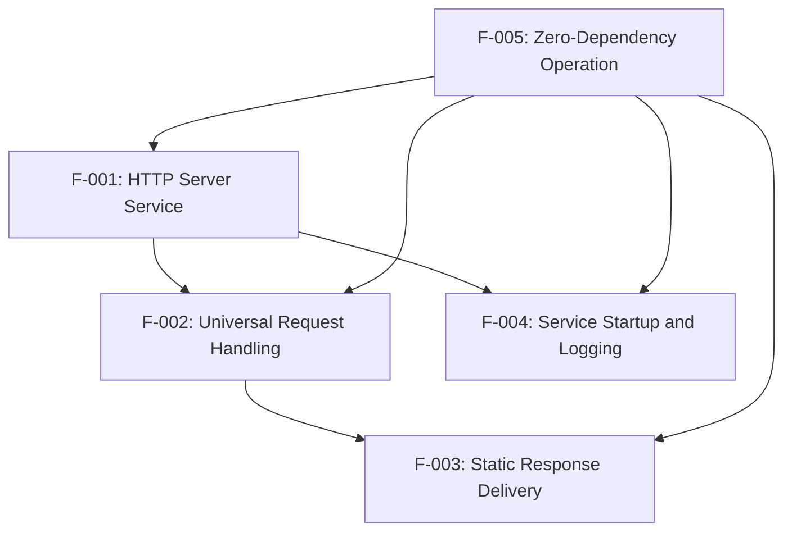

### 2.3.2 Integration Points

| Integration Type | Feature A | Feature B | Integration Method |
|---|---|---|---|
| Sequential | F-001 (HTTP Server) | F-004 (Startup Logging) | Server startup triggers logging |
| Request Flow | F-002 (Request Handling) | F-003 (Response Delivery) | Direct function call chain |
| Architectural | F-005 (Zero Dependencies) | All Features | Design constraint enforcement |

### 2.3.3 Shared Components

- **HTTP Module**: Shared between F-001 and F-002 for server creation and request processing
- **Console Interface**: Shared between F-004 for startup logging and general system output
- **Process Context**: Shared across all features for Node.js runtime interaction

### 2.3.4 Common Services

- **Node.js Runtime**: Provides JavaScript execution environment for all features
- **Operating System TCP Stack**: Enables network binding and HTTP communication
- **Console Output Stream**: Supports logging and debugging operations

## 2.4 IMPLEMENTATION CONSIDERATIONS

### 2.4.1 Technical Constraints

**Runtime Constraints:**
- Node.js ES2015+ required for arrow functions and template literals
- Single-threaded event loop architecture limits concurrent processing
- Hard-coded configuration prevents runtime customization

**Network Constraints:**
- Localhost-only binding (127.0.0.1) restricts external access
- Fixed port 3000 may conflict with other local services
- No HTTPS/TLS support limits secure communication testing

**Architecture Constraints:**
- Single-file implementation limits modular extensibility
- No error handling implementation affects robustness
- CommonJS module format restricts ES module compatibility

### 2.4.2 Performance Requirements

| Performance Metric | Target Value | Measurement Method |
|---|---|---|
| Service Startup Time | < 1 second | Time from process start to port binding |
| Memory Footprint | < 50MB baseline | Process memory monitoring |
| Request Response Time | < 100ms | HTTP client timing measurement |
| Concurrent Request Capacity | ≥ 100 requests/second | Load testing verification |

### 2.4.3 Scalability Considerations

**Vertical Scaling:**
- Memory usage scales linearly with concurrent connections
- CPU utilization minimal due to static response generation
- Single-threaded architecture limits processing parallelism

**Horizontal Scaling:**
- Multiple instances can run on different ports
- No shared state enables independent instance operation
- Load balancing not supported due to localhost-only binding

### 2.4.4 Security Implications

**Security Posture:**
- No authentication or authorization mechanisms
- Plain text HTTP communication only
- Localhost binding provides network isolation
- No input validation or sanitization

**Risk Assessment:**
- **Low Risk**: Localhost-only deployment limits attack surface
- **Acceptable**: Designed for testing environments only
- **Monitored**: No sensitive data processing or storage

### 2.4.5 Maintenance Requirements

**Operational Maintenance:**
- **Dependency Management**: No external dependencies to maintain
- **Security Updates**: Node.js runtime updates only
- **Configuration Management**: No runtime configuration changes supported

**Development Maintenance:**
- **Code Complexity**: Single-file implementation minimizes maintenance overhead
- **Testing Requirements**: Functional testing through HTTP requests
- **Documentation Updates**: Limited scope reduces documentation burden

#### References

#### Repository Files Analyzed
- `server.js` - Complete HTTP server implementation with request handling logic
- `package.json` - NPM configuration with project metadata and missing start script
- `package-lock.json` - Dependency lock file confirming zero external dependencies
- `README.md` - Project identification as hao-backprop-test

#### Technical Specification Sections Referenced
- `1.1 EXECUTIVE SUMMARY` - Business context and stakeholder requirements
- `1.2 SYSTEM OVERVIEW` - Technical capabilities and success criteria
- `1.3 SCOPE` - In-scope and out-of-scope feature boundaries

#### Implementation Evidence
- HTTP server binding to localhost:3000 (server.js:3-4)
- Universal request handling implementation (server.js:6)
- Static response with HTTP 200 and "Hello, World!" content (server.js:7-9)
- Console logging of startup confirmation (server.js:13)
- Zero external dependencies confirmed (package-lock.json)

# 3. TECHNOLOGY STACK

## 3.1 PROGRAMMING LANGUAGES

### 3.1.1 Primary Language: JavaScript (ES2015+)

The hao-backprop-test service is implemented entirely in **JavaScript using ES2015+ syntax features**, as evidenced by the use of:

- **Arrow Functions**: Modern function declaration syntax (`(req, res) => { ... }`)
- **Template Literals**: String interpolation for logging (`Server is running on http://127.0.0.1:3000`)
- **CommonJS Modules**: Standard Node.js module system using `require()` statements

### 3.1.2 Runtime Environment: Node.js

**Node.js** serves as the sole runtime environment for this application. The implementation leverages Node.js built-in capabilities without requiring specific version constraints, though ES2015+ language feature support is mandatory.

**Selection Criteria:**
- **Zero External Dependencies**: Node.js built-in modules provide all required functionality
- **Rapid Startup**: Native event loop architecture supports sub-1-second startup requirements
- **Minimal Resource Footprint**: Lightweight runtime aligns with <50MB memory target
- **Cross-Platform Compatibility**: Ensures consistent behavior across deployment environments
- **Integration Testing Reliability**: Predictable runtime behavior for test fixture purposes

## 3.2 FRAMEWORKS & LIBRARIES

### 3.2.1 Core Framework: Node.js Built-in HTTP Module

The application utilizes **no external frameworks or libraries**, instead relying exclusively on Node.js built-in modules:

**Primary Module:**
- **http**: Node.js native HTTP server implementation
  - **Purpose**: Complete HTTP request/response handling
  - **Version**: Bundled with Node.js runtime (no separate versioning)
  - **Justification**: Eliminates external dependencies while providing full HTTP/1.1 protocol support

### 3.2.2 Intentional Framework Absence

The **absence of external frameworks** is a deliberate architectural decision driven by:

- **Dependency Elimination**: Zero external packages reduce testing variability
- **Predictable Behavior**: Native modules ensure consistent responses across environments
- **Rapid Deployment**: No dependency resolution delays during deployment verification
- **Maximum Portability**: Functions in any Node.js environment without package installation

## 3.3 OPEN SOURCE DEPENDENCIES

### 3.3.1 Dependency Architecture: Zero External Packages

The application maintains a **zero-dependency architecture** confirmed through package.json analysis:

**Package Management Configuration:**
- **Package Manager**: npm (lockfileVersion 3)
- **External Dependencies**: None (confirmed via package-lock.json analysis)
- **Development Dependencies**: None specified
- **Peer Dependencies**: None required

**Benefits of Zero-Dependency Architecture:**
- **Elimination of Supply Chain Vulnerabilities**: No third-party package security concerns
- **Reduced Maintenance Overhead**: No dependency updates or compatibility management
- **Consistent Test Results**: No external package version conflicts during testing
- **Simplified Deployment**: Direct execution without dependency installation

### 3.3.2 Package Registry Configuration

**NPM Configuration:**
- **Package Name**: "hello_world" (version 1.0.0)
- **License**: MIT
- **Author**: hxu
- **Registry**: Default npm registry (no custom configuration)

## 3.4 DEVELOPMENT & DEPLOYMENT

### 3.4.1 Development Environment

**Package Management:**
- **Tool**: npm (Node Package Manager)
- **Lock File**: package-lock.json (lockfileVersion 3)
- **Version Control**: Git (implied by project structure)

**Code Execution:**
- **Entry Point**: server.js (manual execution required)
- **Start Command**: `node server.js` (no package.json start script)
- **Build Process**: None required (direct JavaScript execution)

### 3.4.2 Runtime Configuration

**Server Configuration:**
- **Network Binding**: 127.0.0.1 (localhost only)
- **Port**: 3000 (hard-coded)
- **Protocol**: HTTP/1.1 (no TLS support)
- **Process Model**: Single-threaded event loop

**Performance Characteristics:**
- **Startup Time**: <1 second (per technical requirements)
- **Memory Usage**: <50MB baseline footprint
- **Response Time**: <100ms per request
- **Concurrency**: ≥100 requests/second capacity

### 3.4.3 Deployment Architecture

**Deployment Model:**
- **Containerization**: Not implemented (direct Node.js execution)
- **Orchestration**: Not applicable (single-instance design)
- **Service Management**: Manual process management
- **Configuration Management**: Hard-coded values (no external configuration)

**Infrastructure Requirements:**
- **Minimum Node.js Version**: ES2015+ support required
- **Operating System**: Platform-agnostic (Node.js runtime dependency)
- **Network Requirements**: Localhost interface availability
- **Resource Requirements**: <50MB RAM, minimal CPU utilization

### 3.4.4 Testing and Quality Assurance

**Testing Framework:**
- **Unit Testing**: Not implemented (by design for simplicity)
- **Integration Testing**: HTTP endpoint verification via external clients
- **Test Script**: Configured to return error (intentional test fixture behavior)

**Quality Assurance Tools:**
- **Linting**: Not configured (single-file simplicity)
- **Type Checking**: Not implemented (JavaScript without TypeScript)
- **Code Formatting**: Not configured (minimal codebase)

## 3.5 TECHNOLOGY STACK INTEGRATION

### 3.5.1 Component Integration Architecture

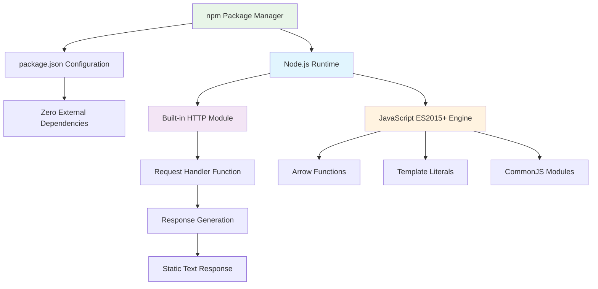

### 3.5.2 Technology Decision Rationale

**Minimalist Architecture Justification:**
- **Test Fixture Purpose**: Designed specifically for integration testing and deployment verification
- **Reliability Requirements**: Eliminates external dependencies that could introduce test failures
- **Performance Optimization**: Native modules provide optimal startup time and resource usage
- **Maintenance Simplification**: Minimal technology stack reduces operational complexity

**Security Considerations:**
- **Network Isolation**: Localhost-only binding provides inherent security boundary
- **Dependency Security**: Zero external packages eliminate third-party vulnerability vectors
- **Protocol Simplicity**: HTTP-only implementation reduces attack surface complexity
- **Input Validation**: Static responses eliminate input processing vulnerabilities

#### References

**Repository Files Analyzed:**
- `package.json` - NPM package manifest confirming zero external dependencies
- `package-lock.json` - Dependency lock file validating zero-dependency architecture
- `server.js` - Complete HTTP server implementation using Node.js built-in modules
- `README.md` - Project identification and minimal documentation

**Technical Specification Sections Referenced:**
- `1.1 EXECUTIVE SUMMARY` - Business context and test fixture purpose
- `1.2 SYSTEM OVERVIEW` - Technical capabilities and success criteria
- `2.4 IMPLEMENTATION CONSIDERATIONS` - Performance requirements and technical constraints

**Implementation Evidence:**
- Node.js `http` module usage confirmed (server.js line 1)
- ES2015+ syntax features implementation (server.js lines 6, 13)
- Zero external package dependencies (package-lock.json analysis)
- Hard-coded configuration approach (server.js lines 3-4, 7-9)
- Static response generation architecture (server.js lines 7-9)

# 4. PROCESS FLOWCHART

## 4.1 SYSTEM WORKFLOWS

### 4.1.1 Core Business Processes

#### Service Deployment and Verification Workflow

The hao-backprop-test service operates within integration testing and deployment verification scenarios. The primary business process follows this pattern:

**Integration Testing Journey**:
1. **Test Environment Preparation**: Integration engineers deploy the service as a test fixture
2. **Service Verification**: Automated testing frameworks validate service availability
3. **Pipeline Validation**: CI/CD systems use the service to verify deployment processes
4. **Health Monitoring**: Operations teams confirm service responsiveness

**User Touchpoints**:
- **Integration Engineers**: Deploy and configure service in test environments
- **DevOps Teams**: Monitor service status and deployment success
- **QA Engineers**: Utilize service endpoints in automated test suites
- **Development Teams**: Reference service behavior for backprop integration workflows

#### End-to-End System Interaction Flow

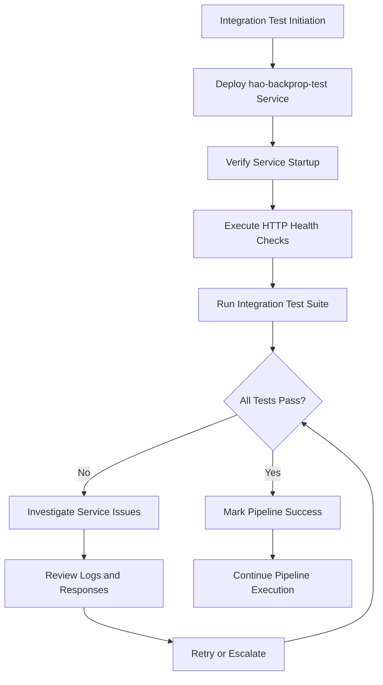

### 4.1.2 Integration Workflows

#### CI/CD Pipeline Integration Flow

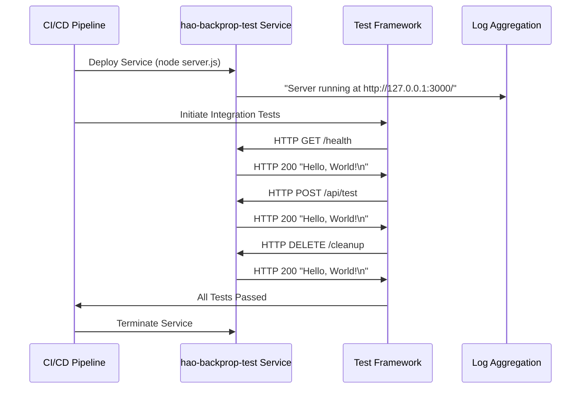

#### Data Flow Between Systems

The service operates with minimal data flow due to its intentionally simple architecture:

**Inbound Data Flow**:
- HTTP requests from testing frameworks
- Network connectivity probes
- Service health checks
- Load testing traffic

**Outbound Data Flow**:
- Static HTTP responses ("Hello, World!\n")
- Console log messages
- HTTP status codes (200)
- Content-Type headers (text/plain)

**Event Processing Flow**:


## 4.2 DETAILED PROCESS FLOWS

### 4.2.1 Service Startup and Initialization

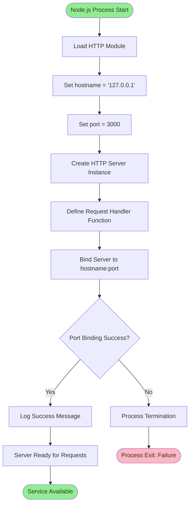

**Process Steps**:
1. **Module Loading**: Import Node.js built-in `http` module
2. **Configuration**: Set hard-coded hostname (127.0.0.1) and port (3000)
3. **Server Creation**: Initialize HTTP server with request handler
4. **Port Binding**: Attempt to bind to configured address
5. **Startup Logging**: Output confirmation message to console
6. **Service Ready**: Accept incoming HTTP connections

**Critical Decision Points**:
- **Port Availability Check**: System fails if port 3000 is already in use
- **Network Interface Availability**: Requires loopback interface availability

### 4.2.2 HTTP Request Processing Workflow

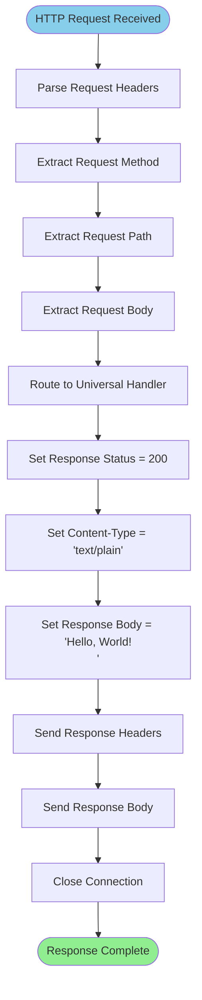

**Process Characteristics**:
- **Universal Handling**: All HTTP methods (GET, POST, PUT, DELETE, etc.) processed identically
- **Path Agnostic**: All URL paths receive identical responses
- **Header Independence**: Request headers do not affect processing
- **Body Ignored**: Request body content is not processed or validated

**Validation Rules**:
- **No Authentication**: All requests accepted without authorization
- **No Input Validation**: No request content validation performed
- **No Business Rules**: Uniform processing regardless of request content
- **Compliance**: HTTP/1.1 protocol compliance maintained

### 4.2.3 Error Handling and Recovery Flows

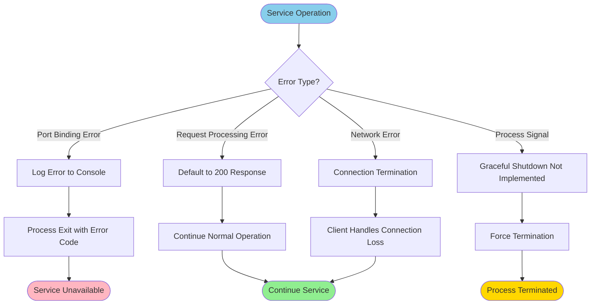

**Current Error Handling Limitations**:
- **Port Binding Errors**: No retry mechanism implemented
- **Request Processing Errors**: No error catching in request handler
- **Process Signals**: No graceful shutdown handling for SIGINT/SIGTERM
- **Network Errors**: No connection error recovery

## 4.3 TECHNICAL IMPLEMENTATION

### 4.3.1 State Management

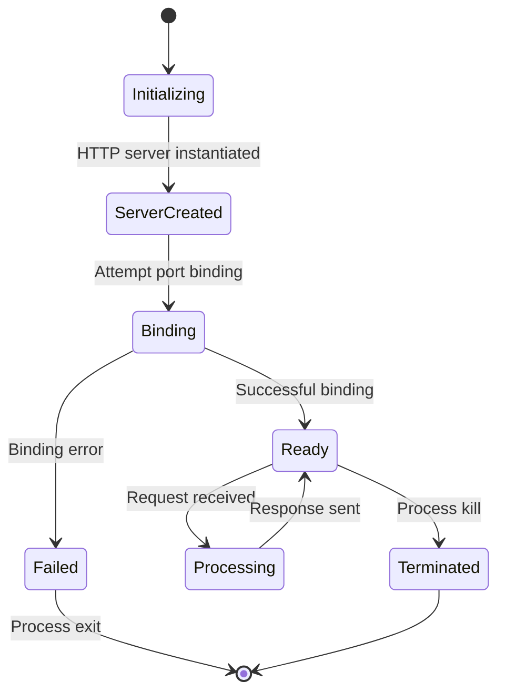

**State Characteristics**:
- **Stateless Service**: No persistent state maintained between requests
- **No Session Management**: No user sessions or request tracking
- **Memory State**: Only runtime server instance exists in memory
- **No Data Persistence**: No database connections or file system operations

**Transaction Boundaries**:
- **Request Transaction**: Single HTTP request-response cycle
- **No Database Transactions**: No persistent data operations
- **Memory Transactions**: Minimal temporary variable scope
- **Network Transactions**: Standard HTTP connection lifecycle

### 4.3.2 Concurrency and Performance Flow

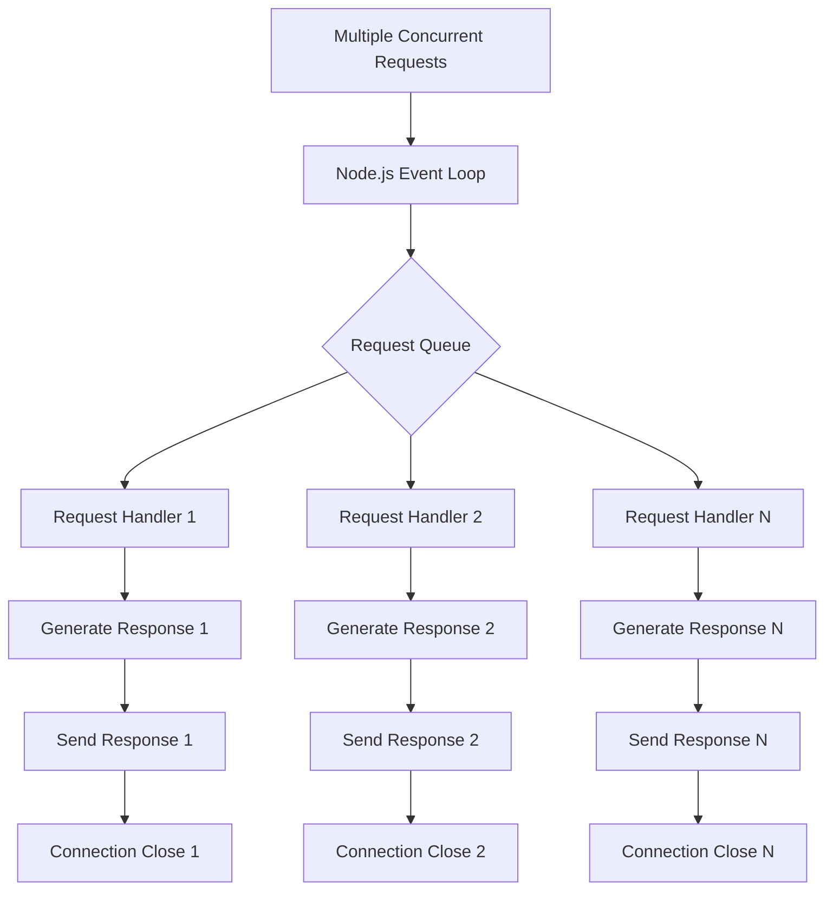

**Performance Characteristics**:
- **Single-Threaded**: Node.js event loop handles all requests
- **Non-blocking I/O**: Asynchronous request processing
- **No Worker Processes**: No clustering or multi-process architecture
- **Memory Efficient**: Minimal memory allocation per request

## 4.4 INTEGRATION SEQUENCE DIAGRAMS

### 4.4.1 Load Testing Integration

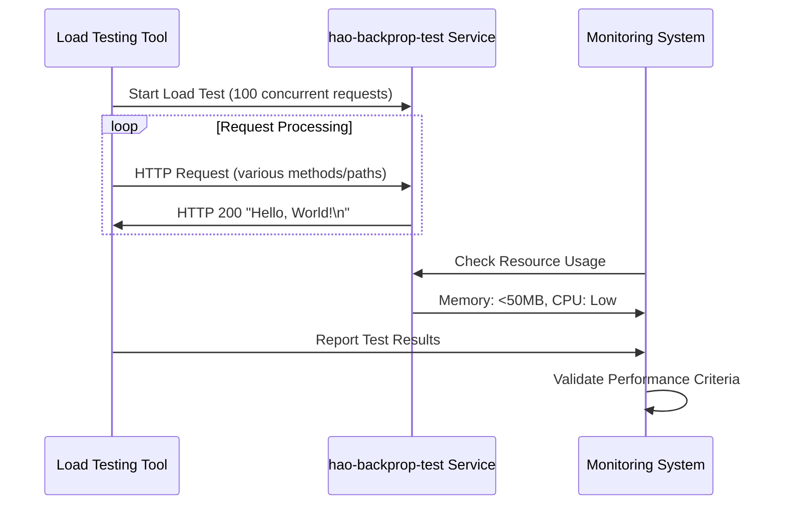

### 4.4.2 Deployment Pipeline Integration

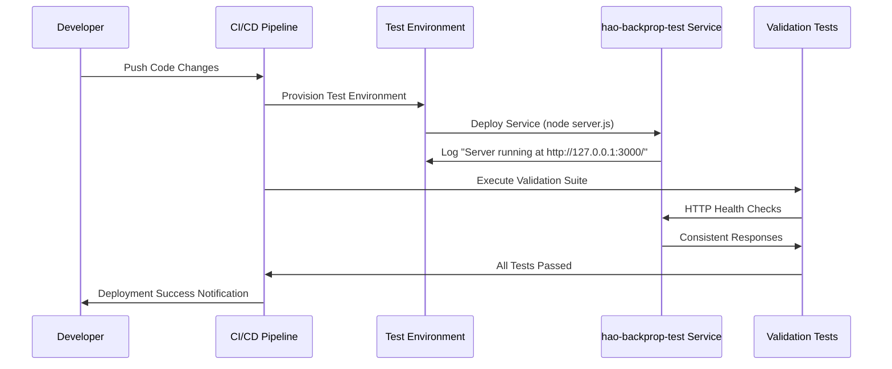

## 4.5 SLA AND TIMING CONSIDERATIONS

### 4.5.1 Performance Timing Flow

```mermaid
gantt
    title Service Performance Timeline
    dateFormat X
    axisFormat %s
    
    section Service Startup
    Module Loading     :0, 100ms
    Server Creation    :100ms, 200ms
    Port Binding       :200ms, 500ms
    Ready State        :500ms, 1000ms
    
    section Request Processing
    Request Receipt    :0, 10ms
    Handler Execution  :10ms, 50ms
    Response Generation:50ms, 80ms
    Response Delivery  :80ms, 100ms
```

**Timing Constraints**:
- **Startup Time**: < 1 second (F-001-RQ-002)
- **Request Processing**: < 100ms per request (F-002-RQ-003)
- **Memory Usage**: < 50MB baseline (F-001-RQ-003)
- **Response Consistency**: 100% identical responses (F-003-RQ-004)

### 4.5.2 Service Level Monitoring

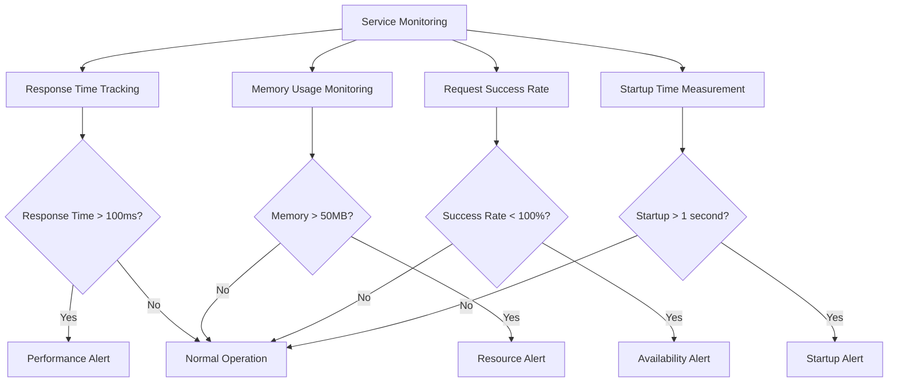

## 4.6 REGULATORY AND COMPLIANCE FLOW

### 4.6.1 Testing Compliance Verification

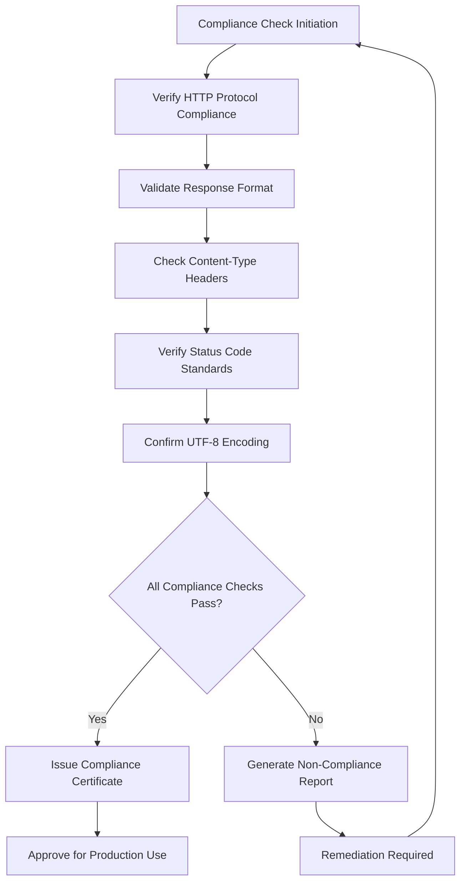

**Compliance Requirements**:
- **HTTP/1.1 Protocol**: Adherence to RFC 7231 specifications
- **Content-Type Standards**: Proper MIME type declaration (text/plain)
- **Status Code Usage**: Correct HTTP 200 status implementation
- **Character Encoding**: UTF-8 compliance for response content

#### References

#### Technical Specification Sections Referenced:
- `1.1 EXECUTIVE SUMMARY` - Business context and stakeholder requirements
- `1.2 SYSTEM OVERVIEW` - System capabilities and success criteria  
- `2.1 FEATURE CATALOG` - Detailed feature descriptions and dependencies
- `2.2 FUNCTIONAL REQUIREMENTS TABLE` - Specific requirements and acceptance criteria
- `2.3 FEATURE RELATIONSHIPS` - Feature dependency mappings and integration points

#### Source Code Files Analyzed:
- `server.js` - Complete HTTP server implementation and request handling logic
- `package.json` - NPM configuration and project metadata
- `package-lock.json` - Dependency verification confirming zero external dependencies
- `README.md` - Project description and basic information

# 5. SYSTEM ARCHITECTURE

## 5.1 HIGH-LEVEL ARCHITECTURE

### 5.1.1 System Overview

The hao-backprop-test system implements a **minimalist monolithic architecture** designed specifically as a test fixture for CI/CD pipeline verification and deployment testing. The architecture follows a **zero-dependency philosophy** that prioritizes reliability and predictability over feature richness, making it an ideal candidate for integration testing scenarios where external dependencies could introduce failure points.

The system employs a **single-threaded, event-driven architecture** built on Node.js's native HTTP module, eliminating the complexity typically associated with web frameworks while maintaining full HTTP/1.1 protocol compliance. This architectural approach ensures **sub-second startup times** and **minimal resource footprint** (≤50MB memory baseline), critical characteristics for automated testing environments.

**Key Architectural Principles:**
- **Simplicity First**: Single-file implementation eliminates architectural complexity
- **Zero External Dependencies**: Reduces failure vectors in testing environments  
- **Predictable Behavior**: Hard-coded responses ensure consistent test outcomes
- **Localhost Isolation**: Network binding restricted to 127.0.0.1 for security
- **Universal Processing**: All HTTP requests receive identical treatment

**System Boundaries:**
- **Network Boundary**: Localhost-only binding (127.0.0.1:3000)
- **Protocol Boundary**: HTTP/1.1 without TLS termination
- **Process Boundary**: Single Node.js process without clustering
- **Data Boundary**: No persistent storage or external data sources

### 5.1.2 Core Components Table

| Component Name | Primary Responsibility | Key Dependencies | Integration Points |
|---|---|---|---|
| HTTP Server | Request reception and response generation | Node.js http module | Localhost network interface |
| Request Handler | Universal request processing logic | HTTP Server instance | HTTP protocol stack |
| Response Generator | Static content delivery mechanism | Request Handler | HTTP response stream |
| Console Logger | Startup confirmation and basic observability | Node.js console | Standard output stream |

### 5.1.3 Data Flow Description

The system implements a **stateless request-response pattern** with minimal data transformation. Upon receiving any HTTP request, the system bypasses traditional routing mechanisms and immediately invokes a **universal request handler** that generates identical responses regardless of input characteristics.

**Primary Data Flows:**
- **Inbound Flow**: HTTP requests arrive at the localhost network interface and are parsed by the Node.js HTTP module, which extracts method, path, headers, and body information before passing control to the universal request handler
- **Processing Flow**: The request handler ignores all input parameters and immediately constructs a static HTTP 200 response with Content-Type header set to 'text/plain' and body content of "Hello, World!\n"
- **Outbound Flow**: The response is serialized according to HTTP/1.1 protocol specifications and transmitted back to the requesting client through the same network connection

**Integration Patterns:**
The system operates as a **passive service endpoint** that accepts connections without initiating outbound communications. It employs a **fire-and-forget logging pattern** for startup confirmation and utilizes Node.js's **built-in connection pooling** for concurrent request handling within the event loop's natural concurrency model.

**Data Transformation Points:**
- **Request Parsing**: Raw TCP data transformed into HTTP request objects (handled by Node.js runtime)
- **Response Serialization**: Static string content transformed into compliant HTTP response format
- **Console Logging**: Server URL formatted and written to standard output during startup phase

### 5.1.4 External Integration Points

| System Name | Integration Type | Data Exchange Pattern | Protocol/Format |
|---|---|---|---|
| CI/CD Pipelines | Test Target | Request/Response | HTTP GET/POST |
| Automated Test Suites | Service Verification | Health Check Polling | HTTP/1.1 |
| Load Testing Tools | Performance Validation | Concurrent Requests | HTTP Methods |
| Development Environments | Local Testing | Manual Verification | Browser/cURL |

## 5.2 COMPONENT DETAILS

### 5.2.1 HTTP Server Component

**Purpose and Responsibilities:**
The HTTP Server component serves as the foundational network communication layer, responsible for TCP connection management, HTTP protocol handling, and request lifecycle orchestration. It binds exclusively to the localhost interface on port 3000 and maintains the server socket for the entire application lifecycle.

**Technologies and Frameworks:**
- **Core Technology**: Node.js built-in `http` module
- **JavaScript Runtime**: ES2015+ compatibility requirement
- **Module System**: CommonJS (`require()` statements)
- **No External Frameworks**: Zero-dependency implementation

**Key Interfaces and APIs:**
- **Network Interface**: HTTP server listening on 127.0.0.1:3000
- **Request Interface**: Accepts all HTTP methods (GET, POST, PUT, DELETE, PATCH, OPTIONS, HEAD)
- **Response Interface**: Returns HTTP 200 with static text/plain content
- **Logging Interface**: Console output for startup confirmation

**Data Persistence Requirements:**
- **No Persistent Storage**: Stateless operation with no data retention
- **Memory-Only State**: Server instance exists only in process memory
- **No Session Management**: Each request processed independently

**Scaling Considerations:**
- **Vertical Scaling**: Limited by single-threaded Node.js event loop
- **Horizontal Scaling**: Not supported due to localhost-only binding
- **Concurrency Model**: Event-driven, non-blocking I/O within single process
- **Performance Ceiling**: Approximately 100-1000 requests/second depending on system resources

### 5.2.2 Request Processing Component

**Purpose and Responsibilities:**
The Request Processing component implements the core business logic through a universal request handler that provides consistent responses regardless of input variation. This component embodies the system's design principle of predictable behavior for testing scenarios.

**Technologies and Frameworks:**
- **Implementation Language**: JavaScript with arrow function syntax
- **Processing Model**: Synchronous response generation
- **Error Handling**: Implicit through Node.js runtime

**Key Interfaces and APIs:**
- **Input Interface**: HTTP request objects with method, URL, headers, and body
- **Processing Logic**: Universal handler function accepting any request type
- **Output Interface**: Static HTTP response with predetermined content

**Data Persistence Requirements:**
- **No Data Processing**: Request content ignored completely
- **No State Tracking**: No request history or analytics
- **No Configuration Storage**: Hard-coded response parameters

**Scaling Considerations:**
- **Processing Efficiency**: O(1) constant time response generation
- **Memory Usage**: Minimal allocation per request
- **CPU Utilization**: Negligible processing overhead per request

### 5.2.3 Component Interaction Diagram

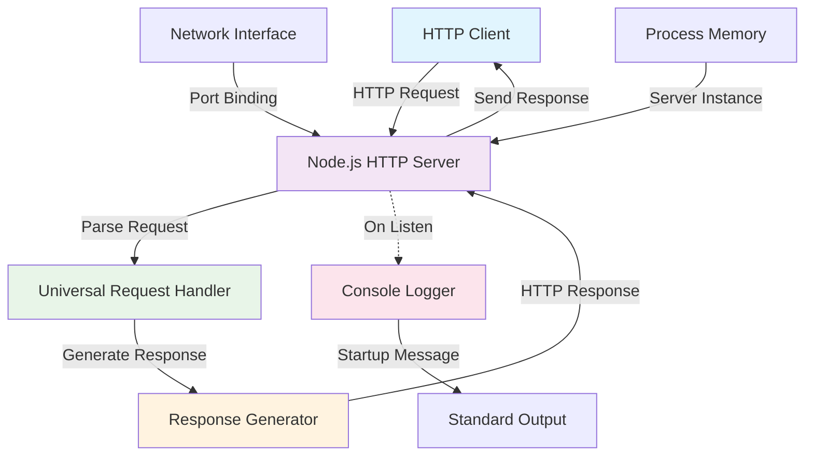

### 5.2.4 Request Processing Sequence Diagram

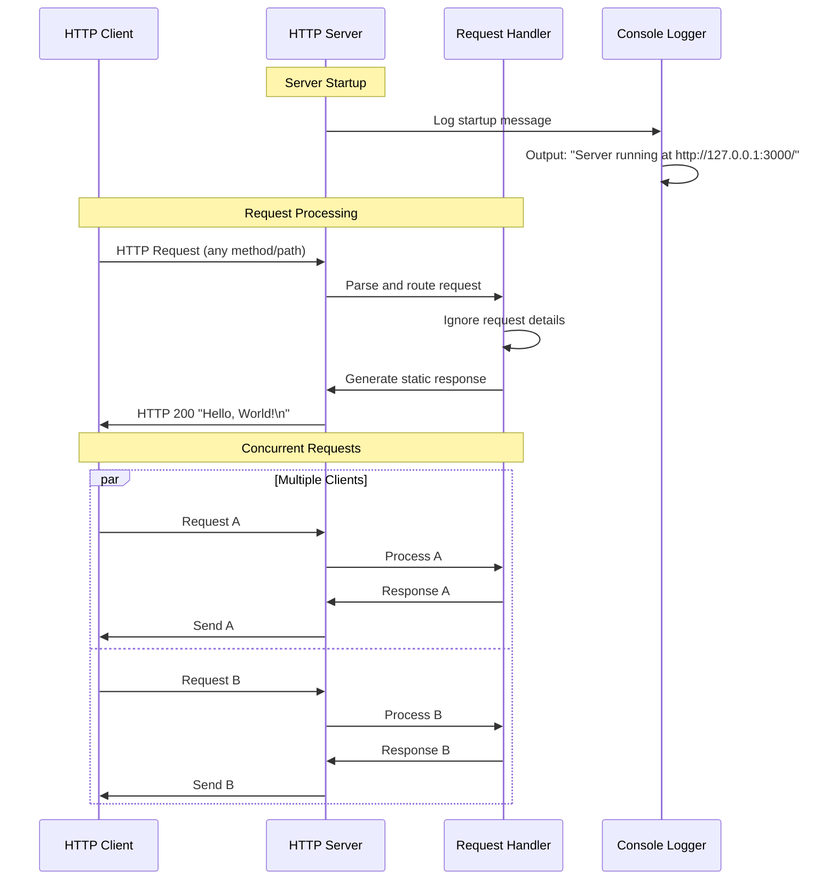

## 5.3 TECHNICAL DECISIONS

### 5.3.1 Architecture Style Decision

**Decision**: Monolithic, single-file implementation over modular architecture

**Rationale:**
- **Simplicity**: Eliminates complexity of module management and dependency resolution
- **Reliability**: Reduces failure points in testing environments where stability is paramount
- **Maintainability**: Single point of modification for entire system behavior
- **Deployment**: Simplified distribution and execution model

**Trade-offs:**
- **Advantage**: Zero-configuration deployment, minimal failure vectors
- **Disadvantage**: Limited extensibility and modularity for future enhancements

### 5.3.2 Communication Pattern Selection

**Decision**: Stateless HTTP request-response pattern over WebSockets or streaming protocols

**Rationale:**
- **Protocol Simplicity**: HTTP/1.1 provides universal compatibility with testing tools
- **Stateless Design**: Each request independent, enabling concurrent test execution
- **Standard Compliance**: Leverages well-established HTTP semantics for predictable behavior

**Trade-offs:**
- **Advantage**: Universal client compatibility, simple testing integration
- **Disadvantage**: No real-time capabilities or persistent connections

### 5.3.3 Data Storage Decision

**Decision**: Zero persistent storage over database or file system integration

**Rationale:**
- **Testing Focus**: No business data processing required for test fixture role
- **Performance**: Eliminates I/O latency and storage-related failure modes
- **Simplicity**: Removes dependency on external storage systems

**Trade-offs:**
- **Advantage**: Fastest possible response times, no data corruption risks
- **Disadvantage**: Cannot support applications requiring data persistence

### 5.3.4 Dependency Management Decision

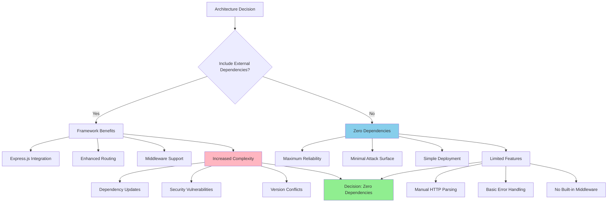

**Decision Rationale:**
The zero-dependency approach was selected to maximize system reliability in testing environments where external package failures could compromise CI/CD pipeline stability.

### 5.3.5 Security Decision Framework

**Decision**: Localhost-only binding with no authentication mechanisms

**Rationale:**
- **Network Isolation**: Localhost binding provides natural security boundary
- **Testing Environment**: Security requirements minimal in controlled test scenarios
- **Attack Surface**: No sensitive data processing eliminates most security vectors

**Trade-offs:**
- **Advantage**: Simple security model, no credential management
- **Disadvantage**: Cannot support production deployment scenarios

## 5.4 CROSS-CUTTING CONCERNS

### 5.4.1 Monitoring and Observability Approach

The system implements a **minimal observability strategy** aligned with its test fixture purpose, focusing on essential operational visibility rather than comprehensive monitoring.

**Observability Components:**
- **Startup Logging**: Console output confirms successful server binding with exact message format
- **Process Health**: HTTP response success indicates service availability
- **No Metrics Collection**: Intentional omission of performance metrics to maintain simplicity
- **No Distributed Tracing**: Single-component architecture eliminates trace complexity

**Monitoring Integration Points:**
- **CI/CD Health Checks**: HTTP GET requests serve as liveness probes
- **Console Log Parsing**: Automated systems can verify startup success via log message matching
- **Process Monitoring**: External process managers can track Node.js runtime status

### 5.4.2 Logging and Tracing Strategy

| Logging Level | Implementation | Use Case | Output Destination |
|---|---|---|---|
| Startup | console.log() | Service initialization confirmation | Standard output |
| Request | Not implemented | Intentionally omitted for simplicity | N/A |
| Error | Default Node.js | Runtime error reporting | Standard error |
| Debug | Not implemented | Not required for test fixture | N/A |

**Logging Characteristics:**
- **Format**: Plain text with exact string matching for automation
- **Persistence**: No log file storage, console output only
- **Structure**: Unstructured text optimized for human readability
- **Performance Impact**: Negligible overhead from minimal logging

### 5.4.3 Error Handling Patterns

The system employs **implicit error handling** through Node.js runtime mechanisms rather than implementing explicit error management patterns.

**Error Handling Categories:**

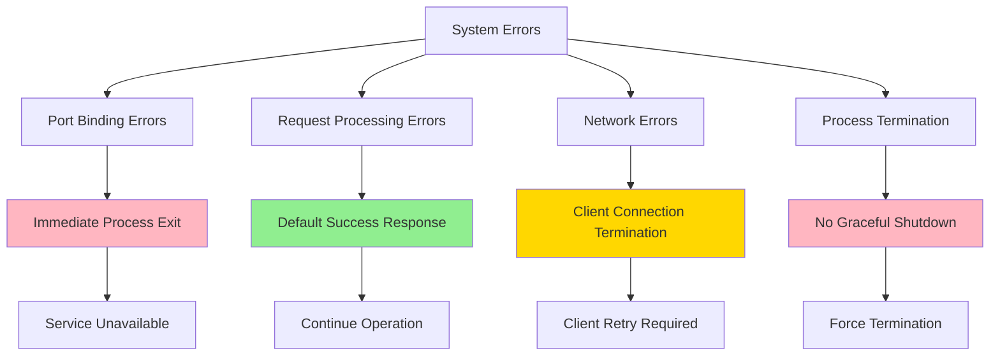

**Current Error Handling Limitations:**
- **Port Conflicts**: No retry mechanism for port binding failures
- **Request Errors**: No explicit error catching in request handler
- **Signal Handling**: No graceful shutdown for SIGINT/SIGTERM signals
- **Recovery**: No automatic recovery mechanisms implemented

### 5.4.4 Authentication and Authorization Framework

**Security Model**: **Open Access with Network Isolation**

The system implements a **zero-authentication security model** based on network-level isolation rather than application-level security controls.

**Security Architecture:**
- **Network Security**: Localhost-only binding (127.0.0.1) provides access control
- **Request Security**: All HTTP requests accepted without authentication
- **Data Security**: No sensitive data processing eliminates data protection requirements
- **Transport Security**: No TLS/SSL termination (plain HTTP only)

**Rationale for Open Access:**
- **Testing Environment**: Controlled environment eliminates external threat vectors
- **Functional Requirements**: Authentication would complicate automated testing scenarios
- **Attack Surface**: Static responses and no data processing minimize security risks

### 5.4.5 Performance Requirements and SLAs

| Performance Metric | Requirement | Measurement Method | Acceptable Range |
|---|---|---|---|
| Startup Time | <1 second | Process execution to log output | 0.1-1.0 seconds |
| Memory Footprint | <50MB baseline | Process memory monitoring | 10-50MB |
| Response Time | <100ms per request | HTTP request/response timing | 1-100ms |
| Throughput | ≥100 requests/second | Load testing verification | 100-1000 RPS |

**Performance Characteristics:**
- **Latency**: Minimal processing overhead enables sub-millisecond response generation
- **Throughput**: Event-loop concurrency supports high request rates within single process
- **Resource Utilization**: Static responses minimize CPU and memory consumption per request
- **Scalability Ceiling**: Single-threaded architecture limits maximum throughput potential

### 5.4.6 Disaster Recovery Procedures

**Recovery Strategy**: **Stateless Restart Model**

Given the system's stateless architecture and test fixture purpose, disaster recovery focuses on rapid service restoration rather than data recovery.

**Recovery Procedures:**
- **Process Failure**: Restart Node.js process (`node server.js`)
- **Port Conflicts**: Identify and terminate conflicting processes or change configuration
- **Network Issues**: Verify localhost interface availability
- **Resource Exhaustion**: Restart process to reclaim memory and resources

**Recovery Time Objectives:**
- **Process Restart**: <5 seconds manual recovery time
- **Port Conflict Resolution**: <30 seconds identification and resolution
- **Complete Service Restoration**: <1 minute from failure detection to service availability

**Backup and Restoration:**
- **Code Backup**: Single source file enables simple version control backup
- **Configuration Backup**: Hard-coded values eliminate external configuration dependencies
- **Data Backup**: No persistent data requires no backup procedures

#### References

**Files and Folders Examined:**
- `server.js` - Complete HTTP server implementation and request handling logic
- `package.json` - NPM configuration with project metadata and dependency information
- `package-lock.json` - Dependency lock file confirming zero external dependencies
- `README.md` - Minimal project documentation and basic usage instructions

**Technical Specification Sections Referenced:**
- `1.1 EXECUTIVE SUMMARY` - Project overview and stakeholder information
- `1.2 SYSTEM OVERVIEW` - High-level architecture and success criteria definition
- `2.1 FEATURE CATALOG` - Complete feature descriptions (F-001 through F-005)
- `2.2 FUNCTIONAL REQUIREMENTS TABLE` - Detailed structured requirements with acceptance criteria
- `2.4 IMPLEMENTATION CONSIDERATIONS` - Technical constraints and implementation requirements
- `3.1 PROGRAMMING LANGUAGES` - JavaScript/Node.js language specifications and requirements
- `3.2 FRAMEWORKS & LIBRARIES` - Confirmation of zero external dependencies architecture
- `3.4 DEVELOPMENT & DEPLOYMENT` - Deployment architecture and runtime configuration details
- `3.5 TECHNOLOGY STACK INTEGRATION` - Component integration architecture and patterns
- `4.1 SYSTEM WORKFLOWS` - CI/CD integration workflows and data flow patterns
- `4.2 DETAILED PROCESS FLOWS` - Comprehensive process flow diagrams and error handling
- `4.3 TECHNICAL IMPLEMENTATION` - State management and concurrency model specifications
- `4.5 SLA AND TIMING CONSIDERATIONS` - Performance requirements and service level agreements

# 6. SYSTEM COMPONENTS DESIGN

## 6.1 CORE SERVICES ARCHITECTURE

### 6.1.1 Architecture Assessment

**Core Services Architecture is not applicable for this system.**

The backprop integration application implements a minimalist monolithic architecture that does not utilize microservices, distributed architecture, or distinct service components. This architectural decision is intentional and serves the system's specific purpose as a test fixture for CI/CD pipeline validation.

### 6.1.2 Architectural Rationale

#### 6.1.2.1 Monolithic Design Choice

The system deliberately employs a single-file monolithic implementation (`server.js`) containing the entire application logic in 14 lines of code. This design decision prioritizes:

- **Reliability**: Eliminates distributed system complexity and failure points
- **Predictability**: Ensures consistent behavior across test environments  
- **Simplicity**: Reduces operational overhead and maintenance requirements
- **Test Fixture Purpose**: Optimized for CI/CD integration testing scenarios

#### 6.1.2.2 Service Architecture Analysis

The following table summarizes the absence of traditional service architecture components:

| Component Category | Status | Rationale |
|---|---|---|
| Service Boundaries | Not Present | Single process handles all functionality |
| Inter-service Communication | Not Applicable | No service separation exists |
| Service Discovery | Not Required | Single endpoint architecture |
| Load Balancing | Not Implemented | Single instance design |

### 6.1.3 System Architecture Overview

#### 6.1.3.1 Single Process Design

The application operates as a unified HTTP server process with the following characteristics:

- **Process Model**: Single Node.js event loop
- **Network Binding**: localhost (127.0.0.1) on port 3000
- **Request Processing**: Universal handler for all HTTP requests
- **State Management**: Stateless operation with no data persistence

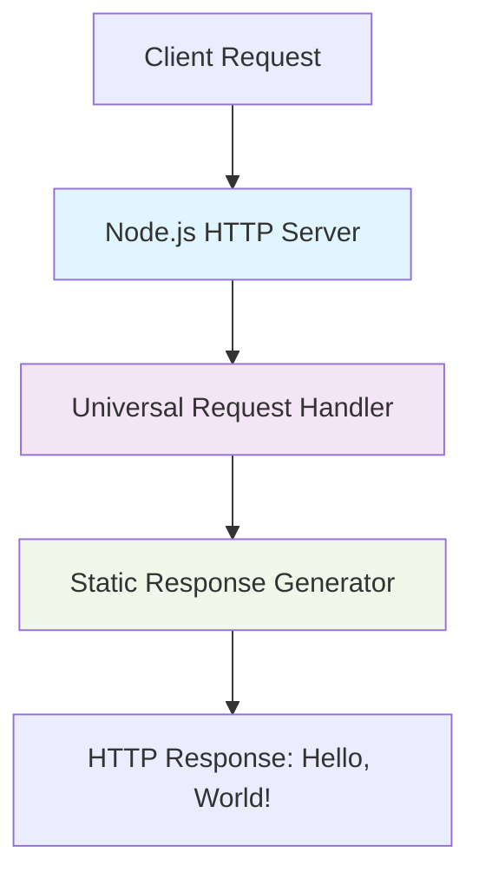

#### 6.1.3.2 Component Structure

The monolithic architecture consists of four integrated components:

1. **HTTP Server Component**: Manages TCP connections and request routing
2. **Request Processing Component**: Handles all incoming HTTP requests uniformly
3. **Response Generator Component**: Produces static "Hello, World!" responses
4. **Console Logger Component**: Provides startup confirmation output

### 6.1.4 Scalability Considerations

#### 6.1.4.1 Scaling Limitations

The current architecture imposes specific scalability constraints:

| Scaling Aspect | Current Status | Limitation |
|---|---|---|
| Horizontal Scaling | Not Supported | localhost-only binding prevents distribution |
| Vertical Scaling | Limited | Single-threaded event loop constraint |
| Auto-scaling | Not Applicable | No clustering or process management |

#### 6.1.4.2 Performance Characteristics

Expected performance parameters based on single-process Node.js limitations:

- **Throughput**: ~100-1,000 requests per second (single process ceiling)
- **Concurrency**: Limited by Node.js event loop capacity
- **Resource Utilization**: Single CPU core maximum utilization
- **Memory Footprint**: Minimal (~10-50MB typical Node.js baseline)

### 6.1.5 Resilience and Fault Tolerance

#### 6.1.5.1 Current Resilience Model

The system implements implicit resilience through simplicity:

```mermaid
graph LR
    A[Process Failure] --> B[Manual Restart]
    B --> C[Service Recovery]
    C --> D[Normal Operation]
    
    E[Network Error] --> F[Node.js Runtime Handling]
    F --> G[Error Response/Connection Drop]
    
    style A fill:#ffcdd2
    style C fill:#c8e6c9
    style F fill:#fff3e0
```

#### 6.1.5.2 Fault Tolerance Analysis

| Resilience Pattern | Implementation Status | Recovery Method |
|---|---|---|
| Circuit Breakers | Not Present | Manual process restart |
| Retry Mechanisms | Not Implemented | Client-side responsibility |
| Failover | Not Available | Single instance architecture |
| Data Redundancy | Not Applicable | Stateless operation |

### 6.1.6 Alternative Architecture Considerations

#### 6.1.6.1 When Core Services Would Apply

Core services architecture would become relevant if the system required:

- **Service Decomposition**: Separating concerns into distinct microservices
- **Distributed Processing**: Multi-instance or multi-region deployment
- **Complex Business Logic**: Domain-specific service boundaries
- **Independent Scaling**: Component-specific resource allocation
- **Production Workloads**: High availability and fault tolerance requirements

#### 6.1.6.2 Current Design Benefits

The monolithic approach provides optimal characteristics for the intended use case:

- **Zero Dependencies**: No external package management complexity
- **Minimal Attack Surface**: Reduced security vulnerability exposure
- **Instant Startup**: No service orchestration delays
- **Predictable Behavior**: Consistent test environment responses
- **Simple Deployment**: Single file execution model

### 6.1.7 Architecture Decision Impact

The choice to avoid core services architecture aligns with the system's role as a test fixture, prioritizing reliability and simplicity over scalability and distributed system capabilities. This decision supports the system's integration testing purpose while minimizing operational complexity.

#### References

- `server.js` - Complete monolithic HTTP server implementation
- `package.json` - Zero-dependency configuration confirmation  
- `package-lock.json` - Dependency lock verification
- Technical Specification Section 5.1 - High-level monolithic architecture documentation
- Technical Specification Section 5.3 - Architectural decision rationale
- Technical Specification Section 3.4 - Single-instance deployment model
- Technical Specification Section 5.4 - Cross-cutting concerns implementation

## 6.2 DATABASE DESIGN

### 6.2.1 Database Design Applicability Assessment

**Database Design is not applicable to this system.**

The hao-backprop-test repository implements a minimal Node.js HTTP server specifically designed as a test fixture for CI/CD pipeline validation. The system architecture explicitly excludes any form of data persistence, database connections, or state management between requests.

### 6.2.2 System Architecture Analysis

#### 6.2.2.1 Stateless Design Philosophy

The system implements a **zero-persistence architecture** with the following characteristics:

| Design Aspect | Implementation | Evidence Source |
|---|---|---|
| State Management | Completely stateless | Technical Specification 4.3, 6.1 |
| Data Persistence | None | Technical Specification 5.1 System Boundaries |
| External Dependencies | Zero packages | package.json, package-lock.json |
| Database Connections | Not present | server.js implementation |

#### 6.2.2.2 Data Boundary Analysis

According to the Technical Specification Section 5.1 HIGH-LEVEL ARCHITECTURE, the system defines explicit **System Boundaries** that include:

- **Data Boundary**: No persistent storage or external data sources
- **Network Boundary**: Localhost-only binding (127.0.0.1:3000)
- **Process Boundary**: Single Node.js process without clustering
- **Protocol Boundary**: HTTP/1.1 without TLS termination

#### 6.2.2.3 Request Processing Model

The application employs a **fire-and-forget processing pattern** where:

```mermaid
graph TD
    A[HTTP Request] --> B[Universal Request Handler]
    B --> C[Static Response Generator]
    C --> D[HTTP Response: Hello, World!]
    D --> E[Connection Close]
    
    style A fill:#e3f2fd
    style B fill:#f3e5f5
    style C fill:#f1f8e9
    style D fill:#fff3e0
    style E fill:#fce4ec
    
    F[No Data Storage] --> G[No Database Operations]
    G --> H[No State Persistence]
    
    style F fill:#ffebee
    style G fill:#ffebee  
    style H fill:#ffebee
```

### 6.2.3 Technical Implementation Evidence

#### 6.2.3.1 Code Architecture Validation

The complete server.js implementation (14 lines of code) contains:

- **HTTP Module Usage**: Only Node.js built-in `http` module imported
- **Request Processing**: Universal handler that ignores all request parameters
- **Response Generation**: Static string response ("Hello, World!\n")
- **No Database Imports**: No database drivers, ORMs, or persistence libraries
- **No Configuration**: Hard-coded localhost binding and port 3000

#### 6.2.3.2 Dependency Analysis

| Package File | Database Dependencies | Analysis Result |
|---|---|---|
| package.json | None declared | No "dependencies" or "devDependencies" sections |
| package-lock.json | None resolved | Only root package entry present |
| node_modules/ | Not present | Directory does not exist in repository |

#### 6.2.3.3 State Management Characteristics

From Technical Specification Section 4.3 TECHNICAL IMPLEMENTATION:

- **Stateless Service**: No persistent state maintained between requests
- **No Session Management**: No user sessions or request tracking  
- **No Data Persistence**: No database connections or file system operations
- **No Database Transactions**: No persistent data operations

### 6.2.4 Alternative Data Storage Considerations

#### 6.2.4.1 When Database Design Would Become Relevant

Database design would only become applicable if the system requirements changed to include:

- **User Authentication**: Requiring user account storage and session management
- **Request Logging**: Implementing audit trails or analytics persistence
- **Configuration Storage**: Dynamic configuration requiring persistent storage
- **Content Management**: Variable response content requiring data retrieval
- **State Tracking**: Multi-request workflows requiring session persistence

#### 6.2.4.2 Current Design Benefits

The absence of database components provides specific advantages for the intended use case:

- **Zero Setup Complexity**: No database installation or configuration required
- **Minimal Failure Points**: No database connectivity issues in test environments
- **Instant Startup**: No connection pooling or migration delays
- **Resource Efficiency**: No memory allocation for database connections
- **Predictable Behavior**: Eliminates data-dependent response variations

### 6.2.5 Architecture Decision Impact

#### 6.2.5.1 System Reliability

The deliberate exclusion of database design supports the system's role as a **CI/CD test fixture** by:

- **Eliminating External Dependencies**: Removes database server requirements
- **Ensuring Consistent Test Results**: No data variance between test runs
- **Reducing Infrastructure Complexity**: Single process deployment model
- **Minimizing Configuration Requirements**: Hard-coded operational parameters

#### 6.2.5.2 Operational Simplicity

```mermaid
graph LR
    A[Test Environment] --> B[Start Process]
    B --> C[Ready for Requests]
    C --> D[Process HTTP Requests]
    D --> E[Return Static Response]
    E --> D
    
    F[No Database Setup] --> G[No Data Migration]
    G --> H[No Connection Management]
    H --> I[No Backup Procedures]
    
    style F fill:#e8f5e8
    style G fill:#e8f5e8
    style H fill:#e8f5e8
    style I fill:#e8f5e8
```

### 6.2.6 Conclusion

The hao-backprop-test system's architecture explicitly excludes database design requirements through:

- **Intentional Stateless Design**: All system boundaries preclude data persistence
- **Zero-Dependency Philosophy**: No external packages or database drivers
- **Test Fixture Purpose**: Optimized for reliable CI/CD pipeline validation
- **Monolithic Simplicity**: Single-file implementation with hard-coded responses

This architectural approach aligns with the system's specific purpose as a minimal HTTP server test target, prioritizing reliability and predictability over data management capabilities.

#### References

- `server.js` - Complete application implementation demonstrating no database usage
- `package.json` - Project manifest confirming zero database dependencies
- `package-lock.json` - Dependency lock file confirming no external packages
- Technical Specification Section 5.1 HIGH-LEVEL ARCHITECTURE - System boundaries documentation
- Technical Specification Section 6.1 CORE SERVICES ARCHITECTURE - Stateless operation confirmation
- Technical Specification Section 4.3 TECHNICAL IMPLEMENTATION - State management characteristics

## 6.3 INTEGRATION ARCHITECTURE

### 6.3.1 Integration Architecture Applicability

**Integration Architecture is not applicable for this system.**

The hao-backprop-test system is explicitly designed as a **minimal test fixture** with zero external integrations, maintaining a deliberate **zero-dependency architecture** that serves as a passive endpoint for CI/CD pipeline validation and automated testing scenarios.

#### 6.3.1.1 Architectural Design Philosophy

The system's integration architecture follows a **passive service pattern** where:

- **No Outbound Integrations**: The service initiates no external communications
- **No External Dependencies**: Zero third-party packages or external services required
- **No API Consumption**: The service does not consume any external APIs
- **No Data Exchange**: The service maintains no persistent state or external data flows
- **No Service Discovery**: The service operates in complete isolation on localhost

#### 6.3.1.2 Exclusion Rationale

| Exclusion Category | Justification | Design Impact |
|---|---|---|
| External APIs | Test fixture purpose requires isolation | Eliminates external failure points |
| Database Integration | Static response design | Ensures consistent test outcomes |
| Message Queues | Single-threaded synchronous processing | Simplifies deployment verification |
| Authentication Systems | Localhost-only binding provides security | Reduces testing complexity |

### 6.3.2 Passive Integration Patterns

While the system itself has no integration architecture, it serves as a **passive integration target** for various external systems that integrate WITH it for testing purposes.

#### 6.3.2.1 CI/CD Pipeline Integration

```mermaid
sequenceDiagram
    participant DEV as Developer
    participant CI as CI/CD Pipeline
    participant ENV as Test Environment
    participant SVC as hao-backprop-test
    participant VALID as Validation Suite
    
    DEV->>CI: Code Push Trigger
    CI->>ENV: Environment Provisioning
    ENV->>SVC: Service Deployment
    SVC->>ENV: Startup Confirmation
    CI->>VALID: Execute Test Suite
    VALID->>SVC: Health Check Requests
    SVC->>VALID: Static Response (200 OK)
    VALID->>CI: Validation Results
    CI->>DEV: Pipeline Status
```

#### 6.3.2.2 Load Testing Integration Flow

```mermaid
flowchart TD
    A[Load Testing Tool] --> B{Request Generation}
    B --> C[HTTP Requests<br/>Various Methods/Paths]
    C --> D[hao-backprop-test<br/>127.0.0.1:3000]
    D --> E[Static Response<br/>Hello, World!]
    E --> F[Performance Metrics]
    F --> G[Test Results Analysis]
    
    H[Monitoring System] --> I[Resource Utilization]
    D --> I
    I --> J[Memory: <50MB<br/>CPU: Low]
```

#### 6.3.2.3 Integration Test Target Pattern

The system serves as a **reliable test endpoint** that provides predictable responses for integration testing scenarios:

| Integration Scenario | Client System | Request Pattern | Expected Response |
|---|---|---|---|
| Health Check Validation | CI/CD Pipelines | GET /health (any path) | 200 OK "Hello, World!\n" |
| Load Testing | Performance Tools | Concurrent requests | Consistent response times |
| Deployment Verification | Automated Tests | POST/PUT/DELETE methods | Universal 200 response |
| Service Discovery Testing | Orchestration Tools | Service connectivity tests | Localhost:3000 availability |

### 6.3.3 Network Integration Boundaries

#### 6.3.3.1 Network Architecture

```mermaid
graph TB
    subgraph "External Systems"
        A[CI/CD Pipeline]
        B[Load Testing Tools]
        C[Automated Test Suites]
        D[Development Environments]
    end
    
    subgraph "Network Boundary"
        E[127.0.0.1:3000<br/>Localhost Only]
    end
    
    subgraph "hao-backprop-test"
        F[HTTP Server<br/>Node.js Runtime]
        G[Request Handler<br/>Universal Processing]
        H[Response Generator<br/>Static Content]
    end
    
    A --> E
    B --> E
    C --> E
    D --> E
    E --> F
    F --> G
    G --> H
```

#### 6.3.3.2 Protocol Integration Specifications

| Protocol Layer | Specification | Implementation | Integration Impact |
|---|---|---|---|
| Transport | HTTP/1.1 | Node.js built-in http module | Standard client compatibility |
| Network | TCP/IP | Localhost binding only | Isolated test environment |
| Application | Static Response | Universal request handler | Predictable integration behavior |
| Security | None | No encryption or authentication | Simplified testing scenarios |

### 6.3.4 Integration Testing Patterns

#### 6.3.4.1 Service Verification Pattern

External systems integrate with the service using the following pattern:

1. **Service Discovery**: Target localhost:3000 endpoint
2. **Health Check**: Send HTTP request (any method/path)
3. **Response Validation**: Verify 200 status and "Hello, World!\n" content
4. **Performance Validation**: Measure response time and resource usage
5. **Reliability Testing**: Execute multiple concurrent requests

#### 6.3.4.2 Integration Sequence for Automated Testing

```mermaid
sequenceDiagram
    participant TS as Test Suite
    participant SVC as hao-backprop-test
    participant LOG as Log Collector
    
    Note over TS,LOG: Test Execution Phase
    TS->>SVC: Start Service Verification
    SVC->>TS: Service Ready Confirmation
    
    loop Test Iterations
        TS->>SVC: HTTP Request (Method: ANY, Path: ANY)
        SVC->>TS: HTTP 200 "Hello, World!\n"
        TS->>LOG: Record Response Metrics
    end
    
    TS->>LOG: Aggregate Test Results
    LOG->>TS: Performance Report
    Note over TS,LOG: Test Validation Complete
```

### 6.3.5 Integration Monitoring and Observability

#### 6.3.5.1 Passive Monitoring Integration

The system provides minimal integration points for monitoring systems:

| Monitoring Type | Integration Method | Data Available | External System Access |
|---|---|---|---|
| Process Monitoring | Operating system metrics | Memory, CPU usage | System monitoring tools |
| Network Monitoring | TCP connection metrics | Request count, response times | Network analyzers |
| Application Monitoring | HTTP response codes | Status 200 responses only | HTTP monitoring tools |
| Log Monitoring | Console output parsing | Startup confirmation messages | Log aggregation systems |

#### 6.3.5.2 Integration Health Indicators

External monitoring systems can verify service health through:

- **Endpoint Availability**: HTTP connectivity to 127.0.0.1:3000
- **Response Consistency**: Verification of "Hello, World!\n" response
- **Resource Utilization**: Memory usage under 50MB baseline
- **Response Time**: Sub-millisecond response times under normal load

### 6.3.6 Integration Architecture Summary

The hao-backprop-test system implements a **zero-integration architecture** by design, serving exclusively as a passive test fixture. Its integration value lies not in connecting to external systems, but in providing a reliable, predictable endpoint that other systems can integrate with for testing purposes.

**Key Integration Characteristics:**
- **Inbound Only**: Accepts requests but initiates no outbound communications
- **Protocol Agnostic**: Responds identically to all HTTP methods and paths
- **Zero Dependencies**: Eliminates external integration complexity
- **Localhost Isolation**: Network boundary prevents unintended external access
- **Predictable Behavior**: Consistent responses enable reliable integration testing

#### References

#### Technical Specification Sections
- `1.3 SCOPE` - Confirmed explicitly excluded integration points and out-of-scope elements
- `3.3 OPEN SOURCE DEPENDENCIES` - Verified zero-dependency architecture
- `4.4 INTEGRATION SEQUENCE DIAGRAMS` - Retrieved existing integration patterns for CI/CD and load testing
- `5.1 HIGH-LEVEL ARCHITECTURE` - Analyzed system boundaries and external integration points

#### Repository Evidence
- `server.js` - Complete 14-line HTTP server implementation showing no external integrations
- `package.json` - NPM configuration confirming zero external dependencies
- `package-lock.json` - Dependency lock file validating no external packages
- `README.md` - Project documentation identifying purpose as test fixture
- Root directory analysis - Confirmed minimal project structure without integration components

## 6.4 SECURITY ARCHITECTURE

### 6.4.1 Security Architecture Applicability

**Detailed Security Architecture is not applicable for this system.** The hao-backprop-test repository is a minimal Node.js test fixture designed specifically for CI/CD pipeline verification, implementing an intentionally simplified security model that relies on network isolation rather than application-level security controls.

#### 6.4.1.1 Rationale for Minimal Security Implementation

The system's security architecture is purposefully minimal due to several key factors:

- **Test Fixture Purpose**: Designed exclusively for automated testing environments where complex security mechanisms would introduce unnecessary complexity and potential points of failure
- **Controlled Environment**: Operates within controlled CI/CD environments where external threat vectors are managed at the infrastructure level
- **Network Isolation**: Localhost-only binding (127.0.0.1:3000) provides sufficient access control for the intended use case
- **No Sensitive Data**: Processes no sensitive information, eliminating data protection requirements
- **Stateless Architecture**: No session management or persistent state reduces security complexity

### 6.4.2 Implemented Security Model

#### 6.4.2.1 Open Access with Network Isolation

The system implements a **zero-authentication security model** based on network-level isolation rather than application-level security controls.

| Security Layer | Implementation | Coverage |
|---|---|---|
| Network Security | Localhost-only binding (127.0.0.1) | Access control through network isolation |
| Transport Security | Plain HTTP only | No encryption for minimal test fixture |
| Application Security | Universal request acceptance | No authentication or authorization |

#### 6.4.2.2 Security Boundaries

```mermaid
graph TB
    A[External Network] -->|BLOCKED| B[Network Interface]
    B --> C[127.0.0.1:3000]
    C --> D[HTTP Server Process]
    D --> E[Universal Request Handler]
    E --> F[Static Response: Hello, World!]
    
    G[Local Process Space] --> C
    H[CI/CD Test Scripts] --> C
    I[Development Tools] --> C
    
    style A fill:#ffcccc
    style B fill:#ffffcc
    style C fill:#ccffcc
    style D fill:#ccffcc
    style E fill:#ccffcc
    style F fill:#ccffcc
    
    classDef blocked fill:#ffcccc
    classDef isolated fill:#ffffcc
    classDef secure fill:#ccffcc
```

### 6.4.3 Security Framework Assessment

#### 6.4.3.1 Authentication Framework

**Current Implementation: NOT APPLICABLE**

- **Identity Management**: Not implemented - system accepts all requests without identity verification
- **Multi-Factor Authentication**: Not applicable - no user authentication required
- **Session Management**: Not implemented - stateless request processing
- **Token Handling**: Not applicable - no authentication tokens processed
- **Password Policies**: Not applicable - no user accounts or passwords

#### 6.4.3.2 Authorization System

**Current Implementation: NOT APPLICABLE**

- **Role-Based Access Control**: Not implemented - all requests receive identical treatment
- **Permission Management**: Not applicable - no user permissions or roles
- **Resource Authorization**: Not implemented - single endpoint with universal access
- **Policy Enforcement Points**: Not applicable - no access policies defined
- **Audit Logging**: Not implemented - minimal logging for operational visibility only

#### 6.4.3.3 Data Protection

**Current Implementation: MINIMAL**

| Protection Area | Implementation | Justification |
|---|---|---|
| Encryption Standards | Not implemented | No sensitive data processing |
| Key Management | Not applicable | No encryption requirements |
| Data Masking Rules | Not applicable | Static response content only |
| Secure Communication | Plain HTTP | Test environment with network isolation |

### 6.4.4 Standard Security Practices Followed

#### 6.4.4.1 Operating System Level Security

- **Process Isolation**: Node.js runtime provides standard process-level isolation
- **Memory Protection**: Operating system memory management prevents unauthorized access to process memory
- **User Context**: Runs under standard user account privileges, not elevated system privileges

#### 6.4.4.2 Network Level Security

- **Network Binding Restriction**: Localhost-only binding (127.0.0.1) prevents external network access
- **Port Configuration**: Single port binding (3000) minimizes network attack surface
- **No External Connectivity**: System design prevents outbound network connections

#### 6.4.4.3 Runtime Security

- **Dependency Isolation**: Zero external dependencies eliminate supply chain security risks
- **Code Integrity**: Single-file implementation enables complete security review
- **Resource Constraints**: Minimal resource footprint reduces denial-of-service impact

### 6.4.5 Security Risk Assessment

#### 6.4.5.1 Risk Profile

| Risk Category | Assessment | Mitigation |
|---|---|---|
| External Attack | LOW | Network isolation prevents external access |
| Data Breach | NOT APPLICABLE | No sensitive data processed or stored |
| Privilege Escalation | LOW | Standard user process execution |
| Denial of Service | LOW | Minimal resource consumption, controlled environment |

#### 6.4.5.2 Acceptable Risk Justification

The minimal security posture is acceptable because:

1. **Environment Context**: Designed for controlled testing environments only
2. **Limited Exposure**: Localhost-only binding eliminates external network threats
3. **No Valuable Assets**: No sensitive data or critical functionality to protect
4. **Operational Simplicity**: Reduced complexity enables reliable automated testing

### 6.4.6 Future Security Considerations

#### 6.4.6.1 Out-of-Scope Security Enhancements

The following security features are explicitly excluded from the current implementation scope:

- Authentication and authorization mechanisms
- TLS/HTTPS support for secure communication
- Input validation and sanitization
- Custom error handling with security implications
- External network access capabilities
- Data persistence or storage security

#### 6.4.6.2 Environment-Specific Security

Security for this system is primarily managed at the infrastructure and environment level:

- **CI/CD Pipeline Security**: Managed by the CI/CD platform and infrastructure
- **Container Security**: If deployed in containers, security managed by container runtime
- **Network Security**: Managed by network infrastructure and firewall policies
- **Access Control**: Managed through development environment access controls

#### References

**Technical Specification Sections:**
- `1.3 SCOPE` - Documents explicitly excluded security features including authentication, authorization, and TLS support
- `5.4 CROSS-CUTTING CONCERNS` - Defines "Open Access with Network Isolation" security model and zero-authentication approach
- `2.4 IMPLEMENTATION CONSIDERATIONS` - Details security implications including localhost binding and risk assessment

**Repository Files:**
- `server.js` - HTTP server implementation with universal request handling and no authentication mechanisms
- `package.json` - NPM configuration confirming zero security-related dependencies
- `package-lock.json` - Dependency verification showing no external security libraries
- `README.md` - Project documentation confirming test fixture purpose

## 6.5 MONITORING AND OBSERVABILITY

### 6.5.1 Monitoring Strategy Overview

**Detailed Monitoring Architecture is not applicable for this system.** The hao-backprop-test service implements a **minimal observability strategy** specifically designed for its test fixture purpose. This approach prioritizes simplicity, zero dependencies, and predictable behavior over comprehensive monitoring infrastructure.

#### 6.5.1.1 Rationale for Minimal Monitoring

The system intentionally excludes comprehensive monitoring capabilities due to:
- **Test Fixture Design**: Purpose-built for CI/CD pipeline validation requiring maximum simplicity
- **Zero-Dependency Requirement**: External monitoring libraries would violate the core architectural constraint
- **Controlled Environment**: Deployment within controlled CI/CD environments reduces monitoring complexity needs
- **Stateless Architecture**: No persistent data or complex state transitions requiring detailed observability
- **Single Component**: Lack of distributed architecture eliminates need for distributed tracing and service mesh monitoring

### 6.5.2 MONITORING INFRASTRUCTURE

#### 6.5.2.1 Basic Monitoring Components

| Component | Implementation | Purpose | Scope |
|-----------|----------------|---------|-------|
| Startup Logging | `console.log()` in server.js | Deployment verification | Process initialization only |
| Health Endpoint | HTTP response | Service availability | Liveness probe via HTTP GET |
| Process Monitoring | External system responsibility | Runtime status | Node.js process lifecycle |

#### 6.5.2.2 Monitoring Architecture

```mermaid
graph TD
    A[Node.js Process] --> B[HTTP Server]
    A --> C[Console Logging]
    
    B --> D[HTTP Response Handler]
    D --> E[Static Response: Hello, World!]
    
    C --> F[Standard Output]
    F --> G[CI/CD Log Parsing]
    
    H[External Health Checks] --> D
    I[Process Managers] --> A
    
    J[Monitoring Systems] --> G
    J --> H
    J --> I
    
    style A fill:#E1F5FE
    style D fill:#E8F5E8
    style F fill:#FFF3E0
    style J fill:#F3E5F5
```

#### 6.5.2.3 Metrics Collection Approach

**Current State**: No metrics collection implemented by design.

**Alternative Monitoring**: External systems monitor through:
- **Process-Level Metrics**: CPU usage, memory consumption, process uptime via system monitoring tools
- **Network-Level Metrics**: Connection count, response timing via load balancers or reverse proxies
- **Infrastructure Metrics**: Container or VM resource utilization via orchestration platforms

### 6.5.3 OBSERVABILITY PATTERNS

#### 6.5.3.1 Health Check Implementation

| Health Check Type | Implementation | Expected Behavior | Failure Indicators |
|------------------|----------------|-------------------|-------------------|
| Startup Health | Console log parsing | "Server running at http://127.0.0.1:3000/" | Missing log message |
| Liveness Probe | HTTP GET to any path | HTTP 200 + "Hello, World!" | Connection refused/timeout |
| Process Health | External process monitoring | Node.js process running | Process exit/crash |

#### 6.5.3.2 Performance Monitoring Thresholds

```mermaid
graph LR
    A[Performance Metrics] --> B[Startup Time]
    A --> C[Response Time] 
    A --> D[Memory Usage]
    A --> E[Request Success Rate]
    
    B --> B1["Target: < 1 second<br/>Alert: > 1 second"]
    C --> C1["Target: < 100ms<br/>Alert: > 100ms"]
    D --> D1["Target: < 50MB<br/>Alert: > 50MB"]
    E --> E1["Target: 100%<br/>Alert: < 100%"]
    
    style B1 fill:#FFE0E0
    style C1 fill:#FFE0E0
    style D1 fill:#FFE0E0
    style E1 fill:#FFE0E0
```

#### 6.5.3.3 Basic Monitoring Practices

**Logging Strategy:**
- **Format**: Plain text for easy parsing by automated systems
- **Destination**: Standard output only (no file persistence)
- **Content**: Startup confirmation message only
- **Structure**: Unstructured text optimized for exact string matching

**Health Verification:**
- **Method**: HTTP GET requests to any endpoint
- **Expected Response**: HTTP 200 status with "Hello, World!\n" body
- **Response Headers**: Content-Type: text/plain
- **Validation**: Exact response content matching

### 6.5.4 INCIDENT RESPONSE

#### 6.5.4.1 Alert Management

**Alert Routing Strategy**: External monitoring systems should implement alerting based on:

| Alert Type | Trigger Condition | Severity | Response Time |
|------------|------------------|----------|---------------|
| Service Down | HTTP connection refused | Critical | Immediate |
| Startup Failure | Missing console log | High | Within 1 minute |
| Performance Degradation | Response time > 100ms | Medium | Within 5 minutes |
| Resource Exhaustion | Memory usage > 50MB | Medium | Within 5 minutes |

#### 6.5.4.2 Escalation Procedures

```mermaid
flowchart TD
    A[Alert Triggered] --> B{Service Down?}
    
    B -->|Yes| C[Check Process Status]
    C --> D{Process Running?}
    
    D -->|No| E[Restart Process]
    E --> F[Verify Startup Log]
    F --> G{Log Present?}
    
    G -->|Yes| H[Test HTTP Response]
    G -->|No| I[Check Port Conflicts]
    
    H --> J{Response OK?}
    J -->|Yes| K[Alert Resolved]
    J -->|No| L[Escalate to DevOps]
    
    D -->|Yes| M[Check Port Binding]
    M --> N[Check Network Connectivity]
    N --> L
    
    I --> O[Kill Conflicting Process]
    O --> E
    
    B -->|No| P[Check Performance Metrics]
    P --> Q[Review Resource Usage]
    Q --> R[Consider Process Restart]
```

#### 6.5.4.3 Recovery Procedures

**Standard Recovery Steps:**
1. **Process Restart**: `node server.js` (< 5 seconds recovery time)
2. **Port Conflict Resolution**: Identify and terminate conflicting processes
3. **Resource Cleanup**: Process restart reclaims memory and resources
4. **Verification**: Confirm startup log and HTTP response functionality

**Recovery Time Objectives:**
- **Immediate Response**: Process restart within 5 seconds
- **Port Conflict Resolution**: Issue identification and resolution within 30 seconds
- **Complete Service Restoration**: Full functionality within 1 minute

### 6.5.5 MONITORING INTEGRATION

#### 6.5.5.1 CI/CD Integration Points

**Deployment Verification:**
- **Log Parsing**: Automated systems monitor for exact startup message
- **Health Check**: HTTP GET requests validate service availability
- **Performance Validation**: Response time measurement during deployment testing

**Monitoring Data Flow:**

```mermaid
sequenceDiagram
    participant CI as CI/CD Pipeline
    participant App as Node.js Service
    participant Monitor as Monitoring System
    
    CI->>App: Deploy and Start Process
    App->>App: Initialize HTTP Server
    App->>Monitor: Console Log Output
    Note over Monitor: Parse "Server running" message
    
    CI->>App: HTTP Health Check
    App->>CI: 200 OK + "Hello, World!"
    Note over CI: Validate Response Content
    
    Monitor->>App: Periodic Health Checks
    App->>Monitor: HTTP Responses
    Note over Monitor: Track Response Times
    
    alt Performance Issue
        Monitor->>CI: Alert Notification
        CI->>App: Investigate/Restart
    end
```

#### 6.5.5.2 External Monitoring Recommendations

**For Production-like Environments:**
- **Process Monitoring**: Use systemd, PM2, or container orchestration health checks
- **Load Balancer Monitoring**: Configure health check endpoints on load balancers
- **Infrastructure Monitoring**: Monitor container/VM resource utilization
- **Network Monitoring**: Track connection patterns and response times

### 6.5.6 OPERATIONAL DASHBOARDS

#### 6.5.6.1 Recommended Dashboard Metrics

**Basic Operational Dashboard:**

| Metric Category | Key Indicators | Data Source | Update Frequency |
|----------------|----------------|-------------|------------------|
| Service Health | HTTP response success rate | Load balancer logs | Real-time |
| Performance | Response time percentiles | External monitoring | 1-minute intervals |
| Resource Usage | Memory and CPU utilization | Container/VM monitoring | 30-second intervals |
| Availability | Service uptime percentage | Process monitoring | Continuous |

#### 6.5.6.2 Dashboard Layout Concept

```mermaid
graph TB
    subgraph "Service Health Dashboard"
        A[Service Status<br/>UP/DOWN] --> B[Response Time<br/>< 100ms target]
        C[Memory Usage<br/>< 50MB target] --> D[Startup Time<br/>< 1s target]
        
        E[Request Success Rate<br/>100% target] --> F[Process Uptime<br/>Hours running]
        G[Alert Status<br/>Active alerts] --> H[Last Health Check<br/>Timestamp]
    end
    
    style A fill:#E8F5E8
    style B fill:#E1F5FE
    style C fill:#FFF3E0
    style D fill:#F3E5F5
    style E fill:#E8F5E8
    style F fill:#E1F5FE
    style G fill:#FFE0E0
    style H fill:#FFF3E0
```

### 6.5.7 COMPLIANCE AND AUDIT TRAIL

#### 6.5.7.1 Audit Requirements

**Minimal Audit Trail**: Due to the test fixture nature and stateless operation:
- **Service Events**: Startup/shutdown events captured via console logs
- **Request Logging**: Not implemented to maintain simplicity
- **Configuration Changes**: Managed through version control of server.js
- **Access Logs**: Not applicable due to localhost-only binding

#### 6.5.7.2 Compliance Considerations

**Data Privacy**: No user data processing eliminates GDPR/privacy concerns
**Security Monitoring**: Network isolation (localhost binding) provides security boundary
**Regulatory Requirements**: Not applicable due to test-only usage
**Change Management**: All changes tracked via source code version control

#### References

#### Files and Folders Examined
- `server.js` - HTTP server implementation with startup logging
- `package.json` - Project configuration confirming zero monitoring dependencies
- `package-lock.json` - Dependency verification showing no external packages
- `README.md` - Basic project documentation

#### Technical Specification Sections Referenced
- `5.4 CROSS-CUTTING CONCERNS` - Minimal observability strategy and monitoring approach
- `4.5 SLA AND TIMING CONSIDERATIONS` - Performance requirements and monitoring thresholds
- `2.1 FEATURE CATALOG` - Feature F-004 (Service Startup and Logging) specifications
- `1.2 SYSTEM OVERVIEW` - System context and success criteria definitions
- `2.2 FUNCTIONAL REQUIREMENTS TABLE` - Detailed logging requirements and acceptance criteria
- `4.2 DETAILED PROCESS FLOWS` - Service startup and error handling procedures

## 6.6 TESTING STRATEGY

### 6.6.1 Testing Approach Overview

**Comprehensive Testing Strategy is not applicable for this system.** The hao-backprop-test service implements a **minimal testing approach** specifically designed for its test fixture purpose. This system is intentionally architected with zero dependencies, minimal complexity, and predictable behavior to serve as a reliable test fixture within CI/CD pipelines.

#### 6.6.1.1 Rationale for Minimal Testing Strategy

The system excludes comprehensive testing frameworks due to:
- **Test Fixture Design**: Purpose-built for integration testing validation requiring maximum simplicity and reliability
- **Zero-Dependency Architecture**: Testing frameworks would violate the core architectural constraint of zero external dependencies
- **Single-Component System**: 14 lines of functional code with no complex business logic, state management, or data processing
- **Stateless Operation**: No persistent state, database interactions, or complex workflows requiring extensive testing
- **Hardcoded Configuration**: No dynamic configuration or environment-dependent behavior to validate

### 6.6.2 TESTING APPROACH

#### 6.6.2.1 Unit Testing

**Unit Testing Framework**: Not implemented by design.

**Justification**: The system consists of a single 14-line JavaScript file with no complex business logic, algorithms, or branching conditions that would benefit from unit testing. The application logic is intentionally minimal:
- Server initialization (3 lines)
- Universal request handler (2 lines) 
- Static response generation (1 line)
- Basic logging (1 line)

**Alternative Verification**: Code verification occurs through:
- **Static Analysis**: Manual code review during development
- **Syntax Validation**: Node.js runtime validation during execution
- **Integration Testing**: Comprehensive HTTP endpoint testing validates all functionality

#### 6.6.2.2 Integration Testing

**Primary Testing Strategy**: HTTP endpoint verification through external clients.

#### Service Integration Test Approach

| Test Category | Test Method | Validation Criteria | Tool Requirements |
|---------------|-------------|---------------------|------------------|
| Service Startup | Console log parsing | Exact message: "Server running at http://127.0.0.1:3000/" | CI/CD log aggregation |
| Port Binding | Network connectivity | Successful connection to 127.0.0.1:3000 | HTTP clients (curl, wget) |
| Response Validation | HTTP request/response | Status 200 + "Hello, World!\n" | Automated test frameworks |

#### API Testing Strategy

**HTTP Method Coverage**:
- **GET Requests**: Primary health check mechanism for CI/CD systems
- **POST Requests**: Validates universal request handler for form submissions
- **PUT Requests**: Tests RESTful API simulation capabilities
- **DELETE Requests**: Verifies cleanup operation simulation
- **PATCH/HEAD/OPTIONS**: Comprehensive HTTP method support validation

**Test Scenarios**:

```mermaid
graph TD
    A[HTTP Integration Tests] --> B[Method Validation]
    A --> C[Path Testing]
    A --> D[Header Processing]
    A --> E[Performance Testing]
    
    B --> B1[GET /]
    B --> B2[POST /api/test]
    B --> B3[PUT /data]
    B --> B4[DELETE /cleanup]
    
    C --> C1[Root Path /]
    C --> C2[Nested Paths /api/v1/health]
    C --> C3[Query Parameters ?test=1]
    C --> C4[Special Characters /%20test]
    
    D --> D1[Content-Type Verification]
    D --> D2[Response Headers]
    D --> D3[Request Header Handling]
    
    E --> E1[Response Time < 100ms]
    E --> E2[Concurrent Requests]
    E --> E3[Load Testing ≥100 req/s]
    
    style A fill:#E1F5FE
    style E fill:#FFE0E0
```

#### Database Integration Testing

**Not Applicable**: The system includes no database connectivity, data persistence, or storage mechanisms.

#### External Service Mocking

**Not Required**: The system has zero external dependencies and makes no outbound network calls or service integrations.

#### Test Environment Management

**Environment Requirements**:
- **Node.js Runtime**: ES2015+ compatible environment
- **Port Availability**: Port 3000 must be available for binding
- **Network Interface**: Localhost (127.0.0.1) interface must be accessible
- **Resource Allocation**: Minimum 50MB RAM allocation

**Environment Configuration**:
- **Test Isolation**: Each test execution requires a clean Node.js process
- **Port Management**: Automated port conflict detection and resolution
- **Process Cleanup**: Graceful service termination after test completion

#### 6.6.2.3 End-to-End Testing

**Limited E2E Scope**: Due to the system's minimal functionality, end-to-end testing focuses on integration verification rather than comprehensive user journeys.

#### E2E Test Scenarios

| Scenario | Test Steps | Expected Outcome | Validation Method |
|----------|------------|------------------|------------------|
| Service Deployment | 1. Execute `node server.js`<br/>2. Parse console output<br/>3. Verify HTTP response | Service running + HTTP 200 | Automated deployment scripts |
| Health Check Verification | 1. Send HTTP GET /<br/>2. Validate response content<br/>3. Check response time | "Hello, World!\n" < 100ms | Load balancer health checks |
| Performance Baseline | 1. Execute concurrent requests<br/>2. Monitor resource usage<br/>3. Validate throughput | ≥100 req/s, <50MB memory | Performance testing tools |

#### UI Automation Approach

**Not Applicable**: The system provides no user interface, web frontend, or graphical components.

#### Test Data Setup/Teardown

**Minimal Requirements**:
- **Setup**: No test data required (stateless operation)
- **Teardown**: Process termination clears all state
- **Isolation**: Each test execution starts from clean state

#### Performance Testing Requirements

**Performance Validation Criteria**:

```mermaid
graph LR
    A[Performance Tests] --> B[Startup Time]
    A --> C[Response Time]
    A --> D[Memory Usage]
    A --> E[Throughput]
    
    B --> B1["< 1 second<br/>Startup requirement"]
    C --> C1["< 100ms<br/>Per request"]
    D --> D1["< 50MB<br/>Memory footprint"]
    E --> E1["≥ 100 req/s<br/>Concurrent capacity"]
    
    style B1 fill:#E8F5E8
    style C1 fill:#E1F5FE
    style D1 fill:#FFF3E0
    style E1 fill:#F3E5F5
```

#### Cross-browser Testing Strategy

**Not Applicable**: The system is a backend HTTP service with no browser-dependent functionality.

### 6.6.3 TEST AUTOMATION

#### 6.6.3.1 CI/CD Integration

**Integration Points**:
- **Deployment Verification**: Automated startup validation in CI/CD pipelines
- **Health Check Automation**: Continuous service availability monitoring
- **Performance Validation**: Automated response time and resource usage verification

**CI/CD Testing Workflow**:

```mermaid
sequenceDiagram
    participant CI as CI/CD Pipeline
    participant SVC as hao-backprop-test
    participant TEST as Test Framework
    participant LOG as Log Aggregation
    
    CI->>SVC: Deploy Service
    SVC->>LOG: Startup Log Message
    CI->>TEST: Trigger Integration Tests
    
    TEST->>SVC: HTTP GET /health
    SVC->>TEST: 200 OK "Hello, World!"
    
    TEST->>SVC: HTTP POST /api/test
    SVC->>TEST: 200 OK "Hello, World!"
    
    TEST->>SVC: Performance Test (100 concurrent requests)
    SVC->>TEST: All 200 OK responses < 100ms
    
    TEST->>CI: Test Results Report
    CI->>SVC: Terminate Service
    
    Note over CI: Pipeline Continues or Fails
```

#### 6.6.3.2 Automated Test Triggers

**Trigger Events**:
- **Code Commit**: Any modification to server.js triggers full test suite
- **Deployment**: Service deployment in any environment executes validation tests
- **Scheduled Health Checks**: Periodic automated testing every 5 minutes in test environments
- **Performance Monitoring**: Automated load testing during off-peak hours

#### 6.6.3.3 Parallel Test Execution

**Concurrency Strategy**:
- **Single Instance Testing**: Due to port binding requirements, tests execute against single service instances
- **Test Case Parallelization**: Multiple HTTP requests executed concurrently within single test session
- **Environment Isolation**: Multiple test environments enable parallel testing across different deployment targets

#### 6.6.3.4 Test Reporting Requirements

**Report Generation**:
- **Test Results Format**: JUnit XML compatible for CI/CD integration
- **Performance Metrics**: Response time percentiles, throughput measurements
- **Coverage Reports**: Service endpoint coverage rather than code coverage
- **Failure Analysis**: Detailed logging for failed HTTP requests or performance degradation

#### 6.6.3.5 Failed Test Handling

**Failure Response Procedures**:
- **Immediate Retry**: Single automatic retry for transient network failures
- **Service Restart**: Automatic service restart if port binding fails
- **Environment Reset**: Clean environment setup for persistent failures
- **Alert Escalation**: DevOps notification for repeated test failures

#### 6.6.3.6 Flaky Test Management

**Stability Assurance**:
- **Deterministic Responses**: Static response content eliminates response variability
- **Network Timeout Configuration**: Appropriate timeout settings for network operations
- **Resource Allocation**: Sufficient memory and CPU allocation to prevent resource-related failures
- **Test Environment Consistency**: Standardized test environments reduce environmental factors

### 6.6.4 QUALITY METRICS

#### 6.6.4.1 Code Coverage Targets

**Code Coverage Approach**: Traditional code coverage metrics are not applicable due to the minimal codebase and testing strategy focused on integration validation rather than unit testing.

**Alternative Coverage Metrics**:
- **Endpoint Coverage**: 100% HTTP method coverage validation
- **Path Coverage**: All URL path variations tested
- **Error Scenario Coverage**: Port conflicts and startup failures validated
- **Performance Coverage**: All performance requirements validated under load

#### 6.6.4.2 Test Success Rate Requirements

| Test Category | Success Rate Target | Measurement Period | Alert Threshold |
|---------------|--------------------|--------------------|-----------------|
| Service Startup | 100% | Per deployment | Any failure |
| HTTP Response Validation | 100% | Continuous | < 99.9% |
| Performance Tests | 95% | Daily aggregation | < 90% |
| Integration Tests | 100% | Per CI/CD execution | Any failure |

#### 6.6.4.3 Performance Test Thresholds

**Performance Quality Gates**:

```mermaid
graph TD
    A[Performance Quality Gates] --> B[Startup Performance]
    A --> C[Response Performance] 
    A --> D[Resource Performance]
    A --> E[Throughput Performance]
    
    B --> B1["Target: < 500ms<br/>Warning: 500-1000ms<br/>Failure: > 1000ms"]
    C --> C1["Target: < 50ms<br/>Warning: 50-100ms<br/>Failure: > 100ms"]
    D --> D1["Target: < 25MB<br/>Warning: 25-50MB<br/>Failure: > 50MB"]
    E --> E1["Target: > 200 req/s<br/>Warning: 100-200 req/s<br/>Failure: < 100 req/s"]
    
    style B1 fill:#E8F5E8
    style C1 fill:#E1F5FE
    style D1 fill:#FFF3E0
    style E1 fill:#F3E5F5
```

#### 6.6.4.4 Quality Gates

**Deployment Quality Gates**:
- **Startup Validation**: Service must start within 1 second with correct log message
- **Response Validation**: All HTTP methods must return status 200 with exact response content
- **Performance Validation**: Response times must meet < 100ms requirement under load
- **Resource Validation**: Memory usage must remain below 50MB threshold

#### 6.6.4.5 Documentation Requirements

**Test Documentation Standards**:
- **Test Case Documentation**: Simple HTTP request/response validation procedures
- **Performance Baseline Documentation**: Historical performance metrics and trends
- **Environment Setup Documentation**: Deployment and testing environment configuration
- **Troubleshooting Guide**: Common failure scenarios and resolution procedures

### 6.6.5 TEST ENVIRONMENT ARCHITECTURE

#### 6.6.5.1 Environment Architecture Overview

```mermaid
graph TB
    subgraph "CI/CD Test Environment"
        A[Build Agent] --> B[Node.js Runtime]
        B --> C[hao-backprop-test Service]
        C --> D[HTTP Test Client]
        D --> E[Test Result Aggregation]
    end
    
    subgraph "Performance Test Environment"  
        F[Load Generator] --> G[Multiple Node.js Instances]
        G --> H[Performance Monitoring]
        H --> I[Metrics Collection]
    end
    
    subgraph "Integration Test Environment"
        J[Test Framework] --> K[Service Deployment]
        K --> L[Health Check Validation]
        L --> M[Response Verification]
    end
    
    style C fill:#E1F5FE
    style G fill:#E8F5E8
    style K fill:#FFF3E0
```

#### 6.6.5.2 Environment Configuration Requirements

**Runtime Environment Specifications**:
- **Node.js Version**: ES2015+ compatible (Node.js 6.0+)
- **Operating System**: Platform-agnostic (Linux, macOS, Windows)
- **Memory Allocation**: Minimum 100MB (allowing 50MB overhead)
- **Network Configuration**: Localhost interface available
- **Port Requirements**: Port 3000 available for exclusive binding

**Environment Isolation**:
- **Process Isolation**: Each test execution requires dedicated Node.js process
- **Port Management**: Automated port availability verification
- **Resource Cleanup**: Automatic process termination and resource cleanup
- **State Reset**: Fresh service startup for each test suite execution

### 6.6.6 TEST DATA FLOW

#### 6.6.6.1 Test Data Management Strategy

**Data Requirements**: Minimal due to stateless architecture and static response behavior.

**Test Data Categories**:
- **HTTP Request Variations**: Different methods, paths, headers, and body content
- **Performance Test Data**: Concurrent request patterns and load profiles
- **Validation Data**: Expected response content and headers for assertion

#### 6.6.6.2 Test Data Flow Architecture

```mermaid
flowchart TD
    A[Test Framework] --> B[HTTP Request Generation]
    B --> C[Request Variation Matrix]
    
    C --> D[GET Requests]
    C --> E[POST Requests]  
    C --> F[PUT Requests]
    C --> G[DELETE Requests]
    
    D --> H[hao-backprop-test Service]
    E --> H
    F --> H
    G --> H
    
    H --> I[Static Response Generator]
    I --> J["HTTP 200<br/>Content-Type: text/plain<br/>Body: Hello, World!\n"]
    
    J --> K[Response Validation]
    K --> L[Test Result Recording]
    
    M[Performance Data] --> N[Load Pattern Generation]
    N --> H
    
    style H fill:#E1F5FE
    style J fill:#E8F5E8
    style L fill:#FFF3E0
```

#### 6.6.6.3 Test Data Setup and Teardown

**Setup Requirements**:
- **Service Initialization**: Start fresh Node.js process with clean memory state
- **Port Verification**: Ensure port 3000 availability before service startup
- **Environment Preparation**: Verify Node.js runtime and network interface availability

**Teardown Procedures**:
- **Service Termination**: Graceful process shutdown via SIGTERM or process.exit()
- **Port Release**: Automatic port unbinding through process termination
- **Resource Cleanup**: Operating system automatic memory and resource reclamation
- **Log Collection**: Aggregate console output for test result analysis

### 6.6.7 SECURITY TESTING REQUIREMENTS

#### 6.6.7.1 Security Testing Scope

**Limited Security Testing**: Due to localhost-only binding and test fixture purpose, comprehensive security testing is not required.

**Basic Security Validation**:
- **Network Binding Verification**: Confirm service binds only to localhost (127.0.0.1)
- **Port Security**: Validate no unauthorized port binding or external network exposure
- **Process Isolation**: Ensure service runs with appropriate process permissions
- **Resource Limits**: Validate memory and CPU usage remain within expected bounds

#### 6.6.7.2 Security Test Scenarios

| Security Aspect | Test Method | Expected Behavior | Risk Level |
|-----------------|-------------|-------------------|------------|
| Network Exposure | External connection attempt | Connection refused | Low |
| Input Validation | Large request payloads | Standard response (no processing) | Minimal |
| Resource Exhaustion | Memory/CPU stress testing | Process limits respected | Low |
| Process Security | Permission verification | Runs with minimal privileges | Minimal |

### 6.6.8 RESOURCE REQUIREMENTS FOR TEST EXECUTION

#### 6.6.8.1 Computational Resources

**Test Environment Resource Allocation**:
- **CPU Requirements**: Single core sufficient, minimal CPU utilization
- **Memory Requirements**: 100MB allocated (50MB service + 50MB overhead)
- **Storage Requirements**: Minimal temporary disk space for process execution
- **Network Resources**: Localhost interface only, no external bandwidth

#### 6.6.8.2 Test Execution Time Estimates

**Performance Baselines**:
- **Service Startup**: < 1 second per test execution
- **Single HTTP Test**: < 100ms per request/response cycle
- **Integration Test Suite**: < 30 seconds complete execution
- **Performance Test Suite**: 2-5 minutes depending on load test duration
- **Complete Test Automation**: < 10 minutes end-to-end execution

#### 6.6.8.3 Scaling Considerations

**Test Scalability**:
- **Horizontal Scaling**: Multiple isolated test environments for parallel execution
- **Vertical Scaling**: Single instance sufficient due to minimal resource requirements
- **Load Testing Scaling**: Multiple client connections rather than multiple service instances
- **CI/CD Scaling**: Fast execution enables high-frequency automated testing

#### References

#### Files and Folders Examined
- `server.js` - Complete HTTP server implementation requiring integration testing validation
- `package.json` - NPM configuration confirming intentional test script failure and zero testing dependencies
- `package-lock.json` - Dependency verification showing no testing frameworks or external packages
- `README.md` - Project documentation identifying system as test fixture

#### Technical Specification Sections Referenced
- `2.2 FUNCTIONAL REQUIREMENTS TABLE` - Detailed acceptance criteria for all system functions requiring test validation
- `3.4 DEVELOPMENT & DEPLOYMENT` - Current testing approach and quality assurance methodology
- `4.1 SYSTEM WORKFLOWS` - CI/CD integration patterns and testing workflow requirements
- `6.5 MONITORING AND OBSERVABILITY` - Health check mechanisms and performance monitoring thresholds
- `4.5 SLA AND TIMING CONSIDERATIONS` - Performance requirements and service level objectives
- `1.2 SYSTEM OVERVIEW` - System capabilities and success criteria definitions
- `5.4 CROSS-CUTTING CONCERNS` - Error handling patterns and system reliability requirements

## 6.1 CORE SERVICES ARCHITECTURE

### 6.1.1 Architecture Assessment

**Core Services Architecture is not applicable for this system.**

The backprop integration application implements a minimalist monolithic architecture that does not utilize microservices, distributed architecture, or distinct service components. This architectural decision is intentional and serves the system's specific purpose as a test fixture for CI/CD pipeline validation.

### 6.1.2 Architectural Rationale

#### 6.1.2.1 Monolithic Design Choice

The system deliberately employs a single-file monolithic implementation (`server.js`) containing the entire application logic in 14 lines of code. This design decision prioritizes:

- **Reliability**: Eliminates distributed system complexity and failure points
- **Predictability**: Ensures consistent behavior across test environments  
- **Simplicity**: Reduces operational overhead and maintenance requirements
- **Test Fixture Purpose**: Optimized for CI/CD integration testing scenarios

#### 6.1.2.2 Service Architecture Analysis

The following table summarizes the absence of traditional service architecture components:

| Component Category | Status | Rationale |
|---|---|---|
| Service Boundaries | Not Present | Single process handles all functionality |
| Inter-service Communication | Not Applicable | No service separation exists |
| Service Discovery | Not Required | Single endpoint architecture |
| Load Balancing | Not Implemented | Single instance design |

### 6.1.3 System Architecture Overview

#### 6.1.3.1 Single Process Design

The application operates as a unified HTTP server process with the following characteristics:

- **Process Model**: Single Node.js event loop
- **Network Binding**: localhost (127.0.0.1) on port 3000
- **Request Processing**: Universal handler for all HTTP requests
- **State Management**: Stateless operation with no data persistence

```mermaid
graph TD
    A[Client Request] --> B[Node.js HTTP Server]
    B --> C[Universal Request Handler]
    C --> D[Static Response Generator]
    D --> E[HTTP Response: Hello, World!]
    
    style B fill:#e1f5fe
    style C fill:#f3e5f5
    style D fill:#f1f8e9
```

#### 6.1.3.2 Component Structure

The monolithic architecture consists of four integrated components:

1. **HTTP Server Component**: Manages TCP connections and request routing
2. **Request Processing Component**: Handles all incoming HTTP requests uniformly
3. **Response Generator Component**: Produces static "Hello, World!" responses
4. **Console Logger Component**: Provides startup confirmation output

### 6.1.4 Scalability Considerations

#### 6.1.4.1 Scaling Limitations

The current architecture imposes specific scalability constraints:

| Scaling Aspect | Current Status | Limitation |
|---|---|---|
| Horizontal Scaling | Not Supported | localhost-only binding prevents distribution |
| Vertical Scaling | Limited | Single-threaded event loop constraint |
| Auto-scaling | Not Applicable | No clustering or process management |

#### 6.1.4.2 Performance Characteristics

Expected performance parameters based on single-process Node.js limitations:

- **Throughput**: ~100-1,000 requests per second (single process ceiling)
- **Concurrency**: Limited by Node.js event loop capacity
- **Resource Utilization**: Single CPU core maximum utilization
- **Memory Footprint**: Minimal (~10-50MB typical Node.js baseline)

### 6.1.5 Resilience and Fault Tolerance

#### 6.1.5.1 Current Resilience Model

The system implements implicit resilience through simplicity:

```mermaid
graph LR
    A[Process Failure] --> B[Manual Restart]
    B --> C[Service Recovery]
    C --> D[Normal Operation]
    
    E[Network Error] --> F[Node.js Runtime Handling]
    F --> G[Error Response/Connection Drop]
    
    style A fill:#ffcdd2
    style C fill:#c8e6c9
    style F fill:#fff3e0
```

#### 6.1.5.2 Fault Tolerance Analysis

| Resilience Pattern | Implementation Status | Recovery Method |
|---|---|---|
| Circuit Breakers | Not Present | Manual process restart |
| Retry Mechanisms | Not Implemented | Client-side responsibility |
| Failover | Not Available | Single instance architecture |
| Data Redundancy | Not Applicable | Stateless operation |

### 6.1.6 Alternative Architecture Considerations

#### 6.1.6.1 When Core Services Would Apply

Core services architecture would become relevant if the system required:

- **Service Decomposition**: Separating concerns into distinct microservices
- **Distributed Processing**: Multi-instance or multi-region deployment
- **Complex Business Logic**: Domain-specific service boundaries
- **Independent Scaling**: Component-specific resource allocation
- **Production Workloads**: High availability and fault tolerance requirements

#### 6.1.6.2 Current Design Benefits

The monolithic approach provides optimal characteristics for the intended use case:

- **Zero Dependencies**: No external package management complexity
- **Minimal Attack Surface**: Reduced security vulnerability exposure
- **Instant Startup**: No service orchestration delays
- **Predictable Behavior**: Consistent test environment responses
- **Simple Deployment**: Single file execution model

### 6.1.7 Architecture Decision Impact

The choice to avoid core services architecture aligns with the system's role as a test fixture, prioritizing reliability and simplicity over scalability and distributed system capabilities. This decision supports the system's integration testing purpose while minimizing operational complexity.

#### References

- `server.js` - Complete monolithic HTTP server implementation
- `package.json` - Zero-dependency configuration confirmation  
- `package-lock.json` - Dependency lock verification
- Technical Specification Section 5.1 - High-level monolithic architecture documentation
- Technical Specification Section 5.3 - Architectural decision rationale
- Technical Specification Section 3.4 - Single-instance deployment model
- Technical Specification Section 5.4 - Cross-cutting concerns implementation

## 6.2 DATABASE DESIGN

### 6.2.1 Database Design Applicability Assessment

**Database Design is not applicable to this system.**

The hao-backprop-test repository implements a minimal Node.js HTTP server specifically designed as a test fixture for CI/CD pipeline validation. The system architecture explicitly excludes any form of data persistence, database connections, or state management between requests.

### 6.2.2 System Architecture Analysis

#### 6.2.2.1 Stateless Design Philosophy

The system implements a **zero-persistence architecture** with the following characteristics:

| Design Aspect | Implementation | Evidence Source |
|---|---|---|
| State Management | Completely stateless | Technical Specification 4.3, 6.1 |
| Data Persistence | None | Technical Specification 5.1 System Boundaries |
| External Dependencies | Zero packages | package.json, package-lock.json |
| Database Connections | Not present | server.js implementation |

#### 6.2.2.2 Data Boundary Analysis

According to the Technical Specification Section 5.1 HIGH-LEVEL ARCHITECTURE, the system defines explicit **System Boundaries** that include:

- **Data Boundary**: No persistent storage or external data sources
- **Network Boundary**: Localhost-only binding (127.0.0.1:3000)
- **Process Boundary**: Single Node.js process without clustering
- **Protocol Boundary**: HTTP/1.1 without TLS termination

#### 6.2.2.3 Request Processing Model

The application employs a **fire-and-forget processing pattern** where:

```mermaid
graph TD
    A[HTTP Request] --> B[Universal Request Handler]
    B --> C[Static Response Generator]
    C --> D[HTTP Response: Hello, World!]
    D --> E[Connection Close]
    
    style A fill:#e3f2fd
    style B fill:#f3e5f5
    style C fill:#f1f8e9
    style D fill:#fff3e0
    style E fill:#fce4ec
    
    F[No Data Storage] --> G[No Database Operations]
    G --> H[No State Persistence]
    
    style F fill:#ffebee
    style G fill:#ffebee  
    style H fill:#ffebee
```

### 6.2.3 Technical Implementation Evidence

#### 6.2.3.1 Code Architecture Validation

The complete server.js implementation (14 lines of code) contains:

- **HTTP Module Usage**: Only Node.js built-in `http` module imported
- **Request Processing**: Universal handler that ignores all request parameters
- **Response Generation**: Static string response ("Hello, World!\n")
- **No Database Imports**: No database drivers, ORMs, or persistence libraries
- **No Configuration**: Hard-coded localhost binding and port 3000

#### 6.2.3.2 Dependency Analysis

| Package File | Database Dependencies | Analysis Result |
|---|---|---|
| package.json | None declared | No "dependencies" or "devDependencies" sections |
| package-lock.json | None resolved | Only root package entry present |
| node_modules/ | Not present | Directory does not exist in repository |

#### 6.2.3.3 State Management Characteristics

From Technical Specification Section 4.3 TECHNICAL IMPLEMENTATION:

- **Stateless Service**: No persistent state maintained between requests
- **No Session Management**: No user sessions or request tracking  
- **No Data Persistence**: No database connections or file system operations
- **No Database Transactions**: No persistent data operations

### 6.2.4 Alternative Data Storage Considerations

#### 6.2.4.1 When Database Design Would Become Relevant

Database design would only become applicable if the system requirements changed to include:

- **User Authentication**: Requiring user account storage and session management
- **Request Logging**: Implementing audit trails or analytics persistence
- **Configuration Storage**: Dynamic configuration requiring persistent storage
- **Content Management**: Variable response content requiring data retrieval
- **State Tracking**: Multi-request workflows requiring session persistence

#### 6.2.4.2 Current Design Benefits

The absence of database components provides specific advantages for the intended use case:

- **Zero Setup Complexity**: No database installation or configuration required
- **Minimal Failure Points**: No database connectivity issues in test environments
- **Instant Startup**: No connection pooling or migration delays
- **Resource Efficiency**: No memory allocation for database connections
- **Predictable Behavior**: Eliminates data-dependent response variations

### 6.2.5 Architecture Decision Impact

#### 6.2.5.1 System Reliability

The deliberate exclusion of database design supports the system's role as a **CI/CD test fixture** by:

- **Eliminating External Dependencies**: Removes database server requirements
- **Ensuring Consistent Test Results**: No data variance between test runs
- **Reducing Infrastructure Complexity**: Single process deployment model
- **Minimizing Configuration Requirements**: Hard-coded operational parameters

#### 6.2.5.2 Operational Simplicity

```mermaid
graph LR
    A[Test Environment] --> B[Start Process]
    B --> C[Ready for Requests]
    C --> D[Process HTTP Requests]
    D --> E[Return Static Response]
    E --> D
    
    F[No Database Setup] --> G[No Data Migration]
    G --> H[No Connection Management]
    H --> I[No Backup Procedures]
    
    style F fill:#e8f5e8
    style G fill:#e8f5e8
    style H fill:#e8f5e8
    style I fill:#e8f5e8
```

### 6.2.6 Conclusion

The hao-backprop-test system's architecture explicitly excludes database design requirements through:

- **Intentional Stateless Design**: All system boundaries preclude data persistence
- **Zero-Dependency Philosophy**: No external packages or database drivers
- **Test Fixture Purpose**: Optimized for reliable CI/CD pipeline validation
- **Monolithic Simplicity**: Single-file implementation with hard-coded responses

This architectural approach aligns with the system's specific purpose as a minimal HTTP server test target, prioritizing reliability and predictability over data management capabilities.

#### References

- `server.js` - Complete application implementation demonstrating no database usage
- `package.json` - Project manifest confirming zero database dependencies
- `package-lock.json` - Dependency lock file confirming no external packages
- Technical Specification Section 5.1 HIGH-LEVEL ARCHITECTURE - System boundaries documentation
- Technical Specification Section 6.1 CORE SERVICES ARCHITECTURE - Stateless operation confirmation
- Technical Specification Section 4.3 TECHNICAL IMPLEMENTATION - State management characteristics

## 6.3 INTEGRATION ARCHITECTURE

### 6.3.1 Integration Architecture Applicability

**Integration Architecture is not applicable for this system.**

The hao-backprop-test system is explicitly designed as a **minimal test fixture** with zero external integrations, maintaining a deliberate **zero-dependency architecture** that serves as a passive endpoint for CI/CD pipeline validation and automated testing scenarios.

#### 6.3.1.1 Architectural Design Philosophy

The system's integration architecture follows a **passive service pattern** where:

- **No Outbound Integrations**: The service initiates no external communications
- **No External Dependencies**: Zero third-party packages or external services required
- **No API Consumption**: The service does not consume any external APIs
- **No Data Exchange**: The service maintains no persistent state or external data flows
- **No Service Discovery**: The service operates in complete isolation on localhost

#### 6.3.1.2 Exclusion Rationale

| Exclusion Category | Justification | Design Impact |
|---|---|---|
| External APIs | Test fixture purpose requires isolation | Eliminates external failure points |
| Database Integration | Static response design | Ensures consistent test outcomes |
| Message Queues | Single-threaded synchronous processing | Simplifies deployment verification |
| Authentication Systems | Localhost-only binding provides security | Reduces testing complexity |

### 6.3.2 Passive Integration Patterns

While the system itself has no integration architecture, it serves as a **passive integration target** for various external systems that integrate WITH it for testing purposes.

#### 6.3.2.1 CI/CD Pipeline Integration

```mermaid
sequenceDiagram
    participant DEV as Developer
    participant CI as CI/CD Pipeline
    participant ENV as Test Environment
    participant SVC as hao-backprop-test
    participant VALID as Validation Suite
    
    DEV->>CI: Code Push Trigger
    CI->>ENV: Environment Provisioning
    ENV->>SVC: Service Deployment
    SVC->>ENV: Startup Confirmation
    CI->>VALID: Execute Test Suite
    VALID->>SVC: Health Check Requests
    SVC->>VALID: Static Response (200 OK)
    VALID->>CI: Validation Results
    CI->>DEV: Pipeline Status
```

#### 6.3.2.2 Load Testing Integration Flow

```mermaid
flowchart TD
    A[Load Testing Tool] --> B{Request Generation}
    B --> C[HTTP Requests<br/>Various Methods/Paths]
    C --> D[hao-backprop-test<br/>127.0.0.1:3000]
    D --> E[Static Response<br/>Hello, World!]
    E --> F[Performance Metrics]
    F --> G[Test Results Analysis]
    
    H[Monitoring System] --> I[Resource Utilization]
    D --> I
    I --> J[Memory: <50MB<br/>CPU: Low]
```

#### 6.3.2.3 Integration Test Target Pattern

The system serves as a **reliable test endpoint** that provides predictable responses for integration testing scenarios:

| Integration Scenario | Client System | Request Pattern | Expected Response |
|---|---|---|---|
| Health Check Validation | CI/CD Pipelines | GET /health (any path) | 200 OK "Hello, World!\n" |
| Load Testing | Performance Tools | Concurrent requests | Consistent response times |
| Deployment Verification | Automated Tests | POST/PUT/DELETE methods | Universal 200 response |
| Service Discovery Testing | Orchestration Tools | Service connectivity tests | Localhost:3000 availability |

### 6.3.3 Network Integration Boundaries

#### 6.3.3.1 Network Architecture

```mermaid
graph TB
    subgraph "External Systems"
        A[CI/CD Pipeline]
        B[Load Testing Tools]
        C[Automated Test Suites]
        D[Development Environments]
    end
    
    subgraph "Network Boundary"
        E[127.0.0.1:3000<br/>Localhost Only]
    end
    
    subgraph "hao-backprop-test"
        F[HTTP Server<br/>Node.js Runtime]
        G[Request Handler<br/>Universal Processing]
        H[Response Generator<br/>Static Content]
    end
    
    A --> E
    B --> E
    C --> E
    D --> E
    E --> F
    F --> G
    G --> H
```

#### 6.3.3.2 Protocol Integration Specifications

| Protocol Layer | Specification | Implementation | Integration Impact |
|---|---|---|---|
| Transport | HTTP/1.1 | Node.js built-in http module | Standard client compatibility |
| Network | TCP/IP | Localhost binding only | Isolated test environment |
| Application | Static Response | Universal request handler | Predictable integration behavior |
| Security | None | No encryption or authentication | Simplified testing scenarios |

### 6.3.4 Integration Testing Patterns

#### 6.3.4.1 Service Verification Pattern

External systems integrate with the service using the following pattern:

1. **Service Discovery**: Target localhost:3000 endpoint
2. **Health Check**: Send HTTP request (any method/path)
3. **Response Validation**: Verify 200 status and "Hello, World!\n" content
4. **Performance Validation**: Measure response time and resource usage
5. **Reliability Testing**: Execute multiple concurrent requests

#### 6.3.4.2 Integration Sequence for Automated Testing

```mermaid
sequenceDiagram
    participant TS as Test Suite
    participant SVC as hao-backprop-test
    participant LOG as Log Collector
    
    Note over TS,LOG: Test Execution Phase
    TS->>SVC: Start Service Verification
    SVC->>TS: Service Ready Confirmation
    
    loop Test Iterations
        TS->>SVC: HTTP Request (Method: ANY, Path: ANY)
        SVC->>TS: HTTP 200 "Hello, World!\n"
        TS->>LOG: Record Response Metrics
    end
    
    TS->>LOG: Aggregate Test Results
    LOG->>TS: Performance Report
    Note over TS,LOG: Test Validation Complete
```

### 6.3.5 Integration Monitoring and Observability

#### 6.3.5.1 Passive Monitoring Integration

The system provides minimal integration points for monitoring systems:

| Monitoring Type | Integration Method | Data Available | External System Access |
|---|---|---|---|
| Process Monitoring | Operating system metrics | Memory, CPU usage | System monitoring tools |
| Network Monitoring | TCP connection metrics | Request count, response times | Network analyzers |
| Application Monitoring | HTTP response codes | Status 200 responses only | HTTP monitoring tools |
| Log Monitoring | Console output parsing | Startup confirmation messages | Log aggregation systems |

#### 6.3.5.2 Integration Health Indicators

External monitoring systems can verify service health through:

- **Endpoint Availability**: HTTP connectivity to 127.0.0.1:3000
- **Response Consistency**: Verification of "Hello, World!\n" response
- **Resource Utilization**: Memory usage under 50MB baseline
- **Response Time**: Sub-millisecond response times under normal load

### 6.3.6 Integration Architecture Summary

The hao-backprop-test system implements a **zero-integration architecture** by design, serving exclusively as a passive test fixture. Its integration value lies not in connecting to external systems, but in providing a reliable, predictable endpoint that other systems can integrate with for testing purposes.

**Key Integration Characteristics:**
- **Inbound Only**: Accepts requests but initiates no outbound communications
- **Protocol Agnostic**: Responds identically to all HTTP methods and paths
- **Zero Dependencies**: Eliminates external integration complexity
- **Localhost Isolation**: Network boundary prevents unintended external access
- **Predictable Behavior**: Consistent responses enable reliable integration testing

#### References

#### Technical Specification Sections
- `1.3 SCOPE` - Confirmed explicitly excluded integration points and out-of-scope elements
- `3.3 OPEN SOURCE DEPENDENCIES` - Verified zero-dependency architecture
- `4.4 INTEGRATION SEQUENCE DIAGRAMS` - Retrieved existing integration patterns for CI/CD and load testing
- `5.1 HIGH-LEVEL ARCHITECTURE` - Analyzed system boundaries and external integration points

#### Repository Evidence
- `server.js` - Complete 14-line HTTP server implementation showing no external integrations
- `package.json` - NPM configuration confirming zero external dependencies
- `package-lock.json` - Dependency lock file validating no external packages
- `README.md` - Project documentation identifying purpose as test fixture
- Root directory analysis - Confirmed minimal project structure without integration components

## 6.4 SECURITY ARCHITECTURE

### 6.4.1 Security Architecture Applicability

**Detailed Security Architecture is not applicable for this system.** The hao-backprop-test repository is a minimal Node.js test fixture designed specifically for CI/CD pipeline verification, implementing an intentionally simplified security model that relies on network isolation rather than application-level security controls.

#### 6.4.1.1 Rationale for Minimal Security Implementation

The system's security architecture is purposefully minimal due to several key factors:

- **Test Fixture Purpose**: Designed exclusively for automated testing environments where complex security mechanisms would introduce unnecessary complexity and potential points of failure
- **Controlled Environment**: Operates within controlled CI/CD environments where external threat vectors are managed at the infrastructure level
- **Network Isolation**: Localhost-only binding (127.0.0.1:3000) provides sufficient access control for the intended use case
- **No Sensitive Data**: Processes no sensitive information, eliminating data protection requirements
- **Stateless Architecture**: No session management or persistent state reduces security complexity

### 6.4.2 Implemented Security Model

#### 6.4.2.1 Open Access with Network Isolation

The system implements a **zero-authentication security model** based on network-level isolation rather than application-level security controls.

| Security Layer | Implementation | Coverage |
|---|---|---|
| Network Security | Localhost-only binding (127.0.0.1) | Access control through network isolation |
| Transport Security | Plain HTTP only | No encryption for minimal test fixture |
| Application Security | Universal request acceptance | No authentication or authorization |

#### 6.4.2.2 Security Boundaries

```mermaid
graph TB
    A[External Network] -->|BLOCKED| B[Network Interface]
    B --> C[127.0.0.1:3000]
    C --> D[HTTP Server Process]
    D --> E[Universal Request Handler]
    E --> F[Static Response: Hello, World!]
    
    G[Local Process Space] --> C
    H[CI/CD Test Scripts] --> C
    I[Development Tools] --> C
    
    style A fill:#ffcccc
    style B fill:#ffffcc
    style C fill:#ccffcc
    style D fill:#ccffcc
    style E fill:#ccffcc
    style F fill:#ccffcc
    
    classDef blocked fill:#ffcccc
    classDef isolated fill:#ffffcc
    classDef secure fill:#ccffcc
```

### 6.4.3 Security Framework Assessment

#### 6.4.3.1 Authentication Framework

**Current Implementation: NOT APPLICABLE**

- **Identity Management**: Not implemented - system accepts all requests without identity verification
- **Multi-Factor Authentication**: Not applicable - no user authentication required
- **Session Management**: Not implemented - stateless request processing
- **Token Handling**: Not applicable - no authentication tokens processed
- **Password Policies**: Not applicable - no user accounts or passwords

#### 6.4.3.2 Authorization System

**Current Implementation: NOT APPLICABLE**

- **Role-Based Access Control**: Not implemented - all requests receive identical treatment
- **Permission Management**: Not applicable - no user permissions or roles
- **Resource Authorization**: Not implemented - single endpoint with universal access
- **Policy Enforcement Points**: Not applicable - no access policies defined
- **Audit Logging**: Not implemented - minimal logging for operational visibility only

#### 6.4.3.3 Data Protection

**Current Implementation: MINIMAL**

| Protection Area | Implementation | Justification |
|---|---|---|
| Encryption Standards | Not implemented | No sensitive data processing |
| Key Management | Not applicable | No encryption requirements |
| Data Masking Rules | Not applicable | Static response content only |
| Secure Communication | Plain HTTP | Test environment with network isolation |

### 6.4.4 Standard Security Practices Followed

#### 6.4.4.1 Operating System Level Security

- **Process Isolation**: Node.js runtime provides standard process-level isolation
- **Memory Protection**: Operating system memory management prevents unauthorized access to process memory
- **User Context**: Runs under standard user account privileges, not elevated system privileges

#### 6.4.4.2 Network Level Security

- **Network Binding Restriction**: Localhost-only binding (127.0.0.1) prevents external network access
- **Port Configuration**: Single port binding (3000) minimizes network attack surface
- **No External Connectivity**: System design prevents outbound network connections

#### 6.4.4.3 Runtime Security

- **Dependency Isolation**: Zero external dependencies eliminate supply chain security risks
- **Code Integrity**: Single-file implementation enables complete security review
- **Resource Constraints**: Minimal resource footprint reduces denial-of-service impact

### 6.4.5 Security Risk Assessment

#### 6.4.5.1 Risk Profile

| Risk Category | Assessment | Mitigation |
|---|---|---|
| External Attack | LOW | Network isolation prevents external access |
| Data Breach | NOT APPLICABLE | No sensitive data processed or stored |
| Privilege Escalation | LOW | Standard user process execution |
| Denial of Service | LOW | Minimal resource consumption, controlled environment |

#### 6.4.5.2 Acceptable Risk Justification

The minimal security posture is acceptable because:

1. **Environment Context**: Designed for controlled testing environments only
2. **Limited Exposure**: Localhost-only binding eliminates external network threats
3. **No Valuable Assets**: No sensitive data or critical functionality to protect
4. **Operational Simplicity**: Reduced complexity enables reliable automated testing

### 6.4.6 Future Security Considerations

#### 6.4.6.1 Out-of-Scope Security Enhancements

The following security features are explicitly excluded from the current implementation scope:

- Authentication and authorization mechanisms
- TLS/HTTPS support for secure communication
- Input validation and sanitization
- Custom error handling with security implications
- External network access capabilities
- Data persistence or storage security

#### 6.4.6.2 Environment-Specific Security

Security for this system is primarily managed at the infrastructure and environment level:

- **CI/CD Pipeline Security**: Managed by the CI/CD platform and infrastructure
- **Container Security**: If deployed in containers, security managed by container runtime
- **Network Security**: Managed by network infrastructure and firewall policies
- **Access Control**: Managed through development environment access controls

#### References

**Technical Specification Sections:**
- `1.3 SCOPE` - Documents explicitly excluded security features including authentication, authorization, and TLS support
- `5.4 CROSS-CUTTING CONCERNS` - Defines "Open Access with Network Isolation" security model and zero-authentication approach
- `2.4 IMPLEMENTATION CONSIDERATIONS` - Details security implications including localhost binding and risk assessment

**Repository Files:**
- `server.js` - HTTP server implementation with universal request handling and no authentication mechanisms
- `package.json` - NPM configuration confirming zero security-related dependencies
- `package-lock.json` - Dependency verification showing no external security libraries
- `README.md` - Project documentation confirming test fixture purpose

## 6.5 MONITORING AND OBSERVABILITY

### 6.5.1 Monitoring Strategy Overview

**Detailed Monitoring Architecture is not applicable for this system.** The hao-backprop-test service implements a **minimal observability strategy** specifically designed for its test fixture purpose. This approach prioritizes simplicity, zero dependencies, and predictable behavior over comprehensive monitoring infrastructure.

#### 6.5.1.1 Rationale for Minimal Monitoring

The system intentionally excludes comprehensive monitoring capabilities due to:
- **Test Fixture Design**: Purpose-built for CI/CD pipeline validation requiring maximum simplicity
- **Zero-Dependency Requirement**: External monitoring libraries would violate the core architectural constraint
- **Controlled Environment**: Deployment within controlled CI/CD environments reduces monitoring complexity needs
- **Stateless Architecture**: No persistent data or complex state transitions requiring detailed observability
- **Single Component**: Lack of distributed architecture eliminates need for distributed tracing and service mesh monitoring

### 6.5.2 MONITORING INFRASTRUCTURE

#### 6.5.2.1 Basic Monitoring Components

| Component | Implementation | Purpose | Scope |
|-----------|----------------|---------|-------|
| Startup Logging | `console.log()` in server.js | Deployment verification | Process initialization only |
| Health Endpoint | HTTP response | Service availability | Liveness probe via HTTP GET |
| Process Monitoring | External system responsibility | Runtime status | Node.js process lifecycle |

#### 6.5.2.2 Monitoring Architecture

```mermaid
graph TD
    A[Node.js Process] --> B[HTTP Server]
    A --> C[Console Logging]
    
    B --> D[HTTP Response Handler]
    D --> E[Static Response: Hello, World!]
    
    C --> F[Standard Output]
    F --> G[CI/CD Log Parsing]
    
    H[External Health Checks] --> D
    I[Process Managers] --> A
    
    J[Monitoring Systems] --> G
    J --> H
    J --> I
    
    style A fill:#E1F5FE
    style D fill:#E8F5E8
    style F fill:#FFF3E0
    style J fill:#F3E5F5
```

#### 6.5.2.3 Metrics Collection Approach

**Current State**: No metrics collection implemented by design.

**Alternative Monitoring**: External systems monitor through:
- **Process-Level Metrics**: CPU usage, memory consumption, process uptime via system monitoring tools
- **Network-Level Metrics**: Connection count, response timing via load balancers or reverse proxies
- **Infrastructure Metrics**: Container or VM resource utilization via orchestration platforms

### 6.5.3 OBSERVABILITY PATTERNS

#### 6.5.3.1 Health Check Implementation

| Health Check Type | Implementation | Expected Behavior | Failure Indicators |
|------------------|----------------|-------------------|-------------------|
| Startup Health | Console log parsing | "Server running at http://127.0.0.1:3000/" | Missing log message |
| Liveness Probe | HTTP GET to any path | HTTP 200 + "Hello, World!" | Connection refused/timeout |
| Process Health | External process monitoring | Node.js process running | Process exit/crash |

#### 6.5.3.2 Performance Monitoring Thresholds

```mermaid
graph LR
    A[Performance Metrics] --> B[Startup Time]
    A --> C[Response Time] 
    A --> D[Memory Usage]
    A --> E[Request Success Rate]
    
    B --> B1["Target: < 1 second<br/>Alert: > 1 second"]
    C --> C1["Target: < 100ms<br/>Alert: > 100ms"]
    D --> D1["Target: < 50MB<br/>Alert: > 50MB"]
    E --> E1["Target: 100%<br/>Alert: < 100%"]
    
    style B1 fill:#FFE0E0
    style C1 fill:#FFE0E0
    style D1 fill:#FFE0E0
    style E1 fill:#FFE0E0
```

#### 6.5.3.3 Basic Monitoring Practices

**Logging Strategy:**
- **Format**: Plain text for easy parsing by automated systems
- **Destination**: Standard output only (no file persistence)
- **Content**: Startup confirmation message only
- **Structure**: Unstructured text optimized for exact string matching

**Health Verification:**
- **Method**: HTTP GET requests to any endpoint
- **Expected Response**: HTTP 200 status with "Hello, World!\n" body
- **Response Headers**: Content-Type: text/plain
- **Validation**: Exact response content matching

### 6.5.4 INCIDENT RESPONSE

#### 6.5.4.1 Alert Management

**Alert Routing Strategy**: External monitoring systems should implement alerting based on:

| Alert Type | Trigger Condition | Severity | Response Time |
|------------|------------------|----------|---------------|
| Service Down | HTTP connection refused | Critical | Immediate |
| Startup Failure | Missing console log | High | Within 1 minute |
| Performance Degradation | Response time > 100ms | Medium | Within 5 minutes |
| Resource Exhaustion | Memory usage > 50MB | Medium | Within 5 minutes |

#### 6.5.4.2 Escalation Procedures

```mermaid
flowchart TD
    A[Alert Triggered] --> B{Service Down?}
    
    B -->|Yes| C[Check Process Status]
    C --> D{Process Running?}
    
    D -->|No| E[Restart Process]
    E --> F[Verify Startup Log]
    F --> G{Log Present?}
    
    G -->|Yes| H[Test HTTP Response]
    G -->|No| I[Check Port Conflicts]
    
    H --> J{Response OK?}
    J -->|Yes| K[Alert Resolved]
    J -->|No| L[Escalate to DevOps]
    
    D -->|Yes| M[Check Port Binding]
    M --> N[Check Network Connectivity]
    N --> L
    
    I --> O[Kill Conflicting Process]
    O --> E
    
    B -->|No| P[Check Performance Metrics]
    P --> Q[Review Resource Usage]
    Q --> R[Consider Process Restart]
```

#### 6.5.4.3 Recovery Procedures

**Standard Recovery Steps:**
1. **Process Restart**: `node server.js` (< 5 seconds recovery time)
2. **Port Conflict Resolution**: Identify and terminate conflicting processes
3. **Resource Cleanup**: Process restart reclaims memory and resources
4. **Verification**: Confirm startup log and HTTP response functionality

**Recovery Time Objectives:**
- **Immediate Response**: Process restart within 5 seconds
- **Port Conflict Resolution**: Issue identification and resolution within 30 seconds
- **Complete Service Restoration**: Full functionality within 1 minute

### 6.5.5 MONITORING INTEGRATION

#### 6.5.5.1 CI/CD Integration Points

**Deployment Verification:**
- **Log Parsing**: Automated systems monitor for exact startup message
- **Health Check**: HTTP GET requests validate service availability
- **Performance Validation**: Response time measurement during deployment testing

**Monitoring Data Flow:**

```mermaid
sequenceDiagram
    participant CI as CI/CD Pipeline
    participant App as Node.js Service
    participant Monitor as Monitoring System
    
    CI->>App: Deploy and Start Process
    App->>App: Initialize HTTP Server
    App->>Monitor: Console Log Output
    Note over Monitor: Parse "Server running" message
    
    CI->>App: HTTP Health Check
    App->>CI: 200 OK + "Hello, World!"
    Note over CI: Validate Response Content
    
    Monitor->>App: Periodic Health Checks
    App->>Monitor: HTTP Responses
    Note over Monitor: Track Response Times
    
    alt Performance Issue
        Monitor->>CI: Alert Notification
        CI->>App: Investigate/Restart
    end
```

#### 6.5.5.2 External Monitoring Recommendations

**For Production-like Environments:**
- **Process Monitoring**: Use systemd, PM2, or container orchestration health checks
- **Load Balancer Monitoring**: Configure health check endpoints on load balancers
- **Infrastructure Monitoring**: Monitor container/VM resource utilization
- **Network Monitoring**: Track connection patterns and response times

### 6.5.6 OPERATIONAL DASHBOARDS

#### 6.5.6.1 Recommended Dashboard Metrics

**Basic Operational Dashboard:**

| Metric Category | Key Indicators | Data Source | Update Frequency |
|----------------|----------------|-------------|------------------|
| Service Health | HTTP response success rate | Load balancer logs | Real-time |
| Performance | Response time percentiles | External monitoring | 1-minute intervals |
| Resource Usage | Memory and CPU utilization | Container/VM monitoring | 30-second intervals |
| Availability | Service uptime percentage | Process monitoring | Continuous |

#### 6.5.6.2 Dashboard Layout Concept

```mermaid
graph TB
    subgraph "Service Health Dashboard"
        A[Service Status<br/>UP/DOWN] --> B[Response Time<br/>< 100ms target]
        C[Memory Usage<br/>< 50MB target] --> D[Startup Time<br/>< 1s target]
        
        E[Request Success Rate<br/>100% target] --> F[Process Uptime<br/>Hours running]
        G[Alert Status<br/>Active alerts] --> H[Last Health Check<br/>Timestamp]
    end
    
    style A fill:#E8F5E8
    style B fill:#E1F5FE
    style C fill:#FFF3E0
    style D fill:#F3E5F5
    style E fill:#E8F5E8
    style F fill:#E1F5FE
    style G fill:#FFE0E0
    style H fill:#FFF3E0
```

### 6.5.7 COMPLIANCE AND AUDIT TRAIL

#### 6.5.7.1 Audit Requirements

**Minimal Audit Trail**: Due to the test fixture nature and stateless operation:
- **Service Events**: Startup/shutdown events captured via console logs
- **Request Logging**: Not implemented to maintain simplicity
- **Configuration Changes**: Managed through version control of server.js
- **Access Logs**: Not applicable due to localhost-only binding

#### 6.5.7.2 Compliance Considerations

**Data Privacy**: No user data processing eliminates GDPR/privacy concerns
**Security Monitoring**: Network isolation (localhost binding) provides security boundary
**Regulatory Requirements**: Not applicable due to test-only usage
**Change Management**: All changes tracked via source code version control

#### References

#### Files and Folders Examined
- `server.js` - HTTP server implementation with startup logging
- `package.json` - Project configuration confirming zero monitoring dependencies
- `package-lock.json` - Dependency verification showing no external packages
- `README.md` - Basic project documentation

#### Technical Specification Sections Referenced
- `5.4 CROSS-CUTTING CONCERNS` - Minimal observability strategy and monitoring approach
- `4.5 SLA AND TIMING CONSIDERATIONS` - Performance requirements and monitoring thresholds
- `2.1 FEATURE CATALOG` - Feature F-004 (Service Startup and Logging) specifications
- `1.2 SYSTEM OVERVIEW` - System context and success criteria definitions
- `2.2 FUNCTIONAL REQUIREMENTS TABLE` - Detailed logging requirements and acceptance criteria
- `4.2 DETAILED PROCESS FLOWS` - Service startup and error handling procedures

## 6.6 TESTING STRATEGY

### 6.6.1 Testing Approach Overview

**Comprehensive Testing Strategy is not applicable for this system.** The hao-backprop-test service implements a **minimal testing approach** specifically designed for its test fixture purpose. This system is intentionally architected with zero dependencies, minimal complexity, and predictable behavior to serve as a reliable test fixture within CI/CD pipelines.

#### 6.6.1.1 Rationale for Minimal Testing Strategy

The system excludes comprehensive testing frameworks due to:
- **Test Fixture Design**: Purpose-built for integration testing validation requiring maximum simplicity and reliability
- **Zero-Dependency Architecture**: Testing frameworks would violate the core architectural constraint of zero external dependencies
- **Single-Component System**: 14 lines of functional code with no complex business logic, state management, or data processing
- **Stateless Operation**: No persistent state, database interactions, or complex workflows requiring extensive testing
- **Hardcoded Configuration**: No dynamic configuration or environment-dependent behavior to validate

### 6.6.2 TESTING APPROACH

#### 6.6.2.1 Unit Testing

**Unit Testing Framework**: Not implemented by design.

**Justification**: The system consists of a single 14-line JavaScript file with no complex business logic, algorithms, or branching conditions that would benefit from unit testing. The application logic is intentionally minimal:
- Server initialization (3 lines)
- Universal request handler (2 lines) 
- Static response generation (1 line)
- Basic logging (1 line)

**Alternative Verification**: Code verification occurs through:
- **Static Analysis**: Manual code review during development
- **Syntax Validation**: Node.js runtime validation during execution
- **Integration Testing**: Comprehensive HTTP endpoint testing validates all functionality

#### 6.6.2.2 Integration Testing

**Primary Testing Strategy**: HTTP endpoint verification through external clients.

#### Service Integration Test Approach

| Test Category | Test Method | Validation Criteria | Tool Requirements |
|---------------|-------------|---------------------|------------------|
| Service Startup | Console log parsing | Exact message: "Server running at http://127.0.0.1:3000/" | CI/CD log aggregation |
| Port Binding | Network connectivity | Successful connection to 127.0.0.1:3000 | HTTP clients (curl, wget) |
| Response Validation | HTTP request/response | Status 200 + "Hello, World!\n" | Automated test frameworks |

#### API Testing Strategy

**HTTP Method Coverage**:
- **GET Requests**: Primary health check mechanism for CI/CD systems
- **POST Requests**: Validates universal request handler for form submissions
- **PUT Requests**: Tests RESTful API simulation capabilities
- **DELETE Requests**: Verifies cleanup operation simulation
- **PATCH/HEAD/OPTIONS**: Comprehensive HTTP method support validation

**Test Scenarios**:

```mermaid
graph TD
    A[HTTP Integration Tests] --> B[Method Validation]
    A --> C[Path Testing]
    A --> D[Header Processing]
    A --> E[Performance Testing]
    
    B --> B1[GET /]
    B --> B2[POST /api/test]
    B --> B3[PUT /data]
    B --> B4[DELETE /cleanup]
    
    C --> C1[Root Path /]
    C --> C2[Nested Paths /api/v1/health]
    C --> C3[Query Parameters ?test=1]
    C --> C4[Special Characters /%20test]
    
    D --> D1[Content-Type Verification]
    D --> D2[Response Headers]
    D --> D3[Request Header Handling]
    
    E --> E1[Response Time < 100ms]
    E --> E2[Concurrent Requests]
    E --> E3[Load Testing ≥100 req/s]
    
    style A fill:#E1F5FE
    style E fill:#FFE0E0
```

#### Database Integration Testing

**Not Applicable**: The system includes no database connectivity, data persistence, or storage mechanisms.

#### External Service Mocking

**Not Required**: The system has zero external dependencies and makes no outbound network calls or service integrations.

#### Test Environment Management

**Environment Requirements**:
- **Node.js Runtime**: ES2015+ compatible environment
- **Port Availability**: Port 3000 must be available for binding
- **Network Interface**: Localhost (127.0.0.1) interface must be accessible
- **Resource Allocation**: Minimum 50MB RAM allocation

**Environment Configuration**:
- **Test Isolation**: Each test execution requires a clean Node.js process
- **Port Management**: Automated port conflict detection and resolution
- **Process Cleanup**: Graceful service termination after test completion

#### 6.6.2.3 End-to-End Testing

**Limited E2E Scope**: Due to the system's minimal functionality, end-to-end testing focuses on integration verification rather than comprehensive user journeys.

#### E2E Test Scenarios

| Scenario | Test Steps | Expected Outcome | Validation Method |
|----------|------------|------------------|------------------|
| Service Deployment | 1. Execute `node server.js`<br/>2. Parse console output<br/>3. Verify HTTP response | Service running + HTTP 200 | Automated deployment scripts |
| Health Check Verification | 1. Send HTTP GET /<br/>2. Validate response content<br/>3. Check response time | "Hello, World!\n" < 100ms | Load balancer health checks |
| Performance Baseline | 1. Execute concurrent requests<br/>2. Monitor resource usage<br/>3. Validate throughput | ≥100 req/s, <50MB memory | Performance testing tools |

#### UI Automation Approach

**Not Applicable**: The system provides no user interface, web frontend, or graphical components.

#### Test Data Setup/Teardown

**Minimal Requirements**:
- **Setup**: No test data required (stateless operation)
- **Teardown**: Process termination clears all state
- **Isolation**: Each test execution starts from clean state

#### Performance Testing Requirements

**Performance Validation Criteria**:

```mermaid
graph LR
    A[Performance Tests] --> B[Startup Time]
    A --> C[Response Time]
    A --> D[Memory Usage]
    A --> E[Throughput]
    
    B --> B1["< 1 second<br/>Startup requirement"]
    C --> C1["< 100ms<br/>Per request"]
    D --> D1["< 50MB<br/>Memory footprint"]
    E --> E1["≥ 100 req/s<br/>Concurrent capacity"]
    
    style B1 fill:#E8F5E8
    style C1 fill:#E1F5FE
    style D1 fill:#FFF3E0
    style E1 fill:#F3E5F5
```

#### Cross-browser Testing Strategy

**Not Applicable**: The system is a backend HTTP service with no browser-dependent functionality.

### 6.6.3 TEST AUTOMATION

#### 6.6.3.1 CI/CD Integration

**Integration Points**:
- **Deployment Verification**: Automated startup validation in CI/CD pipelines
- **Health Check Automation**: Continuous service availability monitoring
- **Performance Validation**: Automated response time and resource usage verification

**CI/CD Testing Workflow**:

```mermaid
sequenceDiagram
    participant CI as CI/CD Pipeline
    participant SVC as hao-backprop-test
    participant TEST as Test Framework
    participant LOG as Log Aggregation
    
    CI->>SVC: Deploy Service
    SVC->>LOG: Startup Log Message
    CI->>TEST: Trigger Integration Tests
    
    TEST->>SVC: HTTP GET /health
    SVC->>TEST: 200 OK "Hello, World!"
    
    TEST->>SVC: HTTP POST /api/test
    SVC->>TEST: 200 OK "Hello, World!"
    
    TEST->>SVC: Performance Test (100 concurrent requests)
    SVC->>TEST: All 200 OK responses < 100ms
    
    TEST->>CI: Test Results Report
    CI->>SVC: Terminate Service
    
    Note over CI: Pipeline Continues or Fails
```

#### 6.6.3.2 Automated Test Triggers

**Trigger Events**:
- **Code Commit**: Any modification to server.js triggers full test suite
- **Deployment**: Service deployment in any environment executes validation tests
- **Scheduled Health Checks**: Periodic automated testing every 5 minutes in test environments
- **Performance Monitoring**: Automated load testing during off-peak hours

#### 6.6.3.3 Parallel Test Execution

**Concurrency Strategy**:
- **Single Instance Testing**: Due to port binding requirements, tests execute against single service instances
- **Test Case Parallelization**: Multiple HTTP requests executed concurrently within single test session
- **Environment Isolation**: Multiple test environments enable parallel testing across different deployment targets

#### 6.6.3.4 Test Reporting Requirements

**Report Generation**:
- **Test Results Format**: JUnit XML compatible for CI/CD integration
- **Performance Metrics**: Response time percentiles, throughput measurements
- **Coverage Reports**: Service endpoint coverage rather than code coverage
- **Failure Analysis**: Detailed logging for failed HTTP requests or performance degradation

#### 6.6.3.5 Failed Test Handling

**Failure Response Procedures**:
- **Immediate Retry**: Single automatic retry for transient network failures
- **Service Restart**: Automatic service restart if port binding fails
- **Environment Reset**: Clean environment setup for persistent failures
- **Alert Escalation**: DevOps notification for repeated test failures

#### 6.6.3.6 Flaky Test Management

**Stability Assurance**:
- **Deterministic Responses**: Static response content eliminates response variability
- **Network Timeout Configuration**: Appropriate timeout settings for network operations
- **Resource Allocation**: Sufficient memory and CPU allocation to prevent resource-related failures
- **Test Environment Consistency**: Standardized test environments reduce environmental factors

### 6.6.4 QUALITY METRICS

#### 6.6.4.1 Code Coverage Targets

**Code Coverage Approach**: Traditional code coverage metrics are not applicable due to the minimal codebase and testing strategy focused on integration validation rather than unit testing.

**Alternative Coverage Metrics**:
- **Endpoint Coverage**: 100% HTTP method coverage validation
- **Path Coverage**: All URL path variations tested
- **Error Scenario Coverage**: Port conflicts and startup failures validated
- **Performance Coverage**: All performance requirements validated under load

#### 6.6.4.2 Test Success Rate Requirements

| Test Category | Success Rate Target | Measurement Period | Alert Threshold |
|---------------|--------------------|--------------------|-----------------|
| Service Startup | 100% | Per deployment | Any failure |
| HTTP Response Validation | 100% | Continuous | < 99.9% |
| Performance Tests | 95% | Daily aggregation | < 90% |
| Integration Tests | 100% | Per CI/CD execution | Any failure |

#### 6.6.4.3 Performance Test Thresholds

**Performance Quality Gates**:

```mermaid
graph TD
    A[Performance Quality Gates] --> B[Startup Performance]
    A --> C[Response Performance] 
    A --> D[Resource Performance]
    A --> E[Throughput Performance]
    
    B --> B1["Target: < 500ms<br/>Warning: 500-1000ms<br/>Failure: > 1000ms"]
    C --> C1["Target: < 50ms<br/>Warning: 50-100ms<br/>Failure: > 100ms"]
    D --> D1["Target: < 25MB<br/>Warning: 25-50MB<br/>Failure: > 50MB"]
    E --> E1["Target: > 200 req/s<br/>Warning: 100-200 req/s<br/>Failure: < 100 req/s"]
    
    style B1 fill:#E8F5E8
    style C1 fill:#E1F5FE
    style D1 fill:#FFF3E0
    style E1 fill:#F3E5F5
```

#### 6.6.4.4 Quality Gates

**Deployment Quality Gates**:
- **Startup Validation**: Service must start within 1 second with correct log message
- **Response Validation**: All HTTP methods must return status 200 with exact response content
- **Performance Validation**: Response times must meet < 100ms requirement under load
- **Resource Validation**: Memory usage must remain below 50MB threshold

#### 6.6.4.5 Documentation Requirements

**Test Documentation Standards**:
- **Test Case Documentation**: Simple HTTP request/response validation procedures
- **Performance Baseline Documentation**: Historical performance metrics and trends
- **Environment Setup Documentation**: Deployment and testing environment configuration
- **Troubleshooting Guide**: Common failure scenarios and resolution procedures

### 6.6.5 TEST ENVIRONMENT ARCHITECTURE

#### 6.6.5.1 Environment Architecture Overview

```mermaid
graph TB
    subgraph "CI/CD Test Environment"
        A[Build Agent] --> B[Node.js Runtime]
        B --> C[hao-backprop-test Service]
        C --> D[HTTP Test Client]
        D --> E[Test Result Aggregation]
    end
    
    subgraph "Performance Test Environment"  
        F[Load Generator] --> G[Multiple Node.js Instances]
        G --> H[Performance Monitoring]
        H --> I[Metrics Collection]
    end
    
    subgraph "Integration Test Environment"
        J[Test Framework] --> K[Service Deployment]
        K --> L[Health Check Validation]
        L --> M[Response Verification]
    end
    
    style C fill:#E1F5FE
    style G fill:#E8F5E8
    style K fill:#FFF3E0
```

#### 6.6.5.2 Environment Configuration Requirements

**Runtime Environment Specifications**:
- **Node.js Version**: ES2015+ compatible (Node.js 6.0+)
- **Operating System**: Platform-agnostic (Linux, macOS, Windows)
- **Memory Allocation**: Minimum 100MB (allowing 50MB overhead)
- **Network Configuration**: Localhost interface available
- **Port Requirements**: Port 3000 available for exclusive binding

**Environment Isolation**:
- **Process Isolation**: Each test execution requires dedicated Node.js process
- **Port Management**: Automated port availability verification
- **Resource Cleanup**: Automatic process termination and resource cleanup
- **State Reset**: Fresh service startup for each test suite execution

### 6.6.6 TEST DATA FLOW

#### 6.6.6.1 Test Data Management Strategy

**Data Requirements**: Minimal due to stateless architecture and static response behavior.

**Test Data Categories**:
- **HTTP Request Variations**: Different methods, paths, headers, and body content
- **Performance Test Data**: Concurrent request patterns and load profiles
- **Validation Data**: Expected response content and headers for assertion

#### 6.6.6.2 Test Data Flow Architecture

```mermaid
flowchart TD
    A[Test Framework] --> B[HTTP Request Generation]
    B --> C[Request Variation Matrix]
    
    C --> D[GET Requests]
    C --> E[POST Requests]  
    C --> F[PUT Requests]
    C --> G[DELETE Requests]
    
    D --> H[hao-backprop-test Service]
    E --> H
    F --> H
    G --> H
    
    H --> I[Static Response Generator]
    I --> J["HTTP 200<br/>Content-Type: text/plain<br/>Body: Hello, World!\n"]
    
    J --> K[Response Validation]
    K --> L[Test Result Recording]
    
    M[Performance Data] --> N[Load Pattern Generation]
    N --> H
    
    style H fill:#E1F5FE
    style J fill:#E8F5E8
    style L fill:#FFF3E0
```

#### 6.6.6.3 Test Data Setup and Teardown

**Setup Requirements**:
- **Service Initialization**: Start fresh Node.js process with clean memory state
- **Port Verification**: Ensure port 3000 availability before service startup
- **Environment Preparation**: Verify Node.js runtime and network interface availability

**Teardown Procedures**:
- **Service Termination**: Graceful process shutdown via SIGTERM or process.exit()
- **Port Release**: Automatic port unbinding through process termination
- **Resource Cleanup**: Operating system automatic memory and resource reclamation
- **Log Collection**: Aggregate console output for test result analysis

### 6.6.7 SECURITY TESTING REQUIREMENTS

#### 6.6.7.1 Security Testing Scope

**Limited Security Testing**: Due to localhost-only binding and test fixture purpose, comprehensive security testing is not required.

**Basic Security Validation**:
- **Network Binding Verification**: Confirm service binds only to localhost (127.0.0.1)
- **Port Security**: Validate no unauthorized port binding or external network exposure
- **Process Isolation**: Ensure service runs with appropriate process permissions
- **Resource Limits**: Validate memory and CPU usage remain within expected bounds

#### 6.6.7.2 Security Test Scenarios

| Security Aspect | Test Method | Expected Behavior | Risk Level |
|-----------------|-------------|-------------------|------------|
| Network Exposure | External connection attempt | Connection refused | Low |
| Input Validation | Large request payloads | Standard response (no processing) | Minimal |
| Resource Exhaustion | Memory/CPU stress testing | Process limits respected | Low |
| Process Security | Permission verification | Runs with minimal privileges | Minimal |

### 6.6.8 RESOURCE REQUIREMENTS FOR TEST EXECUTION

#### 6.6.8.1 Computational Resources

**Test Environment Resource Allocation**:
- **CPU Requirements**: Single core sufficient, minimal CPU utilization
- **Memory Requirements**: 100MB allocated (50MB service + 50MB overhead)
- **Storage Requirements**: Minimal temporary disk space for process execution
- **Network Resources**: Localhost interface only, no external bandwidth

#### 6.6.8.2 Test Execution Time Estimates

**Performance Baselines**:
- **Service Startup**: < 1 second per test execution
- **Single HTTP Test**: < 100ms per request/response cycle
- **Integration Test Suite**: < 30 seconds complete execution
- **Performance Test Suite**: 2-5 minutes depending on load test duration
- **Complete Test Automation**: < 10 minutes end-to-end execution

#### 6.6.8.3 Scaling Considerations

**Test Scalability**:
- **Horizontal Scaling**: Multiple isolated test environments for parallel execution
- **Vertical Scaling**: Single instance sufficient due to minimal resource requirements
- **Load Testing Scaling**: Multiple client connections rather than multiple service instances
- **CI/CD Scaling**: Fast execution enables high-frequency automated testing

#### References

#### Files and Folders Examined
- `server.js` - Complete HTTP server implementation requiring integration testing validation
- `package.json` - NPM configuration confirming intentional test script failure and zero testing dependencies
- `package-lock.json` - Dependency verification showing no testing frameworks or external packages
- `README.md` - Project documentation identifying system as test fixture

#### Technical Specification Sections Referenced
- `2.2 FUNCTIONAL REQUIREMENTS TABLE` - Detailed acceptance criteria for all system functions requiring test validation
- `3.4 DEVELOPMENT & DEPLOYMENT` - Current testing approach and quality assurance methodology
- `4.1 SYSTEM WORKFLOWS` - CI/CD integration patterns and testing workflow requirements
- `6.5 MONITORING AND OBSERVABILITY` - Health check mechanisms and performance monitoring thresholds
- `4.5 SLA AND TIMING CONSIDERATIONS` - Performance requirements and service level objectives
- `1.2 SYSTEM OVERVIEW` - System capabilities and success criteria definitions
- `5.4 CROSS-CUTTING CONCERNS` - Error handling patterns and system reliability requirements

# 7. USER INTERFACE DESIGN

No user interface required.

# 7. USER INTERFACE DESIGN

No user interface required.

## 7.1 ARCHITECTURAL RATIONALE

This system is designed as a backend-only HTTP test service specifically created for CI/CD pipeline validation and deployment testing. The architecture intentionally excludes any user interface components to maintain its role as a minimalist testing utility.

## 7.2 INTERACTION MODEL

The system operates exclusively through programmatic HTTP API interactions:

- **Access Method**: HTTP requests to `http://127.0.0.1:3000/`
- **User Base**: Integration engineers, DevOps teams, and automated testing frameworks  
- **Interface Type**: Programmatic API calls (cURL, Postman, test frameworks)
- **Response Format**: Plain text (`Content-Type: text/plain`)

## 7.3 DESIGN JUSTIFICATION

The absence of a user interface aligns with the system's core purpose as described in the technical architecture:

- **Zero-Dependency Philosophy**: Eliminates complexity that UI frameworks would introduce
- **Testing Reliability**: Provides predictable behavior without client-side variables
- **Minimal Resource Footprint**: Maintains sub-50MB memory baseline for testing environments
- **Universal Compatibility**: Works with any HTTP client without browser requirements

#### References

**Technical Specification Sections:**
- `1.2 SYSTEM OVERVIEW` - Confirmed specialized testing utility with no UI requirements
- `2.1 FEATURE CATALOG` - All five features (F-001 through F-005) are backend HTTP server capabilities only
- `5.1 HIGH-LEVEL ARCHITECTURE` - Documented as minimalist monolithic architecture with single-file implementation

**Repository Evidence:**
- `server.js` - Contains only HTTP server logic returning plain text responses
- `package.json` - No UI dependencies or frontend build scripts present
- Project structure analysis - No HTML, CSS, or client-side JavaScript files exist

# 8. INFRASTRUCTURE

## 8.1 INFRASTRUCTURE APPLICABILITY ASSESSMENT

**Detailed Infrastructure Architecture is not applicable for this system.** The hao-backprop-test service is intentionally designed as a **minimal Node.js test fixture** that operates with zero external dependencies and requires no deployment infrastructure beyond basic Node.js runtime execution.

### 8.1.1 Rationale for Minimal Infrastructure

The system excludes comprehensive infrastructure components due to its specific design purpose:

- **Test Fixture Architecture**: Purpose-built for CI/CD pipeline validation requiring maximum simplicity and predictability
- **Zero-Dependency Constraint**: External infrastructure tools would violate the core architectural principle of dependency-free operation
- **Single-Process Design**: Stateless, single-threaded architecture eliminates need for orchestration, load balancing, or distributed system management
- **Localhost-Only Operation**: Network binding restricted to 127.0.0.1:3000 eliminates need for external networking, security, or scaling infrastructure
- **Development Tool Nature**: Serves as a testing target rather than a production service requiring enterprise-grade infrastructure

### 8.1.2 Infrastructure Complexity Analysis

| Infrastructure Component | Applicability | Rationale |
|--------------------------|---------------|-----------|
| Containerization | Not Applicable | Direct Node.js execution sufficient; Docker would add unnecessary complexity |
| Orchestration | Not Applicable | Single-instance design requires no clustering or service management |
| Cloud Services | Not Applicable | Localhost-only binding eliminates cloud deployment needs |
| Load Balancing | Not Applicable | Single-threaded design with sub-1-second responses handles testing loads |
| Infrastructure as Code | Not Applicable | Manual `node server.js` execution provides sufficient deployment control |

## 8.2 MINIMAL BUILD AND DISTRIBUTION REQUIREMENTS

### 8.2.1 Runtime Environment Specifications

**Node.js Runtime Requirements:**
- **Minimum Version**: Node.js 6.0+ (ES2015+ support required)
- **Recommended Version**: Node.js LTS (Long Term Support)
- **Platform Support**: Cross-platform (Linux, macOS, Windows)
- **Architecture Support**: x86, x64, ARM (any Node.js-compatible architecture)

**System Requirements:**
- **Memory**: <50MB baseline footprint
- **CPU**: Minimal utilization (single-threaded event loop)
- **Network**: Localhost interface (127.0.0.1) availability required
- **Port**: TCP port 3000 must be available for exclusive binding
- **Disk Space**: <1MB for source code and Node.js runtime overhead

### 8.2.2 Build Process Requirements

**Build Pipeline Specifications:**
- **Build Tools**: None required (direct JavaScript execution)
- **Compilation**: Not applicable (interpreted JavaScript)
- **Dependency Resolution**: None required (zero external dependencies)
- **Asset Generation**: No static assets or build artifacts
- **Distribution Format**: Single JavaScript file (`server.js`)

```mermaid
graph LR
    A[Source Code<br/>server.js] --> B[Runtime Validation<br/>Node.js syntax check]
    B --> C[Direct Execution<br/>node server.js]
    C --> D[Service Ready<br/>HTTP/1.1 on :3000]
    
    style A fill:#E1F5FE
    style B fill:#E8F5E8
    style C fill:#FFF3E0
    style D fill:#F3E5F5
```

### 8.2.3 Distribution and Deployment Model

**Manual Deployment Process:**
1. **Source Distribution**: Copy `server.js` to target environment
2. **Runtime Verification**: Confirm Node.js availability via `node --version`
3. **Port Availability Check**: Ensure port 3000 is unbound
4. **Service Startup**: Execute `node server.js` command
5. **Deployment Verification**: Parse console output for success message

**Deployment Command Sequence:**
```bash
# Copy source file to deployment location
cp server.js /path/to/deployment/

#### Navigate to deployment directory
cd /path/to/deployment/

#### Start service (foreground execution)
node server.js

#### Expected output: "Server running at http://127.0.0.1:3000/"
```

## 8.3 CI/CD PIPELINE INTEGRATION

### 8.3.1 Integration Pattern Overview

The service operates as a **passive integration target** for CI/CD pipelines rather than implementing its own pipeline infrastructure. External systems deploy and test against this service as part of their verification workflows.

### 8.3.2 Pipeline Integration Workflow

```mermaid
sequenceDiagram
    participant Pipeline as CI/CD Pipeline
    participant Deploy as Deployment Agent
    participant Service as Node.js Service
    participant Monitor as Health Check
    
    Pipeline->>Deploy: Initiate Service Deployment
    Deploy->>Service: Execute 'node server.js'
    Service->>Service: Initialize HTTP Server
    Service->>Deploy: Console Log Output
    Note over Deploy: Parse startup confirmation
    
    Deploy->>Monitor: Trigger Health Check
    Monitor->>Service: HTTP GET Request
    Service->>Monitor: 200 OK + "Hello, World!"
    Monitor->>Deploy: Health Check Success
    Deploy->>Pipeline: Deployment Verified
    
    Note over Pipeline: Continue with integration tests
```

### 8.3.3 Quality Gates Integration

**Pre-Deployment Validation:**
- **Source Code Syntax Check**: `node --check server.js`
- **Port Availability Verification**: Network port binding validation
- **Runtime Environment Check**: Node.js version compatibility verification

**Post-Deployment Verification:**
- **Startup Confirmation**: Console log parsing for success message
- **Health Endpoint Validation**: HTTP response verification
- **Performance Baseline Check**: Response time measurement (<100ms target)

**Quality Gate Configuration Table:**

| Gate Name | Check Type | Success Criteria | Failure Action |
|-----------|------------|------------------|----------------|
| Syntax Validation | Static Analysis | No JavaScript parse errors | Abort deployment |
| Runtime Check | Environment | Node.js process starts successfully | Retry with environment fix |
| Health Validation | Functional | HTTP 200 response with correct content | Service restart |
| Performance Gate | Non-Functional | Response time <100ms | Alert and continue |

## 8.4 PROCESS MANAGEMENT

### 8.4.1 Service Lifecycle Management

**Startup Process:**
- **Execution Method**: Direct Node.js process invocation
- **Configuration Loading**: Hard-coded values (no external configuration files)
- **Network Binding**: Localhost interface binding on port 3000
- **Startup Confirmation**: Console log output indicating successful initialization

**Shutdown Process:**
- **Graceful Shutdown**: SIGTERM signal handling (Node.js default behavior)
- **Immediate Shutdown**: SIGKILL for forceful termination
- **Resource Cleanup**: Automatic port release and memory deallocation

**Process Management Recommendations:**
- **Development**: Manual execution with console output monitoring
- **Testing**: Automated startup/shutdown via test frameworks
- **Production-like**: Consider systemd, PM2, or container restart policies

### 8.4.2 Service Recovery Procedures

**Failure Detection Methods:**
- **Process Monitoring**: Operating system process status checks
- **Health Check Failures**: HTTP request timeout or connection refused
- **Resource Exhaustion**: Memory usage exceeding 50MB threshold

**Recovery Workflow:**

```mermaid
flowchart TD
    A[Service Failure Detected] --> B{Process Running?}
    
    B -->|No| C[Check Port Conflicts]
    C --> D{Port 3000 Available?}
    
    D -->|No| E[Kill Conflicting Process]
    E --> F[Restart Service]
    
    D -->|Yes| F[Restart Service]
    F --> G[Monitor Startup Log]
    
    G --> H{Startup Success?}
    H -->|Yes| I[Verify HTTP Response]
    H -->|No| J[Escalate to Operations]
    
    I --> K{Response Correct?}
    K -->|Yes| L[Recovery Complete]
    K -->|No| J
    
    B -->|Yes| M[Check HTTP Connectivity]
    M --> N{Response Available?}
    N -->|No| O[Restart Service Process]
    O --> G
    N -->|Yes| P[Check Performance]
    P --> Q[Monitor Resource Usage]
    Q --> L
    
    style L fill:#E8F5E8
    style J fill:#FFE0E0
```

## 8.5 INFRASTRUCTURE MONITORING

### 8.5.1 Monitoring Strategy

**External Monitoring Approach**: The system relies on external monitoring infrastructure due to its zero-dependency design principle. Internal monitoring capabilities are intentionally minimal to maintain simplicity.

**Monitoring Architecture Pattern:**

```mermaid
graph TB
    subgraph "External Monitoring Systems"
        A[Process Monitors<br/>systemd, PM2, etc.]
        B[Network Monitors<br/>Load Balancers, Proxies]
        C[Infrastructure Monitors<br/>Container/VM platforms]
    end
    
    subgraph "Node.js Service"
        D[HTTP Server :3000]
        E[Console Logger]
    end
    
    A --> D
    B --> D
    C --> D
    
    D --> F[HTTP Responses<br/>Health Checks]
    E --> G[Standard Output<br/>Startup Logs]
    
    F --> H[External Log Aggregation]
    G --> H
    H --> I[Monitoring Dashboards]
    
    style D fill:#E8F5E8
    style E fill:#FFF3E0
    style I fill:#F3E5F5
```

### 8.5.2 Monitoring Metrics and Thresholds

**Key Performance Indicators:**

| Metric Category | Metric Name | Target Value | Alert Threshold | Data Source |
|----------------|-------------|--------------|-----------------|-------------|
| Availability | Service Uptime | 100% | <100% | Process monitoring |
| Performance | Response Time | <100ms | >100ms | HTTP monitoring |
| Resource | Memory Usage | <50MB baseline | >50MB | System monitoring |
| Startup | Initialization Time | <1 second | >1 second | Log parsing |

**Health Check Configuration:**
- **Method**: HTTP GET to any endpoint
- **Expected Response**: HTTP 200 with "Hello, World!\n" body
- **Response Headers**: Content-Type: text/plain
- **Check Interval**: Recommended 30-second intervals
- **Timeout**: 5 seconds maximum

### 8.5.3 Incident Response Framework

**Alert Escalation Matrix:**

| Severity | Condition | Response Time | Action Required |
|----------|-----------|---------------|-----------------|
| Critical | Service completely unavailable | Immediate | Automatic restart + investigation |
| High | Startup failures or repeated crashes | 1 minute | Manual intervention required |
| Medium | Performance degradation | 5 minutes | Monitor and assess resource constraints |
| Low | Startup time increased | 15 minutes | Log analysis and capacity planning |

## 8.6 NETWORK ARCHITECTURE

### 8.6.1 Network Topology

**Localhost-Only Architecture**: The system implements an intentionally isolated network configuration that restricts access to the local machine interface only.

```mermaid
graph TB
    subgraph "Host System"
        A[localhost/127.0.0.1]
        B[Port 3000<br/>TCP Binding]
        
        subgraph "Node.js Process"
            C[HTTP Server]
            D[Request Handler]
            E[Response Generator]
        end
        
        F[CI/CD Agents]
        G[Test Clients]
        H[Health Monitors]
    end
    
    A --> B
    B --> C
    C --> D
    D --> E
    
    F --> A
    G --> A
    H --> A
    
    I[External Networks] -.->|BLOCKED| A
    
    style A fill:#E1F5FE
    style B fill:#E8F5E8
    style I fill:#FFE0E0
    style C fill:#FFF3E0
```

### 8.6.2 Network Security Boundaries

**Security Through Isolation:**
- **Network Interface**: Binding restricted to 127.0.0.1 (localhost only)
- **External Access**: Explicitly blocked by network interface configuration
- **Protocol Security**: HTTP only (no TLS/HTTPS implementation)
- **Port Management**: Single port binding (3000) with exclusive access

**Network Configuration Table:**

| Parameter | Value | Security Implication |
|-----------|-------|---------------------|
| Bind Address | 127.0.0.1 | Prevents external network access |
| Port Number | 3000 | Single point of network exposure |
| Protocol | HTTP/1.1 | No encryption (acceptable for localhost) |
| Connection Timeout | Node.js default | Prevents connection exhaustion |

## 8.7 ENVIRONMENT MANAGEMENT

### 8.7.1 Environment Strategy

**Single Environment Model**: Due to the test fixture nature, the system operates with minimal environment differentiation. Configuration remains constant across all deployment contexts.

**Environment Characteristics:**

| Environment Aspect | Implementation | Justification |
|-------------------|----------------|---------------|
| Configuration Management | Hard-coded values | Ensures consistent behavior across deployments |
| Environment Variables | None used | Eliminates configuration drift possibilities |
| Secrets Management | Not applicable | No external integrations requiring credentials |
| Feature Flags | Not implemented | Single-feature design requires no conditional logic |

### 8.7.2 Configuration Management

**Static Configuration Approach:**
- **Hostname**: Hard-coded to '127.0.0.1' in source code
- **Port**: Hard-coded to 3000 in source code
- **Response Content**: Fixed "Hello, World!\n" string
- **HTTP Headers**: Programmatically set Content-Type header

**Configuration Validation:**
```javascript
// Configuration values embedded in server.js
const hostname = '127.0.0.1';  // Immutable
const port = 3000;             // Immutable
```

## 8.8 DEPLOYMENT WORKFLOW

### 8.8.1 Standard Deployment Process

**Deployment Workflow Diagram:**

```mermaid
flowchart TD
    A[Source Code Ready] --> B[Target Environment Preparation]
    B --> C[Node.js Runtime Verification]
    C --> D{Runtime Available?}
    
    D -->|No| E[Install/Update Node.js]
    E --> F[Verify Installation]
    F --> G[Copy server.js to Target]
    
    D -->|Yes| G[Copy server.js to Target]
    G --> H[Check Port Availability]
    
    H --> I{Port 3000 Free?}
    I -->|No| J[Stop Conflicting Process]
    J --> K[Execute: node server.js]
    
    I -->|Yes| K[Execute: node server.js]
    K --> L[Monitor Console Output]
    
    L --> M{Startup Message Present?}
    M -->|Yes| N[Perform Health Check]
    M -->|No| O[Troubleshoot Startup]
    
    N --> P{HTTP Response OK?}
    P -->|Yes| Q[Deployment Success]
    P -->|No| R[Investigate Service Issues]
    
    O --> S[Check Logs and Errors]
    R --> S
    S --> T[Manual Intervention Required]
    
    style Q fill:#E8F5E8
    style T fill:#FFE0E0
```

### 8.8.2 Deployment Verification Checklist

**Pre-Deployment Validation:**
- [ ] Node.js runtime available and compatible (6.0+)
- [ ] Target directory accessible with write permissions
- [ ] Port 3000 available for binding
- [ ] No existing Node.js processes on port 3000

**Deployment Execution:**
- [ ] Source file (`server.js`) copied to target location
- [ ] Service started via `node server.js` command
- [ ] Console output monitored for startup message
- [ ] Process ID captured for management purposes

**Post-Deployment Verification:**
- [ ] Startup log message: "Server running at http://127.0.0.1:3000/"
- [ ] HTTP GET request returns HTTP 200 status
- [ ] Response body contains exact string: "Hello, World!\n"
- [ ] Response includes Content-Type: text/plain header
- [ ] Process remains stable after initial startup (5-minute observation)

## 8.9 COST AND RESOURCE OPTIMIZATION

### 8.9.1 Resource Utilization Profile

**Baseline Resource Requirements:**

| Resource Type | Baseline Usage | Peak Usage | Optimization Strategy |
|---------------|----------------|------------|----------------------|
| CPU | <1% utilization | <5% under load | Single-threaded efficiency |
| Memory | <50MB RSS | <60MB under load | Zero-dependency architecture |
| Network | Minimal bandwidth | <1MB/s throughput | Localhost-only binding |
| Storage | <1MB disk space | <1MB (no growth) | Single-file deployment |

### 8.9.2 Cost Optimization Strategy

**Infrastructure Cost Analysis:**
- **Compute Costs**: Negligible due to minimal resource requirements
- **Network Costs**: Zero (localhost-only operation)
- **Storage Costs**: Minimal (<1MB storage requirement)
- **Monitoring Costs**: External system responsibility
- **Maintenance Costs**: Minimal due to zero-dependency design

**Resource Efficiency Measures:**
- **Memory Optimization**: No external dependencies eliminate memory overhead
- **CPU Efficiency**: Event-driven architecture maximizes CPU utilization
- **Network Efficiency**: Direct localhost binding eliminates network latency
- **Storage Efficiency**: Single-file deployment minimizes disk usage

#### References

#### Files and Folders Examined
- `server.js` - Complete HTTP server implementation with infrastructure requirements
- `package.json` - Node.js project configuration confirming zero infrastructure dependencies
- `package-lock.json` - Dependency lockfile verifying minimal infrastructure needs
- `README.md` - Project documentation providing deployment context

#### Technical Specification Sections Referenced
- `3.4 DEVELOPMENT & DEPLOYMENT` - Deployment architecture and runtime configuration
- `5.1 HIGH-LEVEL ARCHITECTURE` - System architecture principles and infrastructure implications
- `6.5 MONITORING AND OBSERVABILITY` - Monitoring infrastructure strategy and implementation
- `1.2 SYSTEM OVERVIEW` - System context and infrastructure applicability assessment

# APPENDICES

##### 9. APPENDICES

## 9.1 ADDITIONAL TECHNICAL INFORMATION

### 9.1.1 Package Configuration Discrepancies

The repository contains several configuration inconsistencies that, while not impacting functionality, represent deviations from standard practices:

#### 9.1.1.1 Entrypoint Mismatch
The `package.json` declares `"main": "index.js"` as the primary module entry point, however no `index.js` file exists within the repository structure. The actual application entry point is `server.js`, creating a disconnect between package metadata and implementation reality.

#### 9.1.1.2 Project Naming Inconsistency
A naming discrepancy exists between documentation and package configuration:
- README.md identifies the project as "hao-backprop-test"  
- package.json and package-lock.json reference "hello_world" as the package name

This inconsistency may impact package identification and automated tooling that relies on consistent naming conventions.

#### 9.1.1.3 Intentional Test Script Failure
The npm test script is deliberately configured to fail with an error message, serving as a placeholder rather than implementing actual test functionality. This represents an intentional development choice for this test fixture application.

### 9.1.2 NPM Lockfile Technical Details

#### 9.1.2.1 Lockfile Version Configuration
The `package-lock.json` utilizes lockfileVersion 3, indicating compliance with modern npm lockfile formats for enhanced dependency resolution and security validation.

#### 9.1.2.2 Legacy Compatibility Fields
The lockfile maintains the `"requires": true` field for backward compatibility with older npm versions, ensuring consistent behavior across different npm client versions.

### 9.1.3 JavaScript Language Feature Usage

#### 9.1.3.1 ES2015+ Syntax Implementation
The application leverages modern JavaScript features including:
- Arrow functions for concise callback definitions
- Template literals for string interpolation  
- const declarations for immutable variable binding
- Block-scoped variable declarations

#### 9.1.3.2 HTTP Response Implementation Details
All HTTP responses follow a consistent pattern:
- Status Code: Always returns HTTP 200 OK regardless of request characteristics
- Content-Type Header: Explicitly set to 'text/plain' for consistent content type declaration
- Response Body: Fixed string "Hello, World!\n" including newline character termination

### 9.1.4 Error Handling Limitations

#### 9.1.4.1 Port Binding Error Management
The current implementation lacks explicit error handling for common port binding scenarios:
- No EADDRINUSE error handling for port conflicts
- No error listener attachment to server instance
- Reliance on Node.js default error propagation mechanisms

#### 9.1.4.2 Process Signal Handling
The application does not implement custom signal handlers:
- No SIGTERM or SIGINT event listeners
- No graceful shutdown procedures
- No resource cleanup mechanisms for controlled termination

## 9.2 GLOSSARY

| Term | Definition |
|------|------------|
| **Arrow Function** | ES2015+ JavaScript syntax using `=>` notation for function expressions, providing lexical `this` binding and concise syntax |
| **Backprop Integration** | Integration testing methodology for continuous integration/deployment pipeline validation workflows |
| **CommonJS** | Node.js module system utilizing `require()` and `module.exports` for dependency management and code organization |
| **Content-Type Header** | HTTP header indicating resource media type; configured as 'text/plain' for plain text response content |

| Term | Definition |
|------|------------|
| **Dependency-Free Architecture** | System design eliminating external package dependencies to maximize reliability and minimize complexity |
| **Event Loop** | Node.js core mechanism managing asynchronous operations through single-threaded, non-blocking I/O model |
| **Fire-and-Forget Pattern** | Logging methodology sending messages to output streams without confirmation or failure handling |
| **Health Check** | Automated service availability verification using HTTP requests to test endpoint responsiveness |

| Term | Definition |
|------|------------|
| **Localhost Binding** | Network configuration restricting service access to local machine (127.0.0.1) for security isolation |
| **Lockfile** | Package manager artifact recording exact dependency versions for reproducible installations |
| **Monolithic Architecture** | Single-unit application design containing all functionality within one unified codebase |
| **Request Handler** | Function processing incoming HTTP requests and generating appropriate response objects |

| Term | Definition |
|------|------------|
| **Stateless Operation** | Service design processing each request independently without session or transaction state maintenance |
| **Template Literal** | ES2015+ JavaScript feature using backticks for string interpolation and multi-line string support |
| **Test Fixture** | Minimal, predictable component serving as consistent target for automated testing scenarios |
| **Universal Handler** | Request processing function handling all HTTP methods and URL paths identically |

| Term | Definition |
|------|------------|
| **Zero-Dependency** | Architecture pattern utilizing only built-in runtime modules without external package requirements |

## 9.3 ACRONYMS

| Acronym | Expansion | Context |
|---------|-----------|---------|
| **API** | Application Programming Interface | Software interface definitions |
| **ARM** | Advanced RISC Machine | Processor architecture type |
| **CI/CD** | Continuous Integration/Continuous Deployment | Development pipeline automation |
| **CPU** | Central Processing Unit | Hardware processing component |

| Acronym | Expansion | Context |
|---------|-----------|---------|
| **ES2015+** | ECMAScript 2015 and later versions | JavaScript language specification |
| **HTTP** | Hypertext Transfer Protocol | Web communication protocol |
| **HTTP/1.1** | HTTP Protocol Version 1.1 | Specific protocol version |
| **I/O** | Input/Output | System data operations |

| Acronym | Expansion | Context |
|---------|-----------|---------|
| **IP** | Internet Protocol | Network addressing protocol |
| **JSON** | JavaScript Object Notation | Data interchange format |
| **KPI** | Key Performance Indicator | Performance measurement metric |
| **LTS** | Long Term Support | Extended software support model |

| Acronym | Expansion | Context |
|---------|-----------|---------|
| **MIT** | Massachusetts Institute of Technology | Open source license type |
| **NPM** | Node Package Manager | JavaScript package management system |
| **O(1)** | Big O notation for constant time | Algorithmic complexity notation |
| **PM2** | Process Manager 2 | Node.js process management tool |

| Acronym | Expansion | Context |
|---------|-----------|---------|
| **QA** | Quality Assurance | Software testing methodology |
| **RAM** | Random Access Memory | System memory component |
| **RISC** | Reduced Instruction Set Computer | Processor architecture design |
| **SIGINT** | Signal Interrupt | Unix process signal |

| Acronym | Expansion | Context |
|---------|-----------|---------|
| **SIGKILL** | Signal Kill | Unix immediate termination signal |
| **SIGTERM** | Signal Terminate | Unix graceful shutdown signal |
| **SLA** | Service Level Agreement | Performance commitment agreement |
| **TCP** | Transmission Control Protocol | Network transport protocol |

| Acronym | Expansion | Context |
|---------|-----------|---------|
| **TCP/IP** | Transmission Control Protocol/Internet Protocol | Network protocol suite |
| **TLS** | Transport Layer Security | Cryptographic security protocol |
| **URL** | Uniform Resource Locator | Web address specification |

#### References

**Files Examined:**
- `server.js` - Complete HTTP server implementation with request handling logic
- `package.json` - NPM package manifest with project metadata and configuration  
- `package-lock.json` - Dependency lock file confirming zero-dependency architecture
- `README.md` - Project identification and purpose statement

**Technical Specification Sections Referenced:**
- Multiple sections (1.1 through 8.4) providing comprehensive system context and architectural details for appendix compilation

**Search Results:**
- Repository structure analysis covering all technical components and configuration discrepancies
- Comprehensive terminology and acronym compilation from technical specification content