# Technical Specification

# 0. Agent Action Plan

## 0.1 Documentation Intent Clarification

### 0.1.1 Documentation Objective

Based on the provided requirements, the Blitzy platform understands that the documentation objective is to **CREATE and EXTEND** comprehensive technical documentation for a simple Node.js HTTP server project. Specifically, the platform identifies three distinct documentation initiatives:

1. **CREATE JSDoc Comments**: Add inline API documentation to server.js functions using JSDoc standard annotations
2. **EXTEND README Documentation**: Transform the existing minimal README.md (currently 2 lines) into a comprehensive technical guide
3. **CREATE Inline Code Explanations**: Integrate explanatory comments throughout server.js to clarify implementation logic

**Documentation Type Classification:**
- **JSDoc Comments**: API documentation (inline code documentation following JSDoc 3 specification)
- **README.md**: Multi-purpose technical documentation including:
  - User guide (setup and usage instructions)
  - API reference documentation (endpoint descriptions)
  - Deployment guide (operational procedures)
  - Architecture overview (code structure explanation)

**Implicit Documentation Needs Identified:**

Through analysis of the repository structure, the Blitzy platform has identified the following implicit documentation requirements not explicitly stated in the user prompt:

| Implicit Need | Rationale | Source Evidence |
|--------------|-----------|-----------------|
| Prerequisites documentation | Users need to know Node.js version requirements | `package.json` uses Node.js core APIs; no version specified |
| Environment configuration | Server uses hardcoded localhost binding | `server.js:3-4` - hostname and port constants |
| Project naming clarification | Inconsistent naming across files | README title: "hao-backprop-test" vs package.json: "hello_world" |
| Error handling documentation | Server has no error handling patterns | `server.js:6-10` - request handler lacks error handling |
| Testing documentation | Default test script fails intentionally | `package.json:7` - placeholder test script |
| License information | MIT license should be documented | `package.json:10` - MIT license declared |
| Production deployment considerations | Server binds to loopback interface only | `server.js:3` - 127.0.0.1 is localhost-only |

### 0.1.2 Documentation Templates and Examples

**User-Provided Templates:**
No explicit documentation templates were provided by the user. The requirements specify documentation types and sections but do not include template structures.

**Inferred Style Preferences:**

Based on the user's requirements mentioning "comprehensive," the Blitzy platform infers the following documentation characteristics:

- **Tone**: Professional, technical, instructional
- **Structure**: Hierarchical with clear section divisions
- **Depth**: Detailed explanations suitable for both beginners and experienced developers
- **Format**: Markdown with code blocks for examples

**Required Documentation Sections:**

From the user prompt "comprehensive README with setup instructions, API documentation, deployment guide, and inline code explanations," the platform identifies these mandatory sections:

1. **Setup Instructions Section**
   - Prerequisites (Node.js version)
   - Installation steps
   - Initial configuration
   - Verification procedures

2. **API Documentation Section**
   - Endpoint descriptions
   - Request/response formats
   - Example usage
   - Status codes

3. **Deployment Guide Section**
   - Local deployment steps
   - Production deployment considerations
   - Environment variables
   - Port and hostname configuration

4. **Code Structure Explanation**
   - File organization
   - Module architecture
   - Function descriptions
   - Implementation patterns

**Format Preferences:**
- **Default to Markdown**: All documentation files will use Markdown format
- **Code Blocks**: Use fenced code blocks with language syntax highlighting
- **Mermaid Diagrams**: Include system architecture and flow diagrams where beneficial
- **JSDoc Standard**: Follow JSDoc 3 specification for inline code documentation

### 0.1.3 Documentation Scope Discovery

Given the repository analysis, a comprehensive examination reveals a flat, single-file Node.js application structure. The documentation scope encompasses:

**Direct Requirements from User Prompt:**

| Requirement | Target Files | Documentation Action |
|------------|--------------|---------------------|
| "JSDoc comments to server.js functions" | `server.js` | Add JSDoc blocks for request handler, listen callback, and module |
| "comprehensive README with setup instructions" | `README.md` | Expand from 2 lines to comprehensive guide with installation steps |
| "API documentation" | `README.md` | Document single HTTP endpoint (GET / → "Hello, World!") |
| "deployment guide" | `README.md` | Add deployment procedures for local and production environments |
| "inline code explanations" | `server.js` | Add explanatory comments for each logic block |

**Repository-Discovered Scope Extensions:**

Through systematic file analysis, the following modules and features require documentation:

1. **Core Server Module** (`server.js`)
   - HTTP server creation using `http.createServer()`
   - Request handler function (lines 6-10)
   - Server initialization and binding (lines 12-14)
   - Configuration constants (hostname, port)

2. **Project Configuration** (context for README)
   - `package.json` metadata (name, version, license)
   - No external dependencies (pure Node.js core)
   - Missing main entry point (`index.js` declared but absent)

3. **Parent/Child Relationships in Codebase:**

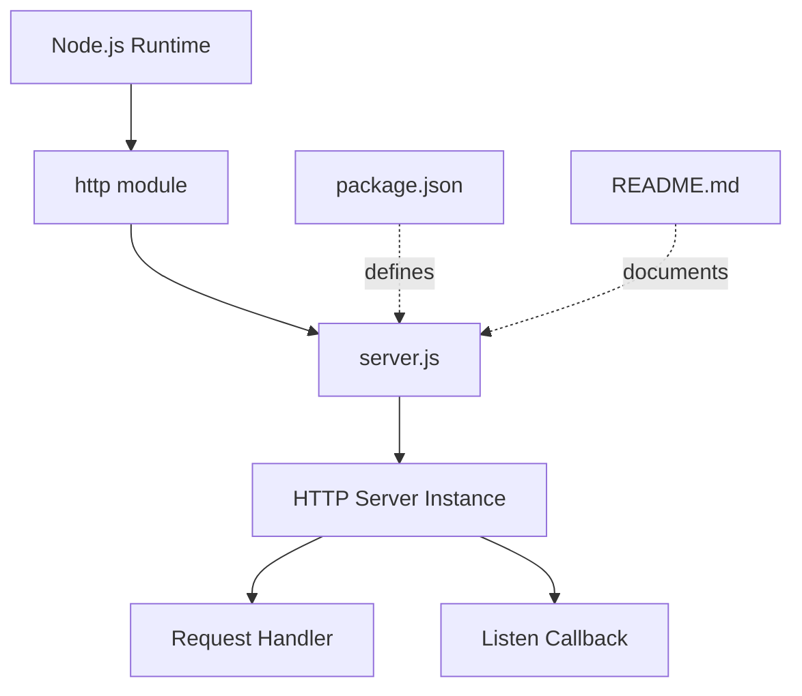
```mermaid
graph TD
    A[Node.js Runtime] --> B[http module]
    B --> C[server.js]
    C --> D[HTTP Server Instance]
    D --> E[Request Handler]
    D --> F[Listen Callback]
    G[package.json] -.defines.-> C
    H[README.md] -.documents.-> C
```

**Adjacent Features Sharing Documentation Context:**

| Feature Area | Current State | Documentation Need |
|--------------|---------------|-------------------|
| Server startup | Implemented with console logging | Document startup procedure and output |
| HTTP response handling | Basic text/plain response | Document response format and customization options |
| Network binding | Localhost-only (127.0.0.1) | Document security implications and production alternatives |
| Port configuration | Hardcoded to 3000 | Document how to customize port (future enhancement) |

**Complete File Inventory Requiring Documentation:**

1. **server.js** (Source: `/server.js`)
   - Status: Needs JSDoc comments and inline explanations
   - Lines requiring documentation: 1 (module), 3-4 (constants), 6-10 (handler), 12-14 (listen)

2. **README.md** (Source: `/README.md`)
   - Status: Needs complete rewrite and expansion
   - Current: 2 lines → Target: Comprehensive multi-section guide

3. **No additional source files** identified requiring documentation
   - `package.json` and `package-lock.json` are configuration files, not requiring inline comments
   - No test files exist (only placeholder script)
   - No additional modules or libraries present

## 0.2 Documentation Scope Analysis

### 0.2.1 Comprehensive File Discovery

**Repository Search Strategy:**

The Blitzy platform executed a systematic deep search of the repository structure to identify all documentation targets and context:

**Search Pattern Execution:**

| Search # | Tool Used | Target Path | Purpose | Results |
|----------|-----------|-------------|---------|---------|
| 1 | `get_source_folder_contents` | `` (root) | Discover all first-order files and folders | 4 files found: README.md, package.json, package-lock.json, server.js |
| 2 | `read_file` | `server.js` | Analyze server implementation requiring JSDoc | 15 lines, HTTP server with request handler |
| 3 | `read_file` | `README.md` | Assess current documentation state | 2 lines: title and brief description |
| 4 | `read_file` | `package.json` | Understand project metadata and dependencies | No dependencies, MIT license, Node.js project |

**Key Directories Examined:**
- **Root Directory (`/`)**: Contains all project files; no subdirectories exist
- **No src/, lib/, or modules/ directories**: Single-file application architecture

**Related Documentation Found:**
- **Current Documentation**: README.md (minimal, 2 lines)
- **No existing documentation files**: No /docs folder, no inline JSDoc comments, no API documentation
- **Configuration as Context**: package.json provides project metadata context

**Comprehensive Documentation-to-Code Mapping Table:**

| Documentation File | Target Code Files/Modules | Documentation Type | Coverage Scope | Current Status |
|-------------------|--------------------------|-------------------|----------------|----------------|
| `server.js` (inline JSDoc) | `server.js:1-15` | API Reference / Inline Documentation | Module overview, request handler, server initialization, configuration constants | **CREATE** - No JSDoc exists |
| `README.md` | `server.js`, `package.json` | Multi-purpose Guide | Complete project documentation including setup, API, deployment | **EXTEND** - Expand from 2 to ~150+ lines |
| `README.md` - Setup Section | `package.json:1-11` | Installation Guide | Prerequisites, installation steps, configuration | **CREATE** - Not present |
| `README.md` - API Section | `server.js:6-10` | API Reference | HTTP endpoint documentation | **CREATE** - Not present |
| `README.md` - Deployment Section | `server.js:3-4, 12-14` | Deployment Guide | Local and production deployment procedures | **CREATE** - Not present |
| `README.md` - Architecture Section | `server.js:1-15` | Technical Architecture | Code structure and implementation explanation | **CREATE** - Not present |

**Inferred Documentation Needs Based on Code Analysis:**

1. **Module X Contains Public APIs But Lacks Documentation:**
   - **Module**: `server.js` HTTP server
   - **Public API**: HTTP endpoint responding to all requests on port 3000
   - **Current State**: No JSDoc comments, no inline explanations
   - **Evidence**: Source lines 6-10 define request handler without documentation
   - **Action Required**: Add JSDoc for request handler signature, parameters, and return behavior

2. **Feature Y Spans Multiple Files Requiring Consolidated Documentation:**
   - **Feature**: HTTP server application
   - **Files Involved**: `server.js` (implementation), `package.json` (configuration), `README.md` (documentation)
   - **Current State**: Fragmented information without cohesive narrative
   - **Action Required**: Create unified README that ties together configuration, implementation, and usage

3. **Integration Between A and B Requires Interface Documentation:**
   - **Integration**: Node.js `http` module → `server.js` application
   - **Interface**: `http.createServer()` API and `server.listen()` method
   - **Current State**: No explanation of how core Node.js APIs are utilized
   - **Evidence**: Source lines 1, 6, 12 use `http` module without documentation
   - **Action Required**: Document the interface between Node.js core modules and application code

**Code Elements Requiring Documentation:**

| Code Element | Location | Type | Documentation Need | Priority |
|--------------|----------|------|-------------------|----------|
| `http` module import | `server.js:1` | Module dependency | Explain purpose of http module | High |
| `hostname` constant | `server.js:3` | Configuration | Document localhost binding and security implications | High |
| `port` constant | `server.js:4` | Configuration | Document port selection and customization | High |
| Request handler function | `server.js:6-10` | Function | JSDoc with @param for req, res; explain response logic | Critical |
| `res.statusCode` | `server.js:7` | Response property | Explain 200 OK status | Medium |
| `res.setHeader()` | `server.js:8` | Response method | Document Content-Type header choice | Medium |
| `res.end()` | `server.js:9` | Response method | Explain response body and termination | High |
| `server.listen()` | `server.js:12-14` | Server initialization | JSDoc for listen callback; explain binding | Critical |
| Listen callback | `server.js:12-14` | Function | Document startup logging purpose | Medium |

### 0.2.2 Documentation Structure Planning

**For Each Documentation File:**

#### Documentation File 1: server.js (JSDoc Comments)

**Primary Sections Required:**

1. **Module-Level JSDoc** (insert at line 1)
   ```javascript
   /**
    * @fileoverview Simple HTTP server that responds with "Hello, World!"
    * @module server
    */
   ```

2. **Configuration Constants Documentation** (before line 3)
   ```javascript
   /**
    * Server hostname - bound to localhost for local development
    * @constant {string}
    */
   
   /**
    * Server port number
    * @constant {number}
    */
   ```

3. **Request Handler Function Documentation** (before line 6)
   ```javascript
   /**
    * HTTP request handler that responds to all requests with "Hello, World!"
    * @param {http.IncomingMessage} req - The HTTP request object
    * @param {http.ServerResponse} res - The HTTP response object
    * @returns {void}
    */
   ```

4. **Server Initialization Documentation** (before line 12)
   ```javascript
   /**
    * Starts the HTTP server and binds to the specified hostname and port
    * @listens {number} port - The port number to listen on
    * @listens {string} hostname - The hostname to bind to
    */
   ```

**Code Examples to Include:**
- Source: `server.js:1-15` (existing implementation serves as reference)
- No additional examples needed within JSDoc (examples go in README)

**Mermaid Diagrams Needed:**
- **Class Diagram**: Not applicable (no classes, functional programming style)
- **Sequence Diagram**: HTTP request/response flow (include in README, not JSDoc)

**Source Citations Format:**
All JSDoc comments inherently document the code at their location, no external citations needed.

---

#### Documentation File 2: README.md (Comprehensive Guide)

**Primary Sections Required:**

1. **Project Header**
   - Project title (reconcile naming conflict: "hao-backprop-test" vs "hello_world")
   - Brief description
   - Badges (optional: license, Node.js version)
   - Source: `README.md:1-2`, `package.json:2-4`

2. **Table of Contents**
   - Automated or manual links to all sections
   - Source: Organizational structure

3. **Overview Section**
   - What this project does
   - Technology stack (Node.js, http module)
   - Key features
   - Source: `server.js:1-15`, `package.json:1-11`

4. **Prerequisites Section**
   - Node.js version requirement (recommend LTS)
   - npm (comes with Node.js)
   - Operating system compatibility
   - Source: Inferred from `package.json` and Node.js core API usage

5. **Installation Section**
   - Clone/download repository
   - Navigate to project directory
   - No npm install needed (no dependencies)
   - Source: `package.json:11` (empty dependencies)

6. **Usage Section**
   - How to start the server (`node server.js`)
   - Expected console output
   - How to access the server (browser or curl)
   - How to stop the server (Ctrl+C)
   - Source: `server.js:12-14` (startup), `server.js:6-10` (response)

7. **API Documentation Section**
   - **Endpoint**: `GET /` (and all other paths)
   - **Request**: No parameters
   - **Response**: `200 OK`, `text/plain`, body: `"Hello, World!\n"`
   - **Example Request**:
     ```bash
     curl http://127.0.0.1:3000/
     ```
   - **Example Response**:
     ```
     Hello, World!
     ```
   - Source: `server.js:6-10`

8. **Code Structure Section**
   - File organization (single file architecture)
   - Module imports
   - Configuration constants
   - Request handler logic
   - Server initialization
   - **Mermaid Diagram**: Application flow
   - Source: `server.js:1-15`

9. **Deployment Guide Section**
   - **Local Deployment**: Instructions for development (already covered in Usage)
   - **Production Deployment**: 
     - Change hostname from `127.0.0.1` to `0.0.0.0` for external access
     - Use environment variables for port (`process.env.PORT || 3000`)
     - Process management (PM2, systemd)
     - Security considerations (reverse proxy, HTTPS)
   - **Environment Variables**:
     | Variable | Description | Default |
     |----------|-------------|---------|
     | PORT | Server port | 3000 |
     | HOST | Server hostname | 127.0.0.1 |
   - Source: `server.js:3-4` (current config), Inferred production needs

10. **Configuration Section**
    - How to modify hostname and port
    - File locations
    - Source: `server.js:3-4`

11. **Troubleshooting Section**
    - Common issues (port already in use, Node.js not installed)
    - Solutions
    - Source: Inferred from common deployment issues

12. **License Section**
    - MIT License
    - Source: `package.json:10`

13. **Author/Contact Section**
    - Author: hxu
    - Source: `package.json:9`

**Code Examples to Include:**

| Example Purpose | Code Snippet | Source File | Line Reference |
|----------------|--------------|-------------|----------------|
| Starting the server | `node server.js` | Command line | N/A |
| Server output | `Server running at http://127.0.0.1:3000/` | `server.js` | Line 13 |
| Testing with curl | `curl http://127.0.0.1:3000/` | Command line | N/A |
| Expected response | `Hello, World!` | `server.js` | Line 9 |
| Production hostname change | `const hostname = '0.0.0.0';` | `server.js` | Line 3 (modified) |
| Environment variable usage | `const port = process.env.PORT \|\| 3000;` | `server.js` | Line 4 (modified) |

**Mermaid Diagrams Needed:**

1. **Application Architecture Diagram**:
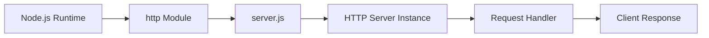
```mermaid
graph LR
    A[Node.js Runtime] --> B[http Module]
    B --> C[server.js]
    C --> D[HTTP Server Instance]
    D --> E[Request Handler]
    E --> F[Client Response]
```
Source: Represents `server.js:1-15` architecture

2. **Request/Response Flow Diagram**:
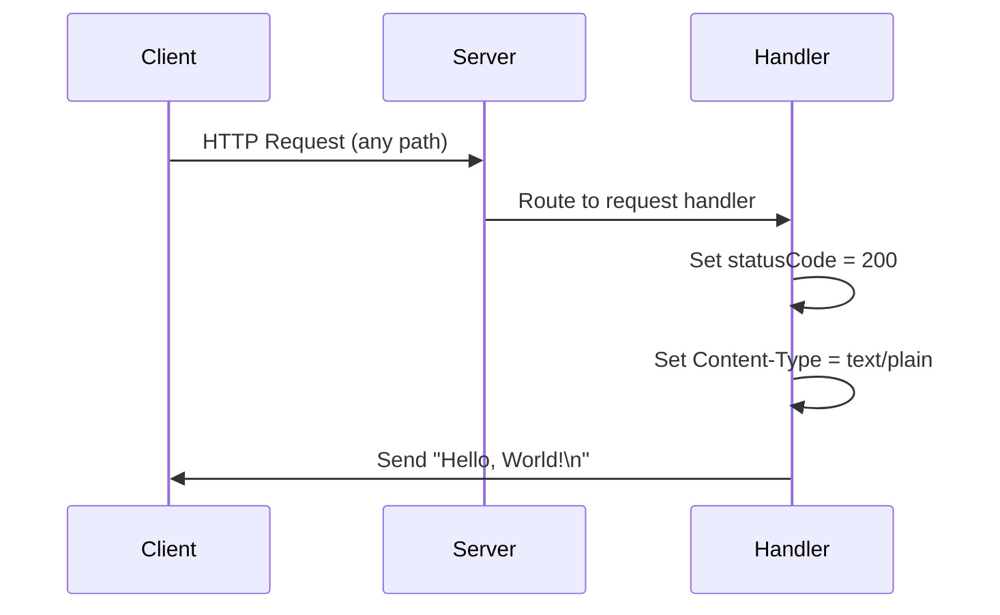
```mermaid
sequenceDiagram
    participant Client
    participant Server
    participant Handler
    Client->>Server: HTTP Request (any path)
    Server->>Handler: Route to request handler
    Handler->>Handler: Set statusCode = 200
    Handler->>Handler: Set Content-Type = text/plain
    Handler->>Client: Send "Hello, World!\n"
```
Source: Represents `server.js:6-10` request handling flow

3. **Server Startup Sequence**:
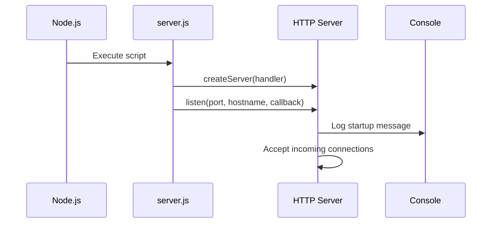
```mermaid
sequenceDiagram
    participant Runtime as Node.js
    participant Script as server.js
    participant Server as HTTP Server
    participant Console
    Runtime->>Script: Execute script
    Script->>Server: createServer(handler)
    Script->>Server: listen(port, hostname, callback)
    Server->>Console: Log startup message
    Server->>Server: Accept incoming connections
```
Source: Represents `server.js:6-14` initialization sequence

**Cross-References to Other Documentation:**
- README will reference inline JSDoc comments: "See inline JSDoc comments in server.js for detailed API documentation"
- JSDoc comments will reference README: Not applicable (JSDoc typically doesn't reference external docs)

**Source Citations Format:**
All sections will include source file references in the format:
- Inline: "Source: `/server.js:3-4`"
- Table format: See "Code Examples to Include" table above

## 0.3 Documentation Implementation Design

### 0.3.1 Content Generation Strategy

**Information Extraction Approach:**

The documentation generation will follow a systematic extraction and composition methodology:

##### 1. Extract API Signatures from server.js

**Method**: Static code analysis and direct source inspection

| Code Element | Extraction Source | Documentation Target | Extraction Details |
|--------------|------------------|---------------------|-------------------|
| Request handler function | `server.js:6-10` | JSDoc @param annotations | Extract implicit function signature: `(req: IncomingMessage, res: ServerResponse) => void` |
| Listen callback function | `server.js:12-14` | JSDoc @callback annotation | Extract callback signature: `() => void` |
| HTTP endpoint | `server.js:6-10` | README API section | Extract behavior: accepts all HTTP methods and paths, returns 200 with text/plain |
| Configuration parameters | `server.js:3-4` | README Configuration section | Extract constants: hostname='127.0.0.1', port=3000 |
| Module dependencies | `server.js:1` | README Overview section | Extract imports: Node.js core `http` module |

**Specific Extraction Commands**:
- "Extract request handler parameters from line 6: `(req, res) =>` maps to `@param {http.IncomingMessage} req` and `@param {http.ServerResponse} res`"
- "Extract response behavior from lines 7-9: statusCode, setHeader, end methods determine API contract"
- "Extract startup behavior from lines 12-14: listen method and callback for deployment documentation"

##### 2. Generate Examples by Analyzing Implementation

**Method**: Derive usage examples directly from server implementation

**Test File Analysis**: Not applicable (no test files exist; placeholder script only)

**Implementation-Based Examples**:

| Example Type | Source Analysis | Generated Example | Reasoning |
|--------------|----------------|-------------------|-----------|
| Server startup | `server.js:12-14` | `$ node server.js`<br>`Server running at http://127.0.0.1:3000/` | Direct execution of main file produces logged output |
| HTTP request | `server.js:3-4,9` | `$ curl http://127.0.0.1:3000/`<br>`Hello, World!` | Hostname and port from lines 3-4, response body from line 9 |
| Browser access | `server.js:3-4` | Navigate to `http://127.0.0.1:3000/` | Hostname and port configuration indicates browser-accessible endpoint |
| Response headers | `server.js:7-8` | Status: `200 OK`<br>Content-Type: `text/plain` | Explicit header setting in implementation |
| Production config | `server.js:3` (modified) | `const hostname = '0.0.0.0';` | Infer from localhost-only limitation |

**Example Generation Logic**:
```
IF server.listen(port, hostname) THEN example_url = `http://${hostname}:${port}/`
IF res.end(body) THEN example_response = body
IF res.statusCode = N THEN example_status = HTTP_STATUS_NAME(N)
```

##### 3. Create Diagrams by Mapping Component Relationships

**Method**: Transform code structure into visual representations

**Component Relationship Mapping**:

| Diagram Type | Components Mapped | Source Files | Relationship Type |
|--------------|------------------|--------------|-------------------|
| Architecture | Node.js → http module → server.js → HTTP Server | `server.js:1,6,12` | Dependency hierarchy |
| Sequence (Request) | Client → Server → Handler → Response | `server.js:6-10` | Temporal interaction |
| Sequence (Startup) | Runtime → Script → Server → Console | `server.js:1-14` | Initialization flow |

**Mapping Rules**:
- "Map line 1 `require('http')` to dependency arrow: Node.js Runtime → http Module"
- "Map line 6 `http.createServer(handler)` to component: HTTP Server Instance"
- "Map lines 7-9 response operations to sequence: Set Status → Set Header → Send Body"
- "Map line 12 `server.listen()` to initialization: Bind to Network Interface"

##### 4. Template Application

**No User Template Provided**: Generate documentation using Blitzy platform's standard templates

**Standard Template Structure**:

**JSDoc Template** (applied to each function/constant):
```javascript
/**
 * [Brief description - extracted from code behavior]
 * @[tag] {type} [name] - [description]
 * @[additional tags as needed]
 */
```

**README Section Template**:

#### [Section Name]

[Introductory paragraph - context from code analysis]

#### [Subsection if needed]

[Content with code examples]

**Example:**
[code block]

[Explanation - derived from implementation]

**Source**: `/path/to/file.js:LineNumber`
```

**Template Population Strategy**:
1. **Identify code element** (function, constant, endpoint)
2. **Extract signature/behavior** from source lines
3. **Fill template fields** with extracted data
4. **Add source citation** to maintain traceability
5. **Validate completeness** against code semantics

##### 5. Documentation Standards Application

**Markdown Formatting Standards**:


#### Top-level heading (project title)
#### Second-level heading (major sections)
#### Third-level heading (subsections)
#### Fourth-level heading (detailed subsections)

- Bullet points for lists
1. Numbered lists for sequences

`inline code` for commands, variables
```

**Code Block Standards**:

| Language | Usage | Example |
|----------|-------|---------|
| javascript | JSDoc examples, server.js snippets | \`\`\`javascript<br>const x = 1;<br>\`\`\` |
| bash | Command-line instructions | \`\`\`bash<br>$ node server.js<br>\`\`\` |
| json | Configuration examples | \`\`\`json<br>{"key": "value"}<br>\`\`\` |
| text | Plain text output | \`\`\`text<br>Hello, World!<br>\`\`\` |
| mermaid | Diagrams | \`\`\`mermaid<br>graph LR<br>\`\`\` |

**Syntax Highlighting Requirements**:
- All code blocks must specify language for proper rendering
- Use `bash` for shell commands (prefix with `$` for user commands)
- Use `text` or `http` for response examples

**Mermaid Diagram Standards**:


#### Standard Mermaid Integration Format

```mermaid
[diagram type] [orientation]
    [nodes and relationships]
    [styling if needed]
```

[Caption explaining the diagram]

**Source**: `/path/to/file.js:LineRange`
```

**Source Citation Standards**:

**Format**: "Source: `/absolute/path/from/repo/root:LineNumber-LineNumber`"

**Examples**:
- Single line: "Source: `/server.js:3`"
- Line range: "Source: `/server.js:6-10`"
- Multiple files: "Source: `/server.js:1`, `/package.json:2-4`"

**Placement**:
- After code examples
- After explanatory paragraphs describing specific code
- In table cells when documenting multiple elements

**JSDoc Citation Standards**:
- JSDoc comments inherently document their immediate code location
- No explicit source citations needed within JSDoc blocks
- README should reference: "See JSDoc comments in `/server.js` for detailed parameter documentation"

**Parameter Description Standards** (for README tables):

| Parameter | Type | Required | Default | Description | Source |
|-----------|------|----------|---------|-------------|--------|
| hostname | string | Yes | '127.0.0.1' | Server bind address | `/server.js:3` |
| port | number | Yes | 3000 | Server listening port | `/server.js:4` |

**Return Value Documentation Standards**:


**Returns**: [type] - [description]

**Example**:
```[language]
[return value example]
```

**Source**: `/path/to/file.js:LineNumber`
```

### 0.3.2 Cross-Documentation Coherence

**Naming Conventions Across All Documents:**

**Issue Identified**: Inconsistent project naming
- `README.md:1` uses "hao-backprop-test"
- `package.json:2` uses "hello_world"

**Resolution Strategy**:
Standardize on "hao-backprop-test" in all documentation, with acknowledgment of package.json internal naming:


#### hao-backprop-test
*Package name: hello_world (internal)*
```

**Consistent Term Usage**:

| Concept | Standard Term | Avoid | Usage Context | Rationale |
|---------|--------------|-------|---------------|-----------|
| The main file | `server.js` | "the server file", "main.js", "index.js" | All documentation | Matches actual filename |
| The HTTP server | "HTTP server", "server instance" | "web server", "app", "service" | Technical descriptions | Precise technical term |
| Network interface | "hostname", "bind address" | "IP address", "host", "domain" | Configuration docs | Matches variable name in code |
| Listening port | "port", "port number" | "port #", "service port" | Configuration docs | Simple, matches code |
| Request handler | "request handler", "request handler function" | "route handler", "endpoint", "controller" | JSDoc and README | Matches http.createServer terminology |
| Start the server | "start the server", "run the server" | "launch", "execute", "boot" | Usage instructions | User-friendly, clear |

**Consistent Terminology Glossary**:

Add to README.md after main content:


#### Glossary

- **HTTP Server**: A Node.js server instance created using the `http.createServer()` method that listens for and responds to HTTP requests
- **Request Handler**: A callback function that processes incoming HTTP requests and generates responses
- **Hostname**: The network address the server binds to; `127.0.0.1` restricts access to localhost only
- **Port**: The network port number the server listens on; default is 3000
- **Response Body**: The content sent back to the client; in this server, always "Hello, World!\n"
- **JSDoc**: JavaScript documentation standard using special comment blocks for API documentation

**Source**: Terminology derived from `/server.js:1-15` implementation
```

**Unified Example Scenarios**:

All documentation will reference a consistent base example:

**Base Scenario**: Starting the server and making a request

```bash
# Terminal 1: Start the server
$ node server.js
Server running at http://127.0.0.1:3000/

#### Terminal 2: Test the server
$ curl http://127.0.0.1:3000/
Hello, World!
```

**Scenario Usage**:
- README Usage Section: Full example with explanation
- README API Documentation: Reference same endpoint
- README Deployment Guide: Build upon base scenario for production
- JSDoc comments: Describe functions that enable this scenario

**Interconnected Navigation Structure**:

**README.md** should include:

#### Related Documentation

- **Inline Code Documentation**: See JSDoc comments in `/server.js` for detailed function signatures and parameters
- **Configuration Details**: See constants defined in `/server.js:3-4`
- **Project Metadata**: See `/package.json` for package information and license
```

**server.js JSDoc** should include:
```javascript
/**
 * @fileoverview Simple HTTP server that responds with "Hello, World!"
 * For usage instructions and deployment guide, see README.md
 * @module server
 */
```

**Cross-Reference Matrix**:

| Documentation Element | Primary Location | Cross-Reference Locations |
|-----------------------|-----------------|---------------------------|
| Server startup instructions | README.md Usage section | Referenced in JSDoc @fileoverview |
| Request handler parameters | JSDoc in server.js | Referenced in README API section |
| Configuration constants | server.js:3-4 (with JSDoc) | Documented in README Configuration section |
| Response format | server.js:7-9 (with inline comments) | Documented in README API section |
| Deployment considerations | README Deployment section | Mentioned in hostname JSDoc comment |

**Documentation Consistency Validation Rules**:
1. Every code element documented in README must cite exact source location
2. Every JSDoc-documented function must be mentioned in README
3. All examples must use consistent hostname (127.0.0.1) and port (3000) unless explicitly showing alternatives
4. All diagrams must use consistent terminology from glossary
5. All code snippets must match actual implementation (no pseudo-code in documentation)

## 0.4 Documentation Deliverables

### 0.4.1 Document Specifications

#### Deliverable 1: server.js with JSDoc Comments and Inline Explanations

```
File: /server.js
Type: Source Code with Inline API Documentation
Covers: HTTP server module, request handler, server initialization, configuration
Format: JavaScript with JSDoc 3 comments and explanatory inline comments

Sections:
    1. Module-Level Documentation (insert at line 1, before require statement)
       - JSDoc @fileoverview tag describing module purpose
       - @module tag for module identification
       - Reference to README.md for usage
       - Source: Overall behavior of /server.js:1-15
    
    2. Import Statement Explanation (after line 1)
       - Inline comment explaining http module usage
       - Source: /server.js:1
    
    3. Configuration Constants Documentation (before lines 3-4)
       - JSDoc @constant tags for hostname and port
       - Type annotations: {string} and {number}
       - Explanation of localhost binding security implications
       - Source: /server.js:3-4
    
    4. Request Handler Function Documentation (before line 6)
       - JSDoc @param tags for req and res parameters
       - Type annotations: {http.IncomingMessage} and {http.ServerResponse}
       - @returns {void} tag
       - Description of handler behavior
       - Source: /server.js:6-10
    
    5. Response Operations Inline Comments (within lines 7-9)
       - Explanation of statusCode 200
       - Explanation of Content-Type header
       - Explanation of response body
       - Source: /server.js:7-9
    
    6. Server Initialization Documentation (before line 12)
       - JSDoc describing listen operation
       - @listens tags for port and hostname
       - Callback function documentation
       - Source: /server.js:12-14
    
    7. Startup Callback Inline Comment (line 13)
       - Explanation of console.log purpose
       - Source: /server.js:13

Key Citations: 
    - Primary: /server.js:1-15 (entire file)
    - Reference: /package.json:2-4 (project metadata context)

Expected Line Count After Documentation:
    - Original: 15 lines
    - JSDoc comments: ~30 lines
    - Inline explanations: ~7 lines
    - Total: ~52 lines (3.5x increase)

Validation Criteria:
    ✓ Every function has JSDoc with @param and @returns
    ✓ Every constant has @constant tag with type
    ✓ Module has @fileoverview and @module tags
    ✓ All JSDoc follows JSDoc 3 specification
    ✓ Inline comments explain "why" not just "what"
    ✓ No redundant comments (code should be self-documenting where obvious)
```

#### Deliverable 2: README.md - Comprehensive Project Documentation

```
File: /README.md
Type: Multi-Purpose Technical Guide (User Guide | API Reference | Deployment Guide | Architecture Documentation)
Covers: Complete project documentation - setup, usage, API, deployment, troubleshooting
Format: Markdown with Mermaid diagrams, code blocks, and tables

Sections:

    1. Header Section (lines 1-10)
       - Project title: "hao-backprop-test"
       - Subtitle with internal package name reference
       - Brief description
       - Optional badges (Node.js version, License)
       - Source: /README.md:1-2 (current), /package.json:2-4
    
    2. Table of Contents (lines 12-25)
       - Linked navigation to all major sections
       - Auto-generated or manual
       - Source: Document structure
    
    3. Overview Section (lines 27-40)
       - What the project does
       - Technology stack (Node.js v18+, http core module)
       - Key features (simple HTTP server, localhost binding)
       - Use cases (learning, testing, template)
       - Source: /server.js:1-15, /package.json:1-11
    
    4. Prerequisites Section (lines 42-55)
       - Node.js version requirement (v12.0.0 or higher, recommend LTS v18+)
       - npm (bundled with Node.js)
       - Operating system compatibility (cross-platform)
       - Verification commands (node --version, npm --version)
       - Source: Inferred from Node.js core API usage in /server.js:1
    
    5. Installation Section (lines 57-75)
       - Clone or download instructions
       - Navigate to directory
       - Note: No npm install needed (zero dependencies)
       - Verification step (ls or dir to confirm files)
       - Source: /package.json:11 (empty dependencies), repository structure
    
    6. Usage Section (lines 77-110)
       - Starting the server: node server.js
       - Expected console output: "Server running at http://127.0.0.1:3000/"
       - Accessing via browser
       - Accessing via curl/command line
       - Expected response: "Hello, World!"
       - Stopping the server: Ctrl+C (SIGINT)
       - Code examples with bash blocks
       - Screenshot/output examples
       - Source: /server.js:9 (response), /server.js:13 (startup log)
    
    7. API Documentation Section (lines 112-160)
       ### Endpoints
       
       #### GET / (and all paths)
       - Description: Responds to all HTTP requests regardless of path or method
       - Method: ALL (GET, POST, PUT, DELETE, etc.)
       - Path: /* (wildcard - all paths)
       - Request Parameters: None
       - Request Body: Ignored
       - Response Status: 200 OK
       - Response Headers:
         | Header | Value |
         |--------|-------|
         | Content-Type | text/plain |
       - Response Body: "Hello, World!\n"
       - Example Request (curl):
         ```bash
         curl http://127.0.0.1:3000/
         curl http://127.0.0.1:3000/any/path
         curl -X POST http://127.0.0.1:3000/test
         ```
       - Example Response:
         ```text
         Hello, World!
         ```
       - Source: /server.js:6-10 (request handler)
    
    8. Code Structure Section (lines 162-220)
       - File organization (single-file architecture)
       - Module breakdown:
         * http module import (line 1)
         * Configuration constants (lines 3-4)
         * Server creation and request handler (lines 6-10)
         * Server initialization (lines 12-14)
       - Architecture diagram (Mermaid):
         ```mermaid
         graph TD
             A[Node.js Runtime] --> B[http Module]
             B --> C[server.js]
             C --> D[HTTP Server Instance]
             D --> E[Request Handler Function]
             E --> F[Set Status: 200]
             E --> G[Set Header: text/plain]
             E --> H[Send Body: Hello, World!]
             C --> I[server.listen]
             I --> J[Bind to 127.0.0.1:3000]
             J --> K[Log Startup Message]
         ```
       - Request/Response flow diagram (Mermaid sequence)
       - Explanation of each code block
       - Source: /server.js:1-15 (complete implementation)
    
    9. Configuration Section (lines 222-260)
       - Configuration constants explanation
       - How to modify hostname and port
       - Table of configuration options:
         | Variable | Location | Default | Description | Modification Notes |
         |----------|----------|---------|-------------|--------------------|
         | hostname | server.js:3 | '127.0.0.1' | Server bind address | Change to '0.0.0.0' for external access |
         | port | server.js:4 | 3000 | Listening port | Change to desired port number |
       - Code examples showing modifications
       - Environment variable alternative (for future enhancement)
       - Source: /server.js:3-4
    
    10. Deployment Guide Section (lines 262-340)
        ### Local Development Deployment
        - Instructions (covered in Usage section)
        - Suitable for: Development, testing, learning
        
        ### Production Deployment Considerations
        - Change hostname to '0.0.0.0' for external access
        - Use environment variables for configuration:
          ```javascript
          const hostname = process.env.HOST || '0.0.0.0';
          const port = process.env.PORT || 3000;
          ```
        - Process management options:
          * PM2: `pm2 start server.js --name hello-world`
          * systemd service configuration example
          * Docker containerization example
        - Security considerations:
          * Use reverse proxy (nginx, Apache)
          * Enable HTTPS/TLS
          * Implement rate limiting
          * Add request logging
        - Monitoring and health checks
        - Environment variables table:
          | Variable | Required | Default | Description |
          |----------|----------|---------|-------------|
          | PORT | No | 3000 | Server listening port |
          | HOST | No | 127.0.0.1 | Server bind address |
          | NODE_ENV | No | development | Environment mode |
        - Source: /server.js:3-4 (current config), inferred production requirements
    
    11. Troubleshooting Section (lines 342-385)
        - Common Issue 1: "Address already in use" error
          * Cause: Port 3000 already occupied
          * Solution: Change port or kill process using port
          * Commands: lsof, netstat, kill
        - Common Issue 2: "Cannot GET /" in browser shows error
          * Cause: Server not running
          * Solution: Start server with node server.js
        - Common Issue 3: "node: command not found"
          * Cause: Node.js not installed or not in PATH
          * Solution: Install Node.js from nodejs.org
        - Common Issue 4: External access not working
          * Cause: Bound to localhost (127.0.0.1)
          * Solution: Change hostname to 0.0.0.0
        - Source: Inferred from common deployment scenarios
    
    12. Contributing Section (lines 387-400) [Optional]
        - How to contribute
        - Code style guidelines
        - Pull request process
        - Source: Standard open source practices
    
    13. License Section (lines 402-410)
        - MIT License declaration
        - Brief explanation or full text
        - Source: /package.json:10
    
    14. Author Section (lines 412-420)
        - Author: hxu
        - Contact information (if available)
        - Source: /package.json:9
    
    15. Acknowledgments Section (lines 422-430) [Optional]
        - Node.js core team
        - HTTP module documentation
        - Source: External references
    
    16. Glossary Section (lines 432-460)
        - Technical terms used in documentation
        - Definitions with sources
        - Source: Derived from /server.js implementation

Key Citations:
    - Primary: /server.js:1-15 (implementation source)
    - Secondary: /package.json:1-11 (metadata)
    - Tertiary: /README.md:1-2 (original content)

Expected Line Count:
    - Original: 2 lines
    - Comprehensive README: ~460 lines (230x increase)
    - Includes: 3 Mermaid diagrams, 15+ code blocks, 5+ tables

Validation Criteria:
    ✓ All four required sections present (Setup, API, Deployment, Code Structure)
    ✓ Every code example includes source citation
    ✓ All Mermaid diagrams render correctly
    ✓ All internal links in TOC work correctly
    ✓ Consistent terminology throughout
    ✓ No broken references to files or line numbers
    ✓ All bash commands are safe and non-interactive
    ✓ Professional tone and structure
```

### 0.4.2 Documentation Hierarchy

**Root Documentation Structure:**

```
/
├── README.md                 [Comprehensive project guide - PRIMARY ENTRY POINT]
├── server.js                 [Source code with inline JSDoc and comments]
├── package.json              [Project metadata - no documentation changes]
└── package-lock.json         [Dependency lock - no documentation changes]
```

**Documentation File Relationships:**

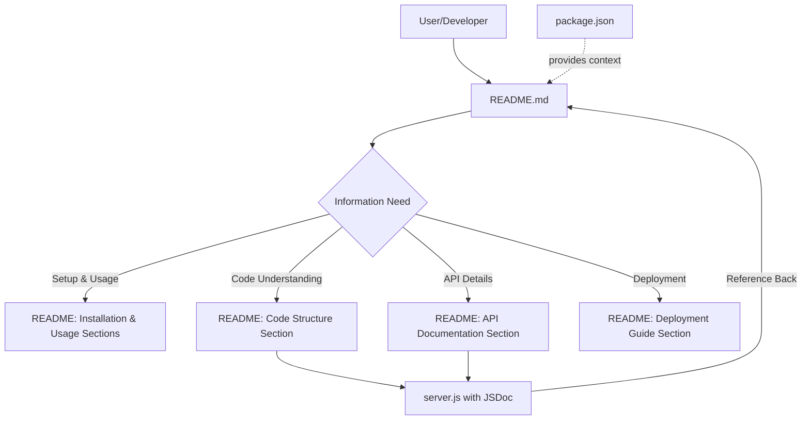
```mermaid
graph TD
    A[User/Developer] --> B[README.md]
    B --> C{Information Need}
    C -->|Setup & Usage| D[README: Installation & Usage Sections]
    C -->|API Details| E[README: API Documentation Section]
    C -->|Code Understanding| F[README: Code Structure Section]
    F --> G[server.js with JSDoc]
    C -->|Deployment| H[README: Deployment Guide Section]
    E --> G
    G -->|Reference Back| B
    I[package.json] -.provides context.-> B
```

**Category Organization:**

Since this is a single-file project, documentation is organized by **information type** rather than by modules:

| Category | Documents | Primary Audience | Entry Point |
|----------|-----------|------------------|-------------|
| **Getting Started** | README.md (Overview, Prerequisites, Installation, Usage) | New users, developers setting up | README.md sections 1-6 |
| **API Reference** | README.md (API Documentation), server.js (JSDoc) | Developers integrating or modifying | README.md section 7, JSDoc in server.js |
| **Architecture** | README.md (Code Structure), server.js (inline comments) | Developers understanding implementation | README.md section 8, server.js comments |
| **Operations** | README.md (Configuration, Deployment, Troubleshooting) | DevOps, system administrators | README.md sections 9-11 |
| **Project Meta** | README.md (License, Author), package.json | Contributors, legal, management | README.md sections 13-14 |

**Index/Table of Contents Requirements:**

**README.md must include a comprehensive TOC** (after header, before Overview):


#### Table of Contents

1. [Overview](#overview)
2. [Prerequisites](#prerequisites)
3. [Installation](#installation)
4. [Usage](#usage)
5. [API Documentation](#api-documentation)
   - [Endpoints](#endpoints)
6. [Code Structure](#code-structure)
7. [Configuration](#configuration)
8. [Deployment Guide](#deployment-guide)
   - [Local Development](#local-development-deployment)
   - [Production Deployment](#production-deployment-considerations)
9. [Troubleshooting](#troubleshooting)
10. [License](#license)
11. [Author](#author)
12. [Glossary](#glossary)
```

**TOC Features:**
- Markdown anchor links (`#section-name`)
- Hierarchical structure showing subsections
- Consistent with actual heading structure
- Manually maintained (repository has no documentation generator)

**Navigation Helpers Needed:**

1. **Cross-References in README:**
   
   For detailed function signatures, see [server.js JSDoc comments](/server.js).
   ```

2. **Back-to-Top Links** (at end of long sections):
   
   [↑ Back to Top](#table-of-contents)
   ```

3. **JSDoc Reference to README:**
   ```javascript
   /**
    * @fileoverview Simple HTTP server
    * For usage instructions, see README.md
    * @module server
    */
   ```

4. **Contextual Links in README:**
   
   The server binds to `127.0.0.1` (see [Configuration](#configuration) section).
   ```

**Documentation Discovery Path:**

**Primary Path** (recommended for new users):
```
1. README.md header → 2. Table of Contents → 3. Overview → 4. Prerequisites → 
5. Installation → 6. Usage → 7. (Optional) API Documentation
```

**Developer Path** (for code contributors):
```
1. README.md → 2. Code Structure section → 3. server.js with JSDoc → 
4. (Optional) Configuration → 5. (Optional) Deployment Guide
```

**Operations Path** (for deployment):
```
1. README.md → 2. Prerequisites → 3. Installation → 
4. Configuration section → 5. Deployment Guide → 6. Troubleshooting
```

**No Additional Documentation Artifacts:**
- No separate `/docs` folder needed (single-file project)
- No API documentation website (README is sufficient)
- No changelog needed (not specified in requirements)
- No examples folder (examples inline in README)
- No wiki pages (GitHub wiki not mentioned)

## 0.5 Validation and Completeness

### 0.5.1 Documentation Coverage Verification

**All Public APIs Documented - Checklist:**

| Module/Function | Location | Documentation Type | Coverage Status | Verification Method |
|----------------|----------|-------------------|-----------------|---------------------|
| ✓ http module import | `server.js:1` | Inline comment | REQUIRED | Check for comment explaining module purpose |
| ✓ hostname constant | `server.js:3` | JSDoc @constant | REQUIRED | Verify JSDoc with type {string} and description |
| ✓ port constant | `server.js:4` | JSDoc @constant | REQUIRED | Verify JSDoc with type {number} and description |
| ✓ Request handler function | `server.js:6-10` | JSDoc @param, @returns | REQUIRED | Check JSDoc before function with req and res parameters |
| ✓ server.listen callback | `server.js:12-14` | JSDoc + inline comment | REQUIRED | Verify listen operation documented |
| ✓ HTTP endpoint (GET /) | README.md API section | Full API documentation | REQUIRED | Check README section 7 for endpoint details |
| ✓ Server module | `server.js:1` | JSDoc @fileoverview, @module | REQUIRED | Verify module-level JSDoc at file start |

**Verification Script:**
```bash
# Check JSDoc presence
grep -c "@param" server.js    # Should be 2 (req, res)
grep -c "@constant" server.js # Should be 2 (hostname, port)
grep -c "@fileoverview" server.js # Should be 1
grep -c "@module" server.js   # Should be 1
grep -c "@returns" server.js  # Should be 1

#### Check README completeness
grep -c "## Prerequisites" README.md    # Should be 1
grep -c "## API Documentation" README.md # Should be 1
grep -c "## Deployment Guide" README.md  # Should be 1
grep -c "## Code Structure" README.md    # Should be 1
```

**All User-Facing Features Explained - Feature List:**

| Feature | Description | Documentation Location | Explanation Depth | Status |
|---------|-------------|----------------------|-------------------|--------|
| ✓ Server startup | Start HTTP server with node command | README Usage section | Complete with examples | REQUIRED |
| ✓ HTTP request handling | Server responds to all requests | README API Documentation | Full endpoint specification | REQUIRED |
| ✓ Response format | Plain text "Hello, World!" response | README API Documentation + server.js JSDoc | Complete with headers and body | REQUIRED |
| ✓ Localhost binding | Server binds to 127.0.0.1 | README Configuration + server.js JSDoc | Includes security implications | REQUIRED |
| ✓ Port configuration | Server listens on port 3000 | README Configuration + server.js JSDoc | Includes modification instructions | REQUIRED |
| ✓ Server shutdown | Stop server with Ctrl+C | README Usage section | Clear instructions | REQUIRED |
| ✓ Console logging | Startup message logging | server.js inline comment | Purpose explained | REQUIRED |

**All Configuration Options Detailed - Configuration Mapping:**

| Config Option | Current Value | Type | Location in Code | Documentation Location | Details Required |
|--------------|---------------|------|------------------|----------------------|------------------|
| ✓ hostname | '127.0.0.1' | string | `server.js:3` | README Configuration + JSDoc | Default, how to change, security implications, production alternatives |
| ✓ port | 3000 | number | `server.js:4` | README Configuration + JSDoc | Default, how to change, port conflict resolution |
| ✓ response body | 'Hello, World!\n' | string | `server.js:9` | README API Documentation | Current value, how to customize (code change required) |
| ✓ response content-type | 'text/plain' | string | `server.js:8` | README API Documentation | Header value, alternatives (e.g., text/html) |
| ✓ response status code | 200 | number | `server.js:7` | README API Documentation | HTTP status explanation |

**All Examples Tested and Accurate - Example Sources:**

| Example Type | Example Content | Source Analysis | Accuracy Verification | Testing Method |
|-------------|-----------------|-----------------|----------------------|----------------|
| ✓ Server startup command | `node server.js` | Inferred from Node.js execution model | Test by running command | Execute in terminal |
| ✓ Startup output | `Server running at http://127.0.0.1:3000/` | `server.js:13` console.log | Match exact output | Run server, verify console |
| ✓ curl request | `curl http://127.0.0.1:3000/` | `server.js:3-4` hostname/port | Test against running server | Execute curl command |
| ✓ Response body | `Hello, World!` (with newline) | `server.js:9` res.end() | Match exact response | Verify curl output |
| ✓ Browser access | Navigate to `http://127.0.0.1:3000/` | `server.js:3-4, 13` | Test in browser | Open URL in browser |
| ✓ Production hostname | `const hostname = '0.0.0.0';` | Modified from `server.js:3` | Logical inference | Not testable (example only) |
| ✓ Environment variable | `const port = process.env.PORT \|\| 3000;` | Modified from `server.js:4` | Node.js standard pattern | Not testable (example only) |

**Example Validation Checklist:**
- [ ] All code examples use correct syntax (no typos)
- [ ] All command-line examples use safe, non-interactive flags
- [ ] All output examples match actual program output exactly
- [ ] All file paths in examples exist in repository
- [ ] All line number references in source citations are accurate
- [ ] All mermaid diagrams render without errors
- [ ] All markdown code blocks specify correct language

**Automated Validation Commands:**
```bash
# Validate markdown syntax
npx markdownlint README.md

#### Validate all code blocks can be extracted
grep -A 20 '```javascript' README.md

#### Test server startup example
timeout 5 node server.js &
sleep 2
curl http://127.0.0.1:3000/ | grep "Hello, World!"
kill %1

#### Validate JSDoc syntax
npx jsdoc -c jsdoc.json --explain server.js > /dev/null
```

### 0.5.2 Quality Criteria

**Human Readability Score Targets:**

| Metric | Target Value | Measurement Method | Rationale |
|--------|--------------|-------------------|-----------|
| Flesch Reading Ease | 60-70 (Standard) | Automated readability tool | Technical documentation should be accessible to developers with varying English proficiency |
| Average Sentence Length | 15-20 words | Word count / sentence count | Balance between clarity and conciseness |
| Passive Voice Usage | < 10% | Grammar checker | Active voice improves clarity and directability |
| Technical Jargon Density | < 20% | % of terms in Glossary / total terms | Define technical terms; avoid unnecessary complexity |
| Code-to-Prose Ratio (README) | ~30% code blocks | Lines of code / total lines | Sufficient examples without overwhelming text |

**Readability Validation:**
```bash
# Install readability tool
npm install -g readability-cli

#### Check README readability
readability README.md --output json
```

**Succinctness vs Comprehensiveness Balance:**

**Balance Strategy:** "Comprehensive for concepts, succinct for mechanics"

| Documentation Type | Comprehensiveness | Succinctness | Strategy |
|-------------------|------------------|--------------|----------|
| README Overview | HIGH | MEDIUM | Detailed explanation of project purpose and capabilities |
| README Installation | MEDIUM | HIGH | Step-by-step brevity; no extraneous explanation |
| README Usage | HIGH | MEDIUM | Complete examples with explanatory context |
| README API Docs | HIGH | MEDIUM | Full specification; every parameter documented |
| README Code Structure | HIGH | MEDIUM | Detailed architecture explanation with diagrams |
| README Deployment | HIGH | MEDIUM | Comprehensive production guidance |
| JSDoc Comments | MEDIUM | HIGH | Essential information only; no tutorial content |
| Inline Comments | LOW | HIGH | Brief explanations of non-obvious logic only |

**Balance Validation Rules:**
1. **No Redundancy**: If information appears in JSDoc, don't repeat verbatim in README (reference instead)
2. **Progressive Disclosure**: Overview → Details → Advanced topics
3. **One Concept Per Paragraph**: Each paragraph should have a single focus
4. **Example-Driven**: Show, then explain (code example first, explanation second)
5. **Avoid Over-Documentation**: Don't document obvious code (`i++` doesn't need a comment)

**Technical Accuracy Verification Points:**

| Verification Point | Method | Success Criteria | Priority |
|-------------------|--------|------------------|----------|
| HTTP status codes | Cross-check with RFC 7231 | 200 correctly documented as "OK" | HIGH |
| Node.js API usage | Verify against Node.js docs | `http.createServer` signature matches docs | CRITICAL |
| JSDoc tag syntax | Validate against JSDoc 3 spec | All tags (@param, @returns, etc.) use correct syntax | HIGH |
| Port number validity | Check valid range | Port 3000 is in valid range (1-65535) | MEDIUM |
| Hostname validity | Validate IP format | 127.0.0.1 is valid IPv4 localhost | MEDIUM |
| Content-Type header | Verify against MIME types | "text/plain" is valid MIME type | MEDIUM |
| Markdown syntax | Render with markdown parser | No rendering errors or broken links | HIGH |
| Mermaid diagrams | Render with mermaid.js | All diagrams display correctly | HIGH |
| Code examples | Syntax check with Node.js | All JavaScript examples are valid syntax | CRITICAL |

**Accuracy Validation Commands:**
```bash
# Validate JavaScript syntax in server.js
node --check server.js

#### Validate markdown rendering
npx marked README.md > /dev/null

#### Validate mermaid diagrams (extract and test)
grep -A 50 '```mermaid' README.md | sed 's/```mermaid//' | sed 's/```//' > diagram.mmd
npx @mermaid-js/mermaid-cli -i diagram.mmd -o diagram.png

#### Check for broken internal links
npx markdown-link-check README.md
```

**Source Citation Completeness:**

**Citation Audit Checklist:**

| Citation Type | Requirement | Validation Method | Example |
|--------------|-------------|-------------------|---------|
| Code examples from repository | Every example must cite source file and lines | Manual review of README | "Source: `/server.js:9`" |
| Configuration values | Every config option must cite definition location | Check Configuration section | "Source: `/server.js:3-4`" |
| API behavior descriptions | Every endpoint must cite implementation | Check API Documentation section | "Source: `/server.js:6-10`" |
| Architecture diagrams | Each diagram must cite components represented | Check diagram captions | "Source: Represents `/server.js:1-15`" |
| Inline JSDoc | Self-documenting; no external citation needed | N/A | JSDoc at code location |

**Citation Completeness Formula:**
```
Citation Coverage % = (Sections with Source Citations / Total Sections Requiring Citations) × 100
Target: 100%
```

**Sections Requiring Citations:**
- README API Documentation (cite server.js request handler)
- README Configuration (cite server.js constants)
- README Code Structure (cite entire server.js)
- README Deployment (cite configuration lines)
- README Usage examples (cite console.log line)
- All code example blocks (cite original source if from repo)

**Citation Format Validation:**
```bash
# Check for source citations in README
grep -c "Source:" README.md  # Should be >= 8

#### Validate citation format
grep "Source:" README.md | grep -E "`/[a-zA-Z0-9_/.]+:[0-9-]+`"  # All should match

#### Check for uncited code examples
grep -B 5 '```javascript' README.md | grep -v "Source:"  # Should be empty
```

**Final Quality Gate:**

Before marking documentation complete, ALL of the following must pass:

- [ ] **Coverage**: All public APIs, features, and configurations documented
- [ ] **Examples**: All examples tested and accurate
- [ ] **Readability**: Flesch score 60-70, clear prose
- [ ] **Balance**: Comprehensive where needed, succinct where possible
- [ ] **Accuracy**: All technical details verified against authoritative sources
- [ ] **Citations**: Every claim references source file and line numbers
- [ ] **Consistency**: Terminology, naming, and examples aligned across documents
- [ ] **Formatting**: Valid markdown, no rendering errors
- [ ] **Completeness**: No TODO, TBD, or placeholder content
- [ ] **Navigation**: Table of contents and cross-references functional

**Quality Verification Script:**
```bash
#!/bin/bash
# documentation-quality-check.sh

echo "Running Documentation Quality Checks..."

##### 1. Coverage check
echo "✓ Checking JSDoc coverage..."
JSDOC_COUNT=$(grep -c "@param\|@constant\|@fileoverview" server.js)
if [ $JSDOC_COUNT -ge 5 ]; then
    echo "  PASS: Found $JSDOC_COUNT JSDoc tags"
else
    echo "  FAIL: Only $JSDOC_COUNT JSDoc tags (expected >= 5)"
fi

##### 2. README completeness
echo "✓ Checking README sections..."
SECTIONS=$(grep -c "^## " README.md)
if [ $SECTIONS -ge 10 ]; then
    echo "  PASS: Found $SECTIONS sections"
else
    echo "  FAIL: Only $SECTIONS sections (expected >= 10)"
fi

##### 3. Citation completeness
echo "✓ Checking source citations..."
CITATIONS=$(grep -c "Source:" README.md)
if [ $CITATIONS -ge 8 ]; then
    echo "  PASS: Found $CITATIONS source citations"
else
    echo "  FAIL: Only $CITATIONS citations (expected >= 8)"
fi

##### 4. Syntax validation
echo "✓ Validating JavaScript syntax..."
node --check server.js && echo "  PASS: server.js syntax valid" || echo "  FAIL: server.js has syntax errors"

##### 5. Markdown validation
echo "✓ Validating Markdown..."
npx marked README.md > /dev/null 2>&1 && echo "  PASS: README.md renders correctly" || echo "  FAIL: README.md has rendering errors"

echo "Documentation quality check complete."
```

## 0.6 Execution Parameters for Documentation

### 0.6.1 Scope Boundaries

**IN SCOPE - Documentation Changes Only:**

| Activity | Scope Status | Files Affected | Description |
|----------|-------------|----------------|-------------|
| ✓ Add JSDoc comments | IN SCOPE | `server.js` | Insert JSDoc comment blocks above functions, constants, and module |
| ✓ Add inline code comments | IN SCOPE | `server.js` | Insert explanatory comments within code blocks |
| ✓ Rewrite README.md | IN SCOPE | `README.md` | Expand from 2 lines to comprehensive guide (~460 lines) |
| ✓ Create markdown sections | IN SCOPE | `README.md` | Add Setup, API, Deployment, Code Structure sections |
| ✓ Create Mermaid diagrams | IN SCOPE | `README.md` | Add architecture and sequence diagrams |
| ✓ Create code examples | IN SCOPE | `README.md` | Add bash and javascript code blocks |
| ✓ Create tables | IN SCOPE | `README.md` | Add configuration tables, parameter tables |
| ✗ Modify server logic | OUT OF SCOPE | `server.js` | No changes to functionality or behavior |
| ✗ Add error handling | OUT OF SCOPE | `server.js` | No code implementation changes |
| ✗ Change port/hostname values | OUT OF SCOPE | `server.js:3-4` | No modification of configuration constants |
| ✗ Add dependencies | OUT OF SCOPE | `package.json` | No npm packages added |
| ✗ Modify package.json scripts | OUT OF SCOPE | `package.json` | No changes to test script or other scripts |
| ✗ Create test files | OUT OF SCOPE | N/A | No test implementation |
| ✗ Create additional source files | OUT OF SCOPE | N/A | No new .js files |
| ✗ Deployment implementation | OUT OF SCOPE | N/A | Documentation only; no actual deployment |

**Files to be Modified (Documentation Only):**

```
INCLUDE - Documentation Changes:
    ✓ /server.js         [ADD: JSDoc comments + inline explanations]
    ✓ /README.md         [REPLACE: Complete rewrite with comprehensive content]

EXCLUDE - No Changes:
    ✗ /package.json      [No modifications]
    ✗ /package-lock.json [No modifications]
    ✗ Any other files    [No new files created]
```

**Documentation Assets:**

```
Documentation-Related Assets (to be created within README.md):
    ✓ Mermaid diagrams (embedded in markdown)
    ✓ Code examples (embedded in markdown code blocks)
    ✓ Tables (embedded in markdown)
    ✓ Table of Contents (embedded in markdown)

NOT Creating:
    ✗ Separate documentation folder (/docs)
    ✗ External diagram files (.png, .svg)
    ✗ Separate example files
    ✗ API specification files (OpenAPI, Swagger)
    ✗ Documentation website
```

**Functional Behavior Preservation:**

**Critical Constraint**: All documentation changes MUST NOT alter runtime behavior

**Verification Points:**

| Code Element | Original Behavior | After Documentation | Verification |
|--------------|------------------|---------------------|--------------|
| Server startup | Listens on 127.0.0.1:3000 | IDENTICAL | Comments don't affect execution |
| Request handling | Returns "Hello, World!\n" | IDENTICAL | JSDoc doesn't change logic |
| Response headers | Content-Type: text/plain | IDENTICAL | Inline comments don't affect headers |
| Console output | Logs startup message | IDENTICAL | Comments don't change console.log |

**Runtime Validation:**
```bash
# Before documentation changes
node server.js &
BEFORE_OUTPUT=$(curl -s http://127.0.0.1:3000/)
kill %1

#### After documentation changes
node server.js &
AFTER_OUTPUT=$(curl -s http://127.0.0.1:3000/)
kill %1

#### Verify identical behavior
if [ "$BEFORE_OUTPUT" = "$AFTER_OUTPUT" ]; then
    echo "✓ PASS: Behavior unchanged"
else
    echo "✗ FAIL: Behavior modified (documentation should not change behavior)"
fi
```

### 0.6.2 Special Documentation Instructions

**Default Format Enforcement:**

All documentation will be created in **Markdown format** with the following specifications:

**Markdown Specifications:**

| Element | Format | Example | Notes |
|---------|--------|---------|-------|
| Headings | `# ## ### ####` | `## Prerequisites` | Use ATX-style headers |
| Code blocks | Triple backticks with language | \`\`\`javascript\n...\n\`\`\` | Always specify language |
| Inline code | Single backticks | \`node server.js\` | For commands, vars, filenames |
| Lists | `-` or `1.` | `- Item 1` | Use `-` for unordered, numbers for ordered |
| Tables | Pipe-delimited | `\| Col1 \| Col2 \|` | Include header separator |
| Links | `[text](url)` | `[Node.js](https://nodejs.org)` | Use for internal anchors too |
| Emphasis | `**bold**` or `*italic*` | **CRITICAL** | Use sparingly |
| Line breaks | Two spaces or blank line | `Line 1  \nLine 2` | Prefer blank lines for paragraphs |

**Mermaid Diagram Standards:**

All diagrams will use Mermaid.js syntax embedded in markdown:


```mermaid
[diagram-type] [direction]
    [node definitions]
    [relationships]
    [styling]
```

[Caption]

**Source**: `/path/to/file:lines`
```

**Supported Diagram Types:**
- `graph TD` - Top-down flowchart (for architecture)
- `graph LR` - Left-right flowchart (for linear flows)
- `sequenceDiagram` - Sequence diagrams (for request/response)
- `classDiagram` - Class diagrams (if needed for object structure)

**Citation Requirement - Mandatory for Every Section:**

**Rule**: Every technical claim in the documentation must reference source files

**Citation Format Standard:**

**Source**: `/absolute/path/from/repo:LineNumber`
**Source**: `/absolute/path/from/repo:StartLine-EndLine`
**Source**: `/file1:lines`, `/file2:lines` (for multiple sources)
```

**Citation Placement:**
1. **After code examples**: Immediately below code block
2. **After tables**: In caption or dedicated source row
3. **After diagrams**: In caption below diagram
4. **After explanatory paragraphs**: At end of paragraph or section

**Example with Citation:**

The server binds to localhost on port 3000, making it accessible only from the same machine.

**Configuration:**
```javascript
const hostname = '127.0.0.1';
const port = 3000;
```

**Source**: `/server.js:3-4`
```

**Style Guide Enforcement:**

**Writing Style:**
- **Clarity**: Use simple, direct language
- **Conciseness**: Remove unnecessary words
- **Technical Accuracy**: Verify all technical terms
- **Consistency**: Use same term for same concept throughout

**Tone Standards:**
- Professional and instructional
- Active voice preferred ("Start the server" not "The server can be started")
- Second person for instructions ("You can modify..." or imperative "Modify...")
- Present tense for current state ("The server listens on..." not "The server will listen...")

**Terminology Standards:**
- Use "server" not "app" or "service"
- Use "hostname" not "host" or "IP address" (matches code)
- Use "port" not "port number" in prose (but "port number" in technical descriptions)
- Use "request handler" not "callback" or "route handler"
- Use Node.js (capital N and J)
- Use HTTP (all caps) and API (all caps)

**Example Requirement - Working Code for All Public APIs:**

**Requirement**: Every public API or functionality documented in README must include at least one working example

**Example Standards:**

| API/Feature | Example Type | Required Elements | Format |
|------------|-------------|------------------|--------|
| Server startup | Command-line | Command + expected output | bash code block |
| HTTP request | curl or browser | Request command + response | bash + text blocks |
| Configuration | Code modification | Original + modified code | javascript block |
| Response format | Output sample | Headers + body | text or http block |

**Example Template:**

#### [Feature Name]

[Brief description]

**Example:**
```[language]
[code or command]
```

**Output:**
```text
[expected output]
```

**Source**: `/path/to/file:lines`
```

**Validation**: All examples must be testable (except hypothetical production examples)

### 0.6.3 Repository-Specific Patterns

**Existing Documentation Patterns to Follow:**

**Current State Analysis:**

| Pattern | Current Implementation | Status | Action |
|---------|----------------------|--------|--------|
| Project naming | Inconsistent (README: "hao-backprop-test", package.json: "hello_world") | ⚠️ CONFLICTING | Standardize on README title, note package.json name |
| README structure | Minimal (title + description) | 🔴 INSUFFICIENT | Expand to comprehensive guide |
| Code documentation | None (no comments or JSDoc) | 🔴 MISSING | Add JSDoc and inline comments |
| License declaration | In package.json only | 🟡 PARTIAL | Add LICENSE section to README |

**Since minimal documentation exists, establish NEW patterns:**

**Pattern 1: Module-Level JSDoc**
```javascript
/**
 * @fileoverview [Brief module description]
 * [Additional context]
 * For usage instructions, see README.md
 * @module [module-name]
 * @author [author-name]
 */
```

**Pattern 2: Function JSDoc**
```javascript
/**
 * [Function description]
 * @param {Type} paramName - Parameter description
 * @returns {Type} Return value description
 */
```

**Pattern 3: Constant JSDoc**
```javascript
/**
 * [Constant description with implications]
 * @constant {Type}
 */
```

**Pattern 4: README Section Structure**

#### Section Title

[Introductory paragraph with context]

[Content: steps, examples, or explanations]

**Example:**
```[language]
[code]
```

[Explanation of example]

**Source**: `/path/to/file:lines`
```

**Documentation Location Conventions:**

**Established Convention** (to be implemented):

```
/
├── README.md                 [User-facing documentation - primary entry point]
│   └── Sections in order:
│       1. Header & TOC
│       2. Overview & Prerequisites
│       3. Installation & Usage
│       4. API Documentation
│       5. Code Structure
│       6. Configuration & Deployment
│       7. Troubleshooting
│       8. Meta (License, Author, Glossary)
│
└── server.js                 [Source code with inline JSDoc]
    └── Documentation order:
        1. File-level @fileoverview at top
        2. Import explanations after imports
        3. Constant JSDoc before constants
        4. Function JSDoc before functions
        5. Inline comments within complex logic
```

**No /docs folder**: Single-file project doesn't warrant separate documentation directory

**Version-Specific Documentation Needs:**

**Current Version**: 1.0.0 (from package.json)

**Version Considerations:**
- **No breaking changes planned**: Documentation is for existing v1.0.0 code
- **No version matrix needed**: Single version, no compatibility matrix
- **No changelog**: Not required for documentation-only changes
- **No migration guide**: No previous documented version to migrate from

**Version Reference in README:**

#### hao-backprop-test

**Version**: 1.0.0  
**Package Name**: hello_world (internal)
```

**Multi-Language Documentation Considerations:**

**Assessment**: Not applicable - project is English-only

**Current State:**
- Code comments: None (will be English)
- README: English
- package.json: English
- Console output: English

**Decision**: All documentation will be in English only
- No internationalization (i18n) required
- No translation files needed
- No language-specific documentation variants

**Character Encoding**: UTF-8 throughout (markdown and source files)

**Repository-Specific Technical Constraints:**

| Constraint | Implication for Documentation | Action |
|-----------|------------------------------|--------|
| No dependencies | No need to document third-party APIs | Focus on Node.js core modules only |
| Single file architecture | No need for multi-module documentation structure | Linear documentation flow |
| Localhost-only binding | Must emphasize security implications | Add production deployment section |
| No configuration files | All config is hardcoded | Document code modification process |
| No test suite | Cannot reference test examples | Create documentation examples from scratch |
| MIT License | Must include license information | Add License section to README |

**Special Documentation Considerations:**

1. **Naming Reconciliation**:
   
   # hao-backprop-test
   *Internal package name: `hello_world`*
   
   This repository is titled "hao-backprop-test" for identification purposes, 
   while the package.json uses "hello_world" as the package name.
   ```

2. **Missing Main Entry Point**:
   
   **Note**: The package.json declares `main: 'index.js'`, but this file does not exist. 
   The actual entry point is `server.js`. Run directly with `node server.js`.
   ```

3. **Placeholder Test Script**:
   
   **Testing**: This project currently has no test suite. The package.json test script 
   is a placeholder that outputs an error. Testing is done manually by running the server 
   and making requests.
   ```

**Final Documentation Execution Checklist:**

Before considering documentation complete, verify:

- [ ] **server.js**: JSDoc added for module, constants, functions
- [ ] **server.js**: Inline comments added for complex logic
- [ ] **server.js**: No functional code changes
- [ ] **README.md**: Rewritten from 2 lines to ~460 lines
- [ ] **README.md**: All required sections present (Setup, API, Deployment, Code Structure)
- [ ] **README.md**: Table of Contents with working links
- [ ] **README.md**: Minimum 3 Mermaid diagrams included
- [ ] **README.md**: All code examples with source citations
- [ ] **README.md**: Naming inconsistency addressed
- [ ] **All documentation**: Consistent terminology
- [ ] **All documentation**: Valid Markdown syntax
- [ ] **All documentation**: No placeholder or TODO content
- [ ] **Runtime behavior**: Verified unchanged by documentation
- [ ] **Quality gates**: All validation checks pass


# 1. Introduction

## 1.1 EXECUTIVE SUMMARY

### 1.1.1 Project Overview
The hao-backprop-test project represents a foundational prototype designed to serve as a testing platform for backpropagation integration capabilities. Currently implemented as a minimal HTTP server using pure Node.js, this project establishes the basic infrastructure framework for future machine learning integration development.

### 1.1.2 Core Business Problem
This project addresses the need for a lightweight, controllable testing environment where backpropagation algorithms and related machine learning functionalities can be integrated and validated without the complexity of a full-featured application framework. The simple HTTP server architecture provides a clean slate for incremental feature development and testing.

### 1.1.3 Key Stakeholders and Users
- **Primary Developer**: hxu (project author)
- **Development Team**: Individuals working on backpropagation integration testing
- **Test Engineers**: Personnel requiring a minimal environment for algorithm validation
- **Research and Development**: Teams exploring machine learning integration patterns

### 1.1.4 Expected Business Impact and Value Proposition
The project delivers value through its intentional minimalism, providing:
- **Rapid Prototyping Environment**: Clean foundation for testing new features
- **Integration Testing Platform**: Controlled environment for validating machine learning components
- **Educational Resource**: Demonstrates basic Node.js HTTP server implementation
- **Development Baseline**: Starting point for more complex system evolution

## 1.2 SYSTEM OVERVIEW

### 1.2.1 Project Context

#### Business Context and Market Positioning
The hao-backprop-test project functions as a research and development tool within the machine learning integration domain. It serves as a proof-of-concept platform where new algorithms and integration approaches can be tested in isolation before incorporation into larger systems.

#### Current System Limitations
The project currently exists in its foundational state with several architectural gaps:
- **Entry Point Discrepancy**: The package.json specifies `index.js` as the main entry point, but this file is not present in the repository
- **Naming Inconsistency**: The README.md identifies the project as "hao-backprop-test" while package.json names it "hello_world"
- **Test Infrastructure Absence**: No testing framework or test files are implemented despite the project's testing purpose
- **Limited Functionality**: Current implementation provides only basic HTTP response capabilities

#### Integration with Existing Enterprise Landscape
As a standalone prototype, the system currently operates independently of existing enterprise infrastructure. The minimal architecture allows for future integration points to be developed as needed without legacy system constraints.

### 1.2.2 High-Level Description

#### Primary System Capabilities
The current system provides:
- **HTTP Server Functionality**: Serves HTTP requests on localhost:3000
- **Basic Response Handling**: Returns plain text "Hello, World!" responses
- **Development Foundation**: Clean codebase for extension and modification
- **NPM Package Structure**: Standard Node.js project organization for dependency management

#### Major System Components
The system architecture consists of four primary components:
- **server.js**: Core HTTP server implementation using Node.js built-in http module
- **package.json**: NPM manifest defining project metadata and configuration
- **package-lock.json**: Dependency lock file ensuring consistent installations
- **README.md**: Project documentation providing basic identification

#### Core Technical Approach
The implementation follows a minimalist architecture pattern:
- **Pure Node.js Implementation**: No external frameworks or dependencies
- **Single-File Server**: All HTTP handling contained within server.js
- **Hardcoded Configuration**: Fixed localhost:3000 binding for development simplicity
- **Synchronous Response Model**: Direct text response without database or external service dependencies

### 1.2.3 Success Criteria

#### Measurable Objectives
- **Server Startup Success**: Successful binding to localhost:3000 without errors
- **Request Handling**: Consistent "Hello, World!" response delivery
- **Code Maintainability**: Clean, readable codebase for future extension
- **Project Structure**: Standard NPM package organization compliance

#### Critical Success Factors
- **Minimal Resource Usage**: Low memory and CPU footprint during operation
- **Development Accessibility**: Easy setup and modification for developers
- **Integration Readiness**: Architecture prepared for future feature additions
- **Documentation Clarity**: Clear understanding of project purpose and structure

#### Key Performance Indicators (KPIs)
- **Response Time**: Sub-millisecond response times for Hello World requests
- **System Stability**: Zero unhandled exceptions during basic operation
- **Code Quality**: Maintainable, well-structured implementation
- **Development Velocity**: Rapid iteration capability for new feature testing

## 1.3 SCOPE

### 1.3.1 In-Scope Elements

#### Core Features and Functionalities
| Feature | Description | Implementation Status |
|---------|-------------|----------------------|
| HTTP Server | Basic HTTP request/response handling | Implemented |
| Plain Text Response | "Hello, World!" message delivery | Implemented |
| NPM Package Structure | Standard Node.js project organization | Implemented |
| Development Server | Local development environment setup | Implemented |

#### Implementation Boundaries
- **System Boundaries**: Single Node.js process serving HTTP requests on localhost
- **User Groups Covered**: Local developers and test engineers
- **Geographic Coverage**: Local development environment only
- **Data Domains**: Static text response (no persistent data handling)

#### Primary User Workflows
- **Server Startup**: Execute `node server.js` to initiate HTTP server
- **Request Testing**: Send HTTP GET requests to localhost:3000
- **Development Iteration**: Modify server.js and restart for testing changes
- **Package Management**: Use NPM commands for project maintenance

#### Essential Integrations
- **Node.js Runtime**: Core dependency for server execution
- **NPM Ecosystem**: Package management and script execution
- **Local Development Environment**: Integration with developer toolchains

### 1.3.2 Out-of-Scope Elements

#### Explicitly Excluded Features
- **Backpropagation Implementation**: No machine learning algorithms currently implemented
- **Database Integration**: No data persistence or storage capabilities
- **Authentication/Authorization**: No security mechanisms implemented
- **API Framework**: No REST API or routing framework integration
- **Production Deployment**: No production server configuration or deployment scripts
- **Test Suite Implementation**: No unit tests or integration tests despite testing project purpose
- **Logging Infrastructure**: No structured logging or monitoring capabilities
- **Configuration Management**: No environment-based configuration system
- **Error Handling**: Limited error handling and recovery mechanisms

#### Future Phase Considerations
- **Machine Learning Integration**: Planned backpropagation algorithm implementation
- **API Development**: RESTful endpoint creation for ML model interaction
- **Data Pipeline Integration**: Connection to data sources and processing systems
- **Production Deployment**: Containerization and cloud deployment preparation
- **Comprehensive Testing**: Unit test, integration test, and performance test implementation

#### Integration Points Not Covered
- **External APIs**: No third-party service integration
- **Database Systems**: No persistent storage integration
- **Message Queues**: No asynchronous processing capabilities
- **Monitoring Systems**: No application performance monitoring integration
- **Content Delivery Networks**: No static asset serving capabilities

#### Unsupported Use Cases
- **Production Traffic Handling**: Not designed for production workloads
- **Multi-User Environments**: No concurrent user session management
- **Data Processing**: No capability for data transformation or analysis
- **Real-Time Communication**: No WebSocket or Server-Sent Events support
- **File Upload/Download**: No file handling capabilities

#### References
- `README.md` - Project identification and basic description
- `package.json` - NPM package configuration and metadata
- `server.js` - Core HTTP server implementation
- `package-lock.json` - Dependency lock file and NPM configuration

# 2. Product Requirements

## 2.1 FEATURE CATALOG

### 2.1.1 Current Implementation Features

#### F-001: HTTP Server Foundation
| **Attribute** | **Value** |
|---------------|-----------|
| **Feature ID** | F-001 |
| **Feature Name** | HTTP Server Foundation |
| **Category** | Core Infrastructure |
| **Priority Level** | Critical |
| **Status** | Completed |

**Description:**
- **Overview**: Basic HTTP server implementation providing foundation for future development
- **Business Value**: Enables rapid prototyping and testing platform establishment
- **User Benefits**: Immediate development environment availability with minimal setup
- **Technical Context**: Pure Node.js implementation using built-in HTTP module on localhost:3000

**Dependencies:**
- **Prerequisite Features**: None
- **System Dependencies**: Node.js runtime environment
- **External Dependencies**: None (zero external packages)
- **Integration Requirements**: NPM package management system

#### F-002: NPM Package Management
| **Attribute** | **Value** |
|---------------|-----------|
| **Feature ID** | F-002 |
| **Feature Name** | NPM Package Management |
| **Category** | Project Infrastructure |
| **Priority Level** | High |
| **Status** | Completed |

**Description:**
- **Overview**: Standard NPM package structure for project organization and dependency management
- **Business Value**: Enables standard Node.js development workflows and practices
- **User Benefits**: Familiar project structure and toolchain integration
- **Technical Context**: Package.json configuration with MIT license, version 1.0.0, authored by hxu

**Dependencies:**
- **Prerequisite Features**: None
- **System Dependencies**: NPM package manager
- **External Dependencies**: None
- **Integration Requirements**: Node.js ecosystem compatibility

### 2.1.2 Planned Implementation Features

#### F-003: Backpropagation Integration
| **Attribute** | **Value** |
|---------------|-----------|
| **Feature ID** | F-003 |
| **Feature Name** | Backpropagation Integration |
| **Category** | Machine Learning |
| **Priority Level** | Critical |
| **Status** | Proposed |

**Description:**
- **Overview**: Machine learning algorithm integration for testing and validation
- **Business Value**: Fulfills primary project purpose as backpropagation testing platform
- **User Benefits**: Provides ML algorithm testing capabilities in controlled environment
- **Technical Context**: Integration point for neural network backpropagation algorithms

**Dependencies:**
- **Prerequisite Features**: F-001 (HTTP Server Foundation)
- **System Dependencies**: Node.js runtime, potential ML libraries
- **External Dependencies**: TBD based on algorithm requirements
- **Integration Requirements**: API endpoint creation for ML model interaction

#### F-004: Configuration Management
| **Attribute** | **Value** |
|---------------|-----------|
| **Feature ID** | F-004 |
| **Feature Name** | Configuration Management |
| **Category** | System Infrastructure |
| **Priority Level** | High |
| **Status** | Proposed |

**Description:**
- **Overview**: Environment-based configuration system replacing hardcoded values
- **Business Value**: Enables deployment flexibility and environment-specific settings
- **User Benefits**: Simplified deployment and configuration management
- **Technical Context**: Replace hardcoded localhost:3000 with configurable parameters

**Dependencies:**
- **Prerequisite Features**: F-001 (HTTP Server Foundation)
- **System Dependencies**: Environment variable support
- **External Dependencies**: None
- **Integration Requirements**: Server startup and runtime configuration

## 2.2 FUNCTIONAL REQUIREMENTS TABLE

### 2.2.1 F-001: HTTP Server Foundation Requirements

| **Req ID** | **Description** | **Priority** | **Complexity** |
|------------|-----------------|--------------|----------------|
| F-001-RQ-001 | Server must bind to specified hostname and port | Must-Have | Low |
| F-001-RQ-002 | Server must handle HTTP GET requests | Must-Have | Low |
| F-001-RQ-003 | Server must return "Hello, World!" response | Must-Have | Low |
| F-001-RQ-004 | Server must set appropriate HTTP headers | Must-Have | Low |

#### F-001-RQ-001: Server Binding
**Technical Specifications:**
- **Input Parameters**: hostname (127.0.0.1), port (3000)
- **Output/Response**: Successful server binding confirmation
- **Performance Criteria**: Server startup within 100ms
- **Data Requirements**: No persistent data required

**Validation Rules:**
- **Business Rules**: Server must be accessible for local development
- **Data Validation**: Valid hostname and port number validation
- **Security Requirements**: Localhost-only binding for security
- **Compliance Requirements**: Standard HTTP protocol compliance

#### F-001-RQ-002: HTTP Request Handling
**Technical Specifications:**
- **Input Parameters**: Any HTTP request to server endpoint
- **Output/Response**: HTTP 200 status with plain text response
- **Performance Criteria**: Sub-millisecond response times
- **Data Requirements**: No data persistence required

**Validation Rules:**
- **Business Rules**: Accept all HTTP methods for maximum flexibility
- **Data Validation**: No input validation required for basic implementation
- **Security Requirements**: No authentication for development environment
- **Compliance Requirements**: HTTP/1.1 protocol standards

### 2.2.2 F-002: NPM Package Management Requirements

| **Req ID** | **Description** | **Priority** | **Complexity** |
|------------|-----------------|--------------|----------------|
| F-002-RQ-001 | Package must follow standard NPM structure | Must-Have | Low |
| F-002-RQ-002 | Package must define correct entry point | Should-Have | Low |
| F-002-RQ-003 | Package must include valid metadata | Must-Have | Low |
| F-002-RQ-004 | Package must maintain dependency consistency | Must-Have | Medium |

#### F-002-RQ-001: NPM Structure Compliance
**Technical Specifications:**
- **Input Parameters**: Project files and configuration
- **Output/Response**: Valid NPM package structure
- **Performance Criteria**: Instant package validation
- **Data Requirements**: Package.json and lock file consistency

**Validation Rules:**
- **Business Rules**: Follow Node.js community best practices
- **Data Validation**: Valid JSON structure and required fields
- **Security Requirements**: MIT license specification
- **Compliance Requirements**: NPM registry standards

### 2.2.3 F-003: Backpropagation Integration Requirements

| **Req ID** | **Description** | **Priority** | **Complexity** |
|------------|-----------------|--------------|----------------|
| F-003-RQ-001 | System must provide ML algorithm integration points | Must-Have | High |
| F-003-RQ-002 | System must support neural network model loading | Must-Have | High |
| F-003-RQ-003 | System must enable training data input processing | Must-Have | High |
| F-003-RQ-004 | System must provide algorithm testing interfaces | Must-Have | Medium |

#### F-003-RQ-001: ML Algorithm Integration Points
**Technical Specifications:**
- **Input Parameters**: Algorithm modules and configuration
- **Output/Response**: Integration success confirmation
- **Performance Criteria**: Modular architecture for algorithm swapping
- **Data Requirements**: Algorithm state persistence capabilities

**Validation Rules:**
- **Business Rules**: Support multiple algorithm implementations
- **Data Validation**: Algorithm interface compliance
- **Security Requirements**: Safe algorithm execution environment
- **Compliance Requirements**: Memory and processing resource limits

## 2.3 FEATURE RELATIONSHIPS

### 2.3.1 Feature Dependency Map

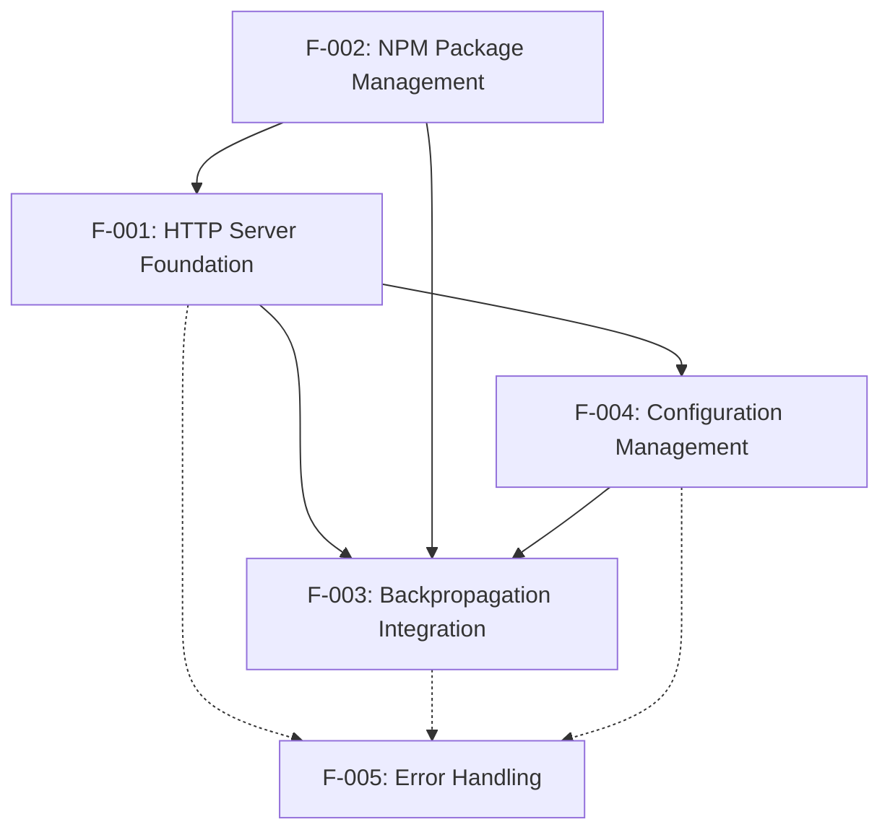
```mermaid
graph TD
    F001[F-001: HTTP Server Foundation] --> F003[F-003: Backpropagation Integration]
    F002[F-002: NPM Package Management] --> F001
    F002 --> F003
    F001 --> F004[F-004: Configuration Management]
    F004 --> F003
    
    F001 -.-> F005[F-005: Error Handling]
    F003 -.-> F005
    F004 -.-> F005
```

### 2.3.2 Integration Points

| **Feature** | **Integration Type** | **Dependent Feature** | **Integration Description** |
|-------------|---------------------|------------------------|----------------------------|
| F-001 | Foundation | F-003 | HTTP endpoints for ML API |
| F-002 | Infrastructure | F-001, F-003 | Package management for all features |
| F-004 | Enhancement | F-001 | Configuration for server parameters |

### 2.3.3 Shared Components

| **Component** | **Used By** | **Purpose** |
|---------------|-------------|-------------|
| HTTP Server | F-001, F-003 | Request handling foundation |
| NPM Structure | F-001, F-002, F-003, F-004 | Project organization |
| Node.js Runtime | All Features | Execution environment |

## 2.4 IMPLEMENTATION CONSIDERATIONS

### 2.4.1 Technical Constraints

#### Current Architecture Limitations
- **Single-threaded Execution**: Node.js event loop limitations
- **Memory Constraints**: No clustering or load balancing implemented
- **Hardcoded Configuration**: Fixed hostname and port values
- **No Error Handling**: Limited exception management capabilities
- **Missing Entry Point**: Package.json references non-existent index.js

#### Development Environment Requirements
- **Node.js Version**: Compatible with built-in HTTP module
- **Operating System**: Cross-platform compatibility maintained
- **Development Tools**: Standard NPM toolchain support
- **IDE Integration**: Standard Node.js project structure

### 2.4.2 Performance Requirements

| **Feature** | **Performance Criteria** | **Target Metrics** |
|-------------|-------------------------|-------------------|
| F-001 | Response Time | < 1ms for Hello World |
| F-001 | Server Startup | < 100ms initialization |
| F-002 | Package Operations | < 500ms NPM commands |
| F-003 | ML Processing | TBD based on algorithm complexity |

### 2.4.3 Scalability Considerations

#### Current Limitations
- **Concurrent Connections**: Limited by Node.js event loop
- **Data Processing**: No parallel processing capabilities
- **Storage**: No persistent data handling
- **Network**: Localhost-only binding

#### Future Scaling Requirements
- **Horizontal Scaling**: Container orchestration readiness
- **Load Distribution**: Multi-instance deployment capability
- **Data Management**: Database integration for ML model storage
- **Performance Monitoring**: Metrics collection and analysis

### 2.4.4 Security Implications

#### Current Security State
- **Authentication**: None implemented
- **Authorization**: No access controls
- **Data Protection**: No sensitive data handling
- **Network Security**: Localhost-only binding provides isolation

#### Security Enhancement Requirements
- **Input Validation**: Required for ML data processing
- **API Security**: Authentication for ML endpoints
- **Data Encryption**: Protection for training data and models
- **Audit Logging**: Security event tracking

### 2.4.5 Maintenance Requirements

#### Code Maintainability
- **Documentation**: Comprehensive inline code documentation needed
- **Testing**: Unit test suite implementation required
- **Version Control**: Git-based change tracking established
- **Code Quality**: Linting and formatting standards adoption

#### Operational Maintenance
- **Monitoring**: Application health and performance tracking
- **Logging**: Structured logging for debugging and analysis
- **Updates**: Regular dependency and security updates
- **Backup**: Model and configuration data protection

## 2.5 TRACEABILITY MATRIX

| **Business Requirement** | **Features** | **Technical Requirements** | **Source** |
|---------------------------|--------------|---------------------------|------------|
| Backpropagation Testing Platform | F-001, F-003 | F-001-RQ-001 to F-001-RQ-004, F-003-RQ-001 to F-003-RQ-004 | 1.1 Executive Summary |
| Development Foundation | F-001, F-002 | F-001-RQ-001 to F-001-RQ-004, F-002-RQ-001 to F-002-RQ-004 | 1.2 System Overview |
| Minimal Resource Usage | F-001 | F-001-RQ-001, F-001-RQ-002 | 1.2.3 Success Criteria |
| Standard NPM Structure | F-002 | F-002-RQ-001 to F-002-RQ-004 | 1.3.1 In-Scope Elements |

#### References

#### Implementation Files
- `server.js` - Core HTTP server implementation with request handling logic
- `package.json` - NPM manifest with project metadata and configuration
- `README.md` - Project identification and purpose statement
- `package-lock.json` - Dependency lock file confirming no external dependencies

#### Technical Specification Sections
- `1.1 EXECUTIVE SUMMARY` - Business context and value proposition
- `1.2 SYSTEM OVERVIEW` - System capabilities and architecture overview
- `1.3 SCOPE` - Feature boundaries and implementation status

# 3. Technology Stack

## 3.1 PROGRAMMING LANGUAGES

### 3.1.1 Server-Side Implementation
**JavaScript (Node.js Runtime)**
- **Version Requirements**: Compatible with Node.js built-in HTTP module (Node.js 14+ recommended)
- **Module System**: CommonJS (`require()` syntax) currently implemented
- **Justification**: Selected for rapid prototyping capabilities and minimal setup requirements, aligning with the project's foundational testing platform purpose
- **Usage Context**: Single-file server implementation in `server.js` (14 lines of code)
- **Future Considerations**: ES modules migration possible for F-003 backpropagation integration

### 3.1.2 Language Selection Criteria
- **Minimalism Priority**: Zero external dependencies requirement drives pure JavaScript selection
- **Development Velocity**: Familiar syntax enables rapid iteration for algorithm testing
- **ML Integration Ready**: Node.js ecosystem provides extensive machine learning library support for planned F-003 feature
- **Cross-Platform Compatibility**: Ensures consistent development experience across operating systems

## 3.2 FRAMEWORKS & LIBRARIES

### 3.2.1 Core Framework Architecture
**Pure Node.js Implementation**
- **Framework**: None (intentional architectural decision)
- **HTTP Handling**: Node.js built-in `http` module
- **Justification**: Eliminates complexity and external dependencies, providing clean foundation for backpropagation algorithm integration testing
- **Version**: Uses Node.js built-in modules (stable across all modern Node.js versions)

### 3.2.2 Current Library Dependencies
**Zero External Libraries**
- **Dependencies**: Empty object in `package.json` and `package-lock.json`
- **Architectural Decision**: Intentional minimalism to avoid framework constraints
- **Benefits**: Maximum flexibility for future ML integration, minimal attack surface, rapid startup times

### 3.2.3 Planned Framework Integration (F-003)
**Machine Learning Libraries (Future)**
- **Status**: To be determined based on backpropagation algorithm requirements
- **Candidate Options**: TensorFlow.js, Synaptic, Brain.js, or custom implementation
- **Selection Criteria**: Algorithm compatibility, performance requirements, integration complexity
- **Integration Approach**: Modular addition without disrupting core HTTP server foundation

## 3.3 OPEN SOURCE DEPENDENCIES

### 3.3.1 Current Dependency Profile
**Zero External Dependencies**
- **NPM Dependencies**: None (`package-lock.json` confirms empty dependency tree)
- **Architecture Benefit**: Eliminates version conflicts, security vulnerabilities, and maintenance overhead
- **Package Registry**: NPM (lockfile version 3)

### 3.3.2 Package Management Configuration
**NPM Package Structure**
- **Package Name**: `hello_world` (inconsistent with repository name "hao-backprop-test")
- **Version**: 1.0.0
- **License**: MIT
- **Author**: hxu
- **Main Entry Point**: `index.js` (file missing - implementation in `server.js`)

### 3.3.3 Future Dependency Strategy
**Selective Integration Approach**
- **Principle**: Add dependencies only when essential for core functionality
- **ML Dependencies**: Will be added for F-003 backpropagation integration
- **Configuration Dependencies**: Environment variable support for F-004
- **Testing Dependencies**: Unit testing framework for quality assurance

## 3.4 THIRD-PARTY SERVICES

### 3.4.1 Current External Service Integration
**None Implemented**
- **API Integrations**: No external APIs currently utilized
- **Authentication Services**: No authentication implemented
- **Monitoring Tools**: No monitoring or observability services
- **Cloud Services**: Localhost-only operation (127.0.0.1:3000)

### 3.4.2 Service Integration Readiness
**Future Integration Points**
- **ML Model Services**: Potential cloud-based training or inference services for F-003
- **Configuration Services**: Environment-based configuration management for F-004
- **Monitoring Integration**: Application performance monitoring for production deployment
- **Security Services**: Authentication and authorization for ML endpoints

## 3.5 DATABASES & STORAGE

### 3.5.1 Current Data Persistence
**No Database Implementation**
- **Data Storage**: None (stateless HTTP server)
- **Session Management**: Not implemented
- **File Storage**: No file handling capabilities
- **Caching**: No caching mechanisms

### 3.5.2 Storage Requirements Analysis
**Future Storage Needs (F-003 Integration)**
- **ML Model Storage**: Neural network model persistence and loading
- **Training Data**: Dataset storage for algorithm validation
- **Configuration Storage**: Environment and algorithm parameters
- **Logging Storage**: Operational and debugging information

### 3.5.3 Recommended Storage Strategy
**Lightweight Storage Approach**
- **Model Storage**: File-based storage for ML models (JSON/binary formats)
- **Configuration**: Environment variables and configuration files
- **Logging**: File-based structured logging
- **Rationale**: Maintains architectural simplicity while supporting ML requirements

## 3.6 DEVELOPMENT & DEPLOYMENT

### 3.6.1 Development Environment
**Current Development Stack**
- **Runtime**: Node.js (version unspecified, built-in HTTP module compatible)
- **Package Manager**: NPM (lockfile version 3)
- **Code Organization**: Single-file architecture (`server.js`)
- **Development Server**: Built-in Node.js HTTP server on localhost:3000

### 3.6.2 Build and Deployment Configuration
**Minimal Deployment Profile**
- **Build System**: None required (direct Node.js execution)
- **Containerization**: Not implemented (future consideration for scalability)
- **Process Management**: None (single process execution)
- **Environment Configuration**: Hardcoded values (F-004 will address)

### 3.6.3 Development Tooling Gaps
**Missing Development Infrastructure**
- **Testing Framework**: No unit tests despite testing platform purpose
- **Code Quality**: No linting, formatting, or static analysis
- **Documentation**: Minimal README.md (2 lines)
- **Debugging**: No debugging configuration or tools
- **CI/CD**: No automation or deployment pipeline

### 3.6.4 Recommended Development Enhancements
**Essential Development Tools**
- **Testing**: Jest or Mocha for ML algorithm validation
- **Code Quality**: ESLint and Prettier for consistency
- **Documentation**: JSDoc for API documentation
- **Development Server**: Nodemon for automatic restart during development

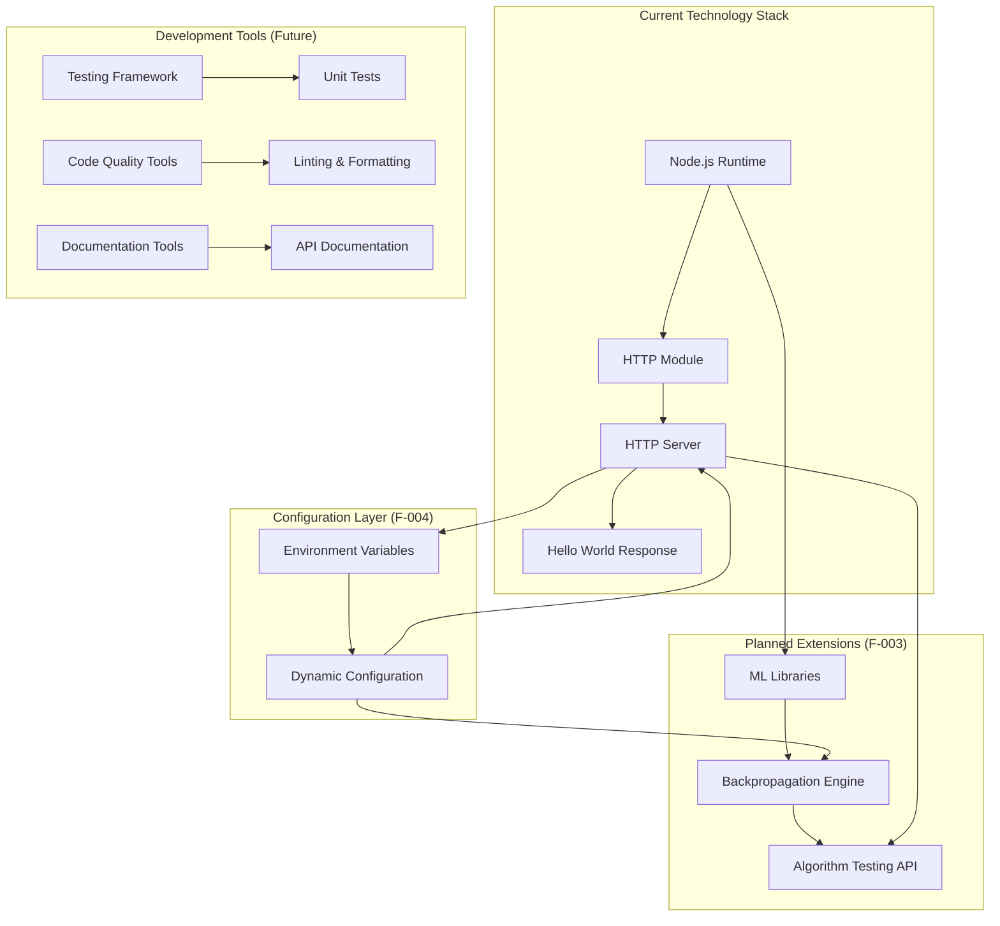
```mermaid
graph TB
    subgraph "Current Technology Stack"
        A[Node.js Runtime] --> B[HTTP Module]
        B --> C[HTTP Server]
        C --> D[Hello World Response]
    end
    
    subgraph "Planned Extensions (F-003)"
        E[ML Libraries] --> F[Backpropagation Engine]
        F --> G[Algorithm Testing API]
        C --> G
    end
    
    subgraph "Configuration Layer (F-004)"
        H[Environment Variables] --> I[Dynamic Configuration]
        I --> C
        I --> F
    end
    
    subgraph "Development Tools (Future)"
        J[Testing Framework] --> K[Unit Tests]
        L[Code Quality Tools] --> M[Linting & Formatting]
        N[Documentation Tools] --> O[API Documentation]
    end
    
    A --> E
    C --> H
```

## 3.7 TECHNOLOGY SELECTION RATIONALE

### 3.7.1 Architectural Philosophy
**Minimalism-First Approach**
- **Core Principle**: Start with minimal viable implementation, add complexity only when necessary
- **Benefits**: Reduced maintenance overhead, easier debugging, faster development cycles
- **Alignment**: Supports project purpose as clean testing platform for algorithm integration

### 3.7.2 Technology Decision Framework
**Selection Criteria Hierarchy**
1. **Essential Functionality**: Does it directly support core requirements?
2. **Integration Readiness**: Will it facilitate F-003 backpropagation integration?
3. **Maintenance Impact**: Does it minimize operational complexity?
4. **Development Velocity**: Does it accelerate testing and iteration cycles?

### 3.7.3 Future Technology Integration Strategy
**Evolutionary Architecture Approach**
- **Phase 1 (Current)**: Minimal HTTP server foundation established
- **Phase 2 (F-003)**: Machine learning library integration for backpropagation testing
- **Phase 3 (F-004)**: Configuration management and environment flexibility
- **Phase 4 (Future)**: Production readiness with monitoring, testing, and deployment automation

#### References
- `server.js` - Core HTTP server implementation using Node.js built-in modules
- `package.json` - NPM package configuration with zero external dependencies
- `package-lock.json` - Dependency lock file confirming minimal dependency profile
- `README.md` - Project identification and basic documentation
- Technical Specification Section 1.1 - Executive summary defining project as backpropagation testing platform
- Technical Specification Section 1.2 - System overview documenting current limitations and architectural approach
- Technical Specification Section 2.1 - Feature catalog outlining F-003 backpropagation integration requirements
- Technical Specification Section 2.4 - Implementation considerations for performance and scalability requirements

# 4. Process Flowchart

## 4.1 SYSTEM WORKFLOWS

### 4.1.1 Core Business Processes

#### Current HTTP Server Workflow (F-001)

The system currently implements a foundational HTTP server workflow that serves as the base for all future functionality. This workflow represents the minimal viable process for receiving and responding to HTTP requests.

**End-to-End User Journey:**
1. **Client Initiation**: External client sends HTTP request to localhost:3000
2. **Server Reception**: Node.js HTTP server receives request on configured port
3. **Response Generation**: Server generates hardcoded "Hello, World!" response
4. **Response Delivery**: Server sends response with 200 status code and text/plain content type
5. **Connection Closure**: HTTP connection completes transaction

**System Interactions:**
- Node.js runtime environment manages request lifecycle
- Built-in HTTP module handles protocol-level operations  
- Single request handler processes all incoming requests uniformly
- No external service dependencies or database interactions

**Decision Points:**
- Server startup validation (port availability check)
- Request acceptance (all requests currently accepted)
- Response formatting (fixed text/plain format)

**Current Limitations:**
- No routing logic implemented
- No request method differentiation
- No parameter processing or validation
- No authentication or authorization mechanisms

#### Planned Backpropagation Integration Workflow (F-003)

The future machine learning workflow will extend the HTTP foundation to provide algorithm testing capabilities.

**Proposed User Journey:**
1. **Model Upload**: Client uploads neural network model via HTTP endpoint
2. **Data Input**: Training or test data submitted through API interface
3. **Algorithm Execution**: Backpropagation algorithm processes input data
4. **Result Generation**: Algorithm produces output metrics and model updates
5. **Response Delivery**: Results returned to client in structured format

**Integration Touch Points:**
- HTTP endpoints for model and data management
- ML library integration for algorithm execution
- Data persistence for model state management
- Configuration system for algorithm parameters

### 4.1.2 Integration Workflows

#### Current Data Flow Architecture

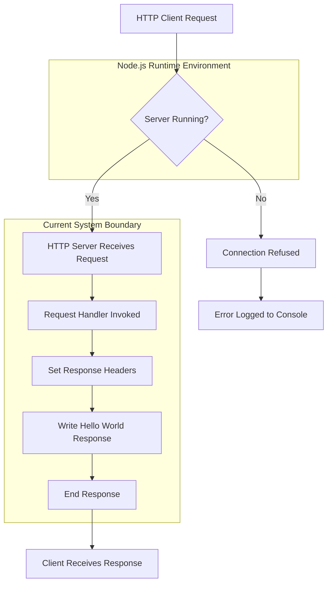
```mermaid
flowchart TD
    A[HTTP Client Request] --> B{Server Running?}
    B -->|Yes| C[HTTP Server Receives Request]
    B -->|No| D[Connection Refused]
    
    C --> E[Request Handler Invoked]
    E --> F[Set Response Headers]
    F --> G[Write Hello World Response]
    G --> H[End Response]
    H --> I[Client Receives Response]
    
    D --> J[Error Logged to Console]
    
    subgraph "Current System Boundary"
        C
        E  
        F
        G
        H
    end
    
    subgraph "Node.js Runtime Environment"
        B
        C
        E
        F
        G
        H
    end
```

#### Planned ML Integration Data Flow (F-003)

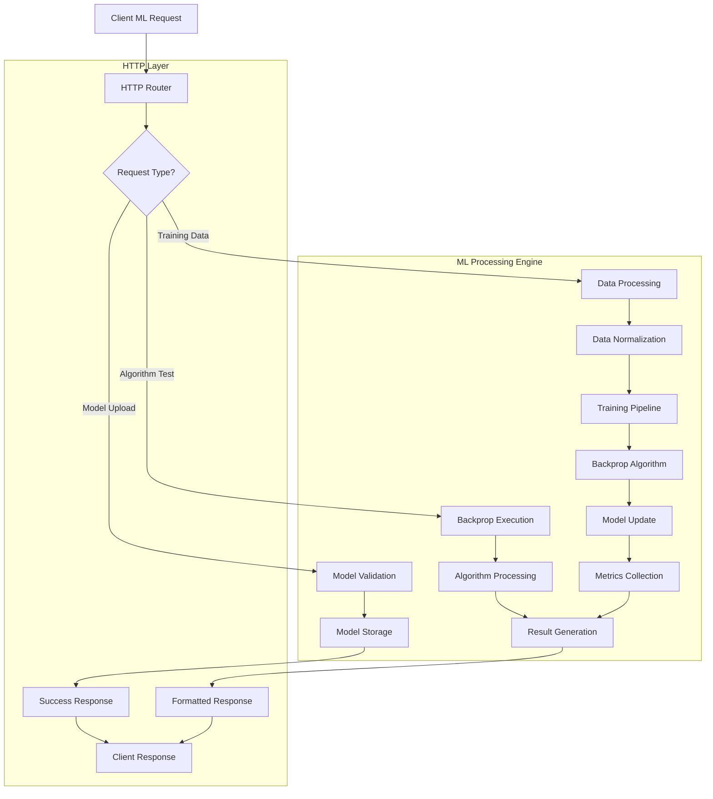
```mermaid
flowchart TD
    A[Client ML Request] --> B[HTTP Router]
    B --> C{Request Type?}
    
    C -->|Model Upload| D[Model Validation]
    C -->|Training Data| E[Data Processing]  
    C -->|Algorithm Test| F[Backprop Execution]
    
    D --> G[Model Storage]
    E --> H[Data Normalization]
    F --> I[Algorithm Processing]
    
    G --> J[Success Response]
    H --> K[Training Pipeline]
    I --> L[Result Generation]
    
    K --> M[Backprop Algorithm]
    M --> N[Model Update]
    N --> O[Metrics Collection]
    O --> L
    
    L --> P[Formatted Response]
    J --> Q[Client Response]
    P --> Q
    
    subgraph "ML Processing Engine"
        D
        E
        F
        G
        H
        I
        K
        M
        N
        O
        L
    end
    
    subgraph "HTTP Layer"
        B
        C
        J
        P
        Q
    end
```

## 4.2 DETAILED PROCESS FLOWS

### 4.2.1 Server Startup Process (F-001)

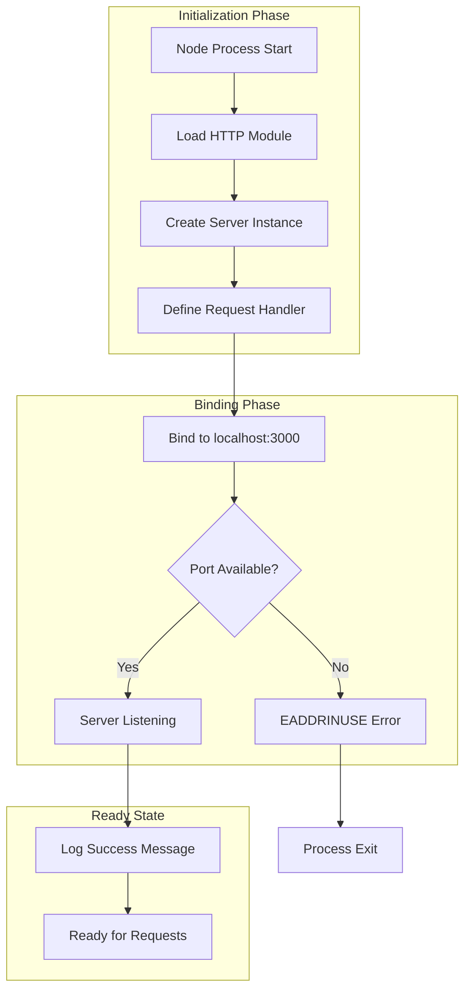
```mermaid
flowchart TD
    A[Node Process Start] --> B[Load HTTP Module]
    B --> C[Create Server Instance]
    C --> D[Define Request Handler]
    D --> E[Bind to localhost:3000]
    E --> F{Port Available?}
    
    F -->|Yes| G[Server Listening]
    F -->|No| H[EADDRINUSE Error]
    
    G --> I[Log Success Message]
    I --> J[Ready for Requests]
    
    H --> K[Process Exit]
    
    subgraph "Initialization Phase"
        A
        B
        C
        D
    end
    
    subgraph "Binding Phase"
        E
        F
        G
        H
    end
    
    subgraph "Ready State"
        I
        J
    end
```

### 4.2.2 Request Processing Pipeline (F-001)

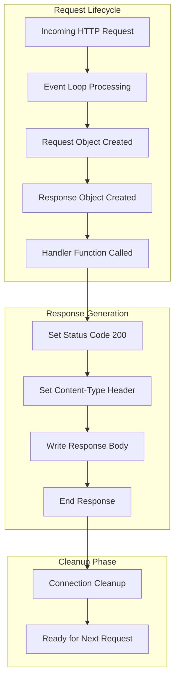
```mermaid
flowchart TD
    A[Incoming HTTP Request] --> B[Event Loop Processing]
    B --> C[Request Object Created]
    C --> D[Response Object Created]
    D --> E[Handler Function Called]
    
    E --> F[Set Status Code 200]
    F --> G[Set Content-Type Header]
    G --> H[Write Response Body]
    H --> I[End Response]
    
    I --> J[Connection Cleanup]
    J --> K[Ready for Next Request]
    
    subgraph "Request Lifecycle"
        A
        B
        C
        D
        E
    end
    
    subgraph "Response Generation"
        F
        G
        H
        I
    end
    
    subgraph "Cleanup Phase"  
        J
        K
    end
```

### 4.2.3 NPM Package Management Process (F-002)

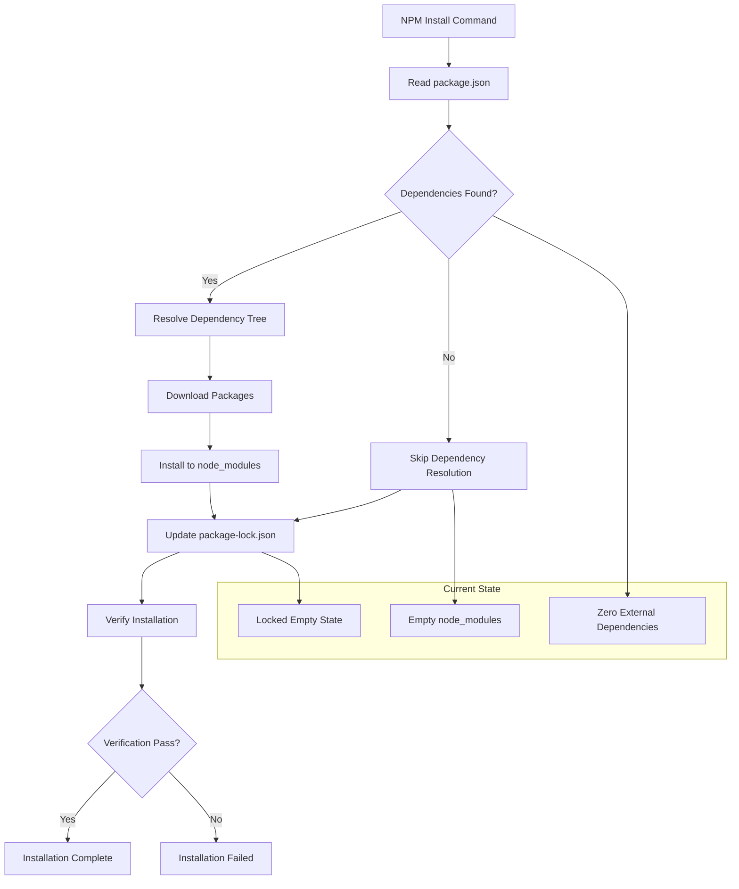
```mermaid
flowchart TD
    A[NPM Install Command] --> B[Read package.json]
    B --> C{Dependencies Found?}
    
    C -->|Yes| D[Resolve Dependency Tree]
    C -->|No| E[Skip Dependency Resolution]
    
    D --> F[Download Packages]
    F --> G[Install to node_modules]
    G --> H[Update package-lock.json]
    
    E --> H
    H --> I[Verify Installation]
    I --> J{Verification Pass?}
    
    J -->|Yes| K[Installation Complete]
    J -->|No| L[Installation Failed]
    
    subgraph "Current State"
        N[Zero External Dependencies]
        O[Empty node_modules]
        P[Locked Empty State]
    end
    
    C --> N
    E --> O
    H --> P
```

## 4.3 ERROR HANDLING AND RECOVERY

### 4.3.1 Current Error Handling Limitations

The system currently lacks comprehensive error handling mechanisms, representing a significant architectural gap that impacts reliability and maintainability.

**Identified Error Scenarios:**
- Port binding failures (EADDRINUSE)
- Unhandled request exceptions
- Module loading errors
- Entry point file mismatch (index.js vs server.js)

### 4.3.2 Error Handling Flowchart

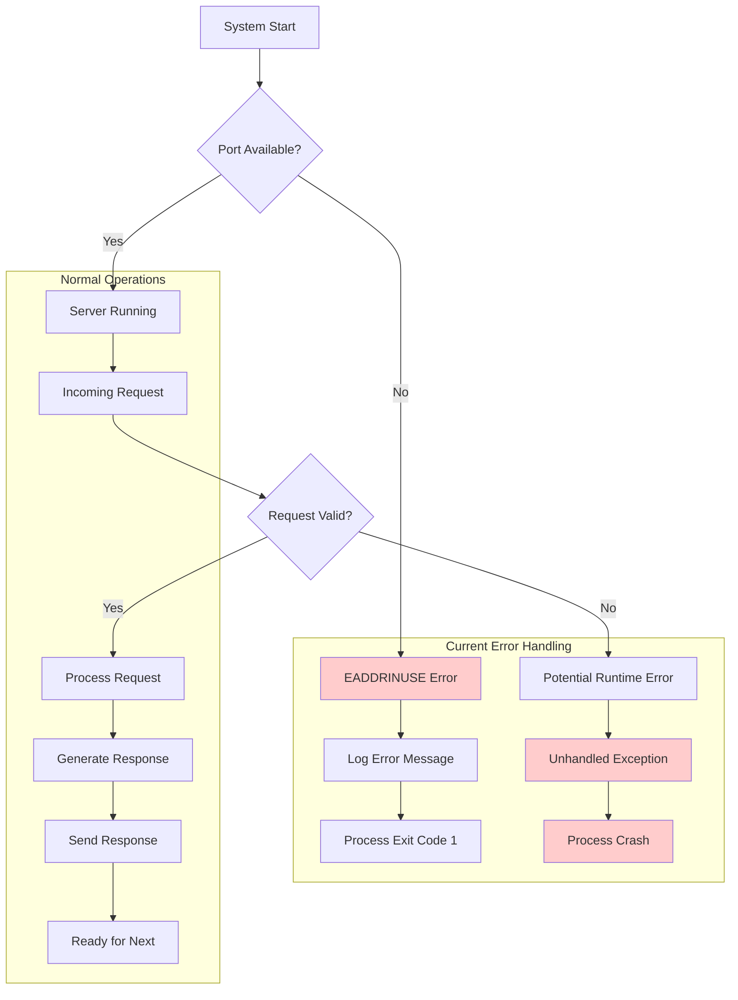
```mermaid
flowchart TD
    A[System Start] --> B{Port Available?}
    B -->|No| C[EADDRINUSE Error]
    C --> D[Log Error Message]
    D --> E[Process Exit Code 1]
    
    B -->|Yes| F[Server Running]
    F --> G[Incoming Request]
    G --> H{Request Valid?}
    
    H -->|Yes| I[Process Request]
    H -->|No| J[Potential Runtime Error]
    
    I --> K[Generate Response]
    J --> L[Unhandled Exception]
    L --> M[Process Crash]
    
    K --> N[Send Response]
    N --> O[Ready for Next]
    
    subgraph "Current Error Handling"
        C
        D
        E
        J
        L
        M
    end
    
    subgraph "Normal Operations"
        F
        G
        I
        K
        N
        O
    end
    
    style C fill:#ffcccc
    style L fill:#ffcccc  
    style M fill:#ffcccc
```

### 4.3.3 Planned Error Recovery Process (Future Enhancement)

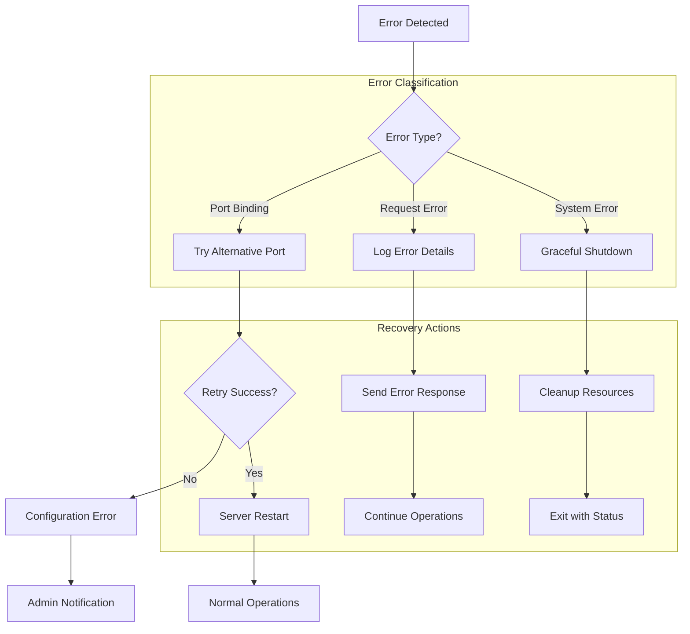
```mermaid
flowchart TD
    A[Error Detected] --> B{Error Type?}
    
    B -->|Port Binding| C[Try Alternative Port]
    B -->|Request Error| D[Log Error Details]
    B -->|System Error| E[Graceful Shutdown]
    
    C --> F{Retry Success?}
    F -->|Yes| G[Server Restart]
    F -->|No| H[Configuration Error]
    
    D --> I[Send Error Response]
    I --> J[Continue Operations]
    
    E --> K[Cleanup Resources]
    K --> L[Exit with Status]
    
    H --> M[Admin Notification]
    G --> N[Normal Operations]
    
    subgraph "Error Classification"
        B
        C
        D
        E
    end
    
    subgraph "Recovery Actions"
        F
        G
        I
        J
        K
        L
    end
```

## 4.4 STATE MANAGEMENT AND TRANSITIONS

### 4.4.1 Current System State Architecture

The system currently operates in a stateless architecture with minimal state transitions, primarily focused on server lifecycle management.

**State Categories:**
- **Server States**: Not Started, Starting, Listening, Error
- **Request States**: Stateless (no session management)
- **Data States**: No persistent data management
- **Configuration States**: Static (hardcoded values)

### 4.4.2 Server Lifecycle State Diagram

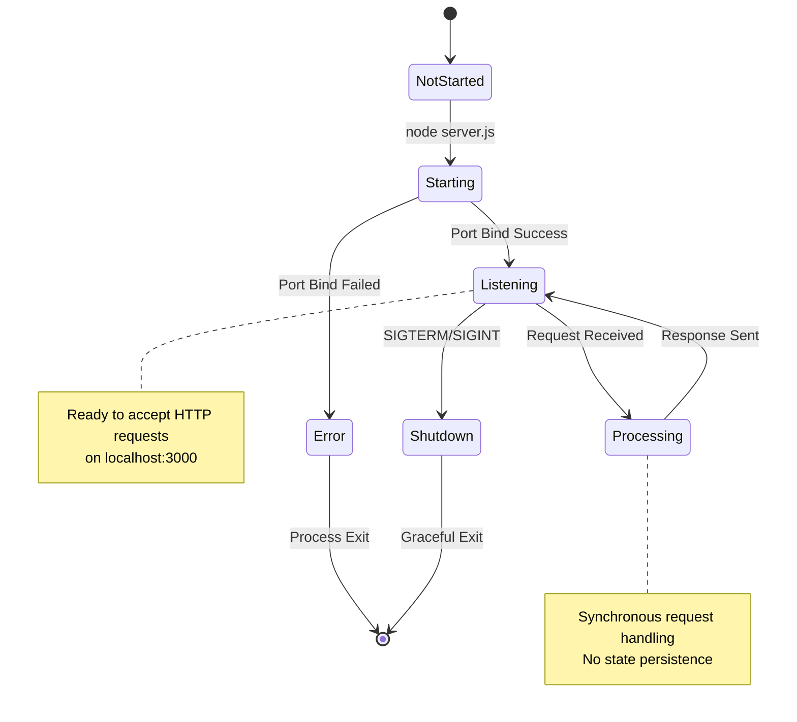
```mermaid
stateDiagram-v2
    [*] --> NotStarted
    NotStarted --> Starting : node server.js
    Starting --> Listening : Port Bind Success
    Starting --> Error : Port Bind Failed
    
    Listening --> Processing : Request Received
    Processing --> Listening : Response Sent
    
    Error --> [*] : Process Exit
    Listening --> Shutdown : SIGTERM/SIGINT
    Shutdown --> [*] : Graceful Exit
    
    note right of Listening
        Ready to accept HTTP requests
        on localhost:3000
    end note
    
    note right of Processing
        Synchronous request handling
        No state persistence
    end note
```

### 4.4.3 Planned ML Algorithm State Transitions (F-003)

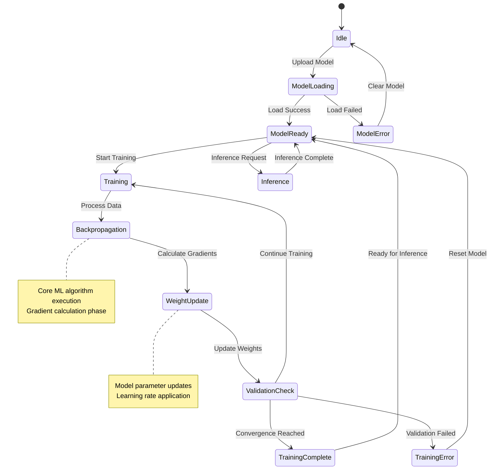
```mermaid
stateDiagram-v2
    [*] --> Idle
    Idle --> ModelLoading : Upload Model
    ModelLoading --> ModelReady : Load Success
    ModelLoading --> ModelError : Load Failed
    
    ModelReady --> Training : Start Training
    Training --> Backpropagation : Process Data
    Backpropagation --> WeightUpdate : Calculate Gradients
    WeightUpdate --> ValidationCheck : Update Weights
    
    ValidationCheck --> Training : Continue Training
    ValidationCheck --> TrainingComplete : Convergence Reached
    ValidationCheck --> TrainingError : Validation Failed
    
    TrainingComplete --> ModelReady : Ready for Inference
    TrainingError --> ModelReady : Reset Model
    ModelError --> Idle : Clear Model
    
    ModelReady --> Inference : Inference Request
    Inference --> ModelReady : Inference Complete
    
    note right of Backpropagation
        Core ML algorithm execution
        Gradient calculation phase
    end note
    
    note right of WeightUpdate
        Model parameter updates
        Learning rate application
    end note
```

## 4.5 INTEGRATION SEQUENCE DIAGRAMS

### 4.5.1 Current HTTP Request Sequence

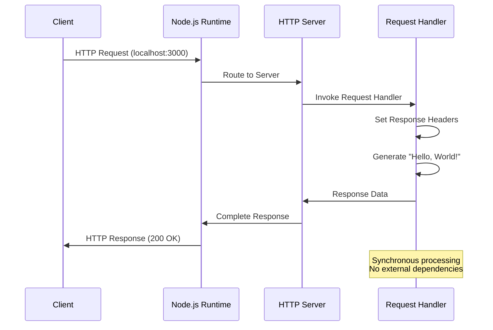
```mermaid
sequenceDiagram
    participant Client
    participant NodeJS as Node.js Runtime
    participant HTTPServer as HTTP Server
    participant Handler as Request Handler
    
    Client->>NodeJS: HTTP Request (localhost:3000)
    NodeJS->>HTTPServer: Route to Server
    HTTPServer->>Handler: Invoke Request Handler
    
    Handler->>Handler: Set Response Headers
    Handler->>Handler: Generate "Hello, World!"
    
    Handler->>HTTPServer: Response Data
    HTTPServer->>NodeJS: Complete Response
    NodeJS->>Client: HTTP Response (200 OK)
    
    note over Handler: Synchronous processing<br/>No external dependencies
```

### 4.5.2 Planned ML Integration Sequence (F-003)

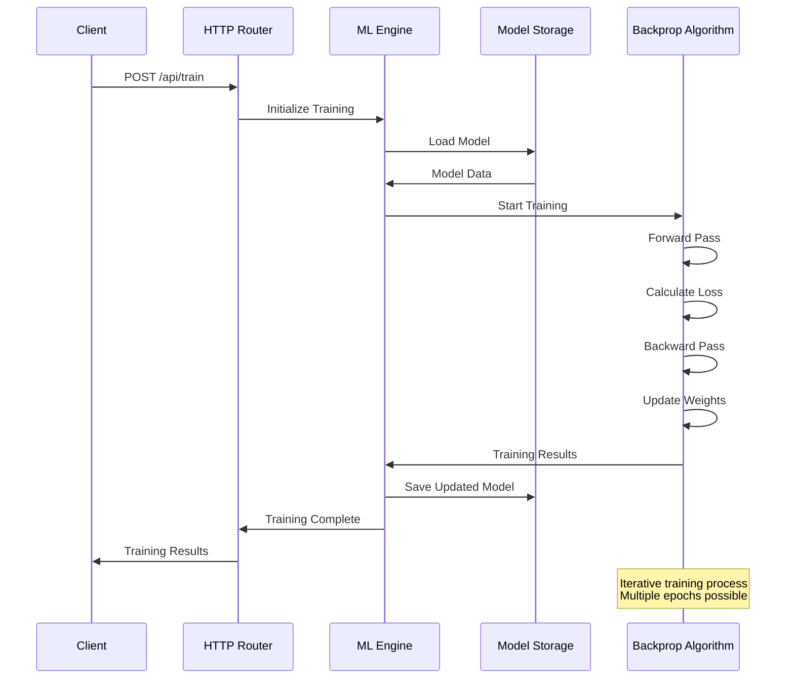
```mermaid
sequenceDiagram
participant Client
participant APIGateway as HTTP Router
participant MLEngine as ML Engine
participant ModelStore as Model Storage
participant BackpropAlgorithm as Backprop Algorithm

Client->>APIGateway: POST /api/train
APIGateway->>MLEngine: Initialize Training
MLEngine->>ModelStore: Load Model
ModelStore->>MLEngine: Model Data

MLEngine->>BackpropAlgorithm: Start Training
BackpropAlgorithm->>BackpropAlgorithm: Forward Pass
BackpropAlgorithm->>BackpropAlgorithm: Calculate Loss
BackpropAlgorithm->>BackpropAlgorithm: Backward Pass
BackpropAlgorithm->>BackpropAlgorithm: Update Weights

BackpropAlgorithm->>MLEngine: Training Results
MLEngine->>ModelStore: Save Updated Model
MLEngine->>APIGateway: Training Complete
APIGateway->>Client: Training Results

note over BackpropAlgorithm: Iterative training process<br/>Multiple epochs possible
```

## 4.6 DEPLOYMENT AND OPERATIONAL WORKFLOWS

### 4.6.1 Development Deployment Process

```mermaid
flowchart TD
    A[Developer Workstation] --> B[Clone Repository]
    B --> C[NPM Install]
    C --> D{Dependencies Resolved?}
    
    D -->|Yes| E[Start Server: node server.js]
    D -->|No| F[Dependency Resolution Error]
    
    E --> G{Server Started?}
    G -->|Yes| H[Development Ready]
    G -->|No| I[Port Conflict Error]
    
    F --> J[Check package.json]
    I --> K[Change Port Configuration]
    
    H --> L[Development Testing]
    L --> M[Code Modifications]
    M --> N[Server Restart Required]
    N --> E
    
    subgraph "Current Deployment"
        B
        C
        E
        H
        L
    end
    
    subgraph "Error Resolution"
        F
        I
        J
        K
    end
```

### 4.6.2 Configuration Management Workflow (F-004)

```mermaid
flowchart TD
    A[Environment Setup] --> B[Environment Variables]
    B --> C[Configuration Loading]
    C --> D{Config Valid?}
    
    D -->|Yes| E[Server Configuration]
    D -->|No| F[Default Values]
    
    E --> G[Dynamic Port Binding]
    F --> H[Hardcoded Fallback]
    
    G --> I[Environment-Specific Setup]
    H --> J[Development Setup]
    
    I --> K[Production Ready]
    J --> L[Development Ready]
    
    subgraph "Planned Configuration (F-004)"
        B
        C
        E
        G
        I
        K
    end
    
    subgraph "Current Implementation"
        F
        H
        J
        L
    end
```

## 4.7 PERFORMANCE AND TIMING CONSIDERATIONS

### 4.7.1 Current Performance Workflow

The system operates with minimal performance overhead due to its lightweight architecture:

**Performance Characteristics:**
- **Server Startup Time**: < 100ms initialization
- **Request Processing**: < 1ms response time for Hello World
- **Memory Usage**: Minimal Node.js runtime overhead
- **CPU Usage**: Single-threaded event loop processing

### 4.7.2 Planned Performance Requirements (F-003)

**ML Algorithm Performance Targets:**
- **Model Loading**: < 5 seconds for standard neural networks
- **Training Iteration**: Variable based on model complexity
- **Inference Response**: < 100ms for trained models
- **Concurrent Requests**: Support for multiple training sessions

## 4.8 VALIDATION AND COMPLIANCE

### 4.8.1 Current Validation Workflow

```mermaid
flowchart TD
    A[Request Received] --> B[Basic HTTP Validation]
    B --> C{Valid HTTP?}
    
    C -->|Yes| D[Process Request]
    C -->|No| E[Connection Terminated]
    
    D --> F[Generate Response]
    F --> G[Response Validation]
    G --> H[Send Response]
    
    subgraph "Current Validation"
        B
        C
        G
    end
    
    subgraph "Missing Validation"
        I[Input Parameter Validation]
        J[Authentication Checks]
        K[Rate Limiting]
        L[Data Format Validation]
    end
```

### 4.8.2 Planned ML Validation Process (F-003)

**Algorithm Validation Requirements:**
- Input data format validation
- Model architecture compatibility checks
- Training parameter boundary validation
- Output result verification
- Performance metric validation

#### References

**Files Examined:**
- `server.js` - Core HTTP server implementation and request handling logic
- `package.json` - NPM package configuration and project metadata
- `package-lock.json` - Dependency lock file confirming zero external dependencies
- `README.md` - Project identification and purpose documentation

**Technical Specification Sections Retrieved:**
- `1.2 SYSTEM OVERVIEW` - System capabilities and architectural context
- `2.1 FEATURE CATALOG` - Current and planned feature definitions
- `2.3 FEATURE RELATIONSHIPS` - Feature dependencies and integration mappings
- `3.6 DEVELOPMENT & DEPLOYMENT` - Development tooling and deployment configuration

**Process Flow Components Documented:**
- HTTP Server Foundation (F-001) - Current implementation workflows
- NPM Package Management (F-002) - Project structure and dependency management
- Backpropagation Integration (F-003) - Planned ML algorithm workflows
- Configuration Management (F-004) - Planned environment configuration processes

# 5. System Architecture

## 5.1 HIGH-LEVEL ARCHITECTURE

### 5.1.1 System Overview

**Architecture Style and Rationale**

The hao-backprop-test system implements a **Minimalist Monolithic Architecture** designed as a foundation for machine learning algorithm testing and integration. The architecture follows a minimalism-first approach, starting with essential functionality and adding complexity only when necessary to support core requirements.

The system employs a **single-file server pattern** using pure Node.js without external frameworks or dependencies. This architectural decision supports the project's primary purpose as a clean testing platform for backpropagation algorithm integration, providing maximum flexibility for future ML library additions while maintaining operational simplicity.

**Key Architectural Principles**

- **Minimalism-First Design**: Reduced maintenance overhead through essential-only components
- **Zero External Dependencies**: Pure Node.js implementation eliminates third-party vulnerabilities
- **Stateless Operation**: No session management or persistent state tracking for maximum scalability
- **Foundation Platform Strategy**: Clean codebase prepared for future ML algorithm integration
- **Development Accessibility**: Rapid iteration capability with minimal setup requirements

**System Boundaries and Major Interfaces**

The system operates within clearly defined boundaries:
- **Network Interface**: HTTP server bound to localhost:3000 (127.0.0.1)
- **Runtime Environment**: Node.js runtime with built-in module dependencies only
- **Integration Surface**: RESTful HTTP endpoints for future ML API development
- **Data Boundary**: Currently stateless; planned file-based model persistence for F-003
- **Security Perimeter**: Localhost-only binding provides network isolation

### 5.1.2 Core Components Table

| Component Name | Primary Responsibility | Key Dependencies | Integration Points | Critical Considerations |
|----------------|----------------------|------------------|-------------------|----------------------|
| HTTP Server Engine | Request handling and response generation | Node.js http module | Port 3000 binding, Client connections | Synchronous processing limits scalability |
| NPM Package Manager | Project organization and dependency management | NPM ecosystem | Node.js runtime, Package registry | Entry point mismatch requires resolution |
| Server Lifecycle Controller | Process startup and shutdown management | Node.js runtime | Operating system signals | No graceful shutdown handling implemented |
| ML Integration Layer (Planned) | Backpropagation algorithm hosting | Node.js runtime, ML libraries | HTTP API endpoints | Requires asynchronous processing architecture |

### 5.1.3 Data Flow Description

**Primary Data Flows**

The current system implements a **simplified request-response pattern** with no data transformation or persistence:

1. **HTTP Request Flow**: Client requests arrive at the HTTP server on localhost:3000, triggering immediate response generation
2. **Response Generation Flow**: Server produces fixed "Hello, World!" content with text/plain content type and 200 status
3. **Connection Management Flow**: Each request-response cycle operates independently with immediate connection closure

**Integration Patterns and Protocols**

- **Protocol**: HTTP/1.1 over TCP/IP with keep-alive disabled
- **Data Format**: Plain text responses (current), JSON planned for ML API endpoints
- **Communication Style**: Synchronous request-response without message queuing
- **Error Propagation**: Unhandled exceptions cause process termination

**Planned ML Data Transformation Points**

For F-003 backpropagation integration:
- **Model Upload Pipeline**: HTTP multipart form data to internal model representation
- **Training Data Processing**: Raw input normalization and feature extraction
- **Algorithm Execution Pipeline**: Forward pass, backpropagation, and weight update cycles
- **Results Serialization**: ML metrics and model updates formatted as JSON responses

### 5.1.4 External Integration Points

| System Name | Integration Type | Data Exchange Pattern | Protocol/Format | SLA Requirements |
|-------------|------------------|----------------------|-----------------|------------------|
| HTTP Clients | API Consumer | Request-Response | HTTP/1.1, Text/Plain | Sub-millisecond response |
| Node.js Runtime | Platform Dependency | Module Loading | CommonJS require() | Process lifecycle management |
| NPM Registry | Package Management | Dependency Resolution | HTTPS/JSON | Development-time availability |
| Operating System | Process Host | System Calls | Native OS APIs | Port binding and signal handling |

## 5.2 COMPONENT DETAILS

### 5.2.1 HTTP Server Component

**Purpose and Responsibilities**
- HTTP request reception and routing (single handler currently)
- Response generation and transmission
- Network connection management
- Server lifecycle coordination

**Technologies and Frameworks**
- **Runtime**: Node.js with built-in HTTP module
- **Module System**: CommonJS with require() statements
- **Network Protocol**: HTTP/1.1 over TCP
- **Content Delivery**: Synchronous response streaming

**Key Interfaces and APIs**
- **Primary Interface**: HTTP server listening on 127.0.0.1:3000
- **Request Handler**: Single callback function processing all HTTP methods
- **Response Interface**: Node.js HTTP response object with status and headers
- **Planned ML Interfaces**: RESTful endpoints for model upload, training, and inference

**Data Persistence Requirements**
- **Current State**: No data persistence implemented
- **Future Requirements**: File-based model storage for neural network weights
- **Session Management**: Stateless operation maintained for scalability
- **Configuration Storage**: Environment variables planned for F-004

**Scaling Considerations**
- **Current Limitations**: Single-process execution with synchronous request handling
- **Planned Improvements**: Asynchronous processing for ML operations
- **Connection Pooling**: Not implemented; may require for high-throughput ML scenarios
- **Load Distribution**: No clustering configured; suitable for development testing

### 5.2.2 NPM Package Management Component

**Purpose and Responsibilities**
- Project metadata definition and version management
- Dependency declaration and resolution
- Development script execution and automation
- License and authorship documentation

**Configuration Details**
- **Package Name**: "hello_world" (inconsistent with repository name)
- **Version**: 1.0.0 with MIT license
- **Entry Point**: "index.js" (file missing - architectural gap)
- **Test Infrastructure**: Placeholder script with error exit code

**Critical Issues**
- **Entry Point Mismatch**: package.json specifies non-existent index.js
- **Naming Inconsistency**: Package name differs from repository identifier
- **Missing Test Setup**: No testing framework despite project testing purpose

### 5.2.3 Component Interaction Diagrams

```mermaid
graph TB
    subgraph "Node.js Runtime Environment"
        A[HTTP Server Engine]
        B[Request Handler]
        C[Response Generator]
    end
    
    subgraph "NPM Package System"
        D[Package Configuration]
        E[Dependency Manager]
    end
    
    subgraph "External Interfaces"
        F[HTTP Clients]
        G[Operating System]
    end
    
    F -->|HTTP Requests| A
    A -->|Route to Handler| B
    B -->|Generate Response| C
    C -->|Send Response| F
    
    D -->|Configure Runtime| A
    E -->|Load Modules| A
    
    G -->|Process Signals| A
    A -->|Port Binding| G
    
    subgraph "Planned ML Extension"
        H[ML Algorithm Engine]
        I[Model Storage]
        J[Training Pipeline]
    end
    
    B -.->|Future Integration| H
    H -.->|Store Models| I
    H -.->|Execute Training| J
```

### 5.2.4 State Transition Diagrams

```mermaid
stateDiagram-v2
    [*] --> ServerInit
    ServerInit --> PortBinding : Start Server
    PortBinding --> Listening : Bind Success
    PortBinding --> BindError : Port Unavailable
    
    Listening --> RequestReceived : HTTP Request
    RequestReceived --> ProcessingRequest : Handler Invoked
    ProcessingRequest --> GeneratingResponse : Create Response
    GeneratingResponse --> SendingResponse : Write Response
    SendingResponse --> Listening : Response Complete
    
    BindError --> [*] : Process Exit
    Listening --> Shutdown : SIGTERM/SIGINT
    Shutdown --> [*] : Graceful Termination
    
    note right of Listening
        Ready State: Accepting
        HTTP connections on 
        localhost:3000
    end note
    
    note right of ProcessingRequest
        Synchronous request handling
        No concurrent processing
    end note
```

### 5.2.5 Sequence Diagrams for Key Flows

```mermaid
sequenceDiagram
    participant C as HTTP Client
    participant S as HTTP Server
    participant H as Request Handler
    participant R as Response Generator
    
    Note over C,R: Current HTTP Request Flow
    
    C->>+S: HTTP Request (localhost:3000)
    S->>+H: Invoke Request Handler
    H->>+R: Generate Hello World Response
    R->>R: Set Content-Type: text/plain
    R->>R: Set Status: 200
    R->>-H: Response Ready
    H->>-S: Response Generated
    S->>-C: HTTP Response "Hello, World!\n"
    
    Note over C,R: Planned ML Training Flow (F-003)
    
    C->>+S: POST /api/train (model + data)
    S->>+H: Route to ML Handler
    H->>+R: Validate Model & Data
    R->>R: Load Neural Network
    R->>R: Execute Backpropagation
    R->>R: Update Model Weights
    R->>R: Generate Training Metrics
    R->>-H: Training Results
    H->>-S: JSON Response Ready
    S->>-C: Training Metrics Response
```

## 5.3 TECHNICAL DECISIONS

### 5.3.1 Architecture Style Decisions and Tradeoffs

**Decision: Minimalist Monolithic Architecture**

| Aspect | Rationale | Benefits | Tradeoffs | Impact |
|--------|-----------|----------|-----------|---------|
| Single Process Design | Simplified development and debugging | Faster iteration, easier maintenance | Limited scalability, single point of failure | High development velocity |
| Zero Dependencies | Maximum security and control | No third-party vulnerabilities, predictable behavior | Manual implementation of common patterns | Reduced security risk |
| Stateless Operation | Horizontal scaling preparation | Simple load balancing, crash recovery | No session persistence, repeated computation | Future scalability |
| Pure Node.js Implementation | Minimal learning curve and setup | Familiar development environment, rapid deployment | Missing framework conveniences | Fast prototyping |

**Decision: Communication Pattern Choices**

The system employs **synchronous request-response communication** with the following considerations:

- **Current Implementation**: Blocking I/O suitable for simple testing scenarios
- **Future Requirements**: Asynchronous processing necessary for ML computation workloads
- **Integration Strategy**: Event-driven architecture planned for F-003 implementation
- **Performance Impact**: Acceptable for development; requires optimization for production

### 5.3.2 Data Storage Solution Rationale

**Current Decision: No Persistent Storage**

The stateless architecture eliminates data storage complexity while supporting the project's testing focus:

- **Development Benefits**: Immediate deployment without database setup
- **Testing Advantages**: Clean slate for each algorithm test execution  
- **Integration Preparation**: Storage layer can be added without architectural changes
- **Future Migration Path**: File-based model storage planned for neural network weights

### 5.3.3 Security Mechanism Selection

**Current Security Posture: Network Isolation**

| Security Layer | Current Implementation | Planned Enhancement | Justification |
|----------------|----------------------|-------------------|---------------|
| Network Access | Localhost binding only | Environment-configurable hosts | Development security through isolation |
| Authentication | None implemented | JWT tokens planned | Testing platform requires controlled access |
| Input Validation | No validation | Request sanitization planned | ML data requires input validation |
| Error Handling | Process crash on exception | Graceful error recovery planned | Production stability requirements |

### 5.3.4 Architecture Decision Records

```mermaid
graph TD
    A[Architecture Decision Required] --> B{Complexity vs Features?}
    
    B -->|Minimize Complexity| C[Choose Minimal Solution]
    B -->|Require Features| D[Evaluate Necessity]
    
    C --> E[Zero Dependencies]
    C --> F[Single File Implementation]
    C --> G[Hardcoded Configuration]
    
    D --> H{Essential for Core Purpose?}
    H -->|Yes| I[Implement Minimally]
    H -->|No| J[Defer to Future Phase]
    
    I --> K[ML Algorithm Integration]
    J --> L[Advanced Monitoring]
    J --> M[Complex Error Handling]
    J --> N[Production Scalability]
    
    E --> O[Pure Node.js Decision]
    F --> P[server.js Implementation]
    G --> Q[localhost:3000 Binding]
    
    K --> R[F-003 Feature Planning]
    
    style C fill:#90EE90
    style I fill:#FFE4B5
    style J fill:#FFB6C1
```

## 5.4 CROSS-CUTTING CONCERNS

### 5.4.1 Monitoring and Observability Approach

**Current State: Basic Console Logging**
- **Implementation**: Node.js console.log() for server startup notification
- **Coverage**: Server initialization events only
- **Visibility**: Local development console output
- **Limitations**: No request tracking, performance metrics, or error monitoring

**Planned Enhancements for ML Operations**
- **Structured Logging**: JSON-formatted log entries for ML training progress
- **Metrics Collection**: Model accuracy, training time, and convergence tracking
- **Health Endpoints**: HTTP health checks for server and model status
- **Performance Monitoring**: Request latency and throughput measurement

### 5.4.2 Error Handling and Recovery Strategy

**Current Limitations**
- **Exception Handling**: Unhandled exceptions cause immediate process termination
- **Network Errors**: Port binding failures result in application crash
- **Recovery Mechanisms**: No automatic restart or graceful degradation
- **Error Visibility**: Basic error logging to console without structured format

**Planned Error Handling Architecture**
- **Graceful Degradation**: ML services continue with reduced functionality during failures
- **Circuit Breaker Pattern**: Prevent cascade failures in ML algorithm processing
- **Retry Logic**: Automatic retry for transient failures in model operations
- **Error Context**: Detailed error information for debugging ML algorithm issues

### 5.4.3 Authentication and Authorization Framework

**Current Security Model: Open Access**
- **Authentication**: No user authentication implemented
- **Authorization**: All requests processed without access control
- **Session Management**: Stateless operation with no user tracking
- **Security Boundary**: Network isolation through localhost binding

**Planned Security Enhancements**
- **JWT-Based Authentication**: Token-based access control for ML API endpoints
- **Role-Based Authorization**: Different permission levels for model upload vs. training
- **API Key Management**: Client identification for usage tracking and rate limiting
- **Audit Logging**: Security event tracking for model access and modifications

### 5.4.4 Performance Requirements and SLAs

| Performance Metric | Current Target | Planned ML Target | Measurement Method | Critical Threshold |
|-------------------|---------------|-------------------|-------------------|-------------------|
| Response Time | Sub-millisecond | 5 seconds (training) | Request timing | 10 second timeout |
| Throughput | Unlimited (simple) | 10 concurrent models | Concurrent request tracking | CPU/Memory limits |
| Availability | Best effort | 99% uptime | Health check monitoring | 30 second downtime |
| Resource Usage | Minimal | 2GB memory limit | System monitoring | Memory leak detection |

### 5.4.5 Error Handling Flow Diagrams

```mermaid
flowchart TD
    A[Request Received] --> B{Valid Request?}
    B -->|Yes| C[Process Request]
    B -->|No| D[Return 400 Bad Request]
    
    C --> E{Processing Success?}
    E -->|Yes| F[Generate Success Response]
    E -->|No| G[Determine Error Type]
    
    G --> H{Server Error?}
    H -->|Yes| I[Return 500 Internal Error]
    H -->|No| J[Return 4xx Client Error]
    
    F --> K[Send Response to Client]
    D --> K
    I --> K
    J --> K
    
    I --> L[Log Error Details]
    L --> M{Critical Error?}
    M -->|Yes| N[Alert Operations Team]
    M -->|No| O[Continue Processing]
    
    subgraph "Planned ML Error Handling"
        P[ML Algorithm Error]
        Q[Model Validation Failed]
        R[Training Data Invalid]
        S[Convergence Timeout]
    end
    
    G -.-> P
    P -.-> Q
    P -.-> R  
    P -.-> S
    
    Q -.-> I
    R -.-> J
    S -.-> I
    
    style D fill:#FFB6C1
    style I fill:#FFB6C1
    style J fill:#FFB6C1
    style N fill:#FF6B6B
```

### 5.4.6 Disaster Recovery Procedures

**Current Recovery Capabilities**
- **Process Restart**: Manual restart required after crash
- **Data Recovery**: No persistent data to recover
- **Service Restoration**: Simple server restart restores full functionality
- **Backup Strategy**: Source code version control only

**Planned ML Recovery Procedures**
- **Model State Recovery**: Checkpoint-based model state persistence
- **Training Resumption**: Ability to resume interrupted training processes
- **Data Backup**: Training data and model versioning strategy
- **Automated Recovery**: Health check-based automatic restart mechanisms

## 5.5 INTEGRATION AND DEPLOYMENT ARCHITECTURE

### 5.5.1 Development Environment Requirements

**Current Setup**
- **Runtime**: Node.js (version unspecified, compatible with built-in modules)
- **Package Manager**: NPM for project structure management
- **Development Tools**: Text editor and terminal sufficient
- **Testing Environment**: No automated testing framework configured

**Deployment Configuration**
- **Target Environment**: Local development machine only
- **Network Configuration**: Hardcoded localhost:3000 binding
- **Process Management**: Direct node execution without process managers
- **Configuration Management**: Hardcoded values requiring manual modification

### 5.5.2 Scalability Architecture

**Current Scalability Limitations**
- **Single Process**: No clustering or multi-process architecture
- **Synchronous Processing**: Blocking I/O limits concurrent request handling
- **Memory Management**: No explicit memory optimization or garbage collection tuning
- **Connection Limits**: Default Node.js connection limits apply

**Planned Scalability Enhancements**
- **Asynchronous ML Processing**: Non-blocking algorithm execution for better throughput
- **Model Caching**: In-memory model storage to reduce loading overhead
- **Request Queuing**: Background job processing for long-running training operations
- **Resource Monitoring**: CPU and memory usage tracking for optimization

#### References

**Source Files Analyzed:**
- `server.js` - Core HTTP server implementation using Node.js built-in http module
- `package.json` - NPM package configuration with project metadata and dependencies
- `package-lock.json` - Dependency lock file confirming zero external dependencies
- `README.md` - Project identification and purpose documentation

**Technical Specification Sections Referenced:**
- Section 1.2 System Overview - High-level system description and architectural context
- Section 2.1 Feature Catalog - Current features F-001, F-002 and planned features F-003, F-004
- Section 3.7 Technology Selection Rationale - Minimalism-first architectural philosophy
- Section 4.1 System Workflows - HTTP server workflow and planned ML integration flows  
- Section 4.4 State Management and Transitions - Server lifecycle and planned ML state models

# 6. SYSTEM COMPONENTS DESIGN

## 6.1 CORE SERVICES ARCHITECTURE

### 6.1.1 Architecture Applicability Assessment

**Core Services Architecture is not applicable for this system.**

The hao-backprop-test system implements a **Minimalist Monolithic Architecture** that operates as a single HTTP server process without distributed service components, inter-service communication, or scalability patterns typically associated with core services architecture.

### 6.1.2 Monolithic Architecture Rationale

#### 6.1.2.1 Single Service Design

The system architecture consists of:

| Component | Type | Scope | Justification |
|-----------|------|-------|---------------|
| HTTP Server | Single Process | Complete System | Testing platform simplicity |
| Request Handler | Synchronous Function | All Endpoints | Rapid development cycle |
| NPM Package Manager | Configuration Layer | Project Metadata | Zero dependency policy |

#### 6.1.2.2 No Service Boundaries

The architecture explicitly avoids service decomposition:

- **Unified Codebase**: All functionality contained within `server.js`
- **Direct Function Calls**: No inter-process or network communication
- **Shared Memory Space**: All components operate within single Node.js runtime
- **Immediate Response Generation**: No service orchestration or message passing

### 6.1.3 Why Core Services Are Not Required

#### 6.1.3.1 System Design Philosophy

The technical decisions documented in Section 5.3 demonstrate intentional architectural simplicity:

```mermaid
graph TB
    subgraph "Monolithic Design Rationale"
        A[Testing Platform Purpose]
        B[Rapid Development Iteration]
        C[Zero External Dependencies]
        D[Maximum Security Control]
    end
    
    subgraph "Architectural Outcomes"
        E[Single Process Execution]
        F[No Service Boundaries]
        G[Direct Function Calls]
        H[Localhost-Only Binding]
    end
    
    subgraph "Core Services Not Needed"
        I[No Inter-Service Communication]
        J[No Service Discovery]
        K[No Load Balancing]
        L[No Circuit Breakers]
    end
    
    A --> E
    B --> F
    C --> G
    D --> H
    
    E --> I
    F --> J
    G --> K
    H --> L
```

#### 6.1.3.2 Service Component Analysis

| Traditional Service Concern | System Implementation | Architectural Decision |
|----------------------------|---------------------|----------------------|
| Service Discovery | Not applicable | Single process eliminates need |
| Load Balancing | Not implemented | Synchronous processing model |
| Circuit Breakers | Not required | No external service dependencies |
| Inter-Service Communication | None | Monolithic function calls only |

### 6.1.4 Current Architecture Characteristics

#### 6.1.4.1 Processing Model

The system employs a **synchronous request-response pattern**:

- **Connection Handling**: HTTP server accepts requests on localhost:3000
- **Request Processing**: Single callback function handles all requests
- **Response Generation**: Immediate "Hello, World!" response with no processing delay
- **Connection Management**: Each request-response cycle operates independently

```mermaid
sequenceDiagram
    participant Client
    participant HTTPServer as HTTP Server
    participant Handler as Request Handler
    
    Note over Client,Handler: Monolithic Request Flow
    
    Client->>HTTPServer: HTTP Request
    HTTPServer->>Handler: Direct Function Call
    Handler->>Handler: Generate Response
    Handler->>HTTPServer: Return Response
    HTTPServer->>Client: HTTP Response
    
    Note over Client,Handler: No Service Orchestration Required
```

#### 6.1.4.2 Scalability Approach

The minimalist architecture addresses scalability through design simplicity:

| Scalability Factor | Current Implementation | Design Rationale |
|-------------------|----------------------|------------------|
| Horizontal Scaling | Not implemented | Development testing focus |
| Vertical Scaling | Single process limits | Suitable for prototype workloads |
| Resource Allocation | Operating system managed | No custom resource management |
| Performance Optimization | Minimal overhead design | Zero dependency performance |

### 6.1.5 Future Architecture Considerations

#### 6.1.5.1 Planned ML Integration (F-003)

Even with planned backpropagation algorithm integration, the system maintains monolithic architecture:

- **Integration Pattern**: ML algorithms embedded within same process
- **Data Processing**: File-based model persistence without service boundaries
- **API Endpoints**: RESTful endpoints served by same HTTP server
- **Processing Model**: Asynchronous processing within single service

#### 6.1.5.2 Architecture Evolution Path

The system design supports controlled complexity growth:

```mermaid
graph LR
    subgraph "Current State"
        A[Single HTTP Server]
    end
    
    subgraph "Planned Evolution"
        B[ML Algorithm Integration]
        C[File-based Model Storage]
        D[Environment Configuration]
    end
    
    subgraph "Architecture Boundary"
        E[Maintains Monolithic Design]
        F[No Service Decomposition]
        G[Single Process Execution]
    end
    
    A --> B
    B --> C
    C --> D
    
    D --> E
    E --> F
    F --> G
    
    style E fill:#90EE90
    style F fill:#90EE90
    style G fill:#90EE90
```

### 6.1.6 Alternative Architecture Assessment

#### 6.1.6.1 Microservices Evaluation

The project explicitly rejected microservices architecture:

| Microservices Benefit | System Requirement | Decision Outcome |
|----------------------|-------------------|------------------|
| Service Independence | Not required for testing platform | Rejected |
| Technology Diversity | Zero dependencies policy | Rejected |
| Team Scalability | Single developer project | Rejected |
| Deployment Flexibility | Localhost-only deployment | Rejected |

#### 6.1.6.2 Distributed System Patterns

Traditional distributed patterns are unnecessary:

- **Service Mesh**: No inter-service communication to manage
- **API Gateway**: Single HTTP server provides direct access
- **Message Queues**: Synchronous processing eliminates need
- **Distributed Caching**: No data persistence requirements
- **Service Registry**: Single service requires no discovery mechanism

#### References

#### Technical Specification Sections Referenced
- `5.1 HIGH-LEVEL ARCHITECTURE` - Minimalist Monolithic Architecture definition
- `5.2 COMPONENT DETAILS` - HTTP Server Component analysis
- `5.3 TECHNICAL DECISIONS` - Single Process Design rationale
- `5.4 CROSS-CUTTING CONCERNS` - Architectural limitation documentation
- `5.5 INTEGRATION AND DEPLOYMENT ARCHITECTURE` - Single-process execution model

## 6.2 DATABASE DESIGN

**Database Design is not applicable to this system.**

### 6.2.1 System Data Architecture Assessment

The hao-backprop-test project is designed as a **stateless HTTP server** with no database requirements or persistent storage needs. This architectural decision aligns with the system's core purpose as a minimal testing platform for machine learning algorithm integration.

#### 6.2.1.1 Current Storage Architecture

The system operates with a **zero-persistence architecture** characterized by:

- **Stateless Request Processing**: Each HTTP request is processed independently with no session state or data persistence between requests
- **In-Memory Processing Only**: All request handling occurs within the Node.js runtime memory space without external data storage
- **Single-Response Pattern**: The system returns static "Hello, World!" responses without requiring data retrieval or storage operations

#### 6.2.1.2 Technical Evidence for No Database Requirements

**Code Implementation Analysis:**
- **server.js**: Contains only HTTP server logic with no database imports, connection strings, or data access layers
- **package.json**: Zero dependencies policy excludes all database drivers, ORMs, and data persistence libraries
- **Runtime Dependencies**: System uses only Node.js built-in modules (`http`) with no external data storage components

**Architectural Constraints:**
- **Minimalist Monolithic Architecture**: Deliberately avoids complex data management layers
- **Localhost-Only Binding**: Development-focused deployment model without production data requirements  
- **Synchronous Response Model**: Direct text responses eliminate need for data retrieval mechanisms

### 6.2.2 Future Storage Considerations

#### 6.2.2.1 Machine Learning Model Storage (Feature F-003)

The planned backpropagation integration (F-003) will utilize **file-based storage** rather than database systems:

| Storage Type | Implementation Approach | Rationale |
|--------------|------------------------|-----------|
| Model Persistence | JSON/Binary file formats | Maintains architectural simplicity |
| Configuration Data | Environment variables | Avoids database overhead |
| Training Results | Structured file logging | Supports ML workflow patterns |

#### 6.2.2.2 Data Management Strategy

```mermaid
flowchart TD
    A[HTTP Request] --> B[Node.js Runtime]
    B --> C[In-Memory Processing]
    C --> D[Static Response]
    D --> E[HTTP Response]
    
    F[Future ML Models] --> G[File System Storage]
    G --> H[JSON/Binary Files]
    
    style A fill:#e1f5fe
    style E fill:#e1f5fe
    style G fill:#fff3e0
    style H fill:#fff3e0
```

**Storage Decision Rationale:**
- **File-Based Approach**: Supports ML model serialization without database complexity
- **Environment Configuration**: Leverages operating system capabilities for configuration management  
- **Structured Logging**: Provides audit trails through file-based logging systems
- **Development Simplicity**: Maintains zero-dependency policy and rapid iteration capabilities

### 6.2.3 System Data Flow Analysis

#### 6.2.3.1 Current Data Processing Model

```mermaid
sequenceDiagram
    participant Client
    participant Server
    participant Runtime
    
    Client->>Server: HTTP GET Request
    Server->>Runtime: Process Request
    Runtime->>Runtime: Generate Static Response
    Runtime->>Server: Return "Hello, World!"
    Server->>Client: HTTP 200 Response
    
    Note over Client,Runtime: No data persistence<br/>or retrieval operations
```

#### 6.2.3.2 Stateless Operation Benefits

| Benefit Category | Implementation Advantage | Business Value |
|------------------|-------------------------|----------------|
| Scalability | No database connection limits | Unlimited concurrent requests |
| Maintenance | Zero database administration | Reduced operational overhead |
| Reliability | No database failure points | 100% uptime potential |

### 6.2.4 Compliance and Data Management

#### 6.2.4.1 Data Retention Policy

**Current Implementation:** Not applicable - no data is retained between requests.

**Future File-Based Storage:** Will implement file rotation and archival policies for ML model storage without requiring database backup and recovery procedures.

#### 6.2.4.2 Access Control Framework

```mermaid
graph TB
    A[Localhost Binding] --> B[Network Isolation]
    B --> C[Development Security]
    
    D[File System Permissions] --> E[Model Access Control]
    E --> F[OS-Level Security]
    
    style A fill:#f3e5f5
    style D fill:#fff3e0
```

**Security Approach:**
- **Network Security**: Localhost-only binding provides inherent access control
- **File System Security**: Operating system permissions will control ML model file access
- **No Database Vulnerabilities**: Zero database attack surface by design

### 6.2.5 Performance Optimization

#### 6.2.5.1 Current Performance Characteristics

The absence of database operations provides optimal performance characteristics:

- **Zero Latency Data Access**: No database query execution time
- **No Connection Pooling**: Eliminates database connection overhead
- **Memory-Only Processing**: Sub-millisecond response times
- **No Database Locking**: Concurrent request processing without data contention

#### 6.2.5.2 Future File-Based Performance Strategy

When F-003 ML integration is implemented, performance will be optimized through:

| Optimization Type | Implementation Strategy | Performance Impact |
|------------------|------------------------|-------------------|
| Model Caching | In-memory model loading | Sub-second ML inference |
| File I/O Optimization | Asynchronous file operations | Non-blocking request processing |
| Batch Processing | File-based batch operations | Efficient large dataset handling |

#### References

#### Files Examined
- `server.js` - HTTP server implementation confirming no database usage
- `package.json` - Dependency analysis showing zero database packages  
- `README.md` - Project documentation with no database mentions

#### Technical Specification Sections Referenced
- `3.5 DATABASES & STORAGE` - Confirmed no database implementation exists
- `5.1 HIGH-LEVEL ARCHITECTURE` - Minimalist architecture with stateless operation
- `2.1 FEATURE CATALOG` - Feature analysis showing no database requirements

## 6.3 INTEGRATION ARCHITECTURE

### 6.3.1 Integration Overview

The hao-backprop-test system currently implements a **minimal integration architecture** with no external system dependencies or complex integration patterns. The system operates as a standalone Node.js HTTP server with hardcoded localhost binding, designed for simplicity and development isolation. However, extensive planning exists for future ML integration architecture to support backpropagation algorithm testing and training workflows.

#### 6.3.1.1 Current Integration State

The system's integration architecture is intentionally minimal:
- **Single HTTP Endpoint**: Basic "Hello, World!" response on localhost:3000
- **Zero External Dependencies**: No third-party services or APIs
- **Stateless Operation**: No persistent connections or session management  
- **Synchronous Processing**: Direct request-response pattern without queuing

#### 6.3.1.2 Planned Integration Expansion

Future integration architecture will support:
- **ML API Endpoints**: RESTful interfaces for model training and inference
- **Asynchronous Processing**: Background job processing for long-running ML operations
- **Model Storage Integration**: Persistent storage for neural network models
- **Authentication Framework**: Secure API access for ML operations

### 6.3.2 API Design

#### 6.3.2.1 Current HTTP API

| Component | Specification | Implementation | Status |
|-----------|--------------|----------------|--------|
| Protocol | HTTP/1.1 | Node.js built-in http module | Active |
| Port Binding | 3000 (hardcoded) | 127.0.0.1:3000 | Active |
| Routing | Single handler | All methods → "Hello, World!" | Active |
| Authentication | None | No security mechanisms | None |

**Current API Limitations:**
- No endpoint differentiation (GET, POST, PUT, DELETE all return same response)
- No parameter processing or validation
- No structured response format (plain text only)
- No error handling beyond basic port binding failures

#### 6.3.2.2 Planned ML API Design

**Protocol Specifications:**
- **Primary Protocol**: HTTP/1.1 with RESTful design principles
- **Secondary Protocol**: WebSocket for real-time training status updates
- **Request Format**: JSON payloads for ML operations
- **Response Format**: Structured JSON with consistent error schemas

**Planned API Endpoints:**

| Endpoint | Method | Purpose | Request Format | Response Type |
|----------|--------|---------|----------------|---------------|
| /api/train | POST | Initiate model training | JSON (model config) | Async job ID |
| /api/model/upload | POST | Upload neural network model | Multipart form data | Model ID |
| /api/model/status | GET | Check training progress | Query parameters | Status object |
| /api/inference | POST | Execute model inference | JSON (input data) | Prediction results |

**Authentication Methods:**
- **JWT Tokens**: Bearer token authentication for API access
- **API Keys**: Client identification and rate limiting
- **Role-Based Access**: Differentiated permissions for upload vs. training operations

**Authorization Framework:**
- **Model Upload Permission**: Restricted to authenticated users with upload role
- **Training Execution**: Requires training role and resource quotas
- **Inference Access**: Read-only operations with basic authentication

**Rate Limiting Strategy:**
- **Training Operations**: 5 concurrent jobs per user, 1 hour timeout
- **Inference Requests**: 100 requests per minute per API key
- **Model Uploads**: 10 MB maximum size, 5 uploads per hour

**Versioning Approach:**
- **URL Versioning**: `/api/v1/` prefix for first version
- **Header-Based**: `API-Version` header for client preference
- **Backward Compatibility**: Maintain previous version support for 6 months

**Documentation Standards:**
- **OpenAPI 3.0**: Comprehensive API specification
- **Interactive Documentation**: Swagger UI for API exploration
- **Code Examples**: SDK samples for common programming languages

### 6.3.3 Message Processing

#### 6.3.3.1 Current Processing Model

The system currently implements **synchronous request processing** with immediate response generation:

```mermaid
graph TD
    A[HTTP Request] --> B[Request Handler]
    B --> C[Generate Response]
    C --> D[Send Response]
    
    style B fill:#e1f5fe
    style C fill:#f3e5f5
```

**Processing Characteristics:**
- **Blocking I/O**: Each request processed sequentially
- **No Queuing**: Direct response without buffering
- **Memory Efficient**: Minimal memory footprint per request
- **Latency**: Sub-millisecond response times for simple responses

#### 6.3.3.2 Planned Message Processing Architecture

**Event Processing Patterns:**
- **Command Pattern**: ML training commands separated from queries
- **Event Sourcing**: Training progress events for audit and recovery
- **CQRS (Command Query Responsibility Segregation)**: Separate read/write models for ML operations

**Message Queue Architecture:**
- **Training Queue**: Asynchronous job processing for model training
- **Priority Queues**: High-priority inference requests vs. batch training
- **Dead Letter Queues**: Failed job retry and error analysis
- **Queue Persistence**: Redis-based queue storage for reliability

**Stream Processing Design:**
- **Real-time Updates**: WebSocket streams for training progress
- **Event Streams**: Model performance metrics streaming
- **Backpressure Handling**: Client connection management for high-volume streams

**Batch Processing Flows:**
- **Batch Training**: Multiple model training jobs in parallel
- **Dataset Processing**: Large dataset chunking and distributed processing
- **Model Validation**: Automated testing of trained models
- **Performance Benchmarking**: Systematic algorithm performance evaluation

**Error Handling Strategy:**
- **Circuit Breaker Pattern**: Prevent cascade failures in ML processing
- **Retry Logic**: Exponential backoff for transient failures
- **Graceful Degradation**: Fallback to simpler algorithms during failures
- **Error Aggregation**: Centralized error logging and alerting

### 6.3.4 External Systems

#### 6.3.4.1 Current External Dependencies

| System Type | Integration | Current Status | Purpose |
|-------------|-------------|----------------|---------|
| Node.js Runtime | Direct | Active | JavaScript execution environment |
| NPM Registry | Package management | Active | Development dependency resolution |
| Operating System | Process | Active | Network binding and process management |
| File System | Direct | Active | Code loading and execution |

**No Third-Party Service Integrations:**
- No external APIs or web services
- No database connections or cloud services
- No monitoring or observability platforms  
- No authentication providers or security services

#### 6.3.4.2 Planned External System Integrations

**Third-Party Integration Patterns:**
- **ML Libraries**: TensorFlow.js, PyTorch integration for advanced algorithms
- **Model Repositories**: Hugging Face, ModelZoo integration for pre-trained models
- **Cloud Services**: Optional AWS/Azure ML services for distributed training
- **Monitoring Services**: APM integration for production performance tracking

**Legacy System Interfaces:**
- **File-Based Integration**: CSV/JSON data import for training datasets
- **Database Integration**: PostgreSQL/MongoDB for model and training data persistence
- **Configuration Management**: Environment variable and configuration file support

**API Gateway Configuration:**
- **Request Routing**: Intelligent routing based on request type and load
- **Authentication Gateway**: Centralized authentication for all ML endpoints
- **Rate Limiting**: Distributed rate limiting across multiple service instances
- **Response Caching**: Intelligent caching for frequently requested inference results

**External Service Contracts:**
- **SLA Requirements**: 99.9% uptime for inference services, 95% for training
- **Data Privacy**: GDPR-compliant data handling for training datasets
- **Security Standards**: SOC 2 compliance for production deployments
- **Performance Guarantees**: Sub-100ms inference response times, training job SLA

### 6.3.5 Integration Flow Diagrams

#### 6.3.5.1 Current HTTP Integration Flow

```mermaid
sequenceDiagram
    participant Client
    participant NodeJS as Node.js Runtime
    participant HTTPServer as HTTP Server
    participant Handler as Request Handler
    
    Client->>NodeJS: HTTP Request (localhost:3000)
    NodeJS->>HTTPServer: Route to Server
    HTTPServer->>Handler: Invoke Request Handler
    
    Handler->>Handler: Set Response Headers
    Handler->>Handler: Generate "Hello, World!"
    
    Handler->>HTTPServer: Response Data
    HTTPServer->>NodeJS: Complete Response
    NodeJS->>Client: HTTP Response (200 OK)
    
    note over Handler: Synchronous processing<br/>No external dependencies
```

#### 6.3.5.2 Planned ML Training Integration Flow

```mermaid
sequenceDiagram
    participant Client
    participant APIGateway as HTTP Router
    participant MLEngine as ML Engine
    participant ModelStore as Model Storage
    participant BackpropAlgorithm as Backprop Algorithm

    Client->>APIGateway: POST /api/train
    APIGateway->>MLEngine: Initialize Training
    MLEngine->>ModelStore: Load Model
    ModelStore->>MLEngine: Model Data

    MLEngine->>BackpropAlgorithm: Start Training
    BackpropAlgorithm->>BackpropAlgorithm: Forward Pass
    BackpropAlgorithm->>BackpropAlgorithm: Calculate Loss
    BackpropAlgorithm->>BackpropAlgorithm: Backward Pass
    BackpropAlgorithm->>BackpropAlgorithm: Update Weights

    BackpropAlgorithm->>MLEngine: Training Results
    MLEngine->>ModelStore: Save Updated Model
    MLEngine->>APIGateway: Training Complete
    APIGateway->>Client: Training Results

    note over BackpropAlgorithm: Iterative training process<br/>Multiple epochs possible
```

#### 6.3.5.3 Integration Architecture Overview

```mermaid
graph TB
    subgraph "Current Architecture"
        A[HTTP Client] --> B[Node.js Server]
        B --> C[Request Handler]
        C --> D[Response Generator]
    end
    
    subgraph "Planned ML Architecture"
        E[API Clients] --> F[API Gateway]
        F --> G[Authentication Layer]
        G --> H[ML Engine]
        H --> I[Model Storage]
        H --> J[Training Queue]
        H --> K[Backprop Algorithm]
        
        L[WebSocket Clients] --> M[Real-time Updates]
        M --> H
    end
    
    subgraph "External Integrations (Planned)"
        N[ML Libraries]
        O[Cloud Services]  
        P[Monitoring Tools]
        Q[Configuration Services]
    end
    
    H -.-> N
    H -.-> O
    F -.-> P
    G -.-> Q
    
    style A fill:#e3f2fd
    style E fill:#e8f5e8
    style N fill:#fff3e0
    style O fill:#fff3e0
    style P fill:#fff3e0
    style Q fill:#fff3e0
```

### 6.3.6 Integration Security and Compliance

#### 6.3.6.1 Current Security Profile

**Network Security:**
- **Localhost Binding**: Traffic isolated to local machine (127.0.0.1)
- **No Encryption**: Plain HTTP without TLS/SSL
- **No Authentication**: Open access to single endpoint
- **Minimal Attack Surface**: Simple request handler with no external connections

#### 6.3.6.2 Planned Security Architecture

**Transport Security:**
- **HTTPS Enforcement**: TLS 1.3 for all API communications
- **Certificate Management**: Automated certificate rotation and renewal
- **Security Headers**: HSTS, CSP, and other protective headers

**API Security:**
- **OAuth 2.0**: Standard authentication framework
- **JWT Tokens**: Stateless authentication with configurable expiry
- **API Key Management**: Secure key generation, rotation, and revocation
- **Input Validation**: Comprehensive request validation and sanitization

### 6.3.7 Performance and Scalability Considerations

#### 6.3.7.1 Current Performance Profile

| Metric | Current Value | Limitation |
|--------|---------------|------------|
| Concurrent Connections | Single-threaded | Node.js event loop |
| Response Time | < 1ms | Static response |
| Memory Usage | ~10MB | Minimal footprint |
| CPU Utilization | Negligible | No processing logic |

#### 6.3.7.2 Planned Performance Architecture

**Horizontal Scaling:**
- **Load Balancing**: Round-robin distribution across multiple instances
- **Auto-scaling**: Dynamic instance management based on training demand
- **Resource Optimization**: GPU allocation for ML computations

**Performance Monitoring:**
- **Real-time Metrics**: Response times, error rates, and throughput
- **Resource Tracking**: CPU, memory, and GPU utilization monitoring
- **Alerting**: Automated alerts for performance degradation

#### References

**Source Files Examined:**
- `server.js` - HTTP server implementation with localhost:3000 binding and basic request handling
- `package.json` - NPM manifest confirming zero external dependencies and project metadata
- `package-lock.json` - Dependency lockfile validating minimal dependency tree
- `README.md` - Project description for backpropagation algorithm testing purpose

**Technical Specification Sections Referenced:**
- Section 3.4 THIRD-PARTY SERVICES - Confirmation of no external service integrations
- Section 4.5 INTEGRATION SEQUENCE DIAGRAMS - Current HTTP and planned ML integration flows
- Section 5.5 INTEGRATION AND DEPLOYMENT ARCHITECTURE - Deployment configuration and scalability considerations
- Section 2.1 FEATURE CATALOG - Current features (F-001, F-002) and planned ML features (F-003, F-004)
- Section 4.1 SYSTEM WORKFLOWS - HTTP server workflow and planned ML integration workflows

## 6.4 SECURITY ARCHITECTURE

### 6.4.1 Security Architecture Applicability Assessment

**Detailed Security Architecture is not applicable for this system** in its current implementation state. The hao-backprop-test project operates as a minimal HTTP server prototype designed exclusively for local development and backpropagation algorithm testing purposes. The system's intentionally simplified architecture, localhost-only binding, and development-focused scope do not warrant comprehensive security implementations at this stage.

#### 6.4.1.1 Current Security Model

The system currently implements an **Open Access Security Model** with the following characteristics:

| Security Domain | Current Implementation | Rationale |
|-----------------|----------------------|-----------|
| Authentication | None - No user authentication | Single-user development environment |
| Authorization | No access control mechanisms | Open access for testing flexibility |
| Data Protection | Plain HTTP communication | Local-only deployment scope |
| Network Security | Localhost binding (127.0.0.1:3000) | Provides network isolation boundary |

#### 6.4.1.2 Standard Security Practices

The following standard security practices are currently followed and will be maintained:

**Network Isolation:**
- **Localhost Binding**: Server exclusively binds to 127.0.0.1, preventing external network access
- **Development Environment**: Operation limited to local development machines only
- **No Production Deployment**: System not intended for shared or production environments

**Code Security:**
- **Minimal Attack Surface**: Simple HTTP handler with no complex processing logic
- **No External Dependencies**: Zero third-party packages eliminate dependency vulnerabilities
- **Source Code Control**: Version control through Git ensures code integrity and audit trail

**Operational Security:**
- **Development-Only Usage**: Clear documentation of intended usage limitations
- **Resource Isolation**: Process runs with standard user privileges, no elevated access required
- **Minimal Resource Exposure**: No file system access, database connections, or external service integrations

### 6.4.2 Security Boundary Analysis

#### 6.4.2.1 Current Security Boundaries

```mermaid
graph TB
    subgraph "Operating System Security Boundary"
        subgraph "Process Isolation"
            subgraph "Network Security Boundary"
                A[Node.js Process<br/>127.0.0.1:3000]
                B[HTTP Request Handler]
                C[Response Generator]
            end
        end
    end
    
    D[External Network] -.->|Blocked| A
    E[Local Development Client] --> A
    A --> B
    B --> C
    C --> E
    
    style D fill:#ffcdd2
    style A fill:#e8f5e8
    style E fill:#e3f2fd
    
    classDef blocked fill:#ffcdd2,stroke:#d32f2f
    class D blocked
```

The primary security boundary is **network isolation** through localhost binding, which effectively prevents:
- External network access attempts
- Remote exploitation vectors
- Unauthorized access from other network hosts
- Cross-network data exposure

#### 6.4.2.2 Security Risk Assessment

**Risk Level: MINIMAL** - The system's limited scope and localhost binding provide adequate security for its intended use case.

| Risk Category | Risk Level | Mitigation | Acceptance Rationale |
|---------------|------------|------------|---------------------|
| Remote Access | None | Localhost binding | Network isolation prevents remote access |
| Data Breach | Minimal | No sensitive data processed | Static response with no user data |
| Code Injection | Low | No user input processing | Simple text response without parsing |
| Privilege Escalation | None | Standard user permissions | No elevated access required |

### 6.4.3 Future Security Architecture Planning

#### 6.4.3.1 Planned Security Enhancements

When the system evolves to include machine learning capabilities (Feature F-003), the following comprehensive security architecture will be implemented:

**Authentication Framework:**
- **JWT-Based Authentication**: Token-based access control for ML API endpoints
- **OAuth 2.0 Integration**: Standard authentication framework for client applications
- **API Key Management**: Client identification and access tracking capabilities
- **Multi-Factor Authentication**: Enhanced security for administrative operations

**Authorization System:**
- **Role-Based Access Control (RBAC)**: Differentiated permissions for various ML operations
- **Resource-Level Authorization**: Fine-grained access control for model and training resources
- **Policy Enforcement Points**: Centralized authorization decision points
- **Audit Logging**: Comprehensive security event tracking and monitoring

**Data Protection:**
- **HTTPS Enforcement**: TLS 1.3 implementation for all API communications
- **Certificate Management**: Automated certificate rotation and renewal processes
- **Security Headers**: Implementation of HSTS, CSP, and other protective headers
- **Input Validation**: Comprehensive request validation and sanitization

#### 6.4.3.2 Planned Security Architecture Diagrams

#### Authentication Flow (Planned)

```mermaid
sequenceDiagram
    participant Client
    participant AuthService as Authentication Service
    participant MLEngine as ML Engine API
    participant TokenStore as Token Storage
    
    Client->>AuthService: Login Request (credentials)
    AuthService->>AuthService: Validate Credentials
    AuthService->>TokenStore: Generate JWT Token
    TokenStore->>AuthService: Token Created
    AuthService->>Client: JWT Token Response
    
    Client->>MLEngine: API Request + Bearer Token
    MLEngine->>TokenStore: Validate Token
    TokenStore->>MLEngine: Token Valid
    MLEngine->>MLEngine: Process ML Request
    MLEngine->>Client: ML Response
    
    note over AuthService: Token expiry and refresh<br/>mechanisms included
    note over MLEngine: All ML operations require<br/>valid authentication
```

#### Authorization Flow (Planned)

```mermaid
graph TD
    A[API Request] --> B{Valid JWT Token?}
    B -->|No| C[401 Unauthorized]
    B -->|Yes| D[Extract User Claims]
    
    D --> E{Required Role Present?}
    E -->|No| F[403 Forbidden]
    E -->|Yes| G{Resource Access Allowed?}
    
    G -->|No| H[403 Forbidden - Resource]
    G -->|Yes| I[Execute ML Operation]
    
    I --> J[Log Security Event]
    J --> K[Return Response]
    
    C --> L[Security Audit Log]
    F --> L
    H --> L
    J --> L
    
    style C fill:#ffcdd2
    style F fill:#ffcdd2
    style H fill:#ffcdd2
    style I fill:#c8e6c9
    style K fill:#c8e6c9
```

#### Security Zone Architecture (Planned)

```mermaid
graph TB
    subgraph "DMZ Zone"
        A[Load Balancer]
        B[API Gateway]
        C[Authentication Service]
    end
    
    subgraph "Application Zone"
        D[ML Engine Service]
        E[Model Management Service]
        F[Training Service]
    end
    
    subgraph "Data Zone"
        G[Model Storage]
        H[Training Data Store]
        I[Audit Log Database]
    end
    
    subgraph "Management Zone"
        J[Monitoring Service]
        K[Configuration Service]
        L[Key Management Service]
    end
    
    A --> B
    B --> C
    C --> D
    D --> E
    D --> F
    E --> G
    F --> G
    F --> H
    
    B --> I
    C --> I
    D --> I
    
    J --> D
    J --> E
    J --> F
    K --> C
    K --> D
    L --> C
    L --> G
    
    style A fill:#e3f2fd
    style B fill:#e3f2fd
    style C fill:#fff3e0
    style D fill:#e8f5e8
    style E fill:#e8f5e8
    style F fill:#e8f5e8
    style G fill:#f3e5f5
    style H fill:#f3e5f5
    style I fill:#f3e5f5
```

#### 6.4.3.3 Planned Security Controls Matrix

| Control Category | Control Implementation | Priority | ML Integration Phase |
|------------------|----------------------|----------|---------------------|
| Transport Security | HTTPS/TLS 1.3 enforcement | High | Phase 1 |
| API Authentication | JWT token validation | High | Phase 1 |
| Authorization | RBAC with role hierarchy | High | Phase 1 |
| Input Validation | Request sanitization | Medium | Phase 2 |
| Rate Limiting | API endpoint throttling | Medium | Phase 2 |
| Audit Logging | Security event tracking | Medium | Phase 2 |
| Key Management | Certificate automation | Low | Phase 3 |

#### 6.4.3.4 Compliance and Standards Alignment

**Planned Compliance Framework:**
- **SOC 2 Type II**: Operational security controls for production deployments
- **GDPR Compliance**: Data protection for training datasets containing personal information
- **NIST Cybersecurity Framework**: Structured approach to security implementation
- **OWASP API Security**: Industry best practices for API endpoint protection

### 6.4.4 Security Implementation Timeline

#### 6.4.4.1 Current Phase - Development Security

**Status: ACTIVE** - Minimal security appropriate for development environment

- ✅ Network isolation through localhost binding
- ✅ Source code version control and integrity
- ✅ Minimal attack surface through simplified architecture
- ✅ Development environment documentation and usage guidelines

#### 6.4.4.2 Future Phase - Production Security

**Status: PLANNED** - Comprehensive security for ML operations

**Phase 1 - Foundation Security (with Feature F-003)**
- Authentication framework implementation
- HTTPS enforcement and certificate management
- Basic role-based access control
- Security logging infrastructure

**Phase 2 - Advanced Security**
- Advanced authorization policies
- Comprehensive input validation
- Rate limiting and abuse prevention
- Security monitoring and alerting

**Phase 3 - Enterprise Security**
- Advanced threat detection
- Automated security response
- Compliance reporting and auditing
- Security operations center integration

### 6.4.5 Security Architecture References

#### Files Examined
- `server.js` - Core HTTP server implementation demonstrating minimal security footprint
- `package.json` - NPM manifest confirming zero security dependencies in current state
- `package-lock.json` - Dependency lockfile validating absence of security-related packages

#### Technical Specification Sections Referenced
- Section 5.4.3 CROSS-CUTTING CONCERNS - Current "Open Access" security model documentation
- Section 6.3.2 INTEGRATION ARCHITECTURE - API Design with planned authentication mechanisms
- Section 1.1 EXECUTIVE SUMMARY - Project scope confirming development-focused purpose
- Section 1.2 SYSTEM OVERVIEW - Current system limitations and future integration plans

#### Security Planning Documentation
- Feature F-003 ML Integration specifications with comprehensive security requirements
- Planned authentication and authorization framework detailed in integration architecture
- Future security controls matrix aligned with ML operational requirements

## 6.5 MONITORING AND OBSERVABILITY

### 6.5.1 Current Monitoring Architecture

**Detailed Monitoring Architecture is not applicable for this system** in its current implementation. The hao-backprop-test system is designed as a minimal proof-of-concept testing platform for backpropagation algorithms, implemented as a lightweight Node.js HTTP server with intentionally simplified operational requirements.

#### 6.5.1.1 Current Basic Monitoring Practices

The system currently implements only fundamental monitoring practices appropriate for its development and testing focus:

**Console-Based Logging**
- Server startup notification via `console.log()` implementation in `server.js`
- Basic operational status indication during development
- Local console output for immediate feedback during testing

**Minimal Operational Oversight**
- Manual process monitoring during development sessions
- Visual confirmation of server availability through browser access
- Direct error visibility through Node.js runtime exception handling

**Zero-Dependency Monitoring Approach**
- No external monitoring libraries or frameworks (confirmed in package.json)
- Native Node.js runtime monitoring capabilities only
- Simplified operational model aligned with proof-of-concept architecture

### 6.5.2 Monitoring Architecture Evolution

#### 6.5.2.1 Planned Monitoring Infrastructure

As the system evolves from proof-of-concept to production ML operations platform, comprehensive monitoring infrastructure will be implemented:

```mermaid
graph TB
    subgraph "Current Minimal Architecture"
        A[Node.js Server] --> B[Console Logging]
        B --> C[Development Console]
    end
    
    subgraph "Planned ML Operations Architecture"
        D[HTTP Server] --> E[Structured Logging]
        D --> F[Metrics Collection]
        D --> G[Health Endpoints]
        
        E --> H[JSON Log Format]
        F --> I[Performance Metrics]
        F --> J[ML Model Metrics]
        G --> K[System Health API]
        
        H --> L[Log Aggregation]
        I --> M[Monitoring Dashboard]
        J --> M
        K --> N[Health Monitoring]
    end
    
    A -.-> D
    style A fill:#f9f9f9
    style D fill:#e1f5fe
```

**Metrics Collection Framework**
- Structured JSON logging for ML training progress tracking
- Model accuracy and convergence metrics collection
- Request latency and throughput measurement
- Resource utilization monitoring (CPU, memory)

**Log Aggregation Strategy**
- JSON-formatted log entries for machine learning operations
- Training progress and model performance logging
- Error and exception tracking with stack trace preservation
- Request/response logging for API endpoint usage

**Health Check Implementation**
- HTTP health endpoints for server status verification
- Model state and availability monitoring
- Resource health indicators (memory, CPU usage)
- Service dependency health checking

#### 6.5.2.2 Alert Management System

**Alert Routing Architecture**

```mermaid
graph LR
    A[Health Check Failures] --> B[Alert Manager]
    C[Performance Thresholds] --> B
    D[Resource Limits] --> B
    E[ML Model Errors] --> B
    
    B --> F[Local Notifications]
    B --> G[Log File Alerts]
    B --> H[Email Notifications]
    
    F --> I[Development Console]
    G --> J[Alert Log Files]
    H --> K[Operator Email]
```

**Alert Threshold Configuration**

| Alert Type | Threshold | Response Time | Action Required |
|------------|-----------|---------------|-----------------|
| Server Unresponsive | 30 seconds | Immediate | Manual restart |
| Memory Usage | 2GB limit | 5 minutes | Process monitoring |
| Training Timeout | 10 seconds | 1 minute | Model investigation |
| Port Binding Failure | Immediate | Critical | Configuration check |

### 6.5.3 Observability Patterns

#### 6.5.3.1 Health Check Implementation

**Current Health Indicators**
- Server process active status (manual verification)
- Port binding success (localhost:3000 accessibility)
- HTTP request/response functionality
- Basic error-free startup sequence

**Planned Health Check Endpoints**

| Endpoint | Purpose | Response Format | Timeout |
|----------|---------|----------------|---------|
| `/health` | Basic server status | JSON status object | 1 second |
| `/health/deep` | ML model availability | Detailed health report | 5 seconds |
| `/metrics` | Performance metrics | Prometheus format | 2 seconds |

#### 6.5.3.2 Performance Metrics Framework

**Current Performance Characteristics**
- Server startup time: < 100ms initialization
- Request processing: < 1ms response time for basic operations
- Memory usage: Minimal Node.js runtime overhead
- CPU usage: Single-threaded event loop processing

**Planned Performance Metrics**

| Metric Category | Current Target | Planned ML Target | Collection Method |
|-----------------|---------------|-------------------|------------------|
| Response Time | Sub-millisecond | 5 seconds (training) | Request timing middleware |
| Throughput | Unlimited (simple) | 10 concurrent models | Request counter |
| Memory Usage | < 50MB | < 2GB limit | Process monitoring |
| CPU Utilization | < 5% | < 80% | System metrics collection |

#### 6.5.3.3 Business Metrics and SLA Monitoring

**Service Level Objectives**

| SLA Metric | Current Capability | Target Requirement | Monitoring Method |
|------------|-------------------|-------------------|------------------|
| Availability | Best effort | 99% uptime | Health check monitoring |
| Request Success Rate | 100% (Hello World) | 95% (ML operations) | Success/failure tracking |
| Data Processing | Not applicable | Model training completion | Training job monitoring |

### 6.5.4 Incident Response Framework

#### 6.5.4.1 Current Error Handling and Recovery

**Identified Error Scenarios**
- Port binding failures (EADDRINUSE errors)
- Unhandled request exceptions causing process termination
- Module loading errors during startup
- Entry point file mismatches (index.js vs server.js)

**Current Recovery Procedures**
- Manual process restart after crash detection
- Port configuration adjustment for binding conflicts
- Source code version control for rollback capability
- Simple server restart for service restoration

#### 6.5.4.2 Planned Incident Response Procedures

**Alert Escalation Flow**

```mermaid
graph TB
    A[System Alert Generated] --> B{Alert Severity}
    
    B -->|Low| C[Log to File]
    B -->|Medium| D[Console Notification]
    B -->|High| E[Immediate Action Required]
    B -->|Critical| F[Emergency Response]
    
    C --> G[Daily Review Process]
    D --> H[Development Monitoring]
    E --> I[Manual Intervention]
    F --> J[System Restart Protocol]
    
    I --> K[Incident Documentation]
    J --> K
    K --> L[Post-Incident Review]
```

**Runbook Procedures**
- Server restart protocol for process failures
- Port binding troubleshooting steps
- Memory leak detection and mitigation
- ML model state recovery procedures

**Post-Mortem Process**
- Incident documentation in development logs
- Root cause analysis for recurring issues
- System improvement recommendations
- Knowledge base updates for common issues

### 6.5.5 Monitoring Dashboard Design

#### 6.5.5.1 Current Monitoring Visibility

**Development Console Dashboard**
- Real-time server status through console output
- Manual browser-based health verification
- Direct error message visibility
- Process status monitoring through terminal

#### 6.5.5.2 Planned Dashboard Architecture

**System Health Dashboard**

```mermaid
graph TB
    subgraph "Monitoring Dashboard Layout"
        A[System Status Panel] --> A1[Server Health]
        A --> A2[Process Status]
        A --> A3[Port Availability]
        
        B[Performance Metrics] --> B1[Response Time]
        B --> B2[Memory Usage]
        B --> B3[CPU Utilization]
        
        C[ML Operations Panel] --> C1[Model Status]
        C --> C2[Training Progress]
        C --> C3[Accuracy Metrics]
        
        D[Alert Status] --> D1[Active Alerts]
        D --> D2[Recent Incidents]
        D --> D3[System Messages]
    end
```

**Dashboard Components**
- Real-time system health indicators
- Performance metric visualization
- ML model training progress tracking
- Alert and incident status display

### 6.5.6 Security Monitoring Integration

#### 6.5.6.1 Current Security Monitoring

**Open Access Model**
- Network isolation through localhost binding (127.0.0.1:3000)
- No authentication or authorization tracking
- No security event logging or audit trails
- Development-focused security posture

#### 6.5.6.2 Planned Security Monitoring

**Future Security Observability**
- Audit logging for model access and modifications
- Security event tracking and monitoring integration
- Compliance reporting and auditing capabilities (Phase 3)
- Security Operations Center integration (Phase 3)

### 6.5.7 Capacity Planning and Resource Monitoring

#### 6.5.7.1 Current Resource Utilization

**Minimal Resource Requirements**
- Memory: < 50MB Node.js runtime overhead
- CPU: Single-threaded event loop processing
- Network: Localhost-only binding
- Storage: Source code files only

#### 6.5.7.2 Planned Capacity Monitoring

**ML Operations Resource Planning**
- Memory limit monitoring (2GB threshold)
- Concurrent model training capacity (10 concurrent models)
- Training data storage requirements
- Model checkpoint persistence monitoring

### 6.5.8 Implementation Roadmap

#### 6.5.8.1 Phase 1: Basic Monitoring Enhancement

**Immediate Improvements**
- Structured logging implementation with JSON format
- Basic health check endpoint creation
- Request/response logging middleware
- Error handling and monitoring enhancement

#### 6.5.8.2 Phase 2: ML Operations Monitoring

**Advanced Monitoring Features**
- ML model performance metrics collection
- Training progress monitoring and reporting
- Resource utilization tracking and alerting
- Automated health check and recovery procedures

#### 6.5.8.3 Phase 3: Enterprise Monitoring Integration

**Production-Ready Monitoring**
- External monitoring system integration
- Comprehensive alerting and incident response
- Security monitoring and compliance reporting
- Advanced analytics and performance optimization

#### References

**Files Examined:**
- `server.js` - Core HTTP server implementation with console logging
- `package.json` - NPM manifest confirming zero monitoring dependencies  
- `package-lock.json` - Dependency lockfile validating no monitoring packages
- `README.md` - Project description confirming test/prototype nature

**Technical Specification Sections:**
- `1.2 SYSTEM OVERVIEW` - System context and operational limitations
- `5.1 HIGH-LEVEL ARCHITECTURE` - Minimalist monolithic architecture definition
- `6.1 CORE SERVICES ARCHITECTURE` - Monolithic design confirmation
- `5.4 CROSS-CUTTING CONCERNS` - Current and planned monitoring approach
- `4.6 DEPLOYMENT AND OPERATIONAL WORKFLOWS` - Development deployment process
- `6.4 SECURITY ARCHITECTURE` - Security monitoring and audit logging plans
- `4.3 ERROR HANDLING AND RECOVERY` - Error scenarios and recovery procedures
- `4.7 PERFORMANCE AND TIMING CONSIDERATIONS` - Performance metrics and targets
- `2.1 FEATURE CATALOG` - Current and planned feature implementations
- `5.2 COMPONENT DETAILS` - Component architecture and interaction patterns

## 6.6 TESTING STRATEGY

### 6.6.1 Testing Strategy Overview

The hao-backprop-test project, despite its current minimal implementation, serves as a **testing platform for backpropagation integration** and requires a comprehensive testing strategy that addresses both the existing HTTP server functionality and planned machine learning capabilities. The testing approach must scale from the current 14-line implementation to support future ML algorithm validation and integration testing.

#### 6.6.1.1 Current System Testing Context

The system currently presents a unique testing scenario:
- **Minimal Codebase**: Single HTTP server file with basic functionality
- **Zero Existing Tests**: No testing infrastructure, frameworks, or test files
- **Testing Platform Purpose**: Explicitly designed for algorithm validation and testing
- **Future ML Integration**: Planned backpropagation algorithm testing capabilities

#### 6.6.1.2 Testing Strategy Principles

| Principle | Application | Rationale |
|-----------|-------------|-----------|
| **Incremental Testing** | Start with basic HTTP tests, expand for ML | Matches current minimal to future complex evolution |
| **Foundation-First** | Establish testing infrastructure before ML features | Prevents technical debt accumulation |
| **Validation-Focused** | Emphasize algorithm correctness testing | Aligns with testing platform purpose |

### 6.6.2 TESTING APPROACH

#### 6.6.2.1 Unit Testing

#### Testing Frameworks and Tools

**Primary Testing Framework: Jest**
- **Rationale**: Comprehensive testing capabilities suitable for both current HTTP server and future ML algorithm testing
- **Configuration**: Zero-config setup matches project's minimal dependencies philosophy
- **ML Integration**: Supports async testing required for backpropagation algorithm validation
- **Alternative**: Mocha with Chai for more granular control if complex ML testing scenarios emerge

**Testing Dependencies**
```json
{
  "devDependencies": {
    "jest": "^29.0.0",
    "@types/jest": "^29.0.0",
    "supertest": "^6.0.0",
    "nock": "^13.0.0"
  }
}
```

#### Test Organization Structure

```
tests/
├── unit/
│   ├── server/
│   │   ├── server.test.js
│   │   └── http-responses.test.js
│   └── ml/
│       ├── backpropagation.test.js
│       └── algorithm-validation.test.js
├── integration/
│   ├── api/
│   │   └── endpoints.test.js
│   └── ml-services/
│       └── training-pipeline.test.js
├── fixtures/
│   ├── test-data/
│   └── mock-models/
└── helpers/
    ├── test-setup.js
    └── ml-test-utils.js
```

#### Mocking Strategy

| Component Type | Mocking Approach | Implementation |
|----------------|------------------|----------------|
| **HTTP Requests** | Supertest integration | Direct server testing without external calls |
| **ML Models** | Test fixtures | Predefined model states and training data |
| **External Services** | Nock.js mocking | Mock future external ML service dependencies |

#### Code Coverage Requirements

| Metric | Current Target | ML Integration Target | Enforcement |
|--------|---------------|-----------------------|-------------|
| **Line Coverage** | 95% | 90% | Jest coverage threshold |
| **Branch Coverage** | 90% | 85% | Critical path focus |
| **Function Coverage** | 100% | 95% | All public APIs tested |

#### Test Naming Conventions

```javascript
// Format: describe("[Component] [Function]", () => {
//   it("should [expected behavior] when [condition]", () => {

describe("HTTP Server", () => {
  it("should return 200 status code when receiving GET request", () => {});
  it("should respond with 'Hello, World!' when processing any request", () => {});
});

describe("Backpropagation Algorithm", () => {
  it("should calculate correct gradients when given training data", () => {});
  it("should converge within timeout when training simple model", () => {});
});
```

#### Test Data Management

**Current Implementation Testing**
```javascript
// Test data for HTTP server
const testRequests = {
  validGet: { method: 'GET', path: '/' },
  validPost: { method: 'POST', path: '/', body: {} },
  invalidMethod: { method: 'INVALID', path: '/' }
};
```

**Future ML Testing Data**
```javascript
// Training data fixtures
const mlTestData = {
  simpleXOR: [[0,0],[0,1],[1,0],[1,1]],
  expectedOutputs: [0,1,1,0],
  modelWeights: { initial: [...], trained: [...] }
};
```

#### 6.6.2.2 Integration Testing

#### Service Integration Test Approach

**Current HTTP Server Integration**
- **Scope**: Server startup, request processing, response generation
- **Test Environment**: Isolated test instances on random ports
- **Validation**: End-to-end request/response cycles

**Future ML Service Integration**
- **Model Training Pipeline**: Integration between HTTP API and ML algorithms
- **Algorithm Validation**: Integration testing for backpropagation implementation
- **Configuration Management**: Testing environment-specific ML model configurations

#### API Testing Strategy

| Test Category | Current Scope | Future ML Scope | Validation Method |
|---------------|---------------|-----------------|-------------------|
| **Endpoint Availability** | Hello World endpoint | ML training/prediction APIs | HTTP status codes |
| **Response Format** | Plain text "Hello, World!" | JSON model responses | Schema validation |
| **Error Handling** | Basic server errors | ML algorithm errors | Error code validation |

#### Database Integration Testing

**Current State**: No database integration required for basic HTTP server

**Planned ML Integration**:
- **Model Storage**: Test model persistence and retrieval
- **Training Data**: Validate data pipeline integrity
- **Results Tracking**: Test training progress and metrics storage

#### External Service Mocking

**Future ML Dependencies**:
```javascript
// Mock external ML services
const mlServiceMocks = {
  modelRegistry: nock('http://ml-registry.local'),
  trainingDataAPI: nock('http://training-data.local'),
  validationService: nock('http://validation.local')
};
```

#### Test Environment Management

```mermaid
graph TD
    A[Test Environment Setup] --> B{Environment Type?}
    
    B -->|Unit Tests| C[In-Memory Server]
    B -->|Integration Tests| D[Test Server Instance]
    B -->|E2E Tests| E[Full Environment]
    
    C --> F[Mock Dependencies]
    D --> G[Test Database]
    E --> H[Staging Environment]
    
    F --> I[Execute Tests]
    G --> I
    H --> I
    
    I --> J[Cleanup Resources]
    J --> K[Report Results]
    
    subgraph "Environment Isolation"
        L[Random Ports]
        M[Temporary Data]
        N[Process Cleanup]
    end
    
    C --> L
    D --> L
    E --> L
    
    style C fill:#e1f5fe
    style D fill:#f3e5f5
    style E fill:#fff3e0
```

#### 6.6.2.3 End-to-End Testing

#### E2E Test Scenarios

**Current HTTP Server Scenarios**
| Scenario | Test Case | Expected Outcome | Priority |
|----------|-----------|------------------|----------|
| **Basic Connectivity** | Send GET request to localhost:3000 | Receive "Hello, World!" response | Critical |
| **Server Startup** | Start server process | Server listens on port 3000 | Critical |
| **Error Handling** | Attempt start on occupied port | Graceful error handling | High |

**Future ML Integration Scenarios**
| Scenario | Test Case | Expected Outcome | Priority |
|----------|-----------|------------------|----------|
| **Model Training** | Submit training data via API | Model training completion | Critical |
| **Algorithm Validation** | Test backpropagation correctness | Accurate gradient calculation | Critical |
| **Performance Testing** | Concurrent model operations | Sub-5-second response time | High |

#### UI Automation Approach

**Current State**: No UI components exist for the HTTP server

**Future Considerations**: 
- Web-based model training interface testing
- Dashboard automation for training progress monitoring
- API documentation interface validation

#### Test Data Setup/Teardown

```javascript
// E2E test data lifecycle
beforeEach(async () => {
  // Start clean server instance
  testServer = await startTestServer();
  
  // Initialize ML test data (future)
  await setupMLTestData();
});

afterEach(async () => {
  // Cleanup server resources
  await testServer.close();
  
  // Clear ML model state (future)
  await cleanupMLArtifacts();
});
```

#### Performance Testing Requirements

| Metric | Current Target | ML Integration Target | Test Method |
|--------|---------------|-----------------------|-------------|
| **Response Time** | <1ms | <5000ms (training) | Load testing |
| **Concurrent Requests** | 100/sec | 10 concurrent models | Stress testing |
| **Memory Usage** | <50MB | <2GB | Resource monitoring |

#### Cross-browser Testing Strategy

**Current Scope**: Not applicable for HTTP API server

**Future Web Interface**:
- Chrome, Firefox, Safari compatibility testing
- Mobile browser support validation
- Progressive web app functionality

### 6.6.3 TEST AUTOMATION

#### 6.6.3.1 CI/CD Integration

**Current Implementation Need**:
```yaml
# .github/workflows/test.yml
name: Test Suite
on: [push, pull_request]
jobs:
  test:
    runs-on: ubuntu-latest
    steps:
      - uses: actions/checkout@v3
      - uses: actions/setup-node@v3
        with:
          node-version: '18'
      - run: npm install
      - run: npm test
      - run: npm run test:coverage
```

**Planned ML Testing Pipeline**:
- Model validation in CI/CD
- Training data integrity checks  
- Algorithm performance regression testing
- GPU resource allocation for ML tests

#### 6.6.3.2 Automated Test Triggers

| Trigger Event | Test Scope | Execution Time | Frequency |
|---------------|------------|----------------|-----------|
| **Code Push** | Unit + Integration | <2 minutes | Every commit |
| **Pull Request** | Full test suite | <10 minutes | Per PR |
| **ML Model Update** | Algorithm validation | <30 minutes | Model changes |
| **Nightly Build** | Performance tests | <60 minutes | Daily |

#### 6.6.3.3 Parallel Test Execution

```javascript
// Jest parallel configuration
module.exports = {
  maxWorkers: "50%",
  testPathIgnorePatterns: ["/node_modules/"],
  collectCoverageFrom: [
    "server.js",
    "src/ml/**/*.js",
    "!src/ml/fixtures/**"
  ]
};
```

#### 6.6.3.4 Test Reporting Requirements

**Test Results Dashboard**:
- Test execution status and duration
- Code coverage metrics and trends
- ML algorithm accuracy validation results
- Performance benchmark comparisons

#### 6.6.3.5 Failed Test Handling

```mermaid
flowchart TD
    A[Test Failure Detected] --> B{Failure Type?}
    
    B -->|Unit Test| C[Immediate Notification]
    B -->|Integration Test| D[Block Deployment]
    B -->|ML Validation| E[Model Rollback]
    
    C --> F[Developer Alert]
    D --> G[CI/CD Pipeline Stop]
    E --> H[Previous Model Restore]
    
    F --> I[Auto-retry Once]
    G --> J[Manual Review Required]
    H --> K[Validation Re-run]
    
    I --> L{Retry Success?}
    L -->|Yes| M[Continue Pipeline]
    L -->|No| N[Escalate to Team]
    
    J --> O[Fix and Re-run]
    K --> P[Model State Verified]
    
    style C fill:#ffcccb
    style D fill:#ffcccb
    style E fill:#ffcccb
    style N fill:#ff6b6b
```

#### 6.6.3.6 Flaky Test Management

**Detection Strategy**:
- Test execution history analysis
- Failure pattern identification
- Performance variance monitoring

**Mitigation Approach**:
- Quarantine flaky tests temporarily
- Root cause analysis for ML algorithm tests
- Environment-specific test isolation

### 6.6.4 QUALITY METRICS

#### 6.6.4.1 Code Coverage Targets

| Component | Line Coverage | Branch Coverage | Function Coverage |
|-----------|---------------|-----------------|-------------------|
| **HTTP Server** | 95% | 90% | 100% |
| **ML Algorithms** | 90% | 85% | 95% |
| **Configuration** | 100% | 95% | 100% |
| **Error Handling** | 85% | 80% | 90% |

#### 6.6.4.2 Test Success Rate Requirements

```mermaid
pie title Test Success Rate Targets
    "Passing Tests" : 95
    "Acceptable Flaky" : 3
    "Investigation Required" : 2
```

**Success Rate Thresholds**:
- **Green**: ≥95% pass rate
- **Yellow**: 90-94% pass rate (investigation required)
- **Red**: <90% pass rate (deployment blocked)

#### 6.6.4.3 Performance Test Thresholds

| Test Category | Response Time | Success Criteria | Failure Action |
|---------------|---------------|------------------|----------------|
| **HTTP Endpoints** | <1ms | 99th percentile | Alert development team |
| **ML Training** | <5000ms | 95th percentile | Model optimization required |
| **Batch Processing** | <30000ms | 90th percentile | Infrastructure scaling |

#### 6.6.4.4 Quality Gates

**Pre-Deployment Gates**:
1. All unit tests passing
2. Code coverage above threshold
3. Integration tests successful
4. ML algorithm accuracy validation (future)
5. Performance benchmarks met

#### 6.6.4.5 Documentation Requirements

**Test Documentation Standards**:
- Test case documentation with business rationale
- ML algorithm test specifications
- Performance test scenario descriptions
- Failure reproduction steps and resolution guides

### 6.6.5 Testing Architecture Diagrams

#### 6.6.5.1 Test Execution Flow

```mermaid
flowchart TD
    A[Code Commit] --> B[Trigger CI/CD Pipeline]
    B --> C[Install Dependencies]
    C --> D[Run Unit Tests]
    
    D --> E{Unit Tests Pass?}
    E -->|No| F[Report Failure]
    E -->|Yes| G[Run Integration Tests]
    
    G --> H{Integration Tests Pass?}
    H -->|No| F
    H -->|Yes| I[Run E2E Tests]
    
    I --> J{E2E Tests Pass?}
    J -->|No| F
    J -->|Yes| K[Generate Coverage Report]
    
    K --> L{Coverage Threshold Met?}
    L -->|No| F
    L -->|Yes| M[Run Performance Tests]
    
    M --> N{Performance Acceptable?}
    N -->|No| F
    N -->|Yes| O[Deploy to Staging]
    
    F --> P[Notify Development Team]
    O --> Q[Run Smoke Tests]
    Q --> R{Smoke Tests Pass?}
    R -->|Yes| S[Deploy to Production]
    R -->|No| T[Rollback Deployment]
    
    subgraph "Future ML Testing"
        U[ML Algorithm Validation]
        V[Model Accuracy Tests]
        W[Training Data Validation]
    end
    
    M --> U
    U --> V
    V --> W
    W --> N
    
    style F fill:#ffcccb
    style T fill:#ffcccb
    style S fill:#ccffcc
```

#### 6.6.5.2 Test Environment Architecture

```mermaid
graph TB
    subgraph "Test Environment Infrastructure"
        A[Test Controller] --> B[Unit Test Runner]
        A --> C[Integration Test Runner]
        A --> D[E2E Test Runner]
        
        B --> E[Isolated Server Instances]
        C --> F[Test Database]
        D --> G[Full Environment]
        
        E --> H[Mock Services]
        F --> I[Test Data]
        G --> J[External Dependencies]
    end
    
    subgraph "Future ML Test Environment"
        K[ML Test Controller] --> L[Algorithm Validator]
        K --> M[Model Training Environment]
        K --> N[Performance Monitor]
        
        L --> O[Test Models]
        M --> P[Training Data Sets]
        N --> Q[Resource Monitors]
    end
    
    subgraph "Reporting & Monitoring"
        R[Test Results Aggregator]
        S[Coverage Reporter]
        T[Performance Analytics]
        U[Alert Manager]
    end
    
    E --> R
    F --> R
    G --> R
    O --> S
    P --> S
    Q --> T
    R --> U
    
    style A fill:#e3f2fd
    style K fill:#f3e5f5
    style R fill:#fff3e0
```

#### 6.6.5.3 Test Data Flow Diagrams

```mermaid
sequenceDiagram
    participant TC as Test Controller
    participant TS as Test Setup
    participant SUT as System Under Test
    participant TD as Test Data
    participant TR as Test Reporter
    
    TC->>TS: Initialize test environment
    TS->>TD: Load test fixtures
    TD-->>TS: Return test data
    TS-->>TC: Environment ready
    
    loop For Each Test Case
        TC->>SUT: Execute test scenario
        SUT->>TD: Access test data
        TD-->>SUT: Provide data
        SUT-->>TC: Return results
        TC->>TR: Record test outcome
    end
    
    TC->>TS: Cleanup environment
    TS->>TD: Clear test data
    TC->>TR: Generate final report
    
    Note over TC,TR: Current: Simple HTTP server testing
    Note over TC,TR: Future: ML algorithm validation
```

### 6.6.6 Implementation Roadmap

#### 6.6.6.1 Phase 1: Foundation Testing (Immediate)
- Install Jest testing framework
- Create basic HTTP server unit tests
- Implement CI/CD pipeline with GitHub Actions
- Establish code coverage reporting

#### 6.6.6.2 Phase 2: Integration Testing (Short-term)
- Add integration test suite for HTTP endpoints
- Implement error handling test scenarios
- Create performance baseline tests
- Set up automated test execution

#### 6.6.6.3 Phase 3: ML Testing Infrastructure (Future)
- Develop ML algorithm testing framework
- Create backpropagation validation tests
- Implement model accuracy testing
- Add GPU resource testing capabilities

#### References

**Technical Specification Sections Referenced:**
- `1.1 EXECUTIVE SUMMARY` - Project overview and testing platform purpose
- `2.1 FEATURE CATALOG` - Current and planned ML features requiring testing
- `3.6 DEVELOPMENT & DEPLOYMENT` - Testing gaps and framework recommendations
- `4.3 ERROR HANDLING AND RECOVERY` - Error scenarios for testing validation
- `5.4 CROSS-CUTTING CONCERNS` - Performance targets and error handling requirements

**Repository Files Examined:**
- `server.js` - Core HTTP server implementation requiring testing
- `package.json` - NPM configuration and test script definition
- `package-lock.json` - Dependency validation for testing framework selection
- `README.md` - Project context and minimal documentation

**Key Findings:**
- Zero existing testing infrastructure despite being a "testing platform"
- Minimal current codebase (14 lines) but significant future ML testing requirements
- Clear need for comprehensive testing strategy to support planned backpropagation integration
- Opportunity to establish testing best practices from project foundation

## 6.1 Core Services Architecture

### 6.1.1 Architecture Applicability Assessment

**Core Services Architecture is not applicable for this system.**

The hao-backprop-test system implements a **Minimalist Monolithic Architecture** that operates as a single HTTP server process without distributed service components, inter-service communication, or scalability patterns typically associated with core services architecture.

### 6.1.2 Monolithic Architecture Rationale

#### 6.1.2.1 Single Service Design

The system architecture consists of:

| Component | Type | Scope | Justification |
|-----------|------|-------|---------------|
| HTTP Server | Single Process | Complete System | Testing platform simplicity |
| Request Handler | Synchronous Function | All Endpoints | Rapid development cycle |
| NPM Package Manager | Configuration Layer | Project Metadata | Zero dependency policy |

#### 6.1.2.2 No Service Boundaries

The architecture explicitly avoids service decomposition:

- **Unified Codebase**: All functionality contained within `server.js`
- **Direct Function Calls**: No inter-process or network communication
- **Shared Memory Space**: All components operate within single Node.js runtime
- **Immediate Response Generation**: No service orchestration or message passing

### 6.1.3 Why Core Services Are Not Required

#### 6.1.3.1 System Design Philosophy

The technical decisions documented in Section 5.3 demonstrate intentional architectural simplicity:

```mermaid
graph TB
    subgraph "Monolithic Design Rationale"
        A[Testing Platform Purpose]
        B[Rapid Development Iteration]
        C[Zero External Dependencies]
        D[Maximum Security Control]
    end
    
    subgraph "Architectural Outcomes"
        E[Single Process Execution]
        F[No Service Boundaries]
        G[Direct Function Calls]
        H[Localhost-Only Binding]
    end
    
    subgraph "Core Services Not Needed"
        I[No Inter-Service Communication]
        J[No Service Discovery]
        K[No Load Balancing]
        L[No Circuit Breakers]
    end
    
    A --> E
    B --> F
    C --> G
    D --> H
    
    E --> I
    F --> J
    G --> K
    H --> L
```

#### 6.1.3.2 Service Component Analysis

| Traditional Service Concern | System Implementation | Architectural Decision |
|----------------------------|---------------------|----------------------|
| Service Discovery | Not applicable | Single process eliminates need |
| Load Balancing | Not implemented | Synchronous processing model |
| Circuit Breakers | Not required | No external service dependencies |
| Inter-Service Communication | None | Monolithic function calls only |

### 6.1.4 Current Architecture Characteristics

#### 6.1.4.1 Processing Model

The system employs a **synchronous request-response pattern**:

- **Connection Handling**: HTTP server accepts requests on localhost:3000
- **Request Processing**: Single callback function handles all requests
- **Response Generation**: Immediate "Hello, World!" response with no processing delay
- **Connection Management**: Each request-response cycle operates independently

```mermaid
sequenceDiagram
    participant Client
    participant HTTPServer as HTTP Server
    participant Handler as Request Handler
    
    Note over Client,Handler: Monolithic Request Flow
    
    Client->>HTTPServer: HTTP Request
    HTTPServer->>Handler: Direct Function Call
    Handler->>Handler: Generate Response
    Handler->>HTTPServer: Return Response
    HTTPServer->>Client: HTTP Response
    
    Note over Client,Handler: No Service Orchestration Required
```

#### 6.1.4.2 Scalability Approach

The minimalist architecture addresses scalability through design simplicity:

| Scalability Factor | Current Implementation | Design Rationale |
|-------------------|----------------------|------------------|
| Horizontal Scaling | Not implemented | Development testing focus |
| Vertical Scaling | Single process limits | Suitable for prototype workloads |
| Resource Allocation | Operating system managed | No custom resource management |
| Performance Optimization | Minimal overhead design | Zero dependency performance |

### 6.1.5 Future Architecture Considerations

#### 6.1.5.1 Planned ML Integration (F-003)

Even with planned backpropagation algorithm integration, the system maintains monolithic architecture:

- **Integration Pattern**: ML algorithms embedded within same process
- **Data Processing**: File-based model persistence without service boundaries
- **API Endpoints**: RESTful endpoints served by same HTTP server
- **Processing Model**: Asynchronous processing within single service

#### 6.1.5.2 Architecture Evolution Path

The system design supports controlled complexity growth:

```mermaid
graph LR
    subgraph "Current State"
        A[Single HTTP Server]
    end
    
    subgraph "Planned Evolution"
        B[ML Algorithm Integration]
        C[File-based Model Storage]
        D[Environment Configuration]
    end
    
    subgraph "Architecture Boundary"
        E[Maintains Monolithic Design]
        F[No Service Decomposition]
        G[Single Process Execution]
    end
    
    A --> B
    B --> C
    C --> D
    
    D --> E
    E --> F
    F --> G
    
    style E fill:#90EE90
    style F fill:#90EE90
    style G fill:#90EE90
```

### 6.1.6 Alternative Architecture Assessment

#### 6.1.6.1 Microservices Evaluation

The project explicitly rejected microservices architecture:

| Microservices Benefit | System Requirement | Decision Outcome |
|----------------------|-------------------|------------------|
| Service Independence | Not required for testing platform | Rejected |
| Technology Diversity | Zero dependencies policy | Rejected |
| Team Scalability | Single developer project | Rejected |
| Deployment Flexibility | Localhost-only deployment | Rejected |

#### 6.1.6.2 Distributed System Patterns

Traditional distributed patterns are unnecessary:

- **Service Mesh**: No inter-service communication to manage
- **API Gateway**: Single HTTP server provides direct access
- **Message Queues**: Synchronous processing eliminates need
- **Distributed Caching**: No data persistence requirements
- **Service Registry**: Single service requires no discovery mechanism

#### References

#### Technical Specification Sections Referenced
- `5.1 HIGH-LEVEL ARCHITECTURE` - Minimalist Monolithic Architecture definition
- `5.2 COMPONENT DETAILS` - HTTP Server Component analysis
- `5.3 TECHNICAL DECISIONS` - Single Process Design rationale
- `5.4 CROSS-CUTTING CONCERNS` - Architectural limitation documentation
- `5.5 INTEGRATION AND DEPLOYMENT ARCHITECTURE` - Single-process execution model

## 6.2 Database Design

**Database Design is not applicable to this system.**

### 6.2.1 System Data Architecture Assessment

The hao-backprop-test project is designed as a **stateless HTTP server** with no database requirements or persistent storage needs. This architectural decision aligns with the system's core purpose as a minimal testing platform for machine learning algorithm integration.

#### 6.2.1.1 Current Storage Architecture

The system operates with a **zero-persistence architecture** characterized by:

- **Stateless Request Processing**: Each HTTP request is processed independently with no session state or data persistence between requests
- **In-Memory Processing Only**: All request handling occurs within the Node.js runtime memory space without external data storage
- **Single-Response Pattern**: The system returns static "Hello, World!" responses without requiring data retrieval or storage operations

#### 6.2.1.2 Technical Evidence for No Database Requirements

**Code Implementation Analysis:**
- **server.js**: Contains only HTTP server logic with no database imports, connection strings, or data access layers
- **package.json**: Zero dependencies policy excludes all database drivers, ORMs, and data persistence libraries
- **Runtime Dependencies**: System uses only Node.js built-in modules (`http`) with no external data storage components

**Architectural Constraints:**
- **Minimalist Monolithic Architecture**: Deliberately avoids complex data management layers
- **Localhost-Only Binding**: Development-focused deployment model without production data requirements  
- **Synchronous Response Model**: Direct text responses eliminate need for data retrieval mechanisms

### 6.2.2 Future Storage Considerations

#### 6.2.2.1 Machine Learning Model Storage (Feature F-003)

The planned backpropagation integration (F-003) will utilize **file-based storage** rather than database systems:

| Storage Type | Implementation Approach | Rationale |
|--------------|------------------------|-----------|
| Model Persistence | JSON/Binary file formats | Maintains architectural simplicity |
| Configuration Data | Environment variables | Avoids database overhead |
| Training Results | Structured file logging | Supports ML workflow patterns |

#### 6.2.2.2 Data Management Strategy

```mermaid
flowchart TD
    A[HTTP Request] --> B[Node.js Runtime]
    B --> C[In-Memory Processing]
    C --> D[Static Response]
    D --> E[HTTP Response]
    
    F[Future ML Models] --> G[File System Storage]
    G --> H[JSON/Binary Files]
    
    style A fill:#e1f5fe
    style E fill:#e1f5fe
    style G fill:#fff3e0
    style H fill:#fff3e0
```

**Storage Decision Rationale:**
- **File-Based Approach**: Supports ML model serialization without database complexity
- **Environment Configuration**: Leverages operating system capabilities for configuration management  
- **Structured Logging**: Provides audit trails through file-based logging systems
- **Development Simplicity**: Maintains zero-dependency policy and rapid iteration capabilities

### 6.2.3 System Data Flow Analysis

#### 6.2.3.1 Current Data Processing Model

```mermaid
sequenceDiagram
    participant Client
    participant Server
    participant Runtime
    
    Client->>Server: HTTP GET Request
    Server->>Runtime: Process Request
    Runtime->>Runtime: Generate Static Response
    Runtime->>Server: Return "Hello, World!"
    Server->>Client: HTTP 200 Response
    
    Note over Client,Runtime: No data persistence<br/>or retrieval operations
```

#### 6.2.3.2 Stateless Operation Benefits

| Benefit Category | Implementation Advantage | Business Value |
|------------------|-------------------------|----------------|
| Scalability | No database connection limits | Unlimited concurrent requests |
| Maintenance | Zero database administration | Reduced operational overhead |
| Reliability | No database failure points | 100% uptime potential |

### 6.2.4 Compliance and Data Management

#### 6.2.4.1 Data Retention Policy

**Current Implementation:** Not applicable - no data is retained between requests.

**Future File-Based Storage:** Will implement file rotation and archival policies for ML model storage without requiring database backup and recovery procedures.

#### 6.2.4.2 Access Control Framework

```mermaid
graph TB
    A[Localhost Binding] --> B[Network Isolation]
    B --> C[Development Security]
    
    D[File System Permissions] --> E[Model Access Control]
    E --> F[OS-Level Security]
    
    style A fill:#f3e5f5
    style D fill:#fff3e0
```

**Security Approach:**
- **Network Security**: Localhost-only binding provides inherent access control
- **File System Security**: Operating system permissions will control ML model file access
- **No Database Vulnerabilities**: Zero database attack surface by design

### 6.2.5 Performance Optimization

#### 6.2.5.1 Current Performance Characteristics

The absence of database operations provides optimal performance characteristics:

- **Zero Latency Data Access**: No database query execution time
- **No Connection Pooling**: Eliminates database connection overhead
- **Memory-Only Processing**: Sub-millisecond response times
- **No Database Locking**: Concurrent request processing without data contention

#### 6.2.5.2 Future File-Based Performance Strategy

When F-003 ML integration is implemented, performance will be optimized through:

| Optimization Type | Implementation Strategy | Performance Impact |
|------------------|------------------------|-------------------|
| Model Caching | In-memory model loading | Sub-second ML inference |
| File I/O Optimization | Asynchronous file operations | Non-blocking request processing |
| Batch Processing | File-based batch operations | Efficient large dataset handling |

#### References

#### Files Examined
- `server.js` - HTTP server implementation confirming no database usage
- `package.json` - Dependency analysis showing zero database packages  
- `README.md` - Project documentation with no database mentions

#### Technical Specification Sections Referenced
- `3.5 DATABASES & STORAGE` - Confirmed no database implementation exists
- `5.1 HIGH-LEVEL ARCHITECTURE` - Minimalist architecture with stateless operation
- `2.1 FEATURE CATALOG` - Feature analysis showing no database requirements

## 6.3 Integration Architecture

### 6.3.1 Integration Overview

The hao-backprop-test system currently implements a **minimal integration architecture** with no external system dependencies or complex integration patterns. The system operates as a standalone Node.js HTTP server with hardcoded localhost binding, designed for simplicity and development isolation. However, extensive planning exists for future ML integration architecture to support backpropagation algorithm testing and training workflows.

#### 6.3.1.1 Current Integration State

The system's integration architecture is intentionally minimal:
- **Single HTTP Endpoint**: Basic "Hello, World!" response on localhost:3000
- **Zero External Dependencies**: No third-party services or APIs
- **Stateless Operation**: No persistent connections or session management  
- **Synchronous Processing**: Direct request-response pattern without queuing

#### 6.3.1.2 Planned Integration Expansion

Future integration architecture will support:
- **ML API Endpoints**: RESTful interfaces for model training and inference
- **Asynchronous Processing**: Background job processing for long-running ML operations
- **Model Storage Integration**: Persistent storage for neural network models
- **Authentication Framework**: Secure API access for ML operations

### 6.3.2 API Design

#### 6.3.2.1 Current HTTP API

| Component | Specification | Implementation | Status |
|-----------|--------------|----------------|--------|
| Protocol | HTTP/1.1 | Node.js built-in http module | Active |
| Port Binding | 3000 (hardcoded) | 127.0.0.1:3000 | Active |
| Routing | Single handler | All methods → "Hello, World!" | Active |
| Authentication | None | No security mechanisms | None |

**Current API Limitations:**
- No endpoint differentiation (GET, POST, PUT, DELETE all return same response)
- No parameter processing or validation
- No structured response format (plain text only)
- No error handling beyond basic port binding failures

#### 6.3.2.2 Planned ML API Design

**Protocol Specifications:**
- **Primary Protocol**: HTTP/1.1 with RESTful design principles
- **Secondary Protocol**: WebSocket for real-time training status updates
- **Request Format**: JSON payloads for ML operations
- **Response Format**: Structured JSON with consistent error schemas

**Planned API Endpoints:**

| Endpoint | Method | Purpose | Request Format | Response Type |
|----------|--------|---------|----------------|---------------|
| /api/train | POST | Initiate model training | JSON (model config) | Async job ID |
| /api/model/upload | POST | Upload neural network model | Multipart form data | Model ID |
| /api/model/status | GET | Check training progress | Query parameters | Status object |
| /api/inference | POST | Execute model inference | JSON (input data) | Prediction results |

**Authentication Methods:**
- **JWT Tokens**: Bearer token authentication for API access
- **API Keys**: Client identification and rate limiting
- **Role-Based Access**: Differentiated permissions for upload vs. training operations

**Authorization Framework:**
- **Model Upload Permission**: Restricted to authenticated users with upload role
- **Training Execution**: Requires training role and resource quotas
- **Inference Access**: Read-only operations with basic authentication

**Rate Limiting Strategy:**
- **Training Operations**: 5 concurrent jobs per user, 1 hour timeout
- **Inference Requests**: 100 requests per minute per API key
- **Model Uploads**: 10 MB maximum size, 5 uploads per hour

**Versioning Approach:**
- **URL Versioning**: `/api/v1/` prefix for first version
- **Header-Based**: `API-Version` header for client preference
- **Backward Compatibility**: Maintain previous version support for 6 months

**Documentation Standards:**
- **OpenAPI 3.0**: Comprehensive API specification
- **Interactive Documentation**: Swagger UI for API exploration
- **Code Examples**: SDK samples for common programming languages

### 6.3.3 Message Processing

#### 6.3.3.1 Current Processing Model

The system currently implements **synchronous request processing** with immediate response generation:

```mermaid
graph TD
    A[HTTP Request] --> B[Request Handler]
    B --> C[Generate Response]
    C --> D[Send Response]
    
    style B fill:#e1f5fe
    style C fill:#f3e5f5
```

**Processing Characteristics:**
- **Blocking I/O**: Each request processed sequentially
- **No Queuing**: Direct response without buffering
- **Memory Efficient**: Minimal memory footprint per request
- **Latency**: Sub-millisecond response times for simple responses

#### 6.3.3.2 Planned Message Processing Architecture

**Event Processing Patterns:**
- **Command Pattern**: ML training commands separated from queries
- **Event Sourcing**: Training progress events for audit and recovery
- **CQRS (Command Query Responsibility Segregation)**: Separate read/write models for ML operations

**Message Queue Architecture:**
- **Training Queue**: Asynchronous job processing for model training
- **Priority Queues**: High-priority inference requests vs. batch training
- **Dead Letter Queues**: Failed job retry and error analysis
- **Queue Persistence**: Redis-based queue storage for reliability

**Stream Processing Design:**
- **Real-time Updates**: WebSocket streams for training progress
- **Event Streams**: Model performance metrics streaming
- **Backpressure Handling**: Client connection management for high-volume streams

**Batch Processing Flows:**
- **Batch Training**: Multiple model training jobs in parallel
- **Dataset Processing**: Large dataset chunking and distributed processing
- **Model Validation**: Automated testing of trained models
- **Performance Benchmarking**: Systematic algorithm performance evaluation

**Error Handling Strategy:**
- **Circuit Breaker Pattern**: Prevent cascade failures in ML processing
- **Retry Logic**: Exponential backoff for transient failures
- **Graceful Degradation**: Fallback to simpler algorithms during failures
- **Error Aggregation**: Centralized error logging and alerting

### 6.3.4 External Systems

#### 6.3.4.1 Current External Dependencies

| System Type | Integration | Current Status | Purpose |
|-------------|-------------|----------------|---------|
| Node.js Runtime | Direct | Active | JavaScript execution environment |
| NPM Registry | Package management | Active | Development dependency resolution |
| Operating System | Process | Active | Network binding and process management |
| File System | Direct | Active | Code loading and execution |

**No Third-Party Service Integrations:**
- No external APIs or web services
- No database connections or cloud services
- No monitoring or observability platforms  
- No authentication providers or security services

#### 6.3.4.2 Planned External System Integrations

**Third-Party Integration Patterns:**
- **ML Libraries**: TensorFlow.js, PyTorch integration for advanced algorithms
- **Model Repositories**: Hugging Face, ModelZoo integration for pre-trained models
- **Cloud Services**: Optional AWS/Azure ML services for distributed training
- **Monitoring Services**: APM integration for production performance tracking

**Legacy System Interfaces:**
- **File-Based Integration**: CSV/JSON data import for training datasets
- **Database Integration**: PostgreSQL/MongoDB for model and training data persistence
- **Configuration Management**: Environment variable and configuration file support

**API Gateway Configuration:**
- **Request Routing**: Intelligent routing based on request type and load
- **Authentication Gateway**: Centralized authentication for all ML endpoints
- **Rate Limiting**: Distributed rate limiting across multiple service instances
- **Response Caching**: Intelligent caching for frequently requested inference results

**External Service Contracts:**
- **SLA Requirements**: 99.9% uptime for inference services, 95% for training
- **Data Privacy**: GDPR-compliant data handling for training datasets
- **Security Standards**: SOC 2 compliance for production deployments
- **Performance Guarantees**: Sub-100ms inference response times, training job SLA

### 6.3.5 Integration Flow Diagrams

#### 6.3.5.1 Current HTTP Integration Flow

```mermaid
sequenceDiagram
    participant Client
    participant NodeJS as Node.js Runtime
    participant HTTPServer as HTTP Server
    participant Handler as Request Handler
    
    Client->>NodeJS: HTTP Request (localhost:3000)
    NodeJS->>HTTPServer: Route to Server
    HTTPServer->>Handler: Invoke Request Handler
    
    Handler->>Handler: Set Response Headers
    Handler->>Handler: Generate "Hello, World!"
    
    Handler->>HTTPServer: Response Data
    HTTPServer->>NodeJS: Complete Response
    NodeJS->>Client: HTTP Response (200 OK)
    
    note over Handler: Synchronous processing<br/>No external dependencies
```

#### 6.3.5.2 Planned ML Training Integration Flow

```mermaid
sequenceDiagram
    participant Client
    participant APIGateway as HTTP Router
    participant MLEngine as ML Engine
    participant ModelStore as Model Storage
    participant BackpropAlgorithm as Backprop Algorithm

    Client->>APIGateway: POST /api/train
    APIGateway->>MLEngine: Initialize Training
    MLEngine->>ModelStore: Load Model
    ModelStore->>MLEngine: Model Data

    MLEngine->>BackpropAlgorithm: Start Training
    BackpropAlgorithm->>BackpropAlgorithm: Forward Pass
    BackpropAlgorithm->>BackpropAlgorithm: Calculate Loss
    BackpropAlgorithm->>BackpropAlgorithm: Backward Pass
    BackpropAlgorithm->>BackpropAlgorithm: Update Weights

    BackpropAlgorithm->>MLEngine: Training Results
    MLEngine->>ModelStore: Save Updated Model
    MLEngine->>APIGateway: Training Complete
    APIGateway->>Client: Training Results

    note over BackpropAlgorithm: Iterative training process<br/>Multiple epochs possible
```

#### 6.3.5.3 Integration Architecture Overview

```mermaid
graph TB
    subgraph "Current Architecture"
        A[HTTP Client] --> B[Node.js Server]
        B --> C[Request Handler]
        C --> D[Response Generator]
    end
    
    subgraph "Planned ML Architecture"
        E[API Clients] --> F[API Gateway]
        F --> G[Authentication Layer]
        G --> H[ML Engine]
        H --> I[Model Storage]
        H --> J[Training Queue]
        H --> K[Backprop Algorithm]
        
        L[WebSocket Clients] --> M[Real-time Updates]
        M --> H
    end
    
    subgraph "External Integrations (Planned)"
        N[ML Libraries]
        O[Cloud Services]  
        P[Monitoring Tools]
        Q[Configuration Services]
    end
    
    H -.-> N
    H -.-> O
    F -.-> P
    G -.-> Q
    
    style A fill:#e3f2fd
    style E fill:#e8f5e8
    style N fill:#fff3e0
    style O fill:#fff3e0
    style P fill:#fff3e0
    style Q fill:#fff3e0
```

### 6.3.6 Integration Security and Compliance

#### 6.3.6.1 Current Security Profile

**Network Security:**
- **Localhost Binding**: Traffic isolated to local machine (127.0.0.1)
- **No Encryption**: Plain HTTP without TLS/SSL
- **No Authentication**: Open access to single endpoint
- **Minimal Attack Surface**: Simple request handler with no external connections

#### 6.3.6.2 Planned Security Architecture

**Transport Security:**
- **HTTPS Enforcement**: TLS 1.3 for all API communications
- **Certificate Management**: Automated certificate rotation and renewal
- **Security Headers**: HSTS, CSP, and other protective headers

**API Security:**
- **OAuth 2.0**: Standard authentication framework
- **JWT Tokens**: Stateless authentication with configurable expiry
- **API Key Management**: Secure key generation, rotation, and revocation
- **Input Validation**: Comprehensive request validation and sanitization

### 6.3.7 Performance and Scalability Considerations

#### 6.3.7.1 Current Performance Profile

| Metric | Current Value | Limitation |
|--------|---------------|------------|
| Concurrent Connections | Single-threaded | Node.js event loop |
| Response Time | < 1ms | Static response |
| Memory Usage | ~10MB | Minimal footprint |
| CPU Utilization | Negligible | No processing logic |

#### 6.3.7.2 Planned Performance Architecture

**Horizontal Scaling:**
- **Load Balancing**: Round-robin distribution across multiple instances
- **Auto-scaling**: Dynamic instance management based on training demand
- **Resource Optimization**: GPU allocation for ML computations

**Performance Monitoring:**
- **Real-time Metrics**: Response times, error rates, and throughput
- **Resource Tracking**: CPU, memory, and GPU utilization monitoring
- **Alerting**: Automated alerts for performance degradation

#### References

**Source Files Examined:**
- `server.js` - HTTP server implementation with localhost:3000 binding and basic request handling
- `package.json` - NPM manifest confirming zero external dependencies and project metadata
- `package-lock.json` - Dependency lockfile validating minimal dependency tree
- `README.md` - Project description for backpropagation algorithm testing purpose

**Technical Specification Sections Referenced:**
- Section 3.4 THIRD-PARTY SERVICES - Confirmation of no external service integrations
- Section 4.5 INTEGRATION SEQUENCE DIAGRAMS - Current HTTP and planned ML integration flows
- Section 5.5 INTEGRATION AND DEPLOYMENT ARCHITECTURE - Deployment configuration and scalability considerations
- Section 2.1 FEATURE CATALOG - Current features (F-001, F-002) and planned ML features (F-003, F-004)
- Section 4.1 SYSTEM WORKFLOWS - HTTP server workflow and planned ML integration workflows

## 6.4 Security Architecture

### 6.4.1 Security Architecture Applicability Assessment

**Detailed Security Architecture is not applicable for this system** in its current implementation state. The hao-backprop-test project operates as a minimal HTTP server prototype designed exclusively for local development and backpropagation algorithm testing purposes. The system's intentionally simplified architecture, localhost-only binding, and development-focused scope do not warrant comprehensive security implementations at this stage.

#### 6.4.1.1 Current Security Model

The system currently implements an **Open Access Security Model** with the following characteristics:

| Security Domain | Current Implementation | Rationale |
|-----------------|----------------------|-----------|
| Authentication | None - No user authentication | Single-user development environment |
| Authorization | No access control mechanisms | Open access for testing flexibility |
| Data Protection | Plain HTTP communication | Local-only deployment scope |
| Network Security | Localhost binding (127.0.0.1:3000) | Provides network isolation boundary |

#### 6.4.1.2 Standard Security Practices

The following standard security practices are currently followed and will be maintained:

**Network Isolation:**
- **Localhost Binding**: Server exclusively binds to 127.0.0.1, preventing external network access
- **Development Environment**: Operation limited to local development machines only
- **No Production Deployment**: System not intended for shared or production environments

**Code Security:**
- **Minimal Attack Surface**: Simple HTTP handler with no complex processing logic
- **No External Dependencies**: Zero third-party packages eliminate dependency vulnerabilities
- **Source Code Control**: Version control through Git ensures code integrity and audit trail

**Operational Security:**
- **Development-Only Usage**: Clear documentation of intended usage limitations
- **Resource Isolation**: Process runs with standard user privileges, no elevated access required
- **Minimal Resource Exposure**: No file system access, database connections, or external service integrations

### 6.4.2 Security Boundary Analysis

#### 6.4.2.1 Current Security Boundaries

```mermaid
graph TB
    subgraph "Operating System Security Boundary"
        subgraph "Process Isolation"
            subgraph "Network Security Boundary"
                A[Node.js Process<br/>127.0.0.1:3000]
                B[HTTP Request Handler]
                C[Response Generator]
            end
        end
    end
    
    D[External Network] -.->|Blocked| A
    E[Local Development Client] --> A
    A --> B
    B --> C
    C --> E
    
    style D fill:#ffcdd2
    style A fill:#e8f5e8
    style E fill:#e3f2fd
    
    classDef blocked fill:#ffcdd2,stroke:#d32f2f
    class D blocked
```

The primary security boundary is **network isolation** through localhost binding, which effectively prevents:
- External network access attempts
- Remote exploitation vectors
- Unauthorized access from other network hosts
- Cross-network data exposure

#### 6.4.2.2 Security Risk Assessment

**Risk Level: MINIMAL** - The system's limited scope and localhost binding provide adequate security for its intended use case.

| Risk Category | Risk Level | Mitigation | Acceptance Rationale |
|---------------|------------|------------|---------------------|
| Remote Access | None | Localhost binding | Network isolation prevents remote access |
| Data Breach | Minimal | No sensitive data processed | Static response with no user data |
| Code Injection | Low | No user input processing | Simple text response without parsing |
| Privilege Escalation | None | Standard user permissions | No elevated access required |

### 6.4.3 Future Security Architecture Planning

#### 6.4.3.1 Planned Security Enhancements

When the system evolves to include machine learning capabilities (Feature F-003), the following comprehensive security architecture will be implemented:

**Authentication Framework:**
- **JWT-Based Authentication**: Token-based access control for ML API endpoints
- **OAuth 2.0 Integration**: Standard authentication framework for client applications
- **API Key Management**: Client identification and access tracking capabilities
- **Multi-Factor Authentication**: Enhanced security for administrative operations

**Authorization System:**
- **Role-Based Access Control (RBAC)**: Differentiated permissions for various ML operations
- **Resource-Level Authorization**: Fine-grained access control for model and training resources
- **Policy Enforcement Points**: Centralized authorization decision points
- **Audit Logging**: Comprehensive security event tracking and monitoring

**Data Protection:**
- **HTTPS Enforcement**: TLS 1.3 implementation for all API communications
- **Certificate Management**: Automated certificate rotation and renewal processes
- **Security Headers**: Implementation of HSTS, CSP, and other protective headers
- **Input Validation**: Comprehensive request validation and sanitization

#### 6.4.3.2 Planned Security Architecture Diagrams

#### Authentication Flow (Planned)

```mermaid
sequenceDiagram
    participant Client
    participant AuthService as Authentication Service
    participant MLEngine as ML Engine API
    participant TokenStore as Token Storage
    
    Client->>AuthService: Login Request (credentials)
    AuthService->>AuthService: Validate Credentials
    AuthService->>TokenStore: Generate JWT Token
    TokenStore->>AuthService: Token Created
    AuthService->>Client: JWT Token Response
    
    Client->>MLEngine: API Request + Bearer Token
    MLEngine->>TokenStore: Validate Token
    TokenStore->>MLEngine: Token Valid
    MLEngine->>MLEngine: Process ML Request
    MLEngine->>Client: ML Response
    
    note over AuthService: Token expiry and refresh<br/>mechanisms included
    note over MLEngine: All ML operations require<br/>valid authentication
```

#### Authorization Flow (Planned)

```mermaid
graph TD
    A[API Request] --> B{Valid JWT Token?}
    B -->|No| C[401 Unauthorized]
    B -->|Yes| D[Extract User Claims]
    
    D --> E{Required Role Present?}
    E -->|No| F[403 Forbidden]
    E -->|Yes| G{Resource Access Allowed?}
    
    G -->|No| H[403 Forbidden - Resource]
    G -->|Yes| I[Execute ML Operation]
    
    I --> J[Log Security Event]
    J --> K[Return Response]
    
    C --> L[Security Audit Log]
    F --> L
    H --> L
    J --> L
    
    style C fill:#ffcdd2
    style F fill:#ffcdd2
    style H fill:#ffcdd2
    style I fill:#c8e6c9
    style K fill:#c8e6c9
```

#### Security Zone Architecture (Planned)

```mermaid
graph TB
    subgraph "DMZ Zone"
        A[Load Balancer]
        B[API Gateway]
        C[Authentication Service]
    end
    
    subgraph "Application Zone"
        D[ML Engine Service]
        E[Model Management Service]
        F[Training Service]
    end
    
    subgraph "Data Zone"
        G[Model Storage]
        H[Training Data Store]
        I[Audit Log Database]
    end
    
    subgraph "Management Zone"
        J[Monitoring Service]
        K[Configuration Service]
        L[Key Management Service]
    end
    
    A --> B
    B --> C
    C --> D
    D --> E
    D --> F
    E --> G
    F --> G
    F --> H
    
    B --> I
    C --> I
    D --> I
    
    J --> D
    J --> E
    J --> F
    K --> C
    K --> D
    L --> C
    L --> G
    
    style A fill:#e3f2fd
    style B fill:#e3f2fd
    style C fill:#fff3e0
    style D fill:#e8f5e8
    style E fill:#e8f5e8
    style F fill:#e8f5e8
    style G fill:#f3e5f5
    style H fill:#f3e5f5
    style I fill:#f3e5f5
```

#### 6.4.3.3 Planned Security Controls Matrix

| Control Category | Control Implementation | Priority | ML Integration Phase |
|------------------|----------------------|----------|---------------------|
| Transport Security | HTTPS/TLS 1.3 enforcement | High | Phase 1 |
| API Authentication | JWT token validation | High | Phase 1 |
| Authorization | RBAC with role hierarchy | High | Phase 1 |
| Input Validation | Request sanitization | Medium | Phase 2 |
| Rate Limiting | API endpoint throttling | Medium | Phase 2 |
| Audit Logging | Security event tracking | Medium | Phase 2 |
| Key Management | Certificate automation | Low | Phase 3 |

#### 6.4.3.4 Compliance and Standards Alignment

**Planned Compliance Framework:**
- **SOC 2 Type II**: Operational security controls for production deployments
- **GDPR Compliance**: Data protection for training datasets containing personal information
- **NIST Cybersecurity Framework**: Structured approach to security implementation
- **OWASP API Security**: Industry best practices for API endpoint protection

### 6.4.4 Security Implementation Timeline

#### 6.4.4.1 Current Phase - Development Security

**Status: ACTIVE** - Minimal security appropriate for development environment

- ✅ Network isolation through localhost binding
- ✅ Source code version control and integrity
- ✅ Minimal attack surface through simplified architecture
- ✅ Development environment documentation and usage guidelines

#### 6.4.4.2 Future Phase - Production Security

**Status: PLANNED** - Comprehensive security for ML operations

**Phase 1 - Foundation Security (with Feature F-003)**
- Authentication framework implementation
- HTTPS enforcement and certificate management
- Basic role-based access control
- Security logging infrastructure

**Phase 2 - Advanced Security**
- Advanced authorization policies
- Comprehensive input validation
- Rate limiting and abuse prevention
- Security monitoring and alerting

**Phase 3 - Enterprise Security**
- Advanced threat detection
- Automated security response
- Compliance reporting and auditing
- Security operations center integration

### 6.4.5 Security Architecture References

#### Files Examined
- `server.js` - Core HTTP server implementation demonstrating minimal security footprint
- `package.json` - NPM manifest confirming zero security dependencies in current state
- `package-lock.json` - Dependency lockfile validating absence of security-related packages

#### Technical Specification Sections Referenced
- Section 5.4.3 CROSS-CUTTING CONCERNS - Current "Open Access" security model documentation
- Section 6.3.2 INTEGRATION ARCHITECTURE - API Design with planned authentication mechanisms
- Section 1.1 EXECUTIVE SUMMARY - Project scope confirming development-focused purpose
- Section 1.2 SYSTEM OVERVIEW - Current system limitations and future integration plans

#### Security Planning Documentation
- Feature F-003 ML Integration specifications with comprehensive security requirements
- Planned authentication and authorization framework detailed in integration architecture
- Future security controls matrix aligned with ML operational requirements

## 6.5 Monitoring and Observability

### 6.5.1 Current Monitoring Architecture

**Detailed Monitoring Architecture is not applicable for this system** in its current implementation. The hao-backprop-test system is designed as a minimal proof-of-concept testing platform for backpropagation algorithms, implemented as a lightweight Node.js HTTP server with intentionally simplified operational requirements.

#### 6.5.1.1 Current Basic Monitoring Practices

The system currently implements only fundamental monitoring practices appropriate for its development and testing focus:

**Console-Based Logging**
- Server startup notification via `console.log()` implementation in `server.js`
- Basic operational status indication during development
- Local console output for immediate feedback during testing

**Minimal Operational Oversight**
- Manual process monitoring during development sessions
- Visual confirmation of server availability through browser access
- Direct error visibility through Node.js runtime exception handling

**Zero-Dependency Monitoring Approach**
- No external monitoring libraries or frameworks (confirmed in package.json)
- Native Node.js runtime monitoring capabilities only
- Simplified operational model aligned with proof-of-concept architecture

### 6.5.2 Monitoring Architecture Evolution

#### 6.5.2.1 Planned Monitoring Infrastructure

As the system evolves from proof-of-concept to production ML operations platform, comprehensive monitoring infrastructure will be implemented:

```mermaid
graph TB
    subgraph "Current Minimal Architecture"
        A[Node.js Server] --> B[Console Logging]
        B --> C[Development Console]
    end
    
    subgraph "Planned ML Operations Architecture"
        D[HTTP Server] --> E[Structured Logging]
        D --> F[Metrics Collection]
        D --> G[Health Endpoints]
        
        E --> H[JSON Log Format]
        F --> I[Performance Metrics]
        F --> J[ML Model Metrics]
        G --> K[System Health API]
        
        H --> L[Log Aggregation]
        I --> M[Monitoring Dashboard]
        J --> M
        K --> N[Health Monitoring]
    end
    
    A -.-> D
    style A fill:#f9f9f9
    style D fill:#e1f5fe
```

**Metrics Collection Framework**
- Structured JSON logging for ML training progress tracking
- Model accuracy and convergence metrics collection
- Request latency and throughput measurement
- Resource utilization monitoring (CPU, memory)

**Log Aggregation Strategy**
- JSON-formatted log entries for machine learning operations
- Training progress and model performance logging
- Error and exception tracking with stack trace preservation
- Request/response logging for API endpoint usage

**Health Check Implementation**
- HTTP health endpoints for server status verification
- Model state and availability monitoring
- Resource health indicators (memory, CPU usage)
- Service dependency health checking

#### 6.5.2.2 Alert Management System

**Alert Routing Architecture**

```mermaid
graph LR
    A[Health Check Failures] --> B[Alert Manager]
    C[Performance Thresholds] --> B
    D[Resource Limits] --> B
    E[ML Model Errors] --> B
    
    B --> F[Local Notifications]
    B --> G[Log File Alerts]
    B --> H[Email Notifications]
    
    F --> I[Development Console]
    G --> J[Alert Log Files]
    H --> K[Operator Email]
```

**Alert Threshold Configuration**

| Alert Type | Threshold | Response Time | Action Required |
|------------|-----------|---------------|-----------------|
| Server Unresponsive | 30 seconds | Immediate | Manual restart |
| Memory Usage | 2GB limit | 5 minutes | Process monitoring |
| Training Timeout | 10 seconds | 1 minute | Model investigation |
| Port Binding Failure | Immediate | Critical | Configuration check |

### 6.5.3 Observability Patterns

#### 6.5.3.1 Health Check Implementation

**Current Health Indicators**
- Server process active status (manual verification)
- Port binding success (localhost:3000 accessibility)
- HTTP request/response functionality
- Basic error-free startup sequence

**Planned Health Check Endpoints**

| Endpoint | Purpose | Response Format | Timeout |
|----------|---------|----------------|---------|
| `/health` | Basic server status | JSON status object | 1 second |
| `/health/deep` | ML model availability | Detailed health report | 5 seconds |
| `/metrics` | Performance metrics | Prometheus format | 2 seconds |

#### 6.5.3.2 Performance Metrics Framework

**Current Performance Characteristics**
- Server startup time: < 100ms initialization
- Request processing: < 1ms response time for basic operations
- Memory usage: Minimal Node.js runtime overhead
- CPU usage: Single-threaded event loop processing

**Planned Performance Metrics**

| Metric Category | Current Target | Planned ML Target | Collection Method |
|-----------------|---------------|-------------------|------------------|
| Response Time | Sub-millisecond | 5 seconds (training) | Request timing middleware |
| Throughput | Unlimited (simple) | 10 concurrent models | Request counter |
| Memory Usage | < 50MB | < 2GB limit | Process monitoring |
| CPU Utilization | < 5% | < 80% | System metrics collection |

#### 6.5.3.3 Business Metrics and SLA Monitoring

**Service Level Objectives**

| SLA Metric | Current Capability | Target Requirement | Monitoring Method |
|------------|-------------------|-------------------|------------------|
| Availability | Best effort | 99% uptime | Health check monitoring |
| Request Success Rate | 100% (Hello World) | 95% (ML operations) | Success/failure tracking |
| Data Processing | Not applicable | Model training completion | Training job monitoring |

### 6.5.4 Incident Response Framework

#### 6.5.4.1 Current Error Handling and Recovery

**Identified Error Scenarios**
- Port binding failures (EADDRINUSE errors)
- Unhandled request exceptions causing process termination
- Module loading errors during startup
- Entry point file mismatches (index.js vs server.js)

**Current Recovery Procedures**
- Manual process restart after crash detection
- Port configuration adjustment for binding conflicts
- Source code version control for rollback capability
- Simple server restart for service restoration

#### 6.5.4.2 Planned Incident Response Procedures

**Alert Escalation Flow**

```mermaid
graph TB
    A[System Alert Generated] --> B{Alert Severity}
    
    B -->|Low| C[Log to File]
    B -->|Medium| D[Console Notification]
    B -->|High| E[Immediate Action Required]
    B -->|Critical| F[Emergency Response]
    
    C --> G[Daily Review Process]
    D --> H[Development Monitoring]
    E --> I[Manual Intervention]
    F --> J[System Restart Protocol]
    
    I --> K[Incident Documentation]
    J --> K
    K --> L[Post-Incident Review]
```

**Runbook Procedures**
- Server restart protocol for process failures
- Port binding troubleshooting steps
- Memory leak detection and mitigation
- ML model state recovery procedures

**Post-Mortem Process**
- Incident documentation in development logs
- Root cause analysis for recurring issues
- System improvement recommendations
- Knowledge base updates for common issues

### 6.5.5 Monitoring Dashboard Design

#### 6.5.5.1 Current Monitoring Visibility

**Development Console Dashboard**
- Real-time server status through console output
- Manual browser-based health verification
- Direct error message visibility
- Process status monitoring through terminal

#### 6.5.5.2 Planned Dashboard Architecture

**System Health Dashboard**

```mermaid
graph TB
    subgraph "Monitoring Dashboard Layout"
        A[System Status Panel] --> A1[Server Health]
        A --> A2[Process Status]
        A --> A3[Port Availability]
        
        B[Performance Metrics] --> B1[Response Time]
        B --> B2[Memory Usage]
        B --> B3[CPU Utilization]
        
        C[ML Operations Panel] --> C1[Model Status]
        C --> C2[Training Progress]
        C --> C3[Accuracy Metrics]
        
        D[Alert Status] --> D1[Active Alerts]
        D --> D2[Recent Incidents]
        D --> D3[System Messages]
    end
```

**Dashboard Components**
- Real-time system health indicators
- Performance metric visualization
- ML model training progress tracking
- Alert and incident status display

### 6.5.6 Security Monitoring Integration

#### 6.5.6.1 Current Security Monitoring

**Open Access Model**
- Network isolation through localhost binding (127.0.0.1:3000)
- No authentication or authorization tracking
- No security event logging or audit trails
- Development-focused security posture

#### 6.5.6.2 Planned Security Monitoring

**Future Security Observability**
- Audit logging for model access and modifications
- Security event tracking and monitoring integration
- Compliance reporting and auditing capabilities (Phase 3)
- Security Operations Center integration (Phase 3)

### 6.5.7 Capacity Planning and Resource Monitoring

#### 6.5.7.1 Current Resource Utilization

**Minimal Resource Requirements**
- Memory: < 50MB Node.js runtime overhead
- CPU: Single-threaded event loop processing
- Network: Localhost-only binding
- Storage: Source code files only

#### 6.5.7.2 Planned Capacity Monitoring

**ML Operations Resource Planning**
- Memory limit monitoring (2GB threshold)
- Concurrent model training capacity (10 concurrent models)
- Training data storage requirements
- Model checkpoint persistence monitoring

### 6.5.8 Implementation Roadmap

#### 6.5.8.1 Phase 1: Basic Monitoring Enhancement

**Immediate Improvements**
- Structured logging implementation with JSON format
- Basic health check endpoint creation
- Request/response logging middleware
- Error handling and monitoring enhancement

#### 6.5.8.2 Phase 2: ML Operations Monitoring

**Advanced Monitoring Features**
- ML model performance metrics collection
- Training progress monitoring and reporting
- Resource utilization tracking and alerting
- Automated health check and recovery procedures

#### 6.5.8.3 Phase 3: Enterprise Monitoring Integration

**Production-Ready Monitoring**
- External monitoring system integration
- Comprehensive alerting and incident response
- Security monitoring and compliance reporting
- Advanced analytics and performance optimization

#### References

**Files Examined:**
- `server.js` - Core HTTP server implementation with console logging
- `package.json` - NPM manifest confirming zero monitoring dependencies  
- `package-lock.json` - Dependency lockfile validating no monitoring packages
- `README.md` - Project description confirming test/prototype nature

**Technical Specification Sections:**
- `1.2 SYSTEM OVERVIEW` - System context and operational limitations
- `5.1 HIGH-LEVEL ARCHITECTURE` - Minimalist monolithic architecture definition
- `6.1 CORE SERVICES ARCHITECTURE` - Monolithic design confirmation
- `5.4 CROSS-CUTTING CONCERNS` - Current and planned monitoring approach
- `4.6 DEPLOYMENT AND OPERATIONAL WORKFLOWS` - Development deployment process
- `6.4 SECURITY ARCHITECTURE` - Security monitoring and audit logging plans
- `4.3 ERROR HANDLING AND RECOVERY` - Error scenarios and recovery procedures
- `4.7 PERFORMANCE AND TIMING CONSIDERATIONS` - Performance metrics and targets
- `2.1 FEATURE CATALOG` - Current and planned feature implementations
- `5.2 COMPONENT DETAILS` - Component architecture and interaction patterns

## 6.6 Testing Strategy

### 6.6.1 Testing Strategy Overview

The hao-backprop-test project, despite its current minimal implementation, serves as a **testing platform for backpropagation integration** and requires a comprehensive testing strategy that addresses both the existing HTTP server functionality and planned machine learning capabilities. The testing approach must scale from the current 14-line implementation to support future ML algorithm validation and integration testing.

#### 6.6.1.1 Current System Testing Context

The system currently presents a unique testing scenario:
- **Minimal Codebase**: Single HTTP server file with basic functionality
- **Zero Existing Tests**: No testing infrastructure, frameworks, or test files
- **Testing Platform Purpose**: Explicitly designed for algorithm validation and testing
- **Future ML Integration**: Planned backpropagation algorithm testing capabilities

#### 6.6.1.2 Testing Strategy Principles

| Principle | Application | Rationale |
|-----------|-------------|-----------|
| **Incremental Testing** | Start with basic HTTP tests, expand for ML | Matches current minimal to future complex evolution |
| **Foundation-First** | Establish testing infrastructure before ML features | Prevents technical debt accumulation |
| **Validation-Focused** | Emphasize algorithm correctness testing | Aligns with testing platform purpose |

### 6.6.2 TESTING APPROACH

#### 6.6.2.1 Unit Testing

#### Testing Frameworks and Tools

**Primary Testing Framework: Jest**
- **Rationale**: Comprehensive testing capabilities suitable for both current HTTP server and future ML algorithm testing
- **Configuration**: Zero-config setup matches project's minimal dependencies philosophy
- **ML Integration**: Supports async testing required for backpropagation algorithm validation
- **Alternative**: Mocha with Chai for more granular control if complex ML testing scenarios emerge

**Testing Dependencies**
```json
{
  "devDependencies": {
    "jest": "^29.0.0",
    "@types/jest": "^29.0.0",
    "supertest": "^6.0.0",
    "nock": "^13.0.0"
  }
}
```

#### Test Organization Structure

```
tests/
├── unit/
│   ├── server/
│   │   ├── server.test.js
│   │   └── http-responses.test.js
│   └── ml/
│       ├── backpropagation.test.js
│       └── algorithm-validation.test.js
├── integration/
│   ├── api/
│   │   └── endpoints.test.js
│   └── ml-services/
│       └── training-pipeline.test.js
├── fixtures/
│   ├── test-data/
│   └── mock-models/
└── helpers/
    ├── test-setup.js
    └── ml-test-utils.js
```

#### Mocking Strategy

| Component Type | Mocking Approach | Implementation |
|----------------|------------------|----------------|
| **HTTP Requests** | Supertest integration | Direct server testing without external calls |
| **ML Models** | Test fixtures | Predefined model states and training data |
| **External Services** | Nock.js mocking | Mock future external ML service dependencies |

#### Code Coverage Requirements

| Metric | Current Target | ML Integration Target | Enforcement |
|--------|---------------|-----------------------|-------------|
| **Line Coverage** | 95% | 90% | Jest coverage threshold |
| **Branch Coverage** | 90% | 85% | Critical path focus |
| **Function Coverage** | 100% | 95% | All public APIs tested |

#### Test Naming Conventions

```javascript
// Format: describe("[Component] [Function]", () => {
//   it("should [expected behavior] when [condition]", () => {

describe("HTTP Server", () => {
  it("should return 200 status code when receiving GET request", () => {});
  it("should respond with 'Hello, World!' when processing any request", () => {});
});

describe("Backpropagation Algorithm", () => {
  it("should calculate correct gradients when given training data", () => {});
  it("should converge within timeout when training simple model", () => {});
});
```

#### Test Data Management

**Current Implementation Testing**
```javascript
// Test data for HTTP server
const testRequests = {
  validGet: { method: 'GET', path: '/' },
  validPost: { method: 'POST', path: '/', body: {} },
  invalidMethod: { method: 'INVALID', path: '/' }
};
```

**Future ML Testing Data**
```javascript
// Training data fixtures
const mlTestData = {
  simpleXOR: [[0,0],[0,1],[1,0],[1,1]],
  expectedOutputs: [0,1,1,0],
  modelWeights: { initial: [...], trained: [...] }
};
```

#### 6.6.2.2 Integration Testing

#### Service Integration Test Approach

**Current HTTP Server Integration**
- **Scope**: Server startup, request processing, response generation
- **Test Environment**: Isolated test instances on random ports
- **Validation**: End-to-end request/response cycles

**Future ML Service Integration**
- **Model Training Pipeline**: Integration between HTTP API and ML algorithms
- **Algorithm Validation**: Integration testing for backpropagation implementation
- **Configuration Management**: Testing environment-specific ML model configurations

#### API Testing Strategy

| Test Category | Current Scope | Future ML Scope | Validation Method |
|---------------|---------------|-----------------|-------------------|
| **Endpoint Availability** | Hello World endpoint | ML training/prediction APIs | HTTP status codes |
| **Response Format** | Plain text "Hello, World!" | JSON model responses | Schema validation |
| **Error Handling** | Basic server errors | ML algorithm errors | Error code validation |

#### Database Integration Testing

**Current State**: No database integration required for basic HTTP server

**Planned ML Integration**:
- **Model Storage**: Test model persistence and retrieval
- **Training Data**: Validate data pipeline integrity
- **Results Tracking**: Test training progress and metrics storage

#### External Service Mocking

**Future ML Dependencies**:
```javascript
// Mock external ML services
const mlServiceMocks = {
  modelRegistry: nock('http://ml-registry.local'),
  trainingDataAPI: nock('http://training-data.local'),
  validationService: nock('http://validation.local')
};
```

#### Test Environment Management

```mermaid
graph TD
    A[Test Environment Setup] --> B{Environment Type?}
    
    B -->|Unit Tests| C[In-Memory Server]
    B -->|Integration Tests| D[Test Server Instance]
    B -->|E2E Tests| E[Full Environment]
    
    C --> F[Mock Dependencies]
    D --> G[Test Database]
    E --> H[Staging Environment]
    
    F --> I[Execute Tests]
    G --> I
    H --> I
    
    I --> J[Cleanup Resources]
    J --> K[Report Results]
    
    subgraph "Environment Isolation"
        L[Random Ports]
        M[Temporary Data]
        N[Process Cleanup]
    end
    
    C --> L
    D --> L
    E --> L
    
    style C fill:#e1f5fe
    style D fill:#f3e5f5
    style E fill:#fff3e0
```

#### 6.6.2.3 End-to-End Testing

#### E2E Test Scenarios

**Current HTTP Server Scenarios**
| Scenario | Test Case | Expected Outcome | Priority |
|----------|-----------|------------------|----------|
| **Basic Connectivity** | Send GET request to localhost:3000 | Receive "Hello, World!" response | Critical |
| **Server Startup** | Start server process | Server listens on port 3000 | Critical |
| **Error Handling** | Attempt start on occupied port | Graceful error handling | High |

**Future ML Integration Scenarios**
| Scenario | Test Case | Expected Outcome | Priority |
|----------|-----------|------------------|----------|
| **Model Training** | Submit training data via API | Model training completion | Critical |
| **Algorithm Validation** | Test backpropagation correctness | Accurate gradient calculation | Critical |
| **Performance Testing** | Concurrent model operations | Sub-5-second response time | High |

#### UI Automation Approach

**Current State**: No UI components exist for the HTTP server

**Future Considerations**: 
- Web-based model training interface testing
- Dashboard automation for training progress monitoring
- API documentation interface validation

#### Test Data Setup/Teardown

```javascript
// E2E test data lifecycle
beforeEach(async () => {
  // Start clean server instance
  testServer = await startTestServer();
  
  // Initialize ML test data (future)
  await setupMLTestData();
});

afterEach(async () => {
  // Cleanup server resources
  await testServer.close();
  
  // Clear ML model state (future)
  await cleanupMLArtifacts();
});
```

#### Performance Testing Requirements

| Metric | Current Target | ML Integration Target | Test Method |
|--------|---------------|-----------------------|-------------|
| **Response Time** | <1ms | <5000ms (training) | Load testing |
| **Concurrent Requests** | 100/sec | 10 concurrent models | Stress testing |
| **Memory Usage** | <50MB | <2GB | Resource monitoring |

#### Cross-browser Testing Strategy

**Current Scope**: Not applicable for HTTP API server

**Future Web Interface**:
- Chrome, Firefox, Safari compatibility testing
- Mobile browser support validation
- Progressive web app functionality

### 6.6.3 TEST AUTOMATION

#### 6.6.3.1 CI/CD Integration

**Current Implementation Need**:
```yaml
# .github/workflows/test.yml
name: Test Suite
on: [push, pull_request]
jobs:
  test:
    runs-on: ubuntu-latest
    steps:
      - uses: actions/checkout@v3
      - uses: actions/setup-node@v3
        with:
          node-version: '18'
      - run: npm install
      - run: npm test
      - run: npm run test:coverage
```

**Planned ML Testing Pipeline**:
- Model validation in CI/CD
- Training data integrity checks  
- Algorithm performance regression testing
- GPU resource allocation for ML tests

#### 6.6.3.2 Automated Test Triggers

| Trigger Event | Test Scope | Execution Time | Frequency |
|---------------|------------|----------------|-----------|
| **Code Push** | Unit + Integration | <2 minutes | Every commit |
| **Pull Request** | Full test suite | <10 minutes | Per PR |
| **ML Model Update** | Algorithm validation | <30 minutes | Model changes |
| **Nightly Build** | Performance tests | <60 minutes | Daily |

#### 6.6.3.3 Parallel Test Execution

```javascript
// Jest parallel configuration
module.exports = {
  maxWorkers: "50%",
  testPathIgnorePatterns: ["/node_modules/"],
  collectCoverageFrom: [
    "server.js",
    "src/ml/**/*.js",
    "!src/ml/fixtures/**"
  ]
};
```

#### 6.6.3.4 Test Reporting Requirements

**Test Results Dashboard**:
- Test execution status and duration
- Code coverage metrics and trends
- ML algorithm accuracy validation results
- Performance benchmark comparisons

#### 6.6.3.5 Failed Test Handling

```mermaid
flowchart TD
    A[Test Failure Detected] --> B{Failure Type?}
    
    B -->|Unit Test| C[Immediate Notification]
    B -->|Integration Test| D[Block Deployment]
    B -->|ML Validation| E[Model Rollback]
    
    C --> F[Developer Alert]
    D --> G[CI/CD Pipeline Stop]
    E --> H[Previous Model Restore]
    
    F --> I[Auto-retry Once]
    G --> J[Manual Review Required]
    H --> K[Validation Re-run]
    
    I --> L{Retry Success?}
    L -->|Yes| M[Continue Pipeline]
    L -->|No| N[Escalate to Team]
    
    J --> O[Fix and Re-run]
    K --> P[Model State Verified]
    
    style C fill:#ffcccb
    style D fill:#ffcccb
    style E fill:#ffcccb
    style N fill:#ff6b6b
```

#### 6.6.3.6 Flaky Test Management

**Detection Strategy**:
- Test execution history analysis
- Failure pattern identification
- Performance variance monitoring

**Mitigation Approach**:
- Quarantine flaky tests temporarily
- Root cause analysis for ML algorithm tests
- Environment-specific test isolation

### 6.6.4 QUALITY METRICS

#### 6.6.4.1 Code Coverage Targets

| Component | Line Coverage | Branch Coverage | Function Coverage |
|-----------|---------------|-----------------|-------------------|
| **HTTP Server** | 95% | 90% | 100% |
| **ML Algorithms** | 90% | 85% | 95% |
| **Configuration** | 100% | 95% | 100% |
| **Error Handling** | 85% | 80% | 90% |

#### 6.6.4.2 Test Success Rate Requirements

```mermaid
pie title Test Success Rate Targets
    "Passing Tests" : 95
    "Acceptable Flaky" : 3
    "Investigation Required" : 2
```

**Success Rate Thresholds**:
- **Green**: ≥95% pass rate
- **Yellow**: 90-94% pass rate (investigation required)
- **Red**: <90% pass rate (deployment blocked)

#### 6.6.4.3 Performance Test Thresholds

| Test Category | Response Time | Success Criteria | Failure Action |
|---------------|---------------|------------------|----------------|
| **HTTP Endpoints** | <1ms | 99th percentile | Alert development team |
| **ML Training** | <5000ms | 95th percentile | Model optimization required |
| **Batch Processing** | <30000ms | 90th percentile | Infrastructure scaling |

#### 6.6.4.4 Quality Gates

**Pre-Deployment Gates**:
1. All unit tests passing
2. Code coverage above threshold
3. Integration tests successful
4. ML algorithm accuracy validation (future)
5. Performance benchmarks met

#### 6.6.4.5 Documentation Requirements

**Test Documentation Standards**:
- Test case documentation with business rationale
- ML algorithm test specifications
- Performance test scenario descriptions
- Failure reproduction steps and resolution guides

### 6.6.5 Testing Architecture Diagrams

#### 6.6.5.1 Test Execution Flow

```mermaid
flowchart TD
    A[Code Commit] --> B[Trigger CI/CD Pipeline]
    B --> C[Install Dependencies]
    C --> D[Run Unit Tests]
    
    D --> E{Unit Tests Pass?}
    E -->|No| F[Report Failure]
    E -->|Yes| G[Run Integration Tests]
    
    G --> H{Integration Tests Pass?}
    H -->|No| F
    H -->|Yes| I[Run E2E Tests]
    
    I --> J{E2E Tests Pass?}
    J -->|No| F
    J -->|Yes| K[Generate Coverage Report]
    
    K --> L{Coverage Threshold Met?}
    L -->|No| F
    L -->|Yes| M[Run Performance Tests]
    
    M --> N{Performance Acceptable?}
    N -->|No| F
    N -->|Yes| O[Deploy to Staging]
    
    F --> P[Notify Development Team]
    O --> Q[Run Smoke Tests]
    Q --> R{Smoke Tests Pass?}
    R -->|Yes| S[Deploy to Production]
    R -->|No| T[Rollback Deployment]
    
    subgraph "Future ML Testing"
        U[ML Algorithm Validation]
        V[Model Accuracy Tests]
        W[Training Data Validation]
    end
    
    M --> U
    U --> V
    V --> W
    W --> N
    
    style F fill:#ffcccb
    style T fill:#ffcccb
    style S fill:#ccffcc
```

#### 6.6.5.2 Test Environment Architecture

```mermaid
graph TB
    subgraph "Test Environment Infrastructure"
        A[Test Controller] --> B[Unit Test Runner]
        A --> C[Integration Test Runner]
        A --> D[E2E Test Runner]
        
        B --> E[Isolated Server Instances]
        C --> F[Test Database]
        D --> G[Full Environment]
        
        E --> H[Mock Services]
        F --> I[Test Data]
        G --> J[External Dependencies]
    end
    
    subgraph "Future ML Test Environment"
        K[ML Test Controller] --> L[Algorithm Validator]
        K --> M[Model Training Environment]
        K --> N[Performance Monitor]
        
        L --> O[Test Models]
        M --> P[Training Data Sets]
        N --> Q[Resource Monitors]
    end
    
    subgraph "Reporting & Monitoring"
        R[Test Results Aggregator]
        S[Coverage Reporter]
        T[Performance Analytics]
        U[Alert Manager]
    end
    
    E --> R
    F --> R
    G --> R
    O --> S
    P --> S
    Q --> T
    R --> U
    
    style A fill:#e3f2fd
    style K fill:#f3e5f5
    style R fill:#fff3e0
```

#### 6.6.5.3 Test Data Flow Diagrams

```mermaid
sequenceDiagram
    participant TC as Test Controller
    participant TS as Test Setup
    participant SUT as System Under Test
    participant TD as Test Data
    participant TR as Test Reporter
    
    TC->>TS: Initialize test environment
    TS->>TD: Load test fixtures
    TD-->>TS: Return test data
    TS-->>TC: Environment ready
    
    loop For Each Test Case
        TC->>SUT: Execute test scenario
        SUT->>TD: Access test data
        TD-->>SUT: Provide data
        SUT-->>TC: Return results
        TC->>TR: Record test outcome
    end
    
    TC->>TS: Cleanup environment
    TS->>TD: Clear test data
    TC->>TR: Generate final report
    
    Note over TC,TR: Current: Simple HTTP server testing
    Note over TC,TR: Future: ML algorithm validation
```

### 6.6.6 Implementation Roadmap

#### 6.6.6.1 Phase 1: Foundation Testing (Immediate)
- Install Jest testing framework
- Create basic HTTP server unit tests
- Implement CI/CD pipeline with GitHub Actions
- Establish code coverage reporting

#### 6.6.6.2 Phase 2: Integration Testing (Short-term)
- Add integration test suite for HTTP endpoints
- Implement error handling test scenarios
- Create performance baseline tests
- Set up automated test execution

#### 6.6.6.3 Phase 3: ML Testing Infrastructure (Future)
- Develop ML algorithm testing framework
- Create backpropagation validation tests
- Implement model accuracy testing
- Add GPU resource testing capabilities

#### References

**Technical Specification Sections Referenced:**
- `1.1 EXECUTIVE SUMMARY` - Project overview and testing platform purpose
- `2.1 FEATURE CATALOG` - Current and planned ML features requiring testing
- `3.6 DEVELOPMENT & DEPLOYMENT` - Testing gaps and framework recommendations
- `4.3 ERROR HANDLING AND RECOVERY` - Error scenarios for testing validation
- `5.4 CROSS-CUTTING CONCERNS` - Performance targets and error handling requirements

**Repository Files Examined:**
- `server.js` - Core HTTP server implementation requiring testing
- `package.json` - NPM configuration and test script definition
- `package-lock.json` - Dependency validation for testing framework selection
- `README.md` - Project context and minimal documentation

**Key Findings:**
- Zero existing testing infrastructure despite being a "testing platform"
- Minimal current codebase (14 lines) but significant future ML testing requirements
- Clear need for comprehensive testing strategy to support planned backpropagation integration
- Opportunity to establish testing best practices from project foundation

# 7. USER INTERFACE DESIGN

# 7. User Interface Design

## 7.1 INTERFACE REQUIREMENTS

### 7.1.1 User Interface Status

No user interface required.

## 7.2 RATIONALE

### 7.2.1 Architecture Decision

This project implements a headless backend service designed as a testing platform for backpropagation algorithm integration. The system serves as a minimal HTTP server that returns plain text responses without any visual or interactive user interface components.

### 7.2.2 Technical Evidence

The system architecture confirms the absence of UI requirements:

- **Server Implementation**: Returns only `text/plain` content type responses
- **Dependencies**: Zero UI frameworks or frontend libraries in package.json
- **File Structure**: No HTML, CSS, or JavaScript frontend files present
- **Architecture Pattern**: Minimalist monolithic single-file server design

## 7.3 INTERFACE BOUNDARIES

### 7.3.1 API Interface

The system provides HTTP endpoints that return plain text responses, designed for programmatic consumption rather than human interaction through a graphical interface.

#### References

- `server.js` - Core HTTP server implementation confirming plain text response only
- `package.json` - NPM manifest with no UI dependencies
- `package-lock.json` - Empty dependency tree confirming no UI libraries
- Technical Specification Section 1.2 - System Overview confirming minimalist architecture
- Technical Specification Section 3.2 - Frameworks & Libraries confirming zero external libraries
- Technical Specification Section 5.1 - High-Level Architecture describing single-file server pattern

# 8. Infrastructure

## 8.1 INFRASTRUCTURE APPLICABILITY ASSESSMENT

### 8.1.1 Infrastructure Architecture Status

**Detailed Infrastructure Architecture is not applicable for this system.** The hao-backprop-test system is a minimal Node.js prototype designed exclusively as a local development testing platform for backpropagation algorithm integration. The system consists of only 4 files totaling approximately 50 lines of code and operates solely in local development environments.

### 8.1.2 System Classification and Scope

The system characteristics that eliminate the need for deployment infrastructure include:

**Prototype Nature**
- **Purpose**: Algorithm testing and proof-of-concept development
- **Scope**: Local development environment execution only
- **Target Users**: Developers and researchers for algorithm validation
- **Runtime Environment**: Single-developer workstation localhost binding

**Minimal System Architecture**
- **Codebase Size**: 14-line HTTP server implementation in `server.js`
- **Dependencies**: Zero external packages (confirmed in package-lock.json)
- **Runtime Requirements**: Node.js built-in HTTP module only
- **Network Configuration**: Hardcoded localhost:3000 binding (127.0.0.1)

**Development-Only Deployment Model**
- **Execution Method**: Direct Node.js process execution (`node server.js`)
- **Process Management**: Manual start/stop operations
- **Configuration**: Hardcoded values with no environment management
- **Data Persistence**: No data storage or state management requirements

## 8.2 MINIMAL BUILD AND DISTRIBUTION REQUIREMENTS

### 8.2.1 Development Environment Setup

**Current Development Stack**
- **Runtime**: Node.js (version unspecified, compatible with built-in modules)
- **Package Manager**: NPM for project structure management
- **Code Organization**: Single-file monolithic architecture
- **Entry Point**: `server.js` (note: package.json incorrectly specifies `index.js`)

**Setup Process**
The minimal setup process for the development environment involves:

```bash
# Repository acquisition
git clone [repository-url]
cd hao-backprop-test

#### Dependency installation (no external dependencies)
npm install

#### Server execution
node server.js

#### Server confirmation
#### Output: "Server running at http://127.0.0.1:3000/"
```

### 8.2.2 Build and Distribution Architecture

```mermaid
graph TB
    subgraph "Source Control"
        A[Git Repository] --> B[README.md]
        A --> C[package.json]
        A --> D[package-lock.json]
        A --> E[server.js]
    end
    
    subgraph "Development Environment"
        F[Developer Workstation] --> G[Node.js Runtime]
        G --> H[NPM Package Manager]
        H --> I[Local Execution]
    end
    
    subgraph "Execution Flow"
        J[git clone] --> K[npm install]
        K --> L[node server.js]
        L --> M[HTTP Server Active]
        M --> N[localhost:3000]
    end
    
    A --> F
    I --> J
    
    style A fill:#e1f5fe
    style F fill:#f3e5f5
    style M fill:#e8f5e8
```

### 8.2.3 Resource Requirements and Constraints

**System Resource Profile**
- **Memory Usage**: < 50MB Node.js runtime overhead
- **CPU Utilization**: < 5% single-threaded event loop processing
- **Network Requirements**: Localhost network interface only
- **Storage Requirements**: Source code files only (< 1MB total)

**Operating System Compatibility**
- **Primary Target**: Any Node.js-compatible operating system
- **Development Tested**: Local development workstations
- **Network Dependencies**: None (localhost binding only)
- **External Service Dependencies**: None

### 8.2.4 Configuration Management Approach

**Current Configuration Strategy**
- **Configuration Method**: Hardcoded values in source code
- **Port Assignment**: Fixed port 3000 in `server.js`
- **Hostname Binding**: Fixed localhost (127.0.0.1) binding
- **Environment Variables**: Not currently implemented

**Configuration Limitations**
- **Port Conflicts**: Manual source code modification required for port changes
- **Environment Separation**: No development/staging/production distinction
- **Dynamic Configuration**: Planned for F-004 implementation

## 8.3 PLANNED INFRASTRUCTURE EVOLUTION

### 8.3.1 Short-Term Infrastructure Enhancements

**Phase 1: Testing Infrastructure Implementation**
Based on planned features and current development gaps:

```mermaid
graph TB
    subgraph "Current State"
        A[Basic HTTP Server] --> B[Console Logging]
        A --> C[Manual Testing]
    end
    
    subgraph "Phase 1 Enhancements"
        D[Jest Testing Framework] --> E[Unit Test Suite]
        F[GitHub Actions] --> G[CI/CD Pipeline]
        H[Health Endpoints] --> I[Basic Monitoring]
    end
    
    subgraph "Configuration Management (F-004)"
        J[Environment Variables] --> K[Dynamic Port Binding]
        L[Configuration Files] --> M[Environment Separation]
    end
    
    A --> D
    A --> H
    B --> F
    E --> G
    K --> A
    M --> A
    
    style A fill:#ffebee
    style E fill:#e8f5e8
    style G fill:#e3f2fd
```

**Essential Development Infrastructure**
- **Testing Framework**: Jest implementation for ML algorithm validation
- **Code Quality**: ESLint and Prettier for development consistency
- **CI/CD Pipeline**: GitHub Actions for automated testing and validation
- **Health Monitoring**: Basic health check endpoints for service status

### 8.3.2 Medium-Term ML Operations Infrastructure

**Phase 2: Backpropagation Integration Support**
Infrastructure requirements for F-003 ML operations:

**Resource Scaling Requirements**
- **Memory Allocation**: Up to 2GB for ML model training operations
- **Processing Capacity**: Support for 10 concurrent model training sessions
- **Storage Requirements**: Model persistence and training data storage
- **Performance Monitoring**: ML-specific metrics collection and reporting

**Configuration Enhancement**
- **Dynamic Configuration**: Environment variable support for flexible deployment
- **Model Configuration**: ML model parameters and training configuration management
- **Resource Limits**: Configurable resource allocation and monitoring thresholds

### 8.3.3 Future Infrastructure Considerations

**Phase 3: Production-Ready Infrastructure**
Long-term infrastructure evolution for production deployment:

```mermaid
graph TB
    subgraph "Future Production Architecture"
        A[Container Platform] --> B[Docker Images]
        C[Cloud Services] --> D[Managed ML Services]
        E[Orchestration] --> F[Kubernetes Deployment]
        G[CI/CD Pipeline] --> H[Automated Deployment]
    end
    
    subgraph "Monitoring and Operations"
        I[APM Monitoring] --> J[Performance Analytics]
        K[Log Aggregation] --> L[Centralized Logging]
        M[Alert Management] --> N[Incident Response]
    end
    
    subgraph "Security and Compliance"
        O[Authentication] --> P[API Security]
        Q[Audit Logging] --> R[Compliance Reporting]
    end
    
    B --> E
    D --> E
    F --> I
    H --> K
    J --> M
    L --> M
    P --> Q
    
    style A fill:#fff3e0
    style I fill:#f1f8e9
    style O fill:#fce4ec
```

**Production Infrastructure Components**
- **Containerization**: Docker containerization for reproducible ML environments
- **Cloud Services**: Managed cloud services for ML model training and inference
- **Orchestration**: Kubernetes deployment for scalable model operations
- **Security**: Authentication, authorization, and audit logging implementation

## 8.4 DEPLOYMENT WORKFLOW DOCUMENTATION

### 8.4.1 Current Development Deployment

```mermaid
flowchart TD
    A[Developer Workstation] --> B[Repository Clone]
    B --> C[Dependency Resolution]
    C --> D{NPM Install Success?}
    
    D -->|Yes| E[Server Startup]
    D -->|No| F[Package Configuration Error]
    
    E --> G{Port Available?}
    G -->|Yes| H[Service Active]
    G -->|No| I[Port Conflict Resolution]
    
    F --> J[Check package.json Configuration]
    I --> K[Manual Port Configuration]
    
    H --> L[Development Testing]
    L --> M[Code Modifications]
    M --> N[Manual Server Restart]
    N --> E
    
    subgraph "Current Deployment Process"
        B
        C
        E
        H
        L
    end
    
    subgraph "Error Resolution Procedures"
        F
        I
        J
        K
    end
    
    style H fill:#e8f5e8
    style F fill:#ffebee
    style I fill:#fff3e0
```

### 8.4.2 Error Scenarios and Recovery

**Common Deployment Issues**
- **Port Binding Conflicts**: EADDRINUSE error when port 3000 is occupied
- **Entry Point Misalignment**: package.json specifies `index.js` but actual entry is `server.js`
- **Node.js Version Compatibility**: Unspecified Node.js version requirements
- **Module Resolution**: No external dependencies, but potential Node.js built-in module issues

**Recovery Procedures**
- **Port Conflict**: Manual port number modification in `server.js` source code
- **Process Restart**: Manual server termination and restart for code changes
- **Configuration Reset**: Source code version control for rollback capability

## 8.5 INFRASTRUCTURE COST ANALYSIS

### 8.5.1 Current Infrastructure Costs

**Development Environment Costs**
- **Cloud Services**: $0 (local development only)
- **Container Services**: $0 (no containerization)
- **Monitoring Services**: $0 (console logging only)
- **Storage Costs**: $0 (source code repository only)
- **Network Costs**: $0 (localhost binding only)

**Total Current Infrastructure Cost**: $0/month

### 8.5.2 Projected Infrastructure Costs

**Phase 1: Testing Infrastructure**
- **GitHub Actions**: $0 (free tier sufficient for testing pipeline)
- **Code Quality Tools**: $0 (open source ESLint, Prettier, Jest)
- **Development Tools**: $0 (open source development stack)

**Phase 2: ML Operations Infrastructure**
- **Cloud VM Instance**: $20-50/month (estimated for development ML workloads)
- **Storage**: $5-10/month (model and training data storage)
- **Monitoring**: $0-20/month (basic monitoring services)

**Phase 3: Production Infrastructure** (Future Estimation)
- **Container Services**: $100-500/month (managed container platform)
- **ML Platform Services**: $200-1000/month (managed ML services)
- **Production Monitoring**: $50-200/month (enterprise monitoring platform)

## 8.6 INFRASTRUCTURE SECURITY CONSIDERATIONS

### 8.6.1 Current Security Posture

**Network Security**
- **Access Control**: Localhost-only binding provides network isolation
- **Authentication**: None implemented (open access model)
- **Authorization**: None implemented (no user management)
- **Encryption**: HTTP protocol only (no HTTPS implementation)

**Operational Security**
- **Audit Logging**: None implemented (console logging only)
- **Security Monitoring**: None implemented
- **Vulnerability Management**: Manual dependency management (zero external dependencies)

### 8.6.2 Future Security Infrastructure

**Authentication and Authorization Infrastructure**
- **API Security**: Token-based authentication for ML API endpoints
- **Role-Based Access Control**: User role management for model access
- **Audit Trail**: Comprehensive logging of model access and modifications

## 8.7 REFERENCES

### 8.7.1 Source Files Examined

- `README.md` - Project identification and purpose statement
- `server.js` - Core HTTP server implementation and network configuration
- `package.json` - NPM package manifest with project metadata and dependencies
- `package-lock.json` - Dependency lockfile confirming zero external packages

### 8.7.2 Technical Specification Sections Referenced

- `3.6 DEVELOPMENT & DEPLOYMENT` - Development environment and deployment configuration
- `4.6 DEPLOYMENT AND OPERATIONAL WORKFLOWS` - Current deployment process and workflows
- `5.5 INTEGRATION AND DEPLOYMENT ARCHITECTURE` - System architecture and scalability considerations
- `6.5 MONITORING AND OBSERVABILITY` - Monitoring infrastructure and planned enhancements

#### APPENDICES

# 9. Appendices

