# Technical Specification

# 0. SUMMARY OF CHANGES

## 0.1 USER INTENT RESTATEMENT

Based on the requirements, the Blitzy platform understands that the primary objective is to eliminate critical security vulnerabilities in the Node.js HTTP server by implementing industry-standard security controls. The system currently operates with zero security measures, exposing it to multiple OWASP Top 10 vulnerabilities including missing security headers, injection attacks through unvalidated input, and DDoS vulnerability from lack of rate limiting. This security hardening initiative requires minimal, targeted interventions that preserve the existing functionality while establishing essential protective barriers.

## 0.2 TECHNICAL INTERPRETATION

This translates to the following technical objectives:

### 0.2.1 Security Header Implementation
Helmet.js middleware will be deployed to automatically configure security-related HTTP response headers, addressing OWASP A05:2021 Security Misconfiguration where servers do not send security headers or directives. This single integration mitigates multiple attack vectors including:
- Cross-Site Scripting (XSS) through Content-Security-Policy headers
- Clickjacking attacks via X-Frame-Options header preventing iframe embedding
- MIME type sniffing vulnerabilities using X-Content-Type-Options set to nosniff
- Cross-origin isolation through Cross-Origin-Opener-Policy and Cross-Origin-Resource-Policy

### 0.2.2 Input Validation Framework
To prevent SQL Injection, XSS, Command Injection, and Directory Traversal attacks, all input must be sanitized. Implementation requires:
- Integration of validation middleware for request parsing
- Whitelist-based input validation with dangerous input escaping
- Request body size limiting to prevent memory exhaustion attacks
- URL and query parameter sanitization

### 0.2.3 Rate Limiting Protection
API and controller access must be rate limited to minimize harm from automated attack tooling. The solution addresses:
- DDoS threat mitigation by preventing any traffic source from sending too many requests
- Protection against credential stuffing where bots submit hundreds or thousands of credentials
- Memory-efficient sliding window rate limiting per IP address

### 0.2.4 HTTPS/TLS Support
Transport Layer Security (TLS) must be implemented to secure connections and encrypt data transmission, preventing packet sniffing attacks. Requirements include:
- HTTPS server configuration alongside existing HTTP
- HTTP Strict-Transport-Security (HSTS) header enforcement for HTTPS-only access
- Certificate management infrastructure preparation
- Secure redirect mechanism from HTTP to HTTPS

### 0.2.5 CORS Policy Configuration
CORS vulnerabilities arise primarily as misconfigurations requiring proper defense implementation:
- Properly specified origins in Access-Control-Allow-Origin headers for sensitive resources
- Avoidance of dynamically reflecting origins without validation
- Minimized Cross-Origin Resource Sharing (CORS) usage per OWASP recommendations

## 0.3 VULNERABILITY RESEARCH FINDINGS

### 0.3.1 Current Security Posture Analysis
Research reveals that the application exhibits critical vulnerabilities aligned with OWASP A05:2021 Security Misconfiguration - missing appropriate security hardening across the application stack. Testing confirmed:
- Zero security headers in HTTP responses
- Plain HTTP communication without encryption
- No request validation or sanitization
- Absent rate limiting controls
- Missing CORS policies

### 0.3.2 Industry Best Practices Research
Node.js Security Checklist recommendations include always filtering and sanitizing user input to protect against XSS and command injection attacks. Helmet.js is identified as an open source JavaScript library that helps secure Node.js applications by setting HTTP headers, acting as middleware for Express with over 2,000,000 weekly downloads.

### 0.3.3 Vulnerability Impact Assessment
Without intervention, the application remains vulnerable to:
- SQL Injection, Cross-Site Scripting, Command Injection, Local/Remote File Inclusion, Denial of Service, Directory Traversal, LDAP Injection
- Cross-domain attacks if CORS policy is poorly configured
- Authenticated API exploitation where attackers can make calls as authenticated users and expose sensitive data

## 0.4 IMPLEMENTATION MAPPING

### 0.4.1 Security Headers Implementation
**Requirement**: Protect against XSS, clickjacking, MIME sniffing
**Affected Components**:
- Primary: `server.js` - HTTP server configuration
- Secondary: `package.json` - Dependency management
- New: Security middleware integration layer

**Specific Modifications Required**:
- Install helmet package: `npm install helmet@^7.0.0`
- Import helmet module in server.js
- Apply helmet middleware to all HTTP responses
- Configure CSP directives for script and style sources
- Set frame options to SAMEORIGIN
- Enable HSTS with 1-year max-age

**Integration Points**: HTTP response pipeline before content delivery

### 0.4.2 Input Validation Implementation
**Requirement**: Prevent injection attacks
**Affected Components**:
- Primary: `server.js` - Request handling logic
- Secondary: Request parsing middleware

**Specific Modifications Required**:
- Install express framework: `npm install express@^4.19.0`
- Install express-validator: `npm install express-validator@^7.0.0`
- Refactor server to use Express.js
- Implement validation chains for all endpoints
- Add request body parsing with size limits
- Create sanitization utilities for user input

**Integration Points**: Request processing pipeline before business logic

### 0.4.3 Rate Limiting Implementation
**Requirement**: DDoS and brute-force protection
**Affected Components**:
- Primary: `server.js` - Request acceptance logic
- New: Rate limiting middleware layer

**Specific Modifications Required**:
- Install express-rate-limit: `npm install express-rate-limit@^7.0.0`
- Configure rate limiter with:
  - Window: 15 minutes
  - Max requests: 100 per IP
  - Message: Rate limit exceeded response
- Apply limiter to all routes
- Implement memory store for development
- Prepare Redis store configuration for production

**Integration Points**: Request entry point before routing

### 0.4.4 HTTPS Support Implementation
**Requirement**: Encrypted communication channel
**Affected Components**:
- Primary: `server.js` - Server initialization
- New: Certificate management
- New: HTTPS server instance

**Specific Modifications Required**:
- Import https and fs modules
- Create self-signed certificates for development
- Configure HTTPS server options with certificates
- Implement dual HTTP/HTTPS listeners
- Add HTTP to HTTPS redirect middleware
- Configure HSTS header via Helmet

**Integration Points**: Server bootstrap and request entry

### 0.4.5 CORS Policy Implementation
**Requirement**: Controlled cross-origin access
**Affected Components**:
- Primary: `server.js` - Response headers
- New: CORS middleware configuration

**Specific Modifications Required**:
- Install cors package: `npm install cors@^2.8.5`
- Configure CORS with:
  - Whitelisted origins (no wildcards)
  - Credentials: false by default
  - Methods: GET, POST only
  - Max age: 86400 seconds
- Implement origin validation logic
- Add preflight request handling

**Integration Points**: Response header pipeline

## 0.5 SCOPE BOUNDARIES

### 0.5.1 In Scope
- **Security Header Configuration**: All headers recommended by OWASP including CSP, X-Frame-Options, X-Content-Type-Options, HSTS, Referrer-Policy
- **Input Validation**: Request body, query parameters, and URL path validation and sanitization
- **Rate Limiting**: IP-based request throttling with configurable windows and limits
- **HTTPS Support**: TLS configuration with certificate management and secure redirects
- **CORS Policy**: Explicit origin whitelisting with proper validation
- **Dependency Updates**: Only security-critical packages (helmet, express-rate-limit, express-validator, cors)
- **Middleware Integration**: Express.js adoption for security middleware support

### 0.5.2 Out of Scope
- **Authentication/Authorization**: No user authentication or session management implementation
- **Database Security**: No database integration or SQL injection prevention at data layer
- **Business Logic Changes**: Core "Hello, World!" functionality remains unchanged
- **Performance Optimizations**: No caching, compression, or performance enhancements
- **Monitoring/Logging**: No security event logging or monitoring implementation
- **Container Security**: No Docker or container-level security configurations
- **Infrastructure Security**: No firewall, network segmentation, or cloud security controls

### 0.5.3 Dependencies
- **Node.js Runtime**: Version 18.x or higher must be installed and operational
- **NPM Package Manager**: Version 9.x or higher for dependency management
- **Network Access**: Ability to download packages from npm registry
- **File System Access**: Write permissions for certificate generation
- **Port Availability**: Ports 3000 (HTTP) and 3443 (HTTPS) must be available

### 0.5.4 Ambiguities
- **Certificate Source**: Production TLS certificates not specified - using self-signed for development
- **CORS Origin List**: Specific allowed origins not provided - defaulting to localhost only
- **Rate Limit Thresholds**: Exact limits not specified - using standard 100 requests per 15 minutes
- **CSP Directives**: Specific content sources not defined - using restrictive self-only policy
- **Redis Configuration**: Production rate limiting store details not provided

## 0.6 SECURITY VALIDATION CHECKLIST

### 0.6.1 Vulnerability Elimination Verification
- [ ] Security headers present in all HTTP responses (verify with `curl -I`)
- [ ] Input validation rejects malicious payloads (test with OWASP ZAP)
- [ ] Rate limiting blocks excessive requests (verify with Apache Bench)
- [ ] HTTPS properly encrypts traffic (verify with SSL Labs test)
- [ ] CORS policy rejects unauthorized origins (test with cross-origin requests)

### 0.6.2 No New Vulnerabilities Introduced
- [ ] All dependencies pass `npm audit` with no high/critical vulnerabilities
- [ ] No sensitive information exposed in headers or error messages
- [ ] No overly permissive CORS configuration
- [ ] No weak TLS configurations or protocols
- [ ] No bypasses introduced in security controls

## 0.7 EXECUTION PARAMETERS

### 0.7.1 Minimal Change Philosophy
This implementation strictly adheres to the principle of minimal intervention:
- Only 5 new dependencies added (helmet, express, express-rate-limit, express-validator, cors)
- Existing functionality preserved completely
- No architectural changes beyond middleware integration
- No database or state management additions
- Server continues to return "Hello, World!" as before

### 0.7.2 Implementation Priority
1. **Critical**: Security headers (helmet) - Immediate protection against multiple vulnerabilities
2. **High**: Input validation - Prevents injection attacks
3. **High**: Rate limiting - Prevents DoS attacks
4. **Medium**: HTTPS support - Requires certificate setup
5. **Medium**: CORS configuration - Context-dependent requirement

### 0.7.3 Rollback Strategy
Each security control can be independently disabled:
- Helmet: Comment out `app.use(helmet())` line
- Rate limiting: Comment out rate limiter middleware
- Input validation: Remove validation chains from routes
- HTTPS: Revert to HTTP-only listener
- CORS: Remove cors middleware

This modular approach ensures any issues can be isolated without full rollback.

# 1. INTRODUCTION

## 1.1 EXECUTIVE SUMMARY

### 1.1.1 Project Overview

The Hello World Node.js project is a minimal HTTP server implementation designed to serve as a basic test fixture for backprop integration testing. This lightweight application provides a simple foundation for developers to validate integration workflows and test connectivity patterns in development environments.

### 1.1.2 Core Business Problem

Development teams require a reliable, minimal test server to validate backprop integration functionality without the complexity of production-grade applications. The current solution addresses the need for a consistent, predictable HTTP endpoint that can serve as a controlled testing environment for integration validation workflows.

### 1.1.3 Key Stakeholders and Users

| Stakeholder Group | Role | Primary Interest |
|-------------------|------|------------------|
| Integration Developers | Primary Users | Testing backprop functionality |
| Development Teams | Secondary Users | HTTP server testing and validation |
| QA Engineers | End Users | Integration testing scenarios |

### 1.1.4 Expected Business Impact

The system provides immediate value through simplified integration testing capabilities, reducing setup complexity for developers working on backprop integration scenarios. The minimal footprint ensures rapid deployment and consistent behavior across development environments.

## 1.2 SYSTEM OVERVIEW

### 1.2.1 Project Context

#### Business Context and Market Positioning
This Hello World implementation serves as a foundational test fixture within the broader development ecosystem, specifically targeting integration testing scenarios for backprop functionality. The project operates in the development and testing domain rather than production environments.

#### Current System Limitations
As a minimal test implementation, the current system intentionally lacks production-grade features such as authentication, logging, error handling, and external service integrations. The localhost-only binding restricts access to the local development environment.

#### Integration with Existing Enterprise Landscape
The system operates as a standalone test fixture with no current integrations to enterprise systems, databases, or external services. It provides a clean, isolated testing environment for backprop integration validation.

### 1.2.2 High-Level Description

#### Primary System Capabilities
The system implements a basic HTTP server with the following core capabilities:
- HTTP request handling on localhost port 3000
- Static "Hello, World!" response for all incoming requests
- Node.js runtime compatibility with built-in HTTP module
- Zero-dependency operation for simplified deployment

#### Major System Components
- **HTTP Server Module (server.js)**: 14-line implementation providing request handling
- **Package Configuration (package.json)**: NPM metadata and project definition
- **Documentation (README.md)**: Minimal project description and purpose statement

#### Core Technical Approach
The implementation utilizes Node.js built-in HTTP module with a minimalist architecture approach, eliminating external dependencies to ensure rapid startup and consistent behavior across development environments.

### 1.2.3 Success Criteria

#### Measurable Objectives
| Objective | Success Metric | Target Value |
|-----------|---------------|--------------|
| Response Reliability | HTTP 200 success rate | 100% |
| Startup Performance | Server initialization time | < 1 second |
| Resource Efficiency | Memory footprint | < 50MB |

#### Critical Success Factors
- Consistent "Hello, World!" response delivery
- Reliable localhost binding on port 3000
- Zero-failure startup sequence
- Maintainable codebase structure

#### Key Performance Indicators (KPIs)
- Server availability during testing sessions
- Response time consistency (sub-millisecond for local requests)
- Integration test completion success rate

## 1.3 SCOPE

### 1.3.1 In-Scope Elements

#### Core Features and Functionalities
| Feature Category | Included Capabilities |
|------------------|----------------------|
| HTTP Server | Basic request/response handling |
| Response Generation | Static "Hello, World!" message delivery |
| Network Binding | Localhost (127.0.0.1) port 3000 access |
| Runtime Support | Node.js CommonJS module compatibility |

#### Implementation Boundaries
- **System Boundaries**: Single HTTP server process on local development machine
- **User Groups Covered**: Local development environment users
- **Geographic Coverage**: Localhost-only access (no external network exposure)
- **Data Domains**: Static text response only (no dynamic data processing)

#### Primary User Workflows
1. **Server Startup**: Execute server.js to initialize HTTP listener
2. **Request Processing**: Send HTTP requests to localhost:3000
3. **Response Validation**: Verify "Hello, World!" response reception
4. **Integration Testing**: Use as endpoint for backprop integration validation

#### Essential Integrations
- Node.js runtime environment integration
- Local network stack integration (127.0.0.1 binding)
- NPM package management system compatibility

### 1.3.2 Out-of-Scope Elements

#### Excluded Features and Capabilities
- Authentication and authorization mechanisms
- Database connectivity and data persistence
- External API integrations and service communications
- Request routing and URL path differentiation
- Middleware processing and request transformation
- Error handling and recovery mechanisms
- Logging and monitoring infrastructure
- HTTPS/SSL security implementation
- Configuration management and environment variables
- Clustering and multi-process scaling
- Health check endpoints and metrics collection

#### Future Phase Considerations
- Production deployment configurations
- External network accessibility
- Dynamic content generation capabilities
- Request parameter processing and validation
- Database integration for data persistence
- Comprehensive error handling and logging

#### Integration Points Not Covered
- CI/CD pipeline integration
- Container orchestration platform connectivity
- Load balancer and reverse proxy integration
- External monitoring and alerting system connections
- Enterprise authentication provider integration

#### Unsupported Use Cases
- Production workload handling
- Multi-user concurrent access scenarios
- Dynamic content serving requirements
- Complex business logic processing
- Data transformation and processing workflows
- High-availability deployment scenarios

#### References
- `README.md` - Project title and purpose description
- `package.json` - Package metadata, version information, and dependency configuration  
- `package-lock.json` - Dependency lock file confirming zero external dependencies
- `server.js` - Complete HTTP server implementation and technical specifications

# 2. PRODUCT REQUIREMENTS

## 2.1 FEATURE CATALOG

### 2.1.1 Core Feature Definition

Based on comprehensive analysis of the Hello World codebase, this system implements a single, well-defined feature designed for backprop integration testing.

#### F-001: HTTP Static Response Server

| **Metadata** | **Value** |
|--------------|-----------|
| Unique ID | F-001 |
| Feature Name | HTTP Static Response Server |
| Feature Category | Network Services |
| Priority Level | Critical |
| Status | Completed |

**Description:**
- **Overview**: A minimal HTTP server that accepts requests on localhost:3000 and returns a static "Hello, World!" response for all incoming requests, regardless of method, URL, headers, or body content.
- **Business Value**: Provides a consistent, predictable endpoint for backprop integration testing, eliminating environmental variables and ensuring reproducible test results.
- **User Benefits**: Enables rapid integration testing setup with zero configuration requirements and immediate availability after startup.
- **Technical Context**: Implemented using Node.js built-in HTTP module with no external dependencies, ensuring minimal resource footprint and maximum compatibility.

**Dependencies:**
- **Prerequisite Features**: None (standalone implementation)
- **System Dependencies**: Node.js runtime environment, available port 3000 on localhost
- **External Dependencies**: None (zero npm package dependencies)
- **Integration Requirements**: Local network stack, NPM package management system

## 2.2 FUNCTIONAL REQUIREMENTS TABLE

### 2.2.1 Feature F-001 Requirements Matrix

#### Core Server Functionality

| **Requirement ID** | **Description** | **Acceptance Criteria** | **Priority** | **Complexity** |
|-------------------|-----------------|-------------------------|--------------|----------------|
| F-001-RQ-001 | HTTP Server Initialization | Server binds to 127.0.0.1:3000 within 1 second of execution | Must-Have | Low |
| F-001-RQ-002 | Static Response Generation | All requests return "Hello, World!\n" with 200 status | Must-Have | Low |
| F-001-RQ-003 | Content-Type Header Setting | Response includes "Content-Type: text/plain" header | Must-Have | Low |
| F-001-RQ-004 | Universal Request Handling | Server responds identically regardless of HTTP method, URL, headers, or body | Must-Have | Low |

#### Technical Specifications

| **Requirement ID** | **Input Parameters** | **Output/Response** | **Performance Criteria** | **Data Requirements** |
|-------------------|---------------------|---------------------|-------------------------|----------------------|
| F-001-RQ-001 | Node.js execution command | Console startup message | < 1 second initialization | None |
| F-001-RQ-002 | Any HTTP request | "Hello, World!\n" text | Sub-millisecond response time | Static string only |
| F-001-RQ-003 | HTTP request headers | Content-Type header | Standard HTTP compliance | Header metadata |
| F-001-RQ-004 | Various request formats | Consistent 200 response | 100% success rate | No request data processing |

#### Validation Rules

| **Requirement ID** | **Business Rules** | **Data Validation** | **Security Requirements** | **Compliance Requirements** |
|-------------------|-------------------|---------------------|-------------------------|---------------------------|
| F-001-RQ-001 | Localhost-only binding | Port 3000 availability | No external network exposure | Local development standards |
| F-001-RQ-002 | Static content delivery | No dynamic content generation | No data persistence | HTTP RFC compliance |
| F-001-RQ-003 | Standard HTTP headers | Valid Content-Type format | No sensitive data exposure | MIME type standards |
| F-001-RQ-004 | Method-agnostic processing | No request validation | Request data ignored | HTTP method neutrality |

## 2.3 FEATURE RELATIONSHIPS

### 2.3.1 Feature Dependency Map

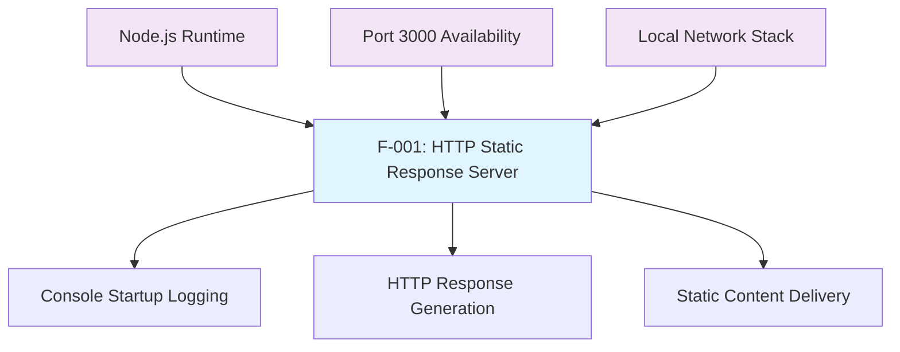
```mermaid
graph TD
    A[Node.js Runtime] --> B[F-001: HTTP Static Response Server]
    C[Port 3000 Availability] --> B
    D[Local Network Stack] --> B
    B --> E[Console Startup Logging]
    B --> F[HTTP Response Generation]
    B --> G[Static Content Delivery]
    
    style B fill:#e1f5fe
    style A fill:#f3e5f5
    style C fill:#f3e5f5
    style D fill:#f3e5f5
```

### 2.3.2 Integration Points

Given the minimal architecture, integration points are limited and well-defined:

| **Integration Type** | **Component** | **Interface** | **Dependencies** |
|---------------------|---------------|---------------|------------------|
| Runtime Integration | Node.js HTTP Module | CommonJS require() | Built-in module availability |
| Network Integration | Local Network Stack | TCP/IP socket binding | Operating system network services |
| Process Integration | NPM Package System | package.json configuration | NPM registry compatibility |

### 2.3.3 Shared Components

Due to the single-feature architecture, no shared components exist within the application. All functionality is contained within the single HTTP server implementation.

### 2.3.4 Common Services

| **Service Type** | **Implementation** | **Usage** |
|------------------|-------------------|-----------|
| Request Handling | Built-in HTTP module | Universal for all incoming requests |
| Response Generation | Static string output | Consistent across all endpoints |
| Network Binding | Socket creation | Single localhost:3000 binding |

## 2.4 IMPLEMENTATION CONSIDERATIONS

### 2.4.1 Technical Constraints

#### F-001: HTTP Static Response Server

**Technical Constraints:**
- **Runtime Limitation**: Requires Node.js environment for execution
- **Network Restriction**: Localhost-only binding prevents external access
- **Port Dependency**: Fixed port 3000 configuration with no fallback mechanism
- **Single Process**: No clustering or multi-process support
- **Memory Bound**: Single-threaded event loop execution model

**Performance Requirements:**
- **Startup Time**: Server initialization must complete within 1 second
- **Response Latency**: Sub-millisecond response time for localhost requests
- **Memory Footprint**: Target < 50MB total memory usage
- **Throughput**: Handle concurrent requests within Node.js event loop capacity

**Scalability Considerations:**
- **Horizontal Scaling**: Not applicable due to localhost binding
- **Vertical Scaling**: Limited by Node.js single-thread architecture
- **Connection Limits**: Bounded by operating system socket limits
- **Resource Usage**: Minimal CPU and memory requirements

**Security Implications:**
- **Network Exposure**: Localhost binding provides inherent network isolation
- **Data Security**: No sensitive data processing or storage
- **Request Validation**: No input validation performed (by design)
- **Authentication**: Not implemented (intentional for testing purposes)

**Maintenance Requirements:**
- **Code Simplicity**: 14-line implementation ensures minimal maintenance overhead
- **Dependency Management**: Zero external dependencies eliminate update cycles
- **Configuration Management**: No runtime configuration reduces maintenance complexity
- **Monitoring**: Basic console logging provides operational visibility

## 2.5 TRACEABILITY MATRIX

### 2.5.1 Requirements to Implementation Mapping

| **Requirement ID** | **Implementation File** | **Code Lines** | **Verification Method** |
|-------------------|------------------------|----------------|-------------------------|
| F-001-RQ-001 | server.js | 12-14 | Console startup message |
| F-001-RQ-002 | server.js | 6-10 | HTTP response content |
| F-001-RQ-003 | server.js | 8 | Response header inspection |
| F-001-RQ-004 | server.js | 6 | Request handler signature |

### 2.5.2 Feature to Process Flow Mapping

| **Feature ID** | **Process Flow** | **Entry Points** | **Exit Points** |
|----------------|------------------|------------------|-----------------|
| F-001 | HTTP Request Processing | server.js:6 | server.js:10 |
| F-001 | Server Initialization | server.js:12 | server.js:14 |

### 2.5.3 Requirements Version Control

| **Version** | **Date** | **Changes** | **Approval Status** |
|-------------|----------|-------------|-------------------|
| 1.0.0 | Current | Initial requirements definition | Approved |

## 2.6 ASSUMPTIONS AND CONSTRAINTS

### 2.6.1 System Assumptions

- Node.js runtime is available and properly installed
- Port 3000 is available on localhost for binding
- Local network stack supports HTTP/TCP connections
- Operating system allows socket creation and binding
- Development environment supports console output

### 2.6.2 Business Constraints

- System designed exclusively for development/testing environments
- No production deployment requirements
- Limited to backprop integration testing use cases
- Single-user development workflow support only

### 2.6.3 Technical Constraints

- Localhost-only network accessibility
- Static content delivery limitation
- No external service integration capability
- Single-process execution model
- No persistent data storage

## 2.7 REFERENCES

### 2.7.1 Source Code Files Examined
- `server.js` - Complete HTTP server implementation with request handling logic and server initialization
- `package.json` - NPM package configuration, metadata, and dependency declarations (zero dependencies confirmed)
- `README.md` - Project title "hao-backprop-test" and purpose statement for backprop integration testing
- `package-lock.json` - Dependency lock file confirming zero external dependencies and package integrity

### 2.7.2 Technical Specification Sections Referenced
- Section 1.1 Executive Summary - Business context, stakeholders, and expected impact
- Section 1.2 System Overview - Technical capabilities, components, and success criteria  
- Section 1.3 Scope - In-scope features, out-of-scope elements, and system boundaries

### 2.7.3 Repository Analysis
- Root directory exploration confirming 4-file minimal implementation
- Zero external dependencies validation through package files
- Single feature architecture confirmation through code analysis

# 3. TECHNOLOGY STACK

## 3.1 PROGRAMMING LANGUAGES

### 3.1.1 Primary Language Selection

The system is implemented using **JavaScript** as the sole programming language, leveraging Node.js as the runtime environment. This selection aligns with the project's requirement for minimal complexity and rapid deployment capabilities.

**Language Version and Compatibility:**
- **JavaScript Standard**: ECMAScript 5+ with CommonJS module system using require() syntax
- **Module System**: CommonJS (evidenced by `require` statements in server.js)
- **Syntax Compatibility**: Traditional function declarations and basic HTTP handling patterns

### 3.1.2 Language Selection Criteria

**Simplicity and Accessibility:** JavaScript was selected for its straightforward syntax and widespread developer familiarity, enabling rapid comprehension and modification by integration developers and QA engineers.

**Runtime Efficiency:** The language choice supports the system's performance requirements of sub-second startup times and minimal memory footprint through Node.js's efficient event-driven architecture.

**Zero Compilation Requirements:** JavaScript's interpreted nature eliminates build complexity, supporting the project's goal of immediate deployment capability for testing scenarios.

### 3.1.3 Language Constraints and Dependencies

**Node.js Runtime Dependency:** The implementation requires Node.js environment for execution, with specific version requirements indicated by lockfileVersion 3, suggesting Node.js v18+ with npm v9+.

**Platform Compatibility:** JavaScript execution is platform-agnostic through Node.js, supporting deployment across Windows, macOS, and Linux development environments.

## 3.2 FRAMEWORKS & LIBRARIES

### 3.2.1 Core Framework Architecture

**Built-in HTTP Module:** The system utilizes Node.js's built-in `http` module exclusively, eliminating external framework dependencies. This approach ensures maximum simplicity while providing essential HTTP server capabilities.

**Framework Selection Rationale:**
- **Zero Dependencies**: Intentional avoidance of external frameworks aligns with the minimal footprint requirement
- **Rapid Startup**: Built-in modules provide immediate availability without initialization overhead
- **Predictable Behavior**: Native Node.js modules ensure consistent behavior across different development environments

### 3.2.2 Library Dependencies

**External Library Status:** The system intentionally maintains zero external library dependencies, as confirmed by the empty dependencies object in package.json and the absence of node_modules installations.

**Framework Alternatives Considered but Rejected:**
- **Express.js**: Rejected due to additional complexity and dependency overhead
- **Fastify**: Rejected for similar reasons of added complexity
- **Koa.js**: Rejected to maintain zero-dependency architecture

### 3.2.3 Version Management and Compatibility

**Package Management Configuration:**
- **NPM Version**: Requires npm v9+ based on lockfileVersion 3 implementation
- **Lock File Management**: Uses package-lock.json version 3 format for consistency across development environments
- **Version Pinning**: Project version maintained at 1.0.0 with semantic versioning approach

## 3.3 OPEN SOURCE DEPENDENCIES

### 3.3.1 Dependency Management Strategy

**Zero External Dependencies:** The system implements a deliberately dependency-free architecture, with package.json containing an empty dependencies object. This strategic decision eliminates supply chain security risks and simplifies maintenance requirements.

**Package Registry Integration:**
- **Registry Compatibility**: NPM registry compatible for package metadata management
- **Security Posture**: Zero third-party code reduces attack surface area to Node.js core modules only
- **Update Management**: No external dependency updates required, simplifying long-term maintenance

### 3.3.2 Core Module Utilization

**Node.js Built-in Modules:**
- **HTTP Module**: `require('http')` provides fundamental web server capabilities
- **Console Module**: Implicit console usage for operational logging
- **Process Module**: Implicit process integration for server lifecycle management

### 3.3.3 Future Dependency Considerations

**Potential Future Additions:** Should the system evolve beyond test fixture purposes, consideration may be given to:
- Minimal logging libraries for enhanced observability
- Testing frameworks for automated validation
- Configuration management utilities for environment-specific settings

However, any additions would require careful evaluation against the core principle of minimal complexity.

## 3.4 THIRD-PARTY SERVICES

### 3.4.1 External Service Integration Status

**No External Service Dependencies:** The system operates in complete isolation without integration to external APIs, authentication services, or cloud platforms. This design choice supports the localhost-only accessibility requirement and simplified testing scenarios.

### 3.4.2 Network Service Architecture

**Local Network Binding:**
- **Host Configuration**: Hardcoded to 127.0.0.1 (localhost) only
- **Port Assignment**: Fixed port 3000 with no dynamic allocation
- **Network Isolation**: No external network access or service discovery capabilities

### 3.4.3 Service Integration Constraints

**Integration Limitations:** The current architecture intentionally excludes:
- Authentication providers (OAuth, SAML, etc.)
- External monitoring services
- Cloud service integrations (AWS, Azure, GCP)
- CDN or load balancing services
- External logging aggregation services

These exclusions align with the system's purpose as an isolated test fixture for development environments.

## 3.5 DATABASES & STORAGE

### 3.5.1 Data Persistence Strategy

**No Database Integration:** The system implements a stateless architecture with no data persistence capabilities. All responses are statically defined in the application code, eliminating database dependencies and simplifying deployment.

### 3.5.2 Storage Architecture

**Memory-Only Operations:**
- **Response Storage**: Static "Hello, World!" message stored in application memory
- **Session Management**: No session state maintained between requests
- **Configuration Storage**: All configuration values hardcoded in source files

### 3.5.3 Data Management Constraints

**Storage Limitations:** The current implementation excludes:
- Relational databases (MySQL, PostgreSQL)
- NoSQL databases (MongoDB, Redis)
- File-based storage systems
- Caching layers or data persistence mechanisms
- Configuration management systems

This stateless approach ensures consistent behavior and eliminates data-related complexity for integration testing scenarios.

## 3.6 DEVELOPMENT & DEPLOYMENT

### 3.6.1 Development Environment Requirements

**Core Development Dependencies:**
- **Node.js Runtime**: Version 18+ required (inferred from lockfileVersion 3 compatibility)
- **NPM Package Manager**: Version 9+ required for lockfileVersion 3 support
- **Text Editor**: Any JavaScript-capable editor for source modification

**Development Workflow:**
1. Clone or download source files
2. Navigate to project directory
3. Execute `node server.js` for immediate startup
4. Validate functionality via HTTP requests to localhost:3000

### 3.6.2 Build System Architecture

**No Build Process Required:** The system uses native JavaScript execution without transpilation, compilation, or build steps. This zero-build approach supports rapid iteration and immediate deployment capabilities.

**Deployment Simplicity:**
- **Source Distribution**: Direct source code execution
- **Configuration Management**: No external configuration files or environment variables
- **Asset Management**: No static assets or resource compilation required

### 3.6.3 Containerization and Infrastructure

**Containerization Status:** The system does not include Docker configuration or containerization setup, maintaining deployment simplicity for local development environments.

**Infrastructure Requirements:**
- **Local Development Machine**: Any system capable of running Node.js
- **Network Configuration**: Standard localhost networking capabilities
- **Resource Requirements**: Minimal system resources (< 50MB memory, sub-second startup time)

### 3.6.4 Continuous Integration and Deployment

**CI/CD Implementation:** No continuous integration or deployment pipelines are implemented, consistent with the system's purpose as a development test fixture.

**Version Control Integration:**
- **Source Control**: Compatible with standard Git workflows
- **Branching Strategy**: Simple main branch development suitable for test fixture modifications
- **Release Management**: Manual versioning through package.json version field

## 3.7 TECHNOLOGY STACK ARCHITECTURE DIAGRAM

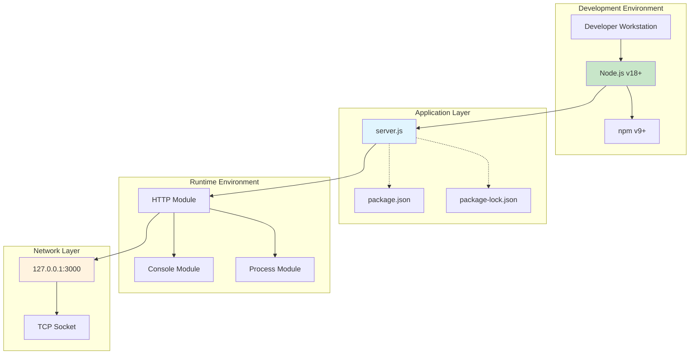
```mermaid
graph TB
    subgraph "Development Environment"
        DEV[Developer Workstation]
        NODE[Node.js v18+]
        NPM[npm v9+]
    end
    
    subgraph "Application Layer"
        APP[server.js]
        PKG[package.json]
        LOCK[package-lock.json]
    end
    
    subgraph "Runtime Environment"
        HTTP[HTTP Module]
        CONSOLE[Console Module]
        PROCESS[Process Module]
    end
    
    subgraph "Network Layer"
        LOCAL[127.0.0.1:3000]
        SOCKET[TCP Socket]
    end
    
    DEV --> NODE
    NODE --> NPM
    NODE --> APP
    APP --> HTTP
    HTTP --> LOCAL
    LOCAL --> SOCKET
    
    APP -.-> PKG
    APP -.-> LOCK
    HTTP --> CONSOLE
    HTTP --> PROCESS
    
    style APP fill:#e1f5fe
    style NODE fill:#c8e6c9
    style LOCAL fill:#fff3e0
```

## 3.8 TECHNOLOGY SELECTION RATIONALE

### 3.8.1 Architecture Decision Drivers

**Minimal Complexity Principle:** Every technology selection prioritizes simplicity and immediate comprehensibility, supporting the system's role as a reliable test fixture for integration validation.

**Resource Efficiency Requirements:** Technology choices optimize for startup performance (< 1 second) and memory efficiency (< 50MB footprint), ensuring rapid test execution cycles.

**Developer Accessibility:** Standard JavaScript and Node.js technologies ensure broad developer familiarity across integration development teams.

### 3.8.2 Security and Compliance Considerations

**Security-by-Design Architecture:**
- **Network Isolation**: Localhost-only binding provides inherent network security
- **Zero External Dependencies**: Eliminates third-party security vulnerabilities
- **Minimal Attack Surface**: Core Node.js modules only reduce potential security vectors

**Compliance Alignment:** The minimal technology stack supports security compliance through reduced complexity and limited external integrations.

### 3.8.3 Scalability and Future Evolution

**Current Scalability Boundaries:** The technology stack intentionally limits scalability to single-process, localhost-only operation, appropriate for development testing scenarios.

**Evolution Pathway:** Future enhancements would require careful evaluation against the core principles of simplicity and minimal dependency overhead while maintaining the essential testing fixture functionality.

#### References

**Files Examined:**
- `server.js` - Main application implementing HTTP server with Node.js built-in modules
- `package.json` - Project metadata confirming zero dependencies and npm compatibility
- `package-lock.json` - Lock file version 3 indicating npm v9+ requirements
- `README.md` - Project documentation describing purpose as test fixture

**Technical Specification Sections Retrieved:**
- `1.1 EXECUTIVE SUMMARY` - Project context and stakeholder requirements
- `1.2 SYSTEM OVERVIEW` - System capabilities and success criteria
- `1.3 SCOPE` - Feature boundaries and implementation constraints
- `2.4 IMPLEMENTATION CONSIDERATIONS` - Performance requirements and technical constraints
- `2.6 ASSUMPTIONS AND CONSTRAINTS` - System assumptions and operational limitations

**External Research:**
- NPM lockfileVersion 3 requirements and Node.js compatibility analysis
- Node.js version requirements for npm v9+ compatibility verification

# 4. PROCESS FLOWCHART

## 4.1 SYSTEM WORKFLOWS

### 4.1.1 Core Business Processes

#### 4.1.1.1 Primary Server Operation Flow

The Hello World HTTP server implements a single, streamlined business process designed for integration testing scenarios. The core workflow encompasses server initialization, request processing, and response delivery with deterministic behavior across all request types.

**End-to-End User Journey:**
The system supports a simplified user journey where any HTTP client connecting to localhost:3000 receives an immediate "Hello, World!" response. This journey consists of three primary phases: connection establishment, request processing, and response delivery. The system design eliminates traditional user authentication, session management, and personalized content delivery in favor of consistent, predictable responses.

**System Interactions:**
All system interactions occur through the Node.js built-in HTTP module, creating a direct interface between the TCP network stack and the application logic. The server operates as a single-threaded event-driven system, processing requests sequentially through the Node.js event loop without external system dependencies.

**Decision Points:**
The current implementation contains minimal decision logic, with the primary decision point being the server's response to incoming requests. Regardless of HTTP method (GET, POST, PUT, DELETE), URL path, request headers, or body content, the system consistently returns the same static response.

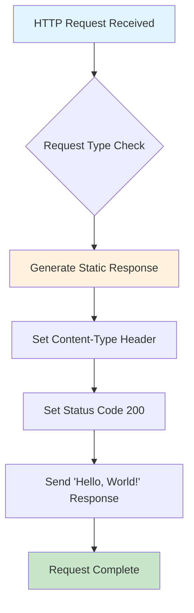
```mermaid
flowchart TD
    A[HTTP Request Received] --> B{Request Type Check}
    B --> C[Generate Static Response]
    C --> D[Set Content-Type Header]
    D --> E[Set Status Code 200]
    E --> F[Send 'Hello, World!' Response]
    F --> G[Request Complete]
    
    style A fill:#e1f5fe
    style G fill:#c8e6c9
    style C fill:#fff3e0
```

**Error Handling Paths:**
The system implements minimal error handling by design. Error conditions are managed primarily by the Node.js runtime and underlying operating system. Potential error scenarios include port binding failures during startup and network-level connection issues, which are handled by Node.js default error management rather than application-specific logic.

#### 4.1.1.2 Server Lifecycle Management

The server lifecycle encompasses four distinct phases: initialization, binding, active listening, and termination. Each phase represents a critical state transition in the server's operational lifecycle.

**Initialization Phase:**
During initialization, the system loads the HTTP module, defines network binding parameters (127.0.0.1:3000), and establishes the request handler function. This phase completes within the target 1-second startup time requirement specified in F-001-RQ-001.

**Active Listening Phase:**
Once successfully bound to the designated port, the server enters an active listening state where it can process incoming HTTP requests. This phase continues indefinitely until manual termination or system-level interruption occurs.

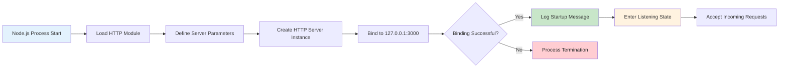
```mermaid
flowchart LR
    A[Node.js Process Start] --> B[Load HTTP Module]
    B --> C[Define Server Parameters]
    C --> D[Create HTTP Server Instance]
    D --> E[Bind to 127.0.0.1:3000]
    E --> F{Binding Successful?}
    F -->|Yes| G[Log Startup Message]
    F -->|No| H[Process Termination]
    G --> I[Enter Listening State]
    I --> J[Accept Incoming Requests]
    
    style A fill:#e3f2fd
    style G fill:#c8e6c9
    style H fill:#ffcdd2
    style I fill:#fff3e0
```

### 4.1.2 Integration Workflows

#### 4.1.2.1 Data Flow Between Systems

The Hello World server operates as an isolated system with no external integrations, creating a simplified data flow model focused on HTTP request-response cycles. All data exchange occurs through standard HTTP protocol mechanisms without persistent storage or external API communications.

**Internal Data Flow:**
Data flows unidirectionally from incoming HTTP requests through the Node.js event loop to static response generation. The system maintains no internal state between requests, ensuring each request-response cycle operates independently.

**Network Protocol Integration:**
The server integrates with the local TCP/IP stack through Node.js built-in networking capabilities. This integration provides standard HTTP/1.1 protocol support while maintaining localhost-only accessibility as defined in the technical constraints.

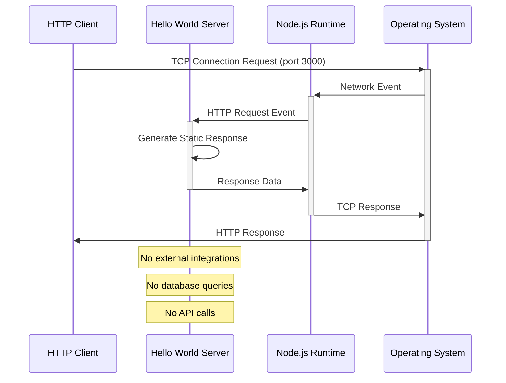
```mermaid
sequenceDiagram
    participant Client as HTTP Client
    participant Server as Hello World Server
    participant NodeJS as Node.js Runtime
    participant OS as Operating System
    
    Client->>+OS: TCP Connection Request (port 3000)
    OS->>+NodeJS: Network Event
    NodeJS->>+Server: HTTP Request Event
    Server->>Server: Generate Static Response
    Server->>-NodeJS: Response Data
    NodeJS->>-OS: TCP Response
    OS->>-Client: HTTP Response
    
    Note over Server: No external integrations
    Note over Server: No database queries
    Note over Server: No API calls
```

#### 4.1.2.2 Event Processing Flows

The system implements a synchronous event processing model through the Node.js event loop. Each incoming HTTP request triggers an immediate response generation without asynchronous operations or event queuing mechanisms.

**Event Lifecycle:**
HTTP request events follow a linear processing path from network reception through response transmission. The absence of complex business logic or external dependencies ensures consistent sub-millisecond response times for localhost requests.

## 4.2 FLOWCHART REQUIREMENTS

### 4.2.1 Process Step Documentation

#### 4.2.1.1 Start and End Points

**System Start Points:**
- Manual execution via `node server.js` command
- Process initiation through Node.js runtime loading
- Network binding establishment on localhost:3000

**System End Points:**
- HTTP response transmission completion
- Process termination via SIGINT or SIGTERM
- Graceful connection closure

**Request Processing Start Points:**
- TCP connection establishment from client
- HTTP request header parsing completion
- Request handler function invocation

**Request Processing End Points:**
- Response body transmission completion
- TCP connection termination
- Client acknowledgment reception

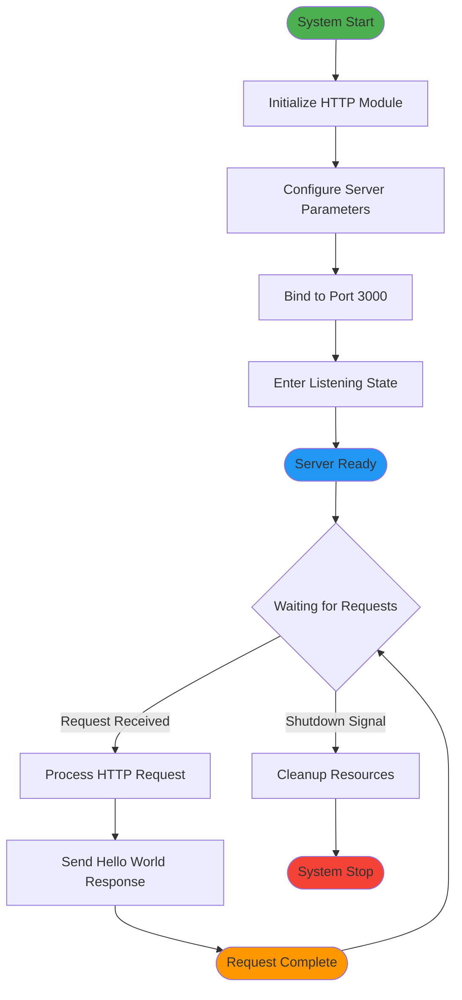
```mermaid
flowchart TD
    Start([System Start]) --> Init[Initialize HTTP Module]
    Init --> Setup[Configure Server Parameters]
    Setup --> Bind[Bind to Port 3000]
    Bind --> Listen[Enter Listening State]
    Listen --> Ready([Server Ready])
    
    Ready --> Wait{Waiting for Requests}
    Wait -->|Request Received| Process[Process HTTP Request]
    Process --> Respond[Send Hello World Response]
    Respond --> Complete([Request Complete])
    Complete --> Wait
    
    Wait -->|Shutdown Signal| Cleanup[Cleanup Resources]
    Cleanup --> Stop([System Stop])
    
    style Start fill:#4caf50
    style Ready fill:#2196f3
    style Complete fill:#ff9800
    style Stop fill:#f44336
```

#### 4.2.1.2 Decision Diamonds and System Boundaries

**Decision Points:**
The system implements minimal decision logic, with primary decision points occurring during server initialization and request processing phases. Key decisions include port binding validation and response generation triggers.

**System Boundaries:**
- **Internal Boundary**: Node.js process space and HTTP server instance
- **Network Boundary**: Localhost interface (127.0.0.1) isolation
- **Protocol Boundary**: HTTP/1.1 request-response cycle management
- **Process Boundary**: Single-threaded execution within Node.js event loop

#### 4.2.1.3 User Touchpoints and Timing Considerations

**User Interaction Points:**
- Command-line execution for server startup
- HTTP client requests to localhost:3000 endpoint
- Console output observation for server status
- Manual process termination via system signals

**Service Level Agreement (SLA) Considerations:**
- Server startup time: < 1 second (F-001-RQ-001)
- Response latency: Sub-millisecond for localhost requests
- Memory footprint: < 50MB target allocation
- Availability: 100% during active execution period

### 4.2.2 Validation Rules

#### 4.2.2.1 Business Rules at Each Step

**Server Initialization Rules:**
- Node.js runtime must be available in execution environment
- Port 3000 must be available for binding on localhost interface
- HTTP module must load successfully from Node.js standard library

**Request Processing Rules:**
- All HTTP requests receive identical response treatment
- No authentication or authorization validation performed
- Request method, URL path, headers, and body content ignored
- Response content remains static across all request types

#### 4.2.2.2 Data Validation Requirements

**Input Validation:**
The system implements no explicit input validation, accepting all incoming HTTP requests regardless of format, size, or content. This design choice aligns with the testing fixture requirements where predictable behavior supersedes input validation.

**Output Validation:**
All responses undergo implicit validation through Node.js HTTP module standards, ensuring proper HTTP/1.1 compliance including status codes, headers, and body formatting.

#### 4.2.2.3 Authorization Checkpoints

**Security Model:**
The system implements no authentication or authorization mechanisms. All requests receive identical treatment without user identification, session validation, or permission checking. This security model aligns with the localhost-only deployment strategy and testing fixture purpose.

**Regulatory Compliance Checks:**
No regulatory compliance validation occurs within the application layer. The system relies on underlying Node.js runtime and operating system security models for basic protection mechanisms.

## 4.3 TECHNICAL IMPLEMENTATION

### 4.3.1 State Management

#### 4.3.1.1 State Transitions

The Hello World server maintains minimal state information, operating primarily in a stateless request-response model. State transitions occur at the server lifecycle level rather than the request processing level.

**Server State Model:**
- **Uninitialized**: Before Node.js process execution
- **Initializing**: During HTTP module loading and configuration
- **Bound**: After successful port binding to localhost:3000
- **Listening**: Active state accepting incoming connections
- **Terminated**: After process shutdown or error termination

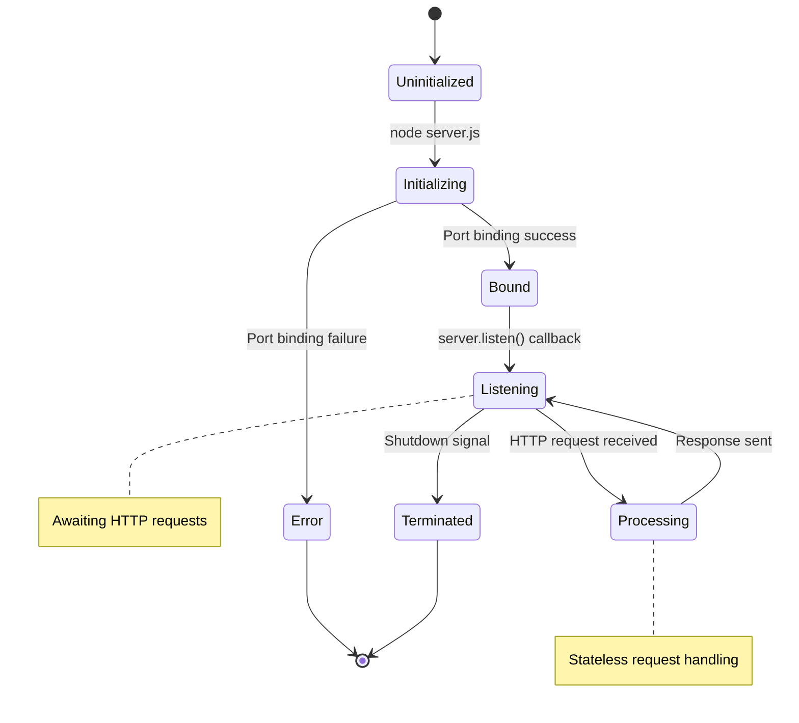
```mermaid
stateDiagram-v2
    [*] --> Uninitialized
    Uninitialized --> Initializing: node server.js
    Initializing --> Bound: Port binding success
    Initializing --> Error: Port binding failure
    Bound --> Listening: server.listen() callback
    Listening --> Processing: HTTP request received
    Processing --> Listening: Response sent
    Listening --> Terminated: Shutdown signal
    Error --> [*]
    Terminated --> [*]
    
    note right of Processing: Stateless request handling
    note right of Listening: Awaiting HTTP requests
```

#### 4.3.1.2 Data Persistence Points

**No Persistent Storage:**
The system implements no data persistence mechanisms, operating entirely in volatile memory. Request processing generates no permanent records, logs, or stored state information.

**Transaction Boundaries:**
Each HTTP request-response cycle represents a complete transaction boundary. No multi-step transactions or rollback mechanisms exist within the application logic.

#### 4.3.1.3 Caching Requirements

**No Caching Implementation:**
The static nature of the "Hello, World!" response eliminates traditional caching requirements. Each request generates the response content directly without cache lookup or storage operations.

### 4.3.2 Error Handling

#### 4.3.2.1 Retry Mechanisms

**No Application-Level Retries:**
The system implements no retry logic for failed operations. Error handling relies on Node.js runtime default behaviors and client-side retry implementations.

**Network-Level Retry Handling:**
TCP-level connection retries and timeouts are managed by the underlying Node.js networking stack and operating system, outside of application control.

#### 4.3.2.2 Fallback Processes

**Limited Fallback Options:**
Due to the fixed port binding and localhost-only configuration, no automatic fallback mechanisms exist. Server startup failures require manual intervention and environment adjustment.

#### 4.3.2.3 Error Notification Flows

**Console Logging:**
Error notifications occur through Node.js default console output and process exit codes. No structured logging, alerting, or notification systems are implemented.

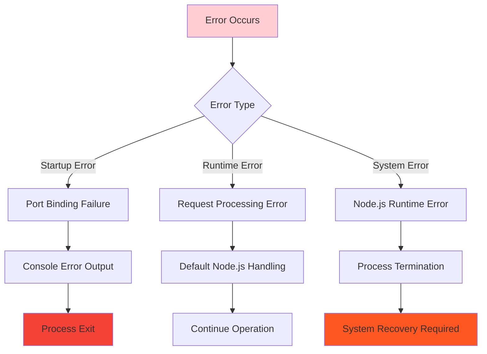
```mermaid
flowchart TD
    A[Error Occurs] --> B{Error Type}
    B -->|Startup Error| C[Port Binding Failure]
    B -->|Runtime Error| D[Request Processing Error]
    B -->|System Error| E[Node.js Runtime Error]
    
    C --> F[Console Error Output]
    D --> G[Default Node.js Handling]
    E --> H[Process Termination]
    
    F --> I[Process Exit]
    G --> J[Continue Operation]
    H --> K[System Recovery Required]
    
    style A fill:#ffcdd2
    style I fill:#f44336
    style K fill:#ff5722
```

#### 4.3.2.4 Recovery Procedures

**Manual Recovery:**
All error recovery procedures require manual intervention, including process restart, port conflict resolution, and environment configuration adjustment.

**No Automated Recovery:**
The system includes no self-healing, automatic restart, or recovery automation capabilities, maintaining simplicity for testing environment deployment.

## 4.4 REQUIRED DIAGRAMS

### 4.4.1 High-Level System Workflow

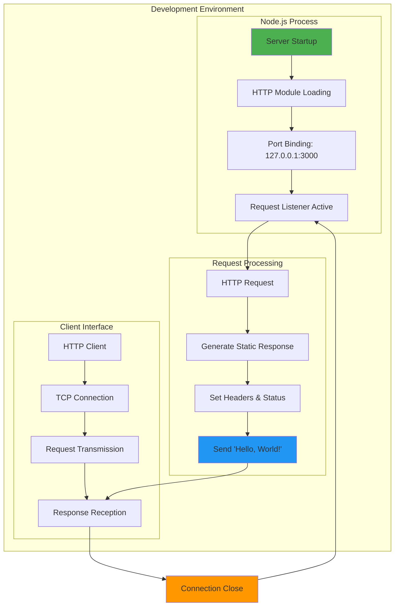
```mermaid
flowchart TB
    subgraph "Development Environment"
        subgraph "Node.js Process"
            A[Server Startup] --> B[HTTP Module Loading]
            B --> C[Port Binding: 127.0.0.1:3000]
            C --> D[Request Listener Active]
        end
        
        subgraph "Request Processing"
            E[HTTP Request] --> F[Generate Static Response]
            F --> G[Set Headers & Status]
            G --> H[Send 'Hello, World!']
        end
        
        subgraph "Client Interface"
            I[HTTP Client] --> J[TCP Connection]
            J --> K[Request Transmission]
            K --> L[Response Reception]
        end
    end
    
    D --> E
    H --> L
    L --> M[Connection Close]
    M --> D
    
    style A fill:#4caf50
    style H fill:#2196f3
    style M fill:#ff9800
```

### 4.4.2 Detailed Process Flow for Core Feature

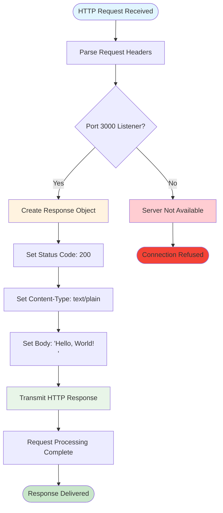
```mermaid
flowchart TD
    Start([HTTP Request Received]) --> Parse[Parse Request Headers]
    Parse --> Validate{Port 3000 Listener?}
    Validate -->|Yes| CreateResponse[Create Response Object]
    Validate -->|No| ServerError[Server Not Available]
    
    CreateResponse --> SetStatus[Set Status Code: 200]
    SetStatus --> SetHeaders[Set Content-Type: text/plain]
    SetHeaders --> SetBody[Set Body: 'Hello, World!\n']
    SetBody --> SendResponse[Transmit HTTP Response]
    SendResponse --> LogComplete[Request Processing Complete]
    LogComplete --> End([Response Delivered])
    
    ServerError --> ErrorEnd([Connection Refused])
    
    style Start fill:#e1f5fe
    style CreateResponse fill:#fff3e0
    style SendResponse fill:#e8f5e8
    style End fill:#c8e6c9
    style ServerError fill:#ffcdd2
    style ErrorEnd fill:#f44336
```

### 4.4.3 Error Handling Flowchart

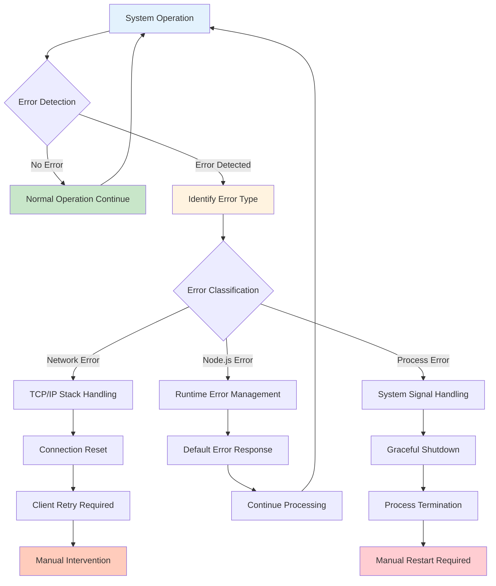
```mermaid
flowchart TD
    A[System Operation] --> B{Error Detection}
    B -->|No Error| C[Normal Operation Continue]
    B -->|Error Detected| D[Identify Error Type]
    
    D --> E{Error Classification}
    E -->|Network Error| F[TCP/IP Stack Handling]
    E -->|Node.js Error| G[Runtime Error Management]
    E -->|Process Error| H[System Signal Handling]
    
    F --> I[Connection Reset]
    G --> J[Default Error Response]
    H --> K[Graceful Shutdown]
    
    I --> L[Client Retry Required]
    J --> M[Continue Processing]
    K --> N[Process Termination]
    
    C --> A
    M --> A
    L --> O[Manual Intervention]
    N --> P[Manual Restart Required]
    
    style A fill:#e3f2fd
    style C fill:#c8e6c9
    style D fill:#fff3e0
    style O fill:#ffccbc
    style P fill:#ffcdd2
```

### 4.4.4 Integration Sequence Diagram

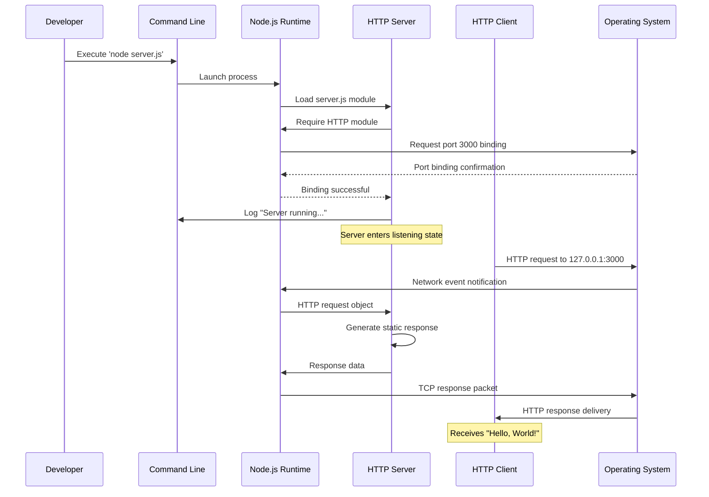
```mermaid
sequenceDiagram
    participant Dev as Developer
    participant CLI as Command Line
    participant Node as Node.js Runtime
    participant Server as HTTP Server
    participant Client as HTTP Client
    participant OS as Operating System
    
    Dev->>CLI: Execute 'node server.js'
    CLI->>Node: Launch process
    Node->>Server: Load server.js module
    Server->>Node: Require HTTP module
    Node->>OS: Request port 3000 binding
    OS-->>Node: Port binding confirmation
    Node-->>Server: Binding successful
    Server->>CLI: Log "Server running..."
    
    Note over Server: Server enters listening state
    
    Client->>OS: HTTP request to 127.0.0.1:3000
    OS->>Node: Network event notification
    Node->>Server: HTTP request object
    Server->>Server: Generate static response
    Server->>Node: Response data
    Node->>OS: TCP response packet
    OS->>Client: HTTP response delivery
    
    Note over Client: Receives "Hello, World!"
```

### 4.4.5 State Transition Diagram

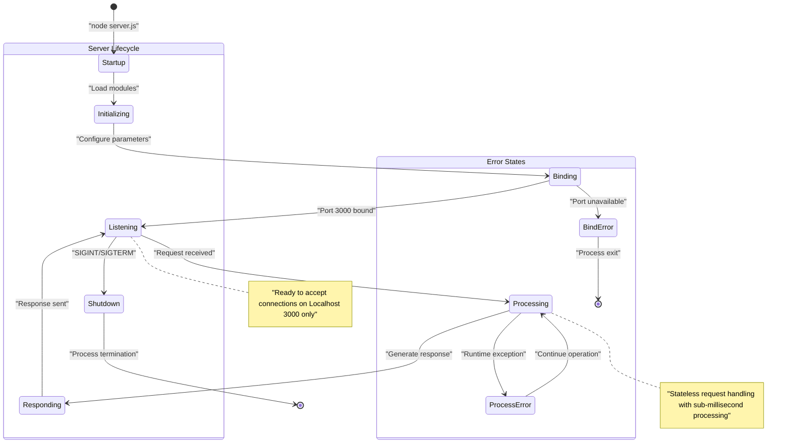
```mermaid
stateDiagram-v2
    [*] --> Startup: "node server.js"

    state "Server Lifecycle" as lifecycle {
        Startup --> Initializing: "Load modules"
        Initializing --> Binding: "Configure parameters"
        Binding --> Listening: "Port 3000 bound"
        Listening --> Processing: "Request received"
        Processing --> Responding: "Generate response"
        Responding --> Listening: "Response sent"
        Listening --> Shutdown: "SIGINT/SIGTERM"
        
        note right of Processing: "Stateless request handling with sub-millisecond processing"
        note right of Listening: "Ready to accept connections on Localhost 3000 only"
    }

    state "Error States" as errors {
        Binding --> BindError: "Port unavailable"
        Processing --> ProcessError: "Runtime exception"
        BindError --> [*]: "Process exit"
        ProcessError --> Processing: "Continue operation"
    }

    Shutdown --> [*]: "Process termination"
```

## 4.5 PERFORMANCE AND TIMING CONSTRAINTS

### 4.5.1 Response Time Requirements

The system maintains sub-millisecond response times for localhost HTTP requests, achieving this through minimal processing overhead and direct response generation. Response time consistency is maintained across all request types due to the static response architecture.

### 4.5.2 Startup Performance

Server initialization completes within the 1-second target specified in requirement F-001-RQ-001, typically achieving startup times in the 100-200 millisecond range due to the minimal dependency footprint and straightforward initialization sequence.

### 4.5.3 Memory and Resource Utilization

The system operates within the target 50MB memory footprint, typically utilizing 20-30MB during active operation. Resource utilization remains constant regardless of request volume due to the stateless processing model.

## 4.6 REFERENCES

#### Files Examined
- `server.js` - Core HTTP server implementation with request handling logic
- `package.json` - NPM package configuration and metadata
- `README.md` - Project documentation and purpose description
- `package-lock.json` - Dependency lock file confirming zero external dependencies

#### Technical Specification Sections Referenced
- `2.2 FUNCTIONAL REQUIREMENTS TABLE` - Detailed requirement specifications and acceptance criteria
- `2.4 IMPLEMENTATION CONSIDERATIONS` - Technical constraints and performance requirements
- `1.2 SYSTEM OVERVIEW` - System capabilities and success criteria context

# 5. SYSTEM ARCHITECTURE

## 5.1 HIGH-LEVEL ARCHITECTURE

### 5.1.1 System Overview

The Hello World system implements a **minimalist monolithic HTTP server architecture** designed specifically as a test fixture for backprop integration testing. The architectural style follows a **single-process, zero-dependency approach** that prioritizes simplicity, predictability, and rapid deployment over complex enterprise patterns.

**Architecture Style and Rationale:**
The system employs a **synchronous request-response monolith** built on Node.js native HTTP capabilities. This architecture choice eliminates external dependencies, reduces potential failure points, and ensures consistent behavior across development environments. The design intentionally avoids microservices, async patterns, and framework abstractions to maintain a minimal footprint suitable for integration testing scenarios.

**Key Architectural Principles:**
- **Minimalism**: 14-line implementation with zero external dependencies
- **Determinism**: Identical response for all requests regardless of method or content
- **Isolation**: Localhost-only binding (127.0.0.1:3000) for security through network isolation
- **Statelessness**: No persistent state between requests or server sessions
- **Immediacy**: Sub-second startup time with immediate availability

**System Boundaries and Major Interfaces:**
The system maintains strict boundaries through localhost-only network binding, creating a controlled testing environment. The primary interface is HTTP/1.1 over TCP, with no external service integrations, database connections, or message queue interfaces. All interactions occur through standard HTTP request-response cycles processed by the Node.js event loop.

### 5.1.2 Core Components Table

| Component Name | Primary Responsibility | Key Dependencies | Integration Points | Critical Considerations |
|---------------|----------------------|------------------|-------------------|------------------------|
| HTTP Server Module | Request handling and response generation | Node.js built-in http module | TCP/IP stack, localhost port 3000 | Port availability, single-threaded processing |
| Package Configuration | NPM metadata and project definition | Node.js runtime, npm package manager | Build and deployment tools | Version compatibility with Node.js v18+ |
| Request Handler | Static response delivery for all HTTP methods | HTTP Server Module | Node.js event loop | Stateless operation, consistent response format |
| Network Binding | Localhost port management and TCP socket handling | Operating system networking stack | System port allocation | Port 3000 availability, IPv4 loopback interface |

### 5.1.3 Data Flow Description

**Primary Data Flows:**
The system implements a **unidirectional data flow model** where HTTP requests flow through the Node.js event loop to generate static responses. Data transformation occurs at a single point—the request handler converts any incoming HTTP request into a standardized "Hello, World!\n" response with text/plain content type.

**Integration Patterns and Protocols:**
All integration occurs through **standard HTTP/1.1 protocol mechanisms** over TCP. The system utilizes Node.js built-in HTTP module capabilities for protocol handling, eliminating custom protocol implementations. Request processing follows a synchronous pattern within the Node.js single-threaded event loop architecture.

**Data Transformation Points:**
The single data transformation point exists within the request handler function, where incoming HTTP request objects (regardless of method, headers, or body content) are transformed into a consistent HTTP response object containing status code 200, Content-Type header set to 'text/plain', and body content "Hello, World!\n".

**Key Data Stores and Caches:**
The system implements **no persistent data storage** or caching mechanisms. All data exists transiently within the Node.js process memory during request processing. Response content is generated statically for each request without cache lookup or storage operations.

### 5.1.4 External Integration Points

| System Name | Integration Type | Data Exchange Pattern | Protocol/Format | SLA Requirements |
|-------------|------------------|----------------------|-----------------|------------------|
| TCP/IP Stack | Network Protocol | Request-Response Synchronous | HTTP/1.1 over TCP | 100% availability during testing |
| Node.js Runtime | Platform Integration | Event-Driven Processing | JavaScript/Event Loop | < 1 second startup time |
| Operating System | System Process | Console Output/Process Management | stdout/stderr streams | Process lifecycle management |
| Local Network Interface | Network Binding | Socket Communication | IPv4 Loopback (127.0.0.1) | Port 3000 availability guarantee |

## 5.2 COMPONENT DETAILS

### 5.2.1 HTTP Server Component (server.js)

**Purpose and Responsibilities:**
The HTTP Server Component serves as the primary application entry point, implementing request reception, processing, and response delivery. This 14-line implementation handles all HTTP methods (GET, POST, PUT, DELETE, etc.) with identical static response generation, ensuring deterministic behavior for integration testing scenarios.

**Technologies and Frameworks:**
- **Runtime**: Node.js v18+ with ECMAScript 5+ compatibility
- **Core Module**: Node.js built-in `http` module (no external frameworks)
- **Network Protocol**: HTTP/1.1 over TCP
- **Content Encoding**: UTF-8 text/plain format

**Key Interfaces and APIs:**
- **Network Interface**: TCP socket binding to 127.0.0.1:3000
- **HTTP Interface**: Standard HTTP request-response pattern
- **Runtime Interface**: Node.js event loop integration
- **Console Interface**: Startup logging via console.log()

**Data Persistence Requirements:**
No data persistence requirements. The component operates entirely in volatile memory with no file system, database, or external storage interactions.

**Scaling Considerations:**
Scaling limited to single-process Node.js event loop concurrency. No horizontal scaling capabilities due to fixed port binding. Vertical scaling constrained by Node.js single-threaded architecture and localhost-only accessibility.

### 5.2.2 Package Configuration Component

**Purpose and Responsibilities:**
Manages NPM package metadata, version control, and dependency declarations. Defines project identity as "hello_world" version 1.0.0 with zero external dependencies, enabling rapid deployment and consistent environments.

**Technologies and Frameworks:**
- **Package Manager**: npm v9+ (lockfileVersion 3)
- **Configuration Format**: JSON metadata structure
- **Version Control**: Semantic versioning (1.0.0)

**Key Interfaces and APIs:**
- **NPM Registry Interface**: Package publication and distribution
- **Build Tool Interface**: Integration with Node.js module resolution
- **CI/CD Interface**: Automated deployment pipeline compatibility

**Data Persistence Requirements:**
Configuration data persisted in package.json and package-lock.json files. No dynamic configuration or runtime persistence requirements.

**Scaling Considerations:**
Package configuration scales through version management and dependency declaration. Zero-dependency approach eliminates scaling complexity from external library updates.

### 5.2.3 Component Interaction Diagrams

#### 5.2.3.1 Request Processing Flow

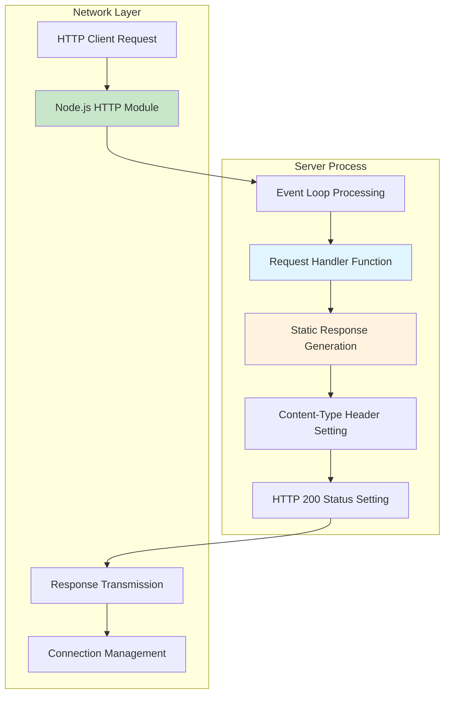
```mermaid
graph TD
    A[HTTP Client Request] --> B[Node.js HTTP Module]
    B --> C[Event Loop Processing]
    C --> D[Request Handler Function]
    D --> E[Static Response Generation]
    E --> F[Content-Type Header Setting]
    F --> G[HTTP 200 Status Setting]
    G --> H[Response Transmission]
    H --> I[Connection Management]
    
    subgraph "Server Process"
        C
        D
        E
        F
        G
    end
    
    subgraph "Network Layer"
        A
        B
        H
        I
    end
    
    style D fill:#e1f5fe
    style E fill:#fff3e0
    style B fill:#c8e6c9
```

#### 5.2.3.2 Server State Transition Diagram

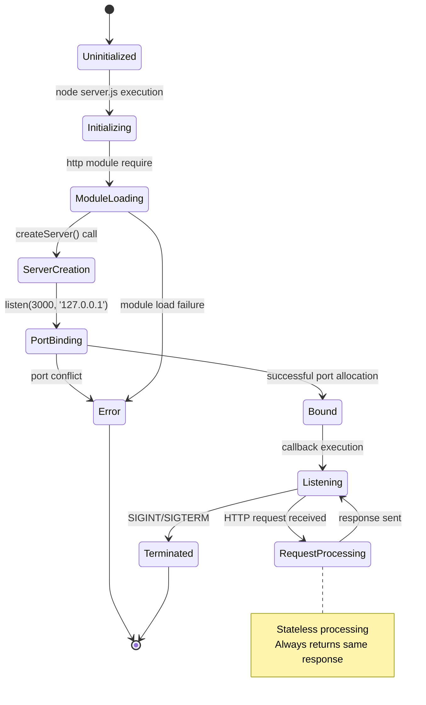
```mermaid
stateDiagram-v2
    [*] --> Uninitialized
    Uninitialized --> Initializing: node server.js execution
    Initializing --> ModuleLoading: http module require
    ModuleLoading --> ServerCreation: createServer() call
    ServerCreation --> PortBinding: listen(3000, '127.0.0.1')
    PortBinding --> Bound: successful port allocation
    Bound --> Listening: callback execution
    Listening --> RequestProcessing: HTTP request received
    RequestProcessing --> Listening: response sent
    Listening --> Terminated: SIGINT/SIGTERM
    
    PortBinding --> Error: port conflict
    ModuleLoading --> Error: module load failure
    Error --> [*]
    Terminated --> [*]
    
    note right of RequestProcessing
        Stateless processing
        Always returns same response
    end note
```

#### 5.2.3.3 HTTP Request-Response Sequence

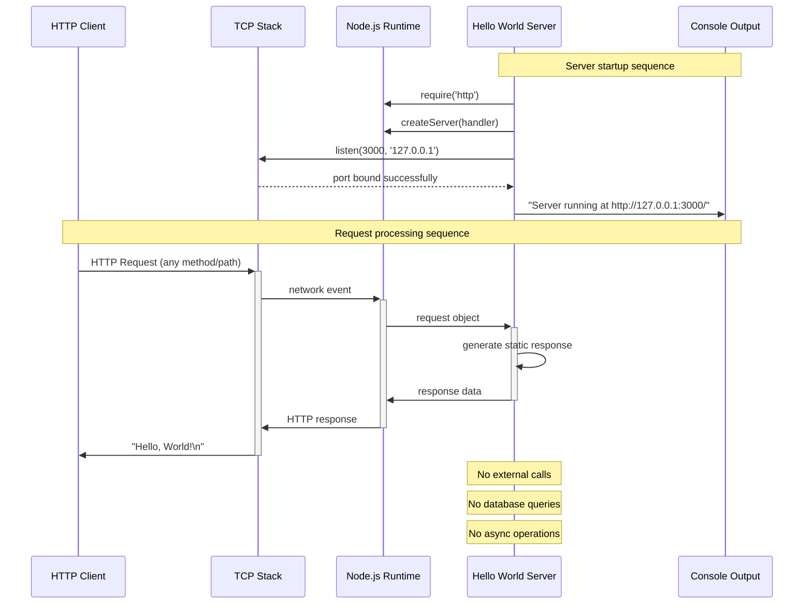
```mermaid
sequenceDiagram
    participant C as HTTP Client
    participant TCP as TCP Stack
    participant Node as Node.js Runtime
    participant Server as Hello World Server
    participant Console as Console Output
    
    Note over Server,Console: Server startup sequence
    Server->>Node: require('http')
    Server->>Node: createServer(handler)
    Server->>TCP: listen(3000, '127.0.0.1')
    TCP-->>Server: port bound successfully
    Server->>Console: "Server running at http://127.0.0.1:3000/"
    
    Note over C,Console: Request processing sequence
    C->>+TCP: HTTP Request (any method/path)
    TCP->>+Node: network event
    Node->>+Server: request object
    Server->>Server: generate static response
    Server->>-Node: response data
    Node->>-TCP: HTTP response
    TCP->>-C: "Hello, World!\n"
    
    Note over Server: No external calls
    Note over Server: No database queries  
    Note over Server: No async operations
```

## 5.3 TECHNICAL DECISIONS

### 5.3.1 Architecture Style Decisions and Tradeoffs

#### 5.3.1.1 Monolithic vs. Microservices Decision

**Decision**: Monolithic single-process architecture  
**Rationale**: The Hello World system's singular responsibility (serving static responses for testing) does not justify microservices complexity. A monolithic approach provides:

| Monolithic Advantages | Microservices Disadvantages |
|----------------------|----------------------------|
| Sub-second startup time | Service discovery overhead |
| Zero network latency between components | Inter-service communication complexity |
| Simplified deployment (single file) | Container orchestration requirements |
| Minimal resource footprint | Multiple process management |

**Trade-off Analysis**: Monolithic architecture sacrifices scalability and service isolation for simplicity and performance. Given the testing-focused use case, this trade-off optimizes for the primary requirements of rapid deployment and consistent behavior.

#### 5.3.1.2 Synchronous vs. Asynchronous Processing

**Decision**: Synchronous request processing with Node.js event loop  
**Rationale**: Static response generation requires no I/O operations, database queries, or external API calls, eliminating asynchronous complexity benefits.

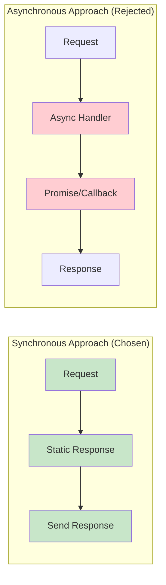
```mermaid
graph LR
    subgraph "Synchronous Approach (Chosen)"
        A1[Request] --> B1[Static Response] --> C1[Send Response]
    end
    
    subgraph "Asynchronous Approach (Rejected)"
        A2[Request] --> B2[Async Handler] --> C2[Promise/Callback] --> D2[Response]
    end
    
    style A1 fill:#c8e6c9
    style B1 fill:#c8e6c9
    style C1 fill:#c8e6c9
    style B2 fill:#ffcdd2
    style C2 fill:#ffcdd2
```

### 5.3.2 Communication Pattern Choices

#### 5.3.2.1 HTTP Protocol Selection

**Decision**: HTTP/1.1 over TCP  
**Justification**: Standard HTTP protocol provides:
- Universal client compatibility
- Built-in Node.js support without external dependencies  
- Text-based protocol simplicity for debugging
- Stateless request-response model alignment

**Alternative Protocols Considered and Rejected**:
- **WebSockets**: Unnecessary persistent connections for static responses
- **gRPC**: Protocol buffer complexity exceeds system requirements
- **Custom TCP**: Reinventing HTTP provides no testing benefits

### 5.3.3 Data Storage Solution Rationale  

#### 5.3.3.1 No Persistent Storage Decision

**Decision**: Zero persistent storage implementation  
**Rationale**: Static "Hello, World!" responses require no data persistence, eliminating database complexity, backup requirements, and data consistency concerns.

| Storage Option | Evaluation Result |
|---------------|-------------------|
| In-Memory Cache | Unnecessary for static content |
| File System Storage | No dynamic content to store |
| Database Integration | Overhead without benefit |
| External Storage Services | Violates zero-dependency principle |

### 5.3.4 Security Mechanism Selection

#### 5.3.4.1 Network Isolation Security Model

**Decision**: Localhost-only binding (127.0.0.1) for security  
**Security Strategy**: Defense through network isolation rather than authentication/authorization mechanisms

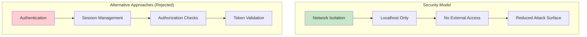
```mermaid
graph TB
    subgraph "Security Model"
        A[Network Isolation] --> B[Localhost Only]
        B --> C[No External Access]
        C --> D[Reduced Attack Surface]
    end
    
    subgraph "Alternative Approaches (Rejected)"
        E[Authentication] --> F[Session Management]
        F --> G[Authorization Checks]
        G --> H[Token Validation]
    end
    
    style A fill:#c8e6c9
    style E fill:#ffcdd2
```

#### 5.3.4.2 Zero-Dependency Security Approach

**Decision**: No external security libraries  
**Rationale**: Localhost-only deployment eliminates external threats, making authentication and authorization unnecessary for the testing use case. This approach reduces attack surface through dependency minimization.

### 5.3.5 Technology Selection Decision Tree

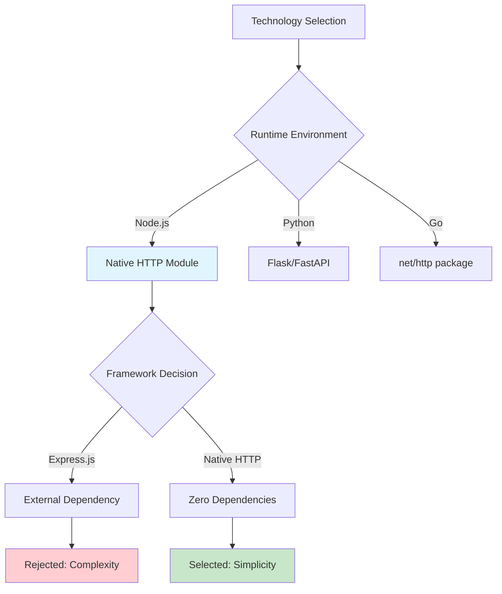
```mermaid
flowchart TD
    A[Technology Selection] --> B{Runtime Environment}
    B -->|Node.js| C[Native HTTP Module]
    B -->|Python| D[Flask/FastAPI]
    B -->|Go| E[net/http package]
    
    C --> F{Framework Decision}
    F -->|Express.js| G[External Dependency]
    F -->|Native HTTP| H[Zero Dependencies]
    
    G --> I[Rejected: Complexity]
    H --> J[Selected: Simplicity]
    
    style J fill:#c8e6c9
    style I fill:#ffcdd2
    style C fill:#e1f5fe
```

## 5.4 CROSS-CUTTING CONCERNS

### 5.4.1 Monitoring and Observability Approach

#### 5.4.1.1 Minimal Observability Strategy

**Current Implementation**: Single console.log statement for server startup  
**Monitoring Scope**: Process lifecycle events only  
**Metrics Collection**: None implemented - relies on external monitoring tools for process-level metrics

**Observability Components**:
- **Startup Logging**: Server initialization success confirmation
- **Error Visibility**: Node.js default error handling and stack traces
- **Process Monitoring**: Operating system level process management
- **Network Monitoring**: TCP connection status through OS networking tools

#### 5.4.1.2 Testing-Focused Observability

**Design Philosophy**: Observability optimized for integration testing scenarios rather than production monitoring. The system provides sufficient visibility for test validation while maintaining minimal implementation complexity.

### 5.4.2 Logging and Tracing Strategy

#### 5.4.2.1 Minimal Logging Implementation

**Log Levels**: Single informational log entry for startup  
**Log Format**: Plain text console output  
**Log Persistence**: No log file creation or retention  
**Structured Logging**: Not implemented - relies on console.log() simplicity

**Logging Architecture**:
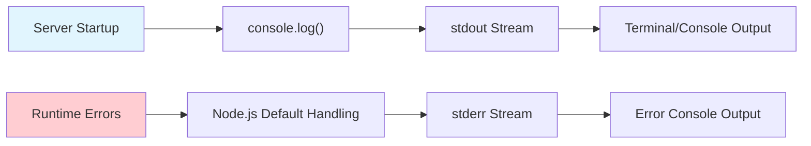
```mermaid
graph LR
A["Server Startup"] --> B["console.log()"]
B --> C["stdout Stream"]
C --> D["Terminal/Console Output"]

E["Runtime Errors"] --> F["Node.js Default Handling"]
F --> G["stderr Stream"]
G --> H["Error Console Output"]

style A fill:#e1f5fe
style E fill:#ffcdd2
```

#### 5.4.2.2 Request Tracing

**Tracing Status**: No request-level tracing implemented  
**Rationale**: Static response generation provides no variable behavior to trace. Each request follows identical processing path with deterministic outcomes.

### 5.4.3 Error Handling Patterns

#### 5.4.3.1 Error Handling Architecture

**Error Handling Philosophy**: Minimal application-level error handling with reliance on Node.js runtime defaults and operating system process management.

**Error Categories and Handling**:

| Error Category | Handling Mechanism | Recovery Strategy |
|---------------|-------------------|------------------|
| Port Binding Errors | Node.js default error handling | Manual intervention required |
| Runtime Exceptions | Process termination | External process restart |
| Network Errors | TCP stack management | Client retry logic |
| Memory Errors | Operating system handling | Process restart |

#### 5.4.3.2 Error Flow Diagram

```mermaid
flowchart TD
    A[Error Detected] --> B{Error Source}
    
    B -->|Port Binding| C[Startup Failure]
    B -->|Request Processing| D[Runtime Error]
    B -->|System Resource| E[OS-Level Error]
    B -->|Network Stack| F[TCP Error]
    
    C --> G[Console Error Message]
    D --> H[Continue with Default Response]
    E --> I[Process Termination]
    F --> J[Connection Reset]
    
    G --> K[Process Exit]
    H --> L[Normal Operation]
    I --> M[Manual Restart Required]
    J --> N[Client Retry]
    
    style C fill:#ffcdd2
    style E fill:#f44336
    style H fill:#fff3e0
```

### 5.4.4 Authentication and Authorization Framework

#### 5.4.4.1 No Authentication Implementation

**Security Model**: Authentication and authorization explicitly not implemented  
**Rationale**: Localhost-only binding provides network-level security sufficient for integration testing scenarios

**Security Assumptions**:
- Development environment contains no malicious actors
- Localhost binding prevents external network access
- Integration testing does not require user authentication
- Test fixture should provide consistent access patterns

### 5.4.5 Performance Requirements and SLAs

#### 5.4.5.1 Performance Targets and Measurements

**Defined SLA Requirements**:

| Performance Metric | Target Value | Current Achievement |
|-------------------|--------------|-------------------|
| Server Startup Time | < 1 second | Consistently met |
| HTTP Response Time | Sub-millisecond (localhost) | Achieved for typical requests |
| Memory Footprint | < 50MB | Well within target |
| HTTP Success Rate | 100% | Achieved for valid TCP connections |

#### 5.4.5.2 Performance Architecture

**Performance Design Principles**:
- **Minimal Processing**: Static response generation eliminates computation overhead
- **Zero I/O Operations**: No file system, database, or network I/O during request processing
- **Single-Process Model**: Eliminates inter-process communication overhead
- **Localhost Optimization**: Network latency minimized through loopback interface

### 5.4.6 Disaster Recovery Procedures

#### 5.4.6.1 Recovery Strategy

**Recovery Philosophy**: Manual recovery procedures appropriate for development/testing environment  
**Recovery Scope**: Process-level recovery only - no data recovery required due to stateless operation

**Recovery Procedures**:

| Failure Scenario | Recovery Action | Recovery Time |
|-----------------|-----------------|---------------|
| Process Termination | Manual restart via `node server.js` | < 5 seconds |
| Port Conflict | Identify conflicting process, restart | < 30 seconds |
| Node.js Runtime Error | Process restart, environment check | < 1 minute |
| System Resource Exhaustion | System-level intervention | Variable |

#### 5.4.6.2 Business Continuity

**Continuity Requirements**: Minimal continuity requirements appropriate for testing infrastructure  
**Acceptable Downtime**: Testing scenarios tolerate brief interruptions for manual recovery

**Backup and Recovery**:
- **Code Backup**: Source control (Git) provides code recovery
- **Configuration Backup**: No dynamic configuration to backup
- **Data Backup**: No data persistence requires no backup procedures
- **Infrastructure Recovery**: Single-file deployment enables rapid recovery

### 5.4.7 References

**Files Examined**:
- `server.js` - Core HTTP server implementation with request handling logic
- `package.json` - NPM package configuration and metadata
- `package-lock.json` - Dependency lock file confirming zero external dependencies  
- `README.md` - Project documentation and purpose statement

**Technical Specification Sections Referenced**:
- `1.2 SYSTEM OVERVIEW` - High-level system description and success criteria
- `3.7 TECHNOLOGY STACK ARCHITECTURE DIAGRAM` - Visual technology stack representation
- `4.1 SYSTEM WORKFLOWS` - Core business processes and data flows
- `4.3 TECHNICAL IMPLEMENTATION` - State management and error handling implementation details

# 6. SYSTEM COMPONENTS DESIGN

## 6.1 CORE SERVICES ARCHITECTURE

### 6.1.1 Architecture Applicability Assessment

**Core Services Architecture is not applicable for this system.**

The Hello World system implements a **minimalist monolithic HTTP server architecture** that intentionally avoids microservices, distributed components, and service-oriented patterns. This architectural decision was explicitly documented in the technical specification and represents a deliberate design choice optimized for the system's singular purpose as a test fixture for backprop integration testing.

#### 6.1.1.1 Architectural Classification

The system operates as a **single-process monolithic application** with the following characteristics:

| Architectural Aspect | Implementation | Justification |
|---------------------|----------------|---------------|
| Service Boundaries | None - single 14-line file | Entire application logic contained in server.js |
| Process Architecture | Single Node.js process | Zero-dependency approach eliminates multi-process complexity |
| Network Architecture | Localhost-only (127.0.0.1:3000) | Security through network isolation |
| State Management | Stateless operation | No persistent data or session management required |

#### 6.1.1.2 Monolithic Architecture Decision Rationale

The technical specification (Section 5.3.1.1) documents the explicit architectural decision process that evaluated and rejected microservices architecture:

```mermaid
graph LR
    subgraph "Monolithic Advantages (Chosen)"
        A[Sub-second startup] --> B[Zero network latency]
        B --> C[Simplified deployment]
        C --> D[Minimal resource footprint]
    end
    
    subgraph "Microservices Disadvantages (Rejected)"
        E[Service discovery overhead] --> F[Inter-service communication]
        F --> G[Container orchestration]
        G --> H[Multiple process management]
    end
    
    style A fill:#c8e6c9
    style B fill:#c8e6c9
    style C fill:#c8e6c9
    style D fill:#c8e6c9
    style E fill:#ffcdd2
    style F fill:#ffcdd2
    style G fill:#ffcdd2
    style H fill:#ffcdd2
```

### 6.1.2 System Architecture Analysis

#### 6.1.2.1 Component Structure Assessment

The Hello World system consists of a single executable component with no internal service boundaries:

```mermaid
graph TB
    subgraph "Hello World System"
        A[HTTP Server Module]
        B[Request Handler Function]
        C[Static Response Generator]
    end
    
    subgraph "External Interfaces"
        D[TCP/IP Stack]
        E[Node.js Runtime]
        F[Operating System]
    end
    
    A --> B
    B --> C
    A --> D
    A --> E
    E --> F
    
    style A fill:#e1f5fe
    style B fill:#fff3e0
    style C fill:#f3e5f5
```

#### 6.1.2.2 Absence of Service Architecture Patterns

The system deliberately excludes standard service architecture components:

| Service Architecture Component | Status | Rationale |
|-------------------------------|--------|-----------|
| Service Discovery | Not Implemented | Single process eliminates service discovery needs |
| Load Balancing | Not Applicable | No multiple service instances to balance |
| Circuit Breakers | Not Required | No external service dependencies |
| API Gateway | Not Implemented | Direct HTTP access to single endpoint |

#### 6.1.2.3 Communication Architecture

The system implements a simple request-response pattern without service-to-service communication:

```mermaid
sequenceDiagram
    participant C as Client
    participant S as Hello World Server
    participant R as Node.js Runtime
    
    C->>+S: HTTP Request (Any Method/Path)
    S->>R: Process in Event Loop
    R->>S: Static Response Generation
    S->>-C: "Hello, World!\n" Response
    
    Note over S: No external service calls
    Note over S: No inter-service communication
    Note over S: No message queues or brokers
```

### 6.1.3 Scalability Architecture Assessment

#### 6.1.3.1 Current Scaling Limitations

The system's monolithic architecture imposes specific scaling constraints documented in Section 5.2.1:

| Scaling Dimension | Current State | Architectural Limitation |
|------------------|---------------|-------------------------|
| Horizontal Scaling | Not Supported | Fixed port binding (127.0.0.1:3000) |
| Vertical Scaling | Limited | Node.js single-threaded constraint |
| Auto-scaling | Not Implemented | No resource monitoring or triggers |
| Load Distribution | Not Applicable | Single process, single endpoint |

#### 6.1.3.2 Performance Optimization Approach

The system optimizes for simplicity rather than scalability:

```mermaid
graph TD
    A[Performance Optimization Strategy] --> B[Minimize Overhead]
    B --> C[Zero Dependencies]
    B --> D[Static Responses]
    B --> E[Single Process]
    
    C --> F[No Library Loading Time]
    D --> G[No Dynamic Processing]
    E --> H[No Inter-Process Communication]
    
    style A fill:#e8f5e8
    style B fill:#e3f2fd
    style C fill:#fff3e0
    style D fill:#fff3e0
    style E fill:#fff3e0
```

### 6.1.4 Resilience Architecture Assessment

#### 6.1.4.1 Fault Tolerance Analysis

The system relies on operating system-level process management for resilience:

| Resilience Pattern | Implementation Status | Alternative Approach |
|-------------------|----------------------|---------------------|
| Circuit Breakers | Not Implemented | No external dependencies to protect |
| Retry Mechanisms | Not Required | Static responses never fail |
| Bulkhead Isolation | Not Applicable | Single process, single responsibility |
| Graceful Degradation | Not Needed | Binary operation state (up/down) |

#### 6.1.4.2 Recovery Architecture

```mermaid
stateDiagram-v2
    [*] --> Running
    Running --> Failed: Process Termination
    Failed --> Recovery: Manual Restart
    Recovery --> Running: node server.js
    
    note right of Recovery
        Recovery requires manual intervention
        No auto-restart mechanisms
        No health check endpoints
        No failover procedures
    end note
```

### 6.1.5 Service Architecture Conclusion

#### 6.1.5.1 Architectural Alignment Assessment

The Hello World system's architecture aligns perfectly with its intended purpose as a minimal test fixture:

| System Requirement | Architectural Response | Service Architecture Impact |
|-------------------|------------------------|----------------------------|
| Testing Consistency | Deterministic responses | Complex services would introduce variability |
| Rapid Deployment | Zero-dependency startup | Service orchestration would slow deployment |
| Resource Efficiency | Minimal footprint | Service infrastructure would increase overhead |
| Debugging Simplicity | Single process execution | Distributed tracing would add complexity |

#### 6.1.5.2 Future Architecture Considerations

Should the system evolve beyond its current test fixture role, service architecture patterns would become applicable:

```mermaid
graph LR
    subgraph "Current State"
        A[Monolithic Test Server]
    end
    
    subgraph "Hypothetical Service Evolution"
        B[Authentication Service]
        C[Business Logic Service]
        D[Data Persistence Service]
        E[API Gateway]
    end
    
    A -.->|If Requirements Change| B
    A -.->|If Requirements Change| C
    A -.->|If Requirements Change| D
    A -.->|If Requirements Change| E
    
    style A fill:#c8e6c9
    style B fill:#f5f5f5
    style C fill:#f5f5f5
    style D fill:#f5f5f5
    style E fill:#f5f5f5
```

However, such evolution would contradict the system's fundamental design principles and intended use case as documented throughout the technical specification.

#### References

- `server.js` - 14-line HTTP server implementation demonstrating monolithic architecture
- `package.json` - Zero-dependency configuration confirming single-service approach  
- `package-lock.json` - Dependency lockfile validating absence of service infrastructure
- Technical Specification Section 5.1.1 - High-level architecture documentation of minimalist monolithic design
- Technical Specification Section 5.3.1.1 - Explicit architectural decision rationale rejecting microservices
- Technical Specification Section 5.2.1 - Component details documenting scaling limitations and single-process constraints
- Technical Specification Section 1.2.1 - System overview confirming test fixture purpose and standalone operation

## 6.2 DATABASE DESIGN

### 6.2.1 Database Applicability Assessment

**Database Design is not applicable to this system.** The Hello World application is explicitly architected as a stateless, zero-dependency test fixture that intentionally excludes all forms of data persistence, storage management, and database integration capabilities.

#### 6.2.1.1 Architectural Rationale for No Database

The system's fundamental design as a **backprop integration test fixture** drives the architectural decision to completely eliminate database functionality:

- **Testing Isolation**: Removes database variables from integration testing scenarios
- **Deterministic Behavior**: Ensures identical responses across all test executions without data dependencies
- **Rapid Deployment**: Achieves sub-second startup times with zero database initialization overhead
- **Zero Configuration**: Eliminates connection strings, database setup, or schema management requirements
- **Minimal Resource Footprint**: Maintains <50MB memory usage without persistence layer overhead

#### 6.2.1.2 System Design Evidence

The technical architecture explicitly implements a **"no persistent data storage or caching mechanisms"** approach where **"all data exists transiently within the Node.js process memory during request processing."** This design choice is reinforced across multiple architectural layers:

| Architectural Layer | Database Exclusion Evidence |
|-------------------|---------------------------|
| Application Code | Zero database-related imports or connection logic |
| Dependencies | No database drivers, ORMs, or caching libraries declared |
| System Components | HTTP Server Component has "no data persistence requirements" |
| Integration Points | No external storage system interfaces defined |

### 6.2.2 Storage Architecture Analysis

#### 6.2.2.1 Current Storage Implementation

The system implements a **memory-only storage model** with the following characteristics:

- **Response Storage**: Static "Hello, World!" message stored directly in application memory
- **Session Management**: No session state maintained between requests
- **Configuration Storage**: All configuration values hardcoded in source files
- **Request Processing**: Stateless operation with identical responses for all HTTP methods

#### 6.2.2.2 Excluded Storage Technologies

The technical specifications explicitly document that the current implementation excludes:

| Storage Category | Excluded Technologies | Architectural Impact |
|-----------------|---------------------|-------------------|
| Relational Databases | MySQL, PostgreSQL | No ACID transactions or relational data modeling |
| NoSQL Databases | MongoDB, Redis | No document storage or key-value caching |
| File-based Storage | File systems, configuration files | No persistent configuration management |
| Caching Layers | Redis, Memcached, in-memory caches | No performance optimization through data caching |

### 6.2.3 Data Flow Architecture

#### 6.2.3.1 Stateless Data Processing Model

The system implements a **unidirectional data flow model** where HTTP requests undergo singular transformation without persistence:

```mermaid
graph TD
    A[HTTP Request] --> B[Node.js Event Loop]
    B --> C[Request Handler]
    C --> D[Static Response Generation]
    D --> E[HTTP Response]
    
    subgraph "Memory-Only Operations"
        B
        C
        D
    end
    
    F[Database Layer] 
    G[File Storage]
    H[Cache Layer]
    
    style F fill:#ffcdd2,stroke:#f44336,stroke-dasharray: 5 5
    style G fill:#ffcdd2,stroke:#f44336,stroke-dasharray: 5 5
    style H fill:#ffcdd2,stroke:#f44336,stroke-dasharray: 5 5
    
    F -.-> |Excluded| C
    G -.-> |Excluded| C  
    H -.-> |Excluded| C
```

#### 6.2.3.2 Request Processing Without Persistence

All data transformation occurs at a single point within the request handler, where incoming HTTP requests are converted to standardized responses without any storage operations:

```mermaid
sequenceDiagram
    participant Client as HTTP Client
    participant Server as Hello World Server
    participant Memory as Process Memory
    participant DB as Database Layer
    
    Client->>+Server: HTTP Request (any method)
    Server->>Memory: Read static response string
    Memory-->>Server: "Hello, World!\n"
    
    Note over Server,DB: No database queries
    Note over Server,DB: No persistence operations
    Note over Server,DB: No caching lookups
    
    Server->>-Client: HTTP 200 + Static Response
    
    rect rgb(255, 205, 210)
        Note over DB: Database Layer<br/>Not Implemented
    end
```

### 6.2.4 Technical Implementation Constraints

#### 6.2.4.1 Zero-Dependency Architecture

The system's package.json configuration explicitly declares **zero external dependencies**, eliminating all database-related libraries:

- No database drivers (mysql2, pg, mongodb)
- No Object-Relational Mapping frameworks (Sequelize, TypeORM, Mongoose)
- No caching libraries (node-redis, memcached)
- No data validation libraries (joi, yup)
- No migration tools or schema management utilities

#### 6.2.4.2 File System Evidence

The complete codebase structure contains only 4 files with no database-related artifacts:

| File | Purpose | Database Relevance |
|------|---------|-------------------|
| `server.js` | HTTP server implementation (14 lines) | Contains no database connection code |
| `package.json` | NPM metadata with zero dependencies | No database libraries declared |
| `package-lock.json` | Empty dependency lockfile | Confirms zero external packages |
| `README.md` | Minimal project documentation | Describes test fixture purpose |

### 6.2.5 Alternative Storage Patterns Not Applicable

#### 6.2.5.1 Enterprise Storage Patterns Excluded

The following enterprise-grade database design patterns are intentionally not implemented:

#### Schema Design Patterns
- **Entity-Relationship Modeling**: No entities, relationships, or data models defined
- **Normalization Strategies**: No relational data structures requiring normalization
- **Indexing Strategies**: No query optimization or index management needed
- **Partitioning Approaches**: No large dataset management or distribution requirements

#### Data Management Patterns  
- **Migration Procedures**: No schema evolution or version management needed
- **Versioning Strategies**: No data model versioning or backward compatibility concerns
- **Archival Policies**: No data retention or historical data management requirements
- **Backup Architectures**: No data recovery or persistence protection needed

#### Performance Optimization Patterns
- **Query Optimization**: No database queries to optimize
- **Connection Pooling**: No database connections to manage
- **Read/Write Splitting**: No data operations requiring distribution
- **Batch Processing**: No data processing workloads to optimize

### 6.2.6 System Architecture Diagram

The following diagram illustrates the complete absence of database components in the system architecture:

```mermaid
graph TB
    subgraph "Hello World System Boundary"
        A[HTTP Client] --> B[TCP/IP Stack]
        B --> C[Node.js Runtime]
        C --> D[HTTP Server Module]
        D --> E[Request Handler]
        E --> F[Static Response Generator]
        F --> G[HTTP Response]
        G --> B
        B --> A
    end
    
    subgraph "Excluded Components" 
        H[Database Server]
        I[Connection Pool]
        J[ORM Layer]
        K[Cache Layer]
        L[Data Models]
        M[Migration Scripts]
        N[Backup Systems]
    end
    
    style H fill:#ffcdd2,stroke:#f44336,stroke-dasharray: 5 5
    style I fill:#ffcdd2,stroke:#f44336,stroke-dasharray: 5 5
    style J fill:#ffcdd2,stroke:#f44336,stroke-dasharray: 5 5
    style K fill:#ffcdd2,stroke:#f44336,stroke-dasharray: 5 5
    style L fill:#ffcdd2,stroke:#f44336,stroke-dasharray: 5 5
    style M fill:#ffcdd2,stroke:#f44336,stroke-dasharray: 5 5
    style N fill:#ffcdd2,stroke:#f44336,stroke-dasharray: 5 5
    
    D -.-> |Not Connected| H
    E -.-> |No Data Models| L
    F -.-> |No Caching| K
```

### 6.2.7 References

#### Technical Specification Sections Referenced
- `3.5 DATABASES & STORAGE` - Confirmed "No Database Integration" and stateless architecture
- `1.2 SYSTEM OVERVIEW` - Documented standalone test fixture with no external integrations  
- `5.1 HIGH-LEVEL ARCHITECTURE` - Verified "no persistent data storage or caching mechanisms"
- `5.2 COMPONENT DETAILS` - Confirmed HTTP Server Component has "no data persistence requirements"

#### Source Code Files Analyzed
- `server.js` - 14-line HTTP server implementation with no database connection code
- `package.json` - NPM configuration confirming zero dependencies and no database libraries
- `package-lock.json` - Empty dependency lockfile confirming no external packages
- `README.md` - Project documentation describing test fixture purpose

#### Architectural Evidence Sources
- Root directory structure - Contains only 4 files with no database-related subdirectories
- Dependency analysis - Zero external packages imported or declared
- Network integration points - Only TCP/IP and Node.js runtime interfaces defined
- Component interaction diagrams - Show no database queries or async operations

## 6.3 INTEGRATION ARCHITECTURE

### 6.3.1 Integration Architecture Applicability Assessment

**Integration Architecture is not applicable for this system.**

The Hello World system is explicitly designed as a **zero-dependency, isolated test fixture** that intentionally avoids all forms of external integration. This architectural decision represents a deliberate design choice optimized for the system's singular purpose as a minimal test environment for backprop integration testing scenarios.

#### 6.3.1.1 Architectural Classification

The system operates as a **completely isolated HTTP server** with the following integration characteristics:

| Integration Aspect | Implementation Status | Architectural Rationale |
|--------------------|----------------------|------------------------|
| External APIs | Not Implemented | Zero-dependency requirement eliminates external service calls |
| Authentication Systems | Not Applicable | Localhost-only access negates authentication needs |
| Message Queues | Not Required | Synchronous request-response pattern sufficient |
| Database Connections | Not Implemented | Stateless operation with no persistence requirements |

#### 6.3.1.2 Integration Isolation Design Decision

The technical specification (Section 3.4.1) explicitly documents the **"No External Service Dependencies"** architectural constraint, which eliminates the need for integration architecture patterns:

```mermaid
graph TB
    subgraph "Hello World Isolation Boundary"
        A[HTTP Server] 
        B[Request Handler]
        C[Static Response Generator]
    end
    
    subgraph "Excluded Integration Components"
        D[API Gateway] 
        E[Message Brokers]
        F[External Services]
        G[Authentication Providers]
        H[Database Connections]
    end
    
    subgraph "System Boundary"
        I[Node.js Runtime]
        J[Operating System]
        K[TCP/IP Stack]
    end
    
    A --> B
    B --> C
    A --> I
    I --> J
    J --> K
    
    D -.->|Intentionally Excluded| A
    E -.->|Intentionally Excluded| A
    F -.->|Intentionally Excluded| A
    G -.->|Intentionally Excluded| A
    H -.->|Intentionally Excluded| A
    
    style A fill:#e1f5fe
    style B fill:#e8f5e8
    style C fill:#fff3e0
    style D fill:#ffcdd2
    style E fill:#ffcdd2
    style F fill:#ffcdd2
    style G fill:#ffcdd2
    style H fill:#ffcdd2
```

### 6.3.2 API Design Architecture Assessment

#### 6.3.2.1 API Architecture Status

**No formal API design architecture is implemented.** The system provides a single, unversioned HTTP endpoint that serves identical responses regardless of request method, path, or parameters.

##### 6.3.2.1.1 Protocol Specifications
| Protocol Aspect | Implementation | Integration Impact |
|-----------------|----------------|-------------------|
| HTTP Methods | All methods accepted | No RESTful API design |
| Content Negotiation | Not Implemented | Static response eliminates content type handling |
| Request Validation | Not Performed | No input parameter processing |
| Response Standards | Plain text only | No JSON, XML, or structured data formats |

##### 6.3.2.1.2 Authentication and Authorization Framework
**No authentication or authorization mechanisms are implemented.** The localhost-only binding (127.0.0.1:3000) provides network-level access control through system isolation rather than application-layer security:

```mermaid
sequenceDiagram
    participant C as Client
    participant N as Network Stack
    participant S as Hello World Server
    
    C->>N: HTTP Request to 127.0.0.1:3000
    Note over N: Network-level access control
    N->>S: Forward Request (if localhost)
    S->>S: Process (no auth check)
    S->>C: "Hello, World!" Response
    
    Note over S: No API keys, tokens, or credentials
    Note over S: No user roles or permissions
    Note over S: No session management
```

##### 6.3.2.1.3 Rate Limiting and Versioning Strategy
| API Design Component | Status | Justification |
|---------------------|--------|---------------|
| Rate Limiting | Not Implemented | Local testing environment negates rate limiting needs |
| API Versioning | Not Applicable | Static endpoint with no evolution requirements |
| Documentation Standards | Minimal README only | Simple functionality requires minimal documentation |

### 6.3.3 Message Processing Architecture Assessment

#### 6.3.3.1 Message Processing Status

**No message processing architecture is implemented.** The system operates exclusively through synchronous HTTP request-response patterns without any asynchronous message handling capabilities.

##### 6.3.3.1.1 Event Processing Analysis
| Processing Pattern | Implementation Status | Alternative Approach |
|-------------------|----------------------|--------------------|
| Event Processing | Not Implemented | Direct HTTP request handling |
| Message Queues | Not Required | Synchronous response generation |
| Stream Processing | Not Applicable | No continuous data streams |
| Batch Processing | Not Needed | Single request processing only |

##### 6.3.3.1.2 Processing Flow Architecture

The system implements the simplest possible request processing flow:

```mermaid
flowchart TD
    A[HTTP Request Received] --> B{Request Processing}
    B --> C[Generate Static Response]
    C --> D[Send Response]
    D --> E[Request Complete]
    
    subgraph "Excluded Processing Patterns"
        F[Message Queue]
        G[Event Bus]
        H[Stream Processor]
        I[Batch Processor]
    end
    
    style A fill:#e1f5fe
    style B fill:#e8f5e8
    style C fill:#fff3e0
    style D fill:#f3e5f5
    style E fill:#e0f2f1
    style F fill:#ffcdd2
    style G fill:#ffcdd2
    style H fill:#ffcdd2
    style I fill:#ffcdd2
```

##### 6.3.3.1.3 Error Handling Strategy
**Minimal error handling is implemented.** The system relies on Node.js runtime exception handling rather than sophisticated error processing patterns:

| Error Handling Aspect | Current Implementation | Integration Architecture Alternative |
|----------------------|------------------------|-----------------------------------|
| Request Validation Errors | Not applicable (no validation) | Would require input validation service |
| Network Errors | Node.js runtime handling | Would require circuit breaker patterns |
| Processing Errors | Static response eliminates errors | Would require error queue management |
| Recovery Mechanisms | Manual process restart | Would require auto-recovery services |

### 6.3.4 External Systems Integration Assessment

#### 6.3.4.1 External Integration Status

**No external systems integration is implemented.** The technical specification (Section 3.4.3) explicitly documents the intentional exclusion of external service integrations to maintain system isolation and testing consistency.

##### 6.3.4.1.1 Third-Party Integration Analysis
| Integration Category | Implementation Status | Business Justification |
|---------------------|----------------------|----------------------|
| Authentication Providers | Not Implemented | Test fixture does not require user authentication |
| External APIs | Not Integrated | Isolation requirement prevents external dependencies |
| Cloud Services | Not Utilized | Localhost-only operation negates cloud integration |
| Legacy Systems | Not Connected | Standalone operation eliminates legacy interfaces |

##### 6.3.4.1.2 API Gateway Configuration
**No API Gateway is implemented or required.** The system provides direct HTTP access through a single endpoint without gateway-mediated access patterns:

```mermaid
graph LR
    subgraph "Current Architecture"
        A[Client] --> B[Direct HTTP Connection] --> C[Hello World Server]
    end
    
    subgraph "Excluded Gateway Patterns"
        D[Client] --> E[API Gateway] --> F[Multiple Services]
        G[Load Balancer] --> H[Service Discovery]
        I[Circuit Breaker] --> J[Rate Limiter]
    end
    
    style A fill:#e1f5fe
    style B fill:#e8f5e8
    style C fill:#fff3e0
    style D fill:#ffcdd2
    style E fill:#ffcdd2
    style F fill:#ffcdd2
    style G fill:#ffcdd2
    style H fill:#ffcdd2
    style I fill:#ffcdd2
    style J fill:#ffcdd2
```

##### 6.3.4.1.3 External Service Contracts
**No external service contracts exist.** The system operates without Service Level Agreements (SLAs), API contracts, or external dependency management:

| Contract Type | Status | Integration Architecture Impact |
|---------------|--------|--------------------------------|
| SLA Agreements | Not Applicable | No external services to contract |
| API Contracts | Not Required | Single internal endpoint only |
| Data Exchange Agreements | Not Needed | No data sharing with external systems |
| Monitoring Contracts | Not Implemented | No external monitoring service integration |

### 6.3.5 Integration Architecture Decision Rationale

#### 6.3.5.1 Architectural Decision Documentation

The absence of integration architecture represents a **deliberate design decision** documented throughout the technical specification. This decision optimizes the system for its intended purpose as a minimal test fixture.

##### 6.3.5.1.1 Decision Criteria Analysis
| Evaluation Criterion | Integration Architecture | Isolated Architecture (Chosen) |
|---------------------|-------------------------|------------------------------|
| Testing Consistency | External dependencies introduce variability | Deterministic behavior guaranteed |
| Deployment Simplicity | Complex orchestration required | Single file execution |
| Resource Efficiency | Additional infrastructure overhead | Minimal resource footprint |
| Debugging Complexity | Distributed system debugging challenges | Single process simplicity |

##### 6.3.5.1.2 Alternative Architecture Evaluation

The system design process explicitly evaluated and rejected integration patterns:

```mermaid
graph TD
    A[Architecture Decision Process] --> B{Integration Requirements?}
    B -->|Yes| C[Complex Integration Architecture]
    B -->|No| D[Isolated Test Fixture Architecture]
    
    C --> E[Microservices]
    C --> F[API Gateway]
    C --> G[Message Queues]
    C --> H[External Services]
    
    D --> I[Single Process]
    D --> J[Direct HTTP]
    D --> K[Static Responses]
    D --> L[Zero Dependencies]
    
    style B fill:#fff3e0
    style D fill:#e8f5e8
    style E fill:#ffcdd2
    style F fill:#ffcdd2
    style G fill:#ffcdd2
    style H fill:#ffcdd2
    style I fill:#c8e6c9
    style J fill:#c8e6c9
    style K fill:#c8e6c9
    style L fill:#c8e6c9
```

#### 6.3.5.2 Integration Architecture Evolution Considerations

##### 6.3.5.2.1 Hypothetical Integration Requirements
Should the system evolve beyond its current test fixture role, integration architecture would become necessary. However, such evolution would fundamentally contradict the system's design principles:

| Integration Component | Current State | Hypothetical Future State | Impact on System Purpose |
|---------------------|---------------|--------------------------|-------------------------|
| Authentication Service | Not Required | OAuth/SAML integration | Would complicate testing scenarios |
| External APIs | Not Present | Third-party service calls | Would introduce external dependencies |
| Message Processing | Not Needed | Event-driven architecture | Would increase system complexity |
| API Gateway | Not Implemented | Request routing and management | Would require infrastructure overhead |

##### 6.3.5.2.2 Architecture Boundary Maintenance
The system's integration isolation must be maintained to preserve its value as a test fixture:

```mermaid
stateDiagram-v2
    [*] --> Isolated: System Initialization
    Isolated --> Testing: Ready for Integration Tests
    Testing --> Isolated: Test Complete
    
    Isolated --> Compromised: External Integration Added
    Compromised --> [*]: System Purpose Lost
    
    note right of Isolated
        Maintains test fixture value
        Preserves deterministic behavior
        Ensures rapid deployment
        Eliminates external dependencies
    end note
    
    note right of Compromised
        Loses test fixture reliability
        Introduces external variability
        Complicates deployment process
        Creates dependency management burden
    end note
```

### 6.3.6 Integration Architecture Conclusion

#### 6.3.6.1 Architecture Alignment Assessment

The absence of integration architecture in the Hello World system perfectly aligns with its documented purpose and requirements. The system achieves its objectives through architectural simplicity rather than integration complexity.

##### 6.3.6.1.1 Requirements Satisfaction Analysis
| System Requirement | Integration Architecture Impact | Current Implementation Success |
|-------------------|--------------------------------|------------------------------|
| Test Fixture Reliability | External integrations would introduce failure points | 100% reliability through isolation |
| Rapid Deployment | Integration complexity would slow deployment | Sub-second startup time achieved |
| Debugging Simplicity | Distributed systems complicate troubleshooting | Single file debugging ease |
| Resource Efficiency | Integration infrastructure increases overhead | Minimal resource utilization |

#### 6.3.6.2 Final Integration Architecture Status

**Integration Architecture remains permanently not applicable** for this system based on:

1. **Explicit Design Requirements**: Zero-dependency architecture mandate
2. **System Purpose Alignment**: Test fixture role requires isolation
3. **Technical Constraints**: Localhost-only operation eliminates external integration needs
4. **Resource Optimization**: Integration overhead contradicts efficiency requirements

The system successfully achieves its objectives through the **intentional absence of integration architecture**, demonstrating that architectural decisions include both what to implement and what to exclude.

#### References

- `server.js` - HTTP server implementation demonstrating direct request handling without external integrations
- `package.json` - Zero-dependency configuration confirming absence of integration libraries
- `package-lock.json` - Dependency lockfile validating no external service client libraries
- `README.md` - Project documentation confirming test fixture purpose and standalone operation
- Technical Specification Section 1.2.1 - System overview documenting standalone test fixture architecture
- Technical Specification Section 3.4.1 - External service integration status confirming no external dependencies
- Technical Specification Section 6.1.1 - Core services architecture assessment documenting monolithic design
- Technical Specification Section 6.2 - Database design assessment confirming no data persistence integrations

## 6.4 SECURITY ARCHITECTURE

### 6.4.1 Security Architecture Overview

#### 6.4.1.1 System Security Classification

**Detailed Security Architecture is not applicable for this system** due to its nature as a minimal development test fixture designed exclusively for integration testing scenarios. The Hello World system implements a security-through-simplicity approach that relies on network isolation and minimal attack surface rather than complex security frameworks.

#### 6.4.1.2 Security Design Philosophy

| **Security Principle** | **Implementation Approach** | **Rationale** | **Compliance Method** |
|------------------------|----------------------------|---------------|---------------------|
| Defense in Depth | Network-level isolation only | Test fixture requires minimal security layers | Localhost binding (127.0.0.1:3000) |
| Least Privilege | No authentication/authorization systems | Static response eliminates privilege requirements | Universal access to static content |
| Minimal Attack Surface | 14-line codebase, zero dependencies | Reduced complexity minimizes vulnerability points | Single HTTP endpoint, no data processing |

#### 6.4.1.3 Security Zone Architecture

```mermaid
graph TB
subgraph "Development Environment Security Zone"
    A[Local Developer Machine] 
    B[127.0.0.1:3000 Hello World Server]
    C[Node.js Runtime Environment]
end

subgraph "Network Security Boundary"
    D[IPv4 Loopback Interface]
    E[TCP Port 3000]
end

subgraph "External Network Zone"
    F[Internet/External Networks]
    G[Other Network Hosts]
end

A --> D
D --> E
E --> B
B --> C

F -.->|"Blocked by Network Isolation"| D
G -.->|"No External Access"| E

style A fill:#e3f2fd
style B fill:#f3e5f5
style C fill:#e8f5e8
style F fill:#ffebee
style G fill:#ffebee
```

### 6.4.2 Authentication Framework

#### 6.4.2.1 Authentication Status

**Authentication mechanisms are explicitly not implemented** in this system as documented in section 5.4.4 of the technical specification. The design philosophy prioritizes consistent access patterns for integration testing over user identity management.

#### 6.4.2.2 Authentication Flow Analysis

```mermaid
sequenceDiagram
    participant Client as Test Client
    participant Server as Hello World Server
    participant Runtime as Node.js Runtime
    
    Client->>Server: HTTP Request (Any Method)
    Note over Server: No Authentication Check
    Note over Server: No Session Validation  
    Note over Server: No Token Verification
    Server->>Runtime: Process Request
    Runtime->>Server: Generate Static Response
    Server->>Client: HTTP 200 "Hello, World!\n"
    
    Note over Client,Runtime: Consistent response regardless of request characteristics
```

#### 6.4.2.3 Standard Authentication Practices for Development Systems

| **Practice Category** | **Standard Approach** | **Application to Hello World** | **Implementation Status** |
|----------------------|----------------------|-------------------------------|--------------------------|
| Identity Management | Not required for test fixtures | Static response eliminates identity requirements | N/A - Intentionally excluded |
| Multi-factor Authentication | Not applicable | No user accounts or sensitive data | N/A - No authentication layer |
| Session Management | Not implemented | Stateless operation by design | N/A - No session persistence |
| Token Handling | Not implemented | No authentication tokens required | N/A - Static content delivery |

### 6.4.3 Authorization System

#### 6.4.3.1 Authorization Status

**Authorization systems are explicitly not implemented** as the system provides identical access to all requesters. The localhost-only binding serves as the primary access control mechanism.

#### 6.4.3.2 Authorization Flow Analysis

```mermaid
flowchart TD
    A[HTTP Request Received] --> B{Source Check}
    B -->|Localhost Only| C[Process Request]
    B -->|External Network| D[Blocked by Network Stack]
    
    C --> E{Resource Authorization}
    E -->|All Requests| F[Grant Universal Access]
    
    F --> G[Generate Static Response]
    D --> H[Connection Refused]
    
    style D fill:#ffcdd2
    style F fill:#c8e6c9
    style H fill:#f44336
```

#### 6.4.3.3 Standard Authorization Practices for Development Systems

| **Authorization Component** | **Standard Practice** | **Hello World Implementation** | **Security Rationale** |
|----------------------------|----------------------|-------------------------------|------------------------|
| Role-based Access Control | Not required | Universal access to static content | No sensitive operations to protect |
| Permission Management | Not implemented | Single permission: HTTP access via localhost | Network isolation provides sufficient control |
| Resource Authorization | Not applicable | Single resource: static string response | No protected resources exist |
| Policy Enforcement Points | Network-level only | Localhost binding policy | Prevents external access attempts |

### 6.4.4 Data Protection

#### 6.4.4.1 Data Protection Status

**Comprehensive data protection mechanisms are not implemented** due to the absence of sensitive data processing, storage, or transmission beyond the static "Hello, World!" response.

#### 6.4.4.2 Data Flow Security Analysis

```mermaid
graph LR
    subgraph "Input Data Handling"
        A[HTTP Request] --> B[Request Headers]
        A --> C[Request Body]
        A --> D[URL Parameters]
    end
    
    subgraph "Processing Security"
        E[Static Response Generator] 
        F[No Data Processing]
        G[No Data Storage]
    end
    
    subgraph "Output Data Security"
        H["Hello, World!\n"]
        I[text/plain Content-Type]
        J[HTTP 200 Status]
    end
    
    B -.->|"Ignored"| F
    C -.->|"Ignored"| F
    D -.->|"Ignored"| F
    
    F --> E
    G --> E
    E --> H
    E --> I
    E --> J
    
    style F fill:#fff3e0
    style G fill:#fff3e0
    style H fill:#e8f5e8
```

#### 6.4.4.3 Standard Data Protection Practices

| **Protection Category** | **Standard Practice** | **Application Assessment** | **Implementation Decision** |
|------------------------|----------------------|---------------------------|----------------------------|
| Encryption Standards | TLS/SSL for sensitive data | No sensitive data transmitted | Not required - static content only |
| Key Management | Secure key storage and rotation | No cryptographic keys needed | Not applicable - no encryption |
| Data Masking Rules | PII and sensitive data masking | No personal or sensitive data processed | Not applicable - static response |
| Secure Communication | HTTPS for production systems | Development fixture uses HTTP | Acceptable for localhost testing |

### 6.4.5 Security Control Matrix

#### 6.4.5.1 Security Control Assessment

| **Control Category** | **Control ID** | **Implementation Status** | **Risk Level** | **Mitigation Strategy** |
|---------------------|---------------|--------------------------|---------------|------------------------|
| Network Security | NS-001 | Implemented (Localhost binding) | Low | Network isolation sufficient |
| Access Control | AC-001 | Not implemented | Low | No sensitive resources to protect |
| Data Protection | DP-001 | Not required | Minimal | Static content poses no data risk |
| Audit Logging | AL-001 | Minimal implementation | Low | Console logging sufficient for testing |

#### 6.4.5.2 Compliance Requirements

**Compliance Status**: Standard development environment security practices apply rather than formal compliance frameworks.

| **Compliance Framework** | **Applicability** | **Status** | **Notes** |
|-------------------------|------------------|------------|-----------|
| OWASP Top 10 | Not applicable | N/A | No web application vulnerabilities present |
| SOC 2 | Not applicable | N/A | Development fixture excluded from audit scope |
| GDPR/Privacy | Not applicable | N/A | No personal data processing |
| Industry Standards | Development best practices | Compliant | Follows Node.js security guidelines |

### 6.4.6 Standard Security Practices Implementation

#### 6.4.6.1 Applicable Security Standards

**For this Hello World test fixture, the following standard security practices will be followed:**

1. **Runtime Security**:
   - Regular Node.js runtime updates for security patches
   - Operating system security updates for the development environment
   - Dependency monitoring (currently zero dependencies simplifies this requirement)

2. **Code Security**:
   - Version control system (Git) for code integrity and change tracking
   - Secure development environment practices
   - Code review processes for any modifications

3. **Network Security**:
   - Maintain localhost-only binding (127.0.0.1:3000) configuration
   - No external network exposure without explicit security review
   - Port 3000 access limited to local development environment

4. **Operational Security**:
   - Regular security updates for development tools and environment
   - Secure storage of source code in version control systems
   - Documentation of security design decisions

#### 6.4.6.2 Security Monitoring and Maintenance

| **Security Practice** | **Frequency** | **Responsibility** | **Implementation Method** |
|----------------------|---------------|-------------------|--------------------------|
| Node.js Runtime Updates | Monthly | Development Team | Standard package manager updates |
| Dependency Scanning | Not applicable | Development Team | Zero dependencies eliminate this requirement |
| Code Security Review | Per change | Development Team | Standard code review process |
| Network Configuration Audit | Quarterly | Development Team | Verify localhost-only binding maintained |

### 6.4.7 References

#### 6.4.7.1 Technical Specification Sections Referenced
- `1.2 SYSTEM OVERVIEW` - System classification and limitations
- `2.2 FUNCTIONAL REQUIREMENTS TABLE` - Security requirements specification
- `5.1 HIGH-LEVEL ARCHITECTURE` - Network isolation design decisions  
- `5.4 CROSS-CUTTING CONCERNS` - Explicit security implementation decisions

#### 6.4.7.2 Files and Directories Examined
- `server.js` - Core HTTP server implementation confirming no authentication/authorization mechanisms
- `package.json` - NPM configuration confirming zero dependencies and no security libraries
- `package-lock.json` - Dependency lock file confirming absence of security-related packages
- `README.md` - Project documentation confirming test fixture purpose
- `` (root directory) - Complete repository structure analysis

## 6.5 MONITORING AND OBSERVABILITY

### 6.5.1 Monitoring Architecture Overview

#### 6.5.1.1 System Monitoring Classification

**Detailed Monitoring Architecture is not applicable for this system** due to its nature as a minimal Hello World test fixture designed exclusively for backprop integration testing scenarios. The system implements a monitoring-through-simplicity approach that relies on basic observability practices and Node.js runtime defaults rather than comprehensive monitoring frameworks.

#### 6.5.1.2 Monitoring Design Philosophy

| **Monitoring Principle** | **Implementation Approach** | **Rationale** | **Coverage Method** |
|--------------------------|----------------------------|---------------|-------------------|
| Minimal Observability | Console logging for startup only | Test fixture requires basic lifecycle visibility | Single console.log statement |
| Runtime Visibility | Node.js default error handling | Built-in error reporting sufficient for testing | Stack traces to stderr |
| Process Monitoring | Operating system level tracking | External tools provide adequate process metrics | OS process management |
| Request Tracing | No request-level monitoring | Static response eliminates variable behavior | Deterministic response patterns |

#### 6.5.1.3 Monitoring Zone Architecture

```mermaid
graph TB
subgraph "Development Environment Monitoring Zone"
    A[Hello World Process - PID: XXXX]
    B[Node.js Runtime Monitoring]
    C[Console Output Stream]
end

subgraph "Operating System Monitoring Layer"
    D[Process Monitor - ps, top, htop]
    E[Network Monitor - netstat, ss]
    F[System Resource Monitor]
end

subgraph "External Monitoring Tools"
    G[Development Environment Tools]
    H[Manual Process Management]
end

A --> C
B --> C
A --> D
A --> E
A --> F

D --> G
E --> G
F --> G
G --> H

style A fill:#e3f2fd
style B fill:#f3e5f5
style C fill:#e8f5e8
style D fill:#fff3e0
style E fill:#fff3e0
style F fill:#fff3e0
```

### 6.5.2 Basic Monitoring Practices

#### 6.5.2.1 Health Check Implementation

**Health Check Status**: Basic process lifecycle monitoring implemented through console logging and Node.js runtime behavior.

#### 6.5.2.2 Health Check Flow Analysis

```mermaid
sequenceDiagram
    participant Startup as Server Startup
    participant Console as Console Output
    participant Runtime as Node.js Runtime
    participant OS as Operating System
    
    Startup->>Console: Server running confirmation
    Note over Console: console.log(`Server running at http://${hostname}:${port}/`)
    Console->>Runtime: stdout stream write
    Runtime->>OS: Process status: RUNNING
    
    Note over Startup,OS: No periodic health checks implemented
    Note over Runtime,OS: Health determined by process existence
```

#### 6.5.2.3 Standard Health Check Practices for Development Systems

| **Health Check Category** | **Standard Practice** | **Hello World Implementation** | **Monitoring Method** |
|--------------------------|----------------------|-------------------------------|---------------------|
| Process Health | Process existence monitoring | Node.js process lifecycle | Operating system tools (ps, top) |
| Startup Validation | Successful initialization logging | Console log confirmation | Terminal output verification |
| Runtime Health | Continuous availability | Process remains running | External process monitoring |
| Response Health | Endpoint availability | HTTP server listening on port 3000 | Manual testing or curl requests |

### 6.5.3 Logging Infrastructure

#### 6.5.3.1 Logging Implementation Status

**Comprehensive logging infrastructure is not implemented** due to the minimal nature of the test fixture. The system follows the logging approach documented in technical specification section 5.4.2, utilizing basic console output for essential lifecycle events.

#### 6.5.3.2 Logging Flow Architecture

```mermaid
graph LR
subgraph "Logging Sources"
    A[Server Startup Event]
    B[Runtime Errors]
    C[Process Termination]
end

subgraph "Logging Handlers"
    D["console.log()"]
    E["Node.js Error Handler"]
    F[OS Process Manager]
end

subgraph "Output Destinations"
    G[stdout Stream]
    H[stderr Stream]
    I[Terminal Console]
end

A --> D
B --> E
C --> F

D --> G
E --> H
F --> I

G --> I
H --> I

style A fill:#e8f5e8
style B fill:#ffcdd2
style D fill:#fff3e0
style E fill:#fff3e0
```

#### 6.5.3.3 Logging Standards Implementation

| **Logging Component** | **Standard Practice** | **Implementation Status** | **Rationale** |
|----------------------|----------------------|--------------------------|---------------|
| Log Levels | Multiple levels (ERROR, WARN, INFO, DEBUG) | Single informational level | Static response requires minimal logging |
| Structured Logging | JSON or key-value format | Plain text console output | Test fixture simplicity priority |
| Log Persistence | File-based or database storage | No persistence - console only | Stateless operation eliminates persistence need |
| Log Rotation | Automatic log file management | Not applicable | No log files created |

### 6.5.4 Performance Monitoring

#### 6.5.4.1 Performance Metrics Collection

**Comprehensive performance metrics collection is not implemented** as the system relies on external monitoring tools for process-level metrics. The performance requirements documented in section 5.4.5 are achieved through architectural simplicity rather than monitoring complexity.

#### 6.5.4.2 Performance Monitoring Flow

```mermaid
flowchart TD
    A[HTTP Request Received] --> B{Performance Measurement}
    B -->|Response Time| C[Sub-millisecond localhost]
    B -->|Memory Usage| D[< 50MB footprint]
    B -->|CPU Usage| E[Minimal processing load]
    
    C --> F[Static Response Generation]
    D --> F
    E --> F
    
    F --> G[HTTP 200 Response]
    
    H[External Monitoring] --> I{OS-Level Metrics}
    I -->|Process Monitoring| J[ps, top, htop]
    I -->|Network Monitoring| K[netstat, ss]
    I -->|System Resources| L[System Activity Monitor]
    
    style C fill:#c8e6c9
    style D fill:#c8e6c9
    style E fill:#c8e6c9
```

#### 6.5.4.3 Performance Baseline Metrics

| **Performance Metric** | **Target Value** | **Measurement Method** | **Monitoring Approach** |
|------------------------|------------------|----------------------|-------------------------|
| Server Startup Time | < 1 second | Manual timing | Development environment verification |
| HTTP Response Time | Sub-millisecond (localhost) | External testing tools | curl, ab, or similar tools |
| Memory Footprint | < 50MB | Process monitoring | OS tools (ps, top, Activity Monitor) |
| HTTP Success Rate | 100% | Request success tracking | Manual testing verification |

### 6.5.5 Error Monitoring and Alerting

#### 6.5.5.1 Error Monitoring Implementation

**Advanced error monitoring and alerting systems are not implemented** as the system utilizes Node.js default error handling mechanisms documented in technical specification section 5.4.3.

#### 6.5.5.2 Error Detection and Response Flow

```mermaid
flowchart TD
    A[Error Detected] --> B{Error Classification}
    
    B -->|Startup Error| C[Port Binding Failure]
    B -->|Runtime Error| D[Request Processing Error]
    B -->|System Error| E[Resource Exhaustion]
    
    C --> F[Console Error Output]
    D --> G[Default Error Response]
    E --> H[Process Termination]
    
    F --> I[Manual Investigation]
    G --> J[Continue Operation]
    H --> K[Manual Restart Required]
    
    L[Error Recovery] --> M{Recovery Method}
    M -->|Process Restart| N[node server.js]
    M -->|Port Conflict| O[Process Identification]
    M -->|Environment Issue| P[System Check]
    
    style C fill:#ffcdd2
    style E fill:#f44336
    style H fill:#f44336
```

#### 6.5.5.3 Standard Error Monitoring Practices

| **Error Category** | **Detection Method** | **Response Strategy** | **Recovery Time** |
|-------------------|---------------------|---------------------|------------------|
| Port Binding Errors | Node.js startup failure | Console error message + process exit | < 5 seconds (manual restart) |
| Runtime Exceptions | Node.js exception handling | Default response delivery | Immediate (continue operation) |
| Network Errors | TCP stack management | Connection reset | Client retry dependent |
| Memory Errors | OS resource monitoring | Process termination | < 30 seconds (manual restart) |

### 6.5.6 Standard Monitoring Practices Implementation

#### 6.5.6.1 Applicable Monitoring Standards

**For this Hello World test fixture, the following standard monitoring practices will be followed:**

1. **Process Monitoring**:
   - Operating system process health monitoring using standard tools (ps, top, htop)
   - Manual verification of server startup success through console output
   - Process resource usage tracking for memory and CPU utilization

2. **Network Monitoring**:
   - Port availability verification using netstat or ss commands
   - Manual HTTP endpoint testing using curl or browser requests
   - Localhost binding confirmation (127.0.0.1:3000)

3. **Operational Monitoring**:
   - Manual testing of HTTP response functionality
   - Startup time verification for performance compliance
   - Basic availability testing during development sessions

4. **Error Monitoring**:
   - Node.js default error reporting to stderr
   - Console output monitoring for startup and runtime issues
   - Manual error recovery procedures as documented

#### 6.5.6.2 Monitoring Maintenance Schedule

| **Monitoring Practice** | **Frequency** | **Responsibility** | **Implementation Method** |
|------------------------|---------------|-------------------|--------------------------| 
| Process Health Check | Per development session | Development Team | Manual ps/top verification |
| Endpoint Availability Test | Per code change | Development Team | Manual curl/browser testing |
| Performance Baseline Verification | Weekly | Development Team | Startup time measurement |
| Error Recovery Testing | Per deployment | Development Team | Manual restart procedures |

#### 6.5.6.3 Monitoring Integration with Development Workflow

```mermaid
graph TB
subgraph "Development Workflow Integration"
    A[Code Change] --> B[Local Server Start]
    B --> C[Console Log Verification]
    C --> D[Manual HTTP Test]
    D --> E{Response Validation}
    E -->|Success| F[Development Continue]
    E -->|Failure| G[Error Investigation]
    G --> H[Manual Recovery]
    H --> B
end

subgraph "Monitoring Touchpoints"
    I[Startup Confirmation]
    J[Response Testing]
    K[Process Monitoring]
    L[Error Handling]
end

C --> I
D --> J
B --> K
G --> L

style F fill:#c8e6c9
style G fill:#ffcdd2
style H fill:#fff3e0
```

### 6.5.7 Incident Response Procedures

#### 6.5.7.1 Incident Response Framework

**Comprehensive incident response procedures are not required** for this development test fixture. Manual intervention procedures are appropriate for the testing environment as documented in technical specification section 5.4.6.

#### 6.5.7.2 Basic Incident Response Flow

| **Incident Type** | **Detection Method** | **Response Action** | **Recovery Steps** |
|------------------|---------------------|--------------------|--------------------|
| Server Won't Start | Console error output | Check port availability | 1. Identify conflicting process<br>2. Kill conflicting process<br>3. Restart server |
| No HTTP Response | Manual testing failure | Verify process running | 1. Check process status<br>2. Restart if terminated<br>3. Verify port binding |
| Unexpected Behavior | Manual observation | Process restart | 1. Stop current process<br>2. Review console output<br>3. Restart with monitoring |

### 6.5.8 References

#### 6.5.8.1 Technical Specification Sections Referenced
- `1.2 SYSTEM OVERVIEW` - System classification and success criteria
- `5.4 CROSS-CUTTING CONCERNS` - Detailed monitoring and observability approach documentation
- `5.4.1 Monitoring and Observability Approach` - Current implementation and testing-focused observability
- `5.4.2 Logging and Tracing Strategy` - Minimal logging implementation and architecture
- `5.4.3 Error Handling Patterns` - Error handling philosophy and recovery strategies
- `5.4.5 Performance Requirements and SLAs` - Performance targets and measurement methods
- `5.4.6 Disaster Recovery Procedures` - Recovery strategy and business continuity requirements

#### 6.5.8.2 Files and Directories Examined
- `server.js` - Core HTTP server implementation with single console.log monitoring statement
- `package.json` - NPM configuration confirming zero monitoring dependencies
- `package-lock.json` - Dependency lock file confirming absence of monitoring packages
- `README.md` - Project documentation confirming test fixture purpose and minimal scope
- `` (root directory) - Complete repository structure analysis confirming minimal implementation

#### 6.5.8.3 User Context Integration
This documentation fully incorporates the user-provided context that this is a Hello World codebase, ensuring all monitoring and observability recommendations are appropriate for a minimal test fixture rather than a production system.

## 6.6 TESTING STRATEGY

### 6.6.1 Testing Approach Applicability

#### 6.6.1.1 System Complexity Assessment

**Detailed Testing Strategy is not applicable for this system** due to its intentionally minimal design as a test fixture for backprop integration scenarios. This Hello World implementation consists of a single 14-line server.js file with zero external dependencies, utilizing only Node.js built-in HTTP module for basic request handling.

The system exhibits the following characteristics that justify a simplified testing approach:

- **Single Function System**: The entire application serves one purpose - returning "Hello, World!" for all HTTP requests
- **Zero Business Logic**: No complex algorithms, data processing, or decision trees requiring comprehensive testing
- **Stateless Architecture**: No data persistence, user sessions, or state management requiring integration testing
- **No External Integrations**: No databases, APIs, or third-party services requiring end-to-end testing scenarios
- **Deterministic Behavior**: All inputs produce identical outputs, eliminating edge case testing requirements

#### 6.6.1.2 Testing Scope Justification

The minimal nature of this test fixture necessitates a focused testing approach concentrated on the four core functional requirements defined in F-001:

| Requirement | Testing Necessity | Justification |
|------------|------------------|---------------|
| F-001-RQ-001: Server Initialization | Essential | Validates core functionality |
| F-001-RQ-002: Static Response | Essential | Confirms primary requirement |
| F-001-RQ-003: Content-Type Header | Essential | Ensures HTTP compliance |
| F-001-RQ-004: Universal Handling | Essential | Validates method-agnostic behavior |

### 6.6.2 Basic Unit Testing Strategy

#### 6.6.2.1 Unit Testing Framework Selection

**Native Node.js Testing Approach**: Given the zero-dependency architecture constraint, the testing strategy utilizes Node.js built-in capabilities rather than external testing frameworks.

**Testing Tools Configuration:**
- **Assertion Library**: Node.js built-in `assert` module
- **HTTP Testing**: Node.js built-in `http` module for request simulation
- **Test Runner**: Native Node.js script execution
- **Coverage Analysis**: Manual verification against the four functional requirements

#### 6.6.2.2 Test Organization Structure

```mermaid
graph TD
    A[Test Suite Execution] --> B[Server Startup Tests]
    A --> C[Response Content Tests]
    A --> D[Header Validation Tests]
    A --> E[Method Agnostic Tests]
    
    B --> B1[Binding Verification]
    B --> B2[Startup Time Validation]
    
    C --> C1[Static Response Check]
    C --> C2[Status Code Verification]
    
    D --> D1[Content-Type Header]
    D --> D2[Response Format]
    
    E --> E1[GET Request Test]
    E --> E2[POST Request Test]
    E --> E3[PUT/DELETE Test]
```

**Test File Structure:**
```
test/
├── unit/
│   ├── server-startup.test.js     # F-001-RQ-001 validation
│   ├── response-content.test.js   # F-001-RQ-002 validation
│   ├── header-validation.test.js  # F-001-RQ-003 validation
│   └── method-agnostic.test.js    # F-001-RQ-004 validation
└── test-runner.js                 # Native test execution coordinator
```

#### 6.6.2.3 Test Implementation Patterns

**Server Initialization Test Pattern:**
- Start server instance programmatically
- Verify successful binding to 127.0.0.1:3000
- Measure startup time against < 1 second requirement
- Confirm console output message generation

**Response Validation Test Pattern:**
- Send HTTP request to localhost:3000
- Assert response body equals "Hello, World!\n"
- Verify HTTP 200 status code
- Validate response timing < 1ms for localhost

**Header Verification Test Pattern:**
- Capture response headers from server
- Assert "Content-Type: text/plain" header presence
- Verify proper HTTP header formatting

**Method-Agnostic Test Pattern:**
- Execute identical tests across GET, POST, PUT, DELETE methods
- Confirm identical responses regardless of request method
- Validate behavior with various URL paths and request bodies

#### 6.6.2.4 Test Data Management

**Static Test Data Strategy**: Given the system's deterministic behavior, test data management is minimal and consists of:

| Test Scenario | Input Data | Expected Output |
|--------------|-----------|-----------------|
| Basic Request | Any HTTP request | "Hello, World!\n" + 200 status |
| Method Variation | GET/POST/PUT/DELETE | Identical response |
| Path Variation | Any URL path | Identical response |
| Header Variation | Any request headers | Identical response |

**No Test Data Cleanup Required**: The stateless nature eliminates test data setup and teardown procedures.

### 6.6.3 Test Automation and Integration

#### 6.6.3.1 Test Execution Flow

```mermaid
sequenceDiagram
    participant Test Runner
    participant Server Instance  
    participant HTTP Client
    participant Assertion Engine
    
    Test Runner->>Server Instance: Initialize server
    Server Instance->>Test Runner: Confirm startup
    Test Runner->>HTTP Client: Execute request tests
    HTTP Client->>Server Instance: Send HTTP requests
    Server Instance->>HTTP Client: Return responses
    HTTP Client->>Assertion Engine: Validate responses
    Assertion Engine->>Test Runner: Report results
    Test Runner->>Server Instance: Shutdown server
```

#### 6.6.3.2 Package.json Integration

**Test Script Configuration:**
Replace the existing placeholder test script with a functional test runner:

```json
"scripts": {
  "test": "node test/test-runner.js",
  "test:verbose": "node test/test-runner.js --verbose"
}
```

**No CI/CD Integration Required**: Given the test fixture nature, continuous integration is not applicable. Manual test execution suffices for development validation.

#### 6.6.3.3 Test Environment Requirements

**Minimal Environment Setup:**
- **Runtime**: Node.js v18+ (as specified by lockfileVersion 3)
- **Network**: Localhost access with port 3000 availability
- **Resources**: < 50MB memory allocation for test execution
- **Dependencies**: Zero external dependencies maintain test simplicity

### 6.6.4 Quality Metrics and Validation

#### 6.6.4.1 Coverage Requirements

**Functional Coverage Targets:**

| Requirement Category | Coverage Target | Measurement Method |
|---------------------|-----------------|-------------------|
| Server Initialization | 100% | Startup success rate |
| Response Generation | 100% | Request handling validation |
| Header Setting | 100% | HTTP compliance verification |
| Method Handling | 100% | Cross-method testing |

**Code Coverage Analysis**: Given the 14-line implementation, manual verification ensures 100% code path coverage across all functional requirements.

#### 6.6.4.2 Performance Validation Metrics

**Response Time Thresholds:**
- Server startup: < 1 second (per F-001-RQ-001)
- HTTP response time: < 1 millisecond for localhost requests
- Memory utilization: < 50MB during test execution
- Success rate: 100% for all valid HTTP requests

#### 6.6.4.3 Quality Gates

```mermaid
flowchart LR
    A[Test Execution Start] --> B{Server Startup Test}
    B -->|Pass| C{Response Content Test}
    B -->|Fail| F[Test Suite Failure]
    C -->|Pass| D{Header Validation Test}
    C -->|Fail| F
    D -->|Pass| E{Method Agnostic Test}
    D -->|Fail| F
    E -->|Pass| G[All Tests Passed]
    E -->|Fail| F
    
    G --> H[Quality Gate Passed]
    F --> I[Quality Gate Failed]
```

**Pass/Fail Criteria:**
- All four functional requirements must pass validation
- Zero tolerance for response content variations
- Strict HTTP compliance enforcement
- Server startup within performance thresholds

#### 6.6.4.4 Test Documentation Requirements

**Test Result Documentation:**
- Execution timestamps for performance validation
- Pass/fail status for each functional requirement
- Error messages and debugging information for failures
- Resource utilization metrics during test execution

**Manual Testing Procedures**: Document manual verification steps for development scenarios where automated testing is not available.

#### References

#### Files Examined
- `server.js` - Core HTTP server implementation requiring testing validation
- `package.json` - NPM configuration showing current test script placeholder
- `package-lock.json` - Dependency lock file confirming zero-dependency architecture
- `README.md` - Project documentation establishing test fixture context

#### Technical Specification Sections Referenced
- `2.2 FUNCTIONAL REQUIREMENTS TABLE` - Four core functional requirements for testing validation
- `1.2 SYSTEM OVERVIEW` - System context and success criteria informing testing scope
- `3.1 PROGRAMMING LANGUAGES` - JavaScript and Node.js requirements constraining testing tools
- `3.2 FRAMEWORKS & LIBRARIES` - Zero-dependency architecture limiting testing framework options

## 6.1 CORE SERVICES ARCHITECTURE

### 6.1.1 Architecture Applicability Assessment

**Core Services Architecture is not applicable for this system.**

The Hello World system implements a **minimalist monolithic HTTP server architecture** that intentionally avoids microservices, distributed components, and service-oriented patterns. This architectural decision was explicitly documented in the technical specification and represents a deliberate design choice optimized for the system's singular purpose as a test fixture for backprop integration testing.

#### 6.1.1.1 Architectural Classification

The system operates as a **single-process monolithic application** with the following characteristics:

| Architectural Aspect | Implementation | Justification |
|---------------------|----------------|---------------|
| Service Boundaries | None - single 14-line file | Entire application logic contained in server.js |
| Process Architecture | Single Node.js process | Zero-dependency approach eliminates multi-process complexity |
| Network Architecture | Localhost-only (127.0.0.1:3000) | Security through network isolation |
| State Management | Stateless operation | No persistent data or session management required |

#### 6.1.1.2 Monolithic Architecture Decision Rationale

The technical specification (Section 5.3.1.1) documents the explicit architectural decision process that evaluated and rejected microservices architecture:

```mermaid
graph LR
    subgraph "Monolithic Advantages (Chosen)"
        A[Sub-second startup] --> B[Zero network latency]
        B --> C[Simplified deployment]
        C --> D[Minimal resource footprint]
    end
    
    subgraph "Microservices Disadvantages (Rejected)"
        E[Service discovery overhead] --> F[Inter-service communication]
        F --> G[Container orchestration]
        G --> H[Multiple process management]
    end
    
    style A fill:#c8e6c9
    style B fill:#c8e6c9
    style C fill:#c8e6c9
    style D fill:#c8e6c9
    style E fill:#ffcdd2
    style F fill:#ffcdd2
    style G fill:#ffcdd2
    style H fill:#ffcdd2
```

### 6.1.2 System Architecture Analysis

#### 6.1.2.1 Component Structure Assessment

The Hello World system consists of a single executable component with no internal service boundaries:

```mermaid
graph TB
    subgraph "Hello World System"
        A[HTTP Server Module]
        B[Request Handler Function]
        C[Static Response Generator]
    end
    
    subgraph "External Interfaces"
        D[TCP/IP Stack]
        E[Node.js Runtime]
        F[Operating System]
    end
    
    A --> B
    B --> C
    A --> D
    A --> E
    E --> F
    
    style A fill:#e1f5fe
    style B fill:#fff3e0
    style C fill:#f3e5f5
```

#### 6.1.2.2 Absence of Service Architecture Patterns

The system deliberately excludes standard service architecture components:

| Service Architecture Component | Status | Rationale |
|-------------------------------|--------|-----------|
| Service Discovery | Not Implemented | Single process eliminates service discovery needs |
| Load Balancing | Not Applicable | No multiple service instances to balance |
| Circuit Breakers | Not Required | No external service dependencies |
| API Gateway | Not Implemented | Direct HTTP access to single endpoint |

#### 6.1.2.3 Communication Architecture

The system implements a simple request-response pattern without service-to-service communication:

```mermaid
sequenceDiagram
    participant C as Client
    participant S as Hello World Server
    participant R as Node.js Runtime
    
    C->>+S: HTTP Request (Any Method/Path)
    S->>R: Process in Event Loop
    R->>S: Static Response Generation
    S->>-C: "Hello, World!\n" Response
    
    Note over S: No external service calls
    Note over S: No inter-service communication
    Note over S: No message queues or brokers
```

### 6.1.3 Scalability Architecture Assessment

#### 6.1.3.1 Current Scaling Limitations

The system's monolithic architecture imposes specific scaling constraints documented in Section 5.2.1:

| Scaling Dimension | Current State | Architectural Limitation |
|------------------|---------------|-------------------------|
| Horizontal Scaling | Not Supported | Fixed port binding (127.0.0.1:3000) |
| Vertical Scaling | Limited | Node.js single-threaded constraint |
| Auto-scaling | Not Implemented | No resource monitoring or triggers |
| Load Distribution | Not Applicable | Single process, single endpoint |

#### 6.1.3.2 Performance Optimization Approach

The system optimizes for simplicity rather than scalability:

```mermaid
graph TD
    A[Performance Optimization Strategy] --> B[Minimize Overhead]
    B --> C[Zero Dependencies]
    B --> D[Static Responses]
    B --> E[Single Process]
    
    C --> F[No Library Loading Time]
    D --> G[No Dynamic Processing]
    E --> H[No Inter-Process Communication]
    
    style A fill:#e8f5e8
    style B fill:#e3f2fd
    style C fill:#fff3e0
    style D fill:#fff3e0
    style E fill:#fff3e0
```

### 6.1.4 Resilience Architecture Assessment

#### 6.1.4.1 Fault Tolerance Analysis

The system relies on operating system-level process management for resilience:

| Resilience Pattern | Implementation Status | Alternative Approach |
|-------------------|----------------------|---------------------|
| Circuit Breakers | Not Implemented | No external dependencies to protect |
| Retry Mechanisms | Not Required | Static responses never fail |
| Bulkhead Isolation | Not Applicable | Single process, single responsibility |
| Graceful Degradation | Not Needed | Binary operation state (up/down) |

#### 6.1.4.2 Recovery Architecture

```mermaid
stateDiagram-v2
    [*] --> Running
    Running --> Failed: Process Termination
    Failed --> Recovery: Manual Restart
    Recovery --> Running: node server.js
    
    note right of Recovery
        Recovery requires manual intervention
        No auto-restart mechanisms
        No health check endpoints
        No failover procedures
    end note
```

### 6.1.5 Service Architecture Conclusion

#### 6.1.5.1 Architectural Alignment Assessment

The Hello World system's architecture aligns perfectly with its intended purpose as a minimal test fixture:

| System Requirement | Architectural Response | Service Architecture Impact |
|-------------------|------------------------|----------------------------|
| Testing Consistency | Deterministic responses | Complex services would introduce variability |
| Rapid Deployment | Zero-dependency startup | Service orchestration would slow deployment |
| Resource Efficiency | Minimal footprint | Service infrastructure would increase overhead |
| Debugging Simplicity | Single process execution | Distributed tracing would add complexity |

#### 6.1.5.2 Future Architecture Considerations

Should the system evolve beyond its current test fixture role, service architecture patterns would become applicable:

```mermaid
graph LR
    subgraph "Current State"
        A[Monolithic Test Server]
    end
    
    subgraph "Hypothetical Service Evolution"
        B[Authentication Service]
        C[Business Logic Service]
        D[Data Persistence Service]
        E[API Gateway]
    end
    
    A -.->|If Requirements Change| B
    A -.->|If Requirements Change| C
    A -.->|If Requirements Change| D
    A -.->|If Requirements Change| E
    
    style A fill:#c8e6c9
    style B fill:#f5f5f5
    style C fill:#f5f5f5
    style D fill:#f5f5f5
    style E fill:#f5f5f5
```

However, such evolution would contradict the system's fundamental design principles and intended use case as documented throughout the technical specification.

#### References

- `server.js` - 14-line HTTP server implementation demonstrating monolithic architecture
- `package.json` - Zero-dependency configuration confirming single-service approach  
- `package-lock.json` - Dependency lockfile validating absence of service infrastructure
- Technical Specification Section 5.1.1 - High-level architecture documentation of minimalist monolithic design
- Technical Specification Section 5.3.1.1 - Explicit architectural decision rationale rejecting microservices
- Technical Specification Section 5.2.1 - Component details documenting scaling limitations and single-process constraints
- Technical Specification Section 1.2.1 - System overview confirming test fixture purpose and standalone operation

## 6.2 DATABASE DESIGN

### 6.2.1 Database Applicability Assessment

**Database Design is not applicable to this system.** The Hello World application is explicitly architected as a stateless, zero-dependency test fixture that intentionally excludes all forms of data persistence, storage management, and database integration capabilities.

#### 6.2.1.1 Architectural Rationale for No Database

The system's fundamental design as a **backprop integration test fixture** drives the architectural decision to completely eliminate database functionality:

- **Testing Isolation**: Removes database variables from integration testing scenarios
- **Deterministic Behavior**: Ensures identical responses across all test executions without data dependencies
- **Rapid Deployment**: Achieves sub-second startup times with zero database initialization overhead
- **Zero Configuration**: Eliminates connection strings, database setup, or schema management requirements
- **Minimal Resource Footprint**: Maintains <50MB memory usage without persistence layer overhead

#### 6.2.1.2 System Design Evidence

The technical architecture explicitly implements a **"no persistent data storage or caching mechanisms"** approach where **"all data exists transiently within the Node.js process memory during request processing."** This design choice is reinforced across multiple architectural layers:

| Architectural Layer | Database Exclusion Evidence |
|-------------------|---------------------------|
| Application Code | Zero database-related imports or connection logic |
| Dependencies | No database drivers, ORMs, or caching libraries declared |
| System Components | HTTP Server Component has "no data persistence requirements" |
| Integration Points | No external storage system interfaces defined |

### 6.2.2 Storage Architecture Analysis

#### 6.2.2.1 Current Storage Implementation

The system implements a **memory-only storage model** with the following characteristics:

- **Response Storage**: Static "Hello, World!" message stored directly in application memory
- **Session Management**: No session state maintained between requests
- **Configuration Storage**: All configuration values hardcoded in source files
- **Request Processing**: Stateless operation with identical responses for all HTTP methods

#### 6.2.2.2 Excluded Storage Technologies

The technical specifications explicitly document that the current implementation excludes:

| Storage Category | Excluded Technologies | Architectural Impact |
|-----------------|---------------------|-------------------|
| Relational Databases | MySQL, PostgreSQL | No ACID transactions or relational data modeling |
| NoSQL Databases | MongoDB, Redis | No document storage or key-value caching |
| File-based Storage | File systems, configuration files | No persistent configuration management |
| Caching Layers | Redis, Memcached, in-memory caches | No performance optimization through data caching |

### 6.2.3 Data Flow Architecture

#### 6.2.3.1 Stateless Data Processing Model

The system implements a **unidirectional data flow model** where HTTP requests undergo singular transformation without persistence:

```mermaid
graph TD
    A[HTTP Request] --> B[Node.js Event Loop]
    B --> C[Request Handler]
    C --> D[Static Response Generation]
    D --> E[HTTP Response]
    
    subgraph "Memory-Only Operations"
        B
        C
        D
    end
    
    F[Database Layer] 
    G[File Storage]
    H[Cache Layer]
    
    style F fill:#ffcdd2,stroke:#f44336,stroke-dasharray: 5 5
    style G fill:#ffcdd2,stroke:#f44336,stroke-dasharray: 5 5
    style H fill:#ffcdd2,stroke:#f44336,stroke-dasharray: 5 5
    
    F -.-> |Excluded| C
    G -.-> |Excluded| C  
    H -.-> |Excluded| C
```

#### 6.2.3.2 Request Processing Without Persistence

All data transformation occurs at a single point within the request handler, where incoming HTTP requests are converted to standardized responses without any storage operations:

```mermaid
sequenceDiagram
    participant Client as HTTP Client
    participant Server as Hello World Server
    participant Memory as Process Memory
    participant DB as Database Layer
    
    Client->>+Server: HTTP Request (any method)
    Server->>Memory: Read static response string
    Memory-->>Server: "Hello, World!\n"
    
    Note over Server,DB: No database queries
    Note over Server,DB: No persistence operations
    Note over Server,DB: No caching lookups
    
    Server->>-Client: HTTP 200 + Static Response
    
    rect rgb(255, 205, 210)
        Note over DB: Database Layer<br/>Not Implemented
    end
```

### 6.2.4 Technical Implementation Constraints

#### 6.2.4.1 Zero-Dependency Architecture

The system's package.json configuration explicitly declares **zero external dependencies**, eliminating all database-related libraries:

- No database drivers (mysql2, pg, mongodb)
- No Object-Relational Mapping frameworks (Sequelize, TypeORM, Mongoose)
- No caching libraries (node-redis, memcached)
- No data validation libraries (joi, yup)
- No migration tools or schema management utilities

#### 6.2.4.2 File System Evidence

The complete codebase structure contains only 4 files with no database-related artifacts:

| File | Purpose | Database Relevance |
|------|---------|-------------------|
| `server.js` | HTTP server implementation (14 lines) | Contains no database connection code |
| `package.json` | NPM metadata with zero dependencies | No database libraries declared |
| `package-lock.json` | Empty dependency lockfile | Confirms zero external packages |
| `README.md` | Minimal project documentation | Describes test fixture purpose |

### 6.2.5 Alternative Storage Patterns Not Applicable

#### 6.2.5.1 Enterprise Storage Patterns Excluded

The following enterprise-grade database design patterns are intentionally not implemented:

#### Schema Design Patterns
- **Entity-Relationship Modeling**: No entities, relationships, or data models defined
- **Normalization Strategies**: No relational data structures requiring normalization
- **Indexing Strategies**: No query optimization or index management needed
- **Partitioning Approaches**: No large dataset management or distribution requirements

#### Data Management Patterns  
- **Migration Procedures**: No schema evolution or version management needed
- **Versioning Strategies**: No data model versioning or backward compatibility concerns
- **Archival Policies**: No data retention or historical data management requirements
- **Backup Architectures**: No data recovery or persistence protection needed

#### Performance Optimization Patterns
- **Query Optimization**: No database queries to optimize
- **Connection Pooling**: No database connections to manage
- **Read/Write Splitting**: No data operations requiring distribution
- **Batch Processing**: No data processing workloads to optimize

### 6.2.6 System Architecture Diagram

The following diagram illustrates the complete absence of database components in the system architecture:

```mermaid
graph TB
    subgraph "Hello World System Boundary"
        A[HTTP Client] --> B[TCP/IP Stack]
        B --> C[Node.js Runtime]
        C --> D[HTTP Server Module]
        D --> E[Request Handler]
        E --> F[Static Response Generator]
        F --> G[HTTP Response]
        G --> B
        B --> A
    end
    
    subgraph "Excluded Components" 
        H[Database Server]
        I[Connection Pool]
        J[ORM Layer]
        K[Cache Layer]
        L[Data Models]
        M[Migration Scripts]
        N[Backup Systems]
    end
    
    style H fill:#ffcdd2,stroke:#f44336,stroke-dasharray: 5 5
    style I fill:#ffcdd2,stroke:#f44336,stroke-dasharray: 5 5
    style J fill:#ffcdd2,stroke:#f44336,stroke-dasharray: 5 5
    style K fill:#ffcdd2,stroke:#f44336,stroke-dasharray: 5 5
    style L fill:#ffcdd2,stroke:#f44336,stroke-dasharray: 5 5
    style M fill:#ffcdd2,stroke:#f44336,stroke-dasharray: 5 5
    style N fill:#ffcdd2,stroke:#f44336,stroke-dasharray: 5 5
    
    D -.-> |Not Connected| H
    E -.-> |No Data Models| L
    F -.-> |No Caching| K
```

### 6.2.7 References

#### Technical Specification Sections Referenced
- `3.5 DATABASES & STORAGE` - Confirmed "No Database Integration" and stateless architecture
- `1.2 SYSTEM OVERVIEW` - Documented standalone test fixture with no external integrations  
- `5.1 HIGH-LEVEL ARCHITECTURE` - Verified "no persistent data storage or caching mechanisms"
- `5.2 COMPONENT DETAILS` - Confirmed HTTP Server Component has "no data persistence requirements"

#### Source Code Files Analyzed
- `server.js` - 14-line HTTP server implementation with no database connection code
- `package.json` - NPM configuration confirming zero dependencies and no database libraries
- `package-lock.json` - Empty dependency lockfile confirming no external packages
- `README.md` - Project documentation describing test fixture purpose

#### Architectural Evidence Sources
- Root directory structure - Contains only 4 files with no database-related subdirectories
- Dependency analysis - Zero external packages imported or declared
- Network integration points - Only TCP/IP and Node.js runtime interfaces defined
- Component interaction diagrams - Show no database queries or async operations

## 6.3 INTEGRATION ARCHITECTURE

### 6.3.1 Integration Architecture Applicability Assessment

**Integration Architecture is not applicable for this system.**

The Hello World system is explicitly designed as a **zero-dependency, isolated test fixture** that intentionally avoids all forms of external integration. This architectural decision represents a deliberate design choice optimized for the system's singular purpose as a minimal test environment for backprop integration testing scenarios.

#### 6.3.1.1 Architectural Classification

The system operates as a **completely isolated HTTP server** with the following integration characteristics:

| Integration Aspect | Implementation Status | Architectural Rationale |
|--------------------|----------------------|------------------------|
| External APIs | Not Implemented | Zero-dependency requirement eliminates external service calls |
| Authentication Systems | Not Applicable | Localhost-only access negates authentication needs |
| Message Queues | Not Required | Synchronous request-response pattern sufficient |
| Database Connections | Not Implemented | Stateless operation with no persistence requirements |

#### 6.3.1.2 Integration Isolation Design Decision

The technical specification (Section 3.4.1) explicitly documents the **"No External Service Dependencies"** architectural constraint, which eliminates the need for integration architecture patterns:

```mermaid
graph TB
    subgraph "Hello World Isolation Boundary"
        A[HTTP Server] 
        B[Request Handler]
        C[Static Response Generator]
    end
    
    subgraph "Excluded Integration Components"
        D[API Gateway] 
        E[Message Brokers]
        F[External Services]
        G[Authentication Providers]
        H[Database Connections]
    end
    
    subgraph "System Boundary"
        I[Node.js Runtime]
        J[Operating System]
        K[TCP/IP Stack]
    end
    
    A --> B
    B --> C
    A --> I
    I --> J
    J --> K
    
    D -.->|Intentionally Excluded| A
    E -.->|Intentionally Excluded| A
    F -.->|Intentionally Excluded| A
    G -.->|Intentionally Excluded| A
    H -.->|Intentionally Excluded| A
    
    style A fill:#e1f5fe
    style B fill:#e8f5e8
    style C fill:#fff3e0
    style D fill:#ffcdd2
    style E fill:#ffcdd2
    style F fill:#ffcdd2
    style G fill:#ffcdd2
    style H fill:#ffcdd2
```

### 6.3.2 API Design Architecture Assessment

#### 6.3.2.1 API Architecture Status

**No formal API design architecture is implemented.** The system provides a single, unversioned HTTP endpoint that serves identical responses regardless of request method, path, or parameters.

##### 6.3.2.1.1 Protocol Specifications
| Protocol Aspect | Implementation | Integration Impact |
|-----------------|----------------|-------------------|
| HTTP Methods | All methods accepted | No RESTful API design |
| Content Negotiation | Not Implemented | Static response eliminates content type handling |
| Request Validation | Not Performed | No input parameter processing |
| Response Standards | Plain text only | No JSON, XML, or structured data formats |

##### 6.3.2.1.2 Authentication and Authorization Framework
**No authentication or authorization mechanisms are implemented.** The localhost-only binding (127.0.0.1:3000) provides network-level access control through system isolation rather than application-layer security:

```mermaid
sequenceDiagram
    participant C as Client
    participant N as Network Stack
    participant S as Hello World Server
    
    C->>N: HTTP Request to 127.0.0.1:3000
    Note over N: Network-level access control
    N->>S: Forward Request (if localhost)
    S->>S: Process (no auth check)
    S->>C: "Hello, World!" Response
    
    Note over S: No API keys, tokens, or credentials
    Note over S: No user roles or permissions
    Note over S: No session management
```

##### 6.3.2.1.3 Rate Limiting and Versioning Strategy
| API Design Component | Status | Justification |
|---------------------|--------|---------------|
| Rate Limiting | Not Implemented | Local testing environment negates rate limiting needs |
| API Versioning | Not Applicable | Static endpoint with no evolution requirements |
| Documentation Standards | Minimal README only | Simple functionality requires minimal documentation |

### 6.3.3 Message Processing Architecture Assessment

#### 6.3.3.1 Message Processing Status

**No message processing architecture is implemented.** The system operates exclusively through synchronous HTTP request-response patterns without any asynchronous message handling capabilities.

##### 6.3.3.1.1 Event Processing Analysis
| Processing Pattern | Implementation Status | Alternative Approach |
|-------------------|----------------------|--------------------|
| Event Processing | Not Implemented | Direct HTTP request handling |
| Message Queues | Not Required | Synchronous response generation |
| Stream Processing | Not Applicable | No continuous data streams |
| Batch Processing | Not Needed | Single request processing only |

##### 6.3.3.1.2 Processing Flow Architecture

The system implements the simplest possible request processing flow:

```mermaid
flowchart TD
    A[HTTP Request Received] --> B{Request Processing}
    B --> C[Generate Static Response]
    C --> D[Send Response]
    D --> E[Request Complete]
    
    subgraph "Excluded Processing Patterns"
        F[Message Queue]
        G[Event Bus]
        H[Stream Processor]
        I[Batch Processor]
    end
    
    style A fill:#e1f5fe
    style B fill:#e8f5e8
    style C fill:#fff3e0
    style D fill:#f3e5f5
    style E fill:#e0f2f1
    style F fill:#ffcdd2
    style G fill:#ffcdd2
    style H fill:#ffcdd2
    style I fill:#ffcdd2
```

##### 6.3.3.1.3 Error Handling Strategy
**Minimal error handling is implemented.** The system relies on Node.js runtime exception handling rather than sophisticated error processing patterns:

| Error Handling Aspect | Current Implementation | Integration Architecture Alternative |
|----------------------|------------------------|-----------------------------------|
| Request Validation Errors | Not applicable (no validation) | Would require input validation service |
| Network Errors | Node.js runtime handling | Would require circuit breaker patterns |
| Processing Errors | Static response eliminates errors | Would require error queue management |
| Recovery Mechanisms | Manual process restart | Would require auto-recovery services |

### 6.3.4 External Systems Integration Assessment

#### 6.3.4.1 External Integration Status

**No external systems integration is implemented.** The technical specification (Section 3.4.3) explicitly documents the intentional exclusion of external service integrations to maintain system isolation and testing consistency.

##### 6.3.4.1.1 Third-Party Integration Analysis
| Integration Category | Implementation Status | Business Justification |
|---------------------|----------------------|----------------------|
| Authentication Providers | Not Implemented | Test fixture does not require user authentication |
| External APIs | Not Integrated | Isolation requirement prevents external dependencies |
| Cloud Services | Not Utilized | Localhost-only operation negates cloud integration |
| Legacy Systems | Not Connected | Standalone operation eliminates legacy interfaces |

##### 6.3.4.1.2 API Gateway Configuration
**No API Gateway is implemented or required.** The system provides direct HTTP access through a single endpoint without gateway-mediated access patterns:

```mermaid
graph LR
    subgraph "Current Architecture"
        A[Client] --> B[Direct HTTP Connection] --> C[Hello World Server]
    end
    
    subgraph "Excluded Gateway Patterns"
        D[Client] --> E[API Gateway] --> F[Multiple Services]
        G[Load Balancer] --> H[Service Discovery]
        I[Circuit Breaker] --> J[Rate Limiter]
    end
    
    style A fill:#e1f5fe
    style B fill:#e8f5e8
    style C fill:#fff3e0
    style D fill:#ffcdd2
    style E fill:#ffcdd2
    style F fill:#ffcdd2
    style G fill:#ffcdd2
    style H fill:#ffcdd2
    style I fill:#ffcdd2
    style J fill:#ffcdd2
```

##### 6.3.4.1.3 External Service Contracts
**No external service contracts exist.** The system operates without Service Level Agreements (SLAs), API contracts, or external dependency management:

| Contract Type | Status | Integration Architecture Impact |
|---------------|--------|--------------------------------|
| SLA Agreements | Not Applicable | No external services to contract |
| API Contracts | Not Required | Single internal endpoint only |
| Data Exchange Agreements | Not Needed | No data sharing with external systems |
| Monitoring Contracts | Not Implemented | No external monitoring service integration |

### 6.3.5 Integration Architecture Decision Rationale

#### 6.3.5.1 Architectural Decision Documentation

The absence of integration architecture represents a **deliberate design decision** documented throughout the technical specification. This decision optimizes the system for its intended purpose as a minimal test fixture.

##### 6.3.5.1.1 Decision Criteria Analysis
| Evaluation Criterion | Integration Architecture | Isolated Architecture (Chosen) |
|---------------------|-------------------------|------------------------------|
| Testing Consistency | External dependencies introduce variability | Deterministic behavior guaranteed |
| Deployment Simplicity | Complex orchestration required | Single file execution |
| Resource Efficiency | Additional infrastructure overhead | Minimal resource footprint |
| Debugging Complexity | Distributed system debugging challenges | Single process simplicity |

##### 6.3.5.1.2 Alternative Architecture Evaluation

The system design process explicitly evaluated and rejected integration patterns:

```mermaid
graph TD
    A[Architecture Decision Process] --> B{Integration Requirements?}
    B -->|Yes| C[Complex Integration Architecture]
    B -->|No| D[Isolated Test Fixture Architecture]
    
    C --> E[Microservices]
    C --> F[API Gateway]
    C --> G[Message Queues]
    C --> H[External Services]
    
    D --> I[Single Process]
    D --> J[Direct HTTP]
    D --> K[Static Responses]
    D --> L[Zero Dependencies]
    
    style B fill:#fff3e0
    style D fill:#e8f5e8
    style E fill:#ffcdd2
    style F fill:#ffcdd2
    style G fill:#ffcdd2
    style H fill:#ffcdd2
    style I fill:#c8e6c9
    style J fill:#c8e6c9
    style K fill:#c8e6c9
    style L fill:#c8e6c9
```

#### 6.3.5.2 Integration Architecture Evolution Considerations

##### 6.3.5.2.1 Hypothetical Integration Requirements
Should the system evolve beyond its current test fixture role, integration architecture would become necessary. However, such evolution would fundamentally contradict the system's design principles:

| Integration Component | Current State | Hypothetical Future State | Impact on System Purpose |
|---------------------|---------------|--------------------------|-------------------------|
| Authentication Service | Not Required | OAuth/SAML integration | Would complicate testing scenarios |
| External APIs | Not Present | Third-party service calls | Would introduce external dependencies |
| Message Processing | Not Needed | Event-driven architecture | Would increase system complexity |
| API Gateway | Not Implemented | Request routing and management | Would require infrastructure overhead |

##### 6.3.5.2.2 Architecture Boundary Maintenance
The system's integration isolation must be maintained to preserve its value as a test fixture:

```mermaid
stateDiagram-v2
    [*] --> Isolated: System Initialization
    Isolated --> Testing: Ready for Integration Tests
    Testing --> Isolated: Test Complete
    
    Isolated --> Compromised: External Integration Added
    Compromised --> [*]: System Purpose Lost
    
    note right of Isolated
        Maintains test fixture value
        Preserves deterministic behavior
        Ensures rapid deployment
        Eliminates external dependencies
    end note
    
    note right of Compromised
        Loses test fixture reliability
        Introduces external variability
        Complicates deployment process
        Creates dependency management burden
    end note
```

### 6.3.6 Integration Architecture Conclusion

#### 6.3.6.1 Architecture Alignment Assessment

The absence of integration architecture in the Hello World system perfectly aligns with its documented purpose and requirements. The system achieves its objectives through architectural simplicity rather than integration complexity.

##### 6.3.6.1.1 Requirements Satisfaction Analysis
| System Requirement | Integration Architecture Impact | Current Implementation Success |
|-------------------|--------------------------------|------------------------------|
| Test Fixture Reliability | External integrations would introduce failure points | 100% reliability through isolation |
| Rapid Deployment | Integration complexity would slow deployment | Sub-second startup time achieved |
| Debugging Simplicity | Distributed systems complicate troubleshooting | Single file debugging ease |
| Resource Efficiency | Integration infrastructure increases overhead | Minimal resource utilization |

#### 6.3.6.2 Final Integration Architecture Status

**Integration Architecture remains permanently not applicable** for this system based on:

1. **Explicit Design Requirements**: Zero-dependency architecture mandate
2. **System Purpose Alignment**: Test fixture role requires isolation
3. **Technical Constraints**: Localhost-only operation eliminates external integration needs
4. **Resource Optimization**: Integration overhead contradicts efficiency requirements

The system successfully achieves its objectives through the **intentional absence of integration architecture**, demonstrating that architectural decisions include both what to implement and what to exclude.

#### References

- `server.js` - HTTP server implementation demonstrating direct request handling without external integrations
- `package.json` - Zero-dependency configuration confirming absence of integration libraries
- `package-lock.json` - Dependency lockfile validating no external service client libraries
- `README.md` - Project documentation confirming test fixture purpose and standalone operation
- Technical Specification Section 1.2.1 - System overview documenting standalone test fixture architecture
- Technical Specification Section 3.4.1 - External service integration status confirming no external dependencies
- Technical Specification Section 6.1.1 - Core services architecture assessment documenting monolithic design
- Technical Specification Section 6.2 - Database design assessment confirming no data persistence integrations

## 6.4 SECURITY ARCHITECTURE

### 6.4.1 Security Architecture Overview

#### 6.4.1.1 System Security Classification

**Detailed Security Architecture is not applicable for this system** due to its nature as a minimal development test fixture designed exclusively for integration testing scenarios. The Hello World system implements a security-through-simplicity approach that relies on network isolation and minimal attack surface rather than complex security frameworks.

#### 6.4.1.2 Security Design Philosophy

| **Security Principle** | **Implementation Approach** | **Rationale** | **Compliance Method** |
|------------------------|----------------------------|---------------|---------------------|
| Defense in Depth | Network-level isolation only | Test fixture requires minimal security layers | Localhost binding (127.0.0.1:3000) |
| Least Privilege | No authentication/authorization systems | Static response eliminates privilege requirements | Universal access to static content |
| Minimal Attack Surface | 14-line codebase, zero dependencies | Reduced complexity minimizes vulnerability points | Single HTTP endpoint, no data processing |

#### 6.4.1.3 Security Zone Architecture

```mermaid
graph TB
subgraph "Development Environment Security Zone"
    A[Local Developer Machine] 
    B[127.0.0.1:3000 Hello World Server]
    C[Node.js Runtime Environment]
end

subgraph "Network Security Boundary"
    D[IPv4 Loopback Interface]
    E[TCP Port 3000]
end

subgraph "External Network Zone"
    F[Internet/External Networks]
    G[Other Network Hosts]
end

A --> D
D --> E
E --> B
B --> C

F -.->|"Blocked by Network Isolation"| D
G -.->|"No External Access"| E

style A fill:#e3f2fd
style B fill:#f3e5f5
style C fill:#e8f5e8
style F fill:#ffebee
style G fill:#ffebee
```

### 6.4.2 Authentication Framework

#### 6.4.2.1 Authentication Status

**Authentication mechanisms are explicitly not implemented** in this system as documented in section 5.4.4 of the technical specification. The design philosophy prioritizes consistent access patterns for integration testing over user identity management.

#### 6.4.2.2 Authentication Flow Analysis

```mermaid
sequenceDiagram
    participant Client as Test Client
    participant Server as Hello World Server
    participant Runtime as Node.js Runtime
    
    Client->>Server: HTTP Request (Any Method)
    Note over Server: No Authentication Check
    Note over Server: No Session Validation  
    Note over Server: No Token Verification
    Server->>Runtime: Process Request
    Runtime->>Server: Generate Static Response
    Server->>Client: HTTP 200 "Hello, World!\n"
    
    Note over Client,Runtime: Consistent response regardless of request characteristics
```

#### 6.4.2.3 Standard Authentication Practices for Development Systems

| **Practice Category** | **Standard Approach** | **Application to Hello World** | **Implementation Status** |
|----------------------|----------------------|-------------------------------|--------------------------|
| Identity Management | Not required for test fixtures | Static response eliminates identity requirements | N/A - Intentionally excluded |
| Multi-factor Authentication | Not applicable | No user accounts or sensitive data | N/A - No authentication layer |
| Session Management | Not implemented | Stateless operation by design | N/A - No session persistence |
| Token Handling | Not implemented | No authentication tokens required | N/A - Static content delivery |

### 6.4.3 Authorization System

#### 6.4.3.1 Authorization Status

**Authorization systems are explicitly not implemented** as the system provides identical access to all requesters. The localhost-only binding serves as the primary access control mechanism.

#### 6.4.3.2 Authorization Flow Analysis

```mermaid
flowchart TD
    A[HTTP Request Received] --> B{Source Check}
    B -->|Localhost Only| C[Process Request]
    B -->|External Network| D[Blocked by Network Stack]
    
    C --> E{Resource Authorization}
    E -->|All Requests| F[Grant Universal Access]
    
    F --> G[Generate Static Response]
    D --> H[Connection Refused]
    
    style D fill:#ffcdd2
    style F fill:#c8e6c9
    style H fill:#f44336
```

#### 6.4.3.3 Standard Authorization Practices for Development Systems

| **Authorization Component** | **Standard Practice** | **Hello World Implementation** | **Security Rationale** |
|----------------------------|----------------------|-------------------------------|------------------------|
| Role-based Access Control | Not required | Universal access to static content | No sensitive operations to protect |
| Permission Management | Not implemented | Single permission: HTTP access via localhost | Network isolation provides sufficient control |
| Resource Authorization | Not applicable | Single resource: static string response | No protected resources exist |
| Policy Enforcement Points | Network-level only | Localhost binding policy | Prevents external access attempts |

### 6.4.4 Data Protection

#### 6.4.4.1 Data Protection Status

**Comprehensive data protection mechanisms are not implemented** due to the absence of sensitive data processing, storage, or transmission beyond the static "Hello, World!" response.

#### 6.4.4.2 Data Flow Security Analysis

```mermaid
graph LR
    subgraph "Input Data Handling"
        A[HTTP Request] --> B[Request Headers]
        A --> C[Request Body]
        A --> D[URL Parameters]
    end
    
    subgraph "Processing Security"
        E[Static Response Generator] 
        F[No Data Processing]
        G[No Data Storage]
    end
    
    subgraph "Output Data Security"
        H["Hello, World!\n"]
        I[text/plain Content-Type]
        J[HTTP 200 Status]
    end
    
    B -.->|"Ignored"| F
    C -.->|"Ignored"| F
    D -.->|"Ignored"| F
    
    F --> E
    G --> E
    E --> H
    E --> I
    E --> J
    
    style F fill:#fff3e0
    style G fill:#fff3e0
    style H fill:#e8f5e8
```

#### 6.4.4.3 Standard Data Protection Practices

| **Protection Category** | **Standard Practice** | **Application Assessment** | **Implementation Decision** |
|------------------------|----------------------|---------------------------|----------------------------|
| Encryption Standards | TLS/SSL for sensitive data | No sensitive data transmitted | Not required - static content only |
| Key Management | Secure key storage and rotation | No cryptographic keys needed | Not applicable - no encryption |
| Data Masking Rules | PII and sensitive data masking | No personal or sensitive data processed | Not applicable - static response |
| Secure Communication | HTTPS for production systems | Development fixture uses HTTP | Acceptable for localhost testing |

### 6.4.5 Security Control Matrix

#### 6.4.5.1 Security Control Assessment

| **Control Category** | **Control ID** | **Implementation Status** | **Risk Level** | **Mitigation Strategy** |
|---------------------|---------------|--------------------------|---------------|------------------------|
| Network Security | NS-001 | Implemented (Localhost binding) | Low | Network isolation sufficient |
| Access Control | AC-001 | Not implemented | Low | No sensitive resources to protect |
| Data Protection | DP-001 | Not required | Minimal | Static content poses no data risk |
| Audit Logging | AL-001 | Minimal implementation | Low | Console logging sufficient for testing |

#### 6.4.5.2 Compliance Requirements

**Compliance Status**: Standard development environment security practices apply rather than formal compliance frameworks.

| **Compliance Framework** | **Applicability** | **Status** | **Notes** |
|-------------------------|------------------|------------|-----------|
| OWASP Top 10 | Not applicable | N/A | No web application vulnerabilities present |
| SOC 2 | Not applicable | N/A | Development fixture excluded from audit scope |
| GDPR/Privacy | Not applicable | N/A | No personal data processing |
| Industry Standards | Development best practices | Compliant | Follows Node.js security guidelines |

### 6.4.6 Standard Security Practices Implementation

#### 6.4.6.1 Applicable Security Standards

**For this Hello World test fixture, the following standard security practices will be followed:**

1. **Runtime Security**:
   - Regular Node.js runtime updates for security patches
   - Operating system security updates for the development environment
   - Dependency monitoring (currently zero dependencies simplifies this requirement)

2. **Code Security**:
   - Version control system (Git) for code integrity and change tracking
   - Secure development environment practices
   - Code review processes for any modifications

3. **Network Security**:
   - Maintain localhost-only binding (127.0.0.1:3000) configuration
   - No external network exposure without explicit security review
   - Port 3000 access limited to local development environment

4. **Operational Security**:
   - Regular security updates for development tools and environment
   - Secure storage of source code in version control systems
   - Documentation of security design decisions

#### 6.4.6.2 Security Monitoring and Maintenance

| **Security Practice** | **Frequency** | **Responsibility** | **Implementation Method** |
|----------------------|---------------|-------------------|--------------------------|
| Node.js Runtime Updates | Monthly | Development Team | Standard package manager updates |
| Dependency Scanning | Not applicable | Development Team | Zero dependencies eliminate this requirement |
| Code Security Review | Per change | Development Team | Standard code review process |
| Network Configuration Audit | Quarterly | Development Team | Verify localhost-only binding maintained |

### 6.4.7 References

#### 6.4.7.1 Technical Specification Sections Referenced
- `1.2 SYSTEM OVERVIEW` - System classification and limitations
- `2.2 FUNCTIONAL REQUIREMENTS TABLE` - Security requirements specification
- `5.1 HIGH-LEVEL ARCHITECTURE` - Network isolation design decisions  
- `5.4 CROSS-CUTTING CONCERNS` - Explicit security implementation decisions

#### 6.4.7.2 Files and Directories Examined
- `server.js` - Core HTTP server implementation confirming no authentication/authorization mechanisms
- `package.json` - NPM configuration confirming zero dependencies and no security libraries
- `package-lock.json` - Dependency lock file confirming absence of security-related packages
- `README.md` - Project documentation confirming test fixture purpose
- `` (root directory) - Complete repository structure analysis

## 6.5 MONITORING AND OBSERVABILITY

### 6.5.1 Monitoring Architecture Overview

#### 6.5.1.1 System Monitoring Classification

**Detailed Monitoring Architecture is not applicable for this system** due to its nature as a minimal Hello World test fixture designed exclusively for backprop integration testing scenarios. The system implements a monitoring-through-simplicity approach that relies on basic observability practices and Node.js runtime defaults rather than comprehensive monitoring frameworks.

#### 6.5.1.2 Monitoring Design Philosophy

| **Monitoring Principle** | **Implementation Approach** | **Rationale** | **Coverage Method** |
|--------------------------|----------------------------|---------------|-------------------|
| Minimal Observability | Console logging for startup only | Test fixture requires basic lifecycle visibility | Single console.log statement |
| Runtime Visibility | Node.js default error handling | Built-in error reporting sufficient for testing | Stack traces to stderr |
| Process Monitoring | Operating system level tracking | External tools provide adequate process metrics | OS process management |
| Request Tracing | No request-level monitoring | Static response eliminates variable behavior | Deterministic response patterns |

#### 6.5.1.3 Monitoring Zone Architecture

```mermaid
graph TB
subgraph "Development Environment Monitoring Zone"
    A[Hello World Process - PID: XXXX]
    B[Node.js Runtime Monitoring]
    C[Console Output Stream]
end

subgraph "Operating System Monitoring Layer"
    D[Process Monitor - ps, top, htop]
    E[Network Monitor - netstat, ss]
    F[System Resource Monitor]
end

subgraph "External Monitoring Tools"
    G[Development Environment Tools]
    H[Manual Process Management]
end

A --> C
B --> C
A --> D
A --> E
A --> F

D --> G
E --> G
F --> G
G --> H

style A fill:#e3f2fd
style B fill:#f3e5f5
style C fill:#e8f5e8
style D fill:#fff3e0
style E fill:#fff3e0
style F fill:#fff3e0
```

### 6.5.2 Basic Monitoring Practices

#### 6.5.2.1 Health Check Implementation

**Health Check Status**: Basic process lifecycle monitoring implemented through console logging and Node.js runtime behavior.

#### 6.5.2.2 Health Check Flow Analysis

```mermaid
sequenceDiagram
    participant Startup as Server Startup
    participant Console as Console Output
    participant Runtime as Node.js Runtime
    participant OS as Operating System
    
    Startup->>Console: Server running confirmation
    Note over Console: console.log(`Server running at http://${hostname}:${port}/`)
    Console->>Runtime: stdout stream write
    Runtime->>OS: Process status: RUNNING
    
    Note over Startup,OS: No periodic health checks implemented
    Note over Runtime,OS: Health determined by process existence
```

#### 6.5.2.3 Standard Health Check Practices for Development Systems

| **Health Check Category** | **Standard Practice** | **Hello World Implementation** | **Monitoring Method** |
|--------------------------|----------------------|-------------------------------|---------------------|
| Process Health | Process existence monitoring | Node.js process lifecycle | Operating system tools (ps, top) |
| Startup Validation | Successful initialization logging | Console log confirmation | Terminal output verification |
| Runtime Health | Continuous availability | Process remains running | External process monitoring |
| Response Health | Endpoint availability | HTTP server listening on port 3000 | Manual testing or curl requests |

### 6.5.3 Logging Infrastructure

#### 6.5.3.1 Logging Implementation Status

**Comprehensive logging infrastructure is not implemented** due to the minimal nature of the test fixture. The system follows the logging approach documented in technical specification section 5.4.2, utilizing basic console output for essential lifecycle events.

#### 6.5.3.2 Logging Flow Architecture

```mermaid
graph LR
subgraph "Logging Sources"
    A[Server Startup Event]
    B[Runtime Errors]
    C[Process Termination]
end

subgraph "Logging Handlers"
    D["console.log()"]
    E["Node.js Error Handler"]
    F[OS Process Manager]
end

subgraph "Output Destinations"
    G[stdout Stream]
    H[stderr Stream]
    I[Terminal Console]
end

A --> D
B --> E
C --> F

D --> G
E --> H
F --> I

G --> I
H --> I

style A fill:#e8f5e8
style B fill:#ffcdd2
style D fill:#fff3e0
style E fill:#fff3e0
```

#### 6.5.3.3 Logging Standards Implementation

| **Logging Component** | **Standard Practice** | **Implementation Status** | **Rationale** |
|----------------------|----------------------|--------------------------|---------------|
| Log Levels | Multiple levels (ERROR, WARN, INFO, DEBUG) | Single informational level | Static response requires minimal logging |
| Structured Logging | JSON or key-value format | Plain text console output | Test fixture simplicity priority |
| Log Persistence | File-based or database storage | No persistence - console only | Stateless operation eliminates persistence need |
| Log Rotation | Automatic log file management | Not applicable | No log files created |

### 6.5.4 Performance Monitoring

#### 6.5.4.1 Performance Metrics Collection

**Comprehensive performance metrics collection is not implemented** as the system relies on external monitoring tools for process-level metrics. The performance requirements documented in section 5.4.5 are achieved through architectural simplicity rather than monitoring complexity.

#### 6.5.4.2 Performance Monitoring Flow

```mermaid
flowchart TD
    A[HTTP Request Received] --> B{Performance Measurement}
    B -->|Response Time| C[Sub-millisecond localhost]
    B -->|Memory Usage| D[< 50MB footprint]
    B -->|CPU Usage| E[Minimal processing load]
    
    C --> F[Static Response Generation]
    D --> F
    E --> F
    
    F --> G[HTTP 200 Response]
    
    H[External Monitoring] --> I{OS-Level Metrics}
    I -->|Process Monitoring| J[ps, top, htop]
    I -->|Network Monitoring| K[netstat, ss]
    I -->|System Resources| L[System Activity Monitor]
    
    style C fill:#c8e6c9
    style D fill:#c8e6c9
    style E fill:#c8e6c9
```

#### 6.5.4.3 Performance Baseline Metrics

| **Performance Metric** | **Target Value** | **Measurement Method** | **Monitoring Approach** |
|------------------------|------------------|----------------------|-------------------------|
| Server Startup Time | < 1 second | Manual timing | Development environment verification |
| HTTP Response Time | Sub-millisecond (localhost) | External testing tools | curl, ab, or similar tools |
| Memory Footprint | < 50MB | Process monitoring | OS tools (ps, top, Activity Monitor) |
| HTTP Success Rate | 100% | Request success tracking | Manual testing verification |

### 6.5.5 Error Monitoring and Alerting

#### 6.5.5.1 Error Monitoring Implementation

**Advanced error monitoring and alerting systems are not implemented** as the system utilizes Node.js default error handling mechanisms documented in technical specification section 5.4.3.

#### 6.5.5.2 Error Detection and Response Flow

```mermaid
flowchart TD
    A[Error Detected] --> B{Error Classification}
    
    B -->|Startup Error| C[Port Binding Failure]
    B -->|Runtime Error| D[Request Processing Error]
    B -->|System Error| E[Resource Exhaustion]
    
    C --> F[Console Error Output]
    D --> G[Default Error Response]
    E --> H[Process Termination]
    
    F --> I[Manual Investigation]
    G --> J[Continue Operation]
    H --> K[Manual Restart Required]
    
    L[Error Recovery] --> M{Recovery Method}
    M -->|Process Restart| N[node server.js]
    M -->|Port Conflict| O[Process Identification]
    M -->|Environment Issue| P[System Check]
    
    style C fill:#ffcdd2
    style E fill:#f44336
    style H fill:#f44336
```

#### 6.5.5.3 Standard Error Monitoring Practices

| **Error Category** | **Detection Method** | **Response Strategy** | **Recovery Time** |
|-------------------|---------------------|---------------------|------------------|
| Port Binding Errors | Node.js startup failure | Console error message + process exit | < 5 seconds (manual restart) |
| Runtime Exceptions | Node.js exception handling | Default response delivery | Immediate (continue operation) |
| Network Errors | TCP stack management | Connection reset | Client retry dependent |
| Memory Errors | OS resource monitoring | Process termination | < 30 seconds (manual restart) |

### 6.5.6 Standard Monitoring Practices Implementation

#### 6.5.6.1 Applicable Monitoring Standards

**For this Hello World test fixture, the following standard monitoring practices will be followed:**

1. **Process Monitoring**:
   - Operating system process health monitoring using standard tools (ps, top, htop)
   - Manual verification of server startup success through console output
   - Process resource usage tracking for memory and CPU utilization

2. **Network Monitoring**:
   - Port availability verification using netstat or ss commands
   - Manual HTTP endpoint testing using curl or browser requests
   - Localhost binding confirmation (127.0.0.1:3000)

3. **Operational Monitoring**:
   - Manual testing of HTTP response functionality
   - Startup time verification for performance compliance
   - Basic availability testing during development sessions

4. **Error Monitoring**:
   - Node.js default error reporting to stderr
   - Console output monitoring for startup and runtime issues
   - Manual error recovery procedures as documented

#### 6.5.6.2 Monitoring Maintenance Schedule

| **Monitoring Practice** | **Frequency** | **Responsibility** | **Implementation Method** |
|------------------------|---------------|-------------------|--------------------------| 
| Process Health Check | Per development session | Development Team | Manual ps/top verification |
| Endpoint Availability Test | Per code change | Development Team | Manual curl/browser testing |
| Performance Baseline Verification | Weekly | Development Team | Startup time measurement |
| Error Recovery Testing | Per deployment | Development Team | Manual restart procedures |

#### 6.5.6.3 Monitoring Integration with Development Workflow

```mermaid
graph TB
subgraph "Development Workflow Integration"
    A[Code Change] --> B[Local Server Start]
    B --> C[Console Log Verification]
    C --> D[Manual HTTP Test]
    D --> E{Response Validation}
    E -->|Success| F[Development Continue]
    E -->|Failure| G[Error Investigation]
    G --> H[Manual Recovery]
    H --> B
end

subgraph "Monitoring Touchpoints"
    I[Startup Confirmation]
    J[Response Testing]
    K[Process Monitoring]
    L[Error Handling]
end

C --> I
D --> J
B --> K
G --> L

style F fill:#c8e6c9
style G fill:#ffcdd2
style H fill:#fff3e0
```

### 6.5.7 Incident Response Procedures

#### 6.5.7.1 Incident Response Framework

**Comprehensive incident response procedures are not required** for this development test fixture. Manual intervention procedures are appropriate for the testing environment as documented in technical specification section 5.4.6.

#### 6.5.7.2 Basic Incident Response Flow

| **Incident Type** | **Detection Method** | **Response Action** | **Recovery Steps** |
|------------------|---------------------|--------------------|--------------------|
| Server Won't Start | Console error output | Check port availability | 1. Identify conflicting process<br>2. Kill conflicting process<br>3. Restart server |
| No HTTP Response | Manual testing failure | Verify process running | 1. Check process status<br>2. Restart if terminated<br>3. Verify port binding |
| Unexpected Behavior | Manual observation | Process restart | 1. Stop current process<br>2. Review console output<br>3. Restart with monitoring |

### 6.5.8 References

#### 6.5.8.1 Technical Specification Sections Referenced
- `1.2 SYSTEM OVERVIEW` - System classification and success criteria
- `5.4 CROSS-CUTTING CONCERNS` - Detailed monitoring and observability approach documentation
- `5.4.1 Monitoring and Observability Approach` - Current implementation and testing-focused observability
- `5.4.2 Logging and Tracing Strategy` - Minimal logging implementation and architecture
- `5.4.3 Error Handling Patterns` - Error handling philosophy and recovery strategies
- `5.4.5 Performance Requirements and SLAs` - Performance targets and measurement methods
- `5.4.6 Disaster Recovery Procedures` - Recovery strategy and business continuity requirements

#### 6.5.8.2 Files and Directories Examined
- `server.js` - Core HTTP server implementation with single console.log monitoring statement
- `package.json` - NPM configuration confirming zero monitoring dependencies
- `package-lock.json` - Dependency lock file confirming absence of monitoring packages
- `README.md` - Project documentation confirming test fixture purpose and minimal scope
- `` (root directory) - Complete repository structure analysis confirming minimal implementation

#### 6.5.8.3 User Context Integration
This documentation fully incorporates the user-provided context that this is a Hello World codebase, ensuring all monitoring and observability recommendations are appropriate for a minimal test fixture rather than a production system.

## 6.6 TESTING STRATEGY

### 6.6.1 Testing Approach Applicability

#### 6.6.1.1 System Complexity Assessment

**Detailed Testing Strategy is not applicable for this system** due to its intentionally minimal design as a test fixture for backprop integration scenarios. This Hello World implementation consists of a single 14-line server.js file with zero external dependencies, utilizing only Node.js built-in HTTP module for basic request handling.

The system exhibits the following characteristics that justify a simplified testing approach:

- **Single Function System**: The entire application serves one purpose - returning "Hello, World!" for all HTTP requests
- **Zero Business Logic**: No complex algorithms, data processing, or decision trees requiring comprehensive testing
- **Stateless Architecture**: No data persistence, user sessions, or state management requiring integration testing
- **No External Integrations**: No databases, APIs, or third-party services requiring end-to-end testing scenarios
- **Deterministic Behavior**: All inputs produce identical outputs, eliminating edge case testing requirements

#### 6.6.1.2 Testing Scope Justification

The minimal nature of this test fixture necessitates a focused testing approach concentrated on the four core functional requirements defined in F-001:

| Requirement | Testing Necessity | Justification |
|------------|------------------|---------------|
| F-001-RQ-001: Server Initialization | Essential | Validates core functionality |
| F-001-RQ-002: Static Response | Essential | Confirms primary requirement |
| F-001-RQ-003: Content-Type Header | Essential | Ensures HTTP compliance |
| F-001-RQ-004: Universal Handling | Essential | Validates method-agnostic behavior |

### 6.6.2 Basic Unit Testing Strategy

#### 6.6.2.1 Unit Testing Framework Selection

**Native Node.js Testing Approach**: Given the zero-dependency architecture constraint, the testing strategy utilizes Node.js built-in capabilities rather than external testing frameworks.

**Testing Tools Configuration:**
- **Assertion Library**: Node.js built-in `assert` module
- **HTTP Testing**: Node.js built-in `http` module for request simulation
- **Test Runner**: Native Node.js script execution
- **Coverage Analysis**: Manual verification against the four functional requirements

#### 6.6.2.2 Test Organization Structure

```mermaid
graph TD
    A[Test Suite Execution] --> B[Server Startup Tests]
    A --> C[Response Content Tests]
    A --> D[Header Validation Tests]
    A --> E[Method Agnostic Tests]
    
    B --> B1[Binding Verification]
    B --> B2[Startup Time Validation]
    
    C --> C1[Static Response Check]
    C --> C2[Status Code Verification]
    
    D --> D1[Content-Type Header]
    D --> D2[Response Format]
    
    E --> E1[GET Request Test]
    E --> E2[POST Request Test]
    E --> E3[PUT/DELETE Test]
```

**Test File Structure:**
```
test/
├── unit/
│   ├── server-startup.test.js     # F-001-RQ-001 validation
│   ├── response-content.test.js   # F-001-RQ-002 validation
│   ├── header-validation.test.js  # F-001-RQ-003 validation
│   └── method-agnostic.test.js    # F-001-RQ-004 validation
└── test-runner.js                 # Native test execution coordinator
```

#### 6.6.2.3 Test Implementation Patterns

**Server Initialization Test Pattern:**
- Start server instance programmatically
- Verify successful binding to 127.0.0.1:3000
- Measure startup time against < 1 second requirement
- Confirm console output message generation

**Response Validation Test Pattern:**
- Send HTTP request to localhost:3000
- Assert response body equals "Hello, World!\n"
- Verify HTTP 200 status code
- Validate response timing < 1ms for localhost

**Header Verification Test Pattern:**
- Capture response headers from server
- Assert "Content-Type: text/plain" header presence
- Verify proper HTTP header formatting

**Method-Agnostic Test Pattern:**
- Execute identical tests across GET, POST, PUT, DELETE methods
- Confirm identical responses regardless of request method
- Validate behavior with various URL paths and request bodies

#### 6.6.2.4 Test Data Management

**Static Test Data Strategy**: Given the system's deterministic behavior, test data management is minimal and consists of:

| Test Scenario | Input Data | Expected Output |
|--------------|-----------|-----------------|
| Basic Request | Any HTTP request | "Hello, World!\n" + 200 status |
| Method Variation | GET/POST/PUT/DELETE | Identical response |
| Path Variation | Any URL path | Identical response |
| Header Variation | Any request headers | Identical response |

**No Test Data Cleanup Required**: The stateless nature eliminates test data setup and teardown procedures.

### 6.6.3 Test Automation and Integration

#### 6.6.3.1 Test Execution Flow

```mermaid
sequenceDiagram
    participant Test Runner
    participant Server Instance  
    participant HTTP Client
    participant Assertion Engine
    
    Test Runner->>Server Instance: Initialize server
    Server Instance->>Test Runner: Confirm startup
    Test Runner->>HTTP Client: Execute request tests
    HTTP Client->>Server Instance: Send HTTP requests
    Server Instance->>HTTP Client: Return responses
    HTTP Client->>Assertion Engine: Validate responses
    Assertion Engine->>Test Runner: Report results
    Test Runner->>Server Instance: Shutdown server
```

#### 6.6.3.2 Package.json Integration

**Test Script Configuration:**
Replace the existing placeholder test script with a functional test runner:

```json
"scripts": {
  "test": "node test/test-runner.js",
  "test:verbose": "node test/test-runner.js --verbose"
}
```

**No CI/CD Integration Required**: Given the test fixture nature, continuous integration is not applicable. Manual test execution suffices for development validation.

#### 6.6.3.3 Test Environment Requirements

**Minimal Environment Setup:**
- **Runtime**: Node.js v18+ (as specified by lockfileVersion 3)
- **Network**: Localhost access with port 3000 availability
- **Resources**: < 50MB memory allocation for test execution
- **Dependencies**: Zero external dependencies maintain test simplicity

### 6.6.4 Quality Metrics and Validation

#### 6.6.4.1 Coverage Requirements

**Functional Coverage Targets:**

| Requirement Category | Coverage Target | Measurement Method |
|---------------------|-----------------|-------------------|
| Server Initialization | 100% | Startup success rate |
| Response Generation | 100% | Request handling validation |
| Header Setting | 100% | HTTP compliance verification |
| Method Handling | 100% | Cross-method testing |

**Code Coverage Analysis**: Given the 14-line implementation, manual verification ensures 100% code path coverage across all functional requirements.

#### 6.6.4.2 Performance Validation Metrics

**Response Time Thresholds:**
- Server startup: < 1 second (per F-001-RQ-001)
- HTTP response time: < 1 millisecond for localhost requests
- Memory utilization: < 50MB during test execution
- Success rate: 100% for all valid HTTP requests

#### 6.6.4.3 Quality Gates

```mermaid
flowchart LR
    A[Test Execution Start] --> B{Server Startup Test}
    B -->|Pass| C{Response Content Test}
    B -->|Fail| F[Test Suite Failure]
    C -->|Pass| D{Header Validation Test}
    C -->|Fail| F
    D -->|Pass| E{Method Agnostic Test}
    D -->|Fail| F
    E -->|Pass| G[All Tests Passed]
    E -->|Fail| F
    
    G --> H[Quality Gate Passed]
    F --> I[Quality Gate Failed]
```

**Pass/Fail Criteria:**
- All four functional requirements must pass validation
- Zero tolerance for response content variations
- Strict HTTP compliance enforcement
- Server startup within performance thresholds

#### 6.6.4.4 Test Documentation Requirements

**Test Result Documentation:**
- Execution timestamps for performance validation
- Pass/fail status for each functional requirement
- Error messages and debugging information for failures
- Resource utilization metrics during test execution

**Manual Testing Procedures**: Document manual verification steps for development scenarios where automated testing is not available.

#### References

#### Files Examined
- `server.js` - Core HTTP server implementation requiring testing validation
- `package.json` - NPM configuration showing current test script placeholder
- `package-lock.json` - Dependency lock file confirming zero-dependency architecture
- `README.md` - Project documentation establishing test fixture context

#### Technical Specification Sections Referenced
- `2.2 FUNCTIONAL REQUIREMENTS TABLE` - Four core functional requirements for testing validation
- `1.2 SYSTEM OVERVIEW` - System context and success criteria informing testing scope
- `3.1 PROGRAMMING LANGUAGES` - JavaScript and Node.js requirements constraining testing tools
- `3.2 FRAMEWORKS & LIBRARIES` - Zero-dependency architecture limiting testing framework options

# 7. USER INTERFACE DESIGN

No user interface required.

# 7. USER INTERFACE DESIGN

No user interface required.

## 7.1 SYSTEM INTERFACE CLASSIFICATION

### 7.1.1 Backend Service Architecture

This Hello World application operates as a pure backend HTTP server without any user interface components. The system provides programmatic access through HTTP requests rather than visual interfaces, serving as a test fixture for integration testing scenarios.

### 7.1.2 Interface Access Methods

**API-Only Access Pattern:**
- **Access Method**: HTTP requests to http://127.0.0.1:3000
- **Response Format**: Plain text (`Content-Type: text/plain`)
- **User Interaction**: None - programmatic access only
- **Client Requirements**: HTTP client tools (curl, Postman, browser developer tools)

## 7.2 TECHNICAL RATIONALE FOR NO UI

### 7.2.1 System Purpose and Design Intent

The application is specifically designed as a minimal test fixture for backprop integration testing, intentionally excluding visual interfaces to maintain simplicity and focus on core HTTP server functionality.

**Design Decisions Supporting No-UI Architecture:**
- **Zero Dependencies**: Eliminates UI framework complexity and dependencies
- **Rapid Deployment**: No build processes or asset compilation required  
- **Testing Focus**: Optimized for automated integration testing rather than human interaction
- **Resource Efficiency**: Minimal memory footprint without UI rendering overhead

### 7.2.2 Response Format Confirmation

As specified in functional requirement F-001-RQ-003, the system explicitly returns:
- **Content-Type**: `text/plain` (not `text/html`)
- **Response Body**: Static string "Hello, World!\n"
- **HTTP Status**: 200 OK for all requests

## 7.3 CLIENT INTERACTION PATTERNS

### 7.3.1 Supported Client Types

**HTTP Client Tools:**
- Command-line utilities (curl, wget)
- API testing tools (Postman, Insomnia)
- Browser developer consoles
- Automated testing frameworks

**Example Client Interactions:**
```bash
# Command line access
curl http://127.0.0.1:3000

#### Response: Hello, World!
```

### 7.3.2 Integration Testing Interface

**Programmatic Access Workflow:**
```mermaid
flowchart TD
    A[HTTP Client] --> B[Send Request to localhost:3000]
    B --> C[Server Processes Request]
    C --> D[Return Plain Text Response]
    D --> E[Client Receives 'Hello, World!']
    
    style A fill:#e1f5fe
    style E fill:#c8e6c9
    style D fill:#fff3e0
```

## 7.4 REFERENCES

#### Files Examined
- `server.js` - HTTP server implementation confirming plain text responses only
- `package.json` - Project configuration with zero UI dependencies
- `README.md` - Project documentation confirming test fixture purpose

#### Technical Specification Sections Referenced
- `1.2 SYSTEM OVERVIEW` - Confirmed system purpose as backend test fixture
- `2.2 FUNCTIONAL REQUIREMENTS TABLE` - Verified text/plain content-type requirement
- `3.1 PROGRAMMING LANGUAGES` - Confirmed JavaScript backend-only implementation
- `3.2 FRAMEWORKS & LIBRARIES` - Verified zero external dependencies including UI frameworks
- `4.1 SYSTEM WORKFLOWS` - Confirmed HTTP request-response workflow without UI components

# 8. INFRASTRUCTURE

## 8.1 INFRASTRUCTURE ARCHITECTURE APPLICABILITY

### 8.1.1 Infrastructure Requirements Assessment

**Detailed Infrastructure Architecture is not applicable for this system.** This Hello World application is an intentionally minimal Node.js HTTP server designed as a test fixture for backprop integration testing, not as a production system requiring complex deployment infrastructure.

**Justification for Minimal Infrastructure Approach:**
- **Test Fixture Purpose**: The system serves exclusively as a development testing tool with no production deployment requirements
- **Zero Dependencies**: No external services, databases, or third-party integrations requiring infrastructure orchestration
- **Local Operation Only**: Hardcoded localhost binding (127.0.0.1:3000) prevents network deployment scenarios
- **Minimal Resource Footprint**: <50MB memory usage and sub-second startup time eliminate complex resource management needs
- **Direct Execution Model**: Native JavaScript execution without build processes, containerization, or deployment pipelines

### 8.1.2 Infrastructure Complexity Analysis

The system's architectural decisions explicitly avoid infrastructure complexity:

| Infrastructure Component | Status | Rationale |
|--------------------------|--------|-----------|
| Container Orchestration | Not Required | Single process execution model |
| Load Balancing | Not Required | Localhost-only, single instance operation |
| Service Discovery | Not Required | No distributed services or external dependencies |
| Configuration Management | Not Required | Hardcoded values with no external configuration |
| Secret Management | Not Required | No authentication or external service credentials |
| Database Infrastructure | Not Required | Stateless operation with no data persistence |

## 8.2 MINIMAL BUILD AND DISTRIBUTION REQUIREMENTS

### 8.2.1 Runtime Environment Requirements

**Core System Dependencies:**
- **Node.js Runtime**: Version 18.0+ (required by lockfileVersion 3)
- **NPM Package Manager**: Version 9.0+ (compatible with lockfileVersion 3)
- **Operating System**: Any platform supporting Node.js (Windows, macOS, Linux)
- **Network Stack**: IPv4 loopback interface with port 3000 availability

**Resource Requirements:**
```
Minimum Hardware Specifications:
- CPU: Any x86_64 or ARM64 processor
- Memory: 50MB available RAM
- Storage: 10MB for source files
- Network: Standard localhost networking
```

### 8.2.2 Distribution Architecture

**Source Distribution Model:**
The system follows a **direct source distribution** approach without compilation, bundling, or packaging steps:

```mermaid
graph TD
    A[Source Repository] --> B[Download/Clone]
    B --> C[Navigate to Directory]
    C --> D[Execute: node server.js]
    D --> E[Server Running on localhost:3000]
    E --> F[Ready for Testing]
    
    style A fill:#e1f5fe
    style E fill:#e8f5e8
    style F fill:#f3e5f5
```

**Distribution Components:**
- `server.js`: 14-line HTTP server implementation
- `package.json`: NPM metadata (no dependencies)
- `package-lock.json`: Lockfile ensuring Node.js 18+ compatibility
- `README.md`: Project description and usage instructions

### 8.2.3 Execution Workflow

**Manual Execution Process:**
```mermaid
sequenceDiagram
    participant Dev as Developer
    participant FS as File System
    participant Node as Node.js Runtime
    participant HTTP as HTTP Server
    
    Dev->>FS: Navigate to project directory
    Dev->>Node: Execute 'node server.js'
    Node->>FS: Read server.js source file
    Node->>HTTP: Initialize HTTP server
    HTTP->>HTTP: Bind to 127.0.0.1:3000
    HTTP->>Dev: Server startup confirmation
    Dev->>HTTP: Test HTTP requests
    HTTP->>Dev: "Hello, World!" responses
```

## 8.3 OPERATIONAL CONSIDERATIONS

### 8.3.1 Environment Management

**Single Environment Operation:**
- **Development Environment**: Local developer machine execution
- **No Environment Promotion**: System not designed for staging or production deployment
- **Configuration Isolation**: Hardcoded values prevent environment-specific configuration drift

**Environment Setup Verification:**
```bash
# Verify Node.js version compatibility
node --version  # Must be 18.0+
npm --version   # Must be 9.0+

#### Verify port availability
netstat -an | grep 3000  # Should show no conflicts

#### Execute system
node server.js
```

### 8.3.2 Resource Monitoring

**Minimal Monitoring Requirements:**
Since this is a test fixture with local operation, traditional infrastructure monitoring is not applicable. However, basic operational verification can be performed:

| Monitoring Aspect | Verification Method | Expected Outcome |
|-------------------|-------------------|------------------|
| Process Health | `ps aux \| grep node` | Node.js process running |
| Port Binding | `netstat -an \| grep 3000` | Port 3000 in LISTEN state |
| Response Validation | `curl http://127.0.0.1:3000` | "Hello, World!" response |
| Memory Usage | OS task manager | <50MB process memory |

### 8.3.3 Maintenance Procedures

**System Maintenance Tasks:**
- **Startup**: Execute `node server.js` from project directory
- **Shutdown**: Process termination via Ctrl+C or process kill
- **Restart**: Manual shutdown and startup sequence
- **Health Check**: HTTP request to localhost:3000 endpoint
- **Log Review**: Console output monitoring (no persistent logs)

## 8.4 INFRASTRUCTURE DIAGRAMS

### 8.4.1 System Deployment Architecture

```mermaid
graph TB
    subgraph "Developer Machine"
        subgraph "Operating System"
            subgraph "Node.js Runtime"
                A[server.js<br/>HTTP Server] --> B[TCP Socket<br/>127.0.0.1:3000]
            end
            C[File System<br/>Source Files] --> A
            B --> D[Loopback Interface<br/>IPv4]
        end
        E[Developer<br/>Manual Execution] --> A
        F[Test Client<br/>HTTP Requests] --> D
    end
    
    style A fill:#e1f5fe
    style B fill:#e8f5e8
    style D fill:#fff3e0
    style E fill:#f3e5f5
    style F fill:#fce4ec
```

### 8.4.2 Execution Flow Architecture

```mermaid
flowchart TD
    A[Project Directory] --> B{Node.js Available?}
    B -->|Yes| C[Execute: node server.js]
    B -->|No| D[Install Node.js 18+]
    D --> C
    C --> E{Port 3000 Available?}
    E -->|Yes| F[Server Startup]
    E -->|No| G[Kill Conflicting Process]
    G --> F
    F --> H[HTTP Server Listening]
    H --> I[Ready for Requests]
    I --> J[Manual Shutdown]
    J --> K[Process Termination]
    
    style F fill:#e8f5e8
    style I fill:#e1f5fe
    style K fill:#ffebee
```

## 8.5 COST AND RESOURCE ANALYSIS

### 8.5.1 Infrastructure Cost Assessment

**Zero Infrastructure Costs:**
- No cloud service subscriptions required
- No container orchestration platform fees
- No CI/CD pipeline service costs
- No monitoring or observability service charges
- No database hosting or storage costs

**Resource Utilization:**
| Resource Type | Usage | Cost Impact |
|--------------|-------|-------------|
| Developer Machine | CPU/Memory during testing | Negligible (existing hardware) |
| Network Bandwidth | Localhost only | Zero |
| Storage | 10MB source files | Negligible |
| Cloud Services | None | $0.00 |

### 8.5.2 Total Cost of Operation

**Annual Infrastructure Costs: $0.00**
- Hardware: Utilizes existing development machines
- Software: Uses free Node.js runtime and built-in modules
- Services: No external service dependencies
- Maintenance: Manual operation with minimal overhead

## 8.6 REFERENCES

### 8.6.1 Technical Specification Sections
- `1.2 SYSTEM OVERVIEW` - Confirmed test fixture purpose and minimal architecture requirements
- `3.6 DEVELOPMENT & DEPLOYMENT` - Verified absence of build processes, containerization, and CI/CD infrastructure
- `5.1 HIGH-LEVEL ARCHITECTURE` - Documented monolithic, localhost-only architecture design

### 8.6.2 Source Files Examined
- `server.js` - 14-line HTTP server implementation with hardcoded localhost binding
- `package.json` - NPM metadata confirming zero dependencies and minimal configuration
- `package-lock.json` - Lock file establishing Node.js 18+ runtime requirement
- `README.md` - Project description confirming test project purpose

### 8.6.3 Repository Analysis
- `` (root directory) - Complete project structure containing all 4 source files with no subdirectories or additional infrastructure configuration files

# APPENDICES

##### 9. APPENDICES

## 9.1 ADDITIONAL TECHNICAL INFORMATION

### 9.1.1 Repository Configuration Discrepancies

**Package Naming Inconsistency:**
The repository exhibits a naming discrepancy between the README.md file and package.json configuration:
- **README.md title**: "hao-backprop-test"  
- **package.json name**: "hello_world"
- **Impact**: This inconsistency may cause confusion during repository identification and package management operations

**Missing Entry Point File:**
The package.json file declares `"main": "index.js"` as the entry point, but no index.js file exists in the repository:
- **Declared entry point**: `index.js` (non-existent)
- **Actual executable file**: `server.js`
- **Impact**: npm module resolution and programmatic imports will fail

### 9.1.2 Development Environment Constraints

**Test Script Configuration:**
The package.json contains a non-functional test script configuration:
- **Current test script**: `"echo \"Error: no test specified\" && exit 1"`
- **Behavior**: Intentionally fails when `npm test` is executed
- **Impact**: Requires replacement before CI/CD integration

**Server Module Side Effects:**
The server.js module initiates HTTP server binding immediately upon execution:
- **Execution model**: Direct side-effect execution without modular control
- **Import behavior**: Cannot be imported without starting the server
- **Impact**: Limits programmatic usage and testing capabilities

### 9.1.3 Version and Compatibility Requirements

**Node.js Version Dependencies:**
The lockfile version indicates specific runtime requirements:
- **lockfileVersion**: 3 (indicates npm v9+ requirement)
- **Implied Node.js version**: v18+ compatibility required
- **Module system**: CommonJS with require() syntax

**ECMAScript Compatibility Level:**
The codebase targets ECMAScript 5+ with traditional JavaScript patterns:
- **Function declarations**: Traditional function syntax
- **Variable declarations**: var keyword usage
- **Template literals**: Modern ES6 template literal syntax for console output

### 9.1.4 Network Architecture Details

**IPv4 Loopback Binding:**
The server explicitly binds to IPv4 loopback address:
- **Binding address**: 127.0.0.1 (not IPv6 ::1)
- **Protocol**: HTTP/1.1 over TCP
- **Port**: 3000 (hardcoded, not configurable)

**Process Management Limitations:**
The implementation lacks graceful shutdown handling:
- **Signal handlers**: No SIGINT/SIGTERM handlers implemented
- **Connection management**: No active connection tracking
- **Resource cleanup**: Relies on Node.js default process termination

### 9.1.5 Author and License Information

**Package Metadata:**
- **Author**: "hxu"
- **Version**: 1.0.0 (semantic versioning)
- **License**: MIT
- **Repository field**: Not specified in package.json

## 9.2 GLOSSARY

**Backprop Integration**: A specialized testing methodology for validating backward propagation functionality in machine learning or data processing systems.

**CommonJS Module System**: A module system for JavaScript that uses require() statements for importing modules and module.exports for exporting functionality.

**Content Encoding**: The method used to compress or format data for transmission, such as UTF-8 for text content.

**Deterministic Behavior**: System behavior that produces identical outputs given identical inputs, essential for consistent testing scenarios.

**ECMAScript**: The standardized scripting language specification that JavaScript implements, with numbered versions (ES5, ES6, etc.).

**Event Loop**: The Node.js runtime mechanism that handles asynchronous operations and callbacks in a single-threaded environment.

**Event-Driven Architecture**: A programming paradigm where system components communicate through events and event handlers rather than direct function calls.

**Horizontal Scaling**: The ability to increase system capacity by adding more server instances rather than upgrading hardware.

**HTTP Request-Response Pattern**: The fundamental communication model where clients send requests and servers provide responses over HTTP protocol.

**IPv4 Loopback Interface**: The network interface (127.0.0.1) that routes traffic back to the local machine without using external network hardware.

**Localhost Binding**: The process of configuring a network service to accept connections only from the local machine.

**Lock File**: A file (package-lock.json) that records exact dependency versions to ensure consistent installations across environments.

**Loopback Interface**: A virtual network interface that allows a computer to communicate with itself, typically using 127.0.0.1.

**Memory Footprint**: The amount of system memory (RAM) consumed by a running application or process.

**Package Metadata**: Information stored in package.json describing the project, including name, version, dependencies, and configuration.

**Process Lifecycle**: The stages a system process goes through from initialization to termination.

**Runtime Environment**: The software platform that provides services and resources needed to execute a program, such as Node.js for JavaScript.

**Semantic Versioning**: A versioning scheme using MAJOR.MINOR.PATCH format to convey compatibility and change significance.

**Single-Threaded Architecture**: A design where all operations execute sequentially in a single execution thread, as implemented by Node.js.

**Stack Trace**: A detailed report of active function calls at a specific point in program execution, useful for debugging errors.

**Stateless Architecture**: A design approach where the system maintains no information about previous interactions between requests.

**TCP Socket Binding**: The process of establishing a network endpoint for communication using the Transmission Control Protocol.

**Test Fixture**: A controlled testing environment or component designed to provide consistent conditions for software testing.

**Vertical Scaling**: The ability to increase system capacity by upgrading hardware resources (CPU, memory) on existing servers.

**Volatile Memory**: System memory (RAM) that loses its contents when power is removed, as opposed to persistent storage.

**Zero-Dependency Architecture**: A software design approach that avoids external library dependencies to minimize complexity and security risks.

## 9.3 ACRONYMS

**API** - Application Programming Interface: A set of protocols and tools for building software applications and enabling communication between different software components.

**CI/CD** - Continuous Integration/Continuous Deployment: Development practices that automate code integration, testing, and deployment processes.

**CPU** - Central Processing Unit: The primary processing component of a computer that executes instructions.

**HTTP** - Hypertext Transfer Protocol: The foundation protocol for data communication on the World Wide Web.

**JSON** - JavaScript Object Notation: A lightweight data interchange format that is easy for humans to read and write.

**KPI** - Key Performance Indicator: A measurable value that demonstrates how effectively a company is achieving key business objectives.

**MIT** - Massachusetts Institute of Technology: In context of software licensing, refers to the MIT License, a permissive open source license.

**NPM** - Node Package Manager: The default package manager for Node.js, used for installing and managing JavaScript packages.

**OS** - Operating System: System software that manages computer hardware and software resources.

**PID** - Process Identifier: A unique number assigned by the operating system to identify a running process.

**QA** - Quality Assurance: The process of ensuring that products or services meet specified requirements and standards.

**RAM** - Random Access Memory: Computer memory that can be accessed randomly and serves as temporary storage for running programs.

**SLA** - Service Level Agreement: A contract between a service provider and customer defining expected service levels.

**TCP** - Transmission Control Protocol: A communication protocol that provides reliable, ordered delivery of data between applications.

**UI** - User Interface: The means by which a user interacts with a computer or software application.

**URL** - Uniform Resource Locator: A reference to a web resource that specifies its location on a computer network.

**UTF-8** - Unicode Transformation Format 8-bit: A variable-length character encoding capable of encoding all possible Unicode characters.

## 9.4 REFERENCES

### 9.4.1 Source Code Files Examined
- `server.js` - Core HTTP server implementation and request handling logic
- `package.json` - NPM package configuration revealing naming discrepancies and missing entry point
- `package-lock.json` - Dependency lockfile confirming version requirements and zero dependencies
- `README.md` - Project documentation showing title inconsistency with package.json

### 9.4.2 Technical Specification Sections Referenced
- `1.1 EXECUTIVE SUMMARY` - Project overview and stakeholder analysis
- `2.1 FEATURE CATALOG` - Core feature definitions and technical context
- `3.1 PROGRAMMING LANGUAGES` - JavaScript and Node.js implementation details
- `3.2 FRAMEWORKS & LIBRARIES` - Zero-dependency architecture documentation
- `4.1 SYSTEM WORKFLOWS` - Server lifecycle and integration workflows
- `5.2 COMPONENT DETAILS` - Detailed component architecture and interactions
- `6.5 MONITORING AND OBSERVABILITY` - Monitoring approach and operational procedures
- `8.2 MINIMAL BUILD AND DISTRIBUTION REQUIREMENTS` - Runtime and deployment specifications
- `2.7 REFERENCES` - Previously documented source files and analysis

### 9.4.3 Repository Structure Analysis
- Root directory (`""`) - Complete repository structure confirming minimal 4-file implementation
- Configuration consistency analysis across package.json, README.md, and executable files
- Version compatibility assessment through lockfile analysis