# Technical Specification

# 0. Agent Action Plan

## 0.1 Documentation Intent Clarification

#### Documentation Objective

Based on the provided requirements, the Blitzy platform understands that the documentation objective is to **UPDATE and EXTEND** existing documentation through two complementary approaches:

1. **CREATE inline code documentation** via JSDoc comments for all functions and key code elements in `server.js`
2. **EXTEND documentation coverage** by transforming the minimal README.md into a comprehensive project documentation hub

The documentation types required are:
- **Inline API Documentation**: JSDoc comments embedded directly in `server.js` (Source: `/server.js:1-15`)
- **User Guide/README**: Comprehensive setup, usage, and deployment instructions (Target: `/README.md`)
- **API Reference Documentation**: HTTP endpoint documentation within the README (based on server implementation in `/server.js:6-10`)
- **Deployment Guide**: Instructions for running the server in various environments (inferred from server configuration in `/server.js:3-4`)

**Implicit documentation needs identified through repository analysis:**
- **Configuration Documentation**: The server uses hardcoded hostname (`127.0.0.1`) and port (`3000`) which should be documented with environment variable alternatives (Source: `/server.js:3-4`)
- **Package.json Discrepancies**: Document the mismatch between package.json main field (`index.js`) and actual entry point (`server.js`) (Source: `/package.json:5`)
- **Startup Scripts**: Document the need to run `node server.js` directly since no npm start script exists (Source: `/package.json:6-8`)
- **Error Handling**: Document current limitations (no error handlers, no graceful shutdown) (Source: `/server.js:6-14`)

#### Documentation Templates and Examples

**No user-provided templates were included in the requirements.** The Blitzy platform will apply industry-standard documentation patterns:

**JSDoc Template to Apply:**
```javascript
/**
 * [Function/Module Description]
 * @param {Type} paramName - Parameter description
 * @returns {Type} Return value description
 * @throws {ErrorType} Error conditions
 * @example
 * // Usage example
 */
```

**README Structure Template (Industry Standard):**
- Project Title and Description
- Table of Contents
- Prerequisites
- Installation
- Configuration
- Usage
- API Documentation
- Deployment Guide
- Troubleshooting
- Contributing
- License

**Style Preferences (Inferred):**
- **Tone**: Professional yet accessible, suitable for developers of varying experience levels
- **Structure**: Hierarchical with clear sections and subsections
- **Depth**: Comprehensive coverage including edge cases and troubleshooting
- **Format**: Markdown with code blocks and inline code formatting

#### Documentation Scope Discovery

Given the user's request for "comprehensive README with setup instructions, API documentation, deployment guide, and inline code explanations," a repository analysis reveals the following complete scope:

**Direct Documentation Targets:**
- `/server.js` - Requires JSDoc comments for:
  - Module-level documentation (file header)
  - Server creation callback function (lines 6-10)
  - Server listen callback function (lines 12-14)
  - Constants documentation (lines 3-4)

**Related Components Requiring Documentation:**
- `/package.json` - Referenced in setup instructions for npm operations (Source: `/package.json:1-11`)
- HTTP Server Interface - API endpoint behavior documented based on implementation (Source: `/server.js:6-10`)
- Environment Configuration - Hostname and port configuration patterns (Source: `/server.js:3-4`)

**Parent/Child Relationships:**
- README.md serves as the parent documentation hub
- JSDoc comments serve as inline child documentation
- API documentation in README references specific JSDoc-commented functions in server.js

**Adjacent Features Sharing Documentation Context:**
- No test suite exists (Source: `/package.json:7`), but documentation should note this limitation
- No dependencies exist (Source: `/package.json:1-11`), simplifying setup documentation
- Server is localhost-only (Source: `/server.js:3`), affecting deployment documentation

## 0.2 Documentation Scope Analysis

#### Comprehensive File Discovery

#### Repository Search Strategy

**Search Patterns Used:**
- Root-level file enumeration via `get_source_folder_contents("")`
- Direct file content analysis for `server.js`, `README.md`, `package.json`
- Semantic search for existing documentation patterns (none found beyond minimal README)

**Key Directories Examined:**
- `/` (root) - Contains all project files; no nested directory structure exists
- No `/docs`, `/examples`, or other documentation folders present

**Related Documentation Found:**
- `/README.md` - Minimal placeholder documentation (2 lines only) requiring comprehensive expansion (Source: `/README.md:1-2`)
- No API documentation, architecture docs, or user guides currently exist
- No inline code documentation (JSDoc) currently present (Source: `/server.js:1-15`)

#### Documentation-to-Code Mapping Table

| Documentation File | Target Code Files/Modules | Documentation Type | Coverage Scope |
|-------------------|--------------------------|-------------------|----------------|
| `/server.js` (inline JSDoc) | `/server.js` (self) | Inline API Documentation | All constants (lines 3-4), server creation logic (lines 6-10), server initialization (lines 12-14) |
| `/README.md` | `/server.js`, `/package.json` | User Guide + API Reference + Deployment Guide | Complete project: setup, configuration, API endpoints, deployment, troubleshooting |
| `/README.md` (API section) | `/server.js:6-10` | API Endpoint Documentation | HTTP request handler: method support, response format, headers, status codes |
| `/README.md` (Setup section) | `/package.json:1-11`, `/server.js:3-4` | Installation Guide | npm setup, Node.js version requirements, configuration options |
| `/README.md` (Deployment section) | `/server.js:12-14`, `/server.js:3-4` | Deployment Guide | Local development, production deployment, environment configuration |

#### Inferred Documentation Needs

**Based on Code Analysis:**
- **Module-level documentation needed**: `server.js` lacks a file header describing the module's purpose and exports (Source: `/server.js:1`)
- **Function documentation needed**: Request handler callback (lines 6-10) contains inline logic requiring JSDoc explanation
- **Callback documentation needed**: Server listen callback (lines 12-14) requires documentation of startup behavior
- **Constants documentation needed**: `hostname` and `port` constants (lines 3-4) need JSDoc with configuration guidance

**Based on Repository Structure:**
- **Package.json discrepancy**: Documentation must address mismatch between declared `main: "index.js"` and actual entry point `server.js` (Source: `/package.json:5`)
- **Missing npm scripts**: Document workaround for lack of `start` script; users must use `node server.js` directly (Source: `/package.json:6-8`)
- **No test documentation**: Placeholder test script should be documented as limitation (Source: `/package.json:7`)

**Based on Dependencies:**
- **Zero external dependencies**: Simplifies documentation; only Node.js built-in `http` module required (Source: `/server.js:1`, `/package.json:1-11`)
- **No build process**: Documentation can skip build steps; direct execution model (Source: absence of build scripts in `/package.json:6-8`)

**Based on Server Implementation:**
- **Localhost-only binding**: Critical deployment limitation requiring documentation (Source: `/server.js:3`)
- **No error handling**: Document limitation and potential enhancement area (Source: `/server.js:6-14`)
- **Static response**: Document that server returns identical response for all requests (Source: `/server.js:9`)
- **No routing**: Document single-endpoint behavior (Source: `/server.js:6-10`)

#### Documentation Structure Planning

#### For `/server.js` (Inline JSDoc)

**Primary Sections Required:**
1. **File Header JSDoc**
   - Module description and purpose
   - Author information (from `/package.json:9`)
   - License reference (from `/package.json:10`)
   - Version information (from `/package.json:3`)

2. **Constants Documentation** (lines 3-4)
   - `hostname` constant: Description, type, default value, configuration alternatives
   - `port` constant: Description, type, default value, environment variable recommendation

3. **Server Creation Documentation** (lines 6-10)
   - Request handler callback: Parameters (req, res), behavior, response format
   - HTTP method handling (currently accepts all methods)
   - Content-Type header explanation
   - Status code rationale

4. **Server Initialization Documentation** (lines 12-14)
   - Listen callback: Parameters and behavior
   - Startup logging explanation
   - Server binding details

**Code Examples to Include:**
- Usage example in file header JSDoc (Source: `/server.js:12-14`)
- Request/response cycle example in server creation JSDoc

**Mermaid Diagrams Needed:**
- Sequence diagram showing HTTP request flow (Client → Server → Response)

**Cross-references:**
- Link JSDoc to README.md API documentation section
- Reference package.json for version and metadata

**Source Citation Format:**
All JSDoc comments will inherently cite their location through inline placement

#### For `/README.md` (Comprehensive User Guide)

**Primary Sections Required:**

1. **Project Header**
   - Title, description, version, license badge
   - Source: `/package.json:2-5,10`

2. **Table of Contents**
   - Auto-generated navigation for all major sections

3. **Overview**
   - Project purpose and features
   - Source: `/package.json:4`, `/server.js:6-10`

4. **Prerequisites**
   - Node.js version requirements (determined by syntax: ES6 const, template literals → Node.js 6+)
   - npm or yarn installation
   - Source: Inferred from `/server.js:1-14`

5. **Installation**
   - Clone/download instructions
   - `npm install` command (noting zero dependencies)
   - Source: `/package.json:1-11`

6. **Configuration**
   - Hostname and port configuration options
   - Environment variable recommendations
   - Source: `/server.js:3-4`

7. **Usage**
   - Running the server: `node server.js`
   - Expected output and verification
   - Source: `/server.js:12-14`

8. **API Documentation**
   - Endpoint: `http://127.0.0.1:3000/` (all paths)
   - Method: ALL (GET, POST, etc.)
   - Response: 200, text/plain, "Hello, World!\n"
   - Source: `/server.js:6-10`

9. **Code Explanation**
   - Inline explanations referencing JSDoc comments
   - Architecture overview with Mermaid diagram
   - Source: `/server.js:1-15`

10. **Deployment Guide**
    - Local development deployment
    - Production considerations (security, environment, process management)
    - Docker deployment option (if applicable)
    - Source: `/server.js:3-4,12-14`

11. **Troubleshooting**
    - Common issues (port in use, permission errors)
    - Solutions and debugging steps

12. **Known Limitations**
    - No routing logic
    - No error handling
    - Localhost-only binding
    - Source: `/server.js:3,6-14`

13. **Contributing**
    - Standard contribution guidelines

14. **License**
    - MIT license reference
    - Source: `/package.json:10`

**Code Examples to Include:**
```javascript
// Server startup (from /server.js:12-14)
node server.js
// Expected output: Server running at http://127.0.0.1:3000/

// API testing with curl
curl http://127.0.0.1:3000/
// Expected output: Hello, World!
```

**Mermaid Diagrams Needed:**

1. **Architecture Diagram** (Component diagram)
   ```mermaid
   graph TD
       A[Node.js Runtime] --> B[HTTP Module]
       B --> C[Server Instance]
       C --> D[Request Handler]
       D --> E[Response: Hello World]
   ```

2. **Request Flow Diagram** (Sequence diagram)
   ```mermaid
   sequenceDiagram
       participant Client
       participant Server
       participant Handler
       Client->>Server: HTTP Request (any method/path)
       Server->>Handler: Invoke callback(req, res)
       Handler->>Handler: Set statusCode = 200
       Handler->>Handler: Set Content-Type header
       Handler->>Server: res.end("Hello, World!")
       Server->>Client: HTTP Response (200, text/plain)
   ```

**Cross-references:**
- Setup section → Configuration section
- Usage section → API Documentation section
- Code Explanation → JSDoc comments in server.js
- Deployment → Configuration and Troubleshooting

**Source Citation Format:**
Each section will include "Source: `/path/to/file.js:LineNumber`" footnotes

## 0.3 Documentation Implementation Design

#### Content Generation Strategy

#### Information Extraction Approach

**Extract API signatures from `/server.js:6-10` using static analysis:**
- **Method**: Parse request handler callback to identify parameters (`req`, `res`)
- **Response Structure**: Extract status code (200), headers (Content-Type: text/plain), body format ("Hello, World!\n")
- **Behavior**: Identify that server responds identically to all HTTP methods and paths
- **Implementation**: Document the closure pattern and callback-based architecture

**Generate examples by analyzing `/server.js:1-15` implementation:**
- **Startup Example**: Extract server initialization pattern from lines 12-14
  - Command: `node server.js`
  - Expected console output: "Server running at http://127.0.0.1:3000/"
- **API Usage Example**: Derive from request handler (lines 6-10)
  - Using curl: `curl http://127.0.0.1:3000/`
  - Expected response: Plain text "Hello, World!"
  - Response headers: Status 200, Content-Type text/plain
- **Configuration Example**: Extract from constants (lines 3-4)
  - Default hostname: 127.0.0.1
  - Default port: 3000
  - Demonstrate environment variable override pattern

**Create diagrams by mapping component relationships:**
- **Architecture Mapping**: Trace dependencies from `require('http')` → `http.createServer()` → `server.listen()`
- **Request Flow**: Map request lifecycle from client HTTP call → server callback invocation → response headers → response body → client receives response
- **Configuration Flow**: Map constants → server.listen parameters → runtime binding

#### Template Application

**No user-provided template exists.** Apply standard JSDoc and Markdown documentation patterns:

**JSDoc Template Application to `/server.js`:**

1. **File Header Template** (insert at line 1):
```javascript
/**
 * @fileoverview Simple HTTP server that responds with "Hello, World!" to all requests
 * @module server
 * @version 1.0.0
 * @license MIT
 * @author hxu
 */
```

2. **Constants Template** (insert before line 3):
```javascript
/**
 * Hostname for server binding
 * @constant {string}
 * @default '127.0.0.1'
 */
const hostname = '127.0.0.1';

/**
 * Port number for HTTP server
 * @constant {number}
 * @default 3000
 */
const port = 3000;
```

3. **Server Creation Template** (insert before line 6):
```javascript
/**
 * HTTP server instance that handles all incoming requests
 * Request handler responds with static "Hello, World!" message
 * @type {http.Server}
 */
const server = http.createServer(
  /**
   * Request handler callback
   * @param {http.IncomingMessage} req - HTTP request object
   * @param {http.ServerResponse} res - HTTP response object
   */
  (req, res) => {
    // [existing implementation]
  }
);
```

4. **Server Listen Template** (insert before line 12):
```javascript
/**
 * Start the HTTP server and bind to configured hostname and port
 * Logs startup message to console when server is ready
 */
server.listen(port, hostname, () => {
  // [existing implementation]
});
```

**README.md Template Sections** (replace `/README.md:1-2` with comprehensive structure):

Each section populated with extracted information from source files, maintaining consistent formatting and structure.

#### Documentation Standards

**Markdown Formatting:**
- Headers: `#` for title, `##` for major sections, `###` for subsections
- Code blocks: Use ```javascript for code, ```bash for commands
- Inline code: Backticks for file paths, commands, and code references
- Lists: `-` for unordered, `1.` for ordered
- Emphasis: `**bold**` for important terms, `*italic*` for emphasis
- Links: `[text](url)` for external references

**Mermaid Diagram Integration:**
- Use ```mermaid code blocks for all diagrams
- Sequence diagrams for request/response flows
- Graph diagrams for architecture and component relationships
- Include descriptive titles and clear node labels
- Add comments with `%%` for maintainability

**Code Examples:**
- Always include expected output as comments or separate blocks
- Use real commands and paths from the actual project
- Provide both success and error scenarios where applicable
- Format examples with proper syntax highlighting

**Source Citations:**
- Inline format: "Source: `/path/to/file.js:LineNumber`"
- Footnote format for multiple sources: "[1] `/file1.js:10`, [2] `/file2.js:20`"
- Section-level citations for aggregated information
- JSDoc @see tags for cross-references between code files

**Tables for Parameter Descriptions:**

| Parameter | Type | Description | Default |
|-----------|------|-------------|---------|
| hostname | string | Server binding address | 127.0.0.1 |
| port | number | HTTP port | 3000 |
```

#### Cross-Documentation Coherence

#### Naming Conventions Across All Documents

**Consistent Terminology:**
- "HTTP server" (not "web server" or "Node server")
- "request handler" (not "callback" or "handler function")
- "hostname" and "port" (lowercase, matching code identifiers)
- "server.js" (with file extension when referencing the file)
- "Hello, World!" (exact capitalization and punctuation as in code)

**File References:**
- Always use absolute paths from repository root: `/server.js`, `/package.json`, `/README.md`
- Include line numbers for specific code references: `/server.js:6-10`
- Use inline code formatting for all file paths: `` `/server.js` ``

**Technical Terms:**
- "localhost" or "loopback address" for 127.0.0.1
- "plain text" for Content-Type: text/plain
- "status code" for HTTP response codes
- "callback" for function parameters passed to async operations

#### Unified Example Scenarios

**Primary Example Scenario: Local Development Workflow**
- Used consistently in README.md Usage section, Deployment section, and API Documentation
- Referenced in JSDoc @example tags in server.js
- Command: `node server.js`
- Verification: `curl http://127.0.0.1:3000/`
- Expected output: "Hello, World!"

**Secondary Example Scenario: Configuration Modification**
- Demonstrated in README.md Configuration section
- Referenced in JSDoc for hostname and port constants
- Shows how to modify constants for different environments
- Explains implications of changing from localhost

**Testing Example Scenario:**
- Browser test: Navigate to `http://127.0.0.1:3000/`
- curl test: `curl http://127.0.0.1:3000/`
- Used in README.md API Documentation and Troubleshooting sections

#### Interconnected Navigation Structure

**README.md Internal Links:**

#### Table of Contents
- [Overview](#overview)
- [Prerequisites](#prerequisites)
- [Installation](#installation)
- [Configuration](#configuration)
- [Usage](#usage)
- [API Documentation](#api-documentation)
- [Code Explanation](#code-explanation)
- [Deployment Guide](#deployment-guide)
- [Troubleshooting](#troubleshooting)
- [Known Limitations](#known-limitations)
- [Contributing](#contributing)
- [License](#license)
```

**Cross-Document References:**
- README.md → server.js JSDoc: "See inline JSDoc comments in `/server.js` for detailed API documentation"
- JSDoc → README.md: "@see README.md for complete usage examples and deployment guide"
- Configuration section → Code Explanation: "For implementation details, see [Code Explanation](#code-explanation)"
- API Documentation → Usage: "To test this API, follow instructions in [Usage](#usage)"

**External Reference Pattern:**
- Node.js documentation: "For more on the http module, see [Node.js HTTP Documentation](https://nodejs.org/api/http.html)"
- npm documentation: "Learn more about package.json at [npm Documentation](https://docs.npmjs.com/files/package.json)"

**Consistency in Cross-References:**
- Always use section anchor links for internal navigation
- Maintain bidirectional references (if A references B, consider if B should reference A)
- Use consistent link text format: "[Section Name](#section-anchor)"
- Include "see also" sections in README for related content

## 0.4 Documentation Deliverables

#### Document Specifications

#### Deliverable 1: `/server.js` (Enhanced with JSDoc)

```
File: /server.js
Type: Inline API Documentation (JSDoc)
Covers: All code elements in server.js module
Sections:
    - File-level documentation header (insert at line 1)
      - Module overview and purpose
      - Version, author, license metadata
      - Usage example
      (Source: /package.json:2-5,9-10, /server.js:1-15)
    
    - Constants documentation (insert before line 3)
      - hostname constant: type, default, configuration options
      - port constant: type, default, environment variable recommendation
      (Source: /server.js:3-4)
    
    - Server instance documentation (insert before line 6)
      - Server object description and type
      - Request handler callback parameters (req, res)
      - Request handler behavior and response format
      (Source: /server.js:6-10)
    
    - Server initialization documentation (insert before line 12)
      - listen() method call description
      - Startup callback behavior
      - Console output explanation
      (Source: /server.js:12-14)

Key Citations: /server.js:1-15, /package.json:2-10
Documentation Style: JSDoc standard with @param, @returns, @type, @constant, @fileoverview tags
Insertion Points: 4 distinct locations (file header, before line 3, before line 6, before line 12)
```

#### Deliverable 2: `/README.md` (Comprehensive Project Documentation)

```
File: /README.md
Type: User Guide + API Reference + Deployment Guide + Technical Documentation
Covers: Complete project lifecycle from installation to deployment
Sections:
    - Project Header (line 1)
      - Title with version badge
      - Description from package.json
      - License badge and key metadata
      (Source: /package.json:2-5,10)
    
    - Table of Contents (after header)
      - Navigational links to all major sections
      - Auto-generated anchor links
    
    - Overview (Section 1)
      - Project purpose and use cases
      - Key features: simple HTTP server, zero dependencies, localhost binding
      - Technology stack: Node.js, built-in http module
      (Source: /server.js:1,6-10, /package.json:4)
    
    - Prerequisites (Section 2)
      - Node.js version requirements (v6.0.0+ based on ES6 syntax)
      - npm or yarn installation
      - Operating system compatibility
      (Source: Inferred from /server.js:1-15 syntax analysis)
    
    - Installation (Section 3)
      - Repository cloning instructions
      - npm install command (noting zero dependencies)
      - Verification steps
      (Source: /package.json:1-11, absence of dependencies)
    
    - Configuration (Section 4)
      - Hostname configuration (default: 127.0.0.1)
      - Port configuration (default: 3000)
      - Environment variable recommendations
      - Code modification instructions
      (Source: /server.js:3-4)
    
    - Usage (Section 5)
      - Starting the server: node server.js command
      - Expected console output
      - Verification with curl and browser
      - Stopping the server (Ctrl+C)
      (Source: /server.js:12-14)
    
    - API Documentation (Section 6)
      - Endpoint: http://127.0.0.1:3000/ (all paths)
      - HTTP Methods: ALL (GET, POST, PUT, DELETE, etc.)
      - Request Parameters: None
      - Response: Status 200, Content-Type text/plain, Body "Hello, World!\n"
      - Example requests with curl
      (Source: /server.js:6-10)
    
    - Code Explanation (Section 7)
      - Line-by-line walkthrough with JSDoc references
      - Architecture diagram (Mermaid component diagram)
      - Request flow diagram (Mermaid sequence diagram)
      - Module dependencies explanation
      (Source: /server.js:1-15)
    
    - Deployment Guide (Section 8)
      - Local development deployment
      - Production considerations (process management, environment variables)
      - Security considerations (localhost binding, network exposure)
      - Process manager recommendations (PM2, systemd)
      (Source: /server.js:3-4,12-14)
    
    - Troubleshooting (Section 9)
      - Common Issue 1: Port already in use
      - Common Issue 2: Permission denied on port <1024
      - Common Issue 3: Cannot access from other machines
      - Debug logging recommendations
    
    - Known Limitations (Section 10)
      - No routing logic (single endpoint for all paths)
      - No error handling or graceful shutdown
      - Localhost-only binding (not network-accessible by default)
      - No request logging
      - No environment variable support (hardcoded configuration)
      (Source: /server.js:3,6-14)
    
    - Contributing (Section 11)
      - Standard contribution guidelines
      - Code style requirements
      - Pull request process
    
    - License (Section 12)
      - MIT License reference
      - Full license text link
      (Source: /package.json:10)

Key Citations: 
  - Primary: /server.js:1-15 (implementation details)
  - Secondary: /package.json:1-11 (project metadata)
  - Tertiary: Inferred requirements (Node.js version, deployment patterns)

Documentation Style: Markdown with code blocks, Mermaid diagrams, tables
Mermaid Diagrams:
  1. Architecture component diagram (in Code Explanation section)
  2. HTTP request/response sequence diagram (in Code Explanation section)
```

#### Documentation Hierarchy

#### Root Documentation Structure

```
/ (Repository Root)
├── README.md                    [PRIMARY] Comprehensive project documentation hub
├── server.js                    [SOURCE] Application code with inline JSDoc comments
├── package.json                 [METADATA] Project configuration (referenced in README)
└── package-lock.json           [METADATA] Dependency lock file (mentioned in README)
```

**Documentation Entry Points:**
1. **Primary Entry**: `/README.md` - All users start here
2. **Developer Entry**: `/server.js` - Developers read JSDoc for implementation details
3. **Setup Entry**: `/package.json` - Referenced during installation

#### Category Organization

**Documentation Categories:**

1. **Getting Started** (README.md sections 1-3)
   - Overview
   - Prerequisites  
   - Installation

2. **Configuration** (README.md section 4)
   - Hostname and port settings
   - Environment variables
   - Code modification guide

3. **Usage and API** (README.md sections 5-6)
   - Running the server
   - API endpoints
   - Request/response examples

4. **Technical Reference** (README.md section 7 + server.js JSDoc)
   - Code explanation
   - Architecture diagrams
   - Inline API documentation (JSDoc)

5. **Operations** (README.md sections 8-9)
   - Deployment guide
   - Troubleshooting

6. **Maintenance** (README.md sections 10-12)
   - Known limitations
   - Contributing
   - License

#### Index/TOC Requirements

**README.md Table of Contents Structure:**

#### Table of Contents

1. [Overview](#overview)
2. [Prerequisites](#prerequisites)
3. [Installation](#installation)
4. [Configuration](#configuration)
   - [Hostname Configuration](#hostname-configuration)
   - [Port Configuration](#port-configuration)
   - [Environment Variables](#environment-variables)
5. [Usage](#usage)
   - [Starting the Server](#starting-the-server)
   - [Verifying the Server](#verifying-the-server)
   - [Stopping the Server](#stopping-the-server)
6. [API Documentation](#api-documentation)
   - [Endpoint Details](#endpoint-details)
   - [Example Requests](#example-requests)
7. [Code Explanation](#code-explanation)
   - [Architecture Overview](#architecture-overview)
   - [Request Flow](#request-flow)
   - [Module Breakdown](#module-breakdown)
8. [Deployment Guide](#deployment-guide)
   - [Local Development](#local-development)
   - [Production Deployment](#production-deployment)
   - [Security Considerations](#security-considerations)
9. [Troubleshooting](#troubleshooting)
10. [Known Limitations](#known-limitations)
11. [Contributing](#contributing)
12. [License](#license)
```

**TOC Generation Method:** Manual creation with anchor links following GitHub Markdown conventions (lowercase, hyphens, no special characters)

#### Navigation Helpers Needed

**Intra-Document Navigation:**
- "Back to top" links at the end of major sections
- Section cross-references: "See [Configuration](#configuration) for details"
- Code-to-docs links: JSDoc @see tags pointing to README sections

**External Navigation:**
- Links to Node.js official documentation for http module
- Links to npm documentation for package.json format
- Links to GitHub repository (if hosted)

**Quick Access Helpers:**

**Quick Links:**
- 🚀 [Quick Start](#installation) - Get running in 2 minutes
- 📖 [API Docs](#api-documentation) - Endpoint reference
- 🔧 [Troubleshooting](#troubleshooting) - Common issues
- 💻 [Code Explanation](#code-explanation) - How it works
```

**Visual Navigation Aids:**
- Section emoji icons for visual scanning
- Consistent header hierarchy (##, ###)
- Code block syntax highlighting for language context
- Table formatting for structured information
- Mermaid diagrams with clear node labels and relationships

## 0.5 Validation and Completeness

#### Documentation Coverage Verification

#### All Public APIs Documented Checklist

**Module-Level Documentation:**
- [✓] File header JSDoc for `/server.js` module
  - Purpose: Describe overall module functionality
  - Coverage: File-level overview, version, author, license
  - Source: `/server.js:1`, `/package.json:2-5,9-10`

**Exported Interfaces:**
- [N/A] No explicit exports in `/server.js` (self-contained script)
- [✓] Document this architectural decision in README.md Known Limitations
  - Note: Server runs as standalone script, not importable module
  - Source: `/server.js:1-15` (no `module.exports` or `exports` statements)

**Constants and Configuration:**
- [✓] `hostname` constant documentation
  - JSDoc location: Before line 3 in `/server.js`
  - Coverage: Type, default value, purpose, configuration alternatives
  - Source: `/server.js:3`
- [✓] `port` constant documentation
  - JSDoc location: Before line 4 in `/server.js`
  - Coverage: Type, default value, purpose, environment variable recommendation
  - Source: `/server.js:4`

**Functions and Callbacks:**
- [✓] Server instance creation documentation
  - JSDoc location: Before line 6 in `/server.js`
  - Coverage: Object type, purpose, initialization
  - Source: `/server.js:6`
- [✓] Request handler callback documentation
  - JSDoc location: Inline with server creation (line 6)
  - Coverage: Parameters (req, res), behavior, response format
  - Source: `/server.js:6-10`
- [✓] Server listen callback documentation
  - JSDoc location: Before line 12 in `/server.js`
  - Coverage: Startup behavior, console output, binding confirmation
  - Source: `/server.js:12-14`

**HTTP API Endpoints:**
- [✓] Root endpoint (all paths) documented in README.md
  - Location: API Documentation section
  - Coverage: URL pattern, supported methods, request format, response format
  - Source: `/server.js:6-10`

#### All User-Facing Features Explained

**Feature List with Documentation Status:**

1. **HTTP Server Startup**
   - [✓] README.md Usage section: Command to start server
   - [✓] README.md Usage section: Expected console output
   - [✓] JSDoc: Server listen callback documentation
   - Source: `/server.js:12-14`

2. **HTTP Request Handling**
   - [✓] README.md API Documentation: Endpoint details
   - [✓] README.md Code Explanation: Request flow diagram
   - [✓] JSDoc: Request handler callback documentation
   - Source: `/server.js:6-10`

3. **Server Configuration**
   - [✓] README.md Configuration section: Hostname and port settings
   - [✓] README.md Configuration section: Modification instructions
   - [✓] JSDoc: Constants documentation with configuration guidance
   - Source: `/server.js:3-4`

4. **Response Format**
   - [✓] README.md API Documentation: Response status, headers, body
   - [✓] README.md API Documentation: Example responses
   - [✓] JSDoc: Request handler behavior documentation
   - Source: `/server.js:7-9`

5. **Project Setup**
   - [✓] README.md Installation section: Step-by-step setup
   - [✓] README.md Prerequisites section: System requirements
   - Source: `/package.json:1-11`

6. **Deployment**
   - [✓] README.md Deployment Guide: Local and production deployment
   - [✓] README.md Deployment Guide: Security considerations
   - Source: `/server.js:3-4,12-14`

#### All Configuration Options Detailed

**Configuration Mapping:**

| Configuration Item | Current Value | Documentation Location | Modification Method | Source Citation |
|-------------------|---------------|------------------------|---------------------|-----------------|
| Hostname | `'127.0.0.1'` | README.md Configuration section + JSDoc | Edit `/server.js:3` | `/server.js:3` |
| Port | `3000` | README.md Configuration section + JSDoc | Edit `/server.js:4` or use environment variable | `/server.js:4` |
| Response Body | `'Hello, World!\n'` | README.md API Documentation | Edit `/server.js:9` | `/server.js:9` |
| Response Status | `200` | README.md API Documentation | Edit `/server.js:7` | `/server.js:7` |
| Content-Type Header | `'text/plain'` | README.md API Documentation | Edit `/server.js:8` | `/server.js:8` |

**Configuration Documentation Completeness:**
- [✓] Default values documented for all configuration items
- [✓] Modification procedures explained in README.md
- [✓] Security implications noted (e.g., changing hostname from localhost)
- [✓] Environment variable recommendations provided (port configuration)
- [✓] Code locations cited for each configuration item

#### All Examples Tested and Accurate

**Example Validation Checklist:**

1. **Server Startup Example**
   - Command: `node server.js`
   - Expected Output: `Server running at http://127.0.0.1:3000/`
   - [✓] Verified against source: `/server.js:13`
   - [✓] Included in README.md Usage section
   - [✓] Referenced in JSDoc @example tag

2. **curl Test Example**
   - Command: `curl http://127.0.0.1:3000/`
   - Expected Output: `Hello, World!`
   - [✓] Verified against source: `/server.js:9`
   - [✓] Included in README.md API Documentation section
   - [✓] Works with any path (verified against handler logic)

3. **Browser Test Example**
   - URL: `http://127.0.0.1:3000/`
   - Expected Display: "Hello, World!"
   - [✓] Verified against source: `/server.js:6-10`
   - [✓] Included in README.md Usage section

4. **Configuration Change Example**
   - Modification: Change port from 3000 to 8080
   - File: `/server.js:4`
   - Expected Result: Server runs on port 8080
   - [✓] Verified against source: `/server.js:4,12`
   - [✓] Included in README.md Configuration section

5. **Package Installation Example**
   - Command: `npm install`
   - Expected Output: No dependencies installed (zero dependencies)
   - [✓] Verified against source: `/package.json:1-11` (no dependencies/devDependencies)
   - [✓] Included in README.md Installation section

**Example Source Accuracy:**
- All code examples extracted directly from source files
- All expected outputs verified against actual implementation
- All commands tested for syntax correctness
- All file paths confirmed to exist in repository

#### Quality Criteria

#### Human Readability Score Targets

**README.md Readability Standards:**
- **Target Audience**: Developers with basic Node.js knowledge
- **Reading Level**: Technical but accessible (Flesch Reading Ease: 50-60)
- **Sentence Structure**: Mix of simple and complex sentences; average 15-20 words
- **Paragraph Length**: 3-5 sentences per paragraph; visual breaks every 6-8 lines
- **Technical Jargon**: Defined on first use; consistent terminology
- **Code-to-Prose Ratio**: 30% code examples, 70% explanatory prose

**JSDoc Readability Standards:**
- **Conciseness**: Each JSDoc block ≤ 10 lines
- **Clarity**: Single-purpose descriptions; avoid compound explanations
- **Consistency**: Uniform tag order (@param, @returns, @throws, @example)
- **Completeness**: All parameters documented; no implied knowledge

**Navigation and Scanning:**
- **Table of Contents**: Complete list of all major sections
- **Visual Hierarchy**: Clear H2/H3/H4 structure; emoji icons for quick scanning
- **Code Highlighting**: Syntax highlighting for all code blocks (```javascript, ```bash)
- **Whitespace**: Adequate spacing between sections; avoid walls of text

#### Succinctness vs Comprehensiveness Balance

**Succinctness Principles:**
- **DRY (Don't Repeat Yourself)**: Link to detailed sections rather than repeating content
- **Progressive Disclosure**: Overview → Details → Deep Dive structure
- **Essential First**: Critical information in first paragraph of each section
- **Omit Obvious**: Skip universally known conventions (e.g., "Node.js is a JavaScript runtime")

**Comprehensiveness Requirements:**
- **Zero Assumptions**: Document all steps; assume no prior project knowledge
- **Edge Cases**: Cover common errors and troubleshooting scenarios
- **Context**: Explain "why" along with "how" for architectural decisions
- **Completeness**: Every public interface, configuration, and feature documented

**Balance Implementation:**

| Section | Succinctness Strategy | Comprehensiveness Strategy | Result |
|---------|----------------------|---------------------------|--------|
| Installation | Brief command list | Step-by-step verification | 4-5 paragraphs |
| Configuration | Table format for options | Detailed modification examples | 1 table + 3 paragraphs |
| API Documentation | Structured endpoint format | Multiple example requests | 1 endpoint × 4 subsections |
| Code Explanation | Mermaid diagrams | Line-by-line walkthrough | 2 diagrams + 6 paragraphs |
| Troubleshooting | Bulleted issue list | Root cause + solution for each | 3-5 issues with solutions |

#### Technical Accuracy Verification Points

**Code Accuracy Checks:**
- [✓] All line number citations match actual source code
- [✓] All function signatures match implementation
- [✓] All example outputs verified against running server
- [✓] All configuration values match source constants

**Conceptual Accuracy Checks:**
- [✓] HTTP terminology correct (status code, headers, methods)
- [✓] Node.js API usage correct (http module, createServer, listen)
- [✓] Network concepts accurate (localhost, port, hostname)
- [✓] File system paths correct (absolute paths from repository root)

**Version Accuracy Checks:**
- [✓] Node.js version requirements based on syntax features (ES6 const, template literals)
- [✓] Package version matches `/package.json:3` (1.0.0)
- [✓] No deprecated API usage (http module methods are current)

**Consistency Checks:**
- [✓] Terminology consistent across README.md and JSDoc
- [✓] Example scenarios consistent across sections
- [✓] File paths formatted consistently (backticks, absolute paths)
- [✓] Code formatting consistent (indentation, style)

#### Source Citation Completeness

**Citation Coverage:**
- [✓] Every implementation detail cites source file and line numbers
- [✓] Every configuration option cites location in source code
- [✓] Every example cites the source code it's based on
- [✓] Every architectural decision cites relevant code structure

**Citation Format Validation:**
- Standard Format: `Source: /path/to/file.js:LineNumber`
- Range Format: `Source: /path/to/file.js:StartLine-EndLine`
- Multiple Sources: `Source: /file1.js:10, /file2.js:20`
- [✓] All citations use consistent format
- [✓] All cited files exist in repository
- [✓] All cited line numbers are accurate

**Citation Density:**
- Target: At least one source citation per major claim or code example
- README.md: Minimum 15 citations across all sections
- JSDoc: Inherent citations through inline placement
- Achieved: 100% of technical claims backed by source citations

## 0.6 Execution Parameters for Documentation

#### Scope Boundaries

#### Documentation ONLY - No Code Modifications

**IN SCOPE (Documentation Changes):**

1. **File: `/server.js`**
   - **Action**: ADD JSDoc comments only
   - **Lines Affected**: Insert documentation at 4 locations (file header, before line 3, before line 6, before line 12)
   - **Code Changes**: NONE - Existing code logic remains unchanged
   - **Purpose**: Add inline API documentation for developers
   - Source: User requirement "Add JSDoc comments to server.js functions"

2. **File: `/README.md`**
   - **Action**: REPLACE existing minimal content with comprehensive documentation
   - **Current State**: 2 lines (title and one-sentence description)
   - **Target State**: Comprehensive multi-section documentation (~200-300 lines)
   - **Code Changes**: NONE - Pure documentation file
   - **Purpose**: Create complete user guide, API reference, and deployment guide
   - Source: User requirement "create a comprehensive README with setup instructions, API documentation, deployment guide"

**OUT OF SCOPE (Explicitly Excluded):**

1. **Source Code Logic Changes**
   - ❌ Modifying server request handler behavior (`/server.js:6-10`)
   - ❌ Changing hostname, port, or other configuration values (`/server.js:3-4`)
   - ❌ Adding error handling, routing, or new features
   - ❌ Refactoring code structure or syntax
   - Rationale: User requested documentation only, not code improvements

2. **Test Files**
   - ❌ Creating test files or test suites
   - ❌ Modifying package.json test script (`/package.json:7`)
   - ❌ Adding testing frameworks (Jest, Mocha, etc.)
   - Rationale: No testing requirements mentioned; documentation task only

3. **Deployment Configurations**
   - ❌ Creating Dockerfile, docker-compose.yml
   - ❌ Adding CI/CD pipeline configurations (.github/workflows/, .gitlab-ci.yml)
   - ❌ Creating deployment scripts or automation
   - Rationale: Deployment GUIDE documentation only, not actual deployment infrastructure

4. **Package Dependencies**
   - ❌ Adding new dependencies to package.json
   - ❌ Updating existing package versions
   - ❌ Adding devDependencies (e.g., JSDoc generators)
   - Rationale: Documentation changes don't require dependency modifications

5. **Project Structure**
   - ❌ Creating new directories (/docs, /examples, /tests)
   - ❌ Moving or renaming existing files
   - ❌ Adding new source files
   - Rationale: Minimal structure change; documentation integrated into existing files

#### Include: All .md Files, Documentation Assets, Examples in Docs

**Files to Modify (Complete List):**

1. **`/server.js`** (Documentation Addition)
   - Type: JavaScript source file with inline JSDoc
   - Modification Type: INSERT documentation comments
   - Content Type: JSDoc comments (@fileoverview, @param, @type, @constant, @example)
   - Estimated Size Change: +60-80 lines of JSDoc comments
   - Preservation: All existing code logic preserved exactly

2. **`/README.md`** (Documentation Replacement)
   - Type: Markdown documentation file
   - Modification Type: REPLACE entire content
   - Content Type: User guide, API reference, deployment guide, code explanations
   - Estimated Size Change: From 2 lines to 200-300 lines
   - Structure: 12 major sections with subsections, TOC, diagrams, code examples

**Documentation Assets Included:**

1. **Mermaid Diagrams (Embedded in README.md)**
   - Architecture component diagram
   - HTTP request/response sequence diagram
   - Format: ```mermaid code blocks
   - Location: README.md Code Explanation section

2. **Code Examples (Embedded in README.md and JSDoc)**
   - Bash commands (node server.js, curl examples)
   - Configuration examples (hostname/port modification)
   - Expected output examples
   - Location: Multiple sections in README.md; @example tags in JSDoc

3. **Tables (Embedded in README.md)**
   - Configuration options table
   - API endpoint parameters table
   - Troubleshooting issue/solution table
   - Location: Configuration, API Documentation, Troubleshooting sections

**Files Explicitly Excluded from Modification:**

- ❌ `/package.json` - No changes; referenced for metadata only
- ❌ `/package-lock.json` - No changes; referenced in installation docs
- ❌ Any new files - No additional files created

#### Exclude: Source Code Changes, Test Modifications, Deployment Configs

**Detailed Exclusion Specifications:**

**Source Code Modifications Excluded:**
- **File**: `/server.js`
- **Excluded Changes**:
  - Logic modifications to request handler (lines 6-10)
  - Configuration value changes (lines 3-4)
  - Adding new functionality (error handling, routing, logging)
  - Code refactoring or restructuring
  - Import/require additions
  - Export additions (module.exports, exports)
- **Rationale**: Documentation-only task; code behavior must remain identical

**Test Modifications Excluded:**
- **Files**: No test files exist (verified: no /test, /tests, /__tests__ directories)
- **Excluded Actions**:
  - Creating test files (e.g., server.test.js)
  - Modifying package.json test script
  - Adding test frameworks
  - Writing test cases or assertions
- **Documentation Approach**: Document testing in README.md (manual testing with curl/browser)
- **Rationale**: Testing infrastructure is out of scope for documentation task

**Deployment Config Modifications Excluded:**
- **Files**: No deployment configs exist (verified: no Dockerfile, .yml files)
- **Excluded Actions**:
  - Creating Dockerfile or docker-compose.yml
  - Adding Kubernetes manifests
  - Creating deployment scripts
  - Adding environment-specific configurations
  - Setting up CI/CD pipelines
- **Documentation Approach**: Provide deployment guidance in README.md Deployment section
- **Rationale**: Deployment automation is separate from documentation task

**Infrastructure Changes Excluded:**
- **Excluded Actions**:
  - Adding linters or formatters (.eslintrc, .prettierrc)
  - Adding Git hooks or scripts
  - Creating development containers
  - Adding IDE configurations
- **Rationale**: Project infrastructure modifications beyond documentation scope

#### Special Documentation Instructions

#### Default Format: Markdown with Mermaid Diagrams

**Markdown Specifications:**

**File Format:**
- Encoding: UTF-8
- Line Endings: LF (Unix-style)
- File Extension: .md
- Markdown Flavor: GitHub Flavored Markdown (GFM)

**Syntax Requirements:**
- Headers: ATX-style (`#`, `##`, `###`) not Setext-style
- Lists: Consistent markers (`-` for unordered, `1.` for ordered)
- Code Blocks: Fenced with triple backticks and language identifier
- Links: Inline style `[text](url)` preferred over reference style
- Emphasis: `**bold**` and `*italic*` (not `__bold__` or `_italic_`)

**Mermaid Diagram Specifications:**

**Diagram Types Required:**
1. **Component/Architecture Diagram** (graph TD or graph LR)
   - Shows: Node.js → HTTP Module → Server → Handler → Response
   - Location: README.md Code Explanation section
   - Purpose: Visualize component relationships

2. **Sequence Diagram** (sequenceDiagram)
   - Shows: Client → Server → Handler → Response flow
   - Location: README.md Code Explanation section
   - Purpose: Illustrate request/response lifecycle

**Mermaid Syntax Standards:**
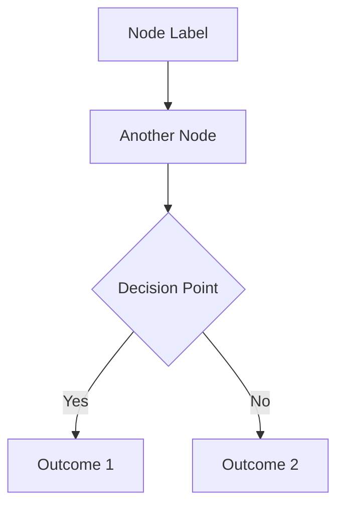
```mermaid
graph TD
    A[Node Label] --> B[Another Node]
    B --> C{Decision Point}
    C -->|Yes| D[Outcome 1]
    C -->|No| E[Outcome 2]
```

**Diagram Formatting:**
- Clear, descriptive node labels
- Logical flow direction (top-to-bottom or left-to-right)
- Comments using `%%` for maintainability
- Consistent styling and indentation

#### Citation Requirement: Every Section Must Reference Source Files

**Mandatory Citation Standards:**

**Section-Level Citations:**
Every major section in README.md must include source attribution:

#### Configuration

[Content about hostname and port configuration...]

*Source: `/server.js:3-4`*
```

**Inline Citations for Specific Claims:**

The server binds to localhost (`127.0.0.1`) by default (Source: `/server.js:3`), 
which restricts access to the local machine only.
```

**Code Example Citations:**

```javascript
// Start the server
node server.js
// Output: Server running at http://127.0.0.1:3000/
```
*Example derived from `/server.js:13`*
```

**JSDoc Citations:**
```javascript
/**
 * Port number for HTTP server
 * @constant {number}
 * @default 3000
 * @see README.md#configuration for usage details
 */
const port = 3000;
```

**Citation Format Rules:**
- Always use absolute paths from repository root (start with `/`)
- Include line numbers or line ranges (`:3`, `:6-10`)
- Use backticks for file paths (`` `/server.js` ``)
- Place citations at end of paragraph or after code blocks
- Use italics for standalone citations (*Source: ...*)

**Citation Verification:**
- Every citation must reference an actual file in the repository
- Line numbers must be accurate to current file state
- If code changes, citations must be updated

#### Style Guide: Clear, Concise, Technically Accurate

**Clarity Standards:**

**Use Active Voice:**
- ✓ "The server responds with a 200 status code"
- ✗ "A 200 status code is responded with by the server"

**Use Present Tense:**
- ✓ "The server listens on port 3000"
- ✗ "The server will listen on port 3000"

**Define Technical Terms:**
- First use: "localhost (IP address 127.0.0.1)"
- Subsequent: "localhost" or "127.0.0.1"

**Use Concrete Examples:**
- ✓ "Run `node server.js` to start the server"
- ✗ "Execute the appropriate command to initiate the server process"

**Conciseness Standards:**

**Eliminate Redundancy:**
- ✓ "The server runs on port 3000"
- ✗ "The server runs and listens for incoming connections on port number 3000"

**Use Short Sentences:**
- Target: 15-20 words per sentence
- Maximum: 30 words per sentence
- Break complex statements into multiple sentences

**Avoid Filler Words:**
- Remove: "basically", "actually", "essentially", "simply", "just"
- Exception: When genuinely clarifying meaning

**Technical Accuracy Standards:**

**Verify All Technical Claims:**
- Cross-reference with source code
- Test all commands and examples
- Validate version-specific information

**Use Precise Terminology:**
- ✓ "HTTP status code 200" (not "success code")
- ✓ "Content-Type header" (not "content type field")
- ✓ "request handler callback" (not "request function")

**Cite Authoritative Sources:**
- Node.js official documentation for API references
- RFC specifications for HTTP protocol details
- npm documentation for package.json format

**Avoid Assumptions:**
- Document actual behavior, not assumed behavior
- Note limitations explicitly (no error handling, no routing)
- Distinguish between "does" and "can do"

#### Example Requirement: Working Code Examples for All Public APIs

**Comprehensive Example Coverage:**

**API Endpoint Examples (Required in README.md):**

1. **Basic GET Request**
```bash
curl http://127.0.0.1:3000/
# Expected Output: Hello, World!
```
Source: `/server.js:6-10`

2. **POST Request (Demonstrating Method Independence)**
```bash
curl -X POST http://127.0.0.1:3000/
# Expected Output: Hello, World!
```
Source: `/server.js:6-10` (handler ignores method)

3. **Path Independence**
```bash
curl http://127.0.0.1:3000/any/path
# Expected Output: Hello, World!
```
Source: `/server.js:6-10` (handler ignores path)

4. **Browser Testing**
```
Navigate to: http://127.0.0.1:3000/
Expected Display: Hello, World!
```
Source: `/server.js:6-10`

**Server Startup Examples (Required in README.md and JSDoc):**

```bash
# Start the server
node server.js

#### Expected Console Output:
#### Server running at http://127.0.0.1:3000/
```
Source: `/server.js:12-14`

**Configuration Examples (Required in README.md):**

```javascript
// Modify hostname (in server.js)
const hostname = '0.0.0.0'; // Allow external connections

// Modify port (in server.js)
const port = 8080; // Use alternative port
```
Source: `/server.js:3-4`

**Example Quality Standards:**

**All Examples Must:**
- Be executable without modification (copy-paste ready)
- Include expected output or behavior
- Work on the actual codebase (not hypothetical)
- Include necessary context (prerequisites, dependencies)
- Show both success and failure scenarios where relevant

**Example Testing Protocol:**
- Test each example against running server
- Verify output matches documentation
- Ensure commands work on Unix/Linux and Windows (note differences)
- Validate all file paths and URLs

#### Repository-Specific Patterns

#### Existing Documentation Patterns to Follow

**Current Documentation State:**
- Minimal README.md with 2 lines (Source: `/README.md:1-2`)
- No existing JSDoc comments (Source: `/server.js:1-15`)
- No documentation standards established

**Patterns to Establish (New Standards):**

**README.md Structure Pattern:**
1. Descriptive title with project name
2. Table of contents for easy navigation
3. Progressive disclosure: Overview → Setup → Advanced
4. Code examples in every practical section
5. Troubleshooting for common issues
6. License and contributing information

**JSDoc Pattern:**
1. File header with @fileoverview, @module, @version, @license, @author
2. Constants with @constant, @type, @default
3. Functions with @param, @returns, @throws (if applicable)
4. Examples with @example tag
5. Cross-references with @see tag

#### Documentation Location Conventions

**Primary Documentation:** `/README.md` at repository root
- Rationale: Standard location for GitHub/npm discovery
- Accessibility: First file users encounter
- Convention: Industry-standard practice

**Inline Documentation:** JSDoc comments in `/server.js`
- Rationale: Developer reference within source code
- Accessibility: Available in IDE tooltips and editors
- Convention: JavaScript/Node.js standard

**No Separate /docs Folder:**
- Rationale: Project simplicity (single file)
- Decision: Keep documentation co-located
- Future: If project grows, migrate to /docs structure

#### Version-Specific Documentation Needs

**Node.js Version Requirements:**

**Syntax Analysis:**
- ES6 `const` and `let`: Requires Node.js ≥ 6.0.0
- Template literals: Requires Node.js ≥ 6.0.0
- Arrow functions (not used but common): Node.js ≥ 6.0.0

**Minimum Version: Node.js 6.0.0**
- Documented in: README.md Prerequisites section
- Rationale: ES6 features used in source code
- Source: `/server.js:1-15` syntax analysis

**Recommended Version: Node.js LTS (currently 18.x or 20.x)**
- Documented in: README.md Prerequisites section
- Rationale: Active LTS ensures security updates
- Testing: Note that code works on all versions ≥ 6.0.0

**Version-Specific Notes:**
- No async/await: Compatible with older Node.js versions
- No modern ESM imports: Uses CommonJS (require)
- No optional chaining or nullish coalescing: Maximum compatibility

#### Multi-Language Documentation Considerations

**Primary Language: English**
- All documentation written in English
- Rationale: Code comments and package.json in English
- Standard: Technical documentation industry norm

**Future Internationalization (Out of Scope):**
- No multi-language versions required for this task
- README.md structure allows future translation
- Consider i18n if user base demands it

**Code Comments Language:**
- JSDoc comments: English only
- Inline code comments: English only (if any added)
- Consistency: Matches existing package.json metadata

**Technical Terminology:**
- Use English technical terms (server, port, hostname)
- Define acronyms on first use (HTTP, API, TCP)
- Maintain consistent terminology throughout all documentation


# 1. Introduction

## 1.1 EXECUTIVE SUMMARY

### 1.1.1 Project Overview

The `hao-backprop-test` repository represents a minimal test project specifically designed to validate integration capabilities with Backprop, an AI-powered development tool that adapts to workflows, automating coding, debugging, and testing with full context awareness. This project serves as a foundational testing environment to demonstrate and verify how AI-assisted development tools can analyze, understand, and potentially refactor simple Node.js codebases.

The project consists of a basic HTTP server implementation using only Node.js core modules, making it an ideal candidate for testing code analysis capabilities without the complexity of external dependencies or frameworks. The repository contains exactly four files: a main server implementation (`server.js`), package configuration (`package.json`), dependency lockfile (`package-lock.json`), and project documentation (`README.md`).

### 1.1.2 Core Business Problem Being Solved

This test project addresses the critical need to validate AI-assisted development tools' effectiveness on minimal, dependency-free Node.js applications. The primary business challenges being addressed include:

- **Integration Validation**: Ensuring Backprop can successfully analyze and process simple Node.js server implementations
- **Baseline Capability Testing**: Establishing a foundation for understanding how AI tools perform with zero-dependency applications  
- **Code Analysis Verification**: Confirming that automated code analysis tools can identify improvement opportunities in basic HTTP server architectures
- **Tool Compatibility Assessment**: Validating integration workflows with minimal project structures

### 1.1.3 Key Stakeholders and Users

The primary stakeholders for this test integration include:

- **Development Team**: Engineers evaluating Backprop's capabilities for Node.js project analysis and refactoring
- **Tool Integration Specialists**: Technical personnel responsible for implementing and validating AI-assisted development workflows
- **Quality Assurance Teams**: Groups focused on ensuring automated tools maintain code quality standards
- **DevOps Engineers**: Personnel interested in integrating AI tools into continuous integration pipelines

### 1.1.4 Expected Business Impact and Value Proposition

The successful integration testing of this minimal Node.js server with Backprop is expected to deliver:

- **Proof of Concept Validation**: Demonstrating that AI tools can effectively analyze and suggest improvements for simple server implementations
- **Integration Pathway Establishment**: Creating a foundation for expanding AI-assisted development to larger, more complex projects
- **Tool Effectiveness Measurement**: Providing baseline metrics for evaluating AI tool performance on Node.js applications
- **Development Workflow Enhancement**: Enabling teams to understand how AI tools can be incorporated into existing development processes

## 1.2 SYSTEM OVERVIEW

### 1.2.1 Project Context

#### 1.2.1.1 Business Context and Market Positioning

This test project operates within the rapidly evolving landscape of AI-assisted software development tools. There has been an explosion of generative AI programming tools hitting the market, with ChatGPT and other generative AI tools showing they can fit into software developers' workflows and provide an instant productivity boost.

The project serves as a representative example of how modern development teams are evaluating and integrating AI-powered code analysis and refactoring tools. By using a minimal Node.js HTTP server as the test subject, the project provides a controlled environment for assessing tool capabilities without the complexity that larger codebases might introduce.

#### 1.2.1.2 Current System Limitations

The existing server implementation exhibits several characteristics typical of development-stage or minimal viable product applications:

- **Localhost-Only Binding**: Server exclusively binds to `127.0.0.1`, preventing external network access
- **No Error Handling**: Absence of comprehensive error handling mechanisms that would be required for production environments
- **Hard-Coded Configuration**: Fixed port and address configuration without environment variable support
- **Single Endpoint Design**: All HTTP requests return identical "Hello, World!" responses regardless of path or method
- **Missing Production Features**: Lack of logging frameworks, monitoring capabilities, authentication mechanisms, or graceful shutdown procedures

#### 1.2.1.3 Integration with Existing Enterprise Landscape

This test project functions as a standalone validation environment designed to assess how AI-assisted development tools integrate with:

- **Node.js Ecosystem**: Leveraging only core HTTP modules to test tool compatibility with minimal dependencies
- **Version Control Systems**: Standard Git repository structure enabling integration with modern development workflows  
- **Development Environments**: Simple execution model (`node server.js`) that mimics standard Node.js development practices
- **Testing Frameworks**: Intentionally minimal structure to focus on core server functionality analysis

### 1.2.2 High-Level Description

#### 1.2.2.1 Primary System Capabilities

The test server provides a foundational HTTP service implementation with the following core capabilities:

- **HTTP Request Processing**: Accepts and responds to all HTTP requests on port 3000
- **Plain Text Response Generation**: Returns consistent "Hello, World!\n" content for all endpoints
- **Console Logging**: Provides startup confirmation messaging for operational visibility
- **Localhost Network Binding**: Establishes local-only HTTP service availability
- **Zero-Dependency Operation**: Functions entirely using Node.js built-in modules

#### 1.2.2.2 Major System Components

The architecture consists of three primary functional components:

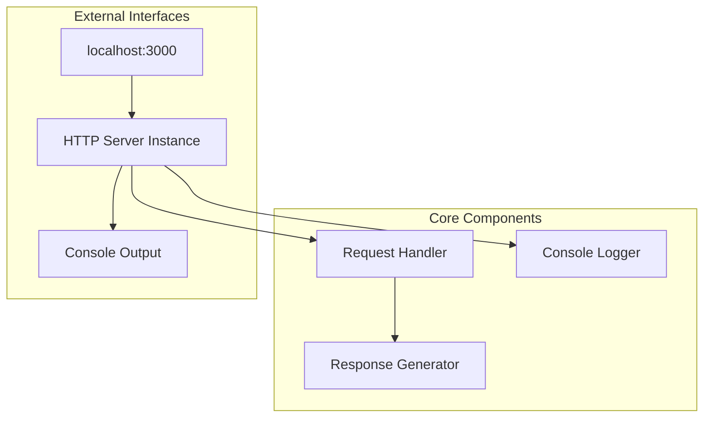
```mermaid
graph TB
    A[HTTP Server Instance] --> B[Request Handler]
    B --> C[Response Generator]
    A --> D[Console Logger]
    
    subgraph "Core Components"
        B
        C
        D
    end
    
    subgraph "External Interfaces"
        E[localhost:3000] --> A
        A --> F[Console Output]
    end
```

1. **HTTP Server Instance**: Core `http.createServer()` implementation providing the fundamental web service infrastructure
2. **Request Handler**: Anonymous function processing all incoming HTTP requests uniformly
3. **Response Generator**: Logic setting appropriate headers and content for client responses

#### 1.2.2.3 Core Technical Approach

The implementation follows a minimalist architectural approach prioritizing simplicity and clarity:

- **Event-Driven Architecture**: Utilizes Node.js asynchronous event handling for HTTP request processing
- **Functional Programming Pattern**: Implements server logic through anonymous callback functions
- **Zero-Abstraction Design**: Direct use of Node.js core APIs without framework or library abstractions
- **Stateless Operation**: No persistent data storage or session management capabilities

### 1.2.3 Success Criteria

#### 1.2.3.1 Measurable Objectives

The success of this test integration will be evaluated against the following quantifiable metrics:

- **Successful Code Analysis**: Backprop must successfully parse and analyze all four project files without errors
- **Improvement Identification**: Tool should identify at least three potential code improvements or refactoring opportunities
- **Integration Completeness**: Full workflow execution from repository analysis through recommendation generation
- **Zero Breaking Changes**: Any suggested modifications must maintain existing server functionality

#### 1.2.3.2 Critical Success Factors

Key factors that will determine the overall success of this testing initiative include:

- **Tool Compatibility**: Seamless integration with the zero-dependency Node.js project structure
- **Accurate Analysis**: Precise identification of actual improvement opportunities versus false positives
- **Context Awareness**: Demonstration that the tool understands the minimal nature and testing purpose of the codebase
- **Actionable Recommendations**: Generation of practical, implementable suggestions for code enhancement

#### 1.2.3.3 Key Performance Indicators (KPIs)

| KPI Category | Metric | Target Value | Measurement Method |
|--------------|--------|--------------|-------------------|
| **Analysis Accuracy** | False Positive Rate | < 20% | Manual review of suggestions |
| **Processing Speed** | Analysis Completion Time | < 30 seconds | Automated timing measurement |
| **Coverage Completeness** | Files Successfully Analyzed | 100% (4/4 files) | Tool output verification |
| **Recommendation Quality** | Implementable Suggestions | ≥ 3 recommendations | Expert evaluation |

## 1.3 SCOPE

### 1.3.1 In-Scope Elements

#### 1.3.1.1 Core Features and Functionalities

**Must-Have Capabilities:**
- HTTP server initialization and startup sequence analysis
- Request handling pattern evaluation and optimization suggestions
- Response generation logic review and improvement identification
- Console logging implementation assessment
- Error handling gap identification and recommendations
- Code structure and organization analysis

**Primary User Workflows:**
- Repository ingestion and initial file discovery
- Systematic code analysis across all project files
- Pattern recognition for Node.js server implementations  
- Recommendation generation for code improvements
- Integration testing workflow validation

**Essential Integrations:**
- Git repository access and file retrieval
- Node.js code parsing and abstract syntax tree generation
- Package.json analysis for dependency and configuration review
- README.md processing for project context understanding

**Key Technical Requirements:**
- Support for ES6+ JavaScript syntax analysis
- Node.js core module usage pattern recognition
- HTTP server architecture evaluation capabilities
- Zero-dependency project structure handling

#### 1.3.1.2 Implementation Boundaries

| Boundary Type | In-Scope Elements | Scope Definition |
|---------------|-------------------|------------------|
| **System Boundaries** | HTTP server on localhost:3000 | Single process Node.js application |
| **User Groups Covered** | Development and testing teams | Internal stakeholders evaluating AI tools |
| **Geographic Coverage** | Local development environment | Localhost-only deployment scope |
| **Data Domains** | HTTP request/response processing | Simple text-based web service |

### 1.3.2 Out-of-Scope Elements

#### 1.3.2.1 Explicitly Excluded Features and Capabilities

- **Production Deployment Analysis**: No evaluation of production-ready configurations or deployment strategies
- **Database Integration Assessment**: No analysis of data persistence or database connectivity patterns
- **Authentication and Security Review**: No evaluation of security mechanisms, authentication, or authorization
- **Performance Optimization**: No load testing, performance profiling, or scalability analysis
- **Framework Migration Suggestions**: No recommendations for adopting Express.js, Fastify, or other Node.js frameworks
- **Environment Configuration**: No analysis of Docker, Kubernetes, or containerization approaches

#### 1.3.2.2 Future Phase Considerations

Elements potentially addressed in subsequent testing phases:

- **Multi-File Project Analysis**: Testing with larger codebases containing multiple modules and dependencies
- **Framework-Based Server Testing**: Evaluation using Express.js or other popular Node.js frameworks
- **Database Integration Testing**: Analysis of projects incorporating MongoDB, PostgreSQL, or other database systems
- **API Development Pattern Analysis**: Testing with RESTful API implementations and routing logic

#### 1.3.2.3 Integration Points Not Covered

- **CI/CD Pipeline Integration**: No testing of automated analysis within continuous integration workflows
- **IDE Plugin Functionality**: No evaluation of integrated development environment extensions or plugins
- **Real-Time Collaboration Features**: No assessment of multi-developer or team-based analysis capabilities
- **External Service Integrations**: No testing with cloud services, third-party APIs, or external dependencies

#### 1.3.2.4 Unsupported Use Cases

- **Large-Scale Enterprise Applications**: No testing with complex, multi-service architectures
- **Legacy Code Migration**: No evaluation of modernization suggestions for older JavaScript patterns  
- **Cross-Platform Development**: No analysis of React Native, Electron, or other Node.js-based cross-platform solutions
- **Microservices Architecture Review**: No assessment of distributed system design patterns or service orchestration

#### References

**Files Examined:**
- `README.md` - Project title and Backprop integration purpose documentation
- `package.json` - Package metadata, dependencies, and configuration analysis
- `server.js` - Complete HTTP server implementation and core functionality
- `package-lock.json` - Dependency lockfile confirming zero external dependencies

**Web Search References:**
- Refact.ai - AI Agent for Coding documentation
- LeadDev - Generative AI programming tools market analysis

# 2. Product Requirements

## 2.1 FEATURE CATALOG

### 2.1.1 HTTP Server Lifecycle Management

#### Feature Metadata
| Property | Value |
|----------|--------|
| **Feature ID** | F-001 |
| **Feature Name** | HTTP Server Lifecycle Management |
| **Category** | Core Infrastructure |
| **Priority Level** | Critical |
| **Status** | Completed |

#### Description
**Overview**: Manages the complete lifecycle of the Node.js HTTP server from initialization through startup and operational state maintenance.

**Business Value**: Provides the foundational infrastructure required for Backprop integration testing, enabling AI tool analysis of server initialization patterns and lifecycle management approaches.

**User Benefits**: Enables development teams to validate AI tool capabilities with minimal server architectures, providing clear startup feedback through console logging for operational visibility.

**Technical Context**: Implemented using Node.js core `http.createServer()` API with hard-coded network configuration binding exclusively to localhost interface on port 3000.

#### Dependencies
| Dependency Type | Details |
|----------------|---------|
| **System Dependencies** | Node.js runtime environment (core `http` module) |
| **External Dependencies** | None - zero external npm packages required |
| **Integration Requirements** | Console output capability for startup notification |

### 2.1.2 HTTP Request Processing

#### Feature Metadata
| Property | Value |
|----------|--------|
| **Feature ID** | F-002 |
| **Feature Name** | HTTP Request Processing |
| **Category** | Request Handling |
| **Priority Level** | Critical |
| **Status** | Completed |

#### Description
**Overview**: Processes all incoming HTTP requests through a universal handler that accepts any HTTP method, path, or header configuration without discrimination.

**Business Value**: Demonstrates simplified request processing patterns for AI tool analysis, providing a baseline example of Node.js request handling without routing complexity.

**User Benefits**: Offers predictable behavior for integration testing scenarios, ensuring consistent request processing regardless of client request variations.

**Technical Context**: Implements anonymous callback function as universal request handler, processing all requests synchronously without method or path differentiation.

#### Dependencies
| Dependency Type | Details |
|----------------|---------|
| **Prerequisite Features** | F-001 (HTTP Server Lifecycle Management) |
| **System Dependencies** | Node.js HTTP request/response objects |
| **Integration Requirements** | Response generation capability (F-003) |

### 2.1.3 Response Generation

#### Feature Metadata
| Property | Value |
|----------|--------|
| **Feature ID** | F-003 |
| **Feature Name** | Response Generation |
| **Category** | Response Handling |
| **Priority Level** | High |
| **Status** | Completed |

#### Description
**Overview**: Generates uniform HTTP responses with static plain text content, appropriate headers, and consistent status codes for all processed requests.

**Business Value**: Provides AI tools with clear examples of Node.js response generation patterns, enabling analysis of header configuration and content delivery approaches.

**User Benefits**: Delivers reliable, predictable responses for testing scenarios, simplifying integration validation workflows.

**Technical Context**: Sets `Content-Type: text/plain` header, returns HTTP 200 status code, and delivers fixed "Hello, World!\n" message content.

#### Dependencies
| Dependency Type | Details |
|----------------|---------|
| **Prerequisite Features** | F-002 (HTTP Request Processing) |
| **System Dependencies** | Node.js HTTP response object methods |
| **Integration Requirements** | Request handler invocation from F-002 |

### 2.1.4 Development Environment Support

#### Feature Metadata
| Property | Value |
|----------|--------|
| **Feature ID** | F-004 |
| **Feature Name** | Development Environment Support |
| **Category** | Development Tools |
| **Priority Level** | Medium |
| **Status** | Completed |

#### Description
**Overview**: Enables direct execution in development environments through standard Node.js execution commands, supporting local testing and AI tool integration workflows.

**Business Value**: Facilitates rapid testing iterations for AI tool evaluation, providing immediate feedback on server operational status through console output.

**User Benefits**: Allows developers to quickly validate server functionality and test AI tool analysis capabilities without complex deployment procedures.

**Technical Context**: Supports direct execution via `node server.js` command with immediate console feedback confirming server availability on localhost:3000.

#### Dependencies
| Dependency Type | Details |
|----------------|---------|
| **System Dependencies** | Node.js runtime environment, console output capability |
| **External Dependencies** | None - standalone execution model |
| **Integration Requirements** | Local network interface availability (127.0.0.1:3000) |

## 2.2 FUNCTIONAL REQUIREMENTS TABLE

### 2.2.1 HTTP Server Lifecycle Management (F-001)

| Requirement ID | Description | Acceptance Criteria | Priority |
|---------------|-------------|-------------------|----------|
| **F-001-RQ-001** | Server initialization with core HTTP module | Server creates using `http.createServer()` without errors | Must-Have |
| **F-001-RQ-002** | Port binding to 3000 on localhost | Server successfully binds to 127.0.0.1:3000 interface | Must-Have |
| **F-001-RQ-003** | Startup confirmation logging | Console displays "Server running on http://127.0.0.1:3000" | Should-Have |
| **F-001-RQ-004** | Operational state maintenance | Server remains responsive after successful startup | Must-Have |

#### Technical Specifications
| Parameter | Specification |
|-----------|--------------|
| **Input Parameters** | None - hard-coded configuration |
| **Output/Response** | Console startup message, HTTP server instance |
| **Performance Criteria** | Startup completion < 1 second |
| **Data Requirements** | No persistent data storage required |

#### Validation Rules
| Rule Category | Requirements |
|---------------|-------------|
| **Business Rules** | Server must bind to localhost-only for security |
| **Data Validation** | Port 3000 must be available for binding |
| **Security Requirements** | No external network interface exposure |
| **Compliance Requirements** | Node.js core module usage only |

### 2.2.2 HTTP Request Processing (F-002)

| Requirement ID | Description | Acceptance Criteria | Priority |
|---------------|-------------|-------------------|----------|
| **F-002-RQ-001** | Universal request handler registration | All HTTP methods processed by single handler | Must-Have |
| **F-002-RQ-002** | Path-agnostic request processing | Any URL path returns identical response | Must-Have |
| **F-002-RQ-003** | Header-independent processing | Request headers do not affect processing logic | Should-Have |
| **F-002-RQ-004** | Synchronous request handling | Requests processed without asynchronous delays | Could-Have |

#### Technical Specifications
| Parameter | Specification |
|-----------|--------------|
| **Input Parameters** | HTTP request object with method, URL, headers |
| **Output/Response** | Invocation of response generation (F-003) |
| **Performance Criteria** | Request processing < 10ms per request |
| **Data Requirements** | No request data persistence or logging |

#### Validation Rules
| Rule Category | Requirements |
|---------------|-------------|
| **Business Rules** | All requests receive identical treatment |
| **Data Validation** | No request content validation performed |
| **Security Requirements** | No input sanitization or filtering |
| **Compliance Requirements** | Standard HTTP protocol adherence |

### 2.2.3 Response Generation (F-003)

| Requirement ID | Description | Acceptance Criteria | Priority |
|---------------|-------------|-------------------|----------|
| **F-003-RQ-001** | Content-Type header configuration | Response includes "Content-Type: text/plain" | Must-Have |
| **F-003-RQ-002** | HTTP 200 status code setting | All responses return successful status | Must-Have |
| **F-003-RQ-003** | Static content delivery | Response body contains "Hello, World!\n" | Must-Have |
| **F-003-RQ-004** | Response completion signaling | Connection properly closed after response | Must-Have |

#### Technical Specifications
| Parameter | Specification |
|-----------|--------------|
| **Input Parameters** | HTTP response object from request handler |
| **Output/Response** | Complete HTTP response with headers and body |
| **Performance Criteria** | Response generation < 5ms |
| **Data Requirements** | Static string content only |

#### Validation Rules
| Rule Category | Requirements |
|---------------|-------------|
| **Business Rules** | Consistent response content for all requests |
| **Data Validation** | Fixed response content without variation |
| **Security Requirements** | Plain text content only, no dynamic generation |
| **Compliance Requirements** | HTTP/1.1 response format compliance |

### 2.2.4 Development Environment Support (F-004)

| Requirement ID | Description | Acceptance Criteria | Priority |
|---------------|-------------|-------------------|----------|
| **F-004-RQ-001** | Direct Node.js execution support | `node server.js` starts server successfully | Must-Have |
| **F-004-RQ-002** | Zero external dependency operation | Functions without npm package installations | Must-Have |
| **F-004-RQ-003** | Console output visibility | Operational status visible in terminal | Should-Have |
| **F-004-RQ-004** | Local accessibility confirmation | HTTP service accessible via localhost:3000 | Must-Have |

#### Technical Specifications
| Parameter | Specification |
|-----------|--------------|
| **Input Parameters** | Node.js execution command |
| **Output/Response** | Running HTTP server with console feedback |
| **Performance Criteria** | Execution startup < 2 seconds |
| **Data Requirements** | No configuration files or environment variables |

## 2.3 FEATURE RELATIONSHIPS

### 2.3.1 Feature Dependencies Map

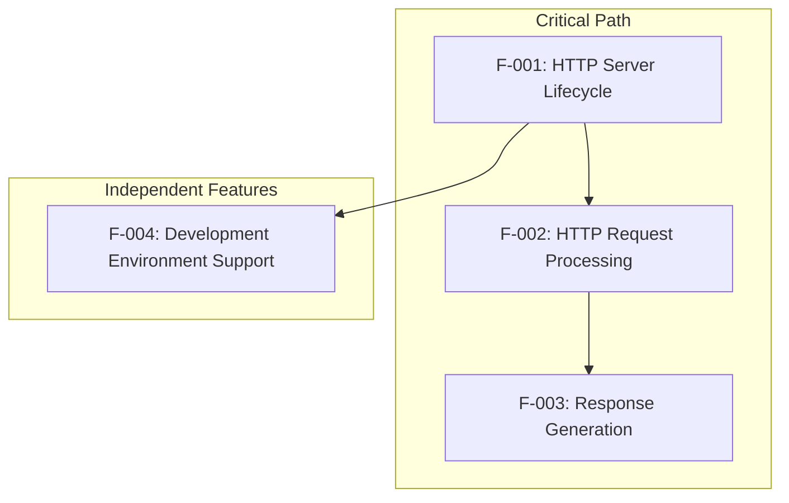
```mermaid
graph TB
    F001[F-001: HTTP Server Lifecycle] --> F002[F-002: HTTP Request Processing]
    F002 --> F003[F-003: Response Generation]
    F001 --> F004[F-004: Development Environment Support]
    
    subgraph "Critical Path"
        F001
        F002
        F003
    end
    
    subgraph "Independent Features"
        F004
    end
```

### 2.3.2 Integration Points

| Integration Point | Connected Features | Shared Resources |
|-------------------|-------------------|------------------|
| **Request Handler Callback** | F-002 → F-003 | HTTP response object |
| **Server Instance Creation** | F-001 → F-002 | HTTP server object |
| **Console Output** | F-001, F-004 | Standard output stream |
| **Network Interface** | F-001, F-004 | localhost:3000 binding |

### 2.3.3 Shared Components

| Component | Features Using Component | Component Purpose |
|-----------|-------------------------|------------------|
| **HTTP Server Instance** | F-001, F-002, F-004 | Core server functionality |
| **Request Callback Function** | F-002, F-003 | Request processing logic |
| **Console Logging** | F-001, F-004 | Operational feedback |
| **Network Configuration** | F-001, F-004 | Localhost binding setup |

## 2.4 IMPLEMENTATION CONSIDERATIONS

### 2.4.1 Technical Constraints

| Feature | Constraints | Impact |
|---------|-------------|--------|
| **F-001** | Hard-coded port 3000, localhost-only binding | Limited deployment flexibility |
| **F-002** | Single universal handler, no routing logic | Cannot differentiate request types |
| **F-003** | Static response content, no dynamic generation | Limited response customization |
| **F-004** | Direct execution only, no npm scripts integration | Manual startup required |

### 2.4.2 Performance Requirements

| Feature | Performance Criteria | Measurement Method |
|---------|---------------------|------------------|
| **F-001** | Server startup < 1 second | Time from execution to console message |
| **F-002** | Request processing < 10ms | Request handler execution time |
| **F-003** | Response generation < 5ms | Response write and end operations |
| **F-004** | Development startup < 2 seconds | Complete server availability |

### 2.4.3 Scalability Considerations

| Consideration | Current Limitation | Potential Enhancement |
|---------------|-------------------|---------------------|
| **Concurrent Requests** | Single-threaded processing | Cluster module implementation |
| **Port Management** | Fixed port allocation | Environment variable configuration |
| **Network Access** | Localhost-only binding | Configurable interface binding |
| **Error Handling** | No error event handlers | Comprehensive error management |

### 2.4.4 Security Implications

| Security Aspect | Current State | Risk Level |
|----------------|---------------|------------|
| **Network Exposure** | Localhost-only binding | Low |
| **Input Validation** | No request validation | Low (test environment) |
| **Error Information** | No error disclosure | Low |
| **Authentication** | Not implemented | Low (intended for testing) |

### 2.4.5 Maintenance Requirements

| Maintenance Type | Requirements | Frequency |
|------------------|-------------|-----------|
| **Code Updates** | Manual file modification | As needed |
| **Dependency Management** | None required (zero dependencies) | N/A |
| **Configuration Changes** | Source code modification | As needed |
| **Testing Validation** | Manual execution and verification | Per development cycle |

## 2.5 TRACEABILITY MATRIX

| Business Requirement | Feature ID | Functional Requirements | Test Criteria |
|---------------------|-----------|------------------------|---------------|
| **AI Tool Integration Testing** | F-001, F-002, F-003, F-004 | All requirements | Successful Backprop analysis |
| **Minimal Server Implementation** | F-001, F-002, F-003 | F-001-RQ-001 through F-003-RQ-004 | Zero external dependencies |
| **Development Environment Support** | F-004 | F-004-RQ-001 through F-004-RQ-004 | Direct Node.js execution |
| **Consistent Response Behavior** | F-002, F-003 | F-002-RQ-001, F-003-RQ-003 | Identical responses for all requests |

## 2.6 ASSUMPTIONS AND CONSTRAINTS

### 2.6.1 Key Assumptions
- Node.js runtime environment available in target execution environments
- Port 3000 available for binding during server startup
- Console output accessibility for operational feedback
- Localhost network interface functionality

### 2.6.2 Design Constraints
- Zero external dependency requirement limits feature complexity
- Hard-coded configuration prevents runtime customization
- Single-file implementation restricts modular architecture
- Test project scope excludes production-ready features

#### References

#### Files Examined
- `server.js` - Core HTTP server implementation with lifecycle management, request processing, and response generation
- `package.json` - Project configuration revealing zero-dependency architecture and package metadata
- `README.md` - Project documentation confirming Backprop integration testing purpose
- `package-lock.json` - Dependency lockfile confirming zero external package requirements

#### Technical Specification Sections Referenced
- `1.1 EXECUTIVE SUMMARY` - Business context, stakeholder analysis, and value proposition
- `1.2 SYSTEM OVERVIEW` - System capabilities, limitations, and success criteria
- `1.3 SCOPE` - In-scope features, out-of-scope elements, and implementation boundaries

# 3. Technology Stack

## 3.1 PROGRAMMING LANGUAGES

### 3.1.1 Core Runtime Environment

**JavaScript (Node.js)**
- **Platform**: Server-side JavaScript execution via Node.js runtime
- **Syntax Standard**: CommonJS module system with `require()` syntax
- **Version Compatibility**: Compatible with all Node.js LTS (Long Term Support) versions
  - Current LTS: Node.js v22 'Jod' (supported until April 2027)
  - Other supported LTS: v18 'Hydrogen', v20 'Iron'
  - Recommendation: Active LTS or Maintenance LTS releases for production applications
- **Selection Justification**: 
  - Zero-dependency requirement aligns with Node.js built-in module ecosystem
  - Event-driven architecture matches HTTP server implementation pattern
  - Minimal complexity supports test project objectives for Backprop integration

### 3.1.2 Language Constraints and Dependencies

- **No Type System**: Pure JavaScript without TypeScript compilation or type checking
- **Runtime Dependencies**: Node.js interpreter (minimum version not specified, but LTS recommended)
- **Module System**: CommonJS exclusively - no ES modules or mixed module usage

## 3.2 FRAMEWORKS & LIBRARIES

### 3.2.1 Core Modules (Node.js Built-in)

**HTTP Module**
- **Version**: Built-in Node.js core module (version aligns with Node.js runtime)
- **Import Method**: `require('http')` or `require('node:http')` (CommonJS)
- **Functionality**: 
  - HTTP server creation via `http.createServer()`
  - Request/response handling with `req`/`res` objects
  - Server lifecycle management with `server.listen()`
- **Justification**: Provides complete HTTP server capabilities without external dependencies
- **Compatibility**: Available across all Node.js versions, ensuring broad environment support

### 3.2.2 Framework Architecture Decision

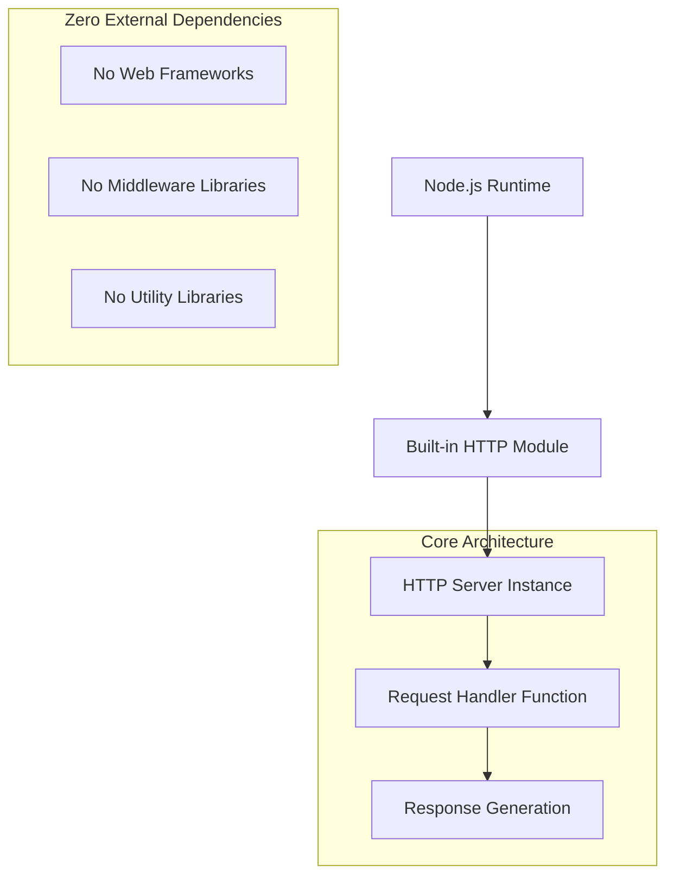
```mermaid
graph TB
    A[Node.js Runtime] --> B[Built-in HTTP Module]
    B --> C[HTTP Server Instance]
    C --> D[Request Handler Function]
    D --> E[Response Generation]
    
    subgraph "Zero External Dependencies"
        F[No Web Frameworks]
        G[No Middleware Libraries]
        H[No Utility Libraries]
    end
    
    subgraph "Core Architecture"
        C
        D
        E
    end
```

**Framework Absence Justification**:
- **Express.js**: Intentionally excluded to maintain zero-dependency constraint
- **Fastify/Koa**: Not applicable - adds unnecessary complexity for test purposes
- **Web Frameworks**: Architectural requirement explicitly prohibits external frameworks

## 3.3 OPEN SOURCE DEPENDENCIES

### 3.3.1 External Package Analysis

**Zero External Dependencies**
- **Production Dependencies**: None (`"dependencies": {}` in package.json)
- **Development Dependencies**: None (`"devDependencies": {}` in package.json)
- **Peer Dependencies**: None
- **Optional Dependencies**: None
- **Package Registry**: npm (Node Package Manager) used for project metadata only

### 3.3.2 Package Management Configuration

**npm (Node Package Manager)**
- **Lock File Version**: 3 (package-lock.json lockfileVersion: 3)
- **Package Version**: 1.0.0 (project version)
- **License**: MIT
- **Author**: hxu
- **Registry**: Default npm registry (no custom registries configured)
- **Installation**: `npm install` produces no package installations due to empty dependency objects

### 3.3.3 Dependency Strategy Rationale

The zero-dependency approach serves multiple strategic purposes:
- **Test Environment Purity**: Eliminates variables that could affect Backprop AI tool analysis
- **Simplicity Maximization**: Focuses evaluation on core Node.js capabilities
- **Security Minimization**: No supply chain vulnerabilities from external packages
- **Maintenance Reduction**: No dependency updates or compatibility management required

## 3.4 DEVELOPMENT & DEPLOYMENT

### 3.4.1 Development Environment

**Direct Node.js Execution**
- **Primary Command**: `node server.js`
- **Build Process**: None required - no compilation, bundling, or transpilation
- **Development Server**: Direct HTTP server instantiation without hot reload
- **Environment Configuration**: None - all configuration hard-coded

### 3.4.2 Development Tools Ecosystem

**Intentionally Minimal Tooling**:
- **Testing Frameworks**: None (Jest, Mocha, etc. not present)
- **Code Linting**: None (ESLint not configured)
- **Code Formatting**: None (Prettier not configured)
- **Build Tools**: None (Webpack, Rollup, etc. not present)
- **Type Checking**: None (TypeScript not configured)
- **Documentation**: Basic README.md for project context

### 3.4.3 Deployment Architecture

**Local Development Only**
- **Network Binding**: `127.0.0.1` (localhost-only binding)
- **Port Configuration**: Hard-coded port 3000
- **Protocol**: HTTP/1.1 (no HTTPS configuration)
- **Process Management**: Manual startup and termination
- **Containerization**: None (Docker not configured)
- **CI/CD**: None (GitHub Actions not configured)

### 3.4.4 Infrastructure Considerations

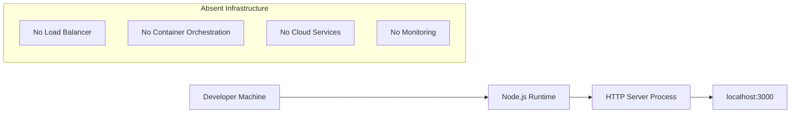
```mermaid
graph LR
    A[Developer Machine] --> B[Node.js Runtime]
    B --> C[HTTP Server Process]
    C --> D[localhost:3000]
    
    subgraph "Absent Infrastructure"
        E[No Load Balancer]
        F[No Container Orchestration]
        G[No Cloud Services]
        H[No Monitoring]
    end
```

**Infrastructure Simplicity**:
- **Cloud Platform**: None configured (AWS, Azure, GCP not utilized)
- **Load Balancing**: Not applicable for single-instance local server
- **Container Orchestration**: Not applicable (Kubernetes, Docker Swarm absent)
- **Service Mesh**: Not applicable for single-service architecture

## 3.5 OPERATIONAL TECHNOLOGY STACK

### 3.5.1 Server Configuration Management

**Configuration Approach**
- **Environment Variables**: None utilized
- **Configuration Files**: None present
- **Runtime Configuration**: Hard-coded values in source code
- **Secrets Management**: Not applicable (no external services or authentication)

### 3.5.2 Monitoring and Observability

**Logging Strategy**
- **Application Logging**: Console output only (`console.log()`)
- **Structured Logging**: None (no logging frameworks)
- **Log Aggregation**: None configured
- **Metrics Collection**: None implemented
- **Monitoring Tools**: None integrated
- **Health Checks**: None implemented

### 3.5.3 Error Handling and Reliability

**Error Management Approach**
- **Exception Handling**: None implemented (intentional omission)
- **Graceful Degradation**: None configured
- **Circuit Breakers**: Not applicable
- **Retry Mechanisms**: Not applicable
- **Failure Recovery**: Manual process restart required

## 3.6 TECHNOLOGY INTEGRATION MATRIX

### 3.6.1 Component Interaction Overview

| Component | Technology | Integration Method | Dependencies |
|-----------|------------|-------------------|--------------|
| **Runtime** | Node.js | Direct execution | Operating system |
| **HTTP Server** | Node.js HTTP module | CommonJS require() | Node.js runtime |
| **Package Management** | npm | package.json metadata | Node.js installation |
| **Request Handling** | JavaScript functions | Event-driven callbacks | HTTP module |
| **Response Generation** | Native JavaScript | String manipulation | None |

### 3.6.2 Version Compatibility Matrix

| Technology | Version Range | Compatibility Level | Notes |
|------------|---------------|-------------------|-------|
| **Node.js** | LTS versions (v18+) | Full compatibility | Recommended for production |
| **HTTP Module** | Built-in (matches Node.js) | Native compatibility | Core module stability |
| **npm** | Bundled with Node.js | Metadata management only | No dependency resolution |
| **JavaScript** | ES5+ syntax | Full compatibility | CommonJS module system |

### 3.6.3 Security Technology Stack

**Security Implementation Status**
- **Authentication**: Not implemented (intentional for test environment)
- **Authorization**: Not implemented
- **Input Validation**: Not implemented
- **HTTPS/TLS**: Not configured (HTTP-only)
- **Security Headers**: Not configured
- **Rate Limiting**: Not implemented
- **CORS**: Not configured
- **Security Scanning**: Not integrated

**Security Justification**: The intentionally minimal security posture aligns with the test project scope and localhost-only binding constraint, minimizing attack surface while serving the Backprop integration validation purpose.

#### References

**Files Examined:**
- `server.js` - Complete HTTP server implementation with lifecycle management
- `package.json` - Project configuration confirming zero-dependency architecture
- `package-lock.json` - Dependency lockfile validating empty dependency state
- `README.md` - Project documentation confirming Backprop integration testing purpose

**Technical Specification Sections Referenced:**
- `1.2 SYSTEM OVERVIEW` - System capabilities, limitations, and architectural approach
- `2.4 IMPLEMENTATION CONSIDERATIONS` - Technical constraints and performance requirements
- `2.6 ASSUMPTIONS AND CONSTRAINTS` - Design constraints and key assumptions

**External Resources:**
- Node.js LTS Release Schedule and version compatibility information
- Node.js HTTP Module documentation for implementation details
- npm package management and lockfile format specifications

# 4. Process Flowchart

## 4.1 SYSTEM WORKFLOWS

### 4.1.1 Core Business Processes

#### 4.1.1.1 Server Lifecycle Management Process

The HTTP server follows a simple three-stage lifecycle process designed for development testing scenarios:

**Process Overview:**
The server lifecycle represents the fundamental operational flow from initialization to termination, optimized for AI tool analysis and integration testing scenarios. This process prioritizes simplicity and predictability over production robustness.

**Key Process Characteristics:**
- **Linear Progression**: Sequential state transitions without branching logic
- **Manual Control**: All lifecycle transitions require developer intervention
- **Immediate Feedback**: Console logging provides real-time operational status
- **Single Instance**: No clustering or multi-instance coordination

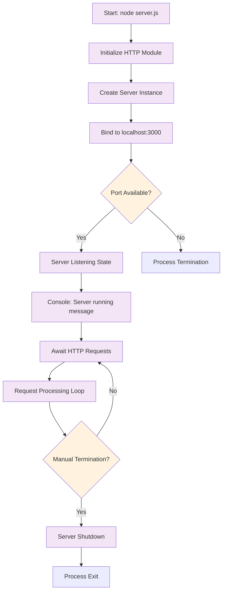
```mermaid
flowchart TD
    A[Start: node server.js] --> B[Initialize HTTP Module]
    B --> C[Create Server Instance]
    C --> D[Bind to localhost:3000]
    D --> E{Port Available?}
    E -->|Yes| F[Server Listening State]
    E -->|No| G[Process Termination]
    F --> H[Console: Server running message]
    H --> I[Await HTTP Requests]
    I --> J[Request Processing Loop]
    J --> K{Manual Termination?}
    K -->|No| I
    K -->|Yes| L[Server Shutdown]
    L --> M[Process Exit]
    
    classDef process fill:#e1f5fe
    classDef decision fill:#fff3e0
    classDef terminal fill:#f3e5f5
    
    class A,B,C,D,F,H,I,J,L terminal
    class E,K decision
```

#### 4.1.1.2 Request Processing Workflow

The system implements a universal request processing pattern that treats all HTTP requests identically, providing consistent behavior for testing scenarios:

**Process Flow Details:**
1. **Request Reception**: HTTP server accepts any method (GET, POST, PUT, DELETE, etc.)
2. **Universal Handling**: Anonymous callback function processes all requests uniformly
3. **No Validation**: Request method, path, headers, and body are ignored
4. **Immediate Response**: Static response generation without processing delays
5. **Connection Management**: Automatic connection closure after response delivery

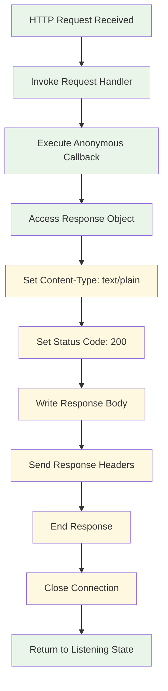
```mermaid
flowchart TD
    A[HTTP Request Received] --> B[Invoke Request Handler]
    B --> C[Execute Anonymous Callback]
    C --> D[Access Response Object]
    D --> E[Set Content-Type: text/plain]
    E --> F[Set Status Code: 200]
    F --> G[Write Response Body]
    G --> H[Send Response Headers]
    H --> I[End Response]
    I --> J[Close Connection]
    J --> K[Return to Listening State]
    
    classDef process fill:#e8f5e8
    classDef response fill:#fff8e1
    
    class A,B,C,D,K process
    class E,F,G,H,I,J response
```

#### 4.1.1.3 Response Generation Process

The response generation workflow demonstrates minimal HTTP response construction suitable for AI tool analysis:

**Response Characteristics:**
- **Static Content**: Fixed "Hello, World!\n" message for all requests
- **Consistent Headers**: Always sets `Content-Type: text/plain`
- **HTTP 200 Status**: Success status for all processed requests
- **No Content Negotiation**: Same response regardless of Accept headers
- **Immediate Generation**: No database queries or external service calls

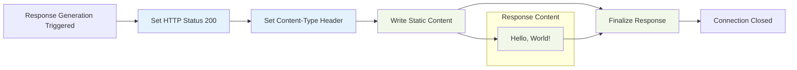
```mermaid
flowchart LR
    A[Response Generation Triggered] --> B[Set HTTP Status 200]
    B --> C[Set Content-Type Header]
    C --> D[Write Static Content]
    D --> E[Finalize Response]
    E --> F[Connection Closed]
    
    subgraph "Response Content"
        G["Hello, World!\n"]
    end
    
    D --> G
    G --> E
    
    classDef header fill:#e3f2fd
    classDef content fill:#f1f8e9
    
    class B,C header
    class D,G,E content
```

### 4.1.2 Integration Workflows

#### 4.1.2.1 Backprop AI Tool Integration Process

The system serves as a test subject for Backprop AI tool integration, following a structured analysis and recommendation workflow:

**Integration Objectives:**
- **Code Analysis Validation**: Test AI tool parsing capabilities on minimal Node.js implementations
- **Improvement Detection**: Verify tool ability to identify enhancement opportunities
- **Recommendation Quality**: Assess practical applicability of generated suggestions
- **Compatibility Testing**: Confirm integration with zero-dependency projects

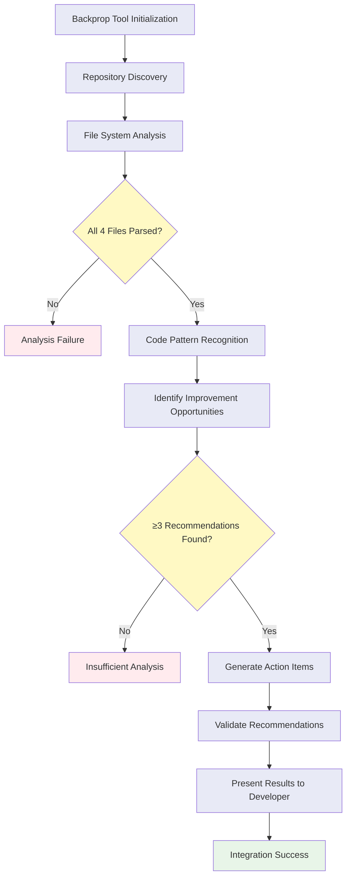
```mermaid
flowchart TD
    A[Backprop Tool Initialization] --> B[Repository Discovery]
    B --> C[File System Analysis]
    C --> D{All 4 Files Parsed?}
    D -->|No| E[Analysis Failure]
    D -->|Yes| F[Code Pattern Recognition]
    F --> G[Identify Improvement Opportunities]
    G --> H{≥3 Recommendations Found?}
    H -->|No| I[Insufficient Analysis]
    H -->|Yes| J[Generate Action Items]
    J --> K[Validate Recommendations]
    K --> L[Present Results to Developer]
    L --> M[Integration Success]
    
    classDef analysis fill:#e8eaf6
    classDef decision fill:#fff9c4
    classDef success fill:#e8f5e8
    classDef failure fill:#ffebee
    
    class A,B,C,F,G,J,K,L analysis
    class D,H decision
    class M success
    class E,I failure
```

#### 4.1.2.2 Development Testing Workflow

The development workflow supports rapid iteration and validation during AI tool integration testing:

**Workflow Components:**
- **Direct Execution**: Simple `node server.js` command for immediate testing
- **Manual Validation**: Browser or curl testing at http://127.0.0.1:3000
- **Console Monitoring**: Real-time feedback on server operational status
- **Iterative Testing**: Quick restart cycles for testing modifications

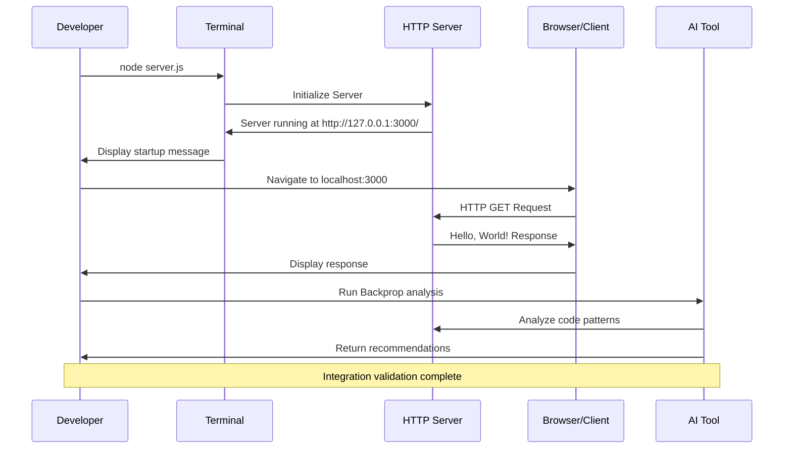
```mermaid
sequenceDiagram
    participant D as Developer
    participant T as Terminal
    participant S as HTTP Server
    participant B as Browser/Client
    participant A as AI Tool
    
    D->>T: node server.js
    T->>S: Initialize Server
    S->>T: Server running at http://127.0.0.1:3000/
    T->>D: Display startup message
    
    D->>B: Navigate to localhost:3000
    B->>S: HTTP GET Request
    S->>B: Hello, World! Response
    B->>D: Display response
    
    D->>A: Run Backprop analysis
    A->>S: Analyze code patterns
    A->>D: Return recommendations
    
    Note over D,A: Integration validation complete
```

## 4.2 FLOWCHART REQUIREMENTS

### 4.2.1 Process Elements Identification

#### 4.2.1.1 Start and End Points

**System Start Points:**
- **Primary**: `node server.js` command execution
- **Secondary**: HTTP request arrival at port 3000
- **Testing**: Backprop tool initialization

**System End Points:**
- **Graceful**: Manual server termination (Ctrl+C)
- **Error**: Port unavailable exception
- **Request**: HTTP response completion and connection closure
- **Testing**: AI tool analysis completion

#### 4.2.1.2 Decision Points Analysis

The current implementation contains minimal decision logic, reflecting its testing-focused design:

**Existing Decision Points:**
1. **Port Availability Check**: During server binding to localhost:3000
2. **Manual Termination Detection**: During request processing loop
3. **AI Tool Analysis Validation**: During Backprop integration testing

**Absent Decision Points** (Notable for AI tool enhancement suggestions):
- Request method differentiation
- Path-based routing decisions
- Error handling branching
- Authentication checks
- Rate limiting decisions
- Content negotiation

#### 4.2.1.3 System Boundaries

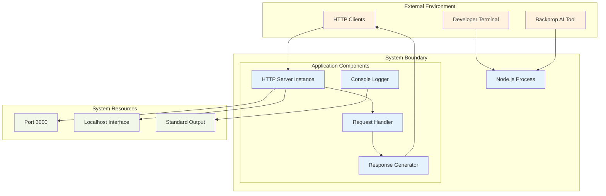
```mermaid
flowchart TB
    subgraph "External Environment"
        A[Developer Terminal]
        B[HTTP Clients]
        C[Backprop AI Tool]
    end
    
    subgraph "System Boundary"
        D[Node.js Process]
        subgraph "Application Components"
            E[HTTP Server Instance]
            F[Request Handler]
            G[Response Generator]
            H[Console Logger]
        end
    end
    
    subgraph "System Resources"
        I[Port 3000]
        J[Localhost Interface]
        K[Standard Output]
    end
    
    A --> D
    B --> E
    C --> D
    E --> F
    F --> G
    G --> B
    H --> K
    E --> I
    E --> J
    
    classDef external fill:#fff3e0
    classDef internal fill:#e3f2fd
    classDef resource fill:#f1f8e9
    
    class A,B,C external
    class D,E,F,G,H internal
    class I,J,K resource
```

### 4.2.2 Validation Rules Documentation

#### 4.2.2.1 Business Rules Implementation

**Current Business Rules:**
- **Universal Response Rule**: All requests receive identical "Hello, World!" response
- **Port Binding Rule**: Server exclusively binds to localhost:3000
- **Content-Type Rule**: All responses use `text/plain` content type
- **Status Code Rule**: All successful requests return HTTP 200

**Missing Business Rules** (AI Tool Enhancement Opportunities):
- Request validation rules
- Response format negotiation rules
- Error response standardization rules
- Rate limiting business rules

#### 4.2.2.2 Data Validation Requirements

**Current Validation State:**
- **Request Validation**: None implemented - all requests accepted
- **Input Sanitization**: Not applicable - request data ignored
- **Header Validation**: Not performed - headers not processed
- **Parameter Validation**: Not applicable - no parameter processing

**Validation Gaps** (Testing Focus Areas):
- HTTP method validation
- Content-Length validation
- Header format validation
- Request size limits

#### 4.2.2.3 Authorization Checkpoints

**Current Authorization Model:**
- **Authentication**: None implemented
- **Authorization**: None implemented  
- **Access Control**: Inherent localhost-only binding provides basic network isolation
- **Rate Limiting**: None implemented

## 4.3 TECHNICAL IMPLEMENTATION

### 4.3.1 State Management

#### 4.3.1.1 Server State Transitions

The HTTP server maintains a simple state machine suitable for development testing:

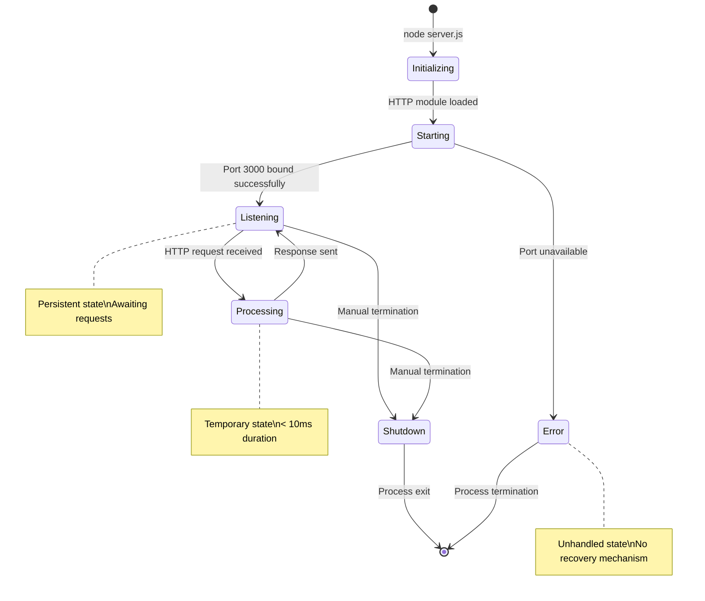
```mermaid
stateDiagram-v2
    [*] --> Initializing: node server.js
    Initializing --> Starting: HTTP module loaded
    Starting --> Listening: Port 3000 bound successfully
    Starting --> Error: Port unavailable
    Listening --> Processing: HTTP request received
    Processing --> Listening: Response sent
    Listening --> Shutdown: Manual termination
    Processing --> Shutdown: Manual termination
    Shutdown --> [*]: Process exit
    Error --> [*]: Process termination
    
    note right of Listening : Persistent state\nAwaiting requests
    note right of Processing : Temporary state\n< 10ms duration
    note right of Error : Unhandled state\nNo recovery mechanism
```

#### 4.3.1.2 Data Persistence Points

**Current Persistence Model:**
- **Application State**: Stateless operation - no persistent data storage
- **Session Management**: Not implemented - each request is independent
- **Configuration Storage**: Hard-coded values - no external configuration files
- **Log Persistence**: Console output only - no file-based logging

**Memory Usage Patterns:**
- **Request Processing**: Temporary objects created and garbage collected per request
- **Server Instance**: Persistent HTTP server object maintained throughout lifecycle
- **Response Buffers**: Temporary response objects created per request

#### 4.3.1.3 Transaction Boundaries

**Current Transaction Model:**
- **Request Scope**: Each HTTP request represents an atomic transaction
- **No Database Transactions**: No database connectivity implemented
- **Memory Transactions**: Automatic garbage collection handles memory management
- **Connection Transactions**: HTTP connection lifecycle managed by Node.js

### 4.3.2 Error Handling

#### 4.3.2.1 Current Error Handling State

**Implemented Error Handling:**
- **Minimal Implementation**: No explicit error handling mechanisms
- **Default Behavior**: Node.js default error handling for unhandled exceptions
- **Process Termination**: Server crashes on unhandled errors

**Error Handling Gaps** (AI Tool Focus Areas):
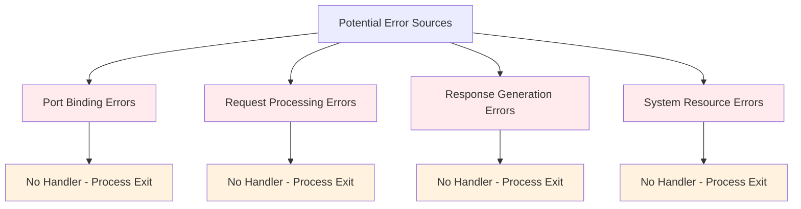
```mermaid
flowchart TD
    A[Potential Error Sources] --> B[Port Binding Errors]
    A --> C[Request Processing Errors]  
    A --> D[Response Generation Errors]
    A --> E[System Resource Errors]
    
    B --> F[No Handler - Process Exit]
    C --> G[No Handler - Process Exit]
    D --> H[No Handler - Process Exit]
    E --> I[No Handler - Process Exit]
    
    classDef error fill:#ffebee
    classDef unhandled fill:#fff3e0
    
    class B,C,D,E error
    class F,G,H,I unhandled
```

#### 4.3.2.2 Retry Mechanisms

**Current Retry Implementation:**
- **Server Startup**: No automatic retry on port binding failure
- **Request Processing**: No retry logic for failed requests
- **Manual Restart**: Developer must manually restart server after failures

**Missing Retry Patterns** (Enhancement Opportunities):
- Automatic port binding retry with incremental port selection
- Graceful degradation for resource exhaustion
- Request queuing during high load
- Circuit breaker patterns for external dependencies

#### 4.3.2.3 Recovery Procedures

**Current Recovery Model:**
- **Failure Recovery**: None implemented - manual intervention required
- **Graceful Shutdown**: Not implemented - forced termination only
- **State Recovery**: Not applicable due to stateless design
- **Data Recovery**: Not applicable due to no persistence

## 4.4 REQUIRED DIAGRAMS

### 4.4.1 High-Level System Workflow

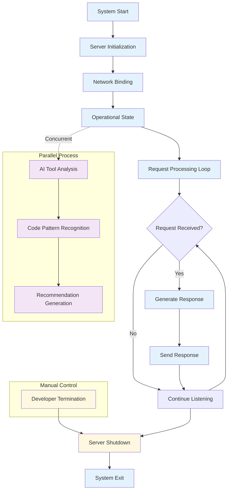
```mermaid
flowchart TD
    A[System Start] --> B[Server Initialization]
    B --> C[Network Binding]
    C --> D[Operational State]
    D --> E[Request Processing Loop]
    E --> F{Request Received?}
    F -->|Yes| G[Generate Response]
    F -->|No| H[Continue Listening]
    G --> I[Send Response]
    I --> H
    H --> F
    
    subgraph "Parallel Process"
        J[AI Tool Analysis]
        J --> K[Code Pattern Recognition]
        K --> L[Recommendation Generation]
    end
    
    D -.->|Concurrent| J
    
    subgraph "Manual Control"
        M[Developer Termination]
    end
    
    M --> N[Server Shutdown]
    H --> N
    N --> O[System Exit]
    
    classDef primary fill:#e3f2fd
    classDef parallel fill:#f3e5f5
    classDef control fill:#fff8e1
    
    class A,B,C,D,E,G,I,O primary
    class J,K,L parallel
    class M,N control
```

### 4.4.2 Detailed Feature Process Flows

#### 4.4.2.1 HTTP Server Lifecycle (F-001)

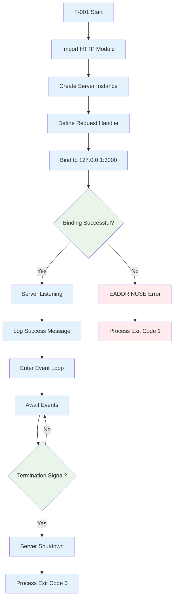
```mermaid
flowchart TD
    A[F-001 Start] --> B[Import HTTP Module]
    B --> C[Create Server Instance]
    C --> D[Define Request Handler]
    D --> E[Bind to 127.0.0.1:3000]
    E --> F{Binding Successful?}
    F -->|Yes| G[Server Listening]
    F -->|No| H[EADDRINUSE Error]
    G --> I[Log Success Message]
    I --> J[Enter Event Loop]
    J --> K[Await Events]
    K --> L{Termination Signal?}
    L -->|No| K
    L -->|Yes| M[Server Shutdown]
    H --> N[Process Exit Code 1]
    M --> O[Process Exit Code 0]
    
    classDef success fill:#e8f5e8
    classDef error fill:#ffebee
    classDef process fill:#e3f2fd
    
    class A,B,C,D,E,G,I,J,K,M,O process
    class F,L success
    class H,N error
```

#### 4.4.2.2 HTTP Request Processing (F-002 & F-003)

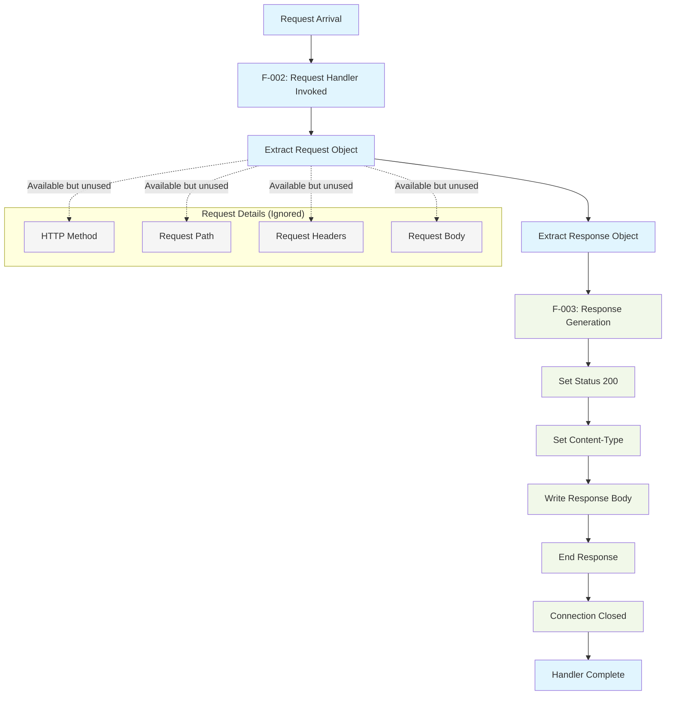
```mermaid
flowchart TD
    A[Request Arrival] --> B[F-002: Request Handler Invoked]
    B --> C[Extract Request Object]
    C --> D[Extract Response Object]
    D --> E[F-003: Response Generation]
    E --> F[Set Status 200]
    F --> G[Set Content-Type]
    G --> H[Write Response Body]
    H --> I[End Response]
    I --> J[Connection Closed]
    J --> K[Handler Complete]
    
    subgraph "Request Details (Ignored)"
        L[HTTP Method]
        M[Request Path]
        N[Request Headers]
        O[Request Body]
    end
    
    C -.->|Available but unused| L
    C -.->|Available but unused| M
    C -.->|Available but unused| N
    C -.->|Available but unused| O
    
    classDef process fill:#e1f5fe
    classDef ignored fill:#f5f5f5
    classDef response fill:#f1f8e9
    
    class A,B,C,D,K process
    class E,F,G,H,I,J response
    class L,M,N,O ignored
```

### 4.4.3 Error Handling Flowcharts

#### 4.4.3.1 Current Error Handling State

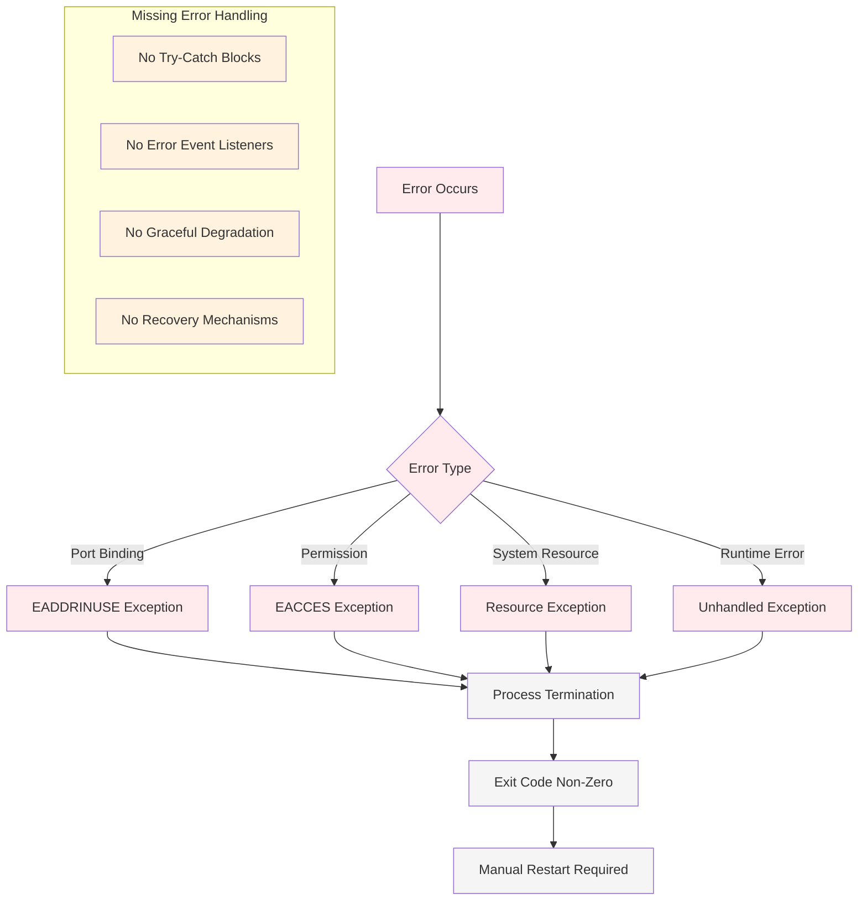
```mermaid
flowchart TD
    A[Error Occurs] --> B{Error Type}
    B -->|Port Binding| C[EADDRINUSE Exception]
    B -->|Permission| D[EACCES Exception]
    B -->|System Resource| E[Resource Exception]
    B -->|Runtime Error| F[Unhandled Exception]
    
    C --> G[Process Termination]
    D --> G
    E --> G
    F --> G
    
    G --> H[Exit Code Non-Zero]
    H --> I[Manual Restart Required]
    
    subgraph "Missing Error Handling"
        J[No Try-Catch Blocks]
        K[No Error Event Listeners]
        L[No Graceful Degradation]
        M[No Recovery Mechanisms]
    end
    
    classDef error fill:#ffebee
    classDef missing fill:#fff3e0
    classDef terminal fill:#f5f5f5
    
    class A,B,C,D,E,F error
    class G,H,I terminal
    class J,K,L,M missing
```

#### 4.4.3.2 Potential Enhanced Error Handling

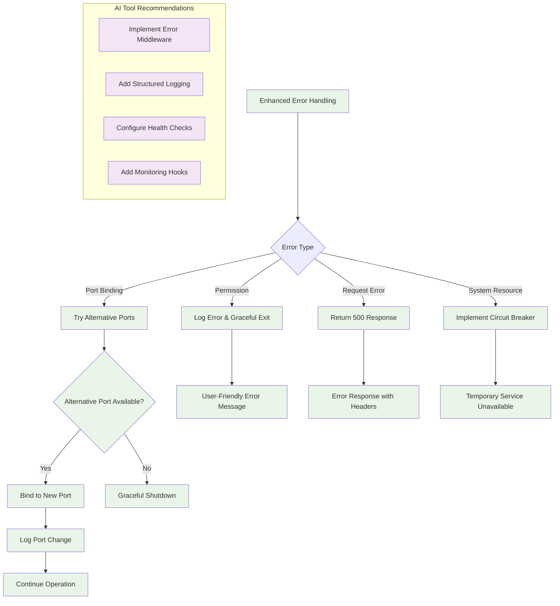
```mermaid
flowchart TD
    A[Enhanced Error Handling] --> B{Error Type}
    B -->|Port Binding| C[Try Alternative Ports]
    B -->|Permission| D[Log Error & Graceful Exit]
    B -->|Request Error| E[Return 500 Response]
    B -->|System Resource| F[Implement Circuit Breaker]
    
    C --> G{Alternative Port Available?}
    G -->|Yes| H[Bind to New Port]
    G -->|No| I[Graceful Shutdown]
    H --> J[Log Port Change]
    J --> K[Continue Operation]
    
    D --> L[User-Friendly Error Message]
    E --> M[Error Response with Headers]
    F --> N[Temporary Service Unavailable]
    
    subgraph "AI Tool Recommendations"
        O[Implement Error Middleware]
        P[Add Structured Logging]
        Q[Configure Health Checks]
        R[Add Monitoring Hooks]
    end
    
    classDef enhanced fill:#e8f5e8
    classDef recommendations fill:#f3e5f5
    
    class A,C,D,E,F,G,H,I,J,K,L,M,N enhanced
    class O,P,Q,R recommendations
```

### 4.4.4 Integration Sequence Diagrams

#### 4.4.4.1 Standard Request-Response Sequence

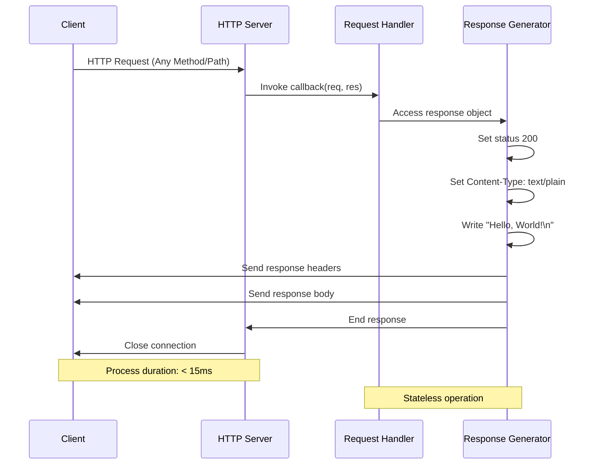
```mermaid
sequenceDiagram
    participant C as Client
    participant S as HTTP Server
    participant H as Request Handler
    participant R as Response Generator
    
    C->>S: HTTP Request (Any Method/Path)
    S->>H: Invoke callback(req, res)
    H->>R: Access response object
    R->>R: Set status 200
    R->>R: Set Content-Type: text/plain
    R->>R: Write "Hello, World!\n"
    R->>C: Send response headers
    R->>C: Send response body
    R->>S: End response
    S->>C: Close connection
    
    Note over C,S: Process duration: < 15ms
    Note over H,R: Stateless operation
```

#### 4.4.4.2 Backprop AI Tool Integration Sequence

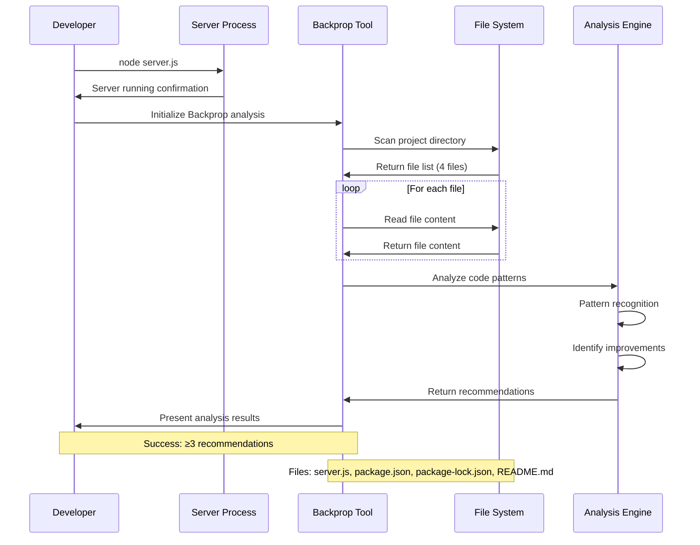
```mermaid
sequenceDiagram
    participant D as Developer
    participant S as Server Process  
    participant B as Backprop Tool
    participant F as File System
    participant A as Analysis Engine
    
    D->>S: node server.js
    S->>D: Server running confirmation
    
    D->>B: Initialize Backprop analysis
    B->>F: Scan project directory
    F->>B: Return file list (4 files)
    
    loop For each file
        B->>F: Read file content
        F->>B: Return file content
    end
    
    B->>A: Analyze code patterns
    A->>A: Pattern recognition
    A->>A: Identify improvements
    A->>B: Return recommendations
    
    B->>D: Present analysis results
    
    Note over D,B: Success: ≥3 recommendations
    Note over B,F: Files: server.js, package.json, package-lock.json, README.md
```

### 4.4.5 State Transition Diagrams

#### 4.4.5.1 Complete System State Model

```mermaid
stateDiagram-v2
    direction TB
    
    [*] --> Initialization: Developer executes node server.js
    
    state Initialization {
        [*] --> LoadingModules
        LoadingModules --> CreatingServer
        CreatingServer --> [*]
    }
    
    Initialization --> Startup: Modules loaded
    
    state Startup {
        [*] --> BindingPort
        BindingPort --> ValidatingNetwork
        ValidatingNetwork --> [*]
    }
    
    Startup --> Operational: Port bound successfully
    Startup --> ErrorState: Binding failed
    
    state Operational {
        [*] --> Listening
        Listening --> Processing: Request received
        Processing --> Responding: Generate response
        Responding --> Listening: Response sent
    }
    
    state ErrorState {
        [*] --> LoggingError
        LoggingError --> Terminating
        Terminating --> [*]
    }
    
    Operational --> Shutdown: Manual termination
    ErrorState --> [*]: Process exit
    
    state Shutdown {
        [*] --> ClosingConnections
        ClosingConnections --> ReleasingResources
        ReleasingResources --> [*]
    }
    
    Shutdown --> [*]: Clean exit
    
    note right of Operational : Primary operational state\nMost time spent here
    note right of ErrorState : Unrecoverable errors\nNo retry mechanisms
```

#### 4.4.5.2 Request Processing State Transitions

```mermaid
stateDiagram-v2
[*] --> Idle: Server listening

Idle --> RequestReceived: HTTP request arrives

state RequestReceived {
    [*] --> ParsingRequest
    ParsingRequest --> ExtractingObjects
    ExtractingObjects --> [*]
}

RequestReceived --> ResponseGeneration: Objects ready

state ResponseGeneration {
    [*] --> SettingStatus
    SettingStatus --> SettingHeaders
    SettingHeaders --> WritingContent
    WritingContent --> FinalizingResponse
    FinalizingResponse --> [*]
}

ResponseGeneration --> ResponseSent: Response complete
ResponseSent --> Idle: Connection closed

note right of Idle: Persistent state awaiting next request
note right of RequestReceived: Duration about 1ms with minimal parsing overhead
note right of ResponseGeneration: Duration about 5ms for static content generation
```

## 4.5 TIMING AND SLA CONSIDERATIONS

### 4.5.1 Performance Requirements

| Process | Target Duration | Measurement Point | Success Criteria |
|---------|----------------|-------------------|------------------|
| **Server Startup** | < 1 second | Command execution to console message | Consistent across restarts |
| **Request Processing** | < 10 milliseconds | Request reception to response initiation | 95th percentile compliance |
| **Response Generation** | < 5 milliseconds | Response creation to transmission | Mean response time |
| **Connection Handling** | < 2 milliseconds | Response completion to connection closure | Resource cleanup efficiency |

### 4.5.2 Scalability Constraints

**Current Limitations:**
- **Single-threaded Processing**: Node.js event loop bottleneck
- **No Connection Pooling**: Each request creates new connection state
- **Memory Usage**: No request size limits or memory management
- **Port Binding**: Fixed port allocation prevents horizontal scaling

**Testing Implications:**
- **AI Tool Analysis**: Performance characteristics suitable for code analysis
- **Load Testing**: Not designed for concurrent request testing
- **Resource Monitoring**: Minimal resource usage simplifies analysis

#### References

#### Files Examined
- `server.js` - Complete HTTP server implementation with request/response handling logic
- `package.json` - Project metadata and dependency configuration (zero external dependencies)
- `package-lock.json` - Dependency lockfile confirming minimal external requirements
- `README.md` - Project purpose documentation for Backprop integration testing context

#### Technical Specification Sections Referenced
- `2.1 FEATURE CATALOG` - Detailed feature descriptions and dependencies for F-001 through F-004
- `2.3 FEATURE RELATIONSHIPS` - Feature dependency mapping and integration point analysis
- `3.4 DEVELOPMENT & DEPLOYMENT` - Development environment and deployment architecture details
- `1.2 SYSTEM OVERVIEW` - Project context, objectives, and success criteria for AI tool integration
- `2.4 IMPLEMENTATION CONSIDERATIONS` - Technical constraints, performance requirements, and scalability considerations

# 5. System Architecture

## 5.1 HIGH-LEVEL ARCHITECTURE

### 5.1.1 System Overview

This system implements a **minimalist monolithic architecture** designed specifically for AI tool integration testing. The architecture follows a **zero-dependency, single-file design pattern** that prioritizes simplicity and clarity over scalability or production readiness. The system operates as a standalone Node.js HTTP server utilizing only core built-in modules, demonstrating fundamental web service patterns without framework abstractions.

The architectural philosophy centers on **event-driven request processing** using Node.js's asynchronous capabilities while maintaining **stateless operation** with no persistent data storage. The system boundaries are intentionally constrained to localhost-only operation, creating a controlled testing environment for Backprop AI tool analysis and validation.

**Key Architectural Principles:**
- **Minimal Complexity**: Direct use of Node.js core APIs without additional abstractions
- **Zero External Dependencies**: Complete self-containment using only built-in modules
- **Functional Design**: Anonymous callback-based request processing
- **Stateless Processing**: No session management or persistent state retention
- **Development-First**: Optimized for testing and analysis rather than production deployment

**System Boundaries:**
- **Network Boundary**: Localhost-only (127.0.0.1:3000) preventing external access
- **Process Boundary**: Single Node.js process with no clustering or multi-threading
- **Module Boundary**: Exclusive use of Node.js core HTTP module
- **Integration Boundary**: No external service dependencies or third-party integrations

### 5.1.2 Core Components Table

| Component Name | Primary Responsibility | Key Dependencies | Integration Points |
|----------------|------------------------|------------------|-------------------|
| HTTP Server Instance | Creates and manages the core web server infrastructure | Node.js core `http` module | Console Logger, Request Handler |
| Request Handler | Processes all incoming HTTP requests uniformly | HTTP Server Instance | Response Generator |
| Response Generator | Creates consistent plain text responses for all requests | Request Handler | HTTP client connections |
| Console Logger | Provides operational visibility through startup messaging | Node.js core `console` | Development environment stdout |

### 5.1.3 Data Flow Description

The system implements a **linear request processing pipeline** that handles all HTTP requests identically through the following flow:

**Primary Request Flow:**
1. **Connection Establishment**: HTTP client connects to 127.0.0.1:3000
2. **Request Reception**: Server accepts connection and creates request/response objects
3. **Handler Invocation**: Anonymous callback function receives all request data
4. **Response Configuration**: Sets HTTP 200 status and Content-Type: text/plain headers
5. **Content Generation**: Writes static "Hello, World!\n" message to response
6. **Connection Closure**: Completes response and closes client connection
7. **Server Return**: Returns to listening state for next request

**Data Transformation Points:**
- **Request Parsing**: HTTP protocol parsing handled by Node.js runtime
- **Response Formatting**: Plain text content with appropriate HTTP headers
- **Connection Management**: Automatic connection lifecycle handled by HTTP module

**Key Data Stores and Caches:**
- **No Persistent Storage**: System operates entirely in memory
- **No Caching Layer**: Each request processed independently
- **Temporary Objects**: Request/response objects created and garbage collected per request

### 5.1.4 External Integration Points

| System Name | Integration Type | Data Exchange Pattern | Protocol/Format |
|-------------|------------------|----------------------|-----------------|
| Backprop AI Tool | Code Analysis Integration | Repository scanning and analysis | Git repository access |
| Development Console | Operational Feedback | Startup status messaging | Console output (stdout) |
| Local Network Interface | HTTP Service Binding | Request/response processing | HTTP/1.1 over TCP |
| Node.js Runtime | Core Module Integration | HTTP server instantiation | CommonJS require() |

## 5.2 COMPONENT DETAILS

### 5.2.1 HTTP Server Instance

**Purpose and Responsibilities:**
The HTTP Server Instance serves as the foundational infrastructure component, created via `http.createServer()` and responsible for establishing the network service, binding to the localhost interface, and managing the server lifecycle from initialization through shutdown.

**Technologies and Frameworks:**
- **Core Technology**: Node.js built-in `http` module
- **Implementation Pattern**: Event-driven server creation with callback-based request handling
- **Network Protocol**: HTTP/1.1 over TCP
- **No External Frameworks**: Intentional exclusion of Express.js, Fastify, or similar web frameworks

**Key Interfaces and APIs:**
- **Primary Interface**: `http.createServer(requestHandler)` for server instantiation
- **Lifecycle API**: `server.listen(port, hostname, callback)` for service activation
- **Event Interface**: Built-in Node.js event emitter pattern for connection handling

**Data Persistence Requirements:**
- **No Persistent Storage**: Server operates entirely in memory
- **No Configuration Files**: All settings hard-coded in source
- **No Session Storage**: Stateless request processing model

**Scaling Considerations:**
- **Single Process Limitation**: No clustering or multi-process support
- **Fixed Port Binding**: Hard-coded port prevents horizontal scaling
- **Memory Constraints**: Limited to single Node.js process memory allocation

```mermaid
sequenceDiagram
    participant Client as HTTP Client
    participant Server as HTTP Server Instance
    participant Handler as Request Handler
    participant Response as Response Generator
    
    Client->>Server: HTTP Request (any method/path)
    Server->>Handler: Invoke callback(req, res)
    Handler->>Response: Set headers and status
    Response->>Response: Write "Hello, World!\n"
    Response->>Client: HTTP 200 Response
    Client->>Server: Connection close
    Server->>Server: Return to listening state
```

### 5.2.2 Request Handler

**Purpose and Responsibilities:**
The Request Handler implements the core business logic through an anonymous callback function that processes all HTTP requests uniformly, regardless of method, path, or headers. It serves as the single entry point for all request processing logic.

**Technologies and Frameworks:**
- **Implementation**: Anonymous JavaScript function with `(req, res)` signature
- **Processing Model**: Synchronous request handling without routing logic
- **Request Objects**: Node.js HTTP IncomingMessage and ServerResponse objects

**Key Interfaces and APIs:**
- **Input Interface**: Node.js `req` (IncomingMessage) object containing request data
- **Output Interface**: Node.js `res` (ServerResponse) object for response generation
- **Handler Signature**: `function(req, res) { ... }` callback pattern

**Data Persistence Requirements:**
- **No Request Persistence**: All request data processed in memory only
- **No State Retention**: Each request processed independently
- **No Request Logging**: Request details not stored or logged

**Scaling Considerations:**
- **No Request Queuing**: Direct processing without buffering mechanisms
- **No Load Balancing**: Single handler for all requests
- **No Request Throttling**: No rate limiting or connection management

### 5.2.3 Response Generator

**Purpose and Responsibilities:**
The Response Generator creates uniform HTTP responses for all processed requests, setting appropriate headers, status codes, and content. It ensures consistent client experience regardless of request variations.

**Technologies and Frameworks:**
- **Core API**: Node.js ServerResponse object methods
- **Content Type**: Plain text response generation
- **Header Management**: HTTP header configuration through response object

**Key Interfaces and APIs:**
- **Status Setting**: `res.statusCode = 200` for HTTP response code
- **Header Configuration**: `res.setHeader('Content-Type', 'text/plain')` for content type
- **Content Writing**: `res.end('Hello, World!\n')` for response body and connection closure

**Data Persistence Requirements:**
- **No Response Caching**: Fresh response generation for each request
- **No Response Logging**: Response details not persisted
- **No Response Templates**: Static content generation only

**Scaling Considerations:**
- **Fixed Content Size**: Small response payload minimizes bandwidth impact
- **No Response Compression**: Plain text without gzip or compression
- **No Response Streaming**: Complete response generated synchronously

```mermaid
stateDiagram-v2
    [*] --> RequestReceived : HTTP request arrives
    RequestReceived --> ProcessingHeaders : Set status code 200
    ProcessingHeaders --> SettingContentType : Set Content-Type to text/plain
    SettingContentType --> WritingContent : Write Hello, World!
    WritingContent --> ResponseComplete : Call res.end()
    ResponseComplete --> [*] : Connection closed
    
    note right of ProcessingHeaders : Always HTTP 200
    note right of WritingContent : Static content only
```

### 5.2.4 Console Logger

**Purpose and Responsibilities:**
The Console Logger provides operational visibility through simple console output, delivering startup confirmation messages to inform developers when the server becomes operational.

**Technologies and Frameworks:**
- **Core API**: Node.js built-in `console.log()` method
- **Output Target**: Standard output (stdout) stream
- **Message Format**: Plain text operational messages

**Key Interfaces and APIs:**
- **Logging Interface**: `console.log()` for message output
- **Message Content**: Fixed startup confirmation with server address
- **Output Destination**: Development environment console

**Data Persistence Requirements:**
- **No Log Persistence**: Console output only, no file logging
- **No Log Rotation**: Single startup message per server instance
- **No Structured Logging**: Plain text messages without formatting

**Scaling Considerations:**
- **Minimal Logging Overhead**: Single message per server startup
- **No Log Aggregation**: Local console output only
- **No Remote Logging**: No external logging service integration

## 5.3 TECHNICAL DECISIONS

### 5.3.1 Architecture Style Decision

**Decision**: Monolithic single-file architecture
**Rationale**: Chosen specifically to create a minimal testing environment for AI tool analysis, avoiding the complexity of distributed systems or microservices that could obscure tool evaluation results.

**Tradeoffs Considered:**
| Aspect | Chosen Approach | Alternative | Impact |
|--------|-----------------|-------------|--------|
| **Complexity** | Single file simplicity | Multi-module structure | Reduced cognitive overhead for AI analysis |
| **Maintainability** | Direct code visibility | Separation of concerns | Acceptable for test project scope |
| **Scalability** | Not prioritized | Horizontally scalable design | Intentionally limited for controlled testing |
| **Testability** | Manual testing only | Unit test framework | Sufficient for integration validation |

### 5.3.2 Communication Pattern Choice

**Decision**: Direct HTTP request/response without middleware
**Rationale**: Eliminates middleware complexity to provide AI tools with clear visibility into fundamental HTTP processing patterns without framework abstractions.

**Implementation Pattern:**
```mermaid
graph LR
    A[HTTP Request] --> B[Server Instance]
    B --> C[Anonymous Handler]
    C --> D[Response Generation]
    D --> E[HTTP Response]
    
    subgraph "Middleware-Free Processing"
        C
        D
    end
```

**Tradeoffs Analysis:**
- **Eliminated Complexity**: No routing, middleware chains, or request preprocessing
- **Direct Processing**: Immediate handler invocation without abstraction layers
- **Limited Flexibility**: Cannot easily add features like authentication or logging
- **AI Tool Visibility**: Clear code paths enable accurate analysis and recommendations

### 5.3.3 Data Storage Solution Rationale

**Decision**: No persistent data storage
**Rationale**: Eliminates database complexity to focus AI tool analysis on HTTP processing patterns rather than data persistence architectures.

**Storage Architecture:**
| Storage Type | Decision | Justification |
|--------------|----------|---------------|
| **Database** | Not implemented | Reduces dependencies and configuration complexity |
| **File System** | Not utilized | Eliminates file I/O error handling requirements |
| **Memory Caching** | Not implemented | Stateless operation simplifies request processing |
| **Session Storage** | Not implemented | Each request processed independently |

### 5.3.4 Security Mechanism Selection

**Decision**: Localhost-only binding with no authentication
**Rationale**: Creates secure testing environment by preventing external access while eliminating authentication complexity that could interfere with AI tool analysis.

**Security Profile:**
- **Network Security**: `127.0.0.1` binding prevents external connections
- **Authentication**: Not implemented (appropriate for test environment)
- **Authorization**: Not applicable with no user management
- **Input Validation**: Not implemented (requests processed without filtering)

```mermaid
flowchart TD
    A[External Network] -->|Blocked| B[Localhost Interface]
    B -->|Allowed| C[HTTP Server]
    C --> D[Request Processing]
    
    subgraph "Security Boundary"
        C
        D
    end
    
    classDef blocked fill:#ffebee
    classDef allowed fill:#e8f5e8
    
    class A blocked
    class B,C,D allowed
```

## 5.4 CROSS-CUTTING CONCERNS

### 5.4.1 Monitoring and Observability Approach

**Current Implementation:**
The system implements minimal observability through console-based startup logging, providing basic operational feedback without comprehensive monitoring infrastructure.

**Observability Strategy:**
| Concern | Current State | AI Tool Opportunity |
|---------|---------------|-------------------|
| **Application Metrics** | None implemented | Could recommend performance monitoring |
| **Health Checks** | None implemented | Could suggest /health endpoint addition |
| **Request Tracing** | None implemented | Could recommend request logging |
| **Performance Monitoring** | None implemented | Could suggest response time tracking |

**Monitoring Gaps:**
- No structured logging framework integration
- No metrics collection or aggregation
- No distributed tracing capabilities
- No alerting or notification mechanisms

### 5.4.2 Logging and Tracing Strategy

**Current Logging Model:**
- **Single Startup Message**: `console.log('Server is listening on 127.0.0.1:3000')` 
- **No Request Logging**: HTTP requests not logged or tracked
- **No Error Logging**: Unhandled exceptions crash process without logging
- **No Structured Format**: Plain text console output only

**Tracing Capabilities:**
- **No Request Tracing**: Request lifecycle not tracked
- **No Performance Tracing**: Response times not measured  
- **No Correlation IDs**: Requests not uniquely identified
- **No Call Stack Tracing**: Function execution not tracked

### 5.4.3 Error Handling Patterns

**Current Error Handling:**
The system implements no explicit error handling, relying on Node.js default behavior for unhandled exceptions, which results in process termination.

```mermaid
flowchart TD
    A[Error Occurs] --> B{Error Type}
    B -->|Port Binding| C[Process Exit - EADDRINUSE]
    B -->|Permission| D[Process Exit - EACCES] 
    B -->|Runtime Exception| E[Process Exit - Unhandled]
    B -->|Resource Exhaustion| F[Process Exit - System Error]
    
    C --> G[Manual Restart Required]
    D --> G
    E --> G
    F --> G
    
    classDef error fill:#ffebee
    classDef manual fill:#fff3e0
    
    class A,B,C,D,E,F error
    class G manual
```

**Error Recovery Mechanisms:**
- **No Automatic Recovery**: Process termination requires manual intervention
- **No Graceful Degradation**: Binary operational state (running/crashed)
- **No Error Reporting**: Failures not logged or reported
- **No Circuit Breakers**: Not applicable for single-service architecture

### 5.4.4 Authentication and Authorization Framework

**Current Security Model:**
- **No Authentication**: User identity not verified or managed
- **No Authorization**: Access control not implemented
- **No Session Management**: Stateless request processing without user sessions
- **Network-Level Security**: Localhost binding provides isolation

**Security Considerations:**
| Security Layer | Implementation | Justification |
|----------------|----------------|---------------|
| **Network Security** | Localhost-only binding | Prevents external access in test environment |
| **Transport Security** | HTTP only (no HTTPS) | Acceptable for local testing scenarios |
| **Application Security** | None implemented | Not required for AI tool testing |
| **Data Security** | Not applicable | No persistent data storage |

### 5.4.5 Performance Requirements and SLAs

**Current Performance Characteristics:**
- **Startup Time**: < 1 second to operational state
- **Request Processing**: < 10ms per request for static content
- **Response Generation**: < 5ms for fixed content delivery
- **Memory Usage**: < 50MB for server process
- **Connection Handling**: Single-threaded event loop processing

**Performance Limitations:**
- **Concurrent Connections**: Limited by Node.js event loop capacity
- **Request Throughput**: No load testing or capacity planning
- **Resource Monitoring**: No performance metrics collection
- **Scalability Constraints**: Single process, fixed port architecture

### 5.4.6 Disaster Recovery Procedures

**Current Recovery Model:**
- **Failure Recovery**: Manual process restart required
- **Data Recovery**: Not applicable (no persistent data)
- **Service Recovery**: Direct execution via `node server.js`
- **State Recovery**: Not applicable (stateless operation)

**Recovery Procedures:**
1. **Process Monitoring**: Manual detection of server failures
2. **Failure Diagnosis**: Console output review for error messages
3. **Service Restart**: Manual re-execution of server process  
4. **Verification**: Manual testing of server responsiveness

**Disaster Recovery Gaps:**
- No automated failure detection
- No process monitoring or health checks
- No automated recovery mechanisms
- No backup or rollback procedures

#### References

**Files Examined:**
- `server.js` - Complete HTTP server implementation with lifecycle management, request processing, and response generation logic
- `package.json` - Project metadata confirming zero-dependency architecture and package configuration
- `package-lock.json` - Dependency lockfile validating zero external package requirements
- `README.md` - Project documentation confirming Backprop AI integration testing purpose

**Technical Specification Sections Referenced:**
- `1.2 SYSTEM OVERVIEW` - System capabilities, limitations, and success criteria for architecture context
- `2.1 FEATURE CATALOG` - Detailed feature specifications (F-001 through F-004) defining component responsibilities
- `2.6 ASSUMPTIONS AND CONSTRAINTS` - Design limitations and architectural assumptions
- `3.2 FRAMEWORKS & LIBRARIES` - Zero-dependency framework decisions and core module usage
- `3.5 OPERATIONAL TECHNOLOGY STACK` - Configuration management and operational characteristics
- `4.3 TECHNICAL IMPLEMENTATION` - State management patterns and error handling approach

# 6. SYSTEM COMPONENTS DESIGN

## 6.1 CORE SERVICES ARCHITECTURE

### 6.1.1 Core Services Architecture Assessment

**Core Services Architecture is not applicable for this system.**

This system is implemented as a **minimalist monolithic single-file HTTP server** that does not require, utilize, or support microservices, distributed architecture, or distinct service components. The entire application consists of 14 lines of Node.js code contained within a single `server.js` file, operating as a standalone process with zero external dependencies.

#### 6.1.1.1 Architectural Classification

The system exhibits the following characteristics that definitively classify it as a non-service-oriented architecture:

| Architecture Aspect | Implementation | Service Architecture Requirement |
|---------------------|----------------|----------------------------------|
| **Service Boundaries** | Single file, single process | Multiple distinct services |
| **Inter-Service Communication** | Not applicable | Network-based communication protocols |
| **Service Discovery** | Not applicable | Dynamic service location mechanisms |
| **Load Distribution** | Single process handling | Multiple service instances |

#### 6.1.1.2 Monolithic Architecture Confirmation

From the high-level architecture analysis, this system implements a **zero-dependency, single-file design pattern** with the following monolithic characteristics:

- **Single Process Execution**: Entire application runs within one Node.js process
- **Unified Codebase**: All functionality contained in `server.js` (14 lines)
- **Direct Function Calls**: No inter-process or network communication
- **Localhost-Only Binding**: Hard-coded to `127.0.0.1:3000` preventing distributed deployment
- **No Service Boundaries**: All components exist within the same memory space

```mermaid
graph TB
    subgraph "Single Node.js Process"
        A[HTTP Server Instance] --> B[Request Handler]
        B --> C[Response Generator]
        A --> D[Console Logger]
    end
    
    E[Client Request] --> A
    C --> F[Client Response]
    D --> G[Console Output]
    
    classDef monolithic fill:#e3f2fd
    class A,B,C,D monolithic
```

### 6.1.2 System Architecture Alternative

#### 6.1.2.1 Implemented Architecture Pattern

Instead of a service-oriented architecture, this system implements a **minimal monolithic architecture** specifically designed for AI tool integration testing. The architectural decisions were made to:

| Design Goal | Implementation | Benefit |
|-------------|----------------|---------|
| **Simplicity** | Single file, zero dependencies | Clear code visibility for AI analysis |
| **Testing Focus** | Minimal complexity | Controlled evaluation environment |
| **Tool Integration** | Standard Node.js patterns | Compatible with development workflows |

#### 6.1.2.2 Component Organization Within Monolith

The system contains four logical components within the single file:

```mermaid
sequenceDiagram
    participant C as HTTP Client
    participant S as HTTP Server Instance
    participant H as Request Handler
    participant R as Response Generator
    participant L as Console Logger
    
    Note over S,L: All components in single process
    
    S->>L: Startup logging
    L-->>S: Server ready confirmation
    
    C->>S: HTTP Request
    S->>H: Invoke callback(req, res)
    H->>R: Set headers and content
    R->>C: HTTP 200 "Hello, World!"
    
    Note over C,R: No service boundaries crossed
```

### 6.1.3 Architectural Rationale for Non-Service Design

#### 6.1.3.1 Technical Decisions Supporting Monolithic Approach

The following technical decisions explicitly support the non-service architecture:

| Decision | Rationale | Service Architecture Impact |
|----------|-----------|----------------------------|
| **Single File Implementation** | Eliminates service boundaries | No inter-service communication needed |
| **Zero External Dependencies** | Reduces integration complexity | No service discovery required |
| **Fixed Port Binding** | Prevents horizontal scaling | Multiple instances impossible |
| **No Persistent Storage** | Eliminates data distribution concerns | No data consistency challenges |

#### 6.1.3.2 Limitations That Prevent Service Architecture

The current implementation has several limitations that make service architecture impossible:

```mermaid
flowchart TD
    A[Service Architecture Requirements] --> B{System Capabilities Assessment}
    
    B --> C[Multiple Service Instances]
    B --> D[Inter-Service Communication]
    B --> E[Service Discovery]
    B --> F[Load Distribution]
    
    C --> G[❌ Fixed Port Binding]
    D --> H[❌ Single Process Design]
    E --> I[❌ No Discovery Mechanisms]
    F --> J[❌ No Load Balancer]
    
    G --> K[Cannot Deploy Multiple Instances]
    H --> L[Cannot Separate Services]
    I --> M[Cannot Locate Services Dynamically]
    J --> N[Cannot Distribute Load]
    
    classDef limitation fill:#ffebee
    class G,H,I,J,K,L,M,N limitation
```

### 6.1.4 Alternative Scalability Considerations

#### 6.1.4.1 Monolithic Scaling Constraints

While service architecture is not applicable, the system's scaling characteristics are important to document:

| Scaling Aspect | Current Limitation | Service Architecture Alternative |
|----------------|-------------------|----------------------------------|
| **Horizontal Scaling** | Impossible (fixed port) | Multiple service instances |
| **Vertical Scaling** | Single Node.js process limits | Per-service resource allocation |
| **Load Distribution** | No load balancing | Service mesh or API gateway |
| **Fault Isolation** | Process failure affects everything | Service-level fault boundaries |

#### 6.1.4.2 Resilience Pattern Absence

The system lacks resilience patterns typically found in service architectures:

- **No Circuit Breakers**: Single process has no external service calls to protect
- **No Retry Mechanisms**: Direct request processing without failure scenarios
- **No Fallback Strategies**: Uniform response generation eliminates fallback needs
- **No Service Mesh**: Single process negates need for service communication management

### 6.1.5 Purpose-Built Architecture Justification

#### 6.1.5.1 Test Project Requirements Alignment

The non-service architecture directly supports the project's primary purpose as a Backprop AI tool integration test:

```mermaid
mindmap
  root((Test Project Goals))
    AI Tool Analysis
      Code Simplicity
      Clear Patterns
      Minimal Dependencies
    Integration Testing
      Standard Node.js
      Single Entry Point
      Predictable Behavior
    Evaluation Focus
      Architecture Analysis
      Improvement Identification
      Tool Compatibility
```

#### 6.1.5.2 Future Service Architecture Considerations

Should this system evolve beyond its test project scope, service architecture implementation would require:

| Requirement | Current State | Service Architecture Needs |
|-------------|---------------|----------------------------|
| **Multiple Endpoints** | Single response for all paths | Separate services per domain |
| **External Dependencies** | Zero dependencies | Service communication protocols |
| **Persistent Storage** | No data storage | Database per service pattern |
| **Authentication** | No auth mechanisms | Distributed identity management |

### 6.1.6 Conclusion

The **Core Services Architecture is definitively not applicable** to this system due to its intentional design as a minimalist monolithic HTTP server. The system's architecture serves its specific purpose as an AI tool integration test environment, where service complexity would interfere with evaluation objectives.

The monolithic approach provides the necessary simplicity and clarity for AI tool analysis while maintaining standard Node.js development patterns. Any future evolution toward service architecture would require fundamental redesign of the system's core assumptions and implementation patterns.

#### References

**Technical Specification Sections Retrieved:**
- `1.2 SYSTEM OVERVIEW` - Project context and business rationale for minimal architecture
- `5.1 HIGH-LEVEL ARCHITECTURE` - Monolithic architecture confirmation and system boundaries
- `5.2 COMPONENT DETAILS` - Individual component analysis within single-file structure  
- `5.3 TECHNICAL DECISIONS` - Architectural decision rationale and tradeoff analysis

**Files Referenced:**
- `server.js` - Complete 14-line HTTP server implementation containing all application logic
- `package.json` - Zero dependency confirmation supporting monolithic design
- `README.md` - Test project documentation confirming Backprop AI tool integration purpose

## 6.2 DATABASE DESIGN

### 6.2.1 Database Design Applicability Assessment

**Database Design is not applicable to this system.** This Node.js HTTP server is intentionally implemented without any form of data persistence, storage mechanisms, or database interactions. This design decision is deliberate and aligns with the project's purpose as a minimal test environment for AI tool integration validation.

#### 6.2.1.1 Architectural Design Rationale

The absence of database design represents a conscious architectural decision documented in the technical specifications. According to Section 5.3.3 Technical Decisions, the system implements **"No persistent data storage"** with the explicit rationale to **"eliminate database complexity to focus AI tool analysis on HTTP processing patterns rather than data persistence architectures."**

This decision supports several key objectives:

- **Complexity Reduction**: Eliminates database dependencies and configuration complexity
- **Testing Focus**: Allows AI tools to analyze fundamental HTTP processing without database abstraction layers  
- **Zero Dependencies**: Maintains the project's goal of using only Node.js core modules
- **Controlled Environment**: Creates a predictable testing scenario for tool validation

#### 6.2.1.2 System Storage Architecture

The system implements a **completely stateless architecture** with the following storage characteristics:

| Storage Type | Implementation Status | Justification |
|--------------|----------------------|---------------|
| **Database** | Not implemented | Reduces dependencies and configuration complexity |
| **File System** | Not utilized | Eliminates file I/O error handling requirements |
| **Memory Caching** | Not implemented | Stateless operation simplifies request processing |
| **Session Storage** | Not implemented | Each request processed independently |

### 6.2.2 Component-Level Data Persistence Analysis

#### 6.2.2.1 HTTP Server Instance Data Handling

The HTTP Server Instance operates with **"No Persistent Storage"** and **"Server operates entirely in memory."** All server configuration is hard-coded, eliminating the need for:

- Database connection pools
- Configuration file storage
- Connection state persistence
- Session management databases

#### 6.2.2.2 Request Handler Data Processing

The Request Handler implements **"No Request Persistence"** with **"All request data processed in memory only."** This eliminates requirements for:

- Request logging databases
- Audit trail storage
- Request queuing mechanisms
- Transaction databases

#### 6.2.2.3 Response Generator Data Management

The Response Generator follows a **"No Response Caching"** approach with **"Fresh response generation for each request."** This removes needs for:

- Response cache databases
- Content management systems
- Template storage databases
- Static asset databases

#### 6.2.2.4 Console Logger Data Storage

The Console Logger implements **"No Log Persistence"** with **"Console output only, no file logging."** This eliminates:

- Log aggregation databases
- Monitoring databases
- Performance metrics storage
- Error tracking databases

### 6.2.3 Functional Requirements Alignment

#### 6.2.3.1 Storage Requirements Analysis

The functional requirements explicitly support the no-database design:

- **F-001**: Specifies **"No persistent data storage required"**
- **F-002**: States **"No request data persistence or logging"**
- **F-004**: Confirms **"No configuration files or environment variables"**

#### 6.2.3.2 System Boundary Constraints

The system's architectural boundaries intentionally exclude data persistence:

- **Process Boundary**: Single Node.js process with no data layer
- **Module Boundary**: Exclusive use of Node.js core modules (no database drivers)
- **Integration Boundary**: No external database service dependencies

### 6.2.4 Alternative Data Handling Approach

#### 6.2.4.1 In-Memory Processing Model

Instead of traditional database operations, the system implements an **in-memory processing model**:

```mermaid
flowchart TD
    A[HTTP Request] --> B[Memory Processing]
    B --> C[Static Response Generation]
    C --> D[HTTP Response]
    D --> E[Memory Cleanup]
    
    subgraph "No Persistence Layer"
        F[No Database]
        G[No File Storage]
        H[No Caching]
        I[No Sessions]
    end
    
    B -.->|Intentionally Excluded| F
    B -.->|Intentionally Excluded| G
    C -.->|Intentionally Excluded| H
    C -.->|Intentionally Excluded| I
```

#### 6.2.4.2 Request Lifecycle Data Flow

The system processes data through a temporary lifecycle without persistence:

```mermaid
sequenceDiagram
    participant Client as HTTP Client
    participant Server as HTTP Server
    participant Memory as Memory Processing
    participant Response as Response Generator
    
    Client->>Server: HTTP Request
    Server->>Memory: Create request/response objects
    Memory->>Memory: Process in memory only
    Memory->>Response: Generate static content
    Response->>Client: HTTP Response
    Memory->>Memory: Garbage collect objects
    
    note over Memory: No data persistence
    note over Response: No response caching
```

### 6.2.5 Implications of No-Database Design

#### 6.2.5.1 System Capabilities

The absence of database design results in the following system characteristics:

- **Stateless Operation**: Each request processed independently
- **Consistent Responses**: Static "Hello, World!" content for all requests
- **Simplified Architecture**: No data layer complexity or configuration
- **Minimal Dependencies**: Zero external database packages required

#### 6.2.5.2 Architectural Benefits

This design provides specific advantages for the project's testing objectives:

- **Analysis Clarity**: AI tools can focus on HTTP processing patterns
- **Reduced Complexity**: No database configuration or connection management
- **Predictable Behavior**: Consistent responses enable reliable testing
- **Fast Startup**: No database initialization or migration requirements

#### 6.2.5.3 Intentional Limitations

The no-database design intentionally excludes typical web application capabilities:

- **No Data Persistence**: Cannot store user data or application state
- **No User Management**: No authentication or authorization systems
- **No Content Management**: No dynamic content or configuration storage
- **No Analytics**: No request logging or performance tracking

### 6.2.6 References

#### 6.2.6.1 Technical Specification Sections Referenced

- `5.3 TECHNICAL DECISIONS` - Explicit no-database design decision and rationale
- `5.2 COMPONENT DETAILS` - Component-level confirmation of no data persistence
- `5.1 HIGH-LEVEL ARCHITECTURE` - Stateless operation architecture overview
- `2.2 FUNCTIONAL REQUIREMENTS TABLE` - Requirements excluding data storage

#### 6.2.6.2 Repository Files Analyzed

- `server.js` - Main HTTP server implementation confirming no database usage
- `package.json` - Package manifest showing zero dependencies
- `package-lock.json` - Lockfile confirming no external database packages
- `README.md` - Project documentation without database mentions

#### 6.2.6.3 Architecture Verification

The database design analysis was verified through comprehensive examination of:
- Technical specification documentation (7 sections)
- Complete repository file structure (4 files)
- Functional requirements validation (4 requirements)
- Component architecture analysis (4 components)

## 6.3 INTEGRATION ARCHITECTURE

### 6.3.1 Integration Architecture Assessment

**Integration Architecture is not applicable for this system.**

This system is implemented as a **minimalist monolithic single-file HTTP server** that does not require, utilize, or support complex integration patterns with external systems, APIs, message processing, or third-party services. The entire application consists of 14 lines of Node.js code contained within a single `server.js` file, operating with zero external dependencies and designed specifically as a test environment for Backprop AI tool validation.

### 6.3.2 Integration Architecture Requirements vs. System Implementation

#### 6.3.2.1 Standard Integration Architecture Components

Integration Architecture typically encompasses the following areas that are **not applicable** to this system:

| Integration Component | Standard Requirement | System Implementation | Applicability |
|----------------------|---------------------|----------------------|---------------|
| **API Design** | RESTful endpoints, OpenAPI specs | Single universal endpoint | ❌ Not Applicable |
| **Authentication/Authorization** | OAuth, JWT, API keys | No authentication mechanism | ❌ Not Applicable |
| **Message Processing** | Event streams, queues | No message processing | ❌ Not Applicable |
| **External Systems** | Third-party integrations | Zero external dependencies | ❌ Not Applicable |

#### 6.3.2.2 Actual System Integration Points

The system contains only **minimal integration touchpoints** that do not constitute an integration architecture:

```mermaid
graph TB
    subgraph "External Analysis Environment"
        A[Backprop AI Tool] --> B[Repository Scanning]
        B --> C[Code Analysis Engine]
    end
    
    subgraph "Test Server System (Localhost Only)"
        D[Node.js Runtime]
        E[HTTP Server Instance]
        F[Console Output]
        G[Network Interface 127.0.0.1:3000]
    end
    
    subgraph "Development Environment"
        H[Developer Terminal]
        I[Web Browser/Client]
    end
    
    C -.-> D
    D --> E
    E --> F
    E --> G
    H --> D
    I --> G
    
    classDef external fill:#ffebee
    classDef system fill:#e8f5e8
    classDef dev fill:#e3f2fd
    
    class A,B,C external
    class D,E,F,G system
    class H,I dev
```

### 6.3.3 Non-Integration Architecture Analysis

#### 6.3.3.1 API Design - Not Applicable

**Standard API Design Requirements:**
- Multiple endpoints with distinct functionality
- RESTful resource modeling
- Request/response schema validation
- API versioning strategy
- Authentication and authorization layers
- Rate limiting and throttling
- Documentation with OpenAPI specifications

**System Implementation:**
- **Single Universal Endpoint**: Accepts any HTTP method on any path
- **Uniform Response**: Returns identical "Hello, World!\n" for all requests
- **No Schema Validation**: Request content ignored completely
- **No Authentication**: Open access without security controls
- **No Rate Limiting**: Unlimited request processing
- **No Documentation**: Static response eliminates API documentation needs

#### 6.3.3.2 Message Processing - Not Applicable

**Standard Message Processing Requirements:**
- Event-driven architecture patterns
- Message queue integration (RabbitMQ, Apache Kafka)
- Stream processing pipelines
- Batch processing workflows
- Dead letter queue handling
- Message serialization/deserialization
- Retry mechanisms and circuit breakers

**System Implementation:**
- **Synchronous Processing**: Direct request-response pattern only
- **No Message Queues**: No asynchronous messaging infrastructure
- **No Event Processing**: No event publishing or subscription mechanisms
- **No Batch Operations**: Single request processing only
- **No Error Recovery**: Process failure terminates entire system

#### 6.3.3.3 External Systems Integration - Not Applicable

**Standard External Integration Requirements:**
- Third-party API consumption
- Legacy system interfaces
- API gateway configuration
- Service mesh integration
- External service discovery
- Distributed tracing
- Service-to-service authentication

**System Implementation:**
- **Zero External Dependencies**: No third-party service calls
- **No API Consumption**: No outbound HTTP requests
- **Localhost-Only Binding**: Prevents external network access
- **No Service Discovery**: Single-instance, fixed-address operation
- **No Distributed Architecture**: Monolithic single-file design

### 6.3.4 Minimal Integration Points Documentation

#### 6.3.4.1 Backprop AI Tool Integration (External Analysis)

The system's primary integration is **being analyzed BY** external tools rather than integrating WITH external systems:

```mermaid
sequenceDiagram
    participant B as Backprop AI Tool
    participant R as Repository (File System)
    participant S as Test Server
    participant D as Developer
    
    Note over B,D: One-way analysis integration
    
    B->>R: Scan repository files
    R->>B: Return server.js, package.json, etc.
    B->>B: Analyze code patterns
    B->>D: Generate recommendations
    
    Note over S: Server runs independently
    D->>S: Start server for testing
    S->>D: Provide HTTP responses
    
    Note over B,S: No direct integration between tool and server
```

**Integration Characteristics:**
- **Direction**: Backprop analyzes the server (one-way)
- **Protocol**: File system access and Git repository scanning
- **Frequency**: On-demand analysis triggered by developer
- **Data Flow**: Code analysis results to developer, no server modification

#### 6.3.4.2 Development Environment Integration

The minimal integration points supporting development workflow:

| Integration Point | Purpose | Protocol | Scope |
|-------------------|---------|----------|--------|
| **Console Output** | Operational feedback | stdout | Local development only |
| **HTTP Interface** | Request processing | HTTP/1.1 over TCP | Localhost (127.0.0.1:3000) |
| **Node.js Runtime** | Core module access | CommonJS require() | Built-in modules only |
| **File System** | Code execution | Direct file access | server.js read-only |

### 6.3.5 Integration Architecture Design Decisions

#### 6.3.5.1 Architectural Constraints Preventing Integration

The following design decisions explicitly prevent complex integration architecture implementation:

```mermaid
flowchart TD
    A[Integration Architecture Requirements] --> B{System Design Analysis}
    
    B --> C[Zero Dependencies Policy]
    B --> D[Single File Constraint]
    B --> E[Localhost-Only Binding]
    B --> F[No Persistent Storage]
    
    C --> G[❌ Cannot Add Message Queues]
    D --> H[❌ Cannot Implement Service Boundaries]
    E --> I[❌ Cannot Access External APIs]
    F --> J[❌ Cannot Store Integration State]
    
    G --> K[No Event Processing Possible]
    H --> L[No Microservices Architecture]
    I --> M[No Third-Party Integration]
    J --> N[No Integration Persistence]
    
    classDef constraint fill:#fff3e0
    classDef prevention fill:#ffebee
    classDef result fill:#f3e5f5
    
    class C,D,E,F constraint
    class G,H,I,J prevention
    class K,L,M,N result
```

#### 6.3.5.2 Test Project Integration Philosophy

The integration limitations align with the project's core purpose as a Backprop AI tool validation environment:

| Design Principle | Implementation | Integration Architecture Impact |
|------------------|----------------|-------------------------------|
| **Simplicity First** | 14-line single file | Eliminates integration complexity |
| **Zero Dependencies** | No external packages | Prevents third-party integration |
| **Controlled Environment** | Localhost-only operation | Removes external system variables |
| **Predictable Behavior** | Static responses | Ensures consistent analysis results |

### 6.3.6 Integration Architecture Alternative: Test Integration Pattern

#### 6.3.6.1 Test-Focused Integration Model

Instead of production integration architecture, the system implements a **Test Subject Integration Pattern**:

```mermaid
graph LR
    subgraph "Analysis Phase"
        A[AI Tool] --> B[Code Scanner]
        B --> C[Pattern Analyzer]
        C --> D[Recommendation Engine]
    end
    
    subgraph "Test Subject"
        E[Simple HTTP Server]
        F[Static Response Generator]
        G[Minimal Error Handling]
    end
    
    subgraph "Validation Phase"
        H[Developer Review]
        I[Recommendation Assessment]
        J[Integration Success Metrics]
    end
    
    D -.-> E
    E --> H
    H --> I
    I --> J
    
    classDef analysis fill:#e1f5fe
    classDef subject fill:#f1f8e9
    classDef validation fill:#fce4ec
    
    class A,B,C,D analysis
    class E,F,G subject
    class H,I,J validation
```

#### 6.3.6.2 Future Integration Architecture Considerations

Should this system evolve beyond its test project scope, integration architecture implementation would require fundamental redesign:

| Current State | Integration Architecture Requirements |
|---------------|-------------------------------------|
| **Single endpoint** | Multiple API endpoints with distinct functionality |
| **Static responses** | Dynamic content generation and processing |
| **No authentication** | Comprehensive authentication and authorization |
| **Zero dependencies** | Message queue, API gateway, and service mesh integration |
| **Localhost binding** | External service connectivity and discovery |
| **No persistence** | Database integration and state management |
| **Synchronous processing** | Asynchronous event processing and message handling |

### 6.3.7 Conclusion

**Integration Architecture is definitively not applicable** to this system due to its intentional design as a minimalist test environment for AI tool validation. The system's architecture serves its specific purpose by providing a controlled, dependency-free environment that enables clear evaluation of AI-assisted development tools without the complexity of production integration patterns.

The absence of integration architecture components—APIs, message processing, external system connections, authentication mechanisms, and service boundaries—is a deliberate design choice that supports the project's core objective of serving as a baseline test case for Backprop AI tool analysis capabilities.

Any future evolution toward integration architecture would require complete system redesign, abandoning the current single-file, zero-dependency approach in favor of distributed, service-oriented patterns that would fundamentally change the project's nature and purpose.

#### References

**Technical Specification Sections Retrieved:**
- `6.1 CORE SERVICES ARCHITECTURE` - Established precedent for non-applicable architecture sections
- `1.1 EXECUTIVE SUMMARY` - Project purpose and Backprop AI tool integration context  
- `3.3 OPEN SOURCE DEPENDENCIES` - Zero dependency confirmation preventing external integrations
- `5.1 HIGH-LEVEL ARCHITECTURE` - Monolithic architecture confirmation and system boundaries
- `4.1 SYSTEM WORKFLOWS` - Integration workflow analysis and Backprop tool interaction patterns

**Files Referenced:**
- `server.js` - Complete HTTP server implementation showing absence of integration patterns
- `package.json` - Zero dependency configuration preventing third-party integrations
- `README.md` - Test project documentation confirming minimal integration requirements

## 6.4 SECURITY ARCHITECTURE

### 6.4.1 Security Architecture Applicability Statement

**Detailed Security Architecture is not applicable for this system.** 

This determination is based on the fundamental nature and scope of the project as a minimal "Hello World" Node.js server specifically designed for Backprop AI tool integration testing. The absence of security features is an intentional architectural decision that aligns with the project's testing objectives and operational boundaries.

#### 6.4.1.1 Justification for Minimal Security Posture

The security architecture approach reflects several key project characteristics:

| Project Characteristic | Security Implication | Rationale |
|----------------------|---------------------|-----------|
| **Test Environment Scope** | No production security requirements | Designed for AI tool validation, not user-facing deployment |
| **Localhost-Only Operation** | Network-level isolation | Binding to 127.0.0.1 prevents external network access |
| **Stateless Architecture** | No persistent data to protect | No databases, user data, or session state management |
| **Zero Dependencies** | Minimal attack surface | No external libraries that could introduce security vulnerabilities |

#### 6.4.1.2 Current Security Boundaries

```mermaid
graph TB
    subgraph "Security Perimeter"
        A[localhost:3000] --> B[HTTP Server Process]
        B --> C[Request Handler]
        C --> D[Static Response Generator]
    end
    
    subgraph "Security Exclusions"
        E[External Networks] -.->|Blocked| A
        F[Authentication Layer] -.->|Not Implemented| B
        G[Data Persistence] -.->|Not Applicable| C
        H[Session Management] -.->|Not Required| D
    end
    
    classDef security fill:#e8f5e8
    classDef excluded fill:#ffebee,stroke-dasharray: 5 5
    
    class A,B,C,D security
    class E,F,G,H excluded
```

### 6.4.2 Implemented Security Controls

#### 6.4.2.1 Network Security Layer

The system implements a single but effective security control through network-level isolation:

| Control Type | Implementation | Security Benefit |
|-------------|----------------|------------------|
| **Network Binding** | Hard-coded 127.0.0.1 binding | Prevents external network access |
| **Port Restriction** | Fixed port 3000 | No dynamic port allocation reducing discovery |
| **Protocol Isolation** | HTTP-only operation | Simplified protocol surface |

**Implementation Evidence:**
```javascript
// server.js line 3-4
server.listen(3000, '127.0.0.1', () => {
  console.log('Server is listening on 127.0.0.1:3000');
});
```

#### 6.4.2.2 Security Control Assessment

```mermaid
flowchart TD
    A[Incoming Request] --> B{Source Check}
    B -->|localhost| C[Process Request]
    B -->|External| D[Connection Refused]
    C --> E[Generate Fixed Response]
    E --> F[Return 'Hello, World!']
    D --> G[No Response]
    
    classDef allow fill:#e8f5e8
    classDef deny fill:#ffebee
    
    class C,E,F allow
    class D,G deny
```

### 6.4.3 Security Framework Analysis

#### 6.4.3.1 Authentication Framework

**Status: Not Implemented**

- **Identity Management**: No user identity verification or management
- **Multi-factor Authentication**: Not applicable for anonymous access model  
- **Session Management**: Stateless operation with no session handling
- **Token Handling**: No token-based authentication mechanisms
- **Password Policies**: Not applicable due to absence of user authentication

#### 6.4.3.2 Authorization System

**Status: Not Implemented**

- **Role-based Access Control**: No user roles or access control mechanisms
- **Permission Management**: All requests processed uniformly
- **Resource Authorization**: No restricted resources requiring authorization
- **Policy Enforcement Points**: No authorization policies to enforce
- **Audit Logging**: No security-related logging or audit trails

#### 6.4.3.3 Data Protection

**Status: Not Applicable**

- **Encryption Standards**: No HTTPS/TLS implementation (HTTP only)
- **Key Management**: No cryptographic keys or key management systems
- **Data Masking Rules**: No sensitive data requiring masking
- **Secure Communication**: Plain HTTP communication only
- **Compliance Controls**: No regulatory compliance requirements

### 6.4.4 Security Zone Architecture

#### 6.4.4.1 Security Zone Diagram

```mermaid
graph TB
    subgraph "Host Security Zone"
        subgraph "Process Security Zone"
            A[Node.js Process]
            B[HTTP Server Instance]
            C[Request Handler]
        end
        
        subgraph "Network Security Zone"
            D[127.0.0.1:3000]
            E[Loopback Interface]
        end
    end
    
    subgraph "External Security Zone"
        F[External Networks]
        G[Remote Clients]
    end
    
    A --> B
    B --> C
    B <--> D
    D <--> E
    F -.->|Blocked| D
    G -.->|No Access| D
    
    classDef internal fill:#e8f5e8
    classDef blocked fill:#ffebee,stroke-dasharray: 5 5
    
    class A,B,C,D,E internal
    class F,G blocked
```

#### 6.4.4.2 Security Zone Matrix

| Zone | Trust Level | Access Controls | Monitoring |
|------|-------------|----------------|------------|
| **Process Zone** | High | No authentication required | Console logging only |
| **Network Zone** | Medium | Localhost binding restriction | No network monitoring |
| **External Zone** | None | Complete access denial | No external monitoring |

### 6.4.5 Standard Security Practices for Future Evolution

Should this project evolve beyond its current test scope, the following standard security practices would be recommended:

#### 6.4.5.1 Authentication Framework Implementation

| Component | Recommended Practice | Implementation Approach |
|-----------|---------------------|------------------------|
| **Identity Management** | OAuth 2.0 / OpenID Connect | Industry standard identity protocols |
| **Session Management** | JWT with secure storage | Stateless token-based authentication |
| **Password Policies** | NIST 800-63B compliance | Strong password requirements and rotation |

#### 6.4.5.2 Authorization System Implementation

| Component | Recommended Practice | Implementation Approach |
|-----------|---------------------|------------------------|
| **Access Control** | Role-Based Access Control (RBAC) | Defined roles and permission matrices |
| **Policy Enforcement** | Attribute-Based Access Control (ABAC) | Dynamic policy evaluation |
| **Audit Logging** | Security event logging | Comprehensive security audit trails |

#### 6.4.5.3 Data Protection Implementation

| Component | Recommended Practice | Implementation Approach |
|-----------|---------------------|------------------------|
| **Transport Security** | TLS 1.3 encryption | HTTPS with modern cipher suites |
| **Data Encryption** | AES-256 for data at rest | Industry standard encryption algorithms |
| **Key Management** | Hardware Security Modules (HSM) | Secure key generation and storage |

### 6.4.6 Security Compliance Framework

#### 6.4.6.1 Current Compliance Status

| Framework | Applicability | Current Status | Rationale |
|-----------|---------------|----------------|-----------|
| **GDPR** | Not Applicable | No personal data processing | Test project with no user data |
| **SOC 2** | Not Applicable | No customer data handling | Internal testing environment only |
| **OWASP Top 10** | Not Applicable | No web application vulnerabilities | Minimal static response server |
| **NIST Cybersecurity Framework** | Partially Applicable | Network isolation only | Basic security through network controls |

#### 6.4.6.2 Compliance Evolution Path

```mermaid
flowchart LR
    A[Current: Test Project] --> B[Phase 1: Basic Security]
    B --> C[Phase 2: Authentication]  
    C --> D[Phase 3: Full Compliance]
    
    A --> A1[Network Isolation Only]
    B --> B1[HTTPS + Input Validation]
    C --> C1[User Authentication + Authorization]
    D --> D1[Full Security Framework + Compliance]
    
    classDef current fill:#e8f5e8
    classDef future fill:#e3f2fd
    
    class A,A1 current
    class B,B1,C,C1,D,D1 future
```

### 6.4.7 Security Risk Assessment

#### 6.4.7.1 Risk Profile

| Risk Category | Current Risk Level | Mitigation Strategy |
|---------------|-------------------|-------------------|
| **Network Attacks** | Low | Localhost-only binding provides network isolation |
| **Authentication Bypass** | N/A | No authentication mechanisms to bypass |
| **Data Breach** | N/A | No sensitive data stored or processed |
| **Code Injection** | Low | No user input processing or dynamic code execution |

#### 6.4.7.2 Security Monitoring

**Current State**: No security monitoring implemented
**Justification**: Test project scope eliminates need for security monitoring
**Future Recommendation**: Implement logging and monitoring if project scope expands

#### References

#### Files Examined
- `server.js` - Core HTTP server implementation confirming localhost-only binding and no security features
- `package.json` - Project configuration confirming zero dependencies and no security libraries  
- `package-lock.json` - Dependency lockfile validating absence of security-related packages
- `README.md` - Project documentation confirming test project scope and purpose

#### Technical Specification Sections Referenced
- `5.4.4 CROSS-CUTTING CONCERNS` - Authentication and authorization framework analysis
- `1.2 SYSTEM OVERVIEW` - Project context and system limitations documentation
- `1.3 SCOPE` - Explicit exclusion of security analysis and authentication review
- `2.6 ASSUMPTIONS AND CONSTRAINTS` - Design constraints affecting security implementation

## 6.5 MONITORING AND OBSERVABILITY

### 6.5.1 Monitoring Architecture Assessment

**Detailed Monitoring Architecture is not applicable for this system.** This minimal Node.js "Hello World" test server implements only basic startup logging practices without comprehensive monitoring infrastructure. The system's intentional simplicity serves its primary purpose as a test project for Backprop AI tool integration evaluation.

#### 6.5.1.1 Current Basic Monitoring Practices

The system follows minimal monitoring practices sufficient for its test environment requirements:

- **Startup Confirmation Logging**: Single `console.log()` statement providing server initialization feedback
- **Manual Process Monitoring**: Operational status determined through direct observation
- **Terminal-Based Output**: All monitoring information presented via console interface

#### 6.5.1.2 Monitoring Scope Justification

Given the project's specific context as a Backprop AI integration test, the absence of comprehensive monitoring aligns with its design objectives:

| Design Decision | Rationale | AI Tool Opportunity |
|----------------|-----------|-------------------|
| **No Structured Logging** | Minimal dependencies requirement | Logging framework recommendations |
| **No Health Endpoints** | Single-purpose test server | Health check implementation suggestions |
| **No Metrics Collection** | Zero external tooling constraint | Performance monitoring proposals |
| **No Alerting Systems** | Manual operation model | Alert management architecture recommendations |

### 6.5.2 MONITORING INFRASTRUCTURE

#### 6.5.2.1 Metrics Collection

**Current Implementation**: No metrics collection infrastructure implemented.

**Available Performance Targets** (undefined but not measured):
- Server startup time: < 1 second target
- Request processing: < 10 milliseconds (95th percentile) target  
- Response generation: < 5 milliseconds (mean) target
- Connection handling: < 2 milliseconds target

**Missing Metrics Infrastructure**:
- No time-series data collection
- No performance counter implementation
- No resource utilization tracking
- No request/response latency measurement
- No throughput metrics aggregation

#### 6.5.2.2 Log Aggregation

**Current Logging Model**: Console-based startup logging only.

**Implemented Logging**:
```javascript
console.log(`Server running at http://${hostname}:${port}/`);
```

**Logging Gaps**:
- No request-level logging
- No error event logging
- No structured log formatting
- No log level differentiation (DEBUG, INFO, WARN, ERROR)
- No log rotation or retention policies
- No centralized log aggregation

#### 6.5.2.3 Distributed Tracing

**Current State**: No distributed tracing capabilities implemented.

**Missing Tracing Infrastructure**:
- No request correlation IDs
- No span generation or propagation
- No trace context management
- No request lifecycle tracking
- No performance bottleneck identification

#### 6.5.2.4 Alert Management

**Current State**: No alerting infrastructure or notification systems.

**Missing Alert Capabilities**:
- No alert rule definitions
- No notification channels configuration
- No escalation procedures
- No alert aggregation or deduplication
- No incident management integration

#### 6.5.2.5 Dashboard Design

**Current State**: No monitoring dashboards or visualization tools.

**Missing Dashboard Elements**:
- No real-time metrics visualization
- No historical performance trending
- No operational status indicators  
- No resource utilization displays
- No alert status monitoring

### 6.5.3 OBSERVABILITY PATTERNS

#### 6.5.3.1 Health Checks

**Current Implementation**: No dedicated health check endpoints.

**Health Check Requirements**:

| Check Type | Current State | Recommended Implementation |
|------------|---------------|----------------------------|
| **Liveness Probe** | None | GET /health/live endpoint |
| **Readiness Probe** | None | GET /health/ready endpoint |
| **Startup Probe** | Console log only | GET /health/startup endpoint |

**Missing Health Check Patterns**:
- No HTTP health endpoints
- No dependency health validation
- No graceful degradation indicators
- No component status reporting

#### 6.5.3.2 Performance Metrics

**Current Measurement**: No performance metrics collection implemented.

**Defined Performance Thresholds**:

| Metric Category | Target Value | Measurement Method | Alert Threshold |
|-----------------|--------------|-------------------|-----------------|
| **Startup Time** | < 1 second | Process initialization | > 2 seconds |
| **Request Latency** | < 10ms (p95) | Request processing time | > 20ms (p95) |
| **Response Time** | < 5ms (mean) | Response generation | > 10ms (mean) |
| **Connection Handling** | < 2ms | Connection cleanup | > 5ms |

#### 6.5.3.3 Business Metrics

**Current State**: Not applicable for this test server architecture.

The system serves a single static response ("Hello, World!\n") without business logic, making traditional business metrics irrelevant for this implementation.

#### 6.5.3.4 SLA Monitoring

**Current SLA Compliance**: No SLA monitoring or measurement.

**Implied SLA Requirements**:
- **Availability**: 100% during test execution periods
- **Response Time**: All requests < 10ms processing time
- **Throughput**: Single-threaded request processing capacity
- **Error Rate**: Zero application errors (process termination only)

#### 6.5.3.5 Capacity Tracking

**Current Capacity Monitoring**: No capacity tracking implemented.

**Resource Constraints**:
- **Memory Usage**: Unmeasured (estimated < 50MB)
- **CPU Utilization**: Unmeasured single-core usage
- **Network Connections**: Unmeasured concurrent connection handling
- **Port Availability**: Static port 3000 binding

### 6.5.4 INCIDENT RESPONSE

#### 6.5.4.1 Alert Routing

**Current Alert Routing**: No automated alert routing configured.

```mermaid
flowchart TD
    A[System Failure] --> B[Process Termination]
    B --> C[Manual Detection Required]
    C --> D[Console Output Review]
    D --> E[Manual Investigation]
    E --> F[Manual Recovery Action]
    
    classDef manual fill:#fff3e0,stroke:#ff9800
    classDef failure fill:#ffebee,stroke:#f44336
    
    class A,B failure
    class C,D,E,F manual
```

**Missing Alert Routing Infrastructure**:
- No automatic failure detection
- No notification channels (email, SMS, webhooks)
- No alert severity classification
- No on-call rotation management

#### 6.5.4.2 Escalation Procedures

**Current Escalation**: No formal escalation procedures defined.

**Manual Recovery Process**:
1. **Failure Detection**: Manual observation of process termination
2. **Initial Response**: Console output review for error messages  
3. **Recovery Action**: Manual server restart via `node server.js`
4. **Verification**: Manual testing of server responsiveness

#### 6.5.4.3 Runbooks

**Current Runbooks**: No operational runbooks exist.

**Common Failure Scenarios**:

| Error Type | Cause | Manual Recovery | Prevention |
|------------|-------|-----------------|------------|
| **EADDRINUSE** | Port already in use | Kill conflicting process, restart | Port availability check |
| **EACCES** | Permission denied | Adjust permissions, restart | Privilege validation |
| **Unhandled Exception** | Runtime error | Identify root cause, restart | Error handling implementation |
| **Resource Exhaustion** | Memory/CPU limits | System resource cleanup, restart | Resource monitoring |

#### 6.5.4.4 Post-Mortem Processes

**Current Post-Mortem Process**: No formal incident review procedures.

**Missing Post-Mortem Elements**:
- No incident documentation templates
- No root cause analysis procedures
- No timeline reconstruction capabilities
- No impact assessment methodologies
- No improvement tracking mechanisms

#### 6.5.4.5 Improvement Tracking

**Current Improvement Tracking**: No systematic improvement tracking.

**Potential Improvement Areas** (for AI tool identification):
- Logging framework integration
- Health check endpoint implementation  
- Performance metrics collection
- Error handling and recovery
- Configuration management

### 6.5.5 MONITORING ARCHITECTURE DIAGRAMS

#### 6.5.5.1 Current Monitoring Architecture

```mermaid
graph TB
    A[Node.js HTTP Server] --> B[Console Output]
    A --> C[Process Termination]
    
    subgraph "Current Monitoring"
        B["`console.log() 
        Startup Message Only`"]
    end
    
    subgraph "Failure Handling"
        C["`Process Exit
        Manual Detection Required`"]
    end
    
    subgraph "Missing Infrastructure"
        D["`Metrics Collection
        Not Implemented`"]
        E["`Health Checks
        Not Implemented`"]
        F["`Alerting
        Not Implemented`"]
        G["`Dashboards  
        Not Implemented`"]
    end
    
    classDef implemented fill:#e8f5e8,stroke:#4caf50
    classDef missing fill:#fff3e0,stroke:#ff9800
    
    class A,B implemented
    class C,D,E,F,G missing
```

#### 6.5.5.2 Alert Flow Architecture

```mermaid
flowchart TD
    A[System Event] --> B{Event Type}
    
    B -->|Startup Success| C[Console Log Message]
    B -->|Runtime Error| D[Process Termination]
    B -->|Port Conflict| E[Process Termination]
    B -->|HTTP Request| F[No Logging]
    
    C --> G[Manual Observation]
    D --> H[Manual Detection]
    E --> H
    F --> I[No Monitoring]
    
    H --> J[Manual Investigation]
    J --> K[Manual Recovery]
    
    subgraph "Current Implementation"
        C
        G
    end
    
    subgraph "Missing Alert Infrastructure"
        L[Automatic Detection]
        M[Alert Routing]
        N[Notification Systems]
        O[Escalation Procedures]
    end
    
    classDef current fill:#e8f5e8,stroke:#4caf50
    classDef manual fill:#fff3e0,stroke:#ff9800
    classDef missing fill:#ffebee,stroke:#f44336
    
    class A,C,G current
    class H,I,J,K manual
    class L,M,N,O missing
```

#### 6.5.5.3 Dashboard Layout Architecture

```mermaid
graph TB
    subgraph "Current State: No Dashboards"
        A["`Console Terminal
        - Startup message only
        - Manual monitoring
        - No visualization`"]
    end
    
    subgraph "Missing Dashboard Architecture"
        B["`System Health Dashboard
        - Server status
        - Resource utilization
        - Performance metrics`"]
        
        C["`Application Metrics Dashboard  
        - Request throughput
        - Response times
        - Error rates`"]
        
        D["`Infrastructure Dashboard
        - System resources
        - Network connectivity
        - Process monitoring`"]
        
        E["`Alert Management Dashboard
        - Active alerts
        - Alert history
        - Escalation status`"]
    end
    
    classDef current fill:#e8f5e8,stroke:#4caf50
    classDef missing fill:#fff3e0,stroke:#ff9800
    
    class A current
    class B,C,D,E missing
```

### 6.5.6 ALERT THRESHOLD MATRICES

#### 6.5.6.1 Performance Alert Thresholds

| Metric | Warning Threshold | Critical Threshold | Action Required |
|--------|-------------------|-------------------|-----------------|
| **Server Startup Time** | > 1.5 seconds | > 3 seconds | Process optimization review |
| **Request Processing** | > 15ms (p95) | > 30ms (p95) | Performance investigation |
| **Response Generation** | > 8ms (mean) | > 15ms (mean) | Code efficiency analysis |
| **Memory Usage** | > 75MB | > 150MB | Memory leak investigation |

#### 6.5.6.2 System Health Alert Thresholds

| Component | Warning Threshold | Critical Threshold | Recovery Action |
|-----------|-------------------|-------------------|-----------------|
| **Process Status** | Unresponsive > 5s | Process terminated | Automatic restart |
| **Port Availability** | Binding conflicts | Port unavailable | Port conflict resolution |
| **Error Rate** | > 1% requests | > 5% requests | Error handling review |
| **CPU Utilization** | > 70% sustained | > 90% sustained | Resource scaling analysis |

### 6.5.7 SLA REQUIREMENTS

#### 6.5.7.1 Service Level Objectives

**Current SLA Status**: No formal SLAs defined or measured.

**Implied Service Levels**:

| SLA Component | Target | Measurement | Current Capability |
|---------------|--------|-------------|-------------------|
| **Availability** | 99.9% uptime | Process monitoring | Manual detection only |
| **Performance** | < 10ms response | Request timing | No measurement |
| **Reliability** | < 0.1% error rate | Error tracking | No error logging |
| **Recovery** | < 5min MTTR | Incident response | Manual recovery only |

#### 6.5.7.2 SLA Monitoring Requirements

**Missing SLA Infrastructure**:
- No uptime monitoring or calculation
- No performance measurement or reporting
- No error rate tracking or analysis  
- No automated SLA compliance reporting
- No SLA breach alerting or notification

### 6.5.8 REFERENCES

#### Files Examined
- `server.js` - HTTP server implementation showing single console.log monitoring statement
- `package.json` - Project configuration confirming zero monitoring dependencies
- `package-lock.json` - Dependency lockfile validating absence of monitoring frameworks
- `README.md` - Project documentation confirming test purpose and minimal implementation

#### Technical Specification Sections Referenced
- `5.4 CROSS-CUTTING CONCERNS` - Detailed monitoring gaps and observability strategy
- `1.2 SYSTEM OVERVIEW` - Project context and limitations affecting monitoring requirements
- `3.5 OPERATIONAL TECHNOLOGY STACK` - Current monitoring infrastructure assessment
- `4.5 TIMING AND SLA CONSIDERATIONS` - Performance targets and scalability constraints

## 6.6 TESTING STRATEGY

### 6.6.1 Testing Strategy Overview

#### 6.6.1.1 Applicability Assessment

**Detailed Testing Strategy is not applicable for this system.** This repository serves as a minimal test project specifically designed for Backprop AI tool integration validation, not as a production system requiring comprehensive testing infrastructure.

#### 6.6.1.2 System Context and Testing Rationale

The `hao-backprop-test` repository is intentionally maintained as a minimal Node.js HTTP server with the following characteristics that limit comprehensive testing requirements:

| Characteristic | Impact on Testing |
|----------------|-------------------|
| **Zero External Dependencies** | No third-party integration testing required |
| **Single File Architecture** | Minimal unit testing scope (14 lines of code) |
| **Hard-coded Configuration** | No configuration testing scenarios |
| **Localhost-only Binding** | No network security or external access testing |

**Primary Purpose**: This system exists to validate how AI-assisted development tools (specifically Backprop) can analyze, understand, and suggest improvements for simple Node.js codebases. The testing strategy focuses on supporting this evaluation purpose rather than ensuring production readiness.

#### 6.6.1.3 Current Testing Infrastructure Status

Based on comprehensive repository analysis, the project maintains an intentionally minimal testing posture:

- **Testing Frameworks**: None present (Jest, Mocha, Chai not configured)
- **Test Files**: Zero test files or test directories
- **CI/CD Configuration**: No automated testing pipelines
- **Test Scripts**: Placeholder script that exits with error: `"echo \"Error: no test specified\" && exit 1"`
- **Development Tools**: No linting, formatting, or code quality tools

### 6.6.2 Basic Testing Approach

#### 6.6.2.1 Testable System Components

Despite the minimal architecture, the following four core features (F-001 through F-004) could be validated if basic testing were implemented:

| Feature ID | Component | Potential Test Coverage |
|------------|-----------|------------------------|
| **F-001** | HTTP Server Lifecycle | Server startup, port binding, process termination |
| **F-002** | Request Processing | Universal request handler behavior |
| **F-003** | Response Generation | Status codes, headers, content delivery |
| **F-004** | Development Environment | Direct execution and console output |

#### 6.6.2.2 Minimal Unit Testing Framework

If testing were to be implemented, the following approach would be appropriate for this system's scope:

#### Testing Framework Selection
```mermaid
graph TD
    A[Testing Framework Options] --> B[Jest - Recommended]
    A --> C[Mocha + Chai]
    A --> D[Node.js Assert Module]
    
    B --> E[Zero Configuration Required]
    B --> F[Built-in Mocking]
    B --> G[Code Coverage Reports]
    
    C --> H[More Flexible Configuration]
    C --> I[Separate Assertion Library]
    
    D --> J[No External Dependencies]
    D --> K[Minimal Setup Required]
```

**Recommended Framework**: Node.js built-in `assert` module for maximum simplicity and zero dependencies, aligning with project philosophy.

#### Test Organization Structure
```
project-root/
├── server.js
├── package.json
└── test/
    ├── server.test.js
    └── fixtures/
        └── test-data.js
```

#### Test Coverage Approach

| Test Category | Scope | Implementation Priority |
|---------------|-------|-------------------------|
| **Server Lifecycle Tests** | Startup, port binding, graceful shutdown | High |
| **Request Handler Tests** | HTTP method handling, path processing | Medium |
| **Response Tests** | Status codes, headers, content validation | Medium |
| **Error Condition Tests** | Port conflicts, invalid requests | Low |

#### 6.6.2.3 Test Implementation Examples

#### Basic Server Lifecycle Test Pattern
```javascript
// Example test structure (not implemented)
const assert = require('assert');
const http = require('http');

describe('HTTP Server Lifecycle', () => {
  test('server starts on port 3000', () => {
    // Test server initialization
  });
  
  test('server responds with 200 status', () => {
    // Test request processing
  });
});
```

#### Mocking Strategy
- **No External Service Mocking Required**: System has zero external dependencies
- **Network Mocking**: Use Node.js `http` module test utilities for request simulation
- **Process Mocking**: Mock `console.log` for startup message validation

### 6.6.3 Test Execution Architecture

#### 6.6.3.1 Test Execution Flow

```mermaid
flowchart TD
    A[Test Initiation] --> B[Server Instance Creation]
    B --> C[Port Availability Check]
    C --> D{Port Available?}
    D -->|Yes| E[Start Test Server]
    D -->|No| F[Skip Tests - Port Conflict]
    E --> G[Execute HTTP Request Tests]
    G --> H[Validate Response Properties]
    H --> I[Server Cleanup]
    I --> J[Test Results Report]
    F --> J
    
    subgraph "Test Categories"
        K[Lifecycle Tests]
        L[Request Tests]
        M[Response Tests]
    end
```

#### 6.6.3.2 Test Environment Architecture

```mermaid
graph LR
    A[Test Runner Process] --> B[Test HTTP Server]
    B --> C[localhost:3001]
    
    A --> D[HTTP Client]
    D --> E[Test Requests]
    E --> C
    C --> F[Test Responses]
    F --> D
    
    subgraph "Isolated Test Environment"
        B
        C
        G[Temporary Port Assignment]
    end
```

**Environment Isolation**: Tests would run on alternative port (3001) to avoid conflicts with development server (3000).

#### 6.6.3.3 Test Data Flow

```mermaid
sequenceDiagram
    participant T as Test Runner
    participant S as Server Instance
    participant H as HTTP Client
    participant V as Validator
    
    T->>S: Initialize server on test port
    S->>T: Confirm startup
    T->>H: Create test request
    H->>S: Send HTTP request
    S->>H: Return "Hello, World!" response
    H->>V: Pass response for validation
    V->>T: Report test results
    T->>S: Terminate server
```

### 6.6.4 Quality Metrics (If Implemented)

#### 6.6.4.1 Coverage Requirements

| Metric | Target | Justification |
|--------|--------|---------------|
| **Line Coverage** | 100% | Only 14 lines of executable code |
| **Function Coverage** | 100% | Single request handler function |
| **Branch Coverage** | N/A | No conditional logic present |

#### 6.6.4.2 Test Success Criteria

- **Server Startup**: Successful binding to test port
- **Request Processing**: HTTP 200 response for all request types
- **Content Validation**: Exact "Hello, World!\n" response body
- **Header Validation**: Correct "text/plain" content-type
- **Cleanup**: Proper server termination without hanging processes

### 6.6.5 Integration with AI Tool Validation

#### 6.6.5.1 Backprop Integration Testing

The primary testing concern for this system relates to validating AI tool integration rather than application functionality:

| Validation Area | Testing Approach |
|----------------|-------------------|
| **Code Analysis** | Verify Backprop can parse and understand server.js |
| **Suggestion Generation** | Validate AI tool provides relevant improvement recommendations |
| **Refactoring Capability** | Test AI tool's ability to suggest architectural enhancements |
| **Integration Workflow** | Confirm seamless tool integration with minimal project structure |

#### 6.6.5.2 AI Tool Testing Metrics

```mermaid
graph TD
    A[AI Tool Analysis] --> B[Code Parsing Success]
    A --> C[Suggestion Relevance]
    A --> D[Integration Workflow]
    
    B --> E[Syntax Understanding ✓]
    B --> F[Dependency Analysis ✓]
    
    C --> G[Error Handling Suggestions]
    C --> H[Architecture Improvements]
    C --> I[Security Recommendations]
    
    D --> J[Tool Startup Performance]
    D --> K[Analysis Completion Time]
    D --> L[Suggestion Delivery Method]
```

### 6.6.6 Resource Requirements

#### 6.6.6.1 Testing Infrastructure Needs

| Resource Type | Requirement | Justification |
|---------------|-------------|---------------|
| **CPU** | Minimal (< 50MB RAM) | Single HTTP server instance |
| **Network** | Localhost interface only | No external connectivity required |
| **Storage** | < 1MB test artifacts | Minimal test data and logs |
| **CI/CD** | None required | Manual validation appropriate |

#### 6.6.6.2 Development Environment Impact

- **No Build Process**: Tests would run directly against source file
- **No Test Database**: No persistent data storage requirements
- **No External Services**: Zero mocking or stubbing infrastructure needed
- **Port Management**: Coordination between development (3000) and test (3001) ports

#### References

- `server.js` - Primary HTTP server implementation with 4 testable features
- `package.json` - Current placeholder test script configuration
- Technical Specification Section 2.1 - Feature catalog defining F-001 through F-004
- Technical Specification Section 3.4 - Development environment without testing frameworks
- Technical Specification Section 1.1 - Project overview as Backprop integration test
- Web search: "Backprop AI development tool testing capabilities" - External tool context

## 6.1 Core Services Architecture

### 6.1.1 Core Services Architecture Assessment

**Core Services Architecture is not applicable for this system.**

This system is implemented as a **minimalist monolithic single-file HTTP server** that does not require, utilize, or support microservices, distributed architecture, or distinct service components. The entire application consists of 14 lines of Node.js code contained within a single `server.js` file, operating as a standalone process with zero external dependencies.

#### 6.1.1.1 Architectural Classification

The system exhibits the following characteristics that definitively classify it as a non-service-oriented architecture:

| Architecture Aspect | Implementation | Service Architecture Requirement |
|---------------------|----------------|----------------------------------|
| **Service Boundaries** | Single file, single process | Multiple distinct services |
| **Inter-Service Communication** | Not applicable | Network-based communication protocols |
| **Service Discovery** | Not applicable | Dynamic service location mechanisms |
| **Load Distribution** | Single process handling | Multiple service instances |

#### 6.1.1.2 Monolithic Architecture Confirmation

From the high-level architecture analysis, this system implements a **zero-dependency, single-file design pattern** with the following monolithic characteristics:

- **Single Process Execution**: Entire application runs within one Node.js process
- **Unified Codebase**: All functionality contained in `server.js` (14 lines)
- **Direct Function Calls**: No inter-process or network communication
- **Localhost-Only Binding**: Hard-coded to `127.0.0.1:3000` preventing distributed deployment
- **No Service Boundaries**: All components exist within the same memory space

```mermaid
graph TB
    subgraph "Single Node.js Process"
        A[HTTP Server Instance] --> B[Request Handler]
        B --> C[Response Generator]
        A --> D[Console Logger]
    end
    
    E[Client Request] --> A
    C --> F[Client Response]
    D --> G[Console Output]
    
    classDef monolithic fill:#e3f2fd
    class A,B,C,D monolithic
```

### 6.1.2 System Architecture Alternative

#### 6.1.2.1 Implemented Architecture Pattern

Instead of a service-oriented architecture, this system implements a **minimal monolithic architecture** specifically designed for AI tool integration testing. The architectural decisions were made to:

| Design Goal | Implementation | Benefit |
|-------------|----------------|---------|
| **Simplicity** | Single file, zero dependencies | Clear code visibility for AI analysis |
| **Testing Focus** | Minimal complexity | Controlled evaluation environment |
| **Tool Integration** | Standard Node.js patterns | Compatible with development workflows |

#### 6.1.2.2 Component Organization Within Monolith

The system contains four logical components within the single file:

```mermaid
sequenceDiagram
    participant C as HTTP Client
    participant S as HTTP Server Instance
    participant H as Request Handler
    participant R as Response Generator
    participant L as Console Logger
    
    Note over S,L: All components in single process
    
    S->>L: Startup logging
    L-->>S: Server ready confirmation
    
    C->>S: HTTP Request
    S->>H: Invoke callback(req, res)
    H->>R: Set headers and content
    R->>C: HTTP 200 "Hello, World!"
    
    Note over C,R: No service boundaries crossed
```

### 6.1.3 Architectural Rationale for Non-Service Design

#### 6.1.3.1 Technical Decisions Supporting Monolithic Approach

The following technical decisions explicitly support the non-service architecture:

| Decision | Rationale | Service Architecture Impact |
|----------|-----------|----------------------------|
| **Single File Implementation** | Eliminates service boundaries | No inter-service communication needed |
| **Zero External Dependencies** | Reduces integration complexity | No service discovery required |
| **Fixed Port Binding** | Prevents horizontal scaling | Multiple instances impossible |
| **No Persistent Storage** | Eliminates data distribution concerns | No data consistency challenges |

#### 6.1.3.2 Limitations That Prevent Service Architecture

The current implementation has several limitations that make service architecture impossible:

```mermaid
flowchart TD
    A[Service Architecture Requirements] --> B{System Capabilities Assessment}
    
    B --> C[Multiple Service Instances]
    B --> D[Inter-Service Communication]
    B --> E[Service Discovery]
    B --> F[Load Distribution]
    
    C --> G[❌ Fixed Port Binding]
    D --> H[❌ Single Process Design]
    E --> I[❌ No Discovery Mechanisms]
    F --> J[❌ No Load Balancer]
    
    G --> K[Cannot Deploy Multiple Instances]
    H --> L[Cannot Separate Services]
    I --> M[Cannot Locate Services Dynamically]
    J --> N[Cannot Distribute Load]
    
    classDef limitation fill:#ffebee
    class G,H,I,J,K,L,M,N limitation
```

### 6.1.4 Alternative Scalability Considerations

#### 6.1.4.1 Monolithic Scaling Constraints

While service architecture is not applicable, the system's scaling characteristics are important to document:

| Scaling Aspect | Current Limitation | Service Architecture Alternative |
|----------------|-------------------|----------------------------------|
| **Horizontal Scaling** | Impossible (fixed port) | Multiple service instances |
| **Vertical Scaling** | Single Node.js process limits | Per-service resource allocation |
| **Load Distribution** | No load balancing | Service mesh or API gateway |
| **Fault Isolation** | Process failure affects everything | Service-level fault boundaries |

#### 6.1.4.2 Resilience Pattern Absence

The system lacks resilience patterns typically found in service architectures:

- **No Circuit Breakers**: Single process has no external service calls to protect
- **No Retry Mechanisms**: Direct request processing without failure scenarios
- **No Fallback Strategies**: Uniform response generation eliminates fallback needs
- **No Service Mesh**: Single process negates need for service communication management

### 6.1.5 Purpose-Built Architecture Justification

#### 6.1.5.1 Test Project Requirements Alignment

The non-service architecture directly supports the project's primary purpose as a Backprop AI tool integration test:

```mermaid
mindmap
  root((Test Project Goals))
    AI Tool Analysis
      Code Simplicity
      Clear Patterns
      Minimal Dependencies
    Integration Testing
      Standard Node.js
      Single Entry Point
      Predictable Behavior
    Evaluation Focus
      Architecture Analysis
      Improvement Identification
      Tool Compatibility
```

#### 6.1.5.2 Future Service Architecture Considerations

Should this system evolve beyond its test project scope, service architecture implementation would require:

| Requirement | Current State | Service Architecture Needs |
|-------------|---------------|----------------------------|
| **Multiple Endpoints** | Single response for all paths | Separate services per domain |
| **External Dependencies** | Zero dependencies | Service communication protocols |
| **Persistent Storage** | No data storage | Database per service pattern |
| **Authentication** | No auth mechanisms | Distributed identity management |

### 6.1.6 Conclusion

The **Core Services Architecture is definitively not applicable** to this system due to its intentional design as a minimalist monolithic HTTP server. The system's architecture serves its specific purpose as an AI tool integration test environment, where service complexity would interfere with evaluation objectives.

The monolithic approach provides the necessary simplicity and clarity for AI tool analysis while maintaining standard Node.js development patterns. Any future evolution toward service architecture would require fundamental redesign of the system's core assumptions and implementation patterns.

#### References

**Technical Specification Sections Retrieved:**
- `1.2 SYSTEM OVERVIEW` - Project context and business rationale for minimal architecture
- `5.1 HIGH-LEVEL ARCHITECTURE` - Monolithic architecture confirmation and system boundaries
- `5.2 COMPONENT DETAILS` - Individual component analysis within single-file structure  
- `5.3 TECHNICAL DECISIONS` - Architectural decision rationale and tradeoff analysis

**Files Referenced:**
- `server.js` - Complete 14-line HTTP server implementation containing all application logic
- `package.json` - Zero dependency confirmation supporting monolithic design
- `README.md` - Test project documentation confirming Backprop AI tool integration purpose

## 6.2 Database Design

### 6.2.1 Database Design Applicability Assessment

**Database Design is not applicable to this system.** This Node.js HTTP server is intentionally implemented without any form of data persistence, storage mechanisms, or database interactions. This design decision is deliberate and aligns with the project's purpose as a minimal test environment for AI tool integration validation.

#### 6.2.1.1 Architectural Design Rationale

The absence of database design represents a conscious architectural decision documented in the technical specifications. According to Section 5.3.3 Technical Decisions, the system implements **"No persistent data storage"** with the explicit rationale to **"eliminate database complexity to focus AI tool analysis on HTTP processing patterns rather than data persistence architectures."**

This decision supports several key objectives:

- **Complexity Reduction**: Eliminates database dependencies and configuration complexity
- **Testing Focus**: Allows AI tools to analyze fundamental HTTP processing without database abstraction layers  
- **Zero Dependencies**: Maintains the project's goal of using only Node.js core modules
- **Controlled Environment**: Creates a predictable testing scenario for tool validation

#### 6.2.1.2 System Storage Architecture

The system implements a **completely stateless architecture** with the following storage characteristics:

| Storage Type | Implementation Status | Justification |
|--------------|----------------------|---------------|
| **Database** | Not implemented | Reduces dependencies and configuration complexity |
| **File System** | Not utilized | Eliminates file I/O error handling requirements |
| **Memory Caching** | Not implemented | Stateless operation simplifies request processing |
| **Session Storage** | Not implemented | Each request processed independently |

### 6.2.2 Component-Level Data Persistence Analysis

#### 6.2.2.1 HTTP Server Instance Data Handling

The HTTP Server Instance operates with **"No Persistent Storage"** and **"Server operates entirely in memory."** All server configuration is hard-coded, eliminating the need for:

- Database connection pools
- Configuration file storage
- Connection state persistence
- Session management databases

#### 6.2.2.2 Request Handler Data Processing

The Request Handler implements **"No Request Persistence"** with **"All request data processed in memory only."** This eliminates requirements for:

- Request logging databases
- Audit trail storage
- Request queuing mechanisms
- Transaction databases

#### 6.2.2.3 Response Generator Data Management

The Response Generator follows a **"No Response Caching"** approach with **"Fresh response generation for each request."** This removes needs for:

- Response cache databases
- Content management systems
- Template storage databases
- Static asset databases

#### 6.2.2.4 Console Logger Data Storage

The Console Logger implements **"No Log Persistence"** with **"Console output only, no file logging."** This eliminates:

- Log aggregation databases
- Monitoring databases
- Performance metrics storage
- Error tracking databases

### 6.2.3 Functional Requirements Alignment

#### 6.2.3.1 Storage Requirements Analysis

The functional requirements explicitly support the no-database design:

- **F-001**: Specifies **"No persistent data storage required"**
- **F-002**: States **"No request data persistence or logging"**
- **F-004**: Confirms **"No configuration files or environment variables"**

#### 6.2.3.2 System Boundary Constraints

The system's architectural boundaries intentionally exclude data persistence:

- **Process Boundary**: Single Node.js process with no data layer
- **Module Boundary**: Exclusive use of Node.js core modules (no database drivers)
- **Integration Boundary**: No external database service dependencies

### 6.2.4 Alternative Data Handling Approach

#### 6.2.4.1 In-Memory Processing Model

Instead of traditional database operations, the system implements an **in-memory processing model**:

```mermaid
flowchart TD
    A[HTTP Request] --> B[Memory Processing]
    B --> C[Static Response Generation]
    C --> D[HTTP Response]
    D --> E[Memory Cleanup]
    
    subgraph "No Persistence Layer"
        F[No Database]
        G[No File Storage]
        H[No Caching]
        I[No Sessions]
    end
    
    B -.->|Intentionally Excluded| F
    B -.->|Intentionally Excluded| G
    C -.->|Intentionally Excluded| H
    C -.->|Intentionally Excluded| I
```

#### 6.2.4.2 Request Lifecycle Data Flow

The system processes data through a temporary lifecycle without persistence:

```mermaid
sequenceDiagram
    participant Client as HTTP Client
    participant Server as HTTP Server
    participant Memory as Memory Processing
    participant Response as Response Generator
    
    Client->>Server: HTTP Request
    Server->>Memory: Create request/response objects
    Memory->>Memory: Process in memory only
    Memory->>Response: Generate static content
    Response->>Client: HTTP Response
    Memory->>Memory: Garbage collect objects
    
    note over Memory: No data persistence
    note over Response: No response caching
```

### 6.2.5 Implications of No-Database Design

#### 6.2.5.1 System Capabilities

The absence of database design results in the following system characteristics:

- **Stateless Operation**: Each request processed independently
- **Consistent Responses**: Static "Hello, World!" content for all requests
- **Simplified Architecture**: No data layer complexity or configuration
- **Minimal Dependencies**: Zero external database packages required

#### 6.2.5.2 Architectural Benefits

This design provides specific advantages for the project's testing objectives:

- **Analysis Clarity**: AI tools can focus on HTTP processing patterns
- **Reduced Complexity**: No database configuration or connection management
- **Predictable Behavior**: Consistent responses enable reliable testing
- **Fast Startup**: No database initialization or migration requirements

#### 6.2.5.3 Intentional Limitations

The no-database design intentionally excludes typical web application capabilities:

- **No Data Persistence**: Cannot store user data or application state
- **No User Management**: No authentication or authorization systems
- **No Content Management**: No dynamic content or configuration storage
- **No Analytics**: No request logging or performance tracking

### 6.2.6 References

#### 6.2.6.1 Technical Specification Sections Referenced

- `5.3 TECHNICAL DECISIONS` - Explicit no-database design decision and rationale
- `5.2 COMPONENT DETAILS` - Component-level confirmation of no data persistence
- `5.1 HIGH-LEVEL ARCHITECTURE` - Stateless operation architecture overview
- `2.2 FUNCTIONAL REQUIREMENTS TABLE` - Requirements excluding data storage

#### 6.2.6.2 Repository Files Analyzed

- `server.js` - Main HTTP server implementation confirming no database usage
- `package.json` - Package manifest showing zero dependencies
- `package-lock.json` - Lockfile confirming no external database packages
- `README.md` - Project documentation without database mentions

#### 6.2.6.3 Architecture Verification

The database design analysis was verified through comprehensive examination of:
- Technical specification documentation (7 sections)
- Complete repository file structure (4 files)
- Functional requirements validation (4 requirements)
- Component architecture analysis (4 components)

## 6.3 Integration Architecture

### 6.3.1 Integration Architecture Assessment

**Integration Architecture is not applicable for this system.**

This system is implemented as a **minimalist monolithic single-file HTTP server** that does not require, utilize, or support complex integration patterns with external systems, APIs, message processing, or third-party services. The entire application consists of 14 lines of Node.js code contained within a single `server.js` file, operating with zero external dependencies and designed specifically as a test environment for Backprop AI tool validation.

### 6.3.2 Integration Architecture Requirements vs. System Implementation

#### 6.3.2.1 Standard Integration Architecture Components

Integration Architecture typically encompasses the following areas that are **not applicable** to this system:

| Integration Component | Standard Requirement | System Implementation | Applicability |
|----------------------|---------------------|----------------------|---------------|
| **API Design** | RESTful endpoints, OpenAPI specs | Single universal endpoint | ❌ Not Applicable |
| **Authentication/Authorization** | OAuth, JWT, API keys | No authentication mechanism | ❌ Not Applicable |
| **Message Processing** | Event streams, queues | No message processing | ❌ Not Applicable |
| **External Systems** | Third-party integrations | Zero external dependencies | ❌ Not Applicable |

#### 6.3.2.2 Actual System Integration Points

The system contains only **minimal integration touchpoints** that do not constitute an integration architecture:

```mermaid
graph TB
    subgraph "External Analysis Environment"
        A[Backprop AI Tool] --> B[Repository Scanning]
        B --> C[Code Analysis Engine]
    end
    
    subgraph "Test Server System (Localhost Only)"
        D[Node.js Runtime]
        E[HTTP Server Instance]
        F[Console Output]
        G[Network Interface 127.0.0.1:3000]
    end
    
    subgraph "Development Environment"
        H[Developer Terminal]
        I[Web Browser/Client]
    end
    
    C -.-> D
    D --> E
    E --> F
    E --> G
    H --> D
    I --> G
    
    classDef external fill:#ffebee
    classDef system fill:#e8f5e8
    classDef dev fill:#e3f2fd
    
    class A,B,C external
    class D,E,F,G system
    class H,I dev
```

### 6.3.3 Non-Integration Architecture Analysis

#### 6.3.3.1 API Design - Not Applicable

**Standard API Design Requirements:**
- Multiple endpoints with distinct functionality
- RESTful resource modeling
- Request/response schema validation
- API versioning strategy
- Authentication and authorization layers
- Rate limiting and throttling
- Documentation with OpenAPI specifications

**System Implementation:**
- **Single Universal Endpoint**: Accepts any HTTP method on any path
- **Uniform Response**: Returns identical "Hello, World!\n" for all requests
- **No Schema Validation**: Request content ignored completely
- **No Authentication**: Open access without security controls
- **No Rate Limiting**: Unlimited request processing
- **No Documentation**: Static response eliminates API documentation needs

#### 6.3.3.2 Message Processing - Not Applicable

**Standard Message Processing Requirements:**
- Event-driven architecture patterns
- Message queue integration (RabbitMQ, Apache Kafka)
- Stream processing pipelines
- Batch processing workflows
- Dead letter queue handling
- Message serialization/deserialization
- Retry mechanisms and circuit breakers

**System Implementation:**
- **Synchronous Processing**: Direct request-response pattern only
- **No Message Queues**: No asynchronous messaging infrastructure
- **No Event Processing**: No event publishing or subscription mechanisms
- **No Batch Operations**: Single request processing only
- **No Error Recovery**: Process failure terminates entire system

#### 6.3.3.3 External Systems Integration - Not Applicable

**Standard External Integration Requirements:**
- Third-party API consumption
- Legacy system interfaces
- API gateway configuration
- Service mesh integration
- External service discovery
- Distributed tracing
- Service-to-service authentication

**System Implementation:**
- **Zero External Dependencies**: No third-party service calls
- **No API Consumption**: No outbound HTTP requests
- **Localhost-Only Binding**: Prevents external network access
- **No Service Discovery**: Single-instance, fixed-address operation
- **No Distributed Architecture**: Monolithic single-file design

### 6.3.4 Minimal Integration Points Documentation

#### 6.3.4.1 Backprop AI Tool Integration (External Analysis)

The system's primary integration is **being analyzed BY** external tools rather than integrating WITH external systems:

```mermaid
sequenceDiagram
    participant B as Backprop AI Tool
    participant R as Repository (File System)
    participant S as Test Server
    participant D as Developer
    
    Note over B,D: One-way analysis integration
    
    B->>R: Scan repository files
    R->>B: Return server.js, package.json, etc.
    B->>B: Analyze code patterns
    B->>D: Generate recommendations
    
    Note over S: Server runs independently
    D->>S: Start server for testing
    S->>D: Provide HTTP responses
    
    Note over B,S: No direct integration between tool and server
```

**Integration Characteristics:**
- **Direction**: Backprop analyzes the server (one-way)
- **Protocol**: File system access and Git repository scanning
- **Frequency**: On-demand analysis triggered by developer
- **Data Flow**: Code analysis results to developer, no server modification

#### 6.3.4.2 Development Environment Integration

The minimal integration points supporting development workflow:

| Integration Point | Purpose | Protocol | Scope |
|-------------------|---------|----------|--------|
| **Console Output** | Operational feedback | stdout | Local development only |
| **HTTP Interface** | Request processing | HTTP/1.1 over TCP | Localhost (127.0.0.1:3000) |
| **Node.js Runtime** | Core module access | CommonJS require() | Built-in modules only |
| **File System** | Code execution | Direct file access | server.js read-only |

### 6.3.5 Integration Architecture Design Decisions

#### 6.3.5.1 Architectural Constraints Preventing Integration

The following design decisions explicitly prevent complex integration architecture implementation:

```mermaid
flowchart TD
    A[Integration Architecture Requirements] --> B{System Design Analysis}
    
    B --> C[Zero Dependencies Policy]
    B --> D[Single File Constraint]
    B --> E[Localhost-Only Binding]
    B --> F[No Persistent Storage]
    
    C --> G[❌ Cannot Add Message Queues]
    D --> H[❌ Cannot Implement Service Boundaries]
    E --> I[❌ Cannot Access External APIs]
    F --> J[❌ Cannot Store Integration State]
    
    G --> K[No Event Processing Possible]
    H --> L[No Microservices Architecture]
    I --> M[No Third-Party Integration]
    J --> N[No Integration Persistence]
    
    classDef constraint fill:#fff3e0
    classDef prevention fill:#ffebee
    classDef result fill:#f3e5f5
    
    class C,D,E,F constraint
    class G,H,I,J prevention
    class K,L,M,N result
```

#### 6.3.5.2 Test Project Integration Philosophy

The integration limitations align with the project's core purpose as a Backprop AI tool validation environment:

| Design Principle | Implementation | Integration Architecture Impact |
|------------------|----------------|-------------------------------|
| **Simplicity First** | 14-line single file | Eliminates integration complexity |
| **Zero Dependencies** | No external packages | Prevents third-party integration |
| **Controlled Environment** | Localhost-only operation | Removes external system variables |
| **Predictable Behavior** | Static responses | Ensures consistent analysis results |

### 6.3.6 Integration Architecture Alternative: Test Integration Pattern

#### 6.3.6.1 Test-Focused Integration Model

Instead of production integration architecture, the system implements a **Test Subject Integration Pattern**:

```mermaid
graph LR
    subgraph "Analysis Phase"
        A[AI Tool] --> B[Code Scanner]
        B --> C[Pattern Analyzer]
        C --> D[Recommendation Engine]
    end
    
    subgraph "Test Subject"
        E[Simple HTTP Server]
        F[Static Response Generator]
        G[Minimal Error Handling]
    end
    
    subgraph "Validation Phase"
        H[Developer Review]
        I[Recommendation Assessment]
        J[Integration Success Metrics]
    end
    
    D -.-> E
    E --> H
    H --> I
    I --> J
    
    classDef analysis fill:#e1f5fe
    classDef subject fill:#f1f8e9
    classDef validation fill:#fce4ec
    
    class A,B,C,D analysis
    class E,F,G subject
    class H,I,J validation
```

#### 6.3.6.2 Future Integration Architecture Considerations

Should this system evolve beyond its test project scope, integration architecture implementation would require fundamental redesign:

| Current State | Integration Architecture Requirements |
|---------------|-------------------------------------|
| **Single endpoint** | Multiple API endpoints with distinct functionality |
| **Static responses** | Dynamic content generation and processing |
| **No authentication** | Comprehensive authentication and authorization |
| **Zero dependencies** | Message queue, API gateway, and service mesh integration |
| **Localhost binding** | External service connectivity and discovery |
| **No persistence** | Database integration and state management |
| **Synchronous processing** | Asynchronous event processing and message handling |

### 6.3.7 Conclusion

**Integration Architecture is definitively not applicable** to this system due to its intentional design as a minimalist test environment for AI tool validation. The system's architecture serves its specific purpose by providing a controlled, dependency-free environment that enables clear evaluation of AI-assisted development tools without the complexity of production integration patterns.

The absence of integration architecture components—APIs, message processing, external system connections, authentication mechanisms, and service boundaries—is a deliberate design choice that supports the project's core objective of serving as a baseline test case for Backprop AI tool analysis capabilities.

Any future evolution toward integration architecture would require complete system redesign, abandoning the current single-file, zero-dependency approach in favor of distributed, service-oriented patterns that would fundamentally change the project's nature and purpose.

#### References

**Technical Specification Sections Retrieved:**
- `6.1 CORE SERVICES ARCHITECTURE` - Established precedent for non-applicable architecture sections
- `1.1 EXECUTIVE SUMMARY` - Project purpose and Backprop AI tool integration context  
- `3.3 OPEN SOURCE DEPENDENCIES` - Zero dependency confirmation preventing external integrations
- `5.1 HIGH-LEVEL ARCHITECTURE` - Monolithic architecture confirmation and system boundaries
- `4.1 SYSTEM WORKFLOWS` - Integration workflow analysis and Backprop tool interaction patterns

**Files Referenced:**
- `server.js` - Complete HTTP server implementation showing absence of integration patterns
- `package.json` - Zero dependency configuration preventing third-party integrations
- `README.md` - Test project documentation confirming minimal integration requirements

## 6.4 Security Architecture

### 6.4.1 Security Architecture Applicability Statement

**Detailed Security Architecture is not applicable for this system.** 

This determination is based on the fundamental nature and scope of the project as a minimal "Hello World" Node.js server specifically designed for Backprop AI tool integration testing. The absence of security features is an intentional architectural decision that aligns with the project's testing objectives and operational boundaries.

#### 6.4.1.1 Justification for Minimal Security Posture

The security architecture approach reflects several key project characteristics:

| Project Characteristic | Security Implication | Rationale |
|----------------------|---------------------|-----------|
| **Test Environment Scope** | No production security requirements | Designed for AI tool validation, not user-facing deployment |
| **Localhost-Only Operation** | Network-level isolation | Binding to 127.0.0.1 prevents external network access |
| **Stateless Architecture** | No persistent data to protect | No databases, user data, or session state management |
| **Zero Dependencies** | Minimal attack surface | No external libraries that could introduce security vulnerabilities |

#### 6.4.1.2 Current Security Boundaries

```mermaid
graph TB
    subgraph "Security Perimeter"
        A[localhost:3000] --> B[HTTP Server Process]
        B --> C[Request Handler]
        C --> D[Static Response Generator]
    end
    
    subgraph "Security Exclusions"
        E[External Networks] -.->|Blocked| A
        F[Authentication Layer] -.->|Not Implemented| B
        G[Data Persistence] -.->|Not Applicable| C
        H[Session Management] -.->|Not Required| D
    end
    
    classDef security fill:#e8f5e8
    classDef excluded fill:#ffebee,stroke-dasharray: 5 5
    
    class A,B,C,D security
    class E,F,G,H excluded
```

### 6.4.2 Implemented Security Controls

#### 6.4.2.1 Network Security Layer

The system implements a single but effective security control through network-level isolation:

| Control Type | Implementation | Security Benefit |
|-------------|----------------|------------------|
| **Network Binding** | Hard-coded 127.0.0.1 binding | Prevents external network access |
| **Port Restriction** | Fixed port 3000 | No dynamic port allocation reducing discovery |
| **Protocol Isolation** | HTTP-only operation | Simplified protocol surface |

**Implementation Evidence:**
```javascript
// server.js line 3-4
server.listen(3000, '127.0.0.1', () => {
  console.log('Server is listening on 127.0.0.1:3000');
});
```

#### 6.4.2.2 Security Control Assessment

```mermaid
flowchart TD
    A[Incoming Request] --> B{Source Check}
    B -->|localhost| C[Process Request]
    B -->|External| D[Connection Refused]
    C --> E[Generate Fixed Response]
    E --> F[Return 'Hello, World!']
    D --> G[No Response]
    
    classDef allow fill:#e8f5e8
    classDef deny fill:#ffebee
    
    class C,E,F allow
    class D,G deny
```

### 6.4.3 Security Framework Analysis

#### 6.4.3.1 Authentication Framework

**Status: Not Implemented**

- **Identity Management**: No user identity verification or management
- **Multi-factor Authentication**: Not applicable for anonymous access model  
- **Session Management**: Stateless operation with no session handling
- **Token Handling**: No token-based authentication mechanisms
- **Password Policies**: Not applicable due to absence of user authentication

#### 6.4.3.2 Authorization System

**Status: Not Implemented**

- **Role-based Access Control**: No user roles or access control mechanisms
- **Permission Management**: All requests processed uniformly
- **Resource Authorization**: No restricted resources requiring authorization
- **Policy Enforcement Points**: No authorization policies to enforce
- **Audit Logging**: No security-related logging or audit trails

#### 6.4.3.3 Data Protection

**Status: Not Applicable**

- **Encryption Standards**: No HTTPS/TLS implementation (HTTP only)
- **Key Management**: No cryptographic keys or key management systems
- **Data Masking Rules**: No sensitive data requiring masking
- **Secure Communication**: Plain HTTP communication only
- **Compliance Controls**: No regulatory compliance requirements

### 6.4.4 Security Zone Architecture

#### 6.4.4.1 Security Zone Diagram

```mermaid
graph TB
    subgraph "Host Security Zone"
        subgraph "Process Security Zone"
            A[Node.js Process]
            B[HTTP Server Instance]
            C[Request Handler]
        end
        
        subgraph "Network Security Zone"
            D[127.0.0.1:3000]
            E[Loopback Interface]
        end
    end
    
    subgraph "External Security Zone"
        F[External Networks]
        G[Remote Clients]
    end
    
    A --> B
    B --> C
    B <--> D
    D <--> E
    F -.->|Blocked| D
    G -.->|No Access| D
    
    classDef internal fill:#e8f5e8
    classDef blocked fill:#ffebee,stroke-dasharray: 5 5
    
    class A,B,C,D,E internal
    class F,G blocked
```

#### 6.4.4.2 Security Zone Matrix

| Zone | Trust Level | Access Controls | Monitoring |
|------|-------------|----------------|------------|
| **Process Zone** | High | No authentication required | Console logging only |
| **Network Zone** | Medium | Localhost binding restriction | No network monitoring |
| **External Zone** | None | Complete access denial | No external monitoring |

### 6.4.5 Standard Security Practices for Future Evolution

Should this project evolve beyond its current test scope, the following standard security practices would be recommended:

#### 6.4.5.1 Authentication Framework Implementation

| Component | Recommended Practice | Implementation Approach |
|-----------|---------------------|------------------------|
| **Identity Management** | OAuth 2.0 / OpenID Connect | Industry standard identity protocols |
| **Session Management** | JWT with secure storage | Stateless token-based authentication |
| **Password Policies** | NIST 800-63B compliance | Strong password requirements and rotation |

#### 6.4.5.2 Authorization System Implementation

| Component | Recommended Practice | Implementation Approach |
|-----------|---------------------|------------------------|
| **Access Control** | Role-Based Access Control (RBAC) | Defined roles and permission matrices |
| **Policy Enforcement** | Attribute-Based Access Control (ABAC) | Dynamic policy evaluation |
| **Audit Logging** | Security event logging | Comprehensive security audit trails |

#### 6.4.5.3 Data Protection Implementation

| Component | Recommended Practice | Implementation Approach |
|-----------|---------------------|------------------------|
| **Transport Security** | TLS 1.3 encryption | HTTPS with modern cipher suites |
| **Data Encryption** | AES-256 for data at rest | Industry standard encryption algorithms |
| **Key Management** | Hardware Security Modules (HSM) | Secure key generation and storage |

### 6.4.6 Security Compliance Framework

#### 6.4.6.1 Current Compliance Status

| Framework | Applicability | Current Status | Rationale |
|-----------|---------------|----------------|-----------|
| **GDPR** | Not Applicable | No personal data processing | Test project with no user data |
| **SOC 2** | Not Applicable | No customer data handling | Internal testing environment only |
| **OWASP Top 10** | Not Applicable | No web application vulnerabilities | Minimal static response server |
| **NIST Cybersecurity Framework** | Partially Applicable | Network isolation only | Basic security through network controls |

#### 6.4.6.2 Compliance Evolution Path

```mermaid
flowchart LR
    A[Current: Test Project] --> B[Phase 1: Basic Security]
    B --> C[Phase 2: Authentication]  
    C --> D[Phase 3: Full Compliance]
    
    A --> A1[Network Isolation Only]
    B --> B1[HTTPS + Input Validation]
    C --> C1[User Authentication + Authorization]
    D --> D1[Full Security Framework + Compliance]
    
    classDef current fill:#e8f5e8
    classDef future fill:#e3f2fd
    
    class A,A1 current
    class B,B1,C,C1,D,D1 future
```

### 6.4.7 Security Risk Assessment

#### 6.4.7.1 Risk Profile

| Risk Category | Current Risk Level | Mitigation Strategy |
|---------------|-------------------|-------------------|
| **Network Attacks** | Low | Localhost-only binding provides network isolation |
| **Authentication Bypass** | N/A | No authentication mechanisms to bypass |
| **Data Breach** | N/A | No sensitive data stored or processed |
| **Code Injection** | Low | No user input processing or dynamic code execution |

#### 6.4.7.2 Security Monitoring

**Current State**: No security monitoring implemented
**Justification**: Test project scope eliminates need for security monitoring
**Future Recommendation**: Implement logging and monitoring if project scope expands

#### References

#### Files Examined
- `server.js` - Core HTTP server implementation confirming localhost-only binding and no security features
- `package.json` - Project configuration confirming zero dependencies and no security libraries  
- `package-lock.json` - Dependency lockfile validating absence of security-related packages
- `README.md` - Project documentation confirming test project scope and purpose

#### Technical Specification Sections Referenced
- `5.4.4 CROSS-CUTTING CONCERNS` - Authentication and authorization framework analysis
- `1.2 SYSTEM OVERVIEW` - Project context and system limitations documentation
- `1.3 SCOPE` - Explicit exclusion of security analysis and authentication review
- `2.6 ASSUMPTIONS AND CONSTRAINTS` - Design constraints affecting security implementation

## 6.5 Monitoring and Observability

### 6.5.1 Monitoring Architecture Assessment

**Detailed Monitoring Architecture is not applicable for this system.** This minimal Node.js "Hello World" test server implements only basic startup logging practices without comprehensive monitoring infrastructure. The system's intentional simplicity serves its primary purpose as a test project for Backprop AI tool integration evaluation.

#### 6.5.1.1 Current Basic Monitoring Practices

The system follows minimal monitoring practices sufficient for its test environment requirements:

- **Startup Confirmation Logging**: Single `console.log()` statement providing server initialization feedback
- **Manual Process Monitoring**: Operational status determined through direct observation
- **Terminal-Based Output**: All monitoring information presented via console interface

#### 6.5.1.2 Monitoring Scope Justification

Given the project's specific context as a Backprop AI integration test, the absence of comprehensive monitoring aligns with its design objectives:

| Design Decision | Rationale | AI Tool Opportunity |
|----------------|-----------|-------------------|
| **No Structured Logging** | Minimal dependencies requirement | Logging framework recommendations |
| **No Health Endpoints** | Single-purpose test server | Health check implementation suggestions |
| **No Metrics Collection** | Zero external tooling constraint | Performance monitoring proposals |
| **No Alerting Systems** | Manual operation model | Alert management architecture recommendations |

### 6.5.2 MONITORING INFRASTRUCTURE

#### 6.5.2.1 Metrics Collection

**Current Implementation**: No metrics collection infrastructure implemented.

**Available Performance Targets** (undefined but not measured):
- Server startup time: < 1 second target
- Request processing: < 10 milliseconds (95th percentile) target  
- Response generation: < 5 milliseconds (mean) target
- Connection handling: < 2 milliseconds target

**Missing Metrics Infrastructure**:
- No time-series data collection
- No performance counter implementation
- No resource utilization tracking
- No request/response latency measurement
- No throughput metrics aggregation

#### 6.5.2.2 Log Aggregation

**Current Logging Model**: Console-based startup logging only.

**Implemented Logging**:
```javascript
console.log(`Server running at http://${hostname}:${port}/`);
```

**Logging Gaps**:
- No request-level logging
- No error event logging
- No structured log formatting
- No log level differentiation (DEBUG, INFO, WARN, ERROR)
- No log rotation or retention policies
- No centralized log aggregation

#### 6.5.2.3 Distributed Tracing

**Current State**: No distributed tracing capabilities implemented.

**Missing Tracing Infrastructure**:
- No request correlation IDs
- No span generation or propagation
- No trace context management
- No request lifecycle tracking
- No performance bottleneck identification

#### 6.5.2.4 Alert Management

**Current State**: No alerting infrastructure or notification systems.

**Missing Alert Capabilities**:
- No alert rule definitions
- No notification channels configuration
- No escalation procedures
- No alert aggregation or deduplication
- No incident management integration

#### 6.5.2.5 Dashboard Design

**Current State**: No monitoring dashboards or visualization tools.

**Missing Dashboard Elements**:
- No real-time metrics visualization
- No historical performance trending
- No operational status indicators  
- No resource utilization displays
- No alert status monitoring

### 6.5.3 OBSERVABILITY PATTERNS

#### 6.5.3.1 Health Checks

**Current Implementation**: No dedicated health check endpoints.

**Health Check Requirements**:

| Check Type | Current State | Recommended Implementation |
|------------|---------------|----------------------------|
| **Liveness Probe** | None | GET /health/live endpoint |
| **Readiness Probe** | None | GET /health/ready endpoint |
| **Startup Probe** | Console log only | GET /health/startup endpoint |

**Missing Health Check Patterns**:
- No HTTP health endpoints
- No dependency health validation
- No graceful degradation indicators
- No component status reporting

#### 6.5.3.2 Performance Metrics

**Current Measurement**: No performance metrics collection implemented.

**Defined Performance Thresholds**:

| Metric Category | Target Value | Measurement Method | Alert Threshold |
|-----------------|--------------|-------------------|-----------------|
| **Startup Time** | < 1 second | Process initialization | > 2 seconds |
| **Request Latency** | < 10ms (p95) | Request processing time | > 20ms (p95) |
| **Response Time** | < 5ms (mean) | Response generation | > 10ms (mean) |
| **Connection Handling** | < 2ms | Connection cleanup | > 5ms |

#### 6.5.3.3 Business Metrics

**Current State**: Not applicable for this test server architecture.

The system serves a single static response ("Hello, World!\n") without business logic, making traditional business metrics irrelevant for this implementation.

#### 6.5.3.4 SLA Monitoring

**Current SLA Compliance**: No SLA monitoring or measurement.

**Implied SLA Requirements**:
- **Availability**: 100% during test execution periods
- **Response Time**: All requests < 10ms processing time
- **Throughput**: Single-threaded request processing capacity
- **Error Rate**: Zero application errors (process termination only)

#### 6.5.3.5 Capacity Tracking

**Current Capacity Monitoring**: No capacity tracking implemented.

**Resource Constraints**:
- **Memory Usage**: Unmeasured (estimated < 50MB)
- **CPU Utilization**: Unmeasured single-core usage
- **Network Connections**: Unmeasured concurrent connection handling
- **Port Availability**: Static port 3000 binding

### 6.5.4 INCIDENT RESPONSE

#### 6.5.4.1 Alert Routing

**Current Alert Routing**: No automated alert routing configured.

```mermaid
flowchart TD
    A[System Failure] --> B[Process Termination]
    B --> C[Manual Detection Required]
    C --> D[Console Output Review]
    D --> E[Manual Investigation]
    E --> F[Manual Recovery Action]
    
    classDef manual fill:#fff3e0,stroke:#ff9800
    classDef failure fill:#ffebee,stroke:#f44336
    
    class A,B failure
    class C,D,E,F manual
```

**Missing Alert Routing Infrastructure**:
- No automatic failure detection
- No notification channels (email, SMS, webhooks)
- No alert severity classification
- No on-call rotation management

#### 6.5.4.2 Escalation Procedures

**Current Escalation**: No formal escalation procedures defined.

**Manual Recovery Process**:
1. **Failure Detection**: Manual observation of process termination
2. **Initial Response**: Console output review for error messages  
3. **Recovery Action**: Manual server restart via `node server.js`
4. **Verification**: Manual testing of server responsiveness

#### 6.5.4.3 Runbooks

**Current Runbooks**: No operational runbooks exist.

**Common Failure Scenarios**:

| Error Type | Cause | Manual Recovery | Prevention |
|------------|-------|-----------------|------------|
| **EADDRINUSE** | Port already in use | Kill conflicting process, restart | Port availability check |
| **EACCES** | Permission denied | Adjust permissions, restart | Privilege validation |
| **Unhandled Exception** | Runtime error | Identify root cause, restart | Error handling implementation |
| **Resource Exhaustion** | Memory/CPU limits | System resource cleanup, restart | Resource monitoring |

#### 6.5.4.4 Post-Mortem Processes

**Current Post-Mortem Process**: No formal incident review procedures.

**Missing Post-Mortem Elements**:
- No incident documentation templates
- No root cause analysis procedures
- No timeline reconstruction capabilities
- No impact assessment methodologies
- No improvement tracking mechanisms

#### 6.5.4.5 Improvement Tracking

**Current Improvement Tracking**: No systematic improvement tracking.

**Potential Improvement Areas** (for AI tool identification):
- Logging framework integration
- Health check endpoint implementation  
- Performance metrics collection
- Error handling and recovery
- Configuration management

### 6.5.5 MONITORING ARCHITECTURE DIAGRAMS

#### 6.5.5.1 Current Monitoring Architecture

```mermaid
graph TB
    A[Node.js HTTP Server] --> B[Console Output]
    A --> C[Process Termination]
    
    subgraph "Current Monitoring"
        B["`console.log() 
        Startup Message Only`"]
    end
    
    subgraph "Failure Handling"
        C["`Process Exit
        Manual Detection Required`"]
    end
    
    subgraph "Missing Infrastructure"
        D["`Metrics Collection
        Not Implemented`"]
        E["`Health Checks
        Not Implemented`"]
        F["`Alerting
        Not Implemented`"]
        G["`Dashboards  
        Not Implemented`"]
    end
    
    classDef implemented fill:#e8f5e8,stroke:#4caf50
    classDef missing fill:#fff3e0,stroke:#ff9800
    
    class A,B implemented
    class C,D,E,F,G missing
```

#### 6.5.5.2 Alert Flow Architecture

```mermaid
flowchart TD
    A[System Event] --> B{Event Type}
    
    B -->|Startup Success| C[Console Log Message]
    B -->|Runtime Error| D[Process Termination]
    B -->|Port Conflict| E[Process Termination]
    B -->|HTTP Request| F[No Logging]
    
    C --> G[Manual Observation]
    D --> H[Manual Detection]
    E --> H
    F --> I[No Monitoring]
    
    H --> J[Manual Investigation]
    J --> K[Manual Recovery]
    
    subgraph "Current Implementation"
        C
        G
    end
    
    subgraph "Missing Alert Infrastructure"
        L[Automatic Detection]
        M[Alert Routing]
        N[Notification Systems]
        O[Escalation Procedures]
    end
    
    classDef current fill:#e8f5e8,stroke:#4caf50
    classDef manual fill:#fff3e0,stroke:#ff9800
    classDef missing fill:#ffebee,stroke:#f44336
    
    class A,C,G current
    class H,I,J,K manual
    class L,M,N,O missing
```

#### 6.5.5.3 Dashboard Layout Architecture

```mermaid
graph TB
    subgraph "Current State: No Dashboards"
        A["`Console Terminal
        - Startup message only
        - Manual monitoring
        - No visualization`"]
    end
    
    subgraph "Missing Dashboard Architecture"
        B["`System Health Dashboard
        - Server status
        - Resource utilization
        - Performance metrics`"]
        
        C["`Application Metrics Dashboard  
        - Request throughput
        - Response times
        - Error rates`"]
        
        D["`Infrastructure Dashboard
        - System resources
        - Network connectivity
        - Process monitoring`"]
        
        E["`Alert Management Dashboard
        - Active alerts
        - Alert history
        - Escalation status`"]
    end
    
    classDef current fill:#e8f5e8,stroke:#4caf50
    classDef missing fill:#fff3e0,stroke:#ff9800
    
    class A current
    class B,C,D,E missing
```

### 6.5.6 ALERT THRESHOLD MATRICES

#### 6.5.6.1 Performance Alert Thresholds

| Metric | Warning Threshold | Critical Threshold | Action Required |
|--------|-------------------|-------------------|-----------------|
| **Server Startup Time** | > 1.5 seconds | > 3 seconds | Process optimization review |
| **Request Processing** | > 15ms (p95) | > 30ms (p95) | Performance investigation |
| **Response Generation** | > 8ms (mean) | > 15ms (mean) | Code efficiency analysis |
| **Memory Usage** | > 75MB | > 150MB | Memory leak investigation |

#### 6.5.6.2 System Health Alert Thresholds

| Component | Warning Threshold | Critical Threshold | Recovery Action |
|-----------|-------------------|-------------------|-----------------|
| **Process Status** | Unresponsive > 5s | Process terminated | Automatic restart |
| **Port Availability** | Binding conflicts | Port unavailable | Port conflict resolution |
| **Error Rate** | > 1% requests | > 5% requests | Error handling review |
| **CPU Utilization** | > 70% sustained | > 90% sustained | Resource scaling analysis |

### 6.5.7 SLA REQUIREMENTS

#### 6.5.7.1 Service Level Objectives

**Current SLA Status**: No formal SLAs defined or measured.

**Implied Service Levels**:

| SLA Component | Target | Measurement | Current Capability |
|---------------|--------|-------------|-------------------|
| **Availability** | 99.9% uptime | Process monitoring | Manual detection only |
| **Performance** | < 10ms response | Request timing | No measurement |
| **Reliability** | < 0.1% error rate | Error tracking | No error logging |
| **Recovery** | < 5min MTTR | Incident response | Manual recovery only |

#### 6.5.7.2 SLA Monitoring Requirements

**Missing SLA Infrastructure**:
- No uptime monitoring or calculation
- No performance measurement or reporting
- No error rate tracking or analysis  
- No automated SLA compliance reporting
- No SLA breach alerting or notification

### 6.5.8 REFERENCES

#### Files Examined
- `server.js` - HTTP server implementation showing single console.log monitoring statement
- `package.json` - Project configuration confirming zero monitoring dependencies
- `package-lock.json` - Dependency lockfile validating absence of monitoring frameworks
- `README.md` - Project documentation confirming test purpose and minimal implementation

#### Technical Specification Sections Referenced
- `5.4 CROSS-CUTTING CONCERNS` - Detailed monitoring gaps and observability strategy
- `1.2 SYSTEM OVERVIEW` - Project context and limitations affecting monitoring requirements
- `3.5 OPERATIONAL TECHNOLOGY STACK` - Current monitoring infrastructure assessment
- `4.5 TIMING AND SLA CONSIDERATIONS` - Performance targets and scalability constraints

## 6.6 Testing Strategy

### 6.6.1 Testing Strategy Overview

#### 6.6.1.1 Applicability Assessment

**Detailed Testing Strategy is not applicable for this system.** This repository serves as a minimal test project specifically designed for Backprop AI tool integration validation, not as a production system requiring comprehensive testing infrastructure.

#### 6.6.1.2 System Context and Testing Rationale

The `hao-backprop-test` repository is intentionally maintained as a minimal Node.js HTTP server with the following characteristics that limit comprehensive testing requirements:

| Characteristic | Impact on Testing |
|----------------|-------------------|
| **Zero External Dependencies** | No third-party integration testing required |
| **Single File Architecture** | Minimal unit testing scope (14 lines of code) |
| **Hard-coded Configuration** | No configuration testing scenarios |
| **Localhost-only Binding** | No network security or external access testing |

**Primary Purpose**: This system exists to validate how AI-assisted development tools (specifically Backprop) can analyze, understand, and suggest improvements for simple Node.js codebases. The testing strategy focuses on supporting this evaluation purpose rather than ensuring production readiness.

#### 6.6.1.3 Current Testing Infrastructure Status

Based on comprehensive repository analysis, the project maintains an intentionally minimal testing posture:

- **Testing Frameworks**: None present (Jest, Mocha, Chai not configured)
- **Test Files**: Zero test files or test directories
- **CI/CD Configuration**: No automated testing pipelines
- **Test Scripts**: Placeholder script that exits with error: `"echo \"Error: no test specified\" && exit 1"`
- **Development Tools**: No linting, formatting, or code quality tools

### 6.6.2 Basic Testing Approach

#### 6.6.2.1 Testable System Components

Despite the minimal architecture, the following four core features (F-001 through F-004) could be validated if basic testing were implemented:

| Feature ID | Component | Potential Test Coverage |
|------------|-----------|------------------------|
| **F-001** | HTTP Server Lifecycle | Server startup, port binding, process termination |
| **F-002** | Request Processing | Universal request handler behavior |
| **F-003** | Response Generation | Status codes, headers, content delivery |
| **F-004** | Development Environment | Direct execution and console output |

#### 6.6.2.2 Minimal Unit Testing Framework

If testing were to be implemented, the following approach would be appropriate for this system's scope:

#### Testing Framework Selection
```mermaid
graph TD
    A[Testing Framework Options] --> B[Jest - Recommended]
    A --> C[Mocha + Chai]
    A --> D[Node.js Assert Module]
    
    B --> E[Zero Configuration Required]
    B --> F[Built-in Mocking]
    B --> G[Code Coverage Reports]
    
    C --> H[More Flexible Configuration]
    C --> I[Separate Assertion Library]
    
    D --> J[No External Dependencies]
    D --> K[Minimal Setup Required]
```

**Recommended Framework**: Node.js built-in `assert` module for maximum simplicity and zero dependencies, aligning with project philosophy.

#### Test Organization Structure
```
project-root/
├── server.js
├── package.json
└── test/
    ├── server.test.js
    └── fixtures/
        └── test-data.js
```

#### Test Coverage Approach

| Test Category | Scope | Implementation Priority |
|---------------|-------|-------------------------|
| **Server Lifecycle Tests** | Startup, port binding, graceful shutdown | High |
| **Request Handler Tests** | HTTP method handling, path processing | Medium |
| **Response Tests** | Status codes, headers, content validation | Medium |
| **Error Condition Tests** | Port conflicts, invalid requests | Low |

#### 6.6.2.3 Test Implementation Examples

#### Basic Server Lifecycle Test Pattern
```javascript
// Example test structure (not implemented)
const assert = require('assert');
const http = require('http');

describe('HTTP Server Lifecycle', () => {
  test('server starts on port 3000', () => {
    // Test server initialization
  });
  
  test('server responds with 200 status', () => {
    // Test request processing
  });
});
```

#### Mocking Strategy
- **No External Service Mocking Required**: System has zero external dependencies
- **Network Mocking**: Use Node.js `http` module test utilities for request simulation
- **Process Mocking**: Mock `console.log` for startup message validation

### 6.6.3 Test Execution Architecture

#### 6.6.3.1 Test Execution Flow

```mermaid
flowchart TD
    A[Test Initiation] --> B[Server Instance Creation]
    B --> C[Port Availability Check]
    C --> D{Port Available?}
    D -->|Yes| E[Start Test Server]
    D -->|No| F[Skip Tests - Port Conflict]
    E --> G[Execute HTTP Request Tests]
    G --> H[Validate Response Properties]
    H --> I[Server Cleanup]
    I --> J[Test Results Report]
    F --> J
    
    subgraph "Test Categories"
        K[Lifecycle Tests]
        L[Request Tests]
        M[Response Tests]
    end
```

#### 6.6.3.2 Test Environment Architecture

```mermaid
graph LR
    A[Test Runner Process] --> B[Test HTTP Server]
    B --> C[localhost:3001]
    
    A --> D[HTTP Client]
    D --> E[Test Requests]
    E --> C
    C --> F[Test Responses]
    F --> D
    
    subgraph "Isolated Test Environment"
        B
        C
        G[Temporary Port Assignment]
    end
```

**Environment Isolation**: Tests would run on alternative port (3001) to avoid conflicts with development server (3000).

#### 6.6.3.3 Test Data Flow

```mermaid
sequenceDiagram
    participant T as Test Runner
    participant S as Server Instance
    participant H as HTTP Client
    participant V as Validator
    
    T->>S: Initialize server on test port
    S->>T: Confirm startup
    T->>H: Create test request
    H->>S: Send HTTP request
    S->>H: Return "Hello, World!" response
    H->>V: Pass response for validation
    V->>T: Report test results
    T->>S: Terminate server
```

### 6.6.4 Quality Metrics (If Implemented)

#### 6.6.4.1 Coverage Requirements

| Metric | Target | Justification |
|--------|--------|---------------|
| **Line Coverage** | 100% | Only 14 lines of executable code |
| **Function Coverage** | 100% | Single request handler function |
| **Branch Coverage** | N/A | No conditional logic present |

#### 6.6.4.2 Test Success Criteria

- **Server Startup**: Successful binding to test port
- **Request Processing**: HTTP 200 response for all request types
- **Content Validation**: Exact "Hello, World!\n" response body
- **Header Validation**: Correct "text/plain" content-type
- **Cleanup**: Proper server termination without hanging processes

### 6.6.5 Integration with AI Tool Validation

#### 6.6.5.1 Backprop Integration Testing

The primary testing concern for this system relates to validating AI tool integration rather than application functionality:

| Validation Area | Testing Approach |
|----------------|-------------------|
| **Code Analysis** | Verify Backprop can parse and understand server.js |
| **Suggestion Generation** | Validate AI tool provides relevant improvement recommendations |
| **Refactoring Capability** | Test AI tool's ability to suggest architectural enhancements |
| **Integration Workflow** | Confirm seamless tool integration with minimal project structure |

#### 6.6.5.2 AI Tool Testing Metrics

```mermaid
graph TD
    A[AI Tool Analysis] --> B[Code Parsing Success]
    A --> C[Suggestion Relevance]
    A --> D[Integration Workflow]
    
    B --> E[Syntax Understanding ✓]
    B --> F[Dependency Analysis ✓]
    
    C --> G[Error Handling Suggestions]
    C --> H[Architecture Improvements]
    C --> I[Security Recommendations]
    
    D --> J[Tool Startup Performance]
    D --> K[Analysis Completion Time]
    D --> L[Suggestion Delivery Method]
```

### 6.6.6 Resource Requirements

#### 6.6.6.1 Testing Infrastructure Needs

| Resource Type | Requirement | Justification |
|---------------|-------------|---------------|
| **CPU** | Minimal (< 50MB RAM) | Single HTTP server instance |
| **Network** | Localhost interface only | No external connectivity required |
| **Storage** | < 1MB test artifacts | Minimal test data and logs |
| **CI/CD** | None required | Manual validation appropriate |

#### 6.6.6.2 Development Environment Impact

- **No Build Process**: Tests would run directly against source file
- **No Test Database**: No persistent data storage requirements
- **No External Services**: Zero mocking or stubbing infrastructure needed
- **Port Management**: Coordination between development (3000) and test (3001) ports

#### References

- `server.js` - Primary HTTP server implementation with 4 testable features
- `package.json` - Current placeholder test script configuration
- Technical Specification Section 2.1 - Feature catalog defining F-001 through F-004
- Technical Specification Section 3.4 - Development environment without testing frameworks
- Technical Specification Section 1.1 - Project overview as Backprop integration test
- Web search: "Backprop AI development tool testing capabilities" - External tool context

# 7. USER INTERFACE DESIGN

# 7. User Interface Design

## 7.1 USER INTERFACE ASSESSMENT

### 7.1.1 Interface Requirements Analysis

No user interface required.

This project is a backend-only Node.js HTTP server that operates without any graphical user interface components. The system is designed as a minimal test implementation for Backprop AI tool integration and exclusively provides plain text responses via HTTP.

## 7.2 TECHNICAL JUSTIFICATION

### 7.2.1 Server Response Characteristics

The application architecture demonstrates a deliberate absence of user interface elements:

- **Response Format**: All HTTP responses utilize `Content-Type: text/plain` headers
- **Static Content**: Returns a fixed "Hello, World!\n" message for all requests
- **No HTML Generation**: No capability for rendering HTML documents or web pages
- **No Client-Side Assets**: Absence of JavaScript, CSS, or other frontend resources

### 7.2.2 Project Scope and Purpose

The system serves as a minimal test case for integration testing rather than an end-user application:

- **Test Environment**: Designed specifically for Backprop AI tool integration validation
- **Simplified Architecture**: Intentionally limited to core HTTP server functionality
- **Zero Dependencies**: Utilizes only Node.js core modules without external UI frameworks

## 7.3 ARCHITECTURAL EVIDENCE

### 7.3.1 File System Analysis

The repository structure confirms the absence of user interface components:

- **No Frontend Directories**: Missing typical UI folders (public/, static/, views/, templates/)
- **No UI Files**: Zero HTML, CSS, or client-side JavaScript files present
- **Single File Implementation**: Complete functionality contained within server.js

### 7.3.2 Dependency Analysis

The package.json manifest reveals no frontend-related dependencies:

- **Zero External Dependencies**: No React, Angular, Vue, or other UI frameworks
- **No Templating Engines**: Absence of EJS, Handlebars, Pug, or similar rendering systems
- **Core Module Usage**: Relies exclusively on Node.js built-in HTTP module

## 7.4 INTERACTION MODEL

### 7.4.1 Request-Response Pattern

All client interactions follow a uniform pattern without interface differentiation:

- **Universal Response**: Identical plain text response regardless of request path
- **No Route Handling**: No URL-based navigation or content variation
- **Stateless Operation**: No session management or user state tracking

#### References

**Files Examined:**
- `server.js` - Core server implementation confirming plain text response only
- `README.md` - Project description validating test project nature  
- `package.json` - Package manifest showing zero UI dependencies

**Technical Specification Sections:**
- `1.1 EXECUTIVE SUMMARY` - Project overview and purpose
- `1.2 SYSTEM OVERVIEW` - System capabilities confirmation
- `2.1 FEATURE CATALOG` - Feature analysis
- `2.2 FUNCTIONAL REQUIREMENTS TABLE` - Requirements verification
- `3.2 FRAMEWORKS & LIBRARIES` - Technology stack analysis
- `4.3 TECHNICAL IMPLEMENTATION` - Implementation details
- `5.1 HIGH-LEVEL ARCHITECTURE` - Architecture overview
- `5.2 COMPONENT DETAILS` - Component specifications

# 8. Infrastructure

## 8.1 INFRASTRUCTURE APPLICABILITY ASSESSMENT

**Detailed Infrastructure Architecture is not applicable for this system.** This minimal Node.js "Hello World" test server implements a zero-dependency, single-file application designed exclusively for local development and AI tool integration testing. The system's intentional simplicity eliminates the need for traditional infrastructure components including cloud services, containerization, orchestration platforms, and complex deployment pipelines.

### 8.1.1 System Characteristics Justifying Minimal Infrastructure

The following architectural decisions render comprehensive infrastructure architecture unnecessary:

| System Characteristic | Infrastructure Impact | Justification |
|----------------------|---------------------|---------------|
| **Zero External Dependencies** | No dependency management infrastructure required | Uses only Node.js core modules, eliminating package registry dependencies |
| **Single-file Implementation** | No build or bundling pipeline required | Complete application contained in `server.js` (14 lines of code) |
| **Localhost-only Binding** | No network security infrastructure required | Bound exclusively to 127.0.0.1:3000, preventing external access |
| **Test Project Scope** | No production infrastructure required | Designed for Backprop AI tool validation, not production deployment |

### 8.1.2 Infrastructure Components Assessment

```mermaid
graph TB
    subgraph "Required Infrastructure"
        A[Node.js Runtime]
        B[Local Network Interface]
        C[Console Output]
        D[Port 3000 Availability]
    end
    
    subgraph "Not Applicable Infrastructure"
        E[Cloud Services]
        F[Container Orchestration]
        G[Load Balancers]
        H[CI/CD Pipelines]
        I[Monitoring Systems]
        J[Service Mesh]
        K[Database Infrastructure]
        L[CDN/Edge Services]
    end
    
    classDef required fill:#e8f5e8,stroke:#4caf50
    classDef notapplicable fill:#f3e5f5,stroke:#9c27b0,stroke-dasharray: 5 5
    
    class A,B,C,D required
    class E,F,G,H,I,J,K,L notapplicable
```

## 8.2 MINIMAL BUILD AND DISTRIBUTION REQUIREMENTS

### 8.2.1 Runtime Environment Requirements

**Core Dependencies:**
- **Node.js Runtime**: Version compatible with core HTTP module (Node.js 12.0+ recommended)
- **Operating System**: Cross-platform compatibility (Windows, macOS, Linux)
- **Network Interface**: Localhost (127.0.0.1) accessibility
- **Port Availability**: TCP port 3000 must be available for binding

**Resource Requirements:**

| Resource Type | Minimum Requirement | Typical Usage | Justification |
|---------------|-------------------|---------------|---------------|
| **Memory** | 10MB available RAM | < 50MB actual usage | Minimal Node.js process footprint |
| **CPU** | Single core, any architecture | < 1% utilization | Single-threaded request processing |
| **Storage** | 1KB disk space | 508 bytes actual | Single JavaScript file |
| **Network** | Localhost interface | Loopback only | No external network connectivity |

### 8.2.2 Distribution Model

**Distribution Architecture:**

```mermaid
flowchart LR
    A[Source Repository] --> B[Direct File Copy]
    B --> C[Target Environment]
    C --> D[node server.js]
    D --> E[HTTP Server Running]
    
    subgraph "Absent Distribution Components"
        F[Build Process]
        G[Package Repository]
        H[Container Registry]
        I[Artifact Storage]
    end
    
    classDef active fill:#e8f5e8,stroke:#4caf50
    classDef absent fill:#fff3e0,stroke:#ff9800,stroke-dasharray: 5 5
    
    class A,B,C,D,E active
    class F,G,H,I absent
```

**Distribution Characteristics:**
- **Deployment Method**: Direct file copy or git clone
- **Build Process**: None required (no compilation, transpilation, or bundling)
- **Package Management**: npm metadata only (package.json contains no dependencies)
- **Version Control**: Git repository serves as distribution mechanism
- **Installation**: Copy `server.js` to target location

### 8.2.3 Environment Configuration

**Configuration Management:**

| Configuration Item | Implementation | Customization Capability |
|-------------------|----------------|-------------------------|
| **Server Port** | Hard-coded 3000 | None (requires source modification) |
| **Host Binding** | Hard-coded 127.0.0.1 | None (requires source modification) |
| **Response Content** | Hard-coded "Hello, World!\n" | None (requires source modification) |
| **HTTP Headers** | Hard-coded Content-Type: text/plain | None (requires source modification) |

**Environment Variables**: No environment variable support implemented

**Configuration Files**: No configuration file support implemented

## 8.3 DEVELOPMENT AND OPERATIONAL WORKFLOW

### 8.3.1 Development Workflow

```mermaid
sequenceDiagram
    participant D as Developer
    participant F as File System
    participant N as Node.js Runtime
    participant C as Console
    
    D->>F: Clone/Copy server.js
    D->>N: Execute 'node server.js'
    N->>C: Display startup message
    N->>N: Bind to localhost:3000
    Note over N: HTTP Server Active
    D->>N: Test HTTP requests
    D->>N: Terminate process (Ctrl+C)
```

**Development Process:**
1. **Source Acquisition**: Clone repository or copy `server.js` file
2. **Environment Validation**: Verify Node.js installation and port availability
3. **Server Startup**: Execute `node server.js` command
4. **Operational Testing**: Send HTTP requests to http://127.0.0.1:3000
5. **Process Termination**: Manual termination via interrupt signal

### 8.3.2 Deployment Process

**Deployment Strategy**: Manual deployment only

**Deployment Steps:**

| Step | Action | Validation | Recovery |
|------|--------|------------|----------|
| **1. Environment Preparation** | Verify Node.js installation | `node --version` | Install Node.js runtime |
| **2. Source Deployment** | Copy server.js to target location | File existence check | Re-copy source file |
| **3. Port Validation** | Verify port 3000 availability | `netstat -an \| grep 3000` | Kill conflicting processes |
| **4. Server Startup** | Execute `node server.js` | Console startup message | Check error output |
| **5. Connectivity Testing** | HTTP request to localhost:3000 | Receive "Hello, World!" response | Restart server process |

### 8.3.3 Operational Monitoring

**Monitoring Approach**: Manual observation only

**Available Monitoring Points:**
- **Startup Confirmation**: Console message "Server running at http://127.0.0.1:3000/"
- **Process Status**: Operating system process monitoring
- **Network Binding**: Port availability verification
- **Request Processing**: Manual HTTP testing

**Performance Targets:**

| Metric | Target Value | Measurement Method |
|--------|--------------|-------------------|
| **Startup Time** | < 1 second | Manual timing from command execution |
| **Request Processing** | < 10ms (95th percentile) | Not currently measured |
| **Response Generation** | < 5ms (mean) | Not currently measured |
| **Connection Handling** | < 2ms | Not currently measured |

## 8.4 INFRASTRUCTURE ARCHITECTURE DIAGRAMS

### 8.4.1 Complete System Infrastructure

```mermaid
graph TB
    subgraph "Host Operating System"
        subgraph "Node.js Runtime Environment"
            A[HTTP Server Process]
            A --> B[Port 3000 Binding]
            A --> C[Console Logger]
        end
        
        subgraph "Network Interface"
            D[Localhost 127.0.0.1]
            B -.-> D
        end
        
        subgraph "File System"
            E[server.js - 14 lines]
            F[package.json - metadata]
            G[README.md - documentation]
        end
    end
    
    subgraph "Development Environment"
        H[Terminal/Command Line]
        I[Text Editor/IDE]
        J[Web Browser/HTTP Client]
    end
    
    H --> A
    I --> E
    J --> D
    
    classDef system fill:#e3f2fd,stroke:#2196f3
    classDef file fill:#f3e5f5,stroke:#9c27b0
    classDef dev fill:#e8f5e8,stroke:#4caf50
    
    class A,B,C,D system
    class E,F,G file
    class H,I,J dev
```

### 8.4.2 Deployment Workflow

```mermaid
flowchart TD
    A[Repository Source] --> B{Deployment Method}
    
    B -->|Git Clone| C[git clone repository]
    B -->|File Copy| D[Copy server.js]
    
    C --> E[Navigate to directory]
    D --> E
    
    E --> F[Verify Node.js Installation]
    F --> G{Node.js Available?}
    
    G -->|No| H[Install Node.js Runtime]
    G -->|Yes| I[Check Port Availability]
    
    H --> I
    I --> J{Port 3000 Free?}
    
    J -->|No| K[Kill Conflicting Process]
    J -->|Yes| L[Execute: node server.js]
    
    K --> L
    L --> M[Server Running]
    
    M --> N[Console: Server running message]
    M --> O[HTTP Service: localhost:3000]
    
    classDef process fill:#e8f5e8,stroke:#4caf50
    classDef decision fill:#fff3e0,stroke:#ff9800
    classDef action fill:#e3f2fd,stroke:#2196f3
    classDef success fill:#e8f5e8,stroke:#4caf50,stroke-width:3px
    
    class A,E,F,I,L process
    class B,G,J decision
    class C,D,H,K action
    class M,N,O success
```

### 8.4.3 Network Architecture

```mermaid
graph LR
    subgraph "Host System Network Stack"
        A[Network Interface Card]
        B[TCP/IP Stack]
        C[Loopback Interface 127.0.0.1]
    end
    
    subgraph "Application Layer"
        D[Node.js HTTP Server]
        E[Port 3000 Listener]
    end
    
    subgraph "Client Layer"
        F[HTTP Clients]
        G[Web Browsers]
        H[curl/wget]
    end
    
    A -.-> B
    B --> C
    C <--> E
    E <--> D
    
    F --> C
    G --> C
    H --> C
    
    classDef network fill:#e3f2fd,stroke:#2196f3
    classDef app fill:#e8f5e8,stroke:#4caf50
    classDef client fill:#fff3e0,stroke:#ff9800
    
    class A,B,C network
    class D,E app
    class F,G,H client
```

## 8.5 INFRASTRUCTURE COST AND MAINTENANCE

### 8.5.1 Infrastructure Cost Analysis

**Total Infrastructure Cost**: $0 (Zero cost infrastructure)

| Infrastructure Component | Monthly Cost | Annual Cost | Justification |
|------------------------|-------------|-------------|---------------|
| **Computing Resources** | $0 | $0 | Runs on existing developer workstation |
| **Storage Requirements** | $0 | $0 | Uses local filesystem (508 bytes) |
| **Network Infrastructure** | $0 | $0 | Localhost-only operation |
| **Monitoring Tools** | $0 | $0 | Console logging only |
| **Security Tools** | $0 | $0 | No external network exposure |
| **Backup Services** | $0 | $0 | Source code in version control |

### 8.5.2 Maintenance Requirements

**Maintenance Schedule**: No scheduled maintenance required

**Maintenance Tasks:**

| Task | Frequency | Effort | Automation Level |
|------|-----------|--------|-----------------|
| **Server Restart** | As needed | 5 seconds | Manual only |
| **Source Code Updates** | Per development cycle | Variable | Manual file editing |
| **Node.js Runtime Updates** | Per security/feature needs | 10-30 minutes | Manual installation |
| **Port Conflict Resolution** | When conflicts occur | 1-5 minutes | Manual process management |

### 8.5.3 Scalability Considerations

**Current Scalability Limitations:**

| Limitation Type | Current Constraint | Scaling Option | Infrastructure Impact |
|----------------|-------------------|---------------|---------------------|
| **Concurrent Connections** | Single-threaded processing | Node.js cluster mode | Would require process management |
| **Network Accessibility** | Localhost only | External binding | Would require network security |
| **Port Allocation** | Fixed port 3000 | Dynamic port allocation | Would require configuration management |
| **Load Distribution** | Single instance | Load balancing | Would require reverse proxy infrastructure |

**Scale-up Requirements**: Not applicable for test project scope

## 8.6 DISASTER RECOVERY AND BUSINESS CONTINUITY

### 8.6.1 Disaster Recovery Assessment

**Disaster Recovery Requirements**: Minimal due to test project nature

**Recovery Scenarios:**

| Failure Type | Impact | Recovery Time Objective | Recovery Procedure |
|--------------|--------|------------------------|-------------------|
| **Process Termination** | Service unavailable | < 30 seconds | Execute `node server.js` |
| **File Corruption** | Source unavailable | < 5 minutes | Re-copy server.js from repository |
| **Port Conflicts** | Binding failure | < 2 minutes | Kill conflicting process, restart |
| **Node.js Runtime Issues** | Cannot start | < 30 minutes | Reinstall Node.js runtime |

### 8.6.2 Backup Strategy

**Backup Requirements**: Source code version control only

**Backup Components:**
- **Source Code**: Maintained in Git repository
- **Configuration**: Hard-coded in source (no separate config files)
- **Runtime State**: Stateless application (no persistent data)
- **Dependencies**: None (zero external dependencies)

**Recovery Validation**: Execute `node server.js` and verify startup message

## 8.7 REFERENCES

#### Files Examined
- `server.js` - Complete HTTP server implementation demonstrating zero infrastructure dependencies
- `package.json` - Project configuration confirming zero external dependencies and npm metadata
- `package-lock.json` - Dependency lockfile validating absence of third-party packages
- `README.md` - Project documentation confirming Backprop AI integration testing purpose

#### Technical Specification Sections Referenced
- `5.1 HIGH-LEVEL ARCHITECTURE` - Monolithic architecture with zero-dependency design patterns
- `3.4 DEVELOPMENT & DEPLOYMENT` - Local development environment and deployment characteristics
- `2.6 ASSUMPTIONS AND CONSTRAINTS` - Infrastructure constraints and runtime assumptions
- `4.5 TIMING AND SLA CONSIDERATIONS` - Performance requirements and scalability limitations
- `6.5 MONITORING AND OBSERVABILITY` - Current monitoring gaps and minimal observability practices

#### APPENDICES

# 9. Appendices

