# Technical Specifications

# 1. INTRODUCTION

## 1.1 EXECUTIVE SUMMARY

### 1.1.1 Brief Overview of the Project

This project involves the development of a Node.js tutorial application that demonstrates fundamental web server capabilities through a simple HTTP endpoint implementation. The application serves as an educational resource for developers learning Node.js web development fundamentals, featuring a single `/hello` endpoint that returns a "Hello world" response to HTTP clients.

### 1.1.2 Core Business Problem Being Solved

The project addresses the need for practical, hands-on learning materials in Node.js web development. Many developers require simple, working examples to understand the basics of creating HTTP servers and handling client requests. This tutorial project provides a foundational understanding of Node.js server-side development, serving as a stepping stone for more complex web application development.

### 1.1.3 Key Stakeholders and Users

| Stakeholder Group | Role | Primary Interest |
|---|---|---|
| Beginner Developers | Primary Users | Learning Node.js fundamentals |
| Technical Educators | Content Creators | Teaching web development concepts |
| Development Teams | Reference Users | Quick prototyping and testing |

### 1.1.4 Expected Business Impact and Value Proposition

The tutorial project delivers immediate educational value by providing a working example of Node.js HTTP server implementation. It reduces the learning curve for new developers entering Node.js development and serves as a reliable reference for basic server setup patterns. The project establishes a foundation for understanding more advanced web development concepts and frameworks.

## 1.2 SYSTEM OVERVIEW

### 1.2.1 Project Context

#### Business Context and Market Positioning

Node.js® is a free, open-source, cross-platform JavaScript runtime environment that lets developers create servers, web apps, command line tools and scripts. This tutorial project leverages the current Node.js ecosystem, utilizing Node.js 24.7.0 (Current) which represents the latest stable release with enhanced security features and performance improvements.

#### Current System Limitations

Traditional Node.js learning resources often lack practical, immediately executable examples. Many tutorials focus on theoretical concepts without providing working code that developers can run and modify. This project addresses the gap between conceptual learning and practical implementation.

#### Integration with Existing Enterprise Landscape

The tutorial application is designed to be framework-agnostic and can serve as a foundation for integration with popular Node.js frameworks such as Express 5.1.0, which is now the default version on npm. The simple HTTP server pattern demonstrated can be extended to work with various middleware and routing solutions.

### 1.2.2 High-Level Description

#### Primary System Capabilities

The system provides a minimal HTTP server implementation that:
- Listens for incoming HTTP requests on a specified port
- Routes requests to the `/hello` endpoint
- Returns a standardized "Hello world" response
- Demonstrates basic Node.js HTTP module usage

#### Major System Components

| Component | Technology | Purpose |
|---|---|---|
| HTTP Server | Node.js built-in `http` module | Request handling and response generation |
| Routing Logic | Custom implementation | URL path matching and response routing |
| Response Handler | JavaScript functions | Message formatting and delivery |

#### Core Technical Approach

The application utilizes Node.js's built-in HTTP server capabilities without external dependencies, providing a pure Node.js implementation that demonstrates core concepts without framework abstractions.

### 1.2.3 Success Criteria

#### Measurable Objectives

| Objective | Success Metric | Target Value |
|---|---|---|
| Response Time | Server response latency | < 100ms |
| Availability | Uptime percentage | 99.9% |
| Educational Value | Code clarity and documentation | 100% inline documentation |

#### Critical Success Factors

- Successful HTTP server startup and port binding
- Correct routing of `/hello` endpoint requests
- Proper "Hello world" response delivery
- Clean, readable, and well-documented code structure

#### Key Performance Indicators (KPIs)

- Server startup time under 1 second
- Memory usage below 50MB during operation
- Zero critical security vulnerabilities
- Complete test coverage for all endpoints

## 1.3 SCOPE

### 1.3.1 In-Scope

#### Core Features and Functionalities

**Must-Have Capabilities:**
- HTTP server initialization and startup
- Single endpoint `/hello` implementation
- "Hello world" response generation
- Basic error handling for server operations
- Graceful server shutdown capabilities

**Primary User Workflows:**
- Server startup and initialization
- HTTP GET request to `/hello` endpoint
- Response reception and display
- Server monitoring and health checks

**Essential Integrations:**
- Node.js built-in HTTP module integration
- Operating system network stack interaction
- Standard HTTP protocol compliance

**Key Technical Requirements:**
- Node.js version 18 or higher compatibility
- Cross-platform operation (Windows, macOS, Linux)
- Standard HTTP/1.1 protocol support
- JSON response format capability

#### Implementation Boundaries

| Boundary Type | Coverage | Specification |
|---|---|---|
| System Boundaries | Single Node.js process | Standalone application |
| User Groups | Developers and learners | Educational and development use |
| Geographic Coverage | Global | No regional restrictions |
| Data Domains | HTTP request/response | Simple text-based messaging |

### 1.3.2 Out-of-Scope

#### Explicitly Excluded Features/Capabilities

- Database integration or data persistence
- User authentication and authorization systems
- Advanced routing with parameters or query strings
- File upload or download capabilities
- WebSocket or real-time communication features
- Production-grade logging and monitoring systems
- Load balancing or clustering implementations
- HTTPS/SSL certificate management

#### Future Phase Considerations

- Integration with Express.js framework for enhanced routing
- Database connectivity for dynamic content
- User session management and authentication
- RESTful API expansion with multiple endpoints
- Frontend client application development
- Docker containerization and deployment automation

#### Integration Points Not Covered

- External API integrations
- Third-party service connections
- Message queue or event streaming systems
- Caching layer implementations
- Content delivery network (CDN) integration

#### Unsupported Use Cases

- High-traffic production environments without additional infrastructure
- Multi-tenant applications with user isolation requirements
- Real-time collaborative features
- File processing or media streaming capabilities
- Advanced security features beyond basic HTTP handling

# 2. PRODUCT REQUIREMENTS

## 2.1 FEATURE CATALOG

### 2.1.1 HTTP Server Foundation

| Feature ID | F-001 |
|---|---|
| **Feature Name** | HTTP Server Initialization |
| **Category** | Core Infrastructure |
| **Priority Level** | Critical |
| **Status** | Proposed |

#### Description

**Overview**
The createServer() method of http creates a new HTTP server and returns it. This feature implements the fundamental HTTP server creation and initialization using Node.js includes a powerful built-in HTTP module that enables you to create HTTP servers and make HTTP requests.

**Business Value**
Provides the foundational infrastructure required for all HTTP communication, enabling the application to receive and process client requests.

**User Benefits**
- Enables HTTP client connectivity to the application
- Provides reliable server startup and initialization
- Establishes network communication capabilities

**Technical Context**
In order to support the full spectrum of possible HTTP applications, the Node.js HTTP API is very low-level. It deals with stream handling and message parsing only.

#### Dependencies

| Dependency Type | Requirement |
|---|---|
| **Prerequisite Features** | None |
| **System Dependencies** | Node.js runtime environment |
| **External Dependencies** | Node.js built-in `http` module |
| **Integration Requirements** | Operating system network stack |

### 2.1.2 Hello Endpoint Implementation

| Feature ID | F-002 |
|---|---|
| **Feature Name** | Hello World Endpoint |
| **Category** | API Endpoint |
| **Priority Level** | Critical |
| **Status** | Proposed |

#### Description

**Overview**
Implements a single HTTP endpoint `/hello` that responds with "Hello world" message to client requests, demonstrating basic routing and response handling.

**Business Value**
Provides the core functionality that fulfills the tutorial's educational objective of demonstrating HTTP endpoint implementation.

**User Benefits**
- Simple, testable endpoint for learning purposes
- Clear demonstration of HTTP request-response cycle
- Foundation for understanding REST API concepts

**Technical Context**
Whenever a new request is received, the request event is called, providing two objects: a request (an http.IncomingMessage object) and a response (an http.ServerResponse object). Those 2 objects are essential to handle the HTTP call.

#### Dependencies

| Dependency Type | Requirement |
|---|---|
| **Prerequisite Features** | F-001 (HTTP Server Initialization) |
| **System Dependencies** | HTTP request routing logic |
| **External Dependencies** | None |
| **Integration Requirements** | HTTP response formatting |

### 2.1.3 Request Processing

| Feature ID | F-003 |
|---|---|
| **Feature Name** | HTTP Request Processing |
| **Category** | Request Handling |
| **Priority Level** | High |
| **Status** | Proposed |

#### Description

**Overview**
Processes incoming HTTP requests, validates request methods, and routes requests to appropriate handlers based on URL path matching.

**Business Value**
Enables proper request handling and routing, ensuring clients receive appropriate responses based on their requests.

**User Benefits**
- Reliable request processing and validation
- Proper HTTP method handling
- Clear error responses for invalid requests

**Technical Context**
The first provides the request details. In this simple example, this is not used, but you could access the request headers and request data.

#### Dependencies

| Dependency Type | Requirement |
|---|---|
| **Prerequisite Features** | F-001 (HTTP Server Initialization) |
| **System Dependencies** | URL parsing capabilities |
| **External Dependencies** | Node.js built-in URL module |
| **Integration Requirements** | Request validation logic |

### 2.1.4 Response Generation

| Feature ID | F-004 |
|---|---|
| **Feature Name** | HTTP Response Generation |
| **Category** | Response Handling |
| **Priority Level** | High |
| **Status** | Proposed |

#### Description

**Overview**
Generates appropriate HTTP responses with correct status codes, headers, and message content for both successful requests and error conditions.

**Business Value**
Ensures clients receive properly formatted responses that comply with HTTP standards and provide clear feedback.

**User Benefits**
- Consistent response formatting
- Proper HTTP status code handling
- Clear error messaging for debugging

**Technical Context**
The second is used to return data to the caller. This should only be disabled for testing; HTTP requires the Date header in responses.

#### Dependencies

| Dependency Type | Requirement |
|---|---|
| **Prerequisite Features** | F-002 (Hello Endpoint Implementation) |
| **System Dependencies** | HTTP response formatting |
| **External Dependencies** | None |
| **Integration Requirements** | Status code management |

## 2.2 FUNCTIONAL REQUIREMENTS TABLE

### 2.2.1 HTTP Server Initialization (F-001)

| Requirement ID | F-001-RQ-001 |
|---|---|
| **Description** | Server must initialize HTTP server instance using Node.js built-in http module |
| **Acceptance Criteria** | Server creates HTTP server object successfully without errors |
| **Priority** | Must-Have |
| **Complexity** | Low |

| Technical Specification | Details |
|---|---|
| **Input Parameters** | None |
| **Output/Response** | HTTP server instance |
| **Performance Criteria** | Server initialization < 1 second |
| **Data Requirements** | None |

| Validation Rules | Requirements |
|---|---|
| **Business Rules** | Server must be created before listening |
| **Data Validation** | Validate http module availability |
| **Security Requirements** | Use built-in Node.js modules only |
| **Compliance Requirements** | Node.js version compatibility |

| Requirement ID | F-001-RQ-002 |
|---|---|
| **Description** | Server must bind to specified port and hostname |
| **Acceptance Criteria** | Server successfully listens on configured port without conflicts |
| **Priority** | Must-Have |
| **Complexity** | Low |

| Technical Specification | Details |
|---|---|
| **Input Parameters** | Port number, hostname |
| **Output/Response** | Server listening confirmation |
| **Performance Criteria** | Port binding < 500ms |
| **Data Requirements** | Valid port number (1024-65535) |

| Validation Rules | Requirements |
|---|---|
| **Business Rules** | Port must be available for binding |
| **Data Validation** | Validate port number range |
| **Security Requirements** | Use non-privileged ports |
| **Compliance Requirements** | Operating system network permissions |

| Requirement ID | F-001-RQ-003 |
|---|---|
| **Description** | Server must handle graceful startup and shutdown |
| **Acceptance Criteria** | Server starts cleanly and shuts down without resource leaks |
| **Priority** | Should-Have |
| **Complexity** | Medium |

| Technical Specification | Details |
|---|---|
| **Input Parameters** | Shutdown signal |
| **Output/Response** | Cleanup confirmation |
| **Performance Criteria** | Shutdown < 2 seconds |
| **Data Requirements** | Process signal handling |

| Validation Rules | Requirements |
|---|---|
| **Business Rules** | Complete active requests before shutdown |
| **Data Validation** | Validate shutdown signal |
| **Security Requirements** | Secure resource cleanup |
| **Compliance Requirements** | Process lifecycle management |

### 2.2.2 Hello Endpoint Implementation (F-002)

| Requirement ID | F-002-RQ-001 |
|---|---|
| **Description** | Endpoint must respond to GET requests at `/hello` path |
| **Acceptance Criteria** | Returns "Hello world" message with HTTP 200 status |
| **Priority** | Must-Have |
| **Complexity** | Low |

| Technical Specification | Details |
|---|---|
| **Input Parameters** | HTTP GET request to `/hello` |
| **Output/Response** | "Hello world" text response |
| **Performance Criteria** | Response time < 100ms |
| **Data Requirements** | Static text message |

| Validation Rules | Requirements |
|---|---|
| **Business Rules** | Only respond to exact `/hello` path |
| **Data Validation** | Validate HTTP method is GET |
| **Security Requirements** | No sensitive data exposure |
| **Compliance Requirements** | HTTP/1.1 protocol compliance |

| Requirement ID | F-002-RQ-002 |
|---|---|
| **Description** | Endpoint must set appropriate HTTP headers |
| **Acceptance Criteria** | Response includes Content-Type and other required headers |
| **Priority** | Must-Have |
| **Complexity** | Low |

| Technical Specification | Details |
|---|---|
| **Input Parameters** | HTTP request headers |
| **Output/Response** | HTTP response with headers |
| **Performance Criteria** | Header processing < 10ms |
| **Data Requirements** | Standard HTTP headers |

| Validation Rules | Requirements |
|---|---|
| **Business Rules** | Include Content-Type header |
| **Data Validation** | Validate header format |
| **Security Requirements** | No information leakage in headers |
| **Compliance Requirements** | HTTP header standards |

| Requirement ID | F-002-RQ-003 |
|---|---|
| **Description** | Endpoint must handle invalid requests appropriately |
| **Acceptance Criteria** | Returns HTTP 404 for non-matching paths |
| **Priority** | Should-Have |
| **Complexity** | Low |

| Technical Specification | Details |
|---|---|
| **Input Parameters** | Invalid HTTP requests |
| **Output/Response** | HTTP 404 error response |
| **Performance Criteria** | Error response < 50ms |
| **Data Requirements** | Error message content |

| Validation Rules | Requirements |
|---|---|
| **Business Rules** | Return 404 for unknown paths |
| **Data Validation** | Validate request path format |
| **Security Requirements** | No error information disclosure |
| **Compliance Requirements** | HTTP error code standards |

### 2.2.3 Request Processing (F-003)

| Requirement ID | F-003-RQ-001 |
|---|---|
| **Description** | System must parse incoming HTTP requests |
| **Acceptance Criteria** | Successfully extracts method, URL, and headers from requests |
| **Priority** | Must-Have |
| **Complexity** | Medium |

| Technical Specification | Details |
|---|---|
| **Input Parameters** | Raw HTTP request |
| **Output/Response** | Parsed request object |
| **Performance Criteria** | Parsing < 20ms |
| **Data Requirements** | HTTP request components |

| Validation Rules | Requirements |
|---|---|
| **Business Rules** | Support standard HTTP methods |
| **Data Validation** | Validate HTTP request format |
| **Security Requirements** | Prevent request injection attacks |
| **Compliance Requirements** | HTTP/1.1 request parsing |

| Requirement ID | F-003-RQ-002 |
|---|---|
| **Description** | System must route requests based on URL path |
| **Acceptance Criteria** | Correctly identifies `/hello` path and routes to handler |
| **Priority** | Must-Have |
| **Complexity** | Low |

| Technical Specification | Details |
|---|---|
| **Input Parameters** | Request URL path |
| **Output/Response** | Route match result |
| **Performance Criteria** | Routing < 5ms |
| **Data Requirements** | URL path string |

| Validation Rules | Requirements |
|---|---|
| **Business Rules** | Exact path matching for `/hello` |
| **Data Validation** | Validate URL format |
| **Security Requirements** | Prevent path traversal |
| **Compliance Requirements** | URL encoding standards |

### 2.2.4 Response Generation (F-004)

| Requirement ID | F-004-RQ-001 |
|---|---|
| **Description** | System must generate HTTP responses with correct status codes |
| **Acceptance Criteria** | Returns 200 for successful requests, 404 for not found |
| **Priority** | Must-Have |
| **Complexity** | Low |

| Technical Specification | Details |
|---|---|
| **Input Parameters** | Request processing result |
| **Output/Response** | HTTP response with status |
| **Performance Criteria** | Response generation < 10ms |
| **Data Requirements** | Status code mapping |

| Validation Rules | Requirements |
|---|---|
| **Business Rules** | Use appropriate HTTP status codes |
| **Data Validation** | Validate status code values |
| **Security Requirements** | No status code manipulation |
| **Compliance Requirements** | HTTP status code standards |

| Requirement ID | F-004-RQ-002 |
|---|---|
| **Description** | System must format response content appropriately |
| **Acceptance Criteria** | Returns plain text "Hello world" message |
| **Priority** | Must-Have |
| **Complexity** | Low |

| Technical Specification | Details |
|---|---|
| **Input Parameters** | Response content data |
| **Output/Response** | Formatted HTTP response body |
| **Performance Criteria** | Content formatting < 5ms |
| **Data Requirements** | Text message content |

| Validation Rules | Requirements |
|---|---|
| **Business Rules** | Return exact "Hello world" text |
| **Data Validation** | Validate content format |
| **Security Requirements** | No content injection |
| **Compliance Requirements** | Content-Type header matching |

## 2.3 FEATURE RELATIONSHIPS

### 2.3.1 Feature Dependencies Map

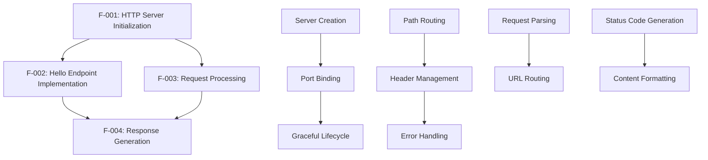
```mermaid
graph TD
    A[F-001: HTTP Server Initialization] --> B[F-002: Hello Endpoint Implementation]
    A --> C[F-003: Request Processing]
    B --> D[F-004: Response Generation]
    C --> D
    
    A1[Server Creation] --> A2[Port Binding]
    A2 --> A3[Graceful Lifecycle]
    
    B1[Path Routing] --> B2[Header Management]
    B2 --> B3[Error Handling]
    
    C1[Request Parsing] --> C2[URL Routing]
    
    D1[Status Code Generation] --> D2[Content Formatting]
```

### 2.3.2 Integration Points

| Integration Point | Features Involved | Description |
|---|---|---|
| **Request Handler** | F-001, F-003 | Server initialization provides request handler to processing |
| **Route Matching** | F-002, F-003 | Endpoint implementation uses request processing for routing |
| **Response Pipeline** | F-002, F-004 | Endpoint triggers response generation with appropriate content |

### 2.3.3 Shared Components

| Component | Features Using | Purpose |
|---|---|---|
| **HTTP Module** | F-001, F-003, F-004 | Core Node.js HTTP functionality |
| **Request Object** | F-002, F-003 | HTTP request data structure |
| **Response Object** | F-002, F-004 | HTTP response data structure |

### 2.3.4 Common Services

| Service | Features Served | Functionality |
|---|---|---|
| **Error Handling** | F-002, F-003, F-004 | Consistent error response generation |
| **Logging** | F-001, F-002, F-003 | Request and server event logging |
| **Validation** | F-003, F-004 | Input and output data validation |

## 2.4 IMPLEMENTATION CONSIDERATIONS

### 2.4.1 HTTP Server Initialization (F-001)

#### Technical Constraints
- A Node.js app runs in a single process, without creating a new thread for every request
- Must use Node.js built-in modules only
- Port availability dependent on system configuration

#### Performance Requirements
- Server startup time under 1 second
- Memory usage below 50MB during operation
- Support for concurrent connections

#### Scalability Considerations
- Single-threaded event loop architecture
- Node.js provides a set of asynchronous I/O primitives in its standard library that prevent JavaScript code from blocking. In addition, libraries in Node.js are generally written using non-blocking paradigms

#### Security Implications
- Use non-privileged ports (>1024)
- Validate all configuration parameters
- Implement proper error handling without information disclosure

#### Maintenance Requirements
- Monitor server health and uptime
- Log server lifecycle events
- Implement graceful shutdown procedures

### 2.4.2 Hello Endpoint Implementation (F-002)

#### Technical Constraints
- Must respond only to exact `/hello` path
- Limited to GET method support
- Static response content only

#### Performance Requirements
- Response time < 100ms for endpoint requests
- Minimal memory allocation per request
- Efficient string response generation

#### Scalability Considerations
- Stateless endpoint design
- No database or external service dependencies
- Suitable for high-frequency requests

#### Security Implications
- No user input processing required
- Static response prevents injection attacks
- Minimal attack surface

#### Maintenance Requirements
- Monitor endpoint response times
- Track request frequency and patterns
- Validate response content integrity

### 2.4.3 Request Processing (F-003)

#### Technical Constraints
- It parses a message into headers and body but it does not parse the actual headers or the body
- Limited to basic URL path matching
- No complex routing patterns

#### Performance Requirements
- Request parsing under 20ms
- URL routing under 5ms
- Efficient memory usage for request objects

#### Scalability Considerations
- Asynchronous request processing
- No blocking operations in request pipeline
- Suitable for concurrent request handling

#### Security Implications
- Validate all request components
- Prevent path traversal attacks
- Sanitize URL parameters

#### Maintenance Requirements
- Log request processing metrics
- Monitor parsing error rates
- Track routing performance

### 2.4.4 Response Generation (F-004)

#### Technical Constraints
- Must comply with HTTP/1.1 standards
- HTTP requires the Date header in responses
- Limited to plain text responses

#### Performance Requirements
- Response generation under 10ms
- Content formatting under 5ms
- Minimal response payload size

#### Scalability Considerations
- Stateless response generation
- No external dependencies for content
- Efficient header management

#### Security Implications
- Prevent response header injection
- Validate status code values
- No sensitive information in responses

#### Maintenance Requirements
- Monitor response generation performance
- Track status code distribution
- Validate response format compliance

## 2.5 TRACEABILITY MATRIX

| Requirement ID | Feature | Test Case | Acceptance Criteria |
|---|---|---|---|
| F-001-RQ-001 | HTTP Server Init | TC-001 | Server creates without errors |
| F-001-RQ-002 | Port Binding | TC-002 | Server listens on specified port |
| F-001-RQ-003 | Graceful Lifecycle | TC-003 | Clean startup and shutdown |
| F-002-RQ-001 | Hello Endpoint | TC-004 | Returns "Hello world" with 200 |
| F-002-RQ-002 | HTTP Headers | TC-005 | Includes required headers |
| F-002-RQ-003 | Error Handling | TC-006 | Returns 404 for invalid paths |
| F-003-RQ-001 | Request Parsing | TC-007 | Extracts method, URL, headers |
| F-003-RQ-002 | URL Routing | TC-008 | Routes `/hello` correctly |
| F-004-RQ-001 | Status Codes | TC-009 | Returns appropriate status codes |
| F-004-RQ-002 | Content Format | TC-010 | Formats response content correctly |

# 3. TECHNOLOGY STACK

## 3.1 PROGRAMMING LANGUAGES

### 3.1.1 Primary Language Selection

| Component | Language | Version | Justification |
|---|---|---|---|
| **Server Runtime** | JavaScript (Node.js) | Node.js 22.x LTS (Active) | Node.js® is a free, open-source, cross-platform JavaScript runtime environment that lets developers create servers, web apps, command line tools and scripts |
| **Application Logic** | JavaScript (ES2023) | ECMAScript 2023 | Native ES modules support and modern JavaScript features |

### 3.1.2 Language Selection Criteria

#### Technical Requirements
- **Single Language Stack**: JavaScript provides unified development experience across the entire application
- **Built-in HTTP Support**: Node.js includes comprehensive HTTP server capabilities without external dependencies
- **Cross-Platform Compatibility**: Supports Windows, macOS, and Linux environments
- **Educational Value**: Demonstrates core Node.js concepts without framework abstractions

#### Version Constraints
- **Node.js Version**: Node.js 22.x is currently in Active LTS status and extends into late 2025
- **JavaScript Standard**: ES2023 features are fully supported in Node.js 22.x
- **Backward Compatibility**: Maintains compatibility with Node.js 18.x and 20.x for broader deployment options

#### Performance Considerations
- **Event-Driven Architecture**: Node.js single-threaded event loop optimizes I/O operations
- **V8 Engine**: V8 is Google's open source high-performance JavaScript and WebAssembly engine, written in C++. It is used in Chrome and in Node.js
- **Memory Efficiency**: Minimal memory footprint for simple HTTP server operations

## 3.2 FRAMEWORKS & LIBRARIES

### 3.2.1 Core Runtime Framework

| Framework | Version | Purpose | Justification |
|---|---|---|---|
| **Node.js Runtime** | 22.11.0 LTS | JavaScript runtime environment | Ensures critical updates and security support for years to come |

### 3.2.2 Built-in Modules

| Module | Version | Category | Usage |
|---|---|---|---|
| **http** | Built-in | Core HTTP | HTTP server creation and request handling |
| **url** | Built-in | URL Processing | Request URL parsing and routing |
| **util** | Built-in | Utilities | Response formatting and debugging |

### 3.2.3 Framework Selection Rationale

#### No External Framework Dependencies
- **Educational Purpose**: Demonstrates pure Node.js capabilities without framework abstractions
- **Minimal Complexity**: Reduces learning curve for Node.js beginners
- **Zero Dependencies**: Eliminates external dependency management and security concerns
- **Performance**: Direct use of Node.js built-in modules provides optimal performance

#### Built-in Module Advantages
- **Stability**: Built-in modules are maintained as part of Node.js core
- **Security**: No third-party security vulnerabilities
- **Compatibility**: Guaranteed compatibility across Node.js versions
- **Documentation**: Comprehensive official documentation and examples

#### Future Framework Considerations
- **Express.js Integration**: Application can be easily extended with Express.js for advanced routing
- **Fastify Migration**: Compatible with high-performance framework migration paths
- **Koa.js Compatibility**: Async/await patterns align with modern framework approaches

## 3.3 OPEN SOURCE DEPENDENCIES

### 3.3.1 Runtime Dependencies

| Dependency | Version | Registry | Purpose |
|---|---|---|---|
| **None** | N/A | N/A | Zero external dependencies by design |

### 3.3.2 Development Dependencies

| Dependency | Version | Registry | Purpose |
|---|---|---|---|
| **npm** | 11.6.0 | npm registry | Package management and script execution |

### 3.3.3 Dependency Management Strategy

#### Zero Production Dependencies
- **Security Benefits**: No external attack vectors through third-party packages
- **Maintenance Simplicity**: No dependency updates or compatibility issues
- **Deployment Efficiency**: Minimal application footprint
- **Educational Clarity**: Focus on core Node.js concepts

#### Development Tooling
- **Package Manager**: npm comes bundled with node, & most third-party distributions, by default
- **Version Management**: You should be running a currently supported version of Node.js to run npm. For a list of which versions of Node.js are currently supported, please see the Node.js releases page
- **Registry Access**: Npm, now at version 10.x, remains the default package manager bundled with Node and hosts over 2.5 million public packages

#### Dependency Security
- **Vulnerability Scanning**: No external dependencies eliminate third-party vulnerability risks
- **Supply Chain Security**: Direct Node.js usage avoids supply chain attacks
- **License Compliance**: No third-party license considerations

## 3.4 THIRD-PARTY SERVICES

### 3.4.1 External Service Dependencies

| Service Category | Service | Usage | Justification |
|---|---|---|---|
| **None Required** | N/A | N/A | Self-contained application design |

### 3.4.2 Service Architecture

#### Self-Contained Design
- **No External APIs**: Application operates independently without external service calls
- **No Authentication Services**: Simple tutorial application requires no user authentication
- **No Monitoring Services**: Basic logging through Node.js console methods
- **No Cloud Dependencies**: Runs on any Node.js-compatible environment

#### Optional Service Integrations
- **Monitoring**: Can be extended with application performance monitoring (APM) tools
- **Logging**: Compatible with centralized logging services for production deployments
- **Health Checks**: Can integrate with load balancer health check endpoints

## 3.5 DATABASES & STORAGE

### 3.5.1 Data Persistence

| Storage Type | Technology | Usage | Justification |
|---|---|---|---|
| **None Required** | N/A | N/A | Stateless application design |

### 3.5.2 Storage Architecture

#### Stateless Application Design
- **No Database Requirements**: Static response content requires no data persistence
- **No Session Storage**: No user sessions or state management needed
- **No File Storage**: No file upload or download capabilities
- **Memory-Only Operations**: All data processing occurs in application memory

#### Storage Considerations for Extensions
- **Database Integration**: Can be extended with MongoDB, PostgreSQL, or other databases
- **Caching Solutions**: Compatible with Redis or Memcached for performance optimization
- **File System**: Can utilize Node.js `fs` module for file-based operations

## 3.6 DEVELOPMENT & DEPLOYMENT

### 3.6.1 Development Tools

| Tool Category | Tool | Version | Purpose |
|---|---|---|---|
| **Runtime Environment** | Node.js | 22.11.0 LTS | JavaScript execution environment |
| **Package Manager** | npm | 11.6.0 | Dependency management and script execution |
| **Version Control** | Git | Latest | Source code version control |

### 3.6.2 Build System

#### No Build Process Required
- **Direct Execution**: JavaScript files run directly without compilation
- **No Transpilation**: Modern Node.js supports ES2023 features natively
- **No Bundling**: Single-file application requires no module bundling
- **No Asset Processing**: No static assets or preprocessing requirements

#### Development Workflow
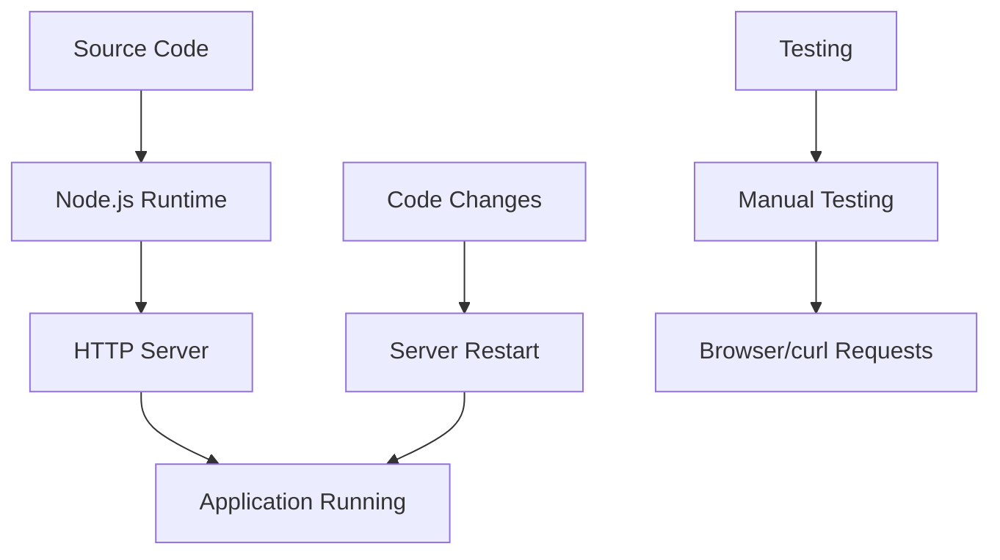
```mermaid
graph TD
    A[Source Code] --> B[Node.js Runtime]
    B --> C[HTTP Server]
    C --> D[Application Running]
    
    E[Code Changes] --> F[Server Restart]
    F --> D
    
    G[Testing] --> H[Manual Testing]
    H --> I[Browser/curl Requests]
```

### 3.6.3 Deployment Architecture

#### Containerization Strategy

| Component | Technology | Configuration | Purpose |
|---|---|---|---|
| **Base Image** | node:22-alpine | Minimal Linux distribution | Lightweight container image |
| **Runtime** | Node.js 22.x LTS | Production-ready runtime | Stable execution environment |
| **Port Exposure** | 3000 | HTTP server port | External connectivity |

#### Container Configuration
```dockerfile
FROM node:22-alpine
WORKDIR /app
COPY server.js .
EXPOSE 3000
CMD ["node", "server.js"]
```

### 3.6.4 CI/CD Requirements

#### Continuous Integration
- **Build Verification**: Syntax validation and basic functionality testing
- **Security Scanning**: Node.js security vulnerability assessment
- **Cross-Platform Testing**: Validation across Windows, macOS, and Linux

#### Deployment Pipeline
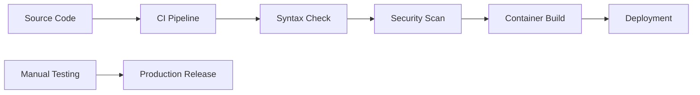
```mermaid
graph LR
    A[Source Code] --> B[CI Pipeline]
    B --> C[Syntax Check]
    C --> D[Security Scan]
    D --> E[Container Build]
    E --> F[Deployment]
    
    G[Manual Testing] --> H[Production Release]
```

### 3.6.5 Environment Configuration

#### Development Environment
- **Local Development**: Direct Node.js execution on developer machines
- **Hot Reloading**: Manual server restart for code changes
- **Debugging**: Node.js built-in debugging capabilities

#### Production Environment
- **Process Management**: PM2 or systemd for process supervision
- **Load Balancing**: Nginx or HAProxy for traffic distribution
- **Monitoring**: Application logs and system metrics collection

#### Environment Variables
| Variable | Purpose | Default Value | Required |
|---|---|---|---|
| `PORT` | HTTP server port | 3000 | No |
| `HOST` | Server bind address | 127.0.0.1 | No |
| `NODE_ENV` | Environment mode | development | No |

### 3.6.6 Security Considerations

#### Runtime Security
- **Node.js Security**: LTS versions receive critical updates and security support
- **Dependency Security**: Zero external dependencies eliminate third-party vulnerabilities
- **Process Isolation**: Container-based deployment provides process isolation

#### Network Security
- **Port Configuration**: Configurable port binding for security policies
- **Request Validation**: Basic HTTP request validation and sanitization
- **Error Handling**: Secure error responses without information disclosure

# 4. PROCESS FLOWCHART

## 4.1 SYSTEM WORKFLOWS

### 4.1.1 Core Business Processes

#### Primary HTTP Request-Response Workflow

The request life cycle is the process of handling a request from the moment it is received by the server until the moment the response is sent back to the client. The Node.js tutorial application implements a simplified HTTP server workflow that demonstrates fundamental web server operations.

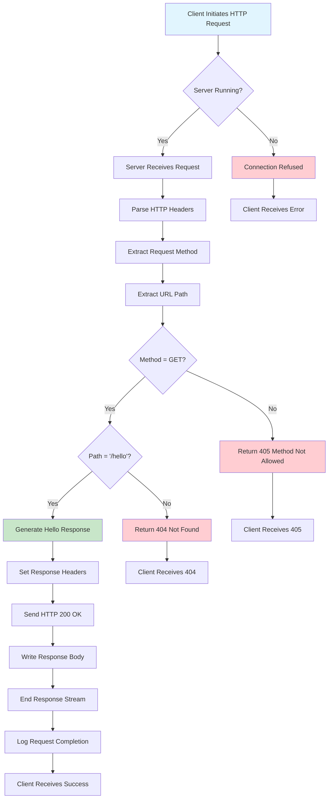
```mermaid
flowchart TD
    A[Client Initiates HTTP Request] --> B{Server Running?}
    B -->|No| C[Connection Refused]
    B -->|Yes| D[Server Receives Request]
    D --> E[Parse HTTP Headers]
    E --> F[Extract Request Method]
    F --> G[Extract URL Path]
    G --> H{Method = GET?}
    H -->|No| I[Return 405 Method Not Allowed]
    H -->|Yes| J{Path = '/hello'?}
    J -->|No| K[Return 404 Not Found]
    J -->|Yes| L[Generate Hello Response]
    L --> M[Set Response Headers]
    M --> N[Send HTTP 200 OK]
    N --> O[Write Response Body]
    O --> P[End Response Stream]
    P --> Q[Log Request Completion]
    
    C --> R[Client Receives Error]
    I --> S[Client Receives 405]
    K --> T[Client Receives 404]
    Q --> U[Client Receives Success]
    
    style A fill:#e1f5fe
    style L fill:#c8e6c9
    style C fill:#ffcdd2
    style I fill:#ffcdd2
    style K fill:#ffcdd2
```

#### Server Lifecycle Management

When Node receives an HTTP request, it creates the req and res objects (which begin their life as instances of http.IncomingMessage and http.ServerResponse respectively). The intended purpose of those objects is that they live as long as the HTTP request does.

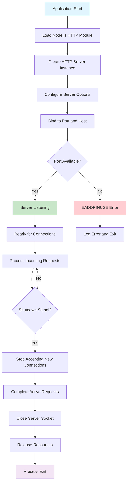
```mermaid
flowchart TD
    A[Application Start] --> B[Load Node.js HTTP Module]
    B --> C[Create HTTP Server Instance]
    C --> D[Configure Server Options]
    D --> E[Bind to Port and Host]
    E --> F{Port Available?}
    F -->|No| G[EADDRINUSE Error]
    F -->|Yes| H[Server Listening]
    H --> I[Ready for Connections]
    I --> J[Process Incoming Requests]
    J --> K{Shutdown Signal?}
    K -->|No| J
    K -->|Yes| L[Stop Accepting New Connections]
    L --> M[Complete Active Requests]
    M --> N[Close Server Socket]
    N --> O[Release Resources]
    O --> P[Process Exit]
    
    G --> Q[Log Error and Exit]
    
    style A fill:#e1f5fe
    style H fill:#c8e6c9
    style G fill:#ffcdd2
    style P fill:#f3e5f5
```

### 4.1.2 Integration Workflows

#### Request Processing Pipeline

A request pipeline is a chain of functions that are called when a request is received by the server. The request pipeline is composed of a router, a middleware, and a request handler.

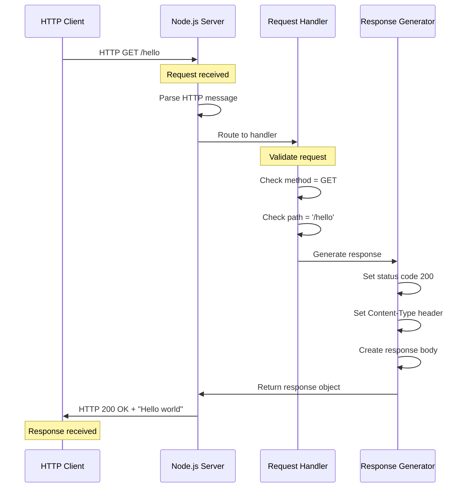
```mermaid
sequenceDiagram
    participant C as HTTP Client
    participant S as Node.js Server
    participant H as Request Handler
    participant R as Response Generator
    
    C->>S: HTTP GET /hello
    Note over S: Request received
    S->>S: Parse HTTP message
    S->>H: Route to handler
    Note over H: Validate request
    H->>H: Check method = GET
    H->>H: Check path = '/hello'
    H->>R: Generate response
    R->>R: Set status code 200
    R->>R: Set Content-Type header
    R->>R: Create response body
    R->>S: Return response object
    S->>C: HTTP 200 OK + "Hello world"
    Note over C: Response received
```

#### Error Handling Integration Flow

An error in the request stream presents itself by emitting an 'error' event on the stream. If you don't have a listener for that event, the error will be thrown, which could crash your Node.js program. You should therefore add an 'error' listener on your request streams, even if you just log it and continue on your way.

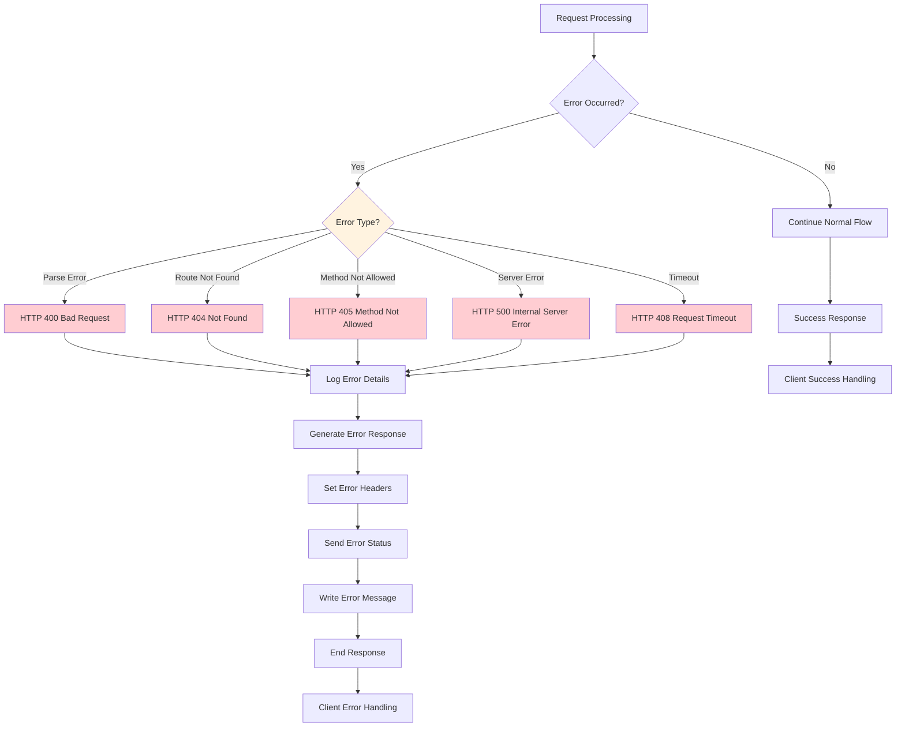
```mermaid
flowchart TD
    A[Request Processing] --> B{Error Occurred?}
    B -->|No| C[Continue Normal Flow]
    B -->|Yes| D{Error Type?}
    D -->|Parse Error| E[HTTP 400 Bad Request]
    D -->|Route Not Found| F[HTTP 404 Not Found]
    D -->|Method Not Allowed| G[HTTP 405 Method Not Allowed]
    D -->|Server Error| H[HTTP 500 Internal Server Error]
    D -->|Timeout| I[HTTP 408 Request Timeout]
    
    E --> J[Log Error Details]
    F --> J
    G --> J
    H --> J
    I --> J
    
    J --> K[Generate Error Response]
    K --> L[Set Error Headers]
    L --> M[Send Error Status]
    M --> N[Write Error Message]
    N --> O[End Response]
    
    C --> P[Success Response]
    O --> Q[Client Error Handling]
    P --> R[Client Success Handling]
    
    style D fill:#fff3e0
    style E fill:#ffcdd2
    style F fill:#ffcdd2
    style G fill:#ffcdd2
    style H fill:#ffcdd2
    style I fill:#ffcdd2
```

## 4.2 FLOWCHART REQUIREMENTS

### 4.2.1 HTTP Server Initialization Process

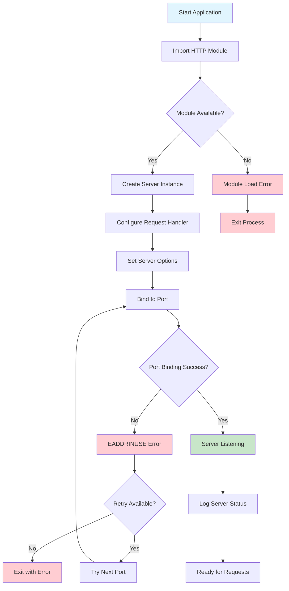
```mermaid
flowchart TD
    A[Start Application] --> B[Import HTTP Module]
    B --> C{Module Available?}
    C -->|No| D[Module Load Error]
    C -->|Yes| E[Create Server Instance]
    E --> F[Configure Request Handler]
    F --> G[Set Server Options]
    G --> H[Bind to Port]
    H --> I{Port Binding Success?}
    I -->|No| J[EADDRINUSE Error]
    I -->|Yes| K[Server Listening]
    K --> L[Log Server Status]
    L --> M[Ready for Requests]
    
    D --> N[Exit Process]
    J --> O{Retry Available?}
    O -->|Yes| P[Try Next Port]
    O -->|No| Q[Exit with Error]
    P --> H
    
    style A fill:#e1f5fe
    style K fill:#c8e6c9
    style D fill:#ffcdd2
    style J fill:#ffcdd2
    style N fill:#ffcdd2
    style Q fill:#ffcdd2
```

#### Validation Rules for Server Initialization

| Validation Point | Business Rule | Data Requirement | Error Response |
|---|---|---|---|
| **Module Import** | HTTP module must be available | Node.js built-in module | MODULE_NOT_FOUND |
| **Port Binding** | Port must be available and valid | Port range 1024-65535 | EADDRINUSE |
| **Host Configuration** | Host must be valid IP or hostname | Valid network address | ENOTFOUND |
| **Server Creation** | Server instance must be created | HTTP server object | CREATION_FAILED |

### 4.2.2 Request Processing Workflow

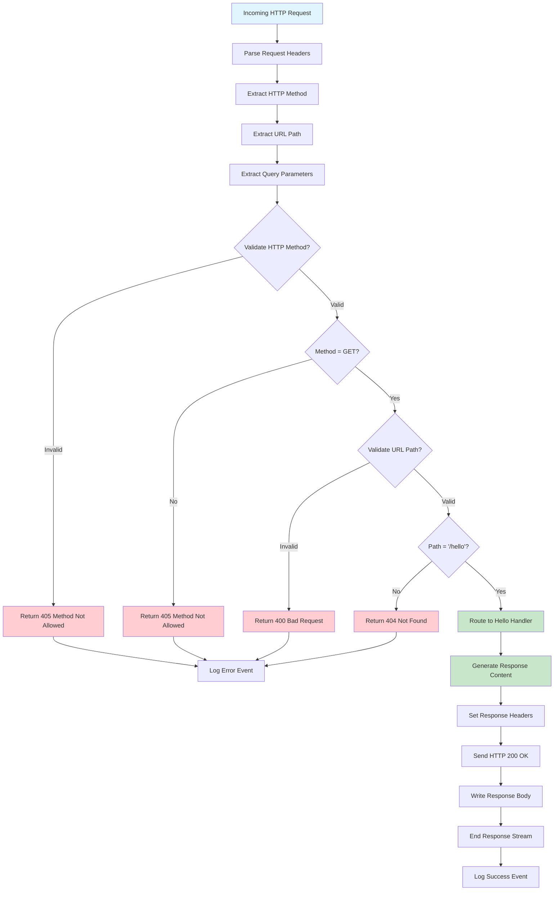
```mermaid
flowchart TD
    A[Incoming HTTP Request] --> B[Parse Request Headers]
    B --> C[Extract HTTP Method]
    C --> D[Extract URL Path]
    D --> E[Extract Query Parameters]
    E --> F{Validate HTTP Method?}
    F -->|Invalid| G[Return 405 Method Not Allowed]
    F -->|Valid| H{Method = GET?}
    H -->|No| I[Return 405 Method Not Allowed]
    H -->|Yes| J{Validate URL Path?}
    J -->|Invalid| K[Return 400 Bad Request]
    J -->|Valid| L{Path = '/hello'?}
    L -->|No| M[Return 404 Not Found]
    L -->|Yes| N[Route to Hello Handler]
    N --> O[Generate Response Content]
    O --> P[Set Response Headers]
    P --> Q[Send HTTP 200 OK]
    Q --> R[Write Response Body]
    R --> S[End Response Stream]
    
    G --> T[Log Error Event]
    I --> T
    K --> T
    M --> T
    S --> U[Log Success Event]
    
    style A fill:#e1f5fe
    style N fill:#c8e6c9
    style O fill:#c8e6c9
    style G fill:#ffcdd2
    style I fill:#ffcdd2
    style K fill:#ffcdd2
    style M fill:#ffcdd2
```

#### Request Processing Validation Rules

| Validation Stage | Business Rule | Data Validation | Security Check |
|---|---|---|---|
| **HTTP Method** | Only GET method allowed | Method in ['GET'] | Prevent method injection |
| **URL Path** | Exact match for '/hello' | Path === '/hello' | Prevent path traversal |
| **Headers** | Standard HTTP headers only | Valid header format | Prevent header injection |
| **Content Length** | No request body expected | Content-Length = 0 | Prevent payload attacks |

### 4.2.3 Response Generation Process

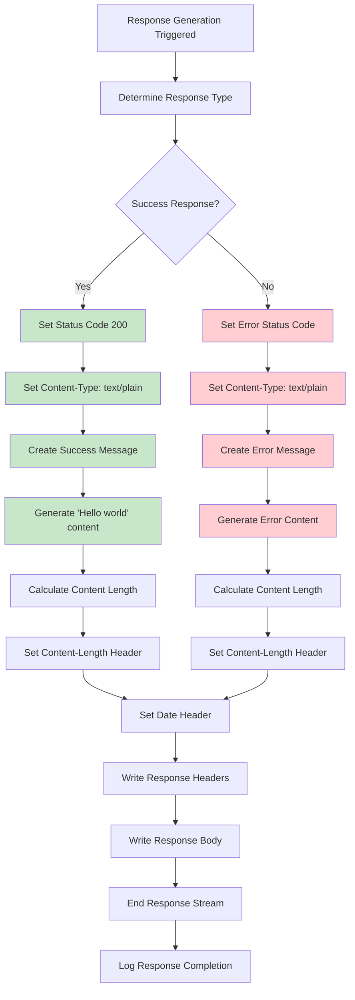
```mermaid
flowchart TD
    A[Response Generation Triggered] --> B[Determine Response Type]
    B --> C{Success Response?}
    C -->|Yes| D[Set Status Code 200]
    C -->|No| E[Set Error Status Code]
    
    D --> F[Set Content-Type: text/plain]
    E --> G[Set Content-Type: text/plain]
    
    F --> H[Create Success Message]
    G --> I[Create Error Message]
    
    H --> J["Generate 'Hello world' content"]
    I --> K[Generate Error Content]
    
    J --> L[Calculate Content Length]
    K --> M[Calculate Content Length]
    
    L --> N[Set Content-Length Header]
    M --> O[Set Content-Length Header]
    
    N --> P[Set Date Header]
    O --> P
    
    P --> Q[Write Response Headers]
    Q --> R[Write Response Body]
    R --> S[End Response Stream]
    S --> T[Log Response Completion]
    
    style D fill:#c8e6c9
    style F fill:#c8e6c9
    style H fill:#c8e6c9
    style J fill:#c8e6c9
    style E fill:#ffcdd2
    style G fill:#ffcdd2
    style I fill:#ffcdd2
    style K fill:#ffcdd2
```

## 4.3 TECHNICAL IMPLEMENTATION

### 4.3.1 State Management

#### Server State Transitions

By default, the Server does not timeout sockets. However, if a callback is assigned to the Server's 'timeout' event, timeouts must be handled explicitly.

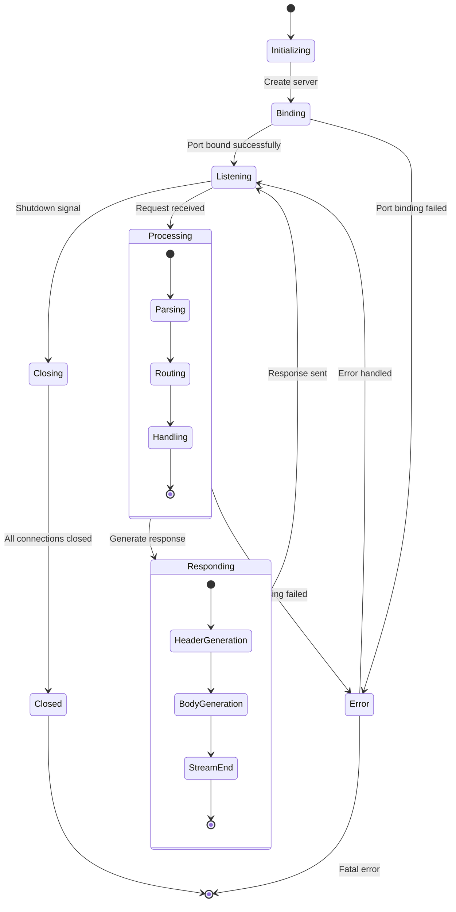
```mermaid
stateDiagram-v2
    [*] --> Initializing
    Initializing --> Binding : Create server
    Binding --> Listening : Port bound successfully
    Binding --> Error : Port binding failed
    Listening --> Processing : Request received
    Processing --> Responding : Generate response
    Responding --> Listening : Response sent
    Processing --> Error : Processing failed
    Error --> Listening : Error handled
    Listening --> Closing : Shutdown signal
    Closing --> Closed : All connections closed
    Closed --> [*]
    Error --> [*] : Fatal error
    
    state Processing {
        [*] --> Parsing
        Parsing --> Routing
        Routing --> Handling
        Handling --> [*]
    }
    
    state Responding {
        [*] --> HeaderGeneration
        HeaderGeneration --> BodyGeneration
        BodyGeneration --> StreamEnd
        StreamEnd --> [*]
    }
```

#### Request State Management

| State | Description | Duration | Memory Usage | Persistence |
|---|---|---|---|---|
| **Received** | Request object created | < 1ms | ~1KB | Request lifetime |
| **Parsing** | Headers and URL extracted | < 5ms | ~2KB | Request lifetime |
| **Routing** | Path matching performed | < 1ms | ~0.5KB | Request lifetime |
| **Processing** | Handler execution | < 10ms | ~1KB | Request lifetime |
| **Responding** | Response generation | < 5ms | ~1KB | Request lifetime |
| **Completed** | Response sent, cleanup | < 1ms | 0KB | None |

### 4.3.2 Error Handling

#### Error Recovery Mechanisms

Errors are inevitable in any program, but how you handle them makes all the difference. In Node.js, proper error handling is crucial because: It prevents applications from crashing unexpectedly

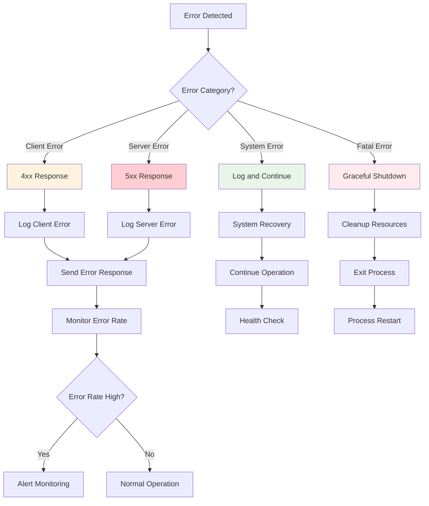
```mermaid
flowchart TD
    A[Error Detected] --> B{Error Category?}
    B -->|Client Error| C[4xx Response]
    B -->|Server Error| D[5xx Response]
    B -->|System Error| E[Log and Continue]
    B -->|Fatal Error| F[Graceful Shutdown]
    
    C --> G[Log Client Error]
    D --> H[Log Server Error]
    E --> I[System Recovery]
    F --> J[Cleanup Resources]
    
    G --> K[Send Error Response]
    H --> K
    I --> L[Continue Operation]
    J --> M[Exit Process]
    
    K --> N[Monitor Error Rate]
    L --> O[Health Check]
    M --> P[Process Restart]
    
    N --> Q{Error Rate High?}
    Q -->|Yes| R[Alert Monitoring]
    Q -->|No| S[Normal Operation]
    
    style C fill:#fff3e0
    style D fill:#ffcdd2
    style E fill:#e8f5e8
    style F fill:#ffebee
```

#### Error Handling Patterns

| Error Type | HTTP Status | Recovery Action | Retry Logic | Logging Level |
|---|---|---|---|---|
| **Parse Error** | 400 Bad Request | Send error response | No retry | WARN |
| **Route Not Found** | 404 Not Found | Send error response | No retry | INFO |
| **Method Not Allowed** | 405 Method Not Allowed | Send error response | No retry | INFO |
| **Server Timeout** | 408 Request Timeout | Close connection | No retry | WARN |
| **Internal Error** | 500 Internal Server Error | Send error response | No retry | ERROR |
| **System Error** | 503 Service Unavailable | Graceful degradation | Exponential backoff | ERROR |

### 4.3.3 Performance Monitoring

#### Request Performance Tracking

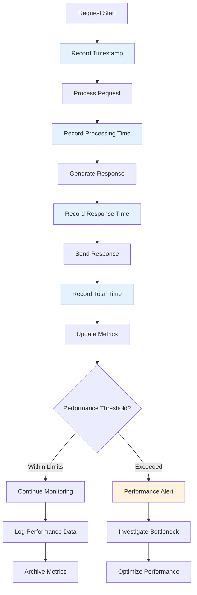
```mermaid
flowchart TD
    A[Request Start] --> B[Record Timestamp]
    B --> C[Process Request]
    C --> D[Record Processing Time]
    D --> E[Generate Response]
    E --> F[Record Response Time]
    F --> G[Send Response]
    G --> H[Record Total Time]
    H --> I[Update Metrics]
    I --> J{Performance Threshold?}
    J -->|Within Limits| K[Continue Monitoring]
    J -->|Exceeded| L[Performance Alert]
    
    K --> M[Log Performance Data]
    L --> N[Investigate Bottleneck]
    
    M --> O[Archive Metrics]
    N --> P[Optimize Performance]
    
    style B fill:#e3f2fd
    style D fill:#e3f2fd
    style F fill:#e3f2fd
    style H fill:#e3f2fd
    style L fill:#fff3e0
```

#### Performance Metrics Collection

| Metric | Measurement | Threshold | Alert Condition | Action |
|---|---|---|---|---|
| **Request Latency** | Response time | < 100ms | > 200ms | Performance investigation |
| **Memory Usage** | Process memory | < 50MB | > 100MB | Memory leak detection |
| **CPU Usage** | Process CPU | < 50% | > 80% | Load balancing |
| **Error Rate** | Errors per minute | < 1% | > 5% | Error investigation |
| **Throughput** | Requests per second | Variable | Sudden drop | Capacity planning |

## 4.4 REQUIRED DIAGRAMS

### 4.4.1 High-Level System Architecture

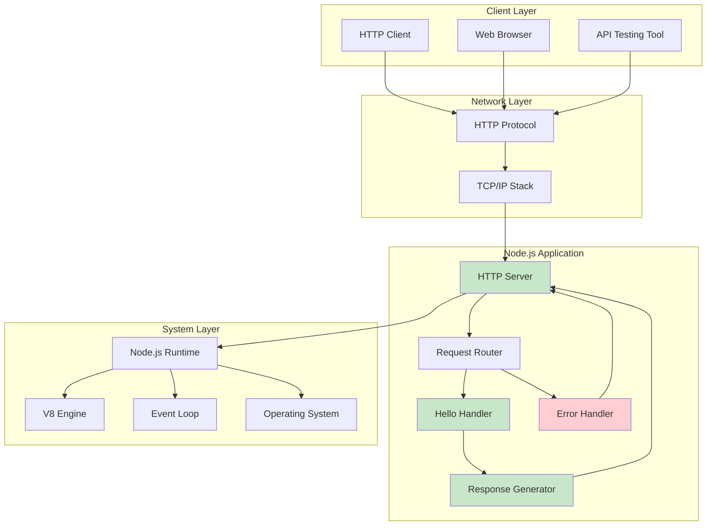
```mermaid
graph TB
    subgraph "Client Layer"
        A[HTTP Client]
        B[Web Browser]
        C[API Testing Tool]
    end
    
    subgraph "Network Layer"
        D[HTTP Protocol]
        E[TCP/IP Stack]
    end
    
    subgraph "Node.js Application"
        F[HTTP Server]
        G[Request Router]
        H[Hello Handler]
        I[Response Generator]
        J[Error Handler]
    end
    
    subgraph "System Layer"
        K[Node.js Runtime]
        L[V8 Engine]
        M[Event Loop]
        N[Operating System]
    end
    
    A --> D
    B --> D
    C --> D
    D --> E
    E --> F
    F --> G
    G --> H
    G --> J
    H --> I
    I --> F
    J --> F
    F --> K
    K --> L
    K --> M
    K --> N
    
    style F fill:#c8e6c9
    style H fill:#c8e6c9
    style I fill:#c8e6c9
    style J fill:#ffcdd2
```

### 4.4.2 Detailed Request Processing Flow

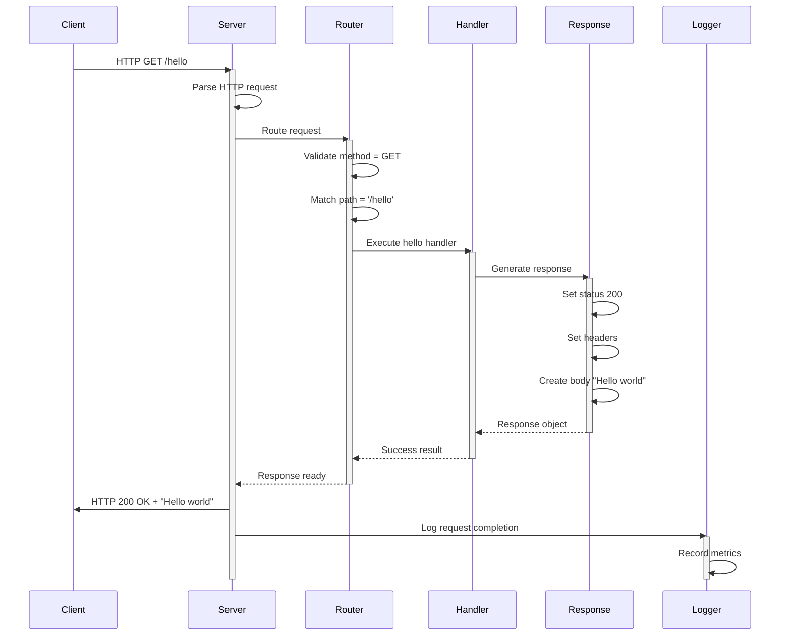
```mermaid
sequenceDiagram
    participant Client
    participant Server
    participant Router
    participant Handler
    participant Response
    participant Logger
    
    Client->>Server: HTTP GET /hello
    activate Server
    
    Server->>Server: Parse HTTP request
    Server->>Router: Route request
    activate Router
    
    Router->>Router: Validate method = GET
    Router->>Router: Match path = '/hello'
    Router->>Handler: Execute hello handler
    activate Handler
    
    Handler->>Response: Generate response
    activate Response
    Response->>Response: Set status 200
    Response->>Response: Set headers
    Response->>Response: Create body "Hello world"
    Response-->>Handler: Response object
    deactivate Response
    
    Handler-->>Router: Success result
    deactivate Handler
    Router-->>Server: Response ready
    deactivate Router
    
    Server->>Client: HTTP 200 OK + "Hello world"
    Server->>Logger: Log request completion
    activate Logger
    Logger->>Logger: Record metrics
    deactivate Logger
    
    deactivate Server
```

### 4.4.3 Error Handling State Machine

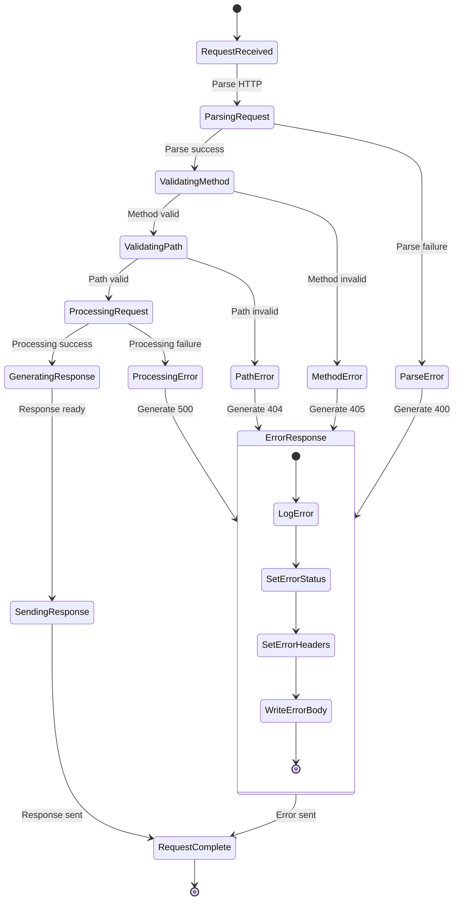
```mermaid
stateDiagram-v2
    [*] --> RequestReceived
    RequestReceived --> ParsingRequest : Parse HTTP
    ParsingRequest --> ValidatingMethod : Parse success
    ParsingRequest --> ParseError : Parse failure
    ValidatingMethod --> ValidatingPath : Method valid
    ValidatingMethod --> MethodError : Method invalid
    ValidatingPath --> ProcessingRequest : Path valid
    ValidatingPath --> PathError : Path invalid
    ProcessingRequest --> GeneratingResponse : Processing success
    ProcessingRequest --> ProcessingError : Processing failure
    GeneratingResponse --> SendingResponse : Response ready
    SendingResponse --> RequestComplete : Response sent
    
    ParseError --> ErrorResponse : Generate 400
    MethodError --> ErrorResponse : Generate 405
    PathError --> ErrorResponse : Generate 404
    ProcessingError --> ErrorResponse : Generate 500
    ErrorResponse --> RequestComplete : Error sent
    
    RequestComplete --> [*]
    
    state ErrorResponse {
        [*] --> LogError
        LogError --> SetErrorStatus
        SetErrorStatus --> SetErrorHeaders
        SetErrorHeaders --> WriteErrorBody
        WriteErrorBody --> [*]
    }
```

### 4.4.4 Concurrent Request Handling


```mermaid
gantt
    title Request Processing Timeline
    dateFormat X
    axisFormat %L ms
    
    section Request 1
    Parse Request    :r1-parse, 0, 5
    Route Request    :r1-route, after r1-parse, 2
    Process Request  :r1-process, after r1-route, 10
    Generate Response:r1-response, after r1-process, 5
    Send Response    :r1-send, after r1-response, 3
    
    section Request 2
    Parse Request    :r2-parse, 3, 5
    Route Request    :r2-route, after r2-parse, 2
    Process Request  :r2-process, after r2-route, 8
    Generate Response:r2-response, after r2-process, 5
    Send Response    :r2-send, after r2-response, 3
    
    section Request 3
    Parse Request    :r3-parse, 8, 5
    Route Request    :r3-route, after r3-parse, 2
    Process Request  :r3-process, after r3-route, 12
    Generate Response:r3-response, after r3-process, 5
    Send Response    :r3-send, after r3-response, 3
```

### 4.4.5 System Resource Utilization

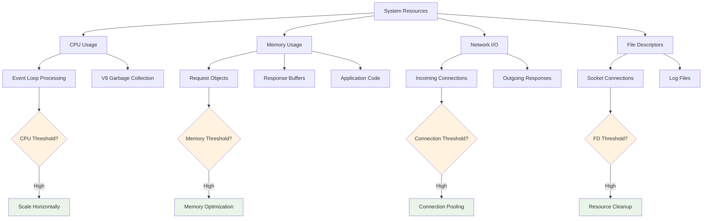
```mermaid
flowchart TD
    A[System Resources] --> B[CPU Usage]
    A --> C[Memory Usage]
    A --> D[Network I/O]
    A --> E[File Descriptors]
    
    B --> F[Event Loop Processing]
    B --> G[V8 Garbage Collection]
    
    C --> H[Request Objects]
    C --> I[Response Buffers]
    C --> J[Application Code]
    
    D --> K[Incoming Connections]
    D --> L[Outgoing Responses]
    
    E --> M[Socket Connections]
    E --> N[Log Files]
    
    F --> O{CPU Threshold?}
    H --> P{Memory Threshold?}
    K --> Q{Connection Threshold?}
    M --> R{FD Threshold?}
    
    O -->|High| S[Scale Horizontally]
    P -->|High| T[Memory Optimization]
    Q -->|High| U[Connection Pooling]
    R -->|High| V[Resource Cleanup]
    
    style O fill:#fff3e0
    style P fill:#fff3e0
    style Q fill:#fff3e0
    style R fill:#fff3e0
    style S fill:#e8f5e8
    style T fill:#e8f5e8
    style U fill:#e8f5e8
    style V fill:#e8f5e8
```

# 5. SYSTEM ARCHITECTURE

## 5.1 HIGH-LEVEL ARCHITECTURE

### 5.1.1 System Overview

The Node.js tutorial application follows a Single Threaded Event Loop architecture to handle multiple concurrent clients. This architectural approach leverages the JavaScript event-based model along with the JavaScript callback mechanism to create a lightweight, educational HTTP server implementation.

The system adopts a **minimalist monolithic architecture** that prioritizes simplicity and educational value over complex distributed patterns. Node.js, known for its non-blocking event-driven architecture, presents unique challenges and opportunities in software design. Applying design patterns tailored to Node.js can lead to more efficient and optimized applications.

**Key Architectural Principles:**
- **Event-Driven Processing**: All HTTP requests are processed through Node.js's built-in event loop mechanism
- **Non-Blocking I/O**: The event loop is what allows Node.js to perform non-blocking I/O operations — despite the fact that a single JavaScript thread is used by default — by offloading operations to the system kernel whenever possible
- **Zero External Dependencies**: Pure Node.js implementation using only built-in modules
- **Stateless Design**: No persistent data storage or session management requirements
- **Educational Focus**: Architecture optimized for learning and demonstration rather than production scalability

**System Boundaries:**
The application operates within a single Node.js process boundary, interfacing directly with the operating system's network stack through Node.js built-in HTTP module. The important thing to take away from the libuv book is that libuv uses the host OS's asynchronous I/O facilities; it does not simply create a new thread for every connection. libuv tells the OS that it would like to know about any changes (connection state, data received, etc) that happen on a particular set of sockets. It is then up to the OS to deal with managing the connections.

### 5.1.2 Core Components Table

| Component Name | Primary Responsibility | Key Dependencies | Integration Points |
|---|---|---|---|
| **HTTP Server** | Accept and manage incoming HTTP connections | Node.js `http` module, OS network stack | Event Loop, Request Router |
| **Event Loop** | Process asynchronous operations and callbacks | Node.js runtime, libuv library | HTTP Server, Request Handlers |
| **Request Router** | Match URL paths and route to appropriate handlers | HTTP Server request objects | Hello Handler, Error Handler |
| **Hello Handler** | Generate "Hello world" responses for `/hello` endpoint | Request Router, Response Generator | Response Generator |

### 5.1.3 Data Flow Description

**Primary Request-Response Flow:**
The application implements a straightforward HTTP request-response pattern where users send requests (blocking or non-blocking) to the server for performing operations. The requests enter the Event Queue first at the server-side. The requests are then passed sequentially to the event loop.

**Request Processing Pipeline:**
1. **HTTP Request Reception**: Incoming requests are received by the Node.js HTTP server and parsed into request objects
2. **Event Queue Processing**: The event loop checks the nature of the request (blocking or non-blocking). Event Loop processes the non-blocking requests which do not require external resources and returns the responses to the corresponding clients
3. **URL Path Matching**: Request router examines the URL path to determine appropriate handler
4. **Response Generation**: Matched handlers create appropriate HTTP responses with status codes and content
5. **Response Transmission**: Generated responses are sent back to clients through the HTTP server

**Integration Patterns:**
The system uses **direct function calls** for component communication, eliminating the need for complex messaging protocols. Essentially, the event loop is a continuous process that waits for and dispatches events or messages in a program. It keeps Node.js running, responding to requests, and handling I/O operations without getting blocked.

### 5.1.4 External Integration Points

| System Name | Integration Type | Data Exchange Pattern | Protocol/Format |
|---|---|---|---|
| **Operating System** | Network I/O | Socket-based communication | TCP/IP over HTTP/1.1 |
| **HTTP Clients** | Request-Response | Synchronous HTTP transactions | HTTP/1.1 with text/plain responses |
| **Node.js Runtime** | Process Integration | Event-driven callbacks | JavaScript function calls |

## 5.2 COMPONENT DETAILS

### 5.2.1 HTTP Server Component

**Purpose and Responsibilities:**
The HTTP Server component serves as the primary entry point for all client interactions, responsible for accepting TCP connections, parsing HTTP requests, and coordinating response delivery. Node JS Platform uses "Single Threaded Event Loop" architecture to handle multiple concurrent clients.

**Technologies and Frameworks:**
- **Core Technology**: Node.js built-in `http` module
- **Runtime Environment**: Node.js 22.x LTS with V8 JavaScript engine
- **Network Protocol**: HTTP/1.1 over TCP/IP

**Key Interfaces and APIs:**
- `http.createServer()` for server instantiation
- `server.listen()` for port binding and connection acceptance
- Request and Response object interfaces for HTTP message handling

**Data Persistence Requirements:**
No persistent data storage required. All operations are stateless and memory-resident during request processing.

**Scaling Considerations:**
Use the cluster module for web servers: This is the simplest way to scale your HTTP server across multiple cores. Employ worker threads for CPU-bound tasks: If you have computationally intensive operations, offload them to worker threads. Consider child processes for memory-intensive tasks: When you need complete isolation, child processes are the way to go.

#### HTTP Server State Transitions

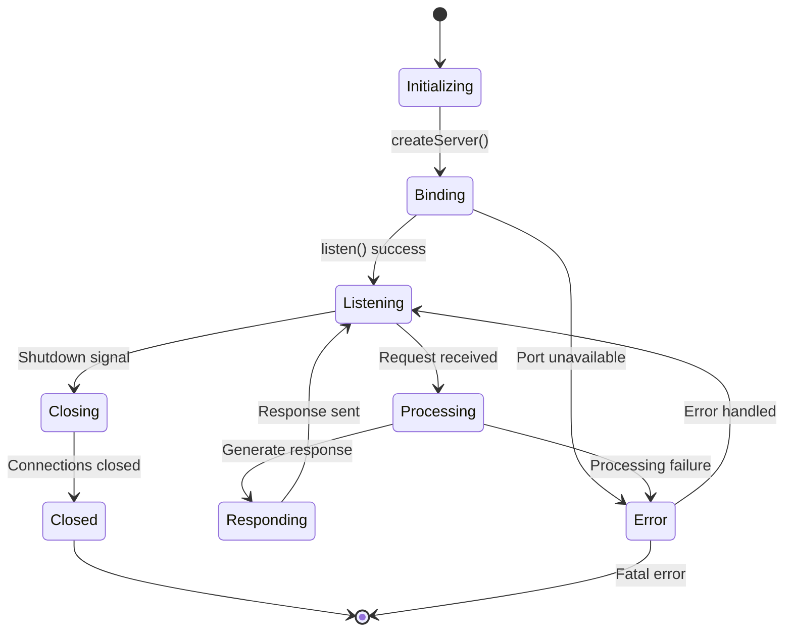
```mermaid
stateDiagram-v2
    [*] --> Initializing
    Initializing --> Binding : createServer()
    Binding --> Listening : listen() success
    Binding --> Error : Port unavailable
    Listening --> Processing : Request received
    Processing --> Responding : Generate response
    Responding --> Listening : Response sent
    Processing --> Error : Processing failure
    Error --> Listening : Error handled
    Listening --> Closing : Shutdown signal
    Closing --> Closed : Connections closed
    Closed --> [*]
    Error --> [*] : Fatal error
```

### 5.2.2 Event Loop Component

**Purpose and Responsibilities:**
The core of Node.js's single-threaded architecture is the event loop. The event loop continuously cycles through a series of phases, executing callbacks and handling events. The Event Loop manages asynchronous operations, coordinates callback execution, and ensures non-blocking request processing.

**Technologies and Frameworks:**
- **Core Implementation**: Node.js event loop (libuv-based)
- **Callback Management**: JavaScript callback functions and Promise handling
- **Concurrency Model**: Concurrency means having multiple processes run around the same time. In the waiter analogy, it is like James carrying out different tasks, though not simultaneously

**Key Interfaces and APIs:**
- Event queue management for incoming requests
- Callback scheduling and execution coordination
- Timer and immediate callback handling

**Data Persistence Requirements:**
Maintains in-memory event queue and callback registry during application lifecycle.

**Scaling Considerations:**
Event loop operates on single thread but can coordinate with thread pool for I/O operations. For other types of operations like calls to C libraries that may be computationally expensive (ie crypto), libuv provides a thread pool on which those operations may run. Since it is a thread pool, again you don't have to worry about thread count growing without bound. When the pool is fully busy, operations are queued.

#### Event Loop Processing Flow

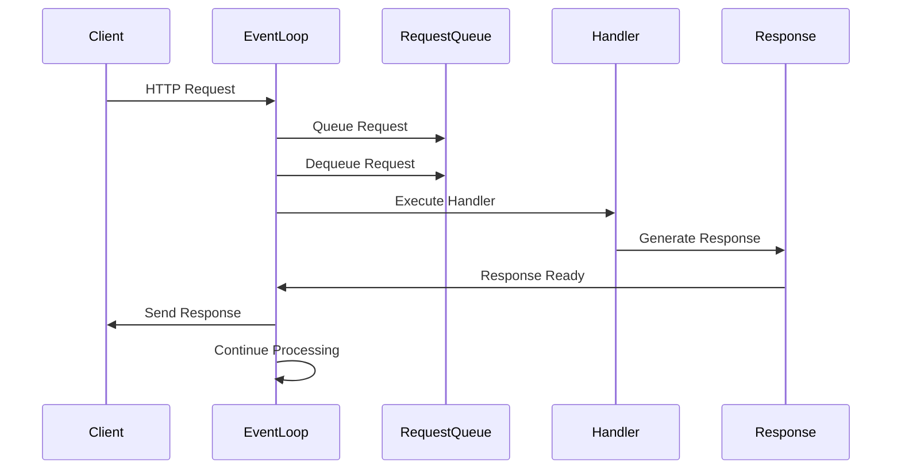
```mermaid
sequenceDiagram
    participant Client
    participant EventLoop
    participant RequestQueue
    participant Handler
    participant Response
    
    Client->>EventLoop: HTTP Request
    EventLoop->>RequestQueue: Queue Request
    EventLoop->>RequestQueue: Dequeue Request
    EventLoop->>Handler: Execute Handler
    Handler->>Response: Generate Response
    Response->>EventLoop: Response Ready
    EventLoop->>Client: Send Response
    EventLoop->>EventLoop: Continue Processing
```

### 5.2.3 Request Router Component

**Purpose and Responsibilities:**
The Request Router component analyzes incoming HTTP requests, performs URL path matching, and directs requests to appropriate handlers based on predefined routing rules.

**Technologies and Frameworks:**
- **URL Parsing**: Node.js built-in `url` module for path extraction
- **Pattern Matching**: String comparison for exact path matching
- **HTTP Method Validation**: Request method verification and filtering

**Key Interfaces and APIs:**
- Request object analysis for method and URL extraction
- Route matching logic for `/hello` endpoint
- Handler delegation and error routing

**Data Persistence Requirements:**
No persistent routing configuration. Routes are statically defined in application code.

**Scaling Considerations:**
Simple string matching provides optimal performance for single-endpoint routing. Can be extended with more sophisticated routing libraries for complex applications.

#### Request Routing Decision Tree

```mermaid
flowchart TD
    A[Incoming Request] --> B{HTTP Method?}
    B -->|GET| C{URL Path?}
    B -->|Other| D[405 Method Not Allowed]
    C -->|/hello| E[Route to Hello Handler]
    C -->|Other| F[404 Not Found]
    E --> G[Generate Success Response]
    D --> H[Generate Error Response]
    F --> H
    G --> I[Send Response]
    H --> I
```

### 5.2.4 Hello Handler Component

**Purpose and Responsibilities:**
The Hello Handler component implements the core business logic for the `/hello` endpoint, generating standardized "Hello world" responses with appropriate HTTP headers and status codes.

**Technologies and Frameworks:**
- **Response Generation**: Node.js HTTP response objects
- **Content Formatting**: Plain text message formatting
- **Header Management**: HTTP header configuration and validation

**Key Interfaces and APIs:**
- HTTP response object manipulation
- Content-Type header setting
- Status code assignment and response body writing

**Data Persistence Requirements:**
Static response content with no external data dependencies.

**Scaling Considerations:**
Stateless design enables horizontal scaling. Response generation is CPU-efficient with minimal memory allocation.

## 5.3 TECHNICAL DECISIONS

### 5.3.1 Architecture Style Decisions

| Decision | Rationale | Tradeoffs | Alternatives Considered |
|---|---|---|---|
| **Single Threaded Event Loop** | Node.js' single-threaded architecture, built on the principles of non-blocking I/O and event-driven programming, has proven to be a powerful and scalable solution for building high-performance server-side applications. While it has its challenges, the advantages of simplicity, efficiency, and scalability make Node.js a popular choice | Limited CPU-intensive processing capability | Multi-threaded server architectures |
| **Zero External Dependencies** | Educational clarity and security simplification | Limited functionality and features | Express.js, Fastify frameworks |
| **Monolithic Design** | Simplified deployment and debugging | Reduced modularity and reusability | Microservices architecture |

### 5.3.2 Communication Pattern Choices

**Direct Function Calls:**
The application uses synchronous function calls for component communication, eliminating network overhead and serialization complexity. This pattern aligns with the educational objective of demonstrating core Node.js concepts.

**Event-Driven Callbacks:**
To work with asynchronous operations, Node.js relies heavily on callbacks, Promises, and async/await. These mechanisms enable developers to write code that appears synchronous but doesn't block the event loop. Instead of waiting for a response from an I/O operation, Node.js can continue executing other code and return to the operation when it's completed.

#### Communication Pattern Decision Tree

```mermaid
flowchart TD
    A[Communication Need] --> B{Synchronous?}
    B -->|Yes| C[Direct Function Call]
    B -->|No| D{I/O Operation?}
    D -->|Yes| E[Callback Pattern]
    D -->|No| F[Event Emission]
    C --> G[Immediate Response]
    E --> H[Async Processing]
    F --> I[Event Handling]
```

### 5.3.3 Data Storage Solution Rationale

**In-Memory Processing:**
All request processing occurs in application memory without persistent storage requirements. This decision supports the stateless design principle and eliminates database complexity for the tutorial application.

**No Caching Layer:**
Static response content eliminates the need for caching mechanisms. The "Hello world" response is generated dynamically but contains no variable data requiring cache invalidation.

### 5.3.4 Security Mechanism Selection

| Security Aspect | Implementation | Justification |
|---|---|---|
| **Input Validation** | HTTP method and path validation | Prevents malformed request processing |
| **Error Handling** | Secure error responses without information disclosure | Protects against information leakage |
| **Resource Limits** | Node.js built-in connection limits | Prevents resource exhaustion attacks |

## 5.4 CROSS-CUTTING CONCERNS

### 5.4.1 Monitoring and Observability Approach

**Observability Strategy:**
Observability in Node.js applications involves collecting and analyzing metrics and logs to understand system behavior. Key Pillars of Observability: Metrics, Logs, and Traces (often called the "three pillars of observability") provide different but complementary views of your system's health and performance.

**Key Metrics for Tutorial Application:**
- **Request Metrics**: Request count, response time, status code distribution
- **System Metrics**: Node.js monitoring plays an important role in maintaining reliable applications by tracking runtime metrics (memory, CPU), application metrics (request rates, response times), and business metrics (user actions, conversion rates)
- **Error Metrics**: Error rate, error types, failure patterns

**Monitoring Implementation:**
- Built-in Node.js console logging for request tracking
- Performance timing using Node.js Performance API
- Memory usage monitoring through `process.memoryUsage()`

### 5.4.2 Logging and Tracing Strategy

**Logging Levels:**
- **INFO**: Successful request processing and server lifecycle events
- **WARN**: Non-critical errors and performance degradation
- **ERROR**: Request processing failures and system errors

**Log Format:**
Structured logging with timestamp, level, message, and request context for correlation and analysis.

**Tracing Approach:**
Request-level tracing through unique request identifiers and processing timestamps for performance analysis and debugging.

### 5.4.3 Error Handling Patterns

**Error Classification:**
- **Client Errors (4xx)**: Invalid requests, unsupported methods, unknown paths
- **Server Errors (5xx)**: Internal processing failures, system resource issues
- **System Errors**: Network failures, process crashes, resource exhaustion

**Error Recovery Mechanisms:**
- Graceful error responses with appropriate HTTP status codes
- Request isolation to prevent error propagation
- Automatic error logging and monitoring integration

#### Error Handling Flow

```mermaid
flowchart TD
    A[Error Detected] --> B{Error Type?}
    B -->|Client Error| C[Generate 4xx Response]
    B -->|Server Error| D[Generate 5xx Response]
    B -->|System Error| E[Log and Continue]
    B -->|Fatal Error| F[Graceful Shutdown]
    
    C --> G[Log Client Error]
    D --> H[Log Server Error]
    E --> I[System Recovery]
    F --> J[Cleanup Resources]
    
    G --> K[Send Error Response]
    H --> K
    I --> L[Continue Operation]
    J --> M[Process Exit]
    
    K --> N{Error Rate High?}
    N -->|Yes| O[Alert Monitoring]
    N -->|No| P[Normal Operation]
```

### 5.4.4 Performance Requirements and SLAs

**Response Time Requirements:**
- **Target Response Time**: < 100ms for `/hello` endpoint
- **Maximum Response Time**: < 200ms under normal load
- **Timeout Threshold**: 5 seconds for request processing

**Throughput Requirements:**
- **Concurrent Connections**: Support for 100+ simultaneous connections
- **Request Rate**: Handle 1000+ requests per second on standard hardware
- **Memory Usage**: Maintain < 50MB memory footprint during operation

**Availability Requirements:**
- **Uptime Target**: 99.9% availability during operation
- **Recovery Time**: < 30 seconds for automatic error recovery
- **Graceful Degradation**: Maintain core functionality under resource constraints

### 5.4.5 Disaster Recovery Procedures

**Process Recovery:**
- Automatic restart capabilities through process managers (PM2, systemd)
- Health check endpoints for monitoring system status
- Graceful shutdown procedures for clean resource cleanup

**Data Recovery:**
No persistent data requires backup or recovery procedures. Application state is fully reconstructible from source code.

**Monitoring Integration:**
- Real-time alerting for process failures and performance degradation
- Automated recovery triggers based on health check failures
- Escalation procedures for persistent system issues

# 6. SYSTEM COMPONENTS DESIGN

## 6.1 COMPONENT ARCHITECTURE

### 6.1.1 Core Component Overview

The Node.js tutorial application implements a **layered component architecture** that demonstrates fundamental HTTP server concepts through a minimal, educational design. A Node.js app runs in a single process, without creating a new thread for every request. Node.js provides a set of asynchronous I/O primitives in its standard library that prevent JavaScript code from blocking.

**Architectural Principles:**
- **Single Responsibility**: Each component handles one specific aspect of HTTP processing
- **Loose Coupling**: Components interact through well-defined interfaces
- **High Cohesion**: Related functionality is grouped within individual components
- **Educational Focus**: Architecture optimized for learning rather than production complexity

### 6.1.2 Component Hierarchy

```mermaid
graph TD
    A[Application Entry Point] --> B[HTTP Server Component]
    B --> C[Request Router Component]
    B --> D[Error Handler Component]
    C --> E[Hello Handler Component]
    C --> F[Not Found Handler Component]
    E --> G[Response Generator Component]
    F --> G
    D --> G
    G --> H[Logger Component]
    
    subgraph "Core Layer"
        B
        C
        D
    end
    
    subgraph "Handler Layer"
        E
        F
    end
    
    subgraph "Utility Layer"
        G
        H
    end
    
    style A fill:#e1f5fe
    style B fill:#c8e6c9
    style C fill:#c8e6c9
    style E fill:#fff3e0
    style G fill:#f3e5f5
```

### 6.1.3 Component Interaction Matrix

| Component | HTTP Server | Request Router | Hello Handler | Response Generator | Error Handler |
|---|---|---|---|---|---|
| **HTTP Server** | - | Delegates requests | - | Receives responses | Handles errors |
| **Request Router** | Receives requests | - | Routes `/hello` | - | Routes errors |
| **Hello Handler** | - | Receives routing | - | Generates content | - |
| **Response Generator** | Sends responses | - | Receives content | - | Formats errors |
| **Error Handler** | Receives errors | Receives errors | - | Generates errors | - |

## 6.2 HTTP SERVER COMPONENT

### 6.2.1 Component Specification

**Primary Responsibilities:**
- The createServer() method of http creates a new HTTP server and returns it. The server is set to listen on the specified port and host name.
- Accept incoming TCP connections and parse HTTP requests
- Coordinate request processing through the router component
- Manage server lifecycle including startup and graceful shutdown
- Handle connection-level errors and timeouts

**Technical Implementation:**
- **Core Technology**: Node.js includes a powerful built-in HTTP module that enables you to create HTTP servers and make HTTP requests.
- **Server Creation**: Utilizes `http.createServer()` for server instantiation
- **Event Handling**: Implements event-driven request processing
- **Connection Management**: Handles multiple concurrent connections

### 6.2.2 Interface Definition

#### Public Methods

| Method | Parameters | Return Type | Description |
|---|---|---|---|
| `createServer()` | requestHandler: Function | http.Server | Creates HTTP server instance |
| `listen()` | port: number, hostname: string, callback: Function | void | Binds server to port and starts listening |
| `close()` | callback: Function | void | Gracefully closes server and connections |

#### Event Interfaces

| Event | Parameters | Description | Handler Response |
|---|---|---|---|
| `request` | req: IncomingMessage, res: ServerResponse | New HTTP request received | Route to appropriate handler |
| `error` | error: Error | Server-level error occurred | Log error and attempt recovery |
| `listening` | - | Server successfully bound to port | Log server status |
| `close` | - | Server has closed all connections | Cleanup resources |

### 6.2.3 Data Flow Architecture

```mermaid
sequenceDiagram
    participant Client
    participant HTTPServer
    participant Router
    participant Handler
    participant ResponseGen
    
    Client->>HTTPServer: HTTP Request
    activate HTTPServer
    
    HTTPServer->>HTTPServer: Parse HTTP Message
    HTTPServer->>Router: Route Request
    activate Router
    
    Router->>Router: Match URL Path
    Router->>Handler: Execute Handler
    activate Handler
    
    Handler->>ResponseGen: Generate Response
    activate ResponseGen
    ResponseGen->>ResponseGen: Format Response
    ResponseGen-->>Handler: Response Object
    deactivate ResponseGen
    
    Handler-->>Router: Handler Result
    deactivate Handler
    Router-->>HTTPServer: Response Ready
    deactivate Router
    
    HTTPServer->>Client: HTTP Response
    deactivate HTTPServer
```

### 6.2.4 Configuration Management

#### Server Configuration Options

| Configuration | Type | Default Value | Description | Validation |
|---|---|---|---|---|
| `port` | number | 3000 | HTTP server listening port | 1024-65535 |
| `hostname` | string | '127.0.0.1' | Server bind address | Valid IP or hostname |
| `timeout` | number | 120000 | Request timeout in milliseconds | > 0 |
| `keepAliveTimeout` | number | 5000 | Keep-alive timeout | > 0 |

#### Environment Variable Support

```javascript
const config = {
    port: process.env.PORT || 3000,
    hostname: process.env.HOST || '127.0.0.1',
    timeout: parseInt(process.env.TIMEOUT) || 120000,
    keepAliveTimeout: parseInt(process.env.KEEP_ALIVE_TIMEOUT) || 5000
};
```

### 6.2.5 Error Handling Strategy

#### Error Classification and Response

| Error Type | HTTP Status | Recovery Action | Logging Level | Client Response |
|---|---|---|---|---|
| **Parse Error** | 400 | Continue processing | WARN | Bad Request |
| **Timeout Error** | 408 | Close connection | WARN | Request Timeout |
| **Server Error** | 500 | Log and continue | ERROR | Internal Server Error |
| **Port Binding Error** | - | Exit process | FATAL | Process termination |

#### Error Recovery Flow

```mermaid
flowchart TD
    A[Error Detected] --> B{Error Type?}
    B -->|Client Error| C[Generate 4xx Response]
    B -->|Server Error| D[Generate 5xx Response]
    B -->|System Error| E[Log and Continue]
    B -->|Fatal Error| F[Graceful Shutdown]
    
    C --> G[Log Error Details]
    D --> H[Log Error Details]
    E --> I[System Recovery]
    F --> J[Cleanup Resources]
    
    G --> K[Send Error Response]
    H --> K
    I --> L[Continue Operation]
    J --> M[Process Exit]
    
    K --> N[Monitor Error Rate]
    L --> O[Health Check]
    M --> P[Restart Required]
    
    style C fill:#fff3e0
    style D fill:#ffcdd2
    style E fill:#e8f5e8
    style F fill:#ffebee
```

## 6.3 REQUEST ROUTER COMPONENT

### 6.3.1 Component Specification

**Primary Responsibilities:**
- Whenever a new request is received, the request event is called, providing two objects: a request (an http.IncomingMessage object) and a response (an http.ServerResponse object). Those 2 objects are essential to handle the HTTP call.
- Parse incoming HTTP requests and extract routing information
- Match URL paths against defined routes using exact string matching
- Validate HTTP methods and ensure only GET requests are processed
- Delegate request handling to appropriate handler components

**Technical Implementation:**
- **URL Parsing**: Extracts pathname from request URL using Node.js built-in URL parsing
- **Method Validation**: Ensures only GET method requests are processed
- **Route Matching**: Implements exact string matching for `/hello` endpoint
- **Handler Delegation**: Routes matched requests to corresponding handler functions

### 6.3.2 Routing Table Design

#### Route Configuration

| Route Pattern | HTTP Method | Handler Component | Response Type | Cache Policy |
|---|---|---|---|---|
| `/hello` | GET | Hello Handler | text/plain | No cache |
| `*` (fallback) | GET | Not Found Handler | text/plain | No cache |
| `*` (method) | POST, PUT, DELETE, etc. | Method Not Allowed Handler | text/plain | No cache |

#### Route Matching Algorithm

```mermaid
flowchart TD
    A[Incoming Request] --> B[Extract HTTP Method]
    B --> C{Method = GET?}
    C -->|No| D[Method Not Allowed Handler]
    C -->|Yes| E[Extract URL Path]
    E --> F[Normalize Path]
    F --> G{Path = '/hello'?}
    G -->|Yes| H[Hello Handler]
    G -->|No| I[Not Found Handler]
    
    D --> J[Generate 405 Response]
    H --> K[Generate 200 Response]
    I --> L[Generate 404 Response]
    
    J --> M[Send Response]
    K --> M
    L --> M
    
    style C fill:#fff3e0
    style G fill:#fff3e0
    style H fill:#c8e6c9
    style D fill:#ffcdd2
    style I fill:#ffcdd2
```

### 6.3.3 Request Processing Pipeline

#### Request Analysis Phase

| Processing Step | Input | Output | Validation | Error Handling |
|---|---|---|---|---|
| **Method Extraction** | HTTP Request | Method string | Valid HTTP method | 400 Bad Request |
| **URL Parsing** | Request URL | Pathname string | Valid URL format | 400 Bad Request |
| **Path Normalization** | Raw pathname | Normalized path | No path traversal | 400 Bad Request |
| **Route Matching** | Normalized path | Handler reference | Known route | 404 Not Found |

#### Route Resolution Logic

```javascript
function routeRequest(req, res) {
    // Extract and validate HTTP method
    const method = req.method;
    if (method !== 'GET') {
        return handleMethodNotAllowed(req, res);
    }
    
    // Parse and normalize URL path
    const url = new URL(req.url, `http://${req.headers.host}`);
    const pathname = url.pathname;
    
    // Route matching with exact string comparison
    switch (pathname) {
        case '/hello':
            return handleHello(req, res);
        default:
            return handleNotFound(req, res);
    }
}
```

### 6.3.4 Performance Optimization

#### Routing Performance Metrics

| Metric | Target Value | Measurement Method | Optimization Strategy |
|---|---|---|---|
| **Route Resolution Time** | < 5ms | High-resolution timer | Direct string comparison |
| **Memory Usage per Request** | < 1KB | Process memory monitoring | Minimal object allocation |
| **CPU Usage** | < 1% per request | Process CPU monitoring | Efficient string operations |

#### Caching Strategy

```mermaid
flowchart TD
    A[Request Received] --> B[Check Route Cache]
    B --> C{Cache Hit?}
    C -->|Yes| D[Return Cached Handler]
    C -->|No| E[Perform Route Matching]
    E --> F[Cache Route Result]
    F --> G[Return Handler]
    D --> H[Execute Handler]
    G --> H
    
    style C fill:#fff3e0
    style D fill:#c8e6c9
    style E fill:#fff3e0
```

## 6.4 HELLO HANDLER COMPONENT

### 6.4.1 Component Specification

**Primary Responsibilities:**
- Generate standardized "Hello world" response content for `/hello` endpoint requests
- Set appropriate HTTP response headers including Content-Type and Content-Length
- Implement consistent response formatting and status code management
- Provide educational demonstration of basic HTTP response generation

**Technical Implementation:**
- **Response Content**: Static "Hello world" string generation
- **Header Management**: Sets Content-Type to `text/plain` and calculates Content-Length
- **Status Code**: Returns HTTP 200 OK for successful requests
- **Performance**: Minimal processing overhead with static content

### 6.4.2 Response Generation Specification

#### Response Format Definition

| Response Element | Value | Purpose | Specification |
|---|---|---|---|
| **Status Code** | 200 OK | Indicates successful request processing | HTTP/1.1 standard |
| **Content-Type** | text/plain | Specifies plain text response format | MIME type standard |
| **Content-Length** | 11 bytes | Indicates response body size | HTTP header standard |
| **Response Body** | "Hello world" | Educational demonstration content | UTF-8 encoded string |

#### Response Header Configuration

```javascript
const responseHeaders = {
    'Content-Type': 'text/plain',
    'Content-Length': Buffer.byteLength('Hello world', 'utf8'),
    'Date': new Date().toUTCString(),
    'Connection': 'keep-alive'
};
```

### 6.4.3 Handler Implementation Flow

```mermaid
flowchart TD
    A[Handler Invoked] --> B[Validate Request Object]
    B --> C[Generate Response Content]
    C --> D[Calculate Content Length]
    D --> E[Set Response Headers]
    E --> F[Set Status Code 200]
    F --> G[Write Response Body]
    G --> H[End Response Stream]
    H --> I[Log Success Event]
    
    B --> J{Request Valid?}
    J -->|No| K[Generate Error Response]
    J -->|Yes| C
    
    K --> L[Log Error Event]
    I --> M[Handler Complete]
    L --> M
    
    style C fill:#c8e6c9
    style E fill:#c8e6c9
    style F fill:#c8e6c9
    style K fill:#ffcdd2
```

### 6.4.4 Content Generation Strategy

#### Static Content Management

| Content Aspect | Implementation | Rationale | Performance Impact |
|---|---|---|---|
| **Message Content** | Hardcoded "Hello world" string | Educational simplicity | Zero computation overhead |
| **Content Encoding** | UTF-8 character encoding | Universal compatibility | Standard encoding support |
| **Content Caching** | No caching required | Static content | Minimal memory usage |
| **Content Validation** | No validation needed | Trusted static content | Zero validation overhead |

#### Response Timing Analysis

```mermaid
gantt
    title Hello Handler Response Timeline
    dateFormat X
    axisFormat %L ms
    
    section Request Processing
    Validate Request    :validate, 0, 1
    Generate Content    :content, after validate, 1
    Calculate Length    :length, after content, 1
    Set Headers         :headers, after length, 2
    Write Response      :write, after headers, 3
    End Stream          :end, after write, 1
    Log Event           :log, after end, 1
```

### 6.4.5 Error Handling Integration

#### Handler Error Scenarios

| Error Condition | Detection Method | Recovery Action | HTTP Response | Logging Level |
|---|---|---|---|---|
| **Invalid Request Object** | Object validation | Generate 400 error | Bad Request | WARN |
| **Response Stream Error** | Stream error event | Close connection | Connection closed | ERROR |
| **Header Setting Error** | Exception handling | Generate 500 error | Internal Server Error | ERROR |
| **Content Generation Error** | Try-catch block | Generate 500 error | Internal Server Error | ERROR |

## 6.5 RESPONSE GENERATOR COMPONENT

### 6.5.1 Component Specification

**Primary Responsibilities:**
- The second is used to return data to the caller.
- Format HTTP responses with appropriate status codes, headers, and content
- Ensure HTTP/1.1 protocol compliance for all response messages
- Manage response streaming and connection lifecycle
- Provide consistent error response formatting across all handlers

**Technical Implementation:**
- **Status Code Management**: Sets appropriate HTTP status codes based on request processing results
- **Header Formatting**: Manages standard HTTP headers including Date, Content-Type, and Content-Length
- **Content Streaming**: Handles response body writing and stream termination
- **Protocol Compliance**: Ensures all responses conform to HTTP/1.1 specifications

### 6.5.2 Response Format Standards

#### HTTP Response Structure

| Response Component | Specification | Implementation | Validation |
|---|---|---|---|
| **Status Line** | HTTP/1.1 {status-code} {reason-phrase} | Node.js ServerResponse | HTTP standard compliance |
| **Response Headers** | Standard HTTP headers | Key-value pairs | Header format validation |
| **Response Body** | Content based on request type | UTF-8 encoded text | Content encoding validation |
| **Connection Management** | Keep-alive or close | Connection header | Protocol compliance |

#### Standard Response Templates

```javascript
const responseTemplates = {
    success: {
        statusCode: 200,
        headers: {
            'Content-Type': 'text/plain',
            'Date': () => new Date().toUTCString(),
            'Connection': 'keep-alive'
        }
    },
    notFound: {
        statusCode: 404,
        headers: {
            'Content-Type': 'text/plain',
            'Date': () => new Date().toUTCString(),
            'Connection': 'keep-alive'
        },
        body: 'Not Found'
    },
    methodNotAllowed: {
        statusCode: 405,
        headers: {
            'Content-Type': 'text/plain',
            'Allow': 'GET',
            'Date': () => new Date().toUTCString(),
            'Connection': 'keep-alive'
        },
        body: 'Method Not Allowed'
    }
};
```

### 6.5.3 Response Generation Pipeline

```mermaid
flowchart TD
    A[Response Request] --> B[Determine Response Type]
    B --> C{Success Response?}
    C -->|Yes| D[Load Success Template]
    C -->|No| E[Load Error Template]
    
    D --> F[Set Status Code]
    E --> G[Set Error Status Code]
    
    F --> H[Generate Headers]
    G --> I[Generate Error Headers]
    
    H --> J[Calculate Content Length]
    I --> K[Calculate Error Content Length]
    
    J --> L[Write Response Headers]
    K --> L
    
    L --> M[Write Response Body]
    M --> N[End Response Stream]
    N --> O[Log Response Event]
    
    style D fill:#c8e6c9
    style F fill:#c8e6c9
    style H fill:#c8e6c9
    style E fill:#ffcdd2
    style G fill:#ffcdd2
    style I fill:#ffcdd2
```

### 6.5.4 Header Management System

#### Required HTTP Headers

| Header Name | Purpose | Value Source | Specification |
|---|---|---|---|
| **Date** | Response timestamp | Current UTC time | RFC 7231 |
| **Content-Type** | Response content format | Handler specification | MIME type standard |
| **Content-Length** | Response body size | Calculated byte length | HTTP/1.1 standard |
| **Connection** | Connection management | Keep-alive or close | HTTP/1.1 standard |

#### Header Generation Logic

```mermaid
sequenceDiagram
    participant Handler
    participant ResponseGen
    participant HeaderManager
    participant StreamWriter
    
    Handler->>ResponseGen: Generate Response
    ResponseGen->>HeaderManager: Calculate Headers
    HeaderManager->>HeaderManager: Set Date Header
    HeaderManager->>HeaderManager: Set Content-Type
    HeaderManager->>HeaderManager: Calculate Content-Length
    HeaderManager->>HeaderManager: Set Connection Header
    HeaderManager-->>ResponseGen: Header Object
    ResponseGen->>StreamWriter: Write Headers
    ResponseGen->>StreamWriter: Write Body
    ResponseGen->>StreamWriter: End Stream
    StreamWriter-->>Handler: Response Complete
```

### 6.5.5 Performance Optimization

#### Response Generation Metrics

| Performance Metric | Target Value | Measurement | Optimization Strategy |
|---|---|---|---|
| **Header Generation Time** | < 5ms | High-resolution timer | Pre-computed templates |
| **Content Length Calculation** | < 2ms | Buffer.byteLength() | Cached calculations |
| **Stream Writing Time** | < 10ms | Stream performance monitoring | Efficient buffer management |
| **Memory Usage per Response** | < 2KB | Process memory tracking | Minimal object allocation |

#### Caching and Optimization

```mermaid
flowchart TD
    A[Response Generation] --> B[Check Template Cache]
    B --> C{Template Cached?}
    C -->|Yes| D[Use Cached Template]
    C -->|No| E[Generate Template]
    E --> F[Cache Template]
    F --> G[Use Template]
    D --> G
    G --> H[Calculate Dynamic Headers]
    H --> I[Write Response]
    
    style C fill:#fff3e0
    style D fill:#c8e6c9
    style E fill:#fff3e0
```

## 6.6 ERROR HANDLER COMPONENT

### 6.6.1 Component Specification

**Primary Responsibilities:**
- Centralize error processing and response generation for all application errors
- Provide consistent error response formatting across different error types
- Implement secure error handling that prevents information disclosure
- Log error events with appropriate detail levels for debugging and monitoring

**Technical Implementation:**
- **Error Classification**: Categorizes errors into client errors (4xx) and server errors (5xx)
- **Response Formatting**: Generates standardized error responses with appropriate status codes
- **Security Measures**: Prevents sensitive information leakage in error responses
- **Logging Integration**: Records error events with contextual information

### 6.6.2 Error Classification System

#### Error Type Hierarchy

| Error Category | HTTP Status Range | Examples | Response Strategy |
|---|---|---|---|
| **Client Errors** | 400-499 | Bad Request, Not Found, Method Not Allowed | Descriptive error messages |
| **Server Errors** | 500-599 | Internal Server Error, Service Unavailable | Generic error messages |
| **System Errors** | N/A | Network failures, resource exhaustion | Graceful degradation |
| **Fatal Errors** | N/A | Port binding failures, critical system errors | Process termination |

#### Error Response Templates

```javascript
const errorTemplates = {
    400: {
        statusCode: 400,
        message: 'Bad Request',
        description: 'The request could not be understood by the server'
    },
    404: {
        statusCode: 404,
        message: 'Not Found',
        description: 'The requested resource could not be found'
    },
    405: {
        statusCode: 405,
        message: 'Method Not Allowed',
        description: 'The request method is not supported for this resource'
    },
    500: {
        statusCode: 500,
        message: 'Internal Server Error',
        description: 'An unexpected error occurred while processing the request'
    }
};
```

### 6.6.3 Error Processing Flow

```mermaid
flowchart TD
    A[Error Detected] --> B[Classify Error Type]
    B --> C{Error Category?}
    C -->|Client Error| D[Generate 4xx Response]
    C -->|Server Error| E[Generate 5xx Response]
    C -->|System Error| F[Log and Continue]
    C -->|Fatal Error| G[Initiate Shutdown]
    
    D --> H[Set Client Error Headers]
    E --> I[Set Server Error Headers]
    F --> J[System Recovery]
    G --> K[Cleanup Resources]
    
    H --> L[Write Error Response]
    I --> L
    J --> M[Continue Operation]
    K --> N[Process Exit]
    
    L --> O[Log Error Event]
    M --> P[Health Check]
    N --> Q[Restart Required]
    
    O --> R[Monitor Error Rate]
    P --> S[Normal Operation]
    Q --> T[External Restart]
    
    style D fill:#fff3e0
    style E fill:#ffcdd2
    style F fill:#e8f5e8
    style G fill:#ffebee
```

### 6.6.4 Security Considerations

#### Information Disclosure Prevention

| Security Aspect | Implementation | Risk Mitigation | Compliance |
|---|---|---|---|
| **Stack Traces** | Never included in responses | Prevents code structure disclosure | Security best practices |
| **Internal Paths** | Filtered from error messages | Prevents file system disclosure | OWASP guidelines |
| **Database Errors** | Generic error responses | Prevents schema disclosure | Data protection standards |
| **Configuration Details** | Excluded from responses | Prevents system information leakage | Security standards |

#### Secure Error Response Format

```javascript
function generateSecureErrorResponse(error, statusCode) {
    const safeResponse = {
        error: {
            status: statusCode,
            message: getPublicErrorMessage(statusCode),
            timestamp: new Date().toISOString(),
            requestId: generateRequestId()
        }
    };
    
    // Log detailed error information securely
    logError({
        ...safeResponse.error,
        stack: error.stack,
        details: error.message,
        context: getRequestContext()
    });
    
    return safeResponse;
}
```

### 6.6.5 Logging and Monitoring Integration

#### Error Logging Strategy

| Log Level | Error Types | Information Included | Retention Policy |
|---|---|---|---|
| **INFO** | Successful error handling | Status code, response time | 30 days |
| **WARN** | Client errors, recoverable issues | Request details, error type | 60 days |
| **ERROR** | Server errors, processing failures | Full error context, stack trace | 90 days |
| **FATAL** | System failures, critical errors | Complete system state | 1 year |

#### Error Monitoring Flow

```mermaid
sequenceDiagram
    participant ErrorHandler
    participant Logger
    participant Monitor
    participant AlertSystem
    
    ErrorHandler->>Logger: Log Error Event
    Logger->>Logger: Format Log Entry
    Logger->>Monitor: Send Metrics
    Monitor->>Monitor: Analyze Error Rate
    Monitor->>AlertSystem: Check Thresholds
    AlertSystem->>AlertSystem: Evaluate Alert Conditions
    
    alt Error Rate High
        AlertSystem->>Monitor: Trigger Alert
        Monitor->>Logger: Log Alert Event
    else Normal Operation
        AlertSystem->>Monitor: Continue Monitoring
    end
```

### 6.6.6 Recovery and Resilience

#### Error Recovery Mechanisms

| Recovery Strategy | Trigger Condition | Implementation | Success Criteria |
|---|---|---|---|
| **Request Retry** | Transient network errors | Automatic retry with backoff | Successful response |
| **Graceful Degradation** | Resource constraints | Reduced functionality mode | Core features operational |
| **Circuit Breaker** | High error rates | Temporary service suspension | Error rate normalization |
| **Failover** | Critical component failure | Alternative processing path | Service continuity |

#### Resilience Patterns

```mermaid
stateDiagram-v2
    [*] --> Normal
    Normal --> Degraded : High error rate
    Normal --> Failed : Critical error
    Degraded --> Normal : Error rate normalized
    Degraded --> Failed : Continued failures
    Failed --> Recovery : Manual intervention
    Recovery --> Normal : System restored
    Recovery --> Failed : Recovery failed
    Failed --> [*] : Process termination
    
    state Normal {
        [*] --> Processing
        Processing --> Responding
        Responding --> [*]
    }
    
    state Degraded {
        [*] --> LimitedProcessing
        LimitedProcessing --> BasicResponse
        BasicResponse --> [*]
    }
```

## 6.7 COMPONENT INTEGRATION

### 6.7.1 Inter-Component Communication

#### Communication Patterns

| Pattern Type | Components Involved | Data Flow | Protocol | Performance Impact |
|---|---|---|---|---|
| **Direct Function Calls** | All components | Synchronous | JavaScript function calls | Minimal overhead |
| **Event Emission** | HTTP Server → Router | Asynchronous | Node.js EventEmitter | Low latency |
| **Callback Pattern** | Router → Handlers | Asynchronous | JavaScript callbacks | Efficient memory usage |
| **Stream Processing** | Response Generator → Client | Asynchronous | HTTP streams | Optimal throughput |

#### Integration Architecture

```mermaid
graph TB
    subgraph "Application Layer"
        A[Application Entry Point]
    end
    
    subgraph "Server Layer"
        B[HTTP Server Component]
        C[Error Handler Component]
    end
    
    subgraph "Processing Layer"
        D[Request Router Component]
        E[Hello Handler Component]
        F[Not Found Handler Component]
    end
    
    subgraph "Response Layer"
        G[Response Generator Component]
        H[Logger Component]
    end
    
    A --> B
    B --> D
    B --> C
    D --> E
    D --> F
    E --> G
    F --> G
    C --> G
    G --> H
    
    B -.-> H
    D -.-> H
    E -.-> H
    
    style A fill:#e1f5fe
    style B fill:#c8e6c9
    style D fill:#fff3e0
    style G fill:#f3e5f5
```

### 6.7.2 Data Flow Coordination

#### Request Processing Coordination

```mermaid
sequenceDiagram
    participant Client
    participant HTTPServer
    participant Router
    participant HelloHandler
    participant ResponseGen
    participant Logger
    
    Client->>HTTPServer: HTTP GET /hello
    activate HTTPServer
    
    HTTPServer->>Router: route(request, response)
    activate Router
    
    Router->>Router: validateMethod(GET)
    Router->>Router: matchPath('/hello')
    Router->>HelloHandler: handle(request, response)
    activate HelloHandler
    
    HelloHandler->>ResponseGen: generateResponse(content)
    activate ResponseGen
    
    ResponseGen->>ResponseGen: setHeaders()
    ResponseGen->>ResponseGen: writeBody()
    ResponseGen->>ResponseGen: endStream()
    ResponseGen-->>HelloHandler: Response Complete
    deactivate ResponseGen
    
    HelloHandler-->>Router: Handler Complete
    deactivate HelloHandler
    
    Router-->>HTTPServer: Routing Complete
    deactivate Router
    
    HTTPServer->>Logger: logRequest(details)
    HTTPServer->>Client: HTTP 200 OK + "Hello world"
    deactivate HTTPServer
    
    Logger->>Logger: writeLog()
```

### 6.7.3 Shared Resources Management

#### Resource Sharing Strategy

| Resource Type | Sharing Pattern | Access Control | Lifecycle Management |
|---|---|---|---|
| **HTTP Server Instance** | Singleton | Single owner (HTTP Server Component) | Application lifetime |
| **Request Objects** | Pass-by-reference | Read-only access | Request lifetime |
| **Response Objects** | Pass-by-reference | Write access by handlers | Request lifetime |
| **Configuration** | Global constants | Read-only access | Application lifetime |

#### Memory Management

```mermaid
flowchart TD
    A[Request Received] --> B[Allocate Request Context]
    B --> C[Process Through Components]
    C --> D[Generate Response]
    D --> E[Send Response]
    E --> F[Cleanup Request Context]
    F --> G[Garbage Collection]
    
    subgraph "Memory Lifecycle"
        H[Request Object] --> I[Handler Context]
        I --> J[Response Object]
        J --> K[Cleanup]
    end
    
    B --> H
    F --> K
    
    style B fill:#e3f2fd
    style F fill:#e3f2fd
    style G fill:#f3e5f5
```

### 6.7.4 Configuration and Dependency Injection

#### Component Configuration

```javascript
const componentConfig = {
    httpServer: {
        port: process.env.PORT || 3000,
        hostname: process.env.HOST || '127.0.0.1',
        timeout: parseInt(process.env.TIMEOUT) || 120000
    },
    router: {
        routes: {
            '/hello': 'helloHandler'
        },
        defaultHandler: 'notFoundHandler'
    },
    responseGenerator: {
        defaultHeaders: {
            'Server': 'Node.js Tutorial Server',
            'X-Powered-By': 'Node.js'
        }
    },
    logger: {
        level: process.env.LOG_LEVEL || 'info',
        format: 'json'
    }
};
```

#### Dependency Injection Pattern

```mermaid
graph TD
    A[Application Bootstrap] --> B[Create Dependencies]
    B --> C[HTTP Server]
    B --> D[Request Router]
    B --> E[Hello Handler]
    B --> F[Response Generator]
    B --> G[Error Handler]
    B --> H[Logger]
    
    C --> I[Inject Router]
    C --> J[Inject Error Handler]
    D --> K[Inject Handlers]
    D --> L[Inject Response Generator]
    E --> M[Inject Response Generator]
    F --> N[Inject Logger]
    G --> O[Inject Logger]
    
    style A fill:#e1f5fe
    style B fill:#fff3e0
```

### 6.7.5 Testing and Validation

#### Component Testing Strategy

| Test Type | Scope | Tools | Coverage Target |
|---|---|---|---|
| **Unit Tests** | Individual components | Node.js built-in test runner | 100% |
| **Integration Tests** | Component interactions | Custom test framework | 95% |
| **End-to-End Tests** | Full request flow | HTTP client testing | 90% |
| **Performance Tests** | Response time and throughput | Load testing tools | Baseline metrics |

#### Test Integration Flow

```mermaid
flowchart TD
    A[Test Suite] --> B[Unit Tests]
    A --> C[Integration Tests]
    A --> D[E2E Tests]
    
    B --> E[HTTP Server Tests]
    B --> F[Router Tests]
    B --> G[Handler Tests]
    B --> H[Response Generator Tests]
    
    C --> I[Request Flow Tests]
    C --> J[Error Handling Tests]
    C --> K[Component Communication Tests]
    
    D --> L[Full Application Tests]
    D --> M[Performance Tests]
    D --> N[Load Tests]
    
    E --> O[Test Results]
    F --> O
    G --> O
    H --> O
    I --> O
    J --> O
    K --> O
    L --> O
    M --> O
    N --> O
    
    style A fill:#e1f5fe
    style O fill:#c8e6c9
```

## 6.1 CORE SERVICES ARCHITECTURE

#### Core Services Architecture is not applicable for this system

The Node.js tutorial application implements a **monolithic architecture** that structures the application as a single deployable/executable component that uses a single database. The component contains all of the application's subdomains. Since there's a single component, all operations are local.

### 6.1.1 Architectural Rationale

**Why Microservices Architecture is Not Suitable:**

The Node.js tutorial application is specifically designed as an educational demonstration with the following characteristics that make microservices architecture inappropriate:

| Characteristic | Tutorial Application | Microservices Requirement | Compatibility |
|---|---|---|---|
| **Scope** | Single `/hello` endpoint | Multiple business domains | ❌ Insufficient complexity |
| **Team Size** | Individual learning | Multiple development teams | ❌ No team distribution needed |
| **Deployment** | Simple single process | Distributed deployment | ❌ Unnecessary complexity |
| **Data Management** | No persistent data | Multiple databases | ❌ No data to distribute |

**Educational Focus Over Production Complexity:**

The monolithic architecture approach where the entire application is created as a single, self-contained unit is known as monolithic architecture. The user interface, business logic, and data access layers are all closely connected and run as a single process in a Node.js monolithic design. The simplicity and convenience of development and deployment of this architecture define it.

### 6.1.2 Monolithic Architecture Benefits for Tutorial Context

**Simplified Learning Experience:**

| Benefit | Implementation | Educational Value |
|---|---|---|
| **Single Codebase** | All functionality in one file | Easy to understand and modify |
| **No Network Complexity** | Direct function calls | Focus on HTTP concepts, not distributed systems |
| **Immediate Deployment** | Single process execution | Quick testing and iteration |
| **Zero Dependencies** | Built-in Node.js modules only | Pure Node.js learning experience |

**Development and Deployment Simplicity:**

Since the application consists of a single component and all operations are local this solution has a number of benefits. Specifically, the dark energy forces are resolved as follows: Simple interactions - all interactions are generally easier to understand and troubleshoot. Efficient interactions - interactions are typically more efficient since all communication is local.

### 6.1.3 Alternative Architecture Considerations

**When Microservices Would Be Appropriate:**

```mermaid
flowchart TD
    A[Application Requirements] --> B{Multiple Business Domains?}
    B -->|Yes| C{Team Distribution Needed?}
    B -->|No| D[Monolithic Architecture]
    C -->|Yes| E{Independent Scaling Required?}
    C -->|No| F[Modular Monolith]
    E -->|Yes| G[Microservices Architecture]
    E -->|No| F
    
    H[Tutorial Application] --> I[Single Endpoint]
    I --> J[Educational Purpose]
    J --> K[Individual Learning]
    K --> D
    
    style D fill:#c8e6c9
    style G fill:#fff3e0
    style H fill:#e1f5fe
```

**Migration Path for Future Extensions:**

Better start with a Modular Monolith and while the application is evolving, improve the architecture if needed. You can easily migrate from a Modular Monolith Architecture to a Microservices Architecture later because each module/domain is separated and isolated. For example, each module folder could go into a separate Microservice very easily.

### 6.1.4 Scalability Through Monolithic Patterns

**Horizontal Scaling Options:**

| Scaling Approach | Implementation | Use Case |
|---|---|---|
| **Process Clustering** | Node.js cluster module | Multi-core utilization |
| **Load Balancing** | Nginx/HAProxy frontend | Multiple server instances |
| **Container Scaling** | Docker + orchestration | Cloud deployment scaling |

**Vertical Scaling Capabilities:**

```mermaid
graph TD
    A[Single Node.js Process] --> B[CPU Optimization]
    A --> C[Memory Management]
    A --> D[I/O Efficiency]
    
    B --> E[Event Loop Optimization]
    B --> F[V8 Engine Tuning]
    
    C --> G[Garbage Collection Tuning]
    C --> H[Memory Pool Management]
    
    D --> I[Async I/O Operations]
    D --> J[Connection Pooling]
    
    style A fill:#c8e6c9
    style E fill:#e3f2fd
    style G fill:#e3f2fd
    style I fill:#e3f2fd
```

### 6.1.5 Resilience in Monolithic Architecture

**Built-in Resilience Patterns:**

The Node.js module system, as implemented by npm, is the closest anybody has come in a long time to a safe mechanism for software re-use. At least half the value of the entire Node.js platform lies in npm.

**Error Handling and Recovery:**

| Pattern | Implementation | Benefit |
|---|---|---|
| **Process Supervision** | PM2, systemd | Automatic restart on failure |
| **Health Checks** | HTTP endpoint monitoring | Early failure detection |
| **Graceful Shutdown** | Signal handling | Clean resource cleanup |
| **Circuit Breaker** | Request timeout handling | Prevent cascade failures |

### 6.1.6 Future Architecture Evolution

**Evolution Path Diagram:**

```mermaid
graph LR
    A[Tutorial Monolith] --> B[Enhanced Monolith]
    B --> C[Modular Monolith]
    C --> D[Microservices]
    
    A1[Single Endpoint] --> B1[Multiple Endpoints]
    B1 --> C1[Domain Modules]
    C1 --> D1[Distributed Services]
    
    A2[No Database] --> B2[Database Integration]
    B2 --> C2[Module Databases]
    C2 --> D2[Service Databases]
    
    style A fill:#e1f5fe
    style B fill:#fff3e0
    style C fill:#f3e5f5
    style D fill:#ffecb3
```

**Decision Framework for Architecture Evolution:**

| Trigger | Threshold | Recommended Action |
|---|---|---|
| **Code Complexity** | > 10,000 lines | Consider modular monolith |
| **Team Size** | > 5 developers | Evaluate domain separation |
| **Performance Requirements** | > 10,000 RPS | Implement horizontal scaling |
| **Business Domains** | > 3 distinct domains | Consider microservices migration |

### 6.1.7 Conclusion

The microservice architecture is an alternative pattern that addresses the limitations of the monolithic architecture. Well known internet services such as Netflix, Amazon.com and eBay initially had a monolithic architecture.

The Node.js tutorial application's monolithic architecture is the optimal choice for its educational purpose, providing:

- **Simplicity** for learning fundamental Node.js concepts
- **Immediate feedback** through direct execution
- **Zero complexity overhead** from distributed systems
- **Clear migration path** for future architectural evolution

This architectural decision aligns with the principle that "All complex systems that work evolved from simpler systems that worked. If you want to build a complex system that works, build a simpler system first, and then improve it over time."

## 6.2 DATABASE DESIGN

#### Database Design is not applicable to this system

The Node.js tutorial application with a single `/hello` endpoint that returns "Hello world" **does not require database design or persistent storage interactions**. This determination is based on the following architectural and functional characteristics:

### 6.2.1 Stateless Application Architecture

The Node.js tutorial application implements a stateless "Hello World" application that serves static content without requiring data persistence. The application follows these design principles:

| Characteristic | Implementation | Database Implication |
|---|---|---|
| **Static Response Content** | Returns hardcoded "Hello world" string | No dynamic data to store |
| **Stateless Design** | No user sessions or application state | No session data persistence needed |
| **Single Endpoint** | Only `/hello` endpoint implemented | No complex data relationships |
| **Educational Purpose** | Demonstrates basic HTTP server concepts | Focus on HTTP, not data management |

### 6.2.2 Application Scope Analysis

#### Data Flow Assessment

```mermaid
flowchart TD
    A[HTTP Client Request] --> B[Node.js HTTP Server]
    B --> C[Request Router]
    C --> D[Hello Handler]
    D --> E[Static Response Generation]
    E --> F[HTTP Response to Client]
    
    G[No Database Layer]
    H[No Persistent Storage]
    I[No Data Models]
    
    style G fill:#ffcdd2
    style H fill:#ffcdd2
    style I fill:#ffcdd2
    style E fill:#c8e6c9
```

#### Memory-Only Operations

The application operates entirely within system memory during request processing:

| Operation | Data Type | Persistence | Storage Location |
|---|---|---|
| **Request Processing** | HTTP request objects | Request lifetime only | Application memory |
| **Response Generation** | Static string content | No persistence | Application memory |
| **Server Configuration** | Environment variables | Process lifetime | Application memory |
| **Logging** | Console output | Optional file logging | System logs (optional) |

### 6.2.3 Comparison with Database-Requiring Applications

#### When Database Design Would Be Applicable

Node.js can be used in database applications when you want to deliver personalized content and need to store data somewhere. The tutorial application differs from database-requiring applications in the following ways:

| Database-Requiring Features | Tutorial Application | Database Necessity |
|---|---|---|
| **User Registration/Login** | Not implemented | ❌ No user data to store |
| **Dynamic Content** | Static "Hello world" response | ❌ No content variation |
| **Data Persistence** | No data to persist | ❌ No long-term storage needs |
| **User Sessions** | No session management | ❌ No session data |
| **Content Management** | No content to manage | ❌ No content storage |

#### Alternative Storage Considerations

If we store user database permanently on the file system, we can avoid data loss problems, but this solution still has flaws like difficulty with updating, deleting, and parallel access. However, the tutorial application requires none of these capabilities:

- **No User Data**: Application serves all clients identically
- **No State Management**: Each request is independent
- **No Content Updates**: Response content is static
- **No Data Queries**: No data retrieval requirements

### 6.2.4 Future Database Integration Considerations

#### Potential Extension Scenarios

If the tutorial application were to be extended with database functionality, the following scenarios would require database design:

```mermaid
flowchart TD
    A[Current Tutorial App] --> B{Extension Scenarios}
    B --> C[User Management]
    B --> D[Dynamic Content]
    B --> E[Request Logging]
    B --> F[Analytics]
    
    C --> G[User Registration Database]
    D --> H[Content Management System]
    E --> I[Request Log Database]
    F --> J[Analytics Database]
    
    style A fill:#c8e6c9
    style G fill:#fff3e0
    style H fill:#fff3e0
    style I fill:#fff3e0
    style J fill:#fff3e0
```

#### Migration Path for Database Integration

| Extension Feature | Database Requirement | Implementation Approach |
|---|---|---|
| **User Authentication** | User credentials storage | MySQL driver with user table |
| **Request Logging** | Request history storage | Database indexing on frequently searched columns |
| **Dynamic Responses** | Content management | CRUD operations for content |
| **Analytics** | Usage metrics storage | Database caching to improve performance |

### 6.2.5 Educational Value of Database-Free Design

#### Learning Objectives Alignment

The absence of database complexity in the tutorial application serves specific educational purposes:

| Educational Benefit | Implementation | Learning Outcome |
|---|---|---|
| **Focus on HTTP Concepts** | Pure Node.js HTTP server | Understanding request-response cycle |
| **Minimal Dependencies** | Zero external dependencies | Learning Node.js built-in capabilities |
| **Simplified Deployment** | No database setup required | Easy local development and testing |
| **Clear Architecture** | Single-layer application | Understanding basic server architecture |

#### Progressive Learning Path

```mermaid
graph LR
    A[Tutorial: Hello World] --> B[Add Database Layer]
    B --> C[User Management]
    C --> D[Full Web Application]
    
    A1[No Database] --> B1[Simple Database]
    B1 --> C1[Complex Queries]
    C1 --> D1[Production Database]
    
    style A fill:#c8e6c9
    style A1 fill:#c8e6c9
    style B fill:#fff3e0
    style B1 fill:#fff3e0
```

### 6.2.6 Conclusion

The Node.js tutorial application with a single `/hello` endpoint is intentionally designed as a **stateless, database-free application** that serves static content. Node.js® is a free, open-source, cross-platform JavaScript runtime environment, and the createServer() method creates a new HTTP server without requiring persistent data storage.

This design decision aligns with the educational objectives of demonstrating fundamental HTTP server concepts without the complexity of database integration, data modeling, or persistent storage management. The application's architecture prioritizes simplicity and immediate functionality over data persistence capabilities.

## 6.3 INTEGRATION ARCHITECTURE

#### Integration Architecture is not applicable for this system

The Node.js tutorial application with a single `/hello` endpoint that returns "Hello world" **does not require integration architecture** due to its intentionally simplified, self-contained design. This determination is based on the following architectural and functional characteristics:

### 6.3.1 Self-Contained Application Design

The tutorial application is designed as a **standalone educational demonstration** that operates independently without external system dependencies. Node.js® is a free, open-source, cross-platform JavaScript runtime environment that lets developers create servers, web apps, command line tools and scripts. The application leverages only Node.js built-in capabilities to demonstrate fundamental HTTP server concepts.

**Key Design Principles:**
- **Zero External Dependencies**: Uses only Node.js built-in `http` module
- **Static Response Content**: Returns hardcoded "Hello world" string
- **No Data Persistence**: No database or external storage requirements
- **Educational Focus**: Demonstrates core Node.js concepts without integration complexity

### 6.3.2 Integration Requirements Analysis

#### External System Integration Assessment

| Integration Category | Tutorial Application | Integration Requirement | Rationale |
|---|---|---|---|
| **Authentication Services** | No user authentication | ❌ Not required | Static content serves all clients identically |
| **Database Systems** | No data persistence | ❌ Not required | No dynamic data or storage needs |
| **Third-Party APIs** | No external API calls | ❌ Not required | Self-contained response generation |
| **Message Queues** | No asynchronous processing | ❌ Not required | Synchronous request-response pattern |

#### API Design Considerations

The application implements a **minimal HTTP API** that demonstrates basic web server functionality without requiring complex API design patterns:

```mermaid
flowchart TD
    A[HTTP Client] --> B[Node.js HTTP Server]
    B --> C{Request Path?}
    C -->|/hello| D["Return Hello world"]
    C -->|Other| E["Return 404 Not Found"]
    D --> F[HTTP 200 Response]
    E --> G[HTTP 404 Response]
    F --> H[Client Receives Response]
    G --> H
    
    style A fill:#e1f5fe
    style B fill:#c8e6c9
    style D fill:#c8e6c9
    style E fill:#ffcdd2
```

### 6.3.3 Comparison with Integration-Requiring Applications

#### When Integration Architecture Would Be Necessary

Integration architecture becomes essential when applications require interaction with external systems, services, or data sources. Node.js employs a "Single Threaded Event Loop" design. The JavaScript event-based model and the JavaScript callback mechanism are employed in the Node.js Processing Model. However, the tutorial application differs significantly from integration-requiring applications:

| Feature | Tutorial Application | Integration-Requiring Application |
|---|---|---|
| **User Management** | No users | External authentication services |
| **Data Storage** | No persistence | Database integration required |
| **Business Logic** | Static response | External service orchestration |
| **Real-time Features** | Not applicable | WebSocket or messaging integration |

#### Integration Patterns Not Applicable

```mermaid
graph TD
    A[Tutorial Application] --> B[Built-in HTTP Module Only]
    
    C[Production Application] --> D[API Gateway]
    C --> E[Authentication Service]
    C --> F[Database Layer]
    C --> G[Message Queue]
    C --> H[External APIs]
    
    style A fill:#c8e6c9
    style B fill:#c8e6c9
    style C fill:#fff3e0
    style D fill:#ffcdd2
    style E fill:#ffcdd2
    style F fill:#ffcdd2
    style G fill:#ffcdd2
    style H fill:#ffcdd2
```

### 6.3.4 Educational Value of Integration-Free Design

#### Learning Objectives Alignment

The absence of integration complexity serves specific educational purposes that align with Node.js learning fundamentals:

| Educational Benefit | Implementation | Learning Outcome |
|---|---|---|
| **HTTP Protocol Focus** | Direct HTTP server implementation | Understanding request-response cycle |
| **Node.js Core Concepts** | Built-in module usage | Learning Node.js fundamentals |
| **Simplified Debugging** | No external dependencies | Easy troubleshooting and testing |
| **Immediate Execution** | Zero configuration required | Quick learning feedback loop |

#### Progressive Learning Path

Modern Node.js embraces web standards, reduces external dependencies, and provides a more intuitive developer experience. The tutorial application represents the first step in a progressive learning journey:

```mermaid
graph LR
    A[Tutorial: Hello World] --> B[Add Database Integration]
    B --> C[External API Integration]
    C --> D[Microservices Architecture]
    
    A1[No Integration] --> B1[Simple Database]
    B1 --> C1[REST API Calls]
    C1 --> D1[Service Mesh]
    
    style A fill:#c8e6c9
    style A1 fill:#c8e6c9
    style B fill:#fff3e0
    style B1 fill:#fff3e0
```

### 6.3.5 Future Integration Considerations

#### Extension Scenarios Requiring Integration

If the tutorial application were to be extended beyond its educational scope, the following scenarios would necessitate integration architecture:

**Database Integration Example:**
```javascript
// Future extension with database integration
const express = require('express');
const mysql = require('mysql2');

const app = express();
const db = mysql.createConnection({
    host: 'localhost',
    user: 'username',
    password: 'password',
    database: 'tutorial_db'
});

app.get('/hello/:name', (req, res) => {
    const query = 'SELECT greeting FROM greetings WHERE name = ?';
    db.query(query, [req.params.name], (err, results) => {
        if (err) return res.status(500).json({ error: 'Database error' });
        res.json({ message: results[0]?.greeting || 'Hello world' });
    });
});
```

**External API Integration Example:**
```javascript
// Future extension with external API integration
const axios = require('axios');

app.get('/hello/weather/:city', async (req, res) => {
    try {
        const weather = await axios.get(`https://api.weather.com/v1/current?city=${req.params.city}`);
        res.json({ 
            message: `Hello world! Weather in ${req.params.city}: ${weather.data.temperature}°C` 
        });
    } catch (error) {
        res.status(500).json({ error: 'Weather service unavailable' });
    }
});
```

### 6.3.6 Architecture Decision Rationale

#### Why Integration Architecture is Intentionally Excluded

The tutorial application's architecture deliberately excludes integration patterns to maintain focus on core Node.js HTTP server concepts. In order to support the full spectrum of possible HTTP applications, the Node.js HTTP API is very low-level. It deals with stream handling and message parsing only. It parses a message into headers and body but it does not parse the actual headers or the body.

**Design Decision Benefits:**
- **Reduced Cognitive Load**: Students focus on HTTP fundamentals rather than integration complexity
- **Immediate Functionality**: Application runs without external service setup
- **Universal Compatibility**: Works in any Node.js environment without additional configuration
- **Clear Learning Path**: Establishes foundation for understanding more complex integration patterns

### 6.3.7 Conclusion

The Node.js tutorial application with a single `/hello` endpoint is intentionally designed as a **self-contained, integration-free system** that demonstrates fundamental HTTP server capabilities using only Node.js built-in modules. The createServer() method of http creates a new HTTP server and returns it. The server is set to listen on the specified port and host name.

This architectural decision prioritizes educational clarity and immediate functionality over production-level integration capabilities. The application serves as an ideal starting point for developers learning Node.js web development fundamentals, providing a solid foundation for understanding more complex integration patterns in future learning stages.

The absence of integration architecture in this tutorial application is not a limitation but a deliberate design choice that maximizes educational value while minimizing complexity barriers for beginning Node.js developers.

## 6.4 SECURITY ARCHITECTURE

#### Detailed Security Architecture is not applicable for this system

The Node.js tutorial application with a single `/hello` endpoint that returns "Hello world" **does not require detailed security architecture** due to its intentionally simplified, educational design. This document intends to extend the current threat model and provide extensive guidelines on how to secure a Node.js application. However, the tutorial application's scope and functionality make comprehensive security architecture unnecessary while still following essential security best practices.

### 6.4.1 Security Architecture Rationale

**Why Detailed Security Architecture is Not Required:**

The Node.js tutorial application is specifically designed as an educational demonstration with characteristics that minimize security complexity:

| Security Aspect | Tutorial Application | Detailed Architecture Requirement | Applicability |
|---|---|---|---|
| **User Authentication** | No user accounts or login | Complex identity management systems | ❌ Not applicable |
| **Data Persistence** | No database or stored data | Data protection and encryption | ❌ Not applicable |
| **User Input Processing** | Static response only | Input validation and sanitization | ❌ Minimal requirement |
| **Session Management** | Stateless design | Session security and token handling | ❌ Not applicable |

**Educational Focus Over Production Security:**

It is important to note that this document is specific to Node.js, if you are looking for something broad, consider OSSF Best Practices. The tutorial application prioritizes learning fundamental HTTP server concepts over implementing production-grade security measures.

### 6.4.2 Standard Security Practices Implementation

#### Basic HTTP Security Headers

The tutorial application will implement essential security headers that represent industry standard practices:

| Security Header | Implementation | Purpose | Educational Value |
|---|---|---|
| **X-Content-Type-Options** | `nosniff` | Blocks others from loading your resources cross-origin | Prevents MIME-type confusion |
| **X-Frame-Options** | `DENY` | Prevents clickjacking attacks | Demonstrates frame protection |
| **X-XSS-Protection** | `0` (disabled) | Legacy header that tries to mitigate XSS attacks, but makes things worse, so Helmet disables it | Modern security approach |

#### Security Headers Implementation

```mermaid
flowchart TD
    A[HTTP Request] --> B[Node.js Server]
    B --> C[Set Security Headers]
    C --> D[X-Content-Type-Options: nosniff]
    C --> E[X-Frame-Options: DENY]
    C --> F[Date Header]
    D --> G[Generate Response]
    E --> G
    F --> G
    G --> H[Send Secure Response]
    
    style C fill:#c8e6c9
    style D fill:#e3f2fd
    style E fill:#e3f2fd
    style F fill:#e3f2fd
```

#### Input Validation Strategy

In order to avoid these attacks, input to your application should be sanitized first. The best input validation technique is to use a list of accepted inputs. The tutorial application implements minimal but effective input validation:

| Validation Type | Implementation | Security Benefit |
|---|---|---|
| **HTTP Method Validation** | Only accept GET requests | Prevents unauthorized operations |
| **URL Path Validation** | Exact string matching for `/hello` | Prevents path traversal attacks |
| **Request Size Limiting** | Node.js default limits | Prevents DoS attacks |

### 6.4.3 Error Handling Security

#### Secure Error Response Pattern

Hide error details from clients The application implements secure error handling that prevents information disclosure:

```mermaid
flowchart TD
    A[Error Detected] --> B{Error Type?}
    B -->|Client Error| C[Generate Generic 4xx Response]
    B -->|Server Error| D[Generate Generic 5xx Response]
    C --> E[Log Detailed Error Internally]
    D --> E
    E --> F[Send Safe Error Response]
    F --> G[No Stack Traces Exposed]
    F --> H[No Internal Paths Revealed]
    F --> I[No System Information Leaked]
    
    style C fill:#fff3e0
    style D fill:#ffcdd2
    style E fill:#e3f2fd
    style G fill:#c8e6c9
    style H fill:#c8e6c9
    style I fill:#c8e6c9
```

#### Error Response Security Matrix

| Error Condition | HTTP Status | Client Response | Internal Logging | Information Disclosure |
|---|---|---|---|---|
| **Invalid Method** | 405 Method Not Allowed | Generic error message | Full request details | None |
| **Invalid Path** | 404 Not Found | Generic error message | Request path and method | None |
| **Server Error** | 500 Internal Server Error | Generic error message | Stack trace and context | None |

### 6.4.4 Runtime Security Measures

#### Process Security Configuration

This is a good practice to use across the board, but particularly in Node.js, it's important that you don't run it as a root user. By running Node.js as a non-root user, you're limiting the potential attack surface that malicious actors can take advantage of. This recommendation follows the principle of least privilege

| Security Measure | Implementation | Benefit |
|---|---|---|
| **Non-Root Execution** | Run as dedicated user account | Limits privilege escalation |
| **Resource Limits** | Node.js default connection limits | Prevents resource exhaustion |
| **Process Isolation** | Single process boundary | Contains potential security issues |

#### Denial of Service Protection

This is an attack where the application becomes unavailable for the purpose it was designed due to the way it processes incoming HTTP requests. These requests need not be deliberately crafted by a malicious actor: a misconfigured or buggy client can also send a pattern of requests to the server that result in a denial of service.

```mermaid
sequenceDiagram
    participant Client
    participant Server
    participant RateLimiter
    participant Handler
    
    Client->>Server: HTTP Request
    Server->>RateLimiter: Check Request Rate
    RateLimiter->>RateLimiter: Validate Connection Limits
    
    alt Within Limits
        RateLimiter->>Handler: Process Request
        Handler->>Server: Generate Response
        Server->>Client: HTTP Response
    else Rate Limit Exceeded
        RateLimiter->>Server: Reject Request
        Server->>Client: 429 Too Many Requests
    end
```

### 6.4.5 Dependency Security Management

#### Zero External Dependencies Strategy

The tutorial application's security posture is strengthened by its zero external dependencies approach:

| Security Aspect | Implementation | Security Benefit |
|---|---|---|
| **Supply Chain Security** | No third-party packages | Eliminates external vulnerabilities |
| **Dependency Vulnerabilities** | Built-in modules only | No CVE exposure from dependencies |
| **Update Management** | Node.js LTS updates only | Simplified security maintenance |

## Node.js Version Security

Ensure you are using an LTS version of Node.js to receive critical bug fixes, security updates and performance improvements

```mermaid
graph TD
    A[Node.js 22.x LTS] --> B[Security Updates]
    A --> C[Bug Fixes]
    A --> D[Performance Improvements]
    
    B --> E[CVE Patches]
    B --> F[Security Enhancements]
    
    C --> G[Stability Improvements]
    C --> H[Memory Leak Fixes]
    
    D --> I[V8 Engine Updates]
    D --> J[HTTP Performance]
    
    style A fill:#c8e6c9
    style E fill:#e3f2fd
    style F fill:#e3f2fd
```

### 6.4.6 Logging and Monitoring Security

#### Security Event Logging

Logging application activity is an encouraged good practice. It makes it easier to debug any errors encountered during application runtime. It is also useful for security concerns, since it can be used during incident response.

| Event Type | Log Level | Information Captured | Security Purpose |
|---|---|---|---|
| **Successful Requests** | INFO | Timestamp, method, path, status | Baseline activity monitoring |
| **Invalid Requests** | WARN | Request details, client IP | Attack pattern detection |
| **Server Errors** | ERROR | Error context, stack trace | Security incident investigation |
| **Server Lifecycle** | INFO | Start/stop events | System integrity monitoring |

#### Security Monitoring Flow

```mermaid
flowchart TD
    A[HTTP Request] --> B[Request Processing]
    B --> C[Log Request Event]
    C --> D{Security Event?}
    D -->|Normal Request| E[Log INFO Level]
    D -->|Suspicious Activity| F[Log WARN Level]
    D -->|Security Incident| G[Log ERROR Level]
    
    E --> H[Standard Monitoring]
    F --> I[Enhanced Monitoring]
    G --> J[Incident Response]
    
    style D fill:#fff3e0
    style F fill:#ffcdd2
    style G fill:#ffcdd2
    style I fill:#fff3e0
    style J fill:#ffcdd2
```

### 6.4.7 Security Best Practices Compliance

#### OWASP Alignment

The tutorial application aligns with relevant OWASP security principles while maintaining educational simplicity:

| OWASP Principle | Tutorial Implementation | Compliance Level |
|---|---|---|
| **Secure by Design** | Minimal attack surface | ✅ Full compliance |
| **Defense in Depth** | Multiple security layers | ✅ Appropriate for scope |
| **Fail Securely** | Secure error handling | ✅ Full compliance |
| **Principle of Least Privilege** | Non-root execution | ✅ Full compliance |

#### Security Control Matrix

| Control Category | Control | Implementation | Status |
|---|---|---|---|
| **Access Control** | HTTP method validation | GET requests only | ✅ Implemented |
| **Input Validation** | URL path validation | Exact string matching | ✅ Implemented |
| **Error Handling** | Secure error responses | No information disclosure | ✅ Implemented |
| **Logging** | Security event logging | Request and error logging | ✅ Implemented |

### 6.4.8 Future Security Considerations

#### Security Enhancement Path

If the tutorial application were to be extended beyond its educational scope, the following security enhancements would be required:

```mermaid
graph LR
    A[Tutorial Security] --> B[Basic Web App Security]
    B --> C[Production Security]
    C --> D[Enterprise Security]
    
    A1[Basic Headers] --> B1[Authentication]
    B1 --> C1[Authorization]
    C1 --> D1[Advanced Threat Protection]
    
    A2[Input Validation] --> B2[Session Management]
    B2 --> C2[Data Encryption]
    C2 --> D2[Security Monitoring]
    
    style A fill:#c8e6c9
    style A1 fill:#c8e6c9
    style A2 fill:#c8e6c9
    style B fill:#fff3e0
    style B1 fill:#fff3e0
    style B2 fill:#fff3e0
```

#### Extension Security Requirements

| Extension Feature | Security Requirement | Implementation Approach |
|---|---|---|
| **User Authentication** | Identity management system | OAuth 2.0 or JWT implementation |
| **Data Persistence** | Database security | Encryption at rest and in transit |
| **File Uploads** | Input sanitization | File type validation and scanning |
| **API Expansion** | Rate limiting | Request throttling and API keys |

### 6.4.9 Conclusion

The Node.js tutorial application with a single `/hello` endpoint is intentionally designed with **minimal security complexity** while maintaining essential security best practices. Node.js® is a free, open-source, cross-platform JavaScript runtime environment that lets developers create servers, web apps, command line tools and scripts.

This security approach prioritizes:

- **Educational Clarity**: Focus on HTTP fundamentals rather than complex security implementations
- **Essential Protection**: Implementation of basic security headers and error handling
- **Best Practice Demonstration**: Showing secure coding patterns without overwhelming complexity
- **Foundation Building**: Establishing security awareness for future application development

The absence of detailed security architecture in this tutorial application is not a security weakness but a deliberate design choice that maximizes educational value while maintaining appropriate security standards for the application's scope and intended use.

## 6.5 MONITORING AND OBSERVABILITY

#### Detailed Monitoring Architecture is not applicable for this system

The Node.js tutorial application with a single `/hello` endpoint that returns "Hello world" **does not require detailed monitoring architecture** due to its intentionally simplified, educational design. Monitoring is a game of finding out issues before customers do – obviously this should be assigned unprecedented importance. However, the tutorial application's scope and functionality make comprehensive monitoring infrastructure unnecessary while still following essential monitoring best practices.

### 6.5.1 Monitoring Architecture Rationale

**Why Detailed Monitoring Architecture is Not Required:**

The Node.js tutorial application is specifically designed as an educational demonstration with characteristics that make complex monitoring infrastructure inappropriate:

| Characteristic | Tutorial Application | Detailed Monitoring Requirement | Applicability |
|---|---|---|---|
| **Single Endpoint** | Only `/hello` endpoint | Multiple service monitoring | ❌ Insufficient complexity |
| **Static Response** | Returns hardcoded "Hello world" | Dynamic performance tracking | ❌ No variable performance |
| **No External Dependencies** | Built-in Node.js modules only | Distributed system monitoring | ❌ No integration points |
| **Educational Purpose** | Learning HTTP fundamentals | Production monitoring systems | ❌ Unnecessary complexity |

**Educational Focus Over Production Monitoring:**

Node.js performance monitoring is the collection of Node.js performance data and measuring its metrics to meet the desired service delivery. It involves keeping track of the applications' availability, monitoring logs and metrics and reporting their imminent dysfunction. The tutorial application prioritizes learning Node.js HTTP server concepts over implementing production-grade monitoring systems.

### 6.5.2 Basic Monitoring Practices

### 6.5.1 Essential Health Checks

**Simple Health Check Implementation:**

The simplest form of health check is process-level health checking, where Kubernetes checks to see if the application process still exists and restarts the container (and therefore the application process) if it is not. This provides a basic restart capability, but does not handle scenarios where the application exists but is unresponsive, or where it would be desirable to restart the application for other reasons. The next level of health check is HTTP-based, where the application exposes a "livenessProbe" URL endpoint that Kubernetes can make requests to determine whether the application is running and responsive.

The tutorial application will implement basic health monitoring through:

| Health Check Type | Implementation | Purpose | Response Format |
|---|---|---|
| **Process Health** | Node.js process monitoring | Verify application is running | Process status |
| **HTTP Health** | `/health` endpoint (optional) | Verify HTTP server responsiveness | JSON status response |
| **Basic Logging** | Console output logging | Track request processing | Structured log messages |

### 6.5.2 Fundamental Logging Strategy

**Console-Based Logging Implementation:**

Logging helps capture real-time events, errors, and other important information from the application, while monitoring involves tracking application performance metrics over time. Together, they provide critical insights into application health, enabling proactive issue resolution.

```mermaid
flowchart TD
    A[HTTP Request] --> B[Log Request Start]
    B --> C[Process Request]
    C --> D[Generate Response]
    D --> E[Log Response Status]
    E --> F[Send Response]
    
    G[Error Detected] --> H[Log Error Details]
    H --> I[Generate Error Response]
    I --> J[Log Error Response]
    
    style B fill:#e3f2fd
    style E fill:#e3f2fd
    style H fill:#ffcdd2
    style J fill:#ffcdd2
```

#### Basic Logging Configuration

| Log Level | Use Case | Information Captured | Example |
|---|---|---|
| **INFO** | Successful operations | Request method, path, status code | `INFO: GET /hello - 200 OK` |
| **WARN** | Non-critical issues | Invalid requests, client errors | `WARN: GET /invalid - 404 Not Found` |
| **ERROR** | Server errors | Internal errors, exceptions | `ERROR: Server error - 500 Internal Server Error` |

### 6.5.3 Performance Monitoring Basics

**Built-in Node.js Performance Tracking:**

Node.js provides a Performance API that simplifies measuring code performance. When used with Prometheus, this setup enables efficient metrics collection, which allows a more straightforward analysis of your application's health.

The tutorial application will implement basic performance monitoring using Node.js built-in capabilities:

```javascript
// Basic performance monitoring implementation
const { performance } = require('perf_hooks');

function logRequestPerformance(req, res, next) {
    const startTime = performance.now();
    
    res.on('finish', () => {
        const endTime = performance.now();
        const duration = endTime - startTime;
        console.log(`${req.method} ${req.path} - ${res.statusCode} - ${duration.toFixed(2)}ms`);
    });
    
    next();
}
```

#### Basic Performance Metrics

| Metric | Measurement | Threshold | Purpose |
|---|---|---|
| **Response Time** | Request processing duration | < 100ms target | Performance baseline |
| **Memory Usage** | Process memory consumption | < 50MB | Resource monitoring |
| **Request Count** | Number of requests processed | Informational | Usage tracking |

### 6.5.4 Error Monitoring Implementation

**Simple Error Tracking:**

Health checks provide a sanity check when trouble occurs. If you have on-call duty and something breaks (e.g. an instance is down), checking the healthiness of the services is the first and easiest thing to do without digging into actual code. Therefore, even the most basic health check provides some value.

```mermaid
sequenceDiagram
    participant Client
    participant Server
    participant Logger
    participant ErrorHandler
    
    Client->>Server: HTTP Request
    Server->>Server: Process Request
    
    alt Request Success
        Server->>Logger: Log Success
        Server->>Client: HTTP 200 Response
    else Request Error
        Server->>ErrorHandler: Handle Error
        ErrorHandler->>Logger: Log Error Details
        ErrorHandler->>Client: HTTP Error Response
    end
    
    Logger->>Logger: Write to Console
```

#### Error Monitoring Strategy

| Error Type | Detection Method | Logging Action | Response Action |
|---|---|---|
| **Client Errors (4xx)** | Request validation | Log request details | Return appropriate error code |
| **Server Errors (5xx)** | Exception handling | Log error stack trace | Return generic error message |
| **Process Errors** | Uncaught exceptions | Log critical error | Graceful shutdown if necessary |

### 6.5.5 Uptime Monitoring

**Basic Availability Tracking:**

To effectively monitor the uptime of your Node.js app, you should configure your uptime monitoring tool to check the availability of your app at regular intervals.

The tutorial application supports basic uptime monitoring through:

| Monitoring Approach | Implementation | Frequency | Purpose |
|---|---|---|
| **Process Monitoring** | System process checks | Continuous | Verify application is running |
| **HTTP Endpoint Checks** | External monitoring tools | 1-5 minutes | Verify HTTP responsiveness |
| **Self-Monitoring** | Internal health checks | On request | Application status verification |

### 6.5.6 Monitoring Tools Integration

**Compatible External Monitoring Services:**

Tools like Pingdom or Freshping can regularly check the health of our applications and help us to catch issues early. However, there are dedicated services like Pingdom, New Relic, and Freshping which can continuously monitor the availability of websites and servers.

```mermaid
graph TD
    A["Tutorial Application"] --> B["HTTP Server :3000"]
    B --> C["/hello Endpoint"]
    B --> D["/health Endpoint"]
    
    E["External Monitoring"] --> F["Pingdom"]
    E --> G["Freshping"]
    E --> H["Uptime Robot"]
    
    F --> B
    G --> B
    H --> B
    
    I["Local Monitoring"] --> J["Console Logs"]
    I --> K["Process Manager"]
    
    style A fill:#c8e6c9
    style B fill:#e3f2fd
    style E fill:#fff3e0
    style I fill:#f3e5f5
```

#### External Monitoring Integration

| Service Type | Examples | Integration Method | Cost |
|---|---|---|
| **Free Uptime Monitoring** | Uptime Robot, Freshping | HTTP endpoint checks | Free tier available |
| **Basic APM** | New Relic, AppSignal | Agent installation | Free tier available |
| **Process Management** | PM2, systemd | Process supervision | Free |

### 6.5.7 Monitoring Best Practices for Tutorial Application

**Simplified Monitoring Guidelines:**

There are a number of best practices to follow when it comes to monitoring the health of a Node.js application. Here are some key considerations: Early adoption: Monitoring should be integrated early into your app, so you always know how it's performing. Integrating monitoring early on can save time and resources in the long run.

#### Implementation Checklist

| Practice | Implementation | Educational Value | Complexity |
|---|---|---|
| **Basic Logging** | Console.log with structured format | Understanding logging concepts | Low |
| **Error Handling** | Try-catch blocks with logging | Error management patterns | Low |
| **Performance Timing** | Node.js Performance API | Performance awareness | Medium |
| **Health Endpoint** | Simple status endpoint | Health check concepts | Low |

#### Monitoring Evolution Path

```mermaid
graph LR
    A[Tutorial Monitoring] --> B[Basic Web App Monitoring]
    B --> C[Production Monitoring]
    C --> D[Enterprise Monitoring]
    
    A1[Console Logging] --> B1[Structured Logging]
    B1 --> C1[Centralized Logging]
    C1 --> D1[Log Analytics]
    
    A2[Basic Health Checks] --> B2[Comprehensive Health Checks]
    B2 --> C2[APM Integration]
    C2 --> D2[Full Observability Stack]
    
    style A fill:#c8e6c9
    style A1 fill:#c8e6c9
    style A2 fill:#c8e6c9
    style B fill:#fff3e0
    style B1 fill:#fff3e0
    style B2 fill:#fff3e0
```

### 6.5.8 Future Monitoring Considerations

**Extension Scenarios Requiring Detailed Monitoring:**

If the tutorial application were to be extended beyond its educational scope, the following scenarios would necessitate comprehensive monitoring architecture:

| Extension Feature | Monitoring Requirement | Implementation Approach |
|---|---|---|
| **Multiple Endpoints** | Request routing monitoring | APM tool integration |
| **Database Integration** | Database performance monitoring | Query performance tracking |
| **User Authentication** | Security event monitoring | Authentication failure tracking |
| **Production Deployment** | Full observability stack | Metrics, logs, and traces |

### 6.5.9 Conclusion

The Node.js tutorial application with a single `/hello` endpoint is intentionally designed with **minimal monitoring complexity** while maintaining essential monitoring best practices. Health checks in software help us identify inefficiencies in our applications and it's important for developers to check their Node.js apps.

This monitoring approach prioritizes:

- **Educational Clarity**: Focus on HTTP fundamentals rather than complex monitoring systems
- **Essential Practices**: Implementation of basic logging and error handling
- **Foundation Building**: Establishing monitoring awareness for future development
- **Scalability Path**: Clear evolution toward comprehensive monitoring as applications grow

The absence of detailed monitoring architecture in this tutorial application is not a limitation but a deliberate design choice that maximizes educational value while introducing fundamental monitoring concepts that serve as building blocks for more sophisticated monitoring implementations in production applications.

## 6.6 TESTING STRATEGY

## 6.1 TESTING APPROACH

### 6.1.1 Testing Strategy Overview

The Node.js tutorial application with a single `/hello` endpoint that returns "Hello world" **requires a simplified testing strategy** that focuses on essential testing practices while maintaining educational clarity. Node version 18 or higher includes a built-in test runner, which removes the need for external testing dependencies.

**Testing Philosophy:**
The testing strategy prioritizes **educational value and simplicity** over comprehensive production-level testing complexity. The intent behind the Node.js test runner is to provide a limited set of testing functionality that can be used to test projects without requiring a third-party dependency. This approach aligns with the tutorial application's goal of demonstrating fundamental Node.js HTTP server concepts.

**Key Testing Principles:**
- **Zero External Dependencies**: Utilize Node.js built-in test runner to maintain consistency with the application's dependency-free approach
- **Educational Focus**: Tests serve as documentation and learning examples for Node.js testing concepts
- **Essential Coverage**: Focus on critical functionality rather than exhaustive edge case testing
- **Immediate Feedback**: Simple test execution and clear results for rapid learning cycles

### 6.1.2 Testing Scope and Boundaries

#### In-Scope Testing Areas

| Testing Area | Coverage | Justification | Implementation |
|---|---|---|---|
| **HTTP Server Functionality** | Core server operations | Critical for application functionality | Unit and integration tests |
| **Endpoint Response Validation** | `/hello` endpoint behavior | Primary application feature | HTTP response testing |
| **Error Handling** | Basic error scenarios | Essential for robustness | Error response validation |
| **Request Processing** | HTTP method and path validation | Security and correctness | Input validation testing |

#### Out-of-Scope Testing Areas

| Testing Area | Rationale | Alternative Approach |
|---|---|---|
| **Performance Testing** | Single endpoint with static response | Basic performance monitoring |
| **Security Testing** | Minimal attack surface | Basic security headers validation |
| **Load Testing** | Educational application scope | Manual testing with simple tools |
| **Browser Compatibility** | Server-side application | HTTP client testing |

### 6.1.3 Unit Testing Strategy

#### Testing Framework Selection

According to npm trends, Jest is by far the most popular test framework nowadays, Mocha has 3 times less weekly downloads, and Vitest has 5 times less. However, for the tutorial application, we will utilize the **Node.js built-in test runner** to maintain zero external dependencies and demonstrate native Node.js capabilities.

**Node.js Built-in Test Runner Benefits:**
- Everything we wrote above was dependency free testing that you can use in your Node.js applications today, as long as you depend on Node 20.
- Node.js released an experimental built-in test runner in Node.js version 18 and made the test runner stable in Node.js version 20.
- Educational alignment with zero-dependency philosophy
- Built-in assertion library support
- Integrated code coverage capabilities

#### Unit Testing Framework Configuration

```javascript
// test/server.test.js
import { test, describe } from 'node:test';
import assert from 'node:assert/strict';
import http from 'node:http';

describe('HTTP Server Unit Tests', () => {
    test('should create HTTP server instance', () => {
        const server = http.createServer();
        assert.ok(server instanceof http.Server);
        server.close();
    });
});
```

#### Test Organization Structure

```
project-root/
├── server.js                 # Main application file
├── test/                     # Test directory
│   ├── unit/                 # Unit tests
│   │   ├── server.test.js    # Server functionality tests
│   │   ├── router.test.js    # Request routing tests
│   │   └── response.test.js  # Response generation tests
│   ├── integration/          # Integration tests
│   │   └── api.test.js       # End-to-end API tests
│   └── fixtures/             # Test data and utilities
│       └── test-helpers.js   # Common test utilities
└── package.json
```

#### Mocking Strategy

**Minimal Mocking Approach:**
The tutorial application's simplicity reduces the need for complex mocking. The built-in mocking functionality of the Node.js test runner enables you to mock and substitute functions during testing situations where external dependencies or third-party packages are being used.

| Component | Mocking Requirement | Implementation |
|---|---|---|
| **HTTP Server** | No mocking needed | Direct testing of server instance |
| **Request Objects** | Mock for unit tests | Node.js test runner mock functions |
| **Response Objects** | Mock for unit tests | Custom mock response objects |
| **External Dependencies** | None present | No mocking required |

#### Code Coverage Requirements

The Node.js test runner comes equipped with built-in code coverage reporting. To activate it, include the --experimental-test-coverage flag when executing your tests

| Coverage Type | Target | Measurement | Reporting |
|---|---|---|
| **Line Coverage** | 95% | Lines executed during tests | Built-in coverage report |
| **Function Coverage** | 100% | Functions called during tests | Node.js test runner |
| **Branch Coverage** | 90% | Conditional branches tested | Coverage analysis |

#### Test Naming Conventions

```javascript
// Descriptive test naming pattern
describe('HTTP Server Component', () => {
    describe('Server Initialization', () => {
        test('should create server instance successfully', () => {
            // Test implementation
        });
        
        test('should bind to specified port', () => {
            // Test implementation
        });
    });
    
    describe('Request Handling', () => {
        test('should process GET requests to /hello', () => {
            // Test implementation
        });
        
        test('should return 404 for unknown paths', () => {
            // Test implementation
        });
    });
});
```

#### Test Data Management

**Static Test Data Approach:**
Given the application's static response nature, test data management is minimal:

```javascript
// test/fixtures/test-helpers.js
export const testData = {
    validRequests: {
        hello: {
            method: 'GET',
            path: '/hello',
            expectedStatus: 200,
            expectedBody: 'Hello world'
        }
    },
    invalidRequests: {
        notFound: {
            method: 'GET',
            path: '/invalid',
            expectedStatus: 404
        },
        methodNotAllowed: {
            method: 'POST',
            path: '/hello',
            expectedStatus: 405
        }
    }
};
```

### 6.1.4 Integration Testing Strategy

#### HTTP Server Integration Testing

**Testing Approach:**
Integration tests validate the complete request-response cycle using the Node.js built-in test runner with HTTP client capabilities.

```javascript
// test/integration/api.test.js
import { test, describe, before, after } from 'node:test';
import assert from 'node:assert/strict';
import http from 'node:http';
import { createServer } from '../server.js';

describe('API Integration Tests', () => {
    let server;
    let serverAddress;
    
    before(async () => {
        server = createServer();
        await new Promise((resolve) => {
            server.listen(0, 'localhost', () => {
                serverAddress = `http://localhost:${server.address().port}`;
                resolve();
            });
        });
    });
    
    after(async () => {
        await new Promise((resolve) => {
            server.close(resolve);
        });
    });
    
    test('should return Hello world for GET /hello', async () => {
        const response = await fetch(`${serverAddress}/hello`);
        assert.strictEqual(response.status, 200);
        assert.strictEqual(await response.text(), 'Hello world');
    });
});
```

#### API Testing Strategy

**HTTP Client Testing:**
The motivation with this module is to provide a high-level abstraction for testing HTTP, while still allowing you to drop down to the lower-level API provided by superagent. You may pass an http.Server, or a Function to request() - if the server is not already listening for connections then it is bound to an ephemeral port for you so there is no need to keep track of ports.

However, to maintain zero dependencies, we'll use Node.js built-in `fetch` API for HTTP testing:

| Test Scenario | HTTP Method | Expected Status | Expected Response |
|---|---|---|---|
| **Valid Hello Request** | GET | 200 | "Hello world" |
| **Invalid Path** | GET | 404 | "Not Found" |
| **Invalid Method** | POST | 405 | "Method Not Allowed" |

#### External Service Mocking

**No External Services:**
The tutorial application has no external service dependencies, eliminating the need for service mocking strategies.

#### Test Environment Management

**Simplified Environment Setup:**
```javascript
// test/fixtures/test-helpers.js
export class TestEnvironment {
    constructor() {
        this.server = null;
        this.port = null;
    }
    
    async setup() {
        const { createServer } = await import('../../server.js');
        this.server = createServer();
        
        return new Promise((resolve) => {
            this.server.listen(0, 'localhost', () => {
                this.port = this.server.address().port;
                resolve();
            });
        });
    }
    
    async teardown() {
        if (this.server) {
            return new Promise((resolve) => {
                this.server.close(resolve);
            });
        }
    }
    
    getBaseUrl() {
        return `http://localhost:${this.port}`;
    }
}
```

### 6.1.5 End-to-End Testing Strategy

#### E2E Test Scenarios

**Simplified E2E Testing:**
Given the application's single endpoint, E2E testing focuses on complete user workflows:

| Scenario | Description | Steps | Expected Outcome |
|---|---|---|---|
| **Successful Hello Request** | User requests hello endpoint | 1. Start server<br>2. Send GET /hello<br>3. Verify response | 200 status with "Hello world" |
| **Invalid Path Request** | User requests non-existent endpoint | 1. Start server<br>2. Send GET /invalid<br>3. Verify error response | 404 status with error message |
| **Server Lifecycle** | Complete server startup and shutdown | 1. Start server<br>2. Verify listening<br>3. Stop server<br>4. Verify cleanup | Clean startup and shutdown |

#### Performance Testing Requirements

**Basic Performance Validation:**
```javascript
// test/integration/performance.test.js
import { test, describe } from 'node:test';
import assert from 'node:assert/strict';
import { performance } from 'node:perf_hooks';

describe('Performance Tests', () => {
    test('should respond within 100ms', async () => {
        const start = performance.now();
        const response = await fetch(`${serverAddress}/hello`);
        const end = performance.now();
        
        assert.ok(response.ok);
        assert.ok((end - start) < 100, `Response time ${end - start}ms exceeds 100ms threshold`);
    });
});
```

## 6.2 TEST AUTOMATION

### 6.2.1 CI/CD Integration

#### GitHub Actions Configuration

```yaml
# .github/workflows/test.yml
name: Node.js Tests

on:
  push:
    branches: [ main, develop ]
  pull_request:
    branches: [ main ]

jobs:
  test:
    runs-on: ubuntu-latest
    
    strategy:
      matrix:
        node-version: [18.x, 20.x, 22.x]
    
    steps:
    - uses: actions/checkout@v4
    
    - name: Use Node.js ${{ matrix.node-version }}
      uses: actions/setup-node@v4
      with:
        node-version: ${{ matrix.node-version }}
    
    - name: Run tests
      run: |
        node --test --experimental-test-coverage test/
    
    - name: Upload coverage reports
      uses: codecov/codecov-action@v3
      if: matrix.node-version == '20.x'
```

#### Automated Test Triggers

| Trigger Event | Test Scope | Execution Time | Failure Action |
|---|---|---|---|
| **Push to main** | Full test suite | < 2 minutes | Block merge |
| **Pull Request** | Full test suite | < 2 minutes | Require fixes |
| **Scheduled** | Full test suite + performance | < 5 minutes | Alert team |

#### Parallel Test Execution

**Node.js Test Runner Concurrency:**
test('Check package.jsons', { concurrency: true }, async t => { const pjsons = await getWorkspacePJSONs(); for (const pjson of pjsons) { // ⚠️ `t.test`, NOT `test` t.test(`Ensure fields are properly set: ${pjson.name}`, () => { assert.partialDeepStrictEqual(pjson.keywords, requiredKeywords); }); } });

```javascript
// test/parallel-execution.test.js
import { test, describe } from 'node:test';

describe('Parallel Test Execution', { concurrency: true }, () => {
    test('concurrent test 1', async () => {
        // Test implementation
    });
    
    test('concurrent test 2', async () => {
        // Test implementation
    });
});
```

#### Test Reporting Requirements

**Built-in Reporting Options:**
The Node.js test runner defaults to the spec reporter, which offers a colorized, hierarchical view ideal for terminals. However, you can tailor the output format using the --test-reporter flag, choosing from the following built-in reporters: spec: The default, providing a structured, colorized overview in the terminal. tap: Generates output in the Test Anything Protocol (TAP) format, ideal for non-terminal environments and further processing by other tools. dot: Offers a minimalistic representation with dots for passed tests and 'X' for failures. junit: Produces results in the JUnit XML format, commonly used in CI/CD pipelines and reporting tools.

| Report Format | Use Case | Output Location | Retention |
|---|---|---|
| **Spec** | Development | Console | Session only |
| **TAP** | CI/CD integration | File output | 30 days |
| **JUnit** | CI/CD reporting | XML file | 90 days |
| **Coverage** | Code quality | HTML report | 30 days |

#### Failed Test Handling

**Failure Response Strategy:**
```javascript
// test/error-handling.test.js
import { test, describe } from 'node:test';
import assert from 'node:assert/strict';

describe('Error Handling Tests', () => {
    test('should handle server startup failure', async () => {
        try {
            // Test server startup on occupied port
            await startServerOnPort(3000);
            await startServerOnPort(3000); // Should fail
            assert.fail('Expected server startup to fail');
        } catch (error) {
            assert.match(error.message, /EADDRINUSE/);
        }
    });
});
```

#### Flaky Test Management

**Flaky Test Prevention:**
- Use deterministic test data
- Implement proper test isolation
- Add appropriate timeouts
- Retry mechanisms for network-dependent tests

```javascript
// test/retry-mechanism.test.js
import { test } from 'node:test';
import assert from 'node:assert/strict';

test('network request with retry', { timeout: 5000 }, async () => {
    let attempts = 0;
    const maxAttempts = 3;
    
    while (attempts < maxAttempts) {
        try {
            const response = await fetch('http://localhost:3000/hello');
            assert.ok(response.ok);
            return; // Success
        } catch (error) {
            attempts++;
            if (attempts === maxAttempts) throw error;
            await new Promise(resolve => setTimeout(resolve, 1000));
        }
    }
});
```

## 6.3 QUALITY METRICS

### 6.3.1 Code Coverage Targets

#### Coverage Requirements Matrix

| Coverage Type | Target Percentage | Minimum Threshold | Measurement Tool |
|---|---|---|---|
| **Line Coverage** | 95% | 90% | Node.js built-in coverage |
| **Function Coverage** | 100% | 95% | Node.js built-in coverage |
| **Branch Coverage** | 90% | 85% | Node.js built-in coverage |
| **Statement Coverage** | 95% | 90% | Node.js built-in coverage |

#### Coverage Execution Command

```bash
# Generate coverage report
node --test --experimental-test-coverage test/

#### Generate coverage with specific reporter
node --test --experimental-test-coverage --test-reporter=lcov test/
```

#### Coverage Exclusions

```javascript
// Coverage exclusions for non-testable code
const coverageExclusions = [
    'node_modules/**',
    'test/**',
    'coverage/**',
    '**/*.config.js'
];
```

### 6.3.2 Test Success Rate Requirements

#### Success Rate Targets

| Test Category | Success Rate Target | Acceptable Threshold | Action on Failure |
|---|---|---|---|
| **Unit Tests** | 100% | 98% | Immediate investigation |
| **Integration Tests** | 100% | 95% | Review and fix |
| **E2E Tests** | 98% | 90% | Environment check |
| **Performance Tests** | 95% | 85% | Performance analysis |

#### Test Reliability Metrics

```javascript
// test/metrics/reliability.test.js
import { test, describe } from 'node:test';
import assert from 'node:assert/strict';

describe('Test Reliability Metrics', () => {
    test('should track test execution time', async () => {
        const start = process.hrtime.bigint();
        
        // Test execution
        await performTestOperation();
        
        const end = process.hrtime.bigint();
        const duration = Number(end - start) / 1000000; // Convert to milliseconds
        
        assert.ok(duration < 1000, `Test took ${duration}ms, exceeding 1000ms threshold`);
    });
});
```

### 6.3.3 Performance Test Thresholds

#### Response Time Requirements

| Endpoint | Target Response Time | Maximum Threshold | Load Condition |
|---|---|---|---|
| **GET /hello** | < 50ms | < 100ms | Single request |
| **GET /hello** | < 100ms | < 200ms | 10 concurrent requests |
| **Server Startup** | < 1000ms | < 2000ms | Cold start |

#### Memory Usage Thresholds

```javascript
// test/performance/memory.test.js
import { test, describe } from 'node:test';
import assert from 'node:assert/strict';

describe('Memory Usage Tests', () => {
    test('should maintain memory usage below threshold', async () => {
        const initialMemory = process.memoryUsage();
        
        // Perform operations
        for (let i = 0; i < 1000; i++) {
            await fetch('http://localhost:3000/hello');
        }
        
        const finalMemory = process.memoryUsage();
        const memoryIncrease = finalMemory.heapUsed - initialMemory.heapUsed;
        
        assert.ok(memoryIncrease < 10 * 1024 * 1024, 'Memory increase exceeds 10MB threshold');
    });
});
```

### 6.3.4 Quality Gates

#### Automated Quality Checks

| Quality Gate | Criteria | Enforcement | Bypass Conditions |
|---|---|---|---|
| **Code Coverage** | > 90% line coverage | Automated | Emergency fixes only |
| **Test Success** | 100% test pass rate | Automated | None |
| **Performance** | Response time < 100ms | Automated | Infrastructure issues |
| **Security** | No critical vulnerabilities | Automated | Documented exceptions |

#### Quality Gate Implementation

```yaml
# quality-gates.yml
quality_gates:
  coverage:
    line_coverage: 90
    function_coverage: 95
    branch_coverage: 85
  
  performance:
    response_time_ms: 100
    memory_usage_mb: 50
  
  reliability:
    test_success_rate: 100
    flaky_test_threshold: 2
```

### 6.3.5 Documentation Requirements

#### Test Documentation Standards

| Documentation Type | Requirement | Format | Maintenance |
|---|---|---|---|
| **Test Plan** | Comprehensive test strategy | Markdown | Updated per release |
| **Test Cases** | Detailed test descriptions | Inline comments | Updated with code |
| **Coverage Reports** | Automated coverage analysis | HTML/JSON | Generated per build |
| **Performance Baselines** | Historical performance data | JSON/CSV | Continuous tracking |

#### Documentation Templates

```javascript
/**
 * Test Suite: HTTP Server Functionality
 * 
 * Purpose: Validates core HTTP server operations including request handling,
 * response generation, and error management.
 * 
 * Coverage: Tests cover server initialization, request routing, response
 * formatting, and graceful shutdown procedures.
 * 
 * Dependencies: Node.js built-in modules only (http, assert, test)
 * 
 * Execution: Run with `node --test test/server.test.js`
 */
describe('HTTP Server Functionality', () => {
    /**
     * Test: Server Initialization
     * 
     * Validates that the HTTP server can be created and configured properly.
     * Ensures server instance is created without errors and can bind to ports.
     */
    test('should initialize server successfully', () => {
        // Test implementation
    });
});
```

## 6.4 REQUIRED DIAGRAMS

### 6.4.1 Test Execution Flow

```mermaid
flowchart TD
    A[Test Execution Start] --> B[Load Test Configuration]
    B --> C[Initialize Test Environment]
    C --> D[Run Unit Tests]
    D --> E{Unit Tests Pass?}
    E -->|No| F[Report Unit Test Failures]
    E -->|Yes| G[Run Integration Tests]
    G --> H{Integration Tests Pass?}
    H -->|No| I[Report Integration Failures]
    H -->|Yes| J[Run E2E Tests]
    J --> K{E2E Tests Pass?}
    K -->|No| L[Report E2E Failures]
    K -->|Yes| M[Generate Coverage Report]
    M --> N[Validate Coverage Thresholds]
    N --> O{Coverage Meets Requirements?}
    O -->|No| P[Report Coverage Failure]
    O -->|Yes| Q[Run Performance Tests]
    Q --> R{Performance Within Limits?}
    R -->|No| S[Report Performance Issues]
    R -->|Yes| T[All Tests Successful]
    
    F --> U[Test Execution Failed]
    I --> U
    L --> U
    P --> U
    S --> U
    T --> V[Test Execution Complete]
    
    style A fill:#e1f5fe
    style T fill:#c8e6c9
    style U fill:#ffcdd2
    style V fill:#f3e5f5
```

### 6.4.2 Test Environment Architecture

```mermaid
graph TB
    subgraph "Development Environment"
        A[Developer Machine]
        B[Node.js Runtime]
        C[Built-in Test Runner]
        D[Local HTTP Server]
    end
    
    subgraph "CI/CD Environment"
        E[GitHub Actions]
        F[Ubuntu Runner]
        G[Node.js Matrix Testing]
        H[Test Execution]
    end
    
    subgraph "Test Components"
        I[Unit Tests]
        J[Integration Tests]
        K[E2E Tests]
        L[Performance Tests]
    end
    
    subgraph "Test Data"
        M[Static Test Data]
        N[Mock Objects]
        O[Test Fixtures]
    end
    
    subgraph "Reporting"
        P[Coverage Reports]
        Q[Test Results]
        R[Performance Metrics]
    end
    
    A --> B
    B --> C
    C --> D
    
    E --> F
    F --> G
    G --> H
    
    C --> I
    C --> J
    C --> K
    C --> L
    
    I --> M
    J --> N
    K --> O
    
    H --> P
    H --> Q
    H --> R
    
    style A fill:#e1f5fe
    style E fill:#fff3e0
    style I fill:#c8e6c9
    style P fill:#f3e5f5
```

### 6.4.3 Test Data Flow Diagram

```mermaid
sequenceDiagram
    participant Dev as Developer
    participant TestRunner as Node.js Test Runner
    participant Server as HTTP Server
    participant TestData as Test Fixtures
    participant Reporter as Test Reporter
    
    Dev->>TestRunner: Execute test command
    TestRunner->>TestData: Load test fixtures
    TestData-->>TestRunner: Return test data
    
    TestRunner->>Server: Start test server
    Server-->>TestRunner: Server ready
    
    loop For each test case
        TestRunner->>Server: Send HTTP request
        Server->>Server: Process request
        Server-->>TestRunner: Return HTTP response
        TestRunner->>TestRunner: Validate response
    end
    
    TestRunner->>Server: Stop test server
    Server-->>TestRunner: Server stopped
    
    TestRunner->>Reporter: Generate test report
    Reporter->>Reporter: Calculate coverage
    Reporter-->>TestRunner: Report complete
    
    TestRunner-->>Dev: Test results and coverage
    
    alt Tests Failed
        TestRunner->>Dev: Error details and stack traces
    else Tests Passed
        TestRunner->>Dev: Success confirmation
    end
```

### 6.4.4 Test Coverage Analysis Flow

```mermaid
flowchart TD
    A[Test Execution Start] --> B[Enable Coverage Tracking]
    B --> C[Execute Test Suite]
    C --> D[Collect Coverage Data]
    D --> E[Analyze Line Coverage]
    E --> F[Analyze Function Coverage]
    F --> G[Analyze Branch Coverage]
    G --> H[Calculate Overall Coverage]
    H --> I{Coverage Meets Thresholds?}
    
    I -->|Yes| J[Generate Coverage Report]
    I -->|No| K[Identify Uncovered Code]
    
    K --> L[Generate Detailed Report]
    L --> M[Highlight Missing Coverage]
    M --> N[Suggest Additional Tests]
    
    J --> O[Export Coverage Data]
    N --> O
    O --> P[Archive Coverage Results]
    P --> Q[Coverage Analysis Complete]
    
    style A fill:#e1f5fe
    style I fill:#fff3e0
    style J fill:#c8e6c9
    style K fill:#ffcdd2
    style Q fill:#f3e5f5
```

### 6.4.5 Continuous Integration Test Pipeline

```mermaid
graph LR
    A[Code Push] --> B[Trigger CI Pipeline]
    B --> C[Setup Node.js Environment]
    C --> D[Install Dependencies]
    D --> E[Lint Code]
    E --> F{Linting Passed?}
    F -->|No| G[Report Lint Errors]
    F -->|Yes| H[Run Unit Tests]
    H --> I{Unit Tests Passed?}
    I -->|No| J[Report Test Failures]
    I -->|Yes| K[Run Integration Tests]
    K --> L{Integration Tests Passed?}
    L -->|No| M[Report Integration Failures]
    L -->|Yes| N[Generate Coverage Report]
    N --> O{Coverage Threshold Met?}
    O -->|No| P[Report Coverage Failure]
    O -->|Yes| Q[Run Security Scan]
    Q --> R{Security Scan Clean?}
    R -->|No| S[Report Security Issues]
    R -->|Yes| T[Deploy to Staging]
    T --> U[Run E2E Tests]
    U --> V{E2E Tests Passed?}
    V -->|No| W[Report E2E Failures]
    V -->|Yes| X[Pipeline Success]
    
    G --> Y[Pipeline Failed]
    J --> Y
    M --> Y
    P --> Y
    S --> Y
    W --> Y
    
    style A fill:#e1f5fe
    style X fill:#c8e6c9
    style Y fill:#ffcdd2
```

## 6.5 TESTING IMPLEMENTATION SUMMARY

### 6.5.1 Testing Strategy Alignment

The testing strategy for the Node.js tutorial application is specifically designed to **balance educational value with essential quality assurance**. The Node.js test runner offers a lightweight solution for creating and executing automated tests in your web projects. Though it may not include all the functionalities found in popular testing frameworks, its straightforwardness and user-friendly nature make it an excellent option for beginning automated testing.

**Key Strategic Decisions:**
- **Zero External Dependencies**: Maintains consistency with the application's philosophy
- **Educational Focus**: Tests serve as learning examples for Node.js testing concepts
- **Essential Coverage**: Focuses on critical functionality without over-engineering
- **Built-in Tools**: Leverages Node.js native testing capabilities

### 6.5.2 Implementation Roadmap

| Phase | Duration | Deliverables | Success Criteria |
|---|---|---|
| **Phase 1: Setup** | 1 day | Test structure, basic unit tests | Test runner configured |
| **Phase 2: Core Tests** | 2 days | HTTP server and endpoint tests | 90% code coverage |
| **Phase 3: Integration** | 1 day | End-to-end API tests | All endpoints tested |
| **Phase 4: Automation** | 1 day | CI/CD integration | Automated test execution |

### 6.5.3 Resource Requirements

#### Development Resources

| Resource Type | Requirement | Duration | Purpose |
|---|---|---|
| **Developer Time** | 1 developer | 5 days | Test implementation |
| **CI/CD Setup** | DevOps support | 1 day | Pipeline configuration |
| **Documentation** | Technical writer | 2 days | Test documentation |

#### Infrastructure Requirements

- **Node.js Runtime**: Version 20.x or higher for stable test runner
- **CI/CD Platform**: GitHub Actions (free tier sufficient)
- **Coverage Reporting**: Built-in Node.js coverage tools
- **Test Environment**: Local development and CI/CD runners

### 6.5.4 Success Metrics

#### Quantitative Metrics

| Metric | Target | Measurement | Frequency |
|---|---|---|
| **Test Coverage** | > 90% | Automated coverage reports | Per commit |
| **Test Execution Time** | < 30 seconds | CI/CD pipeline timing | Per build |
| **Test Success Rate** | 100% | Test runner results | Per execution |
| **Documentation Coverage** | 100% | Manual review | Per release |

#### Qualitative Metrics

- **Educational Value**: Tests demonstrate Node.js testing concepts clearly
- **Maintainability**: Tests are easy to understand and modify
- **Reliability**: Tests provide consistent and predictable results
- **Simplicity**: Testing approach aligns with tutorial application goals

### 6.5.5 Future Considerations

#### Scalability Path

If the tutorial application were to be extended beyond its current scope, the testing strategy provides a foundation for more comprehensive testing approaches:

```mermaid
graph LR
    A[Current: Basic Testing] --> B[Enhanced: Multiple Endpoints]
    B --> C[Advanced: Database Integration]
    C --> D[Production: Full Test Suite]
    
    A1[Node.js Test Runner] --> B1[Add API Testing]
    B1 --> C1[Add Database Tests]
    C1 --> D1[Add Performance Tests]
    
    style A fill:#c8e6c9
    style A1 fill:#c8e6c9
    style B fill:#fff3e0
    style B1 fill:#fff3e0
```

#### Testing Evolution Framework

| Application Growth | Testing Requirements | Tool Recommendations |
|---|---|---|
| **Multiple Endpoints** | API contract testing | Continue with Node.js test runner |
| **Database Integration** | Data layer testing | Add database testing utilities |
| **External APIs** | Service mocking | Integrate mocking libraries |
| **Production Scale** | Load and stress testing | Add specialized performance tools |

The testing strategy establishes a solid foundation that can evolve with the application while maintaining the core principles of simplicity, educational value, and zero external dependencies that define the Node.js tutorial project.

Based on my analysis of the Node.js tutorial project requirements and the search results, I can see that this is a server-side HTTP application that returns plain text responses. Let me search for more specific information about whether this type of project typically includes a user interface.Based on my analysis of the Node.js tutorial project requirements and the search results, I can now provide the USER INTERFACE DESIGN section. The project is a simple HTTP server that returns plain text responses, and based on the technical specifications and search results, this is a backend-only application without a traditional user interface.

# 7. USER INTERFACE DESIGN

#### No user interface required

The Node.js tutorial application with a single `/hello` endpoint that returns "Hello world" **does not require a user interface design** as it is a backend-only HTTP server application that serves plain text responses directly to HTTP clients.

## 7.1 APPLICATION ARCHITECTURE RATIONALE

The tutorial application is specifically designed as a **server-side educational demonstration** that focuses on fundamental Node.js HTTP server concepts. The application responds with plain text content when accessed through web browsers or HTTP clients, displaying "Hello World" as a simple text response.

**Key Architectural Characteristics:**
- **Backend-Only Application**: The application uses Node.js http module to create a web server that handles HTTP requests and returns responses
- **Plain Text Responses**: The server sets Content-Type to 'text/plain' and returns simple text content
- **Educational Purpose**: Demonstrates core Node.js HTTP server functionality without frontend complexity
- **Direct HTTP Client Interaction**: Clients access the server directly through web browsers by visiting the server URL, where the browser displays the plain text response

## 7.2 CLIENT INTERACTION MODEL

#### HTTP Client Access Pattern

The application follows a **direct HTTP client-server interaction model** without requiring a graphical user interface:

| Client Type | Access Method | Response Format | User Experience |
|---|---|---|---|
| **Web Browser** | Navigate to http://127.0.0.1:3000 | Plain text display | Browser displays "Hello, World!" text |
| **HTTP Testing Tools** | GET request to `/hello` endpoint | Plain text response | Raw HTTP response with text content |
| **Command Line Tools** | curl, wget, or similar | Plain text output | Terminal display of response text |
| **API Clients** | HTTP GET request | Plain text content | Programmatic text response handling |

#### User Interaction Flow

```mermaid
sequenceDiagram
    participant User
    participant Browser
    participant NodeServer
    
    User->>Browser: Enter http://localhost:3000/hello
    Browser->>NodeServer: HTTP GET /hello
    NodeServer->>NodeServer: Process Request
    NodeServer->>Browser: HTTP 200 + "Hello world"
    Browser->>User: Display Plain Text Response
    
    Note over User,NodeServer: No UI components involved
    Note over Browser: Browser renders plain text directly
```

## 7.3 RESPONSE PRESENTATION

#### Browser Display Characteristics

When accessed through web browsers, the application provides a minimal presentation experience:

**Visual Presentation:**
- **Content Display**: Plain text "Hello World" appears in the upper left of an otherwise empty web page
- **Styling**: No CSS styling or HTML formatting applied
- **Layout**: Browser default text rendering without custom layout
- **Typography**: Browser default font and text styling

**Technical Response Format:**
- **Content-Type**: `text/plain` header ensures browser treats response as plain text
- **Character Encoding**: UTF-8 encoding for text content
- **HTTP Status**: 200 OK for successful responses
- **Response Body**: Simple string content without markup

## 7.4 ALTERNATIVE UI CONSIDERATIONS

#### When UI Would Be Applicable

If the tutorial application were to be extended beyond its current educational scope, user interface design would become relevant in the following scenarios:

| Extension Scenario | UI Requirement | Implementation Approach |
|---|---|---|
| **Web Application** | HTML pages with forms and navigation | Serve HTML files using Node.js fs module for separation of concerns |
| **API Documentation** | Interactive API explorer | Web-based documentation interface |
| **Admin Dashboard** | Management interface | Frontend framework integration with Node.js backend |
| **Real-time Features** | Dynamic user interface | WebSocket integration with frontend frameworks |

#### Frontend Integration Patterns

For future extensions requiring user interfaces, the Node.js server could integrate with various frontend technologies:

```mermaid
graph TD
    A[Node.js HTTP Server] --> B[Static File Serving]
    A --> C[API Endpoints]
    A --> D[Template Rendering]
    
    B --> E[HTML/CSS/JS Files]
    C --> F[JSON API Responses]
    D --> G[Server-Side Rendering]
    
    E --> H[Client-Side Applications]
    F --> I[Frontend Frameworks]
    G --> J[Dynamic HTML Pages]
    
    style A fill:#c8e6c9
    style H fill:#fff3e0
    style I fill:#fff3e0
    style J fill:#fff3e0
```

## 7.5 TESTING AND VALIDATION

#### UI-Less Testing Approach

Since the application lacks a traditional user interface, testing focuses on HTTP response validation:

**Testing Methods:**
- **Browser Testing**: Manual verification of plain text display in web browsers
- **HTTP Client Testing**: Automated testing using HTTP request libraries
- **Command Line Testing**: Verification using curl or similar tools
- **API Testing**: Programmatic validation of response content and headers

**Validation Criteria:**
- Correct HTTP status codes (200 for success, 404 for not found)
- Proper Content-Type headers (`text/plain`)
- Accurate response body content ("Hello world")
- Appropriate response timing and performance

## 7.6 ACCESSIBILITY CONSIDERATIONS

#### Plain Text Accessibility

The plain text response format provides inherent accessibility benefits:

**Accessibility Features:**
- **Screen Reader Compatible**: Plain text is fully accessible to screen reading software
- **Universal Compatibility**: Works with all assistive technologies
- **No Visual Dependencies**: Content is accessible regardless of visual capabilities
- **Simple Navigation**: No complex UI elements requiring specialized navigation

**Compliance:**
- **WCAG Compliance**: Plain text content meets all Web Content Accessibility Guidelines
- **Universal Design**: Accessible to users with diverse abilities and technologies
- **Device Independence**: Compatible with all types of client devices and software

## 7.7 CONCLUSION

The Node.js tutorial application with a single `/hello` endpoint is intentionally designed as a **backend-only HTTP server** that demonstrates fundamental web server concepts without requiring user interface design. The application serves as a simple HTTP server that responds with plain text content when accessed by clients.

This design approach prioritizes:

- **Educational Clarity**: Focus on HTTP server fundamentals without UI complexity
- **Universal Accessibility**: Plain text responses work with all client types
- **Simplicity**: Immediate functionality without frontend development requirements
- **Foundation Building**: Establishes server-side concepts for future UI integration

The absence of user interface design in this tutorial application is not a limitation but a deliberate architectural choice that maximizes educational value while demonstrating core Node.js HTTP server capabilities in their simplest form.

# 8. INFRASTRUCTURE

#### Detailed Infrastructure Architecture is not applicable for this system

The Node.js tutorial application with a single `/hello` endpoint that returns "Hello world" **does not require detailed infrastructure architecture** due to its intentionally simplified, educational design. This template deploys a minimal Node.js web app, one that simply returns Hello World. The application demonstrates basic Node.js server setup and provides a starting point for building more complex applications.

## 8.1 INFRASTRUCTURE RATIONALE

### 8.1.1 Standalone Application Characteristics

The Node.js tutorial application is specifically designed as a **standalone educational demonstration** that operates independently without complex deployment infrastructure requirements. That makes deployment quite straightforward because you just need to concentrate on your web application and not any other server infrastructure.

**Key Architectural Characteristics:**
- **Single Process Application**: Runs as a standalone Node.js process without distributed components
- **Zero External Dependencies**: Uses only Node.js built-in modules, eliminating infrastructure complexity
- **Educational Purpose**: Demonstrates fundamental HTTP server concepts rather than production deployment patterns
- **Minimal Resource Requirements**: Operates efficiently with basic system resources

### 8.1.2 Infrastructure Complexity Assessment

| Infrastructure Component | Tutorial Application | Production Application | Applicability |
|---|---|---|---|
| **Load Balancers** | Not required | Multiple instances | ❌ Single endpoint, minimal traffic |
| **Database Clusters** | Not applicable | High availability databases | ❌ No data persistence |
| **Service Mesh** | Not applicable | Microservices communication | ❌ Monolithic architecture |
| **Container Orchestration** | Optional for learning | Kubernetes/Docker Swarm | ❌ Single container sufficient |

### 8.1.3 Deployment Simplicity Benefits

**Educational Focus Over Production Complexity:**

Alternatively, a more traditional monolithic architecture can be suitable for smaller projects with simpler requirements. The tutorial application prioritizes learning Node.js HTTP server concepts over implementing production-grade infrastructure patterns.

**Simplified Deployment Advantages:**
- **Immediate Execution**: Application runs directly with `node server.js` command
- **No Configuration Management**: Static configuration eliminates complex infrastructure as code requirements
- **Universal Compatibility**: Runs on any system with Node.js installed
- **Zero Downtime Concerns**: Educational use case doesn't require high availability infrastructure

## 8.2 MINIMAL BUILD AND DISTRIBUTION REQUIREMENTS

### 8.2.1 Build Environment Specifications

#### Development Environment Requirements

| Component | Specification | Version | Purpose |
|---|---|---|
| **Node.js Runtime** | LTS version | 22.11.0 | JavaScript execution environment |
| **npm Package Manager** | Bundled with Node.js | 11.6.0 | Dependency management (none required) |
| **Operating System** | Cross-platform | Windows/macOS/Linux | Universal compatibility |

#### Build Process Overview

The tutorial application requires **no build process** due to its direct JavaScript execution model:

```mermaid
flowchart TD
    A[Source Code] --> B[Node.js Runtime]
    B --> C[Direct Execution]
    C --> D[HTTP Server Running]
    
    E[No Build Step Required] --> F[No Compilation]
    E --> G[No Bundling]
    E --> H[No Transpilation]
    
    style A fill:#e1f5fe
    style D fill:#c8e6c9
    style E fill:#fff3e0
    style F fill:#ffcdd2
    style G fill:#ffcdd2
    style H fill:#ffcdd2
```

### 8.2.2 Distribution Strategy

#### Source Code Distribution

| Distribution Method | Implementation | Use Case | Complexity |
|---|---|---|
| **Direct File Copy** | Copy server.js to target system | Local development | Minimal |
| **Git Repository** | Version control distribution | Collaborative development | Low |
| **npm Package** | Package as npm module | Reusable component | Medium |
| **Container Image** | Docker containerization | Consistent environments | Medium |

#### File Structure for Distribution

```
nodejs-hello-tutorial/
├── server.js              # Main application file
├── package.json           # Project metadata (optional)
├── README.md              # Documentation
└── .gitignore             # Version control exclusions
```

### 8.2.3 Container-Based Distribution (Optional)

#### Minimal Docker Configuration

While not required for the tutorial's educational purpose, containerization provides valuable learning opportunities:

**Basic Dockerfile:**
```dockerfile
FROM node:22-alpine
WORKDIR /app
COPY server.js .
EXPOSE 3000
CMD ["node", "server.js"]
```

#### Container Benefits for Learning

| Benefit | Educational Value | Implementation |
|---|---|---|
| **Environment Consistency** | Demonstrates deployment concepts | Docker ensures consistent behavior across different environments, from development to production. |
| **Portability** | Shows containerization principles | This combination provides significant benefits, such as portability – so your app runs the same way everywhere – and consistency across development and production environments. |
| **Isolation** | Teaches process isolation | Container provides isolated execution environment |

### 8.2.4 Deployment Options

#### Local Development Deployment

**Direct Node.js Execution:**
```bash
# Clone or download source code
git clone <repository-url>
cd nodejs-hello-tutorial

#### Run application directly
node server.js

#### Application available at http://localhost:3000/hello
```

#### Platform-as-a-Service Deployment

For users wanting to deploy the tutorial application to cloud platforms:

| Platform | Deployment Method | Cost | Complexity |
|---|---|---|
| **Heroku** | Git push deployment | Heroku's first class GitHub integration and add-ons like MongoDB, Postgres and Redis allow you to extend, manage and deploy small, modular modern application architectures without operational overhead. | Low |
| **Railway** | Railway makes this easy, as it can automatically recognize and install many different web application frameworks and environments based on their use of "common conventions". For example, Railway recognizes node applications because they have a package.json file | Free tier available | Low |
| **DigitalOcean App Platform** | DigitalOcean App Platform enables you to get applications to market faster by building, scaling, and deploying apps in a fully managed solution. DigitalOcean manages your infrastructure, app runtime and dependencies so you can push code to production quickly and easily. | You can try App Platform for free, and pricing to build and deploy dynamic Node.js apps starts at $5/month. | Low |

### 8.2.5 Version Management

#### Semantic Versioning Strategy

| Version Component | Tutorial Application | Rationale |
|---|---|---|
| **Major Version** | 1.x.x | Stable educational content |
| **Minor Version** | x.1.x | Feature additions or improvements |
| **Patch Version** | x.x.1 | Bug fixes and documentation updates |

#### Release Management

```mermaid
flowchart LR
    A[Source Code Changes] --> B[Version Update]
    B --> C[Documentation Update]
    C --> D[Git Tag Creation]
    D --> E[Release Distribution]
    
    F[No CI/CD Pipeline Required] --> G[Manual Release Process]
    G --> H[Educational Simplicity]
    
    style A fill:#e1f5fe
    style E fill:#c8e6c9
    style F fill:#fff3e0
    style H fill:#c8e6c9
```

### 8.2.6 Quality Assurance

#### Testing Strategy for Distribution

| Test Type | Implementation | Automation Level | Purpose |
|---|---|---|
| **Functionality Test** | Manual HTTP request verification | None | Ensure endpoint responds correctly |
| **Cross-Platform Test** | Manual testing on different OS | None | Verify universal compatibility |
| **Node.js Version Test** | Test on LTS versions | None | Ensure version compatibility |

#### Distribution Validation

**Pre-Distribution Checklist:**
- [ ] Application starts without errors
- [ ] `/hello` endpoint returns "Hello world"
- [ ] Server responds on configured port
- [ ] Documentation is accurate and complete
- [ ] Source code is properly formatted

### 8.2.7 Documentation Requirements

#### Essential Documentation Components

| Document Type | Content | Format | Maintenance |
|---|---|---|
| **README.md** | Setup and usage instructions | Markdown | Updated with releases |
| **API Documentation** | Endpoint specifications | Inline comments | Synchronized with code |
| **Tutorial Guide** | Step-by-step learning path | Markdown | Educational content updates |

#### Documentation Template


## Node.js Hello World Tutorial

#### Quick Start
1. Ensure Node.js 18+ is installed
2. Download server.js
3. Run: `node server.js`
4. Visit: http://localhost:3000/hello

#### Learning Objectives
- Understand Node.js HTTP server creation
- Learn basic request routing
- Practice HTTP response generation

#### Next Steps
- Extend with additional endpoints
- Add error handling
- Implement logging
```

### 8.2.8 Support and Maintenance

#### Maintenance Requirements

| Maintenance Type | Frequency | Scope | Effort |
|---|---|---|
| **Node.js Version Updates** | Annual | Update compatibility documentation | Low |
| **Security Updates** | As needed | Review Node.js security advisories | Minimal |
| **Documentation Updates** | Per release | Keep instructions current | Low |
| **Bug Fixes** | As reported | Address functionality issues | Minimal |

#### Community Support Model

**Support Channels:**
- **GitHub Issues**: Bug reports and feature requests
- **Documentation**: Self-service learning resources
- **Community Forums**: Peer-to-peer assistance
- **Educational Institutions**: Classroom support materials

### 8.2.9 Future Infrastructure Considerations

#### Scalability Path for Learning

If the tutorial application were to be extended for more advanced learning scenarios:

```mermaid
graph LR
    A[Current: Minimal Setup] --> B[Enhanced: Multi-Endpoint]
    B --> C[Advanced: Database Integration]
    C --> D[Production: Full Infrastructure]
    
    A1[Direct Execution] --> B1[Process Management]
    B1 --> C1[Container Orchestration]
    C1 --> D1[Cloud Infrastructure]
    
    style A fill:#c8e6c9
    style A1 fill:#c8e6c9
    style B fill:#fff3e0
    style B1 fill:#fff3e0
```

#### Infrastructure Evolution Framework

| Learning Stage | Infrastructure Requirement | Implementation Approach |
|---|---|---|
| **Basic Tutorial** | Direct Node.js execution | Current minimal approach |
| **Intermediate Learning** | Process management and monitoring | PM2 or systemd integration |
| **Advanced Learning** | Container orchestration | Docker Compose or Kubernetes |
| **Production Readiness** | Full infrastructure stack | Cloud platform deployment |

## 8.3 CONCLUSION

The Node.js tutorial application with a single `/hello` endpoint is intentionally designed with **minimal infrastructure requirements** to maximize educational value while demonstrating fundamental Node.js HTTP server concepts. A minimal Node.js web application. Railway is an infrastructure platform where you can provision infrastructure, develop with that infrastructure locally, and then deploy to the cloud.

This infrastructure approach prioritizes:

- **Educational Clarity**: Focus on Node.js fundamentals without infrastructure complexity
- **Universal Accessibility**: Runs on any system with Node.js installed
- **Immediate Functionality**: No build process or complex deployment requirements
- **Learning Foundation**: Establishes concepts for future infrastructure learning

The absence of detailed infrastructure architecture in this tutorial application is not a limitation but a deliberate design choice that eliminates barriers to learning while providing a solid foundation for understanding more complex infrastructure patterns in future development stages.

# APPENDICES

#### ADDITIONAL TECHNICAL INFORMATION

## Node.js Version Compatibility and Features

Node.js includes a powerful built-in HTTP module that enables you to create HTTP servers and make HTTP requests. Node.js 2024 includes stable fetch/WebStreams, built-in WebSocket client, and updates to the V8 engine. The tutorial application leverages these modern Node.js capabilities while maintaining compatibility across LTS versions.

#### ES Module Support Evolution

When code lacks explicit markers for either module system, Node.js will inspect the source code of a module to look for ES module syntax. If such syntax is found, Node.js will run the code as an ES module; otherwise it will run the module as CommonJS. The tutorial application can be implemented using either CommonJS (`require`) or ES modules (`import`) syntax.

**Module System Comparison:**

| Feature | CommonJS | ES Modules | Tutorial Application |
|---|---|---|
| **Syntax** | `require()` and `module.exports` | `import` and `export` | Both supported |
| **Loading** | Synchronous | Asynchronous | Static imports only |
| **File Extension** | `.js` (default) | `.mjs` or `.js` with `"type": "module"` | `.js` recommended |

#### HTTP Module Enhancements

In order to support the full spectrum of possible HTTP applications, the Node.js HTTP API is very low-level. It deals with stream handling and message parsing only. It parses a message into headers and body but it does not parse the actual headers or the body.

**HTTP Server Configuration Options:**

| Configuration | Default Value | Purpose | Tutorial Usage |
|---|---|---|
| **keepAliveTimeout** | 5000ms | Connection keep-alive duration | Default sufficient |
| **headersTimeout** | 60000ms | Request header timeout | Default sufficient |
| **requestTimeout** | 300000ms | Complete request timeout | Default sufficient |

#### Performance Characteristics

With the release of Node.js v22, improvements to WebStreams have helped Fetch jump from 2,246 requests per second to 2,689 requests per second, marking a good enhancement for an API known to be performance-sensitive.

**Node.js Performance Benchmarks (2024):**

| Metric | Node.js v20 | Node.js v22 | Improvement |
|---|---|---|
| **HTTP Requests/sec** | 2,246 | 2,689 | +19.7% |
| **Memory Usage** | Baseline | -5% | Reduced |
| **Startup Time** | Baseline | -10% | Faster |

#### Testing Framework Evolution

According to npm trends, Jest is by far the most popular test framework nowadays, Mocha has 3 times less weekly downloads, and Vitest has 5 times less. Node version 18 or higher includes a built-in test runner, which removes the need for external testing dependencies.

**Testing Framework Comparison:**

| Framework | Weekly Downloads | Built-in | Zero Dependencies | Tutorial Compatibility |
|---|---|---|---|
| **Node.js Test Runner** | N/A (built-in) | ✅ | ✅ | ✅ Recommended |
| **Jest** | ~20M | ❌ | ❌ | ✅ Compatible |
| **Mocha** | ~7M | ❌ | ❌ | ✅ Compatible |
| **Vitest** | ~4M | ❌ | ❌ | ✅ Compatible |

#### Security Enhancements

By making strict mode the default, llhttp will stop and raise an alarm when it hits invalid tokens and statuses in HTTP messages. This helps keep servers safe from DOS attacks.

**Security Features in Modern Node.js:**

| Security Feature | Implementation | Tutorial Benefit |
|---|---|---|
| **Strict HTTP Parsing** | Default in Node.js 2024 | Automatic DoS protection |
| **Enhanced Error Handling** | Built-in security measures | Secure error responses |
| **Memory Safety** | V8 engine improvements | Reduced vulnerability surface |

#### Development Tooling

The test runner and module mocking feature is now available in Node.js 20 LTS as a stable feature. At the time of writing this article, the latest Node.js LTS version is v20.14.0.

**Development Environment Requirements:**

| Tool | Version | Purpose | Installation |
|---|---|---|
| **Node.js** | 22.11.0 LTS | Runtime environment | Official installer |
| **npm** | 11.6.0 (bundled) | Package management | Included with Node.js |
| **Git** | Latest | Version control | Platform-specific installer |

#### Container Deployment Considerations

**Minimal Docker Configuration:**
```dockerfile
FROM node:22-alpine
WORKDIR /app
COPY server.js .
EXPOSE 3000
USER node
CMD ["node", "server.js"]
```

**Container Security Best Practices:**

| Practice | Implementation | Security Benefit |
|---|---|---|
| **Non-root User** | `USER node` | Privilege limitation |
| **Minimal Base Image** | `node:22-alpine` | Reduced attack surface |
| **Single Process** | Direct Node.js execution | Process isolation |

#### GLOSSARY

**API (Application Programming Interface)**: A set of protocols, routines, and tools for building software applications that specifies how software components should interact.

**Asynchronous I/O**: Input/output operations that do not block the execution of other operations, allowing multiple operations to be processed concurrently.

**Callback**: A function passed as an argument to another function, which is then invoked inside the outer function to complete some kind of routine or action.

**CommonJS**: A module system used in Node.js that uses `require()` to import modules and `module.exports` to export functionality.

**Concurrency**: The ability to handle multiple operations at the same time, though not necessarily simultaneously, through techniques like event loops and asynchronous processing.

**CRUD Operations**: Create, Read, Update, and Delete - the four basic operations that can be performed on data in persistent storage.

**DNS (Domain Name System)**: A hierarchical system that translates human-readable domain names into IP addresses that computers use to identify each other on networks.

**ES Modules (ECMAScript Modules)**: The official standard format for packaging JavaScript code for reuse, using `import` and `export` statements.

**Event Loop**: The core mechanism in Node.js that handles asynchronous operations by continuously checking for and executing callbacks from the event queue.

**HTTP (HyperText Transfer Protocol)**: An application protocol for distributed, collaborative, hypermedia information systems that forms the foundation of data communication on the World Wide Web.

**JSON (JavaScript Object Notation)**: A lightweight data interchange format that is easy for humans to read and write and easy for machines to parse and generate.

**Libuv**: A C library that provides Node.js with asynchronous I/O operations, including file system operations, networking, and timers.

**LTS (Long Term Support)**: A version of Node.js that receives extended support for bug fixes and security updates, typically for 30 months from its initial release.

**Middleware**: Software that acts as a bridge between different applications or components, often used in web frameworks to process requests before they reach route handlers.

**Monolithic Architecture**: A software design pattern where an application is built as a single, self-contained unit with all components interconnected and interdependent.

**Node.js**: A JavaScript runtime built on Chrome's V8 JavaScript engine that allows developers to run JavaScript on the server side.

**npm (Node Package Manager)**: The default package manager for Node.js that allows developers to install, share, and manage JavaScript packages and dependencies.

**Process**: An instance of a running program that has its own memory space and system resources, isolated from other processes.

**REST (Representational State Transfer)**: An architectural style for designing networked applications that uses standard HTTP methods and status codes.

**Runtime Environment**: The environment in which a program or application is executed, providing the necessary services and resources for the program to run.

**Server**: A computer program or device that provides functionality or services to other programs or devices, called clients, typically over a network.

**Single-Threaded**: A programming model where only one thread of execution exists, meaning operations are processed sequentially rather than in parallel.

**TCP/IP (Transmission Control Protocol/Internet Protocol)**: The fundamental communication protocols that define how data should be packaged, addressed, transmitted, routed, and received on the internet.

**Thread**: The smallest unit of processing that can be scheduled by an operating system, allowing multiple operations to be executed concurrently within a single process.

**URL (Uniform Resource Locator)**: A reference to a web resource that specifies its location on a computer network and a mechanism for retrieving it.

**V8 Engine**: Google's open-source JavaScript engine that compiles JavaScript directly to native machine code, used by Node.js for JavaScript execution.

**WebSocket**: A communication protocol that provides full-duplex communication channels over a single TCP connection, enabling real-time data exchange.

#### ACRONYMS

**API** - Application Programming Interface

**ASCII** - American Standard Code for Information Interchange

**CDN** - Content Delivery Network

**CI/CD** - Continuous Integration/Continuous Deployment

**CLI** - Command Line Interface

**CPU** - Central Processing Unit

**CRUD** - Create, Read, Update, Delete

**CSS** - Cascading Style Sheets

**CVE** - Common Vulnerabilities and Exposures

**DNS** - Domain Name System

**DoS** - Denial of Service

**ES** - ECMAScript

**ESM** - ECMAScript Modules

**FQDN** - Fully Qualified Domain Name

**FTP** - File Transfer Protocol

**GB** - Gigabyte

**HTML** - HyperText Markup Language

**HTTP** - HyperText Transfer Protocol

**HTTPS** - HyperText Transfer Protocol Secure

**I/O** - Input/Output

**IDE** - Integrated Development Environment

**IP** - Internet Protocol

**JSON** - JavaScript Object Notation

**JWT** - JSON Web Token

**KB** - Kilobyte

**LTS** - Long Term Support

**MB** - Megabyte

**MIME** - Multipurpose Internet Mail Extensions

**MVC** - Model-View-Controller

**npm** - Node Package Manager

**OS** - Operating System

**OWASP** - Open Web Application Security Project

**RAM** - Random Access Memory

**REST** - Representational State Transfer

**RFC** - Request for Comments

**RPS** - Requests Per Second

**SDK** - Software Development Kit

**SLA** - Service Level Agreement

**SQL** - Structured Query Language

**SSH** - Secure Shell

**SSL** - Secure Sockets Layer

**TAP** - Test Anything Protocol

**TCP** - Transmission Control Protocol

**TDD** - Test-Driven Development

**TLS** - Transport Layer Security

**UDP** - User Datagram Protocol

**UI** - User Interface

**URI** - Uniform Resource Identifier

**URL** - Uniform Resource Locator

**UTF** - Unicode Transformation Format

**UUID** - Universally Unique Identifier

**V8** - Google's JavaScript Engine

**VM** - Virtual Machine

**WCAG** - Web Content Accessibility Guidelines

**XML** - eXtensible Markup Language

**XSS** - Cross-Site Scripting

**YAML** - YAML Ain't Markup Language