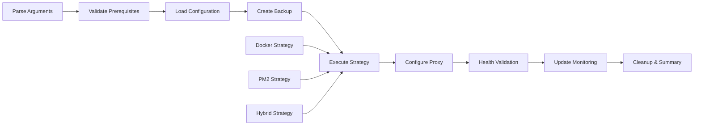

# Node.js Tutorial HTTP Server Infrastructure

## Table of Contents

1. [Overview](#overview)
2. [Quick Start Guide](#quick-start-guide)
3. [Deployment Strategies](#deployment-strategies)
4. [Container Orchestration](#container-orchestration)
5. [Monitoring and Observability](#monitoring-and-observability)
6. [Security Configuration](#security-configuration)
7. [Deployment Automation](#deployment-automation)
8. [Operational Procedures](#operational-procedures)
9. [Troubleshooting Guide](#troubleshooting-guide)
10. [Educational Features](#educational-features)

## Overview

### Introduction

This comprehensive infrastructure documentation demonstrates **enterprise-grade deployment patterns** for a simple Node.js tutorial HTTP server application. While the application itself is intentionally minimal (serving only a `/hello` endpoint), the infrastructure showcases production-ready deployment strategies, monitoring integration, and operational excellence patterns that are essential for modern web application deployment.

**Educational Philosophy**: By applying sophisticated infrastructure patterns to a simple, understandable application, developers can focus on learning advanced deployment concepts without being overwhelmed by complex application logic. This approach provides a clear foundation for understanding how enterprise-grade infrastructure works in practice.

### Architecture Overview

```
┌─────────────────────────────────────────────────────────────────────────────┐
│                          Production Infrastructure                           │
├─────────────────────┬───────────────────────┬─────────────────────────────┤
│    Load Balancer    │   Application Layer   │    Monitoring Stack         │
│                     │                       │                             │
│  ┌───────────────┐  │  ┌─────────────────┐  │  ┌───────────────────────┐  │
│  │     Nginx     │  │  │   Node.js App   │  │  │      Prometheus       │  │
│  │   (SSL/TLS)   │──┼──│   (Port 3000)   │  │  │   (Metrics Collection)│  │
│  │ (Port 80/443) │  │  │                 │  │  │                       │  │
│  └───────────────┘  │  └─────────────────┘  │  └───────────────────────┘  │
│                     │                       │                             │
│  • Rate Limiting    │  • Health Endpoints   │  ┌───────────────────────┐  │
│  • Security Headers │  • Process Management │  │       Grafana         │  │
│  • Load Balancing   │  • Error Handling     │  │   (Visualization)     │  │
│                     │                       │  │                       │  │
└─────────────────────┴───────────────────────┴─────────────────────────────┘
```

### Educational Objectives

This infrastructure demonstrates:

- **Containerization**: Multi-stage Docker builds with security hardening
- **Orchestration**: Docker Compose service management with networking and volumes
- **Reverse Proxy**: Production-grade Nginx configuration with SSL termination
- **Monitoring**: Comprehensive health monitoring with Prometheus and Grafana
- **Security**: Container security, network isolation, and secure communication
- **Automation**: Deployment automation with rollback capabilities
- **Operational Excellence**: Health checks, logging, backup, and disaster recovery

## Quick Start Guide

### Prerequisites

#### Required Software

- **Docker Engine 24.x+** - Container platform for application containerization
- **Docker Compose 2.20+** - Multi-service orchestration platform
- **Git** - Source code management and deployment
- **curl** - Health checking and API testing

#### Optional Software

- **Node.js 22.x LTS** - For local development without containers
- **PM2 5.x** - Process management deployment strategy
- **Nginx 1.24+** - Reverse proxy for production environments

#### System Requirements

- **Memory**: 4GB+ RAM for complete monitoring stack
- **CPU**: 2+ cores for optimal performance
- **Storage**: 10GB+ disk space for containers and logs
- **Network**: Internet connectivity for image pulls and monitoring

### Development Setup

```bash
# Clone the repository
git clone <repository-url>
cd nodejs-tutorial-server

# Start the complete infrastructure stack
docker-compose -f infrastructure/docker/docker-compose.production.yml up -d

# Verify deployment
curl http://localhost/hello
curl http://localhost/health

# Access monitoring dashboards
open http://localhost:9090  # Prometheus metrics
open http://localhost:3001  # Grafana dashboards
```

### Production Deployment

#### Automated Deployment

```bash
# Execute production deployment with Docker strategy
./infrastructure/scripts/deploy.sh \
  --environment production \
  --strategy docker \
  --verbose

# Monitor deployment progress
docker-compose -f infrastructure/docker/docker-compose.production.yml logs -f

# Validate deployment health
./infrastructure/scripts/health-check.sh --verbose

# Test HTTPS access (if SSL configured)
curl https://your-domain.com/hello
```

#### Manual Verification Steps

```bash
# Check all services are running
docker-compose -f infrastructure/docker/docker-compose.production.yml ps

# Verify SSL configuration (if enabled)
curl -I https://your-domain.com

# Test monitoring endpoints
curl http://localhost:9090/-/healthy  # Prometheus health
curl http://localhost:3001/api/health # Grafana health

# Review service logs
docker-compose -f infrastructure/docker/docker-compose.production.yml logs nginx prometheus grafana
```

## Deployment Strategies

### Docker Strategy

**Description**: Containerized deployment using Docker with multi-stage builds and production optimization.

#### Components

- **Multi-stage Dockerfile** with Alpine Linux base image
- **Production container optimization** and security hardening
- **Container networking** and volume management
- **Health check integration** and restart policies

#### Usage Examples

```bash
# Build production Docker image
docker build -f infrastructure/docker/Dockerfile.production -t nodejs-tutorial:latest .

# Run single container
docker run -d -p 3000:3000 --name nodejs-tutorial nodejs-tutorial:latest

# Debug container issues
docker exec -it nodejs-tutorial /bin/sh
docker logs nodejs-tutorial --tail 100
```

#### Best Practices

- **Image layer optimization**: Minimize layers and use .dockerignore
- **Security scanning**: Regular vulnerability scanning of base images
- **Resource limits**: Set appropriate memory and CPU limits
- **Health checks**: Implement comprehensive container health validation

### Docker Compose Strategy

**Description**: Multi-service orchestration using Docker Compose for complete production environment.

#### Service Architecture

```yaml
services:
  app:          # Node.js application with resource limits
  nginx:        # Reverse proxy with SSL termination
  prometheus:   # Metrics collection and monitoring
  grafana:      # Visualization dashboards
  # Additional services can be added as needed
```

#### Components

- **Application service** with resource limits and health checks
- **Nginx reverse proxy** with SSL termination and load balancing
- **Prometheus metrics collection** with retention and alerting
- **Grafana visualization dashboards** with persistent data
- **Persistent volume management** for data and configurations

#### Usage Examples

```bash
# Start complete production stack
docker-compose -f infrastructure/docker/docker-compose.production.yml up -d

# Scale application service
docker-compose -f infrastructure/docker/docker-compose.production.yml up -d --scale app=3

# Monitor service logs
docker-compose -f infrastructure/docker/docker-compose.production.yml logs -f app nginx

# Perform rolling update
docker-compose -f infrastructure/docker/docker-compose.production.yml up -d --force-recreate app

# Validate health across all services
docker-compose -f infrastructure/docker/docker-compose.production.yml exec app curl http://localhost:3000/health
```

#### Best Practices

- **Service networking**: Use custom networks for service isolation
- **Volume management**: Implement backup strategies for persistent data
- **Environment variables**: Secure configuration management
- **Service discovery**: Configure proper DNS resolution between services

### PM2 Strategy

**Description**: Process-based deployment using PM2 process manager for Node.js application management.

#### Components

- **PM2 ecosystem configuration** for multiple environments
- **Process clustering** and load balancing
- **Application monitoring** and automatic restart policies
- **Log management** and rotation

#### Usage Examples

```bash
# Start PM2 application
pm2 start infrastructure/config/pm2.ecosystem.config.js --env production

# Monitor process status
pm2 status
pm2 monit

# View application logs
pm2 logs nodejs-tutorial-production

# Perform graceful reload
pm2 reload nodejs-tutorial-production

# Scale application processes
pm2 scale nodejs-tutorial-production +2
```

#### Best Practices

- **Process resource management**: Set memory limits and restart thresholds
- **Log aggregation**: Configure centralized log collection
- **Performance monitoring**: Enable process performance tracking
- **Startup scripts**: Configure PM2 to start on system boot

### Hybrid Strategy

**Description**: Combined deployment using Docker for application and PM2 for auxiliary services.

#### Components

- **Containerized main application** with Docker optimization
- **PM2-managed background services** for auxiliary functions
- **Integrated monitoring** and health checks across both deployment types

#### Best Practices

- **Service coordination**: Manage dependencies between Docker and PM2 services
- **Resource optimization**: Optimize resource allocation across deployment types
- **Unified monitoring**: Implement consistent monitoring across all services

## Container Orchestration

### Docker Configuration

#### Dockerfile Explanation

```dockerfile
# Multi-stage build for production optimization
FROM node:22-alpine AS base
# Security: Use non-root user and minimal Alpine image
USER node
WORKDIR /app

FROM base AS dependencies
# Install only production dependencies
COPY package*.json ./
RUN npm ci --only=production --no-audit --no-fund

FROM base AS production  
# Copy application code and dependencies
COPY --from=dependencies /app/node_modules ./node_modules
COPY --chown=node:node . .

# Health check integration
HEALTHCHECK --interval=30s --timeout=10s --start-period=30s --retries=3 \
  CMD node scripts/docker-healthcheck.js

# Security hardening: Read-only root filesystem
CMD ["dumb-init", "node", "server.js"]
```

#### Build Optimization Techniques

- **Layer caching**: Order Dockerfile instructions for maximum cache efficiency
- **Multi-architecture support**: Build for AMD64 and ARM64 platforms
- **Build context optimization**: Use .dockerignore to exclude unnecessary files
- **Image size reduction**: Remove package managers and build tools from final image

### Docker Compose Services

#### Application Service Configuration

```yaml
app:
  image: nodejs-tutorial:latest
  container_name: nodejs-tutorial-production
  restart: unless-stopped
  ports:
    - "3000:3000"
  environment:
    - NODE_ENV=production
    - PORT=3000
  healthcheck:
    test: ["CMD", "node", "/app/scripts/docker-healthcheck.js"]
    interval: 30s
    timeout: 10s
    retries: 3
  networks:
    - production
  volumes:
    - app-logs:/app/logs
```

#### Nginx Service Configuration

```yaml
nginx:
  image: nginx:1.24-alpine
  container_name: nginx-proxy
  restart: unless-stopped
  ports:
    - "80:80"
    - "443:443"
  volumes:
    - ./config/nginx.conf:/etc/nginx/nginx.conf:ro
    - ./ssl:/etc/ssl:ro
  depends_on:
    - app
  networks:
    - production
```

#### Monitoring Services Configuration

```yaml
prometheus:
  image: prom/prometheus:v2.45.0
  container_name: prometheus
  restart: unless-stopped
  ports:
    - "9090:9090"
  volumes:
    - prometheus-data:/prometheus
    - ./monitoring/prometheus.yml:/etc/prometheus/prometheus.yml:ro

grafana:
  image: grafana/grafana:10.0.0
  container_name: grafana
  restart: unless-stopped
  ports:
    - "3001:3000"
  volumes:
    - grafana-data:/var/lib/grafana
  environment:
    - GF_SECURITY_ADMIN_PASSWORD=admin
```

### Networking and Volumes

#### Network Configuration

```yaml
networks:
  production:
    driver: bridge
    name: nodejs-tutorial-production
    ipam:
      driver: default
      config:
        - subnet: 172.20.0.0/16
  monitoring:
    driver: bridge
    name: nodejs-tutorial-monitoring
    internal: true  # Internal network for monitoring traffic
```

#### Volume Management

```yaml
volumes:
  app-logs:
    name: nodejs-tutorial-logs
    driver: local
  prometheus-data:
    name: prometheus-data
    driver: local
  grafana-data:
    name: grafana-data
    driver: local
  ssl-certs:
    name: ssl-certificates
    driver: local
```

#### Backup and Recovery Strategies

```bash
# Volume backup procedures
docker run --rm -v nodejs-tutorial-logs:/data -v $(pwd):/backup alpine tar czf /backup/logs-backup-$(date +%Y%m%d-%H%M%S).tar.gz -C /data .

# Volume restore procedures
docker run --rm -v nodejs-tutorial-logs:/data -v $(pwd):/backup alpine tar xzf /backup/logs-backup-latest.tar.gz -C /data

# Database and configuration backup (if applicable)
docker-compose exec prometheus promtool tsdb snapshot /prometheus
docker-compose exec grafana grafana-cli admin export-dashboard
```

## Monitoring and Observability

### Health Monitoring

#### Health Endpoints

The Node.js application exposes comprehensive health endpoints:

- **`/health`** - Detailed health status with system metrics
- **`/hello`** - Primary application endpoint for basic connectivity
- **`HEAD /`** - Basic connectivity check for load balancers

#### Health Check Configuration

```yaml
# From infrastructure/monitoring/health-check.yml
health_endpoints:
  primary_endpoint:
    url: "http://127.0.0.1:3000/hello"
    expected_content: "Hello world"
    timeout_ms: 5000
    
  health_endpoint:
    url: "http://127.0.0.1:3000/health"
    timeout_ms: 10000
    cache_ttl_ms: 5000
    required_fields: ["status", "timestamp", "server", "system"]
```

#### Container Health Checks

```yaml
# Docker health check configuration
healthcheck:
  test: ["CMD", "node", "/app/scripts/docker-healthcheck.js"]
  interval: 30s
  timeout: 10s
  retries: 3
  start_period: 30s
```

#### Load Balancer Integration

```nginx
# Nginx upstream health checking
upstream nodejs_tutorial_backend {
    server app:3000 max_fails=3 fail_timeout=30s;
    keepalive 32;
}

location = /health {
    proxy_pass http://nodejs_tutorial_backend/health;
    proxy_cache health_cache;
    proxy_cache_valid 200 5s;
}
```

### Metrics Collection

#### Prometheus Configuration

```yaml
# Prometheus scraping configuration
scrape_configs:
  - job_name: 'nodejs-tutorial'
    static_configs:
      - targets: ['app:3000']
    metrics_path: '/metrics'
    scrape_interval: 30s
    
  - job_name: 'nginx'
    static_configs:
      - targets: ['nginx:9113']
    metrics_path: '/metrics'
    scrape_interval: 30s
```

#### Application Metrics

The Node.js application provides comprehensive metrics:

- **HTTP request metrics**: Response times, status codes, request counts
- **System metrics**: Memory usage, CPU utilization, event loop lag
- **Health metrics**: Endpoint availability, response validation
- **Performance metrics**: Throughput, error rates, cache hit ratios

#### Infrastructure Metrics

- **Container metrics**: Resource usage, restart counts, health status
- **Network metrics**: Connection counts, bandwidth utilization
- **Volume metrics**: Disk usage, I/O operations, backup status

### Visualization and Alerting

#### Grafana Dashboards

Pre-configured dashboards provide comprehensive visibility:

- **Application Overview**: Request volumes, response times, error rates
- **Infrastructure Health**: Container status, resource utilization
- **Security Monitoring**: Failed requests, rate limiting, SSL metrics
- **Performance Analytics**: Trends, capacity planning, SLA tracking

#### Alerting Rules

```yaml
# Prometheus alerting rules
groups:
  - name: nodejs-tutorial-alerts
    rules:
      - alert: HighErrorRate
        expr: rate(http_requests_total{status=~"5.."}[5m]) > 0.05
        for: 2m
        labels:
          severity: warning
        annotations:
          summary: "High error rate detected"
          
      - alert: ServiceDown
        expr: up == 0
        for: 1m
        labels:
          severity: critical
        annotations:
          summary: "Service is down"
```

#### Log Aggregation

```yaml
# Docker Compose logging configuration
logging:
  driver: "json-file"
  options:
    max-size: "10m"
    max-file: "3"
    labels: "service,environment"
```

## Security Configuration

### Container Security

#### Image Hardening

```dockerfile
# Security best practices implemented in Dockerfile.production
FROM node:22-alpine AS production

# Use non-root user
USER node

# Read-only root filesystem
VOLUME ["/tmp", "/app/logs"]

# Health check for security monitoring
HEALTHCHECK --interval=30s --timeout=10s --retries=3 \
  CMD node scripts/docker-healthcheck.js
```

#### Runtime Security

```yaml
# Docker Compose security configuration
app:
  security_opt:
    - no-new-privileges:true
  read_only: true
  tmpfs:
    - /tmp:noexec,nosuid,size=100m
  cap_drop:
    - ALL
  cap_add:
    - NET_BIND_SERVICE
```

#### Network Security

```yaml
# Network isolation configuration
networks:
  production:
    driver: bridge
    driver_opts:
      com.docker.network.bridge.enable_icc: "false"
  monitoring:
    internal: true  # No external access
```

### Reverse Proxy Security

#### SSL/TLS Configuration

```nginx
# Modern TLS configuration in nginx.conf
ssl_protocols TLSv1.2 TLSv1.3;
ssl_ciphers ECDHE-ECDSA-AES128-GCM-SHA256:ECDHE-RSA-AES128-GCM-SHA256;
ssl_prefer_server_ciphers off;

# SSL session optimization
ssl_session_cache shared:SSL:10m;
ssl_session_timeout 10m;
ssl_session_tickets off;

# SSL stapling for certificate validation
ssl_stapling on;
ssl_stapling_verify on;
```

#### Security Headers

```nginx
# Comprehensive HTTP security headers
add_header Strict-Transport-Security "max-age=31536000; includeSubDomains; preload" always;
add_header Content-Security-Policy "default-src 'self'" always;
add_header X-Content-Type-Options nosniff always;
add_header X-Frame-Options DENY always;
add_header X-XSS-Protection "0" always;
add_header Referrer-Policy "strict-origin-when-cross-origin" always;
```

#### Rate Limiting and DDoS Protection

```nginx
# Rate limiting configuration
limit_req_zone $binary_remote_addr zone=api:10m rate=10r/s;
limit_req_zone $binary_remote_addr zone=health:1m rate=1r/s;

# Connection limiting
limit_conn_zone $binary_remote_addr zone=perip:10m;
limit_conn perip 20;
```

### Operational Security

#### Secret Management

```bash
# Environment variable security
export NODE_ENV=production
export DATABASE_URL=${DATABASE_URL:-}
export JWT_SECRET=${JWT_SECRET:-}
export SSL_CERT_PATH=${SSL_CERT_PATH:-}

# Docker secrets (for production)
echo "my-secret" | docker secret create app-secret -
```

#### Access Control

```yaml
# Service-to-service authentication
app:
  environment:
    - SERVICE_TOKEN=${SERVICE_TOKEN}
    - ALLOWED_ORIGINS=${ALLOWED_ORIGINS}
```

#### Audit Logging

```nginx
# Structured security logging
log_format security_log '$remote_addr - $remote_user [$time_local] '
                       '"$request" $status $body_bytes_sent '
                       '"$http_referer" "$http_user_agent" '
                       'blocked="$blocked" threat_level="$threat_level"';

access_log /var/log/nginx/security.log security_log;
```

## Deployment Automation

### Deployment Script Overview

The comprehensive deployment script (`infrastructure/scripts/deploy.sh`) provides:

- **Multi-strategy deployment** (Docker, PM2, hybrid)
- **Zero-downtime deployments** with health validation
- **Automatic rollback capabilities** with backup management
- **Comprehensive health validation** across all services
- **Monitoring integration** and alerting configuration

#### Deployment Phases



### Deployment Strategies

#### Docker Deployment

```bash
# Execute Docker deployment strategy
./infrastructure/scripts/deploy.sh \
  --environment production \
  --strategy docker \
  --health-timeout 120 \
  --verbose

# Strategy includes:
# - Multi-stage Docker build with optimization
# - Docker Compose service orchestration
# - Health check integration and validation
# - Volume and network configuration
# - Service startup and readiness validation
```

#### PM2 Deployment

```bash
# Execute PM2 deployment strategy
./infrastructure/scripts/deploy.sh \
  --environment production \
  --strategy pm2 \
  --no-rollback \
  --force

# Strategy includes:
# - Dependency installation and optimization
# - PM2 ecosystem configuration application
# - Process clustering and load balancing
# - Log management and rotation setup
# - Process health monitoring and restart policies
```

#### Rollback Procedures

```bash
# Automatic rollback on deployment failure
ROLLBACK_ON_FAILURE=true ./infrastructure/scripts/deploy.sh \
  --environment production \
  --strategy docker

# Manual rollback to previous deployment
./infrastructure/scripts/deploy.sh --rollback backup-20241219-143022

# Rollback includes:
# - Service graceful shutdown and restart
# - Configuration restoration from backup
# - Health validation of rolled-back services
# - Monitoring update with rollback status
```

### CI/CD Integration

#### GitHub Actions Integration

```yaml
# .github/workflows/deploy.yml
name: Deploy to Production
on:
  push:
    branches: [main]

jobs:
  deploy:
    runs-on: ubuntu-latest
    steps:
      - name: Checkout code
        uses: actions/checkout@v4
        
      - name: Deploy application
        run: |
          ./infrastructure/scripts/deploy.sh \
            --environment production \
            --strategy docker \
            --force \
            --verbose
```

#### Deployment Pipelines

```yaml
# Deployment pipeline configuration
stages:
  - validate:
      script: ./infrastructure/scripts/deploy.sh --dry-run
  - deploy:
      script: ./infrastructure/scripts/deploy.sh --environment production
  - validate:
      script: ./infrastructure/scripts/health-check.sh --comprehensive
```

## Operational Procedures

### Maintenance Tasks

#### Routine Maintenance

```bash
# Weekly maintenance script
#!/bin/bash

# Update container images
docker-compose pull

# Clean up unused Docker resources
docker system prune -f --filter "until=168h"

# Rotate logs
docker-compose exec app npm run logs:rotate

# Backup persistent volumes
./infrastructure/scripts/backup.sh --weekly

# Validate service health
./infrastructure/scripts/health-check.sh --comprehensive
```

#### Scaling Procedures

```bash
# Horizontal scaling with Docker Compose
docker-compose -f infrastructure/docker/docker-compose.production.yml up -d --scale app=3

# Vertical scaling with resource updates
docker-compose -f infrastructure/docker/docker-compose.production.yml \
  up -d --force-recreate \
  --scale app=1 \
  -e "APP_MEMORY_LIMIT=1024m" \
  -e "APP_CPU_LIMIT=1.0"

# PM2 cluster scaling
pm2 scale nodejs-tutorial-production +2
pm2 scale nodejs-tutorial-production 5
```

#### Disaster Recovery

```bash
# Disaster recovery procedures
#!/bin/bash

# Stop all services
docker-compose -f infrastructure/docker/docker-compose.production.yml down

# Restore from backup
./infrastructure/scripts/restore.sh --backup-id backup-20241219-143022

# Restart services with health validation
./infrastructure/scripts/deploy.sh --environment production --force

# Validate recovery success
./infrastructure/scripts/health-check.sh --timeout 300
```

### Monitoring and Alerts

#### Operational Dashboards

Key dashboards for operational monitoring:

- **Service Health Dashboard**: Real-time status of all services
- **Performance Metrics Dashboard**: Response times, throughput, resource usage
- **Security Dashboard**: Failed requests, rate limiting, SSL metrics
- **Infrastructure Dashboard**: Container health, volume usage, network traffic

#### Alert Management

```yaml
# Alert configuration and escalation
alerting:
  groups:
    - name: critical-alerts
      alerts:
        - name: service-down
          condition: up == 0
          for: 1m
          severity: critical
          actions:
            - email: ops-team@company.com
            - slack: #critical-alerts
            - pagerduty: service-down
            
    - name: warning-alerts
      alerts:
        - name: high-response-time
          condition: http_request_duration_seconds > 1.0
          for: 5m
          severity: warning
          actions:
            - slack: #monitoring-alerts
```

#### Capacity Planning

```bash
# Capacity monitoring and planning
#!/bin/bash

# Monitor resource usage trends
prometheus-query 'rate(container_memory_usage_bytes[1h])'
prometheus-query 'rate(container_cpu_usage_seconds_total[1h])'

# Generate capacity report
grafana-cli admin export-dashboard --dashboard-id=1 > capacity-report.json

# Alert on resource thresholds
if [ $(docker stats --no-stream --format "{{.MemPerc}}" app | tr -d '%') -gt 80 ]; then
    echo "WARNING: Memory usage exceeding 80%"
fi
```

## Troubleshooting Guide

### Common Issues

#### Container Startup Failures

**Symptoms:**
- Container exits immediately with non-zero exit code
- Port binding errors (address already in use)
- Health check failures during startup

**Diagnosis:**
```bash
# Check container logs
docker-compose logs app --tail 50

# Verify port availability
netstat -tulpn | grep :3000
lsof -i :3000

# Check container configuration
docker inspect nodejs-tutorial-production

# Validate Dockerfile and build process
docker build -f infrastructure/docker/Dockerfile.production . --no-cache
```

**Solutions:**
- Adjust resource limits if memory/CPU constraints are detected
- Fix configuration errors in environment variables or files
- Ensure port availability or change port configuration
- Check and fix any dependency installation issues

#### Reverse Proxy Connection Errors

**Symptoms:**
- 502 Bad Gateway errors from Nginx
- SSL certificate validation failures
- Connection refused errors to upstream

**Diagnosis:**
```bash
# Check Nginx configuration syntax
nginx -t

# Test upstream connectivity
curl -v http://app:3000/health

# Validate SSL certificates
openssl x509 -in /etc/ssl/certs/server.crt -text -noout

# Check Nginx error logs
docker-compose logs nginx --tail 100
```

**Solutions:**
- Fix upstream configuration in nginx.conf
- Update or renew SSL certificates
- Reload Nginx configuration: `nginx -s reload`
- Verify network connectivity between Nginx and app containers

#### Monitoring Data Gaps

**Symptoms:**
- Missing metrics in Prometheus
- Dashboard showing "No data" in Grafana
- Health check alert failures

**Diagnosis:**
```bash
# Check Prometheus targets
curl http://localhost:9090/api/v1/targets

# Verify metrics endpoint availability
curl http://localhost:3000/metrics

# Check Grafana data source connectivity
curl http://localhost:3001/api/datasources

# Review monitoring service logs
docker-compose logs prometheus grafana --tail 50
```

**Solutions:**
- Restart monitoring services: `docker-compose restart prometheus grafana`
- Fix metrics endpoint configuration in application
- Update Grafana data source configuration
- Check and fix Prometheus scraping configuration

### Debugging Commands

#### Service Debugging

```bash
# Follow service logs in real-time
docker-compose -f infrastructure/docker/docker-compose.production.yml logs -f app

# Access service shell for debugging
docker-compose exec app /bin/sh

# Monitor resource usage
docker stats nodejs-tutorial-production

# Get detailed container information
docker inspect nodejs-tutorial-production | jq '.[0].State'
```

#### Network Debugging

```bash
# List Docker networks
docker network ls

# Inspect network details
docker network inspect nodejs-tutorial-production

# Test DNS resolution between services
docker-compose exec app nslookup nginx
docker-compose exec nginx nslookup app

# Test connectivity between services
docker-compose exec app curl -v http://nginx/health
docker-compose exec nginx curl -v http://app:3000/hello
```

#### Monitoring Debugging

```bash
# Check Prometheus health
curl http://localhost:9090/-/healthy

# Test Prometheus queries
curl 'http://localhost:9090/api/v1/query?query=up'

# Check Grafana health
curl http://localhost:3001/api/health

# Test metric collection
promtool query instant 'http_requests_total'
```

### Performance Optimization

#### Application Performance

```bash
# Monitor application performance
docker-compose exec app node --inspect=0.0.0.0:9229 server.js

# Profile memory usage
docker stats --format "table {{.Container}}\t{{.CPUPerc}}\t{{.MemUsage}}\t{{.MemPerc}}"

# Check event loop lag
curl http://localhost:3000/metrics | grep nodejs_eventloop_lag_seconds
```

#### Infrastructure Performance

```bash
# Optimize Docker performance
docker system prune -f
docker image prune -f

# Monitor disk usage
df -h
docker system df

# Check network performance
docker-compose exec app ping -c 4 nginx
docker-compose exec nginx ping -c 4 app
```

## Educational Features

### Infrastructure Learning Concepts

This infrastructure demonstrates enterprise-grade patterns applied to a simple application, providing clear learning opportunities:

#### Containerization Concepts

- **Multi-stage builds**: Optimize build process and reduce final image size
- **Security hardening**: Implement non-root execution and minimal attack surface
- **Health monitoring**: Integrate application health checks with container orchestration
- **Resource management**: Configure appropriate limits and monitoring for production

#### Service Orchestration

- **Service networking**: Understand container networking and service discovery
- **Volume management**: Implement persistent storage and backup strategies
- **Configuration management**: Secure handling of environment variables and secrets
- **Scaling strategies**: Learn horizontal and vertical scaling patterns

#### Monitoring Best Practices

- **Health endpoint design**: Implement comprehensive health reporting
- **Metrics collection**: Understand application and infrastructure monitoring
- **Alerting strategies**: Configure appropriate thresholds and notification channels
- **Observability**: Implement logging, metrics, and tracing for operational visibility

#### Security Implementation

- **Container security**: Apply security hardening techniques in containerized environments
- **Network security**: Implement service isolation and secure communication
- **SSL/TLS management**: Configure modern encryption and certificate management
- **Access control**: Implement authentication and authorization patterns

#### Operational Excellence

- **Deployment automation**: Understand automated deployment with rollback capabilities
- **Infrastructure as Code**: Manage infrastructure through version-controlled configuration
- **Disaster recovery**: Implement backup and recovery procedures
- **Performance optimization**: Apply performance monitoring and optimization techniques

### Container Orchestration Learning

#### Docker Concepts Demonstrated

```dockerfile
# Multi-stage build optimization
FROM node:22-alpine AS base
# Dependency caching layer
FROM base AS dependencies
# Production optimization layer
FROM base AS production
```

#### Docker Compose Patterns

```yaml
# Service dependency management
depends_on:
  - app
  
# Health check integration
healthcheck:
  test: ["CMD", "curl", "-f", "http://localhost:3000/health"]
  
# Resource constraints
deploy:
  resources:
    limits:
      memory: 512m
      cpus: '0.5'
```

#### Networking and Security

```yaml
# Network isolation
networks:
  production:
    driver: bridge
  monitoring:
    internal: true
    
# Security hardening
security_opt:
  - no-new-privileges:true
read_only: true
cap_drop:
  - ALL
```

### Monitoring Implementation Learning

#### Health Check Patterns

```javascript
// Application health endpoint implementation
app.get('/health', (req, res) => {
  const healthData = {
    status: 'healthy',
    timestamp: new Date().toISOString(),
    server: {
      uptime: process.uptime(),
      memory: process.memoryUsage(),
      pid: process.pid
    },
    system: {
      platform: process.platform,
      nodejs: process.version,
      environment: process.env.NODE_ENV
    }
  };
  
  res.json(healthData);
});
```

#### Metrics Collection Integration

```yaml
# Prometheus configuration for Node.js application
scrape_configs:
  - job_name: 'nodejs-tutorial'
    static_configs:
      - targets: ['app:3000']
    scrape_interval: 30s
    metrics_path: '/metrics'
```

#### Dashboard Configuration

```json
{
  "dashboard": {
    "title": "Node.js Tutorial Application",
    "panels": [
      {
        "title": "Request Rate",
        "type": "graph",
        "targets": [
          {
            "expr": "rate(http_requests_total[5m])"
          }
        ]
      }
    ]
  }
}
```

### Security Learning Implementation

#### Container Security Patterns

```dockerfile
# Security best practices
FROM node:22-alpine
RUN addgroup -g 1001 -S nodejs
RUN adduser -S nodejs -u 1001
USER nodejs
COPY --chown=nodejs:nodejs . .
HEALTHCHECK CMD curl -f http://localhost:3000/health || exit 1
```

#### Network Security Configuration

```nginx
# Production-grade security headers
add_header Strict-Transport-Security "max-age=31536000; includeSubDomains; preload" always;
add_header Content-Security-Policy "default-src 'self'" always;
add_header X-Content-Type-Options nosniff always;
add_header X-Frame-Options DENY always;
```

#### Rate Limiting and Protection

```nginx
# DDoS protection and rate limiting
limit_req_zone $binary_remote_addr zone=api:10m rate=10r/s;
limit_req zone=api burst=20 nodelay;
limit_conn_zone $binary_remote_addr zone=perip:10m;
limit_conn perip 20;
```

### Operational Excellence Patterns

#### Deployment Automation Learning

```bash
# Comprehensive deployment with validation
#!/bin/bash
set -euo pipefail

# Validate prerequisites
validate_prerequisites() {
  command -v docker >/dev/null || { echo "Docker required"; exit 1; }
  command -v docker-compose >/dev/null || { echo "Docker Compose required"; exit 1; }
}

# Create backup before deployment
create_backup() {
  local backup_id="backup-$(date +%Y%m%d-%H%M%S)"
  docker-compose exec app tar czf "/tmp/$backup_id.tar.gz" /app/data || true
}

# Execute deployment with rollback capability
deploy_with_rollback() {
  if ! docker-compose up -d; then
    echo "Deployment failed, rolling back..."
    restore_backup "$backup_id"
    exit 1
  fi
}
```

#### Infrastructure as Code Patterns

```yaml
# Complete infrastructure definition
version: '3.8'
services:
  app:
    build:
      context: .
      dockerfile: infrastructure/docker/Dockerfile.production
    environment:
      - NODE_ENV=production
    deploy:
      replicas: 2
      resources:
        limits:
          memory: 512M
      restart_policy:
        condition: on-failure
        max_attempts: 3
    networks:
      - production
    volumes:
      - app-data:/app/data
```

This comprehensive infrastructure documentation provides enterprise-grade deployment patterns while maintaining educational clarity. The sophisticated infrastructure applied to a simple application creates an ideal learning environment for understanding production deployment concepts without overwhelming complexity in the application logic itself.

---

**Documentation Version**: 1.0.0  
**Last Updated**: December 19, 2024  
**Compatible with**: Node.js 22.x LTS, Docker 24.x+, Docker Compose 2.20+  
**Educational Focus**: Production-ready infrastructure patterns for learning advanced deployment concepts