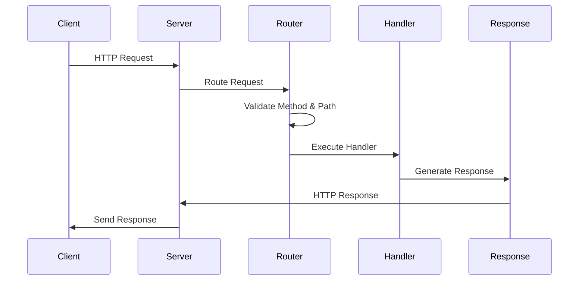

<div align="center">

# Node.js Tutorial HTTP Server - Backend Application

 
 
 
 


🎓 **Educational Node.js HTTP server backend demonstrating fundamental web server concepts using only built-in modules**

*Learn HTTP server development, request processing, and Node.js architecture through hands-on implementation*

</div>

---

## 🌟 Overview

### 🎯 What You'll Learn

- 🏗️ **HTTP Server Architecture** - Node.js built-in `http` module usage and server lifecycle management
- 🔄 **Request Processing Pipeline** - URL routing, method validation, and response generation
- 🛡️ **Error Handling & Security** - Secure error responses, input validation, and security headers
- 🧪 **Testing with Node.js** - Built-in test runner, unit testing, integration testing, and coverage analysis
- 📊 **Health Monitoring** - Application health checks, performance monitoring, and operational visibility
- 🚀 **Production Deployment** - Process management, containerization, and deployment automation

### ✨ Key Features

- ✅ **Zero External Dependencies** - Pure Node.js implementation using only built-in modules
- 🌐 **Simple HTTP API** - `/hello` endpoint returning 'Hello world' and `/health` status endpoint
- 🔐 **Security Best Practices** - HTTP security headers, input validation, and secure error handling
- 🧪 **Comprehensive Test Suite** - Unit, integration, and E2E tests with 90%+ coverage
- 📊 **Performance Monitoring** - Response time tracking, memory usage monitoring, and health checks
- 🐳 **Docker Ready** - Production containerization with multi-stage builds and health checks
- 📚 **Educational Documentation** - Detailed guides, examples, and architectural explanations
- ⚡ **High Performance** - <100ms response times, <50MB memory usage, 1000+ RPS capability

### 👥 Target Audience

Developers learning Node.js HTTP server development, web server architecture, and backend API implementation

### 🎯 Learning Objectives

- Master Node.js HTTP server creation and lifecycle management
- Understand request routing, processing, and response generation patterns
- Implement secure error handling and HTTP security best practices
- Apply testing methodologies using Node.js built-in testing capabilities
- Learn production deployment patterns with containers and monitoring

---

## 🚀 Quick Start

### 📋 Prerequisites

- **Node.js**: Version 18.0.0 or higher ([Download Node.js](https://nodejs.org/))
- **Git**: For repository cloning and version control
- **Command Line**: Basic terminal/command prompt familiarity
- **Text Editor**: VS Code, WebStorm, or preferred code editor

### ⚡ Installation Steps

1. **Clone Repository**: `git clone <repository-url> && cd nodejs-tutorial-http-server`
2. **Navigate to Backend**: `cd src/backend`
3. **Install Dependencies**: None required - uses only Node.js built-in modules
4. **Start Server**: `node server.js`
5. **Verify Installation**: Server runs on http://localhost:3000

### 🔍 Verification Commands

```bash
# Test hello endpoint
curl http://localhost:3000/hello
# Expected: Hello world

# Test health endpoint
curl http://localhost:3000/health | jq
# Expected: JSON health status

# Test error handling
curl http://localhost:3000/invalid
# Expected: 404 Not Found
```

### ✅ Success Indicators

- ✅ Server starts without errors and displays listening message
- ✅ `/hello` endpoint returns 'Hello world' text response
- ✅ `/health` endpoint returns JSON health status
- ✅ Invalid paths return proper 404 error responses
- ✅ Server logs show successful request processing

---

## 📁 Project Structure

### 📂 Directory Structure

```
src/backend/
├── server.js                    # 🎯 Application entry point
├── package.json                 # 📦 Project configuration
├── API.md                       # 📖 API documentation
├── lib/                         # 🏗️ Core components
│   ├── http-server.js           #    HTTP server implementation
│   ├── request-router.js        #    Request routing logic
│   ├── hello-handler.js         #    Hello endpoint handler
│   ├── error-handler.js         #    Error processing component
│   ├── response-generator.js    #    HTTP response generation
│   └── logger.js                #    Application logging
├── config/                      # ⚙️ Configuration management
│   ├── environment.js           #    Environment variables
│   └── server-config.js         #    Server configuration
├── middleware/                  # 🔗 HTTP middleware
│   ├── request-logger.js        #    Request logging middleware
│   └── error-middleware.js      #    Error handling middleware
├── security/                    # 🛡️ Security components
│   ├── security-headers.js      #    HTTP security headers
│   ├── request-validator.js     #    Input validation
│   └── rate-limiter.js          #    Request rate limiting
├── monitoring/                  # 📊 Health & monitoring
│   ├── health-endpoint.js       #    Health check endpoint
│   ├── metrics-collector.js     #    Performance metrics
│   └── uptime-monitor.js        #    Uptime monitoring
├── test/                        # 🧪 Test suite
│   ├── unit/                    #    Unit tests
│   ├── integration/             #    Integration tests
│   ├── e2e/                     #    End-to-end tests
│   └── fixtures/                #    Test utilities and data
├── docs/                        # 📚 Documentation
│   ├── development-guide.md     #    Development instructions
│   ├── architecture.md          #    System architecture
│   ├── testing-guide.md         #    Testing methodology
│   └── deployment-guide.md      #    Deployment procedures
├── examples/                    # 💡 Usage examples
│   ├── client-examples.js       #    HTTP client examples
│   ├── curl-examples.sh         #    Command line examples
│   └── postman-collection.json  #    API testing collection
└── scripts/                     # 🚀 Automation scripts
    ├── start.js                 #    Production startup
    ├── dev.js                   #    Development server
    ├── test.js                  #    Test runner
    └── health-check.js          #    Health validation
```

### 🧩 Core Components

| Component | Purpose | Documentation |
|-----------|---------|---------------|
| **server.js** | Application entry point and server bootstrap | Main application file |
| **lib/** | Core HTTP server components and business logic | Component architecture |
| **config/** | Environment and server configuration management | Configuration guide |
| **test/** | Comprehensive test suite with multiple test types | [Testing Guide](./docs/testing-guide.md) |
| **docs/** | Detailed documentation and development guides | [Development Guide](./docs/development-guide.md) |
| **examples/** | Practical usage examples and client implementations | [Client Examples](./examples/) |

### 🎯 Key Files

**server.js** - Main application entry point that bootstraps the HTTP server, configures components, and manages application lifecycle

**lib/http-server.js** - Core HTTP server implementation using Node.js built-in `http` module with request handling and response generation

**lib/request-router.js** - URL routing logic that matches request paths to appropriate handlers with method validation

**lib/hello-handler.js** - Hello endpoint handler that generates 'Hello world' responses with proper HTTP headers

**config/environment.js** - Environment configuration management with development/production settings

**test/** - Comprehensive test suite using Node.js built-in test runner with unit, integration, and E2E tests

---

## 🏗️ Architecture

### 🔍 Overview

The backend follows a **component-based monolithic architecture** designed for educational clarity and maintainable code organization. Each component has a single responsibility and clear interfaces.

### 🏛️ Architectural Principles

- 🏗️ **Component Separation** - Each component handles specific functionality (server, routing, handlers, etc.)
- 🔗 **Clean Interfaces** - Components communicate through well-defined interfaces and function calls
- 📦 **Zero Dependencies** - Uses only Node.js built-in modules for educational clarity
- 🔄 **Event-Driven** - Leverages Node.js event loop for asynchronous I/O operations
- 🛡️ **Error Isolation** - Centralized error handling prevents error propagation
- 📊 **Observable** - Comprehensive logging and monitoring for operational visibility

### 🔄 Request Flow



### 🔗 Component Relationships

**HTTP Server** → **Request Router** → **Endpoint Handlers** → **Response Generator**

- **HTTP Server**: Accepts connections and delegates to router
- **Request Router**: Analyzes URLs and routes to appropriate handlers
- **Endpoint Handlers**: Process requests and generate content
- **Response Generator**: Formats HTTP responses with headers and content
- **Error Handler**: Processes errors and generates secure error responses
- **Logger**: Provides operational visibility across all components

---

## 🛠️ Development

### 🚀 Development Scripts

```bash
# Start development server with file watching
npm run dev

# Start production server
npm start

# Run all tests with coverage
npm test

# Run specific test suites
npm run test:unit
npm run test:integration
npm run test:e2e

# Check server health
npm run health-check

# Run performance benchmarks
npm run benchmark
```

### 🔄 Development Workflow

1. **Start Development Server**: `npm run dev` - Automatic restart on file changes
2. **Make Code Changes**: Edit files with immediate feedback from file watcher
3. **Run Tests**: `npm test` - Execute test suite with coverage analysis
4. **Validate Health**: `npm run health-check` - Ensure server is responding correctly
5. **Performance Check**: `npm run benchmark` - Validate performance thresholds
6. **Code Review**: Follow code standards and security practices

### ⚙️ Environment Configuration

Create `.env` file for local development:

```bash
# Server Configuration
PORT=3000
HOST=127.0.0.1
NODE_ENV=development

# Logging Configuration
LOG_LEVEL=info
LOG_FORMAT=json

# Performance Configuration
REQUEST_TIMEOUT=30000
KEEP_ALIVE_TIMEOUT=5000
```

**Configuration Files:**
- `config/environment.js` - Environment variable management
- `config/server-config.js` - HTTP server configuration
- `.env.example` - Environment template with all options

### 🐛 Debugging Guide

**Enable Debug Logging:**
```bash
LOG_LEVEL=debug npm run dev
```

**Node.js Inspector:**
```bash
node --inspect server.js
# Open chrome://inspect in Chrome browser
```

**Performance Profiling:**
```bash
node --prof server.js
# Generate performance profile
```

**Common Issues:**
- **Port in use**: `lsof -i :3000` to find and kill processes
- **Module not found**: Check file paths and ES module syntax
- **Permission errors**: Ensure Node.js has necessary permissions

---

## 🧪 Testing

### 🎯 Testing Strategy

The backend uses **Node.js built-in test runner** (no external dependencies) with comprehensive test coverage:

- **Unit Tests**: Individual component testing with mocks
- **Integration Tests**: HTTP server and endpoint testing
- **End-to-End Tests**: Complete workflow validation
- **Performance Tests**: Response time and memory usage validation
- **Coverage Analysis**: 90%+ code coverage requirement

### ▶️ Running Tests

```bash
# Run all tests
node --test

# Run tests with coverage
node --test --experimental-test-coverage

# Run specific test suite
node --test test/unit/
node --test test/integration/
node --test test/e2e/

# Watch mode for development
node --test --watch test/

# Generate coverage report
npm run test:coverage
```

### 📝 Test Examples

**Unit Test Example:**
```javascript
import { test, describe } from 'node:test';
import assert from 'node:assert/strict';
import { helloHandler } from '../lib/hello-handler.js';

describe('Hello Handler', () => {
  test('should return Hello world response', async () => {
    const response = await helloHandler();
    assert.strictEqual(response.body, 'Hello world');
    assert.strictEqual(response.status, 200);
  });
});
```

**Integration Test Example:**
```javascript
import { test, describe, before, after } from 'node:test';
import assert from 'node:assert/strict';

describe('API Integration Tests', () => {
  test('GET /hello should return Hello world', async () => {
    const response = await fetch('http://localhost:3000/hello');
    assert.strictEqual(response.status, 200);
    assert.strictEqual(await response.text(), 'Hello world');
  });
});
```

### 🔧 Test Utilities

**TestEnvironment Class** - Manages test server lifecycle:
```javascript
import { TestEnvironment } from './test/fixtures/test-helpers.js';

const testEnv = new TestEnvironment();
await testEnv.setup();    // Start test server
// ... run tests ...
await testEnv.teardown(); // Clean shutdown
```

**Available Test Utilities:**
- `TestEnvironment` - Test server management
- `MockRequest` - HTTP request mocking
- `ResponseValidator` - Response validation
- `PerformanceTester` - Performance measurement

---

## 🌐 API Reference

### 📡 Endpoints Overview

The backend provides a simple HTTP API with two main endpoints:

| Endpoint | Method | Description | Response |
|----------|--------|-------------|----------|
| `/hello` | GET | Hello world demonstration | `Hello world` (text/plain) |
| `/health` | GET | Server health status | JSON health metrics |

**📖 Complete API Documentation**: [API.md](./API.md)

### 👋 Hello Endpoint

**URL**: `GET /hello`  
**Purpose**: Demonstrates basic HTTP response generation  
**Response**: Plain text 'Hello world' message  

```bash
curl http://localhost:3000/hello
# Response: Hello world
```

**Response Headers:**
- `Content-Type: text/plain; charset=utf-8`
- `Content-Length: 11`
- `X-Content-Type-Options: nosniff`
- `X-Frame-Options: DENY`

### 🏥 Health Endpoint

**URL**: `GET /health`  
**Purpose**: System health monitoring and status checks  
**Response**: JSON object with health metrics  

```bash
curl http://localhost:3000/health
# Response: JSON health status
```

**Response Format:**
```json
{
  "status": "healthy",
  "timestamp": "2024-01-01T12:00:00.000Z",
  "uptime": 123456,
  "version": "1.0.0",
  "checks": {
    "server": "ok",
    "memory": "ok"
  }
}
```

### ❌ Error Responses

The server returns standard HTTP error codes with consistent formatting:

| Status | Description | Example |
|--------|-------------|---------|
| 404 | Not Found | `curl http://localhost:3000/invalid` |
| 405 | Method Not Allowed | `curl -X POST http://localhost:3000/hello` |
| 500 | Internal Server Error | Server processing errors |

**Error Response Format:**
```
HTTP/1.1 404 Not Found
Content-Type: text/plain
Content-Length: 9

Not Found
```

---

## 🚀 Deployment

### 🏠 Deployment Options

#### **Local Development**
```bash
cd src/backend
node server.js
# Server runs on http://localhost:3000
```

#### **Production Server**
```bash
NODE_ENV=production node scripts/start.js
# Production optimized startup
```

#### **Docker Deployment**
```bash
docker build -t nodejs-tutorial .
docker run -p 3000:3000 nodejs-tutorial
```

#### **Process Manager (PM2)**
```bash
npm install -g pm2
pm2 start ecosystem.config.js
pm2 startup  # Configure auto-start
```

### 🐳 Docker Configuration

**Dockerfile** (included in backend):
```dockerfile
FROM node:22-alpine
WORKDIR /app
COPY server.js .
COPY lib/ lib/
COPY config/ config/
EXPOSE 3000
USER node
CMD ["node", "server.js"]
```

**Build and Run:**
```bash
docker build -t nodejs-tutorial-backend .
docker run -d -p 3000:3000 --name tutorial-server nodejs-tutorial-backend
```

**Health Check:**
```bash
docker exec tutorial-server node scripts/docker-healthcheck.js
```

### ⚙️ Environment Variables

| Variable | Default | Description |
|----------|---------|-------------|
| `PORT` | `3000` | HTTP server port |
| `HOST` | `127.0.0.1` | Server bind address |
| `NODE_ENV` | `development` | Environment mode |
| `LOG_LEVEL` | `info` | Logging verbosity |
| `REQUEST_TIMEOUT` | `30000` | Request timeout (ms) |

**Production Configuration:**
```bash
export NODE_ENV=production
export PORT=8080
export HOST=0.0.0.0
export LOG_LEVEL=warn
node server.js
```

### 📊 Monitoring & Health Checks

**Built-in Health Check:**
```bash
node scripts/health-check.js
# Validates server health and connectivity
```

**Health Endpoint Monitoring:**
```bash
# Monitor health endpoint
watch -n 5 'curl -s http://localhost:3000/health | jq'
```

**Performance Monitoring:**
```bash
# Monitor performance metrics
node benchmarks/performance-baseline.js
```

**Log Monitoring:**
```bash
# Follow application logs
tail -f logs/application.log
```

---

## 💡 Examples

### 🖥️ Client Examples

**JavaScript/Node.js Client:**
```javascript
// Using fetch API
const response = await fetch('http://localhost:3000/hello');
const message = await response.text();
console.log(message); // 'Hello world'
```

**cURL Examples:**
```bash
# Basic hello request
curl http://localhost:3000/hello

# Health check with JSON formatting
curl -s http://localhost:3000/health | jq

# Verbose output with headers
curl -v http://localhost:3000/hello
```

**HTTP Client Testing:**
```javascript
import { HttpClientExamples } from './examples/client-examples.js';

const client = new HttpClientExamples();
await client.runAllExamples();
```

### ⚡ Performance Examples

**Response Time Testing:**
```javascript
import { performanceTestClient } from './examples/client-examples.js';

const results = await performanceTestClient({
  iterations: 1000,
  concurrency: 10
});
console.log(`Average response time: ${results.avgTime}ms`);
```

**Memory Usage Monitoring:**
```bash
node benchmarks/memory-test.js
# Output: Memory usage analysis
```

**Load Testing:**
```bash
node benchmarks/load-test.js
# Simulates concurrent user load
```

### 🔗 Integration Examples

**Express.js Migration Path:**
```javascript
// Future extension with Express.js
import express from 'express';
import { helloHandler } from './lib/hello-handler.js';

const app = express();
app.get('/hello', helloHandler);
app.listen(3000);
```

**Database Integration Example:**
```javascript
// Future extension with database
app.get('/hello/:name', async (req, res) => {
  const greeting = await db.getGreeting(req.params.name);
  res.send(greeting || 'Hello world');
});
```

---

## 🔧 Troubleshooting

### 🚨 Common Issues & Solutions

#### **Server Won't Start**
```
Error: listen EADDRINUSE :::3000
```
**Solution**: Port is already in use
```bash
lsof -i :3000          # Find process using port
kill -9 <PID>          # Kill the process
# Or use different port:
PORT=8080 node server.js
```

#### **Module Not Found Errors**
```
Error: Cannot find module './lib/http-server.js'
```
**Solution**: Check file paths and ES module syntax
```bash
# Ensure you're in src/backend directory
pwd
ls lib/                 # Verify files exist
```

#### **Permission Errors**
```
Error: listen EACCES 0.0.0.0:80
```
**Solution**: Use non-privileged port (>1024) or run with sudo
```bash
PORT=8080 node server.js  # Use port 8080 instead
```

### 🐛 Debugging Steps

1. **Enable Debug Logging**:
   ```bash
   LOG_LEVEL=debug node server.js
   ```

2. **Check Server Health**:
   ```bash
   node scripts/health-check.js
   ```

3. **Verify Network Connectivity**:
   ```bash
   netstat -tulpn | grep :3000
   curl -v http://localhost:3000/hello
   ```

4. **Analyze Error Logs**:
   ```bash
   tail -f logs/application.log
   ```

5. **Performance Diagnosis**:
   ```bash
   node --prof server.js
   # Process profile with node --prof-process
   ```

### ⚡ Performance Troubleshooting

#### **Slow Response Times**
- Check CPU usage: `top` or `htop`
- Monitor memory: `node benchmarks/memory-test.js`
- Analyze event loop: `node --trace-warnings server.js`

#### **Memory Leaks**
- Enable heap profiling: `node --inspect server.js`
- Monitor memory growth: `watch 'ps aux | grep node'`
- Use built-in memory monitoring: Health endpoint shows memory usage

#### **High CPU Usage**
- Profile CPU usage: `node --prof server.js`
- Check for synchronous operations blocking event loop
- Monitor request patterns for unusual traffic

---

## 📚 Documentation Links

### 🏗️ Development & Architecture

- **[Development Guide](./docs/development-guide.md)** - Comprehensive development setup and practices
- **[Architecture Documentation](./docs/architecture.md)** - System design and component relationships
- **[Testing Guide](./docs/testing-guide.md)** - Testing methodology and best practices
- **[Deployment Guide](./docs/deployment-guide.md)** - Production deployment procedures

### 📖 API & Usage

- **[API Documentation](./API.md)** - Complete endpoint specifications and examples
- **[Client Examples](./examples/)** - Practical usage examples and integration patterns
- **[Postman Collection](./examples/postman-collection.json)** - API testing collection

### 🔧 Scripts & Tools

- **[NPM Scripts](./package.json)** - Available automation scripts and commands
- **[Health Check Scripts](./scripts/)** - Health monitoring and validation tools
- **[Docker Configuration](./Dockerfile)** - Container setup and deployment

### 🌐 External Learning Resources

#### **Node.js Official Documentation**
- [Node.js HTTP Module](https://nodejs.org/api/http.html) - Official HTTP module documentation
- [Node.js Test Runner](https://nodejs.org/api/test.html) - Built-in testing capabilities
- [Node.js Best Practices](https://nodejs.org/en/docs/guides/) - Official Node.js guides

#### **HTTP & Web Development**
- [MDN HTTP Documentation](https://developer.mozilla.org/en-US/docs/Web/HTTP) - HTTP protocol reference
- [HTTP Status Codes](https://httpstatuses.com/) - Complete HTTP status code reference
- [Web Security Guidelines](https://owasp.org/www-project-top-ten/) - OWASP security practices

---

## 🎓 Learning Path

### 🥇 Beginner Level (2-4 hours)

**Learning Goals**: Understand basic HTTP server concepts and Node.js fundamentals

1. **🚀 Environment Setup**
   - Install Node.js 18+ and verify installation
   - Clone repository and start the server
   - Test endpoints using curl or browser

2. **📖 Code Exploration**
   - Read through `server.js` and understand application entry point
   - Explore `lib/` directory and component architecture
   - Understand HTTP request-response cycle

3. **🧪 Testing Basics**
   - Run test suite with `npm test`
   - Understand test structure and Node.js test runner
   - Run individual test files and analyze results

4. **🔍 HTTP Fundamentals**
   - Test different HTTP methods (GET, POST, etc.)
   - Understand HTTP status codes and headers
   - Explore error handling for invalid requests

### 🥈 Intermediate Level (1-2 weeks)

**Learning Goals**: Master component architecture and implement custom features

1. **🏗️ Architecture Deep Dive**
   - Study component separation and interfaces
   - Understand request routing and handler patterns
   - Explore error handling and logging systems

2. **🔧 Custom Development**
   - Add new endpoint (e.g., `/goodbye`, `/time`)
   - Implement query parameter handling
   - Add custom middleware for request processing

3. **🧪 Advanced Testing**
   - Write unit tests for new components
   - Create integration tests for new endpoints
   - Implement performance testing scenarios

4. **🛡️ Security & Performance**
   - Implement additional security headers
   - Add input validation and sanitization
   - Monitor performance metrics and optimize

### 🥉 Advanced Level (2-4 weeks)

**Learning Goals**: Master production deployment and monitoring

1. **🚀 Production Deployment**
   - Deploy with Docker containers
   - Set up reverse proxy with Nginx
   - Configure SSL/TLS certificates

2. **📊 Monitoring & Observability**
   - Implement comprehensive health checks
   - Set up metrics collection and alerting
   - Configure log aggregation and analysis

3. **⚡ Performance Optimization**
   - Profile application performance
   - Implement caching strategies
   - Optimize for high concurrent loads

4. **🔧 Infrastructure as Code**
   - Create deployment automation scripts
   - Set up CI/CD pipelines
   - Implement blue-green deployment strategies

---

## 🔨 Extension Ideas

### 🚀 Beginner Extensions

#### **Additional Endpoints**
```javascript
// Add goodbye endpoint
app.get('/goodbye', (req, res) => {
  res.send('Goodbye world');
});

// Add current time endpoint
app.get('/time', (req, res) => {
  res.json({ time: new Date().toISOString() });
});
```

#### **Query Parameters**
```javascript
// Handle name parameter
app.get('/hello', (req, res) => {
  const name = req.query.name || 'world';
  res.send(`Hello ${name}`);
});
```

#### **Request Logging**
```javascript
// Enhanced request logging
app.use((req, res, next) => {
  console.log(`${req.method} ${req.path} - ${req.ip}`);
  next();
});
```

### 🔥 Intermediate Extensions

#### **Express.js Migration**
```javascript
import express from 'express';
import cors from 'cors';

const app = express();
app.use(cors());
app.use(express.json());

app.get('/hello/:name', (req, res) => {
  res.json({ message: `Hello ${req.params.name}` });
});
```

#### **Database Integration**
```javascript
import { MongoClient } from 'mongodb';

app.get('/greetings', async (req, res) => {
  const greetings = await db.collection('greetings').find().toArray();
  res.json(greetings);
});
```

#### **Authentication**
```javascript
import jwt from 'jsonwebtoken';

app.post('/login', (req, res) => {
  const token = jwt.sign({ user: req.body.username }, secret);
  res.json({ token });
});
```

### ⚡ Advanced Extensions

#### **WebSocket Support**
```javascript
import { WebSocketServer } from 'ws';

const wss = new WebSocketServer({ port: 8080 });
wss.on('connection', (ws) => {
  ws.send('Hello from WebSocket server');
});
```

#### **Microservices Architecture**
```javascript
// User service
const userService = express();
userService.get('/users', getUsersHandler);

// Greeting service
const greetingService = express();
greetingService.get('/greetings', getGreetingsHandler);
```

#### **GraphQL API**
```javascript
import { graphqlHTTP } from 'express-graphql';

app.use('/graphql', graphqlHTTP({
  schema: greetingSchema,
  graphiql: true,
}));
```

---

## 🤝 Contributing

### 📋 Contribution Guidelines

We welcome contributions from developers of all skill levels! This project serves as a learning resource, so contributions should maintain educational value and code clarity.

#### **📋 How to Contribute**

1. **Fork Repository**: Fork the project to your GitHub account
2. **Create Branch**: `git checkout -b feature/your-feature-name`
3. **Make Changes**: Follow coding standards and add comprehensive tests
4. **Run Tests**: Ensure all tests pass with `npm test`
5. **Update Documentation**: Update relevant documentation and examples
6. **Submit PR**: Create pull request with clear description

#### **🎯 Contribution Areas**

- 🐛 **Bug Fixes** - Improve reliability and fix issues
- 📚 **Documentation** - Enhance guides, examples, and explanations
- 🧪 **Testing** - Improve test coverage and quality
- ⚡ **Performance** - Optimize response times and resource usage
- 🔒 **Security** - Strengthen security measures and best practices
- 🎓 **Educational** - Add learning resources and tutorials

#### **📏 Code Standards**

**JavaScript Style:**
- Use ES2023 modules (`import`/`export`)
- Follow Node.js best practices and conventions
- Use descriptive variable and function names
- Include comprehensive JSDoc comments

**Testing Requirements:**
- Write tests for all new functionality
- Maintain 90%+ code coverage
- Use Node.js built-in test runner
- Include integration tests for API changes

**Documentation Standards:**
- Update README files for significant changes
- Include code examples in documentation
- Maintain educational tone and clarity
- Update API documentation for endpoint changes

---

## 💬 Support

### 🆘 Getting Help

#### **📚 Help Resources**

- **📖 Documentation**: Check comprehensive guides in `docs/` directory
- **🐛 Issues**: [GitHub Issues](../../issues) for bug reports and feature requests
- **💡 Discussions**: [GitHub Discussions](../../discussions) for questions and ideas
- **📧 Email**: Contact maintainers for security-related issues

#### **🎓 Educational Support**

- **Learning Materials**: Extensive documentation with step-by-step guides
- **Code Examples**: Working examples in `examples/` directory
- **Video Tutorials**: [Coming Soon] Video walkthroughs of key concepts
- **Community Projects**: Examples of extended implementations

#### **🏷️ Project Status**

- **✅ Stable Core**: Basic HTTP server functionality is production-ready
- **🚀 Active Development**: Regular updates and feature improvements
- **🎓 Educational Focus**: Designed specifically for learning Node.js concepts
- **🔓 Open Source**: MIT licensed for educational and commercial use
- **🤝 Community Driven**: Welcoming contributions from all skill levels

---

## 📄 License

This project is licensed under the **MIT License** - feel free to use for learning, teaching, or commercial purposes.

**Key Points:**
- ✅ **Free to use** for any purpose including commercial projects
- ✅ **Modify and distribute** with attribution
- ✅ **No warranty** - use at your own risk
- ✅ **Educational friendly** - perfect for classroom and tutorial use

**Full License Text**: [LICENSE](./LICENSE)

```
MIT License

Copyright (c) 2024 Node.js Tutorial Contributors

Permission is hereby granted, free of charge, to any person obtaining a copy
of this software and associated documentation files (the "Software"), to deal
in the Software without restriction...
```

---

<div align="center">

**🎓 Happy Learning Node.js! 🎓**

*Educational Node.js HTTP Server built with ❤️ for the developer community*

**Built with:** Node.js 22.x LTS | **Testing:** Built-in Test Runner | **Dependencies:** Zero 🎯

[⭐ Star this repo](../../stargazers) • [🐛 Report issues](../../issues) • [💡 Request features](../../issues/new) • [🤝 Contribute](./docs/development-guide.md)

</div>